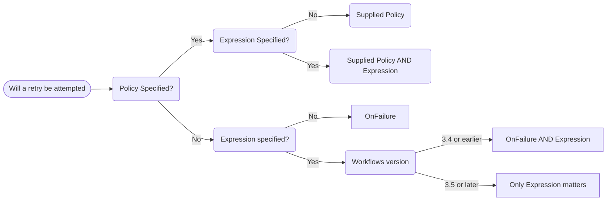
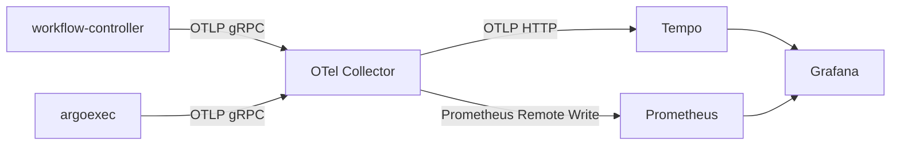
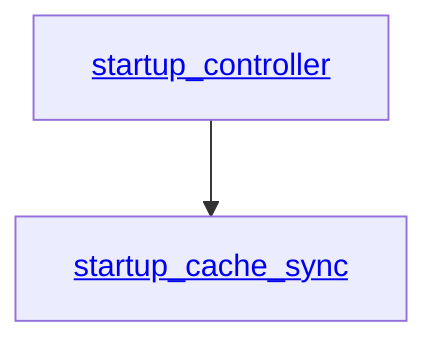

<a id="doc-a54ff182c7e8acf56acfd6e4"></a>

# argoproj/argo-workflows / AGENTS.md

Upstream: https://github.com/argoproj/argo-workflows/blob/98f5436c32cff8b66caae48ccea439f674f5b79c/AGENTS.md

Commit: `98f5436c32cff8b66caae48ccea439f674f5b79c`

Retrieved: 2026-10-01T15:15:07.769489+00:00

Kind: official-document

Raw SHA256: `61fdc73bef78061c2a7efc51d88f9b61c37f774b7feed07c8fbce47a557e9564`

Source text below is untrusted reference content. Acquisition does not verify technical claims.

License status: UPSTREAM_NOTICES_CAPTURED_PER_FILE_REVIEW_REQUIRED. See this repository's captured license files.

---

# Argo Workflows

Kubernetes-native workflow engine: workflows are CRDs, each step runs as a container. Components: `workflow-controller` (reconciles Workflows into pods), `argo-server` (gRPC+HTTP API, hosted inside the `argo` CLI binary), `argoexec` (runs inside workflow pods), and a React UI. Go module `github.com/argoproj/argo-workflows/v4` (imports need `/v4`), vendored deps.

The repo must be checked out at `$GOPATH/src/github.com/argoproj/argo-workflows` or codegen breaks.

Per-directory guidance lives in nested AGENTS.md files: `workflow/controller/AGENTS.md`, `ui/AGENTS.md`, `docs/AGENTS.md`. Read the relevant one before working in those areas — agents that only auto-load CLAUDE.md files must read these explicitly.

## Commands

- Build: `make cli` (`dist/argo`), `make controller`, `make dist/argoexec`.
- Unit tests: `make test`. Single test: `KUBECONFIG=/dev/null go test -run TestFoo ./workflow/controller/`.
- E2E: bring the local stack up first (`make start PROFILE=mysql`), then `make test-<tag>` where `<tag>` is the `//go:build` tag at the top of the test file. Single e2e test: `make TestArtifactServer` (any `Test*` name works as a make target).
- Local dev stack (k3d + Tilt, everything in-cluster with hot reload), ports, profiles, debugging: see docs/running-locally.md.
- Lint: `make lint` (golangci-lint `--fix` + UI lint — commit what `--fix` changes; CI runs `git diff --exit-code`).
- Codegen: `make codegen -B`. Pre-PR: `make pre-commit -B` (= codegen, lint, docs).

## Conventions

- Commits and PRs: follow the checklist in docs/pull-requests.md (DCO sign-off + Conventional Commits enforced by the commit-msg hook, `make pre-commit -B`, feature files for `feat:`, tests required, AI declaration). A bot checks PR descriptions against `.github/pull_request_template.md` and drafts non-conforming PRs.
- Logging is the repo's own `util/logging`, not logrus: level methods take ctx (`logger.Info(ctx, "msg")`); get the logger with `logging.RequireLoggerFromContext(ctx)`; tests use `logging.TestContext(t.Context())`.
- Errors: `errors/` for coded, user-visible `ArgoError`s; `util/errors.IsTransientErr(ctx, err)` for retry decisions.
- Every env var read via `os.Getenv`/`util/env` must be documented in docs/environment-variables.md — `make docs` fails on undocumented or stale entries.

### Generated files — never hand-edit, regenerate with `make codegen -B`

CI regenerates and fails on diff: `pkg/client/`, `*.pb.go`, `generated.proto`, `zz_generated.deepcopy.go`, `openapi_generated.go`, `*.swagger.json`, `api/openapi-spec/`, `api/jsonschema/`, `manifests/install*.yaml`, `manifests/quick-start-*.yaml`, CRDs under `manifests/base/crds/`, `**/mocks/` (mockery), `sdks/java/client`, `sdks/go` — plus several docs/ pages generated from Go source that carry no DO-NOT-EDIT header (see docs/AGENTS.md).

`examples/` are validated by a unit test (a malformed example fails `make test`) and feed the generated `docs/fields.md`.

## Architecture

Entrypoints: `cmd/workflow-controller` → `workflow/controller/` (reconciliation; see workflow/controller/AGENTS.md); `cmd/argo` → `cmd/argo/commands/` (includes `argo server` → `server/`); `cmd/argoexec` → `workflow/executor/`.

Cross-cutting invariants: the executor never writes the Workflow object — outputs travel through `WorkflowTaskResult` CRs merged by the controller. Large node status is compressed and, if still too big, offloaded to SQL (`workflow/hydrator/`, `persist/sqldb/`) — any reader outside the controller must hydrate first.

### Executor (`workflow/executor/`)

`argoexec emissary` is PID 1 wrapping the user command in every container: writes `/var/run/argo/ctr/<name>/exitcode`, waits on ContainerSet dependencies, reads the template from `/var/run/argo/template`. `init`/`wait` (legacy pod layout) or `supervisor` (init-less beta) stage input artifacts before main and run the shared `PostMain` capture sequence after (script result → parameters/artifacts/logs → report outputs). Output capture deliberately uses a background context so termination doesn't lose outputs.

A task's flow is a `Plan` of three phases (Prepare, Run, Collect) over named `Stage`s. Every stage is declared in `workflow/executor/stages.go` (the registry, enforced by a test) and plans are selected per template in `workflow/executor/plan.go`. New executor behaviour is a new stage or a new plan, not a new hand-written sequence in a command.

### Server (`server/`)

`server/apiserver` serves gRPC and grpc-gateway HTTP on one port; artifact up/download endpoints and the embedded UI (`ui/embed.go`) are mounted directly. Auth (`server/auth`) is chosen per-request from the Authorization header: `client` (caller's k8s token, their RBAC), `server` (server's service account), `sso` (OIDC claims mapped to service accounts via RBAC labels); gatekeeper interceptors stash per-request clients in ctx (`auth.GetWfClient(ctx)`). Workflow archive lives in `server/workflowarchive` over `persist/sqldb` (Postgres/MySQL).

`pkg/apiclient` gives every CLI command four transports behind one interface: argo-server gRPC, HTTP1 fallback, offline (lint without a cluster), and direct-kube (no server — service logic runs in-process against the k8s API).

### Shared layers

`workflow/common` (label/annotation keys, container names, `/var/run/argo` paths), `workflow/validate` (lint/submit/controller all share it), `workflow/templateresolution` (resolves `templateRef` chains, caches in `Status.StoredTemplates`), `workflow/artifacts` (driver per storage backend: s3, gcs, azure, oss, hdfs, git, http, raw, plugin), `workflow/sync` (semaphores/mutexes, configmap- or database-backed), `workflow/util` (submit/retry/resubmit operations shared by CLI and server), `workflow/cron`.


<a id="doc-5f75df80dd65618b3853869f"></a>

# argoproj/argo-workflows / CHANGELOG-2-x-x.md

Upstream: https://github.com/argoproj/argo-workflows/blob/98f5436c32cff8b66caae48ccea439f674f5b79c/CHANGELOG-2-x-x.md

Commit: `98f5436c32cff8b66caae48ccea439f674f5b79c`

Retrieved: 2026-10-01T15:15:07.769489+00:00

Kind: official-document

Raw SHA256: `9c6be1cac0f54dd29d562e994234695e2065ea6016b067b11a0fc158a6aa1e11`

Source text below is untrusted reference content. Acquisition does not verify technical claims.

License status: UPSTREAM_NOTICES_CAPTURED_PER_FILE_REVIEW_REQUIRED. See this repository's captured license files.

---

# Changelog for version 2

## v3.0.0-rc1 (2021-02-08)

For v3.0.0-rc1 and later, see [CHANGELOG.md](CHANGELOG.md)

## v2.12.13 (2021-08-18)

Full Changelog: [v2.12.12...v2.12.13](https://github.com/argoproj/argo-workflows/compare/v2.12.12...v2.12.13)

### Selected Changes

* [08c9964d5](https://github.com/argoproj/argo-workflows/commit/08c9964d5049c85621ee1cd2ceaa133944a650aa) Update manifests to v2.12.13
* [17eb51db5](https://github.com/argoproj/argo-workflows/commit/17eb51db5e563d3e7911a42141efe7624ecc4c24) fix: Fix `x509: certificate signed by unknown authority` error (#6566)

<details><summary><h3>Contributors</h3></summary>

* Alex Collins

</details>

## v2.12.12 (2021-08-18)

Full Changelog: [v2.12.11...v2.12.12](https://github.com/argoproj/argo-workflows/compare/v2.12.11...v2.12.12)

### Selected Changes

* [f83ece141](https://github.com/argoproj/argo-workflows/commit/f83ece141ccb7804ffcdd0d9aecbdb016fc97d6b) Update manifests to v2.12.12
* [26df32eb1](https://github.com/argoproj/argo-workflows/commit/26df32eb1af1597bf66c3b5532ff1d995bb5b940) fix: Generate TLS Certificates on startup and only keep in memory (#6540)
* [46d744f01](https://github.com/argoproj/argo-workflows/commit/46d744f010479b34005f8848297131c14a266b76) fix: Remove client private key from client auth REST config (#6506)

<details><summary><h3>Contributors</h3></summary>

* Alex Collins
* David Collom

</details>

## v2.12.11 (2021-04-05)

Full Changelog: [v2.12.10...v2.12.11](https://github.com/argoproj/argo-workflows/compare/v2.12.10...v2.12.11)

### Selected Changes

* [71d00c787](https://github.com/argoproj/argo-workflows/commit/71d00c7878e2b904ad35ca25712bef7e84893ae2) Update manifests to v2.12.11
* [d5e0823f1](https://github.com/argoproj/argo-workflows/commit/d5e0823f1a237bffc56a61601a5d2ef011e66b0e) fix: InsecureSkipVerify true
* [3b6c53af0](https://github.com/argoproj/argo-workflows/commit/3b6c53af00843a17dc2f030e08dec1b1c070e3f2) fix(executor): GODEBUG=x509ignoreCN=0 (#5562)
* [631e55d00](https://github.com/argoproj/argo-workflows/commit/631e55d006a342b20180e6cbd82d10f891e4d60f) feat(server): Enforce TLS >= v1.2 (#5172)

<details><summary><h3>Contributors</h3></summary>

* Alex Collins
* Saravanan Balasubramanian
* Simon Behar

</details>

## v2.12.10 (2021-03-08)

Full Changelog: [v2.12.9...v2.12.10](https://github.com/argoproj/argo-workflows/compare/v2.12.9...v2.12.10)

### Selected Changes

* [f1e0c6174](https://github.com/argoproj/argo-workflows/commit/f1e0c6174b48af69d6e8ecd235a2d709f44f8095) Update manifests to v2.12.10
* [1ecc5c009](https://github.com/argoproj/argo-workflows/commit/1ecc5c0093cbd4e74efbd3063cbe0499ce81d54a) fix(test): Flaky TestWorkflowShutdownStrategy  (#5331)
* [fa8f63c6d](https://github.com/argoproj/argo-workflows/commit/fa8f63c6db3dfc0dfed2fb99f40850beee4f3981) Cherry-pick 5289
* [d56c420b7](https://github.com/argoproj/argo-workflows/commit/d56c420b7af25bca13518180da185ac70380446e) fix: Disallow object names with more than 63 chars (#5324)
* [6ccfe46d6](https://github.com/argoproj/argo-workflows/commit/6ccfe46d68c6ddca231c746d8d0f6444546b20ad) fix: Backward compatible workflowTemplateRef from 2.11.x to  2.12.x (#5314)
* [0ad734623](https://github.com/argoproj/argo-workflows/commit/0ad7346230ef148b1acd5e78de69bd552cb9d49c) fix: Ensure whitespaces is allowed between name and bracket (#5176)

<details><summary><h3>Contributors</h3></summary>

* Saravanan Balasubramanian
* Simon Behar

</details>

## v2.12.9 (2021-02-16)

Full Changelog: [v2.12.8...v2.12.9](https://github.com/argoproj/argo-workflows/compare/v2.12.8...v2.12.9)

### Selected Changes

* [737905345](https://github.com/argoproj/argo-workflows/commit/737905345d70ba1ebd566ce1230e4f971993dfd0) Update manifests to v2.12.9
* [81c07344f](https://github.com/argoproj/argo-workflows/commit/81c07344fe5d84e09284bd1fea4f01239524a842) codegen
* [26d2ec0a1](https://github.com/argoproj/argo-workflows/commit/26d2ec0a10913b7df994f7d354fea2be1db04ea9) cherry-picked 5081
* [92ad730a2](https://github.com/argoproj/argo-workflows/commit/92ad730a28a4eb613b8e5105c9c2ccbb2ed2c3f3) fix: Revert "fix(controller): keep special characters in json string when … … 19da392 …use withItems (#4814)" (#5076)
* [1e868ec1a](https://github.com/argoproj/argo-workflows/commit/1e868ec1adf95dd0e53e7939cc8a9d7834cf8fbf) fix(controller): Fix creator dashes (#5082)

<details><summary><h3>Contributors</h3></summary>

* Alex Collins
* Saravanan Balasubramanian
* Simon Behar

</details>

## v2.12.8 (2021-02-08)

Full Changelog: [v2.12.7...v2.12.8](https://github.com/argoproj/argo-workflows/compare/v2.12.7...v2.12.8)

### Selected Changes

* [d19d4eeed](https://github.com/argoproj/argo-workflows/commit/d19d4eeed3224ea7e854c658d3544663e86cd509) Update manifests to v2.12.8
* [cf3b1980d](https://github.com/argoproj/argo-workflows/commit/cf3b1980dc35c615de53b0d07d13a2c828f94bbf) fix: Fix build
* [a8d0b67e8](https://github.com/argoproj/argo-workflows/commit/a8d0b67e87daac56f310136e56f4dbe5acb98267) fix(cli): Add insecure-skip-verify for HTTP1. Fixes #5008 (#5015)
* [a3134de95](https://github.com/argoproj/argo-workflows/commit/a3134de95090c7b980a741f28dde9ca94650ab18) fix: Skip the Workflow not found error in Concurrency policy (#5030)
* [a60e4105d](https://github.com/argoproj/argo-workflows/commit/a60e4105d0e15ba94625ae83dbd728841576a5ee) fix: Unmark daemoned nodes after stopping them (#5005)

<details><summary><h3>Contributors</h3></summary>

* Alex Collins
* Saravanan Balasubramanian
* Simon Behar

</details>

## v2.12.7 (2021-02-01)

Full Changelog: [v2.12.6...v2.12.7](https://github.com/argoproj/argo-workflows/compare/v2.12.6...v2.12.7)

### Selected Changes

* [5f5150730](https://github.com/argoproj/argo-workflows/commit/5f5150730c644865a5867bf017100732f55811dd) Update manifests to v2.12.7
* [637154d02](https://github.com/argoproj/argo-workflows/commit/637154d02b0829699a31b283eaf9045708d96acf) feat: Support retry on transient errors during executor status checking (#4946)
* [8e7ed235e](https://github.com/argoproj/argo-workflows/commit/8e7ed235e8b4411fda6d0b6c088dd4a6e931ffb9) feat(server): Add Prometheus metrics. Closes #4751 (#4952)

<details><summary><h3>Contributors</h3></summary>

* Alex Collins
* Simon Behar
* Yuan Tang

</details>

## v2.12.6 (2021-01-25)

Full Changelog: [v2.12.5...v2.12.6](https://github.com/argoproj/argo-workflows/compare/v2.12.5...v2.12.6)

### Selected Changes

* [4cb5b7eb8](https://github.com/argoproj/argo-workflows/commit/4cb5b7eb807573e167f3429fb5fc8bf5ade0685d) Update manifests to v2.12.6
* [2696898b3](https://github.com/argoproj/argo-workflows/commit/2696898b3334a08af47bdbabb85a7d9fa1f37050) fix: Mutex not being released on step completion (#4847)
* [067b60363](https://github.com/argoproj/argo-workflows/commit/067b60363f260edf8a680c4cb5fa36cc561ff20a) feat(server): Support email for SSO+RBAC. Closes #4612 (#4644)

<details><summary><h3>Contributors</h3></summary>

* Alex Collins
* Saravanan Balasubramanian
* Simon Behar

</details>

## v2.12.5 (2021-01-19)

Full Changelog: [v2.12.4...v2.12.5](https://github.com/argoproj/argo-workflows/compare/v2.12.4...v2.12.5)

### Selected Changes

* [53f022c3f](https://github.com/argoproj/argo-workflows/commit/53f022c3f740b5a8636d74873462011702403e42) Update manifests to v2.12.5
* [86d7b3b6b](https://github.com/argoproj/argo-workflows/commit/86d7b3b6b4fc4d9336eefea0a0ff44201e35fa47) fix tests
* [633909402](https://github.com/argoproj/argo-workflows/commit/6339094024e23d9dcea1f24981c366e00f36099b) fix tests
* [0c7aa1498](https://github.com/argoproj/argo-workflows/commit/0c7aa1498c900b6fb65b72f82186bab2ff7f0130) fix: Mutex not being released on step completion (#4847)
* [b3742193e](https://github.com/argoproj/argo-workflows/commit/b3742193ef19ffeb33795a39456b3bc1a3a667f5) fix(controller): Consider processed retry node in metrics. Fixes #4846 (#4872)
* [9063a94d6](https://github.com/argoproj/argo-workflows/commit/9063a94d6fc5ab684e3c52c3d99e4dc4a0d034f6) fix(controller): make creator label DNS compliant. Fixes #4880 (#4881)
* [84b44cfdb](https://github.com/argoproj/argo-workflows/commit/84b44cfdb44c077b190070fac98b9ee45c06bfc8) fix(controller): Fix node status when daemon pod deleted but its children nodes are still running (#4683)
* [8cd963520](https://github.com/argoproj/argo-workflows/commit/8cd963520fd2a560b5f2df84c98936c72b894997) fix: Do not error on duplicate workflow creation by cron (#4871)

<details><summary><h3>Contributors</h3></summary>

* Saravanan Balasubramanian
* Simon Behar
* ermeaney
* lonsdale8734

</details>

## v2.12.4 (2021-01-12)

Full Changelog: [v2.12.3...v2.12.4](https://github.com/argoproj/argo-workflows/compare/v2.12.3...v2.12.4)

### Selected Changes

* [f97bef5d0](https://github.com/argoproj/argo-workflows/commit/f97bef5d00361f3d1cbb8574f7f6adf632673008) Update manifests to v2.12.4
* [c521b27e0](https://github.com/argoproj/argo-workflows/commit/c521b27e04e2fc40d69d215cf80808a72ed22f1d) feat: Publish images on Quay.io (#4860)
* [1cd2570c7](https://github.com/argoproj/argo-workflows/commit/1cd2570c75a56b50bc830a5727221082b422d0c9) feat: Publish images to Quay.io (#4854)
* [7eb16e617](https://github.com/argoproj/argo-workflows/commit/7eb16e617034a9798bef3e0d6c51c798a42758ac) fix: Preserve the original slice when removing string (#4835)
* [e64183dbc](https://github.com/argoproj/argo-workflows/commit/e64183dbcb80e8b654acec517487661de7cf7dd4) fix(controller): keep special characters in json string when use withItems (#4814)

<details><summary><h3>Contributors</h3></summary>

* Alex Collins
* Simon Behar
* Song Juchao
* cocotyty
* markterm

</details>

## v2.12.3 (2021-01-04)

Full Changelog: [v2.12.2...v2.12.3](https://github.com/argoproj/argo-workflows/compare/v2.12.2...v2.12.3)

### Selected Changes

* [93ee53012](https://github.com/argoproj/argo-workflows/commit/93ee530126cc1fc154ada84d5656ca82d491dc7f) Update manifests to v2.12.3
* [3ce298e29](https://github.com/argoproj/argo-workflows/commit/3ce298e2972a67267d9783e2c094be5af8b48eb7) fix tests
* [8177b53c2](https://github.com/argoproj/argo-workflows/commit/8177b53c299a7e4fb64bc3b024ad46a3584b6de0) fix(controller): Various v2.12 fixes. Fixes #4798, #4801, #4806 (#4808)
* [19c7bdabd](https://github.com/argoproj/argo-workflows/commit/19c7bdabdc6d4de43896527ec850f14f38678e38) fix: load all supported authentication plugins for k8s client-go (#4802)
* [331aa4ee8](https://github.com/argoproj/argo-workflows/commit/331aa4ee896a83504144175da404c580dbfdc48c) fix(server): Do not silently ignore sso secret creation error (#4775)
* [0bbc082cf](https://github.com/argoproj/argo-workflows/commit/0bbc082cf33a78cc332e75c31321c80c357aa83b) feat(controller): Rate-limit workflows. Closes #4718 (#4726)
* [a60279827](https://github.com/argoproj/argo-workflows/commit/a60279827f50579d2624f4fa150af5d2e9458588) fix(controller): Support default database port. Fixes #4756 (#4757)
* [5d8573581](https://github.com/argoproj/argo-workflows/commit/5d8573581913ae265c869638904ec74b87f07a6b) feat(controller): Enhanced TTL controller scalability (#4736)

<details><summary><h3>Contributors</h3></summary>

* Alex Collins
* Kristoffer Johansson
* Simon Behar

</details>

## v2.12.2 (2020-12-18)

Full Changelog: [v2.12.1...v2.12.2](https://github.com/argoproj/argo-workflows/compare/v2.12.1...v2.12.2)

### Selected Changes

* [7868e7237](https://github.com/argoproj/argo-workflows/commit/7868e723704bcfe1b943bc076c2e0b83777d6267) Update manifests to v2.12.2
* [e8c4aa4a9](https://github.com/argoproj/argo-workflows/commit/e8c4aa4a99a5ea06c8c0cf1807df40e99d86da85) fix(controller): Requeue when the pod was deleted. Fixes #4719 (#4742)
* [11bc9c41a](https://github.com/argoproj/argo-workflows/commit/11bc9c41abb1786bbd06f83bf3222865c7da320c) feat(controller): Pod deletion grace period. Fixes #4719 (#4725)

<details><summary><h3>Contributors</h3></summary>

* Alex Collins

</details>

## v2.12.1 (2020-12-17)

Full Changelog: [v2.12.0...v2.12.1](https://github.com/argoproj/argo-workflows/compare/v2.12.0...v2.12.1)

### Selected Changes

* [9a7e044e2](https://github.com/argoproj/argo-workflows/commit/9a7e044e27b1e342748d9f41ea60d1998b8907ab) Update manifests to v2.12.1
* [d21c45286](https://github.com/argoproj/argo-workflows/commit/d21c452869330658083b5066bd84b6cbd9f1f745) Change argo-server crt/key owner (#4750)

<details><summary><h3>Contributors</h3></summary>

* Daisuke Taniwaki
* Simon Behar

</details>

## v2.12.0 (2020-12-17)

Full Changelog: [v2.12.0-rc6...v2.12.0](https://github.com/argoproj/argo-workflows/compare/v2.12.0-rc6...v2.12.0)

### Selected Changes

* [53029017f](https://github.com/argoproj/argo-workflows/commit/53029017f05a369575a1ff73387bafff9fc9b451) Update manifests to v2.12.0
* [434580669](https://github.com/argoproj/argo-workflows/commit/4345806690634f23427ade69a72bae2e0b289fc7) fix(controller): Fixes resource version misuse. Fixes #4714 (#4741)
* [e192fb156](https://github.com/argoproj/argo-workflows/commit/e192fb15616e3a192e1b4b3db0a596a6c70e2430) fix(executor): Copy main/executor container resources from controller by value instead of reference (#4737)
* [4fb0d96d0](https://github.com/argoproj/argo-workflows/commit/4fb0d96d052136914f3772276f155b92db9289fc) fix(controller): Fix incorrect main container customization precedence and isResourcesSpecified check (#4681)
* [1aac79e9b](https://github.com/argoproj/argo-workflows/commit/1aac79e9bf04d2fb15f080db1359ba09e0c1a257) feat(controller): Allow to configure main container resources (#4656)

<details><summary><h3>Contributors</h3></summary>

* Alex Collins
* Simon Behar
* Yuan Tang

</details>

## v2.12.0-rc6 (2020-12-15)

Full Changelog: [v2.12.0-rc5...v2.12.0-rc6](https://github.com/argoproj/argo-workflows/compare/v2.12.0-rc5...v2.12.0-rc6)

### Selected Changes

* [e55b886ed](https://github.com/argoproj/argo-workflows/commit/e55b886ed4706a403a8895b2819b168bd638b256) Update manifests to v2.12.0-rc6
* [1fb0d8b97](https://github.com/argoproj/argo-workflows/commit/1fb0d8b970f95e98a324e106f431b4782eb2b88f) fix(controller): Fixed workflow stuck with mutex lock (#4744)
* [4059820ea](https://github.com/argoproj/argo-workflows/commit/4059820ea4c0fd7c278c3a8b5cf05cb00c2e3380) fix(executor): Always check if resource has been deleted in checkResourceState() (#4738)
* [739af45b5](https://github.com/argoproj/argo-workflows/commit/739af45b5cf018332d9c5397e6beda826cf4a143) fix(ui): Fix YAML for workflows with storedWorkflowTemplateSpec. Fixes #4691 (#4695)
* [359803433](https://github.com/argoproj/argo-workflows/commit/3598034335bb6eb9bb95dd79375570e19bb07e1e) fix: Allow Bearer token in server mode (#4735)
* [bf589b014](https://github.com/argoproj/argo-workflows/commit/bf589b014cbe81d1ba46b3a08d9426e97c2683c3) fix(executor): Deal with the pod watch API call timing out (#4734)
* [fabf20b59](https://github.com/argoproj/argo-workflows/commit/fabf20b5928cc1314e20e9047a9b122fdbe5ed62) fix(controller): Increate default EventSpamBurst in Eventrecorder (#4698)

<details><summary><h3>Contributors</h3></summary>

* Alex Collins
* Saravanan Balasubramanian
* Simon Behar
* Yuan Tang
* hermanhobnob

</details>

## v2.12.0-rc5 (2020-12-10)

Full Changelog: [v2.12.0-rc4...v2.12.0-rc5](https://github.com/argoproj/argo-workflows/compare/v2.12.0-rc4...v2.12.0-rc5)

### Selected Changes

* [3aa86fffb](https://github.com/argoproj/argo-workflows/commit/3aa86fffb7c975e3a39302f5b2e37f99fe58fa4f) Update manifests to v2.12.0-rc5
* [3581a1e77](https://github.com/argoproj/argo-workflows/commit/3581a1e77c927830908ba42f9b63b31c28501346) fix: Consider optional artifact arguments (#4672)
* [50210fc38](https://github.com/argoproj/argo-workflows/commit/50210fc38bdd80fec1c1affd9836b8b0fcf41e31) feat(controller): Use deterministic name for cron workflow children (#4638)
* [3a4e974c0](https://github.com/argoproj/argo-workflows/commit/3a4e974c0cf14ba24df70258a5b5ae19a966397d) fix(controller): Only patch status.active in cron workflows when syncing (#4659)
* [2aaad26fe](https://github.com/argoproj/argo-workflows/commit/2aaad26fe129a6c4eeccb60226941b14664aca4a) fix(ui): DataLoaderDropdown fix input type from promise to function that (#4655)
* [72ca92cb4](https://github.com/argoproj/argo-workflows/commit/72ca92cb4459007968b13e097ef68f3e307454ce) fix: Count Workflows with no phase as Pending for metrics (#4628)
* [8ea219b86](https://github.com/argoproj/argo-workflows/commit/8ea219b860bc85622c120d495860d8a62eb67e5a) fix(ui): Reference secrets in EnvVars. Fixes #3973  (#4419)
* [3b35ba2bd](https://github.com/argoproj/argo-workflows/commit/3b35ba2bdee31c8d512acf145c10bcb3f73d7286) fix: derive jsonschema and fix up issues, validate examples dir… (#4611)
* [2f49720aa](https://github.com/argoproj/argo-workflows/commit/2f49720aa7bea619b8691cb6d9e41b20971a178e) fix(ui): Fixed reconnection hot-loop. Fixes #4580 (#4663)
* [4f8e4a515](https://github.com/argoproj/argo-workflows/commit/4f8e4a515dbde688a23147a40625198e1f9b91a0) fix(controller): Cleanup the synchronize  pending queue once Workflow deleted (#4664)
* [128598478](https://github.com/argoproj/argo-workflows/commit/128598478bdd6a5d35d76101feb85c04b4d6c7a8) fix(controller): Deal with hyphen in creator. Fixes #4058 (#4643)
* [2d05d56ea](https://github.com/argoproj/argo-workflows/commit/2d05d56ea0af726f9a0906f72119105f27453ff9) feat(controller): Make MAX_OPERATION_TIME configurable. Close #4239 (#4562)
* [c00ff7144](https://github.com/argoproj/argo-workflows/commit/c00ff7144bda39995823b8f0e3668c88958d9736) fix: Fix TestCleanFieldsExclude (#4625)

<details><summary><h3>Contributors</h3></summary>

* Alex Collins
* Paul Brabban
* Saravanan Balasubramanian
* Simon Behar
* aletepe
* tczhao

</details>

## v2.12.0-rc4 (2020-12-02)

Full Changelog: [v2.12.0-rc3...v2.12.0-rc4](https://github.com/argoproj/argo-workflows/compare/v2.12.0-rc3...v2.12.0-rc4)

### Selected Changes

* [e34bc3b72](https://github.com/argoproj/argo-workflows/commit/e34bc3b7237669ae1d0a800f8210a462cb6e4cfa) Update manifests to v2.12.0-rc4
* [feea63f02](https://github.com/argoproj/argo-workflows/commit/feea63f029f2416dc7002852c5541a9638a03d72) feat(executor): More informative log when executors do not support output param from base image layer (#4620)
* [65f5aefef](https://github.com/argoproj/argo-workflows/commit/65f5aefefe592f11a387b5db715b4895e47e1af1) fix(argo-server): fix global variable validation error with reversed dag.tasks (#4369)
* [e6870664e](https://github.com/argoproj/argo-workflows/commit/e6870664e16db166529363f85ed90632f66ca9de) fix(server): Correct webhook event payload marshalling. Fixes #4572 (#4594)
* [b1d682e71](https://github.com/argoproj/argo-workflows/commit/b1d682e71c8f3f3a66b71d47f8db22db55637629) fix: Perform fields filtering server side (#4595)
* [61b670481](https://github.com/argoproj/argo-workflows/commit/61b670481cb693b25dfc0186ff28dfe29dfa9353) fix: Null check pagination variable (#4617)
* [ace0ee1b2](https://github.com/argoproj/argo-workflows/commit/ace0ee1b23273ac982d0c8885d50755608849258) fix(executor): Fixed waitMainContainerStart returning prematurely. Closes #4599 (#4601)
* [f03f99ef6](https://github.com/argoproj/argo-workflows/commit/f03f99ef69b60e91f2dc08c6729ba58d27e56d1d) refactor: Use polling model for workflow phase metric (#4557)
* [8e887e731](https://github.com/argoproj/argo-workflows/commit/8e887e7315a522998e810021d10334e860a3b307) fix(executor): Handle sidecar killing in a process-namespace-shared pod (#4575)
* [991fa6747](https://github.com/argoproj/argo-workflows/commit/991fa6747bce82bef9919384925e0a6b2f7f3668) fix(server): serve artifacts directly from disk to support large artifacts (#4589)
* [2eeb1fcef](https://github.com/argoproj/argo-workflows/commit/2eeb1fcef6896e0518c3ab1d1cd715de93fe4c41) fix(server): use the correct name when downloading artifacts (#4579)
* [d1a37d5fb](https://github.com/argoproj/argo-workflows/commit/d1a37d5fbabc1f3c90b15a266858d207275e31ab) feat(controller): Retry transient offload errors. Resolves #4464 (#4482)

<details><summary><h3>Contributors</h3></summary>

* Alex Collins
* Daisuke Taniwaki
* Simon Behar
* Yuan Tang
* dherman
* fsiegmund
* zhengchenyu

</details>

## v2.12.0-rc3 (2020-11-23)

Full Changelog: [v2.12.0-rc2...v2.12.0-rc3](https://github.com/argoproj/argo-workflows/compare/v2.12.0-rc2...v2.12.0-rc3)

### Selected Changes

* [85cafe6e8](https://github.com/argoproj/argo-workflows/commit/85cafe6e882f9a49e402c29d14e04ded348b07b2) Update manifests to v2.12.0-rc3
* [916b4549b](https://github.com/argoproj/argo-workflows/commit/916b4549b9b4e2a74902aea16cfc04996dccb263) feat(ui): Add Template/Cron workflow filter to workflow page. Closes #4532 (#4543)
* [48af02445](https://github.com/argoproj/argo-workflows/commit/48af024450f6a395ca887073343d3296d69d836a) fix: executor/pns containerid prefix fix (#4555)
* [53195ed56](https://github.com/argoproj/argo-workflows/commit/53195ed56029c639856a395ed5c92db82d49a2d9) fix: Respect continueOn for leaf tasks (#4455)
* [7e121509c](https://github.com/argoproj/argo-workflows/commit/7e121509c6745dc7f6fa40cc35790012521f1f12) fix(controller): Correct default port logic (#4547)
* [a712e535b](https://github.com/argoproj/argo-workflows/commit/a712e535bec3b196219188236d4063ecc1153ba4) fix: Validate metric key names (#4540)
* [c469b053f](https://github.com/argoproj/argo-workflows/commit/c469b053f8ca27ca03d36343fa17277ad374edc9) fix: Missing arg lines caused files not to copy into containers (#4542)
* [0980ead36](https://github.com/argoproj/argo-workflows/commit/0980ead36d39620c914e04e2aa207e688a631e9a) fix(test): fix TestWFDefaultWithWFTAndWf flakiness (#4538)
* [564e69f3f](https://github.com/argoproj/argo-workflows/commit/564e69f3fdef6239f9091401ec4472bd8bd248bd) fix(ui): Do not auto-reload doc.location. Fixes #4530 (#4535)
* [176d890c1](https://github.com/argoproj/argo-workflows/commit/176d890c1cac25856f67fbed4cc39a396aa87a93) fix(controller): support float for param value (#4490)
* [4bacbc121](https://github.com/argoproj/argo-workflows/commit/4bacbc121ae028557b7f0718f02fbb25e8e63850) feat(controller): make sso timeout configurable via cm (#4494)
* [02e1f0e0d](https://github.com/argoproj/argo-workflows/commit/02e1f0e0d1c8ad8422984000bb2b49dc3709b1a0) fix(server): Add `list sa` and `create secret` to `argo-server` roles. Closes #4526 (#4514)
* [d0082e8fb](https://github.com/argoproj/argo-workflows/commit/d0082e8fb87fb731c7247f28da0c1b29b6fa3f02) fix: link templates not replacing multiple templates with same name (#4516)
* [411bde37c](https://github.com/argoproj/argo-workflows/commit/411bde37c2b146c1fb52d913bf5629a36e0a5af1) feat: adds millisecond-level timestamps to argo and workflow-controller (#4518)
* [2c54ca3fb](https://github.com/argoproj/argo-workflows/commit/2c54ca3fbee675815566508fc10c137e7b4f9f2f) add bonprix to argo users (#4520)

<details><summary><h3>Contributors</h3></summary>

* Alex Collins
* Alexander Mikhailian
* Arghya Sadhu
* Boolman
* David Gibbons
* Espen Finnesand
* Lennart Kindermann
* Ludovic Cléroux
* Oleg Borodai
* Saravanan Balasubramanian
* Simon Behar
* Yuan Tang
* Zach
* tczhao

</details>

## v2.12.0-rc2 (2020-11-12)

Full Changelog: [v2.12.0-rc1...v2.12.0-rc2](https://github.com/argoproj/argo-workflows/compare/v2.12.0-rc1...v2.12.0-rc2)

### Selected Changes

* [f509fa550](https://github.com/argoproj/argo-workflows/commit/f509fa550b0694907bb9447084df11af171f9cc9) Update manifests to v2.12.0-rc2
* [2dab2d158](https://github.com/argoproj/argo-workflows/commit/2dab2d15868c5f52ca4e3f7ba1c5276d55c26a42) fix(test):  fix TestWFDefaultWithWFTAndWf flakiness (#4507)
* [64ae33034](https://github.com/argoproj/argo-workflows/commit/64ae33034d30a943dca71b0c5e4ebd97018448bf) fix(controller): prepend script path to the script template args. Resolves #4481 (#4492)
* [0931baf5f](https://github.com/argoproj/argo-workflows/commit/0931baf5fbe48487278b9a6c2fa206ab02406e5b) feat: Redirect to requested URL after SSO login (#4495)
* [465447c03](https://github.com/argoproj/argo-workflows/commit/465447c039a430f675a2c0cc10e71e7024fc79a3) fix: Ensure ContainerStatus in PNS is terminated before continuing (#4469)
* [f7287687b](https://github.com/argoproj/argo-workflows/commit/f7287687b61c7e2d8e27864e9768c216a53fd071) fix(ui): Check node children before counting them. (#4498)
* [bfc13c3f5](https://github.com/argoproj/argo-workflows/commit/bfc13c3f5b9abe2980826dee1283433b7cb22385) fix: Ensure redirect to login when using empty auth token (#4496)
* [d56ce890c](https://github.com/argoproj/argo-workflows/commit/d56ce890c900c300bd396c5050cea9fb2b4aa358) feat(cli): add selector and field-selector option to terminate (#4448)
* [e501fcca1](https://github.com/argoproj/argo-workflows/commit/e501fcca16a908781a786b93417cc41644b62ea4) fix(controller): Refactor the Merge Workflow, WorkflowTemplate and WorkflowDefaults (#4354)
* [2ee3f5a71](https://github.com/argoproj/argo-workflows/commit/2ee3f5a71f4791635192d7cd4e1b583d80e81077) fix(ui): fix the `all` option in the workflow archive list (#4486)

<details><summary><h3>Contributors</h3></summary>

* Noah Hanjun Lee
* Saravanan Balasubramanian
* Simon Behar
* Vlad Losev
* dherman
* ivancili

</details>

## v2.12.0-rc1 (2020-11-06)

Full Changelog: [v2.11.8...v2.12.0-rc1](https://github.com/argoproj/argo-workflows/compare/v2.11.8...v2.12.0-rc1)

### Selected Changes

* [98be709d8](https://github.com/argoproj/argo-workflows/commit/98be709d88647a10231825f13aff03d08217a35a) Update manifests to v2.12.0-rc1
* [a441a97bd](https://github.com/argoproj/argo-workflows/commit/a441a97bd53a92b8cc5fb918edd1f66701d1cf5c) refactor(server): Use patch instead of update to resume/suspend (#4468)
* [9ecf04991](https://github.com/argoproj/argo-workflows/commit/9ecf0499195b05bac1bb9fe6268c7d77bc12a963) fix(controller): When semaphore lock config gets updated, enqueue the waiting workflows (#4421)
* [c31d1722e](https://github.com/argoproj/argo-workflows/commit/c31d1722e6e5f800a62b30e9773c5e6049c243f5) feat(cli): Support ARGO_HTTP1 for HTTP/1 CLI requests. Fixes #4394 (#4416)
* [6c5ab7804](https://github.com/argoproj/argo-workflows/commit/6c5ab7804d708981e250f1af6b8cb4e78c2291a7) feat: Add the --no-utf8 parameter to `argo get` command (#4449)
* [933a4db0c](https://github.com/argoproj/argo-workflows/commit/933a4db0cfdc3b39309b83dcc8105e4424df4775) refactor: Simplify grpcutil.TranslateError (#4465)
* [d752e2fa4](https://github.com/argoproj/argo-workflows/commit/d752e2fa4fd69204e2c5989c8adceeb19963f2d4) feat: Add resume/suspend endpoints for CronWorkflows (#4457)
* [42d060500](https://github.com/argoproj/argo-workflows/commit/42d060500a04fce181b09cb7f1cec108a9b8b522) fix: localhost not being resolved. Resolves #4460, #3564 (#4461)
* [59843e1fa](https://github.com/argoproj/argo-workflows/commit/59843e1faa91ab30e06e550d1df8e81adfcdac71) fix(controller): Trigger no of workflows based on available lock (#4413)
* [1be03db7e](https://github.com/argoproj/argo-workflows/commit/1be03db7e7604fabbbfce58eb45776d583d9bdf1) fix: Return copy of stored templates to ensure they are not modified (#4452)
* [854883bde](https://github.com/argoproj/argo-workflows/commit/854883bdebd6ea07937a2860d8f3287c9a079709) fix(controller): Fix throttler. Fixes #1554 and #4081 (#4132)
* [3e451114d](https://github.com/argoproj/argo-workflows/commit/3e451114d58bc0c5a210dda15a4b264aeed635a6) fix(docs): timezone DST note on Cronworkflow (#4429)
* [f4f68a746](https://github.com/argoproj/argo-workflows/commit/f4f68a746b7d0c5e2e71f99d69307b86d03b69c1) fix: Resolve inconsistent CronWorkflow persistence (#4440)
* [da93545f6](https://github.com/argoproj/argo-workflows/commit/da93545f687bfb3235d79ba31f6651da9b77ff66) feat(server): Add WorkflowLogs API. See #4394 (#4450)
* [3960a0ee5](https://github.com/argoproj/argo-workflows/commit/3960a0ee5daecfbde241d0a46b0179c88bad6b61) fix: Fix validation with Argo Variable in activeDeadlineSeconds (#4451)
* [dedf0521e](https://github.com/argoproj/argo-workflows/commit/dedf0521e8e799051cd3cde8c29ee419bb4a68f9) feat(ui): Visualisation of the suspended CronWorkflows in the list. Fixes #4264 (#4446)
* [0d13f40d6](https://github.com/argoproj/argo-workflows/commit/0d13f40d673ca5da6ba6066776d8d01d297671c0) fix(controller): Tolerate int64 parameters. Fixes #4359 (#4401)
* [2628be91e](https://github.com/argoproj/argo-workflows/commit/2628be91e4a19404c66c7d16b8fbc02b475b6399) fix(server): Only try to use auth-mode if enabled. Fixes #4400 (#4412)
* [7f2ff80f1](https://github.com/argoproj/argo-workflows/commit/7f2ff80f130b3cd5834b4c49ab6c1692dd93a76c) fix: Assume controller is in UTC when calculating NextScheduledRuntime (#4417)
* [45fbc951f](https://github.com/argoproj/argo-workflows/commit/45fbc951f51eee34151d51aa1cea3426efa1595f) fix(controller): Design-out event errors. Fixes #4364 (#4383)
* [5a18c674b](https://github.com/argoproj/argo-workflows/commit/5a18c674b43d304165efc16ca92635971bb21074) fix(docs): update link to container spec (#4424)
* [8006da129](https://github.com/argoproj/argo-workflows/commit/8006da129122a4e0046e0d016924d73af88be398) fix: Add x-frame config option (#4420)
* [462e55e97](https://github.com/argoproj/argo-workflows/commit/462e55e97467330f30248b1f9d1dd12e2ee93fa3) fix: Ensure resourceDuration variables in metrics are always in seconds (#4411)
* [3aeb1741e](https://github.com/argoproj/argo-workflows/commit/3aeb1741e720a7e7e005321451b2701f263ed85a) fix(executor): artifact chmod should only if err != nil (#4409)
* [2821e4e8f](https://github.com/argoproj/argo-workflows/commit/2821e4e8fe27d744256b1621a81ac4ce9d1da68c) fix: Use correct template when processing metrics (#4399)
* [e8f826147](https://github.com/argoproj/argo-workflows/commit/e8f826147cebc1a04ced90044689319f8e8c9a14) fix(validate): Local parameters should be validated locally. Fixes #4326 (#4358)
* [ddd45b6e8](https://github.com/argoproj/argo-workflows/commit/ddd45b6e8a2754e872a9a36a037d0288d617e9e3) fix(ui): Reconnect to DAG. Fixes #4301 (#4378)
* [252c46335](https://github.com/argoproj/argo-workflows/commit/252c46335f544617d675e733fe417729b37846e0) feat(ui): Sign-post examples and the catalog. Fixes #4360 (#4382)
* [334d1340f](https://github.com/argoproj/argo-workflows/commit/334d1340f32d927fa119bdebd1318977f7a3b159) feat(server): Enable RBAC for SSO. Closes #3525 (#4198)
* [e409164ba](https://github.com/argoproj/argo-workflows/commit/e409164ba37ae0b75ee995d206498b1c750b486e) fix(ui): correct log viewer only showing first log line (#4389)
* [28bdb6fff](https://github.com/argoproj/argo-workflows/commit/28bdb6ffff8308677af6d8ccf7b0ea70b53bb2fd) fix(ui): Ignore running workflows in report. Fixes #4387 (#4397)
* [7ace8f85f](https://github.com/argoproj/argo-workflows/commit/7ace8f85f1cb9cf716a30a53da2a78c07d3e13fc) fix(controller): Fix estimation bug. Fixes #4386 (#4396)
* [bdac65b09](https://github.com/argoproj/argo-workflows/commit/bdac65b09750ee0afe7bd3697792d9e4b3a10255) fix(ui): correct typing errors in workflow-drawer (#4373)
* [db5e28ed2](https://github.com/argoproj/argo-workflows/commit/db5e28ed26f4c35e0c429907c930cd098717c32e) fix: Use DeletionHandlingMetaNamespaceKeyFunc in cron controller (#4379)
* [99d33eed5](https://github.com/argoproj/argo-workflows/commit/99d33eed5b953952762dbfed4f44384bcbd46e8b) fix(server): Download artifacts from UI. Fixes #4338 (#4350)
* [db8a6d0b5](https://github.com/argoproj/argo-workflows/commit/db8a6d0b5a13259b6705b222e28dab1d0f999dc7) fix(controller): Enqueue the front workflow if semaphore lock is available (#4380)
* [933ba8340](https://github.com/argoproj/argo-workflows/commit/933ba83407b9e33e5d6e16660d28c33782d122df) fix: Fix intstr nil dereference (#4376)
* [220ac736c](https://github.com/argoproj/argo-workflows/commit/220ac736c1297c566667d3fb621a9dadea955c76) fix(controller): Only warn if cron job missing. Fixes #4351 (#4352)
* [dbbe95ccc](https://github.com/argoproj/argo-workflows/commit/dbbe95ccca01d985c5fbb81a2329f0bdb7fa5b1d) Use '[[:blank:]]' instead of ' ' to match spaces/tabs (#4361)
* [b03bd12a4](https://github.com/argoproj/argo-workflows/commit/b03bd12a463e3375bdd620c4fda85846597cdad4) fix: Do not allow tasks using 'depends' to begin with a digit (#4218)
* [b76246e28](https://github.com/argoproj/argo-workflows/commit/b76246e2894def70f4ad6902d05e64e3db0224ac) fix(executor): Increase pod patch backoff. Fixes #4339 (#4340)
* [ec671ddce](https://github.com/argoproj/argo-workflows/commit/ec671ddceb1c8d18fa0410e22106659a1572683c) feat(executor): Wait for termination using pod watch for PNS and K8SAPI executors. (#4253)
* [3156559b4](https://github.com/argoproj/argo-workflows/commit/3156559b40afe4248a3fd124a9611992e7459930) fix: ui/package.json & ui/yarn.lock to reduce vulnerabilities (#4342)
* [f5e23f79d](https://github.com/argoproj/argo-workflows/commit/f5e23f79da253d3b29f718b71251ece464fd88f2) refactor: De-couple config (#4307)
* [37a2ae06e](https://github.com/argoproj/argo-workflows/commit/37a2ae06e05ec5698c902f76dc231cf839ac2041) fix(ui): correct typing errors in events-panel (#4334)
* [03ef9d615](https://github.com/argoproj/argo-workflows/commit/03ef9d615bac1b38309189e77b38235aaa7f5713) fix(ui): correct typing errors in workflows-toolbar (#4333)
* [4de64c618](https://github.com/argoproj/argo-workflows/commit/4de64c618dea85334c0fa04a4dbc310629335c47) fix(ui): correct typing errors in cron-workflow-details (#4332)
* [939d8c301](https://github.com/argoproj/argo-workflows/commit/939d8c30153b4f7d82da9b2df13aa235d3118070) feat(controller): add enum support in parameters (fixes #4192) (#4314)
* [e14f4f922](https://github.com/argoproj/argo-workflows/commit/e14f4f922ff158b1fa1e0592fc072474e3257bd9) fix(executor): Fix the artifacts option in k8sapi and PNS executor Fixes#4244 (#4279)
* [ea9db4362](https://github.com/argoproj/argo-workflows/commit/ea9db43622c6b035b5cf800bb4cb112fcace7eac) fix(cli): Return exit code on Argo template lint command (#4292)
* [aa4a435b4](https://github.com/argoproj/argo-workflows/commit/aa4a435b4892f7881f4eeeb03d3d8e24ee4695ef) fix(cli): Fix panic on argo template lint without argument (#4300)
* [20b3b1baf](https://github.com/argoproj/argo-workflows/commit/20b3b1baf7c06d288134e638e6107339f9c4ec3a) fix: merge artifact arguments from workflow template. Fixes #4296 (#4316)
* [40648bcfe](https://github.com/argoproj/argo-workflows/commit/40648bcfe98828796edcac73548d681ffe9f0853) Update USERS.md (#4322)
* [07b2ef62f](https://github.com/argoproj/argo-workflows/commit/07b2ef62f44f94d90a2fff79c47f015ceae40b8d) fix(executor): Retrieve containerId from cri-containerd /proc/{pid}/cgroup. Fixes #4302 (#4309)
* [e6b024900](https://github.com/argoproj/argo-workflows/commit/e6b02490042065990f1f0053d0be0abb89c90d5e) feat(controller): Allow whitespace in variable substitution. Fixes #4286 (#4310)
* [9119682b0](https://github.com/argoproj/argo-workflows/commit/9119682b016e95b8ae766bf7d2688b981a267736) fix(build): Some minor Makefile fixes (#4311)
* [db20b4f2c](https://github.com/argoproj/argo-workflows/commit/db20b4f2c7ecf4388f70a5e422dc19fc78c4e753) feat(ui): Submit resources without namespace to current namespace. Fixes #4293 (#4298)
* [26f39b6d1](https://github.com/argoproj/argo-workflows/commit/26f39b6d1aff8bee60826dde5b7e58d09e38d1ee) fix(ci): add non-root user to Dockerfile (#4305)
* [1cc68d893](https://github.com/argoproj/argo-workflows/commit/1cc68d8939a7e144a798687f6d8b8ecc8c0f4195) fix(ui): undefined namespace in constructors (#4303)
* [e54bf815d](https://github.com/argoproj/argo-workflows/commit/e54bf815d6494aa8c466eea6caec6165249a3003) fix(controller): Patch rather than update cron workflows. (#4294)
* [9157ef2ad](https://github.com/argoproj/argo-workflows/commit/9157ef2ad60920866ca029711f4a7cb5705771d0) fix: TestMutexInDAG failure in master (#4283)
* [2d6f4e66f](https://github.com/argoproj/argo-workflows/commit/2d6f4e66fd8ad8d0535afc9a328fc090a5700c30) fix: WorkflowEventBinding typo in aggregated roles (#4287)
* [c02bb7f0b](https://github.com/argoproj/argo-workflows/commit/c02bb7f0bb50e18cdf95f2bbd2305be6d065d006) fix(controller): Fix argo retry with PVCs. Fixes #4275 (#4277)
* [c0423a223](https://github.com/argoproj/argo-workflows/commit/c0423a2238399f5db9e39618c93c8212e359831c) fix(ui): Ignore missing nodes in DAG. Fixes #4232 (#4280)
* [58144290d](https://github.com/argoproj/argo-workflows/commit/58144290d78e038fbcb7dbbdd6db291ff0a6aa86) fix(controller): Fix cron-workflow re-apply error. (#4278)
* [c605c6d73](https://github.com/argoproj/argo-workflows/commit/c605c6d73452b8dff899c0ff1b166c726181dd9f) fix(controller): Synchronization lock didn't release on DAG call flow Fixes #4046 (#4263)
* [3cefc1471](https://github.com/argoproj/argo-workflows/commit/3cefc1471f62f148221713ad80660c50f224ff92) feat(ui): Add a nudge for users who have not set their security context. Closes #4233  (#4255)
* [a461b076b](https://github.com/argoproj/argo-workflows/commit/a461b076bc044c6cca04744be4c692e2edd44eb2) feat(cli): add `--field-selector` option for `delete` command (#4274)
* [4c4234537](https://github.com/argoproj/argo-workflows/commit/4c42345374346c07852d3ea57d481832ebb42154) feat(controller): Track N/M progress. See #2717 (#4194)
* [afbb957a8](https://github.com/argoproj/argo-workflows/commit/afbb957a890fc1c2774a54b83887e586558e5a87) fix: Add WorkflowEventBinding to aggregated roles (#4268)
* [6ce6bf499](https://github.com/argoproj/argo-workflows/commit/6ce6bf499a3a68b95eb9de3ef3748e34e4da022f) fix(controller): Make the delay before the first workflow reconciliation configurable. Fixes #4107 (#4224)
* [346292b1b](https://github.com/argoproj/argo-workflows/commit/346292b1b0152d5bfdc0387a8b2c11b5d6d5bac1) feat(controller): Reduce reconcilliation time by exiting earlier. (#4225)
* [407ac3498](https://github.com/argoproj/argo-workflows/commit/407ac3498846d8879d785e985b88695dbf693f43) fix(ui): Revert bad part of commit (#4248)
* [eaae2309d](https://github.com/argoproj/argo-workflows/commit/eaae2309dcd89435c657d8e647968f0f1e13bcae) fix(ui): Fix bugs with DAG view. Fixes #4232 & #4236 (#4241)
* [04f7488ab](https://github.com/argoproj/argo-workflows/commit/04f7488abea14544880ac7957d873963b13112cc) feat(ui): Adds a report page which shows basic historical workflow metrics. Closes #3557 (#3558)
* [a545a53f6](https://github.com/argoproj/argo-workflows/commit/a545a53f6e1d03f9b016c8032c05a377a79bfbcc) fix(controller): Check the correct object for Cronworkflow reapply error log (#4243)
* [ec7a5a402](https://github.com/argoproj/argo-workflows/commit/ec7a5a40227979703c7e9a39a8419be6270e4805) fix(Makefile): removed deprecated k3d cmds. Fixes #4206 (#4228)
* [1706a3954](https://github.com/argoproj/argo-workflows/commit/1706a3954a7ec0aad2ff3f5c7ba47e010b87d207) fix: Increase deafult number of CronWorkflow workers (#4215)
* [50f231819](https://github.com/argoproj/argo-workflows/commit/50f23181911998c13096dd15980380e1ecaeaa2d) feat(cli): Print 'no resource msg' when `argo list` returns zero workflows (#4166)
* [2143a5019](https://github.com/argoproj/argo-workflows/commit/2143a5019df31b7d2d6ccb86b81ac70b98714827) fix(controller): Support workflowDefaults on TTLController for WorkflowTemplateRef Fixes #4188 (#4195)
* [cac10f130](https://github.com/argoproj/argo-workflows/commit/cac10f1306ae6f28eee4b2485f802b7512920474) fix(controller): Support int64 for param value. Fixes #4169 (#4202)
* [e910b7015](https://github.com/argoproj/argo-workflows/commit/e910b70159f6f92ef3dacf6382b42b430e15a388) feat: Controller/server runAsNonRoot. Closes #1824 (#4184)
* [4bd5fe10a](https://github.com/argoproj/argo-workflows/commit/4bd5fe10a2ef4f36acd5be7523f72bdbdb7e150c) fix(controller): Apply Workflow default on normal workflow scenario Fixes #4208 (#4213)
* [b17b569ea](https://github.com/argoproj/argo-workflows/commit/b17b569eae0b518a649790daf9e4af87b900a91e) fix(controller): reduce withItem/withParams memory usage. Fixes #3907 (#4207)
* [524049f01](https://github.com/argoproj/argo-workflows/commit/524049f01b00d1fb04f169860217553869b79b53) fix: Revert "chore: try out pre-pushing linux/amd64 images and updating ma… Fixes #4216 (#4217)
* [9c08433f3](https://github.com/argoproj/argo-workflows/commit/9c08433f37dde41fbe7dbae32e97c4b3f70e8081) feat(executor): Decompress zip file input artifacts. Fixes #3585 (#4068)
* [14650339d](https://github.com/argoproj/argo-workflows/commit/14650339df95916d7a676354289d4dfac1ea7776) fix(executor): Update executor retry config for ExponentialBackoff. (#4196)
* [2b127625a](https://github.com/argoproj/argo-workflows/commit/2b127625a837e6225b9b803523e02b617df9cb20) fix(executor): Remove IsTransientErr check for ExponentialBackoff. Fixes #4144 (#4149)
* [f7e85f04b](https://github.com/argoproj/argo-workflows/commit/f7e85f04b11fd65e45b9408d5413be3bbb95e5cb) feat(server): Make Argo Server issue own JWE for SSO. Fixes #4027 & #3873 (#4095)
* [951d38f8e](https://github.com/argoproj/argo-workflows/commit/951d38f8eb19460268d9640dce8f94d3287ff6e2) refactor: Refactor Synchronization code (#4114)
* [9319c074e](https://github.com/argoproj/argo-workflows/commit/9319c074e742c5d9cb97d6c5bbbf076afe886f76) fix(ui): handle logging disconnects gracefully (#4150)
* [6265c7091](https://github.com/argoproj/argo-workflows/commit/6265c70915de42e4eb5c472379743a44d283e463) fix: Ensure CronWorkflows are persisted once per operation (#4172)
* [2a992aee7](https://github.com/argoproj/argo-workflows/commit/2a992aee733aaa73bb43ab1c4ff3b7919ee8b640) fix: Provide helpful hint when creating workflow with existing name (#4156)
* [de3a90dd1](https://github.com/argoproj/argo-workflows/commit/de3a90dd155023ede63a537c113ac0e58e6c6c73) refactor: upgrade argo-ui library version (#4178)
* [b7523369b](https://github.com/argoproj/argo-workflows/commit/b7523369bb6d278c504d1e90cd96d1dbe7f8f6d6) feat(controller): Estimate workflow & node duration. Closes #2717 (#4091)
* [c468b34d1](https://github.com/argoproj/argo-workflows/commit/c468b34d1b7b26d36d2f7a365e71635d1d6cb0db) fix(controller): Correct unstructured API version. Caused by #3719 (#4148)
* [de81242ec](https://github.com/argoproj/argo-workflows/commit/de81242ec681003d65b84862f6584d075889f523) fix: Render full tree of onExit nodes in UI (#4109)
* [109876e62](https://github.com/argoproj/argo-workflows/commit/109876e62f239397accbd451bb1b52a775998f36) fix: Changing DeletePropagation to background in TTL Controller and Argo CLI (#4133)
* [1e10e0ccb](https://github.com/argoproj/argo-workflows/commit/1e10e0ccbf366fa9052ad720373dc11a4d2cb671) Documentation (#4122)
* [b3682d4f1](https://github.com/argoproj/argo-workflows/commit/b3682d4f117cecf1fe6d2a54c281870f15e201a1) fix(cli): add validate args in delete command (#4142)
* [373543d11](https://github.com/argoproj/argo-workflows/commit/373543d114bfba727ef60645c3d9cb05e671808c) feat(controller): Sum resources duration for DAGs and steps (#4089)
* [4829e9abd](https://github.com/argoproj/argo-workflows/commit/4829e9abd7f58e6332527830b0892222f901c8bd) feat: Add MaxAge to memoization (#4060)
* [af53a4b00](https://github.com/argoproj/argo-workflows/commit/af53a4b008055d24c52dffa0b9483beb14de1ecb) fix(docs): Update k3d command for running argo locally (#4139)
* [554d66168](https://github.com/argoproj/argo-workflows/commit/554d66168fc3aaa34f982c181bfdc0d499befb27) fix(ui): Ignore referenced nodes that don't exist in UI. Fixes #4079 (#4099)
* [e8b79921e](https://github.com/argoproj/argo-workflows/commit/e8b79921e777e0262b7cdfa80795e1f1ff580d1b) fix(executor): race condition in docker kill (#4097)
* [3bb0c2a17](https://github.com/argoproj/argo-workflows/commit/3bb0c2a17cabdd1e5b1d736531ef801a930790f9) feat(artifacts): Allow HTTP artifact load to set request headers (#4010)
* [63b413754](https://github.com/argoproj/argo-workflows/commit/63b41375484502fe96cc9e66d99a3f96304b8e27) fix(cli): Add retry to retry, again. Fixes #4101 (#4118)
* [76cbfa9de](https://github.com/argoproj/argo-workflows/commit/76cbfa9defa7da45a363304c9a7acba839fcf64a) fix(ui): Show "waiting" msg while waiting for pod logs. Fixes #3916 (#4119)
* [196c5eed7](https://github.com/argoproj/argo-workflows/commit/196c5eed7b604f6bac14c59450624706cbee3228) fix(controller): Process workflows at least once every 20m (#4103)
* [4825b7ec7](https://github.com/argoproj/argo-workflows/commit/4825b7ec766bd32004354be0233b92b07d8afdfb) fix(server): argo-server-role to allow submitting cronworkflows from UI (#4112)
* [29aba3d10](https://github.com/argoproj/argo-workflows/commit/29aba3d1007e47805aa51b820a0007ebdeb228ca) fix(controller): Treat annotation and conditions changes as significant (#4104)
* [befcbbcee](https://github.com/argoproj/argo-workflows/commit/befcbbcee77edb6438fea575be052bd8e063fd22) feat(ui): Improve error recovery. Close #4087 (#4094)
* [5cb99a434](https://github.com/argoproj/argo-workflows/commit/5cb99a434ccfe167110bae618a2c882b59b2bb5b) fix(ui): No longer redirect to `undefined` namespace. See #4084 (#4115)
* [fafc5a904](https://github.com/argoproj/argo-workflows/commit/fafc5a904d2e2eff15bb1b3e8c4ae3963f522fa8) fix(cli): Reinstate --gloglevel flag. Fixes #4093 (#4100)
* [c4d910233](https://github.com/argoproj/argo-workflows/commit/c4d910233c01c659799a916a33b1052fbd5eafe6) fix(cli): Add retry to retry ;). Fixes #4101 (#4105)
* [6b350b095](https://github.com/argoproj/argo-workflows/commit/6b350b09519d705d28252f14c5935016c42a507c) fix(controller): Correct the order merging the fields in WorkflowTemplateRef scenario. Fixes #4044 (#4063)
* [764b56bac](https://github.com/argoproj/argo-workflows/commit/764b56baccb1bb4c12b520f815d1e78b2e037373) fix(executor): windows output artifacts. Fixes #4082 (#4083)
* [7c92b3a5b](https://github.com/argoproj/argo-workflows/commit/7c92b3a5b743b0755862c3eeabbc3d7fcdf3a7d1) fix(server): Optional timestamp inclusion when retrieving workflow logs. Closes #4033 (#4075)
* [1bf651b51](https://github.com/argoproj/argo-workflows/commit/1bf651b51136d3999c8d88cbfa37ac5d0033a709) feat(controller): Write back workflow to informer to prevent conflict errors. Fixes #3719 (#4025)
* [fdf0b056f](https://github.com/argoproj/argo-workflows/commit/fdf0b056fc18d9494e5924dc7f189bc7a93ad23a) feat(controller): Workflow-level `retryStrategy`/resubmit pending pods by default. Closes #3918 (#3965)
* [d7a297c07](https://github.com/argoproj/argo-workflows/commit/d7a297c07e61be5f51c329b4d0bbafe7a816886f) feat(controller): Use pod informer for performance. (#4024)
* [d8d0ecbb5](https://github.com/argoproj/argo-workflows/commit/d8d0ecbb52eefea8df4bf100ca15ccc79de4aa46) fix(ui): [Snyk] Fix for 1 vulnerabilities (#4031)
* [ed59408fe](https://github.com/argoproj/argo-workflows/commit/ed59408fe3ff0d01a066d6e6d17b1491945e7c26) fix: Improve better handling on Pod deletion scenario  (#4064)
* [e2f4966bc](https://github.com/argoproj/argo-workflows/commit/e2f4966bc018f98e84d3dd0c99fb3c0f1be0cd98) fix: make cross-plattform compatible filepaths/keys (#4040)
* [5461d5418](https://github.com/argoproj/argo-workflows/commit/5461d5418928a74d0df223916c69be72e1d23618) feat(controller): Retry archiving later on error. Fixes #3786 (#3862)
* [4e0852261](https://github.com/argoproj/argo-workflows/commit/4e08522615ea248ba0b9563c084ae30c387c1c4a) fix: Fix unintended inf recursion (#4067)
* [f1083f39a](https://github.com/argoproj/argo-workflows/commit/f1083f39a4fc8ffc84b700b3be8c45b041e34756) fix: Tolerate malformed workflows when retrying (#4028)
* [fc77beec3](https://github.com/argoproj/argo-workflows/commit/fc77beec37e5b958450c4e05049b031159c53751) fix(ui): Tiny modal DAG tweaks. Fixes #4039 (#4043)
* [ef0ce47e1](https://github.com/argoproj/argo-workflows/commit/ef0ce47e154b554f78496e442ce2137263881231) feat(controller): Support different volume GC strategies. Fixes #3095 (#3938)
* [9f1206246](https://github.com/argoproj/argo-workflows/commit/9f120624621949e3f8d20d082b8cdf7fabf499fb) fix: Don't save label filter in local storage (#4022)
* [0123c9a8b](https://github.com/argoproj/argo-workflows/commit/0123c9a8be196406d72be789e08c0dee6020954b) fix(controller): use interpolated values for mutexes and semaphores #3955 (#3957)
* [5be254425](https://github.com/argoproj/argo-workflows/commit/5be254425e3bb98850b31a2ae59f66953468d890) feat(controller): Panic or error on mis-matched resource version (#3949)
* [ae779599e](https://github.com/argoproj/argo-workflows/commit/ae779599ee0589f13a44c6ad4dd51ca7c3d452ac) fix: Delete realtime metrics of running Workflows that are deleted (#3993)
* [4557c7137](https://github.com/argoproj/argo-workflows/commit/4557c7137eb113a260cc14564a664a966dd4b8ab) fix(controller): Script Output didn't set if template has RetryStrategy (#4002)
* [a013609cd](https://github.com/argoproj/argo-workflows/commit/a013609cdd499acc9eebbf8382533b964449752f) fix(ui): Do not save undefined namespace. Fixes #4019 (#4021)
* [f8145f83d](https://github.com/argoproj/argo-workflows/commit/f8145f83dee3ad76bfbe5d3a3fdf6c1472ffd79d) fix(ui): Correctly show pod events. Fixes #4016 (#4018)
* [2d722f1ff](https://github.com/argoproj/argo-workflows/commit/2d722f1ff218cff7afcc77fb347e24f7319035a5) fix(ui): Allow you to view timeline tab. Fixes #4005 (#4006)
* [f36ad2bb2](https://github.com/argoproj/argo-workflows/commit/f36ad2bb20bbb5706463e480929c7566ba116432) fix(ui): Report errors when uploading files. Fixes #3994 (#3995)
* [b5f319190](https://github.com/argoproj/argo-workflows/commit/b5f3191901d5f7e763047fd6421d642c8edeb2b2) feat(ui): Introduce modal DAG renderer. Fixes: #3595 (#3967)
* [ad607469c](https://github.com/argoproj/argo-workflows/commit/ad607469c1f03f390e2b782d1474b53d5ac4656b) fix(controller): Revert `resubmitPendingPods` mistake. Fixes #4001 (#4004)
* [fd1465c91](https://github.com/argoproj/argo-workflows/commit/fd1465c91bf3f765a247889a2161969c80451673) fix(controller): Revert parameter value to `\*string`. Fixes #3960 (#3963)
* [138793413](https://github.com/argoproj/argo-workflows/commit/1387934132252a479f441ae50273d79434305b27) fix: argo-cluster-role pvc get (#3986)
* [f09babdbb](https://github.com/argoproj/argo-workflows/commit/f09babdbb83b63f9b5867e81922209e40507286c) fix: Default PDB example typo (#3914)
* [f81b006af](https://github.com/argoproj/argo-workflows/commit/f81b006af19081f661b81e1c33ace65f67c1eb25) fix: Step and Task level timeout examples (#3997)
* [91c49c14a](https://github.com/argoproj/argo-workflows/commit/91c49c14a4600f873972af9960f6b0f55271b426) fix: Consider WorkflowTemplate metadata during validation (#3988)
* [7b1d17a00](https://github.com/argoproj/argo-workflows/commit/7b1d17a006378d8f3c2e60eb201e2add4d4b13ba) fix(server): Remove XSS vulnerability. Fixes #3942 (#3975)
* [20c518ca8](https://github.com/argoproj/argo-workflows/commit/20c518ca81d0594efb46e6cec178830ff4ddcbea) fix(controller): End DAG execution on deadline exceeded error. Fixes #3905 (#3921)
* [74a68d47c](https://github.com/argoproj/argo-workflows/commit/74a68d47cfce851ab1393ce2ac45837074001f04) feat(ui): Add `startedAt` and `finishedAt` variables to configurable links. Fixes #3898 (#3946)
* [8e89617bd](https://github.com/argoproj/argo-workflows/commit/8e89617bd651139d1dbed7034019d53b372c403e) fix: typo of argo server cli (#3984) (#3985)
* [1def65b1f](https://github.com/argoproj/argo-workflows/commit/1def65b1f129457e2be1a0db2fb33fd75a5f570b) fix: Create global scope before workflow-level realtime metrics (#3979)
* [402fc0bf6](https://github.com/argoproj/argo-workflows/commit/402fc0bf65c11fa2c6bee3b407d6696089a3387e) fix(executor): set artifact mode recursively. Fixes #3444 (#3832)
* [ff5ed7e42](https://github.com/argoproj/argo-workflows/commit/ff5ed7e42f0f583e78961f49c8580deb94eb1d69) fix(cli): Allow `argo version` without KUBECONFIG. Fixes #3943 (#3945)
* [d4210ff37](https://github.com/argoproj/argo-workflows/commit/d4210ff3735dddb9e1c5e1742069c8334aa3184a) fix(server): Adds missing webhook permissions. Fixes #3927 (#3929)
* [184884af0](https://github.com/argoproj/argo-workflows/commit/184884af007b41290e53d20a145eb294b834b60c) fix(swagger): Correct item type. Fixes #3926 (#3932)
* [97764ba92](https://github.com/argoproj/argo-workflows/commit/97764ba92d3bc1e6b42f3502aadbce5701797bfe) fix: Fix UI selection issues (#3928)
* [b4329afd8](https://github.com/argoproj/argo-workflows/commit/b4329afd8981a8db0d56df93968aac5e95ec38e4) fix: Fix children is not defined error (#3950)
* [5a0c515c4](https://github.com/argoproj/argo-workflows/commit/5a0c515c45f8fbcf0811c25774c1c5f97e72286d) feat: Step and Task Level Global Timeout (#3686)
* [24c778388](https://github.com/argoproj/argo-workflows/commit/24c778388a56792e847fcc30bd92a10299451959) fix: Custom metrics are not recorded for DAG tasks Fixes #3872 (#3886)

<details><summary><h3>Contributors</h3></summary>

* Aayush Rangwala
* Alex Capras
* Alex Collins
* Alexander Matyushentsev
* Amim Knabben
* Ang Gao
* Antoine Dao
* Bailey Hayes
* Basanth Jenu H B
* Bikramdeep Singh
* Byungjin Park (BJ)
* Douglas Lehr
* Elli Ludwigson
* Elvis Jakupovic
* Fischer Jemison
* Florian
* Floris Van den Abeele
* Francesco Murdaca
* Greg Roodt
* Huan-Cheng Chang
* Hussein Awala
* Ids van der Molen
* Igor Stepura
* InvictusMB
* James Laverack
* Juan C. Müller
* Justen Walker
* Lénaïc Huard
* Markus Lippert
* Martin Suchanek
* Matt Campbell
* Michael Crenshaw
* Michael Ruoss
* Michael Weibel
* Michal Cwienczek
* Mike Chau
* Naisisor
* Nicwalle
* Niklas Vest
* Nirav Patel
* Noah Hanjun Lee
* Noj Vek
* Pavel Čižinský
* Pranaye Karnati
* Remington Breeze
* Rush Tehrani
* Saravanan Balasubramanian
* Simon Behar
* Snyk bot
* Takahiro Tsuruda
* Theodore Omtzigt
* Tomáš Coufal
* Wouter Remijn
* Yuan Tang
* boundless-thread
* conanoc
* dherman
* duluong
* ivancili
* jacky
* omerfsen
* saranyaeu2987
* tianfeiyu
* tomgoren
* zhengchenyu

</details>

## v2.11.8 (2020-11-20)

Full Changelog: [v2.11.7...v2.11.8](https://github.com/argoproj/argo-workflows/compare/v2.11.7...v2.11.8)

### Selected Changes

* [310e099f8](https://github.com/argoproj/argo-workflows/commit/310e099f82520030246a7c9d66f3efaadac9ade2) Update manifests to v2.11.8
* [e8ba1ed83](https://github.com/argoproj/argo-workflows/commit/e8ba1ed8303f1e816628e0b3aa5c96710e046629) feat(controller): Make MAX_OPERATION_TIME configurable. Close #4239 (#4562)
* [66f2306bb](https://github.com/argoproj/argo-workflows/commit/66f2306bb4ddf0794f92360c35783c1941df30c8) feat(controller): Allow whitespace in variable substitution. Fixes #4286 (#4310)

<details><summary><h3>Contributors</h3></summary>

* Alex Collins
* Ids van der Molen

</details>

## v2.11.7 (2020-11-02)

Full Changelog: [v2.11.6...v2.11.7](https://github.com/argoproj/argo-workflows/compare/v2.11.6...v2.11.7)

### Selected Changes

* [bf3fec176](https://github.com/argoproj/argo-workflows/commit/bf3fec176cf6bdf3e23b2cb73ec7d4e3d051ca40) Update manifests to v2.11.7
* [0f18ab1f1](https://github.com/argoproj/argo-workflows/commit/0f18ab1f149a02f01e7f031da2b0770b569974ec) fix: Assume controller is in UTC when calculating NextScheduledRuntime (#4417)
* [6026ba5fd](https://github.com/argoproj/argo-workflows/commit/6026ba5fd1762d8e006d779d5907f10fd6c2463d) fix: Ensure resourceDuration variables in metrics are always in seconds (#4411)
* [ca5adbc05](https://github.com/argoproj/argo-workflows/commit/ca5adbc05ceb518b634dfdb7857786b247b8d39f) fix: Use correct template when processing metrics (#4399)
* [0a0255a7e](https://github.com/argoproj/argo-workflows/commit/0a0255a7e594f6ae9c80f35e05bcd2804d129428) fix(ui): Reconnect to DAG. Fixes #4301 (#4378)
* [8dd7d3ba8](https://github.com/argoproj/argo-workflows/commit/8dd7d3ba820af499d1d3cf0eb82417d5c4b0b48b) fix: Use DeletionHandlingMetaNamespaceKeyFunc in cron controller (#4379)
* [47f580089](https://github.com/argoproj/argo-workflows/commit/47f5800894767b947628cc5a8a64d3089ce9a2cb) fix(server): Download artifacts from UI. Fixes #4338 (#4350)
* [0416aba50](https://github.com/argoproj/argo-workflows/commit/0416aba50d13baabfa0f677b744a9c47ff8d8426) fix(controller): Enqueue the front workflow if semaphore lock is available (#4380)
* [a2073d58e](https://github.com/argoproj/argo-workflows/commit/a2073d58e68cf15c75b7997afb49845db6a1423f) fix: Fix intstr nil dereference (#4376)
* [89080cf8f](https://github.com/argoproj/argo-workflows/commit/89080cf8f6f904a162100d279993f4d835a27ba2) fix(controller): Only warn if cron job missing. Fixes #4351 (#4352)
* [a4186dfd7](https://github.com/argoproj/argo-workflows/commit/a4186dfd71325ec8b0f1882e17d0d4ef7f5b0f56) fix(executor): Increase pod patch backoff. Fixes #4339 (#4340)

<details><summary><h3>Contributors</h3></summary>

* Alex Collins
* Saravanan Balasubramanian
* Simon Behar

</details>

## v2.11.6 (2020-10-19)

Full Changelog: [v2.11.5...v2.11.6](https://github.com/argoproj/argo-workflows/compare/v2.11.5...v2.11.6)

### Selected Changes

* [5eebce9af](https://github.com/argoproj/argo-workflows/commit/5eebce9af4409da9de536f189877542dd88692e0) Update manifests to v2.11.6
* [79e7a12a0](https://github.com/argoproj/argo-workflows/commit/79e7a12a08070235fbf944d68e694d343498a49c) fix(executor): Remove IsTransientErr check for ExponentialBackoff. Fixes #4144 (#4149)

<details><summary><h3>Contributors</h3></summary>

* Alex Collins
* Ang Gao
* Saravanan Balasubramanian

</details>

## v2.11.5 (2020-10-15)

Full Changelog: [v2.11.4...v2.11.5](https://github.com/argoproj/argo-workflows/compare/v2.11.4...v2.11.5)

### Selected Changes

* [076bf89c4](https://github.com/argoproj/argo-workflows/commit/076bf89c4658adbd3b96050599f81424d1b08d6e) Update manifests to v2.11.5
* [b9d8c96b7](https://github.com/argoproj/argo-workflows/commit/b9d8c96b7d023a1d260472883f44daf57bfa41ad) fix(controller): Patch rather than update cron workflows. (#4294)
* [3d1224264](https://github.com/argoproj/argo-workflows/commit/3d1224264f6b61d62dfd598826647689391aa804) fix: TestMutexInDAG failure in master (#4283)
* [05519427d](https://github.com/argoproj/argo-workflows/commit/05519427db492bfb092c44c562c4ac7d3324989a) fix(controller): Synchronization lock didn't release on DAG call flow Fixes #4046 (#4263)
* [ff2abd632](https://github.com/argoproj/argo-workflows/commit/ff2abd63207f2aa949d31f09139650240f751c6b) fix: Increase deafult number of CronWorkflow workers (#4215)

<details><summary><h3>Contributors</h3></summary>

* Alex Collins
* Saravanan Balasubramanian
* Simon Behar

</details>

## v2.11.4 (2020-10-14)

Full Changelog: [v2.11.3...v2.11.4](https://github.com/argoproj/argo-workflows/compare/v2.11.3...v2.11.4)

### Selected Changes

* [571bff1fe](https://github.com/argoproj/argo-workflows/commit/571bff1fe4ad7e6610ad04d9a048091b1e453c5a) Update manifests to v2.11.4
* [05a6078d8](https://github.com/argoproj/argo-workflows/commit/05a6078d8de135525c0094a02a72b8dc0f0faa5c) fix(controller): Fix argo retry with PVCs. Fixes #4275 (#4277)
* [08216ec75](https://github.com/argoproj/argo-workflows/commit/08216ec7557b2e2b2d1cb160e74ff2623661214a) fix(ui): Ignore missing nodes in DAG. Fixes #4232 (#4280)
* [476ea70fe](https://github.com/argoproj/argo-workflows/commit/476ea70fea0a981a736ccd2f070a7f9de8bb9d13) fix(controller): Fix cron-workflow re-apply error. (#4278)
* [448ae1137](https://github.com/argoproj/argo-workflows/commit/448ae1137b3e9d34fb0b44cd8f6e7bdfa31f702f) fix(controller): Check the correct object for Cronworkflow reapply error log (#4243)
* [e3dfd7884](https://github.com/argoproj/argo-workflows/commit/e3dfd7884863a9368776dd51517553069ec0ab21) fix(ui): Revert bad part of commit (#4248)
* [249e8329c](https://github.com/argoproj/argo-workflows/commit/249e8329c64754cda691110a39d4c7c43a075413) fix(ui): Fix bugs with DAG view. Fixes #4232 & #4236 (#4241)

<details><summary><h3>Contributors</h3></summary>

* Alex Collins
* Juan C. Müller
* Saravanan Balasubramanian

</details>

## v2.11.3 (2020-10-07)

Full Changelog: [v2.11.2...v2.11.3](https://github.com/argoproj/argo-workflows/compare/v2.11.2...v2.11.3)

### Selected Changes

* [a00a8f141](https://github.com/argoproj/argo-workflows/commit/a00a8f141c221f50e397aea8f86a54171441e395) Update manifests to v2.11.3
* [e48fe222d](https://github.com/argoproj/argo-workflows/commit/e48fe222d405efc84331e8f3d9dadd8072d18325) fixed merge conflict
* [51068f72d](https://github.com/argoproj/argo-workflows/commit/51068f72d5cc014576b4977b1a651c0d5b89f925) fix(controller): Support int64 for param value. Fixes #4169 (#4202)

<details><summary><h3>Contributors</h3></summary>

* Alex Collins
* Saravanan Balasubramanian

</details>

## v2.11.2 (2020-10-05)

Full Changelog: [v2.11.1...v2.11.2](https://github.com/argoproj/argo-workflows/compare/v2.11.1...v2.11.2)

### Selected Changes

* [0dfeb8e56](https://github.com/argoproj/argo-workflows/commit/0dfeb8e56071e7a1332370732949bc2e15073005) Update manifests to v2.11.2
* [461a36a15](https://github.com/argoproj/argo-workflows/commit/461a36a15ecb8c11dcb62694c0c5bd624b835bd4) fix(controller): Apply Workflow default on normal workflow scenario Fixes #4208 (#4213)
* [4b9cf5d28](https://github.com/argoproj/argo-workflows/commit/4b9cf5d28ae661873847238203b0098a2722a97a) fix(controller): reduce withItem/withParams memory usage. Fixes #3907 (#4207)
* [8fea7bf6b](https://github.com/argoproj/argo-workflows/commit/8fea7bf6b5cf0c89cf9c3bb0c3f57c1397236f5e) Revert "Revert "chore: use build matrix and cache (#4111)""
* [efb20eea0](https://github.com/argoproj/argo-workflows/commit/efb20eea05afc919652ebf17c6456791a283d4d2) Revert "chore: use build matrix and cache (#4111)"
* [de1c9e52d](https://github.com/argoproj/argo-workflows/commit/de1c9e52d48d8f91545dcfd32f426c235d001469) refactor: Refactor Synchronization code (#4114)
* [605d0895a](https://github.com/argoproj/argo-workflows/commit/605d0895aa436d8543ad43eee179cc169b792863) fix: Ensure CronWorkflows are persisted once per operation (#4172)
* [6f738db07](https://github.com/argoproj/argo-workflows/commit/6f738db0733da6aa16f851d1dbefa235e987bcf8) Revert "chore: Update Go module to argo/v2"

<details><summary><h3>Contributors</h3></summary>

* Alex Collins
* Saravanan Balasubramanian
* Simon Behar

</details>

## v2.11.1 (2020-09-29)

Full Changelog: [v2.11.0...v2.11.1](https://github.com/argoproj/argo-workflows/compare/v2.11.0...v2.11.1)

### Selected Changes

* [13b51d569](https://github.com/argoproj/argo-workflows/commit/13b51d569d580ab9493e977fe2944889784d2a0a) Update manifests to v2.11.1
* [3f88216e6](https://github.com/argoproj/argo-workflows/commit/3f88216e61e3b408083956ad848c1603145c8507) fix: Render full tree of onExit nodes in UI (#4109)
* [d6c2a57be](https://github.com/argoproj/argo-workflows/commit/d6c2a57be0b0c3cc4d46bff36cdf3e426f760b82) fix: Fix unintended inf recursion (#4067)
* [4fda60f40](https://github.com/argoproj/argo-workflows/commit/4fda60f402bbbd5d3c0cadbd886feb065f255e19) fix: Tolerate malformed workflows when retrying (#4028)
* [995d59cc5](https://github.com/argoproj/argo-workflows/commit/995d59cc52d054f92c8ac54959e8115d4117dbf2) fix: Changing DeletePropagation to background in TTL Controller and Argo CLI (#4133)
* [aaef0a284](https://github.com/argoproj/argo-workflows/commit/aaef0a2846afc0943f9bb7688d2fba6e11b49f62) fix(ui): Ignore referenced nodes that don't exist in UI. Fixes #4079 (#4099)
* [fedae45ad](https://github.com/argoproj/argo-workflows/commit/fedae45ad6e4bfe297d1078928a6deb4269ebac0) fix(controller): Process workflows at least once every 20m (#4103)
* [6de464e80](https://github.com/argoproj/argo-workflows/commit/6de464e809ecf39bfe9b12eaf28fb8e7b20a27a9) fix(server): argo-server-role to allow submitting cronworkflows from UI (#4112)
* [ce3b90e25](https://github.com/argoproj/argo-workflows/commit/ce3b90e2553d4646f8f5bc95a88e48765ad1de19) fix(controller): Treat annotation and conditions changes as significant (#4104)
* [bf98b9778](https://github.com/argoproj/argo-workflows/commit/bf98b9778b556e68ef39a4290e489819d3142d6f) fix(ui): No longer redirect to `undefined` namespace. See #4084 (#4115)
* [af60b37dc](https://github.com/argoproj/argo-workflows/commit/af60b37dc5909c70730da01e9322605ad2852283) fix(cli): Reinstate --gloglevel flag. Fixes #4093 (#4100)
* [2cd6a9677](https://github.com/argoproj/argo-workflows/commit/2cd6a9677f0665931230fbdb6c8203381d9c9b77) fix(server): Optional timestamp inclusion when retrieving workflow logs. Closes #4033 (#4075)
* [2f7c4035f](https://github.com/argoproj/argo-workflows/commit/2f7c4035fe7f16b75bf418a67778db97c836ecf0) fix(controller): Correct the order merging the fields in WorkflowTemplateRef scenario. Fixes #4044 (#4063)

<details><summary><h3>Contributors</h3></summary>

* Alex Collins
* Markus Lippert
* Saravanan Balasubramanian
* Simon Behar
* Tomáš Coufal
* ivancili

</details>

## v2.11.0 (2020-09-17)

Full Changelog: [v2.11.0-rc3...v2.11.0](https://github.com/argoproj/argo-workflows/compare/v2.11.0-rc3...v2.11.0)

### Selected Changes

* [f8e750de5](https://github.com/argoproj/argo-workflows/commit/f8e750de5ebab6f3c494c972889b31ef24c73c9b) Update manifests to v2.11.0
* [c06db5757](https://github.com/argoproj/argo-workflows/commit/c06db57572843b38322b301aba783685c774045b) fix(ui): Tiny modal DAG tweaks. Fixes #4039 (#4043)

<details><summary><h3>Contributors</h3></summary>

* Alex Collins

</details>

## v2.11.0-rc3 (2020-09-14)

Full Changelog: [v2.11.0-rc2...v2.11.0-rc3](https://github.com/argoproj/argo-workflows/compare/v2.11.0-rc2...v2.11.0-rc3)

### Selected Changes

* [1b4cf3f1f](https://github.com/argoproj/argo-workflows/commit/1b4cf3f1f26f6abf93355a0108f5048be9677978) Update manifests to v2.11.0-rc3
* [e2594eca9](https://github.com/argoproj/argo-workflows/commit/e2594eca965ec2ea14b07f3c1acee4b288b02789) fix: Fix children is not defined error (#3950)
* [2ed8025eb](https://github.com/argoproj/argo-workflows/commit/2ed8025eb0fbf0599c20efc1bccfedfe51c88215) fix: Fix UI selection issues (#3928)
* [8dc0e94e6](https://github.com/argoproj/argo-workflows/commit/8dc0e94e68881693b504f6f2777f937e6f3c3e42) fix: Create global scope before workflow-level realtime metrics (#3979)
* [cdeabab72](https://github.com/argoproj/argo-workflows/commit/cdeabab722fac97a326e70b956a92d4cb5d58f2c) fix(controller): Script Output didn't set if template has RetryStrategy (#4002)
* [9c83fac80](https://github.com/argoproj/argo-workflows/commit/9c83fac80594fb0abef18b0de0ff563132ee84ae) fix(ui): Do not save undefined namespace. Fixes #4019 (#4021)
* [7fd2ecb1d](https://github.com/argoproj/argo-workflows/commit/7fd2ecb1d057cbf1e1b8139c30c20eccf86611ea) fix(ui): Correctly show pod events. Fixes #4016 (#4018)
* [11242c8be](https://github.com/argoproj/argo-workflows/commit/11242c8be5c3bbaf2dbcff68198958504ea88e43) fix(ui): Allow you to view timeline tab. Fixes #4005 (#4006)
* [3770f618a](https://github.com/argoproj/argo-workflows/commit/3770f618ab073fbac6654c9edcc4b53a1e010fea) fix(ui): Report errors when uploading files. Fixes #3994 (#3995)
* [0fed28ce2](https://github.com/argoproj/argo-workflows/commit/0fed28ce26f12a42f3321afee9188e9f59acfea7) fix: Custom metrics are not recorded for DAG tasks Fixes #3872 (#3886)
* [9146636e7](https://github.com/argoproj/argo-workflows/commit/9146636e75e950149ce39df33e4fc6f7346c7282) feat(ui): Introduce modal DAG renderer. Fixes: #3595 (#3967)
* [4b7a4694c](https://github.com/argoproj/argo-workflows/commit/4b7a4694c436c724cb75e09564fcd8c87923d6d7) fix(controller): Revert `resubmitPendingPods` mistake. Fixes #4001 (#4004)
* [49752fb5f](https://github.com/argoproj/argo-workflows/commit/49752fb5f9aa6ab151f311bb62faa021b2ebffa5) fix(controller): Revert parameter value to `\*string`. Fixes #3960 (#3963)
* [ddf850b1b](https://github.com/argoproj/argo-workflows/commit/ddf850b1bd99a8343b5e94e7d3634912031e8d44) fix: Consider WorkflowTemplate metadata during validation (#3988)
* [a8ba447e3](https://github.com/argoproj/argo-workflows/commit/a8ba447e3ed4fff3d90cd772fc551db8c225a1c0) fix(server): Remove XSS vulnerability. Fixes #3942 (#3975)

<details><summary><h3>Contributors</h3></summary>

* Alex Collins
* Saravanan Balasubramanian
* Simon Behar

</details>

## v2.11.0-rc2 (2020-09-09)

Full Changelog: [v2.11.0-rc1...v2.11.0-rc2](https://github.com/argoproj/argo-workflows/compare/v2.11.0-rc1...v2.11.0-rc2)

### Selected Changes

* [f930c0296](https://github.com/argoproj/argo-workflows/commit/f930c0296c41c8723a6f826260a098bb0647efce) Update manifests to v2.11.0-rc2
* [b6890adb1](https://github.com/argoproj/argo-workflows/commit/b6890adb1b5c40ddb4b1aa41c39c337f0f08df12) fix(cli): Allow `argo version` without KUBECONFIG. Fixes #3943 (#3945)
* [354733e72](https://github.com/argoproj/argo-workflows/commit/354733e72f8b50645d4818236a5842c258d5627c) fix(swagger): Correct item type. Fixes #3926 (#3932)
* [1e461766f](https://github.com/argoproj/argo-workflows/commit/1e461766f2e7214c5723d15c724a77d14e908340) fix(server): Adds missing webhook permissions. Fixes #3927 (#3929)
* [884861926](https://github.com/argoproj/argo-workflows/commit/8848619262850a9f1c44d08084300a445a0c0ffb) feat: Step and Task Level Global Timeout (#3686)

<details><summary><h3>Contributors</h3></summary>

* Alex Collins
* Saravanan Balasubramanian

</details>

## v2.11.0-rc1 (2020-09-01)

Full Changelog: [v2.10.2...v2.11.0-rc1](https://github.com/argoproj/argo-workflows/compare/v2.10.2...v2.11.0-rc1)

### Selected Changes

* [f446f735b](https://github.com/argoproj/argo-workflows/commit/f446f735b4c8c16c95f1306ad3453af7f8ed0108) Update manifests to v2.11.0-rc1
* [de2185c81](https://github.com/argoproj/argo-workflows/commit/de2185c81ae54736177e0476acae42b8e2dc0af5) feat(controller): Set retry factor to 2. Closes #3911 (#3919)
* [be91d7621](https://github.com/argoproj/argo-workflows/commit/be91d7621d82c6fb23e18ab4eebc9be58a59d81f) fix: Workflow should fail on Pod failure before container starts Fixes #3879 (#3890)
* [650869fde](https://github.com/argoproj/argo-workflows/commit/650869fde66158a9e03e58aae8aeabe698fe0da5) feat(server): Display events involved in the workflow. Closes #3673 (#3726)
* [5b5d2359e](https://github.com/argoproj/argo-workflows/commit/5b5d2359ef9f573121fe6429e386f03dd8652ece) fix(controller): Cron re-apply update (#3883)
* [fd3fca804](https://github.com/argoproj/argo-workflows/commit/fd3fca804ef998c875ce0ee2914605a918d9d01a) feat(artifacts): retrieve subpath from unarchived ref artifact. Closes #3061 (#3063)
* [6e82bf382](https://github.com/argoproj/argo-workflows/commit/6e82bf382a0b41df46db2cc3a1a3925d009f42e1) feat(controller): Emit events for malformed cron workflows. See #3881 (#3889)
* [f04bdd6af](https://github.com/argoproj/argo-workflows/commit/f04bdd6afa9f17d86833f1537f8ad6713a441bcb) Update workflow-controller-configmap.yaml (#3901)
* [bb79e3f5a](https://github.com/argoproj/argo-workflows/commit/bb79e3f5a00a62e58056e4abd07b129a0f01617d) fix(executor): Replace default retry in executor with an increased value retryer (#3891)
* [b681c1130](https://github.com/argoproj/argo-workflows/commit/b681c1130a41942291e964f29336f8dca53ec4b2) fix(ui): use absolute URL to redirect from autocomplete list. Closes #3903 (#3906)
* [9681a4e2d](https://github.com/argoproj/argo-workflows/commit/9681a4e2d22d64bbbd4dab6f377fbd0e7a5e39e5) fix(ui): Improve error recovery. Fixes #3867 (#3869)
* [4c18a06ba](https://github.com/argoproj/argo-workflows/commit/4c18a06ba0a46037d40713a91f69320869b3bdc8) feat(controller): Always retry when `IsTransientErr` to tolerate transient errors. Fixes #3217 (#3853)
* [0cf7709ff](https://github.com/argoproj/argo-workflows/commit/0cf7709ff5b9409fcbaa5322601c5a9045ecbe40) fix(controller): Failure tolerant workflow archiving and offloading. Fixes #3786 and #3837 (#3787)
* [359ee8db4](https://github.com/argoproj/argo-workflows/commit/359ee8db4e89d15effd542680aaebdddcbbb2fd0) fix: Corrects CRD and Swagger types. Fixes #3578 (#3809)
* [dae0f2df1](https://github.com/argoproj/argo-workflows/commit/dae0f2df1ffcc8a2ff4f3dce1ea7da3f34587e2f) feat(controller): Do not try to create pods we know exists to prevent `exceeded quota` errors. Fixes #3791 (#3851)
* [a24bc9448](https://github.com/argoproj/argo-workflows/commit/a24bc944822c9f5eed92c0b5b07284d7992908fa) feat(controller): Mutexes. Closes #2677 (#3631)
* [99fe11a7b](https://github.com/argoproj/argo-workflows/commit/99fe11a7b9b2c26c25701c6aa29ee535089c979d) feat: Show next scheduled cron run in UI/CLI (#3847)
* [6aaceeb95](https://github.com/argoproj/argo-workflows/commit/6aaceeb9541f46ee6af97e072be8d935812b7bc5) fix: Treat collapsed nodes as their siblings (#3808)
* [743ec5365](https://github.com/argoproj/argo-workflows/commit/743ec53652bf1989931a2c23c2db5e29043e3582) fix(ui): crash when workflow node has no memoization info (#3839)
* [a2f54da15](https://github.com/argoproj/argo-workflows/commit/a2f54da15de54b025859f7ba48779a062d42d8f3) fix(docs): Amend link to the Workflow CRD (#3828)
* [ca8ab468d](https://github.com/argoproj/argo-workflows/commit/ca8ab468dc72eb3fc2c038b4916c3b124a7e7b99) fix: Carry over ownerReferences from resubmitted workflow. Fixes #3818 (#3820)
* [da43086a1](https://github.com/argoproj/argo-workflows/commit/da43086a19f88c0b7ac71fdb888f913fd619962b) fix(docs): Add Entrypoint Cron Backfill example  Fixes #3807 (#3814)
* [8e1a3db58](https://github.com/argoproj/argo-workflows/commit/8e1a3db58c2edf73c36f21a8ef87a1a1e40576d9) feat(ui): add node memoization information to node summary view (#3741)
* [d235c7d52](https://github.com/argoproj/argo-workflows/commit/d235c7d52810d701e473723ab3d1a85c0c38e9c4) fix: Consider all children of TaskGroups in DAGs (#3740)
* [3540d152a](https://github.com/argoproj/argo-workflows/commit/3540d152a62261d0af25c48756acbae710684db0) Add SYS_PTRACE to ease the setup of non-root deployments with PNS executor. (#3785)
* [0ca839248](https://github.com/argoproj/argo-workflows/commit/0ca8392485f32c3acdef312befe348ced037b7fb) feat: Github Workflow multi arch. Fixes #2080 (#3744)
* [7ad6eb845](https://github.com/argoproj/argo-workflows/commit/7ad6eb8456456f3aea1bf35f1b5bae5058ffd962) fix(ui): Remove outdated download links. Fixes #3762 (#3783)
* [226367827](https://github.com/argoproj/argo-workflows/commit/226367827dbf62f0a3155abbdc9de0b6d57f693c) fix(ui): Correctly load and store namespace. Fixes #3773 and #3775 (#3778)
* [ed90d4039](https://github.com/argoproj/argo-workflows/commit/ed90d4039d73894bf3073dd39735152833b87457) fix(controller): Support exit handler on workflow templates.  Fixes #3737 (#3782)
* [f15a8f778](https://github.com/argoproj/argo-workflows/commit/f15a8f77834e369b291c9e6955bdcef324afc6cd) fix: workflow template ref does not work in other namespace (#3795)
* [ef44a03d3](https://github.com/argoproj/argo-workflows/commit/ef44a03d363b1e7e2a89d268260e9a834553de7b) fix: Increase the requeue duration on checkForbiddenErrorAndResubmitAllowed (#3794)
* [0125ab530](https://github.com/argoproj/argo-workflows/commit/0125ab5307249e6713d6706975d870a78c5046a5) fix(server): Trucate creator label at 63 chars. Fixes #3756 (#3758)
* [a38101f44](https://github.com/argoproj/argo-workflows/commit/a38101f449cd462847a3ac99ee65fa70e40acd80) feat(ui): Sign-post IDE set-up. Closes #3720 (#3723)
* [ee910b551](https://github.com/argoproj/argo-workflows/commit/ee910b5510c9e00bd07c32d2e8ef0846663a330a) feat(server): Emit audit events for workflow event binding errors (#3704)
* [e9b29e8c1](https://github.com/argoproj/argo-workflows/commit/e9b29e8c1f2cdc99e7ccde11f939b865b51e2320) fix: TestWorkflowLevelSemaphore flakiness (#3764)
* [fadd6d828](https://github.com/argoproj/argo-workflows/commit/fadd6d828e152f88236bcd5483bae39c619d2622) fix: Fix workflow onExit nodes not being displayed in UI (#3765)
* [513675bc5](https://github.com/argoproj/argo-workflows/commit/513675bc5b9be6eda48983cb5c8b4ad4d42c9efb) fix(executor): Add retry on pods watch to handle timeout. (#3675)
* [e35a86ff1](https://github.com/argoproj/argo-workflows/commit/e35a86ff108e247b6fd7dfbf947300f086d2e912) feat: Allow parametrizable int fields (#3610)
* [da115f9db](https://github.com/argoproj/argo-workflows/commit/da115f9db328af9bcc9152afd58b55ba929f7764) fix(controller): Tolerate malformed resources. Fixes #3677 (#3680)
* [f8053ae37](https://github.com/argoproj/argo-workflows/commit/f8053ae379a8244b53a8da6787fe6d9769158cbe) feat(operator): Add scope params for step startedAt and finishedAt (#3724)
* [54c2134fc](https://github.com/argoproj/argo-workflows/commit/54c2134fcdf4a4143b99590730340b79e57e180d) fix: Couldn't Terminate/Stop the ResourceTemplate Workflow (#3679)
* [12ddc1f69](https://github.com/argoproj/argo-workflows/commit/12ddc1f69a0495331eea83a3cd6be9c453658c9a) fix: Argo linting does not respect namespace of declared resource (#3671)
* [acfda260e](https://github.com/argoproj/argo-workflows/commit/acfda260e78e4035757bdfb7923238b7e48bf0f9) feat(controller): controller logs to be structured #2308 (#3727)
* [cc2e42a69](https://github.com/argoproj/argo-workflows/commit/cc2e42a691e01b6c254124c7aed52c11540e8475) fix(controller): Tolerate PDB delete race. Fixes #3706 (#3717)
* [5eda8b867](https://github.com/argoproj/argo-workflows/commit/5eda8b867d32ab09be6643ad111383014f58b0e9) fix: Ensure target task's onExit handlers are run (#3716)
* [5e5865fb7](https://github.com/argoproj/argo-workflows/commit/5e5865fb7ad2eddfefaf6192492bccbd07cbfc35) fix: Ingress docs (#3713)
* [eeb3c9d1a](https://github.com/argoproj/argo-workflows/commit/eeb3c9d1afb6b8e19423a71ca7eb24838358be8d) fix: Fix bug with 'argo delete --older' (#3699)
* [7aa536eda](https://github.com/argoproj/argo-workflows/commit/7aa536edaeb24d271593b4633cd211039df8beb6) feat: Upgrade Minio v7 with support IRSA (#3700)
* [71d612815](https://github.com/argoproj/argo-workflows/commit/71d6128154587f2e966d1fc2bad4195bc0b4fba8) feat(server): Trigger workflows from webhooks. Closes #2667  (#3488)
* [a5d995dc4](https://github.com/argoproj/argo-workflows/commit/a5d995dc49caa9837e0ccf86290fd485f72ec065) fix(controller): Adds ALL_POD_CHANGES_SIGNIFICANT (#3689)
* [9f00cdc9d](https://github.com/argoproj/argo-workflows/commit/9f00cdc9d73b44569a071d18535586e28c469b8e) fix: Fixed workflow queue duration if PVC creation is forbidden (#3691)
* [41ebbe8e3](https://github.com/argoproj/argo-workflows/commit/41ebbe8e38861e1ad09db6687512757fda2487d7) fix: Re-introduce 1 second sleep to reconcile informer (#3684)
* [6e3c5bef5](https://github.com/argoproj/argo-workflows/commit/6e3c5bef5c2bbfbef4a74b4c9c91e288b8e94735) feat(ui): Make UI errors recoverable. Fixes #3666 (#3674)
* [32d6f7521](https://github.com/argoproj/argo-workflows/commit/32d6f75212e07004bcbf2c34973160c0ded2023a) feat(ui): Add links to wft, cwf, or cwft to workflow list and details. Closes #3621 (#3662)
* [1c95a985b](https://github.com/argoproj/argo-workflows/commit/1c95a985b486c4e23622322faf8caccbdd991c89) fix: Fix collapsible nodes rendering (#3669)
* [dbb393682](https://github.com/argoproj/argo-workflows/commit/dbb39368295cbc0ef886e78236338572c37607a1) feat: Add submit options to 'argo cron create' (#3660)
* [2b6db45b2](https://github.com/argoproj/argo-workflows/commit/2b6db45b2775cf8bff22b89b0a30e4dda700ecf9) fix(controller): Fix nested maps. Fixes #3653 (#3661)
* [3f293a4d6](https://github.com/argoproj/argo-workflows/commit/3f293a4d647c6c10cf1bafc8d340453e87bd4351) fix: interface{} values should be expanded with '%v' (#3659)
* [a8f4da00b](https://github.com/argoproj/argo-workflows/commit/a8f4da00b6157a2a457eef74cfe9c46b7a39f9ff) fix(server): Report v1.Status errors. Fixes #3608 (#3652)
* [a3a4ea0a4](https://github.com/argoproj/argo-workflows/commit/a3a4ea0a43c1421d04198dacd2000a0b8ecb17ad) fix: Avoid overriding the Workflow parameter when it is merging with WorkflowTemplate parameter (#3651)
* [9ce1d824e](https://github.com/argoproj/argo-workflows/commit/9ce1d824eb0ad607035db7d3bfaa6a54fbe6dc34) fix: Enforce metric Help must be the same for each metric Name (#3613)
* [f77780f5b](https://github.com/argoproj/argo-workflows/commit/f77780f5bdeb875506b4f619b63c40295b66810a) fix(controller): Carry-over labels for re-submitted workflows. Fixes #3622 (#3638)
* [bcc6e1f79](https://github.com/argoproj/argo-workflows/commit/bcc6e1f79c42f006b2720e1e185af59a984103d5) fix: Fixed flaky unit test TestFailSuspendedAndPendingNodesAfterDeadline (#3640)
* [8f70d2243](https://github.com/argoproj/argo-workflows/commit/8f70d2243e07c04254222b1cabf8088245ca55e2) fix: Don't panic on invalid template creation (#3643)
* [5b0210dcc](https://github.com/argoproj/argo-workflows/commit/5b0210dccff725b6288799a0c215550fe6fc6247) fix: Simplify the WorkflowTemplateRef field validation to support all fields in WorkflowSpec except `Templates` (#3632)
* [2375878af](https://github.com/argoproj/argo-workflows/commit/2375878af4ce02af81326e7a672b32c7ce8bfbb1) fix: Fix 'malformed request: field selector' error (#3636)
* [0f37e81ab](https://github.com/argoproj/argo-workflows/commit/0f37e81abd42fbdece9ea70b2091256dbecd1220) fix: DAG level Output Artifacts on K8S and Kubelet executor (#3624)
* [a89261bf6](https://github.com/argoproj/argo-workflows/commit/a89261bf6b6ab5b83037044c30f3a55cc1162d62) build(cli)!: Zip binaries binaries. Closes #3576 (#3614)
* [7f8444731](https://github.com/argoproj/argo-workflows/commit/7f844473167df32840720437953da478b3bdffa2) fix(controller): Panic when outputs in a cache entry are nil (#3615)
* [86f03a3fb](https://github.com/argoproj/argo-workflows/commit/86f03a3fbd871164cff95005d00b04c220ba58be) fix(controller): Treat TooManyError same as Forbidden (i.e. try again). Fixes #3606 (#3607)
* [e0a4f13d1](https://github.com/argoproj/argo-workflows/commit/e0a4f13d1f3df93fd2c003146d7db2dd2dd924e6) fix(server): Re-establish watch on v1.Status errors. Fixes #3608 (#3609)
* [f7be20c1c](https://github.com/argoproj/argo-workflows/commit/f7be20c1cc0e7b6ab708d7d7a1f60c6898c834e4) fix: Fix panic and provide better error message on watch endpoint (#3605)
* [491f4f747](https://github.com/argoproj/argo-workflows/commit/491f4f747619783384937348effaaa56143ea8f1) fix: Argo Workflows does not honour global timeout if step/pod is not able to schedule (#3581)
* [5d8f85d50](https://github.com/argoproj/argo-workflows/commit/5d8f85d5072b5e580a33358cf5fea1fac372baa4) feat(ui): Enhanced workflow submission. Closes #3498 (#3580)
* [ad3441dc8](https://github.com/argoproj/argo-workflows/commit/ad3441dc84b207df57094df570f01915634c073d) feat: Add 'argo node set' command (#3277)
* [17b46bdbb](https://github.com/argoproj/argo-workflows/commit/17b46bdbbe72072d87f83625b4cf1873f9c5379b) fix(controller): Fix bug in util/RecoverWorkflowNameFromSelectorString. Add error handling (#3596)
* [8b6e43f6d](https://github.com/argoproj/argo-workflows/commit/8b6e43f6dafbb95168eaa8c0b2a52f9e177ba075) fix(ui): Fix multiple UI issues (#3573)
* [cdc935ae7](https://github.com/argoproj/argo-workflows/commit/cdc935ae76b3d7cc50a486695b40ff2f647b49bc) feat(cli): Support deleting resubmitted workflows (#3554)
* [1b757ea9b](https://github.com/argoproj/argo-workflows/commit/1b757ea9bc75a379262928be76a4179ea75aa658) feat(ui): Change default language for Resource Editor to YAML and store preference in localStorage. Fixes #3543 (#3560)
* [c583bc04c](https://github.com/argoproj/argo-workflows/commit/c583bc04c672d3aac6955024568a7daebe928932) fix(server): Ignore not-JWT server tokens. Fixes #3562 (#3579)
* [5afbc131f](https://github.com/argoproj/argo-workflows/commit/5afbc131f2e43a0096857534a2814a9fdd9b95f9) fix(controller): Do not panic on nil output value. Fixes #3505 (#3509)
* [827106de2](https://github.com/argoproj/argo-workflows/commit/827106de2f8f3e03f267a3ebbb6095a1f9b4a0e6) fix: Skip TestStorageQuotaLimit (#3566)
* [13b1d3c19](https://github.com/argoproj/argo-workflows/commit/13b1d3c19e94047ae97a071e4468b1050b8e292b) feat(controller): Step level memoization. Closes #944 (#3356)
* [96e520eb6](https://github.com/argoproj/argo-workflows/commit/96e520eb68afb36894b5d2373d55505cc3703a94) fix: Exceeding quota with volumeClaimTemplates (#3490)
* [144c9b65e](https://github.com/argoproj/argo-workflows/commit/144c9b65ecbc671c30d41a0bd65546957a34c713) fix(ui): cannot push to nil when filtering by label (#3555)
* [7e4a78085](https://github.com/argoproj/argo-workflows/commit/7e4a780854fc5f39fcfc77e4354620c307ee21f1) feat: Collapse children in UI Workflow viewer (#3526)
* [7536982ae](https://github.com/argoproj/argo-workflows/commit/7536982ae7451a1a8bcd4b9ddfe6385b138fd782) fix: Fix flakey TestRetryOmitted (#3552)
* [dcee34849](https://github.com/argoproj/argo-workflows/commit/dcee34849ba6302a126d2eaf684a06d246080fd0) fix: Fix links in fields doc (#3539)
* [fb67c1beb](https://github.com/argoproj/argo-workflows/commit/fb67c1beb69c141604322bb19cf43596f9059cf9) Fix issue #3546 (#3547)
* [31afa92ab](https://github.com/argoproj/argo-workflows/commit/31afa92ab0c91e8026bba29d216e6fcc2d150ee7) fix(artifacts): support optional input artifacts, Fixes #3491 (#3512)
* [977beb462](https://github.com/argoproj/argo-workflows/commit/977beb462dcb11afd1913a4e1397136b1b14915b) fix: Fix when retrying Workflows with Omitted nodes (#3528)
* [ab4ef5c5a](https://github.com/argoproj/argo-workflows/commit/ab4ef5c5a290196878d3cf18a9a7036c8bfc9144) fix: Panic on CLI Watch command (#3532)
* [b901b2790](https://github.com/argoproj/argo-workflows/commit/b901b2790fe3c7c350b393e9a0943721ea76f3af) fix(controller): Backoff exponent is off by one. Fixes #3513 (#3514)
* [49ef5c0fe](https://github.com/argoproj/argo-workflows/commit/49ef5c0fe5b7b92ec0035e859a09cf906e4f02f2) fix: String interpreted as boolean in labels (#3518)

<details><summary><h3>Contributors</h3></summary>

* Alex Collins
* Alexander Zigelski
* Ang Gao
* Antoine Dao
* Carlos Montemuino
* Chris Hepner
* Greg Roodt
* Guillaume Hormiere
* Jared Welch
* Jie Zhang
* Jonny
* Kaushik B
* Lucas Theisen
* Michael Weibel
* Nirav Patel
* Noorain Panjwani
* Remington Breeze
* Saravanan Balasubramanian
* Sebastian Ortan
* Shannon
* Simon Behar
* Simon Frey
* Weston Platter
* Yuan Tang
* Zadjad Rezai
* dgiebert
* dherman
* haibingzhao
* joe
* juliusvonkohout
* sh-tatsuno
* yonirab

</details>

## v2.10.2 (2020-09-14)

Full Changelog: [v2.10.1...v2.10.2](https://github.com/argoproj/argo-workflows/compare/v2.10.1...v2.10.2)

### Selected Changes

* [ed79a5401](https://github.com/argoproj/argo-workflows/commit/ed79a5401162db7a3060111aff1b0fae5e8c2117) Update manifests to v2.10.2
* [d27bf2d29](https://github.com/argoproj/argo-workflows/commit/d27bf2d29afaaad608943f238c821d94952a8b85) fix: Fix UI selection issues (#3928)
* [51220389a](https://github.com/argoproj/argo-workflows/commit/51220389ac2a0f109b5411851f29f9ee2ff3d968) fix: Create global scope before workflow-level realtime metrics (#3979)
* [857ef750f](https://github.com/argoproj/argo-workflows/commit/857ef750f595f292775bace1129d9c01b08a8ddd) fix: Custom metrics are not recorded for DAG tasks Fixes #3872 (#3886)
* [b9a0bb00b](https://github.com/argoproj/argo-workflows/commit/b9a0bb00b03344c720485c8103f21b90beffc78e) fix: Consider WorkflowTemplate metadata during validation (#3988)
* [089e1862a](https://github.com/argoproj/argo-workflows/commit/089e1862ab1e6c34ff33b7f453ca2f7bad021eb4) fix(server): Remove XSS vulnerability. Fixes #3942 (#3975)
* [1215d9e1e](https://github.com/argoproj/argo-workflows/commit/1215d9e1e3250ec482363430d50c6ea4e5ca05ab) fix(cli): Allow `argo version` without KUBECONFIG. Fixes #3943 (#3945)

<details><summary><h3>Contributors</h3></summary>

* Alex Collins
* Saravanan Balasubramanian
* Simon Behar

</details>

## v2.10.1 (2020-09-02)

Full Changelog: [v2.10.0...v2.10.1](https://github.com/argoproj/argo-workflows/compare/v2.10.0...v2.10.1)

### Selected Changes

* [854444e47](https://github.com/argoproj/argo-workflows/commit/854444e47ac00d146cb83d174049bfbb2066bfb2) Update manifests to v2.10.1
* [69861fc91](https://github.com/argoproj/argo-workflows/commit/69861fc919495b4215fe24f549ce1a55bf0674db) fix: Workflow should fail on Pod failure before container starts Fixes #3879 (#3890)
* [670fc618c](https://github.com/argoproj/argo-workflows/commit/670fc618c52f8672a99d1159f4c922a7f1b1f1f5) fix(controller): Cron re-apply update (#3883)
* [4b30fa4ef](https://github.com/argoproj/argo-workflows/commit/4b30fa4ef82acba373b9e0d33809f63aa3c2632b) fix(executor): Replace default retry in executor with an increased value retryer (#3891)
* [ae537cd76](https://github.com/argoproj/argo-workflows/commit/ae537cd769ca57842fe92a463e78a0f9f3b74d32) fix(ui): use absolute URL to redirect from autocomplete list. Closes #3903 (#3906)
* [56dc9f7a7](https://github.com/argoproj/argo-workflows/commit/56dc9f7a77ce68880a8c95c43b380d6167d5f4c9) fix: Consider all children of TaskGroups in DAGs (#3740)
* [8ac7369bf](https://github.com/argoproj/argo-workflows/commit/8ac7369bf66af992a23d23eb6713000b95101e52) fix(controller): Support exit handler on workflow templates.  Fixes #3737 (#3782)
* [ee8489213](https://github.com/argoproj/argo-workflows/commit/ee848921348676718a8ab4cef8e8c2f52b86d124) fix(controller): Failure tolerant workflow archiving and offloading. Fixes #3786 and #3837 (#3787)

<details><summary><h3>Contributors</h3></summary>

* Alex Collins
* Ang Gao
* Nirav Patel
* Saravanan Balasubramanian
* Simon Behar

</details>

## v2.10.0 (2020-08-18)

Full Changelog: [v2.10.0-rc7...v2.10.0](https://github.com/argoproj/argo-workflows/compare/v2.10.0-rc7...v2.10.0)

### Selected Changes

* [195c6d831](https://github.com/argoproj/argo-workflows/commit/195c6d8310a70b07043b9df5c988d5a62dafe00d) Update manifests to v2.10.0
* [08117f0cd](https://github.com/argoproj/argo-workflows/commit/08117f0cd1206647644f1f14580046268d1c8639) fix: Increase the requeue duration on checkForbiddenErrorAndResubmitAllowed (#3794)
* [5ea2ed0db](https://github.com/argoproj/argo-workflows/commit/5ea2ed0dbdb4003fc457b7cd76cf5cec9edc6799) fix(server): Trucate creator label at 63 chars. Fixes #3756 (#3758)

<details><summary><h3>Contributors</h3></summary>

* Alex Collins
* Saravanan Balasubramanian

</details>

## v2.10.0-rc7 (2020-08-13)

Full Changelog: [v2.10.0-rc6...v2.10.0-rc7](https://github.com/argoproj/argo-workflows/compare/v2.10.0-rc6...v2.10.0-rc7)

### Selected Changes

* [267da535b](https://github.com/argoproj/argo-workflows/commit/267da535b66ed1dab8bcc90410260b7cf4b80e2c) Update manifests to v2.10.0-rc7
* [baeb0fed2](https://github.com/argoproj/argo-workflows/commit/baeb0fed2b3ab53f35297a764f983059600d4b44) fix: Revert merge error
* [66bae22f1](https://github.com/argoproj/argo-workflows/commit/66bae22f147cd248f1a88f913eaeac13ec873bcd) fix(executor): Add retry on pods watch to handle timeout. (#3675)
* [971f11537](https://github.com/argoproj/argo-workflows/commit/971f115373c8f01f0e21991b14fc3b27876f3cbf) removed unused test-report files
* [8c0b9f0a5](https://github.com/argoproj/argo-workflows/commit/8c0b9f0a52922485a1bdf6a8954cdc09060dbc29) fix: Couldn't Terminate/Stop the ResourceTemplate Workflow (#3679)
* [a04d72f95](https://github.com/argoproj/argo-workflows/commit/a04d72f95a433eaa37202418809e1877eb167a1a) fix(controller): Tolerate PDB delete race. Fixes #3706 (#3717)
* [a76357638](https://github.com/argoproj/argo-workflows/commit/a76357638598174812bb749ea539ca4061284d89) fix: Fix bug with 'argo delete --older' (#3699)
* [fe8129cfc](https://github.com/argoproj/argo-workflows/commit/fe8129cfc766f875985f0f09d37dc351a1e5f933) fix(controller): Carry-over labels for re-submitted workflows. Fixes #3622 (#3638)
* [e12d26e52](https://github.com/argoproj/argo-workflows/commit/e12d26e52a42d91ec4d2dbc3d188cf3b1a623a26) fix(controller): Treat TooManyError same as Forbidden (i.e. try again). Fixes #3606 (#3607)
* [9a5febec1](https://github.com/argoproj/argo-workflows/commit/9a5febec11d231ed1cd5e085a841069b9106dafe) fix: Ensure target task's onExit handlers are run (#3716)
* [c3a58e36d](https://github.com/argoproj/argo-workflows/commit/c3a58e36d18e3c3cbb7bffcd3a6ae4c5c08a66ea) fix: Enforce metric Help must be the same for each metric Name (#3613)

<details><summary><h3>Contributors</h3></summary>

* Alex Collins
* Guillaume Hormiere
* Saravanan Balasubramanian
* Simon Behar

</details>

## v2.10.0-rc6 (2020-08-06)

Full Changelog: [v2.10.0-rc5...v2.10.0-rc6](https://github.com/argoproj/argo-workflows/compare/v2.10.0-rc5...v2.10.0-rc6)

### Selected Changes

* [cb3536f9d](https://github.com/argoproj/argo-workflows/commit/cb3536f9d1dd64258c1c3d737bb115bdab923e58) Update manifests to v2.10.0-rc6
* [6e004ace2](https://github.com/argoproj/argo-workflows/commit/6e004ace2710e17ed2a282c6570a97b567946e58) lint
* [b31fc1f86](https://github.com/argoproj/argo-workflows/commit/b31fc1f8612a93c907b375de2e9a3c9326dca34b) fix(controller): Adds ALL_POD_CHANGES_SIGNIFICANT (#3689)
* [0b7cd5b31](https://github.com/argoproj/argo-workflows/commit/0b7cd5b3181eece7636b99d4761e96c61c17c453) fix: Fixed workflow queue duration if PVC creation is forbidden (#3691)
* [03b841627](https://github.com/argoproj/argo-workflows/commit/03b8416271002bfc88c11dd27d86fa08f95b33e9) fix: Re-introduce 1 second sleep to reconcile informer (#3684)

<details><summary><h3>Contributors</h3></summary>

* Alex Collins
* Saravanan Balasubramanian
* Simon Behar

</details>

## v2.10.0-rc5 (2020-08-03)

Full Changelog: [v2.10.0-rc4...v2.10.0-rc5](https://github.com/argoproj/argo-workflows/compare/v2.10.0-rc4...v2.10.0-rc5)

### Selected Changes

* [e9ca55ec1](https://github.com/argoproj/argo-workflows/commit/e9ca55ec1cdbf37a43ee68da756ac91abb4edf73) Update manifests to v2.10.0-rc5
* [85ddda053](https://github.com/argoproj/argo-workflows/commit/85ddda0533d7b60614bee5a93d60bbfe0209ea83) lint
* [fb367f5e8](https://github.com/argoproj/argo-workflows/commit/fb367f5e8f2faff6eeba751dc13c73336c112236) fix(controller): Fix nested maps. Fixes #3653 (#3661)
* [2385cca59](https://github.com/argoproj/argo-workflows/commit/2385cca59396eb53c03eac5bd87611b57f2a47a2) fix: interface{} values should be expanded with '%v' (#3659)
* [263e4bad7](https://github.com/argoproj/argo-workflows/commit/263e4bad78092310ad405919b607e2ef696c8bf9) fix(server): Report v1.Status errors. Fixes #3608 (#3652)
* [718f802b8](https://github.com/argoproj/argo-workflows/commit/718f802b8ed1533da2d2a0b666d2a80b51f476b2) fix: Avoid overriding the Workflow parameter when it is merging with WorkflowTemplate parameter (#3651)
* [9735df327](https://github.com/argoproj/argo-workflows/commit/9735df3275d456a868028b51a2386241f0d207ef) fix: Fixed flaky unit test TestFailSuspendedAndPendingNodesAfterDeadline (#3640)
* [662d22e4f](https://github.com/argoproj/argo-workflows/commit/662d22e4f10566a4ce34c3080ba38788d58fd681) fix: Don't panic on invalid template creation (#3643)
* [854aaefaa](https://github.com/argoproj/argo-workflows/commit/854aaefaa9713155a62deaaf041a36527d7f1718) fix: Fix 'malformed request: field selector' error (#3636)
* [9d56eb29c](https://github.com/argoproj/argo-workflows/commit/9d56eb29c268c7a1f73068e17edf10b6affc51a8) fix: DAG level Output Artifacts on K8S and Kubelet executor (#3624)
* [c7512b6ce](https://github.com/argoproj/argo-workflows/commit/c7512b6ce53e9b3fc5f7792a6c7c6d016aa66734) fix: Simplify the WorkflowTemplateRef field validation to support all fields in WorkflowSpec except `Templates` (#3632)

<details><summary><h3>Contributors</h3></summary>

* Alex Collins
* Saravanan Balasubramanian
* Simon Behar

</details>

## v2.10.0-rc4 (2020-07-28)

Full Changelog: [v2.10.0-rc3...v2.10.0-rc4](https://github.com/argoproj/argo-workflows/compare/v2.10.0-rc3...v2.10.0-rc4)

### Selected Changes

* [8d6dae612](https://github.com/argoproj/argo-workflows/commit/8d6dae6128074445d9bd0222c449643053568db8) Update manifests to v2.10.0-rc4
* [a4b1dde57](https://github.com/argoproj/argo-workflows/commit/a4b1dde573754556db1e635491189960721920a8) build(cli)!: Zip binaries binaries. Closes #3576 (#3614)
* [dea03a9c7](https://github.com/argoproj/argo-workflows/commit/dea03a9c7f1016cfb0b47e1b5152cb07c111b436) fix(server): Re-establish watch on v1.Status errors. Fixes #3608 (#3609)
* [c063f9f1c](https://github.com/argoproj/argo-workflows/commit/c063f9f1c3a5d1ce0fd5fb9dd5ce3938de18edce) fix: Fix panic and provide better error message on watch endpoint (#3605)
* [35a00498d](https://github.com/argoproj/argo-workflows/commit/35a00498dcc62ebecb9dd476c90fddb2800fdeb7) fix: Argo Workflows does not honour global timeout if step/pod is not able to schedule (#3581)
* [3879827cb](https://github.com/argoproj/argo-workflows/commit/3879827cb6bfa3f9e29e81dbd3bdbf0ffeeec233) fix(controller): Fix bug in util/RecoverWorkflowNameFromSelectorString. Add error handling (#3596)
* [5f4dec750](https://github.com/argoproj/argo-workflows/commit/5f4dec750a3be0d1ed8808d90535e90ee532f111) fix(ui): Fix multiple UI issues (#3573)
* [e94cf8a21](https://github.com/argoproj/argo-workflows/commit/e94cf8a21cd1c97f1a415d015038145a241a7b23) fix(ui): cannot push to nil when filtering by label (#3555)
* [61b5bd931](https://github.com/argoproj/argo-workflows/commit/61b5bd931045a2e423f1126300ab332f606cff9c) fix: Fix flakey TestRetryOmitted (#3552)
* [d53c883b7](https://github.com/argoproj/argo-workflows/commit/d53c883b713ad281b33603567a92d4dbe61a5b47) fix: Fix links in fields doc (#3539)
* [d2bd5879f](https://github.com/argoproj/argo-workflows/commit/d2bd5879f47badbd9dddef8308e20c3434caa95e) fix(artifacts): support optional input artifacts, Fixes #3491 (#3512)
* [652956e04](https://github.com/argoproj/argo-workflows/commit/652956e04c88c347d018367c8f11398ae2ced9dc) fix: Fix when retrying Workflows with Omitted nodes (#3528)
* [32c36d785](https://github.com/argoproj/argo-workflows/commit/32c36d785be4394b96615fbb4c716ae74177ed20) fix(controller): Backoff exponent is off by one. Fixes #3513 (#3514)
* [75d295747](https://github.com/argoproj/argo-workflows/commit/75d2957473c4783a6db18fda08907f62375c002e) fix: String interpreted as boolean in labels (#3518)

<details><summary><h3>Contributors</h3></summary>

* Alex Collins
* Jie Zhang
* Jonny
* Remington Breeze
* Saravanan Balasubramanian
* Simon Behar
* haibingzhao

</details>

## v2.10.0-rc3 (2020-07-23)

Full Changelog: [v2.10.0-rc2...v2.10.0-rc3](https://github.com/argoproj/argo-workflows/compare/v2.10.0-rc2...v2.10.0-rc3)

### Selected Changes

* [37f4f9da2](https://github.com/argoproj/argo-workflows/commit/37f4f9da2b921c96f4d8919a17d4303e588e86c9) Update manifests to v2.10.0-rc3
* [37297af7d](https://github.com/argoproj/argo-workflows/commit/37297af7ddf7d9fcebfed0dff5f76d9c4cc3199f) Update manifests to v2.10.0-rc2
* [cbf27edf1](https://github.com/argoproj/argo-workflows/commit/cbf27edf17e84c86b9c969ed19f67774c27c50bd) fix: Panic on CLI Watch command (#3532)
* [a36664823](https://github.com/argoproj/argo-workflows/commit/a366648233e5fb7e992188034e0bc0e250279feb) fix: Skip TestStorageQuotaLimit (#3566)
* [802c18ed6](https://github.com/argoproj/argo-workflows/commit/802c18ed6ea8b1e481ef2feb6d0552eac7dab67d) fix: Exceeding quota with volumeClaimTemplates (#3490)
* [bbee82a08](https://github.com/argoproj/argo-workflows/commit/bbee82a086d32e721e60880139a91064c0b3abb6) fix(server): Ignore not-JWT server tokens. Fixes #3562 (#3579)
* [f72ae8813](https://github.com/argoproj/argo-workflows/commit/f72ae8813aa570eb13769de606b07dd72d991db8) fix(controller): Do not panic on nil output value. Fixes #3505 (#3509)

<details><summary><h3>Contributors</h3></summary>

* Alex Collins
* Saravanan Balasubramanian

</details>

## v2.10.0-rc2 (2020-07-18)

Full Changelog: [v2.10.0-rc1...v2.10.0-rc2](https://github.com/argoproj/argo-workflows/compare/v2.10.0-rc1...v2.10.0-rc2)

### Selected Changes

* [4bba17f39](https://github.com/argoproj/argo-workflows/commit/4bba17f3956708c4e50b54d932b516201f368b8b) Update manifests to v2.10.0-rc2
* [616c79df0](https://github.com/argoproj/argo-workflows/commit/616c79df09c435fa7659bf7e5194529d948ee93b) Update manifests to v2.10.0-rc1

<details><summary><h3>Contributors</h3></summary>

* Alex Collins

</details>

## v2.10.0-rc1 (2020-07-17)

Full Changelog: [v2.9.5...v2.10.0-rc1](https://github.com/argoproj/argo-workflows/compare/v2.9.5...v2.10.0-rc1)

### Selected Changes

* [19e700a33](https://github.com/argoproj/argo-workflows/commit/19e700a3388552d9440ae75dd259efcbeb0a3657) fix(cli): Check mutual exclusivity for argo CLI flags (#3493)
* [7d45ff7f0](https://github.com/argoproj/argo-workflows/commit/7d45ff7f014d011ef895b9c808da781000ea32a5) fix: Panic on releaseAllWorkflowLocks if Object is not Unstructured type (#3504)
* [1b68a5a15](https://github.com/argoproj/argo-workflows/commit/1b68a5a15af12fb0866f4d5a4dcd9fb5da3f2ab4) fix: ui/package.json & ui/yarn.lock to reduce vulnerabilities (#3501)
* [7f262fd81](https://github.com/argoproj/argo-workflows/commit/7f262fd81bae1f8b9bc7707d8bf02f10174cc87d) fix(cli)!: Enable CLI to work without kube config. Closes #3383, #2793 (#3385)
* [27528ba34](https://github.com/argoproj/argo-workflows/commit/27528ba34538b764db9254d41761a4edeba6694c) feat: Support completions for more resources (#3494)
* [5bd2ad7a9](https://github.com/argoproj/argo-workflows/commit/5bd2ad7a9d0ad5437fb7d1b7955e0b8e0c9b52ca) fix: Merge WorkflowTemplateRef with defaults workflow spec (#3480)
* [69179e72c](https://github.com/argoproj/argo-workflows/commit/69179e72c0872cde9131cc9d68192d5c472d64c9) fix: link to server auth mode docs, adds Tulip as official user (#3486)
* [acf56f9f0](https://github.com/argoproj/argo-workflows/commit/acf56f9f0d2da426eab9cacc03b7ebadb4aa9ea3) feat(server): Label workflows with creator. Closes #2437 (#3440)
* [3b8ac065a](https://github.com/argoproj/argo-workflows/commit/3b8ac065a1db8ebe629d7cf02c1a8585b34ea2b7) fix: Pass resolved arguments to onExit handler (#3477)
* [f6f1844b7](https://github.com/argoproj/argo-workflows/commit/f6f1844b73d4e643614f575075401946b9aa7a7c) feat: Attempt to resolve nested tags (#3339)
* [48e15d6fc](https://github.com/argoproj/argo-workflows/commit/48e15d6fce2f980ae5dd5b5d2ff405f496b8f644) feat(cli): List only resubmitted workflows option (#3357)
* [25e9c0cdf](https://github.com/argoproj/argo-workflows/commit/25e9c0cdf73a3c9fa712fc3b544f1f8f33980515) docs, quick-start. Use http, not https for link (#3476)
* [7a2d76427](https://github.com/argoproj/argo-workflows/commit/7a2d76427da0ae6440f91adbb2f97e62b28355e6) fix: Metric emission with retryStrategy (#3470)
* [aa92ec038](https://github.com/argoproj/argo-workflows/commit/aa92ec03885b2c58c537b33161809f9966faf968) fix(controller): Correct fail workflow when pod is deleted with --force. Fixes #3097 (#3469)
* [a1945d635](https://github.com/argoproj/argo-workflows/commit/a1945d635b24963af7f52bd73b19a7da52d647e3) fix(controller): Respect the volumes of a workflowTemplateRef. Fixes … (#3451)
* [abe768c4b](https://github.com/argoproj/argo-workflows/commit/abe768c4ba5433fe72f9e6d5a1dde09d37d4d20d) feat(cli): Allow to view previously terminated container logs (#3423)
* [7581025ff](https://github.com/argoproj/argo-workflows/commit/7581025ffac0da6a4c9b125dac3173d0c84aef4f) fix: Allow ints for sequence start/end/count. Fixes #3420 (#3425)
* [b82f900ae](https://github.com/argoproj/argo-workflows/commit/b82f900ae5e446d14a9899302c143c8e32447eab) Fixed typos (#3456)
* [23760119d](https://github.com/argoproj/argo-workflows/commit/23760119d4664f0825536d368b65cdde356e0ff3) feat: Workflow Semaphore Support (#3141)
* [81cba832e](https://github.com/argoproj/argo-workflows/commit/81cba832ed1d4f5b116dc9e43f1f3ad79c190c44) feat: Support WorkflowMetadata in WorkflowTemplate and ClusterWorkflowTemplate (#3364)
* [308c7083b](https://github.com/argoproj/argo-workflows/commit/308c7083bded1b6a1fb91bcd963e1e9b8d0b4152) fix(controller): Prevent panic on nil node. Fixes #3436 (#3437)
* [8ab06f532](https://github.com/argoproj/argo-workflows/commit/8ab06f532b24944e5e9c3ed33c4adc249203cad4) feat(controller): Add log message count as metrics. (#3362)
* [ee6c8760e](https://github.com/argoproj/argo-workflows/commit/ee6c8760e3d46dfdab0f8d3a63dbf1995322ad4b) fix: Ensure task dependencies run after onExit handler is fulfilled (#3435)
* [05b3590b5](https://github.com/argoproj/argo-workflows/commit/05b3590b5dc70963700b4a7a5cef4afd76b4943d) feat(controller): Add support for Docker workflow executor for Windows nodes (#3301)
* [676868f31](https://github.com/argoproj/argo-workflows/commit/676868f31da1bce361e89bebfa1eea81471784ac) fix(docs): Update kubectl proxy URL (#3433)
* [733e95f74](https://github.com/argoproj/argo-workflows/commit/733e95f742ff14fb7c303d8b1dbf30403e9e8983) fix: Add struct-wide RWMutext to metrics (#3421)
* [0463f2416](https://github.com/argoproj/argo-workflows/commit/0463f24165e360344b5ff743915d16a12fef0ba0) fix: Use a unique queue to visit nodes (#3418)
* [eddcac639](https://github.com/argoproj/argo-workflows/commit/eddcac6398e674aa24b59aea2e449492cf2c0c02) fix: Script steps fail with exceededQuota (#3407)
* [c631a545e](https://github.com/argoproj/argo-workflows/commit/c631a545e824682652569e49eb764844a7f5cb05) feat(ui): Add Swagger UI (#3358)
* [910f636dc](https://github.com/argoproj/argo-workflows/commit/910f636dcfad66c999aa859e11a31a9a772ccc79) fix: No panic on watch. Fixes #3411 (#3426)
* [b4da1bccc](https://github.com/argoproj/argo-workflows/commit/b4da1bccc7f961200b8fe8551e4b286d1d5d5a9f) fix(sso): Remove unused `groups` claim. Fixes #3411 (#3427)
* [330d4a0a2](https://github.com/argoproj/argo-workflows/commit/330d4a0a2085b986855f9d3f4c5e27fbbe261ca9) fix: panic on wait command if event is null (#3424)
* [03cbb8cf2](https://github.com/argoproj/argo-workflows/commit/03cbb8cf2c75f5b241ae543259ea9db02e9339fd) fix(ui): Render DAG with exit node (#3408)
* [3d50f9852](https://github.com/argoproj/argo-workflows/commit/3d50f9852b481692235a3f075c4c0966e6404104) feat: Expose certain queue metrics (#3371)
* [c7b35e054](https://github.com/argoproj/argo-workflows/commit/c7b35e054e3eee38f750c0eaf4a5431a56f80c49) fix: Ensure non-leaf DAG tasks have their onExit handler's run (#3403)
* [70111600d](https://github.com/argoproj/argo-workflows/commit/70111600d464bd7dd99014aa88b5f2cbab64a573) fix: Fix concurrency issues with metrics (#3401)
* [bc4faf5f7](https://github.com/argoproj/argo-workflows/commit/bc4faf5f739e9172b7968e198dc595f27d506f7b) fix: Fix bug parsing parmeters (#3372)
* [4934ad227](https://github.com/argoproj/argo-workflows/commit/4934ad227f043a5554c9a4f717f09f70d2c18cbf) fix: Running pods are garaged in PodGC onSuccess
* [1db93c062](https://github.com/argoproj/argo-workflows/commit/1db93c062c4f7e417bf74afe253e9a44e5381802) perf: Optimize time-based filtering on large number of workflows (#3340)
* [2ab9495f0](https://github.com/argoproj/argo-workflows/commit/2ab9495f0f3d944243d845411bafe7ebe496642b) fix: Don't double-count metric events (#3350)
* [7bd3e7209](https://github.com/argoproj/argo-workflows/commit/7bd3e7209018d0d7716ca0dbd0ffb1863165892d) fix(ui): Confirmation of workflow actions (#3370)
* [488790b24](https://github.com/argoproj/argo-workflows/commit/488790b247191dd22babadd9592efae11f4fd245) Wellcome is using Argo in our Data Labs division (#3365)
* [e4b08abbc](https://github.com/argoproj/argo-workflows/commit/e4b08abbcfe6f3886e0cd28e8ea8c1860ef8c9e1) fix(server): Remove `context cancelled` error. Fixes #3073 (#3359)
* [74ba51622](https://github.com/argoproj/argo-workflows/commit/74ba516220423cae5960b7dd51c4a8d5a37012b5) fix: Fix UI bug in DAGs (#3368)
* [5e60decf9](https://github.com/argoproj/argo-workflows/commit/5e60decf96e85a4077cd70d1d4e8da299d1d963d) feat(crds)!: Adds CRD generation and enhanced UI resource editor. Closes #859 (#3075)
* [731a1b4a6](https://github.com/argoproj/argo-workflows/commit/731a1b4a670078b8ba8e2f36bdd433afe22f2631) fix(controller): Allow events to be sent to non-argo namespace. Fixes #3342 (#3345)
* [916e0db25](https://github.com/argoproj/argo-workflows/commit/916e0db25880cef3058e4c3c3f6d118e14312be1) Adding InVision to Users (#3352)
* [6caf10fad](https://github.com/argoproj/argo-workflows/commit/6caf10fad7b116f9e3a6aaee4eb02243e37f2779) fix: Ensure child pods respect maxDuration (#3280)
* [2b4b7340a](https://github.com/argoproj/argo-workflows/commit/2b4b7340a6afb8317e27e3d58c46fba3c3db8ff0) fix: Remove broken SSO from quick-starts (#3327)
* [26570fd51](https://github.com/argoproj/argo-workflows/commit/26570fd51ec2eebe86cd0f3bc05ab43272f957c5) fix(controller)!: Support nested items. Fixes #3288 (#3290)
* [769a964fc](https://github.com/argoproj/argo-workflows/commit/769a964fcf51f58c76f2d4900c736f4dd945bd7f) feat(controller): Label workflows with their source workflow template (#3328)
* [0785be24c](https://github.com/argoproj/argo-workflows/commit/0785be24caaf93d62f5b77b2ee142a0691992b86) fix(ui): runtime error from null savedOptions props (#3330)
* [200be0e1e](https://github.com/argoproj/argo-workflows/commit/200be0e1e34f9cf6689e9739e3e4aea7f5bf7fde) feat: Save pagination limit and selected phases/labels to local storage (#3322)
* [b5ed90fe8](https://github.com/argoproj/argo-workflows/commit/b5ed90fe8611a10df7982e3fb2e6670400acf2d2) feat: Allow to change priority when resubmitting workflows (#3293)
* [60c86c84c](https://github.com/argoproj/argo-workflows/commit/60c86c84c60ac38c5a876d8df5362b5896700d73) fix(ui): Compiler error from workflows toolbar (#3317)
* [baad42ea8](https://github.com/argoproj/argo-workflows/commit/baad42ea8fed83b2158721766e518b203664ebe1) feat(ui): Add ability to select multiple workflows from list and perform actions on them. Fixes #3185 (#3234)
* [b6118939b](https://github.com/argoproj/argo-workflows/commit/b6118939bf0948e856bb20955f6911743106af4d) fix(controller): Fix panic logging. (#3315)
* [e021d7c51](https://github.com/argoproj/argo-workflows/commit/e021d7c512f01721e2f25d39836829752226c290) Clean up unused constants (#3298)
* [8b12f433a](https://github.com/argoproj/argo-workflows/commit/8b12f433a2e32cc69714ee456ee0d83e904ff31c) feat(cli): Add --logs to `argo [submit|resubmit|retry]. Closes #3183 (#3279)
* [07b450e81](https://github.com/argoproj/argo-workflows/commit/07b450e8134e1afe0b58c45b21dc0c13d91ecdb5) fix: Reapply Update if CronWorkflow resource changed (#3272)
* [d44d264c7](https://github.com/argoproj/argo-workflows/commit/d44d264c72649c540204ccb54e9a57550f48d1fc) Fixes validation of overridden ref template parameters. (#3286)
* [62e54fb68](https://github.com/argoproj/argo-workflows/commit/62e54fb68778030245bed87f0675694ef3c58b57) fix: Fix delete --complete (#3278)
* [824de95bf](https://github.com/argoproj/argo-workflows/commit/824de95bfb2de0e325f92c0544f42267242486e4) fix(git): Fixes Git when using auth or fetch. Fixes #2343 (#3248)
* [018fcc23d](https://github.com/argoproj/argo-workflows/commit/018fcc23dc9fad051d15db2f9a83c2710d50c828) Update releasing.md (#3283)

<details><summary><h3>Contributors</h3></summary>

* 0x1D-1983
* Alex Collins
* Daisuke Taniwaki
* Galen Han
* Jeff Uren
* Markus Lippert
* Michael Crenshaw
* Niklas Vest
* Remington Breeze
* Saravanan Balasubramanian
* Simon Behar
* Snyk bot
* Trevor Foster
* Vlad Losev
* Weston Platter
* Yuan Tang
* Zach Aller
* Zach Himsel
* candonov
* maguowei

</details>

## v2.9.5 (2020-08-06)

Full Changelog: [v2.9.4...v2.9.5](https://github.com/argoproj/argo-workflows/compare/v2.9.4...v2.9.5)

### Selected Changes

* [5759a0e19](https://github.com/argoproj/argo-workflows/commit/5759a0e198d333fa8c3e0aeee433d93808c0dc72) Update manifests to v2.9.5
* [53d20462f](https://github.com/argoproj/argo-workflows/commit/53d20462fe506955306cafccb86e969dfd4dd040) codegen
* [c0382fd97](https://github.com/argoproj/argo-workflows/commit/c0382fd97d58c66b55eacbe2d05d473ecc93a5d9) remove line
* [18cf4ea6c](https://github.com/argoproj/argo-workflows/commit/18cf4ea6c15264f4db053a5d4d7ae1b478216fc0) fix: Enforce metric Help must be the same for each metric Name (#3613)
* [7b4e98a8d](https://github.com/argoproj/argo-workflows/commit/7b4e98a8d9e50d829feff75ad593ca3ac231ab5a) fix: Fix 'malformed request: field selector' error (#3636)
* [0fceb6274](https://github.com/argoproj/argo-workflows/commit/0fceb6274ac26b01d30d806978b532a7f675ea5b) fix: Fix panic and provide better error message on watch endpoint (#3605)
* [8a7e9d3dc](https://github.com/argoproj/argo-workflows/commit/8a7e9d3dc23749bbe7ed415c5e45abcd2fc40a92) fix(controller): Fix bug in util/RecoverWorkflowNameFromSelectorString. Add error handling (#3596)
* [2ba243340](https://github.com/argoproj/argo-workflows/commit/2ba2433405643e845c521b9351fbfe14f9042195) fix: Re-introduce 1 second sleep to reconcile informer (#3684)
* [dca3b6ce2](https://github.com/argoproj/argo-workflows/commit/dca3b6ce275e2cc880ba92e58045e462cdf84671) fix(controller): Adds ALL_POD_CHANGES_SIGNIFICANT (#3689)
* [819bfdb63](https://github.com/argoproj/argo-workflows/commit/819bfdb63c3abc398998af727f4e3fa8923a9497) fix: Avoid overriding the Workflow parameter when it is merging with WorkflowTemplate parameter (#3651)
* [89e05bdb8](https://github.com/argoproj/argo-workflows/commit/89e05bdb884029e7ad681089b11e1c8e9a38a3a7) fix: Don't panic on invalid template creation (#3643)
* [0b8d78e16](https://github.com/argoproj/argo-workflows/commit/0b8d78e160800f23da9f793aee7fa57f601cd591) fix: Simplify the WorkflowTemplateRef field validation to support all fields in WorkflowSpec except `Templates` (#3632)

<details><summary><h3>Contributors</h3></summary>

* Alex Collins
* Remington Breeze
* Saravanan Balasubramanian
* Simon Behar

</details>

## v2.9.4 (2020-07-24)

Full Changelog: [v2.9.3...v2.9.4](https://github.com/argoproj/argo-workflows/compare/v2.9.3...v2.9.4)

### Selected Changes

* [20d2ace3d](https://github.com/argoproj/argo-workflows/commit/20d2ace3d5344db68ce1bc2a250bbb1ba9862613) Update manifests to v2.9.4
* [41db55254](https://github.com/argoproj/argo-workflows/commit/41db552549490caa9de2f9fa66521eb20a3263f3) Fix build
* [587785590](https://github.com/argoproj/argo-workflows/commit/5877855904b23b5c139778c0ea6ffec1a337dc0b) Fix build
* [f047ddf3b](https://github.com/argoproj/argo-workflows/commit/f047ddf3b69f283ce72204377119d1724ea1059d) fix: Fix flakey TestRetryOmitted (#3552)
* [b6ad88e2c](https://github.com/argoproj/argo-workflows/commit/b6ad88e2cf8fdd4c457958131cd2aa236b8b3e03) fix: Fix when retrying Workflows with Omitted nodes (#3528)
* [795998201](https://github.com/argoproj/argo-workflows/commit/7959982012f8dbe18f8ed7e38cf6f88f466da00d) fix: Panic on CLI Watch command (#3532)
* [eaa815f1f](https://github.com/argoproj/argo-workflows/commit/eaa815f1f353c7e192b81119fa2b12da8481658b) Fixed Packer and Hydrator test
* [71c7f64e1](https://github.com/argoproj/argo-workflows/commit/71c7f64e15fb347e33accdca0afd853e791f6d37) Fixed test failure
* [f0e8a3326](https://github.com/argoproj/argo-workflows/commit/f0e8a3326ddd025aedf6d740a994c028445321d3) fix: Merge WorkflowTemplateRef with defaults workflow spec (#3480)

<details><summary><h3>Contributors</h3></summary>

* Markus Lippert
* Saravanan Balasubramanian
* Simon Behar

</details>

## v2.9.3 (2020-07-14)

Full Changelog: [v2.9.2...v2.9.3](https://github.com/argoproj/argo-workflows/compare/v2.9.2...v2.9.3)

### Selected Changes

* [d597af5c1](https://github.com/argoproj/argo-workflows/commit/d597af5c13caf3b1d150da9cd27b0917db5b1644) Update manifests to v2.9.3
* [d1a2ffd9b](https://github.com/argoproj/argo-workflows/commit/d1a2ffd9b77e41657692ee2e70818dd51c1bd4e8) fix: Pass resolved arguments to onExit handler (#3482)
* [2b706247f](https://github.com/argoproj/argo-workflows/commit/2b706247fd81215e49edb539bd7d26ea62b69fd0) Revert "fix: Pass resolved arguments to onExit handler (#3477)"
* [a431f93cd](https://github.com/argoproj/argo-workflows/commit/a431f93cdabb01f4acf29a6a190737e259611ef2) fix: Pass resolved arguments to onExit handler (#3477)
* [52bb1471e](https://github.com/argoproj/argo-workflows/commit/52bb1471e22ed25f5a8a4819d622556155e3de36) fix: Metric emission with retryStrategy (#3470)
* [675ce293f](https://github.com/argoproj/argo-workflows/commit/675ce293f41200bad96d4a66a31923a2cbe3b46c) fix(controller): Correct fail workflow when pod is deleted with --force. Fixes #3097 (#3469)
* [194a21392](https://github.com/argoproj/argo-workflows/commit/194a21392e656af46952deedf39b276fc0ba774c) fix(controller): Respect the volumes of a workflowTemplateRef. Fixes … (#3451)
* [584cb402c](https://github.com/argoproj/argo-workflows/commit/584cb402c4057de79198dcb0e82de6337e6ea138) fix(controller): Port master fix for #3214
* [e3a8319be](https://github.com/argoproj/argo-workflows/commit/e3a8319be1b081e07252a241cd807486c27eddfa) fix(controller): Prevent panic on nil node. Fixes #3436 (#3437)

<details><summary><h3>Contributors</h3></summary>

* Alex Collins
* Simon Behar

</details>

## v2.9.2 (2020-07-08)

Full Changelog: [v2.9.1...v2.9.2](https://github.com/argoproj/argo-workflows/compare/v2.9.1...v2.9.2)

### Selected Changes

* [65c2bd44e](https://github.com/argoproj/argo-workflows/commit/65c2bd44e45c11e0a0b03adeef8d6800b72cd551) merge Dockerfile from master
* [14942f2f9](https://github.com/argoproj/argo-workflows/commit/14942f2f940e1ee6f182a269a29691d4169d3160) Update manifests to v2.9.2
* [823f9c549](https://github.com/argoproj/argo-workflows/commit/823f9c5499bd60dc5b9df6ce0c12f7295f72d294) Fix botched conflict resolution
* [2b3ccd3a0](https://github.com/argoproj/argo-workflows/commit/2b3ccd3a0ad8810e861696a7b97e84489ae4ed2a) fix: Add struct-wide RWMutext to metrics (#3421)
* [8e9ba4940](https://github.com/argoproj/argo-workflows/commit/8e9ba49401851603a1c154992cb22a87ff8430a3) fix: Use a unique queue to visit nodes (#3418)
* [28f76572b](https://github.com/argoproj/argo-workflows/commit/28f76572bc80b8582210549b1a67987ec812e7c5) conflict resolved
* [dcc09c983](https://github.com/argoproj/argo-workflows/commit/dcc09c983414671ae303c0111e39cf544d787ed8) fix: No panic on watch. Fixes #3411 (#3426)
* [4a48e25fc](https://github.com/argoproj/argo-workflows/commit/4a48e25fcdb110ef788a1d63f20163ec88a330c2) fix(sso): Remove unused `groups` claim. Fixes #3411 (#3427)
* [1e736b23c](https://github.com/argoproj/argo-workflows/commit/1e736b23c92c9cb45b23ff44b144271d19ffe728) fix: panic on wait command if event is null (#3424)
* [c10da5ecf](https://github.com/argoproj/argo-workflows/commit/c10da5ecf7d0bb490b0ee4edaf985eeab7f42a2e) fix: Ensure non-leaf DAG tasks have their onExit handler's run (#3403)
* [25b150aa8](https://github.com/argoproj/argo-workflows/commit/25b150aa86a3539121fd72e4a942f250d4d263dc) fix(ui): Render DAG with exit node (#3408)
* [6378a587b](https://github.com/argoproj/argo-workflows/commit/6378a587bc6900b2074f35205039eec453fd8051) fix: Fix concurrency issues with metrics (#3401)

<details><summary><h3>Contributors</h3></summary>

* Alex Collins
* Saravanan Balasubramanian
* Simon Behar

</details>

## v2.9.1 (2020-07-03)

Full Changelog: [v2.9.0...v2.9.1](https://github.com/argoproj/argo-workflows/compare/v2.9.0...v2.9.1)

### Selected Changes

* [6b967d08c](https://github.com/argoproj/argo-workflows/commit/6b967d08c0a142aaa278538f2407c28de467262e) Update manifests to v2.9.1
* [6bf5fb3c9](https://github.com/argoproj/argo-workflows/commit/6bf5fb3c9de77de1629f059459bdce4f304e8d55) fix: Running pods are garaged in PodGC onSuccess

<details><summary><h3>Contributors</h3></summary>

* Alex Collins
* Saravanan Balasubramanian

</details>

## v2.9.0 (2020-07-01)

Full Changelog: [v2.9.0-rc4...v2.9.0](https://github.com/argoproj/argo-workflows/compare/v2.9.0-rc4...v2.9.0)

### Selected Changes

* [d67d3b1db](https://github.com/argoproj/argo-workflows/commit/d67d3b1dbc61ebc5789806794ccd7e2debd71ffc) Update manifests to v2.9.0
* [9c52c1be2](https://github.com/argoproj/argo-workflows/commit/9c52c1be2aaa317720b6e2c1bae20d7489f45f14) fix: Don't double-count metric events (#3350)
* [813122f76](https://github.com/argoproj/argo-workflows/commit/813122f765d47529cfe4e7eb25499ee98051abd6) fix: Fix UI bug in DAGs (#3368)
* [248643d3b](https://github.com/argoproj/argo-workflows/commit/248643d3b5ad4a93adef081afd73ee931ee76dae) fix: Ensure child pods respect maxDuration (#3280)
* [71d295849](https://github.com/argoproj/argo-workflows/commit/71d295849ba4ffa3a2e7e843c952f3330fb4160a) fix(controller): Allow events to be sent to non-argo namespace. Fixes #3342 (#3345)
* [52be71bc7](https://github.com/argoproj/argo-workflows/commit/52be71bc7ab5ddf56aab65570ee78a2c40b852b6) fix: Remove broken SSO from quick-starts (#3327)

<details><summary><h3>Contributors</h3></summary>

* Alex Collins
* Simon Behar

</details>

## v2.9.0-rc4 (2020-06-26)

Full Changelog: [v2.9.0-rc3...v2.9.0-rc4](https://github.com/argoproj/argo-workflows/compare/v2.9.0-rc3...v2.9.0-rc4)

### Selected Changes

* [5b109bcb9](https://github.com/argoproj/argo-workflows/commit/5b109bcb9257653ecbae46e6315c8d65842de58a) Update manifests to v2.9.0-rc4
* [011f1368d](https://github.com/argoproj/argo-workflows/commit/011f1368d11abadc1f3bad323067007eea71b9bc) fix(controller): Fix panic logging. (#3315)
* [5395ad3f9](https://github.com/argoproj/argo-workflows/commit/5395ad3f9ad938e334f29dc27e4aa105c17f1c58) Clean up unused constants (#3298)
* [a2a1fba8b](https://github.com/argoproj/argo-workflows/commit/a2a1fba8bf981aff0a9467368fd87cc0c5325de6) fix: Reapply Update if CronWorkflow resource changed (#3272)
* [9af98a5bc](https://github.com/argoproj/argo-workflows/commit/9af98a5bc141872d2fd55db8182674fb950c9ce1) Fixes validation of overridden ref template parameters. (#3286)
* [a91cea5f0](https://github.com/argoproj/argo-workflows/commit/a91cea5f087153553760f2d1f63413c7e78ab4ba) fix: Fix delete --complete (#3278)
* [d5a4807ae](https://github.com/argoproj/argo-workflows/commit/d5a4807aefed6d1df0296aabd2e4e6a7a7de32f1) Update releasing.md (#3283)

<details><summary><h3>Contributors</h3></summary>

* Alex Collins
* Michael Crenshaw
* Saravanan Balasubramanian
* Simon Behar
* Vlad Losev
* Yuan Tang

</details>

## v2.9.0-rc3 (2020-06-23)

Full Changelog: [v2.9.0-rc2...v2.9.0-rc3](https://github.com/argoproj/argo-workflows/compare/v2.9.0-rc2...v2.9.0-rc3)

### Selected Changes

* [2e95ff484](https://github.com/argoproj/argo-workflows/commit/2e95ff4843080e7fd673cf0a551a862e3e39d326) Update manifests to v2.9.0-rc3
* [2bcfafb56](https://github.com/argoproj/argo-workflows/commit/2bcfafb56230194fd2d23adcfa5a1294066ec91e) fix: Add {{workflow.status}} to workflow-metrics (#3271)
* [e6aab6051](https://github.com/argoproj/argo-workflows/commit/e6aab605122356a10cb21df3a08e1ddeac6d2593) fix(jqFilter)!: remove extra quotes around output parameter value (#3251)
* [f4580163f](https://github.com/argoproj/argo-workflows/commit/f4580163f4187f798f93b8d778415e8bec001dda) fix(ui): Allow render of templates without entrypoint. Fixes #2891 (#3274)
* [d1cb1992c](https://github.com/argoproj/argo-workflows/commit/d1cb1992cd22e9f69894532f214fa0e00312ff36) fixed archiveLabelSelector nil (#3270)
* [c7e4c1808](https://github.com/argoproj/argo-workflows/commit/c7e4c1808cf097857b8ee89d326ef9f32384fc1b) fix(ui): Update workflow drawer with new duration format (#3256)
* [f2381a544](https://github.com/argoproj/argo-workflows/commit/f2381a5448e9d49a7b6ed0c9583ac8cf9b257938) fix(controller): More structured logging. Fixes #3260 (#3262)
* [acba084ab](https://github.com/argoproj/argo-workflows/commit/acba084abb01b967c239952d49e8e3d7775cbf2c) fix: Avoid unnecessary nil check for annotations of resubmitted workflow (#3268)
* [55e13705a](https://github.com/argoproj/argo-workflows/commit/55e13705ae57f86ca6c5846eb5de3e80370bc1d4) feat: Append previous workflow name as label to resubmitted workflow (#3261)
* [2dae72449](https://github.com/argoproj/argo-workflows/commit/2dae724496a96ce2e0993daea0a3b6a473f784da) feat: Add mode to require Workflows to use workflowTemplateRef (#3149)
* [56694abe2](https://github.com/argoproj/argo-workflows/commit/56694abe27267c1cb855064b44bc7c32d61ca66c) Fixed onexit on workflowtempalteRef (#3263)
* [54dd72c24](https://github.com/argoproj/argo-workflows/commit/54dd72c2439b5a6ef389eab4cb39bd412db9fd42) update mysql yaml port (#3258)
* [fb5026324](https://github.com/argoproj/argo-workflows/commit/fb502632419409e528e23f1ef70e7f610812d175) feat: Configure ArchiveLabelSelector for Workflow Archive (#3249)
* [5467c8995](https://github.com/argoproj/argo-workflows/commit/5467c8995e07e5501d685384e44585fc1b02c6b8) fix(controller): set pod finish timestamp when it is deleted (#3230)
* [17108df1c](https://github.com/argoproj/argo-workflows/commit/17108df1cea937f49f099ec26b7a25bd376b16a5) fix: Ensure subscription is closed in log viewer (#3247)

<details><summary><h3>Contributors</h3></summary>

* Alex Collins
* Ben Ye
* Jie Zhang
* Pierre Houssin
* Remington Breeze
* Saravanan Balasubramanian
* Simon Behar
* Yuan Tang
* mark9white

</details>

## v2.9.0-rc2 (2020-06-16)

Full Changelog: [v2.9.0-rc1...v2.9.0-rc2](https://github.com/argoproj/argo-workflows/compare/v2.9.0-rc1...v2.9.0-rc2)

### Selected Changes

* [abf02c3ba](https://github.com/argoproj/argo-workflows/commit/abf02c3ba143cbd9f2d42f286b86fa80ed0ecb5b) Update manifests to v2.9.0-rc2
* [4db1c4c84](https://github.com/argoproj/argo-workflows/commit/4db1c4c8495d0b8e13c718207175273fe98555a2) fix: Support the TTLStrategy for WorkflowTemplateRef (#3239)
* [47f506937](https://github.com/argoproj/argo-workflows/commit/47f5069376f3c61b09ff02ff5729e5c3e6e58e45) feat(logging): Made more controller err/warn logging structured (#3240)
* [ef159f9ad](https://github.com/argoproj/argo-workflows/commit/ef159f9ad6be552de1abf58c3dc4dc6911c49733) feat: Tick CLI Workflow watch even if there are no new events (#3219)
* [ff1627b71](https://github.com/argoproj/argo-workflows/commit/ff1627b71789c42f604c0f83a9a3328d7e6b8248) fix(events): Adds config flag. Reduce number of dupe events emitted. (#3205)
* [eae8f6814](https://github.com/argoproj/argo-workflows/commit/eae8f68144acaf5c2ec0145ef0d136097cca7fcc) feat: Validate CronWorkflows before execution (#3223)
* [4470a8a29](https://github.com/argoproj/argo-workflows/commit/4470a8a29bca9e16ac7e5d7d8c8a2310d0200efa) fix(ui/server): Fix broken label filter functionality on UI due to bug on server. Fix #3226 (#3228)
* [e5e6456be](https://github.com/argoproj/argo-workflows/commit/e5e6456be37b52856205c4f7600a05ffef6daab1) feat(cli): Add --latest flag for argo get command as per #3128 (#3179)
* [34608594b](https://github.com/argoproj/argo-workflows/commit/34608594b98257c4ae47a280831d462bab7c53b4) fix(ui): Correctly update workflow list when workflow are modified/deleted (#3220)
* [a7d8546cf](https://github.com/argoproj/argo-workflows/commit/a7d8546cf9515ea70d686b8c669bf0a1d9b7538d) feat(controller): Improve throughput of many workflows. Fixes #2908 (#2921)
* [15885d3ed](https://github.com/argoproj/argo-workflows/commit/15885d3edc6d4754bc66f950251450eea8f29170) feat(sso): Allow reading SSO clientID from a secret. (#3207)
* [723e9d5f4](https://github.com/argoproj/argo-workflows/commit/723e9d5f40448ae425631fac8af2863a1f1ff1f5) fix: Ensrue image name is present in containers (#3215)

<details><summary><h3>Contributors</h3></summary>

* Alex Collins
* Remington Breeze
* Saravanan Balasubramanian
* Simon Behar
* Vlad Losev

</details>

## v2.9.0-rc1 (2020-06-10)

Full Changelog: [v2.8.2...v2.9.0-rc1](https://github.com/argoproj/argo-workflows/compare/v2.8.2...v2.9.0-rc1)

### Selected Changes

* [c930d2ec6](https://github.com/argoproj/argo-workflows/commit/c930d2ec6a5ab2a2473951c4500272181bc759be) Update manifests to v2.9.0-rc1
* [0ee5e1125](https://github.com/argoproj/argo-workflows/commit/0ee5e11253282eb5c36a5163086c20306cc09019) feat: Only process significant pod changes (#3181)
* [c89a81f3a](https://github.com/argoproj/argo-workflows/commit/c89a81f3ad3a76e22b98570a6045fd8eb358dbdb) feat: Add '--schedule' flag to 'argo cron create' (#3199)
* [591f649a3](https://github.com/argoproj/argo-workflows/commit/591f649a306edf826b667d0069ee04cb345dcd26) refactor: Refactor assesDAGPhase logic (#3035)
* [8e1d56cb7](https://github.com/argoproj/argo-workflows/commit/8e1d56cb78f8e039f4dbeea991bdaa1935738130) feat(controller): Add default name for artifact repository ref. (#3060)
* [f1cdba18b](https://github.com/argoproj/argo-workflows/commit/f1cdba18b3ef476e11f02e50a69fc33924158be7) feat(controller): Add `--qps` and `--burst` flags to controller (#3180)
* [b86949f0e](https://github.com/argoproj/argo-workflows/commit/b86949f0e9523e10c69e0f6b10b0f35413a20520) fix: Ensure stable desc/hash for metrics (#3196)
* [04c77f490](https://github.com/argoproj/argo-workflows/commit/04c77f490b00ffc05f74a941f1c9ccf76a5bf789) fix(server): Allow field selection for workflow-event endpoint (fixes #3163) (#3165)
* [a130d488a](https://github.com/argoproj/argo-workflows/commit/a130d488ab69cf4d4d543c7348a45e4cd34f972e) feat(ui): Add drawer with more details for each workflow in Workflow List (#3151)
* [fa84e2032](https://github.com/argoproj/argo-workflows/commit/fa84e203239b35976210a441387d6480d951f034) fix: Do not use alphabetical order if index exists (#3174)
* [138af5977](https://github.com/argoproj/argo-workflows/commit/138af5977b81e619681eb2cfa20fd3891c752510) fix(cli): Sort expanded nodes by index. Closes #3145 (#3146)
* [c42e4d3ae](https://github.com/argoproj/argo-workflows/commit/c42e4d3aeaf4093581d0a5d92b4d7750be205225) feat(metrics): Add node-level resources duration as Argo variable for metrics. Closes #3110 (#3161)
* [edfa5b93f](https://github.com/argoproj/argo-workflows/commit/edfa5b93fb58c0b243e1f019b92f02e846f7b83d) feat(metrics): Report controller error counters via metrics. Closes #3034 (#3144)
* [8831e4ead](https://github.com/argoproj/argo-workflows/commit/8831e4ead39acfe3d49801271a95907a3b737d49) feat(argo-server): Add support for SSO. See #1813 (#2745)
* [b62184c2e](https://github.com/argoproj/argo-workflows/commit/b62184c2e3715fd7ddd9077e11513db25a512c93) feat(cli): More `argo list` and `argo delete` options (#3117)
* [c6565d7c3](https://github.com/argoproj/argo-workflows/commit/c6565d7c3c8c4b40c6725a1f682186e04e0a8f36) fix(controller): Maybe bug with nil woc.wfSpec. Fixes #3121 (#3160)
* [70b56f25b](https://github.com/argoproj/argo-workflows/commit/70b56f25baf78d67253a2f29bd4057279b0e9558) enhancement(ui): Add workflow labels column to workflow list. Fixes #2782 (#3143)
* [a0062adfe](https://github.com/argoproj/argo-workflows/commit/a0062adfe895ee39572db3aa6f259913279c6db3) feat(ui): Add Alibaba Cloud OSS related models in UI (#3140)
* [1469991ce](https://github.com/argoproj/argo-workflows/commit/1469991ce34333697df07ca750adb247b21cc3a9) fix: Update container delete grace period to match Kubernetes default (#3064)
* [df725bbdd](https://github.com/argoproj/argo-workflows/commit/df725bbddac2f3a216010b069363f0344a2f5a80) fix(ui): Input artifacts labelled in UI. Fixes #3098 (#3131)
* [c0d59cc28](https://github.com/argoproj/argo-workflows/commit/c0d59cc283a62f111123728f70c24df5954d98e4) feat: Persist DAG rendering options in local storage (#3126)
* [8715050b4](https://github.com/argoproj/argo-workflows/commit/8715050b441f0fb5c84ae0a0a19695c89bf2e7b9) fix(ui): Fix label error (#3130)
* [1814ea2e4](https://github.com/argoproj/argo-workflows/commit/1814ea2e4a6702eacd567aefd1194bd6aec212ed) fix(item): Support ItemValue.Type == List. Fixes #2660 (#3129)
* [12b72546e](https://github.com/argoproj/argo-workflows/commit/12b72546eb49b8af5b4374577107f30484a6e975) fix: Panic on invalid WorkflowTemplateRef (#3127)
* [09092147c](https://github.com/argoproj/argo-workflows/commit/09092147cf26939e775848d75f687d5c8fc15aa9) fix(ui): Display error message instead of DAG when DAG cannot be rendered. Fixes #3091 (#3125)
* [69c9e5f05](https://github.com/argoproj/argo-workflows/commit/69c9e5f053195e46871176c6a31d646144532c3a) fix: Remove unnecessary panic (#3123)
* [2f3aca898](https://github.com/argoproj/argo-workflows/commit/2f3aca8988cee483f5fac116a8e99cdec7fd89cc) add AppDirect to the list of users (#3124)
* [257355e4c](https://github.com/argoproj/argo-workflows/commit/257355e4c54b8ca37e056e73718a112441faddb4) feat: Add 'submit --from' to CronWorkflow and WorkflowTemplate in UI. Closes #3112 (#3116)
* [6e5dd2e19](https://github.com/argoproj/argo-workflows/commit/6e5dd2e19a3094f88e6f927f786f866eccc5f500) Add Alibaba OSS to the list of supported artifacts (#3108)
* [1967b45b1](https://github.com/argoproj/argo-workflows/commit/1967b45b1465693b71e3a0ccac9563886641694c) support sso (#3079)
* [9229165f8](https://github.com/argoproj/argo-workflows/commit/9229165f83011b3d5b867ac511793f8934bdcfab) feat(ui): Add cost optimisation nudges. (#3089)
* [e88124dbf](https://github.com/argoproj/argo-workflows/commit/e88124dbf64128388cf0e6fa6d30b2f756e57d23) fix(controller): Do not panic of woc.orig in not hydrated. Fixes #3118 (#3119)
* [132b947ad](https://github.com/argoproj/argo-workflows/commit/132b947ad6ba5a5b81e281c469f08cb97748e42d) fix: Differentiate between Fulfilled and Completed (#3083)
* [4de997468](https://github.com/argoproj/argo-workflows/commit/4de9974681034d7bb7223d2131eba1cd0e5d254d) feat: Added Label selector and Field selector in Argo list  (#3088)
* [bb2ce9f77](https://github.com/argoproj/argo-workflows/commit/bb2ce9f77894982f5bcae4e772795d0e679bf405) fix: Graceful error handling of malformatted log lines in watch (#3071)
* [fa69c1bb7](https://github.com/argoproj/argo-workflows/commit/fa69c1bb7157e19755eea669bf44434e2bedd157) feat: Add CronWorkflowConditions to report errors (#3055)
* [50ad3cec2](https://github.com/argoproj/argo-workflows/commit/50ad3cec2b002b81e30a5d6975e7dc044a83b301) adds millisecond-level timestamps to argoexec (#2950)
* [6464bd199](https://github.com/argoproj/argo-workflows/commit/6464bd199eff845da66d59d263f2d04479663020) fix(controller): Implement offloading for workflow updates that are re-applied. Fixes #2856 (#2941)
* [6df0b2d35](https://github.com/argoproj/argo-workflows/commit/6df0b2d3538cd1525223c8d85581662ece172cf9) feat: Support Top level workflow template reference  (#2912)
* [0709ad28c](https://github.com/argoproj/argo-workflows/commit/0709ad28c3dbd4696404aa942478a7505e9e9a67) feat: Enhanced filters for argo {watch,get,submit} (#2450)
* [2b038ed2e](https://github.com/argoproj/argo-workflows/commit/2b038ed2e61781e5c4b8a796aba4c4afe4850305) feat: Enhanced depends logic (#2673)
* [4c3387b27](https://github.com/argoproj/argo-workflows/commit/4c3387b273d802419a1552345dfb95dd05b8555b) fix: Linters should error if nothing was validated (#3011)
* [51dd05b5f](https://github.com/argoproj/argo-workflows/commit/51dd05b5f16e0554bdd33511f8332f3198604690) fix(artifacts): Explicit archive strategy. Fixes #2140 (#3052)
* [ada2209ef](https://github.com/argoproj/argo-workflows/commit/ada2209ef94e2380c4415cf19a8e321324650405) Revert "fix(artifacts): Allow tar check to be ignored. Fixes #2140 (#3024)" (#3047)
* [38a995b74](https://github.com/argoproj/argo-workflows/commit/38a995b749b83a76b5f1f2542df959898489210b) fix(executor): Properly handle empty resource results, like for a missing get (#3037)
* [a1ac8bcf5](https://github.com/argoproj/argo-workflows/commit/a1ac8bcf548c4f8fcff6b7df25aa61ad9e4c15ed) fix(artifacts): Allow tar check to be ignored. Fixes #2140 (#3024)
* [f12d79cad](https://github.com/argoproj/argo-workflows/commit/f12d79cad9d4a9b2169f634183b6c7837c9e4615) fix(controller)!: Correctly format workflow.creationTimepstamp as RFC3339. Fixes #2974 (#3023)
* [d10e949a0](https://github.com/argoproj/argo-workflows/commit/d10e949a061de541f5312645dfa19c5732a302ff) fix: Consider metric nodes that were created and completed in the same operation (#3033)
* [202d4ab31](https://github.com/argoproj/argo-workflows/commit/202d4ab31a2883d4f2448c309c30404f67761727) fix(executor): Optional input artifacts. Fixes #2990 (#3019)
* [f17e946c4](https://github.com/argoproj/argo-workflows/commit/f17e946c4d006cda4e161380fb5a0ba52dcebfd1) fix(executor): Save script results before artifacts in case of error. Fixes #1472 (#3025)
* [3d216ae6d](https://github.com/argoproj/argo-workflows/commit/3d216ae6d5ad96b996ce40c42793a2031a392bb1) fix: Consider missing optional input/output artifacts with same name (#3029)
* [3717dd636](https://github.com/argoproj/argo-workflows/commit/3717dd636949e4a78e8a6ddee4320e6a98cc3c81) fix: Improve robustness of releases. Fixes #3004 (#3009)
* [9f86a4e94](https://github.com/argoproj/argo-workflows/commit/9f86a4e941ecca4399267f7780fbb2e7ddcd2199) feat(ui): Enable CSP, HSTS, X-Frame-Options. Fixes #2760, #1376, #2761 (#2971)
* [cb71d585c](https://github.com/argoproj/argo-workflows/commit/cb71d585c73c72513aead057d570c279ba46e74b) refactor(metrics)!: Refactor Metric interface (#2979)
* [052e6c519](https://github.com/argoproj/argo-workflows/commit/052e6c5197a6e8b4dfb14d18c2b923ca93fcb84c) Fix isTarball to handle the small gzipped file (#3014)
* [cdcba3c4d](https://github.com/argoproj/argo-workflows/commit/cdcba3c4d6849668238180903e59f37affdff01d) fix(ui): Displays command args correctl pre-formatted. (#3018)
* [cc0fe433a](https://github.com/argoproj/argo-workflows/commit/cc0fe433aebc0397c648ff4ddc8c1f99df042568) fix(events): Correct event API Version. Fixes #2994 (#2999)
* [d5d6f750b](https://github.com/argoproj/argo-workflows/commit/d5d6f750bf9324e8277fc0f05d8214b5dee255cd) feat(controller)!: Updates the resource duration calculation. Fixes #2934 (#2937)
* [fa3801a5d](https://github.com/argoproj/argo-workflows/commit/fa3801a5d89d58208f07977b73a8686e3aa2c3c9) feat(ui): Render 2000+ nodes DAG acceptably. (#2959)
* [f952df517](https://github.com/argoproj/argo-workflows/commit/f952df517bae1f423063d61e7542c4f0c4c667e1) fix(executor/pns): remove sleep before sigkill (#2995)
* [2a9ee21f4](https://github.com/argoproj/argo-workflows/commit/2a9ee21f47dbd36ba1d2020d0939c73fc198b333) feat(ui): Add Suspend and Resume to CronWorkflows in UI (#2982)
* [60d5fdc7f](https://github.com/argoproj/argo-workflows/commit/60d5fdc7f91b675055ab0b1c7f450fa6feb0fac5) fix: Begin counting maxDuration from first child start (#2976)
* [d8cb66e78](https://github.com/argoproj/argo-workflows/commit/d8cb66e785c170030bd503ca4626ab4e6e4f8c6c) feat: Add Argo variable {{retries}} to track retry attempt (#2911)
* [3c4422326](https://github.com/argoproj/argo-workflows/commit/3c4422326dceea456df94a71270df80e9cbf7177) fix: Remove duplicate node event. Fixes #2961 (#2964)
* [d8ab13f24](https://github.com/argoproj/argo-workflows/commit/d8ab13f24031eae58354b9ac1c59bad69968cbe6) fix: Consider Shutdown when assesing DAG Phase for incomplete Retry node (#2966)
* [8a511e109](https://github.com/argoproj/argo-workflows/commit/8a511e109dc55d9f9c7b69614f110290c2536858) fix: Nodes with pods deleted out-of-band should be Errored, not Failed (#2855)
* [5f01c4a59](https://github.com/argoproj/argo-workflows/commit/5f01c4a5945a9d89d5194efbbaaf1d4d2c40532d) Upgraded to Node 14.0.0 (#2816)
* [849d876c8](https://github.com/argoproj/argo-workflows/commit/849d876c835982bbfa814714e713b4d19b35148d) Fixes error with unknown flag: --show-all (#2960)
* [93bf6609c](https://github.com/argoproj/argo-workflows/commit/93bf6609cf407d6cd374a6dd3bc137b1c82e88df) fix: Don't update backoff message to save operations (#2951)
* [3413a5dfa](https://github.com/argoproj/argo-workflows/commit/3413a5dfa7c29711d9bf0d227437a10bf0de9d3b) fix(cli): Remove info logging from watches. Fixes #2955 (#2958)
* [fe9f90191](https://github.com/argoproj/argo-workflows/commit/fe9f90191fac2fb7909c8e0b31c5f3b5a31236c4) fix: Display Workflow finish time in UI (#2896)
* [c8bd0bb82](https://github.com/argoproj/argo-workflows/commit/c8bd0bb82e174cca8d733e7b75748273172efa37) fix(ui): Change default pagination to all and sort workflows (#2943)
* [e3ed686e1](https://github.com/argoproj/argo-workflows/commit/e3ed686e13eacf0174b3e1088fe3cf2eb7706b39) fix(cli): Re-establish watch on EOF (#2944)
* [673553729](https://github.com/argoproj/argo-workflows/commit/673553729e12d4ad83387eba68b3cbfb0aea8fe4) fix(swagger)!: Fixes invalid K8S definitions in `swagger.json`. Fixes #2888 (#2907)
* [023f23389](https://github.com/argoproj/argo-workflows/commit/023f233896ac90fdf1529f747c56ab19028b6a9c) fix(argo-server)!: Implement missing instanceID code. Fixes #2780 (#2786)
* [7b0739e0b](https://github.com/argoproj/argo-workflows/commit/7b0739e0b846cff7d2bc3340e88859ab655d25ff) Fix typo (#2939)
* [20d69c756](https://github.com/argoproj/argo-workflows/commit/20d69c75662653523dc6276e7e57084ec1c7334f) Detect ctrl key when a link is clicked (#2935)
* [f32cec310](https://github.com/argoproj/argo-workflows/commit/f32cec31027b7112a9a51069c2ad7b1cfbedd960) fix default null value for timestamp column - MySQL 5.7 (#2933)
* [99858ea53](https://github.com/argoproj/argo-workflows/commit/99858ea53d79e964530f4a3840936d5da79585d9) feat(controller): Remove the excessive logging of node data (#2925)
* [03ad694c4](https://github.com/argoproj/argo-workflows/commit/03ad694c42a782dc9f45f7ff0ba94b32cbbfa2f1) feat(cli): Refactor `argo list --chunk-size` and add `argo archive list --chunk-size`. Fixes #2820 (#2854)
* [a06cb5e0e](https://github.com/argoproj/argo-workflows/commit/a06cb5e0e02d7b480d20713e9c67f83d09fa2b24) fix: remove doubled entry in server cluster role deployment (#2904)
* [c71116dde](https://github.com/argoproj/argo-workflows/commit/c71116ddedafde0f2931fbd489b9b17b8bd81e65) feat: Windows Container Support. Fixes #1507 and #1383 (#2747)
* [3afa7b2f1](https://github.com/argoproj/argo-workflows/commit/3afa7b2f1b4ecb9e64b2c9dee1e91dcf548f82c3) fix(ui): Use LogsViewer for container logs (#2825)
* [7d8818ca2](https://github.com/argoproj/argo-workflows/commit/7d8818ca2a335f5cb200d9b088305d032cacd020) fix(controller): Workflow stop and resume by node didn't properly support offloaded nodes. Fixes #2543 (#2548)
* [db52e7bac](https://github.com/argoproj/argo-workflows/commit/db52e7bac649a7b101f846e7f7354d10a45c9e62) fix(controller): Add mutex to nameEntryIDMap in cron controller. Fix #2638 (#2851)
* [9e4ac9b3c](https://github.com/argoproj/argo-workflows/commit/9e4ac9b3c8c7028c9759278931a76c5f26481e53) feat(cli): Tolerate deleted workflow when running `argo delete`. Fixes #2821 (#2877)
* [a0035dd58](https://github.com/argoproj/argo-workflows/commit/a0035dd58609d744a6fa304e51d61474f25c817d) fix: ConfigMap syntax (#2889)
* [56143eb1e](https://github.com/argoproj/argo-workflows/commit/56143eb1e1e80275da2742135ef147e563cae737) feat(ui): Add pagination to workflow list. Fixes #1080 and #976 (#2863)
* [e378ca470](https://github.com/argoproj/argo-workflows/commit/e378ca470f1a97d624d3aceb3c53b55155fd02a9) fix: Cannot create WorkflowTemplate with un-supplied inputs (#2869)
* [c3e30c505](https://github.com/argoproj/argo-workflows/commit/c3e30c5052b9544d363c4c73315be5136b593f9a) fix(swagger): Generate correct Swagger for inline objects. Fixes #2835 (#2837)
* [c0143d347](https://github.com/argoproj/argo-workflows/commit/c0143d3478c6ff2ec5138f7c6b272fc8e36c6734) feat: Add metric retention policy (#2836)
* [f03cda61a](https://github.com/argoproj/argo-workflows/commit/f03cda61a73243eea225fe4d0a49f2ada0523d0d) Update getting-started.md (#2872)

<details><summary><h3>Contributors</h3></summary>

* Adam Gilat
* Alex Collins
* Alex Stein
* Caden
* Caglar Gulseni
* Daisuke Taniwaki
* Daniel Sutton
* Florent Clairambault
* Grant Stephens
* Huan-Cheng Chang
* Kannappan Sirchabesan
* Leonardo Luz
* Markus Lippert
* Matt Brant
* Mike Seddon
* Pradip Caulagi
* Remington Breeze
* Romain GUICHARD
* Saravanan Balasubramanian
* Sascha Grunert
* Simon Behar
* Stephen Steiner
* Tomas Valasek
* Vardan Manucharyan
* William
* Youngjoon Lee
* Yuan Tang
* Yunhai Luo
* dmayle
* maguowei
* mark9white
* shibataka000

</details>

## v2.8.2 (2020-06-22)

Full Changelog: [v2.8.1...v2.8.2](https://github.com/argoproj/argo-workflows/compare/v2.8.1...v2.8.2)

### Selected Changes

* [c15e817b2](https://github.com/argoproj/argo-workflows/commit/c15e817b2fa61456ae6612800017df6f094ff5a0) Update manifests to v2.8.2
* [8a151aec6](https://github.com/argoproj/argo-workflows/commit/8a151aec6538c9442cf2380c2544ba3efb60ff60) Update manifests to 2.8.2
* [123e94ac4](https://github.com/argoproj/argo-workflows/commit/123e94ac4827a4aa48d67045ed4e7fb6a9c15b4c) fix(controller): set pod finish timestamp when it is deleted (#3230)
* [68a606615](https://github.com/argoproj/argo-workflows/commit/68a6066152ac5299fc689f4277b36799df9ca38a) fix: Begin counting maxDuration from first child start (#2976)

<details><summary><h3>Contributors</h3></summary>

* Jie Zhang
* Simon Behar

</details>

## v2.8.1 (2020-05-28)

Full Changelog: [v2.8.0...v2.8.1](https://github.com/argoproj/argo-workflows/compare/v2.8.0...v2.8.1)

### Selected Changes

* [0fff4b21c](https://github.com/argoproj/argo-workflows/commit/0fff4b21c21c5ff5adbb5ff62c68e67edd95d6b8) Update manifests to v2.8.1
* [05dd78623](https://github.com/argoproj/argo-workflows/commit/05dd786231a713690349826079bd2fcb1cdb7c1b) fix(item): Support ItemValue.Type == List. Fixes #2660 (#3129)
* [3b840201b](https://github.com/argoproj/argo-workflows/commit/3b840201b2be6402d247ee12b9993061317653b7) Fix test
* [41689c55a](https://github.com/argoproj/argo-workflows/commit/41689c55ac388c6634cf46ee1154f31df556e59e) fix: Graceful error handling of malformatted log lines in watch (#3071)
* [79aeca1f3](https://github.com/argoproj/argo-workflows/commit/79aeca1f3faa62678115e92c0ecb0b0e7670392a) fix: Linters should error if nothing was validated (#3011)
* [c977d8bba](https://github.com/argoproj/argo-workflows/commit/c977d8bbab61b282375dcac598eabc558751b386) fix(executor): Properly handle empty resource results, like for a missing get (#3037)
* [1a01c8042](https://github.com/argoproj/argo-workflows/commit/1a01c804212a069e3b82bf0e1fceb12141e101f6) fix: Consider metric nodes that were created and completed in the same operation (#3033)
* [6065b7ed7](https://github.com/argoproj/argo-workflows/commit/6065b7ed7688b3fc4fb9c46b449a8dab50da0a21) fix: Consider missing optional input/output artifacts with same name (#3029)
* [acb0f1c16](https://github.com/argoproj/argo-workflows/commit/acb0f1c1679ee6ec686bb5ff266bc20c4344f3e2) fix: Cannot create WorkflowTemplate with un-supplied inputs (#2869)
* [5b04ccce7](https://github.com/argoproj/argo-workflows/commit/5b04ccce7199e02f6054c47c9d17f071af9d6c1d) fix(controller)!: Correctly format workflow.creationTimepstamp as RFC3339. Fixes #2974 (#3023)
* [319ee46d3](https://github.com/argoproj/argo-workflows/commit/319ee46d3927b2cfe1c7e2aec38e01e24ebd3b4f) fix(events): Correct event API Version. Fixes #2994 (#2999)

<details><summary><h3>Contributors</h3></summary>

* Alex Collins
* Saravanan Balasubramanian
* Simon Behar
* dmayle

</details>

## v2.8.0 (2020-05-11)

Full Changelog: [v2.8.0-rc4...v2.8.0](https://github.com/argoproj/argo-workflows/compare/v2.8.0-rc4...v2.8.0)

### Selected Changes

* [8f6961747](https://github.com/argoproj/argo-workflows/commit/8f696174746ed01b9bf1941ad03da62d312df641) Update manifests to v2.8.0

<details><summary><h3>Contributors</h3></summary>

* Alex Collins

</details>

## v2.8.0-rc4 (2020-05-06)

Full Changelog: [v2.8.0-rc3...v2.8.0-rc4](https://github.com/argoproj/argo-workflows/compare/v2.8.0-rc3...v2.8.0-rc4)

### Selected Changes

* [ee0dc575d](https://github.com/argoproj/argo-workflows/commit/ee0dc575dc7d2187e0e97e768c7b58538958608b) Update manifests to v2.8.0-rc4
* [3a85610a4](https://github.com/argoproj/argo-workflows/commit/3a85610a42e4ca4ed4e506fd2017791464db9c59) fix(cli): Remove info logging from watches. Fixes #2955 (#2958)
* [29c7780dc](https://github.com/argoproj/argo-workflows/commit/29c7780dc9311dc734a4f09f683253648ce75dd0) make codegen
* [265666bf7](https://github.com/argoproj/argo-workflows/commit/265666bf7b62d421e939a373ee0c676103d631cd) fix(cli): Re-establish watch on EOF (#2944)
* [fef4e9689](https://github.com/argoproj/argo-workflows/commit/fef4e968900365a79fd623efa054671b66dc8f1e) fix(swagger)!: Fixes invalid K8S definitions in `swagger.json`. Fixes #2888 (#2907)
* [249309aa7](https://github.com/argoproj/argo-workflows/commit/249309aa7c6d483cb622589afa417cb3b7f4965f) fix(swagger): Generate correct Swagger for inline objects. Fixes #2835 (#2837)
* [ad28a9c95](https://github.com/argoproj/argo-workflows/commit/ad28a9c955562bbf3f3cb3346118e7c39c84ffe0) fix(controller): Workflow stop and resume by node didn't properly support offloaded nodes. Fixes #2543 (#2548)
* [d9fca8f08](https://github.com/argoproj/argo-workflows/commit/d9fca8f08ffc3a16ee085352831f9b208131661d) fix(controller): Add mutex to nameEntryIDMap in cron controller. Fix #2638 (#2851)

<details><summary><h3>Contributors</h3></summary>

* Alex Collins
* mark9white
* shibataka000

</details>

## v2.8.0-rc3 (2020-04-28)

Full Changelog: [v2.8.0-rc2...v2.8.0-rc3](https://github.com/argoproj/argo-workflows/compare/v2.8.0-rc2...v2.8.0-rc3)

### Selected Changes

* [2f153b215](https://github.com/argoproj/argo-workflows/commit/2f153b215666b3dc30c65931faeedba749207110) Update manifests to v2.8.0-rc3
* [d66224e12](https://github.com/argoproj/argo-workflows/commit/d66224e12613c36f8fa91956509fad9fc450af74) fix: Don't error when deleting already-deleted WFs (#2866)
* [d7f8e0c47](https://github.com/argoproj/argo-workflows/commit/d7f8e0c4742b62d9271b6272a8f87c53a4fddea2) fix(CLI): Re-establish workflow watch on disconnect. Fixes #2796 (#2830)
* [31358d6e2](https://github.com/argoproj/argo-workflows/commit/31358d6e255e28f20803575f5ee0fdf2015ecb68) feat(CLI): Add -v and --verbose to Argo CLI (#2814)
* [90743353f](https://github.com/argoproj/argo-workflows/commit/90743353fcaf46dae04872935e95ce858e1792b3) feat: Expose workflow.serviceAccountName as global variable (#2838)
* [f07f7bf61](https://github.com/argoproj/argo-workflows/commit/f07f7bf61147b3444255117c26bfd38261220e95) note that tar.gz'ing output artifacts is optional (#2797)
* [b956ec65f](https://github.com/argoproj/argo-workflows/commit/b956ec65f372194e0f110e672a2ad50bd51a10d8) fix: Add Step node outputs to global scope (#2826)
* [52ff43b54](https://github.com/argoproj/argo-workflows/commit/52ff43b54a76f934ae3b491c74e2350fbd2298f2) fix: Artifact panic on unknown artifact. Fixes #2824 (#2829)
* [554fd06c9](https://github.com/argoproj/argo-workflows/commit/554fd06c9daf7ce1147f949d397e489d508c58ba) fix: Enforce metric naming validation (#2819)

<details><summary><h3>Contributors</h3></summary>

* Alex Collins
* Fabio Rigato
* Michael Crenshaw
* Mike Seddon
* Simon Behar

</details>

## v2.8.0-rc2 (2020-04-23)

Full Changelog: [v2.8.0-rc1...v2.8.0-rc2](https://github.com/argoproj/argo-workflows/compare/v2.8.0-rc1...v2.8.0-rc2)

### Selected Changes

* [4126d22b6](https://github.com/argoproj/argo-workflows/commit/4126d22b6f49e347ae1a75dd3ad6f484bee30f11) Update manifests to v2.8.0-rc2
* [ce6b23e92](https://github.com/argoproj/argo-workflows/commit/ce6b23e92e193ceafd28b81e6f6bafc7cf644c21) revert
* [0dbd78ff2](https://github.com/argoproj/argo-workflows/commit/0dbd78ff223e592f8761f1334f952e97c9e6ac48) feat: Add TLS support. Closes #2764 (#2766)
* [510e11b63](https://github.com/argoproj/argo-workflows/commit/510e11b639e0b797cc4253d84e96fb070691b7ab) fix: Allow empty strings in valueFrom.default (#2805)
* [399591c96](https://github.com/argoproj/argo-workflows/commit/399591c96ed588cfbc96d78268ce35812fcd465b) fix: Don't configure Sonar on CI for release branches
* [d7f41ac8d](https://github.com/argoproj/argo-workflows/commit/d7f41ac8df15b8ed1e68b2e4f44d64418e4c4000) fix: Print correct version in logs. (#2806)
* [e0f2697e2](https://github.com/argoproj/argo-workflows/commit/e0f2697e252e7b62842af3b56f924f324f2c48ec) fix(controller): Include global params when using withParam (#2757)
* [1ea286eb2](https://github.com/argoproj/argo-workflows/commit/1ea286eb237ed86bfde5a4c954927b335ab588f2) fix: ClusterWorkflowTemplate RBAC for  argo server (#2753)
* [1f14f2a5f](https://github.com/argoproj/argo-workflows/commit/1f14f2a5f6054a88f740c6799d443216f694f08f) feat(archive): Implement data retention. Closes #2273 (#2312)
* [d0cc7764f](https://github.com/argoproj/argo-workflows/commit/d0cc7764fe477465ac2c76de9cc406bbf2aac807) feat: Display argo-server version in `argo version` and in UI. (#2740)
* [8de572813](https://github.com/argoproj/argo-workflows/commit/8de572813ee9f028cf8e06834f45a3592bc73f14) feat(controller): adds Kubernetes node name to workflow node detail in web UI and CLI output. Implements #2540 (#2732)
* [52fa5fdee](https://github.com/argoproj/argo-workflows/commit/52fa5fdee9f021b73eca30a199c65a3760462bd9) MySQL config fix (#2681)
* [43d9eebb4](https://github.com/argoproj/argo-workflows/commit/43d9eebb479242ef23e84135bbe4b9dd252dea46) fix: Rename Submittable API endpoint to `submit` (#2778)
* [69333a87b](https://github.com/argoproj/argo-workflows/commit/69333a87b0ae411972f7f25b196db989500bbe0c) Fix template scope tests (#2779)
* [905e0b993](https://github.com/argoproj/argo-workflows/commit/905e0b99312e579dcd8aa8036c2ee57df6fa7a29) fix: Naming error in Makefile (#2774)
* [7cb2fd177](https://github.com/argoproj/argo-workflows/commit/7cb2fd17765aad691eda25ca4c5acecb89f84394) fix: allow non path output params (#2680)

<details><summary><h3>Contributors</h3></summary>

* Alex Collins
* Alex Stein
* Daisuke Taniwaki
* Fabio Rigato
* Kannappan Sirchabesan
* Michael Crenshaw
* Saravanan Balasubramanian
* Simon Behar

</details>

## v2.8.0-rc1 (2020-04-20)

Full Changelog: [v2.7.7...v2.8.0-rc1](https://github.com/argoproj/argo-workflows/compare/v2.7.7...v2.8.0-rc1)

### Selected Changes

* [4a73f45c3](https://github.com/argoproj/argo-workflows/commit/4a73f45c38a07e9e517c39ed5611d386bcf518bd) Update manifests to v2.8.0-rc1
* [1c8318eb9](https://github.com/argoproj/argo-workflows/commit/1c8318eb92d17fa2263675cabce5134d3f1e37a2) fix: Add compatiblity mode to templateReference (#2765)
* [7975952b0](https://github.com/argoproj/argo-workflows/commit/7975952b0aa3ac84ea4559b302236598d1d47954) fix: Consider expanded tasks in getTaskFromNode (#2756)
* [bc421380c](https://github.com/argoproj/argo-workflows/commit/bc421380c9dfce1b8a25950d2bdc6a71b2e74a2d) fix: Fix template resolution in UI (#2754)
* [391c0f78a](https://github.com/argoproj/argo-workflows/commit/391c0f78a496dbe0334686dfcabde8c9af8a474f) Make phase and templateRef available for unsuspend and retry selectors (#2723)
* [a6fa3f71f](https://github.com/argoproj/argo-workflows/commit/a6fa3f71fa6bf742cb2fa90292180344f3744def) fix: Improve cookie security. Fixes #2759 (#2763)
* [57f0183cd](https://github.com/argoproj/argo-workflows/commit/57f0183cd194767af8f9bcb5fb84ab083c1661c3) Fix typo on the documentation. It causes error unmarshaling JSON: while (#2730)
* [c6ef1ff19](https://github.com/argoproj/argo-workflows/commit/c6ef1ff19e1c3f74b4ef146be37e74bd0b748cd7) feat(manifests): add name on workflow-controller-metrics service port (#2744)
* [06c4bd60c](https://github.com/argoproj/argo-workflows/commit/06c4bd60cf2dc85362b3370acd44e4bc3977dcbc) fix: Make ClusterWorkflowTemplate optional for namespaced Installation (#2670)
* [4ea43e2d6](https://github.com/argoproj/argo-workflows/commit/4ea43e2d63385211cc0a29c2aa1b237797a62f71) fix: Children of onExit nodes are also onExit nodes (#2722)
* [3f1b66672](https://github.com/argoproj/argo-workflows/commit/3f1b6667282cf3d1b7944f7fdc075ef0f1b8ff36) feat: Add Kustomize as supported install option. Closes #2715 (#2724)
* [691459ed3](https://github.com/argoproj/argo-workflows/commit/691459ed3591f72251dc230982d7b03dc3d6f9db) fix: Error pending nodes w/o Pods unless resubmitPendingPods is set (#2721)
* [3c8149fab](https://github.com/argoproj/argo-workflows/commit/3c8149fabfcb84bc57d1973c10fe6dbce96232a0) Fix typo (#2741)
* [98f60e798](https://github.com/argoproj/argo-workflows/commit/98f60e7985ebd77d42ff99c6d6e1276048fb07f6) feat: Added Workflow SubmitFromResource API (#2544)
* [6253997a7](https://github.com/argoproj/argo-workflows/commit/6253997a7e25f3ad9fd3c322ea9ca9ad0b710c83) fix: Reset all conditions when resubmitting (#2702)
* [e7c67de30](https://github.com/argoproj/argo-workflows/commit/e7c67de30df90ba7bbd649a2833dc6efed8a18de) fix: Maybe fix watch. Fixes #2678 (#2719)
* [cef6dfb6a](https://github.com/argoproj/argo-workflows/commit/cef6dfb6a25445624f864863da45c36380049e6d) fix: Print correct version string. (#2713)
* [e9589d28a](https://github.com/argoproj/argo-workflows/commit/e9589d28a5dbc7cb620f206bd1fee457a8b29dfe) feat: Increase pod workers and workflow workers both to 32 by default. (#2705)
* [54f5be361](https://github.com/argoproj/argo-workflows/commit/54f5be361f597d45c97469095a2e5cb5678436a8) style: Camelcase "clusterScope" (#2720)
* [db6d1416a](https://github.com/argoproj/argo-workflows/commit/db6d1416a11dbd9d963a2df6740908a1d8086ff6) fix: Flakey TestNestedClusterWorkflowTemplate testcase failure (#2613)
* [b4fd4475c](https://github.com/argoproj/argo-workflows/commit/b4fd4475c2661f12a92ba48a71b52067536044fe) feat(ui): Add a YAML panel to view the workflow manifest. (#2700)
* [4129528d4](https://github.com/argoproj/argo-workflows/commit/4129528d430be282099e94d7e98d61e40d9c78ba) fix: Don't use docker cache when building release images (#2707)
* [9d93e971a](https://github.com/argoproj/argo-workflows/commit/9d93e971a66d8f50ad92ff9e15175c6bbfe292c4) Update getting-started.md (#2697)
* [2737c0abf](https://github.com/argoproj/argo-workflows/commit/2737c0abf77f1555c9a9a59e564d0f1242d2656e) feat: Allow to pass optional flags to resource template (#1779)
* [c1a2fc7ca](https://github.com/argoproj/argo-workflows/commit/c1a2fc7ca8be7b9286ec01a12a185d8d4360b9f6) Update running-locally.md - fixing incorrect protoc install (#2689)
* [a1226c461](https://github.com/argoproj/argo-workflows/commit/a1226c4616ad327400b37be19703e65a31919248) fix: Enhanced WorkflowTemplate and ClusterWorkflowTemplate validation to support Global Variables   (#2644)
* [c21cc2f31](https://github.com/argoproj/argo-workflows/commit/c21cc2f31fead552cbab5f4664d20d56cf291619) fix a typo (#2669)
* [9430a513f](https://github.com/argoproj/argo-workflows/commit/9430a513fe7b5587048a5e74d3c9abc9e36e4304) fix: Namespace-related validation in UI (#2686)
* [f3eeca6e3](https://github.com/argoproj/argo-workflows/commit/f3eeca6e3b72f27f86678de840d1b6b7497e9473) feat: Add exit code as output variable (#2111)
* [9f95e23a4](https://github.com/argoproj/argo-workflows/commit/9f95e23a4dc9104da2218c66c66c4475285dfc3e) fix: Report metric emission errors via Conditions (#2676)
* [c67f5ff55](https://github.com/argoproj/argo-workflows/commit/c67f5ff55b8e41b465e481d7a38d54d551c07ee4) fix: Leaf task with continueOn should not fail DAG (#2668)
* [9c6351fa6](https://github.com/argoproj/argo-workflows/commit/9c6351fa643f76a7cf36eef3b80cff9bf5880463) feat: Allow step restart on workflow retry. Closes #2334 (#2431)
* [e2d0aa23a](https://github.com/argoproj/argo-workflows/commit/e2d0aa23ab4ee9b91b018bb556959c60981586e2) fix: Consider offloaded and compressed node in retry and resume (#2645)
* [4a3ca930e](https://github.com/argoproj/argo-workflows/commit/4a3ca930ef1d944dfd8659d5886d8abc7f6ce42f) fix: Correctly emit events. Fixes #2626 (#2629)
* [41f91e18a](https://github.com/argoproj/argo-workflows/commit/41f91e18a4f65d8a6626782ebc8920ca02b3cc86) fix: Add DAG as default in UI filter and reorder (#2661)
* [f138ada68](https://github.com/argoproj/argo-workflows/commit/f138ada68ba0b3c46f546bfef574e212833759ac) fix: DAG should not fail if its tasks have continueOn (#2656)
* [4c452d5f7](https://github.com/argoproj/argo-workflows/commit/4c452d5f7287179b6a7967fc7d60fb0837bd36ca) fix: Don't attempt to resolve artifacts if task is going to be skipped (#2657)
* [2cb596da3](https://github.com/argoproj/argo-workflows/commit/2cb596da3dac3c5683ed44e7a363c014e73a38a5) Storage region should be specified (#2538)
* [4c1b07772](https://github.com/argoproj/argo-workflows/commit/4c1b077725a22d183ecdb24f2f147fee0a6e320c) fix: Sort log entries. (#2647)
* [268fc4619](https://github.com/argoproj/argo-workflows/commit/268fc46197ac411339c78018f05d76e102447eef)  docs: Added doc generator code (#2632)
* [d58b7fc39](https://github.com/argoproj/argo-workflows/commit/d58b7fc39620fb24e40bb4f55f69c4e0fb5fc017) fix: Add input paremeters to metric scope (#2646)
* [cc3af0b83](https://github.com/argoproj/argo-workflows/commit/cc3af0b83381e2d4a8da1959c36fd0a466c414ff) fix: Validating Item Param in Steps Template (#2608)
* [6c685c5ba](https://github.com/argoproj/argo-workflows/commit/6c685c5baf281116340b7b0708f8a29764d72c47) fix: allow onExit to run if wf exceeds activeDeadlineSeconds. Fixes #2603 (#2605)
* [ffc43ce97](https://github.com/argoproj/argo-workflows/commit/ffc43ce976973c7c20d6c58d7b27a28969ae206f) feat: Added Client validation on Workflow/WFT/CronWF/CWFT (#2612)
* [24655cd93](https://github.com/argoproj/argo-workflows/commit/24655cd93246e2a25dc858238116f7acec45ea42) feat(UI): Move Workflow parameters to top of submit (#2640)
* [0a3b159ab](https://github.com/argoproj/argo-workflows/commit/0a3b159ab87bd313896174f8464ffd277b14264c) Use error equals (#2636)
* [14be46707](https://github.com/argoproj/argo-workflows/commit/14be46707f4051db71e9495472e842fbb1eb5ea0) fix: Fix logs part 2 (#2639)
* [4da6f4f3e](https://github.com/argoproj/argo-workflows/commit/4da6f4f3ee75b2e50206381dad1809d5a21c6cce) feat: Add 'outputs.result' to Container templates (#2584)
* [212c6d75f](https://github.com/argoproj/argo-workflows/commit/212c6d75fa7e5e8d568e80992d1924a2c51cd631) fix: Support minimal mysql version 5.7.8 (#2633)
* [8facaceeb](https://github.com/argoproj/argo-workflows/commit/8facaceeb3515d804c3fd276b1802dbd6cf773e8) refactor: Refactor Template context interfaces (#2573)
* [812813a28](https://github.com/argoproj/argo-workflows/commit/812813a288608e196006d4b8369702d020e61dc4) fix: fix test cases (#2631)
* [ed028b25f](https://github.com/argoproj/argo-workflows/commit/ed028b25f6c925a02596f90d722283856b003ff8) fix: Fix logging problems. See #2589 (#2595)
* [d95926fe4](https://github.com/argoproj/argo-workflows/commit/d95926fe40e48932c25a0f70c671ad99f4149505) fix: Fix WorkflowTemplate icons to be more cohesive (#2607)
* [5a1ac2035](https://github.com/argoproj/argo-workflows/commit/5a1ac20352ab6042958f49a59d0f5227329f654c) fix: Fixes panic in toWorkflow method (#2604)
* [232bb115e](https://github.com/argoproj/argo-workflows/commit/232bb115eba8e2667653fdbdc9831bee112daa85) fix(error handling): use Errorf instead of New when throwing errors with formatted text (#2598)
* [eeb2f97be](https://github.com/argoproj/argo-workflows/commit/eeb2f97be5c8787180af9f32f2d5e8baee63ed2f) fix(controller): dag continue on failed. Fixes #2596 (#2597)
* [21c737793](https://github.com/argoproj/argo-workflows/commit/21c7377932825cd30f67a840d30853f4a48951fa) fix: Fixes lint errors (#2594)
* [59f746e1a](https://github.com/argoproj/argo-workflows/commit/59f746e1a551180d11e57676f8a2a384b3741599) feat: UI enhancement for Cluster Workflow Template (#2525)
* [0801a4284](https://github.com/argoproj/argo-workflows/commit/0801a4284a948bbeced83852af27a019e7b33535) fix(cli): Show lint errors of all files (#2552)
* [79217bc89](https://github.com/argoproj/argo-workflows/commit/79217bc89e892ee82bdd5018b2bba65425924d36) feat(archive): allow specifying a compression level (#2575)
* [88d261d7f](https://github.com/argoproj/argo-workflows/commit/88d261d7fa72faea19745de588c19de45e7fab88) fix: Use outputs of last child instead of retry node itslef (#2565)
* [5c08292e4](https://github.com/argoproj/argo-workflows/commit/5c08292e4ee388c1c5ca5291c601d50b2b3374e7) style: Correct the confused logic (#2577)
* [3d1461445](https://github.com/argoproj/argo-workflows/commit/3d14614459d50b96838fcfd83809ee29499e2917) fix: Fix bug in deleting pods. Fixes #2571 (#2572)
* [cb739a689](https://github.com/argoproj/argo-workflows/commit/cb739a6897591969b959bd2feebd8ded97b9cb33) feat: Cluster scoped workflow template (#2451)
* [c63e3d40b](https://github.com/argoproj/argo-workflows/commit/c63e3d40be50479ca3c9a7325bfeb5fd9d31fa7c) feat: Show workflow duration in the index UI page (#2568)
* [ffbb3b899](https://github.com/argoproj/argo-workflows/commit/ffbb3b899912f7af888d8216bd2ab55bc7106880) fix: Fixes empty/missing CM. Fixes #2285 (#2562)
* [c4efb8f8b](https://github.com/argoproj/argo-workflows/commit/c4efb8f8b6e28a591794c018f5e61f55dd7d75e3) Add Riskified to the user list (#2558)
* [8b92d33eb](https://github.com/argoproj/argo-workflows/commit/8b92d33eb2f2de3b593459140576ea8eaff8fb4b) feat: Create K8S events on node completion. Closes #2274 (#2521)

<details><summary><h3>Contributors</h3></summary>

* Adam Gilat
* Alex Collins
* Alex Stein
* CWen
* Derek Wang
* Dustin Specker
* Ed Lee
* Ejiah
* Gabriele Santomaggio
* Heikki Kesa
* Marek Čermák
* Michael Crenshaw
* Niklas Hansson
* Omer Kahani
* Peng Li
* Peter Salanki
* Romain Di Giorgio
* Saradhi Sreegiriraju
* Saravanan Balasubramanian
* Simon Behar
* Song Juchao
* Vardan Manucharyan
* Wei Yan
* dherman
* lueenavarro
* mark9white
* tunoat

</details>

## v2.7.7 (2020-05-06)

Full Changelog: [v2.7.6...v2.7.7](https://github.com/argoproj/argo-workflows/compare/v2.7.6...v2.7.7)

### Selected Changes

* [54154c61e](https://github.com/argoproj/argo-workflows/commit/54154c61eb4fe9f052b04328fb00128568dc20d0) Update manifests to v2.7.7
* [1254dd440](https://github.com/argoproj/argo-workflows/commit/1254dd440816dfb376b815032d02e1094850c5df) fix(cli): Re-establish watch on EOF (#2944)
* [42d622b63](https://github.com/argoproj/argo-workflows/commit/42d622b63bc2517e24217b580e5ee4f1e3abb015) fix(controller): Add mutex to nameEntryIDMap in cron controller. Fix #2638 (#2851)
* [51ce1063d](https://github.com/argoproj/argo-workflows/commit/51ce1063db2595221743eb42c274ed95d922bd48) fix: Print correct version in logs. (#2806)

<details><summary><h3>Contributors</h3></summary>

* Alex Collins
* shibataka000

</details>

## v2.7.6 (2020-04-28)

Full Changelog: [v2.7.5...v2.7.6](https://github.com/argoproj/argo-workflows/compare/v2.7.5...v2.7.6)

### Selected Changes

* [70facdb67](https://github.com/argoproj/argo-workflows/commit/70facdb67207dbe115a9029e365f8e974e6156bc) Update manifests to v2.7.6
* [15f0d741d](https://github.com/argoproj/argo-workflows/commit/15f0d741d64af5de3672ff7860c008152823654b) Fix TestGlobalScope
* [3a906e655](https://github.com/argoproj/argo-workflows/commit/3a906e655780276b0b016ff751a9deb27fe5e77c) Fix build
* [b6022a9bd](https://github.com/argoproj/argo-workflows/commit/b6022a9bdde84d6cebe914c4015ce0255d0e9587) fix(controller): Include global params when using withParam (#2757)
* [728287e89](https://github.com/argoproj/argo-workflows/commit/728287e8942b30acf02bf8ca60b5ec66e1a21058) fix: allow non path output params (#2680)
* [83fa94065](https://github.com/argoproj/argo-workflows/commit/83fa94065dc60254a4b6873d5621eabd7f711498) fix: Add Step node outputs to global scope (#2826)
* [462f6af0c](https://github.com/argoproj/argo-workflows/commit/462f6af0c4aa08d535a1ee1982be87e94f62acf1) fix: Enforce metric naming validation (#2819)
* [ed9f87c55](https://github.com/argoproj/argo-workflows/commit/ed9f87c55c30e7807a2c40e32942aa13e9036f12) fix: Allow empty strings in valueFrom.default (#2805)
* [4d1690c43](https://github.com/argoproj/argo-workflows/commit/4d1690c437a686ad24c8d62dec5ea725e233876d) fix: Children of onExit nodes are also onExit nodes (#2722)
* [d40036c3b](https://github.com/argoproj/argo-workflows/commit/d40036c3b28dbdcc2799e23c92a6c002f8d64514) fix(CLI): Re-establish workflow watch on disconnect. Fixes #2796 (#2830)
* [f1a331a1c](https://github.com/argoproj/argo-workflows/commit/f1a331a1c1639a6070bab51fb473cd37601fc474) fix: Artifact panic on unknown artifact. Fixes #2824 (#2829)

<details><summary><h3>Contributors</h3></summary>

* Alex Collins
* Daisuke Taniwaki
* Simon Behar

</details>

## v2.7.5 (2020-04-20)

Full Changelog: [v2.7.4...v2.7.5](https://github.com/argoproj/argo-workflows/compare/v2.7.4...v2.7.5)

### Selected Changes

* [ede163e1a](https://github.com/argoproj/argo-workflows/commit/ede163e1af83cfce29b519038be8127664421329) Update manifests to v2.7.5
* [ab18ab4c0](https://github.com/argoproj/argo-workflows/commit/ab18ab4c07c0881af30a0e7900922d9fdad4d546) Hard-code build opts
* [ca77a5e62](https://github.com/argoproj/argo-workflows/commit/ca77a5e62e40d6d877700295cd37b51ebe8e0d6c) Resolve conflicts
* [dacfa20fe](https://github.com/argoproj/argo-workflows/commit/dacfa20fec70adfc6777b1d24d8b44c302d3bf46) fix: Error pending nodes w/o Pods unless resubmitPendingPods is set (#2721)
* [e014c6e0c](https://github.com/argoproj/argo-workflows/commit/e014c6e0ce67140f3d63a2a29206f304155386b6) Run make manifests
* [ee107969d](https://github.com/argoproj/argo-workflows/commit/ee107969da597ef383185b96eaf6d9aca289a7f6) fix: Improve cookie security. Fixes #2759 (#2763)
* [e8cd8d776](https://github.com/argoproj/argo-workflows/commit/e8cd8d7765fedd7f381845d28804f5aa172f4d62) fix: Consider expanded tasks in getTaskFromNode (#2756)
* [ca5cdc47a](https://github.com/argoproj/argo-workflows/commit/ca5cdc47aab8d7c7acadec678df3edf159615641) fix: Reset all conditions when resubmitting (#2702)
* [80dd96af7](https://github.com/argoproj/argo-workflows/commit/80dd96af702d9002af480f3659a35914c4d71d14) feat: Add Kustomize as supported install option. Closes #2715 (#2724)
* [306a1189b](https://github.com/argoproj/argo-workflows/commit/306a1189b1a6b734a55d9c5a1ec83ce39c939f8d) fix: Maybe fix watch. Fixes #2678 (#2719)
* [5b05519d1](https://github.com/argoproj/argo-workflows/commit/5b05519d15874faf357da6e2e85ba97bd86d7a29) fix: Print correct version string. (#2713)

<details><summary><h3>Contributors</h3></summary>

* Alex Collins
* Simon Behar

</details>

## v2.7.4 (2020-04-16)

Full Changelog: [v2.7.3...v2.7.4](https://github.com/argoproj/argo-workflows/compare/v2.7.3...v2.7.4)

### Selected Changes

* [50b209ca1](https://github.com/argoproj/argo-workflows/commit/50b209ca14c056fb470ebb8329e255304dd5be90) Update manifests to v2.7.4

<details><summary><h3>Contributors</h3></summary>

* Dustin Specker
* Simon Behar

</details>

## v2.7.3 (2020-04-15)

Full Changelog: [v2.7.2...v2.7.3](https://github.com/argoproj/argo-workflows/compare/v2.7.2...v2.7.3)

### Selected Changes

* [66bd04252](https://github.com/argoproj/argo-workflows/commit/66bd0425280c801c06f21cf9a4bed46ee6f1e660) go mod tidy
* [a8cd8b834](https://github.com/argoproj/argo-workflows/commit/a8cd8b83473ed3825392b9b4c6bd0090e9671e2a) Update manifests to v2.7.3
* [b879f5c62](https://github.com/argoproj/argo-workflows/commit/b879f5c629f0cf5aeaa928f5b483c71ecbdedd55) fix: Don't use docker cache when building release images (#2707)
* [60fe5bd3c](https://github.com/argoproj/argo-workflows/commit/60fe5bd3cd9d205246dd96f1f06f2ff818853dc6) fix: Report metric emission errors via Conditions (#2676)
* [04f79f2bb](https://github.com/argoproj/argo-workflows/commit/04f79f2bbde4e650a37a45ca87cd047cd0fdbaa9) fix: Leaf task with continueOn should not fail DAG (#2668)

<details><summary><h3>Contributors</h3></summary>

* Alex Collins
* Simon Behar

</details>

## v2.7.2 (2020-04-10)

Full Changelog: [v2.7.1...v2.7.2](https://github.com/argoproj/argo-workflows/compare/v2.7.1...v2.7.2)

### Selected Changes

* [c52a65aa6](https://github.com/argoproj/argo-workflows/commit/c52a65aa62426f5e874e1d3f1058af15c43eb35f) Update manifests to v2.7.2
* [180f9e4d1](https://github.com/argoproj/argo-workflows/commit/180f9e4d103782c910ea7a06c463d5de1b0a4ec4) fix: Consider offloaded and compressed node in retry and resume (#2645)
* [a28fc4fbe](https://github.com/argoproj/argo-workflows/commit/a28fc4fbea0e315e75d1fbddc052aeab7f011e51) fix: allow onExit to run if wf exceeds activeDeadlineSeconds. Fixes #2603 (#2605)
* [6983e56b2](https://github.com/argoproj/argo-workflows/commit/6983e56b26f805a152deee256c408325294945c2) fix: Support minimal mysql version 5.7.8 (#2633)
* [f99fa50fb](https://github.com/argoproj/argo-workflows/commit/f99fa50fbf46a60f1b99e7b2916a92cacd52a40a) fix: Add DAG as default in UI filter and reorder (#2661)
* [0a2c0d1a0](https://github.com/argoproj/argo-workflows/commit/0a2c0d1a0e9010a612834154784f54379aa6d87c) fix: DAG should not fail if its tasks have continueOn (#2656)
* [b7a8f6e69](https://github.com/argoproj/argo-workflows/commit/b7a8f6e69bbba6c312df7df188ac78a1a83c6278) fix: Don't attempt to resolve artifacts if task is going to be skipped (#2657)
* [910db6655](https://github.com/argoproj/argo-workflows/commit/910db665513cba47bbbbb4d8810936db2a6d5038) fix: Add input paremeters to metric scope (#2646)
* [05e5ce6db](https://github.com/argoproj/argo-workflows/commit/05e5ce6db97418b248dec274ec5c3dd13585442b) fix: Sort log entries. (#2647)
* [b35f23372](https://github.com/argoproj/argo-workflows/commit/b35f2337221e77f5deaad79c8b376cb41eeb1fb4) fix: Fix logs part 2 (#2639)
* [733ace4dd](https://github.com/argoproj/argo-workflows/commit/733ace4dd989b124dfaae99fc784f3d10d1ccb34) fix: Fix logging problems. See #2589 (#2595)
* [e99309b8e](https://github.com/argoproj/argo-workflows/commit/e99309b8eb80f94773816e9134f153529cfa8e63) remove file

<details><summary><h3>Contributors</h3></summary>

* Alex Collins
* Derek Wang
* Simon Behar
* mark9white

</details>

## v2.7.1 (2020-04-07)

Full Changelog: [v2.7.0...v2.7.1](https://github.com/argoproj/argo-workflows/compare/v2.7.0...v2.7.1)

### Selected Changes

* [2a3f59c10](https://github.com/argoproj/argo-workflows/commit/2a3f59c10ae260a460b6ad97a0cadd8667d4b488) Update manifests to v2.7.1
* [25f673dfa](https://github.com/argoproj/argo-workflows/commit/25f673dfad7a32c2337c3696d639e8762f6f6eb8) fix: Fixes panic in toWorkflow method (#2604)
* [8c799b1f0](https://github.com/argoproj/argo-workflows/commit/8c799b1f002da0088b37159265aa78db43257894) make codegen
* [d02c46200](https://github.com/argoproj/argo-workflows/commit/d02c46200d0856bdfb8980325e3d7ed7b07c2d2a) fix(error handling): use Errorf instead of New when throwing errors with formatted text (#2598)
* [c0d50ca2e](https://github.com/argoproj/argo-workflows/commit/c0d50ca2ef43d3d5f9ae37e7f594db43dde9d361) fix(controller): dag continue on failed. Fixes #2596 (#2597)
* [12ac33877](https://github.com/argoproj/argo-workflows/commit/12ac33877dbb64a74ef910de2e4182eb18ff5395) fix: Fixes lint errors (#2594)
* [fd49ef2d0](https://github.com/argoproj/argo-workflows/commit/fd49ef2d04051f7a04c61ac41be1e5d2079b5725) fix(cli): Show lint errors of all files (#2552)
* [e697dbc5e](https://github.com/argoproj/argo-workflows/commit/e697dbc5ec29c5d6e370f5ebf89b12b94c7a6ac2) fix: Use outputs of last child instead of retry node itslef (#2565)
* [7623a4f36](https://github.com/argoproj/argo-workflows/commit/7623a4f3640c68e6893238a78ca30ca2f2790f8c) style: Correct the confused logic (#2577)
* [f619f8ff1](https://github.com/argoproj/argo-workflows/commit/f619f8ff1f7cfa19062ef1dca77177efa8338076) fix: Fix bug in deleting pods. Fixes #2571 (#2572)
* [4c623bee7](https://github.com/argoproj/argo-workflows/commit/4c623bee7ff51feaf3a6012258eb062043f0941d) feat: Show workflow duration in the index UI page (#2568)
* [f97be738b](https://github.com/argoproj/argo-workflows/commit/f97be738b25ba7b29064198801a366d86593c8ae) fix: Fixes empty/missing CM. Fixes #2285 (#2562)
* [2902e144d](https://github.com/argoproj/argo-workflows/commit/2902e144ddba2f8c5a93cdfc8e2437c04705065b) feat: Add node type and phase filter to UI (#2555)
* [fb74ba1ce](https://github.com/argoproj/argo-workflows/commit/fb74ba1ce27b96473411c2c5cfe9a86972af589e) fix: Separate global scope processing from local scope building (#2528)

<details><summary><h3>Contributors</h3></summary>

* Alex Collins
* Heikki Kesa
* Niklas Hansson
* Peng Li
* Simon Behar
* Vardan Manucharyan
* Wei Yan

</details>

## v2.7.0 (2020-03-31)

Full Changelog: [v2.7.0-rc4...v2.7.0](https://github.com/argoproj/argo-workflows/compare/v2.7.0-rc4...v2.7.0)

### Selected Changes

* [4d1175eb6](https://github.com/argoproj/argo-workflows/commit/4d1175eb68f6578ed5d599f877be9b4855d33ce9) Update manifests to v2.7.0
* [618b6dee4](https://github.com/argoproj/argo-workflows/commit/618b6dee4de973b3f3ef1d1164a44b9cb176355e) fix: Fixes --kubeconfig flag. Fixes #2492 (#2553)

<details><summary><h3>Contributors</h3></summary>

* Alex Collins

</details>

## v2.7.0-rc4 (2020-03-30)

Full Changelog: [v2.7.0-rc3...v2.7.0-rc4](https://github.com/argoproj/argo-workflows/compare/v2.7.0-rc3...v2.7.0-rc4)

### Selected Changes

* [479fa48a9](https://github.com/argoproj/argo-workflows/commit/479fa48a963b16903e11475b947b6a860d7a68ba) Update manifests to v2.7.0-rc4
* [15a3c9903](https://github.com/argoproj/argo-workflows/commit/15a3c990359c40d791be64a34736e2a1ffa40178) feat: Report SpecWarnings in status.conditions (#2541)
* [93b6be619](https://github.com/argoproj/argo-workflows/commit/93b6be619523ec3d9d8c52c75d9fa540e0272c7f) fix(archive): Fix bug that prevents listing archive workflows. Fixes … (#2523)
* [b4c9c54f7](https://github.com/argoproj/argo-workflows/commit/b4c9c54f79d902f2372192f017192fa519800fd8) fix: Omit config key in configure artifact document. (#2539)
* [864bf1e56](https://github.com/argoproj/argo-workflows/commit/864bf1e56812b0ea1434b3952073a3e15dd9f046) fix: Show template on its own field in CLI (#2535)
* [5e1e78295](https://github.com/argoproj/argo-workflows/commit/5e1e78295df4df0205a47adcedde6f1d5915af95) fix: Validate CronWorkflow before creation (#2532)
* [c92413393](https://github.com/argoproj/argo-workflows/commit/c92413393404bd4caeb00606b3ba8775eeadf231) fix: Fix wrong assertions (#2531)
* [67fe04bb7](https://github.com/argoproj/argo-workflows/commit/67fe04bb78ac7b402bb6ef5b58d5cca33ecd74db) Revert "fix: fix template scope tests (#2498)" (#2526)
* [e2cc69880](https://github.com/argoproj/argo-workflows/commit/e2cc6988018e50956c05ed20c665ead01766278d) feat: More control over resuming suspended nodes Fixes #1893 (#1904)
* [b1ad163ac](https://github.com/argoproj/argo-workflows/commit/b1ad163ac17312d103c03bf6a88069f1b055ea7d) fix: fix template scope tests (#2498)

<details><summary><h3>Contributors</h3></summary>

* Alex Collins
* Daisuke Taniwaki
* Daniel Moran
* Derek Wang
* Ejiah
* Simon Behar
* Zach Aller
* mark9white
* maryoush

</details>

## v2.7.0-rc3 (2020-03-25)

Full Changelog: [v2.7.0-rc2...v2.7.0-rc3](https://github.com/argoproj/argo-workflows/compare/v2.7.0-rc2...v2.7.0-rc3)

### Selected Changes

* [2bb0a7a4f](https://github.com/argoproj/argo-workflows/commit/2bb0a7a4fd7bbf3da12ac449c3d20f8d5baf0995) Update manifests to v2.7.0-rc3
* [661d1b674](https://github.com/argoproj/argo-workflows/commit/661d1b6748b25488b288811dc5c0089b49b75a52) Increase client gRPC max size to match server (#2514)
* [d8aa477f7](https://github.com/argoproj/argo-workflows/commit/d8aa477f7f5089505df5fd26560f53f508f5b29f) fix: Fix potential panic (#2516)
* [1afb692ee](https://github.com/argoproj/argo-workflows/commit/1afb692eeb6a63cb0539cbc6762d8219b2b2dd00) fix: Allow runtime resolution for workflow parameter names (#2501)
* [243ea338d](https://github.com/argoproj/argo-workflows/commit/243ea338de767a39947f5fb4450321083a6f9c67) fix(controller): Ensure we copy any executor securityContext when creating wait containers; fixes #2512 (#2510)
* [6e8c7badc](https://github.com/argoproj/argo-workflows/commit/6e8c7badcfa3f2eb7d5cb76f229e0570f3325f61) feat: Extend workflowDefaults to full Workflow and clean up docs and code (#2508)
* [06cfc1294](https://github.com/argoproj/argo-workflows/commit/06cfc1294a5a913a8b23bc4337ffa019717c4af2) feat: Native Google Cloud Storage support for artifact. Closes #1911 (#2484)
* [999b1e1d9](https://github.com/argoproj/argo-workflows/commit/999b1e1d9a6c9d69def35fd43d01b03c75748e62)  fix: Read ConfigMap before starting servers  (#2507)
* [e5bd6a7ed](https://github.com/argoproj/argo-workflows/commit/e5bd6a7ed35a4d5ed75023719814541423affc48) fix(controller): Updates GetTaskAncestry to skip visited nod. Fixes #1907 (#1908)
* [e636000bc](https://github.com/argoproj/argo-workflows/commit/e636000bc457d654d487e065c1bcacd15ed75a74) feat: Updated arm64 support patch (#2491)
* [559cb0059](https://github.com/argoproj/argo-workflows/commit/559cb00596acbcc9a6a9cce001ca25fdcc561b2b) feat(ui): Report resources duration in UI. Closes #2460 (#2489)
* [09291d9d5](https://github.com/argoproj/argo-workflows/commit/09291d9d59e1fe51b1622b90ac18c6a5985b6a85) feat: Add default field in parameters.valueFrom (#2500)
* [33cd4f2b8](https://github.com/argoproj/argo-workflows/commit/33cd4f2b86e8b0993563d70c6b0d6f0f91b14535) feat(config): Make configuration mangement easier. Closes #2463 (#2464)

<details><summary><h3>Contributors</h3></summary>

* Alex Collins
* Derek Wang
* Rafael Rodrigues
* Simon Behar
* StoneHuang
* Xin Wang
* mark9white
* vatine

</details>

## v2.7.0-rc2 (2020-03-23)

Full Changelog: [v2.7.0-rc1...v2.7.0-rc2](https://github.com/argoproj/argo-workflows/compare/v2.7.0-rc1...v2.7.0-rc2)

### Selected Changes

* [240d7ad92](https://github.com/argoproj/argo-workflows/commit/240d7ad9298c60a69d4ce056e3d83ef9283a83ec) Update manifests to v2.7.0-rc2
* [487ed4258](https://github.com/argoproj/argo-workflows/commit/487ed425840dc5698a4ef3a3c8f214b6c08949cc) feat: Logging the Pod Spec in controller log (#2476)
* [96c80e3e2](https://github.com/argoproj/argo-workflows/commit/96c80e3e2c6eb6867e360dde3dea97047b963c2f) fix(cli): Rearrange the order of chunk size argument in list command. Closes #2420 (#2485)
* [53a10564a](https://github.com/argoproj/argo-workflows/commit/53a10564aebc6ee17eb8e3e121b4c36b2a334b87) feat(usage): Report resource duration. Closes #1066 (#2219)
* [063d9bc65](https://github.com/argoproj/argo-workflows/commit/063d9bc657b00e23ce7722d5d08ca69347fe7205) Revert "feat: Add support for arm64 platform (#2364)" (#2482)
* [735d25e9d](https://github.com/argoproj/argo-workflows/commit/735d25e9d719b409a7517685bcb4148278bef5a1) fix: Build image with SHA tag when a git tag is not available (#2479)
* [e1c9f7afc](https://github.com/argoproj/argo-workflows/commit/e1c9f7afcb4f685f615235ae1d0b6000add93635) fix ParallelSteps child type so replacements happen correctly; fixes argoproj-labs/argo-client-gen#5 (#2478)
* [55c315db2](https://github.com/argoproj/argo-workflows/commit/55c315db2e87fe28dcc26f49f4ee969bae9c7ea1) feat: Add support for IRSA and aws default provider chain. (#2468)
* [c724c7c1a](https://github.com/argoproj/argo-workflows/commit/c724c7c1afca646e09c0cb82acf8b59f8c413780) feat: Add support for arm64 platform (#2364)
* [315dc164d](https://github.com/argoproj/argo-workflows/commit/315dc164dcd24d0443b49ac95d49eb06b2c2a64f) feat: search archived wf by startat. Closes #2436 (#2473)

<details><summary><h3>Contributors</h3></summary>

* Alex Collins
* Derek Wang
* Huan-Cheng Chang
* Michael Crenshaw
* Saravanan Balasubramanian
* Simon Behar
* Xin Wang
* Zach Aller

</details>

## v2.7.0-rc1 (2020-03-18)

Full Changelog: [v2.6.4...v2.7.0-rc1](https://github.com/argoproj/argo-workflows/compare/v2.6.4...v2.7.0-rc1)

### Selected Changes

* [55702224c](https://github.com/argoproj/argo-workflows/commit/55702224cdb1da698b84fdcfb7ae1199afde8eee) Update manifests to v2.7.0-rc1
* [23d230bd5](https://github.com/argoproj/argo-workflows/commit/23d230bd54e04af264a0977545db365a2c0d6a6d) feat(ui): add Env to Node Container Info pane. Closes #2471 (#2472)
* [10a0789b9](https://github.com/argoproj/argo-workflows/commit/10a0789b9477b1b6c1b7adda71101925989d02de) fix: ParallelSteps swagger.json (#2459)
* [a59428e72](https://github.com/argoproj/argo-workflows/commit/a59428e72c092e12b17c2bd8f22ee2e86eec043f) fix: Duration must be a string. Make it a string. (#2467)
* [47bc6f3b7](https://github.com/argoproj/argo-workflows/commit/47bc6f3b7450895aa35f9275b326077bb08453b5) feat: Add `argo stop` command (#2352)
* [14478bc07](https://github.com/argoproj/argo-workflows/commit/14478bc07f42ae9ee362cc1531b1cf00d923211d) feat(ui): Add the ability to have links to logging facility in UI. Closes #2438 (#2443)
* [a85f62c5e](https://github.com/argoproj/argo-workflows/commit/a85f62c5e8ee1a51f5fa8fd715ebdf4140d2483d) feat: Custom, step-level, and usage metrics (#2254)
* [64ac02980](https://github.com/argoproj/argo-workflows/commit/64ac02980ea641d92f22328442e5a12893600d67) fix: Deprecate template.{template,templateRef,arguments} (#2447)
* [6cb79e4e5](https://github.com/argoproj/argo-workflows/commit/6cb79e4e5414277932e5cf755761cec4cda7e1b7) fix: Postgres persistence SSL Mode (#1866) (#1867)
* [2205c0e16](https://github.com/argoproj/argo-workflows/commit/2205c0e162c93645a5ae1d883aec6ae33fec3c8f) fix(controller): Updates to add condition to workflow status. Fixes #2421 (#2453)
* [9d96ab2ff](https://github.com/argoproj/argo-workflows/commit/9d96ab2ffd6cec9fc65f0182234e103664ab9cd5) fix: make dir if needed (#2455)
* [3448ccf91](https://github.com/argoproj/argo-workflows/commit/3448ccf91cbff2e3901a99e23e57a0e1ad97044c) fix: Delete PVCs unless WF Failed/Errored (#2449)
* [782bc8e7c](https://github.com/argoproj/argo-workflows/commit/782bc8e7c5d1fd102f1a16d07f209aed3bfdc689) fix: Don't error when optional artifacts are not found (#2445)
* [32fc2f782](https://github.com/argoproj/argo-workflows/commit/32fc2f78212d031f99f1dfc5ad3a3642617ce7e7) feat: Support workflow templates submission. Closes #2007 (#2222)
* [050a143d7](https://github.com/argoproj/argo-workflows/commit/050a143d7639ad38dc01a685edce536917409a37) fix(archive): Fix edge-cast error for archiving. Fixes #2427 (#2434)
* [9455c1b88](https://github.com/argoproj/argo-workflows/commit/9455c1b88d85f80091aa4fd2c8d4dc53b6cc73f8) doc: update CHANGELOG.md (#2425)
* [1baa7ee4e](https://github.com/argoproj/argo-workflows/commit/1baa7ee4ec7149afe789d73ed6e64abfe13387a7) feat(ui): cache namespace selection. Closes #2439 (#2441)
* [91d29881f](https://github.com/argoproj/argo-workflows/commit/91d29881f41642273fe0494bef70f2b9c41350e2) feat: Retry pending nodes (#2385)
* [30332b14f](https://github.com/argoproj/argo-workflows/commit/30332b14fb1043e22a66db594f1af252c5932853) fix: Allow numbers in steps.args.params.value (#2414)
* [e9a06dde2](https://github.com/argoproj/argo-workflows/commit/e9a06dde297e9f907d10ec88da93fbb90df5ebaf) feat: instanceID support for argo server. Closes #2004 (#2365)
* [3f8be0cd4](https://github.com/argoproj/argo-workflows/commit/3f8be0cd48963958c493e7669a1d03bb719b375a) fix "Unable to retry workflow" on argo-server (#2409)
* [135088284](https://github.com/argoproj/argo-workflows/commit/135088284acd1ced004374d20928c017fbf9cac7) fix: Check child node status before backoff in retry (#2407)
* [b59419c9f](https://github.com/argoproj/argo-workflows/commit/b59419c9f58422f60c7d5185c89b4d55ac278660) fix: Build with the correct version if you check out a specific version (#2423)
* [184c36530](https://github.com/argoproj/argo-workflows/commit/184c3653085bc8821bdcd65f5476fbe24f24b00e) fix: Remove lazy workflow template (#2417)
* [20d6e27bd](https://github.com/argoproj/argo-workflows/commit/20d6e27bdf11389f23b2efe1be4ef737f333221d) Update CONTRIBUTING.md (#2410)
* [f2ca045e1](https://github.com/argoproj/argo-workflows/commit/f2ca045e1cad03d5ec7566ff7200fd8ca575ec5d) feat: Allow WF metadata spec on Cron WF (#2400)
* [068a43362](https://github.com/argoproj/argo-workflows/commit/068a43362b2088f53d408623bc7ab078e0e7a9d0) fix: Correctly report version. Fixes #2374 (#2402)
* [e19a398c8](https://github.com/argoproj/argo-workflows/commit/e19a398c810fada879facd624a7663501306e1ef) Update pull_request_template.md (#2401)
* [175b164c3](https://github.com/argoproj/argo-workflows/commit/175b164c33aee7fe2873df60915a881502ec9163) Change font family for class yaml (#2394)
* [d11947558](https://github.com/argoproj/argo-workflows/commit/d11947558bc758e5102238162036650890731ec6) fix: Don't display Retry Nodes in UI if len(children) == 1 (#2390)
* [1d21d3f56](https://github.com/argoproj/argo-workflows/commit/1d21d3f5600feca4b63e3dc4b1d94d2830fa6e24) fix(doc strings): Fix bug related documentation/clean up of default configurations #2331 (#2388)
* [42200fad4](https://github.com/argoproj/argo-workflows/commit/42200fad45b4925b8f4aac48a580e6e369de2ad4) fix(controller): Mount volumes defined in script templates. Closes #1722 (#2377)
* [96af36d85](https://github.com/argoproj/argo-workflows/commit/96af36d85d70d4721b1ac3e6e0ef14db65e7aec3) fix: duration must be a string (#2380)
* [7bf081926](https://github.com/argoproj/argo-workflows/commit/7bf0819267543808d80acaa5f39f40c1fdba511e) fix: Say no logs were outputted when pod is done (#2373)
* [847c3507d](https://github.com/argoproj/argo-workflows/commit/847c3507dafdd3ff2cd1acca4669c1a54a680ee2) fix(ui): Removed tailLines from EventSource (#2330)
* [3890a1243](https://github.com/argoproj/argo-workflows/commit/3890a12431bfacc83cc75d862f956ddfbc1d2a37) feat: Allow for setting default configurations for workflows, Fixes #1923, #2044 (#2331)
* [81ab53859](https://github.com/argoproj/argo-workflows/commit/81ab538594ad0428a97e99f34b18041f31a1c753) Update readme (#2379)
* [918102733](https://github.com/argoproj/argo-workflows/commit/91810273318ab3ea84ecf73b9d0a6f1ba7f43c2a) feat: Log version (structured) on component start-up (#2375)
* [5b6b82578](https://github.com/argoproj/argo-workflows/commit/5b6b8257890d3c7aa93d8e98b10090add08a22e1) fix(docker): fix streaming of combined stdout/stderr (#2368)
* [974383130](https://github.com/argoproj/argo-workflows/commit/9743831306714cc85b762487ac070f77e25f85d6) fix: Restart server ConfigMap watch when closed (#2360)
* [12386fc60](https://github.com/argoproj/argo-workflows/commit/12386fc6029f5533921c75797455efc62e4cc9ce) fix: rerun codegen after merging OSS artifact support (#2357)
* [40586ed5c](https://github.com/argoproj/argo-workflows/commit/40586ed5c3a539d2e13f8a34509a40367563874a) fix: Always validate templates (#2342)
* [897db8943](https://github.com/argoproj/argo-workflows/commit/897db89434079fa3b3b902253d1c624c39af1422) feat: Add support for Alibaba Cloud OSS artifact (#1919)
* [7e2dba036](https://github.com/argoproj/argo-workflows/commit/7e2dba03674219ec35e88b2ce785fdf120f855fd) feat(ui): Circles for nodes (#2349)
* [7ae4ec78f](https://github.com/argoproj/argo-workflows/commit/7ae4ec78f627b620197a323b190fa33c31ffcbcc) docker: remove NopCloser from the executor. (#2345)
* [5895b3642](https://github.com/argoproj/argo-workflows/commit/5895b3642a691629b6c8aa145cf17627a227665f) feat: Expose workflow.paramteres with JSON string of all params (#2341)
* [a9850b43b](https://github.com/argoproj/argo-workflows/commit/a9850b43b16e05d9f74f52c789a8475d493f4c92) Fix the default (#2346)
* [c3763d34e](https://github.com/argoproj/argo-workflows/commit/c3763d34ed02bc63d166e8ef4f2f724786a2cf7c) fix: Simplify completion detection logic in DAGs (#2344)
* [d8a9ea09b](https://github.com/argoproj/argo-workflows/commit/d8a9ea09be395241664d929e8dbca7d02aecb049) fix(auth): Fixed returning  expired  Auth token for GKE (#2327)
* [6fef04540](https://github.com/argoproj/argo-workflows/commit/6fef0454073fb60b4dd6216accef07f5195ec7e9) fix: Add timezone support to startingDeadlineSeconds (#2335)
* [a66c8802c](https://github.com/argoproj/argo-workflows/commit/a66c8802c7d0dbec9b13d408b91655e41531a97a) feat: Allow Worfklows to be submitted as files from UI (#2340)
* [8672b97f1](https://github.com/argoproj/argo-workflows/commit/8672b97f134dacb553592c367399229891aaf5c8) fix(Dockerfile): Using `--no-install-recommends` (Optimization) (#2329)
* [c3fe1ae1b](https://github.com/argoproj/argo-workflows/commit/c3fe1ae1b3ad662bc94a4b46e72f20c957dd4475) fix(ui): fixed worflow UI refresh. Fixes ##2337 (#2338)
* [d7690e32f](https://github.com/argoproj/argo-workflows/commit/d7690e32faf2ac5842468831daf1443283703c25) feat(ui): Adds ability zoom and hide successful steps. POC (#2319)
* [e9e13d4cb](https://github.com/argoproj/argo-workflows/commit/e9e13d4cbbc0f456c2d1dafbb1a95739127f6ab4) feat: Allow retry strategy on non-leaf nodes, eg for step groups. Fixes #1891 (#1892)
* [62e6db826](https://github.com/argoproj/argo-workflows/commit/62e6db826ea4e0a02ac839bc59ec5f70ce3b9b29) feat: Ability to include or exclude fields in the response (#2326)
* [52ba89ad4](https://github.com/argoproj/argo-workflows/commit/52ba89ad4911fd4c7b13fd6dbc7f019971354ea0) fix(swagger): Fix the broken swagger. (#2317)
* [1c77e864a](https://github.com/argoproj/argo-workflows/commit/1c77e864ac004f9cc6aff0e204ea9fd4b056c84b) fix(swagger): Fix the broken swagger. (#2317)
* [aa0523469](https://github.com/argoproj/argo-workflows/commit/aa05234694bc79e649e02adcc9790778cef0154d) feat: Support workflow level poddisruptionbudge for workflow pods #1728 (#2286)
* [baf03f672](https://github.com/argoproj/argo-workflows/commit/baf03f672728a6ed8b2aeb986d84ce35e9d7717a) fix(ui): Provide a link to archived logs. Fixes #2300 (#2301)

<details><summary><h3>Contributors</h3></summary>

* Aaron Curtis
* Alex Collins
* Antoine Dao
* Antonio Macías Ojeda
* Daisuke Taniwaki
* Derek Wang
* EDGsheryl
* Huan-Cheng Chang
* Michael Crenshaw
* Mingjie Tang
* Mukulikak
* Niklas Hansson
* Pascal VanDerSwalmen
* Pratik Raj
* Roman Galeev
* Saradhi Sreegiriraju
* Saravanan Balasubramanian
* Simon Behar
* Theodore Messinezis
* Tristan Colgate-McFarlane
* fsiegmund
* mark9white
* tkilpela
* モハメド

</details>

## v2.6.4 (2020-04-15)

Full Changelog: [v2.6.3...v2.6.4](https://github.com/argoproj/argo-workflows/compare/v2.6.3...v2.6.4)

### Selected Changes

* [e6caf9845](https://github.com/argoproj/argo-workflows/commit/e6caf9845976c9c61e5dc66842c30fd41bde952b) Update manifests to v2.6.4
* [5aeb3ecf3](https://github.com/argoproj/argo-workflows/commit/5aeb3ecf3b58708722243692017ef562636a2d14) fix: Don't use docker cache when building release images (#2707)

<details><summary><h3>Contributors</h3></summary>

* Alex Collins
* Simon Behar

</details>

## v2.6.3 (2020-03-16)

Full Changelog: [v2.6.2...v2.6.3](https://github.com/argoproj/argo-workflows/compare/v2.6.2...v2.6.3)

### Selected Changes

* [2e8ac609c](https://github.com/argoproj/argo-workflows/commit/2e8ac609cba1ad3d69c765dea19bc58ea4b8a8c3) Update manifests to v2.6.3
* [9633bad1d](https://github.com/argoproj/argo-workflows/commit/9633bad1d0b9084a1094b8524cac06b7407268e7) fix: Delete PVCs unless WF Failed/Errored (#2449)
* [a0b933a0e](https://github.com/argoproj/argo-workflows/commit/a0b933a0ed03a8ee89087f7d24305aa161872290) fix: Don't error when optional artifacts are not found (#2445)
* [d1513e68b](https://github.com/argoproj/argo-workflows/commit/d1513e68b17af18469930556762e880d656d2584) fix: Allow numbers in steps.args.params.value (#2414)
* [9c608e50a](https://github.com/argoproj/argo-workflows/commit/9c608e50a51bfb2101482144086f35c157fc5204) fix: Check child node status before backoff in retry (#2407)
* [8ad643c40](https://github.com/argoproj/argo-workflows/commit/8ad643c402bb68ee0f549966e2ed55633af98fd2) fix: Say no logs were outputted when pod is done (#2373)
* [60fcfe902](https://github.com/argoproj/argo-workflows/commit/60fcfe902a8f376bef096a3dcd58466ba0f7a164) fix(ui): Removed tailLines from EventSource (#2330)
* [6ec81d351](https://github.com/argoproj/argo-workflows/commit/6ec81d351f6dfb8a6441d4793f5b8203c4a1b0bd) fix "Unable to retry workflow" on argo-server (#2409)
* [642ccca24](https://github.com/argoproj/argo-workflows/commit/642ccca249598e754fa99cdbf51f5d8a452d4e76) fix: Build with the correct version if you check out a specific version (#2423)

<details><summary><h3>Contributors</h3></summary>

* Alex Collins
* EDGsheryl
* Simon Behar
* tkilpela

</details>

## v2.6.2 (2020-03-12)

Full Changelog: [v2.6.1...v2.6.2](https://github.com/argoproj/argo-workflows/compare/v2.6.1...v2.6.2)

### Selected Changes

* [be0a0bb46](https://github.com/argoproj/argo-workflows/commit/be0a0bb46ba50ed4d48ab2fd74c81216d4558b56) Update manifests to v2.6.2
* [09ec9a0df](https://github.com/argoproj/argo-workflows/commit/09ec9a0df76b7234f50e4a6ccecdd14c2c27fc02) fix(docker): fix streaming of combined stdout/stderr (#2368)
* [64b6f3a48](https://github.com/argoproj/argo-workflows/commit/64b6f3a48865e466f8efe58d923187ab0fbdd550) fix: Correctly report version. Fixes #2374 (#2402)

<details><summary><h3>Contributors</h3></summary>

* Alex Collins

</details>

## v2.6.1 (2020-03-04)

Full Changelog: [v2.6.0...v2.6.1](https://github.com/argoproj/argo-workflows/compare/v2.6.0...v2.6.1)

### Selected Changes

* [842739d78](https://github.com/argoproj/argo-workflows/commit/842739d7831cc5b417c4f524ed85288408a32bbf) Update manifests to v2.6.1
* [64c6aa43e](https://github.com/argoproj/argo-workflows/commit/64c6aa43e34a25674180cbd5073a72f634df99cd) fix: Restart server ConfigMap watch when closed (#2360)
* [9ff429aa4](https://github.com/argoproj/argo-workflows/commit/9ff429aa4eea32330194968fda2a2386aa252644) fix: Always validate templates (#2342)
* [51c3ad335](https://github.com/argoproj/argo-workflows/commit/51c3ad3357fa621fddb77f154f1411a817d1623f) fix: Simplify completion detection logic in DAGs (#2344)
* [3de7e5139](https://github.com/argoproj/argo-workflows/commit/3de7e5139b55f754624acd50da3852874c82fd76) fix(auth): Fixed returning  expired  Auth token for GKE (#2327)
* [fa2a30233](https://github.com/argoproj/argo-workflows/commit/fa2a302336afab94d357c379c4849d772edc1915) fix: Add timezone support to startingDeadlineSeconds (#2335)
* [a9b6a254a](https://github.com/argoproj/argo-workflows/commit/a9b6a254ab2312737bef9756159a05e31b52d781) fix(ui): fixed worflow UI refresh. Fixes ##2337 (#2338)
* [793c072ed](https://github.com/argoproj/argo-workflows/commit/793c072edba207ae12bd07d7b47e827cec8d914e) docker: remove NopCloser from the executor. (#2345)

<details><summary><h3>Contributors</h3></summary>

* Alex Collins
* Derek Wang
* Saravanan Balasubramanian
* Simon Behar
* Tristan Colgate-McFarlane
* fsiegmund

</details>

## v2.6.0 (2020-02-28)

Full Changelog: [v2.6.0-rc3...v2.6.0](https://github.com/argoproj/argo-workflows/compare/v2.6.0-rc3...v2.6.0)

### Selected Changes

* [5d3bdd566](https://github.com/argoproj/argo-workflows/commit/5d3bdd56607eea962183a9e45009e3d08fafdf9b) Update manifests to v2.6.0

<details><summary><h3>Contributors</h3></summary>

* Alex Collins

</details>

## v2.6.0-rc3 (2020-02-25)

Full Changelog: [v2.6.0-rc2...v2.6.0-rc3](https://github.com/argoproj/argo-workflows/compare/v2.6.0-rc2...v2.6.0-rc3)

### Selected Changes

* [fc24de462](https://github.com/argoproj/argo-workflows/commit/fc24de462b9b7aa5882ee2ecc2051853c919da37) Update manifests to v2.6.0-rc3
* [b59471655](https://github.com/argoproj/argo-workflows/commit/b5947165564246a3c55375500f3fc1aea4dc6966) feat: Create API clients (#2218)
* [214c45153](https://github.com/argoproj/argo-workflows/commit/214c451535ebeb6e68f1599c2c0a4a4d174ade25) fix(controller): Get correct Step or DAG name. Fixes #2244 (#2304)
* [c4d264661](https://github.com/argoproj/argo-workflows/commit/c4d2646612d190ec73f38ec840259110a9ce89e0) fix: Remove active wf from Cron when deleted (#2299)
* [0eff938d6](https://github.com/argoproj/argo-workflows/commit/0eff938d62764abffcfdc741dfaca5fd6c8ae53f) fix: Skip empty withParam steps (#2284)

<details><summary><h3>Contributors</h3></summary>

* Alex Collins
* Derek Wang
* Simon Behar

</details>

## v2.6.0-rc2 (2020-02-21)

Full Changelog: [v2.6.0-rc1...v2.6.0-rc2](https://github.com/argoproj/argo-workflows/compare/v2.6.0-rc1...v2.6.0-rc2)

### Selected Changes

* [9f7ef614f](https://github.com/argoproj/argo-workflows/commit/9f7ef614fb8a4291d64c6a4374910edb67678da9) Update manifests to v2.6.0-rc2
* [cdbc61945](https://github.com/argoproj/argo-workflows/commit/cdbc61945e09ae4dab8a56a085d050a0c358b896) fix(sequence): broken in 2.5. Fixes #2248 (#2263)
* [0d3955a7f](https://github.com/argoproj/argo-workflows/commit/0d3955a7f617c58f74c2892894036dfbdebaa5aa) refactor(cli): 2x simplify migration to API client. See #2116 (#2290)
* [df8493a1c](https://github.com/argoproj/argo-workflows/commit/df8493a1c05d3bac19a8f95f608d5543ba96ac82) fix: Start Argo server with out Configmap #2285 (#2293)
* [51cdf95b1](https://github.com/argoproj/argo-workflows/commit/51cdf95b18c8532f0bdb72c7ca20d56bdafc3a60) doc: More detail for namespaced installation (#2292)
* [47b4fc284](https://github.com/argoproj/argo-workflows/commit/47b4fc284df3cff9dfb4ea6622a0236bf1613096) fix(cli): Reinstate `argo wait`. Fixes #2281 (#2283)
* [c33f6cda3](https://github.com/argoproj/argo-workflows/commit/c33f6cda39a3be40cc2e829c4c8d0b4c54704896) fix(archive): Fix bug in migrating cluster name. Fixes #2272 (#2279)
* [fb0acbbff](https://github.com/argoproj/argo-workflows/commit/fb0acbbffb0a7c754223e516f55a40b957277fe4) fix: Fixes double logging in UI. Fixes #2270 (#2271)
* [acf37c2db](https://github.com/argoproj/argo-workflows/commit/acf37c2db0d69def2045a6fc0f37a2b9db0c41fe) fix: Correctly report version. Fixes #2264 (#2268)
* [b30f1af65](https://github.com/argoproj/argo-workflows/commit/b30f1af6528046a3af29c82ac1e29d9d300eec22) fix: Removes Template.Arguments as this is never used. Fixes #2046 (#2267)

<details><summary><h3>Contributors</h3></summary>

* Alex Collins
* Derek Wang
* Saravanan Balasubramanian
* mark9white

</details>

## v2.6.0-rc1 (2020-02-19)

Full Changelog: [v2.5.3-rc4...v2.6.0-rc1](https://github.com/argoproj/argo-workflows/compare/v2.5.3-rc4...v2.6.0-rc1)

### Selected Changes

* [bd89f9cbe](https://github.com/argoproj/argo-workflows/commit/bd89f9cbe1bd0ab4d70fa0fa919278fb8266956d) Update manifests to v2.6.0-rc1
* [79b09ed43](https://github.com/argoproj/argo-workflows/commit/79b09ed43550bbf958c631386f8514b2d474062c) fix: Removed duplicate Watch Command (#2262)
* [b5c47266c](https://github.com/argoproj/argo-workflows/commit/b5c47266c4e33ba8739277ea43fe4b8023542367) feat(ui): Add filters for archived workflows (#2257)
* [d30aa3357](https://github.com/argoproj/argo-workflows/commit/d30aa3357738a272e1864d9f352f3c160c1608fc) fix(archive): Return correct next page info. Fixes #2255 (#2256)
* [8c97689e5](https://github.com/argoproj/argo-workflows/commit/8c97689e5d9d956a0dd9493c4c53088a6e8a87fa) fix: Ignore bookmark events for restart. Fixes #2249 (#2253)
* [63858eaa9](https://github.com/argoproj/argo-workflows/commit/63858eaa919c430bf0683dc33d81c94d4237b45b) fix(offloading): Change offloaded nodes datatype to JSON to support 1GB. Fixes #2246 (#2250)
* [4d88374b7](https://github.com/argoproj/argo-workflows/commit/4d88374b70e272eb454395f066c371ad2977abef) Add Cartrack into officially using Argo (#2251)
* [d309d5c1a](https://github.com/argoproj/argo-workflows/commit/d309d5c1a134502a11040757ff85230f7199510f) feat(archive): Add support to filter list by labels. Closes #2171 (#2205)
* [79f13373f](https://github.com/argoproj/argo-workflows/commit/79f13373fd8c4d0e9c9ff56f2133fa6009d1ed07) feat: Add a new symbol for suspended nodes. Closes #1896 (#2240)
* [82b48821a](https://github.com/argoproj/argo-workflows/commit/82b48821a83e012ac7ea5740d45addb046e3c8ee) Fix presumed typo (#2243)
* [af94352f6](https://github.com/argoproj/argo-workflows/commit/af94352f6c93e4bdbb69a1fc92b5d596c647d1a0) feat: Reduce API calls when changing filters. Closes #2231 (#2232)
* [a58cbc7dd](https://github.com/argoproj/argo-workflows/commit/a58cbc7dd12fe919614768ca0fa4714853091b7f) BasisAI uses Argo (#2241)
* [68e3c9fd9](https://github.com/argoproj/argo-workflows/commit/68e3c9fd9f597b6b4599dc7e9dbc5d71252ac5cf) feat: Add Pod Name to UI (#2227)
* [eef850726](https://github.com/argoproj/argo-workflows/commit/eef85072691a9302e4168a072cfdffed6908a5d6) fix(offload): Fix bug which deleted completed workflows. Fixes #2233 (#2234)
* [4e4565cdb](https://github.com/argoproj/argo-workflows/commit/4e4565cdbb5d2e5c215af1b8b2f03695b45c2bba) feat: Label workflow-created pvc with workflow name (#1890)
* [8bd5ecbc1](https://github.com/argoproj/argo-workflows/commit/8bd5ecbc16f1063ef332ca3445ed9a9b953efa4f) fix: display error message when deleting archived workflow fails. (#2235)
* [ae381ae57](https://github.com/argoproj/argo-workflows/commit/ae381ae57e5d2d3226114c773264595b3d672c39) feat: This add support to enable debug logging for all CLI commands (#2212)
* [1b1927fc6](https://github.com/argoproj/argo-workflows/commit/1b1927fc6fa519b7bf277e4273f4c7cede16ed64) feat(swagger): Adds a make api/argo-server/swagger.json (#2216)
* [5d7b4c8c2](https://github.com/argoproj/argo-workflows/commit/5d7b4c8c2d5819116b060f1ee656571b77b873bd) Update README.md (#2226)
* [2981e6ff4](https://github.com/argoproj/argo-workflows/commit/2981e6ff4c053b898a425d366fa696c8530ffeb0) fix: Enforce UnknownField requirement in WorkflowStep (#2210)
* [affc235cd](https://github.com/argoproj/argo-workflows/commit/affc235cd07bb01ee0ef8bb226b7a4c6470dc1e7) feat: Add failed node info to exit handler (#2166)
* [af1f6d600](https://github.com/argoproj/argo-workflows/commit/af1f6d60078c5562b2c9d538d2b104c277c82593) fix: UI Responsive design on filter box (#2221)
* [a445049ca](https://github.com/argoproj/argo-workflows/commit/a445049ca3f67b499b9bef95c9e43075c8e10250) fix: Fixed race condition in kill container method. Fixes #1884 (#2208)
* [2672857f2](https://github.com/argoproj/argo-workflows/commit/2672857f2fbaabf727e354b040b1af2431ea70e5) feat: upgrade to Go 1.13. Closes #1375 (#2097)
* [7466efa99](https://github.com/argoproj/argo-workflows/commit/7466efa99adfeeb3833b02c5afa7a33cdf8f87bc) feat: ArtifactRepositoryRef ConfigMap is now taken from the workflow namespace (#1821)
* [f2bd74bca](https://github.com/argoproj/argo-workflows/commit/f2bd74bca116f1b1ad9990aef9dbad98e0068900) fix: Remove quotes from UI (#2213)
* [62f466806](https://github.com/argoproj/argo-workflows/commit/62f4668064e71046532505a11c67a675aa29afcf) fix(offloading): Correctly deleted offloaded data. Fixes #2206 (#2207)
* [e30b77fcd](https://github.com/argoproj/argo-workflows/commit/e30b77fcd5b140074065491988985779b800c4d7) feat(ui): Add label filter to workflow list page. Fixes #802 (#2196)
* [930ced392](https://github.com/argoproj/argo-workflows/commit/930ced39241b427a521b609c403e7a39f6cc8c48) fix(ui): fixed workflow filtering and ordering. Fixes #2201 (#2202)
* [881123129](https://github.com/argoproj/argo-workflows/commit/8811231299434e89ee9279e400db3445d83fec39) fix: Correct login instructions. (#2198)
* [d6f5953d7](https://github.com/argoproj/argo-workflows/commit/d6f5953d73d3940e0151011b7c32446c4c1c0ec4) Update ReadMe for EBSCO (#2195)
* [b024c46c8](https://github.com/argoproj/argo-workflows/commit/b024c46c8fec8a682802c1d6667a79fede959ae4) feat: Add ability to submit CronWorkflow from CLI (#2003)
* [f6600fa49](https://github.com/argoproj/argo-workflows/commit/f6600fa499470ea7bd9fe68303759257c329d7ae) fix: Namespace and phase selection in UI (#2191)
* [c4a24dcab](https://github.com/argoproj/argo-workflows/commit/c4a24dcab016e82a4f1dc764dc67e0d8d324ded3) fix(k8sapi-executor): Fix KillContainer impl (#2160)
* [d22a5fe69](https://github.com/argoproj/argo-workflows/commit/d22a5fe69c2d5a1fd4c268822cf5e2cd76893a18) Update cli_with_server_test.go (#2189)
* [b9c828ad3](https://github.com/argoproj/argo-workflows/commit/b9c828ad3a8fe6e92263aafd5eb14f21a284f3fc) fix(archive): Only delete offloaded data we do not need. Fixes #2170 and #2156 (#2172)
* [73cb5418f](https://github.com/argoproj/argo-workflows/commit/73cb5418f13e359612bb6844ef1747c9e7e6522c) feat: Allow CronWorkflows to have instanceId (#2081)
* [9efea660b](https://github.com/argoproj/argo-workflows/commit/9efea660b611f02a1eeaa5dc5be857686ed82de2) Sort list and add Greenhouse (#2182)
* [cae399bae](https://github.com/argoproj/argo-workflows/commit/cae399bae466266bef0351efae77162615f9790f) fix: Fixed the Exec Provider token bug (#2181)
* [fc476b2a4](https://github.com/argoproj/argo-workflows/commit/fc476b2a4f09c12c0eb4a669b5cc1a18adca206e) fix(ui): Retry workflow event stream on connection loss. Fixes #2179 (#2180)
* [65058a279](https://github.com/argoproj/argo-workflows/commit/65058a2798fd31ebd4fb99afc41da6a9171ca5be) fix: Correctly create code from changed protos. (#2178)
* [fcfe1d436](https://github.com/argoproj/argo-workflows/commit/fcfe1d43693c98f0e6c5fe3e2b02ac6a4a9836e6) feat: Implemented open default browser in local mode (#2122)
* [f6cee5525](https://github.com/argoproj/argo-workflows/commit/f6cee552532702089e62e5fece4dae77e4c99336) fix: Specify download .tgz extension (#2164)
* [8a1e611a0](https://github.com/argoproj/argo-workflows/commit/8a1e611a03da8374567c9654f8baf29b66c83c6e) feat: Update archived workdflow column to be JSON. Closes #2133 (#2152)
* [f591c471c](https://github.com/argoproj/argo-workflows/commit/f591c471c336e99c206094d21567fe01c978bf3c) fix!: Change `argo token` to `argo auth token`. Closes #2149 (#2150)
* [409a51547](https://github.com/argoproj/argo-workflows/commit/409a5154726dd16475b3aaf97f05f191cdb65808) fix: Add certs to argocli image. Fixes #2129 (#2143)
* [b094802a0](https://github.com/argoproj/argo-workflows/commit/b094802a03406328699bffad6deeceb5bdb61777) fix: Allow download of artifacs in server auth-mode. Fixes #2129 (#2147)
* [520fa5407](https://github.com/argoproj/argo-workflows/commit/520fa54073ab20a9bcd2f115f65f50d9761dc230) fix: Correct SQL syntax. (#2141)
* [059cb9b18](https://github.com/argoproj/argo-workflows/commit/059cb9b1879361b77a293b3156bc9dfab2cefe71) fix: logs UI should fall back to archive (#2139)
* [4cda9a05b](https://github.com/argoproj/argo-workflows/commit/4cda9a05bf8cee20027132e4b3428ca9654bed5a) fix: route all unknown web content requests to index.html (#2134)
* [14d8b5d39](https://github.com/argoproj/argo-workflows/commit/14d8b5d3913c2a6b320c564d6fc11c1d90769a97) fix: archiveLogs needs to copy stderr (#2136)
* [91319ee49](https://github.com/argoproj/argo-workflows/commit/91319ee49f1fefec13233cb843b46f42cf5a9830) fixed ui navigation issues with basehref (#2130)
* [badfd1833](https://github.com/argoproj/argo-workflows/commit/badfd18335ec1b26d395ece0ad65d12aeb11beec) feat: Add support to delete by using labels. Depended on by #2116 (#2123)
* [a75ac1b48](https://github.com/argoproj/argo-workflows/commit/a75ac1b487a50bad19b3c58262fb3b170640ab4a) fix: mark CLI common.go vars and funcs as DEPRECATED (#2119)
* [be21a0f17](https://github.com/argoproj/argo-workflows/commit/be21a0f17ed851032a16cfa90934a04662da6d2d) feat(server): Restart server when config changes. Fixes #2090 (#2092)
* [b2bd25bc2](https://github.com/argoproj/argo-workflows/commit/b2bd25bc2ba15f1ffa39bade75b09af5e3bb81a4) fix: Disable webpack dot rule (#2112)
* [865b4f3a2](https://github.com/argoproj/argo-workflows/commit/865b4f3a2b51cc08cf4a80423933a97f876af4a2) addcompany (#2109)
* [213e3a9d9](https://github.com/argoproj/argo-workflows/commit/213e3a9d9ec43b9f05fe7c5cf11d3f704a8649dd) fix: Fix Resource Deletion Bug (#2084)
* [ab1de233b](https://github.com/argoproj/argo-workflows/commit/ab1de233b47ec7c284fd20705b9efa00626877f7) refactor(cli): Introduce v1.Interface for CLI. Closes #2107 (#2048)
* [7a19f85ca](https://github.com/argoproj/argo-workflows/commit/7a19f85caa8760f28ffae6227a529823a0867218) feat: Implemented Basic Auth scheme (#2093)
* [7611b9f6c](https://github.com/argoproj/argo-workflows/commit/7611b9f6c6359680a4d450116ee893e4dc174811) fix(ui): Add support for bash href. Fixes ##2100 (#2105)
* [516d05f81](https://github.com/argoproj/argo-workflows/commit/516d05f81a86c586bc19aad7836f35bb85130025)  fix: Namespace redirects no longer error and are snappier (#2106)
* [16aed5c8e](https://github.com/argoproj/argo-workflows/commit/16aed5c8ec0256fc78d95149435c37dac1db087a) fix: Skip running --token testing if it is not on CI (#2104)
* [aece7e6eb](https://github.com/argoproj/argo-workflows/commit/aece7e6ebdf2478dd7efa5706490c5c7abe858e6) Parse container ID in correct way on CRI-O. Fixes #2095 (#2096)
* [b6a2be896](https://github.com/argoproj/argo-workflows/commit/b6a2be89689222470288339570aa0a719e775002) feat: support arg --token when talking to argo-server (#2027) (#2089)
* [d56a0e12a](https://github.com/argoproj/argo-workflows/commit/d56a0e12a283aaa5398e03fe423fed83d60ca370) fix(controller): Fix template resolution for step groups. Fixes #1868  (#1920)
* [b97044d2a](https://github.com/argoproj/argo-workflows/commit/b97044d2a47a79fab26fb0e3142c82e88a582f64) fix(security): Fixes an issue that allowed you to list archived workf… (#2079)

<details><summary><h3>Contributors</h3></summary>

* Aaron Curtis
* Alex Collins
* Alexey Volkov
* Daisuke Taniwaki
* Derek Wang
* Dineshmohan Rajaveeran
* Huan-Cheng Chang
* Jialu Zhu
* Juan C. Muller
* Nasrudin Bin Salim
* Nick Groszewski
* Rafał Bigaj
* Roman Galeev
* Saravanan Balasubramanian
* Simon Behar
* Tom Wieczorek
* Tristan Colgate-McFarlane
* fsiegmund
* mdvorakramboll
* tkilpela

</details>

## v2.5.3-rc4 (2020-01-27)

Full Changelog: [v2.5.2...v2.5.3-rc4](https://github.com/argoproj/argo-workflows/compare/v2.5.2...v2.5.3-rc4)

### Selected Changes

<details><summary><h3>Contributors</h3></summary>

</details>

## v2.5.2 (2020-02-24)

Full Changelog: [v2.5.1...v2.5.2](https://github.com/argoproj/argo-workflows/compare/v2.5.1...v2.5.2)

### Selected Changes

* [4b25e2ac1](https://github.com/argoproj/argo-workflows/commit/4b25e2ac1d495991261e97c86d211d658423ab7f) Update manifests to v2.5.2
* [6092885c9](https://github.com/argoproj/argo-workflows/commit/6092885c91c040435cba7134e30e8c1c92574c7b) fix(archive): Fix bug in migrating cluster name. Fixes #2272 (#2279)

<details><summary><h3>Contributors</h3></summary>

* Alex Collins

</details>

## v2.5.1 (2020-02-20)

Full Changelog: [v2.5.0...v2.5.1](https://github.com/argoproj/argo-workflows/compare/v2.5.0...v2.5.1)

### Selected Changes

* [fb496a244](https://github.com/argoproj/argo-workflows/commit/fb496a244383822af5d4c71431062cebd6de0ee4) Update manifests to v2.5.1
* [61114d62e](https://github.com/argoproj/argo-workflows/commit/61114d62ec7b01c1cd9c68dd1917732673ddbca2) fix: Fixes double logging in UI. Fixes #2270 (#2271)
* [4737c8a26](https://github.com/argoproj/argo-workflows/commit/4737c8a26c30ca98e3ef2ea6147e8bcee45decbb) fix: Correctly report version. Fixes #2264 (#2268)
* [e096feaf3](https://github.com/argoproj/argo-workflows/commit/e096feaf330b7ebf8c2be31c5f0f932a1670158c) fix: Removed duplicate Watch Command (#2262)

<details><summary><h3>Contributors</h3></summary>

* Alex Collins
* tkilpela

</details>

## v2.5.0 (2020-02-18)

Full Changelog: [v2.5.0-rc12...v2.5.0](https://github.com/argoproj/argo-workflows/compare/v2.5.0-rc12...v2.5.0)

### Selected Changes

* [11d2232ed](https://github.com/argoproj/argo-workflows/commit/11d2232edfc4ac1176cc1ed4a47c77aeec48aeb7) Update manifests to v2.5.0
* [661f8a111](https://github.com/argoproj/argo-workflows/commit/661f8a1113a2a02eb521a6a5e5286d38b42e5f84) fix: Ignore bookmark events for restart. Fixes #2249 (#2253)
* [6c1a6601b](https://github.com/argoproj/argo-workflows/commit/6c1a6601b151efb4a9ada9a9c997130e319daf3f) fix(offloading): Change offloaded nodes datatype to JSON to support 1GB. Fixes #2246 (#2250)

<details><summary><h3>Contributors</h3></summary>

* Alex Collins

</details>

## v2.5.0-rc12 (2020-02-13)

Full Changelog: [v2.5.0-rc11...v2.5.0-rc12](https://github.com/argoproj/argo-workflows/compare/v2.5.0-rc11...v2.5.0-rc12)

### Selected Changes

* [befd3594f](https://github.com/argoproj/argo-workflows/commit/befd3594f1d54e9e1bedd08d781025d43e6bed5b) Update manifests to v2.5.0-rc12
* [4670c99ec](https://github.com/argoproj/argo-workflows/commit/4670c99ec819dcc91c807def6c2b4e7128e2b987) fix(offload): Fix bug which deleted completed workflows. Fixes #2233 (#2234)

<details><summary><h3>Contributors</h3></summary>

* Alex Collins

</details>

## v2.5.0-rc11 (2020-02-11)

Full Changelog: [v2.5.0-rc10...v2.5.0-rc11](https://github.com/argoproj/argo-workflows/compare/v2.5.0-rc10...v2.5.0-rc11)

### Selected Changes

* [47d9a41a9](https://github.com/argoproj/argo-workflows/commit/47d9a41a902c18797e36c9371e3ab7a3e261605b) Update manifests to v2.5.0-rc11
* [04917cde0](https://github.com/argoproj/argo-workflows/commit/04917cde047098c1fdf07965a01e07c97d2e36af) fix: Remove quotes from UI (#2213)
* [2705a1141](https://github.com/argoproj/argo-workflows/commit/2705a114195aa7dfc2617f2ebba54fbf603b1fd2) fix(offloading): Correctly deleted offloaded data. Fixes #2206 (#2207)
* [930ced392](https://github.com/argoproj/argo-workflows/commit/930ced39241b427a521b609c403e7a39f6cc8c48) fix(ui): fixed workflow filtering and ordering. Fixes #2201 (#2202)
* [881123129](https://github.com/argoproj/argo-workflows/commit/8811231299434e89ee9279e400db3445d83fec39) fix: Correct login instructions. (#2198)

<details><summary><h3>Contributors</h3></summary>

* Alex Collins
* fsiegmund

</details>

## v2.5.0-rc10 (2020-02-07)

Full Changelog: [v2.5.0-rc9...v2.5.0-rc10](https://github.com/argoproj/argo-workflows/compare/v2.5.0-rc9...v2.5.0-rc10)

### Selected Changes

* [b557eeb98](https://github.com/argoproj/argo-workflows/commit/b557eeb981f0e7ac3b12f4e861ff9ca099338143) Update manifests to v2.5.0-rc10
* [d6f5953d7](https://github.com/argoproj/argo-workflows/commit/d6f5953d73d3940e0151011b7c32446c4c1c0ec4) Update ReadMe for EBSCO (#2195)
* [b024c46c8](https://github.com/argoproj/argo-workflows/commit/b024c46c8fec8a682802c1d6667a79fede959ae4) feat: Add ability to submit CronWorkflow from CLI (#2003)
* [f6600fa49](https://github.com/argoproj/argo-workflows/commit/f6600fa499470ea7bd9fe68303759257c329d7ae) fix: Namespace and phase selection in UI (#2191)
* [c4a24dcab](https://github.com/argoproj/argo-workflows/commit/c4a24dcab016e82a4f1dc764dc67e0d8d324ded3) fix(k8sapi-executor): Fix KillContainer impl (#2160)
* [d22a5fe69](https://github.com/argoproj/argo-workflows/commit/d22a5fe69c2d5a1fd4c268822cf5e2cd76893a18) Update cli_with_server_test.go (#2189)

<details><summary><h3>Contributors</h3></summary>

* Alex Collins
* Dineshmohan Rajaveeran
* Saravanan Balasubramanian
* Simon Behar
* Tom Wieczorek

</details>

## v2.5.0-rc9 (2020-02-06)

Full Changelog: [v2.5.0-rc8...v2.5.0-rc9](https://github.com/argoproj/argo-workflows/compare/v2.5.0-rc8...v2.5.0-rc9)

### Selected Changes

* [bea41b498](https://github.com/argoproj/argo-workflows/commit/bea41b498fd3ece93e0d2f344b58ca31e1f28080) Update manifests to v2.5.0-rc9
* [b9c828ad3](https://github.com/argoproj/argo-workflows/commit/b9c828ad3a8fe6e92263aafd5eb14f21a284f3fc) fix(archive): Only delete offloaded data we do not need. Fixes #2170 and #2156 (#2172)
* [73cb5418f](https://github.com/argoproj/argo-workflows/commit/73cb5418f13e359612bb6844ef1747c9e7e6522c) feat: Allow CronWorkflows to have instanceId (#2081)
* [9efea660b](https://github.com/argoproj/argo-workflows/commit/9efea660b611f02a1eeaa5dc5be857686ed82de2) Sort list and add Greenhouse (#2182)
* [cae399bae](https://github.com/argoproj/argo-workflows/commit/cae399bae466266bef0351efae77162615f9790f) fix: Fixed the Exec Provider token bug (#2181)
* [fc476b2a4](https://github.com/argoproj/argo-workflows/commit/fc476b2a4f09c12c0eb4a669b5cc1a18adca206e) fix(ui): Retry workflow event stream on connection loss. Fixes #2179 (#2180)
* [65058a279](https://github.com/argoproj/argo-workflows/commit/65058a2798fd31ebd4fb99afc41da6a9171ca5be) fix: Correctly create code from changed protos. (#2178)
* [fcfe1d436](https://github.com/argoproj/argo-workflows/commit/fcfe1d43693c98f0e6c5fe3e2b02ac6a4a9836e6) feat: Implemented open default browser in local mode (#2122)
* [f6cee5525](https://github.com/argoproj/argo-workflows/commit/f6cee552532702089e62e5fece4dae77e4c99336) fix: Specify download .tgz extension (#2164)
* [8a1e611a0](https://github.com/argoproj/argo-workflows/commit/8a1e611a03da8374567c9654f8baf29b66c83c6e) feat: Update archived workdflow column to be JSON. Closes #2133 (#2152)
* [f591c471c](https://github.com/argoproj/argo-workflows/commit/f591c471c336e99c206094d21567fe01c978bf3c) fix!: Change `argo token` to `argo auth token`. Closes #2149 (#2150)

<details><summary><h3>Contributors</h3></summary>

* Alex Collins
* Juan C. Muller
* Saravanan Balasubramanian
* Simon Behar
* fsiegmund

</details>

## v2.5.0-rc8 (2020-02-03)

Full Changelog: [v2.5.0-rc7...v2.5.0-rc8](https://github.com/argoproj/argo-workflows/compare/v2.5.0-rc7...v2.5.0-rc8)

### Selected Changes

* [392de8144](https://github.com/argoproj/argo-workflows/commit/392de814471abb3ca6c12ad7243c72c1a52591ff) Update manifests to v2.5.0-rc8
* [409a51547](https://github.com/argoproj/argo-workflows/commit/409a5154726dd16475b3aaf97f05f191cdb65808) fix: Add certs to argocli image. Fixes #2129 (#2143)
* [b094802a0](https://github.com/argoproj/argo-workflows/commit/b094802a03406328699bffad6deeceb5bdb61777) fix: Allow download of artifacs in server auth-mode. Fixes #2129 (#2147)
* [520fa5407](https://github.com/argoproj/argo-workflows/commit/520fa54073ab20a9bcd2f115f65f50d9761dc230) fix: Correct SQL syntax. (#2141)
* [059cb9b18](https://github.com/argoproj/argo-workflows/commit/059cb9b1879361b77a293b3156bc9dfab2cefe71) fix: logs UI should fall back to archive (#2139)
* [4cda9a05b](https://github.com/argoproj/argo-workflows/commit/4cda9a05bf8cee20027132e4b3428ca9654bed5a) fix: route all unknown web content requests to index.html (#2134)
* [14d8b5d39](https://github.com/argoproj/argo-workflows/commit/14d8b5d3913c2a6b320c564d6fc11c1d90769a97) fix: archiveLogs needs to copy stderr (#2136)
* [91319ee49](https://github.com/argoproj/argo-workflows/commit/91319ee49f1fefec13233cb843b46f42cf5a9830) fixed ui navigation issues with basehref (#2130)
* [badfd1833](https://github.com/argoproj/argo-workflows/commit/badfd18335ec1b26d395ece0ad65d12aeb11beec) feat: Add support to delete by using labels. Depended on by #2116 (#2123)

<details><summary><h3>Contributors</h3></summary>

* Alex Collins
* Simon Behar
* Tristan Colgate-McFarlane
* fsiegmund

</details>

## v2.5.0-rc7 (2020-01-31)

Full Changelog: [v2.5.0-rc6...v2.5.0-rc7](https://github.com/argoproj/argo-workflows/compare/v2.5.0-rc6...v2.5.0-rc7)

### Selected Changes

* [40e7ca37c](https://github.com/argoproj/argo-workflows/commit/40e7ca37cf5834e5ad8f799ea9ede61f7549a7d9) Update manifests to v2.5.0-rc7
* [a75ac1b48](https://github.com/argoproj/argo-workflows/commit/a75ac1b487a50bad19b3c58262fb3b170640ab4a) fix: mark CLI common.go vars and funcs as DEPRECATED (#2119)
* [be21a0f17](https://github.com/argoproj/argo-workflows/commit/be21a0f17ed851032a16cfa90934a04662da6d2d) feat(server): Restart server when config changes. Fixes #2090 (#2092)
* [b2bd25bc2](https://github.com/argoproj/argo-workflows/commit/b2bd25bc2ba15f1ffa39bade75b09af5e3bb81a4) fix: Disable webpack dot rule (#2112)
* [865b4f3a2](https://github.com/argoproj/argo-workflows/commit/865b4f3a2b51cc08cf4a80423933a97f876af4a2) addcompany (#2109)
* [213e3a9d9](https://github.com/argoproj/argo-workflows/commit/213e3a9d9ec43b9f05fe7c5cf11d3f704a8649dd) fix: Fix Resource Deletion Bug (#2084)
* [ab1de233b](https://github.com/argoproj/argo-workflows/commit/ab1de233b47ec7c284fd20705b9efa00626877f7) refactor(cli): Introduce v1.Interface for CLI. Closes #2107 (#2048)
* [7a19f85ca](https://github.com/argoproj/argo-workflows/commit/7a19f85caa8760f28ffae6227a529823a0867218) feat: Implemented Basic Auth scheme (#2093)

<details><summary><h3>Contributors</h3></summary>

* Alex Collins
* Jialu Zhu
* Saravanan Balasubramanian
* Simon Behar

</details>

## v2.5.0-rc6 (2020-01-30)

Full Changelog: [v2.5.0-rc5...v2.5.0-rc6](https://github.com/argoproj/argo-workflows/compare/v2.5.0-rc5...v2.5.0-rc6)

### Selected Changes

* [7b7fcf01a](https://github.com/argoproj/argo-workflows/commit/7b7fcf01a2c7819aa7da8d4ab6e5ae93e5b81436) Update manifests to v2.5.0-rc6
* [7611b9f6c](https://github.com/argoproj/argo-workflows/commit/7611b9f6c6359680a4d450116ee893e4dc174811) fix(ui): Add support for bash href. Fixes ##2100 (#2105)
* [516d05f81](https://github.com/argoproj/argo-workflows/commit/516d05f81a86c586bc19aad7836f35bb85130025)  fix: Namespace redirects no longer error and are snappier (#2106)
* [16aed5c8e](https://github.com/argoproj/argo-workflows/commit/16aed5c8ec0256fc78d95149435c37dac1db087a) fix: Skip running --token testing if it is not on CI (#2104)
* [aece7e6eb](https://github.com/argoproj/argo-workflows/commit/aece7e6ebdf2478dd7efa5706490c5c7abe858e6) Parse container ID in correct way on CRI-O. Fixes #2095 (#2096)

<details><summary><h3>Contributors</h3></summary>

* Alex Collins
* Derek Wang
* Rafał Bigaj
* Simon Behar

</details>

## v2.5.0-rc5 (2020-01-29)

Full Changelog: [v2.5.0-rc4...v2.5.0-rc5](https://github.com/argoproj/argo-workflows/compare/v2.5.0-rc4...v2.5.0-rc5)

### Selected Changes

* [4609f3d70](https://github.com/argoproj/argo-workflows/commit/4609f3d70fef44c35634c743b15060d7865e0879) Update manifests to v2.5.0-rc5
* [b6a2be896](https://github.com/argoproj/argo-workflows/commit/b6a2be89689222470288339570aa0a719e775002) feat: support arg --token when talking to argo-server (#2027) (#2089)
* [d56a0e12a](https://github.com/argoproj/argo-workflows/commit/d56a0e12a283aaa5398e03fe423fed83d60ca370) fix(controller): Fix template resolution for step groups. Fixes #1868  (#1920)
* [b97044d2a](https://github.com/argoproj/argo-workflows/commit/b97044d2a47a79fab26fb0e3142c82e88a582f64) fix(security): Fixes an issue that allowed you to list archived workf… (#2079)

<details><summary><h3>Contributors</h3></summary>

* Alex Collins
* Daisuke Taniwaki
* Derek Wang
* Nick Groszewski

</details>

## v2.5.0-rc4 (2020-01-27)

Full Changelog: [v2.5.0-rc3...v2.5.0-rc4](https://github.com/argoproj/argo-workflows/compare/v2.5.0-rc3...v2.5.0-rc4)

### Selected Changes

* [2afcb0f27](https://github.com/argoproj/argo-workflows/commit/2afcb0f27cd32cf5a6600f8d4826ace578f9ee20) Update manifests to v2.5.0-rc4
* [c4f49cf07](https://github.com/argoproj/argo-workflows/commit/c4f49cf074ad874996145674d635165f6256ca15) refactor: Move server code (cmd/server/ -> server/) (#2071)
* [2542454c1](https://github.com/argoproj/argo-workflows/commit/2542454c1daf61bc3826fa370c21799059904093) fix(controller): Do not crash if cm is empty. Fixes #2069 (#2070)

<details><summary><h3>Contributors</h3></summary>

* Alex Collins
* Simon Behar

</details>

## v2.5.0-rc3 (2020-01-27)

Full Changelog: [v2.5.0-rc2...v2.5.0-rc3](https://github.com/argoproj/argo-workflows/compare/v2.5.0-rc2...v2.5.0-rc3)

### Selected Changes

* [091c2f7e8](https://github.com/argoproj/argo-workflows/commit/091c2f7e892bed287cf701cafe9bee0ccf5c0ce8) lint
* [30775fac8](https://github.com/argoproj/argo-workflows/commit/30775fac8a92cf7bdf84ada11746a7643d464885) Update manifests to v2.5.0-rc3
* [85fa9aafa](https://github.com/argoproj/argo-workflows/commit/85fa9aafa70a98ce999157bb900971f24bd81101) fix: Do not expect workflowChange to always be defined (#2068)
* [6f65bc2b7](https://github.com/argoproj/argo-workflows/commit/6f65bc2b77ddcf4616c78d6db4955bf839a0c21a) fix: "base64 -d" not always available, using "base64 --decode" (#2067)
* [5328389aa](https://github.com/argoproj/argo-workflows/commit/5328389aac14da059148ad840a9a72c322947e9e) adds "verify-manifests" target
* [ef1c403e3](https://github.com/argoproj/argo-workflows/commit/ef1c403e3f49cf06f9bbed2bfdcc7d89548031cb) fix: generate no-db manifests
* [6f2c88028](https://github.com/argoproj/argo-workflows/commit/6f2c880280d490ba746a86d828ade61d8b58c7a5) feat(ui): Use cookies in the UI. Closes #1949 (#2058)
* [4592aec68](https://github.com/argoproj/argo-workflows/commit/4592aec6805ce1110edcb7dc4e3e7454a2042441) fix(api): Change `CronWorkflowName` to `Name`. Fixes #1982 (#2033)
* [4676a9465](https://github.com/argoproj/argo-workflows/commit/4676a9465ac4c2faa856f971706766f46e08edef) try and improve the release tasks
* [e26c11af7](https://github.com/argoproj/argo-workflows/commit/e26c11af747651c6642cf0abd3cbc4ccac7b95de) fix: only run archived wf testing when persistence is enabled (#2059)
* [b3cab5dfb](https://github.com/argoproj/argo-workflows/commit/b3cab5dfbb5e5973b1dc448946d16ee0cd690d6a) fix: Fix permission test cases (#2035)

<details><summary><h3>Contributors</h3></summary>

* Alex Collins
* Derek Wang
* Simon Behar

</details>

## v2.5.0-rc2 (2020-01-24)

Full Changelog: [v2.5.0-rc1...v2.5.0-rc2](https://github.com/argoproj/argo-workflows/compare/v2.5.0-rc1...v2.5.0-rc2)

### Selected Changes

* [243eecebc](https://github.com/argoproj/argo-workflows/commit/243eecebc96fe2c8905cf4a5a7870e7d6c7c60e8) make manifests
* [8663652a7](https://github.com/argoproj/argo-workflows/commit/8663652a75717ea77f983a9602ccf32aa187b137) make manifesets
* [6cf64a21b](https://github.com/argoproj/argo-workflows/commit/6cf64a21bbe4ab1abd210844298a28b5803d6f59) Update Makefile
* [216d14ad1](https://github.com/argoproj/argo-workflows/commit/216d14ad10d0e8508a58ebe54383880f5d513160) fixed makefile
* [ba2f7891a](https://github.com/argoproj/argo-workflows/commit/ba2f7891ae8021ac2d235080aa35cd6391226989) merge conflict
* [8752f026c](https://github.com/argoproj/argo-workflows/commit/8752f026c569e4fe29ed9cc1539ee537a8e9fcef) merge conflict
* [50777ed88](https://github.com/argoproj/argo-workflows/commit/50777ed8868745db8051970b51e69fb1a930acf2) fix: nil pointer in GC (#2055)
* [b408e7cd2](https://github.com/argoproj/argo-workflows/commit/b408e7cd28b95a08498f6e30fcbef385d0ff89f5) fix: nil pointer in GC (#2055)
* [7ed058c3c](https://github.com/argoproj/argo-workflows/commit/7ed058c3c30d9aea2a2cf6cc44893dfbeb886419) fix: offload Node Status in Get and List api call (#2051)
* [4ac115606](https://github.com/argoproj/argo-workflows/commit/4ac115606bf6f0b3c5c837020efd41bf90789a00) fix: offload Node Status in Get and List api call (#2051)
* [aa6a536de](https://github.com/argoproj/argo-workflows/commit/aa6a536deae7d67ae7dd2995d94849bc1861e21e) fix(persistence): Allow `argo server` to run without persistence (#2050)
* [71ba82382](https://github.com/argoproj/argo-workflows/commit/71ba823822c190bfdb71073604bb987bb938cff4) Update README.md (#2045)
* [c79530526](https://github.com/argoproj/argo-workflows/commit/c795305268d5793e6672252ae6ff7fb6a54f23fd) fix(persistence): Allow `argo server` to run without persistence (#2050)

<details><summary><h3>Contributors</h3></summary>

* Alex Collins
* Ed Lee
* Saravanan Balasubramanian

</details>

## v2.5.0-rc1 (2020-01-23)

Full Changelog: [v2.4.3...v2.5.0-rc1](https://github.com/argoproj/argo-workflows/compare/v2.4.3...v2.5.0-rc1)

### Selected Changes

* [b0ee44ac1](https://github.com/argoproj/argo-workflows/commit/b0ee44ac19604abe0de447027d8aea5ce32c68ea) fixed git push
* [e4cfefee7](https://github.com/argoproj/argo-workflows/commit/e4cfefee7af541a73d1f6cd3b5c132ae5c52ed24) revert cmd/server/static/files.go
* [ecdb8b093](https://github.com/argoproj/argo-workflows/commit/ecdb8b09337ef1a9bf04681619774a10b6f07607) v2.5.0-rc1
* [6638936df](https://github.com/argoproj/argo-workflows/commit/6638936df69f2ab9016091a06f7dd2fd2c8945ea) Update manifests to 2.5.0-rc1
* [c3e02d818](https://github.com/argoproj/argo-workflows/commit/c3e02d81844ad486111a1691333b18f921d6bf7b) Update Makefile
* [43656c6e6](https://github.com/argoproj/argo-workflows/commit/43656c6e6d82fccf06ff2c267cdc634d0345089c) Update Makefile
* [b49d82d71](https://github.com/argoproj/argo-workflows/commit/b49d82d71d07e0cdcedb7d1318d0eb53f19ce8cd) Update manifests to v2.5.0-rc1
* [38bc90ac7](https://github.com/argoproj/argo-workflows/commit/38bc90ac7fe91d99823b37e825fda11f33598cb2) Update Makefile
* [1db74e1a2](https://github.com/argoproj/argo-workflows/commit/1db74e1a2658fa7de925cd4c81fbfd98f648cd99) fix(archive): upsert archive + ci: Pin images on CI, add readiness probes, clean-up logging and other tweaks (#2038)
* [c46c68367](https://github.com/argoproj/argo-workflows/commit/c46c6836706dce54aea4a13deee864bd3c6cb906) feat: Allow workflow-level parameters to be modified in the UI when submitting a workflow (#2030)
* [faa9dbb59](https://github.com/argoproj/argo-workflows/commit/faa9dbb59753a068c64a1aa5923e3e359c0866d8) fix(Makefile): Rename staticfiles make target. Fixes #2010 (#2040)
* [1a96007fe](https://github.com/argoproj/argo-workflows/commit/1a96007fed6a57d14a0e364000b54a364293438b) fix: Redirect to correct page when using managed namespace. Fixes #2015 (#2029)
* [787263142](https://github.com/argoproj/argo-workflows/commit/787263142162b62085572660f5e6497279f82ab1) fix(api): Updates proto message naming (#2034)
* [4a1307c89](https://github.com/argoproj/argo-workflows/commit/4a1307c89e58f554af8e0cdc44e5e66e4623dfb4) feat: Adds support for MySQL. Fixes #1945 (#2013)
* [5c98a14ec](https://github.com/argoproj/argo-workflows/commit/5c98a14ecdc78a5be48f34c455d90782157c4cbe) feat(controller): Add audit logs to workflows. Fixes #1769 (#1930)
* [2982c1a82](https://github.com/argoproj/argo-workflows/commit/2982c1a82cd6f1e7fb755a948d7a165aa0aeebc0) fix(validate): Allow placeholder in values taken from inputs. Fixes #1984 (#2028)
* [3293c83f6](https://github.com/argoproj/argo-workflows/commit/3293c83f6170ad4dc022067bb37f12d07d2834c1) feat: Add version to offload nodes. Fixes #1944 and #1946 (#1974)
* [f8569ae91](https://github.com/argoproj/argo-workflows/commit/f8569ae913053c8ba4cd9ca72c9c237dd83200c0) feat: Auth refactoring to support single version token (#1998)
* [eb360d60e](https://github.com/argoproj/argo-workflows/commit/eb360d60ea81e8deefbaf41bcb76921acd08b16f) Fix README (#2023)
* [ef1bd3a32](https://github.com/argoproj/argo-workflows/commit/ef1bd3a32c434c565defc7b325463e8d831262f2) fix typo (#2021)
* [f25a45deb](https://github.com/argoproj/argo-workflows/commit/f25a45deb4a7179044034da890884432e750d98a) feat(controller): Exposes container runtime executor as CLI option. (#2014)
* [3b26af7dd](https://github.com/argoproj/argo-workflows/commit/3b26af7dd4cc3d08ee50f3bc2f389efd516b9248) Enable s3 trace support. Bump version to v2.5.0. Tweak proto id to match Workflow (#2009)
* [5eb15bb54](https://github.com/argoproj/argo-workflows/commit/5eb15bb5409f54f1a4759dde2479b7569e5f81e4) fix: Fix workflow level timeouts (#1369)
* [5868982bc](https://github.com/argoproj/argo-workflows/commit/5868982bcddf3b9c9ddb98151bf458f6868dce81) fix: Fixes the `test` job on master (#2008)
* [29c850728](https://github.com/argoproj/argo-workflows/commit/29c850728fa701d62078910e1641588c959c28c5) fix: Fixed grammar on TTLStrategy (#2006)
* [2f58d202c](https://github.com/argoproj/argo-workflows/commit/2f58d202c21910500ecc4abdb9e23270c9791d0a) fix: v2 token bug (#1991)
* [ed36d92f9](https://github.com/argoproj/argo-workflows/commit/ed36d92f99ea65e06dc78b82923d74c57130dfc3) feat: Add quick start manifests to Git. Change auth-mode to default to server. Fixes #1990 (#1993)
* [91331a894](https://github.com/argoproj/argo-workflows/commit/91331a894d713f085207e30406e72b8f65ad0227) fix: No longer delete the argo ns as this is dangerous (#1995)
* [1a777cc66](https://github.com/argoproj/argo-workflows/commit/1a777cc6662b0c95ccf3de12c1a328c4cb12bc78) feat(cron): Added timezone support to cron workflows. Closes #1931 (#1986)
* [48b85e570](https://github.com/argoproj/argo-workflows/commit/48b85e5705a235257b5926d0714eeb173b4347cb) fix: WorkflowTempalteTest fix (#1992)
* [51dab8a4a](https://github.com/argoproj/argo-workflows/commit/51dab8a4a79e5180d795ef10586e31ecf4075214) feat: Adds `argo server` command. Fixes #1966 (#1972)
* [dd704dd65](https://github.com/argoproj/argo-workflows/commit/dd704dd6557e972c8dc3c9816996305a23c80f37) feat: Renders namespace in UI. Fixes #1952 and #1959 (#1965)
* [14d58036f](https://github.com/argoproj/argo-workflows/commit/14d58036faa444ee49a4905a632db7e0a5ab60ba) feat(server): Argo Server. Closes #1331 (#1882)
* [f69655a09](https://github.com/argoproj/argo-workflows/commit/f69655a09c82236d91703fbce2ee1a07fc3641be) fix: Added decompress in retry, resubmit and resume. (#1934)
* [1e7ccb53e](https://github.com/argoproj/argo-workflows/commit/1e7ccb53e8604654c073f6578ae024fd341f048a) updated jq version to 1.6 (#1937)
* [c51c1302f](https://github.com/argoproj/argo-workflows/commit/c51c1302f48cec5b9c6009b9b7e50962d338c679) feat: Enhancement for namespace installation mode configuration (#1939)
* [6af100d54](https://github.com/argoproj/argo-workflows/commit/6af100d5470137cc17c019546f3cad2acf5e4a31) feat: Add suspend and resume to CronWorkflows CLI (#1925)
* [232a465d0](https://github.com/argoproj/argo-workflows/commit/232a465d00b6104fe4801b773b0b3ceffdafb116) feat: Added onExit handlers to Step and DAG (#1716)
* [e4107bb83](https://github.com/argoproj/argo-workflows/commit/e4107bb831af9eb4b99753f7e324ec33042cdc55) Updated Readme.md for companies using Argo: (#1916)
* [7e9b2b589](https://github.com/argoproj/argo-workflows/commit/7e9b2b58915c5cb51276e21c81344e010472cbae) feat: Support for scheduled Workflows with CronWorkflow CRD (#1758)
* [5d7e91852](https://github.com/argoproj/argo-workflows/commit/5d7e91852b09ca2f3f912a8f1efaa6c28e07b524) feat: Provide values of withItems maps as JSON in {{item}}. Fixes #1905 (#1906)
* [de3ffd78b](https://github.com/argoproj/argo-workflows/commit/de3ffd78b9c16ed09065aeb16e966904e964a572)  feat: Enhanced Different TTLSecondsAfterFinished depending on if job is in Succeeded, Failed or Error, Fixes (#1883)
* [83ae2df41](https://github.com/argoproj/argo-workflows/commit/83ae2df4130468a95b720ce33c9b9e27e7005b17) fix: Decrease docker build time by ignoring node_modules (#1909)
* [59a190697](https://github.com/argoproj/argo-workflows/commit/59a190697286bf19ee4a5c398c1af590a2419003) feat: support iam roles for service accounts in artifact storage (#1899)
* [6526b6cc5](https://github.com/argoproj/argo-workflows/commit/6526b6cc5e4671317fa0bc8c62440364c37a9700) fix: Revert node creation logic (#1818)
* [160a79404](https://github.com/argoproj/argo-workflows/commit/160a794046299c9d0420ae1710641814f30a9b7f) fix: Update Gopkg.lock with dep ensure -update (#1898)
* [ce78227ab](https://github.com/argoproj/argo-workflows/commit/ce78227abe5a3c901e5b7a7dd823fb2551dff584) fix: quick fail after pod termination (#1865)
* [cd3bd235f](https://github.com/argoproj/argo-workflows/commit/cd3bd235f550fbc24c31d1763fde045c9c321fbe) refactor: Format Argo UI using prettier (#1878)
* [b48446e09](https://github.com/argoproj/argo-workflows/commit/b48446e09e29d4f18f6a0cf0e6ff1166770286b1) fix: Fix support for continueOn failed for DAG. Fixes #1817 (#1855)
* [482569615](https://github.com/argoproj/argo-workflows/commit/482569615734d7cb5e24c90d399f3ec98fb2ed96) fix: Fix template scope (#1836)
* [eb585ef73](https://github.com/argoproj/argo-workflows/commit/eb585ef7381c4c9547eb9c2e922e175c0556da03) fix: Use dynamically generated placeholders (#1844)
* [54f44909a](https://github.com/argoproj/argo-workflows/commit/54f44909a0e68bc24209e9e83999421b814e80c9) feat: Always archive logs if in config. Closes #1790 (#1860)
* [f5f40728c](https://github.com/argoproj/argo-workflows/commit/f5f40728c4be2d852e8199a5754aee39ed72399f) fix: Minor comment fix (#1872)
* [72fad7ec0](https://github.com/argoproj/argo-workflows/commit/72fad7ec0cf3aa463bd9c2c8c8f961738408cf93) Update docs (#1870)
* [788898954](https://github.com/argoproj/argo-workflows/commit/788898954f7eff5b096f7597e74fc68104d8bf78) Move Workflows UI from https://github.com/argoproj/argo-ui (#1859)
* [87f26c8de](https://github.com/argoproj/argo-workflows/commit/87f26c8de2adc9563a3811aacc1eb31475a84f0b) fix: Move ISSUE_TEMPLATE/ under .github/ (#1858)
* [bd78d1597](https://github.com/argoproj/argo-workflows/commit/bd78d1597e82bf2bf0193e4bf49b6386c68e8222) fix: Ensure timer channel is empty after stop (#1829)
* [afc63024d](https://github.com/argoproj/argo-workflows/commit/afc63024de79c2e211a1ed0e0ede87b99825c63f) Code duplication (#1482)
* [68b72a8fd](https://github.com/argoproj/argo-workflows/commit/68b72a8fd1773ba5f1afb4ec6ba9bf8a4d2b7ad4) add CCRi to list of users in README (#1845)
* [941f30aaf](https://github.com/argoproj/argo-workflows/commit/941f30aaf4e51e1eec13e842a0b8d46767929cec) Add Sidecar Technologies to list of who uses Argo (#1850)
* [a08048b6d](https://github.com/argoproj/argo-workflows/commit/a08048b6de84ff7355728b85851aa84b08be0851) Adding Wavefront to the users list (#1852)
* [cb0598ea8](https://github.com/argoproj/argo-workflows/commit/cb0598ea82bd676fefd98e2040752cfa06516a98) Fixed Panic if DB context has issue (#1851)
* [e5fb88485](https://github.com/argoproj/argo-workflows/commit/e5fb884853d2ad0d1f32022723e211b902841945) fix: Fix a couple of nil derefs (#1847)
* [b3d458504](https://github.com/argoproj/argo-workflows/commit/b3d458504b319b3b02b82a872a5e13c59cb3128f) Add HOVER to the list of who uses Argo (#1825)
* [99db30d67](https://github.com/argoproj/argo-workflows/commit/99db30d67b42cbd9c7fa35bbdd35a57040c2f222) InsideBoard uses Argo (#1835)
* [ac8efcf40](https://github.com/argoproj/argo-workflows/commit/ac8efcf40e45750ae3c78f696f160049ea85dc8e) Red Hat uses Argo (#1828)
* [41ed3acfb](https://github.com/argoproj/argo-workflows/commit/41ed3acfb68c1200ea5f03643120cac81f7d3df6) Adding Fairwinds to the list of companies that use Argo (#1820)
* [5274afb97](https://github.com/argoproj/argo-workflows/commit/5274afb97686a4d2a58c50c3b23dd2b680b881e6) Add exponential back-off to retryStrategy (#1782)
* [e522e30ac](https://github.com/argoproj/argo-workflows/commit/e522e30acebc17793540ac4270d14747b2617b26) Handle operation level errors PVC in Retry (#1762)
* [f2e6054e9](https://github.com/argoproj/argo-workflows/commit/f2e6054e9376f2d2be1d928ee79746b8b49937df) Do not resolve remote templates in lint (#1787)
* [3852bc3f3](https://github.com/argoproj/argo-workflows/commit/3852bc3f3311e9ac174976e9a3e8f625b87888eb) SSL enabled database connection for workflow repository (#1712) (#1756)
* [f2676c875](https://github.com/argoproj/argo-workflows/commit/f2676c875e0af8e43b8967c669a33871bc02995c) Fix retry node name issue on error (#1732)
* [d38a107c8](https://github.com/argoproj/argo-workflows/commit/d38a107c84b91ad476f4760d984450efda296fdc) Refactoring Template Resolution Logic (#1744)
* [23e946045](https://github.com/argoproj/argo-workflows/commit/23e9460451566e04b14acd336fccf54b0623efc4) Error occurred on pod watch should result in an error on the wait container (#1776)
* [57d051b52](https://github.com/argoproj/argo-workflows/commit/57d051b52de7c9b78d926f0be7b158adb08803c8) Added hint when using certain tokens in when expressions (#1810)
* [0e79edff4](https://github.com/argoproj/argo-workflows/commit/0e79edff4b879558a19132035446fca2fbe3f2ca) Make kubectl print status and start/finished time (#1766)
* [723b3c15e](https://github.com/argoproj/argo-workflows/commit/723b3c15e55d2f8dceb86f1ac0a6dc7d1a58f10b) Fix code-gen docs (#1811)
* [711bb1148](https://github.com/argoproj/argo-workflows/commit/711bb11483a0ccb46600795c636c98d9c3a7f16c) Fix withParam node naming issue (#1800)
* [4351a3360](https://github.com/argoproj/argo-workflows/commit/4351a3360f6b20298a28a06be545bc349b22b9e4) Minor doc fix (#1808)
* [efb748fe3](https://github.com/argoproj/argo-workflows/commit/efb748fe35c6f24c736db8e002078abd02b57141) Fix some issues in examples (#1804)
* [a3e312899](https://github.com/argoproj/argo-workflows/commit/a3e31289915e4d129a743b9284442775ef41a15c) Add documentation for executors (#1778)
* [1ac75b390](https://github.com/argoproj/argo-workflows/commit/1ac75b39040e6f292ee322122a157e05f55f1f73) Add  to linter (#1777)
* [3bead0db3](https://github.com/argoproj/argo-workflows/commit/3bead0db3d2777638992ba5e11a2de1c65be162c) Add ability to retry nodes after errors (#1696)
* [b50845e22](https://github.com/argoproj/argo-workflows/commit/b50845e22e8910d27291bab30f0c3dbef1fe5dad) Support no-headers flag (#1760)
* [7ea2b2f8c](https://github.com/argoproj/argo-workflows/commit/7ea2b2f8c10c3004c3c13a49d200df704895f93c) Minor rework of suspened node (#1752)
* [9ab1bc88f](https://github.com/argoproj/argo-workflows/commit/9ab1bc88f58c551208ce5e76eea0c6fb83359710) Update README.md (#1768)
* [e66fa328e](https://github.com/argoproj/argo-workflows/commit/e66fa328e396fe35dfad8ab1e3088ab088aea8be) Fixed lint issues (#1739)
* [63e12d098](https://github.com/argoproj/argo-workflows/commit/63e12d0986cb4b138715b8f2b9c483de5547f64e) binary up version (#1748)
* [1b7f9becd](https://github.com/argoproj/argo-workflows/commit/1b7f9becdfc47688018e6d71ac417fb7278637ab) Minor typo fix (#1754)
* [4c002677e](https://github.com/argoproj/argo-workflows/commit/4c002677e360beb9d6e4398618bafdce025cda42) fix blank lines (#1753)
* [fae738268](https://github.com/argoproj/argo-workflows/commit/fae7382686d917d78e3909d1f6db79c272a1aa11) Fail suspended steps after deadline (#1704)
* [b2d7ee62e](https://github.com/argoproj/argo-workflows/commit/b2d7ee62e903c062b62da35dc390e38c05ba1591) Fix typo in docs (#1745)
* [f25924486](https://github.com/argoproj/argo-workflows/commit/f2592448636bc35b7f9ec0fdc48b92135ba9852f) Removed uneccessary debug Println (#1741)
* [846d01edd](https://github.com/argoproj/argo-workflows/commit/846d01eddc271f330e00414d1ea2277ac390651b) Filter workflows in list  based on name prefix (#1721)
* [8ae688c6c](https://github.com/argoproj/argo-workflows/commit/8ae688c6cbcc9494195431be7754fe69eb33a9f4) Added ability to auto-resume from suspended state (#1715)
* [fb617b63a](https://github.com/argoproj/argo-workflows/commit/fb617b63a09679bb74427cd5d13192b1fd8f48cf) unquote strings from parameter-file (#1733)
* [341203417](https://github.com/argoproj/argo-workflows/commit/34120341747e0261425b49a5600c42efbb1812a3) example for pod spec from output of previous step (#1724)
* [12b983f4c](https://github.com/argoproj/argo-workflows/commit/12b983f4c00bda3f9bedd14a316b0beade6158ed) Add gonum.org/v1/gonum/graph to Gopkg.toml (#1726)
* [327fcb242](https://github.com/argoproj/argo-workflows/commit/327fcb242b20107c859142b3dd68745b3440e5eb) Added  Protobuf extension  (#1601)
* [602e5ad8e](https://github.com/argoproj/argo-workflows/commit/602e5ad8e4002f7df0bd02014505cbc7de3fd37c) Fix invitation link. (#1710)
* [eb29ae4c8](https://github.com/argoproj/argo-workflows/commit/eb29ae4c89b89d4d4192a5f8c08d44ad31fa4cd2) Fixes bugs in demo (#1700)
* [ebb25b861](https://github.com/argoproj/argo-workflows/commit/ebb25b861b1b452207582b6dea0060bf418037ff) `restartPolicy` -> `retryStrategy` in examples (#1702)
* [167d65b15](https://github.com/argoproj/argo-workflows/commit/167d65b15ac0d3483071e0506f3e98a92a034183) Fixed incorrect `pod.name` in retry pods (#1699)
* [e0818029d](https://github.com/argoproj/argo-workflows/commit/e0818029d190cfd616527cccf208b5a9866224e1) fixed broke metrics endpoint per #1634 (#1695)
* [36fd09a13](https://github.com/argoproj/argo-workflows/commit/36fd09a1321fd145b36b4f9067b61fabad363926) Apply Strategic merge patch against the pod spec (#1687)
* [d35464670](https://github.com/argoproj/argo-workflows/commit/d35464670439b660c7c9ab0bcd9d3686ffe08687) Fix retry node processing (#1694)
* [dd517e4c2](https://github.com/argoproj/argo-workflows/commit/dd517e4c2db59b4c704ed7aeaed8505a757a60f7) Print multiple workflows in one command (#1650)
* [09a6cb4e8](https://github.com/argoproj/argo-workflows/commit/09a6cb4e81c1d9f5c8c082c9e96ce783fa20796f) Added status of previous steps as variables (#1681)
* [ad3dd4d4a](https://github.com/argoproj/argo-workflows/commit/ad3dd4d4a41b58e30983e8a93f06c1526c8aa9a0) Fix issue that workflow.priority substitution didn't pass validation (#1690)
* [095d67f8d](https://github.com/argoproj/argo-workflows/commit/095d67f8d0f1d309529c8a400cb16d0a0e2765b9) Store locally referenced template properly (#1670)
* [30a91ef00](https://github.com/argoproj/argo-workflows/commit/30a91ef002e7c8850f45e6fe7ac01a7966ff31b8) Handle retried node properly (#1669)
* [263cb7038](https://github.com/argoproj/argo-workflows/commit/263cb7038b927fabe0f67b4455e17534b51c2989) Update README.md  Argo Ansible role: Provisioning Argo Workflows on Kubernetes/OpenShift (#1673)
* [867f5ff7e](https://github.com/argoproj/argo-workflows/commit/867f5ff7e72bc8b5d9b6be5a5f8849ccd2a1108c) Handle sidecar killing properly (#1675)
* [f0ab9df9e](https://github.com/argoproj/argo-workflows/commit/f0ab9df9ef8090fc388c32adbe9180dbaee683f5) Fix typo (#1679)
* [502db42db](https://github.com/argoproj/argo-workflows/commit/502db42db84f317af8660d862ddd48c28cbd3b8e) Don't provision VM for empty artifacts (#1660)
* [b5dcac811](https://github.com/argoproj/argo-workflows/commit/b5dcac8114d6f4b5fe32bae049d2c70b4dea4d15) Resolve WorkflowTemplate lazily (#1655)
* [d15994bbb](https://github.com/argoproj/argo-workflows/commit/d15994bbbb0a1ca8fc60b452ae532b10510c4762) [User] Update Argo users list (#1661)
* [4a654ca69](https://github.com/argoproj/argo-workflows/commit/4a654ca6914923656bd1dc21ca5b8c4aa75b9e25) Stop failing if artifact file exists, but empty (#1653)
* [c6cddafe1](https://github.com/argoproj/argo-workflows/commit/c6cddafe19854d91bff41f093f48ac444a781c0d) Bug fixes in getting started (#1656)
* [ec7883735](https://github.com/argoproj/argo-workflows/commit/ec7883735e20f87fe483b26c947bd891a695a2bd) Update workflow_level_host_aliases.yaml (#1657)
* [7e5af4748](https://github.com/argoproj/argo-workflows/commit/7e5af4748d406f244378da86fda339a0c9e74476) Fix child node template handling (#1654)
* [7f385a6bb](https://github.com/argoproj/argo-workflows/commit/7f385a6bbf67ab780ab86c941cbd426f9b003834) Use stored templates to raggregate step outputs (#1651)
* [cd6f36279](https://github.com/argoproj/argo-workflows/commit/cd6f3627992b6947dd47c98420d0a0fec4de9112) Fix dag output aggregation correctly (#1649)
* [706075a55](https://github.com/argoproj/argo-workflows/commit/706075a55f694f94cfe729efca8eacb31d14f7f0) Fix DAG output aggregation (#1648)
* [fa32dabdc](https://github.com/argoproj/argo-workflows/commit/fa32dabdc0a5a74469a0e86e04b9868508503a73) Fix missing merged changes in validate.go (#1647)
* [457160275](https://github.com/argoproj/argo-workflows/commit/457160275cc42be4c5fa6c1050c6e61a614b9544) fixed example wrong comment (#1643)
* [69fd8a58d](https://github.com/argoproj/argo-workflows/commit/69fd8a58d4877d616f3b576a2e8c8cbd224e029a) Delay killing sidecars until artifacts are saved (#1645)
* [ec5f98605](https://github.com/argoproj/argo-workflows/commit/ec5f98605429f8d757f3b92fe6b2a2e8a4cb235f) pin colinmarc/hdfs to the next commit, which no longer has vendored deps (#1622)
* [4b84f975f](https://github.com/argoproj/argo-workflows/commit/4b84f975f14714cedad2dc9697c9a181075b04ea) Fix global lint issue (#1641)
* [bb579138c](https://github.com/argoproj/argo-workflows/commit/bb579138c6104baab70f859e8ed05954718c5ee8) Fix regression where global outputs were unresolveable in DAGs (#1640)
* [cbf99682c](https://github.com/argoproj/argo-workflows/commit/cbf99682c7a84306066b059834a625892b86d28c) Fix regression where parallelism could cause workflow to fail (#1639)

<details><summary><h3>Contributors</h3></summary>

* Adam Thornton
* Aditya Sundaramurthy
* Akshay Chitneni
* Alessandro Marrella
* Alex Collins
* Alexander Matyushentsev
* Alexey Volkov
* Anastasia Satonina
* Andrew Suderman
* Antoine Dao
* Avi Weit
* Daisuke Taniwaki
* David Seapy
* Deepen Mehta
* Derek Wang
* Elton
* Erik Parmann
* Huan-Cheng Chang
* Jesse Suen
* Jonathan Steele
* Jonathon Belotti
* Julian Fahrer
* Julian Mazzitelli
* Marek Čermák
* MengZeLee
* Michael Crenshaw
* Neutron Soutmun
* Niklas Hansson
* Patryk Jeziorowski
* Pavel Kravchenko
* Per Buer
* Praneet Chandra
* Rick Avendaño
* Saravanan Balasubramanian
* Shubham Koli (FaultyCarry)
* Simon Behar
* Takashi Abe
* Tobias Bradtke
* Vincent Boulineau
* Wei Yan
* William Reed
* Zhipeng Wang
* descrepes
* dherman
* gerdos82
* mark9white
* nglinh
* sang
* vdinesh2461990
* zhujl1991

</details>

## v2.4.3 (2019-12-05)

Full Changelog: [v2.4.2...v2.4.3](https://github.com/argoproj/argo-workflows/compare/v2.4.2...v2.4.3)

### Selected Changes

* [cfe5f377b](https://github.com/argoproj/argo-workflows/commit/cfe5f377bc3552fba90afe6db7a76edd92c753cd) Update version to v2.4.3
* [256e9a2ab](https://github.com/argoproj/argo-workflows/commit/256e9a2abb21f3fc3f3e5434852ff01ffb715a3b) Update version to v2.4.3
* [b99e6a0ea](https://github.com/argoproj/argo-workflows/commit/b99e6a0ea326c0c4616a4ca6a26b8ce22243adb9) Error occurred on pod watch should result in an error on the wait container (#1776)
* [b00fea143](https://github.com/argoproj/argo-workflows/commit/b00fea143e269f28e0b3a2ba80aef4a1fa4b0ae7) SSL enabled database connection for workflow repository (#1712) (#1756)
* [400274f49](https://github.com/argoproj/argo-workflows/commit/400274f490ee8407a8cf49f9c5023c0290ecfc4c) Added hint when using certain tokens in when expressions (#1810)
* [15a0aa7a7](https://github.com/argoproj/argo-workflows/commit/15a0aa7a7080bddf00fc6b228d9bf87db194de3b) Handle operation level errors PVC in Retry (#1762)
* [81c7f5bd7](https://github.com/argoproj/argo-workflows/commit/81c7f5bd79e6c792601bcbe9d43acccd9399f5fc) Do not resolve remote templates in lint (#1787)
* [20cec1d9b](https://github.com/argoproj/argo-workflows/commit/20cec1d9bbbae8d9da9a2cd25f74922c940e6d96) Fix retry node name issue on error (#1732)
* [468cb8fe5](https://github.com/argoproj/argo-workflows/commit/468cb8fe52b2208a82e65106a1e5e8cab29d8cac) Refactoring Template Resolution Logic (#1744)
* [67369fb37](https://github.com/argoproj/argo-workflows/commit/67369fb370fc3adf76dfaee858e3abc5db1a3ceb) Support no-headers flag (#1760)
* [340ab0734](https://github.com/argoproj/argo-workflows/commit/340ab073417df98f2ae698b523e78e1ed0099fce) Filter workflows in list  based on name prefix (#1721)
* [e9581273b](https://github.com/argoproj/argo-workflows/commit/e9581273b5e56066e936ce7f2eb9ccd2652d15cc) Added ability to auto-resume from suspended state (#1715)
* [a0a1b6fb1](https://github.com/argoproj/argo-workflows/commit/a0a1b6fb1b0afbbd19d9815b36a3a32c0126dd4c) Fixed incorrect `pod.name` in retry pods (#1699)

<details><summary><h3>Contributors</h3></summary>

* Antoine Dao
* Daisuke Taniwaki
* Saravanan Balasubramanian
* Simon Behar
* gerdos82
* sang

</details>

## v2.4.2 (2019-10-21)

Full Changelog: [v2.4.1...v2.4.2](https://github.com/argoproj/argo-workflows/compare/v2.4.1...v2.4.2)

### Selected Changes

* [675c66267](https://github.com/argoproj/argo-workflows/commit/675c66267f0c916de0f233d8101aa0646acb46d4) fixed broke metrics endpoint per #1634 (#1695)
* [1a9310c6f](https://github.com/argoproj/argo-workflows/commit/1a9310c6fd089b9f8f848b324cdf219d86684bd4) Apply Strategic merge patch against the pod spec (#1687)
* [0d0562aa1](https://github.com/argoproj/argo-workflows/commit/0d0562aa122b4ef48fd81c3fc2aa9a7bd92ae4ce) Fix retry node processing (#1694)
* [08f49d01c](https://github.com/argoproj/argo-workflows/commit/08f49d01cf6b634f5a2b4e16f4da04bfc51037ab) Print multiple workflows in one command (#1650)
* [defbc297d](https://github.com/argoproj/argo-workflows/commit/defbc297d7e1abb4c729278e362c438cc09d23c7) Added status of previous steps as variables (#1681)
* [6ac443302](https://github.com/argoproj/argo-workflows/commit/6ac4433020fe48cacfeda60f0f296861e92e742f) Fix issue that workflow.priority substitution didn't pass validation (#1690)
* [ab9d710a0](https://github.com/argoproj/argo-workflows/commit/ab9d710a007eb65f8dc5fddf344d65dca5348ddb) Update version to v2.4.2
* [338af3e7a](https://github.com/argoproj/argo-workflows/commit/338af3e7a4f5b22ef6eead04dffd774baec56391) Store locally referenced template properly (#1670)
* [be0929dcd](https://github.com/argoproj/argo-workflows/commit/be0929dcd89188054a1a3f0ca424d990468d1381) Handle retried node properly (#1669)
* [88e210ded](https://github.com/argoproj/argo-workflows/commit/88e210ded6354f1867837165292901bfb72c2670) Update README.md  Argo Ansible role: Provisioning Argo Workflows on Kubernetes/OpenShift (#1673)
* [946b0fa26](https://github.com/argoproj/argo-workflows/commit/946b0fa26a11090498b118e69f3f4a840d89afd2) Handle sidecar killing properly (#1675)
* [4ce972bd7](https://github.com/argoproj/argo-workflows/commit/4ce972bd7dba747a0208b5ac1457db4e19390e85) Fix typo (#1679)

<details><summary><h3>Contributors</h3></summary>

* Daisuke Taniwaki
* Marek Čermák
* Rick Avendaño
* Saravanan Balasubramanian
* Simon Behar
* Tobias Bradtke
* mark9white

</details>

## v2.4.1 (2019-10-08)

Full Changelog: [v2.4.0...v2.4.1](https://github.com/argoproj/argo-workflows/compare/v2.4.0...v2.4.1)

### Selected Changes

* [d7f099992](https://github.com/argoproj/argo-workflows/commit/d7f099992d8cf93c280df2ed38a0b9a1b2614e56) Update version to v2.4.1
* [6b876b205](https://github.com/argoproj/argo-workflows/commit/6b876b20599e171ff223aaee21e56b39ab978ed7) Don't provision VM for empty artifacts (#1660)
* [0d00a52ed](https://github.com/argoproj/argo-workflows/commit/0d00a52ed28653e3135b3956e62e02efffa62cac) Resolve WorkflowTemplate lazily (#1655)
* [effd7c33c](https://github.com/argoproj/argo-workflows/commit/effd7c33cd73c82ae762cc35b312b180d5ab282e) Stop failing if artifact file exists, but empty (#1653)

<details><summary><h3>Contributors</h3></summary>

* Alexey Volkov
* Daisuke Taniwaki
* Saravanan Balasubramanian
* Simon Behar

</details>

## v2.4.0 (2019-10-07)

Full Changelog: [v2.4.0-rc1...v2.4.0](https://github.com/argoproj/argo-workflows/compare/v2.4.0-rc1...v2.4.0)

### Selected Changes

* [a65763142](https://github.com/argoproj/argo-workflows/commit/a65763142ecc2dbd3507f1da860f64220c535f5b) Fix child node template handling (#1654)
* [982c7c559](https://github.com/argoproj/argo-workflows/commit/982c7c55994c87bab15fd71ef2a17bd905d63edd) Use stored templates to raggregate step outputs (#1651)
* [a8305ed7e](https://github.com/argoproj/argo-workflows/commit/a8305ed7e6f3a4ac5876b1468245716e88e71e92) Fix dag output aggregation correctly (#1649)
* [f14dd56d9](https://github.com/argoproj/argo-workflows/commit/f14dd56d9720ae5116fa6b0e3d320a05fc8bc6f4) Fix DAG output aggregation (#1648)
* [30c3b9372](https://github.com/argoproj/argo-workflows/commit/30c3b937240c0d12eb2ad020d55fe246759a5bbe) Fix missing merged changes in validate.go (#1647)
* [85f50e30a](https://github.com/argoproj/argo-workflows/commit/85f50e30a452a78aab547f17c19fe8464a10685c) fixed example wrong comment (#1643)
* [09e22fb25](https://github.com/argoproj/argo-workflows/commit/09e22fb257554a33f86bac9dff2532ae23975093) Delay killing sidecars until artifacts are saved (#1645)
* [99e28f1ce](https://github.com/argoproj/argo-workflows/commit/99e28f1ce2baf35d686f04974b878f99e4ca4827) pin colinmarc/hdfs to the next commit, which no longer has vendored deps (#1622)
* [885aae405](https://github.com/argoproj/argo-workflows/commit/885aae40589dc4f004a0e1027cd651a816e493ee) Fix global lint issue (#1641)
* [972abdd62](https://github.com/argoproj/argo-workflows/commit/972abdd623265777b7ceb6271139812a02471a56) Fix regression where global outputs were unresolveable in DAGs (#1640)
* [7272bec46](https://github.com/argoproj/argo-workflows/commit/7272bec4655affc5bae7254f1630c5b68948fe15) Fix regression where parallelism could cause workflow to fail (#1639)
* [6b77abb2a](https://github.com/argoproj/argo-workflows/commit/6b77abb2aa40b6c321dd7a6671a2f9ce18e38955) Add back SetGlogLevel calls
* [e7544f3d8](https://github.com/argoproj/argo-workflows/commit/e7544f3d82909b267335b7ee19a4fc6a2f0e5c5b) Update version to v2.4.0
* [76461f925](https://github.com/argoproj/argo-workflows/commit/76461f925e4e53cdf65b362115d09aa5325dea6b) Update CHANGELOG for v2.4.0 (#1636)
* [c75a08616](https://github.com/argoproj/argo-workflows/commit/c75a08616e8e6bd1aeb37fc9fc824197491aec9c) Regenerate installation manifests (#1638)
* [e20cb28cf](https://github.com/argoproj/argo-workflows/commit/e20cb28cf8a4f331316535dcfd793ea91c281feb) Grant get secret role to controller to support persistence (#1615)
* [644946e4e](https://github.com/argoproj/argo-workflows/commit/644946e4e07672051f9be0f71ca0d2ca7641648e) Save stored template ID in nodes (#1631)
* [5d530beca](https://github.com/argoproj/argo-workflows/commit/5d530becae49e1e235d72dd5ac29cc40282bc401) Fix retry workflow state (#1632)
* [2f0af5221](https://github.com/argoproj/argo-workflows/commit/2f0af5221030858e6a5306545ca3577aad17ac1a) Update operator.go (#1630)
* [6acea0c1c](https://github.com/argoproj/argo-workflows/commit/6acea0c1c21a17e14dc95632e80655f7fff09e2e) Store resolved templates (#1552)
* [df8260d6f](https://github.com/argoproj/argo-workflows/commit/df8260d6f64fcacc24c13cf5cc4a3fc3f0a6db18) Increase timeout of golangci-lint (#1623)
* [138f89f68](https://github.com/argoproj/argo-workflows/commit/138f89f684cec5a8b237584e46199815922f98c3) updated invite link (#1621)
* [d027188d0](https://github.com/argoproj/argo-workflows/commit/d027188d0fce8e44bb0cefb2d46c1e55b9f112a2) Updated the API Rule Violations list (#1618)
* [a317fbf14](https://github.com/argoproj/argo-workflows/commit/a317fbf1412c4636066def42cd6b7adc732319f3) Prevent controller from crashing due to glog writing to /tmp (#1613)
* [20e91ea58](https://github.com/argoproj/argo-workflows/commit/20e91ea580e532b9c62f3bd16c5f6f8ed0838fdd) Added WorkflowStatus and NodeStatus types to the Open API Spec. (#1614)
* [ffb281a55](https://github.com/argoproj/argo-workflows/commit/ffb281a5567666db68a5acab03ba7a0188954bf8) Small code cleanup and add tests (#1562)
* [1cb8345de](https://github.com/argoproj/argo-workflows/commit/1cb8345de0694cffc30882eac59a05cb8eb06bc4) Add merge keys to Workflow objects to allow for StrategicMergePatches (#1611)
* [c855a66a6](https://github.com/argoproj/argo-workflows/commit/c855a66a6a9e3239fe5d585f5b5f36a07d48c5ed) Increased Lint timeout (#1612)
* [4bf83fc3d](https://github.com/argoproj/argo-workflows/commit/4bf83fc3d0d6b1e1d2c85f7b9b10a051134f7b0a) Fix DAG enable failFast will hang in some case (#1595)
* [e9f3d9cbc](https://github.com/argoproj/argo-workflows/commit/e9f3d9cbc029a9d55cf35ea51c2486078110bb2d) Do not relocate the mounted docker.sock (#1607)
* [1bd50fa2d](https://github.com/argoproj/argo-workflows/commit/1bd50fa2dfd828a04ff012868c98ba33bac41136) Added retry around RuntimeExecutor.Wait call when waiting for main container completion (#1597)
* [0393427b5](https://github.com/argoproj/argo-workflows/commit/0393427b54f397237152f5b74f6d09d0c20c1618) Issue1571  Support ability to assume IAM roles in S3 Artifacts  (#1587)
* [ffc0c84f5](https://github.com/argoproj/argo-workflows/commit/ffc0c84f509226f02d47cb2d5280faa7e2b92841) Update Gopkg.toml and Gopkg.lock (#1596)
* [aa3a8f1c9](https://github.com/argoproj/argo-workflows/commit/aa3a8f1c99fcb70bb199750644f74b17812cc586) Update from github.com/ghodss/yaml to sigs.k8s.io/yaml (#1572)
* [07a26f167](https://github.com/argoproj/argo-workflows/commit/07a26f16747e3c71e76ba83b43336fd7a49622fb) Regard resource templates as leaf nodes (#1593)
* [89e959e7a](https://github.com/argoproj/argo-workflows/commit/89e959e7aaf396bc09cc012014e425ece2b5d644) Fix workflow template in namespaced controller (#1580)
* [cd04ab8bb](https://github.com/argoproj/argo-workflows/commit/cd04ab8bb923012182f2dc2b35dbf14726f7b1a4) remove redundant codes (#1582)
* [5bba8449a](https://github.com/argoproj/argo-workflows/commit/5bba8449ac7f3c563282eec1cb1f0dfc28d0d7c8) Add entrypoint label to workflow default labels (#1550)
* [9685d7b67](https://github.com/argoproj/argo-workflows/commit/9685d7b67be91bf81059c1c96120a4fe6288399e) Fix inputs and arguments during template resolution (#1545)
* [19210ba63](https://github.com/argoproj/argo-workflows/commit/19210ba635a4288f51eb2dd827f03715aea72750) added DataStax as an organization that uses Argo (#1576)
* [b5f2fdef0](https://github.com/argoproj/argo-workflows/commit/b5f2fdef097fe0fd69c60c6ada893547fd944d22) Support AutomountServiceAccountToken and executor specific service account(#1480)
* [8808726cf](https://github.com/argoproj/argo-workflows/commit/8808726cf3d0bc3aa71e3f1653262685dbfa0acf) Fix issue saving outputs which overlap paths with inputs (#1567)
* [ba7a1ed65](https://github.com/argoproj/argo-workflows/commit/ba7a1ed650e7251dfadf5e9ae1fc2cdda7e9eaa2) Add coverage make target (#1557)
* [ced0ee96c](https://github.com/argoproj/argo-workflows/commit/ced0ee96ced59d9b070a1e81a9c148f78a69bfb9) Document workflow controller dockerSockPath config (#1555)
* [3e95f2da6](https://github.com/argoproj/argo-workflows/commit/3e95f2da6af78cc482009692b65cdc565a0ff412) Optimize argo binary install documentation (#1563)
* [6d150a15e](https://github.com/argoproj/argo-workflows/commit/6d150a15eb96183fb21faf6a49b0997e6150880b) Initialize the wfClientset before using it (#1548)
* [5331fc02e](https://github.com/argoproj/argo-workflows/commit/5331fc02e257266a4a5887dfe6277e5a0b42e7fc) Remove GLog config from argo executor (#1537)
* [ed4ac6d06](https://github.com/argoproj/argo-workflows/commit/ed4ac6d0697401da6dec3989ecd63dd7567f0750) Update main.go (#1536)

<details><summary><h3>Contributors</h3></summary>

* Alexander Matyushentsev
* Anastasia Satonina
* Anes Benmerzoug
* Brian Mericle
* Daisuke Taniwaki
* David Seapy
* Ed Lee
* Erik Parmann
* Ian Howell
* Jesse Suen
* John Wass
* Jonathon Belotti
* Mostapha Sadeghipour Roudsari
* Pablo Osinaga
* Premkumar Masilamani
* Saravanan Balasubramanian
* Takayuki Kasai
* Xianlu Bird
* Xie.CS
* mark9white

</details>

## v2.4.0-rc1 (2019-08-08)

Full Changelog: [v2.3.0...v2.4.0-rc1](https://github.com/argoproj/argo-workflows/compare/v2.3.0...v2.4.0-rc1)

### Selected Changes

* [6131721f4](https://github.com/argoproj/argo-workflows/commit/6131721f43545196399d7ffe3a72c1b9dc04df87) Remove GLog config from argo executor (#1537)
* [8e94ca370](https://github.com/argoproj/argo-workflows/commit/8e94ca3709c55dd2004509790e2326d1863de272) Update main.go (#1536)
* [dfb06b6df](https://github.com/argoproj/argo-workflows/commit/dfb06b6dfa8868324103bb67fbaf712c69238206) Update version to v2.4.0-rc1
* [9fca14412](https://github.com/argoproj/argo-workflows/commit/9fca144128c97499d11f07a0ee008a9921e1f5f8) Update argo dependencies to kubernetes v1.14 (#1530)
* [0246d184a](https://github.com/argoproj/argo-workflows/commit/0246d184add04e44f77ffbe00e796b3adaf535d2) Use cache to retrieve WorkflowTemplates (#1534)
* [4864c32ff](https://github.com/argoproj/argo-workflows/commit/4864c32ffa40861c5ca066f67615da6d52eaa8b5) Update README.md (#1533)
* [4df114fae](https://github.com/argoproj/argo-workflows/commit/4df114fae66e87727cfcb871731ec002af1515c7) Update CHANGELOG for v2.4 (#1531)
* [c7e5cba14](https://github.com/argoproj/argo-workflows/commit/c7e5cba14a835fbfd0aba88b99197675ce1f0c66) Introduce podGC strategy for deleting completed/successful pods (#1234)
* [bb0d14af9](https://github.com/argoproj/argo-workflows/commit/bb0d14af9d320a141cb307b6a883c1eaafa498c3) Update ISSUE_TEMPLATE.md (#1528)
* [b5702d8ae](https://github.com/argoproj/argo-workflows/commit/b5702d8ae725c5caa4058d39f77e6d1e7e549da4) Format sources and order imports with the help of goimports (#1504)
* [d3ff77bf4](https://github.com/argoproj/argo-workflows/commit/d3ff77bf475095c73f034fb3b23c279c62f4269e) Added Architecture doc (#1515)
* [fc1ec1a51](https://github.com/argoproj/argo-workflows/commit/fc1ec1a51462c9a114417db801e3a9715d3dc6b4) WorkflowTemplate CRD (#1312)
* [f99d3266d](https://github.com/argoproj/argo-workflows/commit/f99d3266d1879579338f124c56f1fc14867308a3) Expose all input parameters to template as JSON (#1488)
* [bea605261](https://github.com/argoproj/argo-workflows/commit/bea605261be82d8bb91bf703ad68875f1093ebb8) Fix argo logs empty content when workflow run in virtual kubelet env (#1201)
* [d82de8813](https://github.com/argoproj/argo-workflows/commit/d82de8813910afaf9b3fb77d029faa7953bfee3a) Implemented support for WorkflowSpec.ArtifactRepositoryRef (#1350)
* [0fa20c7ba](https://github.com/argoproj/argo-workflows/commit/0fa20c7ba317d8c9a837bcc37d92f3fe79808499) Fix validation (#1508)
* [87e2cb604](https://github.com/argoproj/argo-workflows/commit/87e2cb6043a305839ca37cc77c7611aaa7bdbd44) Add --dry-run option to `argo submit` (#1506)
* [e7e50af6e](https://github.com/argoproj/argo-workflows/commit/e7e50af6e56b1eeddccc82a2dbc8b421d1a63942) Support git shallow clones and additional ref fetches (#1521)
* [605489cd5](https://github.com/argoproj/argo-workflows/commit/605489cd5dd688527e60efee0aff239e3439c2dc) Allow overriding workflow labels in 'argo submit' (#1475)
* [47eba5191](https://github.com/argoproj/argo-workflows/commit/47eba519107c229edf61dbe024a6a5e0f1618a8d) Fix issue [Documentation] kubectl get service argo-artifacts -o wide (#1516)
* [02f38262c](https://github.com/argoproj/argo-workflows/commit/02f38262c40901346ddd622685bc6bfd344a2717) Fixed #1287 Executor kubectl version is obsolete (#1513)
* [f62105e65](https://github.com/argoproj/argo-workflows/commit/f62105e659a22ccc0875151698eab540090885f6) Allow Makefile variables to be set from the command line (#1501)
* [e62be65ba](https://github.com/argoproj/argo-workflows/commit/e62be65ba25ae68a1bed10bddf33b4dae4991249) Fix a compiler error in a unit test (#1514)
* [5c5c29af7](https://github.com/argoproj/argo-workflows/commit/5c5c29af729b39f5f9b8a7fe6b8c1dede53eae3a) Fix the lint target (#1505)
* [e03287bfb](https://github.com/argoproj/argo-workflows/commit/e03287bfb7f97f639c8d81617808f709ca547eaa) Allow output parameters with .value, not only .valueFrom (#1336)
* [781d3b8ae](https://github.com/argoproj/argo-workflows/commit/781d3b8ae243b2c32ea3c4abd5b4a99fe9fc9cad) Implemented Conditionally annotate outputs of script template only when consumed #1359 (#1462)
* [b028e61db](https://github.com/argoproj/argo-workflows/commit/b028e61db71e74b5730469a5f23a734937ddb8d9) change 'continue-on-fail' example to better reflect its description (#1494)
* [97e824c9a](https://github.com/argoproj/argo-workflows/commit/97e824c9a5b71baea658e8de6130bee089fb764d) Readme update to add argo and airflow comparison (#1502)
* [414d6ce7b](https://github.com/argoproj/argo-workflows/commit/414d6ce7b8aebcbd3b8822f407ec71ed465c103d) Fix a compiler error (#1500)
* [ca1d5e671](https://github.com/argoproj/argo-workflows/commit/ca1d5e671519aaa9f38f5f2564eb70c138fadda7) Fix: Support the List within List type in withParam #1471 (#1473)
* [75cb8b9cd](https://github.com/argoproj/argo-workflows/commit/75cb8b9cd92cd7fcce4b921b88232bb05f2672b2) Fix #1366 unpredictable global artifact behavior (#1461)
* [082e5c4f6](https://github.com/argoproj/argo-workflows/commit/082e5c4f617c4120584ad601a8d85e0a3ce36a26) Exposed workflow priority as a variable (#1476)
* [38c4def7f](https://github.com/argoproj/argo-workflows/commit/38c4def7fb100e954757649553db8c04ea64f318) Fix: Argo CLI should show warning if there is no workflow definition in file #1486
* [af7e496db](https://github.com/argoproj/argo-workflows/commit/af7e496db6ee8c10c9a2b6b51a27265bc6b0ee6d) Add Commodus Tech as official user (#1484)
* [8c559642f](https://github.com/argoproj/argo-workflows/commit/8c559642f2ec8abaea3204279fa3d6ff5ad40add) Update OWNERS (#1485)
* [007d1f881](https://github.com/argoproj/argo-workflows/commit/007d1f8816736a758fa3720f0081e01dbc4200e3) Fix: 1008 `argo wait` and `argo submit --wait` should exit 1 if workflow fails  (#1467)
* [3ab7bc94c](https://github.com/argoproj/argo-workflows/commit/3ab7bc94c01d7a470bd05198b99c33e1a0221847) Document the insecureIgnoreHostKey git flag (#1483)
* [7d9bb51ae](https://github.com/argoproj/argo-workflows/commit/7d9bb51ae328f1a8cc7daf7d8ef108cf190df0ce) Fix failFast bug:   When a node in the middle fails, the entire workflow will hang (#1468)
* [42adbf32e](https://github.com/argoproj/argo-workflows/commit/42adbf32e8d4c626c544795c2fc1adb70676e968) Add --no-color flag to logs (#1479)
* [67fc29c57](https://github.com/argoproj/argo-workflows/commit/67fc29c57db795a7020f355ab32cd883cfaf701e) fix typo: symboloic > symbolic (#1478)
* [7c3e1901f](https://github.com/argoproj/argo-workflows/commit/7c3e1901f49fe34cbe9d084274f6e64c48270635) Added Codec to the Argo community list (#1477)
* [0a9cf9d3b](https://github.com/argoproj/argo-workflows/commit/0a9cf9d3b06a3b304c0c690a298d8dc3d51c015b) Add doc about failFast feature (#1453)
* [6a5903000](https://github.com/argoproj/argo-workflows/commit/6a5903000fe8a7b3610c32435b2363cbf6334d1b) Support PodSecurityContext (#1463)
* [e392d854b](https://github.com/argoproj/argo-workflows/commit/e392d854bf78db89413782a23e62b0e38cf9c780) issue-1445: changing temp directory for output artifacts from root to tmp (#1458)
* [7a21adfeb](https://github.com/argoproj/argo-workflows/commit/7a21adfeb0af18c2452648a8bb3698a687f99b5e) New Feature:  provide failFast flag, allow a DAG to run all branches of the DAG (either success or failure) (#1443)
* [b9b87b7fa](https://github.com/argoproj/argo-workflows/commit/b9b87b7fa0cd3177c2b89cacff189f4893c5af95) Centralized Longterm workflow persistence storage  (#1344)
* [cb09609bd](https://github.com/argoproj/argo-workflows/commit/cb09609bd646a394c3a6f739dd447022a2bdb327) mention sidecar in failure message for sidecar containers (#1430)
* [373bbe6ec](https://github.com/argoproj/argo-workflows/commit/373bbe6ec9e819c39152292f79752792ce40b94d) Fix demo's doc issue of install minio chart (#1450)
* [835523341](https://github.com/argoproj/argo-workflows/commit/835523341bcc96b6e9358be71e7432d0ac4058c5) Add threekit to user list (#1444)
* [83f82ad17](https://github.com/argoproj/argo-workflows/commit/83f82ad172de0472643495d3ef3e0ce6d959900a) Improve bash completion (#1437)
* [ee0ec78ac](https://github.com/argoproj/argo-workflows/commit/ee0ec78ac98eaa112d343906a6e9b6490c39817f) Update documentation for workflow.outputs.artifacts (#1439)
* [9e30c06e3](https://github.com/argoproj/argo-workflows/commit/9e30c06e32b072b87e0d17095448d114175c713f) Revert "Update demo.md (#1396)" (#1433)
* [c08de6300](https://github.com/argoproj/argo-workflows/commit/c08de6300c3b394c34a5b3596455dcb50c29af48) Add paging function for list command (#1420)
* [bba2f9cbe](https://github.com/argoproj/argo-workflows/commit/bba2f9cbe9aa0eb053c19b03bc8fa7c002f579b0) Fixed:  Implemented Template level service account (#1354)
* [d635c1def](https://github.com/argoproj/argo-workflows/commit/d635c1def74936869edbd8b9037ac81ea0af1772) Ability to configure hostPath mount for `/var/run/docker.sock` (#1419)
* [d2f7162ac](https://github.com/argoproj/argo-workflows/commit/d2f7162ac26550642ebe1792c65fb5e6ca9c0e7a) Terminate all containers within pod after main container completes (#1423)
* [1607d74a8](https://github.com/argoproj/argo-workflows/commit/1607d74a8de0704b82627364645a99b699d40cc0) PNS executor intermitently failed to capture entire log of script templates (#1406)
* [5e47256c7](https://github.com/argoproj/argo-workflows/commit/5e47256c7f86b56cfbf2ce53f73ed093eef2e3b6) Fix typo (#1431)
* [5635c33aa](https://github.com/argoproj/argo-workflows/commit/5635c33aa263080fe84e29a11a52f86fee583ca2) Update demo.md (#1396)
* [83425455b](https://github.com/argoproj/argo-workflows/commit/83425455bff34527e65ca1371347eed5203ae99a) Add OVH as official user (#1417)
* [82e5f63d3](https://github.com/argoproj/argo-workflows/commit/82e5f63d3680e7e4a22747803b0753b5ec31d2ad) Typo fix in ARTIFACT_REPO.md (#1425)
* [15fa6f52d](https://github.com/argoproj/argo-workflows/commit/15fa6f52d926ee5e839321900f613f6e546e6b6e) Update OWNERS (#1429)
* [96b9a40e9](https://github.com/argoproj/argo-workflows/commit/96b9a40e9aafe9c0132ce1b9f1eb01f05c3894ca) Orders uses alphabetically (#1411)
* [bc81fe288](https://github.com/argoproj/argo-workflows/commit/bc81fe288ebf9811774b36dd6eba9a851ac7717e) Fiixed: persistentvolumeclaims already exists #1130 (#1363)
* [6a042d1f7](https://github.com/argoproj/argo-workflows/commit/6a042d1f7eb01f1f369c2325aecebf71a3bea3a4) Update README.md (#1404)
* [aa811fbdb](https://github.com/argoproj/argo-workflows/commit/aa811fbdb914fe386cfbf3fa84a51bfd5104b5d0) Update README.md (#1402)
* [abe3c99f1](https://github.com/argoproj/argo-workflows/commit/abe3c99f19a1ec28775a276b50ad588a2dd660ca) Add Mirantis as an official user (#1401)
* [18ab750ae](https://github.com/argoproj/argo-workflows/commit/18ab750aea4de8f7dc67433f4e73505c80e13222) Added Argo Rollouts to README (#1388)
* [67714f99b](https://github.com/argoproj/argo-workflows/commit/67714f99b4bf664eb5e853b25ebf4b12bb98f733) Make locating kubeconfig in example os independent (#1393)
* [672dc04f7](https://github.com/argoproj/argo-workflows/commit/672dc04f737a3be099fe64c343587c35074b0938) Fixed: withParam parsing of JSON/YAML lists #1389 (#1397)
* [b9aec5f98](https://github.com/argoproj/argo-workflows/commit/b9aec5f9833d5fa2055d06d1a71fdb75709eea21) Fixed: make verify-codegen is failing on the master branch (#1399) (#1400)
* [270aabf1d](https://github.com/argoproj/argo-workflows/commit/270aabf1d8cabd69b9851209ad5d9c874348e21d) Fixed:  failed to save outputs: verify serviceaccount default:default has necessary privileges (#1362)
* [163f4a5d3](https://github.com/argoproj/argo-workflows/commit/163f4a5d322352bd98f9a88ebd6089cf5e5b49ad) Fixed: Support hostAliases in WorkflowSpec #1265 (#1365)
* [abb174788](https://github.com/argoproj/argo-workflows/commit/abb174788dce1bc6bed993a2967f7d8e112e44ca) Add Max Kelsen to USERS in README.md (#1374)
* [dc5491930](https://github.com/argoproj/argo-workflows/commit/dc5491930e09eebe700952e28359deeb8e0d2314) Update docs for the v2.3.0 release and to use the stable tag
* [4001c964d](https://github.com/argoproj/argo-workflows/commit/4001c964dbc70962e1cc1d80a4aff64cf8594ec3) Update README.md (#1372)
* [6c18039be](https://github.com/argoproj/argo-workflows/commit/6c18039be962996d971145be8349d2ed3e396c80) Fix issue where a DAG with exhausted retries would get stuck Running (#1364)
* [d7e74fe3a](https://github.com/argoproj/argo-workflows/commit/d7e74fe3a96277ba532e4a2f40303a92d2d0ce94) Validate action for resource templates (#1346)
* [810949d51](https://github.com/argoproj/argo-workflows/commit/810949d5106b4d1d533b647d1d61559c208b590a) Fixed :  CLI Does Not Honor metadata.namespace #1288 (#1352)
* [e58859d79](https://github.com/argoproj/argo-workflows/commit/e58859d79516508838fead8222f0e26a6c2a2861) [Fix #1242] Failed DAG nodes are now kept and set to running on RetryWorkflow. (#1250)
* [d5fe5f981](https://github.com/argoproj/argo-workflows/commit/d5fe5f981fb112ba01ed77521ae688f8a15f67b9) Use golangci-lint instead of deprecated gometalinter (#1335)
* [26744d100](https://github.com/argoproj/argo-workflows/commit/26744d100e91eb757f48bfedd539e7e4a044faf3) Support an easy way to set owner reference (#1333)
* [8bf7578e1](https://github.com/argoproj/argo-workflows/commit/8bf7578e1884c61128603bbfaa677fd79cc17ea8) Add --status filter for get command (#1325)

<details><summary><h3>Contributors</h3></summary>

* Aisuko
* Alex Capras
* Alex Collins
* Alexander Matyushentsev
* Alexey Volkov
* Anes Benmerzoug
* Ben Wells
* Brandon Steinman
* Christian Muehlhaeuser
* Cristian Pop
* Daisuke Taniwaki
* Daniel Duvall
* Ed Lee
* Edwin Jacques
* Ian Howell
* Jacob O'Farrell
* Jaime
* Jean-Louis Queguiner
* Jesse Suen
* Jonathon Belotti
* Mostapha Sadeghipour Roudsari
* Mukulikak
* Orion Delwaterman
* Paul Brit
* Saravanan Balasubramanian
* Semjon Kopp
* Stephen Steiner
* Tim Schrodi
* Xianlu Bird
* Ziyang Wang
* alex weidner
* commodus-sebastien
* hidekuro
* ianCambrio
* jacky
* mark9white
* tralexa

</details>

## v2.3.0 (2019-05-20)

Full Changelog: [v2.3.0-rc3...v2.3.0](https://github.com/argoproj/argo-workflows/compare/v2.3.0-rc3...v2.3.0)

### Selected Changes

* [88fcc70dc](https://github.com/argoproj/argo-workflows/commit/88fcc70dcf6e60697e6716edc7464a403c49b27e) Update VERSION to v2.3.0, changelog, and manifests
* [1731cd7c2](https://github.com/argoproj/argo-workflows/commit/1731cd7c2cd6a739d9efb369a7732bc15498460f) Fix issue where a DAG with exhausted retries would get stuck Running (#1364)
* [3f6ac9c9f](https://github.com/argoproj/argo-workflows/commit/3f6ac9c9f1ccd92d4dabf52e964a1dd52b1622f6) Update release instructions

<details><summary><h3>Contributors</h3></summary>

* Jesse Suen

</details>

## v2.3.0-rc3 (2019-05-07)

Full Changelog: [v2.3.0-rc2...v2.3.0-rc3](https://github.com/argoproj/argo-workflows/compare/v2.3.0-rc2...v2.3.0-rc3)

### Selected Changes

* [2274130dc](https://github.com/argoproj/argo-workflows/commit/2274130dc55de0b019ac9fd5232c192364f275c9) Update version to v2.3.0-rc3
* [b024b3d83](https://github.com/argoproj/argo-workflows/commit/b024b3d83a4bfd46bd6b4a5075e9f8f968457309) Fix: # 1328 argo submit --wait and argo wait quits while workflow is running (#1347)
* [24680b7fc](https://github.com/argoproj/argo-workflows/commit/24680b7fc8a1fd573b39d61ba7bdce5b143eb686) Fixed : Validate the secret credentials name and key (#1358)
* [f641d84eb](https://github.com/argoproj/argo-workflows/commit/f641d84eb5cd489c98b39b41b69dbea9a3312e01) Fix input artifacts with multiple ssh keys (#1338)
* [e680bd219](https://github.com/argoproj/argo-workflows/commit/e680bd219a2478835d5d8cefcbfb96bd11acc40b) add / test (#1240)
* [ee788a8a6](https://github.com/argoproj/argo-workflows/commit/ee788a8a6c70c5c64f535b6a901e837a9b4d5797) Fix #1340 parameter substitution bug (#1345)
* [60b65190a](https://github.com/argoproj/argo-workflows/commit/60b65190a22e176429e586afe58a86a14b390c66) Fix missing template local volumes, Handle volumes only used in init containers (#1342)
* [4e37a444b](https://github.com/argoproj/argo-workflows/commit/4e37a444bde2a034885d0db35f7b38684505063e) Add documentation on releasing

<details><summary><h3>Contributors</h3></summary>

* Daisuke Taniwaki
* Hideto Inamura
* Ilias Katsakioris
* Jesse Suen
* Saravanan Balasubramanian
* almariah

</details>

## v2.3.0-rc2 (2019-04-21)

Full Changelog: [v2.3.0-rc1...v2.3.0-rc2](https://github.com/argoproj/argo-workflows/compare/v2.3.0-rc1...v2.3.0-rc2)

### Selected Changes

* [bb1bfdd91](https://github.com/argoproj/argo-workflows/commit/bb1bfdd9106d9b64aa2dccf8d3554bdd31513cf8) Update version to v2.3.0-rc2. Update changelog
* [49a6b6d7a](https://github.com/argoproj/argo-workflows/commit/49a6b6d7ac1bb5f6b390eff1b218205d995142cb) wait will conditionally become privileged if main/sidecar privileged (resolves #1323)
* [34af5a065](https://github.com/argoproj/argo-workflows/commit/34af5a065e42230148b48603fc81f57fb2b4c22c) Fix regression where argoexec wait would not return when podname was too long
* [bd8d5cb4b](https://github.com/argoproj/argo-workflows/commit/bd8d5cb4b7510afb7bd43bd75e5c5d26ccc85ca4) `argo list` was not displaying non-zero priorities correctly
* [64370a2d1](https://github.com/argoproj/argo-workflows/commit/64370a2d185db66a8d2188d986c52a3b73aaf92b) Support parameter substitution in the volumes attribute (#1238)
* [6607dca93](https://github.com/argoproj/argo-workflows/commit/6607dca93db6255a2abc30ae76b5f935fce5735d) Issue1316 Pod creation with secret volumemount  (#1318)
* [a5a2bcf21](https://github.com/argoproj/argo-workflows/commit/a5a2bcf21900019d979328250009af4137f7ff2a) Update README.md (#1321)
* [950de1b94](https://github.com/argoproj/argo-workflows/commit/950de1b94efc18473a85e1f23c9ed5e6ff75ba93) Export the methods of `KubernetesClientInterface` (#1294)
* [1c729a72a](https://github.com/argoproj/argo-workflows/commit/1c729a72a2ae431623332b65646c97cb689eab01) Update v2.3.0 CHANGELOG.md

<details><summary><h3>Contributors</h3></summary>

* Chris Chambers
* Ed Lee
* Ilias Katsakioris
* Jesse Suen
* Saravanan Balasubramanian

</details>

## v2.3.0-rc1 (2019-04-10)

Full Changelog: [v2.2.1...v2.3.0-rc1](https://github.com/argoproj/argo-workflows/compare/v2.2.1...v2.3.0-rc1)

### Selected Changes

* [40f9a8759](https://github.com/argoproj/argo-workflows/commit/40f9a87593d312a46f7fa24aaf32e125458cc701) Reorganize manifests to kustomize 2 and update version to v2.3.0-rc1
* [75b28a37b](https://github.com/argoproj/argo-workflows/commit/75b28a37b923e278fc89fd647f78a42e7a3bf029) Implement support for PNS (Process Namespace Sharing) executor (#1214)
* [b4edfd30b](https://github.com/argoproj/argo-workflows/commit/b4edfd30b0e3034d98e938b491cf5bd054b36525) Fix SIGSEGV in watch/CheckAndDecompress. Consolidate duplicate code (resolves #1315)
* [02550be31](https://github.com/argoproj/argo-workflows/commit/02550be31e53da79f1f4dbebda3ede7dc1052086) Archive location should conditionally be added to template only when needed
* [c60010da2](https://github.com/argoproj/argo-workflows/commit/c60010da29bd36c10c6e627802df6d6a06c1a59a) Fix nil pointer dereference with secret volumes (#1314)
* [db89c477d](https://github.com/argoproj/argo-workflows/commit/db89c477d65a29fc0a95ca55f68e1bd23d0170e0) Fix formatting issues in examples documentation (#1310)
* [0d400f2ce](https://github.com/argoproj/argo-workflows/commit/0d400f2ce6db9478b4eaa6fe24849a686c9d1d44) Refactor checkandEstimate to optimize podReconciliation (#1311)
* [bbdf2e2c8](https://github.com/argoproj/argo-workflows/commit/bbdf2e2c8f1b5a8dc83e88fedba9b1899f6bc78b) Add alibaba cloud to officially using argo list (#1313)
* [abb77062f](https://github.com/argoproj/argo-workflows/commit/abb77062fc06ae964ce7ccd1a534ec8bbdf3747c) CheckandEstimate implementation to optimize podReconciliation (#1308)
* [1a028d545](https://github.com/argoproj/argo-workflows/commit/1a028d5458ffef240f8af31caeecda91f057c3ba) Secrets should be passed to pods using volumes instead of API calls (#1302)
* [e34024a3c](https://github.com/argoproj/argo-workflows/commit/e34024a3ca285d1af3b5ba3b3235dc7adc0472b7) Add support for init containers (#1183)
* [4591e44fe](https://github.com/argoproj/argo-workflows/commit/4591e44fe0e4de543f4c4339de0808346e0807e3) Added support for artifact path references (#1300)
* [928e4df81](https://github.com/argoproj/argo-workflows/commit/928e4df81c4b33f0c0750f01b3aa3c4fc7ff256c) Add Karius to users in README.md (#1305)
* [de779f361](https://github.com/argoproj/argo-workflows/commit/de779f36122205790915622f5ee91c9a9d5b9086) Add community meeting notes link (#1304)
* [a8a555791](https://github.com/argoproj/argo-workflows/commit/a8a55579131605d4dc769cb599bc99c06350dfb7) Speed up podReconciliation using parallel goroutine (#1286)
* [934511192](https://github.com/argoproj/argo-workflows/commit/934511192e4045b87be1675ff7e9dfa79faa9fcb) Add dns config support (#1301)
* [850f3f15d](https://github.com/argoproj/argo-workflows/commit/850f3f15dd1965e99cd636711a5e3306bc4bd0c0) Admiralty: add link to blog post, add user (#1295)
* [d5f4b428c](https://github.com/argoproj/argo-workflows/commit/d5f4b428ce02de34a37d5cb2fdba4dfa9fd16e75) Fix for Resource creation where template has same parameter templating (#1283)
* [9b555cdb3](https://github.com/argoproj/argo-workflows/commit/9b555cdb30f6092d5f53891f318fb74b8371c039) Issue#896 Workflow steps with non-existant output artifact path will succeed (#1277)
* [adab9ed6b](https://github.com/argoproj/argo-workflows/commit/adab9ed6bc4f8f337105182c56abad39bccb9676) Argo CI is current inactive (#1285)
* [59fcc5cc3](https://github.com/argoproj/argo-workflows/commit/59fcc5cc33ce67c057064dc37a463707501615e1) Add workflow labels and annotations global vars (#1280)
* [1e111caa1](https://github.com/argoproj/argo-workflows/commit/1e111caa1d2cc672b3b53c202b96a5f660a7e9b2) Fix bug with DockerExecutor's CopyFile (#1275)
* [73a37f2b2](https://github.com/argoproj/argo-workflows/commit/73a37f2b2a12d74ddf6a4b54e04b50fa1a7c68a1) Add the `mergeStrategy` option to resource patching (#1269)
* [e6105243c](https://github.com/argoproj/argo-workflows/commit/e6105243c785d9f53aef6fcfd344e855ad4f7d84) Reduce redundancy pod label action (#1271)
* [4bfbb20bc](https://github.com/argoproj/argo-workflows/commit/4bfbb20bc23f8bf4611a6314fb80f8138b17b9b9) Error running 1000s of tasks: "etcdserver: request is too large" #1186 (#1264)
* [b2743f30c](https://github.com/argoproj/argo-workflows/commit/b2743f30c411f5ad8f8c8b481a5d6b6ff83c33bd) Proxy Priority and PriorityClassName to pods (#1179)
* [70c130ae6](https://github.com/argoproj/argo-workflows/commit/70c130ae626f7c58d9e5ac0eed8977f51696fcbd) Update versions (#1218)
* [b03841297](https://github.com/argoproj/argo-workflows/commit/b03841297e4b0dab0380b441cf41f5ed34db44bf) Git cloning via SSH was not verifying host public key (#1261)
* [3f06385b1](https://github.com/argoproj/argo-workflows/commit/3f06385b129c02e23ea283f7c66d347cb8899564) Issue#1165 fake outputs don't notify and task completes successfully (#1247)
* [fa042aa28](https://github.com/argoproj/argo-workflows/commit/fa042aa285947c5fa365ef06a9565d0b4e20da0e) typo, executo -> executor (#1243)
* [1cb88baee](https://github.com/argoproj/argo-workflows/commit/1cb88baee9ded1ede27a9d3f1e31f06f4369443d) Fixed Issue#1223 Kubernetes Resource action: patch is not supported (#1245)
* [2b0b8f1c3](https://github.com/argoproj/argo-workflows/commit/2b0b8f1c3f46aa41e4b4ddaf14ad1fdebccfaf8a) Fix the Prometheus address references (#1237)
* [94cda3d53](https://github.com/argoproj/argo-workflows/commit/94cda3d53c6a72e3fc225ba08796bfd9420eccd6) Add feature to continue workflow on failed/error steps/tasks (#1205)
* [3f1fb9d5e](https://github.com/argoproj/argo-workflows/commit/3f1fb9d5e61d300c4922e48a748dc17285e07f07) Add Gardener to "Who uses Argo" (#1228)
* [cde5cd320](https://github.com/argoproj/argo-workflows/commit/cde5cd320fa987ac6dd539a3126f29c73cd7277a) Include stderr when retrieving docker logs (#1225)
* [2b1d56e7d](https://github.com/argoproj/argo-workflows/commit/2b1d56e7d4e583e2e06b37904714b350faf03d97) Update README.md (#1224)
* [eeac5a0e1](https://github.com/argoproj/argo-workflows/commit/eeac5a0e11b4a6f4bc28757a3b0684598b8c4974) Remove extra quotes around output parameter value (#1232)
* [8b67e1bfd](https://github.com/argoproj/argo-workflows/commit/8b67e1bfdc7ed5ea153cb17f9a740afe2bd4efa8) Update README.md (#1236)
* [baa3e6221](https://github.com/argoproj/argo-workflows/commit/baa3e622121e66c9fec7c612c88027b7cacbd1b2) Update README with typo fixes (#1220)
* [f6b0c8f28](https://github.com/argoproj/argo-workflows/commit/f6b0c8f285217fd0e6089b0cf03ca4926d1b4758) Executor can access the k8s apiserver with a out-of-cluster config file (#1134)
* [0bda53c77](https://github.com/argoproj/argo-workflows/commit/0bda53c77c54b037e7d91b18554053362b1e4d35) fix dag retries (#1221)
* [8aae29317](https://github.com/argoproj/argo-workflows/commit/8aae29317a8cfef2edc084a4c74a44c83d845936) Issue #1190 - Fix incorrect retry node handling (#1208)
* [f1797f780](https://github.com/argoproj/argo-workflows/commit/f1797f78044504dbf2e1f7285cc9c18ac79f5e81) Add schedulerName to workflow and template spec (#1184)
* [2ddae1610](https://github.com/argoproj/argo-workflows/commit/2ddae161037f603d2a3c12ba6b495dc422547b58) Set executor image pull policy for resource template (#1174)
* [edcb56296](https://github.com/argoproj/argo-workflows/commit/edcb56296255267a3c8fa639c3ad26a016caab80) Dockerfile: argoexec base image correction (fixes #1209) (#1213)
* [f92284d71](https://github.com/argoproj/argo-workflows/commit/f92284d7108ebf92907008d8f12a0696ee467a43) Minor spelling, formatting, and style updates. (#1193)
* [bd249a83e](https://github.com/argoproj/argo-workflows/commit/bd249a83e119d6161fa1c593b09fb381db448a0d) Issue #1128 - Use polling instead of fs notify to get annotation changes (#1194)
* [14a432e75](https://github.com/argoproj/argo-workflows/commit/14a432e75119e37d42715b7e83992789c6dac454) Update community/README (#1197)
* [eda7e0843](https://github.com/argoproj/argo-workflows/commit/eda7e08438d2314bb5eb178a1335a3c28555ab34) Updated OWNERS (#1198)
* [73504a24e](https://github.com/argoproj/argo-workflows/commit/73504a24e885c6df9d1cceb4aa123c79eca7b7cd) Fischerjulian adds ruby to rest docs (#1196)
* [311ad86f1](https://github.com/argoproj/argo-workflows/commit/311ad86f101c58a1de1cef313a1516b4c79e643f) Fix missing docker binary in argoexec image. Improve reuse of image layers
* [831e2198e](https://github.com/argoproj/argo-workflows/commit/831e2198e22503394acca1cce0dbcf8dcebb2931) Issue #988 - Submit should not print logs to stdout unless output is 'wide' (#1192)
* [17250f3a5](https://github.com/argoproj/argo-workflows/commit/17250f3a51d545c49114882d0da6ca29eda7c6f2) Add documentation how to use parameter-file's (#1191)
* [01ce5c3bc](https://github.com/argoproj/argo-workflows/commit/01ce5c3bcf0dde5536b596d48bd48a93b3f2eee0) Add Docker Hub build hooks
* [93289b42f](https://github.com/argoproj/argo-workflows/commit/93289b42f96cd49cdc048d84626cb28ef6932940) Refactor Makefile/Dockerfile to remove volume binding in favor of build stages (#1189)
* [8eb4c6663](https://github.com/argoproj/argo-workflows/commit/8eb4c66639c5fd1a607c73a4d765468a99c43da1) Issue #1123 - Fix 'kubectl get' failure if resource namespace is different from workflow namespace (#1171)
* [eaaad7d47](https://github.com/argoproj/argo-workflows/commit/eaaad7d47257302f203bab24bce1b7d479453351) Increased S3 artifact retry time and added log (#1138)
* [f07b5afea](https://github.com/argoproj/argo-workflows/commit/f07b5afeaf950f49f87cdffb5116e82c8b0d43a1) Issue #1113 - Wait for daemon pods completion to handle annotations (#1177)
* [2b2651b0a](https://github.com/argoproj/argo-workflows/commit/2b2651b0a7f5d6873c8470fad137d42f9b7d7240) Do not mount unnecessary docker socket (#1178)
* [1fc03144c](https://github.com/argoproj/argo-workflows/commit/1fc03144c55f987993c7777b190b1848fc3833cd) Argo users: Equinor (#1175)
* [e381653b6](https://github.com/argoproj/argo-workflows/commit/e381653b6d6d6a6babba2e8f05f6f103e81a191d) Update README. (#1173) (#1176)
* [5a917140c](https://github.com/argoproj/argo-workflows/commit/5a917140cb56a27e7b6f3b1d5068f4838863c273) Update README and preview notice in CLA.
* [521eb25ae](https://github.com/argoproj/argo-workflows/commit/521eb25aeb2b8351d72bad4a3d3aa2d1fa55eb23) Validate ArchiveLocation artifacts (#1167)
* [528e8f803](https://github.com/argoproj/argo-workflows/commit/528e8f803683ee462ccc05fc9b00dc57858c0e93) Add missing patch in namespace kustomization.yaml (#1170)
* [0b41ca0a2](https://github.com/argoproj/argo-workflows/commit/0b41ca0a2410b01205712a2186dd12851eecb707) Add Preferred Networks to users in README.md (#1172)
* [649d64d1b](https://github.com/argoproj/argo-workflows/commit/649d64d1bd375f779cd150446bddce94582067d2) Add GitHub to users in README.md (#1151)
* [864c7090a](https://github.com/argoproj/argo-workflows/commit/864c7090a0bfcaa12237ff6e894a9d26ab463a7a) Update codegen for network config (#1168)
* [c3cc51be2](https://github.com/argoproj/argo-workflows/commit/c3cc51be2e14e931d6e212aa30842a2c514082d1) Support HDFS Artifact (#1159)
* [8db000666](https://github.com/argoproj/argo-workflows/commit/8db0006667dec74c58cbab744b014c67fda55c65) add support for hostNetwork & dnsPolicy config (#1161)
* [149d176fd](https://github.com/argoproj/argo-workflows/commit/149d176fdf3560d74afa91fe91a0ee38bf7ec3bd) Replace exponential retry with poll (#1166)
* [31e5f63cb](https://github.com/argoproj/argo-workflows/commit/31e5f63cba89b06abc2cdce0d778c6b8d937a23e) Fix tests compilation error (#1157)
* [6726d9a96](https://github.com/argoproj/argo-workflows/commit/6726d9a961a2c3ed5467430d3631a36cfbf361de) Fix failing TestAddGlobalArtifactToScope unit test
* [4fd758c38](https://github.com/argoproj/argo-workflows/commit/4fd758c38fc232bf26bb5e1d4e7e23321ba91416) Add slack badge to README (#1164)
* [3561bff70](https://github.com/argoproj/argo-workflows/commit/3561bff70ad6bfeca8967be6aa4ac24fbbc8ac27) Issue #1136 - Fix metadata for DAG with loops (#1149)
* [c7fec9d41](https://github.com/argoproj/argo-workflows/commit/c7fec9d41c0e2d3369e111f8b1d0f1d0ca77edae) Reflect minio chart changes in documentation (#1147)
* [f6ce78334](https://github.com/argoproj/argo-workflows/commit/f6ce78334762cbc3c6de1604c11ea4f5f618c275) add support for other archs (#1137)
* [cb538489a](https://github.com/argoproj/argo-workflows/commit/cb538489a187134577e2146afcf9367f45088ff7) Fix issue where steps with exhausted retires would not complete (#1148)
* [e400b65c5](https://github.com/argoproj/argo-workflows/commit/e400b65c5eca2de2aa891f8489dcd835ef0e161c) Fix global artifact overwriting in nested workflow (#1086)
* [174eb20a6](https://github.com/argoproj/argo-workflows/commit/174eb20a6a110c9bf647b040460df83b6ab031c4) Issue #1040 - Kill daemoned step if workflow consist of single daemoned step (#1144)
* [e078032e4](https://github.com/argoproj/argo-workflows/commit/e078032e469effdfc492c8eea97eb2701ceda0c2) Issue #1132 - Fix panic in ttl controller (#1143)
* [e09d9ade2](https://github.com/argoproj/argo-workflows/commit/e09d9ade25535ae7e78ca23636e4d158a98bba84) Issue #1104 - Remove container wait timeout from 'argo logs --follow' (#1142)
* [0f84e5148](https://github.com/argoproj/argo-workflows/commit/0f84e5148dd34c225a35eab7a1f5953afb45e724) Allow owner reference to be set in submit util (#1120)
* [3484099c8](https://github.com/argoproj/argo-workflows/commit/3484099c856716f6da5e02ad75a48b568f547695) Update generated swagger to fix verify-codegen (#1131)
* [587ab1a02](https://github.com/argoproj/argo-workflows/commit/587ab1a02772cd9b7ae7cd94f91b815ac4774297) Fix output artifact and parameter conflict (#1125)
* [6bb3adbc5](https://github.com/argoproj/argo-workflows/commit/6bb3adbc596349100c4f19155cfe976f4ea0e6fb) Adding Quantibio in Who uses Argo (#1111)
* [1ae3696c2](https://github.com/argoproj/argo-workflows/commit/1ae3696c27f343c947d9225c5cc2294c8b7c45e5) Install mime-support in argoexec to set proper mime types for S3 artifacts (resolves #1119)
* [515a90050](https://github.com/argoproj/argo-workflows/commit/515a9005057dfd260a8b60c4ba1ab8c3aa614f48) add support for ppc64le and s390x (#1102)
* [781428378](https://github.com/argoproj/argo-workflows/commit/78142837836cb100f6858d246d84100b74794cc6) Remove docker_lib mount volume which is not needed anymore (#1115)
* [e59398adf](https://github.com/argoproj/argo-workflows/commit/e59398adf39b8ef1d0ce273263e80d49e370c510) Fix examples docs of parameters. (#1110)
* [ec20d94b6](https://github.com/argoproj/argo-workflows/commit/ec20d94b6f1d0d88d579c8a27b964f6e9915ff55) Issue #1114 - Set FORCE_NAMESPACE_ISOLATION env variable in namespace install manifests (#1116)
* [49c1fa4f4](https://github.com/argoproj/argo-workflows/commit/49c1fa4f42e1c19ce3b8f4ac2c339894e1ed90d7) Update docs with examples using the K8s REST API
* [bb8a6a58f](https://github.com/argoproj/argo-workflows/commit/bb8a6a58fee8170d6db65c73a50c5fe640f3cb7d) Update ROADMAP.md
* [46855dcde](https://github.com/argoproj/argo-workflows/commit/46855dcde1d9ba904a1c94a97e602d0510f5e0d4) adding logo to be used by the OS Site (#1099)
* [438330c38](https://github.com/argoproj/argo-workflows/commit/438330c38da69a68d6b0b0b24f6aae0053fc35ee) #1081 added retry logic to s3 load and save function (#1082)
* [cb8b036b8](https://github.com/argoproj/argo-workflows/commit/cb8b036b8db3ebeb6ef73d9f2070a1ddaf0d2150) Initialize child node before marking phase. Fixes panic on invalid `When` (#1075)
* [60b508dd9](https://github.com/argoproj/argo-workflows/commit/60b508dd9ec36ef45013d72ec6166dd9a30d77fe) Drop reference to removed `argo install` command. (#1074)
* [62b24368a](https://github.com/argoproj/argo-workflows/commit/62b24368a93d57eb505bf226e042a8eb0bf72da4) Fix typo in demo.md (#1089)
* [b5dfa0217](https://github.com/argoproj/argo-workflows/commit/b5dfa0217470c97d8e83716a22cf3bd274c4a2d5) Use relative links on README file (#1087)
* [95b72f38c](https://github.com/argoproj/argo-workflows/commit/95b72f38c94d12735e79bb8bec1a46b10514603c) Update docs to outline bare minimum set of privileges for a workflow
* [d4ef6e944](https://github.com/argoproj/argo-workflows/commit/d4ef6e944c302b5d2b75d4c49e1833c3a28c1f9a) Add new article and minor edits. (#1083)
* [afdac9bb3](https://github.com/argoproj/argo-workflows/commit/afdac9bb34fe8a01ad511323a00ccf6c07e41137) Issue #740 - System level workflow parallelism limits & priorities (#1065)
* [a53a76e94](https://github.com/argoproj/argo-workflows/commit/a53a76e9401fab701eaa150307b21a28825c97ce) fix #1078 Azure AKS authentication issues (#1079)
* [79b3e3074](https://github.com/argoproj/argo-workflows/commit/79b3e30746f779e3cec3a28beaecb9c0df7024e1) Fix string format arguments in workflow utilities. (#1070)
* [76b14f545](https://github.com/argoproj/argo-workflows/commit/76b14f54520a92b81ced78d4cae2632655f396fc) Auto-complete workflow names (#1061)
* [f2914d63e](https://github.com/argoproj/argo-workflows/commit/f2914d63e9c8b41a13b5932f7962f208b7e5a0da) Support nested steps workflow parallelism (#1046)
* [eb48c23a2](https://github.com/argoproj/argo-workflows/commit/eb48c23a2525a62bbc1b8b4c94e3d50fd91014bd) Raise not implemented error when artifact saving is unsupported (#1062)
* [036969c0f](https://github.com/argoproj/argo-workflows/commit/036969c0f4f6ce6a3c948b5d161c0367cf07176b) Add Cratejoy to list of users (#1063)
* [a07bbe431](https://github.com/argoproj/argo-workflows/commit/a07bbe431cecbb1d50356f94111d3bd2dbc48bb6) Adding SAP Hybris in Who uses Argo (#1064)
* [7ef1cea68](https://github.com/argoproj/argo-workflows/commit/7ef1cea68c94f7f0e1e2f8bd75bedc5a7df8af90) Update dependencies to K8s v1.12 and client-go 9.0
* [23d733bae](https://github.com/argoproj/argo-workflows/commit/23d733bae386db44ec80639daf91b29dbf86b335) Add namespace explicitly to pod metadata (#1059)
* [79ed7665d](https://github.com/argoproj/argo-workflows/commit/79ed7665d7419e7fbfe8b120c4cbcd486bebee57) Parameter and Argument names should support snake case (#1048)
* [6e6c59f13](https://github.com/argoproj/argo-workflows/commit/6e6c59f13ff84fd6b4f1e7f836c783941c434ce7) Submodules are dirty after checkout -- need to update (#1052)
* [f18716b74](https://github.com/argoproj/argo-workflows/commit/f18716b74c6f52d0c8bf4d64c05eae9db75bfb1f) Support for K8s API based Executor (#1010)
* [e297d1950](https://github.com/argoproj/argo-workflows/commit/e297d19501a8116b5a18c925a3c72d7c7e106ea0) Updated examples/README.md (#1051)
* [19d6cee81](https://github.com/argoproj/argo-workflows/commit/19d6cee8149917c994b737510d9c8dbfc6dbdd27) Updated ARTIFACT_REPO.md (#1049)

<details><summary><h3>Contributors</h3></summary>

* Adrien Trouillaud
* Alexander Matyushentsev
* Alexey Volkov
* Andrei Miulescu
* Anna Winkler
* Bastian Echterhölter
* Chen Zhiwei
* Clemens Lange
* Daisuke Taniwaki
* Dan Norris
* Divya Vavili
* Ed Lee
* Edward Lee
* Erik Parmann
* Fred Dubois
* Greg Roodt
* Hamel Husain
* Howie Benefiel
* Ian Howell
* Ilias K
* Ilias Katsakioris
* Ismail Alidzhikov
* Jesse Suen
* Johannes 'fish' Ziemke
* Joshua Carp
* Julian Fischer
* Konstantin Zadorozhny
* Marcin Karkocha
* Matthew Coleman
* Miyamae Yuuya
* Naoto Migita
* Naresh Kumar Amrutham
* Nick Stott
* Pengfei Zhao
* Rocio Montes
* Saravanan Balasubramanian
* Tang Lee
* Tim Schrodi
* Val Sichkovskyi
* WeiYan
* Xianlu Bird
* gerardaus
* houz
* jacky
* jdfalko
* kshamajain99
* shahin
* xubofei1983

</details>

## v2.2.1 (2018-10-11)

Full Changelog: [v2.2.0...v2.2.1](https://github.com/argoproj/argo-workflows/compare/v2.2.0...v2.2.1)

### Selected Changes

* [0a928e93d](https://github.com/argoproj/argo-workflows/commit/0a928e93dac6d8522682931a0a68c52add310cdb) Update installation manifests to use v2.2.1
* [3b52b2619](https://github.com/argoproj/argo-workflows/commit/3b52b26190163d1f72f3aef1a39f9f291378dafb) Fix linter warnings and update swagger
* [7d0e77ba7](https://github.com/argoproj/argo-workflows/commit/7d0e77ba74587d913b1f4aceb1443228a04d35de) Update changelog and bump version to 2.2.1
* [b402e12fe](https://github.com/argoproj/argo-workflows/commit/b402e12feefe5cd1380e9479b2cc9bae838357bf) Issue #1033 - Workflow executor panic: workflows.argoproj.io/template workflows.argoproj.io/template not found in annotation file (#1034)
* [3f2e986e1](https://github.com/argoproj/argo-workflows/commit/3f2e986e130ca136514767fb1593d745ca418236) fix typo in examples/README.md (#1025)
* [9c5e056a8](https://github.com/argoproj/argo-workflows/commit/9c5e056a858a9b510cdacdbc5deb5857a97662f8) Replace tabs with spaces (#1027)
* [091f14071](https://github.com/argoproj/argo-workflows/commit/091f1407180990c745e981b24169c3bb4868dbe3) Update README.md (#1030)
* [159fe09c9](https://github.com/argoproj/argo-workflows/commit/159fe09c99c16738c0897f9d74087ec1b264954d) Fix format issues to resolve build errors (#1023)
* [363bd97b7](https://github.com/argoproj/argo-workflows/commit/363bd97b72ae5cb7fc52a560b6f7939248cdb72d) Fix error in env syntax (#1014)
* [ae7bf0a5f](https://github.com/argoproj/argo-workflows/commit/ae7bf0a5f7ddb1e5211e724bef15951198610942) Issue #1018 - Workflow controller should save information about archived logs in step outputs (#1019)
* [15d006c54](https://github.com/argoproj/argo-workflows/commit/15d006c54ee7149b0d86e6d60453ecc8c071c953) Add example of workflow using imagePullSecrets (resolves #1013)
* [2388294fa](https://github.com/argoproj/argo-workflows/commit/2388294fa412e153d8366910e4d47ba564f29856) Fix RBAC roles to include workflow delete for GC to work properly (resolves #1004)
* [6f611cb93](https://github.com/argoproj/argo-workflows/commit/6f611cb9383610471f941b5cab4227ce8bfea7c5) Fix issue where resubmission of a terminated workflow creates a terminated workflow (issue #1011)
* [4a7748f43](https://github.com/argoproj/argo-workflows/commit/4a7748f433f888fdc50b592db1002244ea466bdb) Disable Persistence in the demo example (#997)
* [55ae0cb24](https://github.com/argoproj/argo-workflows/commit/55ae0cb242a9cf6b390822ca6c0aa0868f5b06e3) Fix example pod name (#1002)
* [c275e7acb](https://github.com/argoproj/argo-workflows/commit/c275e7acb7b5e8f9820a09d8b0cb635f710b8674) Add imagePullPolicy config for executors (#995)
* [b1eed124e](https://github.com/argoproj/argo-workflows/commit/b1eed124e6d943c453d87a9b4291ba10198d0bc6) `tar -tf` will detect compressed tars correctly. (#998)
* [03a7137c9](https://github.com/argoproj/argo-workflows/commit/03a7137c9ca9459727b57fb0a0e95584c5305844) Add new organization using argo (#994)
* [838845287](https://github.com/argoproj/argo-workflows/commit/8388452870ed9a2d2e348a2844d3d7d1c4d61b05) Update argoproj/pkg to trim leading/trailing whitespace in S3 credentials (resolves #981)
* [978b49383](https://github.com/argoproj/argo-workflows/commit/978b49383d30cdbc7c9708eb281b7800ee5412df) Add syntax highlighting for all YAML snippets and most shell snippets (#980)
* [60d5dc11c](https://github.com/argoproj/argo-workflows/commit/60d5dc11c73e888898160b4cc329e87747cee4d2) Give control to decide whether or not to archive logs at a template level
* [8fab73b14](https://github.com/argoproj/argo-workflows/commit/8fab73b142b96f943592c66932ae0c5183e8c3db) Detect and indicate when container was OOMKilled
* [47a9e5560](https://github.com/argoproj/argo-workflows/commit/47a9e5560229c789b70a6624f23fb4433412fbc4) Update config map doc with instructions to enable log archiving
* [79dbbaa1e](https://github.com/argoproj/argo-workflows/commit/79dbbaa1ed30cae6279eabd9a84650107f4387b3) Add instructions to match git URL format to auth type in git example (issue #979)
* [429f03f5b](https://github.com/argoproj/argo-workflows/commit/429f03f5b26db42f1857a93b7599b545642c2f0a) Add feature list to README.md. Tweaks to getting started.
* [36fd19482](https://github.com/argoproj/argo-workflows/commit/36fd19482c6bebfb21076cba81b924deaff14f52) Update getting started guide with v2.2.0 instructions

<details><summary><h3>Contributors</h3></summary>

* Alexander Matyushentsev
* Appréderisse Benjamin
* Daisuke Taniwaki
* David Bernard
* Feynman Liang
* Ilya Sotkov
* Jesse Suen
* Marco Sanvido
* Matt Hillsdon
* Sean Fern
* WeiYan

</details>

## v2.2.0 (2018-08-30)

Full Changelog: [v2.1.2...v2.2.0](https://github.com/argoproj/argo-workflows/compare/v2.1.2...v2.2.0)

### Selected Changes

* [af636ddd8](https://github.com/argoproj/argo-workflows/commit/af636ddd8455660f307d835814d3112b90815dfd) Update installation manifests to use v2.2.0
* [7864ad367](https://github.com/argoproj/argo-workflows/commit/7864ad36788dc78d035d59ddb27ecd979f7216f4) Introduce `withSequence` to iterate a range of numbers in a loop (resolves #527)
* [99e9977e4](https://github.com/argoproj/argo-workflows/commit/99e9977e4ccf61171ca1e347f6a182ba1d8dba83) Introduce `argo terminate` to terminate a workflow without deleting it (resolves #527)
* [f52c04508](https://github.com/argoproj/argo-workflows/commit/f52c045087abff478603db4817de1933bddce5e7) Reorganize codebase to make CLI functionality available as a library
* [311169f7e](https://github.com/argoproj/argo-workflows/commit/311169f7e71c58fe9bf879a94681ee274ddf623c) Fix issue where sidecars and daemons were not reliably killed (resolves #879)
* [67ffb6eb7](https://github.com/argoproj/argo-workflows/commit/67ffb6eb7519936e1149f36e11dc9fda0f70a242) Add a reason/message for Unschedulable Pending pods
* [69c390f28](https://github.com/argoproj/argo-workflows/commit/69c390f288ccaaeefba1d5a7961acebfe2e7771a) Support for workflow level timeouts (resolves #848)
* [f88732ec0](https://github.com/argoproj/argo-workflows/commit/f88732ec09413716bf14927bef10355b21b88516) Update docs to use keyFormat field
* [0df022e77](https://github.com/argoproj/argo-workflows/commit/0df022e777f35bf0ea39ebbacfe4e5f92f099a62) Rename keyPattern to keyFormat. Remove pending pod query during pod reconciliation
* [75a9983b1](https://github.com/argoproj/argo-workflows/commit/75a9983b17869b76a93621f108ee85c70b8d8533) Fix potential panic in `argo watch`
* [9cb464497](https://github.com/argoproj/argo-workflows/commit/9cb4644975d16dbebc3607ffb91364c93bc14e30) Add TTLSecondsAfterFinished field and controller to garbage collect completed workflows (resolves #911)
* [7540714a4](https://github.com/argoproj/argo-workflows/commit/7540714a47f04f664362c7083c886058c62408f8) Add ability to archive container logs to the artifact repository (resolves #454)
* [11e57f4de](https://github.com/argoproj/argo-workflows/commit/11e57f4dea93fde60b204a5e7675fec999c66f56) Introduce archive strategies with ability to disable tar.gz archiving (resolves #784)
* [e180b5471](https://github.com/argoproj/argo-workflows/commit/e180b547133aa461bd5cc282a59f8954485d5b8f) Update CHANGELOG.md
* [5670bf5a6](https://github.com/argoproj/argo-workflows/commit/5670bf5a65cbac898b298edd682e603666ed5cb6) Introduce `argo watch` command to watch live workflows from terminal (resolves #969)
* [573943619](https://github.com/argoproj/argo-workflows/commit/5739436199980ec765b070f8e78669bc37115ad6) Support additional container runtimes through kubelet executor (#952)
* [a9c84c97d](https://github.com/argoproj/argo-workflows/commit/a9c84c97de8f088cd4ee91cd72cf75012fc70438) Error workflows which hit k8s/etcd 1M resource size limit (resolves #913)
* [67792eb89](https://github.com/argoproj/argo-workflows/commit/67792eb89e5aa678ffc52540dbc232d8598ce43f) Add parameter-file support (#966)
* [841832a35](https://github.com/argoproj/argo-workflows/commit/841832a3507be3b92e3b2a05fef1052b1cd6e20d) Aggregate workflow RBAC roles to built-in admin/edit/view clusterroles (resolves #960)
* [35bb70936](https://github.com/argoproj/argo-workflows/commit/35bb70936cf1b76e53f7f6f0e6acaccb9c6d06bf) Allow scaling of workflow and pod workers via controller CLI flags (resolves #962)
* [b479fa106](https://github.com/argoproj/argo-workflows/commit/b479fa10647bd1c1b86410b7837668c375b327be) Improve workflow configmap documentation for keyPattern
* [f1802f91d](https://github.com/argoproj/argo-workflows/commit/f1802f91d8934b2e4b9d1f64230230bc2a0b5baf) Introduce `keyPattern` workflow config to enable flexibility in archive location path (issue #953)
* [a5648a964](https://github.com/argoproj/argo-workflows/commit/a5648a9644fcea5f498c24a573a038290b92016f) Fix kubectl proxy link for argo-ui Service (#963)
* [09f059120](https://github.com/argoproj/argo-workflows/commit/09f0591205ec81b4ec03f0f5c534a13648346f41) Introduce Pending node state to highlight failures when start workflow pods
* [a3ff464f6](https://github.com/argoproj/argo-workflows/commit/a3ff464f67a862d4110848d94a46be39876ce57e) Speed up CI job
* [88627e842](https://github.com/argoproj/argo-workflows/commit/88627e842c082ddc4d75d15a3e2dc6c7ab4f1db8) Update base images to debian:9.5-slim. Use stable metalinter
* [753c5945b](https://github.com/argoproj/argo-workflows/commit/753c5945b62be209f05025c2e415a0753f5e0b01) Update argo-ci-builder image with new dependencies
* [674b61bb4](https://github.com/argoproj/argo-workflows/commit/674b61bb473787a157e543c10dcf158fa35bb39a) Remove unnecessary dependency on argo-cd and obsolete RBAC constants
* [60658de0c](https://github.com/argoproj/argo-workflows/commit/60658de0cf7403c4be014e92b7a3bb4772f4ad5f) Refactor linting/validation into standalone package. Support linting of .json files
* [f55d579a9](https://github.com/argoproj/argo-workflows/commit/f55d579a9478ed33755874f24656faec04611777) Detect and fail upon unknown fields during argo submit & lint (resolves #892)
* [edf6a5741](https://github.com/argoproj/argo-workflows/commit/edf6a5741de8bdf3a20852a55581883f1ec80d9a) Migrate to using argoproj.io/pkg packages
* [5ee1e0c7d](https://github.com/argoproj/argo-workflows/commit/5ee1e0c7daed4e2c8dca5643a800292ece067fca) Update artifact config docs (#957)
* [faca49c00](https://github.com/argoproj/argo-workflows/commit/faca49c009bead218ee974bfad2ccc36f84de1fb) Updated README
* [936c6df7e](https://github.com/argoproj/argo-workflows/commit/936c6df7eaae08082c1cc7ad750f664ff8a4c54c) Add table of content to examples (#956)
* [d2c03f67c](https://github.com/argoproj/argo-workflows/commit/d2c03f67c2fd45ff54c04db706c9ebf252fca6f2) Correct image used in install manifests
* [ec3b7be06](https://github.com/argoproj/argo-workflows/commit/ec3b7be065aa65aae207bd34930001b593009b80) Remove CLI installer/uninstaller. Executor image configured via CLI argument (issue #928) Remove redundant/unused downward API metadata
* [3a85e2429](https://github.com/argoproj/argo-workflows/commit/3a85e2429154a4d97c8fc7c92f9e8f482de6639f) Rely on `git checkout` instead of go-git checkout for more reliable revision resolution
* [ecef0e3dd](https://github.com/argoproj/argo-workflows/commit/ecef0e3dd506eefc222c1ebed58ab81265ac9638) Rename Prometheus metrics (#948)
* [b9cffe9cd](https://github.com/argoproj/argo-workflows/commit/b9cffe9cd7b347905a42cf3e217cc3b039bdfb3f) Issue #896 - Prometheus metrics and telemetry (#935)
* [290dee52b](https://github.com/argoproj/argo-workflows/commit/290dee52bfb94679870cee94ca9560bbe8bd7813) Support parameter aggregation of map results in scripts
* [fc20f5d78](https://github.com/argoproj/argo-workflows/commit/fc20f5d787ed11f03a24439c042b9ef45349eb95) Fix errors when submodules are from different URL (#939)
* [b4f1a00ad](https://github.com/argoproj/argo-workflows/commit/b4f1a00ad2862e6545dd4ad16279a49cd4585676) Add documentation about workflow variables
* [4a242518c](https://github.com/argoproj/argo-workflows/commit/4a242518c6ea81cd0d1e5aaab2822231d9b36d46) Update readme.md (#943)
* [a5baca60d](https://github.com/argoproj/argo-workflows/commit/a5baca60d1dfb8fb8c82a936ab383d49e075cff3) Support referencing of global workflow artifacts (issue #900)
* [9b5c85631](https://github.com/argoproj/argo-workflows/commit/9b5c85631765285b4593b7707ede014178f77679) Support for sophisticated expressions in `when` conditionals (issue #860)
* [ecc0f0272](https://github.com/argoproj/argo-workflows/commit/ecc0f0272f2257600abab8f4779c478957644d7c) Resolve revision added ability to specify shorthand revision and other things like HEAD~2 etc (#936)
* [11024318c](https://github.com/argoproj/argo-workflows/commit/11024318c0e2a9106f8a8b4a719daba12adf9f36) Support conditions with DAG tasks. Support aggregated outputs from scripts (issue #921)
* [d07c1d2f3](https://github.com/argoproj/argo-workflows/commit/d07c1d2f3b7c916887185eea749db2278bf9d043) Support withItems/withParam and parameter aggregation with DAG templates (issue #801)
* [94c195cb0](https://github.com/argoproj/argo-workflows/commit/94c195cb014ba2e5c5943d96dc0a3cc3243edb6a) Bump VERSION to v2.2.0
* [9168c59dc](https://github.com/argoproj/argo-workflows/commit/9168c59dc486f840dc2b9713d92c14bdccebbaf8) Fix outbound node metadata with retry nodes causing disconnected nodes to be rendered in UI (issue #880)
* [c6ce48d08](https://github.com/argoproj/argo-workflows/commit/c6ce48d086638168b9bd8b998d65a2e3a4801540) Fix outbound node metadata issue with steps template causing incorrect edges to be rendered in UI
* [520b33d5f](https://github.com/argoproj/argo-workflows/commit/520b33d5fc6e7e670c33015fd74c5a2f3bd74a21) Add ability to aggregate and reference output parameters expanded by loops (issue #861)
* [ece1eef85](https://github.com/argoproj/argo-workflows/commit/ece1eef85ac1f92d2fad8a2fef8c657f04b4599a) Support submission of workflows as json, and from stdin (resolves #926)
* [4c31d61da](https://github.com/argoproj/argo-workflows/commit/4c31d61da2891e92a3ae0d09b6924655a07fc59f) Add `argo delete --older` to delete completed workflows older than specified duration (resolves #930)
* [c87cd33c1](https://github.com/argoproj/argo-workflows/commit/c87cd33c1bc46c06314129c882fec80269af8133) Update golang version to v1.10.3
* [618b7eb84](https://github.com/argoproj/argo-workflows/commit/618b7eb84678e177a38e5aa81fa59ed891459aa5) Proper fix for assessing overall DAG phase. Add some DAG unit tests (resolves #885)
* [f223e5ad6](https://github.com/argoproj/argo-workflows/commit/f223e5ad62115399cf1394db4e9e65f05ae6da8b) Fix issue where a DAG would fail even if retry was successful (resolves #885)
* [143477f3d](https://github.com/argoproj/argo-workflows/commit/143477f3d5e0ab0d65dd97774aabdcd736ae4fbe) Start use of argoproj/pkg shared libraries
* [1220d0801](https://github.com/argoproj/argo-workflows/commit/1220d0801b8aa78c5364a4586cd119553d96bca5) Update argo-cluster-role to work with OpenShift (resolves #922)
* [4744f45a9](https://github.com/argoproj/argo-workflows/commit/4744f45a9c110b11fa73070a52e4166406fa5da4) Added SSH clone and proper git clone using go-git (#919)
* [d657abf4a](https://github.com/argoproj/argo-workflows/commit/d657abf4a37c9f2987b5cc2ee337743c981c3e48) Regenerate code and address OpenAPI rule validation errors (resolves #923)
* [c5ec4cf61](https://github.com/argoproj/argo-workflows/commit/c5ec4cf6194ab5f741eb2e1d4e387dcf32ba3ce7) Upgrade k8s dependencies to v1.10 (resolves #908)
* [ba8061abd](https://github.com/argoproj/argo-workflows/commit/ba8061abd296895555ea3d1d6ca7418fcd07d633) Redundant verifyResolvedVariables check in controller precluded the ability to use {{ }} in other circumstances
* [05a614496](https://github.com/argoproj/argo-workflows/commit/05a614496bb921b5fa081605227de1a8832260cd) Added link to community meetings (#912)
* [f33624d67](https://github.com/argoproj/argo-workflows/commit/f33624d67d0cf348dcdece46832081346c26bf80) Add an example on how to submit and wait on a workflow
* [aeed7f9da](https://github.com/argoproj/argo-workflows/commit/aeed7f9da490d8dc4ad40c00ac2272a19da4ff17) Added new members
* [288e4fc85](https://github.com/argoproj/argo-workflows/commit/288e4fc8577890e7fa6cc546f92aef4c954ce18c) Added Argo Events link.
* [3322506e5](https://github.com/argoproj/argo-workflows/commit/3322506e5a1d07e198f69cadd210b0b6cc6cfbc9) Updated README
* [3ce640a24](https://github.com/argoproj/argo-workflows/commit/3ce640a24509454302a5126c972fd5424673c00e) Issue #889 - Support retryStrategy for scripts (#890)
* [91c6afb2c](https://github.com/argoproj/argo-workflows/commit/91c6afb2cc07c113e4999f114279638aa6809fd6) adding BlackRock as corporate contributor/user (#886)
* [c8667b5c8](https://github.com/argoproj/argo-workflows/commit/c8667b5c81068326638a5e35c20336223b3894db) Fix issue where `argo lint` required spec level arguments to be supplied
* [ed7dedde1](https://github.com/argoproj/argo-workflows/commit/ed7dedde1f8be2a5f7be828a31ac9bb4025919e1) Update influx-ci example to choose a stable InfluxDB branch
* [135813e10](https://github.com/argoproj/argo-workflows/commit/135813e10e932a2187d007284766a816d9aa4442) Add datadog to the argo users (#882)
* [f10389484](https://github.com/argoproj/argo-workflows/commit/f103894843e9ed8cbaf4212e765c10311bec5989) Fix `make verify-codegen` build target when run in CI
* [785f2cbd1](https://github.com/argoproj/argo-workflows/commit/785f2cbd114e6d0097e21240d5cacece0b6d071e) Update references to v2.1.1. Add better checks in release Makefile target
* [d65e1cd3e](https://github.com/argoproj/argo-workflows/commit/d65e1cd3e77efbe6fc877ac689fd4cd19bc35093) readme: add Interline Technologies to user list (#867)
* [c903168ee](https://github.com/argoproj/argo-workflows/commit/c903168ee12f296f71f4953cda2163b8fa8cd409) Add documentation on global parameters (#871)

<details><summary><h3>Contributors</h3></summary>

* Andrei Miulescu
* David Van Loon
* Drew Dara-Abrams
* Ed Lee
* Edward Lee
* Jesse Suen
* Julien Balestra
* Konstantin Zadorozhny
* Matthew Magaldi
* Nándor István Krácser
* Val Sichkovskyi
* Vincent Smith
* dthomson25

</details>

## v2.1.2 (2018-10-11)

Full Changelog: [v2.1.1...v2.1.2](https://github.com/argoproj/argo-workflows/compare/v2.1.1...v2.1.2)

### Selected Changes

* [b82ce5b0b](https://github.com/argoproj/argo-workflows/commit/b82ce5b0b558ec5df70b760c0f67fc7e84cdfdf1) Update version to 2.1.2
* [01a1214e6](https://github.com/argoproj/argo-workflows/commit/01a1214e6ae6680663168d308399b11aa7224d7e) Issue #1033 - Workflow executor panic: workflows.argoproj.io/template workflows.argoproj.io/template not found in annotation file (#1034)

<details><summary><h3>Contributors</h3></summary>

* Alexander Matyushentsev

</details>

## v2.1.1 (2018-05-29)

Full Changelog: [v2.1.0-beta2...v2.1.1](https://github.com/argoproj/argo-workflows/compare/v2.1.0-beta2...v2.1.1)

### Selected Changes

* [ac241c95c](https://github.com/argoproj/argo-workflows/commit/ac241c95c13f08e868cd6f5ee32c9ce273e239ff) Update CHANGELOG for v2.1.1
* [468e07600](https://github.com/argoproj/argo-workflows/commit/468e07600c5e124c8d2e0737f8c67a3265979952) Retrying failed steps templates could potentially result in disconnected children
* [8d96ea7b1](https://github.com/argoproj/argo-workflows/commit/8d96ea7b1b1ba843eb19a0632bc503d816ab9ef3) Switch to an UnstructuredInformer to guard against malformed workflow manifests (resolves #632)
* [5bef6cae2](https://github.com/argoproj/argo-workflows/commit/5bef6cae26dece96cadad855c9d54c5148f5e917) Suspend templates were not properly being connected to their children (resolves #869)
* [543e9392f](https://github.com/argoproj/argo-workflows/commit/543e9392f44873d1deb0a95fad3e00d67e8a7c70) Fix issue where a failed step in a template with parallelism would not complete (resolves #868)
* [289000cac](https://github.com/argoproj/argo-workflows/commit/289000cac81b199c2fc9e50d04831e3ccfcc0659) Update argocli Dockerfile and make cli-image part of release
* [d35a1e694](https://github.com/argoproj/argo-workflows/commit/d35a1e6949beca7cd032e5de5687e4e66869a916) Bump version to v2.1.1
* [bbcff0c94](https://github.com/argoproj/argo-workflows/commit/bbcff0c94edf2b3270d7afc03b2538f47cb28492) Fix issue where `argo list` age column maxed out at 1d (resolves #857)
* [d68cfb7e5](https://github.com/argoproj/argo-workflows/commit/d68cfb7e585121e38e36c9d9dbd3e9cf8a1d9aac) Fix issue where volumes were not supported in script templates (resolves #852)
* [fa72b6dbe](https://github.com/argoproj/argo-workflows/commit/fa72b6dbe4533ed9e2cc2c9f6bb574bcd85c6d16) Fix implementation of DAG task targets (resolves #865)
* [dc003f43b](https://github.com/argoproj/argo-workflows/commit/dc003f43baeba5509bfadfc825ced533715b93c6) Children of nested DAG templates were not correctly being connected to its parent
* [b80657977](https://github.com/argoproj/argo-workflows/commit/b8065797712a29b0adefa5769cc6ffd2c6c7edd7) Simplify some examples for readability and clarity
* [7b02c050e](https://github.com/argoproj/argo-workflows/commit/7b02c050e86138983b20a38ee9efab52180141d5) Add CoreFiling to "Who uses Argo?" section. (#864)
* [4f2fde505](https://github.com/argoproj/argo-workflows/commit/4f2fde505d221783bec889f3c9339361f5e8be73) Add windows support for argo-cli (#856)
* [703241e60](https://github.com/argoproj/argo-workflows/commit/703241e60c7203550ac9f7947284e5d6fde3dc74) Updated ROADMAP.md for v2.2
* [54f2138ef](https://github.com/argoproj/argo-workflows/commit/54f2138ef83f92d2038ebf7b925bd102bc5a7b8d) Spell check the examples README (#855)
* [f23feff5e](https://github.com/argoproj/argo-workflows/commit/f23feff5e9353b4796ad4f0afa33efcb1b9f0d95) Mkbranch (#851)
* [628b54089](https://github.com/argoproj/argo-workflows/commit/628b540891d1999c708accf064356d4dad22c7e0) DAG docs. (#850)
* [22f624396](https://github.com/argoproj/argo-workflows/commit/22f624396c3c8cacd288040935feb7da4e4a869d) Small edit to README
* [edc09afc3](https://github.com/argoproj/argo-workflows/commit/edc09afc332c6e2707688a050060548940eca852) Added OWNERS file
* [530e72444](https://github.com/argoproj/argo-workflows/commit/530e72444e2ced0c3c050e3238431dc32c1645c5) Update release notes and documentation for v2.1.0
* [937963818](https://github.com/argoproj/argo-workflows/commit/9379638189cc194f1b34ff7295f0832eac1c1651) Avoid `println` which outputs to stderr. (#844)
* [30e472e94](https://github.com/argoproj/argo-workflows/commit/30e472e9495f264676c00875e4ba5ddfcc23e15f) Add gladly as an official argo user (#843)
* [cb4c1a13b](https://github.com/argoproj/argo-workflows/commit/cb4c1a13b8c92d2bbfb73c2f1d7c8fcc5697ec6b) Add ability to override metadata.name and/or metadata.generateName during submission (resolves #836)
* [834468a5d](https://github.com/argoproj/argo-workflows/commit/834468a5d12598062b870c073f9a0230028c71b0) Command print the logs for a container in a workflow
* [1cf13f9b0](https://github.com/argoproj/argo-workflows/commit/1cf13f9b008ae41bbb23af6b55bf8e982723292f) Issue #825 - fix locating outbound nodes for skipped node (#842)
* [30034d42b](https://github.com/argoproj/argo-workflows/commit/30034d42b4f35729dd4575153c268565efef47be) Bump from debian:9.1 to debian:9.4. (#841)
* [f3c41717b](https://github.com/argoproj/argo-workflows/commit/f3c41717b21339157b6519b86e22a5e20feb2b97) Owner reference example (#839)
* [191f7aff4](https://github.com/argoproj/argo-workflows/commit/191f7aff4b619bc6796c18c39e58ed9636865cf5) Minor edit to README
* [c8a2e25fa](https://github.com/argoproj/argo-workflows/commit/c8a2e25fa6085587018f65a0fc4ec31f012c2653) Fixed typo (#835)
* [cf13bf0b3](https://github.com/argoproj/argo-workflows/commit/cf13bf0b35ebbcefce1138fa77f04b268ccde394) Added users section to README
* [e4d76329b](https://github.com/argoproj/argo-workflows/commit/e4d76329bf13e72f09433a9ab219f9c025d232a9) Updated News in README
* [b631d0af4](https://github.com/argoproj/argo-workflows/commit/b631d0af4dee5ecbe6e70e39ad31b9f708efb6b9) added community meeting (#834)
* [e34728c66](https://github.com/argoproj/argo-workflows/commit/e34728c66bf37b76cb92f03552a2f2a200f09644) Fix issue where daemoned steps were not terminated properly in DAG templates (resolves #832)
* [2e9e113fb](https://github.com/argoproj/argo-workflows/commit/2e9e113fb3f2b86f75df9669f4bf11fca181a348) Update docs to work with latest minio chart
* [ea95f1910](https://github.com/argoproj/argo-workflows/commit/ea95f191047dd17bbcab8573541d25fbd51829c0) Use octal syntax for mode values (#833)
* [5fc67d2b7](https://github.com/argoproj/argo-workflows/commit/5fc67d2b785ac582a03e7dcdc83fc212839863d1) Updated community docs
* [8fa4f0063](https://github.com/argoproj/argo-workflows/commit/8fa4f0063893d8c419e4a9466abbc608c5c97811) Added community docs
* [423c8d144](https://github.com/argoproj/argo-workflows/commit/423c8d144eab054acf682127c1ca04c216199db0) Issue #830 - retain Step node children references
* [73990c787](https://github.com/argoproj/argo-workflows/commit/73990c787b08f2ce72f65b8169e9f1653b5b6877) Moved cricket gifs to a different s3 bucket
* [ca1858caa](https://github.com/argoproj/argo-workflows/commit/ca1858caade6385f5424e16f53da5d38f2fcb3b2) edit Argo license info so that GitHub recognizes it (#823)
* [206451f06](https://github.com/argoproj/argo-workflows/commit/206451f066924abf3b4b6756606234150bf10fc9) Fix influxdb-ci.yml example
* [da582a519](https://github.com/argoproj/argo-workflows/commit/da582a5194056a08d5eef95c2441b562cde08740) Avoid nil pointer for 2.0 workflows. (#820)
* [0f225cef9](https://github.com/argoproj/argo-workflows/commit/0f225cef91f4b276e24270a827c37dcd5292a4f0) ClusterRoleBinding was using incorrect service account namespace reference when overriding install namespace (resolves #814)
* [66ea711a1](https://github.com/argoproj/argo-workflows/commit/66ea711a1c7cc805282fd4065e029287f4617d57) Issue #816 - fix updating outboundNodes field of failed step group node (#817)
* [00ceef6aa](https://github.com/argoproj/argo-workflows/commit/00ceef6aa002199186475350b95ebc2d32debf14) install & uninstall commands use --namespace flag (#813)

<details><summary><h3>Contributors</h3></summary>

* Adam Pearse
* Alexander Matyushentsev
* Andrea Kao
* Edward Lee
* Eric
* Javier Castellanos
* Jesse Suen
* Jonas Fonseca
* Lukasz Lempart
* Matt Hillsdon
* Mukulikak
* Sean Fitzgerald
* Sebastien Doido

</details>

## v2.1.0-beta2 (2018-03-29)

Full Changelog: [v2.1.0-beta1...v2.1.0-beta2](https://github.com/argoproj/argo-workflows/compare/v2.1.0-beta1...v2.1.0-beta2)

### Selected Changes

* [fe23c2f65](https://github.com/argoproj/argo-workflows/commit/fe23c2f651a61a2d7aa877a86edff9802d7b5b47) Issue #810 - `argo install`does not install argo ui (#811)
* [28673ed2f](https://github.com/argoproj/argo-workflows/commit/28673ed2f85ca39f5d9b136382ea9a87da0ca716) Update release date in change log

<details><summary><h3>Contributors</h3></summary>

* Alexander Matyushentsev

</details>

## v2.1.0-beta1 (2018-03-29)

Full Changelog: [v2.1.0-alpha1...v2.1.0-beta1](https://github.com/argoproj/argo-workflows/compare/v2.1.0-alpha1...v2.1.0-beta1)

### Selected Changes

* [05e8a9838](https://github.com/argoproj/argo-workflows/commit/05e8a98386ccc73a02f39357f6faed69f7d11a17) Update change log for 2.1.0-beta1 release
* [bf38b6b50](https://github.com/argoproj/argo-workflows/commit/bf38b6b509ae3fb123e47da2570906d0262ccf67) Use socket type for hostPath to mount docker.sock (#804) (#809)
* [37680ef26](https://github.com/argoproj/argo-workflows/commit/37680ef26585f412930694cc809d9870d655bd13) Minimal shell completion support (#807)
* [c83ad24a6](https://github.com/argoproj/argo-workflows/commit/c83ad24a6fb5eb7054af16ae2c4f95de8df3965b) Omit empty status fields. (#806)
* [d7291a3ee](https://github.com/argoproj/argo-workflows/commit/d7291a3ee3b5375f8a079b60c568380e1bb91de9) Issue #660 - Support rendering logs from all steps using 'argo logs' command (#792)
* [7d3f1e83d](https://github.com/argoproj/argo-workflows/commit/7d3f1e83d3e08b13eb705ddd74244ea29e019c1a) Minor edits to README
* [7a4c9c1f9](https://github.com/argoproj/argo-workflows/commit/7a4c9c1f9c4fbd5282c57011c0bdcd48fe10137b) Added a review to README
* [383276f30](https://github.com/argoproj/argo-workflows/commit/383276f300e666bf133a0355f2da493997ddd6cc) Inlined LICENSE file. Renamed old license to COPYRIGHT
* [91d0f47fe](https://github.com/argoproj/argo-workflows/commit/91d0f47fec82c7cef156ac05287622adc0b0a53b) Build argo cli image (#800)
* [3b2c426ee](https://github.com/argoproj/argo-workflows/commit/3b2c426ee5ba6249fec0d0a59353bfe77cb0966c) Add ability to pass pod annotations and labels at the template level (#798)
* [d8be0287f](https://github.com/argoproj/argo-workflows/commit/d8be0287f04f1d0d3bdee60243e0742594009bc8) Add ability to use IAM role from EC2 instance for AWS S3 credentials
* [624f0f483](https://github.com/argoproj/argo-workflows/commit/624f0f48306183da33e2ef3aecf9566bb0ad8ad3) Update CHANGELOG.md for v2.1.0-beta1 release
* [e96a09a39](https://github.com/argoproj/argo-workflows/commit/e96a09a3911f039038ea3038bed3a8cd8d63e269) Allow spec.arguments to be not supplied during linting. Global parameters were not referencable from artifact arguments (resolves #791)
* [018e663a5](https://github.com/argoproj/argo-workflows/commit/018e663a53aeda35149ec9b8de28f26391eb688e) Fix for https://github.com/argoproj/argo/issues/739 Nested stepgroups render correctly (#790)
* [5c5b35ba2](https://github.com/argoproj/argo-workflows/commit/5c5b35ba271fb48c38bf65e386e3d8b574f49373) Fix install issue where service account was not being created
* [88e9e5ecb](https://github.com/argoproj/argo-workflows/commit/88e9e5ecb5fc9e5215033a11abf6f6ddf50db253) packr needs to run compiled in order to cross compile darwin binaries
* [dcdf9acf9](https://github.com/argoproj/argo-workflows/commit/dcdf9acf9c7c3f58b3adfbf1994a5d3e7574dd9c) Fix install tests and build failure
* [06c0d324b](https://github.com/argoproj/argo-workflows/commit/06c0d324bf93a037010186fe54e40590ea39d92c) Rewrite the installer such that manifests are maintainable
* [a45bf1b75](https://github.com/argoproj/argo-workflows/commit/a45bf1b7558b3eb60ec65d02c166c306e7797a79) Introduce support for exported global output parameters and artifacts
* [60c48a9aa](https://github.com/argoproj/argo-workflows/commit/60c48a9aa4b4dbf4c229e273faa945e0f5982539) Introduce `argo retry` to retry a failed workflow with the same name (resolves #762) onExit and related nodes should never be executed during resubmit/retry (resolves #780)
* [90c08bffc](https://github.com/argoproj/argo-workflows/commit/90c08bffc1b12b4c7941daccbf417772f17e3704) Refactor command structure
* [101509d6b](https://github.com/argoproj/argo-workflows/commit/101509d6b5ebeb957bb7ad6e819a961a26812a0e) Abstract the container runtime as an interface to support mocking and future runtimes Trim a trailing newline from path-based output parameters (resolves #758)
* [a3441d38b](https://github.com/argoproj/argo-workflows/commit/a3441d38b9be1f75506ab91dfbac7d6546d2b900) Add ability to reference global parameters in spec level fields (resolves #749)
* [cd73a9ce1](https://github.com/argoproj/argo-workflows/commit/cd73a9ce18aae35beee5012c68f553ab0c46030d) Fix template.parallelism limiting parallelism of entire workflow (resolves #772) Refactor operator to make template execution method signatures consistent
* [7d7b74fa8](https://github.com/argoproj/argo-workflows/commit/7d7b74fa8a62c43f8891a9af1dcae71f6efdc7e0) Make {{pod.name}} available as a parameter in pod templates (resolves #744)
* [3cf4bb136](https://github.com/argoproj/argo-workflows/commit/3cf4bb136a9857ea17921a2ec6cfd95b4b95a0d7) parse the artifactory URL before appending the artifact to the path (#774)
* [ea1257f71](https://github.com/argoproj/argo-workflows/commit/ea1257f717676997f0efcac9086ed348613a28c7) examples: use alpine python image
* [2114078c5](https://github.com/argoproj/argo-workflows/commit/2114078c533db0ab34b2f76fe481f03eba046cc1) fix typo
* [9f6055899](https://github.com/argoproj/argo-workflows/commit/9f6055899fff0b3161bb573159b13fd337e2e35f) Fix retry-container-to-completion example
* [07422f264](https://github.com/argoproj/argo-workflows/commit/07422f264ed62a428622505e1880d2d5787d50ae) Update CHANGELOG release date. Remove ui-image from release target

<details><summary><h3>Contributors</h3></summary>

* Alexander Matyushentsev
* Dmitry Monakhov
* Edward Lee
* Jesse Suen
* Johannes 'fish' Ziemke
* Lukasz Lempart
* Matt Hillsdon
* Yang Pan
* dougsc
* gaganapplatix

</details>

## v2.1.0-alpha1 (2018-02-21)

Full Changelog: [v2.1.0...v2.1.0-alpha1](https://github.com/argoproj/argo-workflows/compare/v2.1.0...v2.1.0-alpha1)

### Selected Changes

<details><summary><h3>Contributors</h3></summary>

</details>

## v2.1.0 (2018-04-29)

Full Changelog: [v2.0.0-beta1...v2.1.0](https://github.com/argoproj/argo-workflows/compare/v2.0.0-beta1...v2.1.0)

### Selected Changes

* [937963818](https://github.com/argoproj/argo-workflows/commit/9379638189cc194f1b34ff7295f0832eac1c1651) Avoid `println` which outputs to stderr. (#844)
* [30e472e94](https://github.com/argoproj/argo-workflows/commit/30e472e9495f264676c00875e4ba5ddfcc23e15f) Add gladly as an official argo user (#843)
* [cb4c1a13b](https://github.com/argoproj/argo-workflows/commit/cb4c1a13b8c92d2bbfb73c2f1d7c8fcc5697ec6b) Add ability to override metadata.name and/or metadata.generateName during submission (resolves #836)
* [834468a5d](https://github.com/argoproj/argo-workflows/commit/834468a5d12598062b870c073f9a0230028c71b0) Command print the logs for a container in a workflow
* [1cf13f9b0](https://github.com/argoproj/argo-workflows/commit/1cf13f9b008ae41bbb23af6b55bf8e982723292f) Issue #825 - fix locating outbound nodes for skipped node (#842)
* [30034d42b](https://github.com/argoproj/argo-workflows/commit/30034d42b4f35729dd4575153c268565efef47be) Bump from debian:9.1 to debian:9.4. (#841)
* [f3c41717b](https://github.com/argoproj/argo-workflows/commit/f3c41717b21339157b6519b86e22a5e20feb2b97) Owner reference example (#839)
* [191f7aff4](https://github.com/argoproj/argo-workflows/commit/191f7aff4b619bc6796c18c39e58ed9636865cf5) Minor edit to README
* [c8a2e25fa](https://github.com/argoproj/argo-workflows/commit/c8a2e25fa6085587018f65a0fc4ec31f012c2653) Fixed typo (#835)
* [cf13bf0b3](https://github.com/argoproj/argo-workflows/commit/cf13bf0b35ebbcefce1138fa77f04b268ccde394) Added users section to README
* [e4d76329b](https://github.com/argoproj/argo-workflows/commit/e4d76329bf13e72f09433a9ab219f9c025d232a9) Updated News in README
* [b631d0af4](https://github.com/argoproj/argo-workflows/commit/b631d0af4dee5ecbe6e70e39ad31b9f708efb6b9) added community meeting (#834)
* [e34728c66](https://github.com/argoproj/argo-workflows/commit/e34728c66bf37b76cb92f03552a2f2a200f09644) Fix issue where daemoned steps were not terminated properly in DAG templates (resolves #832)
* [2e9e113fb](https://github.com/argoproj/argo-workflows/commit/2e9e113fb3f2b86f75df9669f4bf11fca181a348) Update docs to work with latest minio chart
* [ea95f1910](https://github.com/argoproj/argo-workflows/commit/ea95f191047dd17bbcab8573541d25fbd51829c0) Use octal syntax for mode values (#833)
* [5fc67d2b7](https://github.com/argoproj/argo-workflows/commit/5fc67d2b785ac582a03e7dcdc83fc212839863d1) Updated community docs
* [8fa4f0063](https://github.com/argoproj/argo-workflows/commit/8fa4f0063893d8c419e4a9466abbc608c5c97811) Added community docs
* [423c8d144](https://github.com/argoproj/argo-workflows/commit/423c8d144eab054acf682127c1ca04c216199db0) Issue #830 - retain Step node children references
* [73990c787](https://github.com/argoproj/argo-workflows/commit/73990c787b08f2ce72f65b8169e9f1653b5b6877) Moved cricket gifs to a different s3 bucket
* [ca1858caa](https://github.com/argoproj/argo-workflows/commit/ca1858caade6385f5424e16f53da5d38f2fcb3b2) edit Argo license info so that GitHub recognizes it (#823)
* [206451f06](https://github.com/argoproj/argo-workflows/commit/206451f066924abf3b4b6756606234150bf10fc9) Fix influxdb-ci.yml example
* [da582a519](https://github.com/argoproj/argo-workflows/commit/da582a5194056a08d5eef95c2441b562cde08740) Avoid nil pointer for 2.0 workflows. (#820)
* [0f225cef9](https://github.com/argoproj/argo-workflows/commit/0f225cef91f4b276e24270a827c37dcd5292a4f0) ClusterRoleBinding was using incorrect service account namespace reference when overriding install namespace (resolves #814)
* [66ea711a1](https://github.com/argoproj/argo-workflows/commit/66ea711a1c7cc805282fd4065e029287f4617d57) Issue #816 - fix updating outboundNodes field of failed step group node (#817)
* [00ceef6aa](https://github.com/argoproj/argo-workflows/commit/00ceef6aa002199186475350b95ebc2d32debf14) install & uninstall commands use --namespace flag (#813)
* [fe23c2f65](https://github.com/argoproj/argo-workflows/commit/fe23c2f651a61a2d7aa877a86edff9802d7b5b47) Issue #810 - `argo install`does not install argo ui (#811)
* [28673ed2f](https://github.com/argoproj/argo-workflows/commit/28673ed2f85ca39f5d9b136382ea9a87da0ca716) Update release date in change log
* [05e8a9838](https://github.com/argoproj/argo-workflows/commit/05e8a98386ccc73a02f39357f6faed69f7d11a17) Update change log for 2.1.0-beta1 release
* [bf38b6b50](https://github.com/argoproj/argo-workflows/commit/bf38b6b509ae3fb123e47da2570906d0262ccf67) Use socket type for hostPath to mount docker.sock (#804) (#809)
* [37680ef26](https://github.com/argoproj/argo-workflows/commit/37680ef26585f412930694cc809d9870d655bd13) Minimal shell completion support (#807)
* [c83ad24a6](https://github.com/argoproj/argo-workflows/commit/c83ad24a6fb5eb7054af16ae2c4f95de8df3965b) Omit empty status fields. (#806)
* [d7291a3ee](https://github.com/argoproj/argo-workflows/commit/d7291a3ee3b5375f8a079b60c568380e1bb91de9) Issue #660 - Support rendering logs from all steps using 'argo logs' command (#792)
* [7d3f1e83d](https://github.com/argoproj/argo-workflows/commit/7d3f1e83d3e08b13eb705ddd74244ea29e019c1a) Minor edits to README
* [7a4c9c1f9](https://github.com/argoproj/argo-workflows/commit/7a4c9c1f9c4fbd5282c57011c0bdcd48fe10137b) Added a review to README
* [383276f30](https://github.com/argoproj/argo-workflows/commit/383276f300e666bf133a0355f2da493997ddd6cc) Inlined LICENSE file. Renamed old license to COPYRIGHT
* [91d0f47fe](https://github.com/argoproj/argo-workflows/commit/91d0f47fec82c7cef156ac05287622adc0b0a53b) Build argo cli image (#800)
* [3b2c426ee](https://github.com/argoproj/argo-workflows/commit/3b2c426ee5ba6249fec0d0a59353bfe77cb0966c) Add ability to pass pod annotations and labels at the template level (#798)
* [d8be0287f](https://github.com/argoproj/argo-workflows/commit/d8be0287f04f1d0d3bdee60243e0742594009bc8) Add ability to use IAM role from EC2 instance for AWS S3 credentials
* [624f0f483](https://github.com/argoproj/argo-workflows/commit/624f0f48306183da33e2ef3aecf9566bb0ad8ad3) Update CHANGELOG.md for v2.1.0-beta1 release
* [e96a09a39](https://github.com/argoproj/argo-workflows/commit/e96a09a3911f039038ea3038bed3a8cd8d63e269) Allow spec.arguments to be not supplied during linting. Global parameters were not referencable from artifact arguments (resolves #791)
* [018e663a5](https://github.com/argoproj/argo-workflows/commit/018e663a53aeda35149ec9b8de28f26391eb688e) Fix for https://github.com/argoproj/argo/issues/739 Nested stepgroups render correctly (#790)
* [5c5b35ba2](https://github.com/argoproj/argo-workflows/commit/5c5b35ba271fb48c38bf65e386e3d8b574f49373) Fix install issue where service account was not being created
* [88e9e5ecb](https://github.com/argoproj/argo-workflows/commit/88e9e5ecb5fc9e5215033a11abf6f6ddf50db253) packr needs to run compiled in order to cross compile darwin binaries
* [dcdf9acf9](https://github.com/argoproj/argo-workflows/commit/dcdf9acf9c7c3f58b3adfbf1994a5d3e7574dd9c) Fix install tests and build failure
* [06c0d324b](https://github.com/argoproj/argo-workflows/commit/06c0d324bf93a037010186fe54e40590ea39d92c) Rewrite the installer such that manifests are maintainable
* [a45bf1b75](https://github.com/argoproj/argo-workflows/commit/a45bf1b7558b3eb60ec65d02c166c306e7797a79) Introduce support for exported global output parameters and artifacts
* [60c48a9aa](https://github.com/argoproj/argo-workflows/commit/60c48a9aa4b4dbf4c229e273faa945e0f5982539) Introduce `argo retry` to retry a failed workflow with the same name (resolves #762) onExit and related nodes should never be executed during resubmit/retry (resolves #780)
* [90c08bffc](https://github.com/argoproj/argo-workflows/commit/90c08bffc1b12b4c7941daccbf417772f17e3704) Refactor command structure
* [101509d6b](https://github.com/argoproj/argo-workflows/commit/101509d6b5ebeb957bb7ad6e819a961a26812a0e) Abstract the container runtime as an interface to support mocking and future runtimes Trim a trailing newline from path-based output parameters (resolves #758)
* [a3441d38b](https://github.com/argoproj/argo-workflows/commit/a3441d38b9be1f75506ab91dfbac7d6546d2b900) Add ability to reference global parameters in spec level fields (resolves #749)
* [cd73a9ce1](https://github.com/argoproj/argo-workflows/commit/cd73a9ce18aae35beee5012c68f553ab0c46030d) Fix template.parallelism limiting parallelism of entire workflow (resolves #772) Refactor operator to make template execution method signatures consistent
* [7d7b74fa8](https://github.com/argoproj/argo-workflows/commit/7d7b74fa8a62c43f8891a9af1dcae71f6efdc7e0) Make {{pod.name}} available as a parameter in pod templates (resolves #744)
* [3cf4bb136](https://github.com/argoproj/argo-workflows/commit/3cf4bb136a9857ea17921a2ec6cfd95b4b95a0d7) parse the artifactory URL before appending the artifact to the path (#774)
* [ea1257f71](https://github.com/argoproj/argo-workflows/commit/ea1257f717676997f0efcac9086ed348613a28c7) examples: use alpine python image
* [2114078c5](https://github.com/argoproj/argo-workflows/commit/2114078c533db0ab34b2f76fe481f03eba046cc1) fix typo
* [9f6055899](https://github.com/argoproj/argo-workflows/commit/9f6055899fff0b3161bb573159b13fd337e2e35f) Fix retry-container-to-completion example
* [07422f264](https://github.com/argoproj/argo-workflows/commit/07422f264ed62a428622505e1880d2d5787d50ae) Update CHANGELOG release date. Remove ui-image from release target
* [5d60d073a](https://github.com/argoproj/argo-workflows/commit/5d60d073a1a6c2151ca3a07c15dd2580c92fc11d) Fix make release target
* [a013fb381](https://github.com/argoproj/argo-workflows/commit/a013fb381b30ecb513def88a0ec3160bdc18a5d1) Fix inability to override LDFLAGS when env variables were supplied to make
* [f63e552b1](https://github.com/argoproj/argo-workflows/commit/f63e552b1c8e191689cfb73751654782de94445c) Minor spell fix for parallelism
* [88d2ff3a7](https://github.com/argoproj/argo-workflows/commit/88d2ff3a7175b0667351d0be611b97c2ebee908c) Add UI changes description for 2.1.0-alpha1 release (#761)
* [ce4edb8df](https://github.com/argoproj/argo-workflows/commit/ce4edb8dfab89e9ff234b12d3ab4996183a095da) Add contributor credits
* [cc8f35b63](https://github.com/argoproj/argo-workflows/commit/cc8f35b636558f98cd2bd885142aa1f8fd94cb75) Add note about region discovery.
* [9c691a7c8](https://github.com/argoproj/argo-workflows/commit/9c691a7c88904a50427349b698039ff90b1cf83b) Trim spaces from aws keys
* [17e24481d](https://github.com/argoproj/argo-workflows/commit/17e24481d8b3d8416f3590bb11bbee85123c1eb5) add keyPrefix option to ARTIFACT_REPO.md
* [57a568bfd](https://github.com/argoproj/argo-workflows/commit/57a568bfddc42528cb75580501d0b65264318424) Issue #747 - Support --instanceId parameter in submit a workflow (#748)
* [81a6cd365](https://github.com/argoproj/argo-workflows/commit/81a6cd3653d1f0708bff4207e8df90c3dec4889a) Move UI code to separate repository (#742)
* [10c7de574](https://github.com/argoproj/argo-workflows/commit/10c7de57478e13f6a11c77bcdf3ac3b0ae78fda7) Fix rbac resource versions in install
* [2756e83d7](https://github.com/argoproj/argo-workflows/commit/2756e83d7a38bd7307d15ef0328ebc1cf7f40cae) Support workflow pod tolerations
* [9bdab63f4](https://github.com/argoproj/argo-workflows/commit/9bdab63f451a2fff04cd58b55ecb9518f937e512) Add workflow.namespace to global parameters
* [8bf7a1ad3](https://github.com/argoproj/argo-workflows/commit/8bf7a1ad3fde2e24f14a79294dd47cb5dae080b1) Statically link argo linux binary (resolves #735)
* [813cf8ed2](https://github.com/argoproj/argo-workflows/commit/813cf8ed26e2f894b0457ee67cbb8d53e86c32c5) Add NodeStatus.DisplayName to remove CLI/UI guesswork from displaying node names (resolves #731)
* [e783ccbd3](https://github.com/argoproj/argo-workflows/commit/e783ccbd30d1e11e3dcec1912b59c76e738a9d79) Rename some internal template type names for consistency
* [19dd406cf](https://github.com/argoproj/argo-workflows/commit/19dd406cf040041ad15ce1867167902954f0f1d5) Introduce suspend templates for suspending a workflow at a predetermined step (resolves #702). Make suspend part of the workflow spec instead of infering parallism in status.
* [d6489e12f](https://github.com/argoproj/argo-workflows/commit/d6489e12f5af8bbb372bfe077a01972235f219d3) Rename pause to suspend
* [f1e2f63db](https://github.com/argoproj/argo-workflows/commit/f1e2f63dbdf30895a7829337dcec6bcf4b54b5da) Change definition of WorkflowStep.Item to a struct instead of interface{} (resolves #723) Add better withItems unit testing and validation
* [cd18afae4](https://github.com/argoproj/argo-workflows/commit/cd18afae4932fd29b614a1b399edb84184d7a053) Missed handling of a error during workflow resubmission
* [a7ca59be8](https://github.com/argoproj/argo-workflows/commit/a7ca59be870397271fabf5dba7cdfca7d79a934f) Support resubmission of failed workflows with ability to re-use successful steps (resolves #694)
* [76b41877c](https://github.com/argoproj/argo-workflows/commit/76b41877c8a90b2e5529f9fe305f8ebdbcb72377) Include inputs as part of NodeStatus (resolves #730)
* [ba683c1b9](https://github.com/argoproj/argo-workflows/commit/ba683c1b916fd47bf21028cd1338ef8a7b4b7601) Support for manual pausing and resuming of workflows via Argo CLI (resolves #729)
* [5a806f93a](https://github.com/argoproj/argo-workflows/commit/5a806f93a398faefc276d958d476e77c12989a72) Add DAG gif for argo wiki (#728)
* [62a3fba10](https://github.com/argoproj/argo-workflows/commit/62a3fba106be6a331ba234614c24562e620154c0) Implement support for DAG templates to have output parameters/artifacts
* [989e8ed2c](https://github.com/argoproj/argo-workflows/commit/989e8ed2c9e87ae4cc33df832f8ae4fb87c69fa7) Support parameter and artifact passing between DAG tasks. Improved template validation
* [03d409a3a](https://github.com/argoproj/argo-workflows/commit/03d409a3ac62a9e631c1f195b53fff70c8dfab7b) Switch back to Updating CRDs (from Patch) to enable better unit testing
* [2da685d93](https://github.com/argoproj/argo-workflows/commit/2da685d93ff234f79689f40b3123667de81acce3) Fixed typos in examples/README.md
* [6cf94b1bf](https://github.com/argoproj/argo-workflows/commit/6cf94b1bf4d95c1e76a15c7ef36553cc301cf27d) Added output parameter example to examples/README.md
* [0517096c3](https://github.com/argoproj/argo-workflows/commit/0517096c32cd4f2443ae4208012c6110fbd07ab6) Add templateName as part of NodeStatus for UI consumption Simplify and centralize parallelism check into executeTemplate() Improved template validation
* [deae4c659](https://github.com/argoproj/argo-workflows/commit/deae4c659b3c38f78fe5c8537319ea954fcfa54d) Add parallelism control at the steps template level
* [c788484e1](https://github.com/argoproj/argo-workflows/commit/c788484e1cbbe158c2d7cdddd30b1a8242e2c30c) Remove hard-wired executor limits and make it configurable in the controller (resolves #724)
* [f27c7ffd4](https://github.com/argoproj/argo-workflows/commit/f27c7ffd4e9bed1ddbbcb0e660854f6b2ce2daac) Fix linting issues (ineffassign, errcheck)
* [98a44c99c](https://github.com/argoproj/argo-workflows/commit/98a44c99c2515f2295327ae9572732586ddc3d7b) Embed container type into the script template instead of cherry-picking fields (resolves #711)
* [c0a8f949b](https://github.com/argoproj/argo-workflows/commit/c0a8f949b5ce9048fbc6f9fcc89876c8ad32c85c) Bump VERSION to 2.1.0
* [207de8247](https://github.com/argoproj/argo-workflows/commit/207de82474a3c98411072345f542ebee4d8e7208) Add parallism field to limit concurrent pod execution at a workflow level (issue #666)
* [460c9555b](https://github.com/argoproj/argo-workflows/commit/460c9555b760aa9405e959a96b6c8cf339096573) Do not initialize DAG task nodes if they did not execute
* [931d7723c](https://github.com/argoproj/argo-workflows/commit/931d7723cc42b3fc6d937b737735c9985cf91958) Update docs to refer to v2.0.0
* [0978b9c61](https://github.com/argoproj/argo-workflows/commit/0978b9c61cb7435d31ef8d252b80e03708a70adc) Support setting UI base Url  (#722)
* [b75cd98f6](https://github.com/argoproj/argo-workflows/commit/b75cd98f6c038481ec3d2253e6404952bcaf4bd5) updated argo-user slack link
* [b3598d845](https://github.com/argoproj/argo-workflows/commit/b3598d845c4cdb9ac7c4ae5eff5024ecd3fc5fd6) Add examples as functional and expected failure e2e tests
* [83966e609](https://github.com/argoproj/argo-workflows/commit/83966e6095e2468368b0929613e7371074ee972b) Fix regression where executor did not annotate errors correctly
* [751fd2702](https://github.com/argoproj/argo-workflows/commit/751fd27024d9f3bfc40051d2ca694b25a42307ea) Update UI references to v2.0.0. Update changelog
* [75caa877b](https://github.com/argoproj/argo-workflows/commit/75caa877bc08184cad6dd34366b2b9f8b3dccc38) Initial work for dag based cli for everything. get now works (#714)
* [8420deb30](https://github.com/argoproj/argo-workflows/commit/8420deb30a48839a097d3f5cd089e4b493b5e751) Skipped steps were being re-initialized causing a controller panic
* [491ed08ff](https://github.com/argoproj/argo-workflows/commit/491ed08ffe2f8430fcf35bf36e6dd16707eb5a0a) Check-in the OpenAPI spec. Automate generation as part of `make update-codegen`
* [8b7e2e24e](https://github.com/argoproj/argo-workflows/commit/8b7e2e24e8cf7ae6b701f08b0702ac045e0336f8) Check-in the OpenAPI spec. Automate generation as part of `make update-codegen`
* [563bda756](https://github.com/argoproj/argo-workflows/commit/563bda756732802caeaa516fd0c493c6e07f6cf9) Fix update-openapigen.sh script to presume bash. Tweak documentation
* [5b9a602b4](https://github.com/argoproj/argo-workflows/commit/5b9a602b4a763ac633f7ede86f13253451855462) Add documentation to types. Add program to generate OpenAPI spec
* [427269103](https://github.com/argoproj/argo-workflows/commit/4272691035e0588bbd301449c122ee2851e3c87f) Fix retry in dag branch (#709)
* [d929e79f6](https://github.com/argoproj/argo-workflows/commit/d929e79f623017a923d1c4e120c363e08fe7a64a) Generate OpenAPI models for the workflow spec (issue #707)
* [1d5afee6e](https://github.com/argoproj/argo-workflows/commit/1d5afee6ea48743bb854e69ffa333f361e52e289) Shortened url
* [617d848da](https://github.com/argoproj/argo-workflows/commit/617d848da27d0035c20f21f3f6bddbe0e04550db) Added news to README
* [ae36b22b6](https://github.com/argoproj/argo-workflows/commit/ae36b22b6d0d0ce8c230aedcce0814489162ae5b) Fix typo s/Customer/Custom/ (#704)
* [5a589fcd9](https://github.com/argoproj/argo-workflows/commit/5a589fcd932116720411d53aeb6454e297456e06) Add ability to specify imagePullSecrets in the workflow.spec (resolves #699)
* [2f77bc1ed](https://github.com/argoproj/argo-workflows/commit/2f77bc1ed00042388d0492cfd480d7c22599112c) Add ability to specify affinity rules at both the workflow and template level (resolves #701)
* [c2dd9b635](https://github.com/argoproj/argo-workflows/commit/c2dd9b635657273c3974fc358fcdf797c821ac92) Fix unit test breakages
* [d38324b46](https://github.com/argoproj/argo-workflows/commit/d38324b46100e6ba07ad1c8ffc957c257aac41d7) Add boundaryID field in NodeStatus to group nodes by template boundaries
* [639ad1e15](https://github.com/argoproj/argo-workflows/commit/639ad1e15312da5efa88fd62a0f3aced2ac17c52) Introduce Type field in NodeStatus to to assist with visualization
* [fdafbe27e](https://github.com/argoproj/argo-workflows/commit/fdafbe27e5e2f4f2d58913328ae22db9a6c363b4) Sidecars unable to reference volume claim templates (resolves #697)
* [0b0b52c3b](https://github.com/argoproj/argo-workflows/commit/0b0b52c3b45cbe5ac62da7b26b30d19fc1f9eb3e) Referencing output artifacts from a container with retries was not functioning (resolves #698)
* [9597f82cd](https://github.com/argoproj/argo-workflows/commit/9597f82cd7a8b65cb03e4dfaa3023dcf20619b9d) Initial support for DAG based workflows (#693)
* [bf2b376a1](https://github.com/argoproj/argo-workflows/commit/bf2b376a142ed4fdf70ba4f3702533e7b75fc6b2) Update doc references to point to v2.0.0-beta1. Fix secrets example

<details><summary><h3>Contributors</h3></summary>

* Adam Pearse
* Alexander Matyushentsev
* Andrea Kao
* Dan Bode
* David Kale
* Divya Vavili
* Dmitry Monakhov
* Edward Lee
* Javier Castellanos
* Jesse Dubay
* Jesse Suen
* Johannes 'fish' Ziemke
* Lukasz Lempart
* Matt Hillsdon
* Mukulikak
* Sean Fitzgerald
* Sebastien Doido
* Yang Pan
* dougsc
* gaganapplatix

</details>

## v2.0.0-beta1 (2018-01-18)

Full Changelog: [v2.0.0-alpha3...v2.0.0-beta1](https://github.com/argoproj/argo-workflows/compare/v2.0.0-alpha3...v2.0.0-beta1)

### Selected Changes

* [549870c1e](https://github.com/argoproj/argo-workflows/commit/549870c1ee08138b20b8a4b0c026569cf1e6c19a) Fix argo-ui download links to point to v2.0.0-beta1
* [a202049d3](https://github.com/argoproj/argo-workflows/commit/a202049d327c64e282a37d7598bddc1faa1a3c1a) Update CHANGELOG for v2.0.0-beta1
* [a3739035f](https://github.com/argoproj/argo-workflows/commit/a3739035f8e1f517721489fc53b58a8e27a575e1) Remove dind requirement from argo-ci test steps
* [1bdd0c03d](https://github.com/argoproj/argo-workflows/commit/1bdd0c03dbb9d82ad841ca19be6e1ea93aeb82f7) Include completed pods when attempting to reconcile deleted pods Switch back to Patch (from Update) for persisting workflow changes
* [a4a438921](https://github.com/argoproj/argo-workflows/commit/a4a4389219cbe84e3bc7b3731cdfccb9ee5f5730) Sleep 1s after persisting workflow to give informer cache a chance to sync (resolves #686)
* [5bf49531f](https://github.com/argoproj/argo-workflows/commit/5bf49531f99ef9d8b8aefeac26a4a3fa0177e70d) Updated demo.md with link to ARTIFACT_REPO.md
* [863d547a1](https://github.com/argoproj/argo-workflows/commit/863d547a1a2a146a898c06c835187e0595af5689) Rely on controller generated timestamps for node.StartedAt instad of pod.CreationTimestamp
* [672542d1f](https://github.com/argoproj/argo-workflows/commit/672542d1f08c206f89f8747e9b14b675cdd77446) Re-apply workflow changes and reattempt update on resource conflicts. Make completed pod labeling asynchronous
* [81bd6d3d4](https://github.com/argoproj/argo-workflows/commit/81bd6d3d46d2fd7ea57aa095ae134116cfca90f2) Resource state retry (#690)
* [44dba889c](https://github.com/argoproj/argo-workflows/commit/44dba889cb743552557fcd7453ee81a89875142d) Tune controller to 20 QPS, 30 Burst, 8 wf workers, 8 pod workers
* [178b9d37c](https://github.com/argoproj/argo-workflows/commit/178b9d37cc452af214df7c9c41522124c117e7a3) Show running/completed pod counts in `argo list -o wide`
* [0c565f5f5](https://github.com/argoproj/argo-workflows/commit/0c565f5f5e9f69244e9828ced7c3916ac605f460) Switch to Updating workflow resources instead of Patching (resolves #686)
* [a571f592f](https://github.com/argoproj/argo-workflows/commit/a571f592fa131771b8d71126fc27809e24462cfe) Ensure sidecars get killed unequivocally. Final argoexec stats were not getting printed
* [a0b2d78c8](https://github.com/argoproj/argo-workflows/commit/a0b2d78c869f277c20c4cd3ba18b8d2688674e54) Show duration by default in `argo get`. --since flag should always include Running
* [101103136](https://github.com/argoproj/argo-workflows/commit/101103136287b8ee16a7afda94cc6ff59be07ef6) Executor hardening: add retries and memoization for executor k8s API calls Recover from unexpected panics and annotate the error.
* [f2b8f248a](https://github.com/argoproj/argo-workflows/commit/f2b8f248ab8d483e0ba41a287611393500c7b507) Regenerate deepcopy code after type changes for raw input artifacts
* [322e0e3aa](https://github.com/argoproj/argo-workflows/commit/322e0e3aa3cb2e650f3ad4b7ff9157f71a92e8b4) renamed file as per review comment
* [0a386ccaf](https://github.com/argoproj/argo-workflows/commit/0a386ccaf705a1abe1f9239adc966fceb7a808ae) changes from the review - renamed "contents" to "data" - lint issue
* [d9ebbdc1b](https://github.com/argoproj/argo-workflows/commit/d9ebbdc1b31721c8095d3c5426c1c811054a94a7) support for raw input as artifact
* [a1f821d58](https://github.com/argoproj/argo-workflows/commit/a1f821d589d47ca5b12b94ad09306a706a43d150) Introduce communication channel from workflow-controller to executor through pod annotations
* [b324f9f52](https://github.com/argoproj/argo-workflows/commit/b324f9f52109b9aa29bc89d63810be6e421eb54f) Artifactory repository was not using correct casing for repoURL field
* [3d45d25ac](https://github.com/argoproj/argo-workflows/commit/3d45d25ac497a09fa291d20f867a75f59b6abf92) Add `argo list --since` to filter workflows newer than a relative duration
* [cc2efdec3](https://github.com/argoproj/argo-workflows/commit/cc2efdec368c2f133c076a9eda9065f64762a9fa) Add ability to set loglevel of controller via CLI flag
* [60c124e5d](https://github.com/argoproj/argo-workflows/commit/60c124e5dddb6ebfee6300d36f6a3877838ec17c) Remove hack.go and use dep to install code-generators
* [d14755a7c](https://github.com/argoproj/argo-workflows/commit/d14755a7c5f583c1f3c8c762ae8628e780f566cf) `argo list` was not handling the default case correctly
* [472f5604e](https://github.com/argoproj/argo-workflows/commit/472f5604e27ca6310e016f846c97fda5d7bca9dd) Improvements to `argo list` \* sort workflows by running vs. completed, then by finished time \* add --running, --completed, --status XXX filters \* add -o wide option to show parameters and -o name to show only the names
* [b063f938f](https://github.com/argoproj/argo-workflows/commit/b063f938f34f650333df6ec5a2e6a325a5b45299) Use minimal ClusterRoles for workflow-controller and argo-ui deployments
* [21bc2bd07](https://github.com/argoproj/argo-workflows/commit/21bc2bd07ebbfb478c87032e2ece9939ea436030) Added link to configuring artifact repo from main README
* [b54bc067b](https://github.com/argoproj/argo-workflows/commit/b54bc067bda02f95937774fb3345dc2010d3efc6) Added link to configuring artifact repo from main README
* [58ec51699](https://github.com/argoproj/argo-workflows/commit/58ec51699534e73d82c3f44027326b438cf5c063) Updated ARTIFACT_REPO.md
* [1057d0878](https://github.com/argoproj/argo-workflows/commit/1057d087838bcbdbffc70367e0fc02778907c9af) Added detailed instructions on configuring AWS and GCP artifact rpos
* [b0a7f0da8](https://github.com/argoproj/argo-workflows/commit/b0a7f0da85fabad34814ab129eaba43862a1d2dd) Issue 680 - Argo UI is failing to render workflow which has not been picked up by workflow controller (#681)
* [e91c227ac](https://github.com/argoproj/argo-workflows/commit/e91c227acc1f86b7e341aaac534930f9b529cd89) Document and clarify artifact passing (#676)
* [290f67997](https://github.com/argoproj/argo-workflows/commit/290f6799752ef602b27c193212495e27f40dd687) Allow containers to be retried. (#661)
* [80f9b1b63](https://github.com/argoproj/argo-workflows/commit/80f9b1b636704ebad6ebb8df97c5e81dc4f815f9) Improve the error message when insufficent RBAC privileges is detected (resolves #659)
* [3cf67df42](https://github.com/argoproj/argo-workflows/commit/3cf67df422f34257296d2de09d2ca3c8c87abf84) Regenerate autogenerated code after changes to types
* [baf370529](https://github.com/argoproj/argo-workflows/commit/baf37052976458401a6c0e44d06f30dc8d819680) Add support for resource template outputs. Remove output.parameters.path in favor of valueFrom
* [dc1256c20](https://github.com/argoproj/argo-workflows/commit/dc1256c2034f0add4bef3f82ce1a71b454d4eef5) Fix expected file name for issue template
* [a492ad141](https://github.com/argoproj/argo-workflows/commit/a492ad14177eb43cdd6c2a017c9aec87183682ed) Add a GitHub issues template
* [55be93a68](https://github.com/argoproj/argo-workflows/commit/55be93a68d8991f76a31adaf49f711436a35a9d0) Add a --dry-run option to `argo install`. Remove CRD creation from controller startup
* [fddc052df](https://github.com/argoproj/argo-workflows/commit/fddc052df8a3478aede67057f2b06938c2a6a7a4) Fix README.md to contain influxdb-client in the example (#669)
* [67236a594](https://github.com/argoproj/argo-workflows/commit/67236a5940231f7b9dc2ca2f4cb4cb70b7c18d45) Update getting started doc to use `brew install` and better instructions for RBAC clusters (resolves #654, #530)
* [5ac197538](https://github.com/argoproj/argo-workflows/commit/5ac19753846566d0069b76e3e6c6dd03f0e6950c) Support rendering retry steps (#670)
* [3cca0984c](https://github.com/argoproj/argo-workflows/commit/3cca0984c169ea59e8e2758a04550320b1981875) OpenID Connect auth support (#663)
* [c222cb53a](https://github.com/argoproj/argo-workflows/commit/c222cb53a168f9bd40b7731d0b2f70db977990c2) Clarify where the Minio secret comes from.
* [a78e2e8d5](https://github.com/argoproj/argo-workflows/commit/a78e2e8d551d6afad2e0fbce7a9f0a1bd023c11b) Remove parallel steps that use volumes.
* [355173857](https://github.com/argoproj/argo-workflows/commit/355173857f98a9a9704ab23235b3186bde8092b9) Prevent a potential k8s scheduler panic from incomplete setting of pod ownership reference (resolves #656)
* [1a8bc26d4](https://github.com/argoproj/argo-workflows/commit/1a8bc26d40597f2f0475aa9197a6b3912c5bbb56) Updated README
* [9721fca0e](https://github.com/argoproj/argo-workflows/commit/9721fca0e1ae9d1d57aa8d1872450ce8ee7487e2) Updated README
* [e31776061](https://github.com/argoproj/argo-workflows/commit/e3177606105a936da7eba29924fa49ad497703c9) Fix typos in READMEs
* [555d50b0e](https://github.com/argoproj/argo-workflows/commit/555d50b0ebeef1c753394de974dad2e0d4a5b787) Simplify some getting started instructions. Correct some usages of container resources field
* [4abc9c40e](https://github.com/argoproj/argo-workflows/commit/4abc9c40e7656a5783620e41b33e4ed3bb7249e2) Updated READMEs
* [a0add24f9](https://github.com/argoproj/argo-workflows/commit/a0add24f9778789473b2b097fb31a56ae11bfce9) Switch to k8s-codegen generated workflow client and informer
* [9b08b6e99](https://github.com/argoproj/argo-workflows/commit/9b08b6e997633d5f2e94392f000079cbe93ee023) Added link for argoproj slack channel
* [682bbdc09](https://github.com/argoproj/argo-workflows/commit/682bbdc09b66698090d309e91b5caf4483931e34) Update references to point to latest argo release

<details><summary><h3>Contributors</h3></summary>

* Alexander Matyushentsev
* Ed Lee
* Jesse Suen
* Matt Hillsdon
* Rhys Parry
* Sandeep Bhojwani
* Shri Javadekar
* gaganapplatix

</details>

## v2.0.0-alpha3 (2018-01-02)

Full Changelog: [v2.0.0-alpha2...v2.0.0-alpha3](https://github.com/argoproj/argo-workflows/compare/v2.0.0-alpha2...v2.0.0-alpha3)

### Selected Changes

* [940dd56d9](https://github.com/argoproj/argo-workflows/commit/940dd56d98c75eb93da3b5de598882754cb74fc7) Fix artifactory unit test and linting issues
* [e7ba2b441](https://github.com/argoproj/argo-workflows/commit/e7ba2b44114fca8a3cb2b8635dc2fdfeaa440d9e) Update help page links (#651)
* [53dac4c74](https://github.com/argoproj/argo-workflows/commit/53dac4c74933c333124a0cb1d8cf6c9255f9199d) Add artifactory and UI fixes to 2.0.0-alpha3 CHANGELOG
* [4b4eff43f](https://github.com/argoproj/argo-workflows/commit/4b4eff43f20ed678d34efe567a4d61d1364d7124) Allow disabling web console feature (#649)
* [90b7f2e67](https://github.com/argoproj/argo-workflows/commit/90b7f2e67dddebba1678e215bde75d68867b4469) Added support for artifactory
* [849e916e5](https://github.com/argoproj/argo-workflows/commit/849e916e5bf98f320f1a65b12ffe246d9ebbb6f6) Adjusted styles for logs stream (#614)
* [a8a960303](https://github.com/argoproj/argo-workflows/commit/a8a960303423cde2e511d4af9c2c8ae834076b21) Update CHANGELOG for 2.0.0-alpha3
* [e7c7678cc](https://github.com/argoproj/argo-workflows/commit/e7c7678cc605285e5b3224c757e5e4be57ab4d5c) Fix issue preventing ability to pass JSON as a command line param (resolves #646)
* [7f5e2b96b](https://github.com/argoproj/argo-workflows/commit/7f5e2b96bd96e0bccf4778383aa9b94a1768e9c0) Add validation checks for volumeMount/artifact path collision and activeDeadlineSeconds (#620)
* [dc4a94633](https://github.com/argoproj/argo-workflows/commit/dc4a94633c4d00d78a7ea53272e425962de405ba) Add the ability to specify the service account used by pods in the workflow (resolves #634) Also add argo CLI support for supplying/overriding spec.serviceAccountName from command line.
* [16f7000aa](https://github.com/argoproj/argo-workflows/commit/16f7000aa77b2759fa0a65d6e42456bcb660f824) Workflow operator will recover from unexpected panics and mark the workflow with error (resolves #633)
* [18dca7fe2](https://github.com/argoproj/argo-workflows/commit/18dca7fe21d57e6a5415c53bfdb87a889ac32456) Issue #629 - Add namespace to workflow list and workflow details page (#639)
* [e656bace7](https://github.com/argoproj/argo-workflows/commit/e656bace75aaa859f04121f2c1d95631b462fe62) Issue #637 -  Implement Workflow list and workflow details page live update (#638)
* [1503ce3ae](https://github.com/argoproj/argo-workflows/commit/1503ce3aee40eba741819a1403847df4bbcb7b23) Issue #636 - Upgrade to ui-lib 2.0.3 to fix xterm incompatibility (#642)
* [f9170e8ab](https://github.com/argoproj/argo-workflows/commit/f9170e8abb7121b0d0cbc3e4c07b9bdc2224fb76) Remove manifest-passing.yaml example now that we have resource templates
* [25be5fd63](https://github.com/argoproj/argo-workflows/commit/25be5fd6368bac3fde8e4392b3cb9d4159983a1a) Implementation for resource templates and resource success/failure conditions
* [402ad565f](https://github.com/argoproj/argo-workflows/commit/402ad565f4a3b95c449ddd4c6dc468947aeb7192) Updated examples/README
* [8536c7fc8](https://github.com/argoproj/argo-workflows/commit/8536c7fc89a0ceb39208efe2076919d0390e3d2e) added secret example to examples/README
* [e5002b828](https://github.com/argoproj/argo-workflows/commit/e5002b8286af2c1f7ec64953114e1d97c889ca37) Add '--wait' to argo submit.
* [9646e55f8](https://github.com/argoproj/argo-workflows/commit/9646e55f8bb8fbac80d456853aa891c2ae069adb) Installer was not update configmap correctly with new executor image during upgrade
* [69d72913a](https://github.com/argoproj/argo-workflows/commit/69d72913a3a72bbf7b075be847303305b4bef1a5) Support private git repos using secret selector fields in the git artifact (resolves #626)
* [64e17244e](https://github.com/argoproj/argo-workflows/commit/64e17244ef04b9d2aa6abf6f18d4e7ef2d20ff37) Add argo ci workflow (#619)
* [e89984355](https://github.com/argoproj/argo-workflows/commit/e8998435598e8239d7b77a60cfda43e8f2869b4d) Resolve controller panic when a script template with an input artifact was submitted (resolves #617). Utilize the kubernetes.Interface and fake.Clientset to support unit test mocking. Added a unit test to reproduce the panic. Add an e2e test to verify functionality works.
* [52075b456](https://github.com/argoproj/argo-workflows/commit/52075b45611783d909609433bb44702888b5db37) Introduce controller instance IDs to support multiple workflow controllers in a cluster (resolves #508)
* [133a23ce2](https://github.com/argoproj/argo-workflows/commit/133a23ce20b4570ded81fac76a430f0399c1eea1) Add ability to timeout a container/script using activeDeadlineSeconds
* [b5b16e552](https://github.com/argoproj/argo-workflows/commit/b5b16e55260df018cc4de14bf298ce59714b4396) Support for workflow exit handlers
* [906b3e7c7](https://github.com/argoproj/argo-workflows/commit/906b3e7c7cac191f920016362b076a28f18d97c1) Update ROADMAP.md
* [5047422ae](https://github.com/argoproj/argo-workflows/commit/5047422ae71869672c84364d099e1488b29fbbe8) Update CHANGELOG.md
* [2b6583dfb](https://github.com/argoproj/argo-workflows/commit/2b6583dfb02911965183ef4b25ed68c867448e10) Add `argo wait` for waiting on workflows to complete. (#618)
* [cfc9801c4](https://github.com/argoproj/argo-workflows/commit/cfc9801c40528b6605823e1f4b4359600b6887df) Add option to print output of submit in json.
* [c20c0f995](https://github.com/argoproj/argo-workflows/commit/c20c0f9958ceeefd3597120fcb4013d857276076) Comply with semantic versioning. Include build metadata in `argo version` (resolves #594)
* [bb5ac7db5](https://github.com/argoproj/argo-workflows/commit/bb5ac7db52bff613c32b153b82953ec9c73c3b8a) minor change
* [91845d499](https://github.com/argoproj/argo-workflows/commit/91845d4990ff8fd97bd9404e4b37024be1ee0ba6) Added more documentation
* [4e8d69f63](https://github.com/argoproj/argo-workflows/commit/4e8d69f630bc0fd107b360ee9ad953ccb0b78f11) fixed install instructions
* [0557147dd](https://github.com/argoproj/argo-workflows/commit/0557147dd4bfeb2688b969293ae858a8391d78ad) Removed empty toolbar (#600)
* [bb2b29ff5](https://github.com/argoproj/argo-workflows/commit/bb2b29ff5e4178e2c8a9dfe666b699d75aa9ab3b) Added limit for number of steps in workflows list (#602)
* [3f57cc1d2](https://github.com/argoproj/argo-workflows/commit/3f57cc1d2ff9c0e7ec40da325c3478a8037a6ac0) fixed typo in examples/README
* [ebba60311](https://github.com/argoproj/argo-workflows/commit/ebba6031192b0a763bd94b1625a2ff6e242f112e) Updated examples/README.md with how to override entrypoint and parameters
* [81834db3c](https://github.com/argoproj/argo-workflows/commit/81834db3c0bd12758a95e8a5862d6dda6d0dceeb) Example with using an emptyDir volume.
* [4cd949d32](https://github.com/argoproj/argo-workflows/commit/4cd949d327ddb9d4f4592811c51e07bb53b30ef9) Remove apiserver
* [6a916ca44](https://github.com/argoproj/argo-workflows/commit/6a916ca447147e4aff364ce032c9db4530d49d11) `argo lint` did not split yaml files. `argo submit` was not ignoring non-workflow manifests
* [bf7d99797](https://github.com/argoproj/argo-workflows/commit/bf7d997970e967b2b238ce209ce823ea47de01d2) Include `make lint` and `make test` as part of CI
* [d1639ecfa](https://github.com/argoproj/argo-workflows/commit/d1639ecfabf73f73ebe040b832668bd6a7b60d20) Create example workflow using kubernetes secrets (resolves #592)
* [31c54af4b](https://github.com/argoproj/argo-workflows/commit/31c54af4ba4cb2a0db918fadf62cb0b854592ba5) Toolbar and filters on workflows list (#565)
* [bb4520a6f](https://github.com/argoproj/argo-workflows/commit/bb4520a6f65d4e8e765ce4d426befa583721c194) Add and improve the inlined comments in example YAMLs
* [a04707282](https://github.com/argoproj/argo-workflows/commit/a04707282cdeadf463b22b633fc00dba432f60bf) Fixed typo.
* [13366e324](https://github.com/argoproj/argo-workflows/commit/13366e32467a34a061435091589c90d04a84facb) Fix some wrong GOPATH assumptions in Makefile. Add `make test` target. Fix unit tests
* [9f4f1ee75](https://github.com/argoproj/argo-workflows/commit/9f4f1ee75705150a22dc68a3dd16fa90069219ed) Add 'misspell' to linters. Fix misspellings caught by linter
* [1b918aff2](https://github.com/argoproj/argo-workflows/commit/1b918aff29ff8e592247d14c52be06a0537f0734) Address all issues in code caught by golang linting tools (resolves #584)
* [903326d91](https://github.com/argoproj/argo-workflows/commit/903326d9103fa7dcab37835a9478f58aff51a5d1) Add manifest passing to do kubectl create with dynamic manifests (#588)
* [b1ec3a3fc](https://github.com/argoproj/argo-workflows/commit/b1ec3a3fc90a211f9afdb9090d4396c98ab3f71f) Create the argo-ui service with type ClusterIP as part of installation (resolves #582)
* [5b6271bc5](https://github.com/argoproj/argo-workflows/commit/5b6271bc56b46a82b0ee2bc0784315ffcddeb27f) Add validate names for various workflow specific fields and tests for them (#586)
* [b6e671318](https://github.com/argoproj/argo-workflows/commit/b6e671318a446f129740ce790f53425d65e436f3) Implementation for allowing access to global parameters in workflow (#571)
* [c5ac5bfb8](https://github.com/argoproj/argo-workflows/commit/c5ac5bfb89274fb5ee85f9cef346b7059b5d7641) Fix error message when key does not exist in secret (resolves #574). Improve s3 example and documentation.
* [4825c43b3](https://github.com/argoproj/argo-workflows/commit/4825c43b3e0c3c54b2313aa54e69520ed1b8a38d) Increate UI build memory limit (#580)
* [87a20c6bc](https://github.com/argoproj/argo-workflows/commit/87a20c6bce9a6bfe2a88edc581746ff5f7f006fc) Update input-artifacts-s3.yaml example to explain concepts and usage better
* [c16a9c871](https://github.com/argoproj/argo-workflows/commit/c16a9c87102fd5b66406737720204e5f17af0fd1) Rahuldhide patch 2 (#579)
* [f5d0e340b](https://github.com/argoproj/argo-workflows/commit/f5d0e340b3626658b435dd2ddd937e97af7676b2) Issue #549 - Prepare argo v1 build config (#575)
* [3b3a4c87b](https://github.com/argoproj/argo-workflows/commit/3b3a4c87bd3138961c948f869e2c5b7c932c8847) Argo logo
* [d1967443a](https://github.com/argoproj/argo-workflows/commit/d1967443a4943f685f6cb1649480765050bdcdaa) Skip e2e tests if Kubeconfig is not provided.
* [1ec231b69](https://github.com/argoproj/argo-workflows/commit/1ec231b69a1a7d985d1d587980c34588019b04aa) Create separate namespaces for tests.
* [5ea20d7eb](https://github.com/argoproj/argo-workflows/commit/5ea20d7eb5b9193c19f7c875c8fb2f4af8f68ef3) Add a deadline for workflow operation to prevent workqueue starvation and to enable state resync (#531) Tested with 6 x 1000 pod workflows.
* [346bafe63](https://github.com/argoproj/argo-workflows/commit/346bafe636281bca94695b285767f41ae71e6a69) Multiple scalability improvements to controller (resolves #531)
* [bbc56b59e](https://github.com/argoproj/argo-workflows/commit/bbc56b59e2ff9635244bcb091e92e257a508d147) Improve argo ui build performance and reduce image size (#572)
* [cdb1ce82b](https://github.com/argoproj/argo-workflows/commit/cdb1ce82bce9b103e433981d94bd911b0769350d) Upgrade ui-lib (#556)
* [0605ad7b3](https://github.com/argoproj/argo-workflows/commit/0605ad7b33fc4f9c0bbff79adf1d509d3b072703) Adjusted tabs content size to see horizontal and vertical scrolls. (#569)
* [a33162369](https://github.com/argoproj/argo-workflows/commit/a331623697e76a5e3497257e28fabe1995852339) Fix rendering 'Error' node status (#564)
* [8c3a7a939](https://github.com/argoproj/argo-workflows/commit/8c3a7a9393d619951a676324810d482d28dfe015) Issue #548  - UI terminal window  (#563)
* [5ec6cc85a](https://github.com/argoproj/argo-workflows/commit/5ec6cc85aab63ea2277ce621d5de5b59a510d462) Implement API to ssh into pod (#561)
* [beeb65ddc](https://github.com/argoproj/argo-workflows/commit/beeb65ddcb7d2b5f8286f7881af1f5c00535161e) Don't mess the controller's arguments.
* [01f5db5a0](https://github.com/argoproj/argo-workflows/commit/01f5db5a0c3dc48541577b9d8b1d815399728070) Parameterize Install() and related methods.
* [85a2e2711](https://github.com/argoproj/argo-workflows/commit/85a2e2711beba8f2c891af396a3cc886c7b37542) Fix tests.
* [56f666e1b](https://github.com/argoproj/argo-workflows/commit/56f666e1bf69a7f5d8191637e8c7f384b91d98d0) Basic E2e tests.
* [9eafb9dd5](https://github.com/argoproj/argo-workflows/commit/9eafb9dd59166e76804b71c8df19fdca453cdd28) Issue #547 - Support filtering by status in API GET /workflows (#550)
* [37f41eb7b](https://github.com/argoproj/argo-workflows/commit/37f41eb7bf366cfe007d3ecce7b21f003d381e34) Update demo.md
* [ea8d5c113](https://github.com/argoproj/argo-workflows/commit/ea8d5c113d9245f47fe7b3d3f45e7891aa5f50e8) Update README.md
* [373f07106](https://github.com/argoproj/argo-workflows/commit/373f07106ab14e3772c94af5cc11f7f1c7099204) Add support for making a no_ui build. Base all build on no_ui build (#553)
* [ae65c57e5](https://github.com/argoproj/argo-workflows/commit/ae65c57e55f92fd8ff1edd099f659e9e97ce59f1) Update demo.md
* [f6f8334b2](https://github.com/argoproj/argo-workflows/commit/f6f8334b2b3ed1f498c19e4de25421f41807f893) V2 style adjustments and small fixes (#544)
* [12d5b7ca4](https://github.com/argoproj/argo-workflows/commit/12d5b7ca48c913e53b74708a35727d523dfa5355) Document argo ui service creation (#545)
* [3202d4fac](https://github.com/argoproj/argo-workflows/commit/3202d4fac2d5d2d2a3ad1d679c1b753b04aca796) Support all namespaces (#543)
* [b553c1bd9](https://github.com/argoproj/argo-workflows/commit/b553c1bd9a00499915dbe5926194d67c7392b944) Update demo.md to qualify the minio endpoint with the default namespace
* [4df7617c2](https://github.com/argoproj/argo-workflows/commit/4df7617c2e97f2336195d6764259537be648b89b) Fix artifacts downloading (#541)
* [12732200f](https://github.com/argoproj/argo-workflows/commit/12732200fb1ed95608cdc0b14bd0802c524c7fa2) Update demo.md with references to latest release

<details><summary><h3>Contributors</h3></summary>

* Alexander Matyushentsev
* Anshuman Bhartiya
* Ed Lee
* Javier Castellanos
* Jesse Suen
* Rafal
* Rahul Dhide
* Sandeep Bhojwani
* Shri Javadekar
* Wojciech Kalemba
* gaganapplatix
* mukulikak

</details>

## v2.0.0-alpha2 (2017-12-04)

Full Changelog: [v2.0.0-alpha1...v2.0.0-alpha2](https://github.com/argoproj/argo-workflows/compare/v2.0.0-alpha1...v2.0.0-alpha2)

### Selected Changes

* [0e67b8616](https://github.com/argoproj/argo-workflows/commit/0e67b8616444cf637d5b68e58eb6e068b721d34c) Add 'release' make target. Improve CLI help and set version from git tag. Uninstaller for UI
* [8ab1d2e93](https://github.com/argoproj/argo-workflows/commit/8ab1d2e93ff969a1a01a06dcc3ac4aa04d3514aa) Install argo ui along with argo workflow controller (#540)
* [f4af881e5](https://github.com/argoproj/argo-workflows/commit/f4af881e55cff12888867bca9dff940c1bb16c26) Add make command to build argo ui (#539)
* [5bb858145](https://github.com/argoproj/argo-workflows/commit/5bb858145e1c603494d8202927197d38b121311a) Add example description in YAML.
* [fc23fcdae](https://github.com/argoproj/argo-workflows/commit/fc23fcdaebc9049748d57ab178517d18eed4af7d) edit example README
* [8dd294aa0](https://github.com/argoproj/argo-workflows/commit/8dd294aa003ee1ffaa70cd7735b7d62c069eeb0f) Add example of GIF processing using ImageMagick
* [ef8e9d5c2](https://github.com/argoproj/argo-workflows/commit/ef8e9d5c234b1f889c4a2accbc9f24d58ce553b9) Implement loader (#537)
* [2ac37361e](https://github.com/argoproj/argo-workflows/commit/2ac37361e6620b37af09cd3e50ecc0fb3fb62a12) Allow specifying CRD version (#536)
* [15b5542d7](https://github.com/argoproj/argo-workflows/commit/15b5542d7cff2b0812830b16bcc5ae490ecc7302) Installer was not using the argo serviceaccount with the workflow-controller deployment. Make progress messages consistent
* [f1471347d](https://github.com/argoproj/argo-workflows/commit/f1471347d96838e0e13e47d0bc7fc04b3018d6f7) Add Yaml viewer (#535)
* [685a576bd](https://github.com/argoproj/argo-workflows/commit/685a576bd28bb269d727a10bf617bd1b08ea4ff0) Fix Gopkg.lock file following rewrite of git history at github.com/minio/go-homedir
* [01ab3076f](https://github.com/argoproj/argo-workflows/commit/01ab3076fe68ef62a9e3cc89b0e367cbdb64ff37) Delete clusterRoleBinding and serviceAccount.
* [7bb99ae71](https://github.com/argoproj/argo-workflows/commit/7bb99ae713da51c9b9818027066f7ddd8efb92bb) Rename references from v1 to v1alpha1 in YAML
* [323439135](https://github.com/argoproj/argo-workflows/commit/3234391356ae0eaf88d348b564828c2df754a49e) Implement step artifacts tab (#534)
* [b2a58dad9](https://github.com/argoproj/argo-workflows/commit/b2a58dad98942ad06b0431968be00ebe588818ff) Workflow list (#533)
* [5dd1754b4](https://github.com/argoproj/argo-workflows/commit/5dd1754b4a41c7951829dbbd8e70a244cf627331) Guard controller from informer sending non workflow/pod objects (#505)
* [59e31c60f](https://github.com/argoproj/argo-workflows/commit/59e31c60f8675c2c678c50e9694ee993691b6e6a) Enable resync period in workflow/pod informers (resolves #532)
* [d5b06dcd4](https://github.com/argoproj/argo-workflows/commit/d5b06dcd4e52270a24f4f3b19497b9a9afaed4e9) Significantly increase efficiency of workflow control loop (resolves #505)
* [4b2098ee2](https://github.com/argoproj/argo-workflows/commit/4b2098ee271301eca52403e769f82f6d717400af) finished walkthrough sections
* [eb7292b02](https://github.com/argoproj/argo-workflows/commit/eb7292b02414ef6faca4f424f6b04ea444abb0e0) walkthrough
* [82b1c7d97](https://github.com/argoproj/argo-workflows/commit/82b1c7d97536baac7514d7cfe72d1be9309bef43) Add -o wide option to `argo get` to display artifacts and durations (resolves #526)
* [3427955d3](https://github.com/argoproj/argo-workflows/commit/3427955d35bf6babc0bfee958a2eb417553ed203) Use PATCH api from k8s go SDK for annotating/labeling pods
* [4842bbbc7](https://github.com/argoproj/argo-workflows/commit/4842bbbc7e40340de12c788cc770eaa811431818) Add support for nodeSelector at both the workflow and step level (resolves #458)
* [424fba5d4](https://github.com/argoproj/argo-workflows/commit/424fba5d4c26c448c8c8131b89113c4c5fbae08d) Rename apiVersion of workflows from v1 to v1alpha1 (resolves #517)
* [5286728a9](https://github.com/argoproj/argo-workflows/commit/5286728a98236c5a8883850389d286d67549966e) Propogate executor errors back to controller. Add error column in `argo get` (#522)
* [32b5e99bb](https://github.com/argoproj/argo-workflows/commit/32b5e99bb194e27a8a35d1d7e1378dd749cc546f) Simplify executor commands to just 'init' and 'wait'. Improve volumes examples
* [e2bfbc127](https://github.com/argoproj/argo-workflows/commit/e2bfbc127d03f5ef20763fe8a917c82e3f06638d) Update controller config automatically on configmap updates resolves #461
* [c09b13f21](https://github.com/argoproj/argo-workflows/commit/c09b13f21eaec4bb78c040134a728d8e021b4d1e) Workflow validation detects when arguments were not supplied (#515)
* [705193d05](https://github.com/argoproj/argo-workflows/commit/705193d053cb8c0c799a0f636fc899e8b7f55bcc) Proper message for non-zero exits from main container. Indicate an Error phase/message when failing to load/save artifacts
* [e69b75101](https://github.com/argoproj/argo-workflows/commit/e69b7510196daba3a87dca0c8a9677abd8d74675) Update page title and favicon (#519)
* [4330232f5](https://github.com/argoproj/argo-workflows/commit/4330232f51d404a7546cf24b4b0eb608bf3113f5) Render workflow steps on workflow list page (#518)
* [87c447eaf](https://github.com/argoproj/argo-workflows/commit/87c447eaf2ca2230e9b24d6af38f3a0fd3c520c3) Implement kube api proxy. Add workflow node logs tab (#511)
* [0ab268837](https://github.com/argoproj/argo-workflows/commit/0ab268837cff2a1fd464673a45c3736178917be5) Rework/rename Makefile targets. Bake in image namespace/tag set during build, as part of argo install
* [3f13f5cab](https://github.com/argoproj/argo-workflows/commit/3f13f5cabe9dc54c7fbaddf7b0cfbcf91c3f26a7) Support for overriding/supplying entrypoint and parameters via argo CLI. Update examples
* [6f9f2adcd](https://github.com/argoproj/argo-workflows/commit/6f9f2adcd017954a72b2b867e6bc2bcba18972af) Support ListOptions in the WorkflowClient. Add flag to delete completed workflows
* [30d7fba12](https://github.com/argoproj/argo-workflows/commit/30d7fba1205e7f0b4318d6b03064ee647d16ce59) Check Kubernetes version.
* [a3909273c](https://github.com/argoproj/argo-workflows/commit/a3909273c435b23de865089b82b712e4d670a4ff) Give proper error for unamed steps
* [eed54f573](https://github.com/argoproj/argo-workflows/commit/eed54f5732a61922f6daff9e35073b33c1dc068e) Harden the IsURL check
* [bfa62afd8](https://github.com/argoproj/argo-workflows/commit/bfa62afd857704c53aef32f5ade7df86cf2c0769) Add phase,completed fields to workflow labels. Add startedAt,finishedAt,phase,message to workflow.status
* [9347619c7](https://github.com/argoproj/argo-workflows/commit/9347619c7c125950a9f17acfbd92a1286bca1a57) Create serviceAccount & roleBinding if necessary.
* [205e5cbce](https://github.com/argoproj/argo-workflows/commit/205e5cbce20a6e5e73c977f1e775671a19bf4434) Introduce 'completed' pod label and label selector so controller can ignore completed pods
* [199dbcbf1](https://github.com/argoproj/argo-workflows/commit/199dbcbf1c3fa2fd452e5c36035d0f0ae8cdde42) 476 jobs list page (#501)
* [058792945](https://github.com/argoproj/argo-workflows/commit/0587929453ac10d7318a91f2243aece08fe84129) Implement workflow tree tab draft (#494)
* [a2f034a06](https://github.com/argoproj/argo-workflows/commit/a2f034a063b30b0bb5d9e0f670a8bb38560880b4) Proper error reporting. Add message, startedAt, finishedAt to NodeStatus. Rename status to phase
* [645fedcaf](https://github.com/argoproj/argo-workflows/commit/645fedcaf532e052ef0bfc64cb56bfb3307479dd) Support loop step expansion from input parameters and previous step results
* [75c1c4822](https://github.com/argoproj/argo-workflows/commit/75c1c4822b4037176aa6d3702a5cf4eee590c7b7) Help page v2 (#492)
* [a4af6702d](https://github.com/argoproj/argo-workflows/commit/a4af6702d526e775c0aa31ee3612328e5d058c2b) Basic state of  navigation, top-bar, tooltip for UI v2 (#491)
* [726e9fa09](https://github.com/argoproj/argo-workflows/commit/726e9fa0953fe91eb0401727743a04c8a02668ef) moved the service acct note
* [3a4cd9c4b](https://github.com/argoproj/argo-workflows/commit/3a4cd9c4ba46f586a3d26fbe017d4d3002e6b671) 477 job details page (#488)
* [8ba7b55cb](https://github.com/argoproj/argo-workflows/commit/8ba7b55cb59173ff7470be3451cd38333539b182) Edited the instructions
* [1e9dbdbab](https://github.com/argoproj/argo-workflows/commit/1e9dbdbabbe354f9798162854dd7d6ae4aa8539a) Added influxdb-ci example
* [bd5c0baad](https://github.com/argoproj/argo-workflows/commit/bd5c0baad83328f13f25ba59e15a5f607d2fb9eb) Added comment for entrypoint field
* [2fbecdf04](https://github.com/argoproj/argo-workflows/commit/2fbecdf0484a9e3c0d9242bdd7286f83b6e771eb) Argo V2 UI initial commit (#474)
* [9ce201230](https://github.com/argoproj/argo-workflows/commit/9ce2012303aa30623336f0dde72ad9b80a5409e3) added artifacts
* [caaa32a6b](https://github.com/argoproj/argo-workflows/commit/caaa32a6b3c28c4f5a43514799b26528b55197ee) Minor edit
* [ae72b5838](https://github.com/argoproj/argo-workflows/commit/ae72b583852e43f616d4c021a4e5646235d4c0b4) added more argo/kubectl examples
* [8df393ed7](https://github.com/argoproj/argo-workflows/commit/8df393ed78d1e4353ee30ba02cec0b12daea7eb0) added 2.0
* [9e3a51b14](https://github.com/argoproj/argo-workflows/commit/9e3a51b14d78c3622543429a500a7d0367b10787) Update demo.md to have better instructions to restart controller after configuration changes
* [ba9f9277a](https://github.com/argoproj/argo-workflows/commit/ba9f9277a4a9a153a6f5b19862a73364f618e5cd) Add demo markdown file. Delete old demo.txt
* [d8de40bb1](https://github.com/argoproj/argo-workflows/commit/d8de40bb14167f30b17de81d6162d633a62e7a0d) added 2.0
* [6c617599b](https://github.com/argoproj/argo-workflows/commit/6c617599bf4c91ccd3355068967824c1e8d7c107) added 2.0
* [32af692ee](https://github.com/argoproj/argo-workflows/commit/32af692eeec765b13ee3d2b4ede9f5ff45527b4c) added 2.0
* [802940be0](https://github.com/argoproj/argo-workflows/commit/802940be0d4ffd5048dd5307b97af442d82e9a83) added 2.0
* [1d4434155](https://github.com/argoproj/argo-workflows/commit/1d44341553d95ac8192d4a80e178a9d72558829a) added new png

<details><summary><h3>Contributors</h3></summary>

* Alexander Matyushentsev
* Ed Lee
* Jesse Suen
* Rafal
* Sandeep Bhojwani
* Shri Javadekar
* Wojciech Kalemba
* cyee88
* mukulikak

</details>

## v2.0.0-alpha1 (2017-11-16)

Full Changelog: [v2.0.0...v2.0.0-alpha1](https://github.com/argoproj/argo-workflows/compare/v2.0.0...v2.0.0-alpha1)

### Selected Changes

<details><summary><h3>Contributors</h3></summary>

</details>

## v2.0.0 (2018-02-06)

Full Changelog: [v0.4.7...v2.0.0](https://github.com/argoproj/argo-workflows/compare/v0.4.7...v2.0.0)

### Selected Changes

* [0978b9c61](https://github.com/argoproj/argo-workflows/commit/0978b9c61cb7435d31ef8d252b80e03708a70adc) Support setting UI base Url  (#722)
* [b75cd98f6](https://github.com/argoproj/argo-workflows/commit/b75cd98f6c038481ec3d2253e6404952bcaf4bd5) updated argo-user slack link
* [b3598d845](https://github.com/argoproj/argo-workflows/commit/b3598d845c4cdb9ac7c4ae5eff5024ecd3fc5fd6) Add examples as functional and expected failure e2e tests
* [83966e609](https://github.com/argoproj/argo-workflows/commit/83966e6095e2468368b0929613e7371074ee972b) Fix regression where executor did not annotate errors correctly
* [751fd2702](https://github.com/argoproj/argo-workflows/commit/751fd27024d9f3bfc40051d2ca694b25a42307ea) Update UI references to v2.0.0. Update changelog
* [8b7e2e24e](https://github.com/argoproj/argo-workflows/commit/8b7e2e24e8cf7ae6b701f08b0702ac045e0336f8) Check-in the OpenAPI spec. Automate generation as part of `make update-codegen`
* [563bda756](https://github.com/argoproj/argo-workflows/commit/563bda756732802caeaa516fd0c493c6e07f6cf9) Fix update-openapigen.sh script to presume bash. Tweak documentation
* [5b9a602b4](https://github.com/argoproj/argo-workflows/commit/5b9a602b4a763ac633f7ede86f13253451855462) Add documentation to types. Add program to generate OpenAPI spec
* [d929e79f6](https://github.com/argoproj/argo-workflows/commit/d929e79f623017a923d1c4e120c363e08fe7a64a) Generate OpenAPI models for the workflow spec (issue #707)
* [1d5afee6e](https://github.com/argoproj/argo-workflows/commit/1d5afee6ea48743bb854e69ffa333f361e52e289) Shortened url
* [617d848da](https://github.com/argoproj/argo-workflows/commit/617d848da27d0035c20f21f3f6bddbe0e04550db) Added news to README
* [ae36b22b6](https://github.com/argoproj/argo-workflows/commit/ae36b22b6d0d0ce8c230aedcce0814489162ae5b) Fix typo s/Customer/Custom/ (#704)
* [5a589fcd9](https://github.com/argoproj/argo-workflows/commit/5a589fcd932116720411d53aeb6454e297456e06) Add ability to specify imagePullSecrets in the workflow.spec (resolves #699)
* [2f77bc1ed](https://github.com/argoproj/argo-workflows/commit/2f77bc1ed00042388d0492cfd480d7c22599112c) Add ability to specify affinity rules at both the workflow and template level (resolves #701)
* [fdafbe27e](https://github.com/argoproj/argo-workflows/commit/fdafbe27e5e2f4f2d58913328ae22db9a6c363b4) Sidecars unable to reference volume claim templates (resolves #697)
* [0b0b52c3b](https://github.com/argoproj/argo-workflows/commit/0b0b52c3b45cbe5ac62da7b26b30d19fc1f9eb3e) Referencing output artifacts from a container with retries was not functioning (resolves #698)
* [bf2b376a1](https://github.com/argoproj/argo-workflows/commit/bf2b376a142ed4fdf70ba4f3702533e7b75fc6b2) Update doc references to point to v2.0.0-beta1. Fix secrets example
* [549870c1e](https://github.com/argoproj/argo-workflows/commit/549870c1ee08138b20b8a4b0c026569cf1e6c19a) Fix argo-ui download links to point to v2.0.0-beta1
* [a202049d3](https://github.com/argoproj/argo-workflows/commit/a202049d327c64e282a37d7598bddc1faa1a3c1a) Update CHANGELOG for v2.0.0-beta1
* [a3739035f](https://github.com/argoproj/argo-workflows/commit/a3739035f8e1f517721489fc53b58a8e27a575e1) Remove dind requirement from argo-ci test steps
* [1bdd0c03d](https://github.com/argoproj/argo-workflows/commit/1bdd0c03dbb9d82ad841ca19be6e1ea93aeb82f7) Include completed pods when attempting to reconcile deleted pods Switch back to Patch (from Update) for persisting workflow changes
* [a4a438921](https://github.com/argoproj/argo-workflows/commit/a4a4389219cbe84e3bc7b3731cdfccb9ee5f5730) Sleep 1s after persisting workflow to give informer cache a chance to sync (resolves #686)
* [5bf49531f](https://github.com/argoproj/argo-workflows/commit/5bf49531f99ef9d8b8aefeac26a4a3fa0177e70d) Updated demo.md with link to ARTIFACT_REPO.md
* [863d547a1](https://github.com/argoproj/argo-workflows/commit/863d547a1a2a146a898c06c835187e0595af5689) Rely on controller generated timestamps for node.StartedAt instad of pod.CreationTimestamp
* [672542d1f](https://github.com/argoproj/argo-workflows/commit/672542d1f08c206f89f8747e9b14b675cdd77446) Re-apply workflow changes and reattempt update on resource conflicts. Make completed pod labeling asynchronous
* [81bd6d3d4](https://github.com/argoproj/argo-workflows/commit/81bd6d3d46d2fd7ea57aa095ae134116cfca90f2) Resource state retry (#690)
* [44dba889c](https://github.com/argoproj/argo-workflows/commit/44dba889cb743552557fcd7453ee81a89875142d) Tune controller to 20 QPS, 30 Burst, 8 wf workers, 8 pod workers
* [178b9d37c](https://github.com/argoproj/argo-workflows/commit/178b9d37cc452af214df7c9c41522124c117e7a3) Show running/completed pod counts in `argo list -o wide`
* [0c565f5f5](https://github.com/argoproj/argo-workflows/commit/0c565f5f5e9f69244e9828ced7c3916ac605f460) Switch to Updating workflow resources instead of Patching (resolves #686)
* [a571f592f](https://github.com/argoproj/argo-workflows/commit/a571f592fa131771b8d71126fc27809e24462cfe) Ensure sidecars get killed unequivocally. Final argoexec stats were not getting printed
* [a0b2d78c8](https://github.com/argoproj/argo-workflows/commit/a0b2d78c869f277c20c4cd3ba18b8d2688674e54) Show duration by default in `argo get`. --since flag should always include Running
* [101103136](https://github.com/argoproj/argo-workflows/commit/101103136287b8ee16a7afda94cc6ff59be07ef6) Executor hardening: add retries and memoization for executor k8s API calls Recover from unexpected panics and annotate the error.
* [f2b8f248a](https://github.com/argoproj/argo-workflows/commit/f2b8f248ab8d483e0ba41a287611393500c7b507) Regenerate deepcopy code after type changes for raw input artifacts
* [322e0e3aa](https://github.com/argoproj/argo-workflows/commit/322e0e3aa3cb2e650f3ad4b7ff9157f71a92e8b4) renamed file as per review comment
* [0a386ccaf](https://github.com/argoproj/argo-workflows/commit/0a386ccaf705a1abe1f9239adc966fceb7a808ae) changes from the review - renamed "contents" to "data" - lint issue
* [d9ebbdc1b](https://github.com/argoproj/argo-workflows/commit/d9ebbdc1b31721c8095d3c5426c1c811054a94a7) support for raw input as artifact
* [a1f821d58](https://github.com/argoproj/argo-workflows/commit/a1f821d589d47ca5b12b94ad09306a706a43d150) Introduce communication channel from workflow-controller to executor through pod annotations
* [b324f9f52](https://github.com/argoproj/argo-workflows/commit/b324f9f52109b9aa29bc89d63810be6e421eb54f) Artifactory repository was not using correct casing for repoURL field
* [3d45d25ac](https://github.com/argoproj/argo-workflows/commit/3d45d25ac497a09fa291d20f867a75f59b6abf92) Add `argo list --since` to filter workflows newer than a relative duration
* [cc2efdec3](https://github.com/argoproj/argo-workflows/commit/cc2efdec368c2f133c076a9eda9065f64762a9fa) Add ability to set loglevel of controller via CLI flag
* [60c124e5d](https://github.com/argoproj/argo-workflows/commit/60c124e5dddb6ebfee6300d36f6a3877838ec17c) Remove hack.go and use dep to install code-generators
* [d14755a7c](https://github.com/argoproj/argo-workflows/commit/d14755a7c5f583c1f3c8c762ae8628e780f566cf) `argo list` was not handling the default case correctly
* [472f5604e](https://github.com/argoproj/argo-workflows/commit/472f5604e27ca6310e016f846c97fda5d7bca9dd) Improvements to `argo list` \* sort workflows by running vs. completed, then by finished time \* add --running, --completed, --status XXX filters \* add -o wide option to show parameters and -o name to show only the names
* [b063f938f](https://github.com/argoproj/argo-workflows/commit/b063f938f34f650333df6ec5a2e6a325a5b45299) Use minimal ClusterRoles for workflow-controller and argo-ui deployments
* [21bc2bd07](https://github.com/argoproj/argo-workflows/commit/21bc2bd07ebbfb478c87032e2ece9939ea436030) Added link to configuring artifact repo from main README
* [b54bc067b](https://github.com/argoproj/argo-workflows/commit/b54bc067bda02f95937774fb3345dc2010d3efc6) Added link to configuring artifact repo from main README
* [58ec51699](https://github.com/argoproj/argo-workflows/commit/58ec51699534e73d82c3f44027326b438cf5c063) Updated ARTIFACT_REPO.md
* [1057d0878](https://github.com/argoproj/argo-workflows/commit/1057d087838bcbdbffc70367e0fc02778907c9af) Added detailed instructions on configuring AWS and GCP artifact rpos
* [b0a7f0da8](https://github.com/argoproj/argo-workflows/commit/b0a7f0da85fabad34814ab129eaba43862a1d2dd) Issue 680 - Argo UI is failing to render workflow which has not been picked up by workflow controller (#681)
* [e91c227ac](https://github.com/argoproj/argo-workflows/commit/e91c227acc1f86b7e341aaac534930f9b529cd89) Document and clarify artifact passing (#676)
* [290f67997](https://github.com/argoproj/argo-workflows/commit/290f6799752ef602b27c193212495e27f40dd687) Allow containers to be retried. (#661)
* [80f9b1b63](https://github.com/argoproj/argo-workflows/commit/80f9b1b636704ebad6ebb8df97c5e81dc4f815f9) Improve the error message when insufficent RBAC privileges is detected (resolves #659)
* [3cf67df42](https://github.com/argoproj/argo-workflows/commit/3cf67df422f34257296d2de09d2ca3c8c87abf84) Regenerate autogenerated code after changes to types
* [baf370529](https://github.com/argoproj/argo-workflows/commit/baf37052976458401a6c0e44d06f30dc8d819680) Add support for resource template outputs. Remove output.parameters.path in favor of valueFrom
* [dc1256c20](https://github.com/argoproj/argo-workflows/commit/dc1256c2034f0add4bef3f82ce1a71b454d4eef5) Fix expected file name for issue template
* [a492ad141](https://github.com/argoproj/argo-workflows/commit/a492ad14177eb43cdd6c2a017c9aec87183682ed) Add a GitHub issues template
* [55be93a68](https://github.com/argoproj/argo-workflows/commit/55be93a68d8991f76a31adaf49f711436a35a9d0) Add a --dry-run option to `argo install`. Remove CRD creation from controller startup
* [fddc052df](https://github.com/argoproj/argo-workflows/commit/fddc052df8a3478aede67057f2b06938c2a6a7a4) Fix README.md to contain influxdb-client in the example (#669)
* [67236a594](https://github.com/argoproj/argo-workflows/commit/67236a5940231f7b9dc2ca2f4cb4cb70b7c18d45) Update getting started doc to use `brew install` and better instructions for RBAC clusters (resolves #654, #530)
* [5ac197538](https://github.com/argoproj/argo-workflows/commit/5ac19753846566d0069b76e3e6c6dd03f0e6950c) Support rendering retry steps (#670)
* [3cca0984c](https://github.com/argoproj/argo-workflows/commit/3cca0984c169ea59e8e2758a04550320b1981875) OpenID Connect auth support (#663)
* [c222cb53a](https://github.com/argoproj/argo-workflows/commit/c222cb53a168f9bd40b7731d0b2f70db977990c2) Clarify where the Minio secret comes from.
* [a78e2e8d5](https://github.com/argoproj/argo-workflows/commit/a78e2e8d551d6afad2e0fbce7a9f0a1bd023c11b) Remove parallel steps that use volumes.
* [355173857](https://github.com/argoproj/argo-workflows/commit/355173857f98a9a9704ab23235b3186bde8092b9) Prevent a potential k8s scheduler panic from incomplete setting of pod ownership reference (resolves #656)
* [1a8bc26d4](https://github.com/argoproj/argo-workflows/commit/1a8bc26d40597f2f0475aa9197a6b3912c5bbb56) Updated README
* [9721fca0e](https://github.com/argoproj/argo-workflows/commit/9721fca0e1ae9d1d57aa8d1872450ce8ee7487e2) Updated README
* [e31776061](https://github.com/argoproj/argo-workflows/commit/e3177606105a936da7eba29924fa49ad497703c9) Fix typos in READMEs
* [555d50b0e](https://github.com/argoproj/argo-workflows/commit/555d50b0ebeef1c753394de974dad2e0d4a5b787) Simplify some getting started instructions. Correct some usages of container resources field
* [4abc9c40e](https://github.com/argoproj/argo-workflows/commit/4abc9c40e7656a5783620e41b33e4ed3bb7249e2) Updated READMEs
* [a0add24f9](https://github.com/argoproj/argo-workflows/commit/a0add24f9778789473b2b097fb31a56ae11bfce9) Switch to k8s-codegen generated workflow client and informer
* [9b08b6e99](https://github.com/argoproj/argo-workflows/commit/9b08b6e997633d5f2e94392f000079cbe93ee023) Added link for argoproj slack channel
* [682bbdc09](https://github.com/argoproj/argo-workflows/commit/682bbdc09b66698090d309e91b5caf4483931e34) Update references to point to latest argo release
* [940dd56d9](https://github.com/argoproj/argo-workflows/commit/940dd56d98c75eb93da3b5de598882754cb74fc7) Fix artifactory unit test and linting issues
* [e7ba2b441](https://github.com/argoproj/argo-workflows/commit/e7ba2b44114fca8a3cb2b8635dc2fdfeaa440d9e) Update help page links (#651)
* [53dac4c74](https://github.com/argoproj/argo-workflows/commit/53dac4c74933c333124a0cb1d8cf6c9255f9199d) Add artifactory and UI fixes to 2.0.0-alpha3 CHANGELOG
* [4b4eff43f](https://github.com/argoproj/argo-workflows/commit/4b4eff43f20ed678d34efe567a4d61d1364d7124) Allow disabling web console feature (#649)
* [90b7f2e67](https://github.com/argoproj/argo-workflows/commit/90b7f2e67dddebba1678e215bde75d68867b4469) Added support for artifactory
* [849e916e5](https://github.com/argoproj/argo-workflows/commit/849e916e5bf98f320f1a65b12ffe246d9ebbb6f6) Adjusted styles for logs stream (#614)
* [a8a960303](https://github.com/argoproj/argo-workflows/commit/a8a960303423cde2e511d4af9c2c8ae834076b21) Update CHANGELOG for 2.0.0-alpha3
* [e7c7678cc](https://github.com/argoproj/argo-workflows/commit/e7c7678cc605285e5b3224c757e5e4be57ab4d5c) Fix issue preventing ability to pass JSON as a command line param (resolves #646)
* [7f5e2b96b](https://github.com/argoproj/argo-workflows/commit/7f5e2b96bd96e0bccf4778383aa9b94a1768e9c0) Add validation checks for volumeMount/artifact path collision and activeDeadlineSeconds (#620)
* [dc4a94633](https://github.com/argoproj/argo-workflows/commit/dc4a94633c4d00d78a7ea53272e425962de405ba) Add the ability to specify the service account used by pods in the workflow (resolves #634) Also add argo CLI support for supplying/overriding spec.serviceAccountName from command line.
* [16f7000aa](https://github.com/argoproj/argo-workflows/commit/16f7000aa77b2759fa0a65d6e42456bcb660f824) Workflow operator will recover from unexpected panics and mark the workflow with error (resolves #633)
* [18dca7fe2](https://github.com/argoproj/argo-workflows/commit/18dca7fe21d57e6a5415c53bfdb87a889ac32456) Issue #629 - Add namespace to workflow list and workflow details page (#639)
* [e656bace7](https://github.com/argoproj/argo-workflows/commit/e656bace75aaa859f04121f2c1d95631b462fe62) Issue #637 -  Implement Workflow list and workflow details page live update (#638)
* [1503ce3ae](https://github.com/argoproj/argo-workflows/commit/1503ce3aee40eba741819a1403847df4bbcb7b23) Issue #636 - Upgrade to ui-lib 2.0.3 to fix xterm incompatibility (#642)
* [f9170e8ab](https://github.com/argoproj/argo-workflows/commit/f9170e8abb7121b0d0cbc3e4c07b9bdc2224fb76) Remove manifest-passing.yaml example now that we have resource templates
* [25be5fd63](https://github.com/argoproj/argo-workflows/commit/25be5fd6368bac3fde8e4392b3cb9d4159983a1a) Implementation for resource templates and resource success/failure conditions
* [402ad565f](https://github.com/argoproj/argo-workflows/commit/402ad565f4a3b95c449ddd4c6dc468947aeb7192) Updated examples/README
* [8536c7fc8](https://github.com/argoproj/argo-workflows/commit/8536c7fc89a0ceb39208efe2076919d0390e3d2e) added secret example to examples/README
* [e5002b828](https://github.com/argoproj/argo-workflows/commit/e5002b8286af2c1f7ec64953114e1d97c889ca37) Add '--wait' to argo submit.
* [9646e55f8](https://github.com/argoproj/argo-workflows/commit/9646e55f8bb8fbac80d456853aa891c2ae069adb) Installer was not update configmap correctly with new executor image during upgrade
* [69d72913a](https://github.com/argoproj/argo-workflows/commit/69d72913a3a72bbf7b075be847303305b4bef1a5) Support private git repos using secret selector fields in the git artifact (resolves #626)
* [64e17244e](https://github.com/argoproj/argo-workflows/commit/64e17244ef04b9d2aa6abf6f18d4e7ef2d20ff37) Add argo ci workflow (#619)
* [e89984355](https://github.com/argoproj/argo-workflows/commit/e8998435598e8239d7b77a60cfda43e8f2869b4d) Resolve controller panic when a script template with an input artifact was submitted (resolves #617). Utilize the kubernetes.Interface and fake.Clientset to support unit test mocking. Added a unit test to reproduce the panic. Add an e2e test to verify functionality works.
* [52075b456](https://github.com/argoproj/argo-workflows/commit/52075b45611783d909609433bb44702888b5db37) Introduce controller instance IDs to support multiple workflow controllers in a cluster (resolves #508)
* [133a23ce2](https://github.com/argoproj/argo-workflows/commit/133a23ce20b4570ded81fac76a430f0399c1eea1) Add ability to timeout a container/script using activeDeadlineSeconds
* [b5b16e552](https://github.com/argoproj/argo-workflows/commit/b5b16e55260df018cc4de14bf298ce59714b4396) Support for workflow exit handlers
* [906b3e7c7](https://github.com/argoproj/argo-workflows/commit/906b3e7c7cac191f920016362b076a28f18d97c1) Update ROADMAP.md
* [5047422ae](https://github.com/argoproj/argo-workflows/commit/5047422ae71869672c84364d099e1488b29fbbe8) Update CHANGELOG.md
* [2b6583dfb](https://github.com/argoproj/argo-workflows/commit/2b6583dfb02911965183ef4b25ed68c867448e10) Add `argo wait` for waiting on workflows to complete. (#618)
* [cfc9801c4](https://github.com/argoproj/argo-workflows/commit/cfc9801c40528b6605823e1f4b4359600b6887df) Add option to print output of submit in json.
* [c20c0f995](https://github.com/argoproj/argo-workflows/commit/c20c0f9958ceeefd3597120fcb4013d857276076) Comply with semantic versioning. Include build metadata in `argo version` (resolves #594)
* [bb5ac7db5](https://github.com/argoproj/argo-workflows/commit/bb5ac7db52bff613c32b153b82953ec9c73c3b8a) minor change
* [91845d499](https://github.com/argoproj/argo-workflows/commit/91845d4990ff8fd97bd9404e4b37024be1ee0ba6) Added more documentation
* [4e8d69f63](https://github.com/argoproj/argo-workflows/commit/4e8d69f630bc0fd107b360ee9ad953ccb0b78f11) fixed install instructions
* [0557147dd](https://github.com/argoproj/argo-workflows/commit/0557147dd4bfeb2688b969293ae858a8391d78ad) Removed empty toolbar (#600)
* [bb2b29ff5](https://github.com/argoproj/argo-workflows/commit/bb2b29ff5e4178e2c8a9dfe666b699d75aa9ab3b) Added limit for number of steps in workflows list (#602)
* [3f57cc1d2](https://github.com/argoproj/argo-workflows/commit/3f57cc1d2ff9c0e7ec40da325c3478a8037a6ac0) fixed typo in examples/README
* [ebba60311](https://github.com/argoproj/argo-workflows/commit/ebba6031192b0a763bd94b1625a2ff6e242f112e) Updated examples/README.md with how to override entrypoint and parameters
* [81834db3c](https://github.com/argoproj/argo-workflows/commit/81834db3c0bd12758a95e8a5862d6dda6d0dceeb) Example with using an emptyDir volume.
* [4cd949d32](https://github.com/argoproj/argo-workflows/commit/4cd949d327ddb9d4f4592811c51e07bb53b30ef9) Remove apiserver
* [6a916ca44](https://github.com/argoproj/argo-workflows/commit/6a916ca447147e4aff364ce032c9db4530d49d11) `argo lint` did not split yaml files. `argo submit` was not ignoring non-workflow manifests
* [bf7d99797](https://github.com/argoproj/argo-workflows/commit/bf7d997970e967b2b238ce209ce823ea47de01d2) Include `make lint` and `make test` as part of CI
* [d1639ecfa](https://github.com/argoproj/argo-workflows/commit/d1639ecfabf73f73ebe040b832668bd6a7b60d20) Create example workflow using kubernetes secrets (resolves #592)
* [31c54af4b](https://github.com/argoproj/argo-workflows/commit/31c54af4ba4cb2a0db918fadf62cb0b854592ba5) Toolbar and filters on workflows list (#565)
* [bb4520a6f](https://github.com/argoproj/argo-workflows/commit/bb4520a6f65d4e8e765ce4d426befa583721c194) Add and improve the inlined comments in example YAMLs
* [a04707282](https://github.com/argoproj/argo-workflows/commit/a04707282cdeadf463b22b633fc00dba432f60bf) Fixed typo.
* [13366e324](https://github.com/argoproj/argo-workflows/commit/13366e32467a34a061435091589c90d04a84facb) Fix some wrong GOPATH assumptions in Makefile. Add `make test` target. Fix unit tests
* [9f4f1ee75](https://github.com/argoproj/argo-workflows/commit/9f4f1ee75705150a22dc68a3dd16fa90069219ed) Add 'misspell' to linters. Fix misspellings caught by linter
* [1b918aff2](https://github.com/argoproj/argo-workflows/commit/1b918aff29ff8e592247d14c52be06a0537f0734) Address all issues in code caught by golang linting tools (resolves #584)
* [903326d91](https://github.com/argoproj/argo-workflows/commit/903326d9103fa7dcab37835a9478f58aff51a5d1) Add manifest passing to do kubectl create with dynamic manifests (#588)
* [b1ec3a3fc](https://github.com/argoproj/argo-workflows/commit/b1ec3a3fc90a211f9afdb9090d4396c98ab3f71f) Create the argo-ui service with type ClusterIP as part of installation (resolves #582)
* [5b6271bc5](https://github.com/argoproj/argo-workflows/commit/5b6271bc56b46a82b0ee2bc0784315ffcddeb27f) Add validate names for various workflow specific fields and tests for them (#586)
* [b6e671318](https://github.com/argoproj/argo-workflows/commit/b6e671318a446f129740ce790f53425d65e436f3) Implementation for allowing access to global parameters in workflow (#571)
* [c5ac5bfb8](https://github.com/argoproj/argo-workflows/commit/c5ac5bfb89274fb5ee85f9cef346b7059b5d7641) Fix error message when key does not exist in secret (resolves #574). Improve s3 example and documentation.
* [4825c43b3](https://github.com/argoproj/argo-workflows/commit/4825c43b3e0c3c54b2313aa54e69520ed1b8a38d) Increate UI build memory limit (#580)
* [87a20c6bc](https://github.com/argoproj/argo-workflows/commit/87a20c6bce9a6bfe2a88edc581746ff5f7f006fc) Update input-artifacts-s3.yaml example to explain concepts and usage better
* [c16a9c871](https://github.com/argoproj/argo-workflows/commit/c16a9c87102fd5b66406737720204e5f17af0fd1) Rahuldhide patch 2 (#579)
* [f5d0e340b](https://github.com/argoproj/argo-workflows/commit/f5d0e340b3626658b435dd2ddd937e97af7676b2) Issue #549 - Prepare argo v1 build config (#575)
* [3b3a4c87b](https://github.com/argoproj/argo-workflows/commit/3b3a4c87bd3138961c948f869e2c5b7c932c8847) Argo logo
* [d1967443a](https://github.com/argoproj/argo-workflows/commit/d1967443a4943f685f6cb1649480765050bdcdaa) Skip e2e tests if Kubeconfig is not provided.
* [1ec231b69](https://github.com/argoproj/argo-workflows/commit/1ec231b69a1a7d985d1d587980c34588019b04aa) Create separate namespaces for tests.
* [5ea20d7eb](https://github.com/argoproj/argo-workflows/commit/5ea20d7eb5b9193c19f7c875c8fb2f4af8f68ef3) Add a deadline for workflow operation to prevent workqueue starvation and to enable state resync (#531) Tested with 6 x 1000 pod workflows.
* [346bafe63](https://github.com/argoproj/argo-workflows/commit/346bafe636281bca94695b285767f41ae71e6a69) Multiple scalability improvements to controller (resolves #531)
* [bbc56b59e](https://github.com/argoproj/argo-workflows/commit/bbc56b59e2ff9635244bcb091e92e257a508d147) Improve argo ui build performance and reduce image size (#572)
* [cdb1ce82b](https://github.com/argoproj/argo-workflows/commit/cdb1ce82bce9b103e433981d94bd911b0769350d) Upgrade ui-lib (#556)
* [0605ad7b3](https://github.com/argoproj/argo-workflows/commit/0605ad7b33fc4f9c0bbff79adf1d509d3b072703) Adjusted tabs content size to see horizontal and vertical scrolls. (#569)
* [a33162369](https://github.com/argoproj/argo-workflows/commit/a331623697e76a5e3497257e28fabe1995852339) Fix rendering 'Error' node status (#564)
* [8c3a7a939](https://github.com/argoproj/argo-workflows/commit/8c3a7a9393d619951a676324810d482d28dfe015) Issue #548  - UI terminal window  (#563)
* [5ec6cc85a](https://github.com/argoproj/argo-workflows/commit/5ec6cc85aab63ea2277ce621d5de5b59a510d462) Implement API to ssh into pod (#561)
* [beeb65ddc](https://github.com/argoproj/argo-workflows/commit/beeb65ddcb7d2b5f8286f7881af1f5c00535161e) Don't mess the controller's arguments.
* [01f5db5a0](https://github.com/argoproj/argo-workflows/commit/01f5db5a0c3dc48541577b9d8b1d815399728070) Parameterize Install() and related methods.
* [85a2e2711](https://github.com/argoproj/argo-workflows/commit/85a2e2711beba8f2c891af396a3cc886c7b37542) Fix tests.
* [56f666e1b](https://github.com/argoproj/argo-workflows/commit/56f666e1bf69a7f5d8191637e8c7f384b91d98d0) Basic E2e tests.
* [9eafb9dd5](https://github.com/argoproj/argo-workflows/commit/9eafb9dd59166e76804b71c8df19fdca453cdd28) Issue #547 - Support filtering by status in API GET /workflows (#550)
* [37f41eb7b](https://github.com/argoproj/argo-workflows/commit/37f41eb7bf366cfe007d3ecce7b21f003d381e34) Update demo.md
* [ea8d5c113](https://github.com/argoproj/argo-workflows/commit/ea8d5c113d9245f47fe7b3d3f45e7891aa5f50e8) Update README.md
* [373f07106](https://github.com/argoproj/argo-workflows/commit/373f07106ab14e3772c94af5cc11f7f1c7099204) Add support for making a no_ui build. Base all build on no_ui build (#553)
* [ae65c57e5](https://github.com/argoproj/argo-workflows/commit/ae65c57e55f92fd8ff1edd099f659e9e97ce59f1) Update demo.md
* [f6f8334b2](https://github.com/argoproj/argo-workflows/commit/f6f8334b2b3ed1f498c19e4de25421f41807f893) V2 style adjustments and small fixes (#544)
* [12d5b7ca4](https://github.com/argoproj/argo-workflows/commit/12d5b7ca48c913e53b74708a35727d523dfa5355) Document argo ui service creation (#545)
* [3202d4fac](https://github.com/argoproj/argo-workflows/commit/3202d4fac2d5d2d2a3ad1d679c1b753b04aca796) Support all namespaces (#543)
* [b553c1bd9](https://github.com/argoproj/argo-workflows/commit/b553c1bd9a00499915dbe5926194d67c7392b944) Update demo.md to qualify the minio endpoint with the default namespace
* [4df7617c2](https://github.com/argoproj/argo-workflows/commit/4df7617c2e97f2336195d6764259537be648b89b) Fix artifacts downloading (#541)
* [12732200f](https://github.com/argoproj/argo-workflows/commit/12732200fb1ed95608cdc0b14bd0802c524c7fa2) Update demo.md with references to latest release
* [0e67b8616](https://github.com/argoproj/argo-workflows/commit/0e67b8616444cf637d5b68e58eb6e068b721d34c) Add 'release' make target. Improve CLI help and set version from git tag. Uninstaller for UI
* [8ab1d2e93](https://github.com/argoproj/argo-workflows/commit/8ab1d2e93ff969a1a01a06dcc3ac4aa04d3514aa) Install argo ui along with argo workflow controller (#540)
* [f4af881e5](https://github.com/argoproj/argo-workflows/commit/f4af881e55cff12888867bca9dff940c1bb16c26) Add make command to build argo ui (#539)
* [5bb858145](https://github.com/argoproj/argo-workflows/commit/5bb858145e1c603494d8202927197d38b121311a) Add example description in YAML.
* [fc23fcdae](https://github.com/argoproj/argo-workflows/commit/fc23fcdaebc9049748d57ab178517d18eed4af7d) edit example README
* [8dd294aa0](https://github.com/argoproj/argo-workflows/commit/8dd294aa003ee1ffaa70cd7735b7d62c069eeb0f) Add example of GIF processing using ImageMagick
* [ef8e9d5c2](https://github.com/argoproj/argo-workflows/commit/ef8e9d5c234b1f889c4a2accbc9f24d58ce553b9) Implement loader (#537)
* [2ac37361e](https://github.com/argoproj/argo-workflows/commit/2ac37361e6620b37af09cd3e50ecc0fb3fb62a12) Allow specifying CRD version (#536)
* [15b5542d7](https://github.com/argoproj/argo-workflows/commit/15b5542d7cff2b0812830b16bcc5ae490ecc7302) Installer was not using the argo serviceaccount with the workflow-controller deployment. Make progress messages consistent
* [f1471347d](https://github.com/argoproj/argo-workflows/commit/f1471347d96838e0e13e47d0bc7fc04b3018d6f7) Add Yaml viewer (#535)
* [685a576bd](https://github.com/argoproj/argo-workflows/commit/685a576bd28bb269d727a10bf617bd1b08ea4ff0) Fix Gopkg.lock file following rewrite of git history at github.com/minio/go-homedir
* [01ab3076f](https://github.com/argoproj/argo-workflows/commit/01ab3076fe68ef62a9e3cc89b0e367cbdb64ff37) Delete clusterRoleBinding and serviceAccount.
* [7bb99ae71](https://github.com/argoproj/argo-workflows/commit/7bb99ae713da51c9b9818027066f7ddd8efb92bb) Rename references from v1 to v1alpha1 in YAML
* [323439135](https://github.com/argoproj/argo-workflows/commit/3234391356ae0eaf88d348b564828c2df754a49e) Implement step artifacts tab (#534)
* [b2a58dad9](https://github.com/argoproj/argo-workflows/commit/b2a58dad98942ad06b0431968be00ebe588818ff) Workflow list (#533)
* [5dd1754b4](https://github.com/argoproj/argo-workflows/commit/5dd1754b4a41c7951829dbbd8e70a244cf627331) Guard controller from informer sending non workflow/pod objects (#505)
* [59e31c60f](https://github.com/argoproj/argo-workflows/commit/59e31c60f8675c2c678c50e9694ee993691b6e6a) Enable resync period in workflow/pod informers (resolves #532)
* [d5b06dcd4](https://github.com/argoproj/argo-workflows/commit/d5b06dcd4e52270a24f4f3b19497b9a9afaed4e9) Significantly increase efficiency of workflow control loop (resolves #505)
* [4b2098ee2](https://github.com/argoproj/argo-workflows/commit/4b2098ee271301eca52403e769f82f6d717400af) finished walkthrough sections
* [eb7292b02](https://github.com/argoproj/argo-workflows/commit/eb7292b02414ef6faca4f424f6b04ea444abb0e0) walkthrough
* [82b1c7d97](https://github.com/argoproj/argo-workflows/commit/82b1c7d97536baac7514d7cfe72d1be9309bef43) Add -o wide option to `argo get` to display artifacts and durations (resolves #526)
* [3427955d3](https://github.com/argoproj/argo-workflows/commit/3427955d35bf6babc0bfee958a2eb417553ed203) Use PATCH api from k8s go SDK for annotating/labeling pods
* [4842bbbc7](https://github.com/argoproj/argo-workflows/commit/4842bbbc7e40340de12c788cc770eaa811431818) Add support for nodeSelector at both the workflow and step level (resolves #458)
* [424fba5d4](https://github.com/argoproj/argo-workflows/commit/424fba5d4c26c448c8c8131b89113c4c5fbae08d) Rename apiVersion of workflows from v1 to v1alpha1 (resolves #517)
* [5286728a9](https://github.com/argoproj/argo-workflows/commit/5286728a98236c5a8883850389d286d67549966e) Propogate executor errors back to controller. Add error column in `argo get` (#522)
* [32b5e99bb](https://github.com/argoproj/argo-workflows/commit/32b5e99bb194e27a8a35d1d7e1378dd749cc546f) Simplify executor commands to just 'init' and 'wait'. Improve volumes examples
* [e2bfbc127](https://github.com/argoproj/argo-workflows/commit/e2bfbc127d03f5ef20763fe8a917c82e3f06638d) Update controller config automatically on configmap updates resolves #461
* [c09b13f21](https://github.com/argoproj/argo-workflows/commit/c09b13f21eaec4bb78c040134a728d8e021b4d1e) Workflow validation detects when arguments were not supplied (#515)
* [705193d05](https://github.com/argoproj/argo-workflows/commit/705193d053cb8c0c799a0f636fc899e8b7f55bcc) Proper message for non-zero exits from main container. Indicate an Error phase/message when failing to load/save artifacts
* [e69b75101](https://github.com/argoproj/argo-workflows/commit/e69b7510196daba3a87dca0c8a9677abd8d74675) Update page title and favicon (#519)
* [4330232f5](https://github.com/argoproj/argo-workflows/commit/4330232f51d404a7546cf24b4b0eb608bf3113f5) Render workflow steps on workflow list page (#518)
* [87c447eaf](https://github.com/argoproj/argo-workflows/commit/87c447eaf2ca2230e9b24d6af38f3a0fd3c520c3) Implement kube api proxy. Add workflow node logs tab (#511)
* [0ab268837](https://github.com/argoproj/argo-workflows/commit/0ab268837cff2a1fd464673a45c3736178917be5) Rework/rename Makefile targets. Bake in image namespace/tag set during build, as part of argo install
* [3f13f5cab](https://github.com/argoproj/argo-workflows/commit/3f13f5cabe9dc54c7fbaddf7b0cfbcf91c3f26a7) Support for overriding/supplying entrypoint and parameters via argo CLI. Update examples
* [6f9f2adcd](https://github.com/argoproj/argo-workflows/commit/6f9f2adcd017954a72b2b867e6bc2bcba18972af) Support ListOptions in the WorkflowClient. Add flag to delete completed workflows
* [30d7fba12](https://github.com/argoproj/argo-workflows/commit/30d7fba1205e7f0b4318d6b03064ee647d16ce59) Check Kubernetes version.
* [a3909273c](https://github.com/argoproj/argo-workflows/commit/a3909273c435b23de865089b82b712e4d670a4ff) Give proper error for unamed steps
* [eed54f573](https://github.com/argoproj/argo-workflows/commit/eed54f5732a61922f6daff9e35073b33c1dc068e) Harden the IsURL check
* [bfa62afd8](https://github.com/argoproj/argo-workflows/commit/bfa62afd857704c53aef32f5ade7df86cf2c0769) Add phase,completed fields to workflow labels. Add startedAt,finishedAt,phase,message to workflow.status
* [9347619c7](https://github.com/argoproj/argo-workflows/commit/9347619c7c125950a9f17acfbd92a1286bca1a57) Create serviceAccount & roleBinding if necessary.
* [205e5cbce](https://github.com/argoproj/argo-workflows/commit/205e5cbce20a6e5e73c977f1e775671a19bf4434) Introduce 'completed' pod label and label selector so controller can ignore completed pods
* [199dbcbf1](https://github.com/argoproj/argo-workflows/commit/199dbcbf1c3fa2fd452e5c36035d0f0ae8cdde42) 476 jobs list page (#501)
* [058792945](https://github.com/argoproj/argo-workflows/commit/0587929453ac10d7318a91f2243aece08fe84129) Implement workflow tree tab draft (#494)
* [a2f034a06](https://github.com/argoproj/argo-workflows/commit/a2f034a063b30b0bb5d9e0f670a8bb38560880b4) Proper error reporting. Add message, startedAt, finishedAt to NodeStatus. Rename status to phase
* [645fedcaf](https://github.com/argoproj/argo-workflows/commit/645fedcaf532e052ef0bfc64cb56bfb3307479dd) Support loop step expansion from input parameters and previous step results
* [75c1c4822](https://github.com/argoproj/argo-workflows/commit/75c1c4822b4037176aa6d3702a5cf4eee590c7b7) Help page v2 (#492)
* [a4af6702d](https://github.com/argoproj/argo-workflows/commit/a4af6702d526e775c0aa31ee3612328e5d058c2b) Basic state of  navigation, top-bar, tooltip for UI v2 (#491)
* [726e9fa09](https://github.com/argoproj/argo-workflows/commit/726e9fa0953fe91eb0401727743a04c8a02668ef) moved the service acct note
* [3a4cd9c4b](https://github.com/argoproj/argo-workflows/commit/3a4cd9c4ba46f586a3d26fbe017d4d3002e6b671) 477 job details page (#488)
* [8ba7b55cb](https://github.com/argoproj/argo-workflows/commit/8ba7b55cb59173ff7470be3451cd38333539b182) Edited the instructions
* [1e9dbdbab](https://github.com/argoproj/argo-workflows/commit/1e9dbdbabbe354f9798162854dd7d6ae4aa8539a) Added influxdb-ci example
* [bd5c0baad](https://github.com/argoproj/argo-workflows/commit/bd5c0baad83328f13f25ba59e15a5f607d2fb9eb) Added comment for entrypoint field
* [2fbecdf04](https://github.com/argoproj/argo-workflows/commit/2fbecdf0484a9e3c0d9242bdd7286f83b6e771eb) Argo V2 UI initial commit (#474)
* [9ce201230](https://github.com/argoproj/argo-workflows/commit/9ce2012303aa30623336f0dde72ad9b80a5409e3) added artifacts
* [caaa32a6b](https://github.com/argoproj/argo-workflows/commit/caaa32a6b3c28c4f5a43514799b26528b55197ee) Minor edit
* [ae72b5838](https://github.com/argoproj/argo-workflows/commit/ae72b583852e43f616d4c021a4e5646235d4c0b4) added more argo/kubectl examples
* [8df393ed7](https://github.com/argoproj/argo-workflows/commit/8df393ed78d1e4353ee30ba02cec0b12daea7eb0) added 2.0
* [9e3a51b14](https://github.com/argoproj/argo-workflows/commit/9e3a51b14d78c3622543429a500a7d0367b10787) Update demo.md to have better instructions to restart controller after configuration changes
* [ba9f9277a](https://github.com/argoproj/argo-workflows/commit/ba9f9277a4a9a153a6f5b19862a73364f618e5cd) Add demo markdown file. Delete old demo.txt
* [d8de40bb1](https://github.com/argoproj/argo-workflows/commit/d8de40bb14167f30b17de81d6162d633a62e7a0d) added 2.0
* [6c617599b](https://github.com/argoproj/argo-workflows/commit/6c617599bf4c91ccd3355068967824c1e8d7c107) added 2.0
* [32af692ee](https://github.com/argoproj/argo-workflows/commit/32af692eeec765b13ee3d2b4ede9f5ff45527b4c) added 2.0
* [802940be0](https://github.com/argoproj/argo-workflows/commit/802940be0d4ffd5048dd5307b97af442d82e9a83) added 2.0
* [1d4434155](https://github.com/argoproj/argo-workflows/commit/1d44341553d95ac8192d4a80e178a9d72558829a) added new png
* [1069af4f3](https://github.com/argoproj/argo-workflows/commit/1069af4f3f12bae0e7c33e557ef479203d4adb7c) Support submission of manifests via URL
* [cc1f0caf7](https://github.com/argoproj/argo-workflows/commit/cc1f0caf72bb5e10b7ea087294bf48d0c1215c47) Add recursive coinflip example
* [90f37ad63](https://github.com/argoproj/argo-workflows/commit/90f37ad63f37500a7b661960ccb8367866054c51) Support configuration of the controller to match specified labels
* [f9c9673ac](https://github.com/argoproj/argo-workflows/commit/f9c9673ac8f7dd84eb249e02358ad13ab0a9849f) Filter non-workflow related pods in the controller's pod watch
* [9555a472b](https://github.com/argoproj/argo-workflows/commit/9555a472ba76d63ed4862c1ef2bb78dbc0d1cac3) Add install notes to support cluster with legacy authentication disabled. Add option to specify service account
* [837e0a2b5](https://github.com/argoproj/argo-workflows/commit/837e0a2b5e254218774579a1a9acfdba8af4aad2) Propogate deletion of controller replicaset/pod during uninstall
* [5a7fcec08](https://github.com/argoproj/argo-workflows/commit/5a7fcec08b86c8c618c5006a2299aa2d75441fab) Add parameter passing example yaml
* [2a34709da](https://github.com/argoproj/argo-workflows/commit/2a34709da544c77587438b22f41abd14b3fe004a) Passthrough --namespace flag to `kubectl logs`
* [3fc6af004](https://github.com/argoproj/argo-workflows/commit/3fc6af0046291e9020db496d072d4d702c02550a) Adding passing parameter example yaml
* [e275bd5ac](https://github.com/argoproj/argo-workflows/commit/e275bd5ac52872f5a940085759683c073fcfa021) Add support for output as parameter
* [5ee1819c7](https://github.com/argoproj/argo-workflows/commit/5ee1819c78e65a2686dbc9fc4d66622cfcbdad9c) Restore and formalize sidecar kill functionality as part of executor
* [dec978911](https://github.com/argoproj/argo-workflows/commit/dec9789115c0b659c3a838ba1d75ea6ee4dfa350) Proper workflow manifest validation during `argo lint` and `argo submit`
* [6ab0b6101](https://github.com/argoproj/argo-workflows/commit/6ab0b610170ae370bde53c62c38a7e6f707c09eb) Uninstall support via `argo uninstall`
* [3ba84082a](https://github.com/argoproj/argo-workflows/commit/3ba84082a80a55abff9bfcd9a29e5444c89eab61) Adding sidecar container
* [dba29bd9d](https://github.com/argoproj/argo-workflows/commit/dba29bd9dec34aa779d53b68206f4cf414c916bc) Support GCP
* [f30491056](https://github.com/argoproj/argo-workflows/commit/f3049105664999ec29e955c9ac73c8bd1dfd6730) Proper controller support for running workflows in arbitrary namespaces. Install controller into kube-system namespace by default
* [ffb3d1280](https://github.com/argoproj/argo-workflows/commit/ffb3d128070f2c6961d20ba2ea3c0d64f760b1bb) Add support for controller installation via `argo install` and demo instructions
* [dcfb27521](https://github.com/argoproj/argo-workflows/commit/dcfb2752172ad8c79da97a5a35895eb62f0d52eb) Add `argo delete` command to delete workflows
* [8e583afb0](https://github.com/argoproj/argo-workflows/commit/8e583afb0a2161d3565651abb1cf7d76d50af861) Add `argo logs` command as a convenience wrapper around `kubectl logs`
* [368193d50](https://github.com/argoproj/argo-workflows/commit/368193d5002cb2d50b02e397e2b98e09b427227c) Add argo `submit`, `list`, `get`, `lint` commands
* [8ef7a131c](https://github.com/argoproj/argo-workflows/commit/8ef7a131c966c080c8651de7bb08424e501f1c3d) Executor to load script source code as an artifact to main. Remove controller hack
* [736c5ec64](https://github.com/argoproj/argo-workflows/commit/736c5ec64930df2e25ee7698db9c04044c53ba6c) Annotate pod with outputs. Properly handle tar/gz of artifacts
* [cd415c9d5](https://github.com/argoproj/argo-workflows/commit/cd415c9d56fdd211405c7e5a20789e5f37b049db) Introduce Template.ArchiveLocation to store all related step level artifacts to a job, understood by executor
* [4241cacea](https://github.com/argoproj/argo-workflows/commit/4241cacea3f272146192c90322c9f780f55ef717) Support for saving s3 output artifacts
* [cd3a3f1e5](https://github.com/argoproj/argo-workflows/commit/cd3a3f1e57194fe61634a845ddee0be84b446cde) Bind mount docker.sock to wait container to use `docker wait` and `docker cp`
* [77d64a66a](https://github.com/argoproj/argo-workflows/commit/77d64a66a91e3cd39230714b355374a3d72d5233) Support the case where an input artifact path overlaps with a container volume mount
* [6a54b31f3](https://github.com/argoproj/argo-workflows/commit/6a54b31f3619e26fb5fcb98f897eed5392e546bd) Support for automatic termination for daemoned workflow steps
* [2435e6f75](https://github.com/argoproj/argo-workflows/commit/2435e6f75a94565217423d244a75170c47115cb8) Track children node IDs in workflow status nodes
* [227c19616](https://github.com/argoproj/argo-workflows/commit/227c19616fc1ebd1567cf483107d9323e04a6cc7) Initial support for daemon workflow steps (no termination yet)
* [738b02d20](https://github.com/argoproj/argo-workflows/commit/738b02d20495c06ee63b63261fae2b9e815fe578) Support for git/http input artifacts. hack together wait container logic as a shell script
* [de71cb5ba](https://github.com/argoproj/argo-workflows/commit/de71cb5baccff313d8aa372876f79ab1f8044921) Change according to jesse's comments
* [621d7ca98](https://github.com/argoproj/argo-workflows/commit/621d7ca98649feaacfdfd3a531f9ed45cd07a86c) Argo Executor init container
* [efe439270](https://github.com/argoproj/argo-workflows/commit/efe439270af68cd1cef44d7b6874f0ef0f195d9d) Switch representation of parallel steps as a list instead of a map. update examples
* [56ca947bb](https://github.com/argoproj/argo-workflows/commit/56ca947bb57fee22b19f3046873ab771a8637859) Introduce ability to add sidecars to run adjacent to workflow steps
* [b4d777017](https://github.com/argoproj/argo-workflows/commit/b4d777017c5bdd87db1b004aa8623c213acd3840) Controller support for overlapping artifact path to user specified volume mountPaths
* [3782badea](https://github.com/argoproj/argo-workflows/commit/3782badead84caff944dbe2bfc3a4f53b3113dd4) Get coinflip example to function
* [065a8f77f](https://github.com/argoproj/argo-workflows/commit/065a8f77f5f84bc4e9f5ddacc3fb630a5ea86d0b) Get python script example to function
* [8973204a5](https://github.com/argoproj/argo-workflows/commit/8973204a5a7f88b91b99f711c7e175be20f6dfc6) Move to list style of inputs and arguments (vs. maps). Reuse artifact datastructure
* [d98387496](https://github.com/argoproj/argo-workflows/commit/d983874969d40058fa7ca648d5bf17f11ea8c0fb) Improve example yamls
* [f83b26202](https://github.com/argoproj/argo-workflows/commit/f83b26202d4b896e9ac13e8d93109df3a3bc0c82) Support for volumeClaimTemplates (ephemeral volumes) in workflows
* [be3ad92e0](https://github.com/argoproj/argo-workflows/commit/be3ad92e0c420f22abb306eff33f85b2bbf6bffb) Support for using volumes within multiple steps in a workflow
* [4b4dc4a31](https://github.com/argoproj/argo-workflows/commit/4b4dc4a315a4b36f077a6bcc9647f04be5a083cb) Copy outputs from pod metadata to workflow node outputs
* [07f2c9654](https://github.com/argoproj/argo-workflows/commit/07f2c9654481d52869df41466aead42220765582) Initial support for conditionals as 'when' field in workflow step
* [fe639edd6](https://github.com/argoproj/argo-workflows/commit/fe639edd6dbbdb4a0405d8449cc2b9aa7bbc9dc0) Controller support for "script" templates (workflow step as code)
* [a896f03e9](https://github.com/argoproj/argo-workflows/commit/a896f03e9daf0bdd466ebe21e42ac5af37dc580c) Add example yamls for proposal for scripting steps
* [c782e2e1b](https://github.com/argoproj/argo-workflows/commit/c782e2e1b8ef9dcd1b2fc30d4d1f834ca2a22c70) Support looping with item maps
* [7dc58fce0](https://github.com/argoproj/argo-workflows/commit/7dc58fce04b45c49df953b90971e3138311c3106) Initial withItems loop support
* [f3010c1da](https://github.com/argoproj/argo-workflows/commit/f3010c1da94be33712941c7cba0a6820d4ffd762) Support for argument passing and substitution in templates
* [5e8ba8701](https://github.com/argoproj/argo-workflows/commit/5e8ba8701993bb3a1c86317d641ab5c98d69c0bf) Split individual workflow operation logic from controller
* [63a2c20c2](https://github.com/argoproj/argo-workflows/commit/63a2c20c20b1adfc6b3082a341faa72127ab84fd) Introduce sirupsen/logrus logging package
* [2058342f7](https://github.com/argoproj/argo-workflows/commit/2058342f7f8a48337f7dce8e45c22a1fed71babe) Annotate the template used by executor to include destination artifact information
* [52f8db217](https://github.com/argoproj/argo-workflows/commit/52f8db217581fde487c21dee09821d2c27878d0f) Sync workflow controller configuration from a configmap. Add config validation
* [d0a1748af](https://github.com/argoproj/argo-workflows/commit/d0a1748afa3c69886a55408d72024fdcecf25c97) Upgrade to golang 1.9.1. Get `make lint` target to function
* [ac58d8325](https://github.com/argoproj/argo-workflows/commit/ac58d8325fc253af0cd00e0d397a5ab60ade5188) Speed up rebuilds from within build container by bind mounting $GOPATH/pkg:/root/go/pkg
* [714456753](https://github.com/argoproj/argo-workflows/commit/714456753ae81e62f4cf3a563eed20d1b0d1be1a) Add installation manifests. Initial stubs for controller configuration
* [103720917](https://github.com/argoproj/argo-workflows/commit/103720917b689713ba9b963d00e4578fd6d21fb2) Introduce s3, git, http artifact sources in inputs.artifacts
* [a68001d31](https://github.com/argoproj/argo-workflows/commit/a68001d31fc4c2d55686a29abe7ace8f0bdf4644) Add debug tools to argoexec image. Remove privileged mode from sidekick. Disable linting
* [dc530232d](https://github.com/argoproj/argo-workflows/commit/dc530232d4595feb0ad01ef45a25bfec23db43a8) Create shared 'input-artifacts' volume and mount between init/main container
* [6ba84eb52](https://github.com/argoproj/argo-workflows/commit/6ba84eb5285efcacd1f460e11892bce175246799) Expose various pod metadata to argoexec via K8s downward API
* [1fc079de2](https://github.com/argoproj/argo-workflows/commit/1fc079de2fddf992e8d42abf3fe0e556ae7973c2) Add `argo yaml validate` command and `argoexec artifacts load` stub
* [9125058db](https://github.com/argoproj/argo-workflows/commit/9125058db7c3c45b907c767d040867b3e9c37063) Include scheduling of argoexec (init and sidekick) containers to the user's main
* [67f8353a0](https://github.com/argoproj/argo-workflows/commit/67f8353a045c6fcb713f8b6f534e1caf6fee2be2) Initial workflow operator logic
* [8137021ad](https://github.com/argoproj/argo-workflows/commit/8137021adc20adbb39debbbcdb41332eed7a5451) Reorganize all CLIs into a separate dir. Add stubs for executor and apiserver
* [74baac717](https://github.com/argoproj/argo-workflows/commit/74baac71754937c4f934be5321a8c24d172a5142) Introduce Argo errors package
* [37b7de800](https://github.com/argoproj/argo-workflows/commit/37b7de8008ab299e6db3d4616bac2d8af0bcb0fc) Add apiserver skeleton
* [3ed1dfeb0](https://github.com/argoproj/argo-workflows/commit/3ed1dfeb073829d3c4f92b95c9a74118caaec1b4) Initial project structure. CLI and Workflow CRD skeleton

<details><summary><h3>Contributors</h3></summary>

* Alexander Matyushentsev
* Anshuman Bhartiya
* David Kale
* Ed Lee
* Edward Lee
* Javier Castellanos
* Jesse Suen
* Matt Hillsdon
* Rafal
* Rahul Dhide
* Rhys Parry
* Sandeep Bhojwani
* Shri Javadekar
* Tianhe Zhang
* Wojciech Kalemba
* cyee88
* gaganapplatix
* mukulikak

</details>

## v0.4.7 (2018-06-07)

Full Changelog: [v0.4.6...v0.4.7](https://github.com/argoproj/argo-workflows/compare/v0.4.6...v0.4.7)

### Selected Changes

* [e4d0bd392](https://github.com/argoproj/argo-workflows/commit/e4d0bd3926d02fe3e89d6d9b8a02ecbb2db91eff) Take into account number of unavailable replicas to decided if deployment is healthy or not (#270)
* [18dc82d14](https://github.com/argoproj/argo-workflows/commit/18dc82d14d240485a266350c182560e2d2700ada) Remove hard requirement of initializing OIDC app during server startup (resolves #272)
* [e720abb58](https://github.com/argoproj/argo-workflows/commit/e720abb58b43f134518ce30239c2a4533effdbc7) Bump version to v0.4.7
* [a2e9a9ee4](https://github.com/argoproj/argo-workflows/commit/a2e9a9ee49052dce05dc9718240dfb8202e5b2c2) Repo names containing underscores were not being accepted (resolves #258)

<details><summary><h3>Contributors</h3></summary>

* Alexander Matyushentsev
* Jesse Suen

</details>

## v0.4.6 (2018-06-06)

Full Changelog: [v0.4.5...v0.4.6](https://github.com/argoproj/argo-workflows/compare/v0.4.5...v0.4.6)

### Selected Changes

* [cf3776903](https://github.com/argoproj/argo-workflows/commit/cf3776903d8d52af9c656c740601e53947d79609) Retry `argocd app wait` connection errors from EOF watch. Show detailed state changes

<details><summary><h3>Contributors</h3></summary>

* Jesse Suen

</details>

## v0.4.5 (2018-05-31)

Full Changelog: [v0.4.4...v0.4.5](https://github.com/argoproj/argo-workflows/compare/v0.4.4...v0.4.5)

### Selected Changes

* [3acca5095](https://github.com/argoproj/argo-workflows/commit/3acca5095e1bdd028dfd0424abdeb3e5b3036b2d) Add `argocd app unset` command to unset parameter overrides. Bump version to v0.4.5
* [5a6228612](https://github.com/argoproj/argo-workflows/commit/5a622861273da8ccf27bcfd12471b8a377e558e6) Cookie token was not parsed properly when mixed with other site cookies

<details><summary><h3>Contributors</h3></summary>

* Jesse Suen

</details>

## v0.4.4 (2018-05-30)

Full Changelog: [v0.4.3...v0.4.4](https://github.com/argoproj/argo-workflows/compare/v0.4.3...v0.4.4)

### Selected Changes

* [5452aff0b](https://github.com/argoproj/argo-workflows/commit/5452aff0bebdbba3990f1cc2e300f6f37f634b8b) Add ability to show parameters and overrides in CLI (resolves #240) (#247)
* [0f4f1262a](https://github.com/argoproj/argo-workflows/commit/0f4f1262af8837748da06fdcc9accf4ced273dfd) Add Events API endpoint (#237)
* [4e7f68ccb](https://github.com/argoproj/argo-workflows/commit/4e7f68ccbae9b362178bcdaafc1c0c29fcc1ef19) Update version to 0.4.4
* [96c05babe](https://github.com/argoproj/argo-workflows/commit/96c05babe026b998fb80033c76594585b869c8a2) Issue #238 - add upsert flag to 'argocd app create' command (#245)
* [6b78cddb1](https://github.com/argoproj/argo-workflows/commit/6b78cddb1921dad6c3f0fe53c85c51711ba8b2de) Add repo browsing endpoint (#229)
* [12596ff93](https://github.com/argoproj/argo-workflows/commit/12596ff9360366afbadfcd366586318b74e410ca) Issue #233 - Controller does not persist rollback operation result (#234)
* [a240f1b2b](https://github.com/argoproj/argo-workflows/commit/a240f1b2b9e7d870d556fb4420016852a733b9c5) Bump version to 0.5.0
* [f6da19672](https://github.com/argoproj/argo-workflows/commit/f6da19672e6388ae481dc72b32703973c0ebe921) Support subscribing to settings updates and auto-restart of dex and API server (resolves #174) (#227)
* [e81d30be9](https://github.com/argoproj/argo-workflows/commit/e81d30be9b378312d626a3b5034f2f4d2d1f70d5) Update getting_started.md to point to v0.4.3
* [13b090e3b](https://github.com/argoproj/argo-workflows/commit/13b090e3bd96dc984bc266c49c536511dff793d1) Issue #147 - App sync frequently fails due to concurrent app modification (#226)
* [d0479e6dd](https://github.com/argoproj/argo-workflows/commit/d0479e6ddcba5fe66ed2137935bcec51dedb4f27) Issue # 223 - Remove app finalizers during e2e fixture teardown (#225)
* [143282700](https://github.com/argoproj/argo-workflows/commit/1432827006855aa526966de93c88551ce049b5ce) Add error fields to cluster/repo, shell output (#200)

<details><summary><h3>Contributors</h3></summary>

* Alexander Matyushentsev
* Andrew Merenbach
* Jesse Suen

</details>

## v0.4.3 (2018-05-21)

Full Changelog: [v0.4.2...v0.4.3](https://github.com/argoproj/argo-workflows/compare/v0.4.2...v0.4.3)

### Selected Changes

* [89bf4eac7](https://github.com/argoproj/argo-workflows/commit/89bf4eac7105ced9279203b7085f07ac76a13ee5) Bump version to 0.4.3
* [07aac0bda](https://github.com/argoproj/argo-workflows/commit/07aac0bdae285201e36e73b88bd16f2318a04be8) Move local branch deletion as part of git Reset() (resolves #185) (#222)
* [61220b8d0](https://github.com/argoproj/argo-workflows/commit/61220b8d0d5b217866e5c2fa6f6d739eea234225) Fix exit code for app wait (#219)

<details><summary><h3>Contributors</h3></summary>

* Andrew Merenbach
* Jesse Suen

</details>

## v0.4.2 (2018-05-21)

Full Changelog: [v0.4.1...v0.4.2](https://github.com/argoproj/argo-workflows/compare/v0.4.1...v0.4.2)

### Selected Changes

* [4e470aaf0](https://github.com/argoproj/argo-workflows/commit/4e470aaf096b7acadf646063781af811168276ea) Remove context name prompt during login. (#218)
* [76922b620](https://github.com/argoproj/argo-workflows/commit/76922b620b295897f8f86416cea1b41d558a0d24) Update version to 0.4.2

<details><summary><h3>Contributors</h3></summary>

* Jesse Suen

</details>

## v0.4.1 (2018-05-18)

Full Changelog: [v0.4.0-alpha1...v0.4.1](https://github.com/argoproj/argo-workflows/compare/v0.4.0-alpha1...v0.4.1)

### Selected Changes

* [ac0f623ed](https://github.com/argoproj/argo-workflows/commit/ac0f623eda0cd7d6adb5f8be8655a22e910a120d) Add `argocd app wait` command (#216)
* [afd545088](https://github.com/argoproj/argo-workflows/commit/afd5450882960f4f723197e56ea7c67dc65b8d10) Bump version to v0.4.1
* [c17266fc2](https://github.com/argoproj/argo-workflows/commit/c17266fc2173246775cecfb6625d6d60eac2d2b8) Add documentation on how to configure SSO and Webhooks
* [f62c82549](https://github.com/argoproj/argo-workflows/commit/f62c825495211a738d11f9e95e1aec59a5031be0) Manifest endpoint (#207)
* [45f44dd4b](https://github.com/argoproj/argo-workflows/commit/45f44dd4be375002300f96386ffb3383c2119ff8) Add v0.4.0 changelog
* [9c0daebfe](https://github.com/argoproj/argo-workflows/commit/9c0daebfe088a1ac5145417df14d11769f266e82) Fix diff falsely reporting OutOfSync due to namespace/annotation defaulting
* [f2a0ca560](https://github.com/argoproj/argo-workflows/commit/f2a0ca560971680e21b20645d62462a29ac25721) Add intelligence in diff libray to perform three-way diff from last-applied-configuration annotation (resolves #199)
* [e04d31585](https://github.com/argoproj/argo-workflows/commit/e04d315853ec9ed25d8359136d6141e821fae5e1) Issue #118 - app delete should be done through controller using finalizers (#206)
* [daec69765](https://github.com/argoproj/argo-workflows/commit/daec697658352b9a607f5d4cc777eae24db0ed33) Update ksonnet to v0.10.2 (resolves #208)
* [7ad567071](https://github.com/argoproj/argo-workflows/commit/7ad56707102a31d64214f8fb47ab840fd2550826) Make sure api server started during fixture setup (#209)
* [803642337](https://github.com/argoproj/argo-workflows/commit/8036423373e79b48a52a34bd524f1cdf8bf2fd46) Implement App management and repo management e2e tests (#205)
* [8039228a9](https://github.com/argoproj/argo-workflows/commit/8039228a9d31a445461231de172425e911e9eaea) Add last update time to operation status, fix operation status patching (#204)
* [b1103af42](https://github.com/argoproj/argo-workflows/commit/b1103af4290e6e6134f2d4f62df32f90aa8448d5) Rename recent deployments to history (#201)
* [d67ad5acf](https://github.com/argoproj/argo-workflows/commit/d67ad5acfd598712c153f14a1c7946759dbc733c) Add connect timeouts when interacting with SSH git repos (resolves #131) (#203)
* [c9df9c17b](https://github.com/argoproj/argo-workflows/commit/c9df9c17b77688ac5725a9fa00222006a5fd9f4f) Default Spec.Source.TargetRevision to HEAD server-side if unspecified (issue #190)
* [8fa46b02b](https://github.com/argoproj/argo-workflows/commit/8fa46b02b0784a9922aa93be5896e65732a1729d) Remove SyncPolicy (issue #190)
* [92c481330](https://github.com/argoproj/argo-workflows/commit/92c481330d655697a6630813b63617de6789f403) App creation was not defaulting to server and namespace defined in app.yaml
* [2664db3e4](https://github.com/argoproj/argo-workflows/commit/2664db3e4072b96176d286f7a91f03d08e5cc715) Refactor application controller sync/apply loop (#202)
* [6b554e5f4](https://github.com/argoproj/argo-workflows/commit/6b554e5f4efa3473be217ebbcaf89acb22ded628) Add 0.3.0 to 0.4.0 migration utility (#186)
* [2bc0dff13](https://github.com/argoproj/argo-workflows/commit/2bc0dff1359031cc335769c3a742987cb1c4e7ba) Issue #146 - Render health status information in 'app list' and 'app get' commands (#198)
* [c61795f71](https://github.com/argoproj/argo-workflows/commit/c61795f71afd5705d75a4377c9265023aa7cec2c) Add 'database' library for CRUD operations against repos and clusters. Redact sensitive information (#196)
* [a8a7491bf](https://github.com/argoproj/argo-workflows/commit/a8a7491bf0b0534bbf63c08291a4966aa81403fa) Handle potential panic when `argo install settings` run against an empty configmap

<details><summary><h3>Contributors</h3></summary>

* Alexander Matyushentsev
* Andrew Merenbach
* Jesse Suen

</details>

## v0.4.0-alpha1 (2018-05-11)

Full Changelog: [v0.4.0...v0.4.0-alpha1](https://github.com/argoproj/argo-workflows/compare/v0.4.0...v0.4.0-alpha1)

### Selected Changes

<details><summary><h3>Contributors</h3></summary>

</details>

## v0.4.0 (2018-05-17)

Full Changelog: [v0.3.3...v0.4.0](https://github.com/argoproj/argo-workflows/compare/v0.3.3...v0.4.0)

### Selected Changes

* [9c0daebfe](https://github.com/argoproj/argo-workflows/commit/9c0daebfe088a1ac5145417df14d11769f266e82) Fix diff falsely reporting OutOfSync due to namespace/annotation defaulting
* [f2a0ca560](https://github.com/argoproj/argo-workflows/commit/f2a0ca560971680e21b20645d62462a29ac25721) Add intelligence in diff libray to perform three-way diff from last-applied-configuration annotation (resolves #199)
* [e04d31585](https://github.com/argoproj/argo-workflows/commit/e04d315853ec9ed25d8359136d6141e821fae5e1) Issue #118 - app delete should be done through controller using finalizers (#206)
* [daec69765](https://github.com/argoproj/argo-workflows/commit/daec697658352b9a607f5d4cc777eae24db0ed33) Update ksonnet to v0.10.2 (resolves #208)
* [7ad567071](https://github.com/argoproj/argo-workflows/commit/7ad56707102a31d64214f8fb47ab840fd2550826) Make sure api server started during fixture setup (#209)
* [803642337](https://github.com/argoproj/argo-workflows/commit/8036423373e79b48a52a34bd524f1cdf8bf2fd46) Implement App management and repo management e2e tests (#205)
* [8039228a9](https://github.com/argoproj/argo-workflows/commit/8039228a9d31a445461231de172425e911e9eaea) Add last update time to operation status, fix operation status patching (#204)
* [b1103af42](https://github.com/argoproj/argo-workflows/commit/b1103af4290e6e6134f2d4f62df32f90aa8448d5) Rename recent deployments to history (#201)
* [d67ad5acf](https://github.com/argoproj/argo-workflows/commit/d67ad5acfd598712c153f14a1c7946759dbc733c) Add connect timeouts when interacting with SSH git repos (resolves #131) (#203)
* [c9df9c17b](https://github.com/argoproj/argo-workflows/commit/c9df9c17b77688ac5725a9fa00222006a5fd9f4f) Default Spec.Source.TargetRevision to HEAD server-side if unspecified (issue #190)
* [8fa46b02b](https://github.com/argoproj/argo-workflows/commit/8fa46b02b0784a9922aa93be5896e65732a1729d) Remove SyncPolicy (issue #190)
* [92c481330](https://github.com/argoproj/argo-workflows/commit/92c481330d655697a6630813b63617de6789f403) App creation was not defaulting to server and namespace defined in app.yaml
* [2664db3e4](https://github.com/argoproj/argo-workflows/commit/2664db3e4072b96176d286f7a91f03d08e5cc715) Refactor application controller sync/apply loop (#202)
* [6b554e5f4](https://github.com/argoproj/argo-workflows/commit/6b554e5f4efa3473be217ebbcaf89acb22ded628) Add 0.3.0 to 0.4.0 migration utility (#186)
* [2bc0dff13](https://github.com/argoproj/argo-workflows/commit/2bc0dff1359031cc335769c3a742987cb1c4e7ba) Issue #146 - Render health status information in 'app list' and 'app get' commands (#198)
* [c61795f71](https://github.com/argoproj/argo-workflows/commit/c61795f71afd5705d75a4377c9265023aa7cec2c) Add 'database' library for CRUD operations against repos and clusters. Redact sensitive information (#196)
* [a8a7491bf](https://github.com/argoproj/argo-workflows/commit/a8a7491bf0b0534bbf63c08291a4966aa81403fa) Handle potential panic when `argo install settings` run against an empty configmap
* [d1c7c4fca](https://github.com/argoproj/argo-workflows/commit/d1c7c4fcafb66bac6553247d16a03863d25910e6) Issue #187 - implement `argo settings install` command (#193)
* [3dbbcf891](https://github.com/argoproj/argo-workflows/commit/3dbbcf891897f3c3889189016ae1f3fabcddca1f) Move sync logic to contoller (#180)
* [0cfd1ad05](https://github.com/argoproj/argo-workflows/commit/0cfd1ad05fe8ec0c78dfd85ba0f91027522dfe70) Update feature list with SSO and Webhook integration
* [bfa4e233b](https://github.com/argoproj/argo-workflows/commit/bfa4e233b72ef2863d1bfb010ba95fad519a9c43) cli will look to spec.destination.server and namespace when displaying apps
* [dc662da3d](https://github.com/argoproj/argo-workflows/commit/dc662da3d605bd7189ce6c06b0dbc1661d4bf2fb) Support OAuth2 login flow from CLI (resolves #172) (#181)
* [4107d2422](https://github.com/argoproj/argo-workflows/commit/4107d2422bb6331833f360f2cab01eb24500e173) Fix linting errors
* [b83eac5dc](https://github.com/argoproj/argo-workflows/commit/b83eac5dc2f9c026ad07258e4c01d5217e2992fe) Make ApplicationSpec.Destination non-optional, non-pointer (#177)
* [bb51837c5](https://github.com/argoproj/argo-workflows/commit/bb51837c56a82e486d68a350b3b4397ff930ec37) Do not delete namespace or CRD during uninstall unless explicitly stated (resolves #167) (#173)
* [5bbb4fe1a](https://github.com/argoproj/argo-workflows/commit/5bbb4fe1a131ed3380a857af3db5e9d708f3b7f6) Cache kubernetes API resource discovery (resolves #170) (#176)
* [b5c20e9b4](https://github.com/argoproj/argo-workflows/commit/b5c20e9b46ea19b63f3f894d784d5a25b97f0ebb) Trim spaces server-side in GitHub usernames (#171)
* [1e1ab636e](https://github.com/argoproj/argo-workflows/commit/1e1ab636e042da4d5f1ee4e47a01f301d6a458a7) Don't fail when new app has same spec as old (#168)
* [734855389](https://github.com/argoproj/argo-workflows/commit/7348553897af89b9c4366f2d445dd2d96fe4d655) Improve CI build stability
* [5f65a5128](https://github.com/argoproj/argo-workflows/commit/5f65a5128a3fa42f12a60908eee3fa5d11624305) Introduce caching layer to repo server to improve query response times (#165)
* [d9c12e727](https://github.com/argoproj/argo-workflows/commit/d9c12e72719dffaf6951b5fb71e4bae8a8ddda0d) Issue #146 - ArgoCD applications should have a rolled up health status (#164)
* [fb2d6b4af](https://github.com/argoproj/argo-workflows/commit/fb2d6b4afff1ba66880691d188c284a77f6ac99e) Refactor repo server and git client (#163)
* [3f4ec0ab2](https://github.com/argoproj/argo-workflows/commit/3f4ec0ab2263038ba91d3b594b2188fc108fc8d7) Expand Git repo URL normalization (#162)
* [ac938fe8a](https://github.com/argoproj/argo-workflows/commit/ac938fe8a3af46f7aac07d607bfdd0a375e74103) Add GitHub webhook handling to fast-track controller application reprocessing (#160)
* [dc1e8796f](https://github.com/argoproj/argo-workflows/commit/dc1e8796fb40013a7980e8bc18f8b2545c6e6cca) Disable authentication for settings service
* [8c5d59c60](https://github.com/argoproj/argo-workflows/commit/8c5d59c60c679ab6d35f8a6e51337c586dc4fdde) Issue #157 - If argocd token is expired server should return 401 instead of 500 (#158)

<details><summary><h3>Contributors</h3></summary>

* Alexander Matyushentsev
* Andrew Merenbach
* Jesse Suen

</details>

## v0.3.3 (2018-05-03)

Full Changelog: [v0.3.2...v0.3.3](https://github.com/argoproj/argo-workflows/compare/v0.3.2...v0.3.3)

### Selected Changes

* [13558b7ce](https://github.com/argoproj/argo-workflows/commit/13558b7ce8d7bd9f8707a6a18f45af8662b1c60d) Revert change to redact credentials since logic is reused by controller
* [3b2b3dacf](https://github.com/argoproj/argo-workflows/commit/3b2b3dacf50f9b51dde08f1d1e1e757ed30c24a4) Update version
* [1b2f89995](https://github.com/argoproj/argo-workflows/commit/1b2f89995c970eb9fb5fe7bce4ac0253bddb9d7d) Issue #155 - Application update failes due to concurrent access (#156)
* [0479fcdf8](https://github.com/argoproj/argo-workflows/commit/0479fcdf82b1719fd97767ea74509063e9308b0a) Add settings endpoint so frontend can show/hide SSO login button. Rename config to settings (#153)
* [a04465466](https://github.com/argoproj/argo-workflows/commit/a04465466dfa4dc039222732cd9dbb84f9fdb3dd) Add workflow for blue-green deployments (#148)
* [670921df9](https://github.com/argoproj/argo-workflows/commit/670921df902855b209094b59f32ce3e051a847fd) SSO Support (#152)
* [18f7e17d7](https://github.com/argoproj/argo-workflows/commit/18f7e17d7a200a0dd1c8447acc2815981c0093a6) Added OWNERS file
* [a2aede044](https://github.com/argoproj/argo-workflows/commit/a2aede04412380b7853041fbce6dd6d377e483e9) Redact sensitive repo/cluster information upon retrieval (#150)

<details><summary><h3>Contributors</h3></summary>

* Alexander Matyushentsev
* Andrew Merenbach
* Edward Lee
* Jesse Suen

</details>

## v0.3.2 (2018-05-01)

Full Changelog: [v0.3.1...v0.3.2](https://github.com/argoproj/argo-workflows/compare/v0.3.1...v0.3.2)

### Selected Changes

* [1d876c772](https://github.com/argoproj/argo-workflows/commit/1d876c77290bbfc830790bff977c8a65a0432e0c) Fix compilation error
* [70465a052](https://github.com/argoproj/argo-workflows/commit/70465a0520410cd4466d1feb4eb9baac98e94688) Issue #147 - Use patch to update recentDeployments field (#149)
* [3c9845719](https://github.com/argoproj/argo-workflows/commit/3c9845719f643948a5f1be83ee7039e7f33b8c65)  Issue #139 - Application sync should delete 'unexpected' resources (#144)
* [a36cc8946](https://github.com/argoproj/argo-workflows/commit/a36cc8946c8479745f63c24df4a9289d70f0a773) Issue #136 - Use custom formatter to get desired state of deployment and service (#145)
* [9567b539d](https://github.com/argoproj/argo-workflows/commit/9567b539d1d2fcb9535cdb7c91f9060a7ac06d8f) Improve comparator to fall back to looking up a resource by name
* [fdf9515de](https://github.com/argoproj/argo-workflows/commit/fdf9515de2826d53f8b138f99c8896fdfa5f919e) Refactor git library: \* store credentials in files (instead of encoded in URL) to prevent leakage during git errors \* fix issue where HEAD would not track updates from origin/HEAD (resolves #133) \* refactor git library to promote code reuse, and remove shell invocations
* [b32023848](https://github.com/argoproj/argo-workflows/commit/b320238487c339186f1e0be5e1bfbb35fa0036a4) ksonnet util was not locating a ksonnet app dir correctly
* [7872a6049](https://github.com/argoproj/argo-workflows/commit/7872a60499ebbda01cd31f859eba8e7209f16b9c) Update ksonnet to v0.10.1
* [5fea3846d](https://github.com/argoproj/argo-workflows/commit/5fea3846d1c09bca9d0e68f1975598b29b5beb91) Adding clusters should always go through argocd-manager service account creation
* [86a4e0baa](https://github.com/argoproj/argo-workflows/commit/86a4e0baaa8932daeba38ac74535497e773f24b9) RoleBindings do not need to specify service account namespace in subject
* [917f1df25](https://github.com/argoproj/argo-workflows/commit/917f1df250013ec462f0108bfb85b54cb56c53c4) Populated 'unexpected' resources while comparing target and live states (#137)
* [11260f247](https://github.com/argoproj/argo-workflows/commit/11260f24763dab2e2364d8cb4c5789ac046666a8) Don't ask for user credentials if username and password are specified as arguments (#129)
* [38d20d0f0](https://github.com/argoproj/argo-workflows/commit/38d20d0f0406e354c6ca4d9f2776cbb8a322473c) Add `argocd ctx` command for switching between contexts. Better CLI descriptions (resolves #103)
* [938f40e81](https://github.com/argoproj/argo-workflows/commit/938f40e817a44eb1c806102dc90593af2adb5d88) Prompting for repo credentials was accepting newline as username
* [5f9c8b862](https://github.com/argoproj/argo-workflows/commit/5f9c8b862edbcba5d079621f0c4bba0e942add9b) Error properly when server address is unspecified (resolves #128)
* [d96d67bb9](https://github.com/argoproj/argo-workflows/commit/d96d67bb9a4eae425346298d513a1cf52e89da62) Generate a temporary kubeconfig instead of using kubectl flags when applying resources
* [19c3b8767](https://github.com/argoproj/argo-workflows/commit/19c3b876767571257fbadad35971d8f6eecd2d74) Bump version to 0.4.0. `argocd app sync --dry-run` was incorrectly appending items to history (resolves #127)

<details><summary><h3>Contributors</h3></summary>

* Alexander Matyushentsev
* Jesse Suen

</details>

## v0.3.1 (2018-04-24)

Full Changelog: [v0.3.0...v0.3.1](https://github.com/argoproj/argo-workflows/compare/v0.3.0...v0.3.1)

### Selected Changes

* [7d08ab4e2](https://github.com/argoproj/argo-workflows/commit/7d08ab4e2b5028657c6536dc9007ac5b9da13b8d) Bump version to v0.3.1
* [efea09d21](https://github.com/argoproj/argo-workflows/commit/efea09d2165e35b6b2176fd0ff6f5fcd0c4699e4) Fix linting issue in `app rollback`
* [2adaef547](https://github.com/argoproj/argo-workflows/commit/2adaef547be26b9911676ff048b0ea38d8e87df2) Introduce `argocd app history` and `argocd app rollback` CLI commands (resolves #125)
* [d71bbf0d9](https://github.com/argoproj/argo-workflows/commit/d71bbf0d9a00046622498200754f7ae6639edfc4) Allow overriding server or namespace separately (#126)
* [36b3b2b85](https://github.com/argoproj/argo-workflows/commit/36b3b2b8532142d50c3ada0d8d3cb2328c8a32e4) Switch to gogo/protobuf for golang code generation in order to use gogo extensions
* [63dafa08c](https://github.com/argoproj/argo-workflows/commit/63dafa08ccdef6141f83f26157bd32192c62f052) Issue #110 - Rollback ignores parameter overrides (#117)
* [afddbbe87](https://github.com/argoproj/argo-workflows/commit/afddbbe875863c8d33a85d2d2874f0703153c195) Issue #123 - Create .argocd directory before saving config file (#124)
* [34811cafc](https://github.com/argoproj/argo-workflows/commit/34811cafca3df45952677407ce5458d50f23e0fd) Update download instructions to getting started

<details><summary><h3>Contributors</h3></summary>

* Alexander Matyushentsev
* Jesse Suen

</details>

## v0.3.0 (2018-04-23)

Full Changelog: [v0.2.0...v0.3.0](https://github.com/argoproj/argo-workflows/compare/v0.2.0...v0.3.0)

### Selected Changes

* [8a2851169](https://github.com/argoproj/argo-workflows/commit/8a2851169c84741d774818ec8943a444d523f082) Enable auth by default. Decrease app resync period from 10m to 3m
* [1a85a2d80](https://github.com/argoproj/argo-workflows/commit/1a85a2d8051ee64ad16b0487e2a3d14cf4fb01e6) Bump version file to 0.3.0. Add release target and cli-linux/darwin targets
* [cf2d00e1e](https://github.com/argoproj/argo-workflows/commit/cf2d00e1e04219ed99195488740189fbd6af997d) Add ability to set a parameter override from the CLI (`argo app set -p`)
* [266c948ad](https://github.com/argoproj/argo-workflows/commit/266c948adddab715ba2c60f082bd7e37aec6f814) Add documentation about ArgoCD tracking strategies
* [dd564ee9d](https://github.com/argoproj/argo-workflows/commit/dd564ee9dd483f3e19bceafd30e5842a005e04f1) Introduce `app set` command for updating an app (resolves #116)
* [b9d48cabb](https://github.com/argoproj/argo-workflows/commit/b9d48cabb99e336ea06e1a7af56f2e74e740a9cf) Add ability to set the tracking revision during app creation
* [276e0674c](https://github.com/argoproj/argo-workflows/commit/276e0674c37a975d903404b3e3bf747b7e99a787) Deployment of resources is performed using `kubectl apply` (resolves #106)
* [f3c4a6932](https://github.com/argoproj/argo-workflows/commit/f3c4a6932730c53ae1cf9de2df9e62c89e54ea53) Add watch verb to controller role
* [1c60a6986](https://github.com/argoproj/argo-workflows/commit/1c60a69866dae95c7bf4a0f912292a5a6714611f) Rename `argocd app add/rm` to `argocd app create/delete` (resolves #114)
* [050f937a2](https://github.com/argoproj/argo-workflows/commit/050f937a2409111194f6c4ff7cc75a3f2ed3fa0b) Update ksonnet to v0.10.0-alpha.3
* [b24e47822](https://github.com/argoproj/argo-workflows/commit/b24e478224a359c883425f2640f4327f29b3ab80) Add application validation
* [e34380ed7](https://github.com/argoproj/argo-workflows/commit/e34380ed765bc8b802d60ab30c25a1389ebd33a8) Expose port 443 to proxy to port 8080 (#113)
* [338a1b826](https://github.com/argoproj/argo-workflows/commit/338a1b826fd597eafd0a654ca424a0c90b4647e0) `argo login` was not able to properly update boolean connection flags (insecure/plaintext)
* [b87c63c89](https://github.com/argoproj/argo-workflows/commit/b87c63c897dc0e7c11b311d9f6de6f6436186aeb) Re-add workaround for ksonnet bug
* [f6ed150bb](https://github.com/argoproj/argo-workflows/commit/f6ed150bb7e9f50854fe4f7e4d00cc7ab1ccd581) Issue #108 - App controller incorrectly report that app is out of sync (#109)
* [d5c683bc7](https://github.com/argoproj/argo-workflows/commit/d5c683bc76f6e3eb1b5570b50d795b387481087f) Add syncPolicy field to application CRD (#107)
* [3ac95f3f8](https://github.com/argoproj/argo-workflows/commit/3ac95f3f84c6b85aa8e0ff0c9c68e2ccbbaa8875) Fix null pointer error in controller (#105)
* [3be872ad3](https://github.com/argoproj/argo-workflows/commit/3be872ad32891cc7628b3717bff31deb687a556f) Rework local config to support multiple servers/credentials
* [80964a79b](https://github.com/argoproj/argo-workflows/commit/80964a79b2b8cd1383eb1cbf03eddb608c13b771) Set session cookies, errors appropriately (#100)
* [e719035ea](https://github.com/argoproj/argo-workflows/commit/e719035ea5ba3d08bc4118151989071befb127ac) Allow ignoring recource deletion related errors while deleting application (#98)
* [f2bcf63b2](https://github.com/argoproj/argo-workflows/commit/f2bcf63b26257bb83220d3a94ddbb394b591b659) Fix linting breakage in session mock from recent changes to session interface
* [2c9843f1a](https://github.com/argoproj/argo-workflows/commit/2c9843f1a083ce41ec3fa9aebf14fb5028a17765) Update ksonnet to v0.10.0-alpha.2
* [0560406d8](https://github.com/argoproj/argo-workflows/commit/0560406d815f7012f4c45bda8d2a3d940457bd3a) Add server auth cookies (#96)
* [db8083c65](https://github.com/argoproj/argo-workflows/commit/db8083c6573ba4a514bbad11d73f5e65e9ed06a6) Lowercase repo names before using in secret (#94)
* [fcc9f50b3](https://github.com/argoproj/argo-workflows/commit/fcc9f50b3fe35f71ab2ead6181517bf16e06ac7f) Fix issue preventing uppercased repo and cluster URLs (resolves #81)
* [c1ffbad8d](https://github.com/argoproj/argo-workflows/commit/c1ffbad8d89ed0aad0ce680463fe38297afb09b8) Support manual token use for CLI commands (#90)
* [d7cdb1a5a](https://github.com/argoproj/argo-workflows/commit/d7cdb1a5af3aae50d67ff4d2346375ffe3bbf1af) Convert Kubernetes errors to gRPC errors (#89)
* [6c41ce5e0](https://github.com/argoproj/argo-workflows/commit/6c41ce5e086822529a37002878ab780778df26b9) Add session gateway (#84)
* [685a814f3](https://github.com/argoproj/argo-workflows/commit/685a814f3870237c560c83724af5fc214af158b8) Add `argocd login` command (#82)
* [06b64047a](https://github.com/argoproj/argo-workflows/commit/06b64047a4b5e6d7728ac6ca2eac03327f42ca37) Issue #69 - Auto-sync option in application CRD instance (#83)
* [8a90b3244](https://github.com/argoproj/argo-workflows/commit/8a90b324461ecc35a6d94296154e5aaa86e0adc5) Show more relevant information in `argocd cluster add`
* [7e47b1eba](https://github.com/argoproj/argo-workflows/commit/7e47b1ebae32b01b927c76c120cdab7be8084d13) TLS support. HTTP/HTTPS/gRPC all serving on single port
* [150b51a3a](https://github.com/argoproj/argo-workflows/commit/150b51a3ac43cac00aae886fe2c3ac5b1fb0a588) Fix linter warning
* [0002f8db9](https://github.com/argoproj/argo-workflows/commit/0002f8db9e9e96f2601ee4bd005864cd88e0ee50) Issue #75 - Implement delete pod API
* [59ed50d23](https://github.com/argoproj/argo-workflows/commit/59ed50d230d86946ed8a1d881771f24897dba305) Issue #74 - Implement stream logs API
* [820b4bac1](https://github.com/argoproj/argo-workflows/commit/820b4bac1afc7ce5c42779c80fc36fbe5fbf9893) Remove obsolete pods api
* [19c5ecdbf](https://github.com/argoproj/argo-workflows/commit/19c5ecdbfabd83a83f2b83a34b0b66b984c5cfa8) Check app label on client side before deleting app resource
* [66b0702c2](https://github.com/argoproj/argo-workflows/commit/66b0702c2437421a414b72b29d1322ad49be7884) Issue #65 - Delete all the kube object once app is removed
* [5b5dc0efc](https://github.com/argoproj/argo-workflows/commit/5b5dc0efc40637279d070cf5eb004a9378d25433) Issue #67 - Application controller should persist ksonnet app parameters in app CRD (#73)
* [0febf0516](https://github.com/argoproj/argo-workflows/commit/0febf0516005bbfd5de455d7a32c47b94bd1ca60) Issue #67 - Persist resources tree in application CRD (#68)
* [ee924bda6](https://github.com/argoproj/argo-workflows/commit/ee924bda6ecdc1076db564252d95d5b1e9a0f365) Update ksonnet binary in image to ks tip. Begin using ksonnet as library instead of parsing stdout
* [ecfe571e7](https://github.com/argoproj/argo-workflows/commit/ecfe571e758228f8e63c98c9d529941be31a0a20) update ksonnet dependency to tip. override some of ksonnet's dependencies
* [173ecd939](https://github.com/argoproj/argo-workflows/commit/173ecd9397a6a91c85931675874b0a9550be1346) Installer and settings management refactoring:
* [ba3db35ba](https://github.com/argoproj/argo-workflows/commit/ba3db35ba08e8b1c625c94107023f3c15235636a) Add authentication endpoints (#61)
* [074053dac](https://github.com/argoproj/argo-workflows/commit/074053dac77c67913a33f1cc894beccb9cc0553d) Update go-grpc-middleware version (#62)
* [6bc98f91b](https://github.com/argoproj/argo-workflows/commit/6bc98f91b146ab56cd9cbdd66d756cb281730c59) Add JWT support (#60)

<details><summary><h3>Contributors</h3></summary>

* Alexander Matyushentsev
* Andrew Merenbach
* Jesse Suen

</details>

## v0.2.0 (2018-03-28)

Full Changelog: [v0.1.0...v0.2.0](https://github.com/argoproj/argo-workflows/compare/v0.1.0...v0.2.0)

### Selected Changes

* [59dbe8d7e](https://github.com/argoproj/argo-workflows/commit/59dbe8d7eace6f9b82fda59a0590f0f3e24cc514) Maintain list of recent deployments in app CRD (#59)
* [6d7936173](https://github.com/argoproj/argo-workflows/commit/6d793617399a2b1abed8e6cb561115f9311eafae) Issue #57 - Add configmaps into argocd server role (#58)
* [e1c7f9d6f](https://github.com/argoproj/argo-workflows/commit/e1c7f9d6f86f4a489c79e921f38f15ba02de6472) Fix deleting resources which do not support 'deletecollection' method but support 'delete' (#56)
* [5febea223](https://github.com/argoproj/argo-workflows/commit/5febea22354eb8b6b56e22096a3cddefcded34ad) Argo server should not fail if configmap name is not provided or config map does not exist (#55)
* [d093c8c3a](https://github.com/argoproj/argo-workflows/commit/d093c8c3a17d51a83514c7a355239409409d1e78) Add password hashing (#51)
* [10a8d521e](https://github.com/argoproj/argo-workflows/commit/10a8d521ef5b21ee139128dad33e0ad160cc56fd) Add application source and component parameters into recentDeployment field of application CRD (#53)
* [234ace173](https://github.com/argoproj/argo-workflows/commit/234ace173ed1b8de4ca1010e9b583cdb5ce6bf40) Replace ephemeral environments with override parameters (#52)
* [817b13ccb](https://github.com/argoproj/argo-workflows/commit/817b13ccbed93f41a851d2dd71040e2e2bc975a0) Add license and copyright. #49
* [b1682cc44](https://github.com/argoproj/argo-workflows/commit/b1682cc44be8069642d7d0a0edab0137e69a15c7) Add install configmap override flag (#47)
* [74797a2ac](https://github.com/argoproj/argo-workflows/commit/74797a2ac80ca0375a02c4a8b38a972bfa19c9f2) Delete child dependents while deleting app resources (#48)
* [ca570c7ae](https://github.com/argoproj/argo-workflows/commit/ca570c7aeeb70df1c7d4ec75b1571038142ef714) Use ksonnet release version and fix app copy command (#46)
* [92b7c6b5f](https://github.com/argoproj/argo-workflows/commit/92b7c6b5f8773f1504f12245d5f77854621d2c2c) Disable strict host key checking while cloning repo in repo-server (#45)
* [4884c20d2](https://github.com/argoproj/argo-workflows/commit/4884c20d2bfaaf65c5e6a222d22fb684c9f72788) Issue #43 - Don't setup RBAC resources for clusters with basic authentication (#44)
* [363b9b352](https://github.com/argoproj/argo-workflows/commit/363b9b352c1de1e6a84d516e6812ed6fdac3f013) Don't overwrite application status in tryRefreshAppStatus (#42)
* [5c062bd3e](https://github.com/argoproj/argo-workflows/commit/5c062bd3e51bab46979040c79795c4872c2c0d2f) Support deploying/destroying ephemeral environments (#40)
* [98754c7fe](https://github.com/argoproj/argo-workflows/commit/98754c7fe1cbfc2f39890c976949d1540af75d9c) Persist parameters during deployment (Sync) (#39)
* [3927cc079](https://github.com/argoproj/argo-workflows/commit/3927cc0799456518f889dd9c53a40a2c746d546e) Add new dependency to CONTRIBUTING.md (#38)
* [611b0e48d](https://github.com/argoproj/argo-workflows/commit/611b0e48d7be40f6cb1b30d3e3da180a443e872f) Issue #34 - Support ssh git URLs and ssh key authentication (#37)
* [0368c2ead](https://github.com/argoproj/argo-workflows/commit/0368c2eadfe34a979973e0b40b6cb4c288e55f38) Allow use of public repos without prior registration (#36)
* [e7e3c5095](https://github.com/argoproj/argo-workflows/commit/e7e3c5095c0a1b4312993a234aceb0b90d69f90e) Support -f/--file flag in `argocd app add` (#35)
* [d256256de](https://github.com/argoproj/argo-workflows/commit/d256256defbf6dcc733424df9374a2dc32069875) Update CONTRIBUTING.md (#32)

<details><summary><h3>Contributors</h3></summary>

* Alexander Matyushentsev
* Andrew Merenbach
* Edward Lee

</details>


<a id="doc-ada061b3274e5db45afc69d4"></a>

# argoproj/argo-workflows / CHANGELOG-3-x-x.md

Upstream: https://github.com/argoproj/argo-workflows/blob/98f5436c32cff8b66caae48ccea439f674f5b79c/CHANGELOG-3-x-x.md

Commit: `98f5436c32cff8b66caae48ccea439f674f5b79c`

Retrieved: 2026-10-01T15:15:07.769489+00:00

Kind: official-document

Raw SHA256: `66745d6502351d965ca2c74e655a5a8ea2ba8472b3d8a71fc84877ca75d596ac`

Source text below is untrusted reference content. Acquisition does not verify technical claims.

License status: UPSTREAM_NOTICES_CAPTURED_PER_FILE_REVIEW_REQUIRED. See this repository's captured license files.

---

# Changelog for version 3

## v4.0.0-rc1 (2026-07-23)

For v4.0.0-rc1 and later, see [CHANGELOG.md](CHANGELOG.md)

## v3.7.18 (2026-08-14)

Full Changelog: [v3.7.17...v3.7.18](https://github.com/argoproj/argo-workflows/compare/v3.7.17...v3.7.18)

### Selected Changes

* [66e32e5cc](https://github.com/argoproj/argo-workflows/commit/66e32e5cc367f223e2ecf4fbe852b95eaed83034) fix(controller): memoize outputs for steps templates (release-3.7) (#16697)
* [e066986a8](https://github.com/argoproj/argo-workflows/commit/e066986a811bbc4abb6bf4c556a45c8f9c7847d2) fix(sync): remove the acquiring key from the pending queue, not the front. Fixes #16567 (cherry-pick #16613 for 3.7) (#16699)
* [b71ced286](https://github.com/argoproj/argo-workflows/commit/b71ced28666b5e805b5c8822293feec2300003f3) fix: avoid nil pointer (cherry-pick #16608 for 3.7) (#16635)
* [36fb0992d](https://github.com/argoproj/argo-workflows/commit/36fb0992da3c711c60b2cf64a99330c5d35074bc) chore(deps): update module github.com/go-git/go-git/v5 to v5.19.2 [security] (release-3.7) (#16616)
* [018bbd573](https://github.com/argoproj/argo-workflows/commit/018bbd57313d642c287c9ae56296b0e2ba266c79) chore(deps): update module github.com/klauspost/compress to v1.18.7 [security] (release-3.7) (#16580)
* [f9e71cd35](https://github.com/argoproj/argo-workflows/commit/f9e71cd35d690c12bcd7de1d40dffec4fdbd7fda) chore(deps): update module go.opentelemetry.io/otel to v1.44.0 [security] (release-3.7) (#16533)
* [948793ccf](https://github.com/argoproj/argo-workflows/commit/948793ccf637994d311e1f952428846629812096) chore(deps): update dependency pymdown-extensions to v11 [security] (release-3.7) (#16534)

<details><summary><h3>Contributors</h3></summary>

* Alan Clucas
* Claude Fable 5
* ham
* spaced

</details>

## v3.7.17 (2026-07-22)

Full Changelog: [v3.7.16...v3.7.17](https://github.com/argoproj/argo-workflows/compare/v3.7.16...v3.7.17)

### Selected Changes

* [a75ff7d6a](https://github.com/argoproj/argo-workflows/commit/a75ff7d6ab50d1c80affc8895cdce89679741d7c) fix: replace configmap watchers with informers (cherry-pick #16408 for 3.7) (#16524)
* [ca95201dc](https://github.com/argoproj/argo-workflows/commit/ca95201dc90eec2607c957f4a13b6815bcb77058) chore(deps): update module golang.org/x/text to v0.39.0 [security] (release-3.7) (#16521)
* [006dd4657](https://github.com/argoproj/argo-workflows/commit/006dd4657165b53e0c93f478f14fe4ed1bb5a80f) chore(deps): update module google.golang.org/grpc to v1.82.1 [security] (release-3.7) (#16519)
* [a1b42c4b8](https://github.com/argoproj/argo-workflows/commit/a1b42c4b80d3dda23d5cfa963c4439d0ccc296bf) chore(deps): update module golang.org/x/net to v0.56.0 [security] (release-3.7) (#16517)
* [a8db5a03e](https://github.com/argoproj/argo-workflows/commit/a8db5a03e35dc49dc6aa61d3573ccbcf15db20fa) fix: normalize GCS artifact keys to forward slashes on Windows. Fixes #16470 (cherry-pick #16476 for 3.7) (#16509)
* [6df5f1943](https://github.com/argoproj/argo-workflows/commit/6df5f1943acab0fa14acaf5f80ff9afb97f2daa1) fix(errors): treat gRPC client request timeout as transient (cherry-pick #16487 for 3.7) (#16506)
* [7577bc27c](https://github.com/argoproj/argo-workflows/commit/7577bc27cbf28cfb7379d2520907f62c6e5363e6) fix(errors): treat client-go response body read failures as transient (cherry-pick #16484 for 3.7) (#16499)
* [4b956e51d](https://github.com/argoproj/argo-workflows/commit/4b956e51d0ecc563eb49cd299dede1894a90a795) fix(controller): allow onExit DAG handler to complete under Stop shutdown (cherry-pick #16488 for 3.7) (#16502)
* [ed1bacebd](https://github.com/argoproj/argo-workflows/commit/ed1bacebd45b0a863223b93ebcf6ed00e80c6f39) fix: log missing optional output parameter at warn level, not error. Fixes #16395 (cherry-pick #16402 for 3.7) (#16503)
* [c8c62df6c](https://github.com/argoproj/argo-workflows/commit/c8c62df6c7d2080e0d9cb86fc0b6dd13188fa919) fix(controller): treat client-go rate limiter wait deadline as transient (cherry-pick #16485 for 3.7) (#16497)
* [aa34f7d9d](https://github.com/argoproj/argo-workflows/commit/aa34f7d9dbc54cb05c5bd0f47039dc43106f72a3) fix(ui): handle exceptions when retrieving user info (cherry-pick #16491 for 3.7) (#16492)
* [bfed13cba](https://github.com/argoproj/argo-workflows/commit/bfed13cbacf5003f386317347cfb0f2aa3f9479b) fix: don't leak semaphore slots when limit fetch fails during release (cherry-pick #16405 for 3.7) (#16474)
* [8e47383a4](https://github.com/argoproj/argo-workflows/commit/8e47383a4c32004cb54a87c55a1be96c9331fa7d) fix: complete orphaned TaskGroup nodes stuck Running. Fixes #16450 (cherry-pick #16454 for 3.7) (#16468)
* [9193fb262](https://github.com/argoproj/argo-workflows/commit/9193fb262a66c7c5e34b720ed2db9a00f3cb7090) fix: make workflow retry reset deterministic. Fixes #16450 (cherry-pick #16451 for 3.7) (#16466)
* [5e47fa3d2](https://github.com/argoproj/argo-workflows/commit/5e47fa3d2b64c260355812609b8e4d4a1e118854) chore(deps): update dependency webpack-dev-server to v5 [security] (release-3.7) (#15470)
* [33264659e](https://github.com/argoproj/argo-workflows/commit/33264659e2befccc9fdbebe0e4c53a8b971fa848) chore(deps): update dependency qs to v6.15.3 (release-3.7) (#16459)
* [e03fed78a](https://github.com/argoproj/argo-workflows/commit/e03fed78a9a5f012d7bf0a92456ced042cab48f8) chore(deps): update gcr.io/distroless/static-debian13:latest docker digest to 9197324 (release-3.7) (#16458)
* [04e72993d](https://github.com/argoproj/argo-workflows/commit/04e72993d3693ef373145e0b5f3597ec0a1f5078) chore(deps): bump loadash+loadash-es for snyk (release-3.7) (#16453)
* [7bf19655d](https://github.com/argoproj/argo-workflows/commit/7bf19655d56488a587d36cf0296775d286231172) chore(deps): update dependency @types/dagre to v0.7.54 (release-3.7) (#16448)
* [f1f91785b](https://github.com/argoproj/argo-workflows/commit/f1f91785bd3f8978d9f7ff5f996f05201f4b4e97) chore(deps): update dependency linkify-it to v5.0.2 (release-3.7) (#16445)
* [1d010e5e8](https://github.com/argoproj/argo-workflows/commit/1d010e5e8238fbdee820b81ea968b72829c8074e) feat: configurable allowlist (cherry-pick #16344 for 3.7) (#16400)

<details><summary><h3>Contributors</h3></summary>

* Alan Clucas
* Ali Asghar
* Claude Fable 5
* Goutham Annem
* Isitha Subasinghe
* krisling049
* Mason Malone
* shuangkun tian

</details>

## v3.7.16 (2026-07-07)

Full Changelog: [v3.7.15...v3.7.16](https://github.com/argoproj/argo-workflows/compare/v3.7.15...v3.7.16)

### Selected Changes

* [26f99ff66](https://github.com/argoproj/argo-workflows/commit/26f99ff6683c4cedb1de941e01644f42cf97fb01) fix(ui): Fixed Azure Queue Storage icon in event flow diagram Fixes #16384 (cherry-pick #16390 for 3.7) (#16391)
* [35e6ceab6](https://github.com/argoproj/argo-workflows/commit/35e6ceab6b9b288adf6b0be56539452ebaffcfc6) fix: reject stale copies of completed workflows using resourceVersion comparison (cherry-pick #16357 for 3.7) (#16383)
* [efad91c17](https://github.com/argoproj/argo-workflows/commit/efad91c17abd37297a5de7bbfaa4900d742bf2c0) fix: log "Max parallelism reached" at info level, not error. Fixes #16378 (cherry-pick #16379 for 3.7) (#16381)
* [43957f202](https://github.com/argoproj/argo-workflows/commit/43957f2029e83d3b0d4cbfc080cd9c34dd595caa) fix!: drop values when skipped arguments are being substituted (cherry-pick #16223 for 3.7) (#16315)
* [d4ee3df9f](https://github.com/argoproj/argo-workflows/commit/d4ee3df9f41569b6706110084cb8f002d87388df) fix: return 404 instead of panic when archived workflow is not yet persisted (cherry-pick #16302 for 3.7) (#16320)
* [6c7a9aaa4](https://github.com/argoproj/argo-workflows/commit/6c7a9aaa4b1e043d28a069a0e526baf58287588c) fix: honor ?? and ?. guards in strict missing-variable check (cherry-pick #16274 for 3.7) (#16317)
* [7aa4ffc9e](https://github.com/argoproj/argo-workflows/commit/7aa4ffc9e5acd1a57b009b4a1aa81cf5a4610b60) fix: resolve race condition in custom metric initialization (cherry-pick #16238 for 3.7) (#16313)
* [48517cc43](https://github.com/argoproj/argo-workflows/commit/48517cc434507e36c939fb17add298b3cd769035) fix(auth): mask sensitive token in sso callback logs (cherry-pick #16268 for 3.7) (#16311)
* [bae3229d7](https://github.com/argoproj/argo-workflows/commit/bae3229d755f2e771fcd5e52eefa4deed6efa6d6) chore(deps): update dependency linkify-it to v5.0.1 [security] (release-3.7) (#16300)
* [be8305080](https://github.com/argoproj/argo-workflows/commit/be830508037121bf1f87011d09a9934dfafe592a) fix: WorkflowTaskSets size bloat for large workflows (cherry-pick #16075 for 3.7) (#16286)
* [953072651](https://github.com/argoproj/argo-workflows/commit/953072651ce5e5c0f20fbf84530518dfa9269843) chore(deps): update dependency @babel/core to v7.29.6 [security] (release-3.7) (#16279)

<details><summary><h3>Contributors</h3></summary>

* Alan Clucas
* Anton Pechenin
* Claude Fable 5
* Claude Opus 4.8 (1M context)
* Isitha Subasinghe
* Knut Zuidema
* Liketosweep
* Nebojša Jaćović
* panaxging
* Rin
* Tommaso TBA. BARBERIS
* zvdy

</details>

## v3.7.15 (2026-06-10)

Full Changelog: [v3.7.14...v3.7.15](https://github.com/argoproj/argo-workflows/compare/v3.7.14...v3.7.15)

### Selected Changes

* [358cc3968](https://github.com/argoproj/argo-workflows/commit/358cc3968c8f06f1be0967e41df191088db0b662) Merge commit from fork
* [8cbe2380e](https://github.com/argoproj/argo-workflows/commit/8cbe2380e135244020ca0afa6bff8056bb4d306b) fix: address semaphore/mutex unsoundness for Initalize (cherry-pick #16160 for 3.7) (#16254)
* [d67c1c43d](https://github.com/argoproj/argo-workflows/commit/d67c1c43dec0109ade7781372497c1151fc748c2) fix: retry for database transaction errors. Fixes #16101 (cherry-pick #16102 for 3.7) (#16250)
* [02bde5198](https://github.com/argoproj/argo-workflows/commit/02bde51982bb5b47ae186adda1447117f8df071d) fix: do not re-run `onExitNode`. Fixes #14392 (cherry-pick #16088 for 3.7) (#16248)
* [fab3015aa](https://github.com/argoproj/argo-workflows/commit/fab3015aa47cd34f41c793b429d4a8da9ad8ef56) fix: classify bare 5xx S3 responses as transient. Fixes #15565 (cherry-pick #16016 for 3.7) (#16242)
* [128d54d20](https://github.com/argoproj/argo-workflows/commit/128d54d200c2d550e46602927f843c4db9cee4dc) fix(ui): populate URL filter parameters on first load. Fixes #15794 (cherry-pick #15796 for 3.7) (#16246)
* [f3cbc81a8](https://github.com/argoproj/argo-workflows/commit/f3cbc81a869264cda523252c455d3f32a15677ea) fix(ui): fix mixed bold/notbold markdown in title annotations (cherry-pick #16064 for 3.7) (#16229)
* [57226e7a6](https://github.com/argoproj/argo-workflows/commit/57226e7a6c2673e58f28c179c9253fcb0845312c) chore(deps): update module golang.org/x/crypto to v0.52.0 [security] (release-3.7) (#16129)
* [0a27c4550](https://github.com/argoproj/argo-workflows/commit/0a27c45500afe9e8c2c4d4e509ca347f594e89f2) chore(deps): update module golang.org/x/net to v0.55.0 [security] (release-3.7) (#16134)
* [0b1aa84e7](https://github.com/argoproj/argo-workflows/commit/0b1aa84e7f5d382e9eb4caef858aed39f7324317) fix(ui): toggle filter dropdown closed when clicking anchor (cherry-pick #16014 for 3.7) (#16149)
* [b71a45e29](https://github.com/argoproj/argo-workflows/commit/b71a45e298e502defa830d9307595521f564a326) chore(deps): update distroless base image (release-3.7) (#16216)
* [81f12fba0](https://github.com/argoproj/argo-workflows/commit/81f12fba06dc31a4b1362c0fd6eb2dffba395318) chore(deps): update module github.com/go-git/go-git/v5 to v5.19.1 [security] (release-3.7) (#16117)
* [824d9a837](https://github.com/argoproj/argo-workflows/commit/824d9a837cc9a7db3015ac9353815dba699c7b73) chore(deps): update dependency qs to v6.15.2 [security] (release-3.7) (#16133)
* [1a1e3c06e](https://github.com/argoproj/argo-workflows/commit/1a1e3c06e641f073a5fa50c016b372ff20771a33) fix: metadata merge. Fixes #15870 (cherry-pick #16103 for 3.7) (#16150)
* [463d00fe7](https://github.com/argoproj/argo-workflows/commit/463d00fe74324db9951db80de6417107850c3fc1) chore(deps): update module golang.org/x/sys to v0.44.0 [security] (release-3.7) (#16137)
* [bcb2d5cb5](https://github.com/argoproj/argo-workflows/commit/bcb2d5cb5d9c765b74891c35b7563e88dfff8e05) fix: ignore resource version (match) when continue token present (cherry-pick #16099 for 3.7) (#16141)
* [1cd641e30](https://github.com/argoproj/argo-workflows/commit/1cd641e3018fa0f510c867c29a024c30d0204ac8) chore(deps): update module github.com/go-git/go-git/v5 to v5.19.0 [security] (release-3.7) (#16083)

<details><summary><h3>Contributors</h3></summary>

* Alan Clucas
* Ali Asghar
* Claude Fable 5
* Claude Opus 4.8 (1M context)
* Elliot Gunton
* Isitha Subasinghe
* John Kelly
* nakatani-yo
* Umang Tiwary

</details>

## v3.7.14 (2026-04-23)

Full Changelog: [v3.7.13...v3.7.14](https://github.com/argoproj/argo-workflows/compare/v3.7.13...v3.7.14)

### Selected Changes

* [ca37b537c](https://github.com/argoproj/argo-workflows/commit/ca37b537cd34d18029146a755bf42a9b2364c49b) chore(deps): update module github.com/jackc/pgx/v5 to v5.9.2 [security] (release-3.7) (#16026)
* [251bb231d](https://github.com/argoproj/argo-workflows/commit/251bb231d62a0f4e5e03dcc13c3f2ae456b2fa34) Merge commit from fork
* [d05b0d8da](https://github.com/argoproj/argo-workflows/commit/d05b0d8da9cf91c95b9c858fb190493cf4b87cf1) Merge commit from fork
* [0b6da1f0e](https://github.com/argoproj/argo-workflows/commit/0b6da1f0e3ede7594fcd22f9559de7c1df27ca40) Merge commit from fork
* [cc220db1e](https://github.com/argoproj/argo-workflows/commit/cc220db1e90c3544b16136d9ed38b5b92130689a) fix: delete stale TaskGroup children on retry with parameter override. Fixes #15802 (cherry-pick #15827 for 3.7) (#16011)
* [c4def9d9a](https://github.com/argoproj/argo-workflows/commit/c4def9d9a6f5cefa49b57f9846eb01417df77b2d) fix: prevent `failed to get a template` when using inline template. Fixes #15051 (cherry-pick #15574 for 3.7) (#16009)
* [6e3df1f21](https://github.com/argoproj/argo-workflows/commit/6e3df1f2187186f6c3453efc93040047170c2fbe) fix(controller): guard realtime workflow.duration against zero StartedAt (cherry-pick #15935 for 3.7) (#16004)
* [dd8224565](https://github.com/argoproj/argo-workflows/commit/dd8224565e73eaadc8f3f4c0e30fd65cafcc7729) fix: 401s when accessing artifact directories with SSO enabled. Fixes #15800 (cherry-pick #15994 for 3.7) (#15997)
* [9391a3eaf](https://github.com/argoproj/argo-workflows/commit/9391a3eaf3af60a287b54018ecb572f2afef5a88) chore(deps): update module github.com/go-git/go-git/v5 to v5.18.0 [security] (release-3.7) (#15989)
* [6b9d2779e](https://github.com/argoproj/argo-workflows/commit/6b9d2779ecbc6e11cf76c6d00d265d087383cd05) chore(deps): update k8s.io/utils digest to 28399d8 (release-3.7) (#15979)
* [b2760b1c4](https://github.com/argoproj/argo-workflows/commit/b2760b1c4a4e8608bcf84ef495e1f584928ac4cb) chore(deps): update module github.com/moby/spdystream to v0.5.1 [security] (release-3.7) (#15958)
* [bbc2cdf12](https://github.com/argoproj/argo-workflows/commit/bbc2cdf121a0e0be623251831eb91b3a6fa8ddac) chore(deps): update k8s.io/gengo digest to 25e2208 (release-3.7) (#15978)
* [be2c067e9](https://github.com/argoproj/argo-workflows/commit/be2c067e9b30d610d874596094dddf2acd26622f) chore(deps): update module github.com/jackc/pgx/v5 to v5.9.0 [security] (release-3.7) (#15946)
* [4653cb0da](https://github.com/argoproj/argo-workflows/commit/4653cb0da400a892e9a07a38dd2310c2e8598037) chore(deps): update module go.opentelemetry.io/otel/exporters/otlp/otlpmetric/otlpmetrichttp to v1.43.0 [security] (release-3.7) (#15889)
* [ce6a91d10](https://github.com/argoproj/argo-workflows/commit/ce6a91d1012eaff11b49cdc16b64a29e92759622) chore(deps): update minio-go to include non-DualStack region fix (#2205) (cherry-pick #15838 for 3.7) (#15929)
* [f035bf0a4](https://github.com/argoproj/argo-workflows/commit/f035bf0a43a02983ad97421c5dccc03c30111caf) fix: changed log level (cherry-pick #15898 for 3.7) (#15927)
* [fbd203449](https://github.com/argoproj/argo-workflows/commit/fbd20344977ba4ca2ca62ccf4c2855e3f708092b) chore(deps): update module github.com/go-jose/go-jose/v3 to v3.0.5 [security] (release-3.7) (#15857)
* [09a1a5457](https://github.com/argoproj/argo-workflows/commit/09a1a5457deec4f717b8ec47272d1b2ded2ee9a8) chore(deps): update module github.com/go-jose/go-jose/v4 to v4.1.4 [security] (release-3.7) (#15882)
* [b31539beb](https://github.com/argoproj/argo-workflows/commit/b31539beb39e21dd637063b57f898cae67c96d00) chore(deps): update module go.opentelemetry.io/otel/sdk to v1.43.0 [security] (release-3.7) (#15890)

<details><summary><h3>Contributors</h3></summary>

* Alan Clucas
* AsKc2000
* Claude Opus 4.6
* Isitha Subasinghe
* Mason Malone
* Ville Vesilehto
* Yu-Hong Shen

</details>

## v3.7.13 (2026-04-02)

Full Changelog: [v3.7.12...v3.7.13](https://github.com/argoproj/argo-workflows/compare/v3.7.12...v3.7.13)

### Selected Changes

* [8204ae19a](https://github.com/argoproj/argo-workflows/commit/8204ae19ac7cc1d9f3b76bef29d85d40f4a74b41) fix: tolerate expression template runtime failures when allowUnresolved is true. Fixes #15832, #15824 (cherry-pick #15839 for 3.7) (#15851)
* [e21bd1e59](https://github.com/argoproj/argo-workflows/commit/e21bd1e5982f9d5bfd5501269e666add302bc7bb) fix: populate scope with empty values for outputs of skipped/omitted DAG ancestors (cherry-pick #15841 for 3.7) (#15848)
* [013a2a7dd](https://github.com/argoproj/argo-workflows/commit/013a2a7dd993309d9399a43531d413ae0a3245db) fix(ui): add tooltips to tab icons (cherry-pick #15840 for 3.7) (#15847)
* [92efea2f9](https://github.com/argoproj/argo-workflows/commit/92efea2f9653ecfc0f87e1dd94f4f422adf5c175) chore(deps): update module github.com/go-git/go-git/v5 to v5.17.1 [security] (release-3.7) (#15830)
* [0aabc74ad](https://github.com/argoproj/argo-workflows/commit/0aabc74adb60a191240d18c19d348b008e6e1ab6) chore(deps): update module github.com/docker/cli to v29 [security] (release-3.7) (#15812)
* [f8f212033](https://github.com/argoproj/argo-workflows/commit/f8f212033f76f21566908c869f12e6bd496f1437) fix: remove holder from waiting list when semaphore lock is acquired. (cherry-pick #15239 for 3.7) (#15822)
* [d6e4f33eb](https://github.com/argoproj/argo-workflows/commit/d6e4f33eb886058d6dde0d3c8e45cea05557514a) chore(deps): update dependency yaml to v2.8.3 [security] (release-3.7) (#15809)
* [9044c2f58](https://github.com/argoproj/argo-workflows/commit/9044c2f582c2a472bbd52b54d9cdbc9029440d4b) chore(deps): update module google.golang.org/grpc to v1.79.3 [security] (release-3.7) (#15770)

<details><summary><h3>Contributors</h3></summary>

* Alan Clucas
* Claude Opus 4.6
* nakatani-yo
* shuangkun tian

</details>

## v3.7.12 (2026-03-18)

Full Changelog: [v3.7.11...v3.7.12](https://github.com/argoproj/argo-workflows/compare/v3.7.11...v3.7.12)

### Selected Changes

* [dbb6c3419](https://github.com/argoproj/argo-workflows/commit/dbb6c34199d252de7e3aa169310c3f3e4919ae52) fix: add stepgroup and taskgroup to scope. Fixes #15737 (#15736) (cherry-pick #15736 for 3.7) (#15758)
* [d87479c35](https://github.com/argoproj/argo-workflows/commit/d87479c3501a83c860619d32de0623435c4c1976) chore(deps): upgrade go to 1.25.7 (release-3.7) (#15760)
* [1a083fdeb](https://github.com/argoproj/argo-workflows/commit/1a083fdebf320a52d915feb5a766c2cd69650a12) fix(cron): embed tzdata and validate timezone (cherry-pick #15732 for 3.7) (#15738)
* [49a0dd097](https://github.com/argoproj/argo-workflows/commit/49a0dd097061e4db0b36a2e11345ac776f2ba411) chore(deps): pin distroless base to debian13 (cherry-pick #15741 for 3.7) (#15752)
* [09cfeac38](https://github.com/argoproj/argo-workflows/commit/09cfeac381caef035de51cdbdd54af393ddf537b) fix: include spec.arguments in archived and live workflow list responses. Fixes #13946 (cherry-pick #15669 for 3.7) (#15677)
* [107ad76b8](https://github.com/argoproj/argo-workflows/commit/107ad76b87fb09be65e1f3f9c38b3376664d30fc) chore(deps): update golang.org/x/exp digest to 3dfff04 (release-3.7) (#15730)
* [94d46cad5](https://github.com/argoproj/argo-workflows/commit/94d46cad51abcc8094b140ec53319b953db65c57) fix: optimize index to prevent 'out of sort memory' error Fixes #14240 (cherry-pick #15250 for 3.7) (#15676)
* [e8ebb8ccc](https://github.com/argoproj/argo-workflows/commit/e8ebb8ccc6a8d8c6d709a59aeea2f5429ce84f3a) fix: correct TTL strategy precedence comment in gc-ttl example (cherry-pick #15654 for 3.7) (#15671)

<details><summary><h3>Contributors</h3></summary>

* Alan Clucas
* Claude Sonnet 4.6
* downfa11
* heitor
* Heitor Pinto
* himeshp
* Himesh Panchal
* Isitha Subasinghe
* Ville Vesilehto

</details>

## v3.7.11 (2026-03-11)

Full Changelog: [v3.7.10...v3.7.11](https://github.com/argoproj/argo-workflows/compare/v3.7.10...v3.7.11)

### Selected Changes

* [8f505a558](https://github.com/argoproj/argo-workflows/commit/8f505a558176debfa46959ff7c4ee1aee2dd1769) Merge commit from fork
* [9064c7f89](https://github.com/argoproj/argo-workflows/commit/9064c7f89e657165b83eaa011068ec14602f550d) Merge commit from fork
* [91dfc0aa9](https://github.com/argoproj/argo-workflows/commit/91dfc0aa9ada1a9dc658c4822af9b84f4f807732) fix: Add optional UID query parameter to GetWorkflow (cherry pick 15265 to release 3.7) (#15643)
* [477442702](https://github.com/argoproj/argo-workflows/commit/477442702ef20e6e5c9e344bf6bd368ea96b55ae) fix: requeue workflow if expected variables are missing. Fixes #15513 (cherry-pick #15442 for 3.7) (#15657)
* [322d067a1](https://github.com/argoproj/argo-workflows/commit/322d067a18392bdffe6d09545fe884c21620b021) chore(deps): update module github.com/cloudflare/circl to v1.6.3 [security] (release-3.7) (#15634)
* [3b2a55298](https://github.com/argoproj/argo-workflows/commit/3b2a5529837e1d2304aae53d61d2a3ca659b48f7) fix(sync): variable shadowing causes semaphore holders to be lost on restart (cherry-pick #15609 for 3.7) (#15617)
* [0a7fa6790](https://github.com/argoproj/argo-workflows/commit/0a7fa6790bb8a5294afbbebe4579939137d3493e) fix: use fixed reference time in SQLite store tests to prevent flakiness (cherry-pick #15599 for 3.7) (#15619)
* [1164dc5ed](https://github.com/argoproj/argo-workflows/commit/1164dc5ed70ce062e473a8bb723a815209b9f373) fix: use workflow key for semaphore nextWorkflow callback (cherry-pick #15558 for 3.7) (#15621)
* [5499fb823](https://github.com/argoproj/argo-workflows/commit/5499fb82359890dd1c89dd8b85162404d2a1a25f) chore(deps): update module filippo.io/edwards25519 to v1.1.1 [security] (release-3.7) (#15604)
* [2c007afc7](https://github.com/argoproj/argo-workflows/commit/2c007afc70e7fffc3bac2565c69cc077cdcfdab0) chore(deps): update module go.opentelemetry.io/otel/sdk to v1.40.0 [security] (release-3.7) (#15602)

<details><summary><h3>Contributors</h3></summary>

* Alan Clucas
* Eduardo Rodrigues
* Isitha Subasinghe
* Ville Vesilehto

</details>

## v3.7.10 (2026-02-16)

Full Changelog: [v3.7.9...v3.7.10](https://github.com/argoproj/argo-workflows/compare/v3.7.9...v3.7.10)

### Selected Changes

* [879b52667](https://github.com/argoproj/argo-workflows/commit/879b526675f57b7dd5eac1a49f444fb5b4d879eb) fix: use input.defaults for suspend templates (cherry-pick #15240 for 3.7) (#15483)
* [214d4da0a](https://github.com/argoproj/argo-workflows/commit/214d4da0af44b662c156b40eda3211e4e8f8ee5c) fix: emissary deadline handling (cherry-pick #15352 for 3.7) (#15554)
* [72e17f3b8](https://github.com/argoproj/argo-workflows/commit/72e17f3b88220cb80abd3c73a0a95d70594b9819) chore(deps): update dependency qs to v6.14.2 [security] (release-3.7) (#15560)
* [24e1f5cb2](https://github.com/argoproj/argo-workflows/commit/24e1f5cb23ae9ee5f6baa00b2fad6c599e984045) fix: change RLock to Lock in sync manager methods (cherry-pick #15546 for 3.7) (#15552)
* [93897c52a](https://github.com/argoproj/argo-workflows/commit/93897c52a242b737449d4fe3a171d8ce92a2b416) fix: support large container args (cherry pick 15265 to release 3.7) (#15523)
* [46825ffe6](https://github.com/argoproj/argo-workflows/commit/46825ffe6c2db7cb1c611ac9bc2263bc87c4362e) chore(deps): update module github.com/go-git/go-git/v5 to v5.16.5 [security] (release-3.7) (#15543)
* [21a14fcee](https://github.com/argoproj/argo-workflows/commit/21a14fcee242c1714e796129e402fdc1824fc00f) chore(deps): update google.golang.org/genproto/googleapis/api digest to 546029d (release-3.7) (#15497)
* [fd9cbb209](https://github.com/argoproj/argo-workflows/commit/fd9cbb20946bc73b7fbf1316872859a0e84f30d1) fix: Add instanceID label to WorkflowTaskSet. Fixes #15219 (cherry-pick #15220 for 3.7) (#15496)
* [47581e249](https://github.com/argoproj/argo-workflows/commit/47581e2497b462582db5d6a10a16b80929294124) fix: sync example is wrong for mutexes (cherry-pick #15431 for 3.7) (#15453)

<details><summary><h3>Contributors</h3></summary>

* Alan Clucas
* AnaySh
* Anay Sharma
* Uziel David Sulkies

</details>

## v3.7.9 (2026-01-28)

Full Changelog: [v3.7.8...v3.7.9](https://github.com/argoproj/argo-workflows/compare/v3.7.8...v3.7.9)

### Selected Changes

* [156b4f817](https://github.com/argoproj/argo-workflows/commit/156b4f817914bbb2e1e3b93b499d1d50331e6af6) fix(security): update qs to 6.14.1 (cherry-pick #15427 for 3.7) (#15428)
* [74943cbe1](https://github.com/argoproj/argo-workflows/commit/74943cbe1b97f3f00c3761f73572e4c1cc43b63f) chore(deps): update sigs.k8s.io/json digest to 2d32026 (release-3.7) (#15396)
* [5541dfabb](https://github.com/argoproj/argo-workflows/commit/5541dfabb2d5ac0fd3fe86e9697a437baed480ef) chore(deps): update google.golang.org/genproto/googleapis/api digest to 8636f87 (release-3.7) (#15392)
* [04b8eb5f4](https://github.com/argoproj/argo-workflows/commit/04b8eb5f40ff00424a8edc911dc07652b29f16f4) chore(deps): update github.com/knetic/govaluate digest to 7625b7f (release-3.7) (#15390)
* [eac80a5d9](https://github.com/argoproj/argo-workflows/commit/eac80a5d9823ffaa6f5b6364877e1cd8eddd0653) chore(deps): update golang.org/x/exp digest to 716be56 (release-3.7) (#15391)
* [96974bb4a](https://github.com/argoproj/argo-workflows/commit/96974bb4a0a74ef21be1326133182078a6550d81) chore(deps): update k8s.io/utils digest to 914a6e7 (release-3.7) (#15395)
* [d4a952792](https://github.com/argoproj/argo-workflows/commit/d4a952792be714758960b8202a74604c84d5cdb6) chore(deps): update k8s.io/gengo digest to 5ee0d03 (release-3.7) (#15393)
* [eb73f9290](https://github.com/argoproj/argo-workflows/commit/eb73f929082bb83f4e62af2ecf750b7d49b41d9b) chore(deps): update dependency @types/react-datepicker to v4.19.6 (release-3.7) (#15404)
* [c56e671bb](https://github.com/argoproj/argo-workflows/commit/c56e671bb9e57d14d472cc3711c59a825659a572) chore(deps): update dependency @testing-library/dom to v10.4.1 (release-3.7) (#15397)
* [5a16fc476](https://github.com/argoproj/argo-workflows/commit/5a16fc4766be459f5d9a180ced2e94c45aa17894) chore(deps): update dependency @testing-library/react to v16.3.2 (release-3.7) (#15398)
* [d6f32cbe3](https://github.com/argoproj/argo-workflows/commit/d6f32cbe36875f2cdb8f914aa5386f22361d0b0e) chore(deps): update dependency @types/classnames to v2.3.4 (release-3.7) (#15399)
* [28fd7a1b2](https://github.com/argoproj/argo-workflows/commit/28fd7a1b23eacd2131695b2598a2d6bae4c5ae47) chore(deps): update dependency @types/prop-types to v15.7.15 (release-3.7) (#15401)
* [07968ddb2](https://github.com/argoproj/argo-workflows/commit/07968ddb24083cae551da36802f5eb989ce78a40) chore(deps): update dependency @types/dagre to v0.7.53 (release-3.7) (#15400)
* [e7c865e54](https://github.com/argoproj/argo-workflows/commit/e7c865e5406459f6c17ff250b9d35e5f9a0ec8e5) chore(deps): update dependency @types/react-dom to v18.3.7 (release-3.7) (#15405)
* [a519a5e4f](https://github.com/argoproj/argo-workflows/commit/a519a5e4f24c3288dcd9955e7ae7612cbfaf3ed4) chore(deps): update dependency @types/react-form to v2.16.15 (release-3.7) (#15406)
* [558d7c89c](https://github.com/argoproj/argo-workflows/commit/558d7c89c23a6a26a363ded6cf9eeab00803d50f) chore(deps): update dependency @types/uuid to v9.0.8 (release-3.7) (#15408)
* [eeb9e40d5](https://github.com/argoproj/argo-workflows/commit/eeb9e40d5410db7ffa3ded1d83a1a72f5eef75b1) chore(deps): update dependency copy-webpack-plugin to v12.0.2 (release-3.7) (#15409)
* [1e5a5b482](https://github.com/argoproj/argo-workflows/commit/1e5a5b48226d94dfc879a691bd77f9cc1f9c6769) chore(deps): update dependency html-webpack-plugin to v5.6.6 (release-3.7) (#15411)
* [fdb16558f](https://github.com/argoproj/argo-workflows/commit/fdb16558f63a67dd7a2d6e1e27be68305782c8c3) chore(deps): update dependency eslint-config-prettier to v9.1.2 (release-3.7) (#15410)
* [f97b7446e](https://github.com/argoproj/argo-workflows/commit/f97b7446ef52924e11cd7b163faa0394277f01a9) chore(deps): update dependency monaco-editor-webpack-plugin to v7.1.1 (release-3.7) (#15412)
* [9757b5b83](https://github.com/argoproj/argo-workflows/commit/9757b5b832f78c69d25273a2ba90a28342b1d4c7) Revert "chore(deps): update dependency webpack-dev-server to v5 [security] (release-3.7) (#15284)"
* [0d46bd18f](https://github.com/argoproj/argo-workflows/commit/0d46bd18fb0d698df6cd84e3fef530b30f35d080) chore(deps): update dependency webpack-dev-server to v5 [security] (release-3.7) (#15284)
* [79a46c95e](https://github.com/argoproj/argo-workflows/commit/79a46c95e6b7f154e853f39496cc23cb967026f7) fix: prevent int64 overflow in retry backoff calculation (cherry-pick #15277 for 3.7) (#15291)
* [15fa2f96b](https://github.com/argoproj/argo-workflows/commit/15fa2f96ba253b77464c788ee23492c151b0633d) chore(deps): bump golang to 1.25 (#15235)

<details><summary><h3>Contributors</h3></summary>

* Alan Clucas
* Andre Kurait
* isubasinghe
* William Van Hevelingen

</details>

## v3.7.8 (2026-01-21)

Full Changelog: [v3.7.7...v3.7.8](https://github.com/argoproj/argo-workflows/compare/v3.7.7...v3.7.8)

### Selected Changes

* [add2c5456](https://github.com/argoproj/argo-workflows/commit/add2c5456be4d0858639067d28b38d9199e3ae63) fix: workflow controller to detect stale workflows (cherry-pick #15090 for 3.7) (#15262)
* [190f5d7c1](https://github.com/argoproj/argo-workflows/commit/190f5d7c18e445a8e62d2c29abd41f986ed4770b) fix(security): stored XSS in artifact directory listings (cherry-pick #15255 for 3.7) (#15259)
* [739280d36](https://github.com/argoproj/argo-workflows/commit/739280d3637e192241a4f2e49c75ccd15425a32c) fix: Optimize DAG sort for retry (cherry-pick #15241 for 3.7) (#15249)

<details><summary><h3>Contributors</h3></summary>

* Alan Clucas
* Benjamin Scott Pruett
* Eduardo Rodrigues
* Mason Malone

</details>

## v3.7.7 (2026-01-08)

Full Changelog: [v3.7.6...v3.7.7](https://github.com/argoproj/argo-workflows/compare/v3.7.6...v3.7.7)

### Selected Changes

* [26c24fd59](https://github.com/argoproj/argo-workflows/commit/26c24fd5909b1eca470cfaad76d48cb24af27433) fix: dedupe realtime metrics and handle delete tombstone (cherry-pick #15216 for 3.7) (#15224)
* [ce81da30b](https://github.com/argoproj/argo-workflows/commit/ce81da30b7a3d768329ab38612b1af981270d6b0) fix(ui): fix BASE_HREF in production index.html. Fixes #15046 (cherry-pick #15066 for 3.7) (#15215)
* [fe0853d16](https://github.com/argoproj/argo-workflows/commit/fe0853d16c6c3cccef1cb2dc63d2c6c20ad9ba19) fix: remove pod finalizer in abnormal scenarios (cherry-pick #15164 for 3.7) (#15211)
* [71f71e147](https://github.com/argoproj/argo-workflows/commit/71f71e14710058eede467c513dd1241e13e279b5) fix: Avoid resetting resourceVersion for watch. Fixes #15106 (cherry-pick #15107 for 3.7) (#15207)
* [3208e1b8f](https://github.com/argoproj/argo-workflows/commit/3208e1b8fe9de2ca1006a1257a5e972ae85a6d88) fix: server, label actor on retrywf (cherry-pick #15201 for 3.7) (#15209)
* [0249b17d0](https://github.com/argoproj/argo-workflows/commit/0249b17d0bbad77e182863bcba4dc021b3f28073) fix: Docs reference a UI service that does not exist (cherry-pick #15204 for 3.7) (#15208)
* [2b07188f4](https://github.com/argoproj/argo-workflows/commit/2b07188f4aae447b7a7f21dc84f4534ab53db837) fix(ui): fix column alignment in workflow list (cherry-pick #15185 for 3.7) (#15187)
* [197b96cba](https://github.com/argoproj/argo-workflows/commit/197b96cba7eab489c989d30614d66455a45012e6) fix: add timeout for database query in workflow estimation to prevent blocking. (cherry-pick #15116 for 3.7) (#15180)
* [7ff6dde1b](https://github.com/argoproj/argo-workflows/commit/7ff6dde1b9831dde550c97896385ed21a8664d01) fix: upgrade expr to bring in bugfix. Fixes #15093 (cherry-pick #15168 for 3.7) (#15171)
* [5f59cb3b0](https://github.com/argoproj/argo-workflows/commit/5f59cb3b08af163f801b144cf4e8f4d46e98f699) fix: check ClusterWorkflowTemplate RBAC cluster wide instead of namespaced. Fixes #15071 (cherry-pick #15162 for 3.7) (#15179)
* [f7e452383](https://github.com/argoproj/argo-workflows/commit/f7e452383d641d05cca3615c2869ae4661359e1f) fix: type-aware application of template defaults (#14899) (cherry-pick #15144 for 3.7) (#15173)
* [d24f6b5b0](https://github.com/argoproj/argo-workflows/commit/d24f6b5b093c5fff0ac2fb8fc3e4902daa9c1374) fix: if pod fails without container termination, don't mark node succeeded always (cherry-pick #15150 for 3.7) (#15155)
* [faf5933ce](https://github.com/argoproj/argo-workflows/commit/faf5933cebb8526321618fcf5532c5372f67690f) perf: set ResourceVersion=0 in deleteTaskResults to reduce etcd pressure. (cherry-pick #15115 for 3.7) (#15151)

<details><summary><h3>Contributors</h3></summary>

* Alan Clucas
* Claude Opus 4.5
* Eduardo Rodrigues
* Giovanni Campagna
* Jack Cui
* Jake Leahy
* jiazhen.liu
* jswxstw
* Lars F. Karlström
* lif
* Mason Malone
* oninowang
* shuangkun tian
* Tianchu Zhao

</details>

## v3.7.6 (2025-12-09)

Full Changelog: [v3.7.5...v3.7.6](https://github.com/argoproj/argo-workflows/compare/v3.7.5...v3.7.6)

### Selected Changes

* [9572e7b82](https://github.com/argoproj/argo-workflows/commit/9572e7b8243834b951385584c2a344378accb76d) fix: make executable (cherry-pick #15129 for 3.7) (#15135)
* [f1e70413a](https://github.com/argoproj/argo-workflows/commit/f1e70413a7ccd133ae19dd6a2795ed1c3ba320c8) fix: more release fixing (cherry-pick #15128 for 3.7) (#15133)
* [297446af2](https://github.com/argoproj/argo-workflows/commit/297446af2b36a97f6ce3c57bb8fd95bb2637d601) fix: release process bugs from #15124 (cherry-pick #15127 for 3.7) (#15131)

<details><summary><h3>Contributors</h3></summary>

* Alan Clucas
* Claude
* Copilot

</details>

## v3.7.5 (2025-12-08)

Full Changelog: [v3.7.4...v3.7.5](https://github.com/argoproj/argo-workflows/compare/v3.7.4...v3.7.5)

### Selected Changes

* [505255925](https://github.com/argoproj/argo-workflows/commit/5052559257e3a3ab965d8c6408af0d2fa3b5e822) Merge commit from fork
* [bff87fdcc](https://github.com/argoproj/argo-workflows/commit/bff87fdcc6cb9b5523cf3b1c3fe9fea02489cd3b) feat: convert command (cherry-pick #14996 for 3.7) (cherry-pick #15092 for 3.7)  (#15119)
* [63953a26e](https://github.com/argoproj/argo-workflows/commit/63953a26e97c6a91c42f082fc9d7300fc5b1b01f) fix: add urllib3 compatibility for HTTPResponse getheader methods (cherry-pick #15117 for 3.7) (#15120)
* [100b7aaca](https://github.com/argoproj/argo-workflows/commit/100b7aacabc9160b494831dcae6d5366eeea7d2d) chore(deps): bump golang.org/x/crypto from 0.43.0 to 0.45.0 in the go_modules group across 1 directory (cherry-pick #15062 for 3.7) (#15109)
* [9effb67aa](https://github.com/argoproj/argo-workflows/commit/9effb67aa259724febda0bd079137524a8ca8a96) fix: skip validate dynamic templateref (cherry-pick #14850 for 3.7) (#15082)
* [0b5b28aca](https://github.com/argoproj/argo-workflows/commit/0b5b28aca7fb7c6d6382c5fb56c417d190864d6c) fix: http template read response.Body after cancel(), sometimes it return a context canceled error (cherry-pick #14853 for 3.7) (#15075)
* [033961ef9](https://github.com/argoproj/argo-workflows/commit/033961ef969880ff4a1deb413eebc2a45bf3858f) fix: Fixes parameterized global artifacts resolution in exit handlers. Fixes #11610 (cherry-pick #14991 for 3.7) (#15056)
* [c9a798717](https://github.com/argoproj/argo-workflows/commit/c9a7987174d5dc685d0ac4a5030b1fc2560e4bdb) fix: preserve global scope variables in withSequence expressions (cherry-pick #14718 for 3.7) (#15049)
* [ce09c32de](https://github.com/argoproj/argo-workflows/commit/ce09c32de1f220b3bbd39dae48ef49b237f5c9f4) fix: add archive location if artifact is needed in data source. Fixes #14990 (cherry-pick #15004 for 3.7) (#15048)
* [0f90c2dba](https://github.com/argoproj/argo-workflows/commit/0f90c2dbaf4f00706586485d2730f770b7e869d8) chore(deps): bump github.com/go-viper/mapstructure/v2 from 2.3.0 to 2.4.0 in the go_modules group (cherry-pick #14779 for 3.7) (#15045)

<details><summary><h3>Contributors</h3></summary>

* Alan Clucas
* AnonyScorpio
* ItielOlenick
* jswxstw
* k3rnL
* Milas Bowman
* shuangkun
* Tianchu Zhao

</details>

## v3.7.4 (2025-11-13)

Full Changelog: [v3.7.3...v3.7.4](https://github.com/argoproj/argo-workflows/compare/v3.7.3...v3.7.4)

### Selected Changes

* [9b9649b0a](https://github.com/argoproj/argo-workflows/commit/9b9649b0af3d5006f3b6688cb2881db4fb324a96) chore(deps): bump golang version from 1.24.4 to 1.24.10 (cherry-pick #15037 for 3.7) (#15038)
* [75caaf2a8](https://github.com/argoproj/argo-workflows/commit/75caaf2a8d822486ab0d27b75f42c49258b83278) fix: add a special case for `item` variable during global expression replacement (cherry-pick #15033 for 3.7) (#15036)
* [7d7072552](https://github.com/argoproj/argo-workflows/commit/7d7072552b258836756bc138078afa63d169ab18) fix!: return latest workflow for retried-persisted workflows (cherry-pick #15030 for 3.7) (#15032)
* [96335d4be](https://github.com/argoproj/argo-workflows/commit/96335d4bed02214a7b0f55c3e74457c7a4e1a1e5) fix: prevent nil pointer dereference in GetTemplateFromRef with podMetadata. Fixes #14968 (cherry-pick #14970 for 3.7) (#15029)
* [8d6356c9f](https://github.com/argoproj/argo-workflows/commit/8d6356c9fb07e56e345a8f768b1395dbc8112156) fix: cache calls to prevent exponential recursion. Fixes #14904 (cherry-pick #14920 for 3.7) (#14988)
* [c9f25a6bc](https://github.com/argoproj/argo-workflows/commit/c9f25a6bc3507bf0d0473d36f5cc0845b2aee308) fix: allow legacy name validation scheme for prometheus metrics (cherry-pick #14879 for 3.7) (#14987)
* [2af7ffcb9](https://github.com/argoproj/argo-workflows/commit/2af7ffcb9889c2d3c7c94051c2410ffe0e909aff) fix: linting pointer error when template name is invalid (cherry-pick #14896 for 3.7) (#14961)
* [826075ef4](https://github.com/argoproj/argo-workflows/commit/826075ef4918b8b3505d48b76a34d9be855692d8) fix: typo paramaters to parameters in cli help text (cherry-pick #14939 for 3.7) (#14960)
* [787640769](https://github.com/argoproj/argo-workflows/commit/78764076950209e9263837dad23e26c336e90eec) fix(ui): login/logout bug when base HREF set. Fixes #14897 (cherry-pick #14909 for 3.7) (#14964)
* [a9ca5f2a3](https://github.com/argoproj/argo-workflows/commit/a9ca5f2a316b704d13adaf65d86cb250105b56e2) fix(ui): support base HREF in dev environment (cherry-pick #14894 for 3.7) (#14953)
* [c8ae54eae](https://github.com/argoproj/argo-workflows/commit/c8ae54eae324654556d8a3c33419e711137abf49) fix: only mark the realtime metrics of the workflow itself as completed. Fixes #14694 (cherry-pick #14764 for 3.7) (#14950)
* [1811022c0](https://github.com/argoproj/argo-workflows/commit/1811022c02d9ed8b976c248fe887f1bce906151b) fix: allow `labelsFrom` to be specified in `workflowDefaults`. Fixes #14927 (cherry-pick #14941 for 3.7) (#14944)

<details><summary><h3>Contributors</h3></summary>

* Alan Clucas
* Andrey Kuznetsov
* Bjoern Weidlich
* Eduardo Rodrigues
* Elliot Gunton
* Isitha Subasinghe
* Jason Meridth
* J. Gavin Ray
* jswxstw
* Ken Cochrane
* littlejian
* Mason Malone
* Matt McLane
* Shota Sugiura

</details>

## v3.7.3 (2025-10-14)

Full Changelog: [v3.7.2...v3.7.3](https://github.com/argoproj/argo-workflows/compare/v3.7.2...v3.7.3)

### Selected Changes

* [bded09fe4](https://github.com/argoproj/argo-workflows/commit/bded09fe4abd37cb98d7fc81b4c14a6f5034e9ab) Merge commit from fork
* [5659ad9b6](https://github.com/argoproj/argo-workflows/commit/5659ad9b641fcf52c04ed594cd6493f9170f6011) Merge commit from fork
* [2890ce3ba](https://github.com/argoproj/argo-workflows/commit/2890ce3baa5231aa9e4ca1fb4123717926f58c00) chore(deps): bump x/crypto for CVE-2025-47913 (#14925)
* [0a3c04351](https://github.com/argoproj/argo-workflows/commit/0a3c043515fc0e9d97692bc30c2fa2b21ff0802f) fix: 3.7 version modal and docs (#14921)

<details><summary><h3>Contributors</h3></summary>

* Alan Clucas
* Sergey K.

</details>

## v3.7.2 (2025-09-11)

Full Changelog: [v3.7.1...v3.7.2](https://github.com/argoproj/argo-workflows/compare/v3.7.1...v3.7.2)

### Selected Changes

* [cf605b548](https://github.com/argoproj/argo-workflows/commit/cf605b548f1b0137836dde2032517707ba87c6ae) fix: cluster workflow template store is not initialized in namespace mode. Fixes #14763 (cherry-pick release-3.7) (#14826)
* [ea660143b](https://github.com/argoproj/argo-workflows/commit/ea660143bc10981b1b6f0d67c7ff90e871511c47) fix: reset the taskgroup. fixes #14769 (cherry-pick release-3.7) (#14848)
* [34d8c7031](https://github.com/argoproj/argo-workflows/commit/34d8c70312058e13782aeb345386d5ca88dde746) fix: Makefile refers to lint-go
* [20df38afa](https://github.com/argoproj/argo-workflows/commit/20df38afaab40aeec453c9c0b6d893d1a7d04cb1) fix: ensure pod used container templates are copies (cherry-pick release-3.7) (#14829)
* [4d507951d](https://github.com/argoproj/argo-workflows/commit/4d507951d59e7071a85f480e6639913b15b6fca4) fix: pod controller log (#14841)
* [80cd73980](https://github.com/argoproj/argo-workflows/commit/80cd739804149216abbe865ff08163801949a94a) chore(deps): bump superagent to 10.2.3 (cherry-pick release-3.7) (#14845)
* [913346747](https://github.com/argoproj/argo-workflows/commit/913346747cae68b0f6a9d8a1ea9806d2fb165c25) fix(controller): check optional artifacts in node output validation (cherry-pick release-3.7) (#14837)
* [74f14d244](https://github.com/argoproj/argo-workflows/commit/74f14d244330a9c9a602e61116675ffb1a53a6c9) fix: retry strategy being ignored by daemoned nodes. Fix #14715 (cherry-pick release-3.7) (#14835)
* [8aac93371](https://github.com/argoproj/argo-workflows/commit/8aac9337150dac43ac77181ebe5e4f39342beb53) fix: ci step titles MySQL->Database (cherry-pick release-3.7) (#14817)
* [026c6b738](https://github.com/argoproj/argo-workflows/commit/026c6b738786461c55fbabece47bcbedd4b2a825) fix: Fixes git over azure devops Fixes #11705 (cherry-pick release-3.7) (#14828)
* [0a05502f9](https://github.com/argoproj/argo-workflows/commit/0a05502f97f6d07482ebca468be31c50cc8ccc6e) fix: only reset failed or error retry node. Fixes #14796 (cherry-pick release-3.7) (#14834)
* [78cfddda5](https://github.com/argoproj/argo-workflows/commit/78cfddda5ecdc5651c7b1f7bb91e4d3d631e32c0) fix: Add default value for creationtimestamp column addition. Fixes #… (cherry-pick release-3.7) (#14824)
* [9e49e90a0](https://github.com/argoproj/argo-workflows/commit/9e49e90a06ba2cb43a1179bb1d8c9c0f50233ce1) fix: moved off deprecated bitnami Docker images. Fixes 14785 (cherry-pick release-3.7) (#14822)

<details><summary><h3>Contributors</h3></summary>

* Alan Clucas
* chenrui
* Eduardo Rodrigues
* Isitha Subasinghe
* jswxstw
* Marcus Weiner
* okzw999
* Tim Collins
* tooptoop4
* Xavier Hardy
* Yuan Tang

</details>

## v3.7.1 (2025-08-12)

Full Changelog: [v3.7.0...v3.7.1](https://github.com/argoproj/argo-workflows/compare/v3.7.0...v3.7.1)

### Selected Changes

* [a7cd8a49b](https://github.com/argoproj/argo-workflows/commit/a7cd8a49bf184ad864275acc1bf3189ebefa118c) fix: S3 artifacts failing with missing region when using roleARN (#14761)
* [38f643306](https://github.com/argoproj/argo-workflows/commit/38f64330691e6d82ffc139993adfe3e79b90c74b) fix: added createdAfter/finishedBefore query support. Fixes #14722 (#14721)
* [79004c48d](https://github.com/argoproj/argo-workflows/commit/79004c48d6c228456e203ea907f4416b6fc82438) fix: allow query parameters for DELETE method and disable body marshaling. Fixes #14753 (#14754)
* [505de66d1](https://github.com/argoproj/argo-workflows/commit/505de66d1b99413779f4c74944acde912ebdd709) fix: cronworkfow update via UI when parameter is using valueFrom. Fixes #14550 (#14745)
* [a596da4b7](https://github.com/argoproj/argo-workflows/commit/a596da4b78a8642d777686f859e72fe54e8bd414) fix: submit workflow template with enum. Fix #14704 (#14748)
* [5bd9dcd20](https://github.com/argoproj/argo-workflows/commit/5bd9dcd2004bdebbb1cfaf6dea4120812eb24526) fix: only init Informers if SA has apropriate RBAC access. Fixes #14688 (#14731)
* [3748e29f2](https://github.com/argoproj/argo-workflows/commit/3748e29f26cd5c426f002badd2c567dc5fa8286f) fix(ui): Add multibyte character support tests for pod name generation (#14653)
* [40988d305](https://github.com/argoproj/argo-workflows/commit/40988d30523369e4439a3614af21d118e8debebb) fix: Make codegen easier to understand when it fails (#14619)
* [12660448a](https://github.com/argoproj/argo-workflows/commit/12660448a67f7fbb59e21d81057de99c5aa148fd) fix: Make the phase of the node unchange when the pod is completed and outputs are not set in the status.node (#14625)
* [befe381c1](https://github.com/argoproj/argo-workflows/commit/befe381c1671375de1cf7623a0c9bd8323b1de68) fix: retry when the server is temporarily unavailable.  (#14637)
* [5617b3f5b](https://github.com/argoproj/argo-workflows/commit/5617b3f5b8a7054986dc6897c5fbe4661e2aa859) fix: ensure task results sync when calling fullfilled. Fixes #14568 (#14536)
* [86177c5dd](https://github.com/argoproj/argo-workflows/commit/86177c5dd4459a396ad38656ff921b2da15188bc) fix: avoid healthz check restart controller. Fixes: #14526 (#14613)
* [c66114e8b](https://github.com/argoproj/argo-workflows/commit/c66114e8b51e0f3e6062eef880d62b846c12e2f0) fix: correct finding the closest ancestor retry node. Fixes #14517 (#14576)
* [3f21bda65](https://github.com/argoproj/argo-workflows/commit/3f21bda65e0c0105dad3627a078f7b0dd72f7d62) fix: create task results only once. Fixes: #14617 (#14618)
* [13b8ee9b1](https://github.com/argoproj/argo-workflows/commit/13b8ee9b1ee64f74454d365ffa85fbb6af0e16df) fix: add etcd too many requests transient. (#14621)
* [ae4d57abb](https://github.com/argoproj/argo-workflows/commit/ae4d57abb5179a4c47b5614be1156a85dc882fc8) fix: set creator when use X509 client certificates. Fixes: #14578 (#14579)
* [6e9ef1eb9](https://github.com/argoproj/argo-workflows/commit/6e9ef1eb923e682a203f04ad182f26f1dfb8e57e) fix: prevent running workflow throttle by parallelism (#14606)
* [b8a7ec1f8](https://github.com/argoproj/argo-workflows/commit/b8a7ec1f89e29161d64b3e1f0d1e72eacb4cd8b8) fix: executor workflowtaskresult retry should use the default retry and configurable (#14598)
* [2cc78cb8e](https://github.com/argoproj/argo-workflows/commit/2cc78cb8e27d6081038172c3d89db650be944d8e) fix: watch for dynamic changes to the Controller ConfigMap in its installation namespace. Fixes #14673 (#14675) (release-3.7) (#14752)
* [14afbba5d](https://github.com/argoproj/argo-workflows/commit/14afbba5df6395040f9e1e48f9cc903d51a6205d) fix: support ALPN and H2C with gRPC. Fixes #14627 (#14567) (cherry-pick 3.7) (#14741)
* [450504430](https://github.com/argoproj/argo-workflows/commit/45050443017aa7d2ce90889205280b0aee19deba) fix: use Float64ObservableCounter for counter metrics. Fixes #14425 (#14700) (#14738)
* [d78f1e092](https://github.com/argoproj/argo-workflows/commit/d78f1e09261187ddb7e5037b4dce3153c394995a) fix: prevent thundering herd on cache save/load. Fixes #14701 (#14703) (#14736)
* [2494a28d3](https://github.com/argoproj/argo-workflows/commit/2494a28d357e8e938a8cf626e1bbd1fc733538ca) fix: cron patch use defaultRetry. Fixes #14712 (#14713) (#14735)
* [b35dd7d2d](https://github.com/argoproj/argo-workflows/commit/b35dd7d2db9b87da7dfcd3c4f7b9f8d51933f59c) fix: GC realtime metrics after workflow completed. Fixes #14694 (cherry-pick #14696) (#14698)
* [a7e670496](https://github.com/argoproj/argo-workflows/commit/a7e6704963aca9eda845a7452a9d9681e23cad00) fix: Sidecar terminates itself after the main container is finished. Closes #10612 (cherry-pick #14633) (#14685)
* [b3bb26f99](https://github.com/argoproj/argo-workflows/commit/b3bb26f99dc499c10f8c519073b4abc53975eb9f) fix: only remove when pending namespace queue exists. Fixes:#14669 (cherry-pick #14670) (#14684)

<details><summary><h3>Contributors</h3></summary>

* akash khamkar
* Alan Clucas
* antoinetran
* chenrui
* chenrui7
* Darko Janjic
* downfa11
* Eduardo Rodrigues
* edward
* garireo2549
* Isitha Subasinghe
* Jose M. Abuin
* J.P. Zivalich
* jswxstw
* Mason Malone
* oninowang
* shuangkun tian
* Tianchu Zhao

</details>

## v3.7.0 (2025-07-15)

Full Changelog: [v3.7.0-rc4...v3.7.0](https://github.com/argoproj/argo-workflows/compare/v3.7.0-rc4...v3.7.0)

## v3.7.0-rc4 (2025-07-15)

Full Changelog: [v3.7.0-rc3...v3.7.0-rc4](https://github.com/argoproj/argo-workflows/compare/v3.7.0-rc3...v3.7.0-rc4)

### Selected Changes

* [d1d689b36](https://github.com/argoproj/argo-workflows/commit/d1d689b367c4c8a5a8a095ae60b5d7043f99eda9) fix: process aggregate outputs for steps node with retries. Fixes #14647 (#14651)

<details><summary><h3>Contributors</h3></summary>

* jswxstw

</details>

## v3.7.0-rc3 (2025-06-25)

Full Changelog: [v3.7.0-rc2...v3.7.0-rc3](https://github.com/argoproj/argo-workflows/compare/v3.7.0-rc2...v3.7.0-rc3)

### Selected Changes

* [e0a0f2856](https://github.com/argoproj/argo-workflows/commit/e0a0f2856ba6e8a49b1ea28b15d50d39f3106125) fix: restore the CRDs to install.yaml (#14599)
* [b81e8c9fc](https://github.com/argoproj/argo-workflows/commit/b81e8c9fc04667eb973e05a8f4aace7ee81e0f1a) fix: retry forevever on task result creation related transient errors. Fixes #14560 (#14555)

<details><summary><h3>Contributors</h3></summary>

* Alan Clucas
* Isitha Subasinghe
* isubasinghe

</details>

## v3.7.0-rc2 (2025-06-23)

Full Changelog: [v3.7.0-rc1...v3.7.0-rc2](https://github.com/argoproj/argo-workflows/compare/v3.7.0-rc1...v3.7.0-rc2)

### Selected Changes

* [edd20871d](https://github.com/argoproj/argo-workflows/commit/edd20871d0e96e2fedcc45a5b556130f1767586e) fix: try to stop .spelling from getting deleted (#14593)
* [ce1b4471a](https://github.com/argoproj/argo-workflows/commit/ce1b4471a64b4f20305d44fbbe2f3a9f242c8dcb) fix: ignore ALPN by using the env variable hack (#14588)
* [00c8e809f](https://github.com/argoproj/argo-workflows/commit/00c8e809ff47ff0b8c870ae30f9ab0970a922d1e) fix(server/auth/webhook): update GitHub webhook events list and library version (#14389)
* [f7d2c099c](https://github.com/argoproj/argo-workflows/commit/f7d2c099cbb4672e1c80762619ed548a758d1612) fix: merge template defaults before processing. Fixes #13691 (#14298)
* [75ff10dd6](https://github.com/argoproj/argo-workflows/commit/75ff10dd67102c8a1adfe73491fe6ce845258daf) fix!: Adjust parameter value overriding. Fixes #14426 (#14462)

<details><summary><h3>Contributors</h3></summary>

* Alan Clucas
* Copilot
* isubasinghe
* Joibel
* jswxstw
* Malthe Poulsen
* Nicola Dardanis
* shuangkun tian
* William Van Hevelingen

</details>

## v3.7.0-rc1 (2025-06-04)

Full Changelog: [v3.6.19...v3.7.0-rc1](https://github.com/argoproj/argo-workflows/compare/v3.6.19...v3.7.0-rc1)

### Selected Changes

* [52037195a](https://github.com/argoproj/argo-workflows/commit/52037195a7fb584db0eb582b34dd02bafb6be6c5) chore(deps): update dependencies (#14535)
* [dc2b8f6d8](https://github.com/argoproj/argo-workflows/commit/dc2b8f6d8ff9f94f7d1829030abc4b6cc522bb9c) chore(deps): bump go-sqlite3 for vulnerability (#14524)
* [e6ced255f](https://github.com/argoproj/argo-workflows/commit/e6ced255f7a8d83aa8bcf9f833a82d3225cd3c08) fix: change non-root image to use tag (#14530)
* [4ad7dd44c](https://github.com/argoproj/argo-workflows/commit/4ad7dd44cbf2df216a036c978cc7cb31e1a0b401) fix: logs from workflow template init containers (#14476)
* [a4f457eac](https://github.com/argoproj/argo-workflows/commit/a4f457eace1193b07f81999f31243f99ff620966) fix: Fix ST1003 linting issue. Fixes #14405 (#14520)
* [19ae37f32](https://github.com/argoproj/argo-workflows/commit/19ae37f32ab5e07e3f78e1091cda7322a8fdd935) chore(deps)!: bump k8s dependencies to 1.33 (#14519)
* [7f0f9decf](https://github.com/argoproj/argo-workflows/commit/7f0f9decf5c133ed1726e09397f4357b752c43b4) chore(deps): update nix to nixos-25.05 (#14474)
* [87c925517](https://github.com/argoproj/argo-workflows/commit/87c925517f55bc7c8931b3d53994b48b3bb6e338) feat!: Introduce curated Sprig function allowlist (#14446)
* [ea2cc791b](https://github.com/argoproj/argo-workflows/commit/ea2cc791be47ead4d56b13b31febfd4a6d454156) fix: ignore failing resolveArt when Art is optional. Fixes #14267 (#14503)
* [755a04d95](https://github.com/argoproj/argo-workflows/commit/755a04d954ed7e3f18307a9ab07280b1201c373a) fix: Fix ST1016 linting issue. Fixes #14405 (#14514)
* [cf4daada9](https://github.com/argoproj/argo-workflows/commit/cf4daada93a08c437a7b17f9d0e86c0b736372c4) fix: remove unnecessary init container status checks. Fixes #14495 (#14510)
* [de6f160ae](https://github.com/argoproj/argo-workflows/commit/de6f160aefac23e243d18f1cfbd7f693287297c5) fix: update nix. fixes #14504 (#14505)
* [cb39b3ec9](https://github.com/argoproj/argo-workflows/commit/cb39b3ec953e6473ccd6257a94853a578a6208a6) fix: ui render with empty artifact (#14227)
* [a6a0c272d](https://github.com/argoproj/argo-workflows/commit/a6a0c272d00716cdda828779f26e9b35e26a595c) fix: update TLS config to support ALPN. (#14435) (cherry-pick main) (#14490)
* [1745aec0e](https://github.com/argoproj/argo-workflows/commit/1745aec0e1fd1e7d3ead333def9606d919b2ce14) feat: mark memoized node as cached (#13883)
* [9156b4c93](https://github.com/argoproj/argo-workflows/commit/9156b4c93353e543b892b2c409bd02a934da20d0) feat: more granular caching options for argoKubeClient informer (#14304)
* [e2ef918d3](https://github.com/argoproj/argo-workflows/commit/e2ef918d37e0a2fa9bf020d79d1eb5cb2c4c6c8f) fix: correctly release all mutexes when multiple mutexes are held. FIxes #14461 (#14467)
* [f57736935](https://github.com/argoproj/argo-workflows/commit/f57736935d3c29f6a382202b5a14f22c3ca5e812) feat: non-root argoexec (#14477)
* [45d82d3e5](https://github.com/argoproj/argo-workflows/commit/45d82d3e5540abc0d391f4d8ec4b01142444cced) fix: added pagination to the workflow and pod listings. Fixes #14374 (#14373)
* [9ae8e5363](https://github.com/argoproj/argo-workflows/commit/9ae8e5363bb6c2316291c27a65729e1fda761ac7) fix: namespace permissions for per-namespace parallelism. Fixes #14460 (#14459)
* [81130fbd5](https://github.com/argoproj/argo-workflows/commit/81130fbd58a542af7eb7a6c0192faed4de4385e8) feat: allow last retry variables in expressions. Fixes #10364 (#14450)
* [13c9b37bf](https://github.com/argoproj/argo-workflows/commit/13c9b37bf7a311a8ffbb8a608f00b56c05c5fcbf) fix: ensure variable sub and processing is performed. Fixes #12941 (#14444)
* [7dfdb63a3](https://github.com/argoproj/argo-workflows/commit/7dfdb63a347b8db99f84182e76eff332e2069f91) feat!: don't push to docker hub (#14457)
* [e55cc7f4b](https://github.com/argoproj/argo-workflows/commit/e55cc7f4b442d3f240810f9b1a74ce4c0450b821) feat: Add React Testing Library and initial component coverage (#14412)
* [fe561b78a](https://github.com/argoproj/argo-workflows/commit/fe561b78a1c688210a84fe0ba772948c1188aa5d) feat: multi-controller locks (semaphores and mutexes) (#14309)
* [986e0a883](https://github.com/argoproj/argo-workflows/commit/986e0a8832e115fff29e2b4dabe78a0f7400e4bd) fix: Remove nil ConfigMap reference in cache gc (#14442)
* [d5d0a6401](https://github.com/argoproj/argo-workflows/commit/d5d0a64014f414d995e02ea2f401a0110ad5adcf) fix: Reference existing attributes in example (#14448)
* [ce2fa2335](https://github.com/argoproj/argo-workflows/commit/ce2fa2335696c6fe92984bf498a1b59161534c59) fix(sso): use relative redirect URLs. Fixes #13031 (#13747)
* [bd13b1c92](https://github.com/argoproj/argo-workflows/commit/bd13b1c92bdb6cbc60c71f7664c4472e6fdc1d3f) fix: correct manual retry logic. Fixes #14124 (#14328)
* [e75f70df5](https://github.com/argoproj/argo-workflows/commit/e75f70df5e72d76e652bdcb103398a4fb03f3585) fix: refactor argoKubeClient to start argo server when creating workflowServiceClient (#14401)
* [9b7312601](https://github.com/argoproj/argo-workflows/commit/9b73126010eef059ba881d30da1b56153e3dd65e) feat(controller): retry strategy support on daemon containers, fixes #13705 (#13738)
* [3cbc98ef7](https://github.com/argoproj/argo-workflows/commit/3cbc98ef73df18c7a3036e471c1a737cc6fd980f) fix: process aggregate outputs for nodes with retries. Fixes #14228 (#14299)
* [5a64c5013](https://github.com/argoproj/argo-workflows/commit/5a64c5013704704fba193807314ed8221a2c78f0) fix: semaphore configmap retry on transient error. Fixes #14335 (#14336)
* [fa51c6d38](https://github.com/argoproj/argo-workflows/commit/fa51c6d382bcf751ef2bd135a85e028171620797) chore(deps): bump github.com/argoproj/argo-events from 1.9.1 to 1.9.6 in the go_modules group (#14382)
* [364bde267](https://github.com/argoproj/argo-workflows/commit/364bde267fb4d36e41926d58f283da1e29689d6e) fix: prevent dfs sorter infinite recursion on cycle. Fixes #13395 (#14391)
* [566f8e87e](https://github.com/argoproj/argo-workflows/commit/566f8e87ee5452cf64300268eedadbd6aa54b66c) chore(deps): bump http-proxy-middleware from 2.0.7 to 2.0.9 in /ui in the deps group (#14404)
* [3dbd1757a](https://github.com/argoproj/argo-workflows/commit/3dbd1757a1948a4a411bccf7e4d51c26bd5cfa71) fix: silence noisy "Ignoring duplicate key error" messages. Fixes #14344 (#14357)
* [614b0d244](https://github.com/argoproj/argo-workflows/commit/614b0d2440dab5c37b3783e47328370854213ace) fix: check metric creation before use. Fixes #14367 (#14383)
* [e99702e9c](https://github.com/argoproj/argo-workflows/commit/e99702e9c423246050346a2ef590d48410998877) fix(test): change `createdAfter` to UTC time. Fixes #14346 (#14347)
* [1097d4508](https://github.com/argoproj/argo-workflows/commit/1097d4508448e2a225d69a311a126a6f02518f0e) fix: add creator label when submit workflow by the resubmit button in argo UI (#14349)
* [260863d33](https://github.com/argoproj/argo-workflows/commit/260863d33ae36429b1a0f363b6f05b75b99c1e7b) chore(deps): bump the go_modules group with 2 updates (#14353)
* [9b7c0c4c4](https://github.com/argoproj/argo-workflows/commit/9b7c0c4c4ce1ecb8e1d27df95d14ccef09cffe0f) chore(deps): bump github.com/expr-lang/expr from 1.16.9 to 1.17.0 in the go_modules group (#14307)
* [893c4b072](https://github.com/argoproj/argo-workflows/commit/893c4b072a2252426e45be6ae14d5f7adffaa48f) refactor: tidy tools in makefile (#14318)
* [ee45eac88](https://github.com/argoproj/argo-workflows/commit/ee45eac887c16d8272727d2a2d35fe47c1fbf65c) feat: Cache semaphore limit lookup (#14205)
* [347c2d173](https://github.com/argoproj/argo-workflows/commit/347c2d173e6abfce0faae58f7e6913bd78d25c3b) fix(build): downgrade dev container image due to Python issues (#14323)
* [8098a14a2](https://github.com/argoproj/argo-workflows/commit/8098a14a2f5dc134a2e21e5a6e6b23b4b76e0e21) refactor: separate sqldb from persist (#14308)
* [73a8e7094](https://github.com/argoproj/argo-workflows/commit/73a8e7094873d9b3e751523c135dd1f1f58e12fb) fix(workflow/sync): use RWMutex to prevent concurrent map access (#14321)
* [9c073573d](https://github.com/argoproj/argo-workflows/commit/9c073573d06697bba5385c1a9773301c318f7dda) refactor: move s3 pkg from argoproj to workflow repo. Part of #14312 (#14315)
* [f0fdb69f7](https://github.com/argoproj/argo-workflows/commit/f0fdb69f79c51e473769bebbd1c65344a1b87b76) feat(CLI-alpha): support backfill for cron workflow. Part of #2706 (#13999)
* [50219cee2](https://github.com/argoproj/argo-workflows/commit/50219cee29ed4e9fac54703192338d2f8277a2f3) fix: incomplete/unsorted contributors list in CHANGELOG.md. Fixes #14293 (#14301)
* [8691b9b18](https://github.com/argoproj/argo-workflows/commit/8691b9b186ef0d8157933d35d1d658b0e1729b74) fix: Fix typo in common.go (#14286)
* [b09352efb](https://github.com/argoproj/argo-workflows/commit/b09352efbc62155517b91def91dd06078322cf0a) chore(deps): bump @babel/runtime from 7.23.8 to 7.26.10 in /ui in the deps group (#14296)
* [3162ab3d8](https://github.com/argoproj/argo-workflows/commit/3162ab3d8339fcefcb79bf55353d5d9959629c90) chore(deps): bump golang.org/x/net from 0.34.0 to 0.36.0 in the go_modules group (#14295)
* [fb217b0a7](https://github.com/argoproj/argo-workflows/commit/fb217b0a771f42173bf3fa8502a6acf25e769006) fix: Prevent dropdown from disappearing when shrinking the viewport (#14291)
* [22e91327f](https://github.com/argoproj/argo-workflows/commit/22e91327fb37a97ce0061a6c63f9a195820b2036) fix(server): consistent actor email label. Fixes #14121 (#14122)
* [96a6f7f4e](https://github.com/argoproj/argo-workflows/commit/96a6f7f4e575a238f012c8f1f15ee18f644b61c1) fix: don't print help for non-validation errors. Fixes argoproj#14234 (#14249)
* [f687a8243](https://github.com/argoproj/argo-workflows/commit/f687a824348ab37d2622d9f0ebfa544c28e0df42) fix(cli): remove red from log colour selection. Fixes #6740 (#14215)
* [06c730118](https://github.com/argoproj/argo-workflows/commit/06c7301183555189f78e248ca2fafafa059d49f4) chore(deps): fix snyk (#14264)
* [68fde4ffc](https://github.com/argoproj/argo-workflows/commit/68fde4ffcbe9b84dfad969a45133cd4cc659d346) fix: wait for workflow informer to sync before pod informer (#14248)
* [d6a961b35](https://github.com/argoproj/argo-workflows/commit/d6a961b35633cbb3ac14c026240a9c5acbdaed17) fix(api/jsonschema): use working `$id` (#14257)
* [69ecfffc5](https://github.com/argoproj/argo-workflows/commit/69ecfffc5d5aa4a775cc0ca196b3639a1f90855f) fix(api/jsonschema): use unchanging JSON Schema version (#14092)
* [4f4d38fdb](https://github.com/argoproj/argo-workflows/commit/4f4d38fdbce060e037ccd88f94c1ac1200e25578) fix: use quay.io for third-party images to avoid rate limiting. Fixes #10807 (#14239)
* [1a212da9f](https://github.com/argoproj/argo-workflows/commit/1a212da9f1e250ae8f4bb944132c503024116a51) fix: incorrect description of value field in Workflow.Parameter (#14233)
* [f61838c81](https://github.com/argoproj/argo-workflows/commit/f61838c818b43899d5537f828c2ccace8669d91a) feat: add support for databases enforcing strict data integrity through PKs. Fixes #13611 (#14103)
* [f2ac4cbec](https://github.com/argoproj/argo-workflows/commit/f2ac4cbecf0af27a0587fad66c2ac40ef1a6d2d2) chore(deps)!: bump k8s dependencies to 1.32 (#14209)
* [3a5809705](https://github.com/argoproj/argo-workflows/commit/3a58097053efc7009863d4e471744b26b15cb817) chore(deps): bump github.com/go-jose/go-jose/v3 from 3.0.3 to 3.0.4 in the go_modules group (#14231)
* [815b24960](https://github.com/argoproj/argo-workflows/commit/815b24960e80e28540ac566b29e1860958a0ff39) feat: Filter workflows by "Finished before" and "Created Since" via API. Fixes #13151 (#13962)
* [dbfedbd60](https://github.com/argoproj/argo-workflows/commit/dbfedbd608b36e85a629ba3ea8b672041924e9d9) feat: dynamic namespace parallelism. Fixes #14194 (#14188)
* [e9e7c4398](https://github.com/argoproj/argo-workflows/commit/e9e7c4398c00621f697acf0002b7992028958daa) fix: gracefully handle invalid CronWorkflows and simplify logic. Fixes #14047 (#14197)
* [01c90bd7a](https://github.com/argoproj/argo-workflows/commit/01c90bd7a62b40aadbc0113f98a043def59f99ef) fix: gcs fix list a file. Fixes #2841 (#14214)
* [f1722947c](https://github.com/argoproj/argo-workflows/commit/f1722947cb177b711c62eaa6cd292c812818480e) fix(ui): scrollable override parameter div for retry node panel. Fixes #14208 (#14210)
* [7ecb17f95](https://github.com/argoproj/argo-workflows/commit/7ecb17f95255771e1b3408f0614285e51fc384fd) fix: manual retries exit handler cleanup. Fixes #14180 (#14181)
* [64f509324](https://github.com/argoproj/argo-workflows/commit/64f50932466be614128e3fa8fcb8322db496933f) chore(deps): bump minio-go to newer version (#14185)
* [124fb76c1](https://github.com/argoproj/argo-workflows/commit/124fb76c115e327ce9954fc67195623a0479db37) fix: add content-md5 header for artifacts (#14191)
* [581950f7a](https://github.com/argoproj/argo-workflows/commit/581950f7ae9f039a10d392d40a111f8f33e06eb3) fix: correct semaphore configmap keys for multiple semaphores (#14184)
* [6c5608ec2](https://github.com/argoproj/argo-workflows/commit/6c5608ec2eae3d4b06daf7f76c7891240cb12f50) fix: split pod controller from workflow controller (#14129)
* [1e5d0fe19](https://github.com/argoproj/argo-workflows/commit/1e5d0fe1931dd9b67c2831b8aab42c360057baf5) fix: correct type of pods_total_count metric (#14130)
* [6c34316fe](https://github.com/argoproj/argo-workflows/commit/6c34316fefe3cc1c0f2bc1bdd65e1bbaacddc822) fix: remove `/test` command comment (#14164)
* [f80005b2f](https://github.com/argoproj/argo-workflows/commit/f80005b2f6955c27b443ad66ee0359b3fb6a68d5) fix: template validation failures (revert #14053) (#14168)
* [e4f51c23a](https://github.com/argoproj/argo-workflows/commit/e4f51c23af08ce2e0cd449b1e454b2d9103e3980) feat: enable cherry-pick bot (#14151)
* [abeffc7fa](https://github.com/argoproj/argo-workflows/commit/abeffc7fa306c7dc08738afd7e1db78f201ffb03) fix(controller): task progress with mutexes not updated. Fixes #14148 (#14149)
* [e79d1c5c5](https://github.com/argoproj/argo-workflows/commit/e79d1c5c527491b05d7fc421e8b903208b8a5f1c) fix: locking in metrics (#14144)
* [63b9e906f](https://github.com/argoproj/argo-workflows/commit/63b9e906f87686f9d7affa69f4de56851978f73b) fix: bump deps for k8schain to fix ecr-login (#14008)
* [573d985cf](https://github.com/argoproj/argo-workflows/commit/573d985cf150b426aa43245da340cbb7663196bb) feat: add documentation section to PR template (#14126)
* [5a2e08c0e](https://github.com/argoproj/argo-workflows/commit/5a2e08c0e694002f03b5781b0ea0b43e8c42aa21) feat: set template display name in yaml (#14077)
* [c92ac3630](https://github.com/argoproj/argo-workflows/commit/c92ac3630b07bb83b94d7d690fb694c9067bc4a8) fix(examples): map-reduce parts artifact path. Fixes #14091 (#14096)
* [7305c1800](https://github.com/argoproj/argo-workflows/commit/7305c180066b3ab4d3140e5ac966e5a473b18966) feat: label actor action when making change to workflow/template. Fixes #14102 (#14104)
* [b2a2c8f47](https://github.com/argoproj/argo-workflows/commit/b2a2c8f473483d92813e9752eb699e9a308f3e7f) feat(controller): support cap on retryStrategy backoff. Fixes #13772 (#13782)
* [8304dc704](https://github.com/argoproj/argo-workflows/commit/8304dc704c138a105c6a0e66bac5292d74a60879) fix(manifests): fix full CRDs and update tests to use them. Fixes #8532 (#14044)
* [b1a65e79f](https://github.com/argoproj/argo-workflows/commit/b1a65e79fe583134117c33814b54dcaba40c4238) fix: get logs from artifact when workflow deleted instead of archived. Fixes: #14083 (#14087)
* [a7a72e7ca](https://github.com/argoproj/argo-workflows/commit/a7a72e7ca3c2bbf127b65fdcf1b5b85fbd2aad19) fix: update upload-artifact and download-artifact (#14070)
* [09d5ee75e](https://github.com/argoproj/argo-workflows/commit/09d5ee75ed1cf480e4a8c2663256a4b12db720da) fix: ensure namespace parallelism and parallelism work together. Fixes  #10985 (#14039)
* [e088cfc66](https://github.com/argoproj/argo-workflows/commit/e088cfc66e6bf263d273b20d15a7e6722ff4e3ea) feat: Fixes #8646 visualize wf before submitting (#14034)
* [2ece85c23](https://github.com/argoproj/argo-workflows/commit/2ece85c23646574434518a3ffb2236f2162f58b1) fix: validate template of the same name. Fixes #13763 (#14043)
* [82537a773](https://github.com/argoproj/argo-workflows/commit/82537a7737028a0a2ee579f7d8d1e54dabcf6481) fix(controller): validation failed when dynamic templateRef is used in nested template (#14053)
* [2719e064d](https://github.com/argoproj/argo-workflows/commit/2719e064de5e5b7635c59d155b1b4c1f81c05066) fix: add workflow template level pod annotations and labels to template. Fixes: #12945 (#12987)
* [a91bd843b](https://github.com/argoproj/argo-workflows/commit/a91bd843b54c7511121da3561776e41c46f28809) chore(deps): bump github.com/go-git/go-git/v5 from 5.11.0 to 5.13.1 in the go_modules group (#14055)
* [b93ffd871](https://github.com/argoproj/argo-workflows/commit/b93ffd871383972de1ed2904a8b36f61c251b480) fix: search and replace null bytes for postgres only.Fixes #13711 (#14030)
* [ef41f83f8](https://github.com/argoproj/argo-workflows/commit/ef41f83f801a6ff48c87f882a6b75d0e37529134) feat: Allow markdown title and description in KeyValueEditor (#13935)
* [14dedc80f](https://github.com/argoproj/argo-workflows/commit/14dedc80f8edda5a7980c663928667c278a3a08a) refactor(ui):  artifacts table Fixes #8306 (#14037)
* [2e0f2f776](https://github.com/argoproj/argo-workflows/commit/2e0f2f7767fe5ef767bc3e20ec6952a51027b9f9) feat: support archive logs in resource template. Fixes:#9900 (#13933)
* [1add49ed5](https://github.com/argoproj/argo-workflows/commit/1add49ed5adea43b34f35a74d2ae23743ec2b2d9) fix: respect `workflowDefaults` when validating workflows. Fixes #10946. Fixes #11465 (#13642)
* [1d3695640](https://github.com/argoproj/argo-workflows/commit/1d36956408aa5652959a4c58a7743f89a8f9e0a4) fix(controller): step group stuck on running when exit hook has illegal expression (#14032)
* [6699ab396](https://github.com/argoproj/argo-workflows/commit/6699ab396f830210f6dcac4f00a9328a629c142f) chore(deps): bump golang.org/x/net from 0.28.0 to 0.33.0 (#14025)
* [1d85e685d](https://github.com/argoproj/argo-workflows/commit/1d85e685d41d25524fcc99a9fbccbe1bfe3fe2a7) fix: ensure that nodes complete when workflow fails with `parallelism` and `failFast`. Fixes #13806 (#13827)
* [53eaef83f](https://github.com/argoproj/argo-workflows/commit/53eaef83f4518e7ac8fc1c8ca500f31ed727e1d3) chore(deps): bump golang.org/x/crypto from 0.26.0 to 0.31.0 in the go_modules group (#13992)
* [abd14b780](https://github.com/argoproj/argo-workflows/commit/abd14b7801647984859fd33e738a060199b40d9a) fix: further optimize archive workflow listing. Fixes #13601 (#13819)
* [f796449df](https://github.com/argoproj/argo-workflows/commit/f796449df96888538af873bd6871374c2156db7b) fix(ui): skip history.push on initial page load. Fixes #13940 (#13995)
* [43c6abd1f](https://github.com/argoproj/argo-workflows/commit/43c6abd1fe009f36c290545655080eb9c9c197fd) fix: mark all its children(container) as deleted if pod deleted. Fixes #13951 (#13978)
* [95182526f](https://github.com/argoproj/argo-workflows/commit/95182526f57158e6b2a9877ff9d993fad5333e60) refactor: autogenerate metrics docs (#13943)
* [3d5ba1b87](https://github.com/argoproj/argo-workflows/commit/3d5ba1b8747265db206a5bd4cd4564547163ece6) feat(ui): prefill parameters for workflow submit form. Fixes #12124 (#13922)
* [231d548ee](https://github.com/argoproj/argo-workflows/commit/231d548ee276e9fbd0acf0991702ebec88d65a65) fix(ui): improve markdown styles for workflow-row, workflow-templates, cluster-workflow-templates, and cron-workflows (#13930)
* [b6124464e](https://github.com/argoproj/argo-workflows/commit/b6124464ec19e6014459641c4fb69b6e44929c31) fix(ci): snyk scan (#13976)
* [10aaf3eb1](https://github.com/argoproj/argo-workflows/commit/10aaf3eb1873d88d3f9ab3027d9452b40c91d9d9) fix: replace deprecated `bouk/staticfiles` with native Go `embed`. fixes #11654 (#11707)
* [9d1d2cd51](https://github.com/argoproj/argo-workflows/commit/9d1d2cd518628b2d4298b435386e82c7e7960f0d) fix: cronOperator/serverResubmitWf retry create workflow on transient error. Fixes #13970 (#13971)
* [de10e066d](https://github.com/argoproj/argo-workflows/commit/de10e066da8e824fb28e2f79421af1cdb2665eb8) chore(deps)!: bump k8s dependencies to 1.31 (#13944)
* [97b94f0f6](https://github.com/argoproj/argo-workflows/commit/97b94f0f67714beacd7b6f2ef086d13f09cd158f) fix(api): properly authorize GET workflow fallback to archive (#13957)
* [82f69a56c](https://github.com/argoproj/argo-workflows/commit/82f69a56c0a2f9cf8120d6a34ae39315737e03c4) chore(deps): update nixpkgs to nixos-24.11 (#13914)
* [1f304ba67](https://github.com/argoproj/argo-workflows/commit/1f304ba6780ee043ea5ecd74e06787bcba298f8f) feat: Move contextless log messages to debug logging - fixes #13918 (#13920)
* [7d6d8f310](https://github.com/argoproj/argo-workflows/commit/7d6d8f310ce57ae515b1580aa40cd8399eb37746) fix: Skip execution control for agent pod during pod reconciliation. Fixes #12726 (#12732)
* [fe8df345d](https://github.com/argoproj/argo-workflows/commit/fe8df345d316a869e99e7105cbc6df87bb539101) fix(ui): handle parsing errors properly in object editor (#13931)
* [f22ae3b87](https://github.com/argoproj/argo-workflows/commit/f22ae3b87a6cf5c0b7131bb49da6dea097edee0e) perf: Add workflow template informer to server (#13672)
* [db6206a22](https://github.com/argoproj/argo-workflows/commit/db6206a22271259c66344f7bcf77de551bf777de) feat: Allow markdown title and description in CronWorkflows, WorkflowTemplates, & ClusterWorkflowTemplates. Fixes #12644 (#12697)
* [6b221f460](https://github.com/argoproj/argo-workflows/commit/6b221f460a5823cd0ada098f21ca5eb37797f2df) fix: don't log non-errors as "Non-transient error: <nil>". Fixes #13881 (#13917)
* [f2159dcd8](https://github.com/argoproj/argo-workflows/commit/f2159dcd841c8168df6acaf7afa0c54d24293c84) fix: consistent variable substitution for `configMapKeyRef`. Fixes #13890 (#13921)
* [1392ef516](https://github.com/argoproj/argo-workflows/commit/1392ef516fd69a2cae875d746c1155f940e4948c) fix(ui): improve editor performance and fix Submit button. Fixes #13892 (#13915)
* [eb4f2456e](https://github.com/argoproj/argo-workflows/commit/eb4f2456e077d89324ea71ef5f5e92cdccd8157a) fix(ui): Clickable URLs are messing up formatting in the UI (#13923)
* [497f33876](https://github.com/argoproj/argo-workflows/commit/497f338764b68d6f3607113bf7a451d57d1427c4) fix: correct retry logic (#13734)
* [40e95a0f0](https://github.com/argoproj/argo-workflows/commit/40e95a0f0af9d5e38f218be2ad4c6aca1b933a7c) chore(deps): bump github.com/golang-jwt/jwt/v4 from 4.5.0 to 4.5.1 in the go_modules group (#13865)
* [2fd548848](https://github.com/argoproj/argo-workflows/commit/2fd54884844bb76d760466027afa023c5bfd6b64) fix(ui): fix broken workflowtemplate submit button. Fixes #13892 (#13913)
* [217b59868](https://github.com/argoproj/argo-workflows/commit/217b598684c6d0cb9384e8c649f8e73659c5f9e5) fix: consistently set executor log options  (#12979)
* [f470fdab2](https://github.com/argoproj/argo-workflows/commit/f470fdab279a4e0f28c6e324f1a337dafb73ec13) feat: include container name in error message. Fixes #10007 (#13790)
* [2f3d6a677](https://github.com/argoproj/argo-workflows/commit/2f3d6a6771bdeb7c144ba9f925c8f76c0f9dcd17) refactor(deps): remove `moment` dep and usage (#12611)
* [5d893b161](https://github.com/argoproj/argo-workflows/commit/5d893b161bbe4833d578be9f6c0322849215c23f) fix: bump minio-go to version that supports eks pod identity #13800 (#13854)
* [3df05eba8](https://github.com/argoproj/argo-workflows/commit/3df05eba8cd114c3b956c8dbe1d533f52216f136) fix: Set default value to output parameters if suspend node timeout. Fixes #12230 (#12960)

<details><summary><h3>Contributors</h3></summary>

* Adrien Delannoy
* Alan Clucas
* Alec Kloss
* Alex Collins
* Anton Gilgur
* atgane
* Bing Hongtao
* Blair Drummond
* Carlos R.F.
* chengjoey
* chenrui
* chenrui7
* Chris Reilly
* Copilot
* Darko Janjic
* dmarquez-splunk
* Dmitri Rabinowitz
* eduardodbr
* Elliot Gunton
* Emmanuel Ferdman
* Eric S
* garireo2549
* htquanq
* instauro
* Isitha Subasinghe
* isubasinghe
* Jakub Buczak
* Joibel
* jswxstw
* Kaan C. Fidan
* Kat
* koichi
* Luis Pflamminger
* Mason Malone
* Matteo Baiguini
* MenD32
* Michael Crenshaw
* Mikael Johansson
* Oliver
* panicboat
* Paul Watts
* Prabakaran Kumaresshan
* Radu Sora
* Ralph Bean
* Rauñ
* Roger Peppe
* Rohan K
* Ryan Currah
* Sairam Arunachalam
* Saravanan Balasubramanian
* shuangkun tian
* Son Bui
* Steven Johnson
* Tianchu Zhao
* Tim Collins
* tooptoop4
* Tzu-Ting
* Unperceivable
* Vaibhav Kaushik
* Ville Vesilehto
* williamburgson
* William Van Hevelingen
* Yuan Tang
* Yulin Li
* Yusuke Abe

</details>

## v3.6.19 (2026-02-16)

Full Changelog: [v3.6.18...v3.6.19](https://github.com/argoproj/argo-workflows/compare/v3.6.18...v3.6.19)

### Selected Changes

* [c66a734c9](https://github.com/argoproj/argo-workflows/commit/c66a734c911a25a1e0f626af5995a222d6267e37) fix: use input.defaults for suspend templates (cherry-pick #15240 for 3.6) (#15484)
* [62da0f671](https://github.com/argoproj/argo-workflows/commit/62da0f671a72a4092409365c6030c034ddbb19ba) fix: emissary deadline handling (cherry-pick #15352 for 3.6) (#15555)
* [94c1a4696](https://github.com/argoproj/argo-workflows/commit/94c1a4696df45283c5d831daa990482d9e45dc76) fix: Add instanceID label to WorkflowTaskSet. Fixes #15219 (cherry-pick #15220 for 3.6) (#15509)

<details><summary><h3>Contributors</h3></summary>

* Alan Clucas
* Uziel David Sulkies

</details>

## v3.6.18 (2026-01-28)

Full Changelog: [v3.6.17...v3.6.18](https://github.com/argoproj/argo-workflows/compare/v3.6.17...v3.6.18)

### Selected Changes

* [4f91e5d7e](https://github.com/argoproj/argo-workflows/commit/4f91e5d7e3a97c8e660d07d95a1fceea01fe9f72) fix(security): update qs to 6.14.1 (cherry-pick #15427 for 3.6) (#15429)
* [1ed5be6d0](https://github.com/argoproj/argo-workflows/commit/1ed5be6d0ef839f343532f2cbc8335f991382ae7) chore(deps): update github.com/blushft/go-diagrams digest to d91ac4c (release-3.6) (#15366)
* [4d0dd892e](https://github.com/argoproj/argo-workflows/commit/4d0dd892ec4711a87b6885bd9fafff4e7f320932) chore(deps): update sigs.k8s.io/json digest to 2d32026 (release-3.6) (#15374)
* [b57d9a06c](https://github.com/argoproj/argo-workflows/commit/b57d9a06c03b959b37329ba88136ddc24b770267) chore(deps): update google.golang.org/genproto/googleapis/api digest to 8636f87 (release-3.6) (#15370)
* [7101a091b](https://github.com/argoproj/argo-workflows/commit/7101a091b0f9a49d77d10f02cce21b2b87e41bfc) chore(deps): update github.com/knetic/govaluate digest to 7625b7f (release-3.6) (#15368)
* [a08d3dcc3](https://github.com/argoproj/argo-workflows/commit/a08d3dcc3baf3f4a1318e2869cbb5576c2f77ecc) chore(deps): update golang.org/x/exp digest to 716be56 (release-3.6) (#15369)
* [7cd024e86](https://github.com/argoproj/argo-workflows/commit/7cd024e86aa0ef8afc93100d5d94a264dfa40522) chore(deps): update k8s.io/utils digest to 914a6e7 (release-3.6) (#15373)
* [266ed2b2b](https://github.com/argoproj/argo-workflows/commit/266ed2b2b74dc04547eb3698b45b8f161c50928c) chore(deps): update k8s.io/gengo digest to 5ee0d03 (release-3.6) (#15371)
* [aea40c3b7](https://github.com/argoproj/argo-workflows/commit/aea40c3b7bcb955cdcf3ece22430dfbb3461ecd2) chore(deps): update dependency @types/react-datepicker to v4.19.6 (release-3.6) (#15380)
* [352da9dd4](https://github.com/argoproj/argo-workflows/commit/352da9dd4fcd72d2b7dfb6e9b9fdcc8605f69c85) chore(deps): update dependency @types/prop-types to v15.7.15 (release-3.6) (#15377)
* [caaf009b7](https://github.com/argoproj/argo-workflows/commit/caaf009b782fa6bf4a6d4dc582c903b3a389b0a5) chore(deps): update dependency @types/classnames to v2.3.4 (release-3.6) (#15375)
* [244058816](https://github.com/argoproj/argo-workflows/commit/244058816c6dd71b90a6c0c901c91e414973aea7) chore(deps): update dependency @types/dagre to v0.7.53 (release-3.6) (#15376)
* [1a6c1b844](https://github.com/argoproj/argo-workflows/commit/1a6c1b844e5971f0e633cf6a3ec1d24ff053f7ea) chore(deps): update dependency @types/react-dom to v18.3.7 (release-3.6) (#15381)
* [bbfbc8c6c](https://github.com/argoproj/argo-workflows/commit/bbfbc8c6c3a0778db03a5161ae3a8c50050a3a23) chore(deps): update dependency @types/react-form to v2.16.15 (release-3.6) (#15382)
* [2b7280189](https://github.com/argoproj/argo-workflows/commit/2b72801890f24c553ae6b0b36c7f246c16b1bcdf) chore(deps): update dependency @types/uuid to v9.0.8 (release-3.6) (#15384)
* [36b10912f](https://github.com/argoproj/argo-workflows/commit/36b10912fb713ebef6120846804660427cc9ea35) chore(deps): update dependency copy-webpack-plugin to v12.0.2 (release-3.6) (#15385)
* [301e90f9a](https://github.com/argoproj/argo-workflows/commit/301e90f9a4b04138fd03095d7bef1f7bfbf1d032) chore(deps): update dependency html-webpack-plugin to v5.6.6 (release-3.6) (#15387)
* [24d7fd895](https://github.com/argoproj/argo-workflows/commit/24d7fd895c1d6d077a1885db695a660d49002dbc) chore(deps): update dependency eslint-config-prettier to v9.1.2 (release-3.6) (#15386)
* [01ea0084b](https://github.com/argoproj/argo-workflows/commit/01ea0084b2a90e4e7887e35b685a3693c42b8c49) chore(deps): update dependency monaco-editor-webpack-plugin to v7.1.1 (release-3.6) (#15388)
* [fa4819394](https://github.com/argoproj/argo-workflows/commit/fa4819394a0a0a5060d9e3e570b8a3dfbf625e0b) fix: prevent int64 overflow in retry backoff calculation (cherry-pick #15277 for 3.6) (#15290)
* [127094be8](https://github.com/argoproj/argo-workflows/commit/127094be8c722f1a7191272cddb3139b62726be5) chore(deps): bump golang to 1.25 (#15235)
* [cf1e8c4ee](https://github.com/argoproj/argo-workflows/commit/cf1e8c4eee3aaa50645596b7dcc6e56180dd254a) chore(deps): update module github.com/cloudflare/circl to v1.6.1 [security] (release-3.6) (#15281)
* [12d714585](https://github.com/argoproj/argo-workflows/commit/12d714585fd335df993ed50794266fb7cadea59e) chore(deps): update module github.com/go-viper/mapstructure/v2 to v2.4.0 [security] (release-3.6) (#15282)

<details><summary><h3>Contributors</h3></summary>

* Alan Clucas
* Andre Kurait
* isubasinghe
* William Van Hevelingen

</details>

## v3.6.17 (2026-01-21)

Full Changelog: [v3.6.16...v3.6.17](https://github.com/argoproj/argo-workflows/compare/v3.6.16...v3.6.17)

### Selected Changes

* [0b991b47b](https://github.com/argoproj/argo-workflows/commit/0b991b47bf64a116bb78ef1e8aa655352d737428) fix: workflow controller to detect stale workflows (cherry-pick #15090 for 3.6) (#15263)
* [ec96c1bfc](https://github.com/argoproj/argo-workflows/commit/ec96c1bfc5f53ffd2a77a13a1dbaf86ee9798b7a) fix(security): stored XSS in artifact directory listings (cherry-pick #15255 for 3.6) (#15261)
* [3d75205e0](https://github.com/argoproj/argo-workflows/commit/3d75205e0dd5d50f7b8212f62496b888b67cbb72) fix: Optimize DAG sort for retry (cherry-pick #15241 for 3.6) (#15248)

<details><summary><h3>Contributors</h3></summary>

* Alan Clucas
* Benjamin Scott Pruett
* Eduardo Rodrigues
* Mason Malone

</details>

## v3.6.16 (2026-01-08)

Full Changelog: [v3.6.15...v3.6.16](https://github.com/argoproj/argo-workflows/compare/v3.6.15...v3.6.16)

### Selected Changes

* [1c2f347d1](https://github.com/argoproj/argo-workflows/commit/1c2f347d12b6eaf8891f635b524c6583dbe94b6f) fix: dedupe realtime metrics and handle delete tombstone (cherry-pick #15216 for 3.6) (#15225)
* [40c52bccc](https://github.com/argoproj/argo-workflows/commit/40c52bccc7f0cb0ee4aa4ec19c07ae502f131972) fix: remove pod finalizer in abnormal scenarios (cherry-pick #15164 for 3.6) (#15212)
* [91c1c2114](https://github.com/argoproj/argo-workflows/commit/91c1c2114195701d0f239e27a74496003573021c) fix: Avoid resetting resourceVersion for watch. Fixes #15106 (cherry-pick #15107 for 3.6) (#15206)
* [bc0779b8f](https://github.com/argoproj/argo-workflows/commit/bc0779b8f15867c493aaca072a2373036d6f07d0) fix: type-aware application of template defaults (#14899) (cherry-pick #15144 for 3.6) (#15181)
* [158b47b69](https://github.com/argoproj/argo-workflows/commit/158b47b69618afe03ca9cd3a82eeee29728dbfb1) fix: upgrade expr to bring in bugfix. Fixes #15093 (cherry-pick #15168 for 3.6) (#15182)
* [2a242b65e](https://github.com/argoproj/argo-workflows/commit/2a242b65eaf2b1a3113602e64cc41d32fb43b481) fix: if pod fails without container termination, don't mark node succeeded always (cherry-pick #15150 for 3.6) (#15157)
* [cdbd8b0ec](https://github.com/argoproj/argo-workflows/commit/cdbd8b0ec6c7e548b66386e28f54fcdf5ebc835e) perf: set ResourceVersion=0 in deleteTaskResults to reduce etcd pressure. (cherry-pick #15115 for 3.6) (#15152)

<details><summary><h3>Contributors</h3></summary>

* Alan Clucas
* Isitha Subasinghe
* Jack Cui
* jiazhen.liu
* jswxstw
* Lars F. Karlström
* Mason Malone
* oninowang
* shuangkun tian

</details>

## v3.6.15 (2025-12-09)

Full Changelog: [v3.6.14...v3.6.15](https://github.com/argoproj/argo-workflows/compare/v3.6.14...v3.6.15)

### Selected Changes

* [ae0e0a270](https://github.com/argoproj/argo-workflows/commit/ae0e0a2704b330b7fc9fd2fb2b4f3fdd149a39ba) fix: make executable (cherry-pick #15129 for 3.6) (#15134)
* [84e38fbc3](https://github.com/argoproj/argo-workflows/commit/84e38fbc32b83103262593c92f7bcb79d68eea46) fix: more release fixing (cherry-pick #15128 for 3.6) (#15132)
* [7a457137e](https://github.com/argoproj/argo-workflows/commit/7a457137ef1607f4d197d6c45a1981e9417f837a) fix: release process bugs from #15124 (cherry-pick #15127 for 3.6) (#15130)

<details><summary><h3>Contributors</h3></summary>

* Alan Clucas
* Claude
* Copilot

</details>

## v3.6.14 (2025-12-08)

Full Changelog: [v3.6.13...v3.6.14](https://github.com/argoproj/argo-workflows/compare/v3.6.13...v3.6.14)

### Selected Changes

* [089c7be81](https://github.com/argoproj/argo-workflows/commit/089c7be814b60da59567b33a74e716bf492a85e7) chore(deps): bump golang.org/x/crypto from 0.36.0 to 0.45.0 in the go_modules group across 1 directory (cherry-pick #15062 for 3.6) (#15122)
* [4ee61135b](https://github.com/argoproj/argo-workflows/commit/4ee61135b2b404624433671bf537fcace0a32a58) Merge commit from fork
* [2ffc9bb67](https://github.com/argoproj/argo-workflows/commit/2ffc9bb6713913a8c337596588c6598b93598c65) fix: add urllib3 compatibility for HTTPResponse getheader methods (cherry-pick #15117 for 3.6) (#15121)
* [870122211](https://github.com/argoproj/argo-workflows/commit/87012221182dff5517674e49a00fab70b31cc3c7) fix: http template read response.Body after cancel(), sometimes it return a context canceled error (cherry-pick #14853 for 3.6) (#15074)
* [14585e9e7](https://github.com/argoproj/argo-workflows/commit/14585e9e784c18d868840759d8bca6663e99481d) fix: skip validate dynamic templateref (cherry-pick #14850 for 3.6) (#15081)
* [f53e1d1b8](https://github.com/argoproj/argo-workflows/commit/f53e1d1b8310f921f004d2084e51e57a5d44dcc2) fix: Fixes parameterized global artifacts resolution in exit handlers. Fixes #11610 (cherry-pick #14991 for 3.6) (#15057)
* [6ab325261](https://github.com/argoproj/argo-workflows/commit/6ab3252612397af72c69444d3a4e02063cd087c0) fix: preserve global scope variables in withSequence expressions (cherry-pick #14718 for 3.6) (#15050)
* [0d670dfd6](https://github.com/argoproj/argo-workflows/commit/0d670dfd6adcccb11a6e765abdc759e2c26787ca) fix: add archive location if artifact is needed in data source. Fixes #14990 (cherry-pick #15004 for 3.6) (#15047)

<details><summary><h3>Contributors</h3></summary>

* Alan Clucas
* AnonyScorpio
* ItielOlenick
* jswxstw
* k3rnL
* shuangkun
* Tianchu Zhao

</details>

## v3.6.13 (2025-11-13)

Full Changelog: [v3.6.12...v3.6.13](https://github.com/argoproj/argo-workflows/compare/v3.6.12...v3.6.13)

### Selected Changes

* [bb2f3de3a](https://github.com/argoproj/argo-workflows/commit/bb2f3de3a83240ba9de1f43e27189c88e2f82208) fix: add a special case for `item` variable during global expression replacement (cherry-pick #15033 for 3.6) (#15040)
* [bb3d97dc8](https://github.com/argoproj/argo-workflows/commit/bb3d97dc8d2c389b30dfd97979bc74f06bb1e3eb) fix: typo paramaters to parameters in cli help text (cherry-pick #14939 for 3.6) (#14959)
* [691fcf679](https://github.com/argoproj/argo-workflows/commit/691fcf679b9ca5c6542ef293f9e14b82c30f863b) fix: only mark the realtime metrics of the workflow itself as completed. Fixes #14694 (cherry-pick #14764 for 3.6) (#14951)
* [c1dcf35f2](https://github.com/argoproj/argo-workflows/commit/c1dcf35f2b657d180bffba2ff83ee4b8dc7daa89) fix: cronworkfow update via UI when parameter is using valueFrom. Fixes #14550 (cherry-pick #14745 for 3.6) (#14956)
* [fc4cf8935](https://github.com/argoproj/argo-workflows/commit/fc4cf8935de9b2fbf6af325dda77a62ec4edee58) fix: allow `labelsFrom` to be specified in `workflowDefaults`. Fixes #14927 (cherry-pick #14941 for 3.6) (#14945)

<details><summary><h3>Contributors</h3></summary>

* Alan Clucas
* Andrey Kuznetsov
* Eduardo Rodrigues
* Elliot Gunton
* J. Gavin Ray
* jswxstw
* littlejian
* Mason Malone
* Matt McLane
* Shota Sugiura

</details>

## v3.6.12 (2025-10-14)

Full Changelog: [v3.6.11...v3.6.12](https://github.com/argoproj/argo-workflows/compare/v3.6.11...v3.6.12)

### Selected Changes

* [18ad5138b](https://github.com/argoproj/argo-workflows/commit/18ad5138b6bcb2aba04e00b4ec657bc6b8fad8df) Merge commit from fork
* [9f6bc5d23](https://github.com/argoproj/argo-workflows/commit/9f6bc5d236cd1b24d607943384511d71ad17a4c3) Merge commit from fork

<details><summary><h3>Contributors</h3></summary>

* Alan Clucas
* Sergey K.

</details>

## v3.6.11 (2025-09-11)

Full Changelog: [v3.6.10...v3.6.11](https://github.com/argoproj/argo-workflows/compare/v3.6.10...v3.6.11)

### Selected Changes

* [522392471](https://github.com/argoproj/argo-workflows/commit/5223924713319cfb6be8b50aa3cb2e9a28b06322) fix: pod controller log (#14841) (release-3.6) (#14847)
* [954e41c2d](https://github.com/argoproj/argo-workflows/commit/954e41c2d90d2b51a442b4458ab344c617b73289) fix(controller): check optional artifacts in node output validation (cherry-pick release-3.6) (#14836)
* [9e6df792d](https://github.com/argoproj/argo-workflows/commit/9e6df792df6e14d049288a144cc5202db6a51ae3) fix: ensure pod used container templates are copies (cherry-pick release-3.6) (#14830)
* [f65b6d77d](https://github.com/argoproj/argo-workflows/commit/f65b6d77d543f752b4b17be31d272506afe0f5c9) chore(deps): bump superagent to 10.2.3 (cherry-pick release-3.6) (#14846)
* [9a667cc1e](https://github.com/argoproj/argo-workflows/commit/9a667cc1e403f7f1719071bd909d7f52584d5502) fix: Fixes git over azure devops Fixes #11705 (cherry-pick release-3.6) (#14827)
* [21eaef187](https://github.com/argoproj/argo-workflows/commit/21eaef18753dc82701df31c25a095e73402e43ce) fix: moved off deprecated bitnami Docker images. Fixes 14785 (cherry-pick release-3.6) (#14823)
* [e0087045b](https://github.com/argoproj/argo-workflows/commit/e0087045b262ce5d5ceee6864ab522cb1e1fd6b5) fix: process aggregate outputs for steps node with retries. Fixes #14647 (#14651) (release-3.6) (#14746)
* [bef1cf5e1](https://github.com/argoproj/argo-workflows/commit/bef1cf5e1400489e0d1863a9e271a4608a21b541) fix: watch for dynamic changes to the Controller ConfigMap in its installation namespace. Fixes #14673 (#14675) (release-3.6) (#14751)
* [3e983d4ed](https://github.com/argoproj/argo-workflows/commit/3e983d4ed6b535a501d4c1c6044d4446734f3bb9) fix: support ALPN and H2C with gRPC. Fixes #14627 (#14567) (cherry-pick release-3.6) (#14742)
* [62eb9ceb1](https://github.com/argoproj/argo-workflows/commit/62eb9ceb148d8071883e4da149e97bd1e312f8de) fix: use Float64ObservableCounter for counter metrics. Fixes #14425 (… (#14740)
* [bac42f187](https://github.com/argoproj/argo-workflows/commit/bac42f187881abd01f8e6c527961fb29f5e021ab) fix: prevent thundering herd on cache save/load. Fixes #14701 (#14703) (#14739)
* [d0d25f592](https://github.com/argoproj/argo-workflows/commit/d0d25f592bc045d9ee1f27cac81dc469b8827ed2) fix: cron patch use defaultRetry. Fixes #14712 (#14713) (#14737)
* [ef7a8cfa2](https://github.com/argoproj/argo-workflows/commit/ef7a8cfa241497b7cef772cfcf99deb363b5e351) fix: GC realtime metrics after workflow completed. Fixes #14694 (cherry-pick #14696) (#14697)
* [1e7fac04c](https://github.com/argoproj/argo-workflows/commit/1e7fac04c987c0d2940670fdba84fa712242acf2) fix: Sidecar terminates itself after the main container is finished. Closes #10612 (cherry-pick #14633) (#14686)
* [86631c584](https://github.com/argoproj/argo-workflows/commit/86631c58414bef2f5b12478a2a74700c04a0d17b) fix: only remove when pending namespace queue exists. Fixes:#14669 (cherry-pick #14670) (#14674)
* [d77c09e6f](https://github.com/argoproj/argo-workflows/commit/d77c09e6fde524ac5aa10835a08a7a7fc17a696e) fix: create task results only once. Fixes: #14617 (cherry-pick #14618) (#14622)
* [a4e167081](https://github.com/argoproj/argo-workflows/commit/a4e16708177fbd533028716695493c734f760337) chore(deps): bump golang version (cherry-pick #14596) (#14616)
* [8c8a3ad6e](https://github.com/argoproj/argo-workflows/commit/8c8a3ad6e33b53939dea05a205a09fa720e84f59) fix: prevent running workflow throttle by parallelism (cherry-pick #14606) (#14609)
* [94246fdc8](https://github.com/argoproj/argo-workflows/commit/94246fdc8e11b2b234f67bd205ceefdb3bdf9318) fix: merge template defaults before processing. Fixes #13691 (cherry-pick #14298) (#14575)
* [270777b9a](https://github.com/argoproj/argo-workflows/commit/270777b9acb5215ff3c9386594e52983c59dff4e) fix: remove unnecessary init container status checks. Fixes #14495  (cherry-pick #14510) (#14582)
* [bdb3a0e8f](https://github.com/argoproj/argo-workflows/commit/bdb3a0e8fec9672907c1539dc9a2d3a59ea52d76) fix: process aggregate outputs for nodes with retries. Fixes #14228 (cherry-pick #14299) (#14581)

<details><summary><h3>Contributors</h3></summary>

* Alan Clucas
* antoinetran
* chenrui
* Darko Janjic
* downfa11
* Eduardo Rodrigues
* edward
* Isitha Subasinghe
* Jose M. Abuin
* jswxstw
* Mason Malone
* shuangkun tian
* Tianchu Zhao
* Tim Collins
* tooptoop4
* Xavier Hardy
* Yuan Tang

</details>

## v3.6.10 (2025-06-04)

Full Changelog: [v3.6.9...v3.6.10](https://github.com/argoproj/argo-workflows/compare/v3.6.9...v3.6.10)

### Selected Changes

* [1285c11c8](https://github.com/argoproj/argo-workflows/commit/1285c11c80efa606ba87b138300309a57dd36368) Revert "fix: update TLS config to support ALPN. Fixes #14422 (#14435)"

<details><summary><h3>Contributors</h3></summary>

* Alan Clucas

</details>

## v3.6.9 (2025-06-03)

Full Changelog: [v3.6.8...v3.6.9](https://github.com/argoproj/argo-workflows/compare/v3.6.8...v3.6.9)

### Selected Changes

* [138b39281](https://github.com/argoproj/argo-workflows/commit/138b39281cb519358605a2adbe9f60f1300c667b) fix: change non-root image to use tag (#14530)

<details><summary><h3>Contributors</h3></summary>

* Alan Clucas

</details>

## v3.6.8 (2025-05-28)

Full Changelog: [v3.6.7...v3.6.8](https://github.com/argoproj/argo-workflows/compare/v3.6.7...v3.6.8)

### Selected Changes

* [23eda86c4](https://github.com/argoproj/argo-workflows/commit/23eda86c404b1f11cde47083ed7a7a6eb3e9bdf9) fix: ignore failing resolveArt when Art is optional. Fixes #14267 (cherry-pick #14503) (#14521)
* [89417c34a](https://github.com/argoproj/argo-workflows/commit/89417c34af80e6b234ac92b7df806cebbcbd89c7) chore(deps): bump golang.org/x/net (release-3.6) (#14508)
* [95e5f6493](https://github.com/argoproj/argo-workflows/commit/95e5f64936ed1e048cc494b3b52a39ec6b23a71e) fix: correctly release all mutexes when multiple mutexes are held. FIxes #14461 (cherry-pick #14467) (#14486)
* [6fe7eaa4a](https://github.com/argoproj/argo-workflows/commit/6fe7eaa4ac205de4bfbd9226cdc118ae79b31cd0) fix: ensure variable sub and processing is performed. Fixes #12941 (cherry-pick #14444) (#14481)
* [0ab1b60c6](https://github.com/argoproj/argo-workflows/commit/0ab1b60c6cff04e93fb9f6d46309c29e2bc378ba) fix: added pagination to the workflow and pod listings. Fixes #14374 (cherry-pick #14373) (#14479)
* [51675915a](https://github.com/argoproj/argo-workflows/commit/51675915ae3acd63ec42d133e923812f4a34c497) feat: non-root argoexec (#14477)
* [899f42b65](https://github.com/argoproj/argo-workflows/commit/899f42b651bcdc1bc58b1b0202a3770fc1cc490f) fix: update TLS config to support ALPN. Fixes #14422 (#14435)
* [81146ca72](https://github.com/argoproj/argo-workflows/commit/81146ca720ffdabc34c1e628f4247205342eb7ca) fix: add content-md5 header for artifacts (#14191) (#14483)
* [cd6270237](https://github.com/argoproj/argo-workflows/commit/cd6270237eb87f196999d103ee727f15795ee96d) fix: Remove nil ConfigMap reference in cache gc (cherry-pick #14442) (#14453)
* [e3ac61fc5](https://github.com/argoproj/argo-workflows/commit/e3ac61fc5d6b57c6fe4c7f1c0eacb6851c80992d) fix: Reference existing attributes in example (cherry-pick #14448) (#14452)

<details><summary><h3>Contributors</h3></summary>

* Alan Clucas
* Alec Kloss
* atgane
* Copilot
* Emmanuel Ferdman
* Isitha Subasinghe
* Mason Malone
* Mikael Johansson
* Rauñ
* Ville Vesilehto

</details>

## v3.6.7 (2025-04-29)

Full Changelog: [v3.6.6...v3.6.7](https://github.com/argoproj/argo-workflows/compare/v3.6.6...v3.6.7)

### Selected Changes

* [8d7dae690](https://github.com/argoproj/argo-workflows/commit/8d7dae690e152d19fb40f7affbb68fb783b32172) fix: disable ALPN in argo-server as a workaround (#14433)

<details><summary><h3>Contributors</h3></summary>

* Alan Clucas

</details>

## v3.6.6 (2025-04-28)

Full Changelog: [v3.6.5...v3.6.6](https://github.com/argoproj/argo-workflows/compare/v3.6.5...v3.6.6)

### Selected Changes

* [0c14fbb55](https://github.com/argoproj/argo-workflows/commit/0c14fbb55566cc17c66eba78bad2b559d9a20e0d) fix: correct manual retry logic. Fixes #14124 (#14328) (release-3.6) (#14430)
* [dcaca6343](https://github.com/argoproj/argo-workflows/commit/dcaca6343a5afe9ccb5f5b33addf7e7019a44bef) fix: manual retries exit handler cleanup. Fixes #14180 (#14181) (release-3.6) (#14429)
* [3993b120d](https://github.com/argoproj/argo-workflows/commit/3993b120d85c91142f9f6e44a5f43cb731b4bff6) fix: correct retry logic (#13734) (release-3.6) (#14428)
* [a0a87bf1e](https://github.com/argoproj/argo-workflows/commit/a0a87bf1e82abaf4354329d7cdf414e5bdb41e15) chore(deps)!: update k8s and argo-events (release-3.6) (#14424)
* [f1cae2162](https://github.com/argoproj/argo-workflows/commit/f1cae2162c9b27846e4a263a77f8f1ef230d53bf) chore(deps): bump github.com/expr-lang/expr from 1.16.9 to 1.17.0 (#14307) (release-3.6) (#14421)
* [2863f0ebd](https://github.com/argoproj/argo-workflows/commit/2863f0ebdb720e5d1262d36fd34bce38cd74749e) fix: prevent dfs sorter infinite recursion on cycle. Fixes #13395 (cherry-pick #14391) (#14420)
* [fbda98503](https://github.com/argoproj/argo-workflows/commit/fbda985031d51cd89d374463d93e9d9988be68c1) fix: gracefully handle invalid CronWorkflows and simplify logic.  (cherry-pick #14197) (#14419)
* [8e0308373](https://github.com/argoproj/argo-workflows/commit/8e03083732f3c526cc7f2a4f84fb7af28d9cd2b0) fix(workflow/sync): use RWMutex to prevent concurrent map access (cherry-pick #14321) (#14322)

<details><summary><h3>Contributors</h3></summary>

* Adrien Delannoy
* Alan Clucas
* Isitha Subasinghe
* jswxstw
* Mason Malone
* Ryan Currah
* William Van Hevelingen

</details>

## v3.6.5 (2025-03-11)

Full Changelog: [v3.6.4...v3.6.5](https://github.com/argoproj/argo-workflows/compare/v3.6.4...v3.6.5)

### Selected Changes

* [9e532061c](https://github.com/argoproj/argo-workflows/commit/9e532061c064d1205610b1932a0fb3c4dc053421) fix: don't print help for non-validation errors. Fixes argoproj#14234 (cherry-pick #14249) (#14283)
* [0a0ef6148](https://github.com/argoproj/argo-workflows/commit/0a0ef6148df12208ac8646fdbdee1b9ab23e1471) fix: correct semaphore configmap keys for multiple semaphores (#14184) (release-3.6) (#14281)
* [12cc537af](https://github.com/argoproj/argo-workflows/commit/12cc537afb78b98a6af47b639b53a8378f4d095b) fix(cli): remove red from log colour selection. Fixes #6740 (cherry-pick #14215) (#14278)
* [1f558bc07](https://github.com/argoproj/argo-workflows/commit/1f558bc07bc7c90ecbe75606d86efcd457d5a6e7) fix: wait for workflow informer to sync before pod informer (cherry-pick #14248) (#14266)
* [a2de3a1a4](https://github.com/argoproj/argo-workflows/commit/a2de3a1a40de66d58fa7c401d9d166f4c1dd859f) chore(deps): bump github.com/go-jose/go-jose/v3 from 3.0.3 to 3.0.4 in the go_modules group (cherry-pick #14231) (#14269)
* [0128fef4c](https://github.com/argoproj/argo-workflows/commit/0128fef4cb1149037f78d3e39ecf4f2ccdd27b2c) chore(deps): fix snyk (#14264) (release-3.6) (#14268)
* [96181d3f5](https://github.com/argoproj/argo-workflows/commit/96181d3f58e8e0f83dba5267f1790ab57e2be294) fix: split pod controller from workflow controller (#14129) (release-3.6) (#14263)
* [823429fbd](https://github.com/argoproj/argo-workflows/commit/823429fbd13b78e596614280492cfbee5c230991) chore(deps): bump minio-go to newer version (#14185) (release-3.6) (#14261)
* [68d8ace7a](https://github.com/argoproj/argo-workflows/commit/68d8ace7a0fc1fe51044df07be793135b72f1df0) fix(api/jsonschema): use working `$id` (cherry-pick #14257) (#14258)
* [ff5c155db](https://github.com/argoproj/argo-workflows/commit/ff5c155dbb8f23da516ae5ac2c77354ead23ac00) fix(api/jsonschema): use unchanging JSON Schema version (cherry-pick #14092) (#14256)
* [c8dc1bc16](https://github.com/argoproj/argo-workflows/commit/c8dc1bc1674ebaf2cde8e4401f195d7d6474b834) fix(ci): python sdk release process (release-3.6) (#14183)
* [a3b93733b](https://github.com/argoproj/argo-workflows/commit/a3b93733bb29123a5caa79c2b9b4c89bd267a9f2) fix: bump deps for k8schain to fix ecr-login (#14008) (release-3.6 cherry-pick) (#14174)

<details><summary><h3>Contributors</h3></summary>

* Alan Clucas
* koichi
* Mason Malone
* Prabakaran Kumaresshan
* Roger Peppe
* Rohan K
* Tim Collins
* Vaibhav Kaushik

</details>

## v3.6.4 (2025-02-10)

Full Changelog: [v3.6.3...v3.6.4](https://github.com/argoproj/argo-workflows/compare/v3.6.3...v3.6.4)

### Selected Changes

* [77552d852](https://github.com/argoproj/argo-workflows/commit/77552d852da5c53a1d8c9918b3474d8bff06260a) Revert "fix(controller): validation failed when dynamic templateRef is used in nested template (#14053)"

<details><summary><h3>Contributors</h3></summary>

* Alan Clucas

</details>

## v3.6.3 (2025-02-07)

Full Changelog: [v3.6.2...v3.6.3](https://github.com/argoproj/argo-workflows/compare/v3.6.2...v3.6.3)

### Selected Changes

* [98eee45f3](https://github.com/argoproj/argo-workflows/commit/98eee45f321440b1e0c892a8f85af39e175447ed) chore(deps): bump golang.org/x/crypto from 0.26.0 to 0.31.0 in the go_modules group (#13992)
* [d60d7dd84](https://github.com/argoproj/argo-workflows/commit/d60d7dd84ee04123fdf29c595551c0c336f577d0) chore(deps): bump github.com/go-git/go-git/v5 from 5.11.0 to 5.13.1 in the go_modules group (#14055)
* [3732ce631](https://github.com/argoproj/argo-workflows/commit/3732ce6315983c4b498ffef08ffcc542393c59c1) fix: get logs from artifact when workflow deleted instead of archived. Fixes: #14083 (#14087)
* [293b4a528](https://github.com/argoproj/argo-workflows/commit/293b4a5281fad022c282b1b3094a108fb1a5b84e) fix: ensure namespace parallelism and parallelism work together. Fixes  #10985 (#14039)
* [939cefc19](https://github.com/argoproj/argo-workflows/commit/939cefc197bea17d0e4fce8122e974809b526713) fix: validate template of the same name. Fixes #13763 (#14043)
* [59026f507](https://github.com/argoproj/argo-workflows/commit/59026f507bbb4499b62755d287341ae81c3e20bb) fix(controller): validation failed when dynamic templateRef is used in nested template (#14053)
* [7a2986698](https://github.com/argoproj/argo-workflows/commit/7a2986698361c38beaac91e3cfbdf05b4f6e4879) fix(controller): step group stuck on running when exit hook has illegal expression (#14032)
* [4729176e8](https://github.com/argoproj/argo-workflows/commit/4729176e82aa430f218e9f2867a71e4192a13b53) fix: ensure that nodes complete when workflow fails with `parallelism` and `failFast`. Fixes #13806 (#13827)
* [bb3c0832b](https://github.com/argoproj/argo-workflows/commit/bb3c0832bcbe10bd1d8ac2b67074c71e0a8958a6) fix: mark all its children(container) as deleted if pod deleted. Fixes #13951 (#13978)
* [f8012d4ec](https://github.com/argoproj/argo-workflows/commit/f8012d4ec36413115a344068e4aebd5f64b8b409) fix: cronOperator/serverResubmitWf retry create workflow on transient error. Fixes #13970 (#13971)
* [c0ea4b0c4](https://github.com/argoproj/argo-workflows/commit/c0ea4b0c4ad2897d3203418313d4860684c81e5f) fix: Skip execution control for agent pod during pod reconciliation. Fixes #12726 (#12732)
* [bd9b12487](https://github.com/argoproj/argo-workflows/commit/bd9b124878934e937d082441bd5db024b5fb07e3) fix: don't log non-errors as "Non-transient error: <nil>". Fixes #13881 (#13917)
* [cf56b1821](https://github.com/argoproj/argo-workflows/commit/cf56b182104d548e7037fbaa981c5c02290a4813) fix: consistent variable substitution for `configMapKeyRef`. Fixes #13890 (#13921)
* [c96c5dc7e](https://github.com/argoproj/argo-workflows/commit/c96c5dc7e6e3c8d6698c80c48ea3ad7aef2660ca) fix: locking in metrics (backport release-3.6) (#14156)
* [2439becb9](https://github.com/argoproj/argo-workflows/commit/2439becb969b17fcf1d3ae18dd34be300663d7d1) fix(controller): task progress with mutexes not updated. Fixes #14148 (#14149)
* [69b07e89b](https://github.com/argoproj/argo-workflows/commit/69b07e89bad42aa63d0dce93d3299df6d16e8dc8) fix: update upload-artifact and download-artifact (#14070)
* [5bf74c3f8](https://github.com/argoproj/argo-workflows/commit/5bf74c3f8f945ec397747e26007f2e64c33e2838) feat: enable cherry-pick bot (#14151)
* [d418c689c](https://github.com/argoproj/argo-workflows/commit/d418c689cbfc516170ab2f6c91b16cf6e1af378c) fix: archive fallback tests

<details><summary><h3>Contributors</h3></summary>

* Alan Clucas
* Alex Collins
* chengjoey
* Isitha Subasinghe
* jswxstw
* Mason Malone
* shuangkun tian
* Tianchu Zhao
* Tim Collins
* Yuan Tang

</details>

## v3.6.2 (2024-12-02)

Full Changelog: [v3.6.0...v3.6.2](https://github.com/argoproj/argo-workflows/compare/v3.6.0...v3.6.2)

### Selected Changes

* [741ab0ef7](https://github.com/argoproj/argo-workflows/commit/741ab0ef7b6432925e49882cb4294adccf5912ec) Merge commit from fork
* [6d87a90c0](https://github.com/argoproj/argo-workflows/commit/6d87a90c0fed24614e5e97135beee0a387f8432c) fix(ui): handle parsing errors properly in object editor (#13931)
* [ebed7f998](https://github.com/argoproj/argo-workflows/commit/ebed7f9983ad22fa06275ad64cb5588812dd0d36) refactor(deps): remove `moment` dep and usage (#12611)
* [8a94f2ef0](https://github.com/argoproj/argo-workflows/commit/8a94f2ef0cd5efa4635bccd6ccfd6cebeea5be2c) fix: Set default value to output parameters if suspend node timeout. Fixes #12230 (#12960)
* [1a3a5c233](https://github.com/argoproj/argo-workflows/commit/1a3a5c2335f66c487fe47d0797ae501b8f445ee0) fix: bump minio-go to version that supports eks pod identity #13800 (#13854)
* [e721cfef2](https://github.com/argoproj/argo-workflows/commit/e721cfef2ea1b8b9fd43c5955c9183825fe98b80) fix: consistently set executor log options  (#12979)
* [6371f9bfa](https://github.com/argoproj/argo-workflows/commit/6371f9bfade2ce3da4ea2a27a23855bd3435b387) chore(deps): bump github.com/golang-jwt/jwt/v4 from 4.5.0 to 4.5.1 in the go_modules group (#13865)
* [591928b8c](https://github.com/argoproj/argo-workflows/commit/591928b8c836e0c323c67ccb1bd505df1508c14c) fix(ui): improve editor performance and fix Submit button. Fixes #13892 (#13915)
* [8dd747317](https://github.com/argoproj/argo-workflows/commit/8dd7473170d87d8e24d9954df635615a24f742ad) fix(ui): Clickable URLs are messing up formatting in the UI (#13923)
* [f85d05595](https://github.com/argoproj/argo-workflows/commit/f85d05595d6247de4887a90b99bddb27b50a342c) fix(ui): fix broken workflowtemplate submit button. Fixes #13892 (#13913)

<details><summary><h3>Contributors</h3></summary>

* Adrien Delannoy
* Alan Clucas
* Anton Gilgur
* Blair Drummond
* Carlos R.F.
* instauro
* jswxstw
* Mason Malone

</details>

## v3.6.0 (2024-10-31)

Full Changelog: [v3.6.0-rc4...v3.6.0](https://github.com/argoproj/argo-workflows/compare/v3.6.0-rc4...v3.6.0)

## v3.6.0-rc4 (2024-10-31)

Full Changelog: [v3.6.0-rc3...v3.6.0-rc4](https://github.com/argoproj/argo-workflows/compare/v3.6.0-rc3...v3.6.0-rc4)

### Selected Changes

* [b26ed4aa4](https://github.com/argoproj/argo-workflows/commit/b26ed4aa4dee395844531efa4a76a022183bec22) fix: use templateName where  possible else nothing (#13836)
* [3bbec4ec6](https://github.com/argoproj/argo-workflows/commit/3bbec4ec6a7d78ef924a9a60256a411a35634bc0) refactor(deps)!: remove `swagger-ui-react` (#13818)
* [3df51839e](https://github.com/argoproj/argo-workflows/commit/3df51839ef22acacf6712ae0c3775f2ea8a47012) refactor(ui): replace deprecated usage of `defaultProps` (#13822)
* [39154fd42](https://github.com/argoproj/argo-workflows/commit/39154fd42f814d3d5745937cbfbe13ff2b6003c1) fix: don't print help for non-validation errors. Fixes #13826 (#13831)
* [030afbcc8](https://github.com/argoproj/argo-workflows/commit/030afbcc85a70db9b669dcae96e17765160ee7b5) fix(ui): disable new graph filter options by default (#13835)
* [eb23eb6b8](https://github.com/argoproj/argo-workflows/commit/eb23eb6b84a1ecf0826a4e16d6a2032fd0cb08b7) fix: mark taskresult complete when failed or error. Fixes #12993, Fixes #13533 (#13798)
* [9f158ae0d](https://github.com/argoproj/argo-workflows/commit/9f158ae0d1ad93d1e8bede31086c742cfddbfc1e) refactor(ui): flatten `ui/src/app` dir  (#13815)
* [3dfea6d5a](https://github.com/argoproj/argo-workflows/commit/3dfea6d5a9572c312b4479bd321c05fdad3d21a6) fix: don't mount SA token when `automountServiceAccountToken: false`. Fixes #12848 (#13820)
* [1017c1dbe](https://github.com/argoproj/argo-workflows/commit/1017c1dbe2ccf3f0a59ae68f04d954dd92e69673) fix: correct nil pointer when listing wf archive without list options. Fixes #13804 (#13807)
* [49ff7a44b](https://github.com/argoproj/argo-workflows/commit/49ff7a44ba307416282a1f5cd3b844d19bce7f88) fix: better error message for multiple workflow controllers running (#13760)
* [b49e88e31](https://github.com/argoproj/argo-workflows/commit/b49e88e3178fc8183e5de7459ef6ae46985b0497) refactor: remove `util/slice` and use standard `slices` library (#13775)

<details><summary><h3>Contributors</h3></summary>

* Adrien Delannoy
* Alan Clucas
* Anton Gilgur
* Darko Janjic
* Greg Sheremeta
* Isitha Subasinghe
* isubasinghe
* Joibel
* Mason Malone
* MinyiZ
* Minyi Zhong

</details>

## v3.6.0-rc3 (2024-10-24)

Full Changelog: [v3.6.0-rc2...v3.6.0-rc3](https://github.com/argoproj/argo-workflows/compare/v3.6.0-rc2...v3.6.0-rc3)

### Selected Changes

* [92bf975ac](https://github.com/argoproj/argo-workflows/commit/92bf975ac198f8d17d4061c11fe5b08262aa59d6) fix!: migrate `argo_archived_workflows.workflow` to `jsonb` (#13779)
* [bb5130e84](https://github.com/argoproj/argo-workflows/commit/bb5130e841ab02cfe5b65f19c214fe309ca88bce) feat(artifacts): add git https insecure option. Fixes #10762 (#13797)
* [e11e664d9](https://github.com/argoproj/argo-workflows/commit/e11e664d92677b8addffae90b3238f867b091024) fix: optimise pod finalizers with merge patch and resourceVersion (#13776)
* [7d0d34ef9](https://github.com/argoproj/argo-workflows/commit/7d0d34ef92b76ea245e874cdde0da74dd3cd9e98) fix(cron): correctly run when `startingDeadlineSeconds` and `timezone` are set (#13795)
* [5e02f6eec](https://github.com/argoproj/argo-workflows/commit/5e02f6eece56db4b9c7da6bd227fc6258b11c88f) feat(ui): Group nodes based on `templateRef` and show invoking template name. Fixes #11106 (#13511)
* [6fa5365c9](https://github.com/argoproj/argo-workflows/commit/6fa5365c9bb7512a5e6c95ac8e29a7ec0402d433) feat(ui): Make URLs clickable in workflow node info (#13494)
* [ea6dae9a3](https://github.com/argoproj/argo-workflows/commit/ea6dae9a30893632d863ff664803e17f3e9965f6) fix(ui): clarify log deletion in log-viewer. Fixes #10993 (#13788)
* [e09d2f112](https://github.com/argoproj/argo-workflows/commit/e09d2f1121c142bc47cc12f543b1790a92baf8d1) fix: remove JSON cast when querying archived workflows (#13777)
* [c9b1477fd](https://github.com/argoproj/argo-workflows/commit/c9b1477fd575bf06bed43ca2139f74aa3af4285c) refactor: Only set `ARGO_TEMPLATE` env for init container. (#13761)
* [a88cddc0a](https://github.com/argoproj/argo-workflows/commit/a88cddc0aa4242783a36a8dc74c7269a103dd789) fix!: consolidate cronworkflow variables (#13702)
* [d8f2d858a](https://github.com/argoproj/argo-workflows/commit/d8f2d858ac198b924edbaab1775ca60df9863eed) feat: Add name filters for workflow list (exact/prefix/pattern) (#13160)
* [d05cf6459](https://github.com/argoproj/argo-workflows/commit/d05cf6459cdd956cb621a6552f009e21db0a3789) feat: add config to skip sending workflow events. Fixes #13042 (#13746)
* [a8c360945](https://github.com/argoproj/argo-workflows/commit/a8c3609456738adb55de4056aca9d8c0c1d72a0d) fix: only set `ARGO_PROGRESS_FILE` when needed. Partial fix for #13089 (#13743)
* [98dd46c6e](https://github.com/argoproj/argo-workflows/commit/98dd46c6e1c64c75b30269972abec4e463813bc1) fix(controller): Add configmap already exists judgment on offload Env… (#13756)
* [bf7760a46](https://github.com/argoproj/argo-workflows/commit/bf7760a46e29bf2571bd3e9d852220b44339bb60) feat: `ARGO_TEMPLATE` env var without `inputs.parameters` (#13742)
* [948127c79](https://github.com/argoproj/argo-workflows/commit/948127c7938b32a9a56ff74e31c2367d694d876d) fix(controller): retry transient error on agent pod creation (#13655)
* [6d9e0f566](https://github.com/argoproj/argo-workflows/commit/6d9e0f566cbcf55ee9bdba2c5511a24c172b5338) fix(ui): allow `links` to metadata with dots. Fixes #11741 (#13752)
* [0dfecd6e3](https://github.com/argoproj/argo-workflows/commit/0dfecd6e3a18c7bb884000e1e98d8305440d8d49) fix(ui): switch from js-yaml to yaml. Fixes #12205 (#13750)
* [ad114b047](https://github.com/argoproj/argo-workflows/commit/ad114b0472c0079cb7a982f7f577bc1e965b310b) feat: `SKIP_WORKFLOW_DURATION_ESTIMATION`. Fixes #7271 (#13745)
* [91765fad2](https://github.com/argoproj/argo-workflows/commit/91765fad2f2444b23fb128eda6e8e37948f4b4c9) feat: deprecations metric (#13735)
* [7007cba39](https://github.com/argoproj/argo-workflows/commit/7007cba39359ab870e42198291f9a4ebbf165cf7) fix(controller): node message should be updated when lock msg changed (#13648)
* [f1347b64f](https://github.com/argoproj/argo-workflows/commit/f1347b64fd8fa7ddaa30ab1f5ea5d0bb64d30905) feat(cli): validate `--output` flag and refactor (#13695)
* [2735f6bb1](https://github.com/argoproj/argo-workflows/commit/2735f6bb1eab4439822b9897f1dce38d3f64edca) fix(test): fix http-template test (#13737)
* [8100f9987](https://github.com/argoproj/argo-workflows/commit/8100f99872198a55f8ad90021d01a0bb9f658900) fix(controller): handle race when starting metrics server. Fixes #10807 (#13731)
* [dfcaca4b9](https://github.com/argoproj/argo-workflows/commit/dfcaca4b92e5d020b22aa65b7826ea8f37163b02) fix(cli): handle multi-resource yaml in offline lint. Fixes #12137 (#13531)
* [7a3372039](https://github.com/argoproj/argo-workflows/commit/7a33720398c8152b6da99e006bbe4724ad0bde1c) fix(emissary): signal SIGINT/SIGTERM in windows correctly (#13693)
* [ceaabf12c](https://github.com/argoproj/argo-workflows/commit/ceaabf12cb86f185eb89c3e69880f20d61dfe6af) fix(ui): fix build failures due to conflict (#13730)
* [07703ab1e](https://github.com/argoproj/argo-workflows/commit/07703ab1e5e61f1735008bf79847af49f01af817) feat(ui): Retry a single workflow step manually (#13343)
* [15f2170a1](https://github.com/argoproj/argo-workflows/commit/15f2170a14d357c4804f8451fba4cdd1759ca872) fix(test): windows tests fixes. Fixes #11994 (#12071)
* [734b5b6e9](https://github.com/argoproj/argo-workflows/commit/734b5b6e9f18ebe385df3e41117e67a1e8764939) refactor(cli): improve CLI error handling. Fixes #1935 (#13656)
* [ba75efb22](https://github.com/argoproj/argo-workflows/commit/ba75efb228fa3fbab91e2b1c7689f6db3f3c3b62) fix(ui): ignore `@every` cron expression for FE pretty printing and update `cronstrue` dependency. Fixes #13489 (#13586)
* [f1fbe09cb](https://github.com/argoproj/argo-workflows/commit/f1fbe09cbfe8505a9804a1c044f2a79d0de2ff28) fix: skip clear message when node transition from pending to fail. Fixes #13200 (#13201)

<details><summary><h3>Contributors</h3></summary>

* Adrien Delannoy
* Alan Clucas
* Anton Gilgur
* Ashley Manraj
* chengjoey
* Darko Janjic
* Isitha Subasinghe
* Joibel
* jswxstw
* Julie Vogelman
* liuda1
* Mason Malone
* Michael Weibel
* Taleb Zeghmi
* Tianchu Zhao
* tooptoop4
* wayne
* Yuping Fan
* Zadkiel AHARONIAN
* 刘达

</details>

## v3.6.0-rc2 (2024-10-01)

Full Changelog: [v3.6.0-rc1...v3.6.0-rc2](https://github.com/argoproj/argo-workflows/compare/v3.6.0-rc1...v3.6.0-rc2)

### Selected Changes

* [68adbcc0c](https://github.com/argoproj/argo-workflows/commit/68adbcc0cce29e4daa37b521f02ca2fccec1ca2c) fix(ui): handle React 18 batching for "Submit" button on details page. Fixes #13453 (#13593)
* [ca6c4144c](https://github.com/argoproj/argo-workflows/commit/ca6c4144ced98e111d77111fc696984739607694) fix: all written artifacts should be saved and garbage collected (#13678)
* [a0ba3c70d](https://github.com/argoproj/argo-workflows/commit/a0ba3c70d18227e74bed1d77aa86c4ad4212d159) fix: add `cronWorkflowWorkers` log. Fixes: #13681 (#13688)
* [54621cc60](https://github.com/argoproj/argo-workflows/commit/54621cc60117cf68183be24322119d85a80bb650) feat(cli): add version header + warning on client-server mismatch. Fixes #9212 (#13635)
* [fc7b21009](https://github.com/argoproj/argo-workflows/commit/fc7b210097181a9e74540e93cee16bffc9f1a682) fix(cron): allow unresolved variables outside of `when` (#13680)
* [ef09d9ffe](https://github.com/argoproj/argo-workflows/commit/ef09d9ffed0fb3c0f3e672db588d6a7c6cf2a5f5) refactor(deps): drop `pkg/errors` as a direct dependency (#13673)
* [e0ca7ffd1](https://github.com/argoproj/argo-workflows/commit/e0ca7ffd1c0d94d744ebb79d0fd28a56121ab0ee) fix: add retry for invalid connection. Fixes #13578 (#13580)
* [524406451](https://github.com/argoproj/argo-workflows/commit/524406451f4dfa57bf3371fb85becdb56a2b309a) fix: Prevent data race from global metrics round-tripper (#13641)
* [2dac1266b](https://github.com/argoproj/argo-workflows/commit/2dac1266b446d059ac6df78afe3d09a6ddb3af4b) fix(cron): various follow-ups for multiple schedules (#13369)
* [dc731d04a](https://github.com/argoproj/argo-workflows/commit/dc731d04ab14deea20ccca221f33e0df1143ad42) fix(deps): Upgrade swagger-ui-react to v5.17.12. Fixes CVE-2024-45801 (#13626)
* [4e887521b](https://github.com/argoproj/argo-workflows/commit/4e887521befd5cc0e490f09d04cd3fb887a00ea9) feat: multiple mutexes and semaphores (#13358)

<details><summary><h3>Contributors</h3></summary>

* Alan Clucas
* Andrew Melnick
* Anton Gilgur
* Eduardo Rodrigues
* Isitha Subasinghe
* Joibel
* Julie Vogelman
* l2h
* Mason Malone
* Philipp Pfeil
* shuangkun tian
* Tim Collins
* William Van Hevelingen
* Yuan Tang

</details>

## v3.6.0-rc1 (2024-09-18)

Full Changelog: [v3.5.15...v3.6.0-rc1](https://github.com/argoproj/argo-workflows/compare/v3.5.15...v3.6.0-rc1)

### Selected Changes

* [440f1ccc9](https://github.com/argoproj/argo-workflows/commit/440f1ccc986c01ff0f76d161cb8c9389eadce3e2) fix(semaphore): ensure `holderKey`s carry all information needed. Fixes #8684 (#13553)
* [0604fda01](https://github.com/argoproj/argo-workflows/commit/0604fda018e6fe5b78fd55edb9ad981d14ef730d) chore(deps): update go to 1.23 (#13613)
* [5b8ae35f1](https://github.com/argoproj/argo-workflows/commit/5b8ae35f150fd2db2281bd804bc28f56a1a6ecc3) fix(controller): handle `nil` `processedTmpl` in DAGs (#13548)
* [889a9d24b](https://github.com/argoproj/argo-workflows/commit/889a9d24be072c5d04e853db3d4c40a04f939d28) chore(deps)!: bump k8s dependencies to 1.30 (#13413)
* [e593450c4](https://github.com/argoproj/argo-workflows/commit/e593450c47a907fb9baa7b5e09011f6d516c16a2) feat: concurrency policy triggered counter metric (#13497)
* [196aeaba6](https://github.com/argoproj/argo-workflows/commit/196aeaba6c26cb725d0d1406f0e3af11ef3c03c3) feat(cron): cronworkflows `when` clause (#13474)
* [29ea3518a](https://github.com/argoproj/argo-workflows/commit/29ea3518a30b2b605290d0ba38f95bfb75a2901f) fix(test): it is possible to get 1Tb of RAM on a node (#13606)
* [860c862c0](https://github.com/argoproj/argo-workflows/commit/860c862c0b4b1a67444d1263ddcfcc00909e8725) refactor(ui): reorganize `shared/utils.ts` (#13339)
* [19b2322e2](https://github.com/argoproj/argo-workflows/commit/19b2322e26127145a895ec46931efebfd1b0f3b5) feat(artifacts): support ephemeral credentials for S3. Fixes #5446 (#12467)
* [31493d3c3](https://github.com/argoproj/argo-workflows/commit/31493d3c3f8acbf5dd4202f181f36596773cd35b) chore!: remove legacy patch pods fallback (#13100)
* [8065edb34](https://github.com/argoproj/argo-workflows/commit/8065edb34df0e188fd88181b4660c705997e6dcf) fix: remove non-transient logs on missing `artifact-repositories` configmap (#13516)
* [729ac1746](https://github.com/argoproj/argo-workflows/commit/729ac174618696e35324e16a739088a2f06aa0ec) fix(api): optimise archived list query. Fixes #13295 (#13566)
* [1b0f00803](https://github.com/argoproj/argo-workflows/commit/1b0f00803d513d10b0f6f1bc73e99c8d2440c576) feat: support data transfer protection in HDFS artifacts (#13482) (#13483)
* [ed3b8ce77](https://github.com/argoproj/argo-workflows/commit/ed3b8ce778c23e3b3c0d54f87f790e966b15fdb3) fix(ci): revert `\*_PKG_FILES` on windows `argoexec` build (#13568)
* [c698990a0](https://github.com/argoproj/argo-workflows/commit/c698990a0283e98b6695bb8f7dd3651eac17331f) fix(api): `deleteDelayDuration` should be a string (#13543)
* [0d9534140](https://github.com/argoproj/argo-workflows/commit/0d95341404b82f6d8ada619cbac48623ce2c8803) refactor(ci): move api knowledge to the matrix (#13569)
* [b3756472a](https://github.com/argoproj/argo-workflows/commit/b3756472a635e3162761b49aceebec8ac6ef6ae5) fix: ignore error when input artifacts optional. Fixes:#13564 (#13567)
* [7173a271b](https://github.com/argoproj/argo-workflows/commit/7173a271bb9c59ca67df7a06965eb80afd37c0cb) refactor: separate metrics code for reuse (#13514)
* [c29c63006](https://github.com/argoproj/argo-workflows/commit/c29c63006fa404ab374d52c103d7bef4cf3fcc9a) fix: aggregate JSON output parameters correctly (#13513)
* [8142d1990](https://github.com/argoproj/argo-workflows/commit/8142d1990e5d0317b0ff716ea8d691b320090d11) fix(executor): add executable permission to staged `script` (#12787)
* [8a67009c8](https://github.com/argoproj/argo-workflows/commit/8a67009c80e6c842836281872ab9ebdc1c2fb8a3) fix: Mark task result as completed if pod has been deleted for a while. Fixes #13533 (#13537)
* [a35917e49](https://github.com/argoproj/argo-workflows/commit/a35917e493d67004d12ed653dea408acfdae4407) chore(deps): bump `docker` from 26.1.5 to 27.1.1 (#13524)
* [b026a0f1f](https://github.com/argoproj/argo-workflows/commit/b026a0f1ff01b2266f7797b7205717995a6973cb) fix: don't clean up old offloaded records during save. Fixes: #13220 (#13286)
* [3d41fb232](https://github.com/argoproj/argo-workflows/commit/3d41fb2329ab5ed63db05cf2cbc373c082a6a7aa) fix: Mark taskResult completed if wait container terminated not gracefully. Fixes #13373 (#13491)
* [d254ffd21](https://github.com/argoproj/argo-workflows/commit/d254ffd2155a0bf80ea64608ea0114d2a55ea703) feat(ui): add full workflow name in list details. Fixes #11949 (#13519)
* [9da27d11d](https://github.com/argoproj/argo-workflows/commit/9da27d11db0c451c1cd700e94484075462ac1100) refactor(tests): `if assert.\*` -> `require.\*`. Fixes #13465 (#13495)
* [fed83ca9b](https://github.com/argoproj/argo-workflows/commit/fed83ca9b9678d86e57aea55cf0f73dee879c86f) feat(ui): Add start/end workflows ISO display switch (#13284)
* [983c6ca5f](https://github.com/argoproj/argo-workflows/commit/983c6ca5f489d1b314d930e2fe7b510b89552973) fix(docs): remove unused spaces (#13487)
* [6d426882b](https://github.com/argoproj/argo-workflows/commit/6d426882b9a42a732b1be3b2bfcd327165546206) fix(docs): use `sh` instead of `bash` with `busybox` (#13508)
* [f8f189379](https://github.com/argoproj/argo-workflows/commit/f8f1893799b67446a833897af7f860fa08e71b1b) fix: Do not reset the root node by default. Fixes #13196 (#13198)
* [735739f16](https://github.com/argoproj/argo-workflows/commit/735739f16822bb8c869662595a186875b3525307) fix(controller): remove ArtifactGC `finalizer` when no artifacts. Fixes #13499 (#13500)
* [ddbb3c7ad](https://github.com/argoproj/argo-workflows/commit/ddbb3c7ad5b498d50514b3c1158ded56e333d75b) fix: Task result comparison is incorrect, leading to inconsistent comparison results. (#13211)
* [b8bf82104](https://github.com/argoproj/argo-workflows/commit/b8bf82104bb6829f75a4e26198041ed47265bb1e) feat: new template counting and phase counting metrics (#13275)
* [dcd943618](https://github.com/argoproj/argo-workflows/commit/dcd943618e4e85443c75944f5f2c333f07c89805) feat: new pod pending counter metric (#13273)
* [219234443](https://github.com/argoproj/argo-workflows/commit/2192344439980227430162c8e2e53c180f10ac34) feat: new cron workflow trigger counter metric (#13274)
* [f8e125a29](https://github.com/argoproj/argo-workflows/commit/f8e125a29ee86709629a4fe4818aa98afe545d61) feat: new pod phase counter metric (#13272)
* [51951aac2](https://github.com/argoproj/argo-workflows/commit/51951aac2c5bd7e05326d02b67afad9102f0e208) feat: new k8s request duration histogram metric (#13271)
* [bc22fb5bb](https://github.com/argoproj/argo-workflows/commit/bc22fb5bbb8b47756557e405fce69167d796d030) chore(deps): bump `golangci-lint` from 1.55.1 to 1.59.1 (#13473)
* [b0ad007d2](https://github.com/argoproj/argo-workflows/commit/b0ad007d2cde946257191853e79824f9fa2a4042)  ci: Remove Synk ignore for vulnerability for jackc/pgx/v4 (#13481)
* [adf98ceb6](https://github.com/argoproj/argo-workflows/commit/adf98ceb688a444adc32e6039c111ad7461f991f) feat: new leader metric (#13270)
* [cd822031c](https://github.com/argoproj/argo-workflows/commit/cd822031c90dbab992c1047649850f91bcbe5f53) feat: new version metric (#13269)
* [312c0d06a](https://github.com/argoproj/argo-workflows/commit/312c0d06a3ff7be24d5305c8dd8cc4771b86e2a3) feat: enable configuration of individual metrics (#13268)
* [b88a23a6f](https://github.com/argoproj/argo-workflows/commit/b88a23a6fcf873e47733c30994e260a360548d81) fix(build): correct `make` target deps for Go binaries (#13145)
* [c143e3e78](https://github.com/argoproj/argo-workflows/commit/c143e3e78c1b6d585d64a2d9363bf0c9c64caf6c) feat(controller): optimize memory with queue when archiving is rate-limited. Fixes #13418 (#13419)
* [c0f879cc9](https://github.com/argoproj/argo-workflows/commit/c0f879cc922ba77c63e13154a85be04285aff194) feat: enable configuration of temporality in opentelemetry metrics (#13267)
* [9b2dc8dc7](https://github.com/argoproj/argo-workflows/commit/9b2dc8dc7f570529d9e8248577427c3ad34a5dec) fix: avoid exit handler nil pointer when missing outputs. Fixes #13445 (#13448)
* [5842c5cfa](https://github.com/argoproj/argo-workflows/commit/5842c5cfa1f1e415540cd791256ef17eac74fe7c) feat!: enable Prometheus TLS by default (#13266)
* [892c131b2](https://github.com/argoproj/argo-workflows/commit/892c131b28ceec53666ccde2eba81b5b5bced22b) chore(deps): bump axios from 1.6.5 to 1.7.4 in /ui in the deps group (#13472)
* [36b7a72d5](https://github.com/argoproj/argo-workflows/commit/36b7a72d56025ace31de336258c5dbb7543c4c3c) fix: mark node failed if pod absent. Fixes #12993 (#13454)
* [9756babd0](https://github.com/argoproj/argo-workflows/commit/9756babd0ed589d1cd24592f05725f748f74130b) feat!: OpenTelemetry metrics (#13265)
* [282a0d38d](https://github.com/argoproj/argo-workflows/commit/282a0d38df8f52879f04071017dc24d320e1e4d8) feat(ui): add history to WorkflowTemplate & ClusterWorkflowTemplate details (#13452)
* [3f161cb12](https://github.com/argoproj/argo-workflows/commit/3f161cb125ce11ea438ef48acbbd283a77ea248e) refactor(tests): `assert.Error`->`require.Error` (remainder) (#13462)
* [9490db72b](https://github.com/argoproj/argo-workflows/commit/9490db72b602d089344e7011a8a060e7d55d9b00) refactor(tests): testifylint don't use Equal for floating point tests (#13459)
* [2d7e2b559](https://github.com/argoproj/argo-workflows/commit/2d7e2b55914a89653613f75d2d8b19ccb9c01c39) fix: Set initial progress from pod metadata if exists. Fixes #13057 (#13260)
* [a572e7120](https://github.com/argoproj/argo-workflows/commit/a572e7120938e0da493d3f79b2c089bf30222298) fix(docs): Provide versioned links to documentation (#13455)
* [16f0a8ea3](https://github.com/argoproj/argo-workflows/commit/16f0a8ea3cc0690d32994d309ac6b6e26a9409ca) fix: Only apply execution control to nodes that are not part of exit handler. (#13016)
* [eaf84460d](https://github.com/argoproj/argo-workflows/commit/eaf84460d5bceb39b5c3acd6fbe47b802262b9d9) refactor(tests): `assert.Error` -> `require.Error` (`workflow/controller/`) (#13401)
* [24de3c63c](https://github.com/argoproj/argo-workflows/commit/24de3c63c907e6899baf09c24ba3b215073964d7) refactor(tests): `assert.Error` -> `require.Error` (other `workflow/` dirs) (#13402)
* [df66dbe0b](https://github.com/argoproj/argo-workflows/commit/df66dbe0b7b1b1f83911c440176fb97e6f683e5c) chore(deps): bump github.com/docker/docker from 26.1.4+incompatible to 26.1.5+incompatible in the go_modules group (#13446)
* [902ddd4a8](https://github.com/argoproj/argo-workflows/commit/902ddd4a8a88a646e4903197b7d353a38d63d8c9) fix(docs): replace outdated `whalesay` image with `busybox` (#13429)
* [37cfbb54d](https://github.com/argoproj/argo-workflows/commit/37cfbb54dba1f25f2c1ba2f281dd193bcabdcd5a) fix(swagger): no spaces in `archived-workflows`. Fixes #10609 (#13417)
* [500822ae6](https://github.com/argoproj/argo-workflows/commit/500822ae6ceb19e935692f0a896cb72da66d49a2) chore(deps): bump github.com/docker/docker from 24.0.9+incompatible to 26.1.4+incompatible in the go_modules group (#13416)
* [7cc20bbfa](https://github.com/argoproj/argo-workflows/commit/7cc20bbfa5a4b871b757413a76cc3259894baaea) fix: improve get archived workflow query performance during controller estimation. Fixes #13382 (#13394)
* [1239fd022](https://github.com/argoproj/argo-workflows/commit/1239fd022b8444c692d724ab41548b37d47bc0a4) fix(server): don't return `undefined` SA NS (#13347)
* [2cb91187f](https://github.com/argoproj/argo-workflows/commit/2cb91187f6b3cb8b341cb9a3509847efeef898fd) refactor(tests): `assert.Error` -> `require.Error` (other unit tests) (#13399)
* [64a134468](https://github.com/argoproj/argo-workflows/commit/64a13446828c5ca92a0c0a074ab89f34800cde24) refactor(tests): `assert.Error` -> `require.Error` (`cmd/`) (#13397)
* [7d1da63fe](https://github.com/argoproj/argo-workflows/commit/7d1da63fe0cf8bbdd0e6b536142ce422e2a3476b) refactor(tests): `assert.Error` -> `require.Error` (`pkg/`) (#13398)
* [904683cb2](https://github.com/argoproj/argo-workflows/commit/904683cb2429a58d6c92f367c548952622dfc9ac) refactor(tests): `assert.Error` -> `require.Error` (`util/`) (#13400)
* [5d8ee22b2](https://github.com/argoproj/argo-workflows/commit/5d8ee22b249e1702894709ae3aaeb1995d6028a4) fix(resource): don't use `-f` when patch file is provided (#13317)
* [da3cf7423](https://github.com/argoproj/argo-workflows/commit/da3cf742396309474ea2d858212fdc0a1198270b) refactor(tests): testifylint automated fixes (#13396)
* [637ffce64](https://github.com/argoproj/argo-workflows/commit/637ffce641efae16b5168075a5518dd9f24d649e) fix(test): load to stream tmp file counting (#13366)
* [092a43b23](https://github.com/argoproj/argo-workflows/commit/092a43b2344017ef1185b2e9d2b381618e4acf5d) fix(build): slightly optimize UI tasks in `kit` `tasks.yaml` (#13350)
* [c16c5e4ad](https://github.com/argoproj/argo-workflows/commit/c16c5e4adfbc1e321f9e9293d8364904c6db4bf9) fix(ui): display Bitbucket Server event source icon in event flow. Fixes #13386 (#13387)
* [c55130451](https://github.com/argoproj/argo-workflows/commit/c5513045110684e565ad7f98aff7293dbed07fba) refactor: remove unnecessary `PriorityMutex` implementation (#13337)
* [1ed136869](https://github.com/argoproj/argo-workflows/commit/1ed1368694b660eeb5a527fd23695263ef0e4fde) fix: Mark non-fulfilled taskSetNodes error when agent pod failed. Fixes #12703 (#12723)
* [7357a1bbd](https://github.com/argoproj/argo-workflows/commit/7357a1bbd06dbef29ad6fa757194e95562206a49) fix(devcontainer): `chown` regression for `make codegen` (#13375)
* [a27fed4d8](https://github.com/argoproj/argo-workflows/commit/a27fed4d8401328750db109da26e85d2e8f22c37) feat: Support authentication via Shared Access Signatures (SAS) for Azure artifacts (Fixes #10297)  (#13360)
* [52cca7e07](https://github.com/argoproj/argo-workflows/commit/52cca7e079a4f6d76db303ac550b1876e51b3865) fix(cron): `schedules` with `timezone` (#13363)
* [14038a3b3](https://github.com/argoproj/argo-workflows/commit/14038a3b3c3dc50508143bbce2c119ac8bff2bb1) feat(cli): support `-l` flag for `template list`. Fixes #13309 (#13364)
* [a154a93c9](https://github.com/argoproj/argo-workflows/commit/a154a93c978de3dc1fc2e4a6ca19a3b39d62ee5e) fix: constraint containerType outboundnode boundary. Fixes #12997 (#13048)
* [1f0adca09](https://github.com/argoproj/argo-workflows/commit/1f0adca09374362d47cf5fd9f19b4b4b2e104d03) fix(devcontainer): remove `-R` in `chown` (#13348)
* [c834ef5e6](https://github.com/argoproj/argo-workflows/commit/c834ef5e6919b08e9a761b342f8b8961bbb2ad19) fix(cli): `argo lint` with strict should report case-sensitive errors. Fixes #13006 (#13250)
* [d7495b83b](https://github.com/argoproj/argo-workflows/commit/d7495b83b519e0c39b49fe692485e95286ce6665) fix(docs): correct headings in 3.4 upgrade notes (#13351)
* [61f3fd416](https://github.com/argoproj/argo-workflows/commit/61f3fd416af4bc648c1252987a3b74e77cd62041) refactor: use templateScope var instead of repeatedly retrieving it from function (#13345)
* [8604148c9](https://github.com/argoproj/argo-workflows/commit/8604148c97db65af423c34b0ae4cef73ffb89db4) fix(devcontainer): expose ports for all services (#13349)
* [efb52e50c](https://github.com/argoproj/argo-workflows/commit/efb52e50c5b4816599d60f22e33e9d4506a90a34) fix(ui): hide `Workflow gone` message when workflow is archived (#13308)
* [0d706d002](https://github.com/argoproj/argo-workflows/commit/0d706d0027e92a0abe9a58a4aae841465f1c99ec) refactor: reorganize some `Makefile` variables (#13340)
* [a4f1417d5](https://github.com/argoproj/argo-workflows/commit/a4f1417d5351caaefb91bbf8e3316e070db5bffd) chore(deps): update go to 1.22 (#13258)
* [c94e21e16](https://github.com/argoproj/argo-workflows/commit/c94e21e16ed9fc1d09a7e37f6b7810c7f215e91d) fix: allow nodes without `taskResultCompletionStatus` (#13332)
* [c59ff53a3](https://github.com/argoproj/argo-workflows/commit/c59ff53a37a7e7ac41f73b23e621f601eab9d604) fix(cli): Ensure `--dry-run` and `--server-dry-run` flags do not create workflows. fixes #12944 (#13183)
* [fc0f34ecb](https://github.com/argoproj/argo-workflows/commit/fc0f34ecba45744500aa78e01c43d42414141613) fix: Update modification timestamps on untar. Fixes #12885 (#13172)
* [8d8f95472](https://github.com/argoproj/argo-workflows/commit/8d8f95472a1dea98d57d9d77be74107978cb009a) fix(resource): catch fatal `kubectl` errors (#13321)
* [3ece3b30f](https://github.com/argoproj/argo-workflows/commit/3ece3b30f0c445204fec468fd437e77283cab913) fix(build): bump golang to 1.21.12 in builder image to fix CVEs (#13311)
* [a929c8f4d](https://github.com/argoproj/argo-workflows/commit/a929c8f4dd03460d0f1e5ab2937dd2990a659d81) fix: allow artifact gc to delete directory. Fixes #12857 (#13091)
* [d1f2f017f](https://github.com/argoproj/argo-workflows/commit/d1f2f017f96a8dde542bf5efc7a11dae7349e25f) refactor(cli): simplify counter in printer (#13291)
* [825aacf57](https://github.com/argoproj/argo-workflows/commit/825aacf574e975149ea7cbac0054c9095e5bac59) fix: Only cleanup agent pod if exists. Fixes #12659 (#13294)
* [3f9b992cd](https://github.com/argoproj/argo-workflows/commit/3f9b992cdddb09633ef329c13eab1823ca6e5f3e) fix: correct pod names for inline templates. Fixes #12895 (#13261)
* [9c5dd5b13](https://github.com/argoproj/argo-workflows/commit/9c5dd5b1325f270a76ac16311d8328f626a36ff4) fix(docs): clarify CronWorkflow `startingDeadlineSeconds`. Fixes #12971 (#13280)
* [77b573298](https://github.com/argoproj/argo-workflows/commit/77b573298faa7d8705f51f41e11e4f5b16fe67d8) fix: oss internal error should retry. Fixes #13262 (#13263)
* [06da23e86](https://github.com/argoproj/argo-workflows/commit/06da23e8660f7841592070b1a372ace0750c2364) fix(ui): parameter descriptions shouldn't disappear on input (#13244)
* [ac9cb3ae9](https://github.com/argoproj/argo-workflows/commit/ac9cb3ae93bb441bb7ce09b74e99789adf599eae) fix(server): switch to `JSON_EXTRACT` and `JSON_UNQUOTE` for MySQL/MariaDB. Fixes #13202 (#13203)
* [10e3a6dc1](https://github.com/argoproj/argo-workflows/commit/10e3a6dc1a8bd5d250ac3423e52341d28ff6b654) fix(ui): Use proper podname for containersets. Fixes #13038 (#13039)
* [6c33cbbdb](https://github.com/argoproj/argo-workflows/commit/6c33cbbdb3258d53095f8334375f4a18a4c48044) fix: Mark `Pending` pod nodes as `Failed` when shutting down. Fixes #13210 (#13214)
* [b49faaf21](https://github.com/argoproj/argo-workflows/commit/b49faaf21f0aa5bb40b722a08288b34981751da1) feat(deps): upgrade `expr` from 1.16.0 to 1.16.9 to support `concat` function. Fixes #13175 (#13194)
* [6201d759e](https://github.com/argoproj/argo-workflows/commit/6201d759ebb32ba543c01665c142d04b0428f227) fix: process metrics later in `executeTemplate`. Fixes #13162 (#13163)
* [9c57c376c](https://github.com/argoproj/argo-workflows/commit/9c57c376cc500056246d51dcd190f09473820aeb) chore(deps): bump ws from 7.5.9 to 7.5.10 in /ui in the deps group (#13217)
* [824cf991e](https://github.com/argoproj/argo-workflows/commit/824cf991ec1deb0198663be93f543a5a9bd94ab6) fix(deps): bump `github.com/Azure/azure-sdk-for-go/sdk/azidentity` from 1.5.1 to 1.6.0 to fix CVE (#13197)
* [2ca48415b](https://github.com/argoproj/argo-workflows/commit/2ca48415bde03e8c6bd1650ed42f1883176c7cd0) fix: don't necessarily include all artifacts from templates in node outputs (#13066)
* [8f3860d76](https://github.com/argoproj/argo-workflows/commit/8f3860d7683068ab4f93bc725eb24dbbaee78e11) fix(server): don't use cluster scope list + watch in namespaced mode. Fixes #13177 (#13189)
* [dc6a18dc5](https://github.com/argoproj/argo-workflows/commit/dc6a18dc545bbf35103ffddb81a014eefcbb403d) fix(ui): upgrade `argo-ui` for visible filter dropdown bar arrow. Fixes #7789 (#13169)
* [0ca0c0f72](https://github.com/argoproj/argo-workflows/commit/0ca0c0f721c9bf05c63dea98168cfa87441656c7) fix(server): mutex calls to sqlitex (#13166)
* [e00757bb4](https://github.com/argoproj/argo-workflows/commit/e00757bb41df6306fd1fb06bf295a7c8d2d74267) fix(templating): return json, not go structs (#12909)
* [b28486cdc](https://github.com/argoproj/argo-workflows/commit/b28486cdc0a2174d68a0d0d04ba788847552b826) fix: only evaluate retry expression for fail/error node. Fixes #13058 (#13165)
* [465c7b6d6](https://github.com/argoproj/argo-workflows/commit/465c7b6d6abd06a36165955d7fd01d9db2b6a2d4) fix: Merge templateDefaults into dag task tmpl. Fixes #12821 (#12833)
* [6c8393fa3](https://github.com/argoproj/argo-workflows/commit/6c8393fa392557637e9a23faa9a38696acaba207) fix: Apply podSpecPatch  in `woc.execWf.Spec` and template to pod sequentially (#12476)
* [b560ad383](https://github.com/argoproj/argo-workflows/commit/b560ad383d3a7227964c4e4a30e7b69ce6bc9b03) chore!: remove duplicate Server env vars, plus `--basehref` -> `--base-href` (#12653)
* [cc604e4fe](https://github.com/argoproj/argo-workflows/commit/cc604e4fe1e0b9a493ae5f5c7b6f3550ea7b83cc) fix: don't fail workflow if PDB creation fails (#13102)
* [effcab77b](https://github.com/argoproj/argo-workflows/commit/effcab77b2984056f721018b854d5c065844961c) fix(release): set `$DOCKER_CONFIG` if unset (#13155)
* [bda02806c](https://github.com/argoproj/argo-workflows/commit/bda02806cdc27216cd0ce33418997bf5a4215ae1) fix: Allow termination of workflow to update on exit handler nodes. fixes #13052 (#13120)
* [64850e021](https://github.com/argoproj/argo-workflows/commit/64850e0216d27911c266febb1f3fea806f70ab01) chore(deps): use `docker/login-action` consistently instead of `Azure/docker-login` (#12791)
* [58dbcd0b4](https://github.com/argoproj/argo-workflows/commit/58dbcd0b4d9900fc0074884e5a28ede62e6cd9db) fix(build): `uname` handling for mac M1 arch. Fixes #13112 (#13113)
* [b212d5fb1](https://github.com/argoproj/argo-workflows/commit/b212d5fb147e09edeed3766a717846610808096d) fix: load missing fields for archived workflows (#13136)
* [ae0c76773](https://github.com/argoproj/argo-workflows/commit/ae0c767733a4b588fb7ebc05d10c5ad681f14adf) fix(ui): `package.json#license` should be Apache (#13040)
* [c11246469](https://github.com/argoproj/argo-workflows/commit/c1124646963981f5589af15943e708cd998b8491) feat: argo cli support fish completion (#13128)
* [fce51dfd0](https://github.com/argoproj/argo-workflows/commit/fce51dfd0d49c521102a2c1a8d661fab742578a5) fix: silence devcontainer `Permission denied` error. Fixes #13109 (#13111)
* [f480eb9d5](https://github.com/argoproj/argo-workflows/commit/f480eb9d5ccbc2e5e07637a6bd8bef9f01141aa8) fix(docs): Fix `gcloud` typo (#13101)
* [0076cc2bf](https://github.com/argoproj/argo-workflows/commit/0076cc2bf4014c2c8a649dd70852c360333f78f2) refactor(ui): heavily simplify `WorkflowCreator` effect (#13094)
* [4d8f97290](https://github.com/argoproj/argo-workflows/commit/4d8f97290d10305c4ba96e442286b64223515af7) refactor(ui): code-split out large `xterm` dep (#12158)
* [ae2ad227a](https://github.com/argoproj/argo-workflows/commit/ae2ad227a948f132b9cf98f5ace4e6a57223af82) chore(deps): update nixpkgs to nixos-24.05 (#13080)
* [920d965bb](https://github.com/argoproj/argo-workflows/commit/920d965bb6742b215f2a0658fe3a9cae73887d3e) fix(ui): show container logs when using `templateRef` (#12973)
* [b5ed73017](https://github.com/argoproj/argo-workflows/commit/b5ed730172fffa5307e5add28084bbd980d35286) fix: Enable realtime metric gc after its workflow is completed. Fixes #12790 (#12830)
* [d4b9327b9](https://github.com/argoproj/argo-workflows/commit/d4b9327b93511164d4f4401df6e867cd08faa2f7) fix(deps): upgrade swagger-ui-react v5.17.3, react-dom v18.3.1, and react v18.3.1. Fixes CVEs (#13069)
* [670c51a79](https://github.com/argoproj/argo-workflows/commit/670c51a7997d22bd9b337b58b90274859a75f16e) fix: delete skipped node when resubmit with memoized.Fixes: #12936 (#12940)
* [e490d4815](https://github.com/argoproj/argo-workflows/commit/e490d4815dd1a93331a141ed02a7dacd46a4fb5b) fix: nodeAntiAffinity is not working as expected when boundaryID is empty. Fixes: #9193 (#12701)
* [71f1d860b](https://github.com/argoproj/argo-workflows/commit/71f1d860b2c665ad87e8c313c4f865b829d07626) fix: ignore retry node when check succeeded descendant nodes. Fixes: #13003 (#13004)
* [adef075c2](https://github.com/argoproj/argo-workflows/commit/adef075c2a936f0b9edc4513f8bc4490bb551536) fix: add timeout for executor signal (#13012)
* [9f620d784](https://github.com/argoproj/argo-workflows/commit/9f620d7843c7ac5f2b283e900c922e1e4b5bfac8) fix(docs): Clarify quick start installation. Fixes #13032  (#13047)
* [9cacef302](https://github.com/argoproj/argo-workflows/commit/9cacef302bca869da1700b72bede1afad0e9526d) refactor(test): use `t.Setenv` (#13036)
* [5b7d1472f](https://github.com/argoproj/argo-workflows/commit/5b7d1472f393d60d884d3809b57bde7d4d7bd538) refactor(ui): optimize state in logs viewer  (#13046)
* [f4419d04c](https://github.com/argoproj/argo-workflows/commit/f4419d04c22766ec7029bc66f9358f96e3673c48) feat(executor): set seccomp profile to runtimedefault (#12984)
* [0a096e66b](https://github.com/argoproj/argo-workflows/commit/0a096e66ba185d02caa5172fa677087dd4aba065) feat: add sqlite-based memory store for live workflows. Fixes #12025 (#13021)
* [e3b0bb6b2](https://github.com/argoproj/argo-workflows/commit/e3b0bb6b289eafcbe5ecea9c1e3b920ca2bc31a8) fix: don't rebuild `ui/dist/app/index.html` in `argocli-build` stage (#13023)
* [2f1570995](https://github.com/argoproj/argo-workflows/commit/2f15709952075ba208cf45ec459e66a14fa37d02) fix: use argocli image from pull request in CI (#13018)
* [a4fc31887](https://github.com/argoproj/argo-workflows/commit/a4fc31887041e80f7f8f51836bbf692a6ed83c98) fix: setBucketLifecycleRule error in OSS Artifact Driver.  Fixes #12925 (#12926)
* [b58118769](https://github.com/argoproj/argo-workflows/commit/b581187691b4d8ad82a90be15f9b56b1ccaaa1ec) fix(ci): Add missing quote in retest workflow. Fixes #12864 (#13007)
* [ccb71bdac](https://github.com/argoproj/argo-workflows/commit/ccb71bdacd13ead899a9005f3078225b5e388715) feat: implement OpenStream func of OSS artifactdriver. Part of #8489 (#12908)
* [b4af68bdd](https://github.com/argoproj/argo-workflows/commit/b4af68bdd48c41bcf75ba433357c9b9b01a0e0c1) feat(ci): Add retest workflow. Fixes #12864 (#13000)
* [6ea442051](https://github.com/argoproj/argo-workflows/commit/6ea442051f7284a06ae33a1ae57b42493f0d4c25) ci(deps): group Dependabot updates by devDeps vs prod deps (#12890)
* [f1ab5aa32](https://github.com/argoproj/argo-workflows/commit/f1ab5aa32f766090998bcaf5a2706c7e3a6cc608) feat: add sqlite-based memory store for live workflows. Fixes #12025 (#12736)
* [618238644](https://github.com/argoproj/argo-workflows/commit/6182386445f162cabdf8c58312702537cc146006) fix: retry large archived wf. Fixes #12740 (#12741)
* [30ca3692b](https://github.com/argoproj/argo-workflows/commit/30ca3692b4964bca18e8197e737c6ff4f429700f) refactor(controller): optimize PDB creation request (#12974)
* [a2480cb9c](https://github.com/argoproj/argo-workflows/commit/a2480cb9cb8dfbe7c41b124c1a7a25944ac969a8) chore(docs)!: remove references to no longer supported executors (#12975)
* [1b414a3d9](https://github.com/argoproj/argo-workflows/commit/1b414a3d9cff3ee00eb659b716558aefb1e975b6) fix: `insecureSkipVerify` for `GetUserInfoGroups` (#12982)
* [d578d2cb0](https://github.com/argoproj/argo-workflows/commit/d578d2cb095903fe0f7b3731b77bbcb5aa7bfa4d) fix: use GetTemplateFromNode to determine template name (#12970)
* [7c0465354](https://github.com/argoproj/argo-workflows/commit/7c04653543cdfd48e6f2ec96fc4bb87779ed2773) feat(cli): add riscv64 support (#12977)
* [9e1432a8b](https://github.com/argoproj/argo-workflows/commit/9e1432a8b439eb74e901ceed460d298ca3633e2f) fix(ui): try retrieving live workflow first then archived (#12972)
* [671320d4f](https://github.com/argoproj/argo-workflows/commit/671320d4f52bdb948e5cfeef27a90c3c97e9157d) refactor: simplify `getPodName` and make consistent with back-end (#12964)
* [b1c37686c](https://github.com/argoproj/argo-workflows/commit/b1c37686c35b78fc93a025f37469591ef5de0c1b) fix(ui): remove unnecessary hard reload after delete (#12930)
* [a5370334d](https://github.com/argoproj/argo-workflows/commit/a5370334df9e69c47a169ddb70d458faaa95b920) fix(ui): use router navigation instead of page load after submit (#12950)
* [08772fb0a](https://github.com/argoproj/argo-workflows/commit/08772fb0ae49bf1cc77d0170f26a0ebddf9f632d) fix(ui): handle non-existent labels in `isWorkflowInCluster` (#12898)
* [04b51beb6](https://github.com/argoproj/argo-workflows/commit/04b51beb6afd0818657b076b5410acb4be6b89f3) fix(ui): properly get archive logs when no node was chosen (#12932)
* [13d553c45](https://github.com/argoproj/argo-workflows/commit/13d553c45d4d9e7d3a27674e0e25f515e78629fe) feat(cli): Add `--no-color` support to `argo lint`. Fixes #12913 (#12953)
* [6b16f24c9](https://github.com/argoproj/argo-workflows/commit/6b16f24c97e4b9c792e18835304e517f2d0ddd0f) fix(ui): default to `main` container name in event source logs API call (#12939)
* [f0a867b63](https://github.com/argoproj/argo-workflows/commit/f0a867b6325ec3f20369bf6c92518dc5bb2ebf59) fix(build): close `pkg/apiclient/_.secondary.swagger.json` (#12942)
* [f80b9e888](https://github.com/argoproj/argo-workflows/commit/f80b9e8886091742b436613f09ece01a740c9fe5) fix: don't load entire archived workflow into memory in list APIs (#12912)
* [431960843](https://github.com/argoproj/argo-workflows/commit/43196084339df2adecaaeb945514d472d7b0a0ad) refactor(ui): simplify `hasArtifactLogs` with optional chaining (#12933)
* [ea5410aab](https://github.com/argoproj/argo-workflows/commit/ea5410aab7c13146df6bb2523c966c6a98538bbd) fix: correct order in artifactGC error log message (#12935)
* [20956219f](https://github.com/argoproj/argo-workflows/commit/20956219fa0e774d39b19b2560bb253ef1d8a54f) fix: workflows that are retrying should not be deleted (Fixes #12636) (#12905)
* [ec5b5d5f4](https://github.com/argoproj/argo-workflows/commit/ec5b5d5f49d33172cd5dd018b4c5434551d93970) fix: change fatal to panic.  (#12931)
* [7eaf3054b](https://github.com/argoproj/argo-workflows/commit/7eaf3054bb1658e445852a7e1eecd364c50ff88a) fix: Correct log level for agent containers (#12929)
* [76b2a3f5f](https://github.com/argoproj/argo-workflows/commit/76b2a3f5f50c3c214931b1c56d185b1a940a2811) feat: support dynamic templateref naming. Fixes: #10542 (#12842)
* [2eb241586](https://github.com/argoproj/argo-workflows/commit/2eb241586746326f0fa6e2ee4dd3b45d77910551) fix: DAG with continueOn in error after retry. Fixes: #11395 (#12817)
* [87a2041ba](https://github.com/argoproj/argo-workflows/commit/87a2041ba7507c15070a3855b924c1075c50c268) refactor: remove unnecessary `AddEventHandler` error handling (#12917)
* [561beb2ce](https://github.com/argoproj/argo-workflows/commit/561beb2ce1d3ce5fbf068950299b9ae5212093ca) feat: allow custom http client and use ctx for http1 apiclient. Fixes #12827 (#12867)
* [e3bfce5dd](https://github.com/argoproj/argo-workflows/commit/e3bfce5dd4ddc4b9db76688f62d7d5e2d2eaaa02) fix(deps): upgrade x/net to v0.23.0. Fixes CVE-2023-45288 (#12921)
* [fc30b5a2b](https://github.com/argoproj/argo-workflows/commit/fc30b5a2b790c99b8c5addf67d14dbbefea7418d) fix(deps): upgrade `http2` to v0.24. Fixes CVE-2023-45288 (#12901)
* [00101c6f0](https://github.com/argoproj/argo-workflows/commit/00101c6f0bed9022d216d0ad678ec00c40fdaed3) feat: implement Delete func of OSS ArtifactDriver. Fixes #9349 (#12907)
* [3b4551b6f](https://github.com/argoproj/argo-workflows/commit/3b4551b6f33bd22519cc98e2d8c157a92720b5d7) fix(deps): upgrade `crypto` from v0.20 to v0.22. Fixes CVE-2023-42818 (#12900)
* [026848cec](https://github.com/argoproj/argo-workflows/commit/026848cec4605725d31cd39bff254eaea1a78eb1) chore(deps): bump `undici` from 5.28.3 to 5.28.4 in /ui (#12891)
* [40eb51ec7](https://github.com/argoproj/argo-workflows/commit/40eb51ec72c1cdac25ed91d381375704fd84b90d) chore(deps): upgrade `mkdocs-material` from 8.2.6 to 9.x (#12894)
* [e4ce3327b](https://github.com/argoproj/argo-workflows/commit/e4ce3327b585ca7ef1afaa615f4ed60a1ebc4d28) ci(deps): remove auto `yarn-deduplicate` on dependabot PRs (#12892)
* [d2369c977](https://github.com/argoproj/argo-workflows/commit/d2369c977d1c500d3aa9a4dae8352b7008b35f79) fix: use multipart upload method to put files larger than 5Gi to OSS. Fixes #12877 (#12897)
* [66d8351b5](https://github.com/argoproj/argo-workflows/commit/66d8351b51a89157eff99e9bd8178913a44d62b7) chore(deps): bump `express`, `follow-redirects`, and `webpack-dev-middleware` (#12880)
* [ab107e599](https://github.com/argoproj/argo-workflows/commit/ab107e599811541badd07ccb70660b6420571d58) ci(deps): fix typo in `--allow-empty` (#12889)
* [7e4a0dbec](https://github.com/argoproj/argo-workflows/commit/7e4a0dbec71c89e9c20c6bdb4a22b7c035f944d2) ci(deps): fix auto deduplication of `yarn.lock` for Dependabot PRs (#12882)
* [adb6d5d31](https://github.com/argoproj/argo-workflows/commit/adb6d5d31c46e8cb45107decf4c9f95d323fc495) build(deps): bump github.com/go-jose/go-jose/v3 from 3.0.1 to 3.0.3 (#12879)
* [23927c5a6](https://github.com/argoproj/argo-workflows/commit/23927c5a64d06373b51024f6e3e0aeaeeedbafbb) build(deps): bump github.com/docker/docker from 24.0.0+incompatible to 24.0.9+incompatible (#12878)
* [74eb72253](https://github.com/argoproj/argo-workflows/commit/74eb722539869a5e32c2f31e52e6fd16730aca70) feat(ui): display line numbers in object-editor. Fixes #12807. (#12873)
* [cd0c58e05](https://github.com/argoproj/argo-workflows/commit/cd0c58e05a088946d0e01e0275b27e43a23ba080) fix: remove completed taskset status before update workflow. Fixes: #12832 (#12835)
* [fb6c3d0b8](https://github.com/argoproj/argo-workflows/commit/fb6c3d0b801063851561ae5ae61501fba40169b0) fix: make sure Finalizers has chance to be removed. Fixes: #12836 (#12831)
* [db84d5141](https://github.com/argoproj/argo-workflows/commit/db84d5141f1dac5926d5077be1f41f9b84836cbb) chore(deps): bump github.com/argoproj/argo-events from 1.7.3 to 1.9.1 (#12860)
* [24e5ff83b](https://github.com/argoproj/argo-workflows/commit/24e5ff83b71b355de0bde8827c30a63f9563713f) refactor: use context from `processNextPodCleanupItem` (#12858)
* [daa5f7e4a](https://github.com/argoproj/argo-workflows/commit/daa5f7e4a699e235ae567fda4e456f00f6f57be5) fix(test): wait enough time to Trigger Running Hook. Fixes: #12844 (#12855)
* [54106f722](https://github.com/argoproj/argo-workflows/commit/54106f72212442a6ed4d0d111d5313a354a833fd) fix: filter hook node to find the correct lastNode. Fixes: #12109 (#12815)
* [1b095392c](https://github.com/argoproj/argo-workflows/commit/1b095392cf0e4c77a2f4a01845704fad93771597) chore(deps): upgrade Cosign to v2.2.3 (#12850)
* [748ae475d](https://github.com/argoproj/argo-workflows/commit/748ae475d3400f2aa51800c2337607811550d989) chore(deps): bump k8s dependencies to 1.26 (#12847)
* [a82a68903](https://github.com/argoproj/argo-workflows/commit/a82a68903b5063cb29abc52fa7c90b0b2eff3df8) fix: terminate workflow should not get throttled Fixes #12778 (#12792)
* [8b304489e](https://github.com/argoproj/argo-workflows/commit/8b304489eb7cba154d48020b0082a570f5b31624) chore(deps): upgrade `actions/cache` and `create-pull-request` to Node v20 (#12775)
* [e10f695f9](https://github.com/argoproj/argo-workflows/commit/e10f695f9e431db80cc8942aca5b3af4d7dc1a3c) chore(deps): bump k8s dependencies to 1.25 (#12822)
* [cfe2bb791](https://github.com/argoproj/argo-workflows/commit/cfe2bb791d0e769fbe0536bc7042b4c7ff33f987) fix(containerSet): mark container deleted when pod deleted. Fixes: #12210 (#12756)
* [842c613fd](https://github.com/argoproj/argo-workflows/commit/842c613fd1412ce95eaada3ee0d10a1a9cc2a375) refactor(cli): move common functions to `util.go` (#12839)
* [2e5fb3b24](https://github.com/argoproj/argo-workflows/commit/2e5fb3b249535b0b92f36aa14caa059d5369ab61) feat: Add update command for cron,template,cluster-template. Fixes: #5464 #7344 (#12803)
* [bcc483ea5](https://github.com/argoproj/argo-workflows/commit/bcc483ea574748843868862f9e1493a743b8c4ed) chore(deps): bump github.com/vektra/mockery from v2.26.0 to v2.42.0 (#12713)
* [a719d9409](https://github.com/argoproj/argo-workflows/commit/a719d94098a1be1f336c8273e7b404357912004a) fix: return itself when getOutboundNodes from memoization Hit steps/DAG. Fixes: #7873 (#12780)
* [dbff027ff](https://github.com/argoproj/argo-workflows/commit/dbff027ff02b696d0293c74e26308e51172611d7) fix: pass dnsconfig to agent pod. Fixes: #12824 (#12825)
* [87899e5dd](https://github.com/argoproj/argo-workflows/commit/87899e5dd66c73d14ef3f4acbfa25573d8cc3d4c) fix(deps): upgrade `undici` from 5.28.2 to 5.28.3 due to CVE (#12763)
* [6e4bc8333](https://github.com/argoproj/argo-workflows/commit/6e4bc833380dfb214f9220accf40dbbe630180f5) fix(deps): upgrade `pgx` from 4.18.1 to 4.18.2 due to CVE (#12753)
* [d5a4f7ef5](https://github.com/argoproj/argo-workflows/commit/d5a4f7ef52a3022f9b16fb8093705ced0dd897d8) fix: inline template loops should receive more than the first item. Fixes: #12594 (#12628)
* [a67829491](https://github.com/argoproj/argo-workflows/commit/a67829491722d6218f5bde2e192fc3d093e59240) feat: support dag and steps level scheduling constraints. Fixes: #12568 (#12700)
* [16cfef9d4](https://github.com/argoproj/argo-workflows/commit/16cfef9d41aadb8e34936920bc33f1bbd5ed9e8e) fix: workflow stuck in running state when using activeDeadlineSeconds on template level. Fixes: #12329 (#12761)
* [20ece9cb6](https://github.com/argoproj/argo-workflows/commit/20ece9cb6c4dfa1a6900a30d58304f32bf8e93b6) fix(ui): show correct podGC message for deleteDelayDuration. Fixes: #12395 (#12784)
* [0270a0faa](https://github.com/argoproj/argo-workflows/commit/0270a0faad550363fe3c5f1a9ae565694eeb0829) chore(deps): Bump sigs.k8s.io/controller-tools/cmd/controller-gen from v0.4.1 to v0.14.0 (#12719)
* [ebce8ef7a](https://github.com/argoproj/argo-workflows/commit/ebce8ef7a083c392881aa87e9a330c7ecb0bcd92) fix: ensure workflowtaskresults complete before mark workflow completed status. Fixes: #12615 (#12574)
* [0a7559807](https://github.com/argoproj/argo-workflows/commit/0a755980762c087570e123917acd6e319eb0cc42) fix: patch report outputs completed if task result not exists. (#12748)
* [d805b7fa6](https://github.com/argoproj/argo-workflows/commit/d805b7fa6c36eac63d3dc24a84f2348a48f66be7) fix(log): change task set to task result. (#12749)
* [7ba20fea0](https://github.com/argoproj/argo-workflows/commit/7ba20fea08e40a5792a1d25011ee8c12889960c5) fix(hack): various fixes & improvements to cherry-pick script (#12714)
* [33ad82f68](https://github.com/argoproj/argo-workflows/commit/33ad82f689b83875a3b864298221ec3872379a4a) chore(deps): bump prometheus dependencies (#12702)
* [88304568a](https://github.com/argoproj/argo-workflows/commit/88304568af5b8222344cde8e5b96d1a8484a50f8) fix: use optimistic concurrency strategy when updating pod status (#12632)
* [d4ca8d9d0](https://github.com/argoproj/argo-workflows/commit/d4ca8d9d0c35891ee70e8a407d7b1c6b245c9dd3) fix(ui): code-split markdown title + desc, fix row linking, etc (#12580)
* [9bec11438](https://github.com/argoproj/argo-workflows/commit/9bec11438cc14758f363e36be444986b9fd7782b) fix: make WF global parameters available in retries (#12698)
* [a927379f7](https://github.com/argoproj/argo-workflows/commit/a927379f761fbffe733857e7a23d69511fba90de) fix: find correct retry node when using `templateRef`. Fixes: #12633 (#12683)
* [5c8062e55](https://github.com/argoproj/argo-workflows/commit/5c8062e55d975aab117e37c7592c0a648a9e9860) fix: Add limit to number of Workflows in CronWorkflow history (#12681)
* [d3433c610](https://github.com/argoproj/argo-workflows/commit/d3433c6102f2e62e900b835f91cb31de11f74f04) refactor(ui): flatten directory structures (#12539)
* [986b069f3](https://github.com/argoproj/argo-workflows/commit/986b069f34ed5336b6f754cfc6709c30b302c768) feat: allow multiple schedules in a cron workflow (#12616)
* [33c51ed17](https://github.com/argoproj/argo-workflows/commit/33c51ed17250d2a7b66bfd02badbd012ee33dfb3) feat: CronWorkflow/WorkflowTemplate title/description in list view (#12674)
* [4ad0db97a](https://github.com/argoproj/argo-workflows/commit/4ad0db97a1b7e8fa55594ce259a07a94eb6a8166) fix: Patch taskset with subresources to delete completed node status.… (#12620)
* [57a078f8b](https://github.com/argoproj/argo-workflows/commit/57a078f8bc51f058c66d58229e0678534ebd03df) fix(typo): fix some typo (#12673)
* [030d581d7](https://github.com/argoproj/argo-workflows/commit/030d581d7e45e2f41c2f33efd6a5fb19af047027) fix(ui): `ListWatch` should not _both_ set and depend on `nextOffset` (#12672)
* [23f8c3527](https://github.com/argoproj/argo-workflows/commit/23f8c3527eb8a3e837537f9afdc795808149dcd4) fix(controller): re-allow changing executor `args` (#12609)
* [148252a8a](https://github.com/argoproj/argo-workflows/commit/148252a8a1777b3a9001dcaeb9b10c2345b6daf6) fix(controller): add missing namespace index from workflow informer (#12666)
* [0acb4356d](https://github.com/argoproj/argo-workflows/commit/0acb4356d01813193b6f38195ba0c551698e7fde) fix: retry node with expression status Running -> Pending (#12637)
* [66680f1c9](https://github.com/argoproj/argo-workflows/commit/66680f1c9bca8b47c40ce918b5d16714058647cb) fix(build): check for env vars in all dirs (#12652)
* [130417b6c](https://github.com/argoproj/argo-workflows/commit/130417b6c7bbdfa20c3e1b3482f736cf91210f65) fix(docs): remove `workflow-controller-configmap.yaml` self reference (#12654)
* [7d70fe264](https://github.com/argoproj/argo-workflows/commit/7d70fe264fb0dbf42fbdf64cf94539408806a76d) chore(deps): upgrade argoproj/pkg version (#12651)
* [ae0973aed](https://github.com/argoproj/argo-workflows/commit/ae0973aed72ceac9b08b646998fd5f508e210e54) fix: pass through burst and qps for auth.kubeclient (#12575)
* [5f4b2350b](https://github.com/argoproj/argo-workflows/commit/5f4b2350b5047a85b26f7832e5772a8482bef36d) fix: controller option to not watch configmap (#12622)
* [6c8a7157f](https://github.com/argoproj/argo-workflows/commit/6c8a7157f6f551c88113929f41c9ebba6c1b6f9f) fix: artifact subdir error when using volumeMount (#12638)
* [873d3de4c](https://github.com/argoproj/argo-workflows/commit/873d3de4c8bc7b3b6283c5add9919ac90694ad5f) chore(deps): fixed medium CVE in github.com/docker/docker v24.0.0+incompatible (#12635)
* [fbd70aac1](https://github.com/argoproj/argo-workflows/commit/fbd70aac1f8c0cb32a97414027377deb2ca42b1d) fix: Allow valueFrom in dag arguments parameters. Fixes #11900 (#11902)
* [09edbf76d](https://github.com/argoproj/argo-workflows/commit/09edbf76d2ad1d44967ef055814bf6e0f3d25b4c) fix(resources): improve ressource accounting. Fixes #12468 (#12492)
* [1c3179085](https://github.com/argoproj/argo-workflows/commit/1c3179085e9ed4de8d2a9dff28b87acd8590242b) refactor(build): simplify `mkdocs build` scripts (#12463)
* [e771bde9e](https://github.com/argoproj/argo-workflows/commit/e771bde9e09e2f5d772faee331cca36f8196cfb0) fix: make the process of patching pods exclusive (#12596)
* [13444e663](https://github.com/argoproj/argo-workflows/commit/13444e663387e3b5b331c278cd9e79fc88968d7e) refactor(ui): use `import type` syntax where possible (#12514)
* [42262690f](https://github.com/argoproj/argo-workflows/commit/42262690fcbab0ed6106d3f9069e128655b3339f) fix: upgrade expr-lang. Fixes #12037 (#12573)
* [6abe8a950](https://github.com/argoproj/argo-workflows/commit/6abe8a9503dcde3de7057922c6d7688c68ae4957) feat: Add finalizer to workflow pod to prevent 'pod deleted'. Fixes #8783 Continuing Work of #9058 (#12413)
* [8f2746a98](https://github.com/argoproj/argo-workflows/commit/8f2746a98cf93dbfa42f466d124346d3aeef3a70) fix: make sure taskresult completed when mark node succeed when it has outputs (#12537)
* [a15587755](https://github.com/argoproj/argo-workflows/commit/a15587755e250fbbe3b9538b1c15ae581a108f0c) fix: Mark resource && data template report-outputs-completed true (#12544)
* [8d27a9f12](https://github.com/argoproj/argo-workflows/commit/8d27a9f12a78f6a81998023044872ec1006e2f78) fix: make etcd errors transient (#12567)
* [af2cacb36](https://github.com/argoproj/argo-workflows/commit/af2cacb365a6cc03cc35ed9749976e095f9a03f7) fix(ui): clone the `ListWatch` callback array in `WorkflowsList` (#12562)
* [c46986e0d](https://github.com/argoproj/argo-workflows/commit/c46986e0d9c89f43272bb6686380fae4a41c82c5) fix: Global Artifact Passing. Fixes #12554 (#12559)
* [baef4856f](https://github.com/argoproj/argo-workflows/commit/baef4856ff2603c76dbe277c825eaa3f9788fc91) chore(deps): bump github.com/cloudflare/circl to 1.3.7 to fix GHSA-9763-4f94-gfch (#12556)
* [1dbc856e5](https://github.com/argoproj/argo-workflows/commit/1dbc856e51967feb58066a4087a8679b08b87be3) fix: update minio chart repo (#12552)
* [46c1324dc](https://github.com/argoproj/argo-workflows/commit/46c1324dc6d292d5cc7a55ac89f4c2be78615e9b) fix: cache configmap don't create with workflow has retrystrategy. Fixes: #12490 #10426 (#12491)
* [1ab7cd207](https://github.com/argoproj/argo-workflows/commit/1ab7cd2071c6bfc335a89340d736138b20caf421) fix: add resource quota evaluation timed out to transient (#12536)
* [b734b660e](https://github.com/argoproj/argo-workflows/commit/b734b660e90f40d58fdb8e34087e41b4bae0f2e5) chore(deps): upgrade `swagger-ui-react` to v5 (#12540)
* [1202ae473](https://github.com/argoproj/argo-workflows/commit/1202ae473a9f047cccef820a80ecb97c59a02b92) fix: prevent update race in workflow cache (Fixes #9574) (#12233)
* [e20f31226](https://github.com/argoproj/argo-workflows/commit/e20f312263491df8f2fb6a78716fc0c152f3a7f6) fix: Fixed mutex with withSequence in http template broken. Fixes #12018 (#12176)
* [4f4d31582](https://github.com/argoproj/argo-workflows/commit/4f4d31582cbdfa1b340c84f846dba2e5612c5cb7) feat: add stopStrategy to cron workflows (#12305)
* [3931e59c8](https://github.com/argoproj/argo-workflows/commit/3931e59c81c390e10ef0a0a1caf953617acc8326) fix: SSO with Jumpcloud "email_verified" field #12257 (#12318)
* [1e7b2392c](https://github.com/argoproj/argo-workflows/commit/1e7b2392caafdfe7e843f46357932e3e5df3fe93) feat: speed up resolve reference (#12328)
* [2bdd7f39d](https://github.com/argoproj/argo-workflows/commit/2bdd7f39daabe337c169d34e075958ea7c30020b) fix: Switch to upstream go-git. Fixes CVE-2023-49569 (#12515)
* [b290e518d](https://github.com/argoproj/argo-workflows/commit/b290e518da97a16c05387f993ae554f62c3edf04) fix: wrong values are assigned to input parameters of workflowtemplat… (#12412)
* [85d1c79da](https://github.com/argoproj/argo-workflows/commit/85d1c79dafe50ed0e581a4311d76750bd2b69170) feat: support long arguments (#12325)
* [19c729289](https://github.com/argoproj/argo-workflows/commit/19c729289724879f33f5e5a2da1b0d476c91b712) chore(deps): bump google.golang.org/api from 0.155.0 to 0.156.0 (#12507)
* [5dd8002e8](https://github.com/argoproj/argo-workflows/commit/5dd8002e87ae543fb4d13c4b5b5bf02c675435af) chore(deps): bump golang.org/x/crypto from 0.17.0 to 0.18.0 (#12506)
* [4a9ef2ae8](https://github.com/argoproj/argo-workflows/commit/4a9ef2ae8801f31df1ddc29e04466f4712f76a54) chore(deps): bump github.com/evanphx/json-patch from 5.7.0+incompatible to 5.8.0+incompatible (#12504)
* [b447951e1](https://github.com/argoproj/argo-workflows/commit/b447951e11d965f05766674f8ef28c16d68af5ab) fix: Add missing 'archived' prop for ArtifactPanel component. Fixes #12331 (#12397)
* [44b33fadf](https://github.com/argoproj/argo-workflows/commit/44b33fadf2d2d73cde2b5965c4a05946e45b6e75) fix: merge env bug in workflow-controller-configmap and container. Fixes #12424 (#12426)
* [2bb770e89](https://github.com/argoproj/argo-workflows/commit/2bb770e8913a490548efeda1620689fbfbfce420) feat: delete pods in parallel to speed up retryworkflow (#12419)
* [98b578ee3](https://github.com/argoproj/argo-workflows/commit/98b578ee3c23b4f5ed4698db0e258e12e714df0b) fix: http template host header rewrite(#12385) (#12386)
* [93914261c](https://github.com/argoproj/argo-workflows/commit/93914261cff4216561c89c1f5f6123e7ad0d5f61) chore(deps): bump google.golang.org/api from 0.154.0 to 0.155.0 (#12479)
* [6b2d775dd](https://github.com/argoproj/argo-workflows/commit/6b2d775dd5ff185a21208d9058e2eb4f34916aba) chore(deps): bump golang.org/x/sync from 0.5.0 to 0.6.0 (#12478)
* [563011ace](https://github.com/argoproj/argo-workflows/commit/563011ace6d54a45f6a418d5b7d1e71aa8443f5b) chore(deps): bump golang.org/x/term from 0.15.0 to 0.16.0 (#12477)
* [11ee342fe](https://github.com/argoproj/argo-workflows/commit/11ee342fe6f22ec90fdd909f0f98e65fd2de6274) fix: Resolve vulnerabilities in axios (#12470)
* [bcf5672ec](https://github.com/argoproj/argo-workflows/commit/bcf5672ecfa9492e254d6d201699fb7caa06fa7e) fix(docs): handle `fields` examples with `md_in_html` (#12465)
* [96f25af05](https://github.com/argoproj/argo-workflows/commit/96f25af0538bd3ad265d47fcbbb03a7f4953d17a) fix(docs): exclude `docs/requirements.txt` from docs build (#12466)
* [1968436a6](https://github.com/argoproj/argo-workflows/commit/1968436a6e021adc4785ec287635a6136574c5ac) fix(docs): render Mermaid diagrams in docs (#12464)
* [c71e1dc05](https://github.com/argoproj/argo-workflows/commit/c71e1dc05a052778bed597f7c0f50b2ede4a7f32) feat: Support argo plugin stop. Fixes #12333 (#12441)
* [901fdab72](https://github.com/argoproj/argo-workflows/commit/901fdab7241e135a57ac312476e7d0c91bca53ab) fix: CI Artifact Download Timeout. Fixes #12452 (#12454)
* [c63c2bc18](https://github.com/argoproj/argo-workflows/commit/c63c2bc1838bc6069703c3cd31873b51329ce15d) fix: fix missing artifacts for stopped workflows. Fixes #12401 (#12402)
* [198818b55](https://github.com/argoproj/argo-workflows/commit/198818b55518150a530ca8f894f5c25700826fda) fix: Apply workflow level PodSpecPatch in agent pod. Fixes #12387 (#12440)
* [d1cae63b9](https://github.com/argoproj/argo-workflows/commit/d1cae63b90c374e37577147c4865b81f022b631c) fix: documentation links (#12446)
* [af66abc74](https://github.com/argoproj/argo-workflows/commit/af66abc74fa9d669248e7b6b6df9104ff7be48a6) fix: ensure workflow wait for onExit hook for DAG template (#11880) (#12436)
* [ee890e9ad](https://github.com/argoproj/argo-workflows/commit/ee890e9adffaf151c42e95d55fd83bd43be79883) chore(deps): bump tj-actions/changed-files from 40 to 41 (#12433)
* [7b3d040c3](https://github.com/argoproj/argo-workflows/commit/7b3d040c35ec4d7240ff76e952b0ebb2e78448ae) chore(deps): bump github.com/aliyun/aliyun-oss-go-sdk from 3.0.1+incompatible to 3.0.2+incompatible (#12428)
* [04ebbe9bd](https://github.com/argoproj/argo-workflows/commit/04ebbe9bd271439f003e01cbac5039f7a08c5fd3) chore(deps): bump moment from 2.29.4 to 2.30.1 in /ui (#12431)
* [f583400dd](https://github.com/argoproj/argo-workflows/commit/f583400dd363c41a2e35467831b6d1740a23bf67) chore(deps): bump classnames from 2.3.3 to 2.5.1 in /ui (#12430)
* [476891963](https://github.com/argoproj/argo-workflows/commit/47689196355cbafdb2cdf9493f301abe671cf6d4) fix: custom columns not supporting annotations (#12421)
* [0a8ca818c](https://github.com/argoproj/argo-workflows/commit/0a8ca818c90068e2304a273a7b90e0e5898ea232) feat: Allow markdown in workflow title and description. Fixes #10126 (#10553)
* [87c9be744](https://github.com/argoproj/argo-workflows/commit/87c9be7447b98795e06e677485904278a6a1df60) chore(deps): bump github.com/spf13/viper from 1.18.1 to 1.18.2 (#12403)
* [54e02126e](https://github.com/argoproj/argo-workflows/commit/54e02126e03410191872ea3c4744f98101653a23) chore(deps): bump golang.org/x/crypto from 0.16.0 to 0.17.0 (#12405)
* [777efeb27](https://github.com/argoproj/argo-workflows/commit/777efeb271fe19fecee799212287e554181b8ab0) chore(deps): bump react-datepicker from 4.24.0 to 4.25.0 in /ui (#12410)
* [2f89beb6c](https://github.com/argoproj/argo-workflows/commit/2f89beb6c51842ff1f435f04168973e835fa37a8) chore(deps): bump github.com/go-openapi/jsonreference from 0.20.2 to 0.20.4 (#12404)
* [7bcd6166f](https://github.com/argoproj/argo-workflows/commit/7bcd6166ff399f4263c1403d27d0250ae059f558) feat(server): Support supplying a list of headers when keying IPs for rate limiting (#12199)
* [f5b6b17c4](https://github.com/argoproj/argo-workflows/commit/f5b6b17c44a8152aaa0a0fdb92adfe1aee5c7991) feat: support to show inputs dir artifacts in UI (#12350)
* [4f27d4df2](https://github.com/argoproj/argo-workflows/commit/4f27d4df21b1a953786bd08bef881288c6199c77) fix: move log with potential sensitive data to debug loglevel. Fixes: #12366 (#12368)
* [7bb40ef2a](https://github.com/argoproj/argo-workflows/commit/7bb40ef2ad7b8619355484300aeb2008b5a08bf1) chore(deps): bump upload and download artifact to v4 (#12384)
* [5b4b8f600](https://github.com/argoproj/argo-workflows/commit/5b4b8f6007f4b70dd2aeafabc8be5a3f79674ec7) fix: resolve output artifact of steps from expression when it refers … (#12320)
* [d900f074b](https://github.com/argoproj/argo-workflows/commit/d900f074b6f7f3bc06c1d7ca620c9ba42f45d14d) chore(deps): bump github.com/coreos/go-oidc/v3 from 3.8.0 to 3.9.0 (#12380)
* [6471bc002](https://github.com/argoproj/argo-workflows/commit/6471bc0028ac45140482bd1b0e67657ab27d8c06) chore(deps): bump github.com/minio/minio-go/v7 from 7.0.65 to 7.0.66 (#12379)
* [255f50367](https://github.com/argoproj/argo-workflows/commit/255f50367ebf51fada5f92dfdc690acb9a678284) chore(deps): bump cloud.google.com/go/storage from 1.35.1 to 1.36.0 (#12378)
* [99f49d364](https://github.com/argoproj/argo-workflows/commit/99f49d3644979a0b7e57e6366d46a099dc3f8a16) chore(deps): bump google.golang.org/api from 0.153.0 to 0.154.0 (#12377)
* [ceaffd419](https://github.com/argoproj/argo-workflows/commit/ceaffd419a7185f5b02546e1bba94d15ae5c13ce) chore(deps): bump github.com/Azure/azure-sdk-for-go/sdk/azcore from 1.9.0 to 1.9.1 (#12376)
* [460ec5da1](https://github.com/argoproj/argo-workflows/commit/460ec5da1b87049ad76d83a4db80ce2c53453471) chore(deps): bump monaco-editor from 0.44.0 to 0.45.0 in /ui (#12373)
* [5bcf1af15](https://github.com/argoproj/argo-workflows/commit/5bcf1af1565b2b450ad808c939db26fda4290318) fix: delete pending pod when workflow terminated  (#12196)
* [dee7ec5e1](https://github.com/argoproj/argo-workflows/commit/dee7ec5e190a0ee17185f461db12506a467ad89f) feat: add retry count value of custom metric (#11927)
* [51ed59117](https://github.com/argoproj/argo-workflows/commit/51ed59117bfd2e4d4d561be26fc0924bdca43392) fix: liveness check (healthz) type asserts to wrong type (#12353)
* [84454467b](https://github.com/argoproj/argo-workflows/commit/84454467b271e2d80e1f7aca7c5634bfe5d3b990) feat: add default metric of argo_pod_missing (#11857)
* [80c178cb0](https://github.com/argoproj/argo-workflows/commit/80c178cb04b4c93099165593f93f0c79143d534b) fix: create dir when input path is not exist in oss (#12323)
* [b8e98e06f](https://github.com/argoproj/argo-workflows/commit/b8e98e06fe2d86600fcac917c1c0f123ab165cb6) fix: ensure wftmplLifecycleHook wait for each dag task (#12192)
* [a9dc033d5](https://github.com/argoproj/argo-workflows/commit/a9dc033d5e340ad3bc92ad9df0e083333c8bfa4a) chore(deps): bump google.golang.org/api from 0.152.0 to 0.153.0 (#12348)
* [cd5cf92ed](https://github.com/argoproj/argo-workflows/commit/cd5cf92ed902a62af1bcde34a1a7bc2062c8074a) chore(deps): bump github.com/spf13/viper from 1.17.0 to 1.18.1 (#12347)
* [b90772bfa](https://github.com/argoproj/argo-workflows/commit/b90772bfa1217b5b446f44ca53f4558fdbb766dc) chore(deps): bump github.com/itchyny/gojq from 0.12.13 to 0.12.14 (#12346)
* [975bbc58c](https://github.com/argoproj/argo-workflows/commit/975bbc58ca3d389f2b1ef96af88b0398c8276ca2) chore(deps): bump github.com/coreos/go-oidc/v3 from 3.7.0 to 3.8.0 (#12345)
* [b0d170a9e](https://github.com/argoproj/argo-workflows/commit/b0d170a9e2809e610db648ed3db67823bf850cbb) chore(deps): bump golang.org/x/oauth2 from 0.14.0 to 0.15.0 (#12343)
* [2257c0e7b](https://github.com/argoproj/argo-workflows/commit/2257c0e7bb060fa0fbbbac63f17c74c112379a34) chore(deps): bump github.com/minio/minio-go/v7 from 7.0.64 to 7.0.65 (#12344)
* [70c906497](https://github.com/argoproj/argo-workflows/commit/70c9064975fa6f72ffb5e84fde0e1333208b04f2) chore(deps): bump react-datepicker from 4.23.0 to 4.24.0 in /ui (#12340)
* [d310920a6](https://github.com/argoproj/argo-workflows/commit/d310920a63c859c2bce34531ad23f483ad4e8a9f) chore(deps): bump cronstrue from 2.44.0 to 2.47.0 in /ui (#12338)
* [45f595d11](https://github.com/argoproj/argo-workflows/commit/45f595d1187328deae7e3c5f635bbe5e13e142e0) chore(deps): update nixpkgs to nixos-23.11 (#12335)
* [64ee6ae9b](https://github.com/argoproj/argo-workflows/commit/64ee6ae9b674795c114bd66d5b6bdd45be093e9a) refactor: invert conditionals for less nesting in `includeScriptOutput` (#12146)
* [7eee84d34](https://github.com/argoproj/argo-workflows/commit/7eee84d34c2a9939e4c3006a6a1aa62e49c4cfa7) chore(deps): bump golang.org/x/crypto from 0.15.0 to 0.16.0 (#12292)
* [7bcf9087c](https://github.com/argoproj/argo-workflows/commit/7bcf9087c067fe3e6bcfe22f1cc45e654a29f5cf) fix: return failed instead of success when no container status (#12197)
* [c7413929c](https://github.com/argoproj/argo-workflows/commit/c7413929c6493ccf697d2b23760193877ad6fd84) fix: Changes to workflow semaphore does work #12194 (#12284)
* [d2c415ab5](https://github.com/argoproj/argo-workflows/commit/d2c415ab55e06bfd93737fd63ad19b6b8175062c) fix: allow withItems when hooks are involved (#12281)
* [d682c0fd7](https://github.com/argoproj/argo-workflows/commit/d682c0fd71fe452d24513b03cdde41b90fe071f7) fix: Fix variables not substitue bug when creation failed for the first time.  Fixes  (#11487)
* [544ed9069](https://github.com/argoproj/argo-workflows/commit/544ed9069af6852f496fdd543c6b6233acd67a9b) chore(deps): bump github.com/Azure/azure-sdk-for-go/sdk/azcore from 1.8.0 to 1.9.0 (#12298)
* [1f2de884c](https://github.com/argoproj/argo-workflows/commit/1f2de884c76d4576e9d7d0952fdaf46b56cde912) chore(deps): bump google.golang.org/api from 0.151.0 to 0.152.0 (#12299)
* [aeb1bdda1](https://github.com/argoproj/argo-workflows/commit/aeb1bdda1f97faeef2b3333507bb5389bf485fe7) chore(deps): bump github.com/creack/pty from 1.1.20 to 1.1.21 (#12312)
* [03a753ed6](https://github.com/argoproj/argo-workflows/commit/03a753ed61acff9758645d5b8060b930857c06c9) chore(deps): bump golang.org/x/term from 0.14.0 to 0.15.0 (#12311)
* [6c0697928](https://github.com/argoproj/argo-workflows/commit/6c0697928f92160f84e2fc6581551d26e13c0dc5) chore(deps): bump github.com/gorilla/handlers from 1.5.1 to 1.5.2 (#12294)
* [5da4b5ced](https://github.com/argoproj/argo-workflows/commit/5da4b5ceddd9b2fc2b1cc0cc9dcece712f55ea63) chore(deps): bump github.com/google/go-containerregistry from 0.16.1 to 0.17.0 (#12296)
* [cf870b81c](https://github.com/argoproj/argo-workflows/commit/cf870b81c5552777e17599bf396cfed048258357) chore(deps): upgrade `prettier` from v1.x to v3+  (#12290)
* [a2e7c5a1b](https://github.com/argoproj/argo-workflows/commit/a2e7c5a1bef21552e85ca426ac64a439d8ba7a6c) fix: properly resolve exit handler inputs (fixes #12283) (#12288)
* [498734fbc](https://github.com/argoproj/argo-workflows/commit/498734fbca934d2446ae25472c21941ebd819051) fix: missing Object Value when Unmarshaling Plugin struct. Fixes #12202 (#12285)
* [62732b30a](https://github.com/argoproj/argo-workflows/commit/62732b30a3724dad702352160cdf2a9e55a922c6) fix: completed workflow tracking (#12198)
* [bb29d6ab9](https://github.com/argoproj/argo-workflows/commit/bb29d6ab91a2f1acadb0cfd20e9c49ff899709e8) fix: Add identifiable user agent in API client. Fixes #11996 (#12276)
* [cc99dc1bc](https://github.com/argoproj/argo-workflows/commit/cc99dc1bc108efaf0825985f7cbb95e089c91f99) fix: remove deprecated function rand.Seed (#12271)
* [d7b49c865](https://github.com/argoproj/argo-workflows/commit/d7b49c865d60c288ef3fbab3f82fb715d7d2d8a2) refactor(deps): migrate from deprecated `tslint` to `eslint` (#12163)
* [9feda45fc](https://github.com/argoproj/argo-workflows/commit/9feda45fcc83e598c2a63b0d23e39fc5eb99a79a) chore(deps): bump tj-actions/changed-files from 39 to 40 (#12090)
* [f028ac2b7](https://github.com/argoproj/argo-workflows/commit/f028ac2b709dcb7937254685dbcc947e5a448690) chore(deps): bump golang.org/x/crypto from 0.14.0 to 0.15.0 (#12265)
* [c71005ba2](https://github.com/argoproj/argo-workflows/commit/c71005ba2c5418f65760837d280644fb7dab235e) chore(deps): bump google.golang.org/api from 0.149.0 to 0.151.0 (#12262)
* [5cdc8cace](https://github.com/argoproj/argo-workflows/commit/5cdc8cacee72b1979060db2e84715f43e37bf43b) chore(deps): bump github.com/minio/minio-go/v7 from 7.0.63 to 7.0.64 (#12267)
* [a9ecb1199](https://github.com/argoproj/argo-workflows/commit/a9ecb119955a3dac1538f2bacf1e60c5d0a832c0) chore(deps): bump github.com/antonmedv/expr from 1.15.3 to 1.15.5 (#12263)
* [489263f3b](https://github.com/argoproj/argo-workflows/commit/489263f3b622bf87ae4e483a2311e9ecd9a0cac8) chore(deps): bump github.com/upper/db/v4 from 4.6.0 to 4.7.0 (#12260)
* [a3bcd068a](https://github.com/argoproj/argo-workflows/commit/a3bcd068a0b3f2d0d66f3244e13b91e69724fb97) chore(deps): bump cloud.google.com/go/storage from 1.34.1 to 1.35.1 (#12266)
* [2f640f6e5](https://github.com/argoproj/argo-workflows/commit/2f640f6e559e7551a6402e4598928465d22dc22a) chore(deps): bump react-datepicker from 4.21.0 to 4.23.0 in /ui (#12259)
* [b69fc556b](https://github.com/argoproj/argo-workflows/commit/b69fc556b12fc1f9d1ee12a162df82c05187ce63) chore(deps): bump github.com/TwiN/go-color from 1.4.0 to 1.4.1 (#11567)
* [c93913e8a](https://github.com/argoproj/argo-workflows/commit/c93913e8a0dcdfc4f970b438f7c96f5f14595ca7) chore(deps): bump sigs.k8s.io/yaml from 1.3.0 to 1.4.0 (#12092)
* [d7d04616b](https://github.com/argoproj/argo-workflows/commit/d7d04616bf683dcb5af74ca76ecdacbbbd51b346) refactor(ui): consistent imports: `React.use` -> `use` (#12098)
* [453f85ff9](https://github.com/argoproj/argo-workflows/commit/453f85ff926c151b873bf1b88c173cc6bb567d2f) refactor(ui): code-split gigantic Monaco Editor dep (#12150)
* [9eadf2def](https://github.com/argoproj/argo-workflows/commit/9eadf2deff7c291cb458cc4800ada422b671349d) fix: leak stream (#12193)
* [75d7eb190](https://github.com/argoproj/argo-workflows/commit/75d7eb1906179bad8c4e59a8b358374deef5b21f) chore(deps): bump github.com/aliyun/credentials-go from 1.3.1 to 1.3.2 (#12227)
* [63f53eae9](https://github.com/argoproj/argo-workflows/commit/63f53eae9e697af92b89364c0443dd9a9bf9dfbc) chore(deps): bump github.com/gorilla/websocket from 1.5.0 to 1.5.1 (#12226)
* [b6590027a](https://github.com/argoproj/argo-workflows/commit/b6590027ae30bac6c0cb0826eb19311f4b396423) chore(deps): bump golang.org/x/term from 0.13.0 to 0.14.0 (#12225)
* [bce96ab6d](https://github.com/argoproj/argo-workflows/commit/bce96ab6d1c2315c229201bdbaa1592bbfefc4b3) chore(deps): bump cronstrue from 2.41.0 to 2.44.0 in /ui (#12224)
* [206c901c6](https://github.com/argoproj/argo-workflows/commit/206c901c6ff122ad06a32820763e504cc5caf190) fix: Fix for missing steps in the UI (#12203)
* [939ce4029](https://github.com/argoproj/argo-workflows/commit/939ce4029f642c03534ac9710813ecef2153fdf6) fix(server): allow passing loglevels as env vars to Server (#12145)
* [ad5ac52a0](https://github.com/argoproj/argo-workflows/commit/ad5ac52a07138a944a65a58a479f1bb9244861bf) feat: implement IsDirectory for OSS (#12188)
* [222d53cdf](https://github.com/argoproj/argo-workflows/commit/222d53cdfbffb962763689f3d0ba6ac2814e32d0) fix: Resource version incorrectly overridden for wfInformer list requests. Fixes #11948 (#12133)
* [f95a5fc6b](https://github.com/argoproj/argo-workflows/commit/f95a5fc6b9d7c2501691f3c785f43861bd0af1b6) fix: retry S3 on RequestError. Fixes #9914 (#12191)
* [6805c9132](https://github.com/argoproj/argo-workflows/commit/6805c9132c88674bc6913c58e33af3695d75d946) fix: ArtifactGC Fails for Stopped Workflows. Fixes #11879 (#11947)
* [c95d9a1ba](https://github.com/argoproj/argo-workflows/commit/c95d9a1ba55090563f43ec97615a3d06ee117e82) chore(deps): bump golang.org/x/sync from 0.4.0 to 0.5.0 (#12185)
* [877a2e737](https://github.com/argoproj/argo-workflows/commit/877a2e7371720e3e66ae00c5e9f57a23094fc732) chore(deps): bump github.com/go-jose/go-jose/v3 from 3.0.0 to 3.0.1 (#12184)
* [460b30a5c](https://github.com/argoproj/argo-workflows/commit/460b30a5c821515650b478a0abc058abbf0d04e6) chore(deps): bump golang.org/x/time from 0.3.0 to 0.4.0 (#12186)
* [873bacbaf](https://github.com/argoproj/argo-workflows/commit/873bacbafc4da79df15e0da728501ad925eef4fc) fix(ui): Cost Opt should only apply to live Workflows (#12170)
* [249768c9d](https://github.com/argoproj/argo-workflows/commit/249768c9d6e3d0f30d53e92b248b0939822ccfa6) refactor(ui): replace `moment-timezone` with native `Intl` (#12097)
* [a47e46208](https://github.com/argoproj/argo-workflows/commit/a47e46208cd0029ef2e35019207d0b1ee4f85ea4) chore(deps): bump github.com/aliyun/aliyun-oss-go-sdk from 2.2.9+incompatible to 3.0.1+incompatible (#12140)
* [69b47b957](https://github.com/argoproj/argo-workflows/commit/69b47b9571eb713be3cdaf3ae878bea3d86e605c) chore(deps): bump monaco-editor from 0.43.0 to 0.44.0 in /ui (#12142)
* [664569bb1](https://github.com/argoproj/argo-workflows/commit/664569bb1526cb2c23debf638944dd39d9c7521c) chore(deps): bump cronstrue from 2.32.0 to 2.41.0 in /ui (#12144)
* [77173a57f](https://github.com/argoproj/argo-workflows/commit/77173a57fbadfc7d859bcd1696ddaa7a501528c6) chore(deps): bump github.com/creack/pty from 1.1.18 to 1.1.20 (#12139)
* [789c60888](https://github.com/argoproj/argo-workflows/commit/789c60888cb394d8fceb16343e2891c30636d0e8) chore(deps): bump cloud.google.com/go/storage from 1.33.0 to 1.34.1 (#12138)
* [c751e6605](https://github.com/argoproj/argo-workflows/commit/c751e66050a7c16d84ecdfdfe0f7ef59d6ec84c0) fix: regression in memoization without outputs (#12130)
* [4d062d1f2](https://github.com/argoproj/argo-workflows/commit/4d062d1f24bf5168ce19687d0bfdd5d60761c193) refactor(ui): WorkflowsToolbar component from class to functional (#12046)
* [f200826d1](https://github.com/argoproj/argo-workflows/commit/f200826d1ef832cb641e40ef6735eae69f6bbff1) fix: Upgrade axios to v1.6.0. Fixes #12085 (#12111)
* [2f0094c56](https://github.com/argoproj/argo-workflows/commit/2f0094c56ebf22ec80f61843f3ea54d9fc410100) chore(deps): bump react-datepicker and @types/react-datepicker in /ui (#12096)
* [fa15743ab](https://github.com/argoproj/argo-workflows/commit/fa15743aba499a4b0be40e94130d4d1eb59f3add) fix: oss list bucket return all records (#12084)
* [2abc16f6c](https://github.com/argoproj/argo-workflows/commit/2abc16f6c08432d19fce8988a4f41a728fb2333d) fix: conflicting type of "workflow" logging attribute (#12083)
* [08096fc05](https://github.com/argoproj/argo-workflows/commit/08096fc0512ed57a89e4a95ced56512631d8c94b) fix: Revert #11761 to avoid argo-server performance issue (#12068)
* [5896f7561](https://github.com/argoproj/argo-workflows/commit/5896f7561b0ea3c9e4e556df68d9a702ed247881) refactor(ui): use named functions for better tracing (#12062)
* [8f0910842](https://github.com/argoproj/argo-workflows/commit/8f0910842856eee3ad7950d0a9c141218d21ea54) chore(deps): upgrade `swagger-ui-react` to latest 4.x.x (#12058)
* [7567775f3](https://github.com/argoproj/argo-workflows/commit/7567775f3f462099ff0936ac073f39ba1c577585) fix(ui): remove accidentally rendered semi-colon (#12060)
* [03a6168da](https://github.com/argoproj/argo-workflows/commit/03a6168da30717eba3a7e585832841350724e90d) chore(deps): bump github.com/evanphx/json-patch from 5.6.0+incompatible to 5.7.0+incompatible (#11868)
* [5cc8484a5](https://github.com/argoproj/argo-workflows/commit/5cc8484a5b6d85f9a687c08780250f05f6b844e0) chore(deps): bump google.golang.org/api from 0.147.0 to 0.148.0 (#12051)
* [7a25c05dc](https://github.com/argoproj/argo-workflows/commit/7a25c05dc454c9b2a3c528acd6e85fb6ae3680de) chore(deps): bump github.com/coreos/go-oidc/v3 from 3.5.0 to 3.7.0 (#12050)
* [35f7208ec](https://github.com/argoproj/argo-workflows/commit/35f7208ec248c0ba7bf065e0b1a8983a23a7bf7b) chore(deps): automatically `audit fix` UI deps (#12036)
* [e5d8c5357](https://github.com/argoproj/argo-workflows/commit/e5d8c53575923b4fb0f0d3a64614388248645e4d) fix: suppress error about unable to obtain node (#12020)
* [af41c1bac](https://github.com/argoproj/argo-workflows/commit/af41c1bac768cdaef18f843b907b4dbca735f624) chore(deps): use official versions of `bufpipe` and `expr` (#12033)
* [bbb4807e4](https://github.com/argoproj/argo-workflows/commit/bbb4807e4a713e3276550300ae171503d5b87e09) fix: Fixed workflow onexit condition skipped when retry. Fixes #11884 (#12019)
* [5d5c08916](https://github.com/argoproj/argo-workflows/commit/5d5c089167b9b1fd045619b8b06de4dbe798a554) feat: Fall back to retrieve logs from live pods (#12024)
* [d1928e8c5](https://github.com/argoproj/argo-workflows/commit/d1928e8c514cf1a03c364daba78ee74dc34babd6) fix: remove WorkflowSpec VolumeClaimTemplates patch key (#11662)
* [05fa1cba7](https://github.com/argoproj/argo-workflows/commit/05fa1cba7f02be309a06fc105e7a7b93315dea4c) fix: Fix the Maximum Recursion Depth prompt link in the CLI. (#12015)
* [a04d05508](https://github.com/argoproj/argo-workflows/commit/a04d0550876c8940da98a7f902092958b6e6cae1) fix: retry only proper node (#11589) (#11839)
* [32d31ab16](https://github.com/argoproj/argo-workflows/commit/32d31ab16f8164f487f24fdd08f52f7ca346642d) chore(deps): bump google.golang.org/api from 0.143.0 to 0.147.0 (#12001)
* [b1cecff7c](https://github.com/argoproj/argo-workflows/commit/b1cecff7c75c2adf8a41bef54402bd7dccfcd79a) chore(deps): bump react-datepicker and @types/react-datepicker in /ui (#12004)
* [5f7a2cbee](https://github.com/argoproj/argo-workflows/commit/5f7a2cbee42b88eceec387bec84d597786f2beb4) chore(deps): bump github.com/Azure/azure-sdk-for-go/sdk/azidentity from 1.3.1 to 1.4.0 (#12003)
* [2227c9f7e](https://github.com/argoproj/argo-workflows/commit/2227c9f7e33d8f760b86131217f4e81f8860924d) chore(deps): bump golang.org/x/oauth2 from 0.12.0 to 0.13.0 (#12000)
* [67c5fc915](https://github.com/argoproj/argo-workflows/commit/67c5fc915183beb272650b8d140f4810b571706d) fix(ui): don't show pagination warning on first page if all are displayed (#11979)
* [ac105483d](https://github.com/argoproj/argo-workflows/commit/ac105483d55fe3461149e7b885a8a97fb3db60d5) refactor(ui): converting a drop-down component to a functional component (#11901)

<details><summary><h3>Contributors</h3></summary>

* Adrien Delannoy
* agilgur5
* Alan Clucas
* AlbeeSo
* albertoclarit
* Alex
* AloysAqemia
* Anastasiia Kozlova
* Andrei Shevchenko
* Andrew Fenner
* ​Andrzej Ressel
* Anton Gilgur
* Baris Erdem
* Blake Pettersson
* Bryce-Huang
* Carlos Santana
* chengjoey
* chenrui
* Chris Dolan
* crazeteam
* Daan Seynaeve
* Darko Janjic
* David Gamba
* David Pollack
* Dennis Lawler
* Denys Melnyk
* Dillen Padhiar
* Doug Goldstein
* Eduardo Rodrigues
* Garett MacGowan
* GhangZh
* Gongpu Zhu
* Greg Sheremeta
* guangwu
* gussan
* happyso
* Harrison Kim
* heidongxianhua
* Helge Willum Thingvad
* Ian Ensor
* Ingvar Mattsson
* Injun Baeg
* instauro
* Isitha Subasinghe
* itayvolo
* ivancili
* James Kang
* Janghun Lee(James)
* Jason Meridth
* Jellyfrog
* Jiacheng Xu
* jiangjiang
* jingkai
* João Pedro
* Joe Bowbeer
* jswxstw
* Julie Vogelman
* Justice
* Kavish Dahekar
* Krunal2017
* leesungbin
* linzhengen
* lukashankeln
* mahdi alizadeh
* Mason Malone
* Matt Fisher
* Matt Menzenski
* Meng Zhuo
* Michael Weibel
* Miltiadis Alexis
* moonyoung
* Nagy Attila Gábor
* Neile Havens
* neosu
* Oliver Dain
* Omer Levi Hevroni
* origxm
* panicboat
* Paolo Quadri
* Paul Greenberg
* Phil Brown
* polarbear567
* Raffael
* Raymond
* redismongo
* Rémi Cresson
* rnathuji
* Roel Arents
* Ruin09
* Ryan Currah
* Sahil Sharma
* sakai-ast
* sarabala1979
* Saravanan Balasubramanian
* Serg Shalavin
* Shabeeb Khalid
* shangchengbabaiban
* sherwinkoo29
* Shiwei Tang
* shuangkun
* shuangkun tian
* Shubham
* Shunsuke Suzuki
* sh.yoon
* Simon Behar
* Sion Kang
* Sn0rt
* Son Bui
* spaced
* static-moonlight
* Steven Johnson
* sycured
* Takumi Sue
* Tal Yitzhak
* terrytangyuan
* Thor K. Høgås
* Tianchu Zhao
* Tim Collins
* Travis Stevens
* Vasily Chekalkin
* vatine
* Weidong Cai
* williamburgson
* William Van Hevelingen
* Xiaofan Hu
* xin04.zhang
* Yang Lu
* Yuan Tang
* Yuan (Terry) Tang
* Yulin Li
* YunCow
* Yuping Fan
* zjgemi
* Zubair Haque
* 刘达
* 名白

</details>

## v3.5.15 (2025-06-13)

Full Changelog: [v3.5.14...v3.5.15](https://github.com/argoproj/argo-workflows/compare/v3.5.14...v3.5.15)

### Selected Changes

* [b44c9b6a2](https://github.com/argoproj/argo-workflows/commit/b44c9b6a21cc60c00ef0cf3ca6a6a49e197a59b7) chore(deps): update for CVEs in deps
* [dd6368466](https://github.com/argoproj/argo-workflows/commit/dd6368466244ed692dec7c10c1bbe1ad87ae4414) fix: ensure variable sub and processing is performed. Fixes #12941 (cherry-pick #14444) (#14485)
* [e9e5ed760](https://github.com/argoproj/argo-workflows/commit/e9e5ed76032eafd60f5bc2c9031c3bde3dd80f22) feat: enable cherry-pick bot (#14151)

<details><summary><h3>Contributors</h3></summary>

* Alan Clucas
* Alex Collins
* Isitha Subasinghe
* Rohan K

</details>

## v3.5.14 (2025-01-31)

Full Changelog: [v3.5.13...v3.5.14](https://github.com/argoproj/argo-workflows/compare/v3.5.13...v3.5.14)

### Selected Changes

* [d94c21417](https://github.com/argoproj/argo-workflows/commit/d94c214176716ece96974fd98ac5107c38d61344) fix: get logs from artifact when workflow deleted instead of archived. Fixes: #14083 (#14087)
* [fd114012a](https://github.com/argoproj/argo-workflows/commit/fd114012a71d3b3b6088a6eb2ea6290c3435922e) fix: update upload-artifact and download-artifact (#14070)
* [70215486f](https://github.com/argoproj/argo-workflows/commit/70215486f45b3809befbc2471d2c9c9152f3f313) fix: ensure namespace parallelism and parallelism work together. Fixes  #10985 (#14039)
* [4b4a811c1](https://github.com/argoproj/argo-workflows/commit/4b4a811c1b6f6e1118d3832d2ed0144298fc5386) fix: validate template of the same name. Fixes #13763 (#14043)
* [7fe50f3f1](https://github.com/argoproj/argo-workflows/commit/7fe50f3f1b966296481ee554824d15fefc15bdbb) fix(controller): validation failed when dynamic templateRef is used in nested template (#14053)
* [4c3a84a02](https://github.com/argoproj/argo-workflows/commit/4c3a84a02b6a05b3e7ca8f628047c3cf241b41ba) chore(deps): update go to 1.23 (#13613)
* [817709608](https://github.com/argoproj/argo-workflows/commit/81770960815a487024e6d33141fab36491765e67) chore(deps): bump github.com/go-git/go-git/v5 from 5.11.0 to 5.13.1 in the go_modules group (#14055)
* [521800735](https://github.com/argoproj/argo-workflows/commit/521800735fce31060036c265d8cc9636226e5575) fix: search and replace null bytes for postgres only.Fixes #13711 (#14030)
* [09dc26018](https://github.com/argoproj/argo-workflows/commit/09dc2601844dcc32015f5ecb55aea52288625739) fix(controller): step group stuck on running when exit hook has illegal expression (#14032)
* [192e1e3a8](https://github.com/argoproj/argo-workflows/commit/192e1e3a8aad2730bef1a4e74e25c53829a3a330) chore(deps): bump golang.org/x/net from 0.28.0 to 0.33.0 (#14025)
* [e5272899c](https://github.com/argoproj/argo-workflows/commit/e5272899c7b869db26f4c792af7753f76ec76783) fix: ensure that nodes complete when workflow fails with `parallelism` and `failFast`. Fixes #13806 (#13827)
* [5adbbd08f](https://github.com/argoproj/argo-workflows/commit/5adbbd08f81fd21e966b4d1d9292f97c86aebbcd) chore(deps): bump golang.org/x/crypto from 0.26.0 to 0.31.0 in the go_modules group (#13992)
* [80f637111](https://github.com/argoproj/argo-workflows/commit/80f63711199b69bb2e4a1e4b0446356625198e2e) fix: mark all its children(container) as deleted if pod deleted. Fixes #13951 (#13978)
* [124cdcb81](https://github.com/argoproj/argo-workflows/commit/124cdcb81e4db20938b829ff4eaf3589eab1910e) fix: cronOperator/serverResubmitWf retry create workflow on transient error. Fixes #13970 (#13971)
* [5ea792c97](https://github.com/argoproj/argo-workflows/commit/5ea792c970264c3e86f5719a6ea4132de1d97620) fix: Skip execution control for agent pod during pod reconciliation. Fixes #12726 (#12732)
* [9e07c431f](https://github.com/argoproj/argo-workflows/commit/9e07c431fd7f61311a239f0157f98dabff1d52ad) fix: don't log non-errors as "Non-transient error: <nil>". Fixes #13881 (#13917)
* [e0bd68879](https://github.com/argoproj/argo-workflows/commit/e0bd6887977a9046d8c8898c9f707e444280d534) fix: consistent variable substitution for `configMapKeyRef`. Fixes #13890 (#13921)
* [d3167e6ee](https://github.com/argoproj/argo-workflows/commit/d3167e6eebb676768b1b46c10ccb3ff4883e3702) fix: Set default value to output parameters if suspend node timeout. Fixes #12230 (#12960)
* [2c50b8aa1](https://github.com/argoproj/argo-workflows/commit/2c50b8aa19d9aa05e676023decae257c42d5904c) chore(deps): bump `docker` from 26.1.5 to 27.1.1 (#13524)
* [bb19fbb50](https://github.com/argoproj/argo-workflows/commit/bb19fbb50fbf2d6b991b46c45da9366452c155c7) chore(deps): bump github.com/docker/docker from 26.1.4+incompatible to 26.1.5+incompatible in the go_modules group (#13446)
* [38308d054](https://github.com/argoproj/argo-workflows/commit/38308d054f17c565a8678a186a2d7ee4b5c8aec7) fix: archive fallback tests

<details><summary><h3>Contributors</h3></summary>

* Alan Clucas
* chengjoey
* htquanq
* Isitha Subasinghe
* jswxstw
* Mason Malone
* shuangkun tian
* Tianchu Zhao
* Tim Collins
* William Van Hevelingen
* Yulin Li

</details>

## v3.5.13 (2024-12-02)

Full Changelog: [v3.5.12...v3.5.13](https://github.com/argoproj/argo-workflows/compare/v3.5.12...v3.5.13)

### Selected Changes

* [06c761b8c](https://github.com/argoproj/argo-workflows/commit/06c761b8cc993aa6ab60f8c35c3c95bb334f3da0) Merge commit from fork

<details><summary><h3>Contributors</h3></summary>

* Alan Clucas
* Anton Gilgur

</details>

## v3.5.12 (2024-10-30)

Full Changelog: [v3.5.11...v3.5.12](https://github.com/argoproj/argo-workflows/compare/v3.5.11...v3.5.12)

### Selected Changes

* [8fe8de2e1](https://github.com/argoproj/argo-workflows/commit/8fe8de2e16ec39a5477df17586a3d212ec63a4bd) fix: mark taskresult complete when failed or error. Fixes #12993, Fixes #13533 (#13798)
* [70c58a6bc](https://github.com/argoproj/argo-workflows/commit/70c58a6bc9fa019adf8f54f4458d829dd147f7f6) fix: don't mount SA token when `automountServiceAccountToken: false`. Fixes #12848 (#13820)
* [c68f5cea7](https://github.com/argoproj/argo-workflows/commit/c68f5cea7821728759c0921e449b11e8f0b05abb) fix: better error message for multiple workflow controllers running (#13760)
* [5e4da8178](https://github.com/argoproj/argo-workflows/commit/5e4da8178da407e40762b7802f941cc4f01a31f8) fix(ui): clarify log deletion in log-viewer. Fixes #10993 (#13788)
* [5524cc2ae](https://github.com/argoproj/argo-workflows/commit/5524cc2aee2f68f63b0a92df8b581073515fa51c) fix: only set `ARGO_PROGRESS_FILE` when needed. Partial fix for #13089 (#13743)
* [1daeebb7a](https://github.com/argoproj/argo-workflows/commit/1daeebb7a4e0c63db3feb8b35584fda4b45a9d94) fix(controller): retry transient error on agent pod creation (#13655)
* [816fe8448](https://github.com/argoproj/argo-workflows/commit/816fe8448713edc75dfae86a62f2c374db5fcedd) fix(ui): allow `links` to metadata with dots. Fixes #11741 (#13752)
* [63991d371](https://github.com/argoproj/argo-workflows/commit/63991d3719ff4aa11f59142fc38576c04ca68132) fix(test): fix http-template test (#13737)
* [64d6832e1](https://github.com/argoproj/argo-workflows/commit/64d6832e1c75e4123440f9ea5928fd2e97709239) fix(cli): handle multi-resource yaml in offline lint. Fixes #12137 (#13531)
* [70cdcada9](https://github.com/argoproj/argo-workflows/commit/70cdcada91c5f35f49dc9491f306e57c24e5f38f) fix(emissary): signal SIGINT/SIGTERM in windows correctly (#13693)
* [7826fa147](https://github.com/argoproj/argo-workflows/commit/7826fa147e427b756a0debdc34e80bfa9bc00e56) fix(test): windows tests fixes. Fixes #11994 (#12071)
* [16d5d9d41](https://github.com/argoproj/argo-workflows/commit/16d5d9d416faf2b2a3d1c0ca4ff30246b301c11f) fix: skip clear message when node transition from pending to fail. Fixes #13200 (#13201)
* [c8693f093](https://github.com/argoproj/argo-workflows/commit/c8693f093d5fa08d6a6aad1463692cd33d3c3c2b) fix: all written artifacts should be saved and garbage collected (#13678)
* [5940b8bc1](https://github.com/argoproj/argo-workflows/commit/5940b8bc149522bfe4e8be3af717c0fa66122b90) fix: add `cronWorkflowWorkers` log. Fixes: #13681 (#13688)
* [0f05e6438](https://github.com/argoproj/argo-workflows/commit/0f05e64383fc6afb26a510c5307a9afe7b828146) fix: add retry for invalid connection. Fixes #13578 (#13580)
* [4e23c7d29](https://github.com/argoproj/argo-workflows/commit/4e23c7d296402cd6b805281f1243206cb2f30e43) fix(docs): remove accidental copy+paste from previous commit

<details><summary><h3>Contributors</h3></summary>

* agilgur5
* Alan Clucas
* Anton Gilgur
* Greg Sheremeta
* Isitha Subasinghe
* Joibel
* Julie Vogelman
* Kavish Dahekar
* Kavish Nareshchandra Dahekar
* Michael Weibel
* MinyiZ
* Minyi Zhong
* Raymond Chow
* shuangkun tian
* Tianchu Zhao
* tooptoop4
* wayne
* Yuping Fan

</details>

## v3.5.11 (2024-09-20)

Full Changelog: [v3.5.10...v3.5.11](https://github.com/argoproj/argo-workflows/compare/v3.5.10...v3.5.11)

### Selected Changes

* [a84edd93c](https://github.com/argoproj/argo-workflows/commit/a84edd93c7aafb6a5a9c91a6ee01eb7f11541633) fix(semaphore): ensure `holderKey`s carry all information needed. Fixes #8684 (#13553)
* [dc004a754](https://github.com/argoproj/argo-workflows/commit/dc004a754b1cfa572e74847ff5d755a8657a98bc) fix(controller): handle `nil` `processedTmpl` in DAGs (#13548)
* [fe06e94f5](https://github.com/argoproj/argo-workflows/commit/fe06e94f5d6048a2673b147ac9b3e3f8b484af48) fix(test): it is possible to get 1Tb of RAM on a node (#13606)
* [e5618575e](https://github.com/argoproj/argo-workflows/commit/e5618575ed135b678f3995fe020d291e97237cd1) fix: remove non-transient logs on missing `artifact-repositories` configmap (#13516)
* [f4f7dbded](https://github.com/argoproj/argo-workflows/commit/f4f7dbdede8840f6f7af7f262708d69476654c7c) fix(api): optimise archived list query. Fixes #13295 (#13566)
* [be77948c0](https://github.com/argoproj/argo-workflows/commit/be77948c063019460b5763c9f619f064fcc25e5e) fix(api): `deleteDelayDuration` should be a string (#13543)
* [7f191a496](https://github.com/argoproj/argo-workflows/commit/7f191a496ca1d96161146ff9e0488a19d8c5d3bb) refactor(ci): move api knowledge to the matrix (#13569)
* [1da8a57de](https://github.com/argoproj/argo-workflows/commit/1da8a57de6fdf29efe0ba420e52f14198185c874) fix: ignore error when input artifacts optional. Fixes:#13564 (#13567)
* [9ff8815e6](https://github.com/argoproj/argo-workflows/commit/9ff8815e6d16914b0844c3dd71eed632ae4221b8) fix: aggregate JSON output parameters correctly (#13513)
* [18e3caa49](https://github.com/argoproj/argo-workflows/commit/18e3caa494e057b9697382754990ea60c1679543) fix(executor): add executable permission to staged `script` (#12787)
* [b0ee16d4a](https://github.com/argoproj/argo-workflows/commit/b0ee16d4a5ad43d33595085d7ca032c2e25b671a) fix: Mark task result as completed if pod has been deleted for a while. Fixes #13533 (#13537)
* [472843a3c](https://github.com/argoproj/argo-workflows/commit/472843a3c2d4d05a98105ae3dd6f808cd39a8247) fix: don't clean up old offloaded records during save. Fixes: #13220 (#13286)
* [67253e8ab](https://github.com/argoproj/argo-workflows/commit/67253e8ab502a850415345a7945b2ba00f00cb82) fix: Mark taskResult completed if wait container terminated not gracefully. Fixes #13373 (#13491)
* [14200cacc](https://github.com/argoproj/argo-workflows/commit/14200caccaae6dd1059260c47efcf807f5fde5a1) fix(docs): remove unused spaces (#13487)
* [8ebb8e59e](https://github.com/argoproj/argo-workflows/commit/8ebb8e59e54ba7bd9cd8ace38c5f52eca36425ad) fix(docs): use `sh` instead of `bash` with `busybox` (#13508)
* [269b54cbd](https://github.com/argoproj/argo-workflows/commit/269b54cbd1a54341497c0cb301fbdd03502c62ca) fix: Do not reset the root node by default. Fixes #13196 (#13198)
* [77dc368fb](https://github.com/argoproj/argo-workflows/commit/77dc368fb446c4030fae5a0910d18d5fcfc36252) fix(controller): remove ArtifactGC `finalizer` when no artifacts. Fixes #13499 (#13500)
* [877ff5fd3](https://github.com/argoproj/argo-workflows/commit/877ff5fd3fec3a8d5082c2890bad3dea52391c81) fix: Task result comparison is incorrect, leading to inconsistent comparison results. (#13211)
* [3e3da0776](https://github.com/argoproj/argo-workflows/commit/3e3da0776104b834ffd51bcd1b361ccaeec10626)  ci: Remove Synk ignore for vulnerability for jackc/pgx/v4 (#13481)
* [9c2b12d17](https://github.com/argoproj/argo-workflows/commit/9c2b12d170663672aa7ca4dcc6732159d1a02ad9) fix: avoid exit handler nil pointer when missing outputs. Fixes #13445 (#13448)
* [f4c92bcfc](https://github.com/argoproj/argo-workflows/commit/f4c92bcfca9497c635953f61aad7a165ad3672b0) fix: mark node failed if pod absent. Fixes #12993 (#13454)
* [beec612ed](https://github.com/argoproj/argo-workflows/commit/beec612ed339cbc5f9feb338e9423fefa78e9f9e) fix: Set initial progress from pod metadata if exists. Fixes #13057 (#13260)
* [b881cf075](https://github.com/argoproj/argo-workflows/commit/b881cf075ad9931cfe4d6aeddaddb383347da8c6) fix(docs): Provide versioned links to documentation (#13455)
* [8f65f0200](https://github.com/argoproj/argo-workflows/commit/8f65f0200f67215a1242d99ab5c5b553b6445fcb) fix: Only apply execution control to nodes that are not part of exit handler. (#13016)
* [b18f944bd](https://github.com/argoproj/argo-workflows/commit/b18f944bdce10b1b741db58ba61a8a845faa1525) fix(docs): replace outdated `whalesay` image with `busybox` (#13429)
* [50432f23b](https://github.com/argoproj/argo-workflows/commit/50432f23bf09bcb0571f6e3fce23d43e6a36dc30) fix(test): load to stream tmp file counting (#13366)
* [1892cea4f](https://github.com/argoproj/argo-workflows/commit/1892cea4f9f0aa450cf7495d1644a4cc4a5a99bf) fix(build): slightly optimize UI tasks in `kit` `tasks.yaml` (#13350)
* [f197662f2](https://github.com/argoproj/argo-workflows/commit/f197662f286cd8c185152ecf37643832a09586ac) fix: Mark non-fulfilled taskSetNodes error when agent pod failed. Fixes #12703 (#12723)
* [74708c75f](https://github.com/argoproj/argo-workflows/commit/74708c75f4aad3d304a48cc39ee6ff74a0bdd0c0) fix(devcontainer): `chown` regression for `make codegen` (#13375)
* [b6e591eb8](https://github.com/argoproj/argo-workflows/commit/b6e591eb80ddfe81099ae209aebc1c3f86b5c10e) fix: constraint containerType outboundnode boundary. Fixes #12997 (#13048)
* [abcd1c708](https://github.com/argoproj/argo-workflows/commit/abcd1c7080ab47a8eea4a327ed7c63a4d39d45d6) fix(devcontainer): remove `-R` in `chown` (#13348)
* [8393080f4](https://github.com/argoproj/argo-workflows/commit/8393080f444bb3985f7a5384f2ab36d8fcece10f) fix(cli): `argo lint` with strict should report case-sensitive errors. Fixes #13006 (#13250)
* [834ee93d3](https://github.com/argoproj/argo-workflows/commit/834ee93d3eae8e91b1ccd8f285ad5546be6bc2da) fix(devcontainer): expose ports for all services (#13349)
* [58a77ee38](https://github.com/argoproj/argo-workflows/commit/58a77ee380ae015f08ea4b9d40c26fe7181f27d9) fix: provide fallback for 3.4 to 3.5 transition with absent `NodeFlag`. Fixes #12162 (#13504)

<details><summary><h3>Contributors</h3></summary>

* Alan Clucas
* ​Andrzej Ressel
* Anton Gilgur
* chengjoey
* Ingvar Mattsson
* Isitha Subasinghe
* jingkai
* jswxstw
* Mason Malone
* Miltiadis Alexis
* origxm
* shangchengbabaiban
* sherwinkoo29
* shuangkun tian
* Thor K. Høgås
* Tianchu Zhao
* vatine
* William Van Hevelingen
* Xiaofan Hu
* Yuan Tang
* 名白

</details>

## v3.5.10 (2024-08-01)

Full Changelog: [v3.5.9...v3.5.10](https://github.com/argoproj/argo-workflows/compare/v3.5.9...v3.5.10)

### Selected Changes

* [258299274](https://github.com/argoproj/argo-workflows/commit/25829927431d9a0f46d17b72ae74aedb8d700884) fix(release): set `$DOCKER_CONFIG` if unset (#13155)
* [c5922a4f8](https://github.com/argoproj/argo-workflows/commit/c5922a4f863edf7cd888a83d6e2bb9c6af435f57) chore(deps): bump github.com/docker/docker from 24.0.9+incompatible to 26.1.4+incompatible in the go_modules group (#13416)
* [72d0d22e6](https://github.com/argoproj/argo-workflows/commit/72d0d22e6254c2871f7f4f3798a362094409064f) fix(ui): import `getTemplateNameFromNode`
* [3ceecb64c](https://github.com/argoproj/argo-workflows/commit/3ceecb64cca2fda4a5f58ae95b2f6bc463f3730f) chore(deps): use `docker/login-action` consistently instead of `Azure/docker-login` (#12791)
* [d49bcebcb](https://github.com/argoproj/argo-workflows/commit/d49bcebcb99f49e71542586a3e20a7f11bf15a2a) chore(deps): upgrade `actions/cache` and `create-pull-request` to Node v20 (#12775)

<details><summary><h3>Contributors</h3></summary>

* agilgur5
* Anton Gilgur

</details>

## v3.5.9 (2024-07-30)

Full Changelog: [v3.5.8...v3.5.9](https://github.com/argoproj/argo-workflows/compare/v3.5.8...v3.5.9)

### Selected Changes

* [630f8157a](https://github.com/argoproj/argo-workflows/commit/630f8157a7c207a08f7ab4d156c9136b35226a33) fix(ui): hide `Workflow gone` message when workflow is archived (#13308)
* [12871f752](https://github.com/argoproj/argo-workflows/commit/12871f7524e2e973b3d1f214efcdd4b203bf2120) fix: correct pod names for inline templates. Fixes #12895 (#13261)
* [38bb8d3e2](https://github.com/argoproj/argo-workflows/commit/38bb8d3e247c125507f0e03be60595a2b395db3e) fix(ui): Use proper podname for containersets. Fixes #13038 (#13039)
* [b1c51df63](https://github.com/argoproj/argo-workflows/commit/b1c51df6365fa7900ceb13da87ed54bffaf1704d) refactor: simplify `getPodName` and make consistent with back-end (#12964)
* [fbc56d423](https://github.com/argoproj/argo-workflows/commit/fbc56d423d106610f899cd487c3bb4ae10a5e3d8) fix(cli): `argo lint` with strict should report case-sensitive errors. Fixes #13006 (#13250)
* [e64ee2283](https://github.com/argoproj/argo-workflows/commit/e64ee2283fe0835aa9e7d4c16232a91cff22985f) fix: improve get archived workflow query performance during controller estimation. Fixes #13382 (#13394)
* [861ec70cf](https://github.com/argoproj/argo-workflows/commit/861ec70cf404a51164be342cd6d6b1517324585b) fix(server): don't return `undefined` SA NS (#13347)
* [a828b9da0](https://github.com/argoproj/argo-workflows/commit/a828b9da09b1b3543067ef4513b850cd85958e57) fix(resource): don't use `-f` when patch file is provided (#13317)
* [91ef8452d](https://github.com/argoproj/argo-workflows/commit/91ef8452d4f252efaaa54cc9672b149ae2b4b20c) fix(ui): display Bitbucket Server event source icon in event flow. Fixes #13386 (#13387)
* [9bd2c3130](https://github.com/argoproj/argo-workflows/commit/9bd2c3130ff8b5800744915acb54c1279bf29ffa) fix: constraint containerType outboundnode boundary. Fixes #12997 (#13048)
* [84f3ed169](https://github.com/argoproj/argo-workflows/commit/84f3ed169343261aa68c00e33b2b93a10297193c) fix(docs): correct headings in 3.4 upgrade notes (#13351)
* [f19d6d604](https://github.com/argoproj/argo-workflows/commit/f19d6d60462fb23c95324ba924c0972d92465a67) fix: Only cleanup agent pod if exists. Fixes #12659 (#13294)
* [16bfe2c24](https://github.com/argoproj/argo-workflows/commit/16bfe2c24f9885006213010e0fce6d8ba91c5bd0) fix: allow nodes without `taskResultCompletionStatus` (#13332)
* [b79881cfa](https://github.com/argoproj/argo-workflows/commit/b79881cfa38b618b4e54622c5ec4934e598d5982) fix(cli): Ensure `--dry-run` and `--server-dry-run` flags do not create workflows. fixes #12944 (#13183)
* [123a31612](https://github.com/argoproj/argo-workflows/commit/123a31612ae94136f897088253b84d74ba76d5ff) fix: Update modification timestamps on untar. Fixes #12885 (#13172)
* [37f159576](https://github.com/argoproj/argo-workflows/commit/37f159576ea35e2b4a0a7697161cd533ee166cdb) fix(resource): catch fatal `kubectl` errors (#13321)
* [ebaebcd28](https://github.com/argoproj/argo-workflows/commit/ebaebcd282518bedd79cbd93070b6ea33c6113b2) fix(build): bump golang to 1.21.12 in builder image to fix CVEs (#13311)
* [84a5af1b7](https://github.com/argoproj/argo-workflows/commit/84a5af1b7b754d74e4250329dec341ab14161807) fix: allow artifact gc to delete directory. Fixes #12857 (#13091)
* [ecb2b3917](https://github.com/argoproj/argo-workflows/commit/ecb2b3917531691ce5fdd81a130d4d220fe39e5d) fix(docs): clarify CronWorkflow `startingDeadlineSeconds`. Fixes #12971 (#13280)
* [4e711d6ad](https://github.com/argoproj/argo-workflows/commit/4e711d6ad21bff56d7c0bb06825ec9800a49b688) fix: oss internal error should retry. Fixes #13262 (#13263)
* [deca80891](https://github.com/argoproj/argo-workflows/commit/deca80891e19e39272c843b1ad1d3466eb5d5597) fix(ui): parameter descriptions shouldn't disappear on input (#13244)
* [718f8aff9](https://github.com/argoproj/argo-workflows/commit/718f8aff942d9312c89a83853a27a18b91cbc859) fix(server): switch to `JSON_EXTRACT` and `JSON_UNQUOTE` for MySQL/MariaDB. Fixes #13202 (#13203)
* [d79b9ea9a](https://github.com/argoproj/argo-workflows/commit/d79b9ea9a7797d7911fcf658031e38908a5c8c2f) fix: Mark `Pending` pod nodes as `Failed` when shutting down. Fixes #13210 (#13214)
* [5c85fd366](https://github.com/argoproj/argo-workflows/commit/5c85fd36625fb7bbf7d85513a663c181bf8dc5c5) fix: process metrics later in `executeTemplate`. Fixes #13162 (#13163)

<details><summary><h3>Contributors</h3></summary>

* agilgur5
* Alan Clucas
* AlbeeSo
* Alex
* Andrew Fenner
* Anton Gilgur
* Dillen Padhiar
* Gongpu Zhu
* instauro
* jswxstw
* linzhengen
* Miltiadis Alexis
* Neile Havens
* shuangkun tian
* sh.yoon
* spaced
* Tianchu Zhao
* Yuan Tang
* 名白

</details>

## v3.5.8 (2024-06-17)

Full Changelog: [v3.5.7...v3.5.8](https://github.com/argoproj/argo-workflows/compare/v3.5.7...v3.5.8)

### Selected Changes

* [d13891154](https://github.com/argoproj/argo-workflows/commit/d1389115484f52d22d1cdcae29139518cbf2fc03) fix(deps): bump `github.com/Azure/azure-sdk-for-go/sdk/azidentity` from 1.5.1 to 1.6.0 to fix CVE (#13197)
* [10488d655](https://github.com/argoproj/argo-workflows/commit/10488d655a78c28bb6e3e6bca490a5496addd605) fix: don't necessarily include all artifacts from templates in node outputs (#13066)
* [c2204ae03](https://github.com/argoproj/argo-workflows/commit/c2204ae03de97acf1c589c898180bdb9942f1524) fix(server): don't use cluster scope list + watch in namespaced mode. Fixes #13177 (#13189)
* [9481bb04c](https://github.com/argoproj/argo-workflows/commit/9481bb04c3e48a85da5ba05ef47c2f0a2ba500f4) fix(server): mutex calls to sqlitex (#13166)
* [ee150afdf](https://github.com/argoproj/argo-workflows/commit/ee150afdf3561f8250c5212e1b6a38628a847b39) fix: only evaluate retry expression for fail/error node. Fixes #13058 (#13165)
* [028f9ec41](https://github.com/argoproj/argo-workflows/commit/028f9ec41cf07056bfcf823a109964b00621797c) fix: Merge templateDefaults into dag task tmpl. Fixes #12821 (#12833)
* [e8f0cae39](https://github.com/argoproj/argo-workflows/commit/e8f0cae398e8f135a6957cd74919368e0b692b6b) fix: Apply podSpecPatch  in `woc.execWf.Spec` and template to pod sequentially (#12476)
* [c1a5f3073](https://github.com/argoproj/argo-workflows/commit/c1a5f3073c58033dcfba5d14fe3dff9092ab258d) fix: don't fail workflow if PDB creation fails (#13102)
* [5c56a161c](https://github.com/argoproj/argo-workflows/commit/5c56a161cb66b1c83fc31e5238bb812bc35f9754) fix: Allow termination of workflow to update on exit handler nodes. fixes #13052 (#13120)
* [e5dfe5d73](https://github.com/argoproj/argo-workflows/commit/e5dfe5d7393c04efc0e4067a02a37aae79231a64) fix: load missing fields for archived workflows (#13136)
* [7dc7fc246](https://github.com/argoproj/argo-workflows/commit/7dc7fc246393295a53308df1b77c585d5b24fe07) fix(ui): `package.json#license` should be Apache (#13040)
* [3622a896d](https://github.com/argoproj/argo-workflows/commit/3622a896d08599e0d325e739c9f389c399419f7d) fix(docs): Fix `gcloud` typo (#13101)

<details><summary><h3>Contributors</h3></summary>

* agilgur5
* Alan Clucas
* Anton Gilgur
* Janghun Lee(James)
* Jason Meridth
* Jiacheng Xu
* jswxstw
* Julie Vogelman
* leesungbin
* Miltiadis Alexis
* Oliver Dain
* Tianchu Zhao
* Tim Collins
* Travis Stevens
* Yulin Li

</details>

## v3.5.7 (2024-05-27)

Full Changelog: [v3.5.6...v3.5.7](https://github.com/argoproj/argo-workflows/compare/v3.5.6...v3.5.7)

### Selected Changes

* [b2b1ecd7d](https://github.com/argoproj/argo-workflows/commit/b2b1ecd7de378cec31ab0ebb1e8b9665c4b05867) chore(deps): bump tj-actions/changed-files from 40 to 41 (#12433)
* [27a283ac5](https://github.com/argoproj/argo-workflows/commit/27a283ac5db1651ecb6f59c9f693bd9be1ab6fac) fix(ui): show container logs when using `templateRef` (#12973)
* [d2ff152eb](https://github.com/argoproj/argo-workflows/commit/d2ff152ebcb2692ff198031a19d34d78db5fb0e4) fix: Enable realtime metric gc after its workflow is completed. Fixes #12790 (#12830)
* [433bbace9](https://github.com/argoproj/argo-workflows/commit/433bbace9364f6da3478961ba13da0d94b41b2f3) fix: delete skipped node when resubmit with memoized.Fixes: #12936 (#12940)
* [ca947f392](https://github.com/argoproj/argo-workflows/commit/ca947f3920042e04f2c979733258f196e7a3dc53) fix: nodeAntiAffinity is not working as expected when boundaryID is empty. Fixes: #9193 (#12701)
* [210f1f9b2](https://github.com/argoproj/argo-workflows/commit/210f1f9b2d97b6fd240bcd77a84d193b8489ef88) fix: ignore retry node when check succeeded descendant nodes. Fixes: #13003 (#13004)
* [e0925c961](https://github.com/argoproj/argo-workflows/commit/e0925c96100ea7fc85510e8a0f3dce4d5c5b9f7d) fix: setBucketLifecycleRule error in OSS Artifact Driver.  Fixes #12925 (#12926)
* [c26f2da8e](https://github.com/argoproj/argo-workflows/commit/c26f2da8e765f3a0a06e7a2890c327c1ba9497bb) fix(docs): Clarify quick start installation. Fixes #13032  (#13047)
* [a6fec41f7](https://github.com/argoproj/argo-workflows/commit/a6fec41f7f57a2dc6e2904e71c38591a9c371352) feat: add sqlite-based memory store for live workflows. Fixes #12025 (#13021)
* [e103f6bcc](https://github.com/argoproj/argo-workflows/commit/e103f6bcc0c27f4d841261fe781e63946445ef14) fix: don't rebuild `ui/dist/app/index.html` in `argocli-build` stage (#13023)
* [c18b1d00c](https://github.com/argoproj/argo-workflows/commit/c18b1d00c0657ecbeaf56527cb944b30bcdd6f18) fix: use argocli image from pull request in CI (#13018)
* [50dc580ba](https://github.com/argoproj/argo-workflows/commit/50dc580ba0172427d15517dd7aa8454e35a25857) feat: add sqlite-based memory store for live workflows. Fixes #12025 (#12736)
* [db3b1a2ae](https://github.com/argoproj/argo-workflows/commit/db3b1a2aeb2b62547e11f7b695ef8cf908b7f9f6) fix: retry large archived wf. Fixes #12740 (#12741)
* [32c3e030f](https://github.com/argoproj/argo-workflows/commit/32c3e030f9840c21ee17ed26f6f171f945876f3a) fix: `insecureSkipVerify` for `GetUserInfoGroups` (#12982)
* [27a3159e8](https://github.com/argoproj/argo-workflows/commit/27a3159e808ab2cf2ba2a0cce1b8a2a67ca07def) fix: use GetTemplateFromNode to determine template name (#12970)
* [3e8de5d4e](https://github.com/argoproj/argo-workflows/commit/3e8de5d4e9635c881167b496f215a2777cbaaf5d) fix(ui): try retrieving live workflow first then archived (#12972)
* [47f920bfc](https://github.com/argoproj/argo-workflows/commit/47f920bfc0fa5bda684ba02b02d4e516e418933a) fix(ui): remove unnecessary hard reload after delete (#12930)
* [8d2bebc68](https://github.com/argoproj/argo-workflows/commit/8d2bebc682d31726cad2fa0642c0cd4ec0034f5f) fix(ui): use router navigation instead of page load after submit (#12950)
* [437044c24](https://github.com/argoproj/argo-workflows/commit/437044c24f11e6640562f36b432a42c0c9ea179a) fix(ui): handle non-existent labels in `isWorkflowInCluster` (#12898)
* [3f3ac8ea6](https://github.com/argoproj/argo-workflows/commit/3f3ac8ea696b3a41c88d5fd5cc1bf6eeb47abbcc) fix(ui): properly get archive logs when no node was chosen (#12932)

<details><summary><h3>Contributors</h3></summary>

* agilgur5
* Alan Clucas
* AlbeeSo
* Anastasiia Kozlova
* Anton Gilgur
* Chris Dolan
* David Gamba
* Doug Goldstein
* Greg Sheremeta
* heidongxianhua
* itayvolo
* Jellyfrog
* Jiacheng Xu
* jswxstw
* Krunal2017
* Matt Fisher
* Matt Menzenski
* Phil Brown
* rnathuji
* Ryan Currah
* Serg Shalavin
* Shabeeb Khalid
* sherwinkoo29
* shuangkun tian
* Shubham
* sycured
* terrytangyuan
* Tim Collins
* Yang Lu
* Yuan Tang
* Yuan (Terry) Tang

</details>

## v3.5.6 (2024-04-19)

Full Changelog: [v3.5.5...v3.5.6](https://github.com/argoproj/argo-workflows/compare/v3.5.5...v3.5.6)

### Selected Changes

* [200f4d1e5](https://github.com/argoproj/argo-workflows/commit/200f4d1e5ffee0a57a9e7a9995b95da15230eb97) fix: don't load entire archived workflow into memory in list APIs (#12912)
* [fe5c6128c](https://github.com/argoproj/argo-workflows/commit/fe5c6128c6535a636995958c2b44c699c2540be5) fix(ui): default to `main` container name in event source logs API call (#12939)
* [06e6a0df7](https://github.com/argoproj/argo-workflows/commit/06e6a0df7b56b442e5b21071b2584cd593cea9d3) fix(build): close `pkg/apiclient/_.secondary.swagger.json` (#12942)
* [909fdaa98](https://github.com/argoproj/argo-workflows/commit/909fdaa987014e527fbb4f487bce283d682b9854) fix: correct order in artifactGC error log message (#12935)
* [ab7bee7b0](https://github.com/argoproj/argo-workflows/commit/ab7bee7b05fb61b293b89ad4f9f2b1a137b93e84) fix: workflows that are retrying should not be deleted (Fixes #12636) (#12905)
* [9c2581ad0](https://github.com/argoproj/argo-workflows/commit/9c2581ad0f0f83a6fd1754a9fdad9e846a9bc39f) fix: change fatal to panic.  (#12931)
* [01f843828](https://github.com/argoproj/argo-workflows/commit/01f843828b92911581e90dcd3a7d0299a79add9c) fix: Correct log level for agent containers (#12929)
* [30f2e0d93](https://github.com/argoproj/argo-workflows/commit/30f2e0d93cbaaf06a64e70d9cde6648b2ce41f6b) fix: DAG with continueOn in error after retry. Fixes: #11395 (#12817)
* [1c1f43313](https://github.com/argoproj/argo-workflows/commit/1c1f43313578ece6648c1dd7c93d94596b7a4302) fix: use multipart upload method to put files larger than 5Gi to OSS. Fixes #12877 (#12897)
* [8c9a85761](https://github.com/argoproj/argo-workflows/commit/8c9a85761db22284b103f1d500cc9336e95b9766) fix: remove completed taskset status before update workflow. Fixes: #12832 (#12835)
* [ce7cad34b](https://github.com/argoproj/argo-workflows/commit/ce7cad34bca3540a196b56d9b4492bab6cd70d3a) fix: make sure Finalizers has chance to be removed. Fixes: #12836 (#12831)
* [5d03f838c](https://github.com/argoproj/argo-workflows/commit/5d03f838c418272be33eb0abc52d5fbbb271a6ff) fix(test): wait enough time to Trigger Running Hook. Fixes: #12844 (#12855)
* [3d0648893](https://github.com/argoproj/argo-workflows/commit/3d064889300bb323af1c81cc5bcf61c2a65ebcfa) fix: filter hook node to find the correct lastNode. Fixes: #12109 (#12815)
* [c9dd50d35](https://github.com/argoproj/argo-workflows/commit/c9dd50d35b87086421e0e24ccbb481591f6f9425) fix: terminate workflow should not get throttled Fixes #12778 (#12792)
* [faaddf3ac](https://github.com/argoproj/argo-workflows/commit/faaddf3acc2bc82b02600701af5076adebbdf0d2) fix(containerSet): mark container deleted when pod deleted. Fixes: #12210 (#12756)
* [4e7d471c0](https://github.com/argoproj/argo-workflows/commit/4e7d471c0d3ae856ff22056739147b52ea3ba5fc) fix: return itself when getOutboundNodes from memoization Hit steps/DAG. Fixes: #7873 (#12780)
* [519faf03c](https://github.com/argoproj/argo-workflows/commit/519faf03c6df81fa2c34269cb2a3a0fc119a433f) fix: pass dnsconfig to agent pod. Fixes: #12824 (#12825)
* [56d7b2b9c](https://github.com/argoproj/argo-workflows/commit/56d7b2b9c6844d7cb1e69d8711c9322221e2f911) fix: inline template loops should receive more than the first item. Fixes: #12594 (#12628)
* [19a7edebb](https://github.com/argoproj/argo-workflows/commit/19a7edebbb4524e409e0e9f4225f1bf6b0073312) fix: workflow stuck in running state when using activeDeadlineSeconds on template level. Fixes: #12329 (#12761)
* [68c089d49](https://github.com/argoproj/argo-workflows/commit/68c089d49346d72e16017353bcf54d32d1d8b165) fix: ensure workflowtaskresults complete before mark workflow completed status. Fixes: #12615 (#12574)
* [b189afa48](https://github.com/argoproj/argo-workflows/commit/b189afa48d2824cd419fe5db23c55e6204020e49) fix: patch report outputs completed if task result not exists. (#12748)
* [eec6ae0e4](https://github.com/argoproj/argo-workflows/commit/eec6ae0e4dcfd721f2f706e796279b378653438f) fix(log): change task set to task result. (#12749)
* [a20f69571](https://github.com/argoproj/argo-workflows/commit/a20f69571f4cef97b353f8b3a80cd1161b80274d) chore(deps): upgrade `mkdocs-material` from 8.2.6 to 9.x (#12894)
* [c956d70ee](https://github.com/argoproj/argo-workflows/commit/c956d70eead3cedf2f8c1422c028e26fe4b45683) fix(hack): various fixes & improvements to cherry-pick script (#12714)
* [1c09db42e](https://github.com/argoproj/argo-workflows/commit/1c09db42ec69540ec64e5dd60a6daef3473c6783) fix(deps): upgrade x/net to v0.23.0. Fixes CVE-2023-45288 (#12921)
* [1c3401dc6](https://github.com/argoproj/argo-workflows/commit/1c3401dc68236979fc26b35c787256fcb96a7d1f) fix(deps): upgrade `http2` to v0.24. Fixes CVE-2023-45288 (#12901)
* [ddf815fb2](https://github.com/argoproj/argo-workflows/commit/ddf815fb2885b7c207177e211349a6e1a169aec3) chore(deps): bump cloud.google.com/go/storage from 1.35.1 to 1.36.0 (#12378)
* [bc42b0881](https://github.com/argoproj/argo-workflows/commit/bc42b08812d193242522a14964829c7a1bf362a6) chore(deps): bump github.com/Azure/azure-sdk-for-go/sdk/azcore from 1.9.0 to 1.9.1 (#12376)
* [ec84a61c6](https://github.com/argoproj/argo-workflows/commit/ec84a61c6e337b012dcce1a21b7298d07ec3526e) chore(deps): bump github.com/Azure/azure-sdk-for-go/sdk/azcore from 1.8.0 to 1.9.0 (#12298)
* [a1643357c](https://github.com/argoproj/argo-workflows/commit/a1643357c235a84d6838331dc8df7c1d83d58abe) refactor(build): simplify `mkdocs build` scripts (#12463)
* [c8082b6fc](https://github.com/argoproj/argo-workflows/commit/c8082b6fc386408e73063d1ad0402510445fa94c) fix(deps): upgrade `crypto` from v0.20 to v0.22. Fixes CVE-2023-42818 (#12900)
* [4fb03eef9](https://github.com/argoproj/argo-workflows/commit/4fb03eef988d6d7824d6620fca5a75524039e2de) chore(deps): bump `undici` from 5.28.3 to 5.28.4 in /ui (#12891)
* [4ce9e02d3](https://github.com/argoproj/argo-workflows/commit/4ce9e02d382992855269b8381d6bcaec44bdd1cd) chore(deps): bump `follow-redirects` from 1.15.4 to 1.15.6 due to CVE
* [20c81f8a5](https://github.com/argoproj/argo-workflows/commit/20c81f8a522ac8c238b5ec5c35d5596688771643) build(deps): bump github.com/go-jose/go-jose/v3 from 3.0.1 to 3.0.3 (#12879)
* [ceef27bf2](https://github.com/argoproj/argo-workflows/commit/ceef27bf2bb7594ccdaca64c693cf3149baf2be3) build(deps): bump github.com/docker/docker from 24.0.0+incompatible to 24.0.9+incompatible (#12878)
* [8fcadffc1](https://github.com/argoproj/argo-workflows/commit/8fcadffc1cc25461c8ff6cf68f5430c8b494d726) fix(deps): upgrade `pgx` from 4.18.1 to 4.18.2 due to CVE (#12753)
* [43630bd8e](https://github.com/argoproj/argo-workflows/commit/43630bd8ec1207ee882295f47ba682aed8dde534) chore(deps): upgrade Cosign to v2.2.3 (#12850)
* [6d41e8cfa](https://github.com/argoproj/argo-workflows/commit/6d41e8cfa90940d570fe428e3e3fc039d77cd012) fix(deps): upgrade `undici` to 5.28.3 due to CVE (#12763)
* [1f39d328d](https://github.com/argoproj/argo-workflows/commit/1f39d328df494296ef929c6cdac7d5a344fbafe3) chore(deps): bump google.golang.org/protobuf to 1.33.0 to fix CVE-2024-24786 (#12846)
* [c353b0921](https://github.com/argoproj/argo-workflows/commit/c353b092198007f495ce14405fed25914a88a5b8) chore(deps): bump github.com/creack/pty from 1.1.20 to 1.1.21 (#12312)
* [d95791fdf](https://github.com/argoproj/argo-workflows/commit/d95791fdf94f728690e89284df4da7373af6012b) fix: mark task result completed use nodeId instead of podname. Fixes: #12733 (#12755)
* [03f9f7583](https://github.com/argoproj/argo-workflows/commit/03f9f75832dd3dc4aca14b7d40b7e8c22f4e26fd) fix(ui): show correct podGC message for deleteDelayDuration. Fixes: #12395 (#12784)

<details><summary><h3>Contributors</h3></summary>

* agilgur5
* AlbeeSo
* Andrei Shevchenko
* Anton Gilgur
* guangwu
* Isitha Subasinghe
* Jiacheng Xu
* Julie Vogelman
* Roel Arents
* sarabala1979
* Saravanan Balasubramanian
* sherwinkoo29
* Shiwei Tang
* shuangkun
* shuangkun tian
* Shunsuke Suzuki
* static-moonlight
* terrytangyuan
* Tianchu Zhao
* Yuan Tang
* Yuan (Terry) Tang
* Yulin Li
* zjgemi

</details>

## v3.5.5 (2024-02-29)

Full Changelog: [v3.5.4...v3.5.5](https://github.com/argoproj/argo-workflows/compare/v3.5.4...v3.5.5)

### Selected Changes

* [6af917eb3](https://github.com/argoproj/argo-workflows/commit/6af917eb322bb84a2733723433a9eb87b7f1e85d) chore(deps): bump github.com/cloudflare/circl to 1.3.7 to fix GHSA-9763-4f94-gfch (#12556)
* [6ee52fc96](https://github.com/argoproj/argo-workflows/commit/6ee52fc96e700190de96a15993b933a26f0389c9) fix: make WF global parameters available in retries (#12698)
* [c2905bda5](https://github.com/argoproj/argo-workflows/commit/c2905bda5c9962fa64474a39a6e0c9b0a842e8c2) chore(deps): fixed medium CVE in github.com/docker/docker v24.0.0+incompatible (#12635)
* [dd8b4705b](https://github.com/argoproj/argo-workflows/commit/dd8b4705bdc3e3207e70eba70af7f72fb812cd3d) fix: documentation links (#12446)
* [72deab92a](https://github.com/argoproj/argo-workflows/commit/72deab92a5dec7b8df87109fb54398509ce24639) fix(docs): render Mermaid diagrams in docs (#12464)
* [9a4c787e7](https://github.com/argoproj/argo-workflows/commit/9a4c787e71e57edfe8a554a2f8f922cbe530430c) fix(docs): exclude `docs/requirements.txt` from docs build (#12466)
* [ae915fe9f](https://github.com/argoproj/argo-workflows/commit/ae915fe9ffae19fc721a790b7611a2428a23c845) fix(docs): handle `fields` examples with `md_in_html` (#12465)
* [a4674b9a1](https://github.com/argoproj/argo-workflows/commit/a4674b9a193451ad8379bd0c55604232c181abea) fix: merge env bug in workflow-controller-configmap and container. Fixes #12424 (#12426)
* [eb71bad60](https://github.com/argoproj/argo-workflows/commit/eb71bad60321fcdb5638471cf21ac67fb8a98a2a) fix: Add missing 'archived' prop for ArtifactPanel component. Fixes #12331 (#12397)
* [288eddcfe](https://github.com/argoproj/argo-workflows/commit/288eddcfeb34d53b14c72f698007c48e9afe7906) fix: wrong values are assigned to input parameters of workflowtemplat… (#12412)
* [c425aa0ee](https://github.com/argoproj/argo-workflows/commit/c425aa0ee572a39ead178add6357595cd4c20a07) fix(docs): remove `workflow-controller-configmap.yaml` self reference (#12654)
* [88332d4c3](https://github.com/argoproj/argo-workflows/commit/88332d4c37f34a71b5adbd4e9d720ff4645864dd) fix: upgrade expr-lang. Fixes #12037 (#12573)
* [a98027078](https://github.com/argoproj/argo-workflows/commit/a98027078fdd98113644b9d3e6833e79ecc57d2f) fix: make sure taskresult completed when mark node succeed when it has outputs (#12537)
* [901cfb636](https://github.com/argoproj/argo-workflows/commit/901cfb63632903b59b0f6858e813b85a104cb486) fix: controller option to not watch configmap (#12622)
* [a5bf99690](https://github.com/argoproj/argo-workflows/commit/a5bf99690c8b8189c439f2775685108e84a9cd02) fix: make etcd errors transient (#12567)
* [02a3e2e39](https://github.com/argoproj/argo-workflows/commit/02a3e2e399d90f59b4cb813aa41ad92aca045f03) fix(build): check for env vars in all dirs (#12652)
* [d4d28b5c7](https://github.com/argoproj/argo-workflows/commit/d4d28b5c7cfc7baf8c2180019bdaa3e9b04decc9) fix: SSO with Jumpcloud "email_verified" field #12257 (#12318)
* [16c4970e7](https://github.com/argoproj/argo-workflows/commit/16c4970e78c5f15ced290b7ae7d330e6c6252467) fix: Fixed mutex with withSequence in http template broken. Fixes #12018 (#12176)
* [23b1a4b24](https://github.com/argoproj/argo-workflows/commit/23b1a4b244e3e2ae1169854bf7f90ad60de2b62f) fix: prevent update race in workflow cache (Fixes #9574) (#12233)
* [8e33da1a1](https://github.com/argoproj/argo-workflows/commit/8e33da1a13ac6f8b09e45cac5ff39eab0927f498) fix: add resource quota evaluation timed out to transient (#12536)
* [8c75a72a5](https://github.com/argoproj/argo-workflows/commit/8c75a72a5b15ac39b5cddfed0886d3f76dcf9e3d) fix: cache configmap don't create with workflow has retrystrategy. Fixes: #12490 #10426 (#12491)
* [33521350e](https://github.com/argoproj/argo-workflows/commit/33521350ebd287ca16c7c76df94bb9a492a4dff9) fix: update minio chart repo (#12552)
* [0319b79d5](https://github.com/argoproj/argo-workflows/commit/0319b79d5e13217e86784f92be67524fed3b8af4) fix: Global Artifact Passing. Fixes #12554 (#12559)
* [56a591185](https://github.com/argoproj/argo-workflows/commit/56a59118541d79be7c4b3ba3feb2a67b4f9c900e) fix(ui): clone the `ListWatch` callback array in `WorkflowsList` (#12562)
* [2a21d1445](https://github.com/argoproj/argo-workflows/commit/2a21d1445df644894f96d0af62d4d7688b93489b) fix: Mark resource && data template report-outputs-completed true (#12544)
* [fcfbfbd0b](https://github.com/argoproj/argo-workflows/commit/fcfbfbd0b5a1251e6cd0cb728131604c613dedc3) fix(resources): improve ressource accounting. Fixes #12468 (#12492)
* [0bffab1dd](https://github.com/argoproj/argo-workflows/commit/0bffab1dd3971ae1c9adbc4a7c2ceb6969098678) fix: Allow valueFrom in dag arguments parameters. Fixes #11900 (#11902)
* [636f79a8b](https://github.com/argoproj/argo-workflows/commit/636f79a8bddea8d021737104bc6d2e4be516e7f4) fix: artifact subdir error when using volumeMount (#12638)
* [93f0b6ebd](https://github.com/argoproj/argo-workflows/commit/93f0b6ebd6757c2f4957cbe151061c7848e68d57) fix: pass through burst and qps for auth.kubeclient (#12575)
* [9b69363ba](https://github.com/argoproj/argo-workflows/commit/9b69363ba62fa76ac994c1d8542904b4fd331d53) fix: retry node with expression status Running -> Pending (#12637)
* [c95c6abc5](https://github.com/argoproj/argo-workflows/commit/c95c6abc510a42dbae2bb8e929589cfb99c811f4) fix(controller): add missing namespace index from workflow informer (#12666)
* [c62e6ad34](https://github.com/argoproj/argo-workflows/commit/c62e6ad34ec5659a391eeb0cf755a3792a21347d) fix(controller): re-allow changing executor `args` (#12609)
* [715791b17](https://github.com/argoproj/argo-workflows/commit/715791b17bc92e3880f14fffea020ecb5af44d85) fix(ui): `ListWatch` should not _both_ set and depend on `nextOffset` (#12672)
* [8207a0890](https://github.com/argoproj/argo-workflows/commit/8207a08900b9e7433d5ae939c44a08c065db5f7b) fix(typo): fix some typo (#12673)
* [ea753f097](https://github.com/argoproj/argo-workflows/commit/ea753f097db03eb057bb54e78d9a8f45b1d924d8) fix: Patch taskset with subresources to delete completed node status.… (#12620)
* [3d4a2cbd6](https://github.com/argoproj/argo-workflows/commit/3d4a2cbd6d7d4a0829d7f6ef8e46788c6e244489) fix: Add limit to number of Workflows in CronWorkflow history (#12681)
* [32918ba55](https://github.com/argoproj/argo-workflows/commit/32918ba5532c8044d3a12c5baf3fb6f696b71bb6) fix: find correct retry node when using `templateRef`. Fixes: #12633 (#12683)

<details><summary><h3>Contributors</h3></summary>

* Alan Clucas
* AloysAqemia
* Anton Gilgur
* Dennis Lawler
* Eduardo Rodrigues
* Garett MacGowan
* Isitha Subasinghe
* Jason Meridth
* jiangjiang
* João Pedro
* jswxstw
* Julie Vogelman
* panicboat
* Paolo Quadri
* Raffael
* Ruin09
* Ryan Currah
* sherwinkoo29
* shuangkun tian
* Son Bui
* Tal Yitzhak
* Tianchu Zhao
* Yulin Li

</details>

## v3.5.4 (2024-01-13)

Full Changelog: [v3.5.3...v3.5.4](https://github.com/argoproj/argo-workflows/compare/v3.5.3...v3.5.4)

### Selected Changes

* [960af331a](https://github.com/argoproj/argo-workflows/commit/960af331a8c0a3f2e263c8b90f1daf4303816ba8) fix: autolink dep in yarn.lock is incorrect
* [ec7d1f698](https://github.com/argoproj/argo-workflows/commit/ec7d1f698360242dd28f6be5b227c415da63d473) fix: Resolve vulnerabilities in axios (#12470)
* [f5fee5661](https://github.com/argoproj/argo-workflows/commit/f5fee5661b29441e5dae78e44d8b6fc05ffd6565) fix: Switch to upstream go-git. Fixes CVE-2023-49569 (#12515)

<details><summary><h3>Contributors</h3></summary>

* Anton Gilgur
* Yuan Tang

</details>

## v3.5.3 (2024-01-10)

Full Changelog: [v3.5.2...v3.5.3](https://github.com/argoproj/argo-workflows/compare/v3.5.2...v3.5.3)

### Selected Changes

* [46efafea3](https://github.com/argoproj/argo-workflows/commit/46efafea3fbd1ed26ceb92948caf7f9fde1cfa41) chore(deps): bump tj-actions/changed-files from 39 to 40 (#12090)
* [5dcb08928](https://github.com/argoproj/argo-workflows/commit/5dcb08928d491839c37186f1f665d35be2d7b752) chore(deps): bump google.golang.org/api from 0.149.0 to 0.151.0 (#12262)
* [5e8d30181](https://github.com/argoproj/argo-workflows/commit/5e8d3018175acef2f8774554e8d7fbabac1e0fbd) chore(deps): bump github.com/antonmedv/expr from 1.15.3 to 1.15.5 (#12263)
* [5ac12e8e2](https://github.com/argoproj/argo-workflows/commit/5ac12e8e29ed08594b926d131b19432f542caf0c) chore(deps): bump github.com/upper/db/v4 from 4.6.0 to 4.7.0 (#12260)
* [f92b39c69](https://github.com/argoproj/argo-workflows/commit/f92b39c69da4676b1e3a878fd6b64a19feeb43c8) chore(deps): bump cloud.google.com/go/storage from 1.34.1 to 1.35.1 (#12266)
* [2019c8d43](https://github.com/argoproj/argo-workflows/commit/2019c8d434e741dc362cc6e26427727cd356809d) chore(deps): bump react-datepicker from 4.21.0 to 4.23.0 in /ui (#12259)
* [b606eda2f](https://github.com/argoproj/argo-workflows/commit/b606eda2f4f787d3519181b6d94ad7f9bd609d6b) chore(deps): bump sigs.k8s.io/yaml from 1.3.0 to 1.4.0 (#12092)
* [d172b3b9b](https://github.com/argoproj/argo-workflows/commit/d172b3b9b1ec500edd5f86ca4a910cb31daf97cd) chore(deps): bump github.com/aliyun/credentials-go from 1.3.1 to 1.3.2 (#12227)
* [0547738a4](https://github.com/argoproj/argo-workflows/commit/0547738a41420f10792ebc7163d0186311ab9841) chore(deps): bump cronstrue from 2.41.0 to 2.44.0 in /ui (#12224)
* [fcf2f6f5b](https://github.com/argoproj/argo-workflows/commit/fcf2f6f5bf22c41ddf48bb8b1108922c26bb214a) chore(deps): bump golang.org/x/sync from 0.4.0 to 0.5.0 (#12185)
* [6ec24a1bd](https://github.com/argoproj/argo-workflows/commit/6ec24a1bdbee4afa2f38d4bb83752bb9a21a7dc2) chore(deps): bump golang.org/x/time from 0.3.0 to 0.4.0 (#12186)
* [29325d143](https://github.com/argoproj/argo-workflows/commit/29325d143b695a61d67c09b3178c02ab362dd29e) chore(deps): bump monaco-editor from 0.43.0 to 0.44.0 in /ui (#12142)
* [360e37785](https://github.com/argoproj/argo-workflows/commit/360e37785a62fe7b4626c89c71a7dca9078d0b44) chore(deps): bump cloud.google.com/go/storage from 1.33.0 to 1.34.1 (#12138)
* [5e9325dc6](https://github.com/argoproj/argo-workflows/commit/5e9325dc65a4f42486a8adf3352e5e64158239cb) chore(deps): bump react-datepicker and @types/react-datepicker in /ui (#12096)
* [9b3951c38](https://github.com/argoproj/argo-workflows/commit/9b3951c3870d04ddd4a3c5af81cac9188ab0e512) chore(deps): upgrade `swagger-ui-react` to latest 4.x.x (#12058)
* [3cf8ae22f](https://github.com/argoproj/argo-workflows/commit/3cf8ae22ff1858eab2044e7df73adfef4ed595cb) chore(deps): bump google.golang.org/api from 0.147.0 to 0.148.0 (#12051)
* [2b561638c](https://github.com/argoproj/argo-workflows/commit/2b561638c8e137fbbb15dcc046c4b1f74d19b16b) chore(deps): bump github.com/coreos/go-oidc/v3 from 3.5.0 to 3.7.0 (#12050)
* [e1cbeedd5](https://github.com/argoproj/argo-workflows/commit/e1cbeedd52e7ac2afa99e58abc188d8553f1e710) chore(deps): automatically `audit fix` UI deps (#12036)
* [70dc1b4ac](https://github.com/argoproj/argo-workflows/commit/70dc1b4ac46d5f0958893b6ecc8cf19c238fda04) chore(deps): bump google.golang.org/api from 0.143.0 to 0.147.0 (#12001)
* [0b48ece51](https://github.com/argoproj/argo-workflows/commit/0b48ece51a46cd1cf30eafc6a9a9e94845671799) fix: Resolve lint issues in UI code
* [6330c0a02](https://github.com/argoproj/argo-workflows/commit/6330c0a02aa46d74daba9e950386449d0390c0db) chore(deps): bump golang.org/x/crypto from 0.14.0 to 0.15.0 (#12265)
* [9ae27831e](https://github.com/argoproj/argo-workflows/commit/9ae27831e7914726cf774ce28da97371ee468269) chore(deps): bump github.com/gorilla/handlers from 1.5.1 to 1.5.2 (#12294)
* [13b69e719](https://github.com/argoproj/argo-workflows/commit/13b69e719998c0f64d69807eb85b90e1690175a5) chore(deps): update nixpkgs to nixos-23.11 (#12335)
* [3631e9cdf](https://github.com/argoproj/argo-workflows/commit/3631e9cdfa5095fbf6723da0adbd564ebcbaafc5) chore(deps): bump github.com/minio/minio-go/v7 from 7.0.64 to 7.0.65 (#12344)
* [d325af186](https://github.com/argoproj/argo-workflows/commit/d325af1867fff47d0fa62cda7e6a3b904956cc04) chore(deps): bump github.com/itchyny/gojq from 0.12.13 to 0.12.14 (#12346)
* [4fbe64c6d](https://github.com/argoproj/argo-workflows/commit/4fbe64c6d858db250bca74ecbaa0ceda113b2fd6) chore(deps): bump monaco-editor from 0.44.0 to 0.45.0 in /ui (#12373)
* [1bdfff03b](https://github.com/argoproj/argo-workflows/commit/1bdfff03bb6586b787b57e9b2cda1b910a71db9b) chore(deps): bump upload and download artifact to v4 (#12384)
* [cc881166e](https://github.com/argoproj/argo-workflows/commit/cc881166e60137891eaa39905b958d3344659e1c) fix: resolve output artifact of steps from expression when it refers … (#12320)
* [5568a2536](https://github.com/argoproj/argo-workflows/commit/5568a2536dae57406005af08837df8a83cee5d5d) fix: fix missing artifacts for stopped workflows. Fixes #12401 (#12402)
* [852f8a35a](https://github.com/argoproj/argo-workflows/commit/852f8a35a22eec40f039e14173b42fd8e75f115d) fix: remove deprecated function rand.Seed (#12271)
* [35b8b4094](https://github.com/argoproj/argo-workflows/commit/35b8b40942cbc4c7277024a7477ab153eaea1525) fix: Add identifiable user agent in API client. Fixes #11996 (#12276)
* [3ecfe56f5](https://github.com/argoproj/argo-workflows/commit/3ecfe56f50180935f7e621c6e37f1596298a6996) fix: completed workflow tracking (#12198)
* [c4251fa5b](https://github.com/argoproj/argo-workflows/commit/c4251fa5b54be3ce77c7551fc8f78c024f895347) fix: missing Object Value when Unmarshaling Plugin struct. Fixes #12202 (#12285)
* [c1c4936ec](https://github.com/argoproj/argo-workflows/commit/c1c4936ecd7d1fbd722d28e4a59e8b5eff784566) fix: properly resolve exit handler inputs (fixes #12283) (#12288)
* [b998c50d9](https://github.com/argoproj/argo-workflows/commit/b998c50d94ca377e0760264c1c66bd1435fd8bc8) fix: Fix variables not substitue bug when creation failed for the first time.  Fixes  (#11487)
* [29e613e84](https://github.com/argoproj/argo-workflows/commit/29e613e84997f2b742f0c86a826d733226183e20) fix: allow withItems when hooks are involved (#12281)
* [c6702d595](https://github.com/argoproj/argo-workflows/commit/c6702d595a6f052a46e20f8e7ae07ec27dee7559) fix: Changes to workflow semaphore does work #12194 (#12284)
* [8bcf64669](https://github.com/argoproj/argo-workflows/commit/8bcf6466999330546abbafb8e114f8a6c7ee7f06) fix: return failed instead of success when no container status (#12197)
* [1b17b7ad1](https://github.com/argoproj/argo-workflows/commit/1b17b7ad184af4e11ecc1af48290bede2fb90324) fix: ensure wftmplLifecycleHook wait for each dag task (#12192)
* [35ba1c1eb](https://github.com/argoproj/argo-workflows/commit/35ba1c1eb9781716b6b7db2426893e8e37e210be) fix: create dir when input path is not exist in oss (#12323)
* [00719cfeb](https://github.com/argoproj/argo-workflows/commit/00719cfebc30d54fbeb339c0692cf468d9804db4) fix: liveness check (healthz) type asserts to wrong type (#12353)
* [bfb15dae3](https://github.com/argoproj/argo-workflows/commit/bfb15dae310ecf869ce8e43718977391a02a40c9) fix: delete pending pod when workflow terminated  (#12196)
* [b89b16115](https://github.com/argoproj/argo-workflows/commit/b89b16115009da847704032b1ef25eec43dfd68b) fix: move log with potential sensitive data to debug loglevel. Fixes: #12366 (#12368)
* [4cce92063](https://github.com/argoproj/argo-workflows/commit/4cce9206356935234c3cc3f10a41c7ccf9f66356) fix: custom columns not supporting annotations (#12421)
* [aaf919269](https://github.com/argoproj/argo-workflows/commit/aaf919269db09b92733658c4c679bd18c3a5cea1) fix: ensure workflow wait for onExit hook for DAG template (#11880) (#12436)
* [e5d86ed8e](https://github.com/argoproj/argo-workflows/commit/e5d86ed8e045c64f9337575a32ff9d2d367927c6) fix: Apply workflow level PodSpecPatch in agent pod. Fixes #12387 (#12440)
* [299bc169a](https://github.com/argoproj/argo-workflows/commit/299bc169a9af56342a56899cbcfcfe03252ffb8b) fix: CI Artifact Download Timeout. Fixes #12452 (#12454)
* [e8cc7152b](https://github.com/argoproj/argo-workflows/commit/e8cc7152ba15fe2f308ebae586debee0cd8c5cec) fix: http template host header rewrite(#12385) (#12386)
* [5c0ecde28](https://github.com/argoproj/argo-workflows/commit/5c0ecde2875220b07918bd658a84731f89ab8cc5) fix(docs): release-3.5 readthedocs backport (#12475)

<details><summary><h3>Contributors</h3></summary>

* Alan Clucas
* Anton Gilgur
* Bryce-Huang
* Denys Melnyk
* Garett MacGowan
* gussan
* ivancili
* Jason Meridth
* jswxstw
* Julie Vogelman
* neosu
* Saravanan Balasubramanian
* shuangkun tian
* Son Bui
* Steven Johnson
* Yang Lu
* Yuan Tang
* Yuan (Terry) Tang
* zjgemi
* Zubair Haque
* 刘达

</details>

## v3.5.2 (2023-11-27)

Full Changelog: [v3.5.1...v3.5.2](https://github.com/argoproj/argo-workflows/compare/v3.5.1...v3.5.2)

### Selected Changes

* [237addc9d](https://github.com/argoproj/argo-workflows/commit/237addc9dab0f31435e8eb7f98bf254c2d19c480) fix: Update yarn.lock file
* [afd5399cb](https://github.com/argoproj/argo-workflows/commit/afd5399cbd129b267a2d31d278402aa1c06d07c5) fix(ui): Cost Opt should only apply to live Workflows (#12170)
* [c296cf233](https://github.com/argoproj/argo-workflows/commit/c296cf233235e46bd581a0333e0c4e675a5f3e80) fix: ArtifactGC Fails for Stopped Workflows. Fixes #11879 (#11947)
* [82560421a](https://github.com/argoproj/argo-workflows/commit/82560421aaa4845d3e33dc5f98e69a2dc2495b1d) fix: retry S3 on RequestError. Fixes #9914 (#12191)
* [a69ca2342](https://github.com/argoproj/argo-workflows/commit/a69ca234237145ae3ec15dffe7f510e7dfc70b2b) fix: Resource version incorrectly overridden for wfInformer list requests. Fixes #11948 (#12133)
* [1faa1e62e](https://github.com/argoproj/argo-workflows/commit/1faa1e62eb67512cab96a0b435eef640c10947fe) fix(server): allow passing loglevels as env vars to Server (#12145)
* [9c378d162](https://github.com/argoproj/argo-workflows/commit/9c378d162f9d244b775d25ede751c7841d64127d) fix: Fix for missing steps in the UI (#12203)
* [59f5409c9](https://github.com/argoproj/argo-workflows/commit/59f5409c95da83d9045fa936b0ec2dbb09e7724b) fix: leak stream (#12193)
* [4b162df16](https://github.com/argoproj/argo-workflows/commit/4b162df16260053d1493e66bcae64689053f03e2) refactor(ui): code-split gigantic Monaco Editor dep (#12150)
* [8615f5364](https://github.com/argoproj/argo-workflows/commit/8615f5364c0f4c3fc7ca35d86d9739e3bd9210b1) refactor(ui): replace `moment-timezone` with native `Intl` (#12097)
* [93b54c5d0](https://github.com/argoproj/argo-workflows/commit/93b54c5d054fe422b758c902999ddc0a6d97066f) chore(deps): bump github.com/creack/pty from 1.1.18 to 1.1.20 (#12139)
* [4558bfc69](https://github.com/argoproj/argo-workflows/commit/4558bfc69deeb94484dd6e5d6c6a2ab4ca5948d5) chore(deps): bump github.com/aliyun/aliyun-oss-go-sdk from 2.2.9+incompatible to 3.0.1+incompatible (#12140)
* [913c71881](https://github.com/argoproj/argo-workflows/commit/913c718812e91d540f0075457bbc895e9edda598) chore(deps): bump github.com/go-jose/go-jose/v3 from 3.0.0 to 3.0.1 (#12184)
* [92923f960](https://github.com/argoproj/argo-workflows/commit/92923f9605318e10b1b2d241365b0c98adc735d9) chore(deps): bump golang.org/x/term from 0.13.0 to 0.14.0 (#12225)
* [67dff4f22](https://github.com/argoproj/argo-workflows/commit/67dff4f22178028b81253f1b239cda2b06ebe9e1) chore(deps): bump github.com/gorilla/websocket from 1.5.0 to 1.5.1 (#12226)
* [a16ba1df8](https://github.com/argoproj/argo-workflows/commit/a16ba1df88303b40e48e480c91854269d4a45d76) chore(deps): bump github.com/TwiN/go-color from 1.4.0 to 1.4.1 (#11567)
* [30b6a91a5](https://github.com/argoproj/argo-workflows/commit/30b6a91a5a04aef3370f36d1ccc39a76834c79a5) chore(deps): bump github.com/minio/minio-go/v7 from 7.0.63 to 7.0.64 (#12267)

<details><summary><h3>Contributors</h3></summary>

* Alan Clucas
* Anton Gilgur
* Garett MacGowan
* Helge Willum Thingvad
* Saravanan Balasubramanian
* Weidong Cai
* Yuan Tang
* Yuan (Terry) Tang

</details>

## v3.5.1 (2023-11-03)

Full Changelog: [v3.5.0...v3.5.1](https://github.com/argoproj/argo-workflows/compare/v3.5.0...v3.5.1)

### Selected Changes

* [877c55230](https://github.com/argoproj/argo-workflows/commit/877c5523066e17687856fe3484c9b2d398e986f5) chore(deps): bump golang.org/x/oauth2 from 0.12.0 to 0.13.0 (#12000)
* [2b44c4ad6](https://github.com/argoproj/argo-workflows/commit/2b44c4ad65e5699adf3a2549bf7cb6ae0a0e09ff) chore(deps): bump github.com/Azure/azure-sdk-for-go/sdk/azidentity from 1.3.1 to 1.4.0 (#12003)
* [1a7d9c940](https://github.com/argoproj/argo-workflows/commit/1a7d9c94043b9b1a4a99a317fcdb4e185a8413a3) chore(deps): bump react-datepicker and @types/react-datepicker in /ui (#12004)
* [16dbb6e49](https://github.com/argoproj/argo-workflows/commit/16dbb6e4907f5d675485e651f01acb4d21d679be) chore(deps): use official versions of `bufpipe` and `expr` (#12033)
* [39b8583bd](https://github.com/argoproj/argo-workflows/commit/39b8583bd47c064639c81ada9c6b04b7e3e6ba21) chore(deps): bump github.com/evanphx/json-patch from 5.6.0+incompatible to 5.7.0+incompatible (#11868)
* [9e04496c3](https://github.com/argoproj/argo-workflows/commit/9e04496c3a4f24c1883a2e1fe57a82e2089c8d4f) fix: Upgrade axios to v1.6.0. Fixes #12085 (#12111)
* [0e04980c6](https://github.com/argoproj/argo-workflows/commit/0e04980c670fa7730af1972db21f07ff1ca8ccd4) fix(ui): don't show pagination warning on first page if all are displayed (#11979)
* [98aba1599](https://github.com/argoproj/argo-workflows/commit/98aba159942c8bdf033cfbfc41da6630a5be8358) fix: retry only proper node (#11589) (#11839)
* [d51a87ace](https://github.com/argoproj/argo-workflows/commit/d51a87acef4d0cad0c50adec72eedf2e1c21b3b8) fix: Fix the Maximum Recursion Depth prompt link in the CLI. (#12015)
* [4997ddd7d](https://github.com/argoproj/argo-workflows/commit/4997ddd7d52d95702a07dfa595b38aa7131dca90) fix: remove WorkflowSpec VolumeClaimTemplates patch key (#11662)
* [49fe42088](https://github.com/argoproj/argo-workflows/commit/49fe4208858099aee1295eb6ff8ba7868fbd822f) fix: Fixed workflow onexit condition skipped when retry. Fixes #11884 (#12019)
* [84d15792a](https://github.com/argoproj/argo-workflows/commit/84d15792a631626dcb1cabebcf56215d0c72b844) fix: suppress error about unable to obtain node (#12020)
* [430faf09d](https://github.com/argoproj/argo-workflows/commit/430faf09d3b134746e84bb6705e1a818ecf48405) fix(ui): remove accidentally rendered semi-colon (#12060)
* [2a34dc1a7](https://github.com/argoproj/argo-workflows/commit/2a34dc1a7de2a7e4b8bed61163c7b39241a1f493) fix: Revert #11761 to avoid argo-server performance issue (#12068)
* [7645b98ac](https://github.com/argoproj/argo-workflows/commit/7645b98ac4d259225e55fa6b9ac194efbd78d1f9) fix: conflicting type of "workflow" logging attribute (#12083)
* [90a92215f](https://github.com/argoproj/argo-workflows/commit/90a92215fc43b0cebcd046cd783c3eb237800126) fix: oss list bucket return all records (#12084)
* [8f55b8da7](https://github.com/argoproj/argo-workflows/commit/8f55b8da721e0694aac22dc9a4d12af07b11dcc1) fix: regression in memoization without outputs (#12130)

<details><summary><h3>Contributors</h3></summary>

* Alan Clucas
* Anton Gilgur
* gussan
* happyso
* Ruin09
* shuangkun tian
* Takumi Sue
* Vasily Chekalkin
* Yang Lu
* Yuan Tang
* Yuan (Terry) Tang

</details>

## v3.5.0 (2023-10-13)

Full Changelog: [v3.5.0-rc2...v3.5.0](https://github.com/argoproj/argo-workflows/compare/v3.5.0-rc2...v3.5.0)

### Selected Changes

* [bf735a2e8](https://github.com/argoproj/argo-workflows/commit/bf735a2e861d6b1c686dd4a076afc3468aa89c4a) fix(windows): prevent infinite run. Fixes #11810 (#11993)
* [375a860b5](https://github.com/argoproj/argo-workflows/commit/375a860b51e22378ca529da77fe3ed1ecb8e6de6) fix: Fix gRPC and HTTP2 high vulnerabilities (#11986)
* [f01dbb1df](https://github.com/argoproj/argo-workflows/commit/f01dbb1df1584c6e5daa288fd6fe7e8416697bd8) fix: Permit enums w/o values. Fixes #11471. (#11736)
* [96d964375](https://github.com/argoproj/argo-workflows/commit/96d964375f19bf376d51aa1907f5a1b4bcea9964) fix(ui): remove "last month" default date filter mention from New Version Modal (#11982)
* [6b0f04794](https://github.com/argoproj/argo-workflows/commit/6b0f0479495182dfb9e6a26689f5a2f3877a5414) fix(ui): faulty `setInterval` -> `setTimeout` in clipboard (#11945)
* [7576abcee](https://github.com/argoproj/argo-workflows/commit/7576abcee2cd7253c2022fc6c4744e325668993b) fix: show pagination warning on all pages (fixes #11968) (#11973)
* [a45afc0c8](https://github.com/argoproj/argo-workflows/commit/a45afc0c87b0ffa52a110c753b97d48f06cdf166) fix: Replace antonmedv/expr with expr-lang/expr (#11971)
* [8fa8f7970](https://github.com/argoproj/argo-workflows/commit/8fa8f7970bfd3ccc5cff1246ea08a7771a03b8ad) chore(deps): bump github.com/Azure/azure-sdk-for-go/sdk/azcore from 1.7.1 to 1.8.0 (#11958)
* [05c6db12a](https://github.com/argoproj/argo-workflows/commit/05c6db12adfd581331f5ae5b0234b72c407e7760) fix(ui): `ClipboardText` tooltip properly positioned (#11946)
* [743d29750](https://github.com/argoproj/argo-workflows/commit/743d29750784810e26ea46f6e87e91f021c583c0) fix(ui): ensure `WorkflowsRow` message is not too long (#11908)
* [26481a214](https://github.com/argoproj/argo-workflows/commit/26481a2146107ad0937ef7698c27f3686f93c81e) refactor(ui): convert `WorkflowsList` + `WorkflowsFilter` to functional components (#11891)
* [bdc536252](https://github.com/argoproj/argo-workflows/commit/bdc536252b1048b9c110b05af31934b9972499bd) chore(deps): bump google.golang.org/api from 0.138.0 to 0.143.0 (#11915)
* [9469a1bf0](https://github.com/argoproj/argo-workflows/commit/9469a1bf049de784d8416c1f37600413d6762972) fix(ui): use `popup.confirm` instead of browser `confirm` (#11907)
* [a363e6a58](https://github.com/argoproj/argo-workflows/commit/a363e6a5875d0b9b9b2ad9c3fc2a0586f2b70f2c) refactor(ui): optimize Link functionality (#11743)
* [14df2e400](https://github.com/argoproj/argo-workflows/commit/14df2e400d529ffa5b43bf55cb70a3cd135ae8e3) refactor(ui): convert ParametersInput to functional components (#11894)
* [68ad03938](https://github.com/argoproj/argo-workflows/commit/68ad03938be929befba48f70d7c8fdae6839f433) refactor(ui): InputFilter and WorkflowTimeline components from class to functional (#11899)
* [e91c2737f](https://github.com/argoproj/argo-workflows/commit/e91c2737f3dff1fee41ce97991e294a57c53fc93) fix: Correctly retry an archived wf even when it exists in the cluster. Fixes #11903 (#11906)
* [c86a5cdb1](https://github.com/argoproj/argo-workflows/commit/c86a5cdb1ec1155e6ed17e67b46d5df59a566b08) fix: Automate nix updates with renovate (#11887)
* [2e4f28142](https://github.com/argoproj/argo-workflows/commit/2e4f281427e5eb8542ff847cb23d7f37808cbb03) refactor(ui): use async/await in several components (#11882)
* [b5f69a882](https://github.com/argoproj/argo-workflows/commit/b5f69a8826609eabc6e11fb477eea3472ba4f91f) fix: Fixed running multiple workflows with mutex and memo concurrently is broken (#11883)
* [b2c6b55fa](https://github.com/argoproj/argo-workflows/commit/b2c6b55fac3de4a8a8d9d12d75332008ab750932) chore(deps): bump golang.org/x/crypto from 0.12.0 to 0.13.0 (#11873)
* [baa65c5c3](https://github.com/argoproj/argo-workflows/commit/baa65c5c34545d5c9144bfd9dbd2d4a355791baf) chore(deps): bump cloud.google.com/go/storage from 1.32.0 to 1.33.0 (#11870)
* [361af5aaf](https://github.com/argoproj/argo-workflows/commit/361af5aaf54c0858ff886346e91b572afcfb7caa) chore(deps): bump github.com/antonmedv/expr from 1.14.0 to 1.15.3 (#11871)
* [24c1c1083](https://github.com/argoproj/argo-workflows/commit/24c1c10838a59f72716fbbe5f476dae390e5288a) chore(deps): bump github.com/aliyun/aliyun-oss-go-sdk from 2.2.8+incompatible to 2.2.9+incompatible (#11866)
* [a83df9721](https://github.com/argoproj/argo-workflows/commit/a83df9721e57f8c15d26a20187e39b6e23645c78) chore(deps): bump golang.org/x/term from 0.11.0 to 0.12.0 (#11869)
* [eae277cbe](https://github.com/argoproj/argo-workflows/commit/eae277cbe8c4ea27a61d316b709176db420baa4b) chore(deps): bump github.com/tidwall/gjson from 1.15.0 to 1.17.0 (#11867)
* [5def5289a](https://github.com/argoproj/argo-workflows/commit/5def5289a6c010265bb9e8a6bfcd6f1bba80624b) feat: show history about completed runs in each cron workflow (#11811)
* [6fbfedf81](https://github.com/argoproj/argo-workflows/commit/6fbfedf8103d78f85010feec0eb9db03136b86d4) refactor(ui): migrate `UserInfo` to functional component (#11793)
* [0fde6800c](https://github.com/argoproj/argo-workflows/commit/0fde6800cbc5d6e2ee6aeb9840079c75fed1d3c3) fix: when key not present assume NodeRunning. Fixes 11843 (#11847)
* [c6fdb0311](https://github.com/argoproj/argo-workflows/commit/c6fdb0311eecf99ed23e21a6062f093441115500) refactor(ui): migrate `Reports` to functional component and split files (#11794)
* [27132d956](https://github.com/argoproj/argo-workflows/commit/27132d9563d1ba80afd3f294eca596f0f942c5d8) refactor(ui): convert a few components to use hooks (#11800)
* [fbe9375d5](https://github.com/argoproj/argo-workflows/commit/fbe9375d5307bb7f3f30770dc36fc48ef34c290e) fix: shouldn't fail to run cronworkflow because previous got shutdown on its own (race condition) (#11845)

<details><summary><h3>Contributors</h3></summary>

* Anton Gilgur
* gussan
* heidongxianhua
* Isitha Subasinghe
* Julie Vogelman
* Justice
* Matt Farmer
* Michael Weibel
* PranitRout07
* redenferno
* Ruin09
* Sebast1aan
* Takumi Sue
* terrytangyuan
* Tim Collins
* Yuan Tang
* Yuan (Terry) Tang
* yunwoo-yu
* Yusuke Shinoda

</details>

## v3.5.0-rc2 (2023-09-20)

Full Changelog: [v3.5.0-rc1...v3.5.0-rc2](https://github.com/argoproj/argo-workflows/compare/v3.5.0-rc1...v3.5.0-rc2)

### Selected Changes

* [fa116b63e](https://github.com/argoproj/argo-workflows/commit/fa116b63e8aa9ddb6bd985d479b7e65c9b18785f) fix: use same date filter in the UI and CLI (#11840)
* [a6c83de34](https://github.com/argoproj/argo-workflows/commit/a6c83de3462b882496d58416da93989a8814bc33) feat: Support artifact streaming for HTTP/Artifactory artifact driver (#11823)
* [caedd0ff7](https://github.com/argoproj/argo-workflows/commit/caedd0ff7ade8211039f3dc858f74cd4eb2b1818) chore(deps): bump docker/login-action from 2 to 3 (#11827)
* [246d4f440](https://github.com/argoproj/argo-workflows/commit/246d4f44013b545e963106a9c43e9cee397c55f7) feat: Search by name for WorkflowTemplates in UI (#11684)
* [56d1333c9](https://github.com/argoproj/argo-workflows/commit/56d1333c9460072d806397539877768e622ff424) refactor(ui): migrate several components from class to functional (#11791)
* [d33f26741](https://github.com/argoproj/argo-workflows/commit/d33f267413bb4bd712cc8c19087ee1e94db4b8cb) chore(deps): bump docker/build-push-action from 4 to 5 (#11830)
* [ad7515e86](https://github.com/argoproj/argo-workflows/commit/ad7515e86c4c11006c48f14d0f4344b186ba0a9d) chore(deps): bump docker/setup-qemu-action from 2 to 3 (#11829)
* [0246d993e](https://github.com/argoproj/argo-workflows/commit/0246d993e0ffabe762c5a735faf0050a6efcc550) chore(deps): bump docker/setup-buildx-action from 2 to 3 (#11828)
* [803c5cadb](https://github.com/argoproj/argo-workflows/commit/803c5cadb17f9ab9539085aca9035120d3a1072d) fix: add prometheus label validation for realtime gauge metric (#11825)
* [07c256085](https://github.com/argoproj/argo-workflows/commit/07c25608540171f190d211be1a03c05ed139bab0) fix: Fixed workflow template skip whitespaced parameters. Fixes #11767 (#11781)
* [92a30f2b6](https://github.com/argoproj/argo-workflows/commit/92a30f2b60d7fc1ef84cba3eb57630266ad3910c) refactor(ui): workflow panel components from class to functional (#11803)
* [24ab95c31](https://github.com/argoproj/argo-workflows/commit/24ab95c31f3845623f4140bc298a36f6f856c4e8) fix(ui): merge WF List FTU Panel with New Version Modal (#11742)
* [7aedf9733](https://github.com/argoproj/argo-workflows/commit/7aedf973356c8b57510a554b6b759f2684f88839) fix: close response body when request event-stream failed (#11818)
* [55bb51885](https://github.com/argoproj/argo-workflows/commit/55bb51885d2a6690727f97dce25fffef1afb34f2) fix: fix mergeWithArchivedWorkflows test data to match expected (#11816)
* [4591af60e](https://github.com/argoproj/argo-workflows/commit/4591af60eee1d9d8bb36420e74194179ee735e5e) fix: Only append slash when missing for Artifactory repoURL (#11812)
* [2f5af0ab2](https://github.com/argoproj/argo-workflows/commit/2f5af0ab21463aeb250aa6f1a31cca522aec7408) feat: Support keyFormat for Artifactory (#11798)
* [a480f6d9c](https://github.com/argoproj/argo-workflows/commit/a480f6d9c44122c1f9b794e8fc993d8eced22d82) fix: Correct buckets for operation_duration_seconds metric (#11780)
* [6399ac706](https://github.com/argoproj/argo-workflows/commit/6399ac70619ff037793b773d44131c7a1f9e7fb6) feat: Add user info to suspended node when resuming (#11763)
* [e073dccff](https://github.com/argoproj/argo-workflows/commit/e073dccff3be2e5a9eed1b3e7da6e8b5fe09854f) fix: apply custom cursor pagination where workflows and archived workflows are merged (#11761)
* [582eecdf9](https://github.com/argoproj/argo-workflows/commit/582eecdf9a75995dcd28af2ecac9d404315c74ce) chore(deps): bump monaco-editor from 0.41.0 to 0.43.0 in /ui (#11801)
* [0d8c19e19](https://github.com/argoproj/argo-workflows/commit/0d8c19e19caa026dca960c5abac6292920a17b95) chore(deps): bump cronstrue from 2.31.0 to 2.32.0 in /ui (#11785)
* [f9bb71da8](https://github.com/argoproj/argo-workflows/commit/f9bb71da8504cbcda8c8f90463975e0b6a9f0302) feat: document usage of `filterGroupsRegex` (#11778)
* [7e62657be](https://github.com/argoproj/argo-workflows/commit/7e62657beb6873938dd9fd472ea7c425439730f8) fix(ui): handle `undefined` dates in Workflows List filter (#11792)
* [477b3caf4](https://github.com/argoproj/argo-workflows/commit/477b3caf415d1f65f71dd366d9ebc5c04c64c099) feat: filter sso groups based on regex (#11774)
* [1cf39d21e](https://github.com/argoproj/argo-workflows/commit/1cf39d21e42667cec4b3f3941c78cb66b1599ffa) fix: Correct limit in WorkflowTaskResultInformer List API calls. Fixes #11607 (#11722)
* [75bd0b83a](https://github.com/argoproj/argo-workflows/commit/75bd0b83a479997da1940e048d5161b11cecb303) fix: Workflow controller crash on nil pointer  (#11770)
* [53b470192](https://github.com/argoproj/argo-workflows/commit/53b470192c240c4ae90b32defa44ad8b64a13acd) fix(ui): don't use `Buffer` for FNV hash (#11766)
* [297bea618](https://github.com/argoproj/argo-workflows/commit/297bea61888f70d742fd68237a8a2df1b71c7ac1) fix: Argo DB init conflict when deploy workflow-controller with multiple replicas #11177 (#11569)
* [633c5e92a](https://github.com/argoproj/argo-workflows/commit/633c5e92a72e1adc4fc23bc911950ab9fc6d5964) feat: Set a max recursion depth limit (#11646)
* [48697a12b](https://github.com/argoproj/argo-workflows/commit/48697a12ba30ea0214a3d9ce25b665a292828c80) fix(ui): don't use anti-pattern in CheckboxFilter (#11739)
* [9e7dc2592](https://github.com/argoproj/argo-workflows/commit/9e7dc2592f662c6af5488587943dd94b379ce750) fix(ui): don't reload the page until _after_ deletion (#11711)
* [f5e31f8f3](https://github.com/argoproj/argo-workflows/commit/f5e31f8f36b32883087f783cb1227490bbe36bbd) fix: offset reset when pagination limit onchange (#11703)
* [d3cb45130](https://github.com/argoproj/argo-workflows/commit/d3cb451302d59187098295bc76e719232381bb88) fix(workflow): match discovery burst and qps for `kubectl` with upstream kubectl binary (#11603)
* [e90d6bf6b](https://github.com/argoproj/argo-workflows/commit/e90d6bf6b63bd07c7a3a8aa34dd2d356dbaa53ae) fix: Health check from lister not apiserver (#11375)
* [7b72c0d13](https://github.com/argoproj/argo-workflows/commit/7b72c0d13e18705ca9b43385f187d2f494ae5104) chore(deps): update `monaco-editor` to latest 0.41.0 (#11710)
* [18820c333](https://github.com/argoproj/argo-workflows/commit/18820c333fb28595b6a233ed71205037cfedfdf2) fix: Make defaultWorkflow hooks work more than once (#11693)
* [27f1227bf](https://github.com/argoproj/argo-workflows/commit/27f1227bfb62ffa3d99c14e71aa54de3edbfedc3) fix: Add missing new version modal for v3.5 (#11692)
* [74551e3dc](https://github.com/argoproj/argo-workflows/commit/74551e3dcbd0c82eec790249bc445c3ef6c4d89d) ci(deps): dedupe `yarn.lock`, add check for dupes (#11637)
* [d99efa7bc](https://github.com/argoproj/argo-workflows/commit/d99efa7bc2070c9d1f4072881cc95e5158242645) fix: ensure labels is defined before key access. Fixes #11602 (#11638)
* [9cb378342](https://github.com/argoproj/argo-workflows/commit/9cb378342283c9ef9f2f3b999bec7cf10c8aab91) fix: cron workflow initial filter value. Fixes #11685 (#11686)
* [ac9e2de17](https://github.com/argoproj/argo-workflows/commit/ac9e2de1782c8889b6e97890be3aafc8e0c01905) fix: Surface underlying error when getting a workflow (#11674)
* [ba523bf07](https://github.com/argoproj/argo-workflows/commit/ba523bf073df41c1a272176ed3c17ef7f8c08f16) fix: Change node in paramScope to taskNode at executeDAG (#11422) (#11682)
* [bc9b64473](https://github.com/argoproj/argo-workflows/commit/bc9b64473fdaa9b042b01be101332877576c5523) fix: argo logs completion (#11645)
* [cb8dbbcd6](https://github.com/argoproj/argo-workflows/commit/cb8dbbcd621247e0f88e00e8c60992da2744c4b5) fix: Print valid JSON/YAML when workflow list empty #10873 (#11681)
* [11a931388](https://github.com/argoproj/argo-workflows/commit/11a931388617e93242848a95666e63ce6835e5f3) feat: add artgc podspecpatch fixes #11485 (#11586)
* [05e508ecd](https://github.com/argoproj/argo-workflows/commit/05e508ecdc8589ad3c6445edfa8ec4f5f6b7128e) feat: update nix version and build with ldflags (#11505)
* [f18b339b9](https://github.com/argoproj/argo-workflows/commit/f18b339b94916a1dde2eeb01400da425265da94f) fix(ui): Only redirect/reload to wf list page when wf deletion succeeds (#11676)
* [39ff2842f](https://github.com/argoproj/argo-workflows/commit/39ff2842fc20869ae8c0c8a0ea727c1c8954a4be) chore(deps): remove unneeded Yarn resolutions (#11641)
* [12a3313d9](https://github.com/argoproj/argo-workflows/commit/12a3313d90ae8c6bf020d32655fc8dbfa9233a83) chore(deps): remove unused JS deps (#11630)
* [82ac98026](https://github.com/argoproj/argo-workflows/commit/82ac98026994b8b7b1a0486c6f536103d818fa99) fix: Only confirm DB deletion when there are archived workflows. Fixes #11658 (#11659)
* [efb118156](https://github.com/argoproj/argo-workflows/commit/efb11815656532668ba881ad81184e3b1b3a38d6) chore(deps): upgrade `monaco-editor` to 0.30 (#11593)
* [9693c02f8](https://github.com/argoproj/argo-workflows/commit/9693c02f876ee3fcf0359141a8289986c275ec5e) fix: Fixed parent level memoization broken. Fixes #11612 (#11623)
* [9317360f2](https://github.com/argoproj/argo-workflows/commit/9317360f2ef398de232c217dfdf71219b7a2fa41) fix: do not process withParams when task/step Skipped. Fixes #10173 (#11570)
* [363ee6901](https://github.com/argoproj/argo-workflows/commit/363ee690126b6eeb5956ee9804d48758e9b0a0b3) fix: upgrade module for pull image in google cloud issue #9630 (#11614)
* [8a52da5e8](https://github.com/argoproj/argo-workflows/commit/8a52da5e8ee6eeabffb6c7e5858702129b37b525) fix: TERM signal was catched but not handled properly, which causing … (#11582)
* [41809b58a](https://github.com/argoproj/argo-workflows/commit/41809b58a5feb019b28e4ea229cc67acd62b109b) feat(ui): retry workflows with parameter (#10824) (#11632)
* [027b9c990](https://github.com/argoproj/argo-workflows/commit/027b9c990d4f99253cc776b6fd2b86135f56cc6f) fix: override storedWorkflowSpec when override parameter (#11631) (#11634)
* [8d8aa6e17](https://github.com/argoproj/argo-workflows/commit/8d8aa6e1757010190939750fbf7868119bc72454) chore(deps): bump cloud.google.com/go/storage from 1.31.0 to 1.32.0 (#11619)
* [28821902f](https://github.com/argoproj/argo-workflows/commit/28821902fcaa6598941492042143c0a725ee5129) fix: Upgrade Go to v1.21 Fixes #11556 (#11601)
* [c9c6e5ce3](https://github.com/argoproj/argo-workflows/commit/c9c6e5ce3b17e78db04f81c8cdf4525f696d1b11) fix: deprecated Link(Help-Contact) Issue (#11627)
* [524b4cb58](https://github.com/argoproj/argo-workflows/commit/524b4cb58672d07ce2ed9cff3dd0c58bbcf9d293) chore(deps): bump github.com/Azure/azure-sdk-for-go/sdk/azidentity from 1.3.0 to 1.3.1 (#11622)
* [a1a1fdedc](https://github.com/argoproj/argo-workflows/commit/a1a1fdedce9a2da984e28e3d98671e9f5e415f54) chore(deps): bump github.com/google/go-containerregistry from 0.11.0 to 0.16.1 (#11527)
* [463b8fdde](https://github.com/argoproj/argo-workflows/commit/463b8fddeb5bc39e14d49ff9dc3b09c93977476d) chore(deps): bump github.com/minio/minio-go/v7 from 7.0.61 to 7.0.62 (#11618)
* [67af8c4e0](https://github.com/argoproj/argo-workflows/commit/67af8c4e077edaf2cce95b75d4c6d1101c95690f) chore(deps): bump google.golang.org/api from 0.136.0 to 0.138.0 (#11620)
* [23d6da6ca](https://github.com/argoproj/argo-workflows/commit/23d6da6cad03124ebd23eebf0d04be06c1b80c6f) fix: upgrade base image for security and build support arm64 #10435 (#11613)
* [cd2e4e564](https://github.com/argoproj/argo-workflows/commit/cd2e4e564960d6c5f1a772d9d27672a08b3a6bcf) feat: upgrade expr to v1.14 for richer language definition (#11605)
* [27ffa8301](https://github.com/argoproj/argo-workflows/commit/27ffa8301e090983b8287f8ebdcef0df01b6c8a0) feat(cli): Add a flag status to delete cmd like list cmd of argo cli (#11577)
* [bda561ef0](https://github.com/argoproj/argo-workflows/commit/bda561ef0c343a677c696c3cde2ab15bc2d6fc81) refactor: remove nesting during dry-run of `argo delete` (#11596)
* [0423eb6e2](https://github.com/argoproj/argo-workflows/commit/0423eb6e26b5fe0548c1f5d7bcc089e4e996f2f1) fix(ui): ensure `package.json#name` is not the same as `argo-ui` (#11595)
* [e5d237a24](https://github.com/argoproj/argo-workflows/commit/e5d237a2429a4e2cb810a3c0a2ec1d95cc00a714) refactor(ui): simplify Webpack config a bit (#11594)
* [427656e28](https://github.com/argoproj/argo-workflows/commit/427656e28b168fdc8706ca50d025524e57193a9e) chore(deps): bump cron-parser from 4.8.1 to 4.9.0 in /ui (#11592)
* [5eb50f428](https://github.com/argoproj/argo-workflows/commit/5eb50f42897e969995ad86eef764230e3a023641) chore(deps): bump cronstrue from 2.29.0 to 2.31.0 in /ui (#11591)
* [7cef09c3c](https://github.com/argoproj/argo-workflows/commit/7cef09c3c0c3d09fa8f113f14952a796ece3a4bd) chore(deps): bump superagent from 8.0.9 to 8.1.2 in /ui (#11590)
* [6bccc9904](https://github.com/argoproj/argo-workflows/commit/6bccc9904dfdc4eb87d8c600b730d3bf29664339) fix: upgrade `argo-ui` components to latest (#11585)
* [7b80ce19e](https://github.com/argoproj/argo-workflows/commit/7b80ce19e8afe6690aed5c2f3d6c123c812e468b) feat: support custom CA with s3 repository. Fixes #10560 (#11161)

<details><summary><h3>Contributors</h3></summary>

* Alan Clucas
* Alec Rabold
* Ansuman Swain
* Anton Gilgur
* Antonio Gurgel
* Basanth Jenu H B
* b-erdem
* bjenuhb
* Cheng Wang
* guangwu
* gussan
* happyso
* Isitha Subasinghe
* Jesse Suen
* Jiwan Ahn
* Julie Vogelman
* junkmm
* Justice
* KBS
* LEE EUI JOO
* moonyoung
* Niklas Simons
* nsimons
* Rick
* Roel Arents
* Ruin09
* Sion Kang
* Son Bui
* Spencer Cai
* Subin Kim
* Suraj Banakar(बानकर) | スラジ
* terrytangyuan
* Thearas
* Weidong Cai
* Yang Lu
* younggil
* Yuan Tang
* Yuan (Terry) Tang
* Yusuke Shinoda
* yyzxw
* 一条肥鱼
* 张志强

</details>

## v3.5.0-rc1 (2023-08-15)

Full Changelog: [v3.4.18...v3.5.0-rc1](https://github.com/argoproj/argo-workflows/compare/v3.4.18...v3.5.0-rc1)

### Selected Changes

* [1fd6e40e8](https://github.com/argoproj/argo-workflows/commit/1fd6e40e82a3fbba0d44d99cbb7ae4e02ed22588) fix: fail test on pr #11368 (#11576)
* [031a272c4](https://github.com/argoproj/argo-workflows/commit/031a272c4161c71a6b846869b94b410f1b6ebae2) chore(deps): bump google.golang.org/api from 0.133.0 to 0.136.0 (#11565)
* [8fb05215d](https://github.com/argoproj/argo-workflows/commit/8fb05215dcb75d033f17ae25aebe115b0a972474) chore(deps): bump github.com/antonmedv/expr from 1.12.7 to 1.13.0 (#11566)
* [50d9a4368](https://github.com/argoproj/argo-workflows/commit/50d9a4368c3118b0406b5418d0e8e29ae8dc7ad7) chore(deps): bump cronstrue from 2.28.0 to 2.29.0 in /ui (#11561)
* [311214c70](https://github.com/argoproj/argo-workflows/commit/311214c704ab8f443548c211d848b719a813b62c) fix(server): don't grab SAs if SSO RBAC is not enabled (#11426)
* [105031b88](https://github.com/argoproj/argo-workflows/commit/105031b88d45330a74777c6cd7410742827c3fe7) fix: always fail dag when shutdown is enabled. Fixes #11452 (#11493)
* [587acfcd0](https://github.com/argoproj/argo-workflows/commit/587acfcd098aa68e2acc1aea72d4a34c4bd89cbd) feat: add support for codegen/pre-commit via Nix. Fixes #11443 (#11503)
* [19674de8f](https://github.com/argoproj/argo-workflows/commit/19674de8fa6be8cd5e8213062c8531bfd94e5a75) fix: Update config for metrics, throttler, and entrypoint. Fixes #11542, #11541 (#11553)
* [43f15c6e3](https://github.com/argoproj/argo-workflows/commit/43f15c6e3a0a500dd769371dd49050ad090e7e7f) fix: Upgraded docker distribution go package to v2.8.2 for fixing a high vulnerability (#11554)
* [66e78a520](https://github.com/argoproj/argo-workflows/commit/66e78a520e607981a2421ed55950abb826e67f1d) fix: prevent stdout from disappearing in script templates. Fixes #11330 (#11368)
* [68b7ea6f7](https://github.com/argoproj/argo-workflows/commit/68b7ea6f774704f1c5aa7c1e780722c87aebb3b3) fix: Upgrade hdfs and rpc module #10030 (#11543)
* [1709f9630](https://github.com/argoproj/argo-workflows/commit/1709f96306a2f2f9dbc70cd91e005c667a140e00) fix: workflow-controller-configmap/parallelism setting not working in… (#11546)
* [6e50cb06c](https://github.com/argoproj/argo-workflows/commit/6e50cb06ce62dd19e969570540b5111dfbdde068) fix: Switch to use kong/httpbin to support arm64. Fixes #10427 (#11533)
* [b2e2106d3](https://github.com/argoproj/argo-workflows/commit/b2e2106d3a8ac3e7b77924673b935f2703902508) fix: Added vulnerability fixes for gorestlful gopkg & OS vulnerabilities in golang:1.20-alpine3.16 (#11538)
* [4a3cb0e98](https://github.com/argoproj/argo-workflows/commit/4a3cb0e98d5a72149041043ce13865e4adcade69) fix: Flaky test about lifecycle hooks (#11534)
* [143d0f504](https://github.com/argoproj/argo-workflows/commit/143d0f504c9382976b5a25a36b108b7f5e24ab37) fix: Fixed memoization is unchecked after mutex synchronization. Fixes #11219 (#11456)
* [545bf3803](https://github.com/argoproj/argo-workflows/commit/545bf3803d6f0c59a4c0a93db23d18001462bf3c) fix: Ensure target Workflow hooks not nil (#11521) (#11535)
* [9a9586cf2](https://github.com/argoproj/argo-workflows/commit/9a9586cf20b4377241886daf72dfa5b9a6fe89f5) chore(deps): bump github.com/aliyun/aliyun-oss-go-sdk from 2.2.7+incompatible to 2.2.8+incompatible (#11524)
* [5d8edd72a](https://github.com/argoproj/argo-workflows/commit/5d8edd72acaf335ff9b2c57d8d77f6216bffcfd6) chore(deps): bump golang.org/x/oauth2 from 0.10.0 to 0.11.0 (#11526)
* [9c7724770](https://github.com/argoproj/argo-workflows/commit/9c772477002dc316fa60df1818e89a3804f2f7af) fix: azure hasLocation incorporates endpoint. Fixes #11512 (#11513)
* [b26f5b80e](https://github.com/argoproj/argo-workflows/commit/b26f5b80ef4a3774ea85dcf6dfae95bac2253b47) fix: Support `OOMKilled` with container-set. Fixes #10063 (#11484)
* [cb1713d01](https://github.com/argoproj/argo-workflows/commit/cb1713d01542a7233d9bcb6646cc3c3409c5d870) fix: valueFrom in template parameter should be overridable. Fixes 10182 (#10281)
* [61a4ac45c](https://github.com/argoproj/argo-workflows/commit/61a4ac45cde5fca2788c83cba0383ea3c1cb868d) fix: Ignore failed read of exit code. Fixes #11490 (#11496)
* [f6c6dd7c4](https://github.com/argoproj/argo-workflows/commit/f6c6dd7c4ad6bc41d511adb1bad2e191ed3675d3) fix: Fixed UI workflowDrawer information link broken. Fixes #11494 (#11495)
* [1f6b19f3a](https://github.com/argoproj/argo-workflows/commit/1f6b19f3ab9f8758684bb6c93289d57c5dd1d963) fix: add guard against NodeStatus. Fixes #11102 (#11451)
* [ce9e50cd8](https://github.com/argoproj/argo-workflows/commit/ce9e50cd8f6063bdcd15dad4dfdb32e19b639faa) fix: Datepicker Style Malfunction Issue. Fixes #11476 (#11480)
* [20a741226](https://github.com/argoproj/argo-workflows/commit/20a741226ec44835c28b82273575aa6720ca6b4d) chore(deps): bump github.com/tidwall/gjson from 1.14.4 to 1.15.0 (#11468)
* [6b3620091](https://github.com/argoproj/argo-workflows/commit/6b362009138ac2ee16cb07f9206b56794b6de0c4) feat: Use WorkflowTemplate/ClusterWorkflowTemplate Informers when validating CronWorkflows (#11470)
* [e53a26579](https://github.com/argoproj/argo-workflows/commit/e53a265799bd4ae10681a4c5d4dba8ae03c0a62f) feat: improve alibaba cloud credential providers in OSS artifacts (#11453)
* [be0bdf9b0](https://github.com/argoproj/argo-workflows/commit/be0bdf9b0eab7d9d23fbb8df0426b4075af6830d) feat: Expose the Cron workflow workers as argument (#11457)
* [90930ab88](https://github.com/argoproj/argo-workflows/commit/90930ab88b18b7fba3074cdc06059eb6460b50d9) feat: cli allow retry successful workflow if nodeFieldSelector is set. Fixes #11020 (#11409)
* [f8a34a3b5](https://github.com/argoproj/argo-workflows/commit/f8a34a3b5929fb63a60b50dea50e4b5a6c226d6b) fix: Devcontainer resets /etc/hosts (#11439) (#11440)
* [82876af44](https://github.com/argoproj/argo-workflows/commit/82876af4438ff6ad52b6fd6a7c50e47519e5b030) chore(deps): bump github.com/antonmedv/expr from 1.12.6 to 1.12.7 (#11399)
* [7310e9c41](https://github.com/argoproj/argo-workflows/commit/7310e9c41a03cb128bc644cb3b734d89a8b0436e) fix: UI toolbar sticky (#11444)
* [336d8a41a](https://github.com/argoproj/argo-workflows/commit/336d8a41a455896d97ea751e46c8e2bcb712fa84) feat: logging for client-side throttling (#11437)
* [a76674c82](https://github.com/argoproj/argo-workflows/commit/a76674c829461bfb252e904c3fef9c231cadbb56) feat: Allow memoization without outputs (#11379)
* [593e10130](https://github.com/argoproj/argo-workflows/commit/593e101308d0e919c5c26acb9c666ff5c95b906c) chore(deps): bump google.golang.org/api from 0.132.0 to 0.133.0 (#11434)
* [64de64263](https://github.com/argoproj/argo-workflows/commit/64de64263a11c5a6700c237e8dbae4f161d98907) chore(deps): bump github.com/Azure/azure-sdk-for-go/sdk/azcore from 1.6.0 to 1.7.0 (#11396)
* [2071d147f](https://github.com/argoproj/argo-workflows/commit/2071d147fa76d6434c2d3b463bbcde2c93ca7e73) chore(deps): bump github.com/minio/minio-go/v7 from 7.0.60 to 7.0.61 (#11398)
* [f40a564ee](https://github.com/argoproj/argo-workflows/commit/f40a564eed987a0bb16b3a85c3870372741f7026) chore(deps): bump google.golang.org/api from 0.130.0 to 0.132.0 (#11397)
* [c6a2a4f15](https://github.com/argoproj/argo-workflows/commit/c6a2a4f152f08bf2c4f9dda8cd2c8eb00d9eb712) fix: Apply the creator labels about the user who resubmitted a Workflow (#11415)
* [f5d41f8c9](https://github.com/argoproj/argo-workflows/commit/f5d41f8c9e332305f31f9ad7ef3943995b802683) fix: make archived logs more human friendly in UI (#11420)
* [5cb75d91a](https://github.com/argoproj/argo-workflows/commit/5cb75d91a0e3d2fa329be9efbf096e7b02f9e123) fix: add query string to workflow detail page(#11371) (#11373)
* [5b31ca18b](https://github.com/argoproj/argo-workflows/commit/5b31ca18b306c4bb1c7c218a59cbc75dceb77fd9) fix: persist archived workflows with `Persisted` label (#11367) (#11413)
* [0d7820865](https://github.com/argoproj/argo-workflows/commit/0d782086526b319710f159a950080d92e17556ca) feat: Propagate creator labels of a CronWorkflow to the Workflow to be scheduled (#11407)
* [082f06326](https://github.com/argoproj/argo-workflows/commit/082f063266a512380300290ef8d87ae154d4a077) fix: download subdirs in azure artifact. Fixes #11385 (#11394)
* [869e42d5e](https://github.com/argoproj/argo-workflows/commit/869e42d5e4aa7b758d6c1716b961cc82d29276ca) feat: UI Resubmit workflows with parameter (#4662) (#11083)
* [22d4e179c](https://github.com/argoproj/argo-workflows/commit/22d4e179c3818918c6c4a1fd5ea8d28c816462cc) feat: Improve logging in the oauth2 callback handler (#11370)
* [97b6fa844](https://github.com/argoproj/argo-workflows/commit/97b6fa84441c423c68ecc8a8f1af5e26402d118e) fix: Modify broken ui by archived col (#11366)
* [37f483d1c](https://github.com/argoproj/argo-workflows/commit/37f483d1c76fb8afa187378e8750e9702734945f) chore(deps): bump github.com/minio/minio-go/v7 from 7.0.59 to 7.0.60 (#11363)
* [779922a90](https://github.com/argoproj/argo-workflows/commit/779922a90c9559299560e1c5261a2e8085a9b8ad) chore(deps): bump github.com/antonmedv/expr from 1.12.5 to 1.12.6 (#11365)
* [e08db70fd](https://github.com/argoproj/argo-workflows/commit/e08db70fd5e08126cef0965c706a0dce6178ca93) chore(deps): bump react-datepicker from 4.15.0 to 4.16.0 in /ui (#11362)
* [bda532211](https://github.com/argoproj/argo-workflows/commit/bda532211fd0038ee567922db917bc04e29f9130) fix: Enable the workflow created by a wftmpl to retry after manually stopped (#11355)
* [d992ec58c](https://github.com/argoproj/argo-workflows/commit/d992ec58ce3dcbe5e799570db8f53cae746b8f14) feat: Enable local docker ip in for communication with outside k3d (#11350)
* [43d667ed2](https://github.com/argoproj/argo-workflows/commit/43d667ed2603a004c34be2890ad45ed4f63ce1bc) fix: Correct limit in controller List API calls. Fixes #11134 (#11343)
* [383bb6b2a](https://github.com/argoproj/argo-workflows/commit/383bb6b2ab537b6ec7a4999d106a96df7cf31b31) feat(podGC): add Workflow-level `DeleteDelayDuration` (#11325)
* [6120a2db1](https://github.com/argoproj/argo-workflows/commit/6120a2db18d31f977be6a5b76a4572c1f75da007) feat: Support batch deletion of archived workflows. Fixes #11324 (#11338)
* [fdb3ec03f](https://github.com/argoproj/argo-workflows/commit/fdb3ec03f204ed0960f662d1f7bcb7501b4a80bd) fix: Live workflow takes precedence during merge to correctly display in the UI (#11336)
* [15a83651a](https://github.com/argoproj/argo-workflows/commit/15a83651a47b1a9c3612642ba9c28da24a14a760) chore(deps): bump cronstrue from 2.27.0 to 2.28.0 in /ui (#11329)
* [82310dd45](https://github.com/argoproj/argo-workflows/commit/82310dd459aa080754169d6a1667d30d9b7c75bf) feat: Unified workflows list UI and API (#11121)
* [526458449](https://github.com/argoproj/argo-workflows/commit/5264584496ebb62c7098daa986692284b9e6478a) chore(deps): bump golang.org/x/oauth2 from 0.9.0 to 0.10.0 (#11317)
* [d0b9b03a7](https://github.com/argoproj/argo-workflows/commit/d0b9b03a7350292a6faeeb4b758de2fa70bb4fd4) chore(deps): bump google.golang.org/api from 0.129.0 to 0.130.0 (#11318)
* [f4e9ae7fd](https://github.com/argoproj/argo-workflows/commit/f4e9ae7fd3f18098a15351130bb2d7bf04fc8b99) chore(deps): bump github.com/stretchr/testify from 1.8.2 to 1.8.4 (#11319)
* [a10139ad3](https://github.com/argoproj/argo-workflows/commit/a10139ad364f7d50b5f86894cc6e1ad8147a99c7) fix: Add ^ to semver version (#11310)
* [4ca470b10](https://github.com/argoproj/argo-workflows/commit/4ca470b1053e7e6f660f36dd07c3821b67842d3f) fix: Pin semver to 7.5.2. Fixes SNYK-JS-SEMVER-3247795 (#11306)
* [137d5f8cc](https://github.com/argoproj/argo-workflows/commit/137d5f8cce3ced586b1343541712cb0c1ae4ef53) fix(controller): Enable dummy metrics server on non-leader workflow controller (#11295)
* [6f1cb4843](https://github.com/argoproj/argo-workflows/commit/6f1cb484370e79b2431d2ce507a264cf5769616a) fix(windows): Propagate correct numerical exitCode under Windows (Fixes #11271) (#11276)
* [e5dd8648f](https://github.com/argoproj/argo-workflows/commit/e5dd8648f1b7347c7cba8cc04a66eaa71d2ccb0e) fix: use unformatted templateName as args to PodName. Fixes #11250 (#11251)
* [609539df4](https://github.com/argoproj/argo-workflows/commit/609539df43d0e12adcf0cb85f8c331d1017c17cf) fix: Azure input artifact support optional. Fixes #11179 (#11235)
* [7f155e47c](https://github.com/argoproj/argo-workflows/commit/7f155e47cfffc00c281d45dfa29ea6fd93315321) fix: Argo DB init conflict when deploy workflow-controller with multiple replicas #11177 (#11178)
* [90fe330de](https://github.com/argoproj/argo-workflows/commit/90fe330de06e774fb77791c156f9f7cabcf5d9df) chore(deps): bump google.golang.org/api from 0.128.0 to 0.129.0 (#11286)
* [d815c5582](https://github.com/argoproj/argo-workflows/commit/d815c5582dadea793de8858826aa7a6a9a7ab17a) chore(deps): bump react-datepicker from 4.14.1 to 4.15.0 in /ui (#11289)
* [6dfe5d49e](https://github.com/argoproj/argo-workflows/commit/6dfe5d49ea1ce92aaa5831450cde2ce73968d5ca) chore(deps): bump github.com/minio/minio-go/v7 from 7.0.58 to 7.0.59 (#11285)
* [476eca40f](https://github.com/argoproj/argo-workflows/commit/476eca40f66aaba67088285fdbd59da6670311d4) chore(deps): bump cloud.google.com/go/storage from 1.30.1 to 1.31.0 (#11284)
* [451d27509](https://github.com/argoproj/argo-workflows/commit/451d2750997e9c12e3a8904aaca0a2865ef628c0) fix: fix bugs in throttler and syncManager initialization in WorkflowController (#11210)
* [29d63c564](https://github.com/argoproj/argo-workflows/commit/29d63c5648d6361a9ad59f1ab94e1fe9a4c744ad) feat: Added label selectors to argo cron list. Fixes #11158 (#11202)
* [aa2b66a5b](https://github.com/argoproj/argo-workflows/commit/aa2b66a5b7d8c3ab2af900a5fbda948b13d14085) fix: do not delete pvc when max parallelism has been reached. Fixes #11119 (#11138)
* [f180335b3](https://github.com/argoproj/argo-workflows/commit/f180335b370643b731edcd133b7ef35de36a83e6) chore(deps): bump react-datepicker from 4.14.0 to 4.14.1 in /ui (#11263)
* [40f4d1d2e](https://github.com/argoproj/argo-workflows/commit/40f4d1d2e5b126a8291942e6ba50e208c4a50a15) chore(deps): bump golang.org/x/sync from 0.2.0 to 0.3.0 (#11262)
* [8089f41bd](https://github.com/argoproj/argo-workflows/commit/8089f41bd33cd05eba67a2fdb2f22257131eaf25) chore(deps): bump github.com/minio/minio-go/v7 from 7.0.56 to 7.0.58 (#11261)
* [b89c98bff](https://github.com/argoproj/argo-workflows/commit/b89c98bff9342b472359d2c465a5c5c150c11522) fix: Upgrade windows container to ltsc2022 (#11246)
* [0fd42276b](https://github.com/argoproj/argo-workflows/commit/0fd42276b827e63e6f36e0f2dcb88b6b7a959765) fix: Update Bitbucket SSH host key (#11245)
* [53111f885](https://github.com/argoproj/argo-workflows/commit/53111f88516c398a237da17e598e74f915507c95) fix: Support inputs for inline steps templates (#11074)
* [0ad4169c2](https://github.com/argoproj/argo-workflows/commit/0ad4169c2c781f3be6e7057e2783282055bd6c94) fix: Allow hooks to be specified in workflowDefaults (#11214)
* [245af38b1](https://github.com/argoproj/argo-workflows/commit/245af38b1c7eddfcc95d7e4214b9c3136077d29c) fix: untar empty directories (#11240)
* [abc4e8fa8](https://github.com/argoproj/argo-workflows/commit/abc4e8fa83a0b33690aaedbb86a7413e993c3839) fix: Treat "connection refused" error as a transient network error. (#11237)
* [ac9161ce1](https://github.com/argoproj/argo-workflows/commit/ac9161ce150a961536aef9d76dd65457dea5d378) fix: Workflow list page crashes for workflow rows without labels (#11195)
* [fa95f8d02](https://github.com/argoproj/argo-workflows/commit/fa95f8d02f418bf7fb66ee60908b465ff7af8c9d) fix: prevent memoization accessing wrong config-maps (#11225)
* [d2091a710](https://github.com/argoproj/argo-workflows/commit/d2091a7106bafda89cac33954f2c712cba25a622) chore(deps): bump react-datepicker from 4.12.0 to 4.14.0 in /ui (#11231)
* [da89c2f96](https://github.com/argoproj/argo-workflows/commit/da89c2f965b0298ca9b4ccce6ee872df189388e9) chore(deps): bump golang.org/x/oauth2 from 0.8.0 to 0.9.0 (#11228)
* [572641f9c](https://github.com/argoproj/argo-workflows/commit/572641f9ca173b7f44d1e603025ba7b0449a6f3c) chore(deps): bump github.com/prometheus/client_golang from 1.15.1 to 1.16.0 (#11227)
* [424e2238d](https://github.com/argoproj/argo-workflows/commit/424e2238d2033a25feaed52a80da2cd87544561b) chore(deps): bump google.golang.org/api from 0.124.0 to 0.128.0 (#11229)
* [d91b72172](https://github.com/argoproj/argo-workflows/commit/d91b72172e78d43671109f1a422a45c9306adb12) fix: Remove 401 Unauthorized when customClaimGroup retrieval fails, Fixes #11032 (#11033)
* [d3a6e66a9](https://github.com/argoproj/argo-workflows/commit/d3a6e66a9fb3d7f322fc16de630832ccd0311b20) chore(deps): bump github.com/sirupsen/logrus from 1.9.2 to 1.9.3 (#11200)
* [15d84639b](https://github.com/argoproj/argo-workflows/commit/15d84639b3b715b57b5d30634832558ee8a56b99) feat(ui): Ignore missing vars in custom links (#11164)
* [0c5a6dd4b](https://github.com/argoproj/argo-workflows/commit/0c5a6dd4b09f5b7d75fc0e74cf75e9f8f86879e4) fix: check hooked nodes in executeWfLifeCycleHook and executeTmplLifeCycleHook (#11113, #11117) (#11176)
* [f3c948a04](https://github.com/argoproj/argo-workflows/commit/f3c948a047e01d99a150e82b267b000db850bcbf) chore(deps): bump github.com/itchyny/gojq from 0.12.12 to 0.12.13 (#11170)
* [760299ff9](https://github.com/argoproj/argo-workflows/commit/760299ff9bb44feddae89d43dc600b1ba27b994d) chore(deps): bump github.com/minio/minio-go/v7 from 7.0.55 to 7.0.56 (#11169)
* [2016078c0](https://github.com/argoproj/argo-workflows/commit/2016078c0ac5af19eaab09049ac54d76b864fb6b) fix: add space to fix release action issue (#11160)
* [b9f95446f](https://github.com/argoproj/argo-workflows/commit/b9f95446f02e0ebe8e5f1f74da6a00bf4ef28361) feat: mainEntrypoint variable (#11151)
* [bccba4081](https://github.com/argoproj/argo-workflows/commit/bccba40815a537cedfa48f96ec4c98f56fdcce96) feat: Add functionality for nix. Fixes #10998 (#10999)
* [3273709e0](https://github.com/argoproj/argo-workflows/commit/3273709e060e4a37fcc17017f5ae67fd80bc53e0) feat: Add `Check All` checkbox to workflow dag filter options. Fixes #11129 (#11132)
* [c9ebf424d](https://github.com/argoproj/argo-workflows/commit/c9ebf424db31f08e1172deccacd09c96f5820d32) feat: allow cross-namespace locking for semaphore and mutex (#11096)
* [58793a8ca](https://github.com/argoproj/argo-workflows/commit/58793a8ca54486c0a929ba7197d30b9f3cb3ce17) fix: Make devcontainer able to pre-commit (#11153)
* [b239c615e](https://github.com/argoproj/argo-workflows/commit/b239c615e1d4600632c4256deee29d51ada13269) chore(deps): bump github.com/go-sql-driver/mysql from 1.7.0 to 1.7.1 (#11007)
* [1a51e4fd1](https://github.com/argoproj/argo-workflows/commit/1a51e4fd1161500c56addd342afc26f78ea7a8ea) chore(deps): bump google.golang.org/api from 0.122.0 to 0.124.0 (#11142)
* [afde7ef41](https://github.com/argoproj/argo-workflows/commit/afde7ef41ac6e2127d50e89640e9a203b0253b82) chore(deps): bump react-datepicker from 4.11.0 to 4.12.0 in /ui (#11147)
* [6923cc837](https://github.com/argoproj/argo-workflows/commit/6923cc8375ff43b5a86b2929a7c02e57ac82ea4d) chore(deps): bump github.com/minio/minio-go/v7 from 7.0.52 to 7.0.55 (#11145)
* [04d527c7d](https://github.com/argoproj/argo-workflows/commit/04d527c7dd12aadb00527481b1a83f9db967e4b3) fix: Setup /etc/hosts for running inside devcontainer (#11104)
* [310bb5a7d](https://github.com/argoproj/argo-workflows/commit/310bb5a7dd3b8cc09c3969917618379ca8e7bd95) feat: Make retryPolicy saner in the presence of an expression (#11005)
* [1f6d1baf9](https://github.com/argoproj/argo-workflows/commit/1f6d1baf955086c379af47e7bad78b905933ec47) feat: Support GetWorkflow regardless of its archival status (#11055)
* [1e4a376ab](https://github.com/argoproj/argo-workflows/commit/1e4a376abb38451ce3784cb6430b796616e8191f) fix: Fixed path separator in .tgz output artifacts created on windows. Fixes #10562 (#11097)
* [9a2bb5e80](https://github.com/argoproj/argo-workflows/commit/9a2bb5e80d9f4e2d8792f31b57efbadc7ad41ef1) fix: Disable unreliable test (#11105)
* [7b2a4b1a3](https://github.com/argoproj/argo-workflows/commit/7b2a4b1a3618e1df4e14da473bfe081ac5d238af) chore(deps): bump github.com/sirupsen/logrus from 1.9.0 to 1.9.2 (#11107)
* [901549f1f](https://github.com/argoproj/argo-workflows/commit/901549f1fb023d25e1881139df0301b8a5975020) fix: allow azure blobs to not exist when deleting (#11070)
* [019705eeb](https://github.com/argoproj/argo-workflows/commit/019705eeb92725dff3501249708462ef97952f2b) fix: Update Bitbucket SSH host key (#11091)
* [c1c3a5a1f](https://github.com/argoproj/argo-workflows/commit/c1c3a5a1fe47508da7bc2942dbee4763dccadcd6) fix: Parameter overwritten does not work when resubmitting archived workflow (#11086) (#11087)
* [110ed1f3e](https://github.com/argoproj/argo-workflows/commit/110ed1f3ecf28129ee5030c1ac438094e832b071) chore(deps): bump google.golang.org/api from 0.120.0 to 0.122.0 (#11089)
* [6b604450d](https://github.com/argoproj/argo-workflows/commit/6b604450d43d413e68f7b40b1e6348628d1109f4) chore(deps): bump google.golang.org/api from 0.118.0 to 0.120.0 (#11008)
* [7b3d53dbc](https://github.com/argoproj/argo-workflows/commit/7b3d53dbce40580fe60f027d0cbd6f1308197cdf) chore(deps): bump cronstrue from 2.26.0 to 2.27.0 in /ui (#11078)
* [e2cc77743](https://github.com/argoproj/argo-workflows/commit/e2cc777431d686d5b291008092b8a61176341533) fix: UI crashes when retrying a containerSet workflow. Fixes #11061 (#11073)
* [4225cb8bf](https://github.com/argoproj/argo-workflows/commit/4225cb8bf77abb82dc7c8f5abb78439ef19cca10) fix: ui getPodName should use v2 format by default (fixes #11015) (#11016)
* [5a81dd225](https://github.com/argoproj/argo-workflows/commit/5a81dd22599129d477c5eb139a9f3976db5f3829) chore(deps): bump golang.org/x/crypto from 0.8.0 to 0.9.0 (#11068)
* [8c6982264](https://github.com/argoproj/argo-workflows/commit/8c6982264029dbd179817da06299a5be8bec9da9) chore(deps): bump golang.org/x/oauth2 from 0.7.0 to 0.8.0 (#11058)
* [612adcdab](https://github.com/argoproj/argo-workflows/commit/612adcdabbdd98e2d78196b463b26fdb6a1f2f98) feat: Hide empty fields in user info page. Fixes #11065 (#11066)
* [bd89a776b](https://github.com/argoproj/argo-workflows/commit/bd89a776b8b278b45da96cc57a5069068f2a36e7) chore(deps): bump golang.org/x/sync from 0.1.0 to 0.2.0 (#11041)
* [b0e343b2d](https://github.com/argoproj/argo-workflows/commit/b0e343b2da571d4fa2e0a6191fbe0868177619bc) chore(deps): bump github.com/prometheus/client_golang from 1.15.0 to 1.15.1 (#11029)
* [d4549b3d5](https://github.com/argoproj/argo-workflows/commit/d4549b3d5dc0046584c3855aea10c15d3048d0e1) fix: handle panic from type assertion (#11040)
* [5294f354e](https://github.com/argoproj/argo-workflows/commit/5294f354e38243acac26cd73ce5bcea3d0711fad) fix: change pod OwnerReference to clean workflowtaskresults in large-scale scenarios (#11048)
* [1e22f06ca](https://github.com/argoproj/argo-workflows/commit/1e22f06ca54e8423516780250bd13c4721f46506) chore(deps): bump golang.org/x/term from 0.7.0 to 0.8.0 (#11044)
* [9aa8903de](https://github.com/argoproj/argo-workflows/commit/9aa8903deedf9820b639c53405df399125cb9b7e) chore(deps): bump github.com/klauspost/pgzip from 1.2.5 to 1.2.6 (#11045)
* [a5581f83a](https://github.com/argoproj/argo-workflows/commit/a5581f83abd4b6d45b1bad6c9a5d471077e8427f) fix: Upgrade Go to v1.20. Fixes #11023 (#11027)
* [1af85fd4c](https://github.com/argoproj/argo-workflows/commit/1af85fd4c98ffadb0c130ddb7ba5bb891201c08d) fix: UI crashes after submitting workflows (#11018)
* [f2573ed17](https://github.com/argoproj/argo-workflows/commit/f2573ed179cb5afeead51545a5e318fdd1012da8) fix: Generate useful error message when no expression on hook (#10919)
* [91f2a4548](https://github.com/argoproj/argo-workflows/commit/91f2a4548832d1a669ed2cc32623ead83013fc97) fix: Validate label values from workflowMetadata.labels to avoid controller crash (#10995)
* [c49d33b94](https://github.com/argoproj/argo-workflows/commit/c49d33b94d64683b4f57c5ce7d27696929cf840e) feat: Add lastRetry.message (#10987)
* [48097ea0b](https://github.com/argoproj/argo-workflows/commit/48097ea0baa3683a62ddb465ba8a066fbabf8cdb) fix(controller): Drop Checking daemoned children without nodeID (Fixes #10960) (#10974)
* [8dbdc0250](https://github.com/argoproj/argo-workflows/commit/8dbdc02504f51b6386ef4ddc390146169d16444c) fix: Replace expressions with placeholders in resource manifest template. Fixes #10924 (#10926)
* [2401be8ef](https://github.com/argoproj/argo-workflows/commit/2401be8efd2f846f84d9a49eddd4243fc457ed7b) feat(operator): Add hostNodeName as a template variable (#10950)
* [8786b46ae](https://github.com/argoproj/argo-workflows/commit/8786b46ae9c77aa7bfa23027859884d3e88426fe) fix: unable to connect cluster when AutomountServiceAccountToken is disabled. Fixes #10937 (#10945)
* [1617db0f3](https://github.com/argoproj/argo-workflows/commit/1617db0f32366bc58cd7f00a044b7e1a58fb830e) fix: Check AlreadyExists error when creating PDB. Fixes #10942 (#10944)
* [fd292cab2](https://github.com/argoproj/argo-workflows/commit/fd292cab257842d89a5920671d2e814f540b5ddc) feat: Add operation configuration to gauge metric. Fixes #10662 (#10774)
* [b846eeb90](https://github.com/argoproj/argo-workflows/commit/b846eeb90769bd01fce4a6865260ee0352dc0dae) fix: Check file size before saving to artifact storage. Fixes #10902 (#10903)
* [9d28a02ac](https://github.com/argoproj/argo-workflows/commit/9d28a02acb03a0710889e14fa74fe90705049f0e) fix: Incorrect pod name for inline templates. Fixes #10912 (#10921)
* [d41add41e](https://github.com/argoproj/argo-workflows/commit/d41add41ea4eac9b43c8d581cf0f0dcdbff0f5e1) feat(server): support name claim for RBAC SSO (#10927)
* [09d48ef20](https://github.com/argoproj/argo-workflows/commit/09d48ef205390dc5bf64236d5a97b1fe1b959d85) chore(deps): bump google.golang.org/api from 0.117.0 to 0.118.0 (#10933)
* [c0565d62e](https://github.com/argoproj/argo-workflows/commit/c0565d62e7325f26c83198ad88af774486b4212d) chore(deps): bump github.com/aliyun/aliyun-oss-go-sdk from 2.2.6+incompatible to 2.2.7+incompatible (#10753)
* [819cbc9b4](https://github.com/argoproj/argo-workflows/commit/819cbc9b4d2454497c1eb98071d7b0d140a36ebb) chore(deps): bump google.golang.org/api from 0.114.0 to 0.117.0 (#10878)
* [8766e7a45](https://github.com/argoproj/argo-workflows/commit/8766e7a45cfa8aafb8ee23ceab505f6f1f8b9097) fix: Workflow operation error. Fixes #10285 (#10886)
* [c8e7fa8a7](https://github.com/argoproj/argo-workflows/commit/c8e7fa8a7362664cddbc481b75b37a6cd89be963) fix: Validate label values from workflowMetadata to avoid controller crash. Fixes #10872 (#10892)
* [694cec0a4](https://github.com/argoproj/argo-workflows/commit/694cec0a4fe61efa2aeeb37a9b8c1867a8e1129d) chore(deps): bump github.com/minio/minio-go/v7 from 7.0.51 to 7.0.52 (#10917)
* [afca5e3e5](https://github.com/argoproj/argo-workflows/commit/afca5e3e532ccfafd19250859c81f76d70371fd8) chore(deps): bump github.com/prometheus/client_golang from 1.14.0 to 1.15.0 (#10916)
* [b90485123](https://github.com/argoproj/argo-workflows/commit/b9048512327e2d66b8d6ceb18f7d4eddf2b4dc9c) fix: tableName is empty if wfc.session != nil (#10887)
* [12f465912](https://github.com/argoproj/argo-workflows/commit/12f465912297c79a2ffcb350a21d7aeae77821cc) fix: Flaky test about lifecycle hooks. Fixes #10897 (#10898)
* [b87bdcfcf](https://github.com/argoproj/argo-workflows/commit/b87bdcfcfc042ff226779a27c9b58f463ec9e490) fix: Allow script and container image to be set in templateDefault. Fixes #9633 (#10784)
* [2edf2cf17](https://github.com/argoproj/argo-workflows/commit/2edf2cf17f0ddfafff12da869e9524d34403714e) chore(deps): bump golang.org/x/oauth2 from 0.6.0 to 0.7.0 (#10860)
* [d2bb05261](https://github.com/argoproj/argo-workflows/commit/d2bb0526107d812b178929786a060be7aae29c91) chore(deps): bump github.com/minio/minio-go/v7 from 7.0.50 to 7.0.51 (#10877)
* [610e9a729](https://github.com/argoproj/argo-workflows/commit/610e9a729878338e84d14d0b61920780cf7f44b4) chore(deps): bump golang.org/x/crypto from 0.7.0 to 0.8.0 (#10856)
* [dcf66171c](https://github.com/argoproj/argo-workflows/commit/dcf66171cac0165ee52a7bb885d62efca00bfeda) chore(deps): bump cronstrue from 2.24.0 to 2.26.0 in /ui (#10855)
* [e8433f40d](https://github.com/argoproj/argo-workflows/commit/e8433f40df090dffaa2f38160d0b807c87fd1408) chore(deps): bump peter-evans/create-pull-request from 4 to 5 (#10854)
* [d1812efae](https://github.com/argoproj/argo-workflows/commit/d1812efae6aa5b050cd3765633e50364489b23b0) fix: Upgrade docker to v20.10.24 for CVE-2023-28840, CVE-2023-28841, CVE-2023-28842 (#10868)
* [506158896](https://github.com/argoproj/argo-workflows/commit/506158896b885b71c55cba3d34ea2600ef158f72) fix: Fix not working Running state lifecycle hooks in dag task. Fixes #9897 (#10307)
* [839808d23](https://github.com/argoproj/argo-workflows/commit/839808d23763126f6131cd980621bbb6d2bbcc00) fix: make workflow status change after workflow level lifecycle hooks complete. Fixes #10743, #9591 (#10758)
* [f418eacdd](https://github.com/argoproj/argo-workflows/commit/f418eacddc7e6a95b5793180a2c43f7408d3c0f9) fix: Workflow stuck at running for failed init containers with other names. Fixes #10717 (#10849)
* [e734ae524](https://github.com/argoproj/argo-workflows/commit/e734ae5241f31dcdb64756049dcabff4286daa27) feat: Enable configuration for finalizer removal if artifact GC fails (#10810)
* [49890ec2a](https://github.com/argoproj/argo-workflows/commit/49890ec2a39ce8ca9b8c68f9940bf95b98353482) feat: Expose customized UI links and columns (#10808)
* [3ed6887f3](https://github.com/argoproj/argo-workflows/commit/3ed6887f3fe3ffb247fab25ed8c1d0d8f9ca66c8) feat: add chunk size argument to delete cli command (#10813)
* [bc966848a](https://github.com/argoproj/argo-workflows/commit/bc966848aa07f63a60489c6379122dc71eb9e476) fix: download specific version of kit. Fixes #10768 (#10841)
* [5b7872548](https://github.com/argoproj/argo-workflows/commit/5b787254827777323e8f701b86d6fa235e96573d) fix: Resolve high severity vulnerabilities in UI deps (#10842)
* [c18daff97](https://github.com/argoproj/argo-workflows/commit/c18daff97233c8d1e0b2153127da0fd61b1794e5) fix: Security upgrade ubuntu from 14.04 to trusty-20190515 (#10832)

<details><summary><h3>Contributors</h3></summary>

* Abraham Bah
* Adam Eri
* Akashinfy
* Alan Clucas
* Aleksandr Lossenko
* Alexander Crow
* Alex Collins
* Amit Oren
* Anton Gilgur
* Aqeel Ahmad
* boiledfroginthewell
* Brian Loss
* Byeonggon Lee
* Carlos M
* Cayde6
* Cheng Wang
* Christoph Buchli
* cui fliter
* DahuK
* Dahye
* devops-42
* Dirc
* Dylan Bragdon
* Eduardo Rodrigues
* ehellmann-nydig
* Elifarley C
* Federico Paparoni
* GeunSam2 (Gray)
* Giovanni Barbaro
* GoshaDozoretz
* gussan
* Huan-Cheng Chang
* Iain Lane
* Isitha Subasinghe
* James Slater
* Jason Meridth
* Jinsu Park
* Josh Soref
* Julie Vogelman
* jxlwqq
* jyje
* Lan
* LilTwo
* Lucas Heinlen
* Lukas Grotz
* Lukas Wöhrl
* luyang93
* Matthias Dietz
* Max Xu
* Mickaël Canévet
* mouuii
* munenori-harada
* Northes
* Oliver Skånberg-Tippen
* Or Shachar
* PanagiotisS
* peterandluc
* PeterKoegel
* Rachel Bushrian
* Rafael
* rbushrian
* Remington Breeze
* Rick
* Roel Arents
* Rohan Kumar
* RoryDoherty
* Rui Chen
* Ruin09
* sakai-ast
* Saravanan Balasubramanian
* shuangkun tian
* smile-luobin
* Son Bui
* Takumi Sue
* terrytangyuan
* Tianchu Zhao
* Tim Collins
* Tom Kahn
* tooptoop4
* Tore
* Tore S. Loenoey
* toyamagu
* vanny96
* Vedant Shrotria
* vitalyrychkov
* Waleed Malik
* wangxiang
* weafscast
* yeicandoit
* younggil
* Yuan Tang
* Yuan (Terry) Tang
* YunCow
* Zubair Haque
* 李杰穎 (Jay Lee)

</details>

## v3.4.18 (2024-10-07)

Full Changelog: [v3.4.17...v3.4.18](https://github.com/argoproj/argo-workflows/compare/v3.4.17...v3.4.18)

### Selected Changes

* [c2b9dc6db](https://github.com/argoproj/argo-workflows/commit/c2b9dc6dbc7b209eadf122238a9a9b2082ac8266) fix(ui): remove leading slash in `uiUrl` for ArchivedWorkflowList redirect. Fixes #13056 (#13713)
* [464965c20](https://github.com/argoproj/argo-workflows/commit/464965c20c9cd310ea1f958db2a4ef620023bce6) fix(cli): Ensure `--dry-run` and `--server-dry-run` flags do not create workflows. fixes #12944 (#13183)
* [b373dd299](https://github.com/argoproj/argo-workflows/commit/b373dd2993444382da7dcf71516e54aa10e877ac) fix: Update modification timestamps on untar. Fixes #12885 (#13172)
* [bb7cc532f](https://github.com/argoproj/argo-workflows/commit/bb7cc532f2235a337a22078def2ad32a99a1b69d) revert: "fix: Live workflow takes precedence during merge to correctly display in the UI (#11336)"
* [9bc603944](https://github.com/argoproj/argo-workflows/commit/9bc603944726ba34efbd80720caff58f0ccfa983) revert: "fix: Fix the Maximum Recursion Depth prompt link in the CLI. (#12015)"
* [1f600ff4c](https://github.com/argoproj/argo-workflows/commit/1f600ff4c858a80d19dd5f7e05b2803240619903) revert: "fix(ui): show correct podGC message for deleteDelayDuration. Fixes: #12395 (#12784)"
* [241b7bb96](https://github.com/argoproj/argo-workflows/commit/241b7bb964153a75410c30a9336bdf0cd5f70996) fix(ui): `package.json#license` should be Apache (#13040)
* [981acfe12](https://github.com/argoproj/argo-workflows/commit/981acfe12553a806b16359f107adbc51a6e484fe) fix: Mark `Pending` pod nodes as `Failed` when shutting down. Fixes #13210 (#13214)
* [d5ab9478a](https://github.com/argoproj/argo-workflows/commit/d5ab9478a42f1a8273f6543b52182751fd185f3b) fix: oss internal error should retry. Fixes #13262 (#13263)
* [827388c66](https://github.com/argoproj/argo-workflows/commit/827388c660223bef2b6025e1a4d34be35a9d16d9) fix(docs): clarify CronWorkflow `startingDeadlineSeconds`. Fixes #12971 (#13280)
* [b9e826676](https://github.com/argoproj/argo-workflows/commit/b9e8266765a9d5a859f3b4c9a933a1d3f8ab827a) fix(build): bump golang to 1.21.12 in builder image to fix CVEs (#13311)

<details><summary><h3>Contributors</h3></summary>

* Alan Clucas
* AlbeeSo
* Andrew Fenner
* Anton Gilgur
* Gongpu Zhu
* Huan-Cheng Chang
* jswxstw
* jyje
* Miltiadis Alexis
* Neile Havens
* Northes
* Oliver Dain
* shuangkun tian
* terrytangyuan
* tooptoop4
* Travis Stevens
* Yuan Tang
* 名白

</details>

## v3.4.17 (2024-05-12)

Full Changelog: [v3.4.16...v3.4.17](https://github.com/argoproj/argo-workflows/compare/v3.4.16...v3.4.17)

### Selected Changes

* [72efa2f15](https://github.com/argoproj/argo-workflows/commit/72efa2f1509d55c8863cf806c2ad83adf0aea65a) chore(deps): bump github.com/cloudflare/circl to 1.3.7 to fix GHSA-9763-4f94-gfch (#12556)
* [0f71a40db](https://github.com/argoproj/argo-workflows/commit/0f71a40dbd35da3090c8fcbaa88299bcc6c6e037) chore(deps): fixed medium CVE in github.com/docker/docker v24.0.0+incompatible (#12635)
* [6030af483](https://github.com/argoproj/argo-workflows/commit/6030af483b34357b74b46f9760b24379cc2ea2bb) chore(deps): upgrade Cosign to v2.2.3 (#12850)
* [cc258b874](https://github.com/argoproj/argo-workflows/commit/cc258b874cf1fd6af30e8246497a2688be5cf0c5) build(deps): bump github.com/docker/docker from 24.0.0+incompatible to 24.0.9+incompatible (#12878)
* [7e7d99b67](https://github.com/argoproj/argo-workflows/commit/7e7d99b67bb0d237940a30583404eb4b039daea3) build(deps): bump github.com/go-jose/go-jose/v3 from 3.0.1 to 3.0.3 (#12879)
* [6bb096efb](https://github.com/argoproj/argo-workflows/commit/6bb096efb6d2d0b0f692e9ac22c0c795c9b3b67c) chore(deps): bump `express`, `follow-redirects`, and `webpack-dev-middleware` (#12880)
* [a38cab742](https://github.com/argoproj/argo-workflows/commit/a38cab742cb29e4ab97ad1c57325b0564b32f45e) chore(deps): bump `undici` from 5.28.3 to 5.28.4 in /ui (#12891)
* [ae8e2e526](https://github.com/argoproj/argo-workflows/commit/ae8e2e526d1e9fa0f47693eaa805938b2db57704) fix: run linter on docs
* [d08a1c2f2](https://github.com/argoproj/argo-workflows/commit/d08a1c2f2a1b536f17a606e2bfea1a92fc060636) fix: linted typescript files
* [bf0174dba](https://github.com/argoproj/argo-workflows/commit/bf0174dba83300dddcf8340492914c750c26efb2) fix: `insecureSkipVerify` for `GetUserInfoGroups` (#12982)
* [2df039b0b](https://github.com/argoproj/argo-workflows/commit/2df039b0b66abbe3b59f89d0879da2d4135bcaa8) fix(ui): default to `main` container name in event source logs API call (#12939)
* [0f3a00d7f](https://github.com/argoproj/argo-workflows/commit/0f3a00d7fa7fa37a3a56d1576ce441a3049303cf) fix(build): close `pkg/apiclient/_.secondary.swagger.json` (#12942)
* [f1af3263c](https://github.com/argoproj/argo-workflows/commit/f1af3263c97065b7fff32669a98e0a5ccb4b5726) fix: correct order in artifactGC error log message (#12935)
* [627069692](https://github.com/argoproj/argo-workflows/commit/6270696921d66831d639a8c911d56fcf2066eb2a) fix: workflows that are retrying should not be deleted (Fixes #12636) (#12905)
* [caa339be2](https://github.com/argoproj/argo-workflows/commit/caa339be2dd23654bf9a347810fac243185e7679) fix: change fatal to panic.  (#12931)
* [fb08ad044](https://github.com/argoproj/argo-workflows/commit/fb08ad044ed9ed30b18de5de27a4ea12f49e7511) fix: Correct log level for agent containers (#12929)
* [30a756e9e](https://github.com/argoproj/argo-workflows/commit/30a756e9e3655bb7025cc1692136d5f93ed95033) fix(deps): upgrade x/net to v0.23.0. Fixes CVE-2023-45288 (#12921)
* [b0120579d](https://github.com/argoproj/argo-workflows/commit/b0120579dd06c4a351a32cedfe3ecdff16aae73e) fix(deps): upgrade `http2` to v0.24. Fixes CVE-2023-45288 (#12901)
* [de840948c](https://github.com/argoproj/argo-workflows/commit/de840948ce90687cf2b9a7820c2a6e3f5bee2823) fix(deps): upgrade `crypto` from v0.20 to v0.22. Fixes CVE-2023-42818 (#12900)
* [aa2bd8f3e](https://github.com/argoproj/argo-workflows/commit/aa2bd8f3ee2a5eee0c531a213b9975ca35f0f0dd) fix: use multipart upload method to put files larger than 5Gi to OSS. Fixes #12877 (#12897)
* [c5b4935fa](https://github.com/argoproj/argo-workflows/commit/c5b4935fab36ae12c3fcb66daf3a9b1f8c610723) fix: make sure Finalizers has chance to be removed. Fixes: #12836 (#12831)
* [774388a7b](https://github.com/argoproj/argo-workflows/commit/774388a7b0410ca5a94b799a5f7bfabc04333e3b) fix(test): wait enough time to Trigger Running Hook. Fixes: #12844 (#12855)
* [7821fdd0a](https://github.com/argoproj/argo-workflows/commit/7821fdd0a5dd36dfeadeeab9ebb7ba67c7d4d137) fix: terminate workflow should not get throttled Fixes #12778 (#12792)
* [e0c16ff0f](https://github.com/argoproj/argo-workflows/commit/e0c16ff0f52fb29138afb539d1a6b2f296d4ef32) fix: pass dnsconfig to agent pod. Fixes: #12824 (#12825)
* [82d14db2e](https://github.com/argoproj/argo-workflows/commit/82d14db2e50f7996f760772a7f538f1da2b93291) fix(deps): upgrade `undici` from 5.28.2 to 5.28.3 due to CVE (#12763)
* [9eb269d73](https://github.com/argoproj/argo-workflows/commit/9eb269d735fff855a6c20b46b396a8b4475a553a) fix(deps): upgrade `pgx` from 4.18.1 to 4.18.2 due to CVE (#12753)
* [6bd6a6373](https://github.com/argoproj/argo-workflows/commit/6bd6a63736a89edc36e4c0e07588e663fad08c4a) fix: inline template loops should receive more than the first item. Fixes: #12594 (#12628)
* [1f5bb49ce](https://github.com/argoproj/argo-workflows/commit/1f5bb49ce7f8209fbd108598edc9d58eae4a23e5) fix: workflow stuck in running state when using activeDeadlineSeconds on template level. Fixes: #12329 (#12761)
* [1a259cb11](https://github.com/argoproj/argo-workflows/commit/1a259cb11e059ff1ce1f0c1e29215ee8b913dc9e) fix(ui): show correct podGC message for deleteDelayDuration. Fixes: #12395 (#12784)
* [982038a88](https://github.com/argoproj/argo-workflows/commit/982038a88b764b497b4cf8a5e5934b6f4adaa517) fix(hack): various fixes & improvements to cherry-pick script (#12714)
* [c5ebbcf3a](https://github.com/argoproj/argo-workflows/commit/c5ebbcf3a11e44ddcdc4454dcfbeb74c17a9aee6) fix: make WF global parameters available in retries (#12698)
* [56ff88e02](https://github.com/argoproj/argo-workflows/commit/56ff88e02fd1e51a832c8ba95438d9b7284c98b7) fix: find correct retry node when using `templateRef`. Fixes: #12633 (#12683)
* [389492b4c](https://github.com/argoproj/argo-workflows/commit/389492b4cd95ca37edfc8a4b210b769e2c057a39) fix: Patch taskset with subresources to delete completed node status.… (#12620)
* [6194b8ada](https://github.com/argoproj/argo-workflows/commit/6194b8ada7ccf981084058c10dac411b44a695f9) fix(typo): fix some typo (#12673)
* [6cda00d2e](https://github.com/argoproj/argo-workflows/commit/6cda00d2e733ee40b2ae6d2c4f55ca50be72a8fd) fix(controller): re-allow changing executor `args` (#12609)
* [c590b2ef5](https://github.com/argoproj/argo-workflows/commit/c590b2ef564d25a7fef94803a0d03610a060dfec) fix(controller): add missing namespace index from workflow informer (#12666)
* [42ce47626](https://github.com/argoproj/argo-workflows/commit/42ce47626e669ace4011feb59f786c9d07561a39) fix: pass through burst and qps for auth.kubeclient (#12575)
* [4f8dd2ee7](https://github.com/argoproj/argo-workflows/commit/4f8dd2ee7d716ba2fc9e08edd013acb66bc9494c) fix: artifact subdir error when using volumeMount (#12638)
* [3cd016b00](https://github.com/argoproj/argo-workflows/commit/3cd016b004fbc57360b8b23989fc492ae7dd4313) fix: Allow valueFrom in dag arguments parameters. Fixes #11900 (#11902)
* [c15a75b00](https://github.com/argoproj/argo-workflows/commit/c15a75b0076a6a69be0d0f0efb4c6129d3732ec5) fix(resources): improve ressource accounting. Fixes #12468 (#12492)
* [83a49b4b9](https://github.com/argoproj/argo-workflows/commit/83a49b4b9638b160c9320cd0e808179c31482ee5) fix: upgrade expr-lang. Fixes #12037 (#12573)
* [bc7889be3](https://github.com/argoproj/argo-workflows/commit/bc7889be398378bd1875d8ae0532c437695652e2) fix: make etcd errors transient (#12567)
* [b9a22f876](https://github.com/argoproj/argo-workflows/commit/b9a22f8764e69c4feb6a18aab5ea55782180c282) fix: update minio chart repo (#12552)
* [574fd3ad2](https://github.com/argoproj/argo-workflows/commit/574fd3ad23d253d43757c47a6786350826c354e1) fix: add resource quota evaluation timed out to transient (#12536)
* [93e981d78](https://github.com/argoproj/argo-workflows/commit/93e981d78bc32a2ac599c63927ed3116b9cb51f8) fix: prevent update race in workflow cache (Fixes #9574) (#12233)
* [5f4845dbc](https://github.com/argoproj/argo-workflows/commit/5f4845dbc1415e1d0875f0361d8b7225086666d0) fix: Fixed mutex with withSequence in http template broken. Fixes #12018 (#12176)
* [790c0a4d1](https://github.com/argoproj/argo-workflows/commit/790c0a4d14b821af9942a590239ece9f7c30f18d) fix: SSO with Jumpcloud "email_verified" field #12257 (#12318)
* [e1bb99c3c](https://github.com/argoproj/argo-workflows/commit/e1bb99c3c33263d183423ce230e23d803c5fef5f) fix: wrong values are assigned to input parameters of workflowtemplat… (#12412)
* [c9ad89985](https://github.com/argoproj/argo-workflows/commit/c9ad899856529946087ab58fee949af144221657) fix: http template host header rewrite(#12385) (#12386)
* [e6ea4b147](https://github.com/argoproj/argo-workflows/commit/e6ea4b147d761c6118febaabd0f9e05e427185d3) fix: ensure workflow wait for onExit hook for DAG template (#11880) (#12436)
* [7db24e009](https://github.com/argoproj/argo-workflows/commit/7db24e009c0621c95a8e59cf54263df694252255) fix: move log with potential sensitive data to debug loglevel. Fixes: #12366 (#12368)
* [9540f8e0f](https://github.com/argoproj/argo-workflows/commit/9540f8e0f982052584c0080d04ba967703ec3485) fix: resolve output artifact of steps from expression when it refers … (#12320)
* [adf368514](https://github.com/argoproj/argo-workflows/commit/adf368514563d446c5ce8a729caec77320cf2862) fix: delete pending pod when workflow terminated  (#12196)
* [fedfb3790](https://github.com/argoproj/argo-workflows/commit/fedfb3790ad052587b39fa03fee6daf2f15876ea) fix: create dir when input path is not exist in oss (#12323)
* [a68e1f053](https://github.com/argoproj/argo-workflows/commit/a68e1f0530ff1b0fd688a1d05c1d8d126ba3bd79) fix: return failed instead of success when no container status (#12197)
* [eb9bbc8aa](https://github.com/argoproj/argo-workflows/commit/eb9bbc8aac953978371feca37605803bf654f49a) fix: Changes to workflow semaphore does work #12194 (#12284)
* [731366411](https://github.com/argoproj/argo-workflows/commit/731366411a630a7565c3703956b18395a4fc78fd) fix: properly resolve exit handler inputs (fixes #12283) (#12288)
* [58418906f](https://github.com/argoproj/argo-workflows/commit/58418906f2e8406d2e49f59545b49cb10c9d32b4) fix: Add identifiable user agent in API client. Fixes #11996 (#12276)
* [d6c5ed078](https://github.com/argoproj/argo-workflows/commit/d6c5ed078fbd9b9c21cebb97e27391529c7629fa) fix: remove deprecated function rand.Seed (#12271)
* [732b94a73](https://github.com/argoproj/argo-workflows/commit/732b94a73bf7bdb23ba27af5feb568383d0079a1) fix: leak stream (#12193)
* [6daa22b08](https://github.com/argoproj/argo-workflows/commit/6daa22b085625c23f47c34125257578c1ed74051) fix(server): allow passing loglevels as env vars to Server (#12145)
* [e8e9c2a48](https://github.com/argoproj/argo-workflows/commit/e8e9c2a48197c45dc6481f2637694ab524e458c4) fix: retry S3 on RequestError. Fixes #9914 (#12191)
* [18685ad8d](https://github.com/argoproj/argo-workflows/commit/18685ad8da825b9ccd660386fbba078edb9eb211) fix: Fix the Maximum Recursion Depth prompt link in the CLI. (#12015)
* [88d4e0f14](https://github.com/argoproj/argo-workflows/commit/88d4e0f14e85c7fbf4095536361e609ea08b4e77) fix: Only append slash when missing for Artifactory repoURL (#11812)
* [4627aa047](https://github.com/argoproj/argo-workflows/commit/4627aa047f9631babcabf093c8fc9de6a09dab21) fix: upgrade module for pull image in google cloud issue #9630 (#11614)
* [2368b37e6](https://github.com/argoproj/argo-workflows/commit/2368b37e6b773dacd52e8c8a3393af4747ac62d2) fix: Upgrade Go to v1.21 Fixes #11556 (#11601)
* [63af1c414](https://github.com/argoproj/argo-workflows/commit/63af1c414630ca263e55f221555e308921406cd7) fix(ui): ensure `package.json#name` is not the same as `argo-ui` (#11595)
* [c9f96f446](https://github.com/argoproj/argo-workflows/commit/c9f96f44693392ee82134da51324525e37802d52) fix: Devcontainer resets /etc/hosts (#11439) (#11440)
* [b23713e4b](https://github.com/argoproj/argo-workflows/commit/b23713e4b3db4ff847efd20a0765c88c1c22eb23) fix: make archived logs more human friendly in UI (#11420)
* [660bbb68f](https://github.com/argoproj/argo-workflows/commit/660bbb68f2e878700cb256898c68c75f00ee99d1) fix: Live workflow takes precedence during merge to correctly display in the UI (#11336)
* [a4ca4d27e](https://github.com/argoproj/argo-workflows/commit/a4ca4d27e92b83b52b3f79b850524f65b9b4a795) fix: add space to fix release action issue (#11160)
* [5fe8b37a6](https://github.com/argoproj/argo-workflows/commit/5fe8b37a63bcf03051c6c3fbe01580c344eda07d) fix: upgrade `argo-ui` components to latest (3.4 backport) (#12998)

<details><summary><h3>Contributors</h3></summary>

* agilgur5
* Alan Clucas
* AlbeeSo
* AloysAqemia
* Andrei Shevchenko
* Anton Gilgur
* Bryce-Huang
* Byeonggon Lee
* Dennis Lawler
* Denys Melnyk
* Eduardo Rodrigues
* guangwu
* gussan
* Helge Willum Thingvad
* Isitha Subasinghe
* ivancili
* jiangjiang
* João Pedro
* jswxstw
* Julie Vogelman
* junkmm
* neosu
* Raffael
* Ruin09
* Ryan Currah
* sherwinkoo29
* Shiwei Tang
* shuangkun
* shuangkun tian
* Shunsuke Suzuki
* Son Bui
* static-moonlight
* sycured
* Tal Yitzhak
* Tianchu Zhao
* Weidong Cai
* Yang Lu
* Yuan Tang
* Yuan (Terry) Tang
* Yulin Li
* zjgemi

</details>

## v3.4.16 (2024-01-14)

Full Changelog: [v3.4.15...v3.4.16](https://github.com/argoproj/argo-workflows/compare/v3.4.15...v3.4.16)

### Selected Changes

* [910a9aabc](https://github.com/argoproj/argo-workflows/commit/910a9aabce5de6568b54350c181a431f8263605a) fix: Fix lint build
* [65befdeec](https://github.com/argoproj/argo-workflows/commit/65befdeecd871f965fc5b5213f269b6eb1fbce09) fix: Switch to upstream go-git. Fixes CVE-2023-49569 (#12515)

<details><summary><h3>Contributors</h3></summary>

* Yuan Tang

</details>

## v3.4.15 (2024-01-13)

Full Changelog: [v3.4.14...v3.4.15](https://github.com/argoproj/argo-workflows/compare/v3.4.14...v3.4.15)

### Selected Changes

* [fbf933563](https://github.com/argoproj/argo-workflows/commit/fbf9335635225eaa54420f3a520ef5c0043e5c34) fix: Resolve vulnerabilities in axios (#12470)
* [feb992505](https://github.com/argoproj/argo-workflows/commit/feb992505ecbd57ddd16b8d27b88e26045bf3588) fix: liveness check (healthz) type asserts to wrong type (#12353)
* [edb0a98c3](https://github.com/argoproj/argo-workflows/commit/edb0a98c31d7a459233131ae11e783ee45301ce6) fix(docs): release-3.4 readthedocs backport (#12474)

<details><summary><h3>Contributors</h3></summary>

* Jason Meridth
* Julie Vogelman
* Saravanan Balasubramanian
* Yuan Tang

</details>

## v3.4.14 (2023-11-27)

Full Changelog: [v3.4.13...v3.4.14](https://github.com/argoproj/argo-workflows/compare/v3.4.13...v3.4.14)

### Selected Changes

* [a34723324](https://github.com/argoproj/argo-workflows/commit/a3472332401f0cff56fd39293eebe3aeca7220ad) fix: Upgrade go-jose to v3.0.1
* [3201f61fb](https://github.com/argoproj/argo-workflows/commit/3201f61fba1a11147a55e57e57972c3df5758cc7) feat: Use WorkflowTemplate/ClusterWorkflowTemplate Informers when validating CronWorkflows (#11470)
* [d9a0797e7](https://github.com/argoproj/argo-workflows/commit/d9a0797e7778b4a109518fe9c4d9f9367c3beac8) fix: Resource version incorrectly overridden for wfInformer list requests. Fixes #11948 (#12133)
* [b3033ea11](https://github.com/argoproj/argo-workflows/commit/b3033ea1133b350e4cc702e1023dd8dc907526d6) Revert "fix: Add missing new version modal for v3.5 (#11692)"
* [f829cb52e](https://github.com/argoproj/argo-workflows/commit/f829cb52e2398f256829e4b4f49af671ee36c2a1) fix(ui): missing `uiUrl` in `ArchivedWorkflowsList` (#12172)
* [0c50de391](https://github.com/argoproj/argo-workflows/commit/0c50de3912e6fa4e725f67e1255280ad4a5475ac) fix: Revert "fix: regression in memoization without outputs (#12130)" (#12201)

<details><summary><h3>Contributors</h3></summary>

* Anton Gilgur
* Julie Vogelman
* Yuan Tang
* Yuan (Terry) Tang

</details>

## v3.4.13 (2023-11-03)

Full Changelog: [v3.4.12...v3.4.13](https://github.com/argoproj/argo-workflows/compare/v3.4.12...v3.4.13)

### Selected Changes

* [bdc1b2590](https://github.com/argoproj/argo-workflows/commit/bdc1b25900f44c194ab36d202821cec01ba96a73) fix: regression in memoization without outputs (#12130)
* [1cf98efef](https://github.com/argoproj/argo-workflows/commit/1cf98efef6e9afbbb99f6c481440d0199904b8b8) chore(deps): bump golang.org/x/oauth2 from 0.12.0 to 0.13.0 (#12000)
* [2a044bf8f](https://github.com/argoproj/argo-workflows/commit/2a044bf8f8af2614cce0d25d019ef669b855a230) fix: Upgrade axios to v1.6.0. Fixes #12085 (#12111)
* [37b5750dc](https://github.com/argoproj/argo-workflows/commit/37b5750dcb23916ddd6f18284b5b70fcfae872da) fix: Workflow controller crash on nil pointer  (#11770)
* [2c6c4d618](https://github.com/argoproj/argo-workflows/commit/2c6c4d61822493a627b13874987e20ec43d8ee26) fix: conflicting type of "workflow" logging attribute (#12083)
* [ade6fb4d7](https://github.com/argoproj/argo-workflows/commit/ade6fb4d72c98f73486d19a147df5c4919f43c99) fix: oss list bucket return all records (#12084)

<details><summary><h3>Contributors</h3></summary>

* Alan Clucas
* Anton Gilgur
* Cheng Wang
* shuangkun tian
* Vasily Chekalkin
* Yuan Tang
* Yuan (Terry) Tang

</details>

## v3.4.12 (2023-10-19)

Full Changelog: [v3.4.11...v3.4.12](https://github.com/argoproj/argo-workflows/compare/v3.4.11...v3.4.12)

### Selected Changes

* [11e61a8fe](https://github.com/argoproj/argo-workflows/commit/11e61a8fe81dd3d110a6bce2f5887f5f9cd3cf3c) fix(ui): remove "last month" default date filter mention from New Version Modal (#11982)
* [f87aba36a](https://github.com/argoproj/argo-workflows/commit/f87aba36a6a858fc5c0b1e43f9ea78e4372c0ccd) feat: filter sso groups based on regex (#11774)
* [b23647a10](https://github.com/argoproj/argo-workflows/commit/b23647a10eb8eea495c28e71d2822ea289a4370b) fix: Fix gRPC and HTTP2 high vulnerabilities (#11986)
* [aa8e6937e](https://github.com/argoproj/argo-workflows/commit/aa8e6937e3e0c66ee10c11a29828f65358ac3622) chore(deps): bump react-datepicker from 4.11.0 to 4.12.0 in /ui (#11147)
* [7979bb0db](https://github.com/argoproj/argo-workflows/commit/7979bb0db73669a34b90d617589a2d1cf690d7c2) chore(deps): bump github.com/go-sql-driver/mysql from 1.7.0 to 1.7.1 (#11007)
* [df23b7e5e](https://github.com/argoproj/argo-workflows/commit/df23b7e5ef16487703e25c8c04bee860fa30d07c) chore(deps): bump cronstrue from 2.27.0 to 2.28.0 in /ui (#11329)
* [a11f8f9be](https://github.com/argoproj/argo-workflows/commit/a11f8f9be9593270337c7870ba4a94c52ef451d1) chore(deps): bump github.com/antonmedv/expr from 1.12.5 to 1.12.6 (#11365)
* [4eb3c116d](https://github.com/argoproj/argo-workflows/commit/4eb3c116d22aa45446e506581fa2313f4cf8f081) chore(deps): bump superagent from 8.0.9 to 8.1.2 in /ui (#11590)
* [d25897ece](https://github.com/argoproj/argo-workflows/commit/d25897eced31dd2327c4ee89cf7aef46f39ee928) chore(deps): upgrade `monaco-editor` to 0.30 (#11593)
* [cac4f0cbd](https://github.com/argoproj/argo-workflows/commit/cac4f0cbd6ea6972a3a5f8bb163a97d5838db9c3) chore(deps): bump docker/build-push-action from 4 to 5 (#11830)
* [bd057ed18](https://github.com/argoproj/argo-workflows/commit/bd057ed1889a45df3ec5cd916e692efb81d81293) chore(deps): bump docker/login-action from 2 to 3 (#11827)
* [370949dc5](https://github.com/argoproj/argo-workflows/commit/370949dc560fc2c28cdcd709a34b2c00b0f034dc) fix: fail test on pr #11368 (#11576)
* [46297cad7](https://github.com/argoproj/argo-workflows/commit/46297cad798cb48627baf23d548a2c7e595ed316) fix: Add missing new version modal for v3.5 (#11692)
* [5b30e3034](https://github.com/argoproj/argo-workflows/commit/5b30e3034cf29652376c6053ac5c4bbe40b8b95c) fix: Health check from lister not apiserver (#11375)
* [f553d7f06](https://github.com/argoproj/argo-workflows/commit/f553d7f06a8ccbde4a722f32288eda5bb07650de) fix(ui): don't use `Buffer` for FNV hash (#11766)
* [9ebb70a26](https://github.com/argoproj/argo-workflows/commit/9ebb70a26ea5f7726e51739bfa10d82aa0703f9b) fix: Correct limit in WorkflowTaskResultInformer List API calls. Fixes #11607 (#11722)
* [b8b70980c](https://github.com/argoproj/argo-workflows/commit/b8b70980c9218260c0e4aa2be4f4a243fd25b902) fix(ui): handle `undefined` dates in Workflows List filter (#11792)
* [d258bcabf](https://github.com/argoproj/argo-workflows/commit/d258bcabf3de43ca505c1d8b5236cfec78c51949) fix: close response body when request event-stream failed (#11818)
* [f6bd94af4](https://github.com/argoproj/argo-workflows/commit/f6bd94af4c4cb5e1d217dc72e81cec6940da5daa) fix(ui): merge WF List FTU Panel with New Version Modal (#11742)
* [71ad0a23c](https://github.com/argoproj/argo-workflows/commit/71ad0a23c35fa47315977a446763560bbc6dbeea) fix: Fixed workflow template skip whitespaced parameters. Fixes #11767 (#11781)
* [a08d73a8f](https://github.com/argoproj/argo-workflows/commit/a08d73a8f2e4b8c350822ab113905a2a3e58416f) fix: add prometheus label validation for realtime gauge metric (#11825)
* [3080ab837](https://github.com/argoproj/argo-workflows/commit/3080ab83773f855ef0bf62d11eb26022c6a85233) fix: shouldn't fail to run cronworkflow because previous got shutdown on its own (race condition) (#11845)
* [20f1c6b3b](https://github.com/argoproj/argo-workflows/commit/20f1c6b3b1dfb50540572c07b1a50e1ce0870d7a) fix: when key not present assume NodeRunning. Fixes 11843 (#11847)
* [4b6cdaeec](https://github.com/argoproj/argo-workflows/commit/4b6cdaeec934086796283ddfb09597bfd4d08774) fix: Fixed running multiple workflows with mutex and memo concurrently is broken (#11883)
* [396be7252](https://github.com/argoproj/argo-workflows/commit/396be72529bb4a05d05f9ab9f471421971d81c88) fix: Automate nix updates with renovate (#11887)
* [96e44c01d](https://github.com/argoproj/argo-workflows/commit/96e44c01d67cf4006486bc2ab2a6f2f6e6247600) fix(ui): `ClipboardText` tooltip properly positioned (#11946)
* [1447472ff](https://github.com/argoproj/argo-workflows/commit/1447472ff1ddfb0853154ff6132cf421cf54831e) fix(ui): faulty `setInterval` -> `setTimeout` in clipboard (#11945)
* [c543932b9](https://github.com/argoproj/argo-workflows/commit/c543932b9870b40cd9b2ad61c285afe90c8ffc29) fix: Permit enums w/o values. Fixes #11471. (#11736)
* [142f5bd65](https://github.com/argoproj/argo-workflows/commit/142f5bd653251e9504fd9f71fbd7626d196d8a2b) fix(windows): prevent infinite run. Fixes #11810 (#11993)
* [4d09777d3](https://github.com/argoproj/argo-workflows/commit/4d09777d3d7b524e043b5e48fb3761e527eb2ea8) fix: remove WorkflowSpec VolumeClaimTemplates patch key (#11662)
* [fe880539a](https://github.com/argoproj/argo-workflows/commit/fe880539ab4d0e3fecdf35b9d9a7c11f3adca117) fix: Fixed workflow onexit condition skipped when retry. Fixes #11884 (#12019)
* [61f00ba56](https://github.com/argoproj/argo-workflows/commit/61f00ba568e7ecbe2c164fb5d114493029c2e47f) fix: suppress error about unable to obtain node (#12020)

<details><summary><h3>Contributors</h3></summary>

* Alec Rabold
* Anton Gilgur
* Basanth Jenu H B
* bjenuhb
* happyso
* Isitha Subasinghe
* Julie Vogelman
* Matt Farmer
* Michael Weibel
* Ruin09
* Saravanan Balasubramanian
* Son Bui
* Takumi Sue
* Thearas
* Tim Collins
* Weidong Cai
* Yuan Tang
* Yuan (Terry) Tang

</details>

## v3.4.11 (2023-09-06)

Full Changelog: [v3.4.10...v3.4.11](https://github.com/argoproj/argo-workflows/compare/v3.4.10...v3.4.11)

### Selected Changes

* [ee939bbd2](https://github.com/argoproj/argo-workflows/commit/ee939bbd2d8950a2fa1badd7cfad3b88c039da26) fix: Support OOMKilled with container-set. Fixes #10063.  FOR 3.4.11 only (#11757)
* [e731cc077](https://github.com/argoproj/argo-workflows/commit/e731cc07797beb6cdaaf6a1d495cb77aab24bfe6) fix: Argo DB init conflict when deploy workflow-controller with multiple replicas #11177 (#11569)
* [aab216029](https://github.com/argoproj/argo-workflows/commit/aab216029c585bccc1e76ec40c413d80dd84ffa9) fix: override storedWorkflowSpec when override parameter (#11631) (#11634)
* [1662e7eae](https://github.com/argoproj/argo-workflows/commit/1662e7eaee2c41c60be8b8dd3dd77d1e33c97b4a) fix: Fix merge conflicts and unit tests
* [edfde1653](https://github.com/argoproj/argo-workflows/commit/edfde165393fdf8f782a3ab8b9551f4de1009b4d) fix: Apply the creator labels about the user who resubmitted a Workflow (#11415)
* [b0909c69e](https://github.com/argoproj/argo-workflows/commit/b0909c69ee79a29917aa6c21b3b724cd51ff737d) fix: upgrade base image for security and build support arm64 #10435 (#11613)
* [80a0cd5e0](https://github.com/argoproj/argo-workflows/commit/80a0cd5e033b0aa2111e6bb7aa13706b1f7ff332) fix: deprecated Link(Help-Contact) Issue (#11627)
* [51107db24](https://github.com/argoproj/argo-workflows/commit/51107db247ad40bdc63ee662cf3fd2bfe5a5c458) fix: do not process withParams when task/step Skipped. Fixes #10173 (#11570)
* [453f84682](https://github.com/argoproj/argo-workflows/commit/453f84682f2469fff3bfdeaa593f068721d04b36) fix: Print valid JSON/YAML when workflow list empty #10873 (#11681)
* [a2a045c37](https://github.com/argoproj/argo-workflows/commit/a2a045c3768308fd1c51391f3afce2c167ef07c5) fix: argo logs completion (#11645)
* [579a8e2d8](https://github.com/argoproj/argo-workflows/commit/579a8e2d8b1dbfbb4a61fb140041e9bca5b34ec1) fix: Change node in paramScope to taskNode at executeDAG (#11422) (#11682)
* [a85c4b860](https://github.com/argoproj/argo-workflows/commit/a85c4b8605486e1098a31aaabc733e7860360d9f) fix(ui): don't use anti-pattern in CheckboxFilter (#11739)
* [ea8bf4dd1](https://github.com/argoproj/argo-workflows/commit/ea8bf4dd1f6936e7412ea01fc34a6efc7acb0bcb) fix: cron workflow initial filter value. Fixes #11685 (#11686)
* [f3f06f70a](https://github.com/argoproj/argo-workflows/commit/f3f06f70ac99bfe8e12218f0b44c80bcc1446de8) fix: Make defaultWorkflow hooks work more than once (#11693)
* [27cd582c8](https://github.com/argoproj/argo-workflows/commit/27cd582c879036e22a692a12136ca1d635b89c9b) fix: TERM signal was catched but not handled properly, which causing … (#11582)
* [33b3a1bc6](https://github.com/argoproj/argo-workflows/commit/33b3a1bc6b0edb791086f72c6ca6dc984363a48e) fix(workflow): match discovery burst and qps for `kubectl` with upstream kubectl binary (#11603)
* [d3e66c749](https://github.com/argoproj/argo-workflows/commit/d3e66c749e9ff43e0fe3b8a931907d47d839b1e6) fix: offset reset when pagination limit onchange (#11703)
* [02d1e1f8f](https://github.com/argoproj/argo-workflows/commit/02d1e1f8f380046580b4108b4e3faaa00b1006f0) fix: always fail dag when shutdown is enabled. Fixes #11452 (#11667)
* [d20363c1e](https://github.com/argoproj/argo-workflows/commit/d20363c1e5850e78ffabc9afc6221e96ed1497ad) fix: add guard against NodeStatus. Fixes #11102  (#11665)
* [3b9b9ad43](https://github.com/argoproj/argo-workflows/commit/3b9b9ad430d723be162629f5ccda338fb759da39) fix: Fixed parent level memoization broken. Fixes #11612 (#11623) (#11660)

<details><summary><h3>Contributors</h3></summary>

* Alan Clucas
* Alex Collins
* Anton Gilgur
* Antonio Gurgel
* Cheng Wang
* gussan
* happyso
* Isitha Subasinghe
* Jinsu Park
* LEE EUI JOO
* Ruin09
* Son Bui
* Suraj Banakar(बानकर) | スラジ
* younggil
* Yuan Tang
* Yuan (Terry) Tang
* 一条肥鱼
* 张志强

</details>

## v3.4.10 (2023-08-15)

Full Changelog: [v3.4.9...v3.4.10](https://github.com/argoproj/argo-workflows/compare/v3.4.9...v3.4.10)

### Selected Changes

* [bd6cd2555](https://github.com/argoproj/argo-workflows/commit/bd6cd2555d1bb0e57a34ce74b0add36cb7fb6c76) fix: Fixed memoization is unchecked after mutex synchronization. Fixes #11219 (#11578)
* [ad92818d7](https://github.com/argoproj/argo-workflows/commit/ad92818d782c94ce126d08d8dfd1907ed8ead030) fix(server): don't grab SAs if SSO RBAC is not enabled (#11426)
* [bfbee8d17](https://github.com/argoproj/argo-workflows/commit/bfbee8d17cf4ff120dce522790fcd8d7cbd3aa23) fix: Upgrade hdfs and rpc module #10030 (#11543)
* [83756dc0f](https://github.com/argoproj/argo-workflows/commit/83756dc0fa9f597c1740ca0ce0123652da31cf91) fix: Flaky test about lifecycle hooks (#11534)
* [fed2d1e02](https://github.com/argoproj/argo-workflows/commit/fed2d1e028982431ca1a9b3a4dc76bec5db84abf) chore(deps): bump github.com/sirupsen/logrus from 1.9.2 to 1.9.3 (#11200)
* [c5dbb3b35](https://github.com/argoproj/argo-workflows/commit/c5dbb3b35bfd3265a4dd921b17676b2b8b784c00) fix: Upgraded docker distribution go package to v2.8.2 for fixing a high vulnerability (#11554)
* [1513e22ed](https://github.com/argoproj/argo-workflows/commit/1513e22ed4600e2107e8ffc6b3b43e29af88d453) fix: prevent stdout from disappearing in script templates. Fixes #11330 (#11368)
* [1984c1ae4](https://github.com/argoproj/argo-workflows/commit/1984c1ae47a126440076653c660e521a9c548074) fix: Update config for metrics, throttler, and entrypoint. Fixes #11542, #11541 (#11553)
* [8c7489f6c](https://github.com/argoproj/argo-workflows/commit/8c7489f6c192d09564eb994d94c57c00d41450ad) fix: workflow-controller-configmap/parallelism setting not working in… (#11546)
* [dcabc5059](https://github.com/argoproj/argo-workflows/commit/dcabc5059eef6c51a54d6cac3796c6a0b25d3e68) fix: Switch to use kong/httpbin to support arm64. Fixes #10427 (#11533)
* [bbc2f9757](https://github.com/argoproj/argo-workflows/commit/bbc2f975724ff92a6861850df502a6c14d7dd04f) fix: Added vulnerability fixes for gorestlful gopkg & OS vulnerabilities in golang:1.20-alpine3.16 (#11538)
* [f4ede0a47](https://github.com/argoproj/argo-workflows/commit/f4ede0a470b94149852c5334cf130649f331112e) fix: Ensure target Workflow hooks not nil (#11521) (#11535)
* [aff72d098](https://github.com/argoproj/argo-workflows/commit/aff72d0984098d16e1458c8ced9c6d775e72930d) fix: azure hasLocation incorporates endpoint. Fixes #11512 (#11513)
* [579766898](https://github.com/argoproj/argo-workflows/commit/5797668981a08ff441a1b5a7a449cdba2de7fa33) fix: valueFrom in template parameter should be overridable. Fixes 10182 (#10281)
* [9e1d1e531](https://github.com/argoproj/argo-workflows/commit/9e1d1e531ce36ea58b812c0d8d114d227facf1fe) fix: Fixed UI workflowDrawer information link broken. Fixes #11494 (#11495)
* [ecf67d936](https://github.com/argoproj/argo-workflows/commit/ecf67d93624364a1460f34b735c528181e7ff17d) fix: Datepicker Style Malfunction Issue. Fixes #11476 (#11480)
* [d30c5875c](https://github.com/argoproj/argo-workflows/commit/d30c5875c8383643c3951cdde706b418ae86a678) fix: UI toolbar sticky (#11444)
* [214def687](https://github.com/argoproj/argo-workflows/commit/214def68766eee20196d773f0ae6cf707054023f) fix(controller): Enable dummy metrics server on non-leader workflow controller (#11295)
* [1bcdba429](https://github.com/argoproj/argo-workflows/commit/1bcdba4295125812cc27c0fed5ad831472988597) fix(windows): Propagate correct numerical exitCode under Windows (Fixes #11271) (#11276)
* [b694dcc4a](https://github.com/argoproj/argo-workflows/commit/b694dcc4a38f7a24eced052d16fdb3c14228f1f5) fix(controller): Drop Checking daemoned children without nodeID (Fixes #10960) (#10974)

<details><summary><h3>Contributors</h3></summary>

* Alex Collins
* Anton Gilgur
* boiledfroginthewell
* Christoph Buchli
* gussan
* Josh Soref
* LilTwo
* Roel Arents
* Rui Chen
* Ruin09
* sakai-ast
* Son Bui
* Vedant Shrotria
* younggil
* Yuan Tang
* Yuan (Terry) Tang
* YunCow

</details>

## v3.4.9 (2023-07-20)

Full Changelog: [v3.4.8...v3.4.9](https://github.com/argoproj/argo-workflows/compare/v3.4.8...v3.4.9)

### Selected Changes

* [b76329f3a](https://github.com/argoproj/argo-workflows/commit/b76329f3a2dedf4c76a9cac5ed9603ada289c8d0) fix: Fix Azure test
* [163d3d4f1](https://github.com/argoproj/argo-workflows/commit/163d3d4f1530e3e18cfcce1311d5d6d732364326) fix: download subdirs in azure artifact. Fixes #11385 (#11394)
* [5836caef1](https://github.com/argoproj/argo-workflows/commit/5836caef1c62a1b9b4949334425ec3d71f55498a) chore(deps): bump golang.org/x/sync from 0.2.0 to 0.3.0 (#11262)
* [3a6975549](https://github.com/argoproj/argo-workflows/commit/3a69755494d3cdff8be8d35c4b25ed35178b30cf) chore(deps): bump golang.org/x/oauth2 from 0.8.0 to 0.9.0 (#11228)
* [95bf965ca](https://github.com/argoproj/argo-workflows/commit/95bf965ca3b8721005be5b27ff88ea7ad60e6b85) chore(deps): bump google.golang.org/api from 0.124.0 to 0.128.0 (#11229)
* [894fcba12](https://github.com/argoproj/argo-workflows/commit/894fcba12c6fffbbbc42fda39534488ce6c3bc08) chore(deps): bump google.golang.org/api from 0.122.0 to 0.124.0 (#11142)
* [912c41f96](https://github.com/argoproj/argo-workflows/commit/912c41f96c105fbaa8e69c76b7589b0398198b35) fix: Setup /etc/hosts for running inside devcontainer (#11104)
* [dcc4f5851](https://github.com/argoproj/argo-workflows/commit/dcc4f585150e1c4cecdc72e53711f7d7eaaec089) fix: Make devcontainer able to pre-commit (#11153)
* [5ef42ee72](https://github.com/argoproj/argo-workflows/commit/5ef42ee729d18a36d9a7c9785112de8c8ad5c3ee) fix: check hooked nodes in executeWfLifeCycleHook and executeTmplLifeCycleHook (#11113, #11117) (#11176)
* [6f57159a1](https://github.com/argoproj/argo-workflows/commit/6f57159a1788dc1e68418749917f3d2151a64a62) fix: Remove 401 Unauthorized when customClaimGroup retrieval fails, Fixes #11032 (#11033)
* [e6d19c980](https://github.com/argoproj/argo-workflows/commit/e6d19c9803db5529e7cb8877bd68e2b1e48282d7) fix: prevent memoization accessing wrong config-maps (#11225)
* [12a8b6f40](https://github.com/argoproj/argo-workflows/commit/12a8b6f4004843e2b79bf336cc5b2e57e55a24bd) fix: Treat "connection refused" error as a transient network error. (#11237)
* [57dbc6edf](https://github.com/argoproj/argo-workflows/commit/57dbc6edffbaf79101c57ad657bb0dad57560c22) fix: untar empty directories (#11240)
* [1a3f17f74](https://github.com/argoproj/argo-workflows/commit/1a3f17f7432c97dd25baeef906b0d38e12028b99) fix: Allow hooks to be specified in workflowDefaults (#11214)
* [1109ab498](https://github.com/argoproj/argo-workflows/commit/1109ab498a50454a2a15afbfd9d178b1a4e6c807) fix: Support inputs for inline steps templates (#11074)
* [def9d653e](https://github.com/argoproj/argo-workflows/commit/def9d653e893a1328fa60b25c82015c0701dc285) fix: Update Bitbucket SSH host key (#11245)
* [c214aaaf7](https://github.com/argoproj/argo-workflows/commit/c214aaaf73760388ae0c6504c13bd6d06f7e7a24) fix: Upgrade windows container to ltsc2022 (#11246)
* [a7db62352](https://github.com/argoproj/argo-workflows/commit/a7db62352743ad0e49b4f9488d9c16159fe08ddf) fix: do not delete pvc when max parallelism has been reached. Fixes #11119 (#11138)
* [78acc81a7](https://github.com/argoproj/argo-workflows/commit/78acc81a75c2db74ec0736ef41561b10cf7a6002) fix: fix bugs in throttler and syncManager initialization in WorkflowController (#11210)
* [f7b307222](https://github.com/argoproj/argo-workflows/commit/f7b307222cd4c5efeb9ee10ece1a4cc04f35085a) fix: Argo DB init conflict when deploy workflow-controller with multiple replicas #11177 (#11178)
* [1222da43e](https://github.com/argoproj/argo-workflows/commit/1222da43e2ef755b828b4cfa29660957c5f4beb3) fix: Azure input artifact support optional. Fixes #11179 (#11235)
* [d5e7a554c](https://github.com/argoproj/argo-workflows/commit/d5e7a554c064fbe7aef8c71e98823575b1323f96) fix: use unformatted templateName as args to PodName. Fixes #11250 (#11251)
* [709170efe](https://github.com/argoproj/argo-workflows/commit/709170efe4feb859a1e8f024d2395fcda46b15d0) fix: Add ^ to semver version (#11310)
* [67064561d](https://github.com/argoproj/argo-workflows/commit/67064561d169b7bb7a62278976b8c786179a48c0) fix: Pin semver to 7.5.2. Fixes SNYK-JS-SEMVER-3247795 (#11306)
* [f7bf6ee4c](https://github.com/argoproj/argo-workflows/commit/f7bf6ee4c968f7d6cdf0e3e71a37b13eb5328da4) fix: Correct limit in controller List API calls. Fixes #11134 (#11343)
* [3e17d5693](https://github.com/argoproj/argo-workflows/commit/3e17d56930a10c5ac1e00f00e41c9d1c011d645a) fix: Enable the workflow created by a wftmpl to retry after manually stopped (#11355)

<details><summary><h3>Contributors</h3></summary>

* Abraham Bah
* Alan Clucas
* Anton Gilgur
* Cheng Wang
* Giovanni Barbaro
* Iain Lane
* James Slater
* Lan
* Lucas Heinlen
* Rachel Bushrian
* rbushrian
* Roel Arents
* Saravanan Balasubramanian
* smile-luobin
* Tim Collins
* Tom Kahn
* Tore
* toyamagu
* vanny96
* Yuan Tang

</details>

## v3.4.8 (2023-05-25)

Full Changelog: [v3.4.7...v3.4.8](https://github.com/argoproj/argo-workflows/compare/v3.4.7...v3.4.8)

### Selected Changes

* [03c8829cb](https://github.com/argoproj/argo-workflows/commit/03c8829cbe61dc44db2e700421c874cf18752577) chore(deps): bump github.com/sirupsen/logrus from 1.9.0 to 1.9.2 (#11107)
* [179d2a95e](https://github.com/argoproj/argo-workflows/commit/179d2a95e941a0c3e0d812863cb5ee76dedba738) chore(deps): bump google.golang.org/api from 0.120.0 to 0.122.0 (#11089)
* [c65583a45](https://github.com/argoproj/argo-workflows/commit/c65583a4508a743abcc29fe3dabfcf756206113f) chore(deps): bump google.golang.org/api from 0.118.0 to 0.120.0 (#11008)
* [207533458](https://github.com/argoproj/argo-workflows/commit/207533458e8994a977c74273572c72953b853cd8) chore(deps): bump cronstrue from 2.26.0 to 2.27.0 in /ui (#11078)
* [f9c2d33dd](https://github.com/argoproj/argo-workflows/commit/f9c2d33ddf397d260706d327d426c7c22b729d3e) chore(deps): bump golang.org/x/crypto from 0.8.0 to 0.9.0 (#11068)
* [7e10cbc6f](https://github.com/argoproj/argo-workflows/commit/7e10cbc6ff1278baec21c60c83bfc30e5fe73d42) chore(deps): bump golang.org/x/oauth2 from 0.7.0 to 0.8.0 (#11058)
* [8135a4b1c](https://github.com/argoproj/argo-workflows/commit/8135a4b1c32ce4d24ad8ae617b71c1e4ec536b7a) chore(deps): bump golang.org/x/sync from 0.1.0 to 0.2.0 (#11041)
* [dd7432c21](https://github.com/argoproj/argo-workflows/commit/dd7432c21efa3391fb9027ae6ce3cc049b425f26) chore(deps): bump github.com/prometheus/client_golang from 1.15.0 to 1.15.1 (#11029)
* [c152e0169](https://github.com/argoproj/argo-workflows/commit/c152e0169937df97fca7cc3d446c6b02643efa98) chore(deps): bump golang.org/x/term from 0.7.0 to 0.8.0 (#11044)
* [5d888613c](https://github.com/argoproj/argo-workflows/commit/5d888613c19b985c1059d7f1b39769fbc79045ec) chore(deps): bump github.com/klauspost/pgzip from 1.2.5 to 1.2.6 (#11045)
* [0be306dde](https://github.com/argoproj/argo-workflows/commit/0be306ddec53ea940128f8b91207147d1e21a0f1) chore(deps): bump google.golang.org/api from 0.117.0 to 0.118.0 (#10933)
* [06a9df280](https://github.com/argoproj/argo-workflows/commit/06a9df28047a665f2261696e2531d66bfb841f9c) chore(deps): bump github.com/aliyun/aliyun-oss-go-sdk from 2.2.6+incompatible to 2.2.7+incompatible (#10753)
* [b175db558](https://github.com/argoproj/argo-workflows/commit/b175db5587933d8d9f7b6483b87fd8e1863b1f25) chore(deps): bump google.golang.org/api from 0.114.0 to 0.117.0 (#10878)
* [d7cdad322](https://github.com/argoproj/argo-workflows/commit/d7cdad3221170f1d566762471abe743067629a64) chore(deps): bump github.com/minio/minio-go/v7 from 7.0.51 to 7.0.52 (#10917)
* [2d5015752](https://github.com/argoproj/argo-workflows/commit/2d501575207323cc127dc51484873e5a7102ed49) chore(deps): bump github.com/prometheus/client_golang from 1.14.0 to 1.15.0 (#10916)
* [537527b8b](https://github.com/argoproj/argo-workflows/commit/537527b8be2f6a2c85f9836c8a583657d0a89444) chore(deps): bump golang.org/x/oauth2 from 0.6.0 to 0.7.0 (#10860)
* [366ff0f68](https://github.com/argoproj/argo-workflows/commit/366ff0f68e43b9aa63b62712898fc76fa1201aba) chore(deps): bump github.com/minio/minio-go/v7 from 7.0.50 to 7.0.51 (#10877)
* [c9eb1dc15](https://github.com/argoproj/argo-workflows/commit/c9eb1dc15fae3a805641a270ef81702867fab30d) chore(deps): bump golang.org/x/crypto from 0.7.0 to 0.8.0 (#10856)
* [73e90b62b](https://github.com/argoproj/argo-workflows/commit/73e90b62be0f4803b02d5bfcdfdd1bd891cfe3d7) chore(deps): bump cronstrue from 2.24.0 to 2.26.0 in /ui (#10855)
* [53adf3f81](https://github.com/argoproj/argo-workflows/commit/53adf3f81c6a42e243ca3e2ada968c52f0fc9006) chore(deps): bump peter-evans/create-pull-request from 4 to 5 (#10854)
* [146ac86b3](https://github.com/argoproj/argo-workflows/commit/146ac86b362bf9aa81a7021f5b46777c52146713) fix: Fixed path separator in .tgz output artifacts created on windows. Fixes #10562 (#11097)
* [f5f22cffb](https://github.com/argoproj/argo-workflows/commit/f5f22cffbe0e82bab318404be1804ec798318c52) fix: Disable unreliable test (#11105)
* [32c76c847](https://github.com/argoproj/argo-workflows/commit/32c76c8470c223249e6e154c71944875847d6af3) fix: allow azure blobs to not exist when deleting (#11070)
* [55dc31d7f](https://github.com/argoproj/argo-workflows/commit/55dc31d7f679b05f2bde5e85693196666420f7dd) fix: Update Bitbucket SSH host key (#11091)
* [cdaa65536](https://github.com/argoproj/argo-workflows/commit/cdaa65536d26b8b00dc345305dea5b9fd382f6d8) fix: Parameter overwritten does not work when resubmitting archived workflow (#11086) (#11087)
* [8c54d741d](https://github.com/argoproj/argo-workflows/commit/8c54d741da4a7ff52d449f8f39c2df6a7fbae9bb) fix: UI crashes when retrying a containerSet workflow. Fixes #11061 (#11073)
* [9ad94b88d](https://github.com/argoproj/argo-workflows/commit/9ad94b88df42d1c19bcc0cb46539c3e65a39ee0c) fix: ui getPodName should use v2 format by default (fixes #11015) (#11016)
* [92c7a4e9c](https://github.com/argoproj/argo-workflows/commit/92c7a4e9c0831331cd0ab7accd12a37164f62759) fix: handle panic from type assertion (#11040)
* [ccfddb70f](https://github.com/argoproj/argo-workflows/commit/ccfddb70ff5907539bc928d95d0cc808ba172838) fix: change pod OwnerReference to clean workflowtaskresults in large-scale scenarios (#11048)
* [eb3c7b828](https://github.com/argoproj/argo-workflows/commit/eb3c7b828e4fcfd79da322529aaefa988173b3e2) fix: Upgrade Go to v1.20. Fixes #11023 (#11027)
* [9f7e9b516](https://github.com/argoproj/argo-workflows/commit/9f7e9b51664340c907cb965e26214bd3e14377bf) fix: UI crashes after submitting workflows (#11018)
* [470daea44](https://github.com/argoproj/argo-workflows/commit/470daea449c7782c99c82add8572873d5c321a4a) fix: Generate useful error message when no expression on hook (#10919)
* [b3ea4e3bb](https://github.com/argoproj/argo-workflows/commit/b3ea4e3bb0fbdcb8c25236bd37f32c0dcfcc75a4) fix: Validate label values from workflowMetadata.labels to avoid controller crash (#10995)
* [ed0c3490c](https://github.com/argoproj/argo-workflows/commit/ed0c3490cc9f62cef228d31d09b01f282809b34e) fix: Replace expressions with placeholders in resource manifest template. Fixes #10924 (#10926)
* [3dbb9dc57](https://github.com/argoproj/argo-workflows/commit/3dbb9dc573f2b7096d67d45072e6775d1dedd437) fix: unable to connect cluster when AutomountServiceAccountToken is disabled. Fixes #10937 (#10945)
* [131a8541f](https://github.com/argoproj/argo-workflows/commit/131a8541f0bee8646c7c7701f7c205d06c86597d) fix: Check AlreadyExists error when creating PDB. Fixes #10942 (#10944)
* [4c425b4be](https://github.com/argoproj/argo-workflows/commit/4c425b4bed4a4835cb8a368fe2dc3435f983f795) fix: Check file size before saving to artifact storage. Fixes #10902 (#10903)
* [dbdbc746b](https://github.com/argoproj/argo-workflows/commit/dbdbc746b3c937058265e9884c9a97e98f8f8f63) fix: Incorrect pod name for inline templates. Fixes #10912 (#10921)
* [e803de523](https://github.com/argoproj/argo-workflows/commit/e803de52349f15c011788c641c3f8baa8ca068e1) fix: Workflow operation error. Fixes #10285 (#10886)
* [aeb080815](https://github.com/argoproj/argo-workflows/commit/aeb080815e375711cba60689e12b7f0a392ad6dd) fix: Validate label values from workflowMetadata to avoid controller crash. Fixes #10872 (#10892)
* [f98227cea](https://github.com/argoproj/argo-workflows/commit/f98227ceab1e8544abd736ab54a93914a192968e) fix: tableName is empty if wfc.session != nil (#10887)
* [7fc7b589a](https://github.com/argoproj/argo-workflows/commit/7fc7b589a6fd1b8dbe04b3aaaa04b1f3d7703372) fix: Flaky test about lifecycle hooks. Fixes #10897 (#10898)
* [8929ed63f](https://github.com/argoproj/argo-workflows/commit/8929ed63f619b7112c50efe7991818354a231d6e) fix: Allow script and container image to be set in templateDefault. Fixes #9633 (#10784)

<details><summary><h3>Contributors</h3></summary>

* Alan Clucas
* Alexander Crow
* Dirc
* GeunSam2 (Gray)
* Julie Vogelman
* Max Xu
* Or Shachar
* PeterKoegel
* Roel Arents
* RoryDoherty
* shuangkun tian
* Takumi Sue
* tooptoop4
* Tore
* Tore S. Loenoey
* toyamagu
* yeicandoit
* Yuan Tang

</details>

## v3.4.7 (2023-04-11)

Full Changelog: [v3.4.6...v3.4.7](https://github.com/argoproj/argo-workflows/compare/v3.4.6...v3.4.7)

### Selected Changes

* [f2292647c](https://github.com/argoproj/argo-workflows/commit/f2292647c5a6be2f888447a1fef71445cc05b8fd) fix: Upgrade docker to v20.10.24 for CVE-2023-28840, CVE-2023-28841, CVE-2023-28842 (#10868)
* [a3bfce20a](https://github.com/argoproj/argo-workflows/commit/a3bfce20a3200752aa5fb0ee378992755107f9c6) fix: Fix not working Running state lifecycle hooks in dag task. Fixes #9897 (#10307)
* [87b39105c](https://github.com/argoproj/argo-workflows/commit/87b39105cdb450127ef1a097a10ae3a6a833b5de) fix: make workflow status change after workflow level lifecycle hooks complete. Fixes #10743, #9591 (#10758)
* [672dcd9c2](https://github.com/argoproj/argo-workflows/commit/672dcd9c29596348452cc72c3dd2b33842755465) fix: Workflow stuck at running for failed init containers with other names. Fixes #10717 (#10849)
* [5988c1713](https://github.com/argoproj/argo-workflows/commit/5988c1713994ee2d69ccff4c7a945d32c5fe4d1f) fix: download specific version of kit. Fixes #10768 (#10841)
* [243ec1139](https://github.com/argoproj/argo-workflows/commit/243ec11398102c72aa87f8d2538402402da85d2d) fix: Resolve high severity vulnerabilities in UI deps (#10842)
* [09f5a149a](https://github.com/argoproj/argo-workflows/commit/09f5a149a980e0db2a2fa3f40afa932a9b0289fd) fix: Security upgrade ubuntu from 14.04 to trusty-20190515 (#10832)
* [f4b689cab](https://github.com/argoproj/argo-workflows/commit/f4b689cab0dddd1cbbee675526e650bf72c3e3b2) Revert "feat: Adds TimeZone column in cron list in UI - Fixes #10389 (#10390)"
* [2abca7fa5](https://github.com/argoproj/argo-workflows/commit/2abca7fa55c38e0e7a4363ca19d5708a0581791d) Revert "feat: Parse JSON structured logs in Argo UI. Fixes #6856 (#10145)"
* [7e0418980](https://github.com/argoproj/argo-workflows/commit/7e0418980634db75c79acc03d6a11fad365e75a6) Revert "feat: Surface container waiting reason and message (#10831)"
* [bcc1f332c](https://github.com/argoproj/argo-workflows/commit/bcc1f332cff6b1abaacd14e5209f8d159ea4925a) feat: Surface container waiting reason and message (#10831)
* [303572724](https://github.com/argoproj/argo-workflows/commit/3035727244747ace853112732fc426d891d7ad01) fix: Fix inlined templates in templates (#10786)
* [10111724b](https://github.com/argoproj/argo-workflows/commit/10111724be068feddc4e201680b0cd4bcd5ff3bf) fix(agent): no more requeue when the node succeeded (#10681)
* [40c4575a5](https://github.com/argoproj/argo-workflows/commit/40c4575a5eeec0cc9636fbd8e79d4a6dc5cd6b4f) fix: updates the curl example to use the BASE_HREF. Fixes #7416 (#10759)
* [3114a7de6](https://github.com/argoproj/argo-workflows/commit/3114a7de6a716e3d8ebace2900f44ee6a7b5227d) chore(deps): bump moment-timezone from 0.5.42 to 0.5.43 in /ui (#10802)
* [817a3df4c](https://github.com/argoproj/argo-workflows/commit/817a3df4cf91256892c1c95ed6a984a292e23f03) chore(deps): bump react-datepicker from 4.10.0 to 4.11.0 in /ui (#10800)
* [9ecfca8dc](https://github.com/argoproj/argo-workflows/commit/9ecfca8dc5553d1e2ccef2ac60e8dc7e69de68a6) chore(deps): bump github.com/antonmedv/expr from 1.12.3 to 1.12.5 (#10754)
* [d4a30a556](https://github.com/argoproj/argo-workflows/commit/d4a30a556a7093068624dbe16f05b381705dc6e0) fix: Update GitHub RSA SSH host key (#10779)
* [cbd40e7ac](https://github.com/argoproj/argo-workflows/commit/cbd40e7ac81160718db6ffa247f88edf77335d1e) fix: metrics don't get emitted properly during retry. Fixes #8207 #10463 (#10489)
* [dd2f8cbae](https://github.com/argoproj/argo-workflows/commit/dd2f8cbaea2f96d42accd4df8a22c05de48c9e6e) fix: Immediately release locks by pending workflows that are shutting down. Fixes #10733 (#10735)
* [385de1ebe](https://github.com/argoproj/argo-workflows/commit/385de1ebe6f753eb15428e46e6e0b36c90e889ad) chore(deps): bump cronstrue from 2.23.0 to 2.24.0 in /ui (#10757)
* [13586fe97](https://github.com/argoproj/argo-workflows/commit/13586fe974a987c18ed4fd9668931f2664888bf7) chore(deps): bump moment-timezone from 0.5.41 to 0.5.42 in /ui (#10752)
* [f3f0019de](https://github.com/argoproj/argo-workflows/commit/f3f0019ded27d2612811c9d7882adc875e443812) chore(deps): bump cloud.google.com/go/storage from 1.30.0 to 1.30.1 (#10750)
* [8c2606f53](https://github.com/argoproj/argo-workflows/commit/8c2606f53ff5593205ed902e613f1c011faf1667) chore(deps): bump github.com/minio/minio-go/v7 from 7.0.49 to 7.0.50 (#10751)
* [39ff41a32](https://github.com/argoproj/argo-workflows/commit/39ff41a32fe960f68691b6667d89d8f68079f427) fix: DB sessions are recreated whenever controller configmap updates. Fixes #10498 (#10734)
* [03f129ca2](https://github.com/argoproj/argo-workflows/commit/03f129ca229cacd7c06451a0d0c00176fae7232f) fix: Workflow stuck at running when init container failed but wait container did not. Fixes #10717 (#10740)
* [be5b157f3](https://github.com/argoproj/argo-workflows/commit/be5b157f3aa996c634697d2d721995714b294419) fix: Improve templating diagnostics. Fixes #8311 (#10741)
* [53ea5da29](https://github.com/argoproj/argo-workflows/commit/53ea5da29f7620b5fb142e492db86372b97bebd9) Revert "Fixes #10234 - Postgres SSL Certificate fix" (#10736)
* [7da30bd51](https://github.com/argoproj/argo-workflows/commit/7da30bd510fe40dc070be78056f40bc035933112) feat: Parse JSON structured logs in Argo UI. Fixes #6856 (#10145)
* [12003cad9](https://github.com/argoproj/argo-workflows/commit/12003cad92ab85247cbd7448b4e1639385aa2157) fix: ensure children containers are killed for container sets. Fixes #10491 (#10639)
* [2a9bd6c83](https://github.com/argoproj/argo-workflows/commit/2a9bd6c83601990259fd5162edeb425741757484) fix: Support v1 PDB in k8s v1.25+. Fixes #10649 (#10712)
* [ca97bd2c5](https://github.com/argoproj/argo-workflows/commit/ca97bd2c579709f0ac2ebee225e235fe9ae31078) chore(deps): bump google.golang.org/api from 0.112.0 to 0.114.0 (#10703)
* [f62472a69](https://github.com/argoproj/argo-workflows/commit/f62472a69a18f37f668cfb3e29a17b8be75e6550) fix(ui): reword Workflow `DELETED` error (#10689)
* [801911c95](https://github.com/argoproj/argo-workflows/commit/801911c95eb9614d422507ef03e0c0d48401534f) chore(deps): bump cloud.google.com/go/storage from 1.29.0 to 1.30.0 (#10702)
* [ec856835a](https://github.com/argoproj/argo-workflows/commit/ec856835a3a4ec78164aa737f98d4b1653809781) fix: PVC in wf.status should be reset when retrying workflow (#10685)
* [c1484f9c5](https://github.com/argoproj/argo-workflows/commit/c1484f9c54bf5a6e9b1e34f33d741ae69f3d2b4f) feat: add custom columns support for workflow list views (#10693)
* [f7922fb80](https://github.com/argoproj/argo-workflows/commit/f7922fb80e054da20a6f8aa782b3fbe8aac146a3) fix: ensure error returns before attrs is accessed. Fixes #10691 (#10692)
* [94f66a20e](https://github.com/argoproj/argo-workflows/commit/94f66a20eb5fb3aca63556ecf67a77a9900b9a99) feat: extend links feature for custom workflow views (#10677)
* [77f459438](https://github.com/argoproj/argo-workflows/commit/77f45943888bcba60416773a4bfe8b12fef8fdf5) chore(deps): bump github.com/Azure/azure-sdk-for-go/sdk/azidentity from 1.2.1 to 1.2.2 (#10668)
* [26bad2f6e](https://github.com/argoproj/argo-workflows/commit/26bad2f6e63d95d9349b33a2f0e19515cd494b0a) fix: get configmap data when updating controller config Fixes #10659 (#10660)
* [2bf90c6cb](https://github.com/argoproj/argo-workflows/commit/2bf90c6cb950f7d8a691273bb87acc37a10ee07a) chore(deps): bump google.golang.org/api from 0.111.0 to 0.112.0 (#10665)
* [99e685e73](https://github.com/argoproj/argo-workflows/commit/99e685e73f3156b8f6dcca9ea4332b726adbba3a) chore(deps): bump github.com/antonmedv/expr from 1.12.1 to 1.12.3 (#10669)
* [d6afd2087](https://github.com/argoproj/argo-workflows/commit/d6afd2087951469affd82aebd3e83ab3d50ea1bc) chore(deps): bump github.com/golang/protobuf from 1.5.2 to 1.5.3 (#10666)
* [ad245edff](https://github.com/argoproj/argo-workflows/commit/ad245edff60cabcb29cccf5716200332d95b75e7) chore(deps): bump cron-parser from 4.7.1 to 4.8.1 in /ui (#10670)
* [1acc9668a](https://github.com/argoproj/argo-workflows/commit/1acc9668a3cd33f1043f1a8476b5f82074cf7c9f) fix: executor dir perm changed to 755. Fixes #9651 (#10664)
* [1001424c7](https://github.com/argoproj/argo-workflows/commit/1001424c710b39f8b371edb070f2734afc4cfa96) chore(deps): bump github.com/prometheus/common from 0.41.0 to 0.42.0 (#10667)
* [08bb5d58c](https://github.com/argoproj/argo-workflows/commit/08bb5d58cdcb86806001b6d11ae276d7f59fc927) chore(deps): bump golang.org/x/oauth2 from 0.5.0 to 0.6.0 (#10644)
* [bb296decf](https://github.com/argoproj/argo-workflows/commit/bb296decfa5b7d49328d3ccb612a8f25876d4df4) chore(deps): bump golang.org/x/crypto from 0.6.0 to 0.7.0 (#10643)
* [f421de7c2](https://github.com/argoproj/argo-workflows/commit/f421de7c26cd13d88dfe1be35489454564a0be45) chore(deps): bump github.com/itchyny/gojq from 0.12.11 to 0.12.12 (#10635)
* [1b2c1c674](https://github.com/argoproj/argo-workflows/commit/1b2c1c6742587aa65958349f695bf9a48d7cd732) chore(deps): bump github.com/prometheus/common from 0.40.0 to 0.41.0 (#10636)
* [d536eec36](https://github.com/argoproj/argo-workflows/commit/d536eec36729ad69102cd41dd04ca7a1be878878) fix: Fix broken archive UI Fixes #10606 (#10622)
* [781675ddc](https://github.com/argoproj/argo-workflows/commit/781675ddcf6f1138d697cb9c71dae484daa0548b) fix: added logs related to executing commands in the container (#10530)
* [21c97c5ca](https://github.com/argoproj/argo-workflows/commit/21c97c5ca45288283100e48f24f9290afbc15a39) chore(deps): bump google.golang.org/api from 0.110.0 to 0.111.0 (#10634)
* [837385ffc](https://github.com/argoproj/argo-workflows/commit/837385ffc6024d5e00666b386d96bea64e960810) Add Hera to Ecosystem list, Fixes #10604 (#10603)
* [61ab1bad3](https://github.com/argoproj/argo-workflows/commit/61ab1bad3f3d8b1cc707b788836d006ff5955a96) Revert "chore(deps): bump react-router-dom and @types/react-router-do… (#10590)
* [786639d4e](https://github.com/argoproj/argo-workflows/commit/786639d4e1bb279894e4f36388f83b721990b261) chore(deps): bump github.com/stretchr/testify from 1.8.1 to 1.8.2 (#10589)
* [a36e55bfb](https://github.com/argoproj/argo-workflows/commit/a36e55bfb39f85119df1d4278120750cf389fc58) chore(deps): bump github.com/minio/minio-go/v7 from 7.0.48 to 7.0.49 (#10584)
* [0e809fc59](https://github.com/argoproj/argo-workflows/commit/0e809fc594f4c741e664a066c9db4e3b7e1517f6) chore(deps): bump github.com/antonmedv/expr from 1.12.0 to 1.12.1 (#10582)
* [242e8fe16](https://github.com/argoproj/argo-workflows/commit/242e8fe161d3e9f8f5edf29691570fcde258d66f) chore(deps): bump github.com/prometheus/common from 0.39.0 to 0.40.0 (#10585)
* [51ed115a8](https://github.com/argoproj/argo-workflows/commit/51ed115a8abc3385e97aef135a395a8402096748) fix: panic in offline linter + handling stdin (#10576)
* [2622afa7e](https://github.com/argoproj/argo-workflows/commit/2622afa7e554071004c7dd08d0890ed5a6f558b8) chore(deps): bump react-router-dom and @types/react-router-dom in /ui (#10587)
* [68b22b800](https://github.com/argoproj/argo-workflows/commit/68b22b800c2dde174c8fbac6f3fd829a39738a79) chore(deps): bump moment-timezone from 0.5.40 to 0.5.41 in /ui (#10586)
* [c0db6fd1b](https://github.com/argoproj/argo-workflows/commit/c0db6fd1b25fac6302b6f95c4e5f6b807291737d) Revert "chore(deps): bump react-router-dom and @types/react-router-dom in /ui" (#10575)
* [df5941ea8](https://github.com/argoproj/argo-workflows/commit/df5941ea858c20b0bfc99b8d4177fbb279ef99d0) fix: Priority don't work in workflow spec. Fixes #10374 (#10483)
* [77da05038](https://github.com/argoproj/argo-workflows/commit/77da05038154a97c52db7aa64acbf14bba9794f4) fix: change log severity when artifact is not found (#10561)
* [f918e3a4b](https://github.com/argoproj/argo-workflows/commit/f918e3a4b3293f41d34a41b0a34799d7aad1449b) fix: Resolve issues with offline linter + add tests (#10559)
* [47dd82e80](https://github.com/argoproj/argo-workflows/commit/47dd82e80db71954816515721764873fceb9de05) feat: Enable Codespaces with `kit` (#10532)
* [d75e37e8b](https://github.com/argoproj/argo-workflows/commit/d75e37e8b1c885ac3ebb11205ec452365ee2af67) fix: Correct SIGTERM handling. Fixes #10518 #10337 #10033 #10490 (#10523)
* [a862ea1b8](https://github.com/argoproj/argo-workflows/commit/a862ea1b8aa283eefe4f879d43e358d2d15678b0) fix: remove kubectl binary from argoexec (#10550)
* [5c3c3b3a8](https://github.com/argoproj/argo-workflows/commit/5c3c3b3a8ef23812806a10f7c4a5dc45ec43d782) fix: exit handler variables don't get resolved correctly. Fixes #10393 (#10449)
* [16dfc0020](https://github.com/argoproj/argo-workflows/commit/16dfc0020e18c21d36fe2af30b0229cf5e75eff8) chore(deps): bump react-router-dom and @types/react-router-dom in /ui (#10547)
* [7fea83b32](https://github.com/argoproj/argo-workflows/commit/7fea83b321c005bcc2688af44d3932b6f13cdf7b) chore(deps): bump github.com/minio/minio-go/v7 from 7.0.47 to 7.0.48 (#10545)
* [7dedb5ac6](https://github.com/argoproj/argo-workflows/commit/7dedb5ac6ac9830bcefcd84fe51d194af100df06) chore(deps): bump google.golang.org/api from 0.109.0 to 0.110.0 (#10546)
* [1322f2627](https://github.com/argoproj/argo-workflows/commit/1322f26272b403bb300f276b808a43ba1db136dc) chore(deps): bump github.com/antonmedv/expr from 1.10.5 to 1.12.0 (#10466)
* [35dbc6901](https://github.com/argoproj/argo-workflows/commit/35dbc6901b346fca4fd483b746eb8055086b0707) chore(deps): bump cronstrue from 2.22.0 to 2.23.0 in /ui (#10512)
* [5eda209a5](https://github.com/argoproj/argo-workflows/commit/5eda209a58213103ae517436076fad8acc2654d0) chore(deps): bump cron-parser from 4.7.0 to 4.7.1 in /ui (#10354)
* [04a84ee32](https://github.com/argoproj/argo-workflows/commit/04a84ee322738193039c84278b23473ac2ba7eae) fix: evaluated debug env vars value (#10493)
* [08c85000f](https://github.com/argoproj/argo-workflows/commit/08c85000f44e5cd5cc639be579107a58d0ea8c5e) fix: use env when pod version annotation is missing. Fixes #10237 (#10457)
* [3dc00829c](https://github.com/argoproj/argo-workflows/commit/3dc00829c0ab5118117ca95d96d95f0d6118cd03) feat(ui): View custom container log. Fixes #9913 (#10397)
* [26ac857e9](https://github.com/argoproj/argo-workflows/commit/26ac857e905a75d1822887fef2426f062bf1178c) feat: Adds TimeZone column in cron list in UI - Fixes #10389 (#10390)
* [de8790cf7](https://github.com/argoproj/argo-workflows/commit/de8790cf76702428b404d8f09f6627ceac01f3d1) fix: stop writing RawClaim into authorization cookie to reduce cookie size. Fixes #9530, #10153 (#10170)
* [43766ca5d](https://github.com/argoproj/argo-workflows/commit/43766ca5d6ceabf790d17e336411001ac27b8583) feat: enable full offline lint of all resource types (#10059)
* [9cb3fc64c](https://github.com/argoproj/argo-workflows/commit/9cb3fc64cd51b5a7f5613e4602ecfd4fa53011e2) feat: replace jq with gojq (#10469)
* [b444440c7](https://github.com/argoproj/argo-workflows/commit/b444440c719555015986ab4f671720ccd246fff7) chore(deps): bump golang.org/x/crypto from 0.5.0 to 0.6.0 (#10505)
* [0ad8da783](https://github.com/argoproj/argo-workflows/commit/0ad8da7833e278d5a24debc12f27c94476c0aca3) chore(deps): bump golang.org/x/oauth2 from 0.4.0 to 0.5.0 (#10508)
* [ab178bb0b](https://github.com/argoproj/argo-workflows/commit/ab178bb0b36a5ce34b4c1302cf4855879a0e8cf5) fix: delete PVCs upon onExit error when OnWorkflowCompletion is enabled. Fixes #10408 (#10424)
* [5d0db0038](https://github.com/argoproj/argo-workflows/commit/5d0db00382960317db0da287178c883ab5218985) Fixes #10234 - Postgres SSL Certificate fix (#10300)

<details><summary><h3>Contributors</h3></summary>

* Alan Clucas
* Alex Collins
* Ben Brandt
* Caelan U
* Ciprian Anton
* GeunSam2 (Gray)
* GoshaDo
* hodong
* Hyacin
* Isitha Subasinghe
* jannfis
* jessesuen
* Jiacheng Xu
* John Daniel Maguire
* Josh Soref
* J.P. Zivalich
* Julien Duchesne
* jxlwqq
* Kacper Kondratek
* kolorful
* Kratik Jain
* krrrr38
* Liang Xu
* Lifei Chen
* Mahmoud Abduljawad
* Michał Jastrzębski
* Mike Ringrose
* Mitsuo Heijo
* Petri Kivikangas
* Rajshekar Reddy
* Sandeep Vagulapuram
* Saravanan Balasubramanian
* Shraddha
* Tim Collins
* Vaibhav Kaushik
* Vasile Razdalovschi
* wangxiang
* weafscast
* Yao Lin
* Yuan Tang

</details>

## v3.4.6 (2023-03-30)

Full Changelog: [v3.4.5...v3.4.6](https://github.com/argoproj/argo-workflows/compare/v3.4.5...v3.4.6)

### Selected Changes

* [988706dd1](https://github.com/argoproj/argo-workflows/commit/988706dd131cf98808f09fb7cc03780e2af94c73) fix: Support v1 PDB in k8s v1.25+. Fixes #10649 (#10712)
* [72a0e5b74](https://github.com/argoproj/argo-workflows/commit/72a0e5b74fe10c1b9c030e9b447f2d72d9713f4c) fix: Update GitHub RSA SSH host key (#10779)
* [8eedf94c6](https://github.com/argoproj/argo-workflows/commit/8eedf94c64da5955c110c8d20529927434c4ae4e) fix: metrics don't get emitted properly during retry. Fixes #8207 #10463 (#10489)
* [edc00836c](https://github.com/argoproj/argo-workflows/commit/edc00836cbd5fe031e4509e997f50ab93501f5f5) fix: Immediately release locks by pending workflows that are shutting down. Fixes #10733 (#10735)
* [1819e3067](https://github.com/argoproj/argo-workflows/commit/1819e3067a015550e6ea1a4c220c4b77c54d7555) fix: DB sessions are recreated whenever controller configmap updates. Fixes #10498 (#10734)
* [e71548868](https://github.com/argoproj/argo-workflows/commit/e715488680ad7bfd5bb3298418d8e38d352c3e38) fix: Workflow stuck at running when init container failed but wait container did not. Fixes #10717 (#10740)
* [a3d64b2d4](https://github.com/argoproj/argo-workflows/commit/a3d64b2d483d256b945a595c70097ef61039517c) fix: Improve templating diagnostics. Fixes #8311 (#10741)
* [99105c142](https://github.com/argoproj/argo-workflows/commit/99105c1424286f9c52be8d5dfc63296d93766740) fix: ensure children containers are killed for container sets. Fixes #10491 (#10639)
* [86b82f316](https://github.com/argoproj/argo-workflows/commit/86b82f316477b2d53351366f99cc33e003ace080) fix: PVC in wf.status should be reset when retrying workflow (#10685)
* [c56f65528](https://github.com/argoproj/argo-workflows/commit/c56f655289c4238de91d9169bed1eb9543831f34) fix: ensure error returns before attrs is accessed. Fixes #10691 (#10692)
* [6b7b4b3bc](https://github.com/argoproj/argo-workflows/commit/6b7b4b3bca44b82634e61e159581bc006f63179e) fix: get configmap data when updating controller config Fixes #10659 (#10660)
* [ac8e7e32b](https://github.com/argoproj/argo-workflows/commit/ac8e7e32ba8b75f1664f4817f6dabd0bc25743c9) fix: executor dir perm changed to 755. Fixes #9651 (#10664)
* [ac84d00a4](https://github.com/argoproj/argo-workflows/commit/ac84d00a4183aa763c94c93bf1beb58269c6e9d3) fix: Fix broken archive UI Fixes #10606 (#10622)
* [584998a7a](https://github.com/argoproj/argo-workflows/commit/584998a7aa777c484ca64f485e4b1acc83bdd343) fix: added logs related to executing commands in the container (#10530)
* [ae06f8519](https://github.com/argoproj/argo-workflows/commit/ae06f85192b708c73f2405b331849365045231d5) fix: Priority don't work in workflow spec. Fixes #10374 (#10483)
* [8470ed295](https://github.com/argoproj/argo-workflows/commit/8470ed295ed57f5b3e6dd744b62004f2a7973fa4) fix: change log severity when artifact is not found (#10561)
* [fe522b69c](https://github.com/argoproj/argo-workflows/commit/fe522b69cb6db0255934a6051fc5652212c01807) fix: Correct SIGTERM handling. Fixes #10518 #10337 #10033 #10490 (#10523)
* [4978d3b25](https://github.com/argoproj/argo-workflows/commit/4978d3b25be3935124c44d6f5ca7667c07ef3984) fix: exit handler variables don't get resolved correctly. Fixes #10393 (#10449)
* [e50c915ce](https://github.com/argoproj/argo-workflows/commit/e50c915ce1376492e20b02da89f186a75e2f3599) fix: evaluated debug env vars value (#10493)
* [ecd0d93d5](https://github.com/argoproj/argo-workflows/commit/ecd0d93d5139e0d633b100b991cadde306f3ed8c) fix: use env when pod version annotation is missing. Fixes #10237 (#10457)
* [5c5c6504a](https://github.com/argoproj/argo-workflows/commit/5c5c6504abdf40ff95c1f04ecbca93b59eb08f66) fix: stop writing RawClaim into authorization cookie to reduce cookie size. Fixes #9530, #10153 (#10170)
* [17ea4bc82](https://github.com/argoproj/argo-workflows/commit/17ea4bc821a9bc1537736759726501aa37b88fac) fix: delete PVCs upon onExit error when OnWorkflowCompletion is enabled. Fixes #10408 (#10424)

<details><summary><h3>Contributors</h3></summary>

* Alex Collins
* Caelan U
* Ciprian Anton
* GoshaDo
* Isitha Subasinghe
* Jiacheng Xu
* John Daniel Maguire
* Kacper Kondratek
* kolorful
* Mitsuo Heijo
* Petri Kivikangas
* Rajshekar Reddy
* Sandeep Vagulapuram
* Saravanan Balasubramanian
* Shraddha
* wangxiang
* weafscast
* Yuan Tang

</details>

## v3.4.5 (2023-02-06)

Full Changelog: [v3.4.4...v3.4.5](https://github.com/argoproj/argo-workflows/compare/v3.4.4...v3.4.5)

### Selected Changes

* [dc30da81f](https://github.com/argoproj/argo-workflows/commit/dc30da81f8b75804c2cbd4df667be1288d294c8d) fix: return if nil pointer in dag.go. Fixes #10401 (#10402)
* [7d2a8c3d2](https://github.com/argoproj/argo-workflows/commit/7d2a8c3d20107786b9177a8e7b78a889c1e13c45) fix(docs): container-set-template workflow example (#10452)
* [3f329080e](https://github.com/argoproj/argo-workflows/commit/3f329080e49792690a650e14986342e39ed94956) chore(deps): bump google.golang.org/api from 0.108.0 to 0.109.0 (#10467)
* [79c012e19](https://github.com/argoproj/argo-workflows/commit/79c012e195f3b5f94ffce4fbed9e24ebd77a2528) chore(deps): bump docker/build-push-action from 3 to 4 (#10464)
* [898f0649f](https://github.com/argoproj/argo-workflows/commit/898f0649fa15d8899a7561f3c1cf953a21dcf34f) fix: Return correct http error codes. Fixes #9237 (#9916)
* [cfdf80ea1](https://github.com/argoproj/argo-workflows/commit/cfdf80ea10be5cf47508532ebf6193d013b6617f) chore(deps): bump react-datepicker and @types/react-datepicker in /ui (#10437)
* [fd6fd79e7](https://github.com/argoproj/argo-workflows/commit/fd6fd79e7a5b0f331bbe41ae2c73127153a94017) chore(deps): bump react-moment from 1.1.2 to 1.1.3 in /ui (#10355)
* [2a0e91b44](https://github.com/argoproj/argo-workflows/commit/2a0e91b447aa3e1bb644995375d85da50c59c80b) fix(controller): Add locking for read operationin controller. Fixes #… (#9985)
* [f48717ccf](https://github.com/argoproj/argo-workflows/commit/f48717ccf03bbcd7b68639a6fdc7515a6d468e3a) Fixes #10003: retries force exit handlers (#10159)
* [6bb290638](https://github.com/argoproj/argo-workflows/commit/6bb290638e789e61e2ff5576df82c451486eeaa3) feat: support set generateName in the eventbinding (#10371)
* [e7b5b25ef](https://github.com/argoproj/argo-workflows/commit/e7b5b25efa28c78719a3685f8addc02478a186ed) fix(executor):  make the comment of reportOutputs clearer (#10443)
* [d46d5e9fb](https://github.com/argoproj/argo-workflows/commit/d46d5e9fb45b5ff7d9dd974c6d961ef65397ec39) HasArtifactGC() can't access Status through execWf (#10423)
* [1d87b45cc](https://github.com/argoproj/argo-workflows/commit/1d87b45ccca7707bb568906b7ef22bbc5123da25) fix: add message when parse of private key fails due to existing sso secret. Fixes #10420 (#10421)
* [f9e392f2f](https://github.com/argoproj/argo-workflows/commit/f9e392f2fa12f0f4405fbe95eb854e04805b7b17) chore(deps): bump moment-timezone from 0.5.39 to 0.5.40 in /ui (#10438)
* [5ad423eed](https://github.com/argoproj/argo-workflows/commit/5ad423eed7370c41715f5852f0a1c4bb05c7f7bb) chore(deps): bump cronstrue from 2.21.0 to 2.22.0 in /ui (#10436)
* [133b4a384](https://github.com/argoproj/argo-workflows/commit/133b4a384364079e5c82580c4969ded636cbadf5) Fix: Enable users to use Archived Workflows functionality when RBAC is Namespace delegated (#10399)
* [8e7c73447](https://github.com/argoproj/argo-workflows/commit/8e7c7344720994ea1139914953844ee67c67e068) feat: allow switching timezone for date rendering. Fixes #3474 (#10120)
* [22fa3403a](https://github.com/argoproj/argo-workflows/commit/22fa3403ae720342a90fd7eb1b317653ba73c40d) fix: in gcs driver ensure prefix omitted if folder. Fixes #9732 (#10214)
* [605d590ec](https://github.com/argoproj/argo-workflows/commit/605d590ec25f05c3155aaa971d8b2f6421eb0056) chore(deps): bump github.com/go-openapi/jsonreference from 0.20.0 to 0.20.2 (#10382)
* [689df36af](https://github.com/argoproj/argo-workflows/commit/689df36af126bdf2af35b6f7f31a27aeb527d20a) chore(deps): bump superagent from 8.0.8 to 8.0.9 in /ui (#10416)
* [c3c71b955](https://github.com/argoproj/argo-workflows/commit/c3c71b955de9b0f7bab2c54ac2258b4e1fff766c) chore(deps): bump golang.org/x/time from 0.1.0 to 0.3.0 (#10412)
* [4d1e1c07b](https://github.com/argoproj/argo-workflows/commit/4d1e1c07b31cc1bb86cae79cf491658113008be6) chore(deps): bump github.com/Azure/azure-sdk-for-go/sdk/azidentity from 1.1.0 to 1.2.1 (#10411)
* [bca7e7ba1](https://github.com/argoproj/argo-workflows/commit/bca7e7ba1901e1e99aa275230ff2244868b4cb67) chore(deps): bump github.com/gavv/httpexpect/v2 from 2.9.0 to 2.10.0 (#10414)
* [e1be54ed3](https://github.com/argoproj/argo-workflows/commit/e1be54ed32288c5d6a6eb73102c88de2820f49fd) chore(deps): bump github.com/antonmedv/expr from 1.10.1 to 1.10.5 (#10413)
* [5a5de6728](https://github.com/argoproj/argo-workflows/commit/5a5de6728ad717754c14f574d398228edb2cf999) chore(deps): bump google.golang.org/api from 0.107.0 to 0.108.0 (#10385)
* [9e35c9cc0](https://github.com/argoproj/argo-workflows/commit/9e35c9cc0db1630b5d546a661f67ec10bea64463) chore(deps): bump github.com/antonmedv/expr from 1.9.0 to 1.10.1 (#10384)
* [b37cf46b8](https://github.com/argoproj/argo-workflows/commit/b37cf46b87a3ed37e5f55588d75d2ddca6d75530) chore(deps): bump github.com/spf13/viper from 1.14.0 to 1.15.0 (#10380)
* [7fc6ecc84](https://github.com/argoproj/argo-workflows/commit/7fc6ecc84db2832a25ae203b58e67769657b9991) chore(deps): bump superagent from 8.0.6 to 8.0.8 in /ui (#10386)
* [adc7a7060](https://github.com/argoproj/argo-workflows/commit/adc7a7060786531acfcf6cbc8a71092fe65b6fd7) chore(deps): bump github.com/gavv/httpexpect/v2 from 2.8.0 to 2.9.0 (#10383)
* [782717980](https://github.com/argoproj/argo-workflows/commit/7827179808491c8c5a9411eee4d30fdbeeeba3c3) chore(deps): bump cloud.google.com/go/storage from 1.28.0 to 1.29.0 (#10381)
* [651ec79ae](https://github.com/argoproj/argo-workflows/commit/651ec79ae278d45b3fd240d95a40b4108bbae43a) chore(deps): bump google.golang.org/api from 0.106.0 to 0.107.0 (#10353)
* [548f53261](https://github.com/argoproj/argo-workflows/commit/548f53261f8e04a563239eae61354d3899495f15) chore(deps): bump github.com/minio/minio-go/v7 from 7.0.45 to 7.0.47 (#10352)
* [a1db45a60](https://github.com/argoproj/argo-workflows/commit/a1db45a60a7878db3b19d50eeada6416b4e8dd5f) fix: fix not working dex deployment in quickstart manifests (#10346)
* [f1959c8de](https://github.com/argoproj/argo-workflows/commit/f1959c8def101b146876fd128b4383663a719b95) chore(deps): bump google.golang.org/api from 0.105.0 to 0.106.0 (#10325)
* [08ef2928e](https://github.com/argoproj/argo-workflows/commit/08ef2928e4c15de7ef7c5973559543fa7ce2ee33) fix: print template and pod name in workflow controller logs for node failure scenario (#10332)
* [b386d03e0](https://github.com/argoproj/argo-workflows/commit/b386d03e0a2ca16c911665613427325ab32eb252) chore(deps): bump golang.org/x/oauth2 from 0.3.0 to 0.4.0 (#10323)
* [13adf5e4a](https://github.com/argoproj/argo-workflows/commit/13adf5e4a615c18baf237db16253c5324c5e0091) chore(deps): bump github.com/coreos/go-oidc/v3 from 3.4.0 to 3.5.0 (#10324)
* [2c580b31c](https://github.com/argoproj/argo-workflows/commit/2c580b31c61e168e5f58b8357a72a97923ece952) chore(deps): bump golang.org/x/crypto from 0.4.0 to 0.5.0 (#10322)
* [75ce0af25](https://github.com/argoproj/argo-workflows/commit/75ce0af253d6d2441f518cf69fe1f8398f2fcad0) fix: fix minio image at older working version (#10314)
* [12e1b985c](https://github.com/argoproj/argo-workflows/commit/12e1b985c176dee1ea8b70a81e3fe5e3a91bf241) feat: cleanup code (#10316)
* [0f58387c7](https://github.com/argoproj/argo-workflows/commit/0f58387c79728b84037aa96221d1c97a974402a4) feat: HTTP Template respect podMetadata. Fixes #10062 (#10274)
* [a06e83182](https://github.com/argoproj/argo-workflows/commit/a06e83182e06261145d5127cb20a433ca2d82ac4) fix: improve rate at which we catch transient gcp errors in artifact driver Fixes #10282 #10174 (#10292)
* [5b450f6d7](https://github.com/argoproj/argo-workflows/commit/5b450f6d77d47116ed744f9831c77c8ebb3a9ed5) chore(deps): bump nick-fields/retry from 2.8.2 to 2.8.3 (#10293)
* [002641262](https://github.com/argoproj/argo-workflows/commit/002641262319081033ec81e4b1c18c2e4003cbf4) chore(deps): bump superagent from 8.0.5 to 8.0.6 in /ui (#10208)
* [eeaf2c415](https://github.com/argoproj/argo-workflows/commit/eeaf2c415f3968406200ca7289290c51e59c9c0a) Update USERS.md (#10241)
* [28a9ee593](https://github.com/argoproj/argo-workflows/commit/28a9ee593c7e73a10b6d42c44e1cfbe9427a3c97) fix: remove url encoding/decoding on user-supplied URL. Fixes #9935 (#9944)
* [4e25739cb](https://github.com/argoproj/argo-workflows/commit/4e25739cbb966340cee1a9ba251dc8614ef7ebb4) remove debug println (#10252)
* [2607867ab](https://github.com/argoproj/argo-workflows/commit/2607867ab4f424086998ea15fa50126360c3bba8) fix: use podname in failure podName instead of ID. Fixes #10124 (#10268)
* [13620fad8](https://github.com/argoproj/argo-workflows/commit/13620fad8e3d34477911270c3f3bf75c5aa7f27e) Skip Artifact GC test if Workflow fails (#10298)
* [f4a65b11a](https://github.com/argoproj/argo-workflows/commit/f4a65b11a184f7429d0615a6fa65bc2cea4cc425) feat: support finalizers in workflowMetadata (#10243)
* [6c5b50678](https://github.com/argoproj/argo-workflows/commit/6c5b506786957bc7f948fd4cd63c0e58ba7a7584) chore(deps): bump github.com/prometheus/common from 0.38.0 to 0.39.0 (#10247)
* [ae93d0316](https://github.com/argoproj/argo-workflows/commit/ae93d03166b5ca2b0ad8e90db7784e51ee9da8ad) chore(deps): bump google.golang.org/api from 0.104.0 to 0.105.0 (#10245)
* [cd9a9f2bf](https://github.com/argoproj/argo-workflows/commit/cd9a9f2bfb6da1e4d5f259c12110d76e55f9f012) chore(deps): bump github.com/gavv/httpexpect/v2 from 2.7.0 to 2.8.0 (#10246)
* [4ed945425](https://github.com/argoproj/argo-workflows/commit/4ed94542521ea3889e179a5c4721726d7f6bb430) fix: ensure metadata is not undefined when accessing label. Fixes #10227 (#10228)
* [896830dd3](https://github.com/argoproj/argo-workflows/commit/896830dd366cf1a308a341003bacc650119e1f30) fix: ensure HTTP reconciliation occurs for onExit step nodes (#10195)
* [b0f0c589e](https://github.com/argoproj/argo-workflows/commit/b0f0c589e626650ca01a635f773af983e213fbec) fix: Auto update workflow controller configmap (#10218)
* [7b34cb1cf](https://github.com/argoproj/argo-workflows/commit/7b34cb1cf7f5a490992e307493446950b954c9b7) chore(deps): bump golang.org/x/net from 0.2.0 to 0.4.0 (#10204)
* [9283b40b6](https://github.com/argoproj/argo-workflows/commit/9283b40b6a5d520ce04e07b586f04822440df869) chore(deps): bump google.golang.org/api from 0.103.0 to 0.104.0 (#10206)
* [a37c3f0a5](https://github.com/argoproj/argo-workflows/commit/a37c3f0a502f711a4d760bd8d0e728c8f1373dd5) chore(deps): bump github.com/prometheus/common from 0.37.0 to 0.38.0 (#10205)
* [5775c12c5](https://github.com/argoproj/argo-workflows/commit/5775c12c5c736a596830c35582949abba88a5903) chore(deps): bump cronstrue from 2.20.0 to 2.21.0 in /ui (#10210)
* [54e4e4899](https://github.com/argoproj/argo-workflows/commit/54e4e4899d0eb35f7213041547a609423f2633a9) chore(deps): bump github.com/gavv/httpexpect/v2 from 2.6.1 to 2.7.0 (#10202)
* [4e2471aa2](https://github.com/argoproj/argo-workflows/commit/4e2471aa288dd145968e612c75315b5be1fb3f5c) chore(deps): bump golang.org/x/crypto from 0.3.0 to 0.4.0 (#10201)
* [f390f6128](https://github.com/argoproj/argo-workflows/commit/f390f61280cf435c209deddaae55e5710e7f7135) fix: Artifact GC should not reference execWf.Status (#10160)
* [898f738c0](https://github.com/argoproj/argo-workflows/commit/898f738c09334059614be61bb7d75f6895c5861b) fix: add omitted children to the dag Fixes #9852 (#9918)
* [73771ab7d](https://github.com/argoproj/argo-workflows/commit/73771ab7dd7304e068b27fd669935ba8c2574686) chore(deps): bump github.com/Masterminds/sprig/v3 from 3.2.2 to 3.2.3 (#10164)
* [5caf65efa](https://github.com/argoproj/argo-workflows/commit/5caf65efa41df2a924853e34a6d5f018ddd2951d) chore(deps): bump superagent from 8.0.4 to 8.0.5 in /ui (#10166)
* [b9a96c0d5](https://github.com/argoproj/argo-workflows/commit/b9a96c0d56915167b2cf7780eac53e45bd867815) chore(deps): bump github.com/go-sql-driver/mysql from 1.6.0 to 1.7.0 (#10163)
* [f9931743d](https://github.com/argoproj/argo-workflows/commit/f9931743d9b35bd18c75568f2e8c7bf048cf3970) chore(deps): bump github.com/minio/minio-go/v7 from 7.0.44 to 7.0.45 (#10162)
* [18aa5615b](https://github.com/argoproj/argo-workflows/commit/18aa5615b17eb0b3c46582c634c2b2e52334774e) chore(deps): bump cronstrue from 2.19.0 to 2.20.0 in /ui (#10161)
* [55e96972e](https://github.com/argoproj/argo-workflows/commit/55e96972ec67d0fb5b871d1b1acc649837904fd3) fix: Make `jq` work. Fixes #9860 (#10150)
* [a6aca18e1](https://github.com/argoproj/argo-workflows/commit/a6aca18e1d6f73022263628c6e64e317a4d1b326) fix (argo wait): use functions to constrain ctx instead of blocks (#10140)
* [d91544212](https://github.com/argoproj/argo-workflows/commit/d9154421280a82745fcd08c5c5f0e9d075e69b4a) fix: go-git error empty git-upload-pack given. Fixes #9613 (#9982)
* [22c4fca36](https://github.com/argoproj/argo-workflows/commit/22c4fca36f011a4b5ee501727ad2042d20afaea8) feat(server): add kube-api throttle options (#10110)
* [6166464aa](https://github.com/argoproj/argo-workflows/commit/6166464aa6961bcb375705753ed0b58707d68222) feat: Ignore SIGURG in argoexec emissary. Fixes #10129 (#10141)
* [652970c39](https://github.com/argoproj/argo-workflows/commit/652970c39041a552add999825a3419224fbe4d82) feat: implement backoff when deleting artifacts. Fixes #9294. (#10088)
* [f9f231e9f](https://github.com/argoproj/argo-workflows/commit/f9f231e9f56d114ed7467d8d3e30bbd102dda6c6) fix: emissary detects tty and wraps command in pseudo terminal. Fixes #9179 (#10039)
* [c7310079e](https://github.com/argoproj/argo-workflows/commit/c7310079e67f2dca12867309cf811532e0a56b4c) fix: Ensure the SSO http client takes into consideration http proxies, Fixes #9259 (#10046)
* [51625c2c5](https://github.com/argoproj/argo-workflows/commit/51625c2c5f751534635b01758747daedb5efea06) fix: Add --tls-certificate-secret-name parameter to server command. Fixes #5582  (#9789)
* [1225d8b54](https://github.com/argoproj/argo-workflows/commit/1225d8b546c1e5093047d8e6e8a46d053f051d97) fix: error component showing inaccurate errors. Fixes #9274 (#10128)

<details><summary><h3>Contributors</h3></summary>

* Alex Collins
* Amritpal Nagra
* Balaji Siva
* Caelan U
* Chavy Lopiansky
* Dana Pieluszczak
* Dillen Padhiar
* huiwq1990
* Isitha Subasinghe
* jessonzj
* Jiacheng Xu
* jie zhang
* John Lin
* Jordan (Tao Zhang)
* J.P. Zivalich
* Julie Vogelman
* Junaid Rahim
* Kacper Kondratek
* Kazuki Suda
* Kevin Holmes
* Mayursinh Sarvaiya
* Nandita
* Paolo Quadri
* rick
* Rick
* Rohan Kumar
* Ruben Jenster
* sarabala1979
* Sarah Henkens
* Saravanan Balasubramanian
* shiraOvadia
* Shota Sugiura
* Sreejith Kesavan
* Sushant20
* Takahiro Yoshikawa
* Tianchu Zhao
* Vladimir Ivanov
* wangxiang
* Yuan Tang
* Yuuki Takahashi

</details>

## v3.4.4 (2022-11-28)

Full Changelog: [v3.4.3...v3.4.4](https://github.com/argoproj/argo-workflows/compare/v3.4.3...v3.4.4)

### Selected Changes

* [311f151ac](https://github.com/argoproj/argo-workflows/commit/311f151ac2bd30755c3eaa1adf40fe29da6125a1) fix: Support other output artifact types in argo get (#10125)
* [7c805fefe](https://github.com/argoproj/argo-workflows/commit/7c805fefeebf35b84f2f4927fd9f8ba4e885350f) feat: Workflow title/description in workflow list view. Fixes #6529 (#9805)
* [eb2c54b9f](https://github.com/argoproj/argo-workflows/commit/eb2c54b9fb07a149254b1e5f43e7a204c7e16f04) fix: SSO insecureSkipVerify not work. Fixes #10089 (#10090)
* [225cd97f5](https://github.com/argoproj/argo-workflows/commit/225cd97f5329966d88ce7f8560418639deab2ea5) fix(9656): stores all states except workflows, fixes #9656 (#9846)
* [b5dbd00a4](https://github.com/argoproj/argo-workflows/commit/b5dbd00a4a5871669961c71f726499e7aefc0b4c) chore(deps): bump cronstrue from 2.15.0 to 2.19.0 in /ui (#10116)
* [2f8a57450](https://github.com/argoproj/argo-workflows/commit/2f8a5745011c59536b88a78d70a21de4bc519737) chore(deps): bump github.com/TwiN/go-color from 1.2.0 to 1.4.0 (#10115)
* [26bbb973c](https://github.com/argoproj/argo-workflows/commit/26bbb973c6c4662045a3ace109128a9305b9cfa7) chore(deps): bump superagent from 8.0.0 to 8.0.4 in /ui (#10114)
* [6c653adb0](https://github.com/argoproj/argo-workflows/commit/6c653adb0e87524160e0fbb96d53e86cc679ce83) chore(deps): bump github.com/tidwall/gjson from 1.14.3 to 1.14.4 (#10113)
* [f89034557](https://github.com/argoproj/argo-workflows/commit/f890345570e37d8aeea47d8f7548314bd8bf7387) chore(deps): bump github.com/gavv/httpexpect/v2 from 2.4.1 to 2.6.1 (#10112)
* [bd1474eac](https://github.com/argoproj/argo-workflows/commit/bd1474eac46c42a7ac97f591b70a52c7f2f134b2) chore(deps): bump github.com/minio/minio-go/v7 from 7.0.43 to 7.0.44 (#10111)
* [be759b4c4](https://github.com/argoproj/argo-workflows/commit/be759b4c46a67513da7b961624e47741e6e832b0) fix: Correct behaviour of `CreateBucketIfNotPresent`. Fixes #10083 (#10084)
* [e5ea21ee0](https://github.com/argoproj/argo-workflows/commit/e5ea21ee09e792ca2028896f07b3e66c42f81e75) fix: reconcile wf when taskresult is added/updated. Fixes #10096 (#10097)
* [d03f5e5e0](https://github.com/argoproj/argo-workflows/commit/d03f5e5e084aa4433714f745a617d6ed4cc2725a) fix: use the execWf spec to determine artifactgc strategy (#10066)
* [766f9bdef](https://github.com/argoproj/argo-workflows/commit/766f9bdeff9da0bac8cc639f59b0df60e219d230) fix: Disallow stopping completed workflows (#10087)
* [ab0944899](https://github.com/argoproj/argo-workflows/commit/ab09448992b08d3b933180f9eaa88a0245c49eda) fix: Documentation to clarify need for RoleBinding for ArtifactGC (#10086)
* [f7918baec](https://github.com/argoproj/argo-workflows/commit/f7918baec73c94db0c85ce5d90ba2d4ca8e0472e) chore(deps): bump google.golang.org/api from 0.101.0 to 0.103.0 (#10026)
* [da5f258e8](https://github.com/argoproj/argo-workflows/commit/da5f258e8f0d6c93341bbfcaab7ee31331b0bdcc) chore(deps): bump cron-parser from 4.6.0 to 4.7.0 in /ui (#10071)
* [2eb871bf2](https://github.com/argoproj/argo-workflows/commit/2eb871bf2f1bd9008ab09995b560600e5c594153) fix(operator): Workflow stuck at running when init container failed. Fixes #10045 (#10047)
* [ea8a2b879](https://github.com/argoproj/argo-workflows/commit/ea8a2b879fb35dd45ec52079081900b98bd5de0d) chore(deps): bump github.com/gavv/httpexpect/v2 from 2.3.1 to 2.4.1 (#10067)
* [261e7d40a](https://github.com/argoproj/argo-workflows/commit/261e7d40a9ce7840f6066d999b3bc95ac6428510) chore(deps): bump github.com/spf13/viper from 1.13.0 to 1.14.0 (#10023)
* [193d4dac0](https://github.com/argoproj/argo-workflows/commit/193d4dac0a849102712a4f6e7591b242067e22c0) chore(deps): bump github.com/aliyun/aliyun-oss-go-sdk from 2.2.5+incompatible to 2.2.6+incompatible (#10068)
* [51692bfa9](https://github.com/argoproj/argo-workflows/commit/51692bfa97af5479036d71151ab49b6daa600fb3) chore(deps): bump cronstrue from 2.14.0 to 2.15.0 in /ui (#10075)
* [74766d566](https://github.com/argoproj/argo-workflows/commit/74766d566c41752dcd64eb690cd06abecdf8e79c) fix(ui): use podname for EventPanel name param (#10051) (#10052)
* [4eb6cb781](https://github.com/argoproj/argo-workflows/commit/4eb6cb7817d3b0f2dc9eeecb5856ec8bd10e9f98) fix: Upgrade kubectl to v1.24.8 to fix vulnerabilities (#10008)
* [55ad68022](https://github.com/argoproj/argo-workflows/commit/55ad68022b17763e9265da10fa74d1c26031660d) fix: if artifact GC Pod fails make sure error is propagated as a Condition (#10019)
* [acab9b58e](https://github.com/argoproj/argo-workflows/commit/acab9b58e4af21018911753668bdf18ef8625c91) feat: Support disable retrieval of label values for certain keys (#9999)
* [a758fcd16](https://github.com/argoproj/argo-workflows/commit/a758fcd164f6e1655bd14e1f0ad4ee39041e6286) chore(deps): bump github.com/prometheus/client_golang from 1.13.0 to 1.14.0 (#10025)
* [8b0e125c4](https://github.com/argoproj/argo-workflows/commit/8b0e125c4f95469819a26198a3c7f86655c5658a) chore(deps): bump cloud.google.com/go/storage from 1.27.0 to 1.28.0 (#10024)
* [e2e1f16cd](https://github.com/argoproj/argo-workflows/commit/e2e1f16cda3c7b46cac18e4f1a429a51a90b3a2d) fix(ui): search artifact by uid in archived wf. Fixes #9968 (#10014)
* [67bcdb5e6](https://github.com/argoproj/argo-workflows/commit/67bcdb5e6da76a5f3dfb0fe71a16cf086e7ea26a) fix: use correct node name as args to PodName. Fixes #9906 (#9995)
* [1487bbc19](https://github.com/argoproj/argo-workflows/commit/1487bbc197a54a2e8caae4205aa98283583956f1) fix: default initialisation markNodePhase (#9902)
* [6bc25a8fe](https://github.com/argoproj/argo-workflows/commit/6bc25a8fe51c45378d269b0336ed47c33352c355) Fixes #10003: retry handler even if it succeded (#10004)
* [01c51b458](https://github.com/argoproj/argo-workflows/commit/01c51b458882f859c315f76374ab0549f0ea897a) chore(deps): bump github.com/minio/minio-go/v7 from 7.0.42 to 7.0.43 (#9973)
* [d4e60fa14](https://github.com/argoproj/argo-workflows/commit/d4e60fa149525fcc2d0e73ddaeded3225255ab0f) fix: assume plugins may produce outputs.result and outputs.exitCode (Fixes #9966) (#9967)
* [6ba1fa531](https://github.com/argoproj/argo-workflows/commit/6ba1fa53109014ef5eefb28ac2f248ab703b61ca) fix: cleaned key paths in gcs driver. Fixes #9958 (#9959)
* [b91606a64](https://github.com/argoproj/argo-workflows/commit/b91606a644983d00c4a8aa3439f1d4581c01a478) fix: mount secret with SSE-C key if needed, fix secret key read. Fixes #9867 (#9870)
* [4f1451e9c](https://github.com/argoproj/argo-workflows/commit/4f1451e9c605b807a9a82c298b5d0b74c6ff9b4c) fix: Preserve symlinks in untar. Fixes #9948 (#9949)
* [a5b31b3f0](https://github.com/argoproj/argo-workflows/commit/a5b31b3f07eb545abd7219fdaddc88c55952cad1) fix(test): skip artifact private repo test. Fixes: #8953 (#9838)
* [4c6b6bf4d](https://github.com/argoproj/argo-workflows/commit/4c6b6bf4db06cbf850b50b683e793609864c92a9) fix: show pending workflows in workflow list Fixes #9812 (#9909)

<details><summary><h3>Contributors</h3></summary>

* Alex Collins
* Arjun Gopisetty
* Athitya Kumar
* botbotbot
* Chris Jones
* fsiegmund
* Isitha Subasinghe
* Jason Meridth
* Julie Vogelman
* Justin Marquis
* Lifei Chen
* Michael Crenshaw
* Michael Weibel
* Michal Raška
* neo502721
* Paolo Quadri
* Pedro López Mareque
* Remington Breeze
* Rick
* sarabala1979
* Saravanan Balasubramanian
* Steven White
* Tianchu Zhao
* Yuan Tang

</details>

## v3.4.3 (2022-10-30)

Full Changelog: [v3.4.2...v3.4.3](https://github.com/argoproj/argo-workflows/compare/v3.4.2...v3.4.3)

### Selected Changes

* [23e3d4d6f](https://github.com/argoproj/argo-workflows/commit/23e3d4d6f646c413d66145ee3e2210ff71eef21d) fix(ui): Apply url encode and decode to a `ProcessURL`. Fixes #9791 (#9912)
* [d612d5d9b](https://github.com/argoproj/argo-workflows/commit/d612d5d9b983a3cc7436d1c9a94dedb4382f6a9a) feat(ui): view artifact in archiveworkflow. Fixes #9627 #9772 #9858 (#9836)
* [a31576576](https://github.com/argoproj/argo-workflows/commit/a315765769867a1e7528f253f7e94bbb5291df7b) refactor: ui, convert cluster workflow template to functional component (#9809)
* [30a6d5eb7](https://github.com/argoproj/argo-workflows/commit/30a6d5eb73f1197380df4b904eed2646dfb3b4aa) feat: Include node.name as a field for interpolation (#9641)
* [1c41dc715](https://github.com/argoproj/argo-workflows/commit/1c41dc7154e947caae22615444cb363ae893ace9) chore(deps): bump google.golang.org/api from 0.99.0 to 0.101.0 (#9927)
* [b1c78de08](https://github.com/argoproj/argo-workflows/commit/b1c78de0868f5588b01122de08fd5d3bb24faa22) Remove wrong braces in documentation (#9903)
* [ff3133fb7](https://github.com/argoproj/argo-workflows/commit/ff3133fb7d049c3d239522ac37f153b69d76b028) Moved elevated permissions to job level (#9917)
* [6b086368f](https://github.com/argoproj/argo-workflows/commit/6b086368f6480a2de5e2d43eec73514de0ad01ac) fix: Mutex is not initialized when controller restart (#9873)

<details><summary><h3>Contributors</h3></summary>

* Alex Collins
* Amit Auddy
* Andrii Chubatiuk
* Eddie Knight
* erichmao
* maozhi
* Max Görner
* Ryan Copley
* Saravanan Balasubramanian
* Tianchu Zhao
* Tim Collins

</details>

## v3.4.2 (2022-10-22)

Full Changelog: [v3.4.1...v3.4.2](https://github.com/argoproj/argo-workflows/compare/v3.4.1...v3.4.2)

### Selected Changes

* [b00550f7b](https://github.com/argoproj/argo-workflows/commit/b00550f7bae3938d324ce2857019529d61382d84) chore(deps): bump github.com/prometheus/client_model from 0.2.0 to 0.3.0 (#9885)
* [a6e5b6ce7](https://github.com/argoproj/argo-workflows/commit/a6e5b6ce78acd210f6d8f42439948ac771084db8) chore(deps): bump github.com/minio/minio-go/v7 from 7.0.41 to 7.0.42 (#9886)
* [c81b07145](https://github.com/argoproj/argo-workflows/commit/c81b071455c7850ae33ff842bf35275ef44a4065) chore(deps): bump github.com/valyala/fasttemplate from 1.2.1 to 1.2.2 (#9887)
* [ec5162983](https://github.com/argoproj/argo-workflows/commit/ec5162983fd5e3032e5d3162245eab28e41b694b) fix: P/R/C reporting in argo list -o wide. Fixes #9281 (#9874)
* [6c432d2c9](https://github.com/argoproj/argo-workflows/commit/6c432d2c980bd37be28ebb22d1e83b176993ce38) fix: upgrade python openapiclient version, fixes #9770 (#9840)
* [36646ef81](https://github.com/argoproj/argo-workflows/commit/36646ef81cb4775c1ef31861f01331bc75166e7b) fix: Support Kubernetes v1.24. Fixes #8320 (#9620)
* [05e1425f8](https://github.com/argoproj/argo-workflows/commit/05e1425f857264076e0de29124d4fbf74b4107b4) fix(server&ui): can't fetch inline artifact. Fixes #9817 (#9853)
* [ce3172804](https://github.com/argoproj/argo-workflows/commit/ce31728046cbfe0a58bfd31e20e63c7edec25437) feat(ui): Display detailed Start/End times in workflow-node-info. Fixes #7920 (#9834)
* [b323bb1e5](https://github.com/argoproj/argo-workflows/commit/b323bb1e570a6cbd347942bbce82e25a05c4ca92) fix(ui): view manifest error on inline node. Fixes #9841 (#9842)
* [9237a72f7](https://github.com/argoproj/argo-workflows/commit/9237a72f7999f375279d054232028e4931d737f3) fix(ui): containerset archive log query params. Fixes #9669 (#9833)
* [a752a583a](https://github.com/argoproj/argo-workflows/commit/a752a583a5b9295fddae5c2978ea5f4cee2687d2) fix: exit code always be '0' in windows container. Fixes #9797 (#9807)
* [af8347c36](https://github.com/argoproj/argo-workflows/commit/af8347c36d305a56c7c1355078b410f97e2ed3d5) chore(deps): Bump github.com/TwiN/go-color from v1.1.0 to v1.2.0 (#9794)
* [102c3ec22](https://github.com/argoproj/argo-workflows/commit/102c3ec22118a49ccfa75b9c3878d62057afb441) fix: migrated from distribution@v2.8.0 to distribution@v2.8.1. Fixes #9850 (#9851)
* [d4a907411](https://github.com/argoproj/argo-workflows/commit/d4a907411a7105ffda52a284e1059c6de9829bcf) fix: trigger startup.sh at devcontainer startup instead of create (#9831)
* [ca750d056](https://github.com/argoproj/argo-workflows/commit/ca750d056db8d2d4005cf2f1dadb32e79be9b76a) chore(deps): bump github.com/TwiN/go-color from 1.1.0 to 1.2.0 (#9822)
* [593eab25c](https://github.com/argoproj/argo-workflows/commit/593eab25cade9f2a5b71fdef028d3886ff5e0e3c) chore(deps): bump google.golang.org/api from 0.98.0 to 0.99.0 (#9823)
* [1670dca60](https://github.com/argoproj/argo-workflows/commit/1670dca6092b51781ed5e1f2d2522b0c0bca0ced) chore(deps): bump github.com/minio/minio-go/v7 from 7.0.40 to 7.0.41 (#9825)
* [e838214ed](https://github.com/argoproj/argo-workflows/commit/e838214ed452d4bff528da4a7a2f101ebf324277) chore(deps): bump cronstrue from 2.12.0 to 2.14.0 in /ui (#9826)
* [7d2081830](https://github.com/argoproj/argo-workflows/commit/7d2081830b8b77de37429958b7968d7073ef5f0c) chore(deps): bump nick-fields/retry from 2.8.1 to 2.8.2 (#9820)
* [f6a8b0130](https://github.com/argoproj/argo-workflows/commit/f6a8b0130dccb5a773fc52fd46354f8537d022cb) fix: SDK CI workflow (#9609)
* [faa0294f5](https://github.com/argoproj/argo-workflows/commit/faa0294f5c29fa10800f94677c21b7180d9b3da4) fix: fixed url encoded link template (#9792)
* [ebae212d7](https://github.com/argoproj/argo-workflows/commit/ebae212d709f039823737b495437c14898690376) fix(ui): missing url href formatting in template link. Fixes #9764 (#9790)
* [d4817efff](https://github.com/argoproj/argo-workflows/commit/d4817efffad2a1d96374f69f3b547bf3f9d758a9) fix: fix iam permissions to retrieve logs from aws s3 (#9798)
* [aa59b4374](https://github.com/argoproj/argo-workflows/commit/aa59b43748f78e599709add871af7ec14e1fd3c1) fix: enable when expressions to use expr; add new json variables to avoid expr conflicts (#9761)
* [0fc883a41](https://github.com/argoproj/argo-workflows/commit/0fc883a41c81c533c57ec64ca8c19279b38e60ec) fix: avoid nil pointer dereference. Fixes #9269 (#9787)
* [cd43bba6c](https://github.com/argoproj/argo-workflows/commit/cd43bba6c87d185bd1530c03c99b874eeceba966) fix: Send workflow UID to plugins. Fixes #8573 (#9784)
* [514aa050c](https://github.com/argoproj/argo-workflows/commit/514aa050cab63bba8e6af20700ad4aa7ed53bfd4) feat(server): server logs to be structured and add more log error #2308 (#9779)
* [f27fe08b1](https://github.com/argoproj/argo-workflows/commit/f27fe08b1b06ee86040371b5fa992b82b27d7980) fix: default not respected in setting global configmap params. Fixes #9745 (#9758)
* [dc48c8cf1](https://github.com/argoproj/argo-workflows/commit/dc48c8cf12eccb1cc447a4f9a32e1c7dfc4f93da) fix: Set scheduling constraints to the agent pod by the workflow. Fixes #9704 (#9771)
* [f767f39d8](https://github.com/argoproj/argo-workflows/commit/f767f39d86acb549ef29d8196f067280683afd4d) fix: artifactory not working. Fixes #9681 (#9782)
* [1fc6460fa](https://github.com/argoproj/argo-workflows/commit/1fc6460fa16b157b0d333b96d6d93b7d273ed91a) fix: Log early abort. Fixes #9573 (#9575)
* [f1bab8947](https://github.com/argoproj/argo-workflows/commit/f1bab8947c44f9fc0483dc6489b098e04e0510f7) fix: a WorkflowTemplate doesn't need to define workflow-level input p… (#9762)
* [b12b5f987](https://github.com/argoproj/argo-workflows/commit/b12b5f9875b2a070bbcb0a3a16154495c196e6b2) fix: SSO integration not considering HTTP_PROXY when making requests. Fixes #9259 (#9760)
* [529dc0fec](https://github.com/argoproj/argo-workflows/commit/529dc0fec443cd33171d32e7f798ceeaddef1587) feat(ui): add v3.4 feature info (#9777)
* [a8e37e9be](https://github.com/argoproj/argo-workflows/commit/a8e37e9bea5d586f8b1811fcbb8df668d00bdb31) fix: Concurrent map read and map write in agent. Fixes #9685 (#9689)
* [1bbdf0d2a](https://github.com/argoproj/argo-workflows/commit/1bbdf0d2ad5a74832ecff5a6e13a758bdf54e909) feat: Added workflow summary to workflow-list page. (#9693)
* [82201d521](https://github.com/argoproj/argo-workflows/commit/82201d521d91cfa2926584864edbdc8a15e9a5ad) chore(deps): bump cronstrue from 2.11.0 to 2.12.0 in /ui (#9774)
* [d7febc928](https://github.com/argoproj/argo-workflows/commit/d7febc92818fa2cbee5eb32cbf6169beb739673d) chore(deps): bump github.com/minio/minio-go/v7 from 7.0.39 to 7.0.40 (#9773)
* [d64b8d397](https://github.com/argoproj/argo-workflows/commit/d64b8d3976c4cd7592b9433be20547a80f28e289) fix: quick-start-\* manifests pointing to invalid httpbin image tag. Fixes #9659 (#9759)
* [de4ea2d51](https://github.com/argoproj/argo-workflows/commit/de4ea2d51262d86f8806fbb710c6b3ae14b24c7f) fix: `value` is required when parameter is of type `enum` (#9753)
* [2312cc9ca](https://github.com/argoproj/argo-workflows/commit/2312cc9ca4f26f06ccc107a10013ea903c10ec15) Revert "Add --tls-certificate-secret-name parameter to server command. Fixes #5582" (#9756)
* [d9d1968de](https://github.com/argoproj/argo-workflows/commit/d9d1968de80fa0ee19a5e46ceea5d2b4cf4b5475) fix: node links on UI use podName instead of workflow name (#9740)
* [9ac6df02e](https://github.com/argoproj/argo-workflows/commit/9ac6df02e7253df5e0764d6f29bda1ac1bdbb071) chore(deps): bump github.com/minio/minio-go/v7 from 7.0.37 to 7.0.39 (#9721)
* [0b957c128](https://github.com/argoproj/argo-workflows/commit/0b957c1289fd6c04b8c0f63ab18463de9074ac91) chore(deps): bump github.com/argoproj/argo-events from 1.7.2 to 1.7.3 (#9722)
* [4ba1a0f9b](https://github.com/argoproj/argo-workflows/commit/4ba1a0f9bcfc2a5cd6dd246b4b4635e2d8cecf6d) chore(deps): bump google.golang.org/api from 0.97.0 to 0.98.0 (#9719)

<details><summary><h3>Contributors</h3></summary>

* Aditya Shrivastava
* Alex Collins
* alexdittmann
* Andrii Chubatiuk
* Anil Kumar
* botbotbot
* chen yangxue
* Dillen Padhiar
* Eddie Knight
* Felix
* Isitha Subasinghe
* jibuji
* Julie Vogelman
* Lam Vu
* Lukas Heppe
* Patrice Chalin
* pengfei.ji
* Ricardo Rosales
* Rohan Kumar
* sarabala1979
* Saravanan Balasubramanian
* Shadow W
* Takumi Sue
* Tianchu Zhao
* TwiN
* Vũ Hải Lâm
* yangxue.chen
* Yuan Tang
* Yuya Kakui

</details>

## v3.4.1 (2022-09-30)

Full Changelog: [v3.4.0...v3.4.1](https://github.com/argoproj/argo-workflows/compare/v3.4.0...v3.4.1)

### Selected Changes

* [365b6df16](https://github.com/argoproj/argo-workflows/commit/365b6df1641217d1b21b77bb1c2fcb41115dd439) fix: Label on Artifact GC Task no longer exceeds max characters (#9686)
* [0851c36d8](https://github.com/argoproj/argo-workflows/commit/0851c36d8638833b9ecfe0125564e5635641846f) fix: Workflow-controller panic when stop a wf using plugin. Fixes #9587 (#9690)
* [2f5e7534c](https://github.com/argoproj/argo-workflows/commit/2f5e7534c44499a9efce51d12ff87f8c3f725a21) fix: ordering of functionality for setting and evaluating label expressions (#9661)
* [4e34979e1](https://github.com/argoproj/argo-workflows/commit/4e34979e1b132439fe1101a23b46e24a62c0368d) chore(deps): bump argo-events to 1.7.2 (#9624)
* [f0016e054](https://github.com/argoproj/argo-workflows/commit/f0016e054ec32505dcd7f7d610443ad380fc6651) fix: Remove LIST_LIMIT in workflow informer (#9700)
* [e08524d2a](https://github.com/argoproj/argo-workflows/commit/e08524d2acbd474f232f958e711d04d8919681e8) fix: Avoid controller crashes when running large number of workflows (#9691)
* [4158cf11a](https://github.com/argoproj/argo-workflows/commit/4158cf11ad2e5837a76d1194a99b38e6d66f7dd0) Adding Splunk as Argo Workflows User (#9697)
* [ff6aab34e](https://github.com/argoproj/argo-workflows/commit/ff6aab34ecbb5c0de26e36108cd1201c1e1ae2f5) Add --tls-certificate-secret-name parameter to server command. Fixes #5582 (#9423)
* [84c19ea90](https://github.com/argoproj/argo-workflows/commit/84c19ea909cbc5249f684133dcb5a8481a533dab) fix: render template vars in DAGTask before releasing lock.. Fixes #9395 (#9405)
* [b214161b3](https://github.com/argoproj/argo-workflows/commit/b214161b38642da75a38a100548d3809731746ff) fix: add authorization from cookie to metadata (#9663)
* [b219d85ab](https://github.com/argoproj/argo-workflows/commit/b219d85ab57092b37b0b26f9f7c4cfbf5a9bea9a) fix: retry ExecutorPlugin invocation on transient network errors Fixes: #9664 (#9665)
* [b96d446d6](https://github.com/argoproj/argo-workflows/commit/b96d446d666f704ba102077404bf0b7c472c1494) fix: Improve semaphore concurrency performance (#9666)
* [38b55e39c](https://github.com/argoproj/argo-workflows/commit/38b55e39cca03e54da1f38849b066b36e03ba240) fix: sh not available in scratch container but used in argoexec. Fixes #9654 (#9679)
* [67fc0acab](https://github.com/argoproj/argo-workflows/commit/67fc0acabc4a03f374195246b362b177893866b1) chore(deps): bump golangci-lint to v1.49.0 (#9639)
* [56454d0c8](https://github.com/argoproj/argo-workflows/commit/56454d0c8d8d4909e23f0938e561ad2bdb02cef2) chore(deps): bump github.com/minio/minio-go/v7 from 7.0.36 to 7.0.37 (#9673)
* [49c47cbad](https://github.com/argoproj/argo-workflows/commit/49c47cbad0408adaf1371da36c3ece340fdecd65) chore(deps): bump cloud.google.com/go/storage from 1.26.0 to 1.27.0 (#9672)
* [e6eb02fb5](https://github.com/argoproj/argo-workflows/commit/e6eb02fb529b7952227dcef091853edcf20f8248) fix: broken archived workflows ui. Fixes #9614, #9433 (#9634)
* [e556fe3eb](https://github.com/argoproj/argo-workflows/commit/e556fe3eb355bf9ef31a1ef8b057c680a5c24f06) fix: Fixed artifact retrieval when templateRef in use. Fixes #9631, #9644. (#9648)
* [72d3599b9](https://github.com/argoproj/argo-workflows/commit/72d3599b9f75861414475a39950879bddbc4e154) fix: avoid panic when not passing AuthSupplier (#9586)
* [4ab943528](https://github.com/argoproj/argo-workflows/commit/4ab943528c8e1b510549e9c860c03adb8893e96b) chore(deps): bump google.golang.org/api from 0.95.0 to 0.96.0 (#9600)

<details><summary><h3>Contributors</h3></summary>

* Adam
* Alex Collins
* Brian Loss
* chen yangxue
* Christopher Cutajar
* Dakota Lillie
* emagana
* Jesse Suen
* jsvk
* Julie Vogelman
* Rohan Kumar
* sarabala1979
* Saravanan Balasubramanian
* Seokju Hong
* Takumi Sue
* Vladimir Ivanov
* William Van Hevelingen
* yangxue.chen
* Yuan Tang

</details>

## v3.4.0 (2022-09-18)

Full Changelog: [v3.4.0-rc4...v3.4.0](https://github.com/argoproj/argo-workflows/compare/v3.4.0-rc4...v3.4.0)

### Selected Changes

* [047952afd](https://github.com/argoproj/argo-workflows/commit/047952afd539d06cae2fd6ba0b608b19c1194bba) fix: SDK workflow file
* [97328f1ed](https://github.com/argoproj/argo-workflows/commit/97328f1ed3885663b780f43e6b553208ecba4d3c) chore(deps): bump classnames and @types/classnames in /ui (#9603)
* [47544cc02](https://github.com/argoproj/argo-workflows/commit/47544cc02a8663b5b69e4c213a382ff156deb63e) feat: Support retrying complex workflows with nested group nodes (#9499)
* [30bd96b4c](https://github.com/argoproj/argo-workflows/commit/30bd96b4c030fb728a3da78e0045982bf778d554) fix: Error message if cronworkflow failed to update (#9583)

<details><summary><h3>Contributors</h3></summary>

* Ashish Kurmi
* Brian Loss
* JM
* Julie Vogelman
* li
* sarabala1979
* Saravanan Balasubramanian
* Yuan Tang
* yuhui.zy
* zychina

</details>

## v3.4.0-rc4 (2022-09-10)

Full Changelog: [v3.4.0-rc3...v3.4.0-rc4](https://github.com/argoproj/argo-workflows/compare/v3.4.0-rc3...v3.4.0-rc4)

### Selected Changes

* [3950f8c1c](https://github.com/argoproj/argo-workflows/commit/3950f8c1c12ff7451b3e1be96b2ba108025a9677) chore(deps): bump google.golang.org/api from 0.94.0 to 0.95.0 (#9561)
* [8310bdbc9](https://github.com/argoproj/argo-workflows/commit/8310bdbc9d07f87640d944b949e465a044148368) chore(deps): bump github.com/coreos/go-oidc/v3 from 3.3.0 to 3.4.0 (#9560)
* [baaa8d0a9](https://github.com/argoproj/argo-workflows/commit/baaa8d0a9e90f5234ce7d02cbc33f8756a3ad4da) chore(deps): bump github.com/minio/minio-go/v7 from 7.0.35 to 7.0.36 (#9558)
* [aab923452](https://github.com/argoproj/argo-workflows/commit/aab92345267e9e0562ee8495f49ac6d80e06ae28) chore(deps): bump github.com/spf13/viper from 1.12.0 to 1.13.0 (#9559)
* [ec7c210c9](https://github.com/argoproj/argo-workflows/commit/ec7c210c9743d8f85d528d5593bc7390d73ff534) fix: use urlencode instead of htmlencode to sanitize url (#9538)
* [3a3f15997](https://github.com/argoproj/argo-workflows/commit/3a3f1599718453ca79800cfc28f6631ee780911b) fix: enable workflow-aggregate-roles to treat workflowtaskresults. Fixes #9545 (#9546)
* [9d66b69f0](https://github.com/argoproj/argo-workflows/commit/9d66b69f0bca92d7ef0c9aa67e87a2e334797530) fix: for pod that's been GC'ed we need to get the log from the artifact (#9540)
* [34a4e48c3](https://github.com/argoproj/argo-workflows/commit/34a4e48c3f412ba89cd0491469d13a14fdaf51b3) chore(deps): bump github.com/minio/minio-go/v7 from 7.0.34 to 7.0.35 (#9502)
* [ef6bd5710](https://github.com/argoproj/argo-workflows/commit/ef6bd5710e5780afe40321f4d384471d9e02197c) fix: Capture exit code of signaled containers. Fixes #9415 (#9523)
* [6e2f15f9e](https://github.com/argoproj/argo-workflows/commit/6e2f15f9eea82f1344f139800869f9e7fd255b04) feat: added support for DAG task name as variables in workflow templates (#9387)
* [f27475feb](https://github.com/argoproj/argo-workflows/commit/f27475feb850dc43e07c3c5215cc9638947f0859) fix: default to 'main' container in Sensor logs. Fixes #9459 (#9438)
* [c00fbf88f](https://github.com/argoproj/argo-workflows/commit/c00fbf88f15104673b05ba5e109a72fed84dd38e) feat: Add node ID to node info panel (#9500)
* [2a80a2c1a](https://github.com/argoproj/argo-workflows/commit/2a80a2c1a9b0a2370f547492ef9168ee583077f5) fix: revert accidental commit in UI logs viewer (#9515)
* [b9d02cfd5](https://github.com/argoproj/argo-workflows/commit/b9d02cfd59c72b2bc8e437e6591ca4a145a3eb9b) chore(deps): bump cloud.google.com/go/storage from 1.25.0 to 1.26.0 (#9506)
* [9004f5e26](https://github.com/argoproj/argo-workflows/commit/9004f5e263a4ead8a5be4a4a09db03064eb1d453) chore(deps): bump google.golang.org/api from 0.93.0 to 0.94.0 (#9505)
* [a2c20d70e](https://github.com/argoproj/argo-workflows/commit/a2c20d70e8885937532055b8c2791799020057ec) chore(deps): bump react-monaco-editor from 0.49.0 to 0.50.1 in /ui (#9509)
* [1b09c8641](https://github.com/argoproj/argo-workflows/commit/1b09c8641ad11680b90dba582b3eae98dcee01c3) chore(deps): bump github.com/coreos/go-oidc/v3 from 3.2.0 to 3.3.0 (#9504)
* [4053ddf08](https://github.com/argoproj/argo-workflows/commit/4053ddf081755df8819a4a33ce558c92235ea81d) chore(deps): bump github.com/aliyun/aliyun-oss-go-sdk from 2.2.4+incompatible to 2.2.5+incompatible (#9503)
* [06d295752](https://github.com/argoproj/argo-workflows/commit/06d29575210d7b61ca7c7f2fb8e28fdd6c3d5637) feat: log format option for main containers (#9468)

<details><summary><h3>Contributors</h3></summary>

* Alex Collins
* jsvk
* Julie Vogelman
* Rohan Kumar
* sarabala1979
* Saravanan Balasubramanian
* Takao Shibata
* Thomas Bonfort
* Tianchu Zhao
* Tim Collins
* Yuan Tang

</details>

## v3.4.0-rc3 (2022-08-31)

Full Changelog: [v3.4.0-rc2...v3.4.0-rc3](https://github.com/argoproj/argo-workflows/compare/v3.4.0-rc2...v3.4.0-rc3)

### Selected Changes

* [b941fbcab](https://github.com/argoproj/argo-workflows/commit/b941fbcaba087d5c5569573d1ef1a027313174ce) feat: improve e2e test for ArtifactGC (#9448)
* [94608d1dd](https://github.com/argoproj/argo-workflows/commit/94608d1ddc8781a55563f52ea65476dc99a54f94) feat: added support for artifact GC on GCS (#9420)
* [26ab0aed8](https://github.com/argoproj/argo-workflows/commit/26ab0aed8ba19571ffe3a2b048fcb43cbd1986e3) fix: link to "get artifacts from logs" was assuming Node ID was equal to Pod Name (#9464)
* [9cce91ea0](https://github.com/argoproj/argo-workflows/commit/9cce91ea0ca748cb35bd653c6f401d1aed97e6e8) Update USERS.md (#9471)
* [7118e1224](https://github.com/argoproj/argo-workflows/commit/7118e1224283ecb894794fdd72526089409e1476) feat: support slash in synchronization lock names. Fixes #9394 (#9404)
* [ff4109928](https://github.com/argoproj/argo-workflows/commit/ff4109928bd09a1b1d716cbdf82bd3ca132276d1) fix: Descendants of suspended nodes need to be removed when retrying workflow (#9440)
* [a09172afa](https://github.com/argoproj/argo-workflows/commit/a09172afafdb98ab362058618b5dc61980f0254e) fix: Incorrect alignment for archived workflow. Fixes #9433 (#9439)
* [04d19435c](https://github.com/argoproj/argo-workflows/commit/04d19435cb07e8815f1f95cca6751f8ce6b4bec1) fix: Properly reset suspended and skipped nodes when retrying (#9422)
* [de6b5ae6f](https://github.com/argoproj/argo-workflows/commit/de6b5ae6fa39693b7cd7777b9fcff9ff291476dd) fix(executor): Resource template gets incorrect plural for certain types (#9396)
* [3ddbb5e00](https://github.com/argoproj/argo-workflows/commit/3ddbb5e009f39fdb31cdaa7d77fca71dc3ae3f0e) fix: Only validate manifests for certain resource actions. Fixes #9418 (#9419)
* [a91e0041c](https://github.com/argoproj/argo-workflows/commit/a91e0041c9583deb48751c666dbbef111f3a56f9) fix: Workflow level http template hook status update. Fixes #8529 (#8586)
* [343c29819](https://github.com/argoproj/argo-workflows/commit/343c29819ac92d35f5db8a0de432f63df148ea31) fix: Argo waiter: invalid memory address or nil pointer dereference  (#9408)
* [6f19e50a4](https://github.com/argoproj/argo-workflows/commit/6f19e50a41a17dbf06e6281f005ade6a2f19dba4) fix: Invalid memory address or nil pointer dereference (#9409)
* [7d9319b60](https://github.com/argoproj/argo-workflows/commit/7d9319b60d0bc417b25d35968c1619e51c13b7ec) Fix: UI to reflect Template.ArchiveLocation when showing Artifact's bucket in URN (#9351)
* [fa66ed8e8](https://github.com/argoproj/argo-workflows/commit/fa66ed8e8bc20c4d759eb923b99dd6641ceafa86) chore(deps): bump github.com/tidwall/gjson from 1.14.2 to 1.14.3 (#9401)

<details><summary><h3>Contributors</h3></summary>

* Abirdcfly
* Brian Tate
* jsvk
* Julie Vogelman
* kasteph
* lkad
* Mriyam Tamuli
* Rohan Kumar
* Saravanan Balasubramanian
* Tim Collins
* William Reed
* Xianglin Gao
* Yuan Tang

</details>

## v3.4.0-rc2 (2022-08-18)

Full Changelog: [v3.4.0-rc1...v3.4.0-rc2](https://github.com/argoproj/argo-workflows/compare/v3.4.0-rc1...v3.4.0-rc2)

### Selected Changes

* [6e8d1629d](https://github.com/argoproj/argo-workflows/commit/6e8d1629d9eebf78dce07f180ee99a233e422a80) fix: Artifact panel crashes when viewing artifacts. Fixes #9391 (#9392)
* [aa23a9ec8](https://github.com/argoproj/argo-workflows/commit/aa23a9ec8b9fc95593fdc41e1632412542a9c050) fix: Exit handle and Lifecycle hook to access {steps/tasks status} (#9229)
* [74cdf5d87](https://github.com/argoproj/argo-workflows/commit/74cdf5d870cc4d0b5576e6d78da7a6fde6a1be99) fix: improper selfLinks for cluster-scoped resources. Fixes #9320 (#9375)
* [f53d4834a](https://github.com/argoproj/argo-workflows/commit/f53d4834a208f39797637d7fad744caf0540cff8) fix: Panic on nill pointer when running a workflow with restricted parallelism (#9385)
* [c756291f7](https://github.com/argoproj/argo-workflows/commit/c756291f701296b36411ccdd639a965a302a5af8) fix: removed error check which prevented deleting successful artGC wfs.  (#9383)
* [81e3d23e7](https://github.com/argoproj/argo-workflows/commit/81e3d23e730d80f24c90feb283fa3ff3b358e215) chore(deps): bump google.golang.org/api from 0.91.0 to 0.93.0 (#9381)
* [62b0db982](https://github.com/argoproj/argo-workflows/commit/62b0db9822ef93732544667739b33c1d9792ccf9) fix(ui): Correctly show icons in DAG. Fixes #9372 & #9373 (#9378)
* [47f59c050](https://github.com/argoproj/argo-workflows/commit/47f59c050ed579cdf9e01eddf0f388ac52fe5713) chore(deps): bump cloud.google.com/go/storage from 1.24.0 to 1.25.0 (#9357)
* [65670a402](https://github.com/argoproj/argo-workflows/commit/65670a402b1e9a96d246fd2ee363dd27a7f3149b) fix: Fix blank workflow details page after workflow submission (#9377)
* [6d08098a8](https://github.com/argoproj/argo-workflows/commit/6d08098a887c701cfffb2ea57f0391d6f7f5d489) feat: add argo delete --force. Fixes #9315. (#9321)
* [12466b7c9](https://github.com/argoproj/argo-workflows/commit/12466b7c9138052150afa6e0e81964d91a0538f5) fix: Retry for http timeout error. Fixes #9271 (#9335)
* [fd08b0339](https://github.com/argoproj/argo-workflows/commit/fd08b0339506f8f11288393061cf8c2eb155403a) fix: ArtifactGC e2e test was looking for the wrong artifact names (#9353)
* [b430180d2](https://github.com/argoproj/argo-workflows/commit/b430180d275adac05d64b82613134b926d4405f1) fix: Deleted pods are not tracked correctly when retrying workflow (#9340)
* [e12c697b7](https://github.com/argoproj/argo-workflows/commit/e12c697b7be2547cdffd18c73bf39e10dfa458f0) feat: fix bugs in retryWorkflow if failed pod node has children nodes. Fix #9244 (#9285)
* [61f252f1d](https://github.com/argoproj/argo-workflows/commit/61f252f1d2083e5e9f262d0acd72058571e27708) fix: TestWorkflowStepRetry's comment accurately reflects what it does. (#9234)

<details><summary><h3>Contributors</h3></summary>

* Alex Collins
* Dillen Padhiar
* jingkai
* Julie Vogelman
* Kyle Wong
* Niels ten Boom
* Robert Kotcher
* sarabala1979
* Saravanan Balasubramanian
* Savin
* smile-luobin
* Yash Hegde
* Yuan Tang

</details>

## v3.4.0-rc1 (2022-08-09)

Full Changelog: [v3.3.10...v3.4.0-rc1](https://github.com/argoproj/argo-workflows/compare/v3.3.10...v3.4.0-rc1)

### Selected Changes

* [f481e3b74](https://github.com/argoproj/argo-workflows/commit/f481e3b7444eb9cbb5c4402a27ef209818b1d817) feat: fix workflow hangs during executeDAGTask. Fixes #6557 (#8992)
* [ec213c070](https://github.com/argoproj/argo-workflows/commit/ec213c070d92f4ac937f55315feab0fcc108fed5) Fixes #8622: fix http1 keep alive connection leak (#9298)
* [0d77f5554](https://github.com/argoproj/argo-workflows/commit/0d77f5554f251771a175a95fc80eeb12489e42b4) fix: Look in correct bucket when downloading artifacts (Template.ArchiveLocation configured) (#9301)
* [b356cb503](https://github.com/argoproj/argo-workflows/commit/b356cb503863da43c0cc5e1fe667ebf602cb5354) feat: Artifact GC (#9255)
* [e246abec1](https://github.com/argoproj/argo-workflows/commit/e246abec1cbe6be8cb8955f798602faf619a943f) feat: modify "argoexec artifact delete" to handle multiple artifacts. Fixes #9143 (#9291)
* [ffefe9402](https://github.com/argoproj/argo-workflows/commit/ffefe9402885a275e7a26c12b5a5e52e7522c4d7) chore(deps): bump github.com/minio/minio-go/v7 from 7.0.32 to 7.0.34 (#9304)
* [c0d26d61c](https://github.com/argoproj/argo-workflows/commit/c0d26d61c02f7fb4140a089139f8984df91eaaf9) chore(deps): bump cron-parser from 4.5.0 to 4.6.0 in /ui (#9307)
* [8d06a83bc](https://github.com/argoproj/argo-workflows/commit/8d06a83bccba87886163143e959369f0d0240943) chore(deps): bump github.com/prometheus/client_golang from 1.12.2 to 1.13.0 (#9306)
* [f83346959](https://github.com/argoproj/argo-workflows/commit/f83346959cf5204fe80b6b70e4d823bf481579fe) chore(deps): bump google.golang.org/api from 0.90.0 to 0.91.0 (#9305)
* [63876713e](https://github.com/argoproj/argo-workflows/commit/63876713e809ceca8e1e540a38b5ad0e650cbb2a) chore(deps): bump github.com/tidwall/gjson from 1.14.1 to 1.14.2 (#9303)
* [06b0a8cce](https://github.com/argoproj/argo-workflows/commit/06b0a8cce637db1adae0bae91670e002cfd0ae4d) fix(gcs): Wrap errors using `%w` to make retrying work (#9280)
* [083f3a21a](https://github.com/argoproj/argo-workflows/commit/083f3a21a601e086ca48d2532463a858cc8b316b) fix: pass correct error obj for azure blob failures (#9276)
* [55d15aeb0](https://github.com/argoproj/argo-workflows/commit/55d15aeb03847771e2b48f11fa84f88ad1df3e7c) feat: support zip for output artifacts archive. Fixes #8861 (#8973)
* [a51e833d9](https://github.com/argoproj/argo-workflows/commit/a51e833d9eea18ce5ef7606e55ddd025efa85de1) chore(deps): bump google.golang.org/api from 0.89.0 to 0.90.0 (#9260)
* [2d1758fe9](https://github.com/argoproj/argo-workflows/commit/2d1758fe90fd60b37d0dfccb55c3f79d8a897289) fix: retryStrategy.Limit is now read properly for backoff strategy. Fixes #9170. (#9213)
* [b565bf358](https://github.com/argoproj/argo-workflows/commit/b565bf35897f529bbb446058c24b72d506024e29) Fix: user namespace override (Fixes #9266) (#9267)
* [0c24ca1ba](https://github.com/argoproj/argo-workflows/commit/0c24ca1ba8a5c38c846d595770e16398f6bd84a5) fix: TestParallel 503 with external url (#9265)
* [fd6c7a7ec](https://github.com/argoproj/argo-workflows/commit/fd6c7a7ec1f2053f9fdd03451d7d29b1339c0408) feat: Add custom event aggregator function with annotations (#9247)
* [be6ba4f77](https://github.com/argoproj/argo-workflows/commit/be6ba4f772f65588af7c79cc9351ff6dea63ed16) fix: add ServiceUnavailable to s3 transient errors list Fixes #9248 (#9249)
* [51538235c](https://github.com/argoproj/argo-workflows/commit/51538235c7a70b89855dd3b96d97387472bdbade) chore(deps): bump github.com/minio/minio-go/v7 from 7.0.31 to 7.0.32 (#9253)
* [5cf5150ef](https://github.com/argoproj/argo-workflows/commit/5cf5150efe1694bb165e98c1d7509f9987d4f524) chore(deps): bump cloud.google.com/go/storage from 1.22.1 to 1.24.0 (#9252)
* [454f19ac8](https://github.com/argoproj/argo-workflows/commit/454f19ac8959f3e0db87bb34ec8f7099558aa737) chore(deps): bump google.golang.org/api from 0.87.0 to 0.89.0 (#9251)
* [6f8592228](https://github.com/argoproj/argo-workflows/commit/6f8592228668457a8b1db072cc53db2c5b01de55) chore(deps): bump github.com/sirupsen/logrus from 1.8.1 to 1.9.0 (#9214)
* [769896eb5](https://github.com/argoproj/argo-workflows/commit/769896eb5bf0a7d8db1a94b423e5bc16cf09d5aa) feat: APIratelimit headers and doc (#9206)
* [bcb596270](https://github.com/argoproj/argo-workflows/commit/bcb59627072c3b4f0cd1cef12f499ec3d8e87815) ui: remove workflowlist searchbox (#9208)
* [15fdf4903](https://github.com/argoproj/argo-workflows/commit/15fdf4903a05c7854656f59f61a676362fe551c6) fix: line return in devcontainer host file  (#9204)
* [44731d671](https://github.com/argoproj/argo-workflows/commit/44731d671d425b0709bab5c5e27ed7c42a0ee92d) feat: adding new CRD type "ArtifactGCTask"  (#9184)
* [d5d4628a3](https://github.com/argoproj/argo-workflows/commit/d5d4628a3573a0e1a75c367243e259844320e021) fix: Set namespace to user namespace obtained from /userinfo service (#9191)
* [e4489f5d1](https://github.com/argoproj/argo-workflows/commit/e4489f5d12c4f62421c87c69d8b997aad71fdea6) feat: log format option for wait and init containers. Fixes #8986 (#9169)
* [573fe98ff](https://github.com/argoproj/argo-workflows/commit/573fe98ffaa119b607bb5d4aafc1fb3c70a4c564) fix: remove unused argument which is triggering in lint (needed for PRs to pass CI) (#9186)
* [1af892133](https://github.com/argoproj/argo-workflows/commit/1af892133cd5b9e6ac22fc61bd4eabd84c568e89) feat: api ratelimiter for argoserver (#8993)
* [0f1d1d9b7](https://github.com/argoproj/argo-workflows/commit/0f1d1d9b7ef9b602b82123a9d92c212b50ac01e1) fix: support RemainingItemCount in archivedWrokflow (#9118)
* [aea581e02](https://github.com/argoproj/argo-workflows/commit/aea581e027fcd0675e785f413e964c588af304ad) fix: Incorrect link to workflows list with the same author (#9173)
* [fd6f3c263](https://github.com/argoproj/argo-workflows/commit/fd6f3c263412a1174de723470a14721b220c4651) feat: Add support for Azure Blob Storage artifacts Fixes #1540 (#9026)
* [26ff2e8a1](https://github.com/argoproj/argo-workflows/commit/26ff2e8a17ff68628090e18a3f246ab87fe950a3) chore(deps): bump google.golang.org/api from 0.86.0 to 0.87.0 (#9157)
* [877f36f37](https://github.com/argoproj/argo-workflows/commit/877f36f370d7ef00a1b8f136bb157e64c1e2769a) fix: Workflow details accessing undefined templateRef. Fixes #9167 (#9168)
* [6c20202ca](https://github.com/argoproj/argo-workflows/commit/6c20202cae8e62bb6c04a067a269e964d181e864) feat: make node info side panel resizable. Fixes #8917 (#8963)
* [96b98dafb](https://github.com/argoproj/argo-workflows/commit/96b98dafbdde5770d4d92c469e13ca81734a753f) chore(deps): bump github.com/prometheus/common from 0.35.0 to 0.37.0 (#9158)
* [cbe17105d](https://github.com/argoproj/argo-workflows/commit/cbe17105d91517f37cafafb49ad5f422b895c239) chore(deps): bump github.com/minio/minio-go/v7 from 7.0.30 to 7.0.31 (#9130)
* [9bbf7e0f0](https://github.com/argoproj/argo-workflows/commit/9bbf7e0f092f0d76c7419d291d3f9dba016b2f3c) feat: Support overriding parameters when retry/resubmit workflows (#9141)
* [42729ff75](https://github.com/argoproj/argo-workflows/commit/42729ff7542760bd27b08a7347a603d8f232466e) fix: Workflow retry should also reset the selected nodes (#9156)
* [559b59c0a](https://github.com/argoproj/argo-workflows/commit/559b59c0a2b9b3254740edf634de8a1c63c84ab0) feat: report Artifact GC failures in user interface. Fixes #8518 (#9115)
* [56d0c664a](https://github.com/argoproj/argo-workflows/commit/56d0c664ad96c95ca6c2311b2d1559dd423a5e4d) fix: Do not error when getting log artifacts from GCS. Fixes #8746 (#9155)
* [2b92b1aef](https://github.com/argoproj/argo-workflows/commit/2b92b1aefbf1e6a12476b946f05559c9b05fffef) fix: Fixed swagger error. Fixes #8922 (#9078)
* [57bac335a](https://github.com/argoproj/argo-workflows/commit/57bac335afac2c28a4eb5ccf1fa97bb5bba63e97) feat: refactoring e2e test timeouts to support multiple environments. (#8925)
* [921ae1ebf](https://github.com/argoproj/argo-workflows/commit/921ae1ebf5f849d4f684c79dee375205f05cfca9) chore(deps): bump moment from 2.29.3 to 2.29.4 in /ui (#9131)
* [c149dc53c](https://github.com/argoproj/argo-workflows/commit/c149dc53c78571778b0589d977dd0445e75d9eec) chore(deps): bump github.com/stretchr/testify from 1.7.5 to 1.8.0 (#9097)
* [a0c9e66c1](https://github.com/argoproj/argo-workflows/commit/a0c9e66c1d1cb3d83c5150814c4b8ccd9acdcfb1) chore(deps): bump react-monaco-editor from 0.48.0 to 0.49.0 in /ui (#9104)
* [0f0e25e03](https://github.com/argoproj/argo-workflows/commit/0f0e25e03ffe00f79e74087044ecd080f2d6242a) [Snyk] Upgrade swagger-ui-react from 4.10.3 to 4.12.0 (#9072)
* [8fc78ca9d](https://github.com/argoproj/argo-workflows/commit/8fc78ca9dce321f2173fba7735e4b4bd48df1b6c) chore(deps): bump cronstrue from 1.125.0 to 2.11.0 in /ui (#9102)
* [50a4d0044](https://github.com/argoproj/argo-workflows/commit/50a4d00443cfc53976db6227394784bbf34fe239) feat: Support retry on nested DAG and node groups (#9028)
* [20f8582a9](https://github.com/argoproj/argo-workflows/commit/20f8582a9e71effee220b160b229b5fd68bf7c95) feat(ui): Add workflow author information to workflow summary and drawer (#9119)
* [154d849b3](https://github.com/argoproj/argo-workflows/commit/154d849b32082a4211487b6dbebbae215b97b9ee) chore(deps): bump cron-parser from 4.4.0 to 4.5.0 in /ui (#9101)
* [ba225d3aa](https://github.com/argoproj/argo-workflows/commit/ba225d3aa586dd9e6770ec1b2f482f1c15fe2add) chore(deps): bump google.golang.org/api from 0.85.0 to 0.86.0 (#9096)
* [ace228486](https://github.com/argoproj/argo-workflows/commit/ace2284869a9574602b602a5bdf4592cd6ae8376) chore(deps): bump github.com/minio/minio-go/v7 from 7.0.29 to 7.0.30 (#9098)
* [61211f9db](https://github.com/argoproj/argo-workflows/commit/61211f9db1568190dd46b7469fa79eb6530bba73) fix: Add workflow failures before hooks run. Fixes #8882 (#9009)
* [c1154ff97](https://github.com/argoproj/argo-workflows/commit/c1154ff975bcb580554f78f393fd908b1f64ea6a) feat: redirect to archive on workflow absence. Fixes #7745 (#7854)
* [f5f1a3438](https://github.com/argoproj/argo-workflows/commit/f5f1a34384ab4bbbebd9863711a3047a08ced7fb) fix: sync lock should be released only if we're retrying (#9063)
* [146e38a3f](https://github.com/argoproj/argo-workflows/commit/146e38a3f91ac8a7b9b749d96c54bd3eab2ce1ab) chore!: Remove dataflow pipelines from codebase (#9071)
* [92eaadffc](https://github.com/argoproj/argo-workflows/commit/92eaadffcd0c244f05b23d4f177fd53f000b1a99) feat: inform users on UI if an artifact will be deleted. Fixes #8667 (#9056)
* [d0cfc6d10](https://github.com/argoproj/argo-workflows/commit/d0cfc6d10b11d9977007bb14373e699e604c1b74) feat: UI default to the namespace associated with ServiceAccount. Fixes #8533 (#9008)
* [1ccc120cd](https://github.com/argoproj/argo-workflows/commit/1ccc120cd5392f877ecbb328cbf5304e6eb89783) feat: added support for binary HTTP template bodies. Fixes #6888 (#8087)
* [443155dea](https://github.com/argoproj/argo-workflows/commit/443155deaa1aa9e19688de0580840bd0f8598dd5) feat: If artifact has been deleted, show a message to that effect in the iFrame in the UI (#8966)
* [11801d044](https://github.com/argoproj/argo-workflows/commit/11801d044cfddfc8100d973e91ddfe9a1252a028) chore(deps): bump superagent from 7.1.6 to 8.0.0 in /ui (#9052)
* [c30493d72](https://github.com/argoproj/argo-workflows/commit/c30493d722c2fd9aa5ccc528327759d96f99fb23) chore(deps): bump github.com/prometheus/common from 0.34.0 to 0.35.0 (#9049)
* [74c1e86b8](https://github.com/argoproj/argo-workflows/commit/74c1e86b8bc302780f36a364d7adb98184bf6e45) chore(deps): bump google.golang.org/api from 0.83.0 to 0.85.0 (#9044)
* [77be291da](https://github.com/argoproj/argo-workflows/commit/77be291da21c5057d0c966adce449a7f9177e0db) chore(deps): bump github.com/stretchr/testify from 1.7.2 to 1.7.5 (#9045)
* [278f61c46](https://github.com/argoproj/argo-workflows/commit/278f61c46309b9df07ad23497a4fd97817af93cc) chore(deps): bump github.com/spf13/cobra from 1.4.0 to 1.5.0 (#9047)
* [d90f11c3e](https://github.com/argoproj/argo-workflows/commit/d90f11c3e4c1f7d88be3220f57c3184d7beaddaf) [Snyk] Upgrade superagent from 7.1.3 to 7.1.4 (#9020)
* [6e962fdca](https://github.com/argoproj/argo-workflows/commit/6e962fdcab5effbb4ac12180249019d7d6241b8c) feat: sanitize config links (#8779)
* [89f3433bf](https://github.com/argoproj/argo-workflows/commit/89f3433bf7cbca7092952aa8ffc5e5c254f28999) fix: workflow.status is now set properly in metrics. Fixes #8895 (#8939)
* [2aa32aea5](https://github.com/argoproj/argo-workflows/commit/2aa32aea5eaf325bc6a3eff852f2ff0052366bf6) fix: check for nil, and add logging to expose root cause of panic in Issue 8968 (#9010)
* [62287487a](https://github.com/argoproj/argo-workflows/commit/62287487a0895a457804f0ac97fdf9c9413dd2ab) fix: Treat 'connection reset by peer' as a transient network error. Fixes #9013 (#9017)
* [2e3177617](https://github.com/argoproj/argo-workflows/commit/2e31776175b2cbb123278920e30807244e2f7a3b) fix: add nil check for retryStrategy.Limit in deadline check. Fixes #8990 (#8991)
* [73487fbee](https://github.com/argoproj/argo-workflows/commit/73487fbeeb645ac8f6229f98aed2ec6eec756571) chore(deps): bump github.com/minio/minio-go/v7 from 7.0.27 to 7.0.29 (#9004)
* [e34e378af](https://github.com/argoproj/argo-workflows/commit/e34e378af05b0ffde14b89e8d9eec9964a903002) chore(deps): bump github.com/argoproj/pkg from 0.13.2 to 0.13.3 (#9002)
* [89f82cea4](https://github.com/argoproj/argo-workflows/commit/89f82cea4b3f3f40d1666d2469ab3a97e3665fdd) feat: log workflow size before hydrating/dehydrating. Fixes #8976 (#8988)
* [a1535fa44](https://github.com/argoproj/argo-workflows/commit/a1535fa446d15bae56656d20577fdbb000353cc2) fix: Workflow Duration metric shouldn't increase after workflow complete (#8989)
* [6106ac722](https://github.com/argoproj/argo-workflows/commit/6106ac7229eeaac9132f8df595b569de2bc68ccf) feat: Support loading manifest from artifacts for resource templates. Fixes #5878 (#8657)
* [e0a1afa91](https://github.com/argoproj/argo-workflows/commit/e0a1afa91d8e51ba2c6aed6c604f2a69bdb1b387) fix: sync cluster Workflow Template Informer before it's used (#8961)
* [6c244f3cb](https://github.com/argoproj/argo-workflows/commit/6c244f3cb400f69b641d7e59c5215806a2870604) fix: long code blocks overflow in ui. Fixes #8916 (#8947)
* [e31ffcd33](https://github.com/argoproj/argo-workflows/commit/e31ffcd339370d6000f86d552845d7d378620d29) fix: Correct kill command. Fixes #8687 (#8908)
* [263977967](https://github.com/argoproj/argo-workflows/commit/263977967a47f24711b9f6110fe950c47d8c5f08) chore(deps): bump google.golang.org/api from 0.82.0 to 0.83.0 (#8951)
* [e96b1b3fd](https://github.com/argoproj/argo-workflows/commit/e96b1b3fd4e27608de8a94763782bd2d41cd5761) chore(deps): bump github.com/stretchr/testify from 1.7.1 to 1.7.2 (#8950)
* [107ed932d](https://github.com/argoproj/argo-workflows/commit/107ed932de466a89feb71dc04950c86d98747cc5) feat: add indexes for improve archived workflow performance. Fixes #8836 (#8860)
* [1d4edb433](https://github.com/argoproj/argo-workflows/commit/1d4edb4333ce4e5efeb44a199b390c3d9d02fc25) feat: Date range filter for workflow list. Fixes #8329 (#8596)
* [a6eef41bf](https://github.com/argoproj/argo-workflows/commit/a6eef41bf961cda347b9a9bd8476fc33e3a467a9) feat: add artifact delete to argoexec CLI. Fixes #8669 (#8913)
* [416fce705](https://github.com/argoproj/argo-workflows/commit/416fce70543059cc81753ba5131b1661a13a0fed) fix: Fork sub-process. Fixes #8454 (#8906)
* [750c4e1f6](https://github.com/argoproj/argo-workflows/commit/750c4e1f699b770a309843f2189b4e703305e44f) fix: Only signal running containers, ignore failures. (#8909)
* [ede1a39e7](https://github.com/argoproj/argo-workflows/commit/ede1a39e7cb48890aa5d4c8221e2c9d94e7ef007) fix: workflowMetadata needs to be loaded into globalParams in both ArgoServer and Controller (#8907)
* [df3764925](https://github.com/argoproj/argo-workflows/commit/df37649251f5791c40802defd923dd735924eb3a) Add left-margin to the question circle next to parameter name in Submit Workflow Panel (#8927)
* [1e17f7ff5](https://github.com/argoproj/argo-workflows/commit/1e17f7ff5232067c9c1c05bfa55322e41e0915d7) chore(deps): bump google.golang.org/api from 0.81.0 to 0.82.0 (#8914)
* [7dacb5bca](https://github.com/argoproj/argo-workflows/commit/7dacb5bcaeae8e3be64bb1fbf54024401d42d867) fix: Fixed Swagger error. Fixes #8830 (#8886)
* [8592e9ce6](https://github.com/argoproj/argo-workflows/commit/8592e9ce6e4de64e55c23bfda460b0cad67e74f7) feat: enable gcflags (compiler flags) to be passed into 'go build' (#8896)
* [7a626aa6a](https://github.com/argoproj/argo-workflows/commit/7a626aa6a1368da59c322f1d768e691b0ee4d7e4) feat: add Artifact.Deleted (#8893)
* [f2c748ac4](https://github.com/argoproj/argo-workflows/commit/f2c748ac44ed41b1d672e6c45a34090992b979d7) feat: Artifact GC Finalizer needs to be added if any Output Artifacts have a strategy (#8856)
* [093a6fe7e](https://github.com/argoproj/argo-workflows/commit/093a6fe7e1b1926f5feaff07a66edb9ff036f866) Add Orchest to ecosystem (#8884)
* [2b5ae622b](https://github.com/argoproj/argo-workflows/commit/2b5ae622bc257a4dafb4fab961e8142accaa484d) Removed Security Nudge and all its invocations (#8838)
* [f0447918d](https://github.com/argoproj/argo-workflows/commit/f0447918d6826b21a8e0cf0d0d218113e69059a8) chore(deps): bump github.com/spf13/viper from 1.11.0 to 1.12.0 (#8874)
* [8b7bdb713](https://github.com/argoproj/argo-workflows/commit/8b7bdb7139e8aa152e95ad3fe6815e7a801afcbb) chore(deps): bump github.com/minio/minio-go/v7 from 7.0.26 to 7.0.27 (#8875)
* [282a72295](https://github.com/argoproj/argo-workflows/commit/282a722950b113008b4efb258309cc4066f925a0) add pismo.io to argo users (#8871)
* [1a517e6f5](https://github.com/argoproj/argo-workflows/commit/1a517e6f5b801feae9416acf824c83ff65dea65c) chore(deps): bump superagent from 3.8.3 to 7.1.3 in /ui (#8851)
* [67dab5d85](https://github.com/argoproj/argo-workflows/commit/67dab5d854a4b1be693571765eae3857559851c6) chore(deps): bump cron-parser from 2.18.0 to 4.4.0 in /ui (#8844)
* [f676ac59a](https://github.com/argoproj/argo-workflows/commit/f676ac59a0794791dc5bdfd74acd9764110f2d2a) chore(deps): bump google.golang.org/api from 0.80.0 to 0.81.0 (#8841)
* [d324faaf8](https://github.com/argoproj/argo-workflows/commit/d324faaf885d32e8666a70e1f20bae7e71db386e) chore(deps): bump github.com/aliyun/aliyun-oss-go-sdk from 2.2.2+incompatible to 2.2.4+incompatible (#8842)
* [cc9d14cf0](https://github.com/argoproj/argo-workflows/commit/cc9d14cf0d60812e177ebb447181df933199b722) feat: Use Pod Names v2 by default (#8748)
* [bc4a80a8d](https://github.com/argoproj/argo-workflows/commit/bc4a80a8d63f869a7a607861374e0c206873f250) feat: remove size limit of 128kb for workflow templates. Fixes #8789 (#8796)
* [d61bea949](https://github.com/argoproj/argo-workflows/commit/d61bea94947526e7ca886891152c565cc15abded) chore(deps): bump js-yaml and @types/js-yaml in /ui (#8823)
* [14ac0392c](https://github.com/argoproj/argo-workflows/commit/14ac0392ce79bddbb9fc44c86fcf315ea1746235) chore(deps): bump cloud.google.com/go/storage from 1.22.0 to 1.22.1 (#8816)
* [ac92a49d0](https://github.com/argoproj/argo-workflows/commit/ac92a49d0f253111bd14bd72699ca3ad8cbeee1d) chore(deps): bump google.golang.org/api from 0.79.0 to 0.80.0 (#8815)
* [bc0100346](https://github.com/argoproj/argo-workflows/commit/bc01003468186ddcb93d1d32e9a49a75046827e7) fix: Change to distroless. Fixes #8805 (#8806)
* [fbb8246cd](https://github.com/argoproj/argo-workflows/commit/fbb8246cdc44d218f70f0de677be0f4dfd0780cf) fix: set NODE_OPTIONS to no-experimental-fetch to prevent yarn start error (#8802)
* [39fbdb2a5](https://github.com/argoproj/argo-workflows/commit/39fbdb2a551482c5ae2860fd266695c0113cb7b7) fix: fix a command in the quick-start page (#8782)
* [961f731b7](https://github.com/argoproj/argo-workflows/commit/961f731b7e9cb60490dd763a394893154c0b3c60) fix: Omitted task result should also be valid (#8776)
* [b07a57694](https://github.com/argoproj/argo-workflows/commit/b07a576945e87915e529d718101319d2f83cd98a) chore(deps): bump react-monaco-editor from 0.47.0 to 0.48.0 in /ui (#8770)
* [6b11707f5](https://github.com/argoproj/argo-workflows/commit/6b11707f50301a125eb8349193dd0be8659a4cdf) chore(deps): bump github.com/coreos/go-oidc/v3 from 3.1.0 to 3.2.0 (#8765)
* [d23693166](https://github.com/argoproj/argo-workflows/commit/d236931667a60266f87fbc446064ceebaf582996) chore(deps): bump github.com/prometheus/client_golang from 1.12.1 to 1.12.2 (#8763)
* [f6d84640f](https://github.com/argoproj/argo-workflows/commit/f6d84640fda435e08cc6a961763669b7572d0e69) fix: Skip TestExitHookWithExpression() completely (#8761)
* [178bbbc31](https://github.com/argoproj/argo-workflows/commit/178bbbc31c594f9ded4b8a66b0beecbb16cfa949) fix: Temporarily fix CI build. Fixes #8757. (#8758)
* [6b9dc2674](https://github.com/argoproj/argo-workflows/commit/6b9dc2674f2092b2198efb0979e5d7e42efffc30) feat: Add WebHDFS support for HTTP artifacts. Fixes #7540 (#8468)
* [354dee866](https://github.com/argoproj/argo-workflows/commit/354dee86616014bcb77afd170685242a18efd07c) fix: Exit lifecycle hook should respect expression. Fixes #8742 (#8744)
* [aa366db34](https://github.com/argoproj/argo-workflows/commit/aa366db345d794f0d330336d51eb2a88f14ebbe6) fix: remove list and watch on secrets. Fixes #8534 (#8555)
* [342abcd6d](https://github.com/argoproj/argo-workflows/commit/342abcd6d72b4cda64b01f30fa406b2f7b86ac6d) fix: mkdocs uses 4space indent for nested list (#8740)
* [1f2417e30](https://github.com/argoproj/argo-workflows/commit/1f2417e30937399e96fd4dfcd3fcc2ed7333291a) feat: running locally through dev container (#8677)
* [515e0763a](https://github.com/argoproj/argo-workflows/commit/515e0763ad4b1bd9d2941fc5c141c52691fc3b12) fix: Simplify return logic in executeTmplLifeCycleHook (#8736)
* [b8f511309](https://github.com/argoproj/argo-workflows/commit/b8f511309adf6443445e6dbf55889538fd39eacc) fix: Template in Lifecycle hook should be optional (#8735)
* [c0cd1f855](https://github.com/argoproj/argo-workflows/commit/c0cd1f855a5ef89d0f7a0d49f8e11781735cfa86) feat: ui, Dependabot auto dependency update (#8706)
* [b3bf327a0](https://github.com/argoproj/argo-workflows/commit/b3bf327a021e4ab5cc329f83bdec8f533c87a4d6) fix: Fix the resursive example to call the coinflip template (#8696)
* [427c16072](https://github.com/argoproj/argo-workflows/commit/427c16072b6c9d677265c95f5fd84e6a37fcc848) feat: Increased default significant figures in formatDuration. Fixes #8650 (#8686)
* [7e2df8129](https://github.com/argoproj/argo-workflows/commit/7e2df81299f660089cf676f7622638156affedf5) chore(deps): bump google.golang.org/api from 0.78.0 to 0.79.0 (#8710)
* [9ddae875f](https://github.com/argoproj/argo-workflows/commit/9ddae875fdb49d3e852f935e3d8b52fae585bc5e) fix: Fixed podName in killing daemon pods. Fixes #8692 (#8708)
* [72d3f32e5](https://github.com/argoproj/argo-workflows/commit/72d3f32e5676207d1511c609b00d26df20a2607e) fix: update go-color path/version (#8707)
* [92b3ef27a](https://github.com/argoproj/argo-workflows/commit/92b3ef27af7a7e6b930045e95072a47c8745b1d3) fix: upgrade moment from 2.29.2 to 2.29.3 (#8679)
* [8d4ac38a1](https://github.com/argoproj/argo-workflows/commit/8d4ac38a158dc2b4708478f7e7db1f2dd488ffed) feat: ui, add node version constraint (#8678)
* [2cabddc9a](https://github.com/argoproj/argo-workflows/commit/2cabddc9a9241061d8b89cf671f1c548405f4cb0) chore(deps): bump github.com/minio/minio-go/v7 from 7.0.24 to 7.0.26 (#8673)
* [859ebe99f](https://github.com/argoproj/argo-workflows/commit/859ebe99f760c6fb30870993359274a92cec2fb9) fix: Terminate, rather than delete, deadlined pods. Fixes #8545 (#8620)
* [dd565208e](https://github.com/argoproj/argo-workflows/commit/dd565208e236bc56230e75bedcc5082d171e6155) fix(git): add auth to fetch (#8664)
* [70f70209d](https://github.com/argoproj/argo-workflows/commit/70f70209d693d3933177a7de2cb6e421b763656f) fix: Handle omitted nodes in DAG enhanced depends logic. Fixes #8654 (#8672)
* [3fdf30d9f](https://github.com/argoproj/argo-workflows/commit/3fdf30d9f9181d74d81ca3184b53bbe661ecb845) fix: Enhance artifact visualization. Fixes #8619 (#8655)
* [16fef4e54](https://github.com/argoproj/argo-workflows/commit/16fef4e5498fac88dc80d33d653c99fec641150d) fix: enable `ARGO_REMOVE_PVC_PROTECTION_FINALIZER` by default. Fixes #8592 (#8661)
* [e4d57c6d5](https://github.com/argoproj/argo-workflows/commit/e4d57c6d560e025a336415aa840d2457eeca79f4) feat: `argo cp` to download artifacts. Fixes #695 (#8582)
* [e6e0c9bb3](https://github.com/argoproj/argo-workflows/commit/e6e0c9bb3b923a6d977875cbbd2744b8bacfce15) chore(deps): bump docker/login-action from 1 to 2 (#8642)
* [05781101d](https://github.com/argoproj/argo-workflows/commit/05781101dc94701aabd1bdbc2d3be4aa383b49f2) chore(deps): bump docker/setup-buildx-action from 1 to 2 (#8641)
* [6a4957135](https://github.com/argoproj/argo-workflows/commit/6a495713593f11514500998f6f69ce8f2e463975) chore(deps): bump docker/setup-qemu-action from 1 to 2 (#8640)
* [02370b51d](https://github.com/argoproj/argo-workflows/commit/02370b51d59bdd60b07c6c938737ed997807e4f2) feat: Track UI event #8402 (#8460)
* [64a2b28a5](https://github.com/argoproj/argo-workflows/commit/64a2b28a5fb51b50fe0e0a30185a8c3400d10548) fix: close http body. Fixes #8622 (#8624)
* [68a2cee6a](https://github.com/argoproj/argo-workflows/commit/68a2cee6a3373214803db009c7a6290954107c37) chore(deps): bump google.golang.org/api from 0.77.0 to 0.78.0 (#8602)
* [ed351ff08](https://github.com/argoproj/argo-workflows/commit/ed351ff084c4524ff4b2a45b53e539f91f5d423a) fix: ArtifactGC moved from Template to Artifact. Fixes #8556. (#8581)
* [87470e1c2](https://github.com/argoproj/argo-workflows/commit/87470e1c2bf703a9110e97bb755614ce8757fdcc) fix: Added artifact Content-Security-Policy (#8585)
* [61b80c90f](https://github.com/argoproj/argo-workflows/commit/61b80c90fd93aebff26df73fcddffa75732d10ec) Fix panic on executor plugin eventhandler (#8588)
* [974031570](https://github.com/argoproj/argo-workflows/commit/97403157054cb779b2005991fbb65c583aa3644c) fix: Polish artifact visualisation. Fixes #7743 (#8552)
* [98dd898be](https://github.com/argoproj/argo-workflows/commit/98dd898bef67e8523a0bf2ed942241dcb69eabe7) fix: Correct CSP. Fixes #8560 (#8579)
* [3d892d9b4](https://github.com/argoproj/argo-workflows/commit/3d892d9b481c5eefeb309b462b3f166a31335bc4) feat: New endpoint capable of serving directory listing or raw file, from non-archived or archived workflow (#8548)
* [71e2073b6](https://github.com/argoproj/argo-workflows/commit/71e2073b66b3b30b1eda658e88b7f6fd89469a92) chore(deps): bump lodash-es from 4.17.20 to 4.17.21 in /ui (#8577)
* [abf3c7411](https://github.com/argoproj/argo-workflows/commit/abf3c7411921dd422804c72b4f68dc2ab2731047) chore(deps): bump github.com/argoproj/pkg from 0.13.1 to 0.13.2 (#8571)
* [ffd5544c3](https://github.com/argoproj/argo-workflows/commit/ffd5544c31da026999b78197f55e6f4d2c8d7628) chore(deps): bump google.golang.org/api from 0.76.0 to 0.77.0 (#8572)
* [dc8fef3e5](https://github.com/argoproj/argo-workflows/commit/dc8fef3e5b1c0b833cc8568dbea23dbd1b310bdc) fix: Support memoization on plugin node. Fixes #8553 (#8554)
* [5b8638fcb](https://github.com/argoproj/argo-workflows/commit/5b8638fcb0f6ab0816f58f35a71f4f178ba9b7d9) fix: modified `SearchArtifact` to return `ArtifactSearchResults`. Fixes #8543 (#8557)
* [9398b0717](https://github.com/argoproj/argo-workflows/commit/9398b0717c14e15c78f6fe314ca9168d0104418d) feat: add more options to ArtifactSearchQuery. Fixes #8542. (#8549)
* [c781a5828](https://github.com/argoproj/argo-workflows/commit/c781a582821c4e08416eba9a3889eb2588596aa6) feat: Make artifacts discoverable in the DAG. Fixes #8494 (#8496)
* [d25b3fec4](https://github.com/argoproj/argo-workflows/commit/d25b3fec49377ea4be6a63d815a2b609636ef607) feat: Improve artifact server response codes. Fixes #8516 (#8524)
* [65b7437f7](https://github.com/argoproj/argo-workflows/commit/65b7437f7b26e19581650c0c2078f9dd8c89a73f) chore(deps): bump github.com/argoproj/pkg from 0.13.0 to 0.13.1 (#8537)
* [ecd91b1c4](https://github.com/argoproj/argo-workflows/commit/ecd91b1c4215a2ab8742f7c43eaade98a1d47eba) fix: added json tag to ArtifactGCStrategies (#8523)
* [f223bb8a3](https://github.com/argoproj/argo-workflows/commit/f223bb8a3c277e96a19e08f30f27ad70c0c425d3) fix: ArtifactGCOnWorkflowDeletion typo quick fix (#8519)
* [b4202b338](https://github.com/argoproj/argo-workflows/commit/b4202b338b5f97552fb730e4d07743c365d6f5ec) feat: Do not return cause of internal server error. Fixes #8514 (#8522)
* [d7bcaa756](https://github.com/argoproj/argo-workflows/commit/d7bcaa7569ac15d85eb293a72a1a98779275bd6e) feat: add finalizer for artifact GC (#8513)
* [c3ae56565](https://github.com/argoproj/argo-workflows/commit/c3ae56565bbe05c9809c5ad1192fcfc3ae717114) fix: Do not log container not found (#8509)
* [9a1345323](https://github.com/argoproj/argo-workflows/commit/9a1345323bb4727ba4fa769363b671213c02ded7) feat: Implement Workflow.SearchArtifacts(). Fixes #8473 (#8517)
* [30d9f8d77](https://github.com/argoproj/argo-workflows/commit/30d9f8d77caa69467f2b388b045fe9c3f8d05cb8) feat: Add correct CSP/XFO to served artifacts. Fixing #8492 (#8511)
* [d3f8db341](https://github.com/argoproj/argo-workflows/commit/d3f8db3417586b307401ecd5d172f9a1f97241db) feat: Save `containerSet` logs in artifact repository. Fixes #7897 (#8491)
* [6769ba720](https://github.com/argoproj/argo-workflows/commit/6769ba7209c1c8ffa6ecd5414d9694e743afe557) feat: add ArtifactGC to template spec (#8493)
* [19e763a3b](https://github.com/argoproj/argo-workflows/commit/19e763a3ba7ceaa890dc34310abeb4e7e4555641) chore(deps): bump google.golang.org/api from 0.75.0 to 0.76.0 (#8495)
* [6e9d42aed](https://github.com/argoproj/argo-workflows/commit/6e9d42aed1623e215a04c98cf1632f08f79a45cb) feat: add capability to choose params in suspend node.Fixes #8425 (#8472)
* [8685433e1](https://github.com/argoproj/argo-workflows/commit/8685433e1c183f1eb56add14c3e19c7b676314bb) feat: Added a delete function to the artifacts storage. Fixes #8470 (#8490)
* [9f5759b5b](https://github.com/argoproj/argo-workflows/commit/9f5759b5bd2a01d0f2930faa20ad5a769395eb99) feat: Enable git artifact clone of single branch (#8465)
* [7376e7cda](https://github.com/argoproj/argo-workflows/commit/7376e7cda4f72f0736fc128d15495acff71b987d) feat: Artifact streaming: enable artifacts to be streamed to users rather than loading the full file to disk first. Fixes #8396 (#8486)
* [06e9445ba](https://github.com/argoproj/argo-workflows/commit/06e9445ba71faba6f1132703762ec592a168ca9b) feat: add empty dir into wait container (#8390)
* [c61770622](https://github.com/argoproj/argo-workflows/commit/c6177062276cc39c3b21644ab1d6989cbcaf075c) fix: Pod `OOMKilled` should fail workflow. Fixes #8456 (#8478)
* [37a8a81df](https://github.com/argoproj/argo-workflows/commit/37a8a81df1d7ef3067596199f96974d31b200b88) feat: add ArtifactGC to workflow and template spec. Fixes #8471 (#8482)
* [ae803bba4](https://github.com/argoproj/argo-workflows/commit/ae803bba4f9b0c85f0d0471c22e44eb1c0f8f5f9) fix: Revert controller readiness changes. Fixes #8441 (#8454)
* [147ca4637](https://github.com/argoproj/argo-workflows/commit/147ca46376a4d86a09bde689d848396af6750b1e) fix: PodGC works with WorkflowTemplate. Fixes #8448 (#8452)
* [b7aeb6298](https://github.com/argoproj/argo-workflows/commit/b7aeb62982d91036edf5ba942eebeb4b22e30a3d) feat: Add darwin-arm64 binary build. Fixes #8450 (#8451)
* [8c0a957c3](https://github.com/argoproj/argo-workflows/commit/8c0a957c3ef0149f3f616a8baef2eb9a164436c1) fix: Fix bug in entrypoint lookup (#8453)
* [79508cc78](https://github.com/argoproj/argo-workflows/commit/79508cc78bd5b79762719c3b2fbe970981277e1f) chore(deps): bump google.golang.org/api from 0.74.0 to 0.75.0 (#8447)
* [24f9db628](https://github.com/argoproj/argo-workflows/commit/24f9db628090e9dfdfc7d657af80d96c176a47fd) chore(deps): bump github.com/argoproj/pkg from 0.11.0 to 0.12.0 (#8439)
* [72bb11305](https://github.com/argoproj/argo-workflows/commit/72bb1130543a3cc81347fe4fcf3257d8b35cd478) chore(deps): bump github.com/argoproj-labs/argo-dataflow (#8440)
* [230c82652](https://github.com/argoproj/argo-workflows/commit/230c8265246d50a095cc3a697fcd437174731aa8) feat: added support for http as option for artifact upload. Fixes #785 (#8414)
* [4f067ab4b](https://github.com/argoproj/argo-workflows/commit/4f067ab4bcb9ae570b9af11b2abd64d592e1fbbc) chore(deps): bump github.com/prometheus/common from 0.33.0 to 0.34.0 (#8427)
* [a2fd0031e](https://github.com/argoproj/argo-workflows/commit/a2fd0031ef13b63fd65520c615043e2aff89dde8) chore(deps): bump github.com/tidwall/gjson from 1.14.0 to 1.14.1 (#8426)
* [3d1ea426a](https://github.com/argoproj/argo-workflows/commit/3d1ea426a28c65c206752e957bb68a57ee8ed32e) fix: Remove binaries from Windows image. Fixes #8417 (#8420)
* [e71fdee07](https://github.com/argoproj/argo-workflows/commit/e71fdee07b8ccd7905752808bffb2283e170077a) Revert "feat: added support for http as an option for artifact upload. Fixes #785 (#8405)"
* [5845efbb9](https://github.com/argoproj/argo-workflows/commit/5845efbb94da8acfb218787846ea10c37fb2eebb) feat: Log result of HTTP requests & artifacts load/saves. Closes #8257 (#8394)
* [d22be825c](https://github.com/argoproj/argo-workflows/commit/d22be825cfb901f1ce59ba3744488cb8e144233b) feat: added support for http as an option for artifact upload. Fixes #785 (#8405)
* [4471b59a5](https://github.com/argoproj/argo-workflows/commit/4471b59a52873ca66d6834a06519407c858f5906) fix: open minio dashboard on different port in quick-start (#8407)
* [f467cc555](https://github.com/argoproj/argo-workflows/commit/f467cc5558bd22330eebfbc352ad4a7607f9fa4c) fix: Daemon step updated 'pod delete' while pod is running (#8399)
* [a648ccdcf](https://github.com/argoproj/argo-workflows/commit/a648ccdcfa3bb4cd5f5684faf921ab9fdab761de) fix: prevent backoff when retryStrategy.limit has been reached. Fixes #7588 (#8090)
* [136ebbc45](https://github.com/argoproj/argo-workflows/commit/136ebbc45b7cba346d7ba72f278624647a6b5a1c) chore(deps): bump github.com/minio/minio-go/v7 from 7.0.23 to 7.0.24 (#8397)
* [73ea7c72c](https://github.com/argoproj/argo-workflows/commit/73ea7c72c99a073dbe3ec0a420e112945916fb94) feat!: Add entrypoint lookup. Fixes #8344 (#8345)
* [283f6b58f](https://github.com/argoproj/argo-workflows/commit/283f6b58f979db1747ca23753d0562a440f95908) fix: Add readiness check to controller. Fixes #8283 (#8285)
* [75b533b61](https://github.com/argoproj/argo-workflows/commit/75b533b61eebd00044f2682540f5de15d6be8fbb) chore(deps): bump github.com/spf13/viper from 1.10.1 to 1.11.0 (#8392)
* [b09b9bdfb](https://github.com/argoproj/argo-workflows/commit/b09b9bdfb132c3967b81718bbc3c6e37fb2a3a42) fix: Absolute submodules in git artifacts. Fixes #8377 (#8381)
* [d47081fb4](https://github.com/argoproj/argo-workflows/commit/d47081fb4664d3a26e802a5c3c36798108388f2f) fix: upgrade react-moment from 1.0.0 to 1.1.1 (#8389)
* [010e359e4](https://github.com/argoproj/argo-workflows/commit/010e359e4c29b1af5653c46112ad53ac9b2679be) fix: upgrade react-datepicker from 2.14.1 to 2.16.0 (#8388)
* [0c9d88b44](https://github.com/argoproj/argo-workflows/commit/0c9d88b4429ff59c656e7b78b2160a55b49976ce) fix: upgrade prop-types from 15.7.2 to 15.8.1 (#8387)
* [54fa39c89](https://github.com/argoproj/argo-workflows/commit/54fa39c897d9883cec841450808102d71bd46fa8) fix: Back-off UI retries. Fixes #5697 (#8333)
* [637d14c88](https://github.com/argoproj/argo-workflows/commit/637d14c88f7d12c1c0355d62c2d1d4b03c4934e1) fix: replace `podName` with `nodeId` in `_.primary.swagger.json` (#8385)
* [95323f87d](https://github.com/argoproj/argo-workflows/commit/95323f87d42c9cf878563bfcb11460171906684b) fix: removed error from artifact server 401 response. Fixes #8382 (#8383)
* [2d91646aa](https://github.com/argoproj/argo-workflows/commit/2d91646aafede0e5671b07b2ac6eb27a057455b1) fix: upgrade js-yaml from 3.13.1 to 3.14.1 (#8374)
* [54eaed060](https://github.com/argoproj/argo-workflows/commit/54eaed0604393106b4dde3e7d7e6ccb41a42de6b) fix: upgrade cron-parser from 2.16.3 to 2.18.0 (#8373)
* [e97b0e66b](https://github.com/argoproj/argo-workflows/commit/e97b0e66b89f131fe6a12f24c26efbb73e16ef2e) fix: Updating complated node status
* [627597b56](https://github.com/argoproj/argo-workflows/commit/627597b5616f4d22e88b89a6d7017a67b6a4143d) fix: Add auth for SDKs. Fixes #8230 (#8367)
* [55ecfeb7b](https://github.com/argoproj/argo-workflows/commit/55ecfeb7b0e300a5d5cc6027c9212365cdaf4a2b) chore(deps): bump github.com/go-openapi/jsonreference (#8363)
* [e9de085d6](https://github.com/argoproj/argo-workflows/commit/e9de085d65a94d4189a54566d99c7177c1a7d735) fix: Erratum in docs. Fixes #8342 (#8359)
* [a3d1d07e1](https://github.com/argoproj/argo-workflows/commit/a3d1d07e1cbd19039771c11aa202bd8fd68198e7) fix: upgrade react-chartjs-2 from 2.10.0 to 2.11.2 (#8357)
* [b199cb947](https://github.com/argoproj/argo-workflows/commit/b199cb9474f7b1a3303a12858a2545aa85484d28) fix: upgrade history from 4.7.2 to 4.10.1 (#8356)
* [e40521556](https://github.com/argoproj/argo-workflows/commit/e4052155679a43cf083daf0c1b3fd5d45a5fbe24) fix: upgrade multiple dependencies with Snyk (#8355)
* [8c893bd13](https://github.com/argoproj/argo-workflows/commit/8c893bd13998b7dee09d0dd0c7a292b22509ca20) fix: upgrade com.google.code.gson:gson from 2.8.9 to 2.9.0 (#8354)
* [ee3765643](https://github.com/argoproj/argo-workflows/commit/ee3765643632fa6d8dbfb528a395cbb28608e2e8) feat: add message column to `kubectl get wf` and `argo list`. Fixes #8307 (#8353)
* [ae3881525](https://github.com/argoproj/argo-workflows/commit/ae3881525ce19a029a4798ff294e1b0c982e3268) fix: examples/README.md: overriten => overridden (#8351)
* [242d53596](https://github.com/argoproj/argo-workflows/commit/242d53596a5cf23b4470c2294204030ce11b01c4) fix: Fix response type for artifact service OpenAPI and SDKs. Fixes #7781 (#8332)
* [ab21eed52](https://github.com/argoproj/argo-workflows/commit/ab21eed527d15fa2c10272f740bff7c7963891c7) fix: upgrade io.swagger:swagger-annotations from 1.6.2 to 1.6.5 (#8335)
* [f708528fb](https://github.com/argoproj/argo-workflows/commit/f708528fbdfb9adecd8a66df866820eaab9a69ea) fix: upgrade react-monaco-editor from 0.36.0 to 0.47.0 (#8339)
* [3c35bd2f5](https://github.com/argoproj/argo-workflows/commit/3c35bd2f55dfdf641882cb5f9085b0b14f6d4d93) fix: upgrade cronstrue from 1.109.0 to 1.125.0 (#8338)
* [7ee17ddb7](https://github.com/argoproj/argo-workflows/commit/7ee17ddb7804e3f2beae87a8f532b1c0e6d1e520) fix: upgrade com.squareup.okhttp3:logging-interceptor from 4.9.1 to 4.9.3 (#8336)
* [68229e37e](https://github.com/argoproj/argo-workflows/commit/68229e37e295e3861cb7f6621ee3b9c7aabf8d67) added new-line to USERS.md (#8340)
* [94472c0ba](https://github.com/argoproj/argo-workflows/commit/94472c0bad4ed92ac06efb8c28563eba7b5bd1ab) chore(deps): bump cloud.google.com/go/storage from 1.20.0 to 1.22.0 (#8341)
* [aa9ff17d5](https://github.com/argoproj/argo-workflows/commit/aa9ff17d5feaa79aa26d9dc9cf9f67533f886b1c) fix: Remove path traversal CWE-23 (#8331)
* [14a9a1dc5](https://github.com/argoproj/argo-workflows/commit/14a9a1dc57f0d83231a19e76095ebdd4711f2594) fix: ui/package.json & ui/yarn.lock to reduce vulnerabilities (#8328)
* [58052c2b7](https://github.com/argoproj/argo-workflows/commit/58052c2b7b72daa928f8d427055be01cf896ff3e) fix: sdks/java/pom.xml to reduce vulnerabilities (#8327)
* [153540fdd](https://github.com/argoproj/argo-workflows/commit/153540fdd0e3b6f00050550abed67cae16299cbe) feat: Remove binaries from argoexec image. Fixes #7486 (#8292)
* [af8077423](https://github.com/argoproj/argo-workflows/commit/af807742343cb1a76926f6a1251466b9af988a47) feat: Always Show Workflow Parameters (#7809)
* [62e0a8ce4](https://github.com/argoproj/argo-workflows/commit/62e0a8ce4e74d2e19f3a9c0fb5e52bd58a6b944b) feat: Remove the PNS executor. Fixes #7804 (#8296)
* [0cdd2b40a](https://github.com/argoproj/argo-workflows/commit/0cdd2b40a8ee2d31476f8078eaedaa16c6827a76) fix: update docker version to address CVE-2022-24921 (#8312)
* [9c901456a](https://github.com/argoproj/argo-workflows/commit/9c901456a44501f11afc2bb1e856f0d0828fd13f) fix: Default value is ignored when loading params from configmap. Fixes #8262 (#8271)
* [9ab0e959a](https://github.com/argoproj/argo-workflows/commit/9ab0e959ac497433bcee2bb9c8d5710f87f1e3ea) fix: reduce number of workflows displayed in UI by default. Fixes #8297 (#8303)
* [13bc01362](https://github.com/argoproj/argo-workflows/commit/13bc013622c3b681bbd3c334dce0eea6870fcfde) fix: fix: git artifact will be checked out even if local file matches name of tracking branch (#8287)
* [65dc0882c](https://github.com/argoproj/argo-workflows/commit/65dc0882c9bb4496f1c4b2e0deb730e775724c82) feat: Fail on invalid config. (#8295)
* [5ac0e314d](https://github.com/argoproj/argo-workflows/commit/5ac0e314da80667e8b3b355c55cf9e1ab9b57b34) fix: `taskresults` owned by pod rather than workflow. (#8284)
* [996655f4f](https://github.com/argoproj/argo-workflows/commit/996655f4f3f03a30bcb82a1bb03f222fd100b8e0) fix: Snyk security recommendations (Golang). Fixes #8288
* [221d99827](https://github.com/argoproj/argo-workflows/commit/221d9982713ca30c060955bb35b48af3143c3754) fix: Snyk security recommendations (Node). Fixes #8288
* [b55dead05](https://github.com/argoproj/argo-workflows/commit/b55dead055139d1de33c464beed2b5ef596f5c8e) Revert "build: Enable governance bot. Fixes #8256 (#8259)" (#8294)
* [e50ec699c](https://github.com/argoproj/argo-workflows/commit/e50ec699cb33a7b84b0cb3c5b99396fe5365facd) chore(deps): bump google.golang.org/api from 0.73.0 to 0.74.0 (#8281)
* [954a3ee7e](https://github.com/argoproj/argo-workflows/commit/954a3ee7e7cc4f02074c07f7add971ca2be3291e) fix: install.yaml missing crb subject ns (#8280)
* [a3c326fdf](https://github.com/argoproj/argo-workflows/commit/a3c326fdf0d2133d5e78ef71854499f576e7e530) Remove hardcoded namespace in kustomize file #8250 (#8266)
* [b198b334d](https://github.com/argoproj/argo-workflows/commit/b198b334dfdb8e77d2ee51cd05b0716a29ab9169) fix: improve error message when the controller is set `templateReferencing: Secure` (#8277)
* [5598b8c7f](https://github.com/argoproj/argo-workflows/commit/5598b8c7fb5d17015e5c941e09953a74d8931436) feat: add resubmit and retry buttons for archived workflows. Fixes #7908 and #7911 (#8272)
* [6975607fa](https://github.com/argoproj/argo-workflows/commit/6975607fa33bf39e752b9cefcb8cb707a46bc6d4) chore(deps): bump github.com/prometheus/common from 0.32.1 to 0.33.0 (#8274)
* [78f01f2b9](https://github.com/argoproj/argo-workflows/commit/78f01f2b9f24a89db15a119885dfe8eb6420c70d) fix: patch workflow status to workflow (#8265)
* [f48998c07](https://github.com/argoproj/argo-workflows/commit/f48998c070c248688d996e5c8a4fec7601f5ab53) feat: Add a link in the UI for WorkflowTemplate. Fixes #4760 (#8208)
* [f02d4b72a](https://github.com/argoproj/argo-workflows/commit/f02d4b72adea9fbd23880c70871f92d66dc183c7) chore(deps): bump github.com/argoproj-labs/argo-dataflow (#8264)
* [f00ec49d6](https://github.com/argoproj/argo-workflows/commit/f00ec49d695bdad108000abcdfd0f82f6af9ca6c) feat!: Refactor/simplify configuration code (#8235)
* [c1f72b662](https://github.com/argoproj/argo-workflows/commit/c1f72b66282012e712e28a715c08dddb1a556c16) feat: add archive retry command to argo CLI. Fixes #7907 (#8229)
* [7a07805b1](https://github.com/argoproj/argo-workflows/commit/7a07805b183d598847bb9323f1009d7e8bbc1ac6) fix: Update argo-server manifests to have read-only root file-system (#8210)
* [0d4b4dc34](https://github.com/argoproj/argo-workflows/commit/0d4b4dc34127a27f7ca6e5c41197f3aaacc79cb8) fix: Panic in Workflow Retry (#8243)
* [61f0decd8](https://github.com/argoproj/argo-workflows/commit/61f0decd873a6a422c3a7159d6023170637338ff) fix: Hook with wftemplateRef (#8242)
* [e232340cc](https://github.com/argoproj/argo-workflows/commit/e232340cc5191c5904afe87f03c80545bb10e430) fix: grep pattern (#8238)
* [1d373c41a](https://github.com/argoproj/argo-workflows/commit/1d373c41afbebcf8de55114582693bcbdc59b342) fix: submodule cloning via git. Fixes #7469 (#8225)
* [6ee1b03f9](https://github.com/argoproj/argo-workflows/commit/6ee1b03f9e83c1e129b45a6bc9292a99add6b36e) fix: do not panic when termination-log is not writeable (#8221)
* [cae38894f](https://github.com/argoproj/argo-workflows/commit/cae38894f96b0d33cde54ef9cdee3cda53692a8d) chore(deps): bump github.com/aliyun/aliyun-oss-go-sdk (#8232)
* [e0e45503e](https://github.com/argoproj/argo-workflows/commit/e0e45503e6704b27e3e9ef0ff4a98169f3b072fa) chore(deps): bump peter-evans/create-pull-request from 3 to 4 (#8216)
* [8c77e89fc](https://github.com/argoproj/argo-workflows/commit/8c77e89fc185ff640e1073692dfc7c043037440a) feat: add archive resubmit command to argo CLI. Fixes #7910 (#8166)
* [d8aa46731](https://github.com/argoproj/argo-workflows/commit/d8aa46731c74730ccca1a40187109a63a675618b) fix: Support `--parameters-file` where ARGO_SERVER specified. Fixes #8160 (#8213)
* [d33d391a4](https://github.com/argoproj/argo-workflows/commit/d33d391a4c06c136b6a0964a51c75850323684e6) feat: Add support to auto-mount service account tokens for plugins. (#8176)
* [8a1fbb86e](https://github.com/argoproj/argo-workflows/commit/8a1fbb86e7c83bf14990805166d04d5cb4479ea3) fix: removed deprecated k8sapi executor. Fixes #7802 (#8205)
* [12cd8bcaa](https://github.com/argoproj/argo-workflows/commit/12cd8bcaa75381b5a9fa65aff03ac13aec706375) fix:  requeue not delete the considererd Task flag (#8194)
* [e2b288318](https://github.com/argoproj/argo-workflows/commit/e2b288318b15fa3e3cdc38c3dc7e66774920be8d) fix: Use `latest` image tag when version is `untagged`. Fixes #8188 (#8191)
* [6d6d23d81](https://github.com/argoproj/argo-workflows/commit/6d6d23d8110165331d924e97b01d5e26214c72db) fix: task worker requeue wrong task. Fixes #8139 (#8186)
* [41fd07aa4](https://github.com/argoproj/argo-workflows/commit/41fd07aa4f8462d70ad3c2c0481d5e09ae97b612) fix: Update `workflowtaskresult` code have own reconciliation loop. (#8135)
* [051c7b8d2](https://github.com/argoproj/argo-workflows/commit/051c7b8d2baf50b55e8076a1e09e7340551c04c1) fix: pkg/errors is no longer maintained (#7440)
* [fbb43b242](https://github.com/argoproj/argo-workflows/commit/fbb43b2429e45346221a119583aac11df4b5f880) fix: workflow.duration' is not available as a real time metric (#8181)
* [0e707cdf6](https://github.com/argoproj/argo-workflows/commit/0e707cdf69f891c7c7483e2244f5ea930d31b1c5) fix: Authentication for plugins. Fixes #8144 (#8147)
* [d4b1afe6f](https://github.com/argoproj/argo-workflows/commit/d4b1afe6f68afc3061a924186fa09556290ec3e1) feat: add retry API for archived workflows. Fixes #7906 (#7988)
* [e7008eada](https://github.com/argoproj/argo-workflows/commit/e7008eada7a885d80952b5184562a29508323c2a) fix: Correctly order emissary combined output. Fixes #8159 (#8175)
* [9101c4939](https://github.com/argoproj/argo-workflows/commit/9101c49396fe95d62ef3040cd4d330fde9f35554) fix: Add instance ID to `workflowtaskresults` (#8150)
* [2b5e4a1d2](https://github.com/argoproj/argo-workflows/commit/2b5e4a1d2df7877d9b7b7fbedd7136a125a39c8d) feat: Use pinned executor version. (#8165)
* [715f6ced6](https://github.com/argoproj/argo-workflows/commit/715f6ced6f42c0b7b5994bf8d16c561f48025fe8) fix: add /etc/mime.types mapping table (#8171)
* [6d6e08aa8](https://github.com/argoproj/argo-workflows/commit/6d6e08aa826c406a912387ac438ec20428c7623d) fix: Limit workflows to 128KB and return a friendly error message (#8169)
* [057c3346f](https://github.com/argoproj/argo-workflows/commit/057c3346f9f792cf10888320c4297b09f3c11e2e) feat: add TLS config option to HTTP template. Fixes #7390 (#7929)
* [013fa2578](https://github.com/argoproj/argo-workflows/commit/013fa2578bc5cace4de754daef04448b30faae32) chore(deps): bump github.com/stretchr/testify from 1.7.0 to 1.7.1 (#8163)
* [ad341c4af](https://github.com/argoproj/argo-workflows/commit/ad341c4af1645c191a5736d91d78a19acc7b2fa7) chore(deps): bump google.golang.org/api from 0.72.0 to 0.73.0 (#8162)
* [5efc9fc99](https://github.com/argoproj/argo-workflows/commit/5efc9fc995ac898672a575b514f8bfc83b220c4c) feat: add mysql options (#8157)
* [cda5737c3](https://github.com/argoproj/argo-workflows/commit/cda5737c37e3ab7c381869d7d820de71285f55a5) chore(deps): bump google.golang.org/api from 0.71.0 to 0.72.0 (#8156)
* [be2dd19a0](https://github.com/argoproj/argo-workflows/commit/be2dd19a0718577348823f1f68b82dbef8d95959) Update USERS.md (#8132)
* [af26ff7ed](https://github.com/argoproj/argo-workflows/commit/af26ff7ed54d4fe508edac34f82fe155f2d54a9d) fix: Remove need for `get pods` from Emissary (#8133)
* [537dd3be6](https://github.com/argoproj/argo-workflows/commit/537dd3be6bf93be37e06d768d9a610038eafb361) feat: Change pod clean-up to use informer. (#8136)
* [1d71fb3c4](https://github.com/argoproj/argo-workflows/commit/1d71fb3c4ebdb2891435ed12257743331ff34436) chore(deps): bump github.com/spf13/cobra from 1.3.0 to 1.4.0 (#8131)
* [972a4e989](https://github.com/argoproj/argo-workflows/commit/972a4e98987296a844a28dce31162d59732e6532) fix(plugins): UX improvements (#8122)
* [437b37647](https://github.com/argoproj/argo-workflows/commit/437b3764783b48a304034cc4291472c6e490689b) feat: add resubmit API for archived workflows. Fixes #7909 (#8079)
* [707cf8321](https://github.com/argoproj/argo-workflows/commit/707cf8321ccaf98b4596695fdbfdb04faf9a9487) update kustomize/kubectl installation (#8095)
* [48348247f](https://github.com/argoproj/argo-workflows/commit/48348247f0a0fd949871a9f982d7ee70c39509a1) chore(deps): bump google.golang.org/api from 0.70.0 to 0.71.0 (#8108)
* [765333dc9](https://github.com/argoproj/argo-workflows/commit/765333dc95575608fdf87328c7548c5e349b557d) fix(executor): Retry kubectl on internal transient error (#8092)
* [4d4890454](https://github.com/argoproj/argo-workflows/commit/4d4890454e454acbc86cef039bb6905c63f79e73) fix: Fix the TestStopBehavior flackiness (#8096)
* [6855f4c51](https://github.com/argoproj/argo-workflows/commit/6855f4c51b5bd667599f072ae5ddde48967006f1) fix: pod deleted due to delayed cleanup. Fixes #8022 (#8061)

<details><summary><h3>Contributors</h3></summary>

* Aatman
* Adam Eri
* Alex Collins
* alexdittmann
* alexec
* Aman Verma
* Amil Khan
* Basanth Jenu H B
* Baschtie
* BOOK
* Brian Loss
* Caelan U
* Cash Williams
* Clemens Lange
* Dakota Lillie
* Dana Pieluszczak
* Daniel Helfand
* Deepyaman Datta
* Derek Wang
* Dillen Padhiar
* Doğukan
* Ezequiel Muns
* Felix Seidel
* Fernando Luís da Silva
* Gaurav Gupta
* Grzegorz Bielski
* hadesy
* Hao Xin
* Hidehito Yabuuchi
* Iain Lane
* Ian McGraw
* ibuder
* İnanç Dokurel
* Isitha Subasinghe
* Iván Sánchez
* Jake Ralston
* JasonZhu
* Jesse Antoszyk
* Jessie Teng
* Jobim Robinsantos
* John Lin
* Jose
* Juan Luis Cano Rodríguez
* Julie Vogelman
* kasteph
* kennytrytek
* Kesavan
* Kevin George
* lijie
* Logan Kilpatrick
* LoricAndre
* Manik Sidana
* Marc Abramowitz
* Mark Shields
* Markus Lippert
* mboussarov
* Michael Goodness
* Michael Weibel
* mihirpandya-greenops
* Mike Tougeron
* Ming Yu Shi
* Miroslav Boussarov
* Mitsuo Heijo
* momom-i
* nikstur
* Noam Gal
* Peixuan Ding
* Philippe Richard
* Pieter De Clercq
* Qalifah
* Rajshekar Reddy
* Rick
* Rohan Kumar
* Sanjay Tiwari
* sarabala1979
* Saravanan Balasubramanian
* Shay Nehmad
* shirou
* Shubham Nazare
* smile-luobin
* snyk-bot
* Snyk bot
* Song Juchao
* Soumya Ghosh Dastidar
* Stephanie Palis
* Suraj Narwade
* Surya Oruganti
* Swarnim Pratap Singh
* Takumi Sue
* tatsuya-ogawa
* tculp
* Tianchu Zhao
* Timo Pagel
* tim-sendible
* Tristan Colgate-McFarlane
* Tuan
* Vedant Thapa
* Vignesh
* William Van Hevelingen
* Wu Jayway
* ybyang
* Yuan Tang

</details>

## v3.3.10 (2022-11-29)

Full Changelog: [v3.3.9...v3.3.10](https://github.com/argoproj/argo-workflows/compare/v3.3.9...v3.3.10)

### Selected Changes

* [b19870d73](https://github.com/argoproj/argo-workflows/commit/b19870d737a14b21d86f6267642a63dd14e5acd5) fix(operator): Workflow stuck at running when init container failed. Fixes #10045 (#10047)
* [fd31eb811](https://github.com/argoproj/argo-workflows/commit/fd31eb811160c62f16b5aef002bf232235e0d2c6) fix: Upgrade kubectl to v1.24.8 to fix vulnerabilities (#10008)
* [859bcb124](https://github.com/argoproj/argo-workflows/commit/859bcb1243728482d796a983776d84bd53b170ca) fix: assume plugins may produce outputs.result and outputs.exitCode (Fixes #9966) (#9967)
* [33bba51a6](https://github.com/argoproj/argo-workflows/commit/33bba51a61fc2dfcf81efb09629dcbeb8dddb3a1) fix: cleaned key paths in gcs driver. Fixes #9958 (#9959)

<details><summary><h3>Contributors</h3></summary>

* Isitha Subasinghe
* Michael Crenshaw
* Yuan Tang

</details>

## v3.3.9 (2022-08-09)

Full Changelog: [v3.3.8...v3.3.9](https://github.com/argoproj/argo-workflows/compare/v3.3.8...v3.3.9)

### Selected Changes

* [5db53aa0c](https://github.com/argoproj/argo-workflows/commit/5db53aa0ca54e51ca69053e1d3272e37064559d7) Revert "fix: Correct kill command. Fixes #8687 (#8908)"
* [b7b37d5aa](https://github.com/argoproj/argo-workflows/commit/b7b37d5aa2229c09365735fab165b4876c30aa4a) fix: Skip TestRunAsNonRootWithOutputParams
* [e4dca01f1](https://github.com/argoproj/argo-workflows/commit/e4dca01f1a76cefb7cae944ba0c4e54bc0aec427) fix: SignalsSuite test
* [151432f9b](https://github.com/argoproj/argo-workflows/commit/151432f9b754981959e149202d5f4b0617064595) fix: add containerRuntimeExecutor: emissary in ci
* [a3d6a58a7](https://github.com/argoproj/argo-workflows/commit/a3d6a58a71e1603077a4b39c4368d11847d500fb) feat: refactoring e2e test timeouts to support multiple environments. (#8925)
* [f9e2dd21c](https://github.com/argoproj/argo-workflows/commit/f9e2dd21cb09ac90b639be0f97f07da373240202) fix: lint
* [ef3fb421f](https://github.com/argoproj/argo-workflows/commit/ef3fb421f02f96195046ba327beca7b08753530b) fix: Correct kill command. Fixes #8687 (#8908)
* [e85c815a1](https://github.com/argoproj/argo-workflows/commit/e85c815a10fb59cb95cfdf6d2a171cea7c6aec47) fix: set NODE_OPTIONS to no-experimental-fetch to prevent yarn start error (#8802)
* [a19c94bb6](https://github.com/argoproj/argo-workflows/commit/a19c94bb6639540f309883ff0f41b14dd557324b) fix: Omitted task result should also be valid (#8776)
* [15f9d5227](https://github.com/argoproj/argo-workflows/commit/15f9d52270af4bca44553755d095d2dd8badfa14) fix: Fixed podName in killing daemon pods. Fixes #8692 (#8708)
* [6ec0ca088](https://github.com/argoproj/argo-workflows/commit/6ec0ca0883cf4e2222176ab413b3318017a30796) fix: open minio dashboard on different port in quick-start (#8407)
* [d874c1a87](https://github.com/argoproj/argo-workflows/commit/d874c1a87b65b300b2a4c93032bd2970d6f91d8f) fix: ui/package.json & ui/yarn.lock to reduce vulnerabilities (#8328)
* [481137c25](https://github.com/argoproj/argo-workflows/commit/481137c259b05c6a5b3c0e3adab1649c2b512364) fix: sdks/java/pom.xml to reduce vulnerabilities (#8327)
* [f54fb5c24](https://github.com/argoproj/argo-workflows/commit/f54fb5c24dd52a64da6d5aad5972a6554e386769) fix: grep pattern (#8238)
* [73334cae9](https://github.com/argoproj/argo-workflows/commit/73334cae9fbaef96b63889e16a3a2f78c725995e) fix: removed deprecated k8sapi executor. Fixes #7802 (#8205)
* [9c9efa67f](https://github.com/argoproj/argo-workflows/commit/9c9efa67f38620eeb08d1a9d2bb612bf14bf33de) fix: retryStrategy.Limit is now read properly for backoff strategy. Fixes #9170. (#9213)
* [69b5f1d79](https://github.com/argoproj/argo-workflows/commit/69b5f1d7945247a9e219b53f12fb8b3eec6e5e52) fix: Add missing Go module entries

<details><summary><h3>Contributors</h3></summary>

* Alex Collins
* Dillen Padhiar
* Grzegorz Bielski
* Ian McGraw
* Julie Vogelman
* Kesavan
* Rohan Kumar
* Saravanan Balasubramanian
* Snyk bot
* Takumi Sue
* Yuan Tang

</details>

## v3.3.8 (2022-06-23)

Full Changelog: [v3.3.7...v3.3.8](https://github.com/argoproj/argo-workflows/compare/v3.3.7...v3.3.8)

### Selected Changes

* [621b0d1a8](https://github.com/argoproj/argo-workflows/commit/621b0d1a8e09634666ebe403ee7b8fc29db1dc4e) fix: check for nil, and add logging to expose root cause of panic in Issue 8968 (#9010)
* [b7c218c0f](https://github.com/argoproj/argo-workflows/commit/b7c218c0f7b3ea0035dc44ccc9e8416f30429d16) feat: log workflow size before hydrating/dehydrating. Fixes #8976 (#8988)

<details><summary><h3>Contributors</h3></summary>

* Dillen Padhiar
* Julie Vogelman

</details>

## v3.3.7 (2022-06-20)

Full Changelog: [v3.3.6...v3.3.7](https://github.com/argoproj/argo-workflows/compare/v3.3.6...v3.3.7)

### Selected Changes

* [479763c04](https://github.com/argoproj/argo-workflows/commit/479763c04036db98cd1e9a7a4fc0cc932affb8bf) fix: Skip TestExitHookWithExpression() completely (#8761)
* [a1ba42140](https://github.com/argoproj/argo-workflows/commit/a1ba42140154e757b024fe29c61fc7043c741cee) fix: Template in Lifecycle hook should be optional (#8735)
* [f10d6238d](https://github.com/argoproj/argo-workflows/commit/f10d6238d83b410a461d1860d0bb3c7ae4d74383) fix: Simplify return logic in executeTmplLifeCycleHook (#8736)
* [f2ace043b](https://github.com/argoproj/argo-workflows/commit/f2ace043bb7d050e8d539a781486c9f932bca931) fix: Exit lifecycle hook should respect expression. Fixes #8742 (#8744)
* [8c0b43569](https://github.com/argoproj/argo-workflows/commit/8c0b43569bb3e9c9ace21afcdd89d2cec862939c) fix: long code blocks overflow in ui. Fixes #8916 (#8947)
* [1d26628b8](https://github.com/argoproj/argo-workflows/commit/1d26628b8bc5f5a4d90d7a31b6f8185f280a4538) fix: sync cluster Workflow Template Informer before it's used (#8961)
* [4d9f8f7c8](https://github.com/argoproj/argo-workflows/commit/4d9f8f7c832ff888c11a41dad7a755ef594552c7) fix: Workflow Duration metric shouldn't increase after workflow complete (#8989)
* [72e0c6f00](https://github.com/argoproj/argo-workflows/commit/72e0c6f006120f901f02ea3a6bf8b3e7f639eb48) fix: add nil check for retryStrategy.Limit in deadline check. Fixes #8990 (#8991)

<details><summary><h3>Contributors</h3></summary>

* Dakota Lillie
* Dillen Padhiar
* Julie Vogelman
* Saravanan Balasubramanian
* Yuan Tang

</details>

## v3.3.6 (2022-05-25)

Full Changelog: [v3.3.5...v3.3.6](https://github.com/argoproj/argo-workflows/compare/v3.3.5...v3.3.6)

### Selected Changes

* [2b428be80](https://github.com/argoproj/argo-workflows/commit/2b428be8001a9d5d232dbd52d7e902812107eb28) fix: Handle omitted nodes in DAG enhanced depends logic. Fixes #8654 (#8672)
* [7889af614](https://github.com/argoproj/argo-workflows/commit/7889af614c354f4716752942891cbca0a0889df0) fix: close http body. Fixes #8622 (#8624)
* [622c3d594](https://github.com/argoproj/argo-workflows/commit/622c3d59467a2d0449717ab866bd29bbd0469795) fix: Do not log container not found (#8509)
* [7091d8003](https://github.com/argoproj/argo-workflows/commit/7091d800360ad940ec605378324909823911d853) fix: pkg/errors is no longer maintained (#7440)
* [3f4c79fa5](https://github.com/argoproj/argo-workflows/commit/3f4c79fa5f54edcb50b6003178af85c70b5a8a1f) feat: remove size limit of 128kb for workflow templates. Fixes #8789 (#8796)

<details><summary><h3>Contributors</h3></summary>

* Alex Collins
* Dillen Padhiar
* lijie
* Stephanie Palis
* Yuan Tang

</details>

## v3.3.5 (2022-05-03)

Full Changelog: [v3.3.4...v3.3.5](https://github.com/argoproj/argo-workflows/compare/v3.3.4...v3.3.5)

### Selected Changes

* [93cb050e3](https://github.com/argoproj/argo-workflows/commit/93cb050e3933638f0dbe2cdd69630e133b3ad52a) Revert "fix: Pod `OOMKilled` should fail workflow. Fixes #8456 (#8478)"
* [29f3ad844](https://github.com/argoproj/argo-workflows/commit/29f3ad8446ac5f07abda0f6844f3a31a7d50eb23) fix: Added artifact Content-Security-Policy (#8585)
* [a40d27cd7](https://github.com/argoproj/argo-workflows/commit/a40d27cd7535f6d36d5fb8d10cea0226b784fa65) fix: Support memoization on plugin node. Fixes #8553 (#8554)
* [f2b075c29](https://github.com/argoproj/argo-workflows/commit/f2b075c29ee97c95cfebb453b18c0ce5f16a5f04) fix: Pod `OOMKilled` should fail workflow. Fixes #8456 (#8478)
* [ba8c60022](https://github.com/argoproj/argo-workflows/commit/ba8c600224b7147d1832de1bea694fd376570ae9) fix: prevent backoff when retryStrategy.limit has been reached. Fixes #7588 (#8090)
* [c17f8c71d](https://github.com/argoproj/argo-workflows/commit/c17f8c71d40d4e34ef0a87dbc95eda005a57dc39) fix: update docker version to address CVE-2022-24921 (#8312)
* [9d0b7aa56](https://github.com/argoproj/argo-workflows/commit/9d0b7aa56cf065bf70c2cfb43f71ea9f92b5f964) fix: Default value is ignored when loading params from configmap. Fixes #8262 (#8271)
* [beab5b6ef](https://github.com/argoproj/argo-workflows/commit/beab5b6ef40a187e90ff23294bb1d9e2db9cb90a) fix: install.yaml missing crb subject ns (#8280)
* [b0d8be2ef](https://github.com/argoproj/argo-workflows/commit/b0d8be2ef3d3c1c96b15aeda572fcd1596fca9f1) fix:  requeue not delete the considererd Task flag (#8194)

<details><summary><h3>Contributors</h3></summary>

* Alex Collins
* Cash Williams
* Rohan Kumar
* Soumya Ghosh Dastidar
* Wu Jayway
* ybyang
* Yuan Tang

</details>

## v3.3.4 (2022-04-29)

Full Changelog: [v3.3.3...v3.3.4](https://github.com/argoproj/argo-workflows/compare/v3.3.3...v3.3.4)

### Selected Changes

* [02fb874f5](https://github.com/argoproj/argo-workflows/commit/02fb874f5deb3fc3e16f033c6f60b10e03504d00) feat: add capability to choose params in suspend node.Fixes #8425 (#8472)
* [32b1b3a3d](https://github.com/argoproj/argo-workflows/commit/32b1b3a3d505dea1d42fdeb0104444ca4f5e5795) feat: Add support to auto-mount service account tokens for plugins. (#8176)

<details><summary><h3>Contributors</h3></summary>

* Alex Collins
* Basanth Jenu H B

</details>

## v3.3.3 (2022-04-25)

Full Changelog: [v3.3.2...v3.3.3](https://github.com/argoproj/argo-workflows/compare/v3.3.2...v3.3.3)

### Selected Changes

* [9c08aedc8](https://github.com/argoproj/argo-workflows/commit/9c08aedc880026161d394207acbac0f64db29a53) fix: Revert controller readiness changes. Fixes #8441 (#8454)
* [9854dd3fc](https://github.com/argoproj/argo-workflows/commit/9854dd3fccccd34bf3e4f110412dbd063f3316c2) fix: PodGC works with WorkflowTemplate. Fixes #8448 (#8452)

<details><summary><h3>Contributors</h3></summary>

* Alex Collins

</details>

## v3.3.2 (2022-04-20)

Full Changelog: [v3.3.1...v3.3.2](https://github.com/argoproj/argo-workflows/compare/v3.3.1...v3.3.2)

### Selected Changes

* [35492a170](https://github.com/argoproj/argo-workflows/commit/35492a1700a0f279694cac874b6d9c07a08265d1) fix: Remove binaries from Windows image. Fixes #8417 (#8420)
* [bfc3b6cad](https://github.com/argoproj/argo-workflows/commit/bfc3b6cad02c0a38141201d7f77e14e3f0e637a4) fix: Skip TestRunAsNonRootWithOutputParams
* [1c34f9801](https://github.com/argoproj/argo-workflows/commit/1c34f9801b502d1566064726145ce5d68124b213) fix: go.sum
* [be35b54b0](https://github.com/argoproj/argo-workflows/commit/be35b54b00e44339f8dcb63d0411bc80f8983764) fix: create cache lint
* [017a31518](https://github.com/argoproj/argo-workflows/commit/017a3151837ac05cca1b2425a8395d547d86ed09) fix: create cache lint
* [20d601b3d](https://github.com/argoproj/argo-workflows/commit/20d601b3dd2ebef102a1a610e4dbef6924f842ff) fix: create cache lint
* [d8f28586f](https://github.com/argoproj/argo-workflows/commit/d8f28586f82b1bdb9e43446bd1792b3b01b2928a) fix: empty push
* [f41d94e91](https://github.com/argoproj/argo-workflows/commit/f41d94e91648961dfdc6e8536768012569dcd28f) fix: codegen
* [ce195dd52](https://github.com/argoproj/argo-workflows/commit/ce195dd521e195df4edd96bcd27fd950f23ff611) fix: Add auth for SDKs. Fixes #8230 (#8367)
* [00c960619](https://github.com/argoproj/argo-workflows/commit/00c9606197c30c138714b27ca5624dd0272c662d) fix: unittest
* [a0148c1b3](https://github.com/argoproj/argo-workflows/commit/a0148c1b32fef820a0cde5a5fed1975abedb7f82) chore(deps): bump github.com/minio/minio-go/v7 from 7.0.23 to 7.0.24 (#8397)
* [5207d287b](https://github.com/argoproj/argo-workflows/commit/5207d287b5657d9049edd1b67c2b681a13c40420) fix: codegen
* [e68e06c34](https://github.com/argoproj/argo-workflows/commit/e68e06c3453453d70a76c08b1a6cb00635b2d941) fix: Daemon step updated 'pod delete' while pod is running (#8399)
* [b9f8b3587](https://github.com/argoproj/argo-workflows/commit/b9f8b3587345eda47edfaebb7bc18ea1193d430b) fix: Add readiness check to controller. Fixes #8283 (#8285)
* [ed26dc0a0](https://github.com/argoproj/argo-workflows/commit/ed26dc0a09bc38ac2366124621ea98918b95b34a) fix: Absolute submodules in git artifacts. Fixes #8377 (#8381)
* [6f77c0af0](https://github.com/argoproj/argo-workflows/commit/6f77c0af03545611dfef0222bcf5f5f76f30f4d4) fix: Back-off UI retries. Fixes #5697 (#8333)
* [8d5c2f2a3](https://github.com/argoproj/argo-workflows/commit/8d5c2f2a39033972e1f389029f5c08290aa19ccd) fix: replace `podName` with `nodeId` in `_.primary.swagger.json` (#8385)
* [a327edd5a](https://github.com/argoproj/argo-workflows/commit/a327edd5a5c5e7aff4c64131f1a9c3d9e5d9d3eb) fix: removed error from artifact server 401 response. Fixes #8382 (#8383)
* [502cf6d88](https://github.com/argoproj/argo-workflows/commit/502cf6d882ac51fd80950c2f25f90e491b3f13f6) fix: Updating complated node status
* [0a0956864](https://github.com/argoproj/argo-workflows/commit/0a09568648199fcc5a8997e4f5eed55c40bfa974) fix: Fix response type for artifact service OpenAPI and SDKs. Fixes #7781 (#8332)
* [a3bce2aaf](https://github.com/argoproj/argo-workflows/commit/a3bce2aaf94b07a73c3a7a4c9205872be7dc360c) fix: patch workflow status to workflow (#8265)
* [c5174fbee](https://github.com/argoproj/argo-workflows/commit/c5174fbeec69aa0ea4dbad8b239b7e46c76e5873) fix: Update argo-server manifests to have read-only root file-system (#8210)
* [ba795e656](https://github.com/argoproj/argo-workflows/commit/ba795e6562902d66adadd15554f791bc85b779a8) fix: Panic in Workflow Retry (#8243)
* [c95de6bb2](https://github.com/argoproj/argo-workflows/commit/c95de6bb25b8d7294f8f48490fccb2ba95d96f9b) fix: Hook with wftemplateRef (#8242)
* [187c21fa7](https://github.com/argoproj/argo-workflows/commit/187c21fa7b45d87c55dd71f247e439f6c9b776b3) fix: submodule cloning via git. Fixes #7469 (#8225)
* [289d44b9b](https://github.com/argoproj/argo-workflows/commit/289d44b9b0234baf24f1384a0b6743ca10bfb060) fix: do not panic when termination-log is not writeable (#8221)
* [c10ba38a8](https://github.com/argoproj/argo-workflows/commit/c10ba38a86eb2ba4e70812b172a02bea901073f1) fix: Support `--parameters-file` where ARGO_SERVER specified. Fixes #8160 (#8213)
* [239781109](https://github.com/argoproj/argo-workflows/commit/239781109e62e405a6596e88c706df21cf152a6e) fix: Use `latest` image tag when version is `untagged`. Fixes #8188 (#8191)
* [7d00fa9d9](https://github.com/argoproj/argo-workflows/commit/7d00fa9d94427e5b30bea3c3bd7fecd673b95870) fix: task worker requeue wrong task. Fixes #8139 (#8186)
* [ed6907f1c](https://github.com/argoproj/argo-workflows/commit/ed6907f1cafb1cd53a877c1bdebbf0497ab53278) fix: Authentication for plugins. Fixes #8144 (#8147)
* [5ff9bc9aa](https://github.com/argoproj/argo-workflows/commit/5ff9bc9aaba80db7833d513321bb6ae2d305f1f9) fix: Correctly order emissary combined output. Fixes #8159 (#8175)
* [918c27311](https://github.com/argoproj/argo-workflows/commit/918c273113ed14349c8df87d727a5b8070d301a1) fix: Add instance ID to `workflowtaskresults` (#8150)
* [af0cfab8f](https://github.com/argoproj/argo-workflows/commit/af0cfab8f3bd5b62ebe967381fed0bccbd7c7ada) fix: Update `workflowtaskresult` code have own reconciliation loop. (#8135)
* [3a425ec5a](https://github.com/argoproj/argo-workflows/commit/3a425ec5a1010e9b9ac2aac054095e5e9d240693) fix: Authentication for plugins. Fixes #8144 (#8147)
* [cdd1633e4](https://github.com/argoproj/argo-workflows/commit/cdd1633e428d8596467e7673d0d6d5c50ade41af) fix: Correctly order emissary combined output. Fixes #8159 (#8175)
* [22c203fc4](https://github.com/argoproj/argo-workflows/commit/22c203fc44a005e4207fff5b8ce7f4854ed0bf78) fix: Add instance ID to `workflowtaskresults` (#8150)
* [79a9a5b6f](https://github.com/argoproj/argo-workflows/commit/79a9a5b6fcca7953e740a5e171d3bc7f08953854) fix: improve error message when the controller is set `templateReferencing: Secure` (#8277)
* [7e880216a](https://github.com/argoproj/argo-workflows/commit/7e880216a1bf384d15d836877d170bbeea19814d) fix: `taskresults` owned by pod rather than workflow. (#8284)
* [347583132](https://github.com/argoproj/argo-workflows/commit/347583132916fd2f87b3885381fe86281ea3ec33) fix: fix: git artifact will be checked out even if local file matches name of tracking branch (#8287)
* [aa460b9ad](https://github.com/argoproj/argo-workflows/commit/aa460b9adc40ed4854dc373d0d755e6d36b633f8) fix: reduce number of workflows displayed in UI by default. Fixes #8297 (#8303)

<details><summary><h3>Contributors</h3></summary>

* Aatman
* Alex Collins
* Dillen Padhiar
* Markus Lippert
* Michael Weibel
* Rohan Kumar
* Saravanan Balasubramanian
* Takumi Sue
* Tristan Colgate-McFarlane
* Wu Jayway

</details>

## v3.3.1 (2022-03-18)

Full Changelog: [v3.3.0...v3.3.1](https://github.com/argoproj/argo-workflows/compare/v3.3.0...v3.3.1)

### Selected Changes

* [76ff748d4](https://github.com/argoproj/argo-workflows/commit/76ff748d41c67e1a38ace1352ca3bab8d7ec8a39) feat: add TLS config option to HTTP template. Fixes #7390 (#7929)
* [4c61c8df2](https://github.com/argoproj/argo-workflows/commit/4c61c8df2a3fcbe7abbc04dba34f59d270fe15f3) fix(executor): Retry kubectl on internal transient error (#8092)
* [47b78d4c4](https://github.com/argoproj/argo-workflows/commit/47b78d4c473c5e6e6301181bff298f32456288bd) fix(plugins): UX improvements (#8122)
* [ad7d9058e](https://github.com/argoproj/argo-workflows/commit/ad7d9058ed025481051c8545f26954f87463526f) fix: Authentication for plugins. Fixes #8144 (#8147)
* [5b14e15c2](https://github.com/argoproj/argo-workflows/commit/5b14e15c216995ca72fa5c7fc174913506fbdcd9) feat: add TLS config option to HTTP template. Fixes #7390 (#7929)
* [4e543f268](https://github.com/argoproj/argo-workflows/commit/4e543f268246afd2dcfc309f3d29d3c052ebeef4) fix(plugins): UX improvements (#8122)
* [845a244c7](https://github.com/argoproj/argo-workflows/commit/845a244c71129aa843d06a26d89aeec6da6c57d7) fix(executor): Retry kubectl on internal transient error (#8092)
* [ea36c337d](https://github.com/argoproj/argo-workflows/commit/ea36c337d8805534c3f358d1b44b2f1e50c8141a) fix: workflow.duration' is not available as a real time metric (#8181)
* [d10a7310c](https://github.com/argoproj/argo-workflows/commit/d10a7310c08273209b01c55d325e77407ee5f75c) fix: Correctly order emissary combined output. Fixes #8159 (#8175)
* [442096bf2](https://github.com/argoproj/argo-workflows/commit/442096bf2e893e5034fd0120889244ad6a50387c) fix: Add instance ID to `workflowtaskresults` (#8150)
* [2b87f860d](https://github.com/argoproj/argo-workflows/commit/2b87f860d1dc4007c799337f02101ead89297a11) fix: add /etc/mime.types mapping table (#8171)
* [26471c8ee](https://github.com/argoproj/argo-workflows/commit/26471c8ee2895a275ff3a180e6b92545e7c2dfee) fix: Limit workflows to 128KB and return a friendly error message (#8169)
* [dfca6f1e5](https://github.com/argoproj/argo-workflows/commit/dfca6f1e57eea85e1994a8e39ac56421a1cb466d) fix: Remove need for `get pods` from Emissary (#8133)
* [049d3d11f](https://github.com/argoproj/argo-workflows/commit/049d3d11f3d1e10a4b1b1edddea60030abb80e0b) fix: Fix the TestStopBehavior flackiness (#8096)
* [0cec27390](https://github.com/argoproj/argo-workflows/commit/0cec27390b55bace1c66da8cf7a24194b4ee0c09) fix: pod deleted due to delayed cleanup. Fixes #8022 (#8061)

<details><summary><h3>Contributors</h3></summary>

* Alex Collins
* Felix Seidel
* Ming Yu Shi
* Rohan Kumar
* Saravanan Balasubramanian
* Vignesh
* William Van Hevelingen
* Wu Jayway

</details>

## v3.3.0 (2022-03-14)

Full Changelog: [v3.3.0-rc10...v3.3.0](https://github.com/argoproj/argo-workflows/compare/v3.3.0-rc10...v3.3.0)

<details><summary><h3>Contributors</h3></summary>

* Saravanan Balasubramanian

</details>

## v3.3.0-rc10 (2022-03-07)

Full Changelog: [v3.3.0-rc9...v3.3.0-rc10](https://github.com/argoproj/argo-workflows/compare/v3.3.0-rc9...v3.3.0-rc10)

### Selected Changes

* [e6b3ab548](https://github.com/argoproj/argo-workflows/commit/e6b3ab548d1518630954205c6e2ef0f18e74dcf9) fix: Use EvalBool instead of explicit casting (#8094)
* [6640689e3](https://github.com/argoproj/argo-workflows/commit/6640689e36918d3c24b2af8317d0fdadba834770) fix: e2e TestStopBehavior (#8082)

<details><summary><h3>Contributors</h3></summary>

* Caelan U
* sarabala1979
* Saravanan Balasubramanian
* Simon Behar
* Yuan Tang

</details>

## v3.3.0-rc9 (2022-03-04)

Full Changelog: [v3.3.0-rc8...v3.3.0-rc9](https://github.com/argoproj/argo-workflows/compare/v3.3.0-rc8...v3.3.0-rc9)

### Selected Changes

* [4decbea99](https://github.com/argoproj/argo-workflows/commit/4decbea991e49313624a3dc71eb9aadb906e82c8) fix: test
* [e2c53e6b9](https://github.com/argoproj/argo-workflows/commit/e2c53e6b9a3194353874b9c22e61696ca228cd24) fix: lint
* [5d8651d5c](https://github.com/argoproj/argo-workflows/commit/5d8651d5cc65cede4f186dd9d99c5f1b644d5f56) fix: e2e
* [4a2b2bd02](https://github.com/argoproj/argo-workflows/commit/4a2b2bd02b3a62daf61987502077877bbdb4bcca) fix: Make workflow.status available to template level (#8066)
* [baa51ae5d](https://github.com/argoproj/argo-workflows/commit/baa51ae5d74b53b8e54ef8d895eae36b9b50375b) feat: Expand `mainContainer` config to support all fields. Fixes #7962 (#8062)
* [cedfb1d9a](https://github.com/argoproj/argo-workflows/commit/cedfb1d9ab7a7cc58c9032dd40509dc34666b3e9) fix: Stop the workflow if activeDeadlineSeconds has beed patched (#8065)
* [662a7295b](https://github.com/argoproj/argo-workflows/commit/662a7295b2e263f001b94820ebde483fcf7f038d) feat: Replace `patch pod` with `create workflowtaskresult`. Fixes #3961 (#8000)
* [9aa04a149](https://github.com/argoproj/argo-workflows/commit/9aa04a1493c01782ed51b01c733ca6993608ea5b) feat: Remove plugin Kube API access by default. (#8028)
* [f9c7ab58e](https://github.com/argoproj/argo-workflows/commit/f9c7ab58e20fda8922fa00e9d468bda89031887a) fix: directory traversal vulnerability (#7187)
* [931cbbded](https://github.com/argoproj/argo-workflows/commit/931cbbded2d770e451895cc906ebe8e489ff92a6) fix(executor): handle podlog in deadlineExceed termination. Fixes #7092 #7081 (#7093)
* [8eb862ee5](https://github.com/argoproj/argo-workflows/commit/8eb862ee57815817e437368d0680b824ded2cda4) feat: fix naming (#8045)
* [b7a525be4](https://github.com/argoproj/argo-workflows/commit/b7a525be4014e3bdd28124c8736c25a007049ae7) feat!: Remove deprecated config flags. Fixes #7971 (#8009)
* [46f901311](https://github.com/argoproj/argo-workflows/commit/46f901311a1fbbdc041a3a15e78ed70c2b889849) feat: Add company AKRA GmbH (#8036)
* [7bf377df7](https://github.com/argoproj/argo-workflows/commit/7bf377df7fe998491ada5023be49521d3a44aba6) Yubo added to users (#8040)
* [fe8ac30b0](https://github.com/argoproj/argo-workflows/commit/fe8ac30b0760f61b679a605569c197670461ad65) fix: Support for custom HTTP headers. Fixes #7985 (#8004)

<details><summary><h3>Contributors</h3></summary>

* Alex Collins
* Anurag Pathak
* Caelan U
* cui fliter
* descrepes
* kennytrytek
* Laurent Rochette
* Niklas Hansson
* sarabala1979
* Saravanan Balasubramanian
* Tianchu Zhao
* Todor Todorov
* Wojciech Pietrzak
* Yuan Tang

</details>

## v3.3.0-rc8 (2022-02-28)

Full Changelog: [v3.3.0-rc7...v3.3.0-rc8](https://github.com/argoproj/argo-workflows/compare/v3.3.0-rc7...v3.3.0-rc8)

### Selected Changes

* [9655a8348](https://github.com/argoproj/argo-workflows/commit/9655a834800c0936dbdc1045b49f587a92d454f6) fix: panic on synchronization if workflow has mutex and semaphore (#8025)
* [957330301](https://github.com/argoproj/argo-workflows/commit/957330301e0b29309ae9b08a376b012a639e1dd5) fix: Fix/client go/releaseoncancel. Fixes  #7613 (#8020)
* [c5c3b3134](https://github.com/argoproj/argo-workflows/commit/c5c3b31344650be516a6c00da88511b06f38f1b8) fix!: Document `workflowtaskset` breaking change. Fixes #8013 (#8015)
* [56dc11cef](https://github.com/argoproj/argo-workflows/commit/56dc11cef56a0b690222116d52976de9a8418e55) feat: fix path for plugin example (#8014)
* [06d4bf76f](https://github.com/argoproj/argo-workflows/commit/06d4bf76fc2f8ececf2b25a0ba5a81f844445b0f) fix: Reduce agent permissions. Fixes #7986 (#7987)

<details><summary><h3>Contributors</h3></summary>

* Alex Collins
* Niklas Hansson
* sarabala1979
* Saravanan Balasubramanian
* Shyukri Shyukriev

</details>

## v3.3.0-rc7 (2022-02-25)

Full Changelog: [v3.3.0-rc6...v3.3.0-rc7](https://github.com/argoproj/argo-workflows/compare/v3.3.0-rc6...v3.3.0-rc7)

### Selected Changes

* [20f7516f9](https://github.com/argoproj/argo-workflows/commit/20f7516f916fb2c656ed3bf9d1d7bee18d136d53) fix: Re-factor `assessNodeStatus`. Fixes #7996 (#7998)
* [f0fb0d56d](https://github.com/argoproj/argo-workflows/commit/f0fb0d56d3f896ef74e39c2e391de2c4a30a1a52) chore(deps): bump github.com/minio/minio-go/v7 from 7.0.15 to 7.0.23 (#8003)
* [7e34ac513](https://github.com/argoproj/argo-workflows/commit/7e34ac5138551f0ebe0ca13ebfb4ad1fc8553ef1) feat: Support `workflow.parameters` in workflow meta-data. Fixes #3434 (#7711)
* [aea6c3912](https://github.com/argoproj/argo-workflows/commit/aea6c391256ece81b1d81a1d3cfe59088fa91f8d) chore(deps): bump github.com/gorilla/websocket from 1.4.2 to 1.5.0 (#7991)
* [89d7cc39d](https://github.com/argoproj/argo-workflows/commit/89d7cc39df386507b59c4858968ee06b33168faa) chore(deps): bump github.com/tidwall/gjson from 1.13.0 to 1.14.0 (#7992)
* [7c0e28901](https://github.com/argoproj/argo-workflows/commit/7c0e2890154ee187a8682c8fa6532952d73ef02c) fix: Generate SDKS (#7989)
* [980f2feb7](https://github.com/argoproj/argo-workflows/commit/980f2feb7b887b23513f1fc0717321bfdf134506) chore(deps): bump github.com/gavv/httpexpect/v2 from 2.2.0 to 2.3.1 (#7979)
* [5e45cd95a](https://github.com/argoproj/argo-workflows/commit/5e45cd95a084ec444dfc4c30b27f83ba8503b8e7) chore(deps): bump github.com/antonmedv/expr from 1.8.9 to 1.9.0 (#7967)
* [857768949](https://github.com/argoproj/argo-workflows/commit/8577689491b4d7375dde01faeab4c12eef2ba076) feat: Reduce agent pod permissions. Fixes #7914 (#7915)
* [d57fd0ff4](https://github.com/argoproj/argo-workflows/commit/d57fd0ff409d9f5fa238e0b726c83e0c366012ab) fix: Report container, plugin and HTTP  progress. Fixes #7918 (#7960)
* [412ff1c41](https://github.com/argoproj/argo-workflows/commit/412ff1c41196cb602aa7bb98a39e8ec90c08ada5) feat(controller): skip resolve artifact when when evaluates to fals one on withsequence (#7950)

<details><summary><h3>Contributors</h3></summary>

* Alex Collins
* Niklas Hansson
* sarabala1979
* Saravanan Balasubramanian
* Sudhanshu Kumar Rai
* Tianchu Zhao
* Tomas Valasek
* William Van Hevelingen
* Yuan Tang

</details>

## v3.3.0-rc6 (2022-02-21)

Full Changelog: [v3.3.0-rc5...v3.3.0-rc6](https://github.com/argoproj/argo-workflows/compare/v3.3.0-rc5...v3.3.0-rc6)

## v3.3.0-rc5 (2022-02-21)

Full Changelog: [v3.3.0-rc4...v3.3.0-rc5](https://github.com/argoproj/argo-workflows/compare/v3.3.0-rc4...v3.3.0-rc5)

### Selected Changes

* [79fc4a9be](https://github.com/argoproj/argo-workflows/commit/79fc4a9bea8d76905d314ac41df7018b556a91d6) chore(deps): bump upper.io/db.v3 (#7939)
* [ad312674a](https://github.com/argoproj/argo-workflows/commit/ad312674a0bbe617d199f4497e79b3e0fb6d64a8) fix: Fix broken Windows build (#7933)
* [5b6bfb6d3](https://github.com/argoproj/argo-workflows/commit/5b6bfb6d334914d8a8722f4d78b4794a92520757) fix: Fix `rowserrcheck` lint errors (#7924)
* [848effce0](https://github.com/argoproj/argo-workflows/commit/848effce0c61978de9da4da93d25a9f78ef1a0a8) chore(deps): bump github.com/aliyun/aliyun-oss-go-sdk (#7919)
* [044389b55](https://github.com/argoproj/argo-workflows/commit/044389b55990cb4d13fda279fed48f9bfd3d1112) chore(deps): bump github.com/aliyun/aliyun-oss-go-sdk (#7901)
* [ce00cd8ed](https://github.com/argoproj/argo-workflows/commit/ce00cd8edae68ad8aa5ed6003b574be903a5c346) feat: Support insecureSkipVerify for HTTP templates. Fixes #7790 (#7885)
* [11890b4cc](https://github.com/argoproj/argo-workflows/commit/11890b4cc14405902ee336e9197dd153df27c36b) feat: Update new version modal for v3.3. Fixes #7639 (#7707)
* [3524615b8](https://github.com/argoproj/argo-workflows/commit/3524615b89bd6da041413b88025cddeed8a704ad) fix: Add license to python sdk. Fixes #7881 (#7883)
* [80e7a27bf](https://github.com/argoproj/argo-workflows/commit/80e7a27bf08431204994bf848afdf2d5af8a94c1) fix: Increase padding between elements in workflow template creator. Fixes #7309 (#7420)
* [7776a1113](https://github.com/argoproj/argo-workflows/commit/7776a11131195a580618962f8ec4c0d23fe59cee) Add nil-check in LintWorkflow (#7769)
* [c0c24d24e](https://github.com/argoproj/argo-workflows/commit/c0c24d24e8ac5a2fd69def064dd9f0ed2bcf0326) fix: trim spaces while parse realtime metrics value. Fixes #7819 (#7856)
* [dc82f3f42](https://github.com/argoproj/argo-workflows/commit/dc82f3f428e3b8f17a7ea9121919b6270d1967f7) chore(deps): bump github.com/prometheus/client_golang (#7880)
* [bb8d2858d](https://github.com/argoproj/argo-workflows/commit/bb8d2858da78bf3eb0022688e34020668bbc08a9) fix: workflow-node-info long attribute message cannot be wrapped in the ui (#7876)
* [808c561f1](https://github.com/argoproj/argo-workflows/commit/808c561f1c4a56668c32caa69be5b0441d372610) feat: add container-set retry strategy.  Fixes #7290 (#7377)
* [31cc8bf98](https://github.com/argoproj/argo-workflows/commit/31cc8bf98864c15192845ee6f2349bd0099a71ae) fix(cli): fix typo in argo cron error messages (#7875)
* [87cb15591](https://github.com/argoproj/argo-workflows/commit/87cb1559107ec88dd418229b38113d70ba2a8580) fix: added priorityclass to workflow-controller. Fixes #7733 (#7859)
* [69c5bc79f](https://github.com/argoproj/argo-workflows/commit/69c5bc79f38e4aa7f4526111900904ac56e13d54) fix: Fix go-jose dep. Fixes #7814 (#7874)
* [28412ef7c](https://github.com/argoproj/argo-workflows/commit/28412ef7c37b1e1b2be0d60c46c5327f682a6a00) fix: Add env to argo-server deployment manifest. Fixes #7285 (#7852)
* [fce82d572](https://github.com/argoproj/argo-workflows/commit/fce82d5727b89cfe49e8e3568fff40725bd43734) feat: remove pod workers. Fixes #4090 (#7837)
* [938fde967](https://github.com/argoproj/argo-workflows/commit/938fde9673cf7aabe04587e63a28a3aa34ea049e) fix(ui): unauthorized login screen redirection to token creation docs (#7846)
* [1d7a17714](https://github.com/argoproj/argo-workflows/commit/1d7a17714fda0d8331ce11c765f0c95797c75afe) chore(deps): bump github.com/soheilhy/cmux from 0.1.4 to 0.1.5 (#7848)
* [1113f70fa](https://github.com/argoproj/argo-workflows/commit/1113f70fa0152fef5955a295bd5df50242fe9a67) fix: submitting Workflow from WorkflowTemplate will set correct serviceAccount and securityContext. Fixes #7726 (#7805)

<details><summary><h3>Contributors</h3></summary>

* AdamKorcz
* Alex Collins
* alexec
* Baz Chalk
* Daniel Helfand
* Dillen Padhiar
* Doğukan Tuna
* Eng Zer Jun
* Felix Seidel
* Isitha Subasinghe
* Jin Dong
* Ken Kaizu
* Lukasz Stolcman
* Markus Lippert
* Niklas Hansson
* Oleg
* Rohan Kumar
* sarabala1979
* Scott Ernst
* Tianchu Zhao
* Vrukshali Torawane
* Yuan Tang
* Zhong Dai

</details>

## v3.3.0-rc4 (2022-02-08)

Full Changelog: [v3.3.0-rc3...v3.3.0-rc4](https://github.com/argoproj/argo-workflows/compare/v3.3.0-rc3...v3.3.0-rc4)

### Selected Changes

* [27977070c](https://github.com/argoproj/argo-workflows/commit/27977070c75e9369e16dd15025893047a95f85a5) chore(deps): bump github.com/go-openapi/spec from 0.20.2 to 0.20.4 (#7817)
* [1a1cc9a9b](https://github.com/argoproj/argo-workflows/commit/1a1cc9a9bc3dfca245c34ab9ecdeed7c52578ed5) feat: Surface container and template name in emissary error message. Fixes #7780 (#7807)
* [fb73d0194](https://github.com/argoproj/argo-workflows/commit/fb73d01940b6d1673c3fbc9238fbd26c88aba3b7) feat: make submit workflow parameter form as textarea to input multi line string easily (#7768)
* [932466540](https://github.com/argoproj/argo-workflows/commit/932466540a109550b98714f41a5c6e1d3fc13158) fix: Use v1 pod name if no template name or ref. Fixes #7595 and #7749 (#7605)
* [e9b873ae3](https://github.com/argoproj/argo-workflows/commit/e9b873ae3067431ef7cbcfa6744c57a19adaa9f5) fix: Missed workflow should not trigger if Forbidden Concurreny with no StartingDeadlineSeconds (#7746)
* [e12827b8b](https://github.com/argoproj/argo-workflows/commit/e12827b8b0ecb11425399608b1feee2ad739575d) feat: add claims.Email into gatekeeper audit log entry (#7748)
* [74d1bbef7](https://github.com/argoproj/argo-workflows/commit/74d1bbef7ba33466366623c82343289ace41f01a) chore(deps): bump cloud.google.com/go/storage from 1.19.0 to 1.20.0 (#7747)

<details><summary><h3>Contributors</h3></summary>

* Alex Collins
* alexec
* J.P. Zivalich
* Ken Kaizu
* sarabala1979
* Saravanan Balasubramanian
* William Van Hevelingen
* Youngcheol Jang
* Yuan Tang

</details>

## v3.3.0-rc3 (2022-02-03)

Full Changelog: [v3.3.0-rc2...v3.3.0-rc3](https://github.com/argoproj/argo-workflows/compare/v3.3.0-rc2...v3.3.0-rc3)

### Selected Changes

* [70715ecc8](https://github.com/argoproj/argo-workflows/commit/70715ecc8a8d29c5800cc7176923344939038cc6) fix: artifacts.(\*ArtifactServer).GetInputArtifactByUID ensure valid request path (#7730)
* [1277f0579](https://github.com/argoproj/argo-workflows/commit/1277f05796cdf8c50e933ccdf8d665b6bf8d184c) chore(deps): bump gopkg.in/square/go-jose.v2 from 2.5.1 to 2.6.0 (#7740)
* [7e6f2c0d7](https://github.com/argoproj/argo-workflows/commit/7e6f2c0d7bf493ee302737fd2a4e650b9bc136fc) chore(deps): bump github.com/valyala/fasttemplate from 1.1.0 to 1.2.1 (#7727)
* [877d65697](https://github.com/argoproj/argo-workflows/commit/877d6569754be94f032e1c48d1f7226a83adfbec) chore(deps): bump cloud.google.com/go/storage from 1.10.0 to 1.19.0 (#7714)
* [05fc4a795](https://github.com/argoproj/argo-workflows/commit/05fc4a7957f16a37ef018bd715b904ab33ce716b) chore(deps): bump peaceiris/actions-gh-pages from 2.5.0 to 2.9.0 (#7713)
* [bf3b58b98](https://github.com/argoproj/argo-workflows/commit/bf3b58b98ac62870b779ac4aad734130ee5473b2) fix: ContainerSet termination during pending Pod #7635 (#7681)
* [f6c9a6aa7](https://github.com/argoproj/argo-workflows/commit/f6c9a6aa7734263f478b9cef2bcb570d882f135c) fix: Pod "START TIME"/ "END TIME" tooltip shows time in UTC and local timezone Fixes #7488 (#7694)
* [e2e046f6f](https://github.com/argoproj/argo-workflows/commit/e2e046f6fded6581f153598100d3ccf9bb661912) fix: Fix argo lint panic when missing param value in DAG task. Fixes #7701 (#7706)
* [72817f2b8](https://github.com/argoproj/argo-workflows/commit/72817f2b89c60f30d5dc73fc256ae0399e57737e) feat: Add variable substitution on ConfigMapKeySelector. Fixes #7061 (#7542)
* [0f4c48473](https://github.com/argoproj/argo-workflows/commit/0f4c48473c7281671e84d96392f89ec35f38fb42) chore(deps): bump gopkg.in/go-playground/webhooks.v5 (#7704)

<details><summary><h3>Contributors</h3></summary>

* Alex Collins
* Denis Melnik
* Henrik Blixt
* Paco Guzmán
* sarabala1979
* Tino Schröter
* Yago Riveiro
* Yuan Tang

</details>

## v3.3.0-rc2 (2022-01-29)

Full Changelog: [v3.3.0-rc1...v3.3.0-rc2](https://github.com/argoproj/argo-workflows/compare/v3.3.0-rc1...v3.3.0-rc2)

### Selected Changes

* [753509394](https://github.com/argoproj/argo-workflows/commit/75350939442d26f35afc57ebe183280dc3d158ac) fix: Handle release candidate versions in Python SDK version. Fixes #7692 (#7693)

<details><summary><h3>Contributors</h3></summary>

* Yuan Tang

</details>

## v3.3.0-rc1 (2022-01-28)

Full Changelog: [v3.2.11...v3.3.0-rc1](https://github.com/argoproj/argo-workflows/compare/v3.2.11...v3.3.0-rc1)

### Selected Changes

* [45730a9cd](https://github.com/argoproj/argo-workflows/commit/45730a9cdeb588d0e52b1ac87b6e0ca391a95a81) feat: lifecycle hook (#7582)
* [4664aeac4](https://github.com/argoproj/argo-workflows/commit/4664aeac4ffa208114b8483e6300c39b537b402d) chore(deps): bump google.golang.org/grpc from v1.38.0 to v1.41.1 (#7658)
* [ecf2ceced](https://github.com/argoproj/argo-workflows/commit/ecf2cecedcf8fd3f70a846372e85c471b6512aca) chore(deps): bump github.com/grpc-ecosystem/go-grpc-middleware (#7679)
* [67c278cd1](https://github.com/argoproj/argo-workflows/commit/67c278cd1312d695d9925f64f24957c1449219cc) fix: Support terminating with `templateRef`. Fixes #7214 (#7657)
* [1159afc3c](https://github.com/argoproj/argo-workflows/commit/1159afc3c082c62f6142fad35ba461250717a8bb) fix: Match cli display pod names with k8s. Fixes #7646 (#7653)
* [6a97a6161](https://github.com/argoproj/argo-workflows/commit/6a97a616177e96fb80e43bd1f98eac595f0f0a7d) fix: Retry with DAG. Fixes #7617 (#7652)
* [559153417](https://github.com/argoproj/argo-workflows/commit/559153417db5a1291bb1077dc61ee8e6eb787c41) chore(deps): bump github.com/prometheus/common from 0.26.0 to 0.32.1 (#7660)
* [a20150c45](https://github.com/argoproj/argo-workflows/commit/a20150c458c45456e40ef73d91f0fa1561b85a1e) fix: insecureSkipVerify needed. Fixes #7632 (#7651)
* [0137e1980](https://github.com/argoproj/argo-workflows/commit/0137e1980f2952e40c1d11d5bf53e18fe0f3914c) fix: error when path length != 6 (#7648)
* [b7cd2f5a9](https://github.com/argoproj/argo-workflows/commit/b7cd2f5a93effaa6473001da87dc30eaf9814822) feat: add overridable default input artifacts #2026  (#7647)
* [17342bacc](https://github.com/argoproj/argo-workflows/commit/17342bacc991c1eb9cce5639c857936d3ab8c5c9) chore(deps): bump peaceiris/actions-gh-pages from 2.5.0 to 3.8.0 (#7642)
* [6f60703db](https://github.com/argoproj/argo-workflows/commit/6f60703dbfb586607a491c8bebc8425029853c84) fix: Fix non-standard git username support. Fixes #7593 (#7634)
* [0ce9e70ef](https://github.com/argoproj/argo-workflows/commit/0ce9e70ef72274d69c4bfb5a6c83d1fdefa9038a) fix: SSO to handle multiple authorization cookies such as from wildca… (#7607)
* [3614db690](https://github.com/argoproj/argo-workflows/commit/3614db690aea3e0c4e5221fa1b2c851ca70e6b18) feat: adding support for getting tls certificates from kubernetes secret (e.g. (#7621)
* [596f94c90](https://github.com/argoproj/argo-workflows/commit/596f94c900ebbe41930472364e2b2298220e9ca7) feat: customize nav bar background color (#7387)
* [774bf47ee](https://github.com/argoproj/argo-workflows/commit/774bf47ee678ef31d27669f7d309dee1dd84340c) feat: Template executor plugin. (#7256)
* [d2e98d6b4](https://github.com/argoproj/argo-workflows/commit/d2e98d6b45e01ec7d7b614f22291e008faedcf01) fix: Support artifact ref from tmpl in UI. Fixes #7587 (#7591)
* [c6be0fe77](https://github.com/argoproj/argo-workflows/commit/c6be0fe774e736059dd53e5cf80f2a99c4a3c569) feat(ui): Show first-time UX. Fixes #7160 (#7170)
* [2e343eb7f](https://github.com/argoproj/argo-workflows/commit/2e343eb7f1328c8ec242116d38bb7e651703ea26) fix: Upgrade prismjs to v1.26 to fix security scan. Fixes #7599 (#7601)
* [f9fa0e303](https://github.com/argoproj/argo-workflows/commit/f9fa0e303da39accd3e1268361df4f70dc6e391e) fix: Support inputs for inline DAG template. Fixes #7432 (#7439)
* [bc27ada85](https://github.com/argoproj/argo-workflows/commit/bc27ada852c57ebf7a3f87e2eaf161cc72ad7198) fix: Fix inconsistent ordering of workflows with the list command. Fixes #7581 (#7594)
* [af257c178](https://github.com/argoproj/argo-workflows/commit/af257c178b78f0a7cae6af38e15b20bfcf3dba6a) feat: Support templateRef in LifecycleHook. Fixes #7558 (#7570)
* [f1fe3bee4](https://github.com/argoproj/argo-workflows/commit/f1fe3bee498ac7eb895af6f89a0eba5095410467) fix: hanging wait container on save artifact to GCS bucket artifactRepository (#7536)
* [a94b846e6](https://github.com/argoproj/argo-workflows/commit/a94b846e67382252831d44624c2f4b1708f7a30c) fix: fix nil point about Outputs.ExitCode. Fixes #7458 (#7459)
* [e395a5b03](https://github.com/argoproj/argo-workflows/commit/e395a5b0381560d59aba928ea31f5cd4e7c04665) Update workflow-restrictions.md (#7508)
* [b056de384](https://github.com/argoproj/argo-workflows/commit/b056de3847db2e654f761ce15309ac7629ea1dc9) Add new line to render bullets properly. (#7579)
* [4b83de9b5](https://github.com/argoproj/argo-workflows/commit/4b83de9b527e59bc29746a824efbe97daa47e504) fix: More informative error message when artefact repository is not configured. Fixes #7372 (#7498)
* [2ab7dfebe](https://github.com/argoproj/argo-workflows/commit/2ab7dfebe13c20a158d5def3f1932fdbc54041d4) fix: update old buildkit version in buildkit-template.yaml (#7512)
* [c172d1dce](https://github.com/argoproj/argo-workflows/commit/c172d1dcef3e787d49a6fe637922de733a054a84) fix: show invalid cron schedule error on cron status ui (#7441)
* [fbf4751f4](https://github.com/argoproj/argo-workflows/commit/fbf4751f45052750024901f6a2ba56b65587d701) fix: resolve resourcesDuration (#7299)
* [033ed978e](https://github.com/argoproj/argo-workflows/commit/033ed978e2d5ec05c862259a92d3ec35e0bfd1d9) fix(controller): fix pod stuck in running when using podSpecPatch and emissary (#7407)
* [ebdde3392](https://github.com/argoproj/argo-workflows/commit/ebdde3392b0c50b248dfbb8b175ef8acff265ed1) fix: Fix supplied global workflow parameters (#7573)
* [eb1c3e0b4](https://github.com/argoproj/argo-workflows/commit/eb1c3e0b40f74ca1a52ef0f7fd7a7cb79ae2987f) feat: Adds timezone to argo cron list output (#7557) (#7559)
* [dbb1bcfbd](https://github.com/argoproj/argo-workflows/commit/dbb1bcfbd4de3295163900509fc624fb7d363b10) fix: add priority field to submitopts (#7572)
* [bc1f304a9](https://github.com/argoproj/argo-workflows/commit/bc1f304a93149131452687162801e865c7decc14) fix: Fix type assertion bug (#7556)
* [970a503c5](https://github.com/argoproj/argo-workflows/commit/970a503c561a0cdb30a7b1ce2ed8d34b1728e61f) fix: nil-pointer in util.ApplySubmitOpts (#7529)
* [18821c57f](https://github.com/argoproj/argo-workflows/commit/18821c57fbea7c86abc3a347155e1ce0cde92ea0) fix: handle source file is empty for script template (#7467)
* [b476c4af5](https://github.com/argoproj/argo-workflows/commit/b476c4af505b6f24161a3818c358f6f6b012f87e) fix: Make dev version of the Python SDK PEP440 compatible (#7525)
* [26c1224b0](https://github.com/argoproj/argo-workflows/commit/26c1224b0d8b0786ef1a75a58e49914810d3e115) fix: transient errors for s3 artifacts: Fixes #7349 (#7352)
* [3371e7268](https://github.com/argoproj/argo-workflows/commit/3371e7268c1ed5207d840285133a0d2f0417bbb9) fix: http template doesn't update progress. Fixes #7239 (#7450)
* [4b006d5f8](https://github.com/argoproj/argo-workflows/commit/4b006d5f8eb338f91f1b77a813dc8a09d972c131) fix: Global param value incorrectly overridden when loading from configmaps (#7515)
* [0f206d670](https://github.com/argoproj/argo-workflows/commit/0f206d670eb38c6b02c9015b30b04ff0396289c8) fix: only aggregates output from successful nodes (#7517)
* [318927ed6](https://github.com/argoproj/argo-workflows/commit/318927ed6356d10c73fe775790b7765ea17480d4) fix: out of range in MustUnmarshal (#7485)
* [d3ecdf11c](https://github.com/argoproj/argo-workflows/commit/d3ecdf11c145be97c1c1e4ac4d20d5d543ae53ca) feat: add workflow.labels and workflow.annotations as JSON string. Fixes: #7289 (#7396)
* [4f9e299b7](https://github.com/argoproj/argo-workflows/commit/4f9e299b7f7d8d7084ac0def2a6902b26d2b9b5e) fix: shutdown workqueues to avoid goroutine leaks (#7493)
* [dd77dc993](https://github.com/argoproj/argo-workflows/commit/dd77dc9937bdd9ab97c837e7f3f88ef5ecc2cae3) fix: submitting cluster workflow template on namespaced install returns error (#7437)
* [e4b0f6576](https://github.com/argoproj/argo-workflows/commit/e4b0f65762225962d40e0d8cade8467435876470) feat: Add Python SDK versioning script (#7429)
* [d99796b2f](https://github.com/argoproj/argo-workflows/commit/d99796b2f7e8c9fb895205461cc2a461f0cd643d) fix: Disable SDK release from master branch (#7419)
* [dbda60fc5](https://github.com/argoproj/argo-workflows/commit/dbda60fc5c72c02729d98b4e5ff08f89a6bf428c) feat: Python SDK publish (#7363)
* [79d50fc27](https://github.com/argoproj/argo-workflows/commit/79d50fc278d1d5e1dc8fbc27285c28b360426ce4) fix: Correct default emissary bug. Fixes #7224 (#7412)
* [014bac90f](https://github.com/argoproj/argo-workflows/commit/014bac90ff0c62212ebae23d6dd9a1ed8c7d3a8c) fix: added check for initContainer name in workflow template (#7411)
* [81afc8a7b](https://github.com/argoproj/argo-workflows/commit/81afc8a7b482aa9b95e010e02f9ef48dea7d7161) feat: List UID with 'argo archive list' (#7384)
* [8d552fbf6](https://github.com/argoproj/argo-workflows/commit/8d552fbf6b3752025955b233a9462b34098cedf1) feat: added retention controller. Fixes #5369 (#6854)
* [932040848](https://github.com/argoproj/argo-workflows/commit/932040848404d42a007b19bfaea685d4b505c2ef) fix: Skip missed executions if CronWorkflow schedule is changed. Fixes #7182 (#7353)
* [79a95f223](https://github.com/argoproj/argo-workflows/commit/79a95f223396ecab408d831781ab2d38d1fa6de0) feat: Add SuccessCondition to HTTP template  (#7303)
* [aba6599f5](https://github.com/argoproj/argo-workflows/commit/aba6599f5759e57882172c8bc74cc63a2a809148) feat: Adjust name of generated Python SDK (#7328)
* [78dd747c6](https://github.com/argoproj/argo-workflows/commit/78dd747c600541c7ae2e71b473c0652fdd105c66) fix: Propogate errors in task worker and don't return (#7357)
* [8bd7f3971](https://github.com/argoproj/argo-workflows/commit/8bd7f3971e87d86ecd0c1887d49511b325207ab8) fix: argument of PodName function (fixes #7315) (#7316)
* [6423b6995](https://github.com/argoproj/argo-workflows/commit/6423b6995f06188c11eddb3ad23ae6631c2bf025) feat: support workflow template parameter description (#7309) (#7346)
* [1a3b87bdf](https://github.com/argoproj/argo-workflows/commit/1a3b87bdf8edba02ba5e5aed20f3942be1d6f46c) fix: improve error message for ListArchivedWorkflows (#7345)
* [77d87da3b](https://github.com/argoproj/argo-workflows/commit/77d87da3be49ee344090f3ee99498853fdb30ba2) fix: Use and enforce structured logging. Fixes #7243  (#7324)
* [3e727fa38](https://github.com/argoproj/argo-workflows/commit/3e727fa3878adf4133bde56a5fd18e3c50249279) feat: submit workflow make button disable after clicking (#7340)
* [cb8c06369](https://github.com/argoproj/argo-workflows/commit/cb8c06369fec5e499770f5ea1109c862eb213e3b) fix: cannot access HTTP template's outputs (#7200)
* [e0d5abcff](https://github.com/argoproj/argo-workflows/commit/e0d5abcffc9e2d7423454995974a2e91aab6ca24) fix: Use DEFAULT_REQUEUE_TIME for Agent. Fixes #7269 (#7296)
* [242360a4f](https://github.com/argoproj/argo-workflows/commit/242360a4f26a378269aadcbaabca6a8fd6c618bf) fix(ui): Fix events error. Fixes #7320 (#7321)
* [cf78ff6d7](https://github.com/argoproj/argo-workflows/commit/cf78ff6d76b09c4002edbc28048c67335bd1d00f) fix: Validate the type of configmap before loading parameters. Fixes #7312 (#7314)
* [08254f547](https://github.com/argoproj/argo-workflows/commit/08254f547cad5f2e862bca2dd0f8fe52661f1314) fix: Handle the panic in operate function (#7262)
* [d4aa9d1a6](https://github.com/argoproj/argo-workflows/commit/d4aa9d1a6f308a59ec95bd0f0d6221fe899a6e06) feat(controller): Support GC for memoization caches (#6850)
* [77f520900](https://github.com/argoproj/argo-workflows/commit/77f520900bd79c7403aa81cd9e88dea0ba84c675) feat: Add `PodPriorityClassName` to `SubmitOpts`. Fixes #7059 (#7274)
* [88cbea332](https://github.com/argoproj/argo-workflows/commit/88cbea3325d7414a1ea60d2bcde3e71e9f5dfd7b) fix: pod name shown in log when pod deletion (#7301)
* [6c47c91e2](https://github.com/argoproj/argo-workflows/commit/6c47c91e29396df111d5b14867ab8de4befa1153) fix: Use default value for empty env vars (#7297)
* [c2b3e8e93](https://github.com/argoproj/argo-workflows/commit/c2b3e8e93a307842db623c99a7643d3974cee6af) feat: Allow remove of PVC protection finalizer. Fixes #6629 (#7260)
* [160bdc61e](https://github.com/argoproj/argo-workflows/commit/160bdc61e9eaa6e488c9871093504587cb585ab5) feat: Allow parallel HTTP requests (#7113)
* [e0455772a](https://github.com/argoproj/argo-workflows/commit/e0455772a2164093c16f95480a2d21d4ae34a069) fix: Fix `argo auth token`. Fixes #7175 (#7186)
* [0ea855479](https://github.com/argoproj/argo-workflows/commit/0ea85547984583d4919b8139ffd0dc3d2bdaf05e) fix: improve feedback when submitting a workflow from the CLI w/o a serviceaccount specified (#7246)
* [3d47a5d29](https://github.com/argoproj/argo-workflows/commit/3d47a5d29dee66775e6fa871dee1b6ca1ae6acda) feat(emissary executor): Add step to allow users to pause template before and after execution. Fixes #6841 (#6868)
* [1d715a05c](https://github.com/argoproj/argo-workflows/commit/1d715a05c09f1696f693fe8cd3d2e16a05c6368c) fix: refactor/fix pod GC. Fixes #7159 (#7176)
* [389f7f486](https://github.com/argoproj/argo-workflows/commit/389f7f4861653609dd6337b370350bedbe00e5c8) feat(ui): add pagination to workflow-templates (#7163)
* [09987a6dd](https://github.com/argoproj/argo-workflows/commit/09987a6dd03c1119fa286ed55cc97a2f4e588e09) feat: add CreatorUsername label when user is signed in via SSO. Fixes… (#7109)
* [f34715475](https://github.com/argoproj/argo-workflows/commit/f34715475b2c71aeba15e7311f3ef723f394fbbf) fix: add gh ecdsa and ed25519 to known hosts (#7226)
* [eb9a42897](https://github.com/argoproj/argo-workflows/commit/eb9a4289729c0d91bfa45cb5895e5bef61ce483e) fix: Fix ANSI color sequences escaping (#7211)
* [e8a2f3778](https://github.com/argoproj/argo-workflows/commit/e8a2f37784f57c289024f0c5061fde8ec248314e) feat(ui): Support log viewing for user supplied init containers (#7212)
* [1453edca7](https://github.com/argoproj/argo-workflows/commit/1453edca7c510df5b3cfacb8cf1f99a2b9635b1a) fix: Do not patch empty progress. fixes #7184 (#7204)
* [34e5b5477](https://github.com/argoproj/argo-workflows/commit/34e5b54779b25416d7dbd41d78e0effa523c1a21) fix: ci sleep command syntax for macOS 12 (#7203)
* [17fb9d813](https://github.com/argoproj/argo-workflows/commit/17fb9d813d4d0fb15b0e8652caa52e1078f9bfeb) fix: allow wf templates without parameter values (Fixes #6044) (#7124)
* [225a5a33a](https://github.com/argoproj/argo-workflows/commit/225a5a33afb0010346d10b65f459626eed8cd124) fix(test): Make TestMonitorProgress Faster (#7185)
* [52321e2ce](https://github.com/argoproj/argo-workflows/commit/52321e2ce4cb7077f38fca489059c06ec36732c4) feat(controller): Add default container annotation to workflow pod. FIxes: #5643 (#7127)
* [0482964d9](https://github.com/argoproj/argo-workflows/commit/0482964d9bc09585fd908ed5f912fd8c72f399ff) fix(ui): Correctly show zero-state when CRDs not installed. Fixes #7001 (#7169)
* [a6ce659f8](https://github.com/argoproj/argo-workflows/commit/a6ce659f80b3753fb05bbc3057e3b9795e17d211) feat!: Remove the hidden flag `verify` from `argo submit` (#7158)
* [f9e554d26](https://github.com/argoproj/argo-workflows/commit/f9e554d268fd9dbaf0e07f8a10a8ac03097250ce) fix: Relative submodules in git artifacts. Fixes #7141 (#7162)
* [22af73650](https://github.com/argoproj/argo-workflows/commit/22af7365049a34603cd109e2bcfa51eeee5e1393) fix: Reorder CI checks so required checks run first (#7142)
* [bd3be1152](https://github.com/argoproj/argo-workflows/commit/bd3be115299708dc4f97f3559e6f57f38c0c0d48) fix: Return error when YAML submission is invalid (#7135)
* [7886a2b09](https://github.com/argoproj/argo-workflows/commit/7886a2b090d4a31e1cacbc6cff4a8cb18914763c) feat: self reporting workflow progress (#6714)
* [877752428](https://github.com/argoproj/argo-workflows/commit/8777524281bb70e177c3e7f9d530d3cce6505864) feat: Add FAQ link to unknown pod watch error. Fixes #6886 (#6953)
* [209ff9d9b](https://github.com/argoproj/argo-workflows/commit/209ff9d9bd094e1c230be509d2444ae36b4ff04e) fix: Respect template.HTTP.timeoutSeconds (#7136)
* [02165aaeb](https://github.com/argoproj/argo-workflows/commit/02165aaeb83754ee15c635b3707b119a88ec43bd) fix(controller): default volume/mount to emissary (#7125)
* [475d8d54f](https://github.com/argoproj/argo-workflows/commit/475d8d54f0756e147775c28874de0859804e875c) feat: Adds SSO control via individual namespaces. Fixes #6916 (#6990)
* [af32f5799](https://github.com/argoproj/argo-workflows/commit/af32f57995dac8dbfd5ffe1a6477beb3004e254b) Revert "chore: only run API if needed"
* [3d597269e](https://github.com/argoproj/argo-workflows/commit/3d597269e48215080e3318019f1d95ee01d7dacd) fix: typo in node-field-selector.md (#7116)
* [e716aad73](https://github.com/argoproj/argo-workflows/commit/e716aad73072fbea8ed25306634002301909fa93) refactor: Fixing typo WriteTeriminateMessage #6999 (#7043)
* [ca87f2906](https://github.com/argoproj/argo-workflows/commit/ca87f2906995b8fecb796d94299f54f6dfbd6a41) fix: Daemon step in running state, but dependents don't start (#7107)
* [5eab921eb](https://github.com/argoproj/argo-workflows/commit/5eab921eb0f537f1102bbdd6c38b4e52740a88a9) feat: Add workflow logs  selector support. Fixes #6910 (#7067)
* [1e8715954](https://github.com/argoproj/argo-workflows/commit/1e871595414d05e2b250bfa3577cf23b9ab7fa38) fix: Add pod name format annotation. Fixes #6962 and #6989 (#6982)
* [93c11a24f](https://github.com/argoproj/argo-workflows/commit/93c11a24ff06049c2197149acd787f702e5c1f9b) feat: Add TLS to Metrics and Telemetry servers (#7041)
* [c5de76b6a](https://github.com/argoproj/argo-workflows/commit/c5de76b6a2d7b13c6ac7bc798e5c7615bf015de1) fix: Format issue on WorkflowEventBinding parameters. Fixes #7042 (#7087)
* [64fce4a82](https://github.com/argoproj/argo-workflows/commit/64fce4a827692cb67284d800ad92f1af37f654fc) fix: Ensure HTTP reconciliation occurs for onExit nodes (#7084)
* [d6a62c3e2](https://github.com/argoproj/argo-workflows/commit/d6a62c3e26d49ab752851be288bcd503386e8ff6) fix: Ensure HTTP templates have children assigned (#7082)
* [2bbba15cf](https://github.com/argoproj/argo-workflows/commit/2bbba15cf53395e0f4f729fd86f74355827b6d76) feat: Bring Python client to core (#7025)
* [46767b86b](https://github.com/argoproj/argo-workflows/commit/46767b86bc29cd8cb1df08fdcc0b5bb351c243f3) fix(ui): Correct HTTP connection in pipeline view (#7077)
* [201ba5525](https://github.com/argoproj/argo-workflows/commit/201ba552557b9edc5908c5224471fec4823b3302) fix: add outputs.parameters scope to script/containerSet templates. Fixes #6439 (#7045)
* [60f2ae95e](https://github.com/argoproj/argo-workflows/commit/60f2ae95e954e4af35cd93b12f554fbaf6ca1e41) feat: Add user's email in the server gatekeeper logs (#7062)
* [31bf57b64](https://github.com/argoproj/argo-workflows/commit/31bf57b643be995860ec77b942c2b587faa0b4ff) fix: Unit test TestNewOperation order of pipeline execution maybe different to order of submit (#7069)
* [4734cbc44](https://github.com/argoproj/argo-workflows/commit/4734cbc44dedeb2c7e5984aab5dc9b0c846ff491) fix: Precedence of ContainerRuntimeExecutor and ContainerRuntimeExecutors (#7056)
* [56ee94147](https://github.com/argoproj/argo-workflows/commit/56ee94147c1d65b03097b453e090e4930d8da591)  feat: Bring Java client into core.  (#7026)
* [65ff89ac8](https://github.com/argoproj/argo-workflows/commit/65ff89ac81a8350fb5c34043146fcb1ec4ffbf23) fix: Memozie for Step and DAG level (#7028)
* [8d7ca73b0](https://github.com/argoproj/argo-workflows/commit/8d7ca73b04438a17105312a07263fb6e5417f76e) feat: Upgrade to Golang 1.17 (#7029)
* [0baa4a203](https://github.com/argoproj/argo-workflows/commit/0baa4a2039b981e1ca118a04ceb6ac6439a82d0d) fix: Support RFC3339 in creationTimeStamp. Fixes #6906 (#7044)
* [25e1939e2](https://github.com/argoproj/argo-workflows/commit/25e1939e25551cd15d89bd47e4232c8073b40a9c) feat(ui): add label/state filter to cronworkflow. Fixes #7034 (#7035)
* [0758eab11](https://github.com/argoproj/argo-workflows/commit/0758eab11decb8a1e741abef3e0ec08c48a69ab8) feat(server): Sync dispatch of webhook events by default. Fixes #6981 and #6732 (#6995)
* [ba472e131](https://github.com/argoproj/argo-workflows/commit/ba472e1319d1a393107947aa6d5980906d1cb711) fix: Minor corrections to Swagger/JSON schema (#7027)
* [182b696df](https://github.com/argoproj/argo-workflows/commit/182b696df6652981e490af47deb321cb1bd741ff) feat: add unknown pod watch error explanation to FAQ.md (#6988)
* [3f0a531aa](https://github.com/argoproj/argo-workflows/commit/3f0a531aa14142a5f4f749093b23f690c98eb41e) fix(controller): use correct pod.name in retry/podspecpatch scenario. Fixes #7007 (#7008)
* [6a674e7cb](https://github.com/argoproj/argo-workflows/commit/6a674e7cb2e70259efe377db4235b3bc2dbdb9b0) feat(ui): wider stroke width for selected node (#7000)
* [7f5262338](https://github.com/argoproj/argo-workflows/commit/7f526233824c5065c7a9ee63dac59f168f04f95d) fix(ui): labels in report/archive should be sorted (#7009)
* [50813daaf](https://github.com/argoproj/argo-workflows/commit/50813daaf5b718d143af84f0f5847273114734da) fix(controller): fix bugs in processing retry node output parameters. Fixes #6948 (#6956)
* [86ddda592](https://github.com/argoproj/argo-workflows/commit/86ddda592c4f432f629775908bc9b737ab920cde) fix: Restore default pod name version to v1 (#6998)
* [0446f521d](https://github.com/argoproj/argo-workflows/commit/0446f521d045b542734ee11fafea99daa2ee3105) fix(artifact)!: default https to any URL missing a scheme. Fixes #6973 (#6985)
* [cfdebf64e](https://github.com/argoproj/argo-workflows/commit/cfdebf64eed8b87bf0f84f4284323e72f6d14cbb) fix(typo): correct typo in event-dispatch error log (#6688)
* [2a15853ec](https://github.com/argoproj/argo-workflows/commit/2a15853ec32701dd2dbccea2cc735d8334da1680) fix: OAuth2 callback with self-signed Root CA. Fixes #6793 (#6978)
* [6384e5f21](https://github.com/argoproj/argo-workflows/commit/6384e5f2104c3df69070c33da636599d413f7d6c) feat: fix workflow configmap argument cannot be referenced as local variable. Fixes #6869 (#6898)
* [72356abad](https://github.com/argoproj/argo-workflows/commit/72356abad157b26905be9251c654413b5eb9e6c7) fix: Allow self-signed Root CA for SSO. Fixes #6793 (#6961)
* [e1fe5b58a](https://github.com/argoproj/argo-workflows/commit/e1fe5b58a22e3bbac01e1328998591b37c29b1ad) feat(ui): add label filter to template workflow (#6955)
* [c705294c9](https://github.com/argoproj/argo-workflows/commit/c705294c9813b496b2de5c2ecd6f578d86a329b6) fix: response on canceled workflow action (#6859) (#6967)
* [cf9a6cdd0](https://github.com/argoproj/argo-workflows/commit/cf9a6cdd098901873ac584db649b694041530eb2) fix: Unreachable code in util/tls/tls.go. Fixes  #6950 (#6960)
* [6e1f2505a](https://github.com/argoproj/argo-workflows/commit/6e1f2505a18e427d3a39fadafad2fd83f6eff521) fix: multi-steps workflow (#6957)
* [452433989](https://github.com/argoproj/argo-workflows/commit/4524339892ae3e98bf6a5c9f11c5e2f41622f06c) fix(docs): fix data transformation example (#6901)
* [73d60108b](https://github.com/argoproj/argo-workflows/commit/73d60108b74341baf162580c11323624ba3936b5) fix(executor): add test for non-root user creating a script (#6905)
* [79d03a920](https://github.com/argoproj/argo-workflows/commit/79d03a9203d85d270017b5f0104fbf88879c6cdc) fix: Skip empty withParam tasks. Fixes #6834 (#6912)
* [b0d1f6583](https://github.com/argoproj/argo-workflows/commit/b0d1f658388ebd4ab2c1f26a87d66282304fa391) feat(executor): default executor to emissary. Fixes #6785 (#6882)
* [67fe87ba9](https://github.com/argoproj/argo-workflows/commit/67fe87ba9f3b8dbcb0f330a7ef593403d8909061) fix(ui): Change pod names to new format. Fixes #6865 (#6925)
* [1bcfa1aa5](https://github.com/argoproj/argo-workflows/commit/1bcfa1aa5dcb90559772be2a32512ba17d72c4ed) fix: BASE_HREF ignore (#6926)
* [41515d65c](https://github.com/argoproj/argo-workflows/commit/41515d65c2cc3ac1f492942e21fd33c4e31acdb1) fix(controller): Fix getPodByNode, TestGetPodByNode. Fixes #6458 (#6897)
* [5a7708c2c](https://github.com/argoproj/argo-workflows/commit/5a7708c2c449544905bbed474f9edc21e9fcf3e7) fix: do not delete expr tag tmpl values. Fixes #6909 (#6921)
* [2fd4b8aad](https://github.com/argoproj/argo-workflows/commit/2fd4b8aad161f0510fa5318de8f56724ec915e2a) feat(ui): label autocomplete for report tab (#6881)
* [c5b1533d3](https://github.com/argoproj/argo-workflows/commit/c5b1533d34c37d94defe98742a357c8e6b992db8) feat(ui): resume on selected node. Fixes #5763 (#6885)
* [ef6aad617](https://github.com/argoproj/argo-workflows/commit/ef6aad6171c4ed165078e9569364d7d7c54b434f) fix: Parameter with Value and Default (#6887)
* [4d38404df](https://github.com/argoproj/argo-workflows/commit/4d38404dfe2d6b941fece60c56db21a3b6f70c4b) fix: Resource requests on init/wait containers. Fixes #6809 (#6879)
* [cca4792c5](https://github.com/argoproj/argo-workflows/commit/cca4792c5adfd44340238122f7fe4e6010a96676) fix(ui): fixed width button (#6883)
* [b54809771](https://github.com/argoproj/argo-workflows/commit/b54809771b871b9425c476999100b0c72a4900aa) feat(server): archivedWf add namePrefix search. Fixes #6743 (#6801)
* [689ad6818](https://github.com/argoproj/argo-workflows/commit/689ad68182d9f2dc1479dc5f1398ff646cef4357) feat: add autocomplete for labels for archived workflow (#6776)
* [c962bb189](https://github.com/argoproj/argo-workflows/commit/c962bb189b491bcd8d2c4bedb75f778ca1301305) fix: upgrade sprig to v3.2.2 (#6876)

<details><summary><h3>Contributors</h3></summary>

* AdamKorcz
* Adrian Wawrzak
* Alex Collins
* alexec
* Andy
* Arthur Sudre
* Basanth Jenu H B
* Benny Cornelissen
* Bob Haddleton
* BOOK
* cod-r
* Codrut Panea
* Denis Melnik
* Dillen Padhiar
* Dimas Yudha P
* Dominik Deren
* Fabrice Jammes
* FengyunPan2
* Flaviu Vadan
* Francisco Barón
* Gammal-Skalbagge
* Guillaume Fillon
* Hong Wang
* icecoffee531
* Isitha Subasinghe
* Iven
* jacopo gobbi
* Jannik Bertram
* Jesse Suen
* jhoenger
* JM" (Jason Meridth)
* Jonathan
* Josh Preuss
* Joshua Carp
* Joyce Piscos
* J.P. Zivalich
* Julien Duchesne
* jwjs36987
* Kamil Rokosz
* Ken Kaizu
* kennytrytek
* khyer
* kostas-theo
* Kyle Hanks
* leonharetd
* Markus Lippert
* Mathew Wicks
* Micah Beeman
* Michael Crenshaw
* Michael Weibel
* Miroslav Tomasik
* momom-i
* NextNiclas
* Nicoló Lino
* Nico Mandery
* Niklas Hansson
* Nityananda Gohain
* Peixuan Ding
* Peter Evers
* Rob Herley
* Roel van den Berg
* roofurmston
* SalvadorC
* sarabala1979
* Saravanan Balasubramanian
* Sebastiaan Tammer
* Serhat
* Siebjee
* Simon Behar
* smile-luobin
* Song Juchao
* Takumi Sue
* Tianchu Zhao
* Ting Yuan
* Tino Schröter
* Tom Meadows
* toohsk
* Valér Orlovský
* William Reed
* William Van Hevelingen
* ybyang
* Yuan (Bob) Gong
* Yuan Tang
* Zadkiel
* Ziv Levi
* zorulo
* 大雄
* 阿拉斯加大闸蟹

</details>

## v3.2.11 (2022-05-03)

Full Changelog: [v3.2.10...v3.2.11](https://github.com/argoproj/argo-workflows/compare/v3.2.10...v3.2.11)

### Selected Changes

* [8faf269a7](https://github.com/argoproj/argo-workflows/commit/8faf269a795c0c9cc251152f9e4db4cd49234e52) fix: Remove binaries from Windows image. Fixes #8417 (#8420)

<details><summary><h3>Contributors</h3></summary>

* Markus Lippert

</details>

## v3.2.10 (2022-05-03)

Full Changelog: [v3.2.9...v3.2.10](https://github.com/argoproj/argo-workflows/compare/v3.2.9...v3.2.10)

### Selected Changes

* [877216e21](https://github.com/argoproj/argo-workflows/commit/877216e2159f07bfb27aa1991aa249bc2e9a250c) fix: Added artifact Content-Security-Policy (#8585)

<details><summary><h3>Contributors</h3></summary>

* Alex Collins

</details>

## v3.2.9 (2022-03-02)

Full Changelog: [v3.2.8...v3.2.9](https://github.com/argoproj/argo-workflows/compare/v3.2.8...v3.2.9)

### Selected Changes

* [ce91d7b1d](https://github.com/argoproj/argo-workflows/commit/ce91d7b1d0115d5c73f6472dca03ddf5cc2c98f4) fix(controller): fix pod stuck in running when using podSpecPatch and emissary (#7407)
* [f9268c9a7](https://github.com/argoproj/argo-workflows/commit/f9268c9a7fca807d7759348ea623e85c67b552b0) fix: e2e
* [f581d1920](https://github.com/argoproj/argo-workflows/commit/f581d1920fe9e29dc0318fe628eb5a6982d66d93) fix: panic on synchronization if workflow has mutex and semaphore (#8025)
* [192c6b6a4](https://github.com/argoproj/argo-workflows/commit/192c6b6a4a785fa310b782a4e62e59427ece3bd1) fix: Fix broken Windows build (#7933)

<details><summary><h3>Contributors</h3></summary>

* Alex Collins
* Markus Lippert
* Saravanan Balasubramanian
* Yuan (Bob) Gong

</details>

## v3.2.8 (2022-02-04)

Full Changelog: [v3.2.7...v3.2.8](https://github.com/argoproj/argo-workflows/compare/v3.2.7...v3.2.8)

### Selected Changes

* [8de5416ac](https://github.com/argoproj/argo-workflows/commit/8de5416ac6b8f5640a8603e374d99a18a04b5c8d) fix: Missed workflow should not trigger if Forbidden Concurreny with no StartingDeadlineSeconds (#7746)

<details><summary><h3>Contributors</h3></summary>

* Saravanan Balasubramanian

</details>

## v3.2.7 (2022-01-27)

Full Changelog: [v3.2.6...v3.2.7](https://github.com/argoproj/argo-workflows/compare/v3.2.6...v3.2.7)

### Selected Changes

* [342e44a28](https://github.com/argoproj/argo-workflows/commit/342e44a28e09a5b062745aa8cbea72339b1217b9) fix: Match cli display pod names with k8s. Fixes #7646 (#7653)
* [3429b1617](https://github.com/argoproj/argo-workflows/commit/3429b161783ae6d68ebd580c8c02590c6795abac) fix: Retry with DAG. Fixes #7617 (#7652)
* [7a3b766d4](https://github.com/argoproj/argo-workflows/commit/7a3b766d4a8df693c7fcff867423d56f5658801e) fix: Support artifact ref from tmpl in UI. Fixes #7587 (#7591)
* [e7a628cca](https://github.com/argoproj/argo-workflows/commit/e7a628ccadf50f8a907c4f22a7c8de8cede838a6) fix: Support inputs for inline DAG template. Fixes #7432 (#7439)
* [3f889c484](https://github.com/argoproj/argo-workflows/commit/3f889c484fd50c4e1385c1b81c49d3d7904dc37c) fix: Fix inconsistent ordering of workflows with the list command. Fixes #7581 (#7594)
* [77499bd38](https://github.com/argoproj/argo-workflows/commit/77499bd38308545a21d1e8f9a671b2d19001684d) fix: fix nil point about Outputs.ExitCode. Fixes #7458 (#7459)
* [74ed83a28](https://github.com/argoproj/argo-workflows/commit/74ed83a287b72e45cd9c560d3278cec0c621ee27) fix: Global param value incorrectly overridden when loading from configmaps (#7515)
* [db58583d2](https://github.com/argoproj/argo-workflows/commit/db58583d297d23bc40364150576ef17a86b2c914) fix: only aggregates output from successful nodes (#7517)
* [38fdf4c44](https://github.com/argoproj/argo-workflows/commit/38fdf4c44d78f9c388ee5e0f71e7edf97f81f364) fix: out of range in MustUnmarshal (#7485)
* [e69f2d790](https://github.com/argoproj/argo-workflows/commit/e69f2d7902d3e28e863d72cb81b0e65e55f8fb6e) fix: Support terminating with `templateRef`. Fixes #7214 (#7657)

<details><summary><h3>Contributors</h3></summary>

* AdamKorcz
* Alex Collins
* Dillen Padhiar
* FengyunPan2
* J.P. Zivalich
* Peixuan Ding
* Yuan Tang

</details>

## v3.2.6 (2021-12-17)

Full Changelog: [v3.2.5...v3.2.6](https://github.com/argoproj/argo-workflows/compare/v3.2.5...v3.2.6)

### Selected Changes

* [2a9fb7067](https://github.com/argoproj/argo-workflows/commit/2a9fb706714744eff7f70dbf56703bcc67ea67e0) Revert "fix(controller): default volume/mount to emissary (#7125)"

<details><summary><h3>Contributors</h3></summary>

* Alex Collins

</details>

## v3.2.5 (2021-12-15)

Full Changelog: [v3.2.4...v3.2.5](https://github.com/argoproj/argo-workflows/compare/v3.2.4...v3.2.5)

### Selected Changes

* [fc4c3d51e](https://github.com/argoproj/argo-workflows/commit/fc4c3d51e93858c2119124bbb3cb2ba1c35debcb) fix: lint
* [09ac50b7d](https://github.com/argoproj/argo-workflows/commit/09ac50b7dc09a8f8497897254252760739363d0d) fix: lint
* [c48269fe6](https://github.com/argoproj/argo-workflows/commit/c48269fe678ae74092afda498da2f897ba22d177) fix: codegen
* [e653e4f2f](https://github.com/argoproj/argo-workflows/commit/e653e4f2f3652a95e8584488e657838f04d01f7e) fix: e2e test and codegen
* [970bcc041](https://github.com/argoproj/argo-workflows/commit/970bcc04179a98cfcce31977aeb34fbf1a68ebaf) fix: e2e testcase
* [fbb2edb03](https://github.com/argoproj/argo-workflows/commit/fbb2edb03494160c28a83d2a04546323e119caff) fix: unit test
* [7933f9579](https://github.com/argoproj/argo-workflows/commit/7933f9579680de570f481004d734bd36ea0ca69e) fix: makefile and common variable
* [0eec0f0d5](https://github.com/argoproj/argo-workflows/commit/0eec0f0d5495a0d5174e74e6cac87cc068eb5295) fix: added check for initContainer name in workflow template (#7411)
* [7c2427005](https://github.com/argoproj/argo-workflows/commit/7c2427005cb69f351b081a6c546bda7978ae665f) fix: Skip missed executions if CronWorkflow schedule is changed. Fixes #7182 (#7353)
* [48e7906d5](https://github.com/argoproj/argo-workflows/commit/48e7906d503831385261dcccd4e1c8695c895895) fix: argument of PodName function (fixes #7315) (#7316)
* [3911d0915](https://github.com/argoproj/argo-workflows/commit/3911d091530fc743585c72c7366db3a9c7932bfd) fix: improve error message for ListArchivedWorkflows (#7345)
* [5a472dd39](https://github.com/argoproj/argo-workflows/commit/5a472dd39faaf57a8b4f1e2d748d5167b66d07a0) fix: cannot access HTTP template's outputs (#7200)
* [a85458e86](https://github.com/argoproj/argo-workflows/commit/a85458e86fa80f931f1a0a42230f843d26d84fad) fix(ui): Fix events error. Fixes #7320 (#7321)
* [6bcedb18b](https://github.com/argoproj/argo-workflows/commit/6bcedb18be40005f8f81eedf923e890a33e9d11e) fix: Validate the type of configmap before loading parameters. Fixes #7312 (#7314)
* [a142ac234](https://github.com/argoproj/argo-workflows/commit/a142ac234ee7a4e789ac626636837c00b296be23) fix: Handle the panic in operate function (#7262)
* [34f3d13e7](https://github.com/argoproj/argo-workflows/commit/34f3d13e7e603198548937beb8df7e84f022b918) fix: pod name shown in log when pod deletion (#7301)
* [06e5950b8](https://github.com/argoproj/argo-workflows/commit/06e5950b8f3fbafdfeb7d45a603caf03096f958e) fix: Use default value for empty env vars (#7297)
* [2f96c464a](https://github.com/argoproj/argo-workflows/commit/2f96c464a3098b34dfd94c44cc629c881ea3d33f) fix: Fix `argo auth token`. Fixes #7175 (#7186)
* [f8f93a6b1](https://github.com/argoproj/argo-workflows/commit/f8f93a6b16e4a1ec17060ef916ea6bd2e8cf80a4) fix: refactor/fix pod GC. Fixes #7159 (#7176)
* [728a1ff67](https://github.com/argoproj/argo-workflows/commit/728a1ff67364986cdfe2146dc3179d9705ee26ad) fix: Relative submodules in git artifacts. Fixes #7141 (#7162)
* [274c5f990](https://github.com/argoproj/argo-workflows/commit/274c5f990dd16b8f2523706549b07c40d60a3fab) fix: Reorder CI checks so required checks run first (#7142)
* [49b3f0cb2](https://github.com/argoproj/argo-workflows/commit/49b3f0cb2733dec438d8340f439467b7661b8bc2) fix(controller): default volume/mount to emissary (#7125)
* [f5f6899f5](https://github.com/argoproj/argo-workflows/commit/f5f6899f531126a18f5f42201156c995630fdf1b) fix: Add pod name format annotation. Fixes #6962 and #6989 (#6982)
* [30e34ada8](https://github.com/argoproj/argo-workflows/commit/30e34ada8cab77c56e3917144a29b96fb070a06d) fix: prevent bad commit messages, fix broken builds (#7086)
* [926108028](https://github.com/argoproj/argo-workflows/commit/926108028cea2e0ef305c24c86b9e685a0ac9c5e) fix: Format issue on WorkflowEventBinding parameters. Fixes #7042 (#7087)
* [a0ac28893](https://github.com/argoproj/argo-workflows/commit/a0ac28893b63a73f6d875b4087fc04f420595815) fix: add outputs.parameters scope to script/containerSet templates. Fixes #6439 (#7045)
* [cae69e62b](https://github.com/argoproj/argo-workflows/commit/cae69e62b37a6f8256a9cab53d793fc5102ebfe4) fix: Unit test TestNewOperation order of pipeline execution maybe different to order of submit (#7069)
* [94fe92f12](https://github.com/argoproj/argo-workflows/commit/94fe92f12a21af225c0d44fa7b20a6b335edaadf) fix: OAuth2 callback with self-signed Root CA. Fixes #6793 (#6978)
* [fbb51ac20](https://github.com/argoproj/argo-workflows/commit/fbb51ac2002b896ea3320802b814adb4c3d0d5e4) fix: multi-steps workflow (#6957)
* [6b7e074f1](https://github.com/argoproj/argo-workflows/commit/6b7e074f149085f9fc2da48656777301e87e8aae) fix(docs): fix data transformation example (#6901)
* [24ffd36bf](https://github.com/argoproj/argo-workflows/commit/24ffd36bfc417fe382a1e015b0ec4d89b2a12280) fix: Allow self-signed Root CA for SSO. Fixes #6793 (#6961)

<details><summary><h3>Contributors</h3></summary>

* Alex Collins
* Arthur Sudre
* BOOK
* Dillen Padhiar
* Dominik Deren
* Jonathan
* J.P. Zivalich
* NextNiclas
* Peter Evers
* Saravanan Balasubramanian
* Sebastiaan Tammer
* Simon Behar
* Takumi Sue
* Tianchu Zhao
* Valér Orlovský
* William Van Hevelingen
* Yuan Tang
* Ziv Levi

</details>

## v3.2.4 (2021-11-17)

Full Changelog: [v3.2.3...v3.2.4](https://github.com/argoproj/argo-workflows/compare/v3.2.3...v3.2.4)

### Selected Changes

* [bf72557b5](https://github.com/argoproj/argo-workflows/commit/bf72557b53792cf23ce3ee4cbec779bb7e420ba8) fix: add gh ecdsa and ed25519 to known hosts (#7226)
* [ee6939048](https://github.com/argoproj/argo-workflows/commit/ee6939048ab2b15103ece77b0d74afd6f0d3e691) fix: Fix ANSI color sequences escaping (#7211)
* [02b4c31c4](https://github.com/argoproj/argo-workflows/commit/02b4c31c41e3b509188057d31735b1f3684488f5) fix: ci sleep command syntax for macOS 12 (#7203)
* [e65d9d4a9](https://github.com/argoproj/argo-workflows/commit/e65d9d4a983670c70707d283573d06a68971f6b4) fix: allow wf templates without parameter values (Fixes #6044) (#7124)
* [7ea35fa1f](https://github.com/argoproj/argo-workflows/commit/7ea35fa1fd0fa739f16b5978a52a521fafb90d4e) fix(ui): Correctly show zero-state when CRDs not installed. Fixes #7001 (#7169)
* [bdcca4e17](https://github.com/argoproj/argo-workflows/commit/bdcca4e175ee71e402e567d857209f7ddce79d9a) fix: Return error when YAML submission is invalid (#7135)
* [a4390dd9a](https://github.com/argoproj/argo-workflows/commit/a4390dd9a9bbd1280774fe10cf455d655a4ea873) fix: Respect template.HTTP.timeoutSeconds (#7136)
* [c1553dfd7](https://github.com/argoproj/argo-workflows/commit/c1553dfd73e3734b6dbdb4fdb5828df1e6fff792) fix: typo in node-field-selector.md (#7116)
* [508027b35](https://github.com/argoproj/argo-workflows/commit/508027b3521ef2b51293aa1dc58a911c753d148c) fix: Daemon step in running state, but dependents don't start (#7107)
* [ccc8d839c](https://github.com/argoproj/argo-workflows/commit/ccc8d839c2da3c561bb7f5c078cd26c17ce9a9c5) fix: Ensure HTTP reconciliation occurs for onExit nodes (#7084)
* [00f953286](https://github.com/argoproj/argo-workflows/commit/00f953286f4e3a120b5dff4dc1dbd32adf1c7237) fix: Ensure HTTP templates have children assigned (#7082)
* [9b4dd1e83](https://github.com/argoproj/argo-workflows/commit/9b4dd1e83a3362b8f561e380566a7af3ab68ba8d) fix(ui): Correct HTTP connection in pipeline view (#7077)
* [f43d8b01a](https://github.com/argoproj/argo-workflows/commit/f43d8b01a752829e5c6208215b767e3ab68c9dc2) fix: Memozie for Step and DAG level (#7028)
* [7256dace6](https://github.com/argoproj/argo-workflows/commit/7256dace6c1bb6544f7a0e79220b993c32bc3daf) fix: Support RFC3339 in creationTimeStamp. Fixes #6906 (#7044)
* [0837d0c6a](https://github.com/argoproj/argo-workflows/commit/0837d0c6afc06798820a8b41f0acad35aac11143) fix(controller): use correct pod.name in retry/podspecpatch scenario. Fixes #7007 (#7008)
* [09d07111e](https://github.com/argoproj/argo-workflows/commit/09d07111e21ce9d01469315cc3a67ff10ed05617) fix(typo): correct typo in event-dispatch error log (#6688)
* [26afd8ec9](https://github.com/argoproj/argo-workflows/commit/26afd8ec9db0cfc98a4cee9b7bcd3a211c2119c4) fix: OAuth2 callback with self-signed Root CA. Fixes #6793 (#6978)
* [d9eafeee1](https://github.com/argoproj/argo-workflows/commit/d9eafeee1ce309726b32b3736086da1529487fa8) fix: Allow self-signed Root CA for SSO. Fixes #6793 (#6961)
* [46f88f423](https://github.com/argoproj/argo-workflows/commit/46f88f4230b546863f83ccf56b94697e39ab0e11) fix: response on canceled workflow action (#6859) (#6967)
* [32ecc4654](https://github.com/argoproj/argo-workflows/commit/32ecc4654cda8e84d6bb7a696675e14da8665747) fix: Unreachable code in util/tls/tls.go. Fixes  #6950 (#6960)
* [2fbeb80f0](https://github.com/argoproj/argo-workflows/commit/2fbeb80f0c320805de72c42ea5b106ab31f560a8) fix(executor): add test for non-root user creating a script (#6905)
* [15e9ba84d](https://github.com/argoproj/argo-workflows/commit/15e9ba84d1b783fe26ed0e507b1d5a868b43ee0e) fix: Skip empty withParam tasks. Fixes #6834 (#6912)
* [d31860cd1](https://github.com/argoproj/argo-workflows/commit/d31860cd1d20c07ce28b0e7035fbf210019fa38a) fix: Parameter with Value and Default (#6887)
* [ba4ffdf8d](https://github.com/argoproj/argo-workflows/commit/ba4ffdf8d1948302942c9860a1d2fea8f8d6db8e) fix(ui): fixed width button (#6883)

<details><summary><h3>Contributors</h3></summary>

* Alex Collins
* Bob Haddleton
* Guillaume Fillon
* Iven
* kennytrytek
* Kyle Hanks
* Mathew Wicks
* Miroslav Tomasik
* NextNiclas
* Rob Herley
* SalvadorC
* Saravanan Balasubramanian
* Simon Behar
* Tianchu Zhao
* Zadkiel
* Ziv Levi

</details>

## v3.2.3 (2021-10-26)

Full Changelog: [v3.2.2...v3.2.3](https://github.com/argoproj/argo-workflows/compare/v3.2.2...v3.2.3)

### Selected Changes

* [e5dc961b7](https://github.com/argoproj/argo-workflows/commit/e5dc961b7846efe0fe36ab3a0964180eaedd2672) fix: Precedence of ContainerRuntimeExecutor and ContainerRuntimeExecutors (#7056)
* [3f14c68e1](https://github.com/argoproj/argo-workflows/commit/3f14c68e166a6fbb9bc0044ead5ad4e5b424aab9)  feat: Bring Java client into core.  (#7026)
* [48e1aa974](https://github.com/argoproj/argo-workflows/commit/48e1aa9743b523abe6d60902e3aa8546edcd221b) fix: Minor corrections to Swagger/JSON schema (#7027)
* [10f5db67e](https://github.com/argoproj/argo-workflows/commit/10f5db67ec29c948dfa82d1f521352e0e7eb4bda) fix(controller): fix bugs in processing retry node output parameters. Fixes #6948 (#6956)

<details><summary><h3>Contributors</h3></summary>

* Alex Collins
* Saravanan Balasubramanian
* smile-luobin

</details>

## v3.2.2 (2021-10-21)

Full Changelog: [v3.2.1...v3.2.2](https://github.com/argoproj/argo-workflows/compare/v3.2.1...v3.2.2)

### Selected Changes

* [8897fff15](https://github.com/argoproj/argo-workflows/commit/8897fff15776f31fbd7f65bbee4f93b2101110f7) fix: Restore default pod name version to v1 (#6998)

<details><summary><h3>Contributors</h3></summary>

* J.P. Zivalich

</details>

## v3.2.1 (2021-10-19)

Full Changelog: [v3.2.0...v3.2.1](https://github.com/argoproj/argo-workflows/compare/v3.2.0...v3.2.1)

### Selected Changes

* [74182fb90](https://github.com/argoproj/argo-workflows/commit/74182fb9017e0f05c0fa6afd32196a1988423deb) lint
* [7cdbee05c](https://github.com/argoproj/argo-workflows/commit/7cdbee05c42e5d73e375bcd5d3db264fa6bc0d4b) fix(ui): Change pod names to new format. Fixes #6865 (#6925)
* [5df91b289](https://github.com/argoproj/argo-workflows/commit/5df91b289758e2f4953919621a207129a9418226) fix: BASE_HREF ignore (#6926)
* [d04aabf2c](https://github.com/argoproj/argo-workflows/commit/d04aabf2c3094db557c7edb1b342dcce54ada2c7) fix(controller): Fix getPodByNode, TestGetPodByNode. Fixes #6458 (#6897)
* [72446bf3b](https://github.com/argoproj/argo-workflows/commit/72446bf3bad0858a60e8269f5f476192071229e5) fix: do not delete expr tag tmpl values. Fixes #6909 (#6921)
* [2922a2a9d](https://github.com/argoproj/argo-workflows/commit/2922a2a9d8506ef2e84e2b1d3172168ae7ac6aeb) fix: Resource requests on init/wait containers. Fixes #6809 (#6879)
* [84623a4d6](https://github.com/argoproj/argo-workflows/commit/84623a4d687b962898bcc718bdd98682367586c1) fix: upgrade sprig to v3.2.2 (#6876)

<details><summary><h3>Contributors</h3></summary>

* Alex Collins
* Hong Wang
* J.P. Zivalich
* Micah Beeman
* Saravanan Balasubramanian
* zorulo

</details>

## v3.2.0 (2021-10-05)

Full Changelog: [v3.2.0-rc6...v3.2.0](https://github.com/argoproj/argo-workflows/compare/v3.2.0-rc6...v3.2.0)

## v3.2.0-rc6 (2021-10-05)

Full Changelog: [v3.2.0-rc5...v3.2.0-rc6](https://github.com/argoproj/argo-workflows/compare/v3.2.0-rc5...v3.2.0-rc6)

### Selected Changes

* [994ff7454](https://github.com/argoproj/argo-workflows/commit/994ff7454b32730a50b13bcbf14196b1f6f404a6) fix(UI): use default params on template submit form (#6858)
* [47d713bbb](https://github.com/argoproj/argo-workflows/commit/47d713bbba9ac3a210c0b3c812f7e05522d8e7b4) fix: Add OIDC issuer alias. Fixes #6759 (#6831)
* [11a8c38bb](https://github.com/argoproj/argo-workflows/commit/11a8c38bbe77dcc5f85a60b4f7c298770a03aafc) fix(exec): Failed to load http artifact. Fixes #6825 (#6826)
* [147730d49](https://github.com/argoproj/argo-workflows/commit/147730d49090348e09027182dcd3339654993f41) fix(docs): cron backfill example (#6833)
* [4f4157bb9](https://github.com/argoproj/argo-workflows/commit/4f4157bb932fd277291851fb86ffcb9217c8522e) fix: add HTTP genre and sort (#6798)

<details><summary><h3>Contributors</h3></summary>

* Alex Collins
* asimhon
* kennytrytek
* Niels ten Boom
* Raymond Wong
* sarabala1979
* Saravanan Balasubramanian
* Sean Trantalis
* Shea Sullivan
* smile-luobin
* Tianchu Zhao

</details>

## v3.2.0-rc5 (2021-09-29)

Full Changelog: [v3.2.0-rc4...v3.2.0-rc5](https://github.com/argoproj/argo-workflows/compare/v3.2.0-rc4...v3.2.0-rc5)

### Selected Changes

* [87a57328e](https://github.com/argoproj/argo-workflows/commit/87a57328e72d794b29481b7377c49fd58b2b9480) feat: implement WatchEvents for argoKubeWorkflowServiceClient. Fixes #6173 (#6816)
* [543366fab](https://github.com/argoproj/argo-workflows/commit/543366fab79ed79c36f172aba8a288ce73d6f675) fix(apiclient): remove default client in facade. Fixes #6733 (#6800)
* [2c3ac705a](https://github.com/argoproj/argo-workflows/commit/2c3ac705a20ae1cf38d0eb30b15826f2946857ac) fix: Missing duration metrics if controller restart (#6815)
* [a87e94b62](https://github.com/argoproj/argo-workflows/commit/a87e94b620784c93f13543de83cd784e20fad595) fix: Fix expression template random errors. Fixes #6673 (#6786)
* [254c73084](https://github.com/argoproj/argo-workflows/commit/254c73084da5f02a5edfea42d4671ae97703592f) fix: Fix bugs, unable to resolve tasks aggregated outputs in dag outputs. Fixes #6684 (#6692)
* [965309925](https://github.com/argoproj/argo-workflows/commit/96530992502bfd126fd7dcb0a704d3c36c166bd1) fix: remove windows UNC paths from wait/init containers. Fixes #6583 (#6704)
* [ffb0db711](https://github.com/argoproj/argo-workflows/commit/ffb0db711b611633e30a6586b716af02c37a9de6) fix: Missing duration metrics if controller restart (#6815)
* [81bfa21eb](https://github.com/argoproj/argo-workflows/commit/81bfa21eb56cdba45b871f9af577a9dc72aa69f2) feat(controller): add workflow level archivedLogs. Fixes #6663 (#6802)
* [6995d682d](https://github.com/argoproj/argo-workflows/commit/6995d682dabbaac7e44e97f9a18480723932a882) fix: update outdated links for cli (#6791)
* [b35aabe86](https://github.com/argoproj/argo-workflows/commit/b35aabe86be9fa5db80299cebcfb29c32be21047) fix(lint): checking error for viper command flag binding (#6788)
* [96c562649](https://github.com/argoproj/argo-workflows/commit/96c5626497df9eedad062df9b8aaaaeea3561407) feat: Add env vars config for argo-server and workflow-controller (#6767)
* [7a7171f46](https://github.com/argoproj/argo-workflows/commit/7a7171f464e5f2f71526c3cdb63e854e28fd3c01) fix: Fix expression template random errors. Fixes #6673 (#6786)
* [067576ed7](https://github.com/argoproj/argo-workflows/commit/067576ed72750158efd034078ab8102b72438798) fix(controller): fix template archivelocation-archivelog behaviour (#6754)
* [d747fc5ea](https://github.com/argoproj/argo-workflows/commit/d747fc5ea985ad39324282e8410ca6397e05832f) fix(ui): workflow event binding typo (#6782)
* [9dc33f617](https://github.com/argoproj/argo-workflows/commit/9dc33f6172a3bc1e0fc0e64d9ed56ed92981c349) fix: Fix bugs, unable to resolve tasks aggregated outputs in dag outputs. Fixes #6684 (#6692)
* [954292d50](https://github.com/argoproj/argo-workflows/commit/954292d500b1a63c1c467f0d404b38e8b372f22e) fix(controller): TestPodExists unit test, add delay to wait for informer getting pod info (#6783)

<details><summary><h3>Contributors</h3></summary>

* Alex Collins
* alexec
* Andrey Velichkevich
* Anish Dangi
* Anthony Scott
* Julian Fleischer
* Julien Duchesne
* Niklas Hansson
* Philippe Richard
* sarabala1979
* Saravanan Balasubramanian
* smile-luobin
* Tianchu Zhao
* tooptoop4
* William Van Hevelingen
* ygelfand
* Yuan Tang

</details>

## v3.2.0-rc4 (2021-09-21)

Full Changelog: [v3.2.0-rc3...v3.2.0-rc4](https://github.com/argoproj/argo-workflows/compare/v3.2.0-rc3...v3.2.0-rc4)

### Selected Changes

* [710e82366](https://github.com/argoproj/argo-workflows/commit/710e82366dc3b0b17f5bf52004d2f72622de7781) fix: fix a typo in example file dag-conditional-artifacts.yaml (#6775)
* [b82884600](https://github.com/argoproj/argo-workflows/commit/b8288460052125641ff1b4e1bcc4ee03ecfe319b) feat: upgrade Argo Dataflow to v0.0.104 (#6749)
* [1a76e6581](https://github.com/argoproj/argo-workflows/commit/1a76e6581dd079bdcfc76be545b3f7dd1ba48105) fix(controller): TestPodExists unit test (#6763)
* [6875479db](https://github.com/argoproj/argo-workflows/commit/6875479db8c466c443acbc15a3fe04d8d6a8b1d2) fix: Daemond status stuck with Running (#6742)
* [e5b131a33](https://github.com/argoproj/argo-workflows/commit/e5b131a333afac0ed3444b70e2fe846b86dc63e1) feat: Add template node to pod name. Fixes #1319 (#6712)

<details><summary><h3>Contributors</h3></summary>

* Alex Collins
* Brewster Malevich
* J.P. Zivalich
* sarabala1979
* Saravanan Balasubramanian
* Siming Tian
* Stephen Raghunath
* TCgogogo
* Tianchu Zhao
* yyyyyy888

</details>

## v3.2.0-rc3 (2021-09-14)

Full Changelog: [v3.2.0-rc2...v3.2.0-rc3](https://github.com/argoproj/argo-workflows/compare/v3.2.0-rc2...v3.2.0-rc3)

### Selected Changes

* [69e438426](https://github.com/argoproj/argo-workflows/commit/69e438426e4d116e2c9a1716651af7ef14864f04) fix: correct minor typos in docs (#6722)
* [ae5398698](https://github.com/argoproj/argo-workflows/commit/ae5398698afd3676ba180874987bfc6c3563b9a6) fix(executor): allow emptyRepo artifact input. Fixes #5857 (#6711)
* [e57249e64](https://github.com/argoproj/argo-workflows/commit/e57249e647ec15c859e1035d451c65ae76cc27b6) fix: remove windows UNC paths from wait/init containers. Fixes #6583 (#6704)
* [0b3f62cbe](https://github.com/argoproj/argo-workflows/commit/0b3f62cbe747aa82cff1419cf26db6007d1d1079) fix: kill sidecar timeout issue (#6700)
* [cf14cad41](https://github.com/argoproj/argo-workflows/commit/cf14cad41e1a8428cae8382398ee778892e63198) feat(ui): logsViewer use archived log if node finish and archived (#6708)
* [3ba7d5fd6](https://github.com/argoproj/argo-workflows/commit/3ba7d5fd64f5bab7c96b6b4ff65e488f8faa570e) fix(ui): undefined cron timestamp (#6713)
* [4c9c92292](https://github.com/argoproj/argo-workflows/commit/4c9c922924be2a299995fc06efbaef15c7fb0f84) fix: panic in prepareMetricScope (#6720)
* [d1299ec80](https://github.com/argoproj/argo-workflows/commit/d1299ec8073789af8c9b6281770f9236013d5acf) fix(executor): handle hdfs optional artifact at retriving hdfs file stat (#6703)
* [11657fe16](https://github.com/argoproj/argo-workflows/commit/11657fe169e31319da431d77ed3355ab2848401d) feat: Provide context to NewAPIClient (#6667)
* [a1cc0f557](https://github.com/argoproj/argo-workflows/commit/a1cc0f557c08c1206df89e39d2c286f02a6675de) feat: archivewf add name filter. Fixes #5824 (#6706)
* [1e31eb856](https://github.com/argoproj/argo-workflows/commit/1e31eb85655d2118f2e3c3edaa8886f923de4f5b) fix(ui): report phase button alignment (#6707)
* [d45395b6f](https://github.com/argoproj/argo-workflows/commit/d45395b6f3b0cc40444e98af921b9e80284b74e8) fix: run Snyk on UI. Fixes #6604 (#6651)
* [2e174bd4c](https://github.com/argoproj/argo-workflows/commit/2e174bd4c585ccf72e34c8f72703a0950a67460c) fix(ui): button margin (#6699)
* [4b5d7ecfd](https://github.com/argoproj/argo-workflows/commit/4b5d7ecfd1087f22002bc63658dc5ad3fe30927f) fix(emissary): strip trailing slash from artifact src before creating… (#6696)
* [28c8dc7a9](https://github.com/argoproj/argo-workflows/commit/28c8dc7a9054fdf90fd7f98e03f86923dc6e6d2a) feat: Support loading parameter values from configmaps (#6662)
* [9c76cc34c](https://github.com/argoproj/argo-workflows/commit/9c76cc34c7591f0113dea4e35b58b902d8386544) fix(executor): Retry `kubectl` on transient error (#6472)
* [929351267](https://github.com/argoproj/argo-workflows/commit/9293512674c21a2494c704978990cf89eb5ad8c0) fix(cli): Added validatation for StartAt, FinishedAt and ID (#6661)
* [a147f178d](https://github.com/argoproj/argo-workflows/commit/a147f178d9ddbe139551bf5636f73fb1af2e61f8) fix(controller): Set finishedAt for workflow with Daemon steps (#6650)
* [5522d4b4c](https://github.com/argoproj/argo-workflows/commit/5522d4b4c6f3b2de68956998c877b2c596e158af) fix: Do not index complete workflow semaphores (#6639)
* [2ac3c48d3](https://github.com/argoproj/argo-workflows/commit/2ac3c48d33415b804067b07a13185b06d3b416bc) fix: `argo node set` panic: index out of range and correct docs (#6653)

<details><summary><h3>Contributors</h3></summary>

* Alex Collins
* Anish Dangi
* Damian Czaja
* Elliot Maincourt
* Glenn Pratt
* Jesse Suen
* Joshua Carp
* sarabala1979
* Saravanan Balasubramanian
* Tianchu Zhao
* Tim Gallant
* William Van Hevelingen
* xiong wang
* Yuan Tang
* 大雄

</details>

## v3.2.0-rc2 (2021-09-01)

Full Changelog: [v3.2.0-rc1...v3.2.0-rc2](https://github.com/argoproj/argo-workflows/compare/v3.2.0-rc1...v3.2.0-rc2)

### Selected Changes

* [6d46fd9f8](https://github.com/argoproj/argo-workflows/commit/6d46fd9f881a337b5b3d34d62e71d9b56ba05b1a) feat(controller): Add a shared index informer for ConfigMaps (#6644)
* [91abb47db](https://github.com/argoproj/argo-workflows/commit/91abb47db3c8ad20fac80914f1961842bc64a0b9) feat: Upgrade dataflow to v0.0.98 (#6637)
* [d8b90f2b8](https://github.com/argoproj/argo-workflows/commit/d8b90f2b89472f8dce9c134aeccd7cb70ee3b87b) fix: Fixed typo in clusterrole (#6626)
* [51307e11e](https://github.com/argoproj/argo-workflows/commit/51307e11ede253be6231dd007565fcc98ccc564b) fix: Upgrade Dataflow to v0.0.96 (#6622)
* [f1c188f3e](https://github.com/argoproj/argo-workflows/commit/f1c188f3eba61421a37dfcaea68e7e9f61f5842a) fix: Argo Workflow specs link to not go to raw content (#6624)
* [07e29263a](https://github.com/argoproj/argo-workflows/commit/07e29263a6254b9caf7a47e2761cba3e1d39c7b4)  docs: Add slack exit handler example. Resolves #4152  (#6612)
* [29cf73548](https://github.com/argoproj/argo-workflows/commit/29cf73548d7246433cb1d835f25f34ab73389fe4) fix(controller): Initialize throttler during starting workflow-controller. Fixes: #6599 (#6608)
* [a394a91f5](https://github.com/argoproj/argo-workflows/commit/a394a91f59bc3086e0538265c0d9d399a43110c6) fix: manifests/quick-start/sso for running locally PROFILE=sso (#6503)
* [8678f007e](https://github.com/argoproj/argo-workflows/commit/8678f007e86ffa615e6ca90c52c7ca4d1e458b08) fix: Fix `gosec` warnings, disable pprof by default. Fixes #6594 (#6596)
* [3aac377e2](https://github.com/argoproj/argo-workflows/commit/3aac377e223f1a6bad05ec28404c89e435e47687) fix!: Enable authentication by default on Argo Server `/metrics` endpoint. Fixes #6592 (#6595)
* [656639666](https://github.com/argoproj/argo-workflows/commit/6566396666163198f2520c9a0790b01ada3863fd) fix(executor): Disambiguate PNS executor initialization log (#6582)
* [d6f5acb40](https://github.com/argoproj/argo-workflows/commit/d6f5acb407ddf2d6f7afbe3e380eda5a2908dcbd) fix: Fix unit test with missing createRunningPods() (#6585)
* [b0e050e54](https://github.com/argoproj/argo-workflows/commit/b0e050e54a96a1c46b279a37b7daf43b2942f791) feat: upgrade argo-dataflow to v0.0.90 (#6563)
* [30340c427](https://github.com/argoproj/argo-workflows/commit/30340c42785fcff1e864b2078c37139dc13bbfd7) fix(gcs): backoff bool should be false if error is transient (#6577)
* [1e34cec88](https://github.com/argoproj/argo-workflows/commit/1e34cec88e4fd1f65da923139efbf8fb38c97772) feat(artifact): Allow to set bucket logging for OSS artifact driver (#6554)

<details><summary><h3>Contributors</h3></summary>

* Alex Collins
* Andrey Melnikov
* Antoine Dao
* Curtis Vogt
* Josh Soref
* J.P. Zivalich
* Luciano Sá
* Michael Pöllath
* sarabala1979
* Saravanan Balasubramanian
* Siebjee
* Simon Behar
* smile-luobin
* Tetsuya Shiota
* Yuan Tang

</details>

## v3.2.0-rc1 (2021-08-19)

Full Changelog: [v3.1.15...v3.2.0-rc1](https://github.com/argoproj/argo-workflows/compare/v3.1.15...v3.2.0-rc1)

### Selected Changes

* [3595ac59c](https://github.com/argoproj/argo-workflows/commit/3595ac59cefe63256bbac38bca27fb5cacee93f9) feat: Adding SSO support for Okta. Fixes #6165 (#6572)
* [f1cf7ee03](https://github.com/argoproj/argo-workflows/commit/f1cf7ee03c741ecdc9698123a3fae4e5ccafbd16) fix: Panic in getTemplateOutputsFromScope (#6560)
* [64fbf6955](https://github.com/argoproj/argo-workflows/commit/64fbf6955840b1bde28d36db106866da04047d4f) fix(executor/pns): panic of pidFileHandles concurrent writes (#6569)
* [ae7eeeb50](https://github.com/argoproj/argo-workflows/commit/ae7eeeb50dd0b7640913e7b30d1fe612c7e0ee4c) fix: Fix `x509: certificate signed by unknown authority` error (#6566)
* [205d233cd](https://github.com/argoproj/argo-workflows/commit/205d233cd8e85af24e451d6268af32e928aeb47c) fix(executor/docker): fix failed to wait for main container to complete: timed out waiting for the condition: container does not exist (#6561)
* [d41c03702](https://github.com/argoproj/argo-workflows/commit/d41c037027e062a149ce821dd377fb6b52269335) feat: S3 Encryption At Rest (#6549)
* [478d79469](https://github.com/argoproj/argo-workflows/commit/478d794693b3a965e3ba587da2c67e5e1effa418) fix: Generate TLS Certificates on startup and only keep in memory (#6540)
* [f711ce4d5](https://github.com/argoproj/argo-workflows/commit/f711ce4d5352b025f366f8e81ebbe9e457cc9054) fix: use golangci-lint v1.37.0 to support apple M1 (#6548)
* [37395d681](https://github.com/argoproj/argo-workflows/commit/37395d6818ba151213a1bb8338356cf553c2404a) fix: replace docker.io with quay.io to avoid the image pull limit (#6539)
* [a1a8d4421](https://github.com/argoproj/argo-workflows/commit/a1a8d4421e3b7e8c6bcd2677e7862ec6f3aed1cc) fix: argo-sever mistype (#6543)
* [a57b3ad9e](https://github.com/argoproj/argo-workflows/commit/a57b3ad9ed2afbcd3f22e912b252dd451d9c7ebc) feat: Show Argo Dataflow pipelines in the UI (#5742)
* [dc4f0a172](https://github.com/argoproj/argo-workflows/commit/dc4f0a172d6992cd34749d858bb0c402172c8eef) fix: use execWf when setting PodMetadata (#6512)
* [903ce68ff](https://github.com/argoproj/argo-workflows/commit/903ce68ffa01400a7b57b2604091482a27ca64d4) fix: Fix the Status update for node with synchronization lock (#6525)
* [a38460342](https://github.com/argoproj/argo-workflows/commit/a38460342472b0515017d5a2ab2cbc6536b5592e) fix: Upgrade pkg to v0.10.1. Fixes #6521 (#6523)
* [0670f652c](https://github.com/argoproj/argo-workflows/commit/0670f652cd7ca5500aa77c682bb8b380bb4c79d3) fix(controller): fix tasket warning in Non-HTTP Template scanerio (#6518)
* [32970f4cd](https://github.com/argoproj/argo-workflows/commit/32970f4cd15923b62d750863c28270bc283071b6) fix: PROFILE=SSO to PROFILE=sso for case-sensitive filesystem (#6502)
* [3d5ac9b2b](https://github.com/argoproj/argo-workflows/commit/3d5ac9b2be71937e86eee1d71a4eefa294b27293) fix(controller): Fix panic in addParamToGlobalScope (#6485)
* [d1d96b0a6](https://github.com/argoproj/argo-workflows/commit/d1d96b0a6e8f045715b83a55f1aad056eb76bd96) feat(ui): use dl tag instead of p tag in user-info ui (#6505)
* [5b8f7977a](https://github.com/argoproj/argo-workflows/commit/5b8f7977a86a43061dca9ea916d32c02e23bd7f5) Add link to latest release in installation.md (#6509)
* [24bb1b77a](https://github.com/argoproj/argo-workflows/commit/24bb1b77a1b5cd2f78251aca26d007c7d75b8993) fix(executor/docker): re-revert -- fix random errors with message "No such container:path". Fixes #6352 (#6508)
* [e2e822dd5](https://github.com/argoproj/argo-workflows/commit/e2e822dd59e3ad62d978cdce0efa5ce7a4a273e2) fix: Remove client private key from client auth REST config (#6506)
* [a3fd704a1](https://github.com/argoproj/argo-workflows/commit/a3fd704a1715900f2144c0362e562f75f1524126) Revert "fix(executor/docker): fix random errors with message "No such container:path". Fixes #6352 (#6483)"
* [a105b137c](https://github.com/argoproj/argo-workflows/commit/a105b137c97e5aea852c6db6e77997ca3713cb08) fix(controller): Delete the PVCs in workflowtemplateRef (#6493)
* [3373dc512](https://github.com/argoproj/argo-workflows/commit/3373dc512804ae51d09ade02be53c597aead3c3f) feat: Annotate pod events with workflow name and UID (#6455)
* [e4a53d4bf](https://github.com/argoproj/argo-workflows/commit/e4a53d4bf021fd4dce1374bb7fd4320d733e57ba) fix(executor/docker): fix random errors with message "No such container:path". Fixes #6352 (#6483)
* [2a2ecc916](https://github.com/argoproj/argo-workflows/commit/2a2ecc916925642fd8cb1efd026588e6828f82e1) fix(controller): JSON-unmarshal marshaled expression template before evaluating (#6285)
* [ec9641531](https://github.com/argoproj/argo-workflows/commit/ec9641531c8283a4e6fcd684c8aecce92c6e14b7) feat(controller): Inline templates. Closes #5105 (#5749)
* [7ef0f4750](https://github.com/argoproj/argo-workflows/commit/7ef0f4750d7da4bb326fb0dab25f176db412993b) fix: Consider onExit children of Retry nodes (#6451)
* [7f2c58972](https://github.com/argoproj/argo-workflows/commit/7f2c58972177c5b7cfdfb6bc8d9ba4189a9f45d0) feat!: Upgrade to Golang 1.16. Fixes #5563 (#6471)
* [5fde8fa72](https://github.com/argoproj/argo-workflows/commit/5fde8fa72f2e5b0bcd7cfb048fd1eb9e24b6a950) fix: Exit template shouldn't fail with max parallelism reached (#6456)
* [c5d2461cf](https://github.com/argoproj/argo-workflows/commit/c5d2461cf5f9cd7569bc07c8a7cfde7e4c86e5a4) fix(controller): fix retry on different hosts (#6429)
* [0f6f36270](https://github.com/argoproj/argo-workflows/commit/0f6f362704e0c124a127438ced5df26e6c91a76b) fix(server): Fix nil pointer error when getting artifacts from a step without artifacts (#6465)
* [903415249](https://github.com/argoproj/argo-workflows/commit/90341524935287c7db30f34132c2a1aa4f1ea170) feat(server): Support OIDC custom claims for AuthN. Closes #5953 (#6444)
* [3e9d8373d](https://github.com/argoproj/argo-workflows/commit/3e9d8373d9165931aca1c1a3b65d81bba5a33720) fix(pods): set resources from script templates (#6450)
* [3abeb0120](https://github.com/argoproj/argo-workflows/commit/3abeb0120c80fcdf9b8b161178c296c6efccb63d) fix: Do not display clipboard if there is no text (#6452)
* [b16a0a098](https://github.com/argoproj/argo-workflows/commit/b16a0a09879413428fb93f196d4d4e63fe51e657) feat(controller): HTTP Template and Agent support feature  (#5750)
* [dc043ce87](https://github.com/argoproj/argo-workflows/commit/dc043ce87b1c946d2ae4fe677862f31e18c758ff) feat(server): support changing MaxGRPCMessageSize using env variable (#6420)
* [51c15764d](https://github.com/argoproj/argo-workflows/commit/51c15764d52f87d8fc5a63e19cb1ad4d0b41a23e) fix(controller): Reinstate support for outputs.results for containers. Fixes #6428 (#6434)
* [40b08240d](https://github.com/argoproj/argo-workflows/commit/40b08240d7eed5ec19bef923201470b69096736f) fix: support archive.none for OSS directory artifacts (#6312)
* [7ec5b3ea9](https://github.com/argoproj/argo-workflows/commit/7ec5b3ea9e55618f1522dd7e50bbf54baad1ca39) fix(controller): Same workflow nodes are not executing parallel even semaphore locks available (#6418)
* [c29b275d5](https://github.com/argoproj/argo-workflows/commit/c29b275d56ef7f2dbf5822ee981f492c2ff61388) fix(controller): Randomly expr expression fail to resolve (#6410)
* [dd3c11252](https://github.com/argoproj/argo-workflows/commit/dd3c112523ea52a832c8df937dae37c43e2c86cd) fix(controller/cli): Resolve global artifacts created in nested workflows (#6422)
* [b17d1bf7b](https://github.com/argoproj/argo-workflows/commit/b17d1bf7b8db75fde30e0f808c2b57fddecf5b32) fix(emissary): throw argo error on file not exist (#6392)
* [946e4a4a6](https://github.com/argoproj/argo-workflows/commit/946e4a4a6254ff935df99095926905440263223a) fix(executor): Remove 15s guard for Docker executor. Fixes #6415 (#6427)
* [29ebc2a6a](https://github.com/argoproj/argo-workflows/commit/29ebc2a6ab40609784419191aef457ba83e8b062) fix(executor): remove unused import preventing compilation
* [cc701a1af](https://github.com/argoproj/argo-workflows/commit/cc701a1affdb4d29b4f48fdfb5dad719192597ec) feat(controller): opt-in to sending pod node events as pod (#6377)
* [959ce6b7f](https://github.com/argoproj/argo-workflows/commit/959ce6b7fe379e4bd79c565862b8bc03112dc154) feat(artifact): enable gcs ListObjects (#6409)
* [30e2518c2](https://github.com/argoproj/argo-workflows/commit/30e2518c2757d726a8164c6347235a88fd54c834) fix(executor/emissary): fix nonroot sidecars + input/output params & artifacts (#6403)
* [4da8fd940](https://github.com/argoproj/argo-workflows/commit/4da8fd94004d535bc79b2cbfa77f6c8683d0c547) fix(controller): Global parameter is not getting updated (#6401)
* [f2d24b1d9](https://github.com/argoproj/argo-workflows/commit/f2d24b1d9b7301fd9d1ffe2c9275caad25772bc1) fix(controller): Force main container name to be "main" as per v3.0. Fixes #6405 (#6408)
* [2df5f66a3](https://github.com/argoproj/argo-workflows/commit/2df5f66a33e197389ae906e6f7b8fb271f49c54c) fix(executor): fix GCS artifact retry (#6302)
* [092b4271b](https://github.com/argoproj/argo-workflows/commit/092b4271b9b57ce9dbff0d988b04ddbf9742425c) fix(controller): Mark workflows wait for semaphore as pending. Fixes #6351 (#6356)
* [453539690](https://github.com/argoproj/argo-workflows/commit/453539690e01827e97fd4921aaa425b2c864a3b1) fix(controller): allow initial duration to be 0 instead of current_time-0 (#6389)
* [b15a79cc3](https://github.com/argoproj/argo-workflows/commit/b15a79cc30509620fea703811f9a9c708f1b64d2)  docs: Add 4intelligence (#6400)
* [f4b89dc8e](https://github.com/argoproj/argo-workflows/commit/f4b89dc8eebc280c5732ae06c2864bdaa1a30e87) fix: Server crash when opening timeline tab for big workflows (#6369)
* [99359a095](https://github.com/argoproj/argo-workflows/commit/99359a0950549515eed306c6839a181a2c356612) Revert "fix: examples/ci.yaml indent (#6328)"
* [66c441006](https://github.com/argoproj/argo-workflows/commit/66c441006e4d1b237de94c91d2f8eb7733ba88d0) fix(gcs): throw argo not found error if key not exist (#6393)
* [3f72fe506](https://github.com/argoproj/argo-workflows/commit/3f72fe506f6c10054692ce07f9b2eaf0f62830a7) fix: examples/ci.yaml indent (#6328)
* [9233a8de7](https://github.com/argoproj/argo-workflows/commit/9233a8de77911d1c22f3a10977a33b48eccb9e63) fix(controller): fix retry on transient errors when validating workflow spec (#6370)
* [488aec3ca](https://github.com/argoproj/argo-workflows/commit/488aec3cad640cd99e21a0c95898463a860a8c0e) fix(controller): allow workflow.duration to pass validator (#6376)
* [d6ec03238](https://github.com/argoproj/argo-workflows/commit/d6ec032388ab8d363faf4e6984b54950dd9abcad) feat(controller): Allow configurable host name label key when retrying different hosts (#6341)
* [bd5a8a99b](https://github.com/argoproj/argo-workflows/commit/bd5a8a99bc470c13a93894be9c0f7f23142a4a31) fix(fields): handle nexted fields when excluding (#6359)
* [cfab7db53](https://github.com/argoproj/argo-workflows/commit/cfab7db53c760ab4354562593b3a5e01e47c733d) feat(controller): sortDAGTasks supports sort by field Depends (#6307)
* [6e58b35c3](https://github.com/argoproj/argo-workflows/commit/6e58b35c34c70df11d7727519249fff46a23ab2b) fix(cli): Overridding name/generateName when creating CronWorkflows if specified (#6308)
* [b388c63d0](https://github.com/argoproj/argo-workflows/commit/b388c63d089cc8c302fdcdf81be3dcd9c12ab6f2) fix(crd): temp fix 34s timeout bug for k8s 1.20+ (#6350)
* [3db467e6b](https://github.com/argoproj/argo-workflows/commit/3db467e6b9bed209404c1a8a0152468ea832f06d) fix(cli): v3.1 Argo Auth Token (#6344)
* [d7c09778a](https://github.com/argoproj/argo-workflows/commit/d7c09778ab9e2c3ce88a2fc6de530832f3770698) fix(controller): Not updating StoredWorkflowSpec when WFT changed during workflow running (#6342)
* [7c38fb01b](https://github.com/argoproj/argo-workflows/commit/7c38fb01bb8862b6933603d73a5f300945f9b031) feat(controller): Differentiate CronWorkflow submission vs invalid spec error metrics (#6309)
* [85c9279a9](https://github.com/argoproj/argo-workflows/commit/85c9279a9019b400ee55d0471778eb3cc4fa20db) feat(controller): Store artifact repository in workflow status. Fixes #6255 (#6299)
* [d07d933be](https://github.com/argoproj/argo-workflows/commit/d07d933bec71675138a73ba53771c45c4f545801) require sso redirect url to be an argo url (#6211)
* [c2360c4c4](https://github.com/argoproj/argo-workflows/commit/c2360c4c47e073fde5df04d32fdb910dd8f7dd77) fix(cli): Only list needed fields. Fixes #6000 (#6298)
* [c11584940](https://github.com/argoproj/argo-workflows/commit/c1158494033321ecff6e12ac1ac8a847a7d278bf) fix(executor): emissary - make /var/run/argo files readable from non-root users. Fixes #6238 (#6304)
* [c9246d3d4](https://github.com/argoproj/argo-workflows/commit/c9246d3d4c162e0f7fe76f2ee37c55bdbfa4b0c6) fix(executor): Tolerate docker re-creating containers. Fixes #6244 (#6252)
* [f78b759cf](https://github.com/argoproj/argo-workflows/commit/f78b759cfca07c47ae41990e1bbe031e862993f6) feat: Introduce when condition to retryStrategy (#6114)
* [05c901fd4](https://github.com/argoproj/argo-workflows/commit/05c901fd4f622aa9aa87b3eabfc87f0bec6dea30) fix(executor): emissary - make argoexec executable from non-root containers. Fixes #6238 (#6247)
* [73a36d8bf](https://github.com/argoproj/argo-workflows/commit/73a36d8bf4b45fd28f1cc80b39bf1bfe265cf6b7) feat: Add support for deletion delay when using PodGC (#6168)
* [19da54109](https://github.com/argoproj/argo-workflows/commit/19da5410943fe0b5f8d7f8b79c5db5d648b65d59) fix(conttroller): Always set finishedAt dote. Fixes #6135 (#6139)
* [92eb8b766](https://github.com/argoproj/argo-workflows/commit/92eb8b766b8501b697043fd1677150e1e565da49) fix: Reduce argoexec image size (#6197)
* [631b0bca5](https://github.com/argoproj/argo-workflows/commit/631b0bca5ed3e9e2436b541b2a270f12796961d1) feat(ui): Add copy to clipboard shortcut (#6217)
* [8d3627d3f](https://github.com/argoproj/argo-workflows/commit/8d3627d3fba46257d32d05be9fd0037ac11b0ab4) fix: Fix certain sibling tasks not connected to parent (#6193)
* [4fd38facb](https://github.com/argoproj/argo-workflows/commit/4fd38facbfb66b06ab0205b04f6e1f1e9943eb6a) fix: Fix security issues related to file closing and paths (G307 & G304) (#6200)
* [cecc379ce](https://github.com/argoproj/argo-workflows/commit/cecc379ce23e708479e4253bbbf14f7907272c9c) refactor: Remove the need for pod annotations to be mounted as a volume (#6022)
* [0e94283ae](https://github.com/argoproj/argo-workflows/commit/0e94283aea641c6c927c9165900165a72022124f) fix(server): Fix issue with auto oauth redirect URL in callback and handle proxies (#6175)
* [0cc5a24c5](https://github.com/argoproj/argo-workflows/commit/0cc5a24c59309438e611223475cdb69c5e3aa01e) fix(controller): Wrong validate order when validate DAG task's argument (#6190)
* [9fe8c1085](https://github.com/argoproj/argo-workflows/commit/9fe8c10858a5a1f024abc812f2e3250f35d7f45e) fix(controller): dehydrate workflow before deleting offloaded node status (#6112)
* [510b4a816](https://github.com/argoproj/argo-workflows/commit/510b4a816dbb2d33f37510db1fd92b841c4d14d3) fix(controller): Allow retry on transient errors when validating workflow spec. Fixes #6163 (#6178)
* [4f847e099](https://github.com/argoproj/argo-workflows/commit/4f847e099ec2a2fef12e98af36b2e4995f8ba3e4) feat(server): Allow redirect_uri to be automatically resolved when using sso (#6167)
* [95ad561ae](https://github.com/argoproj/argo-workflows/commit/95ad561aec5ec360448267b09d8d2238c98012e0) feat(ui): Add checkbox to check all workflows in list. Fixes #6069 (#6158)
* [43f68f4aa](https://github.com/argoproj/argo-workflows/commit/43f68f4aa16ab696d26be6a33b8893418844d838) fix(ui): Fix event-flow scrolling. Fixes #6133 (#6147)
* [9f0cdbdd7](https://github.com/argoproj/argo-workflows/commit/9f0cdbdd78e8eb5b9001243c00cdff5915635401) fix(executor): Capture emissary main-logs. Fixes #6145 (#6146)
* [963bed34b](https://github.com/argoproj/argo-workflows/commit/963bed34bf2ac828384bbbda737e0d8a540bddbb) fix(ui): Fix-up local storage namespaces. Fixes #6109 (#6144)
* [80599325f](https://github.com/argoproj/argo-workflows/commit/80599325feab42bf473925aa9a28a805fc9e1e6e) fix(controller): Performance improvement for Sprig. Fixes #6135 (#6140)
* [868868ee2](https://github.com/argoproj/argo-workflows/commit/868868ee2eb836e9134bdb1f92e7dc2c458722ca) fix: Allow setting workflow input parameters in UI. Fixes #4234 (#5319)
* [357429635](https://github.com/argoproj/argo-workflows/commit/3574296358191edb583bf43d6459259c4156a1e6) build image output to docker (#6128)
* [b38fd1404](https://github.com/argoproj/argo-workflows/commit/b38fd14041e5e61618ea63975997d15704dac8f3) fix(executor): Check whether any errors within checkResourceState() are transient. Fixes #6118. (#6134)
* [db95dbfa1](https://github.com/argoproj/argo-workflows/commit/db95dbfa1edd4a31b1fbd6adbb8e47ca8f2ac428) add troubleshooting notes section for running-locally docs (#6132)
* [b5bd0242d](https://github.com/argoproj/argo-workflows/commit/b5bd0242dd30273161d0ae45bb9e82e85534a53b) Update events.md (#6119)
* [a497e82e0](https://github.com/argoproj/argo-workflows/commit/a497e82e0e6e7e17de20830cc8ea9d306d26d5ca) fix(executor): Fix docker not terminating. Fixes #6064 (#6083)
* [1d76c4815](https://github.com/argoproj/argo-workflows/commit/1d76c4815704e509d7aedc1a79224fbee65ae8ff) feat(manifests): add 'app' label to workflow-controller-metrics service (#6079)
* [1533dd467](https://github.com/argoproj/argo-workflows/commit/1533dd467fa8e0c08a2a5b5fe9d0a1b4dea15b89) fix(executor): Fix emissary kill. Fixes #6030 (#6084)
* [00b56e543](https://github.com/argoproj/argo-workflows/commit/00b56e543092f2af24263ef83595b53c0bae9619) fix(executor): Fix `kubectl` permission error (#6091)
* [7dc6515ce](https://github.com/argoproj/argo-workflows/commit/7dc6515ce1ef76475ac7bd2a7a3c3cdbe795a13c) Point to latest stable release (#6092)
* [be63efe89](https://github.com/argoproj/argo-workflows/commit/be63efe8950e9ba3f15f1ad637e2b3863b85e093) feat(executor)!: Change `argoexec` base image to alpine. Closes #5720 (#6006)
* [937bbb9d9](https://github.com/argoproj/argo-workflows/commit/937bbb9d9a0afe3040afc3c6ac728f9c72759c6a) feat(executor): Configurable interval for wait container to check container statuses. Fixes #5943 (#6088)
* [c111b4294](https://github.com/argoproj/argo-workflows/commit/c111b42942e1edc4e32eb79e78ad86719f2d3f19) fix(executor): Improve artifact error messages. Fixes #6070 (#6086)
* [53bd960b6](https://github.com/argoproj/argo-workflows/commit/53bd960b6e87a3e77cb320e4b53f9f9d95934149) Update upgrading.md
* [493595a78](https://github.com/argoproj/argo-workflows/commit/493595a78258c13b9b0bfc86fd52bf729e8a9a8e) feat: Add TaskSet CRD and HTTP Template (#5628)

<details><summary><h3>Contributors</h3></summary>

* Aaron Mell
* Alexander Matyushentsev
* Alex Collins
* alexec
* Antoine Dao
* Antony Chazapis
* BOOK
* Brandon High
* brgoode
* Byungjin Park (Claud)
* Caden
* Carlos Montemuino
* Christophe Blin
* Daan Seynaeve
* Daisuke Taniwaki
* David Collom
* David Peer
* Denis Bellotti
* Dominik Deren
* dpeer6
* Ed Marks
* Gage Orsburn
* Geoffrey Huntley
* Henrik Blixt
* Huan-Cheng Chang
* Ivan Karol
* jibuji
* Joe McGovern
* Kaito Ii
* kennytrytek
* KUNG HO BACK
* Kyle Prager
* Luces Huayhuaca
* Marcin Gucki
* meijin
* Michael Crenshaw
* Miles Croxford
* Mohammad Ali
* Niklas Hansson
* Peixuan Ding
* Reijer Copier
* sarabala1979
* Saravanan Balasubramanian
* Sebastian Nyberg
* Simon Behar
* Stefan Sedich
* steve-marmalade
* Tetsuya Shiota
* Thiago Bittencourt Gil
* Thomas Cocozzello
* Tianchu Zhao
* Tom Meadows
* uturunku1
* Valér Orlovský
* wanghong230
* William Van Hevelingen
* Windfarer
* Yuan (Bob) Gong
* Yuan Tang
* Zadkiel

</details>

## v3.1.15 (2021-11-17)

Full Changelog: [v3.1.14...v3.1.15](https://github.com/argoproj/argo-workflows/compare/v3.1.14...v3.1.15)

### Selected Changes

* [a0d675692](https://github.com/argoproj/argo-workflows/commit/a0d6756922f7ba89f20b034dd265d0b1e393e70f) fix: add gh ecdsa and ed25519 to known hosts (#7226)

<details><summary><h3>Contributors</h3></summary>

* Rob Herley

</details>

## v3.1.14 (2021-10-19)

Full Changelog: [v3.1.13...v3.1.14](https://github.com/argoproj/argo-workflows/compare/v3.1.13...v3.1.14)

### Selected Changes

* [f647435b6](https://github.com/argoproj/argo-workflows/commit/f647435b65d5c27e84ba2d2383f0158ec84e6369) fix: do not delete expr tag tmpl values. Fixes #6909 (#6921)

<details><summary><h3>Contributors</h3></summary>

* Alex Collins

</details>

## v3.1.13 (2021-09-28)

Full Changelog: [v3.1.12...v3.1.13](https://github.com/argoproj/argo-workflows/compare/v3.1.12...v3.1.13)

### Selected Changes

* [78cd6918a](https://github.com/argoproj/argo-workflows/commit/78cd6918a8753a8448ed147b875588d56bd26252) fix: Missing duration metrics if controller restart (#6815)
* [1fe754ef1](https://github.com/argoproj/argo-workflows/commit/1fe754ef10bd95e3fe3485f67fa7e9c5523b1dea) fix: Fix expression template random errors. Fixes #6673 (#6786)
* [3a98174da](https://github.com/argoproj/argo-workflows/commit/3a98174dace34ffac7dd7626a253bbb1101df515) fix: Fix bugs, unable to resolve tasks aggregated outputs in dag outputs. Fixes #6684 (#6692)
* [6e93af099](https://github.com/argoproj/argo-workflows/commit/6e93af099d1c93d1d27fc86aba6d074d6d79cffc) fix: remove windows UNC paths from wait/init containers. Fixes #6583 (#6704)

<details><summary><h3>Contributors</h3></summary>

* Alex Collins
* Anish Dangi
* Saravanan Balasubramanian
* smile-luobin

</details>

## v3.1.12 (2021-09-16)

Full Changelog: [v3.1.11...v3.1.12](https://github.com/argoproj/argo-workflows/compare/v3.1.11...v3.1.12)

### Selected Changes

* [e62b9a8dc](https://github.com/argoproj/argo-workflows/commit/e62b9a8dc8924e545d57d1f90f901fbb0b694e09) feat(ui): logsViewer use archived log if node finish and archived (#6708)
* [da5ce18cf](https://github.com/argoproj/argo-workflows/commit/da5ce18cf24103ca9418137229fc355a9dc725c9) fix: Daemond status stuck with Running (#6742)

<details><summary><h3>Contributors</h3></summary>

* Saravanan Balasubramanian
* Tianchu Zhao

</details>

## v3.1.11 (2021-09-13)

Full Changelog: [v3.1.10...v3.1.11](https://github.com/argoproj/argo-workflows/compare/v3.1.10...v3.1.11)

### Selected Changes

* [665c08d29](https://github.com/argoproj/argo-workflows/commit/665c08d2906f1bb15fdd8c2f21e6877923e0394b) skippied flakytest
* [459a61170](https://github.com/argoproj/argo-workflows/commit/459a61170663729c912a9b387fd7fa5c8a147839) fix(executor): handle hdfs optional artifact at retriving hdfs file stat (#6703)
* [82e408297](https://github.com/argoproj/argo-workflows/commit/82e408297c65a2d64408d9f6fb01766192fcec42) fix: panic in prepareMetricScope (#6720)
* [808d897a8](https://github.com/argoproj/argo-workflows/commit/808d897a844b46487de65ce27ddeb2dad614f417) fix(ui): undefined cron timestamp (#6713)

<details><summary><h3>Contributors</h3></summary>

* Saravanan Balasubramanian
* Tianchu Zhao

</details>

## v3.1.10 (2021-09-10)

Full Changelog: [v3.1.9...v3.1.10](https://github.com/argoproj/argo-workflows/compare/v3.1.9...v3.1.10)

### Selected Changes

* [2730a51a2](https://github.com/argoproj/argo-workflows/commit/2730a51a203d6b587db5fe43a0e3de018a35dbd8) fix: Fix `x509: certificate signed by unknown authority` error (#6566)

<details><summary><h3>Contributors</h3></summary>

* Alex Collins
* makocchi

</details>

## v3.1.9 (2021-09-03)

Full Changelog: [v3.1.8...v3.1.9](https://github.com/argoproj/argo-workflows/compare/v3.1.8...v3.1.9)

### Selected Changes

* [e4f6bcb02](https://github.com/argoproj/argo-workflows/commit/e4f6bcb02f10bea5c76f2f91ff223b8a380b4557) fix the codegen
* [92153dcca](https://github.com/argoproj/argo-workflows/commit/92153dcca774bb3097f00b86b35edf966ead7de4) fixed test
* [117e85f47](https://github.com/argoproj/argo-workflows/commit/117e85f473fd6b4d9e7cebd4406503896f4d0639) fix(cli): Added validatation for StartAt, FinishedAt and ID (#6661)
* [01083d1d1](https://github.com/argoproj/argo-workflows/commit/01083d1d1f485b1ae1fb1e697090db0069e25e96) fix(controller): Set finishedAt for workflow with Daemon steps
* [926e43950](https://github.com/argoproj/argo-workflows/commit/926e439503f61766eea61c2eec079571d778a31e) fix: Do not index complete workflow semaphores (#6639)
* [a039a29ab](https://github.com/argoproj/argo-workflows/commit/a039a29ab27e6ce50ecaf345c3d826d90597523d) fix: `argo node set` panic: index out of range and correct docs (#6653)
* [8f8fc2bd9](https://github.com/argoproj/argo-workflows/commit/8f8fc2bd9e2904729bc75e71611673b70d55c2f6) fix(controller): Initialize throttler during starting workflow-controller. Fixes: #6599 (#6608)
* [940e993ff](https://github.com/argoproj/argo-workflows/commit/940e993ffccb737a45774f9fc623d5a548d57978) fix(gcs): backoff bool should be false if error is transient (#6577)
* [2af306a52](https://github.com/argoproj/argo-workflows/commit/2af306a52de80efd3b50bcbd6db144ddede851d1) fix(executor/pns): panic of pidFileHandles concurrent writes (#6569)
* [1019a13a6](https://github.com/argoproj/argo-workflows/commit/1019a13a6139d5867bb657ca8593fdb671bb3598) fix(executor/docker): fix failed to wait for main container to complete: timed out waiting for the condition: container does not exist (#6561)
* [563bb04c4](https://github.com/argoproj/argo-workflows/commit/563bb04c4f8d5d8e5bf83ecdf080926beb9e4bae) fix: Generate TLS Certificates on startup and only keep in memory (#6540)
* [36d2389f2](https://github.com/argoproj/argo-workflows/commit/36d2389f23dc832fe962025ad7b2a6cf6ed9bce3) fix: use execWf when setting PodMetadata (#6512)

<details><summary><h3>Contributors</h3></summary>

* Alex Collins
* Antoine Dao
* David Collom
* Ed Marks
* Jesse Suen
* Saravanan Balasubramanian
* smile-luobin
* Windfarer
* Yuan (Bob) Gong

</details>

## v3.1.8 (2021-08-18)

Full Changelog: [v3.1.7...v3.1.8](https://github.com/argoproj/argo-workflows/compare/v3.1.7...v3.1.8)

### Selected Changes

* [0df0f3a98](https://github.com/argoproj/argo-workflows/commit/0df0f3a98fac4e2aa5bc02213fb0a2ccce9a682a) fix: Fix `x509: certificate signed by unknown authority` error (#6566)

<details><summary><h3>Contributors</h3></summary>

* Alex Collins

</details>

## v3.1.7 (2021-08-18)

Full Changelog: [v3.1.6...v3.1.7](https://github.com/argoproj/argo-workflows/compare/v3.1.6...v3.1.7)

### Selected Changes

* [5463b5d4f](https://github.com/argoproj/argo-workflows/commit/5463b5d4feb626ac80def3c521bd20e6a96708c4) fix: Generate TLS Certificates on startup and only keep in memory (#6540)

<details><summary><h3>Contributors</h3></summary>

* David Collom

</details>

## v3.1.6 (2021-08-12)

Full Changelog: [v3.1.5...v3.1.6](https://github.com/argoproj/argo-workflows/compare/v3.1.5...v3.1.6)

### Selected Changes

* [14e127857](https://github.com/argoproj/argo-workflows/commit/14e1278572b28d8b1854858ce7de355ce60199c9) ci-build.yaml-with-master-change
* [c0ac267ab](https://github.com/argoproj/argo-workflows/commit/c0ac267ab50ba8face0cc14eef0563dddd3f16f6) ci-build.yaml
* [c87ce923b](https://github.com/argoproj/argo-workflows/commit/c87ce923bfd6723f91213696c4ee3af5f210cdb8) Update ci-build.yaml
* [896bcbd7d](https://github.com/argoproj/argo-workflows/commit/896bcbd7d33348054833af20792f923eac728091) Update ci-build.yaml
* [cefddb273](https://github.com/argoproj/argo-workflows/commit/cefddb273d0edcd622a3df368a542cdf33df7f47) Update workflowpod_test.go
* [47720040a](https://github.com/argoproj/argo-workflows/commit/47720040afd142d5726f28757912e0589f4ea901) fixed codegen
* [501c1720a](https://github.com/argoproj/argo-workflows/commit/501c1720a2cf09907bf05a2641ad802e9d084c86) fix: use execWf when setting PodMetadata (#6512)
* [4458394a8](https://github.com/argoproj/argo-workflows/commit/4458394a8c1af8e7328d06cc417850e410f7dd72) fix: Fix the Status update for node with synchronization lock (#6525)
* [907effbfc](https://github.com/argoproj/argo-workflows/commit/907effbfcd4f3bf058fb0e5bbd6faea512401ea9) fix: Upgrade pkg to v0.10.1. Fixes #6521 (#6523)
* [46e2803f7](https://github.com/argoproj/argo-workflows/commit/46e2803f7e0a6d7fd3213d5f02d58fae9ee78880) fix(controller): Fix panic in addParamToGlobalScope (#6485)
* [e1149b61a](https://github.com/argoproj/argo-workflows/commit/e1149b61aca5fde7b63be2e8f5d9b0be148b5eee) fix(controller): JSON-unmarshal marshaled expression template before evaluating (#6285)
* [e6a3b0c76](https://github.com/argoproj/argo-workflows/commit/e6a3b0c764ae54985a7315e7dbf656e766ae33e8) fix(executor/docker): re-revert -- fix random errors with message "No such container:path". Fixes #6352 (#6508)
* [b37e81a98](https://github.com/argoproj/argo-workflows/commit/b37e81a98b7f7c8c11317edfc06950778cd482ad) fix: Remove client private key from client auth REST config (#6506)
* [cc51e71ce](https://github.com/argoproj/argo-workflows/commit/cc51e71ced57448839e98d44fe34780671f03066) fix(controller): JSON-unmarshal marshaled expression template before evaluating (#6285)

<details><summary><h3>Contributors</h3></summary>

* Alex Collins
* Ed Marks
* Michael Crenshaw
* Saravanan Balasubramanian
* William Van Hevelingen
* Yuan (Bob) Gong

</details>

## v3.1.5 (2021-08-03)

Full Changelog: [v3.1.4...v3.1.5](https://github.com/argoproj/argo-workflows/compare/v3.1.4...v3.1.5)

### Selected Changes

* [3dbee0ec3](https://github.com/argoproj/argo-workflows/commit/3dbee0ec368f3ea8c31f49c8b1a4617cc32bcce9) fix(executor): emissary - make argoexec executable from non-root containers. Fixes #6238 (#6247)

<details><summary><h3>Contributors</h3></summary>

* Alex Collins
* Yuan (Bob) Gong

</details>

## v3.1.4 (2021-08-03)

Full Changelog: [v3.1.3...v3.1.4](https://github.com/argoproj/argo-workflows/compare/v3.1.3...v3.1.4)

### Selected Changes

* [247776d66](https://github.com/argoproj/argo-workflows/commit/247776d66fa6bf988f861ba82f181e386a972626) removed unused import
* [89d662c39](https://github.com/argoproj/argo-workflows/commit/89d662c39e326977384683a255b7472839d957ee) fix: Exit template shouldn't fail with max parallelism reached (#6456)
* [4556ba27b](https://github.com/argoproj/argo-workflows/commit/4556ba27b81c2291353d93fd59a581e3a2a2bb21) fix(controller): fix retry on different hosts (#6429)
* [fc8260b6e](https://github.com/argoproj/argo-workflows/commit/fc8260b6e1f55d939f16bee682f73ba59774cbb9) fix(controller): fix retry on different hosts (#6429)
* [b489d03b4](https://github.com/argoproj/argo-workflows/commit/b489d03b417ecd89654bd6b524c6daf38675ec63) fix(server): Fix nil pointer error when getting artifacts from a step without artifacts (#6465)
* [4d99aac6e](https://github.com/argoproj/argo-workflows/commit/4d99aac6eb3b065eec2be215439dd5a77f337907) fix(pods): set resources from script templates (#6450)
* [3f594ca8d](https://github.com/argoproj/argo-workflows/commit/3f594ca8dd891149f1a07d123fd53097dc3b4438) fix(emissary): throw argo error on file not exist (#6392)
* [f4e20761f](https://github.com/argoproj/argo-workflows/commit/f4e20761f484ce3bf0b3610457193c0324cffa12) Update umask_windows.go
* [cc84fe94c](https://github.com/argoproj/argo-workflows/commit/cc84fe94cfb2df447bf8d1dbe28cc416b866b159) fix(executor): fix GCS artifact retry (#6302)
* [0b0f52788](https://github.com/argoproj/argo-workflows/commit/0b0f527881f5b0a48d8cf77c9e6a29fbeb27b4dc) fix(gcs): throw argo not found error if key not exist (#6393)

<details><summary><h3>Contributors</h3></summary>

* Antoine Dao
* Marcin Gucki
* Peixuan Ding
* Saravanan Balasubramanian
* Tianchu Zhao
* Yuan (Bob) Gong

</details>

## v3.1.3 (2021-07-27)

Full Changelog: [v3.1.2...v3.1.3](https://github.com/argoproj/argo-workflows/compare/v3.1.2...v3.1.3)

### Selected Changes

* [9337abb00](https://github.com/argoproj/argo-workflows/commit/9337abb002d3c505ca45c5fd2e25447acd80a108) fix(controller): Reinstate support for outputs.results for containers. Fixes #6428 (#6434)
* [d2fc4dd62](https://github.com/argoproj/argo-workflows/commit/d2fc4dd62389b3b6726f12e68a86f3179cf957b2) fix(controller): Same workflow nodes are not executing parallel even semaphore locks available (#6418)
* [13c51d4b2](https://github.com/argoproj/argo-workflows/commit/13c51d4b2c1f2ed2e8b416953de2516b92a59da4) fix(controller): Randomly expr expression fail to resolve (#6410)
* [0e5dfe50b](https://github.com/argoproj/argo-workflows/commit/0e5dfe50b2737e1aa564a8684c1ddd08b95755bf) fix(executor): Remove 15s guard for Docker executor. Fixes #6415 (#6427)
* [4347acffc](https://github.com/argoproj/argo-workflows/commit/4347acffc94b50e6e665045f47b07ea0eedd1611) fix(executor): remove unused import preventing compilation
* [1eaa38199](https://github.com/argoproj/argo-workflows/commit/1eaa3819902aef028151e07deccdad2c7cf4fc0d) fix(executor/emissary): fix nonroot sidecars + input/output params & artifacts (#6403)
* [060b727ee](https://github.com/argoproj/argo-workflows/commit/060b727eeedd32102d918caad50557f9e0aa8cca) fix(controller): Global parameter is not getting updated (#6401)
* [adc17ff26](https://github.com/argoproj/argo-workflows/commit/adc17ff267f3b0951c0bedf0db3c9eab20af7f7c) fix(controller): Force main container name to be "main" as per v3.0. Fixes #6405 (#6408)
* [069816a0a](https://github.com/argoproj/argo-workflows/commit/069816a0aaf89590b98257e1e7360c925ee16ad1) fix(controller): Mark workflows wait for semaphore as pending. Fixes #6351 (#6356)
* [791c26b3c](https://github.com/argoproj/argo-workflows/commit/791c26b3cd6f56af90bfd3b69187921753d61d82) fix(controller): allow initial duration to be 0 instead of current_time-0 (#6389)
* [bd757e86c](https://github.com/argoproj/argo-workflows/commit/bd757e86c21ad9b52473ea8f1c6e3e6730694260) fix: Server crash when opening timeline tab for big workflows (#6369)
* [8b49e8c3a](https://github.com/argoproj/argo-workflows/commit/8b49e8c3a58a487eb9767569ad02ce2ac8a967eb) fix(controller): allow workflow.duration to pass validator (#6376)
* [24ff9450a](https://github.com/argoproj/argo-workflows/commit/24ff9450ad436eff34e383ce9dd625f4b29e3737) fix(fields): handle nexted fields when excluding (#6359)
* [a83ec79dd](https://github.com/argoproj/argo-workflows/commit/a83ec79dddec3c030526e58e9e06b3dc0604e21f) feat(controller): sortDAGTasks supports sort by field Depends (#6307)
* [8472227f5](https://github.com/argoproj/argo-workflows/commit/8472227f5a23435253ad6bfaf732318afdde1bf8) fix(crd): temp fix 34s timeout bug for k8s 1.20+ (#6350)
* [0522a68fc](https://github.com/argoproj/argo-workflows/commit/0522a68fc595a4d199e2bf57a0574ef9f12f875f) Revert "feat: added support for GRPC_MESSAGE_SIZE env var  (#6258)"
* [49db7cd60](https://github.com/argoproj/argo-workflows/commit/49db7cd6038172c0d6c784882a253386c457695f) feat: added support for GRPC_MESSAGE_SIZE env var  (#6258)

<details><summary><h3>Contributors</h3></summary>

* Alexander Matyushentsev
* Alex Collins
* Antoine Dao
* BOOK
* David Peer
* dpeer6
* Saravanan Balasubramanian
* Tianchu Zhao
* Yuan (Bob) Gong

</details>

## v3.1.2 (2021-07-15)

Full Changelog: [v3.1.1...v3.1.2](https://github.com/argoproj/argo-workflows/compare/v3.1.1...v3.1.2)

### Selected Changes

* [98721a96e](https://github.com/argoproj/argo-workflows/commit/98721a96eef8e4fe9a237b2105ba299a65eaea9a) fixed test
* [6041ffe22](https://github.com/argoproj/argo-workflows/commit/6041ffe228c8f79e6578e097a357dfebf768c78f) fix(controller): Not updating StoredWorkflowSpec when WFT changed during workflow running (#6342)
* [d14760182](https://github.com/argoproj/argo-workflows/commit/d14760182851c280b11d688b70a81f3fe014c52f) fix(cli): v3.1 Argo Auth Token (#6344)
* [ce5679c4b](https://github.com/argoproj/argo-workflows/commit/ce5679c4bd1040fa5d68eea24a4a82ef3844d43c) feat(controller): Store artifact repository in workflow status. Fixes
* [74581157f](https://github.com/argoproj/argo-workflows/commit/74581157f9fd8190027021dd5af409cd3e3e781f) fix(executor): Tolerate docker re-creating containers. Fixes #6244 (#6252)
* [cd208e27f](https://github.com/argoproj/argo-workflows/commit/cd208e27ff0e45f82262b18ebb65081ae5978761) fix(executor): emissary - make /var/run/argo files readable from non-root users. Fixes #6238 (#6304)

<details><summary><h3>Contributors</h3></summary>

* Alex Collins
* Michael Crenshaw
* Saravanan Balasubramanian
* Yuan (Bob) Gong

</details>

## v3.1.1 (2021-06-28)

Full Changelog: [v3.1.0...v3.1.1](https://github.com/argoproj/argo-workflows/compare/v3.1.0...v3.1.1)

### Selected Changes

* [4d12bbfee](https://github.com/argoproj/argo-workflows/commit/4d12bbfee13faea6d2715c809fab40ae33a66074) fix(conttroller): Always set finishedAt dote. Fixes #6135 (#6139)
* [401a66188](https://github.com/argoproj/argo-workflows/commit/401a66188d25bef16078bba370fc26d1fbd56288) fix: Fix certain sibling tasks not connected to parent (#6193)
* [99b42eb1c](https://github.com/argoproj/argo-workflows/commit/99b42eb1c0902c7df6a3e2904dafd93b294c9e96) fix(controller): Wrong validate order when validate DAG task's argument (#6190)
* [18b2371e3](https://github.com/argoproj/argo-workflows/commit/18b2371e36f106062d1a2cc2e81ca37052b8296b) fix(controller): dehydrate workflow before deleting offloaded node status (#6112)
* [a58cbdc39](https://github.com/argoproj/argo-workflows/commit/a58cbdc3966188a1ea5d9207f99e289ee758804f) fix(controller): Allow retry on transient errors when validating workflow spec. Fixes #6163 (#6178)

<details><summary><h3>Contributors</h3></summary>

* Alex Collins
* BOOK
* Reijer Copier
* Simon Behar
* Yuan Tang

</details>

## v3.1.0 (2021-06-21)

Full Changelog: [v3.1.0-rc14...v3.1.0](https://github.com/argoproj/argo-workflows/compare/v3.1.0-rc14...v3.1.0)

### Selected Changes

* [fad026e36](https://github.com/argoproj/argo-workflows/commit/fad026e367dd08b0217155c433f2f87c310506c5) fix(ui): Fix event-flow scrolling. Fixes #6133 (#6147)
* [422f5f231](https://github.com/argoproj/argo-workflows/commit/422f5f23176d5ef75e58c5c33b744cf2d9ac38ca) fix(executor): Capture emissary main-logs. Fixes #6145 (#6146)
* [e818b15cc](https://github.com/argoproj/argo-workflows/commit/e818b15ccfdd51b231cb0f9e8872cc673f196e61) fix(ui): Fix-up local storage namespaces. Fixes #6109 (#6144)
* [681e1e42a](https://github.com/argoproj/argo-workflows/commit/681e1e42aa1126d38bbc0cfe4bbd7b1664137c16) fix(controller): Performance improvement for Sprig. Fixes #6135 (#6140)
* [99139fea8](https://github.com/argoproj/argo-workflows/commit/99139fea8ff6325d02bb97a5966388aa37e3bd30) fix(executor): Check whether any errors within checkResourceState() are transient. Fixes #6118. (#6134)

<details><summary><h3>Contributors</h3></summary>

* Alex Collins
* Yuan Tang

</details>

## v3.1.0-rc14 (2021-06-10)

Full Changelog: [v3.1.0-rc13...v3.1.0-rc14](https://github.com/argoproj/argo-workflows/compare/v3.1.0-rc13...v3.1.0-rc14)

### Selected Changes

* [d385e6107](https://github.com/argoproj/argo-workflows/commit/d385e6107ab8d4ea4826bd6972608f8fbc86fbe5) fix(executor): Fix docker not terminating. Fixes #6064 (#6083)
* [83da6deae](https://github.com/argoproj/argo-workflows/commit/83da6deae5eaaeca16e49edb584a0a46980239bb) feat(manifests): add 'app' label to workflow-controller-metrics service (#6079)
* [1c27b5f90](https://github.com/argoproj/argo-workflows/commit/1c27b5f90dea80b5dc7f088bef0dc908e8c19661) fix(executor): Fix emissary kill. Fixes #6030 (#6084)

<details><summary><h3>Contributors</h3></summary>

* Alex Collins
* Daan Seynaeve

</details>

## v3.1.0-rc13 (2021-06-08)

Full Changelog: [v3.1.0-rc12...v3.1.0-rc13](https://github.com/argoproj/argo-workflows/compare/v3.1.0-rc12...v3.1.0-rc13)

### Selected Changes

* [0e37f6632](https://github.com/argoproj/argo-workflows/commit/0e37f6632576ffd5365c7f48d455bd9a9a0deefc) fix(executor): Improve artifact error messages. Fixes #6070 (#6086)
* [4bb4d528e](https://github.com/argoproj/argo-workflows/commit/4bb4d528ee4decba0ac4d736ff1ba6302163fccf) fix(ui): Tweak workflow log viewer (#6074)
* [f8f63e628](https://github.com/argoproj/argo-workflows/commit/f8f63e628674fcb6755e9ef50bea1d148ba49ac2) fix(controller): Handling panic in leaderelection (#6072)

<details><summary><h3>Contributors</h3></summary>

* Alex Collins
* alexec
* Saravanan Balasubramanian
* Yuan Tang

</details>

## v3.1.0-rc12 (2021-06-02)

Full Changelog: [v3.1.0-rc11...v3.1.0-rc12](https://github.com/argoproj/argo-workflows/compare/v3.1.0-rc11...v3.1.0-rc12)

### Selected Changes

* [803855bc9](https://github.com/argoproj/argo-workflows/commit/803855bc9754b301603903ec7cb4cd9a2979a12b) fix(executor): Fix compatibility issue when selfLink is no longer populated for k8s>=1.21. Fixes #6045 (#6014)
* [1f3493aba](https://github.com/argoproj/argo-workflows/commit/1f3493abaf18d27e701b9f14083dae35447d289e) feat(ui): Add text filter to logs. Fixes #6059 (#6061)
* [eaeaec71f](https://github.com/argoproj/argo-workflows/commit/eaeaec71fd1fb2b0f2f217aada7f47036ace71dd) fix(controller): Only clean-up pod when both main and wait containers have terminated. Fixes #5981 (#6033)

<details><summary><h3>Contributors</h3></summary>

* Alex Collins
* alexec
* Yuan Tang

</details>

## v3.1.0-rc11 (2021-06-01)

Full Changelog: [v3.1.0-rc10...v3.1.0-rc11](https://github.com/argoproj/argo-workflows/compare/v3.1.0-rc10...v3.1.0-rc11)

### Selected Changes

* [ee283ee6d](https://github.com/argoproj/argo-workflows/commit/ee283ee6d360650622fc778f38d94994b20796ab) fix(ui): Add editor nav and make taller (#6047)
* [529c30dd5](https://github.com/argoproj/argo-workflows/commit/529c30dd53ba617a4fbea649fa3f901dd8066af6) fix(ui): Changed placing of chat/get help button. Fixes #5817 (#6016)
* [e262b3afd](https://github.com/argoproj/argo-workflows/commit/e262b3afd7c8ab77ef14fb858a5795b73630485c) feat(controller): Add per-namespace parallelism limits. Closes #6037 (#6039)

<details><summary><h3>Contributors</h3></summary>

* Aayush Rangwala
* Alex Collins
* alexec
* Kasper Aaquist Johansen
* Simon Behar

</details>

## v3.1.0-rc10 (2021-05-27)

Full Changelog: [v3.1.0-rc9...v3.1.0-rc10](https://github.com/argoproj/argo-workflows/compare/v3.1.0-rc9...v3.1.0-rc10)

### Selected Changes

* [73539fadb](https://github.com/argoproj/argo-workflows/commit/73539fadbe81b644b912ef0ddddebb178c97cc94) feat(controller): Support rate-limitng pod creation. (#4892)
* [e566c106b](https://github.com/argoproj/argo-workflows/commit/e566c106bbe9baf8ab3628a80235467bb867b57e) fix(server): Only hydrate nodes if they are needed. Fixes #6000 (#6004)
* [d218ea717](https://github.com/argoproj/argo-workflows/commit/d218ea71776fa7d072bbeafa614b36eb34940023) fix(ui): typo (#6027)

<details><summary><h3>Contributors</h3></summary>

* Alex Collins
* alexec
* Stephan van Maris
* Yuan Tang

</details>

## v3.1.0-rc9 (2021-05-26)

Full Changelog: [v3.1.0-rc8...v3.1.0-rc9](https://github.com/argoproj/argo-workflows/compare/v3.1.0-rc8...v3.1.0-rc9)

### Selected Changes

* [bad615550](https://github.com/argoproj/argo-workflows/commit/bad61555093f59a647b20df75f83e1cf9687f7b5) fix(ui): Fix link for archived logs (#6019)
* [3cfc96b7c](https://github.com/argoproj/argo-workflows/commit/3cfc96b7c3c90edec77be0841152dad4d9f18f52) revert: "fix(executor): Fix compatibility issue with k8s>=1.21 when s… (#6012)
* [7e27044b7](https://github.com/argoproj/argo-workflows/commit/7e27044b71620dc7c7dd338eac873e0cff244e2d) fix(controller): Increase readiness timeout from 1s to 30s (#6007)
* [79f5fa5f3](https://github.com/argoproj/argo-workflows/commit/79f5fa5f3e348fca5255d9c98b3fb186bc23cb3e) feat: Pass include script output as an environment variable (#5994)
* [d7517cfca](https://github.com/argoproj/argo-workflows/commit/d7517cfcaf141fc06e19720996d7b43ddb3fa7b6) Mention that 'archive' do not support logs of pods (#6005)
* [d7c5cf6c9](https://github.com/argoproj/argo-workflows/commit/d7c5cf6c95056a82ea94e37da925ed566991e548) fix(executor): Fix compatibility issue with k8s>=1.21 when selfLink is no longer populated (#5992)
* [a2c6241ae](https://github.com/argoproj/argo-workflows/commit/a2c6241ae21e749a3c5865153755136ddd878d5c) fix(validate): Fix DAG validation on task names when depends/dependencies is not used. Fixes #5993 (#5998)
* [a99d5b821](https://github.com/argoproj/argo-workflows/commit/a99d5b821bee5edb296f8af1c3badb503025f026) fix(controller): Fix sync manager panic. Fixes #5939 (#5991)
* [80f8473a1](https://github.com/argoproj/argo-workflows/commit/80f8473a13482387b9f54f9288f4a982a210cdea) fix(executor): resource patch for non-json patches regression (#5951)

<details><summary><h3>Contributors</h3></summary>

* Alex Collins
* alexec
* amit
* Antony Chazapis
* Christophe Blin
* Peixuan Ding
* William Reed
* Yuan Tang

</details>

## v3.1.0-rc8 (2021-05-24)

Full Changelog: [v3.1.0-rc7...v3.1.0-rc8](https://github.com/argoproj/argo-workflows/compare/v3.1.0-rc7...v3.1.0-rc8)

### Selected Changes

* [f3d95821f](https://github.com/argoproj/argo-workflows/commit/f3d95821faf8b87d416a2d6ee1334b9e45869c84) fix(controller): Listen on :6060 (#5988)

<details><summary><h3>Contributors</h3></summary>

* Alex Collins
* alexec
* Simon Behar

</details>

## v3.1.0-rc7 (2021-05-24)

Full Changelog: [v3.1.0-rc6...v3.1.0-rc7](https://github.com/argoproj/argo-workflows/compare/v3.1.0-rc6...v3.1.0-rc7)

### Selected Changes

* [d55a8dbb8](https://github.com/argoproj/argo-workflows/commit/d55a8dbb841a55db70b96568fdd9ef402548d567) feat(controller): Add liveness probe (#5875)
* [46dcaea53](https://github.com/argoproj/argo-workflows/commit/46dcaea53d91b522dfd87b442ce949e3a4de7e76) fix(controller): Lock nodes in pod reconciliation. Fixes #5979 (#5982)
* [60b6b5cf6](https://github.com/argoproj/argo-workflows/commit/60b6b5cf64adec380bc195aa87e4f0b12182fe16) fix(controller): Empty global output param crashes (#5931)
* [453086f94](https://github.com/argoproj/argo-workflows/commit/453086f94c9b540205784bd2944541b1b43555bd) fix(ui): ensure that the artifacts property exists before inspecting it (#5977)

<details><summary><h3>Contributors</h3></summary>

* Alex Collins
* alexec
* dherman
* Maximilian Roos
* Saravanan Balasubramanian

</details>

## v3.1.0-rc6 (2021-05-21)

Full Changelog: [v3.1.0-rc5...v3.1.0-rc6](https://github.com/argoproj/argo-workflows/compare/v3.1.0-rc5...v3.1.0-rc6)

### Selected Changes

* [67a38e33e](https://github.com/argoproj/argo-workflows/commit/67a38e33ed1a4d33085c9f566bf64b8b15c8199e) feat: add disableSubmodules for git artifacts (#5910)
* [7b54b182c](https://github.com/argoproj/argo-workflows/commit/7b54b182cfec367d876aead36ae03a1a16632527) small fixes of spelling mistakes (#5886)
* [56b71d07d](https://github.com/argoproj/argo-workflows/commit/56b71d07d91a5aae05b087577f1b47c2acf745df) fix(controller): Revert cb9676e88857193b762b417f2c45b38e2e0967f9. Fixes #5852 (#5933)

<details><summary><h3>Contributors</h3></summary>

* Alex Collins
* alexec
* Caelan U
* Johannes Olsson
* Lars Kerick
* Michael Crenshaw
* Yuan Tang
* Zach Aller

</details>

## v3.1.0-rc5 (2021-05-17)

Full Changelog: [v3.1.0-rc4...v3.1.0-rc5](https://github.com/argoproj/argo-workflows/compare/v3.1.0-rc4...v3.1.0-rc5)

### Selected Changes

* [e05f7cbe6](https://github.com/argoproj/argo-workflows/commit/e05f7cbe624ffada191344848d3b0b7fb9ba79ae) fix(controller): Suspend and Resume is not working in WorkflowTemplateRef scenario (#5802)
* [8fde4e4f4](https://github.com/argoproj/argo-workflows/commit/8fde4e4f46f59a6af50e5cc432f632f6f5e774d9) fix(installation): Enable capacity to override namespace with Kustomize (#5907)

<details><summary><h3>Contributors</h3></summary>

* Alex Collins
* alexec
* Daverkex
* Néstor García
* Saravanan Balasubramanian

</details>

## v3.1.0-rc4 (2021-05-14)

Full Changelog: [v3.1.0-rc3...v3.1.0-rc4](https://github.com/argoproj/argo-workflows/compare/v3.1.0-rc3...v3.1.0-rc4)

### Selected Changes

* [128861c50](https://github.com/argoproj/argo-workflows/commit/128861c50f2b60daded5abb7d47524e124451371) feat: DAG/TASK Custom Metrics Example (#5894)
* [0acaf3b40](https://github.com/argoproj/argo-workflows/commit/0acaf3b40b7704017842c81c0a9108fe4eee906e) Update configure-artifact-repository.md (#5909)

<details><summary><h3>Contributors</h3></summary>

* Alex Collins
* alexec
* Everton
* Jerguš Lejko
* Yuan Tang

</details>

## v3.1.0-rc3 (2021-05-13)

Full Changelog: [v3.1.0-rc2...v3.1.0-rc3](https://github.com/argoproj/argo-workflows/compare/v3.1.0-rc2...v3.1.0-rc3)

### Selected Changes

* [e71d33c54](https://github.com/argoproj/argo-workflows/commit/e71d33c54bd3657a4d63ae8bfa3d899b3339d0fb) fix(controller): Fix pod spec jumbling. Fixes #5897 (#5899)
* [9a10bd475](https://github.com/argoproj/argo-workflows/commit/9a10bd475b273a1bc66025b89c8237a2263c840d) fix: workflow-controller: use parentId (#5831)

<details><summary><h3>Contributors</h3></summary>

* Alex Collins
* Jan Heylen

</details>

## v3.1.0-rc2 (2021-05-12)

Full Changelog: [v3.1.0-rc1...v3.1.0-rc2](https://github.com/argoproj/argo-workflows/compare/v3.1.0-rc1...v3.1.0-rc2)

<details><summary><h3>Contributors</h3></summary>

* Alex Collins

</details>

## v3.1.0-rc1 (2021-05-12)

Full Changelog: [v3.0.10...v3.1.0-rc1](https://github.com/argoproj/argo-workflows/compare/v3.0.10...v3.1.0-rc1)

### Selected Changes

* [3fff791e4](https://github.com/argoproj/argo-workflows/commit/3fff791e4ef5b7e1de82ccb36cae327e8eb726f6) build!: Automatically add manifests to `v\*` tags (#5880)
* [2687e240c](https://github.com/argoproj/argo-workflows/commit/2687e240c536900a7119a9b988103f5a68234cc5) fix(controller): Fix active pods count in node pending status with pod deleted. (#5836)
* [3428b832d](https://github.com/argoproj/argo-workflows/commit/3428b832d68e1cfb42f4210c3ab5ff4a99620d70) fix(controller): Error template ref exit handlers. Fixes #5835 (#5837)
* [1a5393593](https://github.com/argoproj/argo-workflows/commit/1a5393593c9cc4b61734af63568a21e50b6c4f8c) fix(controller): Remove un-safe Sprig funcs. Fixes #5286 (#5850)
* [c6825acca](https://github.com/argoproj/argo-workflows/commit/c6825acca43ffeb537f8e0d3b62c2addd0d49389) fix(executor): Enable PNS executor to better kill sidecars. Fixes #5779 (#5794)
* [2b3396fad](https://github.com/argoproj/argo-workflows/commit/2b3396fad602013801f5c517567319f60bedb0bb) feat: configurable windows os version (#5816)
* [d66954f5b](https://github.com/argoproj/argo-workflows/commit/d66954f5b9b09e030408483502b03aa29727039a) feat(controller): Add config for potential CPU hogs (#5853)
* [7ec262a56](https://github.com/argoproj/argo-workflows/commit/7ec262a56b7e043aec5913fc9a9be8c6b0a9067d) feat(cli): Support input from device files for lint command (#5851)
* [ab786ecba](https://github.com/argoproj/argo-workflows/commit/ab786ecba6eb3e9d3fa7a717ded42727b8b64df8) fix: Reset started time for each node to current when retrying workflow (#5801)
* [e332be5ec](https://github.com/argoproj/argo-workflows/commit/e332be5ec2048c7a6491407b059339d4b2439a2e) fix(ui): dont show cluster workflows in namespaced mode. Closes #5841 (#5846)
* [c59f59ad0](https://github.com/argoproj/argo-workflows/commit/c59f59ad0e7609cf8b87d6733f73efa9ccf44484) feat: Support Arguments in Exit Handler (#5455)
* [5ff48bbc5](https://github.com/argoproj/argo-workflows/commit/5ff48bbc5c1b1a4589bdad9abacb7b64a37abfe1) feat: Allow to toggle GZip implementations in docker executor (#5698)
* [86545f63e](https://github.com/argoproj/argo-workflows/commit/86545f63e48007684e229c6f35a7dac436d0c1a8) 5739 (#5797)
* [461b0b3cd](https://github.com/argoproj/argo-workflows/commit/461b0b3cda111da1461c217d4a375c9e8a6fba50) fix(executor): Fix artifactory saving files. Fixes #5733 (#5775)
* [507b92cf9](https://github.com/argoproj/argo-workflows/commit/507b92cf93337e18e3f64716081a797e0f60973e) feat(cli): resubmit workflows by label and field selector (#5807)
* [bdd44c723](https://github.com/argoproj/argo-workflows/commit/bdd44c723a324d1c20bcc97f53022b586bfb8348) fix: Add note about hyphenated variables (#5805)
* [b9a79e065](https://github.com/argoproj/argo-workflows/commit/b9a79e065bffb5f442e185767074d1b616ae2aa7) feat(cli): Retry workflows by label selector and field selector (#5795)
* [8f2acee32](https://github.com/argoproj/argo-workflows/commit/8f2acee32e9921241a4e91eee2da4a9e8b5f3f44) fix: Node set updating global output parameter updates global. #5699 (#5700)
* [076ff18a8](https://github.com/argoproj/argo-workflows/commit/076ff18a804bbd3b4aba67024ac73dae82c2f049) feat(controller): Add validation for ContainerSet (#5758)
* [4b3a30f4e](https://github.com/argoproj/argo-workflows/commit/4b3a30f4e7e320538d256adb542715813a5a716d) fix: Reset workflow started time to current when retrying workflow. Fixes #5796 (#5798)
* [4af011318](https://github.com/argoproj/argo-workflows/commit/4af01131889a48989db0c251b8d9711e19ca3325) fix: change log level to warn level (#5790)
* [7e974dcda](https://github.com/argoproj/argo-workflows/commit/7e974dcda79049cbc931169e7134e113bcea5be8) fix(docs): Fix yaml snippet (#5788)
* [4a55e6f0b](https://github.com/argoproj/argo-workflows/commit/4a55e6f0bce53e47066cef75f7aca6c10fd490d6) feat: Support bucket lifecycle for OSS artifact driver (#5731)
* [3cdb22a1e](https://github.com/argoproj/argo-workflows/commit/3cdb22a1e18d02a91391c5282bba857ba3342ba6) feat: Emit WorkflowNodeRunning Event (#5531)
* [66c770993](https://github.com/argoproj/argo-workflows/commit/66c7709937f84cd6c21d92b8e95871b83d808e72) upgrade github.com/gogo/protobuf (#5780)
* [cb55cba07](https://github.com/argoproj/argo-workflows/commit/cb55cba07394cfaf44ae7180d950770c6880d0cb) fix(ui): Fix an UI dropdown flickering issue (#5772)
* [60a64c825](https://github.com/argoproj/argo-workflows/commit/60a64c8254d406ff85e8f936d6c76da8d7a028e8) feat(cli): Stop workflows by label selector and field selector (#5752)
* [05af5edfc](https://github.com/argoproj/argo-workflows/commit/05af5edfc6931e0ea53b0544de579b7ffd56ee86) fix(ui): Fix the UI crashing issue (#5751)
* [407740046](https://github.com/argoproj/argo-workflows/commit/407740046f853e0cac485e410d276ce60a41f649) fix(ui): Remove the ability to change namespaces via the UI in Managed Namespace Mode. Closes #5577 (#5729)
* [2a050348b](https://github.com/argoproj/argo-workflows/commit/2a050348b17274b3bf64ca0e4ca78f2142d6d62f) fix(ui): Fix workflow summary page unscrollable issue (#5743)
* [500d93387](https://github.com/argoproj/argo-workflows/commit/500d93387c1593f3f2315ec633b9d363c7c21e44) fix(ui): Fix greediness in regex for auth token replacement (#5746)
* [284adfe16](https://github.com/argoproj/argo-workflows/commit/284adfe16aeb11536a1c98f1956fdeb76dac4f1c) fix(server): Fix the issue where GetArtifact didn't look for input artifacts (#5705)
* [511bbed2b](https://github.com/argoproj/argo-workflows/commit/511bbed2b35abad5144a99234f48f4dc03b3a97e) fix(ui): Fix workflow list table column width mismatch (#5736)
* [2b8740943](https://github.com/argoproj/argo-workflows/commit/2b87409431bb778a4264296bea2fd4173d00651d) fix(executor): Remove unnecessary check on resource group (#5723)
* [dba2c044e](https://github.com/argoproj/argo-workflows/commit/dba2c044e6d471f65dec868ff2453b90c088bd3e) fix: Only save memoization cache when node succeeded (#5711)
* [8e9e6d676](https://github.com/argoproj/argo-workflows/commit/8e9e6d6760bc0dff260aef4296eac61e6d0bc72f) fix(controller): Fix cron timezone support. Fixes #5653 (#5712)
* [0a6f2fc3a](https://github.com/argoproj/argo-workflows/commit/0a6f2fc3a8271e1a1d168100f0e12a6414114f5b) fix(ui): Fix `showWorkflows` button. Fixes #5645 (#5693)
* [f96355631](https://github.com/argoproj/argo-workflows/commit/f963556312548edc38000b5c6ba36c8ed1c92d63) fix(ui): Fix YAML/JSON toggle. Fixes #5690 (#5694)
* [b267e3cf8](https://github.com/argoproj/argo-workflows/commit/b267e3cf88d084d3dda10307af673753ac73b3af) fix(cli): Validate cron on update. Fixes #5691 (#5692)
* [9a872de13](https://github.com/argoproj/argo-workflows/commit/9a872de13929af14cb2488b98e211ca857d4ee67) fix(executor): Ignore not existing metadata. Fixes #5656 (#5695)
* [91c08cdd8](https://github.com/argoproj/argo-workflows/commit/91c08cdd83386bfcf48fcb237dd05216bc61b7a0) fix(executor): More logs for PNS sidecar termination. #5627 (#5683)
* [f6be5691e](https://github.com/argoproj/argo-workflows/commit/f6be5691e5a25d3f82c708d0bb5bb2f099ab8966) fix(controller): Correct bug for repository ref without default key. Fixes #5646 (#5660)
* [e3d1d1e82](https://github.com/argoproj/argo-workflows/commit/e3d1d1e822c01e2765bab2d57d9537849cd0f720) feat(controller): Allow to disable leader election (#5638) (#5648)
* [860739147](https://github.com/argoproj/argo-workflows/commit/8607391477e816e6e685fa5719c0d3c55ff1bc00) feat(cli): Add offline linting (#5569)
* [a01852364](https://github.com/argoproj/argo-workflows/commit/a01852364ba6c4208146ef676c5918dc3faa1b18) feat(ui): Support expression evaluation in links (#5666)
* [24ac7252d](https://github.com/argoproj/argo-workflows/commit/24ac7252d27454b8f6d0cca02201fe23a35dd915) fix(executor): Correctly surface error when resource is deleted during status checking (#5675)
* [1d367ddfd](https://github.com/argoproj/argo-workflows/commit/1d367ddfd48d8d17b48cca83da9454cee5c6463f) fix(ui): strip inner quotes from argoToken (#5677)
* [bf5d7bfab](https://github.com/argoproj/argo-workflows/commit/bf5d7bfab2d6dde057f3e79e5d0a2fb490a621ee) fix: Increase Name width to 3 and decrease NameSpace width to 1 (#5678)
* [71dfc7974](https://github.com/argoproj/argo-workflows/commit/71dfc797425976e8b013d2b3e1daf46aa6ce04cf) feat(ui): support any yaml reference in link (#5667)
* [ec3b82d92](https://github.com/argoproj/argo-workflows/commit/ec3b82d92ce0f9aba6cfb524b48a6400585441f8) fix: git clone on non-default branch fails (Fixes #5629) (#5630)
* [d5e492c2a](https://github.com/argoproj/argo-workflows/commit/d5e492c2a2f2b5fd65d11c625f628ed75aa8a8ff) fix(executor):Failure node failed to get archived log (#5671)
* [b7d69053d](https://github.com/argoproj/argo-workflows/commit/b7d69053dba478327b926041094349b7295dc499) fix(artifacts): only retry on transient S3 errors (#5579)
* [defbd600e](https://github.com/argoproj/argo-workflows/commit/defbd600e37258c8cdf30f64d4da9f4563eb7901) fix: Default ARGO_SECURE=true. Fixes #5607 (#5626)
* [46ec3028c](https://github.com/argoproj/argo-workflows/commit/46ec3028ca4299deff4966e647857003a89a3d66) fix: Make task/step name extractor robust (#5672)
* [88917cbd8](https://github.com/argoproj/argo-workflows/commit/88917cbd81b5da45c840645ae156baa7afcb7bb6) fix: Surface error during wait timeout for OSS artifact driver API calls (#5601)
* [b76fac754](https://github.com/argoproj/argo-workflows/commit/b76fac754298d0602a2da9902bafa2764e7f6bae) fix(ui): Fix editor. Fixes #5613 Fixes #5617 (#5620)
* [9d175cf9b](https://github.com/argoproj/argo-workflows/commit/9d175cf9b9e0bd57e11ec4e4cce60a6d354ace05) fix(ui): various ui fixes (#5606)
* [b4ce78bbe](https://github.com/argoproj/argo-workflows/commit/b4ce78bbef054e2f4f659e48459eec08a4addf97) feat: Identifiable user agents in various Argo commands (#5624)
* [22a8e93c8](https://github.com/argoproj/argo-workflows/commit/22a8e93c8b52889e9119e6d15d1a9bcc6ae8134a) feat(executor): Support accessing output parameters by PNS executor running as non-root (#5564)
* [2baae1dc2](https://github.com/argoproj/argo-workflows/commit/2baae1dc2fdf990530e62be760fc2ba4104fc286) add -o short option for argo cli get command (#5533)
* [0edd32b5e](https://github.com/argoproj/argo-workflows/commit/0edd32b5e8ae3cbeaf6cb406d7344ff4801d36ba) fix(controller): Workflow hangs indefinitely during ContainerCreating if the Pod or Node unexpectedly dies (#5585)
* [d0a0289ee](https://github.com/argoproj/argo-workflows/commit/d0a0289eea79527d825a10c35f8a9fcbaee29877) feat(ui): let workflow dag and node info scroll independently (#5603)
* [2651bd619](https://github.com/argoproj/argo-workflows/commit/2651bd6193acc491f4a20b6e68c082227f9e60f6) fix: Improve error message when missing required fields in resource manifest (#5578)
* [4f3bbdcbc](https://github.com/argoproj/argo-workflows/commit/4f3bbdcbc9c57dae6c2ce2b93f0395230501f749) feat: Support security token for OSS artifact driver (#5491)
* [9b6c8b453](https://github.com/argoproj/argo-workflows/commit/9b6c8b45321c958b2055236b18449ba6db802878) fix: parse username from git url when using SSH key auth (#5156)
* [7276bc399](https://github.com/argoproj/argo-workflows/commit/7276bc399eae7e318d1937b7b02f86fbe812f9e3) fix(controller): Consider nested expanded task in reference (#5594)
* [4e450e250](https://github.com/argoproj/argo-workflows/commit/4e450e250168e6b4d51a126b784e90b11a0162bc) fix: Switch InsecureSkipVerify to true (#5575)
* [ed54f158d](https://github.com/argoproj/argo-workflows/commit/ed54f158dd8b0b3cee5ba24d703e7de3552ea52d) fix(controller): clean up before insert into argo_archived_workflows_labels (#5568)
* [2b3655ecb](https://github.com/argoproj/argo-workflows/commit/2b3655ecb117beb14bf6dca62b2610fb3ee33283) fix: Remove invalid label value for last hit timestamp from caches (#5528)
* [2ba0a4369](https://github.com/argoproj/argo-workflows/commit/2ba0a4369af0860975250b5fd3d81c563822a6a1) fix(executor): GODEBUG=x509ignoreCN=0 (#5562)
* [3c3754f98](https://github.com/argoproj/argo-workflows/commit/3c3754f983373189ad6d2252b251152e7cba1cf0) fix: Build static files in engineering builds (#5559)
* [23ccd9cf3](https://github.com/argoproj/argo-workflows/commit/23ccd9cf3730e20cd49d37ec5540fea533713898) fix(cli): exit when calling subcommand node without args (#5556)
* [aa0494859](https://github.com/argoproj/argo-workflows/commit/aa0494859341b02189f61561ab4f20ee91718d34) fix: Reference new argo-workflows url in in-app links (#5553)
* [20f00470e](https://github.com/argoproj/argo-workflows/commit/20f00470e8177a89afd0676cedcfb8dac39b34de) fix(server): Disable CN check (Go 15 does not support). Fixes #5539 (#5550)
* [872897ff9](https://github.com/argoproj/argo-workflows/commit/872897ff964df88995410cf2e7f9249439cf7461) fix: allow mountPaths with traling slash (#5521)
* [4c3b0ac53](https://github.com/argoproj/argo-workflows/commit/4c3b0ac530acaac22abb453df3de09e8c74068fb) fix(controller): Enable metrics server on stand-by  controller (#5540)
* [76b6a0eff](https://github.com/argoproj/argo-workflows/commit/76b6a0eff9345ff18f34ba3b2c44847c317293fb) feat(controller): Add last hit timestamp to memoization caches (#5487)
* [a61d84cc0](https://github.com/argoproj/argo-workflows/commit/a61d84cc05b86719d1b2704ea1524afef5bbb9b5) fix: Default to insecure mode when no certs are present (#5511)
* [4a1caca1e](https://github.com/argoproj/argo-workflows/commit/4a1caca1e52b0be87f5a1e05efc240722f2a4a49) fix: add softonic as user (#5522)
* [bbdf651b7](https://github.com/argoproj/argo-workflows/commit/bbdf651b790a0b432d800362210c0f4f072922f6) fix: Spelling Mistake (#5507)
* [b8af3411b](https://github.com/argoproj/argo-workflows/commit/b8af3411b17b5ab4b359852a66ecfc6999fc0da8) fix: avoid short names in deployment manifests (#5475)
* [d964fe448](https://github.com/argoproj/argo-workflows/commit/d964fe4484c6ad4a313deb9994288d402a543018) fix(controller): Use node.Name instead of node.DisplayName for onExit nodes (#5486)
* [80cea6a36](https://github.com/argoproj/argo-workflows/commit/80cea6a3679fa87983643defb6681881228043ae) fix(ui): Correct Argo Events swagger (#5490)
* [865b1fe8b](https://github.com/argoproj/argo-workflows/commit/865b1fe8b501526555e3518410836e277d04184c) fix(executor): Always poll for Docker injected sidecars. Resolves #5448 (#5479)
* [c13755b16](https://github.com/argoproj/argo-workflows/commit/c13755b1692c376468554c20a8fa3f5efd18d896) fix: avoid short names in Dockerfiles (#5474)
* [beb0f26be](https://github.com/argoproj/argo-workflows/commit/beb0f26bed9d33d42d9153fdd4ffd24e7fe62ffd) fix: Add logging to aid troubleshooting (#5501)
* [306594164](https://github.com/argoproj/argo-workflows/commit/306594164ab46d31ee1e7b0d7d773a857b52bdde) fix: Run controller as un-privileged (#5460)
* [2a099f8ab](https://github.com/argoproj/argo-workflows/commit/2a099f8abf97f5be27738e93f76a3cb473622763) fix: certs in non-root (#5476)
* [4eb351cba](https://github.com/argoproj/argo-workflows/commit/4eb351cbaf82bbee5903b91b4ef094190e1e0134) fix(ui): Multiple UI fixes (#5498)
* [dfe6ceb43](https://github.com/argoproj/argo-workflows/commit/dfe6ceb430d2bd7c13987624105450a0994e08fc) fix(controller): Fix workflows with retryStrategy left Running after completion (#5497)
* [ea26a964b](https://github.com/argoproj/argo-workflows/commit/ea26a964b7dffed2fe147db69ccce5c5f542c308) fix(cli): Linting improvements (#5224)
* [513756ebf](https://github.com/argoproj/argo-workflows/commit/513756ebff2d12c1938559a3109d3d13211cd14a) fix(controller): Only set global parameters after workflow validation succeeded to avoid panics (#5477)
* [9a1c046ee](https://github.com/argoproj/argo-workflows/commit/9a1c046ee4e2a2cabc3e358cf8093e71dd8d4090) fix(controller): Enhance output capture (#5450)
* [46aaa700e](https://github.com/argoproj/argo-workflows/commit/46aaa700ebab322e112fa0b54cde96fb2b865ea9) feat(server): Disable Basic auth if server is not running in client mode (#5401)
* [e638981bf](https://github.com/argoproj/argo-workflows/commit/e638981bf0542acc9ee57820849ee569d0dcc91f) fix(controller): Add permissions to create/update configmaps for memoization in quick-start manifests (#5447)
* [b01ca3a1d](https://github.com/argoproj/argo-workflows/commit/b01ca3a1d5f764c8366afb6e31a7de9009880f6b) fix(controller): Fix the issue of {{retries}} in PodSpecPatch not being updated (#5389)
* [72ee1cce9](https://github.com/argoproj/argo-workflows/commit/72ee1cce9e5ba874f3cb84fe1483cb28dacdee45) fix: Set daemoned nodes to Succeeded when boudary ends (#5421)
* [d9f201001](https://github.com/argoproj/argo-workflows/commit/d9f201001bb16b0610e2534515b4aadf38e6f2b2) fix(executor): Ignore non-running Docker kill errors (#5451)
* [7e4e1b78c](https://github.com/argoproj/argo-workflows/commit/7e4e1b78c9be52066573c915aba45d30edff1765) feat: Template defaults (#5410)
* [440a68976](https://github.com/argoproj/argo-workflows/commit/440a689760b56e35beaf3eeb22f276ef71a68743) fix: Fix getStepOrDAGTaskName (#5454)
* [8d2006181](https://github.com/argoproj/argo-workflows/commit/8d20061815b1021558c2f8cca6b3b04903781b5a) fix: Various UI fixes (#5449)
* [2371a6d3f](https://github.com/argoproj/argo-workflows/commit/2371a6d3f49f0c088074a8829e37463d99fc7acc) fix(executor): PNS support artifacts for short-running containers (#5427)
* [07ef0e6b8](https://github.com/argoproj/argo-workflows/commit/07ef0e6b876fddef6e48e889fdfd471af50864a5) fix(test): TestWorkflowTemplateRefWithShutdownAndSuspend flakiness (#5441)
* [c16a471cb](https://github.com/argoproj/argo-workflows/commit/c16a471cb9927248ba84400ec45763f014ec6a3b) fix(cli): Only append parse result when not nil to avoid panic (#5424)
* [8f03970be](https://github.com/argoproj/argo-workflows/commit/8f03970bea3749c0b338dbf533e81ef02c597100) fix(ui): Fix link button. Fixes #5429 (#5430)
* [f4432043c](https://github.com/argoproj/argo-workflows/commit/f4432043c5c1c26612e235bb7069e5c86ec2d050) fix(executor): Surface error when wait container fails to establish pod watch (#5372)
* [d71786571](https://github.com/argoproj/argo-workflows/commit/d717865716ea399284c6193ceff9970e66bc5f45) feat(executor): Move exit code capture to controller. See #5251 (#5328)
* [04f3a957b](https://github.com/argoproj/argo-workflows/commit/04f3a957be7ad9a1f99183c18a900264cc524ed8) fix(test): Fix TestWorkflowTemplateRefWithShutdownAndSuspend flakyness (#5418)
* [ed957dd9c](https://github.com/argoproj/argo-workflows/commit/ed957dd9cf257b1db9a71dcdca49fc38678a4dcb) feat(executor): Switch to use SDK and poll-based resource status checking (#5364)
* [d3eeddb1f](https://github.com/argoproj/argo-workflows/commit/d3eeddb1f5672686d349da7f99517927cad04953) feat(executor) Add injected sidecar support to Emissary (#5383)
* [189b6a8e3](https://github.com/argoproj/argo-workflows/commit/189b6a8e3e0b0d4601d00417b9d205f3c1f77250) fix: Do not allow cron workflow names with more than 52 chars (#5407)
* [8e137582c](https://github.com/argoproj/argo-workflows/commit/8e137582cc41465f07226f8ab0191bebf3c11106) feat(executor): Reduce poll time 3s to 1s for PNS and Emissary executors (#5386)
* [b24aaeaff](https://github.com/argoproj/argo-workflows/commit/b24aaeaffd2199794dc0079a494aac212b6e83a5) feat: Allow transient errors in StopWorkflow() (#5396)
* [1ec7ac0fa](https://github.com/argoproj/argo-workflows/commit/1ec7ac0fa0155f936a407887117c8496bba42241) fix(controller): Fixed wrong error message (#5390)
* [4b7e3513e](https://github.com/argoproj/argo-workflows/commit/4b7e3513e72d88c0f20cbb0bfc659bd16ef2a629) fix(ui): typo (#5391)
* [982e5e9df](https://github.com/argoproj/argo-workflows/commit/982e5e9df483e0ce9aa43080683fabadf54e83f2) fix(test): TestWorkflowTemplateRefWithShutdownAndSuspend flaky (#5381)
* [57c05dfab](https://github.com/argoproj/argo-workflows/commit/57c05dfabb6d5792c29b4d19a7b4733dc4354388) feat(controller): Add failFast flag to DAG and Step templates (#5315)
* [fcb098995](https://github.com/argoproj/argo-workflows/commit/fcb098995e4703028e09e580cb3909986a65a595) fix(executor): Kill injected sidecars. Fixes #5337 (#5345)
* [1f7cf1e3b](https://github.com/argoproj/argo-workflows/commit/1f7cf1e3b31d06d0a4bf32ed0ac1fd0e3ae77262) feat: Add helper functions to expr when parsing metadata. Fixes #5351 (#5374)
* [d828717c5](https://github.com/argoproj/argo-workflows/commit/d828717c51f9ba4275c47d5878b700d7477dcb7b) fix(controller): Fix `podSpecPatch` (#5360)
* [2d331f3a4](https://github.com/argoproj/argo-workflows/commit/2d331f3a47a8bc520873f4a4fc95d42efe995d35) fix: Fix S3 file loading (#5353)
* [9faae18a1](https://github.com/argoproj/argo-workflows/commit/9faae18a1d2d7c890510e01abc18402ac9dccc1b) fix(executor): Make docker executor more robust. (#5363)
* [e0f71f3af](https://github.com/argoproj/argo-workflows/commit/e0f71f3af750064d86c1a5de658db75572f12a01) fix(executor): Fix resource patch when not providing flags. Fixes #5310 (#5311)
* [94e155b08](https://github.com/argoproj/argo-workflows/commit/94e155b0839edf2789175624dac46d38bdd424ee) fix(controller): Correctly log pods/exec call (#5359)
* [80b5ab9b8](https://github.com/argoproj/argo-workflows/commit/80b5ab9b8e35b4dba71396062abe32918cd76ddd) fix(ui): Fix container-set log viewing in UI (#5348)
* [bde9f217e](https://github.com/argoproj/argo-workflows/commit/bde9f217ee19f69230a7ad2d256b86b4b6c28f58) fix: More Makefile fixes (#5347)
* [849a5f9aa](https://github.com/argoproj/argo-workflows/commit/849a5f9aaa75f6ee363708113dae32ce6bc077c9) fix: Ensure release images are 'clean' (#5344)
* [23b8c0319](https://github.com/argoproj/argo-workflows/commit/23b8c031965d5f4bae4bb8f3134a43eec975d6ab) fix: Ensure DEV_BRANCH is correct (#5343)
* [ba949c3a6](https://github.com/argoproj/argo-workflows/commit/ba949c3a64e203197dee4f1d9837c47a993132b6) fix(executor): Fix container set bugs (#5317)
* [9d2e9615e](https://github.com/argoproj/argo-workflows/commit/9d2e9615e4cf7739aabb1df4601265b078d98738) feat: Support structured JSON logging for controller, executor, and server (#5158)
* [7fc1f2f24](https://github.com/argoproj/argo-workflows/commit/7fc1f2f24ebeaba2779140fbc17a4d9745860d62) fix(test): Flaky TestWorkflowShutdownStrategy  (#5331)
* [3dce211c5](https://github.com/argoproj/argo-workflows/commit/3dce211c54e6c54cf55819486133f1d2617bd13b) fix: Only retry on transient errors for OSS artifact driver (#5322)
* [8309fd831](https://github.com/argoproj/argo-workflows/commit/8309fd83169e3540123e44c9f2d427ff34cea393) fix: Minor UI fixes (#5325)
* [67f8ca27b](https://github.com/argoproj/argo-workflows/commit/67f8ca27b323aa9fe3eac7e5ece9fc5b2969f4fd) fix: Disallow object names with more than 63 chars (#5324)
* [b048875dc](https://github.com/argoproj/argo-workflows/commit/b048875dc55aba9bb07d7ee6ea2f6290b82798e6) fix(executor): Delegate PNS wait to K8SAPI executor. (#5307)
* [a5d1accff](https://github.com/argoproj/argo-workflows/commit/a5d1accffcd48c1a666f0c733787087f26d58b87) fix(controller): shutdownstrategy on running workflow (#5289)
* [112378fc7](https://github.com/argoproj/argo-workflows/commit/112378fc70818d45ef41a6acc909be1934dc99fb) fix: Backward compatible workflowTemplateRef from 2.11.x to  2.12.x (#5314)
* [103bf2bca](https://github.com/argoproj/argo-workflows/commit/103bf2bcaa72f42286ebece1f726d599cbeda088) feat(executor): Configurable retry backoff settings for workflow executor (#5309)
* [2e857f095](https://github.com/argoproj/argo-workflows/commit/2e857f095621c385b2541b2bff89cac7f9debaf8) fix: Makefile target (#5313)
* [1c6775a04](https://github.com/argoproj/argo-workflows/commit/1c6775a04fdf702a666b57dd6e3ddfcd0e4cb238) feat: Track nodeView tab in URL (#5300)
* [dc5bb12e5](https://github.com/argoproj/argo-workflows/commit/dc5bb12e53c22388ae618b8897d1613cacc9f61d) fix: Use ScopedLocalStorage instead of direct localStorage (#5301)
* [a31fd4456](https://github.com/argoproj/argo-workflows/commit/a31fd44560587e9a24f81d7964a855eabd6c1b31) feat: Improve OSS artifact driver usability when load/save directories (#5293)
* [757e0be18](https://github.com/argoproj/argo-workflows/commit/757e0be18e34c5d1c34bba40aa925e0c5264d727) fix(executor): Enhance PNS executor. Resolves #5251 (#5296)
* [78ec644cd](https://github.com/argoproj/argo-workflows/commit/78ec644cd9a30539397dda3359bcf9be91d37767) feat: Conditional Artifacts and Parameters (#4987)
* [1a8ce1f13](https://github.com/argoproj/argo-workflows/commit/1a8ce1f1334e34b09cb4e154e2993ec4fc610b4b) fix(executor): Fix emissary resource template bug (#5295)
* [8729587ee](https://github.com/argoproj/argo-workflows/commit/8729587eec647e3f75181888fa3a23d7f9c1d102) feat(controller): Container set template. Closes #2551 (#5099)
* [e56da57a3](https://github.com/argoproj/argo-workflows/commit/e56da57a3bc5cc926079f656a397b4140a6833f8) fix: Use bucket.ListObjects() for OSS ListObjects() implementation (#5283)
* [b6961ce6f](https://github.com/argoproj/argo-workflows/commit/b6961ce6f9f6cb3bb6c033142fc9c7f304e752bc) fix: Fixes around archiving workflows (#5278)
* [ab68ea4c3](https://github.com/argoproj/argo-workflows/commit/ab68ea4c345c698f61cd36c074cde1dd796c1a11) fix: Correctly log sub-resource Kubernetes API requests (#5276)
* [66fa8da0f](https://github.com/argoproj/argo-workflows/commit/66fa8da0f6cef88e49b6c8112c0ac4b0004e1187) feat: Support ListObjects() for Alibaba OSS artifact driver (#5261)
* [b062cbf04](https://github.com/argoproj/argo-workflows/commit/b062cbf0498592ed27732049dfb2fe2b5c569f14) fix: Fix swapped artifact repository key and ref in error message (#5272)
* [69c40c09a](https://github.com/argoproj/argo-workflows/commit/69c40c09a491fda1a0bc8603aa397f908cc5d968) fix(executor): Fix concurrency error in PNS executor. Fixes #5250 (#5258)
* [9b538d922](https://github.com/argoproj/argo-workflows/commit/9b538d9221d7dd6e4c4640c9c6d8d861e85a038a) fix(executor): Fix docker "created" issue. Fixes #5252 (#5249)
* [07283cda6](https://github.com/argoproj/argo-workflows/commit/07283cda6f2de21865bbad53f731c0530e5d307a) fix(controller): Take labels change into account in SignificantPodChange() (#5253)
* [c4bcabd7c](https://github.com/argoproj/argo-workflows/commit/c4bcabd7c4ae253f8fefcf9a4f143614d1c38e19) fix(controller): Work-around Golang bug. Fixes #5192 (#5230)
* [e6fa41a1b](https://github.com/argoproj/argo-workflows/commit/e6fa41a1b91be2e56884ca16427aaaae4558fa00) feat(controller): Expression template tags. Resolves #4548 & #1293 (#5115)
* [bd4b46cd1](https://github.com/argoproj/argo-workflows/commit/bd4b46cd13d955826c013ec3e58ce8184765c9ea) feat(controller): Allow to modify time related configurations in leader election (#5234)
* [cb9676e88](https://github.com/argoproj/argo-workflows/commit/cb9676e88857193b762b417f2c45b38e2e0967f9) feat(controller): Reused existing workflow informer. Resolves #5202 (#5204)
* [d7dc48c11](https://github.com/argoproj/argo-workflows/commit/d7dc48c111948611b57254cc4d039adfd71cd205) fix(controller): Leader lease shared name improvments (#5218)
* [2d2fba30c](https://github.com/argoproj/argo-workflows/commit/2d2fba30c4aeaf7d57d3b0f4bef62fb89d139805) fix(server): Enable HTTPS probe for TLS by default. See #5205 (#5228)
* [fb19af1cf](https://github.com/argoproj/argo-workflows/commit/fb19af1cf9bb065ecb1b57533c8d9f68c6528461) fix: Flakey TestDataTransformationArtifactRepositoryRef (#5226)
* [6412bc687](https://github.com/argoproj/argo-workflows/commit/6412bc687e7a030422163eeb85a6cf3fd74820b8) fix: Do not display pagination warning when there is no pagination (#5221)
* [0c226ca49](https://github.com/argoproj/argo-workflows/commit/0c226ca49e6b709cc2e3a63305ce8676be9117f3) feat: Support for data sourcing and transformation with `data` template (#4958)
* [01d310235](https://github.com/argoproj/argo-workflows/commit/01d310235a9349e6d552c758964cc2250a9e9616) chore(server)!: Required authentication by default. Resolves #5206 (#5211)
* [694690b0e](https://github.com/argoproj/argo-workflows/commit/694690b0e6211d97f8047597fa5045e84e004ae2) fix: Checkbox is not clickable (#5213)
* [f0e8df07b](https://github.com/argoproj/argo-workflows/commit/f0e8df07b855219866f35f86903e557a10ef260a) fix(controller): Leader Lease Shared Name (#5214)
* [47ac32376](https://github.com/argoproj/argo-workflows/commit/47ac32376d4d75c43106ee16106d819d314c0a2d) fix(controller): Support emissary on Windows (#5203)
* [8acdb1baf](https://github.com/argoproj/argo-workflows/commit/8acdb1baf020adf386528bb33b63715aaf20e724) fix(controller): More emissary minor bugs (#5193)
* [48811117c](https://github.com/argoproj/argo-workflows/commit/48811117c83e041c1bef8db657e0b566a1744b0a) feat(cli): Add cost optimization nudges for Argo CLI (#5168)
* [26ce0c090](https://github.com/argoproj/argo-workflows/commit/26ce0c0909eea5aa437343885569aa9f6fc82f12) fix: Ensure whitespaces is allowed between name and bracket (#5176)
* [2abf08eb4](https://github.com/argoproj/argo-workflows/commit/2abf08eb4de46fbffc44e26a16c9f1ff9d5bd4c5) fix: Consder templateRef when filtering by tag (#5190)
* [23415b2c1](https://github.com/argoproj/argo-workflows/commit/23415b2c1a90d1468912c29051fc8287eb30f84b) fix(executor): Fix emissary bugs (#5187)
* [f5dcd1bd4](https://github.com/argoproj/argo-workflows/commit/f5dcd1bd40668b42fdd6aa1ce92e91a4d684608d) fix: Propagate URL changes to react state (#5188)
* [e5a5f0394](https://github.com/argoproj/argo-workflows/commit/e5a5f0394b535784daa21ad213f454e09f408914) fix(controller): Fix timezone support. Fixes #5181  (#5182)
* [199016a6b](https://github.com/argoproj/argo-workflows/commit/199016a6bed5284df3ec5caebbef9f2d018a2d43) feat(server): Enforce TLS >= v1.2 (#5172)
* [ab361667a](https://github.com/argoproj/argo-workflows/commit/ab361667a8b8c5ccf126eb1c34962c86c1b738d4) feat(controller) Emissary executor.  (#4925)

<details><summary><h3>Contributors</h3></summary>

* AIKAWA
* aleksei pankratev
* Alex Collins
* alexey
* Bogdan Luput
* BOOK
* Brandon
* Caue Augusto dos Santos
* Christophe Blin
* Dan Garfield
* descrepes
* dherman
* dinever
* Iven
* Jesse Suen
* Jiaxin Shan
* jsato8094
* kennytrytek
* Kevin Hwang
* Kishore Chitrapu
* Luciano Sá
* markterm
* Markus Lippert
* Michael Crenshaw
* Michael Ruoss
* Michael Weibel
* Nick Palumbo
* Nicolas Michel
* Nicoló Lino
* Niklas Hansson
* Peixuan Ding
* Pruthvi Papasani
* Radolumbo
* Rand Xie
* Reijer Copier
* Riccardo Piccoli
* Roi Kramer
* Rush Tehrani
* sa-
* Saïfane FARFAR
* Saravanan Balasubramanian
* Shoubhik Bose
* Simon Behar
* Stephan van Maris
* surj-bains
* tczhao
* Tianchu Zhao
* Tim Collins
* tobi
* tobisinghania
* uucloud
* Vivek Kumar
* Vladimir Ivanov
* Vlad Losev
* wanglong001
* Wen-Chih (Ryan) Lo
* Yuan Tang
* Zach Aller
* zelongwang
* Zhong Dai

</details>

## v3.0.10 (2021-08-18)

Full Changelog: [v3.0.9...v3.0.10](https://github.com/argoproj/argo-workflows/compare/v3.0.9...v3.0.10)

### Selected Changes

* [0177e73b9](https://github.com/argoproj/argo-workflows/commit/0177e73b962136200517b7f301cd98cfbed02a31) Update manifests to v3.0.10
* [587b17539](https://github.com/argoproj/argo-workflows/commit/587b1753968dd5ab4d8bc7e5e60ee6e9ca8e1b7b) fix: Fix `x509: certificate signed by unknown authority` error (#6566)

<details><summary><h3>Contributors</h3></summary>

* Alex Collins

</details>

## v3.0.9 (2021-08-18)

Full Changelog: [v3.0.8...v3.0.9](https://github.com/argoproj/argo-workflows/compare/v3.0.8...v3.0.9)

### Selected Changes

* [d5fd9f14f](https://github.com/argoproj/argo-workflows/commit/d5fd9f14fc6f55c5d6c1f382081b68e86574d74d) Update manifests to v3.0.9
* [4eb16eaa5](https://github.com/argoproj/argo-workflows/commit/4eb16eaa58ea2de4c4b071c6b3a565dc62e4a07a) fix: Generate TLS Certificates on startup and only keep in memory (#6540)
* [419b7af08](https://github.com/argoproj/argo-workflows/commit/419b7af08582252d6f0722930d026ba728fc19d6) fix: Remove client private key from client auth REST config (#6506)

<details><summary><h3>Contributors</h3></summary>

* Alex Collins
* David Collom

</details>

## v3.0.8 (2021-06-21)

Full Changelog: [v3.0.7...v3.0.8](https://github.com/argoproj/argo-workflows/compare/v3.0.7...v3.0.8)

### Selected Changes

* [6d7887cce](https://github.com/argoproj/argo-workflows/commit/6d7887cce650f999bb6f788a43fcefe3ca398185) Update manifests to v3.0.8
* [449237971](https://github.com/argoproj/argo-workflows/commit/449237971ba81e8397667be77a01957ec15d576e) fix(ui): Fix-up local storage namespaces. Fixes #6109 (#6144)
* [87852e94a](https://github.com/argoproj/argo-workflows/commit/87852e94aa2530ebcbd3aeaca647ae8ff42774ac) fix(controller): dehydrate workflow before deleting offloaded node status (#6112)
* [d8686ee1a](https://github.com/argoproj/argo-workflows/commit/d8686ee1ade34d7d5ef687bcb638415756b2f364) fix(executor): Fix docker not terminating. Fixes #6064 (#6083)
* [c2abdb8e6](https://github.com/argoproj/argo-workflows/commit/c2abdb8e6f16486a0785dc852d293c19bd721399) fix(controller): Handling panic in leaderelection (#6072)

<details><summary><h3>Contributors</h3></summary>

* Alex Collins
* Reijer Copier
* Saravanan Balasubramanian

</details>

## v3.0.7 (2021-05-25)

Full Changelog: [v3.0.6...v3.0.7](https://github.com/argoproj/argo-workflows/compare/v3.0.6...v3.0.7)

### Selected Changes

* [e79e7ccda](https://github.com/argoproj/argo-workflows/commit/e79e7ccda747fa4487bf889142c744457c26e9f7) Update manifests to v3.0.7
* [b6e986c85](https://github.com/argoproj/argo-workflows/commit/b6e986c85f36e6a182bf1e58a992d2e26bce1feb) fix(controller): Increase readiness timeout from 1s to 30s (#6007)

<details><summary><h3>Contributors</h3></summary>

* Alex Collins

</details>

## v3.0.6 (2021-05-24)

Full Changelog: [v3.0.5...v3.0.6](https://github.com/argoproj/argo-workflows/compare/v3.0.5...v3.0.6)

### Selected Changes

* [4a7004d04](https://github.com/argoproj/argo-workflows/commit/4a7004d045e2d8f5f90f9e8caaa5e44c013be9d6) Update manifests to v3.0.6
* [10ecb7e5b](https://github.com/argoproj/argo-workflows/commit/10ecb7e5b1264c283d5b88a214431743c8da3468) fix(controller): Listen on :6060 (#5988)

<details><summary><h3>Contributors</h3></summary>

* Alex Collins

</details>

## v3.0.5 (2021-05-24)

Full Changelog: [v3.0.4...v3.0.5](https://github.com/argoproj/argo-workflows/compare/v3.0.4...v3.0.5)

### Selected Changes

* [98b930cb1](https://github.com/argoproj/argo-workflows/commit/98b930cb1a9f4304f879e33177d1c6e5b45119b7) Update manifests to v3.0.5
* [f893ea682](https://github.com/argoproj/argo-workflows/commit/f893ea682f1c30619195f32b58ebc4499f318d21) feat(controller): Add liveness probe (#5875)
* [e64607efa](https://github.com/argoproj/argo-workflows/commit/e64607efac779113dd57a9925cd06f9017186f63) fix(controller): Empty global output param crashes (#5931)
* [eeb5acba4](https://github.com/argoproj/argo-workflows/commit/eeb5acba4565a178cde119ab92a36b291d0b3bb8) fix(ui): ensure that the artifacts property exists before inspecting it (#5977)
* [49979c2fa](https://github.com/argoproj/argo-workflows/commit/49979c2fa5c08602b56cb21ef5e31594a1a9ddd4) fix(controller): Revert cb9676e88857193b762b417f2c45b38e2e0967f9. Fixes #5852 (#5933)

<details><summary><h3>Contributors</h3></summary>

* Alex Collins
* dherman
* Saravanan Balasubramanian

</details>

## v3.0.4 (2021-05-13)

Full Changelog: [v3.0.3...v3.0.4](https://github.com/argoproj/argo-workflows/compare/v3.0.3...v3.0.4)

### Selected Changes

* [d7ebc548e](https://github.com/argoproj/argo-workflows/commit/d7ebc548e30cccc6b6bfc755f69145147dbe73f2) Update manifests to v3.0.4
* [06744da67](https://github.com/argoproj/argo-workflows/commit/06744da6741dd9d8c6bfec3753bb1532f77e8a7b) fix(ui): Fix workflow summary page unscrollable issue (#5743)
* [d3ed51e7a](https://github.com/argoproj/argo-workflows/commit/d3ed51e7a8528fc8051fe64d1a1fda18d64faa85) fix(controller): Fix pod spec jumbling. Fixes #5897 (#5899)
* [d9e583a12](https://github.com/argoproj/argo-workflows/commit/d9e583a12b9ab684c8f44d5258b65b4d9ff24604) fix: Fix active pods count in node pending status with pod deleted. (#5898)

<details><summary><h3>Contributors</h3></summary>

* Alex Collins
* dinever
* Radolumbo
* Saravanan Balasubramanian

</details>

## v3.0.3 (2021-05-11)

Full Changelog: [v3.0.2...v3.0.3](https://github.com/argoproj/argo-workflows/compare/v3.0.2...v3.0.3)

### Selected Changes

* [e450ea7fa](https://github.com/argoproj/argo-workflows/commit/e450ea7facd6811ecc6b4acc8269e1bbb4db7ab5) Update manifests to v3.0.3
* [80142b120](https://github.com/argoproj/argo-workflows/commit/80142b120dae997ecad52b686fb8944f4fc40239) fix(controller): Error template ref exit handlers. Fixes #5835 (#5837)
* [8a4a3729d](https://github.com/argoproj/argo-workflows/commit/8a4a3729dbe4517bde945709f1dfa3dd5b0333f7) fix(executor): Enable PNS executor to better kill sidecars. Fixes #5779 (#5794)
* [cb8a54793](https://github.com/argoproj/argo-workflows/commit/cb8a547936af509ea07e13673e616c9434dad739) feat(controller): Add config for potential CPU hogs (#5853)
* [702bfb245](https://github.com/argoproj/argo-workflows/commit/702bfb245af90d13e6c0ed0616ab9b0d6cb762ab) 5739 (#5797)
* [a4c246b2b](https://github.com/argoproj/argo-workflows/commit/a4c246b2b5d97f5ab856aafb4c5e00d3b73d6f7e) fix(ui): dont show cluster workflows in namespaced mode. Closes #5841 (#5846)
* [910f552de](https://github.com/argoproj/argo-workflows/commit/910f552defa04396cce9f7e2794f35a2845455e5) fix: certs in non-root (#5476)
* [f6493ac36](https://github.com/argoproj/argo-workflows/commit/f6493ac36223f2771a8da4599bfceafc8465ee60) fix(executor): Fix artifactory saving files. Fixes #5733 (#5775)
* [6c16cec61](https://github.com/argoproj/argo-workflows/commit/6c16cec619cc30187de7385bc7820055e1c5f511) fix(controller): Enable metrics server on stand-by  controller (#5540)
* [b6d703475](https://github.com/argoproj/argo-workflows/commit/b6d7034753fa21ba20637dddd806d17905f1bc56) feat(controller): Allow to disable leader election (#5638) (#5648)
* [0ae8061c0](https://github.com/argoproj/argo-workflows/commit/0ae8061c08809c7d96adcd614812a9000692a11e) fix: Node set updating global output parameter updates global. #5699 (#5700)
* [0d3ad801c](https://github.com/argoproj/argo-workflows/commit/0d3ad801c105e442f61ba3f81fd61d2c6689897d) fix: Reset workflow started time to current when retrying workflow. Fixes #5796 (#5798)
* [e67cb424d](https://github.com/argoproj/argo-workflows/commit/e67cb424dae7cdfc623c67573b959d1c59e2444f) fix: change log level to warn level (#5790)
* [cfd0fad05](https://github.com/argoproj/argo-workflows/commit/cfd0fad05a16d1281056a27e750efb2178b2d068) fix(ui): Remove the ability to change namespaces via the UI in Managed Namespace Mode. Closes #5577
* [d2f53eae3](https://github.com/argoproj/argo-workflows/commit/d2f53eae3bab4b9fc1e5110d044fe4681291a19a) fix(ui): Fix greediness in regex for auth token replacement (#5746)

<details><summary><h3>Contributors</h3></summary>

* aleksei pankratev
* Alex Collins
* alexey
* markterm
* Michael Ruoss
* Nick Palumbo
* Radolumbo
* Saravanan Balasubramanian
* Shoubhik Bose
* tobi
* tobisinghania
* Wen-Chih (Ryan) Lo
* Yuan Tang

</details>

## v3.0.2 (2021-04-20)

Full Changelog: [v3.0.1...v3.0.2](https://github.com/argoproj/argo-workflows/compare/v3.0.1...v3.0.2)

### Selected Changes

* [38fff9c0e](https://github.com/argoproj/argo-workflows/commit/38fff9c0e0f04663b0ee1e44ae0a3183bed6561d) Update manifests to v3.0.2
* [a43caa577](https://github.com/argoproj/argo-workflows/commit/a43caa5770303abb6d489b4105c2a5b8e7524f4d) fix binary build
* [ca8489988](https://github.com/argoproj/argo-workflows/commit/ca84899881844893de4e8fba729b3d44605804d0) fix: Build argosay binary if it doesn't exist
* [9492e12b0](https://github.com/argoproj/argo-workflows/commit/9492e12b05897e7dacf479b31606ecc9a13a5212) fix(executor): More logs for PNS sidecar termination. #5627 (#5683)
* [c8c7ce3bb](https://github.com/argoproj/argo-workflows/commit/c8c7ce3bb2ff5fdb735bd169926f2efdc2b26ba1) fix: Only save memoization cache when node succeeded (#5711)
* [1ba1d61f1](https://github.com/argoproj/argo-workflows/commit/1ba1d61f123ec2e53f160b4666ee3e6637e0bfe9) fix(controller): Fix cron timezone support. Fixes #5653 (#5712)
* [408d31a5f](https://github.com/argoproj/argo-workflows/commit/408d31a5fa289505beb2db857fc65e0fbb704b91) fix(ui): Fix `showWorkflows` button. Fixes #5645 (#5693)
* [b7b4b3f71](https://github.com/argoproj/argo-workflows/commit/b7b4b3f71383ee339003e3d51749e41307903448) fix(ui): Fix YAML/JSON toggle. Fixes #5690 (#5694)
* [279b78b43](https://github.com/argoproj/argo-workflows/commit/279b78b43da692d98bd86dc532f4bc7ad0a308e2) fix(cli): Validate cron on update. Fixes #5691 (#5692)
* [f7200402f](https://github.com/argoproj/argo-workflows/commit/f7200402fa5cdd4ad88bfcfe04efd763192877de) fix(executor): Ignore not existing metadata. Fixes #5656 (#5695)
* [193f87512](https://github.com/argoproj/argo-workflows/commit/193f8751296db9ae5f1f937cb30757cdf6639152) fix(controller): Correct bug for repository ref without default key. Fixes #5646 (#5660)
* [e20813308](https://github.com/argoproj/argo-workflows/commit/e20813308adec6ea05ee8d01b51b489207fe3b96) fix(ui): strip inner quotes from argoToken (#5677)
* [493e5d656](https://github.com/argoproj/argo-workflows/commit/493e5d656fd27f48c14f1a232770532d629edbd9) fix: git clone on non-default branch fails (Fixes #5629) (#5630)
* [f8ab29b4b](https://github.com/argoproj/argo-workflows/commit/f8ab29b4bd8af591154b01da6dc269f8159c282f) fix: Default ARGO_SECURE=true. Fixes #5607 (#5626)
* [49a4926d1](https://github.com/argoproj/argo-workflows/commit/49a4926d15d7fc76b7a79b99beded78cbb1d20ab) fix: Make task/step name extractor robust (#5672)
* [0cea6125e](https://github.com/argoproj/argo-workflows/commit/0cea6125ec6b03e609741dac861b6aabf4844849) fix: Surface error during wait timeout for OSS artifact driver API calls (#5601)
* [026c12796](https://github.com/argoproj/argo-workflows/commit/026c12796b5ea1abfde9c8f59c2cc0836b8044fe) fix(ui): Fix editor. Fixes #5613 Fixes #5617 (#5620)
* [dafa98329](https://github.com/argoproj/argo-workflows/commit/dafa9832920fc5d6b711d88f182d277b76a5c930) fix(ui): various ui fixes (#5606)
* [c17e72e8b](https://github.com/argoproj/argo-workflows/commit/c17e72e8b00126abc972a6fd16b5cadbbbe87523) fix(controller): Workflow hangs indefinitely during ContainerCreating if the Pod or Node unexpectedly dies (#5585)
* [3472b4f5f](https://github.com/argoproj/argo-workflows/commit/3472b4f5ffd345bed318433318a3c721ea0fd62b) feat(ui): let workflow dag and node info scroll independently (#5603)
* [f6c47e4b7](https://github.com/argoproj/argo-workflows/commit/f6c47e4b7a2d33ba5d994d4756270b678ea018fb) fix: parse username from git url when using SSH key auth (#5156)
* [5bc28dee2](https://github.com/argoproj/argo-workflows/commit/5bc28dee20d0439fb50fdd585af268501f649390) fix(controller): Consider nested expanded task in reference (#5594)

<details><summary><h3>Contributors</h3></summary>

* Alex Collins
* Iven
* kennytrytek
* Michael Ruoss
* Saravanan Balasubramanian
* Simon Behar
* tczhao
* Vladimir Ivanov
* Yuan Tang

</details>

## v3.0.1 (2021-04-01)

Full Changelog: [v3.0.0...v3.0.1](https://github.com/argoproj/argo-workflows/compare/v3.0.0...v3.0.1)

### Selected Changes

* [a8c7d54c4](https://github.com/argoproj/argo-workflows/commit/a8c7d54c47b8dc08fd94d8347802d8d0604b09c3) Update manifests to v3.0.1
* [65250dd68](https://github.com/argoproj/argo-workflows/commit/65250dd68c6d9f3b2262197dd6a9d1402057da24) fix: Switch InsecureSkipVerify to true (#5575)
* [0de125ac3](https://github.com/argoproj/argo-workflows/commit/0de125ac3d3d36f7b9f8a18a86b62706c9a442d2) fix(controller): clean up before insert into argo_archived_workflows_labels (#5568)
* [f05789459](https://github.com/argoproj/argo-workflows/commit/f057894594b7f55fb19feaf7bfc386e6c7912f05) fix(executor): GODEBUG=x509ignoreCN=0 (#5562)
* [bda3af2e5](https://github.com/argoproj/argo-workflows/commit/bda3af2e5a7b1dda403c14987eba4e7e867ea8f5) fix: Reference new argo-workflows url in in-app links (#5553)

<details><summary><h3>Contributors</h3></summary>

* Alex Collins
* BOOK
* Simon Behar
* Tim Collins

</details>

## v3.0.0 (2021-03-29)

Full Changelog: [v3.0.0-rc9...v3.0.0](https://github.com/argoproj/argo-workflows/compare/v3.0.0-rc9...v3.0.0)

### Selected Changes

* [46628c88c](https://github.com/argoproj/argo-workflows/commit/46628c88cf7de2f1e0bcd5939a91e4ce1592e236) Update manifests to v3.0.0
* [3089d8a2a](https://github.com/argoproj/argo-workflows/commit/3089d8a2ada5844850e806c89d0574c0635ea43a) fix: Add 'ToBeFailed'
* [5771c60e6](https://github.com/argoproj/argo-workflows/commit/5771c60e67da3082eb856a4c1a1c5bdf586b4c97) fix: Default to insecure mode when no certs are present (#5511)
* [c77f1eceb](https://github.com/argoproj/argo-workflows/commit/c77f1eceba89b5eb27c843d712d9d0022b05cd63) fix(controller): Use node.Name instead of node.DisplayName for onExit nodes (#5486)
* [0e91e5f13](https://github.com/argoproj/argo-workflows/commit/0e91e5f13d1886f0c99062351681017d20067ec9) fix(ui): Correct Argo Events swagger (#5490)
* [aa07d93a2](https://github.com/argoproj/argo-workflows/commit/aa07d93a2e9ddd139705829c85d19662ac07b43a) fix(executor): Always poll for Docker injected sidecars. Resolves #5448 (#5479)

<details><summary><h3>Contributors</h3></summary>

* Alex Collins
* Saravanan Balasubramanian
* Simon Behar

</details>

## v3.0.0-rc9 (2021-03-23)

Full Changelog: [v3.0.0-rc8...v3.0.0-rc9](https://github.com/argoproj/argo-workflows/compare/v3.0.0-rc8...v3.0.0-rc9)

### Selected Changes

* [02b87aa7d](https://github.com/argoproj/argo-workflows/commit/02b87aa7dea873404dc88a91507d8f662465c55f) Update manifests to v3.0.0-rc9
* [0f5a9ad1e](https://github.com/argoproj/argo-workflows/commit/0f5a9ad1e9d630d2d2b5c71b8a66e30041f24fc3) fix(ui): Multiple UI fixes (#5498)
* [ac5f17144](https://github.com/argoproj/argo-workflows/commit/ac5f171440fd0cbec6416319b974af74abf6d41d) fix(controller): Fix workflows with retryStrategy left Running after completion (#5497)
* [3e81ed4c8](https://github.com/argoproj/argo-workflows/commit/3e81ed4c851cdb609d483965f7f0d92678f27be6) fix(controller): Only set global parameters after workflow validation succeeded to avoid panics (#5477)
* [6d70f9cc7](https://github.com/argoproj/argo-workflows/commit/6d70f9cc7801d76c7fa8e80bb04c201be7ed501e) fix: Set daemoned nodes to Succeeded when boudary ends (#5421)
* [de31db412](https://github.com/argoproj/argo-workflows/commit/de31db412713991eb3a97990718ff5aa848f7d02) fix(executor): Ignore non-running Docker kill errors (#5451)
* [f6ada612a](https://github.com/argoproj/argo-workflows/commit/f6ada612aed817ad6f21d02421475358d0efc791) fix: Fix getStepOrDAGTaskName (#5454)
* [586a04c15](https://github.com/argoproj/argo-workflows/commit/586a04c15806422f5abc95980fc61ff1e72d38c0) fix: Various UI fixes (#5449)
* [78939009e](https://github.com/argoproj/argo-workflows/commit/78939009ecc63231dc0ae344db477f1441a9dbd2) fix(executor): PNS support artifacts for short-running containers (#5427)
* [8f0235a01](https://github.com/argoproj/argo-workflows/commit/8f0235a014588f06562fab7cb86501a64067da01) fix(test): TestWorkflowTemplateRefWithShutdownAndSuspend flakiness (#5441)
* [6f1027a1d](https://github.com/argoproj/argo-workflows/commit/6f1027a1d139a7650c5051dfe499012c28bf37b7) fix(cli): Only append parse result when not nil to avoid panic (#5424)
* [5b871adbe](https://github.com/argoproj/argo-workflows/commit/5b871adbe4a7de3183d7a88cb9fcab2189a76f22) fix(ui): Fix link button. Fixes #5429 (#5430)
* [41eaa357d](https://github.com/argoproj/argo-workflows/commit/41eaa357d7ff3c2985eb38725862d037cb2009d3) fix(executor): Surface error when wait container fails to establish pod watch (#5372)
* [f55d41ac8](https://github.com/argoproj/argo-workflows/commit/f55d41ac8495d1fb531c07106faf0c7cf39668a9) fix(test): Fix TestWorkflowTemplateRefWithShutdownAndSuspend flakyness (#5418)

<details><summary><h3>Contributors</h3></summary>

* Alex Collins
* Saravanan Balasubramanian
* Simon Behar
* Yuan Tang

</details>

## v3.0.0-rc8 (2021-03-17)

Full Changelog: [v3.0.0-rc7...v3.0.0-rc8](https://github.com/argoproj/argo-workflows/compare/v3.0.0-rc7...v3.0.0-rc8)

### Selected Changes

* [ff5040016](https://github.com/argoproj/argo-workflows/commit/ff504001640d6e47345ff00b7f3ef14ccec314e9) Update manifests to v3.0.0-rc8
* [50fe7970c](https://github.com/argoproj/argo-workflows/commit/50fe7970c19dc686e752a7b4b8b5db50e16f24c8) fix(server): Enable HTTPS probe for TLS by default. See #5205 (#5228)

<details><summary><h3>Contributors</h3></summary>

* Alex Collins
* Simon Behar

</details>

## v3.0.0-rc7 (2021-03-16)

Full Changelog: [v3.0.0-rc6...v3.0.0-rc7](https://github.com/argoproj/argo-workflows/compare/v3.0.0-rc6...v3.0.0-rc7)

### Selected Changes

* [8049ed820](https://github.com/argoproj/argo-workflows/commit/8049ed820fc45a21acf7c39a35566b1ae53a963b) Update manifests to v3.0.0-rc7
* [c2c441027](https://github.com/argoproj/argo-workflows/commit/c2c4410276c1ef47f1ec4f76a4d1909ea484f3a8) fix(executor): Kill injected sidecars. Fixes #5337 (#5345)
* [701623f75](https://github.com/argoproj/argo-workflows/commit/701623f756bea95fcfcbcae345ea77979925e738) fix(executor): Fix resource patch when not providing flags. Fixes #5310 (#5311)
* [ae34e4d74](https://github.com/argoproj/argo-workflows/commit/ae34e4d74dabe00423d848bc950abdad98263897) fix: Do not allow cron workflow names with more than 52 chars (#5407)
* [4468c26fa](https://github.com/argoproj/argo-workflows/commit/4468c26fa2b0dc6fea2a228265418b12f722352f) fix(test): TestWorkflowTemplateRefWithShutdownAndSuspend flaky (#5381)
* [1ce011e45](https://github.com/argoproj/argo-workflows/commit/1ce011e452c60c643e16e4e3e36033baf90de0f5) fix(controller): Fix `podSpecPatch` (#5360)
* [a4dacde81](https://github.com/argoproj/argo-workflows/commit/a4dacde815116351eddb31c90de2ea5697d2c941) fix: Fix S3 file loading (#5353)
* [452b37081](https://github.com/argoproj/argo-workflows/commit/452b37081fa9687bc37c8fa4f5fb181f469c79ad) fix(executor): Make docker executor more robust. (#5363)
* [83fc1c38b](https://github.com/argoproj/argo-workflows/commit/83fc1c38b215948934b3eb69de56a1f4bee420a3) fix(test): Flaky TestWorkflowShutdownStrategy  (#5331)

<details><summary><h3>Contributors</h3></summary>

* Alex Collins
* Saravanan Balasubramanian
* Simon Behar
* Yuan Tang

</details>

## v3.0.0-rc6 (2021-03-09)

Full Changelog: [v3.0.0-rc5...v3.0.0-rc6](https://github.com/argoproj/argo-workflows/compare/v3.0.0-rc5...v3.0.0-rc6)

### Selected Changes

* [ab611694f](https://github.com/argoproj/argo-workflows/commit/ab611694fd91236ccbfd978834cc3bc1d364e0ac) Update manifests to v3.0.0-rc6
* [309fd1114](https://github.com/argoproj/argo-workflows/commit/309fd1114755401c082a0d8c80a06f6509d25251) fix: More Makefile fixes (#5347)
* [f77340500](https://github.com/argoproj/argo-workflows/commit/f7734050074bb0ddfcb2b2d914ca4014fe84c512) fix: Ensure release images are 'clean' (#5344)
* [ce915f572](https://github.com/argoproj/argo-workflows/commit/ce915f572ef52b50acc0fb758e1e9ca86e2c7308) fix: Ensure DEV_BRANCH is correct (#5343)

<details><summary><h3>Contributors</h3></summary>

* Simon Behar

</details>

## v3.0.0-rc5 (2021-03-08)

Full Changelog: [v3.0.0-rc4...v3.0.0-rc5](https://github.com/argoproj/argo-workflows/compare/v3.0.0-rc4...v3.0.0-rc5)

### Selected Changes

* [3b422776f](https://github.com/argoproj/argo-workflows/commit/3b422776fde866792d16dff25bbe7430d2e08fab) Update manifests to v3.0.0-rc5
* [145847d77](https://github.com/argoproj/argo-workflows/commit/145847d775cd040433a6cfebed5eecbe5b378443) cherry-picked fix(controller): shutdownstrategy on running workflow (#5289)
* [29723f49e](https://github.com/argoproj/argo-workflows/commit/29723f49e221bd0b4897858e6a2e403fb89a1e2c) codegen
* [ec1304654](https://github.com/argoproj/argo-workflows/commit/ec1304654fd199a07dbd08c8690a0f12638b699c) fix: Makefile target (#5313)
* [8c69f4faa](https://github.com/argoproj/argo-workflows/commit/8c69f4faaa456bc55b234b1e92037e01e0359a1d) add json/fix.go
* [4233d0b78](https://github.com/argoproj/argo-workflows/commit/4233d0b7855b8b62c5a64f488f0803735dff1acf) fix: Minor UI fixes (#5325)
* [87b62c085](https://github.com/argoproj/argo-workflows/commit/87b62c0852b179c865066a3325870ebbdf29c99b) fix: Disallow object names with more than 63 chars (#5324)
* [e16bd95b4](https://github.com/argoproj/argo-workflows/commit/e16bd95b438f53c4fb3146cba4595370f579b618) fix(executor): Delegate PNS wait to K8SAPI executor. (#5307)
* [62956be0e](https://github.com/argoproj/argo-workflows/commit/62956be0e1eb9c7c5ec8a33cdda956b9acb37025) fix: Backward compatible workflowTemplateRef from 2.11.x to  2.12.x (#5314)
* [95dd7f4b1](https://github.com/argoproj/argo-workflows/commit/95dd7f4b140e4fdd5c939eaecd00341be4adabdd) feat: Track nodeView tab in URL (#5300)
* [a3c12df51](https://github.com/argoproj/argo-workflows/commit/a3c12df5154dbc8236bf3833157d7d5165ead440) fix: Use ScopedLocalStorage instead of direct localStorage (#5301)
* [f368c32f2](https://github.com/argoproj/argo-workflows/commit/f368c32f299f3361b07c989e6615f592654903d6) fix(executor): Enhance PNS executor. Resolves #5251 (#5296)
* [4b2fd9f7d](https://github.com/argoproj/argo-workflows/commit/4b2fd9f7d3a251840ec283fa320da1b6a43f0aba) fix: Fixes around archiving workflows (#5278)
* [afe2cdb6e](https://github.com/argoproj/argo-workflows/commit/afe2cdb6e6a611707f20736500c359408d6cadef) fix: Correctly log sub-resource Kubernetes API requests (#5276)
* [27956b71c](https://github.com/argoproj/argo-workflows/commit/27956b71c39a7c6042c9df662a438ea8205e76a4) fix(executor): Fix concurrency error in PNS executor. Fixes #5250 (#5258)
* [0a8b8f719](https://github.com/argoproj/argo-workflows/commit/0a8b8f71948d4992cc3e3ebb3fa11e5d37838a59) fix(executor): Fix docker "created" issue. Fixes #5252 (#5249)
* [71d1130d2](https://github.com/argoproj/argo-workflows/commit/71d1130d2b24e1054d8e41b3dfa74762d35ffdf9) fix(controller): Take labels change into account in SignificantPodChange() (#5253)
* [39adcd5f3](https://github.com/argoproj/argo-workflows/commit/39adcd5f3bc36a7a38b4fd15b0eb6c359212da45) fix(controller): Work-around Golang bug. Fixes #5192 (#5230)

<details><summary><h3>Contributors</h3></summary>

* Alex Collins
* Saravanan Balasubramanian
* Simon Behar
* Yuan Tang

</details>

## v3.0.0-rc4 (2021-03-02)

Full Changelog: [v3.0.0-rc3...v3.0.0-rc4](https://github.com/argoproj/argo-workflows/compare/v3.0.0-rc3...v3.0.0-rc4)

### Selected Changes

* [ae5587e97](https://github.com/argoproj/argo-workflows/commit/ae5587e97dad0e4806f7a230672b998fe140a767) Update manifests to v3.0.0-rc4
* [a7ecfc085](https://github.com/argoproj/argo-workflows/commit/a7ecfc085cebd67366aeda62952015789d83198b) feat(controller): Allow to modify time related configurations in leader election (#5234)
* [9b9043a64](https://github.com/argoproj/argo-workflows/commit/9b9043a6483637c01bed703fdf897abd2e4757ab) feat(controller): Reused existing workflow informer. Resolves #5202 (#5204)
* [4e9f6350f](https://github.com/argoproj/argo-workflows/commit/4e9f6350f892266ebf3ac9c65288fd43c0f958d3) fix(controller): Leader lease shared name improvments (#5218)
* [942113933](https://github.com/argoproj/argo-workflows/commit/9421139334d87cd4391e0ee30903e9e1d7f915ba) fix: Do not display pagination warning when there is no pagination (#5221)
* [0891dc2f6](https://github.com/argoproj/argo-workflows/commit/0891dc2f654350c8748a03bd10cca26d3c545ca5) fix: Checkbox is not clickable (#5213)
* [9a1971efd](https://github.com/argoproj/argo-workflows/commit/9a1971efd85c9e4038d6ddf3a364fa12752d315c) fix(controller): Leader Lease Shared Name (#5214)
* [339bf4e89](https://github.com/argoproj/argo-workflows/commit/339bf4e8915933bc42353525e05019fa343b75c2) fix: Ensure whitespaces is allowed between name and bracket (#5176)
* [df032f629](https://github.com/argoproj/argo-workflows/commit/df032f629d17f20ae60840bde393975cf16027d7) fix: Consder templateRef when filtering by tag (#5190)
* [d9d831cad](https://github.com/argoproj/argo-workflows/commit/d9d831cadec897a6f4506aff007e7c6d5de85407) fix: Propagate URL changes to react state (#5188)
* [db6577584](https://github.com/argoproj/argo-workflows/commit/db6577584621ebe0f369f69b4910d180f9964907) fix(controller): Fix timezone support. Fixes #5181  (#5182)

<details><summary><h3>Contributors</h3></summary>

* Alex Collins
* Simon Behar
* Yuan Tang
* Zach Aller

</details>

## v3.0.0-rc3 (2021-02-23)

Full Changelog: [v3.0.0-rc2...v3.0.0-rc3](https://github.com/argoproj/argo-workflows/compare/v3.0.0-rc2...v3.0.0-rc3)

### Selected Changes

* [c0c364c22](https://github.com/argoproj/argo-workflows/commit/c0c364c229e3b72306bd0b73161df090d24e0c31) Update manifests to v3.0.0-rc3
* [a9c420060](https://github.com/argoproj/argo-workflows/commit/a9c42006079398228d6fb666ee9fe5f3e9149499) fix: Specify where in YAML validation error occurred (#5174)
* [4b78a7ee4](https://github.com/argoproj/argo-workflows/commit/4b78a7ee4c2db9e56bf1ff0387c2de3cbe38ebf1) fix: Fix node filters in UI (#5162)
* [d9fb0c30f](https://github.com/argoproj/argo-workflows/commit/d9fb0c30f9aedd4909b7e9c38fc69fb679ddd2f6) feat(controller): Support pod GC strategy based on label selector on pods (#5090)
* [91528cc85](https://github.com/argoproj/argo-workflows/commit/91528cc8526ff1b519ad19d8a3cb92009d4aca90) fix(executor): Do not make unneeded `get pod` when no sidecars (#5161)
* [bec80c868](https://github.com/argoproj/argo-workflows/commit/bec80c86857357a9ba00cc904a90531e477597c1) fix: Better message formating for nodes (#5160)
* [d33b5cc06](https://github.com/argoproj/argo-workflows/commit/d33b5cc0673fe4f66fb63a3ca85d34dfc03c91dc) fix: send periodic keepalive packets on eventstream connections (#5101)
* [0f9b22b6e](https://github.com/argoproj/argo-workflows/commit/0f9b22b6eb20431f4db73c96139808fc4468fc43) fix: Append the error message prior to offloading node status (#5043)
* [4611a1673](https://github.com/argoproj/argo-workflows/commit/4611a167341e922bb1978ed65e5941031769c52d) feat: Support automatically create OSS bucket if not exists (#5133)
* [687479fa4](https://github.com/argoproj/argo-workflows/commit/687479fa4dcf160e293efd3e6199f5e37b523696) feat(controller): Use different container runtime executors for each workflow. Close #4254 (#4998)
* [590df1dca](https://github.com/argoproj/argo-workflows/commit/590df1dcacf557880133e4e8dd5087830d97f815) feat: Add `argo submit --verify` hidden flag. Closes #5136 (#5141)
* [377c5f84c](https://github.com/argoproj/argo-workflows/commit/377c5f84c1c69a2aa7d450fc17a79984dba5ee81) feat: added lint from stdin (#5095)
* [633da2584](https://github.com/argoproj/argo-workflows/commit/633da25843d68ea377ddf35010d9849203d04fb3) feat(server): Write an audit log entry for SSO users (#5145)
* [2ab02d95e](https://github.com/argoproj/argo-workflows/commit/2ab02d95e65ede297040d7e683c7761428d8af72) fix: Revert the unwanted change in example  (#5139)
* [1c7921299](https://github.com/argoproj/argo-workflows/commit/1c79212996312c4b2328b807c74da690862c8e38) fix: Multiple UI fixes (#5140)
* [46538d958](https://github.com/argoproj/argo-workflows/commit/46538d958fae0e689fe24de7261956f8d3bc7bec) feat(ui): Surface result and exit-code outputs (#5137)
* [5e64ec402](https://github.com/argoproj/argo-workflows/commit/5e64ec402805b8de114e9b5cd7fb197eecaaa88e) feat: Build dev-\* branches as engineering builds (#5129)
* [4aa9847e2](https://github.com/argoproj/argo-workflows/commit/4aa9847e25efe424864875ac1b4a7367c916091c) fix(ui): add a tooltip for commonly truncated fields in the events pane (#5062)
* [b1535e533](https://github.com/argoproj/argo-workflows/commit/b1535e533ca513b17589f53d503a1121e0ffc261) feat: Support pgzip as an alternative (de)compression implementation (#5108)

<details><summary><h3>Contributors</h3></summary>

* Alex Collins
* dherman
* Florian
* Ken Kaizu
* roi.kramer
* Roi Kramer
* Saravanan Balasubramanian
* Simon Behar
* Yuan Tang

</details>

## v3.0.0-rc2 (2021-02-16)

Full Changelog: [v3.0.0-rc1...v3.0.0-rc2](https://github.com/argoproj/argo-workflows/compare/v3.0.0-rc1...v3.0.0-rc2)

### Selected Changes

* [ea3439c91](https://github.com/argoproj/argo-workflows/commit/ea3439c91c9fd0c2a57db0d8a5ccf2b9fb2454a3) Update manifests to v3.0.0-rc2
* [b0685bdd0](https://github.com/argoproj/argo-workflows/commit/b0685bdd08616a0bb909d12f2821fd6e576468eb) fix(executor): Fix S3 policy based auth. Fixes #5110 (#5111)
* [fcf4e9929](https://github.com/argoproj/argo-workflows/commit/fcf4e9929a411a7c6083e67c1c37e9c798e4c7d9) fix: Invalid OpenAPI Spec (Issue 4817) (#4831)
* [19b22f25a](https://github.com/argoproj/argo-workflows/commit/19b22f25a4bfd900752947f695f7a3a1567149ef) feat: Add checker to ensure that env variable doc is up to date (#5091)
* [210080a0c](https://github.com/argoproj/argo-workflows/commit/210080a0c0cb5fc40ec82859cc496a948e30687a) feat(controller): Logs Kubernetes API requests (#5084)
* [2ff4db115](https://github.com/argoproj/argo-workflows/commit/2ff4db115daa4e801da10938ecdb9e27d5810b35) feat(executor): Minimize the number of Kubernetes API requests made by executors (#4954)
* [68979f6e3](https://github.com/argoproj/argo-workflows/commit/68979f6e3dab8225765e166d346502e7e66b0c77) fix: Do not create pods under shutdown strategy (#5055)
* [75d09b0f2](https://github.com/argoproj/argo-workflows/commit/75d09b0f2b48dd87d6562436e220c58dca9e06fa) fix: Synchronization lock handling in Step/DAG Template level (#5081)
* [3b7e373ee](https://github.com/argoproj/argo-workflows/commit/3b7e373eeeb486efa2bef8f722394ef279ba1606) feat(ui): Display pretty cron schedule (#5088)
* [1a0889cf3](https://github.com/argoproj/argo-workflows/commit/1a0889cf3bd2fb3482dd740a929e828744d363b2) fix: Revert "fix(controller): keep special characters in json string when … … 19da392 …use withItems (#4814)" (#5076)
* [893e9c9fe](https://github.com/argoproj/argo-workflows/commit/893e9c9fe1bfc6cb2b3a97debb531614b2b2432a) fix: Prefer to break labels by '-' in UI (#5083)
* [77b23098c](https://github.com/argoproj/argo-workflows/commit/77b23098cf2d361647dd978cbaeaa3628c169a16) fix(controller): Fix creator dashes (#5082)
* [f461b040a](https://github.com/argoproj/argo-workflows/commit/f461b040a537342b996e43989f94d6ac7a3e5205) feat(controller): Add podMetadata field to workflow spec. Resolves #4985 (#5031)
* [3b63e7d85](https://github.com/argoproj/argo-workflows/commit/3b63e7d85257126b7a2098aa72d90fdc47d212b0) feat(controller): Add retry policy to support retry only on transient errors (#4999)
* [21e137bab](https://github.com/argoproj/argo-workflows/commit/21e137bab849a9affb1e0bb0acb4b36ae7663b52) fix(executor): Correct usage of time.Duration. Fixes #5046 (#5049)
* [19a34b1fa](https://github.com/argoproj/argo-workflows/commit/19a34b1fa5c99d9bdfc51b73630c0605a198b8c1) feat(executor): Add user agent to workflow executor (#5014)
* [f31e0c6f9](https://github.com/argoproj/argo-workflows/commit/f31e0c6f92ec5e383d2f32f57a822a518cbbef86) chore!: Remove deprecated fields (#5035)
* [f59d46229](https://github.com/argoproj/argo-workflows/commit/f59d4622990b9d81ce80829431725c43f0a78e16) fix: Invalid URL for API Docs (#5063)
* [daf1a71b4](https://github.com/argoproj/argo-workflows/commit/daf1a71b4602e179796624aadfcdb2acea4af4b8) feat: Allow to specify grace period for pod GC (#5033)
* [26f48a9d9](https://github.com/argoproj/argo-workflows/commit/26f48a9d99932ad608e2614b61b203007433ae90) fix: Use React state to avoid new page load in Workflow view (#5058)
* [a0669b5d0](https://github.com/argoproj/argo-workflows/commit/a0669b5d02e489f234eb396136f3885cec8fa175) fix: Don't allow graph container to have its own scroll (#5056)

<details><summary><h3>Contributors</h3></summary>

* Alex Collins
* drannenberg
* Dylan Hellems
* Kaan C. Fidan
* kennytrytek
* Nelson Rodrigues
* Saravanan Balasubramanian
* Simon Behar
* Viktor Farcic
* Yuan Tang

</details>

## v3.0.0-rc1 (2021-02-08)

Full Changelog: [v2.12.13...v3.0.0-rc1](https://github.com/argoproj/argo-workflows/compare/v2.12.13...v3.0.0-rc1)

### Selected Changes

* [9d0be9081](https://github.com/argoproj/argo-workflows/commit/9d0be9081396d369901f3bdb247a61a8d7af8b32) Update manifests to v3.0.0-rc1
* [425173a28](https://github.com/argoproj/argo-workflows/commit/425173a28057492631590f2fb3b586490d62efb9) fix(cli): Add insecure-skip-verify for HTTP1. Fixes #5008 (#5015)
* [48b669cca](https://github.com/argoproj/argo-workflows/commit/48b669ccab13965900806bd2b1eebcca9b64f975) M is demonstrably not less than 1 in the examples (#5021)
* [5915a2164](https://github.com/argoproj/argo-workflows/commit/5915a216427d2d79d5d54746eede61d4e54f31fe) feat(controller): configurable terminationGracePeriodSeconds (#4940)
* [5824fc6bb](https://github.com/argoproj/argo-workflows/commit/5824fc6bb4fbee74d9016e4da97bc177b4d1f081) Fix golang build (#5039)
* [ef76f729a](https://github.com/argoproj/argo-workflows/commit/ef76f729a853bc8512caa504258462c1ba51630f) feat: DAG render options panel float through scrolling (#5036)
* [b4ea47e05](https://github.com/argoproj/argo-workflows/commit/b4ea47e05dcfe3113f906b252736a18f0c90273c) fix: Skip the Workflow not found error in Concurrency policy (#5030)
* [edbe5bc9e](https://github.com/argoproj/argo-workflows/commit/edbe5bc9eb6256329d6b492921e1ff5fa426dae2) fix(ui): Display all node inputs/output in one tab. Resolves #5027 (#5029)
* [c4e8d1cf2](https://github.com/argoproj/argo-workflows/commit/c4e8d1cf2f42f405c4f4efd80c83b29dde1f1a23) feat(executor): Log `verb kind statusCode` for executor Kubernetes API requests (#4989)
* [d1abcb055](https://github.com/argoproj/argo-workflows/commit/d1abcb05507007676ff12ef97652ca4c8a325ccd) fix: Unmark daemoned nodes after stopping them (#5005)
* [38e98f7ee](https://github.com/argoproj/argo-workflows/commit/38e98f7eecc593b63192c4fcb53d80b06c3cc618) Video (#5019)
* [342caeff5](https://github.com/argoproj/argo-workflows/commit/342caeff5b6126d2bedaf5c6836cd0fe0fc1fca1) fix(ui): Fix event-flow hidden nodes (#5013)
* [d5ccc8e01](https://github.com/argoproj/argo-workflows/commit/d5ccc8e0119c3263e6806b4a13e2fa9ec3fff88c) feat(executor): Upgrade kubectl to v1.19 (#5011)
* [8f5e17ac4](https://github.com/argoproj/argo-workflows/commit/8f5e17ac430a48195cc7695313af6d304a0b6cac) feat: Set CORS headers (#4990)
* [99c049bd2](https://github.com/argoproj/argo-workflows/commit/99c049bd27eb93b3a9719fde9ed8e8c60ca75511) feat(ui): Node search tool in UI Workflow viewer (#5000)
* [5047f0738](https://github.com/argoproj/argo-workflows/commit/5047f07381eb59373db60021ffd13f7a8ca9292e) fix: Fail DAG templates with variables with invalid dependencies (#4992)
* [ccd669e44](https://github.com/argoproj/argo-workflows/commit/ccd669e448bf5d9b39f55421e80dd0db6dbc3a39) fix: Coalesce UI filtering menus (#4972)
* [ce508c896](https://github.com/argoproj/argo-workflows/commit/ce508c8967bbc353d645d1326c9cd77f1335f2b7) feat: Configurable retry backoff settings when retrying API calls (#4979)
* [44a4f7e10](https://github.com/argoproj/argo-workflows/commit/44a4f7e10ce1d88e82d5df86c000b93a422484e2) fix(controller): Revert prepending ExecutorScriptSourcePath which brought a breaking change in args handling (#4884)
* [b68d63eb2](https://github.com/argoproj/argo-workflows/commit/b68d63eb2064be0d0544a6d5997940ba4805f4fa) fix(controller): Adds PNS_PRIVILEGED, fixed termination bug (#4983)
* [d324b43c7](https://github.com/argoproj/argo-workflows/commit/d324b43c7777c500521193ebbdf1223966dfe916) fix: Use button in side panel links (#4977)
* [655c7e253](https://github.com/argoproj/argo-workflows/commit/655c7e253635ecf8b9bb650cbbe36607cb0ad22b) fix: Surface the underlying error on wait timeout. (#4966)
* [a00aa3257](https://github.com/argoproj/argo-workflows/commit/a00aa3257a6f9037c010f2bf6f0ee2c4309eaf5f) fix: Correct usage of wait.ExponentialBackoff (#4962)
* [e00623d61](https://github.com/argoproj/argo-workflows/commit/e00623d614f83afe2aead4bfdf27dc572940bea2) fix(server): Fix missing logs bug (#4960)
* [eabe96376](https://github.com/argoproj/argo-workflows/commit/eabe963761019f2981bfc4967c03a3c6733ce0ee) feat(server): add ServiceAccount info to api/v1/userinfo and ui user tab (#4944)
* [15156d193](https://github.com/argoproj/argo-workflows/commit/15156d1934a3a84f22c97dcd7c4f9fdd16664e4c) Added Astraea (#4855)
* [7404b1f8a](https://github.com/argoproj/argo-workflows/commit/7404b1f8a417a95a57b33d5ad077e0121db447f7) fix(controller): report OOM when wait container OOM (#4930)
* [6166e80c5](https://github.com/argoproj/argo-workflows/commit/6166e80c571783f8acf8e6d7448dac2c11f607b3) feat: Support retry on transient errors during executor status checking (#4946)
* [6e116e46e](https://github.com/argoproj/argo-workflows/commit/6e116e46e3ebc19b757bb7fb65a2d2799fb2cde6) feat(crds): Update CRDs to apiextensions.k8s.io/v1 (#4918)
* [261625324](https://github.com/argoproj/argo-workflows/commit/261625324c531c27353df6377541429a811446ef) feat(server): Add Prometheus metrics. Closes #4751 (#4952)
* [7c69898ed](https://github.com/argoproj/argo-workflows/commit/7c69898ed0df5c12ab48c718c3a4cc33613f7766) fix(cli): Allow full node name in node-field-selector (#4913)
* [c7293062a](https://github.com/argoproj/argo-workflows/commit/c7293062ac0267baa216e32230f8d61823ba7b37) fix(cli): Update the map-reduce example, fix bug. (#4948)
* [e7e51d08a](https://github.com/argoproj/argo-workflows/commit/e7e51d08a9857c5c4e16965cbe20ba4bcb5b6038) feat: Check the workflow is not being deleted for Synchronization workflow (#4935)
* [9d4edaef4](https://github.com/argoproj/argo-workflows/commit/9d4edaef47c2674861d5352e2ae6ecb10bcbb8f1) fix(ui): v3 UI tweaks (#4933)
* [2d73d58a5](https://github.com/argoproj/argo-workflows/commit/2d73d58a5428fa940bf4ef55e161f007b9824475) fix(ui): fix object-editor text render issue (#4921)
* [6e961ec92](https://github.com/argoproj/argo-workflows/commit/6e961ec928ee35e3ae022826f020c9722ad614d6) feat: support K8S json patch (#4908)
* [f872366f3](https://github.com/argoproj/argo-workflows/commit/f872366f3b40fc346266e3ae328bdc25eb2082ec) fix(controller): Report reconciliation errors better (#4877)
* [c8215f972](https://github.com/argoproj/argo-workflows/commit/c8215f972502435e6bc5b232823ecb6df919f952) feat(controller)!: Key-only artifacts. Fixes #3184 (#4618)
* [cd7c16b23](https://github.com/argoproj/argo-workflows/commit/cd7c16b235be369b0e44ade97c71cbe5b6d15f68) fix(ui): objecteditor only runs onChange when values are modified (#4911)
* [ee1f82764](https://github.com/argoproj/argo-workflows/commit/ee1f8276460b287da4df617b5c76a1e05764da3f) fix(ui): Fix workflow refresh bug (#4906)
* [929cd50e4](https://github.com/argoproj/argo-workflows/commit/929cd50e427db88fefff4810d83a4f85fc563de2) fix: Mutex not being released on step completion (#4847)
* [c1f9280a2](https://github.com/argoproj/argo-workflows/commit/c1f9280a204a3e305e378e34acda46d11708140f) fix(ui): UI bug fixes (#4895)
* [25abd1a03](https://github.com/argoproj/argo-workflows/commit/25abd1a03b3f490169220200b9add4da4846ac0b) feat: Support specifying the pattern for transient and retryable errors (#4889)
* [16f25ba09](https://github.com/argoproj/argo-workflows/commit/16f25ba09a87d9c29bee1c7b7aef80ec8424ba1d) Revert "feat(cli): add selector and field-selector option to the stop command. (#4853)"
* [53f7998eb](https://github.com/argoproj/argo-workflows/commit/53f7998ebc88be2db3beedbfbe2ea2f8ae230630) feat(cli): add selector and field-selector option to the stop command. (#4853)
* [1f13241fe](https://github.com/argoproj/argo-workflows/commit/1f13241fe9a7367fa3ebba4006f89b662b912d10) fix(workflow-event-bindings): removing unneeded ':' in protocol (#4893)
* [ecbca6ce7](https://github.com/argoproj/argo-workflows/commit/ecbca6ce7dd454f9df97bc7a6c6ec0b06a09bb0f) fix(ui): Show non-pod nodes (#4890)
* [4a5db1b79](https://github.com/argoproj/argo-workflows/commit/4a5db1b79e98d6ddd9f5cae15d0422624061c0bf) fix(controller): Consider processed retry node in metrics. Fixes #4846 (#4872)
* [dd8c1ba02](https://github.com/argoproj/argo-workflows/commit/dd8c1ba023831e8d127ffc9369b73299fad241b4) feat(controller): optional database migration (#4869)
* [a8e934826](https://github.com/argoproj/argo-workflows/commit/a8e9348261c77cb3b13bef864520128279f2e6b8) feat(ui): Argo Events API and UI. Fixes #888 (#4470)
* [17e79e8a2](https://github.com/argoproj/argo-workflows/commit/17e79e8a2af973711d428d7bb20be16a6aeccceb) fix(controller): make creator label DNS compliant. Fixes #4880 (#4881)
* [2ff11cc98](https://github.com/argoproj/argo-workflows/commit/2ff11cc987f852cd642d45ae058517a817b2b94e) fix(controller): Fix node status when daemon pod deleted but its children nodes are still running (#4683)
* [955a4bb12](https://github.com/argoproj/argo-workflows/commit/955a4bb12a2692b3b447b00558d8d84c7c44f2a9) fix: Do not error on duplicate workflow creation by cron (#4871)
* [622624e81](https://github.com/argoproj/argo-workflows/commit/622624e817705b06d5cb135388063762dd3d8b4f) fix(controller): Add matrix tests for node offload disabled. Resolves #2333 (#4864)
* [f38c9a2d7](https://github.com/argoproj/argo-workflows/commit/f38c9a2d78db061b398583dfc9a86c0da349a290) feat: Expose exitCode to step level metrics (#4861)
* [45c792a59](https://github.com/argoproj/argo-workflows/commit/45c792a59052db20da74713b29bdcd1145fc6748) feat(controller): `k8s_request_total` and `workflow_condition` metrics (#4811)
* [e3320d360](https://github.com/argoproj/argo-workflows/commit/e3320d360a7ba006796ebdb638349153d438dcff) feat: Publish images on Quay.io (#4860)
* [b674aa30b](https://github.com/argoproj/argo-workflows/commit/b674aa30bc1c204a63fd2e34d451f84390cbe7b8) feat: Publish images to Quay.io (#4854)
* [a6301d7c6](https://github.com/argoproj/argo-workflows/commit/a6301d7c64fb27e4ab68209da7ee9718bf257252) refactor: upgrade kube client version to v0.19.6. Fixes #4425, #4791 (#4810)
* [6b3ce5045](https://github.com/argoproj/argo-workflows/commit/6b3ce504508707472d4d31c6c522d1af02104b05) feat: Worker busy and active pod metrics (#4823)
* [53110b61d](https://github.com/argoproj/argo-workflows/commit/53110b61d14a5bdaa5c3b4c12527150dfc40b56a) fix: Preserve the original slice when removing string (#4835)
* [adfa988f9](https://github.com/argoproj/argo-workflows/commit/adfa988f9df64b629e08687737a80f2f6e0a6289) fix(controller): keep special characters in json string when use withItems (#4814)
* [6e158780e](https://github.com/argoproj/argo-workflows/commit/6e158780ef202c9d5fb1cb8161fc57bae80bb763) feat(controller): Retry pod creation on API timeout (#4820)
* [01e6c9d5c](https://github.com/argoproj/argo-workflows/commit/01e6c9d5c87d57611c2f3193d56e8af5e5fc91e7) feat(controller): Add retry on different host (#4679)
* [2243d3497](https://github.com/argoproj/argo-workflows/commit/2243d349781973ee0603c215c284da669a2811d5) fix: Metrics documentation (#4829)
* [f0a315cf4](https://github.com/argoproj/argo-workflows/commit/f0a315cf4353589507a37d5787d2424d65a249f3) fix(crds): Inline WorkflowSteps schema to generate valid OpenAPI spec (#4828)
* [f037fd2b4](https://github.com/argoproj/argo-workflows/commit/f037fd2b4e7bb23dfe1ca0ae793e14b1fab42c36) feat(controller): Adding Eventrecorder on LeaderElection
* [a0024d0d4](https://github.com/argoproj/argo-workflows/commit/a0024d0d4625c8660badff5a7d8eca883e7e2a3e) fix(controller): Various v2.12 fixes. Fixes #4798, #4801, #4806 (#4808)
* [ee59d49d9](https://github.com/argoproj/argo-workflows/commit/ee59d49d91d5cdaaa28a34a73339ecc072f8264e) fix: Memoize Example (Issue 4626) (#4818)
* [b73bd2b61](https://github.com/argoproj/argo-workflows/commit/b73bd2b6179840906ef5d2e0c9cccce987cb069a) feat: Customize workfow metadata from event data (#4783)
* [7e6c799af](https://github.com/argoproj/argo-workflows/commit/7e6c799afc025ecc4a9a861b6e2d36908d9eea41) fix: load all supported authentication plugins for k8s client-go (#4802)
* [78b0bffd3](https://github.com/argoproj/argo-workflows/commit/78b0bffd39ec556182e81374b2328450b8dd2e9b) fix(executor): Do not delete local artifacts after upload. Fixes #4676 (#4697)
* [af03a74fb](https://github.com/argoproj/argo-workflows/commit/af03a74fb334c88493e38ed4cb94f771a97bffc5) refactor(ui): replace node-sass with sass (#4780)
* [4ac436d5c](https://github.com/argoproj/argo-workflows/commit/4ac436d5c7eef4a5fdf93fcb8c6e8a224e236bdd) fix(server): Do not silently ignore sso secret creation error (#4775)
* [442d367b1](https://github.com/argoproj/argo-workflows/commit/442d367b1296722b613dd86658ca0e3764b192ac) feat(controller): unix timestamp support on creationTimestamp var (#4763)
* [9f67b28c7](https://github.com/argoproj/argo-workflows/commit/9f67b28c7f7cc767ff1bfb72eb6c16e46071871a) feat(controller): Rate-limit workflows. Closes #4718 (#4726)
* [aed25fefe](https://github.com/argoproj/argo-workflows/commit/aed25fefe00734de0dfa734860fc7af03dbf62cf) Change argo-server crt/key owner (#4750)
* [fbb4e8d44](https://github.com/argoproj/argo-workflows/commit/fbb4e8d447fec32daf63795a9c7b1d7af3499d46) fix(controller): Support default database port. Fixes #4756 (#4757)
* [69ce2acfb](https://github.com/argoproj/argo-workflows/commit/69ce2acfbef761cd14aefb905aa1e396be9eb21e) refactor(controller): Enhanced pod clean-up scalability (#4728)
* [9c4d735a9](https://github.com/argoproj/argo-workflows/commit/9c4d735a9c01987f093e027332be2da71be85124) feat: Add a minimal prometheus server manifest (#4687)
* [625e3ce26](https://github.com/argoproj/argo-workflows/commit/625e3ce265e17df9315231e82e9a346aba400b14) fix(ui): Remove unused Heebo files. Fixes #4730 (#4739)
* [2e278b011](https://github.com/argoproj/argo-workflows/commit/2e278b011083195c8237522311f1ca94dcba4b59) fix(controller): Fixes resource version misuse. Fixes #4714 (#4741)
* [300db5e62](https://github.com/argoproj/argo-workflows/commit/300db5e628bee4311c1d50c5027abb4af2266564) fix(controller): Requeue when the pod was deleted. Fixes #4719 (#4742)
* [a1f7aedbf](https://github.com/argoproj/argo-workflows/commit/a1f7aedbf21c5930cb507ed495901ae430b10b43) fix(controller): Fixed workflow stuck with mutex lock (#4744)
* [1a7ed7342](https://github.com/argoproj/argo-workflows/commit/1a7ed7342312b658c501ee63ece8cb79d6792f88) feat(controller): Enhanced TTL controller scalability (#4736)
* [7437f4296](https://github.com/argoproj/argo-workflows/commit/7437f42963419e8d84b6da32f780b8be7a120ee0) fix(executor): Always check if resource has been deleted in checkResourceState() (#4738)
* [122c5fd2e](https://github.com/argoproj/argo-workflows/commit/122c5fd2ecd10dfeb3c0695dba7fc680bd5d46f9) fix(executor): Copy main/executor container resources from controller by value instead of reference (#4737)
* [440d732d1](https://github.com/argoproj/argo-workflows/commit/440d732d18c2364fe5d6c74b6e4f14dc437d78fc) fix(ui): Fix YAML for workflows with storedWorkflowTemplateSpec. Fixes #4691 (#4695)
* [ed853eb0e](https://github.com/argoproj/argo-workflows/commit/ed853eb0e366e92889a54a63714f9b9a74e5091f) fix: Allow Bearer token in server mode (#4735)
* [1f421df6b](https://github.com/argoproj/argo-workflows/commit/1f421df6b8eae90882eca974694ecbbf5bf660a6) fix(executor): Deal with the pod watch API call timing out (#4734)
* [724fd80c4](https://github.com/argoproj/argo-workflows/commit/724fd80c4cad6fb30ad665b36652b93e068c9509) feat(controller): Pod deletion grace period. Fixes #4719 (#4725)
* [380268943](https://github.com/argoproj/argo-workflows/commit/380268943efcf509eb28d43f9cbd4ceac195ba61) feat(controller): Add Prometheus metric: `workflow_ttl_queue` (#4722)
* [55019c6ea](https://github.com/argoproj/argo-workflows/commit/55019c6ead5dea100a49cc0c15d99130dff925e3) fix(controller): Fix incorrect main container customization precedence and isResourcesSpecified check (#4681)
* [625189d86](https://github.com/argoproj/argo-workflows/commit/625189d86bc38761b469a18677d83539a487f255) fix(ui): Fix "Using Your Login". Fixes #4707 (#4708)
* [433dc5b99](https://github.com/argoproj/argo-workflows/commit/433dc5b99ab2bbaee8e140a88c4f5860bd8d515a) feat(server): Support email for SSO+RBAC. Closes #4612 (#4644)
* [ae0c0bb84](https://github.com/argoproj/argo-workflows/commit/ae0c0bb84ebcd51b02e3137ea30f9dc215bdf80a) fix(controller): Fixed RBAC on leases (#4715)
* [cd4adda1d](https://github.com/argoproj/argo-workflows/commit/cd4adda1d9737985481dbf73f9ac0bae8a963b2c) fix(controller): Fixed Leader election name (#4709)
* [aec22189f](https://github.com/argoproj/argo-workflows/commit/aec22189f651980e878453009c239348f625412a) fix(test): Fixed Flaky e2e tests TestSynchronizationWfLevelMutex and TestResourceTemplateStopAndTerminate/ResourceTemplateStop (#4688)
* [ab837753b](https://github.com/argoproj/argo-workflows/commit/ab837753bec1f78ad66c0d41b5fbb1739428da88) fix(controller): Fix the RBAC for leader-election (#4706)
* [9669aa522](https://github.com/argoproj/argo-workflows/commit/9669aa522bd18e869c9a5133d8b8acedfc3d22c8) fix(controller): Increate default EventSpamBurst in Eventrecorder (#4698)
* [96a55ce5e](https://github.com/argoproj/argo-workflows/commit/96a55ce5ec91e195c019d648e7f30eafe2a0cf95) feat(controller): HA Leader election support on Workflow-controller (#4622)
* [ad1b6de4d](https://github.com/argoproj/argo-workflows/commit/ad1b6de4d09b6b9284eeed15c5b61217b4da921f) fix: Consider optional artifact arguments (#4672)
* [d9d5f5fb7](https://github.com/argoproj/argo-workflows/commit/d9d5f5fb707d95c1c4d6fe761115ceface26a5cf) feat(controller): Use deterministic name for cron workflow children (#4638)
* [f47fc2227](https://github.com/argoproj/argo-workflows/commit/f47fc2227c5a84a2eace7b977a7761674b81e6f3) fix(controller): Only patch status.active in cron workflows when syncing (#4659)
* [9becf3036](https://github.com/argoproj/argo-workflows/commit/9becf3036f5bfbde8c54a1eebf50c4ce48ca6352) fix(ui): Fixed reconnection hot-loop. Fixes #4580 (#4663)
* [e8cc2fbb4](https://github.com/argoproj/argo-workflows/commit/e8cc2fbb44313b6c9a988072d8947aef2270c038) feat: Support per-output parameter aggregation (#4374)
* [b1e2c2077](https://github.com/argoproj/argo-workflows/commit/b1e2c207722be8ec9f26011957ccdeaa95da2ded) feat(controller): Allow to configure main container resources (#4656)
* [4f9fab981](https://github.com/argoproj/argo-workflows/commit/4f9fab9812ab1bbf5858c51492983774f1f22e93) fix(controller): Cleanup the synchronize  pending queue once Workflow deleted (#4664)
* [705542053](https://github.com/argoproj/argo-workflows/commit/7055420536270fa1cd5560e4bf964bcd65813be9) feat(ui): Make it easy to use SSO login with CLI. Resolves #4630 (#4645)
* [76bcaecde](https://github.com/argoproj/argo-workflows/commit/76bcaecde01dbc539fcd10564925eeff14e30093) feat(ui): add countdown to cronWorkflowList Closes #4636 (#4641)
* [5614700b7](https://github.com/argoproj/argo-workflows/commit/5614700b7bd466aeae8a175ca586a1ff47981430) feat(ui): Add parameter value enum support to the UI. Fixes #4192 (#4365)
* [95ad3349c](https://github.com/argoproj/argo-workflows/commit/95ad3349cf464a421a8beb329d41bf494343cf89) feat: Add shorthanded option -A for --all-namespaces (#4658)
* [3b66f74c9](https://github.com/argoproj/argo-workflows/commit/3b66f74c9b5761f548aa494facecbd06df8fe296) fix(ui): DataLoaderDropdown fix input type from promise to function that (#4655)
* [c4d986ab6](https://github.com/argoproj/argo-workflows/commit/c4d986ab60b8b0a00d9507da34b832845e4630a7) feat(ui): Replace 3 buttons with drop-down (#4648)
* [fafde1d67](https://github.com/argoproj/argo-workflows/commit/fafde1d677361521b4b55a23dd0dbca7f75e3219) fix(controller): Deal with hyphen in creator. Fixes #4058 (#4643)
* [30e172d5e](https://github.com/argoproj/argo-workflows/commit/30e172d5e968e644c80e0739624ec7c8245b4be4) fix(manifests): Drop capabilities, add CNCF badge. Fixes #2614 (#4633)
* [f726b9f87](https://github.com/argoproj/argo-workflows/commit/f726b9f872612e3501a7bcf2a359790c32e4cca0) feat(ui): Add links to init and wait logs (#4642)
* [94be7da35](https://github.com/argoproj/argo-workflows/commit/94be7da35a63aae4b2563f1f3f90647b661f53c7) feat(executor): Auto create s3 bucket if not present. Closes #3586  (#4574)
* [1212df4d1](https://github.com/argoproj/argo-workflows/commit/1212df4d19dd18045fd0aded7fd1dc5726f7d5c5) feat(controller): Support .AnySucceeded / .AllFailed for TaskGroup in depends logic. Closes #3405 (#3964)
* [6175458a6](https://github.com/argoproj/argo-workflows/commit/6175458a6407aae3788b2ffb96b1bd9b14661069) fix: Count Workflows with no phase as Pending for metrics (#4628)
* [a2566b953](https://github.com/argoproj/argo-workflows/commit/a2566b9534c0012038400a5c6ed8884b855d4c64) feat(executor): More informative log when executors do not support output param from base image layer (#4620)
* [e1919c86b](https://github.com/argoproj/argo-workflows/commit/e1919c86b3ecbd1760a404de6d8637ac0ae6ce0b) fix(ui): Fix Snyk issues (#4631)
* [454f3ae35](https://github.com/argoproj/argo-workflows/commit/454f3ae35418c05e114fd6f181a85cf25900a037) fix(ui): Reference secrets in EnvVars. Fixes #3973  (#4419)
* [1f0392075](https://github.com/argoproj/argo-workflows/commit/1f0392075031c83640a7490ab198bc3af9d1b4ba) fix: derive jsonschema and fix up issues, validate examples dir… (#4611)
* [92a283275](https://github.com/argoproj/argo-workflows/commit/92a283275a1bf1ccde7e6a9ae90385459bd1f6fc) fix(argo-server): fix global variable validation error with reversed dag.tasks (#4369)
* [79ca27f35](https://github.com/argoproj/argo-workflows/commit/79ca27f35e8b07c9c6361be342aa3f097d554b53) fix: Fix TestCleanFieldsExclude (#4625)
* [b3336e732](https://github.com/argoproj/argo-workflows/commit/b3336e7321df6dbf7e14bd49ed77fea8cc8f0666) feat(ui): Add columns--narrower-height to AttributeRow (#4371)
* [91bce2574](https://github.com/argoproj/argo-workflows/commit/91bce2574fab15f4fab4bc4df9e50563aa748838) fix(server): Correct webhook event payload marshalling. Fixes #4572 (#4594)
* [39c805fa0](https://github.com/argoproj/argo-workflows/commit/39c805fa0ed167a3cc111556cf1eb864b87627e8) fix: Perform fields filtering server side (#4595)
* [3af8195b2](https://github.com/argoproj/argo-workflows/commit/3af8195b27dfc3e2e426bb649eed923beeaf7e19) fix: Null check pagination variable (#4617)
* [c84d56b64](https://github.com/argoproj/argo-workflows/commit/c84d56b6439cf48814f9ab86e5b899929ab426a8) feat(controller): Enhanced artifact repository ref. See #3184 (#4458)
* [5c538d7a9](https://github.com/argoproj/argo-workflows/commit/5c538d7a918e41029d3911a92c6ac615f04d3b80) fix(executor): Fixed waitMainContainerStart returning prematurely. Closes #4599 (#4601)
* [b92d889a5](https://github.com/argoproj/argo-workflows/commit/b92d889a5a44b01d5d62135848db36be20c20e9d) fix(docs): Bring minio chart instructions up to date (#4586)
* [6c46aab7d](https://github.com/argoproj/argo-workflows/commit/6c46aab7d54678c21df17d6c885473c17f8c66a6) fix(controller): Prevent tasks with names starting with digit to use either 'depends' or 'dependencies' (#4598)
* [4531d7936](https://github.com/argoproj/argo-workflows/commit/4531d7936c25174b3251e926288866c69fc2dba3) refactor: Use polling model for workflow phase metric (#4557)
* [ef779bbf8](https://github.com/argoproj/argo-workflows/commit/ef779bbf8ffc548c4ecc34650f737936ffa5352a) fix(executor): Handle sidecar killing in a process-namespace-shared pod (#4575)
* [9ee4d446c](https://github.com/argoproj/argo-workflows/commit/9ee4d446c1908f59240ca4b814ba565bb1acbc1f) fix(server): serve artifacts directly from disk to support large artifacts (#4589)
* [e3aaf2fb4](https://github.com/argoproj/argo-workflows/commit/e3aaf2fb4f34eeca12778b4caa70c1aa8d80ca14) fix(server): use the correct name when downloading artifacts (#4579)
* [1c62586eb](https://github.com/argoproj/argo-workflows/commit/1c62586eb015e64596bc898166700769364a9d10) feat(controller): Retry transient offload errors. Resolves #4464 (#4482)
* [15fd57942](https://github.com/argoproj/argo-workflows/commit/15fd5794250a2e54e388b394fd288420482df924) feat(controller): Make MAX_OPERATION_TIME configurable. Close #4239 (#4562)

<details><summary><h3>Contributors</h3></summary>

* Alastair Maw
* aletepe
* Alex Capras
* Alex Collins
* Alexey Volkov
* Amim Knabben
* Arthur Outhenin-Chalandre
* Basanth Jenu H B
* bei-re
* bellevuerails
* BOOK
* cocotyty
* Daisuke Taniwaki
* Derek Wang
* dherman
* ermeaney
* fsiegmund
* hermanhobnob
* Huan-Cheng Chang
* Isaac Gaskin
* Jesse Suen
* joyciep
* J.P. Zivalich
* kennytrytek
* Kristoffer Johansson
* lonsdale8734
* makocchi
* Marcin Gucki
* markterm
* Maximilian Roos
* merlintang
* merlintang tangrock@gmail.com
* Michael Albers
* nishant-d
* Noah Hanjun Lee
* Paavo Pokkinen
* Paul Brabban
* RossyWhite
* saranyaeu2987
* Saravanan Balasubramanian
* Simeon H.K. Fitch
* Simon Behar
* Simon Frey
* Song Juchao
* Stefan Gloutnikov
* Stéphane Este-Gracias
* Takayoshi Nishida
* tczhao
* Tomáš Coufal
* Trevor Wood
* Viktor Farcic
* Wylie Hobbs
* Yuan Tang
* zhengchenyu

</details>

## v2.12.13 (2021-08-18)

For v2.12.13 and earlier, see [CHANGELOG-2-x-x.md](CHANGELOG-2-x-x.md)


<a id="doc-06572a96a58dc510037d5efa"></a>

# argoproj/argo-workflows / CHANGELOG.md

Upstream: https://github.com/argoproj/argo-workflows/blob/98f5436c32cff8b66caae48ccea439f674f5b79c/CHANGELOG.md

Commit: `98f5436c32cff8b66caae48ccea439f674f5b79c`

Retrieved: 2026-10-01T15:15:07.769489+00:00

Kind: official-document

Raw SHA256: `1648193efa90f6238a581eab1d445d14e2ba7dd481172a22cab2201fcfab3282`

Source text below is untrusted reference content. Acquisition does not verify technical claims.

License status: UPSTREAM_NOTICES_CAPTURED_PER_FILE_REVIEW_REQUIRED. See this repository's captured license files.

---

# Changelog

## v4.1.4 (2026-09-18)

Full Changelog: [v4.1.3...v4.1.4](https://github.com/argoproj/argo-workflows/compare/v4.1.3...v4.1.4)

### Selected Changes

* [b5b4d665e](https://github.com/argoproj/argo-workflows/commit/b5b4d665e9be9b87c115f943584c3e0ae96fe073) Merge commit from fork
* [17bd099b5](https://github.com/argoproj/argo-workflows/commit/17bd099b5ac4e63df8142f74aea6049842cbd81e) Merge commit from fork
* [a40972386](https://github.com/argoproj/argo-workflows/commit/a40972386c097ddf816d2e60e13f058bedca53d9) Merge commit from fork
* [3f2825c1b](https://github.com/argoproj/argo-workflows/commit/3f2825c1b9bc250a9c60d73973832b4865c4fdeb) Merge commit from fork
* [a9740dd9e](https://github.com/argoproj/argo-workflows/commit/a9740dd9e8e1302f0f217b959df84d99fecd9a7d) chore(deps): update module go.opentelemetry.io/otel/exporters/otlp/otlptrace/otlptracegrpc to v1.45.0 [security] (release-4.1) (#16996)
* [aae1375c0](https://github.com/argoproj/argo-workflows/commit/aae1375c0ccce5fe9a550b8507df0b5d10da0f20) chore(deps): update module go.opentelemetry.io/otel/exporters/otlp/otlptrace to v1.45.0 [security] (release-4.1) (#17002)
* [9db4dfb53](https://github.com/argoproj/argo-workflows/commit/9db4dfb53070ba3bd8e001d45b6cbf25cf0b4d91) chore(deps): update module go.opentelemetry.io/otel/exporters/otlp/otlptrace/otlptracehttp to v1.45.0 [security] (release-4.1) (#16997)
* [83bc3de75](https://github.com/argoproj/argo-workflows/commit/83bc3de75d8aa8db7127185d00f4397b0c8c9f21) chore(deps): update module go.opentelemetry.io/otel/sdk to v1.45.0 [security] (release-4.1) (#16998)
* [49e529123](https://github.com/argoproj/argo-workflows/commit/49e529123bca4bc6b424ac8ea4673492fd96b148) fix(controller): resolve node ID hash collisions instead of corrupting the graph (cherry-pick #16883 for 4.1) (#16986)
* [f0342ba21](https://github.com/argoproj/argo-workflows/commit/f0342ba215ba60230baee7358c8c00f053fe3de9) fix(sync): break lock queue ties identically in memory and in the database (cherry-pick #16880 for 4.1) (#16951)
* [6f62eaf01](https://github.com/argoproj/argo-workflows/commit/6f62eaf01005936b851b3ed0028ccf11a9bf229f) fix(controller): skip empty optional step artifacts (cherry-pick #16839 for 4.1) (#16944)
* [e69872804](https://github.com/argoproj/argo-workflows/commit/e6987280415d9eeaa45b6aed85320e3e77d1f037) fix: guard nil pointer deref in FormulateRetryWorkflow when retry parent node is missing (cherry-pick #16926 for 4.1) (#16947)

<details><summary><h3>Contributors</h3></summary>

* Alan Clucas
* Claude Fable 5
* Claude Fable 5.1
* Claude Opus 5 (1M context)
* Nepoxx
* Raymond Wong

</details>

## v4.1.3 (2026-09-11)

Full Changelog: [v4.1.2...v4.1.3](https://github.com/argoproj/argo-workflows/compare/v4.1.2...v4.1.3)

### Selected Changes

* [5fdad0fe6](https://github.com/argoproj/argo-workflows/commit/5fdad0fe6f6d740c55d8289f26c912ab711ca407) fix(telemetry): disable OTLP exporters for empty endpoints (cherry-pick #16898 for 4.1) (#16930)
* [d2cbf6b1e](https://github.com/argoproj/argo-workflows/commit/d2cbf6b1e2ddf79b4deef74070888d5d5418708f) fix: Respect OTEL_SERVICE_NAME if set (cherry-pick #16928 for 4.1) (#16933)
* [06fa4f20b](https://github.com/argoproj/argo-workflows/commit/06fa4f20b7f35a4a93dbbbb096b3bafc4cebc118) chore(deps): update module golang.org/x/crypto to v0.56.0 [security] (release-4.1) (#16917)
* [f414b4cbb](https://github.com/argoproj/argo-workflows/commit/f414b4cbb667496158703fefcbb2ed144625da02) fix(sync): report available slots in the database lock waiting message (cherry-pick #16881 for 4.1) (#16910)
* [e463f4baa](https://github.com/argoproj/argo-workflows/commit/e463f4baa9a4f0af2134ea7e9e6a520a31f48909) fix(controller): preserve NodeSucceeded on daemon pod PodFailed/PodSucceeded events after teardown. Fixes #16397 (cherry-pick #16396 for 4.1) (#16908)
* [0f7953870](https://github.com/argoproj/argo-workflows/commit/0f795387032e5b361f6816ae5bf7ca3600d0768b) chore(deps): update module google.golang.org/grpc to v1.83.2 [security] (release-4.1) (#16877)
* [31fddce46](https://github.com/argoproj/argo-workflows/commit/31fddce463507070b912c26874556dc321bd9303) fix: don't fail nodes on artifact plugin sidecar exit codes (cherry-pick #16807 for 4.1) (#16870)
* [3305f7420](https://github.com/argoproj/argo-workflows/commit/3305f742087dde4ee06be11584a222a818c0cc2e) chore(deps): update module google.golang.org/grpc to v1.83.1 [security] (release-4.1) (#16854)
* [7a443d43e](https://github.com/argoproj/argo-workflows/commit/7a443d43ea50fced5b4a53ce5d66846c6d315016) chore(deps): update dependency qs to v6.16.0 [security] (release-4.1) (#16861)
* [9e977c545](https://github.com/argoproj/argo-workflows/commit/9e977c545a65a45e42ef6b323e01d3073f318195) chore(deps): update module golang.org/x/crypto to v0.55.0 [security] (release-4.1) (#16838)
* [e4cae671d](https://github.com/argoproj/argo-workflows/commit/e4cae671de1c95ea95e0e8f91e9441dc4bdbf4ae) fix: build the PostgreSQL token-auth DSN for lib/pq (cherry-pick #16829 for 4.1) (#16835)
* [2224112be](https://github.com/argoproj/argo-workflows/commit/2224112bed9dbb4d71ef79b777f9803899d002f4) fix(sync): return a nil interface from SynchronizationStatus.GetStatus for unset locks (cherry-pick #16831 for 4.1) (#16833)
* [e05961840](https://github.com/argoproj/argo-workflows/commit/e059618402a341ce02871b68b936d62b58bd70b7) fix: prevent panic in ParseProgress on input without a slash (cherry-pick #16537 for 4.1) (#16814)
* [40a32a3a5](https://github.com/argoproj/argo-workflows/commit/40a32a3a59548e9bcbfc7acd99643b1e2cec36e2) fix: GetNodeTemplate checks storedTemplates before live CWT informer (cherry-pick #15659 for 4.1) (#16812)
* [75726d0f2](https://github.com/argoproj/argo-workflows/commit/75726d0f274030ba9a582e17a6c44cffbde0f70c) fix: allow semaphore initialization with a resolved limit of 0 (cherry-pick #16805 for 4.1) (#16809)

<details><summary><h3>Contributors</h3></summary>

* Alan Clucas
* Chikara Takahashi
* Claude Fable 5
* Claude Fable 5.1
* Claude Opus 5 (1M context)
* Claude Sonnet 4.6
* Eric Wyles
* Mike Bryant
* Ryan Currah
* semx
* Sergey Sannikov
* Sooraj KS
* Tianchu Zhao

</details>

## v4.1.2 (2026-08-21)

Full Changelog: [v4.1.1...v4.1.2](https://github.com/argoproj/argo-workflows/compare/v4.1.1...v4.1.2)

### Selected Changes

* [16a52d67d](https://github.com/argoproj/argo-workflows/commit/16a52d67daf2f4a8a76fa8bec02a76a46aa46257) fix: fail nodes waiting for a sync lock on workflow shutdown (cherry-pick #16777 for 4.1) (#16787)
* [3f106f1ac](https://github.com/argoproj/argo-workflows/commit/3f106f1acc4bcc085083f37a62b7f0be651b2892) fix: requeue workflow on transient sync lock errors instead of failing (cherry-pick #16745 for 4.1) (#16789)
* [8736391d3](https://github.com/argoproj/argo-workflows/commit/8736391d3aaf36b9dde8aebee89f0cb491ef1721) fix(server): use symmetric encryption for SSO session tokens. Fixes #16744 (cherry-pick #16748 for 4.1) (#16788)
* [eb4b3b4aa](https://github.com/argoproj/argo-workflows/commit/eb4b3b4aaac9bee15eafd0fde4e055a86d6245c4) fix: fail, not succeed, workflows terminated while pending on a sync lock (cherry-pick #16776 for 4.1) (#16786)
* [f888616fe](https://github.com/argoproj/argo-workflows/commit/f888616fe4a3c0d5855adce9cb257c3bef7001f5) fix(controller): refuse reapplyUpdate when workflow UID has changed (cherry-pick #16775 for 4.1) (#16778)
* [b632a7371](https://github.com/argoproj/argo-workflows/commit/b632a7371058acc4406ba997f4c8537f554d6799) fix: omit OpenTelemetry process owner detection (cherry-pick #16736 for 4.1) (#16765)
* [b4b29c77f](https://github.com/argoproj/argo-workflows/commit/b4b29c77fed063252a93cafe26b94677d682bf0a) fix: re-enter workingDir after init-less input artifact staging. Fixes #16728 (cherry-pick #16738 for 4.1) (#16760)
* [6e59f8782](https://github.com/argoproj/argo-workflows/commit/6e59f8782f2e2dc14e66d092da45cd729e1ab998) chore(deps): update module github.com/moby/go-archive to v0.3.0 [security] (release-4.1) (#16757)
* [f97bd2db0](https://github.com/argoproj/argo-workflows/commit/f97bd2db07f61b9e72b933982586d87c4248f02d) chore(deps): update module github.com/google/cel-go to v0.30.0 [security] (release-4.1) (#16756)
* [a60772796](https://github.com/argoproj/argo-workflows/commit/a607727961c94415c61b1b3608b3c5bb1f9b5931) chore(deps): update module github.com/valyala/fasthttp to v1.70.0 [security] (release-4.1) (#16758)
* [9902c65c7](https://github.com/argoproj/argo-workflows/commit/9902c65c736be2968781cf88ebd277b5f06d60af) fix: apply MySQL driver-level options from persistence config. Fixes #16707 (cherry-pick #16725 for 4.1) (#16734)

<details><summary><h3>Contributors</h3></summary>

* Alan Clucas
* Claude Fable 5
* Nitin Moningi

</details>

## v4.1.1 (2026-08-14)

Full Changelog: [v4.1.0...v4.1.1](https://github.com/argoproj/argo-workflows/compare/v4.1.0...v4.1.1)

### Selected Changes

* [eaefb4518](https://github.com/argoproj/argo-workflows/commit/eaefb4518483312d69ace640479b565ccd688fdc) fix(logging): remove process-wide signal handler from the init logger. Fixes #15863 (cherry-pick #16693 for 4.1) (#16714)
* [c8bc68f0e](https://github.com/argoproj/argo-workflows/commit/c8bc68f0e90231103851bd958c86ba24b5736543) fix(ci): create ~/.m2 before bind mounting it for Java SDK publish (cherry-pick #16701 for 4.1) (#16704)
* [72a8e6c14](https://github.com/argoproj/argo-workflows/commit/72a8e6c1475c6028a0401be6dacc5bf92fee8878) chore(deps): update k8s.io/kube-openapi digest to d427ff9 (release-4.1) (#16660)
* [47062f954](https://github.com/argoproj/argo-workflows/commit/47062f95426c5f06999a84cf10c8348b9a1bad40) chore(deps): update google.golang.org/genproto/googleapis/api digest to ec0a776 (release-4.1) (#16659)
* [799f79665](https://github.com/argoproj/argo-workflows/commit/799f79665c74becc9d9d1892334b09699d717079) chore(deps): update golang docker tag to v1.26.5 (main) (cherry-pick #16644 for 4.1) (#16651)
* [ed2e836a3](https://github.com/argoproj/argo-workflows/commit/ed2e836a37fe6ffa2cfa08206ed326a7cc1fe0e2) fix(sync): remove the acquiring key from the pending queue, not the front. Fixes #16567 (cherry-pick #16613 for 4.1) (#16641)
* [13eb8a69a](https://github.com/argoproj/argo-workflows/commit/13eb8a69ac2464379c9e223477ddff7c9bfc7b6a) fix(test): de-flake TestParallelismUpdate on coarse-resolution clocks (cherry-pick #16224 for 4.1) (#16646)
* [3a18911b1](https://github.com/argoproj/argo-workflows/commit/3a18911b1c7c6cc31575b6966bd0c55338fa278c) fix: avoid nil pointer (cherry-pick #16608 for 4.1) (#16629)
* [6dfc3a5ef](https://github.com/argoproj/argo-workflows/commit/6dfc3a5efeaf8e6870185b6511ae27e0251e9581) chore(deps): sync sdk go modules with root dependencies (cherry-pick #16612 for 4.1) (#16627)

<details><summary><h3>Contributors</h3></summary>

* Alan Clucas
* Claude Fable 5
* Claude Opus 4.8 (1M context)
* Claude Opus 5 (1M context)
* ham
* Max Xu
* spaced

</details>

## v4.1.0 (2026-08-11)

Full Changelog: [v4.1.0-rc2...v4.1.0](https://github.com/argoproj/argo-workflows/compare/v4.1.0-rc2...v4.1.0)

### Selected Changes

* [e5ed20d5c](https://github.com/argoproj/argo-workflows/commit/e5ed20d5cb54d4708d5aeb29148b3e49922f795c) feat: add argo-workflows-crdinstaller image. Fixes #16621 (cherry-pick #16622 for 4.1) (#16630)

<details><summary><h3>Contributors</h3></summary>

* Alan Clucas
* Claude Fable 5

</details>

## v4.1.0-rc2 (2026-07-31)

Full Changelog: [v4.1.0-rc1...v4.1.0-rc2](https://github.com/argoproj/argo-workflows/compare/v4.1.0-rc1...v4.1.0-rc2)

### Selected Changes

* [c5cb81b7c](https://github.com/argoproj/argo-workflows/commit/c5cb81b7c3b4e2ffd1b18a9be66e1908d4e623ca) feat: add first-class DRA resource claims. Fixes #16576 (#16587)
* [b365f9089](https://github.com/argoproj/argo-workflows/commit/b365f908959d6791b81203d55e2b3d4cf0f6eb34) refactor(executor): parse env at the argoexec composition root, enforce with forbidigo (#16554)
* [9642f1e15](https://github.com/argoproj/argo-workflows/commit/9642f1e15b822e1e94511d2e4909b839d4b1dcdd) fix(controller): archive each workflow once, and retry failed archives. Fixes #16575 (#16577)
* [f86b3523b](https://github.com/argoproj/argo-workflows/commit/f86b3523be851bce8bddac7aefd60921a2865415) fix(ui): show CronWorkflow errors in list. Fixes #10264 (#16578)
* [5992135e9](https://github.com/argoproj/argo-workflows/commit/5992135e9f69b950835752e7a9f2639d0de4aa65) chore(deps): update module github.com/go-logr/logr to v1.4.4 (#16583)
* [4f741c926](https://github.com/argoproj/argo-workflows/commit/4f741c926afc7aefbba57045a47fe176125f4ea0) chore(deps): update module github.com/prometheus/common to v0.70.1 (#16585)
* [ea918bd5b](https://github.com/argoproj/argo-workflows/commit/ea918bd5b8f20540ec6c59a1a62fadfbe6654283) chore(deps): update module github.com/go-git/go-git/v5 to v5.19.2 (#16582)
* [0ebb540ae](https://github.com/argoproj/argo-workflows/commit/0ebb540ae69c263726f0a6707e28e2dd51e5ca55) chore(deps): update module github.com/klauspost/compress to v1.19.1 (#16584)
* [1df5e9c54](https://github.com/argoproj/argo-workflows/commit/1df5e9c54cd007fe078ed83f1b33944e2a976dac) chore(deps): update actions/stale action to v11 (main) (#16586)
* [a862e823b](https://github.com/argoproj/argo-workflows/commit/a862e823b0ddc8bff4531acdc533a5b63ea38d45) fix(controller): do not postpone already-Running workflows. Fixes #14123 (#16569)
* [8498c4efb](https://github.com/argoproj/argo-workflows/commit/8498c4efbe604e81c68dcd17ecbb18c0915b072d) feat(controller): strip managedFields from informer caches. Fixes #16564 (#16563)
* [bf648dde4](https://github.com/argoproj/argo-workflows/commit/bf648dde474b3247beb7ca0f9cf91d2bd86aeccf) fix(ui): keep markdown tooltips within the viewport (#16549)
* [b39b572bc](https://github.com/argoproj/argo-workflows/commit/b39b572bc71165ccad229fa627146758dfe35cf2) perf(controller): avoid full Workflow DeepCopy for postponed workflows. Fixes #16559 (#16560)
* [402bbe098](https://github.com/argoproj/argo-workflows/commit/402bbe098c3619ec01230c03ac47d824b90b8c2e) chore(deps): update module github.com/google/cel-go to v0.29.0 [security] (main) (#16547)
* [3c6644803](https://github.com/argoproj/argo-workflows/commit/3c6644803c6ec6f6d0b703bf8165fd306017c087) chore(deps): update dependency pymdown-extensions to v11 [security] (main) (#16532)

<details><summary><h3>Contributors</h3></summary>

* Alan Clucas
* Arthur Kepler
* Claude Fable 5
* hyzaw
* Joibel
* Juhef
* panicboat
* Zuhef Ahmed
* 秀吉

</details>

## v4.1.0-rc1 (2026-07-23)

Full Changelog: [v4.0.12...v4.1.0-rc1](https://github.com/argoproj/argo-workflows/compare/v4.0.12...v4.1.0-rc1)

### Selected Changes

* [1d8853c3b](https://github.com/argoproj/argo-workflows/commit/1d8853c3b04833683918aa2e5c9f19eb7ec86ad8) feat(cli): Extend gRPC and HTTP clients to support client certificate. Fixes #13437 (#13447)
* [35fe25f51](https://github.com/argoproj/argo-workflows/commit/35fe25f51bb178d1d649b61713d679b655749927) chore(deps): update module google.golang.org/grpc to v1.82.1 [security] (#16526)
* [88cf2ed55](https://github.com/argoproj/argo-workflows/commit/88cf2ed55cc5258ea6e0a55a15c3958e31833308) chore(deps): update dependency @types/superagent to v8.1.11 (main) (#15350)
* [2be90ed6a](https://github.com/argoproj/argo-workflows/commit/2be90ed6a28a92288625f61bb60d4c68aad48e03) chore(deps): update actions/checkout action to v7.0.1 (#16510)
* [25498c828](https://github.com/argoproj/argo-workflows/commit/25498c82812c3c02689921c281d9daeda8d3c300) chore(deps): update actions/setup-go action to v7 (main) (#16512)
* [cb05e7d94](https://github.com/argoproj/argo-workflows/commit/cb05e7d94ae641c310d46fd867f9f8d43214d3ac) chore(deps): update actions/setup-java action to v5.6.0 (main) (#16511)
* [8296cf2a2](https://github.com/argoproj/argo-workflows/commit/8296cf2a2f9d8ebb3b55df0a9556f957c99d5c68) chore(deps): update actions/setup-node action to v7 (main) (#16513)
* [f9eeb64d0](https://github.com/argoproj/argo-workflows/commit/f9eeb64d0a26af6a47eecce570000408cb5ab631) fix: replace configmap watchers with informers (#16408)
* [bda66ce79](https://github.com/argoproj/argo-workflows/commit/bda66ce79d1a5fa6bdddc4a3ea9f04af051393e6) chore(deps): update actions/setup-python action to v7 (main) (#16514)
* [010f2ebf4](https://github.com/argoproj/argo-workflows/commit/010f2ebf4ded28bf48169683179758aba11a538e) feat: add support for pod level resource requests/limits (#16399)
* [f7f4676b5](https://github.com/argoproj/argo-workflows/commit/f7f4676b52066ee32167f594dcf48f1ed84b2238) fix: normalize GCS artifact keys to forward slashes on Windows. Fixes #16470 (#16476)
* [f4398395d](https://github.com/argoproj/argo-workflows/commit/f4398395dc690492fedf62c56f8873dbbe80024b) fix(controller): mark reapply-failed on persist errors to keep throttler slot (#16482)
* [682d741c4](https://github.com/argoproj/argo-workflows/commit/682d741c41a45b361fd77a4fcf0bef6d289fe535) feat(controller): hot-reload namespaceParallelism from config (#16486)
* [e31b6c1b7](https://github.com/argoproj/argo-workflows/commit/e31b6c1b7dff1e9a92549aabc60c42ec96971412) fix(controller): treat client-go rate limiter wait deadline as transient (#16485)
* [0fac33e12](https://github.com/argoproj/argo-workflows/commit/0fac33e12ee4d8ac01a04031f005c9ff662617c8) fix(controller): allow onExit DAG handler to complete under Stop shutdown (#16488)
* [c92b436ac](https://github.com/argoproj/argo-workflows/commit/c92b436ac17d9a9006c832f7833f986b8a4d70ef) fix(errors): treat client-go response body read failures as transient (#16484)
* [d0ce6aeaf](https://github.com/argoproj/argo-workflows/commit/d0ce6aeaf3b1fbada1d383454e6a912157bd4dda) fix(errors): treat gRPC client request timeout as transient (#16487)
* [4d4229011](https://github.com/argoproj/argo-workflows/commit/4d4229011ec2701b791e85f2e6c103d9164d86db) fix(ui): handle exceptions when retrieving user info (#16491)
* [170fdf7f1](https://github.com/argoproj/argo-workflows/commit/170fdf7f1941fa5dc2a3c18a2b5afce3605ab59d) feat: add metrics for mutexes and semaphores (#14906)
* [e94bcb1b1](https://github.com/argoproj/argo-workflows/commit/e94bcb1b1e82a8b08118ec15ed13f08f8cbc03b2) feat: Upload input artifacts when submitting workflows from the UI (#15237)
* [b4d04a95c](https://github.com/argoproj/argo-workflows/commit/b4d04a95ccc125aee31d4dd68d6e1703e7ad6b78) chore(deps): update module github.com/andybalholm/brotli to v1.2.2 (main) (#16424)
* [4eac377ce](https://github.com/argoproj/argo-workflows/commit/4eac377ce1bd7fa209cc24dc671ec20a0fc204ff) chore(deps): update module google.golang.org/grpc to v1.82.1 (#16472)
* [0ae90ae65](https://github.com/argoproj/argo-workflows/commit/0ae90ae6553d004beff0040b593cfc4d73eb45d5) chore(deps): update actions/setup-go action to v7 (main) (#16473)
* [116ae4b37](https://github.com/argoproj/argo-workflows/commit/116ae4b37d75fd30238a619c1c174567ccfc77b1) fix: don't leak semaphore slots when limit fetch fails during release (#16405)
* [8544de5c1](https://github.com/argoproj/argo-workflows/commit/8544de5c1c782d4dd20b6c918124ff2268c0bdef) refactor(controller): extract pure podBuilder from createWorkflowPod (#16377)
* [3870787b1](https://github.com/argoproj/argo-workflows/commit/3870787b168a79d9294d87b6c8cb6e358aa09056) chore(deps): update module go.opentelemetry.io/contrib/instrumentation/google.golang.org/grpc/otelgrpc to v0.69.0 (main) (#15701)
* [353a173de](https://github.com/argoproj/argo-workflows/commit/353a173de61a24983769d78dc741e84528905abb) fix: make workflow retry reset deterministic. Fixes #16450 (#16451)
* [47edab814](https://github.com/argoproj/argo-workflows/commit/47edab814b6c3e45dd616db863b61139b023e363) fix: complete orphaned TaskGroup nodes stuck Running. Fixes #16450 (#16454)
* [955fa9168](https://github.com/argoproj/argo-workflows/commit/955fa91682e36cf4f297d65082016a00b343c41a) chore(deps): update dependency qs to v6.15.3 (#16456)
* [5a980f606](https://github.com/argoproj/argo-workflows/commit/5a980f606c353851243ace282d0a2154aed6bac4) chore(deps): update dependency rxjs to v7.8.2 (#16457)
* [6eca095fb](https://github.com/argoproj/argo-workflows/commit/6eca095fb61bf10827f9448243e5a115f46405e3) chore(deps): update dependency linkify-it to v6 (main) (#16444)
* [801c0d351](https://github.com/argoproj/argo-workflows/commit/801c0d3512f9e6670ce85719266115245a2f76ca) fix: log missing optional output parameter at warn level, not error. Fixes #16395 (#16402)
* [2ffd608b4](https://github.com/argoproj/argo-workflows/commit/2ffd608b4948f2dc7dbf5ae93de4c5c8a877bbe1) chore(deps): update module cloud.google.com/go/storage to v1.63.1 (#16442)
* [fcbd3e4eb](https://github.com/argoproj/argo-workflows/commit/fcbd3e4eb306e0b45fadf81756a65ebc0f5da208) chore(deps): update gcr.io/distroless/static-debian13:latest docker digest to 9197324 (#16439)
* [55ee72c2d](https://github.com/argoproj/argo-workflows/commit/55ee72c2d3709570957c93df077d02730fe353d7) chore(deps): update alpine docker tag to v3.24 (main) (#16423)
* [3bbb0fc78](https://github.com/argoproj/argo-workflows/commit/3bbb0fc78f1bba94d5b7a202a195be1e20fe9025) chore(deps): update dependency @types/dagre to v0.7.54 (#16447)
* [289f896b4](https://github.com/argoproj/argo-workflows/commit/289f896b4cbe2c5d519574013545632f2a54b9e1) chore(deps): update module github.com/prometheus/common to v0.70.0 (main) (#16427)
* [4dcc2f102](https://github.com/argoproj/argo-workflows/commit/4dcc2f102b419bc3ef8b03f23ad7c4abbd2d15e2) chore(deps): update google.golang.org/genproto/googleapis/api digest to f5fc221 (main) (#16440)
* [08581d7bb](https://github.com/argoproj/argo-workflows/commit/08581d7bb68f3428b37c90e666bab0d835251a20) chore(deps): update dependency linkify-it to v5.0.2 (#16443)
* [71c767059](https://github.com/argoproj/argo-workflows/commit/71c767059415d35345f087a6e4f3963d0b234237) chore(deps): update actions/setup-java action to v5.5.0 (main) (#16420)
* [3171e882f](https://github.com/argoproj/argo-workflows/commit/3171e882f8aef5193e41ee793b68442842945852) chore(deps): update module github.com/coreos/go-oidc/v3 to v3.20.0 (main) (#16425)
* [5d6130607](https://github.com/argoproj/argo-workflows/commit/5d6130607b16e28066194af8b4642003ef56fe2e) chore(deps): update marocchino/sticky-pull-request-comment action to v3.0.5 (#16441)
* [69bf801d5](https://github.com/argoproj/argo-workflows/commit/69bf801d5783eea2cf65fcc24889e448ca7a5fe8) feat: Add workflow-level executor plugin settings definition (#15440)
* [80394f853](https://github.com/argoproj/argo-workflows/commit/80394f85386f59afeebe840635abe19700f45073) chore(deps): update module github.com/aws/aws-sdk-go-v2/config to v1.32.30 (#16417)
* [af37b91f7](https://github.com/argoproj/argo-workflows/commit/af37b91f757eab46fa0fe775e3e13c589b85d17f) chore(deps): update module github.com/argoproj/argo-events to v1.9.11 (#16415)
* [225ca4f41](https://github.com/argoproj/argo-workflows/commit/225ca4f416858ab900d30aaa5d44fff03fd4a2a9) chore(deps): update module github.com/argoproj/argo-workflows/v4 to v4.0.7 (#16416)
* [31c910ac6](https://github.com/argoproj/argo-workflows/commit/31c910ac62098c26540fbcc59afc1a7e21120a1c) chore(deps): update module github.com/xsam/otelsql to v0.43.0 (main) (#16428)
* [bdd1689df](https://github.com/argoproj/argo-workflows/commit/bdd1689df7afc7d7a22e62e66a643de5ef7e8923) chore(deps): update module golang.org/x/net to v0.57.0 (main) (#16430)
* [b88b28fa2](https://github.com/argoproj/argo-workflows/commit/b88b28fa28f85f0720293ac68d6c7823423b624a) chore(deps): update actions/setup-node action to v7 (main) (#16435)
* [6ec57c8e1](https://github.com/argoproj/argo-workflows/commit/6ec57c8e12e3876e30f87234fcc8f8af3e382d15) chore(deps): update module github.com/go-openapi/jsonreference to v1 (main) (#16436)
* [741cbf12b](https://github.com/argoproj/argo-workflows/commit/741cbf12bc3aae9baec1f1160ca83478e94b9441) chore(deps): update module github.com/klauspost/compress to v1.19.0 (main) (#16426)
* [e7698b2ef](https://github.com/argoproj/argo-workflows/commit/e7698b2ef130250b07041eb1ed2bfbcdd486d6fc) chore(deps): update module golang.org/x/crypto to v0.54.0 (main) (#16429)
* [d8b1d3a3a](https://github.com/argoproj/argo-workflows/commit/d8b1d3a3a69aaa69c827ba527c7e67a15ca0c14f) chore(deps): update actions/stale action to v10.4.0 (main) (#16422)
* [f8fa2cdf5](https://github.com/argoproj/argo-workflows/commit/f8fa2cdf51a707515508dde4bd116d213cbcda70) chore(deps): update softprops/action-gh-release digest to 3d0d988 (main) (#16414)
* [87e418a22](https://github.com/argoproj/argo-workflows/commit/87e418a22350375044ec978163f2dbe8ccec4300) feat(ui): add markdown rendering support to Tooltip (#15904)
* [8414072c4](https://github.com/argoproj/argo-workflows/commit/8414072c4b09ea514c059e4a4b0422116a298e2f) fix(ui): resolve login logo paths with non-root baseHref (#16385)
* [a99e2f4cf](https://github.com/argoproj/argo-workflows/commit/a99e2f4cf70935b98dd5c81a77c16c64252bbad1) feat: add SaveStream to artifact drivers with plugin gRPC streaming (#16407)
* [a8a875ceb](https://github.com/argoproj/argo-workflows/commit/a8a875ceb63bb5d08f4c82a0dde8bc4bf49deb92) feat: add pendingTimeout for non-deadline timeout  Fixes #10341 (#12762)
* [4d81cb3b4](https://github.com/argoproj/argo-workflows/commit/4d81cb3b4379c0d85205b6ba0c73760c2ac23475) feat: configurable compression algorithms for node compression. Fixes #16262 (#16261)
* [e7f5710e1](https://github.com/argoproj/argo-workflows/commit/e7f5710e1d8ba8b0035960bc64776bb7d41d3a7d) fix: prevent NaN display in cron workflow number input fields (#16275)
* [a3b5778ca](https://github.com/argoproj/argo-workflows/commit/a3b5778ca3faa9fb6e5b93eac9de6ef76cd9b61f) chore(deps): update docker/login-action action to v4.4.0 (main) (#16389)
* [3c0099353](https://github.com/argoproj/argo-workflows/commit/3c009935383ba76886e74c8f527f87049d51cd7f) fix: add configurable database connection timeout (#16291)
* [b29f5a2b0](https://github.com/argoproj/argo-workflows/commit/b29f5a2b0de9f1d7ac903288a3e8adc18333301b) fix(ui): Fixed Azure Queue Storage icon in event flow diagram Fixes #16384 (#16390)
* [655c4765a](https://github.com/argoproj/argo-workflows/commit/655c4765a1ea3f6bc66ab1c418deddace576e0f6) chore(deps): update module github.com/aws/aws-sdk-go-v2/service/sts to v1.44.0 (main) (#16369)
* [e00dcad10](https://github.com/argoproj/argo-workflows/commit/e00dcad1019d2362cc33d9d50cd27fbb3b659a5a) chore(deps): update google.golang.org/genproto/googleapis/api digest to f0a9213 (main) (#16387)
* [20f85dfcc](https://github.com/argoproj/argo-workflows/commit/20f85dfcca629314f52191981a9383b320602334) chore(deps): update k8s.io/utils digest to cf1189d (main) (#16388)
* [37d0dd7fa](https://github.com/argoproj/argo-workflows/commit/37d0dd7fae84ae9a895e63af9be55d51062e0e98) fix: log "Max parallelism reached" at info level, not error. Fixes #16378 (#16379)
* [0233ce5cc](https://github.com/argoproj/argo-workflows/commit/0233ce5cc5949ea2905faec7640918a35dfd1bf6) feat: add opt-in init-less pod layout (beta) (#16161)
* [7fefac747](https://github.com/argoproj/argo-workflows/commit/7fefac747c9f87e48757bffe8d6749533a027944) chore(deps): update k8s.io/utils digest to be93311 (main) (#16373)
* [4284f07b2](https://github.com/argoproj/argo-workflows/commit/4284f07b226a5491014c5ef4cbb80000ed3c18c8) fix(ci): unbreak cherry-pick automation after actions/checkout v7 bump (#16374)
* [a65c331c7](https://github.com/argoproj/argo-workflows/commit/a65c331c7a9f0c54957b6d7f741fb61c9c83a87e) feat: configurable allowlist (#16344)
* [a7a7a8dfb](https://github.com/argoproj/argo-workflows/commit/a7a7a8dfb53a35314b81616ec35b5e3f7270b250) fix: reject stale copies of completed workflows using resourceVersion comparison (#16357)
* [0d35b564c](https://github.com/argoproj/argo-workflows/commit/0d35b564ca7a4dc04493a0c69a2382d686979045) chore(deps): update module github.com/aws/aws-sdk-go-v2/feature/rds/auth to v1.6.30 (main) (#16366)
* [6b92ad082](https://github.com/argoproj/argo-workflows/commit/6b92ad082a24f753002093b7156fb7066750381d) chore(deps): update module github.com/google/go-containerregistry to v0.21.7 (main) (#16367)
* [35d2e8079](https://github.com/argoproj/argo-workflows/commit/35d2e8079398f0c938e6912c0252e79063dc2950) chore(deps): update module github.com/aws/aws-sdk-go-v2/config to v1.32.27 (main) (#16364)
* [d6f8fa1c8](https://github.com/argoproj/argo-workflows/commit/d6f8fa1c82e1e164c13c003a5a4086299b39aa8f) chore(deps): update module github.com/minio/minio-go/v7 to v7.2.1 (main) (#16368)
* [4930578f0](https://github.com/argoproj/argo-workflows/commit/4930578f0496a58a0102bf8e9b3901ec62e97aff) chore(deps): update module github.com/alibabacloud-go/tea to v1.5.2 (main) (#16362)
* [43a020ef6](https://github.com/argoproj/argo-workflows/commit/43a020ef62429fd174644847058eceb60accc18c) chore(deps): update module github.com/argoproj/argo-workflows/v4 to v4.0.6 (main) (#16363)
* [978d48660](https://github.com/argoproj/argo-workflows/commit/978d486606ae57dd0df470b1505b2e220d86da3c) chore(deps): update docker/setup-buildx-action action to v4.2.0 (main) (#16360)
* [75070c15b](https://github.com/argoproj/argo-workflows/commit/75070c15b78ac149c209046ea5aa17964db0ef99) chore(deps): update dependency markdown-link-check to v3.14.2 (main) (#16358)
* [9881855ad](https://github.com/argoproj/argo-workflows/commit/9881855ad085544588920c20b26b8f2654db979e) chore(deps): update softprops/action-gh-release digest to 718ea10 (main) (#16355)
* [d2d618cd2](https://github.com/argoproj/argo-workflows/commit/d2d618cd2e0bd1e7e97130f1ce07152ed7f11511) chore(deps): update stefanzweifel/git-auto-commit-action action to v7.2.0 (main) (#16361)
* [bbc1c2a81](https://github.com/argoproj/argo-workflows/commit/bbc1c2a81caf22c0e9df91e786007f4a84791a1b) chore(deps): update dependency markdownlint-cli to v0.49.0 (main) (#16359)
* [1ac77decc](https://github.com/argoproj/argo-workflows/commit/1ac77decc2832a048a72abcaf8cc9f3208c8b02f) chore(deps): update dependency buildx to v0.35.0 (main) (#16356)
* [d1f52eaab](https://github.com/argoproj/argo-workflows/commit/d1f52eaab3a9860f818998d4fcbe3f07548e5add) chore(deps): update module github.com/azure/azure-sdk-for-go/sdk/azidentity to v1.14.0 (main) (#16349)
* [ca8e0edb3](https://github.com/argoproj/argo-workflows/commit/ca8e0edb3aa78dcac512c9ef9a97eed3e9548ac2) chore(deps): update module github.com/testcontainers/testcontainers-go/modules/mysql to v0.43.0 (main) (#16350)
* [dffd802bd](https://github.com/argoproj/argo-workflows/commit/dffd802bd77ff9fc06913d288931bce599714079) chore(deps): update module cloud.google.com/go/storage to v1.63.0 (main) (#16327)
* [4b192115e](https://github.com/argoproj/argo-workflows/commit/4b192115e375b676072ebfc20040e8d0268e4d3b) chore(deps): update module github.com/moby/moby/api to v1.55.0 (main) (#16330)
* [86e85e2ef](https://github.com/argoproj/argo-workflows/commit/86e85e2ef76b8add9b459f9426ac08db1fc06c13) chore(deps): update module github.com/testcontainers/testcontainers-go/modules/postgres to v0.43.0 (main) (#16351)
* [ddbf3e28c](https://github.com/argoproj/argo-workflows/commit/ddbf3e28c27b8481eb20cc38f75d5a1369515277) chore(deps): update docker/build-push-action action to v7.3.0 (main) (#16346)
* [1e3039a88](https://github.com/argoproj/argo-workflows/commit/1e3039a88e3f884e03c4c6aa24c641ad06bafe2c) fix: automatically document the availability & lifecycle of variables (#16043)
* [381eb01eb](https://github.com/argoproj/argo-workflows/commit/381eb01eb1a4f07deb6513a033365010509334b5) chore(deps): update module github.com/testcontainers/testcontainers-go to v0.43.0 (main) (#16335)
* [6c62ab5fb](https://github.com/argoproj/argo-workflows/commit/6c62ab5fbd647a881e28b9b58a10f6f32c5f8e28) chore(deps): update module github.com/coreos/go-oidc/v3 to v3.19.0 (main) (#16334)
* [ef174e3b7](https://github.com/argoproj/argo-workflows/commit/ef174e3b73e5236e2a581e2e2de99cba07c85a5b) chore(deps): update docker/login-action action to v4.3.0 (main) (#16347)
* [383eafb39](https://github.com/argoproj/argo-workflows/commit/383eafb391dd0389c59cc37975086b61d9422d9f) chore(deps): update docker/setup-qemu-action action to v4.2.0 (main) (#16348)
* [2b8f57ade](https://github.com/argoproj/argo-workflows/commit/2b8f57adefb6e72cc777d69462292848e8020cf9) chore(deps): update nixbuild/nix-quick-install-action action to v35 (main) (#16352)
* [e4d03cfe7](https://github.com/argoproj/argo-workflows/commit/e4d03cfe789628710cce0dc2ac6e0bb551653463) chore(deps): update module google.golang.org/grpc to v1.82.0 (main) (#16340)
* [a6a2bb58e](https://github.com/argoproj/argo-workflows/commit/a6a2bb58e25fc043176c021141b08cf4014801b2) chore(deps): update module github.com/azure/azure-sdk-for-go/sdk/azcore to v1.22.0 (main) (#16328)
* [d2594d761](https://github.com/argoproj/argo-workflows/commit/d2594d761e0301196ae3309517fd0b991fd4b881) chore(deps): update module github.com/azure/azure-sdk-for-go/sdk/storage/azblob to v1.8.0 (main) (#16329)
* [438683ef3](https://github.com/argoproj/argo-workflows/commit/438683ef3e2cb5624c1bc08d8d1fe8f1d1cbd2b0) chore(deps): update module github.com/prometheus/common to v0.69.0 (main) (#16331)
* [f3f40205f](https://github.com/argoproj/argo-workflows/commit/f3f40205f8f66d8fe63d144fb1b2fc182f3f6f63) chore(deps): update module golang.org/x/crypto to v0.53.0 (main) (#16332)
* [8202b20bf](https://github.com/argoproj/argo-workflows/commit/8202b20bff6de03b2ccbd8e1aee68cd720ac7ed7) chore(deps): update module golang.org/x/sync to v0.21.0 (main) (#16333)
* [e70945c53](https://github.com/argoproj/argo-workflows/commit/e70945c53da48d297c2976bcb4ff17e771072797) chore(deps): update module google.golang.org/api to v0.287.0 (main) (#16339)
* [d6fed6b40](https://github.com/argoproj/argo-workflows/commit/d6fed6b40097f50ccb57e6b3ae41e2b36d732400) chore(deps): update actions/checkout action to v7 (main) (#16342)
* [b74927601](https://github.com/argoproj/argo-workflows/commit/b7492760116d8138a82c3b25bb41cfac2e39d1b3) chore(deps): update module golang.org/x/sys to v0.46.0 (main) (#16337)
* [ab1629ff5](https://github.com/argoproj/argo-workflows/commit/ab1629ff5dbd0cb74ac97044b39cbde9948a79ed) chore(deps): update zgosalvez/github-actions-ensure-sha-pinned-actions action to v5.0.5 (#16321)
* [dbcd931a6](https://github.com/argoproj/argo-workflows/commit/dbcd931a699b29da73a155d4ab533eb4413ddea3) fix(ci): build gomod2nix from repo flake so it uses the pinned Go
* [a3fddbdc3](https://github.com/argoproj/argo-workflows/commit/a3fddbdc35cbcce9150cbcd37ccbad22d0686016) chore(deps): update codecov/codecov-action action to v7 (main) (#16343)
* [cbab925a4](https://github.com/argoproj/argo-workflows/commit/cbab925a4175a7682c2268abd1fb39117d627a13) chore(deps): update actions/setup-go action to v6.5.0 (main) (#16323)
* [98a314118](https://github.com/argoproj/argo-workflows/commit/98a314118a1734b99e25ca6e444b14b02e3c2d21) chore(deps): update actions/setup-python action to v6.3.0 (main) (#16325)
* [21bcde5b9](https://github.com/argoproj/argo-workflows/commit/21bcde5b9ca311270836cf12747b81fd99542a5d) chore(deps): update docker/dockerfile docker tag to v1.25 (main) (#16326)
* [5ec2378ab](https://github.com/argoproj/argo-workflows/commit/5ec2378abe016536a75772c17740263b1e99ccbc) chore(deps): update actions/cache action to v6 (main) (#16341)
* [bd6e496b5](https://github.com/argoproj/argo-workflows/commit/bd6e496b5dacf065cb3c1455670d46d064d032e4) chore(deps): update actions/setup-java action to v5.4.0 (main) (#16324)
* [b471bb413](https://github.com/argoproj/argo-workflows/commit/b471bb413ed37af5be506db01bdc0378157f4fd1) fix: resolve race condition in custom metric initialization (#16238)
* [913be5f2c](https://github.com/argoproj/argo-workflows/commit/913be5f2c6b2c5f1cf360dc2323a1b4a7da51788) fix(ci): trigger Codegen when its source inputs change (#16308)
* [acfb73a39](https://github.com/argoproj/argo-workflows/commit/acfb73a390337c370f046ba773c0669f28316ef6) fix(auth): mask sensitive token in sso callback logs (#16268)
* [589e31aa6](https://github.com/argoproj/argo-workflows/commit/589e31aa6024d278327db2dba2db54386085d1b8) fix: return 404 instead of panic when archived workflow is not yet persisted (#16302)
* [cec639645](https://github.com/argoproj/argo-workflows/commit/cec639645bedde59909a785fceb6bb2fa2dc4fa3) feat(ci): add PR readiness helper bot (#16231)
* [9577e45f2](https://github.com/argoproj/argo-workflows/commit/9577e45f23f48b5a6d573bd3b55e949803f2560c) feat: add addressingStyle field to S3Bucket for virtual-hosted-style support (Fixes #10851) (#15734)
* [efbf0a07b](https://github.com/argoproj/argo-workflows/commit/efbf0a07b328a733b1f3a49028497f2f81fe980e) chore(deps): update dependency linkify-it to v5.0.1 [security] (#16299)
* [326c5d77b](https://github.com/argoproj/argo-workflows/commit/326c5d77b773d918619c350122df30d7cfca8ac1) fix(sso): fix "asymmetric encryption algorithms not supported for JWT". Fixes #16232 (#16292)
* [2e0513f61](https://github.com/argoproj/argo-workflows/commit/2e0513f61da1a3f449a1d38a5455d07e0c6553bb) fix: honor ?? and ?. guards in strict missing-variable check (#16274)
* [4cb7eb4e8](https://github.com/argoproj/argo-workflows/commit/4cb7eb4e89299595ba8fddd3b7f9d95872c3b39d) fix: mark retry wrapper node as Failed when workflow is terminated during active retry (#15740)
* [5bfb9c5f2](https://github.com/argoproj/argo-workflows/commit/5bfb9c5f2412fe9989d4f5c46deaf4ed53f8fafd) fix!: drop values when skipped arguments are being substituted (#16223)
* [179747d2d](https://github.com/argoproj/argo-workflows/commit/179747d2d475b5ef555038c4a9ec208d1d68553f) chore(deps): update dependency @babel/core to v7.29.6 [security] (main) (#16278)
* [8bf2a9be7](https://github.com/argoproj/argo-workflows/commit/8bf2a9be7911c05c5224d6bc6a47391b6e5e16b6) fix: addressed a typo in devenv config (#16260)
* [a904a124e](https://github.com/argoproj/argo-workflows/commit/a904a124e3900ff0a630b520664368d97ed57d08) Merge commit from fork
* [deef55979](https://github.com/argoproj/argo-workflows/commit/deef55979e913a4c5a6b07060533719bd9967916) fix: automate nix dependecy updates. Fixes #11691 (#15557)
* [a681fe1cb](https://github.com/argoproj/argo-workflows/commit/a681fe1cb0881d12cabf2d6958622f85826f0070) fix: WorkflowTaskSets size bloat for large workflows (#16075)
* [d81ac3f78](https://github.com/argoproj/argo-workflows/commit/d81ac3f781050c8e5fe0ee6f98033d3f789c08c5) fix: do not re-run `onExitNode`. Fixes #14392 (#16088)
* [631fd14d6](https://github.com/argoproj/argo-workflows/commit/631fd14d629ba0e18bda32fbd95e0f1de6bb8811) fix: allow cron aliases in schedule validation (#16100)
* [97382fcc6](https://github.com/argoproj/argo-workflows/commit/97382fcc65c2709e0f0907b763a6f3768aa7193f) fix: address semaphore/mutex unsoundness for Initalize (#16160)
* [fd8faa158](https://github.com/argoproj/argo-workflows/commit/fd8faa158f7a977fca87e99017d3bf3c413e5b0e) fix(ui): fix error on "Graph" tab when viewing CronWorkflow and add tests. Fixes #15275 (#16071)
* [eecd3289b](https://github.com/argoproj/argo-workflows/commit/eecd3289bcb327a45199b5d775fbaddb2f0a3467) fix(ui): fix mixed bold/notbold markdown in title annotations (#16064)
* [a3a6c4638](https://github.com/argoproj/argo-workflows/commit/a3a6c463800f8da01e877062d0f48819a74c5316) fix(ui): show full tag value on hover in TagsInput. Fixes #16096 (#16095)
* [37699caf8](https://github.com/argoproj/argo-workflows/commit/37699caf80abc0da28e20fcb6e02029ea7ffc114) chore(deps): update k8s.io/kube-openapi digest to 865597e (main) (#16194)
* [c786f25b9](https://github.com/argoproj/argo-workflows/commit/c786f25b9cf7bf096ae3f9162df8e32cc63b1652) chore(deps): update module github.com/go-jose/go-jose/v3 to v4 (main) (#16213)
* [85e490eb0](https://github.com/argoproj/argo-workflows/commit/85e490eb00be1f757626498cb4cd237fe2b4bdb3) fix(crds): escape template variables in CRD descriptions to prevent Helm rendering errors (#16036)
* [a42ddaeaf](https://github.com/argoproj/argo-workflows/commit/a42ddaeaf899bb4118931e48290dfe6b6115cfb6) feat: #12442 improve s3 upload speed (#15260)
* [e0fbea440](https://github.com/argoproj/argo-workflows/commit/e0fbea44012ed99a20eaf31e3f2e5c0a05de1315) chore(deps): update module golang.org/x/net to v0.55.0 [security] (main) (#16132)
* [5814af2f9](https://github.com/argoproj/argo-workflows/commit/5814af2f9275403443668059bf34785d6a1ab574) chore(deps): update module cloud.google.com/go/storage to v1.62.3 (#16225)
* [29e1ac9f2](https://github.com/argoproj/argo-workflows/commit/29e1ac9f21ca95cee6514bcf23b2ec8cd633f7a7) chore(deps): update module github.com/azure/azure-sdk-for-go/sdk/storage/azblob to v1.7.0 (main) (#16183)
* [c4137226d](https://github.com/argoproj/argo-workflows/commit/c4137226d62a394315bc9e149ef470687389ee54) chore(deps): upgrade Node.js to v24 in all GitHub Actions workflows (#16218)
* [c1b47e1a7](https://github.com/argoproj/argo-workflows/commit/c1b47e1a774c313027a29376ef5008f01f2675d0) chore(deps): update module go.opentelemetry.io/otel/exporters/otlp/otlpmetric/otlpmetricgrpc to v1.44.0 (main) (#16221)
* [c045a4d39](https://github.com/argoproj/argo-workflows/commit/c045a4d390fb77aa36a048ea881334ccaa1ea5e2) chore(deps): update module go.opentelemetry.io/otel/exporters/otlp/otlptrace/otlptracegrpc to v1.44.0 (main) (#16207)
* [f2cbb972f](https://github.com/argoproj/argo-workflows/commit/f2cbb972ff2612462796e3eedb0a66f8404c5db2) chore(deps): update module go.opentelemetry.io/otel/exporters/otlp/otlpmetric/otlpmetrichttp to v1.44.0 (main) (#16206)
* [5ddf2e645](https://github.com/argoproj/argo-workflows/commit/5ddf2e64530ee2cd94fc4ad171543288f133711e) fix: retry for database transaction errors. Fixes #16101 (#16102)
* [41a199192](https://github.com/argoproj/argo-workflows/commit/41a1991925f36cc24d6fddea55825da127528fbc) chore(deps): update module github.com/aws/aws-sdk-go-v2/config to v1.32.20 (#16164)
* [96d0572f3](https://github.com/argoproj/argo-workflows/commit/96d0572f36bf47a0fd8e0acfe43fe93a2b799f2b) chore(deps): update module github.com/minio/minio-go/v7 to v7.2.0 (main) (#16186)
* [0b94415f2](https://github.com/argoproj/argo-workflows/commit/0b94415f2a92b85c886e97d69d82bf3a8641a30f) chore(deps): update module go.opentelemetry.io/otel/exporters/otlp/otlptrace/otlptracehttp to v1.44.0 (main) (#16208)
* [00ff8ef92](https://github.com/argoproj/argo-workflows/commit/00ff8ef924bcf6c136a74ebe1dc2a7329b6d525d) chore(deps): update module golang.org/x/crypto to v0.52.0 [security] (main) (#16128)
* [643da1ec4](https://github.com/argoproj/argo-workflows/commit/643da1ec49992d0adf5465c73fbc171edc157c00) chore(deps): update module github.com/aws/aws-sdk-go-v2/feature/rds/auth to v1.6.27 (#16196)
* [3b0a1484f](https://github.com/argoproj/argo-workflows/commit/3b0a1484f8e9ccf8979e4e5b8214cc96c29bf745) chore(deps): update module github.com/aws/aws-sdk-go-v2/credentials to v1.19.21 (main) (#16195)
* [246b8d746](https://github.com/argoproj/argo-workflows/commit/246b8d746f22cfd55e6e1b4a453b67fe581c4c12) chore(deps): update module github.com/prometheus/common to v0.68.1 (main) (#16200)
* [eef18d1cd](https://github.com/argoproj/argo-workflows/commit/eef18d1cdce83220ed6c226c74d0d6d19d63b9e5) fix: replace deprecated h2c.NewHandler with http.Server.Protocols (#16220)
* [89c5b6ef0](https://github.com/argoproj/argo-workflows/commit/89c5b6ef01e124d472ab686cd1048f9c9db5ee7d) chore(deps): update distroless base image (#16191)
* [b8ce2717c](https://github.com/argoproj/argo-workflows/commit/b8ce2717ce57d36b118be052500645a865947303) Revert "chore(deps): update module go.opentelemetry.io/otel/exporters/otlp/otlpmetric/otlpmetricgrpc to v1.44.0 (main)" (#16219)
* [4615290ab](https://github.com/argoproj/argo-workflows/commit/4615290ab7ba6e490224f93db31848d8f362db47) chore(deps): update docker/build-push-action action to v7.2.0 (main) (#16177)
* [d0bfb3868](https://github.com/argoproj/argo-workflows/commit/d0bfb386857732c5f20d6195aa50d7effa31bff1) chore(deps): update module go.opentelemetry.io/contrib/instrumentation/net/http/otelhttp to v0.69.0 (main) (#16204)
* [269b57bc5](https://github.com/argoproj/argo-workflows/commit/269b57bc5d40f124f223df89f4bf55881c139011) chore(deps): update k8s.io/gengo digest to 25e2208 (main) (#16193)
* [30fdffb4f](https://github.com/argoproj/argo-workflows/commit/30fdffb4fd06c6f9ba208969f7286db7beb8dc1b) chore(deps): update module google.golang.org/api to v0.283.0 (main) (#16211)
* [f06c08dd3](https://github.com/argoproj/argo-workflows/commit/f06c08dd31328a43c60bddffe4b5d04e96a87ef7) chore(deps): update module go.opentelemetry.io/otel/exporters/prometheus to v0.66.0 (main) (#16209)
* [30187c766](https://github.com/argoproj/argo-workflows/commit/30187c7661de95c8e3380af4145727997b517c12) chore(deps): update module go.opentelemetry.io/otel/exporters/otlp/otlpmetric/otlpmetricgrpc to v1.44.0 (main) (#16205)
* [491c8ac7e](https://github.com/argoproj/argo-workflows/commit/491c8ac7eb7ea5b5aedfb0879d092156a5192058) chore(deps): update actions/setup-node action to v6.4.0 (main) (#16175)
* [3f91cb2ea](https://github.com/argoproj/argo-workflows/commit/3f91cb2eabd22665ec6e649886fe6445908920f0) chore(deps): update module golang.org/x/term to v0.43.0 (main) (#16210)
* [6b56479e7](https://github.com/argoproj/argo-workflows/commit/6b56479e7ea25e4d0534eaa03a12bceed9300c05) chore(deps): update dependency qs to v6.15.2 [security] (main) (#16131)
* [614217f42](https://github.com/argoproj/argo-workflows/commit/614217f4255b8ac3c2f1079fffe152d8ae368161) chore(deps): update module github.com/google/go-containerregistry to v0.21.6 (main) (#16198)
* [24130e018](https://github.com/argoproj/argo-workflows/commit/24130e018ab86df1a7ae528f25d86a56879f70ec) chore(deps): update google.golang.org/genproto/googleapis/api digest to 3dc84a4 (main) (#16192)
* [533142eeb](https://github.com/argoproj/argo-workflows/commit/533142eeb7746af73d6ead2372f8fd695e2a1c59) chore(deps): update docker/setup-buildx-action action to v4.1.0 (main) (#16180)
* [bf2d8f09c](https://github.com/argoproj/argo-workflows/commit/bf2d8f09cf62331f879f6e1451de750431f4edfd) chore(deps): update module github.com/tidwall/gjson to v1.19.0 (main) (#16202)
* [45e421448](https://github.com/argoproj/argo-workflows/commit/45e421448befb19dc168f3d202cbcadd3453948b) chore(deps): update module go.opentelemetry.io/contrib/instrumentation/github.com/aws/aws-sdk-go-v2/otelaws to v0.69.0 (main) (#16203)
* [2df4348b1](https://github.com/argoproj/argo-workflows/commit/2df4348b16501228ccd441fb064f6e2a4811ed76) chore(deps): update ubuntu docker tag to v26 (main) (#16215)
* [f97e535ef](https://github.com/argoproj/argo-workflows/commit/f97e535efd285f0708d256c8f081a13a93f1dd89) chore(deps): update module github.com/go-openapi/jsonreference to v0.21.6 (#16197)
* [a22aafd17](https://github.com/argoproj/argo-workflows/commit/a22aafd17f42515b41984ccfb1921d4c09cb8906) chore(deps): update codecov/codecov-action action to v6.0.1 (#16173)
* [9cbd7bf12](https://github.com/argoproj/argo-workflows/commit/9cbd7bf1293260cf9cb8cd493a18e8e1d67905c6) chore(deps): update actions/checkout action to v6.0.3 (#16172)
* [01e160f19](https://github.com/argoproj/argo-workflows/commit/01e160f19cadfa5d95e8eed416a5476ba9c5814e) chore(deps): update module github.com/alibabacloud-go/tea to v1.5.0 (main) (#16182)
* [3fa31c6ab](https://github.com/argoproj/argo-workflows/commit/3fa31c6ab3166420c2bdfb41135cb32ac311d470) chore(deps): update module go.opentelemetry.io/contrib/instrumentation/runtime to v0.69.0 (main) (#16170)
* [8b3a547bb](https://github.com/argoproj/argo-workflows/commit/8b3a547bbfd67d2ada71dd7a6da429ffe01fc1f1) chore(deps): update module github.com/fsnotify/fsnotify to v1.10.1 (main) (#16184)
* [9215a7858](https://github.com/argoproj/argo-workflows/commit/9215a78581751acdd998f95b7c6f5b115fc07db8) chore(deps): update tj-actions/changed-files action to v47.0.6 (#16166)
* [b77d9a652](https://github.com/argoproj/argo-workflows/commit/b77d9a652fc34b2a0c11c3abd36edb10f1a3b5d2) chore(deps): update ubuntu docker tag to mantic-20240530 (#16167)
* [d4a68305a](https://github.com/argoproj/argo-workflows/commit/d4a68305aa40004b621f668257aac1d3ef0d9018) chore(deps): update module github.com/prometheus/common to v0.68.0 (main) (#16187)
* [6ba8d501b](https://github.com/argoproj/argo-workflows/commit/6ba8d501b2ec2ab7503658523bdeb7a40b5dd860) chore(deps): update softprops/action-gh-release action to v3 (main) (#16188)
* [a9def2785](https://github.com/argoproj/argo-workflows/commit/a9def27858681ba8e601e9f0704ef85013189ffb) chore(deps): update module cloud.google.com/go/storage to v1.62.2 (#16174)
* [6961eb916](https://github.com/argoproj/argo-workflows/commit/6961eb916f0ea98b4f098c9398fd2b089ef1cf13) chore(deps): update docker/setup-qemu-action action to v4.1.0 (main) (#16181)
* [be7703f7e](https://github.com/argoproj/argo-workflows/commit/be7703f7e9d5b41fb9afe8251b5b74a68c9026bb) chore(deps): update docker/dockerfile docker tag to v1.24 (main) (#16178)
* [a6815184c](https://github.com/argoproj/argo-workflows/commit/a6815184c47a5792382e4818a2478da80dd7e2bb) chore(deps): update dependabot/fetch-metadata action to v3.1.0 (main) (#16176)
* [2fb482217](https://github.com/argoproj/argo-workflows/commit/2fb4822174d2abda72810a3bdb5a8c101e06ca63) chore(deps): update docker/login-action action to v4.2.0 (main) (#16179)
* [824ab0f0e](https://github.com/argoproj/argo-workflows/commit/824ab0f0ee11c1c3eb8d5816a61399464e97a96e) chore(deps): update module github.com/go-sql-driver/mysql to v1.10.0 (main) (#16185)
* [4d74a3d21](https://github.com/argoproj/argo-workflows/commit/4d74a3d218816f4e987868f7ce1fdcfdb2d18b9a) chore(deps): update actions/stale action to v10.3.0 (main) (#16169)
* [4eea30e2a](https://github.com/argoproj/argo-workflows/commit/4eea30e2ac795549413963d36709822a0cba8edd) chore(deps): update k8s.io/utils digest to ff6756f (main) (#16163)
* [aeadb9c57](https://github.com/argoproj/argo-workflows/commit/aeadb9c5719426017bee229d0a328b9ce1b14726) chore(deps): update actions/create-github-app-token action to v3.2.0 (main) (#16168)
* [0f1164ee0](https://github.com/argoproj/argo-workflows/commit/0f1164ee088de1d15ba9d9019e16a508a95b0457) chore(deps): update sigstore/cosign-installer action to v4.1.2 (#16165)
* [134224f57](https://github.com/argoproj/argo-workflows/commit/134224f57b33c5abdadd515213ea9302d9ea704f) fix: populate scope with empty values for outputs of skipped/omitted … (#15932)
* [2fc922d95](https://github.com/argoproj/argo-workflows/commit/2fc922d950bc5746001176edce8a095209ee4cee) fix(ci): use client-id for GitHub Action "Create GitHub App Token" (#16156)
* [8e52e7aa9](https://github.com/argoproj/argo-workflows/commit/8e52e7aa93ad68eee6275c8835d2f1383e13c4eb) fix: change log level because behavior is expected (#16124)
* [96d1684b9](https://github.com/argoproj/argo-workflows/commit/96d1684b938fbf0bfda7bd2f80c3e960eb65f29c) fix: MariaDB compatibility for JSON queries and native password auth. Fixes #15413 (#15936)
* [351d8cd6c](https://github.com/argoproj/argo-workflows/commit/351d8cd6c81e4e4bab5b5fdd66aaeb73804ab3b7) feat: added config option to disable agent pod creation. Fixes #7891 (#15844)
* [89047a9a5](https://github.com/argoproj/argo-workflows/commit/89047a9a53ab54cbae39959becd94fe92b10ab5d) fix: metadata merge. Fixes #15870 (#16103)
* [6cc0d115b](https://github.com/argoproj/argo-workflows/commit/6cc0d115b7ab4b4a299ef5b46e699f6d53cfae61) chore(deps): update module golang.org/x/sys to v0.44.0 [security] (main) (#16136)
* [3d5ebbc5c](https://github.com/argoproj/argo-workflows/commit/3d5ebbc5c664f9b45e00e7567ca4807693fff9b6) fix: remove redundant WaitForWorkflow in TestInputOnMount (#15982)
* [202199b82](https://github.com/argoproj/argo-workflows/commit/202199b82033deba1a672062ae9d39cb88102293) fix: ignore resource version (match) when continue token present (#16099)
* [7051e4e1a](https://github.com/argoproj/argo-workflows/commit/7051e4e1ad7c105d9b15675baeae15567bff2412) feat(ui): autocomplete namespace filter from displayed resources (refs #7405) (#16087)
* [7cce696e0](https://github.com/argoproj/argo-workflows/commit/7cce696e0375b431d22e99b1fc9b7ec929aa0f28) chore(deps): bump github.com/go-git/go-git/v5 from 5.19.0 to 5.19.1 in the go_modules group across 1 directory (#16114)
* [90a3252f3](https://github.com/argoproj/argo-workflows/commit/90a3252f386c9bcbf9fee9d53aede8a3cfa8f9fa) fix(validate): validate placeholder step names (#15991)
* [351c30607](https://github.com/argoproj/argo-workflows/commit/351c306070548bc1403ff17d5829cc3bd65e1eef) chore(deps): bump github.com/go-git/go-git/v5 from 5.18.0 to 5.19.0 in the go_modules group across 1 directory (#16081)
* [80dc102f4](https://github.com/argoproj/argo-workflows/commit/80dc102f42b0867019e3464e9a341bc3e6bfa310) fix(ui): toggle filter dropdown closed when clicking anchor (#16014)
* [0eb6267ac](https://github.com/argoproj/argo-workflows/commit/0eb6267ac9f3a6a4ae4c3a9e50b065b038b3a237) feat(ui): Add namespace input to ClusterWorkflowTemplate submit. Fixes #10398 (#13596)
* [7a7e60839](https://github.com/argoproj/argo-workflows/commit/7a7e60839796b0cb3a1343f2ec0968bd2ac2d694) fix: classify bare 5xx S3 responses as transient. Fixes #15565 (#16016)
* [ab34c01ca](https://github.com/argoproj/argo-workflows/commit/ab34c01caca3b271d5d3e7c1194a5ee8d46803d3) chore(deps): update module github.com/argoproj/argo-workflows/v4 to v4.0.5 [security] (main) (#16032)
* [4cdc4b6e7](https://github.com/argoproj/argo-workflows/commit/4cdc4b6e7a049a46416019ecb2b06dac09f8b095) chore(deps): update module github.com/jackc/pgx/v5 to v5.9.2 [security] (main) (#16025)
* [c7cdd0da8](https://github.com/argoproj/argo-workflows/commit/c7cdd0da828be1ce84c2ca02d3abefd00d4b04b7) fix(ui): respect target field in workflow-list scope links (#16021)
* [4d9f021f2](https://github.com/argoproj/argo-workflows/commit/4d9f021f2380951d1dbd394ffa55f9948cc0c4b7) Merge commit from fork
* [7dc19c8a3](https://github.com/argoproj/argo-workflows/commit/7dc19c8a3306a5085ae92ceab56726933fb1aa9e) Merge commit from fork
* [3ebc2aee4](https://github.com/argoproj/argo-workflows/commit/3ebc2aee49b04efbe79c10f59143b3536e1fabe7) Merge commit from fork
* [d2568b549](https://github.com/argoproj/argo-workflows/commit/d2568b549a22bc86da8369365f7b6ef723d7b5d3) Merge commit from fork
* [203fc9517](https://github.com/argoproj/argo-workflows/commit/203fc95178c79b63ec4863fce61b46958c2f3156) Merge commit from fork
* [ec96b3ee5](https://github.com/argoproj/argo-workflows/commit/ec96b3ee520853537904a340ef5ddcb2b8278edb) Merge commit from fork
* [ab931dce7](https://github.com/argoproj/argo-workflows/commit/ab931dce79ff7b53c0d0196c4278333a7917ccb2) fix: prevent `failed to get a template` when using inline template. Fixes #15051 (#15574)
* [1fb836c8a](https://github.com/argoproj/argo-workflows/commit/1fb836c8a49ad6b57fe03626124ecc06a13f29c1) fix(controller): guard realtime workflow.duration against zero StartedAt (#15935)
* [87699371c](https://github.com/argoproj/argo-workflows/commit/87699371c544abbed4d7149f5d5f7ced6640136f) chore(deps): update module go.opentelemetry.io/contrib/instrumentation/github.com/aws/aws-sdk-go-v2/otelaws to v0.68.0 (main) (#15973)
* [e291b59d7](https://github.com/argoproj/argo-workflows/commit/e291b59d757b903c1043ee2ffafc9c920de0f7aa) fix(ui): sort user info groups alphabetically for readability (#15940)
* [30c3c9d3c](https://github.com/argoproj/argo-workflows/commit/30c3c9d3cb5bd84e68a83869c90e0175d47ead1e) chore(deps): update codecov/codecov-action action to v6 (main) (#15987)
* [4b0fd6322](https://github.com/argoproj/argo-workflows/commit/4b0fd63227281003d103c3c31cbb672d36fc5950) fix: 401s when accessing artifact directories with SSO enabled. Fixes #15800 (#15994)
* [8ca2732c1](https://github.com/argoproj/argo-workflows/commit/8ca2732c1ac174110035455cda91bc751d6099eb) chore(deps): update module k8s.io/kubectl to v0.35.4 (main) (#15970)
* [47846fc0e](https://github.com/argoproj/argo-workflows/commit/47846fc0e454e749d913400ab22da6721d75ac4c) chore(deps): update module github.com/aws/aws-sdk-go-v2/config to v1.32.16 (main) (#15961)
* [23e19896c](https://github.com/argoproj/argo-workflows/commit/23e19896cbdfa2fab4d5344f9f2037be2a8b0b9a) chore(deps): update module github.com/argoproj/argo-workflows/v4 to v4.0.4 (main) (#15984)
* [969c20c36](https://github.com/argoproj/argo-workflows/commit/969c20c3622592b40208c7e0301f6466cf4a9d17) chore(deps): update module google.golang.org/api to v0.276.0 (main) (#15985)
* [5a093f7c3](https://github.com/argoproj/argo-workflows/commit/5a093f7c3b67aab7395bbc08d922d4e569dbb333) chore(deps): update module k8s.io/cli-runtime to v0.35.4 (main) (#15968)
* [6934eb68c](https://github.com/argoproj/argo-workflows/commit/6934eb68c741216265f595259dd4ebeba6e0b787) chore(deps): update module k8s.io/apiextensions-apiserver to v0.35.4 (main) (#15966)
* [e9a32361e](https://github.com/argoproj/argo-workflows/commit/e9a32361ee49c6c7dd7af8f5f77c437b2703cb13) chore(deps): update module k8s.io/apimachinery to v0.35.4 (main) (#15967)
* [89cee605c](https://github.com/argoproj/argo-workflows/commit/89cee605ccfcfab7e6bdacab3a2c6e3a699934c4) chore(deps): update github.com/google/go-containerregistry/pkg/authn/k8schain digest to f80cb9a (main) (#15959)
* [025feea70](https://github.com/argoproj/argo-workflows/commit/025feea70d1196493255b220f911ccf9143646a4) chore(deps): update actions/create-github-app-token action to v3 (main) (#15986)
* [41e42db1a](https://github.com/argoproj/argo-workflows/commit/41e42db1a827c3060f0b793134a58badb09c32ed) chore(deps): update dependabot/fetch-metadata action to v3 (main) (#15988)
* [fca8ce4fb](https://github.com/argoproj/argo-workflows/commit/fca8ce4fb2ae0a2de7d06da14b177870ef56f240) chore(deps): update actions/cache action to v5.0.5 (main) (#15983)
* [ddeb3eb10](https://github.com/argoproj/argo-workflows/commit/ddeb3eb103275c13d29dc6627a3fc45f9e532a53) chore(deps): update google.golang.org/genproto/googleapis/api digest to afd174a (main) (#15960)
* [b6242a91b](https://github.com/argoproj/argo-workflows/commit/b6242a91baa61befe7e6b11b3c976f625b0e8980) chore(deps): update module go.opentelemetry.io/otel/exporters/otlp/otlptrace/otlptracegrpc to v1.43.0 (main) (#15975)
* [2b18e6cd3](https://github.com/argoproj/argo-workflows/commit/2b18e6cd37818cd4d97abd3e76fd90321d525d30) chore(deps): update module go.opentelemetry.io/otel/exporters/otlp/otlpmetric/otlpmetricgrpc to v1.43.0 (main) (#15974)
* [c2d366fe8](https://github.com/argoproj/argo-workflows/commit/c2d366fe8c36ca5e65f032c0e23e967bcce71b49) chore(deps): update module k8s.io/api to v0.35.4 (main) (#15965)
* [bec82ce0e](https://github.com/argoproj/argo-workflows/commit/bec82ce0ef618a69d621d315a4506bc58a8115f7) chore(deps): update module github.com/azure/azure-sdk-for-go/sdk/azcore to v1.21.1 (main) (#15964)
* [d3268bd77](https://github.com/argoproj/argo-workflows/commit/d3268bd77a5d4ead4fab519f9f04e2f243b2e90a) chore(deps): update module github.com/aws/aws-sdk-go-v2/credentials to v1.19.14 (main) (#15962)
* [4e488f86c](https://github.com/argoproj/argo-workflows/commit/4e488f86ca28953e0ee83cda71b53e4b766efe5e) chore(deps): update module github.com/go-git/go-git/v5 to v5.18.0 (main) (#15972)
* [026a94ef2](https://github.com/argoproj/argo-workflows/commit/026a94ef21e50f488ba57db9aeb9e951e9802753) chore(deps): update module github.com/coreos/go-oidc/v3 to v3.18.0 (main) (#15971)
* [75a118d1a](https://github.com/argoproj/argo-workflows/commit/75a118d1ab9d453ae9d9f182ac9a2521dbf40bdb) chore(deps): update module go.opentelemetry.io/otel/exporters/prometheus to v0.65.0 (main) (#15976)
* [b2e623d12](https://github.com/argoproj/argo-workflows/commit/b2e623d121655320fcac1c0d4d4329c3f270d787) chore(deps): update module github.com/jackc/pgx/v5 to v5.9.0 [security] (main) (#15945)
* [a7eb4c531](https://github.com/argoproj/argo-workflows/commit/a7eb4c53134153395102031684dc75974fc6e4d1) chore(deps): bump github.com/jackc/pgx/v5 from 5.7.5 to 5.9.0 in the go_modules group across 1 directory (#15955)
* [1df64a17e](https://github.com/argoproj/argo-workflows/commit/1df64a17ee738be3ab4e151fd24ee2b2d68409e8) chore(deps): bump github.com/moby/spdystream from 0.5.0 to 0.5.1 in the go_modules group across 1 directory (#15951)
* [51ea54b6c](https://github.com/argoproj/argo-workflows/commit/51ea54b6cf6a34859e2c892c1ffee7b7f9a38f2f) fix: delete stale TaskGroup children on retry with parameter override. Fixes #15802 (#15827)
* [50854f788](https://github.com/argoproj/argo-workflows/commit/50854f7882a7a170e360034c6a11c5dfc1383de4) chore(deps): update module github.com/testcontainers/testcontainers-go/modules/mysql to v0.42.0 (main) (#15921)
* [5b543853e](https://github.com/argoproj/argo-workflows/commit/5b543853e0b3a772950d5c23efeff10a7ae95f1d) chore(deps): update module github.com/testcontainers/testcontainers-go/modules/postgres to v0.42.0 (main) (#15922)
* [939ff851e](https://github.com/argoproj/argo-workflows/commit/939ff851eab4bd9d30da10371c5400fb48fdf537) chore(deps): update module github.com/testcontainers/testcontainers-go to v0.42.0 (main) (#15920)
* [972aad148](https://github.com/argoproj/argo-workflows/commit/972aad148681f588cd705685bb6dc9973e0bfb8e) chore(deps): bump follow-redirects from 1.15.6 to 1.16.0 in /ui in the deps group across 1 directory (#15930)
* [b8139b0fb](https://github.com/argoproj/argo-workflows/commit/b8139b0fbd062146f502cfe16dc291f912a2c5b5) chore(deps): update module cloud.google.com/go/storage to v1.62.1 (main) (#15919)
* [8d4e02a65](https://github.com/argoproj/argo-workflows/commit/8d4e02a65d72dde7f92705c1c2ef200e34b3dfd2) chore(deps): update actions/setup-go action to v6.4.0 (main) (#15916)
* [248935d7a](https://github.com/argoproj/argo-workflows/commit/248935d7a145c34dbc588dbc501256d22848463a) chore(deps): update module github.com/aliyun/credentials-go to v1.4.12 (main) (#15910)
* [7671d6462](https://github.com/argoproj/argo-workflows/commit/7671d6462dc1355a78c91073b1850673ebda884e) chore(deps): update softprops/action-gh-release digest to 3bb1273 (main) (#15905)
* [8a19de7eb](https://github.com/argoproj/argo-workflows/commit/8a19de7eb09268750134387b8ac215836e5cc9ea) chore(deps): update docker/build-push-action action to v7.1.0 (main) (#15917)
* [489298677](https://github.com/argoproj/argo-workflows/commit/489298677a6902b0f16d825f1ff655c07093328d) chore(deps): update docker/login-action action to v4.1.0 (main) (#15918)
* [d4b349066](https://github.com/argoproj/argo-workflows/commit/d4b3490661db6f70d1b88e690d2333cb9c1d7063) chore(deps): update module github.com/xsam/otelsql to v0.42.0 (main) (#15923)
* [906b4e6f5](https://github.com/argoproj/argo-workflows/commit/906b4e6f5e22187bb93661953ecfbdead4c0bb2d) chore(deps): update module go.opentelemetry.io/contrib/instrumentation/net/http/otelhttp to v0.68.0 (main) (#15924)
* [f76e718a4](https://github.com/argoproj/argo-workflows/commit/f76e718a4a62024db03bb30c3bc8e548ce687e35) chore(deps): update module github.com/google/go-containerregistry to v0.21.5 (main) (#15912)
* [dcc17b55a](https://github.com/argoproj/argo-workflows/commit/dcc17b55ab13a2f06584d63e70ed7ae0fc9c3ce3) chore(deps): update minio-go to include non-DualStack region fix (#2205) (#15838)
* [0f6ecce69](https://github.com/argoproj/argo-workflows/commit/0f6ecce6923d040856fe5d8dcd48b7b5602219dc) chore(deps): update module go.opentelemetry.io/contrib/instrumentation/runtime to v0.68.0 (main) (#15925)
* [3525b5efd](https://github.com/argoproj/argo-workflows/commit/3525b5efd89367bd77cc201a749a9f5f32fa60fb) chore(deps): update module github.com/itchyny/gojq to v0.12.19 (main) (#15913)
* [65c825df1](https://github.com/argoproj/argo-workflows/commit/65c825df1516470b26ca78dec8225f40b39d6f5d) chore(deps): update module github.com/go-git/go-git/v5 to v5.17.2 (main) (#15911)
* [9d0adf46f](https://github.com/argoproj/argo-workflows/commit/9d0adf46fd1ace6c54702836114474da4b70700f) chore(deps): update module github.com/lib/pq to v1.12.3 (main) (#15914)
* [f40d0912b](https://github.com/argoproj/argo-workflows/commit/f40d0912ba85bd43e447878854e28c01974d407b) chore(deps): update zgosalvez/github-actions-ensure-sha-pinned-actions action to v5.0.4 (main) (#15915)
* [c3e5175a4](https://github.com/argoproj/argo-workflows/commit/c3e5175a47b0c5eb58f70e891abc45375757d989) chore(deps): update codecov/codecov-action action to v5.5.4 (main) (#15907)
* [88a5b0509](https://github.com/argoproj/argo-workflows/commit/88a5b05096aaf4f2bbdffd79a546604f0e74729e) chore(deps): update actions/upload-artifact action to v7.0.1 (main) (#15906)
* [d2df9823d](https://github.com/argoproj/argo-workflows/commit/d2df9823d018e8fbd9d9bdd79729870b8bfc8c92) chore(deps): update module go.opentelemetry.io/otel/exporters/otlp/otlpmetric/otlpmetrichttp to v1.43.0 [security] (main) (#15886)
* [f32df71d1](https://github.com/argoproj/argo-workflows/commit/f32df71d19bcc250f119f1b2b29af498c5b72ae8) chore(deps): update sigstore/cosign-installer action to v4.1.1 (main) (#15909)
* [e71fbe65f](https://github.com/argoproj/argo-workflows/commit/e71fbe65fde112f4691082c1be07fed3e2dedab9) chore(deps): update peter-evans/create-pull-request action to v8.1.1 (main) (#15908)
* [c365a1097](https://github.com/argoproj/argo-workflows/commit/c365a1097a64d5ffe6768e237d2b7af53a5ec1ff) chore(deps): bump go.opentelemetry.io/otel/exporters/otlp/otlptrace/otlptracehttp from 1.42.0 to 1.43.0 in the go_modules group across 1 directory (#15901)
* [158aec31b](https://github.com/argoproj/argo-workflows/commit/158aec31b05ffe2a7b8171177b39ec5b1f455f73) chore(deps): update dependency @types/react-datepicker to v4.19.6 (main) (#15333)
* [6b71c2974](https://github.com/argoproj/argo-workflows/commit/6b71c2974e5c26a16dcfa6d3117d3618c43a70d0) chore(deps): update dependency @types/react-form to v2.16.15 (main) (#15349)
* [f7bcf22ee](https://github.com/argoproj/argo-workflows/commit/f7bcf22ee927ba4d3c1e7d99d917a32c2372b131) chore(deps): update module go.opentelemetry.io/otel/sdk to v1.43.0 [security] (main) (#15888)
* [670ab1b64](https://github.com/argoproj/argo-workflows/commit/670ab1b6450462fe90fd5ce6f0e8932b1ba33ea6) fix: changed log level (#15898)
* [065d443f3](https://github.com/argoproj/argo-workflows/commit/065d443f37347c5d70ed49d0f35163a957b353ac) fix(test): for "CI / Windows Unit Tests", skip TestSessionReconnect (#15895)
* [88a2b50d1](https://github.com/argoproj/argo-workflows/commit/88a2b50d1ec6b39dcdc4d310754defaec74508c6) fix: downgrade serialization level (#15881)
* [b5e8a3e6d](https://github.com/argoproj/argo-workflows/commit/b5e8a3e6d2edeab91657d4cd2d2863431b615631) fix(ui): add `target='_blank' rel='noreferrer'` to existing external links (#15860)
* [8d62590a3](https://github.com/argoproj/argo-workflows/commit/8d62590a3319ba5302d31d33abe9d725e3c7f83e) feat: retry connections on network errors. Fixes #15011 (#15006)
* [d9d23b4ed](https://github.com/argoproj/argo-workflows/commit/d9d23b4ed5634ceadffe2d300f53ce995b3fd26e) fix(ui): add `target='_blank' rel='noreferrer'` to logs link (#15871)
* [9c77acc59](https://github.com/argoproj/argo-workflows/commit/9c77acc59949e4595775b379800c3e82fa1e75d1) chore(deps): bump github.com/go-jose/go-jose/v4 from 4.1.3 to 4.1.4 in the go_modules group across 1 directory (#15855)
* [e45bf64fb](https://github.com/argoproj/argo-workflows/commit/e45bf64fb92fa21c721c084f291c110a06cbc2f5) chore(deps): bump lodash from 4.17.23 to 4.18.1 in /ui in the deps group across 1 directory (#15853)
* [6e0d9c1d6](https://github.com/argoproj/argo-workflows/commit/6e0d9c1d62057c355900ddb6756a02f8f7bb285b) fix(test): increase ListAll archive poll timeout (#15816)
* [0e742e6d7](https://github.com/argoproj/argo-workflows/commit/0e742e6d7f4d23c9f242e60c4f39e8751f1bc9e1) fix: tolerate expression template runtime failures when allowUnresolved is true. Fixes #15832, #15824 (#15839)
* [a7e51586b](https://github.com/argoproj/argo-workflows/commit/a7e51586b80c773f3d3d48a820deffaaedaad465) fix(test): poll in TestWorkflowArchiveServiceList (#15818)
* [9a363465b](https://github.com/argoproj/argo-workflows/commit/9a363465b085c77126743cc43ed3b6ee02b02d36) fix: populate scope with empty values for outputs of skipped/omitted DAG ancestors (#15841)
* [725f2dfe7](https://github.com/argoproj/argo-workflows/commit/725f2dfe7317c32b8b586ad6f651041d5edbea94) fix(ui): add tooltips to tab icons (#15840)
* [961553b9f](https://github.com/argoproj/argo-workflows/commit/961553b9f15dc921999b92c10069d318e67ab849) chore(deps): bump lodash-es from 4.17.23 to 4.18.1 in /ui in the deps group across 1 directory (#15845)
* [1ec82d0c4](https://github.com/argoproj/argo-workflows/commit/1ec82d0c48d8e10ed08363d5ac9e82da239a87df) fix(ui): retain query parameters when closing workflow side panel. Fixes #15795 (#15797)
* [c5b41e5a9](https://github.com/argoproj/argo-workflows/commit/c5b41e5a9c9c96309f780d883ff73f5417205e43) fix(log): honor stderrthreshold when logtostderr is enabled (#15814)
* [0283f79db](https://github.com/argoproj/argo-workflows/commit/0283f79db7e8ad1125e623e7bde59a603e106623) chore(deps): update module github.com/google/go-containerregistry to v0.21.3 (main) (#15835)
* [2b4744d34](https://github.com/argoproj/argo-workflows/commit/2b4744d34dad49a39f4072321474149f40fd1f43) chore(deps): update github.com/google/go-containerregistry/pkg/authn/k8schain digest to c612a9b (main) (#15288)
* [0f407abb5](https://github.com/argoproj/argo-workflows/commit/0f407abb5030f3081aaf34877c955c649b4cbdb3) chore(deps): update k8s.io/kube-openapi digest to 16be699 (main) (#15297)
* [dd9b143fb](https://github.com/argoproj/argo-workflows/commit/dd9b143fba4dff124d342e2d5289618443838afa) feat: added support for AWS RDS via IAM. Fixes #15834 (#15833)
* [eba2ac841](https://github.com/argoproj/argo-workflows/commit/eba2ac841ba47058076adf897817f3fd0b0f8b52) chore(deps): migrate to go.yaml.in/yaml/v3 (#15815)
* [6a8e6462d](https://github.com/argoproj/argo-workflows/commit/6a8e6462da781af61b2d1ea4c8c37022c85bc2f6) chore(deps): update module github.com/lib/pq to v1.12.1 (main) (#15836)
* [17e58ee07](https://github.com/argoproj/argo-workflows/commit/17e58ee07a36976a66480d3479f108b0785013af) fix(ui): add margin-top to WidgetGallery (#15826)
* [54c127b65](https://github.com/argoproj/argo-workflows/commit/54c127b6512162931c58bc1a3fb5c1def8dc3a54) fix(test): clean up sync configmap between re-runs (#15817)
* [3338ceff4](https://github.com/argoproj/argo-workflows/commit/3338ceff45f58b3049149de62376a47a2544e265) chore(deps): bump github.com/go-git/go-git/v5 from 5.17.0 to 5.17.1 in the go_modules group across 1 directory (#15828)
* [1e95e6de7](https://github.com/argoproj/argo-workflows/commit/1e95e6de7fafde948f47dfb5c656892239ba3428) perf(sqldb): batch insert archived workflow labels. (#15821)
* [23266a784](https://github.com/argoproj/argo-workflows/commit/23266a7849a49fe92b20e62630a1ed70eee66fd9) fix: remove holder from waiting list when semaphore lock is acquired. (#15239)
* [17280a2cb](https://github.com/argoproj/argo-workflows/commit/17280a2cb471a8e94ff4392f1a4400cc4bc8c018) fix(ui): add margin-top to workflow-creator (#15806)
* [acfaee622](https://github.com/argoproj/argo-workflows/commit/acfaee6221041c901eab31c8abd3bf57e2aac995) fix(ui): update webpack to 5.105.4 and webpack-dev-server to v5 (security) (#15799)
* [6c14b107a](https://github.com/argoproj/argo-workflows/commit/6c14b107a576c77cd096c9669fc0ebb4ea31b1b2) fix(ui): populate URL filter parameters on first load. Fixes #15794 (#15796)
* [84779fb11](https://github.com/argoproj/argo-workflows/commit/84779fb11facd28a014dd8af86cf15689295b759) chore(deps): bump yaml from 2.5.1 to 2.8.3 in /ui in the deps group across 1 directory (#15811)
* [bf4d83a04](https://github.com/argoproj/argo-workflows/commit/bf4d83a04f4a7fa8e19eb364ca3c95d28c22fa4b) chore(deps): bump picomatch from 2.3.1 to 2.3.2 in /ui in the deps group across 1 directory (#15807)
* [93385709f](https://github.com/argoproj/argo-workflows/commit/93385709f8dc309b092bef477d666a09fad41792) fix: webhook dispatch applies template metadata (#15798)
* [673920c37](https://github.com/argoproj/argo-workflows/commit/673920c3723042cdcd31a0f324b36ceceeeef3b7) fix(test): replace flaky sleep with WaitForPod in TestDeletingPendingPod (#15793)
* [dbeccfc06](https://github.com/argoproj/argo-workflows/commit/dbeccfc06a295b2f186510af9fed14e40f19a9d9) chore(deps): update module k8s.io/apimachinery to v0.35.3 (main) (#15783)
* [03ebaaca0](https://github.com/argoproj/argo-workflows/commit/03ebaaca08c692015338fc88e2fbdff75840cc34) chore(deps): update module k8s.io/api to v0.35.3 (main) (#15781)
* [5456d80f2](https://github.com/argoproj/argo-workflows/commit/5456d80f25c2437c4d717e6e5f266e26ab496449) chore(deps): update module k8s.io/apiextensions-apiserver to v0.35.3 (main) (#15782)
* [cdc0347ce](https://github.com/argoproj/argo-workflows/commit/cdc0347ce0dff0e9fb63d5945fbd5670fce69d39) fix: retry workflow archiving on transient DB errors (#15780)
* [3e50fd9d6](https://github.com/argoproj/argo-workflows/commit/3e50fd9d6f700fe60b976c76e40ad85d4e27d882) fix: close stdout fd when combined log file open fails (#15790)
* [f22735c8f](https://github.com/argoproj/argo-workflows/commit/f22735c8f6abc55fc261e084b2fb63fd50333d61) chore(deps): update module k8s.io/kubectl to v0.35.3 (main) (#15786)
* [09ce7b009](https://github.com/argoproj/argo-workflows/commit/09ce7b009396de80b82befb6938f168b487160ea) fix: poll for Persisted status in TestWorkflowServiceListArchived/ListAll (#15777)
* [89b9d6989](https://github.com/argoproj/argo-workflows/commit/89b9d698964d00bac4d1c1f5d3f33504b365954d) chore(deps): bump flatted from 3.2.9 to 3.4.2 in /ui in the deps group across 1 directory (#15789)
* [9876cdfad](https://github.com/argoproj/argo-workflows/commit/9876cdfada816fd35ed1021634a057045ed2a171) chore(deps): update module google.golang.org/api to v0.272.0 (main) (#15721)
* [353c1ce69](https://github.com/argoproj/argo-workflows/commit/353c1ce69fba154538845ebe967f3d5f9b4f27a3) chore(deps): update module github.com/lib/pq to v1.12.0 (main) (#15763)
* [90bf686e9](https://github.com/argoproj/argo-workflows/commit/90bf686e9ed2375d2d8f333c619be9eec75e4dc4) fix(test): prevent cascading subtest failures in ArgoServerSuite e2e tests (#15776)
* [7f8605892](https://github.com/argoproj/argo-workflows/commit/7f860589285b6ab49249d566b54cc2d82a33afc6) chore(deps): update module google.golang.org/grpc to v1.79.3 [security] (main) (#15769)
* [a6c087f5c](https://github.com/argoproj/argo-workflows/commit/a6c087f5cc9a0506c446f96da6698cdf93aecd59) chore(deps): update module k8s.io/klog/v2 to v2.140.0 (main) (#15764)
* [55678c8a6](https://github.com/argoproj/argo-workflows/commit/55678c8a6b84fc70b9f80dfcbab2837a949c1424) chore(deps): update actions/create-github-app-token action to v2.2.2 (main) (#15762)
* [c306137ef](https://github.com/argoproj/argo-workflows/commit/c306137ef31416e48e32a435c52f139ff5df4055) chore(deps): golang to 1.26 (#15631)
* [7824aa613](https://github.com/argoproj/argo-workflows/commit/7824aa613546b8e7cb7d406d79768947805ff802) chore(deps): update actions/cache action to v5.0.4 (main) (#15761)
* [7fe62c830](https://github.com/argoproj/argo-workflows/commit/7fe62c8302e42fd69f54bdfee81a93607d7252b0) chore(deps): update k8s.io libraries to v0.35.1 (#15573)
* [3b00da074](https://github.com/argoproj/argo-workflows/commit/3b00da0741a341d6caf829292886667970bcb0ae) fix: add stepgroup and taskgroup to scope. Fixes #15737 (#15736)
* [4d2a73bf2](https://github.com/argoproj/argo-workflows/commit/4d2a73bf2ca3167502f5dcb08bb32c839c98e396) fix(templates): prevent inline placeholder leak (#15744)
* [c64c7d755](https://github.com/argoproj/argo-workflows/commit/c64c7d75528fde21ef7ef0a0f0660faa0a9600cf) fix(validate): match internal placeholder prefix (#15743)
* [68fe23ee1](https://github.com/argoproj/argo-workflows/commit/68fe23ee12b2b202fb4c73a947d635ed9e324818) chore(deps): pin distroless base to debian13 (#15741)
* [7ca7b1c3c](https://github.com/argoproj/argo-workflows/commit/7ca7b1c3c94f25e0059c23d4b3d085900849dbf5) chore(deps): update module go.opentelemetry.io/otel/exporters/otlp/otlptrace/otlptracehttp to v1.42.0 (main) (#15708)
* [ae28d19be](https://github.com/argoproj/argo-workflows/commit/ae28d19be786ea952e76cee86222c0376f28e3b0) chore(deps): update module github.com/testcontainers/testcontainers-go/modules/mysql to v0.41.0 (main) (#15698)
* [ba7b77d18](https://github.com/argoproj/argo-workflows/commit/ba7b77d18f430e79a9946510e370165ad27a05be) chore(deps): update google.golang.org/genproto/googleapis/api digest to 84a4fc4 (main) (#15682)
* [cf7003e35](https://github.com/argoproj/argo-workflows/commit/cf7003e3590fb50f7a8b05e45b1ed078fce9f031) chore(deps): update module github.com/testcontainers/testcontainers-go to v0.41.0 (main) (#15697)
* [f2cf209bb](https://github.com/argoproj/argo-workflows/commit/f2cf209bb6b74426b4384301c6094160ee3f9ec3) chore(deps): update module go.opentelemetry.io/contrib/instrumentation/runtime to v0.67.0 (main) (#15703)
* [91daf2dc8](https://github.com/argoproj/argo-workflows/commit/91daf2dc80694255fb89f0aa07005eb5010ae267) chore(deps): update module github.com/testcontainers/testcontainers-go/modules/postgres to v0.41.0 (main) (#15699)
* [349dfad92](https://github.com/argoproj/argo-workflows/commit/349dfad9287f25b8f9299fa5c65cf97520b533da) chore(deps): update module github.com/go-git/go-git/v5 to v5.17.0 (main) (#15695)
* [a1157125d](https://github.com/argoproj/argo-workflows/commit/a1157125d97a21778ec2f5f9cb215950c8f290bc) chore(deps): update module go.opentelemetry.io/otel/exporters/otlp/otlpmetric/otlpmetrichttp to v1.42.0 (main) (#15706)
* [0d83b7315](https://github.com/argoproj/argo-workflows/commit/0d83b731534116daeeaa0013f0068e23be668465) chore(deps): update docker/dockerfile docker tag to v1.22 (main) (#15693)
* [56d423ef1](https://github.com/argoproj/argo-workflows/commit/56d423ef175ee020b66357545537432aff04a9aa) fix(cron): embed tzdata and validate timezone (#15732)
* [d2747a6f8](https://github.com/argoproj/argo-workflows/commit/d2747a6f8ce6fb6ad2c505e208af6d725613cc02) chore(deps): update module github.com/nao1215/markdown to v0.13.0 (main) (#15696)
* [a7e82ce0f](https://github.com/argoproj/argo-workflows/commit/a7e82ce0f168f9bc7bd02c27191a4a5340c198e3) chore(deps): update module cloud.google.com/go/storage to v1.61.3 (main) (#15694)
* [23a0f4f38](https://github.com/argoproj/argo-workflows/commit/23a0f4f382c80f31b3678d05a9c0863b2e9990d0) chore(deps): update docker/build-push-action action to v7 (main) (#15726)
* [aef6f81d6](https://github.com/argoproj/argo-workflows/commit/aef6f81d600a089c716ec466f00de045773dc867) chore(deps): update actions/download-artifact action to v8 (main) (#15724)
* [c57d12313](https://github.com/argoproj/argo-workflows/commit/c57d12313ce02d9b60c9b188341fc620372c1d95) chore(deps): update actions/setup-node action to v6.3.0 (main) (#15681)
* [57f2d516e](https://github.com/argoproj/argo-workflows/commit/57f2d516ece8e94111faf6145a614ecd49da8c3b) chore(deps): update actions/setup-go action to v6.3.0 (main) (#15680)
* [cacb1580d](https://github.com/argoproj/argo-workflows/commit/cacb1580d2de5151dfa53110942fe44c6cd620cf) chore(deps): update module go.opentelemetry.io/otel/exporters/otlp/otlptrace/otlptracegrpc to v1.42.0 (main) (#15707)
* [513b3f602](https://github.com/argoproj/argo-workflows/commit/513b3f602b5711508a6dd864431041011ce8de39) chore(deps): update sigstore/cosign-installer action to v4.1.0 (main) (#15723)
* [e032df8ea](https://github.com/argoproj/argo-workflows/commit/e032df8ea863c0d56866b6a40b098c1fd0dbd79d) chore(deps): update module go.opentelemetry.io/contrib/instrumentation/net/http/otelhttp to v0.67.0 (main) (#15702)
* [3cd33b8fc](https://github.com/argoproj/argo-workflows/commit/3cd33b8fc882fec606442604d46341b6df8572f5) chore(deps): update module go.opentelemetry.io/otel/exporters/otlp/otlpmetric/otlpmetricgrpc to v1.42.0 (main) (#15705)
* [857cfcdd9](https://github.com/argoproj/argo-workflows/commit/857cfcdd929d888659a12c0dcf97129d529f4a5b) chore(deps): update actions/upload-artifact action to v7 (main) (#15725)
* [89744c8a5](https://github.com/argoproj/argo-workflows/commit/89744c8a5043ef7f5aaa3939ca0599dda0a26dae) chore(deps): update docker/setup-buildx-action action to v4 (main) (#15728)
* [61d03d3f7](https://github.com/argoproj/argo-workflows/commit/61d03d3f74cbc377e1d89ddb262ce053fa6cdca5) chore(deps): update docker/login-action action to v4 (main) (#15727)
* [6184cc9c3](https://github.com/argoproj/argo-workflows/commit/6184cc9c3d24c6bb6d631dc273a16abcc5f28317) chore(deps): update module go.opentelemetry.io/contrib/instrumentation/github.com/aws/aws-sdk-go-v2/otelaws to v0.67.0 (main) (#15700)
* [a0842b5b3](https://github.com/argoproj/argo-workflows/commit/a0842b5b3a1166fd65d5d25efdc965c5769400d1) chore(deps): update module go.opentelemetry.io/otel/sdk/metric to v1.42.0 (main) (#15712)
* [395f88309](https://github.com/argoproj/argo-workflows/commit/395f8830996ab40b4804a406d9dbcf39dabd58b0) chore(deps): update module go.opentelemetry.io/otel/exporters/prometheus to v0.64.0 (main) (#15709)
* [d0da5e9db](https://github.com/argoproj/argo-workflows/commit/d0da5e9db40fd5bdd0a432e30847b0fd0a107edd) chore(deps): update module golang.org/x/net to v0.52.0 (main) (#15715)
* [d7b591841](https://github.com/argoproj/argo-workflows/commit/d7b59184110caea8da703b9df26c7f2a870972a9) chore(deps): update module golang.org/x/sync to v0.20.0 (main) (#15717)
* [a8938e89f](https://github.com/argoproj/argo-workflows/commit/a8938e89f08f059c918d83d6b688320bfede2287) chore(deps): update module github.com/go-openapi/jsonreference to v0.21.5 (main) (#15688)
* [18a62e8b0](https://github.com/argoproj/argo-workflows/commit/18a62e8b096b8e83dfdda4a69b31efadf4f6ef5e) chore(deps): update tj-actions/changed-files action to v47.0.5 (main) (#15692)
* [2c58750a4](https://github.com/argoproj/argo-workflows/commit/2c58750a4fecacb83097bd931aafc36a888ac5f0) chore(deps): update module github.com/minio/minio-go/v7 to v7.0.99 (main) (#15690)
* [4351a3d42](https://github.com/argoproj/argo-workflows/commit/4351a3d42669ffe4db9abb65ea38575d20d332a2) chore(deps): update module github.com/sirupsen/logrus to v1.9.4 (main) (#15691)
* [74290d21d](https://github.com/argoproj/argo-workflows/commit/74290d21d2dc9fac38c0e44f32b352d2b68c8f96) chore(deps): update module go.opentelemetry.io/otel/trace to v1.42.0 (main) (#15713)
* [6c9104651](https://github.com/argoproj/argo-workflows/commit/6c910465118461c957c0f7734d4420661df0b3ce) chore(deps): update module golang.org/x/oauth2 to v0.36.0 (main) (#15716)
* [874f52507](https://github.com/argoproj/argo-workflows/commit/874f52507dbdc61766ed3abe867246087eea6435) chore(deps): update module golang.org/x/time to v0.15.0 (main) (#15720)
* [228f4ef12](https://github.com/argoproj/argo-workflows/commit/228f4ef12fdb7af747e7abc57c5c8884a794d65e) chore(deps): update module github.com/expr-lang/expr to v1.17.8 (main) (#15687)
* [a62195f5f](https://github.com/argoproj/argo-workflows/commit/a62195f5fea7ede76519f624b9ee1ff0de2169d6) chore(deps): update module github.com/aws/aws-sdk-go-v2/config to v1.32.11 (main) (#15684)
* [c71276607](https://github.com/argoproj/argo-workflows/commit/c71276607bd61413578ac840c5b11f9bd0426fac) chore(deps): update module github.com/aws/aws-sdk-go-v2/service/sts to v1.41.8 (main) (#15686)
* [f405d24e4](https://github.com/argoproj/argo-workflows/commit/f405d24e4c3dd83d904e8558947aad7f974bebe9) chore(deps): update zgosalvez/github-actions-ensure-sha-pinned-actions action to v5.0.1 (main) (#15679)
* [0855e420d](https://github.com/argoproj/argo-workflows/commit/0855e420db93e1f6523f79826899d425d5221033) chore(deps): update module github.com/google/go-containerregistry to v0.21.2 (main) (#15689)
* [089d5dc6e](https://github.com/argoproj/argo-workflows/commit/089d5dc6ed3b535a722e1311d5af319472635036) chore(deps): update module github.com/argoproj/argo-workflows/v4 to v4.0.2 (main) (#15683)
* [ad04978e2](https://github.com/argoproj/argo-workflows/commit/ad04978e22b20ac86d61a548a59c3225d8f546fe) chore(deps): update module golang.org/x/term to v0.41.0 (main) (#15719)
* [11158fd6d](https://github.com/argoproj/argo-workflows/commit/11158fd6db1fcb1bd1b423953c7c6d1734cda0c7) chore(deps): update docker/setup-qemu-action action to v4 (main) (#15729)
* [4964e2286](https://github.com/argoproj/argo-workflows/commit/4964e2286ca58a8254cc2e0a5b2407bb4cb56adc) fix: include spec.arguments in archived and live workflow list responses. Fixes #13946 (#15669)
* [19de7fd76](https://github.com/argoproj/argo-workflows/commit/19de7fd76896cffb255e973c3d0412d4e5fbd375) fix: correct TTL strategy precedence comment in gc-ttl example (#15654)
* [34afaf9c0](https://github.com/argoproj/argo-workflows/commit/34afaf9c0c36f1ba8645d483ea4752cfc4a391e8) Merge commit from fork
* [534f4ff1c](https://github.com/argoproj/argo-workflows/commit/534f4ff1cbd86908e8ff76d97d553ad5a49a950d) Merge commit from fork
* [59f1089b9](https://github.com/argoproj/argo-workflows/commit/59f1089b9875723ddffd524513e6bd5cb37e5e31) chore(deps): bump immutable from 4.3.4 to 4.3.8 in /ui in the deps group across 1 directory (#15662)
* [f12355aa1](https://github.com/argoproj/argo-workflows/commit/f12355aa1a7cce69d99c9b938160cf2323cb53fc) fix(docs): use server-side apply in quick-start guide for v4.0+ compatibility (#15650)
* [ebc0c1774](https://github.com/argoproj/argo-workflows/commit/ebc0c177400330d31a4640f2abed013e525b3a0a) fix: move workflow field extraction inside s.Run closures to prevent nil pointer panic on test re-run (#15647)
* [a77b5c8ec](https://github.com/argoproj/argo-workflows/commit/a77b5c8ec601917114ea4aee10c40f7fc3783015) chore(deps): update module golang.org/x/net to v0.51.0 [security] (main) (#15638)
* [d84169f15](https://github.com/argoproj/argo-workflows/commit/d84169f154879d4c1c2d99e4e0dd65585bee7522) fix: requeue workflow if expected variables are missing. Fixes #15513 (#15442)
* [7e47fc7c4](https://github.com/argoproj/argo-workflows/commit/7e47fc7c486006099b5605b59413904eb6c596d3) fix!: remove 1s sleep and INFORMER_WRITE_BACK from persistUpdates (#15627)
* [b9a545c3e](https://github.com/argoproj/argo-workflows/commit/b9a545c3e9e9b216aad72f2f690d11ef3b79396a) chore(deps): bump github.com/cloudflare/circl from 1.6.1 to 1.6.3 in the go_modules group across 1 directory (#15628)
* [2f60d96fa](https://github.com/argoproj/argo-workflows/commit/2f60d96fab57e524c609d2548554c8e40997c318) fix(lint): enable shadow linter and fix issues (#15615)
* [e5aa55a82](https://github.com/argoproj/argo-workflows/commit/e5aa55a824b49f8d26c1a512f9fc580b573a0985) fix: add metrics shutdown (#15586)
* [578ca54f8](https://github.com/argoproj/argo-workflows/commit/578ca54f8f8c0323f732b11e8a36283dad43ffcc) feat: add tracing span instrumentation to controller and executor (#15585)
* [c811f057f](https://github.com/argoproj/argo-workflows/commit/c811f057f1ef059611294979ba60ba97b1494179) fix: go module versioning (#15622)
* [dd7769e09](https://github.com/argoproj/argo-workflows/commit/dd7769e094216cc2bd06f18d44870963ca7b9d92) fix(sync): variable shadowing causes semaphore holders to be lost on restart (#15609)
* [bf7107b60](https://github.com/argoproj/argo-workflows/commit/bf7107b603b72518fc29c84d6c824796c13f6803) chore(deps): update module github.com/google/go-containerregistry to v0.21.0 (main) (#15610)
* [fcfdd60e2](https://github.com/argoproj/argo-workflows/commit/fcfdd60e2d60b72ecce53ada377e98e058e7b4e8) fix: correct 'taring' typo to 'tarring'. Fixes #15556 (#15608)
* [44b632f1b](https://github.com/argoproj/argo-workflows/commit/44b632f1b73e43644ce7216ed6686a3e5ed8ddd2) chore(deps): update module cloud.google.com/go/storage to v1.60.0 (main) (#15595)
* [3fcf9ab1f](https://github.com/argoproj/argo-workflows/commit/3fcf9ab1f620d5e027448984de74a69e1f6691da) fix(test): skip flaky workflow-template retry-with-steps example (#15607)
* [87d390867](https://github.com/argoproj/argo-workflows/commit/87d39086792a00082e9ddb9891fb2a387d0be431) chore(deps): update tj-actions/changed-files action to v47.0.4 (main) (#15592)
* [978c518c1](https://github.com/argoproj/argo-workflows/commit/978c518c188a6692c6eec7adb30142509c6898ca) chore(deps): update module golang.org/x/net to v0.50.0 (main) (#15598)
* [b07f96b4e](https://github.com/argoproj/argo-workflows/commit/b07f96b4ebce76d52e8b61314a5b538a8ff35d48) fix: add sleep before submit tests to wait for informer cache sync (#15601)
* [f919ec37e](https://github.com/argoproj/argo-workflows/commit/f919ec37e42040f2a793c28818621ebf79be9917) chore(deps): update module golang.org/x/crypto to v0.48.0 (main) (#15597)
* [5db6b9e8c](https://github.com/argoproj/argo-workflows/commit/5db6b9e8c70df0df85bff27fe03678511f38f9b3) chore(deps): update module github.com/lib/pq to v1.11.2 (main) (#15596)
* [bd55c5ae1](https://github.com/argoproj/argo-workflows/commit/bd55c5ae12ad799a72e80398e21cdcbb6ae6c6a6) chore(deps): update module golang.org/x/term to v0.40.0 (main) (#15600)
* [06dd77717](https://github.com/argoproj/argo-workflows/commit/06dd7771722a350c44aa28cef55d3fd722ef6080) fix: use fixed reference time in SQLite store tests to prevent flakiness (#15599)
* [d7fe36fcf](https://github.com/argoproj/argo-workflows/commit/d7fe36fcf7cb2a9c5b6b78018c2b8a84991046f7) chore(deps): update actions/stale action to v10.2.0 (main) (#15593)
* [dcfc231c8](https://github.com/argoproj/argo-workflows/commit/dcfc231c83ae1015aeac8519c6d467ed4aea4826) chore(deps): update docker/build-push-action action to v6.19.2 (main) (#15594)
* [6a0aed9f5](https://github.com/argoproj/argo-workflows/commit/6a0aed9f5323de25ad39eb7949300d8c2fbbf0af) feat!: allow for usage of workflow name in `archive` subcommand. Fixes #15199 (#15198)
* [6de736834](https://github.com/argoproj/argo-workflows/commit/6de736834402a3c8822dd95fe12d434b6eb79a33) chore(deps): update module filippo.io/edwards25519 to v1.1.1 [security] (main) (#15590)
* [7a11f69d1](https://github.com/argoproj/argo-workflows/commit/7a11f69d1d06e78791ecc6be0521cca2408783a4) chore(deps): bump filippo.io/edwards25519 from 1.1.0 to 1.1.1 in /sdks/go/grpc-client in the go_modules group across 1 directory (#15588)
* [8a42b48c9](https://github.com/argoproj/argo-workflows/commit/8a42b48c96f1120dbed9624ab6cf8f554d54484f) refactor: thread DBType through DB session creation instead of detecting from driver (#15576)
* [28d5f1c23](https://github.com/argoproj/argo-workflows/commit/28d5f1c239df1dd84df213563468019c5024a6ce) fix: use workflow key for semaphore nextWorkflow callback (#15558)
* [0f377c5e5](https://github.com/argoproj/argo-workflows/commit/0f377c5e5373e9d866d3194254d56ab9beeab50c) feat: add support for azure postgres/entra. Fixes #15530 (#15511)
* [837a6989f](https://github.com/argoproj/argo-workflows/commit/837a6989fb9f658086dfc33bff062c28e571366e) fix: configure logrus for `argoproj/pkg` internal usage (#15563)
* [82eec0304](https://github.com/argoproj/argo-workflows/commit/82eec0304d60780786280b8ec5a43909d512d0d9) feat: add !=, == support for namespace field selector (#15098)
* [aff93a7bd](https://github.com/argoproj/argo-workflows/commit/aff93a7bd7267db60fe8708faed86950dac32459) feat: add WorkflowTemplate name as label when using `workflowTemplateRef`. Fixes #12670 (#12677)
* [a84a927a4](https://github.com/argoproj/argo-workflows/commit/a84a927a48d9a7cb0780abdccce55a9ecf9c6f9b) fix: make lint to work on macOS machine (#15562)
* [bcfe8d98c](https://github.com/argoproj/argo-workflows/commit/bcfe8d98cbe202a96048ef8f617c8917cd8065ec) chore(deps): update dependency qs to v6.14.2 [security] (main) (#15559)
* [2d95ada90](https://github.com/argoproj/argo-workflows/commit/2d95ada900e410de0c949c7b75bb1e76e44cacae) fix: change RLock to Lock in sync manager methods (#15546)
* [7d04b34e4](https://github.com/argoproj/argo-workflows/commit/7d04b34e473cc6df9b5561a94ba5cd181a70a630) feat: Add proxy support to CLI API client (#12527)
* [2bd409de7](https://github.com/argoproj/argo-workflows/commit/2bd409de7ec7229a93157bb77e176a1327e99f2d) chore(deps): update module github.com/go-git/go-git/v5 to v5.16.5 [security] (main) (#15542)
* [eb7135ab5](https://github.com/argoproj/argo-workflows/commit/eb7135ab5fb1b5fea070f94a50ad48f5c5d18394) chore(deps): update module go.opentelemetry.io/otel/exporters/prometheus to v0.62.0 (main) (#15491)
* [23de65b6f](https://github.com/argoproj/argo-workflows/commit/23de65b6f635fa33095a34883d230d6c29f1b0b2) chore(deps): update module google.golang.org/api to v0.265.0 (main) (#15535)
* [aca208852](https://github.com/argoproj/argo-workflows/commit/aca2088524621bff49217b2f53ccaf58dfe715f3) chore(deps): update zgosalvez/github-actions-ensure-sha-pinned-actions action to v5 (main) (#15538)
* [adb3958ef](https://github.com/argoproj/argo-workflows/commit/adb3958ef6bf1c8bde99ea232ece87c22cd457f9) chore(deps): update module golang.org/x/sys to v0.41.0 (main) (#15534)
* [abaf1fdc3](https://github.com/argoproj/argo-workflows/commit/abaf1fdc3a38018c8d82d51c0b04007d88d1a899) fix: Add optional UID query parameter to GetWorkflow (#15251)
* [a739d3c68](https://github.com/argoproj/argo-workflows/commit/a739d3c68a11d50fbf8a226f01e59a631707675b) fix: support large container args (#15265)
* [a9cedccca](https://github.com/argoproj/argo-workflows/commit/a9cedccca44b0985376e68920ba15dbe21a5aec7) chore(deps): update module go.opentelemetry.io/otel/exporters/otlp/otlpmetric/otlpmetricgrpc to v1.40.0 (main) (#15489)
* [1d582912a](https://github.com/argoproj/argo-workflows/commit/1d582912a701d1bd3ee6199cf077fbfc87cb69f9) chore(deps): update module go.opentelemetry.io/otel/exporters/otlp/otlpmetric/otlpmetrichttp to v1.40.0 (main) (#15490)
* [4f51e11c4](https://github.com/argoproj/argo-workflows/commit/4f51e11c4fa04702f6a4edbf2f50d674573584b4) chore(deps): update module go.opentelemetry.io/otel/sdk/metric to v1.40.0 (main) (#15494)
* [9f79ae96e](https://github.com/argoproj/argo-workflows/commit/9f79ae96ef244cd4639aad82bd1435293cb35db4) chore(deps): update module go.opentelemetry.io/contrib/instrumentation/runtime to v0.65.0 (main) (#15487)
* [c602ec568](https://github.com/argoproj/argo-workflows/commit/c602ec568d8833eca26148e6b9a0e3f60654993e) fix: preserve existing parameter value for suspend enum inputs (#15510)
* [0b58cb60f](https://github.com/argoproj/argo-workflows/commit/0b58cb60f9e55f00881548161ab0d91714939bcd) chore(deps): update module github.com/argoproj/argo-events to v1.9.10 (main) (#15363)
* [7f8a6558b](https://github.com/argoproj/argo-workflows/commit/7f8a6558bcd096eb69906c09f2cae11164d93270) chore(deps): update google.golang.org/genproto/googleapis/api digest to 546029d (main) (#15485)
* [a563f88fc](https://github.com/argoproj/argo-workflows/commit/a563f88fca03e137f0e81d7e5ecf5aee29df5623) chore(deps): update module go.opentelemetry.io/otel to v1.40.0 (main) (#15488)
* [e27c74108](https://github.com/argoproj/argo-workflows/commit/e27c74108bce3f7b99ba6869373fa7d20e163bb8) chore(deps): update module go.opentelemetry.io/otel/metric to v1.40.0 (main) (#15492)
* [4f954d726](https://github.com/argoproj/argo-workflows/commit/4f954d7262fe104fb8995449495183afdd15b037) chore(deps): update actions/cache action to v5.0.3 (main) (#15486)
* [876f45441](https://github.com/argoproj/argo-workflows/commit/876f45441bf1bf7d7ab017617f772c17f88d0c24) fix: use input.defaults for suspend templates (#15240)
* [1305c8a10](https://github.com/argoproj/argo-workflows/commit/1305c8a10618846efba9a375c52c2de5330a9789) fix: Add instanceID label to WorkflowTaskSet. Fixes #15219 (#15220)
* [1e967a386](https://github.com/argoproj/argo-workflows/commit/1e967a3860f2b47bb8017b12897996e961711283) chore(deps): update module github.com/prometheus/client_golang to v1.23.2 (main) (#15438)
* [7105872ac](https://github.com/argoproj/argo-workflows/commit/7105872ac93b66f916f75b3a351607ba416f4c22) chore(deps): update module github.com/prometheus/common to v0.67.5 (main) (#15439)
* [04d2cf52d](https://github.com/argoproj/argo-workflows/commit/04d2cf52dc8bdae5b617c0483b6ffbe0b44b96b4) chore(deps): update module github.com/testcontainers/testcontainers-go/modules/mysql to v0.40.0 (main) (#15455)
* [b459c632e](https://github.com/argoproj/argo-workflows/commit/b459c632ee8df650e13c65d1c10d73d725c143c3) chore(deps): update module google.golang.org/grpc to v1.78.0 (main) (#15458)
* [333a1fc64](https://github.com/argoproj/argo-workflows/commit/333a1fc64acbee5e21339b7888f3bc7a3be54cc1) chore(deps): update module google.golang.org/api to v0.264.0 (main) (#15457)
* [f58ebb80f](https://github.com/argoproj/argo-workflows/commit/f58ebb80f3aff5be58d7e569e39cf5743eb76fa0) chore(deps): update module github.com/azure/azure-sdk-for-go/sdk/azcore to v1.21.0 (main) (#15454)
* [b519c9054](https://github.com/argoproj/argo-workflows/commit/b519c9054e66b2f0a25eec06709717bd1362f72e) fix: emissary deadline handling (#15352)
* [255f714dc](https://github.com/argoproj/argo-workflows/commit/255f714dc67a1626387c18c776e851b14481bf5c) chore(deps): update module github.com/testcontainers/testcontainers-go/modules/postgres to v0.40.0 (main) (#15456)
* [df349b335](https://github.com/argoproj/argo-workflows/commit/df349b3353eb713862e23a110036c88272a09f90) chore(deps): update module golang.org/x/oauth2 to v0.34.0 (main) (#15449)
* [d232fcdc6](https://github.com/argoproj/argo-workflows/commit/d232fcdc63d291f1939501f5539ec1914fcbe3ff) chore(deps): update module golang.org/x/net to v0.49.0 (main) (#15448)
* [68ca98b13](https://github.com/argoproj/argo-workflows/commit/68ca98b13b8a128a17293c15400d52b14755a1e7) fix: sync example is wrong for mutexes (#15431)
* [e074c692a](https://github.com/argoproj/argo-workflows/commit/e074c692a6e66af250dab113211e0cbd528870cd) chore(deps): update module golang.org/x/crypto to v0.47.0 (main) (#15447)
* [278a8ea29](https://github.com/argoproj/argo-workflows/commit/278a8ea2924c651d6fa1bf4da1ca05c6f076c488) chore(deps): update module cloud.google.com/go/storage to v1.59.2 (main) (#15433)
* [345d4dbe8](https://github.com/argoproj/argo-workflows/commit/345d4dbe8f050e8ae04b712c92f423575fa1a017) chore(deps): update module github.com/gavv/httpexpect/v2 to v2.17.0 (main) (#15437)
* [12bbb26c1](https://github.com/argoproj/argo-workflows/commit/12bbb26c1856ea4949b5c49133fbc025b4f44ff7) chore(deps): update module github.com/alibabacloud-go/tea to v1.4.0 (main) (#15434)
* [7e73f401b](https://github.com/argoproj/argo-workflows/commit/7e73f401b4e79b0f9e715b366fb19919b51591a4) chore(deps): update google.golang.org/genproto/googleapis/api digest to 8636f87 (main) (#15443)
* [c621fe479](https://github.com/argoproj/argo-workflows/commit/c621fe479ff75b6fb39d247357577d97a3773ab3) chore(deps): update docker/login-action action to v3.7.0 (main) (#15432)
* [86c179881](https://github.com/argoproj/argo-workflows/commit/86c1798811d2497c34a5eec5932bdf505eddb0ca) chore(deps): update module github.com/aws/aws-sdk-go-v2/config to v1.32.7 (main) (#15435)
* [1072d331c](https://github.com/argoproj/argo-workflows/commit/1072d331cf6072c0c20fd5f540ea1e55a25cdee7) chore(deps): update module github.com/coreos/go-oidc/v3 to v3.17.0 (main) (#15436)
* [3291e64f7](https://github.com/argoproj/argo-workflows/commit/3291e64f7f8f78e6ed919a82d940d3a9269c90cb) chore(deps): update golang docker tag to v1.25.6 (main) (#15361)
* [06c2b0110](https://github.com/argoproj/argo-workflows/commit/06c2b01103add1070081a0d37d805a650c732729) chore(deps): update actions/download-artifact action to v7 (main) (#15423)
* [3cfd92866](https://github.com/argoproj/argo-workflows/commit/3cfd92866b65eda319d995a9c9f2d3e339b00a53) chore(deps): update tj-actions/changed-files action to v47 (main) (#15418)
* [794b36440](https://github.com/argoproj/argo-workflows/commit/794b36440d8fb5052b43dda2bad6a3c1c7368edb) chore(deps): update actions/checkout action to v6 (main) (#15422)
* [269239469](https://github.com/argoproj/argo-workflows/commit/26923946989611a2e72f6ba58e09a95c1ea41e6e) chore(deps): update actions/upload-artifact action to v6 (main) (#15425)
* [86835e9bc](https://github.com/argoproj/argo-workflows/commit/86835e9bc7b58e5bdf43f871da13a882e432c3bd) chore(deps): update zgosalvez/github-actions-ensure-sha-pinned-actions action to v4 (main) (#15419)
* [a7da1b8c8](https://github.com/argoproj/argo-workflows/commit/a7da1b8c894db1b3093978d109cbe288ce26695a) chore(deps): update peter-evans/create-pull-request action to v8 (main) (#15415)
* [869418715](https://github.com/argoproj/argo-workflows/commit/86941871541481cbe26c811052ac5e6741584ea3) chore(deps): update module go.uber.org/mock to v0.6.0 (main) (#15420)
* [1b74180ba](https://github.com/argoproj/argo-workflows/commit/1b74180ba36f3e4529ca80a04fc95ad904a22314) fix(security): update qs to 6.14.1 (#15427)
* [23779dda4](https://github.com/argoproj/argo-workflows/commit/23779dda4418bf3a24f4f8d25007ae076da5da38) chore(deps): update actions/stale action to v10 (main) (#15424)
* [789c898e3](https://github.com/argoproj/argo-workflows/commit/789c898e38ba78b6484987a69021eea5f5d1170a) chore(deps): update softprops/action-gh-release action to v2 (main) (#15417)
* [5c2411d35](https://github.com/argoproj/argo-workflows/commit/5c2411d35b8902338363471fdf2f327c57fa1ca9) chore(deps): update sigstore/cosign-installer action to v4 (main) (#15416)
* [c5dda69cb](https://github.com/argoproj/argo-workflows/commit/c5dda69cbd2d3ef30dfada668a820ecb988927e6) chore(deps): update amannn/action-semantic-pull-request action to v6 (main) (#15426)
* [0c9fce6af](https://github.com/argoproj/argo-workflows/commit/0c9fce6af8c02e6fd31c59735a646aa9c5dafea9) chore(deps): update actions/cache action to v5 (main) (#15421)
* [ceb9d0aa6](https://github.com/argoproj/argo-workflows/commit/ceb9d0aa666aac3ba8f9434189f392fff387c490) chore(deps): update module golang.org/x/time to v0.14.0 (main) (#15414)
* [6d75e1a02](https://github.com/argoproj/argo-workflows/commit/6d75e1a02b9fdf0b68cd6fb73ab0e94de2bd3db5) chore(deps): update dependency @types/uuid to v9.0.8 (main) (#15353)
* [f2896fb6b](https://github.com/argoproj/argo-workflows/commit/f2896fb6bb20998bc88c6fc7fc1fc65aa51d7d48) chore(deps): update dependency copy-webpack-plugin to v12.0.2 (main) (#15354)
* [e33f40a84](https://github.com/argoproj/argo-workflows/commit/e33f40a8494ea09380f165fa4eb245a34a850edf) chore(deps): update module github.com/aliyun/credentials-go to v1.4.11 (main) (#15362)
* [a0f8e0b5a](https://github.com/argoproj/argo-workflows/commit/a0f8e0b5af13fe4905563b64848b041adada8522) chore(deps): update actions/setup-java action to v5 (main) (#15356)
* [791792df8](https://github.com/argoproj/argo-workflows/commit/791792df834a5c6320f2e1bd7f486600c7a383fa) chore(deps): update actions/setup-node action to v6 (main) (#15357)
* [254b7421d](https://github.com/argoproj/argo-workflows/commit/254b7421da423343f586b2c2603853b144c69ad9) chore(deps): update actions/setup-go action to v6 (main) (#15355)
* [12942bc78](https://github.com/argoproj/argo-workflows/commit/12942bc782a8267ccdae95acab5113efa1fbe75f) chore(deps): update dependabot/fetch-metadata action to v2 (main) (#15360)
* [61c1ce2b6](https://github.com/argoproj/argo-workflows/commit/61c1ce2b67f67c8f9b8fb21f72e2b5ffd218a645) chore(deps): update codecov/codecov-action action to v5 (main) (#15359)
* [c4808ee1e](https://github.com/argoproj/argo-workflows/commit/c4808ee1eaeb181720a997bb3882b073f28b9416) chore(deps): update actions/setup-python action to v6 (main) (#15358)
* [bd39434b6](https://github.com/argoproj/argo-workflows/commit/bd39434b65ae1b3b1dd92c4d39e31d1ae5485b98) chore(deps): update module github.com/azure/azure-sdk-for-go/sdk/storage/azblob to v1.6.4 (main) (#15364)
* [3a994e92f](https://github.com/argoproj/argo-workflows/commit/3a994e92f6e680b1ba5e49a564abe3fd799baeba) chore(deps): update module github.com/spf13/cobra to v1.10.2 (main) (#15365)
* [ab67b034f](https://github.com/argoproj/argo-workflows/commit/ab67b034fcf20d8efe6f98769c4b491a677a354f) chore(deps): update dependency @types/react-dom to v18.3.7 (main) (#15334)
* [de7dd74bb](https://github.com/argoproj/argo-workflows/commit/de7dd74bbe81bafc0d660ceb88c0c741ff175637) chore(deps): update module github.com/nao1215/markdown to v0.10.0 (main) (#15335)
* [0888d1690](https://github.com/argoproj/argo-workflows/commit/0888d1690020102c7908770b70b4a5d216c467ec) chore(deps): update module github.com/testcontainers/testcontainers-go to v0.40.0 (main) (#15337)
* [a8dd65e9e](https://github.com/argoproj/argo-workflows/commit/a8dd65e9e8db3aab0abf4c20ef4c32cc37c94fcd) chore(deps): update google.golang.org/genproto/googleapis/api digest to d11affd (main) (#15347)
* [d42911d29](https://github.com/argoproj/argo-workflows/commit/d42911d29f33aa3436a87b194ccb962b2b6fb73e) chore(deps): update actions/setup-java action to v4.8.0 (main) (#15308)
* [e2b837392](https://github.com/argoproj/argo-workflows/commit/e2b837392229f183a5d361b3b288c121f5c45334) chore(deps): update module github.com/spf13/viper to v1.21.0 (main) (#15344)
* [27a8750f5](https://github.com/argoproj/argo-workflows/commit/27a8750f5b15f9d37791c273defcc924077d1df0) chore(deps): update module go.opentelemetry.io/contrib/instrumentation/runtime to v0.64.0 (main) (#15338)
* [9a3070eb3](https://github.com/argoproj/argo-workflows/commit/9a3070eb3a4db35f7434da002b3902891a0ecabb) chore(deps): update docker/dockerfile docker tag to v1.21 (main) (#15340)
* [914ccd7ad](https://github.com/argoproj/argo-workflows/commit/914ccd7adf92747930e653ccea449ad07c7d4df0) chore(deps): update docker/setup-qemu-action action to v3.7.0 (main) (#15343)
* [d7f32479d](https://github.com/argoproj/argo-workflows/commit/d7f32479df11a3ca5281a06ad54862925db7e9b7) chore(deps): update docker/setup-buildx-action action to v3.12.0 (main) (#15342)
* [421791740](https://github.com/argoproj/argo-workflows/commit/42179174035cc9a836754902b7add5d90d7e259f) chore(deps): update docker/login-action action to v3.6.0 (main) (#15341)
* [b8e5b707c](https://github.com/argoproj/argo-workflows/commit/b8e5b707c8c455c816be04ffcdc6659574b5c656) chore(deps): update module github.com/stretchr/testify to v1.11.1 (main) (#15336)
* [f8fcaee0d](https://github.com/argoproj/argo-workflows/commit/f8fcaee0dde283c52da3057c8b0ef3cce165c7ea) chore(deps): update module github.com/minio/minio-go/v7 to v7.0.98 (main) (#15326)
* [e769ffa19](https://github.com/argoproj/argo-workflows/commit/e769ffa194ddcaad65063bb04d0d5fbbf81bb454) chore(deps): update module github.com/itchyny/gojq to v0.12.18 (main) (#15325)
* [8430e5ea3](https://github.com/argoproj/argo-workflows/commit/8430e5ea32561701797e5b5f6aa2e8d29b9579d9) chore(deps): update actions/checkout action to v4.3.1 (main) (#15311)
* [04fc492ab](https://github.com/argoproj/argo-workflows/commit/04fc492ab51392caef9f70ee88fc9225f63a9df2) chore(deps): update module github.com/google/go-containerregistry to v0.20.7 (main) (#15324)
* [98bf16875](https://github.com/argoproj/argo-workflows/commit/98bf168759a0af90ed92c2b466897ca0cc17af50) chore(deps): update codecov/codecov-action action to v4.6.0 (main) (#15321)
* [20e434035](https://github.com/argoproj/argo-workflows/commit/20e4340350c4f29c2c52e3c39ae5d2614ad8d896) chore(deps): update actions/upload-artifact action to v4.6.2 (main) (#15319)
* [9d1102eb5](https://github.com/argoproj/argo-workflows/commit/9d1102eb5a072238e1d796f6b3519ebc1ff868a3) chore(deps): update actions/setup-go action to v5.6.0 (main) (#15307)
* [620ee89be](https://github.com/argoproj/argo-workflows/commit/620ee89bec1c2ce45143b773b4e793f408ed72f5) chore(deps): update module sigs.k8s.io/yaml to v1.6.0 (main) (#15327)
* [8185e914c](https://github.com/argoproj/argo-workflows/commit/8185e914c5227b5fe669e2b083c622e1ce97f391) chore(deps): update peter-evans/create-pull-request action to v6.1.0 (main) (#15328)
* [97647b8b6](https://github.com/argoproj/argo-workflows/commit/97647b8b65bda5fdb0064b56004d16689c8cb6f3) chore(deps): update module github.com/sethvargo/go-limiter to v1.1.0 (main) (#15330)
* [3f794f967](https://github.com/argoproj/argo-workflows/commit/3f794f967524aa93cdc5f96d7234b9f1625da93c) chore(deps): update sigstore/cosign-installer action to v3.10.1 (main) (#15329)
* [81d142eb7](https://github.com/argoproj/argo-workflows/commit/81d142eb7f9f11fbac09bcebf264e6959c1b929e) chore(deps): update module github.com/go-openapi/jsonreference to v0.21.4 (main) (#15323)
* [78542ccd1](https://github.com/argoproj/argo-workflows/commit/78542ccd1aa3df67262afc505308228e75ed656a) chore(deps): update module github.com/spf13/pflag to v1.0.10 (main) (#15317)
* [90db17988](https://github.com/argoproj/argo-workflows/commit/90db179884a2dbb5c20eedfbd417cf230669e8b3) chore(deps): update module github.com/mattn/go-sqlite3 to v1.14.33 (main) (#15316)
* [1c9b2e6c5](https://github.com/argoproj/argo-workflows/commit/1c9b2e6c5f64fc70e71f14a62a0b441788348cd2) chore(deps): update module github.com/go-git/go-git/v5 to v5.16.4 (main) (#15314)
* [ef27c2546](https://github.com/argoproj/argo-workflows/commit/ef27c254699fa7a470ef5942b5bc74df0782ee14) chore(deps): update module github.com/go-sql-driver/mysql to v1.9.3 (main) (#15315)
* [e3d77a1cb](https://github.com/argoproj/argo-workflows/commit/e3d77a1cb9478f09766aeaeafa63bc14e4d8dae1) chore(deps): update zgosalvez/github-actions-ensure-sha-pinned-actions action to v3.0.25 (main) (#15309)
* [950ef2d20](https://github.com/argoproj/argo-workflows/commit/950ef2d201d65a961efe5636d06af4bc421a0ffe) chore(deps): update github.com/knetic/govaluate digest to 7625b7f (main) (#15289)
* [7d09939c8](https://github.com/argoproj/argo-workflows/commit/7d09939c8970c161890b92ff9702a93df0093a26) chore(deps): update actions/download-artifact action to v4.3.0 (main) (#15313)
* [d3ca11899](https://github.com/argoproj/argo-workflows/commit/d3ca1189947869ad77ea1083fc7e89277fb7cab5) chore(deps): update actions/create-github-app-token action to v2.2.1 (main) (#15312)
* [636e5d952](https://github.com/argoproj/argo-workflows/commit/636e5d95297fadd83076617a56d042f08f8414e9) chore(deps): update actions/cache action to v4.3.0 (main) (#15310)
* [904222734](https://github.com/argoproj/argo-workflows/commit/9042227345fca0b6faea6b8283a44332bf895d01) chore(deps): update actions/stale action to v9.1.0 (main) (#15318)
* [4195c948f](https://github.com/argoproj/argo-workflows/commit/4195c948fe78a2a3b34d129333cd7b54c2cd1060) chore(deps): update actions/setup-python action to v5.6.0 (main) (#15320)
* [75e18d4c1](https://github.com/argoproj/argo-workflows/commit/75e18d4c1d2cbdf1d20c6dfb22907ec57770a8ce) chore(deps): update dependabot/fetch-metadata action to v1.7.0 (main) (#15322)
* [91d8c76e1](https://github.com/argoproj/argo-workflows/commit/91d8c76e1e527ac40a921f1c78625211af36fbe0) chore(deps): update dependency @types/dagre to v0.7.53 (main) (#15305)
* [43d0e21d7](https://github.com/argoproj/argo-workflows/commit/43d0e21d7efb58372e51cfd429a9c11b3b92ae63) chore(deps): update dependency @types/prop-types to v15.7.15 (main) (#15306)
* [3de5f59fb](https://github.com/argoproj/argo-workflows/commit/3de5f59fb10c5b2009f4830106665d1fc045ca47) chore(deps): update docker/build-push-action action to v6 (main) (#15295)
* [a7b99671d](https://github.com/argoproj/argo-workflows/commit/a7b99671d8a84e1fd845797433d95d19ea3b4e52) chore(deps): update k8s.io/utils digest to 914a6e7 (main) (#15298)
* [867ec2520](https://github.com/argoproj/argo-workflows/commit/867ec2520ab3f4d63d8220ee851093dcf4c8611c) chore(deps): update dependency @testing-library/react to v16.3.2 (main) (#15303)
* [12980daad](https://github.com/argoproj/argo-workflows/commit/12980daad1dce7a61600fd8461c6cc6405caa836) chore(deps): update dependency @types/classnames to v2.3.4 (main) (#15304)
* [0aaf5e320](https://github.com/argoproj/argo-workflows/commit/0aaf5e32096fddc442e34af931acfd05763f2c72) chore(deps): update dependency @testing-library/dom to v10.4.1 (main) (#15302)
* [7d2df6de6](https://github.com/argoproj/argo-workflows/commit/7d2df6de67f32597894aa6e586758999285a178f) chore(deps): update actions/checkout action to v5.0.1 (main) (#15301)
* [6b8ea9472](https://github.com/argoproj/argo-workflows/commit/6b8ea9472f70c38c1e59ec3aec85afce50260afa) chore(deps): update google.golang.org/genproto/googleapis/api digest to 8e98ce8 (main) (#15293)
* [978c4e7d6](https://github.com/argoproj/argo-workflows/commit/978c4e7d669c0ef66a974b088eaf8203b07fa088) chore(deps): update sigs.k8s.io/json digest to 2d32026 (main) (#15300)
* [dfd351dd6](https://github.com/argoproj/argo-workflows/commit/dfd351dd67a177d8800545295862a1bd0d3a6e80) fix: optimize index to prevent 'out of sort memory' error Fixes #14240 (#15250)
* [e95af2a16](https://github.com/argoproj/argo-workflows/commit/e95af2a160aa2d9d4246afacebf8272b8d45dd1e) chore(deps): update k8s.io/gengo digest to 5ee0d03 (main) (#15294)
* [d75eb296c](https://github.com/argoproj/argo-workflows/commit/d75eb296c3b6ec68516439f52a8bddb317a036b7) chore(deps): update snyk/actions action to v1 (main) (#15296)
* [b8cf9ed85](https://github.com/argoproj/argo-workflows/commit/b8cf9ed856d9f1a1c6abd4a6efdbdf3a5e179099) fix: prevent int64 overflow in retry backoff calculation (#15277)
* [e16db0d10](https://github.com/argoproj/argo-workflows/commit/e16db0d10991fe049f442aa4a9fe7cac6aad347c) feat: Add rate_limiter latency metrics (#15256)
* [4c94708dd](https://github.com/argoproj/argo-workflows/commit/4c94708dd3783bc86d069530dafc52f37fd63c2f) refactor: convert telemetry generation to use go generate (#15202)
* [2c6ea4872](https://github.com/argoproj/argo-workflows/commit/2c6ea4872ce06fd9b7c8a19c8ad27f7564aa678c) fix: don't lint on protobuf generation (#15072)
* [a6bbd9a0e](https://github.com/argoproj/argo-workflows/commit/a6bbd9a0ee578d0dbce9ac270fc31dae68a618dd) fix(ci): bump `golang.x/tools` to `v0.35.0` to fix codegen (#15273)
* [64be64a56](https://github.com/argoproj/argo-workflows/commit/64be64a56e73ce70675416673f506cfb98089e2b) chore(deps): bump lodash from 4.17.21 to 4.17.23 in /ui in the deps group across 1 directory (#15269)
* [306effa96](https://github.com/argoproj/argo-workflows/commit/306effa96acef0df91bd571579ad87194b05b9f2) chore(deps): bump lodash-es from 4.17.21 to 4.17.23 in /ui in the deps group across 1 directory (#15268)

<details><summary><h3>Contributors</h3></summary>

* Aaron Mark
* Aaron Mell
* Alan Clucas
* Ali Asghar
* amarkdotdev
* AnaySh
* Anay Sharma
* Andre Kurait
* antoinetran
* Anton Gilgur
* Anton Pechenin
* arpechenin
* AsKc2000
* Bartek Kowalczyk
* Claude
* Claude Fable 5
* Claude Opus 4.5
* Claude Opus 4.6
* Claude Opus 4.6 (1M context)
* Claude Opus 4.7 (1M context)
* Claude Opus 4.8
* Claude Opus 4.8 (1M context)
* Claude Sonnet 4.6
* Copilot Autofix powered by AI
* Dennis Lawler
* downfa11
* Eduardo Rodrigues
* Elliot Gunton
* Ferhat Güneri
* fguneri
* Gagan H R
* Gary Hsu
* gaurang_mishra
* Goutham Annem
* GPT 5.5
* heitor
* Heitor Pinto
* himeshp
* Himesh Panchal
* Isitha Subasinghe
* isubasinghe
* Jason Meridth
* John Kelly
* Joibel
* Knut Zuidema
* krisling049
* Liketosweep
* mariadb-MarioEApostolov
* Mason Malone
* Miltiadis Alexis
* Morgan Allen
* nakatani-yo
* Nancy Sangani
* Nebojša Jaćović
* Nikhil J
* Nitish Kumar
* panaxging
* panicboat
* Pierluigi Lenoci
* Pradeep Sagitra
* Rin
* Rohan Sood
* rohansood10
* sakamoto
* SEONGHYUN HONG
* shuangkun tian
* spaced
* Stanley Shen
* Tay
* Tiago Silva
* Tim Collins
* Tommaso TBA. BARBERIS
* Umang Tiwary
* Uziel David Sulkies
* Ville Vesilehto
* workflow-automation
* Yu-Hong Shen
* zvdy

</details>

## v4.0.12 (2026-09-18)

Full Changelog: [v4.0.11...v4.0.12](https://github.com/argoproj/argo-workflows/compare/v4.0.11...v4.0.12)

### Selected Changes

* [d087979df](https://github.com/argoproj/argo-workflows/commit/d087979dfac1f6b1f8a57b44c2ccd6bd55f1d696) Merge commit from fork
* [510a9f8e4](https://github.com/argoproj/argo-workflows/commit/510a9f8e44bad39128e308d6fb2f3ac74c9940d1) Merge commit from fork
* [aa939696a](https://github.com/argoproj/argo-workflows/commit/aa939696a966457d53483ac6be93c51e5ad8daa8) Merge commit from fork
* [4a0d30a2e](https://github.com/argoproj/argo-workflows/commit/4a0d30a2e68fe974c10b16c83f1957e43eb49ee5) chore(deps): update module go.opentelemetry.io/otel/sdk to v1.45.0 [security] (release-4.0) (#17001)
* [86ef3c9a2](https://github.com/argoproj/argo-workflows/commit/86ef3c9a2e4dad9effd404668f37935bfcd175c5) fix(controller): resolve node ID hash collisions instead of corrupting the graph (cherry-pick #16883 for 4.0) (#16988)
* [423e591b5](https://github.com/argoproj/argo-workflows/commit/423e591b50e3421c1b382cb86b1b11b3f818b528) chore(deps): update module go.opentelemetry.io/otel/sdk to v1.45.0 [security] (release-4.0) (#16995)
* [56f5427fb](https://github.com/argoproj/argo-workflows/commit/56f5427fbe8f5983f111806248efbdf175d5b20f) fix(sync): break lock queue ties identically in memory and in the database (cherry-pick #16880 for 4.0) (#16954)
* [4f1cfae03](https://github.com/argoproj/argo-workflows/commit/4f1cfae03002e2e22d0be8c80fa4e1499c021fa9) fix(controller): skip empty optional step artifacts (cherry-pick #16839 for 4.0) (#16950)
* [157bf0e48](https://github.com/argoproj/argo-workflows/commit/157bf0e482df9d860ccb03dc32592619e855d533) fix: guard nil pointer deref in FormulateRetryWorkflow when retry parent node is missing (cherry-pick #16926 for 4.0) (#16948)

<details><summary><h3>Contributors</h3></summary>

* Alan Clucas
* Claude Fable 5.1
* Nepoxx
* Raymond Wong

</details>

## v4.0.11 (2026-09-11)

Full Changelog: [v4.0.10...v4.0.11](https://github.com/argoproj/argo-workflows/compare/v4.0.10...v4.0.11)

### Selected Changes

* [dc33efd84](https://github.com/argoproj/argo-workflows/commit/dc33efd84469d9cb5511e83152ef23f33fa4e9f3) fix(telemetry): disable OTLP exporters for empty endpoints (cherry-pick #16898 for 4.0) (#16937)
* [e943741ab](https://github.com/argoproj/argo-workflows/commit/e943741ab5241ace263cb3a71a80abaa8e68a237) fix: Respect OTEL_SERVICE_NAME if set (cherry-pick #16928 for 4.0) (#16934)
* [ba4ab7ede](https://github.com/argoproj/argo-workflows/commit/ba4ab7edefbb375358ab2f93cd662b570bb73e76) fix(controller): preserve NodeSucceeded on daemon pod PodFailed/PodSucceeded events after teardown. Fixes #16397 (cherry-pick #16396 for 4.0) (#16913)
* [44233ee5e](https://github.com/argoproj/argo-workflows/commit/44233ee5e772d02477c0e07ceab78f9497fda74b) fix(sync): report available slots in the database lock waiting message (cherry-pick #16881 for 4.0) (#16911)
* [6926264ad](https://github.com/argoproj/argo-workflows/commit/6926264ad27d809901c225506710b5205acc9e65) fix: don't fail nodes on artifact plugin sidecar exit codes (cherry-pick #16807 for 4.0) (#16873)
* [6b6b15fe9](https://github.com/argoproj/argo-workflows/commit/6b6b15fe950855bc8b91489285fec7fe6fbc216d) chore(deps): update module google.golang.org/grpc to v1.83.2 [security] (release-4.0) (#16906)
* [44a6e82c4](https://github.com/argoproj/argo-workflows/commit/44a6e82c4969fe5750e91ec5844cfd8251b539c2) chore(deps): update module google.golang.org/grpc to v1.83.2 [security] (release-4.0) (#16904)
* [80ff82791](https://github.com/argoproj/argo-workflows/commit/80ff8279143de3b5cfeb514e3bc32118a9a15966) chore(deps): update module google.golang.org/grpc to v1.83.1 [security] (release-4.0) (#16853)
* [cd8225fe9](https://github.com/argoproj/argo-workflows/commit/cd8225fe95fdabf05f0643d59a46d66d21e19bd9) chore(deps): update dependency qs to v6.16.0 [security] (release-4.0) (#16860)
* [68314fd95](https://github.com/argoproj/argo-workflows/commit/68314fd954a4cee386d04cd2c7c67eab28aa5d6b) fix(sync): return a nil interface from SynchronizationStatus.GetStatus for unset locks (cherry-pick #16831 for 4.0) (#16834)
* [edc89f0ea](https://github.com/argoproj/argo-workflows/commit/edc89f0ead59d599cfd92ab46c103eed784999b3) fix: prevent panic in ParseProgress on input without a slash (cherry-pick #16537 for 4.0) (#16813)
* [cb5cb0efe](https://github.com/argoproj/argo-workflows/commit/cb5cb0efe92d923f86474735f2cbbbdf389d1f14) fix: GetNodeTemplate checks storedTemplates before live CWT informer (cherry-pick #15659 for 4.0) (#16811)
* [d5ddca7a5](https://github.com/argoproj/argo-workflows/commit/d5ddca7a5d1c45135f1d8e10bc10486b92ca6734) fix: allow semaphore initialization with a resolved limit of 0 (cherry-pick #16805 for 4.0) (#16808)

<details><summary><h3>Contributors</h3></summary>

* Alan Clucas
* Claude Fable 5
* Claude Fable 5.1
* Claude Opus 5 (1M context)
* Claude Sonnet 4.6
* Eric Wyles
* Ryan Currah
* semx
* Sergey Sannikov
* Sooraj Macbook
* Tianchu Zhao

</details>

## v4.0.10 (2026-08-21)

Full Changelog: [v4.0.9...v4.0.10](https://github.com/argoproj/argo-workflows/compare/v4.0.9...v4.0.10)

### Selected Changes

* [2334ea9dd](https://github.com/argoproj/argo-workflows/commit/2334ea9dd8ccb0e5a6bfd1399fb84a114279e7d6) fix: fail, not succeed, workflows terminated while pending on a sync lock (cherry-pick #16776 for 4.0) (#16791)
* [cbf8cfa47](https://github.com/argoproj/argo-workflows/commit/cbf8cfa4736ba2bf6407bc51b29777aad3a847f5) fix: requeue workflow on transient sync lock errors instead of failing (cherry-pick #16745 for 4.0) (#16792)
* [1b1e5d958](https://github.com/argoproj/argo-workflows/commit/1b1e5d95841d6885f276cd69a36dcc5cd93b9817) fix: fail nodes waiting for a sync lock on workflow shutdown (cherry-pick #16777 for 4.0) (#16790)
* [f2ab4b919](https://github.com/argoproj/argo-workflows/commit/f2ab4b9199d251a31e39324ff81d389f9c5a3b6f) fix(controller): refuse reapplyUpdate when workflow UID has changed (cherry-pick #16775 for 4.0) (#16779)
* [c69e5a3bc](https://github.com/argoproj/argo-workflows/commit/c69e5a3bca66edc0052188f6d3fb375065aae123) chore(deps): update module github.com/moby/go-archive to v0.3.0 [security] (release-4.0) (#16754)
* [ec0adcc47](https://github.com/argoproj/argo-workflows/commit/ec0adcc47e5bc8b3ea700d2256e7938b754ce3b9) chore(deps): update module github.com/google/cel-go to v0.30.0 [security] (release-4.0) (#16753)
* [2faeff4a6](https://github.com/argoproj/argo-workflows/commit/2faeff4a605f35218a78ab42d664aa3dacdff440) chore(deps): update module github.com/valyala/fasthttp to v1.70.0 [security] (release-4.0) (#16755)

<details><summary><h3>Contributors</h3></summary>

* Alan Clucas
* Claude Fable 5
* Nitin Moningi

</details>

## v4.0.9 (2026-08-14)

Full Changelog: [v4.0.8...v4.0.9](https://github.com/argoproj/argo-workflows/compare/v4.0.8...v4.0.9)

### Selected Changes

* [bea996636](https://github.com/argoproj/argo-workflows/commit/bea996636e9614155bd7c8b505a0ed992c7c80ff) fix(logging): remove process-wide signal handler from the init logger. Fixes #15863 (cherry-pick #16693 for 4.0) (#16713)
* [e37f9035d](https://github.com/argoproj/argo-workflows/commit/e37f9035d090cc103d23d2626ad1dd8c5aece53a) fix(controller): memoize outputs for steps templates (release-4.0) (#16696)
* [aa35e305c](https://github.com/argoproj/argo-workflows/commit/aa35e305ceb04bfd799ee081a2d43936783a3bbd) chore(deps): update k8s.io/utils digest to cf1189d (release-4.0) (#16657)
* [0e40809a6](https://github.com/argoproj/argo-workflows/commit/0e40809a68e75cb0330e99d1ed9fbb5e67dfe2c1) chore(deps): update google.golang.org/genproto/googleapis/api digest to ec0a776 (release-4.0) (#16656)
* [02be3e32a](https://github.com/argoproj/argo-workflows/commit/02be3e32af67209465b106eefd42e2f2fde6bc8e) chore(deps): update golang to v1.25.12 (release-4.0) (#16650)
* [880f9f86b](https://github.com/argoproj/argo-workflows/commit/880f9f86b60afd725b28ecffd5bbb8ea4cf761b2) fix(sync): remove the acquiring key from the pending queue, not the front. Fixes #16567 (cherry-pick #16613 for 4.0) (#16642)
* [9d385c413](https://github.com/argoproj/argo-workflows/commit/9d385c413e0a672777a78fb0732060116f905d87) fix(test): de-flake TestParallelismUpdate on coarse-resolution clocks (cherry-pick #16224 for 4.0) (#16647)
* [37da91cfc](https://github.com/argoproj/argo-workflows/commit/37da91cfcbd312b58711b45232ffe4512b0baad8) feat: add argo-workflows-crdinstaller image. Fixes #16621 (cherry-pick #16622 for 4.0) (#16634)
* [06bd7b19a](https://github.com/argoproj/argo-workflows/commit/06bd7b19a180d71ade98e262e121a68380719511) fix: avoid nil pointer (cherry-pick #16608 for 4.0) (#16628)
* [a6d15d0dd](https://github.com/argoproj/argo-workflows/commit/a6d15d0ddd48968e1ec83d596d1744ea09b6b7fa) chore(deps): update module github.com/go-git/go-git/v5 to v5.19.2 [security] (release-4.0) (#16617)
* [4d636bab9](https://github.com/argoproj/argo-workflows/commit/4d636bab900dc2e3bdf864c567aad4a94a5e25c6) fix(controller): archive each workflow once, and retry failed archives. Fixes #16575 (cherry-pick #16577 for 4.0) (#16591)
* [57107c6e3](https://github.com/argoproj/argo-workflows/commit/57107c6e3f3edec3ded8c9fa111d8f43c6d9f626) fix(controller): do not postpone already-Running workflows. Fixes #14123 (cherry-pick #16569 for 4.0) (#16572)
* [3d58f8ca1](https://github.com/argoproj/argo-workflows/commit/3d58f8ca1c2235e1f1145346a19a5f2cb741abd2) chore(deps): update module github.com/klauspost/compress to v1.18.7 [security] (release-4.0) (#16581)
* [4eeafbd63](https://github.com/argoproj/argo-workflows/commit/4eeafbd63f947bdc54802477d7e643907e489ec3) chore(deps): update module github.com/google/cel-go to v0.29.0 [security] (release-4.0) (#16542)
* [df6f1e380](https://github.com/argoproj/argo-workflows/commit/df6f1e380fe8537326554be11dfc20fa51b9a2af) chore(deps): update module go.opentelemetry.io/otel to v1.44.0 [security] (release-4.0) (#16535)
* [f334b4ab3](https://github.com/argoproj/argo-workflows/commit/f334b4ab32b58bf498d819e116fc36428f6cf1ee) chore(deps): update dependency pymdown-extensions to v11 [security] (release-4.0) (#16536)

<details><summary><h3>Contributors</h3></summary>

* Alan Clucas
* Arthur Kepler
* Claude Fable 5
* Claude Opus 4.8 (1M context)
* Claude Opus 5 (1M context)
* heewonham
* spaced
* 秀吉

</details>

## v4.0.8 (2026-07-22)

Full Changelog: [v4.0.7...v4.0.8](https://github.com/argoproj/argo-workflows/compare/v4.0.7...v4.0.8)

### Selected Changes

* [570c47058](https://github.com/argoproj/argo-workflows/commit/570c470582fc7fe41b1963d8703111679cc3d25a) chore(deps): update module golang.org/x/text to v0.39.0 [security] (release-4.0) (#16523)
* [48f1537f9](https://github.com/argoproj/argo-workflows/commit/48f1537f9b358b3c8f66ace8d6f7ee36632d0e74) chore(deps): update module google.golang.org/grpc to v1.82.1 [security] (release-4.0) (#16520)
* [cfa106cea](https://github.com/argoproj/argo-workflows/commit/cfa106ceae72b6e3eefdab60c7adbcef72018441) chore(deps): update module golang.org/x/net to v0.56.0 [security] (release-4.0) (#16522)
* [94d3e4768](https://github.com/argoproj/argo-workflows/commit/94d3e4768b767b6042f09f0b33339438bca29ec3) fix: replace configmap watchers with informers (cherry-pick #16408 for 4.0) (#16516)
* [86e0b7bbf](https://github.com/argoproj/argo-workflows/commit/86e0b7bbf7b42295dfbde4ff3f187467a97f66a2) chore(deps): update module golang.org/x/net to v0.56.0 [security] (release-4.0) (#16518)
* [d356c8b8b](https://github.com/argoproj/argo-workflows/commit/d356c8b8bf398d5058f70583a4b9b7aa81d773ca) fix: normalize GCS artifact keys to forward slashes on Windows. Fixes #16470 (cherry-pick #16476 for 4.0) (#16507)
* [a329a178b](https://github.com/argoproj/argo-workflows/commit/a329a178b6aa00409679a36cd66ae6793a2854d1) fix(controller): mark reapply-failed on persist errors to keep throttler slot (cherry-pick #16482 for 4.0) (#16505)
* [c90df9a82](https://github.com/argoproj/argo-workflows/commit/c90df9a82337d75d711b51f48d7d12108a838c76) fix(errors): treat gRPC client request timeout as transient (cherry-pick #16487 for 4.0) (#16504)
* [7d8802649](https://github.com/argoproj/argo-workflows/commit/7d8802649639cc2270b2eda559a84a6ad4081e02) feat(controller): hot-reload namespaceParallelism from config (cherry-pick #16486 for 4.0) (#16501)
* [6cd56ceae](https://github.com/argoproj/argo-workflows/commit/6cd56ceaeac558a26f04cd619223fb5c5198c810) fix(controller): treat client-go rate limiter wait deadline as transient (cherry-pick #16485 for 4.0) (#16500)
* [9c6aa812c](https://github.com/argoproj/argo-workflows/commit/9c6aa812cc2f680e630d9f8b86cbf25779a9c168) fix(controller): allow onExit DAG handler to complete under Stop shutdown (cherry-pick #16488 for 4.0) (#16496)
* [751349b8f](https://github.com/argoproj/argo-workflows/commit/751349b8f4b2837ffd7e614e2241a5e5f79c7b3a) fix(errors): treat client-go response body read failures as transient (cherry-pick #16484 for 4.0) (#16498)
* [f0b8b5649](https://github.com/argoproj/argo-workflows/commit/f0b8b56491b1e6db6e3f598217e555f953e6bc10) fix(ui): handle exceptions when retrieving user info (cherry-pick #16491 for 4.0) (#16493)
* [11895e122](https://github.com/argoproj/argo-workflows/commit/11895e122b3d92aec8fe1ed1e99363bc6424b66e) fix: don't leak semaphore slots when limit fetch fails during release (cherry-pick #16405 for 4.0) (#16471)
* [fef0aee08](https://github.com/argoproj/argo-workflows/commit/fef0aee08a2d35637d7106857ba43eea90f1ac58) fix: make workflow retry reset deterministic. Fixes #16450 (cherry-pick #16451 for 4.0) (#16467)
* [30e3da0ac](https://github.com/argoproj/argo-workflows/commit/30e3da0ac2028a06340541e2cdda8d05bf7ce783) fix: complete orphaned TaskGroup nodes stuck Running. Fixes #16450 (cherry-pick #16454 for 4.0) (#16465)
* [445b84e6f](https://github.com/argoproj/argo-workflows/commit/445b84e6f99c5a3724bc8a0d3e5f7b7a220fffd3) chore(deps): update gcr.io/distroless/static-debian13:latest docker digest to 9197324 (release-4.0) (#16460)
* [61e0bdc09](https://github.com/argoproj/argo-workflows/commit/61e0bdc093aa112132d57a98cefab7dea6419a25) chore(deps): update dependency rxjs to v7.8.2 (release-4.0) (#16462)
* [fe2a3b88d](https://github.com/argoproj/argo-workflows/commit/fe2a3b88df060c50e6fc1ac87df284d237586b5d) chore(deps): update dependency qs to v6.15.3 (release-4.0) (#16461)
* [fefe0c678](https://github.com/argoproj/argo-workflows/commit/fefe0c6784ccd67284a2a939e9f944e510b5efcc) fix: log missing optional output parameter at warn level, not error. Fixes #16395 (cherry-pick #16402 for 4.0) (#16455)
* [6119ae208](https://github.com/argoproj/argo-workflows/commit/6119ae2085ccf0d858d643b7b99d361b27be6e92) chore(deps): bump loadash+loadash-es for snyk (release-4.0) (#16452)
* [afc4b74b6](https://github.com/argoproj/argo-workflows/commit/afc4b74b6ef886f84ad47f8c3ade8b32bac0beed) chore(deps): update dependency @types/dagre to v0.7.54 (release-4.0) (#16449)
* [e19d0138c](https://github.com/argoproj/argo-workflows/commit/e19d0138c1bfa69320152ce7920b61e446605cbf) chore(deps): update dependency linkify-it to v5.0.2 (release-4.0) (#16446)
* [52dba927d](https://github.com/argoproj/argo-workflows/commit/52dba927d957eff27ede9bc58d3936f88379e55b) fix(ui): resolve login logo paths with non-root baseHref (cherry-pick #16385 for 4.0) (#16412)
* [12e83f192](https://github.com/argoproj/argo-workflows/commit/12e83f192ba3260fe44c625b1e999a4b190c84a7) feat: configurable allowlist (cherry-pick #16344 for 4.0) (#16401)

<details><summary><h3>Contributors</h3></summary>

* Aaron Mark
* Alan Clucas
* Ali Asghar
* amarkdotdev
* Claude Fable 5
* Goutham Annem
* Isitha Subasinghe
* krisling049
* Mason Malone
* shuangkun tian

</details>

## v4.0.7 (2026-07-07)

Full Changelog: [v4.0.6...v4.0.7](https://github.com/argoproj/argo-workflows/compare/v4.0.6...v4.0.7)

### Selected Changes

* [9aeb47ce1](https://github.com/argoproj/argo-workflows/commit/9aeb47ce10339f4a14819335c6a00027353ba0df) fix(ui): Fixed Azure Queue Storage icon in event flow diagram Fixes #16384 (cherry-pick #16390 for 4.0) (#16392)
* [bb4e7ff00](https://github.com/argoproj/argo-workflows/commit/bb4e7ff00c92777ab359a567f98200e6e8a74b83) fix: reject stale copies of completed workflows using resourceVersion comparison (cherry-pick #16357 for 4.0) (#16382)
* [0f415c4dc](https://github.com/argoproj/argo-workflows/commit/0f415c4dc2437735ead88f7113b285240e91e94f) fix: log "Max parallelism reached" at info level, not error. Fixes #16378 (cherry-pick #16379 for 4.0) (#16380)
* [6cb6553c9](https://github.com/argoproj/argo-workflows/commit/6cb6553c9be5ec98cd32ea0062364306dcc979b5) fix(validate): validate placeholder step names (cherry-pick #15991 for 4.0) (#16318)
* [5f856f117](https://github.com/argoproj/argo-workflows/commit/5f856f1179cb96e2bcca93c105bfeff307e45eed) fix: honor ?? and ?. guards in strict missing-variable check (cherry-pick #16274 for 4.0) (#16316)
* [638a02fae](https://github.com/argoproj/argo-workflows/commit/638a02faee642dbda3982f85deafc549450b5821) fix!: drop values when skipped arguments are being substituted (cherry-pick #16223 for 4.0) (#16314)
* [1a36c5de9](https://github.com/argoproj/argo-workflows/commit/1a36c5de93f6fc2a79fafef424962a4d92af3f1a) fix: resolve race condition in custom metric initialization (cherry-pick #16238 for 4.0) (#16312)
* [f2b671c85](https://github.com/argoproj/argo-workflows/commit/f2b671c858e1e0d2ebeb83478cbd0c5eaddd930c) fix: return 404 instead of panic when archived workflow is not yet persisted (cherry-pick #16302 for 4.0) (#16307)
* [76fb8628c](https://github.com/argoproj/argo-workflows/commit/76fb8628ce64057b67be95cd1195e41ac392c22c) fix(auth): mask sensitive token in sso callback logs (cherry-pick #16268 for 4.0) (#16309)
* [109a2fe03](https://github.com/argoproj/argo-workflows/commit/109a2fe03b0cc75030b75dea1db30deb8e7651f3) chore(deps): update dependency linkify-it to v5.0.1 [security] (release-4.0) (#16301)
* [33baac709](https://github.com/argoproj/argo-workflows/commit/33baac709eb8388b86a0adcd49bef0be64d2cf73) chore(deps): update dependency @babel/core to v7.29.6 [security] (release-4.0) (#16280)

<details><summary><h3>Contributors</h3></summary>

* Alan Clucas
* Claude Fable 5
* Claude Opus 4.8 (1M context)
* Isitha Subasinghe
* Knut Zuidema
* Liketosweep
* Nebojša Jaćović
* panaxging
* Rin
* Tommaso TBA. BARBERIS
* Ville Vesilehto
* zvdy

</details>

## v4.0.6 (2026-06-10)

Full Changelog: [v4.0.5...v4.0.6](https://github.com/argoproj/argo-workflows/compare/v4.0.5...v4.0.6)

### Selected Changes

* [277e9cef0](https://github.com/argoproj/argo-workflows/commit/277e9cef0ad16d7eaaab253573d0695951a65dbd) Merge commit from fork
* [5ac265d6a](https://github.com/argoproj/argo-workflows/commit/5ac265d6aef7418e57c64d66168ea18b6dd8f609) fix: WorkflowTaskSets size bloat for large workflows (cherry-pick #16075 for 4.0) (#16253)
* [03fbf9f1d](https://github.com/argoproj/argo-workflows/commit/03fbf9f1db191297d60dcb99f121e62ad7013169) fix: address semaphore/mutex unsoundness for Initalize (cherry-pick #16160 for 4.0) (#16252)
* [b604bfc95](https://github.com/argoproj/argo-workflows/commit/b604bfc95bb0500b4bb90af6a5d9b2f6925c97f9) fix: change log level because behavior is expected (cherry-pick #16124 for 4.0) (#16251)
* [7466a0831](https://github.com/argoproj/argo-workflows/commit/7466a083102316db0312d590b64a611433c71cd7) fix: retry for database transaction errors. Fixes #16101 (cherry-pick #16102 for 4.0) (#16249)
* [c7a1816c4](https://github.com/argoproj/argo-workflows/commit/c7a1816c4e23ecba647a72c02afc49fc49504297) fix(crds): escape template variables in CRD descriptions to prevent Helm rendering errors (cherry-pick #16036 for 4.0) (#16243)
* [b5d864662](https://github.com/argoproj/argo-workflows/commit/b5d864662cf4cbfd10d9da5b41eb5a62170f3cfc) fix: allow cron aliases in schedule validation (cherry-pick #16100 for 4.0) (#16245)
* [51980e5e6](https://github.com/argoproj/argo-workflows/commit/51980e5e6bffca4c80e54897e75cce50486f04f0) fix: do not re-run `onExitNode`. Fixes #14392 (cherry-pick #16088 for 4.0) (#16247)
* [c365da494](https://github.com/argoproj/argo-workflows/commit/c365da49401d1276c65cd97c57bc26cc953645ef) fix(ui): fix mixed bold/notbold markdown in title annotations (cherry-pick #16064 for 4.0) (#16230)
* [2f884facc](https://github.com/argoproj/argo-workflows/commit/2f884faccdd87792a7086b426d1c4524abfdf7c9) chore(deps): update module golang.org/x/crypto to v0.52.0 [security] (release-4.0) (#16130)
* [e982bee95](https://github.com/argoproj/argo-workflows/commit/e982bee951aa866de93fa1082ff50497a571ceea) chore(deps): update module golang.org/x/net to v0.55.0 [security] (release-4.0) (#16067)
* [a90250376](https://github.com/argoproj/argo-workflows/commit/a902503763f254e304f590a4d582d2b23b51fcbd) fix(ui): toggle filter dropdown closed when clicking anchor (cherry-pick #16014 for 4.0) (#16148)
* [b29342673](https://github.com/argoproj/argo-workflows/commit/b29342673fd3cadf903a7d2da4974c8bc77b8cc3) fix: classify bare 5xx S3 responses as transient. Fixes #15565 (cherry-pick #16016 for 4.0) (#16033)
* [e52434e6a](https://github.com/argoproj/argo-workflows/commit/e52434e6a39b661233fe6319c2f6cde14ed24cd6) chore(deps): update module github.com/go-git/go-git/v5 to v5.19.1 [security] (release-4.0) (#16118)
* [d3e736b85](https://github.com/argoproj/argo-workflows/commit/d3e736b858d443202eea5d0dbc2866b6ff159981) chore(deps): update distroless base image (release-4.0) (#16217)
* [f4381b6e6](https://github.com/argoproj/argo-workflows/commit/f4381b6e66030d0a66518b912c5722c513dc385b) chore(deps): update dependency qs to v6.15.2 [security] (release-4.0) (#16135)
* [11eb27276](https://github.com/argoproj/argo-workflows/commit/11eb272765c45e06d63e6b46d80667860950bba4) fix: metadata merge. Fixes #15870 (cherry-pick #16103 for 4.0) (#16147)
* [7b27535de](https://github.com/argoproj/argo-workflows/commit/7b27535de253e35c9a70cbff633ce9689ed028d1) chore(deps): update module golang.org/x/sys to v0.44.0 [security] (release-4.0) (#16138)
* [3b72a8c13](https://github.com/argoproj/argo-workflows/commit/3b72a8c1313661ab1f7762be9759619b72e1bd24) fix: ignore resource version (match) when continue token present (cherry-pick #16099 for 4.0) (#16142)
* [1267ad8ad](https://github.com/argoproj/argo-workflows/commit/1267ad8ad633cabf605a15c6ecdc7f7d72ab450e) chore(deps): update module github.com/go-git/go-git/v5 to v5.19.0 [security] (release-4.0) (#16084)
* [6d300d4ff](https://github.com/argoproj/argo-workflows/commit/6d300d4ff64e6f110952cbfb6913537df535ab4f) fix(ui): populate URL filter parameters on first load. Fixes #15794 (cherry-pick #15796 for 4.0) (#16080)

<details><summary><h3>Contributors</h3></summary>

* Alan Clucas
* Ali Asghar
* Anton Pechenin
* Claude Opus 4.8 (1M context)
* Elliot Gunton
* Ferhat Güneri
* Isitha Subasinghe
* isubasinghe
* John Kelly
* nakatani-yo
* Pradeep Sagitra
* spaced
* Umang Tiwary

</details>

## v4.0.5 (2026-04-23)

Full Changelog: [v4.0.4...v4.0.5](https://github.com/argoproj/argo-workflows/compare/v4.0.4...v4.0.5)

### Selected Changes

* [0ab145214](https://github.com/argoproj/argo-workflows/commit/0ab1452144d8f4d57c50b37ce50dad218868e950) chore(deps): update module github.com/jackc/pgx/v5 to v5.9.2 [security] (release-4.0) (#16027)
* [0954bb218](https://github.com/argoproj/argo-workflows/commit/0954bb2182cfcab605b0fd87639217a5f1de8074) fix(ui): respect target field in workflow-list scope links (cherry-pick #16021 for 4.0) (#16022)
* [2727f3f70](https://github.com/argoproj/argo-workflows/commit/2727f3f701677d467dfb5e053c57237cbc752c3c) Merge commit from fork
* [7abb4de6c](https://github.com/argoproj/argo-workflows/commit/7abb4de6c3599e2d5d960ba4d5de4cf1df109965) Merge commit from fork
* [09fff05e0](https://github.com/argoproj/argo-workflows/commit/09fff05e0830c14a5e36cc40597ad84881db1ab6) Merge commit from fork
* [c4cc17d0c](https://github.com/argoproj/argo-workflows/commit/c4cc17d0c034fa9a9cc01ef1af6c8016c93071d4) Merge commit from fork
* [4fe54e529](https://github.com/argoproj/argo-workflows/commit/4fe54e529eff5519233287251e5adf9a61b9fc67) Merge commit from fork
* [bdd409085](https://github.com/argoproj/argo-workflows/commit/bdd40908580f727c590c8743836e338b04fe4a87) Merge commit from fork
* [91697ce35](https://github.com/argoproj/argo-workflows/commit/91697ce3596e143adc706dcffbb72fbabf0e0f5f) fix: delete stale TaskGroup children on retry with parameter override. Fixes #15802 (cherry-pick #15827 for 4.0) (#16010)
* [16f4914ce](https://github.com/argoproj/argo-workflows/commit/16f4914cede0aeddd8b198b3cccb7bbc6dce6e40) fix: prevent `failed to get a template` when using inline template. Fixes #15051 (cherry-pick #15574 for 4.0) (#16007)
* [245cb9b74](https://github.com/argoproj/argo-workflows/commit/245cb9b741d80637b7d550a028128076bf1babb8) fix(controller): guard realtime workflow.duration against zero StartedAt (cherry-pick #15935 for 4.0) (#16005)
* [adb055138](https://github.com/argoproj/argo-workflows/commit/adb055138c734b824bb52b1ce2c5d0cca2aa5f29) fix: 401s when accessing artifact directories with SSO enabled. Fixes #15800 (cherry-pick #15994 for 4.0) (#15998)
* [b65e27e8f](https://github.com/argoproj/argo-workflows/commit/b65e27e8fdeca8f39d9f854598b44244679fe636) chore(deps): update module github.com/go-git/go-git/v5 to v5.18.0 [security] (release-4.0) (#15990)
* [7a5ecf7b5](https://github.com/argoproj/argo-workflows/commit/7a5ecf7b5085e187622acd66b23e227ea93da577) chore(deps): update module github.com/moby/spdystream to v0.5.1 [security] (release-4.0) (#15957)
* [d54c13ff0](https://github.com/argoproj/argo-workflows/commit/d54c13ff07482a7142effb3bb621dc382216b1b3) chore(deps): update k8s.io/gengo digest to 25e2208 (release-4.0) (#15980)
* [bfb330f82](https://github.com/argoproj/argo-workflows/commit/bfb330f82eee29aa0055b829b7c712cfcf783192) chore(deps): update k8s.io/utils digest to 28399d8 (release-4.0) (#15981)
* [7761ec8e2](https://github.com/argoproj/argo-workflows/commit/7761ec8e22ddcf98e9c879e6332e4d26c0b14e7d) chore(deps): update module github.com/jackc/pgx/v5 to v5.9.0 [security] (release-4.0) (#15947)
* [63ae70510](https://github.com/argoproj/argo-workflows/commit/63ae70510501d75470f53e13b77681a157d93a63) chore(deps): update module go.opentelemetry.io/otel/exporters/otlp/otlpmetric/otlpmetrichttp to v1.43.0 [security] (release-4.0) (#15891)
* [97d616cca](https://github.com/argoproj/argo-workflows/commit/97d616cca5a98a6dfb0809067a1df46ed24dcc66) chore(deps): update minio-go to include non-DualStack region fix (#2205) (cherry-pick #15838 for 4.0) (#15928)
* [66a384d28](https://github.com/argoproj/argo-workflows/commit/66a384d28982ed01bbf4f4c3b47800e4391a1e86) chore(deps): update module github.com/go-jose/go-jose/v3 to v3.0.5 [security] (release-4.0) (#15858)
* [8a8c7325e](https://github.com/argoproj/argo-workflows/commit/8a8c7325e6e01c744769b0a93c04632a18f2257e) chore(deps): update module go.opentelemetry.io/otel/sdk to v1.43.0 [security] (release-4.0) (#15902)
* [288da9183](https://github.com/argoproj/argo-workflows/commit/288da91832f4d36040ffec1f464edc5b6d1e6cde) fix: changed log level (cherry-pick #15898 for 4.0) (#15899)
* [65d2b618a](https://github.com/argoproj/argo-workflows/commit/65d2b618a19fac53ca96c4201181df666f23e464) chore(deps): update module github.com/go-jose/go-jose/v4 to v4.1.4 [security] (release-4.0) (#15883)
* [aa8ee507a](https://github.com/argoproj/argo-workflows/commit/aa8ee507a90e4870dd9ac91c1dddd3176936620c) chore(deps): update module go.opentelemetry.io/otel/sdk to v1.43.0 [security] (release-4.0) (#15892)

<details><summary><h3>Contributors</h3></summary>

* Alan Clucas
* AsKc2000
* Claude Opus 4.6
* Claude Opus 4.7 (1M context)
* Isitha Subasinghe
* Mason Malone
* panicboat
* Ville Vesilehto
* Yu-Hong Shen

</details>

## v4.0.4 (2026-04-02)

Full Changelog: [v4.0.3...v4.0.4](https://github.com/argoproj/argo-workflows/compare/v4.0.3...v4.0.4)

### Selected Changes

* [fe0af1198](https://github.com/argoproj/argo-workflows/commit/fe0af119897a54f4c7db117a5912a5559c46532f) fix: tolerate expression template runtime failures when allowUnresolved is true. Fixes #15832, #15824 (cherry-pick #15839 for 4.0) (#15850)
* [107542b44](https://github.com/argoproj/argo-workflows/commit/107542b4424240db6241555d253a8a6bf2619bda) fix: populate scope with empty values for outputs of skipped/omitted DAG ancestors (cherry-pick #15841 for 4.0) (#15849)
* [0ba0565d7](https://github.com/argoproj/argo-workflows/commit/0ba0565d720785a57d3c92886fe9bc78ea09430b) fix(ui): add tooltips to tab icons (cherry-pick #15840 for 4.0) (#15846)
* [73eb45dba](https://github.com/argoproj/argo-workflows/commit/73eb45dba03cd89bfedfd5f88269062ec2d63417) chore(deps): update module github.com/go-git/go-git/v5 to v5.17.1 [security] (release-4.0) (#15831)
* [92ee3e221](https://github.com/argoproj/argo-workflows/commit/92ee3e2213f1919d5657d11e461cb8081ed9d8de) chore(deps): update module github.com/docker/cli to v29 [security] (release-4.0) (#15813)
* [1e2059a2a](https://github.com/argoproj/argo-workflows/commit/1e2059a2a7aa1d997661992314ebd54bf7a9de94) fix: remove holder from waiting list when semaphore lock is acquired. (cherry-pick #15239 for 4.0) (#15823)
* [f9004cddf](https://github.com/argoproj/argo-workflows/commit/f9004cddf3c4e96212f83788c883196e46f5207e) chore(deps): update dependency yaml to v2.8.3 [security] (release-4.0) (#15810)
* [251beac5e](https://github.com/argoproj/argo-workflows/commit/251beac5e8d9ce195d04bf18696a26a694023510) chore(deps): update module google.golang.org/grpc to v1.79.3 [security] (release-4.0) (#15775)
* [077c3186c](https://github.com/argoproj/argo-workflows/commit/077c3186c5f4fd72a66c7dc11c447d722003eaf7) chore(deps): update module google.golang.org/grpc to v1.79.3 [security] (release-4.0) (#15771)

<details><summary><h3>Contributors</h3></summary>

* Alan Clucas
* Claude Opus 4.6
* nakatani-yo
* shuangkun tian

</details>

## v4.0.3 (2026-03-18)

Full Changelog: [v4.0.2...v4.0.3](https://github.com/argoproj/argo-workflows/compare/v4.0.2...v4.0.3)

### Selected Changes

* [8cae17b6f](https://github.com/argoproj/argo-workflows/commit/8cae17b6fb49f077eeb269fcf21ce021b37a97f1) chore(deps): go 1.24.10->1.25.7 (release-4.0) (#15759)
* [c459b9817](https://github.com/argoproj/argo-workflows/commit/c459b9817285b12e4356f58cf929e7c3f01a545c) fix: add stepgroup and taskgroup to scope. Fixes #15737 (#15736). (cherry-pick #15736 for 4.0) (#15757)
* [341f3ae5d](https://github.com/argoproj/argo-workflows/commit/341f3ae5d1f99bb119c9b33d77425e8ede41702b) fix(cron): embed tzdata and validate timezone (cherry-pick #15732 for 4.0) (#15739)
* [d0919730c](https://github.com/argoproj/argo-workflows/commit/d0919730c286e5c3ce1f897ed60950f8ccaaae7b) chore(deps): pin distroless base to debian13 (cherry-pick #15741 for 4.0) (#15751)
* [658b43198](https://github.com/argoproj/argo-workflows/commit/658b4319856d6204cd2190691ca5b05d6c52be80) chore(deps): update k8s.io/utils digest to b8788ab (release-4.0) (#15731)
* [e8df68c81](https://github.com/argoproj/argo-workflows/commit/e8df68c819ebc8ee8674e28c0eb6b346214f1b87) fix: optimize index to prevent 'out of sort memory' error Fixes #14240 (cherry-pick #15250 for 4.0) (#15675)
* [4f58ea73b](https://github.com/argoproj/argo-workflows/commit/4f58ea73b926129c1a432194cb4dd83f05203722) fix: include spec.arguments in archived and live workflow list responses. Fixes #13946 (cherry-pick #15669 for 4.0) (#15678)
* [5df42c4f0](https://github.com/argoproj/argo-workflows/commit/5df42c4f06cc0e8170c60a5821e8c25c01000bac) fix: correct TTL strategy precedence comment in gc-ttl example (cherry-pick #15654 for 4.0) (#15672)

<details><summary><h3>Contributors</h3></summary>

* Alan Clucas
* Claude Sonnet 4.6
* downfa11
* heitor
* Heitor Pinto
* himeshp
* Himesh Panchal
* Isitha Subasinghe
* Ville Vesilehto

</details>

## v4.0.2 (2026-03-11)

Full Changelog: [v4.0.1...v4.0.2](https://github.com/argoproj/argo-workflows/compare/v4.0.1...v4.0.2)

### Selected Changes

* [32afec3c4](https://github.com/argoproj/argo-workflows/commit/32afec3c401c0920517bf1e890fa7dba6170cdf2) Merge commit from fork
* [4cac12c75](https://github.com/argoproj/argo-workflows/commit/4cac12c75de720889ad2cae8a6cc63c566b1d8d8) Merge commit from fork
* [9f32c3843](https://github.com/argoproj/argo-workflows/commit/9f32c384364c35094c6d8862c1927c17c2304ace) fix: requeue workflow if expected variables are missing. Fixes #15513 (cherry-pick #15442 for 4.0) (#15656)
* [c0b7f2f87](https://github.com/argoproj/argo-workflows/commit/c0b7f2f87b6b32e859482588b3dab5a27fa4ed52) fix(docs): use server-side apply in quick-start guide for v4.0+ compatibility (cherry-pick #15650 for 4.0) (#15651)
* [5adb9bd30](https://github.com/argoproj/argo-workflows/commit/5adb9bd3011051e7f032a0cb9d0f6242f7ff9edd) chore(deps): update module github.com/cloudflare/circl to v1.6.3 [security] (release-4.0) (#15635)
* [069bc11ed](https://github.com/argoproj/argo-workflows/commit/069bc11ed14ae105015e700b567ab4ebdc3eed9e) fix: update go paths to v4 (cherry-pick #15622 for 4.0) (#15626)
* [35f6c11f7](https://github.com/argoproj/argo-workflows/commit/35f6c11f7dd93d4216c0c9e1e61f0a90bbe9e061) fix: use fixed reference time in SQLite store tests to prevent flakiness (cherry-pick #15599 for 4.0) (#15618)
* [35cd9236f](https://github.com/argoproj/argo-workflows/commit/35cd9236f3352c97cbd858dcbbc47d22a9c85d10) fix: use workflow key for semaphore nextWorkflow callback (cherry-pick #15558 for 4.0) (#15620)
* [c85c2efee](https://github.com/argoproj/argo-workflows/commit/c85c2efeefa34e10df272a6476e1ff80de3f5180) fix(sync): variable shadowing causes semaphore holders to be lost on restart (cherry-pick #15609 for 4.0) (#15612)
* [a917fd688](https://github.com/argoproj/argo-workflows/commit/a917fd68876b75a05fe68a77831d27142fa69fbe) chore(deps): update lycheeverse/lychee-action digest to 8646ba3 (release-4.0) (#15611)
* [bf91ab96b](https://github.com/argoproj/argo-workflows/commit/bf91ab96b88388c3a8067f802711e666142bd594) chore(deps): update module filippo.io/edwards25519 to v1.1.1 [security] (release-4.0) (#15605)
* [f22cdadaa](https://github.com/argoproj/argo-workflows/commit/f22cdadaaa0f40cabbcf0f18259c4c562e82c4bd) chore(deps): update module go.opentelemetry.io/otel/sdk to v1.40.0 [security] (release-4.0) (#15606)
* [bb301ad54](https://github.com/argoproj/argo-workflows/commit/bb301ad545d5a4cb75e8b009ad67ca9cc869cc32) chore(deps): update module go.opentelemetry.io/otel/sdk to v1.40.0 [security] (release-4.0) (#15603)
* [2b4dc19b0](https://github.com/argoproj/argo-workflows/commit/2b4dc19b023476aea3c80ddb7ca86b3daef3a273) fix: Add optional UID query parameter to GetWorkflow (cherry-pick #15251 for 4.0) (#15579)

<details><summary><h3>Contributors</h3></summary>

* Alan Clucas
* Claude Opus 4.5
* Eduardo Rodrigues
* Isitha Subasinghe
* Nancy Sangani
* Ville Vesilehto

</details>

## v4.0.1 (2026-02-16)

Full Changelog: [v4.0.0...v4.0.1](https://github.com/argoproj/argo-workflows/compare/v4.0.0...v4.0.1)

### Selected Changes

* [73cf19d22](https://github.com/argoproj/argo-workflows/commit/73cf19d222553a90a5c05ef58b8468c554a4c9df) fix: configure logrus for `argoproj/pkg` internal usage (cherry-pick #15563 for 4.0) (#15569)
* [898ba41aa](https://github.com/argoproj/argo-workflows/commit/898ba41aa972903d85327e0b0dd83727c07f4f4a) chore(deps): update dependency qs to v6.14.2 [security] (release-4.0) (#15561)
* [db17a6c82](https://github.com/argoproj/argo-workflows/commit/db17a6c82aaf0d9db7b397c80978ee33c679e51f) fix: support large container args (cherry-pick #15265 for 4.0) (#15520)
* [0ed630ec2](https://github.com/argoproj/argo-workflows/commit/0ed630ec261303624268efd93b74b068341d9599) fix: emissary deadline handling (cherry-pick #15352 for 4.0) (#15553)
* [eb5508a3a](https://github.com/argoproj/argo-workflows/commit/eb5508a3a2ebc10ebfe828cffcf8ee34b04c1260) fix: change RLock to Lock in sync manager methods (cherry-pick #15546 for 4.0) (#15549)
* [e1c300172](https://github.com/argoproj/argo-workflows/commit/e1c300172f8a8edbaeecc662febdfc4556d002f4) chore(deps): update module github.com/go-git/go-git/v5 to v5.16.5 [security] (release-4.0) (#15544)
* [abebb174a](https://github.com/argoproj/argo-workflows/commit/abebb174a22934144c310690996a1f4c7d7efd8f) chore(deps): update github.com/knetic/govaluate digest to 7625b7f (release-4.0) (#15499)
* [0e9f4881b](https://github.com/argoproj/argo-workflows/commit/0e9f4881beecf376ef2e37029e5a69332266f6bb) chore(deps): update sigs.k8s.io/json digest to 2d32026 (release-4.0) (#15505)
* [b9e88dffb](https://github.com/argoproj/argo-workflows/commit/b9e88dffb7f762f62a95dd057dd2d1b411bed1e8) fix: prevent int64 overflow in retry backoff calculation (cherry-pick #15277 for 4.0) (#15508)
* [32eecf6c4](https://github.com/argoproj/argo-workflows/commit/32eecf6c4f510628975c8dedaab6cdadaa75f3fc) chore(deps): update k8s.io/gengo digest to 5ee0d03 (release-4.0) (#15501)
* [f8c5b1114](https://github.com/argoproj/argo-workflows/commit/f8c5b11143e3aa16c2b35ff3eb56c80bdb8aa8c9) chore(deps): update k8s.io/utils digest to 914a6e7 (release-4.0) (#15503)
* [a9df572a4](https://github.com/argoproj/argo-workflows/commit/a9df572a4870a2e78083bc6737833d3c2c90e5d1) chore(deps): update google.golang.org/genproto/googleapis/api digest to 546029d (release-4.0) (#15500)
* [8b6ffe8e4](https://github.com/argoproj/argo-workflows/commit/8b6ffe8e47752c4f92b68f3a08b222eb04b3839e) fix: Add instanceID label to WorkflowTaskSet. Fixes #15219 (cherry-pick #15220 for 4.0) (#15481)
* [ef75c9d6d](https://github.com/argoproj/argo-workflows/commit/ef75c9d6d5b0d31a580a5caaddeeebabcd52b8b3) fix: use input.defaults for suspend templates (cherry-pick #15240 for 4.0) (#15482)
* [01c6cb72e](https://github.com/argoproj/argo-workflows/commit/01c6cb72e1420ecd6ea629484c41b65bc06c0d50) fix: sync example is wrong for mutexes (cherry-pick #15431 for 4.0) (#15507)
* [2f608d5b3](https://github.com/argoproj/argo-workflows/commit/2f608d5b32bee1c47ee9075fc3aa90237f3c7f87) chore(deps): update lycheeverse/lychee-action digest to 631725a (release-4.0) (#15504)

<details><summary><h3>Contributors</h3></summary>

* Aaron Mell
* Alan Clucas
* AnaySh
* Anay Sharma
* Andre Kurait
* Uziel David Sulkies

</details>

## v4.0.0 (2026-02-04)

Full Changelog: [v4.0.0-rc4...v4.0.0](https://github.com/argoproj/argo-workflows/compare/v4.0.0-rc4...v4.0.0)

### Selected Changes

* [a8bff4a72](https://github.com/argoproj/argo-workflows/commit/a8bff4a72130bc1a13d95c6f73ff3fafec880287) fix(security): update qs to 6.14.1 (#15427)

<details><summary><h3>Contributors</h3></summary>

* Alan Clucas

</details>

## v4.0.0-rc4 (2026-01-21)

Full Changelog: [v4.0.0-rc3...v4.0.0-rc4](https://github.com/argoproj/argo-workflows/compare/v4.0.0-rc3...v4.0.0-rc4)

### Selected Changes

* [a67673e13](https://github.com/argoproj/argo-workflows/commit/a67673e13ecea933b414fc60a8c116437cadb258) chore(deps): bump golang to 1.25 (#15235)
* [159a5c562](https://github.com/argoproj/argo-workflows/commit/159a5c56285ecd4d3bb0a67aeef4507779a44e17) fix(security): stored XSS in artifact directory listings (#15255)
* [2824d2121](https://github.com/argoproj/argo-workflows/commit/2824d21213830d2a17eb05cac070cf36c6678c47) fix: ensure single trailing newline in feature generator output (MD047) (#15242)
* [b7670b678](https://github.com/argoproj/argo-workflows/commit/b7670b6789577454a8478e8eb5e8d1b9529546dc) fix: workflow controller to detect stale workflows (#15090)
* [9872c296d](https://github.com/argoproj/argo-workflows/commit/9872c296d29dcc5e9c78493054961ede9fc30797) fix: Optimize DAG sort for retry (#15241)

<details><summary><h3>Contributors</h3></summary>

* Alan Clucas
* Benjamin Scott Pruett
* Eduardo Rodrigues
* Gianluca
* Joibel
* Mason Malone
* panicboat
* William Van Hevelingen

</details>

## v4.0.0-rc3 (2026-01-08)

Full Changelog: [v4.0.0-rc2...v4.0.0-rc3](https://github.com/argoproj/argo-workflows/compare/v4.0.0-rc2...v4.0.0-rc3)

### Selected Changes

* [9f3f13c58](https://github.com/argoproj/argo-workflows/commit/9f3f13c5803249a028361d419c96f744cbbdc2a2) fix: quick-start should not include artifact plugin (#15223)
* [ec0f3619c](https://github.com/argoproj/argo-workflows/commit/ec0f3619ca46004ed82aaabb089902b48e3d17ed) fix: dedupe realtime metrics and handle delete tombstone (#15216)
* [9febcd280](https://github.com/argoproj/argo-workflows/commit/9febcd2802eb4960c3037298ed643f4eeafe598c) fix: server, label actor on retrywf (#15201)
* [980e99eaa](https://github.com/argoproj/argo-workflows/commit/980e99eaa67af25ecc7c4a5e7ec8e59e697c3b48) fix: Docs reference a UI service that does not exist (#15204)
* [caed4ae01](https://github.com/argoproj/argo-workflows/commit/caed4ae01894d62a2eea243bb04fb58cea93ae69) fix: Avoid resetting resourceVersion for watch. Fixes #15106 (#15107)

<details><summary><h3>Contributors</h3></summary>

* Alan Clucas
* Claude Opus 4.5
* Jack Cui
* Jake Leahy
* Joibel
* jswxstw
* lif
* oninowang
* Tianchu Zhao
* Yuan Tang

</details>

## v4.0.0-rc2 (2025-12-22)

Full Changelog: [v4.0.0-rc1...v4.0.0-rc2](https://github.com/argoproj/argo-workflows/compare/v4.0.0-rc1...v4.0.0-rc2)

### Selected Changes

* [5f7c7ec6f](https://github.com/argoproj/argo-workflows/commit/5f7c7ec6f5f6d6589a2c0cbc20acd79ca078f76f) fix: move logger context population before access (#15193)
* [4bece58be](https://github.com/argoproj/argo-workflows/commit/4bece58bee16720874a9571583df853155fa64ab) fix: test CheckWorkflowExistence check both mutex and sem (#15158)
* [7bfb4f26d](https://github.com/argoproj/argo-workflows/commit/7bfb4f26df7f90381b5d015b2da0fa18b9fe66be) fix: remove pod finalizer in abnormal scenarios (#15164)
* [7fd533ac2](https://github.com/argoproj/argo-workflows/commit/7fd533ac2dd6fb663d82b8f14ee9da9220cdf212) fix: make CRDs smaller (in general) and fix cron schedule regex (#15175)
* [9c59a607a](https://github.com/argoproj/argo-workflows/commit/9c59a607abb92078003807d32a22ba9e4c1aea0e) feat(controller): auto-restart pods that failed before starting (#15086)
* [64caebb59](https://github.com/argoproj/argo-workflows/commit/64caebb59a033fdf9ddb5d76a39e6934ea65381b) fix(ui): fix column alignment in workflow list (#15185)
* [0c774328a](https://github.com/argoproj/argo-workflows/commit/0c774328ae758b0257582a59fbe874067be153f9) fix: add timeout for database query in workflow estimation to prevent blocking. (#15116)
* [4a9227b27](https://github.com/argoproj/argo-workflows/commit/4a9227b27e3624914f6d864e3e3ed613e54feec0) chore(deps): bump the go_modules group across 2 directories with 1 update (#15172)
* [c8b66b244](https://github.com/argoproj/argo-workflows/commit/c8b66b244339803c16dbe78e43822fff085d040e) fix: type-aware application of template defaults (#14899) (#15144)
* [e621d1f34](https://github.com/argoproj/argo-workflows/commit/e621d1f34c5a618fde453610ef0519cd231a4cda) fix: check ClusterWorkflowTemplate RBAC cluster wide instead of namespaced. Fixes #15071 (#15162)
* [4117a1ec1](https://github.com/argoproj/argo-workflows/commit/4117a1ec14d34c8b0587f89b9f8a47e067fb1355) fix: upgrade expr to bring in bugfix. Fixes #15093 (#15168)
* [e991e6dc4](https://github.com/argoproj/argo-workflows/commit/e991e6dc49c45ac00d2388b60abb9f5b21ce4247) fix: use alpine 3.23 version in tests, examples, workflows (#15160)
* [67db97f2e](https://github.com/argoproj/argo-workflows/commit/67db97f2eaca3f45ed20c5c6497df97d3ba37db8) fix: set current platform as default platform when retrieving image entrypoint. Fixes #15058 (#15059)
* [76eda6f83](https://github.com/argoproj/argo-workflows/commit/76eda6f83d6ab0567806ca359151205fd35df124) fix: handle escape chars in withParam/withItems. Fixes #13718 (#14864)
* [46b0dddf9](https://github.com/argoproj/argo-workflows/commit/46b0dddf970953b42d67ce7fad3c5f32199548fb) fix: if pod fails without container termination, don't mark node succeeded always (#15150)

<details><summary><h3>Contributors</h3></summary>

* Alan Clucas
* AlbeeSo
* Claude
* Eduardo Rodrigues
* Giovanni Campagna
* guamian-delicious
* Isitha Subasinghe
* jiazhen.liu
* Joibel
* jswxstw
* Lars F. Karlström
* Mason Malone
* shuangkun tian
* Tzu-Ting
* Wael
* Yuan Tang

</details>

## v4.0.0-rc1 (2025-12-11)

Full Changelog: [v3.7.18...v4.0.0-rc1](https://github.com/argoproj/argo-workflows/compare/v3.7.18...v4.0.0-rc1)

### Selected Changes

* [afb0b7abe](https://github.com/argoproj/argo-workflows/commit/afb0b7abed27ceba08fde624d18d9d8b7e93ab36) perf: set ResourceVersion=0 in deleteTaskResults to reduce etcd pressure. (#15115)
* [0f31d8cd0](https://github.com/argoproj/argo-workflows/commit/0f31d8cd0d9f8ac6a9d1280fb3c87fa871a5c1e0) fix: make executable (#15129)
* [3e13180bf](https://github.com/argoproj/argo-workflows/commit/3e13180bf55b74c3bf4c61ea5b1f3f4c0d0f2b35) fix: more release fixing (#15128)
* [9b4e92f28](https://github.com/argoproj/argo-workflows/commit/9b4e92f28573fdaf017e8ff09b085cddc224a1f2) fix: release process bugs from #15124 (#15127)
* [6b92af23f](https://github.com/argoproj/argo-workflows/commit/6b92af23f35aed4d4de8b04adcaf19d68f006de1) Merge commit from fork
* [a5b57b126](https://github.com/argoproj/argo-workflows/commit/a5b57b126558f15ca9fd09ef557b77016bb7a01c) fix: always `convert` singular to plural (#15092)
* [36dcb410a](https://github.com/argoproj/argo-workflows/commit/36dcb410ad113cee013a0ca378a99fba5b6e67eb) feat(ui): add warning message when deleting CronWorkflow about orphaned Workflows (#14727)
* [092e36b1e](https://github.com/argoproj/argo-workflows/commit/092e36b1e134a7afdf6092111ffbf064e4a84ad5) feat: disable write back informer by default (#15079)
* [6a7caf056](https://github.com/argoproj/argo-workflows/commit/6a7caf0562ee40c415e906090c7aca8c07466c2e) feat: CLI convert command (#14996)
* [4058937ee](https://github.com/argoproj/argo-workflows/commit/4058937ee0313be01e3cc42b38d44e891d37941a) fix: expose not equals to UI (#15089)
* [26ef39445](https://github.com/argoproj/argo-workflows/commit/26ef39445bcf325358e8068e0661ce66c6361900) feat: support kubernetes equality-based ops for field selector `metadata.name` (#13476)
* [999d04c57](https://github.com/argoproj/argo-workflows/commit/999d04c57d801222579bc0d7f827d05e47687355) chore(deps): bump node-forge from 1.3.1 to 1.3.2 in /ui in the deps group across 1 directory (#15085)
* [b9d18b156](https://github.com/argoproj/argo-workflows/commit/b9d18b15697a614d89901f3d47243b5a02698859) fix: rename variables #15061 and add failure error (#15067)
* [256b2c4e7](https://github.com/argoproj/argo-workflows/commit/256b2c4e7c62e63c04fd86364ca311d75a258768) fix: http template read response.Body after cancel(), sometimes it return a context canceled error (#14853)
* [bee7b1430](https://github.com/argoproj/argo-workflows/commit/bee7b14301fe71758ebd87de406d2440ee87f29f) fix(ui): fix BASE_HREF in production index.html. Fixes #15046 (#15066)
* [f763101d1](https://github.com/argoproj/argo-workflows/commit/f763101d1884c2cf209645ad12788ab4cb66b0f6) chore(deps): bump golang.org/x/crypto from 0.43.0 to 0.45.0 in the go_modules group across 1 directory (#15062)
* [59f9b7b06](https://github.com/argoproj/argo-workflows/commit/59f9b7b06e00c24693904a6064d596b4321b2e76) fix: fix CRDs and add test for #14991 (#15055)
* [6199d8f4e](https://github.com/argoproj/argo-workflows/commit/6199d8f4ec4bc7561a920447bf70bd718e6fa311) feat(sso): allow custom ca configuration (#14989)
* [199a1373a](https://github.com/argoproj/argo-workflows/commit/199a1373a525955ed13ff77fdf9337de139fddb5) fix: Fixes parameterized global artifacts resolution in exit handlers. Fixes #11610 (#14991)
* [34b495039](https://github.com/argoproj/argo-workflows/commit/34b49503933b98c4c93959793d08d8179091d31f) feat: add CEL validation rules to the CRDs (#15028)
* [2672ba3be](https://github.com/argoproj/argo-workflows/commit/2672ba3be138ea37268f78c29e42e2f4b9fdbb09) fix: preserve global scope variables in withSequence expressions (#14718)
* [d3ca7c694](https://github.com/argoproj/argo-workflows/commit/d3ca7c69444e51c8c8f0b9082c5531ac6c21716a) fix: add archive location if artifact is needed in data source. Fixes #14990 (#15004)
* [f61191984](https://github.com/argoproj/argo-workflows/commit/f611919848dda359e028f32d1960026a96b2d2e9) chore(deps): bump golang version from 1.24.4 to 1.24.10 (#15037)
* [f4eef2b55](https://github.com/argoproj/argo-workflows/commit/f4eef2b55a477e025adc06bcd8d9a5dcbc8e49d9) fix: add a special case for `item` variable during global expression replacement (#15033)
* [e98b6b339](https://github.com/argoproj/argo-workflows/commit/e98b6b3396f66ed7f93cfa09531ba20f5b3f5d63) fix!: return latest workflow for retried-persisted workflows (#15030)
* [436a8d56f](https://github.com/argoproj/argo-workflows/commit/436a8d56fb1307b7c894a42331993dc970af235a) fix: enforce metrics attributes, also fixing one doc (#14979)
* [e372a0770](https://github.com/argoproj/argo-workflows/commit/e372a0770807457dc0965efc42b2a43a70be02d2) fix!: status->phase in the gauge metric (#14976)
* [c9cba3b19](https://github.com/argoproj/argo-workflows/commit/c9cba3b1927b860b0099f6160060e4d3dfa24a31) fix: prevent nil pointer dereference in GetTemplateFromRef with podMetadata. Fixes #14968 (#14970)
* [801b82a8f](https://github.com/argoproj/argo-workflows/commit/801b82a8fe57ec9825ad1e6c74c7da833d9b7c27) feat(deprecation): remove 3.6 deprecated features for 4.0 (#14189)
* [a2924e6f6](https://github.com/argoproj/argo-workflows/commit/a2924e6f6299f97b8825a3712e8c6f08d99731b2) fix: allow legacy name validation scheme for prometheus metrics (#14879)
* [c13a49220](https://github.com/argoproj/argo-workflows/commit/c13a49220a81a5da4733fbe04be472511d60438e) feat(ui): add label filter sync with URL query params (#14816)
* [de8c12cbf](https://github.com/argoproj/argo-workflows/commit/de8c12cbf2c670c937af81430d1aced2bc3d3647) refactor: modernize go code with stdlib improvements (#14946)
* [70f833695](https://github.com/argoproj/argo-workflows/commit/70f83369519619f221ffca2e123ffe7dec623be0) fix: cherry picker message (#14975)
* [2b100dad0](https://github.com/argoproj/argo-workflows/commit/2b100dad072330557fff4d23610703997f540896) feat: update featuregen to use plural "Authors:" field (#14958)
* [bc8531b23](https://github.com/argoproj/argo-workflows/commit/bc8531b23f2511decf643fc55ccc7a1249572499) feat: artifact plugins (#14915)
* [2bd2fc20d](https://github.com/argoproj/argo-workflows/commit/2bd2fc20d5d97f3005b78ea79b439f08b3c869ab) fix: call WaitGroup.Wait before goroutine launch (#14948)
* [231b40b30](https://github.com/argoproj/argo-workflows/commit/231b40b30b82a3bde0f2116adb2858a99b93d949) fix: missing quote (#14957)
* [0f74e7601](https://github.com/argoproj/argo-workflows/commit/0f74e76011d5758aa15544a07a39cb221fef0cd5) fix: cherry-pick title with quotes (#14947)
* [06edbe038](https://github.com/argoproj/argo-workflows/commit/06edbe038fb2f73ea18e43757f381c79d6703f59) fix: allow `labelsFrom` to be specified in `workflowDefaults`. Fixes #14927 (#14941)
* [a48868cf8](https://github.com/argoproj/argo-workflows/commit/a48868cf8ff74fad0577efd9404c3b11bb2369b3) fix: typo paramaters to parameters in cli help text (#14939)
* [5d75b62e2](https://github.com/argoproj/argo-workflows/commit/5d75b62e2ccd4498020dffc94c18bd15a0062578) fix(ui): support base HREF in dev environment (#14894)
* [d129ccbd7](https://github.com/argoproj/argo-workflows/commit/d129ccbd714d0df6abc3f86eeb4a28365c24cb55) fix(ui): login/logout bug when base HREF set. Fixes #14897 (#14909)
* [e611a1aaa](https://github.com/argoproj/argo-workflows/commit/e611a1aaaaa2a50c38d7c3b9817f6ec0fb14320f) fix(ui): avoid phantom dependencies with pnpm (#14890)
* [cebe4b3e7](https://github.com/argoproj/argo-workflows/commit/cebe4b3e7746765e80ebceec7c3bcbd44437d83b) fix: fetch sa in delegate namespace when no sa matched. Fixes:#14610 (#14614)
* [179571ee1](https://github.com/argoproj/argo-workflows/commit/179571ee154c55c831b2d74e685420072cdea1ea) feat(server): optimize pagination when counting workflows in archive. Fixes:#13948 (#14892)
* [8c7445c74](https://github.com/argoproj/argo-workflows/commit/8c7445c747a4630741a65738b74a84a31470e845) chore(deps): bump x/crypto for CVE-2025-47913 (#14924)
* [4bacc6c6b](https://github.com/argoproj/argo-workflows/commit/4bacc6c6b51760071f0ee083cc9d9fb4aae1412f) Merge commit from fork
* [c61dee7c5](https://github.com/argoproj/argo-workflows/commit/c61dee7c5ee713ededf6e4135437c32ef453bb9f) Merge commit from fork
* [4d830d37f](https://github.com/argoproj/argo-workflows/commit/4d830d37fab4c86fa88fd48438c0d2dae1306200) feat: Add support for creating a database semaphore config using CLI (#14784)
* [90cfa7e4f](https://github.com/argoproj/argo-workflows/commit/90cfa7e4f8b97368ef03a534769daf13e7d51103) fix: cache calls to prevent exponential recursion. Fixes #14904 (#14920)
* [0ebee7878](https://github.com/argoproj/argo-workflows/commit/0ebee7878f05fa4fecaa944fb810bbab263a2be7) fix: 3.7 version modal and docs (#14921)
* [d1b280ece](https://github.com/argoproj/argo-workflows/commit/d1b280ecec529e2aeb37485e2bc50f2820d8aae0) fix: skip validate dynamic templateref (#14850)
* [2c033c168](https://github.com/argoproj/argo-workflows/commit/2c033c168d3898e77371d190119d24a3439a1422) fix: avoid deleting from the throttle queue when reapply fails. (#14855)
* [4eb7b013f](https://github.com/argoproj/argo-workflows/commit/4eb7b013ff7fa0d70b76c9f84d78046244b53c6d) fix: linting pointer error when template name is invalid (#14896)
* [1d9d037ee](https://github.com/argoproj/argo-workflows/commit/1d9d037ee8bc7419a13e8b45b8291ae57e4aa4c4) fix: change retry workflow phase from running to unknown.  (#14854)
* [6eeccb280](https://github.com/argoproj/argo-workflows/commit/6eeccb28034d6e4fdaf3a6c0a9fbcc3405d64e94) fix: retry when occasionally timeout.  (#14868)
* [cb7ebd939](https://github.com/argoproj/argo-workflows/commit/cb7ebd9393f3322abf455d906e39a3a976421b30) fix: CVE-2025-47913. Fixes:#14866 (#14871)
* [ece9e9007](https://github.com/argoproj/argo-workflows/commit/ece9e9007a63971d73ebe7b81bd755fe22913e39) feat: Add support for creating a configmap semaphore config using CLI. Fixes #14671 (#14724)
* [41a9328ef](https://github.com/argoproj/argo-workflows/commit/41a9328efd150a3763590dab2379c403da4841ef) fix: don't need to add workflow to pending queue when running. (#14856)
* [ea3c5882f](https://github.com/argoproj/argo-workflows/commit/ea3c5882f4f8d62e5796ac5a1cb22a5dfe5d07a3) fix: fix WithFields and WithError in init logger (#14862)
* [a49773c7c](https://github.com/argoproj/argo-workflows/commit/a49773c7c422a1271fb8bd9148942cf16dc063ce) fix(manifests): add descriptions to CRDs. Fixes #8190 (#14777)
* [3e2c22149](https://github.com/argoproj/argo-workflows/commit/3e2c22149f103a7e38f09ce93c8e9fe54503cff7) fix: reset the taskgroup. fixes #14769 (#14832)
* [87b2c640d](https://github.com/argoproj/argo-workflows/commit/87b2c640d5aa0c22e204ba97a0043cfce7bb12d0) chore(deps): bump superagent to 10.2.3 (#14840)
* [e1855be1a](https://github.com/argoproj/argo-workflows/commit/e1855be1a073f5ad399368f0bcc5594de73b7071) fix: only reset failed or error retry node. Fixes #14796 (#14803)
* [74353577f](https://github.com/argoproj/argo-workflows/commit/74353577f83416e51d7aaf44ecab86f91a81e973) fix: Add default value for creationtimestamp column addition. Fixes #… (#14797)
* [149db428a](https://github.com/argoproj/argo-workflows/commit/149db428a5962879517cafe2ca5212cd6ea187a7) fix: Fixes git over azure devops Fixes #11705 (#13875)
* [812308e75](https://github.com/argoproj/argo-workflows/commit/812308e7575b894461ee968f07142419018258fb) fix: cluster workflow template store is not initialized in namespace mode. Fixes #14763 (#14766)
* [5c34b581b](https://github.com/argoproj/argo-workflows/commit/5c34b581beb5656b7f2f916b271942e8dbfc83cd) fix: prevent EEXIST error when devcontainer is installed via homebrew. Fixes: #14513 (#14758)
* [759ee47f8](https://github.com/argoproj/argo-workflows/commit/759ee47f8c143a65140a610d9ce6e73b97db4c94) fix: ci step titles MySQL->Database (#14695)
* [448c492be](https://github.com/argoproj/argo-workflows/commit/448c492beea334e5405aba58b91c57e97f85b32e) fix: ensure pod used container templates are copies (#14773)
* [ba9257b7a](https://github.com/argoproj/argo-workflows/commit/ba9257b7ace65c10d15e5aa67806f8d06297116a) fix: Fix ST1005 linting issue. Fixes #14405 (#14699)
* [71e0da411](https://github.com/argoproj/argo-workflows/commit/71e0da411a3c8a4a5632aec96ab8d7f81d245f49) chore(deps): update nao1215/markdown to v0.8.0 (#14787)
* [41e1e8eea](https://github.com/argoproj/argo-workflows/commit/41e1e8eea386c792a4f5d9c51664da6b78f90e60) fix: retry strategy being ignored by daemoned nodes. Fix #14715 (#14782)
* [b47c0b058](https://github.com/argoproj/argo-workflows/commit/b47c0b058fd4250ec3776daa6e0e4aa2b06fa2ba) fix: moved off deprecated bitnami Docker images. Fixes 14785 (#14786)
* [a4b9cb3a3](https://github.com/argoproj/argo-workflows/commit/a4b9cb3a3efbbcb480063dee690226d1a739acee) fix(controller): check optional artifacts in node output validation (#14778)
* [895239040](https://github.com/argoproj/argo-workflows/commit/895239040b5b4b4ded9bd082bed382147b4ae939) chore(deps): bump github.com/go-viper/mapstructure/v2 from 2.3.0 to 2.4.0 in the go_modules group (#14779)
* [da5304e5b](https://github.com/argoproj/argo-workflows/commit/da5304e5b5ef5dc2196b7ee9ff893f74d38bd8cd) fix: only mark the realtime metrics of the workflow itself as completed. Fixes #14694 (#14764)
* [9719c2176](https://github.com/argoproj/argo-workflows/commit/9719c2176bee741f798c1bc33ef0eba9ee9f6b6b) fix: S3 artifacts failing with missing region when using roleARN (#14761)
* [06aa37025](https://github.com/argoproj/argo-workflows/commit/06aa3702506ee68b122e366f943dc3abf3fbc6fa) fix: added createdAfter/finishedBefore query support. Fixes #14722 (#14721)
* [57e62a2fc](https://github.com/argoproj/argo-workflows/commit/57e62a2fcf932f28b419247fa8341868e486467d) fix: allow query parameters for DELETE method and disable body marshaling. Fixes #14753 (#14754)
* [8fb4bbaf7](https://github.com/argoproj/argo-workflows/commit/8fb4bbaf783d7b912db3a9c69629962172893f73) fix: cronworkfow update via UI when parameter is using valueFrom. Fixes #14550 (#14745)
* [5f6b126fc](https://github.com/argoproj/argo-workflows/commit/5f6b126fcca65aeee45c1c7806a022d6111c0eab) fix: submit workflow template with enum. Fix #14704 (#14748)
* [d9ea1e82a](https://github.com/argoproj/argo-workflows/commit/d9ea1e82a82f6f21210cce44c2880e650ef4cee3) fix: watch for dynamic changes to the Controller ConfigMap in its installation namespace. Fixes #14673 (#14675)
* [14a58fb27](https://github.com/argoproj/argo-workflows/commit/14a58fb27e6280be50a2bc126381f42924e3d0fb) fix: use Float64ObservableCounter for counter metrics. Fixes #14425 (#14700)
* [b8234d242](https://github.com/argoproj/argo-workflows/commit/b8234d2423e657d45091200152de686cf63102d7) fix: only init Informers if SA has apropriate RBAC access. Fixes #14688 (#14731)
* [49c82f5a8](https://github.com/argoproj/argo-workflows/commit/49c82f5a850f220e7b7cc8147833ed281c4de512) fix: cron patch use defaultRetry. Fixes #14712 (#14713)
* [eacb7eb4a](https://github.com/argoproj/argo-workflows/commit/eacb7eb4a098abc1637a50b89e7cc926d8e4f946) fix: prevent thundering herd on cache save/load. Fixes #14701 (#14703)
* [e8de7024e](https://github.com/argoproj/argo-workflows/commit/e8de7024ef46a2ceeda4e6d64212991155c87d24) feat: remove logrus and propogate context everywhere (#14680)
* [9ed9ed997](https://github.com/argoproj/argo-workflows/commit/9ed9ed9972616395dd3457a47092de07b75fb5f9) fix: support ALPN and H2C with gRPC. Fixes #14627 (#14567)
* [6e2b95a9f](https://github.com/argoproj/argo-workflows/commit/6e2b95a9f4e1dd5fbf37276df91673a337b36d15) fix(ui): Add multibyte character support tests for pod name generation (#14653)
* [92778487d](https://github.com/argoproj/argo-workflows/commit/92778487d388267568a71b40ae86c2c2763e55cc) refactor(ui): Similar login page to argo cd. Fixes #10816 (#14662)
* [0588e1b0f](https://github.com/argoproj/argo-workflows/commit/0588e1b0fedef1ed9f1efd2391f1694b0a77cb7e) fix: GC realtime metrics after workflow completed. Fixes #14694 (#14696)
* [a5f5e5814](https://github.com/argoproj/argo-workflows/commit/a5f5e58144255f5b455063a9268c4343df77b096) feat: take effect total parallelism without restart controller. Fixes: #14689 (#14690)
* [81309bb6f](https://github.com/argoproj/argo-workflows/commit/81309bb6f201784a949ac3156f6e1d30a785f5cb) fix: only remove when pending namespace queue exists. Fixes:#14669 (#14670)
* [d86867cd9](https://github.com/argoproj/argo-workflows/commit/d86867cd97ba397b26ae790f2fdc89c07986e6cb) fix: Sidecar terminates itself after the main container is finished. Closes #10612 (#14633)
* [85b4c649d](https://github.com/argoproj/argo-workflows/commit/85b4c649d01e64dafc75760cf96c1abfdce463f8) fix: process aggregate outputs for steps node with retries. Fixes #14647 (#14651)
* [7fd6b10f8](https://github.com/argoproj/argo-workflows/commit/7fd6b10f87879ac0dcdb85466c4e2e2f613ace29) feat: Respect NameFilter in Workflow Archive (fixes #14069) (#14473)
* [175322c9c](https://github.com/argoproj/argo-workflows/commit/175322c9c9d8396d2d3e742f091f30f37c34f4c9) fix: Make codegen easier to understand when it fails (#14619)
* [48b247f12](https://github.com/argoproj/argo-workflows/commit/48b247f12a517cad01d390a889d468faa0de11e6) fix: merge collision fix (#14643)
* [f73e8b0e7](https://github.com/argoproj/argo-workflows/commit/f73e8b0e728fe0cbc9d2b8448cbe21d1299d6d0a) fix: Make the phase of the node unchange when the pod is completed and outputs are not set in the status.node (#14625)
* [05ec2d61e](https://github.com/argoproj/argo-workflows/commit/05ec2d61ecbfe165f48b02fbfb3d24e4b547c3ae) feat: support open custom links in new tab.Part of #13114 (#14314)
* [e41963711](https://github.com/argoproj/argo-workflows/commit/e4196371134016313bf4d9308c1e9dccf1155c46) feat: logging refactor to `slog`. Fixes #11120 (#14527)
* [3a95f4ef2](https://github.com/argoproj/argo-workflows/commit/3a95f4ef2a70cf6ede5e8a3e15a43a6c5d319197) fix: fix for feature note changed files (#14640)
* [d5bbf1fb9](https://github.com/argoproj/argo-workflows/commit/d5bbf1fb91b6e8547645103ec45a19c77895d9b1) fix: retry when the server is temporarily unavailable.  (#14637)
* [27ece5842](https://github.com/argoproj/argo-workflows/commit/27ece58423d27c2808c4cfac82b2a49ee785d6af) fix: do PR check with some depth for merge-base (#14636)
* [1b963d336](https://github.com/argoproj/argo-workflows/commit/1b963d336c8e1f2fe3ec66ed467531d3e80da7b1) fix: ensure task results sync when calling fullfilled. Fixes #14568 (#14536)
* [9b276dfc0](https://github.com/argoproj/argo-workflows/commit/9b276dfc0dd4b1aa6436c65a9c1ea61437eac5fb) feat: new-features automated documentation (#14491)
* [a5d43eb20](https://github.com/argoproj/argo-workflows/commit/a5d43eb2025fffe86817d23b8cf488596d7ca0d8) fix: avoid healthz check restart controller. Fixes: #14526 (#14613)
* [85e96a1f7](https://github.com/argoproj/argo-workflows/commit/85e96a1f70226992e8e7a35c6aa631f52b872cc2) fix: correct finding the closest ancestor retry node. Fixes #14517 (#14576)
* [162e6454d](https://github.com/argoproj/argo-workflows/commit/162e6454d881de4fa42cd8c756b7dc9f84ccbcd1) fix: create task results only once. Fixes: #14617 (#14618)
* [5807fadbd](https://github.com/argoproj/argo-workflows/commit/5807fadbd16633ddcc2e59225fe0045b56c4ac3c) fix: add etcd too many requests transient. (#14621)
* [9c4775598](https://github.com/argoproj/argo-workflows/commit/9c477559800dda8981306679fe79a3a99a34eefc) chore(deps): bump golang version (#14596)
* [62302816f](https://github.com/argoproj/argo-workflows/commit/62302816ff8de28bcb0f92fc5efd1915d130ef9d) chore(deps): remove open-golang dependency (#14591)
* [a58f34fb6](https://github.com/argoproj/argo-workflows/commit/a58f34fb66d051bd8d325d2a9809b826f47cf93b) chore(deps): replace golang/mock with maintained port by uber (#14592)
* [48e7984b7](https://github.com/argoproj/argo-workflows/commit/48e7984b78d00f5539585807bcce589258dd10fc) feat: Display when Conditions in CronWorkflow UI : Fixes: #14334 (#14585)
* [e634b1d4f](https://github.com/argoproj/argo-workflows/commit/e634b1d4f31c2a2be22d5f8f47676e1069f4e656) fix: set creator when use X509 client certificates. Fixes: #14578 (#14579)
* [ec99485c0](https://github.com/argoproj/argo-workflows/commit/ec99485c062bdc4955fd849db9c994628e2cab08) chore(deps): bump github.com/go-viper/mapstructure/v2 from 2.2.1 to 2.3.0 in the go_modules group (#14611)
* [883b502da](https://github.com/argoproj/argo-workflows/commit/883b502dac1583b8f5f464ab293668e7565f474d) fix: prevent running workflow throttle by parallelism (#14606)
* [ca4bfb874](https://github.com/argoproj/argo-workflows/commit/ca4bfb874a79b7384a8c0b30b06130e8df8df3bd) fix: executor workflowtaskresult retry should use the default retry and configurable (#14598)

<details><summary><h3>Contributors</h3></summary>

* akash khamkar
* Alan Clucas
* Andrey Kuznetsov
* AnonyScorpio
* antoinetran
* Armin Friedl
* Beomgi Kim | 김범기
* Bjoern Weidlich
* Bradford Wagner
* Cayde6
* chenrui
* chenrui7
* Claude
* Copilot
* cyzlmh
* Darko Janjic
* Dohyeong Lee
* downfa11
* edaniel
* Eduardo Rodrigues
* edward
* Elliot Gunton
* garireo2549
* Gianluca
* Isitha Subasinghe
* isubasinghe
* ItielOlenick
* Jason Meridth
* Jemin Seo
* J. Gavin Ray
* jiwlee
* Joep Keijsers
* Joibel
* Jose M. Abuin
* J.P. Zivalich
* jswxstw
* k3rnL
* Ken Cochrane
* Lee Jiny
* littlejian
* lons
* Marcus Weiner
* Mason Malone
* Matt McLane
* Milas Bowman
* Miltiadis Alexis
* 민선 (minnie)
* Nitin Bhojwani
* okzw999
* oninowang
* Scott Melhop
* Sebastien Dionne
* Sergey K.
* Shota Sugiura
* shuangkun tian
* Tianchu Zhao
* Tim Collins
* tooptoop4
* William Van Hevelingen
* Xavier Hardy
* Yuan Tang

</details>

## v3.7.18 (2026-08-14)

For v3 releases, see [CHANGELOG-3-x-x.md](CHANGELOG-3-x-x.md)

## v2.12.13 (2021-08-18)

For v2 releases, see [CHANGELOG-2-x-x.md](CHANGELOG-2-x-x.md)


<a id="doc-6ebdb617a8104a7756d0cf36"></a>

# argoproj/argo-workflows / CLAUDE.md

Upstream: https://github.com/argoproj/argo-workflows/blob/98f5436c32cff8b66caae48ccea439f674f5b79c/CLAUDE.md

Commit: `98f5436c32cff8b66caae48ccea439f674f5b79c`

Retrieved: 2026-10-01T15:15:07.769489+00:00

Kind: official-document

Raw SHA256: `d21c9c00c347db9e5614603365dea84cc3d8fe66efaeb91b32ca13351dd65052`

Source text below is untrusted reference content. Acquisition does not verify technical claims.

License status: UPSTREAM_NOTICES_CAPTURED_PER_FILE_REVIEW_REQUIRED. See this repository's captured license files.

---

# CLAUDE.md

This file provides guidance to Claude Code (claude.ai/code) when working with code in this repository.

The master record is @AGENTS.md — follow it.


<a id="doc-ffdbe3a1e7ee93cacfc080b6"></a>

# argoproj/argo-workflows / CODE_OF_CONDUCT.md

Upstream: https://github.com/argoproj/argo-workflows/blob/98f5436c32cff8b66caae48ccea439f674f5b79c/CODE_OF_CONDUCT.md

Commit: `98f5436c32cff8b66caae48ccea439f674f5b79c`

Retrieved: 2026-10-01T15:15:07.769489+00:00

Kind: official-document

Raw SHA256: `57ee4628048fc48b36ac3e41e317e5e02217515e78be5a88a5dd781d79194fda`

Source text below is untrusted reference content. Acquisition does not verify technical claims.

License status: UPSTREAM_NOTICES_CAPTURED_PER_FILE_REVIEW_REQUIRED. See this repository's captured license files.

---

# Code of Conduct

Argo Workflows is a [CNCF](https://www.cncf.io/) graduated project.
All participation in the project — issues, pull requests, Slack, meetings, and events — is governed by the [CNCF Community Code of Conduct](https://github.com/cncf/foundation/blob/main/code-of-conduct.md).

## Reporting
To report a violation, email the CNCF Code of Conduct Committee at <conduct@cncf.io>. Reports are handled confidentially.

You may also raise concerns with the Argo maintainers in the [#argo-workflows-contributors](https://cloud-native.slack.com/archives/C0510EUH90V) Slack channel, though formal incident handling is done by the CNCF committee.


<a id="doc-eca12c0a30e25b4b46522ebf"></a>

# argoproj/argo-workflows / CONTRIBUTING.md

Upstream: https://github.com/argoproj/argo-workflows/blob/98f5436c32cff8b66caae48ccea439f674f5b79c/CONTRIBUTING.md

Commit: `98f5436c32cff8b66caae48ccea439f674f5b79c`

Retrieved: 2026-10-01T15:15:07.769489+00:00

Kind: official-document

Raw SHA256: `3583b4b1e170024f2fb83d9827a06e104a1a9d2419e1a1ac70686e0908bde6d5`

Source text below is untrusted reference content. Acquisition does not verify technical claims.

License status: UPSTREAM_NOTICES_CAPTURED_PER_FILE_REVIEW_REQUIRED. See this repository's captured license files.

---

<!-- markdownlint-disable-next-line MD041 -->
See [docs/CONTRIBUTING.md](docs/CONTRIBUTING.md).


<a id="doc-b60c6a93e9f74ee52e71bf33"></a>

# argoproj/argo-workflows / GOVERNANCE.md

Upstream: https://github.com/argoproj/argo-workflows/blob/98f5436c32cff8b66caae48ccea439f674f5b79c/GOVERNANCE.md

Commit: `98f5436c32cff8b66caae48ccea439f674f5b79c`

Retrieved: 2026-10-01T15:15:07.769489+00:00

Kind: official-document

Raw SHA256: `c7f32e75974c0a9c8e32647752c296ac1924c0a26f4831a5f9f91bfd0dac9679`

Source text below is untrusted reference content. Acquisition does not verify technical claims.

License status: UPSTREAM_NOTICES_CAPTURED_PER_FILE_REVIEW_REQUIRED. See this repository's captured license files.

---

# Governance

Argo Workflows is part of the [Argo project](https://github.com/argoproj) and is governed by the shared governance of the four Argo subprojects, maintained in the  [`argoproj/argoproj`](https://github.com/argoproj/argoproj) repository.

* [Argo Governance](https://github.com/argoproj/argoproj/blob/main/community/GOVERNANCE.md) — roles, voting, and conflict resolution.
* [Membership & roles](https://github.com/argoproj/argoproj/blob/main/community/membership.md) — the contributor ladder (member → reviewer → approver → lead) and how to advance.
* [SIG governance](https://github.com/argoproj/argoproj/blob/main/community/SIG-GOVERNANCE.md)

## Maintainers

The current maintainers of this repository are listed in [MAINTAINERS.md](MAINTAINERS.md)


<a id="doc-c693279643b8cd5d248172d9"></a>

# argoproj/argo-workflows / LICENSE

Upstream: https://github.com/argoproj/argo-workflows/blob/98f5436c32cff8b66caae48ccea439f674f5b79c/LICENSE

Commit: `98f5436c32cff8b66caae48ccea439f674f5b79c`

Retrieved: 2026-10-01T15:15:07.769489+00:00

Kind: license

Raw SHA256: `c996fc213c94f4a4a838407d355b081226caa7b103a4f239bb87fb8f1d8e3a60`

Source text below is untrusted reference content. Acquisition does not verify technical claims.

License status: UPSTREAM_NOTICES_CAPTURED_PER_FILE_REVIEW_REQUIRED. See this repository's captured license files.

---

````text

                                 Apache License
                           Version 2.0, January 2004
                        http://www.apache.org/licenses/

   TERMS AND CONDITIONS FOR USE, REPRODUCTION, AND DISTRIBUTION

   1. Definitions.

      "License" shall mean the terms and conditions for use, reproduction,
      and distribution as defined by Sections 1 through 9 of this document.

      "Licensor" shall mean the copyright owner or entity authorized by
      the copyright owner that is granting the License.

      "Legal Entity" shall mean the union of the acting entity and all
      other entities that control, are controlled by, or are under common
      control with that entity. For the purposes of this definition,
      "control" means (i) the power, direct or indirect, to cause the
      direction or management of such entity, whether by contract or
      otherwise, or (ii) ownership of fifty percent (50%) or more of the
      outstanding shares, or (iii) beneficial ownership of such entity.

      "You" (or "Your") shall mean an individual or Legal Entity
      exercising permissions granted by this License.

      "Source" form shall mean the preferred form for making modifications,
      including but not limited to software source code, documentation
      source, and configuration files.

      "Object" form shall mean any form resulting from mechanical
      transformation or translation of a Source form, including but
      not limited to compiled object code, generated documentation,
      and conversions to other media types.

      "Work" shall mean the work of authorship, whether in Source or
      Object form, made available under the License, as indicated by a
      copyright notice that is included in or attached to the work
      (an example is provided in the Appendix below).

      "Derivative Works" shall mean any work, whether in Source or Object
      form, that is based on (or derived from) the Work and for which the
      editorial revisions, annotations, elaborations, or other modifications
      represent, as a whole, an original work of authorship. For the purposes
      of this License, Derivative Works shall not include works that remain
      separable from, or merely link (or bind by name) to the interfaces of,
      the Work and Derivative Works thereof.

      "Contribution" shall mean any work of authorship, including
      the original version of the Work and any modifications or additions
      to that Work or Derivative Works thereof, that is intentionally
      submitted to Licensor for inclusion in the Work by the copyright owner
      or by an individual or Legal Entity authorized to submit on behalf of
      the copyright owner. For the purposes of this definition, "submitted"
      means any form of electronic, verbal, or written communication sent
      to the Licensor or its representatives, including but not limited to
      communication on electronic mailing lists, source code control systems,
      and issue tracking systems that are managed by, or on behalf of, the
      Licensor for the purpose of discussing and improving the Work, but
      excluding communication that is conspicuously marked or otherwise
      designated in writing by the copyright owner as "Not a Contribution."

      "Contributor" shall mean Licensor and any individual or Legal Entity
      on behalf of whom a Contribution has been received by Licensor and
      subsequently incorporated within the Work.

   2. Grant of Copyright License. Subject to the terms and conditions of
      this License, each Contributor hereby grants to You a perpetual,
      worldwide, non-exclusive, no-charge, royalty-free, irrevocable
      copyright license to reproduce, prepare Derivative Works of,
      publicly display, publicly perform, sublicense, and distribute the
      Work and such Derivative Works in Source or Object form.

   3. Grant of Patent License. Subject to the terms and conditions of
      this License, each Contributor hereby grants to You a perpetual,
      worldwide, non-exclusive, no-charge, royalty-free, irrevocable
      (except as stated in this section) patent license to make, have made,
      use, offer to sell, sell, import, and otherwise transfer the Work,
      where such license applies only to those patent claims licensable
      by such Contributor that are necessarily infringed by their
      Contribution(s) alone or by combination of their Contribution(s)
      with the Work to which such Contribution(s) was submitted. If You
      institute patent litigation against any entity (including a
      cross-claim or counterclaim in a lawsuit) alleging that the Work
      or a Contribution incorporated within the Work constitutes direct
      or contributory patent infringement, then any patent licenses
      granted to You under this License for that Work shall terminate
      as of the date such litigation is filed.

   4. Redistribution. You may reproduce and distribute copies of the
      Work or Derivative Works thereof in any medium, with or without
      modifications, and in Source or Object form, provided that You
      meet the following conditions:

      (a) You must give any other recipients of the Work or
          Derivative Works a copy of this License; and

      (b) You must cause any modified files to carry prominent notices
          stating that You changed the files; and

      (c) You must retain, in the Source form of any Derivative Works
          that You distribute, all copyright, patent, trademark, and
          attribution notices from the Source form of the Work,
          excluding those notices that do not pertain to any part of
          the Derivative Works; and

      (d) If the Work includes a "NOTICE" text file as part of its
          distribution, then any Derivative Works that You distribute must
          include a readable copy of the attribution notices contained
          within such NOTICE file, excluding those notices that do not
          pertain to any part of the Derivative Works, in at least one
          of the following places: within a NOTICE text file distributed
          as part of the Derivative Works; within the Source form or
          documentation, if provided along with the Derivative Works; or,
          within a display generated by the Derivative Works, if and
          wherever such third-party notices normally appear. The contents
          of the NOTICE file are for informational purposes only and
          do not modify the License. You may add Your own attribution
          notices within Derivative Works that You distribute, alongside
          or as an addendum to the NOTICE text from the Work, provided
          that such additional attribution notices cannot be construed
          as modifying the License.

      You may add Your own copyright statement to Your modifications and
      may provide additional or different license terms and conditions
      for use, reproduction, or distribution of Your modifications, or
      for any such Derivative Works as a whole, provided Your use,
      reproduction, and distribution of the Work otherwise complies with
      the conditions stated in this License.

   5. Submission of Contributions. Unless You explicitly state otherwise,
      any Contribution intentionally submitted for inclusion in the Work
      by You to the Licensor shall be under the terms and conditions of
      this License, without any additional terms or conditions.
      Notwithstanding the above, nothing herein shall supersede or modify
      the terms of any separate license agreement you may have executed
      with Licensor regarding such Contributions.

   6. Trademarks. This License does not grant permission to use the trade
      names, trademarks, service marks, or product names of the Licensor,
      except as required for reasonable and customary use in describing the
      origin of the Work and reproducing the content of the NOTICE file.

   7. Disclaimer of Warranty. Unless required by applicable law or
      agreed to in writing, Licensor provides the Work (and each
      Contributor provides its Contributions) on an "AS IS" BASIS,
      WITHOUT WARRANTIES OR CONDITIONS OF ANY KIND, either express or
      implied, including, without limitation, any warranties or conditions
      of TITLE, NON-INFRINGEMENT, MERCHANTABILITY, or FITNESS FOR A
      PARTICULAR PURPOSE. You are solely responsible for determining the
      appropriateness of using or redistributing the Work and assume any
      risks associated with Your exercise of permissions under this License.

   8. Limitation of Liability. In no event and under no legal theory,
      whether in tort (including negligence), contract, or otherwise,
      unless required by applicable law (such as deliberate and grossly
      negligent acts) or agreed to in writing, shall any Contributor be
      liable to You for damages, including any direct, indirect, special,
      incidental, or consequential damages of any character arising as a
      result of this License or out of the use or inability to use the
      Work (including but not limited to damages for loss of goodwill,
      work stoppage, computer failure or malfunction, or any and all
      other commercial damages or losses), even if such Contributor
      has been advised of the possibility of such damages.

   9. Accepting Warranty or Additional Liability. While redistributing
      the Work or Derivative Works thereof, You may choose to offer,
      and charge a fee for, acceptance of support, warranty, indemnity,
      or other liability obligations and/or rights consistent with this
      License. However, in accepting such obligations, You may act only
      on Your own behalf and on Your sole responsibility, not on behalf
      of any other Contributor, and only if You agree to indemnify,
      defend, and hold each Contributor harmless for any liability
      incurred by, or claims asserted against, such Contributor by reason
      of your accepting any such warranty or additional liability.

   END OF TERMS AND CONDITIONS

   APPENDIX: How to apply the Apache License to your work.

      To apply the Apache License to your work, attach the following
      boilerplate notice, with the fields enclosed by brackets "[]"
      replaced with your own identifying information. (Don't include
      the brackets!)  The text should be enclosed in the appropriate
      comment syntax for the file format. We also recommend that a
      file or class name and description of purpose be included on the
      same "printed page" as the copyright notice for easier
      identification within third-party archives.

   Copyright 2017-2018 The Argo Authors

   Licensed under the Apache License, Version 2.0 (the "License");
   you may not use this file except in compliance with the License.
   You may obtain a copy of the License at

       http://www.apache.org/licenses/LICENSE-2.0

   Unless required by applicable law or agreed to in writing, software
   distributed under the License is distributed on an "AS IS" BASIS,
   WITHOUT WARRANTIES OR CONDITIONS OF ANY KIND, either express or implied.
   See the License for the specific language governing permissions and
   limitations under the License.

````


<a id="doc-39da3bd6270d44ea37b6ed50"></a>

# argoproj/argo-workflows / MAINTAINERS.md

Upstream: https://github.com/argoproj/argo-workflows/blob/98f5436c32cff8b66caae48ccea439f674f5b79c/MAINTAINERS.md

Commit: `98f5436c32cff8b66caae48ccea439f674f5b79c`

Retrieved: 2026-10-01T15:15:07.769489+00:00

Kind: official-document

Raw SHA256: `9bb4f44f78d15ed9d0f73a7d4b7dcdda972a678c4488dc206e4db3ee3301127b`

Source text below is untrusted reference content. Acquisition does not verify technical claims.

License status: UPSTREAM_NOTICES_CAPTURED_PER_FILE_REVIEW_REQUIRED. See this repository's captured license files.

---

# Argo Workflows Maintainers

This document lists the maintainers of the Argo Workflows project.

The authoritative document is [argoproj MAINTAINERS.md](https://github.com/argoproj/argoproj/blob/main/MAINTAINERS.md).
If this file and that one differ, then the argoproj file is the authoritative version.

## Maintainers

| Maintainer                | GitHub ID                                         | Project Roles              | Affiliation                                    |
|---------------------------|---------------------------------------------------|----------------------------|------------------------------------------------|
| Alan Clucas               | [Joibel](https://github.com/Joibel)               | Lead           | [Pipekit](https://pipekit.io/)                 |
| Yuan Tang                 | [terrytangyuan](https://github.com/terrytangyuan) | Lead           | [Red Hat](https://www.redhat.com)              |
| Mason Malone              | [MasonM](https://github.com/MasonM)               | Approver       | [Adobe](https://www.github.com/adobe/)         |
| Isitha Subasinghe         | [isubasinghe](https://github.com/isubasinghe)     | Approver       | [Pipekit](https://pipekit.io/)                 |
| Jesse Suen                | [jessesuen](https://github.com/jessesuen)         | Approver       | [Akuity](https://akuity.io/)                   |
| Julie Vogelman            | [juliev0](https://github.com/juliev0)             | Approver       | [Intuit](https://www.github.com/intuit/)       |
| Tianchu Zhao              | [tczhao](https://github.com/tczhao)               | Approver       | [Atlan](https://atlan.com/)                    |
| Tim Collins               | [tico24](https://github.com/tico24)               | Approver(docs) | Independent                                    |
| Saravanan Balasubramanian | [sarabala1979](https://github.com/sarabala1979)   | Reviewer       | [Intuit](https://www.github.com/intuit/)       |
| Alex Collins              | [alexec](https://github.com/alexec)               | Reviewer       | [Intuit](https://www.github.com/intuit/)       |
| Ed Lee                    | [edlee2121](https://github.com/edlee2121)         | Reviewer       | Independent                                    |
| William Van Hevelingen    | [blkperl](https://github.com/blkperl)             | Reviewer       | [Acquia](https://www.acquia.com/)              |
| Yucong Wang               | [jswxstw](https://github.com/jswxstw)             | Reviewer       | Independent                                    |
| Eduardo Rodrigues         | [eduardodbr](https://github.com/eduardodbr)       | Reviewer       | Independent                                    |
| Shuangkun Tian            | [shuangkun](https://github.com/shuangkun)         | Reviewer       | [Alibaba Cloud](https://www.alibabacloud.com/) |


<a id="doc-b335630551682c19a781afeb"></a>

# argoproj/argo-workflows / README.md

Upstream: https://github.com/argoproj/argo-workflows/blob/98f5436c32cff8b66caae48ccea439f674f5b79c/README.md

Commit: `98f5436c32cff8b66caae48ccea439f674f5b79c`

Retrieved: 2026-10-01T15:15:07.769489+00:00

Kind: official-document

Raw SHA256: `0b1bfc95d099f8e523e58acb7ae93c40d8e974c5c21350ede0bf3804aa83806c`

Source text below is untrusted reference content. Acquisition does not verify technical claims.

License status: UPSTREAM_NOTICES_CAPTURED_PER_FILE_REVIEW_REQUIRED. See this repository's captured license files.

---

<!-- markdownlint-disable-next-line MD041 -->
[](https://github.com/argoproj/argo-workflows/actions/workflows/snyk.yml?query=branch%3Amain)
[](https://bestpractices.coreinfrastructure.org/projects/3830)
[](https://api.securityscorecards.dev/projects/github.com/argoproj/argo-workflows)
[](https://app.fossa.com/projects/git%2Bgithub.com%2Fargoproj%2Fargo-workflows?ref=badge_shield)
[](https://argoproj.github.io/community/join-slack)
[](https://x.com/argoproj)
[](https://www.linkedin.com/company/argoproj/)
[](https://bsky.app/profile/argoproj.bsky.social)
[](https://github.com/argoproj/argo-workflows/releases/latest)
[](https://artifacthub.io/packages/helm/argo/argo-workflows)

## What is Argo Workflows?

Argo Workflows is an open source container-native workflow engine for orchestrating parallel jobs on Kubernetes.
Argo Workflows is implemented as a Kubernetes CRD (Custom Resource Definition).

* Define workflows where each step is a container.
* Model multi-step workflows as a sequence of tasks or capture the dependencies between tasks using a directed acyclic graph (DAG).
* Easily run compute intensive jobs for machine learning or data processing in a fraction of the time using Argo Workflows on Kubernetes.

Argo is a [Cloud Native Computing Foundation (CNCF)](https://cncf.io/) graduated project.

## Use Cases

* [Machine Learning pipelines](https://argo-workflows.readthedocs.io/en/latest/use-cases/machine-learning/)
* [Data and batch processing](https://argo-workflows.readthedocs.io/en/latest/use-cases/data-processing/)
* [Infrastructure automation](https://argo-workflows.readthedocs.io/en/latest/use-cases/infrastructure-automation/)
* [CI/CD](https://argo-workflows.readthedocs.io/en/latest/use-cases/ci-cd/)
* [Other use cases](https://argo-workflows.readthedocs.io/en/latest/use-cases/other/)

## Why Argo Workflows?

* Argo Workflows is the most popular workflow execution engine for Kubernetes.
* Light-weight, scalable, and easier to use.
    * Including for Python users through [the Hera Python SDK for Argo Workflows](https://hera.readthedocs.io/en/stable/).
* Designed from the ground up for containers without the overhead and limitations of legacy VM and server-based environments.
* Cloud agnostic and can run on any Kubernetes cluster.

[Read what people said in our latest survey](https://blog.argoproj.io/argo-workflows-events-2023-user-survey-results-82c53bc30543)

## Try Argo Workflows

You can try Argo Workflows via one of the following:

1. [Interactive Training Material](https://killercoda.com/argoproj/course/argo-workflows/)
1. [Access the demo environment](https://workflows.apps.argoproj.io/workflows/argo)


## Who uses Argo Workflows?

[About 200+ organizations are officially using Argo Workflows](USERS.md)

## Ecosystem

Just some of the projects that use or rely on Argo Workflows (complete list [here](https://github.com/akuity/awesome-argo#ecosystem-projects)):

* [Argo Events](https://github.com/argoproj/argo-events)
* [Hera](https://github.com/argoproj-labs/hera)
* [Katib](https://github.com/kubeflow/katib)
* [Kedro](https://kedro.readthedocs.io/en/stable/)
* [Kubeflow Pipelines](https://github.com/kubeflow/pipelines)
* [Netflix Metaflow](https://metaflow.org)
* [Piper](https://github.com/quickube/piper)
* [Seldon](https://github.com/SeldonIO/seldon-core)
* [SQLFlow](https://github.com/sql-machine-learning/sqlflow)

## Client Libraries

Check out our [Java, Golang, Python (Hera), and Typescript (Juno) clients](docs/client-libraries.md).

## Quickstart

* [Get started here](https://argo-workflows.readthedocs.io/en/latest/quick-start/)
* [Walk-through examples](https://argo-workflows.readthedocs.io/en/latest/walk-through/)

## Documentation

[View the docs](https://argo-workflows.readthedocs.io/en/latest/)

## Features

An incomplete list of features Argo Workflows provides:

* UI to visualize and manage Workflows
* Artifact support (S3, Artifactory, Alibaba Cloud OSS, Azure Blob Storage, HTTP, Git, GCS, raw, plugins)
* Workflow templating to store commonly used Workflows in the cluster
* Archiving Workflows after executing for later access
* Scheduled workflows using cron
* Server interface with REST API (HTTP and GRPC)
* DAG or Steps based declaration of workflows
* Step level input & outputs (artifacts/parameters)
* Loops
* Parameterization
* Conditionals
* Timeouts (step & workflow level)
* Retry (step & workflow level)
* Resubmit (memoized)
* Suspend & Resume
* Cancellation
* K8s resource orchestration
* Exit Hooks (notifications, cleanup)
* Garbage collection of completed workflow
* Scheduling (affinity/tolerations/node selectors)
* Volumes (ephemeral/existing)
* Parallelism limits
* Daemoned steps
* DinD (docker-in-docker)
* Script steps
* Event emission
* Prometheus metrics
* Multiple executors
* Multiple pod and workflow garbage collection strategies
* Automatically calculated resource usage per step
* Java, Golang, Python (Hera), and Typescript (Juno) SDKs
* Pod Disruption Budget support
* Single-sign on (OAuth2/OIDC)
* Webhook triggering
* CLI
* Out-of-the box and custom Prometheus metrics
* Windows container support
* Embedded widgets
* Multiplex log viewer

## Community Meetings

We host monthly community meetings where we and the community showcase demos and discuss the current and future state of the project. Feel free to join us!
For Community Meeting information, minutes and recordings, please [see here](https://bit.ly/argo-wf-cmty-mtng).

Participation in Argo Workflows is governed by the [CNCF Code of Conduct](https://github.com/cncf/foundation/blob/main/code-of-conduct.md)

## Community Blogs and Presentations

* [Awesome-Argo: A Curated List of Awesome Projects and Resources Related to Argo](https://github.com/terrytangyuan/awesome-argo)
* [Automation of Everything - How To Combine Argo Events, Workflows & Pipelines, CD, and Rollouts](https://youtu.be/XNXJtxkUKeY)
* [Argo Workflows and Pipelines - CI/CD, Machine Learning, and Other Kubernetes Workflows](https://youtu.be/UMaivwrAyTA)
* [Argo Ansible role: Provisioning Argo Workflows on OpenShift](https://medium.com/@marekermk/provisioning-argo-on-openshift-with-ansible-and-kustomize-340a1fda8b50)
* [Argo Workflows vs Apache Airflow](http://bit.ly/30YNIvT)
* [Beyond Prototypes: Production-Ready ML Systems with Metaflow and Argo](https://github.com/terrytangyuan/public-talks/tree/main/talks/kubecon-na-2023-metaflow-argo)
* [CI/CD with Argo on Kubernetes](https://medium.com/@bouwe.ceunen/ci-cd-with-argo-on-kubernetes-28c1a99616a9)
* [Define Your CI/CD Pipeline with Argo Workflows](https://haque-zubair.medium.com/define-your-ci-cd-pipeline-with-argo-workflows-25aefb02fa63)
* [Distributed Machine Learning Patterns from Manning Publication](https://github.com/terrytangyuan/distributed-ml-patterns)
* [Engineering Cloud Native AI Platform](https://github.com/terrytangyuan/public-talks/tree/main/talks/platform-con-2024-engineering-cloud-native-ai-platform)
* [Managing Thousands of Automatic Machine Learning Experiments with Argo and Katib](https://github.com/terrytangyuan/public-talks/blob/main/talks/argocon-automl-experiments-2022)
* [Autonomous Driving Data Pipelines Reconstruction With Argo Workflows](https://www.youtube.com/watch?v=oTgIQxbsLhU)
* [Revolutionizing Scientific Simulations with Argo Workflows](https://www.youtube.com/watch?v=BYVf7GhfiRg)
* [Running Argo Workflows Across Multiple Kubernetes Clusters](https://admiralty.io/blog/running-argo-workflows-across-multiple-kubernetes-clusters/)
* [Scaling Kubernetes: Best Practices for Managing Large-Scale Batch Jobs with Spark and Argo Workflow](https://www.youtube.com/watch?v=KqEKRPjy4aE)
* [Open Source Model Management Roundup: Polyaxon, Argo, and Seldon](https://www.anaconda.com/blog/developer-blog/open-source-model-management-roundup-polyaxon-argo-and-seldon/)
* [Producing 200 OpenStreetMap extracts in 35 minutes using a scalable data workflow](https://www.interline.io/blog/scaling-openstreetmap-data-workflows/)
* [Production-Ready AI Platform on Kubernetes](https://github.com/terrytangyuan/public-talks/tree/main/talks/kubecon-europe-2024-production-ai-platform-on-k8s)
* [Argo integration review](http://dev.matt.hillsdon.net/2018/03/24/argo-integration-review.html)
* TGI Kubernetes with Joe Beda: [Argo workflow system](https://www.youtube.com/watch?v=M_rxPPLG8pU&start=859)

## Project Resources

* [Argo Project GitHub organization](https://github.com/argoproj)
* [Argo Website](https://argoproj.github.io/)
* [Argo Slack](https://argoproj.github.io/community/join-slack)
* [Contributing](docs/CONTRIBUTING.md)
* [Governance](https://github.com/argoproj/argoproj/blob/main/community/GOVERNANCE.md)
* [Code of Conduct](https://github.com/argoproj/argo-workflows/blob/main/CODE_OF_CONDUCT.md)

## Security

See [SECURITY.md](SECURITY.md).

## Generative AI

Contributions using generative AI tools must follow the [Argo project Generative AI policy](https://github.com/argoproj/argoproj/blob/main/community/genai.md).


<a id="doc-f6ed156e4bf5c79168066246"></a>

# argoproj/argo-workflows / SECURITY.md

Upstream: https://github.com/argoproj/argo-workflows/blob/98f5436c32cff8b66caae48ccea439f674f5b79c/SECURITY.md

Commit: `98f5436c32cff8b66caae48ccea439f674f5b79c`

Retrieved: 2026-10-01T15:15:07.769489+00:00

Kind: official-document

Raw SHA256: `e5f1fc69768cb526519db276cb9b08704770cc7411282ef7ef427441de674ad8`

Source text below is untrusted reference content. Acquisition does not verify technical claims.

License status: UPSTREAM_NOTICES_CAPTURED_PER_FILE_REVIEW_REQUIRED. See this repository's captured license files.

---

# Security

## Reporting a Vulnerability

If you find a security related bug in Argo Workflows, we kindly ask you for responsible
disclosure and for giving us appropriate time to react, analyze and develop a
fix to mitigate the found security vulnerability.

Please report vulnerabilities by opening a draft GitHub Security Advisory: https://github.com/argoproj/argo-workflows/security/advisories/new

All vulnerabilities and associated information will be treated with full confidentiality.

## Public Disclosure

Security vulnerabilities will be disclosed via [release notes](CHANGELOG.md) and using the
[GitHub Security Advisories](https://github.com/argoproj/argo-workflows/security/advisories)
feature to keep our community well informed, and will credit you for your findings (unless you prefer to stay anonymous, of course).

## Vulnerability Scanning

See [static code analysis](docs/static-code-analysis.md).

## Securing Argo Workflows

See [docs/security.md](docs/security.md) for information about securing your Argo Workflows instance.


<a id="doc-48d860ab49ffa0e6fb37eadb"></a>

# argoproj/argo-workflows / USERS.md

Upstream: https://github.com/argoproj/argo-workflows/blob/98f5436c32cff8b66caae48ccea439f674f5b79c/USERS.md

Commit: `98f5436c32cff8b66caae48ccea439f674f5b79c`

Retrieved: 2026-10-01T15:15:07.769489+00:00

Kind: official-document

Raw SHA256: `b168b7cc444291a2cc300c5ab00902a96772c3ceb927852a142b352b58d540d6`

Source text below is untrusted reference content. Acquisition does not verify technical claims.

License status: UPSTREAM_NOTICES_CAPTURED_PER_FILE_REVIEW_REQUIRED. See this repository's captured license files.

---

# Argo Workflows User Community Surveys & Feedback

User community survey results are available: [2023](https://blog.argoproj.io/argo-workflows-events-2023-user-survey-results-82c53bc30543), [2021](https://blog.argoproj.io/argo-workflows-2021-survey-results-d6fa890030ee?gi=857daaa1faa9), and [2020](https://github.com/argoproj/argoproj/blob/main/community/user_surveys/ArgoWorkflows2020SurveySummary.pdf).


## Who uses Argo Workflows?

As the Argo Community grows, we'd like to keep track of our users. Please send a PR with your organization or project name in the following sections.

### Organizations Using Argo

Currently, the following organizations are **officially** using Argo Workflows:

1. [23mofang](https://www.23mofang.com/)
1. [4intelligence](https://4intelligence.com.br/)
1. [7shifts](https://www.7shifts.com)
1. [Acquia](https://www.acquia.com/)
1. [Adevinta](https://www.adevinta.com/)
1. [Admiralty](https://admiralty.io/)
1. [Adobe](https://www.adobe.com/)
1. [Adyen](https://www.adyen.com/)
1. [AKRA](https://www.akra.de/)
1. [Akuity](https://akuity.io/)
1. [Alibaba Cloud](https://www.alibabacloud.com/about)
1. [Alibaba Group](https://www.alibabagroup.com/)
1. [Anova](https://www.anova.com/)
1. [Ant Group](https://www.antgroup.com/)
1. [AppDirect](https://www.appdirect.com/)
1. [Arcadia](https://www.arcadia.io)
1. [Arabesque](https://www.arabesque.com/)
1. [Argonaut](https://www.argonaut.dev/)
1. [ArthurAI](https://arthur.ai/)
1. [Astraea](https://astraea.earth/)
1. [Atlan](https://atlan.com/)
1. [BasisAI](https://basis-ai.com/)
1. [BEI.RE](https://www.bei.re/)
1. [bimspot](https://bimspot.io)
1. [BioBox Analytics](https://biobox.io)
1. [BlackRock](https://www.blackrock.com/)
1. [Bloomberg](https://www.bloomberg.com/)
1. [bonprix](https://en.bonprix.de/corporate/our-company/)
1. [Botkeeper](https://www.botkeeper.com/)
1. [ByteDance](https://www.bytedance.com/en/)
1. [Canva](https://www.canva.com/)
1. [Capact](https://capact.io/)
1. [Capital One](https://www.capitalone.com/tech/)
1. [Carrefour](https://www.carrefour.com/)
1. [CarTrack](https://www.cartrack.com/)
1. [Casavo](https://casavo.com/)
1. [CCRi](https://www.ccri.com/)
1. [Cisco](https://www.cisco.com/)
1. [Clarifai](https://www.clarifai.com/)
1. [Cloud Scale](https://cloudscaleinc.com/)
1. [CloudGeometry](https://www.cloudgeometry.io/)
1. [CloudSeeds](https://www.cloudseeds.de/)
1. [Codec](https://www.codec.ai/)
1. [Codefresh](https://www.codefresh.io/)
1. [Commodus Tech](https://www.commodus.tech)
1. [Concierge Render](https://www.conciergerender.com)
1. [Cookpad](https://cookpad.com/)
1. [Coralogix](https://coralogix.com)
1. [CoreFiling](https://www.corefiling.com/)
1. [CoreWeave Cloud](https://www.coreweave.com)
1. [Cratejoy](https://www.cratejoy.com/)
1. [Cruise](https://getcruise.com/)
1. [CVision AI](https://www.cvisionai.com)
1. [CyberAgent](https://www.cyberagent.co.jp/en/)
1. [Cyrus Biotechnology](https://cyrusbio.com/)
1. [Data4Risk](https://www.data4risk.com/)
1. [Datable](https://datable.jp/)
1. [Datadog](https://www.datadoghq.com/)
1. [DataRobot](https://www.datarobot.com/)
1. [DataStax](https://www.datastax.com/)
1. [DDEV](https://www.ddev.com/)
1. [Deutsche Telekom AG](https://telekom.com)
1. [DevSamurai](https://www.devsamurai.com/)
1. [Devtron Labs](https://github.com/devtron-labs/devtron)
1. [DLR](https://www.dlr.de/eoc/)
2. [DocNetwork](https://docnetwork.org/)
1. [DP Technology](https://www.dp.tech/)
1. [Dyno Therapeutics](https://dynotx.com)
1. [EBSCO Information Services](https://www.ebsco.com/)
1. [Enso Finance](https://enso.finance/)
1. [Equinor](https://www.equinor.com/)
1. [Elastic](https://www.elastic.co/)
1. [EvenUp](https://evenup.ai)
1. [Fairwinds](https://fairwinds.com/)
1. [FOLIO](http://corp.folio-sec.com/)
1. [freee](https://corp.freee.co.jp/en/company/)
1. [FreeWheel](https://freewheel.com/)
1. [Fynd Trak](https://trak.fynd.com/)
1. [GAC Group](https://www.gacgroup.com/en)
1. [Galixir](https://www.galixir.com/)
1. [Gardener](https://gardener.cloud/)
1. [Gepardec](https://gepardec.com/)
1. [GitHub](https://github.com/)
1. [Gitpod](https://www.gitpod.io/)
1. [Gladly](https://gladly.com/)
1. [Gllue](https://gllue.com/)
1. [Glovo](https://www.glovoapp.com)
1. [Google](https://www.google.com/intl/en/about/our-company/)
1. [Graviti](https://www.graviti.com)
1. [Greenhouse](https://greenhouse.io)
1. [H2O.ai](https://h2o.ai/)
1. [Habx](https://www.habx.com/)
1. [Helio](https://helio.exchange)
1. [Hemisphere Digital](https://hemisphere.digital)
1. [HOVER](https://hover.to)
1. [HSBC](https://hsbc.com)
1. [Hydrogrid](https://hydrogrid.ai)
1. [IBM](https://ibm.com)
1. [Iflytek](https://www.iflytek.com/)
1. [Inceptio Technology](https://www.inceptio.ai/)
1. [incrmntal](https://incrmntal.com/)
1. [InsideBoard](https://www.insideboard.com)
1. [Interline Technologies](https://www.interline.io/blog/scaling-openstreetmap-data-workflows/)
1. [Intralinks](https://www.intralinks.com/)
1. [Intuit](https://www.intuit.com/)
1. [InVision](https://www.invisionapp.com/)
1. [İşbank](https://www.isbank.com.tr/en)
1. [jedarden.com](https://jedarden.com)
1. [Jellysmack](https://www.jellysmack.com/)
1. [Jungle](https://www.jungle.ai/)
1. [Karius](https://www.kariusdx.com/)
1. [Karrot](https://www.daangn.com/)
1. [KarrotPay](https://www.daangnpay.com/)
1. [Kasa](https://www.kasa.co.kr/)
1. [KintoHub](https://www.kintohub.com/)
1. [KPMG](https://kpmg.com/uk)
1. [Localytics](https://www.localytics.com/)
1. [Lumin Digital](https://lumindigital.com/)
1. [Maersk](https://www.maersk.com/solutions/digital-solutions)
1. [MariaDB](https://mariadb.com/)
1. [Marmalade](https://www.marmalade.co/)
1. [Massdriver](https://www.massdriver.cloud/)
1. [Max Kelsen](https://maxkelsen.com/)
1. [Maya](https://www.maya.ph/)
1. [Microba](https://www.microba.com/)
1. [Microblink](https://microblink.com/)
1. [Mirantis](https://mirantis.com/)
1. [Mixpanel](https://mixpanel.com)
1. [Motus](https://www.motus.com)
1. [New Relic](https://newrelic.com/)
1. [Nikkei](https://www.nikkei.co.jp/nikkeiinfo/en/)
1. [Norwegian Refugee Council](https://www.nrc.no/)
1. [nrd.io](https://nrd.io/)
1. [NVIDIA](https://www.nvidia.com/)
1. [One Concern](https://oneconcern.com/)
1. [Onepanel](https://docs.onepanel.ai)
1. [OpenChoreo](https://openchoreo.dev/)
1. [OpsMx](https://www.opsmx.io/)
1. [Oracle](https://www.oracle.com/)
1. [Orchest](https://www.orchest.io/)
1. [OVH](https://www.ovh.com/)
1. [PathAI](https://www.pathai.com)
1. [PayIt](https://payitgov.com/)
1. [PDOK](https://www.pdok.nl/)
1. [Peak AI](https://www.peak.ai/)
1. [Phrase](https://phrase.com)
1. [Pipekit](https://pipekit.io)
1. [Pismo](https://pismo.io/)
1. [Polarpoint.io](https://polarpoint.io)
1. [Pollination](https://pollination.cloud)
1. [Preferred Networks](https://www.preferred-networks.jp/en/)
1. [Priceline.com](https://www.priceline.com)
1. [Procore](https://www.procore.com)
1. [Promaton](https://www.promaton.com/)
1. [Prudential](https://www.prudential.com.sg/)
1. [Pvotal Technologies](https://pvotal.tech/)
1. [Quantibio](http://quantibio.com/us/en/)
1. [QuantumBlack](https://quantumblack.com/)
1. [Raccoon Digital Marketing](https://raccoon.ag/)
1. [Ramboll Shair](https://ramboll-shair.com/)
1. [Ravelin](https://www.ravelin.com/)
1. [Reco](https://reco.ai)
1. [Red Hat](https://www.redhat.com/en)
1. [Reserved AI](https://reserved.ai/)
1. [Riskified](https://www.riskified.com)
1. [Robinhood](https://robinhood.com/)
1. [Sage (Sage AI Labs)](https://sage.com/)
1. [SAP Concur](https://www.concur.com/)
1. [SAP Fieldglass](https://www.fieldglass.com/)
1. [SAP Hybris](https://cx.sap.com/)
1. [SAS](https://www.sas.com/)
1. [Salesforce](https://salesforce.com)
1. [Schlumberger](https://slb.com/)
1. [Securitas](https://securitas.com/)
1. [SegmentStream](https://segmentstream.com)
1. [Semgrep](https://semgrep.com)
1. [Sendible](https://sendible.com)
1. [Sidecar Technologies](https://hello.getsidecar.com/)
1. [smallcase](https://smallcase.com/)
1. [Softonic](https://hello.softonic.com/)
1. [Sohu](https://www.sohu.com/)
1. [SternumIOT](https://www.sternumiot.com)
1. [Stillwater Supercomputing, Inc](http://www.stillwater-sc.com/)
1. [StreamNative](https://streamnative.io)
1. [strongDM](https://www.strongdm.com/)
1. [Styra](https://www.styra.com/)
1. [Splunk](https://www.splunk.com/)
1. [Sutpc](http://www.sutpc.com/)
1. [Swissblock Technologies](https://swissblock.net/)
1. [Tessell](https://www.tessell.com/)
1. [Threekit](https://www.threekit.com/)
1. [Tiger Analytics](https://www.tigeranalytics.com/)
1. [Tradeshift](https://tradeshift.com/)
1. [Trendyol](https://trendyol.com)
1. [Tuhu](https://www.tuhu.cn/)
1. [Tulip](https://tulip.com/)
1. [Ubie](https://ubie.life/)
1. [UFirstGroup](https://www.ufirstgroup.com)
1. [Vispera](https://www.vispera.co)
1. [VMware](https://www.vmware.com/)
1. [Voyager](https://investvoyager.com/)
1. [Wavefront](https://www.wavefront.com/)
1. [Wellcome Trust](https://wellcome.ac.uk/)
1. [WooliesX](https://wooliesx.com.au/)
1. [Woolworths Group](https://www.woolworthsgroup.com.au/)
1. [Workiva](https://www.workiva.com/)
1. [Xueqiu](https://www.xueqiu.com/)
1. [Yubo](https://www.yubo.live/)
1. [Zhihu](https://www.zhihu.com/)

### Projects Using Argo

In addition, the following projects are **officially** using Argo Workflows:

1. [Couler](https://github.com/couler-proj/couler)
1. [Hera Workflows](https://github.com/argoproj-labs/hera-workflows)
1. [Kubeflow](https://www.kubeflow.org/)
1. [Metaflow](https://www.metaflow.org)
1. [Onepanel](https://github.com/onepanelio/onepanel)
1. [SQLFlow](https://github.com/sql-machine-learning/sqlflow)
1. [BisQue](https://github.com/UCSB-VRL/bisqueUCSB)
1. [Tator](https://www.tator.io)
1. [Juno](https://github.com/lumindigital/juno)


<a id="doc-8ae0f69a5bee6da482337692"></a>

# argoproj/argo-workflows / community/README.md

Upstream: https://github.com/argoproj/argo-workflows/blob/98f5436c32cff8b66caae48ccea439f674f5b79c/community/README.md

Commit: `98f5436c32cff8b66caae48ccea439f674f5b79c`

Retrieved: 2026-10-01T15:15:07.769489+00:00

Kind: official-document

Raw SHA256: `99871e2c06cd76914aa7d6ead3638e2c51543aac9e6fd3ade4bb41f244f44367`

Source text below is untrusted reference content. Acquisition does not verify technical claims.

License status: UPSTREAM_NOTICES_CAPTURED_PER_FILE_REVIEW_REQUIRED. See this repository's captured license files.

---

# Argo Community

Welcome to the Argo community!

Argo is an open, community driven project to make it easy to use Kubernetes for getting useful work done.
The [Argoproj Community README](https://github.com/argoproj/argoproj/blob/main/community/README.md) describes the organizational structure and governance of Argo projects including roles, responsibilities, and processes.

Contributions using generative AI tools must follow the [Argo project Generative AI policy](https://github.com/argoproj/argoproj/blob/main/community/genai.md).


<a id="doc-970b8cb5c66dbd78d2e91784"></a>

# argoproj/argo-workflows / dev/nix/README.md

Upstream: https://github.com/argoproj/argo-workflows/blob/98f5436c32cff8b66caae48ccea439f674f5b79c/dev/nix/README.md

Commit: `98f5436c32cff8b66caae48ccea439f674f5b79c`

Retrieved: 2026-10-01T15:15:07.769489+00:00

Kind: official-document

Raw SHA256: `dbbcf7a4994541023cff4f86039f1d92728a961466f54406b330bdbf2bb290ad`

Source text below is untrusted reference content. Acquisition does not verify technical claims.

License status: UPSTREAM_NOTICES_CAPTURED_PER_FILE_REVIEW_REQUIRED. See this repository's captured license files.

---

# Argo Nixfiles

See [Try Argo using Nix](../../docs/running-nix.md).


<a id="doc-d00743dc4e878f258330dead"></a>

# argoproj/argo-workflows / docs/AGENTS.md

Upstream: https://github.com/argoproj/argo-workflows/blob/98f5436c32cff8b66caae48ccea439f674f5b79c/docs/AGENTS.md

Commit: `98f5436c32cff8b66caae48ccea439f674f5b79c`

Retrieved: 2026-10-01T15:15:07.769489+00:00

Kind: official-document

Raw SHA256: `1ec62aa4f841f8f42c81e6aa93373b2b50a92e4f078aec7ee00995818bde264d`

Source text below is untrusted reference content. Acquisition does not verify technical claims.

License status: UPSTREAM_NOTICES_CAPTURED_PER_FILE_REVIEW_REQUIRED. See this repository's captured license files.

---

# Docs

- One sentence per line of markdown.
- New pages must be added to the `nav:` in `properdocs.yml` — the build is strict and fails otherwise.
- `make docs-serve` builds and serves on :8000 with the same checks as CI; `make docs` runs spellcheck, markdownlint, and the env-var documentation check.
- Generated pages — edit the source, not the markdown, then `make codegen -B`: `fields.md` (from swagger + `examples/`), `cli/` (from Cobra), `workflow-controller-configmap.md` (from doc comments on structs in `config/`), `metrics.md`/`tracing.md` (from `util/telemetry/builder/values.yaml`), `database-migrations.md` (from `persist/sqldb/migrate.go` and `util/sync/db/migrate.go`), `variable-flow/variables.md` (from `util/variables/`), `executor_swagger.md` (from doc comments in `pkg/plugins/executor/`), `docs/README.md` (copied from the root README).
- `go-sdk-guide.md` is half-generated: prose is hand-edited, but code blocks between `<embed>` markers are injected from `sdks/go` sources by embeddoc — edit the source, not the block.


<a id="doc-4c6b93aa75d5affde60dc384"></a>

# argoproj/argo-workflows / docs/CONTRIBUTING.md

Upstream: https://github.com/argoproj/argo-workflows/blob/98f5436c32cff8b66caae48ccea439f674f5b79c/docs/CONTRIBUTING.md

Commit: `98f5436c32cff8b66caae48ccea439f674f5b79c`

Retrieved: 2026-10-01T15:15:07.769489+00:00

Kind: official-document

Raw SHA256: `6560cd3962ca7d40641a93d558e5bbeb5ff8ae0c0ed626b50a849b41ee33a73f`

Source text below is untrusted reference content. Acquisition does not verify technical claims.

License status: UPSTREAM_NOTICES_CAPTURED_PER_FILE_REVIEW_REQUIRED. See this repository's captured license files.

---

# Contributing

## How To Provide Feedback

Please [raise an issue in Github](https://github.com/argoproj/argo-workflows/issues).

## Code of Conduct

See [CNCF Code of Conduct](https://github.com/cncf/foundation/blob/main/code-of-conduct.md).

## Community Meetings (monthly)

A monthly opportunity for users and maintainers of Workflows and Events to share their current work and hear about what's coming on the roadmap.
Please join us!
For Community Meeting information, minutes and recordings please [see here](http://bit.ly/argo-wf-cmty-mtng).

## Contributor Meetings (twice monthly)

An opportunity for contributors and maintainers of Workflows and Events to discuss their current work and talk about what's next.
Feel free to join us!
See the [Contributor Meeting doc](https://bit.ly/argo-data-weekly) for minutes, recordings, and more information.

## Slack

You can join the following channels on [CNCF Slack](https://argoproj.github.io/community/join-slack):

* [`#argo-workflows`](https://cloud-native.slack.com/archives/C01QW9QSSSK): discussions focused mainly on use of Argo Workflows
* [`#argo-wf-contributors`](https://cloud-native.slack.com/archives/C0510EUH90V): discussions focused mainly on development of Argo Workflows

## Roles

The Argo project currently has 4 designated [roles](https://github.com/argoproj/argoproj/blob/main/community/membership.md):

* Member
* Reviewer
* Approver
* Lead

The Reviewer and Approver roles can optionally be scoped to an area of the code base (for example, UI or docs).

Current roles for Reviewers and above can be found in [OWNERS](https://github.com/argoproj/argo-workflows/blob/main/OWNERS).

If you are interested in formally joining the Argo project, [create a Membership request](https://github.com/argoproj/argoproj/issues/new?template=membership.md&title=REQUEST%3A%20New%20membership%20for%20%3Cyour-GH-handle%3E) in the [argoproj](https://github.com/argoproj/argoproj) repository as described in the [Membership](https://github.com/argoproj/argoproj/blob/main/community/membership.md) guide.

## How To Contribute

We're always looking for contributors.

### Authoring PRs

* Documentation - something missing or unclear? Please submit a pull request according to our [docs contribution guide](doc-changes.md)!
* Code contribution - investigate a [good first issue](https://github.com/argoproj/argo-workflows/issues?q=is%3Aopen+is%3Aissue+label%3A%22good+first+issue%22), [high priority bugs](#triaging-bugs), or anything not assigned.
* You can work on an issue without being assigned.

#### Contributor Workshop

Please check out the following resources if you are interested in contributing:

* [90m hands-on contributor workshop](https://youtu.be/zZv0lNCDG9w).
* [Deep-dive into components and hands-on experiments](https://docs.google.com/presentation/d/1IU0a3unnr3tBRi38Zn3EHQZj3z6yvocfG9x9icRu1LE/edit?usp=sharing).
* [Architecture overview](https://github.com/argoproj/argo-workflows/blob/main/docs/architecture.md).

#### Running Locally

To run Argo Workflows locally for development: [running locally](running-locally.md).

#### Raising a PR

Follow the [pull request checklist](pull-requests.md).

### Other Contributions

* [Reviewing PRs](#reviewing-prs)
* Responding to questions in the [Slack](#slack) channels
* Responding to questions in [Github Discussions](https://github.com/argoproj/argo-workflows/discussions)
* [Triaging new bugs](#triaging-bugs)

#### Reviewing PRs

Anybody can review a PR.
If you are in a [designated role](#roles), add yourself as an "Assignee" to a PR if you plan to lead the review.
If you are a Reviewer or below, then once you have approved a PR, request a review from one or more Approvers and above.

#### Timeliness

We encourage PR authors and reviewers to respond to change requests in a reasonable time frame.
If you're on vacation or will be unavailable, please let others know on the PR.

##### PR Author Timeliness

If a PR hasn't seen activity from the author for 10 business days, someone else may ask to take it over.
We suggest commenting on the original PR and tagging the author to check on their plans.
Maintainers can reassign PRs to new contributors if the original author doesn't respond with a plan.
For PRs that have been inactive for 3 months, the takeover process can happen immediately.
**IMPORTANT:** If a PR is taken over and uses any code from the previous PR, the original author *must* be credited using `Co-authored-by` on the commits.

#### Triaging Bugs

New bugs need to be triaged to identify the highest priority ones.
Any Member can triage bugs.

Apply the labels `P0`, `P1`, `P2`, and `P3`, where `P0` is highest priority and needs immediate attention, followed by `P1`, `P2`, and then `P3`.
If there's a new `P0` bug, notify the [`#argo-wf-contributors`](https://cloud-native.slack.com/archives/C0510EUH90V) Slack channel.

Any bugs with >= 5 "👍" reactions should be labeled at least `P1`.
Any bugs with 3-4 "👍" reactions should be labeled at least `P2`.
Bugs can be [sorted by "👍"](https://github.com/argoproj/argo-workflows/issues?q=is%3Aissue+is%3Aopen+sort%3Areactions-%2B1-desc+label%3Atype%2Fbug).

If the issue is determined to be a user error and not a bug, remove the `type/bug` label (and the `type/regression` label, if applicable) and replace it with the `type/support` label.
If more information is needed from the author to diagnose the issue, then apply the `problem/more information needed` label.

##### Staleness

Only issues and PRs that have the [`problem/more information needed` label](https://github.com/argoproj/argo-workflows/labels/problem%2Fmore%20information%20needed) will be considered for staleness.

If the author does not respond timely to a request for more information, the issue or PR will be automatically marked with the `problem/stale` label and a bot message.
Subsequently, if there is still no response, it will be automatically closed as "not planned".

See the [Stale Action configuration](https://github.com/argoproj/argo-workflows/blob/main/.github/workflows/stale.yaml) for more details.

## Automated actions

As a member (see [roles](https://github.com/argoproj/argoproj/blob/main/community/membership.md)) of the argo-project you can use the following comments on PRs to trigger actions:

* `/retest` - re-run any failing test cases

If your PR contains a bug fix, and you want to have that fix backported to a previous release branch, please label your PR with `cherry-pick/x.y` (example: `cherry-pick/3.1`).
If you do not have access to add labels, ask a maintainer to add them for you.

If you add labels before the PR is merged, the cherry-pick bot will open the backport PRs when your PR is merged.

Adding a label after the PR is merged will also cause the bot to open the backport PR.

## Get involved

Argo Workflows is seeking more community involvement and ultimately more [Reviewers and Approvers](https://github.com/argoproj/argoproj/blob/main/community/membership.md) to help keep it viable.

### Where is help needed?

Help is needed for:

* [reviewing PRs](#reviewing-prs)
* [triaging](#triaging-bugs) new bugs by prioritizing them with `P0`, `P1`, `P2`, and `P3` labels
* responding to questions in [Github Discussions](https://github.com/argoproj/argo-workflows/discussions)
* responding to questions in [CNCF Slack](https://argoproj.github.io/community/join-slack) in the `#argo-workflows` and `#argo-wf-contributors` channels
* releasing new versions


<a id="doc-0b5ca119d2be595aa307d345"></a>

# argoproj/argo-workflows / docs/README.md

Upstream: https://github.com/argoproj/argo-workflows/blob/98f5436c32cff8b66caae48ccea439f674f5b79c/docs/README.md

Commit: `98f5436c32cff8b66caae48ccea439f674f5b79c`

Retrieved: 2026-10-01T15:15:07.769489+00:00

Kind: official-document

Raw SHA256: `efa68a344d5c2a31b1ef89c243a69c19702d4962a17cfd4aa965a53abf8ccee5`

Source text below is untrusted reference content. Acquisition does not verify technical claims.

License status: UPSTREAM_NOTICES_CAPTURED_PER_FILE_REVIEW_REQUIRED. See this repository's captured license files.

---

<!-- markdownlint-disable-next-line MD041 -->
[](https://github.com/argoproj/argo-workflows/actions/workflows/snyk.yml?query=branch%3Amain)
[](https://bestpractices.coreinfrastructure.org/projects/3830)
[](https://api.securityscorecards.dev/projects/github.com/argoproj/argo-workflows)
[](https://app.fossa.com/projects/git%2Bgithub.com%2Fargoproj%2Fargo-workflows?ref=badge_shield)
[](https://argoproj.github.io/community/join-slack)
[](https://x.com/argoproj)
[](https://www.linkedin.com/company/argoproj/)
[](https://bsky.app/profile/argoproj.bsky.social)
[](https://github.com/argoproj/argo-workflows/releases/latest)
[](https://artifacthub.io/packages/helm/argo/argo-workflows)

## What is Argo Workflows?

Argo Workflows is an open source container-native workflow engine for orchestrating parallel jobs on Kubernetes.
Argo Workflows is implemented as a Kubernetes CRD (Custom Resource Definition).

* Define workflows where each step is a container.
* Model multi-step workflows as a sequence of tasks or capture the dependencies between tasks using a directed acyclic graph (DAG).
* Easily run compute intensive jobs for machine learning or data processing in a fraction of the time using Argo Workflows on Kubernetes.

Argo is a [Cloud Native Computing Foundation (CNCF)](https://cncf.io/) graduated project.

## Use Cases

* [Machine Learning pipelines](use-cases/machine-learning.md)
* [Data and batch processing](use-cases/data-processing.md)
* [Infrastructure automation](use-cases/infrastructure-automation.md)
* [CI/CD](use-cases/ci-cd.md)
* [Other use cases](use-cases/other.md)

## Why Argo Workflows?

* Argo Workflows is the most popular workflow execution engine for Kubernetes.
* Light-weight, scalable, and easier to use.
    * Including for Python users through [the Hera Python SDK for Argo Workflows](https://hera.readthedocs.io/en/stable/).
* Designed from the ground up for containers without the overhead and limitations of legacy VM and server-based environments.
* Cloud agnostic and can run on any Kubernetes cluster.

[Read what people said in our latest survey](https://blog.argoproj.io/argo-workflows-events-2023-user-survey-results-82c53bc30543)

## Try Argo Workflows

You can try Argo Workflows via one of the following:

1. [Interactive Training Material](https://killercoda.com/argoproj/course/argo-workflows/)
1. [Access the demo environment](https://workflows.apps.argoproj.io/workflows/argo)


## Who uses Argo Workflows?

[About 200+ organizations are officially using Argo Workflows](https://github.com/argoproj/argo-workflows/blob/main/USERS.md)

## Ecosystem

Just some of the projects that use or rely on Argo Workflows (complete list [here](https://github.com/akuity/awesome-argo#ecosystem-projects)):

* [Argo Events](https://github.com/argoproj/argo-events)
* [Hera](https://github.com/argoproj-labs/hera)
* [Katib](https://github.com/kubeflow/katib)
* [Kedro](https://kedro.readthedocs.io/en/stable/)
* [Kubeflow Pipelines](https://github.com/kubeflow/pipelines)
* [Netflix Metaflow](https://metaflow.org)
* [Piper](https://github.com/quickube/piper)
* [Seldon](https://github.com/SeldonIO/seldon-core)
* [SQLFlow](https://github.com/sql-machine-learning/sqlflow)

## Client Libraries

Check out our [Java, Golang, Python (Hera), and Typescript (Juno) clients](client-libraries.md).

## Quickstart

* [Get started here](quick-start.md)
* [Walk-through examples](walk-through/index.md)

## Documentation

You're here!

## Features

An incomplete list of features Argo Workflows provides:

* UI to visualize and manage Workflows
* Artifact support (S3, Artifactory, Alibaba Cloud OSS, Azure Blob Storage, HTTP, Git, GCS, raw, plugins)
* Workflow templating to store commonly used Workflows in the cluster
* Archiving Workflows after executing for later access
* Scheduled workflows using cron
* Server interface with REST API (HTTP and GRPC)
* DAG or Steps based declaration of workflows
* Step level input & outputs (artifacts/parameters)
* Loops
* Parameterization
* Conditionals
* Timeouts (step & workflow level)
* Retry (step & workflow level)
* Resubmit (memoized)
* Suspend & Resume
* Cancellation
* K8s resource orchestration
* Exit Hooks (notifications, cleanup)
* Garbage collection of completed workflow
* Scheduling (affinity/tolerations/node selectors)
* Volumes (ephemeral/existing)
* Parallelism limits
* Daemoned steps
* DinD (docker-in-docker)
* Script steps
* Event emission
* Prometheus metrics
* Multiple executors
* Multiple pod and workflow garbage collection strategies
* Automatically calculated resource usage per step
* Java, Golang, Python (Hera), and Typescript (Juno) SDKs
* Pod Disruption Budget support
* Single-sign on (OAuth2/OIDC)
* Webhook triggering
* CLI
* Out-of-the box and custom Prometheus metrics
* Windows container support
* Embedded widgets
* Multiplex log viewer

## Community Meetings

We host monthly community meetings where we and the community showcase demos and discuss the current and future state of the project. Feel free to join us!
For Community Meeting information, minutes and recordings, please [see here](https://bit.ly/argo-wf-cmty-mtng).

Participation in Argo Workflows is governed by the [CNCF Code of Conduct](https://github.com/cncf/foundation/blob/main/code-of-conduct.md)

## Community Blogs and Presentations

* [Awesome-Argo: A Curated List of Awesome Projects and Resources Related to Argo](https://github.com/terrytangyuan/awesome-argo)
* [Automation of Everything - How To Combine Argo Events, Workflows & Pipelines, CD, and Rollouts](https://youtu.be/XNXJtxkUKeY)
* [Argo Workflows and Pipelines - CI/CD, Machine Learning, and Other Kubernetes Workflows](https://youtu.be/UMaivwrAyTA)
* [Argo Ansible role: Provisioning Argo Workflows on OpenShift](https://medium.com/@marekermk/provisioning-argo-on-openshift-with-ansible-and-kustomize-340a1fda8b50)
* [Argo Workflows vs Apache Airflow](http://bit.ly/30YNIvT)
* [Beyond Prototypes: Production-Ready ML Systems with Metaflow and Argo](https://github.com/terrytangyuan/public-talks/tree/main/talks/kubecon-na-2023-metaflow-argo)
* [CI/CD with Argo on Kubernetes](https://medium.com/@bouwe.ceunen/ci-cd-with-argo-on-kubernetes-28c1a99616a9)
* [Define Your CI/CD Pipeline with Argo Workflows](https://haque-zubair.medium.com/define-your-ci-cd-pipeline-with-argo-workflows-25aefb02fa63)
* [Distributed Machine Learning Patterns from Manning Publication](https://github.com/terrytangyuan/distributed-ml-patterns)
* [Engineering Cloud Native AI Platform](https://github.com/terrytangyuan/public-talks/tree/main/talks/platform-con-2024-engineering-cloud-native-ai-platform)
* [Managing Thousands of Automatic Machine Learning Experiments with Argo and Katib](https://github.com/terrytangyuan/public-talks/blob/main/talks/argocon-automl-experiments-2022)
* [Autonomous Driving Data Pipelines Reconstruction With Argo Workflows](https://www.youtube.com/watch?v=oTgIQxbsLhU)
* [Revolutionizing Scientific Simulations with Argo Workflows](https://www.youtube.com/watch?v=BYVf7GhfiRg)
* [Running Argo Workflows Across Multiple Kubernetes Clusters](https://admiralty.io/blog/running-argo-workflows-across-multiple-kubernetes-clusters/)
* [Scaling Kubernetes: Best Practices for Managing Large-Scale Batch Jobs with Spark and Argo Workflow](https://www.youtube.com/watch?v=KqEKRPjy4aE)
* [Open Source Model Management Roundup: Polyaxon, Argo, and Seldon](https://www.anaconda.com/blog/developer-blog/open-source-model-management-roundup-polyaxon-argo-and-seldon/)
* [Producing 200 OpenStreetMap extracts in 35 minutes using a scalable data workflow](https://www.interline.io/blog/scaling-openstreetmap-data-workflows/)
* [Production-Ready AI Platform on Kubernetes](https://github.com/terrytangyuan/public-talks/tree/main/talks/kubecon-europe-2024-production-ai-platform-on-k8s)
* [Argo integration review](http://dev.matt.hillsdon.net/2018/03/24/argo-integration-review.html)
* TGI Kubernetes with Joe Beda: [Argo workflow system](https://www.youtube.com/watch?v=M_rxPPLG8pU&start=859)

## Project Resources

* [Argo Project GitHub organization](https://github.com/argoproj)
* [Argo Website](https://argoproj.github.io/)
* [Argo Slack](https://argoproj.github.io/community/join-slack)
* [Contributing](CONTRIBUTING.md)
* [Governance](https://github.com/argoproj/argoproj/blob/main/community/GOVERNANCE.md)
* [Code of Conduct](https://github.com/argoproj/argo-workflows/blob/main/CODE_OF_CONDUCT.md)

## Security

See [Security](security.md).

## Generative AI

Contributions using generative AI tools must follow the [Argo project Generative AI policy](https://github.com/argoproj/argoproj/blob/main/community/genai.md).


<a id="doc-76961ec9c46eae52804982a6"></a>

# argoproj/argo-workflows / docs/access-token.md

Upstream: https://github.com/argoproj/argo-workflows/blob/98f5436c32cff8b66caae48ccea439f674f5b79c/docs/access-token.md

Commit: `98f5436c32cff8b66caae48ccea439f674f5b79c`

Retrieved: 2026-10-01T15:15:07.769489+00:00

Kind: official-document

Raw SHA256: `5417b2abd589b656a7abf113d807c6853bd1c16b85d0fe461abc89068e5a55e9`

Source text below is untrusted reference content. Acquisition does not verify technical claims.

License status: UPSTREAM_NOTICES_CAPTURED_PER_FILE_REVIEW_REQUIRED. See this repository's captured license files.

---

# Access Token

## Overview

If you want to automate tasks with the Argo Server API or CLI, you will need an access token.

## Prerequisites

Firstly, create a role with minimal permissions.
This example role for jenkins has only permission to list and update workflows in the `argo` namespace:

```bash
kubectl create role jenkins --verb=list,update --resource=workflows.argoproj.io -n argo
```

Create a service account for your service in the same namespace:

```bash
kubectl create sa jenkins -n argo
```

### Tip for Token Creation

Create a unique service account for each client:

- (a) you'll be able to correctly secure your workflows
- (b) [revoke the token](#token-revocation) without impacting other clients.

Bind the service account to the role:

```bash
kubectl create rolebinding jenkins --role=jenkins --serviceaccount=argo:jenkins -n argo
```

## Token Creation

You now need to create a secret to hold your token:

```bash
kubectl apply -f - <<EOF
apiVersion: v1
kind: Secret
metadata:
  name: jenkins.service-account-token
  namespace: argo
  annotations:
    kubernetes.io/service-account.name: jenkins
type: kubernetes.io/service-account-token
EOF
```

Wait a few seconds for Kubernetes to populate the token:

```bash
ARGO_TOKEN="Bearer $(kubectl get secret jenkins.service-account-token -n argo -o=jsonpath='{.data.token}' | base64 --decode)"
echo $ARGO_TOKEN
Bearer ZXlKaGJHY2lPaUpTVXpJMU5pSXNJbXRwWkNJNkltS...
```

## Token Usage & Test

To use that token with the CLI you need to set `ARGO_SERVER` (see `argo --help`).

Use that token in your API requests, e.g. to list workflows in the `argo` namespace:

```bash
curl https://localhost:2746/api/v1/workflows/argo -H "Authorization: $ARGO_TOKEN"
# 200 OK
```

You should check you cannot do things you're not allowed:

```bash
curl https://localhost:2746/api/v1/workflow-templates/argo -H "Authorization: $ARGO_TOKEN"
# 403 error
```

## Token Usage - Docker

### Set additional params to initialize Argo settings

```bash
ARGO_SERVER="${{HOST}}:443"
KUBECONFIG=/dev/null
ARGO_NAMESPACE=argo
```

### Start container with settings above

Example for listing templates in a namespace:

```bash
docker run --rm -it \
  -e ARGO_SERVER=$ARGO_SERVER \
  -e ARGO_TOKEN=$ARGO_TOKEN \
  -e ARGO_HTTP=false \
  -e ARGO_HTTP1=true \
  -e KUBECONFIG=/dev/null \
  -e ARGO_NAMESPACE=$ARGO_NAMESPACE \
  quay.io/argoproj/argocli:latest template list -v -e -k
```

## Token Revocation

If a token is compromised, delete the secret:

```bash
kubectl delete secret jenkins.service-account-token -n argo
```

A new token can be created by re-creating the secret as described in [Token Creation](#token-creation).


<a id="doc-140eef3ba41bdcf401d50740"></a>

# argoproj/argo-workflows / docs/architecture.md

Upstream: https://github.com/argoproj/argo-workflows/blob/98f5436c32cff8b66caae48ccea439f674f5b79c/docs/architecture.md

Commit: `98f5436c32cff8b66caae48ccea439f674f5b79c`

Retrieved: 2026-10-01T15:15:07.769489+00:00

Kind: official-document

Raw SHA256: `41eb588237e9fffc4aee0d3d2691d00922c9d6787cd90411060b8a5aff198bcf`

Source text below is untrusted reference content. Acquisition does not verify technical claims.

License status: UPSTREAM_NOTICES_CAPTURED_PER_FILE_REVIEW_REQUIRED. See this repository's captured license files.

---

# Architecture

## Diagram

The following diagram shows the components of the Argo Workflows architecture. There are two Deployments: Workflow Controller and Argo Server. The former does all of the reconciling, and the latter serves the API. Note that the Controller can be used stand alone.

The reconciliation code for the `WorkflowController` can be found in [`workflow/controller/controller.go`](https://github.com/argoproj/argo-workflows/blob/main/workflow/controller/controller.go). The Argo Server opens up an HTTP(S) listener at [`server/apiserver/argoserver.go`](https://github.com/argoproj/argo-workflows/blob/main/server/apiserver/argoserver.go).


---

## Argo Workflow Overview

The diagram below provides a little more detail as far as namespaces. The Workflow Controller and Argo Server both run in the `argo` namespace. Assuming Argo Workflows was installed as a Cluster Install or as a Managed Namespace Install (described [here](installation.md)), the Workflows and the Pods generated from them run in a separate namespace.

The internals of a Pod are also shown. Each Step and each DAG Task cause a Pod to be generated, and each of these is composed of 3 containers:

- `main` container runs the Image that the user indicated, where the `argoexec` utility is volume mounted and serves as the main command which calls the configured Command as a sub-process
- `init` container is an `InitContainer`, fetching artifacts and parameters and making them available to the `main` container
- `wait` container performs tasks that are needed for clean up, including saving off parameters and artifacts

Look in [`cmd/argoexec`](https://github.com/argoproj/argo-workflows/blob/main/cmd/argoexec) for this code.

### Init-less pod layout (opt-in, beta)

When the controller is configured with `initlessPod.enabled: true`, workflow pods use an alternate two-container layout with zero init containers. The `argoexec` binary is delivered into `main` via a Kubernetes image volume ([KEP-4639](https://kep.k8s.io/4639) — Beta in 1.33 behind a feature gate, GA in 1.36), and a new `supervisor` container takes over both the pre-main responsibilities of the legacy init container (template write, script staging, input artifact download) and the post-main responsibilities of the legacy `wait` container (observe main, capture outputs, save artifacts and logs). Artifact plugins run as regular sidecars rather than as init containers, and `supervisor` drives each sidecar for both Load (pre-main) and Save (post-main). See [Init-less Pod Layout](initless-pod.md) for details.


---

## Workflow controller architecture

The following diagram shows the process for reconciliation, whereby a set of worker goroutines process the Workflows which have been added to a Workflow queue based on adds and updates to Workflows and Workflow Pods. Note that in addition to the Informers shown, there are Informers for the other CRDs that Argo Workflows uses as well. You can find this code in [`workflow/controller/controller.go`](https://github.com/argoproj/argo-workflows/blob/main/workflow/controller/controller.go). Note that the controller only ever processes a single Workflow at a time.


---

## Various configurations for Argo UI and Argo Server

The top diagram below shows what happens when you run "make start" locally. This runs a React application (`Webpack` HTTP server) locally which serves the `index.html` and typescript files from port 8080. From the typescript code there are calls made to the back end API (Argo Server) at port 2746. The `Webpack` HTTP server is configured for hot reload, meaning the UI will update automatically based on local code changes.

The second diagram is an alternative approach for rare occasions that the React files are broken and you're doing local development. In this case, everything is served from the Argo Server at port 2746.

The third diagram shows how things are configured for a Kubernetes environment. It is similar to the second diagram in that the Argo Server hosts everything for the UI.


<a id="doc-00ab80e653e554fce7a23ad6"></a>

# argoproj/argo-workflows / docs/argo-server-auth-mode.md

Upstream: https://github.com/argoproj/argo-workflows/blob/98f5436c32cff8b66caae48ccea439f674f5b79c/docs/argo-server-auth-mode.md

Commit: `98f5436c32cff8b66caae48ccea439f674f5b79c`

Retrieved: 2026-10-01T15:15:07.769489+00:00

Kind: official-document

Raw SHA256: `aa2ba70b40e404ff0271d83798b1eed8e7ea4d81ca08a7cebc666f54c1550be5`

Source text below is untrusted reference content. Acquisition does not verify technical claims.

License status: UPSTREAM_NOTICES_CAPTURED_PER_FILE_REVIEW_REQUIRED. See this repository's captured license files.

---

# Argo Server Auth Mode

You can configure how the Argo Server authenticates to Kubernetes:

* `server`: In [hosted mode](argo-server.md#hosted-mode), use the Server's Service Account. In [local mode](argo-server.md#local-mode), use your local kube config.
* `client`: Use the Kubernetes [bearer token of clients](access-token.md). The Server validates the token with a [`SelfSubjectReview`](https://kubernetes.io/docs/reference/access-authn-authz/authentication/#self-subject-review) before serving a request, so this mode requires Kubernetes 1.28 or later. Successful reviews are cached for `ARGO_SERVER_TOKEN_REVIEW_CACHE_TTL` (default `1m`) to limit API server load.
* `sso`: Use [single sign-on](argo-server-sso.md). This will use the same SA as `server` for RBAC, unless you have enabled [SSO RBAC](argo-server-sso.md#sso-rbac)

For v3.0 and after, the default is `client`. Prior to v3.0, it was `server`.

To configure the Server's auth modes, use one or multiple `--auth-mode` flags. For example:

```bash
argo server --auth-mode=sso --auth-mode=client
```


<a id="doc-56791d6badc1ce1623092dcb"></a>

# argoproj/argo-workflows / docs/argo-server-sso-argocd.md

Upstream: https://github.com/argoproj/argo-workflows/blob/98f5436c32cff8b66caae48ccea439f674f5b79c/docs/argo-server-sso-argocd.md

Commit: `98f5436c32cff8b66caae48ccea439f674f5b79c`

Retrieved: 2026-10-01T15:15:07.769489+00:00

Kind: official-document

Raw SHA256: `ecfb1632379758ef2e21b282b36a43f484552a43eb6658031682d8e6f9a47367`

Source text below is untrusted reference content. Acquisition does not verify technical claims.

License status: UPSTREAM_NOTICES_CAPTURED_PER_FILE_REVIEW_REQUIRED. See this repository's captured license files.

---

# Use Argo CD Dex for authentication

It is possible to have the Argo Workflows Server use the Argo CD Dex instance for authentication, for instance if you use Okta with SAML which cannot integrate with Argo Workflows directly. In order to make this happen, you will need the following:

- You must be using at least Dex [v2.35.0](https://github.com/dexidp/dex/releases/tag/v2.35.0), because that's when `staticClients[].secretEnv` was added. That means Argo CD 1.7.12 and above.
- A secret containing two keys, `client-id` and `client-secret` to be used by both Dex and Argo Workflows Server. `client-id` is `argo-workflows-sso` in this example, `client-secret` can be any random string. If Argo CD and Argo Workflows are installed in different namespaces the secret must be present in both of them. Example:

  ```yaml
  apiVersion: v1
  kind: Secret
  metadata:
    name: argo-workflows-sso
  data:
    # client-id is 'argo-workflows-sso'
    client-id: YXJnby13b3JrZmxvd3Mtc3Nv
    # client-secret is 'MY-SECRET-STRING-CAN-BE-UUID'
    client-secret: TVktU0VDUkVULVNUUklORy1DQU4tQkUtVVVJRA==
  ```

- `--auth-mode=sso` server argument added
- A Dex `staticClients` configured for `argo-workflows-sso`
- The `sso` configuration filled out in Argo Workflows Server to match

## Example manifests for authenticating against Argo CD's Dex (Kustomize)

In Argo CD, add an environment variable to Dex deployment and configuration:

```yaml
---
apiVersion: apps/v1
kind: Deployment
metadata:
  name: argocd-dex-server
spec:
  template:
    spec:
      containers:
        - name: dex
          env:
            - name: ARGO_WORKFLOWS_SSO_CLIENT_SECRET
              valueFrom:
                secretKeyRef:
                  name: argo-workflows-sso
                  key: client-secret
---
apiVersion: v1
kind: ConfigMap
metadata:
  name: argocd-cm
data:
  # Kustomize sees the value of dex.config as a single string instead of yaml. It will not merge
  # Dex settings, but instead it will replace the entire configuration with the settings below,
  # so add these to the existing config instead of setting them in a separate file
  dex.config: |
    # Setting staticClients allows Argo Workflows to use Argo CD's Dex installation for authentication
    staticClients:
      # This is the OIDC client ID in plaintext
      - id: argo-workflows-sso
        name: Argo Workflow
        redirectURIs:
          - https://argo-workflows.mydomain.com/oauth2/callback
        secretEnv: ARGO_WORKFLOWS_SSO_CLIENT_SECRET
```

Note that the `id` field of `staticClients` must match the `client-id`.

In Argo Workflows add `--auth-mode=sso` argument to argo-server deployment.

```yaml
---
apiVersion: apps/v1
kind: Deployment
metadata:
  name: argo-server
spec:
  template:
    spec:
      containers:
        - name: argo-server
          args:
            - server
            - --auth-mode=sso
---
apiVersion: v1
kind: ConfigMap
metadata:
  name: workflow-controller-configmap
data:
  # SSO Configuration for the Argo server.
  # You must also start argo server with `--auth-mode sso`.
  # https://argo-workflows.readthedocs.io/en/latest/argo-server-auth-mode/
  sso: |
    # This is the root URL of the OIDC provider (required).
    issuer: https://argo-cd.mydomain.com/api/dex
    # This is name of the secret and the key in it that contain OIDC client
    # ID issued to the application by the provider (required).
    clientId:
      name: argo-workflows-sso
      key: client-id
    # This is name of the secret and the key in it that contain OIDC client
    # secret issued to the application by the provider (required).
    clientSecret:
      name: argo-workflows-sso
      key: client-secret
    # This is the redirect URL supplied to the provider (required). It must
    # be in the form <argo-server-root-url>/oauth2/callback. It must be
    # browser-accessible.
    redirectUrl: https://argo-workflows.mydomain.com/oauth2/callback
```

## Example Helm chart configuration for authenticating against Argo CD's Dex

`argo-cd/values.yaml`:

```yaml
     dex:
       image:
         tag: v2.35.0
       env:
         - name: ARGO_WORKFLOWS_SSO_CLIENT_SECRET
           valueFrom:
             secretKeyRef:
               name: argo-workflows-sso
               key: client-secret
     server:
       config:
         dex.config: |
           staticClients:
           # This is the OIDC client ID in plaintext
           - id: argo-workflows-sso
             name: Argo Workflow
             redirectURIs:
               - https://argo-workflows.mydomain.com/oauth2/callback
             secretEnv: ARGO_WORKFLOWS_SSO_CLIENT_SECRET
```

`argo-workflows/values.yaml`:

```yaml
     server:
       # Chart version 0.39.0 and after
       authModes:
         - sso
       sso:
         enabled: true
         issuer: https://argo-cd.mydomain.com/api/dex
         # sessionExpiry defines how long your login is valid for in hours. (optional, default: 10h)
         sessionExpiry: 240h
         clientId:
           name: argo-workflows-sso
           key: client-id
         clientSecret:
           name: argo-workflows-sso
           key: client-secret
         redirectUrl: https://argo-workflows.mydomain.com/oauth2/callback
```


<a id="doc-1c3534769b5ad9e4010b3ca2"></a>

# argoproj/argo-workflows / docs/argo-server-sso.md

Upstream: https://github.com/argoproj/argo-workflows/blob/98f5436c32cff8b66caae48ccea439f674f5b79c/docs/argo-server-sso.md

Commit: `98f5436c32cff8b66caae48ccea439f674f5b79c`

Retrieved: 2026-10-01T15:15:07.769489+00:00

Kind: official-document

Raw SHA256: `6075284c15bbeb17e8e222c6fad0b63e0133078836a161f01efefe8a99a9a095`

Source text below is untrusted reference content. Acquisition does not verify technical claims.

License status: UPSTREAM_NOTICES_CAPTURED_PER_FILE_REVIEW_REQUIRED. See this repository's captured license files.

---

# Argo Server SSO

> v2.9 and after

It is possible to use [Dex](https://github.com/dexidp/dex) for authentication. [This document](argo-server-sso-argocd.md) describes how to set up Argo Workflows and Argo CD so that Argo Workflows uses Argo CD's Dex server for authentication.

## To start Argo Server with SSO

Firstly, configure the settings [workflow-controller-configmap.yaml](workflow-controller-configmap.yaml) with the correct OAuth 2 values. If working towards an OIDC configuration the Argo CD project has [guides](https://argo-cd.readthedocs.io/en/stable/operator-manual/user-management/) on its similar (though different) process for setting up OIDC providers. It also includes examples for specific providers. The main difference is that the Argo CD docs mention that their callback address endpoint is `/auth/callback`.  For Argo Workflows, the default format is `/oauth2/callback` as shown in [this comment](https://github.com/argoproj/argo-workflows/blob/93c11a24ff06049c2197149acd787f702e5c1f9b/docs/workflow-controller-configmap.yaml#L329) in the default `values.yaml` file in the helm chart.

Next, create the Kubernetes secrets for holding the OAuth2 `client-id` and `client-secret`. You may refer to the kubernetes documentation on [Managing secrets](https://kubernetes.io/docs/tasks/configmap-secret/). For example by using `kubectl` with literals:

```bash
kubectl create secret -n argo generic client-id-secret \
  --from-literal=client-id-key=foo

kubectl create secret -n argo generic client-secret-secret \
  --from-literal=client-secret-key=bar
```

Then, start the Argo Server using the SSO [auth mode](argo-server-auth-mode.md):

```bash
argo server --auth-mode sso --auth-mode ...
```

## Token Revocation

> v2.12 and after

As of v2.12 we issue a JWE token for users rather than give them the ID token from your OAuth2 provider. This token is opaque and has a longer expiry time (10h by default).

The token encryption key is automatically generated by the Argo Server and stored in a Kubernetes secret name `sso`.

You can revoke all tokens by deleting the encryption key and restarting the Argo Server (so it generates a new key).

```bash
kubectl delete secret sso
```

!!! Warning
    The old key will be in the memory the any running Argo Server, and they will therefore accept and user with token encrypted using the old key. Every Argo Server MUST be restarted.

All users will need to log in again. Sorry.

## Logout Redirect URL

> v4.2 and after

By default, logout clears the Argo session and redirects users directly to the UI base href.
This behavior does not log users out of their identity provider.

The `sso.logoutRedirectUrl` setting configures the post-logout redirect and provider logout for SSO mode. In `client` and `server` modes, the setting is ignored; logout redirects to the UI base href.

The Argo Server logout endpoint is `/auth/logout`; ensure any proxy or ingress routes this path to Argo Server.

For example, to return users to the Argo login page after logout:

```yaml
sso:
  logoutRedirectUrl: https://argo.example.com/login
```

OIDC provider logout is enabled only when both of the following are true:

* The provider advertises an OIDC `end_session_endpoint`.
* `sso.logoutRedirectUrl` is set to an absolute HTTP(S) URL without user info or a fragment.

When running in SSO mode, Argo Server fails to start if `sso.logoutRedirectUrl` is relative, contains a fragment, or is otherwise invalid.
For example, `https://example.com/#/signed-out` is rejected; use a path or query parameter instead.

When provider logout is enabled, Argo Server redirects users through the discovered `end_session_endpoint`, passing the configured client ID and `sso.logoutRedirectUrl` as the `post_logout_redirect_uri`.
Register the exact redirect URL as an allowed post-logout redirect URI with the identity provider before enabling this option.

If provider logout is configured but the discovered `end_session_endpoint` is invalid, provider logout is disabled for that server.
Argo Server logs `Ignoring invalid OIDC end-session endpoint` at warning level, clears the local cookie, and redirects directly to `sso.logoutRedirectUrl`.

Provider logout is known to work with Keycloak 18 and later, which accepts the `client_id` and `post_logout_redirect_uri` parameters Argo Server sends.
Okta provider logout is not supported because its end-session endpoint requires `id_token_hint`; Argo Server does not retain the raw ID token because it can exceed browser cookie size limits.

## SSO RBAC

> v2.12 and after

You can optionally add RBAC to SSO. This allows you to give different users different access levels. Except for `client` auth mode, all users of the Argo Server must ultimately use a service account. So we allow you to define rules that map a user (maybe using their OIDC groups) to a service account in the same namespace as argo server by annotating the service account.

To allow service accounts to manage resources in other namespaces create a role and role binding in the target namespace.

RBAC config is installation-level, so any changes will need to be made by the team that installed Argo. Many complex rules will be burdensome on that team.

Firstly, enable the `rbac:` setting in [workflow-controller-configmap.yaml](workflow-controller-configmap.yaml). You likely want to configure RBAC using groups, so add `scopes:` to the SSO settings:

```yaml
sso:
  # ...
  scopes:
   - groups
  rbac:
    enabled: true
```

!!! Note
    Not all OIDC providers support the `groups` scope. Please speak to your provider about their options.

To configure a service account to be used, annotate it:

```yaml
apiVersion: v1
kind: ServiceAccount
metadata:
  name: admin-user
  annotations:
    # The rule is an expression used to determine if this service account
    # should be used.
    # * `groups` - an array of the OIDC groups
    # * `iss` - the issuer ("argo-server")
    # * `sub` - the subject (typically the username)
    # Must evaluate to a boolean.
    # If you want an account to be the default to use, this rule can be "true".
    # Details of the expression language are available in
    # https://expr-lang.org/docs/language-definition.
    workflows.argoproj.io/rbac-rule: "'admin' in groups"
    # The precedence is used to determine which service account to use when
    # Precedence is an integer. It may be negative. If omitted, it defaults to "0".
    # Numerically higher values have higher precedence (not lower, which maybe
    # counter-intuitive to you).
    # If two rules match and have the same precedence, then which one used will
    # be arbitrary.
    workflows.argoproj.io/rbac-rule-precedence: "1"
```

If no rule matches, we deny the user access.

Tip: You'll probably want to configure a default account to use if no other rule matches, e.g. a read-only account, you can do this as follows:

```yaml
metadata:
  name: read-only
  annotations:
    workflows.argoproj.io/rbac-rule: "true"
    workflows.argoproj.io/rbac-rule-precedence: "0"
```

The precedence must be the lowest of all your service accounts.

As of Kubernetes v1.24, secrets for a service account token are no longer automatically created.
Therefore, service account secrets for SSO RBAC must be created manually.
See [Service Account Secrets](service-account-secrets.md) for detailed instructions.

## SSO RBAC Namespace Delegation

> v3.3 and after

You can optionally configure RBAC SSO per namespace.
Typically, an organization has a Kubernetes cluster and a central team (the owner of the cluster) manages the cluster. Along with this, there are multiple namespaces which are owned by individual teams. This feature would help namespace owners to define RBAC for their own namespace.

To enable the feature, set env variable `SSO_DELEGATE_RBAC_TO_NAMESPACE=true` in your argo-server deployment.

### Recommended usage

Configure a default account in the installation namespace that allows access to all users of your organization. This service account allows a user to login to the cluster. You could optionally add a workflow read-only role and role-binding.

```yaml
apiVersion: v1
kind: ServiceAccount
metadata:
  name: user-default-login
  annotations:
    workflows.argoproj.io/rbac-rule: "true"
    workflows.argoproj.io/rbac-rule-precedence: "0"
```

!!! Note
    All users MUST map to a cluster service account (such as the one above) before a namespace service account can apply.

Now, for the namespace that you own, configure a service account that allows members of your team to perform operations in your namespace.
Make sure that the precedence of the namespace service account is higher than the precedence of the login service account. Create an appropriate role for this service account and bind it with a role-binding.

```yaml
apiVersion: v1
kind: ServiceAccount
metadata:
  name: my-namespace-read-write-user
  namespace: my-namespace
  annotations:
    workflows.argoproj.io/rbac-rule: "'my-team' in groups"
    workflows.argoproj.io/rbac-rule-precedence: "1"
```

With this configuration, when a user is logged in via SSO, makes a request in `my-namespace`, and the `rbac-rule` matches, this service account allows the user to perform that operation. If no service account matches in the namespace, the first service account (`user-default-login`) and its associated role will be used to perform the operation.

## SSO Login Time

> v2.12 and after

By default, your SSO session will expire after 10 hours. You can change this by adding a `sessionExpiry` to your [workflow-controller-configmap.yaml](workflow-controller-configmap.yaml) under the SSO heading.

```yaml
sso:
  # Expiry defines how long your login is valid for in hours. (optional)
  sessionExpiry: 240h
```

## Custom claims

> v3.1.4 and after

If your OIDC provider provides groups information with a claim name other than `groups`, you could configure config-map to specify custom claim name for groups. Argo now arbitrary custom claims and any claim can be used for `expr eval`. However, since group information is displayed in UI, it still needs to be an array of strings with group names as elements.

The `customClaim` in this case will be mapped to `groups` key and we can use the same key `groups` for evaluating our expressions

```yaml
sso:
  # Specify custom claim name for OIDC groups.
  customGroupClaimName: argo_groups
```

If your OIDC provider provides groups information only using the user-info endpoint (e.g. Okta), you could configure `userInfoPath` to specify the user info endpoint that contains the groups claim.

```yaml
sso:
  userInfoPath: /oauth2/v1/userinfo
```

### Example Expression

```bash
# assuming customClaimGroupName: argo_groups
workflows.argoproj.io/rbac-rule: "'argo_admins' in groups"
```

## Filtering groups

> v3.5 and after

You can configure `filterGroupsRegex` to filter the groups returned by the OIDC provider. Some use-cases for this include:

* You have multiple applications using the same OIDC provider, and you only want to use groups that are relevant to Argo Workflows.
* You have many groups and exceed the [4KB cookie size limit](https://chromestatus.com/feature/4946713618939904) (cookies are used to store authentication tokens). If this occurs, login will fail.

```yaml
sso:
    # Specify a list of regular expressions to filter the groups returned by the OIDC provider.
    # A logical "OR" is used between each regex in the list
    filterGroupsRegex:
    - ".*argo-wf.*"
    - ".*argo-workflow.*"
```

## Custom TLS Configuration

> v 3.8 and after

You can configure custom TLS settings for OIDC provider connections. This is useful when your OIDC provider uses self-signed certificates or custom Certificate Authorities.

### Custom CA Certificate

You can specify a custom CA certificate in several ways:

**Default system CA path** - The system automatically loads CA certificates from paths specified by the `SSL_CERT_DIR` and `SSL_CERT_FILE` environment variables. See the [Go documentation](https://pkg.go.dev/crypto/x509#SystemCertPool) for more details.

**Explicit configuration** - You can also explicitly specify custom CA certificates:

* **Inline PEM content** - Provide the CA certificate content directly in the configuration:

```yaml
sso:
  # Custom PEM encoded CA certificate file contents
  rootCA: |-
    -----BEGIN CERTIFICATE-----
    MIIDXTCCAkWgAwIBAgIJAKoK/heBjcOuMA0GCSqGSIb3DQEBCwUAMEUxCzAJBgNV
    ...
    -----END CERTIFICATE-----
```

### Skip TLS Verification

For development or testing environments, you can disable TLS certificate verification:

```yaml
sso:
  # Skip TLS certificate verification (not recommended for production)
  insecureSkipVerify: true
```

!!! Warning
Using `insecureSkipVerify: true` disables TLS certificate verification and should only be used in development environments. For production, always use proper CA certificates.


<a id="doc-67c66d207ac3feaa0711d3ac"></a>

# argoproj/argo-workflows / docs/argo-server.md

Upstream: https://github.com/argoproj/argo-workflows/blob/98f5436c32cff8b66caae48ccea439f674f5b79c/docs/argo-server.md

Commit: `98f5436c32cff8b66caae48ccea439f674f5b79c`

Retrieved: 2026-10-01T15:15:07.769489+00:00

Kind: official-document

Raw SHA256: `5be9c96e755173041c7ccc558482c663b4de963ac38eb5a9b354af8b3c904bab`

Source text below is untrusted reference content. Acquisition does not verify technical claims.

License status: UPSTREAM_NOTICES_CAPTURED_PER_FILE_REVIEW_REQUIRED. See this repository's captured license files.

---

# Argo Server

!!! Warning "HTTP vs HTTPS"
    By default, the Argo Server listens for HTTPS requests, rather than HTTP.

The Argo Server is a server that exposes an API and UI for workflows.
You'll need to use this if you want to [offload large workflows](offloading-large-workflows.md) or the [workflow archive](workflow-archive.md).

You can run this in either "hosted" or "local" mode.

It replaces the Argo UI.

## Hosted Mode

Use this mode if:

* You want a drop-in replacement for the Argo UI.
* If you need to prevent users from directly accessing the database.

Hosted mode is provided as part of the standard [manifests](https://github.com/argoproj/argo-workflows/blob/main/manifests), [specifically in `argo-server-deployment.yaml`](https://github.com/argoproj/argo-workflows/blob/main/manifests/base/argo-server/argo-server-deployment.yaml) .

## Local Mode

Use this mode if:

* You want something that does not require complex set-up.
* You do not need to run a database.

To run locally:

```bash
argo server
```

This will start a server on port 2746 which you [can view](https://localhost:2746).

## Options

### Auth Mode

See [auth](argo-server-auth-mode.md).

### Managed Namespace

See [managed namespace](managed-namespace.md).

### Base HREF

If the server is running behind reverse proxy with a sub-path different from `/` (for example,
`/argo`), you can set an alternative sub-path with the `--base-href` flag or the `ARGO_BASE_HREF`
environment variable.

### Logout Redirect URL

> v4.2 and after

See [Logout Redirect URL](argo-server-sso.md#logout-redirect-url).

### Transport Layer Security

See [TLS](tls.md).

### SSO

See [SSO](argo-server-sso.md).
See [here](argo-server-sso-argocd.md) about sharing Argo CD's Dex with Argo Workflows.

## Access the Argo Workflows UI

By default, the Argo UI service is not exposed with an external IP.
To access the UI, use one of the following:

### `kubectl port-forward`

```bash
kubectl -n argo port-forward svc/argo-server 2746:2746
```

!!! Note "Helm installations"
    If you installed Argo Workflows using the [Helm chart](https://github.com/argoproj/argo-helm/tree/main/charts/argo-workflows), use `svc/argo-workflows-server` instead of `svc/argo-server`.

Then visit: <https://localhost:2746>

### Expose a `LoadBalancer`

Update the service to be of type `LoadBalancer`.

```bash
kubectl patch svc argo-server -n argo -p '{"spec": {"type": "LoadBalancer"}}'
```

Then wait for the external IP to be made available:

```bash
kubectl get svc argo-server -n argo
```

```bash
NAME          TYPE           CLUSTER-IP     EXTERNAL-IP   PORT(S)          AGE
argo-server   LoadBalancer   10.43.43.130   172.18.0.2    2746:30008/TCP   18h
```

### Ingress

You can get ingress working as follows:

Add `ARGO_BASE_HREF` as environment variable to `deployment/argo-server`.
Do not forget to add a trailing `/` character.

```yaml
---
apiVersion: apps/v1
kind: Deployment
metadata:
  name: argo-server
spec:
  selector:
    matchLabels:
      app: argo-server
  template:
    metadata:
      labels:
        app: argo-server
    spec:
      containers:
      - args:
        - server
        env:
          - name: ARGO_BASE_HREF
            value: /argo/
        image: quay.io/argoproj/argocli:latest
        name: argo-server
...
```

Create an ingress, with the annotation `ingress.kubernetes.io/rewrite-target: /`:

>If TLS is enabled (which it is by default), the ingress controller must be told that the backend uses HTTPS.
>The method depends on the ingress controller, e.g.
>Traefik expects an `ingress.kubernetes.io/protocol` annotation, while `ingress-nginx`
>uses `nginx.ingress.kubernetes.io/backend-protocol`

```yaml
apiVersion: networking.k8s.io/v1
kind: Ingress
metadata:
  name: argo-server
  annotations:
    ingress.kubernetes.io/rewrite-target: /$2
    ingress.kubernetes.io/protocol: https # Traefik
    nginx.ingress.kubernetes.io/backend-protocol: https # ingress-nginx
spec:
  rules:
  - http:
      paths:
      - path: /argo(/|$)(.*)
        pathType: Prefix
        backend:
          service:
            name: argo-server
            port:
              number: 2746
```

[Learn more](https://github.com/argoproj/argo-workflows/issues/3080)

## Security

Users should consider the following in their set-up of the Argo Server:

### API Authentication Rate Limiting

Argo Server does not perform authentication directly.
It delegates this to either the Kubernetes API Server (when `--auth-mode=client`) and the OAuth provider (when `--auth-mode=sso`).
In each case, it is recommended that the delegate implements any authentication rate limiting you need.

### IP Address Logging

Argo Server does not log the IP addresses of API requests.
We recommend you put the Argo Server behind a load balancer, and that load balancer is configured to log the IP addresses of requests that return authentication or authorization errors.

### Rate Limiting

> v3.4 and after

Argo Server by default rate limits to 1000 per IP per second, you can configure it through `--api-rate-limit`.
You can access additional information through the following headers.

* `X-Rate-Limit-Limit` - the rate limit ceiling that is applicable for the current request.
* `X-Rate-Limit-Remaining` - the number of requests left for the current rate-limit window.
* `X-Rate-Limit-Reset` - the time at which the rate limit resets, specified in UTC time.
* `Retry-After` - indicate when a client should retry requests (when the rate limit expires), in UTC time.


<a id="doc-d3a96d3ecfd7f1b54f3648b6"></a>

# argoproj/argo-workflows / docs/artifact-plugin.md

Upstream: https://github.com/argoproj/argo-workflows/blob/98f5436c32cff8b66caae48ccea439f674f5b79c/docs/artifact-plugin.md

Commit: `98f5436c32cff8b66caae48ccea439f674f5b79c`

Retrieved: 2026-10-01T15:15:07.769489+00:00

Kind: official-document

Raw SHA256: `795fc852c3e10b3654948ef7c1476d198d3cedfcfc5a2fa9ebe5aa463126f2e1`

Source text below is untrusted reference content. Acquisition does not verify technical claims.

License status: UPSTREAM_NOTICES_CAPTURED_PER_FILE_REVIEW_REQUIRED. See this repository's captured license files.

---

# Artifact Driver/Plugin Development

This document provides guidance for developers who want to create custom artifact drivers/plugins for Argo Workflows.

## Overview

Artifact drivers/plugins allow you to extend Argo Workflows with alternative storage solutions or artifact handling logic.
By implementing a plugin, you can integrate with proprietary storage systems, add custom processing logic, or support specialized artifact formats.
Artifact plugins are not supported on Windows.

## High-Level Requirements

To create an artifact plugin, you need to:

### 1. Implement a GRPC Server

Your plugin's entrypoint must run a GRPC server that:

- Listens on the Unix socket path provided as the first and only command-line parameter. The `unix://` prefix should not be necessary.
- Implements the artifact service interface
- Handles artifact operations (load, save, delete, etc.)
- Shuts down gracefully when given a SIGTERM signal

The GRPC interface is defined in **[`artifact.proto`](https://github.com/argoproj/argo-workflows/blob/main/pkg/apiclient/artifact/artifact.proto)**.
This contains the main `ArtifactService` interface and all request/response message types your plugin must implement.

The plugin can be implemented in any programming language that supports GRPC, including:

- Go
- Python
- Java
- Rust
- Node.JS
- C#
- [and others](https://grpc.io/docs/languages/)

Choose the language that best fits your team's expertise and your storage backend's SDK requirements.

Your plugin must shutdown cleanly when it receives a SIGTERM signal.

### 2. Create and Distribute a Docker Image

Your plugin must be packaged as a Docker image that contains:

- Your plugin implementation
- All necessary dependencies and runtime requirements
- The GRPC server that implements the artifact interface
- `/tmp` must exist and be writable by the container user in your image or the image won't work for loading artifacts

The Docker image will be deployed alongside workflow pods as sidecars and init containers.
For ease of deployment make the image run as non-root by default, as the argo-server pod will run as non-root.

## Implementation Steps

Follow these steps to implement an artifact plugin in your chosen language:

### 1. Download Protocol Definition

Download the [`artifact.proto`](https://github.com/argoproj/argo-workflows/blob/main/pkg/apiclient/artifact/artifact.proto) file to your project.

### 2. Generate GRPC Server Code

Use your language's GRPC tooling to generate server stubs from the protocol definition.
You will need the `googleapis` protocol definitions from <https://github.com/googleapis/googleapis>.

#### Go

```bash
# Install protoc-gen-go and protoc-gen-go-grpc
go install google.golang.org/protobuf/cmd/protoc-gen-go@latest
go install google.golang.org/grpc/cmd/protoc-gen-go-grpc@latest

# Generate Go code
protoc --go_out=. --go-grpc_out=. artifact.proto
```

#### Python

```bash
# Create a project and venv
python -m venv .venv && source .venv/bin/activate

# Install grpcio-tools and protobuf
pip install grpcio-tools protobuf

# Create a module
mkdir my_artifact_plugin

# Generate Python code
python -m grpc_tools.protoc --python_out=artifact_plugin --pyi_out=artifact_plugin --grpc_python_out=artifact_plugin -I googleapis -I . artifact.proto
```

#### Java

```bash
# Using protoc with Java plugin
protoc --java_out=src/main/java --grpc-java_out=src/main/java artifact.proto
```

#### Rust

```rust
// Add to Cargo.toml
[build-dependencies]
tonic-build = "0.10"

// In build.rs
fn main() {
    tonic_build::compile_protos("artifact.proto").unwrap();
}
```

#### Node.JS

```bash
# Install grpc-tools
npm install grpc-tools

# Generate JavaScript code
grpc_tools_node_protoc --js_out=import_style=commonjs:. --grpc_out=grpc_js:. artifact.proto
```

#### C\#

```bash
# Install Grpc.Tools package, then use protoc
protoc --csharp_out=. --grpc_out=. --plugin=protoc-gen-grpc=grpc_csharp_plugin artifact.proto
```

### 3. Implement Required Methods

Your GRPC server must implement these six required methods from the `ArtifactService` interface, plus two optional ones for streaming uploads:

#### Required Methods

1. **`Load(LoadArtifactRequest)` → `LoadArtifactResponse`**
    - Downloads an artifact from your storage system to the specified local path
    - Called during workflow execution to retrieve input artifacts

2. **`Save(SaveArtifactRequest)` → `SaveArtifactResponse`**
    - Uploads an artifact from a local path to your storage system
    - Called to store output artifacts after step completion

3. **`Delete(DeleteArtifactRequest)` → `DeleteArtifactResponse`**
    - Removes an artifact from your storage system
    - Used for artifact garbage collection

4. **`ListObjects(ListObjectsRequest)` → `ListObjectsResponse`**
    - Lists objects/files within an artifact location
    - Used by the UI and CLI for artifact browsing

5. **`IsDirectory(IsDirectoryRequest)` → `IsDirectoryResponse`**
    - Determines if an artifact location represents a directory or file
    - Used to handle directory artifacts appropriately

6. **`OpenStream(OpenStreamRequest)` → `stream OpenStreamResponse`**
    - Streams artifact content directly to clients
    - Used for efficient artifact downloads in the UI
    - Could be implemented as Load() and then streaming the data from the local file, which is what some built-in drivers do, but this is not recommended as it is not efficient.

#### Optional Methods

These methods are **experimental**: they ship ahead of their in-tree consumer, so their framing and capability handshake may change. A plugin that implements them should expect churn until a consumer lands.

1. **`SaveStream(stream SaveStreamArtifactRequest)` → `SaveArtifactResponse`**
    - Client-streaming counterpart to `Save`: accepts an artifact's content chunk by chunk instead of requiring it to already be at a local path
    - The first frame carries `output_artifact` (metadata only); every subsequent frame carries a `chunk` of content
    - Optional. If your plugin doesn't implement this, Argo buffers the incoming content to a temp file and calls `Save` instead. Implement it if your storage system can accept a stream directly, to avoid that extra buffering.

2. **`GetCapabilities(GetCapabilitiesRequest)` → `GetCapabilitiesResponse`**
    - Reports whether the plugin implements `SaveStream`, via `supports_save_stream`
    - Argo calls this **before** it starts reading the artifact's content, since a partially consumed stream can't be rewound to fall back to `Save`
    - If unimplemented (older plugins), Argo treats that the same as `supports_save_stream: false` and uses the `Save` fallback

#### Implementation Notes

- Parse the plugin configuration from `artifact.plugin.configuration` field in each request
- Use the `artifact.plugin.key` field to identify the specific artifact location in your storage
- Handle errors gracefully and return appropriate error messages
- Support both file and directory artifacts where applicable
- Consider implementing timeouts and retry logic for storage operations
- IMPORTANT: SIGTERM signals must be handled gracefully to exit with a `0` exit code

### 4. Build and Package

Package your plugin as a Docker image with your GRPC server as the entrypoint.
The server should accept a single command-line argument specifying the Unix socket path to listen on.

### 5. Local Testing

For faster development iteration, test your plugin locally using a simple GRPC client:

#### Start Your Plugin Server

Run your plugin binary directly, providing a Unix socket path:

```bash
# Start your plugin server listening on a Unix socket
./your-plugin-binary /tmp/plugin.sock
```

or in a container, using the socket path as the command and exposing the socket path as a volume:

```bash
docker run -v /tmp/plugin.sock:/tmp/plugin.sock your-plugin-image /tmp/plugin.sock
```

#### Possibly test with `grpcurl`

Use [`grpcurl`](https://github.com/fullstorydev/grpcurl) for quick testing without writing client code.
Your server would need to be running and listening on the socket path for this to work.
Your server must also have [reflection enabled](https://grpc.io/docs/guides/reflection/), which is not the default.
Although `grpcurl` is written in Go, it can be used to test plugins written in any language.

```bash
# Install grpcurl
go install github.com/fullstorydev/grpcurl/cmd/grpcurl@latest

# Test Load method (requires reflection enabled in your server)
grpcurl -plaintext -unix /tmp/plugin.sock \
  -d '{
    "input_artifact": {
      "name": "test-artifact",
       "plugin": {
          "name": "my-plugin",
          "configuration": "{\"bucket\": \"test-bucket\"}",
          "key": "test/file.txt"
        }
      }
    },
    "path": "/tmp/test-download.txt"
  }' \
  artifact.ArtifactService/Load
```

#### Create Test Clients

Create simple GRPC clients to test each method:

##### Go Test Client Example

```go
package main

import (
    "context"
    "log"
    "net"
    "google.golang.org/grpc"
    pb "path/to/your/generated/artifact"
)

func main() {
    // Connect to Unix socket
    conn, err := grpc.Dial("unix:///tmp/plugin.sock", grpc.WithInsecure())
    if err != nil {
        log.Fatal(err)
    }
    defer conn.Close()

    client := pb.NewArtifactServiceClient(conn)

    // Test Load method
    loadReq := &pb.LoadArtifactRequest{
        InputArtifact: &pb.Artifact{
            Name: "test-artifact",
            Plugin: &pb.PluginArtifact{
                Name: "my-plugin",
                Configuration: `{"bucket": "test-bucket", "endpoint": "localhost:9000"}`,
                Key: "test/file.txt",
            },
        },
        Path: "/tmp/downloaded-file.txt",
    }

    loadResp, err := client.Load(context.Background(), loadReq)
    if err != nil {
        log.Printf("Load failed: %v", err)
    } else {
        log.Printf("Load success: %v", loadResp.Success)
    }

    // Test other methods similarly...
}
```

##### Python Test Client Example

```python
import grpc
import artifact_pb2
import artifact_pb2_grpc

def test_plugin():
    # Connect to Unix socket
    channel = grpc.insecure_channel('unix:///tmp/plugin.sock')
    stub = artifact_pb2_grpc.ArtifactServiceStub(channel)

    # Test Load method
    artifact = artifact_pb2.Artifact(
        name="test-artifact",
        plugin=artifact_pb2.PluginArtifact(
            name="my-plugin",
            configuration='{"bucket": "test-bucket", "endpoint": "localhost:9000"}',
            key="test/file.txt"
        )
    )

    request = artifact_pb2.LoadArtifactRequest(
        input_artifact=artifact,
        path="/tmp/downloaded-file.txt"
    )

    try:
        response = stub.Load(request)
        print(f"Load success: {response.success}")
    except grpc.RpcError as e:
        print(f"Load failed: {e}")

if __name__ == "__main__":
    test_plugin()
```

### 6. Integration Testing and Deployment

Once local testing passes, test with the full workflow controller:

1. Build and push your Docker image
2. Configure it in the workflow controller ConfigMap, as shown under [Configuring Your Artifact Repository](configure-artifact-repository.md#plugin-configuration)
3. Create workflows that use your plugin for artifacts
4. Verify all artifact operations work correctly by using artifacts as inputs, outputs and performing garbage collection


<a id="doc-24119537ff98a1039b8f3e5e"></a>

# argoproj/argo-workflows / docs/artifact-repository-ref.md

Upstream: https://github.com/argoproj/argo-workflows/blob/98f5436c32cff8b66caae48ccea439f674f5b79c/docs/artifact-repository-ref.md

Commit: `98f5436c32cff8b66caae48ccea439f674f5b79c`

Retrieved: 2026-10-01T15:15:07.769489+00:00

Kind: official-document

Raw SHA256: `af068e428be3bea80ed0a071d42b2ca1af2548c37c56ab9adb67090599a14732`

Source text below is untrusted reference content. Acquisition does not verify technical claims.

License status: UPSTREAM_NOTICES_CAPTURED_PER_FILE_REVIEW_REQUIRED. See this repository's captured license files.

---

# Artifact Repository Ref

> v2.9 and after

You can reduce duplication in your templates by configuring repositories that can be accessed by any workflow. This can also remove sensitive information from your templates.

Create a suitable config map in either (a) your workflows namespace or (b) in the managed namespace:

```yaml
apiVersion: v1
kind: ConfigMap
metadata:
  # If you want to use this config map by default, name it "artifact-repositories". Otherwise, you can provide a reference to a
  # different config map in `artifactRepositoryRef.configMap`.
  name: my-artifact-repository
  annotations:
    # v3.0 and after - if you want to use a specific key, put that key into this annotation.
    workflows.argoproj.io/default-artifact-repository: default-v1-s3-artifact-repository
data:
  default-v1-s3-artifact-repository: |
    s3:
      bucket: my-bucket
      endpoint: minio:9000
      insecure: true
      accessKeySecret:
        name: my-minio-cred
        key: accesskey
      secretKeySecret:
        name: my-minio-cred
        key: secretkey
  v2-s3-artifact-repository: |
    s3:
      ...
```

You can override the artifact repository for a workflow as follows:

```yaml
spec:
  artifactRepositoryRef:
    configMap: my-artifact-repository # default is "artifact-repositories"
    key: v2-s3-artifact-repository # default can be set by the `workflows.argoproj.io/default-artifact-repository` annotation in config map.
```

This feature gives maximum benefit when used with [key-only artifacts](key-only-artifacts.md).

[Reference](fields.md#artifactrepositoryref).


<a id="doc-740d64e8233d17f661e168aa"></a>

# argoproj/argo-workflows / docs/artifact-visualization.md

Upstream: https://github.com/argoproj/argo-workflows/blob/98f5436c32cff8b66caae48ccea439f674f5b79c/docs/artifact-visualization.md

Commit: `98f5436c32cff8b66caae48ccea439f674f5b79c`

Retrieved: 2026-10-01T15:15:07.769489+00:00

Kind: official-document

Raw SHA256: `12cdc76855cd588241f80c9925593253012322e85332ba3fcb42bcb498fe3a58`

Source text below is untrusted reference content. Acquisition does not verify technical claims.

License status: UPSTREAM_NOTICES_CAPTURED_PER_FILE_REVIEW_REQUIRED. See this repository's captured license files.

---

# Artifact Visualization

> v3.4 and after

Artifacts can be viewed in the UI.

Use cases:

* Comparing ML pipeline runs from generated charts.
* Visualizing end results of ML pipeline runs.
* Debugging workflows where visual artifacts are the most helpful.

[](https://youtu.be/whoRfYY9Fhk)

* Artifacts appear as elements in the workflow DAG that you can click on.
* When you click on the artifact, a panel appears.
* The first time this appears explanatory text is shown to help you understand if you might need to change your
  workflows to use this feature.
* Known file types such as images, text or HTML are shown in an inline-frame (`iframe`).
* Artifacts are sandboxed using a Content-Security-Policy that prevents JavaScript execution.
* JSON is shown with syntax highlighting.

To start, take a look at the [example](https://github.com/argoproj/argo-workflows/blob/main/examples/artifacts-workflowtemplate.yaml).


## Artifact Types

An artifact may be a `.tgz`, file, or directory.

### `.tgz`

Viewing of `.tgz` is not supported in the UI. By default artifacts are compressed as a `.tgz`. Only artifacts that were
not compressed can be viewed.

To prevent compression, set `archive` to `none` to prevent compression:

```yaml
- name: artifact
  # ...
  archive:
    none: { }
```

### File

Files may be shown in the UI. To determine if a file can be shown, the UI checks if the artifact's file extension is
supported. The extension is found in the artifact's key.

To view a file, add the extension to the key:

```yaml
- name: single-file
  s3:
    key: visualization.png
```

### Directory

Directories are shown in the UI. The UI considers any key with a trailing-slash to be a directory.

To view a directory, add a trailing-slash:

```yaml
- name: reports
  s3:
    key: reports/
```

If the directory contains `index.html`, then that will be shown, otherwise a directory listing is displayed.

⚠️ HTML files may contain CSS and images served from the same origin. Scripts are not allowed. Nothing may be remotely
loaded.

## Security

### Content Security Policy

We assume that artifacts are not trusted, so by default, artifacts are served with a `Content-Security-Policy` that
disables JavaScript and remote files.

This is similar to what happens when you include third-party scripts, such as analytic tracking, in your website.
However, those tracking codes are normally served from a different domain to your main website. Artifacts are served
from the same origin, so normal browser controls are not secure enough.

### Sub-Path Access

Previously, users could access the artifacts of any workflows they could access. To allow HTML files to link to other files
within their tree, you can now access any sub-paths of the artifact's key.

Example:

The artifact produces a folder in an S3 bucket named `my-bucket`, with a key `report/`. You can also access anything
matching `report/*`.


<a id="doc-799e4eb91110f9e25f3854e2"></a>

# argoproj/argo-workflows / docs/async-pattern.md

Upstream: https://github.com/argoproj/argo-workflows/blob/98f5436c32cff8b66caae48ccea439f674f5b79c/docs/async-pattern.md

Commit: `98f5436c32cff8b66caae48ccea439f674f5b79c`

Retrieved: 2026-10-01T15:15:07.769489+00:00

Kind: official-document

Raw SHA256: `a6003b437ba94cc07882f2adcdfbf9e2925eab76689fb93d73617c48b0baa970`

Source text below is untrusted reference content. Acquisition does not verify technical claims.

License status: UPSTREAM_NOTICES_CAPTURED_PER_FILE_REVIEW_REQUIRED. See this repository's captured license files.

---

# Asynchronous Job Pattern

## Introduction

If triggering an external job (e.g. an Amazon EMR job) from Argo that does not run to completion in a container, there are two options:

- create a container that polls the external job completion status
- combine a trigger step that starts the job with a [`suspend`](walk-through/suspending.md) step that is resumed by an API call to Argo when the external job is complete.

This document describes the second option in more detail.

## The pattern

The pattern involves two steps - the first step is a short-running step that triggers a long-running job outside Argo (e.g. an HTTP submission), and the second step is a `suspend` step that suspends workflow execution and is ultimately either resumed or stopped (i.e. failed) via a call to the Argo API when the job outside Argo succeeds or fails.

When implemented as a `WorkflowTemplate` it can look something like this:

```yaml
apiVersion: argoproj.io/v1alpha1
kind: WorkflowTemplate
metadata:
  name: external-job-template
spec:
  entrypoint: run-external-job
  arguments:
    parameters:
      - name: "job-cmd"
  templates:
    - name: run-external-job
      inputs:
        parameters:
          - name: "job-cmd"
            value: "{{workflow.parameters.job-cmd}}"
      steps:
        - - name: trigger-job
            template: trigger-job
            arguments:
              parameters:
                - name: "job-cmd"
                  value: "{{inputs.parameters.job-cmd}}"
        - - name: wait-completion
            template: wait-completion
            arguments:
              parameters:
                - name: uuid
                  value: "{{steps.trigger-job.outputs.result}}"

    - name: trigger-job
      inputs:
        parameters:
          - name: "job-cmd"
      container:
        image: appropriate/curl:latest
        command: [ "/bin/sh", "-c" ]
        args: [ "{{inputs.parameters.job-cmd}}" ]

    - name: wait-completion
      inputs:
        parameters:
          - name: uuid
      suspend: { }
```

In this case the ```job-cmd``` parameter can be a command that makes an HTTP call via curl to an endpoint that returns a job UUID. More sophisticated submission and parsing of submission output could be done with something like a Python script step.

On job completion the external job would need to call either resume if successful:

You may need  an [access token](access-token.md).

```bash
curl --request PUT \
  --url https://localhost:2746/api/v1/workflows/<NAMESPACE>/<WORKFLOWNAME>/resume
  --header 'content-type: application/json' \
  --header "Authorization: $ARGO_TOKEN" \
  --data '{
      "namespace": "<NAMESPACE>",
      "name": "<WORKFLOWNAME>",
      "nodeFieldSelector": "inputs.parameters.uuid.value=<UUID>"
    }'
```

or stop if unsuccessful:

```bash
curl --request PUT \
  --url https://localhost:2746/api/v1/workflows/<NAMESPACE>/<WORKFLOWNAME>/stop
  --header 'content-type: application/json' \
  --header "Authorization: $ARGO_TOKEN" \
  --data '{
      "namespace": "<NAMESPACE>",
      "name": "<WORKFLOWNAME>",
      "nodeFieldSelector": "inputs.parameters.uuid.value=<UUID>",
      "message": "<FAILURE-MESSAGE>"
    }'
```

## Retrying failed jobs

Using `argo retry` on failed jobs that follow this pattern will cause Argo to re-attempt the `suspend` step without re-triggering the job.

Instead you need to use the `--restart-successful` option, e.g. if using the template from above:

```bash
argo retry <WORKFLOWNAME> --restart-successful --node-field-selector templateRef.template=run-external-job,phase=Failed
```


<a id="doc-ab21c4f0703e1a0e22ed8c99"></a>

# argoproj/argo-workflows / docs/cli/argo.md

Upstream: https://github.com/argoproj/argo-workflows/blob/98f5436c32cff8b66caae48ccea439f674f5b79c/docs/cli/argo.md

Commit: `98f5436c32cff8b66caae48ccea439f674f5b79c`

Retrieved: 2026-10-01T15:15:07.769489+00:00

Kind: official-document

Raw SHA256: `fe8d394e129e996cea17dd22be083253e4000279363a9da4b69835bcc858e4e0`

Source text below is untrusted reference content. Acquisition does not verify technical claims.

License status: UPSTREAM_NOTICES_CAPTURED_PER_FILE_REVIEW_REQUIRED. See this repository's captured license files.

---

## argo

argo is the command line interface to Argo

### Synopsis


You can use the CLI in the following modes:

#### Kubernetes API Mode (default)

Requests are sent directly to the Kubernetes API. No Argo Server is needed. Large workflows and the workflow archive are not supported.

Use when you have direct access to the Kubernetes API, and don't need large workflow or workflow archive support.

If you're using instance ID (which is very unlikely), you'll need to set it:

	ARGO_INSTANCEID=your-instanceid

#### Argo Server GRPC Mode

Requests are sent to the Argo Server API via GRPC (using HTTP/2). Large workflows and the workflow archive are supported. Network load-balancers that do not support HTTP/2 are not supported.

Use if you do not have access to the Kubernetes API (e.g. you're in another cluster), and you're running the Argo Server using a network load-balancer that support HTTP/2.

To enable, set ARGO_SERVER:

	ARGO_SERVER=localhost:2746 ;# The format is "host:port" - do not prefix with "http" or "https"

If you're have transport-layer security (TLS) enabled (i.e. you are running "argo server --secure" and therefore has HTTPS):

	ARGO_SECURE=true

If your server is running with self-signed certificates. Do not use in production:

	ARGO_INSECURE_SKIP_VERIFY=true

By default, the CLI uses your KUBECONFIG to determine default for ARGO_TOKEN and ARGO_NAMESPACE. You probably error with "no configuration has been provided". To prevent it:

	KUBECONFIG=/dev/null

You will then need to set:

	ARGO_NAMESPACE=argo

And:

	ARGO_TOKEN='Bearer ******' ;# Should always start with "Bearer " or "Basic ".

#### Argo Server HTTP1 Mode

As per GRPC mode, but uses HTTP. Can be used with ALB that does not support HTTP/2. The command "argo logs --since-time=2020...." will not work (due to time-type).

Use this when your network load-balancer does not support HTTP/2.

Use the same configuration as GRPC mode, but also set:

	ARGO_HTTP1=true

If your server is behind an ingress with a path (running "argo server --base-href /argo" or "ARGO_BASE_HREF=/argo argo server"):

	ARGO_BASE_HREF=/argo


```
argo [flags]
```

### Options

```
      --argo-base-href string          Path to use with HTTP client due to Base HREF. Defaults to the ARGO_BASE_HREF environment variable.
      --argo-http1                     If true, use the HTTP client. Defaults to the ARGO_HTTP1 environment variable.
  -s, --argo-server host:port          API server host:port. e.g. localhost:2746. Defaults to the ARGO_SERVER environment variable.
      --as string                      Username to impersonate for the operation
      --as-group stringArray           Group to impersonate for the operation, this flag can be repeated to specify multiple groups.
      --as-uid string                  UID to impersonate for the operation
      --certificate-authority string   Path to a cert file for the certificate authority
      --client-certificate string      Path to a client certificate file for TLS
      --client-key string              Path to a client key file for TLS
      --cluster string                 The name of the kubeconfig cluster to use
      --context string                 The name of the kubeconfig context to use
      --disable-compression            If true, opt-out of response compression for all requests to the server
      --gloglevel int                  Set the glog logging level
  -H, --header strings                 Sets additional header to all requests made by Argo CLI. (Can be repeated multiple times to add multiple headers, also supports comma separated headers) Used only when either ARGO_HTTP1 or --argo-http1 is set to true.
  -h, --help                           help for argo
      --insecure-skip-tls-verify       If true, the server's certificate will not be checked for validity. This will make your HTTPS connections insecure
  -k, --insecure-skip-verify           If true, the Argo Server's certificate will not be checked for validity. This will make your HTTPS connections insecure. Defaults to the ARGO_INSECURE_SKIP_VERIFY environment variable.
      --instanceid string              submit with a specific controller's instance id label. Default to the ARGO_INSTANCEID environment variable.
      --kubeconfig string              Path to a kube config. Only required if out-of-cluster
      --log-format string              The formatter to use for logs. One of: text|json (default "text")
      --loglevel string                Set the logging level. One of: debug|info|warn|error (default "info")
  -n, --namespace string               If present, the namespace scope for this CLI request
      --password string                Password for basic authentication to the API server
      --proxy-url string               If provided, this URL will be used to connect via proxy
      --request-timeout string         The length of time to wait before giving up on a single server request. Non-zero values should contain a corresponding time unit (e.g. 1s, 2m, 3h). A value of zero means don't timeout requests. (default "0")
  -e, --secure                         Whether or not the server is using TLS with the Argo Server. Defaults to the ARGO_SECURE environment variable. (default true)
      --server string                  The address and port of the Kubernetes API server
      --tls-server-name string         If provided, this name will be used to validate server certificate. If this is not provided, hostname used to contact the server is used.
      --token string                   Bearer token for authentication to the API server
      --user string                    The name of the kubeconfig user to use
      --username string                Username for basic authentication to the API server
  -v, --verbose                        Enabled verbose logging, i.e. --loglevel debug
```

### SEE ALSO

* [argo archive](argo_archive.md)	 - manage the workflow archive
* [argo auth](argo_auth.md)	 - manage authentication settings
* [argo cluster-template](argo_cluster-template.md)	 - manipulate cluster workflow templates
* [argo completion](argo_completion.md)	 - output shell completion code for the specified shell (bash, zsh or fish)
* [argo convert](argo_convert.md)	 - convert workflow manifests from legacy format to current format
* [argo cp](argo_cp.md)	 - copy artifacts from workflow
* [argo cron](argo_cron.md)	 - manage cron workflows
* [argo delete](argo_delete.md)	 - delete workflows
* [argo executor-plugin](argo_executor-plugin.md)	 - manage executor plugins
* [argo get](argo_get.md)	 - display details about a workflow
* [argo lint](argo_lint.md)	 - validate files or directories of manifests
* [argo list](argo_list.md)	 - list workflows
* [argo logs](argo_logs.md)	 - view logs of a pod or workflow
* [argo node](argo_node.md)	 - perform action on a node in a workflow
* [argo resubmit](argo_resubmit.md)	 - resubmit one or more workflows
* [argo resume](argo_resume.md)	 - resume zero or more workflows (opposite of suspend)
* [argo retry](argo_retry.md)	 - retry zero or more workflows
* [argo server](argo_server.md)	 - start the Argo Server
* [argo stop](argo_stop.md)	 - stop zero or more workflows allowing all exit handlers to run
* [argo submit](argo_submit.md)	 - submit a workflow
* [argo suspend](argo_suspend.md)	 - suspend zero or more workflows (opposite of resume)
* [argo sync](argo_sync.md)	 - manage sync limits
* [argo template](argo_template.md)	 - manipulate workflow templates
* [argo terminate](argo_terminate.md)	 - terminate zero or more workflows immediately
* [argo version](argo_version.md)	 - print version information
* [argo wait](argo_wait.md)	 - waits for workflows to complete
* [argo watch](argo_watch.md)	 - watch a workflow until it completes


<a id="doc-ad35764a244d6d64e962d7fa"></a>

# argoproj/argo-workflows / docs/cli/argo_archive.md

Upstream: https://github.com/argoproj/argo-workflows/blob/98f5436c32cff8b66caae48ccea439f674f5b79c/docs/cli/argo_archive.md

Commit: `98f5436c32cff8b66caae48ccea439f674f5b79c`

Retrieved: 2026-10-01T15:15:07.769489+00:00

Kind: official-document

Raw SHA256: `e3a6ba80fc5a5e58f4c2a2ac596409139842ee032dd4913f0242e467f44e87f1`

Source text below is untrusted reference content. Acquisition does not verify technical claims.

License status: UPSTREAM_NOTICES_CAPTURED_PER_FILE_REVIEW_REQUIRED. See this repository's captured license files.

---

## argo archive

manage the workflow archive

```
argo archive [flags]
```

### Options

```
  -h, --help   help for archive
```

### Options inherited from parent commands

```
      --argo-base-href string          Path to use with HTTP client due to Base HREF. Defaults to the ARGO_BASE_HREF environment variable.
      --argo-http1                     If true, use the HTTP client. Defaults to the ARGO_HTTP1 environment variable.
  -s, --argo-server host:port          API server host:port. e.g. localhost:2746. Defaults to the ARGO_SERVER environment variable.
      --as string                      Username to impersonate for the operation
      --as-group stringArray           Group to impersonate for the operation, this flag can be repeated to specify multiple groups.
      --as-uid string                  UID to impersonate for the operation
      --certificate-authority string   Path to a cert file for the certificate authority
      --client-certificate string      Path to a client certificate file for TLS
      --client-key string              Path to a client key file for TLS
      --cluster string                 The name of the kubeconfig cluster to use
      --context string                 The name of the kubeconfig context to use
      --disable-compression            If true, opt-out of response compression for all requests to the server
      --gloglevel int                  Set the glog logging level
  -H, --header strings                 Sets additional header to all requests made by Argo CLI. (Can be repeated multiple times to add multiple headers, also supports comma separated headers) Used only when either ARGO_HTTP1 or --argo-http1 is set to true.
      --insecure-skip-tls-verify       If true, the server's certificate will not be checked for validity. This will make your HTTPS connections insecure
  -k, --insecure-skip-verify           If true, the Argo Server's certificate will not be checked for validity. This will make your HTTPS connections insecure. Defaults to the ARGO_INSECURE_SKIP_VERIFY environment variable.
      --instanceid string              submit with a specific controller's instance id label. Default to the ARGO_INSTANCEID environment variable.
      --kubeconfig string              Path to a kube config. Only required if out-of-cluster
      --log-format string              The formatter to use for logs. One of: text|json (default "text")
      --loglevel string                Set the logging level. One of: debug|info|warn|error (default "info")
  -n, --namespace string               If present, the namespace scope for this CLI request
      --password string                Password for basic authentication to the API server
      --proxy-url string               If provided, this URL will be used to connect via proxy
      --request-timeout string         The length of time to wait before giving up on a single server request. Non-zero values should contain a corresponding time unit (e.g. 1s, 2m, 3h). A value of zero means don't timeout requests. (default "0")
  -e, --secure                         Whether or not the server is using TLS with the Argo Server. Defaults to the ARGO_SECURE environment variable. (default true)
      --server string                  The address and port of the Kubernetes API server
      --tls-server-name string         If provided, this name will be used to validate server certificate. If this is not provided, hostname used to contact the server is used.
      --token string                   Bearer token for authentication to the API server
      --user string                    The name of the kubeconfig user to use
      --username string                Username for basic authentication to the API server
  -v, --verbose                        Enabled verbose logging, i.e. --loglevel debug
```

### SEE ALSO

* [argo](argo.md)	 - argo is the command line interface to Argo
* [argo archive delete](argo_archive_delete.md)	 - delete a workflow in the archive
* [argo archive get](argo_archive_get.md)	 - get a workflow in the archive
* [argo archive list](argo_archive_list.md)	 - list workflows in the archive
* [argo archive list-label-keys](argo_archive_list-label-keys.md)	 - list workflows label keys in the archive
* [argo archive list-label-values](argo_archive_list-label-values.md)	 - get workflow label values in the archive
* [argo archive resubmit](argo_archive_resubmit.md)	 - resubmit one or more workflows
* [argo archive retry](argo_archive_retry.md)	 - retry zero or more workflows


<a id="doc-07f52fc98c0e349c87204cf1"></a>

# argoproj/argo-workflows / docs/cli/argo_archive_delete.md

Upstream: https://github.com/argoproj/argo-workflows/blob/98f5436c32cff8b66caae48ccea439f674f5b79c/docs/cli/argo_archive_delete.md

Commit: `98f5436c32cff8b66caae48ccea439f674f5b79c`

Retrieved: 2026-10-01T15:15:07.769489+00:00

Kind: official-document

Raw SHA256: `d0fff3f210a96cba11e8f75e777cf35c054caadecdad1992333ea4a5de95ca19`

Source text below is untrusted reference content. Acquisition does not verify technical claims.

License status: UPSTREAM_NOTICES_CAPTURED_PER_FILE_REVIEW_REQUIRED. See this repository's captured license files.

---

## argo archive delete

delete a workflow in the archive

```
argo archive delete WORKFLOW... [flags]
```

### Examples

```
# Delete an archived workflow by name:
  argo archive delete my-workflow

# Delete an archived workflow by UID (auto-detected):
  argo archive delete a0eebc99-9c0b-4ef8-bb6d-6bb9bd380a11

# Delete multiple archived workflows:
  argo archive delete my-workflow my-other-workflow

# Delete an archived workflow by name (forced):
  argo archive delete my-workflow --name

# Delete an archived workflow by UID (forced):
  argo archive delete a0eebc99-9c0b-4ef8-bb6d-6bb9bd380a11 --uid

```

### Options

```
  -h, --help   help for delete
      --name   force the argument to be treated as a name
      --uid    force the argument to be treated as a UID
```

### Options inherited from parent commands

```
      --argo-base-href string          Path to use with HTTP client due to Base HREF. Defaults to the ARGO_BASE_HREF environment variable.
      --argo-http1                     If true, use the HTTP client. Defaults to the ARGO_HTTP1 environment variable.
  -s, --argo-server host:port          API server host:port. e.g. localhost:2746. Defaults to the ARGO_SERVER environment variable.
      --as string                      Username to impersonate for the operation
      --as-group stringArray           Group to impersonate for the operation, this flag can be repeated to specify multiple groups.
      --as-uid string                  UID to impersonate for the operation
      --certificate-authority string   Path to a cert file for the certificate authority
      --client-certificate string      Path to a client certificate file for TLS
      --client-key string              Path to a client key file for TLS
      --cluster string                 The name of the kubeconfig cluster to use
      --context string                 The name of the kubeconfig context to use
      --disable-compression            If true, opt-out of response compression for all requests to the server
      --gloglevel int                  Set the glog logging level
  -H, --header strings                 Sets additional header to all requests made by Argo CLI. (Can be repeated multiple times to add multiple headers, also supports comma separated headers) Used only when either ARGO_HTTP1 or --argo-http1 is set to true.
      --insecure-skip-tls-verify       If true, the server's certificate will not be checked for validity. This will make your HTTPS connections insecure
  -k, --insecure-skip-verify           If true, the Argo Server's certificate will not be checked for validity. This will make your HTTPS connections insecure. Defaults to the ARGO_INSECURE_SKIP_VERIFY environment variable.
      --instanceid string              submit with a specific controller's instance id label. Default to the ARGO_INSTANCEID environment variable.
      --kubeconfig string              Path to a kube config. Only required if out-of-cluster
      --log-format string              The formatter to use for logs. One of: text|json (default "text")
      --loglevel string                Set the logging level. One of: debug|info|warn|error (default "info")
  -n, --namespace string               If present, the namespace scope for this CLI request
      --password string                Password for basic authentication to the API server
      --proxy-url string               If provided, this URL will be used to connect via proxy
      --request-timeout string         The length of time to wait before giving up on a single server request. Non-zero values should contain a corresponding time unit (e.g. 1s, 2m, 3h). A value of zero means don't timeout requests. (default "0")
  -e, --secure                         Whether or not the server is using TLS with the Argo Server. Defaults to the ARGO_SECURE environment variable. (default true)
      --server string                  The address and port of the Kubernetes API server
      --tls-server-name string         If provided, this name will be used to validate server certificate. If this is not provided, hostname used to contact the server is used.
      --token string                   Bearer token for authentication to the API server
      --user string                    The name of the kubeconfig user to use
      --username string                Username for basic authentication to the API server
  -v, --verbose                        Enabled verbose logging, i.e. --loglevel debug
```

### SEE ALSO

* [argo archive](argo_archive.md)	 - manage the workflow archive


<a id="doc-940a5ef641d2e823d7e44601"></a>

# argoproj/argo-workflows / docs/cli/argo_archive_get.md

Upstream: https://github.com/argoproj/argo-workflows/blob/98f5436c32cff8b66caae48ccea439f674f5b79c/docs/cli/argo_archive_get.md

Commit: `98f5436c32cff8b66caae48ccea439f674f5b79c`

Retrieved: 2026-10-01T15:15:07.769489+00:00

Kind: official-document

Raw SHA256: `7107304aadae983118d15b0ac49a2d9a00764e59e525cfe78d3cfec96c7ff147`

Source text below is untrusted reference content. Acquisition does not verify technical claims.

License status: UPSTREAM_NOTICES_CAPTURED_PER_FILE_REVIEW_REQUIRED. See this repository's captured license files.

---

## argo archive get

get a workflow in the archive

```
argo archive get WORKFLOW [flags]
```

### Examples

```
# Get information about an archived workflow by name:
  argo archive get my-workflow

# Get information about an archived workflow by UID (auto-detected):
  argo archive get a0eebc99-9c0b-4ef8-bb6d-6bb9bd380a11

# Get information about an archived workflow in YAML format:
  argo archive get my-workflow -o yaml

# Get information about an archived workflow by name (forced):
  argo archive get my-workflow --name

# Get information about an archived workflow by UID (forced):
  argo archive get a0eebc99-9c0b-4ef8-bb6d-6bb9bd380a11 --uid

```

### Options

```
  -h, --help            help for get
      --name            force the argument to be treated as a name
  -o, --output string   Output format. One of: json|yaml|wide (default "wide")
      --uid             force the argument to be treated as a UID
```

### Options inherited from parent commands

```
      --argo-base-href string          Path to use with HTTP client due to Base HREF. Defaults to the ARGO_BASE_HREF environment variable.
      --argo-http1                     If true, use the HTTP client. Defaults to the ARGO_HTTP1 environment variable.
  -s, --argo-server host:port          API server host:port. e.g. localhost:2746. Defaults to the ARGO_SERVER environment variable.
      --as string                      Username to impersonate for the operation
      --as-group stringArray           Group to impersonate for the operation, this flag can be repeated to specify multiple groups.
      --as-uid string                  UID to impersonate for the operation
      --certificate-authority string   Path to a cert file for the certificate authority
      --client-certificate string      Path to a client certificate file for TLS
      --client-key string              Path to a client key file for TLS
      --cluster string                 The name of the kubeconfig cluster to use
      --context string                 The name of the kubeconfig context to use
      --disable-compression            If true, opt-out of response compression for all requests to the server
      --gloglevel int                  Set the glog logging level
  -H, --header strings                 Sets additional header to all requests made by Argo CLI. (Can be repeated multiple times to add multiple headers, also supports comma separated headers) Used only when either ARGO_HTTP1 or --argo-http1 is set to true.
      --insecure-skip-tls-verify       If true, the server's certificate will not be checked for validity. This will make your HTTPS connections insecure
  -k, --insecure-skip-verify           If true, the Argo Server's certificate will not be checked for validity. This will make your HTTPS connections insecure. Defaults to the ARGO_INSECURE_SKIP_VERIFY environment variable.
      --instanceid string              submit with a specific controller's instance id label. Default to the ARGO_INSTANCEID environment variable.
      --kubeconfig string              Path to a kube config. Only required if out-of-cluster
      --log-format string              The formatter to use for logs. One of: text|json (default "text")
      --loglevel string                Set the logging level. One of: debug|info|warn|error (default "info")
  -n, --namespace string               If present, the namespace scope for this CLI request
      --password string                Password for basic authentication to the API server
      --proxy-url string               If provided, this URL will be used to connect via proxy
      --request-timeout string         The length of time to wait before giving up on a single server request. Non-zero values should contain a corresponding time unit (e.g. 1s, 2m, 3h). A value of zero means don't timeout requests. (default "0")
  -e, --secure                         Whether or not the server is using TLS with the Argo Server. Defaults to the ARGO_SECURE environment variable. (default true)
      --server string                  The address and port of the Kubernetes API server
      --tls-server-name string         If provided, this name will be used to validate server certificate. If this is not provided, hostname used to contact the server is used.
      --token string                   Bearer token for authentication to the API server
      --user string                    The name of the kubeconfig user to use
      --username string                Username for basic authentication to the API server
  -v, --verbose                        Enabled verbose logging, i.e. --loglevel debug
```

### SEE ALSO

* [argo archive](argo_archive.md)	 - manage the workflow archive


<a id="doc-31e7cb4cd7c203cef27bf14b"></a>

# argoproj/argo-workflows / docs/cli/argo_archive_list-label-keys.md

Upstream: https://github.com/argoproj/argo-workflows/blob/98f5436c32cff8b66caae48ccea439f674f5b79c/docs/cli/argo_archive_list-label-keys.md

Commit: `98f5436c32cff8b66caae48ccea439f674f5b79c`

Retrieved: 2026-10-01T15:15:07.769489+00:00

Kind: official-document

Raw SHA256: `7913aec890923eb5907c8bfab18416f9d39f13e448641dc72df45f4dfbbf38b6`

Source text below is untrusted reference content. Acquisition does not verify technical claims.

License status: UPSTREAM_NOTICES_CAPTURED_PER_FILE_REVIEW_REQUIRED. See this repository's captured license files.

---

## argo archive list-label-keys

list workflows label keys in the archive

```
argo archive list-label-keys [flags]
```

### Options

```
  -h, --help   help for list-label-keys
```

### Options inherited from parent commands

```
      --argo-base-href string          Path to use with HTTP client due to Base HREF. Defaults to the ARGO_BASE_HREF environment variable.
      --argo-http1                     If true, use the HTTP client. Defaults to the ARGO_HTTP1 environment variable.
  -s, --argo-server host:port          API server host:port. e.g. localhost:2746. Defaults to the ARGO_SERVER environment variable.
      --as string                      Username to impersonate for the operation
      --as-group stringArray           Group to impersonate for the operation, this flag can be repeated to specify multiple groups.
      --as-uid string                  UID to impersonate for the operation
      --certificate-authority string   Path to a cert file for the certificate authority
      --client-certificate string      Path to a client certificate file for TLS
      --client-key string              Path to a client key file for TLS
      --cluster string                 The name of the kubeconfig cluster to use
      --context string                 The name of the kubeconfig context to use
      --disable-compression            If true, opt-out of response compression for all requests to the server
      --gloglevel int                  Set the glog logging level
  -H, --header strings                 Sets additional header to all requests made by Argo CLI. (Can be repeated multiple times to add multiple headers, also supports comma separated headers) Used only when either ARGO_HTTP1 or --argo-http1 is set to true.
      --insecure-skip-tls-verify       If true, the server's certificate will not be checked for validity. This will make your HTTPS connections insecure
  -k, --insecure-skip-verify           If true, the Argo Server's certificate will not be checked for validity. This will make your HTTPS connections insecure. Defaults to the ARGO_INSECURE_SKIP_VERIFY environment variable.
      --instanceid string              submit with a specific controller's instance id label. Default to the ARGO_INSTANCEID environment variable.
      --kubeconfig string              Path to a kube config. Only required if out-of-cluster
      --log-format string              The formatter to use for logs. One of: text|json (default "text")
      --loglevel string                Set the logging level. One of: debug|info|warn|error (default "info")
  -n, --namespace string               If present, the namespace scope for this CLI request
      --password string                Password for basic authentication to the API server
      --proxy-url string               If provided, this URL will be used to connect via proxy
      --request-timeout string         The length of time to wait before giving up on a single server request. Non-zero values should contain a corresponding time unit (e.g. 1s, 2m, 3h). A value of zero means don't timeout requests. (default "0")
  -e, --secure                         Whether or not the server is using TLS with the Argo Server. Defaults to the ARGO_SECURE environment variable. (default true)
      --server string                  The address and port of the Kubernetes API server
      --tls-server-name string         If provided, this name will be used to validate server certificate. If this is not provided, hostname used to contact the server is used.
      --token string                   Bearer token for authentication to the API server
      --user string                    The name of the kubeconfig user to use
      --username string                Username for basic authentication to the API server
  -v, --verbose                        Enabled verbose logging, i.e. --loglevel debug
```

### SEE ALSO

* [argo archive](argo_archive.md)	 - manage the workflow archive


<a id="doc-6375bd1284377b2919a54843"></a>

# argoproj/argo-workflows / docs/cli/argo_archive_list-label-values.md

Upstream: https://github.com/argoproj/argo-workflows/blob/98f5436c32cff8b66caae48ccea439f674f5b79c/docs/cli/argo_archive_list-label-values.md

Commit: `98f5436c32cff8b66caae48ccea439f674f5b79c`

Retrieved: 2026-10-01T15:15:07.769489+00:00

Kind: official-document

Raw SHA256: `058d16a44e40f8c2c7bce7eb44699755f027c943a79b2c9c4bb67bf7362e8039`

Source text below is untrusted reference content. Acquisition does not verify technical claims.

License status: UPSTREAM_NOTICES_CAPTURED_PER_FILE_REVIEW_REQUIRED. See this repository's captured license files.

---

## argo archive list-label-values

get workflow label values in the archive

```
argo archive list-label-values [flags]
```

### Options

```
  -h, --help              help for list-label-values
  -l, --selector string   Selector (label query) to query on, allows 1 value (e.g. -l key1)
```

### Options inherited from parent commands

```
      --argo-base-href string          Path to use with HTTP client due to Base HREF. Defaults to the ARGO_BASE_HREF environment variable.
      --argo-http1                     If true, use the HTTP client. Defaults to the ARGO_HTTP1 environment variable.
  -s, --argo-server host:port          API server host:port. e.g. localhost:2746. Defaults to the ARGO_SERVER environment variable.
      --as string                      Username to impersonate for the operation
      --as-group stringArray           Group to impersonate for the operation, this flag can be repeated to specify multiple groups.
      --as-uid string                  UID to impersonate for the operation
      --certificate-authority string   Path to a cert file for the certificate authority
      --client-certificate string      Path to a client certificate file for TLS
      --client-key string              Path to a client key file for TLS
      --cluster string                 The name of the kubeconfig cluster to use
      --context string                 The name of the kubeconfig context to use
      --disable-compression            If true, opt-out of response compression for all requests to the server
      --gloglevel int                  Set the glog logging level
  -H, --header strings                 Sets additional header to all requests made by Argo CLI. (Can be repeated multiple times to add multiple headers, also supports comma separated headers) Used only when either ARGO_HTTP1 or --argo-http1 is set to true.
      --insecure-skip-tls-verify       If true, the server's certificate will not be checked for validity. This will make your HTTPS connections insecure
  -k, --insecure-skip-verify           If true, the Argo Server's certificate will not be checked for validity. This will make your HTTPS connections insecure. Defaults to the ARGO_INSECURE_SKIP_VERIFY environment variable.
      --instanceid string              submit with a specific controller's instance id label. Default to the ARGO_INSTANCEID environment variable.
      --kubeconfig string              Path to a kube config. Only required if out-of-cluster
      --log-format string              The formatter to use for logs. One of: text|json (default "text")
      --loglevel string                Set the logging level. One of: debug|info|warn|error (default "info")
  -n, --namespace string               If present, the namespace scope for this CLI request
      --password string                Password for basic authentication to the API server
      --proxy-url string               If provided, this URL will be used to connect via proxy
      --request-timeout string         The length of time to wait before giving up on a single server request. Non-zero values should contain a corresponding time unit (e.g. 1s, 2m, 3h). A value of zero means don't timeout requests. (default "0")
  -e, --secure                         Whether or not the server is using TLS with the Argo Server. Defaults to the ARGO_SECURE environment variable. (default true)
      --server string                  The address and port of the Kubernetes API server
      --tls-server-name string         If provided, this name will be used to validate server certificate. If this is not provided, hostname used to contact the server is used.
      --token string                   Bearer token for authentication to the API server
      --user string                    The name of the kubeconfig user to use
      --username string                Username for basic authentication to the API server
  -v, --verbose                        Enabled verbose logging, i.e. --loglevel debug
```

### SEE ALSO

* [argo archive](argo_archive.md)	 - manage the workflow archive


<a id="doc-4f88e8a2cc634868a6246d3b"></a>

# argoproj/argo-workflows / docs/cli/argo_archive_list.md

Upstream: https://github.com/argoproj/argo-workflows/blob/98f5436c32cff8b66caae48ccea439f674f5b79c/docs/cli/argo_archive_list.md

Commit: `98f5436c32cff8b66caae48ccea439f674f5b79c`

Retrieved: 2026-10-01T15:15:07.769489+00:00

Kind: official-document

Raw SHA256: `fc218456adb5c9483492cba4ca79057be98e568021051383346ac9f7280bd0f4`

Source text below is untrusted reference content. Acquisition does not verify technical claims.

License status: UPSTREAM_NOTICES_CAPTURED_PER_FILE_REVIEW_REQUIRED. See this repository's captured license files.

---

## argo archive list

list workflows in the archive

```
argo archive list [flags]
```

### Examples

```
# List all archived workflows:
  argo archive list

# List all archived workflows fetched in chunks of 100:
  argo archive list --chunk-size 100

# List all archived workflows in YAML format:
  argo archive list -o yaml

# List archived workflows that have both labels:
  argo archive list -l key1=value1,key2=value2

```

### Options

```
      --chunk-size int    Return large lists in chunks rather than all at once. Pass 0 to disable.
  -h, --help              help for list
  -o, --output string     Output format. One of: name|json|yaml|wide (default "wide")
  -l, --selector string   Selector (label query) to filter on, not including uninitialized ones, supports '=', '==', and '!='.(e.g. -l key1=value1,key2=value2)
```

### Options inherited from parent commands

```
      --argo-base-href string          Path to use with HTTP client due to Base HREF. Defaults to the ARGO_BASE_HREF environment variable.
      --argo-http1                     If true, use the HTTP client. Defaults to the ARGO_HTTP1 environment variable.
  -s, --argo-server host:port          API server host:port. e.g. localhost:2746. Defaults to the ARGO_SERVER environment variable.
      --as string                      Username to impersonate for the operation
      --as-group stringArray           Group to impersonate for the operation, this flag can be repeated to specify multiple groups.
      --as-uid string                  UID to impersonate for the operation
      --certificate-authority string   Path to a cert file for the certificate authority
      --client-certificate string      Path to a client certificate file for TLS
      --client-key string              Path to a client key file for TLS
      --cluster string                 The name of the kubeconfig cluster to use
      --context string                 The name of the kubeconfig context to use
      --disable-compression            If true, opt-out of response compression for all requests to the server
      --gloglevel int                  Set the glog logging level
  -H, --header strings                 Sets additional header to all requests made by Argo CLI. (Can be repeated multiple times to add multiple headers, also supports comma separated headers) Used only when either ARGO_HTTP1 or --argo-http1 is set to true.
      --insecure-skip-tls-verify       If true, the server's certificate will not be checked for validity. This will make your HTTPS connections insecure
  -k, --insecure-skip-verify           If true, the Argo Server's certificate will not be checked for validity. This will make your HTTPS connections insecure. Defaults to the ARGO_INSECURE_SKIP_VERIFY environment variable.
      --instanceid string              submit with a specific controller's instance id label. Default to the ARGO_INSTANCEID environment variable.
      --kubeconfig string              Path to a kube config. Only required if out-of-cluster
      --log-format string              The formatter to use for logs. One of: text|json (default "text")
      --loglevel string                Set the logging level. One of: debug|info|warn|error (default "info")
  -n, --namespace string               If present, the namespace scope for this CLI request
      --password string                Password for basic authentication to the API server
      --proxy-url string               If provided, this URL will be used to connect via proxy
      --request-timeout string         The length of time to wait before giving up on a single server request. Non-zero values should contain a corresponding time unit (e.g. 1s, 2m, 3h). A value of zero means don't timeout requests. (default "0")
  -e, --secure                         Whether or not the server is using TLS with the Argo Server. Defaults to the ARGO_SECURE environment variable. (default true)
      --server string                  The address and port of the Kubernetes API server
      --tls-server-name string         If provided, this name will be used to validate server certificate. If this is not provided, hostname used to contact the server is used.
      --token string                   Bearer token for authentication to the API server
      --user string                    The name of the kubeconfig user to use
      --username string                Username for basic authentication to the API server
  -v, --verbose                        Enabled verbose logging, i.e. --loglevel debug
```

### SEE ALSO

* [argo archive](argo_archive.md)	 - manage the workflow archive


<a id="doc-23856499a32167a5ac6517c8"></a>

# argoproj/argo-workflows / docs/cli/argo_archive_resubmit.md

Upstream: https://github.com/argoproj/argo-workflows/blob/98f5436c32cff8b66caae48ccea439f674f5b79c/docs/cli/argo_archive_resubmit.md

Commit: `98f5436c32cff8b66caae48ccea439f674f5b79c`

Retrieved: 2026-10-01T15:15:07.769489+00:00

Kind: official-document

Raw SHA256: `92e530824e8957bf070aebac20f4444749f2b5d2fcd0b10b515daf4d7618a6bd`

Source text below is untrusted reference content. Acquisition does not verify technical claims.

License status: UPSTREAM_NOTICES_CAPTURED_PER_FILE_REVIEW_REQUIRED. See this repository's captured license files.

---

## argo archive resubmit

resubmit one or more workflows

```
argo archive resubmit [WORKFLOW...] [flags]
```

### Examples

```
# Resubmit a workflow by name:

  argo archive resubmit my-workflow

# Resubmit a workflow by UID (auto-detected):

  argo archive resubmit a0eebc99-9c0b-4ef8-bb6d-6bb9bd380a11

# Resubmit multiple workflows:

  argo archive resubmit my-workflow another-workflow

# Resubmit multiple workflows by label selector:

  argo archive resubmit -l workflows.argoproj.io/test=true

# Resubmit multiple workflows by field selector:

  argo archive resubmit --field-selector metadata.namespace=argo

# Resubmit and wait for completion:

  argo archive resubmit --wait my-workflow

# Resubmit and watch until completion:

  argo archive resubmit --watch my-workflow

# Resubmit and tail logs until completion:

  argo archive resubmit --log my-workflow

# Resubmit a workflow by name (forced):

  argo archive resubmit my-workflow --name

# Resubmit a workflow by UID (forced):

  argo archive resubmit a0eebc99-9c0b-4ef8-bb6d-6bb9bd380a11 --uid

```

### Options

```
      --field-selector string   Selector (field query) to filter on, supports '=', '==', and '!='.(e.g. --field-selector key1=value1,key2=value2). The server only supports a limited number of field queries per type.
  -h, --help                    help for resubmit
      --log                     log the workflow until it completes
      --memoized                re-use successful steps & outputs from the previous run
      --name                    force the argument to be treated as a name
  -o, --output string           Output format. One of: name|json|yaml|wide
  -p, --parameter stringArray   input parameter to override on the original workflow spec
      --priority int32          workflow priority
  -l, --selector string         Selector (label query) to filter on, not including uninitialized ones, supports '=', '==', and '!='.(e.g. -l key1=value1,key2=value2)
      --uid                     force the argument to be treated as a UID
  -w, --wait                    wait for the workflow to complete, only works when a single workflow is resubmitted
      --watch                   watch the workflow until it completes, only works when a single workflow is resubmitted
```

### Options inherited from parent commands

```
      --argo-base-href string          Path to use with HTTP client due to Base HREF. Defaults to the ARGO_BASE_HREF environment variable.
      --argo-http1                     If true, use the HTTP client. Defaults to the ARGO_HTTP1 environment variable.
  -s, --argo-server host:port          API server host:port. e.g. localhost:2746. Defaults to the ARGO_SERVER environment variable.
      --as string                      Username to impersonate for the operation
      --as-group stringArray           Group to impersonate for the operation, this flag can be repeated to specify multiple groups.
      --as-uid string                  UID to impersonate for the operation
      --certificate-authority string   Path to a cert file for the certificate authority
      --client-certificate string      Path to a client certificate file for TLS
      --client-key string              Path to a client key file for TLS
      --cluster string                 The name of the kubeconfig cluster to use
      --context string                 The name of the kubeconfig context to use
      --disable-compression            If true, opt-out of response compression for all requests to the server
      --gloglevel int                  Set the glog logging level
  -H, --header strings                 Sets additional header to all requests made by Argo CLI. (Can be repeated multiple times to add multiple headers, also supports comma separated headers) Used only when either ARGO_HTTP1 or --argo-http1 is set to true.
      --insecure-skip-tls-verify       If true, the server's certificate will not be checked for validity. This will make your HTTPS connections insecure
  -k, --insecure-skip-verify           If true, the Argo Server's certificate will not be checked for validity. This will make your HTTPS connections insecure. Defaults to the ARGO_INSECURE_SKIP_VERIFY environment variable.
      --instanceid string              submit with a specific controller's instance id label. Default to the ARGO_INSTANCEID environment variable.
      --kubeconfig string              Path to a kube config. Only required if out-of-cluster
      --log-format string              The formatter to use for logs. One of: text|json (default "text")
      --loglevel string                Set the logging level. One of: debug|info|warn|error (default "info")
  -n, --namespace string               If present, the namespace scope for this CLI request
      --password string                Password for basic authentication to the API server
      --proxy-url string               If provided, this URL will be used to connect via proxy
      --request-timeout string         The length of time to wait before giving up on a single server request. Non-zero values should contain a corresponding time unit (e.g. 1s, 2m, 3h). A value of zero means don't timeout requests. (default "0")
  -e, --secure                         Whether or not the server is using TLS with the Argo Server. Defaults to the ARGO_SECURE environment variable. (default true)
      --server string                  The address and port of the Kubernetes API server
      --tls-server-name string         If provided, this name will be used to validate server certificate. If this is not provided, hostname used to contact the server is used.
      --token string                   Bearer token for authentication to the API server
      --user string                    The name of the kubeconfig user to use
      --username string                Username for basic authentication to the API server
  -v, --verbose                        Enabled verbose logging, i.e. --loglevel debug
```

### SEE ALSO

* [argo archive](argo_archive.md)	 - manage the workflow archive


<a id="doc-e0d0917b00383dbbe35e285a"></a>

# argoproj/argo-workflows / docs/cli/argo_archive_retry.md

Upstream: https://github.com/argoproj/argo-workflows/blob/98f5436c32cff8b66caae48ccea439f674f5b79c/docs/cli/argo_archive_retry.md

Commit: `98f5436c32cff8b66caae48ccea439f674f5b79c`

Retrieved: 2026-10-01T15:15:07.769489+00:00

Kind: official-document

Raw SHA256: `7a26dca52c1ee8de4b690571f192623355cbe44bdb719520bac760f88e84eec3`

Source text below is untrusted reference content. Acquisition does not verify technical claims.

License status: UPSTREAM_NOTICES_CAPTURED_PER_FILE_REVIEW_REQUIRED. See this repository's captured license files.

---

## argo archive retry

retry zero or more workflows

```
argo archive retry [WORKFLOW...] [flags]
```

### Examples

```
# Retry a workflow by name:

  argo archive retry my-workflow

# Retry a workflow by UID (auto-detected):

  argo archive retry a0eebc99-9c0b-4ef8-bb6d-6bb9bd380a11

# Retry multiple workflows:

  argo archive retry my-workflow another-workflow

# Retry multiple workflows by label selector:

  argo archive retry -l workflows.argoproj.io/test=true

# Retry multiple workflows by field selector:

  argo archive retry --field-selector metadata.namespace=argo

# Retry and wait for completion:

  argo archive retry --wait my-workflow

# Retry and watch until completion:

  argo archive retry --watch my-workflow
		
# Retry and tail logs until completion:

  argo archive retry --log my-workflow

# Retry a workflow by name (forced):

  argo archive retry my-workflow --name

# Retry a workflow by UID (forced):

  argo archive retry a0eebc99-9c0b-4ef8-bb6d-6bb9bd380a11 --uid

```

### Options

```
      --field-selector string        Selector (field query) to filter on, supports '=', '==', and '!='.(e.g. --field-selector key1=value1,key2=value2). The server only supports a limited number of field queries per type.
  -h, --help                         help for retry
      --log                          log the workflow until it completes
      --name                         force the argument to be treated as a name
      --node-field-selector string   selector of nodes to reset, eg: --node-field-selector inputs.parameters.myparam.value=abc
  -o, --output string                Output format. One of: name|json|yaml|wide
  -p, --parameter stringArray        input parameter to override on the original workflow spec
      --restart-successful           indicates to restart successful nodes matching the --node-field-selector
  -l, --selector string              Selector (label query) to filter on, not including uninitialized ones, supports '=', '==', and '!='.(e.g. -l key1=value1,key2=value2)
      --uid                          force the argument to be treated as a UID
  -w, --wait                         wait for the workflow to complete, only works when a single workflow is retried
      --watch                        watch the workflow until it completes, only works when a single workflow is retried
```

### Options inherited from parent commands

```
      --argo-base-href string          Path to use with HTTP client due to Base HREF. Defaults to the ARGO_BASE_HREF environment variable.
      --argo-http1                     If true, use the HTTP client. Defaults to the ARGO_HTTP1 environment variable.
  -s, --argo-server host:port          API server host:port. e.g. localhost:2746. Defaults to the ARGO_SERVER environment variable.
      --as string                      Username to impersonate for the operation
      --as-group stringArray           Group to impersonate for the operation, this flag can be repeated to specify multiple groups.
      --as-uid string                  UID to impersonate for the operation
      --certificate-authority string   Path to a cert file for the certificate authority
      --client-certificate string      Path to a client certificate file for TLS
      --client-key string              Path to a client key file for TLS
      --cluster string                 The name of the kubeconfig cluster to use
      --context string                 The name of the kubeconfig context to use
      --disable-compression            If true, opt-out of response compression for all requests to the server
      --gloglevel int                  Set the glog logging level
  -H, --header strings                 Sets additional header to all requests made by Argo CLI. (Can be repeated multiple times to add multiple headers, also supports comma separated headers) Used only when either ARGO_HTTP1 or --argo-http1 is set to true.
      --insecure-skip-tls-verify       If true, the server's certificate will not be checked for validity. This will make your HTTPS connections insecure
  -k, --insecure-skip-verify           If true, the Argo Server's certificate will not be checked for validity. This will make your HTTPS connections insecure. Defaults to the ARGO_INSECURE_SKIP_VERIFY environment variable.
      --instanceid string              submit with a specific controller's instance id label. Default to the ARGO_INSTANCEID environment variable.
      --kubeconfig string              Path to a kube config. Only required if out-of-cluster
      --log-format string              The formatter to use for logs. One of: text|json (default "text")
      --loglevel string                Set the logging level. One of: debug|info|warn|error (default "info")
  -n, --namespace string               If present, the namespace scope for this CLI request
      --password string                Password for basic authentication to the API server
      --proxy-url string               If provided, this URL will be used to connect via proxy
      --request-timeout string         The length of time to wait before giving up on a single server request. Non-zero values should contain a corresponding time unit (e.g. 1s, 2m, 3h). A value of zero means don't timeout requests. (default "0")
  -e, --secure                         Whether or not the server is using TLS with the Argo Server. Defaults to the ARGO_SECURE environment variable. (default true)
      --server string                  The address and port of the Kubernetes API server
      --tls-server-name string         If provided, this name will be used to validate server certificate. If this is not provided, hostname used to contact the server is used.
      --token string                   Bearer token for authentication to the API server
      --user string                    The name of the kubeconfig user to use
      --username string                Username for basic authentication to the API server
  -v, --verbose                        Enabled verbose logging, i.e. --loglevel debug
```

### SEE ALSO

* [argo archive](argo_archive.md)	 - manage the workflow archive


<a id="doc-c04797446bc0f0e444edf3c4"></a>

# argoproj/argo-workflows / docs/cli/argo_auth.md

Upstream: https://github.com/argoproj/argo-workflows/blob/98f5436c32cff8b66caae48ccea439f674f5b79c/docs/cli/argo_auth.md

Commit: `98f5436c32cff8b66caae48ccea439f674f5b79c`

Retrieved: 2026-10-01T15:15:07.769489+00:00

Kind: official-document

Raw SHA256: `8827382b1db900832112c29e7dc9a245bd9719feee11b2da6ff89950a9da7d8e`

Source text below is untrusted reference content. Acquisition does not verify technical claims.

License status: UPSTREAM_NOTICES_CAPTURED_PER_FILE_REVIEW_REQUIRED. See this repository's captured license files.

---

## argo auth

manage authentication settings

```
argo auth [flags]
```

### Options

```
  -h, --help   help for auth
```

### Options inherited from parent commands

```
      --argo-base-href string          Path to use with HTTP client due to Base HREF. Defaults to the ARGO_BASE_HREF environment variable.
      --argo-http1                     If true, use the HTTP client. Defaults to the ARGO_HTTP1 environment variable.
  -s, --argo-server host:port          API server host:port. e.g. localhost:2746. Defaults to the ARGO_SERVER environment variable.
      --as string                      Username to impersonate for the operation
      --as-group stringArray           Group to impersonate for the operation, this flag can be repeated to specify multiple groups.
      --as-uid string                  UID to impersonate for the operation
      --certificate-authority string   Path to a cert file for the certificate authority
      --client-certificate string      Path to a client certificate file for TLS
      --client-key string              Path to a client key file for TLS
      --cluster string                 The name of the kubeconfig cluster to use
      --context string                 The name of the kubeconfig context to use
      --disable-compression            If true, opt-out of response compression for all requests to the server
      --gloglevel int                  Set the glog logging level
  -H, --header strings                 Sets additional header to all requests made by Argo CLI. (Can be repeated multiple times to add multiple headers, also supports comma separated headers) Used only when either ARGO_HTTP1 or --argo-http1 is set to true.
      --insecure-skip-tls-verify       If true, the server's certificate will not be checked for validity. This will make your HTTPS connections insecure
  -k, --insecure-skip-verify           If true, the Argo Server's certificate will not be checked for validity. This will make your HTTPS connections insecure. Defaults to the ARGO_INSECURE_SKIP_VERIFY environment variable.
      --instanceid string              submit with a specific controller's instance id label. Default to the ARGO_INSTANCEID environment variable.
      --kubeconfig string              Path to a kube config. Only required if out-of-cluster
      --log-format string              The formatter to use for logs. One of: text|json (default "text")
      --loglevel string                Set the logging level. One of: debug|info|warn|error (default "info")
  -n, --namespace string               If present, the namespace scope for this CLI request
      --password string                Password for basic authentication to the API server
      --proxy-url string               If provided, this URL will be used to connect via proxy
      --request-timeout string         The length of time to wait before giving up on a single server request. Non-zero values should contain a corresponding time unit (e.g. 1s, 2m, 3h). A value of zero means don't timeout requests. (default "0")
  -e, --secure                         Whether or not the server is using TLS with the Argo Server. Defaults to the ARGO_SECURE environment variable. (default true)
      --server string                  The address and port of the Kubernetes API server
      --tls-server-name string         If provided, this name will be used to validate server certificate. If this is not provided, hostname used to contact the server is used.
      --token string                   Bearer token for authentication to the API server
      --user string                    The name of the kubeconfig user to use
      --username string                Username for basic authentication to the API server
  -v, --verbose                        Enabled verbose logging, i.e. --loglevel debug
```

### SEE ALSO

* [argo](argo.md)	 - argo is the command line interface to Argo
* [argo auth token](argo_auth_token.md)	 - Print the auth token


<a id="doc-f4eb91d716826d0c131973ef"></a>

# argoproj/argo-workflows / docs/cli/argo_auth_token.md

Upstream: https://github.com/argoproj/argo-workflows/blob/98f5436c32cff8b66caae48ccea439f674f5b79c/docs/cli/argo_auth_token.md

Commit: `98f5436c32cff8b66caae48ccea439f674f5b79c`

Retrieved: 2026-10-01T15:15:07.769489+00:00

Kind: official-document

Raw SHA256: `16a113add38ccdf6d83ede5b42fcc6bb0bbf19614f65d664b338173282e47651`

Source text below is untrusted reference content. Acquisition does not verify technical claims.

License status: UPSTREAM_NOTICES_CAPTURED_PER_FILE_REVIEW_REQUIRED. See this repository's captured license files.

---

## argo auth token

Print the auth token

```
argo auth token [flags]
```

### Examples

```

# Print the auth token for the current Argo Server
  argo auth token

# Save the token to a variable and send a request directly to the Argo API
  TOKEN=$(argo auth token) && curl -H "Authorization: Bearer $TOKEN" https://<ARGO_SERVER>/api/v1/userinfo

```

### Options

```
  -h, --help   help for token
```

### Options inherited from parent commands

```
      --argo-base-href string          Path to use with HTTP client due to Base HREF. Defaults to the ARGO_BASE_HREF environment variable.
      --argo-http1                     If true, use the HTTP client. Defaults to the ARGO_HTTP1 environment variable.
  -s, --argo-server host:port          API server host:port. e.g. localhost:2746. Defaults to the ARGO_SERVER environment variable.
      --as string                      Username to impersonate for the operation
      --as-group stringArray           Group to impersonate for the operation, this flag can be repeated to specify multiple groups.
      --as-uid string                  UID to impersonate for the operation
      --certificate-authority string   Path to a cert file for the certificate authority
      --client-certificate string      Path to a client certificate file for TLS
      --client-key string              Path to a client key file for TLS
      --cluster string                 The name of the kubeconfig cluster to use
      --context string                 The name of the kubeconfig context to use
      --disable-compression            If true, opt-out of response compression for all requests to the server
      --gloglevel int                  Set the glog logging level
  -H, --header strings                 Sets additional header to all requests made by Argo CLI. (Can be repeated multiple times to add multiple headers, also supports comma separated headers) Used only when either ARGO_HTTP1 or --argo-http1 is set to true.
      --insecure-skip-tls-verify       If true, the server's certificate will not be checked for validity. This will make your HTTPS connections insecure
  -k, --insecure-skip-verify           If true, the Argo Server's certificate will not be checked for validity. This will make your HTTPS connections insecure. Defaults to the ARGO_INSECURE_SKIP_VERIFY environment variable.
      --instanceid string              submit with a specific controller's instance id label. Default to the ARGO_INSTANCEID environment variable.
      --kubeconfig string              Path to a kube config. Only required if out-of-cluster
      --log-format string              The formatter to use for logs. One of: text|json (default "text")
      --loglevel string                Set the logging level. One of: debug|info|warn|error (default "info")
  -n, --namespace string               If present, the namespace scope for this CLI request
      --password string                Password for basic authentication to the API server
      --proxy-url string               If provided, this URL will be used to connect via proxy
      --request-timeout string         The length of time to wait before giving up on a single server request. Non-zero values should contain a corresponding time unit (e.g. 1s, 2m, 3h). A value of zero means don't timeout requests. (default "0")
  -e, --secure                         Whether or not the server is using TLS with the Argo Server. Defaults to the ARGO_SECURE environment variable. (default true)
      --server string                  The address and port of the Kubernetes API server
      --tls-server-name string         If provided, this name will be used to validate server certificate. If this is not provided, hostname used to contact the server is used.
      --token string                   Bearer token for authentication to the API server
      --user string                    The name of the kubeconfig user to use
      --username string                Username for basic authentication to the API server
  -v, --verbose                        Enabled verbose logging, i.e. --loglevel debug
```

### SEE ALSO

* [argo auth](argo_auth.md)	 - manage authentication settings


<a id="doc-e4611b36413b7a1a2cbc58e0"></a>

# argoproj/argo-workflows / docs/cli/argo_cluster-template.md

Upstream: https://github.com/argoproj/argo-workflows/blob/98f5436c32cff8b66caae48ccea439f674f5b79c/docs/cli/argo_cluster-template.md

Commit: `98f5436c32cff8b66caae48ccea439f674f5b79c`

Retrieved: 2026-10-01T15:15:07.769489+00:00

Kind: official-document

Raw SHA256: `bb3585fdded1adb3791c10f9afaafdf2a1f0425d2c4956369de1e885495a646d`

Source text below is untrusted reference content. Acquisition does not verify technical claims.

License status: UPSTREAM_NOTICES_CAPTURED_PER_FILE_REVIEW_REQUIRED. See this repository's captured license files.

---

## argo cluster-template

manipulate cluster workflow templates

```
argo cluster-template [flags]
```

### Options

```
  -h, --help   help for cluster-template
```

### Options inherited from parent commands

```
      --argo-base-href string          Path to use with HTTP client due to Base HREF. Defaults to the ARGO_BASE_HREF environment variable.
      --argo-http1                     If true, use the HTTP client. Defaults to the ARGO_HTTP1 environment variable.
  -s, --argo-server host:port          API server host:port. e.g. localhost:2746. Defaults to the ARGO_SERVER environment variable.
      --as string                      Username to impersonate for the operation
      --as-group stringArray           Group to impersonate for the operation, this flag can be repeated to specify multiple groups.
      --as-uid string                  UID to impersonate for the operation
      --certificate-authority string   Path to a cert file for the certificate authority
      --client-certificate string      Path to a client certificate file for TLS
      --client-key string              Path to a client key file for TLS
      --cluster string                 The name of the kubeconfig cluster to use
      --context string                 The name of the kubeconfig context to use
      --disable-compression            If true, opt-out of response compression for all requests to the server
      --gloglevel int                  Set the glog logging level
  -H, --header strings                 Sets additional header to all requests made by Argo CLI. (Can be repeated multiple times to add multiple headers, also supports comma separated headers) Used only when either ARGO_HTTP1 or --argo-http1 is set to true.
      --insecure-skip-tls-verify       If true, the server's certificate will not be checked for validity. This will make your HTTPS connections insecure
  -k, --insecure-skip-verify           If true, the Argo Server's certificate will not be checked for validity. This will make your HTTPS connections insecure. Defaults to the ARGO_INSECURE_SKIP_VERIFY environment variable.
      --instanceid string              submit with a specific controller's instance id label. Default to the ARGO_INSTANCEID environment variable.
      --kubeconfig string              Path to a kube config. Only required if out-of-cluster
      --log-format string              The formatter to use for logs. One of: text|json (default "text")
      --loglevel string                Set the logging level. One of: debug|info|warn|error (default "info")
  -n, --namespace string               If present, the namespace scope for this CLI request
      --password string                Password for basic authentication to the API server
      --proxy-url string               If provided, this URL will be used to connect via proxy
      --request-timeout string         The length of time to wait before giving up on a single server request. Non-zero values should contain a corresponding time unit (e.g. 1s, 2m, 3h). A value of zero means don't timeout requests. (default "0")
  -e, --secure                         Whether or not the server is using TLS with the Argo Server. Defaults to the ARGO_SECURE environment variable. (default true)
      --server string                  The address and port of the Kubernetes API server
      --tls-server-name string         If provided, this name will be used to validate server certificate. If this is not provided, hostname used to contact the server is used.
      --token string                   Bearer token for authentication to the API server
      --user string                    The name of the kubeconfig user to use
      --username string                Username for basic authentication to the API server
  -v, --verbose                        Enabled verbose logging, i.e. --loglevel debug
```

### SEE ALSO

* [argo](argo.md)	 - argo is the command line interface to Argo
* [argo cluster-template create](argo_cluster-template_create.md)	 - create a cluster workflow template
* [argo cluster-template delete](argo_cluster-template_delete.md)	 - delete a cluster workflow template
* [argo cluster-template get](argo_cluster-template_get.md)	 - display details about a cluster workflow template
* [argo cluster-template lint](argo_cluster-template_lint.md)	 - validate files or directories of cluster workflow template manifests
* [argo cluster-template list](argo_cluster-template_list.md)	 - list cluster workflow templates
* [argo cluster-template update](argo_cluster-template_update.md)	 - update a cluster workflow template


<a id="doc-4e0ca02eafd76f0777087e28"></a>

# argoproj/argo-workflows / docs/cli/argo_cluster-template_create.md

Upstream: https://github.com/argoproj/argo-workflows/blob/98f5436c32cff8b66caae48ccea439f674f5b79c/docs/cli/argo_cluster-template_create.md

Commit: `98f5436c32cff8b66caae48ccea439f674f5b79c`

Retrieved: 2026-10-01T15:15:07.769489+00:00

Kind: official-document

Raw SHA256: `eb1f948ed8bbb81c158ecb1005ea0d424dac728cfc9b8eadb53d4b0b95a5308c`

Source text below is untrusted reference content. Acquisition does not verify technical claims.

License status: UPSTREAM_NOTICES_CAPTURED_PER_FILE_REVIEW_REQUIRED. See this repository's captured license files.

---

## argo cluster-template create

create a cluster workflow template

```
argo cluster-template create FILE1 FILE2... [flags]
```

### Examples

```
# Create a Cluster Workflow Template:
  argo cluster-template create FILE1

# Create a Cluster Workflow Template and print it as YAML:
  argo cluster-template create FILE1 --output yaml

# Create a Cluster Workflow Template with relaxed validation:
  argo cluster-template create FILE1 --strict false

```

### Options

```
  -h, --help            help for create
  -o, --output string   Output format. One of: name|json|yaml|wide
      --strict          perform strict workflow validation (default true)
```

### Options inherited from parent commands

```
      --argo-base-href string          Path to use with HTTP client due to Base HREF. Defaults to the ARGO_BASE_HREF environment variable.
      --argo-http1                     If true, use the HTTP client. Defaults to the ARGO_HTTP1 environment variable.
  -s, --argo-server host:port          API server host:port. e.g. localhost:2746. Defaults to the ARGO_SERVER environment variable.
      --as string                      Username to impersonate for the operation
      --as-group stringArray           Group to impersonate for the operation, this flag can be repeated to specify multiple groups.
      --as-uid string                  UID to impersonate for the operation
      --certificate-authority string   Path to a cert file for the certificate authority
      --client-certificate string      Path to a client certificate file for TLS
      --client-key string              Path to a client key file for TLS
      --cluster string                 The name of the kubeconfig cluster to use
      --context string                 The name of the kubeconfig context to use
      --disable-compression            If true, opt-out of response compression for all requests to the server
      --gloglevel int                  Set the glog logging level
  -H, --header strings                 Sets additional header to all requests made by Argo CLI. (Can be repeated multiple times to add multiple headers, also supports comma separated headers) Used only when either ARGO_HTTP1 or --argo-http1 is set to true.
      --insecure-skip-tls-verify       If true, the server's certificate will not be checked for validity. This will make your HTTPS connections insecure
  -k, --insecure-skip-verify           If true, the Argo Server's certificate will not be checked for validity. This will make your HTTPS connections insecure. Defaults to the ARGO_INSECURE_SKIP_VERIFY environment variable.
      --instanceid string              submit with a specific controller's instance id label. Default to the ARGO_INSTANCEID environment variable.
      --kubeconfig string              Path to a kube config. Only required if out-of-cluster
      --log-format string              The formatter to use for logs. One of: text|json (default "text")
      --loglevel string                Set the logging level. One of: debug|info|warn|error (default "info")
  -n, --namespace string               If present, the namespace scope for this CLI request
      --password string                Password for basic authentication to the API server
      --proxy-url string               If provided, this URL will be used to connect via proxy
      --request-timeout string         The length of time to wait before giving up on a single server request. Non-zero values should contain a corresponding time unit (e.g. 1s, 2m, 3h). A value of zero means don't timeout requests. (default "0")
  -e, --secure                         Whether or not the server is using TLS with the Argo Server. Defaults to the ARGO_SECURE environment variable. (default true)
      --server string                  The address and port of the Kubernetes API server
      --tls-server-name string         If provided, this name will be used to validate server certificate. If this is not provided, hostname used to contact the server is used.
      --token string                   Bearer token for authentication to the API server
      --user string                    The name of the kubeconfig user to use
      --username string                Username for basic authentication to the API server
  -v, --verbose                        Enabled verbose logging, i.e. --loglevel debug
```

### SEE ALSO

* [argo cluster-template](argo_cluster-template.md)	 - manipulate cluster workflow templates


<a id="doc-49673da05b2cbefb6ecf5424"></a>

# argoproj/argo-workflows / docs/cli/argo_cluster-template_delete.md

Upstream: https://github.com/argoproj/argo-workflows/blob/98f5436c32cff8b66caae48ccea439f674f5b79c/docs/cli/argo_cluster-template_delete.md

Commit: `98f5436c32cff8b66caae48ccea439f674f5b79c`

Retrieved: 2026-10-01T15:15:07.769489+00:00

Kind: official-document

Raw SHA256: `43de9a49a4131bd8b057413e401cd0d47a1edcc358f3888d354ceabde1f8c135`

Source text below is untrusted reference content. Acquisition does not verify technical claims.

License status: UPSTREAM_NOTICES_CAPTURED_PER_FILE_REVIEW_REQUIRED. See this repository's captured license files.

---

## argo cluster-template delete

delete a cluster workflow template

```
argo cluster-template delete WORKFLOW_TEMPLATE [flags]
```

### Options

```
      --all    Delete all cluster workflow templates
  -h, --help   help for delete
```

### Options inherited from parent commands

```
      --argo-base-href string          Path to use with HTTP client due to Base HREF. Defaults to the ARGO_BASE_HREF environment variable.
      --argo-http1                     If true, use the HTTP client. Defaults to the ARGO_HTTP1 environment variable.
  -s, --argo-server host:port          API server host:port. e.g. localhost:2746. Defaults to the ARGO_SERVER environment variable.
      --as string                      Username to impersonate for the operation
      --as-group stringArray           Group to impersonate for the operation, this flag can be repeated to specify multiple groups.
      --as-uid string                  UID to impersonate for the operation
      --certificate-authority string   Path to a cert file for the certificate authority
      --client-certificate string      Path to a client certificate file for TLS
      --client-key string              Path to a client key file for TLS
      --cluster string                 The name of the kubeconfig cluster to use
      --context string                 The name of the kubeconfig context to use
      --disable-compression            If true, opt-out of response compression for all requests to the server
      --gloglevel int                  Set the glog logging level
  -H, --header strings                 Sets additional header to all requests made by Argo CLI. (Can be repeated multiple times to add multiple headers, also supports comma separated headers) Used only when either ARGO_HTTP1 or --argo-http1 is set to true.
      --insecure-skip-tls-verify       If true, the server's certificate will not be checked for validity. This will make your HTTPS connections insecure
  -k, --insecure-skip-verify           If true, the Argo Server's certificate will not be checked for validity. This will make your HTTPS connections insecure. Defaults to the ARGO_INSECURE_SKIP_VERIFY environment variable.
      --instanceid string              submit with a specific controller's instance id label. Default to the ARGO_INSTANCEID environment variable.
      --kubeconfig string              Path to a kube config. Only required if out-of-cluster
      --log-format string              The formatter to use for logs. One of: text|json (default "text")
      --loglevel string                Set the logging level. One of: debug|info|warn|error (default "info")
  -n, --namespace string               If present, the namespace scope for this CLI request
      --password string                Password for basic authentication to the API server
      --proxy-url string               If provided, this URL will be used to connect via proxy
      --request-timeout string         The length of time to wait before giving up on a single server request. Non-zero values should contain a corresponding time unit (e.g. 1s, 2m, 3h). A value of zero means don't timeout requests. (default "0")
  -e, --secure                         Whether or not the server is using TLS with the Argo Server. Defaults to the ARGO_SECURE environment variable. (default true)
      --server string                  The address and port of the Kubernetes API server
      --tls-server-name string         If provided, this name will be used to validate server certificate. If this is not provided, hostname used to contact the server is used.
      --token string                   Bearer token for authentication to the API server
      --user string                    The name of the kubeconfig user to use
      --username string                Username for basic authentication to the API server
  -v, --verbose                        Enabled verbose logging, i.e. --loglevel debug
```

### SEE ALSO

* [argo cluster-template](argo_cluster-template.md)	 - manipulate cluster workflow templates


<a id="doc-1b7386731a2809b73f81b80e"></a>

# argoproj/argo-workflows / docs/cli/argo_cluster-template_get.md

Upstream: https://github.com/argoproj/argo-workflows/blob/98f5436c32cff8b66caae48ccea439f674f5b79c/docs/cli/argo_cluster-template_get.md

Commit: `98f5436c32cff8b66caae48ccea439f674f5b79c`

Retrieved: 2026-10-01T15:15:07.769489+00:00

Kind: official-document

Raw SHA256: `c36f95b9c65f8df96fe976fe4fe32902de4f279216cae11192c549794fec2d5a`

Source text below is untrusted reference content. Acquisition does not verify technical claims.

License status: UPSTREAM_NOTICES_CAPTURED_PER_FILE_REVIEW_REQUIRED. See this repository's captured license files.

---

## argo cluster-template get

display details about a cluster workflow template

```
argo cluster-template get CLUSTER WORKFLOW_TEMPLATE... [flags]
```

### Options

```
  -h, --help            help for get
  -o, --output string   Output format. One of: name|json|yaml|wide
```

### Options inherited from parent commands

```
      --argo-base-href string          Path to use with HTTP client due to Base HREF. Defaults to the ARGO_BASE_HREF environment variable.
      --argo-http1                     If true, use the HTTP client. Defaults to the ARGO_HTTP1 environment variable.
  -s, --argo-server host:port          API server host:port. e.g. localhost:2746. Defaults to the ARGO_SERVER environment variable.
      --as string                      Username to impersonate for the operation
      --as-group stringArray           Group to impersonate for the operation, this flag can be repeated to specify multiple groups.
      --as-uid string                  UID to impersonate for the operation
      --certificate-authority string   Path to a cert file for the certificate authority
      --client-certificate string      Path to a client certificate file for TLS
      --client-key string              Path to a client key file for TLS
      --cluster string                 The name of the kubeconfig cluster to use
      --context string                 The name of the kubeconfig context to use
      --disable-compression            If true, opt-out of response compression for all requests to the server
      --gloglevel int                  Set the glog logging level
  -H, --header strings                 Sets additional header to all requests made by Argo CLI. (Can be repeated multiple times to add multiple headers, also supports comma separated headers) Used only when either ARGO_HTTP1 or --argo-http1 is set to true.
      --insecure-skip-tls-verify       If true, the server's certificate will not be checked for validity. This will make your HTTPS connections insecure
  -k, --insecure-skip-verify           If true, the Argo Server's certificate will not be checked for validity. This will make your HTTPS connections insecure. Defaults to the ARGO_INSECURE_SKIP_VERIFY environment variable.
      --instanceid string              submit with a specific controller's instance id label. Default to the ARGO_INSTANCEID environment variable.
      --kubeconfig string              Path to a kube config. Only required if out-of-cluster
      --log-format string              The formatter to use for logs. One of: text|json (default "text")
      --loglevel string                Set the logging level. One of: debug|info|warn|error (default "info")
  -n, --namespace string               If present, the namespace scope for this CLI request
      --password string                Password for basic authentication to the API server
      --proxy-url string               If provided, this URL will be used to connect via proxy
      --request-timeout string         The length of time to wait before giving up on a single server request. Non-zero values should contain a corresponding time unit (e.g. 1s, 2m, 3h). A value of zero means don't timeout requests. (default "0")
  -e, --secure                         Whether or not the server is using TLS with the Argo Server. Defaults to the ARGO_SECURE environment variable. (default true)
      --server string                  The address and port of the Kubernetes API server
      --tls-server-name string         If provided, this name will be used to validate server certificate. If this is not provided, hostname used to contact the server is used.
      --token string                   Bearer token for authentication to the API server
      --user string                    The name of the kubeconfig user to use
      --username string                Username for basic authentication to the API server
  -v, --verbose                        Enabled verbose logging, i.e. --loglevel debug
```

### SEE ALSO

* [argo cluster-template](argo_cluster-template.md)	 - manipulate cluster workflow templates


<a id="doc-f43050d83214e9055d83734b"></a>

# argoproj/argo-workflows / docs/cli/argo_cluster-template_lint.md

Upstream: https://github.com/argoproj/argo-workflows/blob/98f5436c32cff8b66caae48ccea439f674f5b79c/docs/cli/argo_cluster-template_lint.md

Commit: `98f5436c32cff8b66caae48ccea439f674f5b79c`

Retrieved: 2026-10-01T15:15:07.769489+00:00

Kind: official-document

Raw SHA256: `1ff31eb039201dbd834f1d75596b406591c596e15fddc4e48e815fbbf21ab26e`

Source text below is untrusted reference content. Acquisition does not verify technical claims.

License status: UPSTREAM_NOTICES_CAPTURED_PER_FILE_REVIEW_REQUIRED. See this repository's captured license files.

---

## argo cluster-template lint

validate files or directories of cluster workflow template manifests

```
argo cluster-template lint FILE... [flags]
```

### Examples

```
# Lint a single cluster workflow template:
  argo cluster-template lint my-cluster-template.yaml

# Lint multiple files:
  argo cluster-template lint template1.yaml template2.yaml

# Lint all templates in a directory:
  argo cluster-template lint ./cluster-templates/

# Lint with simple output format:
  argo cluster-template lint -o simple my-cluster-template.yaml

# Lint without strict validation:
  argo cluster-template lint --strict=false my-cluster-template.yaml

```

### Options

```
  -h, --help            help for lint
  -o, --output string   Linting results output format. One of: pretty|simple (default "pretty")
      --strict          perform strict workflow validation (default true)
```

### Options inherited from parent commands

```
      --argo-base-href string          Path to use with HTTP client due to Base HREF. Defaults to the ARGO_BASE_HREF environment variable.
      --argo-http1                     If true, use the HTTP client. Defaults to the ARGO_HTTP1 environment variable.
  -s, --argo-server host:port          API server host:port. e.g. localhost:2746. Defaults to the ARGO_SERVER environment variable.
      --as string                      Username to impersonate for the operation
      --as-group stringArray           Group to impersonate for the operation, this flag can be repeated to specify multiple groups.
      --as-uid string                  UID to impersonate for the operation
      --certificate-authority string   Path to a cert file for the certificate authority
      --client-certificate string      Path to a client certificate file for TLS
      --client-key string              Path to a client key file for TLS
      --cluster string                 The name of the kubeconfig cluster to use
      --context string                 The name of the kubeconfig context to use
      --disable-compression            If true, opt-out of response compression for all requests to the server
      --gloglevel int                  Set the glog logging level
  -H, --header strings                 Sets additional header to all requests made by Argo CLI. (Can be repeated multiple times to add multiple headers, also supports comma separated headers) Used only when either ARGO_HTTP1 or --argo-http1 is set to true.
      --insecure-skip-tls-verify       If true, the server's certificate will not be checked for validity. This will make your HTTPS connections insecure
  -k, --insecure-skip-verify           If true, the Argo Server's certificate will not be checked for validity. This will make your HTTPS connections insecure. Defaults to the ARGO_INSECURE_SKIP_VERIFY environment variable.
      --instanceid string              submit with a specific controller's instance id label. Default to the ARGO_INSTANCEID environment variable.
      --kubeconfig string              Path to a kube config. Only required if out-of-cluster
      --log-format string              The formatter to use for logs. One of: text|json (default "text")
      --loglevel string                Set the logging level. One of: debug|info|warn|error (default "info")
  -n, --namespace string               If present, the namespace scope for this CLI request
      --password string                Password for basic authentication to the API server
      --proxy-url string               If provided, this URL will be used to connect via proxy
      --request-timeout string         The length of time to wait before giving up on a single server request. Non-zero values should contain a corresponding time unit (e.g. 1s, 2m, 3h). A value of zero means don't timeout requests. (default "0")
  -e, --secure                         Whether or not the server is using TLS with the Argo Server. Defaults to the ARGO_SECURE environment variable. (default true)
      --server string                  The address and port of the Kubernetes API server
      --tls-server-name string         If provided, this name will be used to validate server certificate. If this is not provided, hostname used to contact the server is used.
      --token string                   Bearer token for authentication to the API server
      --user string                    The name of the kubeconfig user to use
      --username string                Username for basic authentication to the API server
  -v, --verbose                        Enabled verbose logging, i.e. --loglevel debug
```

### SEE ALSO

* [argo cluster-template](argo_cluster-template.md)	 - manipulate cluster workflow templates


<a id="doc-1f850fb2b8727578acd846c5"></a>

# argoproj/argo-workflows / docs/cli/argo_cluster-template_list.md

Upstream: https://github.com/argoproj/argo-workflows/blob/98f5436c32cff8b66caae48ccea439f674f5b79c/docs/cli/argo_cluster-template_list.md

Commit: `98f5436c32cff8b66caae48ccea439f674f5b79c`

Retrieved: 2026-10-01T15:15:07.769489+00:00

Kind: official-document

Raw SHA256: `8920e013455e5362f50efaafa7b279bf768988d824030aabc6ce935e8d382470`

Source text below is untrusted reference content. Acquisition does not verify technical claims.

License status: UPSTREAM_NOTICES_CAPTURED_PER_FILE_REVIEW_REQUIRED. See this repository's captured license files.

---

## argo cluster-template list

list cluster workflow templates

```
argo cluster-template list [flags]
```

### Examples

```
# List Cluster Workflow Templates:
  argo cluster-template list
	
# List Cluster Workflow Templates with additional details such as labels, annotations, and status:
  argo cluster-template list --output wide
  
# List Cluster Workflow Templates by name only:
  argo cluster-template list -o name

```

### Options

```
  -h, --help            help for list
  -o, --output string   Output format. One of: wide|name
```

### Options inherited from parent commands

```
      --argo-base-href string          Path to use with HTTP client due to Base HREF. Defaults to the ARGO_BASE_HREF environment variable.
      --argo-http1                     If true, use the HTTP client. Defaults to the ARGO_HTTP1 environment variable.
  -s, --argo-server host:port          API server host:port. e.g. localhost:2746. Defaults to the ARGO_SERVER environment variable.
      --as string                      Username to impersonate for the operation
      --as-group stringArray           Group to impersonate for the operation, this flag can be repeated to specify multiple groups.
      --as-uid string                  UID to impersonate for the operation
      --certificate-authority string   Path to a cert file for the certificate authority
      --client-certificate string      Path to a client certificate file for TLS
      --client-key string              Path to a client key file for TLS
      --cluster string                 The name of the kubeconfig cluster to use
      --context string                 The name of the kubeconfig context to use
      --disable-compression            If true, opt-out of response compression for all requests to the server
      --gloglevel int                  Set the glog logging level
  -H, --header strings                 Sets additional header to all requests made by Argo CLI. (Can be repeated multiple times to add multiple headers, also supports comma separated headers) Used only when either ARGO_HTTP1 or --argo-http1 is set to true.
      --insecure-skip-tls-verify       If true, the server's certificate will not be checked for validity. This will make your HTTPS connections insecure
  -k, --insecure-skip-verify           If true, the Argo Server's certificate will not be checked for validity. This will make your HTTPS connections insecure. Defaults to the ARGO_INSECURE_SKIP_VERIFY environment variable.
      --instanceid string              submit with a specific controller's instance id label. Default to the ARGO_INSTANCEID environment variable.
      --kubeconfig string              Path to a kube config. Only required if out-of-cluster
      --log-format string              The formatter to use for logs. One of: text|json (default "text")
      --loglevel string                Set the logging level. One of: debug|info|warn|error (default "info")
  -n, --namespace string               If present, the namespace scope for this CLI request
      --password string                Password for basic authentication to the API server
      --proxy-url string               If provided, this URL will be used to connect via proxy
      --request-timeout string         The length of time to wait before giving up on a single server request. Non-zero values should contain a corresponding time unit (e.g. 1s, 2m, 3h). A value of zero means don't timeout requests. (default "0")
  -e, --secure                         Whether or not the server is using TLS with the Argo Server. Defaults to the ARGO_SECURE environment variable. (default true)
      --server string                  The address and port of the Kubernetes API server
      --tls-server-name string         If provided, this name will be used to validate server certificate. If this is not provided, hostname used to contact the server is used.
      --token string                   Bearer token for authentication to the API server
      --user string                    The name of the kubeconfig user to use
      --username string                Username for basic authentication to the API server
  -v, --verbose                        Enabled verbose logging, i.e. --loglevel debug
```

### SEE ALSO

* [argo cluster-template](argo_cluster-template.md)	 - manipulate cluster workflow templates


<a id="doc-051702515704ace0021b4ba1"></a>

# argoproj/argo-workflows / docs/cli/argo_cluster-template_update.md

Upstream: https://github.com/argoproj/argo-workflows/blob/98f5436c32cff8b66caae48ccea439f674f5b79c/docs/cli/argo_cluster-template_update.md

Commit: `98f5436c32cff8b66caae48ccea439f674f5b79c`

Retrieved: 2026-10-01T15:15:07.769489+00:00

Kind: official-document

Raw SHA256: `ee5b00cbdd991880d9da5c5b4c8849f2d667826950d0ee2d492b14629c74f9ff`

Source text below is untrusted reference content. Acquisition does not verify technical claims.

License status: UPSTREAM_NOTICES_CAPTURED_PER_FILE_REVIEW_REQUIRED. See this repository's captured license files.

---

## argo cluster-template update

update a cluster workflow template

```
argo cluster-template update FILE1 FILE2... [flags]
```

### Examples

```
# Update a Cluster Workflow Template:
  argo cluster-template update FILE1

# Update a Cluster Workflow Template and print it as YAML:
  argo cluster-template update FILE1 --output yaml

# Update a Cluster Workflow Template with relaxed validation:
  argo cluster-template update FILE1 --strict false

```

### Options

```
  -h, --help            help for update
  -o, --output string   Output format. One of: name|json|yaml|wide
      --strict          perform strict workflow validation (default true)
```

### Options inherited from parent commands

```
      --argo-base-href string          Path to use with HTTP client due to Base HREF. Defaults to the ARGO_BASE_HREF environment variable.
      --argo-http1                     If true, use the HTTP client. Defaults to the ARGO_HTTP1 environment variable.
  -s, --argo-server host:port          API server host:port. e.g. localhost:2746. Defaults to the ARGO_SERVER environment variable.
      --as string                      Username to impersonate for the operation
      --as-group stringArray           Group to impersonate for the operation, this flag can be repeated to specify multiple groups.
      --as-uid string                  UID to impersonate for the operation
      --certificate-authority string   Path to a cert file for the certificate authority
      --client-certificate string      Path to a client certificate file for TLS
      --client-key string              Path to a client key file for TLS
      --cluster string                 The name of the kubeconfig cluster to use
      --context string                 The name of the kubeconfig context to use
      --disable-compression            If true, opt-out of response compression for all requests to the server
      --gloglevel int                  Set the glog logging level
  -H, --header strings                 Sets additional header to all requests made by Argo CLI. (Can be repeated multiple times to add multiple headers, also supports comma separated headers) Used only when either ARGO_HTTP1 or --argo-http1 is set to true.
      --insecure-skip-tls-verify       If true, the server's certificate will not be checked for validity. This will make your HTTPS connections insecure
  -k, --insecure-skip-verify           If true, the Argo Server's certificate will not be checked for validity. This will make your HTTPS connections insecure. Defaults to the ARGO_INSECURE_SKIP_VERIFY environment variable.
      --instanceid string              submit with a specific controller's instance id label. Default to the ARGO_INSTANCEID environment variable.
      --kubeconfig string              Path to a kube config. Only required if out-of-cluster
      --log-format string              The formatter to use for logs. One of: text|json (default "text")
      --loglevel string                Set the logging level. One of: debug|info|warn|error (default "info")
  -n, --namespace string               If present, the namespace scope for this CLI request
      --password string                Password for basic authentication to the API server
      --proxy-url string               If provided, this URL will be used to connect via proxy
      --request-timeout string         The length of time to wait before giving up on a single server request. Non-zero values should contain a corresponding time unit (e.g. 1s, 2m, 3h). A value of zero means don't timeout requests. (default "0")
  -e, --secure                         Whether or not the server is using TLS with the Argo Server. Defaults to the ARGO_SECURE environment variable. (default true)
      --server string                  The address and port of the Kubernetes API server
      --tls-server-name string         If provided, this name will be used to validate server certificate. If this is not provided, hostname used to contact the server is used.
      --token string                   Bearer token for authentication to the API server
      --user string                    The name of the kubeconfig user to use
      --username string                Username for basic authentication to the API server
  -v, --verbose                        Enabled verbose logging, i.e. --loglevel debug
```

### SEE ALSO

* [argo cluster-template](argo_cluster-template.md)	 - manipulate cluster workflow templates


<a id="doc-4da2d743319e57c412cefbf4"></a>

# argoproj/argo-workflows / docs/cli/argo_completion.md

Upstream: https://github.com/argoproj/argo-workflows/blob/98f5436c32cff8b66caae48ccea439f674f5b79c/docs/cli/argo_completion.md

Commit: `98f5436c32cff8b66caae48ccea439f674f5b79c`

Retrieved: 2026-10-01T15:15:07.769489+00:00

Kind: official-document

Raw SHA256: `6faaf0bcb49bfde21145c6cdb827b2a71fd5bf993aa6e54032141ee0263aa91d`

Source text below is untrusted reference content. Acquisition does not verify technical claims.

License status: UPSTREAM_NOTICES_CAPTURED_PER_FILE_REVIEW_REQUIRED. See this repository's captured license files.

---

## argo completion

output shell completion code for the specified shell (bash, zsh or fish)

### Synopsis

Write bash, zsh or fish shell completion code to standard output.

For bash, ensure you have bash completions installed and enabled.
To access completions in your current shell, run
$ source <(argo completion bash)
Alternatively, write it to a file and source in .bash_profile

For zsh, output to a file in a directory referenced by the $fpath shell
variable.

For fish, output to a file in ~/.config/fish/completions


```
argo completion SHELL [flags]
```

### Options

```
  -h, --help   help for completion
```

### Options inherited from parent commands

```
      --argo-base-href string          Path to use with HTTP client due to Base HREF. Defaults to the ARGO_BASE_HREF environment variable.
      --argo-http1                     If true, use the HTTP client. Defaults to the ARGO_HTTP1 environment variable.
  -s, --argo-server host:port          API server host:port. e.g. localhost:2746. Defaults to the ARGO_SERVER environment variable.
      --as string                      Username to impersonate for the operation
      --as-group stringArray           Group to impersonate for the operation, this flag can be repeated to specify multiple groups.
      --as-uid string                  UID to impersonate for the operation
      --certificate-authority string   Path to a cert file for the certificate authority
      --client-certificate string      Path to a client certificate file for TLS
      --client-key string              Path to a client key file for TLS
      --cluster string                 The name of the kubeconfig cluster to use
      --context string                 The name of the kubeconfig context to use
      --disable-compression            If true, opt-out of response compression for all requests to the server
      --gloglevel int                  Set the glog logging level
  -H, --header strings                 Sets additional header to all requests made by Argo CLI. (Can be repeated multiple times to add multiple headers, also supports comma separated headers) Used only when either ARGO_HTTP1 or --argo-http1 is set to true.
      --insecure-skip-tls-verify       If true, the server's certificate will not be checked for validity. This will make your HTTPS connections insecure
  -k, --insecure-skip-verify           If true, the Argo Server's certificate will not be checked for validity. This will make your HTTPS connections insecure. Defaults to the ARGO_INSECURE_SKIP_VERIFY environment variable.
      --instanceid string              submit with a specific controller's instance id label. Default to the ARGO_INSTANCEID environment variable.
      --kubeconfig string              Path to a kube config. Only required if out-of-cluster
      --log-format string              The formatter to use for logs. One of: text|json (default "text")
      --loglevel string                Set the logging level. One of: debug|info|warn|error (default "info")
  -n, --namespace string               If present, the namespace scope for this CLI request
      --password string                Password for basic authentication to the API server
      --proxy-url string               If provided, this URL will be used to connect via proxy
      --request-timeout string         The length of time to wait before giving up on a single server request. Non-zero values should contain a corresponding time unit (e.g. 1s, 2m, 3h). A value of zero means don't timeout requests. (default "0")
  -e, --secure                         Whether or not the server is using TLS with the Argo Server. Defaults to the ARGO_SECURE environment variable. (default true)
      --server string                  The address and port of the Kubernetes API server
      --tls-server-name string         If provided, this name will be used to validate server certificate. If this is not provided, hostname used to contact the server is used.
      --token string                   Bearer token for authentication to the API server
      --user string                    The name of the kubeconfig user to use
      --username string                Username for basic authentication to the API server
  -v, --verbose                        Enabled verbose logging, i.e. --loglevel debug
```

### SEE ALSO

* [argo](argo.md)	 - argo is the command line interface to Argo


<a id="doc-413be735ff6f5ff9de16de1e"></a>

# argoproj/argo-workflows / docs/cli/argo_convert.md

Upstream: https://github.com/argoproj/argo-workflows/blob/98f5436c32cff8b66caae48ccea439f674f5b79c/docs/cli/argo_convert.md

Commit: `98f5436c32cff8b66caae48ccea439f674f5b79c`

Retrieved: 2026-10-01T15:15:07.769489+00:00

Kind: official-document

Raw SHA256: `155eb35f54b52d40c00661814d1cb38064d4d52986644f617a47ea930e157bdb`

Source text below is untrusted reference content. Acquisition does not verify technical claims.

License status: UPSTREAM_NOTICES_CAPTURED_PER_FILE_REVIEW_REQUIRED. See this repository's captured license files.

---

## argo convert

convert workflow manifests from legacy format to current format

### Synopsis

Converts singular schedule, mutex and semaphore fields to the new plural versions, outputting to stdout

```
argo convert FILE... [flags]
```

### Examples

```

# Convert manifests in a specified directory:

  argo convert ./manifests

# Convert a single file:

  argo convert workflow.yaml

# Convert from stdin:

  cat workflow.yaml | argo convert -
```

### Options

```
  -h, --help            help for convert
      --no-color        Disable colorized output
  -o, --output string   Output format. One of: yaml|json (default "yaml")
```

### Options inherited from parent commands

```
      --argo-base-href string          Path to use with HTTP client due to Base HREF. Defaults to the ARGO_BASE_HREF environment variable.
      --argo-http1                     If true, use the HTTP client. Defaults to the ARGO_HTTP1 environment variable.
  -s, --argo-server host:port          API server host:port. e.g. localhost:2746. Defaults to the ARGO_SERVER environment variable.
      --as string                      Username to impersonate for the operation
      --as-group stringArray           Group to impersonate for the operation, this flag can be repeated to specify multiple groups.
      --as-uid string                  UID to impersonate for the operation
      --certificate-authority string   Path to a cert file for the certificate authority
      --client-certificate string      Path to a client certificate file for TLS
      --client-key string              Path to a client key file for TLS
      --cluster string                 The name of the kubeconfig cluster to use
      --context string                 The name of the kubeconfig context to use
      --disable-compression            If true, opt-out of response compression for all requests to the server
      --gloglevel int                  Set the glog logging level
  -H, --header strings                 Sets additional header to all requests made by Argo CLI. (Can be repeated multiple times to add multiple headers, also supports comma separated headers) Used only when either ARGO_HTTP1 or --argo-http1 is set to true.
      --insecure-skip-tls-verify       If true, the server's certificate will not be checked for validity. This will make your HTTPS connections insecure
  -k, --insecure-skip-verify           If true, the Argo Server's certificate will not be checked for validity. This will make your HTTPS connections insecure. Defaults to the ARGO_INSECURE_SKIP_VERIFY environment variable.
      --instanceid string              submit with a specific controller's instance id label. Default to the ARGO_INSTANCEID environment variable.
      --kubeconfig string              Path to a kube config. Only required if out-of-cluster
      --log-format string              The formatter to use for logs. One of: text|json (default "text")
      --loglevel string                Set the logging level. One of: debug|info|warn|error (default "info")
  -n, --namespace string               If present, the namespace scope for this CLI request
      --password string                Password for basic authentication to the API server
      --proxy-url string               If provided, this URL will be used to connect via proxy
      --request-timeout string         The length of time to wait before giving up on a single server request. Non-zero values should contain a corresponding time unit (e.g. 1s, 2m, 3h). A value of zero means don't timeout requests. (default "0")
  -e, --secure                         Whether or not the server is using TLS with the Argo Server. Defaults to the ARGO_SECURE environment variable. (default true)
      --server string                  The address and port of the Kubernetes API server
      --tls-server-name string         If provided, this name will be used to validate server certificate. If this is not provided, hostname used to contact the server is used.
      --token string                   Bearer token for authentication to the API server
      --user string                    The name of the kubeconfig user to use
      --username string                Username for basic authentication to the API server
  -v, --verbose                        Enabled verbose logging, i.e. --loglevel debug
```

### SEE ALSO

* [argo](argo.md)	 - argo is the command line interface to Argo


<a id="doc-3fdb14a4c777b656d6443692"></a>

# argoproj/argo-workflows / docs/cli/argo_cp.md

Upstream: https://github.com/argoproj/argo-workflows/blob/98f5436c32cff8b66caae48ccea439f674f5b79c/docs/cli/argo_cp.md

Commit: `98f5436c32cff8b66caae48ccea439f674f5b79c`

Retrieved: 2026-10-01T15:15:07.769489+00:00

Kind: official-document

Raw SHA256: `6618f190bc06686782c1aa03366ea4ba5d64b578d2c8f09957603f580d694834`

Source text below is untrusted reference content. Acquisition does not verify technical claims.

License status: UPSTREAM_NOTICES_CAPTURED_PER_FILE_REVIEW_REQUIRED. See this repository's captured license files.

---

## argo cp

copy artifacts from workflow

```
argo cp my-wf output-directory ... [flags]
```

### Examples

```
# Copy a workflow's artifacts to a local output directory:

  argo cp my-wf output-directory

# Copy artifacts from a specific node in a workflow to a local output directory:

  argo cp my-wf output-directory --node-id=my-wf-node-id-123

```

### Options

```
      --artifact-name string   name of output artifact in workflow
  -h, --help                   help for cp
  -n, --namespace string       namespace of workflow
      --node-id string         id of node in workflow
      --path string            use variables {workflowName}, {nodeId}, {templateName}, {artifactName}, and {namespace} to create a customized path to store the artifacts; example: {workflowName}/{templateName}/{artifactName} (default "{namespace}/{workflowName}/{nodeId}/outputs/{artifactName}")
      --template-name string   name of template in workflow
```

### Options inherited from parent commands

```
      --argo-base-href string          Path to use with HTTP client due to Base HREF. Defaults to the ARGO_BASE_HREF environment variable.
      --argo-http1                     If true, use the HTTP client. Defaults to the ARGO_HTTP1 environment variable.
  -s, --argo-server host:port          API server host:port. e.g. localhost:2746. Defaults to the ARGO_SERVER environment variable.
      --as string                      Username to impersonate for the operation
      --as-group stringArray           Group to impersonate for the operation, this flag can be repeated to specify multiple groups.
      --as-uid string                  UID to impersonate for the operation
      --certificate-authority string   Path to a cert file for the certificate authority
      --client-certificate string      Path to a client certificate file for TLS
      --client-key string              Path to a client key file for TLS
      --cluster string                 The name of the kubeconfig cluster to use
      --context string                 The name of the kubeconfig context to use
      --disable-compression            If true, opt-out of response compression for all requests to the server
      --gloglevel int                  Set the glog logging level
  -H, --header strings                 Sets additional header to all requests made by Argo CLI. (Can be repeated multiple times to add multiple headers, also supports comma separated headers) Used only when either ARGO_HTTP1 or --argo-http1 is set to true.
      --insecure-skip-tls-verify       If true, the server's certificate will not be checked for validity. This will make your HTTPS connections insecure
  -k, --insecure-skip-verify           If true, the Argo Server's certificate will not be checked for validity. This will make your HTTPS connections insecure. Defaults to the ARGO_INSECURE_SKIP_VERIFY environment variable.
      --instanceid string              submit with a specific controller's instance id label. Default to the ARGO_INSTANCEID environment variable.
      --kubeconfig string              Path to a kube config. Only required if out-of-cluster
      --log-format string              The formatter to use for logs. One of: text|json (default "text")
      --loglevel string                Set the logging level. One of: debug|info|warn|error (default "info")
      --password string                Password for basic authentication to the API server
      --proxy-url string               If provided, this URL will be used to connect via proxy
      --request-timeout string         The length of time to wait before giving up on a single server request. Non-zero values should contain a corresponding time unit (e.g. 1s, 2m, 3h). A value of zero means don't timeout requests. (default "0")
  -e, --secure                         Whether or not the server is using TLS with the Argo Server. Defaults to the ARGO_SECURE environment variable. (default true)
      --server string                  The address and port of the Kubernetes API server
      --tls-server-name string         If provided, this name will be used to validate server certificate. If this is not provided, hostname used to contact the server is used.
      --token string                   Bearer token for authentication to the API server
      --user string                    The name of the kubeconfig user to use
      --username string                Username for basic authentication to the API server
  -v, --verbose                        Enabled verbose logging, i.e. --loglevel debug
```

### SEE ALSO

* [argo](argo.md)	 - argo is the command line interface to Argo


<a id="doc-446cecac250d82c126c88ae5"></a>

# argoproj/argo-workflows / docs/cli/argo_cron.md

Upstream: https://github.com/argoproj/argo-workflows/blob/98f5436c32cff8b66caae48ccea439f674f5b79c/docs/cli/argo_cron.md

Commit: `98f5436c32cff8b66caae48ccea439f674f5b79c`

Retrieved: 2026-10-01T15:15:07.769489+00:00

Kind: official-document

Raw SHA256: `811d7fe5aef444c76aa19caa1875fe1a183a9f75b6b153156c856f5e90e5874c`

Source text below is untrusted reference content. Acquisition does not verify technical claims.

License status: UPSTREAM_NOTICES_CAPTURED_PER_FILE_REVIEW_REQUIRED. See this repository's captured license files.

---

## argo cron

manage cron workflows

### Synopsis

NextScheduledRun assumes that the workflow-controller uses UTC as its timezone

```
argo cron [flags]
```

### Options

```
  -h, --help   help for cron
```

### Options inherited from parent commands

```
      --argo-base-href string          Path to use with HTTP client due to Base HREF. Defaults to the ARGO_BASE_HREF environment variable.
      --argo-http1                     If true, use the HTTP client. Defaults to the ARGO_HTTP1 environment variable.
  -s, --argo-server host:port          API server host:port. e.g. localhost:2746. Defaults to the ARGO_SERVER environment variable.
      --as string                      Username to impersonate for the operation
      --as-group stringArray           Group to impersonate for the operation, this flag can be repeated to specify multiple groups.
      --as-uid string                  UID to impersonate for the operation
      --certificate-authority string   Path to a cert file for the certificate authority
      --client-certificate string      Path to a client certificate file for TLS
      --client-key string              Path to a client key file for TLS
      --cluster string                 The name of the kubeconfig cluster to use
      --context string                 The name of the kubeconfig context to use
      --disable-compression            If true, opt-out of response compression for all requests to the server
      --gloglevel int                  Set the glog logging level
  -H, --header strings                 Sets additional header to all requests made by Argo CLI. (Can be repeated multiple times to add multiple headers, also supports comma separated headers) Used only when either ARGO_HTTP1 or --argo-http1 is set to true.
      --insecure-skip-tls-verify       If true, the server's certificate will not be checked for validity. This will make your HTTPS connections insecure
  -k, --insecure-skip-verify           If true, the Argo Server's certificate will not be checked for validity. This will make your HTTPS connections insecure. Defaults to the ARGO_INSECURE_SKIP_VERIFY environment variable.
      --instanceid string              submit with a specific controller's instance id label. Default to the ARGO_INSTANCEID environment variable.
      --kubeconfig string              Path to a kube config. Only required if out-of-cluster
      --log-format string              The formatter to use for logs. One of: text|json (default "text")
      --loglevel string                Set the logging level. One of: debug|info|warn|error (default "info")
  -n, --namespace string               If present, the namespace scope for this CLI request
      --password string                Password for basic authentication to the API server
      --proxy-url string               If provided, this URL will be used to connect via proxy
      --request-timeout string         The length of time to wait before giving up on a single server request. Non-zero values should contain a corresponding time unit (e.g. 1s, 2m, 3h). A value of zero means don't timeout requests. (default "0")
  -e, --secure                         Whether or not the server is using TLS with the Argo Server. Defaults to the ARGO_SECURE environment variable. (default true)
      --server string                  The address and port of the Kubernetes API server
      --tls-server-name string         If provided, this name will be used to validate server certificate. If this is not provided, hostname used to contact the server is used.
      --token string                   Bearer token for authentication to the API server
      --user string                    The name of the kubeconfig user to use
      --username string                Username for basic authentication to the API server
  -v, --verbose                        Enabled verbose logging, i.e. --loglevel debug
```

### SEE ALSO

* [argo](argo.md)	 - argo is the command line interface to Argo
* [argo cron backfill](argo_cron_backfill.md)	 - create a cron backfill(new alpha feature)
* [argo cron create](argo_cron_create.md)	 - create a cron workflow
* [argo cron delete](argo_cron_delete.md)	 - delete a cron workflow
* [argo cron get](argo_cron_get.md)	 - display details about a cron workflow
* [argo cron lint](argo_cron_lint.md)	 - validate files or directories of cron workflow manifests
* [argo cron list](argo_cron_list.md)	 - list cron workflows
* [argo cron resume](argo_cron_resume.md)	 - resume zero or more cron workflows
* [argo cron suspend](argo_cron_suspend.md)	 - suspend zero or more cron workflows
* [argo cron update](argo_cron_update.md)	 - update a cron workflow


<a id="doc-f2f83760d513f1eb57300374"></a>

# argoproj/argo-workflows / docs/cli/argo_cron_backfill.md

Upstream: https://github.com/argoproj/argo-workflows/blob/98f5436c32cff8b66caae48ccea439f674f5b79c/docs/cli/argo_cron_backfill.md

Commit: `98f5436c32cff8b66caae48ccea439f674f5b79c`

Retrieved: 2026-10-01T15:15:07.769489+00:00

Kind: official-document

Raw SHA256: `1480def0d689d802841fc4a61dd720d9c7343d22712784ee87129549010e8cfa`

Source text below is untrusted reference content. Acquisition does not verify technical claims.

License status: UPSTREAM_NOTICES_CAPTURED_PER_FILE_REVIEW_REQUIRED. See this repository's captured license files.

---

## argo cron backfill

create a cron backfill(new alpha feature)

```
argo cron backfill cronwf [flags]
```

### Options

```
      --argname string         Schedule time argument name for workflow (default "cronScheduleTime")
      --end string             End Date
      --format string          Date format for Schedule time value (default "Mon, 02 Jan 2006 15:04:05 MST")
  -h, --help                   help for backfill
      --maxworkflowcount int   Maximum number of generated backfill workflows (default 1000)
      --name string            Backfill name
      --parallel               Enabled all backfile workflows run parallel
      --start string           Start date
```

### Options inherited from parent commands

```
      --argo-base-href string          Path to use with HTTP client due to Base HREF. Defaults to the ARGO_BASE_HREF environment variable.
      --argo-http1                     If true, use the HTTP client. Defaults to the ARGO_HTTP1 environment variable.
  -s, --argo-server host:port          API server host:port. e.g. localhost:2746. Defaults to the ARGO_SERVER environment variable.
      --as string                      Username to impersonate for the operation
      --as-group stringArray           Group to impersonate for the operation, this flag can be repeated to specify multiple groups.
      --as-uid string                  UID to impersonate for the operation
      --certificate-authority string   Path to a cert file for the certificate authority
      --client-certificate string      Path to a client certificate file for TLS
      --client-key string              Path to a client key file for TLS
      --cluster string                 The name of the kubeconfig cluster to use
      --context string                 The name of the kubeconfig context to use
      --disable-compression            If true, opt-out of response compression for all requests to the server
      --gloglevel int                  Set the glog logging level
  -H, --header strings                 Sets additional header to all requests made by Argo CLI. (Can be repeated multiple times to add multiple headers, also supports comma separated headers) Used only when either ARGO_HTTP1 or --argo-http1 is set to true.
      --insecure-skip-tls-verify       If true, the server's certificate will not be checked for validity. This will make your HTTPS connections insecure
  -k, --insecure-skip-verify           If true, the Argo Server's certificate will not be checked for validity. This will make your HTTPS connections insecure. Defaults to the ARGO_INSECURE_SKIP_VERIFY environment variable.
      --instanceid string              submit with a specific controller's instance id label. Default to the ARGO_INSTANCEID environment variable.
      --kubeconfig string              Path to a kube config. Only required if out-of-cluster
      --log-format string              The formatter to use for logs. One of: text|json (default "text")
      --loglevel string                Set the logging level. One of: debug|info|warn|error (default "info")
  -n, --namespace string               If present, the namespace scope for this CLI request
      --password string                Password for basic authentication to the API server
      --proxy-url string               If provided, this URL will be used to connect via proxy
      --request-timeout string         The length of time to wait before giving up on a single server request. Non-zero values should contain a corresponding time unit (e.g. 1s, 2m, 3h). A value of zero means don't timeout requests. (default "0")
  -e, --secure                         Whether or not the server is using TLS with the Argo Server. Defaults to the ARGO_SECURE environment variable. (default true)
      --server string                  The address and port of the Kubernetes API server
      --tls-server-name string         If provided, this name will be used to validate server certificate. If this is not provided, hostname used to contact the server is used.
      --token string                   Bearer token for authentication to the API server
      --user string                    The name of the kubeconfig user to use
      --username string                Username for basic authentication to the API server
  -v, --verbose                        Enabled verbose logging, i.e. --loglevel debug
```

### SEE ALSO

* [argo cron](argo_cron.md)	 - manage cron workflows


<a id="doc-ca9ef83f2090ff31f53e3f8a"></a>

# argoproj/argo-workflows / docs/cli/argo_cron_create.md

Upstream: https://github.com/argoproj/argo-workflows/blob/98f5436c32cff8b66caae48ccea439f674f5b79c/docs/cli/argo_cron_create.md

Commit: `98f5436c32cff8b66caae48ccea439f674f5b79c`

Retrieved: 2026-10-01T15:15:07.769489+00:00

Kind: official-document

Raw SHA256: `e88282b20d7b6085b2f629a74e3f8854888f6a7416ff9586e2820b50699f738b`

Source text below is untrusted reference content. Acquisition does not verify technical claims.

License status: UPSTREAM_NOTICES_CAPTURED_PER_FILE_REVIEW_REQUIRED. See this repository's captured license files.

---

## argo cron create

create a cron workflow

```
argo cron create FILE1 FILE2... [flags]
```

### Options

```
      --entrypoint string       override entrypoint
      --generate-name string    override metadata.generateName
  -h, --help                    help for create
  -l, --labels string           Comma separated labels to apply to the workflow. Will override previous values.
      --name string             override metadata.name
  -o, --output string           Output format. One of: name|json|yaml|wide
  -p, --parameter stringArray   pass an input parameter
  -f, --parameter-file string   pass a file containing all input parameters
      --schedule string         override cron workflow schedule
      --serviceaccount string   run all pods in the workflow using specified serviceaccount
      --strict                  perform strict workflow validation (default true)
```

### Options inherited from parent commands

```
      --argo-base-href string          Path to use with HTTP client due to Base HREF. Defaults to the ARGO_BASE_HREF environment variable.
      --argo-http1                     If true, use the HTTP client. Defaults to the ARGO_HTTP1 environment variable.
  -s, --argo-server host:port          API server host:port. e.g. localhost:2746. Defaults to the ARGO_SERVER environment variable.
      --as string                      Username to impersonate for the operation
      --as-group stringArray           Group to impersonate for the operation, this flag can be repeated to specify multiple groups.
      --as-uid string                  UID to impersonate for the operation
      --certificate-authority string   Path to a cert file for the certificate authority
      --client-certificate string      Path to a client certificate file for TLS
      --client-key string              Path to a client key file for TLS
      --cluster string                 The name of the kubeconfig cluster to use
      --context string                 The name of the kubeconfig context to use
      --disable-compression            If true, opt-out of response compression for all requests to the server
      --gloglevel int                  Set the glog logging level
  -H, --header strings                 Sets additional header to all requests made by Argo CLI. (Can be repeated multiple times to add multiple headers, also supports comma separated headers) Used only when either ARGO_HTTP1 or --argo-http1 is set to true.
      --insecure-skip-tls-verify       If true, the server's certificate will not be checked for validity. This will make your HTTPS connections insecure
  -k, --insecure-skip-verify           If true, the Argo Server's certificate will not be checked for validity. This will make your HTTPS connections insecure. Defaults to the ARGO_INSECURE_SKIP_VERIFY environment variable.
      --instanceid string              submit with a specific controller's instance id label. Default to the ARGO_INSTANCEID environment variable.
      --kubeconfig string              Path to a kube config. Only required if out-of-cluster
      --log-format string              The formatter to use for logs. One of: text|json (default "text")
      --loglevel string                Set the logging level. One of: debug|info|warn|error (default "info")
  -n, --namespace string               If present, the namespace scope for this CLI request
      --password string                Password for basic authentication to the API server
      --proxy-url string               If provided, this URL will be used to connect via proxy
      --request-timeout string         The length of time to wait before giving up on a single server request. Non-zero values should contain a corresponding time unit (e.g. 1s, 2m, 3h). A value of zero means don't timeout requests. (default "0")
  -e, --secure                         Whether or not the server is using TLS with the Argo Server. Defaults to the ARGO_SECURE environment variable. (default true)
      --server string                  The address and port of the Kubernetes API server
      --tls-server-name string         If provided, this name will be used to validate server certificate. If this is not provided, hostname used to contact the server is used.
      --token string                   Bearer token for authentication to the API server
      --user string                    The name of the kubeconfig user to use
      --username string                Username for basic authentication to the API server
  -v, --verbose                        Enabled verbose logging, i.e. --loglevel debug
```

### SEE ALSO

* [argo cron](argo_cron.md)	 - manage cron workflows


<a id="doc-8ac6c77dd7176e1988a28fd0"></a>

# argoproj/argo-workflows / docs/cli/argo_cron_delete.md

Upstream: https://github.com/argoproj/argo-workflows/blob/98f5436c32cff8b66caae48ccea439f674f5b79c/docs/cli/argo_cron_delete.md

Commit: `98f5436c32cff8b66caae48ccea439f674f5b79c`

Retrieved: 2026-10-01T15:15:07.769489+00:00

Kind: official-document

Raw SHA256: `e163562f6478cf6bc049cffc7112ae95956762e2f22835bd6342f8a5011bbb6a`

Source text below is untrusted reference content. Acquisition does not verify technical claims.

License status: UPSTREAM_NOTICES_CAPTURED_PER_FILE_REVIEW_REQUIRED. See this repository's captured license files.

---

## argo cron delete

delete a cron workflow

```
argo cron delete [CRON_WORKFLOW... | --all] [flags]
```

### Options

```
      --all    Delete all cron workflows
  -h, --help   help for delete
```

### Options inherited from parent commands

```
      --argo-base-href string          Path to use with HTTP client due to Base HREF. Defaults to the ARGO_BASE_HREF environment variable.
      --argo-http1                     If true, use the HTTP client. Defaults to the ARGO_HTTP1 environment variable.
  -s, --argo-server host:port          API server host:port. e.g. localhost:2746. Defaults to the ARGO_SERVER environment variable.
      --as string                      Username to impersonate for the operation
      --as-group stringArray           Group to impersonate for the operation, this flag can be repeated to specify multiple groups.
      --as-uid string                  UID to impersonate for the operation
      --certificate-authority string   Path to a cert file for the certificate authority
      --client-certificate string      Path to a client certificate file for TLS
      --client-key string              Path to a client key file for TLS
      --cluster string                 The name of the kubeconfig cluster to use
      --context string                 The name of the kubeconfig context to use
      --disable-compression            If true, opt-out of response compression for all requests to the server
      --gloglevel int                  Set the glog logging level
  -H, --header strings                 Sets additional header to all requests made by Argo CLI. (Can be repeated multiple times to add multiple headers, also supports comma separated headers) Used only when either ARGO_HTTP1 or --argo-http1 is set to true.
      --insecure-skip-tls-verify       If true, the server's certificate will not be checked for validity. This will make your HTTPS connections insecure
  -k, --insecure-skip-verify           If true, the Argo Server's certificate will not be checked for validity. This will make your HTTPS connections insecure. Defaults to the ARGO_INSECURE_SKIP_VERIFY environment variable.
      --instanceid string              submit with a specific controller's instance id label. Default to the ARGO_INSTANCEID environment variable.
      --kubeconfig string              Path to a kube config. Only required if out-of-cluster
      --log-format string              The formatter to use for logs. One of: text|json (default "text")
      --loglevel string                Set the logging level. One of: debug|info|warn|error (default "info")
  -n, --namespace string               If present, the namespace scope for this CLI request
      --password string                Password for basic authentication to the API server
      --proxy-url string               If provided, this URL will be used to connect via proxy
      --request-timeout string         The length of time to wait before giving up on a single server request. Non-zero values should contain a corresponding time unit (e.g. 1s, 2m, 3h). A value of zero means don't timeout requests. (default "0")
  -e, --secure                         Whether or not the server is using TLS with the Argo Server. Defaults to the ARGO_SECURE environment variable. (default true)
      --server string                  The address and port of the Kubernetes API server
      --tls-server-name string         If provided, this name will be used to validate server certificate. If this is not provided, hostname used to contact the server is used.
      --token string                   Bearer token for authentication to the API server
      --user string                    The name of the kubeconfig user to use
      --username string                Username for basic authentication to the API server
  -v, --verbose                        Enabled verbose logging, i.e. --loglevel debug
```

### SEE ALSO

* [argo cron](argo_cron.md)	 - manage cron workflows


<a id="doc-3412a74200678ed1680d6c44"></a>

# argoproj/argo-workflows / docs/cli/argo_cron_get.md

Upstream: https://github.com/argoproj/argo-workflows/blob/98f5436c32cff8b66caae48ccea439f674f5b79c/docs/cli/argo_cron_get.md

Commit: `98f5436c32cff8b66caae48ccea439f674f5b79c`

Retrieved: 2026-10-01T15:15:07.769489+00:00

Kind: official-document

Raw SHA256: `776311c2f84830b0ffb3a1eeb0e8d2700ef704205b390f4dc44be97d69e3ab8c`

Source text below is untrusted reference content. Acquisition does not verify technical claims.

License status: UPSTREAM_NOTICES_CAPTURED_PER_FILE_REVIEW_REQUIRED. See this repository's captured license files.

---

## argo cron get

display details about a cron workflow

```
argo cron get CRON_WORKFLOW... [flags]
```

### Options

```
  -h, --help            help for get
  -o, --output string   Output format. One of: name|json|yaml|wide
```

### Options inherited from parent commands

```
      --argo-base-href string          Path to use with HTTP client due to Base HREF. Defaults to the ARGO_BASE_HREF environment variable.
      --argo-http1                     If true, use the HTTP client. Defaults to the ARGO_HTTP1 environment variable.
  -s, --argo-server host:port          API server host:port. e.g. localhost:2746. Defaults to the ARGO_SERVER environment variable.
      --as string                      Username to impersonate for the operation
      --as-group stringArray           Group to impersonate for the operation, this flag can be repeated to specify multiple groups.
      --as-uid string                  UID to impersonate for the operation
      --certificate-authority string   Path to a cert file for the certificate authority
      --client-certificate string      Path to a client certificate file for TLS
      --client-key string              Path to a client key file for TLS
      --cluster string                 The name of the kubeconfig cluster to use
      --context string                 The name of the kubeconfig context to use
      --disable-compression            If true, opt-out of response compression for all requests to the server
      --gloglevel int                  Set the glog logging level
  -H, --header strings                 Sets additional header to all requests made by Argo CLI. (Can be repeated multiple times to add multiple headers, also supports comma separated headers) Used only when either ARGO_HTTP1 or --argo-http1 is set to true.
      --insecure-skip-tls-verify       If true, the server's certificate will not be checked for validity. This will make your HTTPS connections insecure
  -k, --insecure-skip-verify           If true, the Argo Server's certificate will not be checked for validity. This will make your HTTPS connections insecure. Defaults to the ARGO_INSECURE_SKIP_VERIFY environment variable.
      --instanceid string              submit with a specific controller's instance id label. Default to the ARGO_INSTANCEID environment variable.
      --kubeconfig string              Path to a kube config. Only required if out-of-cluster
      --log-format string              The formatter to use for logs. One of: text|json (default "text")
      --loglevel string                Set the logging level. One of: debug|info|warn|error (default "info")
  -n, --namespace string               If present, the namespace scope for this CLI request
      --password string                Password for basic authentication to the API server
      --proxy-url string               If provided, this URL will be used to connect via proxy
      --request-timeout string         The length of time to wait before giving up on a single server request. Non-zero values should contain a corresponding time unit (e.g. 1s, 2m, 3h). A value of zero means don't timeout requests. (default "0")
  -e, --secure                         Whether or not the server is using TLS with the Argo Server. Defaults to the ARGO_SECURE environment variable. (default true)
      --server string                  The address and port of the Kubernetes API server
      --tls-server-name string         If provided, this name will be used to validate server certificate. If this is not provided, hostname used to contact the server is used.
      --token string                   Bearer token for authentication to the API server
      --user string                    The name of the kubeconfig user to use
      --username string                Username for basic authentication to the API server
  -v, --verbose                        Enabled verbose logging, i.e. --loglevel debug
```

### SEE ALSO

* [argo cron](argo_cron.md)	 - manage cron workflows


<a id="doc-fdd72a2e035c91bb37a9e5b6"></a>

# argoproj/argo-workflows / docs/cli/argo_cron_lint.md

Upstream: https://github.com/argoproj/argo-workflows/blob/98f5436c32cff8b66caae48ccea439f674f5b79c/docs/cli/argo_cron_lint.md

Commit: `98f5436c32cff8b66caae48ccea439f674f5b79c`

Retrieved: 2026-10-01T15:15:07.769489+00:00

Kind: official-document

Raw SHA256: `6034ab28ef831172fc7c748581c8d7f725508cad1c714fad95c0eab0e61bb637`

Source text below is untrusted reference content. Acquisition does not verify technical claims.

License status: UPSTREAM_NOTICES_CAPTURED_PER_FILE_REVIEW_REQUIRED. See this repository's captured license files.

---

## argo cron lint

validate files or directories of cron workflow manifests

```
argo cron lint FILE... [flags]
```

### Options

```
  -h, --help            help for lint
  -o, --output string   Linting results output format. One of: pretty|simple (default "pretty")
      --strict          perform strict validation (default true)
```

### Options inherited from parent commands

```
      --argo-base-href string          Path to use with HTTP client due to Base HREF. Defaults to the ARGO_BASE_HREF environment variable.
      --argo-http1                     If true, use the HTTP client. Defaults to the ARGO_HTTP1 environment variable.
  -s, --argo-server host:port          API server host:port. e.g. localhost:2746. Defaults to the ARGO_SERVER environment variable.
      --as string                      Username to impersonate for the operation
      --as-group stringArray           Group to impersonate for the operation, this flag can be repeated to specify multiple groups.
      --as-uid string                  UID to impersonate for the operation
      --certificate-authority string   Path to a cert file for the certificate authority
      --client-certificate string      Path to a client certificate file for TLS
      --client-key string              Path to a client key file for TLS
      --cluster string                 The name of the kubeconfig cluster to use
      --context string                 The name of the kubeconfig context to use
      --disable-compression            If true, opt-out of response compression for all requests to the server
      --gloglevel int                  Set the glog logging level
  -H, --header strings                 Sets additional header to all requests made by Argo CLI. (Can be repeated multiple times to add multiple headers, also supports comma separated headers) Used only when either ARGO_HTTP1 or --argo-http1 is set to true.
      --insecure-skip-tls-verify       If true, the server's certificate will not be checked for validity. This will make your HTTPS connections insecure
  -k, --insecure-skip-verify           If true, the Argo Server's certificate will not be checked for validity. This will make your HTTPS connections insecure. Defaults to the ARGO_INSECURE_SKIP_VERIFY environment variable.
      --instanceid string              submit with a specific controller's instance id label. Default to the ARGO_INSTANCEID environment variable.
      --kubeconfig string              Path to a kube config. Only required if out-of-cluster
      --log-format string              The formatter to use for logs. One of: text|json (default "text")
      --loglevel string                Set the logging level. One of: debug|info|warn|error (default "info")
  -n, --namespace string               If present, the namespace scope for this CLI request
      --password string                Password for basic authentication to the API server
      --proxy-url string               If provided, this URL will be used to connect via proxy
      --request-timeout string         The length of time to wait before giving up on a single server request. Non-zero values should contain a corresponding time unit (e.g. 1s, 2m, 3h). A value of zero means don't timeout requests. (default "0")
  -e, --secure                         Whether or not the server is using TLS with the Argo Server. Defaults to the ARGO_SECURE environment variable. (default true)
      --server string                  The address and port of the Kubernetes API server
      --tls-server-name string         If provided, this name will be used to validate server certificate. If this is not provided, hostname used to contact the server is used.
      --token string                   Bearer token for authentication to the API server
      --user string                    The name of the kubeconfig user to use
      --username string                Username for basic authentication to the API server
  -v, --verbose                        Enabled verbose logging, i.e. --loglevel debug
```

### SEE ALSO

* [argo cron](argo_cron.md)	 - manage cron workflows


<a id="doc-a87d6e43b943b8877c56b3bc"></a>

# argoproj/argo-workflows / docs/cli/argo_cron_list.md

Upstream: https://github.com/argoproj/argo-workflows/blob/98f5436c32cff8b66caae48ccea439f674f5b79c/docs/cli/argo_cron_list.md

Commit: `98f5436c32cff8b66caae48ccea439f674f5b79c`

Retrieved: 2026-10-01T15:15:07.769489+00:00

Kind: official-document

Raw SHA256: `e65ae123dbdeb5efc88aeb5f5e8b1a7fc2771996452ef4b57b271adb6cec589a`

Source text below is untrusted reference content. Acquisition does not verify technical claims.

License status: UPSTREAM_NOTICES_CAPTURED_PER_FILE_REVIEW_REQUIRED. See this repository's captured license files.

---

## argo cron list

list cron workflows

```
argo cron list [flags]
```

### Options

```
  -A, --all-namespaces    Show workflows from all namespaces
  -h, --help              help for list
  -o, --output string     Output format. One of: wide|name
  -l, --selector string   Selector (label query) to filter on, supports '=', '==', and '!='.(e.g. -l key1=value1,key2=value2). Matching objects must satisfy all of the specified label constraints.
```

### Options inherited from parent commands

```
      --argo-base-href string          Path to use with HTTP client due to Base HREF. Defaults to the ARGO_BASE_HREF environment variable.
      --argo-http1                     If true, use the HTTP client. Defaults to the ARGO_HTTP1 environment variable.
  -s, --argo-server host:port          API server host:port. e.g. localhost:2746. Defaults to the ARGO_SERVER environment variable.
      --as string                      Username to impersonate for the operation
      --as-group stringArray           Group to impersonate for the operation, this flag can be repeated to specify multiple groups.
      --as-uid string                  UID to impersonate for the operation
      --certificate-authority string   Path to a cert file for the certificate authority
      --client-certificate string      Path to a client certificate file for TLS
      --client-key string              Path to a client key file for TLS
      --cluster string                 The name of the kubeconfig cluster to use
      --context string                 The name of the kubeconfig context to use
      --disable-compression            If true, opt-out of response compression for all requests to the server
      --gloglevel int                  Set the glog logging level
  -H, --header strings                 Sets additional header to all requests made by Argo CLI. (Can be repeated multiple times to add multiple headers, also supports comma separated headers) Used only when either ARGO_HTTP1 or --argo-http1 is set to true.
      --insecure-skip-tls-verify       If true, the server's certificate will not be checked for validity. This will make your HTTPS connections insecure
  -k, --insecure-skip-verify           If true, the Argo Server's certificate will not be checked for validity. This will make your HTTPS connections insecure. Defaults to the ARGO_INSECURE_SKIP_VERIFY environment variable.
      --instanceid string              submit with a specific controller's instance id label. Default to the ARGO_INSTANCEID environment variable.
      --kubeconfig string              Path to a kube config. Only required if out-of-cluster
      --log-format string              The formatter to use for logs. One of: text|json (default "text")
      --loglevel string                Set the logging level. One of: debug|info|warn|error (default "info")
  -n, --namespace string               If present, the namespace scope for this CLI request
      --password string                Password for basic authentication to the API server
      --proxy-url string               If provided, this URL will be used to connect via proxy
      --request-timeout string         The length of time to wait before giving up on a single server request. Non-zero values should contain a corresponding time unit (e.g. 1s, 2m, 3h). A value of zero means don't timeout requests. (default "0")
  -e, --secure                         Whether or not the server is using TLS with the Argo Server. Defaults to the ARGO_SECURE environment variable. (default true)
      --server string                  The address and port of the Kubernetes API server
      --tls-server-name string         If provided, this name will be used to validate server certificate. If this is not provided, hostname used to contact the server is used.
      --token string                   Bearer token for authentication to the API server
      --user string                    The name of the kubeconfig user to use
      --username string                Username for basic authentication to the API server
  -v, --verbose                        Enabled verbose logging, i.e. --loglevel debug
```

### SEE ALSO

* [argo cron](argo_cron.md)	 - manage cron workflows


<a id="doc-1c15844dc2ce454428fb4d10"></a>

# argoproj/argo-workflows / docs/cli/argo_cron_resume.md

Upstream: https://github.com/argoproj/argo-workflows/blob/98f5436c32cff8b66caae48ccea439f674f5b79c/docs/cli/argo_cron_resume.md

Commit: `98f5436c32cff8b66caae48ccea439f674f5b79c`

Retrieved: 2026-10-01T15:15:07.769489+00:00

Kind: official-document

Raw SHA256: `2f08374aadb0e3d03f545e76de062d71bc27b760adbd9b5db16b17c8b7dcab6c`

Source text below is untrusted reference content. Acquisition does not verify technical claims.

License status: UPSTREAM_NOTICES_CAPTURED_PER_FILE_REVIEW_REQUIRED. See this repository's captured license files.

---

## argo cron resume

resume zero or more cron workflows

```
argo cron resume [CRON_WORKFLOW...] [flags]
```

### Options

```
  -h, --help   help for resume
```

### Options inherited from parent commands

```
      --argo-base-href string          Path to use with HTTP client due to Base HREF. Defaults to the ARGO_BASE_HREF environment variable.
      --argo-http1                     If true, use the HTTP client. Defaults to the ARGO_HTTP1 environment variable.
  -s, --argo-server host:port          API server host:port. e.g. localhost:2746. Defaults to the ARGO_SERVER environment variable.
      --as string                      Username to impersonate for the operation
      --as-group stringArray           Group to impersonate for the operation, this flag can be repeated to specify multiple groups.
      --as-uid string                  UID to impersonate for the operation
      --certificate-authority string   Path to a cert file for the certificate authority
      --client-certificate string      Path to a client certificate file for TLS
      --client-key string              Path to a client key file for TLS
      --cluster string                 The name of the kubeconfig cluster to use
      --context string                 The name of the kubeconfig context to use
      --disable-compression            If true, opt-out of response compression for all requests to the server
      --gloglevel int                  Set the glog logging level
  -H, --header strings                 Sets additional header to all requests made by Argo CLI. (Can be repeated multiple times to add multiple headers, also supports comma separated headers) Used only when either ARGO_HTTP1 or --argo-http1 is set to true.
      --insecure-skip-tls-verify       If true, the server's certificate will not be checked for validity. This will make your HTTPS connections insecure
  -k, --insecure-skip-verify           If true, the Argo Server's certificate will not be checked for validity. This will make your HTTPS connections insecure. Defaults to the ARGO_INSECURE_SKIP_VERIFY environment variable.
      --instanceid string              submit with a specific controller's instance id label. Default to the ARGO_INSTANCEID environment variable.
      --kubeconfig string              Path to a kube config. Only required if out-of-cluster
      --log-format string              The formatter to use for logs. One of: text|json (default "text")
      --loglevel string                Set the logging level. One of: debug|info|warn|error (default "info")
  -n, --namespace string               If present, the namespace scope for this CLI request
      --password string                Password for basic authentication to the API server
      --proxy-url string               If provided, this URL will be used to connect via proxy
      --request-timeout string         The length of time to wait before giving up on a single server request. Non-zero values should contain a corresponding time unit (e.g. 1s, 2m, 3h). A value of zero means don't timeout requests. (default "0")
  -e, --secure                         Whether or not the server is using TLS with the Argo Server. Defaults to the ARGO_SECURE environment variable. (default true)
      --server string                  The address and port of the Kubernetes API server
      --tls-server-name string         If provided, this name will be used to validate server certificate. If this is not provided, hostname used to contact the server is used.
      --token string                   Bearer token for authentication to the API server
      --user string                    The name of the kubeconfig user to use
      --username string                Username for basic authentication to the API server
  -v, --verbose                        Enabled verbose logging, i.e. --loglevel debug
```

### SEE ALSO

* [argo cron](argo_cron.md)	 - manage cron workflows


<a id="doc-e571ae979b5d130049758471"></a>

# argoproj/argo-workflows / docs/cli/argo_cron_suspend.md

Upstream: https://github.com/argoproj/argo-workflows/blob/98f5436c32cff8b66caae48ccea439f674f5b79c/docs/cli/argo_cron_suspend.md

Commit: `98f5436c32cff8b66caae48ccea439f674f5b79c`

Retrieved: 2026-10-01T15:15:07.769489+00:00

Kind: official-document

Raw SHA256: `12ddfcbe82bb8ab4b1a3f59a99d675b60755a7f4e74af342ac4bda32b17d60d5`

Source text below is untrusted reference content. Acquisition does not verify technical claims.

License status: UPSTREAM_NOTICES_CAPTURED_PER_FILE_REVIEW_REQUIRED. See this repository's captured license files.

---

## argo cron suspend

suspend zero or more cron workflows

```
argo cron suspend CRON_WORKFLOW... [flags]
```

### Options

```
  -h, --help   help for suspend
```

### Options inherited from parent commands

```
      --argo-base-href string          Path to use with HTTP client due to Base HREF. Defaults to the ARGO_BASE_HREF environment variable.
      --argo-http1                     If true, use the HTTP client. Defaults to the ARGO_HTTP1 environment variable.
  -s, --argo-server host:port          API server host:port. e.g. localhost:2746. Defaults to the ARGO_SERVER environment variable.
      --as string                      Username to impersonate for the operation
      --as-group stringArray           Group to impersonate for the operation, this flag can be repeated to specify multiple groups.
      --as-uid string                  UID to impersonate for the operation
      --certificate-authority string   Path to a cert file for the certificate authority
      --client-certificate string      Path to a client certificate file for TLS
      --client-key string              Path to a client key file for TLS
      --cluster string                 The name of the kubeconfig cluster to use
      --context string                 The name of the kubeconfig context to use
      --disable-compression            If true, opt-out of response compression for all requests to the server
      --gloglevel int                  Set the glog logging level
  -H, --header strings                 Sets additional header to all requests made by Argo CLI. (Can be repeated multiple times to add multiple headers, also supports comma separated headers) Used only when either ARGO_HTTP1 or --argo-http1 is set to true.
      --insecure-skip-tls-verify       If true, the server's certificate will not be checked for validity. This will make your HTTPS connections insecure
  -k, --insecure-skip-verify           If true, the Argo Server's certificate will not be checked for validity. This will make your HTTPS connections insecure. Defaults to the ARGO_INSECURE_SKIP_VERIFY environment variable.
      --instanceid string              submit with a specific controller's instance id label. Default to the ARGO_INSTANCEID environment variable.
      --kubeconfig string              Path to a kube config. Only required if out-of-cluster
      --log-format string              The formatter to use for logs. One of: text|json (default "text")
      --loglevel string                Set the logging level. One of: debug|info|warn|error (default "info")
  -n, --namespace string               If present, the namespace scope for this CLI request
      --password string                Password for basic authentication to the API server
      --proxy-url string               If provided, this URL will be used to connect via proxy
      --request-timeout string         The length of time to wait before giving up on a single server request. Non-zero values should contain a corresponding time unit (e.g. 1s, 2m, 3h). A value of zero means don't timeout requests. (default "0")
  -e, --secure                         Whether or not the server is using TLS with the Argo Server. Defaults to the ARGO_SECURE environment variable. (default true)
      --server string                  The address and port of the Kubernetes API server
      --tls-server-name string         If provided, this name will be used to validate server certificate. If this is not provided, hostname used to contact the server is used.
      --token string                   Bearer token for authentication to the API server
      --user string                    The name of the kubeconfig user to use
      --username string                Username for basic authentication to the API server
  -v, --verbose                        Enabled verbose logging, i.e. --loglevel debug
```

### SEE ALSO

* [argo cron](argo_cron.md)	 - manage cron workflows


<a id="doc-68857aff885b10d362f15c05"></a>

# argoproj/argo-workflows / docs/cli/argo_cron_update.md

Upstream: https://github.com/argoproj/argo-workflows/blob/98f5436c32cff8b66caae48ccea439f674f5b79c/docs/cli/argo_cron_update.md

Commit: `98f5436c32cff8b66caae48ccea439f674f5b79c`

Retrieved: 2026-10-01T15:15:07.769489+00:00

Kind: official-document

Raw SHA256: `1e4f92222799dbad00c393d01de6f022174a50c6d8fdde4588d4a52726653c90`

Source text below is untrusted reference content. Acquisition does not verify technical claims.

License status: UPSTREAM_NOTICES_CAPTURED_PER_FILE_REVIEW_REQUIRED. See this repository's captured license files.

---

## argo cron update

update a cron workflow

```
argo cron update FILE1 FILE2... [flags]
```

### Examples

```
# Update a Cron Workflow Template:
  argo cron update FILE1

# Update a Cron Workflow Template and print it as YAML:
  argo cron update FILE1 --output yaml

# Update a Cron Workflow Template with relaxed validation:
  argo cron update FILE1 --strict false

```

### Options

```
      --entrypoint string       override entrypoint
      --generate-name string    override metadata.generateName
  -h, --help                    help for update
  -l, --labels string           Comma separated labels to apply to the workflow. Will override previous values.
      --name string             override metadata.name
  -o, --output string           Output format. One of: name|json|yaml|wide
  -p, --parameter stringArray   pass an input parameter
  -f, --parameter-file string   pass a file containing all input parameters
      --serviceaccount string   run all pods in the workflow using specified serviceaccount
      --strict                  perform strict workflow validation (default true)
```

### Options inherited from parent commands

```
      --argo-base-href string          Path to use with HTTP client due to Base HREF. Defaults to the ARGO_BASE_HREF environment variable.
      --argo-http1                     If true, use the HTTP client. Defaults to the ARGO_HTTP1 environment variable.
  -s, --argo-server host:port          API server host:port. e.g. localhost:2746. Defaults to the ARGO_SERVER environment variable.
      --as string                      Username to impersonate for the operation
      --as-group stringArray           Group to impersonate for the operation, this flag can be repeated to specify multiple groups.
      --as-uid string                  UID to impersonate for the operation
      --certificate-authority string   Path to a cert file for the certificate authority
      --client-certificate string      Path to a client certificate file for TLS
      --client-key string              Path to a client key file for TLS
      --cluster string                 The name of the kubeconfig cluster to use
      --context string                 The name of the kubeconfig context to use
      --disable-compression            If true, opt-out of response compression for all requests to the server
      --gloglevel int                  Set the glog logging level
  -H, --header strings                 Sets additional header to all requests made by Argo CLI. (Can be repeated multiple times to add multiple headers, also supports comma separated headers) Used only when either ARGO_HTTP1 or --argo-http1 is set to true.
      --insecure-skip-tls-verify       If true, the server's certificate will not be checked for validity. This will make your HTTPS connections insecure
  -k, --insecure-skip-verify           If true, the Argo Server's certificate will not be checked for validity. This will make your HTTPS connections insecure. Defaults to the ARGO_INSECURE_SKIP_VERIFY environment variable.
      --instanceid string              submit with a specific controller's instance id label. Default to the ARGO_INSTANCEID environment variable.
      --kubeconfig string              Path to a kube config. Only required if out-of-cluster
      --log-format string              The formatter to use for logs. One of: text|json (default "text")
      --loglevel string                Set the logging level. One of: debug|info|warn|error (default "info")
  -n, --namespace string               If present, the namespace scope for this CLI request
      --password string                Password for basic authentication to the API server
      --proxy-url string               If provided, this URL will be used to connect via proxy
      --request-timeout string         The length of time to wait before giving up on a single server request. Non-zero values should contain a corresponding time unit (e.g. 1s, 2m, 3h). A value of zero means don't timeout requests. (default "0")
  -e, --secure                         Whether or not the server is using TLS with the Argo Server. Defaults to the ARGO_SECURE environment variable. (default true)
      --server string                  The address and port of the Kubernetes API server
      --tls-server-name string         If provided, this name will be used to validate server certificate. If this is not provided, hostname used to contact the server is used.
      --token string                   Bearer token for authentication to the API server
      --user string                    The name of the kubeconfig user to use
      --username string                Username for basic authentication to the API server
  -v, --verbose                        Enabled verbose logging, i.e. --loglevel debug
```

### SEE ALSO

* [argo cron](argo_cron.md)	 - manage cron workflows


<a id="doc-96e0455ccfb6499edcd84526"></a>

# argoproj/argo-workflows / docs/cli/argo_delete.md

Upstream: https://github.com/argoproj/argo-workflows/blob/98f5436c32cff8b66caae48ccea439f674f5b79c/docs/cli/argo_delete.md

Commit: `98f5436c32cff8b66caae48ccea439f674f5b79c`

Retrieved: 2026-10-01T15:15:07.769489+00:00

Kind: official-document

Raw SHA256: `060bc7ce40344656c46de4e5f791c3fd035190930d859796764632a3243c96a4`

Source text below is untrusted reference content. Acquisition does not verify technical claims.

License status: UPSTREAM_NOTICES_CAPTURED_PER_FILE_REVIEW_REQUIRED. See this repository's captured license files.

---

## argo delete

delete workflows

```
argo delete [--dry-run] [WORKFLOW...|[--all] [--older] [--completed] [--resubmitted] [--prefix PREFIX] [--selector SELECTOR] [--force] [--status STATUS] ] [flags]
```

### Examples

```
# Delete a workflow:

  argo delete my-wf

# Delete the latest workflow:

  argo delete @latest

```

### Options

```
      --all                     Delete all workflows
  -A, --all-namespaces          Delete workflows from all namespaces
      --completed               Delete completed workflows
      --dry-run                 Do not delete the workflow, only print what would happen
      --field-selector string   Selector (field query) to filter on, supports '=', '==', and '!='.(e.g. --field-selector key1=value1,key2=value2). The server only supports a limited number of field queries per type.
      --force                   Force delete workflows by removing finalizers
  -h, --help                    help for delete
      --older string            Delete completed workflows finished before the specified duration (e.g. 10m, 3h, 1d)
      --prefix string           Delete workflows by prefix
      --query-chunk-size int    Run the list query in chunks (deletes will still be executed individually)
      --resubmitted             Delete resubmitted workflows
  -l, --selector string         Selector (label query) to filter on, not including uninitialized ones, supports '=', '==', and '!='.(e.g. -l key1=value1,key2=value2)
      --status strings          Delete by status (comma separated)
```

### Options inherited from parent commands

```
      --argo-base-href string          Path to use with HTTP client due to Base HREF. Defaults to the ARGO_BASE_HREF environment variable.
      --argo-http1                     If true, use the HTTP client. Defaults to the ARGO_HTTP1 environment variable.
  -s, --argo-server host:port          API server host:port. e.g. localhost:2746. Defaults to the ARGO_SERVER environment variable.
      --as string                      Username to impersonate for the operation
      --as-group stringArray           Group to impersonate for the operation, this flag can be repeated to specify multiple groups.
      --as-uid string                  UID to impersonate for the operation
      --certificate-authority string   Path to a cert file for the certificate authority
      --client-certificate string      Path to a client certificate file for TLS
      --client-key string              Path to a client key file for TLS
      --cluster string                 The name of the kubeconfig cluster to use
      --context string                 The name of the kubeconfig context to use
      --disable-compression            If true, opt-out of response compression for all requests to the server
      --gloglevel int                  Set the glog logging level
  -H, --header strings                 Sets additional header to all requests made by Argo CLI. (Can be repeated multiple times to add multiple headers, also supports comma separated headers) Used only when either ARGO_HTTP1 or --argo-http1 is set to true.
      --insecure-skip-tls-verify       If true, the server's certificate will not be checked for validity. This will make your HTTPS connections insecure
  -k, --insecure-skip-verify           If true, the Argo Server's certificate will not be checked for validity. This will make your HTTPS connections insecure. Defaults to the ARGO_INSECURE_SKIP_VERIFY environment variable.
      --instanceid string              submit with a specific controller's instance id label. Default to the ARGO_INSTANCEID environment variable.
      --kubeconfig string              Path to a kube config. Only required if out-of-cluster
      --log-format string              The formatter to use for logs. One of: text|json (default "text")
      --loglevel string                Set the logging level. One of: debug|info|warn|error (default "info")
  -n, --namespace string               If present, the namespace scope for this CLI request
      --password string                Password for basic authentication to the API server
      --proxy-url string               If provided, this URL will be used to connect via proxy
      --request-timeout string         The length of time to wait before giving up on a single server request. Non-zero values should contain a corresponding time unit (e.g. 1s, 2m, 3h). A value of zero means don't timeout requests. (default "0")
  -e, --secure                         Whether or not the server is using TLS with the Argo Server. Defaults to the ARGO_SECURE environment variable. (default true)
      --server string                  The address and port of the Kubernetes API server
      --tls-server-name string         If provided, this name will be used to validate server certificate. If this is not provided, hostname used to contact the server is used.
      --token string                   Bearer token for authentication to the API server
      --user string                    The name of the kubeconfig user to use
      --username string                Username for basic authentication to the API server
  -v, --verbose                        Enabled verbose logging, i.e. --loglevel debug
```

### SEE ALSO

* [argo](argo.md)	 - argo is the command line interface to Argo


<a id="doc-47c89325f8d652a4742d469c"></a>

# argoproj/argo-workflows / docs/cli/argo_executor-plugin.md

Upstream: https://github.com/argoproj/argo-workflows/blob/98f5436c32cff8b66caae48ccea439f674f5b79c/docs/cli/argo_executor-plugin.md

Commit: `98f5436c32cff8b66caae48ccea439f674f5b79c`

Retrieved: 2026-10-01T15:15:07.769489+00:00

Kind: official-document

Raw SHA256: `7c305e80e2c8ed3a77a13d4a5c0fdc3d930852b9beacfc6a7da93bead93f0a5f`

Source text below is untrusted reference content. Acquisition does not verify technical claims.

License status: UPSTREAM_NOTICES_CAPTURED_PER_FILE_REVIEW_REQUIRED. See this repository's captured license files.

---

## argo executor-plugin

manage executor plugins

```
argo executor-plugin [flags]
```

### Options

```
  -h, --help   help for executor-plugin
```

### Options inherited from parent commands

```
      --argo-base-href string          Path to use with HTTP client due to Base HREF. Defaults to the ARGO_BASE_HREF environment variable.
      --argo-http1                     If true, use the HTTP client. Defaults to the ARGO_HTTP1 environment variable.
  -s, --argo-server host:port          API server host:port. e.g. localhost:2746. Defaults to the ARGO_SERVER environment variable.
      --as string                      Username to impersonate for the operation
      --as-group stringArray           Group to impersonate for the operation, this flag can be repeated to specify multiple groups.
      --as-uid string                  UID to impersonate for the operation
      --certificate-authority string   Path to a cert file for the certificate authority
      --client-certificate string      Path to a client certificate file for TLS
      --client-key string              Path to a client key file for TLS
      --cluster string                 The name of the kubeconfig cluster to use
      --context string                 The name of the kubeconfig context to use
      --disable-compression            If true, opt-out of response compression for all requests to the server
      --gloglevel int                  Set the glog logging level
  -H, --header strings                 Sets additional header to all requests made by Argo CLI. (Can be repeated multiple times to add multiple headers, also supports comma separated headers) Used only when either ARGO_HTTP1 or --argo-http1 is set to true.
      --insecure-skip-tls-verify       If true, the server's certificate will not be checked for validity. This will make your HTTPS connections insecure
  -k, --insecure-skip-verify           If true, the Argo Server's certificate will not be checked for validity. This will make your HTTPS connections insecure. Defaults to the ARGO_INSECURE_SKIP_VERIFY environment variable.
      --instanceid string              submit with a specific controller's instance id label. Default to the ARGO_INSTANCEID environment variable.
      --kubeconfig string              Path to a kube config. Only required if out-of-cluster
      --log-format string              The formatter to use for logs. One of: text|json (default "text")
      --loglevel string                Set the logging level. One of: debug|info|warn|error (default "info")
  -n, --namespace string               If present, the namespace scope for this CLI request
      --password string                Password for basic authentication to the API server
      --proxy-url string               If provided, this URL will be used to connect via proxy
      --request-timeout string         The length of time to wait before giving up on a single server request. Non-zero values should contain a corresponding time unit (e.g. 1s, 2m, 3h). A value of zero means don't timeout requests. (default "0")
  -e, --secure                         Whether or not the server is using TLS with the Argo Server. Defaults to the ARGO_SECURE environment variable. (default true)
      --server string                  The address and port of the Kubernetes API server
      --tls-server-name string         If provided, this name will be used to validate server certificate. If this is not provided, hostname used to contact the server is used.
      --token string                   Bearer token for authentication to the API server
      --user string                    The name of the kubeconfig user to use
      --username string                Username for basic authentication to the API server
  -v, --verbose                        Enabled verbose logging, i.e. --loglevel debug
```

### SEE ALSO

* [argo](argo.md)	 - argo is the command line interface to Argo
* [argo executor-plugin build](argo_executor-plugin_build.md)	 - build an executor plugin


<a id="doc-48cd5c77946979765d36e210"></a>

# argoproj/argo-workflows / docs/cli/argo_executor-plugin_build.md

Upstream: https://github.com/argoproj/argo-workflows/blob/98f5436c32cff8b66caae48ccea439f674f5b79c/docs/cli/argo_executor-plugin_build.md

Commit: `98f5436c32cff8b66caae48ccea439f674f5b79c`

Retrieved: 2026-10-01T15:15:07.769489+00:00

Kind: official-document

Raw SHA256: `8d42af0e72350324780cd4b1da49f6d3a7010aaa139cad09ef1c16c5654e4868`

Source text below is untrusted reference content. Acquisition does not verify technical claims.

License status: UPSTREAM_NOTICES_CAPTURED_PER_FILE_REVIEW_REQUIRED. See this repository's captured license files.

---

## argo executor-plugin build

build an executor plugin

```
argo executor-plugin build DIR [flags]
```

### Options

```
  -h, --help   help for build
```

### Options inherited from parent commands

```
      --argo-base-href string          Path to use with HTTP client due to Base HREF. Defaults to the ARGO_BASE_HREF environment variable.
      --argo-http1                     If true, use the HTTP client. Defaults to the ARGO_HTTP1 environment variable.
  -s, --argo-server host:port          API server host:port. e.g. localhost:2746. Defaults to the ARGO_SERVER environment variable.
      --as string                      Username to impersonate for the operation
      --as-group stringArray           Group to impersonate for the operation, this flag can be repeated to specify multiple groups.
      --as-uid string                  UID to impersonate for the operation
      --certificate-authority string   Path to a cert file for the certificate authority
      --client-certificate string      Path to a client certificate file for TLS
      --client-key string              Path to a client key file for TLS
      --cluster string                 The name of the kubeconfig cluster to use
      --context string                 The name of the kubeconfig context to use
      --disable-compression            If true, opt-out of response compression for all requests to the server
      --gloglevel int                  Set the glog logging level
  -H, --header strings                 Sets additional header to all requests made by Argo CLI. (Can be repeated multiple times to add multiple headers, also supports comma separated headers) Used only when either ARGO_HTTP1 or --argo-http1 is set to true.
      --insecure-skip-tls-verify       If true, the server's certificate will not be checked for validity. This will make your HTTPS connections insecure
  -k, --insecure-skip-verify           If true, the Argo Server's certificate will not be checked for validity. This will make your HTTPS connections insecure. Defaults to the ARGO_INSECURE_SKIP_VERIFY environment variable.
      --instanceid string              submit with a specific controller's instance id label. Default to the ARGO_INSTANCEID environment variable.
      --kubeconfig string              Path to a kube config. Only required if out-of-cluster
      --log-format string              The formatter to use for logs. One of: text|json (default "text")
      --loglevel string                Set the logging level. One of: debug|info|warn|error (default "info")
  -n, --namespace string               If present, the namespace scope for this CLI request
      --password string                Password for basic authentication to the API server
      --proxy-url string               If provided, this URL will be used to connect via proxy
      --request-timeout string         The length of time to wait before giving up on a single server request. Non-zero values should contain a corresponding time unit (e.g. 1s, 2m, 3h). A value of zero means don't timeout requests. (default "0")
  -e, --secure                         Whether or not the server is using TLS with the Argo Server. Defaults to the ARGO_SECURE environment variable. (default true)
      --server string                  The address and port of the Kubernetes API server
      --tls-server-name string         If provided, this name will be used to validate server certificate. If this is not provided, hostname used to contact the server is used.
      --token string                   Bearer token for authentication to the API server
      --user string                    The name of the kubeconfig user to use
      --username string                Username for basic authentication to the API server
  -v, --verbose                        Enabled verbose logging, i.e. --loglevel debug
```

### SEE ALSO

* [argo executor-plugin](argo_executor-plugin.md)	 - manage executor plugins


<a id="doc-bac8623071f3f41678a4fff6"></a>

# argoproj/argo-workflows / docs/cli/argo_get.md

Upstream: https://github.com/argoproj/argo-workflows/blob/98f5436c32cff8b66caae48ccea439f674f5b79c/docs/cli/argo_get.md

Commit: `98f5436c32cff8b66caae48ccea439f674f5b79c`

Retrieved: 2026-10-01T15:15:07.769489+00:00

Kind: official-document

Raw SHA256: `4f836ac257a892b6ddc1b138781a17367b953e34b4eb8266c7e386a4b62729cd`

Source text below is untrusted reference content. Acquisition does not verify technical claims.

License status: UPSTREAM_NOTICES_CAPTURED_PER_FILE_REVIEW_REQUIRED. See this repository's captured license files.

---

## argo get

display details about a workflow

```
argo get WORKFLOW... [flags]
```

### Examples

```
# Get information about a workflow:

  argo get my-wf

# Get the latest workflow:
  argo get @latest

```

### Options

```
  -h, --help                         help for get
      --no-color                     Disable colorized output
      --no-utf8                      Use plain 7-bits ascii characters
      --node-field-selector string   selector of node to display, eg: --node-field-selector phase=abc
  -o, --output string                Output format. One of: name|json|yaml|short|wide
      --status string                Filter by status (Pending, Running, Succeeded, Skipped, Failed, Error)
```

### Options inherited from parent commands

```
      --argo-base-href string          Path to use with HTTP client due to Base HREF. Defaults to the ARGO_BASE_HREF environment variable.
      --argo-http1                     If true, use the HTTP client. Defaults to the ARGO_HTTP1 environment variable.
  -s, --argo-server host:port          API server host:port. e.g. localhost:2746. Defaults to the ARGO_SERVER environment variable.
      --as string                      Username to impersonate for the operation
      --as-group stringArray           Group to impersonate for the operation, this flag can be repeated to specify multiple groups.
      --as-uid string                  UID to impersonate for the operation
      --certificate-authority string   Path to a cert file for the certificate authority
      --client-certificate string      Path to a client certificate file for TLS
      --client-key string              Path to a client key file for TLS
      --cluster string                 The name of the kubeconfig cluster to use
      --context string                 The name of the kubeconfig context to use
      --disable-compression            If true, opt-out of response compression for all requests to the server
      --gloglevel int                  Set the glog logging level
  -H, --header strings                 Sets additional header to all requests made by Argo CLI. (Can be repeated multiple times to add multiple headers, also supports comma separated headers) Used only when either ARGO_HTTP1 or --argo-http1 is set to true.
      --insecure-skip-tls-verify       If true, the server's certificate will not be checked for validity. This will make your HTTPS connections insecure
  -k, --insecure-skip-verify           If true, the Argo Server's certificate will not be checked for validity. This will make your HTTPS connections insecure. Defaults to the ARGO_INSECURE_SKIP_VERIFY environment variable.
      --instanceid string              submit with a specific controller's instance id label. Default to the ARGO_INSTANCEID environment variable.
      --kubeconfig string              Path to a kube config. Only required if out-of-cluster
      --log-format string              The formatter to use for logs. One of: text|json (default "text")
      --loglevel string                Set the logging level. One of: debug|info|warn|error (default "info")
  -n, --namespace string               If present, the namespace scope for this CLI request
      --password string                Password for basic authentication to the API server
      --proxy-url string               If provided, this URL will be used to connect via proxy
      --request-timeout string         The length of time to wait before giving up on a single server request. Non-zero values should contain a corresponding time unit (e.g. 1s, 2m, 3h). A value of zero means don't timeout requests. (default "0")
  -e, --secure                         Whether or not the server is using TLS with the Argo Server. Defaults to the ARGO_SECURE environment variable. (default true)
      --server string                  The address and port of the Kubernetes API server
      --tls-server-name string         If provided, this name will be used to validate server certificate. If this is not provided, hostname used to contact the server is used.
      --token string                   Bearer token for authentication to the API server
      --user string                    The name of the kubeconfig user to use
      --username string                Username for basic authentication to the API server
  -v, --verbose                        Enabled verbose logging, i.e. --loglevel debug
```

### SEE ALSO

* [argo](argo.md)	 - argo is the command line interface to Argo


<a id="doc-1bd42edaf9e23e9d5728e5fc"></a>

# argoproj/argo-workflows / docs/cli/argo_lint.md

Upstream: https://github.com/argoproj/argo-workflows/blob/98f5436c32cff8b66caae48ccea439f674f5b79c/docs/cli/argo_lint.md

Commit: `98f5436c32cff8b66caae48ccea439f674f5b79c`

Retrieved: 2026-10-01T15:15:07.769489+00:00

Kind: official-document

Raw SHA256: `87a0cc496bf28970ecaaaacac83f949d2c5935058c1f6671f186df5e20ce4653`

Source text below is untrusted reference content. Acquisition does not verify technical claims.

License status: UPSTREAM_NOTICES_CAPTURED_PER_FILE_REVIEW_REQUIRED. See this repository's captured license files.

---

## argo lint

validate files or directories of manifests

```
argo lint FILE... [flags]
```

### Examples

```

# Lint all manifests in a specified directory:

  argo lint ./manifests

# Lint only manifests of Workflows and CronWorkflows from stdin:

  cat manifests.yaml | argo lint --kinds=workflows,cronworkflows -
```

### Options

```
  -h, --help            help for lint
      --kinds strings   Which kinds will be linted. Can be: workflows|workflowtemplates|cronworkflows|clusterworkflowtemplates (default [all])
      --no-color        Disable colorized output
      --offline         perform offline linting. For resources referencing other resources, the references will be resolved from the provided args
  -o, --output string   Linting results output format. One of: pretty|simple (default "pretty")
      --strict          Perform strict workflow validation (default true)
```

### Options inherited from parent commands

```
      --argo-base-href string          Path to use with HTTP client due to Base HREF. Defaults to the ARGO_BASE_HREF environment variable.
      --argo-http1                     If true, use the HTTP client. Defaults to the ARGO_HTTP1 environment variable.
  -s, --argo-server host:port          API server host:port. e.g. localhost:2746. Defaults to the ARGO_SERVER environment variable.
      --as string                      Username to impersonate for the operation
      --as-group stringArray           Group to impersonate for the operation, this flag can be repeated to specify multiple groups.
      --as-uid string                  UID to impersonate for the operation
      --certificate-authority string   Path to a cert file for the certificate authority
      --client-certificate string      Path to a client certificate file for TLS
      --client-key string              Path to a client key file for TLS
      --cluster string                 The name of the kubeconfig cluster to use
      --context string                 The name of the kubeconfig context to use
      --disable-compression            If true, opt-out of response compression for all requests to the server
      --gloglevel int                  Set the glog logging level
  -H, --header strings                 Sets additional header to all requests made by Argo CLI. (Can be repeated multiple times to add multiple headers, also supports comma separated headers) Used only when either ARGO_HTTP1 or --argo-http1 is set to true.
      --insecure-skip-tls-verify       If true, the server's certificate will not be checked for validity. This will make your HTTPS connections insecure
  -k, --insecure-skip-verify           If true, the Argo Server's certificate will not be checked for validity. This will make your HTTPS connections insecure. Defaults to the ARGO_INSECURE_SKIP_VERIFY environment variable.
      --instanceid string              submit with a specific controller's instance id label. Default to the ARGO_INSTANCEID environment variable.
      --kubeconfig string              Path to a kube config. Only required if out-of-cluster
      --log-format string              The formatter to use for logs. One of: text|json (default "text")
      --loglevel string                Set the logging level. One of: debug|info|warn|error (default "info")
  -n, --namespace string               If present, the namespace scope for this CLI request
      --password string                Password for basic authentication to the API server
      --proxy-url string               If provided, this URL will be used to connect via proxy
      --request-timeout string         The length of time to wait before giving up on a single server request. Non-zero values should contain a corresponding time unit (e.g. 1s, 2m, 3h). A value of zero means don't timeout requests. (default "0")
  -e, --secure                         Whether or not the server is using TLS with the Argo Server. Defaults to the ARGO_SECURE environment variable. (default true)
      --server string                  The address and port of the Kubernetes API server
      --tls-server-name string         If provided, this name will be used to validate server certificate. If this is not provided, hostname used to contact the server is used.
      --token string                   Bearer token for authentication to the API server
      --user string                    The name of the kubeconfig user to use
      --username string                Username for basic authentication to the API server
  -v, --verbose                        Enabled verbose logging, i.e. --loglevel debug
```

### SEE ALSO

* [argo](argo.md)	 - argo is the command line interface to Argo


<a id="doc-ccc7be18bf1d605efaff48b6"></a>

# argoproj/argo-workflows / docs/cli/argo_list.md

Upstream: https://github.com/argoproj/argo-workflows/blob/98f5436c32cff8b66caae48ccea439f674f5b79c/docs/cli/argo_list.md

Commit: `98f5436c32cff8b66caae48ccea439f674f5b79c`

Retrieved: 2026-10-01T15:15:07.769489+00:00

Kind: official-document

Raw SHA256: `9bfcaa9ac3b4215becda2df688687f3a453ae84e8db839a0276213b82487ee0e`

Source text below is untrusted reference content. Acquisition does not verify technical claims.

License status: UPSTREAM_NOTICES_CAPTURED_PER_FILE_REVIEW_REQUIRED. See this repository's captured license files.

---

## argo list

list workflows

```
argo list [flags]
```

### Examples

```
# List all workflows:
  argo list

# List all workflows from all namespaces:
  argo list -A

# List all running workflows:
  argo list --running

# List all completed workflows:
  argo list --completed

 # List workflows created within the last 10m:
  argo list --since 10m

# List workflows that finished more than 2h ago:
  argo list --older 2h

# List workflows with more information (such as parameters):
  argo list -o wide

# List workflows in YAML format:
  argo list -o yaml

# List workflows that have both labels:
  argo list -l label1=value1,label2=value2

```

### Options

```
  -A, --all-namespaces          Show workflows from all namespaces
      --chunk-size int          Return large lists in chunks rather than all at once. Pass 0 to disable.
      --completed               Show completed workflows. Mutually exclusive with --running.
      --field-selector string   Selector (field query) to filter on, supports '=', '==', and '!='.(e.g. --field-selector key1=value1,key2=value2). The server only supports a limited number of field queries per type.
  -h, --help                    help for list
      --no-headers              Don't print headers (default print headers).
      --older string            List completed workflows finished before the specified duration (e.g. 10m, 3h, 1d)
  -o, --output string           Output format. One of: name|json|yaml|wide
      --prefix string           Filter workflows by prefix
      --resubmitted             Show resubmitted workflows
      --running                 Show running workflows. Mutually exclusive with --completed.
  -l, --selector string         Selector (label query) to filter on, not including uninitialized ones, supports '=', '==', and '!='.(e.g. -l key1=value1,key2=value2)
      --since string            Show only workflows created after than a relative duration
      --status strings          Filter by status (comma separated)
```

### Options inherited from parent commands

```
      --argo-base-href string          Path to use with HTTP client due to Base HREF. Defaults to the ARGO_BASE_HREF environment variable.
      --argo-http1                     If true, use the HTTP client. Defaults to the ARGO_HTTP1 environment variable.
  -s, --argo-server host:port          API server host:port. e.g. localhost:2746. Defaults to the ARGO_SERVER environment variable.
      --as string                      Username to impersonate for the operation
      --as-group stringArray           Group to impersonate for the operation, this flag can be repeated to specify multiple groups.
      --as-uid string                  UID to impersonate for the operation
      --certificate-authority string   Path to a cert file for the certificate authority
      --client-certificate string      Path to a client certificate file for TLS
      --client-key string              Path to a client key file for TLS
      --cluster string                 The name of the kubeconfig cluster to use
      --context string                 The name of the kubeconfig context to use
      --disable-compression            If true, opt-out of response compression for all requests to the server
      --gloglevel int                  Set the glog logging level
  -H, --header strings                 Sets additional header to all requests made by Argo CLI. (Can be repeated multiple times to add multiple headers, also supports comma separated headers) Used only when either ARGO_HTTP1 or --argo-http1 is set to true.
      --insecure-skip-tls-verify       If true, the server's certificate will not be checked for validity. This will make your HTTPS connections insecure
  -k, --insecure-skip-verify           If true, the Argo Server's certificate will not be checked for validity. This will make your HTTPS connections insecure. Defaults to the ARGO_INSECURE_SKIP_VERIFY environment variable.
      --instanceid string              submit with a specific controller's instance id label. Default to the ARGO_INSTANCEID environment variable.
      --kubeconfig string              Path to a kube config. Only required if out-of-cluster
      --log-format string              The formatter to use for logs. One of: text|json (default "text")
      --loglevel string                Set the logging level. One of: debug|info|warn|error (default "info")
  -n, --namespace string               If present, the namespace scope for this CLI request
      --password string                Password for basic authentication to the API server
      --proxy-url string               If provided, this URL will be used to connect via proxy
      --request-timeout string         The length of time to wait before giving up on a single server request. Non-zero values should contain a corresponding time unit (e.g. 1s, 2m, 3h). A value of zero means don't timeout requests. (default "0")
  -e, --secure                         Whether or not the server is using TLS with the Argo Server. Defaults to the ARGO_SECURE environment variable. (default true)
      --server string                  The address and port of the Kubernetes API server
      --tls-server-name string         If provided, this name will be used to validate server certificate. If this is not provided, hostname used to contact the server is used.
      --token string                   Bearer token for authentication to the API server
      --user string                    The name of the kubeconfig user to use
      --username string                Username for basic authentication to the API server
  -v, --verbose                        Enabled verbose logging, i.e. --loglevel debug
```

### SEE ALSO

* [argo](argo.md)	 - argo is the command line interface to Argo


<a id="doc-9fe7037a74ce4c604590dc57"></a>

# argoproj/argo-workflows / docs/cli/argo_logs.md

Upstream: https://github.com/argoproj/argo-workflows/blob/98f5436c32cff8b66caae48ccea439f674f5b79c/docs/cli/argo_logs.md

Commit: `98f5436c32cff8b66caae48ccea439f674f5b79c`

Retrieved: 2026-10-01T15:15:07.769489+00:00

Kind: official-document

Raw SHA256: `198754a497ef63d94058b7312fb52b7a6bef6ec9b05d9d780d3abe719603c235`

Source text below is untrusted reference content. Acquisition does not verify technical claims.

License status: UPSTREAM_NOTICES_CAPTURED_PER_FILE_REVIEW_REQUIRED. See this repository's captured license files.

---

## argo logs

view logs of a pod or workflow

```
argo logs WORKFLOW [POD] [flags]
```

### Examples

```
# Print the logs of a workflow:

  argo logs my-wf

# Follow the logs of a workflows:

  argo logs my-wf --follow

# Print the logs of a workflows with a selector:

  argo logs my-wf -l app=sth

# Print the logs of single container in a pod

  argo logs my-wf my-pod -c my-container

# Print the logs of a workflow's pods:

  argo logs my-wf my-pod

# Print the logs of a pods:

  argo logs --since=1h my-pod

# Print the logs of the latest workflow:
  argo logs @latest

```

### Options

```
  -c, --container string    Print the logs of this container (default "main")
  -f, --follow              Specify if the logs should be streamed.
      --grep string         grep for lines
  -h, --help                help for logs
      --no-color            Disable colorized output
  -p, --previous            Specify if the previously terminated container logs should be returned.
  -l, --selector string     log selector for some pod
      --since duration      Only return logs newer than a relative duration like 5s, 2m, or 3h. Defaults to all logs. Only one of since-time / since may be used.
      --since-time string   Only return logs after a specific date (RFC3339). Defaults to all logs. Only one of since-time / since may be used.
      --tail int            If set, the number of lines from the end of the logs to show. If not specified, logs are shown from the creation of the container or sinceSeconds or sinceTime (default -1)
      --timestamps          Include timestamps on each line in the log output
```

### Options inherited from parent commands

```
      --argo-base-href string          Path to use with HTTP client due to Base HREF. Defaults to the ARGO_BASE_HREF environment variable.
      --argo-http1                     If true, use the HTTP client. Defaults to the ARGO_HTTP1 environment variable.
  -s, --argo-server host:port          API server host:port. e.g. localhost:2746. Defaults to the ARGO_SERVER environment variable.
      --as string                      Username to impersonate for the operation
      --as-group stringArray           Group to impersonate for the operation, this flag can be repeated to specify multiple groups.
      --as-uid string                  UID to impersonate for the operation
      --certificate-authority string   Path to a cert file for the certificate authority
      --client-certificate string      Path to a client certificate file for TLS
      --client-key string              Path to a client key file for TLS
      --cluster string                 The name of the kubeconfig cluster to use
      --context string                 The name of the kubeconfig context to use
      --disable-compression            If true, opt-out of response compression for all requests to the server
      --gloglevel int                  Set the glog logging level
  -H, --header strings                 Sets additional header to all requests made by Argo CLI. (Can be repeated multiple times to add multiple headers, also supports comma separated headers) Used only when either ARGO_HTTP1 or --argo-http1 is set to true.
      --insecure-skip-tls-verify       If true, the server's certificate will not be checked for validity. This will make your HTTPS connections insecure
  -k, --insecure-skip-verify           If true, the Argo Server's certificate will not be checked for validity. This will make your HTTPS connections insecure. Defaults to the ARGO_INSECURE_SKIP_VERIFY environment variable.
      --instanceid string              submit with a specific controller's instance id label. Default to the ARGO_INSTANCEID environment variable.
      --kubeconfig string              Path to a kube config. Only required if out-of-cluster
      --log-format string              The formatter to use for logs. One of: text|json (default "text")
      --loglevel string                Set the logging level. One of: debug|info|warn|error (default "info")
  -n, --namespace string               If present, the namespace scope for this CLI request
      --password string                Password for basic authentication to the API server
      --proxy-url string               If provided, this URL will be used to connect via proxy
      --request-timeout string         The length of time to wait before giving up on a single server request. Non-zero values should contain a corresponding time unit (e.g. 1s, 2m, 3h). A value of zero means don't timeout requests. (default "0")
  -e, --secure                         Whether or not the server is using TLS with the Argo Server. Defaults to the ARGO_SECURE environment variable. (default true)
      --server string                  The address and port of the Kubernetes API server
      --tls-server-name string         If provided, this name will be used to validate server certificate. If this is not provided, hostname used to contact the server is used.
      --token string                   Bearer token for authentication to the API server
      --user string                    The name of the kubeconfig user to use
      --username string                Username for basic authentication to the API server
  -v, --verbose                        Enabled verbose logging, i.e. --loglevel debug
```

### SEE ALSO

* [argo](argo.md)	 - argo is the command line interface to Argo


<a id="doc-3ba085a459f5d3f33f6f2e6c"></a>

# argoproj/argo-workflows / docs/cli/argo_node.md

Upstream: https://github.com/argoproj/argo-workflows/blob/98f5436c32cff8b66caae48ccea439f674f5b79c/docs/cli/argo_node.md

Commit: `98f5436c32cff8b66caae48ccea439f674f5b79c`

Retrieved: 2026-10-01T15:15:07.769489+00:00

Kind: official-document

Raw SHA256: `cc40f6307cf114b9530b54d56b0f30929b3622ebce1a40b7d69fd544139999e9`

Source text below is untrusted reference content. Acquisition does not verify technical claims.

License status: UPSTREAM_NOTICES_CAPTURED_PER_FILE_REVIEW_REQUIRED. See this repository's captured license files.

---

## argo node

perform action on a node in a workflow

```
argo node ACTION WORKFLOW FLAGS [flags]
```

### Examples

```
# Set outputs to a node within a workflow:

  argo node set my-wf --output-parameter parameter-name="Hello, world!" --node-field-selector displayName=approve

# Set the message of a node within a workflow:

  argo node set my-wf --message "We did it!"" --node-field-selector displayName=approve

```

### Options

```
  -h, --help                           help for node
  -m, --message string                 Set the message of a node, eg: --message "Hello, world!"
      --node-field-selector string     Selector of node to set, eg: --node-field-selector inputs.parameters.myparam.value=abc
  -p, --output-parameter stringArray   Set a "supplied" output parameter of node, eg: --output-parameter parameter-name="Hello, world!"
      --phase string                   Phase to set the node to, eg: --phase Succeeded
```

### Options inherited from parent commands

```
      --argo-base-href string          Path to use with HTTP client due to Base HREF. Defaults to the ARGO_BASE_HREF environment variable.
      --argo-http1                     If true, use the HTTP client. Defaults to the ARGO_HTTP1 environment variable.
  -s, --argo-server host:port          API server host:port. e.g. localhost:2746. Defaults to the ARGO_SERVER environment variable.
      --as string                      Username to impersonate for the operation
      --as-group stringArray           Group to impersonate for the operation, this flag can be repeated to specify multiple groups.
      --as-uid string                  UID to impersonate for the operation
      --certificate-authority string   Path to a cert file for the certificate authority
      --client-certificate string      Path to a client certificate file for TLS
      --client-key string              Path to a client key file for TLS
      --cluster string                 The name of the kubeconfig cluster to use
      --context string                 The name of the kubeconfig context to use
      --disable-compression            If true, opt-out of response compression for all requests to the server
      --gloglevel int                  Set the glog logging level
  -H, --header strings                 Sets additional header to all requests made by Argo CLI. (Can be repeated multiple times to add multiple headers, also supports comma separated headers) Used only when either ARGO_HTTP1 or --argo-http1 is set to true.
      --insecure-skip-tls-verify       If true, the server's certificate will not be checked for validity. This will make your HTTPS connections insecure
  -k, --insecure-skip-verify           If true, the Argo Server's certificate will not be checked for validity. This will make your HTTPS connections insecure. Defaults to the ARGO_INSECURE_SKIP_VERIFY environment variable.
      --instanceid string              submit with a specific controller's instance id label. Default to the ARGO_INSTANCEID environment variable.
      --kubeconfig string              Path to a kube config. Only required if out-of-cluster
      --log-format string              The formatter to use for logs. One of: text|json (default "text")
      --loglevel string                Set the logging level. One of: debug|info|warn|error (default "info")
  -n, --namespace string               If present, the namespace scope for this CLI request
      --password string                Password for basic authentication to the API server
      --proxy-url string               If provided, this URL will be used to connect via proxy
      --request-timeout string         The length of time to wait before giving up on a single server request. Non-zero values should contain a corresponding time unit (e.g. 1s, 2m, 3h). A value of zero means don't timeout requests. (default "0")
  -e, --secure                         Whether or not the server is using TLS with the Argo Server. Defaults to the ARGO_SECURE environment variable. (default true)
      --server string                  The address and port of the Kubernetes API server
      --tls-server-name string         If provided, this name will be used to validate server certificate. If this is not provided, hostname used to contact the server is used.
      --token string                   Bearer token for authentication to the API server
      --user string                    The name of the kubeconfig user to use
      --username string                Username for basic authentication to the API server
  -v, --verbose                        Enabled verbose logging, i.e. --loglevel debug
```

### SEE ALSO

* [argo](argo.md)	 - argo is the command line interface to Argo


<a id="doc-78ebcc2140046416f96d0e40"></a>

# argoproj/argo-workflows / docs/cli/argo_resubmit.md

Upstream: https://github.com/argoproj/argo-workflows/blob/98f5436c32cff8b66caae48ccea439f674f5b79c/docs/cli/argo_resubmit.md

Commit: `98f5436c32cff8b66caae48ccea439f674f5b79c`

Retrieved: 2026-10-01T15:15:07.769489+00:00

Kind: official-document

Raw SHA256: `a59fd2609a6ac75c2d4ee3c7f22151a34d2dde3167405c7225edf22849cb66c7`

Source text below is untrusted reference content. Acquisition does not verify technical claims.

License status: UPSTREAM_NOTICES_CAPTURED_PER_FILE_REVIEW_REQUIRED. See this repository's captured license files.

---

## argo resubmit

resubmit one or more workflows

### Synopsis

Submit a completed workflow again. Optionally override parameters and memoize. Similar to running `argo submit` again with the same parameters.

```
argo resubmit [WORKFLOW...] [flags]
```

### Examples

```
# Resubmit a workflow:

  argo resubmit my-wf

# Resubmit multiple workflows:

  argo resubmit my-wf my-other-wf my-third-wf

# Resubmit multiple workflows by label selector:

  argo resubmit -l workflows.argoproj.io/test=true

# Resubmit multiple workflows by field selector:

  argo resubmit --field-selector metadata.namespace=argo

# Resubmit and wait for completion:

  argo resubmit --wait my-wf.yaml

# Resubmit and watch until completion:

  argo resubmit --watch my-wf.yaml

# Resubmit and tail logs until completion:

  argo resubmit --log my-wf.yaml

# Resubmit the latest workflow:

  argo resubmit @latest

```

### Options

```
      --field-selector string   Selector (field query) to filter on, supports '=', '==', and '!='.(e.g. --field-selector key1=value1,key2=value2). The server only supports a limited number of field queries per type.
  -h, --help                    help for resubmit
      --log                     log the workflow until it completes
      --memoized                re-use successful steps & outputs from the previous run
  -o, --output string           Output format. One of: name|json|yaml|wide
  -p, --parameter stringArray   input parameter to override on the original workflow spec
      --priority int32          workflow priority
  -l, --selector string         Selector (label query) to filter on, not including uninitialized ones, supports '=', '==', and '!='.(e.g. -l key1=value1,key2=value2)
  -w, --wait                    wait for the workflow to complete, only works when a single workflow is resubmitted
      --watch                   watch the workflow until it completes, only works when a single workflow is resubmitted
```

### Options inherited from parent commands

```
      --argo-base-href string          Path to use with HTTP client due to Base HREF. Defaults to the ARGO_BASE_HREF environment variable.
      --argo-http1                     If true, use the HTTP client. Defaults to the ARGO_HTTP1 environment variable.
  -s, --argo-server host:port          API server host:port. e.g. localhost:2746. Defaults to the ARGO_SERVER environment variable.
      --as string                      Username to impersonate for the operation
      --as-group stringArray           Group to impersonate for the operation, this flag can be repeated to specify multiple groups.
      --as-uid string                  UID to impersonate for the operation
      --certificate-authority string   Path to a cert file for the certificate authority
      --client-certificate string      Path to a client certificate file for TLS
      --client-key string              Path to a client key file for TLS
      --cluster string                 The name of the kubeconfig cluster to use
      --context string                 The name of the kubeconfig context to use
      --disable-compression            If true, opt-out of response compression for all requests to the server
      --gloglevel int                  Set the glog logging level
  -H, --header strings                 Sets additional header to all requests made by Argo CLI. (Can be repeated multiple times to add multiple headers, also supports comma separated headers) Used only when either ARGO_HTTP1 or --argo-http1 is set to true.
      --insecure-skip-tls-verify       If true, the server's certificate will not be checked for validity. This will make your HTTPS connections insecure
  -k, --insecure-skip-verify           If true, the Argo Server's certificate will not be checked for validity. This will make your HTTPS connections insecure. Defaults to the ARGO_INSECURE_SKIP_VERIFY environment variable.
      --instanceid string              submit with a specific controller's instance id label. Default to the ARGO_INSTANCEID environment variable.
      --kubeconfig string              Path to a kube config. Only required if out-of-cluster
      --log-format string              The formatter to use for logs. One of: text|json (default "text")
      --loglevel string                Set the logging level. One of: debug|info|warn|error (default "info")
  -n, --namespace string               If present, the namespace scope for this CLI request
      --password string                Password for basic authentication to the API server
      --proxy-url string               If provided, this URL will be used to connect via proxy
      --request-timeout string         The length of time to wait before giving up on a single server request. Non-zero values should contain a corresponding time unit (e.g. 1s, 2m, 3h). A value of zero means don't timeout requests. (default "0")
  -e, --secure                         Whether or not the server is using TLS with the Argo Server. Defaults to the ARGO_SECURE environment variable. (default true)
      --server string                  The address and port of the Kubernetes API server
      --tls-server-name string         If provided, this name will be used to validate server certificate. If this is not provided, hostname used to contact the server is used.
      --token string                   Bearer token for authentication to the API server
      --user string                    The name of the kubeconfig user to use
      --username string                Username for basic authentication to the API server
  -v, --verbose                        Enabled verbose logging, i.e. --loglevel debug
```

### SEE ALSO

* [argo](argo.md)	 - argo is the command line interface to Argo


<a id="doc-76d7a0be5a9cec26cf0a66d7"></a>

# argoproj/argo-workflows / docs/cli/argo_resume.md

Upstream: https://github.com/argoproj/argo-workflows/blob/98f5436c32cff8b66caae48ccea439f674f5b79c/docs/cli/argo_resume.md

Commit: `98f5436c32cff8b66caae48ccea439f674f5b79c`

Retrieved: 2026-10-01T15:15:07.769489+00:00

Kind: official-document

Raw SHA256: `447f1282fcaae66da01eacedad98e15cd8baf78bd01d611ad9a0e9055a2df600`

Source text below is untrusted reference content. Acquisition does not verify technical claims.

License status: UPSTREAM_NOTICES_CAPTURED_PER_FILE_REVIEW_REQUIRED. See this repository's captured license files.

---

## argo resume

resume zero or more workflows (opposite of suspend)

```
argo resume WORKFLOW1 WORKFLOW2... [flags]
```

### Examples

```
# Resume a workflow that has been suspended:

  argo resume my-wf

# Resume multiple workflows:
		
  argo resume my-wf my-other-wf my-third-wf		
		
# Resume the latest workflow:
		
  argo resume @latest
		
# Resume multiple workflows by node field selector:
		
  argo resume --node-field-selector inputs.parameters.myparam.value=abc		

```

### Options

```
  -h, --help                         help for resume
      --node-field-selector string   selector of node to resume, eg: --node-field-selector inputs.parameters.myparam.value=abc
```

### Options inherited from parent commands

```
      --argo-base-href string          Path to use with HTTP client due to Base HREF. Defaults to the ARGO_BASE_HREF environment variable.
      --argo-http1                     If true, use the HTTP client. Defaults to the ARGO_HTTP1 environment variable.
  -s, --argo-server host:port          API server host:port. e.g. localhost:2746. Defaults to the ARGO_SERVER environment variable.
      --as string                      Username to impersonate for the operation
      --as-group stringArray           Group to impersonate for the operation, this flag can be repeated to specify multiple groups.
      --as-uid string                  UID to impersonate for the operation
      --certificate-authority string   Path to a cert file for the certificate authority
      --client-certificate string      Path to a client certificate file for TLS
      --client-key string              Path to a client key file for TLS
      --cluster string                 The name of the kubeconfig cluster to use
      --context string                 The name of the kubeconfig context to use
      --disable-compression            If true, opt-out of response compression for all requests to the server
      --gloglevel int                  Set the glog logging level
  -H, --header strings                 Sets additional header to all requests made by Argo CLI. (Can be repeated multiple times to add multiple headers, also supports comma separated headers) Used only when either ARGO_HTTP1 or --argo-http1 is set to true.
      --insecure-skip-tls-verify       If true, the server's certificate will not be checked for validity. This will make your HTTPS connections insecure
  -k, --insecure-skip-verify           If true, the Argo Server's certificate will not be checked for validity. This will make your HTTPS connections insecure. Defaults to the ARGO_INSECURE_SKIP_VERIFY environment variable.
      --instanceid string              submit with a specific controller's instance id label. Default to the ARGO_INSTANCEID environment variable.
      --kubeconfig string              Path to a kube config. Only required if out-of-cluster
      --log-format string              The formatter to use for logs. One of: text|json (default "text")
      --loglevel string                Set the logging level. One of: debug|info|warn|error (default "info")
  -n, --namespace string               If present, the namespace scope for this CLI request
      --password string                Password for basic authentication to the API server
      --proxy-url string               If provided, this URL will be used to connect via proxy
      --request-timeout string         The length of time to wait before giving up on a single server request. Non-zero values should contain a corresponding time unit (e.g. 1s, 2m, 3h). A value of zero means don't timeout requests. (default "0")
  -e, --secure                         Whether or not the server is using TLS with the Argo Server. Defaults to the ARGO_SECURE environment variable. (default true)
      --server string                  The address and port of the Kubernetes API server
      --tls-server-name string         If provided, this name will be used to validate server certificate. If this is not provided, hostname used to contact the server is used.
      --token string                   Bearer token for authentication to the API server
      --user string                    The name of the kubeconfig user to use
      --username string                Username for basic authentication to the API server
  -v, --verbose                        Enabled verbose logging, i.e. --loglevel debug
```

### SEE ALSO

* [argo](argo.md)	 - argo is the command line interface to Argo


<a id="doc-35d9b6ed6fe290ff2435cf42"></a>

# argoproj/argo-workflows / docs/cli/argo_retry.md

Upstream: https://github.com/argoproj/argo-workflows/blob/98f5436c32cff8b66caae48ccea439f674f5b79c/docs/cli/argo_retry.md

Commit: `98f5436c32cff8b66caae48ccea439f674f5b79c`

Retrieved: 2026-10-01T15:15:07.769489+00:00

Kind: official-document

Raw SHA256: `c5182447bb99302446e88732616fd2d2fa8e1bbc4c0206f4fb3173003f89f261`

Source text below is untrusted reference content. Acquisition does not verify technical claims.

License status: UPSTREAM_NOTICES_CAPTURED_PER_FILE_REVIEW_REQUIRED. See this repository's captured license files.

---

## argo retry

retry zero or more workflows

### Synopsis

Rerun a failed Workflow. Specifically, rerun all failed steps. The same Workflow object is used and no new Workflows are created.

```
argo retry [WORKFLOW...] [flags]
```

### Examples

```
# Retry a workflow:

  argo retry my-wf

# Retry multiple workflows:

  argo retry my-wf my-other-wf my-third-wf

# Retry multiple workflows by label selector:

  argo retry -l workflows.argoproj.io/test=true

# Retry multiple workflows by field selector:

  argo retry --field-selector metadata.namespace=argo

# Retry and wait for completion:

  argo retry --wait my-wf.yaml

# Retry and watch until completion:

  argo retry --watch my-wf.yaml

# Retry and tail logs until completion:

  argo retry --log my-wf.yaml

# Retry the latest workflow:

  argo retry @latest

# Restart node with id 5 on successful workflow, using node-field-selector
  argo retry my-wf --restart-successful --node-field-selector id=5

```

### Options

```
      --field-selector string        Selector (field query) to filter on, supports '=', '==', and '!='.(e.g. --field-selector key1=value1,key2=value2). The server only supports a limited number of field queries per type.
  -h, --help                         help for retry
      --log                          log the workflow until it completes
      --node-field-selector string   selector of nodes to reset, eg: --node-field-selector inputs.parameters.myparam.value=abc
  -o, --output string                Output format. One of: name|json|yaml|wide
  -p, --parameter stringArray        input parameter to override on the original workflow spec
      --restart-successful           indicates to restart successful nodes matching the --node-field-selector
  -l, --selector string              Selector (label query) to filter on, not including uninitialized ones, supports '=', '==', and '!='.(e.g. -l key1=value1,key2=value2)
  -w, --wait                         wait for the workflow to complete, only works when a single workflow is retried
      --watch                        watch the workflow until it completes, only works when a single workflow is retried
```

### Options inherited from parent commands

```
      --argo-base-href string          Path to use with HTTP client due to Base HREF. Defaults to the ARGO_BASE_HREF environment variable.
      --argo-http1                     If true, use the HTTP client. Defaults to the ARGO_HTTP1 environment variable.
  -s, --argo-server host:port          API server host:port. e.g. localhost:2746. Defaults to the ARGO_SERVER environment variable.
      --as string                      Username to impersonate for the operation
      --as-group stringArray           Group to impersonate for the operation, this flag can be repeated to specify multiple groups.
      --as-uid string                  UID to impersonate for the operation
      --certificate-authority string   Path to a cert file for the certificate authority
      --client-certificate string      Path to a client certificate file for TLS
      --client-key string              Path to a client key file for TLS
      --cluster string                 The name of the kubeconfig cluster to use
      --context string                 The name of the kubeconfig context to use
      --disable-compression            If true, opt-out of response compression for all requests to the server
      --gloglevel int                  Set the glog logging level
  -H, --header strings                 Sets additional header to all requests made by Argo CLI. (Can be repeated multiple times to add multiple headers, also supports comma separated headers) Used only when either ARGO_HTTP1 or --argo-http1 is set to true.
      --insecure-skip-tls-verify       If true, the server's certificate will not be checked for validity. This will make your HTTPS connections insecure
  -k, --insecure-skip-verify           If true, the Argo Server's certificate will not be checked for validity. This will make your HTTPS connections insecure. Defaults to the ARGO_INSECURE_SKIP_VERIFY environment variable.
      --instanceid string              submit with a specific controller's instance id label. Default to the ARGO_INSTANCEID environment variable.
      --kubeconfig string              Path to a kube config. Only required if out-of-cluster
      --log-format string              The formatter to use for logs. One of: text|json (default "text")
      --loglevel string                Set the logging level. One of: debug|info|warn|error (default "info")
  -n, --namespace string               If present, the namespace scope for this CLI request
      --password string                Password for basic authentication to the API server
      --proxy-url string               If provided, this URL will be used to connect via proxy
      --request-timeout string         The length of time to wait before giving up on a single server request. Non-zero values should contain a corresponding time unit (e.g. 1s, 2m, 3h). A value of zero means don't timeout requests. (default "0")
  -e, --secure                         Whether or not the server is using TLS with the Argo Server. Defaults to the ARGO_SECURE environment variable. (default true)
      --server string                  The address and port of the Kubernetes API server
      --tls-server-name string         If provided, this name will be used to validate server certificate. If this is not provided, hostname used to contact the server is used.
      --token string                   Bearer token for authentication to the API server
      --user string                    The name of the kubeconfig user to use
      --username string                Username for basic authentication to the API server
  -v, --verbose                        Enabled verbose logging, i.e. --loglevel debug
```

### SEE ALSO

* [argo](argo.md)	 - argo is the command line interface to Argo


<a id="doc-9dd709d3de4e012758035113"></a>

# argoproj/argo-workflows / docs/cli/argo_server.md

Upstream: https://github.com/argoproj/argo-workflows/blob/98f5436c32cff8b66caae48ccea439f674f5b79c/docs/cli/argo_server.md

Commit: `98f5436c32cff8b66caae48ccea439f674f5b79c`

Retrieved: 2026-10-01T15:15:07.769489+00:00

Kind: official-document

Raw SHA256: `be554a2a240799c576245e5565c6b9bd411a2ffa91db9c0f8fe796f78811ddf2`

Source text below is untrusted reference content. Acquisition does not verify technical claims.

License status: UPSTREAM_NOTICES_CAPTURED_PER_FILE_REVIEW_REQUIRED. See this repository's captured license files.

---

## argo server

start the Argo Server

```
argo server [flags]
```

### Examples

```

See https://argo-workflows.readthedocs.io/en/latest/argo-server/
```

### Options

```
      --access-control-allow-origin string   Set Access-Control-Allow-Origin header in HTTP responses.
      --allowed-link-protocol stringArray    Allowed protocols for links feature. (default [http,https])
      --api-rate-limit uint                  Set limit per IP for api ratelimiter (default 1000)
      --auth-mode stringArray                API server authentication mode. Any 1 or more length permutation of: client,server,sso (default [client])
      --base-href string                     Value for base href in index.html. Used if the server is running behind reverse proxy under subpath different from /. (default "/")
  -b, --browser                              enable automatic launching of the browser [local mode]
      --configmap string                     Name of K8s configmap to retrieve workflow controller configuration (default "workflow-controller-configmap")
      --event-async-dispatch                 dispatch event async
      --event-operation-queue-size int       how many events operations that can be queued at once (default 16)
      --event-worker-count int               how many event workers to run (default 4)
  -h, --help                                 help for server
      --hsts                                 Whether or not we should add a HTTP Secure Transport Security header. This only has effect if secure is enabled. (default true)
      --kube-api-burst int                   Burst to use while talking with kube-apiserver. (default 30)
      --kube-api-qps float32                 QPS to use while talking with kube-apiserver. (default 20)
      --log-format string                    The formatter to use for logs. One of: text|json (default "text")
      --loglevel string                      Set the logging level. One of: debug|info|warn|error (default "info")
      --managed-namespace string             namespace that watches, default to the installation namespace
      --namespaced                           run as namespaced mode
  -p, --port int                             Port to listen on (default 2746)
  -e, --secure                               Whether or not we should listen on TLS. (default true)
      --tls-certificate-secret-name string   The name of a Kubernetes secret that contains the server certificates
      --x-frame-options string               Set X-Frame-Options header in HTTP responses. (default "DENY")
```

### Options inherited from parent commands

```
      --argo-base-href string          Path to use with HTTP client due to Base HREF. Defaults to the ARGO_BASE_HREF environment variable.
      --argo-http1                     If true, use the HTTP client. Defaults to the ARGO_HTTP1 environment variable.
  -s, --argo-server host:port          API server host:port. e.g. localhost:2746. Defaults to the ARGO_SERVER environment variable.
      --as string                      Username to impersonate for the operation
      --as-group stringArray           Group to impersonate for the operation, this flag can be repeated to specify multiple groups.
      --as-uid string                  UID to impersonate for the operation
      --certificate-authority string   Path to a cert file for the certificate authority
      --client-certificate string      Path to a client certificate file for TLS
      --client-key string              Path to a client key file for TLS
      --cluster string                 The name of the kubeconfig cluster to use
      --context string                 The name of the kubeconfig context to use
      --disable-compression            If true, opt-out of response compression for all requests to the server
      --gloglevel int                  Set the glog logging level
  -H, --header strings                 Sets additional header to all requests made by Argo CLI. (Can be repeated multiple times to add multiple headers, also supports comma separated headers) Used only when either ARGO_HTTP1 or --argo-http1 is set to true.
      --insecure-skip-tls-verify       If true, the server's certificate will not be checked for validity. This will make your HTTPS connections insecure
  -k, --insecure-skip-verify           If true, the Argo Server's certificate will not be checked for validity. This will make your HTTPS connections insecure. Defaults to the ARGO_INSECURE_SKIP_VERIFY environment variable.
      --instanceid string              submit with a specific controller's instance id label. Default to the ARGO_INSTANCEID environment variable.
      --kubeconfig string              Path to a kube config. Only required if out-of-cluster
  -n, --namespace string               If present, the namespace scope for this CLI request
      --password string                Password for basic authentication to the API server
      --proxy-url string               If provided, this URL will be used to connect via proxy
      --request-timeout string         The length of time to wait before giving up on a single server request. Non-zero values should contain a corresponding time unit (e.g. 1s, 2m, 3h). A value of zero means don't timeout requests. (default "0")
      --server string                  The address and port of the Kubernetes API server
      --tls-server-name string         If provided, this name will be used to validate server certificate. If this is not provided, hostname used to contact the server is used.
      --token string                   Bearer token for authentication to the API server
      --user string                    The name of the kubeconfig user to use
      --username string                Username for basic authentication to the API server
  -v, --verbose                        Enabled verbose logging, i.e. --loglevel debug
```

### SEE ALSO

* [argo](argo.md)	 - argo is the command line interface to Argo


<a id="doc-72697e201face7c5ccc5d7f6"></a>

# argoproj/argo-workflows / docs/cli/argo_stop.md

Upstream: https://github.com/argoproj/argo-workflows/blob/98f5436c32cff8b66caae48ccea439f674f5b79c/docs/cli/argo_stop.md

Commit: `98f5436c32cff8b66caae48ccea439f674f5b79c`

Retrieved: 2026-10-01T15:15:07.769489+00:00

Kind: official-document

Raw SHA256: `5f9241946076ff9121a5f76fa083051a6482dee5f04634adc533aa2062cf0e95`

Source text below is untrusted reference content. Acquisition does not verify technical claims.

License status: UPSTREAM_NOTICES_CAPTURED_PER_FILE_REVIEW_REQUIRED. See this repository's captured license files.

---

## argo stop

stop zero or more workflows allowing all exit handlers to run

### Synopsis

Stop a workflow but still run exit handlers.

```
argo stop WORKFLOW WORKFLOW2... [flags]
```

### Examples

```
# Stop a workflow:

  argo stop my-wf

# Stop the latest workflow:

  argo stop @latest

# Stop multiple workflows by label selector

  argo stop -l workflows.argoproj.io/test=true

# Stop multiple workflows by field selector

  argo stop --field-selector metadata.namespace=argo

```

### Options

```
      --dry-run                      If true, only print the workflows that would be stopped, without stopping them.
      --field-selector string        Selector (field query) to filter on, supports '=', '==', and '!='.(e.g. --field-selector key1=value1,key2=value2). The server only supports a limited number of field queries per type.
  -h, --help                         help for stop
      --message string               Message to add to previously running nodes
      --node-field-selector string   selector of node to stop, eg: --node-field-selector inputs.parameters.myparam.value=abc
  -l, --selector string              Selector (label query) to filter on, not including uninitialized ones, supports '=', '==', and '!='.(e.g. -l key1=value1,key2=value2)
```

### Options inherited from parent commands

```
      --argo-base-href string          Path to use with HTTP client due to Base HREF. Defaults to the ARGO_BASE_HREF environment variable.
      --argo-http1                     If true, use the HTTP client. Defaults to the ARGO_HTTP1 environment variable.
  -s, --argo-server host:port          API server host:port. e.g. localhost:2746. Defaults to the ARGO_SERVER environment variable.
      --as string                      Username to impersonate for the operation
      --as-group stringArray           Group to impersonate for the operation, this flag can be repeated to specify multiple groups.
      --as-uid string                  UID to impersonate for the operation
      --certificate-authority string   Path to a cert file for the certificate authority
      --client-certificate string      Path to a client certificate file for TLS
      --client-key string              Path to a client key file for TLS
      --cluster string                 The name of the kubeconfig cluster to use
      --context string                 The name of the kubeconfig context to use
      --disable-compression            If true, opt-out of response compression for all requests to the server
      --gloglevel int                  Set the glog logging level
  -H, --header strings                 Sets additional header to all requests made by Argo CLI. (Can be repeated multiple times to add multiple headers, also supports comma separated headers) Used only when either ARGO_HTTP1 or --argo-http1 is set to true.
      --insecure-skip-tls-verify       If true, the server's certificate will not be checked for validity. This will make your HTTPS connections insecure
  -k, --insecure-skip-verify           If true, the Argo Server's certificate will not be checked for validity. This will make your HTTPS connections insecure. Defaults to the ARGO_INSECURE_SKIP_VERIFY environment variable.
      --instanceid string              submit with a specific controller's instance id label. Default to the ARGO_INSTANCEID environment variable.
      --kubeconfig string              Path to a kube config. Only required if out-of-cluster
      --log-format string              The formatter to use for logs. One of: text|json (default "text")
      --loglevel string                Set the logging level. One of: debug|info|warn|error (default "info")
  -n, --namespace string               If present, the namespace scope for this CLI request
      --password string                Password for basic authentication to the API server
      --proxy-url string               If provided, this URL will be used to connect via proxy
      --request-timeout string         The length of time to wait before giving up on a single server request. Non-zero values should contain a corresponding time unit (e.g. 1s, 2m, 3h). A value of zero means don't timeout requests. (default "0")
  -e, --secure                         Whether or not the server is using TLS with the Argo Server. Defaults to the ARGO_SECURE environment variable. (default true)
      --server string                  The address and port of the Kubernetes API server
      --tls-server-name string         If provided, this name will be used to validate server certificate. If this is not provided, hostname used to contact the server is used.
      --token string                   Bearer token for authentication to the API server
      --user string                    The name of the kubeconfig user to use
      --username string                Username for basic authentication to the API server
  -v, --verbose                        Enabled verbose logging, i.e. --loglevel debug
```

### SEE ALSO

* [argo](argo.md)	 - argo is the command line interface to Argo


<a id="doc-1598c538d5b0f537dda4107d"></a>

# argoproj/argo-workflows / docs/cli/argo_submit.md

Upstream: https://github.com/argoproj/argo-workflows/blob/98f5436c32cff8b66caae48ccea439f674f5b79c/docs/cli/argo_submit.md

Commit: `98f5436c32cff8b66caae48ccea439f674f5b79c`

Retrieved: 2026-10-01T15:15:07.769489+00:00

Kind: official-document

Raw SHA256: `b5807da95ce64203176f8835a54b5f6794875cbeee36c7bbfa8517992416a8a1`

Source text below is untrusted reference content. Acquisition does not verify technical claims.

License status: UPSTREAM_NOTICES_CAPTURED_PER_FILE_REVIEW_REQUIRED. See this repository's captured license files.

---

## argo submit

submit a workflow

```
argo submit [FILE... | --from `kind/name] [flags]
```

### Examples

```
# Submit multiple workflows from files:

  argo submit my-wf.yaml

# Submit and wait for completion:

  argo submit --wait my-wf.yaml

# Submit and watch until completion:

  argo submit --watch my-wf.yaml

# Submit and tail logs until completion:

  argo submit --log my-wf.yaml

# Submit a single workflow from an existing resource

  argo submit --from cronwf/my-cron-wf

# Submit multiple workflows from stdin:

  cat my-wf.yaml | argo submit -

```

### Options

```
      --dry-run                      modify the workflow on the client-side without creating it
      --entrypoint string            override entrypoint
      --from kind/name               Submit from an existing kind/name E.g., --from=cronwf/hello-world-cwf
      --generate-name string         override metadata.generateName
  -h, --help                         help for submit
  -l, --labels string                Comma separated labels to apply to the workflow. Will override previous values.
      --log                          log the workflow until it completes
      --name string                  override metadata.name
      --node-field-selector string   selector of node to display, eg: --node-field-selector phase=abc
  -o, --output string                Output format. One of: name|json|yaml|wide
  -p, --parameter stringArray        pass an input parameter
  -f, --parameter-file string        pass a file containing all input parameters
      --priority int32               workflow priority
      --scheduled-time string        Override the workflow's scheduledTime parameter (useful for backfilling). The time must be RFC3339
      --server-dry-run               send request to server with dry-run flag which will modify the workflow without creating it
      --serviceaccount string        run all pods in the workflow using specified serviceaccount
      --status string                Filter by status (Pending, Running, Succeeded, Skipped, Failed, Error). Should only be used with --watch.
      --strict                       perform strict workflow validation (default true)
  -w, --wait                         wait for the workflow to complete
      --watch                        watch the workflow until it completes
```

### Options inherited from parent commands

```
      --argo-base-href string          Path to use with HTTP client due to Base HREF. Defaults to the ARGO_BASE_HREF environment variable.
      --argo-http1                     If true, use the HTTP client. Defaults to the ARGO_HTTP1 environment variable.
  -s, --argo-server host:port          API server host:port. e.g. localhost:2746. Defaults to the ARGO_SERVER environment variable.
      --as string                      Username to impersonate for the operation
      --as-group stringArray           Group to impersonate for the operation, this flag can be repeated to specify multiple groups.
      --as-uid string                  UID to impersonate for the operation
      --certificate-authority string   Path to a cert file for the certificate authority
      --client-certificate string      Path to a client certificate file for TLS
      --client-key string              Path to a client key file for TLS
      --cluster string                 The name of the kubeconfig cluster to use
      --context string                 The name of the kubeconfig context to use
      --disable-compression            If true, opt-out of response compression for all requests to the server
      --gloglevel int                  Set the glog logging level
  -H, --header strings                 Sets additional header to all requests made by Argo CLI. (Can be repeated multiple times to add multiple headers, also supports comma separated headers) Used only when either ARGO_HTTP1 or --argo-http1 is set to true.
      --insecure-skip-tls-verify       If true, the server's certificate will not be checked for validity. This will make your HTTPS connections insecure
  -k, --insecure-skip-verify           If true, the Argo Server's certificate will not be checked for validity. This will make your HTTPS connections insecure. Defaults to the ARGO_INSECURE_SKIP_VERIFY environment variable.
      --instanceid string              submit with a specific controller's instance id label. Default to the ARGO_INSTANCEID environment variable.
      --kubeconfig string              Path to a kube config. Only required if out-of-cluster
      --log-format string              The formatter to use for logs. One of: text|json (default "text")
      --loglevel string                Set the logging level. One of: debug|info|warn|error (default "info")
  -n, --namespace string               If present, the namespace scope for this CLI request
      --password string                Password for basic authentication to the API server
      --proxy-url string               If provided, this URL will be used to connect via proxy
      --request-timeout string         The length of time to wait before giving up on a single server request. Non-zero values should contain a corresponding time unit (e.g. 1s, 2m, 3h). A value of zero means don't timeout requests. (default "0")
  -e, --secure                         Whether or not the server is using TLS with the Argo Server. Defaults to the ARGO_SECURE environment variable. (default true)
      --server string                  The address and port of the Kubernetes API server
      --tls-server-name string         If provided, this name will be used to validate server certificate. If this is not provided, hostname used to contact the server is used.
      --token string                   Bearer token for authentication to the API server
      --user string                    The name of the kubeconfig user to use
      --username string                Username for basic authentication to the API server
  -v, --verbose                        Enabled verbose logging, i.e. --loglevel debug
```

### SEE ALSO

* [argo](argo.md)	 - argo is the command line interface to Argo


<a id="doc-e095a8ed848dc527a82de36f"></a>

# argoproj/argo-workflows / docs/cli/argo_suspend.md

Upstream: https://github.com/argoproj/argo-workflows/blob/98f5436c32cff8b66caae48ccea439f674f5b79c/docs/cli/argo_suspend.md

Commit: `98f5436c32cff8b66caae48ccea439f674f5b79c`

Retrieved: 2026-10-01T15:15:07.769489+00:00

Kind: official-document

Raw SHA256: `23324a967a72cdd69c74a99dac17337387aaf7865f93a35ab38f6b2d9bc5cd58`

Source text below is untrusted reference content. Acquisition does not verify technical claims.

License status: UPSTREAM_NOTICES_CAPTURED_PER_FILE_REVIEW_REQUIRED. See this repository's captured license files.

---

## argo suspend

suspend zero or more workflows (opposite of resume)

```
argo suspend WORKFLOW1 WORKFLOW2... [flags]
```

### Examples

```
# Suspend a workflow:

  argo suspend my-wf

# Suspend the latest workflow:
  argo suspend @latest

```

### Options

```
  -h, --help   help for suspend
```

### Options inherited from parent commands

```
      --argo-base-href string          Path to use with HTTP client due to Base HREF. Defaults to the ARGO_BASE_HREF environment variable.
      --argo-http1                     If true, use the HTTP client. Defaults to the ARGO_HTTP1 environment variable.
  -s, --argo-server host:port          API server host:port. e.g. localhost:2746. Defaults to the ARGO_SERVER environment variable.
      --as string                      Username to impersonate for the operation
      --as-group stringArray           Group to impersonate for the operation, this flag can be repeated to specify multiple groups.
      --as-uid string                  UID to impersonate for the operation
      --certificate-authority string   Path to a cert file for the certificate authority
      --client-certificate string      Path to a client certificate file for TLS
      --client-key string              Path to a client key file for TLS
      --cluster string                 The name of the kubeconfig cluster to use
      --context string                 The name of the kubeconfig context to use
      --disable-compression            If true, opt-out of response compression for all requests to the server
      --gloglevel int                  Set the glog logging level
  -H, --header strings                 Sets additional header to all requests made by Argo CLI. (Can be repeated multiple times to add multiple headers, also supports comma separated headers) Used only when either ARGO_HTTP1 or --argo-http1 is set to true.
      --insecure-skip-tls-verify       If true, the server's certificate will not be checked for validity. This will make your HTTPS connections insecure
  -k, --insecure-skip-verify           If true, the Argo Server's certificate will not be checked for validity. This will make your HTTPS connections insecure. Defaults to the ARGO_INSECURE_SKIP_VERIFY environment variable.
      --instanceid string              submit with a specific controller's instance id label. Default to the ARGO_INSTANCEID environment variable.
      --kubeconfig string              Path to a kube config. Only required if out-of-cluster
      --log-format string              The formatter to use for logs. One of: text|json (default "text")
      --loglevel string                Set the logging level. One of: debug|info|warn|error (default "info")
  -n, --namespace string               If present, the namespace scope for this CLI request
      --password string                Password for basic authentication to the API server
      --proxy-url string               If provided, this URL will be used to connect via proxy
      --request-timeout string         The length of time to wait before giving up on a single server request. Non-zero values should contain a corresponding time unit (e.g. 1s, 2m, 3h). A value of zero means don't timeout requests. (default "0")
  -e, --secure                         Whether or not the server is using TLS with the Argo Server. Defaults to the ARGO_SECURE environment variable. (default true)
      --server string                  The address and port of the Kubernetes API server
      --tls-server-name string         If provided, this name will be used to validate server certificate. If this is not provided, hostname used to contact the server is used.
      --token string                   Bearer token for authentication to the API server
      --user string                    The name of the kubeconfig user to use
      --username string                Username for basic authentication to the API server
  -v, --verbose                        Enabled verbose logging, i.e. --loglevel debug
```

### SEE ALSO

* [argo](argo.md)	 - argo is the command line interface to Argo


<a id="doc-d9d2dbc6342691cc345043ed"></a>

# argoproj/argo-workflows / docs/cli/argo_sync.md

Upstream: https://github.com/argoproj/argo-workflows/blob/98f5436c32cff8b66caae48ccea439f674f5b79c/docs/cli/argo_sync.md

Commit: `98f5436c32cff8b66caae48ccea439f674f5b79c`

Retrieved: 2026-10-01T15:15:07.769489+00:00

Kind: official-document

Raw SHA256: `4e56b25a64c368792e18b7328169eb2aedbb51ee291f5303ae154f7efc5de046`

Source text below is untrusted reference content. Acquisition does not verify technical claims.

License status: UPSTREAM_NOTICES_CAPTURED_PER_FILE_REVIEW_REQUIRED. See this repository's captured license files.

---

## argo sync

manage sync limits

```
argo sync [flags]
```

### Options

```
  -h, --help   help for sync
```

### Options inherited from parent commands

```
      --argo-base-href string          Path to use with HTTP client due to Base HREF. Defaults to the ARGO_BASE_HREF environment variable.
      --argo-http1                     If true, use the HTTP client. Defaults to the ARGO_HTTP1 environment variable.
  -s, --argo-server host:port          API server host:port. e.g. localhost:2746. Defaults to the ARGO_SERVER environment variable.
      --as string                      Username to impersonate for the operation
      --as-group stringArray           Group to impersonate for the operation, this flag can be repeated to specify multiple groups.
      --as-uid string                  UID to impersonate for the operation
      --certificate-authority string   Path to a cert file for the certificate authority
      --client-certificate string      Path to a client certificate file for TLS
      --client-key string              Path to a client key file for TLS
      --cluster string                 The name of the kubeconfig cluster to use
      --context string                 The name of the kubeconfig context to use
      --disable-compression            If true, opt-out of response compression for all requests to the server
      --gloglevel int                  Set the glog logging level
  -H, --header strings                 Sets additional header to all requests made by Argo CLI. (Can be repeated multiple times to add multiple headers, also supports comma separated headers) Used only when either ARGO_HTTP1 or --argo-http1 is set to true.
      --insecure-skip-tls-verify       If true, the server's certificate will not be checked for validity. This will make your HTTPS connections insecure
  -k, --insecure-skip-verify           If true, the Argo Server's certificate will not be checked for validity. This will make your HTTPS connections insecure. Defaults to the ARGO_INSECURE_SKIP_VERIFY environment variable.
      --instanceid string              submit with a specific controller's instance id label. Default to the ARGO_INSTANCEID environment variable.
      --kubeconfig string              Path to a kube config. Only required if out-of-cluster
      --log-format string              The formatter to use for logs. One of: text|json (default "text")
      --loglevel string                Set the logging level. One of: debug|info|warn|error (default "info")
  -n, --namespace string               If present, the namespace scope for this CLI request
      --password string                Password for basic authentication to the API server
      --proxy-url string               If provided, this URL will be used to connect via proxy
      --request-timeout string         The length of time to wait before giving up on a single server request. Non-zero values should contain a corresponding time unit (e.g. 1s, 2m, 3h). A value of zero means don't timeout requests. (default "0")
  -e, --secure                         Whether or not the server is using TLS with the Argo Server. Defaults to the ARGO_SECURE environment variable. (default true)
      --server string                  The address and port of the Kubernetes API server
      --tls-server-name string         If provided, this name will be used to validate server certificate. If this is not provided, hostname used to contact the server is used.
      --token string                   Bearer token for authentication to the API server
      --user string                    The name of the kubeconfig user to use
      --username string                Username for basic authentication to the API server
  -v, --verbose                        Enabled verbose logging, i.e. --loglevel debug
```

### SEE ALSO

* [argo](argo.md)	 - argo is the command line interface to Argo
* [argo sync create](argo_sync_create.md)	 - Create a sync limit
* [argo sync delete](argo_sync_delete.md)	 - Delete a sync limit
* [argo sync get](argo_sync_get.md)	 - Get a sync limit
* [argo sync update](argo_sync_update.md)	 - Update a configmap sync limit


<a id="doc-cc0e91ea4e2c7def33019266"></a>

# argoproj/argo-workflows / docs/cli/argo_sync_create.md

Upstream: https://github.com/argoproj/argo-workflows/blob/98f5436c32cff8b66caae48ccea439f674f5b79c/docs/cli/argo_sync_create.md

Commit: `98f5436c32cff8b66caae48ccea439f674f5b79c`

Retrieved: 2026-10-01T15:15:07.769489+00:00

Kind: official-document

Raw SHA256: `9213f1830d8cace8b9f6d8c3717c3a54075137e86a4df2d6e590fa6ba008e2d4`

Source text below is untrusted reference content. Acquisition does not verify technical claims.

License status: UPSTREAM_NOTICES_CAPTURED_PER_FILE_REVIEW_REQUIRED. See this repository's captured license files.

---

## argo sync create

Create a sync limit

```
argo sync create [flags]
```

### Examples

```

# Create a database sync limit:
	argo sync create my-key --type database --limit 10

# Create a configmap sync limit:
	argo sync create my-key --type configmap --cm-name my-configmap --limit 10

```

### Options

```
      --cm-name string   ConfigMap name (required if type is configmap)
  -h, --help             help for create
      --limit int32      Sync limit
      --type string      Type of sync limit (database or configmap)
```

### Options inherited from parent commands

```
      --argo-base-href string          Path to use with HTTP client due to Base HREF. Defaults to the ARGO_BASE_HREF environment variable.
      --argo-http1                     If true, use the HTTP client. Defaults to the ARGO_HTTP1 environment variable.
  -s, --argo-server host:port          API server host:port. e.g. localhost:2746. Defaults to the ARGO_SERVER environment variable.
      --as string                      Username to impersonate for the operation
      --as-group stringArray           Group to impersonate for the operation, this flag can be repeated to specify multiple groups.
      --as-uid string                  UID to impersonate for the operation
      --certificate-authority string   Path to a cert file for the certificate authority
      --client-certificate string      Path to a client certificate file for TLS
      --client-key string              Path to a client key file for TLS
      --cluster string                 The name of the kubeconfig cluster to use
      --context string                 The name of the kubeconfig context to use
      --disable-compression            If true, opt-out of response compression for all requests to the server
      --gloglevel int                  Set the glog logging level
  -H, --header strings                 Sets additional header to all requests made by Argo CLI. (Can be repeated multiple times to add multiple headers, also supports comma separated headers) Used only when either ARGO_HTTP1 or --argo-http1 is set to true.
      --insecure-skip-tls-verify       If true, the server's certificate will not be checked for validity. This will make your HTTPS connections insecure
  -k, --insecure-skip-verify           If true, the Argo Server's certificate will not be checked for validity. This will make your HTTPS connections insecure. Defaults to the ARGO_INSECURE_SKIP_VERIFY environment variable.
      --instanceid string              submit with a specific controller's instance id label. Default to the ARGO_INSTANCEID environment variable.
      --kubeconfig string              Path to a kube config. Only required if out-of-cluster
      --log-format string              The formatter to use for logs. One of: text|json (default "text")
      --loglevel string                Set the logging level. One of: debug|info|warn|error (default "info")
  -n, --namespace string               If present, the namespace scope for this CLI request
      --password string                Password for basic authentication to the API server
      --proxy-url string               If provided, this URL will be used to connect via proxy
      --request-timeout string         The length of time to wait before giving up on a single server request. Non-zero values should contain a corresponding time unit (e.g. 1s, 2m, 3h). A value of zero means don't timeout requests. (default "0")
  -e, --secure                         Whether or not the server is using TLS with the Argo Server. Defaults to the ARGO_SECURE environment variable. (default true)
      --server string                  The address and port of the Kubernetes API server
      --tls-server-name string         If provided, this name will be used to validate server certificate. If this is not provided, hostname used to contact the server is used.
      --token string                   Bearer token for authentication to the API server
      --user string                    The name of the kubeconfig user to use
      --username string                Username for basic authentication to the API server
  -v, --verbose                        Enabled verbose logging, i.e. --loglevel debug
```

### SEE ALSO

* [argo sync](argo_sync.md)	 - manage sync limits


<a id="doc-18cf44dd786fb4d458932a75"></a>

# argoproj/argo-workflows / docs/cli/argo_sync_delete.md

Upstream: https://github.com/argoproj/argo-workflows/blob/98f5436c32cff8b66caae48ccea439f674f5b79c/docs/cli/argo_sync_delete.md

Commit: `98f5436c32cff8b66caae48ccea439f674f5b79c`

Retrieved: 2026-10-01T15:15:07.769489+00:00

Kind: official-document

Raw SHA256: `508ac34d31cb6471d71fef547cec13b3f6867646dae8f2f27761fa7842a5ff21`

Source text below is untrusted reference content. Acquisition does not verify technical claims.

License status: UPSTREAM_NOTICES_CAPTURED_PER_FILE_REVIEW_REQUIRED. See this repository's captured license files.

---

## argo sync delete

Delete a sync limit

```
argo sync delete [flags]
```

### Examples

```

# Delete a database sync limit
	argo sync delete my-key --type database

# Delete a configmap sync limit
	argo sync delete my-key --type configmap --cm-name my-configmap

```

### Options

```
      --cm-name string   ConfigMap name (required if type is configmap)
  -h, --help             help for delete
      --type string      Type of sync limit (database or configmap)
```

### Options inherited from parent commands

```
      --argo-base-href string          Path to use with HTTP client due to Base HREF. Defaults to the ARGO_BASE_HREF environment variable.
      --argo-http1                     If true, use the HTTP client. Defaults to the ARGO_HTTP1 environment variable.
  -s, --argo-server host:port          API server host:port. e.g. localhost:2746. Defaults to the ARGO_SERVER environment variable.
      --as string                      Username to impersonate for the operation
      --as-group stringArray           Group to impersonate for the operation, this flag can be repeated to specify multiple groups.
      --as-uid string                  UID to impersonate for the operation
      --certificate-authority string   Path to a cert file for the certificate authority
      --client-certificate string      Path to a client certificate file for TLS
      --client-key string              Path to a client key file for TLS
      --cluster string                 The name of the kubeconfig cluster to use
      --context string                 The name of the kubeconfig context to use
      --disable-compression            If true, opt-out of response compression for all requests to the server
      --gloglevel int                  Set the glog logging level
  -H, --header strings                 Sets additional header to all requests made by Argo CLI. (Can be repeated multiple times to add multiple headers, also supports comma separated headers) Used only when either ARGO_HTTP1 or --argo-http1 is set to true.
      --insecure-skip-tls-verify       If true, the server's certificate will not be checked for validity. This will make your HTTPS connections insecure
  -k, --insecure-skip-verify           If true, the Argo Server's certificate will not be checked for validity. This will make your HTTPS connections insecure. Defaults to the ARGO_INSECURE_SKIP_VERIFY environment variable.
      --instanceid string              submit with a specific controller's instance id label. Default to the ARGO_INSTANCEID environment variable.
      --kubeconfig string              Path to a kube config. Only required if out-of-cluster
      --log-format string              The formatter to use for logs. One of: text|json (default "text")
      --loglevel string                Set the logging level. One of: debug|info|warn|error (default "info")
  -n, --namespace string               If present, the namespace scope for this CLI request
      --password string                Password for basic authentication to the API server
      --proxy-url string               If provided, this URL will be used to connect via proxy
      --request-timeout string         The length of time to wait before giving up on a single server request. Non-zero values should contain a corresponding time unit (e.g. 1s, 2m, 3h). A value of zero means don't timeout requests. (default "0")
  -e, --secure                         Whether or not the server is using TLS with the Argo Server. Defaults to the ARGO_SECURE environment variable. (default true)
      --server string                  The address and port of the Kubernetes API server
      --tls-server-name string         If provided, this name will be used to validate server certificate. If this is not provided, hostname used to contact the server is used.
      --token string                   Bearer token for authentication to the API server
      --user string                    The name of the kubeconfig user to use
      --username string                Username for basic authentication to the API server
  -v, --verbose                        Enabled verbose logging, i.e. --loglevel debug
```

### SEE ALSO

* [argo sync](argo_sync.md)	 - manage sync limits


<a id="doc-a403af14b32546ec0838b449"></a>

# argoproj/argo-workflows / docs/cli/argo_sync_get.md

Upstream: https://github.com/argoproj/argo-workflows/blob/98f5436c32cff8b66caae48ccea439f674f5b79c/docs/cli/argo_sync_get.md

Commit: `98f5436c32cff8b66caae48ccea439f674f5b79c`

Retrieved: 2026-10-01T15:15:07.769489+00:00

Kind: official-document

Raw SHA256: `2b99a61b9425e7f0618049624fcdcba197c3cdb9a7b8944669e2389dc45b1e8d`

Source text below is untrusted reference content. Acquisition does not verify technical claims.

License status: UPSTREAM_NOTICES_CAPTURED_PER_FILE_REVIEW_REQUIRED. See this repository's captured license files.

---

## argo sync get

Get a sync limit

```
argo sync get [flags]
```

### Examples

```

# Get a database sync limit
	argo sync get my-key --type database

# Get a configmap sync limit
	argo sync get my-key --type configmap --cm-name my-configmap

```

### Options

```
      --cm-name string   ConfigMap name (required if type is configmap)
  -h, --help             help for get
      --type string      Type of sync limit (database or configmap)
```

### Options inherited from parent commands

```
      --argo-base-href string          Path to use with HTTP client due to Base HREF. Defaults to the ARGO_BASE_HREF environment variable.
      --argo-http1                     If true, use the HTTP client. Defaults to the ARGO_HTTP1 environment variable.
  -s, --argo-server host:port          API server host:port. e.g. localhost:2746. Defaults to the ARGO_SERVER environment variable.
      --as string                      Username to impersonate for the operation
      --as-group stringArray           Group to impersonate for the operation, this flag can be repeated to specify multiple groups.
      --as-uid string                  UID to impersonate for the operation
      --certificate-authority string   Path to a cert file for the certificate authority
      --client-certificate string      Path to a client certificate file for TLS
      --client-key string              Path to a client key file for TLS
      --cluster string                 The name of the kubeconfig cluster to use
      --context string                 The name of the kubeconfig context to use
      --disable-compression            If true, opt-out of response compression for all requests to the server
      --gloglevel int                  Set the glog logging level
  -H, --header strings                 Sets additional header to all requests made by Argo CLI. (Can be repeated multiple times to add multiple headers, also supports comma separated headers) Used only when either ARGO_HTTP1 or --argo-http1 is set to true.
      --insecure-skip-tls-verify       If true, the server's certificate will not be checked for validity. This will make your HTTPS connections insecure
  -k, --insecure-skip-verify           If true, the Argo Server's certificate will not be checked for validity. This will make your HTTPS connections insecure. Defaults to the ARGO_INSECURE_SKIP_VERIFY environment variable.
      --instanceid string              submit with a specific controller's instance id label. Default to the ARGO_INSTANCEID environment variable.
      --kubeconfig string              Path to a kube config. Only required if out-of-cluster
      --log-format string              The formatter to use for logs. One of: text|json (default "text")
      --loglevel string                Set the logging level. One of: debug|info|warn|error (default "info")
  -n, --namespace string               If present, the namespace scope for this CLI request
      --password string                Password for basic authentication to the API server
      --proxy-url string               If provided, this URL will be used to connect via proxy
      --request-timeout string         The length of time to wait before giving up on a single server request. Non-zero values should contain a corresponding time unit (e.g. 1s, 2m, 3h). A value of zero means don't timeout requests. (default "0")
  -e, --secure                         Whether or not the server is using TLS with the Argo Server. Defaults to the ARGO_SECURE environment variable. (default true)
      --server string                  The address and port of the Kubernetes API server
      --tls-server-name string         If provided, this name will be used to validate server certificate. If this is not provided, hostname used to contact the server is used.
      --token string                   Bearer token for authentication to the API server
      --user string                    The name of the kubeconfig user to use
      --username string                Username for basic authentication to the API server
  -v, --verbose                        Enabled verbose logging, i.e. --loglevel debug
```

### SEE ALSO

* [argo sync](argo_sync.md)	 - manage sync limits


<a id="doc-c5380046d5065f93d95e9713"></a>

# argoproj/argo-workflows / docs/cli/argo_sync_update.md

Upstream: https://github.com/argoproj/argo-workflows/blob/98f5436c32cff8b66caae48ccea439f674f5b79c/docs/cli/argo_sync_update.md

Commit: `98f5436c32cff8b66caae48ccea439f674f5b79c`

Retrieved: 2026-10-01T15:15:07.769489+00:00

Kind: official-document

Raw SHA256: `11027d46865a215345a90d8c191cb199f690b1eff9849582f9c5582cda1a502c`

Source text below is untrusted reference content. Acquisition does not verify technical claims.

License status: UPSTREAM_NOTICES_CAPTURED_PER_FILE_REVIEW_REQUIRED. See this repository's captured license files.

---

## argo sync update

Update a configmap sync limit

```
argo sync update [flags]
```

### Examples

```

# Update a database sync limit
	argo sync update my-key --type database --size-limit 20

# Update a configmap sync limit
	argo sync update my-key --type configmap --cm-name my-configmap --size-limit 20

```

### Options

```
      --cm-name string   ConfigMap name (required if type is configmap)
  -h, --help             help for update
      --limit int32      Limit of the sync limit
      --type string      Type of sync limit (database or configmap)
```

### Options inherited from parent commands

```
      --argo-base-href string          Path to use with HTTP client due to Base HREF. Defaults to the ARGO_BASE_HREF environment variable.
      --argo-http1                     If true, use the HTTP client. Defaults to the ARGO_HTTP1 environment variable.
  -s, --argo-server host:port          API server host:port. e.g. localhost:2746. Defaults to the ARGO_SERVER environment variable.
      --as string                      Username to impersonate for the operation
      --as-group stringArray           Group to impersonate for the operation, this flag can be repeated to specify multiple groups.
      --as-uid string                  UID to impersonate for the operation
      --certificate-authority string   Path to a cert file for the certificate authority
      --client-certificate string      Path to a client certificate file for TLS
      --client-key string              Path to a client key file for TLS
      --cluster string                 The name of the kubeconfig cluster to use
      --context string                 The name of the kubeconfig context to use
      --disable-compression            If true, opt-out of response compression for all requests to the server
      --gloglevel int                  Set the glog logging level
  -H, --header strings                 Sets additional header to all requests made by Argo CLI. (Can be repeated multiple times to add multiple headers, also supports comma separated headers) Used only when either ARGO_HTTP1 or --argo-http1 is set to true.
      --insecure-skip-tls-verify       If true, the server's certificate will not be checked for validity. This will make your HTTPS connections insecure
  -k, --insecure-skip-verify           If true, the Argo Server's certificate will not be checked for validity. This will make your HTTPS connections insecure. Defaults to the ARGO_INSECURE_SKIP_VERIFY environment variable.
      --instanceid string              submit with a specific controller's instance id label. Default to the ARGO_INSTANCEID environment variable.
      --kubeconfig string              Path to a kube config. Only required if out-of-cluster
      --log-format string              The formatter to use for logs. One of: text|json (default "text")
      --loglevel string                Set the logging level. One of: debug|info|warn|error (default "info")
  -n, --namespace string               If present, the namespace scope for this CLI request
      --password string                Password for basic authentication to the API server
      --proxy-url string               If provided, this URL will be used to connect via proxy
      --request-timeout string         The length of time to wait before giving up on a single server request. Non-zero values should contain a corresponding time unit (e.g. 1s, 2m, 3h). A value of zero means don't timeout requests. (default "0")
  -e, --secure                         Whether or not the server is using TLS with the Argo Server. Defaults to the ARGO_SECURE environment variable. (default true)
      --server string                  The address and port of the Kubernetes API server
      --tls-server-name string         If provided, this name will be used to validate server certificate. If this is not provided, hostname used to contact the server is used.
      --token string                   Bearer token for authentication to the API server
      --user string                    The name of the kubeconfig user to use
      --username string                Username for basic authentication to the API server
  -v, --verbose                        Enabled verbose logging, i.e. --loglevel debug
```

### SEE ALSO

* [argo sync](argo_sync.md)	 - manage sync limits


<a id="doc-071a900d9617402fb29c71c6"></a>

# argoproj/argo-workflows / docs/cli/argo_template.md

Upstream: https://github.com/argoproj/argo-workflows/blob/98f5436c32cff8b66caae48ccea439f674f5b79c/docs/cli/argo_template.md

Commit: `98f5436c32cff8b66caae48ccea439f674f5b79c`

Retrieved: 2026-10-01T15:15:07.769489+00:00

Kind: official-document

Raw SHA256: `22fdef12b76417bab358b4cfce243a73fe78127f54cce5459b64c7c9102b043c`

Source text below is untrusted reference content. Acquisition does not verify technical claims.

License status: UPSTREAM_NOTICES_CAPTURED_PER_FILE_REVIEW_REQUIRED. See this repository's captured license files.

---

## argo template

manipulate workflow templates

```
argo template [flags]
```

### Options

```
  -h, --help   help for template
```

### Options inherited from parent commands

```
      --argo-base-href string          Path to use with HTTP client due to Base HREF. Defaults to the ARGO_BASE_HREF environment variable.
      --argo-http1                     If true, use the HTTP client. Defaults to the ARGO_HTTP1 environment variable.
  -s, --argo-server host:port          API server host:port. e.g. localhost:2746. Defaults to the ARGO_SERVER environment variable.
      --as string                      Username to impersonate for the operation
      --as-group stringArray           Group to impersonate for the operation, this flag can be repeated to specify multiple groups.
      --as-uid string                  UID to impersonate for the operation
      --certificate-authority string   Path to a cert file for the certificate authority
      --client-certificate string      Path to a client certificate file for TLS
      --client-key string              Path to a client key file for TLS
      --cluster string                 The name of the kubeconfig cluster to use
      --context string                 The name of the kubeconfig context to use
      --disable-compression            If true, opt-out of response compression for all requests to the server
      --gloglevel int                  Set the glog logging level
  -H, --header strings                 Sets additional header to all requests made by Argo CLI. (Can be repeated multiple times to add multiple headers, also supports comma separated headers) Used only when either ARGO_HTTP1 or --argo-http1 is set to true.
      --insecure-skip-tls-verify       If true, the server's certificate will not be checked for validity. This will make your HTTPS connections insecure
  -k, --insecure-skip-verify           If true, the Argo Server's certificate will not be checked for validity. This will make your HTTPS connections insecure. Defaults to the ARGO_INSECURE_SKIP_VERIFY environment variable.
      --instanceid string              submit with a specific controller's instance id label. Default to the ARGO_INSTANCEID environment variable.
      --kubeconfig string              Path to a kube config. Only required if out-of-cluster
      --log-format string              The formatter to use for logs. One of: text|json (default "text")
      --loglevel string                Set the logging level. One of: debug|info|warn|error (default "info")
  -n, --namespace string               If present, the namespace scope for this CLI request
      --password string                Password for basic authentication to the API server
      --proxy-url string               If provided, this URL will be used to connect via proxy
      --request-timeout string         The length of time to wait before giving up on a single server request. Non-zero values should contain a corresponding time unit (e.g. 1s, 2m, 3h). A value of zero means don't timeout requests. (default "0")
  -e, --secure                         Whether or not the server is using TLS with the Argo Server. Defaults to the ARGO_SECURE environment variable. (default true)
      --server string                  The address and port of the Kubernetes API server
      --tls-server-name string         If provided, this name will be used to validate server certificate. If this is not provided, hostname used to contact the server is used.
      --token string                   Bearer token for authentication to the API server
      --user string                    The name of the kubeconfig user to use
      --username string                Username for basic authentication to the API server
  -v, --verbose                        Enabled verbose logging, i.e. --loglevel debug
```

### SEE ALSO

* [argo](argo.md)	 - argo is the command line interface to Argo
* [argo template create](argo_template_create.md)	 - create a workflow template
* [argo template delete](argo_template_delete.md)	 - delete a workflow template
* [argo template get](argo_template_get.md)	 - display details about a workflow template
* [argo template lint](argo_template_lint.md)	 - validate a file or directory of workflow template manifests
* [argo template list](argo_template_list.md)	 - list workflow templates
* [argo template update](argo_template_update.md)	 - update a workflow template


<a id="doc-16879a449905703c41af3534"></a>

# argoproj/argo-workflows / docs/cli/argo_template_create.md

Upstream: https://github.com/argoproj/argo-workflows/blob/98f5436c32cff8b66caae48ccea439f674f5b79c/docs/cli/argo_template_create.md

Commit: `98f5436c32cff8b66caae48ccea439f674f5b79c`

Retrieved: 2026-10-01T15:15:07.769489+00:00

Kind: official-document

Raw SHA256: `cdaafd8bc9dbe6912cd68f467d6dafb25e4c373bc1a24f0988131ca16e68a83b`

Source text below is untrusted reference content. Acquisition does not verify technical claims.

License status: UPSTREAM_NOTICES_CAPTURED_PER_FILE_REVIEW_REQUIRED. See this repository's captured license files.

---

## argo template create

create a workflow template

```
argo template create FILE1 FILE2... [flags]
```

### Options

```
  -h, --help            help for create
  -o, --output string   Output format. One of: name|json|yaml|wide
      --strict          perform strict workflow validation (default true)
```

### Options inherited from parent commands

```
      --argo-base-href string          Path to use with HTTP client due to Base HREF. Defaults to the ARGO_BASE_HREF environment variable.
      --argo-http1                     If true, use the HTTP client. Defaults to the ARGO_HTTP1 environment variable.
  -s, --argo-server host:port          API server host:port. e.g. localhost:2746. Defaults to the ARGO_SERVER environment variable.
      --as string                      Username to impersonate for the operation
      --as-group stringArray           Group to impersonate for the operation, this flag can be repeated to specify multiple groups.
      --as-uid string                  UID to impersonate for the operation
      --certificate-authority string   Path to a cert file for the certificate authority
      --client-certificate string      Path to a client certificate file for TLS
      --client-key string              Path to a client key file for TLS
      --cluster string                 The name of the kubeconfig cluster to use
      --context string                 The name of the kubeconfig context to use
      --disable-compression            If true, opt-out of response compression for all requests to the server
      --gloglevel int                  Set the glog logging level
  -H, --header strings                 Sets additional header to all requests made by Argo CLI. (Can be repeated multiple times to add multiple headers, also supports comma separated headers) Used only when either ARGO_HTTP1 or --argo-http1 is set to true.
      --insecure-skip-tls-verify       If true, the server's certificate will not be checked for validity. This will make your HTTPS connections insecure
  -k, --insecure-skip-verify           If true, the Argo Server's certificate will not be checked for validity. This will make your HTTPS connections insecure. Defaults to the ARGO_INSECURE_SKIP_VERIFY environment variable.
      --instanceid string              submit with a specific controller's instance id label. Default to the ARGO_INSTANCEID environment variable.
      --kubeconfig string              Path to a kube config. Only required if out-of-cluster
      --log-format string              The formatter to use for logs. One of: text|json (default "text")
      --loglevel string                Set the logging level. One of: debug|info|warn|error (default "info")
  -n, --namespace string               If present, the namespace scope for this CLI request
      --password string                Password for basic authentication to the API server
      --proxy-url string               If provided, this URL will be used to connect via proxy
      --request-timeout string         The length of time to wait before giving up on a single server request. Non-zero values should contain a corresponding time unit (e.g. 1s, 2m, 3h). A value of zero means don't timeout requests. (default "0")
  -e, --secure                         Whether or not the server is using TLS with the Argo Server. Defaults to the ARGO_SECURE environment variable. (default true)
      --server string                  The address and port of the Kubernetes API server
      --tls-server-name string         If provided, this name will be used to validate server certificate. If this is not provided, hostname used to contact the server is used.
      --token string                   Bearer token for authentication to the API server
      --user string                    The name of the kubeconfig user to use
      --username string                Username for basic authentication to the API server
  -v, --verbose                        Enabled verbose logging, i.e. --loglevel debug
```

### SEE ALSO

* [argo template](argo_template.md)	 - manipulate workflow templates


<a id="doc-1baad6cf51dceec3b5124420"></a>

# argoproj/argo-workflows / docs/cli/argo_template_delete.md

Upstream: https://github.com/argoproj/argo-workflows/blob/98f5436c32cff8b66caae48ccea439f674f5b79c/docs/cli/argo_template_delete.md

Commit: `98f5436c32cff8b66caae48ccea439f674f5b79c`

Retrieved: 2026-10-01T15:15:07.769489+00:00

Kind: official-document

Raw SHA256: `6b7d5c1ff1143d01758885c0d10087ade47a6681a7f8e8101a6846910ed810e3`

Source text below is untrusted reference content. Acquisition does not verify technical claims.

License status: UPSTREAM_NOTICES_CAPTURED_PER_FILE_REVIEW_REQUIRED. See this repository's captured license files.

---

## argo template delete

delete a workflow template

```
argo template delete WORKFLOW_TEMPLATE [flags]
```

### Examples

```

# Delete a workflow template by its name:
    argo template delete <my-template>

# Delete all workflow templates:
    argo template delete --all

```

### Options

```
      --all    Delete all workflow templates
  -h, --help   help for delete
```

### Options inherited from parent commands

```
      --argo-base-href string          Path to use with HTTP client due to Base HREF. Defaults to the ARGO_BASE_HREF environment variable.
      --argo-http1                     If true, use the HTTP client. Defaults to the ARGO_HTTP1 environment variable.
  -s, --argo-server host:port          API server host:port. e.g. localhost:2746. Defaults to the ARGO_SERVER environment variable.
      --as string                      Username to impersonate for the operation
      --as-group stringArray           Group to impersonate for the operation, this flag can be repeated to specify multiple groups.
      --as-uid string                  UID to impersonate for the operation
      --certificate-authority string   Path to a cert file for the certificate authority
      --client-certificate string      Path to a client certificate file for TLS
      --client-key string              Path to a client key file for TLS
      --cluster string                 The name of the kubeconfig cluster to use
      --context string                 The name of the kubeconfig context to use
      --disable-compression            If true, opt-out of response compression for all requests to the server
      --gloglevel int                  Set the glog logging level
  -H, --header strings                 Sets additional header to all requests made by Argo CLI. (Can be repeated multiple times to add multiple headers, also supports comma separated headers) Used only when either ARGO_HTTP1 or --argo-http1 is set to true.
      --insecure-skip-tls-verify       If true, the server's certificate will not be checked for validity. This will make your HTTPS connections insecure
  -k, --insecure-skip-verify           If true, the Argo Server's certificate will not be checked for validity. This will make your HTTPS connections insecure. Defaults to the ARGO_INSECURE_SKIP_VERIFY environment variable.
      --instanceid string              submit with a specific controller's instance id label. Default to the ARGO_INSTANCEID environment variable.
      --kubeconfig string              Path to a kube config. Only required if out-of-cluster
      --log-format string              The formatter to use for logs. One of: text|json (default "text")
      --loglevel string                Set the logging level. One of: debug|info|warn|error (default "info")
  -n, --namespace string               If present, the namespace scope for this CLI request
      --password string                Password for basic authentication to the API server
      --proxy-url string               If provided, this URL will be used to connect via proxy
      --request-timeout string         The length of time to wait before giving up on a single server request. Non-zero values should contain a corresponding time unit (e.g. 1s, 2m, 3h). A value of zero means don't timeout requests. (default "0")
  -e, --secure                         Whether or not the server is using TLS with the Argo Server. Defaults to the ARGO_SECURE environment variable. (default true)
      --server string                  The address and port of the Kubernetes API server
      --tls-server-name string         If provided, this name will be used to validate server certificate. If this is not provided, hostname used to contact the server is used.
      --token string                   Bearer token for authentication to the API server
      --user string                    The name of the kubeconfig user to use
      --username string                Username for basic authentication to the API server
  -v, --verbose                        Enabled verbose logging, i.e. --loglevel debug
```

### SEE ALSO

* [argo template](argo_template.md)	 - manipulate workflow templates


<a id="doc-1ca917295c3e68084ee21bc3"></a>

# argoproj/argo-workflows / docs/cli/argo_template_get.md

Upstream: https://github.com/argoproj/argo-workflows/blob/98f5436c32cff8b66caae48ccea439f674f5b79c/docs/cli/argo_template_get.md

Commit: `98f5436c32cff8b66caae48ccea439f674f5b79c`

Retrieved: 2026-10-01T15:15:07.769489+00:00

Kind: official-document

Raw SHA256: `cf574b20d977474f090c321729e53c6868a6cfbc4187593af2be8701c9b59dfd`

Source text below is untrusted reference content. Acquisition does not verify technical claims.

License status: UPSTREAM_NOTICES_CAPTURED_PER_FILE_REVIEW_REQUIRED. See this repository's captured license files.

---

## argo template get

display details about a workflow template

```
argo template get WORKFLOW_TEMPLATE... [flags]
```

### Examples

```

# Get information about a workflow template by its name:
  argo template get my-template

# Get information about a workflow template in YAML format:
  argo template get my-template -o yaml

```

### Options

```
  -h, --help            help for get
  -o, --output string   Output format. One of: name|json|yaml|wide
```

### Options inherited from parent commands

```
      --argo-base-href string          Path to use with HTTP client due to Base HREF. Defaults to the ARGO_BASE_HREF environment variable.
      --argo-http1                     If true, use the HTTP client. Defaults to the ARGO_HTTP1 environment variable.
  -s, --argo-server host:port          API server host:port. e.g. localhost:2746. Defaults to the ARGO_SERVER environment variable.
      --as string                      Username to impersonate for the operation
      --as-group stringArray           Group to impersonate for the operation, this flag can be repeated to specify multiple groups.
      --as-uid string                  UID to impersonate for the operation
      --certificate-authority string   Path to a cert file for the certificate authority
      --client-certificate string      Path to a client certificate file for TLS
      --client-key string              Path to a client key file for TLS
      --cluster string                 The name of the kubeconfig cluster to use
      --context string                 The name of the kubeconfig context to use
      --disable-compression            If true, opt-out of response compression for all requests to the server
      --gloglevel int                  Set the glog logging level
  -H, --header strings                 Sets additional header to all requests made by Argo CLI. (Can be repeated multiple times to add multiple headers, also supports comma separated headers) Used only when either ARGO_HTTP1 or --argo-http1 is set to true.
      --insecure-skip-tls-verify       If true, the server's certificate will not be checked for validity. This will make your HTTPS connections insecure
  -k, --insecure-skip-verify           If true, the Argo Server's certificate will not be checked for validity. This will make your HTTPS connections insecure. Defaults to the ARGO_INSECURE_SKIP_VERIFY environment variable.
      --instanceid string              submit with a specific controller's instance id label. Default to the ARGO_INSTANCEID environment variable.
      --kubeconfig string              Path to a kube config. Only required if out-of-cluster
      --log-format string              The formatter to use for logs. One of: text|json (default "text")
      --loglevel string                Set the logging level. One of: debug|info|warn|error (default "info")
  -n, --namespace string               If present, the namespace scope for this CLI request
      --password string                Password for basic authentication to the API server
      --proxy-url string               If provided, this URL will be used to connect via proxy
      --request-timeout string         The length of time to wait before giving up on a single server request. Non-zero values should contain a corresponding time unit (e.g. 1s, 2m, 3h). A value of zero means don't timeout requests. (default "0")
  -e, --secure                         Whether or not the server is using TLS with the Argo Server. Defaults to the ARGO_SECURE environment variable. (default true)
      --server string                  The address and port of the Kubernetes API server
      --tls-server-name string         If provided, this name will be used to validate server certificate. If this is not provided, hostname used to contact the server is used.
      --token string                   Bearer token for authentication to the API server
      --user string                    The name of the kubeconfig user to use
      --username string                Username for basic authentication to the API server
  -v, --verbose                        Enabled verbose logging, i.e. --loglevel debug
```

### SEE ALSO

* [argo template](argo_template.md)	 - manipulate workflow templates


<a id="doc-373f1c1cf03f1408908adad0"></a>

# argoproj/argo-workflows / docs/cli/argo_template_lint.md

Upstream: https://github.com/argoproj/argo-workflows/blob/98f5436c32cff8b66caae48ccea439f674f5b79c/docs/cli/argo_template_lint.md

Commit: `98f5436c32cff8b66caae48ccea439f674f5b79c`

Retrieved: 2026-10-01T15:15:07.769489+00:00

Kind: official-document

Raw SHA256: `67ffbf573ac0340cf04ac0187ac52fa7757d6b6dbaf9727e4803b9200acadf4d`

Source text below is untrusted reference content. Acquisition does not verify technical claims.

License status: UPSTREAM_NOTICES_CAPTURED_PER_FILE_REVIEW_REQUIRED. See this repository's captured license files.

---

## argo template lint

validate a file or directory of workflow template manifests

```
argo template lint (DIRECTORY | FILE1 FILE2 FILE3...) [flags]
```

### Options

```
  -h, --help            help for lint
  -o, --output string   Linting results output format. One of: pretty|simple (default "pretty")
      --strict          perform strict workflow validation (default true)
```

### Options inherited from parent commands

```
      --argo-base-href string          Path to use with HTTP client due to Base HREF. Defaults to the ARGO_BASE_HREF environment variable.
      --argo-http1                     If true, use the HTTP client. Defaults to the ARGO_HTTP1 environment variable.
  -s, --argo-server host:port          API server host:port. e.g. localhost:2746. Defaults to the ARGO_SERVER environment variable.
      --as string                      Username to impersonate for the operation
      --as-group stringArray           Group to impersonate for the operation, this flag can be repeated to specify multiple groups.
      --as-uid string                  UID to impersonate for the operation
      --certificate-authority string   Path to a cert file for the certificate authority
      --client-certificate string      Path to a client certificate file for TLS
      --client-key string              Path to a client key file for TLS
      --cluster string                 The name of the kubeconfig cluster to use
      --context string                 The name of the kubeconfig context to use
      --disable-compression            If true, opt-out of response compression for all requests to the server
      --gloglevel int                  Set the glog logging level
  -H, --header strings                 Sets additional header to all requests made by Argo CLI. (Can be repeated multiple times to add multiple headers, also supports comma separated headers) Used only when either ARGO_HTTP1 or --argo-http1 is set to true.
      --insecure-skip-tls-verify       If true, the server's certificate will not be checked for validity. This will make your HTTPS connections insecure
  -k, --insecure-skip-verify           If true, the Argo Server's certificate will not be checked for validity. This will make your HTTPS connections insecure. Defaults to the ARGO_INSECURE_SKIP_VERIFY environment variable.
      --instanceid string              submit with a specific controller's instance id label. Default to the ARGO_INSTANCEID environment variable.
      --kubeconfig string              Path to a kube config. Only required if out-of-cluster
      --log-format string              The formatter to use for logs. One of: text|json (default "text")
      --loglevel string                Set the logging level. One of: debug|info|warn|error (default "info")
  -n, --namespace string               If present, the namespace scope for this CLI request
      --password string                Password for basic authentication to the API server
      --proxy-url string               If provided, this URL will be used to connect via proxy
      --request-timeout string         The length of time to wait before giving up on a single server request. Non-zero values should contain a corresponding time unit (e.g. 1s, 2m, 3h). A value of zero means don't timeout requests. (default "0")
  -e, --secure                         Whether or not the server is using TLS with the Argo Server. Defaults to the ARGO_SECURE environment variable. (default true)
      --server string                  The address and port of the Kubernetes API server
      --tls-server-name string         If provided, this name will be used to validate server certificate. If this is not provided, hostname used to contact the server is used.
      --token string                   Bearer token for authentication to the API server
      --user string                    The name of the kubeconfig user to use
      --username string                Username for basic authentication to the API server
  -v, --verbose                        Enabled verbose logging, i.e. --loglevel debug
```

### SEE ALSO

* [argo template](argo_template.md)	 - manipulate workflow templates


<a id="doc-fb1a7d492f3421d1694cf08a"></a>

# argoproj/argo-workflows / docs/cli/argo_template_list.md

Upstream: https://github.com/argoproj/argo-workflows/blob/98f5436c32cff8b66caae48ccea439f674f5b79c/docs/cli/argo_template_list.md

Commit: `98f5436c32cff8b66caae48ccea439f674f5b79c`

Retrieved: 2026-10-01T15:15:07.769489+00:00

Kind: official-document

Raw SHA256: `448e7562daa833f20147face914205d58900ad17a143368fbf2b8cb89dc35714`

Source text below is untrusted reference content. Acquisition does not verify technical claims.

License status: UPSTREAM_NOTICES_CAPTURED_PER_FILE_REVIEW_REQUIRED. See this repository's captured license files.

---

## argo template list

list workflow templates

```
argo template list [flags]
```

### Options

```
  -A, --all-namespaces    Show workflows from all namespaces
  -h, --help              help for list
  -o, --output string     Output format. One of: wide|name
  -l, --selector string   Selector (label query) to filter on, supports '=', '==', and '!='.(e.g. -l key1=value1,key2=value2)
```

### Options inherited from parent commands

```
      --argo-base-href string          Path to use with HTTP client due to Base HREF. Defaults to the ARGO_BASE_HREF environment variable.
      --argo-http1                     If true, use the HTTP client. Defaults to the ARGO_HTTP1 environment variable.
  -s, --argo-server host:port          API server host:port. e.g. localhost:2746. Defaults to the ARGO_SERVER environment variable.
      --as string                      Username to impersonate for the operation
      --as-group stringArray           Group to impersonate for the operation, this flag can be repeated to specify multiple groups.
      --as-uid string                  UID to impersonate for the operation
      --certificate-authority string   Path to a cert file for the certificate authority
      --client-certificate string      Path to a client certificate file for TLS
      --client-key string              Path to a client key file for TLS
      --cluster string                 The name of the kubeconfig cluster to use
      --context string                 The name of the kubeconfig context to use
      --disable-compression            If true, opt-out of response compression for all requests to the server
      --gloglevel int                  Set the glog logging level
  -H, --header strings                 Sets additional header to all requests made by Argo CLI. (Can be repeated multiple times to add multiple headers, also supports comma separated headers) Used only when either ARGO_HTTP1 or --argo-http1 is set to true.
      --insecure-skip-tls-verify       If true, the server's certificate will not be checked for validity. This will make your HTTPS connections insecure
  -k, --insecure-skip-verify           If true, the Argo Server's certificate will not be checked for validity. This will make your HTTPS connections insecure. Defaults to the ARGO_INSECURE_SKIP_VERIFY environment variable.
      --instanceid string              submit with a specific controller's instance id label. Default to the ARGO_INSTANCEID environment variable.
      --kubeconfig string              Path to a kube config. Only required if out-of-cluster
      --log-format string              The formatter to use for logs. One of: text|json (default "text")
      --loglevel string                Set the logging level. One of: debug|info|warn|error (default "info")
  -n, --namespace string               If present, the namespace scope for this CLI request
      --password string                Password for basic authentication to the API server
      --proxy-url string               If provided, this URL will be used to connect via proxy
      --request-timeout string         The length of time to wait before giving up on a single server request. Non-zero values should contain a corresponding time unit (e.g. 1s, 2m, 3h). A value of zero means don't timeout requests. (default "0")
  -e, --secure                         Whether or not the server is using TLS with the Argo Server. Defaults to the ARGO_SECURE environment variable. (default true)
      --server string                  The address and port of the Kubernetes API server
      --tls-server-name string         If provided, this name will be used to validate server certificate. If this is not provided, hostname used to contact the server is used.
      --token string                   Bearer token for authentication to the API server
      --user string                    The name of the kubeconfig user to use
      --username string                Username for basic authentication to the API server
  -v, --verbose                        Enabled verbose logging, i.e. --loglevel debug
```

### SEE ALSO

* [argo template](argo_template.md)	 - manipulate workflow templates


<a id="doc-6cb13ef3459d1bc97480f37e"></a>

# argoproj/argo-workflows / docs/cli/argo_template_update.md

Upstream: https://github.com/argoproj/argo-workflows/blob/98f5436c32cff8b66caae48ccea439f674f5b79c/docs/cli/argo_template_update.md

Commit: `98f5436c32cff8b66caae48ccea439f674f5b79c`

Retrieved: 2026-10-01T15:15:07.769489+00:00

Kind: official-document

Raw SHA256: `3db00be5ddf03963bf6223e2ec8e7a6d8c67b7ec9b500a3689ea9280304d373d`

Source text below is untrusted reference content. Acquisition does not verify technical claims.

License status: UPSTREAM_NOTICES_CAPTURED_PER_FILE_REVIEW_REQUIRED. See this repository's captured license files.

---

## argo template update

update a workflow template

```
argo template update FILE1 FILE2... [flags]
```

### Examples

```
# Update a Workflow Template:
  argo template update FILE1

# Update a Workflow Template and print it as YAML:
  argo template update FILE1 --output yaml

# Update a Workflow Template with relaxed validation:
  argo template update FILE1 --strict false

```

### Options

```
  -h, --help            help for update
  -o, --output string   Output format. One of: name|json|yaml|wide
      --strict          perform strict workflow validation (default true)
```

### Options inherited from parent commands

```
      --argo-base-href string          Path to use with HTTP client due to Base HREF. Defaults to the ARGO_BASE_HREF environment variable.
      --argo-http1                     If true, use the HTTP client. Defaults to the ARGO_HTTP1 environment variable.
  -s, --argo-server host:port          API server host:port. e.g. localhost:2746. Defaults to the ARGO_SERVER environment variable.
      --as string                      Username to impersonate for the operation
      --as-group stringArray           Group to impersonate for the operation, this flag can be repeated to specify multiple groups.
      --as-uid string                  UID to impersonate for the operation
      --certificate-authority string   Path to a cert file for the certificate authority
      --client-certificate string      Path to a client certificate file for TLS
      --client-key string              Path to a client key file for TLS
      --cluster string                 The name of the kubeconfig cluster to use
      --context string                 The name of the kubeconfig context to use
      --disable-compression            If true, opt-out of response compression for all requests to the server
      --gloglevel int                  Set the glog logging level
  -H, --header strings                 Sets additional header to all requests made by Argo CLI. (Can be repeated multiple times to add multiple headers, also supports comma separated headers) Used only when either ARGO_HTTP1 or --argo-http1 is set to true.
      --insecure-skip-tls-verify       If true, the server's certificate will not be checked for validity. This will make your HTTPS connections insecure
  -k, --insecure-skip-verify           If true, the Argo Server's certificate will not be checked for validity. This will make your HTTPS connections insecure. Defaults to the ARGO_INSECURE_SKIP_VERIFY environment variable.
      --instanceid string              submit with a specific controller's instance id label. Default to the ARGO_INSTANCEID environment variable.
      --kubeconfig string              Path to a kube config. Only required if out-of-cluster
      --log-format string              The formatter to use for logs. One of: text|json (default "text")
      --loglevel string                Set the logging level. One of: debug|info|warn|error (default "info")
  -n, --namespace string               If present, the namespace scope for this CLI request
      --password string                Password for basic authentication to the API server
      --proxy-url string               If provided, this URL will be used to connect via proxy
      --request-timeout string         The length of time to wait before giving up on a single server request. Non-zero values should contain a corresponding time unit (e.g. 1s, 2m, 3h). A value of zero means don't timeout requests. (default "0")
  -e, --secure                         Whether or not the server is using TLS with the Argo Server. Defaults to the ARGO_SECURE environment variable. (default true)
      --server string                  The address and port of the Kubernetes API server
      --tls-server-name string         If provided, this name will be used to validate server certificate. If this is not provided, hostname used to contact the server is used.
      --token string                   Bearer token for authentication to the API server
      --user string                    The name of the kubeconfig user to use
      --username string                Username for basic authentication to the API server
  -v, --verbose                        Enabled verbose logging, i.e. --loglevel debug
```

### SEE ALSO

* [argo template](argo_template.md)	 - manipulate workflow templates


<a id="doc-8da2f934e5b5ec88114c87ab"></a>

# argoproj/argo-workflows / docs/cli/argo_terminate.md

Upstream: https://github.com/argoproj/argo-workflows/blob/98f5436c32cff8b66caae48ccea439f674f5b79c/docs/cli/argo_terminate.md

Commit: `98f5436c32cff8b66caae48ccea439f674f5b79c`

Retrieved: 2026-10-01T15:15:07.769489+00:00

Kind: official-document

Raw SHA256: `ad215b1a453b5749d33a85cbad65b48024ea2320b1ff6f1fc2006a5008a19bbd`

Source text below is untrusted reference content. Acquisition does not verify technical claims.

License status: UPSTREAM_NOTICES_CAPTURED_PER_FILE_REVIEW_REQUIRED. See this repository's captured license files.

---

## argo terminate

terminate zero or more workflows immediately

### Synopsis

Immediately stop a workflow and do not run any exit handlers.

```
argo terminate WORKFLOW WORKFLOW2... [flags]
```

### Examples

```
# Terminate a workflow:

  argo terminate my-wf

# Terminate the latest workflow:

  argo terminate @latest

# Terminate multiple workflows by label selector

  argo terminate -l workflows.argoproj.io/test=true

# Terminate multiple workflows by field selector

  argo terminate --field-selector metadata.namespace=argo

```

### Options

```
      --dry-run                 Do not terminate the workflow, only print what would happen
      --field-selector string   Selector (field query) to filter on, supports '=', '==', and '!='.(e.g. --field-selector key1=value1,key2=value2). The server only supports a limited number of field queries per type.
  -h, --help                    help for terminate
  -l, --selector string         Selector (label query) to filter on, not including uninitialized ones, supports '=', '==', and '!='.(e.g. -l key1=value1,key2=value2)
```

### Options inherited from parent commands

```
      --argo-base-href string          Path to use with HTTP client due to Base HREF. Defaults to the ARGO_BASE_HREF environment variable.
      --argo-http1                     If true, use the HTTP client. Defaults to the ARGO_HTTP1 environment variable.
  -s, --argo-server host:port          API server host:port. e.g. localhost:2746. Defaults to the ARGO_SERVER environment variable.
      --as string                      Username to impersonate for the operation
      --as-group stringArray           Group to impersonate for the operation, this flag can be repeated to specify multiple groups.
      --as-uid string                  UID to impersonate for the operation
      --certificate-authority string   Path to a cert file for the certificate authority
      --client-certificate string      Path to a client certificate file for TLS
      --client-key string              Path to a client key file for TLS
      --cluster string                 The name of the kubeconfig cluster to use
      --context string                 The name of the kubeconfig context to use
      --disable-compression            If true, opt-out of response compression for all requests to the server
      --gloglevel int                  Set the glog logging level
  -H, --header strings                 Sets additional header to all requests made by Argo CLI. (Can be repeated multiple times to add multiple headers, also supports comma separated headers) Used only when either ARGO_HTTP1 or --argo-http1 is set to true.
      --insecure-skip-tls-verify       If true, the server's certificate will not be checked for validity. This will make your HTTPS connections insecure
  -k, --insecure-skip-verify           If true, the Argo Server's certificate will not be checked for validity. This will make your HTTPS connections insecure. Defaults to the ARGO_INSECURE_SKIP_VERIFY environment variable.
      --instanceid string              submit with a specific controller's instance id label. Default to the ARGO_INSTANCEID environment variable.
      --kubeconfig string              Path to a kube config. Only required if out-of-cluster
      --log-format string              The formatter to use for logs. One of: text|json (default "text")
      --loglevel string                Set the logging level. One of: debug|info|warn|error (default "info")
  -n, --namespace string               If present, the namespace scope for this CLI request
      --password string                Password for basic authentication to the API server
      --proxy-url string               If provided, this URL will be used to connect via proxy
      --request-timeout string         The length of time to wait before giving up on a single server request. Non-zero values should contain a corresponding time unit (e.g. 1s, 2m, 3h). A value of zero means don't timeout requests. (default "0")
  -e, --secure                         Whether or not the server is using TLS with the Argo Server. Defaults to the ARGO_SECURE environment variable. (default true)
      --server string                  The address and port of the Kubernetes API server
      --tls-server-name string         If provided, this name will be used to validate server certificate. If this is not provided, hostname used to contact the server is used.
      --token string                   Bearer token for authentication to the API server
      --user string                    The name of the kubeconfig user to use
      --username string                Username for basic authentication to the API server
  -v, --verbose                        Enabled verbose logging, i.e. --loglevel debug
```

### SEE ALSO

* [argo](argo.md)	 - argo is the command line interface to Argo


<a id="doc-4ec433d0c5a8b4e3491dbb67"></a>

# argoproj/argo-workflows / docs/cli/argo_version.md

Upstream: https://github.com/argoproj/argo-workflows/blob/98f5436c32cff8b66caae48ccea439f674f5b79c/docs/cli/argo_version.md

Commit: `98f5436c32cff8b66caae48ccea439f674f5b79c`

Retrieved: 2026-10-01T15:15:07.769489+00:00

Kind: official-document

Raw SHA256: `a86f7484c8a441972f05d1098c045e5ce231effb8ff39fe25f8cceff3b0429b4`

Source text below is untrusted reference content. Acquisition does not verify technical claims.

License status: UPSTREAM_NOTICES_CAPTURED_PER_FILE_REVIEW_REQUIRED. See this repository's captured license files.

---

## argo version

print version information

```
argo version [flags]
```

### Options

```
  -h, --help    help for version
      --short   print just the version number
```

### Options inherited from parent commands

```
      --argo-base-href string          Path to use with HTTP client due to Base HREF. Defaults to the ARGO_BASE_HREF environment variable.
      --argo-http1                     If true, use the HTTP client. Defaults to the ARGO_HTTP1 environment variable.
  -s, --argo-server host:port          API server host:port. e.g. localhost:2746. Defaults to the ARGO_SERVER environment variable.
      --as string                      Username to impersonate for the operation
      --as-group stringArray           Group to impersonate for the operation, this flag can be repeated to specify multiple groups.
      --as-uid string                  UID to impersonate for the operation
      --certificate-authority string   Path to a cert file for the certificate authority
      --client-certificate string      Path to a client certificate file for TLS
      --client-key string              Path to a client key file for TLS
      --cluster string                 The name of the kubeconfig cluster to use
      --context string                 The name of the kubeconfig context to use
      --disable-compression            If true, opt-out of response compression for all requests to the server
      --gloglevel int                  Set the glog logging level
  -H, --header strings                 Sets additional header to all requests made by Argo CLI. (Can be repeated multiple times to add multiple headers, also supports comma separated headers) Used only when either ARGO_HTTP1 or --argo-http1 is set to true.
      --insecure-skip-tls-verify       If true, the server's certificate will not be checked for validity. This will make your HTTPS connections insecure
  -k, --insecure-skip-verify           If true, the Argo Server's certificate will not be checked for validity. This will make your HTTPS connections insecure. Defaults to the ARGO_INSECURE_SKIP_VERIFY environment variable.
      --instanceid string              submit with a specific controller's instance id label. Default to the ARGO_INSTANCEID environment variable.
      --kubeconfig string              Path to a kube config. Only required if out-of-cluster
      --log-format string              The formatter to use for logs. One of: text|json (default "text")
      --loglevel string                Set the logging level. One of: debug|info|warn|error (default "info")
  -n, --namespace string               If present, the namespace scope for this CLI request
      --password string                Password for basic authentication to the API server
      --proxy-url string               If provided, this URL will be used to connect via proxy
      --request-timeout string         The length of time to wait before giving up on a single server request. Non-zero values should contain a corresponding time unit (e.g. 1s, 2m, 3h). A value of zero means don't timeout requests. (default "0")
  -e, --secure                         Whether or not the server is using TLS with the Argo Server. Defaults to the ARGO_SECURE environment variable. (default true)
      --server string                  The address and port of the Kubernetes API server
      --tls-server-name string         If provided, this name will be used to validate server certificate. If this is not provided, hostname used to contact the server is used.
      --token string                   Bearer token for authentication to the API server
      --user string                    The name of the kubeconfig user to use
      --username string                Username for basic authentication to the API server
  -v, --verbose                        Enabled verbose logging, i.e. --loglevel debug
```

### SEE ALSO

* [argo](argo.md)	 - argo is the command line interface to Argo


<a id="doc-540b6d6942c1a4702acaa32b"></a>

# argoproj/argo-workflows / docs/cli/argo_wait.md

Upstream: https://github.com/argoproj/argo-workflows/blob/98f5436c32cff8b66caae48ccea439f674f5b79c/docs/cli/argo_wait.md

Commit: `98f5436c32cff8b66caae48ccea439f674f5b79c`

Retrieved: 2026-10-01T15:15:07.769489+00:00

Kind: official-document

Raw SHA256: `d7c063c59a80be0de2fb909aab536d0429dda66c86c6fe2578c303200d499d6e`

Source text below is untrusted reference content. Acquisition does not verify technical claims.

License status: UPSTREAM_NOTICES_CAPTURED_PER_FILE_REVIEW_REQUIRED. See this repository's captured license files.

---

## argo wait

waits for workflows to complete

```
argo wait [WORKFLOW...] [flags]
```

### Examples

```
# Wait on a workflow:

  argo wait my-wf

# Wait on the latest workflow:

  argo wait @latest

```

### Options

```
  -h, --help               help for wait
      --ignore-not-found   Ignore the wait if the workflow is not found
```

### Options inherited from parent commands

```
      --argo-base-href string          Path to use with HTTP client due to Base HREF. Defaults to the ARGO_BASE_HREF environment variable.
      --argo-http1                     If true, use the HTTP client. Defaults to the ARGO_HTTP1 environment variable.
  -s, --argo-server host:port          API server host:port. e.g. localhost:2746. Defaults to the ARGO_SERVER environment variable.
      --as string                      Username to impersonate for the operation
      --as-group stringArray           Group to impersonate for the operation, this flag can be repeated to specify multiple groups.
      --as-uid string                  UID to impersonate for the operation
      --certificate-authority string   Path to a cert file for the certificate authority
      --client-certificate string      Path to a client certificate file for TLS
      --client-key string              Path to a client key file for TLS
      --cluster string                 The name of the kubeconfig cluster to use
      --context string                 The name of the kubeconfig context to use
      --disable-compression            If true, opt-out of response compression for all requests to the server
      --gloglevel int                  Set the glog logging level
  -H, --header strings                 Sets additional header to all requests made by Argo CLI. (Can be repeated multiple times to add multiple headers, also supports comma separated headers) Used only when either ARGO_HTTP1 or --argo-http1 is set to true.
      --insecure-skip-tls-verify       If true, the server's certificate will not be checked for validity. This will make your HTTPS connections insecure
  -k, --insecure-skip-verify           If true, the Argo Server's certificate will not be checked for validity. This will make your HTTPS connections insecure. Defaults to the ARGO_INSECURE_SKIP_VERIFY environment variable.
      --instanceid string              submit with a specific controller's instance id label. Default to the ARGO_INSTANCEID environment variable.
      --kubeconfig string              Path to a kube config. Only required if out-of-cluster
      --log-format string              The formatter to use for logs. One of: text|json (default "text")
      --loglevel string                Set the logging level. One of: debug|info|warn|error (default "info")
  -n, --namespace string               If present, the namespace scope for this CLI request
      --password string                Password for basic authentication to the API server
      --proxy-url string               If provided, this URL will be used to connect via proxy
      --request-timeout string         The length of time to wait before giving up on a single server request. Non-zero values should contain a corresponding time unit (e.g. 1s, 2m, 3h). A value of zero means don't timeout requests. (default "0")
  -e, --secure                         Whether or not the server is using TLS with the Argo Server. Defaults to the ARGO_SECURE environment variable. (default true)
      --server string                  The address and port of the Kubernetes API server
      --tls-server-name string         If provided, this name will be used to validate server certificate. If this is not provided, hostname used to contact the server is used.
      --token string                   Bearer token for authentication to the API server
      --user string                    The name of the kubeconfig user to use
      --username string                Username for basic authentication to the API server
  -v, --verbose                        Enabled verbose logging, i.e. --loglevel debug
```

### SEE ALSO

* [argo](argo.md)	 - argo is the command line interface to Argo


<a id="doc-7df1aa94d02ebc60dcc63ab5"></a>

# argoproj/argo-workflows / docs/cli/argo_watch.md

Upstream: https://github.com/argoproj/argo-workflows/blob/98f5436c32cff8b66caae48ccea439f674f5b79c/docs/cli/argo_watch.md

Commit: `98f5436c32cff8b66caae48ccea439f674f5b79c`

Retrieved: 2026-10-01T15:15:07.769489+00:00

Kind: official-document

Raw SHA256: `52c9fad0b2b5845cf3e509ebd9bad694f52b16607ad3c02d6a2854d8e6ee0243`

Source text below is untrusted reference content. Acquisition does not verify technical claims.

License status: UPSTREAM_NOTICES_CAPTURED_PER_FILE_REVIEW_REQUIRED. See this repository's captured license files.

---

## argo watch

watch a workflow until it completes

```
argo watch WORKFLOW [flags]
```

### Examples

```
# Watch a workflow:

  argo watch my-wf

# Watch the latest workflow:

  argo watch @latest

```

### Options

```
  -h, --help                         help for watch
      --node-field-selector string   selector of node to display, eg: --node-field-selector phase=abc
      --status string                Filter by status (Pending, Running, Succeeded, Skipped, Failed, Error)
```

### Options inherited from parent commands

```
      --argo-base-href string          Path to use with HTTP client due to Base HREF. Defaults to the ARGO_BASE_HREF environment variable.
      --argo-http1                     If true, use the HTTP client. Defaults to the ARGO_HTTP1 environment variable.
  -s, --argo-server host:port          API server host:port. e.g. localhost:2746. Defaults to the ARGO_SERVER environment variable.
      --as string                      Username to impersonate for the operation
      --as-group stringArray           Group to impersonate for the operation, this flag can be repeated to specify multiple groups.
      --as-uid string                  UID to impersonate for the operation
      --certificate-authority string   Path to a cert file for the certificate authority
      --client-certificate string      Path to a client certificate file for TLS
      --client-key string              Path to a client key file for TLS
      --cluster string                 The name of the kubeconfig cluster to use
      --context string                 The name of the kubeconfig context to use
      --disable-compression            If true, opt-out of response compression for all requests to the server
      --gloglevel int                  Set the glog logging level
  -H, --header strings                 Sets additional header to all requests made by Argo CLI. (Can be repeated multiple times to add multiple headers, also supports comma separated headers) Used only when either ARGO_HTTP1 or --argo-http1 is set to true.
      --insecure-skip-tls-verify       If true, the server's certificate will not be checked for validity. This will make your HTTPS connections insecure
  -k, --insecure-skip-verify           If true, the Argo Server's certificate will not be checked for validity. This will make your HTTPS connections insecure. Defaults to the ARGO_INSECURE_SKIP_VERIFY environment variable.
      --instanceid string              submit with a specific controller's instance id label. Default to the ARGO_INSTANCEID environment variable.
      --kubeconfig string              Path to a kube config. Only required if out-of-cluster
      --log-format string              The formatter to use for logs. One of: text|json (default "text")
      --loglevel string                Set the logging level. One of: debug|info|warn|error (default "info")
  -n, --namespace string               If present, the namespace scope for this CLI request
      --password string                Password for basic authentication to the API server
      --proxy-url string               If provided, this URL will be used to connect via proxy
      --request-timeout string         The length of time to wait before giving up on a single server request. Non-zero values should contain a corresponding time unit (e.g. 1s, 2m, 3h). A value of zero means don't timeout requests. (default "0")
  -e, --secure                         Whether or not the server is using TLS with the Argo Server. Defaults to the ARGO_SECURE environment variable. (default true)
      --server string                  The address and port of the Kubernetes API server
      --tls-server-name string         If provided, this name will be used to validate server certificate. If this is not provided, hostname used to contact the server is used.
      --token string                   Bearer token for authentication to the API server
      --user string                    The name of the kubeconfig user to use
      --username string                Username for basic authentication to the API server
  -v, --verbose                        Enabled verbose logging, i.e. --loglevel debug
```

### SEE ALSO

* [argo](argo.md)	 - argo is the command line interface to Argo


<a id="doc-f468c0bf3c5ca93897fa935f"></a>

# argoproj/argo-workflows / docs/client-libraries.md

Upstream: https://github.com/argoproj/argo-workflows/blob/98f5436c32cff8b66caae48ccea439f674f5b79c/docs/client-libraries.md

Commit: `98f5436c32cff8b66caae48ccea439f674f5b79c`

Retrieved: 2026-10-01T15:15:07.769489+00:00

Kind: official-document

Raw SHA256: `135ee5a895f1c4d28d9c2f1f91228a88fa0017eac37a439c1bba66c9a60a406f`

Source text below is untrusted reference content. Acquisition does not verify technical claims.

License status: UPSTREAM_NOTICES_CAPTURED_PER_FILE_REVIEW_REQUIRED. See this repository's captured license files.

---

# Client Libraries

This page contains an overview of the client libraries for using the Argo API from various programming languages.

To write applications using the REST API, you do not need to implement the API calls and request/response types
yourself. You can use a client library for the programming language you are using.

Client libraries often handle common tasks such as authentication for you.

## Client Libraries

We have libraries for the following languages:

* [Go](#go-sdk)
* [Java](#java-sdk)
* [Python](#hera-python-sdk)
* [Typescript](#juno-typescript-sdk)

Please feel free to contribute more language libraries to help improve the Argo Workflows ecosystem.

### Go SDK

The [Go SDK](./go-sdk-guide.md) is a fully-featured client for Argo Workflows. It provides two client approaches:

* **Kubernetes Client** - Direct CRD access for in-cluster applications
* **Argo Server Client** - gRPC/HTTP access for remote applications

**Documentation:**

* [Go SDK Guide](./go-sdk-guide.md) - Comprehensive documentation
* [Examples](https://github.com/argoproj/argo-workflows/blob/main/sdks/go/) - Working code examples
* [API Reference](https://pkg.go.dev/github.com/argoproj/argo-workflows/v4)

### Java SDK

The [Java](https://github.com/argoproj/argo-workflows/blob/main/sdks/java) library is auto-generated using OpenAPI Generator.
It is community supported.

### Hera Python SDK

Hera is the recommended Python SDK for Argo Workflows. It makes Argo Workflows simple and intuitive, going beyond a basic REST interface to allow you to easily turn Python functions into script templates and write whole Workflows in Python:

```py
from hera.workflows import DAG, Workflow, script


@script()
def echo(message: str):
    print(message)


with Workflow(
    generate_name="dag-diamond-",
    entrypoint="diamond",
) as w:
    with DAG(name="diamond"):
        A = echo(name="A", arguments={"message": "A"})
        B = echo(name="B", arguments={"message": "B"})
        C = echo(name="C", arguments={"message": "C"})
        D = echo(name="D", arguments={"message": "D"})
        A >> [B, C] >> D  # Define execution order

w.create()
```

Learn more in the [Hera walk-through](https://hera.readthedocs.io/en/stable/walk-through/quick-start/).

### Juno Typescript SDK

Juno is a workflow generator that allows you to write your Workflows in Typescript. Juno reduces your usage of pass by string and provides types and validation to make writing complex Workflows just a little less painful.

Juno is a community-supported project

```ts
import { Arguments } from '../src/api/arguments';
import { DagTask } from '../src/api/dag-task';
import { DagTemplate } from '../src/api/dag-template';
import { Inputs } from '../src/api/inputs';
import { InputParameter } from '../src/api/parameter';
import { Template } from '../src/api/template';
import { Workflow } from '../src/api/workflow';
import { WorkflowSpec } from '../src/api/workflow-spec';
import { IoArgoprojWorkflowV1Alpha1Workflow } from '../src/workflow-interfaces/data-contracts';
import { and, simpleTag } from '../src/api/expression';
import { Container } from '../src/api/container';

export async function generateTemplate(): Promise<IoArgoprojWorkflowV1Alpha1Workflow> {
    const messageInputParameter = new InputParameter('message');

    const echoTemplateInputs = new Inputs({
        parameters: [messageInputParameter],
    });

    const echoTemplate = new Template('echo', {
        container: new Container({
            command: ['echo', simpleTag(echoTemplateInputs.parameters?.[0] as InputParameter)],
            image: 'alpine:3.7',
        }),
        inputs: echoTemplateInputs,
    });

    const taskA = new DagTask('A', {
        arguments: new Arguments({
            parameters: [messageInputParameter.toArgumentParameter({ value: 'A' })],
        }),
        template: echoTemplate,
    });

    const taskB = new DagTask('B', {
        arguments: new Arguments({
            parameters: [messageInputParameter.toArgumentParameter({ value: 'B' })],
        }),
        depends: taskA,
        template: echoTemplate,
    });

    const taskC = new DagTask('C', {
        arguments: new Arguments({
            parameters: [messageInputParameter.toArgumentParameter({ value: 'C' })],
        }),
        depends: taskA,
        template: echoTemplate,
    });

    const diamondTemplate = new Template('diamond', {
        dag: new DagTemplate({
            tasks: [
                taskA,
                taskB,
                taskC,
                new DagTask('D', {
                    arguments: new Arguments({
                        parameters: [messageInputParameter.toArgumentParameter({ value: 'D' })],
                    }),
                    depends: and([taskB, taskC]),
                    template: echoTemplate,
                }),
            ],
        }),
    });

    return new Workflow({
        metadata: {
            generateName: 'dag-diamond-',
        },
        spec: new WorkflowSpec({
            entrypoint: diamondTemplate,
        }),
    }).toWorkflow();
}
```

Learn more at [Juno Docs](https://github.com/lumindigital/juno/blob/main/docs/index.md).


<a id="doc-ce4412d4d15ccf478b87694a"></a>

# argoproj/argo-workflows / docs/cluster-workflow-templates.md

Upstream: https://github.com/argoproj/argo-workflows/blob/98f5436c32cff8b66caae48ccea439f674f5b79c/docs/cluster-workflow-templates.md

Commit: `98f5436c32cff8b66caae48ccea439f674f5b79c`

Retrieved: 2026-10-01T15:15:07.769489+00:00

Kind: official-document

Raw SHA256: `07e04ab79af530257a67c58fa3092199d0536798077a4ba7e5edf350b39a61d7`

Source text below is untrusted reference content. Acquisition does not verify technical claims.

License status: UPSTREAM_NOTICES_CAPTURED_PER_FILE_REVIEW_REQUIRED. See this repository's captured license files.

---

# Cluster Workflow Templates

> v2.8 and after

## Introduction

`ClusterWorkflowTemplates` are cluster scoped `WorkflowTemplates`. `ClusterWorkflowTemplate`
can be created cluster scoped like `ClusterRole` and can be accessed across all namespaces in the cluster.

`WorkflowTemplates` documentation [link](./workflow-templates.md)

## Defining `ClusterWorkflowTemplate`

```yaml
apiVersion: argoproj.io/v1alpha1
kind: ClusterWorkflowTemplate
metadata:
  name: cluster-workflow-template-print-message
spec:
  templates:
  - name: print-message
    inputs:
      parameters:
      - name: message
    container:
      image: busybox
      command: [echo]
      args: ["{{inputs.parameters.message}}"]
```

## Referencing other `ClusterWorkflowTemplates`

You can reference `templates` from other `ClusterWorkflowTemplates` using a `templateRef` field with `clusterScope: true` .
Just as how you reference other `templates` within the same `Workflow`, you should do so from a `steps` or `dag` template.

Here is an example:

```yaml
apiVersion: argoproj.io/v1alpha1
kind: Workflow
metadata:
  generateName: workflow-template-hello-world-
spec:
  entrypoint: hello-world
  templates:
  - name: hello-world
    steps:                              # You should only reference external "templates" in a "steps" or "dag" "template".
      - - name: call-print-message
          templateRef:                  # You can reference a "template" from another "WorkflowTemplate or ClusterWorkflowTemplate" using this field
            name: cluster-workflow-template-print-message   # This is the name of the "WorkflowTemplate or ClusterWorkflowTemplate" CRD that contains the "template" you want
            template: print-message     # This is the name of the "template" you want to reference
            clusterScope: true          # This field indicates this templateRef is pointing ClusterWorkflowTemplate
          arguments:                    # You can pass in arguments as normal
            parameters:
            - name: message
              value: "hello world"
```

### Create `Workflow` from `ClusterWorkflowTemplate` Spec

> v2.9 and after

You can create `Workflow` from `ClusterWorkflowTemplate` spec using `workflowTemplateRef` with `clusterScope: true`. If you pass the arguments to created `Workflow`, it will be merged with cluster workflow template arguments

Here is an example for `ClusterWorkflowTemplate` with `entrypoint` and `arguments`

```yaml
apiVersion: argoproj.io/v1alpha1
kind: ClusterWorkflowTemplate
metadata:
  name: cluster-workflow-template-submittable
spec:
  entrypoint: print-message
  arguments:
    parameters:
      - name: message
        value: hello world
  templates:
    - name: print-message
      inputs:
        parameters:
          - name: message
      container:
        image: busybox
        command: [echo]
        args: ["{{inputs.parameters.message}}"]

```

Here is an example for creating `ClusterWorkflowTemplate` as Workflow with passing `entrypoint` and `arguments` to `ClusterWorkflowTemplate`

```yaml
apiVersion: argoproj.io/v1alpha1
kind: Workflow
metadata:
  generateName: cluster-workflow-template-hello-world-
spec:
  entrypoint: print-message
  arguments:
    parameters:
      - name: message
        value: "from workflow"
  workflowTemplateRef:
    name: cluster-workflow-template-submittable
    clusterScope: true
```

Here is an example of a creating `WorkflowTemplate` as Workflow and using `WorkflowTemplates`'s `entrypoint` and `Workflow Arguments`

```yaml
apiVersion: argoproj.io/v1alpha1
kind: Workflow
metadata:
  generateName: cluster-workflow-template-hello-world-
spec:
  workflowTemplateRef:
    name: cluster-workflow-template-submittable
    clusterScope: true

```

## Managing `ClusterWorkflowTemplates`

### CLI

You can create some example templates as follows:

```bash
argo cluster-template create https://raw.githubusercontent.com/argoproj/argo-workflows/main/examples/cluster-workflow-template/clustertemplates.yaml
```

Then submit a `Workflow` using one of those templates:

```bash
argo submit https://raw.githubusercontent.com/argoproj/argo-workflows/main/examples/cluster-workflow-template/cluster-wftmpl-dag.yaml
```

> v2.7 and after

Then submit a `ClusterWorkflowTemplate` as a `Workflow`:

```bash
argo submit --from clusterworkflowtemplate/cluster-workflow-template-submittable
```

### `kubectl`

Using `kubectl apply -f` and `kubectl get cwft`

### UI

`ClusterWorkflowTemplate` resources can also be managed by the UI


<a id="doc-0ecca0db8b9eff9d3b9e4a91"></a>

# argoproj/argo-workflows / docs/conditional-artifacts-parameters.md

Upstream: https://github.com/argoproj/argo-workflows/blob/98f5436c32cff8b66caae48ccea439f674f5b79c/docs/conditional-artifacts-parameters.md

Commit: `98f5436c32cff8b66caae48ccea439f674f5b79c`

Retrieved: 2026-10-01T15:15:07.769489+00:00

Kind: official-document

Raw SHA256: `4bbe9637af8f176dc7d3b5467725a1f30179a4e3832bab1603521e7b09a14a78`

Source text below is untrusted reference content. Acquisition does not verify technical claims.

License status: UPSTREAM_NOTICES_CAPTURED_PER_FILE_REVIEW_REQUIRED. See this repository's captured license files.

---

# Conditional Artifacts and Parameters

> v3.1 and after

You can set Step/DAG level artifacts or parameters based on an [expression](variables.md#expression).
Use `fromExpression` under a Step/DAG level output artifact and `expression` under a Step/DAG level output parameter.

## Conditional Artifacts

```yaml

- name: coinflip
  steps:
    - - name: flip-coin
        template: flip-coin
    - - name: heads
        template: heads
        when: "{{steps.flip-coin.outputs.result}} == heads"
      - name: tails
        template: tails
        when: "{{steps.flip-coin.outputs.result}} == tails"
  outputs:
    artifacts:
      - name: result
        fromExpression: "steps['flip-coin'].outputs.result == 'heads' ? steps.heads.outputs.artifacts.headsresult : steps.tails.outputs.artifacts.tailsresult"

```

* [Steps artifacts example](https://raw.githubusercontent.com/argoproj/argo-workflows/main/examples/conditional-artifacts.yaml)
* [DAG artifacts example](https://raw.githubusercontent.com/argoproj/argo-workflows/main/examples/dag-conditional-artifacts.yaml)

## Conditional Parameters

```yaml
    - name: coinflip
      steps:
        - - name: flip-coin
            template: flip-coin
        - - name: heads
            template: heads
            when: "{{steps.flip-coin.outputs.result}} == heads"
          - name: tails
            template: tails
            when: "{{steps.flip-coin.outputs.result}} == tails"
      outputs:
        parameters:
          - name: stepresult
            valueFrom:
              expression: "steps['flip-coin'].outputs.result == 'heads' ? steps.heads.outputs.result : steps.tails.outputs.result"
```

* [Steps parameter example](https://raw.githubusercontent.com/argoproj/argo-workflows/main/examples/conditional-parameters.yaml)
* [DAG parameter example](https://raw.githubusercontent.com/argoproj/argo-workflows/main/examples/dag-conditional-parameters.yaml)
* [Advanced example: fibonacci Sequence](https://raw.githubusercontent.com/argoproj/argo-workflows/main/examples/fibonacci-seq-conditional-param.yaml)


<a id="doc-f719d804f929d390e30c2186"></a>

# argoproj/argo-workflows / docs/configure-archive-logs.md

Upstream: https://github.com/argoproj/argo-workflows/blob/98f5436c32cff8b66caae48ccea439f674f5b79c/docs/configure-archive-logs.md

Commit: `98f5436c32cff8b66caae48ccea439f674f5b79c`

Retrieved: 2026-10-01T15:15:07.769489+00:00

Kind: official-document

Raw SHA256: `1821f3f29a884699e3a3083e821e62e0a1724e2e779b4771711f3773ee16f482`

Source text below is untrusted reference content. Acquisition does not verify technical claims.

License status: UPSTREAM_NOTICES_CAPTURED_PER_FILE_REVIEW_REQUIRED. See this repository's captured license files.

---

# Configuring Archive Logs

!!! Warning "Not recommended"
    We do not recommend relying on Argo to archive logs as it is naive and not purpose-built for indexing, searching, and storing logs.
    This feature is provided as a convenience to quickly view logs of garbage collected Pods in the Argo UI, but we [recommend](#suggested-alternatives) you integrate a dedicated, Kubernetes-aware logging facility.

To enable automatic pipeline logging, you need to configure `archiveLogs` at workflow-controller config-map, workflow spec, or template level. You also need to configure [Artifact Repository](configure-artifact-repository.md) to define where this logging artifact is stored.

Archive logs follows priorities:

workflow-controller config (on) > workflow spec (on/off) > template (on/off)

| Controller Config Map | Workflow Spec | Template | are we archiving logs? |
|-----------------------|---------------|----------|------------------------|
| true                  | true          | true     | true                   |
| true                  | true          | false    | true                   |
| true                  | false         | true     | true                   |
| true                  | false         | false    | true                   |
| false                 | true          | true     | true                   |
| false                 | true          | false    | false                  |
| false                 | false         | true     | true                   |
| false                 | false         | false    | false                  |

## Configuring Workflow Controller Config Map

See [Workflow Controller Config Map](workflow-controller-configmap.md)

## Configuring Workflow Spec

```yaml
apiVersion: argoproj.io/v1alpha1
kind: Workflow
metadata:
  generateName: archive-location-
spec:
  archiveLogs: true
  entrypoint: hello-world
  templates:
  - name: hello-world
    container:
      image: busybox
      command: [echo]
      args: ["hello world"]
```

## Configuring Workflow Template

```yaml
apiVersion: argoproj.io/v1alpha1
kind: Workflow
metadata:
  generateName: archive-location-
spec:
  entrypoint: hello-world
  templates:
  - name: hello-world
    container:
      image: busybox
      command: [echo]
      args: ["hello world"]
    archiveLocation:
      archiveLogs: true
```

## Suggested alternatives

Argo's log storage is naive and will not reach feature parity with purpose-built facilities optimized for indexing, searching, and storing logs. Some open-source tools include:

* [`fluentd`](https://github.com/fluent/fluentd) for collection
* [ELK](https://www.elastic.co/elastic-stack/) as storage, querying and a UI
* [`promtail`](https://grafana.com/docs/loki/latest/send-data/promtail/) for collection
* [`loki`](https://grafana.com/docs/loki/latest/) for storage and querying
* [`grafana`](https://grafana.com/docs/grafana/latest/) for a UI

You can add [links](links.md) to connect from the Argo UI to your logging facility's UI. See examples in the [`workflow-controller-configmap.yaml`](workflow-controller-configmap.yaml).

* Link `scope: workflow` to the logs of a Workflow
* Link `scope: pod-logs` to the logs of a specific Pod of a Workflow
* Parametrize the link with `${metadata.name}`, `${metadata.namespace}`, `${metadata.labels}`, and other available metadata


<a id="doc-dd51c81cd60665f9118bad3a"></a>

# argoproj/argo-workflows / docs/configure-artifact-repository.md

Upstream: https://github.com/argoproj/argo-workflows/blob/98f5436c32cff8b66caae48ccea439f674f5b79c/docs/configure-artifact-repository.md

Commit: `98f5436c32cff8b66caae48ccea439f674f5b79c`

Retrieved: 2026-10-01T15:15:07.769489+00:00

Kind: official-document

Raw SHA256: `b5eb328ecaa51a904cb8730c96cd27ddad8b58fa5eec24723d8ef0274dc572fe`

Source text below is untrusted reference content. Acquisition does not verify technical claims.

License status: UPSTREAM_NOTICES_CAPTURED_PER_FILE_REVIEW_REQUIRED. See this repository's captured license files.

---

# Configuring Your Artifact Repository

To run Argo workflows that use artifacts, you must configure and use an artifact
repository. Argo supports any S3 compatible artifact repository such as AWS, GCS
and MinIO. This section shows how to configure the artifact repository.
Subsequent sections will show how to use it.

| Name | Inputs | Outputs | Garbage Collection |
|---|---|---|---|
| Artifactory | Yes | Yes | No |
| Azure Blob | Yes | Yes | Yes |
| GCS | Yes | Yes | Yes |
| Git | Yes | No | No |
| HDFS | Yes | Yes | No |
| HTTP | Yes | Yes | No |
| OSS | Yes | Yes | Yes |
| Plugin | Yes | Yes | Possible |
| Raw | Yes | No | No |
| S3 | Yes | Yes | Yes |

The actual repository used by a workflow is chosen by the following rules:

1. Anything explicitly configured using [Artifact Repository Ref](artifact-repository-ref.md). This is the most flexible, safe, and secure option.
2. From a config map named `artifact-repositories` if it has the `workflows.argoproj.io/default-artifact-repository` annotation in the workflow's namespace.
3. From a workflow controller config-map.

## Security

You should ensure that the credentials provided to your workflow limits access to the artifacts you wish users to be able to access.

Argo-workflows explicitly allows path traversal where a key containing "../" may allow users to traverse up the "directory structure".

### Abandoned Upload Cleanup

⚠️ When [uploading input artifacts from the UI](workflow-submitting-workflow.md), the uploaded file
is written to `uploads/{namespace}/{uuid}/{filename}` in the artifact repository before the workflow
is submitted. If the workflow is never submitted (the user navigates away, or the browser tab is
closed), that object is not tied to any workflow's lifecycle and is not automatically deleted.

Operators should configure a lifecycle/TTL rule on the `uploads/` prefix of their artifact bucket to
reclaim these abandoned uploads.

**S3**:

```json
{
  "Rules": [
    {
      "ID": "expire-abandoned-uploads",
      "Filter": { "Prefix": "uploads/" },
      "Status": "Enabled",
      "Expiration": { "Days": 7 }
    }
  ]
}
```

```bash
aws s3api put-bucket-lifecycle-configuration \
  --bucket my-artifact-bucket \
  --lifecycle-configuration file://lifecycle.json
```

**GCS**:

```json
{
  "rule": [
    {
      "action": { "type": "Delete" },
      "condition": { "age": 7, "matchesPrefix": ["uploads/"] }
    }
  ]
}
```

```bash
gcloud storage buckets update gs://my-artifact-bucket \
  --lifecycle-file=lifecycle.json
```

**OSS (Alibaba Cloud)**:

```json
{
  "Rule": [
    {
      "ID": "expire-abandoned-uploads",
      "Prefix": "uploads/",
      "Status": "Enabled",
      "Expiration": { "Days": 7 }
    }
  ]
}
```

```bash
aliyun oss lifecycle --method put oss://my-artifact-bucket lifecycle.json
```

## Configuring MinIO

You can install MinIO into your cluster via Helm.

First, [install `helm`](https://helm.sh/docs/intro/install/). Then, install MinIO with the below commands:

```bash
helm repo add minio https://charts.min.io/ # official minio Helm charts
helm repo update
helm install argo-artifacts minio/minio --set service.type=LoadBalancer --set fullnameOverride=argo-artifacts
```

Login to the MinIO UI using a web browser (port 9000) after obtaining the
external IP using `kubectl`.

```bash
kubectl get service argo-artifacts
```

On Minikube:

```bash
minikube service --url argo-artifacts
```

NOTE: When MinIO is installed via Helm, it generates
credentials, which you will use to login to the UI:
Use the commands shown below to see the credentials

- `AccessKey`: `kubectl get secret argo-artifacts -o jsonpath='{.data.accesskey}' | base64 --decode`
- `SecretKey`: `kubectl get secret argo-artifacts -o jsonpath='{.data.secretkey}' | base64 --decode`

Create a bucket named `my-bucket` from the MinIO UI.

If MinIO is configured to use TLS you need to set the parameter `insecure` to `false`. Additionally, if MinIO is protected by certificates generated by a custom CA, you first need to save the CA certificate in a Kubernetes secret, then set the `caSecret` parameter accordingly. This will allow Argo to correctly verify the server certificate presented by MinIO. For example:

```bash
kubectl create secret generic my-root-ca --from-file=my-ca.pem
```

```yaml
artifacts:
  - s3:
      insecure: false
      caSecret:
        name: my-root-ca
        key: my-ca.pem
      ...
```

## Configuring AWS S3

First, create a bucket:

```bash
mybucket=my-bucket-name
aws s3 mb s3://mybucket [--region xxx]
```

### AWS S3 IAM Access

Next, create a policy file.
You will attach this in one of the sections below based on your chosen authentication method.

```bash
cat > policy.json <<EOF
{
   "Version":"2012-10-17",
   "Statement":[
      {
         "Effect":"Allow",
         "Action":[
            "s3:PutObject",
            "s3:GetObject",
            "s3:DeleteObject"
         ],
         "Resource":"arn:aws:s3:::$mybucket/*"
      },
      {
         "Effect":"Allow",
         "Action":[
            "s3:ListBucket"
         ],
         "Resource":"arn:aws:s3:::$mybucket"
      }
   ]
}
EOF
```

If you do not have [Artifact Garbage Collection](walk-through/artifacts.md#artifact-garbage-collection) configured, you should remove `s3:DeleteObject` from the list of Actions above.

<!-- markdownlint-disable MD046 -- allow indentation within the admonition -->

!!! Note "Region discovery"

    Argo can discover the region of your buckets with the additional policy below.
    Without this, you must specify the region in your artifact configuration.

    ```json
          {
            "Effect":"Allow",
            "Action":[
                "s3:GetBucketLocation"
            ],
            "Resource":"arn:aws:s3:::*"
          }
        ...
    ```

<!-- markdownlint-enable MD046 -->

#### AWS S3 IRSA

IAM Roles for Service Accounts (IRSA) is the recommended Kubernetes native mechanism to authenticate to S3.
If you are using EKS, follow [the IRSA setup guide](https://docs.aws.amazon.com/eks/latest/userguide/iam-roles-for-service-accounts.html).
If not, follow the [Pod Identity Webhook self-hosted setup guide](https://github.com/aws/amazon-eks-pod-identity-webhook/blob/master/SELF_HOSTED_SETUP.md).

With the bucket and policy as described above, create an IAM role and add the policy:

```bash
aws iam create-role --role-name $mybucket-role
aws iam put-role-policy --role-name $mybucket-user --policy-name $mybucket-policy --policy-document file://policy.json
```

Attach this IAM role to a service account with an annotation:

```yaml
apiVersion: v1
kind: ServiceAccount
metadata:
  annotations:
    eks.amazonaws.com/role-arn: arn:aws:iam::012345678901:role/mybucket-role
  name: myserviceaccount
  namespace: mynamespace
```

Use the service account in a workflow:

```yaml
apiVersion: argoproj.io/v1alpha1
kind: Workflow
spec:
  serviceAccountName: myserviceaccount
```

#### AWS S3 with IAM Access Keys

!!! Note "Least privilege user"
    To reduce the privileges of an access key, create a user with only the necessary permissions and no more.

With the bucket and policy described above, create an IAM user and add the policy:

```bash
aws iam create-user --user-name $mybucket-user
aws iam put-user-policy --user-name $mybucket-user --policy-name $mybucket-policy --policy-document file://policy.json
aws iam create-access-key --user-name $mybucket-user > access-key.json
```

Configure an artifact with the access keys:

```yaml
artifacts:
  - name: my-output-artifact
    path: /my-output-artifact
    s3:
      endpoint: s3.amazonaws.com
      bucket: my-s3-bucket
      key: path/in/bucket/my-output-artifact.tgz
      # The following fields are secret selectors.
      # They reference the k8s secret named 'my-s3-credentials'.
      # This secret is expected to have the keys 'accessKey' and 'secretKey',
      # containing the base64 encoded credentials to the bucket.
      accessKeySecret:
        name: my-s3-credentials
        key: accessKey
      secretKeySecret:
        name: my-s3-credentials
        key: secretKey
```

#### AWS S3 with IAM Assume Role

> v3.6 and after

You can use an [IAM role](https://docs.aws.amazon.com/IAM/latest/UserGuide/id_roles.html) for temporary access.

With the bucket and policy described above, create an IAM role and add the policy:

```bash
aws iam create-role --role-name $mybucket-role
aws iam put-role-policy --role-name $mybucket-user --policy-name $mybucket-policy --policy-document file://policy.json
```

Retrieve the role credentials:

```bash
aws sts assume-role --role-arn arn:aws:iam::012345678901:role/$mybucket-role
```

Configure an artifact with the credentials:

```yaml
artifacts:
  - name: my-output-artifact
    path: /my-output-artifact
    s3:
      endpoint: s3.amazonaws.com
      bucket: my-s3-bucket
      key: path/in/bucket/my-output-artifact.tgz
      # The following fields are secret selectors.
      # They reference the k8s secret named 'my-s3-credentials'.
      # This secret is expected to have the keys 'accessKey', 'secretKey', and 'sessionToken',
      # containing the base64 encoded credentials to the bucket.
      accessKeySecret:
        name: my-s3-credentials
        key: accessKey
      secretKeySecret:
        name: my-s3-credentials
        key: secretKey
      sessionTokenSecret:
        name: my-s3-credentials
        key: sessionToken
```

!!! Note "Temporary"
    IAM role credentials are temporary, so you must refresh them periodically via an external mechanism.

### AWS S3 with S3 Access Grants

> v3.6 and after

You can use [S3 Access Grants](https://docs.aws.amazon.com/AmazonS3/latest/userguide/access-grants.html) for temporary, reduced scope access.
Follow the [AWS guide](https://docs.aws.amazon.com/AmazonS3/latest/userguide/access-grants-get-started.html) to set this up in your AWS account and retrieve access grant credentials.

Configure an artifact with the access grant credentials:

```yaml
artifacts:
  - name: my-output-artifact
    path: /my-output-artifact
    s3:
      endpoint: s3.amazonaws.com
      bucket: my-s3-bucket
      key: path/in/bucket/my-output-artifact.tgz
      # The following fields are secret selectors.
      # They reference the k8s secret named 'my-s3-credentials'.
      # This secret is expected to have the keys 'accessKey', 'secretKey', and 'sessionToken',
      # containing the base64 encoded credentials to the bucket.
      accessKeySecret:
        name: my-s3-credentials
        key: accessKey
      secretKeySecret:
        name: my-s3-credentials
        key: secretKey
      sessionTokenSecret:
        name: my-s3-credentials
        key: sessionToken
```

!!! Note "Temporary"
    S3 Access Grants are temporary, so you must refresh them periodically via an external mechanism.

## Configuring GCS (Google Cloud Storage)

Create a bucket from the GCP Console
(<https://console.cloud.google.com/storage/browser>).

There are 2 ways to configure a Google Cloud Storage.

### Through Native GCS APIs

- Create and download a Google Cloud service account key.
- Create a kubernetes secret to store the key.
- Configure `gcs` artifact as following in the yaml.

```yaml
artifacts:
  - name: message
    path: /tmp/message
    gcs:
      bucket: my-bucket-name
      key: path/in/bucket
      # serviceAccountKeySecret is a secret selector.
      # It references the k8s secret named 'my-gcs-credentials'.
      # This secret is expected to have the key 'serviceAccountKey',
      # containing the base64 encoded credentials
      # to the bucket.
      #
      # If it's running on GKE and Workload Identity is used,
      # serviceAccountKeySecret is not needed.
      serviceAccountKeySecret:
        name: my-gcs-credentials
        key: serviceAccountKey
```

If it's a GKE cluster, and Workload Identity is configured, there's no need to
create the service account key and store it as a Kubernetes secret,
`serviceAccountKeySecret` is also not needed in this case. Please follow the
link to configure Workload Identity
(<https://cloud.google.com/kubernetes-engine/docs/how-to/workload-identity>).

### Use S3 APIs

Enable S3 compatible access and create an access key. Note that S3 compatible
access is on a per project rather than per bucket basis.

- Navigate to Storage > Settings
  (<https://console.cloud.google.com/storage/settings>).
- Enable interoperability access if needed.
- Create a new key if needed.
- Configure `s3` artifact as following example.

```yaml
artifacts:
  - name: my-output-artifact
    path: /my-output-artifact
    s3:
      endpoint: storage.googleapis.com
      bucket: my-gcs-bucket-name
      # NOTE that, by default, all output artifacts are automatically tarred and
      # gzipped before saving. So as a best practice, .tgz or .tar.gz
      # should be incorporated into the key name so the resulting file
      # has an accurate file extension.
      key: path/in/bucket/my-output-artifact.tgz
      accessKeySecret:
        name: my-gcs-s3-credentials
        key: accessKey
      secretKeySecret:
        name: my-gcs-s3-credentials
        key: secretKey
```

## Configuring Alibaba Cloud OSS (Object Storage Service)

Create your bucket and access key for the bucket. Suggest to limit the permission
for the access key, you will need to create a user with just the permissions you
want to associate with the access key. Otherwise, you can just create an access key
using your existing user account.

Setup [Alibaba Cloud CLI](https://www.alibabacloud.com/help/en/alibaba-cloud-cli/latest/product-introduction)
and follow the steps to configure the artifact storage for your workflow:

```bash
$ export mybucket=bucket-workflow-artifect
$ export myregion=cn-zhangjiakou
$ # limit permission to read/write the bucket.
$ cat > policy.json <<EOF
{
    "Version": "1",
    "Statement": [
        {
            "Effect": "Allow",
            "Action": [
              "oss:PutObject",
              "oss:GetObject"
            ],
            "Resource": "acs:oss:*:*:$mybucket/*"
        }
    ]
}
EOF
$ # create bucket.
$ aliyun oss mb oss://$mybucket --region $myregion
$ # show endpoint of bucket.
$ aliyun oss stat oss://$mybucket
$ #create a ram user to access bucket.
$ aliyun ram CreateUser --UserName $mybucket-user
$ # create ram policy with the limit permission.
$ aliyun ram CreatePolicy --PolicyName $mybucket-policy --PolicyDocument "$(cat policy.json)"
$ # attach ram policy to the ram user.
$ aliyun ram AttachPolicyToUser --UserName $mybucket-user --PolicyName $mybucket-policy --PolicyType Custom
$ # create access key and secret key for the ram user.
$ aliyun ram CreateAccessKey --UserName $mybucket-user > access-key.json
$ # create secret in demo namespace, replace demo with your namespace.
$ kubectl create secret generic $mybucket-credentials -n demo\
  --from-literal "accessKey=$(cat access-key.json | jq -r .AccessKey.AccessKeyId)" \
  --from-literal "secretKey=$(cat access-key.json | jq -r .AccessKey.AccessKeySecret)"
$ # create configmap to config default artifact for a namespace.
$ cat > default-artifact-repository.yaml << EOF
apiVersion: v1
kind: ConfigMap
metadata:
  # If you want to use this config map by default, name it "artifact-repositories". Otherwise, you can provide a reference to a
  # different config map in `artifactRepositoryRef.configMap`.
  name: artifact-repositories
  annotations:
    # v3.0 and after - if you want to use a specific key, put that key into this annotation.
    workflows.argoproj.io/default-artifact-repository: default-oss-artifact-repository
data:
  default-oss-artifact-repository: |
    oss:
      endpoint: http://oss-cn-zhangjiakou-internal.aliyuncs.com
      bucket: $mybucket
      # accessKeySecret and secretKeySecret are secret selectors.
      # It references the k8s secret named 'bucket-workflow-artifect-credentials'.
      # This secret is expected to have the keys 'accessKey'
      # and 'secretKey', containing the base64 encoded credentials
      # to the bucket.
      accessKeySecret:
        name: $mybucket-credentials
        key: accessKey
      secretKeySecret:
        name: $mybucket-credentials
        key: secretKey
EOF
# create cm in demo namespace, replace demo with your namespace.
$ k apply -f default-artifact-repository.yaml -n demo
```

You can also set `createBucketIfNotPresent` to `true` to tell the artifact driver to automatically create the OSS bucket if it doesn't exist yet when saving artifacts. Note that you'll need to set additional permission for your OSS account to create new buckets.

### Alibaba Cloud OSS RRSA

If you wish to use OSS RRSA instead of passing in an `accessKey` and `secretKey`,  you need to perform the following actions:

- Install [pod-identity-webhook](https://www.alibabacloud.com/help/en/ack/product-overview/ack-pod-identity-webhook) in your cluster to automatically inject the OIDC tokens and environment variables.
- Add the label `pod-identity.alibabacloud.com/injection: 'on'` to the target workflow namespace.
- Add the annotation `pod-identity.alibabacloud.com/role-name: $your_ram_role_name` to the service account of running workflow.
- Set `useSDKCreds: true` in your target artifact repository cm and remove the secret references to AK/SK.

```yaml

apiVersion: v1
kind: Namespace
metadata:
  name: my-ns
  labels:
    pod-identity.alibabacloud.com/injection: 'on'

---
apiVersion: v1
kind: ServiceAccount
metadata:
  name: my-sa
  namespace: rrsa-demo
  annotations:
    pod-identity.alibabacloud.com/role-name: $your_ram_role_name

---
apiVersion: v1
kind: ConfigMap
metadata:
  # If you want to use this config map by default, name it "artifact-repositories". Otherwise, you can provide a reference to a
  # different config map in `artifactRepositoryRef.configMap`.
  name: artifact-repositories
  annotations:
    # v3.0 and after - if you want to use a specific key, put that key into this annotation.
    workflows.argoproj.io/default-artifact-repository: default-oss-artifact-repository
data:
  default-oss-artifact-repository: |
    oss:
      endpoint: http://oss-cn-zhangjiakou-internal.aliyuncs.com
      bucket: $mybucket
      useSDKCreds: true
```

## Configuring Azure Blob Storage

Create an Azure Storage account and a container within your account.
You can use the [Azure Portal](https://portal.azure.com), the [CLI](https://docs.microsoft.com/en-us/cli/azure/), or other tools.

You can authenticate Argo to your Azure storage account in multiple ways:

- [Managed Identities](#using-azure-managed-identities)
- [Access Keys](#using-azure-access-keys)
- [Shared Access Signatures (SAS)](#using-azure-shared-access-signatures-sas)

### Using Azure Managed Identities

[Azure Managed Identities](https://docs.microsoft.com/en-us/azure/aks/use-managed-identity) is the preferred method for managing access to Azure resources securely.
You can set `useSDKCreds: true` if a Managed Identity is assigned.
In this case, the `accountKeySecret` is not used and authentication uses [`DefaultAzureCredential`](https://docs.microsoft.com/en-us/azure/developer/go/azure-sdk-authentication).

```yaml
artifacts:
  - name: message
    path: /tmp/message
    azure:
      endpoint: https://mystorageaccountname.blob.core.windows.net
      container: my-container-name
      blob: path/in/container
      # If a managed identity has been assigned to the machines running the
      # workflow (for example, https://docs.microsoft.com/en-us/azure/aks/use-managed-identity)
      # then useSDKCreds should be set to true. The accountKeySecret is not required
      # and will not be used in this case.
      useSDKCreds: true
```

### Using Azure Access Keys

You can also use an [Access Key](https://learn.microsoft.com/en-us/azure/storage/common/storage-account-keys-manage?tabs=azure-portal).

1. Retrieve the blob service endpoint for the storage account:

    ```bash
    az storage account show -n mystorageaccountname --query 'primaryEndpoints.blob' -otsv
    # https://mystorageaccountname.blob.core.windows.net
    ```

2. Retrieve the Access Key for the storage account:

    ```bash
    ACCESS_KEY="$(az storage account keys list -n mystorageaccountname --query '[0].value' -otsv)"
    ```

3. Create a Kubernetes Secret to hold the storage account key:

    ```bash
    kubectl create secret generic my-azure-storage-credentials \
      --from-literal "account-access-key=$ACCESS_KEY"
    ```

4. Configure an `azure` artifact:

    ```yaml
    artifacts:
      - name: message
        path: /tmp/message
        azure:
          endpoint: https://mystorageaccountname.blob.core.windows.net
          container: my-container-name
          blob: path/in/container
          # accountKeySecret is a secret selector.
          # It references the Kubernetes Secret named 'my-azure-storage-credentials'.
          # This secret is expected to have the key 'account-access-key',
          # containing the base64 encoded credentials to the storage account.
          accountKeySecret:
            name: my-azure-storage-credentials
            key: account-access-key
    ```

### Using Azure Shared Access Signatures (SAS)

> v3.6 and after

You can also use a [Shared Access Signature (SAS)](https://learn.microsoft.com/en-us/azure/storage/common/storage-sas-overview?toc=%2Fazure%2Fstorage%2Fblobs%2Ftoc.json&bc=%2Fazure%2Fstorage%2Fblobs%2Fbreadcrumb%2Ftoc.json).

1. Retrieve the blob service endpoint for the storage account:

    ```bash
    az storage account show -n mystorageaccountname --query 'primaryEndpoints.blob' -otsv
    # https://mystorageaccountname.blob.core.windows.net
    ```

2. Generate a Shared Access Signature for the storage account:

    ```bash
    SAS_TOKEN="$(az storage container generate-sas --account-name <storage-account> --name <container> --permissions acdlrw --expiry <date-time> --auth-mode key)"
    ```

3. Create a Kubernetes Secret to hold the storage account key:

    ```bash
    kubectl create secret generic my-azure-storage-credentials \
      --from-literal "shared-access-key=$SAS_TOKEN"
    ```

4. Configure an `azure` artifact:

    ```yaml
    artifacts:
      - name: message
        path: /tmp/message
        azure:
          endpoint: https://mystorageaccountname.blob.core.windows.net
          container: my-container-name
          blob: path/in/container
          # accountKeySecret is a secret selector.
          # It references the Kubernetes Secret named 'my-azure-storage-credentials'.
          # This secret is expected to have the key 'shared-access-key',
          # containing the base64 encoded shared access signature to the storage account.
          accountKeySecret:
            name: my-azure-storage-credentials
            key: shared-access-key
    ```

## Configure the Default Artifact Repository

In order for Argo to use your artifact repository, you can configure it as the
default repository. Edit the workflow-controller config map with the correct
endpoint and access/secret keys for your repository.

### S3 compatible artifact repository bucket (such as AWS, GCS, MinIO, and Alibaba Cloud OSS)

Use the `endpoint` corresponding to your provider:

- AWS: `s3.amazonaws.com`
- GCS: `storage.googleapis.com`
- MinIO: `my-minio-endpoint.default:9000`
- Alibaba Cloud OSS: `oss-cn-hangzhou-zmf.aliyuncs.com`

The `key` is name of the object in the `bucket` The `accessKeySecret` and
`secretKeySecret` are secret selectors that reference the specified kubernetes
secret. The secret is expected to have the keys `accessKey` and `secretKey`,
containing the `base64` encoded credentials to the bucket.

For AWS, the `accessKeySecret` and `secretKeySecret` correspond to
`AWS_ACCESS_KEY_ID` and `AWS_SECRET_ACCESS_KEY` respectively.

EC2 provides a meta-data API via which applications using the AWS SDK may assume
IAM roles associated with the instance. If you are running argo on EC2 and the
instance role allows access to your S3 bucket, you can configure the workflow
step pods to assume the role. To do so, simply omit the `accessKeySecret` and
`secretKeySecret` fields.

For GCS, the `accessKeySecret` and `secretKeySecret` for S3 compatible access
can be obtained from the GCP Console. Note that S3 compatible access is on a per
project rather than per bucket basis.

- Navigate to Storage > Settings
  (<https://console.cloud.google.com/storage/settings>).
- Enable interoperability access if needed.
- Create a new key if needed.

For MinIO, the `accessKeySecret` and `secretKeySecret` naturally correspond the
`AccessKey` and `SecretKey`.

For Alibaba Cloud OSS, the `accessKeySecret` and `secretKeySecret` corresponds to
`accessKeyID` `and accessKeySecret` respectively.

Example:

```bash
$ kubectl edit configmap workflow-controller-configmap -n argo  # assumes argo was installed in the argo namespace
...
data:
  artifactRepository: |
    s3:
      bucket: my-bucket
      keyFormat: prefix/in/bucket     #optional
      endpoint: my-minio-endpoint.default:9000        #AWS => s3.amazonaws.com; GCS => storage.googleapis.com
      insecure: true                  #omit for S3/GCS. Needed when minio runs without TLS
      accessKeySecret:                #omit if accessing via AWS IAM
        name: my-minio-cred
        key: accessKey
      secretKeySecret:                #omit if accessing via AWS IAM
        name: my-minio-cred
        key: secretKey
      useSDKCreds: true               #tells argo to use AWS SDK's default provider chain, enable for things like IRSA support
      addressingStyle: "virtual-hosted" #optional; "" (auto-detect, default), "path", or "virtual-hosted". Set for providers that only support virtual-hosted-style addressing
```

The secrets are retrieved from the namespace you use to run your workflows. Note
that you can specify a `keyFormat`.

Some S3-compatible providers only support virtual-hosted-style bucket addressing
and reject path-style requests. If you hit addressing errors, set `addressingStyle`
to `virtual-hosted` (or `path` to force path-style). The default `""` lets the
client auto-detect.

### Google Cloud Storage (GCS)

Argo also can use native GCS APIs to access a Google Cloud Storage bucket.

`serviceAccountKeySecret` references to a Kubernetes secret which stores a Google Cloud
service account key to access the bucket.

Example:

```bash
$ kubectl edit configmap workflow-controller-configmap -n argo  # assumes argo was installed in the argo namespace
...
data:
  artifactRepository: |
    gcs:
      bucket: my-bucket
      keyFormat: prefix/in/bucket/{{workflow.name}}/{{pod.name}}     #it should reference workflow variables, such as "{{workflow.name}}/{{pod.name}}"
      serviceAccountKeySecret:
        name: my-gcs-credentials
        key: serviceAccountKey
```

### Azure Blob Storage

Argo can use native Azure APIs to access a Azure Blob Storage container.

`accountKeySecret` references to a Kubernetes secret which stores an Azure Blob
Storage account shared key to access the container.

Example:

```bash
$ kubectl edit configmap workflow-controller-configmap -n argo  # assumes argo was installed in the argo namespace
...
data:
  artifactRepository: |
    azure:
      container: my-container
      blobNameFormat: prefix/in/container     #optional, it could reference workflow variables, such as "{{workflow.name}}/{{pod.name}}"
      accountKeySecret:
        name: my-azure-storage-credentials
        key: account-access-key
```

## Accessing Non-Default Artifact Repositories

This section shows how to access artifacts from non-default artifact
repositories.

The `endpoint`, `accessKeySecret` and `secretKeySecret` are the same as for
configuring the default artifact repository described previously.

```yaml
  templates:
  - name: artifact-example
    inputs:
      artifacts:
      - name: my-input-artifact
        path: /my-input-artifact
        s3:
          endpoint: s3.amazonaws.com
          bucket: my-aws-bucket-name
          key: path/in/bucket/my-input-artifact.tgz
          accessKeySecret:
            name: my-aws-s3-credentials
            key: accessKey
          secretKeySecret:
            name: my-aws-s3-credentials
            key: secretKey
    outputs:
      artifacts:
      - name: my-output-artifact
        path: /my-output-artifact
        s3:
          endpoint: storage.googleapis.com
          bucket: my-gcs-bucket-name
          # NOTE that, by default, all output artifacts are automatically tarred and
          # gzipped before saving. So as a best practice, .tgz or .tar.gz
          # should be incorporated into the key name so the resulting file
          # has an accurate file extension.
          key: path/in/bucket/my-output-artifact.tgz
          accessKeySecret:
            name: my-gcs-s3-credentials
            key: accessKey
          secretKeySecret:
            name: my-gcs-s3-credentials
            key: secretKey
          region: my-GCS-storage-bucket-region
    container:
      image: debian:latest
      command: [sh, -c]
      args: ["cp -r /my-input-artifact /my-output-artifact"]
```

## Using Artifact Plugins

> v4.0 and after

Argo Workflows supports extensible artifact drivers through a plugin system.
Artifact plugins allow you to integrate with alternative storage solutions or implement specialized artifact handling logic.

### What are Artifact Plugins?

Artifact plugins are containerized extensions that implement the artifact driver interface via GRPC.
They run as sidecars and init containers alongside your workflow pods to handle artifact operations.
Each plugin is distributed as a Docker image that contains all necessary dependencies.

### Plugin Configuration

To use artifact plugins, you must configure them in three places:

1. **System Configuration**: Register available plugins in the workflow controller ConfigMap.
1. **Argo Server Configuration**: Add available plugins as sidecars in the argo-server Deployment.
1. **Workflow Usage**: Reference plugins in your workflow artifact definitions

#### System Configuration

Plugins must be registered in the workflow controller ConfigMap under the [`artifactDrivers`](workflow-controller-configmap.md#artifactdriver) section.
This allows the system administrator to control which plugins are available and their versions.

See the [Workflow Controller ConfigMap documentation](workflow-controller-configmap.md#artifactdriver) for detailed configuration of the `artifactDrivers` field.

Example workflow controller ConfigMap configuration:

```yaml
apiVersion: v1
kind: ConfigMap
metadata:
  name: workflow-controller-configmap
data:
  artifactDrivers: |
    - name: my-custom-plugin
      image: quay.io/myorg/my-artifact-plugin:v1.0.0
    - name: another-plugin
      image: docker.io/myorg/another-plugin:v2.1.0
```

#### Argo Server Configuration

Plugins must be added as sidecars in the argo-server Deployment.
Each plugin sidecar communicates with the argo-server container via a Unix socket on a shared volume.

The plugin sidecar receives the socket path as its first and only command-line argument.
Both the plugin sidecar and the main argo-server container must mount a shared volume at the same location to enable socket communication.
The socket must be located at `/tmp/artifact-plugins/{plugin-name}/socket` where `{plugin-name}` matches the plugin name configured in the workflow controller ConfigMap.

Example configuration for adding two plugin sidecars to argo-server:

```yaml
apiVersion: apps/v1
kind: Deployment
metadata:
  name: argo-server
spec:
  template:
    spec:
      containers:
        - name: argo-server
          image: quay.io/argoproj/argocli:latest
          volumeMounts:
            - name: my-custom-plugin
              mountPath: /tmp/artifact-plugins/my-custom-plugin
            - name: another-plugin
              mountPath: /tmp/artifact-plugins/another-plugin
        - name: my-custom-plugin-artifact-driver
          image: quay.io/myorg/my-artifact-plugin:v1.0.0
          args:
            - /tmp/artifact-plugins/my-custom-plugin/socket
          volumeMounts:
            - name: my-custom-plugin
              mountPath: /tmp/artifact-plugins/my-custom-plugin
        - name: another-plugin-artifact-driver
          image: docker.io/myorg/another-plugin:v2.1.0
          args:
            - /tmp/artifact-plugins/another-plugin/socket
          volumeMounts:
            - name: another-plugin
              mountPath: /tmp/artifact-plugins/another-plugin
      volumes:
        - name: my-custom-plugin
          emptyDir: {}
        - name: another-plugin
          emptyDir: {}
```

Key requirements for the configuration:

- Each plugin requires its own dedicated volume and mount path at `/tmp/artifact-plugins/{plugin-name}`.
- The socket path must be `/tmp/artifact-plugins/{plugin-name}/socket` where `{plugin-name}` exactly matches the `name` field in the workflow controller's `artifactDrivers` configuration.
- Both the argo-server container and the plugin sidecar must mount the same volume at the same path.
- The socket file name must be `socket` (not arbitrary) to match what the code expects.
- Use `emptyDir` volumes as they provide efficient shared storage for Unix sockets.

#### Workflow Usage

Once registered, you can use plugins in your workflows by specifying the `plugin` field in artifact definitions:

```yaml
apiVersion: argoproj.io/v1alpha1
kind: Workflow
spec:
  templates:
  - name: plugin-example
    inputs:
      artifacts:
      - name: my-input
        path: /tmp/input
        plugin:
          name: my-custom-plugin
          configuration: |
            endpoint: https://my-storage.example.com
            bucket: my-bucket
            credentials:
              username: myuser
              password: mypass
          key: path/to/my-artifact
    outputs:
      artifacts:
      - name: my-output
        path: /tmp/output
        plugin:
          name: my-custom-plugin
          configuration: |
            endpoint: https://my-storage.example.com
            bucket: my-bucket
            credentials:
              username: myuser
              password: mypass
          key: path/to/output-artifact
```

You can configure a plugin as the [default artifact repository](#configure-the-default-artifact-repository) for system-wide plugin configuration.
This also allows you to use [key only artifacts](key-only-artifacts.md) just a with any other artifact store.

### Plugin Parameters

The `plugin` artifact type supports the following parameters:

| Parameter | Type | Required | Description |
|-----------|------|----------|-------------|
| `name` | `string` | Yes | The name of the plugin as configured in `artifactDrivers` |
| `configuration` | `string` | Yes | Plugin-specific configuration passed to the plugin as-is |
| `key` | `string` | Yes | The path/key where the artifact is stored in the plugin's storage system, how this is used is plugin specific |
| `connectionTimeoutSeconds` | `int32` | No | Timeout for GRPC client connection once image has started (default: 5 seconds) |

#### Configuration Format

The `configuration` field is a free-form string that gets passed directly to the plugin.
While plugins can use any format, YAML is strongly recommended for consistency and readability.
Each plugin defines its own configuration schema - consult the plugin's documentation for specific requirements.

### Available Plugins

Plugins are developed and maintained separately from Argo Workflows core.
Check the plugin's documentation for instructions, configuration options, and usage examples.

For developers wanting to create their own artifact plugins, see the [Artifact Plugin Development Guide](artifact-plugin.md).

## Artifact Streaming

With artifact streaming, artifacts don't need to be saved to disk first. Artifact streaming is only supported in the following
artifact drivers: S3 (v3.4+), Azure Blob (v3.4+), HTTP (v3.5+), Artifactory (v3.5+), OSS (v3.6+), and Plugin (v4.0+).

Without artifact streaming, when a user would click the button to download an artifact in the UI, the artifact would need to be written to the Argo Server's disk first before downloading.
If many users tried to download simultaneously, they would take up disk space and fail the download.


<a id="doc-d8c019f4b8e52c135179c633"></a>

# argoproj/argo-workflows / docs/container-set-template.md

Upstream: https://github.com/argoproj/argo-workflows/blob/98f5436c32cff8b66caae48ccea439f674f5b79c/docs/container-set-template.md

Commit: `98f5436c32cff8b66caae48ccea439f674f5b79c`

Retrieved: 2026-10-01T15:15:07.769489+00:00

Kind: official-document

Raw SHA256: `dd0542241ab69c689a6f45f701a91261d7a1148356941fee46ad42ee6cbfcdc1`

Source text below is untrusted reference content. Acquisition does not verify technical claims.

License status: UPSTREAM_NOTICES_CAPTURED_PER_FILE_REVIEW_REQUIRED. See this repository's captured license files.

---

# ContainerSet Template

> v3.1 and after

A ContainerSet template is similar to a normal container template, but it allows you to run multiple containers within a single Pod.

Since multiple containers run within a single Pod, they schedule on the same host.
You can use cheap and fast `emptyDir` volumes instead of PersistentVolumeClaims (PVCs) to share data between steps.

However, running all containers on the same host limits you to the host's resources.
Running all containers simultaneously may use more resources than running them sequentially.

Use ContainerSet templates strategically to avoid waiting for Pods to start and reduce the overhead of creating multiple init and wait containers.
This can be more efficient than using a DAG template.

```yaml
apiVersion: argoproj.io/v1alpha1
kind: Workflow
metadata:
  generateName: container-set-template-
spec:
  entrypoint: main
  templates:
    - name: main
      volumes:
        - name: workspace
          emptyDir: { }
      containerSet:
        volumeMounts:
          - mountPath: /workspace
            name: workspace
        containers:
          - name: a
            image: argoproj/argosay:v2
            command: [sh, -c]
            args: ["echo 'a: hello world' >> /workspace/message"]
          - name: b
            image: argoproj/argosay:v2
            command: [sh, -c]
            args: ["echo 'b: hello world' >> /workspace/message"]
          - name: main
            image: argoproj/argosay:v2
            command: [sh, -c]
            args: ["echo 'main: hello world' >> /workspace/message"]
            dependencies:
              - a
              - b
      outputs:
        parameters:
          - name: message
            valueFrom:
              path: /workspace/message
```

There are a few caveats:

1. You cannot use [enhanced depends logic](enhanced-depends-logic.md).
1. The ContainerSet uses the sum total of all resource requests, which may cost more than using the same DAG template. This can be problematic if your [resource requests](#resource-requests) are already high.
1. ContainerSet templates can only run container templates.

You can arrange the containers as a graph by specifying dependencies.

ContainerSet templates are suitable for running tens rather than hundreds of containers.

## Inputs and Outputs

As with container and script templates, you can only load and save inputs and outputs from a container named `main`.

Include a container named `main` in all ContainerSet templates that have artifacts.

If you want to use base-layer artifacts, ensure `main` is the last to finish, making it the root node in the graph.
This may not always be practical.

Instead, use a workspace volume and ensure all artifact paths are on that volume.

## Resource Requests

A ContainerSet starts all containers, and the [workflow executor](workflow-executors.md#emissary-executor) only starts the main container process when the containers it depends on have completed.

This means that even though the container is doing no useful work, it still consumes resources and you are still billed for them.

If your requests are small, this won't be a problem.

If your requests are large, set the resource requests so the sum total is the most you'll need at once.

### Example A: Simple Sequence (a -> b -> c)

* `a` needs 1Gi memory
* `b` needs 2Gi memory
* `c` needs 1Gi memory

You need a maximum of 2Gi. You could set the requests as follows:

* `a` requests 512Mi memory
* `b` requests 1Gi memory
* `c` requests 512Mi memory

The total is 2Gi, which is enough for `b`.

### Example B: Diamond DAG (a -> b -> d and a -> c -> d)

* `a` needs 1000 CPU
* `b` needs 2000 CPU
* `c` needs 1000 CPU
* `d` needs 1000 CPU

You know that `b` and `c` will run at the same time. So you need to make sure the total is 3000 CPU.

* `a` requests 500 CPU
* `b` requests 1000 CPU
* `c` requests 1000 CPU
* `d` requests 500 CPU

The total is 3000 CPU, which is enough for `b + c`.

### Example C: Lopsided Requests (a -> b)

* `a` needs 100 CPU, 1Mi memory, runs for 10h
* `b` needs 8Ki GPU, 100Gi memory, 200Ki GPU, runs for 5m

In this case, `a` only has small requests, but the ContainerSet uses the total of all requests. So it's as if you're using all that GPU for 10h. This will be expensive.
This is a good example of when using a ContainerSet template would not be efficient.

## Inner `retryStrategy` usage

> v3.3 and after

Set an inner `retryStrategy` to apply to all containers of a container set, including the `duration` between each retry and the total number of `retries`.

See the example below:

```yaml
apiVersion: argoproj.io/v1alpha1
kind: Workflow
metadata:
  name: containerset-with-retrystrategy
  annotations:
    workflows.argoproj.io/description: |
      This workflow creates a ContainerSet with a retryStrategy.
spec:
  entrypoint: containerset-retrystrategy-example
  templates:
    - name: containerset-retrystrategy-example
      containerSet:
        retryStrategy:
          retries: "10" # if fails, retry at most ten times
          duration: 30s # retry for at most 30s
        containers:
          # this container completes successfully, so it won't be retried.
          - name: success
            image: python:alpine3.23
            command:
              - python
              - -c
            args:
              - |
                print("hi")
          # if fails, it will retry at most ten times.
          - name: fail-retry
            image: python:alpine3.23
            command: ["python", -c]
            # fail with a 66% probability
            args: ["import random; import sys; exit_code = random.choice([0, 1, 1]); sys.exit(exit_code)"]
```

<!-- markdownlint-disable MD046 -- allow indentation within the admonition -->

!!! Note "Template-level `retryStrategy` vs ContainerSet `retryStrategy`"
    `containerSet.retryStrategy` works differently from [template-level retries](retries.md):

    1. The Executor re-runs your `command` inside the same container if it fails.

        - Since no new containers are created, the nodes in the UI remain the same, and the retried logs are appended to the original container's logs. For example, your container logs may look like:
          ```text
          time="2024-03-29T06:40:25 UTC" level=info msg="capturing logs" argo=true
          intentional failure
          time="2024-03-29T06:40:25 UTC" level=debug msg="ignore signal child exited" argo=true
          time="2024-03-29T06:40:26 UTC" level=info msg="capturing logs" argo=true
          time="2024-03-29T06:40:26 UTC" level=debug msg="ignore signal urgent I/O condition" argo=true
          intentional failure
          time="2024-03-29T06:40:26 UTC" level=debug msg="ignore signal child exited" argo=true
          time="2024-03-29T06:40:26 UTC" level=debug msg="forwarding signal terminated" argo=true
          time="2024-03-29T06:40:27 UTC" level=info msg="sub-process exited" argo=true error="<nil>"
          time="2024-03-29T06:40:27 UTC" level=info msg="not saving outputs - not main container" argo=true
          Error: exit status 1
          ```

    2. If the Executor cannot locate a container's `command`, it will not retry.

        - Since it will fail each time, the retry logic is short-circuited.

<!-- markdownlint-enable MD046 -->


<a id="doc-d9ac9f039152ac0ba5837b30"></a>

# argoproj/argo-workflows / docs/cost-optimisation.md

Upstream: https://github.com/argoproj/argo-workflows/blob/98f5436c32cff8b66caae48ccea439f674f5b79c/docs/cost-optimisation.md

Commit: `98f5436c32cff8b66caae48ccea439f674f5b79c`

Retrieved: 2026-10-01T15:15:07.769489+00:00

Kind: official-document

Raw SHA256: `98b36f5a54ad9460866f0d143f460fff212f1af01dc7013fb66decf7a9ab9f35`

Source text below is untrusted reference content. Acquisition does not verify technical claims.

License status: UPSTREAM_NOTICES_CAPTURED_PER_FILE_REVIEW_REQUIRED. See this repository's captured license files.

---

# Cost Optimization

## User Cost Optimizations

Suggestions for users running workflows.

### Set The Workflows Pod Resource Requests

> Suitable if you are running a workflow with many homogeneous pods.

[Resource duration](resource-duration.md) shows the amount of CPU and memory requested by a pod and is indicative of the cost. You can use this to find costly steps within your workflow.

Smaller requests can be set in the pod spec patch's [resource requirements](fields.md#resourcerequirements).

## Use A Node Selector To Use Cheaper Instances

You can use a [node selector](fields.md#nodeselector) for cheaper instances, e.g. spot instances:

```yaml
nodeSelector:
  "node-role.kubernetes.io/argo-spot-worker": "true"
```

### Consider trying Volume Claim Templates or Volumes instead of Artifacts

> Suitable if you have a workflow that passes a lot of artifacts within itself.

Copying artifacts to and from storage outside of a cluster can be expensive. The correct choice is dependent on what your artifact storage provider is vs. what volume they are using. For example, we believe it may be more expensive to allocate and delete a new block storage volume (AWS EBS, GCP persistent disk) every workflow using the PVC feature, than it is to upload and download some small files to object storage (AWS S3, GCP cloud storage).

On the other hand if you are using a NFS volume shared between all your workflows with large artifacts, that might be cheaper than the data transfer and storage costs of object storage.

Consider:

* Data transfer costs (upload/download vs. copying)
* Data storage costs (object storage vs. volume)
* Requirement for parallel access to data (NFS vs. block storage vs. artifact)

When using volume claims, consider configuring [Volume Claim GC](fields.md#volumeclaimgc). By default, claims are only deleted when a workflow is successful.

### Limit The Total Number Of Workflows And Pods

> Suitable for all.

A workflow (and for that matter, any Kubernetes resource) will incur a cost as long as it exists in your cluster, even after it's no longer running.

The workflow controller memory and CPU needs to increase linearly with the number of pods and workflows you are currently running.

You should delete workflows once they are no longer needed.
You can enable the [Workflow Archive](workflow-archive.md) to continue viewing them after they are removed from Kubernetes.

Limit the total number of workflows using:

* Active Deadline Seconds - terminate running workflows that do not complete in a set time. This will make sure workflows do not run forever.
* [Workflow TTL Strategy](fields.md#ttlstrategy) - delete completed workflows after a set time.
* [Pod GC](fields.md#podgc) - delete completed pods. By default, Pods are not deleted.
* [`CronWorkflow` history limits](cron-workflows.md#cronworkflow-options) - delete successful or failed workflows which exceed the limit.

Example

```yaml
spec:
  # must complete in 8h (28,800 seconds)
  activeDeadlineSeconds: 28800
  # keep workflows for 1d (86,400 seconds)
  ttlStrategy:
    secondsAfterCompletion: 86400
  # delete all pods as soon as they complete
  podGC:
    strategy: OnPodCompletion
```

You can set these configurations globally using [Default Workflow Spec](default-workflow-specs.md).

Changing these settings will not delete workflows that have already run. To list old workflows:

```bash
argo list --completed --since 7d
```

> v2.9 and after

To list/delete workflows completed over 7 days ago:

```bash
argo list --older 7d
argo delete --older 7d
```

## Operator Cost Optimizations

Suggestions for operators who installed Argo Workflows.

### Set Resources Requests and Limits

> Suitable if you have many instances, e.g. on dozens of clusters or namespaces.

Set resource requests and limits for the `workflow-controller` and `argo-server`, e.g.

```yaml
requests:
  cpu: 100m
  memory: 64Mi
limits:
  cpu: 500m
  memory: 128Mi
```

This above limit is suitable for the Argo Server, as this is stateless. The Workflow Controller is stateful and will scale to the number of live workflows - so you are likely to need higher values.

### Configure Executor Resource Requests

> Suitable for all - unless you have large artifacts.

Configure [workflow-controller-configmap.yaml](workflow-controller-configmap.yaml) to set the `executor.resources`:

```yaml
executor: |
  resources:
    requests:
      cpu: 100m
      memory: 64Mi
    limits:
      cpu: 500m
      memory: 512Mi
```

The correct values depend on the size of artifacts your workflows download. For artifacts > 10GB, memory usage may be large - [#1322](https://github.com/argoproj/argo-workflows/issues/1322).


<a id="doc-c4c21143da4d0e174a3dfb59"></a>

# argoproj/argo-workflows / docs/crd-installer.md

Upstream: https://github.com/argoproj/argo-workflows/blob/98f5436c32cff8b66caae48ccea439f674f5b79c/docs/crd-installer.md

Commit: `98f5436c32cff8b66caae48ccea439f674f5b79c`

Retrieved: 2026-10-01T15:15:07.769489+00:00

Kind: official-document

Raw SHA256: `02f6a1b0c4c3e8357f5257c69d250eaefbb6de38a028d1d54dafb8aeaee23b59`

Source text below is untrusted reference content. Acquisition does not verify technical claims.

License status: UPSTREAM_NOTICES_CAPTURED_PER_FILE_REVIEW_REQUIRED. See this repository's captured license files.

---

# CRD Installer Image

> v4.0.9 and 4.1.0 and after

The `argo-workflows-crdinstaller` image installs the [full CRDs](installation.md#full-crds) into a cluster.
It bundles `kubectl` together with the full CRD manifests for exactly the Argo Workflows version the image is tagged with, so it can install them without any network access to GitHub — including in air-gapped clusters.

It is published to `quay.io/argoproj/argo-workflows-crdinstaller` with the same tags as the other Argo Workflows images: one tag per release (for example `v4.1.0`), plus `latest` tracking the tip of `main`.

The image is not used by the official release manifests, which include the CRDs directly.
It exists for installation tooling that cannot apply the full CRDs itself — most notably Helm, which cannot server-side apply CRDs of this size from within a chart.
The [community Helm chart](https://github.com/argoproj/argo-helm) runs it as a pre-install/pre-upgrade hook Job.

## Contents

- `/bin/kubectl` — the image is based on the official [`registry.k8s.io/kubectl`](https://registry.k8s.io/) image, and `kubectl` is the entrypoint.
- `/crds/full/` — the [full CRDs](https://github.com/argoproj/argo-workflows/tree/main/manifests/base/crds/full) matching the image's version.

The default command is:

```bash
kubectl apply --server-side --force-conflicts -v=6 -f /crds/full/
```

[Server-side apply](https://kubernetes.io/docs/reference/using-api/server-side-apply/) is required because the full CRDs exceed the size limit of the `last-applied-configuration` annotation used by client-side apply.
`-v=6` logs each API request `kubectl` makes, so the Job's logs record which CRDs it applied.

You can override the arguments, for example to preview changes with `apply --server-side --dry-run=server -f /crds/full/`.

The container runs as a non-root user (UID 8737), like the other Argo Workflows images.

## Usage

The image expects the credentials it runs with to be permitted to manage CRDs; it does not create any RBAC itself.
Run it as a Kubernetes Job with a ServiceAccount bound to a ClusterRole such as the one below:

```yaml
apiVersion: v1
kind: ServiceAccount
metadata:
  name: argo-workflows-crd-installer
  namespace: argo
---
apiVersion: rbac.authorization.k8s.io/v1
kind: ClusterRole
metadata:
  name: argo-workflows-crd-installer
rules:
  - apiGroups: [apiextensions.k8s.io]
    resources: [customresourcedefinitions]
    verbs: [create, get, list, patch, update]
---
apiVersion: rbac.authorization.k8s.io/v1
kind: ClusterRoleBinding
metadata:
  name: argo-workflows-crd-installer
subjects:
  - kind: ServiceAccount
    name: argo-workflows-crd-installer
    namespace: argo
roleRef:
  apiGroup: rbac.authorization.k8s.io
  kind: ClusterRole
  name: argo-workflows-crd-installer
---
apiVersion: batch/v1
kind: Job
metadata:
  name: argo-workflows-crd-installer
  namespace: argo
spec:
  template:
    spec:
      serviceAccountName: argo-workflows-crd-installer
      containers:
        - name: install
          image: quay.io/argoproj/argo-workflows-crdinstaller:v4.1.0
      restartPolicy: Never
  backoffLimit: 3
```

Use the image tag matching the Argo Workflows version you are installing, so the CRDs stay in sync with the controller and server.


<a id="doc-eae5ff9be466f2f4f9731cd5"></a>

# argoproj/argo-workflows / docs/cron-backfill.md

Upstream: https://github.com/argoproj/argo-workflows/blob/98f5436c32cff8b66caae48ccea439f674f5b79c/docs/cron-backfill.md

Commit: `98f5436c32cff8b66caae48ccea439f674f5b79c`

Retrieved: 2026-10-01T15:15:07.769489+00:00

Kind: official-document

Raw SHA256: `63642e57a01103407d354d1e71c195918b5cca2e22eeae5f647025fecdd5e2a1`

Source text below is untrusted reference content. Acquisition does not verify technical claims.

License status: UPSTREAM_NOTICES_CAPTURED_PER_FILE_REVIEW_REQUIRED. See this repository's captured license files.

---

# Cron Backfill

## Use Case

* You are using cron workflows to run daily jobs, you may need to re-run for a date, or run some historical days.

## Solution

1. Create a workflow template for your daily job.
2. Create your cron workflow to run daily and invoke that template.
3. Create a backfill workflow that uses `withSequence` to run the job for each date.

This [full example](https://raw.githubusercontent.com/argoproj/argo-workflows/main/examples/cron-backfill.yaml) contains:

* A workflow template named `job`.
* A cron workflow named `daily-job`.
* A workflow named `backfill-v1` that uses a resource template to create one workflow for each backfill date.
* A alternative workflow named `backfill-v2` that uses a steps templates to run one task for each backfill date.


<a id="doc-066ab926b15b1c6ef19b421d"></a>

# argoproj/argo-workflows / docs/cron-workflows.md

Upstream: https://github.com/argoproj/argo-workflows/blob/98f5436c32cff8b66caae48ccea439f674f5b79c/docs/cron-workflows.md

Commit: `98f5436c32cff8b66caae48ccea439f674f5b79c`

Retrieved: 2026-10-01T15:15:07.769489+00:00

Kind: official-document

Raw SHA256: `f4e256ea1bfbcc9baa7764eee8f5b60e95623c2e53a088b6ddb96b2ad6cd8512`

Source text below is untrusted reference content. Acquisition does not verify technical claims.

License status: UPSTREAM_NOTICES_CAPTURED_PER_FILE_REVIEW_REQUIRED. See this repository's captured license files.

---

# Cron Workflows

> v2.5 and after

`CronWorkflows` are workflows that run on a schedule.
They are designed to wrap a `workflowSpec` and to mimic the options of Kubernetes `CronJobs`.
In essence, `CronWorkflow` = `Workflow` + some specific cron options.

## `CronWorkflow` Spec

Below is an example `CronWorkflow`:

```yaml
apiVersion: argoproj.io/v1alpha1
kind: CronWorkflow
metadata:
  name: test-cron-wf
spec:
  schedules:
    - "* * * * *"
  concurrencyPolicy: "Replace"
  startingDeadlineSeconds: 0
  workflowSpec:
    entrypoint: date
    templates:
    - name: date
      container:
        image: alpine:3.23
        command: [sh, -c]
        args: ["date; sleep 90"]
```

### `workflowSpec` and `workflowMetadata`

`CronWorkflow.spec.workflowSpec` is the same type as `Workflow.spec`.
It is a template for `Workflow` objects created from it.

The `Workflow` name is generated based on the `CronWorkflow` name.
In the above example it would be similar to `test-cron-wf-tj6fe`.

You can use `CronWorkflow.spec.workflowMetadata` to add `labels` and `annotations`.

### `CronWorkflow` Options

| Option Name                  | Default Value          | Description |
|:----------------------------:|:----------------------:|-------------|
| `schedules`                  | None | v3.6 and after: List of [Cron schedules](#cron-schedule-syntax) to run `Workflows`. Example: `5 4 * * *`, `0 1 * * *`. Required to be a non-empty list. |
| `timezone`                   | Machine timezone       | [IANA Timezone](https://en.wikipedia.org/wiki/List_of_tz_database_time_zones) to run `Workflows`. Example: `America/Los_Angeles` |
| `suspend`                    | `false`                | If `true` Workflow scheduling will not occur. Can be set from the CLI, GitOps, or directly |
| `concurrencyPolicy`          | `Allow`                | What to do if multiple `Workflows` are scheduled at the same time. `Allow`: allow all, `Replace`: remove all old before scheduling new, `Forbid`: do not allow any new while there are old  |
| `startingDeadlineSeconds`    | `0`                    | Seconds after [the last scheduled time](#crash-recovery) during which a missed `Workflow` will still be run. |
| `successfulJobsHistoryLimit` | `3`                    | Number of successful `Workflows` to persist |
| `failedJobsHistoryLimit`     | `1`                    | Number of failed `Workflows` to persist |
| `stopStrategy.expression`    | `nil`                  | v3.6 and after: defines if the CronWorkflow should stop scheduling based on an expression, which if present must evaluate to false for the workflow to be created |
| `when`                       | None | v3.6 and after: An optional [expression](walk-through/conditionals.md) which will be evaluated on each cron schedule hit and the workflow will only run if it evaluates to `true` |

### Cron Schedule Syntax

The cron scheduler uses [standard cron syntax](https://en.wikipedia.org/wiki/Cron).
The implementation is the same as `CronJobs`, using [`robfig/cron`](https://pkg.go.dev/github.com/robfig/cron#hdr-CRON_Expression_Format).

### Crash Recovery

If the Controller crashes, you can ensure that any missed schedules still run.

With `startingDeadlineSeconds` you can specify a maximum grace period past the last scheduled time during which it will still run.
For example, if a `CronWorkflow` that runs every minute is last run at 12:05:00, and the controller crashes between 12:05:55 and 12:06:05, then the expected execution time of 12:06:00 would be missed.
However, if `startingDeadlineSeconds` is set to a value greater than 5 (the time passed between the last scheduled time of 12:06:00 and the current time of 12:06:05), then a single instance of the `CronWorkflow` will be executed exactly at 12:06:05.

Currently only a single instance will be executed as a result of setting `startingDeadlineSeconds`.

This setting can also be configured in tandem with `concurrencyPolicy` to achieve more fine-tuned control.

### Daylight Saving

When using `timezone`, [Daylight Saving Time (DST)](https://en.wikipedia.org/wiki/Daylight_saving_time) is taken into account.
Depending on the local time of the scheduled workflow, it will run once, twice, or not at all when the clock moves forward or back.

For example, with `timezone: America/Los_Angeles`:

- +1 hour (DST start) at 2020-03-08 02:00:00:

    **Note:** The schedules between 02:00 a.m. to 02:59 a.m. were skipped on Mar 8th due to the clock being moved forward:

    | cron       | sequence | workflow execution time       |
    |------------|----------|-------------------------------|
    | 59 1 ** * | 1        | 2020-03-08 01:59:00 -0800 PST |
    |            | 2        | 2020-03-09 01:59:00 -0700 PDT |
    |            | 3        | 2020-03-10 01:59:00 -0700 PDT |
    | 0 2 ** *  | 1        | 2020-03-09 02:00:00 -0700 PDT |
    |            | 2        | 2020-03-10 02:00:00 -0700 PDT |
    |            | 3        | 2020-03-11 02:00:00 -0700 PDT |
    | 1 2 ** *  | 1        | 2020-03-09 02:01:00 -0700 PDT |
    |            | 2        | 2020-03-10 02:01:00 -0700 PDT |
    |            | 3        | 2020-03-11 02:01:00 -0700 PDT |

- -1 hour (DST end) at 2020-11-01 02:00:00:

    **Note:** the schedules between 01:00 a.m. to 01:59 a.m. were triggered twice on Nov 1st due to the clock being set back:

    | cron       | sequence | workflow execution time       |
    |------------|----------|-------------------------------|
    | 59 1 ** * | 1        | 2020-11-01 01:59:00 -0700 PDT |
    |            | 2        | 2020-11-01 01:59:00 -0800 PST |
    |            | 3        | 2020-11-02 01:59:00 -0800 PST |
    | 0 2 ** *  | 1        | 2020-11-01 02:00:00 -0800 PST |
    |            | 2        | 2020-11-02 02:00:00 -0800 PST |
    |            | 3        | 2020-11-03 02:00:00 -0800 PST |
    | 1 2 ** *  | 1        | 2020-11-01 02:01:00 -0800 PST |
    |            | 2        | 2020-11-02 02:01:00 -0800 PST |
    |            | 3        | 2020-11-03 02:01:00 -0800 PST |

#### Skip forward (missing schedule)

You can use `when` to schedule once per day, even if the time you want is in a daylight saving skip forward period where it would otherwise be scheduled twice.

An example 02:30:00 schedule

```yaml
schedules:
  - 30 2 * * *
  - 0 3 * * *
when: "{{= cronworkflow.lastScheduledTime == nil || (now() - cronworkflow.lastScheduledTime).Seconds() > 3600 }}"
```

The 3:00 run of the schedule will not be scheduled every day of the year except on the day when the clock leaps forward over 2:30.
The `when` expression prevents this workflow from running more than once an hour.
In that case the 3:00 run will run, as 2:30 was skipped over.

!!! Warning "Can run at 3:00"
 If you create this CronWorkflow between the desired time and 3:00 it will run at 3:00 as it has never run before.

#### Skip backwards (duplication)

You can use `when` to schedule once per day, even if the time you want is in a daylight saving skip backwards period where it would otherwise not be scheduled.

An example 01:30:00 schedule

```yaml
schedules:
  - 30 1 * * *
when: "{{= cronworkflow.lastScheduledTime == nil || (now() - cronworkflow.lastScheduledTime).Seconds() > 7200 }}"
```

This will schedule at the first 01:30 on a skip backwards change.
The second will not run because of the `when` expression, which prevents this workflow running more often than once every 2 hours.

### Automatically Stopping a `CronWorkflow`

> v3.6 and after

You can configure a `CronWorkflow` to automatically stop based on an [expression](variables.md#expression) with `stopStrategy.expression`.
You can use the [variables](variables.md#cronworkflows) `cronworkflow.failed` and `cronworkflow.succeeded`.

For example, if you want to stop scheduling new workflows after one success:

```yaml
stopStrategy:
  expression: "cronworkflow.succeeded >= 1"
```

You can also stop scheduling new workflows after three failures with:

```yaml
stopStrategy:
  expression: "cronworkflow.failed >= 3"
```

<!-- markdownlint-disable MD046 -- this is indented due to the admonition, not a code block -->
!!! Warning "Scheduling vs. Completions"
    Depending on the time it takes to schedule and run a workflow, the number of completions can exceed the configured maximum.

    For example, if you configure the `CronWorkflow` to schedule every minute (`* * * * *`) and stop after one success (`cronworkflow.succeeded >= 1`).
    If the `Workflow` takes 90 seconds to run, the `CronWorkflow` will actually stop after two completions.
    This is because when the stopping condition is achieved, there is _already_ another `Workflow` running.
    For that reason, prefer conditions like `cronworkflow.succeeded >= 1` over `cronworkflow.succeeded == 1`.
<!-- markdownlint-enable MD046 -->

## Managing `CronWorkflow`

### CLI

You can create `CronWorkflows` with the CLI:

```bash
$ argo cron create cron.yaml
Name:                          test-cron-wf
Namespace:                     argo
Created:                       Mon Nov 18 10:17:06 -0800 (now)
Schedules:                     * * * * *
Suspended:                     false
StartingDeadlineSeconds:       0
ConcurrencyPolicy:             Forbid

$ argo cron list
NAME           AGE   LAST RUN   SCHEDULES    SUSPENDED
test-cron-wf   49s   N/A        * * * * *   false

# some time passes

$ argo cron list
NAME           AGE   LAST RUN   SCHEDULES    SUSPENDED
test-cron-wf   56s   2s         * * * * *   false

$ argo cron get test-cron-wf
Name:                          test-cron-wf
Namespace:                     argo
Created:                       Wed Oct 28 07:19:02 -0600 (23 hours ago)
Schedules:                      * * * * *
Suspended:                     false
StartingDeadlineSeconds:       0
ConcurrencyPolicy:             Replace
LastScheduledTime:             Thu Oct 29 06:51:00 -0600 (11 minutes ago)
NextScheduledTime:             Thu Oct 29 13:03:00 +0000 (32 seconds from now)
Active Workflows:              test-cron-wf-rt4nf
```

**Note**: `NextScheduledRun` assumes the Controller uses UTC as its timezone

### `kubectl`

You can use `kubectl apply -f` and `kubectl get cwf`

## Back-Filling Days

See [cron backfill](cron-backfill.md).

### GitOps via Argo CD

You can manage `CronWorkflow` resources with GitOps by using [Argo CD](https://github.com/argoproj/argo-cd)

### UI

You can also manage `CronWorkflow` resources in the UI


<a id="doc-26495cb5111b2e103a4afd02"></a>

# argoproj/argo-workflows / docs/data-sourcing-and-transformation.md

Upstream: https://github.com/argoproj/argo-workflows/blob/98f5436c32cff8b66caae48ccea439f674f5b79c/docs/data-sourcing-and-transformation.md

Commit: `98f5436c32cff8b66caae48ccea439f674f5b79c`

Retrieved: 2026-10-01T15:15:07.769489+00:00

Kind: official-document

Raw SHA256: `538602b15381a6ff6a658e4fe99346ff6be55403100734d3727b5dfe91155a79`

Source text below is untrusted reference content. Acquisition does not verify technical claims.

License status: UPSTREAM_NOTICES_CAPTURED_PER_FILE_REVIEW_REQUIRED. See this repository's captured license files.

---

# Data Sourcing and Transformations

> v3.1 and after

We have intentionally made this feature available with only bare-bones functionality. Our hope is that we are able to build this feature with our community's feedback. If you have ideas and use cases for this feature, please open an [enhancement proposal](https://github.com/argoproj/argo-workflows/issues/new?assignees=&labels=enhancement&template=enhancement_proposal.md) on GitHub.

Additionally, please take a look at our current ideas at the bottom of this document.

## Introduction

Users often source and transform data as part of their workflows. The `data` template provides first-class support for these common operations.

`data` templates can best be understood by looking at a common data sourcing and transformation operation in `bash`:

```bash
find -r . | grep ".pdf" | sed "s/foo/foo.ready/"
```

Such operations consist of two main parts:

* A "source" of data: `find -r .`
* A series of "transformations" which transform the output of the source serially: `| grep ".pdf" | sed "s/foo/foo.ready/"`

This operation, for example, could be useful in sourcing a potential list of files to be processed and filtering and manipulating the list as desired.

In Argo, this operation would be written as:

```yaml
- name: generate-artifacts
  data:
    source:             # Define a source for the data, only a single "source" is permitted
      artifactPaths:    # A predefined source: Generate a list of all artifact paths in a given repository
        s3:             # Source from an S3 bucket
          bucket: test
          endpoint: minio:9000
          insecure: true
          accessKeySecret:
            name: my-minio-cred
            key: accesskey
          secretKeySecret:
            name: my-minio-cred
            key: secretkey
    transformation:     # The source is then passed to be transformed by transformations defined here
      - expression: "filter(data, {# endsWith \".pdf\"})"
      - expression: "map(data, {# + \".ready\"})"
```

## Spec

A `data` template must always contain a `source`. Current available sources:

* `artifactPaths`: generates a list of artifact paths from the artifact repository specified

A `data` template may contain any number of transformations (or zero). The transformations will be applied serially in order. Current available transformations:

* `expression`: an [expression](variables.md#expression). The data is accessible in the `data` variable (see example above).

    We understand that the `expression` transformation is limited. We intend to greatly expand the functionality of this template with our community's feedback. Please see the link at the top of this document to submit ideas or use cases for this feature.


<a id="doc-3c223b039cbc32bd79b67d66"></a>

# argoproj/argo-workflows / docs/database-migrations.md

Upstream: https://github.com/argoproj/argo-workflows/blob/98f5436c32cff8b66caae48ccea439f674f5b79c/docs/database-migrations.md

Commit: `98f5436c32cff8b66caae48ccea439f674f5b79c`

Retrieved: 2026-10-01T15:15:07.769489+00:00

Kind: official-document

Raw SHA256: `78d381397f3b9bfa12082de83b3fffc4bb18773d5f582fa2b8440ba5a2ce592b`

Source text below is untrusted reference content. Acquisition does not verify technical claims.

License status: UPSTREAM_NOTICES_CAPTURED_PER_FILE_REVIEW_REQUIRED. See this repository's captured license files.

---

# Database Migrations

This page lists the SQL migrations that Argo Workflows applies automatically at startup.
Migrations are applied incrementally and tracked by a version table.
Each migration is only run once. Do not re-order or remove entries.

The table names and cluster name shown here are defaults.
Your deployment may use different values depending on your configuration.

See [Workflow Archive](workflow-archive.md) and [Synchronization](synchronization.md) for configuration details.

## Steps

Each migration is numbered as a `Step`. When Argo Workflows runs the automatic migration at controller startup, it records the highest applied step number in a version table (`schema_history` for the archive database,`sync_schema_history` for the sync database) and only runs steps with a higher number on subsequent starts.
Steps may be missing where the step does nothing for the database type.
This means steps must never be re-ordered or removed — a new schema change is always appended as a new step.

If you run these statements yourself (for example, because you set `skipMigration: true` or want to manually create the schema), you are responsible for tracking which steps your database is already at.
Argo Workflows will not detect partial manual application — it only reads the version table.
If the version table is out of sync with the actual schema, the controller may try to re-apply steps and fail, or skip steps that you have not run.

Programmatic migrations are not described here and the code needs to be consulted for those steps.
## Archive Database

### MySQL

```sql
-- Step 0
create table if not exists argo_workflows (
    id varchar(128) ,
    name varchar(256),
    phase varchar(25),
    namespace varchar(256),
    workflow text,
    startedat timestamp default CURRENT_TIMESTAMP,
    finishedat timestamp default CURRENT_TIMESTAMP,
    creationtimestamp timestamp default CURRENT_TIMESTAMP,
    primary key (id, namespace)
);

-- Step 1
create unique index idx_name on argo_workflows (name);

-- Step 2
create table if not exists argo_workflow_history (
    id varchar(128) ,
    name varchar(256),
    phase varchar(25),
    namespace varchar(256),
    workflow text,
    startedat timestamp default CURRENT_TIMESTAMP,
    finishedat timestamp default CURRENT_TIMESTAMP,
    primary key (id, namespace)
);

-- Step 3
alter table argo_workflow_history rename to argo_archived_workflows;

-- Step 4
drop index idx_name on argo_workflows;

-- Step 5
create unique index idx_name on argo_workflows(name, namespace);

-- Step 6
alter table argo_workflows drop primary key;

-- Step 7
alter table argo_workflows add primary key(name,namespace);

-- Step 8
alter table argo_archived_workflows drop primary key;

-- Step 9
alter table argo_archived_workflows add primary key(id);

-- Step 10
alter table argo_archived_workflows change column id uid varchar(128);

-- Step 11
alter table argo_archived_workflows modify column uid varchar(128) not null;

-- Step 12
alter table argo_archived_workflows modify column phase varchar(25) not null;

-- Step 13
alter table argo_archived_workflows modify column namespace varchar(256) not null;

-- Step 14
alter table argo_archived_workflows modify column workflow text not null;

-- Step 15
alter table argo_archived_workflows modify column startedat timestamp not null default CURRENT_TIMESTAMP;

-- Step 16
alter table argo_archived_workflows modify column finishedat timestamp not null default CURRENT_TIMESTAMP;

-- Step 17
alter table argo_archived_workflows add clustername varchar(64);

-- Step 18
update argo_archived_workflows set clustername = '<cluster-name>' where clustername is null;

-- Step 19
alter table argo_archived_workflows modify column clustername varchar(64) not null;

-- Step 20
alter table argo_archived_workflows drop primary key;

-- Step 21
alter table argo_archived_workflows add primary key(clustername,uid);

-- Step 22
create index argo_archived_workflows_i1 on argo_archived_workflows (clustername,namespace);

-- Step 23
alter table argo_workflows drop column phase;

-- Step 24
alter table argo_workflows drop column startedat;

-- Step 25
alter table argo_workflows drop column finishedat;

-- Step 26
alter table argo_workflows change column id uid varchar(128);

-- Step 27
alter table argo_workflows modify column uid varchar(128) not null;

-- Step 28
alter table argo_workflows modify column namespace varchar(256) not null;

-- Step 29
alter table argo_workflows add column clustername varchar(64);

-- Step 30
update argo_workflows set clustername = '<cluster-name>' where clustername is null;

-- Step 31
alter table argo_workflows modify column clustername varchar(64) not null;

-- Step 32
alter table argo_workflows add column version varchar(64);

-- Step 33
alter table argo_workflows add column nodes text;

-- Step 34
— *Programmatic migration: backfillNodes{argo_workflows}*

-- Step 35
alter table argo_workflows modify column nodes text not null;

-- Step 36
alter table argo_workflows drop column workflow;

-- Step 37
alter table argo_workflows add column updatedat timestamp not null default current_timestamp;

-- Step 38
alter table argo_workflows drop primary key;

-- Step 39
drop index idx_name on argo_workflows;

-- Step 40
alter table argo_workflows drop column name;

-- Step 41
alter table argo_workflows add primary key(clustername,uid,version);

-- Step 42
create index argo_workflows_i1 on argo_workflows (clustername,namespace);

-- Step 43
alter table argo_archived_workflows modify column workflow json not null;

-- Step 44
alter table argo_archived_workflows modify column name varchar(256) not null;

-- Step 45
create index argo_workflows_i2 on argo_workflows (clustername,namespace,updatedat);

-- Step 46
create table if not exists argo_archived_workflows_labels (
	clustername varchar(64) not null,
	uid varchar(128) not null,
    name varchar(317) not null,
    value varchar(63) not null,
    primary key (clustername, uid, name),
 	foreign key (clustername, uid) references argo_archived_workflows(clustername, uid) on delete cascade
);

-- Step 47
alter table argo_workflows modify column nodes json not null;

-- Step 48
alter table argo_archived_workflows add column instanceid varchar(64);

-- Step 49
update argo_archived_workflows set instanceid = '' where instanceid is null;

-- Step 50
alter table argo_archived_workflows modify column instanceid varchar(64) not null;

-- Step 51
drop index argo_archived_workflows_i1 on argo_archived_workflows;

-- Step 52
create index argo_archived_workflows_i1 on argo_archived_workflows (clustername,instanceid,namespace);

-- Step 53
drop index argo_workflows_i1 on argo_workflows;

-- Step 54
drop index argo_workflows_i2 on argo_workflows;

-- Step 55
create index argo_workflows_i1 on argo_workflows (clustername,namespace,updatedat);

-- Step 56
create index argo_archived_workflows_i2 on argo_archived_workflows (clustername,instanceid,finishedat);

-- Step 57
create index argo_archived_workflows_i3 on argo_archived_workflows (clustername,instanceid,name);

-- Step 58
create index argo_archived_workflows_i4 on argo_archived_workflows (startedat);

-- Step 59
create index argo_archived_workflows_labels_i1 on argo_archived_workflows_labels (name,value);

-- Step 61
drop index argo_archived_workflows_i4 on argo_archived_workflows;

-- Step 62
create index argo_archived_workflows_i4 on argo_archived_workflows (clustername, startedat);

-- Step 63
alter table argo_archived_workflows add column creationtimestamp timestamp null;

-- Step 64
update argo_archived_workflows set creationtimestamp = startedat where creationtimestamp is null;

-- Step 65
alter table argo_archived_workflows modify column creationtimestamp timestamp not null default CURRENT_TIMESTAMP;

-- Step 66
create index argo_archived_workflows_i5 on argo_archived_workflows (creationtimestamp);

-- Step 67
drop index argo_archived_workflows_i1 on argo_archived_workflows;

-- Step 68
create index argo_archived_workflows_i1 on argo_archived_workflows (clustername, instanceid, namespace, startedat DESC);

```

### PostgreSQL

```sql
-- Step 0
create table if not exists argo_workflows (
    id varchar(128) ,
    name varchar(256),
    phase varchar(25),
    namespace varchar(256),
    workflow text,
    startedat timestamp default CURRENT_TIMESTAMP,
    finishedat timestamp default CURRENT_TIMESTAMP,
    creationtimestamp timestamp default CURRENT_TIMESTAMP,
    primary key (id, namespace)
);

-- Step 1
create unique index idx_name on argo_workflows (name);

-- Step 2
create table if not exists argo_workflow_history (
    id varchar(128) ,
    name varchar(256),
    phase varchar(25),
    namespace varchar(256),
    workflow text,
    startedat timestamp default CURRENT_TIMESTAMP,
    finishedat timestamp default CURRENT_TIMESTAMP,
    primary key (id, namespace)
);

-- Step 3
alter table argo_workflow_history rename to argo_archived_workflows;

-- Step 4
drop index idx_name;

-- Step 5
create unique index idx_name on argo_workflows(name, namespace);

-- Step 6
alter table argo_workflows drop constraint argo_workflows_pkey;

-- Step 7
alter table argo_workflows add primary key(name,namespace);

-- Step 8
alter table argo_archived_workflows drop constraint argo_workflow_history_pkey;

-- Step 9
alter table argo_archived_workflows add primary key(id);

-- Step 10
alter table argo_archived_workflows rename column id to uid;

-- Step 11
alter table argo_archived_workflows alter column uid set not null;

-- Step 12
alter table argo_archived_workflows alter column phase set not null;

-- Step 13
alter table argo_archived_workflows alter column namespace set not null;

-- Step 14
alter table argo_archived_workflows alter column workflow set not null;

-- Step 15
alter table argo_archived_workflows alter column startedat set not null;

-- Step 16
alter table argo_archived_workflows alter column finishedat set not null;

-- Step 17
alter table argo_archived_workflows add clustername varchar(64);

-- Step 18
update argo_archived_workflows set clustername = '<cluster-name>' where clustername is null;

-- Step 19
alter table argo_archived_workflows alter column clustername set not null;

-- Step 20
alter table argo_archived_workflows drop constraint argo_archived_workflows_pkey;

-- Step 21
alter table argo_archived_workflows add primary key(clustername,uid);

-- Step 22
create index argo_archived_workflows_i1 on argo_archived_workflows (clustername,namespace);

-- Step 23
alter table argo_workflows drop column phase;

-- Step 24
alter table argo_workflows drop column startedat;

-- Step 25
alter table argo_workflows drop column finishedat;

-- Step 26
alter table argo_workflows rename column id to uid;

-- Step 27
alter table argo_workflows alter column uid set not null;

-- Step 28
alter table argo_workflows alter column namespace set not null;

-- Step 29
alter table argo_workflows add column clustername varchar(64);

-- Step 30
update argo_workflows set clustername = '<cluster-name>' where clustername is null;

-- Step 31
alter table argo_workflows alter column clustername set not null;

-- Step 32
alter table argo_workflows add column version varchar(64);

-- Step 33
alter table argo_workflows add column nodes text;

-- Step 34
— *Programmatic migration: backfillNodes{argo_workflows}*

-- Step 35
alter table argo_workflows alter column nodes set not null;

-- Step 36
alter table argo_workflows drop column workflow;

-- Step 37
alter table argo_workflows add column updatedat timestamp not null default current_timestamp;

-- Step 38
alter table argo_workflows drop constraint argo_workflows_pkey;

-- Step 39
drop index idx_name;

-- Step 40
alter table argo_workflows drop column name;

-- Step 41
alter table argo_workflows add primary key(clustername,uid,version);

-- Step 42
create index argo_workflows_i1 on argo_workflows (clustername,namespace);

-- Step 43
alter table argo_archived_workflows alter column workflow type json using workflow::json;

-- Step 44
alter table argo_archived_workflows alter column name set not null;

-- Step 45
create index argo_workflows_i2 on argo_workflows (clustername,namespace,updatedat);

-- Step 46
create table if not exists argo_archived_workflows_labels (
	clustername varchar(64) not null,
	uid varchar(128) not null,
    name varchar(317) not null,
    value varchar(63) not null,
    primary key (clustername, uid, name),
 	foreign key (clustername, uid) references argo_archived_workflows(clustername, uid) on delete cascade
);

-- Step 47
alter table argo_workflows alter column nodes type json using nodes::json;

-- Step 48
alter table argo_archived_workflows add column instanceid varchar(64);

-- Step 49
update argo_archived_workflows set instanceid = '' where instanceid is null;

-- Step 50
alter table argo_archived_workflows alter column instanceid set not null;

-- Step 51
drop index argo_archived_workflows_i1;

-- Step 52
create index argo_archived_workflows_i1 on argo_archived_workflows (clustername,instanceid,namespace);

-- Step 53
drop index argo_workflows_i1;

-- Step 54
drop index argo_workflows_i2;

-- Step 55
create index argo_workflows_i1 on argo_workflows (clustername,namespace,updatedat);

-- Step 56
create index argo_archived_workflows_i2 on argo_archived_workflows (clustername,instanceid,finishedat);

-- Step 57
create index argo_archived_workflows_i3 on argo_archived_workflows (clustername,instanceid,name);

-- Step 58
create index argo_archived_workflows_i4 on argo_archived_workflows (startedat);

-- Step 59
create index argo_archived_workflows_labels_i1 on argo_archived_workflows_labels (name,value);

-- Step 60
alter table argo_archived_workflows alter column workflow set data type jsonb using workflow::jsonb;

-- Step 61
drop index argo_archived_workflows_i4;

-- Step 62
create index argo_archived_workflows_i4 on argo_archived_workflows (clustername, startedat);

-- Step 63
alter table argo_archived_workflows add column creationtimestamp timestamp null;

-- Step 64
update argo_archived_workflows set creationtimestamp = startedat where creationtimestamp is null;

-- Step 65
alter table argo_archived_workflows alter column creationtimestamp set default CURRENT_TIMESTAMP;

-- Step 66
create index argo_archived_workflows_i5 on argo_archived_workflows (creationtimestamp);

-- Step 67
drop index argo_archived_workflows_i1;

-- Step 68
create index argo_archived_workflows_i1 on argo_archived_workflows (clustername, instanceid, namespace, startedat DESC);

```

## Sync Database

### MySQL

```sql
-- Step 0
create table if not exists sync_limit (
    name varchar(256) not null,
    sizelimit int,
    primary key (name)
);

-- Step 1
create unique index ilimit_name on sync_limit (name);

-- Step 2
create table if not exists sync_controller (
    controller varchar(64) not null,
    time timestamp,
    primary key (controller)
);

-- Step 3
create unique index icontroller_name on sync_controller (controller);

-- Step 4
create table if not exists sync_state (
    name varchar(256),
    workflowkey varchar(256),
    controller varchar(64) not null,
    held boolean,
    priority int,
    time timestamp,
    primary key(name, workflowkey, controller)
);

-- Step 5
create index istate_name on sync_state (name);

-- Step 6
create index istate_workflowkey on sync_state (workflowkey);

-- Step 7
create index istate_controller on sync_state (controller);

-- Step 8
create index istate_held on sync_state (held);

-- Step 9
create table if not exists sync_lock (
    name varchar(256),
    controller varchar(64) not null,
    time timestamp,
    primary key(name)
);

-- Step 10
create unique index ilock_name on sync_lock (name);

```

### PostgreSQL

```sql
-- Step 0
create table if not exists sync_limit (
    name varchar(256) not null,
    sizelimit int,
    primary key (name)
);

-- Step 1
create unique index ilimit_name on sync_limit (name);

-- Step 2
create table if not exists sync_controller (
    controller varchar(64) not null,
    time timestamp,
    primary key (controller)
);

-- Step 3
create unique index icontroller_name on sync_controller (controller);

-- Step 4
create table if not exists sync_state (
    name varchar(256),
    workflowkey varchar(256),
    controller varchar(64) not null,
    held boolean,
    priority int,
    time timestamp,
    primary key(name, workflowkey, controller)
);

-- Step 5
create index istate_name on sync_state (name);

-- Step 6
create index istate_workflowkey on sync_state (workflowkey);

-- Step 7
create index istate_controller on sync_state (controller);

-- Step 8
create index istate_held on sync_state (held);

-- Step 9
create table if not exists sync_lock (
    name varchar(256),
    controller varchar(64) not null,
    time timestamp,
    primary key(name)
);

-- Step 10
create unique index ilock_name on sync_lock (name);

```


<a id="doc-3907e13c76da4b5b0329145a"></a>

# argoproj/argo-workflows / docs/debug-pause.md

Upstream: https://github.com/argoproj/argo-workflows/blob/98f5436c32cff8b66caae48ccea439f674f5b79c/docs/debug-pause.md

Commit: `98f5436c32cff8b66caae48ccea439f674f5b79c`

Retrieved: 2026-10-01T15:15:07.769489+00:00

Kind: official-document

Raw SHA256: `a29eccd3915d719620f03549cf04fe63ecd54d3ea6fdc8b631e800198ff59809`

Source text below is untrusted reference content. Acquisition does not verify technical claims.

License status: UPSTREAM_NOTICES_CAPTURED_PER_FILE_REVIEW_REQUIRED. See this repository's captured license files.

---

# Debug Pause

> v3.3 and after

## Introduction

The `debug pause` feature makes it possible to pause individual workflow steps for debugging before, after or both and then release the steps from the paused state. Currently this feature is only supported when using the [Emissary Executor](workflow-executors.md#emissary-executor)

In order to pause a container env variables are used:

- `ARGO_DEBUG_PAUSE_AFTER` - to pause a step after execution
- `ARGO_DEBUG_PAUSE_BEFORE` - to pause a step before execution

Example workflow:

```yaml
apiVersion: argoproj.io/v1alpha1
kind: Workflow
metadata:
  generateName: pause-after-
spec:
  entrypoint: argosay
  templates:
    - name: argosay
      container:
        image: argoproj/argosay:v2
        env:
          - name: ARGO_DEBUG_PAUSE_AFTER
            value: 'true'
```

In order to release a step from a pause state, marker files are used named `/var/run/argo/ctr/main/after` or `/var/run/argo/ctr/main/before` corresponding to when the step is paused. Pausing steps can be used together with [ephemeral containers](https://kubernetes.io/docs/concepts/workloads/pods/ephemeral-containers/) when a shell is not available in the used container.

## Example

1) Create a workflow where the debug pause env in set, in this example `ARGO_DEBUG_PAUSE_AFTER` will be set and thus the step will be paused after execution of the user code.

pause-after.yaml

```yaml
apiVersion: argoproj.io/v1alpha1
kind: Workflow
metadata:
  generateName: pause-after-
spec:
  entrypoint: argosay
  templates:
    - name: argosay
      container:
        image: argoproj/argosay:v2
        env:
          - name: ARGO_DEBUG_PAUSE_AFTER
            value: 'true'
```

```bash
argo submit -n argo --watch pause-after.yaml
```

Create a shell in the container of interest or create an ephemeral container in the pod; in this example ephemeral containers are used.

```bash
kubectl debug -n argo -it POD_NAME --image=busybox --target=main --share-processes
```

In order to have access to the persistence volume used by the workflow step,  [`--share-processes`](https://kubernetes.io/docs/tasks/configure-pod-container/share-process-namespace/) will have to be used.

The ephemeral container can be used to perform debugging operations. When debugging has been completed, create the marker file to allow the workflow step to continue. When using process name space sharing container file systems are visible to other containers in the pod through the `/proc/$pid/root` link.

```bash
touch /proc/1/root/var/run/argo/ctr/main/after
```


<a id="doc-d2973b308c6d002263d13915"></a>

# argoproj/argo-workflows / docs/default-workflow-specs.md

Upstream: https://github.com/argoproj/argo-workflows/blob/98f5436c32cff8b66caae48ccea439f674f5b79c/docs/default-workflow-specs.md

Commit: `98f5436c32cff8b66caae48ccea439f674f5b79c`

Retrieved: 2026-10-01T15:15:07.769489+00:00

Kind: official-document

Raw SHA256: `8efd1b5fabb2845af7f5299c7af64de30f82c3e9cee55677caf919ad1b0ba51f`

Source text below is untrusted reference content. Acquisition does not verify technical claims.

License status: UPSTREAM_NOTICES_CAPTURED_PER_FILE_REVIEW_REQUIRED. See this repository's captured license files.

---

# Default Workflow Spec

> v2.7 and after

## Introduction

Default Workflow spec values can be set on [the controller config map](./workflow-controller-configmap.md) that will apply to all Workflows executed from said controller.
Default values are most useful for config-related fields that you want to repeat across all Workflows, such as garbage collection.
If a Workflow has a value that also has a default value set in the config map, the Workflow's value will take precedence.

## Setting Default Workflow Values

Default Workflow values can be specified by adding them under the `workflowDefaults` key in the `workflow-controller-configmap`.
Any values under `Workflow.metadata` and `Workflow.spec` can be set as workflow defaults.
See the [Field Reference](./fields.md#workflow) for full details of `ObjectMeta` and `WorkflowSpec`.

For example, to specify default values that would partially produce the following `Workflow`:

```yaml
apiVersion: argoproj.io/v1alpha1
kind: Workflow
metadata:
  generateName: gc-ttl-
  annotations:
    argo: workflows
  labels:
    foo: bar
spec:
  ttlStrategy:
    secondsAfterSuccess: 5     # Time to live after workflow is successful
  parallelism: 3
```

The following would be specified in the Config Map:

```yaml
# This file describes the config settings available in
# the workflow controller configmap
apiVersion: v1
kind: ConfigMap
metadata:
  name: workflow-controller-configmap
data:
  # Default values that will apply to all Workflows from
  # this controller, unless overridden on the Workflow-level
  workflowDefaults: |
    metadata:
      annotations:
        argo: workflows
      labels:
        foo: bar
    spec:
      ttlStrategy:
        secondsAfterSuccess: 5
      parallelism: 3

```


<a id="doc-4bc8f03915f15ecf2cb99655"></a>

# argoproj/argo-workflows / docs/deprecations.md

Upstream: https://github.com/argoproj/argo-workflows/blob/98f5436c32cff8b66caae48ccea439f674f5b79c/docs/deprecations.md

Commit: `98f5436c32cff8b66caae48ccea439f674f5b79c`

Retrieved: 2026-10-01T15:15:07.769489+00:00

Kind: official-document

Raw SHA256: `b42fc578326c4ce46f6ce774d7583738e3fba60715af76d5d797766036ee7af6`

Source text below is untrusted reference content. Acquisition does not verify technical claims.

License status: UPSTREAM_NOTICES_CAPTURED_PER_FILE_REVIEW_REQUIRED. See this repository's captured license files.

---

# Deprecations

Sometimes a feature of Argo Workflows is deprecated.
You should stop using a deprecated feature as it may be removed in a future minor or major release of Argo Workflows.

To determine if you are using a deprecated feature the [`deprecated_feature`](metrics.md#deprecated_feature) metric can help.
This metric will go up for each use of a deprecated feature by the workflow controller.
This means it may go up once or many times for a single event.
If the number is going up the feature is still in use by your system.
If the metric is not present or no longer increasing are no longer using the monitored deprecated features.

## Deprecated features

There are currently no deprecated features.

## Removed features

These features are removed in this version of workflows.
The [`convert`](cli/argo_convert.md) command in the CLI can update your Workflows, WorkflowTemplates, ClusterWorkflowTemplate and CronWorkflows to the modern syntax.

### `cronworkflow schedule`

The spec field `schedule` which takes a single value is replaced by `schedules` which takes a list.
To update this replace the `schedule` with `schedules` as in the following example

```yaml
spec:
  schedule: "30 1 * * *"
```

is replaced with

```yaml
spec:
  schedules:
    - "30 1 * * *"
```

### `synchronization mutex`

The synchronization field `mutex` which takes a single value is replaced by `mutexes` which takes a list.
To update this replace `mutex` with `mutexes` as in the following example

```yaml
synchronization:
  mutex:
    name: foobar
```

is replaced with

```yaml
synchronization:
  mutexes:
    - name: foobar
```

### `synchronization semaphore`

The synchronization field `semaphore` which takes a single value is replaced by `semaphores` which takes a list.
To update this replace `semaphore` with `semaphores` as in the following example

```yaml
synchronization:
  semaphore:
    configMapKeyRef:
      name: my-config
      key: workflow
```

is replaced with

```yaml
synchronization:
  semaphores:
    - configMapKeyRef:
        name: my-config
        key: workflow
```

### `workflow podpriority`

The Workflow spec field `podPriority` which takes a numeric value is deprecated and `podPriorityClassName` should be used instead.
To update this you will need a [PriorityClass](https://kubernetes.io/docs/concepts/scheduling-eviction/pod-priority-preemption/#priorityclass) in your cluster and refer to that using `podPriorityClassName`.

This field cannot be updated by the CLI `convert` command.


<a id="doc-e5eca4c1c003e7e66c843088"></a>

# argoproj/argo-workflows / docs/disaster-recovery.md

Upstream: https://github.com/argoproj/argo-workflows/blob/98f5436c32cff8b66caae48ccea439f674f5b79c/docs/disaster-recovery.md

Commit: `98f5436c32cff8b66caae48ccea439f674f5b79c`

Retrieved: 2026-10-01T15:15:07.769489+00:00

Kind: official-document

Raw SHA256: `e0eb4b8a828f6478c3cf7166d566863bdbcc260ae55a8f3f85dde09b1ce93a52`

Source text below is untrusted reference content. Acquisition does not verify technical claims.

License status: UPSTREAM_NOTICES_CAPTURED_PER_FILE_REVIEW_REQUIRED. See this repository's captured license files.

---

# Disaster Recovery (DR)

We only store data in your Kubernetes cluster. You should consider backing this up regularly.

Exporting example:

```bash
kubectl get wf,cwf,cwft,wftmpl -A -o yaml > backup.yaml
```

Importing example:

```bash
kubectl apply -f backup.yaml 
```

You should also back-up any SQL persistence you use regularly with whatever tool is provided with it.


<a id="doc-8d0e363a0f8a6cd75e091e00"></a>

# argoproj/argo-workflows / docs/doc-changes.md

Upstream: https://github.com/argoproj/argo-workflows/blob/98f5436c32cff8b66caae48ccea439f674f5b79c/docs/doc-changes.md

Commit: `98f5436c32cff8b66caae48ccea439f674f5b79c`

Retrieved: 2026-10-01T15:15:07.769489+00:00

Kind: official-document

Raw SHA256: `4cb3a8c64e3c951729de7e75bbbc4a4f40810b0fbc10ea8bcc7d5635ebf7ec7f`

Source text below is untrusted reference content. Acquisition does not verify technical claims.

License status: UPSTREAM_NOTICES_CAPTURED_PER_FILE_REVIEW_REQUIRED. See this repository's captured license files.

---

# Documentation Changes

Docs help our customers understand how to use workflows and fix their own problems.

General guidelines:

* Explain when you would want to use a feature.
* Provide working examples.
* Format code using back-ticks to avoid it being reported as a spelling error.
* Prefer 1 sentence per line of markdown
* Follow the recommendations in the official [Kubernetes Documentation Style Guide](https://kubernetes.io/docs/contribute/style/style-guide/).
    * Particularly useful sections include [Content best practices](https://kubernetes.io/docs/contribute/style/style-guide/#content-best-practices) and [Patterns to avoid](https://kubernetes.io/docs/contribute/style/style-guide/#patterns-to-avoid).
    * **Note**: Argo does not use the same tooling, so the sections on "shortcodes" and "EditorConfig" are not relevant.

## Workflow

### Running Locally

To build the docs and start a server at <http://localhost:8000/> where you can preview your changes:

```bash
make docs-serve
```

This command also checks the docs for spelling, broken links, and lint issues.

### Entering a PR

Follow the [pull request checklist](pull-requests.md).

On entering a PR, our CI will run the same checks as `make docs-serve`, and fail the build if any issues are found.

Additionally, your PR will be published to a temporary URL, which you can access by clicking on the "Details" link next to the `docs/readthedocs.org:argo-workflows` check.
This can be used to preview your changes and do a [visual diff](https://docs.readthedocs.com/platform/stable/visual-diff.html).

## Tips

Use a service like [Grammarly](https://www.grammarly.com) to check your grammar.

Having your computer read text out loud is a way to catch problems, e.g.:

* Word substitutions (i.e. the wrong word is used, but spelled.
correctly).
* Sentences that do not read correctly will sound wrong.

On Mac, to set-up:

* Go to `System Preferences / Accessibility / Spoken Content`.
* Choose a System Voice (I like `Siri Voice 1`).
* Enable `Speak selection`.

To hear text, select the text you want to hear, then press option+escape.


<a id="doc-4344da5e98d3244f4f903633"></a>

# argoproj/argo-workflows / docs/empty-dir.md

Upstream: https://github.com/argoproj/argo-workflows/blob/98f5436c32cff8b66caae48ccea439f674f5b79c/docs/empty-dir.md

Commit: `98f5436c32cff8b66caae48ccea439f674f5b79c`

Retrieved: 2026-10-01T15:15:07.769489+00:00

Kind: official-document

Raw SHA256: `213fa334b394d8568e1f6a12fdcc48523b04a9aae0d379adc2fe8e06af004778`

Source text below is untrusted reference content. Acquisition does not verify technical claims.

License status: UPSTREAM_NOTICES_CAPTURED_PER_FILE_REVIEW_REQUIRED. See this repository's captured license files.

---

# Empty Dir

Not all [workflow executors](workflow-executors.md) can get output artifacts/parameters from the base layer (e.g. `/tmp`).
It is unlikely you can get output artifacts/parameters from the base layer if you run your workflow pods with a [security context](workflow-pod-security-context.md).

You can work around this constraint by mounting volumes onto your pod. The easiest way to do this is to use an `emptyDir` volume.

!!! Note
    This is only needed for output artifacts/parameters. Input artifacts/parameters are automatically mounted to an empty-dir if needed

This example shows how to mount an output volume:

```yaml
apiVersion: argoproj.io/v1alpha1
kind: Workflow
metadata:
  generateName: empty-dir-
spec:
  entrypoint: main
  templates:
    - name: main
      container:
        image: argoproj/argosay:v2
        command: [sh, -c]
        args: ["cowsay hello world | tee /mnt/out/hello_world.txt"]
        volumeMounts:
          - name: out
            mountPath: /mnt/out
      volumes:
        - name: out
          emptyDir: { }
      outputs:
        parameters:
          - name: message
            valueFrom:
              path: /mnt/out/hello_world.txt
```


<a id="doc-85eec6ad66febc2edeaad470"></a>

# argoproj/argo-workflows / docs/enhanced-depends-logic.md

Upstream: https://github.com/argoproj/argo-workflows/blob/98f5436c32cff8b66caae48ccea439f674f5b79c/docs/enhanced-depends-logic.md

Commit: `98f5436c32cff8b66caae48ccea439f674f5b79c`

Retrieved: 2026-10-01T15:15:07.769489+00:00

Kind: official-document

Raw SHA256: `dce97d7afbe50278744a35607b17567ecdbb8e4adb9808f4146afb78f8aed0c4`

Source text below is untrusted reference content. Acquisition does not verify technical claims.

License status: UPSTREAM_NOTICES_CAPTURED_PER_FILE_REVIEW_REQUIRED. See this repository's captured license files.

---

# Enhanced Depends Logic

> v2.9 and after

Enhanced `depends` improves on [the `dependencies` field](walk-through/dag.md) by specifying which _result_ of a task to depend on.
For example, to only run a task if its dependent task succeeded.

## Depends

You can use the `depends` field to specify dependent tasks, their results, and boolean logic between them.

You use operands of the form `<task-name>.<task-result>`, such as `task-1.Succeeded`, `task-2.Failed`, `task-3.Daemoned`.
Available task results are:

|  Task Result | Description |
|:------------:|-------------|
| `.Succeeded` | Task finished with no error |
| `.Failed`    | Task exited with a non-0 exit code |
| `.Errored`   | Task had an error other than a non-0 exit code |
| `.Skipped`   | Task's [`when`](walk-through/conditionals.md) condition evaluated to `false` |
| `.Omitted`   | Task's `depends` condition evaluated to `false` |
| `.Daemoned`  | Task is [daemoned](walk-through/daemon-containers.md) and is not `Pending` |

For compatibility with `dependencies`, an unspecified result is equivalent to `(task.Succeeded || task.Skipped || task.Daemoned)`. For example:

```yaml
depends: "task || task-2.Failed"
```

is equivalent to:

```yaml
depends: (task.Succeeded || task.Skipped || task.Daemoned) || task-2.Failed
```

You can use boolean logic with the operators:

* `&&`
* `||`
* `!`

Example:

```yaml
depends: "(task-2.Succeeded || task-2.Skipped) && !task-3.Failed"
```

If you depend on a task that uses `withItems`, you can use `.AnySucceeded` and `.AllFailed`. For example:

```yaml
depends: "task-1.AnySucceeded || task-2.AllFailed"
```

## Compatibility with `dependencies` and `dag.task.continueOn`

You cannot use both `dependencies` and `depends` in the same task group.

To convert from `dependencies` to `depends`, join your array into a string with `&&`. For example:

```yaml
dependencies: ["A", "B", "C"]
```

is equivalent to:

```yaml
depends: "A && B && C"
```

`dag.task.continueOn` is not available when using `depends`; instead you can specify `.Failed`.

## Output references from Skipped or Omitted tasks

A Skipped or Omitted task never runs, so it produces no output parameters or results.
If a downstream task references those outputs, the references resolve to empty strings.

For example, if `stage-b` is Skipped because its `when` condition was false, `{{tasks.stage-b.outputs.parameters.message}}` resolves to `""`.
The same applies when a task is Omitted because its `depends` condition was not met.


<a id="doc-24284b831e81f770335038e7"></a>

# argoproj/argo-workflows / docs/environment-variables.md

Upstream: https://github.com/argoproj/argo-workflows/blob/98f5436c32cff8b66caae48ccea439f674f5b79c/docs/environment-variables.md

Commit: `98f5436c32cff8b66caae48ccea439f674f5b79c`

Retrieved: 2026-10-01T15:15:07.769489+00:00

Kind: official-document

Raw SHA256: `fda3db968267abd41a567b40b56381f25b17689ec8537c23585ab8927cde6d9a`

Source text below is untrusted reference content. Acquisition does not verify technical claims.

License status: UPSTREAM_NOTICES_CAPTURED_PER_FILE_REVIEW_REQUIRED. See this repository's captured license files.

---

# Environment Variables

This document outlines environment variables that can be used to customize behavior.

!!! Warning
    Environment variables are typically added to test out experimental features and should not be used by most users.
    Environment variables may be removed at any time.

## Controller

| Name                                     | Type                | Default                                                                                     | Description                                                                                                                                                                                                                                                              |
|------------------------------------------|---------------------|---------------------------------------------------------------------------------------------|--------------------------------------------------------------------------------------------------------------------------------------------------------------------------------------------------------------------------------------------------------------------------|
| `ARGO_AGENT_TASK_WORKERS`                | `int`               | `16`                                                                                        | The number of task workers for the agent pod.                                                                                                                                                                                                                            |
| `ALL_POD_CHANGES_SIGNIFICANT`            | `bool`              | `false`                                                                                     | Whether to consider all pod changes as significant during pod reconciliation.                                                                                                                                                                                            |
| `ALWAYS_OFFLOAD_NODE_STATUS`             | `bool`              | `false`                                                                                     | Whether to always offload the node status.                                                                                                                                                                                                                               |
| `ARCHIVED_WORKFLOW_GC_PERIOD`            | `time.Duration`     | `24h`                                                                                       | The periodicity for GC of archived workflows.                                                                                                                                                                                                                            |
| `ARGO_PPROF`                             | `bool`              | `false`                                                                                     | Enable [`pprof`](https://go.dev/blog/pprof) endpoints                                                                                                                                                                                                                                                 |
| `ARGO_PROGRESS_PATCH_TICK_DURATION`      | `time.Duration`     | `1m`                                                                                        | How often self reported progress is patched into the pod annotations which means how long it takes until the controller picks up the progress change. Set to 0 to disable self reporting progress.                                                                       |
| `ARGO_PROGRESS_FILE_TICK_DURATION`       | `time.Duration`     | `3s`                                                                                        | How often the progress file is read by the executor. Set to 0 to disable self reporting progress.                                                                                                                                                                        |
| `ARGO_REMOVE_PVC_PROTECTION_FINALIZER`   | `bool`              | `true`                                                                                      | Remove the `kubernetes.io/pvc-protection` finalizer from persistent volume claims (PVC) after marking PVCs created for the workflow for deletion, so deleted is not blocked until the pods are deleted.  [#6629](https://github.com/argoproj/argo-workflows/issues/6629) |
| `ARGO_TRACE`                             | `string`            | ``                                                                                          | Whether to enable tracing statements in Argo components.                                                                                                                                                                                                                 |
| `ARGO_ARTIFACT_GC_RETRY_WINDOW`          | `time.Duration`     | `60m`                                                                                       | How long after a workflow completes (or is deleted) the controller keeps retrying a failed attempt to start artifact GC before abandoning it.                                                                                                                             |
| `ARGO_AGENT_PATCH_RATE`                  | `time.Duration`     | `DEFAULT_REQUEUE_TIME`                                                                      | Rate that the Argo Agent will patch the workflow task-set.                                                                                                                                                                                                               |
| `ARGO_AGENT_CPU_LIMIT`                   | `resource.Quantity` | `100m`                                                                                      | CPU resource limit for the agent.                                                                                                                                                                                                                                        |
| `ARGO_AGENT_MEMORY_LIMIT`                | `resource.Quantity` | `256m`                                                                                      | Memory resource limit for the agent.                                                                                                                                                                                                                                     |
| `ARGO_POD_STATUS_CAPTURE_FINALIZER`      | `bool`              | `false`                                                                                     | The finalizer blocks the deletion of pods until the controller captures their status.
| `BUBBLE_ENTRY_TEMPLATE_ERR`              | `bool`              | `true`                                                                                      | Whether to bubble up template errors to workflow.                                                                                                                                                                                                                        |
| `CACHE_GC_PERIOD`                        | `time.Duration`     | `0s`                                                                                        | How often to perform memoization cache GC, which is disabled by default and can be enabled by providing a non-zero duration.                                                                                                                                             |
| `CACHE_GC_AFTER_NOT_HIT_DURATION`        | `time.Duration`     | `30s`                                                                                       | When a memoization cache has not been hit after this duration, it will be deleted.                                                                                                                                                                                       |
| `CRON_SYNC_PERIOD`                       | `time.Duration`     | `10s`                                                                                       | How often to sync cron workflows.                                                                                                                                                                                                                                        |
| `DEFAULT_REQUEUE_TIME`                   | `time.Duration`     | `10s`                                                                                       | The re-queue time for the rate limiter of the workflow queue.                                                                                                                                                                                                            |
| `DISABLE_MAX_RECURSION`                  | `bool`              | `false`                                                                                     | Set to true to disable the recursion preventer, which will stop a workflow running which has called into a child template 100 times                                                                                                                                      |
| `EXPRESSION_TEMPLATES`                   | `bool`              | `true`                                                                                      | Escape hatch to disable expression templates.                                                                                                                                                                                                                            |
| `EVENT_AGGREGATION_WITH_ANNOTATIONS`     | `bool`              | `false`                                                                                     | Whether event annotations will be used when aggregating events.                                                                                                                                                                                                          |
| `GZIP_IMPLEMENTATION`                    | `string`            | `PGZip`                                                                                     | The implementation of compression/decompression. Currently only "`PGZip`" and "`GZip`" are supported.                                                                                                                                                                    |
| `HEALTHZ_AGE`                            | `time.Duration`     | `5m`                                                                                        | How old a un-reconciled workflow is to report unhealthy.                                                                                                                                                                                                                 |
| `INDEX_WORKFLOW_SEMAPHORE_KEYS`          | `bool`              | `true`                                                                                      | Whether or not to index semaphores.                                                                                                                                                                                                                                      |
| `LEADER_ELECTION_IDENTITY`               | `string`            | Controller's `metadata.name`                                                                | The ID used for workflow controllers to elect a leader.                                                                                                                                                                                                                  |
| `LEADER_ELECTION_DISABLE`                | `bool`              | `false`                                                                                     | Whether leader election should be disabled. When set to `true`, also set the Deployment's rollout strategy to `Recreate` to prevent two controllers running concurrently during rollouts — see [High Availability](high-availability.md#deployment-rollout-strategy).    |
| `LEADER_ELECTION_LEASE_DURATION`         | `time.Duration`     | `15s`                                                                                       | The duration that non-leader candidates will wait to force acquire leadership.                                                                                                                                                                                           |
| `LEADER_ELECTION_RENEW_DEADLINE`         | `time.Duration`     | `10s`                                                                                       | The duration that the acting master will retry refreshing leadership before giving up.                                                                                                                                                                                   |
| `LEADER_ELECTION_RETRY_PERIOD`           | `time.Duration`     | `5s`                                                                                        | The duration that the leader election clients should wait between tries of actions.                                                                                                                                                                                      |
| `MAX_OPERATION_TIME`                     | `time.Duration`     | `30s`                                                                                       | The maximum time a workflow operation is allowed to run for before re-queuing the workflow onto the work queue.                                                                                                                                                          |
| `OFFLOAD_NODE_STATUS_TTL`                | `time.Duration`     | `5m`                                                                                        | The TTL to delete the offloaded node status. Currently only used for testing.                                                                                                                                                                                            |
| `OPERATION_DURATION_METRIC_BUCKET_COUNT` | `int`               | `6`                                                                                         | The number of buckets to collect the metric for the operation duration.                                                                                                                                                                                                  |
| `POD_NAMES`                              | `string`            | `v2`                                                                                        | Whether to have pod names contain the template name (v2) or be the node id (v1) - should be set the same for Argo Server.                                                                                                                                                |
| `PROMETHEUS_LEGACY_NAME_VALIDATION_SCHEME`                              | `bool`            | `false`                                                                                        | Makes Prometheus emit metrics with only underscores as delimiters by setting `NameValidationScheme` to `LegacyValidation`.   |
| `RECENTLY_STARTED_POD_DURATION`          | `time.Duration`     | `10s`                                                                                       | The duration of a pod before the pod is considered to be recently started.                                                                                                                                                                                               |
| `RECENTLY_DELETED_POD_DURATION`          | `time.Duration`     | `2m`                                                                                       | The duration of a pod before the pod is considered to be recently deleted.                                                                                                                                                                                                |
| `TASK_RESULT_TIMEOUT_DURATION`           | `time.Duration`     | `10m`                                                                                       | The duration of time before a node is marked completed but the `taskresult` has not arrived yet, this is a more general and more conservative version of `RECENTLY_DELETED_POD_DURATION` that is used when a `taskresult` hasn't arrived but the pod is still around.    |
| `RETRY_BACKOFF_DURATION`                 | `time.Duration`     | `10ms`                                                                                      | The retry back-off duration when retrying API calls.                                                                                                                                                                                                                     |
| `RETRY_BACKOFF_FACTOR`                   | `float`             | `2.0`                                                                                       | The retry back-off factor when retrying API calls.                                                                                                                                                                                                                       |
| `RETRY_BACKOFF_STEPS`                    | `int`               | `5`                                                                                         | The retry back-off steps when retrying API calls.                                                                                                                                                                                                                        |
| `RETRY_HOST_NAME_LABEL_KEY`              | `string`            | `kubernetes.io/hostname`                                                                    | The label key for host name used when retrying templates.                                                                                                                                                                                                                |
| `TRANSIENT_ERROR_PATTERN`                | `string`            | `""`                                                                                        | The regular expression that represents additional patterns for transient errors.                                                                                                                                                                                         |
| `WORKFLOW_COMPRESSION_ALGORITHM`         | `string`            | `gzip`                                                                                      | The algorithm used to compress node statuses of large workflows: "`gzip`", "`zstd`", or "`brotli`". Decompression auto-detects the algorithm, but workflows written with a non-`gzip` algorithm cannot be read by versions without support for it, so only change this after all components are upgraded. See [node status compression](offloading-large-workflows.md#node-status-compression). |
| `WORKFLOW_COMPRESSION_LEVEL`             | `int`               | per algorithm                                                                               | The compression level for `WORKFLOW_COMPRESSION_ALGORITHM`. Range and default depend on the algorithm: `gzip` 1-9 (default 6), `zstd` 1-4 (default 2), `brotli` 0-11 (default 6). See [node status compression](offloading-large-workflows.md#node-status-compression) for size/speed trade-offs.                                                          |
| `WF_DEL_PROPAGATION_POLICY`              | `string`            | `""`                                                                                        | The deletion propagation policy for workflows.                                                                                                                                                                                                                           |
| `WORKFLOW_GC_PERIOD`                     | `time.Duration`     | `5m`                                                                                        | The periodicity for GC of workflows.                                                                                                                                                                                                                                     |
| `SEMAPHORE_NOTIFY_DELAY`                 | `time.Duration`     | `1s`                                                                                        | Tuning Delay when notifying semaphore waiters about availability in the semaphore                                                                                                                                                                                        |
| `WATCH_CONTROLLER_SEMAPHORE_CONFIGMAPS` | `bool` | `true` | Whether to watch the Controller's ConfigMap and semaphore ConfigMaps for run-time changes. When disabled, the Controller will only read these ConfigMaps once and will have to be manually restarted to pick up new changes. |
| `SKIP_WORKFLOW_DURATION_ESTIMATION` | `bool` | `false` | Whether to lookup resource usage from prior workflows to estimate usage for new workflows. |
| `WORKFLOW_ESTIMATION_DB_QUERY_TIMEOUT_SECONDS` | `int` | `5` | Timeout in seconds for database queries when estimating workflow duration. Prevents workflow execution from being blocked when database is slow or locked. |
| `WORKFLOW_USER_OVERRIDE_ALLOWLIST` | `string` | `""` | Comma-separated `WorkflowSpec` field names (YAML/JSON names, e.g. `podSpecPatch,volumes`) to add to the allow-list of fields a `workflowTemplateRef` submitter may set under [`templateReferencing: Strict`/`Secure`](workflow-restrictions.md). Invalid names fail the Controller at startup. The nested `artifactGC` security fields are not relaxed. |

CLI parameters of the Controller can be specified as environment variables with the `ARGO_` prefix.
For example:

```bash
workflow-controller --managed-namespace=argo
```

Can be expressed as:

```bash
ARGO_MANAGED_NAMESPACE=argo workflow-controller
```

You can set environment variables for the Controller Deployment's container spec like the following:

```yaml
apiVersion: apps/v1
kind: Deployment
metadata:
  name: workflow-controller
spec:
  selector:
    matchLabels:
      app: workflow-controller
  template:
    metadata:
      labels:
        app: workflow-controller
    spec:
      containers:
        - env:
            - name: WORKFLOW_GC_PERIOD
              value: 30s
```

## Executor

| Name                                   | Type            | Default | Description                                                                                            |
|----------------------------------------|-----------------|---------|--------------------------------------------------------------------------------------------------------|
| `ARGO_DEBUG_PAUSE_AFTER`               | `bool`          | `false` | Enable [Debug Pause](debug-pause.md) after step execution
| `ARGO_DEBUG_PAUSE_BEFORE`              | `bool`          | `false` | Enable [Debug Pause](debug-pause.md) before step execution
| `ARTIFACT_S3_UPLOAD_THREADS`           | `int`               | `4`                                                                                         | Number of threads for artifact upload through S3. Default: 4.                                                                                                                                                                                                            |
| `ARTIFACT_S3_UPLOAD_PART_SIZE_MIB`     | `int`               | ``                                                                                          | Size in MiB of the part of a Multipart upload. Default: let MinIO calculate automatically (16 MiB for file <= 156 GiB).                                                                                                                                                     |
| `EXECUTOR_RETRY_BACKOFF_DURATION`      | `time.Duration` | `1s`    | The retry back-off duration when the workflow executor performs retries.                               |
| `EXECUTOR_RETRY_BACKOFF_FACTOR`        | `float`         | `1.6`   | The retry back-off factor when the workflow executor performs retries.                                 |
| `EXECUTOR_RETRY_BACKOFF_JITTER`        | `float`         | `0.5`   | The retry back-off jitter when the workflow executor performs retries.                                 |
| `EXECUTOR_RETRY_BACKOFF_STEPS`         | `int`           | `5`     | The retry back-off steps when the workflow executor performs retries.                                  |
| `REMOVE_LOCAL_ART_PATH`                | `bool`          | `false` | Whether to remove local artifacts.                                                                     |
| `RESOURCE_STATE_CHECK_INTERVAL`        | `time.Duration` | `5s`    | The time interval between resource status checks against the specified success and failure conditions. |

You can set environment variables for the Executor in your [`workflow-controller-configmap`](workflow-controller-configmap.md) like the following:

```yaml
apiVersion: v1
kind: ConfigMap
metadata:
  name: workflow-controller-configmap
data:
  config: |
    executor:
      env:
      - name: RESOURCE_STATE_CHECK_INTERVAL
        value: 3s
```

## Argo Server

| Name                                       | Type     | Default | Description                                                                                                             |
|--------------------------------------------|----------|---------|-------------------------------------------------------------------------------------------------------------------------|
| `ARGO_ARTIFACT_SERVER`                     | `bool`   | `true`  | Enable [Workflow Archive](workflow-archive.md) endpoints
| `ARGO_PPROF`                               | `bool`   | `false` | Enable [`pprof`](https://go.dev/blog/pprof) endpoints
| `ARGO_SERVER_MAX_ARTIFACT_UPLOAD_BYTES`    | `int`    | `1073741824` | Maximum total request body size accepted by the input artifact upload endpoint, in bytes. Requests over this size receive `413 Request Entity Too Large`.  |
| `ARGO_SERVER_METRICS_AUTH`                 | `bool`   | `true`  | Enable auth on the `/metrics` endpoint
| `ARGO_SERVER_TOKEN_REVIEW_CACHE_TTL`       | `time.Duration` | `1m` | How long a successful `SelfSubjectReview` of a `client` auth mode token is remembered before the API server is consulted again. `0` disables the cache. |
| `CI_ONLY_DISABLE_ARTIFACT_SERVER_CHECKS`   | `bool`   | `false` | Disable validation checks for artifact plugin sidecars. For CI/testing use only.                                        |
| `DISABLE_VALUE_LIST_RETRIEVAL_KEY_PATTERN` | `string` | `""`    | Disable the retrieval of the list of label values for keys based on this regular expression.                            |
| `FIRST_TIME_USER_MODAL`                    | `bool`   | `true`  | Show this modal.                                                                                                        |
| `FEEDBACK_MODAL`                           | `bool`   | `true`  | Show this modal.                                                                                                        |
| `GRPC_MESSAGE_SIZE`                        | `string` | `104857600` | Use different GRPC Max message size for Server (supporting huge workflows).                                         |
| `IP_KEY_FUNC_HEADERS`                      | `string` | `""`    | List of comma separated request headers containing IPs to use for rate limiting. For example, "X-Forwarded-For,X-Real-IP". By default, uses the request's remote IP address.          |
| `NEW_VERSION_MODAL`                        | `bool`   | `true`  | Show this modal.                                                                                                        |
| `POD_NAMES`                                | `string` | `v2`    | Whether to have pod names contain the template name (v2) or be the node id (v1) - should be set the same for Controller |
| `SSO_DELEGATE_RBAC_TO_NAMESPACE`           | `bool`   | `false` | Enable [SSO RBAC Namespace Delegation](argo-server-sso.md#sso-rbac-namespace-delegation)

CLI parameters of the Server can be specified as environment variables with the `ARGO_` prefix.
For example:

```bash
argo server --managed-namespace=argo
```

Can be expressed as:

```bash
ARGO_MANAGED_NAMESPACE=argo argo server
```

You can set environment variables for the Server Deployment's container spec like the following:

```yaml
apiVersion: apps/v1
kind: Deployment
metadata:
  name: argo-server
spec:
  selector:
    matchLabels:
      app: argo-server
  template:
    metadata:
      labels:
        app: argo-server
    spec:
      containers:
        - args:
            - server
          image: quay.io/argoproj/argocli:latest
          name: argo-server
          env:
            - name: GRPC_MESSAGE_SIZE
              value: "209715200"
          ports:
          # ...
```


<a id="doc-031c5bcf7430854c886187ed"></a>

# argoproj/argo-workflows / docs/estimated-duration.md

Upstream: https://github.com/argoproj/argo-workflows/blob/98f5436c32cff8b66caae48ccea439f674f5b79c/docs/estimated-duration.md

Commit: `98f5436c32cff8b66caae48ccea439f674f5b79c`

Retrieved: 2026-10-01T15:15:07.769489+00:00

Kind: official-document

Raw SHA256: `eb3944fda60b7f67b03428293ae59954422fa6eb11b9ae87e994d641cf760b6f`

Source text below is untrusted reference content. Acquisition does not verify technical claims.

License status: UPSTREAM_NOTICES_CAPTURED_PER_FILE_REVIEW_REQUIRED. See this repository's captured license files.

---

# Estimated Duration

> v2.12 and after

When you run a workflow, the controller will try to estimate its duration.

This is based on the most recently successful workflow submitted from the same workflow template, cluster workflow template or cron workflow.

To get this data, the controller queries the Kubernetes API first (as this is faster) and then [workflow archive](workflow-archive.md) (if enabled).

If you've used tools like Jenkins, you'll know that estimates can be inaccurate:

* A pod spent a long amount of time pending scheduling.
* The workflow is non-deterministic, e.g. it uses `when` to execute different paths.
* The workflow can vary is scale, e.g. sometimes it uses `withItems` and so sometimes run  100 nodes, sometimes a 1000.
* If the pod runtimes are unpredictable.
* The workflow is parametrized, and different parameters affect its duration.
  

<a id="doc-e070a13a5415feaf83554427"></a>

# argoproj/argo-workflows / docs/events.md

Upstream: https://github.com/argoproj/argo-workflows/blob/98f5436c32cff8b66caae48ccea439f674f5b79c/docs/events.md

Commit: `98f5436c32cff8b66caae48ccea439f674f5b79c`

Retrieved: 2026-10-01T15:15:07.769489+00:00

Kind: official-document

Raw SHA256: `6d2bb123c67a789685afe797e1568b0738b8424659dd78fc5249096e103b1b54`

Source text below is untrusted reference content. Acquisition does not verify technical claims.

License status: UPSTREAM_NOTICES_CAPTURED_PER_FILE_REVIEW_REQUIRED. See this repository's captured license files.

---

# Events

## Overview

To support external webhooks, we have this endpoint `/api/v1/events/{namespace}/{discriminator}` on the Argo Server.
Events sent to that can be any JSON data.

These Events can submit *WorkflowTemplates* or *ClusterWorkflowTemplates*.

You may also wish to read about [webhooks](webhooks.md).

It should be noted that despite the similarity in name, this feature has nothing to do with [Argo Events](https://argoproj.github.io/argo-events/).

## Authentication and Security

Clients wanting to send events to the endpoint need an [access token](access-token.md).

It is only possible to submit WorkflowTemplates that your access token has access to: [example role](https://raw.githubusercontent.com/argoproj/argo-workflows/main/manifests/quick-start/base/webhooks/submit-workflow-template-role.yaml).

Example (note the trailing slash):

```bash
curl https://localhost:2746/api/v1/events/argo/ \
  -H "Authorization: $ARGO_TOKEN" \
  -d '{"message": "hello"}'
```

With a **discriminator**:

```bash
curl https://localhost:2746/api/v1/events/argo/my-discriminator \
  -H "Authorization: $ARGO_TOKEN" \
  -d '{"message": "hello"}'
```

The Event endpoint will always return in under 10 seconds because the Event will be queued and processed asynchronously.
This means you will not be notified synchronously of failure.
It will return a failure (503) if the Event processing queue is full.

!!! Warning "Processing Order"
    Events may not always be processed in the order they are received.

## WorkflowTemplate triggered by the event

Before the binding between an event and a WorkflowTemplate, you must create the WorkflowTemplate that you want to trigger.
The following one takes in input the "message" parameter specified into the API call body, passed through the `WorkflowEventBinding` parameters section, and finally resolved here as the message of the `main` template.

```yaml
apiVersion: argoproj.io/v1alpha1
kind: WorkflowTemplate
metadata:
  name: my-wf-tmple
  namespace: argo
spec:
  templates:
    - name: main
      inputs:
        parameters:
          - name: message
            value: "{{workflow.parameters.message}}"
      container:
        image: busybox
        command: [echo]
        args: ["{{inputs.parameters.message}}"]
  entrypoint: main
```

## Submitting A Workflow From A WorkflowTemplate

A WorkflowTemplate will be submitted (i.e. Workflow created from it) and that can be created using parameters from the event itself.
The following example will be triggered by an event with "message" in the payload.
That message will be used as an argument for the created Workflow.
Note that the name of the meta-data header "x-argo-e2e" is lowercase in the selector to match.
Incoming header names are converted to lowercase.

```yaml
apiVersion: argoproj.io/v1alpha1
kind: WorkflowEventBinding
metadata:
  name: event-consumer
spec:
  event:
    # metadata header name must be lowercase to match in selector
    selector: payload.message != "" && metadata["x-argo-e2e"] == ["true"] && discriminator == "my-discriminator"
  submit:
    workflowTemplateRef:
      name: my-wf-tmple
    arguments:
      parameters:
      - name: message
        valueFrom:
          event: payload.message
```

Please, notice that `workflowTemplateRef` refers to a WorkflowTemplate with the name `my-wf-tmple`, this WorkflowTemplate has to be created before the triggering of the event.
After that you have to apply the above explained `WorkflowEventBinding` (in this example this is called `event-template.yml`) to realize the binding between WorkflowTemplate and event (you can use `kubectl` to do that):

```bash
kubectl apply -f event-template.yml
```

Finally you can trigger the creation of your first parametrized WorkflowTemplate, by using the following call:

Event:

```bash
curl $ARGO_SERVER/api/v1/events/argo/my-discriminator \
    -H "Authorization: $ARGO_TOKEN" \
    -H "X-Argo-E2E: true" \
    -d '{"message": "hello events"}'
```

!!! Warning "Malformed Expressions"
    If the expression is malformed, this is logged.
    It is not visible in logs or the UI.

### Customizing the Workflow Meta-Data

You can customize the name of the submitted Workflow as well as add Annotations and Labels.
This is done by adding a `metadata` object to the Submit object.

Normally the name of the Workflow created from an Event is simply the name of the WorkflowTemplate with a time-stamp appended.
This can be customized by setting the name in the `metadata` object.

Annotations and Labels are added in the same fashion.

All the values for the Name, Annotations and Labels are treated as expressions (see below for details).
The `metadata` object is the same `metadata` type as on all Kubernetes resources and as such is parsed in the same manner.
It is best to enclose the expression in single quotes to avoid any problems when submitting the WorkflowEventBinding to Kubernetes.

This is an example snippet of how to set the name, annotations and labels.
This is based on the Workflow binding from above, and the first Event.

```yaml
submit:
  metadata:
    annotations:
      anAnnotation: 'event.payload.message'
    name: 'event.payload.message + "-world"'
    labels:
      someLabel: '"literal string"'
```

This will result in the Workflow being named "hello-world" instead of `my-wf-tmple-<timestamp>`.
There will be an extra Label with the key `someLabel` and a value of "literal string".
There will also be an extra Annotation with the key `anAnnotation` and a value of "hello"

Be careful when setting the name.
If the name expression evaluates to that of a currently existing Workflow, the new Workflow will fail to submit.

The name, Annotation and Label expression must evaluate to a string and follow the normal [Kubernetes naming requirements](https://kubernetes.io/docs/concepts/overview/working-with-objects/names/).

## Event Expression Syntax and the Event Expression Environment

**Event expressions**, such as the `.spec.event.selector` or `...valueFrom.event` fields, are [expressions](variables.md#expression) that are evaluated over the **event expression environment**.

### Expression Syntax

Because the endpoint accepts any JSON data, it is the user's responsibility to write a suitable expression to correctly filter the events they are interested in.
Therefore, DO NOT assume the existence of any fields, and guard against them using a nil check.

### Expression Environment

The event environment contains:

* `payload` the Event payload.
* `metadata` event metadata, including HTTP headers.
* `discriminator` the discriminator from the URL.

### Payload

This is the JSON payload of the event.

Example:

```text
payload.repository.clone_url == "http://github.com/argoproj/argo"
```

### Metadata

Metadata is data about the Event, this includes **headers**:

#### Headers

HTTP header names are lowercase and only include those that have `x-` as their prefix.
Their values are lists, not single values.

* Wrong: `metadata["X-Github-Event"] == "push"`
* Wrong: `metadata["x-github-event"] == "push"`
* Wrong: `metadata["X-Github-Event"] == ["push"]`
* Wrong: `metadata["github-event"] == ["push"]`
* Wrong: `metadata["authorization"] == ["push"]`
* Right: `metadata["x-github-event"] == ["push"]`

Example:

```text
metadata["x-argo"] == ["yes"]
```

### Discriminator

This is only for edge-cases where neither the payload, or metadata provide enough information to discriminate.
Typically, it should be empty and ignored.

Example:

```text
discriminator == "my-discriminator"
```

## High-Availability

!!! Warning "Run Minimum 2 Replicas"
    You MUST run a minimum of two Argo Server replicas if you do not want to lose Events.

If you are processing large numbers of events, you may need to scale up the Argo Server to handle them.
By default, a single Argo Server can be processing 64 events before the endpoint will start returning 503 errors.

Vertically you can:

* Increase the size of the event operation queue `--event-operation-queue-size` (good for temporary event bursts).
* Increase the number of workers `--event-worker-count` (good for sustained numbers of events).

Horizontally you can:

* Run more Argo Servers (good for sustained numbers of Events AND high-availability).


<a id="doc-15ae192233b404e68a24b3f4"></a>

# argoproj/argo-workflows / docs/executor_plugins.md

Upstream: https://github.com/argoproj/argo-workflows/blob/98f5436c32cff8b66caae48ccea439f674f5b79c/docs/executor_plugins.md

Commit: `98f5436c32cff8b66caae48ccea439f674f5b79c`

Retrieved: 2026-10-01T15:15:07.769489+00:00

Kind: official-document

Raw SHA256: `d76fc1844a0bff93830a5d2bdef87bd9c1c08650b0f9048843eec1c498932b0b`

Source text below is untrusted reference content. Acquisition does not verify technical claims.

License status: UPSTREAM_NOTICES_CAPTURED_PER_FILE_REVIEW_REQUIRED. See this repository's captured license files.

---

# Executor Plugins

## Configuration

Executor Plugins are disabled by default.
They can be enabled either globally via the Workflow Controller ConfigMap or per workflow.
Use the corresponding flags to enable them:

- `ARGO_EXECUTOR_PLUGINS=true` enables the use of Executor Plugins defined globally in the controller’s ConfigMap.
- `ARGO_WORKFLOW_LEVEL_EXECUTOR_PLUGINS=true` allows using Executor Plugin settings specified directly in the workflow spec. These settings take precedence over the global ones.

These two options are independent of each other: you can enable only the global plugins, only the workflow-level plugins, or both at the same time.

See [`workflow-level-executor-plugin.yaml`](https://github.com/argoproj/argo-workflows/blob/main/examples/workflow-level-executor-plugin.yaml) for a workflow-level executor plugin example.

For example, to enable both modes in the Workflow Controller deployment:

```yaml
apiVersion: apps/v1
kind: Deployment
metadata:
  name: workflow-controller
spec:
  template:
    spec:
      containers:
        - name: workflow-controller
          env:
            - name: ARGO_EXECUTOR_PLUGINS
              value: "true"
            - name: ARGO_WORKFLOW_LEVEL_EXECUTOR_PLUGINS
              value: "true"
```

When using the [Helm chart](https://github.com/argoproj/argo-helm/tree/master/charts/argo-workflows), add this to your `values.yaml`:

```yaml
controller:
  extraEnv:
    - name: ARGO_EXECUTOR_PLUGINS
      value: "true"
    - name: ARGO_WORKFLOW_LEVEL_EXECUTOR_PLUGINS
      value: "true"
```

### Example: A Simple Python Plugin

Let's make a Python Executor Plugin that prints "hello" each time the Workflow is operated on.

We need the following:

1. Executor Plugins enabled on the Workflow Controller (see [configuration](#configuration)).
1. [Additional RBAC permissions to run and manage the Agent Pod](http-template.md#argo-agent-rbac).
1. A HTTP server that will be run as a sidecar to the main container and will respond to RPC HTTP requests from the executor with [this API contract](executor_swagger.md).
1. A `plugin.yaml` configuration file, that is turned into a ConfigMap so the controller can discover the plugin.

A template Executor Plugin services HTTP POST requests on `/api/v1/template.execute`:

```bash
curl http://localhost:4355/api/v1/template.execute -d \
'{
  "workflow": {
    "metadata": {
      "name": "my-wf"
    }
  },
  "template": {
    "name": "my-tmpl",
    "inputs": {},
    "outputs": {},
    "plugin": {
      "hello": {}
    }
  }
}'
# ...
HTTP/1.1 200 OK
{
  "node": {
    "phase": "Succeeded",
    "message": "Hello template!"
  }
}
```

**Tip:** The port number can be anything, but must not conflict with other Executor Plugins.
Don't use common ports such as 80, 443, 8080, 8081, 8443.
If you plan to publish your plugin, choose a random port number under 10000 and create a PR to add your plugin.
If not, use a port number greater than 10000.

We'll need to create a script that starts a HTTP server.
Save this as `server.py`:

```python
import json
from http.server import BaseHTTPRequestHandler, HTTPServer

with open("/var/run/argo/token") as f:
    token = f.read().strip()


class Plugin(BaseHTTPRequestHandler):

    def args(self):
        return json.loads(self.rfile.read(int(self.headers.get('Content-Length'))))

    def reply(self, reply):
        self.send_response(200)
        self.end_headers()
        self.wfile.write(json.dumps(reply).encode("UTF-8"))

    def forbidden(self):
        self.send_response(403)
        self.end_headers()

    def unsupported(self):
        self.send_response(404)
        self.end_headers()

    def do_POST(self):
        if self.headers.get("Authorization") != "Bearer " + token:
            self.forbidden()
        elif self.path == '/api/v1/template.execute':
            args = self.args()
            if 'hello' in args['template'].get('plugin', {}):
                self.reply(
                    {'node': {'phase': 'Succeeded', 'message': 'Hello template!',
                              'outputs': {'parameters': [{'name': 'foo', 'value': 'bar'}]}}})
            else:
                self.reply({})
        else:
            self.unsupported()


if __name__ == '__main__':
    httpd = HTTPServer(('', 4355), Plugin)
    httpd.serve_forever()
```

**Tip**: Executor Plugins can be written in any language you can run as a container.
Python is convenient because you can embed
the script in the container.

Some things to note here:

- You only need to implement the calls you need.
Return 404 and it won't be called again.
- The path is the RPC method name.
- You should check that the `Authorization` header contains the same value as `/var/run/argo/token`.
Return 403 if not.
- The request body contains the template's input parameters.
- The response body may contain the node's result, including the phase (e.g. "Succeeded" or "Failed") and a message.
- If the response is `{}`, then the Executor Plugin is saying it cannot execute the Plugin template, e.g. it is a Slack Plugin,
but the template is a Tekton job.
- If the status code is 404, then the Executor Plugin will not be called again.
- If you save the file as `server.*`, it will be copied to the sidecar container's `args` field.
This is useful for building self-contained Executor Plugins in scripting languages like Python or Node.JS.

Next, create a manifest named `plugin.yaml`:

```yaml
apiVersion: argoproj.io/v1alpha1
kind: ExecutorPlugin
metadata:
  name: hello
spec:
  sidecar:
    container:
      command:
        - python
        - -u # disables output buffering
        - -c
      image: python:alpine3.23
      name: hello-executor-plugin
      ports:
        - containerPort: 4355
      securityContext:
        runAsNonRoot: true
        runAsUser: 65534 # nobody
      resources:
        requests:
          memory: "64Mi"
          cpu: "250m"
        limits:
          memory: "128Mi"
          cpu: "500m"
```

Build and install as follows:

```bash
argo executor-plugin build .
kubectl -n argo apply -f hello-executor-plugin-configmap.yaml
```

Check your controller logs:

```text
level=info msg="Executor plugin added" name=hello-controller-plugin
```

Run this workflow.

```yaml
apiVersion: argoproj.io/v1alpha1
kind: Workflow
metadata:
  generateName: hello-
spec:
  entrypoint: main
  templates:
    - name: main
      plugin:
        hello: { }
```

You'll see the Workflow complete successfully.

### Discovery

When a workflow is run, Executor Plugins are loaded from:

- The Workflow's namespace.
- The Argo installation namespace (typically `argo`).

If two Executor Plugins have the same name, only the one in the Workflow's namespace is loaded.

### Secrets

If you interact with a third-party system, you'll need access to secrets.
Don't put them in `plugin.yaml`.
Use a secret:

```yaml
spec:
  sidecar:
    container:
      env:
        - name: URL
          valueFrom:
            secretKeyRef:
              name: slack-executor-plugin
              key: URL
```

Refer to the [Kubernetes Secret documentation](https://kubernetes.io/docs/concepts/configuration/secret/) for secret best practices and security considerations.

### Resources, Security Context

We made these mandatory, so no one can create an Executor Plugin that uses an unreasonable amount of memory, or run as root unless
they deliberately do so:

```yaml
spec:
  sidecar:
    container:
      resources:
        requests:
          cpu: 100m
          memory: 32Mi
        limits:
          cpu: 200m
          memory: 64Mi
      securityContext:
        runAsNonRoot: true
        runAsUser: 1000
```

### Failure

An Executor Plugin may fail as follows:

- Connection/socket error - considered transient.
- Timeout - considered transient.
- 404 error - method is not supported by the Executor Plugin, as a result the method will not be called again (in the same workflow).
- 503 error - considered transient.
- Other 4xx/5xx errors - considered fatal.

Transient errors are retried, all other errors are considered fatal.

Fatal errors will result in failed steps.

### Re-Queue

It might be the case that the Executor Plugin can't finish straight away.
For example, it starts a long running task.
When that happens, you return "Pending" or "Running" and a re-queue time:

```json
{
  "node": {
    "phase": "Running",
    "message": "Long-running task started"
  },
  "requeue": "2m"
}
```

In this example, the task will be re-queued and `template.execute` will be called again in 2 minutes.

## Debugging

You can find the Executor Plugin's log in the Agent pod's sidecar, e.g.:

```bash
kubectl -n argo logs ${agentPodName} -c hello-executor-plugin
```

## Listing Executor Plugins

Because Executor Plugins are just ConfigMaps, you can list them using `kubectl`:

```bash
kubectl get cm -l workflows.argoproj.io/configmap-type=ExecutorPlugin
```

## Examples and Community Contributed Executor Plugins

[Plugin directory](plugin-directory.md)

## Publishing Your Executor Plugin

If you want to publish and share your Executor Plugin (we hope you do!), then submit a Pull Request to add it to the above
directory.


<a id="doc-4795390bea68122f2e737b51"></a>

# argoproj/argo-workflows / docs/executor_swagger.md

Upstream: https://github.com/argoproj/argo-workflows/blob/98f5436c32cff8b66caae48ccea439f674f5b79c/docs/executor_swagger.md

Commit: `98f5436c32cff8b66caae48ccea439f674f5b79c`

Retrieved: 2026-10-01T15:15:07.769489+00:00

Kind: official-document

Raw SHA256: `bca91688121ed992496f571da7cca246df699bcd4c9c3e2a77d5f8327ff795cc`

Source text below is untrusted reference content. Acquisition does not verify technical claims.

License status: UPSTREAM_NOTICES_CAPTURED_PER_FILE_REVIEW_REQUIRED. See this repository's captured license files.

---


# The API for an executor plugin.
  

## Informations

### Version

0.0.1

## Content negotiation

### URI Schemes
  * http

### Consumes
  * application/json

### Produces
  * application/json

## All endpoints

###  operations

| Method  | URI     | Name   | Summary |
|---------|---------|--------|---------|
| POST | /api/v1/template.execute | [execute template](#execute-template) |  |
  


## Paths

### <span id="execute-template"></span> execute template (*executeTemplate*)

```
POST /api/v1/template.execute
```

#### Parameters

| Name | Source | Type | Go type | Separator | Required | Default | Description |
|------|--------|------|---------|-----------| :------: |---------|-------------|
| Body | `body` | [ExecuteTemplateArgs](#execute-template-args) | `models.ExecuteTemplateArgs` | | ✓ | |  |

#### All responses
| Code | Status | Description | Has headers | Schema |
|------|--------|-------------|:-----------:|--------|
| [200](#execute-template-200) | OK | ExecuteTemplateResponse is the response object for template execution. |  | [schema](#execute-template-200-schema) |

#### Responses


##### <span id="execute-template-200"></span> 200 - ExecuteTemplateResponse is the response object for template execution.
Status: OK

###### <span id="execute-template-200-schema"></span> Schema
   
  

[ExecuteTemplateReply](#execute-template-reply)

## Models

### <span id="a-w-s-elastic-block-store-volume-source"></span> AWSElasticBlockStoreVolumeSource


> An AWS EBS disk must exist before mounting to a container. The disk
must also be in the same AWS zone as the kubelet. An AWS EBS disk
can only be mounted as read/write once. AWS EBS volumes support
ownership management and SELinux relabeling.
  


**Properties**

| Name | Type | Go type | Required | Default | Description | Example |
|------|------|---------|:--------:| ------- |-------------|---------|
| fsType | string| `string` |  | | fsType is the filesystem type of the volume that you want to mount.</br>Tip: Ensure that the filesystem type is supported by the host operating system.</br>Examples: "ext4", "xfs", "ntfs". Implicitly inferred to be "ext4" if unspecified.</br>More info: https://kubernetes.io/docs/concepts/storage/volumes#awselasticblockstore</br>TODO: how do we prevent errors in the filesystem from compromising the machine </br>*Optional.*|  |
| partition | int32 (formatted integer)| `int32` |  | | partition is the partition in the volume that you want to mount.</br>If omitted, the default is to mount by volume name.</br>Examples: For volume /dev/sda1, you specify the partition as "1".</br>Similarly, the volume partition for /dev/sda is "0" (or you can leave the property empty). </br>*Optional.*|  |
| readOnly | boolean| `bool` |  | | readOnly value true will force the readOnly setting in VolumeMounts.</br>More info: https://kubernetes.io/docs/concepts/storage/volumes#awselasticblockstore </br>*Optional.*|  |
| volumeID | string| `string` |  | | volumeID is unique ID of the persistent disk resource in AWS (Amazon EBS volume).</br>More info: https://kubernetes.io/docs/concepts/storage/volumes#awselasticblockstore |  |


### <span id="affinity"></span> Affinity


  


**Properties**

| Name | Type | Go type | Required | Default | Description | Example |
|------|------|---------|:--------:| ------- |-------------|---------|
| nodeAffinity | [NodeAffinity](#node-affinity)| `NodeAffinity` |  | |  |  |
| podAffinity | [PodAffinity](#pod-affinity)| `PodAffinity` |  | |  |  |
| podAntiAffinity | [PodAntiAffinity](#pod-anti-affinity)| `PodAntiAffinity` |  | |  |  |


### <span id="amount"></span> Amount


  


`any`

### <span id="any-string"></span> AnyString


> It will unmarshall int64, int32, float64, float32, boolean, a plain string and represents it as string.
It will marshall back to string - marshalling is not symmetric.
  


| Name | Type | Go type | Default | Description | Example |
|------|------|---------| ------- |-------------|---------|
| AnyString | string| string | | It will unmarshall int64, int32, float64, float32, boolean, a plain string and represents it as string.</br>It will marshall back to string - marshalling is not symmetric. |  |


### <span id="app-armor-profile"></span> AppArmorProfile


  


**Properties**

| Name | Type | Go type | Required | Default | Description | Example |
|------|------|---------|:--------:| ------- |-------------|---------|
| localhostProfile | string| `string` |  | | localhostProfile indicates a profile loaded on the node that should be used.</br>The profile must be preconfigured on the node to work.</br>Must match the loaded name of the profile.</br>Must be set if and only if type is "Localhost". </br>*Optional.*|  |
| type | [AppArmorProfileType](#app-armor-profile-type)| `AppArmorProfileType` |  | |  |  |


### <span id="app-armor-profile-type"></span> AppArmorProfileType


  


| Name | Type | Go type | Default | Description | Example |
|------|------|---------| ------- |-------------|---------|
| AppArmorProfileType | string| string | |  |  |


### <span id="archive-strategy"></span> ArchiveStrategy


> ArchiveStrategy describes how to archive files/directory when saving artifacts
  


**Properties**

| Name | Type | Go type | Required | Default | Description | Example |
|------|------|---------|:--------:| ------- |-------------|---------|
| none | [NoneStrategy](#none-strategy)| `NoneStrategy` |  | |  |  |
| tar | [TarStrategy](#tar-strategy)| `TarStrategy` |  | |  |  |
| zip | [ZipStrategy](#zip-strategy)| `ZipStrategy` |  | |  |  |


### <span id="arguments"></span> Arguments


> Arguments to a template
  


**Properties**

| Name | Type | Go type | Required | Default | Description | Example |
|------|------|---------|:--------:| ------- |-------------|---------|
| artifacts | [Artifacts](#artifacts)| `Artifacts` |  | |  |  |
| parameters | [][Parameter](#parameter)| `[]*Parameter` |  | | Parameters is the list of parameters to pass to the template or workflow |  |


### <span id="artifact"></span> Artifact


> Artifact indicates an artifact to place at a specified path
  


**Properties**

| Name | Type | Go type | Required | Default | Description | Example |
|------|------|---------|:--------:| ------- |-------------|---------|
| archive | [ArchiveStrategy](#archive-strategy)| `ArchiveStrategy` |  | |  |  |
| archiveLogs | boolean| `bool` |  | | ArchiveLogs indicates if the container logs should be archived |  |
| artifactGC | [ArtifactGC](#artifact-g-c)| `ArtifactGC` |  | |  |  |
| artifactory | [ArtifactoryArtifact](#artifactory-artifact)| `ArtifactoryArtifact` |  | |  |  |
| azure | [AzureArtifact](#azure-artifact)| `AzureArtifact` |  | |  |  |
| deleted | boolean| `bool` |  | | Has this been deleted? |  |
| from | string| `string` |  | | From allows an artifact to reference an artifact from a previous step |  |
| fromExpression | string| `string` |  | | FromExpression, if defined, is evaluated to specify the value for the artifact |  |
| gcs | [GCSArtifact](#g-c-s-artifact)| `GCSArtifact` |  | |  |  |
| git | [GitArtifact](#git-artifact)| `GitArtifact` |  | |  |  |
| globalName | string| `string` |  | | GlobalName exports an output artifact to the global scope, making it available as</br>workflow.outputs.artifacts.XXXX and in workflow.status.outputs.artifacts |  |
| hdfs | [HDFSArtifact](#h-d-f-s-artifact)| `HDFSArtifact` |  | |  |  |
| http | [HTTPArtifact](#http-artifact)| `HTTPArtifact` |  | |  |  |
| mode | int32 (formatted integer)| `int32` |  | | mode bits to use on this file, must be a value between 0 and 0777.</br>Set when loading input artifacts. It is recommended to set the mode value</br>to ensure the artifact has the expected permissions in your container. </br>*Minimum value: 0; Maximum value: 511.*|  |
| name | string| `string` |  | | name of the artifact. must be unique within a template's inputs/outputs. </br>*Validation regex: `^[-a-zA-Z0-9_{}.]+$`.*|  |
| optional | boolean| `bool` |  | | Make Artifacts optional, if Artifacts doesn't generate or exist |  |
| oss | [OSSArtifact](#o-s-s-artifact)| `OSSArtifact` |  | |  |  |
| path | string| `string` |  | | Path is the container path to the artifact |  |
| plugin | [PluginArtifact](#plugin-artifact)| `PluginArtifact` |  | |  |  |
| raw | [RawArtifact](#raw-artifact)| `RawArtifact` |  | |  |  |
| recurseMode | boolean| `bool` |  | | If mode is set, apply the permission recursively into the artifact if it is a folder |  |
| s3 | [S3Artifact](#s3-artifact)| `S3Artifact` |  | |  |  |
| subPath | string| `string` |  | | SubPath allows an artifact to be sourced from a subpath within the specified source |  |


### <span id="artifact-g-c"></span> ArtifactGC


> ArtifactGC describes how to delete artifacts from completed Workflows - this is embedded into the WorkflowLevelArtifactGC, and also used for individual Artifacts to override that as needed
  


**Properties**

| Name | Type | Go type | Required | Default | Description | Example |
|------|------|---------|:--------:| ------- |-------------|---------|
| podMetadata | [Metadata](#metadata)| `Metadata` |  | |  |  |
| serviceAccountName | string| `string` |  | | ServiceAccountName is an optional field for specifying the Service Account that should be assigned to the Pod doing the deletion |  |
| strategy | [ArtifactGCStrategy](#artifact-g-c-strategy)| `ArtifactGCStrategy` |  | |  |  |


### <span id="artifact-g-c-strategy"></span> ArtifactGCStrategy


  

| Name | Type | Go type | Default | Description | Example |
|------|------|---------| ------- |-------------|---------|
| ArtifactGCStrategy | string| string | |  |  |


### <span id="artifact-location"></span> ArtifactLocation


> It is used as single artifact in the context of inputs/outputs (e.g. outputs.artifacts.artname).
It is also used to describe the location of multiple artifacts such as the archive location
of a single workflow step, which the executor will use as a default location to store its files.
  


**Properties**

| Name | Type | Go type | Required | Default | Description | Example |
|------|------|---------|:--------:| ------- |-------------|---------|
| archiveLogs | boolean| `bool` |  | | ArchiveLogs indicates if the container logs should be archived |  |
| artifactory | [ArtifactoryArtifact](#artifactory-artifact)| `ArtifactoryArtifact` |  | |  |  |
| azure | [AzureArtifact](#azure-artifact)| `AzureArtifact` |  | |  |  |
| gcs | [GCSArtifact](#g-c-s-artifact)| `GCSArtifact` |  | |  |  |
| git | [GitArtifact](#git-artifact)| `GitArtifact` |  | |  |  |
| hdfs | [HDFSArtifact](#h-d-f-s-artifact)| `HDFSArtifact` |  | |  |  |
| http | [HTTPArtifact](#http-artifact)| `HTTPArtifact` |  | |  |  |
| oss | [OSSArtifact](#o-s-s-artifact)| `OSSArtifact` |  | |  |  |
| plugin | [PluginArtifact](#plugin-artifact)| `PluginArtifact` |  | |  |  |
| raw | [RawArtifact](#raw-artifact)| `RawArtifact` |  | |  |  |
| s3 | [S3Artifact](#s3-artifact)| `S3Artifact` |  | |  |  |


### <span id="artifact-paths"></span> ArtifactPaths


> ArtifactPaths expands a step from a collection of artifacts
  


**Properties**

| Name | Type | Go type | Required | Default | Description | Example |
|------|------|---------|:--------:| ------- |-------------|---------|
| archive | [ArchiveStrategy](#archive-strategy)| `ArchiveStrategy` |  | |  |  |
| archiveLogs | boolean| `bool` |  | | ArchiveLogs indicates if the container logs should be archived |  |
| artifactGC | [ArtifactGC](#artifact-g-c)| `ArtifactGC` |  | |  |  |
| artifactory | [ArtifactoryArtifact](#artifactory-artifact)| `ArtifactoryArtifact` |  | |  |  |
| azure | [AzureArtifact](#azure-artifact)| `AzureArtifact` |  | |  |  |
| deleted | boolean| `bool` |  | | Has this been deleted? |  |
| from | string| `string` |  | | From allows an artifact to reference an artifact from a previous step |  |
| fromExpression | string| `string` |  | | FromExpression, if defined, is evaluated to specify the value for the artifact |  |
| gcs | [GCSArtifact](#g-c-s-artifact)| `GCSArtifact` |  | |  |  |
| git | [GitArtifact](#git-artifact)| `GitArtifact` |  | |  |  |
| globalName | string| `string` |  | | GlobalName exports an output artifact to the global scope, making it available as</br>workflow.outputs.artifacts.XXXX and in workflow.status.outputs.artifacts |  |
| hdfs | [HDFSArtifact](#h-d-f-s-artifact)| `HDFSArtifact` |  | |  |  |
| http | [HTTPArtifact](#http-artifact)| `HTTPArtifact` |  | |  |  |
| mode | int32 (formatted integer)| `int32` |  | | mode bits to use on this file, must be a value between 0 and 0777.</br>Set when loading input artifacts. It is recommended to set the mode value</br>to ensure the artifact has the expected permissions in your container. </br>*Minimum value: 0; Maximum value: 511.*|  |
| name | string| `string` |  | | name of the artifact. must be unique within a template's inputs/outputs. </br>*Validation regex: `^[-a-zA-Z0-9_{}.]+$`.*|  |
| optional | boolean| `bool` |  | | Make Artifacts optional, if Artifacts doesn't generate or exist |  |
| oss | [OSSArtifact](#o-s-s-artifact)| `OSSArtifact` |  | |  |  |
| path | string| `string` |  | | Path is the container path to the artifact |  |
| plugin | [PluginArtifact](#plugin-artifact)| `PluginArtifact` |  | |  |  |
| raw | [RawArtifact](#raw-artifact)| `RawArtifact` |  | |  |  |
| recurseMode | boolean| `bool` |  | | If mode is set, apply the permission recursively into the artifact if it is a folder |  |
| s3 | [S3Artifact](#s3-artifact)| `S3Artifact` |  | |  |  |
| subPath | string| `string` |  | | SubPath allows an artifact to be sourced from a subpath within the specified source |  |


### <span id="artifact-plugin-name"></span> ArtifactPluginName


> ArtifactPluginName is the name of an artifact plugin
  


| Name | Type | Go type | Default | Description | Example |
|------|------|---------| ------- |-------------|---------|
| ArtifactPluginName | string| string | | ArtifactPluginName is the name of an artifact plugin |  |


### <span id="artifactory-artifact"></span> ArtifactoryArtifact


> ArtifactoryArtifact is the location of an artifactory artifact
  


**Properties**

| Name | Type | Go type | Required | Default | Description | Example |
|------|------|---------|:--------:| ------- |-------------|---------|
| passwordSecret | [SecretKeySelector](#secret-key-selector)| `SecretKeySelector` |  | |  |  |
| url | string| `string` |  | | URL of the artifact |  |
| usernameSecret | [SecretKeySelector](#secret-key-selector)| `SecretKeySelector` |  | |  |  |


### <span id="artifacts"></span> Artifacts


  

[][Artifact](#artifact)

### <span id="azure-artifact"></span> AzureArtifact


> AzureArtifact is the location of an Azure Storage artifact
  


**Properties**

| Name | Type | Go type | Required | Default | Description | Example |
|------|------|---------|:--------:| ------- |-------------|---------|
| accountKeySecret | [SecretKeySelector](#secret-key-selector)| `SecretKeySelector` |  | |  |  |
| blob | string| `string` |  | | Blob is the blob name (i.e., path) in the container where the artifact resides |  |
| container | string| `string` |  | | Container is the container where resources will be stored |  |
| endpoint | string| `string` |  | | Endpoint is the service url associated with an account. It is most likely "https://<ACCOUNT_NAME>.blob.core.windows.net" |  |
| useSDKCreds | boolean| `bool` |  | | UseSDKCreds tells the driver to figure out credentials based on sdk defaults. |  |


### <span id="azure-data-disk-caching-mode"></span> AzureDataDiskCachingMode


  


| Name | Type | Go type | Default | Description | Example |
|------|------|---------| ------- |-------------|---------|
| AzureDataDiskCachingMode | string| string | |  |  |


### <span id="azure-data-disk-kind"></span> AzureDataDiskKind


  


| Name | Type | Go type | Default | Description | Example |
|------|------|---------| ------- |-------------|---------|
| AzureDataDiskKind | string| string | |  |  |


### <span id="azure-disk-volume-source"></span> AzureDiskVolumeSource


  


**Properties**

| Name | Type | Go type | Required | Default | Description | Example |
|------|------|---------|:--------:| ------- |-------------|---------|
| cachingMode | [AzureDataDiskCachingMode](#azure-data-disk-caching-mode)| `AzureDataDiskCachingMode` |  | |  |  |
| diskName | string| `string` |  | | diskName is the Name of the data disk in the blob storage |  |
| diskURI | string| `string` |  | | diskURI is the URI of data disk in the blob storage |  |
| fsType | string| `string` |  | | fsType is Filesystem type to mount.</br>Must be a filesystem type supported by the host operating system.</br>Ex. "ext4", "xfs", "ntfs". Implicitly inferred to be "ext4" if unspecified. </br>*Optional; Default value: "ext4".*|  |
| kind | [AzureDataDiskKind](#azure-data-disk-kind)| `AzureDataDiskKind` |  | |  |  |
| readOnly | boolean| `bool` |  | | readOnly Defaults to false (read/write). ReadOnly here will force</br>the ReadOnly setting in VolumeMounts. </br>*Optional; Default value: false.*|  |


### <span id="azure-file-volume-source"></span> AzureFileVolumeSource


  


**Properties**

| Name | Type | Go type | Required | Default | Description | Example |
|------|------|---------|:--------:| ------- |-------------|---------|
| readOnly | boolean| `bool` |  | | readOnly defaults to false (read/write). ReadOnly here will force</br>the ReadOnly setting in VolumeMounts. </br>*Optional.*|  |
| secretName | string| `string` |  | | secretName is the  name of secret that contains Azure Storage Account Name and Key |  |
| shareName | string| `string` |  | | shareName is the azure share Name |  |


### <span id="backoff"></span> Backoff


> Backoff is a backoff strategy to use within retryStrategy
  


**Properties**

| Name | Type | Go type | Required | Default | Description | Example |
|------|------|---------|:--------:| ------- |-------------|---------|
| cap | string| `string` |  | | Cap is a limit on revised values of the duration parameter. If a</br>multiplication by the factor parameter would make the duration</br>exceed the cap then the duration is set to the cap |  |
| duration | string| `string` |  | | Duration is the amount to back off. Default unit is seconds, but could also be a duration (e.g. "2m", "1h") |  |
| factor | [IntOrString](#int-or-string)| `IntOrString` |  | |  |  |
| maxDuration | string| `string` |  | | MaxDuration is the maximum amount of time allowed for a workflow in the backoff strategy.</br>It is important to note that if the workflow template includes activeDeadlineSeconds, the pod's deadline is initially set with activeDeadlineSeconds.</br>However, when the workflow fails, the pod's deadline is then overridden by maxDuration.</br>This ensures that the workflow does not exceed the specified maximum duration when retries are involved. |  |


### <span id="basic-auth"></span> BasicAuth


> BasicAuth describes the secret selectors required for basic authentication
  


**Properties**

| Name | Type | Go type | Required | Default | Description | Example |
|------|------|---------|:--------:| ------- |-------------|---------|
| passwordSecret | [SecretKeySelector](#secret-key-selector)| `SecretKeySelector` |  | |  |  |
| usernameSecret | [SecretKeySelector](#secret-key-selector)| `SecretKeySelector` |  | |  |  |


### <span id="c-s-i-volume-source"></span> CSIVolumeSource


> Represents a source location of a volume to mount, managed by an external CSI driver
  


**Properties**

| Name | Type | Go type | Required | Default | Description | Example |
|------|------|---------|:--------:| ------- |-------------|---------|
| driver | string| `string` |  | | driver is the name of the CSI driver that handles this volume.</br>Consult with your admin for the correct name as registered in the cluster. |  |
| fsType | string| `string` |  | | fsType to mount. Ex. "ext4", "xfs", "ntfs".</br>If not provided, the empty value is passed to the associated CSI driver</br>which will determine the default filesystem to apply. </br>*Optional.*|  |
| nodePublishSecretRef | [LocalObjectReference](#local-object-reference)| `LocalObjectReference` |  | |  |  |
| readOnly | boolean| `bool` |  | | readOnly specifies a read-only configuration for the volume.</br>Defaults to false (read/write). </br>*Optional.*|  |
| volumeAttributes | map of string| `map[string]string` |  | | volumeAttributes stores driver-specific properties that are passed to the CSI</br>driver. Consult your driver's documentation for supported values. </br>*Optional.*|  |


### <span id="cache"></span> Cache


> Cache is the configuration for the type of cache to be used
  


**Properties**

| Name | Type | Go type | Required | Default | Description | Example |
|------|------|---------|:--------:| ------- |-------------|---------|
| configMap | [LocalObjectReference](#local-object-reference)| `LocalObjectReference` |  | |  |  |


### <span id="capabilities"></span> Capabilities


  


**Properties**

| Name | Type | Go type | Required | Default | Description | Example |
|------|------|---------|:--------:| ------- |-------------|---------|
| add | [][Capability](#capability)| `[]Capability` |  | | Added capabilities </br>*Optional.*|  |
| drop | [][Capability](#capability)| `[]Capability` |  | | Removed capabilities </br>*Optional.*|  |


### <span id="capability"></span> Capability


> Capability represent POSIX capabilities type
  


| Name | Type | Go type | Default | Description | Example |
|------|------|---------| ------- |-------------|---------|
| Capability | string| string | | Capability represent POSIX capabilities type |  |


### <span id="ceph-f-s-volume-source"></span> CephFSVolumeSource


> Represents a Ceph Filesystem mount that lasts the lifetime of a pod
Cephfs volumes do not support ownership management or SELinux relabeling.
  


**Properties**

| Name | Type | Go type | Required | Default | Description | Example |
|------|------|---------|:--------:| ------- |-------------|---------|
| monitors | []string| `[]string` |  | | monitors is Required: Monitors is a collection of Ceph monitors</br>More info: https://examples.k8s.io/volumes/cephfs/README.md#how-to-use-it |  |
| path | string| `string` |  | | path is Optional: Used as the mounted root, rather than the full Ceph tree, default is / </br>*Optional.*|  |
| readOnly | boolean| `bool` |  | | readOnly is Optional: Defaults to false (read/write). ReadOnly here will force</br>the ReadOnly setting in VolumeMounts.</br>More info: https://examples.k8s.io/volumes/cephfs/README.md#how-to-use-it </br>*Optional.*|  |
| secretFile | string| `string` |  | | secretFile is Optional: SecretFile is the path to key ring for User, default is /etc/ceph/user.secret</br>More info: https://examples.k8s.io/volumes/cephfs/README.md#how-to-use-it </br>*Optional.*|  |
| secretRef | [LocalObjectReference](#local-object-reference)| `LocalObjectReference` |  | |  |  |
| user | string| `string` |  | | user is optional: User is the rados user name, default is admin</br>More info: https://examples.k8s.io/volumes/cephfs/README.md#how-to-use-it </br>*Optional.*|  |


### <span id="cinder-volume-source"></span> CinderVolumeSource


> A Cinder volume must exist before mounting to a container.
The volume must also be in the same region as the kubelet.
Cinder volumes support ownership management and SELinux relabeling.
  


**Properties**

| Name | Type | Go type | Required | Default | Description | Example |
|------|------|---------|:--------:| ------- |-------------|---------|
| fsType | string| `string` |  | | fsType is the filesystem type to mount.</br>Must be a filesystem type supported by the host operating system.</br>Examples: "ext4", "xfs", "ntfs". Implicitly inferred to be "ext4" if unspecified.</br>More info: https://examples.k8s.io/mysql-cinder-pd/README.md </br>*Optional.*|  |
| readOnly | boolean| `bool` |  | | readOnly defaults to false (read/write). ReadOnly here will force</br>the ReadOnly setting in VolumeMounts.</br>More info: https://examples.k8s.io/mysql-cinder-pd/README.md </br>*Optional.*|  |
| secretRef | [LocalObjectReference](#local-object-reference)| `LocalObjectReference` |  | |  |  |
| volumeID | string| `string` |  | | volumeID used to identify the volume in cinder.</br>More info: https://examples.k8s.io/mysql-cinder-pd/README.md |  |


### <span id="client-cert-auth"></span> ClientCertAuth


> ClientCertAuth holds necessary information for client authentication via certificates
  


**Properties**

| Name | Type | Go type | Required | Default | Description | Example |
|------|------|---------|:--------:| ------- |-------------|---------|
| clientCertSecret | [SecretKeySelector](#secret-key-selector)| `SecretKeySelector` |  | |  |  |
| clientKeySecret | [SecretKeySelector](#secret-key-selector)| `SecretKeySelector` |  | |  |  |


### <span id="cluster-trust-bundle-projection"></span> ClusterTrustBundleProjection


> ClusterTrustBundleProjection describes how to select a set of
ClusterTrustBundle objects and project their contents into the pod
filesystem.
  


**Properties**

| Name | Type | Go type | Required | Default | Description | Example |
|------|------|---------|:--------:| ------- |-------------|---------|
| labelSelector | [LabelSelector](#label-selector)| `LabelSelector` |  | |  |  |
| name | string| `string` |  | | Select a single ClusterTrustBundle by object name.  Mutually-exclusive</br>with signerName and labelSelector. </br>*Optional.*|  |
| optional | boolean| `bool` |  | | If true, don't block pod startup if the referenced ClusterTrustBundle(s)</br>aren't available.  If using name, then the named ClusterTrustBundle is</br>allowed not to exist.  If using signerName, then the combination of</br>signerName and labelSelector is allowed to match zero</br>ClusterTrustBundles. </br>*Optional.*|  |
| path | string| `string` |  | | Relative path from the volume root to write the bundle. |  |
| signerName | string| `string` |  | | Select all ClusterTrustBundles that match this signer name.</br>Mutually-exclusive with name.  The contents of all selected</br>ClusterTrustBundles will be unified and deduplicated. </br>*Optional.*|  |


### <span id="config-map-env-source"></span> ConfigMapEnvSource


> The contents of the target ConfigMap's Data field will represent the
key-value pairs as environment variables.
  


**Properties**

| Name | Type | Go type | Required | Default | Description | Example |
|------|------|---------|:--------:| ------- |-------------|---------|
| name | string| `string` |  | | Name of the referent.</br>This field is effectively required, but due to backwards compatibility is</br>allowed to be empty. Instances of this type with an empty value here are</br>almost certainly wrong.</br>More info: https://kubernetes.io/docs/concepts/overview/working-with-objects/names/#names</br>TODO: Drop `kubebuilder:default` when controller-gen doesn't need it https://github.com/kubernetes-sigs/kubebuilder/issues/3896. </br>*Optional; Default value: "".*|  |
| optional | boolean| `bool` |  | | Specify whether the ConfigMap must be defined </br>*Optional.*|  |


### <span id="config-map-key-selector"></span> ConfigMapKeySelector


  


**Properties**

| Name | Type | Go type | Required | Default | Description | Example |
|------|------|---------|:--------:| ------- |-------------|---------|
| key | string| `string` |  | | The key to select. |  |
| name | string| `string` |  | | Name of the referent.</br>This field is effectively required, but due to backwards compatibility is</br>allowed to be empty. Instances of this type with an empty value here are</br>almost certainly wrong.</br>More info: https://kubernetes.io/docs/concepts/overview/working-with-objects/names/#names</br>TODO: Drop `kubebuilder:default` when controller-gen doesn't need it https://github.com/kubernetes-sigs/kubebuilder/issues/3896. </br>*Optional; Default value: "".*|  |
| optional | boolean| `bool` |  | | Specify whether the ConfigMap or its key must be defined </br>*Optional.*|  |


### <span id="config-map-projection"></span> ConfigMapProjection


> The contents of the target ConfigMap's Data field will be presented in a
projected volume as files using the keys in the Data field as the file names,
unless the items element is populated with specific mappings of keys to paths.
Note that this is identical to a configmap volume source without the default
mode.
  


**Properties**

| Name | Type | Go type | Required | Default | Description | Example |
|------|------|---------|:--------:| ------- |-------------|---------|
| items | [][KeyToPath](#key-to-path)| `[]*KeyToPath` |  | | items if unspecified, each key-value pair in the Data field of the referenced</br>ConfigMap will be projected into the volume as a file whose name is the</br>key and content is the value. If specified, the listed keys will be</br>projected into the specified paths, and unlisted keys will not be</br>present. If a key is specified which is not present in the ConfigMap,</br>the volume setup will error unless it is marked optional. Paths must be</br>relative and may not contain the '..' path or start with '..'. </br>*Optional.*|  |
| name | string| `string` |  | | Name of the referent.</br>This field is effectively required, but due to backwards compatibility is</br>allowed to be empty. Instances of this type with an empty value here are</br>almost certainly wrong.</br>More info: https://kubernetes.io/docs/concepts/overview/working-with-objects/names/#names</br>TODO: Drop `kubebuilder:default` when controller-gen doesn't need it https://github.com/kubernetes-sigs/kubebuilder/issues/3896. </br>*Optional; Default value: "".*|  |
| optional | boolean| `bool` |  | | optional specify whether the ConfigMap or its keys must be defined </br>*Optional.*|  |


### <span id="config-map-volume-source"></span> ConfigMapVolumeSource


> The contents of the target ConfigMap's Data field will be presented in a
volume as files using the keys in the Data field as the file names, unless
the items element is populated with specific mappings of keys to paths.
ConfigMap volumes support ownership management and SELinux relabeling.
  


**Properties**

| Name | Type | Go type | Required | Default | Description | Example |
|------|------|---------|:--------:| ------- |-------------|---------|
| defaultMode | int32 (formatted integer)| `int32` |  | | defaultMode is optional: mode bits used to set permissions on created files by default.</br>Must be an octal value between 0000 and 0777 or a decimal value between 0 and 511.</br>YAML accepts both octal and decimal values, JSON requires decimal values for mode bits.</br>Defaults to 0644.</br>Directories within the path are not affected by this setting.</br>This might be in conflict with other options that affect the file</br>mode, like fsGroup, and the result can be other mode bits set. </br>*Optional.*|  |
| items | [][KeyToPath](#key-to-path)| `[]*KeyToPath` |  | | items if unspecified, each key-value pair in the Data field of the referenced</br>ConfigMap will be projected into the volume as a file whose name is the</br>key and content is the value. If specified, the listed keys will be</br>projected into the specified paths, and unlisted keys will not be</br>present. If a key is specified which is not present in the ConfigMap,</br>the volume setup will error unless it is marked optional. Paths must be</br>relative and may not contain the '..' path or start with '..'. </br>*Optional.*|  |
| name | string| `string` |  | | Name of the referent.</br>This field is effectively required, but due to backwards compatibility is</br>allowed to be empty. Instances of this type with an empty value here are</br>almost certainly wrong.</br>More info: https://kubernetes.io/docs/concepts/overview/working-with-objects/names/#names</br>TODO: Drop `kubebuilder:default` when controller-gen doesn't need it https://github.com/kubernetes-sigs/kubebuilder/issues/3896. </br>*Optional; Default value: "".*|  |
| optional | boolean| `bool` |  | | optional specify whether the ConfigMap or its keys must be defined </br>*Optional.*|  |


### <span id="container"></span> Container


  


**Properties**

| Name | Type | Go type | Required | Default | Description | Example |
|------|------|---------|:--------:| ------- |-------------|---------|
| args | []string| `[]string` |  | | Arguments to the entrypoint.</br>The container image's CMD is used if this is not provided.</br>Variable references $(VAR_NAME) are expanded using the container's environment. If a variable</br>cannot be resolved, the reference in the input string will be unchanged. Double $$ are reduced</br>to a single $, which allows for escaping the $(VAR_NAME) syntax: i.e. "$$(VAR_NAME)" will</br>produce the string literal "$(VAR_NAME)". Escaped references will never be expanded, regardless</br>of whether the variable exists or not. Cannot be updated.</br>More info: https://kubernetes.io/docs/tasks/inject-data-application/define-command-argument-container/#running-a-command-in-a-shell </br>*Optional.*|  |
| command | []string| `[]string` |  | | Entrypoint array. Not executed within a shell.</br>The container image's ENTRYPOINT is used if this is not provided.</br>Variable references $(VAR_NAME) are expanded using the container's environment. If a variable</br>cannot be resolved, the reference in the input string will be unchanged. Double $$ are reduced</br>to a single $, which allows for escaping the $(VAR_NAME) syntax: i.e. "$$(VAR_NAME)" will</br>produce the string literal "$(VAR_NAME)". Escaped references will never be expanded, regardless</br>of whether the variable exists or not. Cannot be updated.</br>More info: https://kubernetes.io/docs/tasks/inject-data-application/define-command-argument-container/#running-a-command-in-a-shell </br>*Optional.*|  |
| env | [][EnvVar](#env-var)| `[]*EnvVar` |  | | List of environment variables to set in the container.</br>Cannot be updated. </br>*Optional.*|  |
| envFrom | [][EnvFromSource](#env-from-source)| `[]*EnvFromSource` |  | | List of sources to populate environment variables in the container.</br>The keys defined within a source may consist of any printable ASCII characters except '='.</br>When a key exists in multiple</br>sources, the value associated with the last source will take precedence.</br>Values defined by an Env with a duplicate key will take precedence.</br>Cannot be updated. </br>*Optional.*|  |
| image | string| `string` |  | | Container image name.</br>More info: https://kubernetes.io/docs/concepts/containers/images</br>This field is optional to allow higher level config management to default or override</br>container images in workload controllers like Deployments and StatefulSets. </br>*Optional.*|  |
| imagePullPolicy | [PullPolicy](#pull-policy)| `PullPolicy` |  | |  |  |
| lifecycle | [Lifecycle](#lifecycle)| `Lifecycle` |  | |  |  |
| livenessProbe | [Probe](#probe)| `Probe` |  | |  |  |
| name | string| `string` |  | | Name of the container specified as a DNS_LABEL.</br>Each container in a pod must have a unique name (DNS_LABEL).</br>Cannot be updated. |  |
| ports | [][ContainerPort](#container-port)| `[]*ContainerPort` |  | | List of ports to expose from the container. Not specifying a port here</br>DOES NOT prevent that port from being exposed. Any port which is</br>listening on the default "0.0.0.0" address inside a container will be</br>accessible from the network.</br>Modifying this array with strategic merge patch may corrupt the data.</br>For more information See https://github.com/kubernetes/kubernetes/issues/108255.</br>Cannot be updated. </br>*Optional.*|  |
| readinessProbe | [Probe](#probe)| `Probe` |  | |  |  |
| resizePolicy | [][ContainerResizePolicy](#container-resize-policy)| `[]*ContainerResizePolicy` |  | | Resources resize policy for the container.</br>This field cannot be set on ephemeral containers. </br>*Optional.*|  |
| resources | [ResourceRequirements](#resource-requirements)| `ResourceRequirements` |  | |  |  |
| restartPolicy | [ContainerRestartPolicy](#container-restart-policy)| `ContainerRestartPolicy` |  | |  |  |
| restartPolicyRules | [][ContainerRestartRule](#container-restart-rule)| `[]*ContainerRestartRule` |  | | Represents a list of rules to be checked to determine if the</br>container should be restarted on exit. The rules are evaluated in</br>order. Once a rule matches a container exit condition, the remaining</br>rules are ignored. If no rule matches the container exit condition,</br>the Container-level restart policy determines the whether the container</br>is restarted or not. Constraints on the rules:</br>At most 20 rules are allowed.</br>Rules can have the same action.</br>Identical rules are not forbidden in validations.</br>When rules are specified, container MUST set RestartPolicy explicitly</br>even it if matches the Pod's RestartPolicy. </br>*Optional.*|  |
| securityContext | [SecurityContext](#security-context)| `SecurityContext` |  | |  |  |
| startupProbe | [Probe](#probe)| `Probe` |  | |  |  |
| stdin | boolean| `bool` |  | | Whether this container should allocate a buffer for stdin in the container runtime. If this</br>is not set, reads from stdin in the container will always result in EOF.</br>Default is false. </br>*Optional.*|  |
| stdinOnce | boolean| `bool` |  | | Whether the container runtime should close the stdin channel after it has been opened by</br>a single attach. When stdin is true the stdin stream will remain open across multiple attach</br>sessions. If stdinOnce is set to true, stdin is opened on container start, is empty until the</br>first client attaches to stdin, and then remains open and accepts data until the client disconnects,</br>at which time stdin is closed and remains closed until the container is restarted. If this</br>flag is false, a container processes that reads from stdin will never receive an EOF.</br>Default is false </br>*Optional.*|  |
| terminationMessagePath | string| `string` |  | | Optional: Path at which the file to which the container's termination message</br>will be written is mounted into the container's filesystem.</br>Message written is intended to be brief final status, such as an assertion failure message.</br>Will be truncated by the node if greater than 4096 bytes. The total message length across</br>all containers will be limited to 12kb.</br>Defaults to /dev/termination-log.</br>Cannot be updated. </br>*Optional.*|  |
| terminationMessagePolicy | [TerminationMessagePolicy](#termination-message-policy)| `TerminationMessagePolicy` |  | |  |  |
| tty | boolean| `bool` |  | | Whether this container should allocate a TTY for itself, also requires 'stdin' to be true.</br>Default is false. </br>*Optional.*|  |
| volumeDevices | [][VolumeDevice](#volume-device)| `[]*VolumeDevice` |  | | volumeDevices is the list of block devices to be used by the container. </br>*Optional.*|  |
| volumeMounts | [][VolumeMount](#volume-mount)| `[]*VolumeMount` |  | | Pod volumes to mount into the container's filesystem.</br>Cannot be updated. </br>*Optional.*|  |
| workingDir | string| `string` |  | | Container's working directory.</br>If not specified, the container runtime's default will be used, which</br>might be configured in the container image.</br>Cannot be updated. </br>*Optional.*|  |


### <span id="container-node"></span> ContainerNode


  


**Properties**

| Name | Type | Go type | Required | Default | Description | Example |
|------|------|---------|:--------:| ------- |-------------|---------|
| args | []string| `[]string` |  | | Arguments to the entrypoint.</br>The container image's CMD is used if this is not provided.</br>Variable references $(VAR_NAME) are expanded using the container's environment. If a variable</br>cannot be resolved, the reference in the input string will be unchanged. Double $$ are reduced</br>to a single $, which allows for escaping the $(VAR_NAME) syntax: i.e. "$$(VAR_NAME)" will</br>produce the string literal "$(VAR_NAME)". Escaped references will never be expanded, regardless</br>of whether the variable exists or not. Cannot be updated.</br>More info: https://kubernetes.io/docs/tasks/inject-data-application/define-command-argument-container/#running-a-command-in-a-shell </br>*Optional.*|  |
| command | []string| `[]string` |  | | Entrypoint array. Not executed within a shell.</br>The container image's ENTRYPOINT is used if this is not provided.</br>Variable references $(VAR_NAME) are expanded using the container's environment. If a variable</br>cannot be resolved, the reference in the input string will be unchanged. Double $$ are reduced</br>to a single $, which allows for escaping the $(VAR_NAME) syntax: i.e. "$$(VAR_NAME)" will</br>produce the string literal "$(VAR_NAME)". Escaped references will never be expanded, regardless</br>of whether the variable exists or not. Cannot be updated.</br>More info: https://kubernetes.io/docs/tasks/inject-data-application/define-command-argument-container/#running-a-command-in-a-shell </br>*Optional.*|  |
| dependencies | []string| `[]string` |  | |  |  |
| env | [][EnvVar](#env-var)| `[]*EnvVar` |  | | List of environment variables to set in the container.</br>Cannot be updated. </br>*Optional.*|  |
| envFrom | [][EnvFromSource](#env-from-source)| `[]*EnvFromSource` |  | | List of sources to populate environment variables in the container.</br>The keys defined within a source may consist of any printable ASCII characters except '='.</br>When a key exists in multiple</br>sources, the value associated with the last source will take precedence.</br>Values defined by an Env with a duplicate key will take precedence.</br>Cannot be updated. </br>*Optional.*|  |
| image | string| `string` |  | | Container image name.</br>More info: https://kubernetes.io/docs/concepts/containers/images</br>This field is optional to allow higher level config management to default or override</br>container images in workload controllers like Deployments and StatefulSets. </br>*Optional.*|  |
| imagePullPolicy | [PullPolicy](#pull-policy)| `PullPolicy` |  | |  |  |
| lifecycle | [Lifecycle](#lifecycle)| `Lifecycle` |  | |  |  |
| livenessProbe | [Probe](#probe)| `Probe` |  | |  |  |
| name | string| `string` |  | | Name of the container specified as a DNS_LABEL.</br>Each container in a pod must have a unique name (DNS_LABEL).</br>Cannot be updated. |  |
| ports | [][ContainerPort](#container-port)| `[]*ContainerPort` |  | | List of ports to expose from the container. Not specifying a port here</br>DOES NOT prevent that port from being exposed. Any port which is</br>listening on the default "0.0.0.0" address inside a container will be</br>accessible from the network.</br>Modifying this array with strategic merge patch may corrupt the data.</br>For more information See https://github.com/kubernetes/kubernetes/issues/108255.</br>Cannot be updated. </br>*Optional.*|  |
| readinessProbe | [Probe](#probe)| `Probe` |  | |  |  |
| resizePolicy | [][ContainerResizePolicy](#container-resize-policy)| `[]*ContainerResizePolicy` |  | | Resources resize policy for the container.</br>This field cannot be set on ephemeral containers. </br>*Optional.*|  |
| resources | [ResourceRequirements](#resource-requirements)| `ResourceRequirements` |  | |  |  |
| restartPolicy | [ContainerRestartPolicy](#container-restart-policy)| `ContainerRestartPolicy` |  | |  |  |
| restartPolicyRules | [][ContainerRestartRule](#container-restart-rule)| `[]*ContainerRestartRule` |  | | Represents a list of rules to be checked to determine if the</br>container should be restarted on exit. The rules are evaluated in</br>order. Once a rule matches a container exit condition, the remaining</br>rules are ignored. If no rule matches the container exit condition,</br>the Container-level restart policy determines the whether the container</br>is restarted or not. Constraints on the rules:</br>At most 20 rules are allowed.</br>Rules can have the same action.</br>Identical rules are not forbidden in validations.</br>When rules are specified, container MUST set RestartPolicy explicitly</br>even it if matches the Pod's RestartPolicy. </br>*Optional.*|  |
| securityContext | [SecurityContext](#security-context)| `SecurityContext` |  | |  |  |
| startupProbe | [Probe](#probe)| `Probe` |  | |  |  |
| stdin | boolean| `bool` |  | | Whether this container should allocate a buffer for stdin in the container runtime. If this</br>is not set, reads from stdin in the container will always result in EOF.</br>Default is false. </br>*Optional.*|  |
| stdinOnce | boolean| `bool` |  | | Whether the container runtime should close the stdin channel after it has been opened by</br>a single attach. When stdin is true the stdin stream will remain open across multiple attach</br>sessions. If stdinOnce is set to true, stdin is opened on container start, is empty until the</br>first client attaches to stdin, and then remains open and accepts data until the client disconnects,</br>at which time stdin is closed and remains closed until the container is restarted. If this</br>flag is false, a container processes that reads from stdin will never receive an EOF.</br>Default is false </br>*Optional.*|  |
| terminationMessagePath | string| `string` |  | | Optional: Path at which the file to which the container's termination message</br>will be written is mounted into the container's filesystem.</br>Message written is intended to be brief final status, such as an assertion failure message.</br>Will be truncated by the node if greater than 4096 bytes. The total message length across</br>all containers will be limited to 12kb.</br>Defaults to /dev/termination-log.</br>Cannot be updated. </br>*Optional.*|  |
| terminationMessagePolicy | [TerminationMessagePolicy](#termination-message-policy)| `TerminationMessagePolicy` |  | |  |  |
| tty | boolean| `bool` |  | | Whether this container should allocate a TTY for itself, also requires 'stdin' to be true.</br>Default is false. </br>*Optional.*|  |
| volumeDevices | [][VolumeDevice](#volume-device)| `[]*VolumeDevice` |  | | volumeDevices is the list of block devices to be used by the container. </br>*Optional.*|  |
| volumeMounts | [][VolumeMount](#volume-mount)| `[]*VolumeMount` |  | | Pod volumes to mount into the container's filesystem.</br>Cannot be updated. </br>*Optional.*|  |
| workingDir | string| `string` |  | | Container's working directory.</br>If not specified, the container runtime's default will be used, which</br>might be configured in the container image.</br>Cannot be updated. </br>*Optional.*|  |


### <span id="container-port"></span> ContainerPort


  


**Properties**

| Name | Type | Go type | Required | Default | Description | Example |
|------|------|---------|:--------:| ------- |-------------|---------|
| containerPort | int32 (formatted integer)| `int32` |  | | Number of port to expose on the pod's IP address.</br>This must be a valid port number, 0 < x < 65536. |  |
| hostIP | string| `string` |  | | What host IP to bind the external port to. </br>*Optional.*|  |
| hostPort | int32 (formatted integer)| `int32` |  | | Number of port to expose on the host.</br>If specified, this must be a valid port number, 0 < x < 65536.</br>If HostNetwork is specified, this must match ContainerPort.</br>Most containers do not need this. </br>*Optional.*|  |
| name | string| `string` |  | | If specified, this must be an IANA_SVC_NAME and unique within the pod. Each</br>named port in a pod must have a unique name. Name for the port that can be</br>referred to by services. </br>*Optional.*|  |
| protocol | [Protocol](#protocol)| `Protocol` |  | |  |  |


### <span id="container-resize-policy"></span> ContainerResizePolicy


  


**Properties**

| Name | Type | Go type | Required | Default | Description | Example |
|------|------|---------|:--------:| ------- |-------------|---------|
| resourceName | [ResourceName](#resource-name)| `ResourceName` |  | |  |  |
| restartPolicy | [ResourceResizeRestartPolicy](#resource-resize-restart-policy)| `ResourceResizeRestartPolicy` |  | |  |  |


### <span id="container-restart-policy"></span> ContainerRestartPolicy


> The only allowed values are "Always", "Never", and "OnFailure".
  


| Name | Type | Go type | Default | Description | Example |
|------|------|---------| ------- |-------------|---------|
| ContainerRestartPolicy | string| string | | The only allowed values are "Always", "Never", and "OnFailure". |  |


### <span id="container-restart-rule"></span> ContainerRestartRule


  


**Properties**

| Name | Type | Go type | Required | Default | Description | Example |
|------|------|---------|:--------:| ------- |-------------|---------|
| action | [ContainerRestartRuleAction](#container-restart-rule-action)| `ContainerRestartRuleAction` |  | |  |  |
| exitCodes | [ContainerRestartRuleOnExitCodes](#container-restart-rule-on-exit-codes)| `ContainerRestartRuleOnExitCodes` |  | |  |  |


### <span id="container-restart-rule-action"></span> ContainerRestartRuleAction


> ContainerRestartRuleAction describes the action to take when the
container exits.
  


| Name | Type | Go type | Default | Description | Example |
|------|------|---------| ------- |-------------|---------|
| ContainerRestartRuleAction | string| string | | ContainerRestartRuleAction describes the action to take when the</br>container exits. |  |


### <span id="container-restart-rule-on-exit-codes"></span> ContainerRestartRuleOnExitCodes


> ContainerRestartRuleOnExitCodes describes the condition
for handling an exited container based on its exit codes.
  


**Properties**

| Name | Type | Go type | Required | Default | Description | Example |
|------|------|---------|:--------:| ------- |-------------|---------|
| operator | [ContainerRestartRuleOnExitCodesOperator](#container-restart-rule-on-exit-codes-operator)| `ContainerRestartRuleOnExitCodesOperator` |  | |  |  |
| values | []int32 (formatted integer)| `[]int32` |  | | Specifies the set of values to check for container exit codes.</br>At most 255 elements are allowed. </br>*Optional.*|  |


### <span id="container-restart-rule-on-exit-codes-operator"></span> ContainerRestartRuleOnExitCodesOperator


> ContainerRestartRuleOnExitCodesOperator describes the operator
to take for the exit codes.
  


| Name | Type | Go type | Default | Description | Example |
|------|------|---------| ------- |-------------|---------|
| ContainerRestartRuleOnExitCodesOperator | string| string | | ContainerRestartRuleOnExitCodesOperator describes the operator</br>to take for the exit codes. |  |


### <span id="container-set-retry-strategy"></span> ContainerSetRetryStrategy


> ContainerSetRetryStrategy provides controls on how to retry a container set
  


**Properties**

| Name | Type | Go type | Required | Default | Description | Example |
|------|------|---------|:--------:| ------- |-------------|---------|
| duration | string| `string` |  | | Duration is the time between each retry, examples values are "300ms", "1s" or "5m".</br>Valid time units are "ns", "us" (or "µs"), "ms", "s", "m", "h". |  |
| retries | [IntOrString](#int-or-string)| `IntOrString` |  | |  |  |


### <span id="container-set-template"></span> ContainerSetTemplate


  


**Properties**

| Name | Type | Go type | Required | Default | Description | Example |
|------|------|---------|:--------:| ------- |-------------|---------|
| containers | [][ContainerNode](#container-node)| `[]*ContainerNode` |  | |  |  |
| retryStrategy | [ContainerSetRetryStrategy](#container-set-retry-strategy)| `ContainerSetRetryStrategy` |  | |  |  |
| volumeMounts | [][VolumeMount](#volume-mount)| `[]*VolumeMount` |  | |  |  |


### <span id="continue-on"></span> ContinueOn


> It can be specified if the workflow should continue when the pod errors, fails or both.
  


**Properties**

| Name | Type | Go type | Required | Default | Description | Example |
|------|------|---------|:--------:| ------- |-------------|---------|
| error | boolean| `bool` |  | |  </br>*Optional.*|  |
| failed | boolean| `bool` |  | |  </br>*Optional.*|  |


### <span id="counter"></span> Counter


> Counter is a Counter prometheus metric
  


**Properties**

| Name | Type | Go type | Required | Default | Description | Example |
|------|------|---------|:--------:| ------- |-------------|---------|
| value | string| `string` |  | | Value is the value of the metric </br>*Minimum length: 1.*|  |


### <span id="create-s3-bucket-options"></span> CreateS3BucketOptions


> CreateS3BucketOptions options used to determine automatic automatic bucket-creation process
  


**Properties**

| Name | Type | Go type | Required | Default | Description | Example |
|------|------|---------|:--------:| ------- |-------------|---------|
| objectLocking | boolean| `bool` |  | | ObjectLocking Enable object locking |  |


### <span id="d-a-g-task"></span> DAGTask


> DAGTask represents a node in the graph during DAG execution
Note: CEL validation cannot check withItems (Schemaless) or inline (PreserveUnknownFields) fields.
  


**Properties**

| Name | Type | Go type | Required | Default | Description | Example |
|------|------|---------|:--------:| ------- |-------------|---------|
| arguments | [Arguments](#arguments)| `Arguments` |  | |  |  |
| continueOn | [ContinueOn](#continue-on)| `ContinueOn` |  | |  |  |
| dependencies | []string| `[]string` |  | | Dependencies are name of other targets which this depends on |  |
| depends | string| `string` |  | | Depends are name of other targets which this depends on |  |
| hooks | [LifecycleHooks](#lifecycle-hooks)| `LifecycleHooks` |  | |  |  |
| inline | [Template](#template)| `Template` |  | |  |  |
| name | string| `string` |  | | Name is the name of the target </br>*Maximum length: 128; Validation regex: `^[a-zA-Z0-9][-a-zA-Z0-9]*$`.*|  |
| onExit | string| `string` |  | | OnExit is a template reference which is invoked at the end of the</br>template, irrespective of the success, failure, or error of the</br>primary template.</br>Deprecated: Use Hooks[exit].Template instead. |  |
| template | string| `string` |  | | Name of template to execute |  |
| templateRef | [TemplateRef](#template-ref)| `TemplateRef` |  | |  |  |
| when | string| `string` |  | | When is an expression in which the task should conditionally execute |  |
| withItems | [][Item](#item)| `[]Item` |  | | WithItems expands a task into multiple parallel tasks from the items in the list</br>Note: The structure of WithItems is free-form, so we need</br>"x-kubernetes-preserve-unknown-fields: true" in the validation schema. |  |
| withParam | string| `string` |  | | WithParam expands a task into multiple parallel tasks from the value in the parameter,</br>which is expected to be a JSON list. |  |
| withSequence | [Sequence](#sequence)| `Sequence` |  | |  |  |


### <span id="d-a-g-template"></span> DAGTemplate


> DAGTemplate is a template subtype for directed acyclic graph templates
  


**Properties**

| Name | Type | Go type | Required | Default | Description | Example |
|------|------|---------|:--------:| ------- |-------------|---------|
| failFast | boolean| `bool` |  | | This flag is for DAG logic. The DAG logic has a built-in "fail fast" feature to stop scheduling new steps,</br>as soon as it detects that one of the DAG nodes is failed. Then it waits until all DAG nodes are completed</br>before failing the DAG itself.</br>The FailFast flag default is true,  if set to false, it will allow a DAG to run all branches of the DAG to</br>completion (either success or failure), regardless of the failed outcomes of branches in the DAG.</br>More info and example about this feature at https://github.com/argoproj/argo-workflows/issues/1442 |  |
| target | string| `string` |  | | Target are one or more names of targets to execute in a DAG |  |
| tasks | [][DAGTask](#d-a-g-task)| `[]*DAGTask` |  | | Tasks are a list of DAG tasks</br>MaxItems is an artificial limit to limit CEL validation costs - see note at top of file </br>*Minimum items: 1; Maximum items: 200.*|  |


### <span id="data"></span> Data


> Data is a data template
  


**Properties**

| Name | Type | Go type | Required | Default | Description | Example |
|------|------|---------|:--------:| ------- |-------------|---------|
| source | [DataSource](#data-source)| `DataSource` |  | |  |  |
| transformation | [Transformation](#transformation)| `Transformation` |  | |  |  |


### <span id="data-source"></span> DataSource


> DataSource sources external data into a data template
  


**Properties**

| Name | Type | Go type | Required | Default | Description | Example |
|------|------|---------|:--------:| ------- |-------------|---------|
| artifactPaths | [ArtifactPaths](#artifact-paths)| `ArtifactPaths` |  | |  |  |


### <span id="downward-api-projection"></span> DownwardAPIProjection


> Note that this is identical to a downwardAPI volume source without the default
mode.
  


**Properties**

| Name | Type | Go type | Required | Default | Description | Example |
|------|------|---------|:--------:| ------- |-------------|---------|
| items | [][DownwardAPIVolumeFile](#downward-api-volume-file)| `[]*DownwardAPIVolumeFile` |  | | Items is a list of DownwardAPIVolume file </br>*Optional.*|  |


### <span id="downward-api-volume-file"></span> DownwardAPIVolumeFile


> DownwardAPIVolumeFile represents information to create the file containing the pod field
  


**Properties**

| Name | Type | Go type | Required | Default | Description | Example |
|------|------|---------|:--------:| ------- |-------------|---------|
| fieldRef | [ObjectFieldSelector](#object-field-selector)| `ObjectFieldSelector` |  | |  |  |
| mode | int32 (formatted integer)| `int32` |  | | Optional: mode bits used to set permissions on this file, must be an octal value</br>between 0000 and 0777 or a decimal value between 0 and 511.</br>YAML accepts both octal and decimal values, JSON requires decimal values for mode bits.</br>If not specified, the volume defaultMode will be used.</br>This might be in conflict with other options that affect the file</br>mode, like fsGroup, and the result can be other mode bits set. </br>*Optional.*|  |
| path | string| `string` |  | | Required: Path is  the relative path name of the file to be created. Must not be absolute or contain the '..' path. Must be utf-8 encoded. The first item of the relative path must not start with '..' |  |
| resourceFieldRef | [ResourceFieldSelector](#resource-field-selector)| `ResourceFieldSelector` |  | |  |  |


### <span id="downward-api-volume-source"></span> DownwardAPIVolumeSource


> Downward API volumes support ownership management and SELinux relabeling.
  


**Properties**

| Name | Type | Go type | Required | Default | Description | Example |
|------|------|---------|:--------:| ------- |-------------|---------|
| defaultMode | int32 (formatted integer)| `int32` |  | | Optional: mode bits to use on created files by default. Must be a</br>Optional: mode bits used to set permissions on created files by default.</br>Must be an octal value between 0000 and 0777 or a decimal value between 0 and 511.</br>YAML accepts both octal and decimal values, JSON requires decimal values for mode bits.</br>Defaults to 0644.</br>Directories within the path are not affected by this setting.</br>This might be in conflict with other options that affect the file</br>mode, like fsGroup, and the result can be other mode bits set. </br>*Optional.*|  |
| items | [][DownwardAPIVolumeFile](#downward-api-volume-file)| `[]*DownwardAPIVolumeFile` |  | | Items is a list of downward API volume file </br>*Optional.*|  |


### <span id="duration"></span> Duration


> Duration is a wrapper around time.Duration which supports correct
marshaling to YAML and JSON. In particular, it marshals into strings, which
can be used as map keys in json.
  


`any`

### <span id="empty-dir-volume-source"></span> EmptyDirVolumeSource


> Empty directory volumes support ownership management and SELinux relabeling.
  


**Properties**

| Name | Type | Go type | Required | Default | Description | Example |
|------|------|---------|:--------:| ------- |-------------|---------|
| medium | [StorageMedium](#storage-medium)| `StorageMedium` |  | |  |  |
| sizeLimit | [Quantity](#quantity)| `Quantity` |  | |  |  |


### <span id="env-from-source"></span> EnvFromSource


> EnvFromSource represents the source of a set of ConfigMaps or Secrets
  


**Properties**

| Name | Type | Go type | Required | Default | Description | Example |
|------|------|---------|:--------:| ------- |-------------|---------|
| configMapRef | [ConfigMapEnvSource](#config-map-env-source)| `ConfigMapEnvSource` |  | |  |  |
| prefix | string| `string` |  | | Optional text to prepend to the name of each environment variable.</br>May consist of any printable ASCII characters except '='. </br>*Optional.*|  |
| secretRef | [SecretEnvSource](#secret-env-source)| `SecretEnvSource` |  | |  |  |


### <span id="env-var"></span> EnvVar


  


**Properties**

| Name | Type | Go type | Required | Default | Description | Example |
|------|------|---------|:--------:| ------- |-------------|---------|
| name | string| `string` |  | | Name of the environment variable.</br>May consist of any printable ASCII characters except '='. |  |
| value | string| `string` |  | | Variable references $(VAR_NAME) are expanded</br>using the previously defined environment variables in the container and</br>any service environment variables. If a variable cannot be resolved,</br>the reference in the input string will be unchanged. Double $$ are reduced</br>to a single $, which allows for escaping the $(VAR_NAME) syntax: i.e.</br>"$$(VAR_NAME)" will produce the string literal "$(VAR_NAME)".</br>Escaped references will never be expanded, regardless of whether the variable</br>exists or not.</br>Defaults to "". </br>*Optional.*|  |
| valueFrom | [EnvVarSource](#env-var-source)| `EnvVarSource` |  | |  |  |


### <span id="env-var-source"></span> EnvVarSource


  


**Properties**

| Name | Type | Go type | Required | Default | Description | Example |
|------|------|---------|:--------:| ------- |-------------|---------|
| configMapKeyRef | [ConfigMapKeySelector](#config-map-key-selector)| `ConfigMapKeySelector` |  | |  |  |
| fieldRef | [ObjectFieldSelector](#object-field-selector)| `ObjectFieldSelector` |  | |  |  |
| fileKeyRef | [FileKeySelector](#file-key-selector)| `FileKeySelector` |  | |  |  |
| resourceFieldRef | [ResourceFieldSelector](#resource-field-selector)| `ResourceFieldSelector` |  | |  |  |
| secretKeyRef | [SecretKeySelector](#secret-key-selector)| `SecretKeySelector` |  | |  |  |


### <span id="ephemeral-volume-source"></span> EphemeralVolumeSource


  


**Properties**

| Name | Type | Go type | Required | Default | Description | Example |
|------|------|---------|:--------:| ------- |-------------|---------|
| volumeClaimTemplate | [PersistentVolumeClaimTemplate](#persistent-volume-claim-template)| `PersistentVolumeClaimTemplate` |  | |  |  |


### <span id="exec-action"></span> ExecAction


  


**Properties**

| Name | Type | Go type | Required | Default | Description | Example |
|------|------|---------|:--------:| ------- |-------------|---------|
| command | []string| `[]string` |  | | Command is the command line to execute inside the container, the working directory for the</br>command  is root ('/') in the container's filesystem. The command is simply exec'd, it is</br>not run inside a shell, so traditional shell instructions ('|', etc) won't work. To use</br>a shell, you need to explicitly call out to that shell.</br>Exit status of 0 is treated as live/healthy and non-zero is unhealthy. </br>*Optional.*|  |


### <span id="execute-template-args"></span> ExecuteTemplateArgs


  


**Properties**

| Name | Type | Go type | Required | Default | Description | Example |
|------|------|---------|:--------:| ------- |-------------|---------|
| template | [Template](#template)| `Template` | ✓ | |  |  |
| workflow | [Workflow](#workflow)| `Workflow` | ✓ | |  |  |


### <span id="execute-template-reply"></span> ExecuteTemplateReply


  


**Properties**

| Name | Type | Go type | Required | Default | Description | Example |
|------|------|---------|:--------:| ------- |-------------|---------|
| node | [NodeResult](#node-result)| `NodeResult` |  | |  |  |
| requeue | [Duration](#duration)| `Duration` |  | |  |  |


### <span id="executor-config"></span> ExecutorConfig


  


**Properties**

| Name | Type | Go type | Required | Default | Description | Example |
|------|------|---------|:--------:| ------- |-------------|---------|
| serviceAccountName | string| `string` |  | | ServiceAccountName specifies the service account name of the executor container. |  |


### <span id="f-c-volume-source"></span> FCVolumeSource


> Fibre Channel volumes can only be mounted as read/write once.
Fibre Channel volumes support ownership management and SELinux relabeling.
  


**Properties**

| Name | Type | Go type | Required | Default | Description | Example |
|------|------|---------|:--------:| ------- |-------------|---------|
| fsType | string| `string` |  | | fsType is the filesystem type to mount.</br>Must be a filesystem type supported by the host operating system.</br>Ex. "ext4", "xfs", "ntfs". Implicitly inferred to be "ext4" if unspecified.</br>TODO: how do we prevent errors in the filesystem from compromising the machine </br>*Optional.*|  |
| lun | int32 (formatted integer)| `int32` |  | | lun is Optional: FC target lun number </br>*Optional.*|  |
| readOnly | boolean| `bool` |  | | readOnly is Optional: Defaults to false (read/write). ReadOnly here will force</br>the ReadOnly setting in VolumeMounts. </br>*Optional.*|  |
| targetWWNs | []string| `[]string` |  | | targetWWNs is Optional: FC target worldwide names (WWNs) </br>*Optional.*|  |
| wwids | []string| `[]string` |  | | wwids Optional: FC volume world wide identifiers (wwids)</br>Either wwids or combination of targetWWNs and lun must be set, but not both simultaneously. </br>*Optional.*|  |


### <span id="fields-v1"></span> FieldsV1


> Each key is either a '.' representing the field itself, and will always map to an empty set,
or a string representing a sub-field or item. The string will follow one of these four formats:
'f:<name>', where <name> is the name of a field in a struct, or key in a map
'v:<value>', where <value> is the exact json formatted value of a list item
'i:<index>', where <index> is position of a item in a list
'k:<keys>', where <keys> is a map of  a list item's key fields to their unique values
If a key maps to an empty Fields value, the field that key represents is part of the set.

The exact format is defined in sigs.k8s.io/structured-merge-diff
  


`any`

### <span id="file-key-selector"></span> FileKeySelector


  


**Properties**

| Name | Type | Go type | Required | Default | Description | Example |
|------|------|---------|:--------:| ------- |-------------|---------|
| key | string| `string` |  | | The key within the env file. An invalid key will prevent the pod from starting.</br>The keys defined within a source may consist of any printable ASCII characters except '='.</br>During Alpha stage of the EnvFiles feature gate, the key size is limited to 128 characters. |  |
| optional | boolean| `bool` |  | | Specify whether the file or its key must be defined. If the file or key</br>does not exist, then the env var is not published.</br>If optional is set to true and the specified key does not exist,</br>the environment variable will not be set in the Pod's containers.</br>If optional is set to false and the specified key does not exist,</br>an error will be returned during Pod creation. </br>*Optional; Default value: false.*|  |
| path | string| `string` |  | | The path within the volume from which to select the file.</br>Must be relative and may not contain the '..' path or start with '..'. |  |
| volumeName | string| `string` |  | | The name of the volume mount containing the env file. |  |


### <span id="flex-volume-source"></span> FlexVolumeSource


> FlexVolume represents a generic volume resource that is
provisioned/attached using an exec based plugin.
  


**Properties**

| Name | Type | Go type | Required | Default | Description | Example |
|------|------|---------|:--------:| ------- |-------------|---------|
| driver | string| `string` |  | | driver is the name of the driver to use for this volume. |  |
| fsType | string| `string` |  | | fsType is the filesystem type to mount.</br>Must be a filesystem type supported by the host operating system.</br>Ex. "ext4", "xfs", "ntfs". The default filesystem depends on FlexVolume script. </br>*Optional.*|  |
| options | map of string| `map[string]string` |  | | options is Optional: this field holds extra command options if any. </br>*Optional.*|  |
| readOnly | boolean| `bool` |  | | readOnly is Optional: defaults to false (read/write). ReadOnly here will force</br>the ReadOnly setting in VolumeMounts. </br>*Optional.*|  |
| secretRef | [LocalObjectReference](#local-object-reference)| `LocalObjectReference` |  | |  |  |


### <span id="flocker-volume-source"></span> FlockerVolumeSource


> One and only one of datasetName and datasetUUID should be set.
Flocker volumes do not support ownership management or SELinux relabeling.
  


**Properties**

| Name | Type | Go type | Required | Default | Description | Example |
|------|------|---------|:--------:| ------- |-------------|---------|
| datasetName | string| `string` |  | | datasetName is Name of the dataset stored as metadata -> name on the dataset for Flocker</br>should be considered as deprecated </br>*Optional.*|  |
| datasetUUID | string| `string` |  | | datasetUUID is the UUID of the dataset. This is unique identifier of a Flocker dataset </br>*Optional.*|  |


### <span id="g-c-e-persistent-disk-volume-source"></span> GCEPersistentDiskVolumeSource


> A GCE PD must exist before mounting to a container. The disk must
also be in the same GCE project and zone as the kubelet. A GCE PD
can only be mounted as read/write once or read-only many times. GCE
PDs support ownership management and SELinux relabeling.
  


**Properties**

| Name | Type | Go type | Required | Default | Description | Example |
|------|------|---------|:--------:| ------- |-------------|---------|
| fsType | string| `string` |  | | fsType is filesystem type of the volume that you want to mount.</br>Tip: Ensure that the filesystem type is supported by the host operating system.</br>Examples: "ext4", "xfs", "ntfs". Implicitly inferred to be "ext4" if unspecified.</br>More info: https://kubernetes.io/docs/concepts/storage/volumes#gcepersistentdisk</br>TODO: how do we prevent errors in the filesystem from compromising the machine </br>*Optional.*|  |
| partition | int32 (formatted integer)| `int32` |  | | partition is the partition in the volume that you want to mount.</br>If omitted, the default is to mount by volume name.</br>Examples: For volume /dev/sda1, you specify the partition as "1".</br>Similarly, the volume partition for /dev/sda is "0" (or you can leave the property empty).</br>More info: https://kubernetes.io/docs/concepts/storage/volumes#gcepersistentdisk </br>*Optional.*|  |
| pdName | string| `string` |  | | pdName is unique name of the PD resource in GCE. Used to identify the disk in GCE.</br>More info: https://kubernetes.io/docs/concepts/storage/volumes#gcepersistentdisk |  |
| readOnly | boolean| `bool` |  | | readOnly here will force the ReadOnly setting in VolumeMounts.</br>Defaults to false.</br>More info: https://kubernetes.io/docs/concepts/storage/volumes#gcepersistentdisk </br>*Optional.*|  |


### <span id="g-c-s-artifact"></span> GCSArtifact


> GCSArtifact is the location of a GCS artifact
  


**Properties**

| Name | Type | Go type | Required | Default | Description | Example |
|------|------|---------|:--------:| ------- |-------------|---------|
| bucket | string| `string` |  | | Bucket is the name of the bucket |  |
| key | string| `string` |  | | Key is the path in the bucket where the artifact resides |  |
| serviceAccountKeySecret | [SecretKeySelector](#secret-key-selector)| `SecretKeySelector` |  | |  |  |


### <span id="g-rpc-action"></span> GRPCAction


  


**Properties**

| Name | Type | Go type | Required | Default | Description | Example |
|------|------|---------|:--------:| ------- |-------------|---------|
| port | int32 (formatted integer)| `int32` |  | | Port number of the gRPC service. Number must be in the range 1 to 65535. |  |
| service | string| `string` |  | | Service is the name of the service to place in the gRPC HealthCheckRequest</br>(see https://github.com/grpc/grpc/blob/master/doc/health-checking.md).</br>If this is not specified, the default behavior is defined by gRPC. </br>*Optional; Default value: "".*|  |


### <span id="gauge"></span> Gauge


> Gauge is a Gauge prometheus metric
  


**Properties**

| Name | Type | Go type | Required | Default | Description | Example |
|------|------|---------|:--------:| ------- |-------------|---------|
| operation | [GaugeOperation](#gauge-operation)| `GaugeOperation` |  | |  |  |
| realtime | boolean| `bool` |  | | Realtime emits this metric in real time if applicable |  |
| value | string| `string` |  | | Value is the value to be used in the operation with the metric's current value. If no operation is set,</br>value is the value of the metric</br>MaxLength is an artificial limit to limit CEL validation costs - see note at top of file </br>*Minimum length: 1; Maximum length: 256.*|  |


### <span id="gauge-operation"></span> GaugeOperation


  


| Name | Type | Go type | Default | Description | Example |
|------|------|---------| ------- |-------------|---------|
| GaugeOperation | string| string | |  </br>*Allowed values: Set, Add, Sub.*|  |


### <span id="git-artifact"></span> GitArtifact


> GitArtifact is the location of a git artifact
  


**Properties**

| Name | Type | Go type | Required | Default | Description | Example |
|------|------|---------|:--------:| ------- |-------------|---------|
| branch | string| `string` |  | | Branch is the branch to fetch when `SingleBranch` is enabled |  |
| depth | uint64 (formatted integer)| `uint64` |  | | Depth specifies clones/fetches should be shallow and include the given</br>number of commits from the branch tip |  |
| disableSubmodules | boolean| `bool` |  | | DisableSubmodules disables submodules during git clone |  |
| fetch | []string| `[]string` |  | | Fetch specifies a number of refs that should be fetched before checkout |  |
| insecureIgnoreHostKey | boolean| `bool` |  | | InsecureIgnoreHostKey disables SSH strict host key checking during git clone |  |
| insecureSkipTLS | boolean| `bool` |  | | InsecureSkipTLS disables server certificate verification resulting in insecure HTTPS connections |  |
| passwordSecret | [SecretKeySelector](#secret-key-selector)| `SecretKeySelector` |  | |  |  |
| repo | string| `string` |  | | Repo is the git repository |  |
| revision | string| `string` |  | | Revision is the git commit, tag, branch to checkout |  |
| singleBranch | boolean| `bool` |  | | SingleBranch enables single branch clone, using the `branch` parameter |  |
| sshPrivateKeySecret | [SecretKeySelector](#secret-key-selector)| `SecretKeySelector` |  | |  |  |
| usernameSecret | [SecretKeySelector](#secret-key-selector)| `SecretKeySelector` |  | |  |  |


### <span id="git-repo-volume-source"></span> GitRepoVolumeSource


> DEPRECATED: GitRepo is deprecated. To provision a container with a git repo, mount an
EmptyDir into an InitContainer that clones the repo using git, then mount the EmptyDir
into the Pod's container.
  


**Properties**

| Name | Type | Go type | Required | Default | Description | Example |
|------|------|---------|:--------:| ------- |-------------|---------|
| directory | string| `string` |  | | directory is the target directory name.</br>Must not contain or start with '..'.  If '.' is supplied, the volume directory will be the</br>git repository.  Otherwise, if specified, the volume will contain the git repository in</br>the subdirectory with the given name. </br>*Optional.*|  |
| repository | string| `string` |  | | repository is the URL |  |
| revision | string| `string` |  | | revision is the commit hash for the specified revision. </br>*Optional.*|  |


### <span id="glusterfs-volume-source"></span> GlusterfsVolumeSource


> Glusterfs volumes do not support ownership management or SELinux relabeling.
  


**Properties**

| Name | Type | Go type | Required | Default | Description | Example |
|------|------|---------|:--------:| ------- |-------------|---------|
| endpoints | string| `string` |  | | endpoints is the endpoint name that details Glusterfs topology. |  |
| path | string| `string` |  | | path is the Glusterfs volume path.</br>More info: https://examples.k8s.io/volumes/glusterfs/README.md#create-a-pod |  |
| readOnly | boolean| `bool` |  | | readOnly here will force the Glusterfs volume to be mounted with read-only permissions.</br>Defaults to false.</br>More info: https://examples.k8s.io/volumes/glusterfs/README.md#create-a-pod </br>*Optional.*|  |


### <span id="h-d-f-s-artifact"></span> HDFSArtifact


> HDFSArtifact is the location of an HDFS artifact
  


**Properties**

| Name | Type | Go type | Required | Default | Description | Example |
|------|------|---------|:--------:| ------- |-------------|---------|
| addresses | []string| `[]string` |  | | Addresses is accessible addresses of HDFS name nodes |  |
| dataTransferProtection | string| `string` |  | | DataTransferProtection is the protection level for HDFS data transfer.</br>It corresponds to the dfs.data.transfer.protection configuration in HDFS. |  |
| force | boolean| `bool` |  | | Force copies a file forcibly even if it exists |  |
| hdfsUser | string| `string` |  | | HDFSUser is the user to access HDFS file system.</br>It is ignored if either ccache or keytab is used. |  |
| krbCCacheSecret | [SecretKeySelector](#secret-key-selector)| `SecretKeySelector` |  | |  |  |
| krbConfigConfigMap | [ConfigMapKeySelector](#config-map-key-selector)| `ConfigMapKeySelector` |  | |  |  |
| krbKeytabSecret | [SecretKeySelector](#secret-key-selector)| `SecretKeySelector` |  | |  |  |
| krbRealm | string| `string` |  | | KrbRealm is the Kerberos realm used with Kerberos keytab</br>It must be set if keytab is used. |  |
| krbServicePrincipalName | string| `string` |  | | KrbServicePrincipalName is the principal name of Kerberos service</br>It must be set if either ccache or keytab is used. |  |
| krbUsername | string| `string` |  | | KrbUsername is the Kerberos username used with Kerberos keytab</br>It must be set if keytab is used. |  |
| path | string| `string` |  | | Path is a file path in HDFS |  |


### <span id="http"></span> HTTP


  


**Properties**

| Name | Type | Go type | Required | Default | Description | Example |
|------|------|---------|:--------:| ------- |-------------|---------|
| body | string| `string` |  | | Body is content of the HTTP Request |  |
| bodyFrom | [HTTPBodySource](#http-body-source)| `HTTPBodySource` |  | |  |  |
| headers | [HTTPHeaders](#http-headers)| `HTTPHeaders` |  | |  |  |
| insecureSkipVerify | boolean| `bool` |  | | InsecureSkipVerify is a bool when if set to true will skip TLS verification for the HTTP client |  |
| method | string| `string` |  | | Method is HTTP methods for HTTP Request |  |
| successCondition | string| `string` |  | | SuccessCondition is an expression if evaluated to true is considered successful |  |
| timeoutSeconds | int64 (formatted integer)| `int64` |  | | TimeoutSeconds is request timeout for HTTP Request. Default is 30 seconds |  |
| url | string| `string` |  | | URL of the HTTP Request |  |


### <span id="http-artifact"></span> HTTPArtifact


> HTTPArtifact allows a file served on HTTP to be placed as an input artifact in a container
  


**Properties**

| Name | Type | Go type | Required | Default | Description | Example |
|------|------|---------|:--------:| ------- |-------------|---------|
| auth | [HTTPAuth](#http-auth)| `HTTPAuth` |  | |  |  |
| headers | [][Header](#header)| `[]*Header` |  | | Headers are an optional list of headers to send with HTTP requests for artifacts |  |
| saveStreamViaFile | boolean| `bool` |  | | SaveStreamViaFile buffers a streamed upload to a temporary file before sending it,</br>so a 307/308 redirect (e.g. webHDFS) can be followed by re-sending the body. When</br>false (the default) SaveStream sends the reader directly and cannot follow such a</br>redirect, since a one-shot reader cannot be replayed. |  |
| url | string| `string` |  | | URL of the artifact |  |


### <span id="http-auth"></span> HTTPAuth


  


**Properties**

| Name | Type | Go type | Required | Default | Description | Example |
|------|------|---------|:--------:| ------- |-------------|---------|
| basicAuth | [BasicAuth](#basic-auth)| `BasicAuth` |  | |  |  |
| clientCert | [ClientCertAuth](#client-cert-auth)| `ClientCertAuth` |  | |  |  |
| oauth2 | [OAuth2Auth](#o-auth2-auth)| `OAuth2Auth` |  | |  |  |


### <span id="http-body-source"></span> HTTPBodySource


  


**Properties**

| Name | Type | Go type | Required | Default | Description | Example |
|------|------|---------|:--------:| ------- |-------------|---------|
| bytes | []uint8 (formatted integer)| `[]uint8` |  | |  |  |


### <span id="http-get-action"></span> HTTPGetAction


  


**Properties**

| Name | Type | Go type | Required | Default | Description | Example |
|------|------|---------|:--------:| ------- |-------------|---------|
| host | string| `string` |  | | Host name to connect to, defaults to the pod IP. You probably want to set</br>"Host" in httpHeaders instead. </br>*Optional.*|  |
| httpHeaders | [][HTTPHeader](#http-header)| `[]*HTTPHeader` |  | | Custom headers to set in the request. HTTP allows repeated headers. </br>*Optional.*|  |
| path | string| `string` |  | | Path to access on the HTTP server. </br>*Optional.*|  |
| port | [IntOrString](#int-or-string)| `IntOrString` |  | |  |  |
| scheme | [URIScheme](#uri-scheme)| `URIScheme` |  | |  |  |


### <span id="http-header"></span> HTTPHeader


  


**Properties**

| Name | Type | Go type | Required | Default | Description | Example |
|------|------|---------|:--------:| ------- |-------------|---------|
| name | string| `string` |  | |  |  |
| value | string| `string` |  | |  |  |
| valueFrom | [HTTPHeaderSource](#http-header-source)| `HTTPHeaderSource` |  | |  |  |


### <span id="http-header-source"></span> HTTPHeaderSource


  


**Properties**

| Name | Type | Go type | Required | Default | Description | Example |
|------|------|---------|:--------:| ------- |-------------|---------|
| secretKeyRef | [SecretKeySelector](#secret-key-selector)| `SecretKeySelector` |  | |  |  |


### <span id="http-headers"></span> HTTPHeaders


  

[][HTTPHeader](#http-header)

### <span id="header"></span> Header


> Header indicate a key-value request header to be used when fetching artifacts over HTTP
  


**Properties**

| Name | Type | Go type | Required | Default | Description | Example |
|------|------|---------|:--------:| ------- |-------------|---------|
| name | string| `string` |  | | Name is the header name |  |
| value | string| `string` |  | | Value is the literal value to use for the header |  |


### <span id="histogram"></span> Histogram


> Histogram is a Histogram prometheus metric
  


**Properties**

| Name | Type | Go type | Required | Default | Description | Example |
|------|------|---------|:--------:| ------- |-------------|---------|
| buckets | [][Amount](#amount)| `[]Amount` |  | | Buckets is a list of bucket divisors for the histogram |  |
| value | string| `string` |  | | Value is the value of the metric </br>*Minimum length: 1.*|  |


### <span id="host-alias"></span> HostAlias


> HostAlias holds the mapping between IP and hostnames that will be injected as an entry in the
pod's hosts file.
  


**Properties**

| Name | Type | Go type | Required | Default | Description | Example |
|------|------|---------|:--------:| ------- |-------------|---------|
| hostnames | []string| `[]string` |  | | Hostnames for the above IP address. |  |
| ip | string| `string` |  | | IP address of the host file entry. |  |


### <span id="host-path-type"></span> HostPathType


  


| Name | Type | Go type | Default | Description | Example |
|------|------|---------| ------- |-------------|---------|
| HostPathType | string| string | |  |  |


### <span id="host-path-volume-source"></span> HostPathVolumeSource


> Host path volumes do not support ownership management or SELinux relabeling.
  


**Properties**

| Name | Type | Go type | Required | Default | Description | Example |
|------|------|---------|:--------:| ------- |-------------|---------|
| path | string| `string` |  | | path of the directory on the host.</br>If the path is a symlink, it will follow the link to the real path.</br>More info: https://kubernetes.io/docs/concepts/storage/volumes#hostpath |  |
| type | [HostPathType](#host-path-type)| `HostPathType` |  | |  |  |


### <span id="i-s-c-s-i-volume-source"></span> ISCSIVolumeSource


> ISCSI volumes can only be mounted as read/write once.
ISCSI volumes support ownership management and SELinux relabeling.
  


**Properties**

| Name | Type | Go type | Required | Default | Description | Example |
|------|------|---------|:--------:| ------- |-------------|---------|
| chapAuthDiscovery | boolean| `bool` |  | | chapAuthDiscovery defines whether support iSCSI Discovery CHAP authentication </br>*Optional.*|  |
| chapAuthSession | boolean| `bool` |  | | chapAuthSession defines whether support iSCSI Session CHAP authentication </br>*Optional.*|  |
| fsType | string| `string` |  | | fsType is the filesystem type of the volume that you want to mount.</br>Tip: Ensure that the filesystem type is supported by the host operating system.</br>Examples: "ext4", "xfs", "ntfs". Implicitly inferred to be "ext4" if unspecified.</br>More info: https://kubernetes.io/docs/concepts/storage/volumes#iscsi</br>TODO: how do we prevent errors in the filesystem from compromising the machine </br>*Optional.*|  |
| initiatorName | string| `string` |  | | initiatorName is the custom iSCSI Initiator Name.</br>If initiatorName is specified with iscsiInterface simultaneously, new iSCSI interface</br><target portal>:<volume name> will be created for the connection. </br>*Optional.*|  |
| iqn | string| `string` |  | | iqn is the target iSCSI Qualified Name. |  |
| iscsiInterface | string| `string` |  | | iscsiInterface is the interface Name that uses an iSCSI transport.</br>Defaults to 'default' (tcp). </br>*Optional; Default value: "default".*|  |
| lun | int32 (formatted integer)| `int32` |  | | lun represents iSCSI Target Lun number. |  |
| portals | []string| `[]string` |  | | portals is the iSCSI Target Portal List. The portal is either an IP or ip_addr:port if the port</br>is other than default (typically TCP ports 860 and 3260). </br>*Optional.*|  |
| readOnly | boolean| `bool` |  | | readOnly here will force the ReadOnly setting in VolumeMounts.</br>Defaults to false. </br>*Optional.*|  |
| secretRef | [LocalObjectReference](#local-object-reference)| `LocalObjectReference` |  | |  |  |
| targetPortal | string| `string` |  | | targetPortal is iSCSI Target Portal. The Portal is either an IP or ip_addr:port if the port</br>is other than default (typically TCP ports 860 and 3260). |  |


### <span id="image-volume-source"></span> ImageVolumeSource


  


**Properties**

| Name | Type | Go type | Required | Default | Description | Example |
|------|------|---------|:--------:| ------- |-------------|---------|
| pullPolicy | [PullPolicy](#pull-policy)| `PullPolicy` |  | |  |  |
| reference | string| `string` |  | | Required: Image or artifact reference to be used.</br>Behaves in the same way as pod.spec.containers[*].image.</br>Pull secrets will be assembled in the same way as for the container image by looking up node credentials, SA image pull secrets, and pod spec image pull secrets.</br>More info: https://kubernetes.io/docs/concepts/containers/images</br>This field is optional to allow higher level config management to default or override</br>container images in workload controllers like Deployments and StatefulSets. </br>*Optional.*|  |


### <span id="inputs"></span> Inputs


> Inputs are the mechanism for passing parameters, artifacts, volumes from one template to another
  


**Properties**

| Name | Type | Go type | Required | Default | Description | Example |
|------|------|---------|:--------:| ------- |-------------|---------|
| artifacts | [Artifacts](#artifacts)| `Artifacts` |  | |  |  |
| parameters | [][Parameter](#parameter)| `[]*Parameter` |  | | Parameters are a list of parameters passed as inputs</br>MaxItems is an artificial limit to limit CEL validation costs - see note at top of file </br>*Maximum items: 500.*|  |


### <span id="int-or-string"></span> IntOrString


  


**Properties**

| Name | Type | Go type | Required | Default | Description | Example |
|------|------|---------|:--------:| ------- |-------------|---------|
| IntVal | int32 (formatted integer)| `int32` |  | |  |  |
| StrVal | string| `string` |  | |  |  |
| Type | [Type](#type)| `Type` |  | |  |  |


### <span id="item"></span> Item


  


`any`

### <span id="key-to-path"></span> KeyToPath


  


**Properties**

| Name | Type | Go type | Required | Default | Description | Example |
|------|------|---------|:--------:| ------- |-------------|---------|
| key | string| `string` |  | | key is the key to project. |  |
| mode | int32 (formatted integer)| `int32` |  | | mode is Optional: mode bits used to set permissions on this file.</br>Must be an octal value between 0000 and 0777 or a decimal value between 0 and 511.</br>YAML accepts both octal and decimal values, JSON requires decimal values for mode bits.</br>If not specified, the volume defaultMode will be used.</br>This might be in conflict with other options that affect the file</br>mode, like fsGroup, and the result can be other mode bits set. </br>*Optional.*|  |
| path | string| `string` |  | | path is the relative path of the file to map the key to.</br>May not be an absolute path.</br>May not contain the path element '..'.</br>May not start with the string '..'. |  |


### <span id="label-selector"></span> LabelSelector


> A label selector is a label query over a set of resources. The result of matchLabels and
matchExpressions are ANDed. An empty label selector matches all objects. A null
label selector matches no objects.
  


**Properties**

| Name | Type | Go type | Required | Default | Description | Example |
|------|------|---------|:--------:| ------- |-------------|---------|
| matchExpressions | [][LabelSelectorRequirement](#label-selector-requirement)| `[]*LabelSelectorRequirement` |  | | matchExpressions is a list of label selector requirements. The requirements are ANDed. </br>*Optional.*|  |
| matchLabels | map of string| `map[string]string` |  | | matchLabels is a map of {key,value} pairs. A single {key,value} in the matchLabels</br>map is equivalent to an element of matchExpressions, whose key field is "key", the</br>operator is "In", and the values array contains only "value". The requirements are ANDed. </br>*Optional.*|  |


### <span id="label-selector-operator"></span> LabelSelectorOperator


  

| Name | Type | Go type | Default | Description | Example |
|------|------|---------| ------- |-------------|---------|
| LabelSelectorOperator | string| string | |  |  |


### <span id="label-selector-requirement"></span> LabelSelectorRequirement


> A label selector requirement is a selector that contains values, a key, and an operator that
relates the key and values.
  


**Properties**

| Name | Type | Go type | Required | Default | Description | Example |
|------|------|---------|:--------:| ------- |-------------|---------|
| key | string| `string` |  | | key is the label key that the selector applies to. |  |
| operator | [LabelSelectorOperator](#label-selector-operator)| `LabelSelectorOperator` |  | |  |  |
| values | []string| `[]string` |  | | values is an array of string values. If the operator is In or NotIn,</br>the values array must be non-empty. If the operator is Exists or DoesNotExist,</br>the values array must be empty. This array is replaced during a strategic</br>merge patch. </br>*Optional.*|  |


### <span id="lifecycle"></span> Lifecycle


> Lifecycle describes actions that the management system should take in response to container lifecycle
events. For the PostStart and PreStop lifecycle handlers, management of the container blocks
until the action is complete, unless the container process fails, in which case the handler is aborted.
  


**Properties**

| Name | Type | Go type | Required | Default | Description | Example |
|------|------|---------|:--------:| ------- |-------------|---------|
| postStart | [LifecycleHandler](#lifecycle-handler)| `LifecycleHandler` |  | |  |  |
| preStop | [LifecycleHandler](#lifecycle-handler)| `LifecycleHandler` |  | |  |  |
| stopSignal | [Signal](#signal)| `Signal` |  | |  |  |


### <span id="lifecycle-handler"></span> LifecycleHandler


> LifecycleHandler defines a specific action that should be taken in a lifecycle
hook. One and only one of the fields, except TCPSocket must be specified.
  


**Properties**

| Name | Type | Go type | Required | Default | Description | Example |
|------|------|---------|:--------:| ------- |-------------|---------|
| exec | [ExecAction](#exec-action)| `ExecAction` |  | |  |  |
| httpGet | [HTTPGetAction](#http-get-action)| `HTTPGetAction` |  | |  |  |
| sleep | [SleepAction](#sleep-action)| `SleepAction` |  | |  |  |
| tcpSocket | [TCPSocketAction](#tcp-socket-action)| `TCPSocketAction` |  | |  |  |


### <span id="lifecycle-hook"></span> LifecycleHook


  


**Properties**

| Name | Type | Go type | Required | Default | Description | Example |
|------|------|---------|:--------:| ------- |-------------|---------|
| arguments | [Arguments](#arguments)| `Arguments` |  | |  |  |
| expression | string| `string` |  | | Expression is a condition expression for when a node will be retried. If it evaluates to false, the node will not</br>be retried and the retry strategy will be ignored |  |
| template | string| `string` |  | | Template is the name of the template to execute by the hook |  |
| templateRef | [TemplateRef](#template-ref)| `TemplateRef` |  | |  |  |


### <span id="lifecycle-hooks"></span> LifecycleHooks


  

[LifecycleHooks](#lifecycle-hooks)

### <span id="local-object-reference"></span> LocalObjectReference


> New uses of this type are discouraged because of difficulty describing its usage when embedded in APIs.
1. Invalid usage help.  It is impossible to add specific help for individual usage.  In most embedded usages, there are particular
restrictions like, "must refer only to types A and B" or "UID not honored" or "name must be restricted".
Those cannot be well described when embedded.
2. Inconsistent validation.  Because the usages are different, the validation rules are different by usage, which makes it hard for users to predict what will happen.
3. We cannot easily change it.  Because this type is embedded in many locations, updates to this type
will affect numerous schemas.  Don't make new APIs embed an underspecified API type they do not control.

Instead of using this type, create a locally provided and used type that is well-focused on your reference.
For example, ServiceReferences for admission registration: https://github.com/kubernetes/api/blob/release-1.17/admissionregistration/v1/types.go#L533 .
  


**Properties**

| Name | Type | Go type | Required | Default | Description | Example |
|------|------|---------|:--------:| ------- |-------------|---------|
| name | string| `string` |  | | Name of the referent.</br>This field is effectively required, but due to backwards compatibility is</br>allowed to be empty. Instances of this type with an empty value here are</br>almost certainly wrong.</br>More info: https://kubernetes.io/docs/concepts/overview/working-with-objects/names/#names</br>TODO: Drop `kubebuilder:default` when controller-gen doesn't need it https://github.com/kubernetes-sigs/kubebuilder/issues/3896. </br>*Optional; Default value: "".*|  |


### <span id="managed-fields-entry"></span> ManagedFieldsEntry


> ManagedFieldsEntry is a workflow-id, a FieldSet and the group version of the resource
that the fieldset applies to.
  


**Properties**

| Name | Type | Go type | Required | Default | Description | Example |
|------|------|---------|:--------:| ------- |-------------|---------|
| apiVersion | string| `string` |  | | APIVersion defines the version of this resource that this field set</br>applies to. The format is "group/version" just like the top-level</br>APIVersion field. It is necessary to track the version of a field</br>set because it cannot be automatically converted. |  |
| fieldsType | string| `string` |  | | FieldsType is the discriminator for the different fields format and version.</br>There is currently only one possible value: "FieldsV1" |  |
| fieldsV1 | [FieldsV1](#fields-v1)| `FieldsV1` |  | |  |  |
| manager | string| `string` |  | | Manager is an identifier of the workflow managing these fields. |  |
| operation | [ManagedFieldsOperationType](#managed-fields-operation-type)| `ManagedFieldsOperationType` |  | |  |  |
| subresource | string| `string` |  | | Subresource is the name of the subresource used to update that object, or</br>empty string if the object was updated through the main resource. The</br>value of this field is used to distinguish between managers, even if they</br>share the same name. For example, a status update will be distinct from a</br>regular update using the same manager name.</br>Note that the APIVersion field is not related to the Subresource field and</br>it always corresponds to the version of the main resource. |  |
| time | string| `string` |  | | Time is the timestamp of when the ManagedFields entry was added. The</br>timestamp will also be updated if a field is added, the manager</br>changes any of the owned fields value or removes a field. The</br>timestamp does not update when a field is removed from the entry</br>because another manager took it over. </br>*Optional.*|  |


### <span id="managed-fields-operation-type"></span> ManagedFieldsOperationType


  

| Name | Type | Go type | Default | Description | Example |
|------|------|---------| ------- |-------------|---------|
| ManagedFieldsOperationType | string| string | |  |  |


### <span id="manifest-from"></span> ManifestFrom


  


**Properties**

| Name | Type | Go type | Required | Default | Description | Example |
|------|------|---------|:--------:| ------- |-------------|---------|
| artifact | [Artifact](#artifact)| `Artifact` |  | |  |  |


### <span id="memoize"></span> Memoize


  


**Properties**

| Name | Type | Go type | Required | Default | Description | Example |
|------|------|---------|:--------:| ------- |-------------|---------|
| cache | [Cache](#cache)| `Cache` |  | |  |  |
| key | string| `string` |  | | Key is the key to use as the caching key |  |
| maxAge | string| `string` |  | | MaxAge is the maximum age (e.g. "180s", "24h") of an entry that is still considered valid. If an entry is older</br>than the MaxAge, it will be ignored. |  |


### <span id="metadata"></span> Metadata


  


**Properties**

| Name | Type | Go type | Required | Default | Description | Example |
|------|------|---------|:--------:| ------- |-------------|---------|
| annotations | map of string| `map[string]string` |  | |  |  |
| labels | map of string| `map[string]string` |  | |  |  |


### <span id="metric-label"></span> MetricLabel


> MetricLabel is a single label for a prometheus metric
  


**Properties**

| Name | Type | Go type | Required | Default | Description | Example |
|------|------|---------|:--------:| ------- |-------------|---------|
| key | string| `string` |  | |  </br>*Validation regex: `^[a-zA-Z_][a-zA-Z0-9_]*$`.*|  |
| value | string| `string` |  | |  |  |


### <span id="metrics"></span> Metrics


> Metrics are a list of metrics emitted from a Workflow/Template
  


**Properties**

| Name | Type | Go type | Required | Default | Description | Example |
|------|------|---------|:--------:| ------- |-------------|---------|
| prometheus | [][Prometheus](#prometheus)| `[]*Prometheus` |  | | Prometheus is a list of prometheus metrics to be emitted</br>MaxItems is an artificial limit to limit CEL validation costs - see note at top of file </br>*Maximum items: 100.*|  |


### <span id="mount-propagation-mode"></span> MountPropagationMode


  


| Name | Type | Go type | Default | Description | Example |
|------|------|---------| ------- |-------------|---------|
| MountPropagationMode | string| string | |  |  |


### <span id="mutex"></span> Mutex


> Mutex holds Mutex configuration
  


**Properties**

| Name | Type | Go type | Required | Default | Description | Example |
|------|------|---------|:--------:| ------- |-------------|---------|
| database | boolean| `bool` |  | | Database specifies this is database controlled if this is set true |  |
| name | string| `string` |  | | name of the mutex |  |
| namespace | string| `string` |  | `"[namespace of workflow]"`|  |  |


### <span id="n-f-s-volume-source"></span> NFSVolumeSource


> NFS volumes do not support ownership management or SELinux relabeling.
  


**Properties**

| Name | Type | Go type | Required | Default | Description | Example |
|------|------|---------|:--------:| ------- |-------------|---------|
| path | string| `string` |  | | path that is exported by the NFS server.</br>More info: https://kubernetes.io/docs/concepts/storage/volumes#nfs |  |
| readOnly | boolean| `bool` |  | | readOnly here will force the NFS export to be mounted with read-only permissions.</br>Defaults to false.</br>More info: https://kubernetes.io/docs/concepts/storage/volumes#nfs </br>*Optional.*|  |
| server | string| `string` |  | | server is the hostname or IP address of the NFS server.</br>More info: https://kubernetes.io/docs/concepts/storage/volumes#nfs |  |


### <span id="node-affinity"></span> NodeAffinity


  


**Properties**

| Name | Type | Go type | Required | Default | Description | Example |
|------|------|---------|:--------:| ------- |-------------|---------|
| preferredDuringSchedulingIgnoredDuringExecution | [][PreferredSchedulingTerm](#preferred-scheduling-term)| `[]*PreferredSchedulingTerm` |  | | The scheduler will prefer to schedule pods to nodes that satisfy</br>the affinity expressions specified by this field, but it may choose</br>a node that violates one or more of the expressions. The node that is</br>most preferred is the one with the greatest sum of weights, i.e.</br>for each node that meets all of the scheduling requirements (resource</br>request, requiredDuringScheduling affinity expressions, etc.),</br>compute a sum by iterating through the elements of this field and adding</br>"weight" to the sum if the node matches the corresponding matchExpressions; the</br>node(s) with the highest sum are the most preferred. </br>*Optional.*|  |
| requiredDuringSchedulingIgnoredDuringExecution | [NodeSelector](#node-selector)| `NodeSelector` |  | |  |  |


### <span id="node-phase"></span> NodePhase


  

| Name | Type | Go type | Default | Description | Example |
|------|------|---------| ------- |-------------|---------|
| NodePhase | string| string | |  |  |


### <span id="node-result"></span> NodeResult


  


**Properties**

| Name | Type | Go type | Required | Default | Description | Example |
|------|------|---------|:--------:| ------- |-------------|---------|
| message | string| `string` |  | |  |  |
| outputs | [Outputs](#outputs)| `Outputs` |  | |  |  |
| phase | [NodePhase](#node-phase)| `NodePhase` |  | |  |  |
| progress | [Progress](#progress)| `Progress` |  | |  |  |


### <span id="node-selector"></span> NodeSelector


> A node selector represents the union of the results of one or more label queries
over a set of nodes; that is, it represents the OR of the selectors represented
by the node selector terms.
  


**Properties**

| Name | Type | Go type | Required | Default | Description | Example |
|------|------|---------|:--------:| ------- |-------------|---------|
| nodeSelectorTerms | [][NodeSelectorTerm](#node-selector-term)| `[]*NodeSelectorTerm` |  | | Required. A list of node selector terms. The terms are ORed. |  |


### <span id="node-selector-operator"></span> NodeSelectorOperator


> A node selector operator is the set of operators that can be used in
a node selector requirement.
  


| Name | Type | Go type | Default | Description | Example |
|------|------|---------| ------- |-------------|---------|
| NodeSelectorOperator | string| string | | A node selector operator is the set of operators that can be used in</br>a node selector requirement.|  |


### <span id="node-selector-requirement"></span> NodeSelectorRequirement


> A node selector requirement is a selector that contains values, a key, and an operator
that relates the key and values.
  


**Properties**

| Name | Type | Go type | Required | Default | Description | Example |
|------|------|---------|:--------:| ------- |-------------|---------|
| key | string| `string` |  | | The label key that the selector applies to. |  |
| operator | [NodeSelectorOperator](#node-selector-operator)| `NodeSelectorOperator` |  | |  |  |
| values | []string| `[]string` |  | | An array of string values. If the operator is In or NotIn,</br>the values array must be non-empty. If the operator is Exists or DoesNotExist,</br>the values array must be empty. If the operator is Gt or Lt, the values</br>array must have a single element, which will be interpreted as an integer.</br>This array is replaced during a strategic merge patch. </br>*Optional.*|  |


### <span id="node-selector-term"></span> NodeSelectorTerm


> A null or empty node selector term matches no objects. The requirements of
them are ANDed.
The TopologySelectorTerm type implements a subset of the NodeSelectorTerm.
  


**Properties**

| Name | Type | Go type | Required | Default | Description | Example |
|------|------|---------|:--------:| ------- |-------------|---------|
| matchExpressions | [][NodeSelectorRequirement](#node-selector-requirement)| `[]*NodeSelectorRequirement` |  | | A list of node selector requirements by node's labels. </br>*Optional.*|  |
| matchFields | [][NodeSelectorRequirement](#node-selector-requirement)| `[]*NodeSelectorRequirement` |  | | A list of node selector requirements by node's fields. </br>*Optional.*|  |


### <span id="none-strategy"></span> NoneStrategy


> NoneStrategy indicates to skip tar process and upload the files or directory tree as independent
files. Note that if the artifact is a directory, the artifact driver must support the ability to
save/load the directory appropriately.
  


`any`

### <span id="o-auth2-auth"></span> OAuth2Auth


> OAuth2Auth holds all information for client authentication via OAuth2 tokens
  


**Properties**

| Name | Type | Go type | Required | Default | Description | Example |
|------|------|---------|:--------:| ------- |-------------|---------|
| clientIDSecret | [SecretKeySelector](#secret-key-selector)| `SecretKeySelector` |  | |  |  |
| clientSecretSecret | [SecretKeySelector](#secret-key-selector)| `SecretKeySelector` |  | |  |  |
| endpointParams | [][OAuth2EndpointParam](#o-auth2-endpoint-param)| `[]*OAuth2EndpointParam` |  | |  |  |
| scopes | []string| `[]string` |  | |  |  |
| tokenURLSecret | [SecretKeySelector](#secret-key-selector)| `SecretKeySelector` |  | |  |  |


### <span id="o-auth2-endpoint-param"></span> OAuth2EndpointParam


  


**Properties**

| Name | Type | Go type | Required | Default | Description | Example |
|------|------|---------|:--------:| ------- |-------------|---------|
| key | string| `string` |  | | Name is the header name |  |
| value | string| `string` |  | | Value is the literal value to use for the header |  |


### <span id="o-s-s-artifact"></span> OSSArtifact


> OSSArtifact is the location of an Alibaba Cloud OSS artifact
  


**Properties**

| Name | Type | Go type | Required | Default | Description | Example |
|------|------|---------|:--------:| ------- |-------------|---------|
| accessKeySecret | [SecretKeySelector](#secret-key-selector)| `SecretKeySelector` |  | |  |  |
| bucket | string| `string` |  | | Bucket is the name of the bucket |  |
| createBucketIfNotPresent | boolean| `bool` |  | | CreateBucketIfNotPresent tells the driver to attempt to create the OSS bucket for output artifacts, if it doesn't exist |  |
| endpoint | string| `string` |  | | Endpoint is the hostname of the bucket endpoint |  |
| key | string| `string` |  | | Key is the path in the bucket where the artifact resides |  |
| lifecycleRule | [OSSLifecycleRule](#o-s-s-lifecycle-rule)| `OSSLifecycleRule` |  | |  |  |
| secretKeySecret | [SecretKeySelector](#secret-key-selector)| `SecretKeySelector` |  | |  |  |
| securityToken | string| `string` |  | | SecurityToken is the user's temporary security token. For more details, check out: https://www.alibabacloud.com/help/doc-detail/100624.htm |  |
| useSDKCreds | boolean| `bool` |  | | UseSDKCreds tells the driver to figure out credentials based on sdk defaults. |  |


### <span id="o-s-s-lifecycle-rule"></span> OSSLifecycleRule


> OSSLifecycleRule specifies how to manage bucket's lifecycle
  


**Properties**

| Name | Type | Go type | Required | Default | Description | Example |
|------|------|---------|:--------:| ------- |-------------|---------|
| markDeletionAfterDays | int32 (formatted integer)| `int32` |  | | MarkDeletionAfterDays is the number of days before we delete objects in the bucket |  |
| markInfrequentAccessAfterDays | int32 (formatted integer)| `int32` |  | | MarkInfrequentAccessAfterDays is the number of days before we convert the objects in the bucket to Infrequent Access (IA) storage type |  |


### <span id="object-field-selector"></span> ObjectFieldSelector


  


**Properties**

| Name | Type | Go type | Required | Default | Description | Example |
|------|------|---------|:--------:| ------- |-------------|---------|
| apiVersion | string| `string` |  | | Version of the schema the FieldPath is written in terms of, defaults to "v1". </br>*Optional.*|  |
| fieldPath | string| `string` |  | | Path of the field to select in the specified API version. |  |


### <span id="object-meta"></span> ObjectMeta


  


**Properties**

| Name | Type | Go type | Required | Default | Description | Example |
|------|------|---------|:--------:| ------- |-------------|---------|
| name | string| `string` |  | |  |  |
| namespace | string| `string` |  | |  |  |
| uid | string| `string` |  | |  |  |


### <span id="outputs"></span> Outputs


> Outputs hold parameters, artifacts, and results from a step
  


**Properties**

| Name | Type | Go type | Required | Default | Description | Example |
|------|------|---------|:--------:| ------- |-------------|---------|
| artifacts | [Artifacts](#artifacts)| `Artifacts` |  | |  |  |
| exitCode | string| `string` |  | | ExitCode holds the exit code of a script template |  |
| parameters | [][Parameter](#parameter)| `[]*Parameter` |  | | Parameters holds the list of output parameters produced by a step |  |
| result | string| `string` |  | | Result holds the result (stdout) of a script or container template, or the response body of an HTTP template |  |


### <span id="owner-reference"></span> OwnerReference


> OwnerReference contains enough information to let you identify an owning
object. An owning object must be in the same namespace as the dependent, or
be cluster-scoped, so there is no namespace field.
  


**Properties**

| Name | Type | Go type | Required | Default | Description | Example |
|------|------|---------|:--------:| ------- |-------------|---------|
| apiVersion | string| `string` |  | | API version of the referent. |  |
| blockOwnerDeletion | boolean| `bool` |  | | If true, AND if the owner has the "foregroundDeletion" finalizer, then</br>the owner cannot be deleted from the key-value store until this</br>reference is removed.</br>See https://kubernetes.io/docs/concepts/architecture/garbage-collection/#foreground-deletion</br>for how the garbage collector interacts with this field and enforces the foreground deletion.</br>Defaults to false.</br>To set this field, a user needs "delete" permission of the owner,</br>otherwise 422 (Unprocessable Entity) will be returned. </br>*Optional.*|  |
| controller | boolean| `bool` |  | | If true, this reference points to the managing controller. </br>*Optional.*|  |
| kind | string| `string` |  | | Kind of the referent.</br>More info: https://git.k8s.io/community/contributors/devel/sig-architecture/api-conventions.md#types-kinds |  |
| name | string| `string` |  | | Name of the referent.</br>More info: https://kubernetes.io/docs/concepts/overview/working-with-objects/names#names |  |
| uid | [UID](#uid)| `UID` |  | |  |  |


### <span id="parallel-steps"></span> ParallelSteps


  

`any`

### <span id="parameter"></span> Parameter


> Parameter indicate a passed string parameter to a service template with an optional default value
  


**Properties**

| Name | Type | Go type | Required | Default | Description | Example |
|------|------|---------|:--------:| ------- |-------------|---------|
| default | [AnyString](#any-string)| `AnyString` |  | |  |  |
| description | [AnyString](#any-string)| `AnyString` |  | |  |  |
| enum | [][AnyString](#any-string)| `[]AnyString` |  | | Enum holds a list of string values to choose from, for the actual value of the parameter </br>*Minimum items: 1.*|  |
| globalName | string| `string` |  | | GlobalName exports an output parameter to the global scope, making it available as</br>workflow.outputs.parameters.XXXX and in workflow.status.outputs.parameters |  |
| name | string| `string` |  | | Name is the parameter name </br>*Validation regex: `^[-a-zA-Z0-9_]+$`.*|  |
| value | [AnyString](#any-string)| `AnyString` |  | |  |  |
| valueFrom | [ValueFrom](#value-from)| `ValueFrom` |  | |  |  |


### <span id="persistent-volume-access-mode"></span> PersistentVolumeAccessMode


  


| Name | Type | Go type | Default | Description | Example |
|------|------|---------| ------- |-------------|---------|
| PersistentVolumeAccessMode | string| string | |  |  |


### <span id="persistent-volume-claim-spec"></span> PersistentVolumeClaimSpec


> PersistentVolumeClaimSpec describes the common attributes of storage devices
and allows a Source for provider-specific attributes
  


**Properties**

| Name | Type | Go type | Required | Default | Description | Example |
|------|------|---------|:--------:| ------- |-------------|---------|
| accessModes | [][PersistentVolumeAccessMode](#persistent-volume-access-mode)| `[]PersistentVolumeAccessMode` |  | | accessModes contains the desired access modes the volume should have.</br>More info: https://kubernetes.io/docs/concepts/storage/persistent-volumes#access-modes-1 </br>*Optional.*|  |
| dataSource | [TypedLocalObjectReference](#typed-local-object-reference)| `TypedLocalObjectReference` |  | |  |  |
| dataSourceRef | [TypedObjectReference](#typed-object-reference)| `TypedObjectReference` |  | |  |  |
| resources | [VolumeResourceRequirements](#volume-resource-requirements)| `VolumeResourceRequirements` |  | |  |  |
| selector | [LabelSelector](#label-selector)| `LabelSelector` |  | |  |  |
| storageClassName | string| `string` |  | | storageClassName is the name of the StorageClass required by the claim.</br>More info: https://kubernetes.io/docs/concepts/storage/persistent-volumes#class-1 </br>*Optional.*|  |
| volumeAttributesClassName | string| `string` |  | | volumeAttributesClassName may be used to set the VolumeAttributesClass used by this claim.</br>If specified, the CSI driver will create or update the volume with the attributes defined</br>in the corresponding VolumeAttributesClass. This has a different purpose than storageClassName,</br>it can be changed after the claim is created. An empty string or nil value indicates that no</br>VolumeAttributesClass will be applied to the claim. If the claim enters an Infeasible error state,</br>this field can be reset to its previous value (including nil) to cancel the modification.</br>If the resource referred to by volumeAttributesClass does not exist, this PersistentVolumeClaim will be</br>set to a Pending state, as reflected by the modifyVolumeStatus field, until such as a resource</br>exists.</br>More info: https://kubernetes.io/docs/concepts/storage/volume-attributes-classes/ </br>*Optional.*|  |
| volumeMode | [PersistentVolumeMode](#persistent-volume-mode)| `PersistentVolumeMode` |  | |  |  |
| volumeName | string| `string` |  | | volumeName is the binding reference to the PersistentVolume backing this claim. </br>*Optional.*|  |


### <span id="persistent-volume-claim-template"></span> PersistentVolumeClaimTemplate


> PersistentVolumeClaimTemplate is used to produce
PersistentVolumeClaim objects as part of an EphemeralVolumeSource.
  


**Properties**

| Name | Type | Go type | Required | Default | Description | Example |
|------|------|---------|:--------:| ------- |-------------|---------|
| annotations | map of string| `map[string]string` |  | | Annotations is an unstructured key value map stored with a resource that may be</br>set by external tools to store and retrieve arbitrary metadata. They are not</br>queryable and should be preserved when modifying objects.</br>More info: https://kubernetes.io/docs/concepts/overview/working-with-objects/annotations </br>*Optional.*|  |
| creationTimestamp | string| `string` |  | | CreationTimestamp is a timestamp representing the server time when this object was</br>created. It is not guaranteed to be set in happens-before order across separate operations.</br>Clients may not set this value. It is represented in RFC3339 form and is in UTC.</br>Populated by the system.</br>Read-only.</br>Null for lists.</br>More info: https://git.k8s.io/community/contributors/devel/sig-architecture/api-conventions.md#metadata </br>*Optional.*|  |
| deletionGracePeriodSeconds | int64 (formatted integer)| `int64` |  | | Number of seconds allowed for this object to gracefully terminate before</br>it will be removed from the system. Only set when deletionTimestamp is also set.</br>May only be shortened.</br>Read-only. </br>*Optional.*|  |
| deletionTimestamp | string| `string` |  | | DeletionTimestamp is RFC 3339 date and time at which this resource will be deleted. This</br>field is set by the server when a graceful deletion is requested by the user, and is not</br>directly settable by a client. The resource is expected to be deleted (no longer visible</br>from resource lists, and not reachable by name) after the time in this field, once the</br>finalizers list is empty. As long as the finalizers list contains items, deletion is blocked.</br>Once the deletionTimestamp is set, this value may not be unset or be set further into the</br>future, although it may be shortened or the resource may be deleted prior to this time.</br>For example, a user may request that a pod is deleted in 30 seconds. The Kubelet will react</br>by sending a graceful termination signal to the containers in the pod. After that 30 seconds,</br>the Kubelet will send a hard termination signal (SIGKILL) to the container and after cleanup,</br>remove the pod from the API. In the presence of network partitions, this object may still</br>exist after this timestamp, until an administrator or automated process can determine the</br>resource is fully terminated.</br>If not set, graceful deletion of the object has not been requested.</br>Populated by the system when a graceful deletion is requested.</br>Read-only.</br>More info: https://git.k8s.io/community/contributors/devel/sig-architecture/api-conventions.md#metadata </br>*Optional.*|  |
| finalizers | []string| `[]string` |  | | Must be empty before the object is deleted from the registry. Each entry</br>is an identifier for the responsible component that will remove the entry</br>from the list. If the deletionTimestamp of the object is non-nil, entries</br>in this list can only be removed.</br>Finalizers may be processed and removed in any order.  Order is NOT enforced</br>because it introduces significant risk of stuck finalizers.</br>finalizers is a shared field, any actor with permission can reorder it.</br>If the finalizer list is processed in order, then this can lead to a situation</br>in which the component responsible for the first finalizer in the list is</br>waiting for a signal (field value, external system, or other) produced by a</br>component responsible for a finalizer later in the list, resulting in a deadlock.</br>Without enforced ordering finalizers are free to order amongst themselves and</br>are not vulnerable to ordering changes in the list. </br>*Optional.*|  |
| generateName | string| `string` |  | | GenerateName is an optional prefix, used by the server, to generate a unique</br>name ONLY IF the Name field has not been provided.</br>If this field is used, the name returned to the client will be different</br>than the name passed. This value will also be combined with a unique suffix.</br>The provided value has the same validation rules as the Name field,</br>and may be truncated by the length of the suffix required to make the value</br>unique on the server.</br>If this field is specified and the generated name exists, the server will return a 409.</br>Applied only if Name is not specified.</br>More info: https://git.k8s.io/community/contributors/devel/sig-architecture/api-conventions.md#idempotency </br>*Optional.*|  |
| generation | int64 (formatted integer)| `int64` |  | | A sequence number representing a specific generation of the desired state.</br>Populated by the system. Read-only. </br>*Optional.*|  |
| labels | map of string| `map[string]string` |  | | Map of string keys and values that can be used to organize and categorize</br>(scope and select) objects. May match selectors of replication controllers</br>and services.</br>More info: https://kubernetes.io/docs/concepts/overview/working-with-objects/labels </br>*Optional.*|  |
| managedFields | [][ManagedFieldsEntry](#managed-fields-entry)| `[]*ManagedFieldsEntry` |  | | ManagedFields maps workflow-id and version to the set of fields</br>that are managed by that workflow. This is mostly for internal</br>housekeeping, and users typically shouldn't need to set or</br>understand this field. A workflow can be the user's name, a</br>controller's name, or the name of a specific apply path like</br>"ci-cd". The set of fields is always in the version that the</br>workflow used when modifying the object.</br>*Optional.*|  |
| name | string| `string` |  | | Name must be unique within a namespace. Is required when creating resources, although</br>some resources may allow a client to request the generation of an appropriate name</br>automatically. Name is primarily intended for creation idempotence and configuration</br>definition.</br>Cannot be updated.</br>More info: https://kubernetes.io/docs/concepts/overview/working-with-objects/names#names </br>*Optional.*|  |
| namespace | string| `string` |  | | Namespace defines the space within which each name must be unique. An empty namespace is</br>equivalent to the "default" namespace, but "default" is the canonical representation.</br>Not all objects are required to be scoped to a namespace - the value of this field for</br>those objects will be empty.</br>Must be a DNS_LABEL.</br>Cannot be updated.</br>More info: https://kubernetes.io/docs/concepts/overview/working-with-objects/namespaces </br>*Optional.*|  |
| ownerReferences | [][OwnerReference](#owner-reference)| `[]*OwnerReference` |  | | List of objects depended by this object. If ALL objects in the list have</br>been deleted, this object will be garbage collected. If this object is managed by a controller,</br>then an entry in this list will point to this controller, with the controller field set to true.</br>There cannot be more than one managing controller. </br>*Optional.*|  |
| resourceVersion | string| `string` |  | | An opaque value that represents the internal version of this object that can</br>be used by clients to determine when objects have changed. May be used for optimistic</br>concurrency, change detection, and the watch operation on a resource or set of resources.</br>Clients must treat these values as opaque and passed unmodified back to the server.</br>They may only be valid for a particular resource or set of resources.</br>Populated by the system.</br>Read-only.</br>Value must be treated as opaque by clients and .</br>More info: https://git.k8s.io/community/contributors/devel/sig-architecture/api-conventions.md#concurrency-control-and-consistency </br>*Optional.*|  |
| selfLink | string| `string` |  | | Deprecated: selfLink is a legacy read-only field that is no longer populated by the system. </br>*Optional.*|  |
| spec | [PersistentVolumeClaimSpec](#persistent-volume-claim-spec)| `PersistentVolumeClaimSpec` |  | |  |  |
| uid | [UID](#uid)| `UID` |  | |  |  |


### <span id="persistent-volume-claim-volume-source"></span> PersistentVolumeClaimVolumeSource


> This volume finds the bound PV and mounts that volume for the pod. A
PersistentVolumeClaimVolumeSource is, essentially, a wrapper around another
type of volume that is owned by someone else (the system).
  


**Properties**

| Name | Type | Go type | Required | Default | Description | Example |
|------|------|---------|:--------:| ------- |-------------|---------|
| claimName | string| `string` |  | | claimName is the name of a PersistentVolumeClaim in the same namespace as the pod using this volume.</br>More info: https://kubernetes.io/docs/concepts/storage/persistent-volumes#persistentvolumeclaims |  |
| readOnly | boolean| `bool` |  | | readOnly Will force the ReadOnly setting in VolumeMounts.</br>Default false. </br>*Optional.*|  |


### <span id="persistent-volume-mode"></span> PersistentVolumeMode


  


| Name | Type | Go type | Default | Description | Example |
|------|------|---------| ------- |-------------|---------|
| PersistentVolumeMode | string| string | |  |  |


### <span id="photon-persistent-disk-volume-source"></span> PhotonPersistentDiskVolumeSource


  


**Properties**

| Name | Type | Go type | Required | Default | Description | Example |
|------|------|---------|:--------:| ------- |-------------|---------|
| fsType | string| `string` |  | | fsType is the filesystem type to mount.</br>Must be a filesystem type supported by the host operating system.</br>Ex. "ext4", "xfs", "ntfs". Implicitly inferred to be "ext4" if unspecified. |  |
| pdID | string| `string` |  | | pdID is the ID that identifies Photon Controller persistent disk |  |


### <span id="plugin"></span> Plugin


> Plugin is an Object with exactly one key
  


`any`

### <span id="plugin-artifact"></span> PluginArtifact


> PluginArtifact is the location of a plugin artifact
  


**Properties**

| Name | Type | Go type | Required | Default | Description | Example |
|------|------|---------|:--------:| ------- |-------------|---------|
| configuration | string| `string` |  | | Configuration is the plugin defined configuration for the artifact driver plugin |  |
| connectionTimeoutSeconds | int32 (formatted integer)| `int32` |  | | ConnectionTimeoutSeconds is the timeout for the artifact driver connection, overriding the driver's timeout |  |
| key | string| `string` |  | | Key is the path in the artifact repository where the artifact resides |  |
| name | [ArtifactPluginName](#artifact-plugin-name)| `ArtifactPluginName` |  | |  |  |


### <span id="pod-affinity"></span> PodAffinity


  


**Properties**

| Name | Type | Go type | Required | Default | Description | Example |
|------|------|---------|:--------:| ------- |-------------|---------|
| preferredDuringSchedulingIgnoredDuringExecution | [][WeightedPodAffinityTerm](#weighted-pod-affinity-term)| `[]*WeightedPodAffinityTerm` |  | | The scheduler will prefer to schedule pods to nodes that satisfy</br>the affinity expressions specified by this field, but it may choose</br>a node that violates one or more of the expressions. The node that is</br>most preferred is the one with the greatest sum of weights, i.e.</br>for each node that meets all of the scheduling requirements (resource</br>request, requiredDuringScheduling affinity expressions, etc.),</br>compute a sum by iterating through the elements of this field and adding</br>"weight" to the sum if the node has pods which matches the corresponding podAffinityTerm; the</br>node(s) with the highest sum are the most preferred. </br>*Optional.*|  |
| requiredDuringSchedulingIgnoredDuringExecution | [][PodAffinityTerm](#pod-affinity-term)| `[]*PodAffinityTerm` |  | | If the affinity requirements specified by this field are not met at</br>scheduling time, the pod will not be scheduled onto the node.</br>If the affinity requirements specified by this field cease to be met</br>at some point during pod execution (e.g. due to a pod label update), the</br>system may or may not try to eventually evict the pod from its node.</br>When there are multiple elements, the lists of nodes corresponding to each</br>podAffinityTerm are intersected, i.e. all terms must be satisfied. </br>*Optional.*|  |


### <span id="pod-affinity-term"></span> PodAffinityTerm


> Defines a set of pods (namely those matching the labelSelector
relative to the given namespace(s)) that this pod should be
co-located (affinity) or not co-located (anti-affinity) with,
where co-located is defined as running on a node whose value of
the label with key <topologyKey> matches that of any node on which
a pod of the set of pods is running
  


**Properties**

| Name | Type | Go type | Required | Default | Description | Example |
|------|------|---------|:--------:| ------- |-------------|---------|
| labelSelector | [LabelSelector](#label-selector)| `LabelSelector` |  | |  |  |
| matchLabelKeys | []string| `[]string` |  | | MatchLabelKeys is a set of pod label keys to select which pods will</br>be taken into consideration. The keys are used to lookup values from the</br>incoming pod labels, those key-value labels are merged with `labelSelector` as `key in (value)`</br>to select the group of existing pods which pods will be taken into consideration</br>for the incoming pod's pod (anti) affinity. Keys that don't exist in the incoming</br>pod labels will be ignored. The default value is empty.</br>The same key is forbidden to exist in both matchLabelKeys and labelSelector.</br>Also, matchLabelKeys cannot be set when labelSelector isn't set.</br>*Optional.*|  |
| mismatchLabelKeys | []string| `[]string` |  | | MismatchLabelKeys is a set of pod label keys to select which pods will</br>be taken into consideration. The keys are used to lookup values from the</br>incoming pod labels, those key-value labels are merged with `labelSelector` as `key notin (value)`</br>to select the group of existing pods which pods will be taken into consideration</br>for the incoming pod's pod (anti) affinity. Keys that don't exist in the incoming</br>pod labels will be ignored. The default value is empty.</br>The same key is forbidden to exist in both mismatchLabelKeys and labelSelector.</br>Also, mismatchLabelKeys cannot be set when labelSelector isn't set.</br>*Optional.*|  |
| namespaceSelector | [LabelSelector](#label-selector)| `LabelSelector` |  | |  |  |
| namespaces | []string| `[]string` |  | | namespaces specifies a static list of namespace names that the term applies to.</br>The term is applied to the union of the namespaces listed in this field</br>and the ones selected by namespaceSelector.</br>null or empty namespaces list and null namespaceSelector means "this pod's namespace". </br>*Optional.*|  |
| topologyKey | string| `string` |  | | This pod should be co-located (affinity) or not co-located (anti-affinity) with the pods matching</br>the labelSelector in the specified namespaces, where co-located is defined as running on a node</br>whose value of the label with key topologyKey matches that of any node on which any of the</br>selected pods is running.</br>Empty topologyKey is not allowed. |  |


### <span id="pod-anti-affinity"></span> PodAntiAffinity


  


**Properties**

| Name | Type | Go type | Required | Default | Description | Example |
|------|------|---------|:--------:| ------- |-------------|---------|
| preferredDuringSchedulingIgnoredDuringExecution | [][WeightedPodAffinityTerm](#weighted-pod-affinity-term)| `[]*WeightedPodAffinityTerm` |  | | The scheduler will prefer to schedule pods to nodes that satisfy</br>the anti-affinity expressions specified by this field, but it may choose</br>a node that violates one or more of the expressions. The node that is</br>most preferred is the one with the greatest sum of weights, i.e.</br>for each node that meets all of the scheduling requirements (resource</br>request, requiredDuringScheduling anti-affinity expressions, etc.),</br>compute a sum by iterating through the elements of this field and subtracting</br>"weight" from the sum if the node has pods which matches the corresponding podAffinityTerm; the</br>node(s) with the highest sum are the most preferred. </br>*Optional.*|  |
| requiredDuringSchedulingIgnoredDuringExecution | [][PodAffinityTerm](#pod-affinity-term)| `[]*PodAffinityTerm` |  | | If the anti-affinity requirements specified by this field are not met at</br>scheduling time, the pod will not be scheduled onto the node.</br>If the anti-affinity requirements specified by this field cease to be met</br>at some point during pod execution (e.g. due to a pod label update), the</br>system may or may not try to eventually evict the pod from its node.</br>When there are multiple elements, the lists of nodes corresponding to each</br>podAffinityTerm are intersected, i.e. all terms must be satisfied. </br>*Optional.*|  |


### <span id="pod-certificate-projection"></span> PodCertificateProjection


> PodCertificateProjection provides a private key and X.509 certificate in the
pod filesystem.
  


**Properties**

| Name | Type | Go type | Required | Default | Description | Example |
|------|------|---------|:--------:| ------- |-------------|---------|
| certificateChainPath | string| `string` |  | | Write the certificate chain at this path in the projected volume.</br>Most applications should use credentialBundlePath.  When using keyPath</br>and certificateChainPath, your application needs to check that the key</br>and leaf certificate are consistent, because it is possible to read the</br>files mid-rotation.</br>*Optional.*|  |
| credentialBundlePath | string| `string` |  | | Write the credential bundle at this path in the projected volume.</br>The credential bundle is a single file that contains multiple PEM blocks.</br>The first PEM block is a PRIVATE KEY block, containing a PKCS#8 private</br>key.</br>The remaining blocks are CERTIFICATE blocks, containing the issued</br>certificate chain from the signer (leaf and any intermediates).</br>Using credentialBundlePath lets your Pod's application code make a single</br>atomic read that retrieves a consistent key and certificate chain.  If you</br>project them to separate files, your application code will need to</br>additionally check that the leaf certificate was issued to the key.</br>*Optional.*|  |
| keyPath | string| `string` |  | | Write the key at this path in the projected volume.</br>Most applications should use credentialBundlePath.  When using keyPath</br>and certificateChainPath, your application needs to check that the key</br>and leaf certificate are consistent, because it is possible to read the</br>files mid-rotation.</br>*Optional.*|  |
| keyType | string| `string` |  | | The type of keypair Kubelet will generate for the pod.</br>Valid values are "RSA3072", "RSA4096", "ECDSAP256", "ECDSAP384",</br>"ECDSAP521", and "ED25519".|  |
| maxExpirationSeconds | int32 (formatted integer)| `int32` |  | | maxExpirationSeconds is the maximum lifetime permitted for the</br>certificate.</br>Kubelet copies this value verbatim into the PodCertificateRequests it</br>generates for this projection.</br>If omitted, kube-apiserver will set it to 86400(24 hours). kube-apiserver</br>will reject values shorter than 3600 (1 hour).  The maximum allowable</br>value is 7862400 (91 days).</br>The signer implementation is then free to issue a certificate with any</br>lifetime *shorter* than MaxExpirationSeconds, but no shorter than 3600</br>seconds (1 hour).  This constraint is enforced by kube-apiserver.</br>`kubernetes.io` signers will never issue certificates with a lifetime</br>longer than 24 hours.</br>*Optional.*|  |
| signerName | string| `string` |  | | Kubelet's generated CSRs will be addressed to this signer.|  |
| userAnnotations | map of string| `map[string]string` |  | | userAnnotations allow pod authors to pass additional information to</br>the signer implementation.  Kubernetes does not restrict or validate this</br>metadata in any way.</br>These values are copied verbatim into the `spec.unverifiedUserAnnotations` field of</br>the PodCertificateRequest objects that Kubelet creates.</br>Entries are subject to the same validation as object metadata annotations,</br>with the addition that all keys must be domain-prefixed. No restrictions</br>are placed on values, except an overall size limitation on the entire field.</br>Signers should document the keys and values they support. Signers should</br>deny requests that contain keys they do not recognize. |  |


### <span id="pod-f-s-group-change-policy"></span> PodFSGroupChangePolicy


> PodFSGroupChangePolicy holds policies that will be used for applying fsGroup to a volume
when volume is mounted.
  


| Name | Type | Go type | Default | Description | Example |
|------|------|---------| ------- |-------------|---------|
| PodFSGroupChangePolicy | string| string | | PodFSGroupChangePolicy holds policies that will be used for applying fsGroup to a volume</br>when volume is mounted.|  |


### <span id="pod-resource-claim"></span> PodResourceClaim


> It adds a name to it that uniquely identifies the ResourceClaim inside the Pod.
Containers that need access to the ResourceClaim reference it with this name.
  


**Properties**

| Name | Type | Go type | Required | Default | Description | Example |
|------|------|---------|:--------:| ------- |-------------|---------|
| name | string| `string` |  | | Name uniquely identifies this resource claim inside the pod.</br>This must be a DNS_LABEL. |  |
| resourceClaimName | string| `string` |  | | ResourceClaimName is the name of a ResourceClaim object in the same</br>namespace as this pod.</br>Exactly one of ResourceClaimName and ResourceClaimTemplateName must</br>be set. |  |
| resourceClaimTemplateName | string| `string` |  | | ResourceClaimTemplateName is the name of a ResourceClaimTemplate</br>object in the same namespace as this pod.</br>The template will be used to create a new ResourceClaim, which will</br>be bound to this pod. When this pod is deleted, the ResourceClaim</br>will also be deleted. The pod name and resource name, along with a</br>generated component, will be used to form a unique name for the</br>ResourceClaim, which will be recorded in pod.status.resourceClaimStatuses.</br>This field is immutable and no changes will be made to the</br>corresponding ResourceClaim by the control plane after creating the</br>ResourceClaim.</br>Exactly one of ResourceClaimName and ResourceClaimTemplateName must</br>be set. |  |


### <span id="pod-s-e-linux-change-policy"></span> PodSELinuxChangePolicy


  

| Name | Type | Go type | Default | Description | Example |
|------|------|---------| ------- |-------------|---------|
| PodSELinuxChangePolicy | string| string | |  |  |


### <span id="pod-security-context"></span> PodSecurityContext


> Some fields are also present in container.securityContext.  Field values of
container.securityContext take precedence over field values of PodSecurityContext.
  


**Properties**

| Name | Type | Go type | Required | Default | Description | Example |
|------|------|---------|:--------:| ------- |-------------|---------|
| appArmorProfile | [AppArmorProfile](#app-armor-profile)| `AppArmorProfile` |  | |  |  |
| fsGroup | int64 (formatted integer)| `int64` |  | | A special supplemental group that applies to all containers in a pod.</br>Some volume types allow the Kubelet to change the ownership of that volume</br>to be owned by the pod:</br>1. The owning GID will be the FSGroup</br>2. The setgid bit is set (new files created in the volume will be owned by FSGroup)</br>3. The permission bits are OR'd with rw-rw----</br>If unset, the Kubelet will not modify the ownership and permissions of any volume.</br>Note that this field cannot be set when spec.os.name is windows. </br>*Optional.*|  |
| fsGroupChangePolicy | [PodFSGroupChangePolicy](#pod-f-s-group-change-policy)| `PodFSGroupChangePolicy` |  | |  |  |
| runAsGroup | int64 (formatted integer)| `int64` |  | | The GID to run the entrypoint of the container process.</br>Uses runtime default if unset.</br>May also be set in SecurityContext.  If set in both SecurityContext and</br>PodSecurityContext, the value specified in SecurityContext takes precedence</br>for that container.</br>Note that this field cannot be set when spec.os.name is windows. </br>*Optional.*|  |
| runAsNonRoot | boolean| `bool` |  | | Indicates that the container must run as a non-root user.</br>If true, the Kubelet will validate the image at runtime to ensure that it</br>does not run as UID 0 (root) and fail to start the container if it does.</br>If unset or false, no such validation will be performed.</br>May also be set in SecurityContext.  If set in both SecurityContext and</br>PodSecurityContext, the value specified in SecurityContext takes precedence. </br>*Optional.*|  |
| runAsUser | int64 (formatted integer)| `int64` |  | | The UID to run the entrypoint of the container process.</br>Defaults to user specified in image metadata if unspecified.</br>May also be set in SecurityContext.  If set in both SecurityContext and</br>PodSecurityContext, the value specified in SecurityContext takes precedence</br>for that container.</br>Note that this field cannot be set when spec.os.name is windows. </br>*Optional.*|  |
| seLinuxChangePolicy | [PodSELinuxChangePolicy](#pod-s-e-linux-change-policy)| `PodSELinuxChangePolicy` |  | |  |  |
| seLinuxOptions | [SELinuxOptions](#s-e-linux-options)| `SELinuxOptions` |  | |  |  |
| seccompProfile | [SeccompProfile](#seccomp-profile)| `SeccompProfile` |  | |  |  |
| supplementalGroups | []int64 (formatted integer)| `[]int64` |  | | A list of groups applied to the first process run in each container, in</br>addition to the container's primary GID and fsGroup (if specified).  If</br>the SupplementalGroupsPolicy feature is enabled, the</br>supplementalGroupsPolicy field determines whether these are in addition</br>to or instead of any group memberships defined in the container image.</br>If unspecified, no additional groups are added, though group memberships</br>defined in the container image may still be used, depending on the</br>supplementalGroupsPolicy field.</br>Note that this field cannot be set when spec.os.name is windows. </br>*Optional.*|  |
| supplementalGroupsPolicy | [SupplementalGroupsPolicy](#supplemental-groups-policy)| `SupplementalGroupsPolicy` |  | |  |  |
| sysctls | [][Sysctl](#sysctl)| `[]*Sysctl` |  | | Sysctls hold a list of namespaced sysctls used for the pod. Pods with unsupported</br>sysctls (by the container runtime) might fail to launch.</br>Note that this field cannot be set when spec.os.name is windows. </br>*Optional.*|  |
| windowsOptions | [WindowsSecurityContextOptions](#windows-security-context-options)| `WindowsSecurityContextOptions` |  | |  |  |


### <span id="portworx-volume-source"></span> PortworxVolumeSource


  


**Properties**

| Name | Type | Go type | Required | Default | Description | Example |
|------|------|---------|:--------:| ------- |-------------|---------|
| fsType | string| `string` |  | | fSType represents the filesystem type to mount</br>Must be a filesystem type supported by the host operating system.</br>Ex. "ext4", "xfs". Implicitly inferred to be "ext4" if unspecified. |  |
| readOnly | boolean| `bool` |  | | readOnly defaults to false (read/write). ReadOnly here will force</br>the ReadOnly setting in VolumeMounts. </br>*Optional.*|  |
| volumeID | string| `string` |  | | volumeID uniquely identifies a Portworx volume |  |


### <span id="preferred-scheduling-term"></span> PreferredSchedulingTerm


> An empty preferred scheduling term matches all objects with implicit weight 0
(i.e. it's a no-op). A null preferred scheduling term matches no objects (i.e. is also a no-op).
  


**Properties**

| Name | Type | Go type | Required | Default | Description | Example |
|------|------|---------|:--------:| ------- |-------------|---------|
| preference | [NodeSelectorTerm](#node-selector-term)| `NodeSelectorTerm` |  | |  |  |
| weight | int32 (formatted integer)| `int32` |  | | Weight associated with matching the corresponding nodeSelectorTerm, in the range 1-100. |  |


### <span id="probe"></span> Probe


> Probe describes a health check to be performed against a container to determine whether it is
alive or ready to receive traffic.
  


**Properties**

| Name | Type | Go type | Required | Default | Description | Example |
|------|------|---------|:--------:| ------- |-------------|---------|
| exec | [ExecAction](#exec-action)| `ExecAction` |  | |  |  |
| failureThreshold | int32 (formatted integer)| `int32` |  | | Minimum consecutive failures for the probe to be considered failed after having succeeded.</br>Defaults to 3. Minimum value is 1. </br>*Optional.*|  |
| grpc | [GRPCAction](#g-rpc-action)| `GRPCAction` |  | |  |  |
| httpGet | [HTTPGetAction](#http-get-action)| `HTTPGetAction` |  | |  |  |
| initialDelaySeconds | int32 (formatted integer)| `int32` |  | | Number of seconds after the container has started before liveness probes are initiated.</br>More info: https://kubernetes.io/docs/concepts/workloads/pods/pod-lifecycle#container-probes </br>*Optional.*|  |
| periodSeconds | int32 (formatted integer)| `int32` |  | | How often (in seconds) to perform the probe.</br>Default to 10 seconds. Minimum value is 1. </br>*Optional.*|  |
| successThreshold | int32 (formatted integer)| `int32` |  | | Minimum consecutive successes for the probe to be considered successful after having failed.</br>Defaults to 1. Must be 1 for liveness and startup. Minimum value is 1. </br>*Optional.*|  |
| tcpSocket | [TCPSocketAction](#tcp-socket-action)| `TCPSocketAction` |  | |  |  |
| terminationGracePeriodSeconds | int64 (formatted integer)| `int64` |  | | Optional duration in seconds the pod needs to terminate gracefully upon probe failure.</br>The grace period is the duration in seconds after the processes running in the pod are sent</br>a termination signal and the time when the processes are forcibly halted with a kill signal.</br>Set this value longer than the expected cleanup time for your process.</br>If this value is nil, the pod's terminationGracePeriodSeconds will be used. Otherwise, this</br>value overrides the value provided by the pod spec.</br>Value must be non-negative integer. The value zero indicates stop immediately via</br>the kill signal (no opportunity to shut down).</br>This is a beta field and requires enabling ProbeTerminationGracePeriod feature gate.</br>Minimum value is 1. spec.terminationGracePeriodSeconds is used if unset. </br>*Optional.*|  |
| timeoutSeconds | int32 (formatted integer)| `int32` |  | | Number of seconds after which the probe times out.</br>Defaults to 1 second. Minimum value is 1.</br>More info: https://kubernetes.io/docs/concepts/workloads/pods/pod-lifecycle#container-probes </br>*Optional.*|  |


### <span id="proc-mount-type"></span> ProcMountType


  


| Name | Type | Go type | Default | Description | Example |
|------|------|---------| ------- |-------------|---------|
| ProcMountType | string| string | |  |  |


### <span id="progress"></span> Progress


  

| Name | Type | Go type | Default | Description | Example |
|------|------|---------| ------- |-------------|---------|
| Progress | string| string | |  |  |


### <span id="projected-volume-source"></span> ProjectedVolumeSource


> Represents a projected volume source
  


**Properties**

| Name | Type | Go type | Required | Default | Description | Example |
|------|------|---------|:--------:| ------- |-------------|---------|
| defaultMode | int32 (formatted integer)| `int32` |  | | defaultMode are the mode bits used to set permissions on created files by default.</br>Must be an octal value between 0000 and 0777 or a decimal value between 0 and 511.</br>YAML accepts both octal and decimal values, JSON requires decimal values for mode bits.</br>Directories within the path are not affected by this setting.</br>This might be in conflict with other options that affect the file</br>mode, like fsGroup, and the result can be other mode bits set. </br>*Optional.*|  |
| sources | [][VolumeProjection](#volume-projection)| `[]*VolumeProjection` |  | | sources is the list of volume projections. Each entry in this list</br>handles one source. </br>*Optional.*|  |


### <span id="prometheus"></span> Prometheus


> Prometheus is a prometheus metric to be emitted
  


**Properties**

| Name | Type | Go type | Required | Default | Description | Example |
|------|------|---------|:--------:| ------- |-------------|---------|
| counter | [Counter](#counter)| `Counter` |  | |  |  |
| gauge | [Gauge](#gauge)| `Gauge` |  | |  |  |
| help | string| `string` |  | | Help is a string that describes the metric </br>*Minimum length: 1.*|  |
| histogram | [Histogram](#histogram)| `Histogram` |  | |  |  |
| labels | [][MetricLabel](#metric-label)| `[]*MetricLabel` |  | | Labels is a list of metric labels |  |
| name | string| `string` |  | | Name is the name of the metric </br>*Validation regex: `^[a-zA-Z_][a-zA-Z0-9_]*$`.*|  |
| when | string| `string` |  | | When is a conditional statement that decides when to emit the metric |  |


### <span id="protocol"></span> Protocol


  


| Name | Type | Go type | Default | Description | Example |
|------|------|---------| ------- |-------------|---------|
| Protocol | string| string | |  |  |


### <span id="pull-policy"></span> PullPolicy


> PullPolicy describes a policy for if/when to pull a container image
  


| Name | Type | Go type | Default | Description | Example |
|------|------|---------| ------- |-------------|---------|
| PullPolicy | string| string | | PullPolicy describes a policy for if/when to pull a container image|  |


### <span id="quantity"></span> Quantity


> The serialization format is:

```
<quantity>        ::= <signedNumber><suffix>

(Note that <suffix> may be empty, from the "" case in <decimalSI>.)

<digit>           ::= 0 | 1 | ... | 9
<digits>          ::= <digit> | <digit><digits>
<number>          ::= <digits> | <digits>.<digits> | <digits>. | .<digits>
<sign>            ::= "+" | "-"
<signedNumber>    ::= <number> | <sign><number>
<suffix>          ::= <binarySI> | <decimalExponent> | <decimalSI>
<binarySI>        ::= Ki | Mi | Gi | Ti | Pi | Ei

(International System of units; See: http://physics.nist.gov/cuu/Units/binary.html)

<decimalSI>       ::= m | "" | k | M | G | T | P | E

(Note that 1024 = 1Ki but 1000 = 1k; I didn't choose the capitalization.)

<decimalExponent> ::= "e" <signedNumber> | "E" <signedNumber>
```

No matter which of the three exponent forms is used, no quantity may represent
a number greater than 2^63-1 in magnitude, nor may it have more than 3 decimal
places. Numbers larger or more precise will be capped or rounded up.
(E.g.: 0.1m will rounded up to 1m.)
This may be extended in the future if we require larger or smaller quantities.

When a Quantity is parsed from a string, it will remember the type of suffix
it had, and will use the same type again when it is serialized.

Before serializing, Quantity will be put in "canonical form".
This means that Exponent/suffix will be adjusted up or down (with a
corresponding increase or decrease in Mantissa) such that:

No precision is lost
No fractional digits will be emitted
The exponent (or suffix) is as large as possible.

The sign will be omitted unless the number is negative.

Examples:

1.5 will be serialized as "1500m"
1.5Gi will be serialized as "1536Mi"

Note that the quantity will NEVER be internally represented by a
floating point number. That is the whole point of this exercise.

Non-canonical values will still parse as long as they are well formed,
but will be re-emitted in their canonical form. (So always use canonical
form, or don't diff.)

This format is intended to make it difficult to use these numbers without
writing some sort of special handling code in the hopes that that will
cause implementors to also use a fixed point implementation.


  


`any`

### <span id="quobyte-volume-source"></span> QuobyteVolumeSource


> Quobyte volumes do not support ownership management or SELinux relabeling.
  


**Properties**

| Name | Type | Go type | Required | Default | Description | Example |
|------|------|---------|:--------:| ------- |-------------|---------|
| group | string| `string` |  | | group to map volume access to</br>Default is no group </br>*Optional.*|  |
| readOnly | boolean| `bool` |  | | readOnly here will force the Quobyte volume to be mounted with read-only permissions.</br>Defaults to false. </br>*Optional.*|  |
| registry | string| `string` |  | | registry represents a single or multiple Quobyte Registry services</br>specified as a string as host:port pair (multiple entries are separated with commas)</br>which acts as the central registry for volumes |  |
| tenant | string| `string` |  | | tenant owning the given Quobyte volume in the Backend</br>Used with dynamically provisioned Quobyte volumes, value is set by the plugin </br>*Optional.*|  |
| user | string| `string` |  | | user to map volume access to</br>Defaults to serivceaccount user </br>*Optional.*|  |
| volume | string| `string` |  | | volume is a string that references an already created Quobyte volume by name. |  |


### <span id="r-b-d-volume-source"></span> RBDVolumeSource


> RBD volumes support ownership management and SELinux relabeling.
  


**Properties**

| Name | Type | Go type | Required | Default | Description | Example |
|------|------|---------|:--------:| ------- |-------------|---------|
| fsType | string| `string` |  | | fsType is the filesystem type of the volume that you want to mount.</br>Tip: Ensure that the filesystem type is supported by the host operating system.</br>Examples: "ext4", "xfs", "ntfs". Implicitly inferred to be "ext4" if unspecified.</br>More info: https://kubernetes.io/docs/concepts/storage/volumes#rbd</br>TODO: how do we prevent errors in the filesystem from compromising the machine </br>*Optional.*|  |
| image | string| `string` |  | | image is the rados image name.</br>More info: https://examples.k8s.io/volumes/rbd/README.md#how-to-use-it |  |
| keyring | string| `string` |  | | keyring is the path to key ring for RBDUser.</br>Default is /etc/ceph/keyring.</br>More info: https://examples.k8s.io/volumes/rbd/README.md#how-to-use-it </br>*Optional; Default value: "/etc/ceph/keyring".*|  |
| monitors | []string| `[]string` |  | | monitors is a collection of Ceph monitors.</br>More info: https://examples.k8s.io/volumes/rbd/README.md#how-to-use-it |  |
| pool | string| `string` |  | | pool is the rados pool name.</br>Default is rbd.</br>More info: https://examples.k8s.io/volumes/rbd/README.md#how-to-use-it </br>*Optional; Default value: "rbd".*|  |
| readOnly | boolean| `bool` |  | | readOnly here will force the ReadOnly setting in VolumeMounts.</br>Defaults to false.</br>More info: https://examples.k8s.io/volumes/rbd/README.md#how-to-use-it </br>*Optional.*|  |
| secretRef | [LocalObjectReference](#local-object-reference)| `LocalObjectReference` |  | |  |  |
| user | string| `string` |  | | user is the rados user name.</br>Default is admin.</br>More info: https://examples.k8s.io/volumes/rbd/README.md#how-to-use-it </br>*Optional; Default value: "admin".*|  |


### <span id="raw-artifact"></span> RawArtifact


> RawArtifact allows raw string content to be placed as an artifact in a container
  


**Properties**

| Name | Type | Go type | Required | Default | Description | Example |
|------|------|---------|:--------:| ------- |-------------|---------|
| data | string| `string` |  | | Data is the string contents of the artifact |  |


### <span id="recursive-read-only-mode"></span> RecursiveReadOnlyMode


  

| Name | Type | Go type | Default | Description | Example |
|------|------|---------| ------- |-------------|---------|
| RecursiveReadOnlyMode | string| string | |  |  |


### <span id="resource-claim"></span> ResourceClaim


  


**Properties**

| Name | Type | Go type | Required | Default | Description | Example |
|------|------|---------|:--------:| ------- |-------------|---------|
| name | string| `string` |  | | Name must match the name of one entry in pod.spec.resourceClaims of</br>the Pod where this field is used. It makes that resource available</br>inside a container. |  |
| request | string| `string` |  | | Request is the name chosen for a request in the referenced claim.</br>If empty, everything from the claim is made available, otherwise</br>only the result of this request.</br>*Optional.*|  |


### <span id="resource-field-selector"></span> ResourceFieldSelector


> ResourceFieldSelector represents container resources (cpu, memory) and their output format
  


**Properties**

| Name | Type | Go type | Required | Default | Description | Example |
|------|------|---------|:--------:| ------- |-------------|---------|
| containerName | string| `string` |  | | Container name: required for volumes, optional for env vars </br>*Optional.*|  |
| divisor | [Quantity](#quantity)| `Quantity` |  | |  |  |
| resource | string| `string` |  | | Required: resource to select |  |


### <span id="resource-list"></span> ResourceList


  

[ResourceList](#resource-list)

### <span id="resource-name"></span> ResourceName


  

| Name | Type | Go type | Default | Description | Example |
|------|------|---------| ------- |-------------|---------|
| ResourceName | string| string | |  |  |


### <span id="resource-requirements"></span> ResourceRequirements


  


**Properties**

| Name | Type | Go type | Required | Default | Description | Example |
|------|------|---------|:--------:| ------- |-------------|---------|
| claims | [][ResourceClaim](#resource-claim)| `[]*ResourceClaim` |  | | Claims lists the names of resources, defined in spec.resourceClaims,</br>that are used by this container.</br>This field depends on the</br>DynamicResourceAllocation feature gate.</br>This field is immutable. It can only be set for containers.</br>*Optional.*|  |
| limits | [ResourceList](#resource-list)| `ResourceList` |  | |  |  |
| requests | [ResourceList](#resource-list)| `ResourceList` |  | |  |  |


### <span id="resource-resize-restart-policy"></span> ResourceResizeRestartPolicy


  

| Name | Type | Go type | Default | Description | Example |
|------|------|---------| ------- |-------------|---------|
| ResourceResizeRestartPolicy | string| string | |  |  |


### <span id="resource-template"></span> ResourceTemplate


> ResourceTemplate is a template subtype to manipulate kubernetes resources
  


**Properties**

| Name | Type | Go type | Required | Default | Description | Example |
|------|------|---------|:--------:| ------- |-------------|---------|
| action | string| `string` |  | | Action is the action to perform to the resource.</br>Must be one of: get, create, apply, delete, replace, patch </br>*Allowed values: get, create, apply, delete, replace, patch.*|  |
| failureCondition | string| `string` |  | | FailureCondition is a label selector expression which describes the conditions</br>of the k8s resource in which the step was considered failed |  |
| flags | []string| `[]string` |  | | Flags is a set of additional options passed to kubectl before submitting a resource</br>I.e. to disable resource validation:</br>flags: [</br>"--validate=false"  # disable resource validation</br>] |  |
| manifest | string| `string` |  | | Manifest contains the kubernetes manifest |  |
| manifestFrom | [ManifestFrom](#manifest-from)| `ManifestFrom` |  | |  |  |
| mergeStrategy | string| `string` |  | | MergeStrategy is the strategy used to merge a patch. It defaults to "strategic"</br>Must be one of: strategic, merge, json </br>*Allowed values: strategic, merge, json.*|  |
| setOwnerReference | boolean| `bool` |  | | SetOwnerReference sets the reference to the workflow on the OwnerReference of generated resource. |  |
| successCondition | string| `string` |  | | SuccessCondition is a label selector expression which describes the conditions</br>of the k8s resource in which it is acceptable to proceed to the following step |  |


### <span id="retry-affinity"></span> RetryAffinity


  


**Properties**

| Name | Type | Go type | Required | Default | Description | Example |
|------|------|---------|:--------:| ------- |-------------|---------|
| nodeAntiAffinity | [RetryNodeAntiAffinity](#retry-node-anti-affinity)| `RetryNodeAntiAffinity` |  | |  |  |


### <span id="retry-node-anti-affinity"></span> RetryNodeAntiAffinity


> In order to prevent running steps on the same host, it uses "kubernetes.io/hostname".
  


`any`

### <span id="retry-policy"></span> RetryPolicy


  


| Name | Type | Go type | Default | Description | Example |
|------|------|---------| ------- |-------------|---------|
| RetryPolicy | string| string | |  </br>*Allowed values: Always, OnFailure, OnError, OnTransientError.*|  |


### <span id="retry-strategy"></span> RetryStrategy


> RetryStrategy provides controls on how to retry a workflow step
  


**Properties**

| Name | Type | Go type | Required | Default | Description | Example |
|------|------|---------|:--------:| ------- |-------------|---------|
| affinity | [RetryAffinity](#retry-affinity)| `RetryAffinity` |  | |  |  |
| backoff | [Backoff](#backoff)| `Backoff` |  | |  |  |
| expression | string| `string` |  | | Expression is a condition expression for when a node will be retried. If it evaluates to false, the node will not</br>be retried and the retry strategy will be ignored |  |
| limit | [IntOrString](#int-or-string)| `IntOrString` |  | |  |  |
| retryPolicy | [RetryPolicy](#retry-policy)| `RetryPolicy` |  | |  |  |


### <span id="s3-artifact"></span> S3Artifact


> S3Artifact is the location of an S3 artifact
  


**Properties**

| Name | Type | Go type | Required | Default | Description | Example |
|------|------|---------|:--------:| ------- |-------------|---------|
| accessKeySecret | [SecretKeySelector](#secret-key-selector)| `SecretKeySelector` |  | |  |  |
| addressingStyle | string| `string` |  | | AddressingStyle defines how buckets are addressed by the S3 client.</br>This is required for some S3-compatible providers that only support</br>virtual-hosted-style bucket addressing.</br>Valid values are:</br>"" (default, auto-detect)</br>"path"</br>"virtual-hosted"</br>*Allowed values: "", path, virtual-hosted.*|  |
| bucket | string| `string` |  | | Bucket is the name of the bucket |  |
| caSecret | [SecretKeySelector](#secret-key-selector)| `SecretKeySelector` |  | |  |  |
| createBucketIfNotPresent | [CreateS3BucketOptions](#create-s3-bucket-options)| `CreateS3BucketOptions` |  | |  |  |
| encryptionOptions | [S3EncryptionOptions](#s3-encryption-options)| `S3EncryptionOptions` |  | |  |  |
| endpoint | string| `string` |  | | Endpoint is the hostname of the bucket endpoint |  |
| insecure | boolean| `bool` |  | | Insecure will connect to the service with TLS |  |
| key | string| `string` |  | | Key is the key in the bucket where the artifact resides |  |
| region | string| `string` |  | | Region contains the optional bucket region |  |
| roleARN | string| `string` |  | | RoleARN is the Amazon Resource Name (ARN) of the role to assume. |  |
| secretKeySecret | [SecretKeySelector](#secret-key-selector)| `SecretKeySelector` |  | |  |  |
| sessionTokenSecret | [SecretKeySelector](#secret-key-selector)| `SecretKeySelector` |  | |  |  |
| useSDKCreds | boolean| `bool` |  | | UseSDKCreds tells the driver to figure out credentials based on sdk defaults. |  |


### <span id="s3-encryption-options"></span> S3EncryptionOptions


> S3EncryptionOptions used to determine encryption options during s3 operations
  


**Properties**

| Name | Type | Go type | Required | Default | Description | Example |
|------|------|---------|:--------:| ------- |-------------|---------|
| enableEncryption | boolean| `bool` |  | | EnableEncryption tells the driver to encrypt objects if set to true. If kmsKeyId and serverSideCustomerKeySecret are not set, SSE-S3 will be used |  |
| kmsEncryptionContext | string| `string` |  | | KmsEncryptionContext is a json blob that contains an encryption context. See https://docs.aws.amazon.com/kms/latest/developerguide/concepts.html#encrypt_context for more information |  |
| kmsKeyId | string| `string` |  | | KMSKeyId tells the driver to encrypt the object using the specified KMS Key. |  |
| serverSideCustomerKeySecret | [SecretKeySelector](#secret-key-selector)| `SecretKeySelector` |  | |  |  |


### <span id="s-e-linux-options"></span> SELinuxOptions


> SELinuxOptions are the labels to be applied to the container
  


**Properties**

| Name | Type | Go type | Required | Default | Description | Example |
|------|------|---------|:--------:| ------- |-------------|---------|
| level | string| `string` |  | | Level is SELinux level label that applies to the container. </br>*Optional.*|  |
| role | string| `string` |  | | Role is a SELinux role label that applies to the container. </br>*Optional.*|  |
| type | string| `string` |  | | Type is a SELinux type label that applies to the container. </br>*Optional.*|  |
| user | string| `string` |  | | User is a SELinux user label that applies to the container. </br>*Optional.*|  |


### <span id="scale-i-o-volume-source"></span> ScaleIOVolumeSource


> ScaleIOVolumeSource represents a persistent ScaleIO volume
  


**Properties**

| Name | Type | Go type | Required | Default | Description | Example |
|------|------|---------|:--------:| ------- |-------------|---------|
| fsType | string| `string` |  | | fsType is the filesystem type to mount.</br>Must be a filesystem type supported by the host operating system.</br>Ex. "ext4", "xfs", "ntfs".</br>Default is "xfs". </br>*Optional; Default value: "xfs".*|  |
| gateway | string| `string` |  | | gateway is the host address of the ScaleIO API Gateway. |  |
| protectionDomain | string| `string` |  | | protectionDomain is the name of the ScaleIO Protection Domain for the configured storage. </br>*Optional.*|  |
| readOnly | boolean| `bool` |  | | readOnly Defaults to false (read/write). ReadOnly here will force</br>the ReadOnly setting in VolumeMounts. </br>*Optional.*|  |
| secretRef | [LocalObjectReference](#local-object-reference)| `LocalObjectReference` |  | |  |  |
| sslEnabled | boolean| `bool` |  | | sslEnabled Flag enable/disable SSL communication with Gateway, default false </br>*Optional.*|  |
| storageMode | string| `string` |  | | storageMode indicates whether the storage for a volume should be ThickProvisioned or ThinProvisioned.</br>Default is ThinProvisioned. </br>*Optional; Default value: "ThinProvisioned".*|  |
| storagePool | string| `string` |  | | storagePool is the ScaleIO Storage Pool associated with the protection domain. </br>*Optional.*|  |
| system | string| `string` |  | | system is the name of the storage system as configured in ScaleIO. |  |
| volumeName | string| `string` |  | | volumeName is the name of a volume already created in the ScaleIO system</br>that is associated with this volume source. |  |


### <span id="script-template"></span> ScriptTemplate


> ScriptTemplate is a template subtype to enable scripting through code steps
  


**Properties**

| Name | Type | Go type | Required | Default | Description | Example |
|------|------|---------|:--------:| ------- |-------------|---------|
| args | []string| `[]string` |  | | Arguments to the entrypoint.</br>The container image's CMD is used if this is not provided.</br>Variable references $(VAR_NAME) are expanded using the container's environment. If a variable</br>cannot be resolved, the reference in the input string will be unchanged. Double $$ are reduced</br>to a single $, which allows for escaping the $(VAR_NAME) syntax: i.e. "$$(VAR_NAME)" will</br>produce the string literal "$(VAR_NAME)". Escaped references will never be expanded, regardless</br>of whether the variable exists or not. Cannot be updated.</br>More info: https://kubernetes.io/docs/tasks/inject-data-application/define-command-argument-container/#running-a-command-in-a-shell </br>*Optional.*|  |
| command | []string| `[]string` |  | | Entrypoint array. Not executed within a shell.</br>The container image's ENTRYPOINT is used if this is not provided.</br>Variable references $(VAR_NAME) are expanded using the container's environment. If a variable</br>cannot be resolved, the reference in the input string will be unchanged. Double $$ are reduced</br>to a single $, which allows for escaping the $(VAR_NAME) syntax: i.e. "$$(VAR_NAME)" will</br>produce the string literal "$(VAR_NAME)". Escaped references will never be expanded, regardless</br>of whether the variable exists or not. Cannot be updated.</br>More info: https://kubernetes.io/docs/tasks/inject-data-application/define-command-argument-container/#running-a-command-in-a-shell </br>*Optional.*|  |
| env | [][EnvVar](#env-var)| `[]*EnvVar` |  | | List of environment variables to set in the container.</br>Cannot be updated. </br>*Optional.*|  |
| envFrom | [][EnvFromSource](#env-from-source)| `[]*EnvFromSource` |  | | List of sources to populate environment variables in the container.</br>The keys defined within a source may consist of any printable ASCII characters except '='.</br>When a key exists in multiple</br>sources, the value associated with the last source will take precedence.</br>Values defined by an Env with a duplicate key will take precedence.</br>Cannot be updated. </br>*Optional.*|  |
| image | string| `string` |  | | Container image name.</br>More info: https://kubernetes.io/docs/concepts/containers/images</br>This field is optional to allow higher level config management to default or override</br>container images in workload controllers like Deployments and StatefulSets. </br>*Optional.*|  |
| imagePullPolicy | [PullPolicy](#pull-policy)| `PullPolicy` |  | |  |  |
| lifecycle | [Lifecycle](#lifecycle)| `Lifecycle` |  | |  |  |
| livenessProbe | [Probe](#probe)| `Probe` |  | |  |  |
| name | string| `string` |  | | Name of the container specified as a DNS_LABEL.</br>Each container in a pod must have a unique name (DNS_LABEL).</br>Cannot be updated. |  |
| ports | [][ContainerPort](#container-port)| `[]*ContainerPort` |  | | List of ports to expose from the container. Not specifying a port here</br>DOES NOT prevent that port from being exposed. Any port which is</br>listening on the default "0.0.0.0" address inside a container will be</br>accessible from the network.</br>Modifying this array with strategic merge patch may corrupt the data.</br>For more information See https://github.com/kubernetes/kubernetes/issues/108255.</br>Cannot be updated. </br>*Optional.*|  |
| readinessProbe | [Probe](#probe)| `Probe` |  | |  |  |
| resizePolicy | [][ContainerResizePolicy](#container-resize-policy)| `[]*ContainerResizePolicy` |  | | Resources resize policy for the container.</br>This field cannot be set on ephemeral containers. </br>*Optional.*|  |
| resources | [ResourceRequirements](#resource-requirements)| `ResourceRequirements` |  | |  |  |
| restartPolicy | [ContainerRestartPolicy](#container-restart-policy)| `ContainerRestartPolicy` |  | |  |  |
| restartPolicyRules | [][ContainerRestartRule](#container-restart-rule)| `[]*ContainerRestartRule` |  | | Represents a list of rules to be checked to determine if the</br>container should be restarted on exit. The rules are evaluated in</br>order. Once a rule matches a container exit condition, the remaining</br>rules are ignored. If no rule matches the container exit condition,</br>the Container-level restart policy determines the whether the container</br>is restarted or not. Constraints on the rules:</br>At most 20 rules are allowed.</br>Rules can have the same action.</br>Identical rules are not forbidden in validations.</br>When rules are specified, container MUST set RestartPolicy explicitly</br>even it if matches the Pod's RestartPolicy. </br>*Optional.*|  |
| securityContext | [SecurityContext](#security-context)| `SecurityContext` |  | |  |  |
| source | string| `string` |  | | Source contains the source code of the script to execute </br>*Optional.*|  |
| startupProbe | [Probe](#probe)| `Probe` |  | |  |  |
| stdin | boolean| `bool` |  | | Whether this container should allocate a buffer for stdin in the container runtime. If this</br>is not set, reads from stdin in the container will always result in EOF.</br>Default is false. </br>*Optional.*|  |
| stdinOnce | boolean| `bool` |  | | Whether the container runtime should close the stdin channel after it has been opened by</br>a single attach. When stdin is true the stdin stream will remain open across multiple attach</br>sessions. If stdinOnce is set to true, stdin is opened on container start, is empty until the</br>first client attaches to stdin, and then remains open and accepts data until the client disconnects,</br>at which time stdin is closed and remains closed until the container is restarted. If this</br>flag is false, a container processes that reads from stdin will never receive an EOF.</br>Default is false </br>*Optional.*|  |
| terminationMessagePath | string| `string` |  | | Optional: Path at which the file to which the container's termination message</br>will be written is mounted into the container's filesystem.</br>Message written is intended to be brief final status, such as an assertion failure message.</br>Will be truncated by the node if greater than 4096 bytes. The total message length across</br>all containers will be limited to 12kb.</br>Defaults to /dev/termination-log.</br>Cannot be updated. </br>*Optional.*|  |
| terminationMessagePolicy | [TerminationMessagePolicy](#termination-message-policy)| `TerminationMessagePolicy` |  | |  |  |
| tty | boolean| `bool` |  | | Whether this container should allocate a TTY for itself, also requires 'stdin' to be true.</br>Default is false. </br>*Optional.*|  |
| volumeDevices | [][VolumeDevice](#volume-device)| `[]*VolumeDevice` |  | | volumeDevices is the list of block devices to be used by the container. </br>*Optional.*|  |
| volumeMounts | [][VolumeMount](#volume-mount)| `[]*VolumeMount` |  | | Pod volumes to mount into the container's filesystem.</br>Cannot be updated. </br>*Optional.*|  |
| workingDir | string| `string` |  | | Container's working directory.</br>If not specified, the container runtime's default will be used, which</br>might be configured in the container image.</br>Cannot be updated. </br>*Optional.*|  |


### <span id="seccomp-profile"></span> SeccompProfile


> Only one profile source may be set.
  


**Properties**

| Name | Type | Go type | Required | Default | Description | Example |
|------|------|---------|:--------:| ------- |-------------|---------|
| localhostProfile | string| `string` |  | | localhostProfile indicates a profile defined in a file on the node should be used.</br>The profile must be preconfigured on the node to work.</br>Must be a descending path, relative to the kubelet's configured seccomp profile location.</br>Must be set if type is "Localhost". Must NOT be set for any other type. </br>*Optional.*|  |
| type | [SeccompProfileType](#seccomp-profile-type)| `SeccompProfileType` |  | |  |  |


### <span id="seccomp-profile-type"></span> SeccompProfileType


  


| Name | Type | Go type | Default | Description | Example |
|------|------|---------| ------- |-------------|---------|
| SeccompProfileType | string| string | |  |  |


### <span id="secret-env-source"></span> SecretEnvSource


> The contents of the target Secret's Data field will represent the
key-value pairs as environment variables.
  


**Properties**

| Name | Type | Go type | Required | Default | Description | Example |
|------|------|---------|:--------:| ------- |-------------|---------|
| name | string| `string` |  | | Name of the referent.</br>This field is effectively required, but due to backwards compatibility is</br>allowed to be empty. Instances of this type with an empty value here are</br>almost certainly wrong.</br>More info: https://kubernetes.io/docs/concepts/overview/working-with-objects/names/#names</br>TODO: Drop `kubebuilder:default` when controller-gen doesn't need it https://github.com/kubernetes-sigs/kubebuilder/issues/3896. </br>*Optional; Default value: "".*|  |
| optional | boolean| `bool` |  | | Specify whether the Secret must be defined </br>*Optional.*|  |


### <span id="secret-key-selector"></span> SecretKeySelector


  


**Properties**

| Name | Type | Go type | Required | Default | Description | Example |
|------|------|---------|:--------:| ------- |-------------|---------|
| key | string| `string` |  | | The key of the secret to select from.  Must be a valid secret key. |  |
| name | string| `string` |  | | Name of the referent.</br>This field is effectively required, but due to backwards compatibility is</br>allowed to be empty. Instances of this type with an empty value here are</br>almost certainly wrong.</br>More info: https://kubernetes.io/docs/concepts/overview/working-with-objects/names/#names</br>TODO: Drop `kubebuilder:default` when controller-gen doesn't need it https://github.com/kubernetes-sigs/kubebuilder/issues/3896. </br>*Optional; Default value: "".*|  |
| optional | boolean| `bool` |  | | Specify whether the Secret or its key must be defined </br>*Optional.*|  |


### <span id="secret-projection"></span> SecretProjection


> The contents of the target Secret's Data field will be presented in a
projected volume as files using the keys in the Data field as the file names.
Note that this is identical to a secret volume source without the default
mode.
  


**Properties**

| Name | Type | Go type | Required | Default | Description | Example |
|------|------|---------|:--------:| ------- |-------------|---------|
| items | [][KeyToPath](#key-to-path)| `[]*KeyToPath` |  | | items if unspecified, each key-value pair in the Data field of the referenced</br>Secret will be projected into the volume as a file whose name is the</br>key and content is the value. If specified, the listed keys will be</br>projected into the specified paths, and unlisted keys will not be</br>present. If a key is specified which is not present in the Secret,</br>the volume setup will error unless it is marked optional. Paths must be</br>relative and may not contain the '..' path or start with '..'. </br>*Optional.*|  |
| name | string| `string` |  | | Name of the referent.</br>This field is effectively required, but due to backwards compatibility is</br>allowed to be empty. Instances of this type with an empty value here are</br>almost certainly wrong.</br>More info: https://kubernetes.io/docs/concepts/overview/working-with-objects/names/#names</br>TODO: Drop `kubebuilder:default` when controller-gen doesn't need it https://github.com/kubernetes-sigs/kubebuilder/issues/3896. </br>*Optional; Default value: "".*|  |
| optional | boolean| `bool` |  | | optional field specify whether the Secret or its key must be defined </br>*Optional.*|  |


### <span id="secret-volume-source"></span> SecretVolumeSource


> The contents of the target Secret's Data field will be presented in a volume
as files using the keys in the Data field as the file names.
Secret volumes support ownership management and SELinux relabeling.
  


**Properties**

| Name | Type | Go type | Required | Default | Description | Example |
|------|------|---------|:--------:| ------- |-------------|---------|
| defaultMode | int32 (formatted integer)| `int32` |  | | defaultMode is Optional: mode bits used to set permissions on created files by default.</br>Must be an octal value between 0000 and 0777 or a decimal value between 0 and 511.</br>YAML accepts both octal and decimal values, JSON requires decimal values</br>for mode bits. Defaults to 0644.</br>Directories within the path are not affected by this setting.</br>This might be in conflict with other options that affect the file</br>mode, like fsGroup, and the result can be other mode bits set. </br>*Optional.*|  |
| items | [][KeyToPath](#key-to-path)| `[]*KeyToPath` |  | | items If unspecified, each key-value pair in the Data field of the referenced</br>Secret will be projected into the volume as a file whose name is the</br>key and content is the value. If specified, the listed keys will be</br>projected into the specified paths, and unlisted keys will not be</br>present. If a key is specified which is not present in the Secret,</br>the volume setup will error unless it is marked optional. Paths must be</br>relative and may not contain the '..' path or start with '..'. </br>*Optional.*|  |
| optional | boolean| `bool` |  | | optional field specify whether the Secret or its keys must be defined </br>*Optional.*|  |
| secretName | string| `string` |  | | secretName is the name of the secret in the pod's namespace to use.</br>More info: https://kubernetes.io/docs/concepts/storage/volumes#secret </br>*Optional.*|  |


### <span id="security-context"></span> SecurityContext


> Some fields are present in both SecurityContext and PodSecurityContext.  When both
are set, the values in SecurityContext take precedence.
  


**Properties**

| Name | Type | Go type | Required | Default | Description | Example |
|------|------|---------|:--------:| ------- |-------------|---------|
| allowPrivilegeEscalation | boolean| `bool` |  | | AllowPrivilegeEscalation controls whether a process can gain more</br>privileges than its parent process. This bool directly controls if</br>the no_new_privs flag will be set on the container process.</br>AllowPrivilegeEscalation is true always when the container is:</br>1) run as Privileged</br>2) has CAP_SYS_ADMIN</br>Note that this field cannot be set when spec.os.name is windows. </br>*Optional.*|  |
| appArmorProfile | [AppArmorProfile](#app-armor-profile)| `AppArmorProfile` |  | |  |  |
| capabilities | [Capabilities](#capabilities)| `Capabilities` |  | |  |  |
| privileged | boolean| `bool` |  | | Run container in privileged mode.</br>Processes in privileged containers are essentially equivalent to root on the host.</br>Defaults to false.</br>Note that this field cannot be set when spec.os.name is windows. </br>*Optional.*|  |
| procMount | [ProcMountType](#proc-mount-type)| `ProcMountType` |  | |  |  |
| readOnlyRootFilesystem | boolean| `bool` |  | | Whether this container has a read-only root filesystem.</br>Default is false.</br>Note that this field cannot be set when spec.os.name is windows. </br>*Optional.*|  |
| runAsGroup | int64 (formatted integer)| `int64` |  | | The GID to run the entrypoint of the container process.</br>Uses runtime default if unset.</br>May also be set in PodSecurityContext.  If set in both SecurityContext and</br>PodSecurityContext, the value specified in SecurityContext takes precedence.</br>Note that this field cannot be set when spec.os.name is windows. </br>*Optional.*|  |
| runAsNonRoot | boolean| `bool` |  | | Indicates that the container must run as a non-root user.</br>If true, the Kubelet will validate the image at runtime to ensure that it</br>does not run as UID 0 (root) and fail to start the container if it does.</br>If unset or false, no such validation will be performed.</br>May also be set in PodSecurityContext.  If set in both SecurityContext and</br>PodSecurityContext, the value specified in SecurityContext takes precedence. </br>*Optional.*|  |
| runAsUser | int64 (formatted integer)| `int64` |  | | The UID to run the entrypoint of the container process.</br>Defaults to user specified in image metadata if unspecified.</br>May also be set in PodSecurityContext.  If set in both SecurityContext and</br>PodSecurityContext, the value specified in SecurityContext takes precedence.</br>Note that this field cannot be set when spec.os.name is windows. </br>*Optional.*|  |
| seLinuxOptions | [SELinuxOptions](#s-e-linux-options)| `SELinuxOptions` |  | |  |  |
| seccompProfile | [SeccompProfile](#seccomp-profile)| `SeccompProfile` |  | |  |  |
| windowsOptions | [WindowsSecurityContextOptions](#windows-security-context-options)| `WindowsSecurityContextOptions` |  | |  |  |


### <span id="semaphore-ref"></span> SemaphoreRef


> SemaphoreRef is a reference of Semaphore
  


**Properties**

| Name | Type | Go type | Required | Default | Description | Example |
|------|------|---------|:--------:| ------- |-------------|---------|
| configMapKeyRef | [ConfigMapKeySelector](#config-map-key-selector)| `ConfigMapKeySelector` |  | |  |  |
| database | [SyncDatabaseRef](#sync-database-ref)| `SyncDatabaseRef` |  | |  |  |
| namespace | string| `string` |  | `"[namespace of workflow]"`|  |  |


### <span id="sequence"></span> Sequence


> Sequence expands a workflow step into numeric range
  


**Properties**

| Name | Type | Go type | Required | Default | Description | Example |
|------|------|---------|:--------:| ------- |-------------|---------|
| count | [IntOrString](#int-or-string)| `IntOrString` |  | |  |  |
| end | [IntOrString](#int-or-string)| `IntOrString` |  | |  |  |
| format | string| `string` |  | | Format is a printf format string to format the value in the sequence |  |
| start | [IntOrString](#int-or-string)| `IntOrString` |  | |  |  |


### <span id="service-account-token-projection"></span> ServiceAccountTokenProjection


> ServiceAccountTokenProjection represents a projected service account token
volume. This projection can be used to insert a service account token into
the pods runtime filesystem for use against APIs (Kubernetes API Server or
otherwise).
  


**Properties**

| Name | Type | Go type | Required | Default | Description | Example |
|------|------|---------|:--------:| ------- |-------------|---------|
| audience | string| `string` |  | | audience is the intended audience of the token. A recipient of a token</br>must identify itself with an identifier specified in the audience of the</br>token, and otherwise should reject the token. The audience defaults to the</br>identifier of the apiserver. </br>*Optional.*|  |
| expirationSeconds | int64 (formatted integer)| `int64` |  | | expirationSeconds is the requested duration of validity of the service</br>account token. As the token approaches expiration, the kubelet volume</br>plugin will proactively rotate the service account token. The kubelet will</br>start trying to rotate the token if the token is older than 80 percent of</br>its time to live or if the token is older than 24 hours.Defaults to 1 hour</br>and must be at least 10 minutes. </br>*Optional.*|  |
| path | string| `string` |  | | path is the path relative to the mount point of the file to project the</br>token into. |  |


### <span id="signal"></span> Signal


> Signal defines the stop signal of containers
  


| Name | Type | Go type | Default | Description | Example |
|------|------|---------| ------- |-------------|---------|
| Signal | string| string | | Signal defines the stop signal of containers|  |


### <span id="sleep-action"></span> SleepAction


  


**Properties**

| Name | Type | Go type | Required | Default | Description | Example |
|------|------|---------|:--------:| ------- |-------------|---------|
| seconds | int64 (formatted integer)| `int64` |  | | Seconds is the number of seconds to sleep. |  |


### <span id="storage-medium"></span> StorageMedium


  

| Name | Type | Go type | Default | Description | Example |
|------|------|---------| ------- |-------------|---------|
| StorageMedium | string| string | |  |  |


### <span id="storage-o-s-volume-source"></span> StorageOSVolumeSource


  


**Properties**

| Name | Type | Go type | Required | Default | Description | Example |
|------|------|---------|:--------:| ------- |-------------|---------|
| fsType | string| `string` |  | | fsType is the filesystem type to mount.</br>Must be a filesystem type supported by the host operating system.</br>Ex. "ext4", "xfs", "ntfs". Implicitly inferred to be "ext4" if unspecified. </br>*Optional.*|  |
| readOnly | boolean| `bool` |  | | readOnly defaults to false (read/write). ReadOnly here will force</br>the ReadOnly setting in VolumeMounts. </br>*Optional.*|  |
| secretRef | [LocalObjectReference](#local-object-reference)| `LocalObjectReference` |  | |  |  |
| volumeName | string| `string` |  | | volumeName is the human-readable name of the StorageOS volume.  Volume</br>names are only unique within a namespace. |  |
| volumeNamespace | string| `string` |  | | volumeNamespace specifies the scope of the volume within StorageOS.  If no</br>namespace is specified then the Pod's namespace will be used.  This allows the</br>Kubernetes name scoping to be mirrored within StorageOS for tighter integration.</br>Set VolumeName to any name to override the default behaviour.</br>Set to "default" if you are not using namespaces within StorageOS.</br>Namespaces that do not pre-exist within StorageOS will be created. </br>*Optional.*|  |


### <span id="supplemental-groups-policy"></span> SupplementalGroupsPolicy


> SupplementalGroupsPolicy defines how supplemental groups
of the first container processes are calculated.
  


| Name | Type | Go type | Default | Description | Example |
|------|------|---------| ------- |-------------|---------|
| SupplementalGroupsPolicy | string| string | | SupplementalGroupsPolicy defines how supplemental groups</br>of the first container processes are calculated.|  |


### <span id="supplied-value-from"></span> SuppliedValueFrom


  

`any`

### <span id="suspend-template"></span> SuspendTemplate


> SuspendTemplate is a template subtype to suspend a workflow at a predetermined point in time
  


**Properties**

| Name | Type | Go type | Required | Default | Description | Example |
|------|------|---------|:--------:| ------- |-------------|---------|
| duration | string| `string` |  | | Duration is the seconds to wait before automatically resuming a template. Must be a string. Default unit is seconds.</br>Could also be a Duration, e.g.: "2m", "6h" |  |


### <span id="sync-database-ref"></span> SyncDatabaseRef


  


**Properties**

| Name | Type | Go type | Required | Default | Description | Example |
|------|------|---------|:--------:| ------- |-------------|---------|
| key | string| `string` |  | |  |  |


### <span id="synchronization"></span> Synchronization


> Synchronization holds synchronization lock configuration
  


**Properties**

| Name | Type | Go type | Required | Default | Description | Example |
|------|------|---------|:--------:| ------- |-------------|---------|
| mutexes | [][Mutex](#mutex)| `[]*Mutex` |  | | v3.6 and after: Mutexes holds the list of Mutex lock details |  |
| semaphores | [][SemaphoreRef](#semaphore-ref)| `[]*SemaphoreRef` |  | | v3.6 and after: Semaphores holds the list of Semaphores configuration |  |


### <span id="sysctl"></span> Sysctl


> Sysctl defines a kernel parameter to be set
  


**Properties**

| Name | Type | Go type | Required | Default | Description | Example |
|------|------|---------|:--------:| ------- |-------------|---------|
| name | string| `string` |  | | Name of a property to set |  |
| value | string| `string` |  | | Value of a property to set |  |


### <span id="tcp-socket-action"></span> TCPSocketAction


> TCPSocketAction describes an action based on opening a socket
  


**Properties**

| Name | Type | Go type | Required | Default | Description | Example |
|------|------|---------|:--------:| ------- |-------------|---------|
| host | string| `string` |  | | Optional: Host name to connect to, defaults to the pod IP. </br>*Optional.*|  |
| port | [IntOrString](#int-or-string)| `IntOrString` |  | |  |  |


### <span id="taint-effect"></span> TaintEffect


  


| Name | Type | Go type | Default | Description | Example |
|------|------|---------| ------- |-------------|---------|
| TaintEffect | string| string | |  |  |


### <span id="tar-strategy"></span> TarStrategy


> TarStrategy will tar and gzip the file or directory when saving
  


**Properties**

| Name | Type | Go type | Required | Default | Description | Example |
|------|------|---------|:--------:| ------- |-------------|---------|
| compressionLevel | int32 (formatted integer)| `int32` |  | | CompressionLevel specifies the gzip compression level to use for the artifact.</br>Defaults to gzip.DefaultCompression. |  |


### <span id="template"></span> Template


> Template is a reusable and composable unit of execution in a workflow
  


**Properties**

| Name | Type | Go type | Required | Default | Description | Example |
|------|------|---------|:--------:| ------- |-------------|---------|
| activeDeadlineSeconds | [IntOrString](#int-or-string)| `IntOrString` |  | |  |  |
| affinity | [Affinity](#affinity)| `Affinity` |  | |  |  |
| annotations | map of string| `map[string]string` |  | | Annotations is a list of annotations to add to the template at runtime |  |
| archiveLocation | [ArtifactLocation](#artifact-location)| `ArtifactLocation` |  | |  |  |
| automountServiceAccountToken | boolean| `bool` |  | | AutomountServiceAccountToken indicates whether a service account token should be automatically mounted in pods.</br>ServiceAccountName of ExecutorConfig must be specified if this value is false. |  |
| container | [Container](#container)| `Container` |  | |  |  |
| containerSet | [ContainerSetTemplate](#container-set-template)| `ContainerSetTemplate` |  | |  |  |
| daemon | boolean| `bool` |  | | Daemon will allow a workflow to proceed to the next step so long as the container reaches readiness |  |
| dag | [DAGTemplate](#d-a-g-template)| `DAGTemplate` |  | |  |  |
| data | [Data](#data)| `Data` |  | |  |  |
| executor | [ExecutorConfig](#executor-config)| `ExecutorConfig` |  | |  |  |
| failFast | boolean| `bool` |  | | FailFast, if specified, will fail this template if any of its child pods has failed. This is useful for when this</br>template is expanded with `withItems`, etc. |  |
| hostAliases | [][HostAlias](#host-alias)| `[]*HostAlias` |  | | HostAliases is an optional list of hosts and IPs that will be injected into the pod spec |  |
| http | [HTTP](#http)| `HTTP` |  | |  |  |
| initContainers | [][UserContainer](#user-container)| `[]*UserContainer` |  | | InitContainers is a list of containers which run before the main container. |  |
| inputs | [Inputs](#inputs)| `Inputs` |  | |  |  |
| memoize | [Memoize](#memoize)| `Memoize` |  | |  |  |
| metadata | [Metadata](#metadata)| `Metadata` |  | |  |  |
| metrics | [Metrics](#metrics)| `Metrics` |  | |  |  |
| name | string| `string` |  | | Name is the name of the template </br>*Maximum length: 128; Validation regex: `^[a-zA-Z0-9][-a-zA-Z0-9]*$`.*|  |
| nodeSelector | map of string| `map[string]string` |  | | NodeSelector is a selector to schedule this step of the workflow to be</br>run on the selected node(s). Overrides the selector set at the workflow level. |  |
| outputs | [Outputs](#outputs)| `Outputs` |  | |  |  |
| parallelism | int64 (formatted integer)| `int64` |  | | Parallelism limits the max total parallel pods that can execute at the same time within the</br>boundaries of this template invocation. If additional steps/dag templates are invoked, the</br>pods created by those templates will not be counted towards this total. </br>*Minimum value: 1.*|  |
| pendingTimeout | string| `string` |  | | PendingTimeout allows to set the maximum time spent in pending status counting from the node's start time.</br>It is enforced by the controller, so a pod that starts running just as the timeout expires may still be failed.</br>This duration may not be applied to Step or DAG templates. |  |
| plugin | [Plugin](#plugin)| `Plugin` |  | |  |  |
| podResources | [ResourceRequirements](#resource-requirements)| `ResourceRequirements` |  | |  |  |
| podSpecPatch | string| `string` |  | | PodSpecPatch holds strategic merge patch to apply against the pod spec. Allows parameterization of</br>container fields which are not strings (e.g. resource limits). |  |
| priorityClassName | string| `string` |  | | PriorityClassName to apply to workflow pods. |  |
| resource | [ResourceTemplate](#resource-template)| `ResourceTemplate` |  | |  |  |
| resourceClaims | [][PodResourceClaim](#pod-resource-claim)| `[]*PodResourceClaim` |  | | ResourceClaims defines the ResourceClaims that must be allocated and reserved before this template's pod is allowed to start.</br>Each entry names either an existing ResourceClaim or a ResourceClaimTemplate in the workflow's namespace, and containers ask for one by name through resources.claims.</br>Replaces the workflow-level resourceClaims as a whole rather than merging with it.</br>Not supported for a template that creates no pod: Steps, DAG and Suspend, which orchestrate other templates, and HTTP and Plugin, which run on the shared agent pod.</br>A template reached through a templateRef keeps its own claims, and falls back to those of the workflow calling it rather than to the spec-level claims of the WorkflowTemplate it was defined in.</br>Requires the DynamicResourceAllocation feature gate to be enabled on the cluster. </br>*Optional.*|  |
| retryStrategy | [RetryStrategy](#retry-strategy)| `RetryStrategy` |  | |  |  |
| schedulerName | string| `string` |  | | If specified, the pod will be dispatched by specified scheduler.</br>Or it will be dispatched by workflow scope scheduler if specified.</br>If neither specified, the pod will be dispatched by default scheduler. </br>*Optional.*|  |
| script | [ScriptTemplate](#script-template)| `ScriptTemplate` |  | |  |  |
| securityContext | [PodSecurityContext](#pod-security-context)| `PodSecurityContext` |  | |  |  |
| serviceAccountName | string| `string` |  | | ServiceAccountName to apply to workflow pods |  |
| sidecars | [][UserContainer](#user-container)| `[]*UserContainer` |  | | Sidecars is a list of containers which run alongside the main container</br>Sidecars are automatically killed when the main container completes |  |
| steps | [][ParallelSteps](#parallel-steps)| `[]ParallelSteps` |  | | Steps define a series of sequential/parallel workflow steps </br>*Minimum items: 1.*|  |
| suspend | [SuspendTemplate](#suspend-template)| `SuspendTemplate` |  | |  |  |
| synchronization | [Synchronization](#synchronization)| `Synchronization` |  | |  |  |
| timeout | string| `string` |  | | Timeout allows to set the total node execution timeout duration counting from the node's start time.</br>This duration also includes time in which the node spends in Pending state. This duration may not be applied to Step or DAG templates. |  |
| tolerations | [][Toleration](#toleration)| `[]*Toleration` |  | | Tolerations to apply to workflow pods. |  |
| volumes | [][Volume](#volume)| `[]*Volume` |  | | Volumes is a list of volumes that can be mounted by containers in a template. |  |


### <span id="template-ref"></span> TemplateRef


  


**Properties**

| Name | Type | Go type | Required | Default | Description | Example |
|------|------|---------|:--------:| ------- |-------------|---------|
| clusterScope | boolean| `bool` |  | | ClusterScope indicates the referred template is cluster scoped (i.e. a ClusterWorkflowTemplate). |  |
| name | string| `string` |  | | Name is the resource name of the template. |  |
| template | string| `string` |  | | Template is the name of referred template in the resource. |  |


### <span id="termination-message-policy"></span> TerminationMessagePolicy


  


| Name | Type | Go type | Default | Description | Example |
|------|------|---------| ------- |-------------|---------|
| TerminationMessagePolicy | string| string | |  |  |


### <span id="toleration"></span> Toleration


> The pod this Toleration is attached to tolerates any taint that matches
the triple <key,value,effect> using the matching operator <operator>.
  


**Properties**

| Name | Type | Go type | Required | Default | Description | Example |
|------|------|---------|:--------:| ------- |-------------|---------|
| effect | [TaintEffect](#taint-effect)| `TaintEffect` |  | |  |  |
| key | string| `string` |  | | Key is the taint key that the toleration applies to. Empty means match all taint keys.</br>If the key is empty, operator must be Exists; this combination means to match all values and all keys. </br>*Optional.*|  |
| operator | [TolerationOperator](#toleration-operator)| `TolerationOperator` |  | |  |  |
| tolerationSeconds | int64 (formatted integer)| `int64` |  | | TolerationSeconds represents the period of time the toleration (which must be</br>of effect NoExecute, otherwise this field is ignored) tolerates the taint. By default,</br>it is not set, which means tolerate the taint forever (do not evict). Zero and</br>negative values will be treated as 0 (evict immediately) by the system. </br>*Optional.*|  |
| value | string| `string` |  | | Value is the taint value the toleration matches to.</br>If the operator is Exists, the value should be empty, otherwise just a regular string. </br>*Optional.*|  |


### <span id="toleration-operator"></span> TolerationOperator


  


| Name | Type | Go type | Default | Description | Example |
|------|------|---------| ------- |-------------|---------|
| TolerationOperator | string| string | |  |  |


### <span id="transformation"></span> Transformation


  

[][TransformationStep](#transformation-step)

### <span id="transformation-step"></span> TransformationStep


  


**Properties**

| Name | Type | Go type | Required | Default | Description | Example |
|------|------|---------|:--------:| ------- |-------------|---------|
| expression | string| `string` |  | | Expression defines an expr expression to apply |  |


### <span id="type"></span> Type


  

| Name | Type | Go type | Default | Description | Example |
|------|------|---------| ------- |-------------|---------|
| Type | int64 (formatted integer)| int64 | |  |  |


### <span id="typed-local-object-reference"></span> TypedLocalObjectReference


> New uses of this type are discouraged because of difficulty describing its usage when embedded in APIs.
1. Invalid usage help.  It is impossible to add specific help for individual usage.  In most embedded usages, there are particular
restrictions like, "must refer only to types A and B" or "UID not honored" or "name must be restricted".
Those cannot be well described when embedded.
2. Inconsistent validation.  Because the usages are different, the validation rules are different by usage, which makes it hard for users to predict what will happen.
3. The fields are both imprecise and overly precise.  Kind is not a precise mapping to a URL. This can produce ambiguity
during interpretation and require a REST mapping.  In most cases, the dependency is on the group,resource tuple
and the version of the actual struct is irrelevant.
4. We cannot easily change it.  Because this type is embedded in many locations, updates to this type
will affect numerous schemas.  Don't make new APIs embed an underspecified API type they do not control.

Instead of using this type, create a locally provided and used type that is well-focused on your reference.
For example, ServiceReferences for admission registration: https://github.com/kubernetes/api/blob/release-1.17/admissionregistration/v1/types.go#L533 .
  


**Properties**

| Name | Type | Go type | Required | Default | Description | Example |
|------|------|---------|:--------:| ------- |-------------|---------|
| apiGroup | string| `string` |  | | APIGroup is the group for the resource being referenced.</br>If APIGroup is not specified, the specified Kind must be in the core API group.</br>For any other third-party types, APIGroup is required. </br>*Optional.*|  |
| kind | string| `string` |  | | Kind is the type of resource being referenced |  |
| name | string| `string` |  | | Name is the name of resource being referenced |  |


### <span id="typed-object-reference"></span> TypedObjectReference


> TypedObjectReference contains enough information to let you locate the typed referenced object
  


**Properties**

| Name | Type | Go type | Required | Default | Description | Example |
|------|------|---------|:--------:| ------- |-------------|---------|
| apiGroup | string| `string` |  | | APIGroup is the group for the resource being referenced.</br>If APIGroup is not specified, the specified Kind must be in the core API group.</br>For any other third-party types, APIGroup is required. </br>*Optional.*|  |
| kind | string| `string` |  | | Kind is the type of resource being referenced |  |
| name | string| `string` |  | | Name is the name of resource being referenced |  |
| namespace | string| `string` |  | | Namespace is the namespace of resource being referenced</br>Note that when a namespace is specified, a gateway.networking.k8s.io/ReferenceGrant object is required in the referent namespace to allow that namespace's owner to accept the reference. See the ReferenceGrant documentation for details.</br>(Alpha) This field requires the CrossNamespaceVolumeDataSource feature gate to be enabled. </br>*Optional.*|  |


### <span id="uid"></span> UID


> UID is a type that holds unique ID values, including UUIDs.  Because we
don't ONLY use UUIDs, this is an alias to string.  Being a type captures
intent and helps make sure that UIDs and names do not get conflated.
  


| Name | Type | Go type | Default | Description | Example |
|------|------|---------| ------- |-------------|---------|
| UID | string| string | | UID is a type that holds unique ID values, including UUIDs.  Because we</br>don't ONLY use UUIDs, this is an alias to string.  Being a type captures</br>intent and helps make sure that UIDs and names do not get conflated. |  |


### <span id="uri-scheme"></span> URIScheme


> URIScheme identifies the scheme used for connection to a host for Get actions
  


| Name | Type | Go type | Default | Description | Example |
|------|------|---------| ------- |-------------|---------|
| URIScheme | string| string | | URIScheme identifies the scheme used for connection to a host for Get actions|  |


### <span id="user-container"></span> UserContainer


  


**Properties**

| Name | Type | Go type | Required | Default | Description | Example |
|------|------|---------|:--------:| ------- |-------------|---------|
| args | []string| `[]string` |  | | Arguments to the entrypoint.</br>The container image's CMD is used if this is not provided.</br>Variable references $(VAR_NAME) are expanded using the container's environment. If a variable</br>cannot be resolved, the reference in the input string will be unchanged. Double $$ are reduced</br>to a single $, which allows for escaping the $(VAR_NAME) syntax: i.e. "$$(VAR_NAME)" will</br>produce the string literal "$(VAR_NAME)". Escaped references will never be expanded, regardless</br>of whether the variable exists or not. Cannot be updated.</br>More info: https://kubernetes.io/docs/tasks/inject-data-application/define-command-argument-container/#running-a-command-in-a-shell </br>*Optional.*|  |
| command | []string| `[]string` |  | | Entrypoint array. Not executed within a shell.</br>The container image's ENTRYPOINT is used if this is not provided.</br>Variable references $(VAR_NAME) are expanded using the container's environment. If a variable</br>cannot be resolved, the reference in the input string will be unchanged. Double $$ are reduced</br>to a single $, which allows for escaping the $(VAR_NAME) syntax: i.e. "$$(VAR_NAME)" will</br>produce the string literal "$(VAR_NAME)". Escaped references will never be expanded, regardless</br>of whether the variable exists or not. Cannot be updated.</br>More info: https://kubernetes.io/docs/tasks/inject-data-application/define-command-argument-container/#running-a-command-in-a-shell </br>*Optional.*|  |
| env | [][EnvVar](#env-var)| `[]*EnvVar` |  | | List of environment variables to set in the container.</br>Cannot be updated. </br>*Optional.*|  |
| envFrom | [][EnvFromSource](#env-from-source)| `[]*EnvFromSource` |  | | List of sources to populate environment variables in the container.</br>The keys defined within a source may consist of any printable ASCII characters except '='.</br>When a key exists in multiple</br>sources, the value associated with the last source will take precedence.</br>Values defined by an Env with a duplicate key will take precedence.</br>Cannot be updated. </br>*Optional.*|  |
| image | string| `string` |  | | Container image name.</br>More info: https://kubernetes.io/docs/concepts/containers/images</br>This field is optional to allow higher level config management to default or override</br>container images in workload controllers like Deployments and StatefulSets. </br>*Optional.*|  |
| imagePullPolicy | [PullPolicy](#pull-policy)| `PullPolicy` |  | |  |  |
| lifecycle | [Lifecycle](#lifecycle)| `Lifecycle` |  | |  |  |
| livenessProbe | [Probe](#probe)| `Probe` |  | |  |  |
| mirrorVolumeMounts | boolean| `bool` |  | | MirrorVolumeMounts will mount the same volumes specified in the main container</br>to the container (including artifacts), at the same mountPaths. This enables</br>dind daemon to partially see the same filesystem as the main container in</br>order to use features such as docker volume binding |  |
| name | string| `string` |  | | Name of the container specified as a DNS_LABEL.</br>Each container in a pod must have a unique name (DNS_LABEL).</br>Cannot be updated. |  |
| ports | [][ContainerPort](#container-port)| `[]*ContainerPort` |  | | List of ports to expose from the container. Not specifying a port here</br>DOES NOT prevent that port from being exposed. Any port which is</br>listening on the default "0.0.0.0" address inside a container will be</br>accessible from the network.</br>Modifying this array with strategic merge patch may corrupt the data.</br>For more information See https://github.com/kubernetes/kubernetes/issues/108255.</br>Cannot be updated. </br>*Optional.*|  |
| readinessProbe | [Probe](#probe)| `Probe` |  | |  |  |
| resizePolicy | [][ContainerResizePolicy](#container-resize-policy)| `[]*ContainerResizePolicy` |  | | Resources resize policy for the container.</br>This field cannot be set on ephemeral containers. </br>*Optional.*|  |
| resources | [ResourceRequirements](#resource-requirements)| `ResourceRequirements` |  | |  |  |
| restartPolicy | [ContainerRestartPolicy](#container-restart-policy)| `ContainerRestartPolicy` |  | |  |  |
| restartPolicyRules | [][ContainerRestartRule](#container-restart-rule)| `[]*ContainerRestartRule` |  | | Represents a list of rules to be checked to determine if the</br>container should be restarted on exit. The rules are evaluated in</br>order. Once a rule matches a container exit condition, the remaining</br>rules are ignored. If no rule matches the container exit condition,</br>the Container-level restart policy determines the whether the container</br>is restarted or not. Constraints on the rules:</br>At most 20 rules are allowed.</br>Rules can have the same action.</br>Identical rules are not forbidden in validations.</br>When rules are specified, container MUST set RestartPolicy explicitly</br>even it if matches the Pod's RestartPolicy. </br>*Optional.*|  |
| securityContext | [SecurityContext](#security-context)| `SecurityContext` |  | |  |  |
| startupProbe | [Probe](#probe)| `Probe` |  | |  |  |
| stdin | boolean| `bool` |  | | Whether this container should allocate a buffer for stdin in the container runtime. If this</br>is not set, reads from stdin in the container will always result in EOF.</br>Default is false. </br>*Optional.*|  |
| stdinOnce | boolean| `bool` |  | | Whether the container runtime should close the stdin channel after it has been opened by</br>a single attach. When stdin is true the stdin stream will remain open across multiple attach</br>sessions. If stdinOnce is set to true, stdin is opened on container start, is empty until the</br>first client attaches to stdin, and then remains open and accepts data until the client disconnects,</br>at which time stdin is closed and remains closed until the container is restarted. If this</br>flag is false, a container processes that reads from stdin will never receive an EOF.</br>Default is false </br>*Optional.*|  |
| terminationMessagePath | string| `string` |  | | Optional: Path at which the file to which the container's termination message</br>will be written is mounted into the container's filesystem.</br>Message written is intended to be brief final status, such as an assertion failure message.</br>Will be truncated by the node if greater than 4096 bytes. The total message length across</br>all containers will be limited to 12kb.</br>Defaults to /dev/termination-log.</br>Cannot be updated. </br>*Optional.*|  |
| terminationMessagePolicy | [TerminationMessagePolicy](#termination-message-policy)| `TerminationMessagePolicy` |  | |  |  |
| tty | boolean| `bool` |  | | Whether this container should allocate a TTY for itself, also requires 'stdin' to be true.</br>Default is false. </br>*Optional.*|  |
| volumeDevices | [][VolumeDevice](#volume-device)| `[]*VolumeDevice` |  | | volumeDevices is the list of block devices to be used by the container. </br>*Optional.*|  |
| volumeMounts | [][VolumeMount](#volume-mount)| `[]*VolumeMount` |  | | Pod volumes to mount into the container's filesystem.</br>Cannot be updated. </br>*Optional.*|  |
| workingDir | string| `string` |  | | Container's working directory.</br>If not specified, the container runtime's default will be used, which</br>might be configured in the container image.</br>Cannot be updated. </br>*Optional.*|  |


### <span id="value-from"></span> ValueFrom


> ValueFrom describes a location in which to obtain the value to a parameter
  


**Properties**

| Name | Type | Go type | Required | Default | Description | Example |
|------|------|---------|:--------:| ------- |-------------|---------|
| configMapKeyRef | [ConfigMapKeySelector](#config-map-key-selector)| `ConfigMapKeySelector` |  | |  |  |
| default | [AnyString](#any-string)| `AnyString` |  | |  |  |
| event | string| `string` |  | | Selector (https://github.com/expr-lang/expr) that is evaluated against the event to get the value of the parameter. E.g. `payload.message` |  |
| expression | string| `string` |  | | Expression, if defined, is evaluated to specify the value for the parameter |  |
| jqFilter | string| `string` |  | | JQFilter expression against the resource object in resource templates |  |
| jsonPath | string| `string` |  | | JSONPath of a resource to retrieve an output parameter value from in resource templates |  |
| parameter | string| `string` |  | | Parameter reference to a step or dag task in which to retrieve an output parameter value from</br>(e.g. steps.mystep.outputs.myparam) |  |
| path | string| `string` |  | | Path in the container to retrieve an output parameter value from in container templates |  |
| supplied | [SuppliedValueFrom](#supplied-value-from)| `SuppliedValueFrom` |  | |  |  |


### <span id="volume"></span> Volume


  


**Properties**

| Name | Type | Go type | Required | Default | Description | Example |
|------|------|---------|:--------:| ------- |-------------|---------|
| awsElasticBlockStore | [AWSElasticBlockStoreVolumeSource](#a-w-s-elastic-block-store-volume-source)| `AWSElasticBlockStoreVolumeSource` |  | |  |  |
| azureDisk | [AzureDiskVolumeSource](#azure-disk-volume-source)| `AzureDiskVolumeSource` |  | |  |  |
| azureFile | [AzureFileVolumeSource](#azure-file-volume-source)| `AzureFileVolumeSource` |  | |  |  |
| cephfs | [CephFSVolumeSource](#ceph-f-s-volume-source)| `CephFSVolumeSource` |  | |  |  |
| cinder | [CinderVolumeSource](#cinder-volume-source)| `CinderVolumeSource` |  | |  |  |
| configMap | [ConfigMapVolumeSource](#config-map-volume-source)| `ConfigMapVolumeSource` |  | |  |  |
| csi | [CSIVolumeSource](#c-s-i-volume-source)| `CSIVolumeSource` |  | |  |  |
| downwardAPI | [DownwardAPIVolumeSource](#downward-api-volume-source)| `DownwardAPIVolumeSource` |  | |  |  |
| emptyDir | [EmptyDirVolumeSource](#empty-dir-volume-source)| `EmptyDirVolumeSource` |  | |  |  |
| ephemeral | [EphemeralVolumeSource](#ephemeral-volume-source)| `EphemeralVolumeSource` |  | |  |  |
| fc | [FCVolumeSource](#f-c-volume-source)| `FCVolumeSource` |  | |  |  |
| flexVolume | [FlexVolumeSource](#flex-volume-source)| `FlexVolumeSource` |  | |  |  |
| flocker | [FlockerVolumeSource](#flocker-volume-source)| `FlockerVolumeSource` |  | |  |  |
| gcePersistentDisk | [GCEPersistentDiskVolumeSource](#g-c-e-persistent-disk-volume-source)| `GCEPersistentDiskVolumeSource` |  | |  |  |
| gitRepo | [GitRepoVolumeSource](#git-repo-volume-source)| `GitRepoVolumeSource` |  | |  |  |
| glusterfs | [GlusterfsVolumeSource](#glusterfs-volume-source)| `GlusterfsVolumeSource` |  | |  |  |
| hostPath | [HostPathVolumeSource](#host-path-volume-source)| `HostPathVolumeSource` |  | |  |  |
| image | [ImageVolumeSource](#image-volume-source)| `ImageVolumeSource` |  | |  |  |
| iscsi | [ISCSIVolumeSource](#i-s-c-s-i-volume-source)| `ISCSIVolumeSource` |  | |  |  |
| name | string| `string` |  | | name of the volume.</br>Must be a DNS_LABEL and unique within the pod.</br>More info: https://kubernetes.io/docs/concepts/overview/working-with-objects/names/#names |  |
| nfs | [NFSVolumeSource](#n-f-s-volume-source)| `NFSVolumeSource` |  | |  |  |
| persistentVolumeClaim | [PersistentVolumeClaimVolumeSource](#persistent-volume-claim-volume-source)| `PersistentVolumeClaimVolumeSource` |  | |  |  |
| photonPersistentDisk | [PhotonPersistentDiskVolumeSource](#photon-persistent-disk-volume-source)| `PhotonPersistentDiskVolumeSource` |  | |  |  |
| portworxVolume | [PortworxVolumeSource](#portworx-volume-source)| `PortworxVolumeSource` |  | |  |  |
| projected | [ProjectedVolumeSource](#projected-volume-source)| `ProjectedVolumeSource` |  | |  |  |
| quobyte | [QuobyteVolumeSource](#quobyte-volume-source)| `QuobyteVolumeSource` |  | |  |  |
| rbd | [RBDVolumeSource](#r-b-d-volume-source)| `RBDVolumeSource` |  | |  |  |
| scaleIO | [ScaleIOVolumeSource](#scale-i-o-volume-source)| `ScaleIOVolumeSource` |  | |  |  |
| secret | [SecretVolumeSource](#secret-volume-source)| `SecretVolumeSource` |  | |  |  |
| storageos | [StorageOSVolumeSource](#storage-o-s-volume-source)| `StorageOSVolumeSource` |  | |  |  |
| vsphereVolume | [VsphereVirtualDiskVolumeSource](#vsphere-virtual-disk-volume-source)| `VsphereVirtualDiskVolumeSource` |  | |  |  |


### <span id="volume-device"></span> VolumeDevice


  


**Properties**

| Name | Type | Go type | Required | Default | Description | Example |
|------|------|---------|:--------:| ------- |-------------|---------|
| devicePath | string| `string` |  | | devicePath is the path inside of the container that the device will be mapped to. |  |
| name | string| `string` |  | | name must match the name of a persistentVolumeClaim in the pod |  |


### <span id="volume-mount"></span> VolumeMount


  


**Properties**

| Name | Type | Go type | Required | Default | Description | Example |
|------|------|---------|:--------:| ------- |-------------|---------|
| mountPath | string| `string` |  | | Path within the container at which the volume should be mounted.  Must</br>not contain ':'. |  |
| mountPropagation | [MountPropagationMode](#mount-propagation-mode)| `MountPropagationMode` |  | |  |  |
| name | string| `string` |  | | This must match the Name of a Volume. |  |
| readOnly | boolean| `bool` |  | | Mounted read-only if true, read-write otherwise (false or unspecified).</br>Defaults to false. </br>*Optional.*|  |
| recursiveReadOnly | [RecursiveReadOnlyMode](#recursive-read-only-mode)| `RecursiveReadOnlyMode` |  | |  |  |
| subPath | string| `string` |  | | Path within the volume from which the container's volume should be mounted.</br>Defaults to "" (volume's root). </br>*Optional.*|  |
| subPathExpr | string| `string` |  | | Expanded path within the volume from which the container's volume should be mounted.</br>Behaves similarly to SubPath but environment variable references $(VAR_NAME) are expanded using the container's environment.</br>Defaults to "" (volume's root).</br>SubPathExpr and SubPath are mutually exclusive. </br>*Optional.*|  |


### <span id="volume-projection"></span> VolumeProjection


> Exactly one of these fields must be set.
  


**Properties**

| Name | Type | Go type | Required | Default | Description | Example |
|------|------|---------|:--------:| ------- |-------------|---------|
| clusterTrustBundle | [ClusterTrustBundleProjection](#cluster-trust-bundle-projection)| `ClusterTrustBundleProjection` |  | |  |  |
| configMap | [ConfigMapProjection](#config-map-projection)| `ConfigMapProjection` |  | |  |  |
| downwardAPI | [DownwardAPIProjection](#downward-api-projection)| `DownwardAPIProjection` |  | |  |  |
| podCertificate | [PodCertificateProjection](#pod-certificate-projection)| `PodCertificateProjection` |  | |  |  |
| secret | [SecretProjection](#secret-projection)| `SecretProjection` |  | |  |  |
| serviceAccountToken | [ServiceAccountTokenProjection](#service-account-token-projection)| `ServiceAccountTokenProjection` |  | |  |  |


### <span id="volume-resource-requirements"></span> VolumeResourceRequirements


  


**Properties**

| Name | Type | Go type | Required | Default | Description | Example |
|------|------|---------|:--------:| ------- |-------------|---------|
| limits | [ResourceList](#resource-list)| `ResourceList` |  | |  |  |
| requests | [ResourceList](#resource-list)| `ResourceList` |  | |  |  |


### <span id="vsphere-virtual-disk-volume-source"></span> VsphereVirtualDiskVolumeSource


  


**Properties**

| Name | Type | Go type | Required | Default | Description | Example |
|------|------|---------|:--------:| ------- |-------------|---------|
| fsType | string| `string` |  | | fsType is filesystem type to mount.</br>Must be a filesystem type supported by the host operating system.</br>Ex. "ext4", "xfs", "ntfs". Implicitly inferred to be "ext4" if unspecified. </br>*Optional.*|  |
| storagePolicyID | string| `string` |  | | storagePolicyID is the storage Policy Based Management (SPBM) profile ID associated with the StoragePolicyName. </br>*Optional.*|  |
| storagePolicyName | string| `string` |  | | storagePolicyName is the storage Policy Based Management (SPBM) profile name. </br>*Optional.*|  |
| volumePath | string| `string` |  | | volumePath is the path that identifies vSphere volume vmdk |  |


### <span id="weighted-pod-affinity-term"></span> WeightedPodAffinityTerm


> The weights of all of the matched WeightedPodAffinityTerm fields are added per-node to find the most preferred node(s)
  


**Properties**

| Name | Type | Go type | Required | Default | Description | Example |
|------|------|---------|:--------:| ------- |-------------|---------|
| podAffinityTerm | [PodAffinityTerm](#pod-affinity-term)| `PodAffinityTerm` |  | |  |  |
| weight | int32 (formatted integer)| `int32` |  | | weight associated with matching the corresponding podAffinityTerm,</br>in the range 1-100. |  |


### <span id="windows-security-context-options"></span> WindowsSecurityContextOptions


  


**Properties**

| Name | Type | Go type | Required | Default | Description | Example |
|------|------|---------|:--------:| ------- |-------------|---------|
| gmsaCredentialSpec | string| `string` |  | | GMSACredentialSpec is where the GMSA admission webhook</br>(https://github.com/kubernetes-sigs/windows-gmsa) inlines the contents of the</br>GMSA credential spec named by the GMSACredentialSpecName field. </br>*Optional.*|  |
| gmsaCredentialSpecName | string| `string` |  | | GMSACredentialSpecName is the name of the GMSA credential spec to use. </br>*Optional.*|  |
| hostProcess | boolean| `bool` |  | | HostProcess determines if a container should be run as a 'Host Process' container.</br>All of a Pod's containers must have the same effective HostProcess value</br>(it is not allowed to have a mix of HostProcess containers and non-HostProcess containers).</br>In addition, if HostProcess is true then HostNetwork must also be set to true. </br>*Optional.*|  |
| runAsUserName | string| `string` |  | | The UserName in Windows to run the entrypoint of the container process.</br>Defaults to the user specified in image metadata if unspecified.</br>May also be set in PodSecurityContext. If set in both SecurityContext and</br>PodSecurityContext, the value specified in SecurityContext takes precedence. </br>*Optional.*|  |


### <span id="workflow"></span> Workflow


  


**Properties**

| Name | Type | Go type | Required | Default | Description | Example |
|------|------|---------|:--------:| ------- |-------------|---------|
| metadata | [ObjectMeta](#object-meta)| `ObjectMeta` | ✓ | |  |  |


### <span id="zip-strategy"></span> ZipStrategy


> ZipStrategy will unzip zipped input artifacts
  


`any`


<a id="doc-57cdcc6b6701a7ce3b3a8f8c"></a>

# argoproj/argo-workflows / docs/faq.md

Upstream: https://github.com/argoproj/argo-workflows/blob/98f5436c32cff8b66caae48ccea439f674f5b79c/docs/faq.md

Commit: `98f5436c32cff8b66caae48ccea439f674f5b79c`

Retrieved: 2026-10-01T15:15:07.769489+00:00

Kind: official-document

Raw SHA256: `025fb5eff8a80dda943459d8d5cc0d011bf294f43f5d5a5822a5f4f2816f9c02`

Source text below is untrusted reference content. Acquisition does not verify technical claims.

License status: UPSTREAM_NOTICES_CAPTURED_PER_FILE_REVIEW_REQUIRED. See this repository's captured license files.

---

# FAQ

## "token not valid", "any bearer token is able to login in the UI or use the API"

You may not have configured Argo Server authentication correctly.

If you want SSO, try running with `--auth-mode=sso`.
If you're using `--auth-mode=client`, make sure you have `Bearer` in front of the ServiceAccount Secret, as mentioned in [Access Token](access-token.md#token-creation).

[Learn more about the Argo Server set-up](argo-server.md)

## Argo Server return EOF error

Since v3.0 the Argo Server listens for HTTPS requests, rather than HTTP. Try changing your URL to HTTPS, or start Argo Server using `--secure=false`.

## My workflow hangs

Check your `wait` container logs:

Is there an RBAC error?

[Learn more about workflow RBAC](workflow-rbac.md)

## `cannot patch resource "pods" in API group ""` error

You're probably getting a permission denied error because your RBAC is not configured.

[Learn more about workflow RBAC](workflow-rbac.md)


<a id="doc-ac3b88d9e3276b5f4f91d649"></a>

# argoproj/argo-workflows / docs/fields.md

Upstream: https://github.com/argoproj/argo-workflows/blob/98f5436c32cff8b66caae48ccea439f674f5b79c/docs/fields.md

Commit: `98f5436c32cff8b66caae48ccea439f674f5b79c`

Retrieved: 2026-10-01T15:15:07.769489+00:00

Kind: official-document

Raw SHA256: `1c457b125ecb9f11f5e4dca6299b36494ef183943b6ad12ff6edc9086a1e0fde`

Source text below is untrusted reference content. Acquisition does not verify technical claims.

License status: UPSTREAM_NOTICES_CAPTURED_PER_FILE_REVIEW_REQUIRED. See this repository's captured license files.

---

# Field Reference

## Workflow

Workflow is the definition of a workflow resource

<details markdown>
<summary>Examples (click to open)</summary>

- [`archive-location.yaml`](https://github.com/argoproj/argo-workflows/blob/main/examples/archive-location.yaml)

- [`arguments-artifacts.yaml`](https://github.com/argoproj/argo-workflows/blob/main/examples/arguments-artifacts.yaml)

- [`arguments-parameters-from-configmap.yaml`](https://github.com/argoproj/argo-workflows/blob/main/examples/arguments-parameters-from-configmap.yaml)

- [`arguments-parameters.yaml`](https://github.com/argoproj/argo-workflows/blob/main/examples/arguments-parameters.yaml)

- [`artifact-disable-archive.yaml`](https://github.com/argoproj/argo-workflows/blob/main/examples/artifact-disable-archive.yaml)

- [`artifact-gc-workflow.yaml`](https://github.com/argoproj/argo-workflows/blob/main/examples/artifact-gc-workflow.yaml)

- [`artifact-passing-explicit-plugin.yaml`](https://github.com/argoproj/argo-workflows/blob/main/examples/artifact-passing-explicit-plugin.yaml)

- [`artifact-passing-subpath.yaml`](https://github.com/argoproj/argo-workflows/blob/main/examples/artifact-passing-subpath.yaml)

- [`artifact-passing.yaml`](https://github.com/argoproj/argo-workflows/blob/main/examples/artifact-passing.yaml)

- [`artifact-path-placeholders.yaml`](https://github.com/argoproj/argo-workflows/blob/main/examples/artifact-path-placeholders.yaml)

- [`artifact-repository-ref.yaml`](https://github.com/argoproj/argo-workflows/blob/main/examples/artifact-repository-ref.yaml)

- [`artifactory-artifact.yaml`](https://github.com/argoproj/argo-workflows/blob/main/examples/artifactory-artifact.yaml)

- [`ci-output-artifact.yaml`](https://github.com/argoproj/argo-workflows/blob/main/examples/ci-output-artifact.yaml)

- [`ci.yaml`](https://github.com/argoproj/argo-workflows/blob/main/examples/ci.yaml)

- [`cluster-wftmpl-dag.yaml`](https://github.com/argoproj/argo-workflows/blob/main/examples/cluster-workflow-template/cluster-wftmpl-dag.yaml)

- [`mixed-cluster-namespaced-wftmpl-steps.yaml`](https://github.com/argoproj/argo-workflows/blob/main/examples/cluster-workflow-template/mixed-cluster-namespaced-wftmpl-steps.yaml)

- [`workflow-template-ref-with-entrypoint-arg-passing.yaml`](https://github.com/argoproj/argo-workflows/blob/main/examples/cluster-workflow-template/workflow-template-ref-with-entrypoint-arg-passing.yaml)

- [`workflow-template-ref.yaml`](https://github.com/argoproj/argo-workflows/blob/main/examples/cluster-workflow-template/workflow-template-ref.yaml)

- [`coinflip-recursive.yaml`](https://github.com/argoproj/argo-workflows/blob/main/examples/coinflip-recursive.yaml)

- [`coinflip.yaml`](https://github.com/argoproj/argo-workflows/blob/main/examples/coinflip.yaml)

- [`colored-logs.yaml`](https://github.com/argoproj/argo-workflows/blob/main/examples/colored-logs.yaml)

- [`conditional-artifacts.yaml`](https://github.com/argoproj/argo-workflows/blob/main/examples/conditional-artifacts.yaml)

- [`conditional-parameters.yaml`](https://github.com/argoproj/argo-workflows/blob/main/examples/conditional-parameters.yaml)

- [`conditionals-complex.yaml`](https://github.com/argoproj/argo-workflows/blob/main/examples/conditionals-complex.yaml)

- [`conditionals.yaml`](https://github.com/argoproj/argo-workflows/blob/main/examples/conditionals.yaml)

- [`graph-workflow.yaml`](https://github.com/argoproj/argo-workflows/blob/main/examples/container-set-template/graph-workflow.yaml)

- [`outputs-result-workflow.yaml`](https://github.com/argoproj/argo-workflows/blob/main/examples/container-set-template/outputs-result-workflow.yaml)

- [`parallel-workflow.yaml`](https://github.com/argoproj/argo-workflows/blob/main/examples/container-set-template/parallel-workflow.yaml)

- [`sequence-workflow.yaml`](https://github.com/argoproj/argo-workflows/blob/main/examples/container-set-template/sequence-workflow.yaml)

- [`workspace-workflow.yaml`](https://github.com/argoproj/argo-workflows/blob/main/examples/container-set-template/workspace-workflow.yaml)

- [`continue-on-fail.yaml`](https://github.com/argoproj/argo-workflows/blob/main/examples/continue-on-fail.yaml)

- [`cron-backfill.yaml`](https://github.com/argoproj/argo-workflows/blob/main/examples/cron-backfill.yaml)

- [`custom-metrics.yaml`](https://github.com/argoproj/argo-workflows/blob/main/examples/custom-metrics.yaml)

- [`daemon-nginx.yaml`](https://github.com/argoproj/argo-workflows/blob/main/examples/daemon-nginx.yaml)

- [`daemon-step.yaml`](https://github.com/argoproj/argo-workflows/blob/main/examples/daemon-step.yaml)

- [`daemoned-stateful-set-with-service.yaml`](https://github.com/argoproj/argo-workflows/blob/main/examples/daemoned-stateful-set-with-service.yaml)

- [`dag-coinflip.yaml`](https://github.com/argoproj/argo-workflows/blob/main/examples/dag-coinflip.yaml)

- [`dag-conditional-artifacts.yaml`](https://github.com/argoproj/argo-workflows/blob/main/examples/dag-conditional-artifacts.yaml)

- [`dag-conditional-parameters.yaml`](https://github.com/argoproj/argo-workflows/blob/main/examples/dag-conditional-parameters.yaml)

- [`dag-continue-on-fail.yaml`](https://github.com/argoproj/argo-workflows/blob/main/examples/dag-continue-on-fail.yaml)

- [`dag-custom-metrics.yaml`](https://github.com/argoproj/argo-workflows/blob/main/examples/dag-custom-metrics.yaml)

- [`dag-daemon-retry-strategy.yaml`](https://github.com/argoproj/argo-workflows/blob/main/examples/dag-daemon-retry-strategy.yaml)

- [`dag-daemon-task.yaml`](https://github.com/argoproj/argo-workflows/blob/main/examples/dag-daemon-task.yaml)

- [`dag-diamond-steps.yaml`](https://github.com/argoproj/argo-workflows/blob/main/examples/dag-diamond-steps.yaml)

- [`dag-diamond.yaml`](https://github.com/argoproj/argo-workflows/blob/main/examples/dag-diamond.yaml)

- [`dag-disable-failFast.yaml`](https://github.com/argoproj/argo-workflows/blob/main/examples/dag-disable-failFast.yaml)

- [`dag-enhanced-depends.yaml`](https://github.com/argoproj/argo-workflows/blob/main/examples/dag-enhanced-depends.yaml)

- [`dag-inline-workflow.yaml`](https://github.com/argoproj/argo-workflows/blob/main/examples/dag-inline-workflow.yaml)

- [`dag-multiroot.yaml`](https://github.com/argoproj/argo-workflows/blob/main/examples/dag-multiroot.yaml)

- [`dag-nested.yaml`](https://github.com/argoproj/argo-workflows/blob/main/examples/dag-nested.yaml)

- [`dag-targets.yaml`](https://github.com/argoproj/argo-workflows/blob/main/examples/dag-targets.yaml)

- [`dag-task-level-timeout.yaml`](https://github.com/argoproj/argo-workflows/blob/main/examples/dag-task-level-timeout.yaml)

- [`data-transformations.yaml`](https://github.com/argoproj/argo-workflows/blob/main/examples/data-transformations.yaml)

- [`default-pdb-support.yaml`](https://github.com/argoproj/argo-workflows/blob/main/examples/default-pdb-support.yaml)

- [`dns-config.yaml`](https://github.com/argoproj/argo-workflows/blob/main/examples/dns-config.yaml)

- [`exit-code-output-variable.yaml`](https://github.com/argoproj/argo-workflows/blob/main/examples/exit-code-output-variable.yaml)

- [`exit-handler-dag-level.yaml`](https://github.com/argoproj/argo-workflows/blob/main/examples/exit-handler-dag-level.yaml)

- [`exit-handler-slack.yaml`](https://github.com/argoproj/argo-workflows/blob/main/examples/exit-handler-slack.yaml)

- [`exit-handler-step-level.yaml`](https://github.com/argoproj/argo-workflows/blob/main/examples/exit-handler-step-level.yaml)

- [`exit-handler-with-artifacts.yaml`](https://github.com/argoproj/argo-workflows/blob/main/examples/exit-handler-with-artifacts.yaml)

- [`exit-handler-with-param.yaml`](https://github.com/argoproj/argo-workflows/blob/main/examples/exit-handler-with-param.yaml)

- [`exit-handlers.yaml`](https://github.com/argoproj/argo-workflows/blob/main/examples/exit-handlers.yaml)

- [`expression-destructure-json-complex.yaml`](https://github.com/argoproj/argo-workflows/blob/main/examples/expression-destructure-json-complex.yaml)

- [`expression-destructure-json.yaml`](https://github.com/argoproj/argo-workflows/blob/main/examples/expression-destructure-json.yaml)

- [`expression-reusing-verbose-snippets.yaml`](https://github.com/argoproj/argo-workflows/blob/main/examples/expression-reusing-verbose-snippets.yaml)

- [`expression-tag-template-workflow.yaml`](https://github.com/argoproj/argo-workflows/blob/main/examples/expression-tag-template-workflow.yaml)

- [`fibonacci-seq-conditional-param.yaml`](https://github.com/argoproj/argo-workflows/blob/main/examples/fibonacci-seq-conditional-param.yaml)

- [`forever.yaml`](https://github.com/argoproj/argo-workflows/blob/main/examples/forever.yaml)

- [`fun-with-gifs.yaml`](https://github.com/argoproj/argo-workflows/blob/main/examples/fun-with-gifs.yaml)

- [`gc-ttl.yaml`](https://github.com/argoproj/argo-workflows/blob/main/examples/gc-ttl.yaml)

- [`global-outputs.yaml`](https://github.com/argoproj/argo-workflows/blob/main/examples/global-outputs.yaml)

- [`global-parameters-from-configmap-referenced-as-local-variable.yaml`](https://github.com/argoproj/argo-workflows/blob/main/examples/global-parameters-from-configmap-referenced-as-local-variable.yaml)

- [`global-parameters-from-configmap.yaml`](https://github.com/argoproj/argo-workflows/blob/main/examples/global-parameters-from-configmap.yaml)

- [`global-parameters.yaml`](https://github.com/argoproj/argo-workflows/blob/main/examples/global-parameters.yaml)

- [`handle-large-output-results.yaml`](https://github.com/argoproj/argo-workflows/blob/main/examples/handle-large-output-results.yaml)

- [`hdfs-artifact.yaml`](https://github.com/argoproj/argo-workflows/blob/main/examples/hdfs-artifact.yaml)

- [`hello-hybrid.yaml`](https://github.com/argoproj/argo-workflows/blob/main/examples/hello-hybrid.yaml)

- [`hello-windows.yaml`](https://github.com/argoproj/argo-workflows/blob/main/examples/hello-windows.yaml)

- [`hello-world.yaml`](https://github.com/argoproj/argo-workflows/blob/main/examples/hello-world.yaml)

- [`http-hello-world.yaml`](https://github.com/argoproj/argo-workflows/blob/main/examples/http-hello-world.yaml)

- [`http-success-condition.yaml`](https://github.com/argoproj/argo-workflows/blob/main/examples/http-success-condition.yaml)

- [`image-pull-secrets.yaml`](https://github.com/argoproj/argo-workflows/blob/main/examples/image-pull-secrets.yaml)

- [`influxdb-ci.yaml`](https://github.com/argoproj/argo-workflows/blob/main/examples/influxdb-ci.yaml)

- [`init-container.yaml`](https://github.com/argoproj/argo-workflows/blob/main/examples/init-container.yaml)

- [`input-artifact-azure.yaml`](https://github.com/argoproj/argo-workflows/blob/main/examples/input-artifact-azure.yaml)

- [`input-artifact-gcs.yaml`](https://github.com/argoproj/argo-workflows/blob/main/examples/input-artifact-gcs.yaml)

- [`input-artifact-git.yaml`](https://github.com/argoproj/argo-workflows/blob/main/examples/input-artifact-git.yaml)

- [`input-artifact-http.yaml`](https://github.com/argoproj/argo-workflows/blob/main/examples/input-artifact-http.yaml)

- [`input-artifact-oss.yaml`](https://github.com/argoproj/argo-workflows/blob/main/examples/input-artifact-oss.yaml)

- [`input-artifact-raw.yaml`](https://github.com/argoproj/argo-workflows/blob/main/examples/input-artifact-raw.yaml)

- [`input-artifact-s3.yaml`](https://github.com/argoproj/argo-workflows/blob/main/examples/input-artifact-s3.yaml)

- [`intermediate-parameters.yaml`](https://github.com/argoproj/argo-workflows/blob/main/examples/intermediate-parameters.yaml)

- [`k8s-jobs.yaml`](https://github.com/argoproj/argo-workflows/blob/main/examples/k8s-jobs.yaml)

- [`k8s-orchestration.yaml`](https://github.com/argoproj/argo-workflows/blob/main/examples/k8s-orchestration.yaml)

- [`k8s-owner-reference.yaml`](https://github.com/argoproj/argo-workflows/blob/main/examples/k8s-owner-reference.yaml)

- [`k8s-patch-json-pod.yaml`](https://github.com/argoproj/argo-workflows/blob/main/examples/k8s-patch-json-pod.yaml)

- [`k8s-patch-json-workflow.yaml`](https://github.com/argoproj/argo-workflows/blob/main/examples/k8s-patch-json-workflow.yaml)

- [`k8s-patch-merge-pod.yaml`](https://github.com/argoproj/argo-workflows/blob/main/examples/k8s-patch-merge-pod.yaml)

- [`k8s-patch-pod.yaml`](https://github.com/argoproj/argo-workflows/blob/main/examples/k8s-patch-pod.yaml)

- [`k8s-resource-log-selector.yaml`](https://github.com/argoproj/argo-workflows/blob/main/examples/k8s-resource-log-selector.yaml)

- [`k8s-set-owner-reference.yaml`](https://github.com/argoproj/argo-workflows/blob/main/examples/k8s-set-owner-reference.yaml)

- [`k8s-wait-wf.yaml`](https://github.com/argoproj/argo-workflows/blob/main/examples/k8s-wait-wf.yaml)

- [`key-only-artifact.yaml`](https://github.com/argoproj/argo-workflows/blob/main/examples/key-only-artifact.yaml)

- [`label-value-from-workflow.yaml`](https://github.com/argoproj/argo-workflows/blob/main/examples/label-value-from-workflow.yaml)

- [`life-cycle-hooks-tmpl-level.yaml`](https://github.com/argoproj/argo-workflows/blob/main/examples/life-cycle-hooks-tmpl-level.yaml)

- [`life-cycle-hooks-wf-level.yaml`](https://github.com/argoproj/argo-workflows/blob/main/examples/life-cycle-hooks-wf-level.yaml)

- [`loops-arbitrary-sequential-steps.yaml`](https://github.com/argoproj/argo-workflows/blob/main/examples/loops-arbitrary-sequential-steps.yaml)

- [`loops-dag.yaml`](https://github.com/argoproj/argo-workflows/blob/main/examples/loops-dag.yaml)

- [`loops-maps.yaml`](https://github.com/argoproj/argo-workflows/blob/main/examples/loops-maps.yaml)

- [`loops-param-argument.yaml`](https://github.com/argoproj/argo-workflows/blob/main/examples/loops-param-argument.yaml)

- [`loops-param-result.yaml`](https://github.com/argoproj/argo-workflows/blob/main/examples/loops-param-result.yaml)

- [`loops-sequence.yaml`](https://github.com/argoproj/argo-workflows/blob/main/examples/loops-sequence.yaml)

- [`loops.yaml`](https://github.com/argoproj/argo-workflows/blob/main/examples/loops.yaml)

- [`map-reduce.yaml`](https://github.com/argoproj/argo-workflows/blob/main/examples/map-reduce.yaml)

- [`nested-workflow.yaml`](https://github.com/argoproj/argo-workflows/blob/main/examples/nested-workflow.yaml)

- [`node-selector.yaml`](https://github.com/argoproj/argo-workflows/blob/main/examples/node-selector.yaml)

- [`output-artifact-azure.yaml`](https://github.com/argoproj/argo-workflows/blob/main/examples/output-artifact-azure.yaml)

- [`output-artifact-gcs.yaml`](https://github.com/argoproj/argo-workflows/blob/main/examples/output-artifact-gcs.yaml)

- [`output-artifact-s3.yaml`](https://github.com/argoproj/argo-workflows/blob/main/examples/output-artifact-s3.yaml)

- [`output-parameter.yaml`](https://github.com/argoproj/argo-workflows/blob/main/examples/output-parameter.yaml)

- [`parallelism-limit.yaml`](https://github.com/argoproj/argo-workflows/blob/main/examples/parallelism-limit.yaml)

- [`parallelism-nested-dag.yaml`](https://github.com/argoproj/argo-workflows/blob/main/examples/parallelism-nested-dag.yaml)

- [`parallelism-nested-workflow.yaml`](https://github.com/argoproj/argo-workflows/blob/main/examples/parallelism-nested-workflow.yaml)

- [`parallelism-nested.yaml`](https://github.com/argoproj/argo-workflows/blob/main/examples/parallelism-nested.yaml)

- [`parallelism-template-limit.yaml`](https://github.com/argoproj/argo-workflows/blob/main/examples/parallelism-template-limit.yaml)

- [`parameter-aggregation-dag.yaml`](https://github.com/argoproj/argo-workflows/blob/main/examples/parameter-aggregation-dag.yaml)

- [`parameter-aggregation-script.yaml`](https://github.com/argoproj/argo-workflows/blob/main/examples/parameter-aggregation-script.yaml)

- [`parameter-aggregation.yaml`](https://github.com/argoproj/argo-workflows/blob/main/examples/parameter-aggregation.yaml)

- [`pod-gc-strategy-with-label-selector.yaml`](https://github.com/argoproj/argo-workflows/blob/main/examples/pod-gc-strategy-with-label-selector.yaml)

- [`pod-gc-strategy.yaml`](https://github.com/argoproj/argo-workflows/blob/main/examples/pod-gc-strategy.yaml)

- [`pod-metadata-wf-field.yaml`](https://github.com/argoproj/argo-workflows/blob/main/examples/pod-metadata-wf-field.yaml)

- [`pod-metadata.yaml`](https://github.com/argoproj/argo-workflows/blob/main/examples/pod-metadata.yaml)

- [`pod-resources-template-override.yaml`](https://github.com/argoproj/argo-workflows/blob/main/examples/pod-resources-template-override.yaml)

- [`pod-resources.yaml`](https://github.com/argoproj/argo-workflows/blob/main/examples/pod-resources.yaml)

- [`pod-spec-from-previous-step.yaml`](https://github.com/argoproj/argo-workflows/blob/main/examples/pod-spec-from-previous-step.yaml)

- [`pod-spec-patch-wf-tmpl.yaml`](https://github.com/argoproj/argo-workflows/blob/main/examples/pod-spec-patch-wf-tmpl.yaml)

- [`pod-spec-patch.yaml`](https://github.com/argoproj/argo-workflows/blob/main/examples/pod-spec-patch.yaml)

- [`pod-spec-yaml-patch.yaml`](https://github.com/argoproj/argo-workflows/blob/main/examples/pod-spec-yaml-patch.yaml)

- [`recursive-for-loop.yaml`](https://github.com/argoproj/argo-workflows/blob/main/examples/recursive-for-loop.yaml)

- [`resource-claims-template-override.yaml`](https://github.com/argoproj/argo-workflows/blob/main/examples/resource-claims-template-override.yaml)

- [`resource-claims.yaml`](https://github.com/argoproj/argo-workflows/blob/main/examples/resource-claims.yaml)

- [`resource-delete-with-flags.yaml`](https://github.com/argoproj/argo-workflows/blob/main/examples/resource-delete-with-flags.yaml)

- [`resource-flags.yaml`](https://github.com/argoproj/argo-workflows/blob/main/examples/resource-flags.yaml)

- [`resubmit.yaml`](https://github.com/argoproj/argo-workflows/blob/main/examples/resubmit.yaml)

- [`retry-backoff.yaml`](https://github.com/argoproj/argo-workflows/blob/main/examples/retry-backoff.yaml)

- [`retry-conditional.yaml`](https://github.com/argoproj/argo-workflows/blob/main/examples/retry-conditional.yaml)

- [`retry-container-to-completion.yaml`](https://github.com/argoproj/argo-workflows/blob/main/examples/retry-container-to-completion.yaml)

- [`retry-container.yaml`](https://github.com/argoproj/argo-workflows/blob/main/examples/retry-container.yaml)

- [`retry-on-error.yaml`](https://github.com/argoproj/argo-workflows/blob/main/examples/retry-on-error.yaml)

- [`retry-script.yaml`](https://github.com/argoproj/argo-workflows/blob/main/examples/retry-script.yaml)

- [`retry-with-steps.yaml`](https://github.com/argoproj/argo-workflows/blob/main/examples/retry-with-steps.yaml)

- [`scripts-bash.yaml`](https://github.com/argoproj/argo-workflows/blob/main/examples/scripts-bash.yaml)

- [`scripts-javascript.yaml`](https://github.com/argoproj/argo-workflows/blob/main/examples/scripts-javascript.yaml)

- [`scripts-python.yaml`](https://github.com/argoproj/argo-workflows/blob/main/examples/scripts-python.yaml)

- [`secrets.yaml`](https://github.com/argoproj/argo-workflows/blob/main/examples/secrets.yaml)

- [`sidecar-dind.yaml`](https://github.com/argoproj/argo-workflows/blob/main/examples/sidecar-dind.yaml)

- [`sidecar-nginx.yaml`](https://github.com/argoproj/argo-workflows/blob/main/examples/sidecar-nginx.yaml)

- [`sidecar.yaml`](https://github.com/argoproj/argo-workflows/blob/main/examples/sidecar.yaml)

- [`consumer-input-default.yaml`](https://github.com/argoproj/argo-workflows/blob/main/examples/skipped-output-defaults/consumer-input-default.yaml)

- [`expression-fallback.yaml`](https://github.com/argoproj/argo-workflows/blob/main/examples/skipped-output-defaults/expression-fallback.yaml)

- [`producer-output-default.yaml`](https://github.com/argoproj/argo-workflows/blob/main/examples/skipped-output-defaults/producer-output-default.yaml)

- [`status-reference.yaml`](https://github.com/argoproj/argo-workflows/blob/main/examples/status-reference.yaml)

- [`step-level-timeout.yaml`](https://github.com/argoproj/argo-workflows/blob/main/examples/step-level-timeout.yaml)

- [`steps-daemon-retry-strategy.yaml`](https://github.com/argoproj/argo-workflows/blob/main/examples/steps-daemon-retry-strategy.yaml)

- [`steps-inline-workflow.yaml`](https://github.com/argoproj/argo-workflows/blob/main/examples/steps-inline-workflow.yaml)

- [`steps.yaml`](https://github.com/argoproj/argo-workflows/blob/main/examples/steps.yaml)

- [`suspend-template-outputs.yaml`](https://github.com/argoproj/argo-workflows/blob/main/examples/suspend-template-outputs.yaml)

- [`suspend-template.yaml`](https://github.com/argoproj/argo-workflows/blob/main/examples/suspend-template.yaml)

- [`synchronization-db-mutex-tmpl-level.yaml`](https://github.com/argoproj/argo-workflows/blob/main/examples/synchronization-db-mutex-tmpl-level.yaml)

- [`synchronization-db-mutex-wf-level.yaml`](https://github.com/argoproj/argo-workflows/blob/main/examples/synchronization-db-mutex-wf-level.yaml)

- [`synchronization-db-tmpl-level.yaml`](https://github.com/argoproj/argo-workflows/blob/main/examples/synchronization-db-tmpl-level.yaml)

- [`synchronization-db-wf-level.yaml`](https://github.com/argoproj/argo-workflows/blob/main/examples/synchronization-db-wf-level.yaml)

- [`synchronization-mutex-tmpl-level.yaml`](https://github.com/argoproj/argo-workflows/blob/main/examples/synchronization-mutex-tmpl-level.yaml)

- [`synchronization-mutex-wf-level.yaml`](https://github.com/argoproj/argo-workflows/blob/main/examples/synchronization-mutex-wf-level.yaml)

- [`template-defaults.yaml`](https://github.com/argoproj/argo-workflows/blob/main/examples/template-defaults.yaml)

- [`template-on-exit.yaml`](https://github.com/argoproj/argo-workflows/blob/main/examples/template-on-exit.yaml)

- [`timeouts-step.yaml`](https://github.com/argoproj/argo-workflows/blob/main/examples/timeouts-step.yaml)

- [`timeouts-workflow.yaml`](https://github.com/argoproj/argo-workflows/blob/main/examples/timeouts-workflow.yaml)

- [`title-and-description-with-markdown.yaml`](https://github.com/argoproj/argo-workflows/blob/main/examples/title-and-description-with-markdown.yaml)

- [`variables-showcase.yaml`](https://github.com/argoproj/argo-workflows/blob/main/examples/variables-showcase.yaml)

- [`volumes-emptydir.yaml`](https://github.com/argoproj/argo-workflows/blob/main/examples/volumes-emptydir.yaml)

- [`volumes-existing.yaml`](https://github.com/argoproj/argo-workflows/blob/main/examples/volumes-existing.yaml)

- [`volumes-pvc.yaml`](https://github.com/argoproj/argo-workflows/blob/main/examples/volumes-pvc.yaml)

- [`webhdfs-input-output-artifacts.yaml`](https://github.com/argoproj/argo-workflows/blob/main/examples/webhdfs-input-output-artifacts.yaml)

- [`withsequence-nested-result.yaml`](https://github.com/argoproj/argo-workflows/blob/main/examples/withsequence-nested-result.yaml)

- [`work-avoidance.yaml`](https://github.com/argoproj/argo-workflows/blob/main/examples/work-avoidance.yaml)

- [`workflow-level-executor-plugin.yaml`](https://github.com/argoproj/argo-workflows/blob/main/examples/workflow-level-executor-plugin.yaml)

- [`workflow-of-workflows.yaml`](https://github.com/argoproj/argo-workflows/blob/main/examples/workflow-of-workflows.yaml)

- [`dag.yaml`](https://github.com/argoproj/argo-workflows/blob/main/examples/workflow-template/dag.yaml)

- [`hello-world.yaml`](https://github.com/argoproj/argo-workflows/blob/main/examples/workflow-template/hello-world.yaml)

- [`retry-with-steps.yaml`](https://github.com/argoproj/argo-workflows/blob/main/examples/workflow-template/retry-with-steps.yaml)

- [`steps.yaml`](https://github.com/argoproj/argo-workflows/blob/main/examples/workflow-template/steps.yaml)

- [`workflow-archive-logs.yaml`](https://github.com/argoproj/argo-workflows/blob/main/examples/workflow-template/workflow-archive-logs.yaml)

- [`workflow-template-ref-with-entrypoint-arg-passing.yaml`](https://github.com/argoproj/argo-workflows/blob/main/examples/workflow-template/workflow-template-ref-with-entrypoint-arg-passing.yaml)

- [`workflow-template-ref.yaml`](https://github.com/argoproj/argo-workflows/blob/main/examples/workflow-template/workflow-template-ref.yaml)
</details>

### Fields
| Field Name | Field Type | Description   |
|:----------:|:----------:|---------------|
|`apiVersion`|`string`|APIVersion defines the versioned schema of this representation of an object. Servers should convert recognized schemas to the latest internal value, and may reject unrecognized values. More info: https://git.io.k8s.community/contributors/devel/sig-architecture/api-conventions.md#resources|
|`kind`|`string`|Kind is a string value representing the REST resource this object represents. Servers may infer this from the endpoint the client submits requests to. Cannot be updated. In CamelCase. More info: https://git.io.k8s.community/contributors/devel/sig-architecture/api-conventions.md#types-kinds|
|`metadata`|[`ObjectMeta`](#objectmeta)|_No description available_|
|`spec`|[`WorkflowSpec`](#workflowspec)|_No description available_|
|`status`|[`WorkflowStatus`](#workflowstatus)|_No description available_|

## CronWorkflow

CronWorkflow is the definition of a scheduled workflow resource

<details markdown>
<summary>Examples (click to open)</summary>

- [`cron-backfill.yaml`](https://github.com/argoproj/argo-workflows/blob/main/examples/cron-backfill.yaml)

- [`cron-when.yaml`](https://github.com/argoproj/argo-workflows/blob/main/examples/cron-when.yaml)

- [`cron-workflow-multiple-schedules.yaml`](https://github.com/argoproj/argo-workflows/blob/main/examples/cron-workflow-multiple-schedules.yaml)

- [`cron-workflow.yaml`](https://github.com/argoproj/argo-workflows/blob/main/examples/cron-workflow.yaml)

- [`dag-inline-cronworkflow.yaml`](https://github.com/argoproj/argo-workflows/blob/main/examples/dag-inline-cronworkflow.yaml)
</details>

### Fields
| Field Name | Field Type | Description   |
|:----------:|:----------:|---------------|
|`apiVersion`|`string`|APIVersion defines the versioned schema of this representation of an object. Servers should convert recognized schemas to the latest internal value, and may reject unrecognized values. More info: https://git.io.k8s.community/contributors/devel/sig-architecture/api-conventions.md#resources|
|`kind`|`string`|Kind is a string value representing the REST resource this object represents. Servers may infer this from the endpoint the client submits requests to. Cannot be updated. In CamelCase. More info: https://git.io.k8s.community/contributors/devel/sig-architecture/api-conventions.md#types-kinds|
|`metadata`|[`ObjectMeta`](#objectmeta)|_No description available_|
|`spec`|[`CronWorkflowSpec`](#cronworkflowspec)|_No description available_|
|`status`|[`CronWorkflowStatus`](#cronworkflowstatus)|_No description available_|

## WorkflowTemplate

WorkflowTemplate is the definition of a workflow template resource

<details markdown>
<summary>Examples (click to open)</summary>

- [`artifacts-workflowtemplate.yaml`](https://github.com/argoproj/argo-workflows/blob/main/examples/artifacts-workflowtemplate.yaml)

- [`buildkit-template.yaml`](https://github.com/argoproj/argo-workflows/blob/main/examples/buildkit-template.yaml)

- [`ci-workflowtemplate.yaml`](https://github.com/argoproj/argo-workflows/blob/main/examples/ci-workflowtemplate.yaml)

- [`cron-backfill.yaml`](https://github.com/argoproj/argo-workflows/blob/main/examples/cron-backfill.yaml)

- [`dag-inline-workflowtemplate.yaml`](https://github.com/argoproj/argo-workflows/blob/main/examples/dag-inline-workflowtemplate.yaml)

- [`event-consumer-workflowtemplate.yaml`](https://github.com/argoproj/argo-workflows/blob/main/examples/workflow-event-binding/event-consumer-workflowtemplate.yaml)

- [`github-path-filter-workflowtemplate.yaml`](https://github.com/argoproj/argo-workflows/blob/main/examples/workflow-event-binding/github-path-filter-workflowtemplate.yaml)

- [`input-artifacts.yaml`](https://github.com/argoproj/argo-workflows/blob/main/examples/workflow-template/input-artifacts.yaml)

- [`templates.yaml`](https://github.com/argoproj/argo-workflows/blob/main/examples/workflow-template/templates.yaml)
</details>

### Fields
| Field Name | Field Type | Description   |
|:----------:|:----------:|---------------|
|`apiVersion`|`string`|APIVersion defines the versioned schema of this representation of an object. Servers should convert recognized schemas to the latest internal value, and may reject unrecognized values. More info: https://git.io.k8s.community/contributors/devel/sig-architecture/api-conventions.md#resources|
|`kind`|`string`|Kind is a string value representing the REST resource this object represents. Servers may infer this from the endpoint the client submits requests to. Cannot be updated. In CamelCase. More info: https://git.io.k8s.community/contributors/devel/sig-architecture/api-conventions.md#types-kinds|
|`metadata`|[`ObjectMeta`](#objectmeta)|_No description available_|
|`spec`|[`WorkflowSpec`](#workflowspec)|_No description available_|

## WorkflowEventBinding

WorkflowEventBinding is the definition of an event resource

<details markdown>
<summary>Examples (click to open)</summary>

- [`event-consumer-workfloweventbinding.yaml`](https://github.com/argoproj/argo-workflows/blob/main/examples/workflow-event-binding/event-consumer-workfloweventbinding.yaml)

- [`github-path-filter-workfloweventbinding.yaml`](https://github.com/argoproj/argo-workflows/blob/main/examples/workflow-event-binding/github-path-filter-workfloweventbinding.yaml)
</details>

### Fields
| Field Name | Field Type | Description   |
|:----------:|:----------:|---------------|
|`apiVersion`|`string`|APIVersion defines the versioned schema of this representation of an object. Servers should convert recognized schemas to the latest internal value, and may reject unrecognized values. More info: https://git.io.k8s.community/contributors/devel/sig-architecture/api-conventions.md#resources|
|`kind`|`string`|Kind is a string value representing the REST resource this object represents. Servers may infer this from the endpoint the client submits requests to. Cannot be updated. In CamelCase. More info: https://git.io.k8s.community/contributors/devel/sig-architecture/api-conventions.md#types-kinds|
|`metadata`|[`ObjectMeta`](#objectmeta)|_No description available_|
|`spec`|[`WorkflowEventBindingSpec`](#workfloweventbindingspec)|_No description available_|

## InfoResponse

_No description available_

### Fields
| Field Name | Field Type | Description   |
|:----------:|:----------:|---------------|
|`columns`|`Array<`[`Column`](#column)`>`|_No description available_|
|`links`|`Array<`[`Link`](#link)`>`|_No description available_|
|`managedNamespace`|`string`|_No description available_|
|`modals`|`Map< boolean , string >`|which modals to show|
|`navColor`|`string`|_No description available_|

## WorkflowSpec

WorkflowSpec is the specification of a Workflow.

<details markdown>
<summary>Examples with this field (click to open)</summary>

- [`archive-location.yaml`](https://github.com/argoproj/argo-workflows/blob/main/examples/archive-location.yaml)

- [`arguments-artifacts.yaml`](https://github.com/argoproj/argo-workflows/blob/main/examples/arguments-artifacts.yaml)

- [`arguments-parameters-from-configmap.yaml`](https://github.com/argoproj/argo-workflows/blob/main/examples/arguments-parameters-from-configmap.yaml)

- [`arguments-parameters.yaml`](https://github.com/argoproj/argo-workflows/blob/main/examples/arguments-parameters.yaml)

- [`artifact-disable-archive.yaml`](https://github.com/argoproj/argo-workflows/blob/main/examples/artifact-disable-archive.yaml)

- [`artifact-gc-workflow.yaml`](https://github.com/argoproj/argo-workflows/blob/main/examples/artifact-gc-workflow.yaml)

- [`artifact-passing-explicit-plugin.yaml`](https://github.com/argoproj/argo-workflows/blob/main/examples/artifact-passing-explicit-plugin.yaml)

- [`artifact-passing-subpath.yaml`](https://github.com/argoproj/argo-workflows/blob/main/examples/artifact-passing-subpath.yaml)

- [`artifact-passing.yaml`](https://github.com/argoproj/argo-workflows/blob/main/examples/artifact-passing.yaml)

- [`artifact-path-placeholders.yaml`](https://github.com/argoproj/argo-workflows/blob/main/examples/artifact-path-placeholders.yaml)

- [`artifact-repository-ref.yaml`](https://github.com/argoproj/argo-workflows/blob/main/examples/artifact-repository-ref.yaml)

- [`artifactory-artifact.yaml`](https://github.com/argoproj/argo-workflows/blob/main/examples/artifactory-artifact.yaml)

- [`artifacts-workflowtemplate.yaml`](https://github.com/argoproj/argo-workflows/blob/main/examples/artifacts-workflowtemplate.yaml)

- [`buildkit-template.yaml`](https://github.com/argoproj/argo-workflows/blob/main/examples/buildkit-template.yaml)

- [`ci-output-artifact.yaml`](https://github.com/argoproj/argo-workflows/blob/main/examples/ci-output-artifact.yaml)

- [`ci-workflowtemplate.yaml`](https://github.com/argoproj/argo-workflows/blob/main/examples/ci-workflowtemplate.yaml)

- [`ci.yaml`](https://github.com/argoproj/argo-workflows/blob/main/examples/ci.yaml)

- [`cluster-wftmpl-dag.yaml`](https://github.com/argoproj/argo-workflows/blob/main/examples/cluster-workflow-template/cluster-wftmpl-dag.yaml)

- [`clustertemplates.yaml`](https://github.com/argoproj/argo-workflows/blob/main/examples/cluster-workflow-template/clustertemplates.yaml)

- [`mixed-cluster-namespaced-wftmpl-steps.yaml`](https://github.com/argoproj/argo-workflows/blob/main/examples/cluster-workflow-template/mixed-cluster-namespaced-wftmpl-steps.yaml)

- [`workflow-template-ref-with-entrypoint-arg-passing.yaml`](https://github.com/argoproj/argo-workflows/blob/main/examples/cluster-workflow-template/workflow-template-ref-with-entrypoint-arg-passing.yaml)

- [`workflow-template-ref.yaml`](https://github.com/argoproj/argo-workflows/blob/main/examples/cluster-workflow-template/workflow-template-ref.yaml)

- [`coinflip-recursive.yaml`](https://github.com/argoproj/argo-workflows/blob/main/examples/coinflip-recursive.yaml)

- [`coinflip.yaml`](https://github.com/argoproj/argo-workflows/blob/main/examples/coinflip.yaml)

- [`colored-logs.yaml`](https://github.com/argoproj/argo-workflows/blob/main/examples/colored-logs.yaml)

- [`conditional-artifacts.yaml`](https://github.com/argoproj/argo-workflows/blob/main/examples/conditional-artifacts.yaml)

- [`conditional-parameters.yaml`](https://github.com/argoproj/argo-workflows/blob/main/examples/conditional-parameters.yaml)

- [`conditionals-complex.yaml`](https://github.com/argoproj/argo-workflows/blob/main/examples/conditionals-complex.yaml)

- [`conditionals.yaml`](https://github.com/argoproj/argo-workflows/blob/main/examples/conditionals.yaml)

- [`graph-workflow.yaml`](https://github.com/argoproj/argo-workflows/blob/main/examples/container-set-template/graph-workflow.yaml)

- [`outputs-result-workflow.yaml`](https://github.com/argoproj/argo-workflows/blob/main/examples/container-set-template/outputs-result-workflow.yaml)

- [`parallel-workflow.yaml`](https://github.com/argoproj/argo-workflows/blob/main/examples/container-set-template/parallel-workflow.yaml)

- [`sequence-workflow.yaml`](https://github.com/argoproj/argo-workflows/blob/main/examples/container-set-template/sequence-workflow.yaml)

- [`workspace-workflow.yaml`](https://github.com/argoproj/argo-workflows/blob/main/examples/container-set-template/workspace-workflow.yaml)

- [`continue-on-fail.yaml`](https://github.com/argoproj/argo-workflows/blob/main/examples/continue-on-fail.yaml)

- [`cron-backfill.yaml`](https://github.com/argoproj/argo-workflows/blob/main/examples/cron-backfill.yaml)

- [`cron-when.yaml`](https://github.com/argoproj/argo-workflows/blob/main/examples/cron-when.yaml)

- [`cron-workflow-multiple-schedules.yaml`](https://github.com/argoproj/argo-workflows/blob/main/examples/cron-workflow-multiple-schedules.yaml)

- [`cron-workflow.yaml`](https://github.com/argoproj/argo-workflows/blob/main/examples/cron-workflow.yaml)

- [`custom-metrics.yaml`](https://github.com/argoproj/argo-workflows/blob/main/examples/custom-metrics.yaml)

- [`daemon-nginx.yaml`](https://github.com/argoproj/argo-workflows/blob/main/examples/daemon-nginx.yaml)

- [`daemon-step.yaml`](https://github.com/argoproj/argo-workflows/blob/main/examples/daemon-step.yaml)

- [`dag-coinflip.yaml`](https://github.com/argoproj/argo-workflows/blob/main/examples/dag-coinflip.yaml)

- [`dag-conditional-artifacts.yaml`](https://github.com/argoproj/argo-workflows/blob/main/examples/dag-conditional-artifacts.yaml)

- [`dag-conditional-parameters.yaml`](https://github.com/argoproj/argo-workflows/blob/main/examples/dag-conditional-parameters.yaml)

- [`dag-continue-on-fail.yaml`](https://github.com/argoproj/argo-workflows/blob/main/examples/dag-continue-on-fail.yaml)

- [`dag-custom-metrics.yaml`](https://github.com/argoproj/argo-workflows/blob/main/examples/dag-custom-metrics.yaml)

- [`dag-daemon-retry-strategy.yaml`](https://github.com/argoproj/argo-workflows/blob/main/examples/dag-daemon-retry-strategy.yaml)

- [`dag-daemon-task.yaml`](https://github.com/argoproj/argo-workflows/blob/main/examples/dag-daemon-task.yaml)

- [`dag-diamond-steps.yaml`](https://github.com/argoproj/argo-workflows/blob/main/examples/dag-diamond-steps.yaml)

- [`dag-diamond.yaml`](https://github.com/argoproj/argo-workflows/blob/main/examples/dag-diamond.yaml)

- [`dag-disable-failFast.yaml`](https://github.com/argoproj/argo-workflows/blob/main/examples/dag-disable-failFast.yaml)

- [`dag-enhanced-depends.yaml`](https://github.com/argoproj/argo-workflows/blob/main/examples/dag-enhanced-depends.yaml)

- [`dag-inline-clusterworkflowtemplate.yaml`](https://github.com/argoproj/argo-workflows/blob/main/examples/dag-inline-clusterworkflowtemplate.yaml)

- [`dag-inline-cronworkflow.yaml`](https://github.com/argoproj/argo-workflows/blob/main/examples/dag-inline-cronworkflow.yaml)

- [`dag-inline-workflow.yaml`](https://github.com/argoproj/argo-workflows/blob/main/examples/dag-inline-workflow.yaml)

- [`dag-inline-workflowtemplate.yaml`](https://github.com/argoproj/argo-workflows/blob/main/examples/dag-inline-workflowtemplate.yaml)

- [`dag-multiroot.yaml`](https://github.com/argoproj/argo-workflows/blob/main/examples/dag-multiroot.yaml)

- [`dag-nested.yaml`](https://github.com/argoproj/argo-workflows/blob/main/examples/dag-nested.yaml)

- [`dag-targets.yaml`](https://github.com/argoproj/argo-workflows/blob/main/examples/dag-targets.yaml)

- [`dag-task-level-timeout.yaml`](https://github.com/argoproj/argo-workflows/blob/main/examples/dag-task-level-timeout.yaml)

- [`data-transformations.yaml`](https://github.com/argoproj/argo-workflows/blob/main/examples/data-transformations.yaml)

- [`default-pdb-support.yaml`](https://github.com/argoproj/argo-workflows/blob/main/examples/default-pdb-support.yaml)

- [`dns-config.yaml`](https://github.com/argoproj/argo-workflows/blob/main/examples/dns-config.yaml)

- [`exit-code-output-variable.yaml`](https://github.com/argoproj/argo-workflows/blob/main/examples/exit-code-output-variable.yaml)

- [`exit-handler-dag-level.yaml`](https://github.com/argoproj/argo-workflows/blob/main/examples/exit-handler-dag-level.yaml)

- [`exit-handler-slack.yaml`](https://github.com/argoproj/argo-workflows/blob/main/examples/exit-handler-slack.yaml)

- [`exit-handler-step-level.yaml`](https://github.com/argoproj/argo-workflows/blob/main/examples/exit-handler-step-level.yaml)

- [`exit-handler-with-artifacts.yaml`](https://github.com/argoproj/argo-workflows/blob/main/examples/exit-handler-with-artifacts.yaml)

- [`exit-handler-with-param.yaml`](https://github.com/argoproj/argo-workflows/blob/main/examples/exit-handler-with-param.yaml)

- [`exit-handlers.yaml`](https://github.com/argoproj/argo-workflows/blob/main/examples/exit-handlers.yaml)

- [`expression-destructure-json-complex.yaml`](https://github.com/argoproj/argo-workflows/blob/main/examples/expression-destructure-json-complex.yaml)

- [`expression-destructure-json.yaml`](https://github.com/argoproj/argo-workflows/blob/main/examples/expression-destructure-json.yaml)

- [`expression-reusing-verbose-snippets.yaml`](https://github.com/argoproj/argo-workflows/blob/main/examples/expression-reusing-verbose-snippets.yaml)

- [`expression-tag-template-workflow.yaml`](https://github.com/argoproj/argo-workflows/blob/main/examples/expression-tag-template-workflow.yaml)

- [`fibonacci-seq-conditional-param.yaml`](https://github.com/argoproj/argo-workflows/blob/main/examples/fibonacci-seq-conditional-param.yaml)

- [`forever.yaml`](https://github.com/argoproj/argo-workflows/blob/main/examples/forever.yaml)

- [`fun-with-gifs.yaml`](https://github.com/argoproj/argo-workflows/blob/main/examples/fun-with-gifs.yaml)

- [`gc-ttl.yaml`](https://github.com/argoproj/argo-workflows/blob/main/examples/gc-ttl.yaml)

- [`global-outputs.yaml`](https://github.com/argoproj/argo-workflows/blob/main/examples/global-outputs.yaml)

- [`global-parameters-from-configmap-referenced-as-local-variable.yaml`](https://github.com/argoproj/argo-workflows/blob/main/examples/global-parameters-from-configmap-referenced-as-local-variable.yaml)

- [`global-parameters-from-configmap.yaml`](https://github.com/argoproj/argo-workflows/blob/main/examples/global-parameters-from-configmap.yaml)

- [`global-parameters.yaml`](https://github.com/argoproj/argo-workflows/blob/main/examples/global-parameters.yaml)

- [`handle-large-output-results.yaml`](https://github.com/argoproj/argo-workflows/blob/main/examples/handle-large-output-results.yaml)

- [`hdfs-artifact.yaml`](https://github.com/argoproj/argo-workflows/blob/main/examples/hdfs-artifact.yaml)

- [`hello-hybrid.yaml`](https://github.com/argoproj/argo-workflows/blob/main/examples/hello-hybrid.yaml)

- [`hello-windows.yaml`](https://github.com/argoproj/argo-workflows/blob/main/examples/hello-windows.yaml)

- [`hello-world.yaml`](https://github.com/argoproj/argo-workflows/blob/main/examples/hello-world.yaml)

- [`http-hello-world.yaml`](https://github.com/argoproj/argo-workflows/blob/main/examples/http-hello-world.yaml)

- [`http-success-condition.yaml`](https://github.com/argoproj/argo-workflows/blob/main/examples/http-success-condition.yaml)

- [`image-pull-secrets.yaml`](https://github.com/argoproj/argo-workflows/blob/main/examples/image-pull-secrets.yaml)

- [`influxdb-ci.yaml`](https://github.com/argoproj/argo-workflows/blob/main/examples/influxdb-ci.yaml)

- [`init-container.yaml`](https://github.com/argoproj/argo-workflows/blob/main/examples/init-container.yaml)

- [`input-artifact-azure.yaml`](https://github.com/argoproj/argo-workflows/blob/main/examples/input-artifact-azure.yaml)

- [`input-artifact-gcs.yaml`](https://github.com/argoproj/argo-workflows/blob/main/examples/input-artifact-gcs.yaml)

- [`input-artifact-git.yaml`](https://github.com/argoproj/argo-workflows/blob/main/examples/input-artifact-git.yaml)

- [`input-artifact-http.yaml`](https://github.com/argoproj/argo-workflows/blob/main/examples/input-artifact-http.yaml)

- [`input-artifact-oss.yaml`](https://github.com/argoproj/argo-workflows/blob/main/examples/input-artifact-oss.yaml)

- [`input-artifact-raw.yaml`](https://github.com/argoproj/argo-workflows/blob/main/examples/input-artifact-raw.yaml)

- [`input-artifact-s3.yaml`](https://github.com/argoproj/argo-workflows/blob/main/examples/input-artifact-s3.yaml)

- [`intermediate-parameters.yaml`](https://github.com/argoproj/argo-workflows/blob/main/examples/intermediate-parameters.yaml)

- [`k8s-owner-reference.yaml`](https://github.com/argoproj/argo-workflows/blob/main/examples/k8s-owner-reference.yaml)

- [`k8s-patch-json-pod.yaml`](https://github.com/argoproj/argo-workflows/blob/main/examples/k8s-patch-json-pod.yaml)

- [`k8s-patch-json-workflow.yaml`](https://github.com/argoproj/argo-workflows/blob/main/examples/k8s-patch-json-workflow.yaml)

- [`k8s-patch-merge-pod.yaml`](https://github.com/argoproj/argo-workflows/blob/main/examples/k8s-patch-merge-pod.yaml)

- [`k8s-wait-wf.yaml`](https://github.com/argoproj/argo-workflows/blob/main/examples/k8s-wait-wf.yaml)

- [`key-only-artifact.yaml`](https://github.com/argoproj/argo-workflows/blob/main/examples/key-only-artifact.yaml)

- [`label-value-from-workflow.yaml`](https://github.com/argoproj/argo-workflows/blob/main/examples/label-value-from-workflow.yaml)

- [`life-cycle-hooks-tmpl-level.yaml`](https://github.com/argoproj/argo-workflows/blob/main/examples/life-cycle-hooks-tmpl-level.yaml)

- [`life-cycle-hooks-wf-level.yaml`](https://github.com/argoproj/argo-workflows/blob/main/examples/life-cycle-hooks-wf-level.yaml)

- [`loops-arbitrary-sequential-steps.yaml`](https://github.com/argoproj/argo-workflows/blob/main/examples/loops-arbitrary-sequential-steps.yaml)

- [`loops-dag.yaml`](https://github.com/argoproj/argo-workflows/blob/main/examples/loops-dag.yaml)

- [`loops-maps.yaml`](https://github.com/argoproj/argo-workflows/blob/main/examples/loops-maps.yaml)

- [`loops-param-argument.yaml`](https://github.com/argoproj/argo-workflows/blob/main/examples/loops-param-argument.yaml)

- [`loops-param-result.yaml`](https://github.com/argoproj/argo-workflows/blob/main/examples/loops-param-result.yaml)

- [`loops-sequence.yaml`](https://github.com/argoproj/argo-workflows/blob/main/examples/loops-sequence.yaml)

- [`loops.yaml`](https://github.com/argoproj/argo-workflows/blob/main/examples/loops.yaml)

- [`map-reduce.yaml`](https://github.com/argoproj/argo-workflows/blob/main/examples/map-reduce.yaml)

- [`nested-workflow.yaml`](https://github.com/argoproj/argo-workflows/blob/main/examples/nested-workflow.yaml)

- [`node-selector.yaml`](https://github.com/argoproj/argo-workflows/blob/main/examples/node-selector.yaml)

- [`output-artifact-azure.yaml`](https://github.com/argoproj/argo-workflows/blob/main/examples/output-artifact-azure.yaml)

- [`output-artifact-gcs.yaml`](https://github.com/argoproj/argo-workflows/blob/main/examples/output-artifact-gcs.yaml)

- [`output-artifact-s3.yaml`](https://github.com/argoproj/argo-workflows/blob/main/examples/output-artifact-s3.yaml)

- [`output-parameter.yaml`](https://github.com/argoproj/argo-workflows/blob/main/examples/output-parameter.yaml)

- [`parallelism-limit.yaml`](https://github.com/argoproj/argo-workflows/blob/main/examples/parallelism-limit.yaml)

- [`parallelism-nested-dag.yaml`](https://github.com/argoproj/argo-workflows/blob/main/examples/parallelism-nested-dag.yaml)

- [`parallelism-nested-workflow.yaml`](https://github.com/argoproj/argo-workflows/blob/main/examples/parallelism-nested-workflow.yaml)

- [`parallelism-nested.yaml`](https://github.com/argoproj/argo-workflows/blob/main/examples/parallelism-nested.yaml)

- [`parallelism-template-limit.yaml`](https://github.com/argoproj/argo-workflows/blob/main/examples/parallelism-template-limit.yaml)

- [`parameter-aggregation-dag.yaml`](https://github.com/argoproj/argo-workflows/blob/main/examples/parameter-aggregation-dag.yaml)

- [`parameter-aggregation-script.yaml`](https://github.com/argoproj/argo-workflows/blob/main/examples/parameter-aggregation-script.yaml)

- [`parameter-aggregation.yaml`](https://github.com/argoproj/argo-workflows/blob/main/examples/parameter-aggregation.yaml)

- [`pod-gc-strategy-with-label-selector.yaml`](https://github.com/argoproj/argo-workflows/blob/main/examples/pod-gc-strategy-with-label-selector.yaml)

- [`pod-gc-strategy.yaml`](https://github.com/argoproj/argo-workflows/blob/main/examples/pod-gc-strategy.yaml)

- [`pod-metadata-wf-field.yaml`](https://github.com/argoproj/argo-workflows/blob/main/examples/pod-metadata-wf-field.yaml)

- [`pod-metadata.yaml`](https://github.com/argoproj/argo-workflows/blob/main/examples/pod-metadata.yaml)

- [`pod-resources-template-override.yaml`](https://github.com/argoproj/argo-workflows/blob/main/examples/pod-resources-template-override.yaml)

- [`pod-resources.yaml`](https://github.com/argoproj/argo-workflows/blob/main/examples/pod-resources.yaml)

- [`pod-spec-from-previous-step.yaml`](https://github.com/argoproj/argo-workflows/blob/main/examples/pod-spec-from-previous-step.yaml)

- [`pod-spec-patch-wf-tmpl.yaml`](https://github.com/argoproj/argo-workflows/blob/main/examples/pod-spec-patch-wf-tmpl.yaml)

- [`pod-spec-patch.yaml`](https://github.com/argoproj/argo-workflows/blob/main/examples/pod-spec-patch.yaml)

- [`pod-spec-yaml-patch.yaml`](https://github.com/argoproj/argo-workflows/blob/main/examples/pod-spec-yaml-patch.yaml)

- [`recursive-for-loop.yaml`](https://github.com/argoproj/argo-workflows/blob/main/examples/recursive-for-loop.yaml)

- [`resource-claims-template-override.yaml`](https://github.com/argoproj/argo-workflows/blob/main/examples/resource-claims-template-override.yaml)

- [`resource-claims.yaml`](https://github.com/argoproj/argo-workflows/blob/main/examples/resource-claims.yaml)

- [`resubmit.yaml`](https://github.com/argoproj/argo-workflows/blob/main/examples/resubmit.yaml)

- [`retry-backoff.yaml`](https://github.com/argoproj/argo-workflows/blob/main/examples/retry-backoff.yaml)

- [`retry-conditional.yaml`](https://github.com/argoproj/argo-workflows/blob/main/examples/retry-conditional.yaml)

- [`retry-container-to-completion.yaml`](https://github.com/argoproj/argo-workflows/blob/main/examples/retry-container-to-completion.yaml)

- [`retry-container.yaml`](https://github.com/argoproj/argo-workflows/blob/main/examples/retry-container.yaml)

- [`retry-on-error.yaml`](https://github.com/argoproj/argo-workflows/blob/main/examples/retry-on-error.yaml)

- [`retry-script.yaml`](https://github.com/argoproj/argo-workflows/blob/main/examples/retry-script.yaml)

- [`retry-with-steps.yaml`](https://github.com/argoproj/argo-workflows/blob/main/examples/retry-with-steps.yaml)

- [`scripts-bash.yaml`](https://github.com/argoproj/argo-workflows/blob/main/examples/scripts-bash.yaml)

- [`scripts-javascript.yaml`](https://github.com/argoproj/argo-workflows/blob/main/examples/scripts-javascript.yaml)

- [`scripts-python.yaml`](https://github.com/argoproj/argo-workflows/blob/main/examples/scripts-python.yaml)

- [`secrets.yaml`](https://github.com/argoproj/argo-workflows/blob/main/examples/secrets.yaml)

- [`sidecar-dind.yaml`](https://github.com/argoproj/argo-workflows/blob/main/examples/sidecar-dind.yaml)

- [`sidecar-nginx.yaml`](https://github.com/argoproj/argo-workflows/blob/main/examples/sidecar-nginx.yaml)

- [`sidecar.yaml`](https://github.com/argoproj/argo-workflows/blob/main/examples/sidecar.yaml)

- [`consumer-input-default.yaml`](https://github.com/argoproj/argo-workflows/blob/main/examples/skipped-output-defaults/consumer-input-default.yaml)

- [`expression-fallback.yaml`](https://github.com/argoproj/argo-workflows/blob/main/examples/skipped-output-defaults/expression-fallback.yaml)

- [`producer-output-default.yaml`](https://github.com/argoproj/argo-workflows/blob/main/examples/skipped-output-defaults/producer-output-default.yaml)

- [`status-reference.yaml`](https://github.com/argoproj/argo-workflows/blob/main/examples/status-reference.yaml)

- [`step-level-timeout.yaml`](https://github.com/argoproj/argo-workflows/blob/main/examples/step-level-timeout.yaml)

- [`steps-daemon-retry-strategy.yaml`](https://github.com/argoproj/argo-workflows/blob/main/examples/steps-daemon-retry-strategy.yaml)

- [`steps-inline-workflow.yaml`](https://github.com/argoproj/argo-workflows/blob/main/examples/steps-inline-workflow.yaml)

- [`steps.yaml`](https://github.com/argoproj/argo-workflows/blob/main/examples/steps.yaml)

- [`suspend-template-outputs.yaml`](https://github.com/argoproj/argo-workflows/blob/main/examples/suspend-template-outputs.yaml)

- [`suspend-template.yaml`](https://github.com/argoproj/argo-workflows/blob/main/examples/suspend-template.yaml)

- [`synchronization-db-mutex-tmpl-level.yaml`](https://github.com/argoproj/argo-workflows/blob/main/examples/synchronization-db-mutex-tmpl-level.yaml)

- [`synchronization-db-mutex-wf-level.yaml`](https://github.com/argoproj/argo-workflows/blob/main/examples/synchronization-db-mutex-wf-level.yaml)

- [`synchronization-db-tmpl-level.yaml`](https://github.com/argoproj/argo-workflows/blob/main/examples/synchronization-db-tmpl-level.yaml)

- [`synchronization-db-wf-level.yaml`](https://github.com/argoproj/argo-workflows/blob/main/examples/synchronization-db-wf-level.yaml)

- [`synchronization-mutex-tmpl-level.yaml`](https://github.com/argoproj/argo-workflows/blob/main/examples/synchronization-mutex-tmpl-level.yaml)

- [`synchronization-mutex-wf-level.yaml`](https://github.com/argoproj/argo-workflows/blob/main/examples/synchronization-mutex-wf-level.yaml)

- [`template-defaults.yaml`](https://github.com/argoproj/argo-workflows/blob/main/examples/template-defaults.yaml)

- [`template-on-exit.yaml`](https://github.com/argoproj/argo-workflows/blob/main/examples/template-on-exit.yaml)

- [`timeouts-step.yaml`](https://github.com/argoproj/argo-workflows/blob/main/examples/timeouts-step.yaml)

- [`timeouts-workflow.yaml`](https://github.com/argoproj/argo-workflows/blob/main/examples/timeouts-workflow.yaml)

- [`title-and-description-with-markdown.yaml`](https://github.com/argoproj/argo-workflows/blob/main/examples/title-and-description-with-markdown.yaml)

- [`variables-showcase.yaml`](https://github.com/argoproj/argo-workflows/blob/main/examples/variables-showcase.yaml)

- [`volumes-emptydir.yaml`](https://github.com/argoproj/argo-workflows/blob/main/examples/volumes-emptydir.yaml)

- [`volumes-existing.yaml`](https://github.com/argoproj/argo-workflows/blob/main/examples/volumes-existing.yaml)

- [`volumes-pvc.yaml`](https://github.com/argoproj/argo-workflows/blob/main/examples/volumes-pvc.yaml)

- [`webhdfs-input-output-artifacts.yaml`](https://github.com/argoproj/argo-workflows/blob/main/examples/webhdfs-input-output-artifacts.yaml)

- [`withsequence-nested-result.yaml`](https://github.com/argoproj/argo-workflows/blob/main/examples/withsequence-nested-result.yaml)

- [`work-avoidance.yaml`](https://github.com/argoproj/argo-workflows/blob/main/examples/work-avoidance.yaml)

- [`event-consumer-workfloweventbinding.yaml`](https://github.com/argoproj/argo-workflows/blob/main/examples/workflow-event-binding/event-consumer-workfloweventbinding.yaml)

- [`event-consumer-workflowtemplate.yaml`](https://github.com/argoproj/argo-workflows/blob/main/examples/workflow-event-binding/event-consumer-workflowtemplate.yaml)

- [`github-path-filter-workfloweventbinding.yaml`](https://github.com/argoproj/argo-workflows/blob/main/examples/workflow-event-binding/github-path-filter-workfloweventbinding.yaml)

- [`github-path-filter-workflowtemplate.yaml`](https://github.com/argoproj/argo-workflows/blob/main/examples/workflow-event-binding/github-path-filter-workflowtemplate.yaml)

- [`workflow-level-executor-plugin.yaml`](https://github.com/argoproj/argo-workflows/blob/main/examples/workflow-level-executor-plugin.yaml)

- [`workflow-of-workflows.yaml`](https://github.com/argoproj/argo-workflows/blob/main/examples/workflow-of-workflows.yaml)

- [`dag.yaml`](https://github.com/argoproj/argo-workflows/blob/main/examples/workflow-template/dag.yaml)

- [`hello-world.yaml`](https://github.com/argoproj/argo-workflows/blob/main/examples/workflow-template/hello-world.yaml)

- [`input-artifacts.yaml`](https://github.com/argoproj/argo-workflows/blob/main/examples/workflow-template/input-artifacts.yaml)

- [`retry-with-steps.yaml`](https://github.com/argoproj/argo-workflows/blob/main/examples/workflow-template/retry-with-steps.yaml)

- [`steps.yaml`](https://github.com/argoproj/argo-workflows/blob/main/examples/workflow-template/steps.yaml)

- [`templates.yaml`](https://github.com/argoproj/argo-workflows/blob/main/examples/workflow-template/templates.yaml)

- [`workflow-archive-logs.yaml`](https://github.com/argoproj/argo-workflows/blob/main/examples/workflow-template/workflow-archive-logs.yaml)

- [`workflow-template-ref-with-entrypoint-arg-passing.yaml`](https://github.com/argoproj/argo-workflows/blob/main/examples/workflow-template/workflow-template-ref-with-entrypoint-arg-passing.yaml)

- [`workflow-template-ref.yaml`](https://github.com/argoproj/argo-workflows/blob/main/examples/workflow-template/workflow-template-ref.yaml)
</details>

### Fields
| Field Name | Field Type | Description   |
|:----------:|:----------:|---------------|
|`activeDeadlineSeconds`|`integer`|Optional duration in seconds relative to the workflow start time which the workflow is allowed to run before the controller terminates the io.argoproj.workflow.v1alpha1. A value of zero is used to terminate a Running workflow|
|`affinity`|[`Affinity`](#affinity)|Affinity sets the scheduling constraints for all pods in the io.argoproj.workflow.v1alpha1. Can be overridden by an affinity specified in the template|
|`archiveLogs`|`boolean`|ArchiveLogs indicates if the container logs should be archived|
|`arguments`|[`Arguments`](#arguments)|Arguments contain the parameters and artifacts sent to the workflow entrypoint Parameters are referencable globally using the 'workflow' variable prefix. e.g. io.argoproj.workflow.v1alpha1.parameters.myparam|
|`artifactGC`|[`WorkflowLevelArtifactGC`](#workflowlevelartifactgc)|ArtifactGC describes the strategy to use when deleting artifacts from completed or deleted workflows (applies to all output Artifacts unless Artifact.ArtifactGC is specified, which overrides this)|
|`artifactRepositoryRef`|[`ArtifactRepositoryRef`](#artifactrepositoryref)|ArtifactRepositoryRef specifies the configMap name and key containing the artifact repository config.|
|`automountServiceAccountToken`|`boolean`|AutomountServiceAccountToken indicates whether a service account token should be automatically mounted in pods. ServiceAccountName of ExecutorConfig must be specified if this value is false.|
|`dnsConfig`|[`PodDNSConfig`](#poddnsconfig)|PodDNSConfig defines the DNS parameters of a pod in addition to those generated from DNSPolicy.|
|`dnsPolicy`|`string`|Set DNS policy for workflow pods. Defaults to "ClusterFirst". Valid values are 'ClusterFirstWithHostNet', 'ClusterFirst', 'Default' or 'None'. DNS parameters given in DNSConfig will be merged with the policy selected with DNSPolicy. To have DNS options set along with hostNetwork, you have to specify DNS policy explicitly to 'ClusterFirstWithHostNet'.|
|`entrypoint`|`string`|Entrypoint is a template reference to the starting point of the io.argoproj.workflow.v1alpha1.|
|`executor`|[`ExecutorConfig`](#executorconfig)|Executor holds configurations of executor containers of the io.argoproj.workflow.v1alpha1.|
|`executorPlugins`|`Array<`[`ExecutorPlugin`](#executorplugin)`>`|Specifies executor plugins at the workflow level. This field is effective only when the ARGO_WORKFLOW_LEVEL_EXECUTOR_PLUGINS feature gate is enabled. If this field contains one or more executor plugins, executor plugin settings from the controller ConfigMap are ignored. If this field is empty or not set, the controller falls back to the ConfigMap configuration.|
|`hooks`|[`LifecycleHook`](#lifecyclehook)|Hooks holds the lifecycle hook which is invoked at lifecycle of step, irrespective of the success, failure, or error status of the primary step|
|`hostAliases`|`Array<`[`HostAlias`](#hostalias)`>`|_No description available_|
|`hostNetwork`|`boolean`|Host networking requested for this workflow pod. Default to false.|
|`imagePullSecrets`|`Array<`[`LocalObjectReference`](#localobjectreference)`>`|ImagePullSecrets is a list of references to secrets in the same namespace to use for pulling any images in pods that reference this ServiceAccount. ImagePullSecrets are distinct from Secrets because Secrets can be mounted in the pod, but ImagePullSecrets are only accessed by the kubelet. More info: https://kubernetes.io/docs/concepts/containers/images/#specifying-imagepullsecrets-on-a-pod|
|`metrics`|[`Metrics`](#metrics)|Metrics are a list of metrics emitted from this Workflow|
|`nodeSelector`|`Map< string , string >`|NodeSelector is a selector which will result in all pods of the workflow to be scheduled on the selected node(s). This is able to be overridden by a nodeSelector specified in the template.|
|`onExit`|`string`|OnExit is a template reference which is invoked at the end of the workflow, irrespective of the success, failure, or error of the primary io.argoproj.workflow.v1alpha1.|
|`parallelism`|`integer`|Parallelism limits the max total parallel pods that can execute at the same time in a workflow|
|`podDisruptionBudget`|[`PodDisruptionBudgetSpec`](#poddisruptionbudgetspec)|PodDisruptionBudget holds the number of concurrent disruptions that you allow for Workflow's Pods. Controller will automatically add the selector with workflow name, if selector is empty. Optional: Defaults to empty.|
|`podGC`|[`PodGC`](#podgc)|PodGC describes the strategy to use when deleting completed pods|
|`podMetadata`|[`Metadata`](#metadata)|PodMetadata defines additional metadata that should be applied to workflow pods|
|`podPriorityClassName`|`string`|PriorityClassName to apply to workflow pods.|
|`podResources`|[`ResourceRequirements`](#resourcerequirements)|PodResources defines pod-level resource requests and limits to apply to all workflow pods. Will be overridden if a template's podResources is set. Requires the PodLevelResources feature gate to be enabled on the cluster (beta since Kubernetes v1.34).|
|`podSpecPatch`|`string`|PodSpecPatch holds strategic merge patch to apply against the pod spec. Allows parameterization of container fields which are not strings (e.g. resource limits).|
|`priority`|`integer`|Priority is used if controller is configured to process limited number of workflows in parallel. Workflows with higher priority are processed first.|
|`resourceClaims`|`Array<`[`PodResourceClaim`](#podresourceclaim)`>`|ResourceClaims defines the ResourceClaims that must be allocated and reserved before the pods running this workflow's templates are allowed to start. Each entry names either an existing ResourceClaim or a ResourceClaimTemplate in the workflow's namespace, and containers ask for one by name through resources.claims. The list is replaced as a whole rather than merged, so a template's resourceClaims, or a Workflow overriding a WorkflowTemplate, supersedes it entirely. Applies to the pods this workflow runs, including one whose template came through a templateRef, but not to the shared agent pod behind HTTP and Plugin templates. A referenced WorkflowTemplate's own spec-level resourceClaims do not come along with a templateRef; use workflowTemplateRef to inherit the referenced spec. Requires the DynamicResourceAllocation feature gate to be enabled on the cluster.|
|`retryStrategy`|[`RetryStrategy`](#retrystrategy)|RetryStrategy for all templates in the io.argoproj.workflow.v1alpha1.|
|`schedulerName`|`string`|Set scheduler name for all pods. Will be overridden if container/script template's scheduler name is set. Default scheduler will be used if neither specified.|
|`securityContext`|[`PodSecurityContext`](#podsecuritycontext)|SecurityContext holds pod-level security attributes and common container settings. Optional: Defaults to empty. See type description for default values of each field.|
|`serviceAccountName`|`string`|ServiceAccountName is the name of the ServiceAccount to run all pods of the workflow as.|
|`shutdown`|`string`|Shutdown will shutdown the workflow according to its ShutdownStrategy|
|`suspend`|`boolean`|Suspend will suspend the workflow and prevent execution of any future steps in the workflow|
|`synchronization`|[`Synchronization`](#synchronization)|Synchronization holds synchronization lock configuration for this Workflow|
|`templateDefaults`|[`Template`](#template)|TemplateDefaults holds default template values that will apply to all templates in the Workflow, unless overridden on the template-level|
|`templates`|`Array<`[`Template`](#template)`>`|Templates is a list of workflow templates used in a workflow MaxItems is an artificial limit to limit CEL validation costs - see note at top of file|
|`tolerations`|`Array<`[`Toleration`](#toleration)`>`|Tolerations to apply to workflow pods.|
|`ttlStrategy`|[`TTLStrategy`](#ttlstrategy)|TTLStrategy limits the lifetime of a Workflow that has finished execution depending on if it Succeeded or Failed. If this struct is set, once the Workflow finishes, it will be deleted after the time to live expires. If this field is unset, the controller config map will hold the default values.|
|`volumeClaimGC`|[`VolumeClaimGC`](#volumeclaimgc)|VolumeClaimGC describes the strategy to use when deleting volumes from completed workflows|
|`volumeClaimTemplates`|`Array<`[`PersistentVolumeClaim`](#persistentvolumeclaim)`>`|VolumeClaimTemplates is a list of claims that containers are allowed to reference. The Workflow controller will create the claims at the beginning of the workflow and delete the claims upon completion of the workflow|
|`volumes`|`Array<`[`Volume`](#volume)`>`|Volumes is a list of volumes that can be mounted by containers in a io.argoproj.workflow.v1alpha1.|
|`workflowMetadata`|[`WorkflowMetadata`](#workflowmetadata)|WorkflowMetadata contains some metadata of the workflow to refer to|
|`workflowTemplateRef`|[`WorkflowTemplateRef`](#workflowtemplateref)|WorkflowTemplateRef holds a reference to a WorkflowTemplate for execution|

## WorkflowStatus

WorkflowStatus contains overall status information about a workflow

### Fields
| Field Name | Field Type | Description   |
|:----------:|:----------:|---------------|
|`artifactGCStatus`|[`ArtGCStatus`](#artgcstatus)|ArtifactGCStatus maintains the status of Artifact Garbage Collection|
|`artifactRepositoryRef`|[`ArtifactRepositoryRefStatus`](#artifactrepositoryrefstatus)|ArtifactRepositoryRef is used to cache the repository to use so we do not need to determine it everytime we reconcile.|
|`compressedNodes`|`string`|Compressed and base64 decoded Nodes map|
|`conditions`|`Array<`[`Condition`](#condition)`>`|Conditions is a list of conditions the Workflow may have|
|`estimatedDuration`|`integer`|EstimatedDuration in seconds.|
|`finishedAt`|[`Time`](#time)|Time at which this workflow completed|
|`message`|`string`|A human readable message indicating details about why the workflow is in this condition.|
|`nodes`|[`NodeStatus`](#nodestatus)|Nodes is a mapping between a node ID and the node's status.|
|`offloadNodeStatusVersion`|`string`|Whether on not node status has been offloaded to a database. If exists, then Nodes and CompressedNodes will be empty. This will actually be populated with a hash of the offloaded data.|
|`outputs`|[`Outputs`](#outputs)|Outputs captures output values and artifact locations produced by the workflow via global outputs|
|`persistentVolumeClaims`|`Array<`[`Volume`](#volume)`>`|PersistentVolumeClaims tracks all PVCs that were created as part of the io.argoproj.workflow.v1alpha1. The contents of this list are drained at the end of the workflow.|
|`phase`|`string`|Phase a simple, high-level summary of where the workflow is in its lifecycle. Will be "" (Unknown), "Pending", or "Running" before the workflow is completed, and "Succeeded", "Failed" or "Error" once the workflow has completed.|
|`progress`|`string`|Progress to completion|
|`resourcesDuration`|`Map< integer , int64 >`|ResourcesDuration is the total for the workflow|
|`startedAt`|[`Time`](#time)|Time at which this workflow started|
|`storedTemplates`|[`Template`](#template)|StoredTemplates is a mapping between a template ref and the node's status.|
|`storedWorkflowTemplateSpec`|[`WorkflowSpec`](#workflowspec)|StoredWorkflowSpec stores the WorkflowTemplate spec for future execution.|
|`synchronization`|[`SynchronizationStatus`](#synchronizationstatus)|Synchronization stores the status of synchronization locks|
|`taskResultsCompletionStatus`|`Map< boolean , string >`|TaskResultsCompletionStatus tracks task result completion status (mapped by node ID). Used to prevent premature archiving and garbage collection.|

## CronWorkflowSpec

CronWorkflowSpec is the specification of a CronWorkflow

<details markdown>
<summary>Examples with this field (click to open)</summary>

- [`archive-location.yaml`](https://github.com/argoproj/argo-workflows/blob/main/examples/archive-location.yaml)

- [`arguments-artifacts.yaml`](https://github.com/argoproj/argo-workflows/blob/main/examples/arguments-artifacts.yaml)

- [`arguments-parameters-from-configmap.yaml`](https://github.com/argoproj/argo-workflows/blob/main/examples/arguments-parameters-from-configmap.yaml)

- [`arguments-parameters.yaml`](https://github.com/argoproj/argo-workflows/blob/main/examples/arguments-parameters.yaml)

- [`artifact-disable-archive.yaml`](https://github.com/argoproj/argo-workflows/blob/main/examples/artifact-disable-archive.yaml)

- [`artifact-gc-workflow.yaml`](https://github.com/argoproj/argo-workflows/blob/main/examples/artifact-gc-workflow.yaml)

- [`artifact-passing-explicit-plugin.yaml`](https://github.com/argoproj/argo-workflows/blob/main/examples/artifact-passing-explicit-plugin.yaml)

- [`artifact-passing-subpath.yaml`](https://github.com/argoproj/argo-workflows/blob/main/examples/artifact-passing-subpath.yaml)

- [`artifact-passing.yaml`](https://github.com/argoproj/argo-workflows/blob/main/examples/artifact-passing.yaml)

- [`artifact-path-placeholders.yaml`](https://github.com/argoproj/argo-workflows/blob/main/examples/artifact-path-placeholders.yaml)

- [`artifact-repository-ref.yaml`](https://github.com/argoproj/argo-workflows/blob/main/examples/artifact-repository-ref.yaml)

- [`artifactory-artifact.yaml`](https://github.com/argoproj/argo-workflows/blob/main/examples/artifactory-artifact.yaml)

- [`artifacts-workflowtemplate.yaml`](https://github.com/argoproj/argo-workflows/blob/main/examples/artifacts-workflowtemplate.yaml)

- [`buildkit-template.yaml`](https://github.com/argoproj/argo-workflows/blob/main/examples/buildkit-template.yaml)

- [`ci-output-artifact.yaml`](https://github.com/argoproj/argo-workflows/blob/main/examples/ci-output-artifact.yaml)

- [`ci-workflowtemplate.yaml`](https://github.com/argoproj/argo-workflows/blob/main/examples/ci-workflowtemplate.yaml)

- [`ci.yaml`](https://github.com/argoproj/argo-workflows/blob/main/examples/ci.yaml)

- [`cluster-wftmpl-dag.yaml`](https://github.com/argoproj/argo-workflows/blob/main/examples/cluster-workflow-template/cluster-wftmpl-dag.yaml)

- [`clustertemplates.yaml`](https://github.com/argoproj/argo-workflows/blob/main/examples/cluster-workflow-template/clustertemplates.yaml)

- [`mixed-cluster-namespaced-wftmpl-steps.yaml`](https://github.com/argoproj/argo-workflows/blob/main/examples/cluster-workflow-template/mixed-cluster-namespaced-wftmpl-steps.yaml)

- [`workflow-template-ref-with-entrypoint-arg-passing.yaml`](https://github.com/argoproj/argo-workflows/blob/main/examples/cluster-workflow-template/workflow-template-ref-with-entrypoint-arg-passing.yaml)

- [`workflow-template-ref.yaml`](https://github.com/argoproj/argo-workflows/blob/main/examples/cluster-workflow-template/workflow-template-ref.yaml)

- [`coinflip-recursive.yaml`](https://github.com/argoproj/argo-workflows/blob/main/examples/coinflip-recursive.yaml)

- [`coinflip.yaml`](https://github.com/argoproj/argo-workflows/blob/main/examples/coinflip.yaml)

- [`colored-logs.yaml`](https://github.com/argoproj/argo-workflows/blob/main/examples/colored-logs.yaml)

- [`conditional-artifacts.yaml`](https://github.com/argoproj/argo-workflows/blob/main/examples/conditional-artifacts.yaml)

- [`conditional-parameters.yaml`](https://github.com/argoproj/argo-workflows/blob/main/examples/conditional-parameters.yaml)

- [`conditionals-complex.yaml`](https://github.com/argoproj/argo-workflows/blob/main/examples/conditionals-complex.yaml)

- [`conditionals.yaml`](https://github.com/argoproj/argo-workflows/blob/main/examples/conditionals.yaml)

- [`graph-workflow.yaml`](https://github.com/argoproj/argo-workflows/blob/main/examples/container-set-template/graph-workflow.yaml)

- [`outputs-result-workflow.yaml`](https://github.com/argoproj/argo-workflows/blob/main/examples/container-set-template/outputs-result-workflow.yaml)

- [`parallel-workflow.yaml`](https://github.com/argoproj/argo-workflows/blob/main/examples/container-set-template/parallel-workflow.yaml)

- [`sequence-workflow.yaml`](https://github.com/argoproj/argo-workflows/blob/main/examples/container-set-template/sequence-workflow.yaml)

- [`workspace-workflow.yaml`](https://github.com/argoproj/argo-workflows/blob/main/examples/container-set-template/workspace-workflow.yaml)

- [`continue-on-fail.yaml`](https://github.com/argoproj/argo-workflows/blob/main/examples/continue-on-fail.yaml)

- [`cron-backfill.yaml`](https://github.com/argoproj/argo-workflows/blob/main/examples/cron-backfill.yaml)

- [`cron-when.yaml`](https://github.com/argoproj/argo-workflows/blob/main/examples/cron-when.yaml)

- [`cron-workflow-multiple-schedules.yaml`](https://github.com/argoproj/argo-workflows/blob/main/examples/cron-workflow-multiple-schedules.yaml)

- [`cron-workflow.yaml`](https://github.com/argoproj/argo-workflows/blob/main/examples/cron-workflow.yaml)

- [`custom-metrics.yaml`](https://github.com/argoproj/argo-workflows/blob/main/examples/custom-metrics.yaml)

- [`daemon-nginx.yaml`](https://github.com/argoproj/argo-workflows/blob/main/examples/daemon-nginx.yaml)

- [`daemon-step.yaml`](https://github.com/argoproj/argo-workflows/blob/main/examples/daemon-step.yaml)

- [`dag-coinflip.yaml`](https://github.com/argoproj/argo-workflows/blob/main/examples/dag-coinflip.yaml)

- [`dag-conditional-artifacts.yaml`](https://github.com/argoproj/argo-workflows/blob/main/examples/dag-conditional-artifacts.yaml)

- [`dag-conditional-parameters.yaml`](https://github.com/argoproj/argo-workflows/blob/main/examples/dag-conditional-parameters.yaml)

- [`dag-continue-on-fail.yaml`](https://github.com/argoproj/argo-workflows/blob/main/examples/dag-continue-on-fail.yaml)

- [`dag-custom-metrics.yaml`](https://github.com/argoproj/argo-workflows/blob/main/examples/dag-custom-metrics.yaml)

- [`dag-daemon-retry-strategy.yaml`](https://github.com/argoproj/argo-workflows/blob/main/examples/dag-daemon-retry-strategy.yaml)

- [`dag-daemon-task.yaml`](https://github.com/argoproj/argo-workflows/blob/main/examples/dag-daemon-task.yaml)

- [`dag-diamond-steps.yaml`](https://github.com/argoproj/argo-workflows/blob/main/examples/dag-diamond-steps.yaml)

- [`dag-diamond.yaml`](https://github.com/argoproj/argo-workflows/blob/main/examples/dag-diamond.yaml)

- [`dag-disable-failFast.yaml`](https://github.com/argoproj/argo-workflows/blob/main/examples/dag-disable-failFast.yaml)

- [`dag-enhanced-depends.yaml`](https://github.com/argoproj/argo-workflows/blob/main/examples/dag-enhanced-depends.yaml)

- [`dag-inline-clusterworkflowtemplate.yaml`](https://github.com/argoproj/argo-workflows/blob/main/examples/dag-inline-clusterworkflowtemplate.yaml)

- [`dag-inline-cronworkflow.yaml`](https://github.com/argoproj/argo-workflows/blob/main/examples/dag-inline-cronworkflow.yaml)

- [`dag-inline-workflow.yaml`](https://github.com/argoproj/argo-workflows/blob/main/examples/dag-inline-workflow.yaml)

- [`dag-inline-workflowtemplate.yaml`](https://github.com/argoproj/argo-workflows/blob/main/examples/dag-inline-workflowtemplate.yaml)

- [`dag-multiroot.yaml`](https://github.com/argoproj/argo-workflows/blob/main/examples/dag-multiroot.yaml)

- [`dag-nested.yaml`](https://github.com/argoproj/argo-workflows/blob/main/examples/dag-nested.yaml)

- [`dag-targets.yaml`](https://github.com/argoproj/argo-workflows/blob/main/examples/dag-targets.yaml)

- [`dag-task-level-timeout.yaml`](https://github.com/argoproj/argo-workflows/blob/main/examples/dag-task-level-timeout.yaml)

- [`data-transformations.yaml`](https://github.com/argoproj/argo-workflows/blob/main/examples/data-transformations.yaml)

- [`default-pdb-support.yaml`](https://github.com/argoproj/argo-workflows/blob/main/examples/default-pdb-support.yaml)

- [`dns-config.yaml`](https://github.com/argoproj/argo-workflows/blob/main/examples/dns-config.yaml)

- [`exit-code-output-variable.yaml`](https://github.com/argoproj/argo-workflows/blob/main/examples/exit-code-output-variable.yaml)

- [`exit-handler-dag-level.yaml`](https://github.com/argoproj/argo-workflows/blob/main/examples/exit-handler-dag-level.yaml)

- [`exit-handler-slack.yaml`](https://github.com/argoproj/argo-workflows/blob/main/examples/exit-handler-slack.yaml)

- [`exit-handler-step-level.yaml`](https://github.com/argoproj/argo-workflows/blob/main/examples/exit-handler-step-level.yaml)

- [`exit-handler-with-artifacts.yaml`](https://github.com/argoproj/argo-workflows/blob/main/examples/exit-handler-with-artifacts.yaml)

- [`exit-handler-with-param.yaml`](https://github.com/argoproj/argo-workflows/blob/main/examples/exit-handler-with-param.yaml)

- [`exit-handlers.yaml`](https://github.com/argoproj/argo-workflows/blob/main/examples/exit-handlers.yaml)

- [`expression-destructure-json-complex.yaml`](https://github.com/argoproj/argo-workflows/blob/main/examples/expression-destructure-json-complex.yaml)

- [`expression-destructure-json.yaml`](https://github.com/argoproj/argo-workflows/blob/main/examples/expression-destructure-json.yaml)

- [`expression-reusing-verbose-snippets.yaml`](https://github.com/argoproj/argo-workflows/blob/main/examples/expression-reusing-verbose-snippets.yaml)

- [`expression-tag-template-workflow.yaml`](https://github.com/argoproj/argo-workflows/blob/main/examples/expression-tag-template-workflow.yaml)

- [`fibonacci-seq-conditional-param.yaml`](https://github.com/argoproj/argo-workflows/blob/main/examples/fibonacci-seq-conditional-param.yaml)

- [`forever.yaml`](https://github.com/argoproj/argo-workflows/blob/main/examples/forever.yaml)

- [`fun-with-gifs.yaml`](https://github.com/argoproj/argo-workflows/blob/main/examples/fun-with-gifs.yaml)

- [`gc-ttl.yaml`](https://github.com/argoproj/argo-workflows/blob/main/examples/gc-ttl.yaml)

- [`global-outputs.yaml`](https://github.com/argoproj/argo-workflows/blob/main/examples/global-outputs.yaml)

- [`global-parameters-from-configmap-referenced-as-local-variable.yaml`](https://github.com/argoproj/argo-workflows/blob/main/examples/global-parameters-from-configmap-referenced-as-local-variable.yaml)

- [`global-parameters-from-configmap.yaml`](https://github.com/argoproj/argo-workflows/blob/main/examples/global-parameters-from-configmap.yaml)

- [`global-parameters.yaml`](https://github.com/argoproj/argo-workflows/blob/main/examples/global-parameters.yaml)

- [`handle-large-output-results.yaml`](https://github.com/argoproj/argo-workflows/blob/main/examples/handle-large-output-results.yaml)

- [`hdfs-artifact.yaml`](https://github.com/argoproj/argo-workflows/blob/main/examples/hdfs-artifact.yaml)

- [`hello-hybrid.yaml`](https://github.com/argoproj/argo-workflows/blob/main/examples/hello-hybrid.yaml)

- [`hello-windows.yaml`](https://github.com/argoproj/argo-workflows/blob/main/examples/hello-windows.yaml)

- [`hello-world.yaml`](https://github.com/argoproj/argo-workflows/blob/main/examples/hello-world.yaml)

- [`http-hello-world.yaml`](https://github.com/argoproj/argo-workflows/blob/main/examples/http-hello-world.yaml)

- [`http-success-condition.yaml`](https://github.com/argoproj/argo-workflows/blob/main/examples/http-success-condition.yaml)

- [`image-pull-secrets.yaml`](https://github.com/argoproj/argo-workflows/blob/main/examples/image-pull-secrets.yaml)

- [`influxdb-ci.yaml`](https://github.com/argoproj/argo-workflows/blob/main/examples/influxdb-ci.yaml)

- [`init-container.yaml`](https://github.com/argoproj/argo-workflows/blob/main/examples/init-container.yaml)

- [`input-artifact-azure.yaml`](https://github.com/argoproj/argo-workflows/blob/main/examples/input-artifact-azure.yaml)

- [`input-artifact-gcs.yaml`](https://github.com/argoproj/argo-workflows/blob/main/examples/input-artifact-gcs.yaml)

- [`input-artifact-git.yaml`](https://github.com/argoproj/argo-workflows/blob/main/examples/input-artifact-git.yaml)

- [`input-artifact-http.yaml`](https://github.com/argoproj/argo-workflows/blob/main/examples/input-artifact-http.yaml)

- [`input-artifact-oss.yaml`](https://github.com/argoproj/argo-workflows/blob/main/examples/input-artifact-oss.yaml)

- [`input-artifact-raw.yaml`](https://github.com/argoproj/argo-workflows/blob/main/examples/input-artifact-raw.yaml)

- [`input-artifact-s3.yaml`](https://github.com/argoproj/argo-workflows/blob/main/examples/input-artifact-s3.yaml)

- [`intermediate-parameters.yaml`](https://github.com/argoproj/argo-workflows/blob/main/examples/intermediate-parameters.yaml)

- [`k8s-owner-reference.yaml`](https://github.com/argoproj/argo-workflows/blob/main/examples/k8s-owner-reference.yaml)

- [`k8s-patch-json-pod.yaml`](https://github.com/argoproj/argo-workflows/blob/main/examples/k8s-patch-json-pod.yaml)

- [`k8s-patch-json-workflow.yaml`](https://github.com/argoproj/argo-workflows/blob/main/examples/k8s-patch-json-workflow.yaml)

- [`k8s-patch-merge-pod.yaml`](https://github.com/argoproj/argo-workflows/blob/main/examples/k8s-patch-merge-pod.yaml)

- [`k8s-wait-wf.yaml`](https://github.com/argoproj/argo-workflows/blob/main/examples/k8s-wait-wf.yaml)

- [`key-only-artifact.yaml`](https://github.com/argoproj/argo-workflows/blob/main/examples/key-only-artifact.yaml)

- [`label-value-from-workflow.yaml`](https://github.com/argoproj/argo-workflows/blob/main/examples/label-value-from-workflow.yaml)

- [`life-cycle-hooks-tmpl-level.yaml`](https://github.com/argoproj/argo-workflows/blob/main/examples/life-cycle-hooks-tmpl-level.yaml)

- [`life-cycle-hooks-wf-level.yaml`](https://github.com/argoproj/argo-workflows/blob/main/examples/life-cycle-hooks-wf-level.yaml)

- [`loops-arbitrary-sequential-steps.yaml`](https://github.com/argoproj/argo-workflows/blob/main/examples/loops-arbitrary-sequential-steps.yaml)

- [`loops-dag.yaml`](https://github.com/argoproj/argo-workflows/blob/main/examples/loops-dag.yaml)

- [`loops-maps.yaml`](https://github.com/argoproj/argo-workflows/blob/main/examples/loops-maps.yaml)

- [`loops-param-argument.yaml`](https://github.com/argoproj/argo-workflows/blob/main/examples/loops-param-argument.yaml)

- [`loops-param-result.yaml`](https://github.com/argoproj/argo-workflows/blob/main/examples/loops-param-result.yaml)

- [`loops-sequence.yaml`](https://github.com/argoproj/argo-workflows/blob/main/examples/loops-sequence.yaml)

- [`loops.yaml`](https://github.com/argoproj/argo-workflows/blob/main/examples/loops.yaml)

- [`map-reduce.yaml`](https://github.com/argoproj/argo-workflows/blob/main/examples/map-reduce.yaml)

- [`nested-workflow.yaml`](https://github.com/argoproj/argo-workflows/blob/main/examples/nested-workflow.yaml)

- [`node-selector.yaml`](https://github.com/argoproj/argo-workflows/blob/main/examples/node-selector.yaml)

- [`output-artifact-azure.yaml`](https://github.com/argoproj/argo-workflows/blob/main/examples/output-artifact-azure.yaml)

- [`output-artifact-gcs.yaml`](https://github.com/argoproj/argo-workflows/blob/main/examples/output-artifact-gcs.yaml)

- [`output-artifact-s3.yaml`](https://github.com/argoproj/argo-workflows/blob/main/examples/output-artifact-s3.yaml)

- [`output-parameter.yaml`](https://github.com/argoproj/argo-workflows/blob/main/examples/output-parameter.yaml)

- [`parallelism-limit.yaml`](https://github.com/argoproj/argo-workflows/blob/main/examples/parallelism-limit.yaml)

- [`parallelism-nested-dag.yaml`](https://github.com/argoproj/argo-workflows/blob/main/examples/parallelism-nested-dag.yaml)

- [`parallelism-nested-workflow.yaml`](https://github.com/argoproj/argo-workflows/blob/main/examples/parallelism-nested-workflow.yaml)

- [`parallelism-nested.yaml`](https://github.com/argoproj/argo-workflows/blob/main/examples/parallelism-nested.yaml)

- [`parallelism-template-limit.yaml`](https://github.com/argoproj/argo-workflows/blob/main/examples/parallelism-template-limit.yaml)

- [`parameter-aggregation-dag.yaml`](https://github.com/argoproj/argo-workflows/blob/main/examples/parameter-aggregation-dag.yaml)

- [`parameter-aggregation-script.yaml`](https://github.com/argoproj/argo-workflows/blob/main/examples/parameter-aggregation-script.yaml)

- [`parameter-aggregation.yaml`](https://github.com/argoproj/argo-workflows/blob/main/examples/parameter-aggregation.yaml)

- [`pod-gc-strategy-with-label-selector.yaml`](https://github.com/argoproj/argo-workflows/blob/main/examples/pod-gc-strategy-with-label-selector.yaml)

- [`pod-gc-strategy.yaml`](https://github.com/argoproj/argo-workflows/blob/main/examples/pod-gc-strategy.yaml)

- [`pod-metadata-wf-field.yaml`](https://github.com/argoproj/argo-workflows/blob/main/examples/pod-metadata-wf-field.yaml)

- [`pod-metadata.yaml`](https://github.com/argoproj/argo-workflows/blob/main/examples/pod-metadata.yaml)

- [`pod-resources-template-override.yaml`](https://github.com/argoproj/argo-workflows/blob/main/examples/pod-resources-template-override.yaml)

- [`pod-resources.yaml`](https://github.com/argoproj/argo-workflows/blob/main/examples/pod-resources.yaml)

- [`pod-spec-from-previous-step.yaml`](https://github.com/argoproj/argo-workflows/blob/main/examples/pod-spec-from-previous-step.yaml)

- [`pod-spec-patch-wf-tmpl.yaml`](https://github.com/argoproj/argo-workflows/blob/main/examples/pod-spec-patch-wf-tmpl.yaml)

- [`pod-spec-patch.yaml`](https://github.com/argoproj/argo-workflows/blob/main/examples/pod-spec-patch.yaml)

- [`pod-spec-yaml-patch.yaml`](https://github.com/argoproj/argo-workflows/blob/main/examples/pod-spec-yaml-patch.yaml)

- [`recursive-for-loop.yaml`](https://github.com/argoproj/argo-workflows/blob/main/examples/recursive-for-loop.yaml)

- [`resource-claims-template-override.yaml`](https://github.com/argoproj/argo-workflows/blob/main/examples/resource-claims-template-override.yaml)

- [`resource-claims.yaml`](https://github.com/argoproj/argo-workflows/blob/main/examples/resource-claims.yaml)

- [`resubmit.yaml`](https://github.com/argoproj/argo-workflows/blob/main/examples/resubmit.yaml)

- [`retry-backoff.yaml`](https://github.com/argoproj/argo-workflows/blob/main/examples/retry-backoff.yaml)

- [`retry-conditional.yaml`](https://github.com/argoproj/argo-workflows/blob/main/examples/retry-conditional.yaml)

- [`retry-container-to-completion.yaml`](https://github.com/argoproj/argo-workflows/blob/main/examples/retry-container-to-completion.yaml)

- [`retry-container.yaml`](https://github.com/argoproj/argo-workflows/blob/main/examples/retry-container.yaml)

- [`retry-on-error.yaml`](https://github.com/argoproj/argo-workflows/blob/main/examples/retry-on-error.yaml)

- [`retry-script.yaml`](https://github.com/argoproj/argo-workflows/blob/main/examples/retry-script.yaml)

- [`retry-with-steps.yaml`](https://github.com/argoproj/argo-workflows/blob/main/examples/retry-with-steps.yaml)

- [`scripts-bash.yaml`](https://github.com/argoproj/argo-workflows/blob/main/examples/scripts-bash.yaml)

- [`scripts-javascript.yaml`](https://github.com/argoproj/argo-workflows/blob/main/examples/scripts-javascript.yaml)

- [`scripts-python.yaml`](https://github.com/argoproj/argo-workflows/blob/main/examples/scripts-python.yaml)

- [`secrets.yaml`](https://github.com/argoproj/argo-workflows/blob/main/examples/secrets.yaml)

- [`sidecar-dind.yaml`](https://github.com/argoproj/argo-workflows/blob/main/examples/sidecar-dind.yaml)

- [`sidecar-nginx.yaml`](https://github.com/argoproj/argo-workflows/blob/main/examples/sidecar-nginx.yaml)

- [`sidecar.yaml`](https://github.com/argoproj/argo-workflows/blob/main/examples/sidecar.yaml)

- [`consumer-input-default.yaml`](https://github.com/argoproj/argo-workflows/blob/main/examples/skipped-output-defaults/consumer-input-default.yaml)

- [`expression-fallback.yaml`](https://github.com/argoproj/argo-workflows/blob/main/examples/skipped-output-defaults/expression-fallback.yaml)

- [`producer-output-default.yaml`](https://github.com/argoproj/argo-workflows/blob/main/examples/skipped-output-defaults/producer-output-default.yaml)

- [`status-reference.yaml`](https://github.com/argoproj/argo-workflows/blob/main/examples/status-reference.yaml)

- [`step-level-timeout.yaml`](https://github.com/argoproj/argo-workflows/blob/main/examples/step-level-timeout.yaml)

- [`steps-daemon-retry-strategy.yaml`](https://github.com/argoproj/argo-workflows/blob/main/examples/steps-daemon-retry-strategy.yaml)

- [`steps-inline-workflow.yaml`](https://github.com/argoproj/argo-workflows/blob/main/examples/steps-inline-workflow.yaml)

- [`steps.yaml`](https://github.com/argoproj/argo-workflows/blob/main/examples/steps.yaml)

- [`suspend-template-outputs.yaml`](https://github.com/argoproj/argo-workflows/blob/main/examples/suspend-template-outputs.yaml)

- [`suspend-template.yaml`](https://github.com/argoproj/argo-workflows/blob/main/examples/suspend-template.yaml)

- [`synchronization-db-mutex-tmpl-level.yaml`](https://github.com/argoproj/argo-workflows/blob/main/examples/synchronization-db-mutex-tmpl-level.yaml)

- [`synchronization-db-mutex-wf-level.yaml`](https://github.com/argoproj/argo-workflows/blob/main/examples/synchronization-db-mutex-wf-level.yaml)

- [`synchronization-db-tmpl-level.yaml`](https://github.com/argoproj/argo-workflows/blob/main/examples/synchronization-db-tmpl-level.yaml)

- [`synchronization-db-wf-level.yaml`](https://github.com/argoproj/argo-workflows/blob/main/examples/synchronization-db-wf-level.yaml)

- [`synchronization-mutex-tmpl-level.yaml`](https://github.com/argoproj/argo-workflows/blob/main/examples/synchronization-mutex-tmpl-level.yaml)

- [`synchronization-mutex-wf-level.yaml`](https://github.com/argoproj/argo-workflows/blob/main/examples/synchronization-mutex-wf-level.yaml)

- [`template-defaults.yaml`](https://github.com/argoproj/argo-workflows/blob/main/examples/template-defaults.yaml)

- [`template-on-exit.yaml`](https://github.com/argoproj/argo-workflows/blob/main/examples/template-on-exit.yaml)

- [`timeouts-step.yaml`](https://github.com/argoproj/argo-workflows/blob/main/examples/timeouts-step.yaml)

- [`timeouts-workflow.yaml`](https://github.com/argoproj/argo-workflows/blob/main/examples/timeouts-workflow.yaml)

- [`title-and-description-with-markdown.yaml`](https://github.com/argoproj/argo-workflows/blob/main/examples/title-and-description-with-markdown.yaml)

- [`variables-showcase.yaml`](https://github.com/argoproj/argo-workflows/blob/main/examples/variables-showcase.yaml)

- [`volumes-emptydir.yaml`](https://github.com/argoproj/argo-workflows/blob/main/examples/volumes-emptydir.yaml)

- [`volumes-existing.yaml`](https://github.com/argoproj/argo-workflows/blob/main/examples/volumes-existing.yaml)

- [`volumes-pvc.yaml`](https://github.com/argoproj/argo-workflows/blob/main/examples/volumes-pvc.yaml)

- [`webhdfs-input-output-artifacts.yaml`](https://github.com/argoproj/argo-workflows/blob/main/examples/webhdfs-input-output-artifacts.yaml)

- [`withsequence-nested-result.yaml`](https://github.com/argoproj/argo-workflows/blob/main/examples/withsequence-nested-result.yaml)

- [`work-avoidance.yaml`](https://github.com/argoproj/argo-workflows/blob/main/examples/work-avoidance.yaml)

- [`event-consumer-workfloweventbinding.yaml`](https://github.com/argoproj/argo-workflows/blob/main/examples/workflow-event-binding/event-consumer-workfloweventbinding.yaml)

- [`event-consumer-workflowtemplate.yaml`](https://github.com/argoproj/argo-workflows/blob/main/examples/workflow-event-binding/event-consumer-workflowtemplate.yaml)

- [`github-path-filter-workfloweventbinding.yaml`](https://github.com/argoproj/argo-workflows/blob/main/examples/workflow-event-binding/github-path-filter-workfloweventbinding.yaml)

- [`github-path-filter-workflowtemplate.yaml`](https://github.com/argoproj/argo-workflows/blob/main/examples/workflow-event-binding/github-path-filter-workflowtemplate.yaml)

- [`workflow-level-executor-plugin.yaml`](https://github.com/argoproj/argo-workflows/blob/main/examples/workflow-level-executor-plugin.yaml)

- [`workflow-of-workflows.yaml`](https://github.com/argoproj/argo-workflows/blob/main/examples/workflow-of-workflows.yaml)

- [`dag.yaml`](https://github.com/argoproj/argo-workflows/blob/main/examples/workflow-template/dag.yaml)

- [`hello-world.yaml`](https://github.com/argoproj/argo-workflows/blob/main/examples/workflow-template/hello-world.yaml)

- [`input-artifacts.yaml`](https://github.com/argoproj/argo-workflows/blob/main/examples/workflow-template/input-artifacts.yaml)

- [`retry-with-steps.yaml`](https://github.com/argoproj/argo-workflows/blob/main/examples/workflow-template/retry-with-steps.yaml)

- [`steps.yaml`](https://github.com/argoproj/argo-workflows/blob/main/examples/workflow-template/steps.yaml)

- [`templates.yaml`](https://github.com/argoproj/argo-workflows/blob/main/examples/workflow-template/templates.yaml)

- [`workflow-archive-logs.yaml`](https://github.com/argoproj/argo-workflows/blob/main/examples/workflow-template/workflow-archive-logs.yaml)

- [`workflow-template-ref-with-entrypoint-arg-passing.yaml`](https://github.com/argoproj/argo-workflows/blob/main/examples/workflow-template/workflow-template-ref-with-entrypoint-arg-passing.yaml)

- [`workflow-template-ref.yaml`](https://github.com/argoproj/argo-workflows/blob/main/examples/workflow-template/workflow-template-ref.yaml)
</details>

### Fields
| Field Name | Field Type | Description   |
|:----------:|:----------:|---------------|
|`concurrencyPolicy`|`string`|ConcurrencyPolicy is the K8s-style concurrency policy that will be used|
|`failedJobsHistoryLimit`|`integer`|FailedJobsHistoryLimit is the number of failed jobs to be kept at a time|
|`schedules`|`Array< string >`|v3.6 and after: Schedules is a list of schedules to run the Workflow in Cron format|
|`startingDeadlineSeconds`|`integer`|StartingDeadlineSeconds is the K8s-style deadline that will limit the time a CronWorkflow will be run after its original scheduled time if it is missed.|
|`stopStrategy`|[`StopStrategy`](#stopstrategy)|v3.6 and after: StopStrategy defines if the CronWorkflow should stop scheduling based on a condition|
|`successfulJobsHistoryLimit`|`integer`|SuccessfulJobsHistoryLimit is the number of successful jobs to be kept at a time|
|`suspend`|`boolean`|Suspend is a flag that will stop new CronWorkflows from running if set to true|
|`timezone`|`string`|Timezone is the timezone against which the cron schedule will be calculated, e.g. "Asia/Tokyo". Default is machine's local time.|
|`when`|`string`|v3.6 and after: When is an expression that determines if a run should be scheduled.|
|`workflowMetadata`|[`ObjectMeta`](#objectmeta)|WorkflowMetadata contains some metadata of the workflow to be run|
|`workflowSpec`|[`WorkflowSpec`](#workflowspec)|WorkflowSpec is the spec of the workflow to be run|

## CronWorkflowStatus

CronWorkflowStatus is the status of a CronWorkflow

### Fields
| Field Name | Field Type | Description   |
|:----------:|:----------:|---------------|
|`active`|`Array<`[`ObjectReference`](#objectreference)`>`|Active is a list of active workflows stemming from this CronWorkflow|
|`conditions`|`Array<`[`Condition`](#condition)`>`|Conditions is a list of conditions the CronWorkflow may have|
|`failed`|`integer`|v3.6 and after: Failed counts how many times child workflows failed|
|`lastScheduledTime`|[`Time`](#time)|LastScheduleTime is the last time the CronWorkflow was scheduled|
|`phase`|`string`|v3.6 and after: Phase is an enum of Active or Stopped. It changes to Stopped when stopStrategy.expression is true|
|`succeeded`|`integer`|v3.6 and after: Succeeded counts how many times child workflows succeeded|

## WorkflowEventBindingSpec

_No description available_

### Fields
| Field Name | Field Type | Description   |
|:----------:|:----------:|---------------|
|`event`|[`Event`](#event)|Event is the event to bind to|
|`submit`|[`Submit`](#submit)|Submit is the workflow template to submit|

## Column

Column is a custom column that will be exposed in the Workflow List View.

### Fields
| Field Name | Field Type | Description   |
|:----------:|:----------:|---------------|
|`key`|`string`|The key of the label or annotation, e.g., "workflows.argoproj.io/completed".|
|`name`|`string`|The name of this column, e.g., "Workflow Completed".|
|`type`|`string`|The type of this column, "label" or "annotation".|

## Link

Link is a link to another app.

### Fields
| Field Name | Field Type | Description   |
|:----------:|:----------:|---------------|
|`name`|`string`|The name of the link, E.g. "Workflow Logs" or "Pod Logs"|
|`scope`|`string`|"workflow", "pod", "pod-logs", "event-source-logs", "sensor-logs", "workflow-list" or "chat"|
|`target`|`string`|Target attribute specifies where a linked document will be opened when a user clicks on a link. E.g. "_blank", "_self". If the target is _blank, it will open in a new tab.|
|`url`|`string`|The URL. Can contain "${metadata.namespace}", "${metadata.name}", "${status.startedAt}", "${status.finishedAt}" or any other element in workflow yaml, e.g. "${io.argoproj.workflow.v1alpha1.metadata.annotations.userDefinedKey}"|

## Arguments

Arguments to a template

<details markdown>
<summary>Examples with this field (click to open)</summary>

- [`arguments-artifacts.yaml`](https://github.com/argoproj/argo-workflows/blob/main/examples/arguments-artifacts.yaml)

- [`arguments-parameters.yaml`](https://github.com/argoproj/argo-workflows/blob/main/examples/arguments-parameters.yaml)

- [`artifact-disable-archive.yaml`](https://github.com/argoproj/argo-workflows/blob/main/examples/artifact-disable-archive.yaml)

- [`artifact-passing-explicit-plugin.yaml`](https://github.com/argoproj/argo-workflows/blob/main/examples/artifact-passing-explicit-plugin.yaml)

- [`artifact-passing-subpath.yaml`](https://github.com/argoproj/argo-workflows/blob/main/examples/artifact-passing-subpath.yaml)

- [`artifact-passing.yaml`](https://github.com/argoproj/argo-workflows/blob/main/examples/artifact-passing.yaml)

- [`artifact-path-placeholders.yaml`](https://github.com/argoproj/argo-workflows/blob/main/examples/artifact-path-placeholders.yaml)

- [`artifactory-artifact.yaml`](https://github.com/argoproj/argo-workflows/blob/main/examples/artifactory-artifact.yaml)

- [`buildkit-template.yaml`](https://github.com/argoproj/argo-workflows/blob/main/examples/buildkit-template.yaml)

- [`ci-output-artifact.yaml`](https://github.com/argoproj/argo-workflows/blob/main/examples/ci-output-artifact.yaml)

- [`ci-workflowtemplate.yaml`](https://github.com/argoproj/argo-workflows/blob/main/examples/ci-workflowtemplate.yaml)

- [`ci.yaml`](https://github.com/argoproj/argo-workflows/blob/main/examples/ci.yaml)

- [`cluster-wftmpl-dag.yaml`](https://github.com/argoproj/argo-workflows/blob/main/examples/cluster-workflow-template/cluster-wftmpl-dag.yaml)

- [`clustertemplates.yaml`](https://github.com/argoproj/argo-workflows/blob/main/examples/cluster-workflow-template/clustertemplates.yaml)

- [`mixed-cluster-namespaced-wftmpl-steps.yaml`](https://github.com/argoproj/argo-workflows/blob/main/examples/cluster-workflow-template/mixed-cluster-namespaced-wftmpl-steps.yaml)

- [`workflow-template-ref-with-entrypoint-arg-passing.yaml`](https://github.com/argoproj/argo-workflows/blob/main/examples/cluster-workflow-template/workflow-template-ref-with-entrypoint-arg-passing.yaml)

- [`conditionals.yaml`](https://github.com/argoproj/argo-workflows/blob/main/examples/conditionals.yaml)

- [`outputs-result-workflow.yaml`](https://github.com/argoproj/argo-workflows/blob/main/examples/container-set-template/outputs-result-workflow.yaml)

- [`cron-backfill.yaml`](https://github.com/argoproj/argo-workflows/blob/main/examples/cron-backfill.yaml)

- [`daemon-nginx.yaml`](https://github.com/argoproj/argo-workflows/blob/main/examples/daemon-nginx.yaml)

- [`daemon-step.yaml`](https://github.com/argoproj/argo-workflows/blob/main/examples/daemon-step.yaml)

- [`dag-custom-metrics.yaml`](https://github.com/argoproj/argo-workflows/blob/main/examples/dag-custom-metrics.yaml)

- [`dag-daemon-retry-strategy.yaml`](https://github.com/argoproj/argo-workflows/blob/main/examples/dag-daemon-retry-strategy.yaml)

- [`dag-daemon-task.yaml`](https://github.com/argoproj/argo-workflows/blob/main/examples/dag-daemon-task.yaml)

- [`dag-diamond-steps.yaml`](https://github.com/argoproj/argo-workflows/blob/main/examples/dag-diamond-steps.yaml)

- [`dag-diamond.yaml`](https://github.com/argoproj/argo-workflows/blob/main/examples/dag-diamond.yaml)

- [`dag-multiroot.yaml`](https://github.com/argoproj/argo-workflows/blob/main/examples/dag-multiroot.yaml)

- [`dag-nested.yaml`](https://github.com/argoproj/argo-workflows/blob/main/examples/dag-nested.yaml)

- [`dag-targets.yaml`](https://github.com/argoproj/argo-workflows/blob/main/examples/dag-targets.yaml)

- [`dag-task-level-timeout.yaml`](https://github.com/argoproj/argo-workflows/blob/main/examples/dag-task-level-timeout.yaml)

- [`data-transformations.yaml`](https://github.com/argoproj/argo-workflows/blob/main/examples/data-transformations.yaml)

- [`exit-code-output-variable.yaml`](https://github.com/argoproj/argo-workflows/blob/main/examples/exit-code-output-variable.yaml)

- [`exit-handler-dag-level.yaml`](https://github.com/argoproj/argo-workflows/blob/main/examples/exit-handler-dag-level.yaml)

- [`exit-handler-step-level.yaml`](https://github.com/argoproj/argo-workflows/blob/main/examples/exit-handler-step-level.yaml)

- [`exit-handler-with-artifacts.yaml`](https://github.com/argoproj/argo-workflows/blob/main/examples/exit-handler-with-artifacts.yaml)

- [`exit-handler-with-param.yaml`](https://github.com/argoproj/argo-workflows/blob/main/examples/exit-handler-with-param.yaml)

- [`expression-destructure-json-complex.yaml`](https://github.com/argoproj/argo-workflows/blob/main/examples/expression-destructure-json-complex.yaml)

- [`expression-destructure-json.yaml`](https://github.com/argoproj/argo-workflows/blob/main/examples/expression-destructure-json.yaml)

- [`expression-reusing-verbose-snippets.yaml`](https://github.com/argoproj/argo-workflows/blob/main/examples/expression-reusing-verbose-snippets.yaml)

- [`expression-tag-template-workflow.yaml`](https://github.com/argoproj/argo-workflows/blob/main/examples/expression-tag-template-workflow.yaml)

- [`fibonacci-seq-conditional-param.yaml`](https://github.com/argoproj/argo-workflows/blob/main/examples/fibonacci-seq-conditional-param.yaml)

- [`global-outputs.yaml`](https://github.com/argoproj/argo-workflows/blob/main/examples/global-outputs.yaml)

- [`global-parameters-from-configmap-referenced-as-local-variable.yaml`](https://github.com/argoproj/argo-workflows/blob/main/examples/global-parameters-from-configmap-referenced-as-local-variable.yaml)

- [`global-parameters-from-configmap.yaml`](https://github.com/argoproj/argo-workflows/blob/main/examples/global-parameters-from-configmap.yaml)

- [`global-parameters.yaml`](https://github.com/argoproj/argo-workflows/blob/main/examples/global-parameters.yaml)

- [`handle-large-output-results.yaml`](https://github.com/argoproj/argo-workflows/blob/main/examples/handle-large-output-results.yaml)

- [`hdfs-artifact.yaml`](https://github.com/argoproj/argo-workflows/blob/main/examples/hdfs-artifact.yaml)

- [`http-hello-world.yaml`](https://github.com/argoproj/argo-workflows/blob/main/examples/http-hello-world.yaml)

- [`http-success-condition.yaml`](https://github.com/argoproj/argo-workflows/blob/main/examples/http-success-condition.yaml)

- [`influxdb-ci.yaml`](https://github.com/argoproj/argo-workflows/blob/main/examples/influxdb-ci.yaml)

- [`k8s-wait-wf.yaml`](https://github.com/argoproj/argo-workflows/blob/main/examples/k8s-wait-wf.yaml)

- [`label-value-from-workflow.yaml`](https://github.com/argoproj/argo-workflows/blob/main/examples/label-value-from-workflow.yaml)

- [`loops-arbitrary-sequential-steps.yaml`](https://github.com/argoproj/argo-workflows/blob/main/examples/loops-arbitrary-sequential-steps.yaml)

- [`loops-dag.yaml`](https://github.com/argoproj/argo-workflows/blob/main/examples/loops-dag.yaml)

- [`loops-maps.yaml`](https://github.com/argoproj/argo-workflows/blob/main/examples/loops-maps.yaml)

- [`loops-param-argument.yaml`](https://github.com/argoproj/argo-workflows/blob/main/examples/loops-param-argument.yaml)

- [`loops-param-result.yaml`](https://github.com/argoproj/argo-workflows/blob/main/examples/loops-param-result.yaml)

- [`loops-sequence.yaml`](https://github.com/argoproj/argo-workflows/blob/main/examples/loops-sequence.yaml)

- [`loops.yaml`](https://github.com/argoproj/argo-workflows/blob/main/examples/loops.yaml)

- [`map-reduce.yaml`](https://github.com/argoproj/argo-workflows/blob/main/examples/map-reduce.yaml)

- [`nested-workflow.yaml`](https://github.com/argoproj/argo-workflows/blob/main/examples/nested-workflow.yaml)

- [`node-selector.yaml`](https://github.com/argoproj/argo-workflows/blob/main/examples/node-selector.yaml)

- [`output-parameter.yaml`](https://github.com/argoproj/argo-workflows/blob/main/examples/output-parameter.yaml)

- [`parallelism-nested-dag.yaml`](https://github.com/argoproj/argo-workflows/blob/main/examples/parallelism-nested-dag.yaml)

- [`parallelism-nested-workflow.yaml`](https://github.com/argoproj/argo-workflows/blob/main/examples/parallelism-nested-workflow.yaml)

- [`parallelism-nested.yaml`](https://github.com/argoproj/argo-workflows/blob/main/examples/parallelism-nested.yaml)

- [`parameter-aggregation-dag.yaml`](https://github.com/argoproj/argo-workflows/blob/main/examples/parameter-aggregation-dag.yaml)

- [`parameter-aggregation-script.yaml`](https://github.com/argoproj/argo-workflows/blob/main/examples/parameter-aggregation-script.yaml)

- [`parameter-aggregation.yaml`](https://github.com/argoproj/argo-workflows/blob/main/examples/parameter-aggregation.yaml)

- [`pod-metadata-wf-field.yaml`](https://github.com/argoproj/argo-workflows/blob/main/examples/pod-metadata-wf-field.yaml)

- [`pod-metadata.yaml`](https://github.com/argoproj/argo-workflows/blob/main/examples/pod-metadata.yaml)

- [`pod-spec-from-previous-step.yaml`](https://github.com/argoproj/argo-workflows/blob/main/examples/pod-spec-from-previous-step.yaml)

- [`pod-spec-patch-wf-tmpl.yaml`](https://github.com/argoproj/argo-workflows/blob/main/examples/pod-spec-patch-wf-tmpl.yaml)

- [`pod-spec-patch.yaml`](https://github.com/argoproj/argo-workflows/blob/main/examples/pod-spec-patch.yaml)

- [`pod-spec-yaml-patch.yaml`](https://github.com/argoproj/argo-workflows/blob/main/examples/pod-spec-yaml-patch.yaml)

- [`recursive-for-loop.yaml`](https://github.com/argoproj/argo-workflows/blob/main/examples/recursive-for-loop.yaml)

- [`retry-conditional.yaml`](https://github.com/argoproj/argo-workflows/blob/main/examples/retry-conditional.yaml)

- [`scripts-bash.yaml`](https://github.com/argoproj/argo-workflows/blob/main/examples/scripts-bash.yaml)

- [`scripts-javascript.yaml`](https://github.com/argoproj/argo-workflows/blob/main/examples/scripts-javascript.yaml)

- [`scripts-python.yaml`](https://github.com/argoproj/argo-workflows/blob/main/examples/scripts-python.yaml)

- [`consumer-input-default.yaml`](https://github.com/argoproj/argo-workflows/blob/main/examples/skipped-output-defaults/consumer-input-default.yaml)

- [`producer-output-default.yaml`](https://github.com/argoproj/argo-workflows/blob/main/examples/skipped-output-defaults/producer-output-default.yaml)

- [`step-level-timeout.yaml`](https://github.com/argoproj/argo-workflows/blob/main/examples/step-level-timeout.yaml)

- [`steps-daemon-retry-strategy.yaml`](https://github.com/argoproj/argo-workflows/blob/main/examples/steps-daemon-retry-strategy.yaml)

- [`steps.yaml`](https://github.com/argoproj/argo-workflows/blob/main/examples/steps.yaml)

- [`suspend-template-outputs.yaml`](https://github.com/argoproj/argo-workflows/blob/main/examples/suspend-template-outputs.yaml)

- [`synchronization-db-mutex-tmpl-level.yaml`](https://github.com/argoproj/argo-workflows/blob/main/examples/synchronization-db-mutex-tmpl-level.yaml)

- [`synchronization-db-tmpl-level.yaml`](https://github.com/argoproj/argo-workflows/blob/main/examples/synchronization-db-tmpl-level.yaml)

- [`synchronization-mutex-tmpl-level.yaml`](https://github.com/argoproj/argo-workflows/blob/main/examples/synchronization-mutex-tmpl-level.yaml)

- [`variables-showcase.yaml`](https://github.com/argoproj/argo-workflows/blob/main/examples/variables-showcase.yaml)

- [`work-avoidance.yaml`](https://github.com/argoproj/argo-workflows/blob/main/examples/work-avoidance.yaml)

- [`event-consumer-workfloweventbinding.yaml`](https://github.com/argoproj/argo-workflows/blob/main/examples/workflow-event-binding/event-consumer-workfloweventbinding.yaml)

- [`event-consumer-workflowtemplate.yaml`](https://github.com/argoproj/argo-workflows/blob/main/examples/workflow-event-binding/event-consumer-workflowtemplate.yaml)

- [`github-path-filter-workfloweventbinding.yaml`](https://github.com/argoproj/argo-workflows/blob/main/examples/workflow-event-binding/github-path-filter-workfloweventbinding.yaml)

- [`github-path-filter-workflowtemplate.yaml`](https://github.com/argoproj/argo-workflows/blob/main/examples/workflow-event-binding/github-path-filter-workflowtemplate.yaml)

- [`workflow-of-workflows.yaml`](https://github.com/argoproj/argo-workflows/blob/main/examples/workflow-of-workflows.yaml)

- [`dag.yaml`](https://github.com/argoproj/argo-workflows/blob/main/examples/workflow-template/dag.yaml)

- [`hello-world.yaml`](https://github.com/argoproj/argo-workflows/blob/main/examples/workflow-template/hello-world.yaml)

- [`input-artifacts.yaml`](https://github.com/argoproj/argo-workflows/blob/main/examples/workflow-template/input-artifacts.yaml)

- [`steps.yaml`](https://github.com/argoproj/argo-workflows/blob/main/examples/workflow-template/steps.yaml)

- [`templates.yaml`](https://github.com/argoproj/argo-workflows/blob/main/examples/workflow-template/templates.yaml)

- [`workflow-template-ref-with-entrypoint-arg-passing.yaml`](https://github.com/argoproj/argo-workflows/blob/main/examples/workflow-template/workflow-template-ref-with-entrypoint-arg-passing.yaml)
</details>

### Fields
| Field Name | Field Type | Description   |
|:----------:|:----------:|---------------|
|`artifacts`|`Array<`[`Artifact`](#artifact)`>`|Artifacts is the list of artifacts to pass to the template or workflow|
|`parameters`|`Array<`[`Parameter`](#parameter)`>`|Parameters is the list of parameters to pass to the template or workflow|

## WorkflowLevelArtifactGC

WorkflowLevelArtifactGC describes how to delete artifacts from completed Workflows - this spec is used on the Workflow level

<details markdown>
<summary>Examples with this field (click to open)</summary>

- [`artifact-gc-workflow.yaml`](https://github.com/argoproj/argo-workflows/blob/main/examples/artifact-gc-workflow.yaml)
</details>

### Fields
| Field Name | Field Type | Description   |
|:----------:|:----------:|---------------|
|`forceFinalizerRemoval`|`boolean`|ForceFinalizerRemoval: if set to true, the finalizer will be removed in the case that Artifact GC fails|
|`podMetadata`|[`Metadata`](#metadata)|PodMetadata is an optional field for specifying the Labels and Annotations that should be assigned to the Pod doing the deletion|
|`podSpecPatch`|`string`|PodSpecPatch holds strategic merge patch to apply against the artgc pod spec.|
|`serviceAccountName`|`string`|ServiceAccountName is an optional field for specifying the Service Account that should be assigned to the Pod doing the deletion|
|`strategy`|`string`|Strategy is the strategy to use.|

## ArtifactRepositoryRef

ArtifactRepositoryRef is a reference to an artifact repository config map.

<details markdown>
<summary>Examples with this field (click to open)</summary>

- [`artifact-repository-ref.yaml`](https://github.com/argoproj/argo-workflows/blob/main/examples/artifact-repository-ref.yaml)
</details>

### Fields
| Field Name | Field Type | Description   |
|:----------:|:----------:|---------------|
|`configMap`|`string`|The name of the config map. Defaults to "artifact-repositories".|
|`key`|`string`|The config map key. Defaults to the value of the "workflows.argoproj.io/default-artifact-repository" annotation.|

## ExecutorConfig

ExecutorConfig holds configurations of an executor container.

### Fields
| Field Name | Field Type | Description   |
|:----------:|:----------:|---------------|
|`serviceAccountName`|`string`|ServiceAccountName specifies the service account name of the executor container.|

## ExecutorPlugin

ExecutorPlugin describes workflow-level executor plugin

<details markdown>
<summary>Examples with this field (click to open)</summary>

- [`workflow-level-executor-plugin.yaml`](https://github.com/argoproj/argo-workflows/blob/main/examples/workflow-level-executor-plugin.yaml)
</details>

### Fields
| Field Name | Field Type | Description   |
|:----------:|:----------:|---------------|
|`metadata`|[`ObjectMeta`](#objectmeta)|_No description available_|
|`spec`|[`ExecutorPluginSpec`](#executorpluginspec)|_No description available_|

## LifecycleHook

_No description available_

<details markdown>
<summary>Examples with this field (click to open)</summary>

- [`exit-handler-step-level.yaml`](https://github.com/argoproj/argo-workflows/blob/main/examples/exit-handler-step-level.yaml)

- [`exit-handler-with-artifacts.yaml`](https://github.com/argoproj/argo-workflows/blob/main/examples/exit-handler-with-artifacts.yaml)

- [`exit-handler-with-param.yaml`](https://github.com/argoproj/argo-workflows/blob/main/examples/exit-handler-with-param.yaml)

- [`life-cycle-hooks-tmpl-level.yaml`](https://github.com/argoproj/argo-workflows/blob/main/examples/life-cycle-hooks-tmpl-level.yaml)

- [`life-cycle-hooks-wf-level.yaml`](https://github.com/argoproj/argo-workflows/blob/main/examples/life-cycle-hooks-wf-level.yaml)

- [`template-on-exit.yaml`](https://github.com/argoproj/argo-workflows/blob/main/examples/template-on-exit.yaml)
</details>

### Fields
| Field Name | Field Type | Description   |
|:----------:|:----------:|---------------|
|`arguments`|[`Arguments`](#arguments)|Arguments hold arguments to the template|
|`expression`|`string`|Expression is a condition expression for when a node will be retried. If it evaluates to false, the node will not be retried and the retry strategy will be ignored|
|`template`|`string`|Template is the name of the template to execute by the hook|
|`templateRef`|[`TemplateRef`](#templateref)|TemplateRef is the reference to the template resource to execute by the hook|

## Metrics

Metrics are a list of metrics emitted from a Workflow/Template

<details markdown>
<summary>Examples with this field (click to open)</summary>

- [`custom-metrics.yaml`](https://github.com/argoproj/argo-workflows/blob/main/examples/custom-metrics.yaml)

- [`dag-custom-metrics.yaml`](https://github.com/argoproj/argo-workflows/blob/main/examples/dag-custom-metrics.yaml)

- [`variables-showcase.yaml`](https://github.com/argoproj/argo-workflows/blob/main/examples/variables-showcase.yaml)
</details>

### Fields
| Field Name | Field Type | Description   |
|:----------:|:----------:|---------------|
|`prometheus`|`Array<`[`Prometheus`](#prometheus)`>`|Prometheus is a list of prometheus metrics to be emitted MaxItems is an artificial limit to limit CEL validation costs - see note at top of file|

## PodGC

PodGC describes how to delete completed pods as they complete

<details markdown>
<summary>Examples with this field (click to open)</summary>

- [`pod-gc-strategy-with-label-selector.yaml`](https://github.com/argoproj/argo-workflows/blob/main/examples/pod-gc-strategy-with-label-selector.yaml)

- [`pod-gc-strategy.yaml`](https://github.com/argoproj/argo-workflows/blob/main/examples/pod-gc-strategy.yaml)
</details>

### Fields
| Field Name | Field Type | Description   |
|:----------:|:----------:|---------------|
|`deleteDelayDuration`|`string`|DeleteDelayDuration specifies the duration before pods in the GC queue get deleted.|
|`labelSelector`|[`LabelSelector`](#labelselector)|LabelSelector is the label selector to check if the pods match the labels before being added to the pod GC queue.|
|`strategy`|`string`|Strategy is the strategy to use. One of "OnPodCompletion", "OnPodSuccess", "OnWorkflowCompletion", "OnWorkflowSuccess". If unset, does not delete Pods|

## Metadata

Metadata is pod metadata.

<details markdown>
<summary>Examples with this field (click to open)</summary>

- [`pod-metadata-wf-field.yaml`](https://github.com/argoproj/argo-workflows/blob/main/examples/pod-metadata-wf-field.yaml)
</details>

### Fields
| Field Name | Field Type | Description   |
|:----------:|:----------:|---------------|
|`annotations`|`Map< string , string >`|_No description available_|
|`labels`|`Map< string , string >`|_No description available_|

## RetryStrategy

RetryStrategy provides controls on how to retry a workflow step

<details markdown>
<summary>Examples with this field (click to open)</summary>

- [`clustertemplates.yaml`](https://github.com/argoproj/argo-workflows/blob/main/examples/cluster-workflow-template/clustertemplates.yaml)

- [`dag-daemon-retry-strategy.yaml`](https://github.com/argoproj/argo-workflows/blob/main/examples/dag-daemon-retry-strategy.yaml)

- [`dag-disable-failFast.yaml`](https://github.com/argoproj/argo-workflows/blob/main/examples/dag-disable-failFast.yaml)

- [`retry-backoff.yaml`](https://github.com/argoproj/argo-workflows/blob/main/examples/retry-backoff.yaml)

- [`retry-conditional.yaml`](https://github.com/argoproj/argo-workflows/blob/main/examples/retry-conditional.yaml)

- [`retry-container-to-completion.yaml`](https://github.com/argoproj/argo-workflows/blob/main/examples/retry-container-to-completion.yaml)

- [`retry-container.yaml`](https://github.com/argoproj/argo-workflows/blob/main/examples/retry-container.yaml)

- [`retry-on-error.yaml`](https://github.com/argoproj/argo-workflows/blob/main/examples/retry-on-error.yaml)

- [`retry-script.yaml`](https://github.com/argoproj/argo-workflows/blob/main/examples/retry-script.yaml)

- [`retry-with-steps.yaml`](https://github.com/argoproj/argo-workflows/blob/main/examples/retry-with-steps.yaml)

- [`steps-daemon-retry-strategy.yaml`](https://github.com/argoproj/argo-workflows/blob/main/examples/steps-daemon-retry-strategy.yaml)

- [`template-defaults.yaml`](https://github.com/argoproj/argo-workflows/blob/main/examples/template-defaults.yaml)

- [`variables-showcase.yaml`](https://github.com/argoproj/argo-workflows/blob/main/examples/variables-showcase.yaml)

- [`templates.yaml`](https://github.com/argoproj/argo-workflows/blob/main/examples/workflow-template/templates.yaml)
</details>

### Fields
| Field Name | Field Type | Description   |
|:----------:|:----------:|---------------|
|`affinity`|[`RetryAffinity`](#retryaffinity)|Affinity prevents running workflow's step on the same host|
|`backoff`|[`Backoff`](#backoff)|Backoff is a backoff strategy|
|`expression`|`string`|Expression is a condition expression for when a node will be retried. If it evaluates to false, the node will not be retried and the retry strategy will be ignored|
|`limit`|[`IntOrString`](#intorstring)|Limit is the maximum number of retry attempts when retrying a container. It does not include the original container; the maximum number of total attempts will be `limit + 1`.|
|`retryPolicy`|`string`|RetryPolicy is a policy of NodePhase statuses that will be retried|

## Synchronization

Synchronization holds synchronization lock configuration

<details markdown>
<summary>Examples with this field (click to open)</summary>

- [`dag-daemon-retry-strategy.yaml`](https://github.com/argoproj/argo-workflows/blob/main/examples/dag-daemon-retry-strategy.yaml)

- [`steps-daemon-retry-strategy.yaml`](https://github.com/argoproj/argo-workflows/blob/main/examples/steps-daemon-retry-strategy.yaml)

- [`synchronization-db-mutex-tmpl-level.yaml`](https://github.com/argoproj/argo-workflows/blob/main/examples/synchronization-db-mutex-tmpl-level.yaml)

- [`synchronization-db-mutex-wf-level.yaml`](https://github.com/argoproj/argo-workflows/blob/main/examples/synchronization-db-mutex-wf-level.yaml)

- [`synchronization-db-tmpl-level.yaml`](https://github.com/argoproj/argo-workflows/blob/main/examples/synchronization-db-tmpl-level.yaml)

- [`synchronization-db-wf-level.yaml`](https://github.com/argoproj/argo-workflows/blob/main/examples/synchronization-db-wf-level.yaml)

- [`synchronization-mutex-tmpl-level.yaml`](https://github.com/argoproj/argo-workflows/blob/main/examples/synchronization-mutex-tmpl-level.yaml)

- [`synchronization-mutex-wf-level.yaml`](https://github.com/argoproj/argo-workflows/blob/main/examples/synchronization-mutex-wf-level.yaml)
</details>

### Fields
| Field Name | Field Type | Description   |
|:----------:|:----------:|---------------|
|`mutexes`|`Array<`[`Mutex`](#mutex)`>`|v3.6 and after: Mutexes holds the list of Mutex lock details|
|`semaphores`|`Array<`[`SemaphoreRef`](#semaphoreref)`>`|v3.6 and after: Semaphores holds the list of Semaphores configuration|

## Template

Template is a reusable and composable unit of execution in a workflow

<details markdown>
<summary>Examples with this field (click to open)</summary>

- [`archive-location.yaml`](https://github.com/argoproj/argo-workflows/blob/main/examples/archive-location.yaml)

- [`arguments-artifacts.yaml`](https://github.com/argoproj/argo-workflows/blob/main/examples/arguments-artifacts.yaml)

- [`arguments-parameters-from-configmap.yaml`](https://github.com/argoproj/argo-workflows/blob/main/examples/arguments-parameters-from-configmap.yaml)

- [`arguments-parameters.yaml`](https://github.com/argoproj/argo-workflows/blob/main/examples/arguments-parameters.yaml)

- [`artifact-disable-archive.yaml`](https://github.com/argoproj/argo-workflows/blob/main/examples/artifact-disable-archive.yaml)

- [`artifact-gc-workflow.yaml`](https://github.com/argoproj/argo-workflows/blob/main/examples/artifact-gc-workflow.yaml)

- [`artifact-passing-explicit-plugin.yaml`](https://github.com/argoproj/argo-workflows/blob/main/examples/artifact-passing-explicit-plugin.yaml)

- [`artifact-passing-subpath.yaml`](https://github.com/argoproj/argo-workflows/blob/main/examples/artifact-passing-subpath.yaml)

- [`artifact-passing.yaml`](https://github.com/argoproj/argo-workflows/blob/main/examples/artifact-passing.yaml)

- [`artifact-path-placeholders.yaml`](https://github.com/argoproj/argo-workflows/blob/main/examples/artifact-path-placeholders.yaml)

- [`artifact-repository-ref.yaml`](https://github.com/argoproj/argo-workflows/blob/main/examples/artifact-repository-ref.yaml)

- [`artifactory-artifact.yaml`](https://github.com/argoproj/argo-workflows/blob/main/examples/artifactory-artifact.yaml)

- [`artifacts-workflowtemplate.yaml`](https://github.com/argoproj/argo-workflows/blob/main/examples/artifacts-workflowtemplate.yaml)

- [`buildkit-template.yaml`](https://github.com/argoproj/argo-workflows/blob/main/examples/buildkit-template.yaml)

- [`ci-output-artifact.yaml`](https://github.com/argoproj/argo-workflows/blob/main/examples/ci-output-artifact.yaml)

- [`ci-workflowtemplate.yaml`](https://github.com/argoproj/argo-workflows/blob/main/examples/ci-workflowtemplate.yaml)

- [`ci.yaml`](https://github.com/argoproj/argo-workflows/blob/main/examples/ci.yaml)

- [`cluster-wftmpl-dag.yaml`](https://github.com/argoproj/argo-workflows/blob/main/examples/cluster-workflow-template/cluster-wftmpl-dag.yaml)

- [`clustertemplates.yaml`](https://github.com/argoproj/argo-workflows/blob/main/examples/cluster-workflow-template/clustertemplates.yaml)

- [`mixed-cluster-namespaced-wftmpl-steps.yaml`](https://github.com/argoproj/argo-workflows/blob/main/examples/cluster-workflow-template/mixed-cluster-namespaced-wftmpl-steps.yaml)

- [`coinflip-recursive.yaml`](https://github.com/argoproj/argo-workflows/blob/main/examples/coinflip-recursive.yaml)

- [`coinflip.yaml`](https://github.com/argoproj/argo-workflows/blob/main/examples/coinflip.yaml)

- [`colored-logs.yaml`](https://github.com/argoproj/argo-workflows/blob/main/examples/colored-logs.yaml)

- [`conditional-artifacts.yaml`](https://github.com/argoproj/argo-workflows/blob/main/examples/conditional-artifacts.yaml)

- [`conditional-parameters.yaml`](https://github.com/argoproj/argo-workflows/blob/main/examples/conditional-parameters.yaml)

- [`conditionals-complex.yaml`](https://github.com/argoproj/argo-workflows/blob/main/examples/conditionals-complex.yaml)

- [`conditionals.yaml`](https://github.com/argoproj/argo-workflows/blob/main/examples/conditionals.yaml)

- [`graph-workflow.yaml`](https://github.com/argoproj/argo-workflows/blob/main/examples/container-set-template/graph-workflow.yaml)

- [`outputs-result-workflow.yaml`](https://github.com/argoproj/argo-workflows/blob/main/examples/container-set-template/outputs-result-workflow.yaml)

- [`parallel-workflow.yaml`](https://github.com/argoproj/argo-workflows/blob/main/examples/container-set-template/parallel-workflow.yaml)

- [`sequence-workflow.yaml`](https://github.com/argoproj/argo-workflows/blob/main/examples/container-set-template/sequence-workflow.yaml)

- [`workspace-workflow.yaml`](https://github.com/argoproj/argo-workflows/blob/main/examples/container-set-template/workspace-workflow.yaml)

- [`continue-on-fail.yaml`](https://github.com/argoproj/argo-workflows/blob/main/examples/continue-on-fail.yaml)

- [`cron-backfill.yaml`](https://github.com/argoproj/argo-workflows/blob/main/examples/cron-backfill.yaml)

- [`cron-when.yaml`](https://github.com/argoproj/argo-workflows/blob/main/examples/cron-when.yaml)

- [`cron-workflow-multiple-schedules.yaml`](https://github.com/argoproj/argo-workflows/blob/main/examples/cron-workflow-multiple-schedules.yaml)

- [`cron-workflow.yaml`](https://github.com/argoproj/argo-workflows/blob/main/examples/cron-workflow.yaml)

- [`custom-metrics.yaml`](https://github.com/argoproj/argo-workflows/blob/main/examples/custom-metrics.yaml)

- [`daemon-nginx.yaml`](https://github.com/argoproj/argo-workflows/blob/main/examples/daemon-nginx.yaml)

- [`daemon-step.yaml`](https://github.com/argoproj/argo-workflows/blob/main/examples/daemon-step.yaml)

- [`dag-coinflip.yaml`](https://github.com/argoproj/argo-workflows/blob/main/examples/dag-coinflip.yaml)

- [`dag-conditional-artifacts.yaml`](https://github.com/argoproj/argo-workflows/blob/main/examples/dag-conditional-artifacts.yaml)

- [`dag-conditional-parameters.yaml`](https://github.com/argoproj/argo-workflows/blob/main/examples/dag-conditional-parameters.yaml)

- [`dag-continue-on-fail.yaml`](https://github.com/argoproj/argo-workflows/blob/main/examples/dag-continue-on-fail.yaml)

- [`dag-custom-metrics.yaml`](https://github.com/argoproj/argo-workflows/blob/main/examples/dag-custom-metrics.yaml)

- [`dag-daemon-retry-strategy.yaml`](https://github.com/argoproj/argo-workflows/blob/main/examples/dag-daemon-retry-strategy.yaml)

- [`dag-daemon-task.yaml`](https://github.com/argoproj/argo-workflows/blob/main/examples/dag-daemon-task.yaml)

- [`dag-diamond-steps.yaml`](https://github.com/argoproj/argo-workflows/blob/main/examples/dag-diamond-steps.yaml)

- [`dag-diamond.yaml`](https://github.com/argoproj/argo-workflows/blob/main/examples/dag-diamond.yaml)

- [`dag-disable-failFast.yaml`](https://github.com/argoproj/argo-workflows/blob/main/examples/dag-disable-failFast.yaml)

- [`dag-enhanced-depends.yaml`](https://github.com/argoproj/argo-workflows/blob/main/examples/dag-enhanced-depends.yaml)

- [`dag-inline-clusterworkflowtemplate.yaml`](https://github.com/argoproj/argo-workflows/blob/main/examples/dag-inline-clusterworkflowtemplate.yaml)

- [`dag-inline-workflow.yaml`](https://github.com/argoproj/argo-workflows/blob/main/examples/dag-inline-workflow.yaml)

- [`dag-inline-workflowtemplate.yaml`](https://github.com/argoproj/argo-workflows/blob/main/examples/dag-inline-workflowtemplate.yaml)

- [`dag-multiroot.yaml`](https://github.com/argoproj/argo-workflows/blob/main/examples/dag-multiroot.yaml)

- [`dag-nested.yaml`](https://github.com/argoproj/argo-workflows/blob/main/examples/dag-nested.yaml)

- [`dag-targets.yaml`](https://github.com/argoproj/argo-workflows/blob/main/examples/dag-targets.yaml)

- [`dag-task-level-timeout.yaml`](https://github.com/argoproj/argo-workflows/blob/main/examples/dag-task-level-timeout.yaml)

- [`data-transformations.yaml`](https://github.com/argoproj/argo-workflows/blob/main/examples/data-transformations.yaml)

- [`default-pdb-support.yaml`](https://github.com/argoproj/argo-workflows/blob/main/examples/default-pdb-support.yaml)

- [`dns-config.yaml`](https://github.com/argoproj/argo-workflows/blob/main/examples/dns-config.yaml)

- [`exit-code-output-variable.yaml`](https://github.com/argoproj/argo-workflows/blob/main/examples/exit-code-output-variable.yaml)

- [`exit-handler-dag-level.yaml`](https://github.com/argoproj/argo-workflows/blob/main/examples/exit-handler-dag-level.yaml)

- [`exit-handler-slack.yaml`](https://github.com/argoproj/argo-workflows/blob/main/examples/exit-handler-slack.yaml)

- [`exit-handler-step-level.yaml`](https://github.com/argoproj/argo-workflows/blob/main/examples/exit-handler-step-level.yaml)

- [`exit-handler-with-artifacts.yaml`](https://github.com/argoproj/argo-workflows/blob/main/examples/exit-handler-with-artifacts.yaml)

- [`exit-handler-with-param.yaml`](https://github.com/argoproj/argo-workflows/blob/main/examples/exit-handler-with-param.yaml)

- [`exit-handlers.yaml`](https://github.com/argoproj/argo-workflows/blob/main/examples/exit-handlers.yaml)

- [`expression-destructure-json-complex.yaml`](https://github.com/argoproj/argo-workflows/blob/main/examples/expression-destructure-json-complex.yaml)

- [`expression-destructure-json.yaml`](https://github.com/argoproj/argo-workflows/blob/main/examples/expression-destructure-json.yaml)

- [`expression-reusing-verbose-snippets.yaml`](https://github.com/argoproj/argo-workflows/blob/main/examples/expression-reusing-verbose-snippets.yaml)

- [`expression-tag-template-workflow.yaml`](https://github.com/argoproj/argo-workflows/blob/main/examples/expression-tag-template-workflow.yaml)

- [`fibonacci-seq-conditional-param.yaml`](https://github.com/argoproj/argo-workflows/blob/main/examples/fibonacci-seq-conditional-param.yaml)

- [`forever.yaml`](https://github.com/argoproj/argo-workflows/blob/main/examples/forever.yaml)

- [`fun-with-gifs.yaml`](https://github.com/argoproj/argo-workflows/blob/main/examples/fun-with-gifs.yaml)

- [`gc-ttl.yaml`](https://github.com/argoproj/argo-workflows/blob/main/examples/gc-ttl.yaml)

- [`global-outputs.yaml`](https://github.com/argoproj/argo-workflows/blob/main/examples/global-outputs.yaml)

- [`global-parameters-from-configmap-referenced-as-local-variable.yaml`](https://github.com/argoproj/argo-workflows/blob/main/examples/global-parameters-from-configmap-referenced-as-local-variable.yaml)

- [`global-parameters-from-configmap.yaml`](https://github.com/argoproj/argo-workflows/blob/main/examples/global-parameters-from-configmap.yaml)

- [`global-parameters.yaml`](https://github.com/argoproj/argo-workflows/blob/main/examples/global-parameters.yaml)

- [`handle-large-output-results.yaml`](https://github.com/argoproj/argo-workflows/blob/main/examples/handle-large-output-results.yaml)

- [`hdfs-artifact.yaml`](https://github.com/argoproj/argo-workflows/blob/main/examples/hdfs-artifact.yaml)

- [`hello-hybrid.yaml`](https://github.com/argoproj/argo-workflows/blob/main/examples/hello-hybrid.yaml)

- [`hello-windows.yaml`](https://github.com/argoproj/argo-workflows/blob/main/examples/hello-windows.yaml)

- [`hello-world.yaml`](https://github.com/argoproj/argo-workflows/blob/main/examples/hello-world.yaml)

- [`http-hello-world.yaml`](https://github.com/argoproj/argo-workflows/blob/main/examples/http-hello-world.yaml)

- [`http-success-condition.yaml`](https://github.com/argoproj/argo-workflows/blob/main/examples/http-success-condition.yaml)

- [`image-pull-secrets.yaml`](https://github.com/argoproj/argo-workflows/blob/main/examples/image-pull-secrets.yaml)

- [`influxdb-ci.yaml`](https://github.com/argoproj/argo-workflows/blob/main/examples/influxdb-ci.yaml)

- [`init-container.yaml`](https://github.com/argoproj/argo-workflows/blob/main/examples/init-container.yaml)

- [`input-artifact-azure.yaml`](https://github.com/argoproj/argo-workflows/blob/main/examples/input-artifact-azure.yaml)

- [`input-artifact-gcs.yaml`](https://github.com/argoproj/argo-workflows/blob/main/examples/input-artifact-gcs.yaml)

- [`input-artifact-git.yaml`](https://github.com/argoproj/argo-workflows/blob/main/examples/input-artifact-git.yaml)

- [`input-artifact-http.yaml`](https://github.com/argoproj/argo-workflows/blob/main/examples/input-artifact-http.yaml)

- [`input-artifact-oss.yaml`](https://github.com/argoproj/argo-workflows/blob/main/examples/input-artifact-oss.yaml)

- [`input-artifact-raw.yaml`](https://github.com/argoproj/argo-workflows/blob/main/examples/input-artifact-raw.yaml)

- [`input-artifact-s3.yaml`](https://github.com/argoproj/argo-workflows/blob/main/examples/input-artifact-s3.yaml)

- [`intermediate-parameters.yaml`](https://github.com/argoproj/argo-workflows/blob/main/examples/intermediate-parameters.yaml)

- [`k8s-owner-reference.yaml`](https://github.com/argoproj/argo-workflows/blob/main/examples/k8s-owner-reference.yaml)

- [`k8s-patch-json-pod.yaml`](https://github.com/argoproj/argo-workflows/blob/main/examples/k8s-patch-json-pod.yaml)

- [`k8s-patch-json-workflow.yaml`](https://github.com/argoproj/argo-workflows/blob/main/examples/k8s-patch-json-workflow.yaml)

- [`k8s-patch-merge-pod.yaml`](https://github.com/argoproj/argo-workflows/blob/main/examples/k8s-patch-merge-pod.yaml)

- [`k8s-wait-wf.yaml`](https://github.com/argoproj/argo-workflows/blob/main/examples/k8s-wait-wf.yaml)

- [`key-only-artifact.yaml`](https://github.com/argoproj/argo-workflows/blob/main/examples/key-only-artifact.yaml)

- [`label-value-from-workflow.yaml`](https://github.com/argoproj/argo-workflows/blob/main/examples/label-value-from-workflow.yaml)

- [`life-cycle-hooks-tmpl-level.yaml`](https://github.com/argoproj/argo-workflows/blob/main/examples/life-cycle-hooks-tmpl-level.yaml)

- [`life-cycle-hooks-wf-level.yaml`](https://github.com/argoproj/argo-workflows/blob/main/examples/life-cycle-hooks-wf-level.yaml)

- [`loops-arbitrary-sequential-steps.yaml`](https://github.com/argoproj/argo-workflows/blob/main/examples/loops-arbitrary-sequential-steps.yaml)

- [`loops-dag.yaml`](https://github.com/argoproj/argo-workflows/blob/main/examples/loops-dag.yaml)

- [`loops-maps.yaml`](https://github.com/argoproj/argo-workflows/blob/main/examples/loops-maps.yaml)

- [`loops-param-argument.yaml`](https://github.com/argoproj/argo-workflows/blob/main/examples/loops-param-argument.yaml)

- [`loops-param-result.yaml`](https://github.com/argoproj/argo-workflows/blob/main/examples/loops-param-result.yaml)

- [`loops-sequence.yaml`](https://github.com/argoproj/argo-workflows/blob/main/examples/loops-sequence.yaml)

- [`loops.yaml`](https://github.com/argoproj/argo-workflows/blob/main/examples/loops.yaml)

- [`map-reduce.yaml`](https://github.com/argoproj/argo-workflows/blob/main/examples/map-reduce.yaml)

- [`nested-workflow.yaml`](https://github.com/argoproj/argo-workflows/blob/main/examples/nested-workflow.yaml)

- [`node-selector.yaml`](https://github.com/argoproj/argo-workflows/blob/main/examples/node-selector.yaml)

- [`output-artifact-azure.yaml`](https://github.com/argoproj/argo-workflows/blob/main/examples/output-artifact-azure.yaml)

- [`output-artifact-gcs.yaml`](https://github.com/argoproj/argo-workflows/blob/main/examples/output-artifact-gcs.yaml)

- [`output-artifact-s3.yaml`](https://github.com/argoproj/argo-workflows/blob/main/examples/output-artifact-s3.yaml)

- [`output-parameter.yaml`](https://github.com/argoproj/argo-workflows/blob/main/examples/output-parameter.yaml)

- [`parallelism-limit.yaml`](https://github.com/argoproj/argo-workflows/blob/main/examples/parallelism-limit.yaml)

- [`parallelism-nested-dag.yaml`](https://github.com/argoproj/argo-workflows/blob/main/examples/parallelism-nested-dag.yaml)

- [`parallelism-nested-workflow.yaml`](https://github.com/argoproj/argo-workflows/blob/main/examples/parallelism-nested-workflow.yaml)

- [`parallelism-nested.yaml`](https://github.com/argoproj/argo-workflows/blob/main/examples/parallelism-nested.yaml)

- [`parallelism-template-limit.yaml`](https://github.com/argoproj/argo-workflows/blob/main/examples/parallelism-template-limit.yaml)

- [`parameter-aggregation-dag.yaml`](https://github.com/argoproj/argo-workflows/blob/main/examples/parameter-aggregation-dag.yaml)

- [`parameter-aggregation-script.yaml`](https://github.com/argoproj/argo-workflows/blob/main/examples/parameter-aggregation-script.yaml)

- [`parameter-aggregation.yaml`](https://github.com/argoproj/argo-workflows/blob/main/examples/parameter-aggregation.yaml)

- [`pod-gc-strategy-with-label-selector.yaml`](https://github.com/argoproj/argo-workflows/blob/main/examples/pod-gc-strategy-with-label-selector.yaml)

- [`pod-gc-strategy.yaml`](https://github.com/argoproj/argo-workflows/blob/main/examples/pod-gc-strategy.yaml)

- [`pod-metadata-wf-field.yaml`](https://github.com/argoproj/argo-workflows/blob/main/examples/pod-metadata-wf-field.yaml)

- [`pod-metadata.yaml`](https://github.com/argoproj/argo-workflows/blob/main/examples/pod-metadata.yaml)

- [`pod-resources-template-override.yaml`](https://github.com/argoproj/argo-workflows/blob/main/examples/pod-resources-template-override.yaml)

- [`pod-resources.yaml`](https://github.com/argoproj/argo-workflows/blob/main/examples/pod-resources.yaml)

- [`pod-spec-from-previous-step.yaml`](https://github.com/argoproj/argo-workflows/blob/main/examples/pod-spec-from-previous-step.yaml)

- [`pod-spec-patch-wf-tmpl.yaml`](https://github.com/argoproj/argo-workflows/blob/main/examples/pod-spec-patch-wf-tmpl.yaml)

- [`pod-spec-patch.yaml`](https://github.com/argoproj/argo-workflows/blob/main/examples/pod-spec-patch.yaml)

- [`pod-spec-yaml-patch.yaml`](https://github.com/argoproj/argo-workflows/blob/main/examples/pod-spec-yaml-patch.yaml)

- [`recursive-for-loop.yaml`](https://github.com/argoproj/argo-workflows/blob/main/examples/recursive-for-loop.yaml)

- [`resource-claims-template-override.yaml`](https://github.com/argoproj/argo-workflows/blob/main/examples/resource-claims-template-override.yaml)

- [`resource-claims.yaml`](https://github.com/argoproj/argo-workflows/blob/main/examples/resource-claims.yaml)

- [`resubmit.yaml`](https://github.com/argoproj/argo-workflows/blob/main/examples/resubmit.yaml)

- [`retry-backoff.yaml`](https://github.com/argoproj/argo-workflows/blob/main/examples/retry-backoff.yaml)

- [`retry-conditional.yaml`](https://github.com/argoproj/argo-workflows/blob/main/examples/retry-conditional.yaml)

- [`retry-container-to-completion.yaml`](https://github.com/argoproj/argo-workflows/blob/main/examples/retry-container-to-completion.yaml)

- [`retry-container.yaml`](https://github.com/argoproj/argo-workflows/blob/main/examples/retry-container.yaml)

- [`retry-on-error.yaml`](https://github.com/argoproj/argo-workflows/blob/main/examples/retry-on-error.yaml)

- [`retry-script.yaml`](https://github.com/argoproj/argo-workflows/blob/main/examples/retry-script.yaml)

- [`retry-with-steps.yaml`](https://github.com/argoproj/argo-workflows/blob/main/examples/retry-with-steps.yaml)

- [`scripts-bash.yaml`](https://github.com/argoproj/argo-workflows/blob/main/examples/scripts-bash.yaml)

- [`scripts-javascript.yaml`](https://github.com/argoproj/argo-workflows/blob/main/examples/scripts-javascript.yaml)

- [`scripts-python.yaml`](https://github.com/argoproj/argo-workflows/blob/main/examples/scripts-python.yaml)

- [`secrets.yaml`](https://github.com/argoproj/argo-workflows/blob/main/examples/secrets.yaml)

- [`sidecar-dind.yaml`](https://github.com/argoproj/argo-workflows/blob/main/examples/sidecar-dind.yaml)

- [`sidecar-nginx.yaml`](https://github.com/argoproj/argo-workflows/blob/main/examples/sidecar-nginx.yaml)

- [`sidecar.yaml`](https://github.com/argoproj/argo-workflows/blob/main/examples/sidecar.yaml)

- [`consumer-input-default.yaml`](https://github.com/argoproj/argo-workflows/blob/main/examples/skipped-output-defaults/consumer-input-default.yaml)

- [`expression-fallback.yaml`](https://github.com/argoproj/argo-workflows/blob/main/examples/skipped-output-defaults/expression-fallback.yaml)

- [`producer-output-default.yaml`](https://github.com/argoproj/argo-workflows/blob/main/examples/skipped-output-defaults/producer-output-default.yaml)

- [`status-reference.yaml`](https://github.com/argoproj/argo-workflows/blob/main/examples/status-reference.yaml)

- [`step-level-timeout.yaml`](https://github.com/argoproj/argo-workflows/blob/main/examples/step-level-timeout.yaml)

- [`steps-daemon-retry-strategy.yaml`](https://github.com/argoproj/argo-workflows/blob/main/examples/steps-daemon-retry-strategy.yaml)

- [`steps-inline-workflow.yaml`](https://github.com/argoproj/argo-workflows/blob/main/examples/steps-inline-workflow.yaml)

- [`steps.yaml`](https://github.com/argoproj/argo-workflows/blob/main/examples/steps.yaml)

- [`suspend-template-outputs.yaml`](https://github.com/argoproj/argo-workflows/blob/main/examples/suspend-template-outputs.yaml)

- [`suspend-template.yaml`](https://github.com/argoproj/argo-workflows/blob/main/examples/suspend-template.yaml)

- [`synchronization-db-mutex-tmpl-level.yaml`](https://github.com/argoproj/argo-workflows/blob/main/examples/synchronization-db-mutex-tmpl-level.yaml)

- [`synchronization-db-mutex-wf-level.yaml`](https://github.com/argoproj/argo-workflows/blob/main/examples/synchronization-db-mutex-wf-level.yaml)

- [`synchronization-db-tmpl-level.yaml`](https://github.com/argoproj/argo-workflows/blob/main/examples/synchronization-db-tmpl-level.yaml)

- [`synchronization-db-wf-level.yaml`](https://github.com/argoproj/argo-workflows/blob/main/examples/synchronization-db-wf-level.yaml)

- [`synchronization-mutex-tmpl-level.yaml`](https://github.com/argoproj/argo-workflows/blob/main/examples/synchronization-mutex-tmpl-level.yaml)

- [`synchronization-mutex-wf-level.yaml`](https://github.com/argoproj/argo-workflows/blob/main/examples/synchronization-mutex-wf-level.yaml)

- [`template-defaults.yaml`](https://github.com/argoproj/argo-workflows/blob/main/examples/template-defaults.yaml)

- [`template-on-exit.yaml`](https://github.com/argoproj/argo-workflows/blob/main/examples/template-on-exit.yaml)

- [`timeouts-step.yaml`](https://github.com/argoproj/argo-workflows/blob/main/examples/timeouts-step.yaml)

- [`timeouts-workflow.yaml`](https://github.com/argoproj/argo-workflows/blob/main/examples/timeouts-workflow.yaml)

- [`title-and-description-with-markdown.yaml`](https://github.com/argoproj/argo-workflows/blob/main/examples/title-and-description-with-markdown.yaml)

- [`variables-showcase.yaml`](https://github.com/argoproj/argo-workflows/blob/main/examples/variables-showcase.yaml)

- [`volumes-emptydir.yaml`](https://github.com/argoproj/argo-workflows/blob/main/examples/volumes-emptydir.yaml)

- [`volumes-existing.yaml`](https://github.com/argoproj/argo-workflows/blob/main/examples/volumes-existing.yaml)

- [`volumes-pvc.yaml`](https://github.com/argoproj/argo-workflows/blob/main/examples/volumes-pvc.yaml)

- [`webhdfs-input-output-artifacts.yaml`](https://github.com/argoproj/argo-workflows/blob/main/examples/webhdfs-input-output-artifacts.yaml)

- [`withsequence-nested-result.yaml`](https://github.com/argoproj/argo-workflows/blob/main/examples/withsequence-nested-result.yaml)

- [`work-avoidance.yaml`](https://github.com/argoproj/argo-workflows/blob/main/examples/work-avoidance.yaml)

- [`event-consumer-workflowtemplate.yaml`](https://github.com/argoproj/argo-workflows/blob/main/examples/workflow-event-binding/event-consumer-workflowtemplate.yaml)

- [`github-path-filter-workflowtemplate.yaml`](https://github.com/argoproj/argo-workflows/blob/main/examples/workflow-event-binding/github-path-filter-workflowtemplate.yaml)

- [`workflow-level-executor-plugin.yaml`](https://github.com/argoproj/argo-workflows/blob/main/examples/workflow-level-executor-plugin.yaml)

- [`workflow-of-workflows.yaml`](https://github.com/argoproj/argo-workflows/blob/main/examples/workflow-of-workflows.yaml)

- [`dag.yaml`](https://github.com/argoproj/argo-workflows/blob/main/examples/workflow-template/dag.yaml)

- [`hello-world.yaml`](https://github.com/argoproj/argo-workflows/blob/main/examples/workflow-template/hello-world.yaml)

- [`input-artifacts.yaml`](https://github.com/argoproj/argo-workflows/blob/main/examples/workflow-template/input-artifacts.yaml)

- [`retry-with-steps.yaml`](https://github.com/argoproj/argo-workflows/blob/main/examples/workflow-template/retry-with-steps.yaml)

- [`steps.yaml`](https://github.com/argoproj/argo-workflows/blob/main/examples/workflow-template/steps.yaml)

- [`templates.yaml`](https://github.com/argoproj/argo-workflows/blob/main/examples/workflow-template/templates.yaml)

- [`workflow-archive-logs.yaml`](https://github.com/argoproj/argo-workflows/blob/main/examples/workflow-template/workflow-archive-logs.yaml)
</details>

### Fields
| Field Name | Field Type | Description   |
|:----------:|:----------:|---------------|
|`activeDeadlineSeconds`|[`IntOrString`](#intorstring)|Optional duration in seconds relative to the StartTime that the pod may be active on a node before the system actively tries to terminate the pod; value must be positive integer This field is only applicable to container and script templates.|
|`affinity`|[`Affinity`](#affinity)|Affinity sets the pod's scheduling constraints Overrides the affinity set at the workflow level (if any)|
|`annotations`|`Map< string , string >`|Annotations is a list of annotations to add to the template at runtime|
|`archiveLocation`|[`ArtifactLocation`](#artifactlocation)|Location in which all files related to the step will be stored (logs, artifacts, etc...). Can be overridden by individual items in Outputs. If omitted, will use the default artifact repository location configured in the controller, appended with the <workflowname>/<nodename> in the key.|
|`automountServiceAccountToken`|`boolean`|AutomountServiceAccountToken indicates whether a service account token should be automatically mounted in pods. ServiceAccountName of ExecutorConfig must be specified if this value is false.|
|`container`|[`Container`](#container)|Container is the main container image to run in the pod|
|`containerSet`|[`ContainerSetTemplate`](#containersettemplate)|ContainerSet groups multiple containers within a single pod.|
|`daemon`|`boolean`|Daemon will allow a workflow to proceed to the next step so long as the container reaches readiness|
|`dag`|[`DAGTemplate`](#dagtemplate)|DAG template subtype which runs a DAG|
|`data`|[`Data`](#data)|Data is a data template|
|`executor`|[`ExecutorConfig`](#executorconfig)|Executor holds configurations of the executor container.|
|`failFast`|`boolean`|FailFast, if specified, will fail this template if any of its child pods has failed. This is useful for when this template is expanded with `withItems`, etc.|
|`hostAliases`|`Array<`[`HostAlias`](#hostalias)`>`|HostAliases is an optional list of hosts and IPs that will be injected into the pod spec|
|`http`|[`HTTP`](#http)|HTTP makes a HTTP request|
|`initContainers`|`Array<`[`UserContainer`](#usercontainer)`>`|InitContainers is a list of containers which run before the main container.|
|`inputs`|[`Inputs`](#inputs)|Inputs describe what inputs parameters and artifacts are supplied to this template|
|`memoize`|[`Memoize`](#memoize)|Memoize allows templates to use outputs generated from already executed templates|
|`metadata`|[`Metadata`](#metadata)|Metadata sets the pods's metadata, i.e. annotations and labels|
|`metrics`|[`Metrics`](#metrics)|Metrics are a list of metrics emitted from this template|
|`name`|`string`|Name is the name of the template|
|`nodeSelector`|`Map< string , string >`|NodeSelector is a selector to schedule this step of the workflow to be run on the selected node(s). Overrides the selector set at the workflow level.|
|`outputs`|[`Outputs`](#outputs)|Outputs describe the parameters and artifacts that this template produces|
|`parallelism`|`integer`|Parallelism limits the max total parallel pods that can execute at the same time within the boundaries of this template invocation. If additional steps/dag templates are invoked, the pods created by those templates will not be counted towards this total.|
|`pendingTimeout`|`string`|PendingTimeout allows to set the maximum time spent in pending status counting from the node's start time. It is enforced by the controller, so a pod that starts running just as the timeout expires may still be failed. This duration may not be applied to Step or DAG templates.|
|`plugin`|[`Plugin`](#plugin)|Plugin is a plugin template Note: the structure of a plugin template is free-form, so we need to have "x-kubernetes-preserve-unknown-fields: true" in the validation schema.|
|`podResources`|[`ResourceRequirements`](#resourcerequirements)|PodResources defines pod-level resource requests and limits for this template's pod. Overrides the workflow-level podResources. Requires the PodLevelResources feature gate to be enabled on the cluster (beta since Kubernetes v1.34).|
|`podSpecPatch`|`string`|PodSpecPatch holds strategic merge patch to apply against the pod spec. Allows parameterization of container fields which are not strings (e.g. resource limits).|
|`priorityClassName`|`string`|PriorityClassName to apply to workflow pods.|
|`resource`|[`ResourceTemplate`](#resourcetemplate)|Resource template subtype which can run k8s resources|
|`resourceClaims`|`Array<`[`PodResourceClaim`](#podresourceclaim)`>`|ResourceClaims defines the ResourceClaims that must be allocated and reserved before this template's pod is allowed to start. Each entry names either an existing ResourceClaim or a ResourceClaimTemplate in the workflow's namespace, and containers ask for one by name through resources.claims. Replaces the workflow-level resourceClaims as a whole rather than merging with it. Not supported for a template that creates no pod: Steps, DAG and Suspend, which orchestrate other templates, and HTTP and Plugin, which run on the shared agent pod. A template reached through a templateRef keeps its own claims, and falls back to those of the workflow calling it rather than to the spec-level claims of the WorkflowTemplate it was defined in. Requires the DynamicResourceAllocation feature gate to be enabled on the cluster.|
|`retryStrategy`|[`RetryStrategy`](#retrystrategy)|RetryStrategy describes how to retry a template when it fails|
|`schedulerName`|`string`|If specified, the pod will be dispatched by specified scheduler. Or it will be dispatched by workflow scope scheduler if specified. If neither specified, the pod will be dispatched by default scheduler.|
|`script`|[`ScriptTemplate`](#scripttemplate)|Script runs a portion of code against an interpreter|
|`securityContext`|[`PodSecurityContext`](#podsecuritycontext)|SecurityContext holds pod-level security attributes and common container settings. Optional: Defaults to empty. See type description for default values of each field.|
|`serviceAccountName`|`string`|ServiceAccountName to apply to workflow pods|
|`sidecars`|`Array<`[`UserContainer`](#usercontainer)`>`|Sidecars is a list of containers which run alongside the main container Sidecars are automatically killed when the main container completes|
|`steps`|`Array<Array<`[`WorkflowStep`](#workflowstep)`>>`|Steps define a series of sequential/parallel workflow steps|
|`suspend`|[`SuspendTemplate`](#suspendtemplate)|Suspend template subtype which can suspend a workflow when reaching the step|
|`synchronization`|[`Synchronization`](#synchronization)|Synchronization holds synchronization lock configuration for this template|
|`timeout`|`string`|Timeout allows to set the total node execution timeout duration counting from the node's start time. This duration also includes time in which the node spends in Pending state. This duration may not be applied to Step or DAG templates.|
|`tolerations`|`Array<`[`Toleration`](#toleration)`>`|Tolerations to apply to workflow pods.|
|`volumes`|`Array<`[`Volume`](#volume)`>`|Volumes is a list of volumes that can be mounted by containers in a template.|

## TTLStrategy

TTLStrategy is the strategy for the time to live depending on if the workflow succeeded or failed

<details markdown>
<summary>Examples with this field (click to open)</summary>

- [`gc-ttl.yaml`](https://github.com/argoproj/argo-workflows/blob/main/examples/gc-ttl.yaml)
</details>

### Fields
| Field Name | Field Type | Description   |
|:----------:|:----------:|---------------|
|`secondsAfterCompletion`|`integer`|SecondsAfterCompletion is the number of seconds to live after completion|
|`secondsAfterFailure`|`integer`|SecondsAfterFailure is the number of seconds to live after failure|
|`secondsAfterSuccess`|`integer`|SecondsAfterSuccess is the number of seconds to live after success|

## VolumeClaimGC

VolumeClaimGC describes how to delete volumes from completed Workflows

### Fields
| Field Name | Field Type | Description   |
|:----------:|:----------:|---------------|
|`strategy`|`string`|Strategy is the strategy to use. One of "OnWorkflowCompletion", "OnWorkflowSuccess". Defaults to "OnWorkflowSuccess"|

## WorkflowMetadata

_No description available_

<details markdown>
<summary>Examples with this field (click to open)</summary>

- [`label-value-from-workflow.yaml`](https://github.com/argoproj/argo-workflows/blob/main/examples/label-value-from-workflow.yaml)
</details>

### Fields
| Field Name | Field Type | Description   |
|:----------:|:----------:|---------------|
|`annotations`|`Map< string , string >`|_No description available_|
|`labels`|`Map< string , string >`|_No description available_|
|`labelsFrom`|[`LabelValueFrom`](#labelvaluefrom)|_No description available_|

## WorkflowTemplateRef

WorkflowTemplateRef is a reference to a WorkflowTemplate resource.

<details markdown>
<summary>Examples with this field (click to open)</summary>

- [`workflow-template-ref-with-entrypoint-arg-passing.yaml`](https://github.com/argoproj/argo-workflows/blob/main/examples/cluster-workflow-template/workflow-template-ref-with-entrypoint-arg-passing.yaml)

- [`workflow-template-ref.yaml`](https://github.com/argoproj/argo-workflows/blob/main/examples/cluster-workflow-template/workflow-template-ref.yaml)

- [`cron-backfill.yaml`](https://github.com/argoproj/argo-workflows/blob/main/examples/cron-backfill.yaml)

- [`dag-inline-cronworkflow.yaml`](https://github.com/argoproj/argo-workflows/blob/main/examples/dag-inline-cronworkflow.yaml)

- [`event-consumer-workfloweventbinding.yaml`](https://github.com/argoproj/argo-workflows/blob/main/examples/workflow-event-binding/event-consumer-workfloweventbinding.yaml)

- [`github-path-filter-workfloweventbinding.yaml`](https://github.com/argoproj/argo-workflows/blob/main/examples/workflow-event-binding/github-path-filter-workfloweventbinding.yaml)

- [`workflow-of-workflows.yaml`](https://github.com/argoproj/argo-workflows/blob/main/examples/workflow-of-workflows.yaml)

- [`workflow-template-ref-with-entrypoint-arg-passing.yaml`](https://github.com/argoproj/argo-workflows/blob/main/examples/workflow-template/workflow-template-ref-with-entrypoint-arg-passing.yaml)

- [`workflow-template-ref.yaml`](https://github.com/argoproj/argo-workflows/blob/main/examples/workflow-template/workflow-template-ref.yaml)
</details>

### Fields
| Field Name | Field Type | Description   |
|:----------:|:----------:|---------------|
|`clusterScope`|`boolean`|ClusterScope indicates the referred template is cluster scoped (i.e. a ClusterWorkflowTemplate).|
|`name`|`string`|Name is the resource name of the workflow template.|

## ArtGCStatus

ArtGCStatus maintains state related to ArtifactGC

### Fields
| Field Name | Field Type | Description   |
|:----------:|:----------:|---------------|
|`notSpecified`|`boolean`|if this is true, we already checked to see if we need to do it and we don't|
|`podsRecouped`|`Map< boolean , string >`|have completed Pods been processed? (mapped by Pod name) used to prevent re-processing the Status of a Pod more than once|
|`strategiesProcessed`|`Map< boolean , string >`|have Pods been started to perform this strategy? (enables us not to re-process what we've already done)|

## ArtifactRepositoryRefStatus

ArtifactRepositoryRefStatus is the resolved artifact repository reference with namespace io.argoproj.workflow.v1alpha1.

<details markdown>
<summary>Examples with this field (click to open)</summary>

- [`artifact-repository-ref.yaml`](https://github.com/argoproj/argo-workflows/blob/main/examples/artifact-repository-ref.yaml)
</details>

### Fields
| Field Name | Field Type | Description   |
|:----------:|:----------:|---------------|
|`artifactRepository`|[`ArtifactRepository`](#artifactrepository)|The repository the workflow will use. This maybe empty before v3.1.|
|`configMap`|`string`|The name of the config map. Defaults to "artifact-repositories".|
|`default`|`boolean`|If this ref represents the default artifact repository, rather than a config map.|
|`key`|`string`|The config map key. Defaults to the value of the "workflows.argoproj.io/default-artifact-repository" annotation.|
|`namespace`|`string`|The namespace of the config map. Defaults to the workflow's namespace, or the controller's namespace (if found).|

## Condition

_No description available_

### Fields
| Field Name | Field Type | Description   |
|:----------:|:----------:|---------------|
|`message`|`string`|Message is the condition message|
|`status`|`string`|Status is the status of the condition|
|`type`|`string`|Type is the type of condition|

## NodeStatus

NodeStatus contains status information about an individual node in the workflow

### Fields
| Field Name | Field Type | Description   |
|:----------:|:----------:|---------------|
|`boundaryID`|`string`|BoundaryID indicates the node ID of the associated template root node in which this node belongs to|
|`children`|`Array< string >`|Children is a list of child node IDs|
|`daemoned`|`boolean`|Daemoned tracks whether or not this node was daemoned and need to be terminated|
|`displayName`|`string`|DisplayName is a human readable representation of the node. Unique within a template boundary|
|`estimatedDuration`|`integer`|EstimatedDuration in seconds.|
|`failedPodRestarts`|`integer`|FailedPodRestarts tracks the number of times the pod for this node was restarted due to infrastructure failures before the main container started.|
|`finishedAt`|[`Time`](#time)|Time at which this node completed|
|`hostNodeName`|`string`|HostNodeName name of the Kubernetes node on which the Pod is running, if applicable|
|`id`|`string`|ID is a unique identifier of a node within the worklow It is implemented as a hash of the node name, which makes the ID deterministic|
|`inputs`|[`Inputs`](#inputs)|Inputs captures input parameter values and artifact locations supplied to this template invocation|
|`memoizationStatus`|[`MemoizationStatus`](#memoizationstatus)|MemoizationStatus holds information about cached nodes|
|`message`|`string`|A human readable message indicating details about why the node is in this condition.|
|`name`|`string`|Name is unique name in the node tree used to generate the node ID|
|`nodeFlag`|[`NodeFlag`](#nodeflag)|NodeFlag tracks some history of node. e.g.) hooked, retried, etc.|
|`outboundNodes`|`Array< string >`|OutboundNodes tracks the node IDs which are considered "outbound" nodes to a template invocation. For every invocation of a template, there are nodes which we considered as "outbound". Essentially, these are last nodes in the execution sequence to run, before the template is considered completed. These nodes are then connected as parents to a following step. In the case of single pod steps (i.e. container, script, resource templates), this list will be nil since the pod itself is already considered the "outbound" node. In the case of DAGs, outbound nodes are the "target" tasks (tasks with no children). In the case of steps, outbound nodes are all the containers involved in the last step group. NOTE: since templates are composable, the list of outbound nodes are carried upwards when a DAG/steps template invokes another DAG/steps template. In other words, the outbound nodes of a template, will be a superset of the outbound nodes of its last children.|
|`outputs`|[`Outputs`](#outputs)|Outputs captures output parameter values and artifact locations produced by this template invocation|
|`phase`|`string`|Phase a simple, high-level summary of where the node is in its lifecycle. Can be used as a state machine. Will be one of these values "Pending", "Running" before the node is completed, or "Succeeded", "Skipped", "Failed", "Error", or "Omitted" as a final state.|
|`podIP`|`string`|PodIP captures the IP of the pod for daemoned steps|
|`progress`|`string`|Progress to completion|
|`resourcesDuration`|`Map< integer , int64 >`|ResourcesDuration is indicative, but not accurate, resource duration. This is populated when the nodes completes.|
|`restartingPodUID`|`string`|RestartingPodUID tracks the UID of the pod that is currently being restarted. This prevents duplicate restart attempts when the controller processes the same failed pod multiple times. Cleared when the replacement pod starts running.|
|`startedAt`|[`Time`](#time)|Time at which this node started|
|`synchronizationStatus`|[`NodeSynchronizationStatus`](#nodesynchronizationstatus)|SynchronizationStatus is the synchronization status of the node|
|`taskResultSynced`|`boolean`|TaskResultSynced is used to determine if the node's output has been received|
|`templateName`|`string`|TemplateName is the template name which this node corresponds to. Not applicable to virtual nodes (e.g. Retry, StepGroup)|
|`templateRef`|[`TemplateRef`](#templateref)|TemplateRef is the reference to the template resource which this node corresponds to. Not applicable to virtual nodes (e.g. Retry, StepGroup)|
|`templateScope`|`string`|TemplateScope is the template scope in which the template of this node was retrieved.|
|`type`|`string`|Type indicates type of node|

## Outputs

Outputs hold parameters, artifacts, and results from a step

<details markdown>
<summary>Examples with this field (click to open)</summary>

- [`artifact-disable-archive.yaml`](https://github.com/argoproj/argo-workflows/blob/main/examples/artifact-disable-archive.yaml)

- [`artifact-gc-workflow.yaml`](https://github.com/argoproj/argo-workflows/blob/main/examples/artifact-gc-workflow.yaml)

- [`artifact-passing-explicit-plugin.yaml`](https://github.com/argoproj/argo-workflows/blob/main/examples/artifact-passing-explicit-plugin.yaml)

- [`artifact-passing-subpath.yaml`](https://github.com/argoproj/argo-workflows/blob/main/examples/artifact-passing-subpath.yaml)

- [`artifact-passing.yaml`](https://github.com/argoproj/argo-workflows/blob/main/examples/artifact-passing.yaml)

- [`artifact-path-placeholders.yaml`](https://github.com/argoproj/argo-workflows/blob/main/examples/artifact-path-placeholders.yaml)

- [`artifact-repository-ref.yaml`](https://github.com/argoproj/argo-workflows/blob/main/examples/artifact-repository-ref.yaml)

- [`artifactory-artifact.yaml`](https://github.com/argoproj/argo-workflows/blob/main/examples/artifactory-artifact.yaml)

- [`artifacts-workflowtemplate.yaml`](https://github.com/argoproj/argo-workflows/blob/main/examples/artifacts-workflowtemplate.yaml)

- [`ci-output-artifact.yaml`](https://github.com/argoproj/argo-workflows/blob/main/examples/ci-output-artifact.yaml)

- [`ci-workflowtemplate.yaml`](https://github.com/argoproj/argo-workflows/blob/main/examples/ci-workflowtemplate.yaml)

- [`conditional-artifacts.yaml`](https://github.com/argoproj/argo-workflows/blob/main/examples/conditional-artifacts.yaml)

- [`conditional-parameters.yaml`](https://github.com/argoproj/argo-workflows/blob/main/examples/conditional-parameters.yaml)

- [`workspace-workflow.yaml`](https://github.com/argoproj/argo-workflows/blob/main/examples/container-set-template/workspace-workflow.yaml)

- [`custom-metrics.yaml`](https://github.com/argoproj/argo-workflows/blob/main/examples/custom-metrics.yaml)

- [`dag-conditional-artifacts.yaml`](https://github.com/argoproj/argo-workflows/blob/main/examples/dag-conditional-artifacts.yaml)

- [`dag-conditional-parameters.yaml`](https://github.com/argoproj/argo-workflows/blob/main/examples/dag-conditional-parameters.yaml)

- [`exit-handler-with-artifacts.yaml`](https://github.com/argoproj/argo-workflows/blob/main/examples/exit-handler-with-artifacts.yaml)

- [`exit-handler-with-param.yaml`](https://github.com/argoproj/argo-workflows/blob/main/examples/exit-handler-with-param.yaml)

- [`expression-tag-template-workflow.yaml`](https://github.com/argoproj/argo-workflows/blob/main/examples/expression-tag-template-workflow.yaml)

- [`fibonacci-seq-conditional-param.yaml`](https://github.com/argoproj/argo-workflows/blob/main/examples/fibonacci-seq-conditional-param.yaml)

- [`fun-with-gifs.yaml`](https://github.com/argoproj/argo-workflows/blob/main/examples/fun-with-gifs.yaml)

- [`global-outputs.yaml`](https://github.com/argoproj/argo-workflows/blob/main/examples/global-outputs.yaml)

- [`handle-large-output-results.yaml`](https://github.com/argoproj/argo-workflows/blob/main/examples/handle-large-output-results.yaml)

- [`hdfs-artifact.yaml`](https://github.com/argoproj/argo-workflows/blob/main/examples/hdfs-artifact.yaml)

- [`influxdb-ci.yaml`](https://github.com/argoproj/argo-workflows/blob/main/examples/influxdb-ci.yaml)

- [`intermediate-parameters.yaml`](https://github.com/argoproj/argo-workflows/blob/main/examples/intermediate-parameters.yaml)

- [`k8s-wait-wf.yaml`](https://github.com/argoproj/argo-workflows/blob/main/examples/k8s-wait-wf.yaml)

- [`key-only-artifact.yaml`](https://github.com/argoproj/argo-workflows/blob/main/examples/key-only-artifact.yaml)

- [`map-reduce.yaml`](https://github.com/argoproj/argo-workflows/blob/main/examples/map-reduce.yaml)

- [`nested-workflow.yaml`](https://github.com/argoproj/argo-workflows/blob/main/examples/nested-workflow.yaml)

- [`output-artifact-azure.yaml`](https://github.com/argoproj/argo-workflows/blob/main/examples/output-artifact-azure.yaml)

- [`output-artifact-gcs.yaml`](https://github.com/argoproj/argo-workflows/blob/main/examples/output-artifact-gcs.yaml)

- [`output-artifact-s3.yaml`](https://github.com/argoproj/argo-workflows/blob/main/examples/output-artifact-s3.yaml)

- [`output-parameter.yaml`](https://github.com/argoproj/argo-workflows/blob/main/examples/output-parameter.yaml)

- [`parameter-aggregation-dag.yaml`](https://github.com/argoproj/argo-workflows/blob/main/examples/parameter-aggregation-dag.yaml)

- [`parameter-aggregation.yaml`](https://github.com/argoproj/argo-workflows/blob/main/examples/parameter-aggregation.yaml)

- [`pod-spec-from-previous-step.yaml`](https://github.com/argoproj/argo-workflows/blob/main/examples/pod-spec-from-previous-step.yaml)

- [`consumer-input-default.yaml`](https://github.com/argoproj/argo-workflows/blob/main/examples/skipped-output-defaults/consumer-input-default.yaml)

- [`expression-fallback.yaml`](https://github.com/argoproj/argo-workflows/blob/main/examples/skipped-output-defaults/expression-fallback.yaml)

- [`producer-output-default.yaml`](https://github.com/argoproj/argo-workflows/blob/main/examples/skipped-output-defaults/producer-output-default.yaml)

- [`suspend-template-outputs.yaml`](https://github.com/argoproj/argo-workflows/blob/main/examples/suspend-template-outputs.yaml)

- [`variables-showcase.yaml`](https://github.com/argoproj/argo-workflows/blob/main/examples/variables-showcase.yaml)

- [`webhdfs-input-output-artifacts.yaml`](https://github.com/argoproj/argo-workflows/blob/main/examples/webhdfs-input-output-artifacts.yaml)

- [`work-avoidance.yaml`](https://github.com/argoproj/argo-workflows/blob/main/examples/work-avoidance.yaml)
</details>

### Fields
| Field Name | Field Type | Description   |
|:----------:|:----------:|---------------|
|`artifacts`|`Array<`[`Artifact`](#artifact)`>`|Artifacts holds the list of output artifacts produced by a step|
|`exitCode`|`string`|ExitCode holds the exit code of a script template|
|`parameters`|`Array<`[`Parameter`](#parameter)`>`|Parameters holds the list of output parameters produced by a step|
|`result`|`string`|Result holds the result (stdout) of a script or container template, or the response body of an HTTP template|

## SynchronizationStatus

SynchronizationStatus stores the status of semaphore and mutex.

<details markdown>
<summary>Examples with this field (click to open)</summary>

- [`dag-daemon-retry-strategy.yaml`](https://github.com/argoproj/argo-workflows/blob/main/examples/dag-daemon-retry-strategy.yaml)

- [`steps-daemon-retry-strategy.yaml`](https://github.com/argoproj/argo-workflows/blob/main/examples/steps-daemon-retry-strategy.yaml)

- [`synchronization-db-mutex-tmpl-level.yaml`](https://github.com/argoproj/argo-workflows/blob/main/examples/synchronization-db-mutex-tmpl-level.yaml)

- [`synchronization-db-mutex-wf-level.yaml`](https://github.com/argoproj/argo-workflows/blob/main/examples/synchronization-db-mutex-wf-level.yaml)

- [`synchronization-db-tmpl-level.yaml`](https://github.com/argoproj/argo-workflows/blob/main/examples/synchronization-db-tmpl-level.yaml)

- [`synchronization-db-wf-level.yaml`](https://github.com/argoproj/argo-workflows/blob/main/examples/synchronization-db-wf-level.yaml)

- [`synchronization-mutex-tmpl-level.yaml`](https://github.com/argoproj/argo-workflows/blob/main/examples/synchronization-mutex-tmpl-level.yaml)

- [`synchronization-mutex-wf-level.yaml`](https://github.com/argoproj/argo-workflows/blob/main/examples/synchronization-mutex-wf-level.yaml)
</details>

### Fields
| Field Name | Field Type | Description   |
|:----------:|:----------:|---------------|
|`mutex`|[`MutexStatus`](#mutexstatus)|Mutex stores this workflow's mutex holder details|
|`semaphore`|[`SemaphoreStatus`](#semaphorestatus)|Semaphore stores this workflow's Semaphore holder details|

## StopStrategy

StopStrategy defines if the CronWorkflow should stop scheduling based on an expression. v3.6 and after

### Fields
| Field Name | Field Type | Description   |
|:----------:|:----------:|---------------|
|`expression`|`string`|v3.6 and after: Expression is an expression that stops scheduling workflows when true. Use the variables `cronworkflow`.`failed` or `cronworkflow`.`succeeded` to access the number of failed or successful child workflows.|

## Event

_No description available_

<details markdown>
<summary>Examples with this field (click to open)</summary>

- [`event-consumer-workfloweventbinding.yaml`](https://github.com/argoproj/argo-workflows/blob/main/examples/workflow-event-binding/event-consumer-workfloweventbinding.yaml)

- [`github-path-filter-workfloweventbinding.yaml`](https://github.com/argoproj/argo-workflows/blob/main/examples/workflow-event-binding/github-path-filter-workfloweventbinding.yaml)
</details>

### Fields
| Field Name | Field Type | Description   |
|:----------:|:----------:|---------------|
|`selector`|`string`|Selector (https://github.com/expr-lang/expr) that we must must match the io.argoproj.workflow.v1alpha1. E.g. `payload.message == "test"`|

## Submit

_No description available_

<details markdown>
<summary>Examples with this field (click to open)</summary>

- [`event-consumer-workfloweventbinding.yaml`](https://github.com/argoproj/argo-workflows/blob/main/examples/workflow-event-binding/event-consumer-workfloweventbinding.yaml)

- [`github-path-filter-workfloweventbinding.yaml`](https://github.com/argoproj/argo-workflows/blob/main/examples/workflow-event-binding/github-path-filter-workfloweventbinding.yaml)
</details>

### Fields
| Field Name | Field Type | Description   |
|:----------:|:----------:|---------------|
|`arguments`|[`Arguments`](#arguments)|Arguments extracted from the event and then set as arguments to the workflow created.|
|`metadata`|[`ObjectMeta`](#objectmeta)|Metadata optional means to customize select fields of the workflow metadata|
|`workflowTemplateRef`|[`WorkflowTemplateRef`](#workflowtemplateref)|WorkflowTemplateRef the workflow template to submit|

## Artifact

Artifact indicates an artifact to place at a specified path

<details markdown>
<summary>Examples with this field (click to open)</summary>

- [`arguments-artifacts.yaml`](https://github.com/argoproj/argo-workflows/blob/main/examples/arguments-artifacts.yaml)

- [`artifact-disable-archive.yaml`](https://github.com/argoproj/argo-workflows/blob/main/examples/artifact-disable-archive.yaml)

- [`artifact-gc-workflow.yaml`](https://github.com/argoproj/argo-workflows/blob/main/examples/artifact-gc-workflow.yaml)

- [`artifact-passing-explicit-plugin.yaml`](https://github.com/argoproj/argo-workflows/blob/main/examples/artifact-passing-explicit-plugin.yaml)

- [`artifact-passing-subpath.yaml`](https://github.com/argoproj/argo-workflows/blob/main/examples/artifact-passing-subpath.yaml)

- [`artifact-passing.yaml`](https://github.com/argoproj/argo-workflows/blob/main/examples/artifact-passing.yaml)

- [`artifact-path-placeholders.yaml`](https://github.com/argoproj/argo-workflows/blob/main/examples/artifact-path-placeholders.yaml)

- [`artifact-repository-ref.yaml`](https://github.com/argoproj/argo-workflows/blob/main/examples/artifact-repository-ref.yaml)

- [`artifactory-artifact.yaml`](https://github.com/argoproj/argo-workflows/blob/main/examples/artifactory-artifact.yaml)

- [`artifacts-workflowtemplate.yaml`](https://github.com/argoproj/argo-workflows/blob/main/examples/artifacts-workflowtemplate.yaml)

- [`ci-output-artifact.yaml`](https://github.com/argoproj/argo-workflows/blob/main/examples/ci-output-artifact.yaml)

- [`ci-workflowtemplate.yaml`](https://github.com/argoproj/argo-workflows/blob/main/examples/ci-workflowtemplate.yaml)

- [`ci.yaml`](https://github.com/argoproj/argo-workflows/blob/main/examples/ci.yaml)

- [`conditional-artifacts.yaml`](https://github.com/argoproj/argo-workflows/blob/main/examples/conditional-artifacts.yaml)

- [`workspace-workflow.yaml`](https://github.com/argoproj/argo-workflows/blob/main/examples/container-set-template/workspace-workflow.yaml)

- [`dag-conditional-artifacts.yaml`](https://github.com/argoproj/argo-workflows/blob/main/examples/dag-conditional-artifacts.yaml)

- [`data-transformations.yaml`](https://github.com/argoproj/argo-workflows/blob/main/examples/data-transformations.yaml)

- [`exit-handler-with-artifacts.yaml`](https://github.com/argoproj/argo-workflows/blob/main/examples/exit-handler-with-artifacts.yaml)

- [`fun-with-gifs.yaml`](https://github.com/argoproj/argo-workflows/blob/main/examples/fun-with-gifs.yaml)

- [`global-outputs.yaml`](https://github.com/argoproj/argo-workflows/blob/main/examples/global-outputs.yaml)

- [`handle-large-output-results.yaml`](https://github.com/argoproj/argo-workflows/blob/main/examples/handle-large-output-results.yaml)

- [`hdfs-artifact.yaml`](https://github.com/argoproj/argo-workflows/blob/main/examples/hdfs-artifact.yaml)

- [`influxdb-ci.yaml`](https://github.com/argoproj/argo-workflows/blob/main/examples/influxdb-ci.yaml)

- [`input-artifact-azure.yaml`](https://github.com/argoproj/argo-workflows/blob/main/examples/input-artifact-azure.yaml)

- [`input-artifact-gcs.yaml`](https://github.com/argoproj/argo-workflows/blob/main/examples/input-artifact-gcs.yaml)

- [`input-artifact-git.yaml`](https://github.com/argoproj/argo-workflows/blob/main/examples/input-artifact-git.yaml)

- [`input-artifact-http.yaml`](https://github.com/argoproj/argo-workflows/blob/main/examples/input-artifact-http.yaml)

- [`input-artifact-oss.yaml`](https://github.com/argoproj/argo-workflows/blob/main/examples/input-artifact-oss.yaml)

- [`input-artifact-raw.yaml`](https://github.com/argoproj/argo-workflows/blob/main/examples/input-artifact-raw.yaml)

- [`input-artifact-s3.yaml`](https://github.com/argoproj/argo-workflows/blob/main/examples/input-artifact-s3.yaml)

- [`key-only-artifact.yaml`](https://github.com/argoproj/argo-workflows/blob/main/examples/key-only-artifact.yaml)

- [`map-reduce.yaml`](https://github.com/argoproj/argo-workflows/blob/main/examples/map-reduce.yaml)

- [`nested-workflow.yaml`](https://github.com/argoproj/argo-workflows/blob/main/examples/nested-workflow.yaml)

- [`output-artifact-azure.yaml`](https://github.com/argoproj/argo-workflows/blob/main/examples/output-artifact-azure.yaml)

- [`output-artifact-gcs.yaml`](https://github.com/argoproj/argo-workflows/blob/main/examples/output-artifact-gcs.yaml)

- [`output-artifact-s3.yaml`](https://github.com/argoproj/argo-workflows/blob/main/examples/output-artifact-s3.yaml)

- [`variables-showcase.yaml`](https://github.com/argoproj/argo-workflows/blob/main/examples/variables-showcase.yaml)

- [`webhdfs-input-output-artifacts.yaml`](https://github.com/argoproj/argo-workflows/blob/main/examples/webhdfs-input-output-artifacts.yaml)

- [`work-avoidance.yaml`](https://github.com/argoproj/argo-workflows/blob/main/examples/work-avoidance.yaml)

- [`input-artifacts.yaml`](https://github.com/argoproj/argo-workflows/blob/main/examples/workflow-template/input-artifacts.yaml)
</details>

### Fields
| Field Name | Field Type | Description   |
|:----------:|:----------:|---------------|
|`archive`|[`ArchiveStrategy`](#archivestrategy)|Archive controls how the artifact will be saved to the artifact repository.|
|`archiveLogs`|`boolean`|ArchiveLogs indicates if the container logs should be archived|
|`artifactGC`|[`ArtifactGC`](#artifactgc)|ArtifactGC describes the strategy to use when to deleting an artifact from completed or deleted workflows|
|`artifactory`|[`ArtifactoryArtifact`](#artifactoryartifact)|Artifactory contains artifactory artifact location details|
|`azure`|[`AzureArtifact`](#azureartifact)|Azure contains Azure Storage artifact location details|
|`deleted`|`boolean`|Has this been deleted?|
|`from`|`string`|From allows an artifact to reference an artifact from a previous step|
|`fromExpression`|`string`|FromExpression, if defined, is evaluated to specify the value for the artifact|
|`gcs`|[`GCSArtifact`](#gcsartifact)|GCS contains GCS artifact location details|
|`git`|[`GitArtifact`](#gitartifact)|Git contains git artifact location details|
|`globalName`|`string`|GlobalName exports an output artifact to the global scope, making it available as io.argoproj.workflow.v1alpha1.outputs.artifacts.XXXX and in workflow.status.outputs.artifacts|
|`hdfs`|[`HDFSArtifact`](#hdfsartifact)|HDFS contains HDFS artifact location details|
|`http`|[`HTTPArtifact`](#httpartifact)|HTTP contains HTTP artifact location details|
|`mode`|`integer`|mode bits to use on this file, must be a value between 0 and 0777. Set when loading input artifacts. It is recommended to set the mode value to ensure the artifact has the expected permissions in your container.|
|`name`|`string`|name of the artifact. must be unique within a template's inputs/outputs.|
|`optional`|`boolean`|Make Artifacts optional, if Artifacts doesn't generate or exist|
|`oss`|[`OSSArtifact`](#ossartifact)|OSS contains OSS artifact location details|
|`path`|`string`|Path is the container path to the artifact|
|`plugin`|[`PluginArtifact`](#pluginartifact)|Plugin contains plugin artifact location details|
|`raw`|[`RawArtifact`](#rawartifact)|Raw contains raw artifact location details|
|`recurseMode`|`boolean`|If mode is set, apply the permission recursively into the artifact if it is a folder|
|`s3`|[`S3Artifact`](#s3artifact)|S3 contains S3 artifact location details|
|`subPath`|`string`|SubPath allows an artifact to be sourced from a subpath within the specified source|

## Parameter

Parameter indicate a passed string parameter to a service template with an optional default value

<details markdown>
<summary>Examples with this field (click to open)</summary>

- [`arguments-parameters-from-configmap.yaml`](https://github.com/argoproj/argo-workflows/blob/main/examples/arguments-parameters-from-configmap.yaml)

- [`arguments-parameters.yaml`](https://github.com/argoproj/argo-workflows/blob/main/examples/arguments-parameters.yaml)

- [`artifact-path-placeholders.yaml`](https://github.com/argoproj/argo-workflows/blob/main/examples/artifact-path-placeholders.yaml)

- [`buildkit-template.yaml`](https://github.com/argoproj/argo-workflows/blob/main/examples/buildkit-template.yaml)

- [`ci-output-artifact.yaml`](https://github.com/argoproj/argo-workflows/blob/main/examples/ci-output-artifact.yaml)

- [`ci-workflowtemplate.yaml`](https://github.com/argoproj/argo-workflows/blob/main/examples/ci-workflowtemplate.yaml)

- [`ci.yaml`](https://github.com/argoproj/argo-workflows/blob/main/examples/ci.yaml)

- [`cluster-wftmpl-dag.yaml`](https://github.com/argoproj/argo-workflows/blob/main/examples/cluster-workflow-template/cluster-wftmpl-dag.yaml)

- [`clustertemplates.yaml`](https://github.com/argoproj/argo-workflows/blob/main/examples/cluster-workflow-template/clustertemplates.yaml)

- [`mixed-cluster-namespaced-wftmpl-steps.yaml`](https://github.com/argoproj/argo-workflows/blob/main/examples/cluster-workflow-template/mixed-cluster-namespaced-wftmpl-steps.yaml)

- [`workflow-template-ref-with-entrypoint-arg-passing.yaml`](https://github.com/argoproj/argo-workflows/blob/main/examples/cluster-workflow-template/workflow-template-ref-with-entrypoint-arg-passing.yaml)

- [`conditional-parameters.yaml`](https://github.com/argoproj/argo-workflows/blob/main/examples/conditional-parameters.yaml)

- [`conditionals.yaml`](https://github.com/argoproj/argo-workflows/blob/main/examples/conditionals.yaml)

- [`outputs-result-workflow.yaml`](https://github.com/argoproj/argo-workflows/blob/main/examples/container-set-template/outputs-result-workflow.yaml)

- [`workspace-workflow.yaml`](https://github.com/argoproj/argo-workflows/blob/main/examples/container-set-template/workspace-workflow.yaml)

- [`cron-backfill.yaml`](https://github.com/argoproj/argo-workflows/blob/main/examples/cron-backfill.yaml)

- [`custom-metrics.yaml`](https://github.com/argoproj/argo-workflows/blob/main/examples/custom-metrics.yaml)

- [`daemon-nginx.yaml`](https://github.com/argoproj/argo-workflows/blob/main/examples/daemon-nginx.yaml)

- [`daemon-step.yaml`](https://github.com/argoproj/argo-workflows/blob/main/examples/daemon-step.yaml)

- [`dag-conditional-parameters.yaml`](https://github.com/argoproj/argo-workflows/blob/main/examples/dag-conditional-parameters.yaml)

- [`dag-custom-metrics.yaml`](https://github.com/argoproj/argo-workflows/blob/main/examples/dag-custom-metrics.yaml)

- [`dag-daemon-retry-strategy.yaml`](https://github.com/argoproj/argo-workflows/blob/main/examples/dag-daemon-retry-strategy.yaml)

- [`dag-daemon-task.yaml`](https://github.com/argoproj/argo-workflows/blob/main/examples/dag-daemon-task.yaml)

- [`dag-diamond-steps.yaml`](https://github.com/argoproj/argo-workflows/blob/main/examples/dag-diamond-steps.yaml)

- [`dag-diamond.yaml`](https://github.com/argoproj/argo-workflows/blob/main/examples/dag-diamond.yaml)

- [`dag-multiroot.yaml`](https://github.com/argoproj/argo-workflows/blob/main/examples/dag-multiroot.yaml)

- [`dag-nested.yaml`](https://github.com/argoproj/argo-workflows/blob/main/examples/dag-nested.yaml)

- [`dag-targets.yaml`](https://github.com/argoproj/argo-workflows/blob/main/examples/dag-targets.yaml)

- [`dag-task-level-timeout.yaml`](https://github.com/argoproj/argo-workflows/blob/main/examples/dag-task-level-timeout.yaml)

- [`data-transformations.yaml`](https://github.com/argoproj/argo-workflows/blob/main/examples/data-transformations.yaml)

- [`exit-code-output-variable.yaml`](https://github.com/argoproj/argo-workflows/blob/main/examples/exit-code-output-variable.yaml)

- [`exit-handler-dag-level.yaml`](https://github.com/argoproj/argo-workflows/blob/main/examples/exit-handler-dag-level.yaml)

- [`exit-handler-step-level.yaml`](https://github.com/argoproj/argo-workflows/blob/main/examples/exit-handler-step-level.yaml)

- [`exit-handler-with-param.yaml`](https://github.com/argoproj/argo-workflows/blob/main/examples/exit-handler-with-param.yaml)

- [`expression-destructure-json-complex.yaml`](https://github.com/argoproj/argo-workflows/blob/main/examples/expression-destructure-json-complex.yaml)

- [`expression-destructure-json.yaml`](https://github.com/argoproj/argo-workflows/blob/main/examples/expression-destructure-json.yaml)

- [`expression-reusing-verbose-snippets.yaml`](https://github.com/argoproj/argo-workflows/blob/main/examples/expression-reusing-verbose-snippets.yaml)

- [`expression-tag-template-workflow.yaml`](https://github.com/argoproj/argo-workflows/blob/main/examples/expression-tag-template-workflow.yaml)

- [`fibonacci-seq-conditional-param.yaml`](https://github.com/argoproj/argo-workflows/blob/main/examples/fibonacci-seq-conditional-param.yaml)

- [`global-outputs.yaml`](https://github.com/argoproj/argo-workflows/blob/main/examples/global-outputs.yaml)

- [`global-parameters-from-configmap-referenced-as-local-variable.yaml`](https://github.com/argoproj/argo-workflows/blob/main/examples/global-parameters-from-configmap-referenced-as-local-variable.yaml)

- [`global-parameters-from-configmap.yaml`](https://github.com/argoproj/argo-workflows/blob/main/examples/global-parameters-from-configmap.yaml)

- [`global-parameters.yaml`](https://github.com/argoproj/argo-workflows/blob/main/examples/global-parameters.yaml)

- [`handle-large-output-results.yaml`](https://github.com/argoproj/argo-workflows/blob/main/examples/handle-large-output-results.yaml)

- [`http-hello-world.yaml`](https://github.com/argoproj/argo-workflows/blob/main/examples/http-hello-world.yaml)

- [`http-success-condition.yaml`](https://github.com/argoproj/argo-workflows/blob/main/examples/http-success-condition.yaml)

- [`influxdb-ci.yaml`](https://github.com/argoproj/argo-workflows/blob/main/examples/influxdb-ci.yaml)

- [`intermediate-parameters.yaml`](https://github.com/argoproj/argo-workflows/blob/main/examples/intermediate-parameters.yaml)

- [`k8s-wait-wf.yaml`](https://github.com/argoproj/argo-workflows/blob/main/examples/k8s-wait-wf.yaml)

- [`label-value-from-workflow.yaml`](https://github.com/argoproj/argo-workflows/blob/main/examples/label-value-from-workflow.yaml)

- [`loops-arbitrary-sequential-steps.yaml`](https://github.com/argoproj/argo-workflows/blob/main/examples/loops-arbitrary-sequential-steps.yaml)

- [`loops-dag.yaml`](https://github.com/argoproj/argo-workflows/blob/main/examples/loops-dag.yaml)

- [`loops-maps.yaml`](https://github.com/argoproj/argo-workflows/blob/main/examples/loops-maps.yaml)

- [`loops-param-argument.yaml`](https://github.com/argoproj/argo-workflows/blob/main/examples/loops-param-argument.yaml)

- [`loops-param-result.yaml`](https://github.com/argoproj/argo-workflows/blob/main/examples/loops-param-result.yaml)

- [`loops-sequence.yaml`](https://github.com/argoproj/argo-workflows/blob/main/examples/loops-sequence.yaml)

- [`loops.yaml`](https://github.com/argoproj/argo-workflows/blob/main/examples/loops.yaml)

- [`map-reduce.yaml`](https://github.com/argoproj/argo-workflows/blob/main/examples/map-reduce.yaml)

- [`nested-workflow.yaml`](https://github.com/argoproj/argo-workflows/blob/main/examples/nested-workflow.yaml)

- [`node-selector.yaml`](https://github.com/argoproj/argo-workflows/blob/main/examples/node-selector.yaml)

- [`output-parameter.yaml`](https://github.com/argoproj/argo-workflows/blob/main/examples/output-parameter.yaml)

- [`parallelism-nested-dag.yaml`](https://github.com/argoproj/argo-workflows/blob/main/examples/parallelism-nested-dag.yaml)

- [`parallelism-nested-workflow.yaml`](https://github.com/argoproj/argo-workflows/blob/main/examples/parallelism-nested-workflow.yaml)

- [`parallelism-nested.yaml`](https://github.com/argoproj/argo-workflows/blob/main/examples/parallelism-nested.yaml)

- [`parameter-aggregation-dag.yaml`](https://github.com/argoproj/argo-workflows/blob/main/examples/parameter-aggregation-dag.yaml)

- [`parameter-aggregation-script.yaml`](https://github.com/argoproj/argo-workflows/blob/main/examples/parameter-aggregation-script.yaml)

- [`parameter-aggregation.yaml`](https://github.com/argoproj/argo-workflows/blob/main/examples/parameter-aggregation.yaml)

- [`pod-metadata-wf-field.yaml`](https://github.com/argoproj/argo-workflows/blob/main/examples/pod-metadata-wf-field.yaml)

- [`pod-metadata.yaml`](https://github.com/argoproj/argo-workflows/blob/main/examples/pod-metadata.yaml)

- [`pod-spec-from-previous-step.yaml`](https://github.com/argoproj/argo-workflows/blob/main/examples/pod-spec-from-previous-step.yaml)

- [`pod-spec-patch-wf-tmpl.yaml`](https://github.com/argoproj/argo-workflows/blob/main/examples/pod-spec-patch-wf-tmpl.yaml)

- [`pod-spec-patch.yaml`](https://github.com/argoproj/argo-workflows/blob/main/examples/pod-spec-patch.yaml)

- [`pod-spec-yaml-patch.yaml`](https://github.com/argoproj/argo-workflows/blob/main/examples/pod-spec-yaml-patch.yaml)

- [`recursive-for-loop.yaml`](https://github.com/argoproj/argo-workflows/blob/main/examples/recursive-for-loop.yaml)

- [`retry-conditional.yaml`](https://github.com/argoproj/argo-workflows/blob/main/examples/retry-conditional.yaml)

- [`scripts-bash.yaml`](https://github.com/argoproj/argo-workflows/blob/main/examples/scripts-bash.yaml)

- [`scripts-javascript.yaml`](https://github.com/argoproj/argo-workflows/blob/main/examples/scripts-javascript.yaml)

- [`scripts-python.yaml`](https://github.com/argoproj/argo-workflows/blob/main/examples/scripts-python.yaml)

- [`consumer-input-default.yaml`](https://github.com/argoproj/argo-workflows/blob/main/examples/skipped-output-defaults/consumer-input-default.yaml)

- [`expression-fallback.yaml`](https://github.com/argoproj/argo-workflows/blob/main/examples/skipped-output-defaults/expression-fallback.yaml)

- [`producer-output-default.yaml`](https://github.com/argoproj/argo-workflows/blob/main/examples/skipped-output-defaults/producer-output-default.yaml)

- [`step-level-timeout.yaml`](https://github.com/argoproj/argo-workflows/blob/main/examples/step-level-timeout.yaml)

- [`steps-daemon-retry-strategy.yaml`](https://github.com/argoproj/argo-workflows/blob/main/examples/steps-daemon-retry-strategy.yaml)

- [`steps.yaml`](https://github.com/argoproj/argo-workflows/blob/main/examples/steps.yaml)

- [`suspend-template-outputs.yaml`](https://github.com/argoproj/argo-workflows/blob/main/examples/suspend-template-outputs.yaml)

- [`synchronization-db-mutex-tmpl-level.yaml`](https://github.com/argoproj/argo-workflows/blob/main/examples/synchronization-db-mutex-tmpl-level.yaml)

- [`synchronization-db-tmpl-level.yaml`](https://github.com/argoproj/argo-workflows/blob/main/examples/synchronization-db-tmpl-level.yaml)

- [`synchronization-mutex-tmpl-level.yaml`](https://github.com/argoproj/argo-workflows/blob/main/examples/synchronization-mutex-tmpl-level.yaml)

- [`variables-showcase.yaml`](https://github.com/argoproj/argo-workflows/blob/main/examples/variables-showcase.yaml)

- [`work-avoidance.yaml`](https://github.com/argoproj/argo-workflows/blob/main/examples/work-avoidance.yaml)

- [`event-consumer-workfloweventbinding.yaml`](https://github.com/argoproj/argo-workflows/blob/main/examples/workflow-event-binding/event-consumer-workfloweventbinding.yaml)

- [`event-consumer-workflowtemplate.yaml`](https://github.com/argoproj/argo-workflows/blob/main/examples/workflow-event-binding/event-consumer-workflowtemplate.yaml)

- [`github-path-filter-workfloweventbinding.yaml`](https://github.com/argoproj/argo-workflows/blob/main/examples/workflow-event-binding/github-path-filter-workfloweventbinding.yaml)

- [`github-path-filter-workflowtemplate.yaml`](https://github.com/argoproj/argo-workflows/blob/main/examples/workflow-event-binding/github-path-filter-workflowtemplate.yaml)

- [`workflow-of-workflows.yaml`](https://github.com/argoproj/argo-workflows/blob/main/examples/workflow-of-workflows.yaml)

- [`dag.yaml`](https://github.com/argoproj/argo-workflows/blob/main/examples/workflow-template/dag.yaml)

- [`hello-world.yaml`](https://github.com/argoproj/argo-workflows/blob/main/examples/workflow-template/hello-world.yaml)

- [`steps.yaml`](https://github.com/argoproj/argo-workflows/blob/main/examples/workflow-template/steps.yaml)

- [`templates.yaml`](https://github.com/argoproj/argo-workflows/blob/main/examples/workflow-template/templates.yaml)

- [`workflow-template-ref-with-entrypoint-arg-passing.yaml`](https://github.com/argoproj/argo-workflows/blob/main/examples/workflow-template/workflow-template-ref-with-entrypoint-arg-passing.yaml)
</details>

### Fields
| Field Name | Field Type | Description   |
|:----------:|:----------:|---------------|
|`default`|`string`|Default is the default value to use for an input parameter if a value was not supplied|
|`description`|`string`|Description is the parameter description|
|`enum`|`Array< string >`|Enum holds a list of string values to choose from, for the actual value of the parameter|
|`globalName`|`string`|GlobalName exports an output parameter to the global scope, making it available as io.argoproj.workflow.v1alpha1.outputs.parameters.XXXX and in workflow.status.outputs.parameters|
|`name`|`string`|Name is the parameter name|
|`value`|`string`|Value is the literal value to use for the parameter. If specified in the context of an input parameter, any passed values take precedence over the specified value|
|`valueFrom`|[`ValueFrom`](#valuefrom)|ValueFrom is the source for the output parameter's value|

## ExecutorPluginSpec

_No description available_

### Fields
| Field Name | Field Type | Description   |
|:----------:|:----------:|---------------|
|`sidecar`|[`ExecutorPluginSidecar`](#executorpluginsidecar)|_No description available_|

## TemplateRef

TemplateRef is a reference of template resource.

<details markdown>
<summary>Examples with this field (click to open)</summary>

- [`cluster-wftmpl-dag.yaml`](https://github.com/argoproj/argo-workflows/blob/main/examples/cluster-workflow-template/cluster-wftmpl-dag.yaml)

- [`clustertemplates.yaml`](https://github.com/argoproj/argo-workflows/blob/main/examples/cluster-workflow-template/clustertemplates.yaml)

- [`mixed-cluster-namespaced-wftmpl-steps.yaml`](https://github.com/argoproj/argo-workflows/blob/main/examples/cluster-workflow-template/mixed-cluster-namespaced-wftmpl-steps.yaml)

- [`cron-backfill.yaml`](https://github.com/argoproj/argo-workflows/blob/main/examples/cron-backfill.yaml)

- [`dag.yaml`](https://github.com/argoproj/argo-workflows/blob/main/examples/workflow-template/dag.yaml)

- [`hello-world.yaml`](https://github.com/argoproj/argo-workflows/blob/main/examples/workflow-template/hello-world.yaml)

- [`retry-with-steps.yaml`](https://github.com/argoproj/argo-workflows/blob/main/examples/workflow-template/retry-with-steps.yaml)

- [`steps.yaml`](https://github.com/argoproj/argo-workflows/blob/main/examples/workflow-template/steps.yaml)

- [`templates.yaml`](https://github.com/argoproj/argo-workflows/blob/main/examples/workflow-template/templates.yaml)
</details>

### Fields
| Field Name | Field Type | Description   |
|:----------:|:----------:|---------------|
|`clusterScope`|`boolean`|ClusterScope indicates the referred template is cluster scoped (i.e. a ClusterWorkflowTemplate).|
|`name`|`string`|Name is the resource name of the template.|
|`template`|`string`|Template is the name of referred template in the resource.|

## Prometheus

Prometheus is a prometheus metric to be emitted

<details markdown>
<summary>Examples with this field (click to open)</summary>

- [`custom-metrics.yaml`](https://github.com/argoproj/argo-workflows/blob/main/examples/custom-metrics.yaml)

- [`dag-custom-metrics.yaml`](https://github.com/argoproj/argo-workflows/blob/main/examples/dag-custom-metrics.yaml)

- [`variables-showcase.yaml`](https://github.com/argoproj/argo-workflows/blob/main/examples/variables-showcase.yaml)
</details>

### Fields
| Field Name | Field Type | Description   |
|:----------:|:----------:|---------------|
|`counter`|[`Counter`](#counter)|Counter is a counter metric|
|`gauge`|[`Gauge`](#gauge)|Gauge is a gauge metric|
|`help`|`string`|Help is a string that describes the metric|
|`histogram`|[`Histogram`](#histogram)|Histogram is a histogram metric|
|`labels`|`Array<`[`MetricLabel`](#metriclabel)`>`|Labels is a list of metric labels|
|`name`|`string`|Name is the name of the metric|
|`when`|`string`|When is a conditional statement that decides when to emit the metric|

## RetryAffinity

RetryAffinity prevents running steps on the same host.

### Fields
| Field Name | Field Type | Description   |
|:----------:|:----------:|---------------|
|`nodeAntiAffinity`|[`RetryNodeAntiAffinity`](#retrynodeantiaffinity)|_No description available_|

## Backoff

Backoff is a backoff strategy to use within retryStrategy

<details markdown>
<summary>Examples with this field (click to open)</summary>

- [`retry-backoff.yaml`](https://github.com/argoproj/argo-workflows/blob/main/examples/retry-backoff.yaml)
</details>

### Fields
| Field Name | Field Type | Description   |
|:----------:|:----------:|---------------|
|`cap`|`string`|Cap is a limit on revised values of the duration parameter. If a multiplication by the factor parameter would make the duration exceed the cap then the duration is set to the cap|
|`duration`|`string`|Duration is the amount to back off. Default unit is seconds, but could also be a duration (e.g. "2m", "1h")|
|`factor`|[`IntOrString`](#intorstring)|Factor is a factor to multiply the base duration after each failed retry|
|`maxDuration`|`string`|MaxDuration is the maximum amount of time allowed for a workflow in the backoff strategy. It is important to note that if the workflow template includes activeDeadlineSeconds, the pod's deadline is initially set with activeDeadlineSeconds. However, when the workflow fails, the pod's deadline is then overridden by maxDuration. This ensures that the workflow does not exceed the specified maximum duration when retries are involved.|

## Mutex

Mutex holds Mutex configuration

<details markdown>
<summary>Examples with this field (click to open)</summary>

- [`dag-daemon-retry-strategy.yaml`](https://github.com/argoproj/argo-workflows/blob/main/examples/dag-daemon-retry-strategy.yaml)

- [`steps-daemon-retry-strategy.yaml`](https://github.com/argoproj/argo-workflows/blob/main/examples/steps-daemon-retry-strategy.yaml)

- [`synchronization-db-mutex-tmpl-level.yaml`](https://github.com/argoproj/argo-workflows/blob/main/examples/synchronization-db-mutex-tmpl-level.yaml)

- [`synchronization-db-mutex-wf-level.yaml`](https://github.com/argoproj/argo-workflows/blob/main/examples/synchronization-db-mutex-wf-level.yaml)

- [`synchronization-mutex-tmpl-level.yaml`](https://github.com/argoproj/argo-workflows/blob/main/examples/synchronization-mutex-tmpl-level.yaml)

- [`synchronization-mutex-wf-level.yaml`](https://github.com/argoproj/argo-workflows/blob/main/examples/synchronization-mutex-wf-level.yaml)
</details>

### Fields
| Field Name | Field Type | Description   |
|:----------:|:----------:|---------------|
|`database`|`boolean`|Database specifies this is database controlled if this is set true|
|`name`|`string`|name of the mutex|
|`namespace`|`string`|Namespace is the namespace of the mutex, default: [namespace of workflow]|

## SemaphoreRef

SemaphoreRef is a reference of Semaphore

<details markdown>
<summary>Examples with this field (click to open)</summary>

- [`synchronization-db-tmpl-level.yaml`](https://github.com/argoproj/argo-workflows/blob/main/examples/synchronization-db-tmpl-level.yaml)

- [`synchronization-db-wf-level.yaml`](https://github.com/argoproj/argo-workflows/blob/main/examples/synchronization-db-wf-level.yaml)
</details>

### Fields
| Field Name | Field Type | Description   |
|:----------:|:----------:|---------------|
|`configMapKeyRef`|[`ConfigMapKeySelector`](#configmapkeyselector)|ConfigMapKeyRef is a configmap selector for Semaphore configuration|
|`database`|[`SyncDatabaseRef`](#syncdatabaseref)|SyncDatabaseRef is a database reference for Semaphore configuration|
|`namespace`|`string`|Namespace is the namespace of the configmap, default: [namespace of workflow]|

## ArtifactLocation

ArtifactLocation describes a location for a single or multiple artifacts. It is used as single artifact in the context of inputs/outputs (e.g. outputs.artifacts.artname). It is also used to describe the location of multiple artifacts such as the archive location of a single workflow step, which the executor will use as a default location to store its files.

<details markdown>
<summary>Examples with this field (click to open)</summary>

- [`archive-location.yaml`](https://github.com/argoproj/argo-workflows/blob/main/examples/archive-location.yaml)
</details>

### Fields
| Field Name | Field Type | Description   |
|:----------:|:----------:|---------------|
|`archiveLogs`|`boolean`|ArchiveLogs indicates if the container logs should be archived|
|`artifactory`|[`ArtifactoryArtifact`](#artifactoryartifact)|Artifactory contains artifactory artifact location details|
|`azure`|[`AzureArtifact`](#azureartifact)|Azure contains Azure Storage artifact location details|
|`gcs`|[`GCSArtifact`](#gcsartifact)|GCS contains GCS artifact location details|
|`git`|[`GitArtifact`](#gitartifact)|Git contains git artifact location details|
|`hdfs`|[`HDFSArtifact`](#hdfsartifact)|HDFS contains HDFS artifact location details|
|`http`|[`HTTPArtifact`](#httpartifact)|HTTP contains HTTP artifact location details|
|`oss`|[`OSSArtifact`](#ossartifact)|OSS contains OSS artifact location details|
|`plugin`|[`PluginArtifact`](#pluginartifact)|Plugin contains plugin artifact location details|
|`raw`|[`RawArtifact`](#rawartifact)|Raw contains raw artifact location details|
|`s3`|[`S3Artifact`](#s3artifact)|S3 contains S3 artifact location details|

## ContainerSetTemplate

_No description available_

<details markdown>
<summary>Examples with this field (click to open)</summary>

- [`artifacts-workflowtemplate.yaml`](https://github.com/argoproj/argo-workflows/blob/main/examples/artifacts-workflowtemplate.yaml)

- [`graph-workflow.yaml`](https://github.com/argoproj/argo-workflows/blob/main/examples/container-set-template/graph-workflow.yaml)

- [`outputs-result-workflow.yaml`](https://github.com/argoproj/argo-workflows/blob/main/examples/container-set-template/outputs-result-workflow.yaml)

- [`parallel-workflow.yaml`](https://github.com/argoproj/argo-workflows/blob/main/examples/container-set-template/parallel-workflow.yaml)

- [`sequence-workflow.yaml`](https://github.com/argoproj/argo-workflows/blob/main/examples/container-set-template/sequence-workflow.yaml)

- [`workspace-workflow.yaml`](https://github.com/argoproj/argo-workflows/blob/main/examples/container-set-template/workspace-workflow.yaml)
</details>

### Fields
| Field Name | Field Type | Description   |
|:----------:|:----------:|---------------|
|`containers`|`Array<`[`ContainerNode`](#containernode)`>`|_No description available_|
|`retryStrategy`|[`ContainerSetRetryStrategy`](#containersetretrystrategy)|RetryStrategy describes how to retry container nodes if the container set fails. Note that this works differently from the template-level `retryStrategy` as it is a process-level retry that does not create new Pods or containers.|
|`volumeMounts`|`Array<`[`VolumeMount`](#volumemount)`>`|_No description available_|

## DAGTemplate

DAGTemplate is a template subtype for directed acyclic graph templates

<details markdown>
<summary>Examples with this field (click to open)</summary>

- [`buildkit-template.yaml`](https://github.com/argoproj/argo-workflows/blob/main/examples/buildkit-template.yaml)

- [`ci-workflowtemplate.yaml`](https://github.com/argoproj/argo-workflows/blob/main/examples/ci-workflowtemplate.yaml)

- [`cluster-wftmpl-dag.yaml`](https://github.com/argoproj/argo-workflows/blob/main/examples/cluster-workflow-template/cluster-wftmpl-dag.yaml)

- [`clustertemplates.yaml`](https://github.com/argoproj/argo-workflows/blob/main/examples/cluster-workflow-template/clustertemplates.yaml)

- [`outputs-result-workflow.yaml`](https://github.com/argoproj/argo-workflows/blob/main/examples/container-set-template/outputs-result-workflow.yaml)

- [`dag-coinflip.yaml`](https://github.com/argoproj/argo-workflows/blob/main/examples/dag-coinflip.yaml)

- [`dag-conditional-artifacts.yaml`](https://github.com/argoproj/argo-workflows/blob/main/examples/dag-conditional-artifacts.yaml)

- [`dag-conditional-parameters.yaml`](https://github.com/argoproj/argo-workflows/blob/main/examples/dag-conditional-parameters.yaml)

- [`dag-continue-on-fail.yaml`](https://github.com/argoproj/argo-workflows/blob/main/examples/dag-continue-on-fail.yaml)

- [`dag-custom-metrics.yaml`](https://github.com/argoproj/argo-workflows/blob/main/examples/dag-custom-metrics.yaml)

- [`dag-daemon-retry-strategy.yaml`](https://github.com/argoproj/argo-workflows/blob/main/examples/dag-daemon-retry-strategy.yaml)

- [`dag-daemon-task.yaml`](https://github.com/argoproj/argo-workflows/blob/main/examples/dag-daemon-task.yaml)

- [`dag-diamond-steps.yaml`](https://github.com/argoproj/argo-workflows/blob/main/examples/dag-diamond-steps.yaml)

- [`dag-diamond.yaml`](https://github.com/argoproj/argo-workflows/blob/main/examples/dag-diamond.yaml)

- [`dag-disable-failFast.yaml`](https://github.com/argoproj/argo-workflows/blob/main/examples/dag-disable-failFast.yaml)

- [`dag-enhanced-depends.yaml`](https://github.com/argoproj/argo-workflows/blob/main/examples/dag-enhanced-depends.yaml)

- [`dag-inline-clusterworkflowtemplate.yaml`](https://github.com/argoproj/argo-workflows/blob/main/examples/dag-inline-clusterworkflowtemplate.yaml)

- [`dag-inline-workflow.yaml`](https://github.com/argoproj/argo-workflows/blob/main/examples/dag-inline-workflow.yaml)

- [`dag-inline-workflowtemplate.yaml`](https://github.com/argoproj/argo-workflows/blob/main/examples/dag-inline-workflowtemplate.yaml)

- [`dag-multiroot.yaml`](https://github.com/argoproj/argo-workflows/blob/main/examples/dag-multiroot.yaml)

- [`dag-nested.yaml`](https://github.com/argoproj/argo-workflows/blob/main/examples/dag-nested.yaml)

- [`dag-targets.yaml`](https://github.com/argoproj/argo-workflows/blob/main/examples/dag-targets.yaml)

- [`dag-task-level-timeout.yaml`](https://github.com/argoproj/argo-workflows/blob/main/examples/dag-task-level-timeout.yaml)

- [`exit-handler-dag-level.yaml`](https://github.com/argoproj/argo-workflows/blob/main/examples/exit-handler-dag-level.yaml)

- [`expression-tag-template-workflow.yaml`](https://github.com/argoproj/argo-workflows/blob/main/examples/expression-tag-template-workflow.yaml)

- [`key-only-artifact.yaml`](https://github.com/argoproj/argo-workflows/blob/main/examples/key-only-artifact.yaml)

- [`loops-dag.yaml`](https://github.com/argoproj/argo-workflows/blob/main/examples/loops-dag.yaml)

- [`map-reduce.yaml`](https://github.com/argoproj/argo-workflows/blob/main/examples/map-reduce.yaml)

- [`parallelism-nested-dag.yaml`](https://github.com/argoproj/argo-workflows/blob/main/examples/parallelism-nested-dag.yaml)

- [`parameter-aggregation-dag.yaml`](https://github.com/argoproj/argo-workflows/blob/main/examples/parameter-aggregation-dag.yaml)

- [`pod-spec-from-previous-step.yaml`](https://github.com/argoproj/argo-workflows/blob/main/examples/pod-spec-from-previous-step.yaml)

- [`resubmit.yaml`](https://github.com/argoproj/argo-workflows/blob/main/examples/resubmit.yaml)

- [`consumer-input-default.yaml`](https://github.com/argoproj/argo-workflows/blob/main/examples/skipped-output-defaults/consumer-input-default.yaml)

- [`expression-fallback.yaml`](https://github.com/argoproj/argo-workflows/blob/main/examples/skipped-output-defaults/expression-fallback.yaml)

- [`producer-output-default.yaml`](https://github.com/argoproj/argo-workflows/blob/main/examples/skipped-output-defaults/producer-output-default.yaml)

- [`variables-showcase.yaml`](https://github.com/argoproj/argo-workflows/blob/main/examples/variables-showcase.yaml)

- [`dag.yaml`](https://github.com/argoproj/argo-workflows/blob/main/examples/workflow-template/dag.yaml)

- [`templates.yaml`](https://github.com/argoproj/argo-workflows/blob/main/examples/workflow-template/templates.yaml)
</details>

### Fields
| Field Name | Field Type | Description   |
|:----------:|:----------:|---------------|
|`failFast`|`boolean`|This flag is for DAG logic. The DAG logic has a built-in "fail fast" feature to stop scheduling new steps, as soon as it detects that one of the DAG nodes is failed. Then it waits until all DAG nodes are completed before failing the DAG itself. The FailFast flag default is true, if set to false, it will allow a DAG to run all branches of the DAG to completion (either success or failure), regardless of the failed outcomes of branches in the DAG. More info and example about this feature at https://github.com/argoproj/argo-workflows/issues/1442|
|`target`|`string`|Target are one or more names of targets to execute in a DAG|
|`tasks`|`Array<`[`DAGTask`](#dagtask)`>`|Tasks are a list of DAG tasks MaxItems is an artificial limit to limit CEL validation costs - see note at top of file|

## Data

Data is a data template

<details markdown>
<summary>Examples with this field (click to open)</summary>

- [`artifact-path-placeholders.yaml`](https://github.com/argoproj/argo-workflows/blob/main/examples/artifact-path-placeholders.yaml)

- [`data-transformations.yaml`](https://github.com/argoproj/argo-workflows/blob/main/examples/data-transformations.yaml)

- [`input-artifact-raw.yaml`](https://github.com/argoproj/argo-workflows/blob/main/examples/input-artifact-raw.yaml)

- [`variables-showcase.yaml`](https://github.com/argoproj/argo-workflows/blob/main/examples/variables-showcase.yaml)
</details>

### Fields
| Field Name | Field Type | Description   |
|:----------:|:----------:|---------------|
|`source`|[`DataSource`](#datasource)|Source sources external data into a data template|
|`transformation`|`Array<`[`TransformationStep`](#transformationstep)`>`|Transformation applies a set of transformations|

## HTTP

_No description available_

<details markdown>
<summary>Examples with this field (click to open)</summary>

- [`arguments-artifacts.yaml`](https://github.com/argoproj/argo-workflows/blob/main/examples/arguments-artifacts.yaml)

- [`artifactory-artifact.yaml`](https://github.com/argoproj/argo-workflows/blob/main/examples/artifactory-artifact.yaml)

- [`artifacts-workflowtemplate.yaml`](https://github.com/argoproj/argo-workflows/blob/main/examples/artifacts-workflowtemplate.yaml)

- [`daemon-nginx.yaml`](https://github.com/argoproj/argo-workflows/blob/main/examples/daemon-nginx.yaml)

- [`daemon-step.yaml`](https://github.com/argoproj/argo-workflows/blob/main/examples/daemon-step.yaml)

- [`dag-daemon-retry-strategy.yaml`](https://github.com/argoproj/argo-workflows/blob/main/examples/dag-daemon-retry-strategy.yaml)

- [`dag-daemon-task.yaml`](https://github.com/argoproj/argo-workflows/blob/main/examples/dag-daemon-task.yaml)

- [`http-hello-world.yaml`](https://github.com/argoproj/argo-workflows/blob/main/examples/http-hello-world.yaml)

- [`http-success-condition.yaml`](https://github.com/argoproj/argo-workflows/blob/main/examples/http-success-condition.yaml)

- [`influxdb-ci.yaml`](https://github.com/argoproj/argo-workflows/blob/main/examples/influxdb-ci.yaml)

- [`input-artifact-http.yaml`](https://github.com/argoproj/argo-workflows/blob/main/examples/input-artifact-http.yaml)

- [`input-artifact-oss.yaml`](https://github.com/argoproj/argo-workflows/blob/main/examples/input-artifact-oss.yaml)

- [`life-cycle-hooks-tmpl-level.yaml`](https://github.com/argoproj/argo-workflows/blob/main/examples/life-cycle-hooks-tmpl-level.yaml)

- [`life-cycle-hooks-wf-level.yaml`](https://github.com/argoproj/argo-workflows/blob/main/examples/life-cycle-hooks-wf-level.yaml)

- [`sidecar-nginx.yaml`](https://github.com/argoproj/argo-workflows/blob/main/examples/sidecar-nginx.yaml)

- [`sidecar.yaml`](https://github.com/argoproj/argo-workflows/blob/main/examples/sidecar.yaml)

- [`steps-daemon-retry-strategy.yaml`](https://github.com/argoproj/argo-workflows/blob/main/examples/steps-daemon-retry-strategy.yaml)

- [`webhdfs-input-output-artifacts.yaml`](https://github.com/argoproj/argo-workflows/blob/main/examples/webhdfs-input-output-artifacts.yaml)
</details>

### Fields
| Field Name | Field Type | Description   |
|:----------:|:----------:|---------------|
|`body`|`string`|Body is content of the HTTP Request|
|`bodyFrom`|[`HTTPBodySource`](#httpbodysource)|BodyFrom is content of the HTTP Request as Bytes|
|`headers`|`Array<`[`HTTPHeader`](#httpheader)`>`|Headers are an optional list of headers to send with HTTP requests|
|`insecureSkipVerify`|`boolean`|InsecureSkipVerify is a bool when if set to true will skip TLS verification for the HTTP client|
|`method`|`string`|Method is HTTP methods for HTTP Request|
|`successCondition`|`string`|SuccessCondition is an expression if evaluated to true is considered successful|
|`timeoutSeconds`|`integer`|TimeoutSeconds is request timeout for HTTP Request. Default is 30 seconds|
|`url`|`string`|URL of the HTTP Request|

## UserContainer

UserContainer is a container specified by a user.

<details markdown>
<summary>Examples with this field (click to open)</summary>

- [`init-container.yaml`](https://github.com/argoproj/argo-workflows/blob/main/examples/init-container.yaml)

- [`pod-resources-template-override.yaml`](https://github.com/argoproj/argo-workflows/blob/main/examples/pod-resources-template-override.yaml)

- [`sidecar-dind.yaml`](https://github.com/argoproj/argo-workflows/blob/main/examples/sidecar-dind.yaml)

- [`sidecar-nginx.yaml`](https://github.com/argoproj/argo-workflows/blob/main/examples/sidecar-nginx.yaml)

- [`sidecar.yaml`](https://github.com/argoproj/argo-workflows/blob/main/examples/sidecar.yaml)
</details>

### Fields
| Field Name | Field Type | Description   |
|:----------:|:----------:|---------------|
|`args`|`Array< string >`|Arguments to the entrypoint. The container image's CMD is used if this is not provided. Variable references $(VAR_NAME) are expanded using the container's environment. If a variable cannot be resolved, the reference in the input string will be unchanged. Double $$ are reduced to a single $, which allows for escaping the $(VAR_NAME) syntax: i.e. "$$(VAR_NAME)" will produce the string literal "$(VAR_NAME)". Escaped references will never be expanded, regardless of whether the variable exists or not. Cannot be updated. More info: https://kubernetes.io/docs/tasks/inject-data-application/define-command-argument-container/#running-a-command-in-a-shell|
|`command`|`Array< string >`|Entrypoint array. Not executed within a shell. The container image's ENTRYPOINT is used if this is not provided. Variable references $(VAR_NAME) are expanded using the container's environment. If a variable cannot be resolved, the reference in the input string will be unchanged. Double $$ are reduced to a single $, which allows for escaping the $(VAR_NAME) syntax: i.e. "$$(VAR_NAME)" will produce the string literal "$(VAR_NAME)". Escaped references will never be expanded, regardless of whether the variable exists or not. Cannot be updated. More info: https://kubernetes.io/docs/tasks/inject-data-application/define-command-argument-container/#running-a-command-in-a-shell|
|`env`|`Array<`[`EnvVar`](#envvar)`>`|List of environment variables to set in the container. Cannot be updated.|
|`envFrom`|`Array<`[`EnvFromSource`](#envfromsource)`>`|List of sources to populate environment variables in the container. The keys defined within a source may consist of any printable ASCII characters except '='. When a key exists in multiple sources, the value associated with the last source will take precedence. Values defined by an Env with a duplicate key will take precedence. Cannot be updated.|
|`image`|`string`|Container image name. More info: https://kubernetes.io/docs/concepts/containers/images This field is optional to allow higher level config management to default or override container images in workload controllers like Deployments and StatefulSets.|
|`imagePullPolicy`|`string`|Image pull policy. One of Always, Never, IfNotPresent. Defaults to Always if :latest tag is specified, or IfNotPresent otherwise. Cannot be updated. More info: https://kubernetes.io/docs/concepts/containers/images#updating-images|
|`lifecycle`|[`Lifecycle`](#lifecycle)|Actions that the management system should take in response to container lifecycle events. Cannot be updated.|
|`livenessProbe`|[`Probe`](#probe)|Periodic probe of container liveness. Container will be restarted if the probe fails. Cannot be updated. More info: https://kubernetes.io/docs/concepts/workloads/pods/pod-lifecycle#container-probes|
|`mirrorVolumeMounts`|`boolean`|MirrorVolumeMounts will mount the same volumes specified in the main container to the container (including artifacts), at the same mountPaths. This enables dind daemon to partially see the same filesystem as the main container in order to use features such as docker volume binding|
|`name`|`string`|Name of the container specified as a DNS_LABEL. Each container in a pod must have a unique name (DNS_LABEL). Cannot be updated.|
|`ports`|`Array<`[`ContainerPort`](#containerport)`>`|List of ports to expose from the container. Not specifying a port here DOES NOT prevent that port from being exposed. Any port which is listening on the default "0.0.0.0" address inside a container will be accessible from the network. Modifying this array with strategic merge patch may corrupt the data. For more information See https://github.com/kubernetes/kubernetes/issues/108255. Cannot be updated.|
|`readinessProbe`|[`Probe`](#probe)|Periodic probe of container service readiness. Container will be removed from service endpoints if the probe fails. Cannot be updated. More info: https://kubernetes.io/docs/concepts/workloads/pods/pod-lifecycle#container-probes|
|`resizePolicy`|`Array<`[`ContainerResizePolicy`](#containerresizepolicy)`>`|Resources resize policy for the container. This field cannot be set on ephemeral containers.|
|`resources`|[`ResourceRequirements`](#resourcerequirements)|Compute Resources required by this container. Cannot be updated. More info: https://kubernetes.io/docs/concepts/configuration/manage-resources-containers/|
|`restartPolicy`|`string`|RestartPolicy defines the restart behavior of individual containers in a pod. This overrides the pod-level restart policy. When this field is not specified, the restart behavior is defined by the Pod's restart policy and the container type. Additionally, setting the RestartPolicy as "Always" for the init container will have the following effect: this init container will be continually restarted on exit until all regular containers have terminated. Once all regular containers have completed, all init containers with restartPolicy "Always" will be shut down. This lifecycle differs from normal init containers and is often referred to as a "sidecar" container. Although this init container still starts in the init container sequence, it does not wait for the container to complete before proceeding to the next init container. Instead, the next init container starts immediately after this init container is started, or after any startupProbe has successfully completed.|
|`restartPolicyRules`|`Array<`[`ContainerRestartRule`](#containerrestartrule)`>`|Represents a list of rules to be checked to determine if the container should be restarted on exit. The rules are evaluated in order. Once a rule matches a container exit condition, the remaining rules are ignored. If no rule matches the container exit condition, the Container-level restart policy determines the whether the container is restarted or not. Constraints on the rules: - At most 20 rules are allowed. - Rules can have the same action. - Identical rules are not forbidden in validations. When rules are specified, container MUST set RestartPolicy explicitly even it if matches the Pod's RestartPolicy.|
|`securityContext`|[`SecurityContext`](#securitycontext)|SecurityContext defines the security options the container should be run with. If set, the fields of SecurityContext override the equivalent fields of PodSecurityContext. More info: https://kubernetes.io/docs/tasks/configure-pod-container/security-context/|
|`startupProbe`|[`Probe`](#probe)|StartupProbe indicates that the Pod has successfully initialized. If specified, no other probes are executed until this completes successfully. If this probe fails, the Pod will be restarted, just as if the livenessProbe failed. This can be used to provide different probe parameters at the beginning of a Pod's lifecycle, when it might take a long time to load data or warm a cache, than during steady-state operation. This cannot be updated. More info: https://kubernetes.io/docs/concepts/workloads/pods/pod-lifecycle#container-probes|
|`stdin`|`boolean`|Whether this container should allocate a buffer for stdin in the container runtime. If this is not set, reads from stdin in the container will always result in EOF. Default is false.|
|`stdinOnce`|`boolean`|Whether the container runtime should close the stdin channel after it has been opened by a single attach. When stdin is true the stdin stream will remain open across multiple attach sessions. If stdinOnce is set to true, stdin is opened on container start, is empty until the first client attaches to stdin, and then remains open and accepts data until the client disconnects, at which time stdin is closed and remains closed until the container is restarted. If this flag is false, a container processes that reads from stdin will never receive an EOF. Default is false|
|`terminationMessagePath`|`string`|Optional: Path at which the file to which the container's termination message will be written is mounted into the container's filesystem. Message written is intended to be brief final status, such as an assertion failure message. Will be truncated by the node if greater than 4096 bytes. The total message length across all containers will be limited to 12kb. Defaults to /dev/termination-log. Cannot be updated.|
|`terminationMessagePolicy`|`string`|Indicate how the termination message should be populated. File will use the contents of terminationMessagePath to populate the container status message on both success and failure. FallbackToLogsOnError will use the last chunk of container log output if the termination message file is empty and the container exited with an error. The log output is limited to 2048 bytes or 80 lines, whichever is smaller. Defaults to File. Cannot be updated.|
|`tty`|`boolean`|Whether this container should allocate a TTY for itself, also requires 'stdin' to be true. Default is false.|
|`volumeDevices`|`Array<`[`VolumeDevice`](#volumedevice)`>`|volumeDevices is the list of block devices to be used by the container.|
|`volumeMounts`|`Array<`[`VolumeMount`](#volumemount)`>`|Pod volumes to mount into the container's filesystem. Cannot be updated.|
|`workingDir`|`string`|Container's working directory. If not specified, the container runtime's default will be used, which might be configured in the container image. Cannot be updated.|

## Inputs

Inputs are the mechanism for passing parameters, artifacts, volumes from one template to another

<details markdown>
<summary>Examples with this field (click to open)</summary>

- [`arguments-artifacts.yaml`](https://github.com/argoproj/argo-workflows/blob/main/examples/arguments-artifacts.yaml)

- [`arguments-parameters-from-configmap.yaml`](https://github.com/argoproj/argo-workflows/blob/main/examples/arguments-parameters-from-configmap.yaml)

- [`arguments-parameters.yaml`](https://github.com/argoproj/argo-workflows/blob/main/examples/arguments-parameters.yaml)

- [`artifact-disable-archive.yaml`](https://github.com/argoproj/argo-workflows/blob/main/examples/artifact-disable-archive.yaml)

- [`artifact-passing-explicit-plugin.yaml`](https://github.com/argoproj/argo-workflows/blob/main/examples/artifact-passing-explicit-plugin.yaml)

- [`artifact-passing-subpath.yaml`](https://github.com/argoproj/argo-workflows/blob/main/examples/artifact-passing-subpath.yaml)

- [`artifact-passing.yaml`](https://github.com/argoproj/argo-workflows/blob/main/examples/artifact-passing.yaml)

- [`artifact-path-placeholders.yaml`](https://github.com/argoproj/argo-workflows/blob/main/examples/artifact-path-placeholders.yaml)

- [`artifactory-artifact.yaml`](https://github.com/argoproj/argo-workflows/blob/main/examples/artifactory-artifact.yaml)

- [`artifacts-workflowtemplate.yaml`](https://github.com/argoproj/argo-workflows/blob/main/examples/artifacts-workflowtemplate.yaml)

- [`buildkit-template.yaml`](https://github.com/argoproj/argo-workflows/blob/main/examples/buildkit-template.yaml)

- [`ci-output-artifact.yaml`](https://github.com/argoproj/argo-workflows/blob/main/examples/ci-output-artifact.yaml)

- [`ci-workflowtemplate.yaml`](https://github.com/argoproj/argo-workflows/blob/main/examples/ci-workflowtemplate.yaml)

- [`ci.yaml`](https://github.com/argoproj/argo-workflows/blob/main/examples/ci.yaml)

- [`clustertemplates.yaml`](https://github.com/argoproj/argo-workflows/blob/main/examples/cluster-workflow-template/clustertemplates.yaml)

- [`conditionals.yaml`](https://github.com/argoproj/argo-workflows/blob/main/examples/conditionals.yaml)

- [`outputs-result-workflow.yaml`](https://github.com/argoproj/argo-workflows/blob/main/examples/container-set-template/outputs-result-workflow.yaml)

- [`cron-backfill.yaml`](https://github.com/argoproj/argo-workflows/blob/main/examples/cron-backfill.yaml)

- [`daemon-nginx.yaml`](https://github.com/argoproj/argo-workflows/blob/main/examples/daemon-nginx.yaml)

- [`daemon-step.yaml`](https://github.com/argoproj/argo-workflows/blob/main/examples/daemon-step.yaml)

- [`dag-custom-metrics.yaml`](https://github.com/argoproj/argo-workflows/blob/main/examples/dag-custom-metrics.yaml)

- [`dag-daemon-retry-strategy.yaml`](https://github.com/argoproj/argo-workflows/blob/main/examples/dag-daemon-retry-strategy.yaml)

- [`dag-daemon-task.yaml`](https://github.com/argoproj/argo-workflows/blob/main/examples/dag-daemon-task.yaml)

- [`dag-diamond-steps.yaml`](https://github.com/argoproj/argo-workflows/blob/main/examples/dag-diamond-steps.yaml)

- [`dag-diamond.yaml`](https://github.com/argoproj/argo-workflows/blob/main/examples/dag-diamond.yaml)

- [`dag-multiroot.yaml`](https://github.com/argoproj/argo-workflows/blob/main/examples/dag-multiroot.yaml)

- [`dag-nested.yaml`](https://github.com/argoproj/argo-workflows/blob/main/examples/dag-nested.yaml)

- [`dag-targets.yaml`](https://github.com/argoproj/argo-workflows/blob/main/examples/dag-targets.yaml)

- [`dag-task-level-timeout.yaml`](https://github.com/argoproj/argo-workflows/blob/main/examples/dag-task-level-timeout.yaml)

- [`data-transformations.yaml`](https://github.com/argoproj/argo-workflows/blob/main/examples/data-transformations.yaml)

- [`exit-code-output-variable.yaml`](https://github.com/argoproj/argo-workflows/blob/main/examples/exit-code-output-variable.yaml)

- [`exit-handler-dag-level.yaml`](https://github.com/argoproj/argo-workflows/blob/main/examples/exit-handler-dag-level.yaml)

- [`exit-handler-step-level.yaml`](https://github.com/argoproj/argo-workflows/blob/main/examples/exit-handler-step-level.yaml)

- [`exit-handler-with-artifacts.yaml`](https://github.com/argoproj/argo-workflows/blob/main/examples/exit-handler-with-artifacts.yaml)

- [`exit-handler-with-param.yaml`](https://github.com/argoproj/argo-workflows/blob/main/examples/exit-handler-with-param.yaml)

- [`expression-destructure-json-complex.yaml`](https://github.com/argoproj/argo-workflows/blob/main/examples/expression-destructure-json-complex.yaml)

- [`expression-destructure-json.yaml`](https://github.com/argoproj/argo-workflows/blob/main/examples/expression-destructure-json.yaml)

- [`expression-reusing-verbose-snippets.yaml`](https://github.com/argoproj/argo-workflows/blob/main/examples/expression-reusing-verbose-snippets.yaml)

- [`expression-tag-template-workflow.yaml`](https://github.com/argoproj/argo-workflows/blob/main/examples/expression-tag-template-workflow.yaml)

- [`fibonacci-seq-conditional-param.yaml`](https://github.com/argoproj/argo-workflows/blob/main/examples/fibonacci-seq-conditional-param.yaml)

- [`global-outputs.yaml`](https://github.com/argoproj/argo-workflows/blob/main/examples/global-outputs.yaml)

- [`global-parameters-from-configmap-referenced-as-local-variable.yaml`](https://github.com/argoproj/argo-workflows/blob/main/examples/global-parameters-from-configmap-referenced-as-local-variable.yaml)

- [`handle-large-output-results.yaml`](https://github.com/argoproj/argo-workflows/blob/main/examples/handle-large-output-results.yaml)

- [`hdfs-artifact.yaml`](https://github.com/argoproj/argo-workflows/blob/main/examples/hdfs-artifact.yaml)

- [`http-hello-world.yaml`](https://github.com/argoproj/argo-workflows/blob/main/examples/http-hello-world.yaml)

- [`http-success-condition.yaml`](https://github.com/argoproj/argo-workflows/blob/main/examples/http-success-condition.yaml)

- [`influxdb-ci.yaml`](https://github.com/argoproj/argo-workflows/blob/main/examples/influxdb-ci.yaml)

- [`input-artifact-azure.yaml`](https://github.com/argoproj/argo-workflows/blob/main/examples/input-artifact-azure.yaml)

- [`input-artifact-gcs.yaml`](https://github.com/argoproj/argo-workflows/blob/main/examples/input-artifact-gcs.yaml)

- [`input-artifact-git.yaml`](https://github.com/argoproj/argo-workflows/blob/main/examples/input-artifact-git.yaml)

- [`input-artifact-http.yaml`](https://github.com/argoproj/argo-workflows/blob/main/examples/input-artifact-http.yaml)

- [`input-artifact-oss.yaml`](https://github.com/argoproj/argo-workflows/blob/main/examples/input-artifact-oss.yaml)

- [`input-artifact-raw.yaml`](https://github.com/argoproj/argo-workflows/blob/main/examples/input-artifact-raw.yaml)

- [`input-artifact-s3.yaml`](https://github.com/argoproj/argo-workflows/blob/main/examples/input-artifact-s3.yaml)

- [`intermediate-parameters.yaml`](https://github.com/argoproj/argo-workflows/blob/main/examples/intermediate-parameters.yaml)

- [`k8s-wait-wf.yaml`](https://github.com/argoproj/argo-workflows/blob/main/examples/k8s-wait-wf.yaml)

- [`key-only-artifact.yaml`](https://github.com/argoproj/argo-workflows/blob/main/examples/key-only-artifact.yaml)

- [`loops-arbitrary-sequential-steps.yaml`](https://github.com/argoproj/argo-workflows/blob/main/examples/loops-arbitrary-sequential-steps.yaml)

- [`loops-dag.yaml`](https://github.com/argoproj/argo-workflows/blob/main/examples/loops-dag.yaml)

- [`loops-maps.yaml`](https://github.com/argoproj/argo-workflows/blob/main/examples/loops-maps.yaml)

- [`loops-param-argument.yaml`](https://github.com/argoproj/argo-workflows/blob/main/examples/loops-param-argument.yaml)

- [`loops-param-result.yaml`](https://github.com/argoproj/argo-workflows/blob/main/examples/loops-param-result.yaml)

- [`loops-sequence.yaml`](https://github.com/argoproj/argo-workflows/blob/main/examples/loops-sequence.yaml)

- [`loops.yaml`](https://github.com/argoproj/argo-workflows/blob/main/examples/loops.yaml)

- [`map-reduce.yaml`](https://github.com/argoproj/argo-workflows/blob/main/examples/map-reduce.yaml)

- [`nested-workflow.yaml`](https://github.com/argoproj/argo-workflows/blob/main/examples/nested-workflow.yaml)

- [`node-selector.yaml`](https://github.com/argoproj/argo-workflows/blob/main/examples/node-selector.yaml)

- [`output-parameter.yaml`](https://github.com/argoproj/argo-workflows/blob/main/examples/output-parameter.yaml)

- [`parallelism-nested-dag.yaml`](https://github.com/argoproj/argo-workflows/blob/main/examples/parallelism-nested-dag.yaml)

- [`parallelism-nested-workflow.yaml`](https://github.com/argoproj/argo-workflows/blob/main/examples/parallelism-nested-workflow.yaml)

- [`parallelism-nested.yaml`](https://github.com/argoproj/argo-workflows/blob/main/examples/parallelism-nested.yaml)

- [`parameter-aggregation-dag.yaml`](https://github.com/argoproj/argo-workflows/blob/main/examples/parameter-aggregation-dag.yaml)

- [`parameter-aggregation-script.yaml`](https://github.com/argoproj/argo-workflows/blob/main/examples/parameter-aggregation-script.yaml)

- [`parameter-aggregation.yaml`](https://github.com/argoproj/argo-workflows/blob/main/examples/parameter-aggregation.yaml)

- [`pod-metadata-wf-field.yaml`](https://github.com/argoproj/argo-workflows/blob/main/examples/pod-metadata-wf-field.yaml)

- [`pod-metadata.yaml`](https://github.com/argoproj/argo-workflows/blob/main/examples/pod-metadata.yaml)

- [`pod-spec-from-previous-step.yaml`](https://github.com/argoproj/argo-workflows/blob/main/examples/pod-spec-from-previous-step.yaml)

- [`recursive-for-loop.yaml`](https://github.com/argoproj/argo-workflows/blob/main/examples/recursive-for-loop.yaml)

- [`retry-conditional.yaml`](https://github.com/argoproj/argo-workflows/blob/main/examples/retry-conditional.yaml)

- [`scripts-bash.yaml`](https://github.com/argoproj/argo-workflows/blob/main/examples/scripts-bash.yaml)

- [`scripts-javascript.yaml`](https://github.com/argoproj/argo-workflows/blob/main/examples/scripts-javascript.yaml)

- [`scripts-python.yaml`](https://github.com/argoproj/argo-workflows/blob/main/examples/scripts-python.yaml)

- [`consumer-input-default.yaml`](https://github.com/argoproj/argo-workflows/blob/main/examples/skipped-output-defaults/consumer-input-default.yaml)

- [`producer-output-default.yaml`](https://github.com/argoproj/argo-workflows/blob/main/examples/skipped-output-defaults/producer-output-default.yaml)

- [`step-level-timeout.yaml`](https://github.com/argoproj/argo-workflows/blob/main/examples/step-level-timeout.yaml)

- [`steps-daemon-retry-strategy.yaml`](https://github.com/argoproj/argo-workflows/blob/main/examples/steps-daemon-retry-strategy.yaml)

- [`steps.yaml`](https://github.com/argoproj/argo-workflows/blob/main/examples/steps.yaml)

- [`suspend-template-outputs.yaml`](https://github.com/argoproj/argo-workflows/blob/main/examples/suspend-template-outputs.yaml)

- [`variables-showcase.yaml`](https://github.com/argoproj/argo-workflows/blob/main/examples/variables-showcase.yaml)

- [`webhdfs-input-output-artifacts.yaml`](https://github.com/argoproj/argo-workflows/blob/main/examples/webhdfs-input-output-artifacts.yaml)

- [`work-avoidance.yaml`](https://github.com/argoproj/argo-workflows/blob/main/examples/work-avoidance.yaml)

- [`event-consumer-workflowtemplate.yaml`](https://github.com/argoproj/argo-workflows/blob/main/examples/workflow-event-binding/event-consumer-workflowtemplate.yaml)

- [`github-path-filter-workflowtemplate.yaml`](https://github.com/argoproj/argo-workflows/blob/main/examples/workflow-event-binding/github-path-filter-workflowtemplate.yaml)

- [`workflow-of-workflows.yaml`](https://github.com/argoproj/argo-workflows/blob/main/examples/workflow-of-workflows.yaml)

- [`input-artifacts.yaml`](https://github.com/argoproj/argo-workflows/blob/main/examples/workflow-template/input-artifacts.yaml)

- [`templates.yaml`](https://github.com/argoproj/argo-workflows/blob/main/examples/workflow-template/templates.yaml)
</details>

### Fields
| Field Name | Field Type | Description   |
|:----------:|:----------:|---------------|
|`artifacts`|`Array<`[`Artifact`](#artifact)`>`|Artifact are a list of artifacts passed as inputs|
|`parameters`|`Array<`[`Parameter`](#parameter)`>`|Parameters are a list of parameters passed as inputs MaxItems is an artificial limit to limit CEL validation costs - see note at top of file|

## Memoize

Memoize enables caching for the Outputs of the template.

<details markdown>
<summary>Examples with this field (click to open)</summary>

- [`fibonacci-seq-conditional-param.yaml`](https://github.com/argoproj/argo-workflows/blob/main/examples/fibonacci-seq-conditional-param.yaml)
</details>

### Fields
| Field Name | Field Type | Description   |
|:----------:|:----------:|---------------|
|`cache`|[`Cache`](#cache)|Cache sets and configures the kind of cache|
|`key`|`string`|Key is the key to use as the caching key|
|`maxAge`|`string`|MaxAge is the maximum age (e.g. "180s", "24h") of an entry that is still considered valid. If an entry is older than the MaxAge, it will be ignored.|

## Plugin

Plugin is an Object with exactly one key

<details markdown>
<summary>Examples with this field (click to open)</summary>

- [`artifact-passing-explicit-plugin.yaml`](https://github.com/argoproj/argo-workflows/blob/main/examples/artifact-passing-explicit-plugin.yaml)

- [`workflow-level-executor-plugin.yaml`](https://github.com/argoproj/argo-workflows/blob/main/examples/workflow-level-executor-plugin.yaml)
</details>

## ResourceTemplate

ResourceTemplate is a template subtype to manipulate kubernetes resources

<details markdown>
<summary>Examples with this field (click to open)</summary>

- [`cron-backfill.yaml`](https://github.com/argoproj/argo-workflows/blob/main/examples/cron-backfill.yaml)

- [`k8s-owner-reference.yaml`](https://github.com/argoproj/argo-workflows/blob/main/examples/k8s-owner-reference.yaml)

- [`k8s-patch-json-pod.yaml`](https://github.com/argoproj/argo-workflows/blob/main/examples/k8s-patch-json-pod.yaml)

- [`k8s-patch-json-workflow.yaml`](https://github.com/argoproj/argo-workflows/blob/main/examples/k8s-patch-json-workflow.yaml)

- [`k8s-patch-merge-pod.yaml`](https://github.com/argoproj/argo-workflows/blob/main/examples/k8s-patch-merge-pod.yaml)

- [`k8s-wait-wf.yaml`](https://github.com/argoproj/argo-workflows/blob/main/examples/k8s-wait-wf.yaml)

- [`workflow-of-workflows.yaml`](https://github.com/argoproj/argo-workflows/blob/main/examples/workflow-of-workflows.yaml)
</details>

### Fields
| Field Name | Field Type | Description   |
|:----------:|:----------:|---------------|
|`action`|`string`|Action is the action to perform to the resource. Must be one of: get, create, apply, delete, replace, patch|
|`failureCondition`|`string`|FailureCondition is a label selector expression which describes the conditions of the k8s resource in which the step was considered failed|
|`flags`|`Array< string >`|Flags is a set of additional options passed to kubectl before submitting a resource I.e. to disable resource validation: flags: [ 	"--validate=false" # disable resource validation ]|
|`manifest`|`string`|Manifest contains the kubernetes manifest|
|`manifestFrom`|[`ManifestFrom`](#manifestfrom)|ManifestFrom is the source for a single kubernetes manifest|
|`mergeStrategy`|`string`|MergeStrategy is the strategy used to merge a patch. It defaults to "strategic" Must be one of: strategic, merge, json|
|`setOwnerReference`|`boolean`|SetOwnerReference sets the reference to the workflow on the OwnerReference of generated resource.|
|`successCondition`|`string`|SuccessCondition is a label selector expression which describes the conditions of the k8s resource in which it is acceptable to proceed to the following step|

## ScriptTemplate

ScriptTemplate is a template subtype to enable scripting through code steps

<details markdown>
<summary>Examples with this field (click to open)</summary>

- [`coinflip-recursive.yaml`](https://github.com/argoproj/argo-workflows/blob/main/examples/coinflip-recursive.yaml)

- [`coinflip.yaml`](https://github.com/argoproj/argo-workflows/blob/main/examples/coinflip.yaml)

- [`colored-logs.yaml`](https://github.com/argoproj/argo-workflows/blob/main/examples/colored-logs.yaml)

- [`conditional-artifacts.yaml`](https://github.com/argoproj/argo-workflows/blob/main/examples/conditional-artifacts.yaml)

- [`conditional-parameters.yaml`](https://github.com/argoproj/argo-workflows/blob/main/examples/conditional-parameters.yaml)

- [`conditionals-complex.yaml`](https://github.com/argoproj/argo-workflows/blob/main/examples/conditionals-complex.yaml)

- [`outputs-result-workflow.yaml`](https://github.com/argoproj/argo-workflows/blob/main/examples/container-set-template/outputs-result-workflow.yaml)

- [`cron-backfill.yaml`](https://github.com/argoproj/argo-workflows/blob/main/examples/cron-backfill.yaml)

- [`dag-coinflip.yaml`](https://github.com/argoproj/argo-workflows/blob/main/examples/dag-coinflip.yaml)

- [`dag-conditional-artifacts.yaml`](https://github.com/argoproj/argo-workflows/blob/main/examples/dag-conditional-artifacts.yaml)

- [`dag-conditional-parameters.yaml`](https://github.com/argoproj/argo-workflows/blob/main/examples/dag-conditional-parameters.yaml)

- [`exit-handler-with-artifacts.yaml`](https://github.com/argoproj/argo-workflows/blob/main/examples/exit-handler-with-artifacts.yaml)

- [`exit-handler-with-param.yaml`](https://github.com/argoproj/argo-workflows/blob/main/examples/exit-handler-with-param.yaml)

- [`expression-destructure-json-complex.yaml`](https://github.com/argoproj/argo-workflows/blob/main/examples/expression-destructure-json-complex.yaml)

- [`expression-destructure-json.yaml`](https://github.com/argoproj/argo-workflows/blob/main/examples/expression-destructure-json.yaml)

- [`expression-reusing-verbose-snippets.yaml`](https://github.com/argoproj/argo-workflows/blob/main/examples/expression-reusing-verbose-snippets.yaml)

- [`fibonacci-seq-conditional-param.yaml`](https://github.com/argoproj/argo-workflows/blob/main/examples/fibonacci-seq-conditional-param.yaml)

- [`loops-param-result.yaml`](https://github.com/argoproj/argo-workflows/blob/main/examples/loops-param-result.yaml)

- [`map-reduce.yaml`](https://github.com/argoproj/argo-workflows/blob/main/examples/map-reduce.yaml)

- [`parameter-aggregation-script.yaml`](https://github.com/argoproj/argo-workflows/blob/main/examples/parameter-aggregation-script.yaml)

- [`parameter-aggregation.yaml`](https://github.com/argoproj/argo-workflows/blob/main/examples/parameter-aggregation.yaml)

- [`pod-spec-from-previous-step.yaml`](https://github.com/argoproj/argo-workflows/blob/main/examples/pod-spec-from-previous-step.yaml)

- [`recursive-for-loop.yaml`](https://github.com/argoproj/argo-workflows/blob/main/examples/recursive-for-loop.yaml)

- [`retry-conditional.yaml`](https://github.com/argoproj/argo-workflows/blob/main/examples/retry-conditional.yaml)

- [`retry-script.yaml`](https://github.com/argoproj/argo-workflows/blob/main/examples/retry-script.yaml)

- [`scripts-bash.yaml`](https://github.com/argoproj/argo-workflows/blob/main/examples/scripts-bash.yaml)

- [`scripts-javascript.yaml`](https://github.com/argoproj/argo-workflows/blob/main/examples/scripts-javascript.yaml)

- [`scripts-python.yaml`](https://github.com/argoproj/argo-workflows/blob/main/examples/scripts-python.yaml)

- [`variables-showcase.yaml`](https://github.com/argoproj/argo-workflows/blob/main/examples/variables-showcase.yaml)

- [`withsequence-nested-result.yaml`](https://github.com/argoproj/argo-workflows/blob/main/examples/withsequence-nested-result.yaml)

- [`work-avoidance.yaml`](https://github.com/argoproj/argo-workflows/blob/main/examples/work-avoidance.yaml)
</details>

### Fields
| Field Name | Field Type | Description   |
|:----------:|:----------:|---------------|
|`args`|`Array< string >`|Arguments to the entrypoint. The container image's CMD is used if this is not provided. Variable references $(VAR_NAME) are expanded using the container's environment. If a variable cannot be resolved, the reference in the input string will be unchanged. Double $$ are reduced to a single $, which allows for escaping the $(VAR_NAME) syntax: i.e. "$$(VAR_NAME)" will produce the string literal "$(VAR_NAME)". Escaped references will never be expanded, regardless of whether the variable exists or not. Cannot be updated. More info: https://kubernetes.io/docs/tasks/inject-data-application/define-command-argument-container/#running-a-command-in-a-shell|
|`command`|`Array< string >`|Entrypoint array. Not executed within a shell. The container image's ENTRYPOINT is used if this is not provided. Variable references $(VAR_NAME) are expanded using the container's environment. If a variable cannot be resolved, the reference in the input string will be unchanged. Double $$ are reduced to a single $, which allows for escaping the $(VAR_NAME) syntax: i.e. "$$(VAR_NAME)" will produce the string literal "$(VAR_NAME)". Escaped references will never be expanded, regardless of whether the variable exists or not. Cannot be updated. More info: https://kubernetes.io/docs/tasks/inject-data-application/define-command-argument-container/#running-a-command-in-a-shell|
|`env`|`Array<`[`EnvVar`](#envvar)`>`|List of environment variables to set in the container. Cannot be updated.|
|`envFrom`|`Array<`[`EnvFromSource`](#envfromsource)`>`|List of sources to populate environment variables in the container. The keys defined within a source may consist of any printable ASCII characters except '='. When a key exists in multiple sources, the value associated with the last source will take precedence. Values defined by an Env with a duplicate key will take precedence. Cannot be updated.|
|`image`|`string`|Container image name. More info: https://kubernetes.io/docs/concepts/containers/images This field is optional to allow higher level config management to default or override container images in workload controllers like Deployments and StatefulSets.|
|`imagePullPolicy`|`string`|Image pull policy. One of Always, Never, IfNotPresent. Defaults to Always if :latest tag is specified, or IfNotPresent otherwise. Cannot be updated. More info: https://kubernetes.io/docs/concepts/containers/images#updating-images|
|`lifecycle`|[`Lifecycle`](#lifecycle)|Actions that the management system should take in response to container lifecycle events. Cannot be updated.|
|`livenessProbe`|[`Probe`](#probe)|Periodic probe of container liveness. Container will be restarted if the probe fails. Cannot be updated. More info: https://kubernetes.io/docs/concepts/workloads/pods/pod-lifecycle#container-probes|
|`name`|`string`|Name of the container specified as a DNS_LABEL. Each container in a pod must have a unique name (DNS_LABEL). Cannot be updated.|
|`ports`|`Array<`[`ContainerPort`](#containerport)`>`|List of ports to expose from the container. Not specifying a port here DOES NOT prevent that port from being exposed. Any port which is listening on the default "0.0.0.0" address inside a container will be accessible from the network. Modifying this array with strategic merge patch may corrupt the data. For more information See https://github.com/kubernetes/kubernetes/issues/108255. Cannot be updated.|
|`readinessProbe`|[`Probe`](#probe)|Periodic probe of container service readiness. Container will be removed from service endpoints if the probe fails. Cannot be updated. More info: https://kubernetes.io/docs/concepts/workloads/pods/pod-lifecycle#container-probes|
|`resizePolicy`|`Array<`[`ContainerResizePolicy`](#containerresizepolicy)`>`|Resources resize policy for the container. This field cannot be set on ephemeral containers.|
|`resources`|[`ResourceRequirements`](#resourcerequirements)|Compute Resources required by this container. Cannot be updated. More info: https://kubernetes.io/docs/concepts/configuration/manage-resources-containers/|
|`restartPolicy`|`string`|RestartPolicy defines the restart behavior of individual containers in a pod. This overrides the pod-level restart policy. When this field is not specified, the restart behavior is defined by the Pod's restart policy and the container type. Additionally, setting the RestartPolicy as "Always" for the init container will have the following effect: this init container will be continually restarted on exit until all regular containers have terminated. Once all regular containers have completed, all init containers with restartPolicy "Always" will be shut down. This lifecycle differs from normal init containers and is often referred to as a "sidecar" container. Although this init container still starts in the init container sequence, it does not wait for the container to complete before proceeding to the next init container. Instead, the next init container starts immediately after this init container is started, or after any startupProbe has successfully completed.|
|`restartPolicyRules`|`Array<`[`ContainerRestartRule`](#containerrestartrule)`>`|Represents a list of rules to be checked to determine if the container should be restarted on exit. The rules are evaluated in order. Once a rule matches a container exit condition, the remaining rules are ignored. If no rule matches the container exit condition, the Container-level restart policy determines the whether the container is restarted or not. Constraints on the rules: - At most 20 rules are allowed. - Rules can have the same action. - Identical rules are not forbidden in validations. When rules are specified, container MUST set RestartPolicy explicitly even it if matches the Pod's RestartPolicy.|
|`securityContext`|[`SecurityContext`](#securitycontext)|SecurityContext defines the security options the container should be run with. If set, the fields of SecurityContext override the equivalent fields of PodSecurityContext. More info: https://kubernetes.io/docs/tasks/configure-pod-container/security-context/|
|`source`|`string`|Source contains the source code of the script to execute|
|`startupProbe`|[`Probe`](#probe)|StartupProbe indicates that the Pod has successfully initialized. If specified, no other probes are executed until this completes successfully. If this probe fails, the Pod will be restarted, just as if the livenessProbe failed. This can be used to provide different probe parameters at the beginning of a Pod's lifecycle, when it might take a long time to load data or warm a cache, than during steady-state operation. This cannot be updated. More info: https://kubernetes.io/docs/concepts/workloads/pods/pod-lifecycle#container-probes|
|`stdin`|`boolean`|Whether this container should allocate a buffer for stdin in the container runtime. If this is not set, reads from stdin in the container will always result in EOF. Default is false.|
|`stdinOnce`|`boolean`|Whether the container runtime should close the stdin channel after it has been opened by a single attach. When stdin is true the stdin stream will remain open across multiple attach sessions. If stdinOnce is set to true, stdin is opened on container start, is empty until the first client attaches to stdin, and then remains open and accepts data until the client disconnects, at which time stdin is closed and remains closed until the container is restarted. If this flag is false, a container processes that reads from stdin will never receive an EOF. Default is false|
|`terminationMessagePath`|`string`|Optional: Path at which the file to which the container's termination message will be written is mounted into the container's filesystem. Message written is intended to be brief final status, such as an assertion failure message. Will be truncated by the node if greater than 4096 bytes. The total message length across all containers will be limited to 12kb. Defaults to /dev/termination-log. Cannot be updated.|
|`terminationMessagePolicy`|`string`|Indicate how the termination message should be populated. File will use the contents of terminationMessagePath to populate the container status message on both success and failure. FallbackToLogsOnError will use the last chunk of container log output if the termination message file is empty and the container exited with an error. The log output is limited to 2048 bytes or 80 lines, whichever is smaller. Defaults to File. Cannot be updated.|
|`tty`|`boolean`|Whether this container should allocate a TTY for itself, also requires 'stdin' to be true. Default is false.|
|`volumeDevices`|`Array<`[`VolumeDevice`](#volumedevice)`>`|volumeDevices is the list of block devices to be used by the container.|
|`volumeMounts`|`Array<`[`VolumeMount`](#volumemount)`>`|Pod volumes to mount into the container's filesystem. Cannot be updated.|
|`workingDir`|`string`|Container's working directory. If not specified, the container runtime's default will be used, which might be configured in the container image. Cannot be updated.|

## WorkflowStep

WorkflowStep is a reference to a template to execute in a series of step Note: CEL validation cannot check withItems (Schemaless) or inline (PreserveUnknownFields) fields.

<details markdown>
<summary>Examples with this field (click to open)</summary>

- [`artifact-disable-archive.yaml`](https://github.com/argoproj/argo-workflows/blob/main/examples/artifact-disable-archive.yaml)

- [`artifact-passing-explicit-plugin.yaml`](https://github.com/argoproj/argo-workflows/blob/main/examples/artifact-passing-explicit-plugin.yaml)

- [`artifact-passing-subpath.yaml`](https://github.com/argoproj/argo-workflows/blob/main/examples/artifact-passing-subpath.yaml)

- [`artifact-passing.yaml`](https://github.com/argoproj/argo-workflows/blob/main/examples/artifact-passing.yaml)

- [`artifactory-artifact.yaml`](https://github.com/argoproj/argo-workflows/blob/main/examples/artifactory-artifact.yaml)

- [`ci-output-artifact.yaml`](https://github.com/argoproj/argo-workflows/blob/main/examples/ci-output-artifact.yaml)

- [`ci.yaml`](https://github.com/argoproj/argo-workflows/blob/main/examples/ci.yaml)

- [`clustertemplates.yaml`](https://github.com/argoproj/argo-workflows/blob/main/examples/cluster-workflow-template/clustertemplates.yaml)

- [`mixed-cluster-namespaced-wftmpl-steps.yaml`](https://github.com/argoproj/argo-workflows/blob/main/examples/cluster-workflow-template/mixed-cluster-namespaced-wftmpl-steps.yaml)

- [`coinflip-recursive.yaml`](https://github.com/argoproj/argo-workflows/blob/main/examples/coinflip-recursive.yaml)

- [`coinflip.yaml`](https://github.com/argoproj/argo-workflows/blob/main/examples/coinflip.yaml)

- [`conditional-artifacts.yaml`](https://github.com/argoproj/argo-workflows/blob/main/examples/conditional-artifacts.yaml)

- [`conditional-parameters.yaml`](https://github.com/argoproj/argo-workflows/blob/main/examples/conditional-parameters.yaml)

- [`conditionals-complex.yaml`](https://github.com/argoproj/argo-workflows/blob/main/examples/conditionals-complex.yaml)

- [`conditionals.yaml`](https://github.com/argoproj/argo-workflows/blob/main/examples/conditionals.yaml)

- [`continue-on-fail.yaml`](https://github.com/argoproj/argo-workflows/blob/main/examples/continue-on-fail.yaml)

- [`cron-backfill.yaml`](https://github.com/argoproj/argo-workflows/blob/main/examples/cron-backfill.yaml)

- [`custom-metrics.yaml`](https://github.com/argoproj/argo-workflows/blob/main/examples/custom-metrics.yaml)

- [`daemon-nginx.yaml`](https://github.com/argoproj/argo-workflows/blob/main/examples/daemon-nginx.yaml)

- [`daemon-step.yaml`](https://github.com/argoproj/argo-workflows/blob/main/examples/daemon-step.yaml)

- [`dag-coinflip.yaml`](https://github.com/argoproj/argo-workflows/blob/main/examples/dag-coinflip.yaml)

- [`dag-diamond-steps.yaml`](https://github.com/argoproj/argo-workflows/blob/main/examples/dag-diamond-steps.yaml)

- [`data-transformations.yaml`](https://github.com/argoproj/argo-workflows/blob/main/examples/data-transformations.yaml)

- [`exit-code-output-variable.yaml`](https://github.com/argoproj/argo-workflows/blob/main/examples/exit-code-output-variable.yaml)

- [`exit-handler-step-level.yaml`](https://github.com/argoproj/argo-workflows/blob/main/examples/exit-handler-step-level.yaml)

- [`exit-handler-with-artifacts.yaml`](https://github.com/argoproj/argo-workflows/blob/main/examples/exit-handler-with-artifacts.yaml)

- [`exit-handler-with-param.yaml`](https://github.com/argoproj/argo-workflows/blob/main/examples/exit-handler-with-param.yaml)

- [`exit-handlers.yaml`](https://github.com/argoproj/argo-workflows/blob/main/examples/exit-handlers.yaml)

- [`fibonacci-seq-conditional-param.yaml`](https://github.com/argoproj/argo-workflows/blob/main/examples/fibonacci-seq-conditional-param.yaml)

- [`fun-with-gifs.yaml`](https://github.com/argoproj/argo-workflows/blob/main/examples/fun-with-gifs.yaml)

- [`global-outputs.yaml`](https://github.com/argoproj/argo-workflows/blob/main/examples/global-outputs.yaml)

- [`handle-large-output-results.yaml`](https://github.com/argoproj/argo-workflows/blob/main/examples/handle-large-output-results.yaml)

- [`hdfs-artifact.yaml`](https://github.com/argoproj/argo-workflows/blob/main/examples/hdfs-artifact.yaml)

- [`hello-hybrid.yaml`](https://github.com/argoproj/argo-workflows/blob/main/examples/hello-hybrid.yaml)

- [`http-hello-world.yaml`](https://github.com/argoproj/argo-workflows/blob/main/examples/http-hello-world.yaml)

- [`http-success-condition.yaml`](https://github.com/argoproj/argo-workflows/blob/main/examples/http-success-condition.yaml)

- [`influxdb-ci.yaml`](https://github.com/argoproj/argo-workflows/blob/main/examples/influxdb-ci.yaml)

- [`intermediate-parameters.yaml`](https://github.com/argoproj/argo-workflows/blob/main/examples/intermediate-parameters.yaml)

- [`k8s-wait-wf.yaml`](https://github.com/argoproj/argo-workflows/blob/main/examples/k8s-wait-wf.yaml)

- [`life-cycle-hooks-tmpl-level.yaml`](https://github.com/argoproj/argo-workflows/blob/main/examples/life-cycle-hooks-tmpl-level.yaml)

- [`life-cycle-hooks-wf-level.yaml`](https://github.com/argoproj/argo-workflows/blob/main/examples/life-cycle-hooks-wf-level.yaml)

- [`loops-arbitrary-sequential-steps.yaml`](https://github.com/argoproj/argo-workflows/blob/main/examples/loops-arbitrary-sequential-steps.yaml)

- [`loops-maps.yaml`](https://github.com/argoproj/argo-workflows/blob/main/examples/loops-maps.yaml)

- [`loops-param-argument.yaml`](https://github.com/argoproj/argo-workflows/blob/main/examples/loops-param-argument.yaml)

- [`loops-param-result.yaml`](https://github.com/argoproj/argo-workflows/blob/main/examples/loops-param-result.yaml)

- [`loops-sequence.yaml`](https://github.com/argoproj/argo-workflows/blob/main/examples/loops-sequence.yaml)

- [`loops.yaml`](https://github.com/argoproj/argo-workflows/blob/main/examples/loops.yaml)

- [`nested-workflow.yaml`](https://github.com/argoproj/argo-workflows/blob/main/examples/nested-workflow.yaml)

- [`output-parameter.yaml`](https://github.com/argoproj/argo-workflows/blob/main/examples/output-parameter.yaml)

- [`parallelism-limit.yaml`](https://github.com/argoproj/argo-workflows/blob/main/examples/parallelism-limit.yaml)

- [`parallelism-nested-workflow.yaml`](https://github.com/argoproj/argo-workflows/blob/main/examples/parallelism-nested-workflow.yaml)

- [`parallelism-nested.yaml`](https://github.com/argoproj/argo-workflows/blob/main/examples/parallelism-nested.yaml)

- [`parallelism-template-limit.yaml`](https://github.com/argoproj/argo-workflows/blob/main/examples/parallelism-template-limit.yaml)

- [`parameter-aggregation-script.yaml`](https://github.com/argoproj/argo-workflows/blob/main/examples/parameter-aggregation-script.yaml)

- [`parameter-aggregation.yaml`](https://github.com/argoproj/argo-workflows/blob/main/examples/parameter-aggregation.yaml)

- [`pod-gc-strategy-with-label-selector.yaml`](https://github.com/argoproj/argo-workflows/blob/main/examples/pod-gc-strategy-with-label-selector.yaml)

- [`pod-gc-strategy.yaml`](https://github.com/argoproj/argo-workflows/blob/main/examples/pod-gc-strategy.yaml)

- [`pod-metadata-wf-field.yaml`](https://github.com/argoproj/argo-workflows/blob/main/examples/pod-metadata-wf-field.yaml)

- [`pod-metadata.yaml`](https://github.com/argoproj/argo-workflows/blob/main/examples/pod-metadata.yaml)

- [`pod-resources-template-override.yaml`](https://github.com/argoproj/argo-workflows/blob/main/examples/pod-resources-template-override.yaml)

- [`recursive-for-loop.yaml`](https://github.com/argoproj/argo-workflows/blob/main/examples/recursive-for-loop.yaml)

- [`resource-claims-template-override.yaml`](https://github.com/argoproj/argo-workflows/blob/main/examples/resource-claims-template-override.yaml)

- [`resubmit.yaml`](https://github.com/argoproj/argo-workflows/blob/main/examples/resubmit.yaml)

- [`retry-conditional.yaml`](https://github.com/argoproj/argo-workflows/blob/main/examples/retry-conditional.yaml)

- [`retry-with-steps.yaml`](https://github.com/argoproj/argo-workflows/blob/main/examples/retry-with-steps.yaml)

- [`scripts-bash.yaml`](https://github.com/argoproj/argo-workflows/blob/main/examples/scripts-bash.yaml)

- [`scripts-javascript.yaml`](https://github.com/argoproj/argo-workflows/blob/main/examples/scripts-javascript.yaml)

- [`scripts-python.yaml`](https://github.com/argoproj/argo-workflows/blob/main/examples/scripts-python.yaml)

- [`status-reference.yaml`](https://github.com/argoproj/argo-workflows/blob/main/examples/status-reference.yaml)

- [`step-level-timeout.yaml`](https://github.com/argoproj/argo-workflows/blob/main/examples/step-level-timeout.yaml)

- [`steps-daemon-retry-strategy.yaml`](https://github.com/argoproj/argo-workflows/blob/main/examples/steps-daemon-retry-strategy.yaml)

- [`steps-inline-workflow.yaml`](https://github.com/argoproj/argo-workflows/blob/main/examples/steps-inline-workflow.yaml)

- [`steps.yaml`](https://github.com/argoproj/argo-workflows/blob/main/examples/steps.yaml)

- [`suspend-template-outputs.yaml`](https://github.com/argoproj/argo-workflows/blob/main/examples/suspend-template-outputs.yaml)

- [`suspend-template.yaml`](https://github.com/argoproj/argo-workflows/blob/main/examples/suspend-template.yaml)

- [`synchronization-db-mutex-tmpl-level.yaml`](https://github.com/argoproj/argo-workflows/blob/main/examples/synchronization-db-mutex-tmpl-level.yaml)

- [`synchronization-db-tmpl-level.yaml`](https://github.com/argoproj/argo-workflows/blob/main/examples/synchronization-db-tmpl-level.yaml)

- [`synchronization-mutex-tmpl-level.yaml`](https://github.com/argoproj/argo-workflows/blob/main/examples/synchronization-mutex-tmpl-level.yaml)

- [`template-defaults.yaml`](https://github.com/argoproj/argo-workflows/blob/main/examples/template-defaults.yaml)

- [`template-on-exit.yaml`](https://github.com/argoproj/argo-workflows/blob/main/examples/template-on-exit.yaml)

- [`timeouts-workflow.yaml`](https://github.com/argoproj/argo-workflows/blob/main/examples/timeouts-workflow.yaml)

- [`variables-showcase.yaml`](https://github.com/argoproj/argo-workflows/blob/main/examples/variables-showcase.yaml)

- [`volumes-existing.yaml`](https://github.com/argoproj/argo-workflows/blob/main/examples/volumes-existing.yaml)

- [`volumes-pvc.yaml`](https://github.com/argoproj/argo-workflows/blob/main/examples/volumes-pvc.yaml)

- [`withsequence-nested-result.yaml`](https://github.com/argoproj/argo-workflows/blob/main/examples/withsequence-nested-result.yaml)

- [`work-avoidance.yaml`](https://github.com/argoproj/argo-workflows/blob/main/examples/work-avoidance.yaml)

- [`event-consumer-workflowtemplate.yaml`](https://github.com/argoproj/argo-workflows/blob/main/examples/workflow-event-binding/event-consumer-workflowtemplate.yaml)

- [`github-path-filter-workflowtemplate.yaml`](https://github.com/argoproj/argo-workflows/blob/main/examples/workflow-event-binding/github-path-filter-workflowtemplate.yaml)

- [`workflow-of-workflows.yaml`](https://github.com/argoproj/argo-workflows/blob/main/examples/workflow-of-workflows.yaml)

- [`hello-world.yaml`](https://github.com/argoproj/argo-workflows/blob/main/examples/workflow-template/hello-world.yaml)

- [`retry-with-steps.yaml`](https://github.com/argoproj/argo-workflows/blob/main/examples/workflow-template/retry-with-steps.yaml)

- [`steps.yaml`](https://github.com/argoproj/argo-workflows/blob/main/examples/workflow-template/steps.yaml)

- [`templates.yaml`](https://github.com/argoproj/argo-workflows/blob/main/examples/workflow-template/templates.yaml)
</details>

### Fields
| Field Name | Field Type | Description   |
|:----------:|:----------:|---------------|
|`arguments`|[`Arguments`](#arguments)|Arguments hold arguments to the template|
|`continueOn`|[`ContinueOn`](#continueon)|ContinueOn makes argo to proceed with the following step even if this step fails. Errors and Failed states can be specified|
|`hooks`|[`LifecycleHook`](#lifecyclehook)|Hooks holds the lifecycle hook which is invoked at lifecycle of step, irrespective of the success, failure, or error status of the primary step|
|`inline`|[`Template`](#template)|Inline is the template. Template must be empty if this is declared (and vice-versa). Note: This struct is defined recursively, since the inline template can potentially contain steps/DAGs that also has an "inline" field. Kubernetes doesn't allow recursive types, so we need "x-kubernetes-preserve-unknown-fields: true" in the validation schema.|
|`name`|`string`|Name of the step|
|`onExit`|`string`|OnExit is a template reference which is invoked at the end of the template, irrespective of the success, failure, or error of the primary template. Deprecated: Use Hooks[exit].Template instead.|
|`template`|`string`|Template is the name of the template to execute as the step|
|`templateRef`|[`TemplateRef`](#templateref)|TemplateRef is the reference to the template resource to execute as the step.|
|`when`|`string`|When is an expression in which the step should conditionally execute|
|`withItems`|`Array<`[`Item`](#item)`>`|WithItems expands a step into multiple parallel steps from the items in the list Note: The structure of WithItems is free-form, so we need "x-kubernetes-preserve-unknown-fields: true" in the validation schema.|
|`withParam`|`string`|WithParam expands a step into multiple parallel steps from the value in the parameter, which is expected to be a JSON list.|
|`withSequence`|[`Sequence`](#sequence)|WithSequence expands a step into a numeric sequence|

## SuspendTemplate

SuspendTemplate is a template subtype to suspend a workflow at a predetermined point in time

<details markdown>
<summary>Examples with this field (click to open)</summary>

- [`cron-workflow-multiple-schedules.yaml`](https://github.com/argoproj/argo-workflows/blob/main/examples/cron-workflow-multiple-schedules.yaml)

- [`cron-workflow.yaml`](https://github.com/argoproj/argo-workflows/blob/main/examples/cron-workflow.yaml)

- [`intermediate-parameters.yaml`](https://github.com/argoproj/argo-workflows/blob/main/examples/intermediate-parameters.yaml)

- [`suspend-template-outputs.yaml`](https://github.com/argoproj/argo-workflows/blob/main/examples/suspend-template-outputs.yaml)

- [`suspend-template.yaml`](https://github.com/argoproj/argo-workflows/blob/main/examples/suspend-template.yaml)
</details>

### Fields
| Field Name | Field Type | Description   |
|:----------:|:----------:|---------------|
|`duration`|`string`|Duration is the seconds to wait before automatically resuming a template. Must be a string. Default unit is seconds. Could also be a Duration, e.g.: "2m", "6h"|

## LabelValueFrom

_No description available_

<details markdown>
<summary>Examples with this field (click to open)</summary>

- [`label-value-from-workflow.yaml`](https://github.com/argoproj/argo-workflows/blob/main/examples/label-value-from-workflow.yaml)
</details>

### Fields
| Field Name | Field Type | Description   |
|:----------:|:----------:|---------------|
|`expression`|`string`|_No description available_|

## ArtifactRepository

ArtifactRepository represents an artifact repository in which a controller will store its artifacts

### Fields
| Field Name | Field Type | Description   |
|:----------:|:----------:|---------------|
|`archiveLogs`|`boolean`|ArchiveLogs enables log archiving|
|`artifactory`|[`ArtifactoryArtifactRepository`](#artifactoryartifactrepository)|Artifactory stores artifacts to JFrog Artifactory|
|`azure`|[`AzureArtifactRepository`](#azureartifactrepository)|Azure stores artifact in an Azure Storage account|
|`gcs`|[`GCSArtifactRepository`](#gcsartifactrepository)|GCS stores artifact in a GCS object store|
|`hdfs`|[`HDFSArtifactRepository`](#hdfsartifactrepository)|HDFS stores artifacts in HDFS|
|`oss`|[`OSSArtifactRepository`](#ossartifactrepository)|OSS stores artifact in a OSS-compliant object store|
|`plugin`|[`PluginArtifactRepository`](#pluginartifactrepository)|Plugin stores artifact in a plugin-specific artifact repository|
|`s3`|[`S3ArtifactRepository`](#s3artifactrepository)|S3 stores artifact in a S3-compliant object store|

## MemoizationStatus

MemoizationStatus is the status of this memoized node

### Fields
| Field Name | Field Type | Description   |
|:----------:|:----------:|---------------|
|`cacheName`|`string`|Cache is the name of the cache that was used|
|`hit`|`boolean`|Hit indicates whether this node was created from a cache entry|
|`key`|`string`|Key is the name of the key used for this node's cache|

## NodeFlag

_No description available_

### Fields
| Field Name | Field Type | Description   |
|:----------:|:----------:|---------------|
|`hooked`|`boolean`|Hooked tracks whether or not this node was triggered by hook or onExit|
|`retried`|`boolean`|Retried tracks whether or not this node was retried by retryStrategy|

## NodeSynchronizationStatus

NodeSynchronizationStatus stores the status of a node

### Fields
| Field Name | Field Type | Description   |
|:----------:|:----------:|---------------|
|`waiting`|`string`|Waiting is the name of the lock that this node is waiting for|

## MutexStatus

MutexStatus contains which objects hold mutex locks, and which objects this workflow is waiting on to release locks.

<details markdown>
<summary>Examples with this field (click to open)</summary>

- [`synchronization-mutex-tmpl-level.yaml`](https://github.com/argoproj/argo-workflows/blob/main/examples/synchronization-mutex-tmpl-level.yaml)

- [`synchronization-mutex-wf-level.yaml`](https://github.com/argoproj/argo-workflows/blob/main/examples/synchronization-mutex-wf-level.yaml)
</details>

### Fields
| Field Name | Field Type | Description   |
|:----------:|:----------:|---------------|
|`holding`|`Array<`[`MutexHolding`](#mutexholding)`>`|Holding is a list of mutexes and their respective objects that are held by mutex lock for this io.argoproj.workflow.v1alpha1.|
|`waiting`|`Array<`[`MutexHolding`](#mutexholding)`>`|Waiting is a list of mutexes and their respective objects this workflow is waiting for.|

## SemaphoreStatus

_No description available_

### Fields
| Field Name | Field Type | Description   |
|:----------:|:----------:|---------------|
|`holding`|`Array<`[`SemaphoreHolding`](#semaphoreholding)`>`|Holding stores the list of resource acquired synchronization lock for workflows.|
|`waiting`|`Array<`[`SemaphoreHolding`](#semaphoreholding)`>`|Waiting indicates the list of current synchronization lock holders.|

## ArchiveStrategy

ArchiveStrategy describes how to archive files/directory when saving artifacts

<details markdown>
<summary>Examples with this field (click to open)</summary>

- [`artifact-disable-archive.yaml`](https://github.com/argoproj/argo-workflows/blob/main/examples/artifact-disable-archive.yaml)

- [`artifact-passing-subpath.yaml`](https://github.com/argoproj/argo-workflows/blob/main/examples/artifact-passing-subpath.yaml)

- [`artifacts-workflowtemplate.yaml`](https://github.com/argoproj/argo-workflows/blob/main/examples/artifacts-workflowtemplate.yaml)

- [`ci-workflowtemplate.yaml`](https://github.com/argoproj/argo-workflows/blob/main/examples/ci-workflowtemplate.yaml)

- [`map-reduce.yaml`](https://github.com/argoproj/argo-workflows/blob/main/examples/map-reduce.yaml)

- [`output-artifact-s3.yaml`](https://github.com/argoproj/argo-workflows/blob/main/examples/output-artifact-s3.yaml)
</details>

### Fields
| Field Name | Field Type | Description   |
|:----------:|:----------:|---------------|
|`none`|[`NoneStrategy`](#nonestrategy)|_No description available_|
|`tar`|[`TarStrategy`](#tarstrategy)|_No description available_|
|`zip`|[`ZipStrategy`](#zipstrategy)|_No description available_|

## ArtifactGC

ArtifactGC describes how to delete artifacts from completed Workflows - this is embedded into the WorkflowLevelArtifactGC, and also used for individual Artifacts to override that as needed

<details markdown>
<summary>Examples with this field (click to open)</summary>

- [`artifact-gc-workflow.yaml`](https://github.com/argoproj/argo-workflows/blob/main/examples/artifact-gc-workflow.yaml)
</details>

### Fields
| Field Name | Field Type | Description   |
|:----------:|:----------:|---------------|
|`podMetadata`|[`Metadata`](#metadata)|PodMetadata is an optional field for specifying the Labels and Annotations that should be assigned to the Pod doing the deletion|
|`serviceAccountName`|`string`|ServiceAccountName is an optional field for specifying the Service Account that should be assigned to the Pod doing the deletion|
|`strategy`|`string`|Strategy is the strategy to use.|

## ArtifactoryArtifact

ArtifactoryArtifact is the location of an artifactory artifact

<details markdown>
<summary>Examples with this field (click to open)</summary>

- [`artifactory-artifact.yaml`](https://github.com/argoproj/argo-workflows/blob/main/examples/artifactory-artifact.yaml)
</details>

### Fields
| Field Name | Field Type | Description   |
|:----------:|:----------:|---------------|
|`passwordSecret`|[`SecretKeySelector`](#secretkeyselector)|PasswordSecret is the secret selector to the repository password|
|`url`|`string`|URL of the artifact|
|`usernameSecret`|[`SecretKeySelector`](#secretkeyselector)|UsernameSecret is the secret selector to the repository username|

## AzureArtifact

AzureArtifact is the location of an Azure Storage artifact

<details markdown>
<summary>Examples with this field (click to open)</summary>

- [`input-artifact-azure.yaml`](https://github.com/argoproj/argo-workflows/blob/main/examples/input-artifact-azure.yaml)

- [`output-artifact-azure.yaml`](https://github.com/argoproj/argo-workflows/blob/main/examples/output-artifact-azure.yaml)
</details>

### Fields
| Field Name | Field Type | Description   |
|:----------:|:----------:|---------------|
|`accountKeySecret`|[`SecretKeySelector`](#secretkeyselector)|AccountKeySecret is the secret selector to the Azure Blob Storage account access key|
|`blob`|`string`|Blob is the blob name (i.e., path) in the container where the artifact resides|
|`container`|`string`|Container is the container where resources will be stored|
|`endpoint`|`string`|Endpoint is the service url associated with an account. It is most likely "https://<ACCOUNT_NAME>.blob.core.windows.net"|
|`useSDKCreds`|`boolean`|UseSDKCreds tells the driver to figure out credentials based on sdk defaults.|

## GCSArtifact

GCSArtifact is the location of a GCS artifact

<details markdown>
<summary>Examples with this field (click to open)</summary>

- [`input-artifact-gcs.yaml`](https://github.com/argoproj/argo-workflows/blob/main/examples/input-artifact-gcs.yaml)

- [`output-artifact-gcs.yaml`](https://github.com/argoproj/argo-workflows/blob/main/examples/output-artifact-gcs.yaml)
</details>

### Fields
| Field Name | Field Type | Description   |
|:----------:|:----------:|---------------|
|`bucket`|`string`|Bucket is the name of the bucket|
|`key`|`string`|Key is the path in the bucket where the artifact resides|
|`serviceAccountKeySecret`|[`SecretKeySelector`](#secretkeyselector)|ServiceAccountKeySecret is the secret selector to the bucket's service account key|

## GitArtifact

GitArtifact is the location of a git artifact

<details markdown>
<summary>Examples with this field (click to open)</summary>

- [`buildkit-template.yaml`](https://github.com/argoproj/argo-workflows/blob/main/examples/buildkit-template.yaml)

- [`ci-output-artifact.yaml`](https://github.com/argoproj/argo-workflows/blob/main/examples/ci-output-artifact.yaml)

- [`ci.yaml`](https://github.com/argoproj/argo-workflows/blob/main/examples/ci.yaml)

- [`influxdb-ci.yaml`](https://github.com/argoproj/argo-workflows/blob/main/examples/influxdb-ci.yaml)

- [`input-artifact-git.yaml`](https://github.com/argoproj/argo-workflows/blob/main/examples/input-artifact-git.yaml)
</details>

### Fields
| Field Name | Field Type | Description   |
|:----------:|:----------:|---------------|
|`branch`|`string`|Branch is the branch to fetch when `SingleBranch` is enabled|
|`depth`|`integer`|Depth specifies clones/fetches should be shallow and include the given number of commits from the branch tip|
|`disableSubmodules`|`boolean`|DisableSubmodules disables submodules during git clone|
|`fetch`|`Array< string >`|Fetch specifies a number of refs that should be fetched before checkout|
|`insecureIgnoreHostKey`|`boolean`|InsecureIgnoreHostKey disables SSH strict host key checking during git clone|
|`insecureSkipTLS`|`boolean`|InsecureSkipTLS disables server certificate verification resulting in insecure HTTPS connections|
|`passwordSecret`|[`SecretKeySelector`](#secretkeyselector)|PasswordSecret is the secret selector to the repository password|
|`repo`|`string`|Repo is the git repository|
|`revision`|`string`|Revision is the git commit, tag, branch to checkout|
|`singleBranch`|`boolean`|SingleBranch enables single branch clone, using the `branch` parameter|
|`sshPrivateKeySecret`|[`SecretKeySelector`](#secretkeyselector)|SSHPrivateKeySecret is the secret selector to the repository ssh private key|
|`usernameSecret`|[`SecretKeySelector`](#secretkeyselector)|UsernameSecret is the secret selector to the repository username|

## HDFSArtifact

HDFSArtifact is the location of an HDFS artifact

<details markdown>
<summary>Examples with this field (click to open)</summary>

- [`hdfs-artifact.yaml`](https://github.com/argoproj/argo-workflows/blob/main/examples/hdfs-artifact.yaml)
</details>

### Fields
| Field Name | Field Type | Description   |
|:----------:|:----------:|---------------|
|`addresses`|`Array< string >`|Addresses is accessible addresses of HDFS name nodes|
|`dataTransferProtection`|`string`|DataTransferProtection is the protection level for HDFS data transfer. It corresponds to the dfs.data.transfer.protection configuration in HDFS.|
|`force`|`boolean`|Force copies a file forcibly even if it exists|
|`hdfsUser`|`string`|HDFSUser is the user to access HDFS file system. It is ignored if either ccache or keytab is used.|
|`krbCCacheSecret`|[`SecretKeySelector`](#secretkeyselector)|KrbCCacheSecret is the secret selector for Kerberos ccache Either ccache or keytab can be set to use Kerberos.|
|`krbConfigConfigMap`|[`ConfigMapKeySelector`](#configmapkeyselector)|KrbConfig is the configmap selector for Kerberos config as string It must be set if either ccache or keytab is used.|
|`krbKeytabSecret`|[`SecretKeySelector`](#secretkeyselector)|KrbKeytabSecret is the secret selector for Kerberos keytab Either ccache or keytab can be set to use Kerberos.|
|`krbRealm`|`string`|KrbRealm is the Kerberos realm used with Kerberos keytab It must be set if keytab is used.|
|`krbServicePrincipalName`|`string`|KrbServicePrincipalName is the principal name of Kerberos service It must be set if either ccache or keytab is used.|
|`krbUsername`|`string`|KrbUsername is the Kerberos username used with Kerberos keytab It must be set if keytab is used.|
|`path`|`string`|Path is a file path in HDFS|

## HTTPArtifact

HTTPArtifact allows a file served on HTTP to be placed as an input artifact in a container

<details markdown>
<summary>Examples with this field (click to open)</summary>

- [`arguments-artifacts.yaml`](https://github.com/argoproj/argo-workflows/blob/main/examples/arguments-artifacts.yaml)

- [`artifactory-artifact.yaml`](https://github.com/argoproj/argo-workflows/blob/main/examples/artifactory-artifact.yaml)

- [`artifacts-workflowtemplate.yaml`](https://github.com/argoproj/argo-workflows/blob/main/examples/artifacts-workflowtemplate.yaml)

- [`daemon-nginx.yaml`](https://github.com/argoproj/argo-workflows/blob/main/examples/daemon-nginx.yaml)

- [`daemon-step.yaml`](https://github.com/argoproj/argo-workflows/blob/main/examples/daemon-step.yaml)

- [`dag-daemon-retry-strategy.yaml`](https://github.com/argoproj/argo-workflows/blob/main/examples/dag-daemon-retry-strategy.yaml)

- [`dag-daemon-task.yaml`](https://github.com/argoproj/argo-workflows/blob/main/examples/dag-daemon-task.yaml)

- [`http-hello-world.yaml`](https://github.com/argoproj/argo-workflows/blob/main/examples/http-hello-world.yaml)

- [`http-success-condition.yaml`](https://github.com/argoproj/argo-workflows/blob/main/examples/http-success-condition.yaml)

- [`influxdb-ci.yaml`](https://github.com/argoproj/argo-workflows/blob/main/examples/influxdb-ci.yaml)

- [`input-artifact-http.yaml`](https://github.com/argoproj/argo-workflows/blob/main/examples/input-artifact-http.yaml)

- [`input-artifact-oss.yaml`](https://github.com/argoproj/argo-workflows/blob/main/examples/input-artifact-oss.yaml)

- [`life-cycle-hooks-tmpl-level.yaml`](https://github.com/argoproj/argo-workflows/blob/main/examples/life-cycle-hooks-tmpl-level.yaml)

- [`life-cycle-hooks-wf-level.yaml`](https://github.com/argoproj/argo-workflows/blob/main/examples/life-cycle-hooks-wf-level.yaml)

- [`sidecar-nginx.yaml`](https://github.com/argoproj/argo-workflows/blob/main/examples/sidecar-nginx.yaml)

- [`sidecar.yaml`](https://github.com/argoproj/argo-workflows/blob/main/examples/sidecar.yaml)

- [`steps-daemon-retry-strategy.yaml`](https://github.com/argoproj/argo-workflows/blob/main/examples/steps-daemon-retry-strategy.yaml)

- [`webhdfs-input-output-artifacts.yaml`](https://github.com/argoproj/argo-workflows/blob/main/examples/webhdfs-input-output-artifacts.yaml)
</details>

### Fields
| Field Name | Field Type | Description   |
|:----------:|:----------:|---------------|
|`auth`|[`HTTPAuth`](#httpauth)|Auth contains information for client authentication|
|`headers`|`Array<`[`Header`](#header)`>`|Headers are an optional list of headers to send with HTTP requests for artifacts|
|`saveStreamViaFile`|`boolean`|SaveStreamViaFile buffers a streamed upload to a temporary file before sending it, so a 307/308 redirect (e.g. webHDFS) can be followed by re-sending the body. When false (the default) SaveStream sends the reader directly and cannot follow such a redirect, since a one-shot reader cannot be replayed.|
|`url`|`string`|URL of the artifact|

## OSSArtifact

OSSArtifact is the location of an Alibaba Cloud OSS artifact

<details markdown>
<summary>Examples with this field (click to open)</summary>

- [`input-artifact-oss.yaml`](https://github.com/argoproj/argo-workflows/blob/main/examples/input-artifact-oss.yaml)
</details>

### Fields
| Field Name | Field Type | Description   |
|:----------:|:----------:|---------------|
|`accessKeySecret`|[`SecretKeySelector`](#secretkeyselector)|AccessKeySecret is the secret selector to the bucket's access key|
|`bucket`|`string`|Bucket is the name of the bucket|
|`createBucketIfNotPresent`|`boolean`|CreateBucketIfNotPresent tells the driver to attempt to create the OSS bucket for output artifacts, if it doesn't exist|
|`endpoint`|`string`|Endpoint is the hostname of the bucket endpoint|
|`key`|`string`|Key is the path in the bucket where the artifact resides|
|`lifecycleRule`|[`OSSLifecycleRule`](#osslifecyclerule)|LifecycleRule specifies how to manage bucket's lifecycle|
|`secretKeySecret`|[`SecretKeySelector`](#secretkeyselector)|SecretKeySecret is the secret selector to the bucket's secret key|
|`securityToken`|`string`|SecurityToken is the user's temporary security token. For more details, check out: https://www.alibabacloud.com/help/doc-detail/100624.htm|
|`useSDKCreds`|`boolean`|UseSDKCreds tells the driver to figure out credentials based on sdk defaults.|

## PluginArtifact

PluginArtifact is the location of a plugin artifact

<details markdown>
<summary>Examples with this field (click to open)</summary>

- [`artifact-passing-explicit-plugin.yaml`](https://github.com/argoproj/argo-workflows/blob/main/examples/artifact-passing-explicit-plugin.yaml)

- [`workflow-level-executor-plugin.yaml`](https://github.com/argoproj/argo-workflows/blob/main/examples/workflow-level-executor-plugin.yaml)
</details>

### Fields
| Field Name | Field Type | Description   |
|:----------:|:----------:|---------------|
|`configuration`|`string`|Configuration is the plugin defined configuration for the artifact driver plugin|
|`connectionTimeoutSeconds`|`integer`|ConnectionTimeoutSeconds is the timeout for the artifact driver connection, overriding the driver's timeout|
|`key`|`string`|Key is the path in the artifact repository where the artifact resides|
|`name`|`string`|Name is the name of the artifact driver plugin|

## RawArtifact

RawArtifact allows raw string content to be placed as an artifact in a container

<details markdown>
<summary>Examples with this field (click to open)</summary>

- [`artifact-path-placeholders.yaml`](https://github.com/argoproj/argo-workflows/blob/main/examples/artifact-path-placeholders.yaml)

- [`input-artifact-raw.yaml`](https://github.com/argoproj/argo-workflows/blob/main/examples/input-artifact-raw.yaml)

- [`variables-showcase.yaml`](https://github.com/argoproj/argo-workflows/blob/main/examples/variables-showcase.yaml)
</details>

### Fields
| Field Name | Field Type | Description   |
|:----------:|:----------:|---------------|
|`data`|`string`|Data is the string contents of the artifact|

## S3Artifact

S3Artifact is the location of an S3 artifact

### Fields
| Field Name | Field Type | Description   |
|:----------:|:----------:|---------------|
|`accessKeySecret`|[`SecretKeySelector`](#secretkeyselector)|AccessKeySecret is the secret selector to the bucket's access key|
|`addressingStyle`|`string`|AddressingStyle defines how buckets are addressed by the S3 client. This is required for some S3-compatible providers that only support virtual-hosted-style bucket addressing. Valid values are: - "" (default, auto-detect) - "path" - "virtual-hosted"|
|`bucket`|`string`|Bucket is the name of the bucket|
|`caSecret`|[`SecretKeySelector`](#secretkeyselector)|CASecret specifies the secret that contains the CA, used to verify the TLS connection|
|`createBucketIfNotPresent`|[`CreateS3BucketOptions`](#creates3bucketoptions)|CreateBucketIfNotPresent tells the driver to attempt to create the S3 bucket for output artifacts, if it doesn't exist. Setting Enabled Encryption will apply either SSE-S3 to the bucket if KmsKeyId is not set or SSE-KMS if it is.|
|`encryptionOptions`|[`S3EncryptionOptions`](#s3encryptionoptions)|_No description available_|
|`endpoint`|`string`|Endpoint is the hostname of the bucket endpoint|
|`insecure`|`boolean`|Insecure will connect to the service with TLS|
|`key`|`string`|Key is the key in the bucket where the artifact resides|
|`region`|`string`|Region contains the optional bucket region|
|`roleARN`|`string`|RoleARN is the Amazon Resource Name (ARN) of the role to assume.|
|`secretKeySecret`|[`SecretKeySelector`](#secretkeyselector)|SecretKeySecret is the secret selector to the bucket's secret key|
|`sessionTokenSecret`|[`SecretKeySelector`](#secretkeyselector)|SessionTokenSecret is used for ephemeral credentials like an IAM assume role or S3 access grant|
|`useSDKCreds`|`boolean`|UseSDKCreds tells the driver to figure out credentials based on sdk defaults.|

## ValueFrom

ValueFrom describes a location in which to obtain the value to a parameter

<details markdown>
<summary>Examples with this field (click to open)</summary>

- [`arguments-parameters-from-configmap.yaml`](https://github.com/argoproj/argo-workflows/blob/main/examples/arguments-parameters-from-configmap.yaml)

- [`artifact-path-placeholders.yaml`](https://github.com/argoproj/argo-workflows/blob/main/examples/artifact-path-placeholders.yaml)

- [`conditional-parameters.yaml`](https://github.com/argoproj/argo-workflows/blob/main/examples/conditional-parameters.yaml)

- [`workspace-workflow.yaml`](https://github.com/argoproj/argo-workflows/blob/main/examples/container-set-template/workspace-workflow.yaml)

- [`custom-metrics.yaml`](https://github.com/argoproj/argo-workflows/blob/main/examples/custom-metrics.yaml)

- [`dag-conditional-parameters.yaml`](https://github.com/argoproj/argo-workflows/blob/main/examples/dag-conditional-parameters.yaml)

- [`exit-handler-with-param.yaml`](https://github.com/argoproj/argo-workflows/blob/main/examples/exit-handler-with-param.yaml)

- [`expression-tag-template-workflow.yaml`](https://github.com/argoproj/argo-workflows/blob/main/examples/expression-tag-template-workflow.yaml)

- [`fibonacci-seq-conditional-param.yaml`](https://github.com/argoproj/argo-workflows/blob/main/examples/fibonacci-seq-conditional-param.yaml)

- [`global-outputs.yaml`](https://github.com/argoproj/argo-workflows/blob/main/examples/global-outputs.yaml)

- [`global-parameters-from-configmap-referenced-as-local-variable.yaml`](https://github.com/argoproj/argo-workflows/blob/main/examples/global-parameters-from-configmap-referenced-as-local-variable.yaml)

- [`global-parameters-from-configmap.yaml`](https://github.com/argoproj/argo-workflows/blob/main/examples/global-parameters-from-configmap.yaml)

- [`handle-large-output-results.yaml`](https://github.com/argoproj/argo-workflows/blob/main/examples/handle-large-output-results.yaml)

- [`intermediate-parameters.yaml`](https://github.com/argoproj/argo-workflows/blob/main/examples/intermediate-parameters.yaml)

- [`k8s-wait-wf.yaml`](https://github.com/argoproj/argo-workflows/blob/main/examples/k8s-wait-wf.yaml)

- [`nested-workflow.yaml`](https://github.com/argoproj/argo-workflows/blob/main/examples/nested-workflow.yaml)

- [`output-parameter.yaml`](https://github.com/argoproj/argo-workflows/blob/main/examples/output-parameter.yaml)

- [`parameter-aggregation-dag.yaml`](https://github.com/argoproj/argo-workflows/blob/main/examples/parameter-aggregation-dag.yaml)

- [`parameter-aggregation.yaml`](https://github.com/argoproj/argo-workflows/blob/main/examples/parameter-aggregation.yaml)

- [`pod-spec-from-previous-step.yaml`](https://github.com/argoproj/argo-workflows/blob/main/examples/pod-spec-from-previous-step.yaml)

- [`secrets.yaml`](https://github.com/argoproj/argo-workflows/blob/main/examples/secrets.yaml)

- [`consumer-input-default.yaml`](https://github.com/argoproj/argo-workflows/blob/main/examples/skipped-output-defaults/consumer-input-default.yaml)

- [`expression-fallback.yaml`](https://github.com/argoproj/argo-workflows/blob/main/examples/skipped-output-defaults/expression-fallback.yaml)

- [`producer-output-default.yaml`](https://github.com/argoproj/argo-workflows/blob/main/examples/skipped-output-defaults/producer-output-default.yaml)

- [`suspend-template-outputs.yaml`](https://github.com/argoproj/argo-workflows/blob/main/examples/suspend-template-outputs.yaml)

- [`variables-showcase.yaml`](https://github.com/argoproj/argo-workflows/blob/main/examples/variables-showcase.yaml)

- [`event-consumer-workfloweventbinding.yaml`](https://github.com/argoproj/argo-workflows/blob/main/examples/workflow-event-binding/event-consumer-workfloweventbinding.yaml)

- [`github-path-filter-workfloweventbinding.yaml`](https://github.com/argoproj/argo-workflows/blob/main/examples/workflow-event-binding/github-path-filter-workfloweventbinding.yaml)
</details>

### Fields
| Field Name | Field Type | Description   |
|:----------:|:----------:|---------------|
|`configMapKeyRef`|[`ConfigMapKeySelector`](#configmapkeyselector)|ConfigMapKeyRef is configmap selector for input parameter configuration|
|`default`|`string`|Default specifies a value to be used if retrieving the value from the specified source fails|
|`event`|`string`|Selector (https://github.com/expr-lang/expr) that is evaluated against the event to get the value of the parameter. E.g. `payload.message`|
|`expression`|`string`|Expression, if defined, is evaluated to specify the value for the parameter|
|`jqFilter`|`string`|JQFilter expression against the resource object in resource templates|
|`jsonPath`|`string`|JSONPath of a resource to retrieve an output parameter value from in resource templates|
|`parameter`|`string`|Parameter reference to a step or dag task in which to retrieve an output parameter value from (e.g. steps.mystep.outputs.myparam)|
|`path`|`string`|Path in the container to retrieve an output parameter value from in container templates|
|`supplied`|[`SuppliedValueFrom`](#suppliedvaluefrom)|Supplied value to be filled in directly, either through the CLI, API, etc.|

## ExecutorPluginSidecar

_No description available_

<details markdown>
<summary>Examples with this field (click to open)</summary>

- [`workflow-level-executor-plugin.yaml`](https://github.com/argoproj/argo-workflows/blob/main/examples/workflow-level-executor-plugin.yaml)
</details>

### Fields
| Field Name | Field Type | Description   |
|:----------:|:----------:|---------------|
|`automountServiceAccountToken`|`boolean`|AutomountServiceAccountToken enables mounting the service account token. The service account must be named <plugin-name>-executor-plugin.|
|`container`|[`Container`](#container)|Container defines the Kubernetes container specification for the sidecar.|

## Counter

Counter is a Counter prometheus metric

<details markdown>
<summary>Examples with this field (click to open)</summary>

- [`custom-metrics.yaml`](https://github.com/argoproj/argo-workflows/blob/main/examples/custom-metrics.yaml)

- [`dag-custom-metrics.yaml`](https://github.com/argoproj/argo-workflows/blob/main/examples/dag-custom-metrics.yaml)
</details>

### Fields
| Field Name | Field Type | Description   |
|:----------:|:----------:|---------------|
|`value`|`string`|Value is the value of the metric|

## Gauge

Gauge is a Gauge prometheus metric

<details markdown>
<summary>Examples with this field (click to open)</summary>

- [`custom-metrics.yaml`](https://github.com/argoproj/argo-workflows/blob/main/examples/custom-metrics.yaml)

- [`dag-custom-metrics.yaml`](https://github.com/argoproj/argo-workflows/blob/main/examples/dag-custom-metrics.yaml)

- [`variables-showcase.yaml`](https://github.com/argoproj/argo-workflows/blob/main/examples/variables-showcase.yaml)
</details>

### Fields
| Field Name | Field Type | Description   |
|:----------:|:----------:|---------------|
|`operation`|`string`|Operation defines the operation to apply with value and the metrics' current value|
|`realtime`|`boolean`|Realtime emits this metric in real time if applicable|
|`value`|`string`|Value is the value to be used in the operation with the metric's current value. If no operation is set, value is the value of the metric MaxLength is an artificial limit to limit CEL validation costs - see note at top of file|

## Histogram

Histogram is a Histogram prometheus metric

<details markdown>
<summary>Examples with this field (click to open)</summary>

- [`custom-metrics.yaml`](https://github.com/argoproj/argo-workflows/blob/main/examples/custom-metrics.yaml)
</details>

### Fields
| Field Name | Field Type | Description   |
|:----------:|:----------:|---------------|
|`buckets`|`Array<`[`Amount`](#amount)`>`|Buckets is a list of bucket divisors for the histogram|
|`value`|`string`|Value is the value of the metric|

## MetricLabel

MetricLabel is a single label for a prometheus metric

<details markdown>
<summary>Examples (click to open)</summary>

- [`custom-metrics.yaml`](https://github.com/argoproj/argo-workflows/blob/main/examples/custom-metrics.yaml)

- [`dag-custom-metrics.yaml`](https://github.com/argoproj/argo-workflows/blob/main/examples/dag-custom-metrics.yaml)

- [`variables-showcase.yaml`](https://github.com/argoproj/argo-workflows/blob/main/examples/variables-showcase.yaml)
</details>

### Fields
| Field Name | Field Type | Description   |
|:----------:|:----------:|---------------|
|`key`|`string`|_No description available_|
|`value`|`string`|_No description available_|

## RetryNodeAntiAffinity

RetryNodeAntiAffinity is a placeholder for future expansion, only empty nodeAntiAffinity is allowed. In order to prevent running steps on the same host, it uses "kubernetes.io/hostname".

## SyncDatabaseRef

_No description available_

<details markdown>
<summary>Examples with this field (click to open)</summary>

- [`synchronization-db-mutex-tmpl-level.yaml`](https://github.com/argoproj/argo-workflows/blob/main/examples/synchronization-db-mutex-tmpl-level.yaml)

- [`synchronization-db-mutex-wf-level.yaml`](https://github.com/argoproj/argo-workflows/blob/main/examples/synchronization-db-mutex-wf-level.yaml)

- [`synchronization-db-tmpl-level.yaml`](https://github.com/argoproj/argo-workflows/blob/main/examples/synchronization-db-tmpl-level.yaml)

- [`synchronization-db-wf-level.yaml`](https://github.com/argoproj/argo-workflows/blob/main/examples/synchronization-db-wf-level.yaml)
</details>

### Fields
| Field Name | Field Type | Description   |
|:----------:|:----------:|---------------|
|`key`|`string`|_No description available_|

## ContainerNode

_No description available_

<details markdown>
<summary>Examples with this field (click to open)</summary>

- [`artifacts-workflowtemplate.yaml`](https://github.com/argoproj/argo-workflows/blob/main/examples/artifacts-workflowtemplate.yaml)

- [`graph-workflow.yaml`](https://github.com/argoproj/argo-workflows/blob/main/examples/container-set-template/graph-workflow.yaml)

- [`outputs-result-workflow.yaml`](https://github.com/argoproj/argo-workflows/blob/main/examples/container-set-template/outputs-result-workflow.yaml)

- [`parallel-workflow.yaml`](https://github.com/argoproj/argo-workflows/blob/main/examples/container-set-template/parallel-workflow.yaml)

- [`sequence-workflow.yaml`](https://github.com/argoproj/argo-workflows/blob/main/examples/container-set-template/sequence-workflow.yaml)

- [`workspace-workflow.yaml`](https://github.com/argoproj/argo-workflows/blob/main/examples/container-set-template/workspace-workflow.yaml)

- [`pod-spec-patch-wf-tmpl.yaml`](https://github.com/argoproj/argo-workflows/blob/main/examples/pod-spec-patch-wf-tmpl.yaml)

- [`pod-spec-yaml-patch.yaml`](https://github.com/argoproj/argo-workflows/blob/main/examples/pod-spec-yaml-patch.yaml)
</details>

### Fields
| Field Name | Field Type | Description   |
|:----------:|:----------:|---------------|
|`args`|`Array< string >`|Arguments to the entrypoint. The container image's CMD is used if this is not provided. Variable references $(VAR_NAME) are expanded using the container's environment. If a variable cannot be resolved, the reference in the input string will be unchanged. Double $$ are reduced to a single $, which allows for escaping the $(VAR_NAME) syntax: i.e. "$$(VAR_NAME)" will produce the string literal "$(VAR_NAME)". Escaped references will never be expanded, regardless of whether the variable exists or not. Cannot be updated. More info: https://kubernetes.io/docs/tasks/inject-data-application/define-command-argument-container/#running-a-command-in-a-shell|
|`command`|`Array< string >`|Entrypoint array. Not executed within a shell. The container image's ENTRYPOINT is used if this is not provided. Variable references $(VAR_NAME) are expanded using the container's environment. If a variable cannot be resolved, the reference in the input string will be unchanged. Double $$ are reduced to a single $, which allows for escaping the $(VAR_NAME) syntax: i.e. "$$(VAR_NAME)" will produce the string literal "$(VAR_NAME)". Escaped references will never be expanded, regardless of whether the variable exists or not. Cannot be updated. More info: https://kubernetes.io/docs/tasks/inject-data-application/define-command-argument-container/#running-a-command-in-a-shell|
|`dependencies`|`Array< string >`|_No description available_|
|`env`|`Array<`[`EnvVar`](#envvar)`>`|List of environment variables to set in the container. Cannot be updated.|
|`envFrom`|`Array<`[`EnvFromSource`](#envfromsource)`>`|List of sources to populate environment variables in the container. The keys defined within a source may consist of any printable ASCII characters except '='. When a key exists in multiple sources, the value associated with the last source will take precedence. Values defined by an Env with a duplicate key will take precedence. Cannot be updated.|
|`image`|`string`|Container image name. More info: https://kubernetes.io/docs/concepts/containers/images This field is optional to allow higher level config management to default or override container images in workload controllers like Deployments and StatefulSets.|
|`imagePullPolicy`|`string`|Image pull policy. One of Always, Never, IfNotPresent. Defaults to Always if :latest tag is specified, or IfNotPresent otherwise. Cannot be updated. More info: https://kubernetes.io/docs/concepts/containers/images#updating-images|
|`lifecycle`|[`Lifecycle`](#lifecycle)|Actions that the management system should take in response to container lifecycle events. Cannot be updated.|
|`livenessProbe`|[`Probe`](#probe)|Periodic probe of container liveness. Container will be restarted if the probe fails. Cannot be updated. More info: https://kubernetes.io/docs/concepts/workloads/pods/pod-lifecycle#container-probes|
|`name`|`string`|Name of the container specified as a DNS_LABEL. Each container in a pod must have a unique name (DNS_LABEL). Cannot be updated.|
|`ports`|`Array<`[`ContainerPort`](#containerport)`>`|List of ports to expose from the container. Not specifying a port here DOES NOT prevent that port from being exposed. Any port which is listening on the default "0.0.0.0" address inside a container will be accessible from the network. Modifying this array with strategic merge patch may corrupt the data. For more information See https://github.com/kubernetes/kubernetes/issues/108255. Cannot be updated.|
|`readinessProbe`|[`Probe`](#probe)|Periodic probe of container service readiness. Container will be removed from service endpoints if the probe fails. Cannot be updated. More info: https://kubernetes.io/docs/concepts/workloads/pods/pod-lifecycle#container-probes|
|`resizePolicy`|`Array<`[`ContainerResizePolicy`](#containerresizepolicy)`>`|Resources resize policy for the container. This field cannot be set on ephemeral containers.|
|`resources`|[`ResourceRequirements`](#resourcerequirements)|Compute Resources required by this container. Cannot be updated. More info: https://kubernetes.io/docs/concepts/configuration/manage-resources-containers/|
|`restartPolicy`|`string`|RestartPolicy defines the restart behavior of individual containers in a pod. This overrides the pod-level restart policy. When this field is not specified, the restart behavior is defined by the Pod's restart policy and the container type. Additionally, setting the RestartPolicy as "Always" for the init container will have the following effect: this init container will be continually restarted on exit until all regular containers have terminated. Once all regular containers have completed, all init containers with restartPolicy "Always" will be shut down. This lifecycle differs from normal init containers and is often referred to as a "sidecar" container. Although this init container still starts in the init container sequence, it does not wait for the container to complete before proceeding to the next init container. Instead, the next init container starts immediately after this init container is started, or after any startupProbe has successfully completed.|
|`restartPolicyRules`|`Array<`[`ContainerRestartRule`](#containerrestartrule)`>`|Represents a list of rules to be checked to determine if the container should be restarted on exit. The rules are evaluated in order. Once a rule matches a container exit condition, the remaining rules are ignored. If no rule matches the container exit condition, the Container-level restart policy determines the whether the container is restarted or not. Constraints on the rules: - At most 20 rules are allowed. - Rules can have the same action. - Identical rules are not forbidden in validations. When rules are specified, container MUST set RestartPolicy explicitly even it if matches the Pod's RestartPolicy.|
|`securityContext`|[`SecurityContext`](#securitycontext)|SecurityContext defines the security options the container should be run with. If set, the fields of SecurityContext override the equivalent fields of PodSecurityContext. More info: https://kubernetes.io/docs/tasks/configure-pod-container/security-context/|
|`startupProbe`|[`Probe`](#probe)|StartupProbe indicates that the Pod has successfully initialized. If specified, no other probes are executed until this completes successfully. If this probe fails, the Pod will be restarted, just as if the livenessProbe failed. This can be used to provide different probe parameters at the beginning of a Pod's lifecycle, when it might take a long time to load data or warm a cache, than during steady-state operation. This cannot be updated. More info: https://kubernetes.io/docs/concepts/workloads/pods/pod-lifecycle#container-probes|
|`stdin`|`boolean`|Whether this container should allocate a buffer for stdin in the container runtime. If this is not set, reads from stdin in the container will always result in EOF. Default is false.|
|`stdinOnce`|`boolean`|Whether the container runtime should close the stdin channel after it has been opened by a single attach. When stdin is true the stdin stream will remain open across multiple attach sessions. If stdinOnce is set to true, stdin is opened on container start, is empty until the first client attaches to stdin, and then remains open and accepts data until the client disconnects, at which time stdin is closed and remains closed until the container is restarted. If this flag is false, a container processes that reads from stdin will never receive an EOF. Default is false|
|`terminationMessagePath`|`string`|Optional: Path at which the file to which the container's termination message will be written is mounted into the container's filesystem. Message written is intended to be brief final status, such as an assertion failure message. Will be truncated by the node if greater than 4096 bytes. The total message length across all containers will be limited to 12kb. Defaults to /dev/termination-log. Cannot be updated.|
|`terminationMessagePolicy`|`string`|Indicate how the termination message should be populated. File will use the contents of terminationMessagePath to populate the container status message on both success and failure. FallbackToLogsOnError will use the last chunk of container log output if the termination message file is empty and the container exited with an error. The log output is limited to 2048 bytes or 80 lines, whichever is smaller. Defaults to File. Cannot be updated.|
|`tty`|`boolean`|Whether this container should allocate a TTY for itself, also requires 'stdin' to be true. Default is false.|
|`volumeDevices`|`Array<`[`VolumeDevice`](#volumedevice)`>`|volumeDevices is the list of block devices to be used by the container.|
|`volumeMounts`|`Array<`[`VolumeMount`](#volumemount)`>`|Pod volumes to mount into the container's filesystem. Cannot be updated.|
|`workingDir`|`string`|Container's working directory. If not specified, the container runtime's default will be used, which might be configured in the container image. Cannot be updated.|

## ContainerSetRetryStrategy

ContainerSetRetryStrategy provides controls on how to retry a container set

<details markdown>
<summary>Examples with this field (click to open)</summary>

- [`clustertemplates.yaml`](https://github.com/argoproj/argo-workflows/blob/main/examples/cluster-workflow-template/clustertemplates.yaml)

- [`dag-daemon-retry-strategy.yaml`](https://github.com/argoproj/argo-workflows/blob/main/examples/dag-daemon-retry-strategy.yaml)

- [`dag-disable-failFast.yaml`](https://github.com/argoproj/argo-workflows/blob/main/examples/dag-disable-failFast.yaml)

- [`retry-backoff.yaml`](https://github.com/argoproj/argo-workflows/blob/main/examples/retry-backoff.yaml)

- [`retry-conditional.yaml`](https://github.com/argoproj/argo-workflows/blob/main/examples/retry-conditional.yaml)

- [`retry-container-to-completion.yaml`](https://github.com/argoproj/argo-workflows/blob/main/examples/retry-container-to-completion.yaml)

- [`retry-container.yaml`](https://github.com/argoproj/argo-workflows/blob/main/examples/retry-container.yaml)

- [`retry-on-error.yaml`](https://github.com/argoproj/argo-workflows/blob/main/examples/retry-on-error.yaml)

- [`retry-script.yaml`](https://github.com/argoproj/argo-workflows/blob/main/examples/retry-script.yaml)

- [`retry-with-steps.yaml`](https://github.com/argoproj/argo-workflows/blob/main/examples/retry-with-steps.yaml)

- [`steps-daemon-retry-strategy.yaml`](https://github.com/argoproj/argo-workflows/blob/main/examples/steps-daemon-retry-strategy.yaml)

- [`template-defaults.yaml`](https://github.com/argoproj/argo-workflows/blob/main/examples/template-defaults.yaml)

- [`variables-showcase.yaml`](https://github.com/argoproj/argo-workflows/blob/main/examples/variables-showcase.yaml)

- [`templates.yaml`](https://github.com/argoproj/argo-workflows/blob/main/examples/workflow-template/templates.yaml)
</details>

### Fields
| Field Name | Field Type | Description   |
|:----------:|:----------:|---------------|
|`duration`|`string`|Duration is the time between each retry, examples values are "300ms", "1s" or "5m". Valid time units are "ns", "us" (or "µs"), "ms", "s", "m", "h".|
|`retries`|[`IntOrString`](#intorstring)|Retries is the maximum number of retry attempts for each container. It does not include the first, original attempt; the maximum number of total attempts will be `retries + 1`.|

## DAGTask

DAGTask represents a node in the graph during DAG execution Note: CEL validation cannot check withItems (Schemaless) or inline (PreserveUnknownFields) fields.

<details markdown>
<summary>Examples with this field (click to open)</summary>

- [`buildkit-template.yaml`](https://github.com/argoproj/argo-workflows/blob/main/examples/buildkit-template.yaml)

- [`ci-workflowtemplate.yaml`](https://github.com/argoproj/argo-workflows/blob/main/examples/ci-workflowtemplate.yaml)

- [`cluster-wftmpl-dag.yaml`](https://github.com/argoproj/argo-workflows/blob/main/examples/cluster-workflow-template/cluster-wftmpl-dag.yaml)

- [`clustertemplates.yaml`](https://github.com/argoproj/argo-workflows/blob/main/examples/cluster-workflow-template/clustertemplates.yaml)

- [`outputs-result-workflow.yaml`](https://github.com/argoproj/argo-workflows/blob/main/examples/container-set-template/outputs-result-workflow.yaml)

- [`dag-coinflip.yaml`](https://github.com/argoproj/argo-workflows/blob/main/examples/dag-coinflip.yaml)

- [`dag-conditional-artifacts.yaml`](https://github.com/argoproj/argo-workflows/blob/main/examples/dag-conditional-artifacts.yaml)

- [`dag-conditional-parameters.yaml`](https://github.com/argoproj/argo-workflows/blob/main/examples/dag-conditional-parameters.yaml)

- [`dag-continue-on-fail.yaml`](https://github.com/argoproj/argo-workflows/blob/main/examples/dag-continue-on-fail.yaml)

- [`dag-custom-metrics.yaml`](https://github.com/argoproj/argo-workflows/blob/main/examples/dag-custom-metrics.yaml)

- [`dag-daemon-retry-strategy.yaml`](https://github.com/argoproj/argo-workflows/blob/main/examples/dag-daemon-retry-strategy.yaml)

- [`dag-daemon-task.yaml`](https://github.com/argoproj/argo-workflows/blob/main/examples/dag-daemon-task.yaml)

- [`dag-diamond-steps.yaml`](https://github.com/argoproj/argo-workflows/blob/main/examples/dag-diamond-steps.yaml)

- [`dag-diamond.yaml`](https://github.com/argoproj/argo-workflows/blob/main/examples/dag-diamond.yaml)

- [`dag-disable-failFast.yaml`](https://github.com/argoproj/argo-workflows/blob/main/examples/dag-disable-failFast.yaml)

- [`dag-enhanced-depends.yaml`](https://github.com/argoproj/argo-workflows/blob/main/examples/dag-enhanced-depends.yaml)

- [`dag-inline-clusterworkflowtemplate.yaml`](https://github.com/argoproj/argo-workflows/blob/main/examples/dag-inline-clusterworkflowtemplate.yaml)

- [`dag-inline-workflow.yaml`](https://github.com/argoproj/argo-workflows/blob/main/examples/dag-inline-workflow.yaml)

- [`dag-inline-workflowtemplate.yaml`](https://github.com/argoproj/argo-workflows/blob/main/examples/dag-inline-workflowtemplate.yaml)

- [`dag-multiroot.yaml`](https://github.com/argoproj/argo-workflows/blob/main/examples/dag-multiroot.yaml)

- [`dag-nested.yaml`](https://github.com/argoproj/argo-workflows/blob/main/examples/dag-nested.yaml)

- [`dag-targets.yaml`](https://github.com/argoproj/argo-workflows/blob/main/examples/dag-targets.yaml)

- [`dag-task-level-timeout.yaml`](https://github.com/argoproj/argo-workflows/blob/main/examples/dag-task-level-timeout.yaml)

- [`exit-handler-dag-level.yaml`](https://github.com/argoproj/argo-workflows/blob/main/examples/exit-handler-dag-level.yaml)

- [`expression-tag-template-workflow.yaml`](https://github.com/argoproj/argo-workflows/blob/main/examples/expression-tag-template-workflow.yaml)

- [`key-only-artifact.yaml`](https://github.com/argoproj/argo-workflows/blob/main/examples/key-only-artifact.yaml)

- [`loops-dag.yaml`](https://github.com/argoproj/argo-workflows/blob/main/examples/loops-dag.yaml)

- [`map-reduce.yaml`](https://github.com/argoproj/argo-workflows/blob/main/examples/map-reduce.yaml)

- [`parallelism-nested-dag.yaml`](https://github.com/argoproj/argo-workflows/blob/main/examples/parallelism-nested-dag.yaml)

- [`parameter-aggregation-dag.yaml`](https://github.com/argoproj/argo-workflows/blob/main/examples/parameter-aggregation-dag.yaml)

- [`pod-spec-from-previous-step.yaml`](https://github.com/argoproj/argo-workflows/blob/main/examples/pod-spec-from-previous-step.yaml)

- [`resubmit.yaml`](https://github.com/argoproj/argo-workflows/blob/main/examples/resubmit.yaml)

- [`consumer-input-default.yaml`](https://github.com/argoproj/argo-workflows/blob/main/examples/skipped-output-defaults/consumer-input-default.yaml)

- [`expression-fallback.yaml`](https://github.com/argoproj/argo-workflows/blob/main/examples/skipped-output-defaults/expression-fallback.yaml)

- [`producer-output-default.yaml`](https://github.com/argoproj/argo-workflows/blob/main/examples/skipped-output-defaults/producer-output-default.yaml)

- [`variables-showcase.yaml`](https://github.com/argoproj/argo-workflows/blob/main/examples/variables-showcase.yaml)

- [`dag.yaml`](https://github.com/argoproj/argo-workflows/blob/main/examples/workflow-template/dag.yaml)

- [`templates.yaml`](https://github.com/argoproj/argo-workflows/blob/main/examples/workflow-template/templates.yaml)
</details>

### Fields
| Field Name | Field Type | Description   |
|:----------:|:----------:|---------------|
|`arguments`|[`Arguments`](#arguments)|Arguments are the parameter and artifact arguments to the template|
|`continueOn`|[`ContinueOn`](#continueon)|ContinueOn makes argo to proceed with the following step even if this step fails. Errors and Failed states can be specified|
|`dependencies`|`Array< string >`|Dependencies are name of other targets which this depends on|
|`depends`|`string`|Depends are name of other targets which this depends on|
|`hooks`|[`LifecycleHook`](#lifecyclehook)|Hooks hold the lifecycle hook which is invoked at lifecycle of task, irrespective of the success, failure, or error status of the primary task|
|`inline`|[`Template`](#template)|Inline is the template. Template must be empty if this is declared (and vice-versa). Note: As mentioned in the corresponding definition in WorkflowStep, this struct is defined recursively, so we need "x-kubernetes-preserve-unknown-fields: true" in the validation schema.|
|`name`|`string`|Name is the name of the target|
|`onExit`|`string`|OnExit is a template reference which is invoked at the end of the template, irrespective of the success, failure, or error of the primary template. Deprecated: Use Hooks[exit].Template instead.|
|`template`|`string`|Name of template to execute|
|`templateRef`|[`TemplateRef`](#templateref)|TemplateRef is the reference to the template resource to execute.|
|`when`|`string`|When is an expression in which the task should conditionally execute|
|`withItems`|`Array<`[`Item`](#item)`>`|WithItems expands a task into multiple parallel tasks from the items in the list Note: The structure of WithItems is free-form, so we need "x-kubernetes-preserve-unknown-fields: true" in the validation schema.|
|`withParam`|`string`|WithParam expands a task into multiple parallel tasks from the value in the parameter, which is expected to be a JSON list.|
|`withSequence`|[`Sequence`](#sequence)|WithSequence expands a task into a numeric sequence|

## DataSource

DataSource sources external data into a data template

<details markdown>
<summary>Examples with this field (click to open)</summary>

- [`coinflip-recursive.yaml`](https://github.com/argoproj/argo-workflows/blob/main/examples/coinflip-recursive.yaml)

- [`coinflip.yaml`](https://github.com/argoproj/argo-workflows/blob/main/examples/coinflip.yaml)

- [`colored-logs.yaml`](https://github.com/argoproj/argo-workflows/blob/main/examples/colored-logs.yaml)

- [`conditional-artifacts.yaml`](https://github.com/argoproj/argo-workflows/blob/main/examples/conditional-artifacts.yaml)

- [`conditional-parameters.yaml`](https://github.com/argoproj/argo-workflows/blob/main/examples/conditional-parameters.yaml)

- [`conditionals-complex.yaml`](https://github.com/argoproj/argo-workflows/blob/main/examples/conditionals-complex.yaml)

- [`outputs-result-workflow.yaml`](https://github.com/argoproj/argo-workflows/blob/main/examples/container-set-template/outputs-result-workflow.yaml)

- [`cron-backfill.yaml`](https://github.com/argoproj/argo-workflows/blob/main/examples/cron-backfill.yaml)

- [`dag-coinflip.yaml`](https://github.com/argoproj/argo-workflows/blob/main/examples/dag-coinflip.yaml)

- [`dag-conditional-artifacts.yaml`](https://github.com/argoproj/argo-workflows/blob/main/examples/dag-conditional-artifacts.yaml)

- [`dag-conditional-parameters.yaml`](https://github.com/argoproj/argo-workflows/blob/main/examples/dag-conditional-parameters.yaml)

- [`data-transformations.yaml`](https://github.com/argoproj/argo-workflows/blob/main/examples/data-transformations.yaml)

- [`exit-handler-with-artifacts.yaml`](https://github.com/argoproj/argo-workflows/blob/main/examples/exit-handler-with-artifacts.yaml)

- [`exit-handler-with-param.yaml`](https://github.com/argoproj/argo-workflows/blob/main/examples/exit-handler-with-param.yaml)

- [`expression-destructure-json-complex.yaml`](https://github.com/argoproj/argo-workflows/blob/main/examples/expression-destructure-json-complex.yaml)

- [`expression-destructure-json.yaml`](https://github.com/argoproj/argo-workflows/blob/main/examples/expression-destructure-json.yaml)

- [`expression-reusing-verbose-snippets.yaml`](https://github.com/argoproj/argo-workflows/blob/main/examples/expression-reusing-verbose-snippets.yaml)

- [`fibonacci-seq-conditional-param.yaml`](https://github.com/argoproj/argo-workflows/blob/main/examples/fibonacci-seq-conditional-param.yaml)

- [`loops-param-result.yaml`](https://github.com/argoproj/argo-workflows/blob/main/examples/loops-param-result.yaml)

- [`map-reduce.yaml`](https://github.com/argoproj/argo-workflows/blob/main/examples/map-reduce.yaml)

- [`parameter-aggregation-script.yaml`](https://github.com/argoproj/argo-workflows/blob/main/examples/parameter-aggregation-script.yaml)

- [`parameter-aggregation.yaml`](https://github.com/argoproj/argo-workflows/blob/main/examples/parameter-aggregation.yaml)

- [`pod-spec-from-previous-step.yaml`](https://github.com/argoproj/argo-workflows/blob/main/examples/pod-spec-from-previous-step.yaml)

- [`recursive-for-loop.yaml`](https://github.com/argoproj/argo-workflows/blob/main/examples/recursive-for-loop.yaml)

- [`retry-conditional.yaml`](https://github.com/argoproj/argo-workflows/blob/main/examples/retry-conditional.yaml)

- [`retry-script.yaml`](https://github.com/argoproj/argo-workflows/blob/main/examples/retry-script.yaml)

- [`scripts-bash.yaml`](https://github.com/argoproj/argo-workflows/blob/main/examples/scripts-bash.yaml)

- [`scripts-javascript.yaml`](https://github.com/argoproj/argo-workflows/blob/main/examples/scripts-javascript.yaml)

- [`scripts-python.yaml`](https://github.com/argoproj/argo-workflows/blob/main/examples/scripts-python.yaml)

- [`variables-showcase.yaml`](https://github.com/argoproj/argo-workflows/blob/main/examples/variables-showcase.yaml)

- [`withsequence-nested-result.yaml`](https://github.com/argoproj/argo-workflows/blob/main/examples/withsequence-nested-result.yaml)

- [`work-avoidance.yaml`](https://github.com/argoproj/argo-workflows/blob/main/examples/work-avoidance.yaml)
</details>

### Fields
| Field Name | Field Type | Description   |
|:----------:|:----------:|---------------|
|`artifactPaths`|[`ArtifactPaths`](#artifactpaths)|ArtifactPaths is a data transformation that collects a list of artifact paths|

## TransformationStep

_No description available_

<details markdown>
<summary>Examples with this field (click to open)</summary>

- [`data-transformations.yaml`](https://github.com/argoproj/argo-workflows/blob/main/examples/data-transformations.yaml)
</details>

### Fields
| Field Name | Field Type | Description   |
|:----------:|:----------:|---------------|
|`expression`|`string`|Expression defines an expr expression to apply|

## HTTPBodySource

HTTPBodySource contains the source of the HTTP body.

### Fields
| Field Name | Field Type | Description   |
|:----------:|:----------:|---------------|
|`bytes`|`byte`|_No description available_|

## HTTPHeader

_No description available_

<details markdown>
<summary>Examples with this field (click to open)</summary>

- [`webhdfs-input-output-artifacts.yaml`](https://github.com/argoproj/argo-workflows/blob/main/examples/webhdfs-input-output-artifacts.yaml)
</details>

### Fields
| Field Name | Field Type | Description   |
|:----------:|:----------:|---------------|
|`name`|`string`|_No description available_|
|`value`|`string`|_No description available_|
|`valueFrom`|[`HTTPHeaderSource`](#httpheadersource)|_No description available_|

## Cache

Cache is the configuration for the type of cache to be used

<details markdown>
<summary>Examples with this field (click to open)</summary>

- [`fibonacci-seq-conditional-param.yaml`](https://github.com/argoproj/argo-workflows/blob/main/examples/fibonacci-seq-conditional-param.yaml)
</details>

### Fields
| Field Name | Field Type | Description   |
|:----------:|:----------:|---------------|
|`configMap`|[`LocalObjectReference`](#localobjectreference)|ConfigMap sets a ConfigMap-based cache|

## ManifestFrom

_No description available_

### Fields
| Field Name | Field Type | Description   |
|:----------:|:----------:|---------------|
|`artifact`|[`Artifact`](#artifact)|Artifact contains the artifact to use|

## ContinueOn

ContinueOn defines if a workflow should continue even if a task or step fails/errors. It can be specified if the workflow should continue when the pod errors, fails or both.

<details markdown>
<summary>Examples with this field (click to open)</summary>

- [`continue-on-fail.yaml`](https://github.com/argoproj/argo-workflows/blob/main/examples/continue-on-fail.yaml)

- [`exit-code-output-variable.yaml`](https://github.com/argoproj/argo-workflows/blob/main/examples/exit-code-output-variable.yaml)

- [`http-hello-world.yaml`](https://github.com/argoproj/argo-workflows/blob/main/examples/http-hello-world.yaml)

- [`status-reference.yaml`](https://github.com/argoproj/argo-workflows/blob/main/examples/status-reference.yaml)

- [`step-level-timeout.yaml`](https://github.com/argoproj/argo-workflows/blob/main/examples/step-level-timeout.yaml)
</details>

### Fields
| Field Name | Field Type | Description   |
|:----------:|:----------:|---------------|
|`error`|`boolean`|_No description available_|
|`failed`|`boolean`|_No description available_|

## Item

Item expands a single workflow step into multiple parallel steps The value of Item can be a map, string, bool, or number

<details markdown>
<summary>Examples with this field (click to open)</summary>

- [`ci-output-artifact.yaml`](https://github.com/argoproj/argo-workflows/blob/main/examples/ci-output-artifact.yaml)

- [`ci.yaml`](https://github.com/argoproj/argo-workflows/blob/main/examples/ci.yaml)

- [`dag-custom-metrics.yaml`](https://github.com/argoproj/argo-workflows/blob/main/examples/dag-custom-metrics.yaml)

- [`dag-diamond-steps.yaml`](https://github.com/argoproj/argo-workflows/blob/main/examples/dag-diamond-steps.yaml)

- [`loops-dag.yaml`](https://github.com/argoproj/argo-workflows/blob/main/examples/loops-dag.yaml)

- [`loops-maps.yaml`](https://github.com/argoproj/argo-workflows/blob/main/examples/loops-maps.yaml)

- [`loops.yaml`](https://github.com/argoproj/argo-workflows/blob/main/examples/loops.yaml)

- [`parallelism-limit.yaml`](https://github.com/argoproj/argo-workflows/blob/main/examples/parallelism-limit.yaml)

- [`parallelism-template-limit.yaml`](https://github.com/argoproj/argo-workflows/blob/main/examples/parallelism-template-limit.yaml)

- [`parameter-aggregation-dag.yaml`](https://github.com/argoproj/argo-workflows/blob/main/examples/parameter-aggregation-dag.yaml)

- [`parameter-aggregation-script.yaml`](https://github.com/argoproj/argo-workflows/blob/main/examples/parameter-aggregation-script.yaml)

- [`parameter-aggregation.yaml`](https://github.com/argoproj/argo-workflows/blob/main/examples/parameter-aggregation.yaml)

- [`timeouts-workflow.yaml`](https://github.com/argoproj/argo-workflows/blob/main/examples/timeouts-workflow.yaml)

- [`variables-showcase.yaml`](https://github.com/argoproj/argo-workflows/blob/main/examples/variables-showcase.yaml)
</details>

## Sequence

Sequence expands a workflow step into numeric range

<details markdown>
<summary>Examples with this field (click to open)</summary>

- [`cron-backfill.yaml`](https://github.com/argoproj/argo-workflows/blob/main/examples/cron-backfill.yaml)

- [`dag-daemon-retry-strategy.yaml`](https://github.com/argoproj/argo-workflows/blob/main/examples/dag-daemon-retry-strategy.yaml)

- [`handle-large-output-results.yaml`](https://github.com/argoproj/argo-workflows/blob/main/examples/handle-large-output-results.yaml)

- [`loops-sequence.yaml`](https://github.com/argoproj/argo-workflows/blob/main/examples/loops-sequence.yaml)

- [`steps-daemon-retry-strategy.yaml`](https://github.com/argoproj/argo-workflows/blob/main/examples/steps-daemon-retry-strategy.yaml)

- [`withsequence-nested-result.yaml`](https://github.com/argoproj/argo-workflows/blob/main/examples/withsequence-nested-result.yaml)

- [`work-avoidance.yaml`](https://github.com/argoproj/argo-workflows/blob/main/examples/work-avoidance.yaml)
</details>

### Fields
| Field Name | Field Type | Description   |
|:----------:|:----------:|---------------|
|`count`|[`IntOrString`](#intorstring)|Count is number of elements in the sequence (default: 0). Not to be used with end|
|`end`|[`IntOrString`](#intorstring)|Number at which to end the sequence (default: 0). Not to be used with Count|
|`format`|`string`|Format is a printf format string to format the value in the sequence|
|`start`|[`IntOrString`](#intorstring)|Number at which to start the sequence (default: 0)|

## ArtifactoryArtifactRepository

ArtifactoryArtifactRepository defines the controller configuration for an artifactory artifact repository

<details markdown>
<summary>Examples with this field (click to open)</summary>

- [`artifactory-artifact.yaml`](https://github.com/argoproj/argo-workflows/blob/main/examples/artifactory-artifact.yaml)
</details>

### Fields
| Field Name | Field Type | Description   |
|:----------:|:----------:|---------------|
|`keyFormat`|`string`|KeyFormat defines the format of how to store keys and can reference workflow variables.|
|`passwordSecret`|[`SecretKeySelector`](#secretkeyselector)|PasswordSecret is the secret selector to the repository password|
|`repoURL`|`string`|RepoURL is the url for artifactory repo.|
|`usernameSecret`|[`SecretKeySelector`](#secretkeyselector)|UsernameSecret is the secret selector to the repository username|

## AzureArtifactRepository

AzureArtifactRepository defines the controller configuration for an Azure Blob Storage artifact repository

<details markdown>
<summary>Examples with this field (click to open)</summary>

- [`input-artifact-azure.yaml`](https://github.com/argoproj/argo-workflows/blob/main/examples/input-artifact-azure.yaml)

- [`output-artifact-azure.yaml`](https://github.com/argoproj/argo-workflows/blob/main/examples/output-artifact-azure.yaml)
</details>

### Fields
| Field Name | Field Type | Description   |
|:----------:|:----------:|---------------|
|`accountKeySecret`|[`SecretKeySelector`](#secretkeyselector)|AccountKeySecret is the secret selector to the Azure Blob Storage account access key|
|`blobNameFormat`|`string`|BlobNameFormat is defines the format of how to store blob names. Can reference workflow variables|
|`container`|`string`|Container is the container where resources will be stored|
|`endpoint`|`string`|Endpoint is the service url associated with an account. It is most likely "https://<ACCOUNT_NAME>.blob.core.windows.net"|
|`useSDKCreds`|`boolean`|UseSDKCreds tells the driver to figure out credentials based on sdk defaults.|

## GCSArtifactRepository

GCSArtifactRepository defines the controller configuration for a GCS artifact repository

<details markdown>
<summary>Examples with this field (click to open)</summary>

- [`input-artifact-gcs.yaml`](https://github.com/argoproj/argo-workflows/blob/main/examples/input-artifact-gcs.yaml)

- [`output-artifact-gcs.yaml`](https://github.com/argoproj/argo-workflows/blob/main/examples/output-artifact-gcs.yaml)
</details>

### Fields
| Field Name | Field Type | Description   |
|:----------:|:----------:|---------------|
|`bucket`|`string`|Bucket is the name of the bucket|
|`keyFormat`|`string`|KeyFormat defines the format of how to store keys and can reference workflow variables.|
|`serviceAccountKeySecret`|[`SecretKeySelector`](#secretkeyselector)|ServiceAccountKeySecret is the secret selector to the bucket's service account key|

## HDFSArtifactRepository

HDFSArtifactRepository defines the controller configuration for an HDFS artifact repository

<details markdown>
<summary>Examples with this field (click to open)</summary>

- [`hdfs-artifact.yaml`](https://github.com/argoproj/argo-workflows/blob/main/examples/hdfs-artifact.yaml)
</details>

### Fields
| Field Name | Field Type | Description   |
|:----------:|:----------:|---------------|
|`addresses`|`Array< string >`|Addresses is accessible addresses of HDFS name nodes|
|`dataTransferProtection`|`string`|DataTransferProtection is the protection level for HDFS data transfer. It corresponds to the dfs.data.transfer.protection configuration in HDFS.|
|`force`|`boolean`|Force copies a file forcibly even if it exists|
|`hdfsUser`|`string`|HDFSUser is the user to access HDFS file system. It is ignored if either ccache or keytab is used.|
|`krbCCacheSecret`|[`SecretKeySelector`](#secretkeyselector)|KrbCCacheSecret is the secret selector for Kerberos ccache Either ccache or keytab can be set to use Kerberos.|
|`krbConfigConfigMap`|[`ConfigMapKeySelector`](#configmapkeyselector)|KrbConfig is the configmap selector for Kerberos config as string It must be set if either ccache or keytab is used.|
|`krbKeytabSecret`|[`SecretKeySelector`](#secretkeyselector)|KrbKeytabSecret is the secret selector for Kerberos keytab Either ccache or keytab can be set to use Kerberos.|
|`krbRealm`|`string`|KrbRealm is the Kerberos realm used with Kerberos keytab It must be set if keytab is used.|
|`krbServicePrincipalName`|`string`|KrbServicePrincipalName is the principal name of Kerberos service It must be set if either ccache or keytab is used.|
|`krbUsername`|`string`|KrbUsername is the Kerberos username used with Kerberos keytab It must be set if keytab is used.|
|`pathFormat`|`string`|PathFormat is defines the format of path to store a file. Can reference workflow variables|

## OSSArtifactRepository

OSSArtifactRepository defines the controller configuration for an OSS artifact repository

<details markdown>
<summary>Examples with this field (click to open)</summary>

- [`input-artifact-oss.yaml`](https://github.com/argoproj/argo-workflows/blob/main/examples/input-artifact-oss.yaml)
</details>

### Fields
| Field Name | Field Type | Description   |
|:----------:|:----------:|---------------|
|`accessKeySecret`|[`SecretKeySelector`](#secretkeyselector)|AccessKeySecret is the secret selector to the bucket's access key|
|`bucket`|`string`|Bucket is the name of the bucket|
|`createBucketIfNotPresent`|`boolean`|CreateBucketIfNotPresent tells the driver to attempt to create the OSS bucket for output artifacts, if it doesn't exist|
|`endpoint`|`string`|Endpoint is the hostname of the bucket endpoint|
|`keyFormat`|`string`|KeyFormat defines the format of how to store keys and can reference workflow variables.|
|`lifecycleRule`|[`OSSLifecycleRule`](#osslifecyclerule)|LifecycleRule specifies how to manage bucket's lifecycle|
|`secretKeySecret`|[`SecretKeySelector`](#secretkeyselector)|SecretKeySecret is the secret selector to the bucket's secret key|
|`securityToken`|`string`|SecurityToken is the user's temporary security token. For more details, check out: https://www.alibabacloud.com/help/doc-detail/100624.htm|
|`useSDKCreds`|`boolean`|UseSDKCreds tells the driver to figure out credentials based on sdk defaults.|

## PluginArtifactRepository

PluginArtifactRepository defines the controller configuration for a plugin artifact repository

<details markdown>
<summary>Examples with this field (click to open)</summary>

- [`artifact-passing-explicit-plugin.yaml`](https://github.com/argoproj/argo-workflows/blob/main/examples/artifact-passing-explicit-plugin.yaml)

- [`workflow-level-executor-plugin.yaml`](https://github.com/argoproj/argo-workflows/blob/main/examples/workflow-level-executor-plugin.yaml)
</details>

### Fields
| Field Name | Field Type | Description   |
|:----------:|:----------:|---------------|
|`configuration`|`string`|_No description available_|
|`keyFormat`|`string`|_No description available_|
|`name`|`string`|_No description available_|

## S3ArtifactRepository

S3ArtifactRepository defines the controller configuration for an S3 artifact repository

### Fields
| Field Name | Field Type | Description   |
|:----------:|:----------:|---------------|
|`accessKeySecret`|[`SecretKeySelector`](#secretkeyselector)|AccessKeySecret is the secret selector to the bucket's access key|
|`addressingStyle`|`string`|AddressingStyle defines how buckets are addressed by the S3 client. This is required for some S3-compatible providers that only support virtual-hosted-style bucket addressing. Valid values are: - "" (default, auto-detect) - "path" - "virtual-hosted"|
|`bucket`|`string`|Bucket is the name of the bucket|
|`caSecret`|[`SecretKeySelector`](#secretkeyselector)|CASecret specifies the secret that contains the CA, used to verify the TLS connection|
|`createBucketIfNotPresent`|[`CreateS3BucketOptions`](#creates3bucketoptions)|CreateBucketIfNotPresent tells the driver to attempt to create the S3 bucket for output artifacts, if it doesn't exist. Setting Enabled Encryption will apply either SSE-S3 to the bucket if KmsKeyId is not set or SSE-KMS if it is.|
|`encryptionOptions`|[`S3EncryptionOptions`](#s3encryptionoptions)|_No description available_|
|`endpoint`|`string`|Endpoint is the hostname of the bucket endpoint|
|`insecure`|`boolean`|Insecure will connect to the service with TLS|
|`keyFormat`|`string`|KeyFormat defines the format of how to store keys and can reference workflow variables.|
|`keyPrefix`|`string`|KeyPrefix is prefix used as part of the bucket key in which the controller will store artifacts. Deprecated: Use KeyFormat instead.|
|`region`|`string`|Region contains the optional bucket region|
|`roleARN`|`string`|RoleARN is the Amazon Resource Name (ARN) of the role to assume.|
|`secretKeySecret`|[`SecretKeySelector`](#secretkeyselector)|SecretKeySecret is the secret selector to the bucket's secret key|
|`sessionTokenSecret`|[`SecretKeySelector`](#secretkeyselector)|SessionTokenSecret is used for ephemeral credentials like an IAM assume role or S3 access grant|
|`useSDKCreds`|`boolean`|UseSDKCreds tells the driver to figure out credentials based on sdk defaults.|

## MutexHolding

MutexHolding describes the mutex and the object which is holding it.

### Fields
| Field Name | Field Type | Description   |
|:----------:|:----------:|---------------|
|`holder`|`string`|Holder is a reference to the object which holds the Mutex. Holding Scenario: 1. Current workflow's NodeID which is holding the lock.  e.g: ${NodeID} Waiting Scenario: 1. Current workflow or other workflow NodeID which is holding the lock.  e.g: ${WorkflowName}/${NodeID}|
|`mutex`|`string`|Reference for the mutex e.g: ${namespace}/mutex/${mutexName}|

## SemaphoreHolding

_No description available_

### Fields
| Field Name | Field Type | Description   |
|:----------:|:----------:|---------------|
|`holders`|`Array< string >`|Holders stores the list of current holder names in the io.argoproj.workflow.v1alpha1.|
|`semaphore`|`string`|Semaphore stores the semaphore name.|

## NoneStrategy

NoneStrategy indicates to skip tar process and upload the files or directory tree as independent files. Note that if the artifact is a directory, the artifact driver must support the ability to save/load the directory appropriately.

<details markdown>
<summary>Examples with this field (click to open)</summary>

- [`artifact-disable-archive.yaml`](https://github.com/argoproj/argo-workflows/blob/main/examples/artifact-disable-archive.yaml)

- [`artifact-passing-subpath.yaml`](https://github.com/argoproj/argo-workflows/blob/main/examples/artifact-passing-subpath.yaml)

- [`artifacts-workflowtemplate.yaml`](https://github.com/argoproj/argo-workflows/blob/main/examples/artifacts-workflowtemplate.yaml)

- [`ci-workflowtemplate.yaml`](https://github.com/argoproj/argo-workflows/blob/main/examples/ci-workflowtemplate.yaml)

- [`map-reduce.yaml`](https://github.com/argoproj/argo-workflows/blob/main/examples/map-reduce.yaml)

- [`output-artifact-s3.yaml`](https://github.com/argoproj/argo-workflows/blob/main/examples/output-artifact-s3.yaml)
</details>

## TarStrategy

TarStrategy will tar and gzip the file or directory when saving

<details markdown>
<summary>Examples with this field (click to open)</summary>

- [`artifact-disable-archive.yaml`](https://github.com/argoproj/argo-workflows/blob/main/examples/artifact-disable-archive.yaml)
</details>

### Fields
| Field Name | Field Type | Description   |
|:----------:|:----------:|---------------|
|`compressionLevel`|`integer`|CompressionLevel specifies the gzip compression level to use for the artifact. Defaults to gzip.DefaultCompression.|

## ZipStrategy

ZipStrategy will unzip zipped input artifacts

## HTTPAuth

_No description available_

<details markdown>
<summary>Examples with this field (click to open)</summary>

- [`webhdfs-input-output-artifacts.yaml`](https://github.com/argoproj/argo-workflows/blob/main/examples/webhdfs-input-output-artifacts.yaml)
</details>

### Fields
| Field Name | Field Type | Description   |
|:----------:|:----------:|---------------|
|`basicAuth`|[`BasicAuth`](#basicauth)|_No description available_|
|`clientCert`|[`ClientCertAuth`](#clientcertauth)|_No description available_|
|`oauth2`|[`OAuth2Auth`](#oauth2auth)|_No description available_|

## Header

Header indicate a key-value request header to be used when fetching artifacts over HTTP

<details markdown>
<summary>Examples with this field (click to open)</summary>

- [`webhdfs-input-output-artifacts.yaml`](https://github.com/argoproj/argo-workflows/blob/main/examples/webhdfs-input-output-artifacts.yaml)
</details>

### Fields
| Field Name | Field Type | Description   |
|:----------:|:----------:|---------------|
|`name`|`string`|Name is the header name|
|`value`|`string`|Value is the literal value to use for the header|

## OSSLifecycleRule

OSSLifecycleRule specifies how to manage bucket's lifecycle

### Fields
| Field Name | Field Type | Description   |
|:----------:|:----------:|---------------|
|`markDeletionAfterDays`|`integer`|MarkDeletionAfterDays is the number of days before we delete objects in the bucket|
|`markInfrequentAccessAfterDays`|`integer`|MarkInfrequentAccessAfterDays is the number of days before we convert the objects in the bucket to Infrequent Access (IA) storage type|

## CreateS3BucketOptions

CreateS3BucketOptions options used to determine automatic automatic bucket-creation process

### Fields
| Field Name | Field Type | Description   |
|:----------:|:----------:|---------------|
|`objectLocking`|`boolean`|ObjectLocking Enable object locking|

## S3EncryptionOptions

S3EncryptionOptions used to determine encryption options during s3 operations

### Fields
| Field Name | Field Type | Description   |
|:----------:|:----------:|---------------|
|`enableEncryption`|`boolean`|EnableEncryption tells the driver to encrypt objects if set to true. If kmsKeyId and serverSideCustomerKeySecret are not set, SSE-S3 will be used|
|`kmsEncryptionContext`|`string`|KmsEncryptionContext is a json blob that contains an encryption context. See https://docs.aws.amazon.com/kms/latest/developerguide/concepts.html#encrypt_context for more information|
|`kmsKeyId`|`string`|KMSKeyId tells the driver to encrypt the object using the specified KMS Key.|
|`serverSideCustomerKeySecret`|[`SecretKeySelector`](#secretkeyselector)|ServerSideCustomerKeySecret tells the driver to encrypt the output artifacts using SSE-C with the specified secret.|

## SuppliedValueFrom

SuppliedValueFrom is a placeholder for a value to be filled in directly, either through the CLI, API, etc.

<details markdown>
<summary>Examples with this field (click to open)</summary>

- [`intermediate-parameters.yaml`](https://github.com/argoproj/argo-workflows/blob/main/examples/intermediate-parameters.yaml)

- [`suspend-template-outputs.yaml`](https://github.com/argoproj/argo-workflows/blob/main/examples/suspend-template-outputs.yaml)
</details>

## Amount

Amount represent a numeric amount.

<details markdown>
<summary>Examples with this field (click to open)</summary>

- [`custom-metrics.yaml`](https://github.com/argoproj/argo-workflows/blob/main/examples/custom-metrics.yaml)
</details>

## ArtifactPaths

ArtifactPaths expands a step from a collection of artifacts

<details markdown>
<summary>Examples with this field (click to open)</summary>

- [`data-transformations.yaml`](https://github.com/argoproj/argo-workflows/blob/main/examples/data-transformations.yaml)
</details>

### Fields
| Field Name | Field Type | Description   |
|:----------:|:----------:|---------------|
|`archive`|[`ArchiveStrategy`](#archivestrategy)|Archive controls how the artifact will be saved to the artifact repository.|
|`archiveLogs`|`boolean`|ArchiveLogs indicates if the container logs should be archived|
|`artifactGC`|[`ArtifactGC`](#artifactgc)|ArtifactGC describes the strategy to use when to deleting an artifact from completed or deleted workflows|
|`artifactory`|[`ArtifactoryArtifact`](#artifactoryartifact)|Artifactory contains artifactory artifact location details|
|`azure`|[`AzureArtifact`](#azureartifact)|Azure contains Azure Storage artifact location details|
|`deleted`|`boolean`|Has this been deleted?|
|`from`|`string`|From allows an artifact to reference an artifact from a previous step|
|`fromExpression`|`string`|FromExpression, if defined, is evaluated to specify the value for the artifact|
|`gcs`|[`GCSArtifact`](#gcsartifact)|GCS contains GCS artifact location details|
|`git`|[`GitArtifact`](#gitartifact)|Git contains git artifact location details|
|`globalName`|`string`|GlobalName exports an output artifact to the global scope, making it available as io.argoproj.workflow.v1alpha1.outputs.artifacts.XXXX and in workflow.status.outputs.artifacts|
|`hdfs`|[`HDFSArtifact`](#hdfsartifact)|HDFS contains HDFS artifact location details|
|`http`|[`HTTPArtifact`](#httpartifact)|HTTP contains HTTP artifact location details|
|`mode`|`integer`|mode bits to use on this file, must be a value between 0 and 0777. Set when loading input artifacts. It is recommended to set the mode value to ensure the artifact has the expected permissions in your container.|
|`name`|`string`|name of the artifact. must be unique within a template's inputs/outputs.|
|`optional`|`boolean`|Make Artifacts optional, if Artifacts doesn't generate or exist|
|`oss`|[`OSSArtifact`](#ossartifact)|OSS contains OSS artifact location details|
|`path`|`string`|Path is the container path to the artifact|
|`plugin`|[`PluginArtifact`](#pluginartifact)|Plugin contains plugin artifact location details|
|`raw`|[`RawArtifact`](#rawartifact)|Raw contains raw artifact location details|
|`recurseMode`|`boolean`|If mode is set, apply the permission recursively into the artifact if it is a folder|
|`s3`|[`S3Artifact`](#s3artifact)|S3 contains S3 artifact location details|
|`subPath`|`string`|SubPath allows an artifact to be sourced from a subpath within the specified source|

## HTTPHeaderSource

_No description available_

<details markdown>
<summary>Examples with this field (click to open)</summary>

- [`arguments-parameters-from-configmap.yaml`](https://github.com/argoproj/argo-workflows/blob/main/examples/arguments-parameters-from-configmap.yaml)

- [`artifact-path-placeholders.yaml`](https://github.com/argoproj/argo-workflows/blob/main/examples/artifact-path-placeholders.yaml)

- [`conditional-parameters.yaml`](https://github.com/argoproj/argo-workflows/blob/main/examples/conditional-parameters.yaml)

- [`workspace-workflow.yaml`](https://github.com/argoproj/argo-workflows/blob/main/examples/container-set-template/workspace-workflow.yaml)

- [`custom-metrics.yaml`](https://github.com/argoproj/argo-workflows/blob/main/examples/custom-metrics.yaml)

- [`dag-conditional-parameters.yaml`](https://github.com/argoproj/argo-workflows/blob/main/examples/dag-conditional-parameters.yaml)

- [`exit-handler-with-param.yaml`](https://github.com/argoproj/argo-workflows/blob/main/examples/exit-handler-with-param.yaml)

- [`expression-tag-template-workflow.yaml`](https://github.com/argoproj/argo-workflows/blob/main/examples/expression-tag-template-workflow.yaml)

- [`fibonacci-seq-conditional-param.yaml`](https://github.com/argoproj/argo-workflows/blob/main/examples/fibonacci-seq-conditional-param.yaml)

- [`global-outputs.yaml`](https://github.com/argoproj/argo-workflows/blob/main/examples/global-outputs.yaml)

- [`global-parameters-from-configmap-referenced-as-local-variable.yaml`](https://github.com/argoproj/argo-workflows/blob/main/examples/global-parameters-from-configmap-referenced-as-local-variable.yaml)

- [`global-parameters-from-configmap.yaml`](https://github.com/argoproj/argo-workflows/blob/main/examples/global-parameters-from-configmap.yaml)

- [`handle-large-output-results.yaml`](https://github.com/argoproj/argo-workflows/blob/main/examples/handle-large-output-results.yaml)

- [`intermediate-parameters.yaml`](https://github.com/argoproj/argo-workflows/blob/main/examples/intermediate-parameters.yaml)

- [`k8s-wait-wf.yaml`](https://github.com/argoproj/argo-workflows/blob/main/examples/k8s-wait-wf.yaml)

- [`nested-workflow.yaml`](https://github.com/argoproj/argo-workflows/blob/main/examples/nested-workflow.yaml)

- [`output-parameter.yaml`](https://github.com/argoproj/argo-workflows/blob/main/examples/output-parameter.yaml)

- [`parameter-aggregation-dag.yaml`](https://github.com/argoproj/argo-workflows/blob/main/examples/parameter-aggregation-dag.yaml)

- [`parameter-aggregation.yaml`](https://github.com/argoproj/argo-workflows/blob/main/examples/parameter-aggregation.yaml)

- [`pod-spec-from-previous-step.yaml`](https://github.com/argoproj/argo-workflows/blob/main/examples/pod-spec-from-previous-step.yaml)

- [`secrets.yaml`](https://github.com/argoproj/argo-workflows/blob/main/examples/secrets.yaml)

- [`consumer-input-default.yaml`](https://github.com/argoproj/argo-workflows/blob/main/examples/skipped-output-defaults/consumer-input-default.yaml)

- [`expression-fallback.yaml`](https://github.com/argoproj/argo-workflows/blob/main/examples/skipped-output-defaults/expression-fallback.yaml)

- [`producer-output-default.yaml`](https://github.com/argoproj/argo-workflows/blob/main/examples/skipped-output-defaults/producer-output-default.yaml)

- [`suspend-template-outputs.yaml`](https://github.com/argoproj/argo-workflows/blob/main/examples/suspend-template-outputs.yaml)

- [`variables-showcase.yaml`](https://github.com/argoproj/argo-workflows/blob/main/examples/variables-showcase.yaml)

- [`event-consumer-workfloweventbinding.yaml`](https://github.com/argoproj/argo-workflows/blob/main/examples/workflow-event-binding/event-consumer-workfloweventbinding.yaml)

- [`github-path-filter-workfloweventbinding.yaml`](https://github.com/argoproj/argo-workflows/blob/main/examples/workflow-event-binding/github-path-filter-workfloweventbinding.yaml)
</details>

### Fields
| Field Name | Field Type | Description   |
|:----------:|:----------:|---------------|
|`secretKeyRef`|[`SecretKeySelector`](#secretkeyselector)|_No description available_|

## BasicAuth

BasicAuth describes the secret selectors required for basic authentication

### Fields
| Field Name | Field Type | Description   |
|:----------:|:----------:|---------------|
|`passwordSecret`|[`SecretKeySelector`](#secretkeyselector)|PasswordSecret is the secret selector to the repository password|
|`usernameSecret`|[`SecretKeySelector`](#secretkeyselector)|UsernameSecret is the secret selector to the repository username|

## ClientCertAuth

ClientCertAuth holds necessary information for client authentication via certificates

<details markdown>
<summary>Examples with this field (click to open)</summary>

- [`webhdfs-input-output-artifacts.yaml`](https://github.com/argoproj/argo-workflows/blob/main/examples/webhdfs-input-output-artifacts.yaml)
</details>

### Fields
| Field Name | Field Type | Description   |
|:----------:|:----------:|---------------|
|`clientCertSecret`|[`SecretKeySelector`](#secretkeyselector)|_No description available_|
|`clientKeySecret`|[`SecretKeySelector`](#secretkeyselector)|_No description available_|

## OAuth2Auth

OAuth2Auth holds all information for client authentication via OAuth2 tokens

### Fields
| Field Name | Field Type | Description   |
|:----------:|:----------:|---------------|
|`clientIDSecret`|[`SecretKeySelector`](#secretkeyselector)|_No description available_|
|`clientSecretSecret`|[`SecretKeySelector`](#secretkeyselector)|_No description available_|
|`endpointParams`|`Array<`[`OAuth2EndpointParam`](#oauth2endpointparam)`>`|_No description available_|
|`scopes`|`Array< string >`|_No description available_|
|`tokenURLSecret`|[`SecretKeySelector`](#secretkeyselector)|_No description available_|

## OAuth2EndpointParam

OAuth2EndpointParam is an optional field that should be sent in the OAuth request.

<details markdown>
<summary>Examples with this field (click to open)</summary>

- [`webhdfs-input-output-artifacts.yaml`](https://github.com/argoproj/argo-workflows/blob/main/examples/webhdfs-input-output-artifacts.yaml)
</details>

### Fields
| Field Name | Field Type | Description   |
|:----------:|:----------:|---------------|
|`key`|`string`|Name is the header name|
|`value`|`string`|Value is the literal value to use for the header|

# External Fields


## ObjectMeta

ObjectMeta is metadata that all persisted resources must have, which includes all objects users must create.

<details markdown>
<summary>Examples with this field (click to open)</summary>

- [`archive-location.yaml`](https://github.com/argoproj/argo-workflows/blob/main/examples/archive-location.yaml)

- [`arguments-artifacts.yaml`](https://github.com/argoproj/argo-workflows/blob/main/examples/arguments-artifacts.yaml)

- [`arguments-parameters-from-configmap.yaml`](https://github.com/argoproj/argo-workflows/blob/main/examples/arguments-parameters-from-configmap.yaml)

- [`arguments-parameters.yaml`](https://github.com/argoproj/argo-workflows/blob/main/examples/arguments-parameters.yaml)

- [`artifact-disable-archive.yaml`](https://github.com/argoproj/argo-workflows/blob/main/examples/artifact-disable-archive.yaml)

- [`artifact-gc-workflow.yaml`](https://github.com/argoproj/argo-workflows/blob/main/examples/artifact-gc-workflow.yaml)

- [`artifact-passing-explicit-plugin.yaml`](https://github.com/argoproj/argo-workflows/blob/main/examples/artifact-passing-explicit-plugin.yaml)

- [`artifact-passing-subpath.yaml`](https://github.com/argoproj/argo-workflows/blob/main/examples/artifact-passing-subpath.yaml)

- [`artifact-passing.yaml`](https://github.com/argoproj/argo-workflows/blob/main/examples/artifact-passing.yaml)

- [`artifact-path-placeholders.yaml`](https://github.com/argoproj/argo-workflows/blob/main/examples/artifact-path-placeholders.yaml)

- [`artifact-repository-ref.yaml`](https://github.com/argoproj/argo-workflows/blob/main/examples/artifact-repository-ref.yaml)

- [`artifactory-artifact.yaml`](https://github.com/argoproj/argo-workflows/blob/main/examples/artifactory-artifact.yaml)

- [`artifacts-workflowtemplate.yaml`](https://github.com/argoproj/argo-workflows/blob/main/examples/artifacts-workflowtemplate.yaml)

- [`buildkit-template.yaml`](https://github.com/argoproj/argo-workflows/blob/main/examples/buildkit-template.yaml)

- [`ci-output-artifact.yaml`](https://github.com/argoproj/argo-workflows/blob/main/examples/ci-output-artifact.yaml)

- [`ci-workflowtemplate.yaml`](https://github.com/argoproj/argo-workflows/blob/main/examples/ci-workflowtemplate.yaml)

- [`ci.yaml`](https://github.com/argoproj/argo-workflows/blob/main/examples/ci.yaml)

- [`cluster-wftmpl-dag.yaml`](https://github.com/argoproj/argo-workflows/blob/main/examples/cluster-workflow-template/cluster-wftmpl-dag.yaml)

- [`clustertemplates.yaml`](https://github.com/argoproj/argo-workflows/blob/main/examples/cluster-workflow-template/clustertemplates.yaml)

- [`mixed-cluster-namespaced-wftmpl-steps.yaml`](https://github.com/argoproj/argo-workflows/blob/main/examples/cluster-workflow-template/mixed-cluster-namespaced-wftmpl-steps.yaml)

- [`workflow-template-ref-with-entrypoint-arg-passing.yaml`](https://github.com/argoproj/argo-workflows/blob/main/examples/cluster-workflow-template/workflow-template-ref-with-entrypoint-arg-passing.yaml)

- [`workflow-template-ref.yaml`](https://github.com/argoproj/argo-workflows/blob/main/examples/cluster-workflow-template/workflow-template-ref.yaml)

- [`coinflip-recursive.yaml`](https://github.com/argoproj/argo-workflows/blob/main/examples/coinflip-recursive.yaml)

- [`coinflip.yaml`](https://github.com/argoproj/argo-workflows/blob/main/examples/coinflip.yaml)

- [`colored-logs.yaml`](https://github.com/argoproj/argo-workflows/blob/main/examples/colored-logs.yaml)

- [`conditional-artifacts.yaml`](https://github.com/argoproj/argo-workflows/blob/main/examples/conditional-artifacts.yaml)

- [`conditional-parameters.yaml`](https://github.com/argoproj/argo-workflows/blob/main/examples/conditional-parameters.yaml)

- [`conditionals-complex.yaml`](https://github.com/argoproj/argo-workflows/blob/main/examples/conditionals-complex.yaml)

- [`conditionals.yaml`](https://github.com/argoproj/argo-workflows/blob/main/examples/conditionals.yaml)

- [`graph-workflow.yaml`](https://github.com/argoproj/argo-workflows/blob/main/examples/container-set-template/graph-workflow.yaml)

- [`outputs-result-workflow.yaml`](https://github.com/argoproj/argo-workflows/blob/main/examples/container-set-template/outputs-result-workflow.yaml)

- [`parallel-workflow.yaml`](https://github.com/argoproj/argo-workflows/blob/main/examples/container-set-template/parallel-workflow.yaml)

- [`sequence-workflow.yaml`](https://github.com/argoproj/argo-workflows/blob/main/examples/container-set-template/sequence-workflow.yaml)

- [`workspace-workflow.yaml`](https://github.com/argoproj/argo-workflows/blob/main/examples/container-set-template/workspace-workflow.yaml)

- [`continue-on-fail.yaml`](https://github.com/argoproj/argo-workflows/blob/main/examples/continue-on-fail.yaml)

- [`cron-backfill.yaml`](https://github.com/argoproj/argo-workflows/blob/main/examples/cron-backfill.yaml)

- [`cron-when.yaml`](https://github.com/argoproj/argo-workflows/blob/main/examples/cron-when.yaml)

- [`cron-workflow-multiple-schedules.yaml`](https://github.com/argoproj/argo-workflows/blob/main/examples/cron-workflow-multiple-schedules.yaml)

- [`cron-workflow.yaml`](https://github.com/argoproj/argo-workflows/blob/main/examples/cron-workflow.yaml)

- [`custom-metrics.yaml`](https://github.com/argoproj/argo-workflows/blob/main/examples/custom-metrics.yaml)

- [`daemon-nginx.yaml`](https://github.com/argoproj/argo-workflows/blob/main/examples/daemon-nginx.yaml)

- [`daemon-step.yaml`](https://github.com/argoproj/argo-workflows/blob/main/examples/daemon-step.yaml)

- [`dag-coinflip.yaml`](https://github.com/argoproj/argo-workflows/blob/main/examples/dag-coinflip.yaml)

- [`dag-conditional-artifacts.yaml`](https://github.com/argoproj/argo-workflows/blob/main/examples/dag-conditional-artifacts.yaml)

- [`dag-conditional-parameters.yaml`](https://github.com/argoproj/argo-workflows/blob/main/examples/dag-conditional-parameters.yaml)

- [`dag-continue-on-fail.yaml`](https://github.com/argoproj/argo-workflows/blob/main/examples/dag-continue-on-fail.yaml)

- [`dag-custom-metrics.yaml`](https://github.com/argoproj/argo-workflows/blob/main/examples/dag-custom-metrics.yaml)

- [`dag-daemon-retry-strategy.yaml`](https://github.com/argoproj/argo-workflows/blob/main/examples/dag-daemon-retry-strategy.yaml)

- [`dag-daemon-task.yaml`](https://github.com/argoproj/argo-workflows/blob/main/examples/dag-daemon-task.yaml)

- [`dag-diamond-steps.yaml`](https://github.com/argoproj/argo-workflows/blob/main/examples/dag-diamond-steps.yaml)

- [`dag-diamond.yaml`](https://github.com/argoproj/argo-workflows/blob/main/examples/dag-diamond.yaml)

- [`dag-disable-failFast.yaml`](https://github.com/argoproj/argo-workflows/blob/main/examples/dag-disable-failFast.yaml)

- [`dag-enhanced-depends.yaml`](https://github.com/argoproj/argo-workflows/blob/main/examples/dag-enhanced-depends.yaml)

- [`dag-inline-clusterworkflowtemplate.yaml`](https://github.com/argoproj/argo-workflows/blob/main/examples/dag-inline-clusterworkflowtemplate.yaml)

- [`dag-inline-cronworkflow.yaml`](https://github.com/argoproj/argo-workflows/blob/main/examples/dag-inline-cronworkflow.yaml)

- [`dag-inline-workflow.yaml`](https://github.com/argoproj/argo-workflows/blob/main/examples/dag-inline-workflow.yaml)

- [`dag-inline-workflowtemplate.yaml`](https://github.com/argoproj/argo-workflows/blob/main/examples/dag-inline-workflowtemplate.yaml)

- [`dag-multiroot.yaml`](https://github.com/argoproj/argo-workflows/blob/main/examples/dag-multiroot.yaml)

- [`dag-nested.yaml`](https://github.com/argoproj/argo-workflows/blob/main/examples/dag-nested.yaml)

- [`dag-targets.yaml`](https://github.com/argoproj/argo-workflows/blob/main/examples/dag-targets.yaml)

- [`dag-task-level-timeout.yaml`](https://github.com/argoproj/argo-workflows/blob/main/examples/dag-task-level-timeout.yaml)

- [`data-transformations.yaml`](https://github.com/argoproj/argo-workflows/blob/main/examples/data-transformations.yaml)

- [`default-pdb-support.yaml`](https://github.com/argoproj/argo-workflows/blob/main/examples/default-pdb-support.yaml)

- [`dns-config.yaml`](https://github.com/argoproj/argo-workflows/blob/main/examples/dns-config.yaml)

- [`exit-code-output-variable.yaml`](https://github.com/argoproj/argo-workflows/blob/main/examples/exit-code-output-variable.yaml)

- [`exit-handler-dag-level.yaml`](https://github.com/argoproj/argo-workflows/blob/main/examples/exit-handler-dag-level.yaml)

- [`exit-handler-slack.yaml`](https://github.com/argoproj/argo-workflows/blob/main/examples/exit-handler-slack.yaml)

- [`exit-handler-step-level.yaml`](https://github.com/argoproj/argo-workflows/blob/main/examples/exit-handler-step-level.yaml)

- [`exit-handler-with-artifacts.yaml`](https://github.com/argoproj/argo-workflows/blob/main/examples/exit-handler-with-artifacts.yaml)

- [`exit-handler-with-param.yaml`](https://github.com/argoproj/argo-workflows/blob/main/examples/exit-handler-with-param.yaml)

- [`exit-handlers.yaml`](https://github.com/argoproj/argo-workflows/blob/main/examples/exit-handlers.yaml)

- [`expression-destructure-json-complex.yaml`](https://github.com/argoproj/argo-workflows/blob/main/examples/expression-destructure-json-complex.yaml)

- [`expression-destructure-json.yaml`](https://github.com/argoproj/argo-workflows/blob/main/examples/expression-destructure-json.yaml)

- [`expression-reusing-verbose-snippets.yaml`](https://github.com/argoproj/argo-workflows/blob/main/examples/expression-reusing-verbose-snippets.yaml)

- [`expression-tag-template-workflow.yaml`](https://github.com/argoproj/argo-workflows/blob/main/examples/expression-tag-template-workflow.yaml)

- [`fibonacci-seq-conditional-param.yaml`](https://github.com/argoproj/argo-workflows/blob/main/examples/fibonacci-seq-conditional-param.yaml)

- [`forever.yaml`](https://github.com/argoproj/argo-workflows/blob/main/examples/forever.yaml)

- [`fun-with-gifs.yaml`](https://github.com/argoproj/argo-workflows/blob/main/examples/fun-with-gifs.yaml)

- [`gc-ttl.yaml`](https://github.com/argoproj/argo-workflows/blob/main/examples/gc-ttl.yaml)

- [`global-outputs.yaml`](https://github.com/argoproj/argo-workflows/blob/main/examples/global-outputs.yaml)

- [`global-parameters-from-configmap-referenced-as-local-variable.yaml`](https://github.com/argoproj/argo-workflows/blob/main/examples/global-parameters-from-configmap-referenced-as-local-variable.yaml)

- [`global-parameters-from-configmap.yaml`](https://github.com/argoproj/argo-workflows/blob/main/examples/global-parameters-from-configmap.yaml)

- [`global-parameters.yaml`](https://github.com/argoproj/argo-workflows/blob/main/examples/global-parameters.yaml)

- [`handle-large-output-results.yaml`](https://github.com/argoproj/argo-workflows/blob/main/examples/handle-large-output-results.yaml)

- [`hdfs-artifact.yaml`](https://github.com/argoproj/argo-workflows/blob/main/examples/hdfs-artifact.yaml)

- [`hello-hybrid.yaml`](https://github.com/argoproj/argo-workflows/blob/main/examples/hello-hybrid.yaml)

- [`hello-windows.yaml`](https://github.com/argoproj/argo-workflows/blob/main/examples/hello-windows.yaml)

- [`hello-world.yaml`](https://github.com/argoproj/argo-workflows/blob/main/examples/hello-world.yaml)

- [`http-hello-world.yaml`](https://github.com/argoproj/argo-workflows/blob/main/examples/http-hello-world.yaml)

- [`http-success-condition.yaml`](https://github.com/argoproj/argo-workflows/blob/main/examples/http-success-condition.yaml)

- [`image-pull-secrets.yaml`](https://github.com/argoproj/argo-workflows/blob/main/examples/image-pull-secrets.yaml)

- [`influxdb-ci.yaml`](https://github.com/argoproj/argo-workflows/blob/main/examples/influxdb-ci.yaml)

- [`init-container.yaml`](https://github.com/argoproj/argo-workflows/blob/main/examples/init-container.yaml)

- [`input-artifact-azure.yaml`](https://github.com/argoproj/argo-workflows/blob/main/examples/input-artifact-azure.yaml)

- [`input-artifact-gcs.yaml`](https://github.com/argoproj/argo-workflows/blob/main/examples/input-artifact-gcs.yaml)

- [`input-artifact-git.yaml`](https://github.com/argoproj/argo-workflows/blob/main/examples/input-artifact-git.yaml)

- [`input-artifact-http.yaml`](https://github.com/argoproj/argo-workflows/blob/main/examples/input-artifact-http.yaml)

- [`input-artifact-oss.yaml`](https://github.com/argoproj/argo-workflows/blob/main/examples/input-artifact-oss.yaml)

- [`input-artifact-raw.yaml`](https://github.com/argoproj/argo-workflows/blob/main/examples/input-artifact-raw.yaml)

- [`input-artifact-s3.yaml`](https://github.com/argoproj/argo-workflows/blob/main/examples/input-artifact-s3.yaml)

- [`intermediate-parameters.yaml`](https://github.com/argoproj/argo-workflows/blob/main/examples/intermediate-parameters.yaml)

- [`k8s-owner-reference.yaml`](https://github.com/argoproj/argo-workflows/blob/main/examples/k8s-owner-reference.yaml)

- [`k8s-patch-json-pod.yaml`](https://github.com/argoproj/argo-workflows/blob/main/examples/k8s-patch-json-pod.yaml)

- [`k8s-patch-json-workflow.yaml`](https://github.com/argoproj/argo-workflows/blob/main/examples/k8s-patch-json-workflow.yaml)

- [`k8s-patch-merge-pod.yaml`](https://github.com/argoproj/argo-workflows/blob/main/examples/k8s-patch-merge-pod.yaml)

- [`k8s-wait-wf.yaml`](https://github.com/argoproj/argo-workflows/blob/main/examples/k8s-wait-wf.yaml)

- [`key-only-artifact.yaml`](https://github.com/argoproj/argo-workflows/blob/main/examples/key-only-artifact.yaml)

- [`label-value-from-workflow.yaml`](https://github.com/argoproj/argo-workflows/blob/main/examples/label-value-from-workflow.yaml)

- [`life-cycle-hooks-tmpl-level.yaml`](https://github.com/argoproj/argo-workflows/blob/main/examples/life-cycle-hooks-tmpl-level.yaml)

- [`life-cycle-hooks-wf-level.yaml`](https://github.com/argoproj/argo-workflows/blob/main/examples/life-cycle-hooks-wf-level.yaml)

- [`loops-arbitrary-sequential-steps.yaml`](https://github.com/argoproj/argo-workflows/blob/main/examples/loops-arbitrary-sequential-steps.yaml)

- [`loops-dag.yaml`](https://github.com/argoproj/argo-workflows/blob/main/examples/loops-dag.yaml)

- [`loops-maps.yaml`](https://github.com/argoproj/argo-workflows/blob/main/examples/loops-maps.yaml)

- [`loops-param-argument.yaml`](https://github.com/argoproj/argo-workflows/blob/main/examples/loops-param-argument.yaml)

- [`loops-param-result.yaml`](https://github.com/argoproj/argo-workflows/blob/main/examples/loops-param-result.yaml)

- [`loops-sequence.yaml`](https://github.com/argoproj/argo-workflows/blob/main/examples/loops-sequence.yaml)

- [`loops.yaml`](https://github.com/argoproj/argo-workflows/blob/main/examples/loops.yaml)

- [`map-reduce.yaml`](https://github.com/argoproj/argo-workflows/blob/main/examples/map-reduce.yaml)

- [`nested-workflow.yaml`](https://github.com/argoproj/argo-workflows/blob/main/examples/nested-workflow.yaml)

- [`node-selector.yaml`](https://github.com/argoproj/argo-workflows/blob/main/examples/node-selector.yaml)

- [`output-artifact-azure.yaml`](https://github.com/argoproj/argo-workflows/blob/main/examples/output-artifact-azure.yaml)

- [`output-artifact-gcs.yaml`](https://github.com/argoproj/argo-workflows/blob/main/examples/output-artifact-gcs.yaml)

- [`output-artifact-s3.yaml`](https://github.com/argoproj/argo-workflows/blob/main/examples/output-artifact-s3.yaml)

- [`output-parameter.yaml`](https://github.com/argoproj/argo-workflows/blob/main/examples/output-parameter.yaml)

- [`parallelism-limit.yaml`](https://github.com/argoproj/argo-workflows/blob/main/examples/parallelism-limit.yaml)

- [`parallelism-nested-dag.yaml`](https://github.com/argoproj/argo-workflows/blob/main/examples/parallelism-nested-dag.yaml)

- [`parallelism-nested-workflow.yaml`](https://github.com/argoproj/argo-workflows/blob/main/examples/parallelism-nested-workflow.yaml)

- [`parallelism-nested.yaml`](https://github.com/argoproj/argo-workflows/blob/main/examples/parallelism-nested.yaml)

- [`parallelism-template-limit.yaml`](https://github.com/argoproj/argo-workflows/blob/main/examples/parallelism-template-limit.yaml)

- [`parameter-aggregation-dag.yaml`](https://github.com/argoproj/argo-workflows/blob/main/examples/parameter-aggregation-dag.yaml)

- [`parameter-aggregation-script.yaml`](https://github.com/argoproj/argo-workflows/blob/main/examples/parameter-aggregation-script.yaml)

- [`parameter-aggregation.yaml`](https://github.com/argoproj/argo-workflows/blob/main/examples/parameter-aggregation.yaml)

- [`pod-gc-strategy-with-label-selector.yaml`](https://github.com/argoproj/argo-workflows/blob/main/examples/pod-gc-strategy-with-label-selector.yaml)

- [`pod-gc-strategy.yaml`](https://github.com/argoproj/argo-workflows/blob/main/examples/pod-gc-strategy.yaml)

- [`pod-metadata-wf-field.yaml`](https://github.com/argoproj/argo-workflows/blob/main/examples/pod-metadata-wf-field.yaml)

- [`pod-metadata.yaml`](https://github.com/argoproj/argo-workflows/blob/main/examples/pod-metadata.yaml)

- [`pod-resources-template-override.yaml`](https://github.com/argoproj/argo-workflows/blob/main/examples/pod-resources-template-override.yaml)

- [`pod-resources.yaml`](https://github.com/argoproj/argo-workflows/blob/main/examples/pod-resources.yaml)

- [`pod-spec-from-previous-step.yaml`](https://github.com/argoproj/argo-workflows/blob/main/examples/pod-spec-from-previous-step.yaml)

- [`pod-spec-patch-wf-tmpl.yaml`](https://github.com/argoproj/argo-workflows/blob/main/examples/pod-spec-patch-wf-tmpl.yaml)

- [`pod-spec-patch.yaml`](https://github.com/argoproj/argo-workflows/blob/main/examples/pod-spec-patch.yaml)

- [`pod-spec-yaml-patch.yaml`](https://github.com/argoproj/argo-workflows/blob/main/examples/pod-spec-yaml-patch.yaml)

- [`recursive-for-loop.yaml`](https://github.com/argoproj/argo-workflows/blob/main/examples/recursive-for-loop.yaml)

- [`resource-claims-template-override.yaml`](https://github.com/argoproj/argo-workflows/blob/main/examples/resource-claims-template-override.yaml)

- [`resource-claims.yaml`](https://github.com/argoproj/argo-workflows/blob/main/examples/resource-claims.yaml)

- [`resubmit.yaml`](https://github.com/argoproj/argo-workflows/blob/main/examples/resubmit.yaml)

- [`retry-backoff.yaml`](https://github.com/argoproj/argo-workflows/blob/main/examples/retry-backoff.yaml)

- [`retry-conditional.yaml`](https://github.com/argoproj/argo-workflows/blob/main/examples/retry-conditional.yaml)

- [`retry-container-to-completion.yaml`](https://github.com/argoproj/argo-workflows/blob/main/examples/retry-container-to-completion.yaml)

- [`retry-container.yaml`](https://github.com/argoproj/argo-workflows/blob/main/examples/retry-container.yaml)

- [`retry-on-error.yaml`](https://github.com/argoproj/argo-workflows/blob/main/examples/retry-on-error.yaml)

- [`retry-script.yaml`](https://github.com/argoproj/argo-workflows/blob/main/examples/retry-script.yaml)

- [`retry-with-steps.yaml`](https://github.com/argoproj/argo-workflows/blob/main/examples/retry-with-steps.yaml)

- [`scripts-bash.yaml`](https://github.com/argoproj/argo-workflows/blob/main/examples/scripts-bash.yaml)

- [`scripts-javascript.yaml`](https://github.com/argoproj/argo-workflows/blob/main/examples/scripts-javascript.yaml)

- [`scripts-python.yaml`](https://github.com/argoproj/argo-workflows/blob/main/examples/scripts-python.yaml)

- [`secrets.yaml`](https://github.com/argoproj/argo-workflows/blob/main/examples/secrets.yaml)

- [`sidecar-dind.yaml`](https://github.com/argoproj/argo-workflows/blob/main/examples/sidecar-dind.yaml)

- [`sidecar-nginx.yaml`](https://github.com/argoproj/argo-workflows/blob/main/examples/sidecar-nginx.yaml)

- [`sidecar.yaml`](https://github.com/argoproj/argo-workflows/blob/main/examples/sidecar.yaml)

- [`consumer-input-default.yaml`](https://github.com/argoproj/argo-workflows/blob/main/examples/skipped-output-defaults/consumer-input-default.yaml)

- [`expression-fallback.yaml`](https://github.com/argoproj/argo-workflows/blob/main/examples/skipped-output-defaults/expression-fallback.yaml)

- [`producer-output-default.yaml`](https://github.com/argoproj/argo-workflows/blob/main/examples/skipped-output-defaults/producer-output-default.yaml)

- [`status-reference.yaml`](https://github.com/argoproj/argo-workflows/blob/main/examples/status-reference.yaml)

- [`step-level-timeout.yaml`](https://github.com/argoproj/argo-workflows/blob/main/examples/step-level-timeout.yaml)

- [`steps-daemon-retry-strategy.yaml`](https://github.com/argoproj/argo-workflows/blob/main/examples/steps-daemon-retry-strategy.yaml)

- [`steps-inline-workflow.yaml`](https://github.com/argoproj/argo-workflows/blob/main/examples/steps-inline-workflow.yaml)

- [`steps.yaml`](https://github.com/argoproj/argo-workflows/blob/main/examples/steps.yaml)

- [`suspend-template-outputs.yaml`](https://github.com/argoproj/argo-workflows/blob/main/examples/suspend-template-outputs.yaml)

- [`suspend-template.yaml`](https://github.com/argoproj/argo-workflows/blob/main/examples/suspend-template.yaml)

- [`synchronization-db-mutex-tmpl-level.yaml`](https://github.com/argoproj/argo-workflows/blob/main/examples/synchronization-db-mutex-tmpl-level.yaml)

- [`synchronization-db-mutex-wf-level.yaml`](https://github.com/argoproj/argo-workflows/blob/main/examples/synchronization-db-mutex-wf-level.yaml)

- [`synchronization-db-tmpl-level.yaml`](https://github.com/argoproj/argo-workflows/blob/main/examples/synchronization-db-tmpl-level.yaml)

- [`synchronization-db-wf-level.yaml`](https://github.com/argoproj/argo-workflows/blob/main/examples/synchronization-db-wf-level.yaml)

- [`synchronization-mutex-tmpl-level.yaml`](https://github.com/argoproj/argo-workflows/blob/main/examples/synchronization-mutex-tmpl-level.yaml)

- [`synchronization-mutex-wf-level.yaml`](https://github.com/argoproj/argo-workflows/blob/main/examples/synchronization-mutex-wf-level.yaml)

- [`template-defaults.yaml`](https://github.com/argoproj/argo-workflows/blob/main/examples/template-defaults.yaml)

- [`template-on-exit.yaml`](https://github.com/argoproj/argo-workflows/blob/main/examples/template-on-exit.yaml)

- [`timeouts-step.yaml`](https://github.com/argoproj/argo-workflows/blob/main/examples/timeouts-step.yaml)

- [`timeouts-workflow.yaml`](https://github.com/argoproj/argo-workflows/blob/main/examples/timeouts-workflow.yaml)

- [`title-and-description-with-markdown.yaml`](https://github.com/argoproj/argo-workflows/blob/main/examples/title-and-description-with-markdown.yaml)

- [`variables-showcase.yaml`](https://github.com/argoproj/argo-workflows/blob/main/examples/variables-showcase.yaml)

- [`volumes-emptydir.yaml`](https://github.com/argoproj/argo-workflows/blob/main/examples/volumes-emptydir.yaml)

- [`volumes-existing.yaml`](https://github.com/argoproj/argo-workflows/blob/main/examples/volumes-existing.yaml)

- [`volumes-pvc.yaml`](https://github.com/argoproj/argo-workflows/blob/main/examples/volumes-pvc.yaml)

- [`webhdfs-input-output-artifacts.yaml`](https://github.com/argoproj/argo-workflows/blob/main/examples/webhdfs-input-output-artifacts.yaml)

- [`withsequence-nested-result.yaml`](https://github.com/argoproj/argo-workflows/blob/main/examples/withsequence-nested-result.yaml)

- [`work-avoidance.yaml`](https://github.com/argoproj/argo-workflows/blob/main/examples/work-avoidance.yaml)

- [`event-consumer-workfloweventbinding.yaml`](https://github.com/argoproj/argo-workflows/blob/main/examples/workflow-event-binding/event-consumer-workfloweventbinding.yaml)

- [`event-consumer-workflowtemplate.yaml`](https://github.com/argoproj/argo-workflows/blob/main/examples/workflow-event-binding/event-consumer-workflowtemplate.yaml)

- [`github-path-filter-workfloweventbinding.yaml`](https://github.com/argoproj/argo-workflows/blob/main/examples/workflow-event-binding/github-path-filter-workfloweventbinding.yaml)

- [`github-path-filter-workflowtemplate.yaml`](https://github.com/argoproj/argo-workflows/blob/main/examples/workflow-event-binding/github-path-filter-workflowtemplate.yaml)

- [`workflow-level-executor-plugin.yaml`](https://github.com/argoproj/argo-workflows/blob/main/examples/workflow-level-executor-plugin.yaml)

- [`workflow-of-workflows.yaml`](https://github.com/argoproj/argo-workflows/blob/main/examples/workflow-of-workflows.yaml)

- [`dag.yaml`](https://github.com/argoproj/argo-workflows/blob/main/examples/workflow-template/dag.yaml)

- [`hello-world.yaml`](https://github.com/argoproj/argo-workflows/blob/main/examples/workflow-template/hello-world.yaml)

- [`input-artifacts.yaml`](https://github.com/argoproj/argo-workflows/blob/main/examples/workflow-template/input-artifacts.yaml)

- [`retry-with-steps.yaml`](https://github.com/argoproj/argo-workflows/blob/main/examples/workflow-template/retry-with-steps.yaml)

- [`steps.yaml`](https://github.com/argoproj/argo-workflows/blob/main/examples/workflow-template/steps.yaml)

- [`templates.yaml`](https://github.com/argoproj/argo-workflows/blob/main/examples/workflow-template/templates.yaml)

- [`workflow-archive-logs.yaml`](https://github.com/argoproj/argo-workflows/blob/main/examples/workflow-template/workflow-archive-logs.yaml)

- [`workflow-template-ref-with-entrypoint-arg-passing.yaml`](https://github.com/argoproj/argo-workflows/blob/main/examples/workflow-template/workflow-template-ref-with-entrypoint-arg-passing.yaml)

- [`workflow-template-ref.yaml`](https://github.com/argoproj/argo-workflows/blob/main/examples/workflow-template/workflow-template-ref.yaml)
</details>

### Fields
| Field Name | Field Type | Description   |
|:----------:|:----------:|---------------|
|`annotations`|`Map< string , string >`|Annotations is an unstructured key value map stored with a resource that may be set by external tools to store and retrieve arbitrary metadata. They are not queryable and should be preserved when modifying objects. More info: https://kubernetes.io/docs/concepts/overview/working-with-objects/annotations|
|`creationTimestamp`|[`Time`](#time)|CreationTimestamp is a timestamp representing the server time when this object was created. It is not guaranteed to be set in happens-before order across separate operations. Clients may not set this value. It is represented in RFC3339 form and is in UTC. Populated by the system. Read-only. Null for lists. More info: https://git.k8s.io/community/contributors/devel/sig-architecture/api-conventions.md#metadata|
|`deletionGracePeriodSeconds`|`integer`|Number of seconds allowed for this object to gracefully terminate before it will be removed from the system. Only set when deletionTimestamp is also set. May only be shortened. Read-only.|
|`deletionTimestamp`|[`Time`](#time)|DeletionTimestamp is RFC 3339 date and time at which this resource will be deleted. This field is set by the server when a graceful deletion is requested by the user, and is not directly settable by a client. The resource is expected to be deleted (no longer visible from resource lists, and not reachable by name) after the time in this field, once the finalizers list is empty. As long as the finalizers list contains items, deletion is blocked. Once the deletionTimestamp is set, this value may not be unset or be set further into the future, although it may be shortened or the resource may be deleted prior to this time. For example, a user may request that a pod is deleted in 30 seconds. The Kubelet will react by sending a graceful termination signal to the containers in the pod. After that 30 seconds, the Kubelet will send a hard termination signal (SIGKILL) to the container and after cleanup, remove the pod from the API. In the presence of network partitions, this object may still exist after this timestamp, until an administrator or automated process can determine the resource is fully terminated. If not set, graceful deletion of the object has not been requested. Populated by the system when a graceful deletion is requested. Read-only. More info: https://git.k8s.io/community/contributors/devel/sig-architecture/api-conventions.md#metadata|
|`finalizers`|`Array< string >`|Must be empty before the object is deleted from the registry. Each entry is an identifier for the responsible component that will remove the entry from the list. If the deletionTimestamp of the object is non-nil, entries in this list can only be removed. Finalizers may be processed and removed in any order. Order is NOT enforced because it introduces significant risk of stuck finalizers. finalizers is a shared field, any actor with permission can reorder it. If the finalizer list is processed in order, then this can lead to a situation in which the component responsible for the first finalizer in the list is waiting for a signal (field value, external system, or other) produced by a component responsible for a finalizer later in the list, resulting in a deadlock. Without enforced ordering finalizers are free to order amongst themselves and are not vulnerable to ordering changes in the list.|
|`generateName`|`string`|GenerateName is an optional prefix, used by the server, to generate a unique name ONLY IF the Name field has not been provided. If this field is used, the name returned to the client will be different than the name passed. This value will also be combined with a unique suffix. The provided value has the same validation rules as the Name field, and may be truncated by the length of the suffix required to make the value unique on the server. If this field is specified and the generated name exists, the server will return a 409. Applied only if Name is not specified. More info: https://git.k8s.io/community/contributors/devel/sig-architecture/api-conventions.md#idempotency|
|`generation`|`integer`|A sequence number representing a specific generation of the desired state. Populated by the system. Read-only.|
|`labels`|`Map< string , string >`|Map of string keys and values that can be used to organize and categorize (scope and select) objects. May match selectors of replication controllers and services. More info: https://kubernetes.io/docs/concepts/overview/working-with-objects/labels|
|`managedFields`|`Array<`[`ManagedFieldsEntry`](#managedfieldsentry)`>`|ManagedFields maps workflow-id and version to the set of fields that are managed by that workflow. This is mostly for internal housekeeping, and users typically shouldn't need to set or understand this field. A workflow can be the user's name, a controller's name, or the name of a specific apply path like "ci-cd". The set of fields is always in the version that the workflow used when modifying the object.|
|`name`|`string`|Name must be unique within a namespace. Is required when creating resources, although some resources may allow a client to request the generation of an appropriate name automatically. Name is primarily intended for creation idempotence and configuration definition. Cannot be updated. More info: https://kubernetes.io/docs/concepts/overview/working-with-objects/names#names|
|`namespace`|`string`|Namespace defines the space within which each name must be unique. An empty namespace is equivalent to the "default" namespace, but "default" is the canonical representation. Not all objects are required to be scoped to a namespace - the value of this field for those objects will be empty. Must be a DNS_LABEL. Cannot be updated. More info: https://kubernetes.io/docs/concepts/overview/working-with-objects/namespaces|
|`ownerReferences`|`Array<`[`OwnerReference`](#ownerreference)`>`|List of objects depended by this object. If ALL objects in the list have been deleted, this object will be garbage collected. If this object is managed by a controller, then an entry in this list will point to this controller, with the controller field set to true. There cannot be more than one managing controller.|
|`resourceVersion`|`string`|An opaque value that represents the internal version of this object that can be used by clients to determine when objects have changed. May be used for optimistic concurrency, change detection, and the watch operation on a resource or set of resources. Clients must treat these values as opaque and passed unmodified back to the server. They may only be valid for a particular resource or set of resources. Populated by the system. Read-only. Value must be treated as opaque by clients and . More info: https://git.k8s.io/community/contributors/devel/sig-architecture/api-conventions.md#concurrency-control-and-consistency|
|`selfLink`|`string`|Deprecated: selfLink is a legacy read-only field that is no longer populated by the system.|
|`uid`|`string`|UID is the unique in time and space value for this object. It is typically generated by the server on successful creation of a resource and is not allowed to change on PUT operations. Populated by the system. Read-only. More info: https://kubernetes.io/docs/concepts/overview/working-with-objects/names#uids|

## Affinity

Affinity is a group of affinity scheduling rules.

### Fields
| Field Name | Field Type | Description   |
|:----------:|:----------:|---------------|
|`nodeAffinity`|[`NodeAffinity`](#nodeaffinity)|Describes node affinity scheduling rules for the pod.|
|`podAffinity`|[`PodAffinity`](#podaffinity)|Describes pod affinity scheduling rules (e.g. co-locate this pod in the same node, zone, etc. as some other pod(s)).|
|`podAntiAffinity`|[`PodAntiAffinity`](#podantiaffinity)|Describes pod anti-affinity scheduling rules (e.g. avoid putting this pod in the same node, zone, etc. as some other pod(s)).|

## PodDNSConfig

PodDNSConfig defines the DNS parameters of a pod in addition to those generated from DNSPolicy.

<details markdown>
<summary>Examples with this field (click to open)</summary>

- [`dns-config.yaml`](https://github.com/argoproj/argo-workflows/blob/main/examples/dns-config.yaml)
</details>

### Fields
| Field Name | Field Type | Description   |
|:----------:|:----------:|---------------|
|`nameservers`|`Array< string >`|A list of DNS name server IP addresses. This will be appended to the base nameservers generated from DNSPolicy. Duplicated nameservers will be removed.|
|`options`|`Array<`[`PodDNSConfigOption`](#poddnsconfigoption)`>`|A list of DNS resolver options. This will be merged with the base options generated from DNSPolicy. Duplicated entries will be removed. Resolution options given in Options will override those that appear in the base DNSPolicy.|
|`searches`|`Array< string >`|A list of DNS search domains for host-name lookup. This will be appended to the base search paths generated from DNSPolicy. Duplicated search paths will be removed.|

## HostAlias

HostAlias holds the mapping between IP and hostnames that will be injected as an entry in the pod's hosts file.

### Fields
| Field Name | Field Type | Description   |
|:----------:|:----------:|---------------|
|`hostnames`|`Array< string >`|Hostnames for the above IP address.|
|`ip`|`string`|IP address of the host file entry.|

## LocalObjectReference

LocalObjectReference contains enough information to let you locate the referenced object inside the same namespace.

<details markdown>
<summary>Examples with this field (click to open)</summary>

- [`fibonacci-seq-conditional-param.yaml`](https://github.com/argoproj/argo-workflows/blob/main/examples/fibonacci-seq-conditional-param.yaml)

- [`image-pull-secrets.yaml`](https://github.com/argoproj/argo-workflows/blob/main/examples/image-pull-secrets.yaml)
</details>

### Fields
| Field Name | Field Type | Description   |
|:----------:|:----------:|---------------|
|`name`|`string`|Name of the referent. This field is effectively required, but due to backwards compatibility is allowed to be empty. Instances of this type with an empty value here are almost certainly wrong. More info: https://kubernetes.io/docs/concepts/overview/working-with-objects/names/#names|

## PodDisruptionBudgetSpec

PodDisruptionBudgetSpec is a description of a PodDisruptionBudget.

<details markdown>
<summary>Examples with this field (click to open)</summary>

- [`default-pdb-support.yaml`](https://github.com/argoproj/argo-workflows/blob/main/examples/default-pdb-support.yaml)
</details>

### Fields
| Field Name | Field Type | Description   |
|:----------:|:----------:|---------------|
|`maxUnavailable`|[`IntOrString`](#intorstring)|An eviction is allowed if at most "maxUnavailable" pods selected by "selector" are unavailable after the eviction, i.e. even in absence of the evicted pod. For example, one can prevent all voluntary evictions by specifying 0. This is a mutually exclusive setting with "minAvailable".|
|`minAvailable`|[`IntOrString`](#intorstring)|An eviction is allowed if at least "minAvailable" pods selected by "selector" will still be available after the eviction, i.e. even in the absence of the evicted pod. So for example you can prevent all voluntary evictions by specifying "100%".|
|`selector`|[`LabelSelector`](#labelselector)|Label query over pods whose evictions are managed by the disruption budget. A null selector will match no pods, while an empty ({}) selector will select all pods within the namespace.|
|`unhealthyPodEvictionPolicy`|`string`|UnhealthyPodEvictionPolicy defines the criteria for when unhealthy pods should be considered for eviction. Current implementation considers healthy pods, as pods that have status.conditions item with type="Ready",status="True". Valid policies are IfHealthyBudget and AlwaysAllow. If no policy is specified, the default behavior will be used, which corresponds to the IfHealthyBudget policy. IfHealthyBudget policy means that running pods (status.phase="Running"), but not yet healthy can be evicted only if the guarded application is not disrupted (status.currentHealthy is at least equal to status.desiredHealthy). Healthy pods will be subject to the PDB for eviction. AlwaysAllow policy means that all running pods (status.phase="Running"), but not yet healthy are considered disrupted and can be evicted regardless of whether the criteria in a PDB is met. This means perspective running pods of a disrupted application might not get a chance to become healthy. Healthy pods will be subject to the PDB for eviction. Additional policies may be added in the future. Clients making eviction decisions should disallow eviction of unhealthy pods if they encounter an unrecognized policy in this field.|

## ResourceRequirements

ResourceRequirements describes the compute resource requirements.

<details markdown>
<summary>Examples with this field (click to open)</summary>

- [`buildkit-template.yaml`](https://github.com/argoproj/argo-workflows/blob/main/examples/buildkit-template.yaml)

- [`ci-output-artifact.yaml`](https://github.com/argoproj/argo-workflows/blob/main/examples/ci-output-artifact.yaml)

- [`ci-workflowtemplate.yaml`](https://github.com/argoproj/argo-workflows/blob/main/examples/ci-workflowtemplate.yaml)

- [`ci.yaml`](https://github.com/argoproj/argo-workflows/blob/main/examples/ci.yaml)

- [`dns-config.yaml`](https://github.com/argoproj/argo-workflows/blob/main/examples/dns-config.yaml)

- [`fun-with-gifs.yaml`](https://github.com/argoproj/argo-workflows/blob/main/examples/fun-with-gifs.yaml)

- [`influxdb-ci.yaml`](https://github.com/argoproj/argo-workflows/blob/main/examples/influxdb-ci.yaml)

- [`pod-resources-template-override.yaml`](https://github.com/argoproj/argo-workflows/blob/main/examples/pod-resources-template-override.yaml)

- [`pod-resources.yaml`](https://github.com/argoproj/argo-workflows/blob/main/examples/pod-resources.yaml)

- [`pod-spec-patch-wf-tmpl.yaml`](https://github.com/argoproj/argo-workflows/blob/main/examples/pod-spec-patch-wf-tmpl.yaml)

- [`pod-spec-yaml-patch.yaml`](https://github.com/argoproj/argo-workflows/blob/main/examples/pod-spec-yaml-patch.yaml)

- [`resource-claims-template-override.yaml`](https://github.com/argoproj/argo-workflows/blob/main/examples/resource-claims-template-override.yaml)

- [`resource-claims.yaml`](https://github.com/argoproj/argo-workflows/blob/main/examples/resource-claims.yaml)

- [`volumes-pvc.yaml`](https://github.com/argoproj/argo-workflows/blob/main/examples/volumes-pvc.yaml)

- [`work-avoidance.yaml`](https://github.com/argoproj/argo-workflows/blob/main/examples/work-avoidance.yaml)

- [`workflow-level-executor-plugin.yaml`](https://github.com/argoproj/argo-workflows/blob/main/examples/workflow-level-executor-plugin.yaml)
</details>

### Fields
| Field Name | Field Type | Description   |
|:----------:|:----------:|---------------|
|`claims`|`Array<`[`ResourceClaim`](#resourceclaim)`>`|Claims lists the names of resources, defined in spec.resourceClaims, that are used by this container. This field depends on the DynamicResourceAllocation feature gate. This field is immutable. It can only be set for containers.|
|`limits`|[`Quantity`](#quantity)|Limits describes the maximum amount of compute resources allowed. More info: https://kubernetes.io/docs/concepts/configuration/manage-resources-containers/|
|`requests`|[`Quantity`](#quantity)|Requests describes the minimum amount of compute resources required. If Requests is omitted for a container, it defaults to Limits if that is explicitly specified, otherwise to an implementation-defined value. Requests cannot exceed Limits. More info: https://kubernetes.io/docs/concepts/configuration/manage-resources-containers/|

## PodResourceClaim

PodResourceClaim references exactly one ResourceClaim, either directly or by naming a ResourceClaimTemplate which is then turned into a ResourceClaim for the pod. It adds a name to it that uniquely identifies the ResourceClaim inside the Pod. Containers that need access to the ResourceClaim reference it with this name.

<details markdown>
<summary>Examples with this field (click to open)</summary>

- [`resource-claims-template-override.yaml`](https://github.com/argoproj/argo-workflows/blob/main/examples/resource-claims-template-override.yaml)

- [`resource-claims.yaml`](https://github.com/argoproj/argo-workflows/blob/main/examples/resource-claims.yaml)
</details>

### Fields
| Field Name | Field Type | Description   |
|:----------:|:----------:|---------------|
|`name`|`string`|Name uniquely identifies this resource claim inside the pod. This must be a DNS_LABEL.|
|`resourceClaimName`|`string`|ResourceClaimName is the name of a ResourceClaim object in the same namespace as this pod. Exactly one of ResourceClaimName and ResourceClaimTemplateName must be set.|
|`resourceClaimTemplateName`|`string`|ResourceClaimTemplateName is the name of a ResourceClaimTemplate object in the same namespace as this pod. The template will be used to create a new ResourceClaim, which will be bound to this pod. When this pod is deleted, the ResourceClaim will also be deleted. The pod name and resource name, along with a generated component, will be used to form a unique name for the ResourceClaim, which will be recorded in pod.status.resourceClaimStatuses. This field is immutable and no changes will be made to the corresponding ResourceClaim by the control plane after creating the ResourceClaim. Exactly one of ResourceClaimName and ResourceClaimTemplateName must be set.|

## PodSecurityContext

PodSecurityContext holds pod-level security attributes and common container settings. Some fields are also present in container.securityContext. Field values of container.securityContext take precedence over field values of PodSecurityContext.

<details markdown>
<summary>Examples with this field (click to open)</summary>

- [`sidecar-dind.yaml`](https://github.com/argoproj/argo-workflows/blob/main/examples/sidecar-dind.yaml)

- [`workflow-level-executor-plugin.yaml`](https://github.com/argoproj/argo-workflows/blob/main/examples/workflow-level-executor-plugin.yaml)
</details>

### Fields
| Field Name | Field Type | Description   |
|:----------:|:----------:|---------------|
|`appArmorProfile`|[`AppArmorProfile`](#apparmorprofile)|appArmorProfile is the AppArmor options to use by the containers in this pod. Note that this field cannot be set when spec.os.name is windows.|
|`fsGroup`|`integer`|A special supplemental group that applies to all containers in a pod. Some volume types allow the Kubelet to change the ownership of that volume to be owned by the pod: 1. The owning GID will be the FSGroup 2. The setgid bit is set (new files created in the volume will be owned by FSGroup) 3. The permission bits are OR'd with rw-rw---- If unset, the Kubelet will not modify the ownership and permissions of any volume. Note that this field cannot be set when spec.os.name is windows.|
|`fsGroupChangePolicy`|`string`|fsGroupChangePolicy defines behavior of changing ownership and permission of the volume before being exposed inside Pod. This field will only apply to volume types which support fsGroup based ownership(and permissions). It will have no effect on ephemeral volume types such as: secret, configmaps and emptydir. Valid values are "OnRootMismatch" and "Always". If not specified, "Always" is used. Note that this field cannot be set when spec.os.name is windows.|
|`runAsGroup`|`integer`|The GID to run the entrypoint of the container process. Uses runtime default if unset. May also be set in SecurityContext. If set in both SecurityContext and PodSecurityContext, the value specified in SecurityContext takes precedence for that container. Note that this field cannot be set when spec.os.name is windows.|
|`runAsNonRoot`|`boolean`|Indicates that the container must run as a non-root user. If true, the Kubelet will validate the image at runtime to ensure that it does not run as UID 0 (root) and fail to start the container if it does. If unset or false, no such validation will be performed. May also be set in SecurityContext. If set in both SecurityContext and PodSecurityContext, the value specified in SecurityContext takes precedence.|
|`runAsUser`|`integer`|The UID to run the entrypoint of the container process. Defaults to user specified in image metadata if unspecified. May also be set in SecurityContext. If set in both SecurityContext and PodSecurityContext, the value specified in SecurityContext takes precedence for that container. Note that this field cannot be set when spec.os.name is windows.|
|`seLinuxChangePolicy`|`string`|seLinuxChangePolicy defines how the container's SELinux label is applied to all volumes used by the Pod. It has no effect on nodes that do not support SELinux or to volumes does not support SELinux. Valid values are "MountOption" and "Recursive". "Recursive" means relabeling of all files on all Pod volumes by the container runtime. This may be slow for large volumes, but allows mixing privileged and unprivileged Pods sharing the same volume on the same node. "MountOption" mounts all eligible Pod volumes with `-o context` mount option. This requires all Pods that share the same volume to use the same SELinux label. It is not possible to share the same volume among privileged and unprivileged Pods. Eligible volumes are in-tree FibreChannel and iSCSI volumes, and all CSI volumes whose CSI driver announces SELinux support by setting spec.seLinuxMount: true in their CSIDriver instance. Other volumes are always re-labelled recursively. "MountOption" value is allowed only when SELinuxMount feature gate is enabled. If not specified and SELinuxMount feature gate is enabled, "MountOption" is used. If not specified and SELinuxMount feature gate is disabled, "MountOption" is used for ReadWriteOncePod volumes and "Recursive" for all other volumes. This field affects only Pods that have SELinux label set, either in PodSecurityContext or in SecurityContext of all containers. All Pods that use the same volume should use the same seLinuxChangePolicy, otherwise some pods can get stuck in ContainerCreating state. Note that this field cannot be set when spec.os.name is windows.|
|`seLinuxOptions`|[`SELinuxOptions`](#selinuxoptions)|The SELinux context to be applied to all containers. If unspecified, the container runtime will allocate a random SELinux context for each container. May also be set in SecurityContext. If set in both SecurityContext and PodSecurityContext, the value specified in SecurityContext takes precedence for that container. Note that this field cannot be set when spec.os.name is windows.|
|`seccompProfile`|[`SeccompProfile`](#seccompprofile)|The seccomp options to use by the containers in this pod. Note that this field cannot be set when spec.os.name is windows.|
|`supplementalGroups`|`Array< integer >`|A list of groups applied to the first process run in each container, in addition to the container's primary GID and fsGroup (if specified). If the SupplementalGroupsPolicy feature is enabled, the supplementalGroupsPolicy field determines whether these are in addition to or instead of any group memberships defined in the container image. If unspecified, no additional groups are added, though group memberships defined in the container image may still be used, depending on the supplementalGroupsPolicy field. Note that this field cannot be set when spec.os.name is windows.|
|`supplementalGroupsPolicy`|`string`|Defines how supplemental groups of the first container processes are calculated. Valid values are "Merge" and "Strict". If not specified, "Merge" is used. (Alpha) Using the field requires the SupplementalGroupsPolicy feature gate to be enabled and the container runtime must implement support for this feature. Note that this field cannot be set when spec.os.name is windows.|
|`sysctls`|`Array<`[`Sysctl`](#sysctl)`>`|Sysctls hold a list of namespaced sysctls used for the pod. Pods with unsupported sysctls (by the container runtime) might fail to launch. Note that this field cannot be set when spec.os.name is windows.|
|`windowsOptions`|[`WindowsSecurityContextOptions`](#windowssecuritycontextoptions)|The Windows specific settings applied to all containers. If unspecified, the options within a container's SecurityContext will be used. If set in both SecurityContext and PodSecurityContext, the value specified in SecurityContext takes precedence. Note that this field cannot be set when spec.os.name is linux.|

## Toleration

The pod this Toleration is attached to tolerates any taint that matches the triple <key,value,effect> using the matching operator <operator>.

### Fields
| Field Name | Field Type | Description   |
|:----------:|:----------:|---------------|
|`effect`|`string`|Effect indicates the taint effect to match. Empty means match all taint effects. When specified, allowed values are NoSchedule, PreferNoSchedule and NoExecute.|
|`key`|`string`|Key is the taint key that the toleration applies to. Empty means match all taint keys. If the key is empty, operator must be Exists; this combination means to match all values and all keys.|
|`operator`|`string`|Operator represents a key's relationship to the value. Valid operators are Exists, Equal, Lt, and Gt. Defaults to Equal. Exists is equivalent to wildcard for value, so that a pod can tolerate all taints of a particular category. Lt and Gt perform numeric comparisons (requires feature gate TaintTolerationComparisonOperators).|
|`tolerationSeconds`|`integer`|TolerationSeconds represents the period of time the toleration (which must be of effect NoExecute, otherwise this field is ignored) tolerates the taint. By default, it is not set, which means tolerate the taint forever (do not evict). Zero and negative values will be treated as 0 (evict immediately) by the system.|
|`value`|`string`|Value is the taint value the toleration matches to. If the operator is Exists, the value should be empty, otherwise just a regular string.|

## PersistentVolumeClaim

PersistentVolumeClaim is a user's request for and claim to a persistent volume

<details markdown>
<summary>Examples with this field (click to open)</summary>

- [`buildkit-template.yaml`](https://github.com/argoproj/argo-workflows/blob/main/examples/buildkit-template.yaml)

- [`ci-output-artifact.yaml`](https://github.com/argoproj/argo-workflows/blob/main/examples/ci-output-artifact.yaml)

- [`ci-workflowtemplate.yaml`](https://github.com/argoproj/argo-workflows/blob/main/examples/ci-workflowtemplate.yaml)

- [`ci.yaml`](https://github.com/argoproj/argo-workflows/blob/main/examples/ci.yaml)

- [`fun-with-gifs.yaml`](https://github.com/argoproj/argo-workflows/blob/main/examples/fun-with-gifs.yaml)

- [`volumes-pvc.yaml`](https://github.com/argoproj/argo-workflows/blob/main/examples/volumes-pvc.yaml)

- [`work-avoidance.yaml`](https://github.com/argoproj/argo-workflows/blob/main/examples/work-avoidance.yaml)
</details>

### Fields
| Field Name | Field Type | Description   |
|:----------:|:----------:|---------------|
|`apiVersion`|`string`|APIVersion defines the versioned schema of this representation of an object. Servers should convert recognized schemas to the latest internal value, and may reject unrecognized values. More info: https://git.k8s.io/community/contributors/devel/sig-architecture/api-conventions.md#resources|
|`kind`|`string`|Kind is a string value representing the REST resource this object represents. Servers may infer this from the endpoint the client submits requests to. Cannot be updated. In CamelCase. More info: https://git.k8s.io/community/contributors/devel/sig-architecture/api-conventions.md#types-kinds|
|`metadata`|[`ObjectMeta`](#objectmeta)|Standard object's metadata. More info: https://git.k8s.io/community/contributors/devel/sig-architecture/api-conventions.md#metadata|
|`spec`|[`PersistentVolumeClaimSpec`](#persistentvolumeclaimspec)|spec defines the desired characteristics of a volume requested by a pod author. More info: https://kubernetes.io/docs/concepts/storage/persistent-volumes#persistentvolumeclaims|
|`status`|[`PersistentVolumeClaimStatus`](#persistentvolumeclaimstatus)|status represents the current information/status of a persistent volume claim. Read-only. More info: https://kubernetes.io/docs/concepts/storage/persistent-volumes#persistentvolumeclaims|

## Volume

Volume represents a named volume in a pod that may be accessed by any container in the pod.

<details markdown>
<summary>Examples with this field (click to open)</summary>

- [`artifacts-workflowtemplate.yaml`](https://github.com/argoproj/argo-workflows/blob/main/examples/artifacts-workflowtemplate.yaml)

- [`buildkit-template.yaml`](https://github.com/argoproj/argo-workflows/blob/main/examples/buildkit-template.yaml)

- [`workspace-workflow.yaml`](https://github.com/argoproj/argo-workflows/blob/main/examples/container-set-template/workspace-workflow.yaml)

- [`init-container.yaml`](https://github.com/argoproj/argo-workflows/blob/main/examples/init-container.yaml)

- [`secrets.yaml`](https://github.com/argoproj/argo-workflows/blob/main/examples/secrets.yaml)

- [`volumes-emptydir.yaml`](https://github.com/argoproj/argo-workflows/blob/main/examples/volumes-emptydir.yaml)

- [`volumes-existing.yaml`](https://github.com/argoproj/argo-workflows/blob/main/examples/volumes-existing.yaml)
</details>

### Fields
| Field Name | Field Type | Description   |
|:----------:|:----------:|---------------|
|`awsElasticBlockStore`|[`AWSElasticBlockStoreVolumeSource`](#awselasticblockstorevolumesource)|awsElasticBlockStore represents an AWS Disk resource that is attached to a kubelet's host machine and then exposed to the pod. Deprecated: AWSElasticBlockStore is deprecated. All operations for the in-tree awsElasticBlockStore type are redirected to the ebs.csi.aws.com CSI driver. More info: https://kubernetes.io/docs/concepts/storage/volumes#awselasticblockstore|
|`azureDisk`|[`AzureDiskVolumeSource`](#azurediskvolumesource)|azureDisk represents an Azure Data Disk mount on the host and bind mount to the pod. Deprecated: AzureDisk is deprecated. All operations for the in-tree azureDisk type are redirected to the disk.csi.azure.com CSI driver.|
|`azureFile`|[`AzureFileVolumeSource`](#azurefilevolumesource)|azureFile represents an Azure File Service mount on the host and bind mount to the pod. Deprecated: AzureFile is deprecated. All operations for the in-tree azureFile type are redirected to the file.csi.azure.com CSI driver.|
|`cephfs`|[`CephFSVolumeSource`](#cephfsvolumesource)|cephFS represents a Ceph FS mount on the host that shares a pod's lifetime. Deprecated: CephFS is deprecated and the in-tree cephfs type is no longer supported.|
|`cinder`|[`CinderVolumeSource`](#cindervolumesource)|cinder represents a cinder volume attached and mounted on kubelets host machine. Deprecated: Cinder is deprecated. All operations for the in-tree cinder type are redirected to the cinder.csi.openstack.org CSI driver. More info: https://examples.k8s.io/mysql-cinder-pd/README.md|
|`configMap`|[`ConfigMapVolumeSource`](#configmapvolumesource)|configMap represents a configMap that should populate this volume|
|`csi`|[`CSIVolumeSource`](#csivolumesource)|csi (Container Storage Interface) represents ephemeral storage that is handled by certain external CSI drivers.|
|`downwardAPI`|[`DownwardAPIVolumeSource`](#downwardapivolumesource)|downwardAPI represents downward API about the pod that should populate this volume|
|`emptyDir`|[`EmptyDirVolumeSource`](#emptydirvolumesource)|emptyDir represents a temporary directory that shares a pod's lifetime. More info: https://kubernetes.io/docs/concepts/storage/volumes#emptydir|
|`ephemeral`|[`EphemeralVolumeSource`](#ephemeralvolumesource)|ephemeral represents a volume that is handled by a cluster storage driver. The volume's lifecycle is tied to the pod that defines it - it will be created before the pod starts, and deleted when the pod is removed. Use this if: a) the volume is only needed while the pod runs, b) features of normal volumes like restoring from snapshot or capacity tracking are needed, c) the storage driver is specified through a storage class, and d) the storage driver supports dynamic volume provisioning through a PersistentVolumeClaim (see EphemeralVolumeSource for more information on the connection between this volume type and PersistentVolumeClaim). Use PersistentVolumeClaim or one of the vendor-specific APIs for volumes that persist for longer than the lifecycle of an individual pod. Use CSI for light-weight local ephemeral volumes if the CSI driver is meant to be used that way - see the documentation of the driver for more information. A pod can use both types of ephemeral volumes and persistent volumes at the same time.|
|`fc`|[`FCVolumeSource`](#fcvolumesource)|fc represents a Fibre Channel resource that is attached to a kubelet's host machine and then exposed to the pod.|
|`flexVolume`|[`FlexVolumeSource`](#flexvolumesource)|flexVolume represents a generic volume resource that is provisioned/attached using an exec based plugin. Deprecated: FlexVolume is deprecated. Consider using a CSIDriver instead.|
|`flocker`|[`FlockerVolumeSource`](#flockervolumesource)|flocker represents a Flocker volume attached to a kubelet's host machine. This depends on the Flocker control service being running. Deprecated: Flocker is deprecated and the in-tree flocker type is no longer supported.|
|`gcePersistentDisk`|[`GCEPersistentDiskVolumeSource`](#gcepersistentdiskvolumesource)|gcePersistentDisk represents a GCE Disk resource that is attached to a kubelet's host machine and then exposed to the pod. Deprecated: GCEPersistentDisk is deprecated. All operations for the in-tree gcePersistentDisk type are redirected to the pd.csi.storage.gke.io CSI driver. More info: https://kubernetes.io/docs/concepts/storage/volumes#gcepersistentdisk|
|`gitRepo`|[`GitRepoVolumeSource`](#gitrepovolumesource)|gitRepo represents a git repository at a particular revision. Deprecated: GitRepo is deprecated. To provision a container with a git repo, mount an EmptyDir into an InitContainer that clones the repo using git, then mount the EmptyDir into the Pod's container.|
|`glusterfs`|[`GlusterfsVolumeSource`](#glusterfsvolumesource)|glusterfs represents a Glusterfs mount on the host that shares a pod's lifetime. Deprecated: Glusterfs is deprecated and the in-tree glusterfs type is no longer supported.|
|`hostPath`|[`HostPathVolumeSource`](#hostpathvolumesource)|hostPath represents a pre-existing file or directory on the host machine that is directly exposed to the container. This is generally used for system agents or other privileged things that are allowed to see the host machine. Most containers will NOT need this. More info: https://kubernetes.io/docs/concepts/storage/volumes#hostpath|
|`image`|[`ImageVolumeSource`](#imagevolumesource)|image represents an OCI object (a container image or artifact) pulled and mounted on the kubelet's host machine. The volume is resolved at pod startup depending on which PullPolicy value is provided: - Always: the kubelet always attempts to pull the reference. Container creation will fail If the pull fails. - Never: the kubelet never pulls the reference and only uses a local image or artifact. Container creation will fail if the reference isn't present. - IfNotPresent: the kubelet pulls if the reference isn't already present on disk. Container creation will fail if the reference isn't present and the pull fails. The volume gets re-resolved if the pod gets deleted and recreated, which means that new remote content will become available on pod recreation. A failure to resolve or pull the image during pod startup will block containers from starting and may add significant latency. Failures will be retried using normal volume backoff and will be reported on the pod reason and message. The types of objects that may be mounted by this volume are defined by the container runtime implementation on a host machine and at minimum must include all valid types supported by the container image field. The OCI object gets mounted in a single directory (spec.containers[*].volumeMounts.mountPath) by merging the manifest layers in the same way as for container images. The volume will be mounted read-only (ro) and non-executable files (noexec). Sub path mounts for containers are not supported (spec.containers[*].volumeMounts.subpath) before 1.33. The field spec.securityContext.fsGroupChangePolicy has no effect on this volume type.|
|`iscsi`|[`ISCSIVolumeSource`](#iscsivolumesource)|iscsi represents an ISCSI Disk resource that is attached to a kubelet's host machine and then exposed to the pod. More info: https://kubernetes.io/docs/concepts/storage/volumes/#iscsi|
|`name`|`string`|name of the volume. Must be a DNS_LABEL and unique within the pod. More info: https://kubernetes.io/docs/concepts/overview/working-with-objects/names/#names|
|`nfs`|[`NFSVolumeSource`](#nfsvolumesource)|nfs represents an NFS mount on the host that shares a pod's lifetime More info: https://kubernetes.io/docs/concepts/storage/volumes#nfs|
|`persistentVolumeClaim`|[`PersistentVolumeClaimVolumeSource`](#persistentvolumeclaimvolumesource)|persistentVolumeClaimVolumeSource represents a reference to a PersistentVolumeClaim in the same namespace. More info: https://kubernetes.io/docs/concepts/storage/persistent-volumes#persistentvolumeclaims|
|`photonPersistentDisk`|[`PhotonPersistentDiskVolumeSource`](#photonpersistentdiskvolumesource)|photonPersistentDisk represents a PhotonController persistent disk attached and mounted on kubelets host machine. Deprecated: PhotonPersistentDisk is deprecated and the in-tree photonPersistentDisk type is no longer supported.|
|`portworxVolume`|[`PortworxVolumeSource`](#portworxvolumesource)|portworxVolume represents a portworx volume attached and mounted on kubelets host machine. Deprecated: PortworxVolume is deprecated. All operations for the in-tree portworxVolume type are redirected to the pxd.portworx.com CSI driver when the CSIMigrationPortworx feature-gate is on.|
|`projected`|[`ProjectedVolumeSource`](#projectedvolumesource)|projected items for all in one resources secrets, configmaps, and downward API|
|`quobyte`|[`QuobyteVolumeSource`](#quobytevolumesource)|quobyte represents a Quobyte mount on the host that shares a pod's lifetime. Deprecated: Quobyte is deprecated and the in-tree quobyte type is no longer supported.|
|`rbd`|[`RBDVolumeSource`](#rbdvolumesource)|rbd represents a Rados Block Device mount on the host that shares a pod's lifetime. Deprecated: RBD is deprecated and the in-tree rbd type is no longer supported.|
|`scaleIO`|[`ScaleIOVolumeSource`](#scaleiovolumesource)|scaleIO represents a ScaleIO persistent volume attached and mounted on Kubernetes nodes. Deprecated: ScaleIO is deprecated and the in-tree scaleIO type is no longer supported.|
|`secret`|[`SecretVolumeSource`](#secretvolumesource)|secret represents a secret that should populate this volume. More info: https://kubernetes.io/docs/concepts/storage/volumes#secret|
|`storageos`|[`StorageOSVolumeSource`](#storageosvolumesource)|storageOS represents a StorageOS volume attached and mounted on Kubernetes nodes. Deprecated: StorageOS is deprecated and the in-tree storageos type is no longer supported.|
|`vsphereVolume`|[`VsphereVirtualDiskVolumeSource`](#vspherevirtualdiskvolumesource)|vsphereVolume represents a vSphere volume attached and mounted on kubelets host machine. Deprecated: VsphereVolume is deprecated. All operations for the in-tree vsphereVolume type are redirected to the csi.vsphere.vmware.com CSI driver.|

## Time

Time is a wrapper around time.Time which supports correct marshaling to YAML and JSON. Wrappers are provided for many of the factory methods that the time package offers.

## ObjectReference

ObjectReference contains enough information to let you inspect or modify the referred object.

### Fields
| Field Name | Field Type | Description   |
|:----------:|:----------:|---------------|
|`apiVersion`|`string`|API version of the referent.|
|`fieldPath`|`string`|If referring to a piece of an object instead of an entire object, this string should contain a valid JSON/Go field access statement, such as desiredState.manifest.containers[2]. For example, if the object reference is to a container within a pod, this would take on a value like: "spec.containers{name}" (where "name" refers to the name of the container that triggered the event) or if no container name is specified "spec.containers[2]" (container with index 2 in this pod). This syntax is chosen only to have some well-defined way of referencing a part of an object.|
|`kind`|`string`|Kind of the referent. More info: https://git.k8s.io/community/contributors/devel/sig-architecture/api-conventions.md#types-kinds|
|`name`|`string`|Name of the referent. More info: https://kubernetes.io/docs/concepts/overview/working-with-objects/names/#names|
|`namespace`|`string`|Namespace of the referent. More info: https://kubernetes.io/docs/concepts/overview/working-with-objects/namespaces/|
|`resourceVersion`|`string`|Specific resourceVersion to which this reference is made, if any. More info: https://git.k8s.io/community/contributors/devel/sig-architecture/api-conventions.md#concurrency-control-and-consistency|
|`uid`|`string`|UID of the referent. More info: https://kubernetes.io/docs/concepts/overview/working-with-objects/names/#uids|

## LabelSelector

A label selector is a label query over a set of resources. The result of matchLabels and matchExpressions are ANDed. An empty label selector matches all objects. A null label selector matches no objects.

<details markdown>
<summary>Examples with this field (click to open)</summary>

- [`pod-gc-strategy-with-label-selector.yaml`](https://github.com/argoproj/argo-workflows/blob/main/examples/pod-gc-strategy-with-label-selector.yaml)

- [`event-consumer-workfloweventbinding.yaml`](https://github.com/argoproj/argo-workflows/blob/main/examples/workflow-event-binding/event-consumer-workfloweventbinding.yaml)

- [`github-path-filter-workfloweventbinding.yaml`](https://github.com/argoproj/argo-workflows/blob/main/examples/workflow-event-binding/github-path-filter-workfloweventbinding.yaml)
</details>

### Fields
| Field Name | Field Type | Description   |
|:----------:|:----------:|---------------|
|`matchExpressions`|`Array<`[`LabelSelectorRequirement`](#labelselectorrequirement)`>`|matchExpressions is a list of label selector requirements. The requirements are ANDed.|
|`matchLabels`|`Map< string , string >`|matchLabels is a map of {key,value} pairs. A single {key,value} in the matchLabels map is equivalent to an element of matchExpressions, whose key field is "key", the operator is "In", and the values array contains only "value". The requirements are ANDed.|

## IntOrString

_No description available_

<details markdown>
<summary>Examples with this field (click to open)</summary>

- [`clustertemplates.yaml`](https://github.com/argoproj/argo-workflows/blob/main/examples/cluster-workflow-template/clustertemplates.yaml)

- [`cron-backfill.yaml`](https://github.com/argoproj/argo-workflows/blob/main/examples/cron-backfill.yaml)

- [`dag-daemon-retry-strategy.yaml`](https://github.com/argoproj/argo-workflows/blob/main/examples/dag-daemon-retry-strategy.yaml)

- [`dag-disable-failFast.yaml`](https://github.com/argoproj/argo-workflows/blob/main/examples/dag-disable-failFast.yaml)

- [`default-pdb-support.yaml`](https://github.com/argoproj/argo-workflows/blob/main/examples/default-pdb-support.yaml)

- [`handle-large-output-results.yaml`](https://github.com/argoproj/argo-workflows/blob/main/examples/handle-large-output-results.yaml)

- [`loops-sequence.yaml`](https://github.com/argoproj/argo-workflows/blob/main/examples/loops-sequence.yaml)

- [`retry-backoff.yaml`](https://github.com/argoproj/argo-workflows/blob/main/examples/retry-backoff.yaml)

- [`retry-conditional.yaml`](https://github.com/argoproj/argo-workflows/blob/main/examples/retry-conditional.yaml)

- [`retry-container.yaml`](https://github.com/argoproj/argo-workflows/blob/main/examples/retry-container.yaml)

- [`retry-on-error.yaml`](https://github.com/argoproj/argo-workflows/blob/main/examples/retry-on-error.yaml)

- [`retry-script.yaml`](https://github.com/argoproj/argo-workflows/blob/main/examples/retry-script.yaml)

- [`retry-with-steps.yaml`](https://github.com/argoproj/argo-workflows/blob/main/examples/retry-with-steps.yaml)

- [`steps-daemon-retry-strategy.yaml`](https://github.com/argoproj/argo-workflows/blob/main/examples/steps-daemon-retry-strategy.yaml)

- [`template-defaults.yaml`](https://github.com/argoproj/argo-workflows/blob/main/examples/template-defaults.yaml)

- [`timeouts-step.yaml`](https://github.com/argoproj/argo-workflows/blob/main/examples/timeouts-step.yaml)

- [`timeouts-workflow.yaml`](https://github.com/argoproj/argo-workflows/blob/main/examples/timeouts-workflow.yaml)

- [`variables-showcase.yaml`](https://github.com/argoproj/argo-workflows/blob/main/examples/variables-showcase.yaml)

- [`withsequence-nested-result.yaml`](https://github.com/argoproj/argo-workflows/blob/main/examples/withsequence-nested-result.yaml)

- [`work-avoidance.yaml`](https://github.com/argoproj/argo-workflows/blob/main/examples/work-avoidance.yaml)

- [`templates.yaml`](https://github.com/argoproj/argo-workflows/blob/main/examples/workflow-template/templates.yaml)
</details>

## Container

A single application container that you want to run within a pod.

<details markdown>
<summary>Examples with this field (click to open)</summary>

- [`archive-location.yaml`](https://github.com/argoproj/argo-workflows/blob/main/examples/archive-location.yaml)

- [`arguments-artifacts.yaml`](https://github.com/argoproj/argo-workflows/blob/main/examples/arguments-artifacts.yaml)

- [`arguments-parameters-from-configmap.yaml`](https://github.com/argoproj/argo-workflows/blob/main/examples/arguments-parameters-from-configmap.yaml)

- [`arguments-parameters.yaml`](https://github.com/argoproj/argo-workflows/blob/main/examples/arguments-parameters.yaml)

- [`artifact-disable-archive.yaml`](https://github.com/argoproj/argo-workflows/blob/main/examples/artifact-disable-archive.yaml)

- [`artifact-gc-workflow.yaml`](https://github.com/argoproj/argo-workflows/blob/main/examples/artifact-gc-workflow.yaml)

- [`artifact-passing-explicit-plugin.yaml`](https://github.com/argoproj/argo-workflows/blob/main/examples/artifact-passing-explicit-plugin.yaml)

- [`artifact-passing-subpath.yaml`](https://github.com/argoproj/argo-workflows/blob/main/examples/artifact-passing-subpath.yaml)

- [`artifact-passing.yaml`](https://github.com/argoproj/argo-workflows/blob/main/examples/artifact-passing.yaml)

- [`artifact-path-placeholders.yaml`](https://github.com/argoproj/argo-workflows/blob/main/examples/artifact-path-placeholders.yaml)

- [`artifact-repository-ref.yaml`](https://github.com/argoproj/argo-workflows/blob/main/examples/artifact-repository-ref.yaml)

- [`artifactory-artifact.yaml`](https://github.com/argoproj/argo-workflows/blob/main/examples/artifactory-artifact.yaml)

- [`buildkit-template.yaml`](https://github.com/argoproj/argo-workflows/blob/main/examples/buildkit-template.yaml)

- [`ci-output-artifact.yaml`](https://github.com/argoproj/argo-workflows/blob/main/examples/ci-output-artifact.yaml)

- [`ci-workflowtemplate.yaml`](https://github.com/argoproj/argo-workflows/blob/main/examples/ci-workflowtemplate.yaml)

- [`ci.yaml`](https://github.com/argoproj/argo-workflows/blob/main/examples/ci.yaml)

- [`clustertemplates.yaml`](https://github.com/argoproj/argo-workflows/blob/main/examples/cluster-workflow-template/clustertemplates.yaml)

- [`coinflip-recursive.yaml`](https://github.com/argoproj/argo-workflows/blob/main/examples/coinflip-recursive.yaml)

- [`coinflip.yaml`](https://github.com/argoproj/argo-workflows/blob/main/examples/coinflip.yaml)

- [`conditionals-complex.yaml`](https://github.com/argoproj/argo-workflows/blob/main/examples/conditionals-complex.yaml)

- [`conditionals.yaml`](https://github.com/argoproj/argo-workflows/blob/main/examples/conditionals.yaml)

- [`continue-on-fail.yaml`](https://github.com/argoproj/argo-workflows/blob/main/examples/continue-on-fail.yaml)

- [`cron-when.yaml`](https://github.com/argoproj/argo-workflows/blob/main/examples/cron-when.yaml)

- [`cron-workflow-multiple-schedules.yaml`](https://github.com/argoproj/argo-workflows/blob/main/examples/cron-workflow-multiple-schedules.yaml)

- [`cron-workflow.yaml`](https://github.com/argoproj/argo-workflows/blob/main/examples/cron-workflow.yaml)

- [`custom-metrics.yaml`](https://github.com/argoproj/argo-workflows/blob/main/examples/custom-metrics.yaml)

- [`daemon-nginx.yaml`](https://github.com/argoproj/argo-workflows/blob/main/examples/daemon-nginx.yaml)

- [`daemon-step.yaml`](https://github.com/argoproj/argo-workflows/blob/main/examples/daemon-step.yaml)

- [`dag-coinflip.yaml`](https://github.com/argoproj/argo-workflows/blob/main/examples/dag-coinflip.yaml)

- [`dag-continue-on-fail.yaml`](https://github.com/argoproj/argo-workflows/blob/main/examples/dag-continue-on-fail.yaml)

- [`dag-custom-metrics.yaml`](https://github.com/argoproj/argo-workflows/blob/main/examples/dag-custom-metrics.yaml)

- [`dag-daemon-retry-strategy.yaml`](https://github.com/argoproj/argo-workflows/blob/main/examples/dag-daemon-retry-strategy.yaml)

- [`dag-daemon-task.yaml`](https://github.com/argoproj/argo-workflows/blob/main/examples/dag-daemon-task.yaml)

- [`dag-diamond-steps.yaml`](https://github.com/argoproj/argo-workflows/blob/main/examples/dag-diamond-steps.yaml)

- [`dag-diamond.yaml`](https://github.com/argoproj/argo-workflows/blob/main/examples/dag-diamond.yaml)

- [`dag-disable-failFast.yaml`](https://github.com/argoproj/argo-workflows/blob/main/examples/dag-disable-failFast.yaml)

- [`dag-enhanced-depends.yaml`](https://github.com/argoproj/argo-workflows/blob/main/examples/dag-enhanced-depends.yaml)

- [`dag-inline-clusterworkflowtemplate.yaml`](https://github.com/argoproj/argo-workflows/blob/main/examples/dag-inline-clusterworkflowtemplate.yaml)

- [`dag-inline-workflow.yaml`](https://github.com/argoproj/argo-workflows/blob/main/examples/dag-inline-workflow.yaml)

- [`dag-inline-workflowtemplate.yaml`](https://github.com/argoproj/argo-workflows/blob/main/examples/dag-inline-workflowtemplate.yaml)

- [`dag-multiroot.yaml`](https://github.com/argoproj/argo-workflows/blob/main/examples/dag-multiroot.yaml)

- [`dag-nested.yaml`](https://github.com/argoproj/argo-workflows/blob/main/examples/dag-nested.yaml)

- [`dag-targets.yaml`](https://github.com/argoproj/argo-workflows/blob/main/examples/dag-targets.yaml)

- [`dag-task-level-timeout.yaml`](https://github.com/argoproj/argo-workflows/blob/main/examples/dag-task-level-timeout.yaml)

- [`data-transformations.yaml`](https://github.com/argoproj/argo-workflows/blob/main/examples/data-transformations.yaml)

- [`default-pdb-support.yaml`](https://github.com/argoproj/argo-workflows/blob/main/examples/default-pdb-support.yaml)

- [`dns-config.yaml`](https://github.com/argoproj/argo-workflows/blob/main/examples/dns-config.yaml)

- [`exit-code-output-variable.yaml`](https://github.com/argoproj/argo-workflows/blob/main/examples/exit-code-output-variable.yaml)

- [`exit-handler-dag-level.yaml`](https://github.com/argoproj/argo-workflows/blob/main/examples/exit-handler-dag-level.yaml)

- [`exit-handler-slack.yaml`](https://github.com/argoproj/argo-workflows/blob/main/examples/exit-handler-slack.yaml)

- [`exit-handler-step-level.yaml`](https://github.com/argoproj/argo-workflows/blob/main/examples/exit-handler-step-level.yaml)

- [`exit-handler-with-artifacts.yaml`](https://github.com/argoproj/argo-workflows/blob/main/examples/exit-handler-with-artifacts.yaml)

- [`exit-handler-with-param.yaml`](https://github.com/argoproj/argo-workflows/blob/main/examples/exit-handler-with-param.yaml)

- [`exit-handlers.yaml`](https://github.com/argoproj/argo-workflows/blob/main/examples/exit-handlers.yaml)

- [`expression-tag-template-workflow.yaml`](https://github.com/argoproj/argo-workflows/blob/main/examples/expression-tag-template-workflow.yaml)

- [`fibonacci-seq-conditional-param.yaml`](https://github.com/argoproj/argo-workflows/blob/main/examples/fibonacci-seq-conditional-param.yaml)

- [`forever.yaml`](https://github.com/argoproj/argo-workflows/blob/main/examples/forever.yaml)

- [`fun-with-gifs.yaml`](https://github.com/argoproj/argo-workflows/blob/main/examples/fun-with-gifs.yaml)

- [`gc-ttl.yaml`](https://github.com/argoproj/argo-workflows/blob/main/examples/gc-ttl.yaml)

- [`global-outputs.yaml`](https://github.com/argoproj/argo-workflows/blob/main/examples/global-outputs.yaml)

- [`global-parameters-from-configmap-referenced-as-local-variable.yaml`](https://github.com/argoproj/argo-workflows/blob/main/examples/global-parameters-from-configmap-referenced-as-local-variable.yaml)

- [`global-parameters-from-configmap.yaml`](https://github.com/argoproj/argo-workflows/blob/main/examples/global-parameters-from-configmap.yaml)

- [`global-parameters.yaml`](https://github.com/argoproj/argo-workflows/blob/main/examples/global-parameters.yaml)

- [`handle-large-output-results.yaml`](https://github.com/argoproj/argo-workflows/blob/main/examples/handle-large-output-results.yaml)

- [`hdfs-artifact.yaml`](https://github.com/argoproj/argo-workflows/blob/main/examples/hdfs-artifact.yaml)

- [`hello-hybrid.yaml`](https://github.com/argoproj/argo-workflows/blob/main/examples/hello-hybrid.yaml)

- [`hello-windows.yaml`](https://github.com/argoproj/argo-workflows/blob/main/examples/hello-windows.yaml)

- [`hello-world.yaml`](https://github.com/argoproj/argo-workflows/blob/main/examples/hello-world.yaml)

- [`image-pull-secrets.yaml`](https://github.com/argoproj/argo-workflows/blob/main/examples/image-pull-secrets.yaml)

- [`influxdb-ci.yaml`](https://github.com/argoproj/argo-workflows/blob/main/examples/influxdb-ci.yaml)

- [`init-container.yaml`](https://github.com/argoproj/argo-workflows/blob/main/examples/init-container.yaml)

- [`input-artifact-azure.yaml`](https://github.com/argoproj/argo-workflows/blob/main/examples/input-artifact-azure.yaml)

- [`input-artifact-gcs.yaml`](https://github.com/argoproj/argo-workflows/blob/main/examples/input-artifact-gcs.yaml)

- [`input-artifact-git.yaml`](https://github.com/argoproj/argo-workflows/blob/main/examples/input-artifact-git.yaml)

- [`input-artifact-http.yaml`](https://github.com/argoproj/argo-workflows/blob/main/examples/input-artifact-http.yaml)

- [`input-artifact-oss.yaml`](https://github.com/argoproj/argo-workflows/blob/main/examples/input-artifact-oss.yaml)

- [`input-artifact-raw.yaml`](https://github.com/argoproj/argo-workflows/blob/main/examples/input-artifact-raw.yaml)

- [`input-artifact-s3.yaml`](https://github.com/argoproj/argo-workflows/blob/main/examples/input-artifact-s3.yaml)

- [`intermediate-parameters.yaml`](https://github.com/argoproj/argo-workflows/blob/main/examples/intermediate-parameters.yaml)

- [`k8s-owner-reference.yaml`](https://github.com/argoproj/argo-workflows/blob/main/examples/k8s-owner-reference.yaml)

- [`k8s-wait-wf.yaml`](https://github.com/argoproj/argo-workflows/blob/main/examples/k8s-wait-wf.yaml)

- [`key-only-artifact.yaml`](https://github.com/argoproj/argo-workflows/blob/main/examples/key-only-artifact.yaml)

- [`label-value-from-workflow.yaml`](https://github.com/argoproj/argo-workflows/blob/main/examples/label-value-from-workflow.yaml)

- [`life-cycle-hooks-tmpl-level.yaml`](https://github.com/argoproj/argo-workflows/blob/main/examples/life-cycle-hooks-tmpl-level.yaml)

- [`life-cycle-hooks-wf-level.yaml`](https://github.com/argoproj/argo-workflows/blob/main/examples/life-cycle-hooks-wf-level.yaml)

- [`loops-arbitrary-sequential-steps.yaml`](https://github.com/argoproj/argo-workflows/blob/main/examples/loops-arbitrary-sequential-steps.yaml)

- [`loops-dag.yaml`](https://github.com/argoproj/argo-workflows/blob/main/examples/loops-dag.yaml)

- [`loops-maps.yaml`](https://github.com/argoproj/argo-workflows/blob/main/examples/loops-maps.yaml)

- [`loops-param-argument.yaml`](https://github.com/argoproj/argo-workflows/blob/main/examples/loops-param-argument.yaml)

- [`loops-param-result.yaml`](https://github.com/argoproj/argo-workflows/blob/main/examples/loops-param-result.yaml)

- [`loops-sequence.yaml`](https://github.com/argoproj/argo-workflows/blob/main/examples/loops-sequence.yaml)

- [`loops.yaml`](https://github.com/argoproj/argo-workflows/blob/main/examples/loops.yaml)

- [`nested-workflow.yaml`](https://github.com/argoproj/argo-workflows/blob/main/examples/nested-workflow.yaml)

- [`node-selector.yaml`](https://github.com/argoproj/argo-workflows/blob/main/examples/node-selector.yaml)

- [`output-artifact-azure.yaml`](https://github.com/argoproj/argo-workflows/blob/main/examples/output-artifact-azure.yaml)

- [`output-artifact-gcs.yaml`](https://github.com/argoproj/argo-workflows/blob/main/examples/output-artifact-gcs.yaml)

- [`output-artifact-s3.yaml`](https://github.com/argoproj/argo-workflows/blob/main/examples/output-artifact-s3.yaml)

- [`output-parameter.yaml`](https://github.com/argoproj/argo-workflows/blob/main/examples/output-parameter.yaml)

- [`parallelism-limit.yaml`](https://github.com/argoproj/argo-workflows/blob/main/examples/parallelism-limit.yaml)

- [`parallelism-nested-dag.yaml`](https://github.com/argoproj/argo-workflows/blob/main/examples/parallelism-nested-dag.yaml)

- [`parallelism-nested-workflow.yaml`](https://github.com/argoproj/argo-workflows/blob/main/examples/parallelism-nested-workflow.yaml)

- [`parallelism-nested.yaml`](https://github.com/argoproj/argo-workflows/blob/main/examples/parallelism-nested.yaml)

- [`parallelism-template-limit.yaml`](https://github.com/argoproj/argo-workflows/blob/main/examples/parallelism-template-limit.yaml)

- [`parameter-aggregation-dag.yaml`](https://github.com/argoproj/argo-workflows/blob/main/examples/parameter-aggregation-dag.yaml)

- [`parameter-aggregation.yaml`](https://github.com/argoproj/argo-workflows/blob/main/examples/parameter-aggregation.yaml)

- [`pod-gc-strategy-with-label-selector.yaml`](https://github.com/argoproj/argo-workflows/blob/main/examples/pod-gc-strategy-with-label-selector.yaml)

- [`pod-gc-strategy.yaml`](https://github.com/argoproj/argo-workflows/blob/main/examples/pod-gc-strategy.yaml)

- [`pod-metadata-wf-field.yaml`](https://github.com/argoproj/argo-workflows/blob/main/examples/pod-metadata-wf-field.yaml)

- [`pod-metadata.yaml`](https://github.com/argoproj/argo-workflows/blob/main/examples/pod-metadata.yaml)

- [`pod-resources-template-override.yaml`](https://github.com/argoproj/argo-workflows/blob/main/examples/pod-resources-template-override.yaml)

- [`pod-resources.yaml`](https://github.com/argoproj/argo-workflows/blob/main/examples/pod-resources.yaml)

- [`pod-spec-patch-wf-tmpl.yaml`](https://github.com/argoproj/argo-workflows/blob/main/examples/pod-spec-patch-wf-tmpl.yaml)

- [`pod-spec-patch.yaml`](https://github.com/argoproj/argo-workflows/blob/main/examples/pod-spec-patch.yaml)

- [`pod-spec-yaml-patch.yaml`](https://github.com/argoproj/argo-workflows/blob/main/examples/pod-spec-yaml-patch.yaml)

- [`resource-claims-template-override.yaml`](https://github.com/argoproj/argo-workflows/blob/main/examples/resource-claims-template-override.yaml)

- [`resource-claims.yaml`](https://github.com/argoproj/argo-workflows/blob/main/examples/resource-claims.yaml)

- [`resubmit.yaml`](https://github.com/argoproj/argo-workflows/blob/main/examples/resubmit.yaml)

- [`retry-backoff.yaml`](https://github.com/argoproj/argo-workflows/blob/main/examples/retry-backoff.yaml)

- [`retry-container-to-completion.yaml`](https://github.com/argoproj/argo-workflows/blob/main/examples/retry-container-to-completion.yaml)

- [`retry-container.yaml`](https://github.com/argoproj/argo-workflows/blob/main/examples/retry-container.yaml)

- [`retry-on-error.yaml`](https://github.com/argoproj/argo-workflows/blob/main/examples/retry-on-error.yaml)

- [`retry-with-steps.yaml`](https://github.com/argoproj/argo-workflows/blob/main/examples/retry-with-steps.yaml)

- [`scripts-bash.yaml`](https://github.com/argoproj/argo-workflows/blob/main/examples/scripts-bash.yaml)

- [`scripts-javascript.yaml`](https://github.com/argoproj/argo-workflows/blob/main/examples/scripts-javascript.yaml)

- [`scripts-python.yaml`](https://github.com/argoproj/argo-workflows/blob/main/examples/scripts-python.yaml)

- [`secrets.yaml`](https://github.com/argoproj/argo-workflows/blob/main/examples/secrets.yaml)

- [`sidecar-dind.yaml`](https://github.com/argoproj/argo-workflows/blob/main/examples/sidecar-dind.yaml)

- [`sidecar-nginx.yaml`](https://github.com/argoproj/argo-workflows/blob/main/examples/sidecar-nginx.yaml)

- [`sidecar.yaml`](https://github.com/argoproj/argo-workflows/blob/main/examples/sidecar.yaml)

- [`consumer-input-default.yaml`](https://github.com/argoproj/argo-workflows/blob/main/examples/skipped-output-defaults/consumer-input-default.yaml)

- [`expression-fallback.yaml`](https://github.com/argoproj/argo-workflows/blob/main/examples/skipped-output-defaults/expression-fallback.yaml)

- [`producer-output-default.yaml`](https://github.com/argoproj/argo-workflows/blob/main/examples/skipped-output-defaults/producer-output-default.yaml)

- [`status-reference.yaml`](https://github.com/argoproj/argo-workflows/blob/main/examples/status-reference.yaml)

- [`step-level-timeout.yaml`](https://github.com/argoproj/argo-workflows/blob/main/examples/step-level-timeout.yaml)

- [`steps-daemon-retry-strategy.yaml`](https://github.com/argoproj/argo-workflows/blob/main/examples/steps-daemon-retry-strategy.yaml)

- [`steps-inline-workflow.yaml`](https://github.com/argoproj/argo-workflows/blob/main/examples/steps-inline-workflow.yaml)

- [`steps.yaml`](https://github.com/argoproj/argo-workflows/blob/main/examples/steps.yaml)

- [`suspend-template-outputs.yaml`](https://github.com/argoproj/argo-workflows/blob/main/examples/suspend-template-outputs.yaml)

- [`suspend-template.yaml`](https://github.com/argoproj/argo-workflows/blob/main/examples/suspend-template.yaml)

- [`synchronization-db-mutex-tmpl-level.yaml`](https://github.com/argoproj/argo-workflows/blob/main/examples/synchronization-db-mutex-tmpl-level.yaml)

- [`synchronization-db-mutex-wf-level.yaml`](https://github.com/argoproj/argo-workflows/blob/main/examples/synchronization-db-mutex-wf-level.yaml)

- [`synchronization-db-tmpl-level.yaml`](https://github.com/argoproj/argo-workflows/blob/main/examples/synchronization-db-tmpl-level.yaml)

- [`synchronization-db-wf-level.yaml`](https://github.com/argoproj/argo-workflows/blob/main/examples/synchronization-db-wf-level.yaml)

- [`synchronization-mutex-tmpl-level.yaml`](https://github.com/argoproj/argo-workflows/blob/main/examples/synchronization-mutex-tmpl-level.yaml)

- [`synchronization-mutex-wf-level.yaml`](https://github.com/argoproj/argo-workflows/blob/main/examples/synchronization-mutex-wf-level.yaml)

- [`template-defaults.yaml`](https://github.com/argoproj/argo-workflows/blob/main/examples/template-defaults.yaml)

- [`template-on-exit.yaml`](https://github.com/argoproj/argo-workflows/blob/main/examples/template-on-exit.yaml)

- [`timeouts-step.yaml`](https://github.com/argoproj/argo-workflows/blob/main/examples/timeouts-step.yaml)

- [`timeouts-workflow.yaml`](https://github.com/argoproj/argo-workflows/blob/main/examples/timeouts-workflow.yaml)

- [`title-and-description-with-markdown.yaml`](https://github.com/argoproj/argo-workflows/blob/main/examples/title-and-description-with-markdown.yaml)

- [`variables-showcase.yaml`](https://github.com/argoproj/argo-workflows/blob/main/examples/variables-showcase.yaml)

- [`volumes-emptydir.yaml`](https://github.com/argoproj/argo-workflows/blob/main/examples/volumes-emptydir.yaml)

- [`volumes-existing.yaml`](https://github.com/argoproj/argo-workflows/blob/main/examples/volumes-existing.yaml)

- [`volumes-pvc.yaml`](https://github.com/argoproj/argo-workflows/blob/main/examples/volumes-pvc.yaml)

- [`webhdfs-input-output-artifacts.yaml`](https://github.com/argoproj/argo-workflows/blob/main/examples/webhdfs-input-output-artifacts.yaml)

- [`work-avoidance.yaml`](https://github.com/argoproj/argo-workflows/blob/main/examples/work-avoidance.yaml)

- [`event-consumer-workflowtemplate.yaml`](https://github.com/argoproj/argo-workflows/blob/main/examples/workflow-event-binding/event-consumer-workflowtemplate.yaml)

- [`github-path-filter-workflowtemplate.yaml`](https://github.com/argoproj/argo-workflows/blob/main/examples/workflow-event-binding/github-path-filter-workflowtemplate.yaml)

- [`workflow-level-executor-plugin.yaml`](https://github.com/argoproj/argo-workflows/blob/main/examples/workflow-level-executor-plugin.yaml)

- [`input-artifacts.yaml`](https://github.com/argoproj/argo-workflows/blob/main/examples/workflow-template/input-artifacts.yaml)

- [`templates.yaml`](https://github.com/argoproj/argo-workflows/blob/main/examples/workflow-template/templates.yaml)

- [`workflow-archive-logs.yaml`](https://github.com/argoproj/argo-workflows/blob/main/examples/workflow-template/workflow-archive-logs.yaml)
</details>

### Fields
| Field Name | Field Type | Description   |
|:----------:|:----------:|---------------|
|`args`|`Array< string >`|Arguments to the entrypoint. The container image's CMD is used if this is not provided. Variable references $(VAR_NAME) are expanded using the container's environment. If a variable cannot be resolved, the reference in the input string will be unchanged. Double $$ are reduced to a single $, which allows for escaping the $(VAR_NAME) syntax: i.e. "$$(VAR_NAME)" will produce the string literal "$(VAR_NAME)". Escaped references will never be expanded, regardless of whether the variable exists or not. Cannot be updated. More info: https://kubernetes.io/docs/tasks/inject-data-application/define-command-argument-container/#running-a-command-in-a-shell|
|`command`|`Array< string >`|Entrypoint array. Not executed within a shell. The container image's ENTRYPOINT is used if this is not provided. Variable references $(VAR_NAME) are expanded using the container's environment. If a variable cannot be resolved, the reference in the input string will be unchanged. Double $$ are reduced to a single $, which allows for escaping the $(VAR_NAME) syntax: i.e. "$$(VAR_NAME)" will produce the string literal "$(VAR_NAME)". Escaped references will never be expanded, regardless of whether the variable exists or not. Cannot be updated. More info: https://kubernetes.io/docs/tasks/inject-data-application/define-command-argument-container/#running-a-command-in-a-shell|
|`env`|`Array<`[`EnvVar`](#envvar)`>`|List of environment variables to set in the container. Cannot be updated.|
|`envFrom`|`Array<`[`EnvFromSource`](#envfromsource)`>`|List of sources to populate environment variables in the container. The keys defined within a source may consist of any printable ASCII characters except '='. When a key exists in multiple sources, the value associated with the last source will take precedence. Values defined by an Env with a duplicate key will take precedence. Cannot be updated.|
|`image`|`string`|Container image name. More info: https://kubernetes.io/docs/concepts/containers/images This field is optional to allow higher level config management to default or override container images in workload controllers like Deployments and StatefulSets.|
|`imagePullPolicy`|`string`|Image pull policy. One of Always, Never, IfNotPresent. Defaults to Always if :latest tag is specified, or IfNotPresent otherwise. Cannot be updated. More info: https://kubernetes.io/docs/concepts/containers/images#updating-images|
|`lifecycle`|[`Lifecycle`](#lifecycle)|Actions that the management system should take in response to container lifecycle events. Cannot be updated.|
|`livenessProbe`|[`Probe`](#probe)|Periodic probe of container liveness. Container will be restarted if the probe fails. Cannot be updated. More info: https://kubernetes.io/docs/concepts/workloads/pods/pod-lifecycle#container-probes|
|`name`|`string`|Name of the container specified as a DNS_LABEL. Each container in a pod must have a unique name (DNS_LABEL). Cannot be updated.|
|`ports`|`Array<`[`ContainerPort`](#containerport)`>`|List of ports to expose from the container. Not specifying a port here DOES NOT prevent that port from being exposed. Any port which is listening on the default "0.0.0.0" address inside a container will be accessible from the network. Modifying this array with strategic merge patch may corrupt the data. For more information See https://github.com/kubernetes/kubernetes/issues/108255. Cannot be updated.|
|`readinessProbe`|[`Probe`](#probe)|Periodic probe of container service readiness. Container will be removed from service endpoints if the probe fails. Cannot be updated. More info: https://kubernetes.io/docs/concepts/workloads/pods/pod-lifecycle#container-probes|
|`resizePolicy`|`Array<`[`ContainerResizePolicy`](#containerresizepolicy)`>`|Resources resize policy for the container. This field cannot be set on ephemeral containers.|
|`resources`|[`ResourceRequirements`](#resourcerequirements)|Compute Resources required by this container. Cannot be updated. More info: https://kubernetes.io/docs/concepts/configuration/manage-resources-containers/|
|`restartPolicy`|`string`|RestartPolicy defines the restart behavior of individual containers in a pod. This overrides the pod-level restart policy. When this field is not specified, the restart behavior is defined by the Pod's restart policy and the container type. Additionally, setting the RestartPolicy as "Always" for the init container will have the following effect: this init container will be continually restarted on exit until all regular containers have terminated. Once all regular containers have completed, all init containers with restartPolicy "Always" will be shut down. This lifecycle differs from normal init containers and is often referred to as a "sidecar" container. Although this init container still starts in the init container sequence, it does not wait for the container to complete before proceeding to the next init container. Instead, the next init container starts immediately after this init container is started, or after any startupProbe has successfully completed.|
|`restartPolicyRules`|`Array<`[`ContainerRestartRule`](#containerrestartrule)`>`|Represents a list of rules to be checked to determine if the container should be restarted on exit. The rules are evaluated in order. Once a rule matches a container exit condition, the remaining rules are ignored. If no rule matches the container exit condition, the Container-level restart policy determines the whether the container is restarted or not. Constraints on the rules: - At most 20 rules are allowed. - Rules can have the same action. - Identical rules are not forbidden in validations. When rules are specified, container MUST set RestartPolicy explicitly even it if matches the Pod's RestartPolicy.|
|`securityContext`|[`SecurityContext`](#securitycontext)|SecurityContext defines the security options the container should be run with. If set, the fields of SecurityContext override the equivalent fields of PodSecurityContext. More info: https://kubernetes.io/docs/tasks/configure-pod-container/security-context/|
|`startupProbe`|[`Probe`](#probe)|StartupProbe indicates that the Pod has successfully initialized. If specified, no other probes are executed until this completes successfully. If this probe fails, the Pod will be restarted, just as if the livenessProbe failed. This can be used to provide different probe parameters at the beginning of a Pod's lifecycle, when it might take a long time to load data or warm a cache, than during steady-state operation. This cannot be updated. More info: https://kubernetes.io/docs/concepts/workloads/pods/pod-lifecycle#container-probes|
|`stdin`|`boolean`|Whether this container should allocate a buffer for stdin in the container runtime. If this is not set, reads from stdin in the container will always result in EOF. Default is false.|
|`stdinOnce`|`boolean`|Whether the container runtime should close the stdin channel after it has been opened by a single attach. When stdin is true the stdin stream will remain open across multiple attach sessions. If stdinOnce is set to true, stdin is opened on container start, is empty until the first client attaches to stdin, and then remains open and accepts data until the client disconnects, at which time stdin is closed and remains closed until the container is restarted. If this flag is false, a container processes that reads from stdin will never receive an EOF. Default is false|
|`terminationMessagePath`|`string`|Optional: Path at which the file to which the container's termination message will be written is mounted into the container's filesystem. Message written is intended to be brief final status, such as an assertion failure message. Will be truncated by the node if greater than 4096 bytes. The total message length across all containers will be limited to 12kb. Defaults to /dev/termination-log. Cannot be updated.|
|`terminationMessagePolicy`|`string`|Indicate how the termination message should be populated. File will use the contents of terminationMessagePath to populate the container status message on both success and failure. FallbackToLogsOnError will use the last chunk of container log output if the termination message file is empty and the container exited with an error. The log output is limited to 2048 bytes or 80 lines, whichever is smaller. Defaults to File. Cannot be updated.|
|`tty`|`boolean`|Whether this container should allocate a TTY for itself, also requires 'stdin' to be true. Default is false.|
|`volumeDevices`|`Array<`[`VolumeDevice`](#volumedevice)`>`|volumeDevices is the list of block devices to be used by the container.|
|`volumeMounts`|`Array<`[`VolumeMount`](#volumemount)`>`|Pod volumes to mount into the container's filesystem. Cannot be updated.|
|`workingDir`|`string`|Container's working directory. If not specified, the container runtime's default will be used, which might be configured in the container image. Cannot be updated.|

## ConfigMapKeySelector

Selects a key from a ConfigMap.

<details markdown>
<summary>Examples with this field (click to open)</summary>

- [`arguments-parameters-from-configmap.yaml`](https://github.com/argoproj/argo-workflows/blob/main/examples/arguments-parameters-from-configmap.yaml)

- [`global-parameters-from-configmap-referenced-as-local-variable.yaml`](https://github.com/argoproj/argo-workflows/blob/main/examples/global-parameters-from-configmap-referenced-as-local-variable.yaml)

- [`global-parameters-from-configmap.yaml`](https://github.com/argoproj/argo-workflows/blob/main/examples/global-parameters-from-configmap.yaml)

- [`hdfs-artifact.yaml`](https://github.com/argoproj/argo-workflows/blob/main/examples/hdfs-artifact.yaml)
</details>

### Fields
| Field Name | Field Type | Description   |
|:----------:|:----------:|---------------|
|`key`|`string`|The key to select.|
|`name`|`string`|Name of the referent. This field is effectively required, but due to backwards compatibility is allowed to be empty. Instances of this type with an empty value here are almost certainly wrong. More info: https://kubernetes.io/docs/concepts/overview/working-with-objects/names/#names|
|`optional`|`boolean`|Specify whether the ConfigMap or its key must be defined|

## VolumeMount

VolumeMount describes a mounting of a Volume within a container.

<details markdown>
<summary>Examples with this field (click to open)</summary>

- [`artifacts-workflowtemplate.yaml`](https://github.com/argoproj/argo-workflows/blob/main/examples/artifacts-workflowtemplate.yaml)

- [`buildkit-template.yaml`](https://github.com/argoproj/argo-workflows/blob/main/examples/buildkit-template.yaml)

- [`ci-output-artifact.yaml`](https://github.com/argoproj/argo-workflows/blob/main/examples/ci-output-artifact.yaml)

- [`ci-workflowtemplate.yaml`](https://github.com/argoproj/argo-workflows/blob/main/examples/ci-workflowtemplate.yaml)

- [`ci.yaml`](https://github.com/argoproj/argo-workflows/blob/main/examples/ci.yaml)

- [`workspace-workflow.yaml`](https://github.com/argoproj/argo-workflows/blob/main/examples/container-set-template/workspace-workflow.yaml)

- [`fun-with-gifs.yaml`](https://github.com/argoproj/argo-workflows/blob/main/examples/fun-with-gifs.yaml)

- [`init-container.yaml`](https://github.com/argoproj/argo-workflows/blob/main/examples/init-container.yaml)

- [`secrets.yaml`](https://github.com/argoproj/argo-workflows/blob/main/examples/secrets.yaml)

- [`volumes-emptydir.yaml`](https://github.com/argoproj/argo-workflows/blob/main/examples/volumes-emptydir.yaml)

- [`volumes-existing.yaml`](https://github.com/argoproj/argo-workflows/blob/main/examples/volumes-existing.yaml)

- [`volumes-pvc.yaml`](https://github.com/argoproj/argo-workflows/blob/main/examples/volumes-pvc.yaml)

- [`work-avoidance.yaml`](https://github.com/argoproj/argo-workflows/blob/main/examples/work-avoidance.yaml)
</details>

### Fields
| Field Name | Field Type | Description   |
|:----------:|:----------:|---------------|
|`mountPath`|`string`|Path within the container at which the volume should be mounted. Must not contain ':'.|
|`mountPropagation`|`string`|mountPropagation determines how mounts are propagated from the host to container and the other way around. When not set, MountPropagationNone is used. This field is beta in 1.10. When RecursiveReadOnly is set to IfPossible or to Enabled, MountPropagation must be None or unspecified (which defaults to None).|
|`name`|`string`|This must match the Name of a Volume.|
|`readOnly`|`boolean`|Mounted read-only if true, read-write otherwise (false or unspecified). Defaults to false.|
|`recursiveReadOnly`|`string`|RecursiveReadOnly specifies whether read-only mounts should be handled recursively. If ReadOnly is false, this field has no meaning and must be unspecified. If ReadOnly is true, and this field is set to Disabled, the mount is not made recursively read-only. If this field is set to IfPossible, the mount is made recursively read-only, if it is supported by the container runtime. If this field is set to Enabled, the mount is made recursively read-only if it is supported by the container runtime, otherwise the pod will not be started and an error will be generated to indicate the reason. If this field is set to IfPossible or Enabled, MountPropagation must be set to None (or be unspecified, which defaults to None). If this field is not specified, it is treated as an equivalent of Disabled.|
|`subPath`|`string`|Path within the volume from which the container's volume should be mounted. Defaults to "" (volume's root).|
|`subPathExpr`|`string`|Expanded path within the volume from which the container's volume should be mounted. Behaves similarly to SubPath but environment variable references $(VAR_NAME) are expanded using the container's environment. Defaults to "" (volume's root). SubPathExpr and SubPath are mutually exclusive.|

## EnvVar

EnvVar represents an environment variable present in a Container.

<details markdown>
<summary>Examples with this field (click to open)</summary>

- [`buildkit-template.yaml`](https://github.com/argoproj/argo-workflows/blob/main/examples/buildkit-template.yaml)

- [`colored-logs.yaml`](https://github.com/argoproj/argo-workflows/blob/main/examples/colored-logs.yaml)

- [`expression-destructure-json-complex.yaml`](https://github.com/argoproj/argo-workflows/blob/main/examples/expression-destructure-json-complex.yaml)

- [`expression-destructure-json.yaml`](https://github.com/argoproj/argo-workflows/blob/main/examples/expression-destructure-json.yaml)

- [`expression-reusing-verbose-snippets.yaml`](https://github.com/argoproj/argo-workflows/blob/main/examples/expression-reusing-verbose-snippets.yaml)

- [`secrets.yaml`](https://github.com/argoproj/argo-workflows/blob/main/examples/secrets.yaml)

- [`sidecar-dind.yaml`](https://github.com/argoproj/argo-workflows/blob/main/examples/sidecar-dind.yaml)
</details>

### Fields
| Field Name | Field Type | Description   |
|:----------:|:----------:|---------------|
|`name`|`string`|Name of the environment variable. May consist of any printable ASCII characters except '='.|
|`value`|`string`|Variable references $(VAR_NAME) are expanded using the previously defined environment variables in the container and any service environment variables. If a variable cannot be resolved, the reference in the input string will be unchanged. Double $$ are reduced to a single $, which allows for escaping the $(VAR_NAME) syntax: i.e. "$$(VAR_NAME)" will produce the string literal "$(VAR_NAME)". Escaped references will never be expanded, regardless of whether the variable exists or not. Defaults to "".|
|`valueFrom`|[`EnvVarSource`](#envvarsource)|Source for the environment variable's value. Cannot be used if value is not empty.|

## EnvFromSource

EnvFromSource represents the source of a set of ConfigMaps or Secrets

### Fields
| Field Name | Field Type | Description   |
|:----------:|:----------:|---------------|
|`configMapRef`|[`ConfigMapEnvSource`](#configmapenvsource)|The ConfigMap to select from|
|`prefix`|`string`|Optional text to prepend to the name of each environment variable. May consist of any printable ASCII characters except '='.|
|`secretRef`|[`SecretEnvSource`](#secretenvsource)|The Secret to select from|

## Lifecycle

Lifecycle describes actions that the management system should take in response to container lifecycle events. For the PostStart and PreStop lifecycle handlers, management of the container blocks until the action is complete, unless the container process fails, in which case the handler is aborted.

### Fields
| Field Name | Field Type | Description   |
|:----------:|:----------:|---------------|
|`postStart`|[`LifecycleHandler`](#lifecyclehandler)|PostStart is called immediately after a container is created. If the handler fails, the container is terminated and restarted according to its restart policy. Other management of the container blocks until the hook completes. More info: https://kubernetes.io/docs/concepts/containers/container-lifecycle-hooks/#container-hooks|
|`preStop`|[`LifecycleHandler`](#lifecyclehandler)|PreStop is called immediately before a container is terminated due to an API request or management event such as liveness/startup probe failure, preemption, resource contention, etc. The handler is not called if the container crashes or exits. The Pod's termination grace period countdown begins before the PreStop hook is executed. Regardless of the outcome of the handler, the container will eventually terminate within the Pod's termination grace period (unless delayed by finalizers). Other management of the container blocks until the hook completes or until the termination grace period is reached. More info: https://kubernetes.io/docs/concepts/containers/container-lifecycle-hooks/#container-hooks|
|`stopSignal`|`string`|StopSignal defines which signal will be sent to a container when it is being stopped. If not specified, the default is defined by the container runtime in use. StopSignal can only be set for Pods with a non-empty .spec.os.name|

## Probe

Probe describes a health check to be performed against a container to determine whether it is alive or ready to receive traffic.

<details markdown>
<summary>Examples with this field (click to open)</summary>

- [`buildkit-template.yaml`](https://github.com/argoproj/argo-workflows/blob/main/examples/buildkit-template.yaml)

- [`daemon-nginx.yaml`](https://github.com/argoproj/argo-workflows/blob/main/examples/daemon-nginx.yaml)

- [`daemon-step.yaml`](https://github.com/argoproj/argo-workflows/blob/main/examples/daemon-step.yaml)

- [`dag-daemon-retry-strategy.yaml`](https://github.com/argoproj/argo-workflows/blob/main/examples/dag-daemon-retry-strategy.yaml)

- [`dag-daemon-task.yaml`](https://github.com/argoproj/argo-workflows/blob/main/examples/dag-daemon-task.yaml)

- [`influxdb-ci.yaml`](https://github.com/argoproj/argo-workflows/blob/main/examples/influxdb-ci.yaml)

- [`steps-daemon-retry-strategy.yaml`](https://github.com/argoproj/argo-workflows/blob/main/examples/steps-daemon-retry-strategy.yaml)

- [`variables-showcase.yaml`](https://github.com/argoproj/argo-workflows/blob/main/examples/variables-showcase.yaml)
</details>

### Fields
| Field Name | Field Type | Description   |
|:----------:|:----------:|---------------|
|`exec`|[`ExecAction`](#execaction)|Exec specifies a command to execute in the container.|
|`failureThreshold`|`integer`|Minimum consecutive failures for the probe to be considered failed after having succeeded. Defaults to 3. Minimum value is 1.|
|`grpc`|[`GRPCAction`](#grpcaction)|GRPC specifies a GRPC HealthCheckRequest.|
|`httpGet`|[`HTTPGetAction`](#httpgetaction)|HTTPGet specifies an HTTP GET request to perform.|
|`initialDelaySeconds`|`integer`|Number of seconds after the container has started before liveness probes are initiated. More info: https://kubernetes.io/docs/concepts/workloads/pods/pod-lifecycle#container-probes|
|`periodSeconds`|`integer`|How often (in seconds) to perform the probe. Default to 10 seconds. Minimum value is 1.|
|`successThreshold`|`integer`|Minimum consecutive successes for the probe to be considered successful after having failed. Defaults to 1. Must be 1 for liveness and startup. Minimum value is 1.|
|`tcpSocket`|[`TCPSocketAction`](#tcpsocketaction)|TCPSocket specifies a connection to a TCP port.|
|`terminationGracePeriodSeconds`|`integer`|Optional duration in seconds the pod needs to terminate gracefully upon probe failure. The grace period is the duration in seconds after the processes running in the pod are sent a termination signal and the time when the processes are forcibly halted with a kill signal. Set this value longer than the expected cleanup time for your process. If this value is nil, the pod's terminationGracePeriodSeconds will be used. Otherwise, this value overrides the value provided by the pod spec. Value must be non-negative integer. The value zero indicates stop immediately via the kill signal (no opportunity to shut down). This is a beta field and requires enabling ProbeTerminationGracePeriod feature gate. Minimum value is 1. spec.terminationGracePeriodSeconds is used if unset.|
|`timeoutSeconds`|`integer`|Number of seconds after which the probe times out. Defaults to 1 second. Minimum value is 1. More info: https://kubernetes.io/docs/concepts/workloads/pods/pod-lifecycle#container-probes|

## ContainerPort

ContainerPort represents a network port in a single container.

<details markdown>
<summary>Examples with this field (click to open)</summary>

- [`workflow-level-executor-plugin.yaml`](https://github.com/argoproj/argo-workflows/blob/main/examples/workflow-level-executor-plugin.yaml)
</details>

### Fields
| Field Name | Field Type | Description   |
|:----------:|:----------:|---------------|
|`containerPort`|`integer`|Number of port to expose on the pod's IP address. This must be a valid port number, 0 < x < 65536.|
|`hostIP`|`string`|What host IP to bind the external port to.|
|`hostPort`|`integer`|Number of port to expose on the host. If specified, this must be a valid port number, 0 < x < 65536. If HostNetwork is specified, this must match ContainerPort. Most containers do not need this.|
|`name`|`string`|If specified, this must be an IANA_SVC_NAME and unique within the pod. Each named port in a pod must have a unique name. Name for the port that can be referred to by services.|
|`protocol`|`string`|Protocol for port. Must be UDP, TCP, or SCTP. Defaults to "TCP".|

## ContainerResizePolicy

ContainerResizePolicy represents resource resize policy for the container.

### Fields
| Field Name | Field Type | Description   |
|:----------:|:----------:|---------------|
|`resourceName`|`string`|Name of the resource to which this resource resize policy applies. Supported values: cpu, memory.|
|`restartPolicy`|`string`|Restart policy to apply when specified resource is resized. If not specified, it defaults to NotRequired.|

## ContainerRestartRule

ContainerRestartRule describes how a container exit is handled.

### Fields
| Field Name | Field Type | Description   |
|:----------:|:----------:|---------------|
|`action`|`string`|Specifies the action taken on a container exit if the requirements are satisfied. The only possible value is "Restart" to restart the container.|
|`exitCodes`|[`ContainerRestartRuleOnExitCodes`](#containerrestartruleonexitcodes)|Represents the exit codes to check on container exits.|

## SecurityContext

SecurityContext holds security configuration that will be applied to a container. Some fields are present in both SecurityContext and PodSecurityContext. When both are set, the values in SecurityContext take precedence.

<details markdown>
<summary>Examples with this field (click to open)</summary>

- [`sidecar-dind.yaml`](https://github.com/argoproj/argo-workflows/blob/main/examples/sidecar-dind.yaml)

- [`workflow-level-executor-plugin.yaml`](https://github.com/argoproj/argo-workflows/blob/main/examples/workflow-level-executor-plugin.yaml)
</details>

### Fields
| Field Name | Field Type | Description   |
|:----------:|:----------:|---------------|
|`allowPrivilegeEscalation`|`boolean`|AllowPrivilegeEscalation controls whether a process can gain more privileges than its parent process. This bool directly controls if the no_new_privs flag will be set on the container process. AllowPrivilegeEscalation is true always when the container is: 1) run as Privileged 2) has CAP_SYS_ADMIN Note that this field cannot be set when spec.os.name is windows.|
|`appArmorProfile`|[`AppArmorProfile`](#apparmorprofile)|appArmorProfile is the AppArmor options to use by this container. If set, this profile overrides the pod's appArmorProfile. Note that this field cannot be set when spec.os.name is windows.|
|`capabilities`|[`Capabilities`](#capabilities)|The capabilities to add/drop when running containers. Defaults to the default set of capabilities granted by the container runtime. Note that this field cannot be set when spec.os.name is windows.|
|`privileged`|`boolean`|Run container in privileged mode. Processes in privileged containers are essentially equivalent to root on the host. Defaults to false. Note that this field cannot be set when spec.os.name is windows.|
|`procMount`|`string`|procMount denotes the type of proc mount to use for the containers. The default value is Default which uses the container runtime defaults for readonly paths and masked paths. This requires the ProcMountType feature flag to be enabled. Note that this field cannot be set when spec.os.name is windows.|
|`readOnlyRootFilesystem`|`boolean`|Whether this container has a read-only root filesystem. Default is false. Note that this field cannot be set when spec.os.name is windows.|
|`runAsGroup`|`integer`|The GID to run the entrypoint of the container process. Uses runtime default if unset. May also be set in PodSecurityContext. If set in both SecurityContext and PodSecurityContext, the value specified in SecurityContext takes precedence. Note that this field cannot be set when spec.os.name is windows.|
|`runAsNonRoot`|`boolean`|Indicates that the container must run as a non-root user. If true, the Kubelet will validate the image at runtime to ensure that it does not run as UID 0 (root) and fail to start the container if it does. If unset or false, no such validation will be performed. May also be set in PodSecurityContext. If set in both SecurityContext and PodSecurityContext, the value specified in SecurityContext takes precedence.|
|`runAsUser`|`integer`|The UID to run the entrypoint of the container process. Defaults to user specified in image metadata if unspecified. May also be set in PodSecurityContext. If set in both SecurityContext and PodSecurityContext, the value specified in SecurityContext takes precedence. Note that this field cannot be set when spec.os.name is windows.|
|`seLinuxOptions`|[`SELinuxOptions`](#selinuxoptions)|The SELinux context to be applied to the container. If unspecified, the container runtime will allocate a random SELinux context for each container. May also be set in PodSecurityContext. If set in both SecurityContext and PodSecurityContext, the value specified in SecurityContext takes precedence. Note that this field cannot be set when spec.os.name is windows.|
|`seccompProfile`|[`SeccompProfile`](#seccompprofile)|The seccomp options to use by this container. If seccomp options are provided at both the pod & container level, the container options override the pod options. Note that this field cannot be set when spec.os.name is windows.|
|`windowsOptions`|[`WindowsSecurityContextOptions`](#windowssecuritycontextoptions)|The Windows specific settings applied to all containers. If unspecified, the options from the PodSecurityContext will be used. If set in both SecurityContext and PodSecurityContext, the value specified in SecurityContext takes precedence. Note that this field cannot be set when spec.os.name is linux.|

## VolumeDevice

volumeDevice describes a mapping of a raw block device within a container.

### Fields
| Field Name | Field Type | Description   |
|:----------:|:----------:|---------------|
|`devicePath`|`string`|devicePath is the path inside of the container that the device will be mapped to.|
|`name`|`string`|name must match the name of a persistentVolumeClaim in the pod|

## SecretKeySelector

SecretKeySelector selects a key of a Secret.

<details markdown>
<summary>Examples with this field (click to open)</summary>

- [`artifact-passing-explicit-plugin.yaml`](https://github.com/argoproj/argo-workflows/blob/main/examples/artifact-passing-explicit-plugin.yaml)

- [`artifactory-artifact.yaml`](https://github.com/argoproj/argo-workflows/blob/main/examples/artifactory-artifact.yaml)

- [`hdfs-artifact.yaml`](https://github.com/argoproj/argo-workflows/blob/main/examples/hdfs-artifact.yaml)

- [`input-artifact-azure.yaml`](https://github.com/argoproj/argo-workflows/blob/main/examples/input-artifact-azure.yaml)

- [`input-artifact-gcs.yaml`](https://github.com/argoproj/argo-workflows/blob/main/examples/input-artifact-gcs.yaml)

- [`input-artifact-git.yaml`](https://github.com/argoproj/argo-workflows/blob/main/examples/input-artifact-git.yaml)

- [`input-artifact-oss.yaml`](https://github.com/argoproj/argo-workflows/blob/main/examples/input-artifact-oss.yaml)

- [`input-artifact-s3.yaml`](https://github.com/argoproj/argo-workflows/blob/main/examples/input-artifact-s3.yaml)

- [`output-artifact-azure.yaml`](https://github.com/argoproj/argo-workflows/blob/main/examples/output-artifact-azure.yaml)

- [`output-artifact-gcs.yaml`](https://github.com/argoproj/argo-workflows/blob/main/examples/output-artifact-gcs.yaml)

- [`output-artifact-s3.yaml`](https://github.com/argoproj/argo-workflows/blob/main/examples/output-artifact-s3.yaml)

- [`secrets.yaml`](https://github.com/argoproj/argo-workflows/blob/main/examples/secrets.yaml)

- [`webhdfs-input-output-artifacts.yaml`](https://github.com/argoproj/argo-workflows/blob/main/examples/webhdfs-input-output-artifacts.yaml)

- [`work-avoidance.yaml`](https://github.com/argoproj/argo-workflows/blob/main/examples/work-avoidance.yaml)

- [`input-artifacts.yaml`](https://github.com/argoproj/argo-workflows/blob/main/examples/workflow-template/input-artifacts.yaml)
</details>

### Fields
| Field Name | Field Type | Description   |
|:----------:|:----------:|---------------|
|`key`|`string`|The key of the secret to select from. Must be a valid secret key.|
|`name`|`string`|Name of the referent. This field is effectively required, but due to backwards compatibility is allowed to be empty. Instances of this type with an empty value here are almost certainly wrong. More info: https://kubernetes.io/docs/concepts/overview/working-with-objects/names/#names|
|`optional`|`boolean`|Specify whether the Secret or its key must be defined|

## ManagedFieldsEntry

ManagedFieldsEntry is a workflow-id, a FieldSet and the group version of the resource that the fieldset applies to.

### Fields
| Field Name | Field Type | Description   |
|:----------:|:----------:|---------------|
|`apiVersion`|`string`|APIVersion defines the version of this resource that this field set applies to. The format is "group/version" just like the top-level APIVersion field. It is necessary to track the version of a field set because it cannot be automatically converted.|
|`fieldsType`|`string`|FieldsType is the discriminator for the different fields format and version. There is currently only one possible value: "FieldsV1"|
|`fieldsV1`|[`FieldsV1`](#fieldsv1)|FieldsV1 holds the first JSON version format as described in the "FieldsV1" type.|
|`manager`|`string`|Manager is an identifier of the workflow managing these fields.|
|`operation`|`string`|Operation is the type of operation which lead to this ManagedFieldsEntry being created. The only valid values for this field are 'Apply' and 'Update'.|
|`subresource`|`string`|Subresource is the name of the subresource used to update that object, or empty string if the object was updated through the main resource. The value of this field is used to distinguish between managers, even if they share the same name. For example, a status update will be distinct from a regular update using the same manager name. Note that the APIVersion field is not related to the Subresource field and it always corresponds to the version of the main resource.|
|`time`|[`Time`](#time)|Time is the timestamp of when the ManagedFields entry was added. The timestamp will also be updated if a field is added, the manager changes any of the owned fields value or removes a field. The timestamp does not update when a field is removed from the entry because another manager took it over.|

## OwnerReference

OwnerReference contains enough information to let you identify an owning object. An owning object must be in the same namespace as the dependent, or be cluster-scoped, so there is no namespace field.

### Fields
| Field Name | Field Type | Description   |
|:----------:|:----------:|---------------|
|`apiVersion`|`string`|API version of the referent.|
|`blockOwnerDeletion`|`boolean`|If true, AND if the owner has the "foregroundDeletion" finalizer, then the owner cannot be deleted from the key-value store until this reference is removed. See https://kubernetes.io/docs/concepts/architecture/garbage-collection/#foreground-deletion for how the garbage collector interacts with this field and enforces the foreground deletion. Defaults to false. To set this field, a user needs "delete" permission of the owner, otherwise 422 (Unprocessable Entity) will be returned.|
|`controller`|`boolean`|If true, this reference points to the managing controller.|
|`kind`|`string`|Kind of the referent. More info: https://git.k8s.io/community/contributors/devel/sig-architecture/api-conventions.md#types-kinds|
|`name`|`string`|Name of the referent. More info: https://kubernetes.io/docs/concepts/overview/working-with-objects/names#names|
|`uid`|`string`|UID of the referent. More info: https://kubernetes.io/docs/concepts/overview/working-with-objects/names#uids|

## NodeAffinity

Node affinity is a group of node affinity scheduling rules.

### Fields
| Field Name | Field Type | Description   |
|:----------:|:----------:|---------------|
|`preferredDuringSchedulingIgnoredDuringExecution`|`Array<`[`PreferredSchedulingTerm`](#preferredschedulingterm)`>`|The scheduler will prefer to schedule pods to nodes that satisfy the affinity expressions specified by this field, but it may choose a node that violates one or more of the expressions. The node that is most preferred is the one with the greatest sum of weights, i.e. for each node that meets all of the scheduling requirements (resource request, requiredDuringScheduling affinity expressions, etc.), compute a sum by iterating through the elements of this field and adding "weight" to the sum if the node matches the corresponding matchExpressions; the node(s) with the highest sum are the most preferred.|
|`requiredDuringSchedulingIgnoredDuringExecution`|[`NodeSelector`](#nodeselector)|If the affinity requirements specified by this field are not met at scheduling time, the pod will not be scheduled onto the node. If the affinity requirements specified by this field cease to be met at some point during pod execution (e.g. due to an update), the system may or may not try to eventually evict the pod from its node.|

## PodAffinity

Pod affinity is a group of inter pod affinity scheduling rules.

### Fields
| Field Name | Field Type | Description   |
|:----------:|:----------:|---------------|
|`preferredDuringSchedulingIgnoredDuringExecution`|`Array<`[`WeightedPodAffinityTerm`](#weightedpodaffinityterm)`>`|The scheduler will prefer to schedule pods to nodes that satisfy the affinity expressions specified by this field, but it may choose a node that violates one or more of the expressions. The node that is most preferred is the one with the greatest sum of weights, i.e. for each node that meets all of the scheduling requirements (resource request, requiredDuringScheduling affinity expressions, etc.), compute a sum by iterating through the elements of this field and adding "weight" to the sum if the node has pods which matches the corresponding podAffinityTerm; the node(s) with the highest sum are the most preferred.|
|`requiredDuringSchedulingIgnoredDuringExecution`|`Array<`[`PodAffinityTerm`](#podaffinityterm)`>`|If the affinity requirements specified by this field are not met at scheduling time, the pod will not be scheduled onto the node. If the affinity requirements specified by this field cease to be met at some point during pod execution (e.g. due to a pod label update), the system may or may not try to eventually evict the pod from its node. When there are multiple elements, the lists of nodes corresponding to each podAffinityTerm are intersected, i.e. all terms must be satisfied.|

## PodAntiAffinity

Pod anti affinity is a group of inter pod anti affinity scheduling rules.

### Fields
| Field Name | Field Type | Description   |
|:----------:|:----------:|---------------|
|`preferredDuringSchedulingIgnoredDuringExecution`|`Array<`[`WeightedPodAffinityTerm`](#weightedpodaffinityterm)`>`|The scheduler will prefer to schedule pods to nodes that satisfy the anti-affinity expressions specified by this field, but it may choose a node that violates one or more of the expressions. The node that is most preferred is the one with the greatest sum of weights, i.e. for each node that meets all of the scheduling requirements (resource request, requiredDuringScheduling anti-affinity expressions, etc.), compute a sum by iterating through the elements of this field and subtracting "weight" from the sum if the node has pods which matches the corresponding podAffinityTerm; the node(s) with the highest sum are the most preferred.|
|`requiredDuringSchedulingIgnoredDuringExecution`|`Array<`[`PodAffinityTerm`](#podaffinityterm)`>`|If the anti-affinity requirements specified by this field are not met at scheduling time, the pod will not be scheduled onto the node. If the anti-affinity requirements specified by this field cease to be met at some point during pod execution (e.g. due to a pod label update), the system may or may not try to eventually evict the pod from its node. When there are multiple elements, the lists of nodes corresponding to each podAffinityTerm are intersected, i.e. all terms must be satisfied.|

## PodDNSConfigOption

PodDNSConfigOption defines DNS resolver options of a pod.

<details markdown>
<summary>Examples with this field (click to open)</summary>

- [`dns-config.yaml`](https://github.com/argoproj/argo-workflows/blob/main/examples/dns-config.yaml)
</details>

### Fields
| Field Name | Field Type | Description   |
|:----------:|:----------:|---------------|
|`name`|`string`|Name is this DNS resolver option's name. Required.|
|`value`|`string`|Value is this DNS resolver option's value.|

## ResourceClaim

ResourceClaim references one entry in PodSpec.ResourceClaims.

<details markdown>
<summary>Examples with this field (click to open)</summary>

- [`resource-claims-template-override.yaml`](https://github.com/argoproj/argo-workflows/blob/main/examples/resource-claims-template-override.yaml)

- [`resource-claims.yaml`](https://github.com/argoproj/argo-workflows/blob/main/examples/resource-claims.yaml)
</details>

### Fields
| Field Name | Field Type | Description   |
|:----------:|:----------:|---------------|
|`name`|`string`|Name must match the name of one entry in pod.spec.resourceClaims of the Pod where this field is used. It makes that resource available inside a container.|
|`request`|`string`|Request is the name chosen for a request in the referenced claim. If empty, everything from the claim is made available, otherwise only the result of this request.|

## Quantity

Quantity is a fixed-point representation of a number. It provides convenient marshaling/unmarshaling in JSON and YAML, in addition to String() and AsInt64() accessors. The serialization format is: ``` <quantity>    ::= <signedNumber><suffix> 	(Note that <suffix> may be empty, from the "" case in <decimalSI>.) <digit>      ::= 0 | 1 | ... | 9 <digits>     ::= <digit> | <digit><digits> <number>     ::= <digits> | <digits>.<digits> | <digits>. | .<digits> <sign>      ::= "+" | "-" <signedNumber>  ::= <number> | <sign><number> <suffix>     ::= <binarySI> | <decimalExponent> | <decimalSI> <binarySI>    ::= Ki | Mi | Gi | Ti | Pi | Ei 	(International System of units; See: http://physics.nist.gov/cuu/Units/binary.html) <decimalSI>    ::= m | "" | k | M | G | T | P | E 	(Note that 1024 = 1Ki but 1000 = 1k; I didn't choose the capitalization.) <decimalExponent> ::= "e" <signedNumber> | "E" <signedNumber> ``` No matter which of the three exponent forms is used, no quantity may represent a number greater than 2^63-1 in magnitude, nor may it have more than 3 decimal places. Numbers larger or more precise will be capped or rounded up. (E.g.: 0.1m will rounded up to 1m.) This may be extended in the future if we require larger or smaller quantities. When a Quantity is parsed from a string, it will remember the type of suffix it had, and will use the same type again when it is serialized. Before serializing, Quantity will be put in "canonical form". This means that Exponent/suffix will be adjusted up or down (with a corresponding increase or decrease in Mantissa) such that: - No precision is lost - No fractional digits will be emitted - The exponent (or suffix) is as large as possible. The sign will be omitted unless the number is negative. Examples: - 1.5 will be serialized as "1500m" - 1.5Gi will be serialized as "1536Mi" Note that the quantity will NEVER be internally represented by a floating point number. That is the whole point of this exercise. Non-canonical values will still parse as long as they are well formed, but will be re-emitted in their canonical form. (So always use canonical form, or don't diff.) This format is intended to make it difficult to use these numbers without writing some sort of special handling code in the hopes that that will cause implementors to also use a fixed point implementation.

<details markdown>
<summary>Examples with this field (click to open)</summary>

- [`buildkit-template.yaml`](https://github.com/argoproj/argo-workflows/blob/main/examples/buildkit-template.yaml)

- [`ci-output-artifact.yaml`](https://github.com/argoproj/argo-workflows/blob/main/examples/ci-output-artifact.yaml)

- [`ci-workflowtemplate.yaml`](https://github.com/argoproj/argo-workflows/blob/main/examples/ci-workflowtemplate.yaml)

- [`ci.yaml`](https://github.com/argoproj/argo-workflows/blob/main/examples/ci.yaml)

- [`dns-config.yaml`](https://github.com/argoproj/argo-workflows/blob/main/examples/dns-config.yaml)

- [`fun-with-gifs.yaml`](https://github.com/argoproj/argo-workflows/blob/main/examples/fun-with-gifs.yaml)

- [`influxdb-ci.yaml`](https://github.com/argoproj/argo-workflows/blob/main/examples/influxdb-ci.yaml)

- [`pod-resources-template-override.yaml`](https://github.com/argoproj/argo-workflows/blob/main/examples/pod-resources-template-override.yaml)

- [`pod-resources.yaml`](https://github.com/argoproj/argo-workflows/blob/main/examples/pod-resources.yaml)

- [`pod-spec-patch-wf-tmpl.yaml`](https://github.com/argoproj/argo-workflows/blob/main/examples/pod-spec-patch-wf-tmpl.yaml)

- [`pod-spec-yaml-patch.yaml`](https://github.com/argoproj/argo-workflows/blob/main/examples/pod-spec-yaml-patch.yaml)

- [`volumes-pvc.yaml`](https://github.com/argoproj/argo-workflows/blob/main/examples/volumes-pvc.yaml)

- [`work-avoidance.yaml`](https://github.com/argoproj/argo-workflows/blob/main/examples/work-avoidance.yaml)

- [`workflow-level-executor-plugin.yaml`](https://github.com/argoproj/argo-workflows/blob/main/examples/workflow-level-executor-plugin.yaml)
</details>

## AppArmorProfile

AppArmorProfile defines a pod or container's AppArmor settings.

### Fields
| Field Name | Field Type | Description   |
|:----------:|:----------:|---------------|
|`localhostProfile`|`string`|localhostProfile indicates a profile loaded on the node that should be used. The profile must be preconfigured on the node to work. Must match the loaded name of the profile. Must be set if and only if type is "Localhost".|
|`type`|`string`|type indicates which kind of AppArmor profile will be applied. Valid options are: Localhost - a profile pre-loaded on the node. RuntimeDefault - the container runtime's default profile. Unconfined - no AppArmor enforcement.|

## SELinuxOptions

SELinuxOptions are the labels to be applied to the container

### Fields
| Field Name | Field Type | Description   |
|:----------:|:----------:|---------------|
|`level`|`string`|Level is SELinux level label that applies to the container.|
|`role`|`string`|Role is a SELinux role label that applies to the container.|
|`type`|`string`|Type is a SELinux type label that applies to the container.|
|`user`|`string`|User is a SELinux user label that applies to the container.|

## SeccompProfile

SeccompProfile defines a pod/container's seccomp profile settings. Only one profile source may be set.

### Fields
| Field Name | Field Type | Description   |
|:----------:|:----------:|---------------|
|`localhostProfile`|`string`|localhostProfile indicates a profile defined in a file on the node should be used. The profile must be preconfigured on the node to work. Must be a descending path, relative to the kubelet's configured seccomp profile location. Must be set if type is "Localhost". Must NOT be set for any other type.|
|`type`|`string`|type indicates which kind of seccomp profile will be applied. Valid options are: Localhost - a profile defined in a file on the node should be used. RuntimeDefault - the container runtime default profile should be used. Unconfined - no profile should be applied.|

## Sysctl

Sysctl defines a kernel parameter to be set

### Fields
| Field Name | Field Type | Description   |
|:----------:|:----------:|---------------|
|`name`|`string`|Name of a property to set|
|`value`|`string`|Value of a property to set|

## WindowsSecurityContextOptions

WindowsSecurityContextOptions contain Windows-specific options and credentials.

### Fields
| Field Name | Field Type | Description   |
|:----------:|:----------:|---------------|
|`gmsaCredentialSpec`|`string`|GMSACredentialSpec is where the GMSA admission webhook (https://github.com/kubernetes-sigs/windows-gmsa) inlines the contents of the GMSA credential spec named by the GMSACredentialSpecName field.|
|`gmsaCredentialSpecName`|`string`|GMSACredentialSpecName is the name of the GMSA credential spec to use.|
|`hostProcess`|`boolean`|HostProcess determines if a container should be run as a 'Host Process' container. All of a Pod's containers must have the same effective HostProcess value (it is not allowed to have a mix of HostProcess containers and non-HostProcess containers). In addition, if HostProcess is true then HostNetwork must also be set to true.|
|`runAsUserName`|`string`|The UserName in Windows to run the entrypoint of the container process. Defaults to the user specified in image metadata if unspecified. May also be set in PodSecurityContext. If set in both SecurityContext and PodSecurityContext, the value specified in SecurityContext takes precedence.|

## PersistentVolumeClaimSpec

PersistentVolumeClaimSpec describes the common attributes of storage devices and allows a Source for provider-specific attributes

### Fields
| Field Name | Field Type | Description   |
|:----------:|:----------:|---------------|
|`accessModes`|`Array< string >`|accessModes contains the desired access modes the volume should have. More info: https://kubernetes.io/docs/concepts/storage/persistent-volumes#access-modes-1|
|`dataSource`|[`TypedLocalObjectReference`](#typedlocalobjectreference)|dataSource field can be used to specify either: * An existing VolumeSnapshot object (snapshot.storage.k8s.io/VolumeSnapshot) * An existing PVC (PersistentVolumeClaim) If the provisioner or an external controller can support the specified data source, it will create a new volume based on the contents of the specified data source. When the AnyVolumeDataSource feature gate is enabled, dataSource contents will be copied to dataSourceRef, and dataSourceRef contents will be copied to dataSource when dataSourceRef.namespace is not specified. If the namespace is specified, then dataSourceRef will not be copied to dataSource.|
|`dataSourceRef`|[`TypedObjectReference`](#typedobjectreference)|dataSourceRef specifies the object from which to populate the volume with data, if a non-empty volume is desired. This may be any object from a non-empty API group (non core object) or a PersistentVolumeClaim object. When this field is specified, volume binding will only succeed if the type of the specified object matches some installed volume populator or dynamic provisioner. This field will replace the functionality of the dataSource field and as such if both fields are non-empty, they must have the same value. For backwards compatibility, when namespace isn't specified in dataSourceRef, both fields (dataSource and dataSourceRef) will be set to the same value automatically if one of them is empty and the other is non-empty. When namespace is specified in dataSourceRef, dataSource isn't set to the same value and must be empty. There are three important differences between dataSource and dataSourceRef: * While dataSource only allows two specific types of objects, dataSourceRef allows any non-core object, as well as PersistentVolumeClaim objects. * While dataSource ignores disallowed values (dropping them), dataSourceRef preserves all values, and generates an error if a disallowed value is specified. * While dataSource only allows local objects, dataSourceRef allows objects in any namespaces. (Beta) Using this field requires the AnyVolumeDataSource feature gate to be enabled. (Alpha) Using the namespace field of dataSourceRef requires the CrossNamespaceVolumeDataSource feature gate to be enabled.|
|`resources`|[`VolumeResourceRequirements`](#volumeresourcerequirements)|resources represents the minimum resources the volume should have. Users are allowed to specify resource requirements that are lower than previous value but must still be higher than capacity recorded in the status field of the claim. More info: https://kubernetes.io/docs/concepts/storage/persistent-volumes#resources|
|`selector`|[`LabelSelector`](#labelselector)|selector is a label query over volumes to consider for binding.|
|`storageClassName`|`string`|storageClassName is the name of the StorageClass required by the claim. More info: https://kubernetes.io/docs/concepts/storage/persistent-volumes#class-1|
|`volumeAttributesClassName`|`string`|volumeAttributesClassName may be used to set the VolumeAttributesClass used by this claim. If specified, the CSI driver will create or update the volume with the attributes defined in the corresponding VolumeAttributesClass. This has a different purpose than storageClassName, it can be changed after the claim is created. An empty string or nil value indicates that no VolumeAttributesClass will be applied to the claim. If the claim enters an Infeasible error state, this field can be reset to its previous value (including nil) to cancel the modification. If the resource referred to by volumeAttributesClass does not exist, this PersistentVolumeClaim will be set to a Pending state, as reflected by the modifyVolumeStatus field, until such as a resource exists. More info: https://kubernetes.io/docs/concepts/storage/volume-attributes-classes/|
|`volumeMode`|`string`|volumeMode defines what type of volume is required by the claim. Value of Filesystem is implied when not included in claim spec.|
|`volumeName`|`string`|volumeName is the binding reference to the PersistentVolume backing this claim.|

## PersistentVolumeClaimStatus

PersistentVolumeClaimStatus is the current status of a persistent volume claim.

### Fields
| Field Name | Field Type | Description   |
|:----------:|:----------:|---------------|
|`accessModes`|`Array< string >`|accessModes contains the actual access modes the volume backing the PVC has. More info: https://kubernetes.io/docs/concepts/storage/persistent-volumes#access-modes-1|
|`allocatedResourceStatuses`|`Map< string , string >`|allocatedResourceStatuses stores status of resource being resized for the given PVC. Key names follow standard Kubernetes label syntax. Valid values are either: 	* Un-prefixed keys: 		- storage - the capacity of the volume. 	* Custom resources must use implementation-defined prefixed names such as "example.com/my-custom-resource" Apart from above values - keys that are unprefixed or have kubernetes.io prefix are considered reserved and hence may not be used. ClaimResourceStatus can be in any of following states: 	- ControllerResizeInProgress: 		State set when resize controller starts resizing the volume in control-plane. 	- ControllerResizeFailed: 		State set when resize has failed in resize controller with a terminal error. 	- NodeResizePending: 		State set when resize controller has finished resizing the volume but further resizing of 		volume is needed on the node. 	- NodeResizeInProgress: 		State set when kubelet starts resizing the volume. 	- NodeResizeFailed: 		State set when resizing has failed in kubelet with a terminal error. Transient errors don't set 		NodeResizeFailed. For example: if expanding a PVC for more capacity - this field can be one of the following states: 	- pvc.status.allocatedResourceStatus['storage'] = "ControllerResizeInProgress"  - pvc.status.allocatedResourceStatus['storage'] = "ControllerResizeFailed"  - pvc.status.allocatedResourceStatus['storage'] = "NodeResizePending"  - pvc.status.allocatedResourceStatus['storage'] = "NodeResizeInProgress"  - pvc.status.allocatedResourceStatus['storage'] = "NodeResizeFailed" When this field is not set, it means that no resize operation is in progress for the given PVC. A controller that receives PVC update with previously unknown resourceName or ClaimResourceStatus should ignore the update for the purpose it was designed. For example - a controller that only is responsible for resizing capacity of the volume, should ignore PVC updates that change other valid resources associated with PVC.|
|`allocatedResources`|[`Quantity`](#quantity)|allocatedResources tracks the resources allocated to a PVC including its capacity. Key names follow standard Kubernetes label syntax. Valid values are either: 	* Un-prefixed keys: 		- storage - the capacity of the volume. 	* Custom resources must use implementation-defined prefixed names such as "example.com/my-custom-resource" Apart from above values - keys that are unprefixed or have kubernetes.io prefix are considered reserved and hence may not be used. Capacity reported here may be larger than the actual capacity when a volume expansion operation is requested. For storage quota, the larger value from allocatedResources and PVC.spec.resources is used. If allocatedResources is not set, PVC.spec.resources alone is used for quota calculation. If a volume expansion capacity request is lowered, allocatedResources is only lowered if there are no expansion operations in progress and if the actual volume capacity is equal or lower than the requested capacity. A controller that receives PVC update with previously unknown resourceName should ignore the update for the purpose it was designed. For example - a controller that only is responsible for resizing capacity of the volume, should ignore PVC updates that change other valid resources associated with PVC.|
|`capacity`|[`Quantity`](#quantity)|capacity represents the actual resources of the underlying volume.|
|`conditions`|`Array<`[`PersistentVolumeClaimCondition`](#persistentvolumeclaimcondition)`>`|conditions is the current Condition of persistent volume claim. If underlying persistent volume is being resized then the Condition will be set to 'Resizing'.|
|`currentVolumeAttributesClassName`|`string`|currentVolumeAttributesClassName is the current name of the VolumeAttributesClass the PVC is using. When unset, there is no VolumeAttributeClass applied to this PersistentVolumeClaim|
|`modifyVolumeStatus`|[`ModifyVolumeStatus`](#modifyvolumestatus)|ModifyVolumeStatus represents the status object of ControllerModifyVolume operation. When this is unset, there is no ModifyVolume operation being attempted.|
|`phase`|`string`|phase represents the current phase of PersistentVolumeClaim.|

## AWSElasticBlockStoreVolumeSource

Represents a Persistent Disk resource in AWS. An AWS EBS disk must exist before mounting to a container. The disk must also be in the same AWS zone as the kubelet. An AWS EBS disk can only be mounted as read/write once. AWS EBS volumes support ownership management and SELinux relabeling.

### Fields
| Field Name | Field Type | Description   |
|:----------:|:----------:|---------------|
|`fsType`|`string`|fsType is the filesystem type of the volume that you want to mount. Tip: Ensure that the filesystem type is supported by the host operating system. Examples: "ext4", "xfs", "ntfs". Implicitly inferred to be "ext4" if unspecified. More info: https://kubernetes.io/docs/concepts/storage/volumes#awselasticblockstore|
|`partition`|`integer`|partition is the partition in the volume that you want to mount. If omitted, the default is to mount by volume name. Examples: For volume /dev/sda1, you specify the partition as "1". Similarly, the volume partition for /dev/sda is "0" (or you can leave the property empty).|
|`readOnly`|`boolean`|readOnly value true will force the readOnly setting in VolumeMounts. More info: https://kubernetes.io/docs/concepts/storage/volumes#awselasticblockstore|
|`volumeID`|`string`|volumeID is unique ID of the persistent disk resource in AWS (Amazon EBS volume). More info: https://kubernetes.io/docs/concepts/storage/volumes#awselasticblockstore|

## AzureDiskVolumeSource

AzureDisk represents an Azure Data Disk mount on the host and bind mount to the pod.

### Fields
| Field Name | Field Type | Description   |
|:----------:|:----------:|---------------|
|`cachingMode`|`string`|cachingMode is the Host Caching mode: None, Read Only, Read Write.|
|`diskName`|`string`|diskName is the Name of the data disk in the blob storage|
|`diskURI`|`string`|diskURI is the URI of data disk in the blob storage|
|`fsType`|`string`|fsType is Filesystem type to mount. Must be a filesystem type supported by the host operating system. Ex. "ext4", "xfs", "ntfs". Implicitly inferred to be "ext4" if unspecified.|
|`kind`|`string`|kind expected values are Shared: multiple blob disks per storage account Dedicated: single blob disk per storage account Managed: azure managed data disk (only in managed availability set). defaults to shared|
|`readOnly`|`boolean`|readOnly Defaults to false (read/write). ReadOnly here will force the ReadOnly setting in VolumeMounts.|

## AzureFileVolumeSource

AzureFile represents an Azure File Service mount on the host and bind mount to the pod.

### Fields
| Field Name | Field Type | Description   |
|:----------:|:----------:|---------------|
|`readOnly`|`boolean`|readOnly defaults to false (read/write). ReadOnly here will force the ReadOnly setting in VolumeMounts.|
|`secretName`|`string`|secretName is the name of secret that contains Azure Storage Account Name and Key|
|`shareName`|`string`|shareName is the azure share Name|

## CephFSVolumeSource

Represents a Ceph Filesystem mount that lasts the lifetime of a pod Cephfs volumes do not support ownership management or SELinux relabeling.

### Fields
| Field Name | Field Type | Description   |
|:----------:|:----------:|---------------|
|`monitors`|`Array< string >`|monitors is Required: Monitors is a collection of Ceph monitors More info: https://examples.k8s.io/volumes/cephfs/README.md#how-to-use-it|
|`path`|`string`|path is Optional: Used as the mounted root, rather than the full Ceph tree, default is /|
|`readOnly`|`boolean`|readOnly is Optional: Defaults to false (read/write). ReadOnly here will force the ReadOnly setting in VolumeMounts. More info: https://examples.k8s.io/volumes/cephfs/README.md#how-to-use-it|
|`secretFile`|`string`|secretFile is Optional: SecretFile is the path to key ring for User, default is /etc/ceph/user.secret More info: https://examples.k8s.io/volumes/cephfs/README.md#how-to-use-it|
|`secretRef`|[`LocalObjectReference`](#localobjectreference)|secretRef is Optional: SecretRef is reference to the authentication secret for User, default is empty. More info: https://examples.k8s.io/volumes/cephfs/README.md#how-to-use-it|
|`user`|`string`|user is optional: User is the rados user name, default is admin More info: https://examples.k8s.io/volumes/cephfs/README.md#how-to-use-it|

## CinderVolumeSource

Represents a cinder volume resource in Openstack. A Cinder volume must exist before mounting to a container. The volume must also be in the same region as the kubelet. Cinder volumes support ownership management and SELinux relabeling.

### Fields
| Field Name | Field Type | Description   |
|:----------:|:----------:|---------------|
|`fsType`|`string`|fsType is the filesystem type to mount. Must be a filesystem type supported by the host operating system. Examples: "ext4", "xfs", "ntfs". Implicitly inferred to be "ext4" if unspecified. More info: https://examples.k8s.io/mysql-cinder-pd/README.md|
|`readOnly`|`boolean`|readOnly defaults to false (read/write). ReadOnly here will force the ReadOnly setting in VolumeMounts. More info: https://examples.k8s.io/mysql-cinder-pd/README.md|
|`secretRef`|[`LocalObjectReference`](#localobjectreference)|secretRef is optional: points to a secret object containing parameters used to connect to OpenStack.|
|`volumeID`|`string`|volumeID used to identify the volume in cinder. More info: https://examples.k8s.io/mysql-cinder-pd/README.md|

## ConfigMapVolumeSource

Adapts a ConfigMap into a volume. The contents of the target ConfigMap's Data field will be presented in a volume as files using the keys in the Data field as the file names, unless the items element is populated with specific mappings of keys to paths. ConfigMap volumes support ownership management and SELinux relabeling.

<details markdown>
<summary>Examples with this field (click to open)</summary>

- [`fibonacci-seq-conditional-param.yaml`](https://github.com/argoproj/argo-workflows/blob/main/examples/fibonacci-seq-conditional-param.yaml)
</details>

### Fields
| Field Name | Field Type | Description   |
|:----------:|:----------:|---------------|
|`defaultMode`|`integer`|defaultMode is optional: mode bits used to set permissions on created files by default. Must be an octal value between 0000 and 0777 or a decimal value between 0 and 511. YAML accepts both octal and decimal values, JSON requires decimal values for mode bits. Defaults to 0644. Directories within the path are not affected by this setting. This might be in conflict with other options that affect the file mode, like fsGroup, and the result can be other mode bits set.|
|`items`|`Array<`[`KeyToPath`](#keytopath)`>`|items if unspecified, each key-value pair in the Data field of the referenced ConfigMap will be projected into the volume as a file whose name is the key and content is the value. If specified, the listed keys will be projected into the specified paths, and unlisted keys will not be present. If a key is specified which is not present in the ConfigMap, the volume setup will error unless it is marked optional. Paths must be relative and may not contain the '..' path or start with '..'.|
|`name`|`string`|Name of the referent. This field is effectively required, but due to backwards compatibility is allowed to be empty. Instances of this type with an empty value here are almost certainly wrong. More info: https://kubernetes.io/docs/concepts/overview/working-with-objects/names/#names|
|`optional`|`boolean`|optional specify whether the ConfigMap or its keys must be defined|

## CSIVolumeSource

Represents a source location of a volume to mount, managed by an external CSI driver

### Fields
| Field Name | Field Type | Description   |
|:----------:|:----------:|---------------|
|`driver`|`string`|driver is the name of the CSI driver that handles this volume. Consult with your admin for the correct name as registered in the cluster.|
|`fsType`|`string`|fsType to mount. Ex. "ext4", "xfs", "ntfs". If not provided, the empty value is passed to the associated CSI driver which will determine the default filesystem to apply.|
|`nodePublishSecretRef`|[`LocalObjectReference`](#localobjectreference)|nodePublishSecretRef is a reference to the secret object containing sensitive information to pass to the CSI driver to complete the CSI NodePublishVolume and NodeUnpublishVolume calls. This field is optional, and may be empty if no secret is required. If the secret object contains more than one secret, all secret references are passed.|
|`readOnly`|`boolean`|readOnly specifies a read-only configuration for the volume. Defaults to false (read/write).|
|`volumeAttributes`|`Map< string , string >`|volumeAttributes stores driver-specific properties that are passed to the CSI driver. Consult your driver's documentation for supported values.|

## DownwardAPIVolumeSource

DownwardAPIVolumeSource represents a volume containing downward API info. Downward API volumes support ownership management and SELinux relabeling.

### Fields
| Field Name | Field Type | Description   |
|:----------:|:----------:|---------------|
|`defaultMode`|`integer`|Optional: mode bits to use on created files by default. Must be a Optional: mode bits used to set permissions on created files by default. Must be an octal value between 0000 and 0777 or a decimal value between 0 and 511. YAML accepts both octal and decimal values, JSON requires decimal values for mode bits. Defaults to 0644. Directories within the path are not affected by this setting. This might be in conflict with other options that affect the file mode, like fsGroup, and the result can be other mode bits set.|
|`items`|`Array<`[`DownwardAPIVolumeFile`](#downwardapivolumefile)`>`|Items is a list of downward API volume file|

## EmptyDirVolumeSource

Represents an empty directory for a pod. Empty directory volumes support ownership management and SELinux relabeling.

<details markdown>
<summary>Examples with this field (click to open)</summary>

- [`artifacts-workflowtemplate.yaml`](https://github.com/argoproj/argo-workflows/blob/main/examples/artifacts-workflowtemplate.yaml)

- [`workspace-workflow.yaml`](https://github.com/argoproj/argo-workflows/blob/main/examples/container-set-template/workspace-workflow.yaml)

- [`init-container.yaml`](https://github.com/argoproj/argo-workflows/blob/main/examples/init-container.yaml)

- [`volumes-emptydir.yaml`](https://github.com/argoproj/argo-workflows/blob/main/examples/volumes-emptydir.yaml)
</details>

### Fields
| Field Name | Field Type | Description   |
|:----------:|:----------:|---------------|
|`medium`|`string`|medium represents what type of storage medium should back this directory. The default is "" which means to use the node's default medium. Must be an empty string (default) or Memory. More info: https://kubernetes.io/docs/concepts/storage/volumes#emptydir|
|`sizeLimit`|[`Quantity`](#quantity)|sizeLimit is the total amount of local storage required for this EmptyDir volume. The size limit is also applicable for memory medium. The maximum usage on memory medium EmptyDir would be the minimum value between the SizeLimit specified here and the sum of memory limits of all containers in a pod. The default is nil which means that the limit is undefined. More info: https://kubernetes.io/docs/concepts/storage/volumes#emptydir|

## EphemeralVolumeSource

Represents an ephemeral volume that is handled by a normal storage driver.

### Fields
| Field Name | Field Type | Description   |
|:----------:|:----------:|---------------|
|`volumeClaimTemplate`|[`PersistentVolumeClaimTemplate`](#persistentvolumeclaimtemplate)|Will be used to create a stand-alone PVC to provision the volume. The pod in which this EphemeralVolumeSource is embedded will be the owner of the PVC, i.e. the PVC will be deleted together with the pod. The name of the PVC will be `<pod name>-<volume name>` where `<volume name>` is the name from the `PodSpec.Volumes` array entry. Pod validation will reject the pod if the concatenated name is not valid for a PVC (for example, too long). An existing PVC with that name that is not owned by the pod will *not* be used for the pod to avoid using an unrelated volume by mistake. Starting the pod is then blocked until the unrelated PVC is removed. If such a pre-created PVC is meant to be used by the pod, the PVC has to updated with an owner reference to the pod once the pod exists. Normally this should not be necessary, but it may be useful when manually reconstructing a broken cluster. This field is read-only and no changes will be made by Kubernetes to the PVC after it has been created. Required, must not be nil.|

## FCVolumeSource

Represents a Fibre Channel volume. Fibre Channel volumes can only be mounted as read/write once. Fibre Channel volumes support ownership management and SELinux relabeling.

### Fields
| Field Name | Field Type | Description   |
|:----------:|:----------:|---------------|
|`fsType`|`string`|fsType is the filesystem type to mount. Must be a filesystem type supported by the host operating system. Ex. "ext4", "xfs", "ntfs". Implicitly inferred to be "ext4" if unspecified.|
|`lun`|`integer`|lun is Optional: FC target lun number|
|`readOnly`|`boolean`|readOnly is Optional: Defaults to false (read/write). ReadOnly here will force the ReadOnly setting in VolumeMounts.|
|`targetWWNs`|`Array< string >`|targetWWNs is Optional: FC target worldwide names (WWNs)|
|`wwids`|`Array< string >`|wwids Optional: FC volume world wide identifiers (wwids) Either wwids or combination of targetWWNs and lun must be set, but not both simultaneously.|

## FlexVolumeSource

FlexVolume represents a generic volume resource that is provisioned/attached using an exec based plugin.

### Fields
| Field Name | Field Type | Description   |
|:----------:|:----------:|---------------|
|`driver`|`string`|driver is the name of the driver to use for this volume.|
|`fsType`|`string`|fsType is the filesystem type to mount. Must be a filesystem type supported by the host operating system. Ex. "ext4", "xfs", "ntfs". The default filesystem depends on FlexVolume script.|
|`options`|`Map< string , string >`|options is Optional: this field holds extra command options if any.|
|`readOnly`|`boolean`|readOnly is Optional: defaults to false (read/write). ReadOnly here will force the ReadOnly setting in VolumeMounts.|
|`secretRef`|[`LocalObjectReference`](#localobjectreference)|secretRef is Optional: secretRef is reference to the secret object containing sensitive information to pass to the plugin scripts. This may be empty if no secret object is specified. If the secret object contains more than one secret, all secrets are passed to the plugin scripts.|

## FlockerVolumeSource

Represents a Flocker volume mounted by the Flocker agent. One and only one of datasetName and datasetUUID should be set. Flocker volumes do not support ownership management or SELinux relabeling.

### Fields
| Field Name | Field Type | Description   |
|:----------:|:----------:|---------------|
|`datasetName`|`string`|datasetName is Name of the dataset stored as metadata -> name on the dataset for Flocker should be considered as deprecated|
|`datasetUUID`|`string`|datasetUUID is the UUID of the dataset. This is unique identifier of a Flocker dataset|

## GCEPersistentDiskVolumeSource

Represents a Persistent Disk resource in Google Compute Engine. A GCE PD must exist before mounting to a container. The disk must also be in the same GCE project and zone as the kubelet. A GCE PD can only be mounted as read/write once or read-only many times. GCE PDs support ownership management and SELinux relabeling.

### Fields
| Field Name | Field Type | Description   |
|:----------:|:----------:|---------------|
|`fsType`|`string`|fsType is filesystem type of the volume that you want to mount. Tip: Ensure that the filesystem type is supported by the host operating system. Examples: "ext4", "xfs", "ntfs". Implicitly inferred to be "ext4" if unspecified. More info: https://kubernetes.io/docs/concepts/storage/volumes#gcepersistentdisk|
|`partition`|`integer`|partition is the partition in the volume that you want to mount. If omitted, the default is to mount by volume name. Examples: For volume /dev/sda1, you specify the partition as "1". Similarly, the volume partition for /dev/sda is "0" (or you can leave the property empty). More info: https://kubernetes.io/docs/concepts/storage/volumes#gcepersistentdisk|
|`pdName`|`string`|pdName is unique name of the PD resource in GCE. Used to identify the disk in GCE. More info: https://kubernetes.io/docs/concepts/storage/volumes#gcepersistentdisk|
|`readOnly`|`boolean`|readOnly here will force the ReadOnly setting in VolumeMounts. Defaults to false. More info: https://kubernetes.io/docs/concepts/storage/volumes#gcepersistentdisk|

## GitRepoVolumeSource

Represents a volume that is populated with the contents of a git repository. Git repo volumes do not support ownership management. Git repo volumes support SELinux relabeling. DEPRECATED: GitRepo is deprecated. To provision a container with a git repo, mount an EmptyDir into an InitContainer that clones the repo using git, then mount the EmptyDir into the Pod's container.

### Fields
| Field Name | Field Type | Description   |
|:----------:|:----------:|---------------|
|`directory`|`string`|directory is the target directory name. Must not contain or start with '..'. If '.' is supplied, the volume directory will be the git repository. Otherwise, if specified, the volume will contain the git repository in the subdirectory with the given name.|
|`repository`|`string`|repository is the URL|
|`revision`|`string`|revision is the commit hash for the specified revision.|

## GlusterfsVolumeSource

Represents a Glusterfs mount that lasts the lifetime of a pod. Glusterfs volumes do not support ownership management or SELinux relabeling.

### Fields
| Field Name | Field Type | Description   |
|:----------:|:----------:|---------------|
|`endpoints`|`string`|endpoints is the endpoint name that details Glusterfs topology.|
|`path`|`string`|path is the Glusterfs volume path. More info: https://examples.k8s.io/volumes/glusterfs/README.md#create-a-pod|
|`readOnly`|`boolean`|readOnly here will force the Glusterfs volume to be mounted with read-only permissions. Defaults to false. More info: https://examples.k8s.io/volumes/glusterfs/README.md#create-a-pod|

## HostPathVolumeSource

Represents a host path mapped into a pod. Host path volumes do not support ownership management or SELinux relabeling.

### Fields
| Field Name | Field Type | Description   |
|:----------:|:----------:|---------------|
|`path`|`string`|path of the directory on the host. If the path is a symlink, it will follow the link to the real path. More info: https://kubernetes.io/docs/concepts/storage/volumes#hostpath|
|`type`|`string`|type for HostPath Volume Defaults to "" More info: https://kubernetes.io/docs/concepts/storage/volumes#hostpath|

## ImageVolumeSource

ImageVolumeSource represents a image volume resource.

<details markdown>
<summary>Examples with this field (click to open)</summary>

- [`archive-location.yaml`](https://github.com/argoproj/argo-workflows/blob/main/examples/archive-location.yaml)

- [`arguments-artifacts.yaml`](https://github.com/argoproj/argo-workflows/blob/main/examples/arguments-artifacts.yaml)

- [`arguments-parameters-from-configmap.yaml`](https://github.com/argoproj/argo-workflows/blob/main/examples/arguments-parameters-from-configmap.yaml)

- [`arguments-parameters.yaml`](https://github.com/argoproj/argo-workflows/blob/main/examples/arguments-parameters.yaml)

- [`artifact-disable-archive.yaml`](https://github.com/argoproj/argo-workflows/blob/main/examples/artifact-disable-archive.yaml)

- [`artifact-gc-workflow.yaml`](https://github.com/argoproj/argo-workflows/blob/main/examples/artifact-gc-workflow.yaml)

- [`artifact-passing-explicit-plugin.yaml`](https://github.com/argoproj/argo-workflows/blob/main/examples/artifact-passing-explicit-plugin.yaml)

- [`artifact-passing-subpath.yaml`](https://github.com/argoproj/argo-workflows/blob/main/examples/artifact-passing-subpath.yaml)

- [`artifact-passing.yaml`](https://github.com/argoproj/argo-workflows/blob/main/examples/artifact-passing.yaml)

- [`artifact-path-placeholders.yaml`](https://github.com/argoproj/argo-workflows/blob/main/examples/artifact-path-placeholders.yaml)

- [`artifact-repository-ref.yaml`](https://github.com/argoproj/argo-workflows/blob/main/examples/artifact-repository-ref.yaml)

- [`artifactory-artifact.yaml`](https://github.com/argoproj/argo-workflows/blob/main/examples/artifactory-artifact.yaml)

- [`artifacts-workflowtemplate.yaml`](https://github.com/argoproj/argo-workflows/blob/main/examples/artifacts-workflowtemplate.yaml)

- [`buildkit-template.yaml`](https://github.com/argoproj/argo-workflows/blob/main/examples/buildkit-template.yaml)

- [`ci-output-artifact.yaml`](https://github.com/argoproj/argo-workflows/blob/main/examples/ci-output-artifact.yaml)

- [`ci-workflowtemplate.yaml`](https://github.com/argoproj/argo-workflows/blob/main/examples/ci-workflowtemplate.yaml)

- [`ci.yaml`](https://github.com/argoproj/argo-workflows/blob/main/examples/ci.yaml)

- [`clustertemplates.yaml`](https://github.com/argoproj/argo-workflows/blob/main/examples/cluster-workflow-template/clustertemplates.yaml)

- [`coinflip-recursive.yaml`](https://github.com/argoproj/argo-workflows/blob/main/examples/coinflip-recursive.yaml)

- [`coinflip.yaml`](https://github.com/argoproj/argo-workflows/blob/main/examples/coinflip.yaml)

- [`colored-logs.yaml`](https://github.com/argoproj/argo-workflows/blob/main/examples/colored-logs.yaml)

- [`conditional-artifacts.yaml`](https://github.com/argoproj/argo-workflows/blob/main/examples/conditional-artifacts.yaml)

- [`conditional-parameters.yaml`](https://github.com/argoproj/argo-workflows/blob/main/examples/conditional-parameters.yaml)

- [`conditionals-complex.yaml`](https://github.com/argoproj/argo-workflows/blob/main/examples/conditionals-complex.yaml)

- [`conditionals.yaml`](https://github.com/argoproj/argo-workflows/blob/main/examples/conditionals.yaml)

- [`graph-workflow.yaml`](https://github.com/argoproj/argo-workflows/blob/main/examples/container-set-template/graph-workflow.yaml)

- [`outputs-result-workflow.yaml`](https://github.com/argoproj/argo-workflows/blob/main/examples/container-set-template/outputs-result-workflow.yaml)

- [`parallel-workflow.yaml`](https://github.com/argoproj/argo-workflows/blob/main/examples/container-set-template/parallel-workflow.yaml)

- [`sequence-workflow.yaml`](https://github.com/argoproj/argo-workflows/blob/main/examples/container-set-template/sequence-workflow.yaml)

- [`workspace-workflow.yaml`](https://github.com/argoproj/argo-workflows/blob/main/examples/container-set-template/workspace-workflow.yaml)

- [`continue-on-fail.yaml`](https://github.com/argoproj/argo-workflows/blob/main/examples/continue-on-fail.yaml)

- [`cron-backfill.yaml`](https://github.com/argoproj/argo-workflows/blob/main/examples/cron-backfill.yaml)

- [`cron-when.yaml`](https://github.com/argoproj/argo-workflows/blob/main/examples/cron-when.yaml)

- [`cron-workflow-multiple-schedules.yaml`](https://github.com/argoproj/argo-workflows/blob/main/examples/cron-workflow-multiple-schedules.yaml)

- [`cron-workflow.yaml`](https://github.com/argoproj/argo-workflows/blob/main/examples/cron-workflow.yaml)

- [`custom-metrics.yaml`](https://github.com/argoproj/argo-workflows/blob/main/examples/custom-metrics.yaml)

- [`daemon-nginx.yaml`](https://github.com/argoproj/argo-workflows/blob/main/examples/daemon-nginx.yaml)

- [`daemon-step.yaml`](https://github.com/argoproj/argo-workflows/blob/main/examples/daemon-step.yaml)

- [`dag-coinflip.yaml`](https://github.com/argoproj/argo-workflows/blob/main/examples/dag-coinflip.yaml)

- [`dag-conditional-artifacts.yaml`](https://github.com/argoproj/argo-workflows/blob/main/examples/dag-conditional-artifacts.yaml)

- [`dag-conditional-parameters.yaml`](https://github.com/argoproj/argo-workflows/blob/main/examples/dag-conditional-parameters.yaml)

- [`dag-continue-on-fail.yaml`](https://github.com/argoproj/argo-workflows/blob/main/examples/dag-continue-on-fail.yaml)

- [`dag-custom-metrics.yaml`](https://github.com/argoproj/argo-workflows/blob/main/examples/dag-custom-metrics.yaml)

- [`dag-daemon-retry-strategy.yaml`](https://github.com/argoproj/argo-workflows/blob/main/examples/dag-daemon-retry-strategy.yaml)

- [`dag-daemon-task.yaml`](https://github.com/argoproj/argo-workflows/blob/main/examples/dag-daemon-task.yaml)

- [`dag-diamond-steps.yaml`](https://github.com/argoproj/argo-workflows/blob/main/examples/dag-diamond-steps.yaml)

- [`dag-diamond.yaml`](https://github.com/argoproj/argo-workflows/blob/main/examples/dag-diamond.yaml)

- [`dag-disable-failFast.yaml`](https://github.com/argoproj/argo-workflows/blob/main/examples/dag-disable-failFast.yaml)

- [`dag-enhanced-depends.yaml`](https://github.com/argoproj/argo-workflows/blob/main/examples/dag-enhanced-depends.yaml)

- [`dag-inline-clusterworkflowtemplate.yaml`](https://github.com/argoproj/argo-workflows/blob/main/examples/dag-inline-clusterworkflowtemplate.yaml)

- [`dag-inline-workflow.yaml`](https://github.com/argoproj/argo-workflows/blob/main/examples/dag-inline-workflow.yaml)

- [`dag-inline-workflowtemplate.yaml`](https://github.com/argoproj/argo-workflows/blob/main/examples/dag-inline-workflowtemplate.yaml)

- [`dag-multiroot.yaml`](https://github.com/argoproj/argo-workflows/blob/main/examples/dag-multiroot.yaml)

- [`dag-nested.yaml`](https://github.com/argoproj/argo-workflows/blob/main/examples/dag-nested.yaml)

- [`dag-targets.yaml`](https://github.com/argoproj/argo-workflows/blob/main/examples/dag-targets.yaml)

- [`dag-task-level-timeout.yaml`](https://github.com/argoproj/argo-workflows/blob/main/examples/dag-task-level-timeout.yaml)

- [`data-transformations.yaml`](https://github.com/argoproj/argo-workflows/blob/main/examples/data-transformations.yaml)

- [`default-pdb-support.yaml`](https://github.com/argoproj/argo-workflows/blob/main/examples/default-pdb-support.yaml)

- [`dns-config.yaml`](https://github.com/argoproj/argo-workflows/blob/main/examples/dns-config.yaml)

- [`exit-code-output-variable.yaml`](https://github.com/argoproj/argo-workflows/blob/main/examples/exit-code-output-variable.yaml)

- [`exit-handler-dag-level.yaml`](https://github.com/argoproj/argo-workflows/blob/main/examples/exit-handler-dag-level.yaml)

- [`exit-handler-slack.yaml`](https://github.com/argoproj/argo-workflows/blob/main/examples/exit-handler-slack.yaml)

- [`exit-handler-step-level.yaml`](https://github.com/argoproj/argo-workflows/blob/main/examples/exit-handler-step-level.yaml)

- [`exit-handler-with-artifacts.yaml`](https://github.com/argoproj/argo-workflows/blob/main/examples/exit-handler-with-artifacts.yaml)

- [`exit-handler-with-param.yaml`](https://github.com/argoproj/argo-workflows/blob/main/examples/exit-handler-with-param.yaml)

- [`exit-handlers.yaml`](https://github.com/argoproj/argo-workflows/blob/main/examples/exit-handlers.yaml)

- [`expression-destructure-json-complex.yaml`](https://github.com/argoproj/argo-workflows/blob/main/examples/expression-destructure-json-complex.yaml)

- [`expression-destructure-json.yaml`](https://github.com/argoproj/argo-workflows/blob/main/examples/expression-destructure-json.yaml)

- [`expression-reusing-verbose-snippets.yaml`](https://github.com/argoproj/argo-workflows/blob/main/examples/expression-reusing-verbose-snippets.yaml)

- [`expression-tag-template-workflow.yaml`](https://github.com/argoproj/argo-workflows/blob/main/examples/expression-tag-template-workflow.yaml)

- [`fibonacci-seq-conditional-param.yaml`](https://github.com/argoproj/argo-workflows/blob/main/examples/fibonacci-seq-conditional-param.yaml)

- [`forever.yaml`](https://github.com/argoproj/argo-workflows/blob/main/examples/forever.yaml)

- [`fun-with-gifs.yaml`](https://github.com/argoproj/argo-workflows/blob/main/examples/fun-with-gifs.yaml)

- [`gc-ttl.yaml`](https://github.com/argoproj/argo-workflows/blob/main/examples/gc-ttl.yaml)

- [`global-outputs.yaml`](https://github.com/argoproj/argo-workflows/blob/main/examples/global-outputs.yaml)

- [`global-parameters-from-configmap-referenced-as-local-variable.yaml`](https://github.com/argoproj/argo-workflows/blob/main/examples/global-parameters-from-configmap-referenced-as-local-variable.yaml)

- [`global-parameters-from-configmap.yaml`](https://github.com/argoproj/argo-workflows/blob/main/examples/global-parameters-from-configmap.yaml)

- [`global-parameters.yaml`](https://github.com/argoproj/argo-workflows/blob/main/examples/global-parameters.yaml)

- [`handle-large-output-results.yaml`](https://github.com/argoproj/argo-workflows/blob/main/examples/handle-large-output-results.yaml)

- [`hdfs-artifact.yaml`](https://github.com/argoproj/argo-workflows/blob/main/examples/hdfs-artifact.yaml)

- [`hello-hybrid.yaml`](https://github.com/argoproj/argo-workflows/blob/main/examples/hello-hybrid.yaml)

- [`hello-windows.yaml`](https://github.com/argoproj/argo-workflows/blob/main/examples/hello-windows.yaml)

- [`hello-world.yaml`](https://github.com/argoproj/argo-workflows/blob/main/examples/hello-world.yaml)

- [`image-pull-secrets.yaml`](https://github.com/argoproj/argo-workflows/blob/main/examples/image-pull-secrets.yaml)

- [`influxdb-ci.yaml`](https://github.com/argoproj/argo-workflows/blob/main/examples/influxdb-ci.yaml)

- [`init-container.yaml`](https://github.com/argoproj/argo-workflows/blob/main/examples/init-container.yaml)

- [`input-artifact-azure.yaml`](https://github.com/argoproj/argo-workflows/blob/main/examples/input-artifact-azure.yaml)

- [`input-artifact-gcs.yaml`](https://github.com/argoproj/argo-workflows/blob/main/examples/input-artifact-gcs.yaml)

- [`input-artifact-git.yaml`](https://github.com/argoproj/argo-workflows/blob/main/examples/input-artifact-git.yaml)

- [`input-artifact-http.yaml`](https://github.com/argoproj/argo-workflows/blob/main/examples/input-artifact-http.yaml)

- [`input-artifact-oss.yaml`](https://github.com/argoproj/argo-workflows/blob/main/examples/input-artifact-oss.yaml)

- [`input-artifact-raw.yaml`](https://github.com/argoproj/argo-workflows/blob/main/examples/input-artifact-raw.yaml)

- [`input-artifact-s3.yaml`](https://github.com/argoproj/argo-workflows/blob/main/examples/input-artifact-s3.yaml)

- [`intermediate-parameters.yaml`](https://github.com/argoproj/argo-workflows/blob/main/examples/intermediate-parameters.yaml)

- [`k8s-owner-reference.yaml`](https://github.com/argoproj/argo-workflows/blob/main/examples/k8s-owner-reference.yaml)

- [`k8s-wait-wf.yaml`](https://github.com/argoproj/argo-workflows/blob/main/examples/k8s-wait-wf.yaml)

- [`key-only-artifact.yaml`](https://github.com/argoproj/argo-workflows/blob/main/examples/key-only-artifact.yaml)

- [`label-value-from-workflow.yaml`](https://github.com/argoproj/argo-workflows/blob/main/examples/label-value-from-workflow.yaml)

- [`life-cycle-hooks-tmpl-level.yaml`](https://github.com/argoproj/argo-workflows/blob/main/examples/life-cycle-hooks-tmpl-level.yaml)

- [`life-cycle-hooks-wf-level.yaml`](https://github.com/argoproj/argo-workflows/blob/main/examples/life-cycle-hooks-wf-level.yaml)

- [`loops-arbitrary-sequential-steps.yaml`](https://github.com/argoproj/argo-workflows/blob/main/examples/loops-arbitrary-sequential-steps.yaml)

- [`loops-dag.yaml`](https://github.com/argoproj/argo-workflows/blob/main/examples/loops-dag.yaml)

- [`loops-maps.yaml`](https://github.com/argoproj/argo-workflows/blob/main/examples/loops-maps.yaml)

- [`loops-param-argument.yaml`](https://github.com/argoproj/argo-workflows/blob/main/examples/loops-param-argument.yaml)

- [`loops-param-result.yaml`](https://github.com/argoproj/argo-workflows/blob/main/examples/loops-param-result.yaml)

- [`loops-sequence.yaml`](https://github.com/argoproj/argo-workflows/blob/main/examples/loops-sequence.yaml)

- [`loops.yaml`](https://github.com/argoproj/argo-workflows/blob/main/examples/loops.yaml)

- [`map-reduce.yaml`](https://github.com/argoproj/argo-workflows/blob/main/examples/map-reduce.yaml)

- [`nested-workflow.yaml`](https://github.com/argoproj/argo-workflows/blob/main/examples/nested-workflow.yaml)

- [`node-selector.yaml`](https://github.com/argoproj/argo-workflows/blob/main/examples/node-selector.yaml)

- [`output-artifact-azure.yaml`](https://github.com/argoproj/argo-workflows/blob/main/examples/output-artifact-azure.yaml)

- [`output-artifact-gcs.yaml`](https://github.com/argoproj/argo-workflows/blob/main/examples/output-artifact-gcs.yaml)

- [`output-artifact-s3.yaml`](https://github.com/argoproj/argo-workflows/blob/main/examples/output-artifact-s3.yaml)

- [`output-parameter.yaml`](https://github.com/argoproj/argo-workflows/blob/main/examples/output-parameter.yaml)

- [`parallelism-limit.yaml`](https://github.com/argoproj/argo-workflows/blob/main/examples/parallelism-limit.yaml)

- [`parallelism-nested-dag.yaml`](https://github.com/argoproj/argo-workflows/blob/main/examples/parallelism-nested-dag.yaml)

- [`parallelism-nested-workflow.yaml`](https://github.com/argoproj/argo-workflows/blob/main/examples/parallelism-nested-workflow.yaml)

- [`parallelism-nested.yaml`](https://github.com/argoproj/argo-workflows/blob/main/examples/parallelism-nested.yaml)

- [`parallelism-template-limit.yaml`](https://github.com/argoproj/argo-workflows/blob/main/examples/parallelism-template-limit.yaml)

- [`parameter-aggregation-dag.yaml`](https://github.com/argoproj/argo-workflows/blob/main/examples/parameter-aggregation-dag.yaml)

- [`parameter-aggregation-script.yaml`](https://github.com/argoproj/argo-workflows/blob/main/examples/parameter-aggregation-script.yaml)

- [`parameter-aggregation.yaml`](https://github.com/argoproj/argo-workflows/blob/main/examples/parameter-aggregation.yaml)

- [`pod-gc-strategy-with-label-selector.yaml`](https://github.com/argoproj/argo-workflows/blob/main/examples/pod-gc-strategy-with-label-selector.yaml)

- [`pod-gc-strategy.yaml`](https://github.com/argoproj/argo-workflows/blob/main/examples/pod-gc-strategy.yaml)

- [`pod-metadata-wf-field.yaml`](https://github.com/argoproj/argo-workflows/blob/main/examples/pod-metadata-wf-field.yaml)

- [`pod-metadata.yaml`](https://github.com/argoproj/argo-workflows/blob/main/examples/pod-metadata.yaml)

- [`pod-resources-template-override.yaml`](https://github.com/argoproj/argo-workflows/blob/main/examples/pod-resources-template-override.yaml)

- [`pod-resources.yaml`](https://github.com/argoproj/argo-workflows/blob/main/examples/pod-resources.yaml)

- [`pod-spec-from-previous-step.yaml`](https://github.com/argoproj/argo-workflows/blob/main/examples/pod-spec-from-previous-step.yaml)

- [`pod-spec-patch-wf-tmpl.yaml`](https://github.com/argoproj/argo-workflows/blob/main/examples/pod-spec-patch-wf-tmpl.yaml)

- [`pod-spec-patch.yaml`](https://github.com/argoproj/argo-workflows/blob/main/examples/pod-spec-patch.yaml)

- [`pod-spec-yaml-patch.yaml`](https://github.com/argoproj/argo-workflows/blob/main/examples/pod-spec-yaml-patch.yaml)

- [`recursive-for-loop.yaml`](https://github.com/argoproj/argo-workflows/blob/main/examples/recursive-for-loop.yaml)

- [`resource-claims-template-override.yaml`](https://github.com/argoproj/argo-workflows/blob/main/examples/resource-claims-template-override.yaml)

- [`resource-claims.yaml`](https://github.com/argoproj/argo-workflows/blob/main/examples/resource-claims.yaml)

- [`resubmit.yaml`](https://github.com/argoproj/argo-workflows/blob/main/examples/resubmit.yaml)

- [`retry-backoff.yaml`](https://github.com/argoproj/argo-workflows/blob/main/examples/retry-backoff.yaml)

- [`retry-conditional.yaml`](https://github.com/argoproj/argo-workflows/blob/main/examples/retry-conditional.yaml)

- [`retry-container-to-completion.yaml`](https://github.com/argoproj/argo-workflows/blob/main/examples/retry-container-to-completion.yaml)

- [`retry-container.yaml`](https://github.com/argoproj/argo-workflows/blob/main/examples/retry-container.yaml)

- [`retry-on-error.yaml`](https://github.com/argoproj/argo-workflows/blob/main/examples/retry-on-error.yaml)

- [`retry-script.yaml`](https://github.com/argoproj/argo-workflows/blob/main/examples/retry-script.yaml)

- [`retry-with-steps.yaml`](https://github.com/argoproj/argo-workflows/blob/main/examples/retry-with-steps.yaml)

- [`scripts-bash.yaml`](https://github.com/argoproj/argo-workflows/blob/main/examples/scripts-bash.yaml)

- [`scripts-javascript.yaml`](https://github.com/argoproj/argo-workflows/blob/main/examples/scripts-javascript.yaml)

- [`scripts-python.yaml`](https://github.com/argoproj/argo-workflows/blob/main/examples/scripts-python.yaml)

- [`secrets.yaml`](https://github.com/argoproj/argo-workflows/blob/main/examples/secrets.yaml)

- [`sidecar-dind.yaml`](https://github.com/argoproj/argo-workflows/blob/main/examples/sidecar-dind.yaml)

- [`sidecar-nginx.yaml`](https://github.com/argoproj/argo-workflows/blob/main/examples/sidecar-nginx.yaml)

- [`sidecar.yaml`](https://github.com/argoproj/argo-workflows/blob/main/examples/sidecar.yaml)

- [`consumer-input-default.yaml`](https://github.com/argoproj/argo-workflows/blob/main/examples/skipped-output-defaults/consumer-input-default.yaml)

- [`expression-fallback.yaml`](https://github.com/argoproj/argo-workflows/blob/main/examples/skipped-output-defaults/expression-fallback.yaml)

- [`producer-output-default.yaml`](https://github.com/argoproj/argo-workflows/blob/main/examples/skipped-output-defaults/producer-output-default.yaml)

- [`status-reference.yaml`](https://github.com/argoproj/argo-workflows/blob/main/examples/status-reference.yaml)

- [`step-level-timeout.yaml`](https://github.com/argoproj/argo-workflows/blob/main/examples/step-level-timeout.yaml)

- [`steps-daemon-retry-strategy.yaml`](https://github.com/argoproj/argo-workflows/blob/main/examples/steps-daemon-retry-strategy.yaml)

- [`steps-inline-workflow.yaml`](https://github.com/argoproj/argo-workflows/blob/main/examples/steps-inline-workflow.yaml)

- [`steps.yaml`](https://github.com/argoproj/argo-workflows/blob/main/examples/steps.yaml)

- [`suspend-template-outputs.yaml`](https://github.com/argoproj/argo-workflows/blob/main/examples/suspend-template-outputs.yaml)

- [`suspend-template.yaml`](https://github.com/argoproj/argo-workflows/blob/main/examples/suspend-template.yaml)

- [`synchronization-db-mutex-tmpl-level.yaml`](https://github.com/argoproj/argo-workflows/blob/main/examples/synchronization-db-mutex-tmpl-level.yaml)

- [`synchronization-db-mutex-wf-level.yaml`](https://github.com/argoproj/argo-workflows/blob/main/examples/synchronization-db-mutex-wf-level.yaml)

- [`synchronization-db-tmpl-level.yaml`](https://github.com/argoproj/argo-workflows/blob/main/examples/synchronization-db-tmpl-level.yaml)

- [`synchronization-db-wf-level.yaml`](https://github.com/argoproj/argo-workflows/blob/main/examples/synchronization-db-wf-level.yaml)

- [`synchronization-mutex-tmpl-level.yaml`](https://github.com/argoproj/argo-workflows/blob/main/examples/synchronization-mutex-tmpl-level.yaml)

- [`synchronization-mutex-wf-level.yaml`](https://github.com/argoproj/argo-workflows/blob/main/examples/synchronization-mutex-wf-level.yaml)

- [`template-defaults.yaml`](https://github.com/argoproj/argo-workflows/blob/main/examples/template-defaults.yaml)

- [`template-on-exit.yaml`](https://github.com/argoproj/argo-workflows/blob/main/examples/template-on-exit.yaml)

- [`timeouts-step.yaml`](https://github.com/argoproj/argo-workflows/blob/main/examples/timeouts-step.yaml)

- [`timeouts-workflow.yaml`](https://github.com/argoproj/argo-workflows/blob/main/examples/timeouts-workflow.yaml)

- [`title-and-description-with-markdown.yaml`](https://github.com/argoproj/argo-workflows/blob/main/examples/title-and-description-with-markdown.yaml)

- [`variables-showcase.yaml`](https://github.com/argoproj/argo-workflows/blob/main/examples/variables-showcase.yaml)

- [`volumes-emptydir.yaml`](https://github.com/argoproj/argo-workflows/blob/main/examples/volumes-emptydir.yaml)

- [`volumes-existing.yaml`](https://github.com/argoproj/argo-workflows/blob/main/examples/volumes-existing.yaml)

- [`volumes-pvc.yaml`](https://github.com/argoproj/argo-workflows/blob/main/examples/volumes-pvc.yaml)

- [`webhdfs-input-output-artifacts.yaml`](https://github.com/argoproj/argo-workflows/blob/main/examples/webhdfs-input-output-artifacts.yaml)

- [`withsequence-nested-result.yaml`](https://github.com/argoproj/argo-workflows/blob/main/examples/withsequence-nested-result.yaml)

- [`work-avoidance.yaml`](https://github.com/argoproj/argo-workflows/blob/main/examples/work-avoidance.yaml)

- [`event-consumer-workflowtemplate.yaml`](https://github.com/argoproj/argo-workflows/blob/main/examples/workflow-event-binding/event-consumer-workflowtemplate.yaml)

- [`github-path-filter-workflowtemplate.yaml`](https://github.com/argoproj/argo-workflows/blob/main/examples/workflow-event-binding/github-path-filter-workflowtemplate.yaml)

- [`workflow-level-executor-plugin.yaml`](https://github.com/argoproj/argo-workflows/blob/main/examples/workflow-level-executor-plugin.yaml)

- [`input-artifacts.yaml`](https://github.com/argoproj/argo-workflows/blob/main/examples/workflow-template/input-artifacts.yaml)

- [`templates.yaml`](https://github.com/argoproj/argo-workflows/blob/main/examples/workflow-template/templates.yaml)

- [`workflow-archive-logs.yaml`](https://github.com/argoproj/argo-workflows/blob/main/examples/workflow-template/workflow-archive-logs.yaml)
</details>

### Fields
| Field Name | Field Type | Description   |
|:----------:|:----------:|---------------|
|`pullPolicy`|`string`|Policy for pulling OCI objects. Possible values are: Always: the kubelet always attempts to pull the reference. Container creation will fail If the pull fails. Never: the kubelet never pulls the reference and only uses a local image or artifact. Container creation will fail if the reference isn't present. IfNotPresent: the kubelet pulls if the reference isn't already present on disk. Container creation will fail if the reference isn't present and the pull fails. Defaults to Always if :latest tag is specified, or IfNotPresent otherwise.|
|`reference`|`string`|Required: Image or artifact reference to be used. Behaves in the same way as pod.spec.containers[*].image. Pull secrets will be assembled in the same way as for the container image by looking up node credentials, SA image pull secrets, and pod spec image pull secrets. More info: https://kubernetes.io/docs/concepts/containers/images This field is optional to allow higher level config management to default or override container images in workload controllers like Deployments and StatefulSets.|

## ISCSIVolumeSource

Represents an ISCSI disk. ISCSI volumes can only be mounted as read/write once. ISCSI volumes support ownership management and SELinux relabeling.

### Fields
| Field Name | Field Type | Description   |
|:----------:|:----------:|---------------|
|`chapAuthDiscovery`|`boolean`|chapAuthDiscovery defines whether support iSCSI Discovery CHAP authentication|
|`chapAuthSession`|`boolean`|chapAuthSession defines whether support iSCSI Session CHAP authentication|
|`fsType`|`string`|fsType is the filesystem type of the volume that you want to mount. Tip: Ensure that the filesystem type is supported by the host operating system. Examples: "ext4", "xfs", "ntfs". Implicitly inferred to be "ext4" if unspecified. More info: https://kubernetes.io/docs/concepts/storage/volumes#iscsi|
|`initiatorName`|`string`|initiatorName is the custom iSCSI Initiator Name. If initiatorName is specified with iscsiInterface simultaneously, new iSCSI interface <target portal>:<volume name> will be created for the connection.|
|`iqn`|`string`|iqn is the target iSCSI Qualified Name.|
|`iscsiInterface`|`string`|iscsiInterface is the interface Name that uses an iSCSI transport. Defaults to 'default' (tcp).|
|`lun`|`integer`|lun represents iSCSI Target Lun number.|
|`portals`|`Array< string >`|portals is the iSCSI Target Portal List. The portal is either an IP or ip_addr:port if the port is other than default (typically TCP ports 860 and 3260).|
|`readOnly`|`boolean`|readOnly here will force the ReadOnly setting in VolumeMounts. Defaults to false.|
|`secretRef`|[`LocalObjectReference`](#localobjectreference)|secretRef is the CHAP Secret for iSCSI target and initiator authentication|
|`targetPortal`|`string`|targetPortal is iSCSI Target Portal. The Portal is either an IP or ip_addr:port if the port is other than default (typically TCP ports 860 and 3260).|

## NFSVolumeSource

Represents an NFS mount that lasts the lifetime of a pod. NFS volumes do not support ownership management or SELinux relabeling.

### Fields
| Field Name | Field Type | Description   |
|:----------:|:----------:|---------------|
|`path`|`string`|path that is exported by the NFS server. More info: https://kubernetes.io/docs/concepts/storage/volumes#nfs|
|`readOnly`|`boolean`|readOnly here will force the NFS export to be mounted with read-only permissions. Defaults to false. More info: https://kubernetes.io/docs/concepts/storage/volumes#nfs|
|`server`|`string`|server is the hostname or IP address of the NFS server. More info: https://kubernetes.io/docs/concepts/storage/volumes#nfs|

## PersistentVolumeClaimVolumeSource

PersistentVolumeClaimVolumeSource references the user's PVC in the same namespace. This volume finds the bound PV and mounts that volume for the pod. A PersistentVolumeClaimVolumeSource is, essentially, a wrapper around another type of volume that is owned by someone else (the system).

<details markdown>
<summary>Examples with this field (click to open)</summary>

- [`volumes-existing.yaml`](https://github.com/argoproj/argo-workflows/blob/main/examples/volumes-existing.yaml)
</details>

### Fields
| Field Name | Field Type | Description   |
|:----------:|:----------:|---------------|
|`claimName`|`string`|claimName is the name of a PersistentVolumeClaim in the same namespace as the pod using this volume. More info: https://kubernetes.io/docs/concepts/storage/persistent-volumes#persistentvolumeclaims|
|`readOnly`|`boolean`|readOnly Will force the ReadOnly setting in VolumeMounts. Default false.|

## PhotonPersistentDiskVolumeSource

Represents a Photon Controller persistent disk resource.

### Fields
| Field Name | Field Type | Description   |
|:----------:|:----------:|---------------|
|`fsType`|`string`|fsType is the filesystem type to mount. Must be a filesystem type supported by the host operating system. Ex. "ext4", "xfs", "ntfs". Implicitly inferred to be "ext4" if unspecified.|
|`pdID`|`string`|pdID is the ID that identifies Photon Controller persistent disk|

## PortworxVolumeSource

PortworxVolumeSource represents a Portworx volume resource.

### Fields
| Field Name | Field Type | Description   |
|:----------:|:----------:|---------------|
|`fsType`|`string`|fSType represents the filesystem type to mount Must be a filesystem type supported by the host operating system. Ex. "ext4", "xfs". Implicitly inferred to be "ext4" if unspecified.|
|`readOnly`|`boolean`|readOnly defaults to false (read/write). ReadOnly here will force the ReadOnly setting in VolumeMounts.|
|`volumeID`|`string`|volumeID uniquely identifies a Portworx volume|

## ProjectedVolumeSource

Represents a projected volume source

### Fields
| Field Name | Field Type | Description   |
|:----------:|:----------:|---------------|
|`defaultMode`|`integer`|defaultMode are the mode bits used to set permissions on created files by default. Must be an octal value between 0000 and 0777 or a decimal value between 0 and 511. YAML accepts both octal and decimal values, JSON requires decimal values for mode bits. Directories within the path are not affected by this setting. This might be in conflict with other options that affect the file mode, like fsGroup, and the result can be other mode bits set.|
|`sources`|`Array<`[`VolumeProjection`](#volumeprojection)`>`|sources is the list of volume projections. Each entry in this list handles one source.|

## QuobyteVolumeSource

Represents a Quobyte mount that lasts the lifetime of a pod. Quobyte volumes do not support ownership management or SELinux relabeling.

### Fields
| Field Name | Field Type | Description   |
|:----------:|:----------:|---------------|
|`group`|`string`|group to map volume access to Default is no group|
|`readOnly`|`boolean`|readOnly here will force the Quobyte volume to be mounted with read-only permissions. Defaults to false.|
|`registry`|`string`|registry represents a single or multiple Quobyte Registry services specified as a string as host:port pair (multiple entries are separated with commas) which acts as the central registry for volumes|
|`tenant`|`string`|tenant owning the given Quobyte volume in the Backend Used with dynamically provisioned Quobyte volumes, value is set by the plugin|
|`user`|`string`|user to map volume access to Defaults to serivceaccount user|
|`volume`|`string`|volume is a string that references an already created Quobyte volume by name.|

## RBDVolumeSource

Represents a Rados Block Device mount that lasts the lifetime of a pod. RBD volumes support ownership management and SELinux relabeling.

### Fields
| Field Name | Field Type | Description   |
|:----------:|:----------:|---------------|
|`fsType`|`string`|fsType is the filesystem type of the volume that you want to mount. Tip: Ensure that the filesystem type is supported by the host operating system. Examples: "ext4", "xfs", "ntfs". Implicitly inferred to be "ext4" if unspecified. More info: https://kubernetes.io/docs/concepts/storage/volumes#rbd|
|`image`|`string`|image is the rados image name. More info: https://examples.k8s.io/volumes/rbd/README.md#how-to-use-it|
|`keyring`|`string`|keyring is the path to key ring for RBDUser. Default is /etc/ceph/keyring. More info: https://examples.k8s.io/volumes/rbd/README.md#how-to-use-it|
|`monitors`|`Array< string >`|monitors is a collection of Ceph monitors. More info: https://examples.k8s.io/volumes/rbd/README.md#how-to-use-it|
|`pool`|`string`|pool is the rados pool name. Default is rbd. More info: https://examples.k8s.io/volumes/rbd/README.md#how-to-use-it|
|`readOnly`|`boolean`|readOnly here will force the ReadOnly setting in VolumeMounts. Defaults to false. More info: https://examples.k8s.io/volumes/rbd/README.md#how-to-use-it|
|`secretRef`|[`LocalObjectReference`](#localobjectreference)|secretRef is name of the authentication secret for RBDUser. If provided overrides keyring. Default is nil. More info: https://examples.k8s.io/volumes/rbd/README.md#how-to-use-it|
|`user`|`string`|user is the rados user name. Default is admin. More info: https://examples.k8s.io/volumes/rbd/README.md#how-to-use-it|

## ScaleIOVolumeSource

ScaleIOVolumeSource represents a persistent ScaleIO volume

### Fields
| Field Name | Field Type | Description   |
|:----------:|:----------:|---------------|
|`fsType`|`string`|fsType is the filesystem type to mount. Must be a filesystem type supported by the host operating system. Ex. "ext4", "xfs", "ntfs". Default is "xfs".|
|`gateway`|`string`|gateway is the host address of the ScaleIO API Gateway.|
|`protectionDomain`|`string`|protectionDomain is the name of the ScaleIO Protection Domain for the configured storage.|
|`readOnly`|`boolean`|readOnly Defaults to false (read/write). ReadOnly here will force the ReadOnly setting in VolumeMounts.|
|`secretRef`|[`LocalObjectReference`](#localobjectreference)|secretRef references to the secret for ScaleIO user and other sensitive information. If this is not provided, Login operation will fail.|
|`sslEnabled`|`boolean`|sslEnabled Flag enable/disable SSL communication with Gateway, default false|
|`storageMode`|`string`|storageMode indicates whether the storage for a volume should be ThickProvisioned or ThinProvisioned. Default is ThinProvisioned.|
|`storagePool`|`string`|storagePool is the ScaleIO Storage Pool associated with the protection domain.|
|`system`|`string`|system is the name of the storage system as configured in ScaleIO.|
|`volumeName`|`string`|volumeName is the name of a volume already created in the ScaleIO system that is associated with this volume source.|

## SecretVolumeSource

Adapts a Secret into a volume. The contents of the target Secret's Data field will be presented in a volume as files using the keys in the Data field as the file names. Secret volumes support ownership management and SELinux relabeling.

<details markdown>
<summary>Examples with this field (click to open)</summary>

- [`buildkit-template.yaml`](https://github.com/argoproj/argo-workflows/blob/main/examples/buildkit-template.yaml)

- [`secrets.yaml`](https://github.com/argoproj/argo-workflows/blob/main/examples/secrets.yaml)
</details>

### Fields
| Field Name | Field Type | Description   |
|:----------:|:----------:|---------------|
|`defaultMode`|`integer`|defaultMode is Optional: mode bits used to set permissions on created files by default. Must be an octal value between 0000 and 0777 or a decimal value between 0 and 511. YAML accepts both octal and decimal values, JSON requires decimal values for mode bits. Defaults to 0644. Directories within the path are not affected by this setting. This might be in conflict with other options that affect the file mode, like fsGroup, and the result can be other mode bits set.|
|`items`|`Array<`[`KeyToPath`](#keytopath)`>`|items If unspecified, each key-value pair in the Data field of the referenced Secret will be projected into the volume as a file whose name is the key and content is the value. If specified, the listed keys will be projected into the specified paths, and unlisted keys will not be present. If a key is specified which is not present in the Secret, the volume setup will error unless it is marked optional. Paths must be relative and may not contain the '..' path or start with '..'.|
|`optional`|`boolean`|optional field specify whether the Secret or its keys must be defined|
|`secretName`|`string`|secretName is the name of the secret in the pod's namespace to use. More info: https://kubernetes.io/docs/concepts/storage/volumes#secret|

## StorageOSVolumeSource

Represents a StorageOS persistent volume resource.

### Fields
| Field Name | Field Type | Description   |
|:----------:|:----------:|---------------|
|`fsType`|`string`|fsType is the filesystem type to mount. Must be a filesystem type supported by the host operating system. Ex. "ext4", "xfs", "ntfs". Implicitly inferred to be "ext4" if unspecified.|
|`readOnly`|`boolean`|readOnly defaults to false (read/write). ReadOnly here will force the ReadOnly setting in VolumeMounts.|
|`secretRef`|[`LocalObjectReference`](#localobjectreference)|secretRef specifies the secret to use for obtaining the StorageOS API credentials. If not specified, default values will be attempted.|
|`volumeName`|`string`|volumeName is the human-readable name of the StorageOS volume. Volume names are only unique within a namespace.|
|`volumeNamespace`|`string`|volumeNamespace specifies the scope of the volume within StorageOS. If no namespace is specified then the Pod's namespace will be used. This allows the Kubernetes name scoping to be mirrored within StorageOS for tighter integration. Set VolumeName to any name to override the default behaviour. Set to "default" if you are not using namespaces within StorageOS. Namespaces that do not pre-exist within StorageOS will be created.|

## VsphereVirtualDiskVolumeSource

Represents a vSphere volume resource.

### Fields
| Field Name | Field Type | Description   |
|:----------:|:----------:|---------------|
|`fsType`|`string`|fsType is filesystem type to mount. Must be a filesystem type supported by the host operating system. Ex. "ext4", "xfs", "ntfs". Implicitly inferred to be "ext4" if unspecified.|
|`storagePolicyID`|`string`|storagePolicyID is the storage Policy Based Management (SPBM) profile ID associated with the StoragePolicyName.|
|`storagePolicyName`|`string`|storagePolicyName is the storage Policy Based Management (SPBM) profile name.|
|`volumePath`|`string`|volumePath is the path that identifies vSphere volume vmdk|

## LabelSelectorRequirement

A label selector requirement is a selector that contains values, a key, and an operator that relates the key and values.

### Fields
| Field Name | Field Type | Description   |
|:----------:|:----------:|---------------|
|`key`|`string`|key is the label key that the selector applies to.|
|`operator`|`string`|operator represents a key's relationship to a set of values. Valid operators are In, NotIn, Exists and DoesNotExist.|
|`values`|`Array< string >`|values is an array of string values. If the operator is In or NotIn, the values array must be non-empty. If the operator is Exists or DoesNotExist, the values array must be empty. This array is replaced during a strategic merge patch.|

## EnvVarSource

EnvVarSource represents a source for the value of an EnvVar.

<details markdown>
<summary>Examples with this field (click to open)</summary>

- [`arguments-parameters-from-configmap.yaml`](https://github.com/argoproj/argo-workflows/blob/main/examples/arguments-parameters-from-configmap.yaml)

- [`artifact-path-placeholders.yaml`](https://github.com/argoproj/argo-workflows/blob/main/examples/artifact-path-placeholders.yaml)

- [`conditional-parameters.yaml`](https://github.com/argoproj/argo-workflows/blob/main/examples/conditional-parameters.yaml)

- [`workspace-workflow.yaml`](https://github.com/argoproj/argo-workflows/blob/main/examples/container-set-template/workspace-workflow.yaml)

- [`custom-metrics.yaml`](https://github.com/argoproj/argo-workflows/blob/main/examples/custom-metrics.yaml)

- [`dag-conditional-parameters.yaml`](https://github.com/argoproj/argo-workflows/blob/main/examples/dag-conditional-parameters.yaml)

- [`exit-handler-with-param.yaml`](https://github.com/argoproj/argo-workflows/blob/main/examples/exit-handler-with-param.yaml)

- [`expression-tag-template-workflow.yaml`](https://github.com/argoproj/argo-workflows/blob/main/examples/expression-tag-template-workflow.yaml)

- [`fibonacci-seq-conditional-param.yaml`](https://github.com/argoproj/argo-workflows/blob/main/examples/fibonacci-seq-conditional-param.yaml)

- [`global-outputs.yaml`](https://github.com/argoproj/argo-workflows/blob/main/examples/global-outputs.yaml)

- [`global-parameters-from-configmap-referenced-as-local-variable.yaml`](https://github.com/argoproj/argo-workflows/blob/main/examples/global-parameters-from-configmap-referenced-as-local-variable.yaml)

- [`global-parameters-from-configmap.yaml`](https://github.com/argoproj/argo-workflows/blob/main/examples/global-parameters-from-configmap.yaml)

- [`handle-large-output-results.yaml`](https://github.com/argoproj/argo-workflows/blob/main/examples/handle-large-output-results.yaml)

- [`intermediate-parameters.yaml`](https://github.com/argoproj/argo-workflows/blob/main/examples/intermediate-parameters.yaml)

- [`k8s-wait-wf.yaml`](https://github.com/argoproj/argo-workflows/blob/main/examples/k8s-wait-wf.yaml)

- [`nested-workflow.yaml`](https://github.com/argoproj/argo-workflows/blob/main/examples/nested-workflow.yaml)

- [`output-parameter.yaml`](https://github.com/argoproj/argo-workflows/blob/main/examples/output-parameter.yaml)

- [`parameter-aggregation-dag.yaml`](https://github.com/argoproj/argo-workflows/blob/main/examples/parameter-aggregation-dag.yaml)

- [`parameter-aggregation.yaml`](https://github.com/argoproj/argo-workflows/blob/main/examples/parameter-aggregation.yaml)

- [`pod-spec-from-previous-step.yaml`](https://github.com/argoproj/argo-workflows/blob/main/examples/pod-spec-from-previous-step.yaml)

- [`secrets.yaml`](https://github.com/argoproj/argo-workflows/blob/main/examples/secrets.yaml)

- [`consumer-input-default.yaml`](https://github.com/argoproj/argo-workflows/blob/main/examples/skipped-output-defaults/consumer-input-default.yaml)

- [`expression-fallback.yaml`](https://github.com/argoproj/argo-workflows/blob/main/examples/skipped-output-defaults/expression-fallback.yaml)

- [`producer-output-default.yaml`](https://github.com/argoproj/argo-workflows/blob/main/examples/skipped-output-defaults/producer-output-default.yaml)

- [`suspend-template-outputs.yaml`](https://github.com/argoproj/argo-workflows/blob/main/examples/suspend-template-outputs.yaml)

- [`variables-showcase.yaml`](https://github.com/argoproj/argo-workflows/blob/main/examples/variables-showcase.yaml)

- [`event-consumer-workfloweventbinding.yaml`](https://github.com/argoproj/argo-workflows/blob/main/examples/workflow-event-binding/event-consumer-workfloweventbinding.yaml)

- [`github-path-filter-workfloweventbinding.yaml`](https://github.com/argoproj/argo-workflows/blob/main/examples/workflow-event-binding/github-path-filter-workfloweventbinding.yaml)
</details>

### Fields
| Field Name | Field Type | Description   |
|:----------:|:----------:|---------------|
|`configMapKeyRef`|[`ConfigMapKeySelector`](#configmapkeyselector)|Selects a key of a ConfigMap.|
|`fieldRef`|[`ObjectFieldSelector`](#objectfieldselector)|Selects a field of the pod: supports metadata.name, metadata.namespace, `metadata.labels['<KEY>']`, `metadata.annotations['<KEY>']`, spec.nodeName, spec.serviceAccountName, status.hostIP, status.podIP, status.podIPs.|
|`fileKeyRef`|[`FileKeySelector`](#filekeyselector)|FileKeyRef selects a key of the env file. Requires the EnvFiles feature gate to be enabled.|
|`resourceFieldRef`|[`ResourceFieldSelector`](#resourcefieldselector)|Selects a resource of the container: only resources limits and requests (limits.cpu, limits.memory, limits.ephemeral-storage, requests.cpu, requests.memory and requests.ephemeral-storage) are currently supported.|
|`secretKeyRef`|[`SecretKeySelector`](#secretkeyselector)|Selects a key of a secret in the pod's namespace|

## ConfigMapEnvSource

ConfigMapEnvSource selects a ConfigMap to populate the environment variables with. The contents of the target ConfigMap's Data field will represent the key-value pairs as environment variables.

### Fields
| Field Name | Field Type | Description   |
|:----------:|:----------:|---------------|
|`name`|`string`|Name of the referent. This field is effectively required, but due to backwards compatibility is allowed to be empty. Instances of this type with an empty value here are almost certainly wrong. More info: https://kubernetes.io/docs/concepts/overview/working-with-objects/names/#names|
|`optional`|`boolean`|Specify whether the ConfigMap must be defined|

## SecretEnvSource

SecretEnvSource selects a Secret to populate the environment variables with. The contents of the target Secret's Data field will represent the key-value pairs as environment variables.

### Fields
| Field Name | Field Type | Description   |
|:----------:|:----------:|---------------|
|`name`|`string`|Name of the referent. This field is effectively required, but due to backwards compatibility is allowed to be empty. Instances of this type with an empty value here are almost certainly wrong. More info: https://kubernetes.io/docs/concepts/overview/working-with-objects/names/#names|
|`optional`|`boolean`|Specify whether the Secret must be defined|

## LifecycleHandler

LifecycleHandler defines a specific action that should be taken in a lifecycle hook. One and only one of the fields, except TCPSocket must be specified.

### Fields
| Field Name | Field Type | Description   |
|:----------:|:----------:|---------------|
|`exec`|[`ExecAction`](#execaction)|Exec specifies a command to execute in the container.|
|`httpGet`|[`HTTPGetAction`](#httpgetaction)|HTTPGet specifies an HTTP GET request to perform.|
|`sleep`|[`SleepAction`](#sleepaction)|Sleep represents a duration that the container should sleep.|
|`tcpSocket`|[`TCPSocketAction`](#tcpsocketaction)|Deprecated. TCPSocket is NOT supported as a LifecycleHandler and kept for backward compatibility. There is no validation of this field and lifecycle hooks will fail at runtime when it is specified.|

## ExecAction

ExecAction describes a "run in container" action.

<details markdown>
<summary>Examples with this field (click to open)</summary>

- [`buildkit-template.yaml`](https://github.com/argoproj/argo-workflows/blob/main/examples/buildkit-template.yaml)
</details>

### Fields
| Field Name | Field Type | Description   |
|:----------:|:----------:|---------------|
|`command`|`Array< string >`|Command is the command line to execute inside the container, the working directory for the command is root ('/') in the container's filesystem. The command is simply exec'd, it is not run inside a shell, so traditional shell instructions ('|', etc) won't work. To use a shell, you need to explicitly call out to that shell. Exit status of 0 is treated as live/healthy and non-zero is unhealthy.|

## GRPCAction

GRPCAction specifies an action involving a GRPC service.

### Fields
| Field Name | Field Type | Description   |
|:----------:|:----------:|---------------|
|`port`|`integer`|Port number of the gRPC service. Number must be in the range 1 to 65535.|
|`service`|`string`|Service is the name of the service to place in the gRPC HealthCheckRequest (see https://github.com/grpc/grpc/blob/master/doc/health-checking.md). If this is not specified, the default behavior is defined by gRPC.|

## HTTPGetAction

HTTPGetAction describes an action based on HTTP Get requests.

<details markdown>
<summary>Examples with this field (click to open)</summary>

- [`daemon-nginx.yaml`](https://github.com/argoproj/argo-workflows/blob/main/examples/daemon-nginx.yaml)

- [`daemon-step.yaml`](https://github.com/argoproj/argo-workflows/blob/main/examples/daemon-step.yaml)

- [`dag-daemon-retry-strategy.yaml`](https://github.com/argoproj/argo-workflows/blob/main/examples/dag-daemon-retry-strategy.yaml)

- [`dag-daemon-task.yaml`](https://github.com/argoproj/argo-workflows/blob/main/examples/dag-daemon-task.yaml)

- [`influxdb-ci.yaml`](https://github.com/argoproj/argo-workflows/blob/main/examples/influxdb-ci.yaml)

- [`steps-daemon-retry-strategy.yaml`](https://github.com/argoproj/argo-workflows/blob/main/examples/steps-daemon-retry-strategy.yaml)
</details>

### Fields
| Field Name | Field Type | Description   |
|:----------:|:----------:|---------------|
|`host`|`string`|Host name to connect to, defaults to the pod IP. You probably want to set "Host" in httpHeaders instead.|
|`httpHeaders`|`Array<`[`HTTPHeader`](#httpheader)`>`|Custom headers to set in the request. HTTP allows repeated headers.|
|`path`|`string`|Path to access on the HTTP server.|
|`port`|[`IntOrString`](#intorstring)|Name or number of the port to access on the container. Number must be in the range 1 to 65535. Name must be an IANA_SVC_NAME.|
|`scheme`|`string`|Scheme to use for connecting to the host. Defaults to HTTP.|

## TCPSocketAction

TCPSocketAction describes an action based on opening a socket

<details markdown>
<summary>Examples with this field (click to open)</summary>

- [`variables-showcase.yaml`](https://github.com/argoproj/argo-workflows/blob/main/examples/variables-showcase.yaml)
</details>

### Fields
| Field Name | Field Type | Description   |
|:----------:|:----------:|---------------|
|`host`|`string`|Optional: Host name to connect to, defaults to the pod IP.|
|`port`|[`IntOrString`](#intorstring)|Number or name of the port to access on the container. Number must be in the range 1 to 65535. Name must be an IANA_SVC_NAME.|

## ContainerRestartRuleOnExitCodes

ContainerRestartRuleOnExitCodes describes the condition for handling an exited container based on its exit codes.

### Fields
| Field Name | Field Type | Description   |
|:----------:|:----------:|---------------|
|`operator`|`string`|Represents the relationship between the container exit code(s) and the specified values. Possible values are: - In: the requirement is satisfied if the container exit code is in the set of specified values. - NotIn: the requirement is satisfied if the container exit code is not in the set of specified values.|
|`values`|`Array< integer >`|Specifies the set of values to check for container exit codes. At most 255 elements are allowed.|

## Capabilities

Adds and removes POSIX capabilities from running containers.

<details markdown>
<summary>Examples with this field (click to open)</summary>

- [`workflow-level-executor-plugin.yaml`](https://github.com/argoproj/argo-workflows/blob/main/examples/workflow-level-executor-plugin.yaml)
</details>

### Fields
| Field Name | Field Type | Description   |
|:----------:|:----------:|---------------|
|`add`|`Array< string >`|Added capabilities|
|`drop`|`Array< string >`|Removed capabilities|

## FieldsV1

FieldsV1 stores a set of fields in a data structure like a Trie, in JSON format. Each key is either a '.' representing the field itself, and will always map to an empty set, or a string representing a sub-field or item. The string will follow one of these four formats: 'f:<name>', where <name> is the name of a field in a struct, or key in a map 'v:<value>', where <value> is the exact json formatted value of a list item 'i:<index>', where <index> is position of a item in a list 'k:<keys>', where <keys> is a map of a list item's key fields to their unique values If a key maps to an empty Fields value, the field that key represents is part of the set. The exact format is defined in sigs.k8s.io/structured-merge-diff

## PreferredSchedulingTerm

An empty preferred scheduling term matches all objects with implicit weight 0 (i.e. it's a no-op). A null preferred scheduling term matches no objects (i.e. is also a no-op).

### Fields
| Field Name | Field Type | Description   |
|:----------:|:----------:|---------------|
|`preference`|[`NodeSelectorTerm`](#nodeselectorterm)|A node selector term, associated with the corresponding weight.|
|`weight`|`integer`|Weight associated with matching the corresponding nodeSelectorTerm, in the range 1-100.|

## NodeSelector

A node selector represents the union of the results of one or more label queries over a set of nodes; that is, it represents the OR of the selectors represented by the node selector terms.

### Fields
| Field Name | Field Type | Description   |
|:----------:|:----------:|---------------|
|`nodeSelectorTerms`|`Array<`[`NodeSelectorTerm`](#nodeselectorterm)`>`|Required. A list of node selector terms. The terms are ORed.|

## WeightedPodAffinityTerm

The weights of all of the matched WeightedPodAffinityTerm fields are added per-node to find the most preferred node(s)

### Fields
| Field Name | Field Type | Description   |
|:----------:|:----------:|---------------|
|`podAffinityTerm`|[`PodAffinityTerm`](#podaffinityterm)|Required. A pod affinity term, associated with the corresponding weight.|
|`weight`|`integer`|weight associated with matching the corresponding podAffinityTerm, in the range 1-100.|

## PodAffinityTerm

Defines a set of pods (namely those matching the labelSelector relative to the given namespace(s)) that this pod should be co-located (affinity) or not co-located (anti-affinity) with, where co-located is defined as running on a node whose value of the label with key <topologyKey> matches that of any node on which a pod of the set of pods is running

### Fields
| Field Name | Field Type | Description   |
|:----------:|:----------:|---------------|
|`labelSelector`|[`LabelSelector`](#labelselector)|A label query over a set of resources, in this case pods. If it's null, this PodAffinityTerm matches with no Pods.|
|`matchLabelKeys`|`Array< string >`|MatchLabelKeys is a set of pod label keys to select which pods will be taken into consideration. The keys are used to lookup values from the incoming pod labels, those key-value labels are merged with `labelSelector` as `key in (value)` to select the group of existing pods which pods will be taken into consideration for the incoming pod's pod (anti) affinity. Keys that don't exist in the incoming pod labels will be ignored. The default value is empty. The same key is forbidden to exist in both matchLabelKeys and labelSelector. Also, matchLabelKeys cannot be set when labelSelector isn't set.|
|`mismatchLabelKeys`|`Array< string >`|MismatchLabelKeys is a set of pod label keys to select which pods will be taken into consideration. The keys are used to lookup values from the incoming pod labels, those key-value labels are merged with `labelSelector` as `key notin (value)` to select the group of existing pods which pods will be taken into consideration for the incoming pod's pod (anti) affinity. Keys that don't exist in the incoming pod labels will be ignored. The default value is empty. The same key is forbidden to exist in both mismatchLabelKeys and labelSelector. Also, mismatchLabelKeys cannot be set when labelSelector isn't set.|
|`namespaceSelector`|[`LabelSelector`](#labelselector)|A label query over the set of namespaces that the term applies to. The term is applied to the union of the namespaces selected by this field and the ones listed in the namespaces field. null selector and null or empty namespaces list means "this pod's namespace". An empty selector ({}) matches all namespaces.|
|`namespaces`|`Array< string >`|namespaces specifies a static list of namespace names that the term applies to. The term is applied to the union of the namespaces listed in this field and the ones selected by namespaceSelector. null or empty namespaces list and null namespaceSelector means "this pod's namespace".|
|`topologyKey`|`string`|This pod should be co-located (affinity) or not co-located (anti-affinity) with the pods matching the labelSelector in the specified namespaces, where co-located is defined as running on a node whose value of the label with key topologyKey matches that of any node on which any of the selected pods is running. Empty topologyKey is not allowed.|

## TypedLocalObjectReference

TypedLocalObjectReference contains enough information to let you locate the typed referenced object inside the same namespace.

### Fields
| Field Name | Field Type | Description   |
|:----------:|:----------:|---------------|
|`apiGroup`|`string`|APIGroup is the group for the resource being referenced. If APIGroup is not specified, the specified Kind must be in the core API group. For any other third-party types, APIGroup is required.|
|`kind`|`string`|Kind is the type of resource being referenced|
|`name`|`string`|Name is the name of resource being referenced|

## TypedObjectReference

TypedObjectReference contains enough information to let you locate the typed referenced object

### Fields
| Field Name | Field Type | Description   |
|:----------:|:----------:|---------------|
|`apiGroup`|`string`|APIGroup is the group for the resource being referenced. If APIGroup is not specified, the specified Kind must be in the core API group. For any other third-party types, APIGroup is required.|
|`kind`|`string`|Kind is the type of resource being referenced|
|`name`|`string`|Name is the name of resource being referenced|
|`namespace`|`string`|Namespace is the namespace of resource being referenced Note that when a namespace is specified, a gateway.networking.k8s.io/ReferenceGrant object is required in the referent namespace to allow that namespace's owner to accept the reference. See the ReferenceGrant documentation for details. (Alpha) This field requires the CrossNamespaceVolumeDataSource feature gate to be enabled.|

## VolumeResourceRequirements

VolumeResourceRequirements describes the storage resource requirements for a volume.

<details markdown>
<summary>Examples with this field (click to open)</summary>

- [`buildkit-template.yaml`](https://github.com/argoproj/argo-workflows/blob/main/examples/buildkit-template.yaml)

- [`ci-output-artifact.yaml`](https://github.com/argoproj/argo-workflows/blob/main/examples/ci-output-artifact.yaml)

- [`ci-workflowtemplate.yaml`](https://github.com/argoproj/argo-workflows/blob/main/examples/ci-workflowtemplate.yaml)

- [`ci.yaml`](https://github.com/argoproj/argo-workflows/blob/main/examples/ci.yaml)

- [`dns-config.yaml`](https://github.com/argoproj/argo-workflows/blob/main/examples/dns-config.yaml)

- [`fun-with-gifs.yaml`](https://github.com/argoproj/argo-workflows/blob/main/examples/fun-with-gifs.yaml)

- [`influxdb-ci.yaml`](https://github.com/argoproj/argo-workflows/blob/main/examples/influxdb-ci.yaml)

- [`pod-spec-patch-wf-tmpl.yaml`](https://github.com/argoproj/argo-workflows/blob/main/examples/pod-spec-patch-wf-tmpl.yaml)

- [`pod-spec-yaml-patch.yaml`](https://github.com/argoproj/argo-workflows/blob/main/examples/pod-spec-yaml-patch.yaml)

- [`resource-claims-template-override.yaml`](https://github.com/argoproj/argo-workflows/blob/main/examples/resource-claims-template-override.yaml)

- [`resource-claims.yaml`](https://github.com/argoproj/argo-workflows/blob/main/examples/resource-claims.yaml)

- [`volumes-pvc.yaml`](https://github.com/argoproj/argo-workflows/blob/main/examples/volumes-pvc.yaml)

- [`work-avoidance.yaml`](https://github.com/argoproj/argo-workflows/blob/main/examples/work-avoidance.yaml)

- [`workflow-level-executor-plugin.yaml`](https://github.com/argoproj/argo-workflows/blob/main/examples/workflow-level-executor-plugin.yaml)
</details>

### Fields
| Field Name | Field Type | Description   |
|:----------:|:----------:|---------------|
|`limits`|[`Quantity`](#quantity)|Limits describes the maximum amount of compute resources allowed. More info: https://kubernetes.io/docs/concepts/configuration/manage-resources-containers/|
|`requests`|[`Quantity`](#quantity)|Requests describes the minimum amount of compute resources required. If Requests is omitted for a container, it defaults to Limits if that is explicitly specified, otherwise to an implementation-defined value. Requests cannot exceed Limits. More info: https://kubernetes.io/docs/concepts/configuration/manage-resources-containers/|

## PersistentVolumeClaimCondition

PersistentVolumeClaimCondition contains details about state of pvc

### Fields
| Field Name | Field Type | Description   |
|:----------:|:----------:|---------------|
|`lastProbeTime`|[`Time`](#time)|lastProbeTime is the time we probed the condition.|
|`lastTransitionTime`|[`Time`](#time)|lastTransitionTime is the time the condition transitioned from one status to another.|
|`message`|`string`|message is the human-readable message indicating details about last transition.|
|`reason`|`string`|reason is a unique, this should be a short, machine understandable string that gives the reason for condition's last transition. If it reports "Resizing" that means the underlying persistent volume is being resized.|
|`status`|`string`|Status is the status of the condition. Can be True, False, Unknown. More info: https://kubernetes.io/docs/reference/kubernetes-api/config-and-storage-resources/persistent-volume-claim-v1/#:~:text=state%20of%20pvc-,conditions.status,-(string)%2C%20required|
|`type`|`string`|Type is the type of the condition. More info: https://kubernetes.io/docs/reference/kubernetes-api/config-and-storage-resources/persistent-volume-claim-v1/#:~:text=set%20to%20%27ResizeStarted%27.-,PersistentVolumeClaimCondition,-contains%20details%20about|

## ModifyVolumeStatus

ModifyVolumeStatus represents the status object of ControllerModifyVolume operation

### Fields
| Field Name | Field Type | Description   |
|:----------:|:----------:|---------------|
|`status`|`string`|status is the status of the ControllerModifyVolume operation. It can be in any of following states: - Pending Pending indicates that the PersistentVolumeClaim cannot be modified due to unmet requirements, such as the specified VolumeAttributesClass not existing. - InProgress InProgress indicates that the volume is being modified. - Infeasible Infeasible indicates that the request has been rejected as invalid by the CSI driver. To 	 resolve the error, a valid VolumeAttributesClass needs to be specified. Note: New statuses can be added in the future. Consumers should check for unknown statuses and fail appropriately.|
|`targetVolumeAttributesClassName`|`string`|targetVolumeAttributesClassName is the name of the VolumeAttributesClass the PVC currently being reconciled|

## KeyToPath

Maps a string key to a path within a volume.

### Fields
| Field Name | Field Type | Description   |
|:----------:|:----------:|---------------|
|`key`|`string`|key is the key to project.|
|`mode`|`integer`|mode is Optional: mode bits used to set permissions on this file. Must be an octal value between 0000 and 0777 or a decimal value between 0 and 511. YAML accepts both octal and decimal values, JSON requires decimal values for mode bits. If not specified, the volume defaultMode will be used. This might be in conflict with other options that affect the file mode, like fsGroup, and the result can be other mode bits set.|
|`path`|`string`|path is the relative path of the file to map the key to. May not be an absolute path. May not contain the path element '..'. May not start with the string '..'.|

## DownwardAPIVolumeFile

DownwardAPIVolumeFile represents information to create the file containing the pod field

### Fields
| Field Name | Field Type | Description   |
|:----------:|:----------:|---------------|
|`fieldRef`|[`ObjectFieldSelector`](#objectfieldselector)|Required: Selects a field of the pod: only annotations, labels, name, namespace and uid are supported.|
|`mode`|`integer`|Optional: mode bits used to set permissions on this file, must be an octal value between 0000 and 0777 or a decimal value between 0 and 511. YAML accepts both octal and decimal values, JSON requires decimal values for mode bits. If not specified, the volume defaultMode will be used. This might be in conflict with other options that affect the file mode, like fsGroup, and the result can be other mode bits set.|
|`path`|`string`|Required: Path is the relative path name of the file to be created. Must not be absolute or contain the '..' path. Must be utf-8 encoded. The first item of the relative path must not start with '..'|
|`resourceFieldRef`|[`ResourceFieldSelector`](#resourcefieldselector)|Selects a resource of the container: only resources limits and requests (limits.cpu, limits.memory, requests.cpu and requests.memory) are currently supported.|

## PersistentVolumeClaimTemplate

PersistentVolumeClaimTemplate is used to produce PersistentVolumeClaim objects as part of an EphemeralVolumeSource.

### Fields
| Field Name | Field Type | Description   |
|:----------:|:----------:|---------------|
|`metadata`|[`ObjectMeta`](#objectmeta)|May contain labels and annotations that will be copied into the PVC when creating it. No other fields are allowed and will be rejected during validation.|
|`spec`|[`PersistentVolumeClaimSpec`](#persistentvolumeclaimspec)|The specification for the PersistentVolumeClaim. The entire content is copied unchanged into the PVC that gets created from this template. The same fields as in a PersistentVolumeClaim are also valid here.|

## VolumeProjection

Projection that may be projected along with other supported volume types. Exactly one of these fields must be set.

### Fields
| Field Name | Field Type | Description   |
|:----------:|:----------:|---------------|
|`clusterTrustBundle`|[`ClusterTrustBundleProjection`](#clustertrustbundleprojection)|ClusterTrustBundle allows a pod to access the `.spec.trustBundle` field of ClusterTrustBundle objects in an auto-updating file. Alpha, gated by the ClusterTrustBundleProjection feature gate. ClusterTrustBundle objects can either be selected by name, or by the combination of signer name and a label selector. Kubelet performs aggressive normalization of the PEM contents written into the pod filesystem. Esoteric PEM features such as inter-block comments and block headers are stripped. Certificates are deduplicated. The ordering of certificates within the file is arbitrary, and Kubelet may change the order over time.|
|`configMap`|[`ConfigMapProjection`](#configmapprojection)|configMap information about the configMap data to project|
|`downwardAPI`|[`DownwardAPIProjection`](#downwardapiprojection)|downwardAPI information about the downwardAPI data to project|
|`podCertificate`|[`PodCertificateProjection`](#podcertificateprojection)|Projects an auto-rotating credential bundle (private key and certificate chain) that the pod can use either as a TLS client or server. Kubelet generates a private key and uses it to send a PodCertificateRequest to the named signer. Once the signer approves the request and issues a certificate chain, Kubelet writes the key and certificate chain to the pod filesystem. The pod does not start until certificates have been issued for each podCertificate projected volume source in its spec. Kubelet will begin trying to rotate the certificate at the time indicated by the signer using the PodCertificateRequest.Status.BeginRefreshAt timestamp. Kubelet can write a single file, indicated by the credentialBundlePath field, or separate files, indicated by the keyPath and certificateChainPath fields. The credential bundle is a single file in PEM format. The first PEM entry is the private key (in PKCS#8 format), and the remaining PEM entries are the certificate chain issued by the signer (typically, signers will return their certificate chain in leaf-to-root order). Prefer using the credential bundle format, since your application code can read it atomically. If you use keyPath and certificateChainPath, your application must make two separate file reads. If these coincide with a certificate rotation, it is possible that the private key and leaf certificate you read may not correspond to each other. Your application will need to check for this condition, and re-read until they are consistent. The named signer controls chooses the format of the certificate it issues; consult the signer implementation's documentation to learn how to use the certificates it issues.|
|`secret`|[`SecretProjection`](#secretprojection)|secret information about the secret data to project|
|`serviceAccountToken`|[`ServiceAccountTokenProjection`](#serviceaccounttokenprojection)|serviceAccountToken is information about the serviceAccountToken data to project|

## ObjectFieldSelector

ObjectFieldSelector selects an APIVersioned field of an object.

### Fields
| Field Name | Field Type | Description   |
|:----------:|:----------:|---------------|
|`apiVersion`|`string`|Version of the schema the FieldPath is written in terms of, defaults to "v1".|
|`fieldPath`|`string`|Path of the field to select in the specified API version.|

## FileKeySelector

FileKeySelector selects a key of the env file.

### Fields
| Field Name | Field Type | Description   |
|:----------:|:----------:|---------------|
|`key`|`string`|The key within the env file. An invalid key will prevent the pod from starting. The keys defined within a source may consist of any printable ASCII characters except '='. During Alpha stage of the EnvFiles feature gate, the key size is limited to 128 characters.|
|`optional`|`boolean`|Specify whether the file or its key must be defined. If the file or key does not exist, then the env var is not published. If optional is set to true and the specified key does not exist, the environment variable will not be set in the Pod's containers. If optional is set to false and the specified key does not exist, an error will be returned during Pod creation.|
|`path`|`string`|The path within the volume from which to select the file. Must be relative and may not contain the '..' path or start with '..'.|
|`volumeName`|`string`|The name of the volume mount containing the env file.|

## ResourceFieldSelector

ResourceFieldSelector represents container resources (cpu, memory) and their output format

### Fields
| Field Name | Field Type | Description   |
|:----------:|:----------:|---------------|
|`containerName`|`string`|Container name: required for volumes, optional for env vars|
|`divisor`|[`Quantity`](#quantity)|Specifies the output format of the exposed resources, defaults to "1"|
|`resource`|`string`|Required: resource to select|

## SleepAction

SleepAction describes a "sleep" action.

### Fields
| Field Name | Field Type | Description   |
|:----------:|:----------:|---------------|
|`seconds`|`integer`|Seconds is the number of seconds to sleep.|

## HTTPHeader

HTTPHeader describes a custom header to be used in HTTP probes

### Fields
| Field Name | Field Type | Description   |
|:----------:|:----------:|---------------|
|`name`|`string`|The header field name. This will be canonicalized upon output, so case-variant names will be understood as the same header.|
|`value`|`string`|The header field value|

## NodeSelectorTerm

A null or empty node selector term matches no objects. The requirements of them are ANDed. The TopologySelectorTerm type implements a subset of the NodeSelectorTerm.

### Fields
| Field Name | Field Type | Description   |
|:----------:|:----------:|---------------|
|`matchExpressions`|`Array<`[`NodeSelectorRequirement`](#nodeselectorrequirement)`>`|A list of node selector requirements by node's labels.|
|`matchFields`|`Array<`[`NodeSelectorRequirement`](#nodeselectorrequirement)`>`|A list of node selector requirements by node's fields.|

## ClusterTrustBundleProjection

ClusterTrustBundleProjection describes how to select a set of ClusterTrustBundle objects and project their contents into the pod filesystem.

### Fields
| Field Name | Field Type | Description   |
|:----------:|:----------:|---------------|
|`labelSelector`|[`LabelSelector`](#labelselector)|Select all ClusterTrustBundles that match this label selector. Only has effect if signerName is set. Mutually-exclusive with name. If unset, interpreted as "match nothing". If set but empty, interpreted as "match everything".|
|`name`|`string`|Select a single ClusterTrustBundle by object name. Mutually-exclusive with signerName and labelSelector.|
|`optional`|`boolean`|If true, don't block pod startup if the referenced ClusterTrustBundle(s) aren't available. If using name, then the named ClusterTrustBundle is allowed not to exist. If using signerName, then the combination of signerName and labelSelector is allowed to match zero ClusterTrustBundles.|
|`path`|`string`|Relative path from the volume root to write the bundle.|
|`signerName`|`string`|Select all ClusterTrustBundles that match this signer name. Mutually-exclusive with name. The contents of all selected ClusterTrustBundles will be unified and deduplicated.|

## ConfigMapProjection

Adapts a ConfigMap into a projected volume. The contents of the target ConfigMap's Data field will be presented in a projected volume as files using the keys in the Data field as the file names, unless the items element is populated with specific mappings of keys to paths. Note that this is identical to a configmap volume source without the default mode.

<details markdown>
<summary>Examples with this field (click to open)</summary>

- [`fibonacci-seq-conditional-param.yaml`](https://github.com/argoproj/argo-workflows/blob/main/examples/fibonacci-seq-conditional-param.yaml)
</details>

### Fields
| Field Name | Field Type | Description   |
|:----------:|:----------:|---------------|
|`items`|`Array<`[`KeyToPath`](#keytopath)`>`|items if unspecified, each key-value pair in the Data field of the referenced ConfigMap will be projected into the volume as a file whose name is the key and content is the value. If specified, the listed keys will be projected into the specified paths, and unlisted keys will not be present. If a key is specified which is not present in the ConfigMap, the volume setup will error unless it is marked optional. Paths must be relative and may not contain the '..' path or start with '..'.|
|`name`|`string`|Name of the referent. This field is effectively required, but due to backwards compatibility is allowed to be empty. Instances of this type with an empty value here are almost certainly wrong. More info: https://kubernetes.io/docs/concepts/overview/working-with-objects/names/#names|
|`optional`|`boolean`|optional specify whether the ConfigMap or its keys must be defined|

## DownwardAPIProjection

Represents downward API info for projecting into a projected volume. Note that this is identical to a downwardAPI volume source without the default mode.

### Fields
| Field Name | Field Type | Description   |
|:----------:|:----------:|---------------|
|`items`|`Array<`[`DownwardAPIVolumeFile`](#downwardapivolumefile)`>`|Items is a list of DownwardAPIVolume file|

## PodCertificateProjection

PodCertificateProjection provides a private key and X.509 certificate in the pod filesystem.

### Fields
| Field Name | Field Type | Description   |
|:----------:|:----------:|---------------|
|`certificateChainPath`|`string`|Write the certificate chain at this path in the projected volume. Most applications should use credentialBundlePath. When using keyPath and certificateChainPath, your application needs to check that the key and leaf certificate are consistent, because it is possible to read the files mid-rotation.|
|`credentialBundlePath`|`string`|Write the credential bundle at this path in the projected volume. The credential bundle is a single file that contains multiple PEM blocks. The first PEM block is a PRIVATE KEY block, containing a PKCS#8 private key. The remaining blocks are CERTIFICATE blocks, containing the issued certificate chain from the signer (leaf and any intermediates). Using credentialBundlePath lets your Pod's application code make a single atomic read that retrieves a consistent key and certificate chain. If you project them to separate files, your application code will need to additionally check that the leaf certificate was issued to the key.|
|`keyPath`|`string`|Write the key at this path in the projected volume. Most applications should use credentialBundlePath. When using keyPath and certificateChainPath, your application needs to check that the key and leaf certificate are consistent, because it is possible to read the files mid-rotation.|
|`keyType`|`string`|The type of keypair Kubelet will generate for the pod. Valid values are "RSA3072", "RSA4096", "ECDSAP256", "ECDSAP384", "ECDSAP521", and "ED25519".|
|`maxExpirationSeconds`|`integer`|maxExpirationSeconds is the maximum lifetime permitted for the certificate. Kubelet copies this value verbatim into the PodCertificateRequests it generates for this projection. If omitted, kube-apiserver will set it to 86400(24 hours). kube-apiserver will reject values shorter than 3600 (1 hour). The maximum allowable value is 7862400 (91 days). The signer implementation is then free to issue a certificate with any lifetime *shorter* than MaxExpirationSeconds, but no shorter than 3600 seconds (1 hour). This constraint is enforced by kube-apiserver. `kubernetes.io` signers will never issue certificates with a lifetime longer than 24 hours.|
|`signerName`|`string`|Kubelet's generated CSRs will be addressed to this signer.|
|`userAnnotations`|`Map< string , string >`|userAnnotations allow pod authors to pass additional information to the signer implementation. Kubernetes does not restrict or validate this metadata in any way. These values are copied verbatim into the `spec.unverifiedUserAnnotations` field of the PodCertificateRequest objects that Kubelet creates. Entries are subject to the same validation as object metadata annotations, with the addition that all keys must be domain-prefixed. No restrictions are placed on values, except an overall size limitation on the entire field. Signers should document the keys and values they support. Signers should deny requests that contain keys they do not recognize.|

## SecretProjection

Adapts a secret into a projected volume. The contents of the target Secret's Data field will be presented in a projected volume as files using the keys in the Data field as the file names. Note that this is identical to a secret volume source without the default mode.

<details markdown>
<summary>Examples with this field (click to open)</summary>

- [`buildkit-template.yaml`](https://github.com/argoproj/argo-workflows/blob/main/examples/buildkit-template.yaml)

- [`secrets.yaml`](https://github.com/argoproj/argo-workflows/blob/main/examples/secrets.yaml)
</details>

### Fields
| Field Name | Field Type | Description   |
|:----------:|:----------:|---------------|
|`items`|`Array<`[`KeyToPath`](#keytopath)`>`|items if unspecified, each key-value pair in the Data field of the referenced Secret will be projected into the volume as a file whose name is the key and content is the value. If specified, the listed keys will be projected into the specified paths, and unlisted keys will not be present. If a key is specified which is not present in the Secret, the volume setup will error unless it is marked optional. Paths must be relative and may not contain the '..' path or start with '..'.|
|`name`|`string`|Name of the referent. This field is effectively required, but due to backwards compatibility is allowed to be empty. Instances of this type with an empty value here are almost certainly wrong. More info: https://kubernetes.io/docs/concepts/overview/working-with-objects/names/#names|
|`optional`|`boolean`|optional field specify whether the Secret or its key must be defined|

## ServiceAccountTokenProjection

ServiceAccountTokenProjection represents a projected service account token volume. This projection can be used to insert a service account token into the pods runtime filesystem for use against APIs (Kubernetes API Server or otherwise).

### Fields
| Field Name | Field Type | Description   |
|:----------:|:----------:|---------------|
|`audience`|`string`|audience is the intended audience of the token. A recipient of a token must identify itself with an identifier specified in the audience of the token, and otherwise should reject the token. The audience defaults to the identifier of the apiserver.|
|`expirationSeconds`|`integer`|expirationSeconds is the requested duration of validity of the service account token. As the token approaches expiration, the kubelet volume plugin will proactively rotate the service account token. The kubelet will start trying to rotate the token if the token is older than 80 percent of its time to live or if the token is older than 24 hours.Defaults to 1 hour and must be at least 10 minutes.|
|`path`|`string`|path is the path relative to the mount point of the file to project the token into.|

## NodeSelectorRequirement

A node selector requirement is a selector that contains values, a key, and an operator that relates the key and values.

### Fields
| Field Name | Field Type | Description   |
|:----------:|:----------:|---------------|
|`key`|`string`|The label key that the selector applies to.|
|`operator`|`string`|Represents a key's relationship to a set of values. Valid operators are In, NotIn, Exists, DoesNotExist. Gt, and Lt.|
|`values`|`Array< string >`|An array of string values. If the operator is In or NotIn, the values array must be non-empty. If the operator is Exists or DoesNotExist, the values array must be empty. If the operator is Gt or Lt, the values array must have a single element, which will be interpreted as an integer. This array is replaced during a strategic merge patch.|


<a id="doc-70b44daf974491f9f3b09451"></a>

# argoproj/argo-workflows / docs/go-sdk-guide.md

Upstream: https://github.com/argoproj/argo-workflows/blob/98f5436c32cff8b66caae48ccea439f674f5b79c/docs/go-sdk-guide.md

Commit: `98f5436c32cff8b66caae48ccea439f674f5b79c`

Retrieved: 2026-10-01T15:15:07.769489+00:00

Kind: official-document

Raw SHA256: `98076425855f64e5d349348720d6f2481c026cad1c3dc931bb67f4f7fe02098d`

Source text below is untrusted reference content. Acquisition does not verify technical claims.

License status: UPSTREAM_NOTICES_CAPTURED_PER_FILE_REVIEW_REQUIRED. See this repository's captured license files.

---

# Argo Workflows Go SDK Guide

The Argo Workflows Go SDK allows you to interact with Argo Workflows programmatically from Go applications. This guide covers installation, authentication, and common usage patterns.

## Installation

Add the Argo Workflows SDK to your Go project:

```bash
go get github.com/argoproj/argo-workflows/v4@latest
```

### Minimum Requirements

- Go 1.24 or later
- Kubernetes 1.28+ (if using Kubernetes client)
- Argo Workflows 3.4+ installed in your cluster

## Quick Start

Here's a simple example that submits a workflow:

```go
<!-- <embed id="quickstart" inject_from="code"> -->
package main

import (
	"context"
	"flag"
	"fmt"
	"os"
	"path/filepath"

	corev1 "k8s.io/api/core/v1"
	metav1 "k8s.io/apimachinery/pkg/apis/meta/v1"
	"k8s.io/client-go/tools/clientcmd"

	wfv1 "github.com/argoproj/argo-workflows/v4/pkg/apis/workflow/v1alpha1"
	wfclientset "github.com/argoproj/argo-workflows/v4/pkg/client/clientset/versioned"
)

func main() {
	// Parse command-line flags
	var (
		kubeconfig = flag.String("kubeconfig", defaultKubeconfig(), "path to kubeconfig file")
		namespace  = flag.String("namespace", "argo", "namespace to submit workflow")
	)
	flag.Parse()

	ctx := context.Background()

	// Load kubeconfig
	config, err := clientcmd.BuildConfigFromFlags("", *kubeconfig)
	if err != nil {
		fmt.Fprintf(os.Stderr, "Error loading kubeconfig: %v\n", err)
		os.Exit(1)
	}

	// Create workflow client
	wfClient := wfclientset.NewForConfigOrDie(config).
		ArgoprojV1alpha1().
		Workflows(*namespace)

	// Define a simple workflow
	workflow := &wfv1.Workflow{
		ObjectMeta: metav1.ObjectMeta{
			GenerateName: "hello-world-",
			Labels: map[string]string{
				"example": "basic-workflow",
			},
		},
		Spec: wfv1.WorkflowSpec{
			Entrypoint: "hello-world",
			Templates: []wfv1.Template{
				{
					Name: "hello-world",
					Container: &corev1.Container{
						Image:   "busybox:latest",
						Command: []string{"echo"},
						Args:    []string{"Hello, World from Argo Workflows Go SDK!"},
					},
				},
			},
		},
	}

	// Submit the workflow
	fmt.Printf("Submitting workflow to namespace '%s'...\n", *namespace)
	created, err := wfClient.Create(ctx, workflow, metav1.CreateOptions{})
	if err != nil {
		fmt.Fprintf(os.Stderr, "Error creating workflow: %v\n", err)
		os.Exit(1)
	}

	fmt.Printf("✓ Workflow submitted successfully!\n")
	fmt.Printf("  Name: %s\n", created.Name)
	fmt.Printf("  Namespace: %s\n", created.Namespace)
	fmt.Printf("  UID: %s\n", created.UID)
	fmt.Printf("\nView workflow status with:\n")
	fmt.Printf("  kubectl get workflow %s -n %s\n", created.Name, created.Namespace)
	fmt.Printf("  argo get %s -n %s\n", created.Name, created.Namespace)
}

// defaultKubeconfig returns the default kubeconfig path
func defaultKubeconfig() string {
	if home := os.Getenv("HOME"); home != "" {
		return filepath.Join(home, ".kube", "config")
	}
	return ""
}

<!-- </embed> -->
```

## Client Architecture

The Argo Workflows Go SDK provides two different client approaches for different use cases:

### 1. Kubernetes Client (Direct CRD Access)

**Use when:**

- You have kubeconfig access
- Running inside a Kubernetes cluster
- You want native Kubernetes API patterns
- You need watch/list operations with field selectors

**Package:** `github.com/argoproj/argo-workflows/v4/pkg/client/clientset/versioned`

```go
import (
    wfclientset "github.com/argoproj/argo-workflows/v4/pkg/client/clientset/versioned"
    "k8s.io/client-go/tools/clientcmd"
)

// From kubeconfig
config, _ := clientcmd.BuildConfigFromFlags("", kubeconfigPath)
clientset := wfclientset.NewForConfigOrDie(config)
wfClient := clientset.ArgoprojV1alpha1().Workflows(namespace)

// From in-cluster config
config, _ := rest.InClusterConfig()
clientset := wfclientset.NewForConfigOrDie(config)
```

### 2. Argo Server Client (gRPC/HTTP)

**Use when:**

- Accessing Argo Server remotely
- You don't have direct Kubernetes access
- You need service-oriented operations (retry, stop, suspend)
- Working with archived workflows

**Package:** `github.com/argoproj/argo-workflows/v4/pkg/apiclient`

```go
import (
    "github.com/argoproj/argo-workflows/v4/pkg/apiclient"
)

ctx, client, err := apiclient.NewClientFromOptsWithContext(ctx, apiclient.Opts{
    ArgoServerOpts: apiclient.ArgoServerOpts{
        URL: "localhost:2746",
    },
    AuthSupplier: func() string { return bearerToken },
})
if err != nil {
    panic(err)
}

serviceClient := client.NewWorkflowServiceClient(ctx)
```

### Comparison

| Feature | Kubernetes Client | Argo Server Client |
|---------|-------------------|-------------------|
| **Access Method** | Direct K8s API | gRPC/HTTP |
| **Authentication** | Kubeconfig/ServiceAccount | Bearer token/SSO |
| **Network** | Cluster access required | Remote access supported |
| **Operations** | CRUD, Watch, Patch | CRUD + Retry/Stop/Suspend |
| **Archived Workflows** | No | Yes |
| **Field Selectors** | Yes | Limited |
| **In-Cluster** | Optimal | Possible |

## Authentication

### Kubernetes Client Authentication

#### Using kubeconfig

```go
import (
    "k8s.io/client-go/tools/clientcmd"
    wfclientset "github.com/argoproj/argo-workflows/v4/pkg/client/clientset/versioned"
)

// Default kubeconfig location
config, err := clientcmd.BuildConfigFromFlags("",
    filepath.Join(os.Getenv("HOME"), ".kube", "config"))

// Custom kubeconfig location
config, err := clientcmd.BuildConfigFromFlags("", "/custom/path/to/kubeconfig")

// Create clientset
clientset := wfclientset.NewForConfig(config)
```

#### Using In-Cluster Config (for Pods)

```go
import (
    "k8s.io/client-go/rest"
    wfclientset "github.com/argoproj/argo-workflows/v4/pkg/client/clientset/versioned"
)

config, err := rest.InClusterConfig()
if err != nil {
    panic(err)
}

clientset := wfclientset.NewForConfig(config)
```

#### Using Service Account

When running in a pod, ensure your ServiceAccount has appropriate RBAC permissions:

```yaml
apiVersion: v1
kind: ServiceAccount
metadata:
  name: workflow-client
  namespace: default
---
apiVersion: rbac.authorization.k8s.io/v1
kind: Role
metadata:
  name: workflow-client-role
  namespace: default
rules:
- apiGroups: ["argoproj.io"]
  resources: ["workflows", "workflowtemplates", "cronworkflows"]
  verbs: ["get", "list", "watch", "create", "update", "patch", "delete"]
---
apiVersion: rbac.authorization.k8s.io/v1
kind: RoleBinding
metadata:
  name: workflow-client-binding
  namespace: default
roleRef:
  apiGroup: rbac.authorization.k8s.io
  kind: Role
  name: workflow-client-role
subjects:
- kind: ServiceAccount
  name: workflow-client
  namespace: default
```

### Argo Server Client Authentication

#### Using Bearer Token

```go
import (
    "os"
    "github.com/argoproj/argo-workflows/v4/pkg/apiclient"
)

ctx, client, err := apiclient.NewClientFromOptsWithContext(ctx, apiclient.Opts{
    ArgoServerOpts: apiclient.ArgoServerOpts{
        URL:    "localhost:2746",
        Secure: true, // Use TLS
    },
    AuthSupplier: func() string {
        return os.Getenv("ARGO_TOKEN")
    },
})
```

#### Using kubeconfig (Argo Server in Kubernetes mode)

```go
import (
    "k8s.io/client-go/tools/clientcmd"
    "github.com/argoproj/argo-workflows/v4/pkg/apiclient"
)

ctx, client, err := apiclient.NewClientFromOptsWithContext(ctx, apiclient.Opts{
    ArgoServerOpts: apiclient.ArgoServerOpts{
        URL: "localhost:2746",
    },
    ClientConfigSupplier: func() clientcmd.ClientConfig {
        loadingRules := clientcmd.NewDefaultClientConfigLoadingRules()
        return clientcmd.NewNonInteractiveDeferredLoadingClientConfig(
            loadingRules,
            &clientcmd.ConfigOverrides{},
        )
    },
})
```

## Common Operations

### Creating Workflows

#### From a `struct`

```go
workflow := &wfv1.Workflow{
    ObjectMeta: metav1.ObjectMeta{
        GenerateName: "my-workflow-",
        Labels: map[string]string{
            "app": "my-app",
        },
    },
    Spec: wfv1.WorkflowSpec{
        Entrypoint: "main",
        Templates: []wfv1.Template{
            {
                Name: "main",
                Container: &corev1.Container{
                    Image:   "alpine:latest",
                    Command: []string{"sh", "-c"},
                    Args:    []string{"echo hello"},
                },
            },
        },
    },
}

created, err := wfClient.Create(ctx, workflow, metav1.CreateOptions{})
```

#### From YAML

```go
import (
    "os"
    "sigs.k8s.io/yaml"
)

// Read YAML file
data, err := os.ReadFile("workflow.yaml")
if err != nil {
    panic(err)
}

// Unmarshal into Workflow
var workflow wfv1.Workflow
if err := yaml.Unmarshal(data, &workflow); err != nil {
    panic(err)
}

// Submit
created, err := wfClient.Create(ctx, &workflow, metav1.CreateOptions{})
```

### Listing Workflows

```go
// List all workflows in namespace
list, err := wfClient.List(ctx, metav1.ListOptions{})
if err != nil {
    panic(err)
}

for _, wf := range list.Items {
    fmt.Printf("Workflow: %s, Phase: %s\n", wf.Name, wf.Status.Phase)
}

// List with label selector
list, err = wfClient.List(ctx, metav1.ListOptions{
    LabelSelector: "app=my-app",
})

// List with field selector
list, err = wfClient.List(ctx, metav1.ListOptions{
    FieldSelector: "status.phase=Running",
})
```

### Getting Workflow Details

```go
wf, err := wfClient.Get(ctx, "workflow-name", metav1.GetOptions{})
if err != nil {
    panic(err)
}

fmt.Printf("Name: %s\n", wf.Name)
fmt.Printf("Phase: %s\n", wf.Status.Phase)
fmt.Printf("Started: %s\n", wf.Status.StartedAt)
fmt.Printf("Finished: %s\n", wf.Status.FinishedAt)

// Access node statuses
for nodeName, nodeStatus := range wf.Status.Nodes {
    fmt.Printf("Node %s: %s\n", nodeName, nodeStatus.Phase)
}
```

### Watching Workflows

```go
<!-- <embed id="watch-workflow" inject_from="code"> -->
func watchWorkflow(ctx context.Context, wfClient v1alpha1.WorkflowInterface, name string) error {
	// Create field selector to watch only this workflow
	fieldSelector := fields.ParseSelectorOrDie(fmt.Sprintf("metadata.name=%s", name))

	// Start watching with a timeout
	watchIf, err := wfClient.Watch(ctx, metav1.ListOptions{
		FieldSelector:   fieldSelector.String(),
		TimeoutSeconds:  ptr.To(int64(300)), // 5 minute timeout
		ResourceVersion: "0",
	})
	if err != nil {
		return fmt.Errorf("failed to watch workflow: %w", err)
	}
	defer watchIf.Stop()

	// Track last seen phase to avoid duplicate messages
	lastPhase := wfv1.WorkflowUnknown
	startTime := time.Now()

	// Process watch events
	for {
		select {
		case <-ctx.Done():
			return ctx.Err()

		case event, ok := <-watchIf.ResultChan():
			if !ok {
				return fmt.Errorf("watch channel closed unexpectedly")
			}

			wf, ok := event.Object.(*wfv1.Workflow)
			if !ok {
				continue
			}

			switch event.Type {
			case watch.Added:
				fmt.Printf("[%s] Workflow created\n", formatDuration(time.Since(startTime)))

			case watch.Modified:
				// Only print if phase changed
				if wf.Status.Phase != lastPhase {
					lastPhase = wf.Status.Phase
					fmt.Printf("[%s] Phase: %s\n", formatDuration(time.Since(startTime)), wf.Status.Phase)

					// Print additional details based on phase
					if wf.Status.Phase == wfv1.WorkflowRunning && !wf.Status.StartedAt.IsZero() {
						fmt.Printf("         Started at: %s\n", wf.Status.StartedAt.Format(time.RFC3339))
					}
				}

				// Check if workflow is complete
				if !wf.Status.FinishedAt.IsZero() {
					fmt.Println("─────────────────────────────────────────────")
					fmt.Printf("✓ Workflow completed!\n")
					fmt.Printf("  Final Phase: %s\n", wf.Status.Phase)
					fmt.Printf("  Started: %s\n", wf.Status.StartedAt.Format(time.RFC3339))
					fmt.Printf("  Finished: %s\n", wf.Status.FinishedAt.Format(time.RFC3339))
					fmt.Printf("  Duration: %s\n", wf.Status.FinishedAt.Sub(wf.Status.StartedAt.Time))

					if wf.Status.Message != "" {
						fmt.Printf("  Message: %s\n", wf.Status.Message)
					}

					// Print node statuses
					if len(wf.Status.Nodes) > 0 {
						fmt.Printf("\nNode Details:\n")
						for nodeName, node := range wf.Status.Nodes {
							fmt.Printf("  - %s: %s\n", nodeName, node.Phase)
						}
					}

					return nil
				}

			case watch.Deleted:
				fmt.Printf("[%s] Workflow deleted\n", formatDuration(time.Since(startTime)))
				return nil
			}
		}
	}
}
<!-- </embed> -->
```

### Deleting Workflows

```go
// Delete single workflow
err := wfClient.Delete(ctx, "workflow-name", metav1.DeleteOptions{})

// Delete with propagation policy
err = wfClient.Delete(ctx, "workflow-name", metav1.DeleteOptions{
    PropagationPolicy: &deletePropagationBackground,
})

// Delete collection (multiple workflows)
err = wfClient.DeleteCollection(ctx, metav1.DeleteOptions{}, metav1.ListOptions{
    LabelSelector: "app=my-app",
})
```

### Using Argo Server Client

```go
<!-- <embed id="grpc-client-operations" inject_from="code"> -->
	ctx, client, err := apiclient.NewClientFromOptsWithContext(ctx, apiclient.Opts{
		ArgoServerOpts: apiclient.ArgoServerOpts{
			URL:                *argoServer,
			Secure:             *secure,
			InsecureSkipVerify: *insecure,
		},
		AuthSupplier: func() string {
			if *token != "" {
				return *token
			}
			return ""
		},
	})
	if err != nil {
		fmt.Fprintf(os.Stderr, "Error creating client: %v\n", err)
		os.Exit(1)
	}

	// Create workflow service client
	serviceClient := client.NewWorkflowServiceClient(ctx)

	// Define a simple workflow
	workflow := &wfv1.Workflow{
		ObjectMeta: metav1.ObjectMeta{
			GenerateName: "grpc-example-",
			Labels: map[string]string{
				"example": "grpc-client",
			},
		},
		Spec: wfv1.WorkflowSpec{
			Entrypoint: "hello",
			Templates: []wfv1.Template{
				{
					Name: "hello",
					Container: &corev1.Container{
						Image:   "busybox:latest",
						Command: []string{"echo"},
						Args:    []string{"Hello from gRPC client!"},
					},
				},
			},
		},
	}

	// Submit the workflow
	fmt.Printf("Submitting workflow to namespace '%s'...\n", *namespace)
	created, err := serviceClient.CreateWorkflow(ctx, &workflowpkg.WorkflowCreateRequest{
		Namespace: *namespace,
		Workflow:  workflow,
	})
	if err != nil {
		fmt.Fprintf(os.Stderr, "Error creating workflow: %v\n", err)
		os.Exit(1)
	}

	fmt.Printf("✓ Workflow submitted successfully!\n")
	fmt.Printf("  Name: %s\n", created.Name)
	fmt.Printf("  Namespace: %s\n", created.Namespace)
	fmt.Printf("  UID: %s\n", created.UID)

	// Get workflow details
	time.Sleep(time.Second)
	fmt.Printf("\nFetching workflow details...\n")
	wf, err := serviceClient.GetWorkflow(ctx, &workflowpkg.WorkflowGetRequest{
		Namespace: *namespace,
		Name:      created.Name,
	})
	if err != nil {
		fmt.Fprintf(os.Stderr, "Error getting workflow: %v\n", err)
		os.Exit(1)
	}

	fmt.Printf("  Phase: %s\n", wf.Status.Phase)
	if !wf.Status.StartedAt.IsZero() {
		fmt.Printf("  Started: %s\n", wf.Status.StartedAt.Format("2006-01-02 15:04:05"))
	}

	// List workflows
	fmt.Printf("\nListing recent workflows in namespace '%s'...\n", *namespace)
	list, err := serviceClient.ListWorkflows(ctx, &workflowpkg.WorkflowListRequest{
		Namespace: *namespace,
		ListOptions: &metav1.ListOptions{
			Limit: 5,
		},
	})
	if err != nil {
		fmt.Fprintf(os.Stderr, "Error listing workflows: %v\n", err)
		os.Exit(1)
	}

	fmt.Printf("Found %d workflow(s):\n", len(list.Items))
	for i, wf := range list.Items {
		fmt.Printf("  %d. %s (%s)\n", i+1, wf.Name, wf.Status.Phase)
	}
<!-- </embed> -->
```

## Working with Workflow Templates

### Creating WorkflowTemplates

```go
<!-- <embed id="create-workflow-template" inject_from="code"> -->
	template := &wfv1.WorkflowTemplate{
		ObjectMeta: metav1.ObjectMeta{
			Name: "hello-world",
			Labels: map[string]string{
				"example": "workflow-template",
			},
		},
		Spec: wfv1.WorkflowSpec{
			Entrypoint: "greet",
			Arguments: wfv1.Arguments{
				Parameters: []wfv1.Parameter{
					{
						Name:  "message",
						Value: wfv1.AnyStringPtr("Hello World"),
					},
				},
			},
			Templates: []wfv1.Template{
				{
					Name: "greet",
					Inputs: wfv1.Inputs{
						Parameters: []wfv1.Parameter{
							{Name: "message"},
						},
					},
					Container: &corev1.Container{
						Image:   "busybox:latest",
						Command: []string{"echo"},
						Args:    []string{"{{inputs.parameters.message}}"},
					},
				},
			},
		},
	}

	var createdTemplate *wfv1.WorkflowTemplate
	existingTemplate, err := wftClient.Get(ctx, template.Name, metav1.GetOptions{})
	if err == nil {
		template.ResourceVersion = existingTemplate.ResourceVersion
		createdTemplate, err = wftClient.Update(ctx, template, metav1.UpdateOptions{})
		if err != nil {
			fmt.Fprintf(os.Stderr, "Error updating template: %v\n", err)
			os.Exit(1)
		}
		fmt.Printf("✓ WorkflowTemplate '%s' updated (already existed)\n\n", createdTemplate.Name)
	} else {
		createdTemplate, err = wftClient.Create(ctx, template, metav1.CreateOptions{})
		if err != nil {
			fmt.Fprintf(os.Stderr, "Error creating template: %v\n", err)
			os.Exit(1)
		}
		fmt.Printf("✓ WorkflowTemplate '%s' created\n\n", createdTemplate.Name)
	}
<!-- </embed> -->
```

### Submitting from WorkflowTemplate

```go
<!-- <embed id="submit-from-template" inject_from="code"> -->
	workflow1 := &wfv1.Workflow{
		ObjectMeta: metav1.ObjectMeta{
			GenerateName: "from-template-default-",
		},
		Spec: wfv1.WorkflowSpec{
			WorkflowTemplateRef: &wfv1.WorkflowTemplateRef{
				Name: createdTemplate.Name,
			},
		},
	}

	submitted1, err := wfClient.Create(ctx, workflow1, metav1.CreateOptions{})
	if err != nil {
		fmt.Fprintf(os.Stderr, "Error submitting workflow: %v\n", err)
		cleanup(ctx, wftClient, createdTemplate.Name)
		os.Exit(1)
	}
	fmt.Printf("✓ Workflow '%s' submitted with default parameters\n\n", submitted1.Name)
<!-- </embed> -->
```

### Working with CronWorkflows

```go
cronClient := clientset.ArgoprojV1alpha1().CronWorkflows(namespace)

cronWf := &wfv1.CronWorkflow{
    ObjectMeta: metav1.ObjectMeta{
        Name: "my-cron-workflow",
    },
    Spec: wfv1.CronWorkflowSpec{
        Schedule: "*/5 * * * *", // Every 5 minutes
        WorkflowSpec: wfv1.WorkflowSpec{
            WorkflowTemplateRef: &wfv1.WorkflowTemplateRef{
                Name: "my-template",
            },
        },
    },
}

created, err := cronClient.Create(ctx, cronWf, metav1.CreateOptions{})
```

## Advanced Topics

### Using Informers for Event-Driven Applications

Informers provide efficient caching and watching of resources:

```go
import (
    "k8s.io/client-go/tools/cache"
    wfinformers "github.com/argoproj/argo-workflows/v4/pkg/client/informers/externalversions"
)

// Create informer factory
informerFactory := wfinformers.NewSharedInformerFactory(clientset, 0)
wfInformer := informerFactory.Argoproj().V1alpha1().Workflows()

// Add event handlers
wfInformer.Informer().AddEventHandler(cache.ResourceEventHandlerFuncs{
    AddFunc: func(obj interface{}) {
        wf := obj.(*wfv1.Workflow)
        fmt.Printf("Workflow added: %s\n", wf.Name)
    },
    UpdateFunc: func(oldObj, newObj interface{}) {
        wf := newObj.(*wfv1.Workflow)
        fmt.Printf("Workflow updated: %s, phase: %s\n", wf.Name, wf.Status.Phase)
    },
    DeleteFunc: func(obj interface{}) {
        wf := obj.(*wfv1.Workflow)
        fmt.Printf("Workflow deleted: %s\n", wf.Name)
    },
})

// Start informer
stopCh := make(chan struct{})
defer close(stopCh)
informerFactory.Start(stopCh)
informerFactory.WaitForCacheSync(stopCh)

// Keep running
<-stopCh
```

### Using Listers for Efficient Querying

```go
import (
    wflisters "github.com/argoproj/argo-workflows/v4/pkg/client/listers/workflow/v1alpha1"
)

// Create lister from informer
lister := wfInformer.Lister()

// List workflows (from cache)
workflows, err := lister.Workflows(namespace).List(labels.Everything())

// Get specific workflow (from cache)
wf, err := lister.Workflows(namespace).Get("workflow-name")
```

### Testing with Fake Clients

```go
import (
    fakewfclientset "github.com/argoproj/argo-workflows/v4/pkg/client/clientset/versioned/fake"
)

// Create fake clientset for testing
fakeClient := fakewfclientset.NewSimpleClientset()
wfClient := fakeClient.ArgoprojV1alpha1().Workflows(namespace)

// Use as normal
created, err := wfClient.Create(ctx, &workflow, metav1.CreateOptions{})
```

## Best Practices

### 1. Use Context

Pass context through your application for cancellation and timeout control:

```go
ctx, cancel := context.WithTimeout(context.Background(), 5*time.Minute)
defer cancel()

wf, err := wfClient.Create(ctx, &workflow, metav1.CreateOptions{})
```

### 2. Handle Errors Appropriately

```go
import (
    apierrors "k8s.io/apimachinery/pkg/api/errors"
)

wf, err := wfClient.Get(ctx, name, metav1.GetOptions{})
if err != nil {
    if apierrors.IsNotFound(err) {
        // Workflow doesn't exist
        fmt.Printf("Workflow %s not found\n", name)
    } else {
        // Other error
        return fmt.Errorf("failed to get workflow: %w", err)
    }
}
```

### 3. Use `GenerateName` for Unique Workflows

```go
workflow := &wfv1.Workflow{
    ObjectMeta: metav1.ObjectMeta{
        GenerateName: "my-workflow-", // Will generate my-workflow-xyz123
    },
    // ...
}
```

## Additional Resources

- [API Reference](https://pkg.go.dev/github.com/argoproj/argo-workflows/v4)
- [Workflow Examples](https://github.com/argoproj/argo-workflows/tree/main/examples/) - YAML examples of workflows
- [Argo Workflows Documentation](https://argo-workflows.readthedocs.io/)

## Getting Help

- [Slack Channel](https://argoproj.github.io/community/join-slack)
- [GitHub Issues](https://github.com/argoproj/argo-workflows/issues)
- [GitHub Discussions](https://github.com/argoproj/argo-workflows/discussions)


<a id="doc-a7be5b92cdfb572130ba0e8d"></a>

# argoproj/argo-workflows / docs/high-availability.md

Upstream: https://github.com/argoproj/argo-workflows/blob/98f5436c32cff8b66caae48ccea439f674f5b79c/docs/high-availability.md

Commit: `98f5436c32cff8b66caae48ccea439f674f5b79c`

Retrieved: 2026-10-01T15:15:07.769489+00:00

Kind: official-document

Raw SHA256: `6ad881b5becffdbc7412fda50e337b0ebd6506410fadddc16b1e1c0caa47ac5b`

Source text below is untrusted reference content. Acquisition does not verify technical claims.

License status: UPSTREAM_NOTICES_CAPTURED_PER_FILE_REVIEW_REQUIRED. See this repository's captured license files.

---

# High-Availability (HA)

By default, the Workflow Controller Pod(s) and the Argo Server Pod(s) do not have resource requests or limits configured.
Set resource requests to guarantee a resource allocation appropriate for your workloads.

When you use multiple replicas of the same deployment, spread the Pods across multiple availability zones.
At a minimum, ensure that the Pods are not scheduled on the same node.

Use a [Pod Disruption Budget](https://kubernetes.io/docs/concepts/workloads/pods/disruptions/#pod-disruption-budgets) to prevent all replicas from being replaced simultaneously.

## Workflow Controller

In the event of a Workflow Controller Pod failure, the replacement Controller Pod will continue running Workflows when it is created.
In most cases, this short loss of Workflow Controller service may be acceptable.

If you run a single replica of the Workflow Controller, ensure that the [environment variable](environment-variables.md#controller) `LEADER_ELECTION_DISABLE` is set to `true` and that the Pod uses the `workflow-controller` [Priority Class](https://kubernetes.io/docs/concepts/scheduling-eviction/pod-priority-preemption/) included in the installation manifests.

By disabling the leader election process, you can avoid unnecessary communication with the Kubernetes API, which may become unresponsive when running Workflows at scale.

By using the `PriorityClass`, you can ensure that the Workflow Controller Pod is scheduled before other Pods in the cluster.

### Deployment rollout strategy

When leader election is disabled, the Deployment's rollout strategy must not surge a second Pod.
The default `RollingUpdate` strategy with `maxSurge: 25%` rounds up to `maxSurge: 1` for a single-replica Deployment, so on every rollout (image bump, ConfigMap change, resource edit) the new Pod becomes Ready before the old Pod is terminated.
Without a leader lease, both Pods reconcile the same Workflows during that window, which can duplicate Pod creations, clobber Workflow status updates, and cause their informer caches to diverge.

Set the Deployment's `spec.strategy` to `Recreate` so the old Pod is terminated before the new Pod starts:

```yaml
spec:
  strategy:
    type: Recreate
```

This produces a few seconds of controller downtime during each rollout.
Running Workflows keep executing; reconciliation resumes when the new Pod is Ready.

### Multiple Workflow Controller Replicas

It is possible to run multiple replicas of the Workflow Controller to provide high-availability.
Ensure that leader election is enabled (either by omitting the `LEADER_ELECTION_DISABLE` or setting it to `false`).

Only one replica of the Workflow Controller will actively manage Workflows at any given time.
The other replicas will be on standby, ready to take over if the active replica fails.
This means that you are guaranteeing resource allocations for replicas that are not actively contributing to the running of Workflows.

With leader election enabled, the default `RollingUpdate` Deployment strategy is safe: only the replica holding the lease reconciles Workflows, so a surging replica simply waits to acquire the lease when the previous leader steps down.

The leader election process requires frequent communication with the Kubernetes API.
When running Workflows at scale, the Kubernetes API may become unresponsive, causing the leader election to take longer than 10 seconds (`LEADER_ELECTION_RENEW_DEADLINE`) to respond, which will disrupt the controller.

### Considerations

A single replica of the Workflow Controller is recommended for most use cases due to:

- The time taken to re-provision the controller Pod often being faster than the time for an existing Pod to win a leader election, especially when the cluster is under load.
- Saving on the cost of extra Kubernetes resource allocations that aren't being used.

## Argo Server

Run a minimum of two replicas, typically three, to avoid dropping API and webhook requests.
The minimum memory requirements for the Argo Server at scale can be quite large and are not load dependent.

The Argo Server is horizontally scalable and can be load balanced.


<a id="doc-76ceab920e747019c5b04318"></a>

# argoproj/argo-workflows / docs/http-template.md

Upstream: https://github.com/argoproj/argo-workflows/blob/98f5436c32cff8b66caae48ccea439f674f5b79c/docs/http-template.md

Commit: `98f5436c32cff8b66caae48ccea439f674f5b79c`

Retrieved: 2026-10-01T15:15:07.769489+00:00

Kind: official-document

Raw SHA256: `aecd9e5b26d45c07098ca3652d9c9c5292a1169d5e462a12faade49642634618`

Source text below is untrusted reference content. Acquisition does not verify technical claims.

License status: UPSTREAM_NOTICES_CAPTURED_PER_FILE_REVIEW_REQUIRED. See this repository's captured license files.

---

# HTTP Template

> v3.2 and after

`HTTP Template` is a type of template which can execute HTTP Requests.
The body of the response is automatically exported into the `result` output parameter.

```yaml
apiVersion: argoproj.io/v1alpha1
kind: Workflow
metadata:
  generateName: http-template-
spec:
  entrypoint: main
  templates:
    - name: main
      steps:
        - - name: get-google-homepage
            template: http
            arguments:
              parameters: [{name: url, value: "https://www.google.com"}]
    - name: http
      inputs:
        parameters:
          - name: url
      http:
        timeoutSeconds: 20 # Default 30
        url: "{{inputs.parameters.url}}"
        method: "GET" # Default GET
        headers:
          - name: "x-header-name"
            value: "test-value"
        # Template will succeed if evaluated to true, otherwise will fail
        # Available variables:
        #  request.body: string, the request body
        #  request.headers: map[string][]string, the request headers
        #  request.url: string, the request url
        #  request.method: string, the request method
        #  response.statusCode: int, the response status code
        #  response.body: string, the response body
        #  response.headers: map[string][]string, the response headers
        successCondition: "response.body contains \"google\"" # available since v3.3
        body: "test body" # Change request body
```

## Argo Agent RBAC

HTTP and Plugin Templates use the Argo Agent, which executes the requests independently of the controller.
The Agent and the Workflow Controller communicate through the `WorkflowTaskSet` CRD, which is created for each running `Workflow` that requires the use of the `Agent`.

In order to use the Argo Agent, you will need to ensure that you have added the appropriate [workflow RBAC](workflow-rbac.md) to add an agent role with to Argo Workflows.
An example agent role can be found in [the quick-start manifests](https://github.com/argoproj/argo-workflows/tree/main/manifests/quick-start/base/agent-role.yaml).


<a id="doc-008d35a22cb29b910eb348be"></a>

# argoproj/argo-workflows / docs/ide-setup.md

Upstream: https://github.com/argoproj/argo-workflows/blob/98f5436c32cff8b66caae48ccea439f674f5b79c/docs/ide-setup.md

Commit: `98f5436c32cff8b66caae48ccea439f674f5b79c`

Retrieved: 2026-10-01T15:15:07.769489+00:00

Kind: official-document

Raw SHA256: `cb232ca36b0e0f938323dbf18c5acd5ab4ca6a9036d6454f990bf6d4d0022d81`

Source text below is untrusted reference content. Acquisition does not verify technical claims.

License status: UPSTREAM_NOTICES_CAPTURED_PER_FILE_REVIEW_REQUIRED. See this repository's captured license files.

---

# IDE Set-Up

## Validating Argo YAML against the JSON Schema

Argo provides a [JSON Schema](https://raw.githubusercontent.com/argoproj/argo-workflows/main/api/jsonschema/schema.json) that enables validation of YAML resources in your IDE.

### JetBrains IDEs (Community & Ultimate Editions)

YAML validation is supported natively in IDEA.

Configure your IDE to reference the Argo schema and map it to your Argo YAML files:


- The schema is located [here](https://raw.githubusercontent.com/argoproj/argo-workflows/main/api/jsonschema/schema.json).
- Specify a file glob pattern that locates **your** Argo files. The example glob here is for the Argo Github project!
- Note that you may need to restart IDEA to pick up the changes.

That's it. Open an Argo YAML file and you should see smarter behavior, including type errors and context-sensitive auto-complete.


### JetBrains IDEs (Community & Ultimate Editions) + Kubernetes Plugin

If you have the [JetBrains Kubernetes Plugin](https://plugins.jetbrains.com/plugin/10485-kubernetes)
installed in your IDE, the validation can be configured in the Kubernetes plugin settings
instead of using the internal JSON schema file validator.


Unlike the previous JSON schema validation method, the plugin detects the necessary validation
based on Kubernetes resource definition keys and does not require a file glob pattern.
Like the previously described method:

- The schema is located [here](https://raw.githubusercontent.com/argoproj/argo-workflows/main/api/jsonschema/schema.json).
- Note that you may need to restart IDEA to pick up the changes.

### VSCode

The [Red Hat YAML](https://github.com/redhat-developer/vscode-yaml) plugin will provide error highlighting and auto-completion for Argo resources.

Install the Red Hat YAML plugin in VSCode and open extension settings:


Open the YAML schema settings:


Add the Argo schema setting `yaml.schemas`:


- The schema is located [here](https://raw.githubusercontent.com/argoproj/argo-workflows/main/api/jsonschema/schema.json).
- Specify a file glob pattern that locates **your** Argo files. The example glob here is for the Argo Github project!
- Note that other defined schema with overlapping glob patterns may cause errors.

That's it. Open an Argo YAML file and you should see smarter behavior, including type errors and context-sensitive auto-complete.


<a id="doc-98cefca2bfe3a88735b5cd7d"></a>

# argoproj/argo-workflows / docs/initless-pod.md

Upstream: https://github.com/argoproj/argo-workflows/blob/98f5436c32cff8b66caae48ccea439f674f5b79c/docs/initless-pod.md

Commit: `98f5436c32cff8b66caae48ccea439f674f5b79c`

Retrieved: 2026-10-01T15:15:07.769489+00:00

Kind: official-document

Raw SHA256: `42b5133c791b82d7218599e6b1567c513f82846c1a4fe0402ee5bf07c354da3f`

Source text below is untrusted reference content. Acquisition does not verify technical claims.

License status: UPSTREAM_NOTICES_CAPTURED_PER_FILE_REVIEW_REQUIRED. See this repository's captured license files.

---

# Init-less Pod Layout

> v4.1 and after

!!! note "Beta"
    Init-less pod mode is a beta feature. It is off by default and may change in incompatible ways in future minor releases before being promoted to stable. The legacy pod layout (init + wait) remains the default and is unchanged.

Init-less pod mode is an **opt-in** controller-wide pod layout that eliminates the `argoexec init` container. It relies on Kubernetes [image volumes](https://kep.k8s.io/4639), which are Beta (feature-gate opt-in) from Kubernetes 1.33 and enabled by default from 1.36 onwards.

## Why

Every workflow pod scheduled by a controller in legacy mode has:

- `init` — an init container that copies the `argoexec` binary onto a shared `emptyDir`, writes the template JSON, stages script source, and downloads non-plugin input artifacts.
- Per-plugin `init-artifact-<plugin>` init containers that each run their plugin's server just long enough to download one set of input artifacts.
- `wait` — a regular container that observes `main`, captures outputs, and saves artifacts and logs post-main.
- `main` — the user's container, with `argoexec emissary` injected as its PID 1.
- Per-plugin `artifact-plugin-<plugin>` sidecars that handle the output-artifact Save path.

Init containers run sequentially before any regular container, adding startup latency to every pod. The init container's responsibilities also overlap conceptually with `wait` — both are Argo-infrastructure containers running `argoexec`. Plugin authors must implement both an init-mode invocation (Load) and a long-running-mode invocation (Save), and a plugin used for both inputs and outputs ends up as two containers per pod.

## What init-less mode does

| | Legacy | Init-less |
| --- | --- | --- |
| Init containers | `init` + one per input plugin | **zero** |
| Auxiliary container | `wait` | `supervisor` |
| argoexec binary delivery | copied by `init` onto shared emptyDir | mounted into `main` via an image volume |
| Plugin containers | init (Load) + sidecar (Save); up to 2 per plugin | one sidecar per unique plugin, driven by `supervisor` for both Load and Save |

The net effect is zero init containers per pod, no sequential init phase, a single plugin invocation path, and a simpler mental model.

## Enabling

Edit the workflow controller ConfigMap (usually `workflow-controller-configmap`):

```yaml
initlessPod: |
  enabled: true
```

After saving the ConfigMap, newly scheduled workflow pods use the init-less layout. In-flight pods keep whatever layout they were scheduled with — there is no migration.

This is a **controller-wide** setting with no per-workflow override.

## Rollback

Set `enabled: false` (or remove the field). Newly scheduled pods revert to the legacy layout. In-flight pods keep their original layout.

## Requirements

- **Kubernetes with image volumes available** on every node that runs workflow pods. Image volumes (KEP-4639) are Beta in 1.33–1.35, meaning the `ImageVolume` feature gate must be enabled on both the API server and kubelet on those versions. From 1.36 onwards the feature is GA and enabled by default. On earlier versions, or on 1.33–1.35 without the feature gate enabled, pod creation fails with a standard Kubernetes API error ("unknown field" or "feature gate disabled"). The controller does not probe the cluster — operators own their version and feature-gate configuration.
- **Agent pods are unchanged** — init-less mode applies to workflow pods only. HTTP / resource templates continue to use agent pods with their existing init container.
- **Image pull secrets** on the pod apply to image-volume sources. If your controller uses a private registry for the executor image, ensure the workflow's service account has image pull secrets configured as usual.
- **Multi-arch** — the image volume must match the node's architecture. If you build a custom `argoexec` image, ensure its manifest list covers every architecture your nodes run.

## How it works

### Container layout

```yaml
pod:
  volumes:
    - name: argoexec-bin                # NEW in init-less mode
      image:
        reference: quay.io/argoproj/argoexec:<tag>   # from executor.image
        pullPolicy: <executor.imagePullPolicy>       # reuses the executor pull policy, not a fixed value
    - name: var-run-argo
      emptyDir: {}

  # NO init containers

  containers:
    - name: supervisor
      image: quay.io/argoproj/argoexec:<tag>
      command: [argoexec, supervisor]
      # /var/run/argo plus /tmp, the input-artifacts volume (when the template
      # has input artifacts) and each plugin's socket volume (when it uses
      # artifact plugins) — abbreviated here.
      volumeMounts: [ /var/run/argo, ... ]
      # ARGO_TEMPLATE, ARGO_ARTIFACT_PLUGIN_NAMES, ARGO_INPUT_ARTIFACT_PLUGIN_NAMES, ...

    - name: main
      image: <user image>
      command: [/argo-bin/bin/argoexec, emissary, --, <user command...>]
      volumeMounts:
        - { name: argoexec-bin, mountPath: /argo-bin, readOnly: true }
        - { name: var-run-argo, mountPath: /var/run/argo }
      env:
        - { name: ARGO_WAIT_FOR_READY, value: "true" }

    - name: artifact-plugin-<name>      # one per unique plugin used by inputs or outputs
      image: <plugin image>
      ...
```

### Startup sequence

1. Pod scheduled. The image volume is mounted before containers start.
2. `supervisor` and `main` start concurrently (no K8s ordering guarantee).
3. `main`'s emissary blocks on the `/var/run/argo/status` marker before reading the template (gated by the `ARGO_WAIT_FOR_READY=true` env var). The marker's first line is a state token — `RUNNING`, `READY`, or `FAILED` (with the failure message on following lines).
4. `supervisor` in order:
    1. Writes the status marker as `RUNNING` and starts a heartbeat goroutine that rewrites it every 5s. Each rewrite advances the marker's mtime; `main` treats a marker that neither appears nor advances within 30s as a dead supervisor and fails fast (rather than hanging to the pod deadline). The initial write also overwrites any stale marker left by a prior attempt.
    2. Writes `/var/run/argo/template`.
    3. Calls `StageFiles` (for script templates).
    4. In parallel (errgroup): loads non-plugin input artifacts, and for each input-plugin name invokes Load on the plugin's gRPC socket.
    5. Stops the heartbeat, then on success: atomically writes `READY`.
    6. On failure: atomically writes `FAILED` plus the error text, then falls through to PostMain (waits for `main` to exit and captures its logs). Emissary in `main` reads the `FAILED` status, exits with a distinct code (65) so the controller can attribute the failure to supervisor pre-main.
5. Emissary sees `READY`, reads the template, symlinks each input artifact into its expected path (see [Input artifacts: symlink vs bind mount](#input-artifacts-symlink-vs-bind-mount)), then execs the user command.
6. `supervisor` continues with the post-main responsibilities: observes `main`, captures outputs, saves output artifacts (plugin and non-plugin), saves logs, reports outputs. For plugin-backed output artifacts it invokes Save on the same sidecar it already used for Load.
7. Once Save completes, `supervisor` signals plugin sidecars to exit; the pod terminates.

### Failure handling

| Scenario | Behavior |
| --- | --- |
| Artifact download fails in `supervisor` pre-main | `supervisor` writes `FAILED` plus the error to `/var/run/argo/status`, then continues to PostMain (waits for `main`, captures logs). Emissary in `main` reads the `FAILED` status, logs, exits with code 65. Pod fails; controller marks the node `Error`. |
| `supervisor` dies before writing a terminal status | The status marker stops being heartbeated. `main`'s emissary sees its mtime go stale (no update within 30s — or the marker never appearing at all) and fails fast with a "supervisor presumed dead" error, rather than hanging to the pod's `activeDeadlineSeconds`. (The pod uses `restartPolicy: Never`, so the supervisor is **not** restarted, the same as the legacy `wait`/init containers.) |
| Plugin container fails to start | `supervisor` times out reaching the plugin's socket (120s). Writes `FAILED` plus the error, then continues to PostMain (logs only — no outputs to save). |
| Image volume pull fails | Kubernetes surfaces `ImagePullBackOff` on `main` — same user experience as any other container image failure. |
| User image is distroless/scratch | Works — `argoexec emissary` from `/argo-bin` is the entrypoint; init-less mode does not depend on anything in the user image. |

## Input artifacts: symlink vs bind mount

In legacy mode, each input artifact is delivered to `main` via a per-artifact Kubernetes `SubPath` mount — kubelet bind-mounts the downloaded file onto the artifact's `path` inside the container. The result is a **regular file** at that path.

In init-less mode, `main` and `supervisor` start concurrently. If kubelet sets up a `SubPath` mount before supervisor has written the file, it pre-creates the path as an empty directory in the shared emptyDir, which then causes supervisor's artifact-rename to fail. To avoid this race, init-less mode:

- Mounts the whole `input-artifacts` emptyDir read-write on `main` at `/argo/inputs/artifacts` (no `SubPath`).
- Has the emissary, immediately after the status marker fires and before executing the user command, create a **symlink** at each input artifact's path pointing to the underlying file in the shared emptyDir.

**What this means for workflow authors**:

| Operation on the artifact's path | Legacy (bind mount) | Init-less (symlink) |
| --- | --- | --- |
| `cat`, `open()`, `read()`, `tar`, `cp`, shell redirection | regular file contents | follows symlink → same contents |
| Permissions / ownership | target file's | target file's (symlink has no separate mode) |
| Writes through the path | land in the shared emptyDir | land in the shared emptyDir (via symlink) |
| `ls -l` / `stat` (default) | regular file | **symlink** pointing at `/argo/inputs/artifacts/<name>` |
| `lstat`, `readlink` | fails / reports regular file | returns the symlink target |
| `rm` the path | removes the bind-mounted view | removes the symlink only; the artifact file remains in the shared emptyDir |
| `mv` the path elsewhere | fails / undefined | relocates the symlink (target unchanged) |

For the common cases — reading the artifact, feeding it to a program, extracting a tar, etc. — behavior is byte-for-byte identical. If your workflow code calls `lstat`/`readlink` on an input artifact path, or removes/renames the path, it will observe the difference. Overlapping user volumes are unaffected: supervisor writes those directly into the volume and no symlink is created.

An input artifact path that is an **ancestor** of a declared volume mount (e.g. artifact `path: /data` with a volume mounted at `/data/shared`) is **rejected at admission**: the controller fails pod creation with a clear error, because staging the artifact would clear the artifact's path and recurse into the mounted volume.

When the emissary stages an artifact it does not blindly clear the artifact's path:

- If **nothing exists** at the path, it creates the symlink — even when the path resolves into a mounted volume. Creating a symlink can never destroy data (it only ever creates), so an artifact deliberately pointed into a volume is written there.
- If **something already exists** at the path, it replaces that content (clearing it first, the way the legacy bind mount shadows image content) **only when doing so is safe**. It resolves any symlinks in the path's parent directories and, if the real target lands inside a declared user volume, refuses — failing the step with a clear error rather than destroying live volume data. This catches overlaps the controller cannot see at admission, such as a user image that ships a symlink (`/data → /mnt/vol`) at or above the artifact's path.

An artifact path *inside* a declared mount (`path: /data/shared/file`) is the ordinary overlap case and works: the artifact is written into the volume by `supervisor` and no symlink is created.

When an input artifact path is **also an output artifact path** (read an artifact, transform it, write the result back to the same path), the produced output is captured correctly regardless of how `main` writes it — overwriting through the symlink, or replacing the symlink via `rm` + recreate or the idiomatic write-temp-then-`rename`. The emissary inside `main` stages the live file from `main`'s own filesystem before `supervisor` collects it, so the original input is never mistaken for the output.

### `workingDir` at an input artifact path

A directory artifact whose `path` is also the container's `workingDir` (e.g. a git artifact at `/workspace` with `workingDir: /workspace`) works; the one observable difference from legacy mode is that `pwd` / `getcwd()` report the resolved physical path (`/argo/inputs/artifacts/<name>`) rather than the declared `workingDir`.

A **file** artifact at the `workingDir` path fails the step with a clear error before the user command runs. Legacy mode cannot run that configuration either — there, the `SubPath` file mount makes the runtime's own chdir fail at container create.

### `readOnlyRootFilesystem` is incompatible with init-less input artifacts

Because init-less mode creates the symlink *inside `main`'s own filesystem* — it creates the parent directory and the symlink at the artifact's path (removing any pre-existing content first when it is replacing it) — those operations require the path to be on a **writable** filesystem. If `main`'s container sets `securityContext.readOnlyRootFilesystem: true` (a common Pod Security / policy hardening) and the artifact's path falls on the read-only root filesystem, the symlink step fails with `EROFS` and the step errors before the user command runs. The same workflow succeeds in legacy mode, because there kubelet establishes the input artifact's `SubPath` bind mount at the mount-namespace level before the container starts — independent of whether the container's root filesystem is read-only.

To use input artifacts under `readOnlyRootFilesystem: true` in init-less mode, mount a **writable volume** (e.g. an `emptyDir`) at the directory that contains each artifact's path, so the symlink lands on a writable mount rather than the read-only root. Artifacts whose path already sits under a user-provided volume are unaffected. If neither is possible, run the affected template in legacy mode.

## Plugin author notes

Artifact plugins continue to use the same `driver.ArtifactDriver` interface. The only lifecycle difference in init-less mode is that the plugin container runs for the full duration of the pod (as a regular sidecar), and both Load and Save are invoked by `supervisor` on the same gRPC socket. Plugins written to run as long-lived sidecars (as the output-plugin path already does in legacy mode) work unchanged.

## Open questions / known gaps

- **Latency**: in legacy mode, plugin Load runs in parallel init containers. In init-less mode, `supervisor` parallelizes plugin loads with non-plugin loads, so per-pod latency should be equivalent to or better than legacy. If you observe a regression, please file an issue.
- **Plugin failure granularity**: the controller cannot currently distinguish "supervisor failed during plugin Load" from "supervisor failed during plugin Save" — both surface as supervisor-container failures. The `/var/run/argo/status` marker contents and supervisor logs are the authoritative source.
- **`readOnlyRootFilesystem` + input artifacts**: init-less delivers input artifacts by symlinking into `main`'s own filesystem, so `readOnlyRootFilesystem: true` makes the symlink fail with `EROFS` when the artifact's path is on the read-only root. Legacy mode is unaffected (kubelet bind mount). See [`readOnlyRootFilesystem` is incompatible with init-less input artifacts](#readonlyrootfilesystem-is-incompatible-with-init-less-input-artifacts) for the workaround.


<a id="doc-ba2e65fa738f6034d67d260a"></a>

# argoproj/argo-workflows / docs/inline-templates.md

Upstream: https://github.com/argoproj/argo-workflows/blob/98f5436c32cff8b66caae48ccea439f674f5b79c/docs/inline-templates.md

Commit: `98f5436c32cff8b66caae48ccea439f674f5b79c`

Retrieved: 2026-10-01T15:15:07.769489+00:00

Kind: official-document

Raw SHA256: `cd5261a3c4610a80e884ccecf340c122d9b46d25d5eb35ff4b0d040c41578c98`

Source text below is untrusted reference content. Acquisition does not verify technical claims.

License status: UPSTREAM_NOTICES_CAPTURED_PER_FILE_REVIEW_REQUIRED. See this repository's captured license files.

---

# Inline Templates

> v3.2 and after

You can inline other templates within DAG and steps.

Examples:

* [DAG](https://raw.githubusercontent.com/argoproj/argo-workflows/main/examples/dag-inline-workflow.yaml)
* [Steps](https://raw.githubusercontent.com/argoproj/argo-workflows/main/examples/steps-inline-workflow.yaml)

!!! Warning
    You can only inline once. Inline a DAG within a DAG will not work.


<a id="doc-8b042e3f94ca5c59a7cd990b"></a>

# argoproj/argo-workflows / docs/installation.md

Upstream: https://github.com/argoproj/argo-workflows/blob/98f5436c32cff8b66caae48ccea439f674f5b79c/docs/installation.md

Commit: `98f5436c32cff8b66caae48ccea439f674f5b79c`

Retrieved: 2026-10-01T15:15:07.769489+00:00

Kind: official-document

Raw SHA256: `7b3fe55ddc4fd2406aef53a384541ab2bf8300581962b590d495eaf4b6e413d7`

Source text below is untrusted reference content. Acquisition does not verify technical claims.

License status: UPSTREAM_NOTICES_CAPTURED_PER_FILE_REVIEW_REQUIRED. See this repository's captured license files.

---

# Installation

## Non-production installation

If you just want to try out Argo Workflows in a non-production environment (including on desktop via minikube/kind/k3d etc) follow the [quick-start guide](quick-start.md).

## Production installation

### Installation Methods

#### Official release manifests

To install Argo Workflows, navigate to the [releases page](https://github.com/argoproj/argo-workflows/releases/latest) and find the release you wish to use (the latest full release is preferred). Scroll down to the `Controller and Server` section and execute the `kubectl` commands.

You can use Kustomize to patch your preferred [configurations](managed-namespace.md) on top of the base manifest.

!!! Note "Use a full hash"
    If you are using a [remote base](https://github.com/kubernetes-sigs/kustomize/blob/ab519fdc13ded9875e42d70ac8a5b1b9023a2dbb/examples/remoteBuild.md) with Kustomize, you should specify a full commit hash, for example `?ref=960af331a8c0a3f2e263c8b90f1daf4303816ba8`.

!!! Warning "`latest` vs stable"
    `latest` is the tip of the `main` branch and may not be stable.
    In production, you should use a specific release version.

#### Full CRDs

As of version 4.0, the official release manifests use CRDs with full validation information.
They must be applied using [server-side apply](https://kubernetes.io/docs/reference/using-api/server-side-apply/) to workaround [Kubernetes size limits](https://github.com/kubernetes/kubernetes/issues/82292).

Previous versions used [minimal CRDs](https://github.com/argoproj/argo-workflows/tree/main/manifests/base/crds/minimal) that stripped out validation information to avoid the size limits.

If your installation tooling cannot perform server-side apply, you can install the full CRDs with the [CRD installer image](crd-installer.md).

#### Argo Workflows Helm Chart

You can install Argo Workflows using the community maintained [Helm charts](https://github.com/argoproj/argo-helm).

## Installation options

Determine your base installation option.

* A **cluster install** will watch and execute workflows in all namespaces. This is the default installation option when installing using the official release manifests.
* A **namespace install** only executes workflows in the namespace it is installed in (typically `argo`). Look for `namespace-install.yaml` in the [release assets](https://github.com/argoproj/argo-workflows/releases/latest).
* A **managed namespace install**: only executes workflows in a separate namespace from the one it is installed in. See [Managed Namespace](managed-namespace.md) for more details.

## Additional installation considerations

Review the following:

* [Workflow RBAC](workflow-rbac.md)
* [Security](security.md).
* [Scaling](scaling.md) and [running at massive scale](running-at-massive-scale.md).
* [High-availability](high-availability.md)
* [Disaster recovery](disaster-recovery.md)


<a id="doc-420b48eac09be6b11f01056f"></a>

# argoproj/argo-workflows / docs/intermediate-inputs.md

Upstream: https://github.com/argoproj/argo-workflows/blob/98f5436c32cff8b66caae48ccea439f674f5b79c/docs/intermediate-inputs.md

Commit: `98f5436c32cff8b66caae48ccea439f674f5b79c`

Retrieved: 2026-10-01T15:15:07.769489+00:00

Kind: official-document

Raw SHA256: `f32bf78c81fcebd31b40b7e3844e3f392a4bfe28f57eac3b45a232e06f264511`

Source text below is untrusted reference content. Acquisition does not verify technical claims.

License status: UPSTREAM_NOTICES_CAPTURED_PER_FILE_REVIEW_REQUIRED. See this repository's captured license files.

---

# Intermediate Parameters

> v3.4 and after

Traditionally, Argo workflows has supported input parameters from UI only when the workflow starts,
and after that, it's pretty much on autopilot. But, there are a lot of use cases where human interaction is required.

This interaction is in the form of providing input text in the middle of the workflow, choosing from a dropdown of the options which a workflow step itself is intelligently generating.

A similar feature which you can see in jenkins is [pipeline-input-step](https://www.jenkins.io/doc/pipeline/steps/pipeline-input-step/)

Example use cases include:

- A human approval before doing something in production environment.
- Programmatic generation of a list of inputs from which the user chooses.
Choosing from a list of available databases which the workflow itself is generating.

This feature is achieved via `suspend template`.

The workflow will pause at a `Suspend` node, and user will be able to update parameters using fields type text or dropdown.

## Intermediate Parameters Approval Example

- The [below example](https://raw.githubusercontent.com/argoproj/argo-workflows/main/examples/intermediate-parameters.yaml) shows static enum values `approval` step.
- The user will be able to choose between `[YES, NO]` which will be used in subsequent steps.

[](https://youtu.be/eyeZ2oddwWE)

```yaml
apiVersion: argoproj.io/v1alpha1
kind: Workflow
metadata:
  generateName: intermediate-parameters-cicd-
spec:
  entrypoint: cicd-pipeline
  templates:
    - name: cicd-pipeline
      steps:
          - - name: deploy-pre-prod
              template: deploy
          - - name: approval
              template: approval
          - - name: deploy-prod
              template: deploy
              when: '{{steps.approval.outputs.parameters.approve}} == YES'
    - name: approval
      suspend: {}
      inputs:
          parameters:
            - name: approve
              default: 'NO'
              enum:
                  - 'YES'
                  - 'NO'
              description: >-
                Choose YES to continue workflow and deploy to production
      outputs:
          parameters:
            - name: approve
              valueFrom:
                  supplied: {}
    - name: deploy
      container:
          image: 'argoproj/argosay:v2'
          command:
            - /argosay
          args:
            - echo
            - deploying
```

## Intermediate Parameters DB Schema Update Example

- The below example shows programmatic generation of `enum` values.
- The `generate-db-list` template generates an output called `db_list`.
- This output is of type `json`.
- Since this `json` has a `key` called `enum`, with an array of options, the UI will parse this and display it as a dropdown.
- The output can be any string also, in which case the UI will display it as a text field. Which the user can later edit.

[](https://youtu.be/QgE-1782YJc)

```yaml
apiVersion: argoproj.io/v1alpha1
kind: Workflow
metadata:
  generateName: intermediate-parameters-db-
spec:
  entrypoint: db-schema-update
  templates:
      - name: db-schema-update
        steps:
          - - name: generate-db-list
              template: generate-db-list
          - - name: choose-db
              template: choose-db
              arguments:
                parameters:
                  - name: db_name
                    value: '{{steps.generate-db-list.outputs.parameters.db_list}}'
          - - name: update-schema
              template: update-schema
              arguments:
                parameters:
                  - name: db_name
                    value: '{{steps.choose-db.outputs.parameters.db_name}}'
      - name: generate-db-list
        outputs:
          parameters:
            - name: db_list
              valueFrom:
                path: /tmp/db_list.txt
        container:
          name: main
          image: 'argoproj/argosay:v2'
          command:
            - sh
            - '-c'
          args:
            - >-
              echo "{\"enum\": [\"db1\", \"db2\", \"db3\"]}" | tee /tmp/db_list.txt
      - name: choose-db
        inputs:
          parameters:
            - name: db_name
              description: >-
                Choose DB to update a schema
        outputs:
          parameters:
            - name: db_name
              valueFrom:
                supplied: {}
        suspend: {}
      - name: update-schema
        inputs:
          parameters:
            - name: db_name
        container:
          name: main
          image: 'argoproj/argosay:v2'
          command:
            - sh
            - '-c'
          args:
            - echo Updating DB {{inputs.parameters.db_name}}
```

### Some Important Details

- The suspended node should have the **SAME** parameters defined in `inputs.parameters` and `outputs.parameters`.
- All the output parameters in the suspended node should have `valueFrom.supplied: {}`
- The selected values will be available at `<SUSPENDED_NODE>.outputs.parameters.<PARAMETER_NAME>`


<a id="doc-b3055cb6d3241e55963f7306"></a>

# argoproj/argo-workflows / docs/key-only-artifacts.md

Upstream: https://github.com/argoproj/argo-workflows/blob/98f5436c32cff8b66caae48ccea439f674f5b79c/docs/key-only-artifacts.md

Commit: `98f5436c32cff8b66caae48ccea439f674f5b79c`

Retrieved: 2026-10-01T15:15:07.769489+00:00

Kind: official-document

Raw SHA256: `292df59a85471689d1484c09c1de6aa5be4139e13fb5e7342033192adbf28f88`

Source text below is untrusted reference content. Acquisition does not verify technical claims.

License status: UPSTREAM_NOTICES_CAPTURED_PER_FILE_REVIEW_REQUIRED. See this repository's captured license files.

---

# Key-Only Artifacts

> v3.0 and after

A key-only artifact is an input or output artifact where you only specify the key, omitting the bucket, secrets etc. When these are omitted, the bucket/secrets from the configured artifact repository is used.

This allows you to move the configuration of the artifact repository out of the workflow specification.

This is closely related to [artifact repository ref](artifact-repository-ref.md). You'll want to use them together for maximum benefit.

This should probably be your default if you're using v3.0:

* Reduces the size of workflows (improved performance).
* User owned artifact repository set-up configuration (simplified management).
* Decouples the artifact location configuration from the workflow. Allowing you to re-configure the artifact repository without changing your workflows or templates.

Example:

```yaml
apiVersion: argoproj.io/v1alpha1
kind: Workflow
metadata:
  generateName: key-only-artifacts-
spec:
  entrypoint: main
  templates:
    - name: main
      dag:
        tasks:
          - name: generate
            template: generate
          - name: consume
            template: consume
            dependencies:
              - generate
    - name: generate
      container:
        image: argoproj/argosay:v2
        args: [ echo, hello, /mnt/file ]
      outputs:
        artifacts:
          - name: file
            path: /mnt/file
            s3:
              key: my-file
    - name: consume
      container:
        image: argoproj/argosay:v2
        args: [cat, /tmp/file]
      inputs:
        artifacts:
          - name: file
            path: /tmp/file
            s3:
              key: my-file
```

!!! WARNING
    The location data is not longer stored in `/status/nodes`. Any tooling that relies on this will need to be updated.


<a id="doc-27d871500a610fa3382bb3af"></a>

# argoproj/argo-workflows / docs/kubectl.md

Upstream: https://github.com/argoproj/argo-workflows/blob/98f5436c32cff8b66caae48ccea439f674f5b79c/docs/kubectl.md

Commit: `98f5436c32cff8b66caae48ccea439f674f5b79c`

Retrieved: 2026-10-01T15:15:07.769489+00:00

Kind: official-document

Raw SHA256: `9f73b7d7b6eb4c5a62e066df8b7aaac627c5370675e8d5219abc6883dc183778`

Source text below is untrusted reference content. Acquisition does not verify technical claims.

License status: UPSTREAM_NOTICES_CAPTURED_PER_FILE_REVIEW_REQUIRED. See this repository's captured license files.

---

# kubectl

You can also create Workflows directly with `kubectl`.
However, the [Argo CLI](walk-through/argo-cli.md) offers extra features that `kubectl` does not, such as YAML validation, workflow visualization, parameter passing, retries and resubmits, suspend and resume, and more.

```bash
kubectl create -n argo -f https://raw.githubusercontent.com/argoproj/argo-workflows/main/examples/hello-world.yaml
kubectl get wf -n argo
kubectl get wf hello-world-xxx -n argo
kubectl get po -n argo --selector=workflows.argoproj.io/workflow=hello-world-xxx
kubectl logs hello-world-yyy -c main -n argo
```


<a id="doc-2bd0e3cf50ebe2761b637149"></a>

# argoproj/argo-workflows / docs/lifecyclehook.md

Upstream: https://github.com/argoproj/argo-workflows/blob/98f5436c32cff8b66caae48ccea439f674f5b79c/docs/lifecyclehook.md

Commit: `98f5436c32cff8b66caae48ccea439f674f5b79c`

Retrieved: 2026-10-01T15:15:07.769489+00:00

Kind: official-document

Raw SHA256: `922c965f7f421ac39784da6430ee2c8387bd010c80ea0e5783100630acd9b581`

Source text below is untrusted reference content. Acquisition does not verify technical claims.

License status: UPSTREAM_NOTICES_CAPTURED_PER_FILE_REVIEW_REQUIRED. See this repository's captured license files.

---

# Lifecycle-Hook

> v3.3 and after

## Introduction

A [`LifecycleHook`](fields.md#lifecyclehook) triggers an action based on a conditional expression or on completion of a step or template. It is configured either at the workflow-level or template-level, for instance as a function of the `workflow.status` or `steps.status`, respectively. A `LifecycleHook` executes during execution time and executes once. It will execute in parallel to its step or template once the expression is satisfied.

In other words, a `LifecycleHook` functions like an [exit handler](https://github.com/argoproj/argo-workflows/blob/main/examples/exit-handlers.yaml) with a conditional expression. You must not name a `LifecycleHook` `exit` or it becomes an exit handler; otherwise the hook name has no relevance.

**Workflow-level `LifecycleHook`**: Executes the template when a configured expression is met during the workflow.

- [Workflow-level Lifecycle-Hook example](https://github.com/argoproj/argo-workflows/blob/main/examples/life-cycle-hooks-wf-level.yaml)

**Template-level `Lifecycle-Hook`**: Executes the template when a configured expression is met during the step in which it is defined.

- [Template-level Lifecycle-Hook example](https://github.com/argoproj/argo-workflows/blob/main/examples/life-cycle-hooks-tmpl-level.yaml)

## Supported conditions

- [Exit handler variables](variables.md#exit-handler): `workflow.status` and `workflow.failures`
- [`template`](fields.md#template)
- [`templateRef`](fields.md#templateref)
- [`arguments`](https://github.com/argoproj/argo-workflows/blob/main/examples/conditionals.yaml)

Hook arguments and expressions that reference outputs of a skipped or omitted step resolve according to [Outputs of Skipped and Omitted Nodes](variables.md#outputs-of-skipped-and-omitted-nodes).

## Unsupported conditions

- [`outputs`](fields.md#outputs) are not usable since `LifecycleHook` executes during execution time and `outputs` are not produced until the step is completed. You can use outputs from previous steps, just not the one you're hooking into. If you'd like to use outputs create an exit handler instead - all the status variable are available there so you can still conditionally decide what to do.

## Notification use case

A `LifecycleHook` can be used to configure a notification depending on a workflow status change or template status change, like the example below:

```yaml
apiVersion: argoproj.io/v1alpha1
kind: Workflow
metadata:
 generateName: lifecycle-hook-
spec:
 entrypoint: main
 hooks:
   exit:
     template: http
   running:
     expression: workflow.status == "Running"
     template: http
 templates:
   - name: main
     steps:
       - - name: step1
           template: heads

   - name: heads
     container:
       image: alpine:3.23
       command: [sh, -c]
       args: ["echo \"it was heads\""]

   - name: http
     http:
       url: http://dummy.restapiexample.com/api/v1/employees
```

> Put differently, an exit handler is like a workflow-level `LifecycleHook` with an expression of `workflow.status == "Succeeded"` or `workflow.status == "Failed"` or `workflow.status == "Error"`.


<a id="doc-67c4130eda9f62b6b80cc54e"></a>

# argoproj/argo-workflows / docs/links.md

Upstream: https://github.com/argoproj/argo-workflows/blob/98f5436c32cff8b66caae48ccea439f674f5b79c/docs/links.md

Commit: `98f5436c32cff8b66caae48ccea439f674f5b79c`

Retrieved: 2026-10-01T15:15:07.769489+00:00

Kind: official-document

Raw SHA256: `cde481b5187628e3a1a95309f7ac52d9cdc2cc3a21aeea2dbbd9057350e06c90`

Source text below is untrusted reference content. Acquisition does not verify technical claims.

License status: UPSTREAM_NOTICES_CAPTURED_PER_FILE_REVIEW_REQUIRED. See this repository's captured license files.

---

# Links

> v2.7 and after

You can configure Argo Server to show custom links:

* A "Get Help" button in the bottom right of the window linking to you organization help pages or chat room.
* Deep-links to your facilities (e.g. logging facility) in the UI for both the workflow and each workflow pod.
* Adds a button to the top of workflow view to navigate to customized views.

Links can contain placeholder variables. Placeholder variables are indicated by the dollar sign and curly braces: `${variable}`.

These are the commonly used variables:

* `${metadata.namespace}`: Kubernetes namespace of the current workflow / pod / event source / sensor
* `${metadata.name}`: Name of the current workflow / pod / event source / sensor
* `${status.startedAt}`: Start time-stamp of the workflow / pod, in the format of `2021-01-01T10:35:56Z`
* `${status.finishedAt}`: End time-stamp of the workflow / pod, in the format of  `2021-01-01T10:35:56Z`. If the workflow/pod is still running, this variable will be `null`

See [workflow-controller-configmap.yaml](workflow-controller-configmap.yaml) for a complete example

> v3.1 and after

Epoch time-stamps are available now. These are useful if we want to add links to logging facilities like [Grafana](https://grafana.com/)
or [DataDog](https://datadoghq.com/), as they support Unix epoch time-stamp formats as URL
parameters:

* `${status.startedAtEpoch}`: Start time-stamp of the workflow/pod, in the Unix epoch time format in **milliseconds**, e.g. `1609497000000`.
* `${status.finishedAtEpoch}`: End time-stamp of the workflow/pod, in the Unix epoch time format in  **milliseconds**, e.g. `1609497000000`. If the workflow/pod is still running, this variable will represent the current time.

> v3.1 and after

In addition to the above variables, we can now access all [workflow fields](fields.md#workflow) under `${workflow}`.

For example, one may find it useful to define a custom label in the workflow and access it by `${workflow.metadata.labels.custom_label_name}`

We can also access workflow fields in a pod link. For example, `${workflow.metadata.name}` returns
the name of the workflow instead of the name of the pod. If the field doesn't exist on the workflow then the value will be an empty string.


<a id="doc-3625f0a1b0111efc1833bdc4"></a>

# argoproj/argo-workflows / docs/managed-namespace.md

Upstream: https://github.com/argoproj/argo-workflows/blob/98f5436c32cff8b66caae48ccea439f674f5b79c/docs/managed-namespace.md

Commit: `98f5436c32cff8b66caae48ccea439f674f5b79c`

Retrieved: 2026-10-01T15:15:07.769489+00:00

Kind: official-document

Raw SHA256: `a8aa00d2c1f908e54b74c21bcd2f61d44f1cb31c6e96f9e59db02dafdac49465`

Source text below is untrusted reference content. Acquisition does not verify technical claims.

License status: UPSTREAM_NOTICES_CAPTURED_PER_FILE_REVIEW_REQUIRED. See this repository's captured license files.

---

# Managed Namespace

> v2.5 and after

You can install Argo in either namespace scoped or cluster scoped configurations.
The main difference is whether you install Roles or ClusterRoles, respectively.

In namespace scoped configuration, you must run both the Workflow Controller and Argo Server using `--namespaced`.
If you want to run workflows in a separate namespace, add `--managed-namespace` as well.
(In cluster scoped configuration, _don't_ include `--namespaced` or `--managed-namespace`.)

For example:

```yaml
      - args:
        - --configmap
        - workflow-controller-configmap
        - --executor-image
        - quay.io/argoproj/workflow-controller:v3.6.7
        - --namespaced
        - --managed-namespace
        - default
```

Please note that both cluster scoped and namespace scoped configurations require "admin" roles to install because Argo's Custom Resource Definitions (CRDs) must be created (CRDs are cluster scoped objects).

!!! Info "Example Use Case"
    You can use a managed namespace install if you want some users or services to run Workflows without granting them privileges in the namespace where Argo Workflows is installed.
    For example, if you only run CI/CD Workflows that are maintained by the same team that manages the Argo Workflows installation, you may want a namespace install.
    But if all the Workflows are run by a separate data science team, you may want to give them a "data-science-workflows" namespace and use a managed namespace install of Argo Workflows in another namespace.


<a id="doc-9d01d1c2ed597d2e02a207ec"></a>

# argoproj/argo-workflows / docs/memoization.md

Upstream: https://github.com/argoproj/argo-workflows/blob/98f5436c32cff8b66caae48ccea439f674f5b79c/docs/memoization.md

Commit: `98f5436c32cff8b66caae48ccea439f674f5b79c`

Retrieved: 2026-10-01T15:15:07.769489+00:00

Kind: official-document

Raw SHA256: `d233e0c561218d493fc7081ed27ef70c4e2700b6a77dac94c4337798eff094f9`

Source text below is untrusted reference content. Acquisition does not verify technical claims.

License status: UPSTREAM_NOTICES_CAPTURED_PER_FILE_REVIEW_REQUIRED. See this repository's captured license files.

---

# Step Level Memoization

> v2.10 and after

## Introduction

Workflows often have outputs that are expensive to compute.
Memoization reduces cost and workflow execution time by recording the result of previously run steps:
it stores the outputs of a template into a specified cache with a variable key.

Prior to version 3.5 memoization only works for steps which have outputs, if you attempt to use it on steps which do not it should not work (there are some cases where it does, but they shouldn't). It was designed for 'pure' steps, where the purpose of running the step is to calculate some outputs based upon the step's inputs, and only the inputs. Pure steps should not interact with the outside world, but workflows won't enforce this on you.

If you are using workflows prior to version 3.5 you should look at the [work avoidance](work-avoidance.md) technique instead of memoization if your steps don't have outputs.

In version 3.5 or later all steps can be memoized, whether or not they have outputs.

## Cache Method

Currently, the cached data is stored in config-maps.
This allows you to easily manipulate cache entries manually through `kubectl` and the Kubernetes API without having to go through Argo.
All cache config-maps must have the label `workflows.argoproj.io/configmap-type: Cache` to be used as a cache. This prevents accidental access to other important config-maps in the system

## Using Memoization

Memoization is set at the template level. You must specify a `key`, which can be static strings but more often depend on inputs.
You must also specify a name for the `config-map` cache.
Optionally you can set a `maxAge` in seconds or hours (e.g. `180s`, `24h`) to define how long should it be considered valid. If an entry is older than the `maxAge`, it will be ignored.

```yaml
apiVersion: argoproj.io/v1alpha1
kind: Workflow
metadata:
   generateName: memoized-workflow-
spec:
   entrypoint: print-message
   templates:
      - name: print-message
        memoize:
           key: "{{inputs.parameters.message}}"
           maxAge: "10s"
           cache:
              configMap:
                 name: print-message-cache
```

[Find a simple example for memoization here](https://github.com/argoproj/argo-workflows/blob/main/examples/memoize-simple.yaml).

!!! Note
    In order to use memoization it is necessary to add the verbs `create` and `update` to the `configmaps` resource for the appropriate (cluster) roles. In the case of a cluster install the `argo-cluster-role` cluster role should be updated, whilst for a namespace install the `argo-role` role should be updated.

## FAQ

1. If you see errors like `error creating cache entry: ConfigMap \"reuse-task\" is invalid: []: Too long: must have at most 1048576 characters`,
   this is due to [the 1MB limit placed on the size of `ConfigMap`](https://github.com/kubernetes/kubernetes/issues/19781).
   Here are a couple of ways that might help resolve this:
    * Delete the existing `ConfigMap` cache or switch to use a different cache.
    * Reduce the size of the output parameters for the nodes that are being memoized.
    * Split your cache into different memoization keys and cache names so that each cache entry is small.
1. My step isn't getting memoized, why not?
   If you are running workflows <3.5 ensure that you have specified at least one output on the step.


<a id="doc-1ad57e035683c4ad698d4b2b"></a>

# argoproj/argo-workflows / docs/metrics.md

Upstream: https://github.com/argoproj/argo-workflows/blob/98f5436c32cff8b66caae48ccea439f674f5b79c/docs/metrics.md

Commit: `98f5436c32cff8b66caae48ccea439f674f5b79c`

Retrieved: 2026-10-01T15:15:07.769489+00:00

Kind: official-document

Raw SHA256: `66ac3bc0737dca83c72e8a056cfd08e2a8e0ceb73280da81e8f5f6373bcb8dc9`

Source text below is untrusted reference content. Acquisition does not verify technical claims.

License status: UPSTREAM_NOTICES_CAPTURED_PER_FILE_REVIEW_REQUIRED. See this repository's captured license files.

---

# Metrics

## Introduction

Argo emits a certain number of controller metrics that inform on the state of the controller at any given time.
Furthermore, users can also define their own custom metrics to inform on the state of their Workflows.

Custom metrics can be defined to be emitted on a `Workflow`- and `Template`-level basis. These can be useful for many cases; some examples:

- Keeping track of the duration of a `Workflow` or `Template` over time, and setting an alert if it goes beyond a threshold
- Keeping track of the number of times a `Workflow` or `Template` fails over time
- Reporting an important internal metric, such as a model training score or an internal error rate

Emitting custom metrics with Argo is easy, but it's important to understand what makes a good metric and the best way to define metrics in Argo to avoid problems such as [cardinality explosion](https://stackoverflow.com/questions/46373442/how-dangerous-are-high-cardinality-labels-in-prometheus).

Metrics can be collected using the OpenTelemetry protocol or via Prometheus compatible scraping.

## Metrics Configuration

Metrics can be collected via OpenTelemetry protocol or Prometheus scraping.
See [telemetry configuration](telemetry-configuration.md#metrics) for setup details.

## Metrics in Argo

There are two kinds of metrics emitted by Argo: **controller metrics** and **custom metrics**.

### Controller metrics

Metrics that inform on the state of the controller; i.e., they answer the question "What is the state of the controller right now?"
Default controller metrics can be scraped from service ```workflow-controller-metrics``` at the endpoint ```<host>:9090/metrics```

### Custom metrics

Metrics that inform on the state of a Workflow, or a series of Workflows.
These custom metrics are defined by the user in the Workflow spec.

Emitting custom metrics is the responsibility of the emitter owner.
Since the user defines Workflows in Argo, the user is responsible for emitting metrics correctly.

Currently, custom metrics and their labels must be valid Prometheus and OpenTelemetry metric names, which limits them to alphanumeric characters and `_`.
This applies even if you're only using OpenTelemetry for metrics.

### What is and isn't a Prometheus metric

Prometheus metrics should be thought of as ephemeral data points of running processes; i.e., they are the answer to
the question "What is the state of my system _right now_?".
Metrics should report things such as:

- a counter of the number of times a workflow or steps has failed, or
- a gauge of workflow duration, or
- an average of an internal metric such as a model training score or error rate.

Metrics are then routinely scraped and stored and -- when they are correctly designed -- they can represent time series.
Aggregating the examples above over time could answer useful questions such as:

- How has the error rate of this workflow or step changed over time?
- How has the duration of this workflow changed over time? Is the current workflow running for too long?
- Is our model improving over time?

Prometheus metrics should **not** be thought of as a store of data. Since metrics should only report the state of the system at the current time, they should not be used to report historical data such as:

- the status of an individual instance of a workflow, or
- how long a particular instance of a step took to run.

Metrics are also ephemeral, meaning there is no guarantee that they will be persisted for any amount of time.
If you need a way to view and analyze historical data, consider the [workflow archive](workflow-archive.md) or reporting to logs.

### Counter, gauge and histogram

These terms are [defined by OpenTelemetry](https://opentelemetry.io/docs/concepts/signals/metrics/#metric-instruments):

> - `counter`: A value that accumulates over time – you can think of this like an odometer on a car; it only ever goes up.
    - The rate of change of counters can be a very powerful tool in understanding these metrics.
> - `gauge`: Measures a current value at the time it is read. An example would be the fuel gauge in a vehicle.
> - `histogram`: A client-side aggregation of values, such as request latencies. A histogram is a good choice if you are interested in value statistics. For example: How many requests take fewer than 1 second?

### Default Controller Metrics

Metrics for the [Four Golden Signals](https://sre.google/sre-book/monitoring-distributed-systems/#xref_monitoring_golden-signals) are:

- Latency: `queue_latency`
- Traffic: `gauge` and `queue_depth_gauge`
- Errors: `count` and `error_count`
- Saturation: `workers_busy` and `workflow_condition`

!!! Warning "High cardinality"
    Some metric attributes may have high cardinality and are marked with ⚠️ to warn you. You may need to disable this metric or disable the attribute.

<!-- Generated documentation BEGIN -->

#### `client_rate_limiter_latency`

A histogram of the time spent waiting for the client-side rate limiter.
Records the actual wait time spent blocking on the client-go rate limiter before
Kubernetes API requests can proceed. This metric helps identify when the client
rate limiter (configured via QPS and Burst settings) is causing delays in API calls.
This rate limiter is on by default.

This metric has no attributes.

Default bucket sizes: 0.01, 0.1, 0.5, 1, 5, 10, 30, 60, 180

#### `cronworkflows_concurrencypolicy_triggered`

A counter of the number of times a CronWorkflow has triggered its `concurrencyPolicy` to limit the number of workflows running.

|      attribute       |                                   explanation                                    |
|----------------------|----------------------------------------------------------------------------------|
| `name`               | ⚠️ The name of the CronWorkflow                                                   |
| `namespace`          | The namespace that the CronWorkflow is in                                        |
| `concurrency_policy` | The concurrency policy which was triggered, will be either `Forbid` or `Replace` |

#### `cronworkflows_triggered_total`

A counter of the total number of times a CronWorkflow has been triggered.
Suppressed runs due to `concurrencyPolicy: Forbid` will not be counted.

|  attribute  |                explanation                |
|-------------|-------------------------------------------|
| `name`      | ⚠️ The name of the CronWorkflow            |
| `namespace` | The namespace that the CronWorkflow is in |

#### `deprecated_feature`

Incidents of deprecated feature being used.
Deprecated features are [explained here](deprecations.md).
🚨 This counter may go up much more than once for a single use of the feature.

|       attribute        |              explanation              |
|------------------------|---------------------------------------|
| `feature`              | The name of the feature used          |
| `namespace` (optional) | The namespace that the Workflow is in |

`feature` will be one of:

- [`cronworkflow schedule`](deprecations.md#cronworkflow-schedule)
- [`synchronization mutex`](deprecations.md#synchronization-mutex)
- [`synchronization semaphore`](deprecations.md#synchronization-semaphore)
- [`workflow podpriority`](deprecations.md#workflow-podpriority)

#### `error_count`

A counter of certain errors incurred by the controller by cause.

| attribute |      explanation       |
|-----------|------------------------|
| `cause`   | The cause of the error |

The currently tracked specific errors are

- `OperationPanic` - the controller called `panic()` on encountering a programming bug
- `CronWorkflowSubmissionError` - A CronWorkflow failed submission
- `CronWorkflowSpecError` - A CronWorkflow has an invalid specification

#### `gauge`

A gauge of the number of workflows currently in the cluster in each phase.
The `Running` count does not mean that a workflows pods are running, just that the controller has scheduled them.
A workflow can be stuck in `Running` with pending pods for a long time.

| attribute |               explanation               |
|-----------|-----------------------------------------|
| `phase`   | The phase that the Workflow has entered |

#### `is_leader`

Emits 1 if leader, 0 otherwise. Always 1 if leader election is disabled.
A gauge indicating if this Controller is the [leader](high-availability.md#workflow-controller).

- `1` if leader or in standalone mode via [`LEADER_ELECTION_DISABLE=true`](environment-variables.md#controller).
- `0` otherwise, indicating that this controller is a standby that is not currently running workflows.

This metric has no attributes.

#### `k8s_request_duration`

A histogram recording the API requests sent to the Kubernetes API.

|   attribute   |                            explanation                             |
|---------------|--------------------------------------------------------------------|
| `kind`        | The kubernetes `kind` involved in the request such as `configmaps` |
| `verb`        | The verb of the request, such as `Get` or `List`                   |
| `status_code` | The HTTP status code of the response                               |

Default bucket sizes: 0.1, 0.2, 0.5, 1, 2, 5, 10, 20, 60, 180

This contains all the information contained in `k8s_request_total` along with timings.

#### `k8s_request_total`

A counter of the number of API requests sent to the Kubernetes API.

|   attribute   |                            explanation                             |
|---------------|--------------------------------------------------------------------|
| `kind`        | The kubernetes `kind` involved in the request such as `configmaps` |
| `verb`        | The verb of the request, such as `Get` or `List`                   |
| `status_code` | The HTTP status code of the response                               |

This metric is calculable from `k8s_request_duration`, and it is suggested you just collect that metric instead.

#### `locks_held`

A gauge of the number of synchronization locks currently held.
Reports, per lock, how many holders currently hold the lock right now. For a mutex this is
`0` or `1`; for a semaphore it is between `0` and the semaphore limit. Sourced from the live
lock state at scrape time, so it is correct across controller restarts and leader failover.

|  attribute  |                                    explanation                                     |
|-------------|------------------------------------------------------------------------------------|
| `type`      | The type of the lock: `mutex` or `semaphore`                                       |
| `storage`   | The storage backend of the lock: `configmap` (in-memory) or `database` (persisted) |
| `lock_name` | ⚠️ The name of the synchronization lock                                             |
| `namespace` | The namespace of the lock                                                          |

#### `locks_pending`

A gauge of the number of pending synchronization lock requests.
Reports, per lock, how many workflows are currently waiting to acquire the lock. A sustained
non-zero value alongside a held lock is the clearest signal of lock contention or an
unreleased lock blocking other workflows.

|  attribute  |                                    explanation                                     |
|-------------|------------------------------------------------------------------------------------|
| `type`      | The type of the lock: `mutex` or `semaphore`                                       |
| `storage`   | The storage backend of the lock: `configmap` (in-memory) or `database` (persisted) |
| `lock_name` | ⚠️ The name of the synchronization lock                                             |
| `namespace` | The namespace of the lock                                                          |

#### `locks_taken_total`

A counter of the number of synchronization locks taken.

|  attribute  |                                    explanation                                     |
|-------------|------------------------------------------------------------------------------------|
| `type`      | The type of the lock: `mutex` or `semaphore`                                       |
| `storage`   | The storage backend of the lock: `configmap` (in-memory) or `database` (persisted) |
| `lock_name` | ⚠️ The name of the synchronization lock                                             |
| `namespace` | The namespace of the lock                                                          |

#### `log_messages`

A count of log messages emitted by the controller by log level: `error`, `warn` and `info`.

| attribute |         explanation          |
|-----------|------------------------------|
| `level`   | The log level of the message |

#### `operation_duration_seconds`

A histogram of durations of operations.
An operation is a single workflow reconciliation loop within the workflow-controller.
It's the time for the controller to process a single workflow after it has been read from the cluster and is a measure of the performance of the controller affected by the complexity of the workflow.

This metric has no attributes.

The environment variables `OPERATION_DURATION_METRIC_BUCKET_COUNT` and `MAX_OPERATION_TIME` configure the bucket sizes for this metric, unless they are specified using an `histogramBuckets` modifier in the `metricsConfig` block.

#### `pod_missing`

Incidents of pod missing.
A counter of pods that were not seen - for example they are by being deleted by Kubernetes.
You should only see this under high load.

|     attribute      |              explanation               |
|--------------------|----------------------------------------|
| `node_phase`       | The phase that the pod's node was in   |
| `recently_started` | Boolean: was this pod started recently |

`recently_started` is controlled by the [environment variable](environment-variables.md) `RECENTLY_STARTED_POD_DURATION` and defaults to 10 seconds.

#### `pod_pending_count`

Total number of pods that started pending by reason.

|  attribute  |                 explanation                  |
|-------------|----------------------------------------------|
| `reason`    | Summary of the kubernetes Reason for pending |
| `namespace` | The namespace that the pod is in             |

#### `pod_restarts_total`

Total number of pods automatically restarted due to infrastructure failures before the main container started.
This counter tracks pods that were automatically restarted by the [failed pod restart](pod-restarts.md) feature.
These are infrastructure-level failures (like node eviction) that occur before the main container enters the Running state.

|       attribute        |                                                 explanation                                                 |
|------------------------|-------------------------------------------------------------------------------------------------------------|
| `reason`               | The infrastructure failure reason: `Evicted`, `NodeShutdown`, `NodeAffinity`, or `UnexpectedAdmissionError` |
| `condition` (optional) | The node condition that caused the pod restart, e.g., `DiskPressure`, `MemoryPressure`                      |
| `namespace`            | The namespace that the pod is in                                                                            |

`reason` will be one of:

- `Evicted`: Node pressure eviction (`DiskPressure`, `MemoryPressure`, etc.)
- `NodeShutdown`: Graceful node shutdown
- `NodeAffinity`: Node affinity/selector no longer matches
- `UnexpectedAdmissionError`: Unexpected error during pod admission

`condition` is extracted from the pod status message when available (e.g., `DiskPressure`, `MemoryPressure`).
It will be empty if the condition cannot be determined.

#### `pods_gauge`

A gauge of the number of workflow created pods currently in the cluster in each phase.
It is possible for a workflow to start, but no pods be running (for example cluster is too busy to run them).
This metric sheds light on actual work being done.

| attribute |         explanation          |
|-----------|------------------------------|
| `phase`   | The phase that the pod is in |

#### `pods_total_count`

Total number of pods that have entered each phase.

|  attribute  |           explanation            |
|-------------|----------------------------------|
| `phase`     | The phase that the pod is in     |
| `namespace` | The namespace that the pod is in |

This metric ignores the `PodInitializing` reason and does not count it.
The `reason` attribute is the value from the Reason message before the `:` in the message.
This is not directly controlled by the workflow controller, so it is possible for some pod pending states to be missed.

#### `queue_adds_count`

A counter of additions to the work queues inside the controller.
The rate of this shows how busy that area of the controller is

|  attribute   |      explanation      |
|--------------|-----------------------|
| `queue_name` | The name of the queue |

Queues:

- `cron_wf_queue`: the queue of CronWorkflow updates from the cluster
- `pod_cleanup_queue`: pods which are queued for deletion
- `workflow_queue`: the queue of Workflow updates from the cluster
- `workflow_ttl_queue`: workflows which are queued for deletion due to age
- `workflow_archive_queue`: workflows which are queued for archiving

This and associated metrics are all directly sourced from the [client-go workqueue metrics](https://godocs.io/k8s.io/client-go/util/workqueue)

#### `queue_depth_gauge`

A gauge of the current depth of the queues.
If these get large then the workflow controller is not keeping up with the cluster.

|  attribute   |      explanation      |
|--------------|-----------------------|
| `queue_name` | The name of the queue |

Queues:

- `cron_wf_queue`: the queue of CronWorkflow updates from the cluster
- `pod_cleanup_queue`: pods which are queued for deletion
- `workflow_queue`: the queue of Workflow updates from the cluster
- `workflow_ttl_queue`: workflows which are queued for deletion due to age
- `workflow_archive_queue`: workflows which are queued for archiving

This and associated metrics are all directly sourced from the [client-go workqueue metrics](https://godocs.io/k8s.io/client-go/util/workqueue)

#### `queue_duration`

A histogram of the time events in the queues are taking to be processed.

|  attribute   |      explanation      |
|--------------|-----------------------|
| `queue_name` | The name of the queue |

Default bucket sizes: 0.1, 0.2, 0.5, 1, 2, 5, 10, 20, 60, 180

Queues:

- `cron_wf_queue`: the queue of CronWorkflow updates from the cluster
- `pod_cleanup_queue`: pods which are queued for deletion
- `workflow_queue`: the queue of Workflow updates from the cluster
- `workflow_ttl_queue`: workflows which are queued for deletion due to age
- `workflow_archive_queue`: workflows which are queued for archiving

This and associated metrics are all directly sourced from the [client-go workqueue metrics](https://godocs.io/k8s.io/client-go/util/workqueue)

#### `queue_latency`

A histogram of the time events in the queues are taking before they are processed.

|  attribute   |      explanation      |
|--------------|-----------------------|
| `queue_name` | The name of the queue |

Default bucket sizes: 1, 5, 20, 60, 180

Queues:

- `cron_wf_queue`: the queue of CronWorkflow updates from the cluster
- `pod_cleanup_queue`: pods which are queued for deletion
- `workflow_queue`: the queue of Workflow updates from the cluster
- `workflow_ttl_queue`: workflows which are queued for deletion due to age
- `workflow_archive_queue`: workflows which are queued for archiving

This and associated metrics are all directly sourced from the [client-go workqueue metrics](https://godocs.io/k8s.io/client-go/util/workqueue)

#### `queue_longest_running`

A gauge of the number of seconds that this queue's longest running processor has been running for.

|  attribute   |      explanation      |
|--------------|-----------------------|
| `queue_name` | The name of the queue |

Queues:

- `cron_wf_queue`: the queue of CronWorkflow updates from the cluster
- `pod_cleanup_queue`: pods which are queued for deletion
- `workflow_queue`: the queue of Workflow updates from the cluster
- `workflow_ttl_queue`: workflows which are queued for deletion due to age
- `workflow_archive_queue`: workflows which are queued for archiving

This and associated metrics are all directly sourced from the [client-go workqueue metrics](https://godocs.io/k8s.io/client-go/util/workqueue)

#### `queue_retries`

A counter of the number of times a message has been retried in the queue.

|  attribute   |      explanation      |
|--------------|-----------------------|
| `queue_name` | The name of the queue |

Queues:

- `cron_wf_queue`: the queue of CronWorkflow updates from the cluster
- `pod_cleanup_queue`: pods which are queued for deletion
- `workflow_queue`: the queue of Workflow updates from the cluster
- `workflow_ttl_queue`: workflows which are queued for deletion due to age
- `workflow_archive_queue`: workflows which are queued for archiving

This and associated metrics are all directly sourced from the [client-go workqueue metrics](https://godocs.io/k8s.io/client-go/util/workqueue)

#### `queue_unfinished_work`

A gauge of the number of queue items that have not been processed yet.

|  attribute   |      explanation      |
|--------------|-----------------------|
| `queue_name` | The name of the queue |

Queues:

- `cron_wf_queue`: the queue of CronWorkflow updates from the cluster
- `pod_cleanup_queue`: pods which are queued for deletion
- `workflow_queue`: the queue of Workflow updates from the cluster
- `workflow_ttl_queue`: workflows which are queued for deletion due to age
- `workflow_archive_queue`: workflows which are queued for archiving

This and associated metrics are all directly sourced from the [client-go workqueue metrics](https://godocs.io/k8s.io/client-go/util/workqueue)

#### `resource_rate_limiter_latency`

A histogram of the delay duration from the resource creation rate limiter.
Records the delay that would be required before a resource creation operation could proceed.
This metric helps identify when the resource rate limiter is throttling pod creation.
A delay of 0 means the operation was allowed immediately. A non-zero delay indicates
the operation was rate limited.
This rate limiter is not on by default

This metric has no attributes.

Default bucket sizes: 0, 0.1, 0.5, 1, 5, 10, 30, 60, 180

#### `total_count`

A counter of workflows that have entered each phase for tracking them through their life-cycle, by namespace.

|  attribute  |               explanation               |
|-------------|-----------------------------------------|
| `phase`     | The phase that the Workflow has entered |
| `namespace` | The namespace that the Workflow is in   |

#### `version`

Build metadata for this Controller.

|    attribute     |                                              explanation                                              |
|------------------|-------------------------------------------------------------------------------------------------------|
| `version`        | The version of Argo                                                                                   |
| `platform`       | The [Go platform](https://go.dev/doc/install/source#environment) compiled for. Example: `linux/amd64` |
| `go_version`     | Version of Go used                                                                                    |
| `build_date`     | Build date                                                                                            |
| `compiler`       | The compiler used. Example: `gc`                                                                      |
| `git_commit`     | The full Git SHA1 commit                                                                              |
| `git_tree_state` | Whether the Git tree was `dirty` or `clean` when built                                                |
| `git_tag`        | The Git tag or `untagged` if it was not tagged                                                        |

#### `workers_busy_count`

A gauge of queue workers that are busy.

|   attribute   |    explanation    |
|---------------|-------------------|
| `worker_type` | The type of queue |

Worker Types:

- `cron_wf_queue`: the queue of CronWorkflow updates from the cluster
- `pod_cleanup_queue`: pods which are queued for deletion
- `workflow_queue`: the queue of Workflow updates from the cluster
- `workflow_ttl_queue`: workflows which are queued for deletion due to age
- `workflow_archive_queue`: workflows which are queued for archiving

This and associated metrics are all directly sourced from the [client-go workqueue metrics](https://godocs.io/k8s.io/client-go/util/workqueue)

#### `workflow_condition`

A gauge of the number of workflows with different conditions.
This will tell you the number of workflows with running pods.

| attribute |                    explanation                     |
|-----------|----------------------------------------------------|
| `type`    | The type of condition, currently only `PodRunning` |
| `status`  | Boolean: `true` or `false`                         |

#### `workflowtemplate_runtime`

A histogram of the runtime of workflows using `workflowTemplateRef` only.
Counts both WorkflowTemplate and ClusterWorkflowTemplate usage.
Records time between entering the `Running` phase and completion, so does not include any time in `Pending`.

|    attribute    |                         explanation                         |
|-----------------|-------------------------------------------------------------|
| `name`          | ⚠️ The name of the WorkflowTemplate/ClusterWorkflowTemplate. |
| `namespace`     | The namespace that the WorkflowTemplate is in               |
| `cluster_scope` | A boolean set true if this is a ClusterWorkflowTemplate     |

#### `workflowtemplate_triggered_total`

A counter of workflows using `workflowTemplateRef` only, as they enter each phase.
Counts both WorkflowTemplate and ClusterWorkflowTemplate usage.

|    attribute    |                         explanation                         |
|-----------------|-------------------------------------------------------------|
| `name`          | ⚠️ The name of the WorkflowTemplate/ClusterWorkflowTemplate. |
| `namespace`     | The namespace that the WorkflowTemplate is in               |
| `cluster_scope` | A boolean set true if this is a ClusterWorkflowTemplate     |
| `phase`         | The phase that the Workflow has entered                     |
<!-- Generated documentation END -->

### Metric types

Please see the [Prometheus docs on metric types](https://prometheus.io/docs/concepts/metric_types/).

### How metrics work in Argo

In order to analyze the behavior of a workflow over time, you need to be able to link different instances (individual executions) of a workflow together into a "series" for the purposes of emitting metrics.
You can do this by linking them together with the same metric descriptor.

In Prometheus, a metric descriptor is defined as a metric's name and its key-value labels.
For example, for a metric tracking the duration of model execution over time, a metric descriptor could be:

`argo_workflows_model_exec_time{model_name="model_a",phase="validation"}`

This metric then represents the amount of time that "Model A" took to train in the phase "Validation".
It is important to understand that the metric name _and_ its labels form the descriptor: `argo_workflows_model_exec_time{model_name="model_b",phase="validation"}`is a different metric (and will track a different "series" altogether).

Now, whenever you run a workflow that validates "Model A" a metric with the amount of time it took it to do so will be created and emitted.
For each subsequent time that this happens, no new metrics will be emitted and the _same_ metric will be updated with the new value.
Since, you are interested on the execution time of "validation" of "Model A" over time, you are  no longer interested in the previous metric and can assume it has already been stored.

In summary, whenever you want to track a particular metric over time, you should use the same metric name _and_ metric labels wherever it is emitted.
This is how these metrics are "linked" as belonging to the same series.

### Grafana Dashboard for Argo Controller Metrics

Please see the [Argo Workflows metrics](https://grafana.com/grafana/dashboards/21393-argo-workflows-metrics-3-6/) Grafana dashboard.


<a id="doc-be1b38c38aa10cdc6b4521fe"></a>

# argoproj/argo-workflows / docs/new-features.md

Upstream: https://github.com/argoproj/argo-workflows/blob/98f5436c32cff8b66caae48ccea439f674f5b79c/docs/new-features.md

Commit: `98f5436c32cff8b66caae48ccea439f674f5b79c`

Retrieved: 2026-10-01T15:15:07.769489+00:00

Kind: official-document

Raw SHA256: `1d51bff5d86454d442efe0832f31f8af2382d53f6caf012e7dda927a18170b8d`

Source text below is untrusted reference content. Acquisition does not verify technical claims.

License status: UPSTREAM_NOTICES_CAPTURED_PER_FILE_REVIEW_REQUIRED. See this repository's captured license files.

---

# New features in v4.1 (2026-08-11)

This is a concise list of new features.

## General

- Add Optional Argo Workflow–Level Configuration for Executor Plugins by [ntny](https://github.com/ntny) ([#15234](https://github.com/argoproj/argo-workflows/issues/15234))
  This PR allows configuring the Argo Workflow Executor Plugin for a specific Argo Workflow directly within the Workflow spec.
  Enable this with the `ARGO_WORKFLOW_LEVEL_EXECUTOR_PLUGINS=true` controller environment variable.
  Workflow-level executor plugin settings take precedence over globally configured executor plugins.
  See `docs/executor_plugins.md` for configuration details and examples.

- improve S3 upload speed with customization of S3 upload threads / partsize by [Antoine Tran](https://github.com/antoinetran) ([#15636](https://github.com/argoproj/argo-workflows/issues/15636))
  By default, the S3 upload code is configured with 4 threads and no fixed part size. The part size is dynamically set by MinIO depending on the max number of chunks and file size, but generally it is 16MiB (for file size <= 156GiB).
  The feature will allow setting the number of threads and part size with env var ARTIFACT_S3_UPLOAD_THREADS and ARTIFACT_S3_UPLOAD_PART_SIZE_MIB.

- add a streaming save path to artifact drivers, including gRPC streaming for plugins by [panicboat](https://github.com/panicboat) ([#12656](https://github.com/argoproj/argo-workflows/issues/12656))
  Artifact drivers can now save an output artifact from an `io.Reader` via a new `SaveStream` method, in addition to saving from a local file path.
  Azure and HTTP/Artifactory stream the reader directly to the destination.
  S3, GCS, OSS, and HDFS buffer the reader to a temp file and reuse their existing save path, so bucket creation, key handling, and retries are unchanged.
  Streaming an HTTP artifact directly cannot follow a 307/308 redirect (e.g. webHDFS), because a one-shot reader cannot be replayed for the redirected request. Set `saveStreamViaFile: true` on the HTTP artifact to buffer the stream to a temp file first, which restores redirect support at the cost of the extra buffering.
  Artifact plugins gain an optional client-streaming `SaveStream` gRPC method plus a `GetCapabilities` method.
  A plugin that advertises support receives the artifact content chunk by chunk with no intermediate temp file.
  A plugin that does not implement these methods keeps working unchanged: Argo buffers the content to a temp file and calls the existing `Save`, so this is backward compatible.

- Support for AWS RDS PostgreSQL IAM authentication by [isubasinghe](https://github.com/isubasinghe) ([#15834](https://github.com/argoproj/argo-workflows/issues/15834))
  Add support for authenticating to AWS RDS PostgreSQL using IAM authentication tokens.
  This allows Argo Workflows to use IAM roles to connect to its persistence database, removing the need for long-lived database passwords.
    - Uses the default AWS credential chain for seamless authentication in AWS environments.
    - Supports optional region override (auto-detected if omitted).
    - Integrates with both persistence and synchronization database configurations.

- Support for Azure PostgreSQL/Entra ID authentication by [isubasinghe](https://github.com/isubasinghe) ([#15530](https://github.com/argoproj/argo-workflows/issues/15530))
  Add support for authenticating to Azure Database for PostgreSQL using Azure AD (Entra ID) tokens.
  This allows Argo Workflows to use Azure Workload Identity or Managed Identity to connect to its persistence database, removing the need for long-lived database passwords.
    - Uses `DefaultAzureCredential` for seamless authentication in Azure environments.
    - Supports configurable token scopes.
    - Integrates with both persistence and synchronization database configurations.

- Allow for configuring the allow list when using workflow template refs. by [Isitha Subasinghe](https://github.com/isubasinghe) ([#16345](https://github.com/argoproj/argo-workflows/issues/16345))
  When the controller runs with `templateReferencing: Strict` or `Secure`, workflows using a `workflowTemplateRef` may only set an allow-listed set of `WorkflowSpec` fields (`arguments`, `entrypoint`, `suspend`, and other benign knobs); every other field is blocked so a submitter cannot override the template's security settings.
  The `WORKFLOW_USER_OVERRIDE_ALLOWLIST` environment variable lets operators add fields to this allow-list.
  Set it on the workflow-controller to a comma-separated list of `WorkflowSpec` field names, using the YAML/JSON names as written in a workflow, for example `WORKFLOW_USER_OVERRIDE_ALLOWLIST=podSpecPatch,volumes`.
  Use this when your environment has decided a normally-blocked field is safe for submitters to override.
  An unknown field name fails the controller at startup rather than being silently ignored, surfacing typos.
  The nested `artifactGC.podSpecPatch`, `artifactGC.serviceAccountName`, and `artifactGC.podMetadata` fields remain blocked and are not relaxed by this variable.

- Configurable node status compression algorithm (gzip, zstd, or brotli) and level by [Isitha Subasinghe](https://github.com/isubasinghe) ([#16262](https://github.com/argoproj/argo-workflows/issues/16262))
  Large workflow node statuses can now be compressed with `zstd` or `brotli` instead of gzip via the `WORKFLOW_COMPRESSION_ALGORITHM` environment variable, with `WORKFLOW_COMPRESSION_LEVEL` tuning the level.
  Decompression auto-detects the algorithm.
  See [node status compression](offloading-large-workflows.md#node-status-compression).

- New `argo-workflows-crdinstaller` image for installing the full CRDs by [Alan Clucas](https://github.com/Joibel) ([#16621](https://github.com/argoproj/argo-workflows/issues/16621))
  A new image, `quay.io/argoproj/argo-workflows-crdinstaller`, is published with each release.
  It bundles `kubectl` and the [full CRDs](https://argo-workflows.readthedocs.io/en/latest/installation/#full-crds) matching the release, and by default applies them using server-side apply.
  It is intended to run as a Kubernetes Job by installation tooling that cannot server-side apply the full CRDs itself, such as the community Helm chart, and works without network access to GitHub — including in air-gapped clusters.
  See [the CRD installer documentation](https://argo-workflows.readthedocs.io/en/latest/crd-installer/) for usage and the required RBAC.

- Disable agent pod creation for plugins by [Gaurang Mishra](https://github.com/gaurang9991) ([#7891](https://github.com/argoproj/argo-workflows/issues/7891))
  Allow users to disable agent pod creation for plugins. Workflow Controller watches the task sets updated by external controllers or agents. Users should be careful when using this: when enabled, it stops creating default agent pods for HTTP templates.

- Dynamic Resource Allocation resource claims for workflow pods by [Tsai Hsiu-Chi](https://github.com/thc1006) ([#16576](https://github.com/argoproj/argo-workflows/issues/16576))
  Workflow pods can now request devices through [Dynamic Resource Allocation](https://kubernetes.io/docs/concepts/scheduling-eviction/dynamic-resource-allocation/) via the new `resourceClaims` field, available at the workflow spec level and the template level.
  Template-level `resourceClaims` replaces the workflow-level list as a whole rather than merging with it, and `podSpecPatch` still applies afterwards, merging over the entries by claim name.
  A patch that moves a claim from one source to the other has to set the old source to `null`, otherwise the merge leaves both set and the API server rejects the pod.
  Each entry names either an existing `ResourceClaim` or a `ResourceClaimTemplate` in the workflow's namespace, and a container asks for one by name through `resources.claims`.
  Declaring `resourceClaims` on a template that creates no pod is rejected at submission: Steps, DAG and Suspend orchestrate other templates, and HTTP and Plugin run on the shared agent pod. The rest of a claim's shape, and whether a container's `resources.claims` names one the pod has, is left to the API server when the pod is created.
  Previously the only way to attach a claim to a workflow pod was to hand-write the whole list in `podSpecPatch`.
  Requires the `DynamicResourceAllocation` feature gate to be enabled on the cluster and a DRA driver to be installed.
  Argo forwards the references and neither allocates devices nor manages claims: an existing `ResourceClaim` is created and deleted by whoever owns it, while one generated from a `ResourceClaimTemplate` is created for the pod and deleted with it.

- Reconnect and retry queries by [Isitha Subasinghe](https://github.com/isubasinghe) ([#15011](https://github.com/argoproj/argo-workflows/issues/15011))
  Queries against the database are now retried where a network connection issue was the cause of failure, this
  is done through reconnecting first.

- Hot-reload namespaceParallelism from the controller ConfigMap by [shuangkun](https://github.com/shuangkun) ([#16490](https://github.com/argoproj/argo-workflows/issues/16490))
  Changes to `namespaceParallelism` in the workflow controller ConfigMap now take effect on reload without restarting the controller, matching the existing `parallelism` behavior.
  Namespaces without an explicit parallelism label override track the live default.

- Opt-in pod layout that removes the `argoexec init` container by [Alan Clucas](https://github.com/Joibel) ([#16154](https://github.com/argoproj/argo-workflows/issues/16154))
  New controller-wide `initlessPod` mode (workflow controller ConfigMap) that eliminates the `argoexec init` container. Beta: off by default and may change in incompatible ways in future minor releases before being promoted to stable.
  The `argoexec` binary is mounted into `main` via a Kubernetes image volume (KEP-4639 — Beta in K8s 1.33 behind a feature gate, GA in 1.36), and a new `supervisor` container handles template write, script staging, input artifact download, readiness signaling, and the post-main responsibilities previously held by `wait`.
  Artifact plugins run as regular sidecars invoked by `supervisor` for both Load and Save instead of as init containers, so pods run with zero init containers.
  Off by default; `wait` and the legacy pod layout remain unchanged.
  Enable by setting `initlessPod.enabled: true` in the workflow controller ConfigMap — every subsequently scheduled workflow pod uses the init-less layout.
  Rollback by setting it back to `false`; in-flight pods keep their original layout.

- Add `!=` and `==` operators for namespace field selector by [Miltiadis Alexis](https://github.com/miltalex) ([#13468](https://github.com/argoproj/argo-workflows/issues/13468))
  You can now use the `!=` and `==` operators when filtering workflows by namespace field.
  This provides more flexible query capabilities, allowing you to easily exclude specific namespaces or match exact namespace values in your workflow queries.
  For example, you can filter with `namespace!=kube-system` to exclude system namespaces or `namespace==production` to target only production environments.

- Add pendingTimeout field to templates for setting maximum time in pending status. by [Dennis Lawler](https://github.com/drawlerr) ([#10341](https://github.com/argoproj/argo-workflows/issues/10341))
  Adds a new `pendingTimeout` field to workflow templates that allows setting a maximum duration a pod can spend in Pending status.
  This is useful when pods may be stuck pending due to resource constraints, scheduling issues, or node availability.
  Unlike the existing `timeout` field which covers the entire node lifecycle, `pendingTimeout` specifically targets the pending phase.
  Enforcement is performed by the controller based on its most recently observed pod state, so it is approximate: a pod that
  starts running at almost exactly the moment the pending deadline expires may still be failed and deleted. When the timeout
  fires, the node is marked Failed and the pending pod is deleted to free the resources it was waiting on.

- Pod-level resource requests and limits for workflow pods by [Isitha Subasinghe](https://github.com/isubasinghe) ([#16399](https://github.com/argoproj/argo-workflows/issues/16399))
  Workflow pods can now set [pod-level resource requests and limits](https://kubernetes.io/docs/tasks/configure-pod-container/assign-pod-level-resources/) via the new `podResources` field, available at the workflow spec level and the template level.
  Template-level `podResources` overrides the workflow-level value.
  This lets you set a single resource budget shared by all containers in a pod (main, init, wait and sidecars) instead of sizing each container individually.
  Requires the `PodLevelResources` feature gate to be enabled on the cluster (beta and on by default since Kubernetes v1.34).
  If the feature gate is disabled, the API server strips the field and the controller emits a `PodLevelResourcesDropped` warning event on the workflow.

- S3 virtual-hosted-style bucket addressing by [Himesh Panchal](https://github.com/himeshp) ([#10851](https://github.com/argoproj/argo-workflows/issues/10851))
  S3 artifact storage now supports configuring the bucket addressing style via the `addressingStyle` field.
  Valid values are `""` (auto-detect, default), `"path"` (force path-style), and `"virtual-hosted"` (force virtual-hosted-style).
  This fixes broken log streaming and artifact browsing for S3-compatible providers that only support virtual-hosted-style addressing.

- Strip managedFields from controller informer caches to reduce memory usage by [Alan Clucas](https://github.com/Joibel) ([#16564](https://github.com/argoproj/argo-workflows/issues/16564))
  The workflow-controller now removes `metadata.managedFields` from objects before storing them in its informer caches.
  `managedFields` can be 20% or more of a cached object and nothing reads it, so this reduces controller memory usage at scale with no functional change.
  Objects stored in the cluster are unaffected.

- Workflow Tracing by [Alan Clucas](https://github.com/Joibel) ([#12077](https://github.com/argoproj/argo-workflows/issues/12077))
  Argo Workflows can now emit OpenTelemetry traces, letting you see exactly what's happening inside a workflow run -- from controller reconciliation down to individual artifact uploads and log saves. Traces follow execution across the controller and executor processes, so you get a single span tree covering DAG node scheduling, pod creation, synchronization locks, script capture, and everything in between. If your workloads also emit OTel traces, they'll show up nested in the right place. Configure the tracing section in your workflow-controller-configmap with a collector URL and point your Jaeger or Tempo instance at it.

- Add WorkflowTemplate name as label when using workflowTemplateRef by [Eduardo Rodrigues](https://github.com/eduardodbr) ([#12670](https://github.com/argoproj/argo-workflows/issues/12670))
  When a `Workflow` or a `CronWorkflow` is submitted from a `WorkflowTemplate` or `ClusterWorkflowTemplate` ( i.e. using the `workflowTemplateRef`) it stores the `WorkflowTemplate` name as a label.

## UI

- Allow setting the namespace when submitting a `ClusterWorkflowTemplate` by [Mason Malone](https://github.com/MasonM) ([#10398](https://github.com/argoproj/argo-workflows/issues/10398))
  You can now specify the namespace when submitting a workflow from a `ClusterWorkflowTemplate` using an input field on the "Submit Workflow" panel.

- Upload input artifacts when submitting workflows from the UI by [panicboat](https://github.com/panicboat) ([#12656](https://github.com/argoproj/argo-workflows/issues/12656))
  When a WorkflowTemplate defines input artifacts in `spec.arguments.artifacts`, users can now upload files directly from the UI when submitting the workflow.
  Previously, users had to manually upload files to the artifact repository, know the exact key path, and hard-code the key in the WorkflowTemplate.
  Now, users can simply select a file in the submit dialog.
  The system will upload the file to the artifact repository via the Argo Server, automatically override the artifact key with the uploaded file's location, and submit the workflow with the correct artifact configuration.
  This feature works with all supported artifact repositories (S3, GCS, Azure Blob Storage, OSS, HDFS).
  Uploaded files are written under the `uploads/{namespace}/{uuid}/{filename}` key in the artifact
  repository before the workflow is submitted. The maximum accepted upload size is controlled by the
  `ARGO_SERVER_MAX_ARTIFACT_UPLOAD_BYTES` environment variable on the Argo Server (default `1073741824`,
  i.e., 1 GiB); requests over this size receive `413 Request Entity Too Large`.
  Abandoned uploads (never submitted) rely on operator-configured bucket lifecycle under
  `uploads/{namespace}/`; see [Configuring Your Artifact Repository](configure-artifact-repository.md#abandoned-upload-cleanup).

- Add markdown rendering support to Tooltip component. by [panicboat](https://github.com/panicboat) ([#13936](https://github.com/argoproj/argo-workflows/issues/13936))
  Tooltip now renders markdown content, supporting links, formatting, and line breaks.

- Autocomplete the Namespace filter from the namespaces of resources currently visible on the page by [Morgan Allen](https://github.com/callmemorgan) ([#7405](https://github.com/argoproj/argo-workflows/issues/7405))
  The Namespace filter on the workflows, workflow templates, cron workflows, sensors, event sources, event bindings, and event flow pages now autocompletes from the namespaces of resources already loaded for that page, in addition to the existing localStorage history.
  When the user is viewing resources across multiple namespaces (cluster-wide mode), the namespace filter dropdown now lists the namespaces present on the current page and narrows as you type. No new server endpoint or RBAC is involved — suggestions are derived from data the user already has permission to see.
  The managed-namespace short-circuit (where the filter renders as plain text) is unchanged.

- Show full tag value on hover in TagsInput by [nakatani-yo](https://github.com/nakatani-yo) ([#16096](https://github.com/argoproj/argo-workflows/issues/16096))
  Hovering over truncated tags now shows the full value.

## CLI

- Extend client TLS certificate support in server mode by [Miltiadis Alexis](https://github.com/miltalex) ([#13437](https://github.com/argoproj/argo-workflows/issues/13437))
  Use `--client-certificate` and `--client-key` when an Argo Server or its proxy requires mutual TLS authentication.
  Both flags must be provided together.
  Use `--certificate-authority` to trust the certificate authority that signed the server certificate.
  The certificates are used by the gRPC and HTTP/1 clients, including artifact downloads with `argo cp`.
  For example, run `argo --argo-server argo.example.com:443 --secure --certificate-authority ca.crt --client-certificate client.crt --client-key client.key list`.
  In server mode, client certificates and certificate authorities embedded in a kubeconfig context are not used automatically.
  Pass the three flags explicitly when connecting through Argo Server.
  The flags do not have `ARGO_*` environment variable equivalents.

- Allow archive cli commands to use workflow name instead of uid. by [Isitha Subasinghe](https://github.com/isubasinghe) ([#15199](https://github.com/argoproj/argo-workflows/issues/15199))
  This change allows for `archive` related cli commands to use the workflow name
  instead of relying upon the uid. This is explicitly a user-experience-related improvement.
  Note that if your name itself is a uid, you will have to manually force to fetch via uid or name, see the documentation for more detail.

- Add HTTP proxy support to Argo CLI by [Shimako55](https://github.com/shimako55) ([#10794](https://github.com/argoproj/argo-workflows/issues/10794))
  Add `--proxy-url` flag to Argo CLI commands to support HTTP proxy connections.
  This allows users to connect to Argo Server or Kubernetes API through a corporate proxy or network gateway.
  Works with both Argo Server mode and Kubernetes API mode.
  If `--proxy-url` is not specified, the CLI will respect the standard `HTTP_PROXY` and `HTTPS_PROXY` environment variables.

## Telemetry

- Metrics to observe mutex and semaphore locks, so users can detect unreleased locks that are blocking workflows by [Jason Meridth](https://github.com/jmeridth) [Alan Clucas](https://github.com/Joibel) ([#14888](https://github.com/argoproj/argo-workflows/issues/14888))
  The controller now emits telemetry for synchronization locks (mutexes and semaphores), letting you detect unreleased locks that are causing workflow blocks or timeouts.
  Three metrics are exposed, each labelled by `type` (`mutex` or `semaphore`), `storage` (`configmap` or `database`), `lock_name` and `namespace`:
    - `locks_taken_total` — a counter of how many locks have been acquired, for throughput and churn (`rate()`).
    - `locks_held` — a gauge of how many holders currently hold each lock right now.
    - `locks_pending` — a gauge of how many workflows are currently waiting to acquire each lock.
  For database-backed locks (which are shared across controllers and clusters) each controller reports only its own contribution, using a single per-controller aggregate query per scrape.

- Add metrics for the rate limiter by [Alan Clucas](https://github.com/Joibel) ([#15245](https://github.com/argoproj/argo-workflows/issues/15245))
  Add two rate limiter metrics to help us understand the effects:
    - the k8s API client rate limiter (enabled by default and set quite low, configurable via --qps)
    - and the resource rate limiter configured in the configmap and disabled by default.
  These produce histogram metrics

## Build and Development

- PR readiness helper bot guides contributors through fixing CI failures by [Alan Clucas](https://github.com/Joibel) ([#16231](https://github.com/argoproj/argo-workflows/issues/16231))
  A bot now helps contributors get their PRs ready for review.
  When CI completes on a PR it maintains a single comment listing the contributor-fixable problems — lint, codegen, UI, build, docs, PR title format, missing feature files, DCO sign-off and an unfilled PR description — each with the command to fix it.
  PRs with blocking problems are moved to draft; mark the PR ready for review again once they are fixed.
  The comment updates as checks change and shows all-clear when everything contributor-fixable is resolved.
  Unit and E2E test results are not covered by the bot.
  Maintainers can tune the covered checks and guidance in `.github/pr-readiness/checks.config.json`.


<a id="doc-465f97808db33dd1afd67b6d"></a>

# argoproj/argo-workflows / docs/node-field-selector.md

Upstream: https://github.com/argoproj/argo-workflows/blob/98f5436c32cff8b66caae48ccea439f674f5b79c/docs/node-field-selector.md

Commit: `98f5436c32cff8b66caae48ccea439f674f5b79c`

Retrieved: 2026-10-01T15:15:07.769489+00:00

Kind: official-document

Raw SHA256: `aaaac80d61b29937f4a05b6208530e3c84e778fe882c044697ea4f3751cad01c`

Source text below is untrusted reference content. Acquisition does not verify technical claims.

License status: UPSTREAM_NOTICES_CAPTURED_PER_FILE_REVIEW_REQUIRED. See this repository's captured license files.

---

# Node Field Selectors

> v2.8 and after

## Introduction

The resume, stop and retry Argo CLI and API commands support a `--node-field-selector` parameter to allow the user to select a subset of nodes for the command to apply to.

In the case of the resume and stop commands these are the nodes that should be resumed or stopped.

In the case of the retry command it allows specifying nodes that should be restarted even if they were previously successful (and must be used in combination with `--restart-successful`)

The format of this when used with the CLI is:

```bash
--node-field-selector=FIELD=VALUE
```

## Possible options

The field can be any of:

| Field | Description|
|----------|------------|
| `displayName`| Display name of the node. This is the name of the node as it is displayed on the CLI or UI, without considering its ancestors (see example below). This is a useful shortcut if there is only one node with the same `displayName` |
| `id` | ID of the node, a unique identifier for the node which can be discovered by reading the status of the workflow. |
| `name`| Full name of the node. This is the full name of the node, including its ancestors (see example below). Using `name` is necessary when two or more nodes share the same `displayName` and disambiguation is required. |
| `templateName`| Template name of the node |
| `phase`| Phase status of the node - e.g. Running |
| `templateRef.name`| The name of the workflow template the node is referring to |
| `templateRef.template`| The template within the workflow template the node is referring to |
| `inputs.parameters.<NAME>.value`| The value of input parameter NAME |

The operator can be '=' or '!='. Multiple selectors can be combined with a comma, in which case they are anded together.

## Examples

To filter for nodes where the input parameter 'foo' is equal to 'bar':

```bash
--node-field-selector=inputs.parameters.foo.value=bar
```

To filter for nodes where the input parameter 'foo' is equal to 'bar' and phase is not running:

```bash
--node-field-selector=foo1=bar1,phase!=Running
```

Consider the following workflow:

```text
 ● appr-promotion-ffsv4    code-release
 ├─✔ start                 sample-template/email                 appr-promotion-ffsv4-3704914002  2s
 ├─● app1                  wftempl1/approval-and-promotion
 │ ├─✔ notification-email  sample-template/email                 appr-promotion-ffsv4-524476380   2s
 │ └─ǁ wait-approval       sample-template/waiting-for-approval
 ├─✔ app2                  wftempl2/promotion
 │ ├─✔ notification-email  sample-template/email                 appr-promotion-ffsv4-2580536603  2s
 │ ├─✔ pr-approval         sample-template/approval              appr-promotion-ffsv4-3445567645  2s
 │ └─✔ deployment          sample-template/promote               appr-promotion-ffsv4-970728982   1s
 └─● app3                  wftempl1/approval-and-promotion
   ├─✔ notification-email  sample-template/email                 appr-promotion-ffsv4-388318034   2s
   └─ǁ wait-approval       sample-template/waiting-for-approval
```

Here we have two steps with the same `displayName`: `wait-approval`. To select one to suspend, we need to use their
`name`, either `appr-promotion-ffsv4.app1.wait-approval` or `appr-promotion-ffsv4.app3.wait-approval`. If it is not clear
what the full name of a node is, it can be found using `kubectl`:

```bash
$ kubectl get wf appr-promotion-ffsv4 -o yaml

...
    appr-promotion-ffsv4-3235686597:
      boundaryID: appr-promotion-ffsv4-3079407832
      displayName: wait-approval                        # <- Display Name
      finishedAt: null
      id: appr-promotion-ffsv4-3235686597
      name: appr-promotion-ffsv4.app1.wait-approval     # <- Full Name
      phase: Running
      startedAt: "2021-01-20T17:00:25Z"
      templateRef:
        name: sample-template
        template: waiting-for-approval
      templateScope: namespaced/wftempl1
      type: Suspend
...
```


<a id="doc-2ca7944794f9a840884e6b95"></a>

# argoproj/argo-workflows / docs/offloading-large-workflows.md

Upstream: https://github.com/argoproj/argo-workflows/blob/98f5436c32cff8b66caae48ccea439f674f5b79c/docs/offloading-large-workflows.md

Commit: `98f5436c32cff8b66caae48ccea439f674f5b79c`

Retrieved: 2026-10-01T15:15:07.769489+00:00

Kind: official-document

Raw SHA256: `3cc52df047d782a49861ffd05cc97fba39860cc818aaae50b79d7a905035caa4`

Source text below is untrusted reference content. Acquisition does not verify technical claims.

License status: UPSTREAM_NOTICES_CAPTURED_PER_FILE_REVIEW_REQUIRED. See this repository's captured license files.

---

# Offloading Large Workflows

> v2.4 and after

Argo stores workflows as Kubernetes resources (i.e. within EtcD). This creates a limit to their size as resources must be under 1MB. Each resource includes the status of each node, which is stored in the `/status/nodes` field for the resource. This can be over 1MB. If this happens, we try and compress the node status and store it in `/status/compressedNodes`. If the status is still too large, we then try and store it in an SQL database.

To enable this feature, configure a Postgres, MySQL, or MariaDB database under `persistence` in [your configuration](workflow-controller-configmap.yaml) and set `nodeStatusOffLoad: true`.

## Node Status Compression

> v4.1 and after

By default node statuses are compressed with gzip. The `WORKFLOW_COMPRESSION_ALGORITHM` environment variable on the controller selects `gzip`, `zstd`, or `brotli` instead, and `WORKFLOW_COMPRESSION_LEVEL` tunes the chosen algorithm. Decompression always auto-detects the algorithm, so the variables only affect newly written statuses.

!!! Warning
    Workflows written with a non-`gzip` algorithm cannot be read by Argo versions without support for it (including `kubectl`-level tooling that gunzips `/status/compressedNodes` directly). Only change the algorithm after all components are upgraded, and be aware that downgrading past that support leaves in-flight large workflows unreadable.

Levels are algorithm-specific and default to each library's own default: `gzip` 1–9 (default 6), `zstd` 1–4 (default 2), `brotli` 0–11 (default 6).

For context, measurements on synthetic node statuses (sizes are relative to the gzip default, compression times are for ~1MiB and ~10MiB of node status JSON):

| Algorithm | Level       | Size vs gzip | Compress 1MiB (ms) | Compress 10MiB (ms) |
|-----------|-------------|--------------|--------------------|---------------------|
| `gzip`    | 6 (default) | 100%         | 5                  | 43                  |
| `zstd`    | 2 (default) | 88%          | 6                  | 49                  |
| `zstd`    | 3           | 82%          | 6                  | 58                  |
| `brotli`  | 6 (default) | 72%          | 11                 | 129                 |
| `brotli`  | 9           | 67%          | 24                 | 232                 |
| `brotli`  | 11          | 59%          | 1700               | 18300               |

Decompression speed is roughly equal for all three algorithms (about 9 milliseconds per MiB of JSON). Higher levels than those shown buy little: brotli 11 compresses best but is about 80 times slower than brotli 9, which matters because the controller re-compresses the status on every update of a large workflow. `zstd` 3 and `brotli` 9 are good choices when smaller statuses are worth slightly more controller CPU; they raise the effective node-count ceiling before offloading is required by roughly 20% and 50% respectively.

These numbers are from synthetic data; real workflows may compress differently.

## FAQ

### Why aren't my workflows appearing in the database?

Offloading is expensive and often unnecessary, so we only offload when we need to. Your workflows aren't probably large enough.

### Error `Failed to submit workflow: etcdserver: request is too large.`

You must use the Argo CLI having exported `export ARGO_SERVER=...`.

### Error `offload node status is not supported`

Even after compressing node statuses, the workflow exceeded the EtcD
size limit. To resolve, either enable node status offload as described
above or look for ways to reduce the size of your workflow manifest:

- Use `withItems` or `withParams` to consolidate similar templates into a single parametrized template
- Use [template defaults](template-defaults.md) to factor shared template options to the workflow level
- Use [workflow templates](workflow-templates.md) to factor frequently-used templates into separate resources
- Use [workflows of workflows](workflow-of-workflows.md) to factor a large workflow into a workflow of smaller workflows

## Container Arguments Offloading

> v3.7 and after

When container arguments are extremely large, Argo automatically offloads them to avoid exceeding system limits. This feature addresses two types of argument size issues:

### How It Works

#### 1. ConfigMap Offloading (over 128KB total args)

If a container's JSON marshaled arguments exceed 128KB (131,072 bytes), Argo stores them in a ConfigMap instead of directly in the pod specification:

- Args are stored in a ConfigMap with key `ARGO_CONTAINER_ARGS_FILE`
- The ConfigMap is mounted as a volume at `/argo/config/`
- An environment variable `ARGO_CONTAINER_ARGS_FILE` points to `/argo/config/ARGO_CONTAINER_ARGS_FILE`
- The emissary executor automatically reads and applies the args at runtime
- Container args in the pod spec are cleared (set to nil)

This happens automatically and transparently - no workflow changes needed.

#### 2. Individual Argument Offloading (over 128KB per arg) with @filename Syntax

Even after loading args from the ConfigMap, individual arguments exceeding 128KB (131,072 bytes) would still trigger the exec syscall's "argument list too long" error (E2BIG). To handle this:

- Each argument larger than 128KB (131,072 bytes) is written to `/tmp/argo_arg_N.txt`
- The argument is replaced with `@/tmp/argo_arg_N.txt`
- **Downstream programs must support the `@filename` syntax** to read the content from the file

### Downstream Program Requirements

For individual arguments exceeding 128KB, Argo replaces the argument value with `@/tmp/argo_arg_N.txt`. **To enable your container program to handle arguments larger than 128KB**, implement file reference expansion by:

1. Detecting arguments starting with `@`
2. Reading the file path after the `@` prefix
3. Using the file contents as the actual argument value

If your program doesn't support this pattern, you'll need to either:

- Add file expansion logic to your program
- Reduce argument sizes below 128KB
- Use alternative input methods (environment variables, mounted ConfigMaps, etc.)

### Logging

When offloading occurs, you'll see these log messages:

**Controller logs:**

```text
Offloaded container args to configmap. Args >128KB will use @filename syntax container=my-container
```

**Emissary executor logs:**

```text
Reading container args from file argsFile=/argo/config/ARGO_CONTAINER_ARGS_FILE
Loaded container args from file count=5
Offloaded large argument to file. Downstream program must support @filename syntax argIndex=1 size=140000 filePath=/tmp/argo_arg_1.txt
```

### Troubleshooting

#### Error: Program doesn't recognize @filename argument

Your program doesn't support the `@filename` syntax. Options:

1. Add file expansion logic to detect `@` prefix and read the referenced file
2. Reduce the argument size below 128KB
3. Use alternative input methods (environment variables, mounted ConfigMaps, etc.)

#### Args not being offloaded when expected

- ConfigMap offloading triggers at 128KB total args (131,072 bytes, JSON marshaled)
- Individual arg file offloading triggers at 128KB per argument (131,072 bytes)
- Check controller logs for "Offloaded container args to ConfigMap" message
- Check emissary logs for "Offloaded large argument to file" message


<a id="doc-73d1ca9d25edf94f9966d311"></a>

# argoproj/argo-workflows / docs/parallelism.md

Upstream: https://github.com/argoproj/argo-workflows/blob/98f5436c32cff8b66caae48ccea439f674f5b79c/docs/parallelism.md

Commit: `98f5436c32cff8b66caae48ccea439f674f5b79c`

Retrieved: 2026-10-01T15:15:07.769489+00:00

Kind: official-document

Raw SHA256: `af9662005bacc8f70785f52845a1f4e5e751cc27349dbae320213c3c840d28a0`

Source text below is untrusted reference content. Acquisition does not verify technical claims.

License status: UPSTREAM_NOTICES_CAPTURED_PER_FILE_REVIEW_REQUIRED. See this repository's captured license files.

---

# Limiting parallelism

You can restrict the number of parallel workflow executions.

## Controller-level

You can limit the total number of parallel workflow executions in the [workflow controller ConfigMap](workflow-controller-configmap.yaml):

```yaml
data:
  parallelism: "10"
```

You can also limit the total number of parallel workflow executions in a single namespace:

```yaml
data:
  namespaceParallelism: "4"
```

When namespace parallelism is enabled, it is plausible for a workflow with a lower priority to be run first if a namespace is at its namespace parallelism limits.

!!! Note
    Workflows that are executing but restricted from running more nodes due to other mechanisms will still count toward parallelism limits.

In addition to the default parallelism, you are able to set individual limits on namespace parallelism by modifying the namespace object with a `workflows.argoproj.io/parallelism-limit` label. Note that individual limits on namespaces will override global namespace limits. In order for this feature to work, you must provide get/watch/list verb permissions.
The omission of these permissions is not a fatal error but will result in the feature not working. It may make sense to omit these permissions in certain cases, such as namespace installations.

### Priority

You can set a `priority` on workflows:

```yaml
apiVersion: argoproj.io/v1alpha1
kind: Workflow
metadata:
  generateName: priority-
spec:
  priority: 3
  # ...
```

Workflows that have not started due to Controller-level parallelism will be queued: workflows with higher priority numbers will start before lower priority ones.
The default is `priority: 0`.

## Synchronization

You can also use [mutexes, semaphores, and parallelism](synchronization.md) to control the parallel execution of workflows and templates.


<a id="doc-d57ea1e3e741be14d1f52784"></a>

# argoproj/argo-workflows / docs/plugin-directory.md

Upstream: https://github.com/argoproj/argo-workflows/blob/98f5436c32cff8b66caae48ccea439f674f5b79c/docs/plugin-directory.md

Commit: `98f5436c32cff8b66caae48ccea439f674f5b79c`

Retrieved: 2026-10-01T15:15:07.769489+00:00

Kind: official-document

Raw SHA256: `26d57588c70c2540ab97b1ea347fb07361d242bbe176800edd1dff1179005ab7`

Source text below is untrusted reference content. Acquisition does not verify technical claims.

License status: UPSTREAM_NOTICES_CAPTURED_PER_FILE_REVIEW_REQUIRED. See this repository's captured license files.

---

# Plugin Directory

⚠️ Disclaimer: We take only minimal action to verify the authenticity of plugins. Install at your own risk.

| Name | Description |
|---|---|
| [Hello](https://github.com/argoproj-labs/argo-workflows-hello-executor-plugin) | Hello world plugin you can use as a template |
| [Slack](https://github.com/argoproj-labs/argo-workflows-slack-executor-plugin) | Example Slack plugin |
| [Argo CD](https://github.com/UrielCohen456/argo-workflows-argocd-executor-plugin) | Sync Argo CD apps, e.g. to use Argo as CI |
| [Volcano Job Plugin](https://github.com/xfyun/argo-volcano-executor-plugin) | Execute Volcano Job |
| [Python](https://github.com/argoproj-labs/argo-workflows-python-executor-plugin) | Plugin for executing Python |
| [Hermes](https://github.com/kjagiello/hermes) | Send notifications, e.g. Slack |
| [WASM](https://github.com/Shark/wasm-workflows-plugin) | Run Web Assembly (WASM) tasks |
| [Chaos Mesh Plugin](https://github.com/xlgao-zju/argo-chaos-mesh-plugin) | Run Chaos Mesh experiment |
| [Pull Request Build Status](https://github.com/LinuxSuRen/gogit) | Send build status of pull request to Git provider |
| [Atomic Workflow Plugin](https://github.com/LinuxSuRen/argo-workflow-atomic-plugin) | Stop the workflows which comes from the same `WorkflowTemplate` and have the same parameters |
| [AWS Plugin](https://github.com/greenpau/argo-workflows-aws-plugin) | Argo Workflows Executor Plugin for AWS Services, e.g. SageMaker Pipelines, Glue, etc. |
| [Pytorch Job Plugin](https://github.com/shuangkun/argo-workflows-pytorch-plugin) | Argo Workflows Executor Plugin for Pytorch Job |
| [Ray Job Plugin](https://github.com/argoproj-labs/argo-workflows-ray-plugin) | Argo Workflows Executor Plugin for Ray Job |                                                  |


<a id="doc-416ed26bd34c304ad067cce7"></a>

# argoproj/argo-workflows / docs/plugins.md

Upstream: https://github.com/argoproj/argo-workflows/blob/98f5436c32cff8b66caae48ccea439f674f5b79c/docs/plugins.md

Commit: `98f5436c32cff8b66caae48ccea439f674f5b79c`

Retrieved: 2026-10-01T15:15:07.769489+00:00

Kind: official-document

Raw SHA256: `b3922d0d36cea37d61a142b03d7ec1860e04546d34ba7bbfea597394d244a4c3`

Source text below is untrusted reference content. Acquisition does not verify technical claims.

License status: UPSTREAM_NOTICES_CAPTURED_PER_FILE_REVIEW_REQUIRED. See this repository's captured license files.

---

# Executor Plugins


Executor Plugins extend Argo Workflows by adding new capabilities without requiring changes to the Argo Workflows codebase.
This allows you to iterate quickly and add new features without waiting for a new release.

Executor Plugins are containerized applications that respond to RPC HTTP requests.
You can write Executor Plugins in any language, so you don't need to learn Golang to extend Argo Workflows.

When invoked, Executor Plugins run in a special `agent` pod that the Argo Workflows controller creates and manages.
Each running workflow uses only one Agent pod, which can improve performance when running multiple steps that use the same plugin.

The same Agent pod also runs any [HTTP templates](http-template.md) that are part of the Workflow, offering additional performance advantages.

You define [Executor plugin configuration](executor_plugins.md) as an `ExecutorPlugin` CustomResource. Both users and admins can write and install them.

## Other Plugin Types

In addition to Executor Plugins, Argo Workflows also supports:

- **[Artifact Plugins](artifact-plugin.md)**: Extend artifact storage capabilities with custom storage drivers


<a id="doc-42668caf565a461d5d4289da"></a>

# argoproj/argo-workflows / docs/pod-restarts.md

Upstream: https://github.com/argoproj/argo-workflows/blob/98f5436c32cff8b66caae48ccea439f674f5b79c/docs/pod-restarts.md

Commit: `98f5436c32cff8b66caae48ccea439f674f5b79c`

Retrieved: 2026-10-01T15:15:07.769489+00:00

Kind: official-document

Raw SHA256: `b3b58b4c9a61f41ecc44a0262fe6b2e7de3da84f4822e2d4f7520a751624cae6`

Source text below is untrusted reference content. Acquisition does not verify technical claims.

License status: UPSTREAM_NOTICES_CAPTURED_PER_FILE_REVIEW_REQUIRED. See this repository's captured license files.

---

# Automatic Pod Restarts

Argo Workflows can automatically restart pods that fail due to infrastructure issues before the main container starts.
This feature handles transient failures like node evictions, disk pressure, or unexpected admission errors without requiring a `retryStrategy` on your templates.

## How It Works

When a pod fails before its main container enters the Running state, the workflow controller checks if the failure reason indicates an infrastructure issue.
If so, the pod is automatically deleted and recreated, allowing the workflow to continue.
For safety this mechanism only works on pods we know never started, for pods that might have started `retryStrategy` is the solution.

This is different from [retryStrategy](retries.md), which handles application-level failures after the container has run.
These are complementary mechanisms, in that both can occur.
Automatic pod restarts handle infrastructure-level failures that occur before your code even starts.

### Restartable Failure Reasons

The following pod failure reasons trigger automatic restarts:

| Reason | Description |
|--------|-------------|
| `Evicted` | Node pressure eviction (`DiskPressure`, `MemoryPressure`, etc.) |
| `NodeShutdown` | Graceful node shutdown |
| `NodeAffinity` | Node affinity/selector no longer matches |
| `UnexpectedAdmissionError` | Unexpected error during pod admission |

### Conditions for Restart

A pod qualifies for automatic restart when ALL of the following are true:

1. The pod phase is `Failed`
2. The main container never entered the `Running` state
3. The failure reason is one of the restartable reasons listed above
4. The restart count for this pod hasn't exceeded the configured maximum

## Configuration

Enable automatic pod restarts in the workflow controller ConfigMap:

```yaml
apiVersion: v1
kind: ConfigMap
metadata:
  name: workflow-controller-configmap
data:
  failedPodRestart: |
    enabled: true
    maxRestarts: 3
```

### Configuration Options

| Option | Type | Default | Description |
|--------|------|---------|-------------|
| `enabled` | `bool` | `false` | Enable automatic pod restarts |
| `maxRestarts` | `int` | `3` | Maximum restart attempts per node before giving up |

## Monitoring

When a pod is automatically restarted, the node status is updated with:

- `FailedPodRestarts`: Counter tracking how many times the pod was restarted
- `Message`: Updated to indicate the restart, e.g., `Pod auto-restarting due to Evicted: The node had condition: [DiskPressure]`

You can view restart counts in the workflow status:

```bash
kubectl get wf my-workflow -o jsonpath='{.status.nodes[*].failedPodRestarts}'
```

The [`pod_restarts_total`](metrics.md#pod_restarts_total) metric tracks restarts by reason, condition, and namespace.

## Comparison with `retryStrategy`

| Feature | Automatic Pod Restarts | retryStrategy |
|---------|----------------------|---------------|
| **Trigger** | Infrastructure failures before container starts | Application failures after container runs |
| **Configuration** | Global (controller ConfigMap) | Per-template |
| **Use case** | Node evictions, disk pressure, admission errors | Application errors, transient failures |
| **Counter** | `failedPodRestarts` in node status | `retries` in node status |

Both features can work together.
If a pod is evicted before starting, automatic restart handles it.
If the container runs and fails, `retryStrategy` handles it.
Some pods may not be idempotent, and so a `retryStrategy` would not be suitable, but restarting the pod is safe.

## Example

A workflow running on a node that experiences disk pressure:

1. Pod is scheduled and init containers start
2. Node experiences `DiskPressure`, evicting the pod before main container starts
3. Controller detects the eviction and `FailedPodRestarts` condition
4. Pod is deleted, and in workflow the node is marked as Pending to recreate the pod
5. New pod is created on a healthy node
6. Workflow continues normally

The workflow succeeds without any template-level retry configuration needed.


<a id="doc-378b8e52823d637f240b0844"></a>

# argoproj/argo-workflows / docs/progress.md

Upstream: https://github.com/argoproj/argo-workflows/blob/98f5436c32cff8b66caae48ccea439f674f5b79c/docs/progress.md

Commit: `98f5436c32cff8b66caae48ccea439f674f5b79c`

Retrieved: 2026-10-01T15:15:07.769489+00:00

Kind: official-document

Raw SHA256: `ec640f988abcff74aded42c174d089b0af32f97f2738d7daae7fa84468b54c26`

Source text below is untrusted reference content. Acquisition does not verify technical claims.

License status: UPSTREAM_NOTICES_CAPTURED_PER_FILE_REVIEW_REQUIRED. See this repository's captured license files.

---

# Workflow Progress

> v2.12 and after

When you run a workflow, the controller will report on its progress.

We define progress as two numbers, `N/M` such that `0 <= N <= M and 0 <= M`.

* `N` is the number of completed tasks.
* `M` is the total number of tasks.

E.g. `0/0`, `0/1` or `50/100`.

Unlike [estimated duration](estimated-duration.md), progress is deterministic. I.e. it will be the same for each workflow, regardless of any problems.

Progress for each node is calculated as follows:

1. For a pod node either `1/1` if completed or `0/1` otherwise.
2. For non-leaf nodes, the sum of its children.

For a whole workflow's, progress is the sum of all its leaf nodes.

!!! Warning
    `M` will increase during workflow run each time a node is added to the graph.

## Self reporting progress

> v3.3 and after

Pods in a workflow can report their own progress during their runtime. This self reported progress overrides the
auto-generated progress.

Reporting progress works as follows:

* create and write the progress to a file indicated by the env variable `ARGO_PROGRESS_FILE`
* format of the progress must be `N/M`

The executor will read this file every 3s and if there was an update,
patch the matching `WorkflowTaskResults` resource with the value `N/M`.
The controller picks this up and writes the progress to the appropriate Status properties
every 1m.

These values can be fine tuned with the `ARGO_PROGRESS_PATCH_TICK_DURATION` and `ARGO_PROGRESS_FILE_TICK_DURATION`
[environment variables](environment-variables.md).

Initially the progress of a workflows' pod is always `0/1`. If you want to influence this, make sure to set an initial
progress annotation on the pod:

```yaml
apiVersion: argoproj.io/v1alpha1
kind: Workflow
metadata:
  generateName: progress-
spec:
  entrypoint: main
  templates:
    - name: main
      dag:
        tasks:
          - name: progress
            template: progress
    - name: progress
      container:
        image: alpine:3.23
        command: [ "/bin/sh", "-c" ]
        args:
          - |
            for i in `seq 1 10`; do sleep 10; echo "$(($i*10))"'/100' > $ARGO_PROGRESS_FILE; done
```

You must set your [Workflow RBAC](workflow-rbac.md) properly for the executor to be able to update progress.


<a id="doc-844d70d41b916fbff1f595d7"></a>

# argoproj/argo-workflows / docs/public-api.md

Upstream: https://github.com/argoproj/argo-workflows/blob/98f5436c32cff8b66caae48ccea439f674f5b79c/docs/public-api.md

Commit: `98f5436c32cff8b66caae48ccea439f674f5b79c`

Retrieved: 2026-10-01T15:15:07.769489+00:00

Kind: official-document

Raw SHA256: `e3d48efcad84131f9c9eb0b1c83b4a1a0793fb4cf4ec2ffddea2be0feff6b820`

Source text below is untrusted reference content. Acquisition does not verify technical claims.

License status: UPSTREAM_NOTICES_CAPTURED_PER_FILE_REVIEW_REQUIRED. See this repository's captured license files.

---

# Public API

Argo Workflows public API is defined by the following:

* The file `api/openapi-spec/swagger.json`
* The schema of the table `argo_archived_workflows`.
* The [installation](installation.md) options.


<a id="doc-5ce6a57ccd50821c1d985bc6"></a>

# argoproj/argo-workflows / docs/pull-requests.md

Upstream: https://github.com/argoproj/argo-workflows/blob/98f5436c32cff8b66caae48ccea439f674f5b79c/docs/pull-requests.md

Commit: `98f5436c32cff8b66caae48ccea439f674f5b79c`

Retrieved: 2026-10-01T15:15:07.769489+00:00

Kind: official-document

Raw SHA256: `b9ac8905057944f498babf4a7598e72f966e425c78aeb593b1fcbd126c55116f`

Source text below is untrusted reference content. Acquisition does not verify technical claims.

License status: UPSTREAM_NOTICES_CAPTURED_PER_FILE_REVIEW_REQUIRED. See this repository's captured license files.

---

# Pull Requests

Use this checklist when raising a pull request.
The [pull request template](https://github.com/argoproj/argo-workflows/blob/main/.github/pull_request_template.md) mirrors it, and a bot will convert a PR back to draft if the template is not filled in.

## Before You Start

* Features need an associated issue, and should be discussed there before development.
* Changes without either unit or e2e tests are unlikely to be accepted.
* New dependencies must pass the [dependency tests](#dependencies).
* Documentation changes must follow the [docs contribution guide](doc-changes.md).

## Dependencies

Dependencies increase the risk of security issues and have on-going maintenance costs.

A new dependency must pass these tests:

* A strong use case.
* It has an acceptable license (e.g. MIT).
* It is actively maintained.
* It has no security issues.

Example, should we add `fasttemplate`, [view the Snyk report](https://snyk.io/advisor/golang/github.com/valyala/fasttemplate):

| Test                                    | Outcome                             |
|-----------------------------------------|-------------------------------------|
| A strong use case.                      | ❌ Fail. We can use `text/template`. |
| It has an acceptable license (e.g. MIT) | ✅ Pass. MIT license.               |
| It is actively maintained.              | ❌ Fail. Project is inactive.        |
| It has no security issues.              | ✅ Pass. No known security issues.  |

No, we should not add that dependency.

## Commits

Before you commit code and raise a PR, always run:

```bash
make pre-commit -B
```

* [Sign-off](https://probot.github.io/apps/dco) your commits.
* Use [Conventional Commit messages](https://www.conventionalcommits.org/en/v1.0.0/).

For example:

```bash
git commit --signoff -m 'fix: Fixed broken thing'
```

## Feature Description Files

When adding a new feature, you must create a feature description file, which is used to generate the release notes:

```bash
make feature-new
```

This creates a file in the `.features` directory, named after your current branch by default; override the name with `make feature-new FEATURE_FILENAME=my-awesome-feature`.
The file name isn't used by the tooling, it just needs to be unique to avoid collisions on merge.
Edit the file to describe your feature: the issue number is required, and the `Component` field must match one of the components in `hack/featuregen/components.go`.
Validate the file with `make features-validate` (also run by `pre-commit`), and preview its release notes entry with `make features-preview`.
Include the file in your PR.

## Opening the PR

* Create the PR as draft, and mark it "Ready for review" once builds are green.
* The PR title must conform to [conventional commits](https://www.conventionalcommits.org/en/v1.0.0/), as it is used for the release notes.
* Replace `Fixes #TODO` with the issue this PR fixes, or remove the line if it does not fix an issue.
* Fill in every section of the pull request template: Motivation, Modifications, Verification, Documentation, and AI.
* Declare any use of generative AI tools in the `AI` section, following the [Argo project Generative AI policy](https://github.com/argoproj/argoproj/blob/main/community/genai.md); say "None" if no AI was used.
* When changes are requested, address them and then dismiss the review to get it reviewed again.


<a id="doc-2159ff2ecf187c0d5f4e9b10"></a>

# argoproj/argo-workflows / docs/quick-start.md

Upstream: https://github.com/argoproj/argo-workflows/blob/98f5436c32cff8b66caae48ccea439f674f5b79c/docs/quick-start.md

Commit: `98f5436c32cff8b66caae48ccea439f674f5b79c`

Retrieved: 2026-10-01T15:15:07.769489+00:00

Kind: official-document

Raw SHA256: `f923d1201a84b75caf26658c52c948973bbabc476d27ebbc66601f303afe0e58`

Source text below is untrusted reference content. Acquisition does not verify technical claims.

License status: UPSTREAM_NOTICES_CAPTURED_PER_FILE_REVIEW_REQUIRED. See this repository's captured license files.

---

# Quick Start

To try out Argo Workflows, you can install it and run example workflows.

Alternatively, if you don't want to set up a Kubernetes cluster, try the [Killercoda course](training.md#hands-on).

## Prerequisites

Before installing Argo, you need a Kubernetes cluster and `kubectl` configured to access it.
For quick testing, you can use a local cluster with:

* [minikube](https://minikube.sigs.k8s.io/docs/)
* [kind](https://kind.sigs.k8s.io/)
* [k3s](https://k3s.io/) or [k3d](https://k3d.io/)
* [Docker Desktop](https://www.docker.com/products/docker-desktop/)

!!! Warning "Development vs. Production"
    These instructions are intended to help you get started quickly. They are not suitable for production.
    For production installs, please refer to [the installation documentation](installation.md).

## Install Argo Workflows

First, specify the version you want to install in an environment variable.
Modify the command below:

```bash
ARGO_WORKFLOWS_VERSION="vX.Y.Z"
```

Then, copy the commands below to apply the quick-start manifest:

```bash
kubectl create namespace argo
kubectl apply --server-side -n argo -f "https://github.com/argoproj/argo-workflows/releases/download/${ARGO_WORKFLOWS_VERSION}/quick-start-minimal.yaml"
```

## Install the Argo Workflows CLI

You can more easily interact with Argo Workflows with the [Argo CLI](walk-through/argo-cli.md).

## Submit an example workflow

### Submit via the CLI

```bash
argo submit -n argo --watch https://raw.githubusercontent.com/argoproj/argo-workflows/main/examples/hello-world.yaml
```

The `--watch` flag watches the workflow as it runs and reports whether it succeeds or not.
When the workflow completes, the watch stops.

You can list all submitted Workflows by running the command below:

```bash
argo list -n argo
```

The Workflow name has a `hello-world-` prefix followed by random characters.
These characters give Workflows unique names to help identify specific runs of a Workflow.
If you submit this Workflow again, the next run will have different characters.

You can review the details of a Workflow run using the `argo get` command.
The output for the command below will be the same as the information shown when you submitted the Workflow:

```bash
argo get -n argo @latest
```

The `@latest` argument is a shortcut to view the latest Workflow run.

You can observe the logs of the Workflow run with the following command:

```bash
argo logs -n argo @latest
```

### Submit via the UI

1. Forward the Server's port to access the UI:

    ```bash
    kubectl -n argo port-forward service/argo-server 2746:2746
    ```

    !!! Note "Helm installations"
        If you installed Argo Workflows using the [Helm chart](https://github.com/argoproj/argo-helm/tree/main/charts/argo-workflows), use `service/argo-workflows-server` instead of `service/argo-server`.

1. Navigate your browser to <https://localhost:2746>.
    * **Note**: The URL uses `https` and not `http`. Navigating to `http` will result in a server-side error.
    * Due to the self-signed certificate, you will receive a TLS error which you will need to manually approve.
1. Click `+ Submit New Workflow` and then `Edit using full workflow options`
1. You can find an example workflow already in the text field. Press `+ Create` to start the workflow.


<a id="doc-ddff4241c2f41c415cbf4ff2"></a>

# argoproj/argo-workflows / docs/releases.md

Upstream: https://github.com/argoproj/argo-workflows/blob/98f5436c32cff8b66caae48ccea439f674f5b79c/docs/releases.md

Commit: `98f5436c32cff8b66caae48ccea439f674f5b79c`

Retrieved: 2026-10-01T15:15:07.769489+00:00

Kind: official-document

Raw SHA256: `b1160c69b02efe3982baa20d92ec779c0dbbf199513478c2558234e6371b4461`

Source text below is untrusted reference content. Acquisition does not verify technical claims.

License status: UPSTREAM_NOTICES_CAPTURED_PER_FILE_REVIEW_REQUIRED. See this repository's captured license files.

---

# Releases

You can find the most recent version in the [GitHub Releases](https://github.com/argoproj/argo-workflows/releases).

## Versioning

Versions are expressed as `x.y.z`, where `x` is the major version, `y` is the minor version, and `z` is the patch version, following Semantic Versioning terminology.

Argo Workflows does _not_ use Semantic Versioning.
Minor versions may contain breaking changes.
Patch versions only contain bug fixes and minor features.

For **stable**, use the latest patch version.

## Supported Versions

We maintain release branches for the most recent two minor releases.

Fixes may be backported to release branches, depending on severity, risk, and feasibility.

Breaking changes will be documented in the [upgrading guide](upgrading.md).

## Supported Version Skew

Both the `argo-server` and `argocli` should be the same version as the controller.

## Release Cycle

New minor versions are released roughly every 6 months.
Release Candidates (RCs) for major and minor versions are available roughly 4-6 weeks before General Availability (GA).

Features may be added in subsequent RCs.
If they are, the RC will be available for at least 1 week to ensure sufficient testing before GA.
If bugs are found with a feature and not resolved within the 1 week period, it will be rolled back and a new RC will be released before GA.

Otherwise, we typically release every two weeks:

* Patch fixes for the current stable version.
* The next RC, if we are currently in a release cycle.

## Tested Versions

--8<-- "docs/tested-kubernetes-versions.md"

Use the version selector to view the tested Kubernetes versions for a specific Argo Workflows version.

### Notes on Compatibility

Argo versions may be compatible with newer and older Kubernetes versions, but only two minor versions are tested.

Note that Kubernetes [is backward compatible with clients](https://github.com/kubernetes/client-go/tree/aa7909e7d7c0661792ba21b9e882f3cd6ad0ce53?tab=readme-ov-file#compatibility-client-go---kubernetes-clusters), so newer k8s versions are generally supported.
The caveats with newer k8s versions are possible changes to experimental APIs and unused new features.
Argo uses stable Kubernetes APIs such as Pods and ConfigMaps; see the Controller and Server RBAC of your [installation](installation.md) for a full list.


<a id="doc-c5175610592ce29ea8498f5d"></a>

# argoproj/argo-workflows / docs/releasing.md

Upstream: https://github.com/argoproj/argo-workflows/blob/98f5436c32cff8b66caae48ccea439f674f5b79c/docs/releasing.md

Commit: `98f5436c32cff8b66caae48ccea439f674f5b79c`

Retrieved: 2026-10-01T15:15:07.769489+00:00

Kind: official-document

Raw SHA256: `fd2fb711f3870b1bd2505fe6720c14665cb5ebd93e9cb14764b80ec222061054`

Source text below is untrusted reference content. Acquisition does not verify technical claims.

License status: UPSTREAM_NOTICES_CAPTURED_PER_FILE_REVIEW_REQUIRED. See this repository's captured license files.

---

# Release Instructions

This page covers instructions for releasing Argo Workflows.
It is intended for Argo Workflows release managers, who will be responsible for coordinating the release.
Release managers must be Approvers on the Argo Workflows sub-project.

## Patch Releases

Patch releases are for bug fixes and are released from an existing release branch.
Using the `cherry-pick` comment you can cherry-pick PRs from `main` to the release branch in advance of the release.
This is recommended to ensure that each PR is tested before it is published, and makes the process of releasing a new patch version much easier.
All members of the Argo project can cherry-pick fixes to release branches using this mechanism.

Manually raising cherry-pick PRs against a release branch is also acceptable, and can be done by anyone.

### Manually Cherry-Picking Fixes for patch releases

✋ Before you start, make sure you have created a release branch (e.g. `release-3.3`) and it's passing CI.
Please make sure that all patch releases (e.g. `v3.3.5`) should be released from their associated minor release branches (e.g. `release-3.3`) to work well with our versioned website.

Then get a list of commits you may want to cherry-pick:

```bash
./hack/cherry-pick.sh release-3.3 "fix"
./hack/cherry-pick.sh release-3.3 "chore(deps)"
./hack/cherry-pick.sh release-3.3 "build"
./hack/cherry-pick.sh release-3.3 "ci"
```

To automatically cherry-pick, run the following:

```bash
./hack/cherry-pick.sh release-3.3 "fix" false
```

Then look for "failed to cherry-pick" in the log to find commits that fail to be cherry-picked and decide if a manual patch is necessary.

Ignore:

* Fixes for features only on `main`.
* Dependency upgrades, unless they fix known security issues.
* Build or CI improvements, unless the release pipeline is blocked without them.

Cherry-pick the first commit.
Run `make test` locally before pushing.
If the build timeouts the build caches may have gone, try re-running.

Don't cherry-pick another commit until the CI passes.
It is harder to find the cause of a new failed build if the last build failed too.

Cherry-picking commits one-by-one and then waiting for the CI will take a long time.
Instead, cherry-pick each commit then run `make test` locally before pushing.

## Feature releases

If you're releasing a version of Argo where the minor or major version is changing, you're releasing a feature release and there is more work to do.
You must start with at least one release candidate.
See [Release Cycle](releases.md#release-cycle) for information about release candidates.

### Major releases

Ensure all of the references to `argo-workflows/vX` are updated to `argo-workflows/vX+1` in Makefile and all the go files etc.

### Release candidates

For release candidates you should tag `main` for the release.
These take the form of `3.6.0-rc1` and the final digit increases for each RC.

### Documentation

Before or after the first release candidate you should ensure that [`new-features.md`](new-features.md) and [`upgrading.md`](upgrading.md) are updated.
Also ensure `ui/src/modals/new-version-modal.tsx` is updated with a short summary of new features.
A post should be made on a blog site (we usually use medium) announcing the release, and the new features.
This post should celebrate the new features and thank the contributors, including statistics from the release.

Post this blog post to the [Argo Workflows Contributors](https://cloud-native.slack.com/archives/C0510EUH90V) Slack channel and [Argo Maintainers](https://cloud-native.slack.com/archives/C022F03E6BD) Slack channel for comments.

Update these three items ([`new-features.md`](new-features.md), [`upgrading.md`](upgrading.md), blog post) for each release candidate and the final release.

### Final release

There should be no changes between the final release candidate and the actual release.
For the final release you should create a tag at the same place as the final release candidate.
You must also create a `release/<version>` branch from that same point.

Ensure you've run `make docs` and that docs/tested-kubernetes-versions.md is updated with some versions.
This must be done on the new branch (otherwise it won't generate a file) but can be pushed after the release is generated.

Now you can add the branch to ["Read the Docs"](https://app.readthedocs.org/projects/argo-workflows/) and then the new branch should be built and published.
Set the new branch as the "Default version".
Close the release candidate GitHub issue and unpin it, and create a new issue for patches to this branch.

Update `/renovate.json` with just the live branches being renovated.

### Expire old branches

Release n-2 is now out of support.
You should not delete anything to do with it.
Consider whether to do one final release for it.
Once that is done the old branch should be kept, but the pinned issue tracker issue should be unpinned and closed.
The "Read the Docs" documentation build should be kept.

## Publish Release (all releases)

✋ Before you start, make sure the branch is passing CI.

Push a new tag to the release branch.
E.g.:

```bash
git tag v3.3.4
git push upstream v3.3.4 # or origin if you do not use upstream
```

### Feature Releases

For feature releases (e.g., v3.6.0, v3.7.0) and not patch releases (e.g., v3.6.1, v3.6.5), you need to update the feature descriptions with the new version.

For release candidates, use:

```bash
make features-update VERSION=v3.6.0
git add docs/new-features.md
git commit -m "chore: Update feature descriptions for v3.6.0"
git push
```

This will update all pending feature descriptions with the current version and include them in the upcoming release notes.
The features will remain in the pending directory, allowing for further updates if needed.

For the final release, use:

```bash
make features-release VERSION=v3.6.0
git add .features
git add docs/new-features.md
git commit -m "chore: Release feature descriptions for v3.6.0"
git push
```

This will update the feature descriptions and move them from the pending directory to the released directory for the specific version.
This is the final step that should be done when releasing a new version.

### Release Build

GitHub Actions will automatically build and publish your release.
This takes about 1h.
Set yourself a reminder to check this was successful.

## Update Changelog (all releases)

Once the tag is published, GitHub Actions will automatically open a PR to update the changelog.
Once the PR is ready, you can approve it, enable auto-merge, and then run the following to force trigger the CI build:

```bash
git branch -D create-pull-request/changelog
git fetch upstream
git checkout --track upstream/create-pull-request/changelog
git commit -s --allow-empty -m "chore: Force trigger CI"
git push upstream create-pull-request/changelog
```

Once the changelog updates have been merged, you should announce on our Slack channels, [`#argo-workflows`](https://cloud-native.slack.com/archives/C01QW9QSSSK) and [`#argo-announcements`](https://cloud-native.slack.com/archives/C02165G1L48).
See [previous](https://cloud-native.slack.com/archives/C02165G1L48/p1701112932434469) [announcements](https://cloud-native.slack.com/archives/C01QW9QSSSK/p1701112957127489) as examples of what to write in the patch announcement.


<a id="doc-2c9c11d26b09b8afde329980"></a>

# argoproj/argo-workflows / docs/requirements.txt

Upstream: https://github.com/argoproj/argo-workflows/blob/98f5436c32cff8b66caae48ccea439f674f5b79c/docs/requirements.txt

Commit: `98f5436c32cff8b66caae48ccea439f674f5b79c`

Retrieved: 2026-10-01T15:15:07.769489+00:00

Kind: official-document

Raw SHA256: `23a5bf02248dcd0b79526c5c3815fbbc0b6c2a067226276c0e51678468920377`

Source text below is untrusted reference content. Acquisition does not verify technical claims.

License status: UPSTREAM_NOTICES_CAPTURED_PER_FILE_REVIEW_REQUIRED. See this repository's captured license files.

---

properdocs==1.6.7
mkdocs-material==9.*
mkdocs-redirects==1.*
# Update pymdown-extensions whenever needed, not pinned to anything important
pymdown-extensions==11.*


<a id="doc-286383a1e2ecd75c3ce4f6ce"></a>

# argoproj/argo-workflows / docs/resource-duration.md

Upstream: https://github.com/argoproj/argo-workflows/blob/98f5436c32cff8b66caae48ccea439f674f5b79c/docs/resource-duration.md

Commit: `98f5436c32cff8b66caae48ccea439f674f5b79c`

Retrieved: 2026-10-01T15:15:07.769489+00:00

Kind: official-document

Raw SHA256: `5c7c3d52d32135008f8b4593191c387a3887db6054d2eb2d32a969ee6d46e6d0`

Source text below is untrusted reference content. Acquisition does not verify technical claims.

License status: UPSTREAM_NOTICES_CAPTURED_PER_FILE_REVIEW_REQUIRED. See this repository's captured license files.

---

# Resource Duration

> v2.7 and after

Argo Workflows provides an indication of how much resource your workflow has used and saves this
information. This is intended to be an **indicative but not accurate** value.

## Calculation

The calculation is always an estimate, and is calculated by [`duration.go`](https://github.com/argoproj/argo-workflows/blob/main/util/resource/duration.go)
based on container duration, specified pod resource requests, limits, or (for memory and CPU)
defaults.

Each indicator is divided by a common denominator depending on resource type.

### Base Amounts

Each resource type has a denominator used to make large values smaller.

* CPU: `1`
* Memory: `100Mi`
* Storage: `10Gi`
* Ephemeral Storage: `10Gi`
* All others: `1`

The requested fraction of the base amount will be multiplied by the container's run time to get
the container's Resource Duration.

For example, if you've requested `50Mi` of memory (half of the base amount), and the container
runs 120sec, then the reported Resource Duration will be `60sec * (100Mi memory)`.

### Request Defaults

If `requests` are not set for a container, Kubernetes defaults to `limits`. If `limits` are not set,
Argo falls back to `100m` for CPU and `100Mi` for memory.

**Note:** these are Argo's defaults, _not_ Kubernetes' defaults. For the most meaningful results,
set `requests` and/or `limits` for all containers.

### Example

A pod that runs for 3min, with a CPU limit of `2000m`, a memory limit of `1Gi` and an `nvidia.com/gpu`
resource limit of `1`:

```text
CPU:    3min * 2000m / 1000m = 6min * (1 cpu)
Memory: 3min * 1Gi / 100Mi   = 30min * (100Mi memory)
GPU:    3min * 1     / 1     = 3min * (1 nvidia.com/gpu)
```

### Web/CLI reporting

Both the web and CLI give abbreviated usage, like `9m10s*cpu,6s*memory,2m31s*nvidia.com/gpu`. In
this context, resources like `memory` refer to the "base amounts".

For example, `memory` means "amount of time a resource requested `100Mi` of memory." If a container only
uses `10Mi`, each second it runs will only count as a tenth-second of `memory`.

## Rounding Down

For a short running pods (<10s), if the memory request is also small (for example, `10Mi`), then the memory value may be 0s. This is because the denominator is `100Mi`.


<a id="doc-982210b21f25e255610c665f"></a>

# argoproj/argo-workflows / docs/resource-template.md

Upstream: https://github.com/argoproj/argo-workflows/blob/98f5436c32cff8b66caae48ccea439f674f5b79c/docs/resource-template.md

Commit: `98f5436c32cff8b66caae48ccea439f674f5b79c`

Retrieved: 2026-10-01T15:15:07.769489+00:00

Kind: official-document

Raw SHA256: `4b6c3c592750534d3581667d1c6c7b81dc90fceb39b5e8a0a02d9066980952b6`

Source text below is untrusted reference content. Acquisition does not verify technical claims.

License status: UPSTREAM_NOTICES_CAPTURED_PER_FILE_REVIEW_REQUIRED. See this repository's captured license files.

---

# Resource Template

> v2.0 and after

See [Kubernetes Resources](walk-through/kubernetes-resources.md).


<a id="doc-2be1722cf85f9b29bfbb5879"></a>

# argoproj/argo-workflows / docs/rest-api.md

Upstream: https://github.com/argoproj/argo-workflows/blob/98f5436c32cff8b66caae48ccea439f674f5b79c/docs/rest-api.md

Commit: `98f5436c32cff8b66caae48ccea439f674f5b79c`

Retrieved: 2026-10-01T15:15:07.769489+00:00

Kind: official-document

Raw SHA256: `1be0eff17d759067cddb30246cc64ef53cf88dc7365a6ce4096906983989c0ea`

Source text below is untrusted reference content. Acquisition does not verify technical claims.

License status: UPSTREAM_NOTICES_CAPTURED_PER_FILE_REVIEW_REQUIRED. See this repository's captured license files.

---

# REST API

> v2.5 and after

Argo ships with an API server with [configurable authentication](argo-server-auth-mode.md).
You can [generate an access token](access-token.md) when `--auth-mode client` is configured and use it to access the API.

* View the [API reference](swagger.md)


<a id="doc-457ceeae6437b312b3779821"></a>

# argoproj/argo-workflows / docs/rest-examples.md

Upstream: https://github.com/argoproj/argo-workflows/blob/98f5436c32cff8b66caae48ccea439f674f5b79c/docs/rest-examples.md

Commit: `98f5436c32cff8b66caae48ccea439f674f5b79c`

Retrieved: 2026-10-01T15:15:07.769489+00:00

Kind: official-document

Raw SHA256: `d91d7a7e039f13a39c49899964ff6311c221b52c82899ae84d6779d1879c6177`

Source text below is untrusted reference content. Acquisition does not verify technical claims.

License status: UPSTREAM_NOTICES_CAPTURED_PER_FILE_REVIEW_REQUIRED. See this repository's captured license files.

---

# API Examples

Document contains couple of examples of workflow JSON's to submit via argo-server REST API.

> v2.5 and after

Assuming

* the namespace of argo-server is argo
* authentication is turned off (otherwise provide Authorization header)
* argo-server is available on localhost:2746

## Submitting workflow

```bash
curl --request POST \
  --url https://localhost:2746/api/v1/workflows/argo \
  --header 'content-type: application/json' \
  --data '{
  "namespace": "argo",
  "serverDryRun": false,
  "workflow": {
      "metadata": {
        "generateName": "hello-world-",
        "namespace": "argo",
        "labels": {
          "workflows.argoproj.io/completed": "false"
         }
      },
     "spec": {
       "templates": [
        {
         "name": "hello-world",
         "arguments": {},
         "inputs": {},
         "outputs": {},
         "metadata": {},
         "container": {
          "name": "",
          "image": "busybox",
          "command": [
            "echo"
          ],
          "args": [
            "hello world"
          ],
          "resources": {}
        }
      }
    ],
    "entrypoint": "hello-world",
    "arguments": {}
  }
}
}'
```

## Getting workflows for namespace argo

```bash
curl --request GET \
  --url https://localhost:2746/api/v1/workflows/argo
```

## Getting single workflow for namespace argo

```bash
curl --request GET \
  --url https://localhost:2746/api/v1/workflows/argo/abc-dthgt
```

## Deleting single workflow for namespace argo

```bash
curl --request DELETE \
  --url https://localhost:2746/api/v1/workflows/argo/abc-dthgt
```


<a id="doc-dcf17192e463e3fa4b108e66"></a>

# argoproj/argo-workflows / docs/retries.md

Upstream: https://github.com/argoproj/argo-workflows/blob/98f5436c32cff8b66caae48ccea439f674f5b79c/docs/retries.md

Commit: `98f5436c32cff8b66caae48ccea439f674f5b79c`

Retrieved: 2026-10-01T15:15:07.769489+00:00

Kind: official-document

Raw SHA256: `7565ec4605ff17cc413802533717431a540e7cc4f663ecc58a73caaf0c977acb`

Source text below is untrusted reference content. Acquisition does not verify technical claims.

License status: UPSTREAM_NOTICES_CAPTURED_PER_FILE_REVIEW_REQUIRED. See this repository's captured license files.

---

# Retries

Argo Workflows offers a range of options for retrying failed steps.

!!! Note "restarts"
    For infrastructure-level failures that occur before your container starts (like node evictions or disk pressure), see [Automatic Pod Restarts](pod-restarts.md).
    This page covers application-level retries using `retryStrategy`.

## Configuring `retryStrategy` in `WorkflowSpec`

```yaml
apiVersion: argoproj.io/v1alpha1
kind: Workflow
metadata:
  generateName: retry-container-
spec:
  entrypoint: retry-container
  templates:
  - name: retry-container
    retryStrategy:
      limit: "10"
    container:
      image: python:alpine3.23
      command: ["python", -c]
      # fail with a 66% probability
      args: ["import random; import sys; exit_code = random.choice([0, 1, 1]); sys.exit(exit_code)"]
```

The `retryPolicy` and `expression` are re-evaluated after each attempt. For example, if you set `retryPolicy: OnFailure` and your first attempt produces a failure then a retry will be attempted. If the second attempt produces an error, then another attempt will not be made.

## Retry policies

Use `retryPolicy` to choose which failure types to retry:

- `Always`: Retry all failed steps
- `OnFailure`: Retry steps whose main container is marked as failed in Kubernetes
- `OnError`: Retry steps that encounter Argo controller errors, or whose init or wait containers fail
- `OnTransientError`: Retry steps that encounter errors [defined as transient](https://github.com/argoproj/argo-workflows/blob/main/util/errors/errors.go), or errors matching the `TRANSIENT_ERROR_PATTERN` [environment variable](environment-variables.md). Available in version 3.0 and later.

The `retryPolicy` applies even if you also specify an `expression`, but in version 3.5 or later the default policy means the expression makes the decision unless you explicitly specify a policy.

The default `retryPolicy` is `OnFailure`, except in version 3.5 or later when an expression is also supplied, when it is `Always`. This may be easier to understand in this diagram.



An example retry strategy:

```yaml
apiVersion: argoproj.io/v1alpha1
kind: Workflow
metadata:
  generateName: retry-on-error-
spec:
  entrypoint: error-container
  templates:
  - name: error-container
    retryStrategy:
      limit: "2"
      retryPolicy: "Always"
    container:
      image: python
      command: ["python", "-c"]
      # fail with a 80% probability
      args: ["import random; import sys; exit_code = random.choice(range(0, 5)); sys.exit(exit_code)"]
```

## Conditional retries

> v3.2 and after

You can also use `expression` to control retries.
This is an [expr expression](variables.md#expression) with access to the following variables:

- `lastRetry.exitCode`: The exit code of the last retry as a string, or "-1" if not available

    ```yaml
    expression: asInt(lastRetry.exitCode) > 1 # Retry if code is greater than 1
    ```

- `lastRetry.status`: The phase of the last retry: Error, Failed

    ```yaml
    expression: lastRetry.status != "Error" # Retry if not an error
    ```

- `lastRetry.duration`: The duration of the last retry, in seconds

    ```yaml
    expression: asInt(lastRetry.duration) < 60 # Retry unless duration >= 1 minute
    ```

- `lastRetry.message`: The message output from the last retry (available from version 3.5)

    ```yaml
    # Retry if message matches the regular expression
    expression: lastRetry.message matches 'imminent node shutdown|pod deleted'
    ```

If `expression` evaluates to false, the step will not be retried.

The `expression` result will be logical *and* with the `retryPolicy`. Both must be true to retry.

Boolean operators can be used to combine multiple conditions. See [example](https://raw.githubusercontent.com/argoproj/argo-workflows/main/examples/retry-conditional.yaml) for usage.

## Back-Off

You can configure the delay between retries with `backoff`. See [example](https://raw.githubusercontent.com/argoproj/argo-workflows/main/examples/retry-backoff.yaml) for usage.


<a id="doc-6a17656d764b8e1930354f34"></a>

# argoproj/argo-workflows / docs/roadmap.md

Upstream: https://github.com/argoproj/argo-workflows/blob/98f5436c32cff8b66caae48ccea439f674f5b79c/docs/roadmap.md

Commit: `98f5436c32cff8b66caae48ccea439f674f5b79c`

Retrieved: 2026-10-01T15:15:07.769489+00:00

Kind: official-document

Raw SHA256: `2516e7630777436cd9fd074e3c6f5405af7e43ba4ed4746967dc21582545f380`

Source text below is untrusted reference content. Acquisition does not verify technical claims.

License status: UPSTREAM_NOTICES_CAPTURED_PER_FILE_REVIEW_REQUIRED. See this repository's captured license files.

---

# Roadmap

The roadmap is currently being revamped. If you want to join the discussions, please join our [contributors meeting](https://bit.ly/argo-data-weekly).


<a id="doc-00370011eafbce0d7bf9f8d2"></a>

# argoproj/argo-workflows / docs/running-at-massive-scale.md

Upstream: https://github.com/argoproj/argo-workflows/blob/98f5436c32cff8b66caae48ccea439f674f5b79c/docs/running-at-massive-scale.md

Commit: `98f5436c32cff8b66caae48ccea439f674f5b79c`

Retrieved: 2026-10-01T15:15:07.769489+00:00

Kind: official-document

Raw SHA256: `02f8439f78a8cf4175e170233e1e116b4848cded5462f60095b16f5ecdbe7383`

Source text below is untrusted reference content. Acquisition does not verify technical claims.

License status: UPSTREAM_NOTICES_CAPTURED_PER_FILE_REVIEW_REQUIRED. See this repository's captured license files.

---

# Running At Massive Scale

Argo Workflows is an incredibly scalable tool for orchestrating workflows. It empowers you to process thousands of workflows per day, with each workflow consisting of tens of thousands of nodes. Moreover, it effortlessly handles hundreds of thousands of smaller workflows daily. However, optimizing your setup is crucial to fully leverage this capability.

## Run The Latest Version

You must be running at least v3.1 for several recommendations to work. Upgrade to the very latest patch. Performance
fixes often come in patches.

## Test Your Cluster Before You Install Argo Workflows

You'll need a big cluster, with a big Kubernetes master.

Users often encounter problems with Kubernetes needing to be configured for the scale. E.g. Kubernetes API server being
too small. We recommend you test your cluster to make sure it can run the number of pods they need, even before
installing Argo. Create pods at the rate you expect that it'll be created in production. Make sure Kubernetes can keep
up with requests to delete pods at the same rate.

You'll need to GC data quickly. The less data that Kubernetes and Argo deal with, the less work they need to do. Use
pod GC and workflow GC to achieve this.

## Overwhelmed Kubernetes API

Where Argo has a lot of work to do, the Kubernetes API can be overwhelmed. There are several strategies to reduce this:

* Use the Emissary executor (>= v3.1). This does not make any Kubernetes API requests (except for resources template).
* Limit the number of concurrent workflows using parallelism.
* Rate-limit pod creation [configuration](workflow-controller-configmap.yaml) (>= v3.1).
* Set [`DEFAULT_REQUEUE_TIME=1m`](environment-variables.md)

## Overwhelmed Database

If you're running workflows with many nodes, you'll probably be offloading data to a database. Offloaded data is kept
for 5m. You can reduce the number of records created by setting `DEFAULT_REQUEUE_TIME=1m`. This will slow reconciliation,
but will suit workflows where nodes run for over 1m.

## Miscellaneous

See also [Scaling](scaling.md).


<a id="doc-86ce5549f9702c9e980ffc31"></a>

# argoproj/argo-workflows / docs/running-locally.md

Upstream: https://github.com/argoproj/argo-workflows/blob/98f5436c32cff8b66caae48ccea439f674f5b79c/docs/running-locally.md

Commit: `98f5436c32cff8b66caae48ccea439f674f5b79c`

Retrieved: 2026-10-01T15:15:07.769489+00:00

Kind: official-document

Raw SHA256: `09f744165cde2158370b37aa9d7a3419fdb698f0a457e1168c89425c3e4318fa`

Source text below is untrusted reference content. Acquisition does not verify technical claims.

License status: UPSTREAM_NOTICES_CAPTURED_PER_FILE_REVIEW_REQUIRED. See this repository's captured license files.

---

# Running Locally

## Development Environment Setup

You have two options for setting up your development environment:

1. Use the [Dev Container](#development-container), either locally or via [GitHub Codespaces](https://github.com/codespaces). This is usually the fastest and easiest way to get started.
1. [Manual installation](#manual-installation) of the necessary tooling. This requires a basic understanding of administering Kubernetes and package management for your OS.

### Initial Local Setup

Unless you're using GitHub Codespaces, the first step is cloning the Git repo into `$GOPATH/src/github.com/argoproj/argo-workflows`. Any other path will break the code generation.

### Development Container

Prebuilt [development container](https://containers.dev/) images are provided for both `amd64` and `arm64` containing all you need to develop Argo Workflows, without installing tools on your local machine. Provisioning a dev container is fully automated and typically takes ~1 minute.

You can use the development container in a few different ways:

1. [Visual Studio Code](https://code.visualstudio.com/) with [Dev Containers extension](https://marketplace.visualstudio.com/items?itemName=ms-vscode-remote.remote-containers). Open your `argo-workflows` folder in VSCode and it should offer to use the development container automatically. VSCode will allow you to forward ports to allow your external browser to access the running components.
1. [`devcontainer` CLI](https://github.com/devcontainers/cli). In your `argo-workflows` folder, run `make devcontainer-up`, which will automatically install the CLI and start the container. Then, use `devcontainer exec --workspace-folder . /bin/bash` to get a shell where you can build the code. You can use any editor outside the container to edit code; any changes will be mirrored inside the container. Unlike the VS Code extension, the CLI does not forward ports to your host. The dev stack binds its services (UI `8080`, server `2746`, metrics `9090`, Tilt UI `10350`) to `0.0.0.0`, so reach them via the container's IP — `docker inspect <container> --format '{{range .NetworkSettings.Networks}}{{.IPAddress}}{{end}}'`, then e.g. `http://<ip>:8080`.
1. [GitHub Codespaces](https://github.com/codespaces). You can start editing as soon as VSCode is open, though you may want to wait for `pre-build.sh` to finish installing dependencies, building binaries, and setting up the cluster before running any commands in the terminal. Once you start running services (see next steps below), you can click on the "PORTS" tab in the VSCode terminal to see all forwarded ports. You can open the Web UI in a new tab from there.

Once you have entered the container, continue to [Developing Locally](#developing-locally).

The container runs [k3d](https://k3d.io/) via [docker-in-docker](https://github.com/devcontainers/features/tree/main/src/docker-in-docker) so you have a cluster to test against. To communicate with services running either in other development containers or directly on the local machine (e.g. a database), the following URL can be used in the workflow spec: `host.docker.internal:<PORT>`. This facilitates the implementation of workflows which need to connect to a database or an API server.

Note for Windows: configure [`.wslconfig`](https://docs.microsoft.com/en-us/windows/wsl/wsl-config#configuration-setting-for-wslconfig) to limit memory usage by the WSL2 to prevent VSCode OOM.

### Manual Installation

To build on your own machine without using the Dev Container you will need:

* [Go](https://golang.org/dl/)
* [Yarn](https://classic.yarnpkg.com/en/docs/install/#mac-stable)
* [Docker](https://docs.docker.com/get-docker/)
* [`protoc`](http://google.github.io/proto-lens/installing-protoc.html)
* [`node`](https://nodejs.org/download/release/latest-v16.x/) for running the UI
* [`k3d`](https://k3d.io/) to run a local Kubernetes cluster
* [Tilt](https://tilt.dev/) to build images and run Argo in that cluster
* The following entries in your `/etc/hosts` file:

    ```text
    127.0.0.1 dex
    127.0.0.1 minio
    127.0.0.1 postgres
    127.0.0.1 mysql
    127.0.0.1 azurite
    ```

We use [k3d](https://k3d.io/) for the local Kubernetes cluster since it is fast and lets you test RBAC set-up. You don't
need to create the cluster by hand — `make start` (below) runs `make k3d-up`, which creates it if needed (pinned to a
supported Kubernetes version from `hack/k8s-versions.sh`) and wires up your kube config. No image registry is needed:
Tilt delivers images straight to the cluster with `k3d image import`. To create or delete the cluster directly:

```bash
make k3d-up    # create the cluster
make k3d-down  # delete the cluster
```

!!! Note
    If your `KUBECONFIG` lists multiple files, `make k3d-up` writes the cluster's kube config to a dedicated file
    (`~/.kube/configs/k3d-k3s-default.yaml`) and prints how to add it to your `KUBECONFIG`.

!!! Warning
    Do not use Docker Desktop's embedded Kubernetes, it does not support Kubernetes RBAC (i.e. `kubectl auth can-i` always returns `allowed`).

## Developing locally

Everything runs in your local k3d cluster via [Tilt](https://tilt.dev/). To start:

```bash
make start
```

This ensures the k3d cluster exists (`make k3d-up`) and runs `tilt up`. Tilt then:

* Builds the controller, server and executor images and runs them **in-cluster** (not as host processes).
* Runs the UI (`yarn start`) with hot-reload on <http://localhost:8080>.
* Port-forwards the Argo Server to <http://localhost:2746> and the controller metrics to <http://localhost:9090>.
* Port-forwards the backing services for the profile: MinIO (<http://localhost:9000>, use `admin`/`password`) so you
  can use artifacts, plus the database (`mysql`/`postgres` profiles) and Dex (`sso` profile).

Tilt prints a web UI (default <http://localhost:10350>) where you can watch each resource and tail its logs.

You can submit a workflow for testing using `kubectl` (the cluster's current namespace is `argo`):

```bash
kubectl create -f examples/hello-world.yaml
```

### Inner loop

When you edit Go source, Tilt recompiles the affected binary on the host, rebuilds its (small) image and recreates the
pod — typically around ten seconds. UI edits hot-reload via webpack. There is no separate build step to run, and you do
not need to build the executor image by hand (`make argoexec-image`) — Tilt builds and imports it for you.

!!! Note "Error `expected 'package', found signal_darwin`"
    You may see this error if symlinks are not configured for your `git` installation.
    Run `git config core.symlinks true` to correct this.

### Profiles

Use `PROFILE` to choose what gets deployed; it is passed to Tilt as `--profile`. The default is `minimal`.

To test the workflow archive, use `PROFILE=mysql` or `PROFILE=postgres`:

```bash
make start PROFILE=mysql
```

You'll have, either:

* Postgres on <http://localhost:5432>, run `make postgres-cli` to access.
* MySQL on <http://localhost:3306>, run `make mysql-cli` to access.

To back up the database, use `make postgres-dump` or `make mysql-dump`, which will generate a SQL dump in the `db-dumps/` directory.

```console
make postgres-dump
```

To restore the backup, use `make postgres-cli` or `make mysql-cli`, piping in the file from the `db-dumps/` directory.

Note that this is destructive and will delete any data you have stored.

```console
make postgres-cli < db-dumps/2024-10-16T17:11:58Z.sql
```

To test SSO integration, use `PROFILE=sso`:

```bash
make start PROFILE=sso
```

Other profiles include `plugins` (executor plugins) and `telemetry` (OpenTelemetry tracing to an in-cluster collector).

Other `make start` options, passed through to the in-cluster manifests: `API=false` (skip the Argo Server),
`SECURE=true` (serve the API over TLS) and `POD_STATUS_CAPTURE_FINALIZER=false` (disable the pod status capture
finalizer on the controller).

### Running E2E tests locally

Start up Argo Workflows using the following:

```bash
make start PROFILE=mysql
```

The E2E tests run on your machine and reach the in-cluster services (Argo Server, MinIO, the database, Dex) over
`localhost` — Tilt port-forwards all of them, so no extra port-forwarding is needed.

If you want to run Azure tests against a local Azurite:

```bash
kubectl -n argo apply -f test/e2e/azure/deploy-azurite.yaml
kubectl -n argo port-forward deploy/azurite 10000:10000
```

#### Running One Test

In most cases, you want to run the test that relates to your changes locally. You should not run all the tests suites.
Our CI will run those concurrently when you create a PR, which will give you feedback much faster.

Find the test that you want to run in `test/e2e`

```bash
make TestArtifactServer
```

#### Running A Set Of Tests

You can find the build tag at the top of the test file.

```go
//go:build api
```

You need to run `make test-{buildTag}`, so for `api` that would be:

```bash
make test-api
```

#### Diagnosing Test Failure

Tests often fail: that's good. To diagnose failure:

* Run `kubectl get pods`, are pods in the state you expect?
* Run `kubectl get wf`, is your workflow in the state you expect?
* What do the pod logs say? I.e. `kubectl logs`.
* Check the controller and argo-server logs via `kubectl -n argo logs deploy/workflow-controller` and
  `kubectl -n argo logs deploy/argo-server`, or in the Tilt web UI (<http://localhost:10350>). Is anything
  logged at `level=error`?

If tests run slowly or time out, factory reset your Kubernetes cluster.

### Running UI E2E tests locally

The UI has browser-level end-to-end tests written with [Playwright](https://playwright.dev), separate from the
Jest unit tests (`yarn --cwd ui test`). They drive a real browser against a running stack.

Start the dev stack in one terminal — Tilt serves the UI on <http://localhost:8080>:

```bash
make start AUTH_MODE=client 
```

Then run the tests in another terminal:

```bash
yarn --cwd ui install
yarn --cwd ui playwright install --with-deps chromium   # first run only
make test-ui-e2e                            # or: yarn --cwd ui e2e
```

Useful extras:

* `yarn --cwd ui e2e:ui` — interactive/headed runner for debugging.
* `yarn --cwd ui playwright show-report` — open the HTML report (including traces and videos for failures).

The tests authenticate by reading the `argo-server` service-account token (the same secret the Go e2e suite uses)
and log workflows in via the REST API, waiting for them to complete before making UI assertions. See
`ui/e2e/README.md` for details, and `ARGO_TOKEN` / `ARGO_UI_BASE_URL` for pointing at a different cluster or URL
(CI, for example, sets `ARGO_UI_BASE_URL=http://localhost:2746` to test the production UI bundle served in-cluster).

### Database Tooling

The `go run ./hack/db` CLI provides a few useful commands for working with the DB locally:

```console
$ go run ./hack/db
CLI for developers to use when working on the DB locally

Usage:
  db [command]

Available Commands:
  completion              Generate the autocompletion script for the specified shell
  fake-archived-workflows Insert randomly-generated workflows into argo_archived_workflows, for testing purposes
  help                    Help about any command
  migrate                 Force DB migration for given cluster/table

Flags:
  -c, --dsn string   DSN connection string. For MySQL, use 'mysql:password@tcp/argo'. (default "postgres://postgres@localhost:5432/postgres")
  -h, --help         help for db

Use "db [command] --help" for more information about a command.
```

### Debugging under Tilt

The controller and server run in-cluster, so debugging means running them under
[Delve](https://github.com/go-delve/delve) and attaching from your IDE over a forwarded
port. Start the dev stack naming the component(s) you want to debug:

```bash
make start DEBUG=controller          # controller on :2345
make start DEBUG=controller,server   # also server on :2346
```

(equivalently, `tilt up -- --profile=minimal --debug=controller,server`). The `--debug`
flag is dev-only (it is ignored under `tilt ci`). It does three things for each named
component: rebuilds the binary with `-gcflags='all=-N -l'` (no optimisation/inlining, so the
debugger can map source lines and locals), wraps its in-cluster command with
`dlv exec --headless --listen=:<port> --continue --accept-multiclient`, and adds a port
forward for the Delve port. `--continue` means the program starts immediately, so the pod
stays Ready and you can attach whenever you like.

**Attach from your IDE** to `127.0.0.1:2345` (controller) or `127.0.0.1:2346` (server):

* **VS Code** — use the `Attach to workflow controller` / `Attach to argo server` launch
  configurations (shipped via `.devcontainer/devcontainer.json`; the same configs work
  outside the dev container if copied into a local `.vscode/launch.json`).
* **GoLand / JetBrains** — create a *Go Remote* run configuration pointing at the port, and
  uncheck *Shutdown remote debugger on disconnect* so detaching leaves Delve running.

Because the binaries are compiled on the host, their debug info already points at your local
source tree — no remote path mapping is needed.

Two things to know:

* While `--debug` is set, the component's compile step switches to **manual trigger mode**.
  Editing source no longer recreates the pod out from under your session; Tilt flags the
  change and you click the resource's update button when you are ready to rebuild and
  re-attach. Non-debugged components (and the UI dev server) keep rebuilding automatically.
* Debugging the controller sets `LEADER_ELECTION_DISABLE=true` (you will see it log
  *"Running in single-instance mode"*). Without this, pausing at a breakpoint stalls lease
  renewal and the controller exits when it loses leadership.
* In dev the server pod serves the **API only** — the UI is a separate webpack dev server
  (`yarn start`, on <http://localhost:8080>) that proxies API calls to the server on `:2746`.
  So while the server is paused at a breakpoint, in-flight UI requests will hang until you
  continue; you can use the UI to trigger an API call and hit a server breakpoint.

## Committing

See the [pull request checklist](pull-requests.md).

## Troubleshooting

* When running `make pre-commit -B`, if you encounter errors like
  `make: *** [pkg/apiclient/clusterworkflowtemplate/cluster-workflow-template.swagger.json] Error 1`, ensure that you
  have checked out your code into `$GOPATH/src/github.com/argoproj/argo-workflows`.
* If you encounter "out of heap" issues when building UI through Docker, please validate resources allocated to Docker.
  Compilation may fail if allocated RAM is less than 4Gi.
* To start profiling with [`pprof`](https://go.dev/blog/pprof), pass `ARGO_PPROF=true` when starting the controller locally.
  Then run the following:

```bash
go tool pprof http://localhost:6060/debug/pprof/profile   # 30-second CPU profile
go tool pprof http://localhost:6060/debug/pprof/heap      # heap profile
go tool pprof http://localhost:6060/debug/pprof/block     # goroutine blocking profile
```


<a id="doc-dab3a27a95a9d1c46d119a28"></a>

# argoproj/argo-workflows / docs/running-nix.md

Upstream: https://github.com/argoproj/argo-workflows/blob/98f5436c32cff8b66caae48ccea439f674f5b79c/docs/running-nix.md

Commit: `98f5436c32cff8b66caae48ccea439f674f5b79c`

Retrieved: 2026-10-01T15:15:07.769489+00:00

Kind: official-document

Raw SHA256: `fa773c743d4986edb582df2188f63d26c201c8577f2db5d6931511edb154bc89`

Source text below is untrusted reference content. Acquisition does not verify technical claims.

License status: UPSTREAM_NOTICES_CAPTURED_PER_FILE_REVIEW_REQUIRED. See this repository's captured license files.

---

# Try Argo using Nix

Nix is a package manager / build tool which focuses on reproducible build environments.
Argo Workflows has some basic support for Nix which is enough to get Argo Workflows up and running with minimal effort.
Here are the steps to follow:

  1. Modify your hosts file and set up a Kubernetes cluster according to [Running Locally](running-locally.md). Don't worry about the other instructions.
  2. Install [`Nix`](https://nixos.org/download.html).
  3. Install [`devenv`](https://devenv.sh/getting-started/)
  4. Enable nix flakes add the line `experimental-features = nix-command flakes` in either `~/.config/nix/nix.conf` (local install) or `/etc/nix/nix.conf` (global install).
  5. Run `devenv up`.

## Warning

This is still bare-bones at the moment, any feature in the Makefile not mentioned here is excluded for now.
In practice, this means that only a `make start` equivalent is supported at the moment.
As an additional caveat, there are no LDFlags set in the build; as a result the UI will show `0.0.0-unknown` for the version.

## How do I upgrade a dependency?

Most dependencies are in the Nix packages repository but if you want a specific version, you might have to build it yourself.
This is fairly trivial in Nix, the idea is to just change the version string to whatever package you are concerned about.

### Changing a python dependency version

If we look at the `properdocs` dependency, we see a call to `buildPythonPackage`, to change the version we need to just modify the version string.
Doing this will display a failure because the hash from the `fetchPypi` command will now differ, it will also display the correct hash, copy this hash
and replace the existing hash value.

### Changing a go dependency version

The almost exact same principles apply here, the only difference being you must change the `vendorHash` and the `sha256` fields.
The `vendorHash` is a hash of the vendored dependencies while the `sha256` is for the sources fetched from the `fetchFromGithub` call.

### Why am I getting a `vendorSha256` mismatch ?

Unfortunately, dependabot is not capable of upgrading flakes automatically, when the go modules are automatically upgraded the
hash of the vendor dependencies changes but this change isn't automatically reflected in the nix file. The `vendorSha256` field that needs to
be upgraded can be found by searching for `${package.name} = pkgs.buildGoModule` in the nix file.


<a id="doc-14dcc89d8b3a4a5d9761adc6"></a>

# argoproj/argo-workflows / docs/scaling.md

Upstream: https://github.com/argoproj/argo-workflows/blob/98f5436c32cff8b66caae48ccea439f674f5b79c/docs/scaling.md

Commit: `98f5436c32cff8b66caae48ccea439f674f5b79c`

Retrieved: 2026-10-01T15:15:07.769489+00:00

Kind: official-document

Raw SHA256: `3e7ec460fcb6628608b3a9553d54496397fae64cdbb7fbe5b73dcb3cc67da5a7`

Source text below is untrusted reference content. Acquisition does not verify technical claims.

License status: UPSTREAM_NOTICES_CAPTURED_PER_FILE_REVIEW_REQUIRED. See this repository's captured license files.

---

# Scaling

For running large workflows, you'll typically need to scale the controller to match.

## Horizontally Scaling

You cannot horizontally scale the controller.
The controller supports having a hot-standby for [High Availability](high-availability.md#workflow-controller).

## Vertically Scaling

You can scale the controller vertically in these ways:

### Container Resource Requests

If you observe the Controller using its total CPU or memory requests, you should increase those.

At scale the Controller's memory usage is dominated by its informer caches, which hold every live Workflow, Pod and related object it watches.
Since v4.1 the Controller strips `metadata.managedFields` from objects before caching them, which reduces the memory needed per cached object; keep this in mind when comparing heap profiles across versions.

### Adding Goroutines to Increase Concurrency

If you have sufficient CPU cores, you can take advantage of them with more goroutines:

- If you have many Workflows and you notice they're not being reconciled fast enough, increase `--workflow-workers`.
- If you're using `TTLStrategy` in your Workflows and you notice they're not being deleted fast enough, increase `--workflow-ttl-workers`.
- If you're using `PodGC` in your Workflows and you notice the Pods aren't being deleted fast enough, increase `--pod-cleanup-workers`.

> v3.5 and after

- If you're using a lot of `CronWorkflows` and they don't seem to be firing on time, increase `--cron-workflow-workers`.

### K8S API Client Side Rate Limiting

The Kubernetes client library used by the Workflow Controller rate limits the number of API requests that can be sent to the Kubernetes API server.
This rate limiting helps prevent overwhelming the API server with too many requests at once.

If you frequently see messages similar to this in the Controller log (issued by the library):

```txt
Waited for 7.090296384s due to client-side throttling, not priority and fairness, request: GET:https://10.100.0.1:443/apis/argoproj.io/v1alpha1/namespaces/argo/workflowtemplates/s2t
```

Or, in >= v3.5, if you see warnings similar to this (could be any CR, not just `WorkflowTemplate`):

```txt
Waited for 7.090296384s, request:GET:https://10.100.0.1:443/apis/argoproj.io/v1alpha1/namespaces/argo/workflowtemplates/s2t
```

These messages indicate that the Controller is being throttled by the client-side rate limiting.

#### Adjusting Rate Limiting

By using cluster-wide observability tooling, you can determine whether or not your Kubernetes API server can handle more requests.
You can increase the rate limits by adjusting the `--qps` and `--burst` arguments for the Controller:

- `--qps`: This argument sets the average number of queries per second allowed by the Kubernetes client.
The default value is 20.
- `--burst`: This argument sets the number of queries per second the client can send before it starts enforcing the qps limit.
The default value is 30.
Typically, burst should be greater than qps.

By increasing these values, you can allow the Controller to send more requests to the API server, reducing the likelihood of throttling.

##### Example Configuration

To increase the rate limits, you might set the arguments as follows:

```yaml
args:
  - --qps=50
  - --burst=75
```

This configuration allows the Controller to send an average of 50 queries per second, with a burst capacity of 75 queries per second before throttling is enforced.

It is important to note that increasing these values can increase the load on the Kubernetes API server and that you must observe your Kubernetes API under load in order to determine whether or not the values you have chosen are correct for your needs.
It is not possible to provide a one-size-fits-all recommendation for these values.

### Rate Limiting Pod Creation

The Workflow Controller is responsible for the requesting the creation of Pods from the Kubernetes API.
Creating pods is an expensive/heavy operation, and requesting too many Pods at once can in turn cause the Kubernetes API server to become overwhelmed.
To mitigate this, you can set rate limit how many Pods the Workflow Controller requests by adjusting the `limit` and `burst` values in the [Workflow Controller ConfigMap](workflow-controller-configmap.yaml).

```yaml
  # Globally limits the rate at which pods are created.
  # This is intended to mitigate flooding of the Kubernetes API server by workflows with a large amount of
  # parallel nodes.
  resourceRateLimit: |
    limit: 10
    burst: 25
```

- `limit`: This sets the average number of Pod creation requests per second..
- `burst`: This sets the number of Pods per second the Controller can create before it starts enforcing the `limit`.
Typically, burst should be greater than the limit.

By using cluster-wide observability tooling, you can determine whether or not your Kubernetes API server can handle more Pod creation requests.
It is important to note that increasing these values can increase the load on the Kubernetes API server and that you must observe your Kubernetes API under load in order to determine whether or not the values you have chosen are correct for your needs.
It is not possible to provide a one-size-fits-all recommendation for these values.

!!! Note
    Despite the name, this rate limit only applies to the creation of Pods and not the creation of other Kubernetes resources (for example, ConfigMaps or PersistentVolumeClaims).

## Sharding

### One Install Per Namespace

Rather than running a single installation in your cluster, run one per namespace using the `--namespaced` flag.

### Instance ID

Within a cluster you can use instance ID to run many Argo instances within a cluster.
You can run each instance in a separate, or the same namespace.

For each instance, edit the [`workflow-controller-configmap.yaml`](workflow-controller-configmap.yaml) to set an `instanceID`.

```yaml
apiVersion: v1
kind: ConfigMap
metadata:
  name: workflow-controller-configmap
data:
    instanceID: i1
```

#### CLI Usage

When you are using the CLI, set the `--instanceid` to interact with a specific instance.
For example, to submit a Workflow defined in `my-wf.yaml`:

```bash
argo --instanceid i1 submit my-wf.yaml
```

#### Declarative Usage

You can also declare which instance to use in the each of the Custom Resources. For example, on a `Workflow`:

```yaml
apiVersion: argoproj.io/v1alpha1
kind: Workflow
metadata:
    labels:
        workflows.argoproj.io/controller-instanceid: i1
```

It can also be useful, when defining a `WorkflowTemplate` to use `templateDefaults`

```yaml
apiVersion: argoproj.io/v1alpha1
kind: WorkflowTemplate
metadata:
    labels:
        workflows.argoproj.io/controller-instanceid: i1
    name: example
spec:
    templateDefaults:
        metadata:
            labels:
                workflows.argoproj.io/controller-instanceid: i1
```

### Maximum Recursion Depth

In order to protect users against infinite recursion, the controller has a default maximum recursion depth of 100 calls to templates.

This protection can be disabled with the [environment variable](environment-variables.md#controller) `DISABLE_MAX_RECURSION=true`

### Caching Semaphore Limit ConfigMap Requests

By default the controller will reload the ConfigMap(s) referenced by a semaphore from kube every time that workflow is queued. If you notice high latency from queuing workflows leveraging semaphores you can cache semaphore limits by editing the `semaphoreLimitCacheSeconds` parameter in [`workflow-controller-configmap.yaml`](workflow-controller-configmap.yaml).

Note that this will mean that Argo will not immediately pick up changes to your config map limits.

## Miscellaneous

See also [Running At Massive Scale](running-at-massive-scale.md).


<a id="doc-2c506cc756a5333f8fb5acb8"></a>

# argoproj/argo-workflows / docs/security.md

Upstream: https://github.com/argoproj/argo-workflows/blob/98f5436c32cff8b66caae48ccea439f674f5b79c/docs/security.md

Commit: `98f5436c32cff8b66caae48ccea439f674f5b79c`

Retrieved: 2026-10-01T15:15:07.769489+00:00

Kind: official-document

Raw SHA256: `7329c94aecf518ea8bff87de212ae5120f7f6a8b9d46bea4ad2f0cdc9c80309b`

Source text below is untrusted reference content. Acquisition does not verify technical claims.

License status: UPSTREAM_NOTICES_CAPTURED_PER_FILE_REVIEW_REQUIRED. See this repository's captured license files.

---

# Security

[To report security issues](https://github.com/argoproj/argo-workflows/blob/main/SECURITY.md).

💡 Read [Practical Argo Workflows Hardening](https://blog.argoproj.io/practical-argo-workflows-hardening-dd8429acc1ce).

## Workflow Controller Security

This has three parts.

### Controller Permissions

The controller has permission (via Kubernetes RBAC + its config map) with either all namespaces (cluster-scope install) or a single [managed namespace](managed-namespace.md) (namespace-install), notably:

* List/get/update workflows, and cron-workflows.
* Create/get/delete pods, PVCs, and PDBs.
* List/get template, config maps, service accounts, and secrets.

See [`workflow-controller-cluster-role.yaml`](https://raw.githubusercontent.com/argoproj/argo-workflows/main/manifests/cluster-install-no-crds/workflow-controller-rbac/workflow-controller-clusterrole.yaml) or [`workflow-controller-role.yaml`](https://raw.githubusercontent.com/argoproj/argo-workflows/main/manifests/namespace-install/workflow-controller-rbac/workflow-controller-role.yaml)

### User Permissions

Users minimally need permission to create/read workflows.
The controller will then create workflow pods (config maps etc) on behalf of the users, even if the user does not have permission to do this themselves.
The controller will only create workflow pods in the workflow's namespace.

A way to think of this is that, if the user has permission to create a workflow in a namespace, then it is OK to create pods or anything else for them in that namespace.

If the user only has permission to create workflows, then they will be typically unable to configure other necessary resources such as config maps, or view the outcome of their workflow.
This is useful when the user is a service.

!!! Warning
    If you allow users to create workflows in the controller's namespace (typically `argo`), it may be possible for users to modify the controller itself.  In a namespace-install the managed namespace should therefore not be the controller's namespace.

You can typically further restrict what a user can do to just being able to submit workflows from templates using [the workflow restrictions feature](workflow-restrictions.md).

Argo Workflows is a Pod controller.
In the same way that a Kubernetes Deployment or Job can create arbitrary Pods, Argo Workflows can create arbitrary Pods.
For security purposes, with the exception of the workflow-restrictions feature, Argo Workflows does not attempt to restrict or prevent this.
In other words, if you can do something insecure with a Job you can do the same thing with a Workflow.

#### UI Access

If you want a user to have read-only access to the entirety of the Argo UI for their namespace, a sample role for them may look like:

```yaml
apiVersion: rbac.authorization.k8s.io/v1
kind: Role
metadata:
  name: ui-user-read-only
rules:
  # k8s standard APIs
  - apiGroups:
      - ""
    resources:
      - events
      - pods
      - pods/log
    verbs:
      - get
      - list
      - watch
  # Argo APIs. See also https://github.com/argoproj/argo-workflows/blob/main/manifests/cluster-install-no-crds/workflow-controller-rbac/workflow-aggregate-roles.yaml#L4
  - apiGroups:
      - argoproj.io
    resources:
      - eventsources
      - sensors
      - workflows
      - workfloweventbindings
      - workflowtemplates
      - clusterworkflowtemplates
      - cronworkflows
      - workflowtaskresults
    verbs:
      - get
      - list
      - watch
```

### Workflow Pod Permissions

Workflow pods run using either:

* The `default` service account.
* The service account declared in the workflow spec.

There is no restriction on which service account in a namespace may be used.

This service account typically needs [permissions](workflow-rbac.md).

Different service accounts should be used if a workflow pod needs to have elevated permissions, e.g. to create other resources.

The main container will have the service account token mounted, allowing the main container to patch pods (among other permissions).
Set `automountServiceAccountToken` to false to prevent this. See [fields](fields.md).

By default, workflows pods run as `root`.
To further secure workflow pods, set the [workflow pod security context](workflow-pod-security-context.md).

You should configure the controller with the correct [workflow executor](workflow-executors.md) for your trade off between security and scalability.

These settings can be set by default using [workflow defaults](default-workflow-specs.md).

## Argo Server Security

Argo Server implements security in three layers.

Firstly, you should enable [transport layer security](tls.md) to ensure your data cannot be read in transit.

Secondly, you should enable an [authentication mode](argo-server.md#auth-mode) to ensure that you do not run workflows from unknown users.

Finally, you should configure the `argo-server` role and role binding with the correct permissions.

### Read-Only

You can achieve this by configuring the `argo-server` role ([example](https://github.com/argoproj/argo-workflows/blob/main/manifests/namespace-install/argo-server-rbac/argo-server-role.yaml) with only read access (i.e. only `get`/`list`/`watch` verbs)).

## Network Security

Argo Workflows requires various levels of network access depending on configuration and the features enabled.
The following describes the different workflow components and their network access needs, to help provide guidance on how to configure the argo namespace in a secure manner (e.g. `NetworkPolicy`).

### Argo Server

The Argo Server is commonly exposed to end-users to provide users with a UI for visualizing and managing their workflows.
It must also be exposed if leveraging [webhooks](webhooks.md) to trigger workflows.
Both of these use cases require that the argo-server Service to be exposed for ingress traffic (e.g. with an Ingress object or load balancer).
Note that the Argo UI is also available to be accessed by running the server locally (i.e. `argo server`) using local KUBECONFIG credentials, and visiting the UI over <https://localhost:2746>.

The Argo Server additionally has a feature to allow downloading of artifacts through the UI.
This feature requires that the argo-server be given egress access to the underlying artifact provider (e.g. S3, GCS, MinIO, Artifactory, Azure Blob Storage) in order to download and stream the artifact.

### Workflow Controller

The workflow-controller Deployment exposes a Prometheus metrics endpoint (workflow-controller-metrics:9090) so that a Prometheus server can periodically scrape for controller level metrics.
Since Prometheus is typically running in a separate namespace, the argo namespace should be configured to allow cross-namespace ingress access to the workflow-controller-metrics Service.

### Database access

A persistent store can be configured for either [archiving](workflow-archive.md) or [offloading](offloading-large-workflows.md) workflows.
If either of these features are enabled, both the workflow-controller and argo-server Deployments will need egress network access to the external database used for archiving/offloading.


<a id="doc-2b7859d0a7b90f46b9c58eb6"></a>

# argoproj/argo-workflows / docs/service-account-secrets.md

Upstream: https://github.com/argoproj/argo-workflows/blob/98f5436c32cff8b66caae48ccea439f674f5b79c/docs/service-account-secrets.md

Commit: `98f5436c32cff8b66caae48ccea439f674f5b79c`

Retrieved: 2026-10-01T15:15:07.769489+00:00

Kind: official-document

Raw SHA256: `28f27289015398947f0c7672f1e5d68113c9c996c19c3e4ed91a74c4eb0b7403`

Source text below is untrusted reference content. Acquisition does not verify technical claims.

License status: UPSTREAM_NOTICES_CAPTURED_PER_FILE_REVIEW_REQUIRED. See this repository's captured license files.

---

# Service Account Secrets

As of Kubernetes v1.24, secrets are no longer automatically created for service accounts.

You must [create a secret manually](https://kubernetes.io/docs/tasks/configure-pod-container/configure-service-account/#manually-create-a-long-lived-api-token-for-a-serviceaccount).

You must also make the secret discoverable.
You have two options:

## Option 1 - Discovery By Name

Name your secret `${serviceAccountName}.service-account-token`:

```yaml
apiVersion: v1
kind: Secret
metadata:
  name: default.service-account-token
  annotations:
    kubernetes.io/service-account.name: default
type: kubernetes.io/service-account-token
```

This option is simpler than option 2, as you can create the secret and make it discoverable by name at the same time.

## Option 2 - Discovery By Annotation

Annotate the service account with the secret name:

```yaml
apiVersion: v1
kind: ServiceAccount
metadata:
  name: default
  annotations:
    workflows.argoproj.io/service-account-token.name: my-token
```

This option is useful when the secret already exists, or the service account has a very long name.


<a id="doc-81e9a277c699bb41ff8c43bc"></a>

# argoproj/argo-workflows / docs/service-accounts.md

Upstream: https://github.com/argoproj/argo-workflows/blob/98f5436c32cff8b66caae48ccea439f674f5b79c/docs/service-accounts.md

Commit: `98f5436c32cff8b66caae48ccea439f674f5b79c`

Retrieved: 2026-10-01T15:15:07.769489+00:00

Kind: official-document

Raw SHA256: `1110b45a4ebae1f3f4ab25e89af765d745510f3e5ca256f2ee64c3222dc1d497`

Source text below is untrusted reference content. Acquisition does not verify technical claims.

License status: UPSTREAM_NOTICES_CAPTURED_PER_FILE_REVIEW_REQUIRED. See this repository's captured license files.

---

# Service Accounts

## Configure the service account to run Workflows

### Roles, Role-Bindings, and Service Accounts

In order for Argo to support features such as artifacts, outputs, access to secrets, etc. it needs to communicate with Kubernetes resources
using the Kubernetes API. To communicate with the Kubernetes API, Argo uses a `ServiceAccount` to authenticate itself to the Kubernetes API.
You can specify which `Role` (i.e. which permissions) the `ServiceAccount` that Argo uses by binding a `Role` to a `ServiceAccount` using a `RoleBinding`

Then, when submitting Workflows you can specify which `ServiceAccount` Argo uses using:

```bash
argo submit --serviceaccount <name>
```

When no `ServiceAccount` is provided, Argo will use the `default` `ServiceAccount` from the namespace from which it is run, which will almost always have insufficient privileges by default.

For more information about granting Argo the necessary permissions for your use case see [Workflow RBAC](workflow-rbac.md).

### Granting admin privileges

For the purposes of this demo, we will grant the `default` `ServiceAccount` admin privileges (i.e., we will bind the `admin` `Role` to the `default` `ServiceAccount` of the current namespace):

```bash
kubectl create rolebinding default-admin --clusterrole=admin --serviceaccount=argo:default -n argo
```

**Note that this will grant admin privileges to the `default` `ServiceAccount` in the namespace that the command is run from, so you will only be able to
run Workflows in the namespace where the `RoleBinding` was made.**


<a id="doc-3958285f41e3f1db37520010"></a>

# argoproj/argo-workflows / docs/sidecar-injection.md

Upstream: https://github.com/argoproj/argo-workflows/blob/98f5436c32cff8b66caae48ccea439f674f5b79c/docs/sidecar-injection.md

Commit: `98f5436c32cff8b66caae48ccea439f674f5b79c`

Retrieved: 2026-10-01T15:15:07.769489+00:00

Kind: official-document

Raw SHA256: `d7e9cfcca8234ebe351653ddca47ed6111b253357350714ee408ea3f1f4ec23f`

Source text below is untrusted reference content. Acquisition does not verify technical claims.

License status: UPSTREAM_NOTICES_CAPTURED_PER_FILE_REVIEW_REQUIRED. See this repository's captured license files.

---

# Sidecar Injection

Automatic (i.e. mutating webhook based) sidecar injection systems, including service meshes such as Anthos and Istio
Proxy, create a unique problem for Kubernetes workloads that run to completion.

Because sidecars are injected outside of the view of the workflow controller, the controller has no awareness of them.
It has no opportunity to rewrite the containers command (when using the Emissary Executor) and as the sidecar's process
will run as PID 1, which is protected. It can be impossible for the wait container to terminate the sidecar.

You will minimize problems by not using Istio with Argo Workflows.

See [#1282](https://github.com/argoproj/argo-workflows/issues/1282).

## Support Matrix

Key:

* Any - we can kill any image
* KubectlExec - we kill images by running `kubectl exec`

| Executor | Sidecar | Injected Sidecar |
|---|---|---|
| `emissary` | Any | KubectlExec |

## How We Kill Sidecars Using `kubectl exec`

> v3.1 and after

Kubernetes does not provide a way to kill a single container. You can delete a pod, but this kills all containers, and loses all information
and logs of that pod.

Instead, try to mimic the Kubernetes termination behavior, which is:

1. SIGTERM PID 1
1. Wait for the pod's `terminateGracePeriodSeconds` (30s by default).
1. SIGKILL PID 1

The following are not supported:

* `preStop`
* `STOPSIGNAL`

To do this, it must be possible to run a `kubectl exec` command that kills the injected sidecar. By default it runs `/bin/sh -c 'kill 1'`. This can fail:

1. No `/bin/sh`.
2. Process is not running as PID 1 (which is becoming the default these days due to `runAsNonRoot`).
3. Process does not correctly respond to `kill 1` (e.g. some shell script weirdness).

You can override the kill command by using a pod annotation (where `%d` is the signal number), for example:

```yaml
spec:
  podMetadata:
    annotations:
      workflows.argoproj.io/kill-cmd-istio-proxy: '["pilot-agent", "request", "POST", "quitquitquit"]'
      workflows.argoproj.io/kill-cmd-linkerd-proxy: '["/usr/lib/linkerd/linkerd-await","sleep","1","--shutdown"]'
      workflows.argoproj.io/kill-cmd-vault-agent: '["sh", "-c", "kill -%d 1"]'
      workflows.argoproj.io/kill-cmd-sidecar: '["sh", "-c", "kill -%d $(pidof entrypoint.sh)"]'
```


<a id="doc-3e0f0ce58674acdd8d3e92cd"></a>

# argoproj/argo-workflows / docs/static-code-analysis.md

Upstream: https://github.com/argoproj/argo-workflows/blob/98f5436c32cff8b66caae48ccea439f674f5b79c/docs/static-code-analysis.md

Commit: `98f5436c32cff8b66caae48ccea439f674f5b79c`

Retrieved: 2026-10-01T15:15:07.769489+00:00

Kind: official-document

Raw SHA256: `19f5696111faadd30e1a5116e3086e9d5746e69ec900c54a7bce4d34fab5cb52`

Source text below is untrusted reference content. Acquisition does not verify technical claims.

License status: UPSTREAM_NOTICES_CAPTURED_PER_FILE_REVIEW_REQUIRED. See this repository's captured license files.

---

# Static Code Analysis

We use the following static code analysis tools:

* `golangci-lint` and `eslint` for compile time linting.
* [Snyk](https://app.snyk.io/org/argoproj/projects) for dependency and image scanning (SCA).

These are at least run daily or on each pull request.


<a id="doc-098f02b4a167c3935dd622d2"></a>

# argoproj/argo-workflows / docs/stress-testing.md

Upstream: https://github.com/argoproj/argo-workflows/blob/98f5436c32cff8b66caae48ccea439f674f5b79c/docs/stress-testing.md

Commit: `98f5436c32cff8b66caae48ccea439f674f5b79c`

Retrieved: 2026-10-01T15:15:07.769489+00:00

Kind: official-document

Raw SHA256: `8d0d103624b2f3ffddb259902c2168eae09fa2fc09cc24e7e35238716aa07238`

Source text below is untrusted reference content. Acquisition does not verify technical claims.

License status: UPSTREAM_NOTICES_CAPTURED_PER_FILE_REVIEW_REQUIRED. See this repository's captured license files.

---

# Stress Testing

Install `gcloud` binary.

```bash
# Login to GCP:
gcloud auth login

# Set-up your config (if needed):
gcloud config set project alex-sb

# Create a cluster (default region is us-west-2, if you're not in west of the USA, you might want at different region):
gcloud container clusters create-auto argo-workflows-stress-1

# Get credentials:
gcloud container clusters get-credentials argo-workflows-stress-1                             

# Install workflows (If this fails, try running it again):
make start PROFILE=stress

# Make sure pods are running:
kubectl get deployments

# Run a test workflow:
argo submit examples/hello-world.yaml --watch
```

Checks

* Open <http://localhost:2746/workflows> and check it loads and that you can run a workflow.
* Open <http://localhost:9090/metrics> and check you can see the Prometheus metrics.
* Open <http://localhost:9091/graph> and check you can see a Prometheus graph. You can
  use [this Tab Auto Refresh Chrome extension](https://chrome.google.com/webstore/detail/tab-auto-refresh/oomoeacogjkolheacgdkkkhbjipaomkn)
  to auto-refresh the page.
* Open <http://localhost:6060/debug/pprof> and check you can access `pprof`.

Run `go run ./test/stress/tool -n 10000` to run a large number of workflows.

Check Prometheus:

1. See how many Kubernetes API requests are being made. You will see about one `Update workflows`
   per reconciliation, multiple `Create pods`. You should expect to see one `Get workflowtemplates` per workflow (done
   on first reconciliation). Otherwise, if you see anything else, that might be a problem.
2. How many errors were logged? `log_messages{level="error"}` What was the cause?

Check PProf to see if there are any hot spots:

```bash
go tool pprof -png http://localhost:6060/debug/pprof/allocs
go tool pprof -png http://localhost:6060/debug/pprof/heap
go tool pprof -png http://localhost:6060/debug/pprof/profile
```

## Clean-up

```bash
gcloud container clusters delete argo-workflows-stress-1
```


<a id="doc-efb360e8e46a65caa883650f"></a>

# argoproj/argo-workflows / docs/survey-data-privacy.md

Upstream: https://github.com/argoproj/argo-workflows/blob/98f5436c32cff8b66caae48ccea439f674f5b79c/docs/survey-data-privacy.md

Commit: `98f5436c32cff8b66caae48ccea439f674f5b79c`

Retrieved: 2026-10-01T15:15:07.769489+00:00

Kind: official-document

Raw SHA256: `dc0a9f557503db30b27aff9ca82f58d17a2abff621becce869f76728873d024f`

Source text below is untrusted reference content. Acquisition does not verify technical claims.

License status: UPSTREAM_NOTICES_CAPTURED_PER_FILE_REVIEW_REQUIRED. See this repository's captured license files.

---

# Survey Data Privacy

[Privacy policy](https://www.linuxfoundation.org/privacy-policy/)


<a id="doc-2dfb168e747954dc9b70c7f4"></a>

# argoproj/argo-workflows / docs/suspend-template.md

Upstream: https://github.com/argoproj/argo-workflows/blob/98f5436c32cff8b66caae48ccea439f674f5b79c/docs/suspend-template.md

Commit: `98f5436c32cff8b66caae48ccea439f674f5b79c`

Retrieved: 2026-10-01T15:15:07.769489+00:00

Kind: official-document

Raw SHA256: `17ed63328e4bd786fe5d1f7392c8f32a6be00c14e3513a89ee8e7e61294512c7`

Source text below is untrusted reference content. Acquisition does not verify technical claims.

License status: UPSTREAM_NOTICES_CAPTURED_PER_FILE_REVIEW_REQUIRED. See this repository's captured license files.

---

# Suspend Template

> v2.1 and after

See [Suspending](walk-through/suspending.md).


<a id="doc-0d3265e8be331704b7541461"></a>

# argoproj/argo-workflows / docs/swagger.md

Upstream: https://github.com/argoproj/argo-workflows/blob/98f5436c32cff8b66caae48ccea439f674f5b79c/docs/swagger.md

Commit: `98f5436c32cff8b66caae48ccea439f674f5b79c`

Retrieved: 2026-10-01T15:15:07.769489+00:00

Kind: official-document

Raw SHA256: `00d3f156eee9cf9d88e570ebf11b1988d1e04e0ab69ca33cea7294cd30018391`

Source text below is untrusted reference content. Acquisition does not verify technical claims.

License status: UPSTREAM_NOTICES_CAPTURED_PER_FILE_REVIEW_REQUIRED. See this repository's captured license files.

---

# API Reference

<!-- markdownlint-disable MD033 -- allow inline HTML -->
<div id="swagger-ui"></div>
<link rel="stylesheet" href="https://unpkg.com/swagger-ui-dist@5.11.0/swagger-ui.css" />
<script src="https://unpkg.com/swagger-ui-dist@5.11.0/swagger-ui-bundle.js" crossorigin></script>
<script>
  window.onload = function loadSwaggerUI() {
    window.ui = SwaggerUIBundle({
      url: "https://raw.githubusercontent.com/argoproj/argo-workflows/main/api/openapi-spec/swagger.json",
      dom_id: "#swagger-ui",
    });
  };
</script>


<a id="doc-ce9c005644a7cec4092b4745"></a>

# argoproj/argo-workflows / docs/synchronization-config.md

Upstream: https://github.com/argoproj/argo-workflows/blob/98f5436c32cff8b66caae48ccea439f674f5b79c/docs/synchronization-config.md

Commit: `98f5436c32cff8b66caae48ccea439f674f5b79c`

Retrieved: 2026-10-01T15:15:07.769489+00:00

Kind: official-document

Raw SHA256: `6a44a73d7aca355fbb07c45a94b959df70ef4e4b1459da3ad4262555eae63850`

Source text below is untrusted reference content. Acquisition does not verify technical claims.

License status: UPSTREAM_NOTICES_CAPTURED_PER_FILE_REVIEW_REQUIRED. See this repository's captured license files.

---

# Managing Synchronization Limits via API

This page explains how to manage synchronization limits (semaphores) using the Argo Server API and CLI.

## Overview

Argo Workflows provides two ways to configure synchronization limits:

1. **ConfigMap-based limits** (always available) - Define limits in Kubernetes ConfigMaps
2. **Database-based limits** (requires configuration) - Store limits in a shared database for cross-cluster synchronization
Use the API/CLI approach when you need to:

- Adjust semaphore limits dynamically without redeploying ConfigMaps
- Manage limits programmatically or from CI/CD pipelines
- Provision synchronization limits as part of automated infrastructure setup
For CLI usage, refer to the [CLI documentation](cli/argo_sync.md).
For API specifications, see the [Swagger documentation](swagger.md).

## ConfigMap-based Limits

ConfigMap-based limits are always available through the API and CLI.
No additional configuration is required.
The API allows administrators to create, read, update, and delete semaphore configurations stored in ConfigMaps without manually editing YAML files.
This is controlled via standard kubernetes RBAC.

## Database-based Limits

Database-based limits allow multiple workflow controllers (typically across different clusters) to share synchronization state.

### Prerequisites

Before you can manage database limits via the API, you must:

1. Configure a PostgreSQL, MySQL, or MariaDB database for synchronization (see [workflow synchronization](synchronization.md#database-configuration))
2. Enable the synchronization API in your workflow controller configuration

For PostgreSQL, the database connection supports [IAM-based authentication](workflow-archive.md#iam-based-authentication) with Microsoft Entra ID or AWS RDS IAM tokens instead of a static password.

### Enable the API

Add this configuration to your [workflow-controller-configmap.yaml](workflow-controller-configmap.yaml):

```yaml
apiVersion: v1
kind: ConfigMap
metadata:
  name: workflow-controller-configmap
data:
  config: |
    synchronization:
      enableAPI: true
      # Database configuration is also required - see synchronization.md
```

!!! Warning
    Setting `enableAPI: true` only enables the API endpoints.
    You must also configure the database connection settings as described in the [synchronization documentation](synchronization.md#database-configuration).
!!! Warning
    Deleting a semaphore that is currently in use is allowed.
 Workflows attempting to take it after deletion will error.

## Permissions

### ConfigMap Limits

To manage ConfigMap-based limits, users need Kubernetes RBAC permissions to create, read, update, or delete ConfigMaps in the target namespace.
The API server enforces these permissions through standard Kubernetes RBAC.

### Database Limits

Database limits are not backed by Kubernetes resources, so Kubernetes RBAC cannot directly control access to them.
Instead, the Argo Server uses `workflow` permissions as a proxy:

- To **create** a database limit: requires permission to create workflows in the namespace
- To **get** a database limit: requires permission to get workflows in the namespace
- To **update** a database limit: requires permission to update workflows in the namespace
- To **delete** a database limit: requires permission to delete workflows in the namespace
For example, a user with this RBAC policy:

```yaml
apiVersion: rbac.authorization.k8s.io/v1
kind: Role
metadata:
  name: workflow-operator
rules:
  - apiGroups: ["argoproj.io"]
    resources: ["workflows"]
    verbs: ["create", "get", "update", "delete"]
```

can perform all operations on database semaphores in that namespace.


<a id="doc-980371ef7bc9c07ab97adc53"></a>

# argoproj/argo-workflows / docs/synchronization.md

Upstream: https://github.com/argoproj/argo-workflows/blob/98f5436c32cff8b66caae48ccea439f674f5b79c/docs/synchronization.md

Commit: `98f5436c32cff8b66caae48ccea439f674f5b79c`

Retrieved: 2026-10-01T15:15:07.769489+00:00

Kind: official-document

Raw SHA256: `ccb5faab366d8bdbbc4d4ef90d49161b9eb0cc79b8c4a1b6ea363c4b0a51e18d`

Source text below is untrusted reference content. Acquisition does not verify technical claims.

License status: UPSTREAM_NOTICES_CAPTURED_PER_FILE_REVIEW_REQUIRED. See this repository's captured license files.

---

# Synchronization

You can limit the parallel execution of Workflows or Templates:

- You can use mutexes to restrict Workflows or Templates to only having a single concurrent execution.
- You can use semaphores to restrict Workflows or Templates to a configured number of parallel executions.
- You can use parallelism to restrict concurrent tasks or steps within a single Workflow.

The term "locks" on this page means mutexes and semaphores.

## Lock types

Argo supports local locks, and multiple controller locks.

### Local locks

Local locks are local to the controller that is running them, and only affect Workflows that are running on that controller.

To configure the size of local semaphores you should use ConfigMap.
No configuration is required for local mutexes.

A Workflow that uses a Workflow-level local mutex would look like this:

```yaml
apiVersion: argoproj.io/v1alpha1
kind: Workflow
metadata:
  generateName: synchronization-wf-level-
  namespace: foo
spec:
  synchronization:
    mutexes:
      - name: bar
```

You can create semaphore configurations in a ConfigMap that can be referred to from a Workflow or Template.

For example:

```yaml
apiVersion: v1
kind: ConfigMap
metadata:
 name: my-config
data:
  workflow: "1"  # Only one Workflow can run at given time in particular namespace
  template: "2"  # Two instances of Template can run at a given time in particular namespace
```

And a Workflow that uses this Workflow-level local semaphore would look like this:

```yaml
apiVersion: argoproj.io/v1alpha1
kind: Workflow
metadata:
  generateName: synchronization-wf-level-
  namespace: foo
spec:
  synchronization:
    semaphores:
      - configMapKeyRef:
          key: bar
          name: my-config
```

### Multiple controller locks

Multiple controllers can share locks using a database as an intermediary.
This would normally be used to share locks across multiple clusters, but can also be used to share locks across multiple controllers in the same cluster.

To configure multiple controller locks, you need to set up a database (either PostgreSQL, MySQL, or MariaDB) and [configure it](#database-configuration) in the workflow-controller-configmap ConfigMap.
All controllers which want to share locks must share all of these tables.
If you do not configure the database you will get an error if you try to use database locks.

A Workflow that uses a Workflow-level database mutex would look like this:

```yaml
apiVersion: argoproj.io/v1alpha1
kind: Workflow
metadata:
  generateName: synchronization-wf-level-
  namespace: foo
spec:
  synchronization:
    mutexes:
      - database: true
        name: bar
```

And a Workflow that uses a Workflow-level database semaphore would look like this:

```yaml
apiVersion: argoproj.io/v1alpha1
kind: Workflow
metadata:
  generateName: synchronization-wf-level-
  namespace: foo
spec:
  synchronization:
    semaphores:
      - database:
          key: bar
```

The semaphore size is configured in the [the limit table](#limit-table), with a name and size.
The semaphore name contains the namespace, and takes the standard kubernetes format of`<namespace>/<name>`.
As an example for a semaphore named `test` in namespace `devel` the name would be `devel/test`.
The above example Workflow would need something like

```sql
INSERT INTO sync_limit (name, sizelimit) VALUES ('foo/bar', 3);
```

#### Cluster Time

The time on the clusters must be synchronized.
The time-stamps put into the database are used to determine if a controller is responsive, and if the times on the clusters differ this will not work correctly.
The Workflow creation time-stamp is used to order Workflows in the queue, and if the times differ this will also not work correctly.

## Workflow-level Synchronization

You can limit parallel execution of Workflows by using the same synchronization reference.

In this example the synchronization key `workflow` is configured as limit `"1"`, so only one Workflow instance will execute at a time even if multiple Workflows are created.

Using a semaphore configured by a ConfigMap:

```yaml title="examples/synchronization-wf-level.yaml"
--8<-- "examples/synchronization-wf-level.yaml:12"
```

Using a mutex is equivalent to a limit `"1"` semaphore:

```yaml title="examples/synchronization-mutex-wf-level.yaml"
--8<-- "examples/synchronization-mutex-wf-level.yaml:3"
```

Using a multi-controller semaphore configured in a database:

```yaml title="examples/synchronization-db-wf-level.yaml"
--8<-- "examples/synchronization-db-wf-level.yaml:4"
```

Using a multi-controller mutex:

```yaml title="examples/synchronization-db-mutex-wf-level.yaml"
--8<-- "examples/synchronization-db-mutex-wf-level.yaml:3"
```

## Template-level Synchronization

You can limit parallel execution of Templates by using the same synchronization reference.

In this example the synchronization key `template` is configured as limit `"2"`, so a maximum of two instances of the `acquire-lock` Template will execute at a time.
This applies even when multiple steps or tasks within a Workflow or different Workflows refer to the same Template.

Using a semaphore configured by a ConfigMap:

```yaml title="examples/synchronization-tmpl-level.yaml"
--8<-- "examples/synchronization-tmpl-level.yaml:11"
```

Using a mutex will limit to a single concurrent execution of the Template:

```yaml title="examples/synchronization-mutex-tmpl-level.yaml"
--8<-- "examples/synchronization-mutex-tmpl-level.yaml:3"
```

Using a multi-controller semaphore configured in a database:

```yaml title="examples/synchronization-db-tmpl-level.yaml"
--8<-- "examples/synchronization-db-tmpl-level.yaml:5"
```

Using a multi-controller mutex:

```yaml title="examples/synchronization-db-mutex-tmpl-level.yaml"
--8<-- "examples/synchronization-db-mutex-tmpl-level.yaml:3"
```

## Namespaces

Each distinct lock is defined by a namespace and a key.
For a mutex the key is the same as the lock `name`.
For a semaphore the key is given by the `key` field in the lock definition.
The namespace defaults to the namespace of the Workflow, but can be overridden by the `namespace` field in the lock definition.

The namespace for local ConfigMap locks is also used to read the size of the semaphore from a ConfigMap in that namespace.
The Workflow controller will watch the ConfigMap and update the size of the semaphore accordingly, so the Workflow controller must have permission to read the ConfigMap.
If you refer to a common ConfigMap by setting the `namespace` field you can share locks between namespaces.

For local mutexes and all database locks the namespace defaults to the namespace of the Workflow, but is otherwise not actually used in any other way, so the kubernetes namespace doesn't need to exist.
For database locks you can have global locks between all controllers.
For example using overriding the namespace to `global` and using the same lock name in several Workflows in several controllers will use the same lock.

## Understanding Database Lock Keys

Lock keys are used to uniquely identify locks in the system. The format depends on the lock type and where it's used.

For database locks:

- Semaphores use the format `sem/<namespace>/<key>`
- Mutexes use the format `mtx/<namespace>/<key>`

For ConfigMap locks:

- The key used is the value specified in the `key` field in the ConfigMap reference
- The namespace is derived from the Workflow or can be overridden with the `namespace` field

How a lock appears in each table:

- In the limit table: `<namespace>/<key>`
- In the state and lock tables: `sem/<namespace>/<key>` or `mtx/<namespace>/<key>`

When creating database semaphores, always insert records into the limit table with the `<namespace>/<key>` format, not the `sem/` or `mtx/` prefixed format.

## Queuing

When a Workflow cannot acquire a lock it will be placed into a ordered queue.

You can set a [`priority`](parallelism.md#priority) on Workflows.
The queue is first ordered by priority: a higher priority number is placed before a lower priority number.
The queue is then ordered by creation time-stamp: older Workflows are placed before newer Workflows.

Workflows can only acquire a lock if they are at the front of the queue for that lock.
This applies to both local and multiple controller locks.

## Multiple locks

> v3.6 and after

You can specify multiple locks in a single Workflow or Template.

```yaml
synchronization:
  mutexes:
    - name: alpha
    - name: beta
  semaphores:
    - configMapKeyRef:
        key: foo
        name: my-config
    - configMapKeyRef:
        key: bar
        name: my-config
```

The Workflow will block until all of these locks are available.

!!! Warning
    If a Workflow is at the front of the queue and it needs to acquire multiple locks, all other Workflows that also need those same locks will wait. This applies even if the other Workflows only wish to acquire a subset of those locks.

## Workflow-level parallelism

You can use `parallelism` within a Workflow or Template to restrict the total concurrent executions of steps or tasks.
(Note that this only restricts concurrent executions within the same Workflow.)

Examples:

1. [`parallelism-limit.yaml`](https://github.com/argoproj/argo-workflows/blob/main/examples/parallelism-limit.yaml) restricts the parallelism of a [loop](walk-through/loops.md)
1. [`parallelism-nested.yaml`](https://github.com/argoproj/argo-workflows/blob/main/examples/parallelism-nested.yaml) restricts the parallelism of a nested loop
1. [`parallelism-nested-dag.yaml`](https://github.com/argoproj/argo-workflows/blob/main/examples/parallelism-nested-dag.yaml) restricts the number of dag tasks that can be run at any one time
1. [`parallelism-nested-workflow.yaml`](https://github.com/argoproj/argo-workflows/blob/main/examples/parallelism-nested-workflow.yaml) shows how parallelism is inherited by children
1. [`parallelism-template-limit.yaml`](https://github.com/argoproj/argo-workflows/blob/main/examples/parallelism-template-limit.yaml) shows how parallelism of looped Templates is also restricted

## Monitoring Lock Status

You can monitor the status of locks in several ways:

1. Through the Workflow status - each Workflow displays its own lock status in `.status.synchronization`

2. By querying the database tables directly for database locks:

   ```sql
   -- View all defined semaphore limits
   SELECT * FROM sync_limit;

   -- See which workflows are currently holding locks
   SELECT * FROM sync_state WHERE held = true;

   -- See which workflows are waiting for locks
   SELECT * FROM sync_state WHERE held = false ORDER BY priority DESC, time ASC;

   -- Check controller health
   SELECT * FROM sync_controller;
   ```

3. For local ConfigMap locks, examine the status in the Workflow resources themselves using kubectl

## Other Parallelism support

You can also [restrict parallelism at the Controller-level](parallelism.md).

## Database configuration

In order to use multiple controller locks you need to configure the database in the workflow-controller-configmap ConfigMap.
This is done by setting up the [`SyncConfig` section](workflow-controller-configmap.md#syncconfig).

If you try to use multiple controller locks without configuring the database you will get an error.

For the list of SQL statements applied during migration, see [Database Migrations](database-migrations.md).

### Limit Table

This table stores the maximum number of concurrent Workflows/Templates allowed for each semaphore.

| Name        | Type      | Description                                                   |
|-------------|-----------|---------------------------------------------------------------|
| `name`      | `string`  | The semaphore name, in the format namespace/name.             |
| `sizelimit` | `integer` | The maximum number of concurrent Workflows/Templates allowed. |

This table is created automatically when the controller starts.
The table name is configured in the workflow-controller-configmap `limitTableName` field, and defaults to `sync_limit`.

You are expected to manually insert values for any semaphores you want to use.

#### Configuring limits

To allow up to 3 concurrent locks for semaphore "namespace/semaphore":

```sql
INSERT INTO sync_limit (name, sizelimit) VALUES ('namespace/semaphore', 3);
```

To change the limit to 4:

```sql
UPDATE sync_limit SET sizelimit = 4 WHERE name = 'namespace/semaphore';
```

### Heartbeat Table

This table stores the last heartbeat time-stamp for each controller.

| Name         | Type         | Description                                                                         |
|--------------|--------------|-------------------------------------------------------------------------------------|
| `controller` | `string`     | The controller name, from the workflow-controller-configmap `controllerName` field. |
| `time`       | `time-stamp` | The last heartbeat time-stamp.                                                      |

This table is created automatically when the controller starts.
The table name is configured in the workflow-controller-configmap `controllerTableName` field, and defaults to `sync_controller`.

Each controller maintains a heartbeat in the database to indicate it is active. If a controller stops updating its heartbeat, it is considered inactive.
Workflows from other controllers can then acquire locks that were previously held by the inactive controller.

This prevents locks from being permanently blocked by inactive controllers.
Pending locks are only considered as being in the queue if the controller has updated its heartbeat within the last `inactiveControllerSeconds` seconds.

#### Heartbeat defaults

- Heartbeat Interval: Every 60 seconds. `heartbeatSeconds`
- Inactive Controller Timeout: 300 seconds without a heartbeat update. `inactiveControllerSeconds`

These values can be configured in the workflow-controller-configmap ConfigMap.

The `inactiveControllerSeconds` value also applies to entries in the Lock table, determining when locks from inactive controllers are considered stale and can be bypassed. These entries are just used whilst acquiring the lock along with a database transaction for the state.

Held locks are never taken by another Workflow, even if the controller is inactive.
You must manually intervene to release a held lock from a inactive controller.

### State Table

This table stores the current state of each mutex/semaphore.

| Name          | Type        | Description                                                                     |
|---------------|-------------|---------------------------------------------------------------------------------|
| `name`        | `string`    | The semaphore name, in the format `sem/namespace/lock` or `mtx/namespace/lock`. |
| `workflowkey` | `string`    | The key of the Workflow that is holding or waiting for the lock.                |
| `controller`  | `string`    | The controller name as configured by `controllerName`.                          |
| `held`        | `boolean`   | Indicates whether the semaphore is currently held (true) or pending (false).    |
| `priority`    | `integer`   | The priority of the Workflow (higher number = higher priority).                 |
| `time`        | `timestamp` | The creation time-stamp of the workflow.                                        |

This table is created automatically when the controller starts.
The table name is configured in the workflow-controller-configmap `stateTableName` field, and defaults to `sync_state`.

This table maintains the state of each semaphore or mutex, including details about the Workflow holding the lock.
Manual modifications to this table are not recommended except to release a held lock from a inactive controller.

This is polled by the controller every `pollSeconds` seconds.

### Lock Table

This table stores the lock information for coordination between controllers.

| Name         | Type        | Description                                                                      |
|--------------|-------------|----------------------------------------------------------------------------------|
| `name`       | `string`    | The semaphore name, in the form of `sem/namespace/lock` or `mtx/namespace/lock`. |
| `controller` | `string`    | The controller name as configured by `controllerName`.                           |
| `time`       | `timestamp` | The time-stamp of lock creation.                                                 |

This table is created automatically when the controller starts.
The table name is configured in the workflow-controller-configmap `lockTableName` field, and defaults to `sync_lock`.

This table is used internally for coordination between multiple controllers to avoid race conditions when acquiring locks.
It does not store the active state of a lock - that is in the state table.
Manual modifications to this table are not recommended except to release a lock from an inactive controller.

### Troubleshooting Database Lock Issues

If Workflows are not being processed as expected:

1. Check if a lock is being held by an inactive controller:

   ```sql
   SELECT s.name, s.workflowkey, s.controller, c.time as last_heartbeat
   FROM sync_state s
   LEFT JOIN sync_controller c ON s.controller = c.controller
   WHERE s.held = true;
   ```

2. Verify semaphore limits are correctly set:

   ```sql
   SELECT * FROM sync_limit WHERE name = 'namespace/lock-name';
   ```

3. If a workflow seems stuck waiting for a lock, check its position in the queue:

   ```sql
   SELECT workflowkey, priority, time
   FROM sync_state
   WHERE name = 'sem/namespace/lock-name' AND held = false
   ORDER BY priority DESC, time ASC;
   ```

#### Permanent controller removal

To remove a deleted controller permanently, you can use the following SQL statements:

```sql
DELETE FROM sync_controller WHERE controller = 'inactive-controller';
DELETE FROM sync_state WHERE controller = 'inactive-controller';
```


<a id="doc-a44d35ea52cd0c10987b65a4"></a>

# argoproj/argo-workflows / docs/telemetry-configuration.md

Upstream: https://github.com/argoproj/argo-workflows/blob/98f5436c32cff8b66caae48ccea439f674f5b79c/docs/telemetry-configuration.md

Commit: `98f5436c32cff8b66caae48ccea439f674f5b79c`

Retrieved: 2026-10-01T15:15:07.769489+00:00

Kind: official-document

Raw SHA256: `46039b17917244377b58859d67a21953d63079d354cd91a9b015f85f1def9c76`

Source text below is untrusted reference content. Acquisition does not verify technical claims.

License status: UPSTREAM_NOTICES_CAPTURED_PER_FILE_REVIEW_REQUIRED. See this repository's captured license files.

---

# Telemetry

Argo Workflows emits the standard signals: traces, metrics and logs.

## Configuration

Both metrics and tracing use the OpenTelemetry protocol and can be configured through environment variables and the workflow-controller ConfigMap.
Logging is emitted via stderr.
Metrics can also be scraped using Prometheus.

### OpenTelemetry

This is common configuration for metrics and tracing.

To enable the OpenTelemetry protocol you must set the environment variable `OTEL_EXPORTER_OTLP_ENDPOINT`, or the signal-specific endpoints `OTEL_EXPORTER_OTLP_METRICS_ENDPOINT` and `OTEL_EXPORTER_OTLP_TRACES_ENDPOINT`.
This must be set on the workflow-controller, and ideally on all the containers (`main`, `init`, and `wait`) in the workload.
You can use the [OpenTelemetry operator](https://opentelemetry.io/docs/kubernetes/operator/) to setup the collector and instrument the workflow-controller.
The OpenTelemetry operator can also instrument your workload pods so that they emit spans as part of workflow tracing and this is the recommended setup.
It will not be enabled unless `OTEL_EXPORTER_OTLP_ENDPOINT` or the applicable signal-specific endpoint is configured and non-empty.

You can configure the protocol using the environment variables documented in the [OpenTelemetry standard environment variables](https://opentelemetry.io/docs/languages/sdk-configuration/otlp-exporter/).

By default, GRPC is used; to switch to HTTP, set either the `OTEL_EXPORTER_OTLP_PROTOCOL` or signal-specific `OTEL_EXPORTER_OTLP_METRICS_PROTOCOL` / `OTEL_EXPORTER_OTLP_TRACES_PROTOCOL` environment variable to `http/protobuf`.

To use the [OpenTelemetry collector](https://opentelemetry.io/docs/collector/) you can configure it:

```yaml
receivers:
  otlp:
    protocols:
      grpc:
        endpoint: 0.0.0.0:4317
```

## Metrics

### OpenTelemetry Metrics

OpenTelemetry is the recommended way of collecting metrics.
The OpenTelemetry collector can also export metrics to Prometheus via [the Prometheus remote write exporter](https://github.com/open-telemetry/opentelemetry-collector-contrib/blob/main/exporter/prometheusremotewriteexporter/README.md).
To configure OpenTelemetry see [the common configuration information](#opentelemetry).

You can configure the [temporality](https://opentelemetry.io/docs/specs/otel/metrics/data-model/#temporality) of OpenTelemetry metrics in the [Workflow Controller ConfigMap](workflow-controller-configmap.md):

```yaml
metricsConfig: |
  # >= 3.6. Which temporality to use for OpenTelemetry. Default is "Cumulative"
  temporality: Delta
```

The [configuration options](#common-metrics-settings) `metricsTTL`, `modifiers` and `temporality` affect the OpenTelemetry behavior, but the other Prometheus-specific parameters do not.

### Prometheus Scraping

A metrics service is not installed as part of the installation of Argo so you will need to add one if you wish to use a Prometheus Service Monitor.
If you have more than one controller pod, using one as a [hot-standby](high-availability.md), you should use [a headless service](https://kubernetes.io/docs/concepts/services-networking/service/#headless-services) to ensure that each pod is being scraped so that no metrics are missed.

```yaml
cat <<EOF | kubectl apply -f -
apiVersion: v1
kind: Service
metadata:
  labels:
    app: workflow-controller
  name: workflow-controller-metrics
  namespace: argo
spec:
  clusterIP: None
  ports:
  - name: metrics
    port: 9090
    protocol: TCP
    targetPort: 9090
  selector:
z    app: workflow-controller
---
apiVersion: monitoring.coreos.com/v1
kind: ServiceMonitor
metadata:
  name: argo-workflows
  namespace: argo
spec:
  endpoints:
  - port: metrics
  selector:
    matchLabels:
      app: workflow-controller
EOF
```

You can adjust various elements of the Prometheus metrics configuration by changing values in the [Workflow Controller Config Map](workflow-controller-configmap.md):

```yaml
metricsConfig: |
  # Enabled controls the prometheus metric. Default is true, set "enabled: false" to turn off
  enabled: true

  # Path is the path where prometheus metrics are emitted. Must start with a "/". Default is "/metrics"
  path: /metrics

  # Port is the port where prometheus metrics are emitted. Default is "9090"
  port: 8080

  # IgnoreErrors is a flag that instructs prometheus to ignore metric emission errors. Default is "false"
  ignoreErrors: false

  # Use a self-signed cert for TLS
  secure: true
```

The metric names emitted by this mechanism are prefixed with `argo_workflows_`.
`Attributes` are exposed as Prometheus `labels` of the same name.

Prometheus metrics will return empty metrics on a workflow controller which is not the leader.

By port-forwarding to the leader controller Pod you can view the metrics in your browser at `https://localhost:9090/metrics`.
Assuming you only have one controller replica, you can port-forward with:

```bash
kubectl -n argo port-forward deploy/workflow-controller 9090:9090
```

!!! Note "UTF-8 in Prometheus metrics"
    Version `v3.7` of Argo upgraded the `github.com/prometheus/client_golang` library, changing the `NameValidationScheme` to `UTF8Validation`. This allows metric names to retain their original delimiters (e.g., .), instead of replacing them with underscores. To maintain the legacy behavior, you can set the environment variable `PROMETHEUS_LEGACY_NAME_VALIDATION_SCHEME`. For more details, refer to the official [Prometheus documentation](https://prometheus.io/docs/guides/utf8/).

### Common Metrics Settings

You can adjust various elements of the metrics configuration by changing values in the [Workflow Controller Config Map](workflow-controller-configmap.md):

```yaml
metricsConfig: |
  # MetricsTTL sets how often custom metrics are cleared from memory. Default is "0", metrics are never cleared. Histogram metrics are never cleared.
  metricsTTL: "10m"
  # Modifiers allows tuning of each of the emitted metrics
  modifiers:
    pod_missing:
      disabled: true
    cronworkflows_triggered_total:
      disabledAttributes:
        - name
    k8s_request_duration:
      histogramBuckets: [ 1.0, 2.0, 10.0 ]
```

#### Modifiers

Using modifiers you can manipulate the metrics created by the workflow controller.
These modifiers apply to the built-in metrics and any custom metrics you create.
Each modifier applies to the named metric only, and to all output methods.

`disabled: true` will disable the emission of the metric from the system.

```yaml
  disabledAttributes:
    - namespace
```

Will disable the attribute (label) from being emitted.
The metric will be emitted with the attribute missing, the remaining attributes will still be emitted with the values correctly aggregated.
This can be used to reduce cardinality of metrics.

```yaml
  histogramBuckets:
    - 1.0
    - 2.0
    - 5.0
    - 10.0
```

For histogram metrics only, this will change the boundary values for the histogram buckets.
All values must be floating point numbers.

## Tracing

Tracing is configured via OpenTelemetry environment variables.
To configure OpenTelemetry see [the common configuration information](#opentelemetry).

## Logs

Logs are emitted from stderr from all components: argo-server, CLI, workflow-controller and argoexec.
The log level is controlled by the following command line arguments:

| flag           | default | valid values                     |
|----------------|---------|----------------------------------|
| `--log-level`  | `info`  | `debug`, `info`, `warn`, `error` |
| `--log-format` | `text`  | `text`, `json`                   |
| `--gloglevel`  | `0`     | integer (e.g. `6`)               |

In general we'd recommend setting log-format to `json` for structured logging that's easier to query.

The workflow-controller passes all of these flags through to argoexec containers automatically.
See [the workflow controller ConfigMap](workflow-controller-configmap.md) for how to override them on argoexec (the executor).

`--gloglevel` sets the verbosity level of the Kubernetes client `klog` logger, which is separate from the Argo log level.
This controls the logging output from the Kubernetes Go client library.
You only need to set this for debugging Kubernetes API interactions.


<a id="doc-22c71a9d77a5df652b7602d2"></a>

# argoproj/argo-workflows / docs/telemetry-getting-started.md

Upstream: https://github.com/argoproj/argo-workflows/blob/98f5436c32cff8b66caae48ccea439f674f5b79c/docs/telemetry-getting-started.md

Commit: `98f5436c32cff8b66caae48ccea439f674f5b79c`

Retrieved: 2026-10-01T15:15:07.769489+00:00

Kind: official-document

Raw SHA256: `ad7ec9a94ebfdf451e696ffa3035d943dce3b969695cca969e3c28497de7df47`

Source text below is untrusted reference content. Acquisition does not verify technical claims.

License status: UPSTREAM_NOTICES_CAPTURED_PER_FILE_REVIEW_REQUIRED. See this repository's captured license files.

---

# Getting Started with OpenTelemetry

!!! warning "Opinionated guide"
    This guide walks through one way to set up observability for Argo Workflows to see it working.
    It is not a reference architecture or a production recommendation.
 It is not security hardened nor kept up to date.
    Adapt the components and configuration to suit your environment.

!!! note "Tracing is beta"
    Tracing is not considered finished and may change in incompatible ways in future minor releases.
    See [Tracing](tracing.md#beta) for details.

This guide deploys an OpenTelemetry Collector, Grafana Tempo, Prometheus, and Grafana so you can see traces and metrics from Argo Workflows.

## Prerequisites

- A Kubernetes cluster with `kubectl` configured

## Architecture



The workflow-controller and argoexec send spans and metrics to an OpenTelemetry Collector over gRPC.
The collector forwards traces to Tempo over OTLP HTTP and metrics to Prometheus via remote write.
Grafana queries both Prometheus and Tempo.

## Step 1: Deploy Argo Workflows with the Observability Stack

The telemetry quick-start manifest installs Argo Workflows together with an OpenTelemetry Collector, Tempo, Prometheus, and Grafana -- all configured to talk to each otherwise:

```bash
kubectl create namespace argo
kubectl apply -n argo --server-side -f https://raw.githubusercontent.com/argoproj/argo-workflows/main/manifests/quick-start-telemetry.yaml
```

Wait for all pods to be ready:

```bash
kubectl wait -n argo --for=condition=Ready pod --all --timeout=120s
```

This single manifest includes:

- **Argo Workflows** (controller, server, MinIO for artifacts)
- **OpenTelemetry Collector** receiving OTLP gRPC/HTTP and forwarding to Tempo and Prometheus
- **Grafana Tempo** for trace storage
- **Prometheus** for metric storage (with remote write receiver enabled)
- **Grafana** with Tempo and Prometheus data sources

The workflow-controller is already configured with `OTEL_EXPORTER_OTLP_ENDPOINT` pointing at the collector, and the executor ConfigMap includes OTEL environment variables so argoexec also sends traces.

## Step 2: Access Grafana

Port-forward to the Grafana service:

```bash
kubectl port-forward svc/grafana -n argo 3000:3000
```

Open [`http://localhost:3000`](http://localhost:3000). Anonymous admin access is enabled -- no login required.

The Tempo and Prometheus data sources are already provisioned.

## Step 3: Run a Workflow and View Traces

Submit the DAG diamond example workflow:

```bash
argo submit -n argo --watch https://raw.githubusercontent.com/argoproj/argo-workflows/main/examples/dag-diamond.yaml
```

Once the workflow completes, find its traces in Grafana:

1. Go to **Explore**
2. Select the **Tempo** data source
3. Choose the **Search** tab
4. Select **Service Name**: look for the workflow-controller service
5. Click **Run query** to list recent traces
6. Click a trace to open it

You should see a span hierarchy like:

- **`workflow`** &mdash; the lifetime of the workflow
    - **`node`** (one per DAG node: A, B, C, D) &mdash; each node in the DAG
        - **`createWorkflowPod`** &mdash; pod creation
    - **`reconcileWorkflow`** &mdash; reconciliation loops

Each workflow pod also produces spans from argoexec: `runInitContainer`, `runMainContainer`, `runWaitContainer`, and their children.
See [Tracing](tracing.md) for the full span reference.

## Step 4: View Metrics

1. Go to **Explore**
2. Select the **Prometheus** data source
3. Try these example `PromQL` queries:

```promql
# Workflows currently running
gauge{phase="Running"}

# Workflow phase counter over 5 minutes
rate(total_count_total{phase="Error"}[5m])

# Operation duration (p95)
histogram_quantile(0.95, rate(operation_duration_seconds_bucket[5m]))
```

See [Metrics](metrics.md) for the full list of available metrics.

## Cleanup

Remove all resources created in this guide:

```bash
kubectl delete namespace argo
```

## Next Steps

- [Telemetry](telemetry.md) &mdash; overview of all telemetry signals
- [Tracing](tracing.md) &mdash; full span reference
- [Metrics](metrics.md) &mdash; available metrics and custom metrics
- [Telemetry Configuration](telemetry-configuration.md) &mdash; environment variables and ConfigMap options
- [Workflow Telemetry](workflow-telemetry.md) &mdash; custom metrics defined in workflows
- [OpenTelemetry Collector docs](https://opentelemetry.io/docs/collector/)
- [OpenTelemetry Operator](https://opentelemetry.io/docs/kubernetes/operator/) &mdash; alternative collector deployment with auto-instrumentation


<a id="doc-fd2f3e43dd11fcf5b5bcbc41"></a>

# argoproj/argo-workflows / docs/telemetry.md

Upstream: https://github.com/argoproj/argo-workflows/blob/98f5436c32cff8b66caae48ccea439f674f5b79c/docs/telemetry.md

Commit: `98f5436c32cff8b66caae48ccea439f674f5b79c`

Retrieved: 2026-10-01T15:15:07.769489+00:00

Kind: official-document

Raw SHA256: `64b44ecec3b05ef7fc9a6171489ef166aa02bfa9d23e41146278e85a6f2dc9da`

Source text below is untrusted reference content. Acquisition does not verify technical claims.

License status: UPSTREAM_NOTICES_CAPTURED_PER_FILE_REVIEW_REQUIRED. See this repository's captured license files.

---

# Telemetry

For a hands-on walk through, see the [Getting Started with OpenTelemetry](telemetry-getting-started.md) guide.

Argo Workflows emits the standard signals: traces, metrics and logs.

## Metrics

The workflow-controller emits controller and workflow level metrics.
Metrics can be collected via OpenTelemetry protocol or Prometheus scraping.
How to configure metrics is documented [here](telemetry-configuration.md#metrics).

See [the metrics page](metrics.md) for details on available metrics and custom metrics.

The argo-server does provide metrics via Prometheus scraping, but this is otherwise completely undocumented.

## Tracing

Tracing can be configured for emitting spans showing how workflows perform.
The traces are transmitted from the workflow-controller and argoexec using the OpenTelemetry protocol.
How to configure tracing is documented [here](telemetry-configuration.md#tracing).

See [the tracing page](tracing.md) for details on the available spans.

There is no tracing support in argo-server yet.

## Logs

Logs are emitted from stderr from all components: argo-server, CLI, workflow-controller and argoexec.
How to configure logging is documented [here](telemetry-configuration.md#logs).


<a id="doc-284cef5f883b1b64d39d408d"></a>

# argoproj/argo-workflows / docs/template-defaults.md

Upstream: https://github.com/argoproj/argo-workflows/blob/98f5436c32cff8b66caae48ccea439f674f5b79c/docs/template-defaults.md

Commit: `98f5436c32cff8b66caae48ccea439f674f5b79c`

Retrieved: 2026-10-01T15:15:07.769489+00:00

Kind: official-document

Raw SHA256: `2525003ae651eed0a7fe855eaa6558490b7a223930a5aa765bc1fde5e037340c`

Source text below is untrusted reference content. Acquisition does not verify technical claims.

License status: UPSTREAM_NOTICES_CAPTURED_PER_FILE_REVIEW_REQUIRED. See this repository's captured license files.

---

# Template Defaults

> v3.1 and after

## Introduction

`TemplateDefaults` feature enables the user to configure the default template values in workflow spec level that will apply to all the templates in the workflow. If the template has a value that also has a default value in `templateDefault`, the Template's value will take precedence. These values will be applied during the runtime. Template values and default values are merged using Kubernetes strategic merge patch. To check whether and how list values are merged, inspect the `patchStrategy` and `patchMergeKey` tags in the [workflow definition](https://github.com/argoproj/argo-workflows/blob/main/pkg/apis/workflow/v1alpha1/workflow_types.go).

## Configuring `templateDefaults` in `WorkflowSpec`

For example:

```yaml
apiVersion: argoproj.io/v1alpha1
kind: Workflow
metadata:
  name: template-defaults-example
spec:
  entrypoint: main
  templateDefaults:
    timeout: 30s   # timeout value will be applied to all templates
    retryStrategy: # retryStrategy value will be applied to all templates
      limit: 2
  templates:
  - name: main
    container:
      image: busybox
```

[template defaults example](https://raw.githubusercontent.com/argoproj/argo-workflows/main/examples/template-defaults.yaml)

## Configuring `templateDefaults` in Controller Level

Operator can configure the `templateDefaults` in [workflow defaults](default-workflow-specs.md). This `templateDefault` will be applied to all the workflow which runs on the controller.

The following would be specified in the Config Map:

```yaml
apiVersion: v1
kind: ConfigMap
metadata:
  name: workflow-controller-configmap
data:
  # Default values that will apply to all Workflows from this controller, unless overridden on the Workflow-level
  workflowDefaults: |
    metadata:
      annotations:
        argo: workflows
      labels:
        foo: bar
    spec:
      ttlStrategy:
        secondsAfterSuccess: 5
      templateDefaults:
        timeout: 30s
```


<a id="doc-ffe7c765db48aa2f23305b7e"></a>

# argoproj/argo-workflows / docs/tested-kubernetes-versions.md

Upstream: https://github.com/argoproj/argo-workflows/blob/98f5436c32cff8b66caae48ccea439f674f5b79c/docs/tested-kubernetes-versions.md

Commit: `98f5436c32cff8b66caae48ccea439f674f5b79c`

Retrieved: 2026-10-01T15:15:07.769489+00:00

Kind: official-document

Raw SHA256: `60fd7eff18dbda52c69f3ede696170da4df714858e87bde275052e33aa48d780`

Source text below is untrusted reference content. Acquisition does not verify technical claims.

License status: UPSTREAM_NOTICES_CAPTURED_PER_FILE_REVIEW_REQUIRED. See this repository's captured license files.

---

This section is only populated for released Argo Workflows versions.


<a id="doc-39dbb60c3dfb7dbd9c14b4de"></a>

# argoproj/argo-workflows / docs/title-and-description.md

Upstream: https://github.com/argoproj/argo-workflows/blob/98f5436c32cff8b66caae48ccea439f674f5b79c/docs/title-and-description.md

Commit: `98f5436c32cff8b66caae48ccea439f674f5b79c`

Retrieved: 2026-10-01T15:15:07.769489+00:00

Kind: official-document

Raw SHA256: `fc6090086a39988833fa657911051f861b959e2f21ef1bc26a638c8603532803`

Source text below is untrusted reference content. Acquisition does not verify technical claims.

License status: UPSTREAM_NOTICES_CAPTURED_PER_FILE_REVIEW_REQUIRED. See this repository's captured license files.

---

# Title and Description

> v3.4.4 and after

You can add the `workflows.argoproj.io/title` and `workflows.argoproj.io/description` annotations to a Workflow to display in the workflow lists:

```yaml
apiVersion: argoproj.io/v1alpha1
kind: Workflow
metadata:
  name: my-wf
  annotations:
    workflows.argoproj.io/title: 'Build and test' # defaults to `metadata.name` if not specified
    workflows.argoproj.io/description: 'SuperDuperProject PR #6529: Implement frobbing (aff39ee)'
```

The above manifest will render as a row like the below image:


## Embedded Markdown

> v3.6 and after

You can also embed [Markdown](https://www.markdownguide.org/basic-syntax/) into the annotations:

```yaml
apiVersion: argoproj.io/v1alpha1
kind: Workflow
metadata:
  name: my-wf
  annotations:
    workflows.argoproj.io/title: '**Build and test**' # defaults to `metadata.name` if not specified
    workflows.argoproj.io/description: '`SuperDuperProject` PR #6529: Implement frobbing (aff39ee)'
```

The above manifest will render as a row like the below image:


Below are a few more examples:

```yaml
# 1. markdown title, markdown description using [`remark-gfm`](https://github.com/remarkjs/remark-gfm) to convert URLs into anchor links
metadata:
  annotations:
    workflows.argoproj.io/title: '**feat: Allow markdown in workflow title and description. Fixes #10126**'
    workflows.argoproj.io/description: https://github.com/argoproj/argo-workflows/pull/10553

# 2. no title (defaults to `metadata.name`), no description
metadata:
  name: wonderful-poochenheimer

# 3. markdown title, no description
metadata:
  annotations:
    workflows.argoproj.io/title: '**Build and test and test**'

# 4. no title (defaults to `metadata.name`), markdown description
metadata:
  name: delightful-python
  annotations:
    workflows.argoproj.io/description: '`SuperDuperProject` PR #6529: Implement frobbing (aff39ee)'

# 5. markdown title, markdown description with a markdown link
metadata:
  annotations:
    workflows.argoproj.io/title: '**Build and test**'
    workflows.argoproj.io/description: '`SuperDuperProject` PR [#6529](https://github.com): Implement frobbing (aff39ee)'
```

The above examples will render as rows like the below image:


The `title` and `description` annotations also support multi-line values. Longer values will be truncated in the workflow list view, but can be seen in the `DESCRIPTION` section when the workflow row is expanded to display the workflow drawer.

Below is an example:

```yaml
# markdown title, multi-line markdown description with URL converted into an anchor link
metadata:
  annotations:
    workflows.argoproj.io/title: '**Test Title**'
    workflows.argoproj.io/description: |
      `This is a simple hello world example.`
      You can also run it in Python: https://couler-proj.github.io/couler/examples/#hello-world
```

The above example will render an expanded row like the below image:


### For `ClusterWorkflowTemplates`

> v3.7 and after

You can also add the `workflows.argoproj.io/title` and `workflows.argoproj.io/description` annotations with embedded markdown to a `ClusterWorkflowTemplate` to display in the list:

```yaml
apiVersion: argoproj.io/v1alpha1
kind: ClusterWorkflowTemplate
metadata:
  name: my-cluster-workflow-template
  annotations:
    workflows.argoproj.io/title: '**Test Title**'
    workflows.argoproj.io/description: `This is a simple hello world example.`
```

The above manifest will render as a row like the below image:


### For `CronWorkflows`

> v3.7 and after

You can also add the `workflows.argoproj.io/title` and `workflows.argoproj.io/description` annotations with embedded markdown to a `CronWorkflow` to display in the list:

```yaml
apiVersion: argoproj.io/v1alpha1
kind: CronWorkflow
metadata:
  name: my-cron-workflow
  annotations:
    workflows.argoproj.io/title: '**Test Title**'
    workflows.argoproj.io/description: `This is a simple hello world example.`
```

The above manifest will render as a row like the below image:


### For `WorkflowTemplates`

> v3.7 and after

You can also add the `workflows.argoproj.io/title` and `workflows.argoproj.io/description` annotations with embedded markdown to a `WorkflowTemplate` to display in the list:

```yaml
apiVersion: argoproj.io/v1alpha1
kind: WorkflowTemplate
metadata:
  name: my-workflow-template
  annotations:
    workflows.argoproj.io/title: '**Test Title**'
    workflows.argoproj.io/description: `This is a simple hello world example.`
```

The above manifest will render as a row like the below image:


<a id="doc-8798458c57eccbdea622c56f"></a>

# argoproj/argo-workflows / docs/tls.md

Upstream: https://github.com/argoproj/argo-workflows/blob/98f5436c32cff8b66caae48ccea439f674f5b79c/docs/tls.md

Commit: `98f5436c32cff8b66caae48ccea439f674f5b79c`

Retrieved: 2026-10-01T15:15:07.769489+00:00

Kind: official-document

Raw SHA256: `63bb54d925ba26ef5e7f9741d6b95d96421cc5c2854f724fbdfc7ac94e8244f8`

Source text below is untrusted reference content. Acquisition does not verify technical claims.

License status: UPSTREAM_NOTICES_CAPTURED_PER_FILE_REVIEW_REQUIRED. See this repository's captured license files.

---

# Transport Layer Security

> v2.8 and after

If you're running Argo Server you have three options with increasing transport security (note - you should also be
running [authentication](argo-server.md#auth-mode)):

## Default configuration

> v2.8 - 2.12

Defaults to [Plain Text](#plain-text)

> v3.0 and after

Defaults to [Encrypted](#encrypted) if cert is available

Argo image/deployment defaults to [Encrypted](#encrypted) with a self-signed certificate which expires after 365 days.

## Plain Text

Recommended for: development.

Everything is sent in plain text.

Start Argo Server with the --secure=false (or `ARGO_SECURE=false`) flag, e.g.:

```bash
export ARGO_SECURE=false
argo server --secure=false
```

To secure the UI you may front it with a HTTPS proxy.

## Encrypted

Recommended for: development and test environments.

You can encrypt connections without any real effort.

Start Argo Server with the `--secure` flag, e.g.:

```bash
argo server --secure
```

It will start with a self-signed certificate that expires after 365 days.

Run the CLI with `--secure` (or `ARGO_SECURE=true`) and `--insecure-skip-verify` (or `ARGO_INSECURE_SKIP_VERIFY=true`).

```bash
argo --secure --insecure-skip-verify list
```

```bash
export ARGO_SECURE=true
export ARGO_INSECURE_SKIP_VERIFY=true
argo --secure --insecure-skip-verify list
```

Tip: Don't forget to update your readiness probe to use HTTPS. To do so, edit your `argo-server`
Deployment's `readinessProbe` spec:

```yaml
readinessProbe:
    httpGet: 
        scheme: HTTPS
```

### Encrypted and Verified

Recommended for: production environments.

Run your HTTPS proxy in front of the Argo Server. You'll need to set-up your certificates (this is out of scope of this
documentation).

Start Argo Server with the `--secure` flag, e.g.:

```bash
argo server --secure
```

As before, it will start with a self-signed certificate that expires after 365 days.

Run the CLI with `--secure` (or `ARGO_SECURE=true`) only.

```bash
argo --secure list
```

```bash
export ARGO_SECURE=true
argo list
```

### Mutual TLS

When Argo Server or its proxy requires mutual TLS, pass `--client-certificate` and `--client-key` together.
Use `--certificate-authority` to trust the certificate authority that signed the server certificate.
The flags work with both the gRPC and HTTP/1 clients, including artifact downloads with `argo cp`.

```bash
argo --argo-server argo.example.com:443 \
  --secure \
  --certificate-authority ca.crt \
  --client-certificate client.crt \
  --client-key client.key \
  list
```

Client certificates and certificate authorities configured in a kubeconfig context are used for direct Kubernetes connections but are not automatically used in server mode.
Pass the three flags explicitly when connecting through Argo Server.
Unlike `--secure` and `--insecure-skip-verify`, these flags do not have `ARGO_*` environment variable equivalents.

### TLS Min Version

Set `TLS_MIN_VERSION` to be the minimum TLS version to use. This is v1.2 by default.

This must be one of these [int values](https://golang.org/pkg/crypto/tls/).

| Version | Value |
|---|---|
| v1.0 | 769 |
| v1.1 | 770 |
| v1.2 | 771 |
| v1.3 | 772 |


<a id="doc-906ae3b5b0eeaac485d01ab5"></a>

# argoproj/argo-workflows / docs/tolerating-pod-deletion.md

Upstream: https://github.com/argoproj/argo-workflows/blob/98f5436c32cff8b66caae48ccea439f674f5b79c/docs/tolerating-pod-deletion.md

Commit: `98f5436c32cff8b66caae48ccea439f674f5b79c`

Retrieved: 2026-10-01T15:15:07.769489+00:00

Kind: official-document

Raw SHA256: `d891700c86112d1284ae9e37edc182536d7071142820af1f1cacaa2c6e3b9109`

Source text below is untrusted reference content. Acquisition does not verify technical claims.

License status: UPSTREAM_NOTICES_CAPTURED_PER_FILE_REVIEW_REQUIRED. See this repository's captured license files.

---

# Tolerating Pod Deletion

> v2.12 and after

In Kubernetes, pods are cattle and can be deleted at any time. Deletion could be manually via `kubectl delete pod`, during a node drain, or for other reasons.

This can be very inconvenient, your workflow will error, but for reasons outside of your control.

A [pod disruption budget](https://raw.githubusercontent.com/argoproj/argo-workflows/main/examples/default-pdb-support.yaml) can reduce the likelihood of this happening. But, it cannot entirely prevent it.

To retry pods that were deleted, set `retryStrategy.retryPolicy: OnError`.

This can be set at a workflow-level, template-level, or globally (using [workflow defaults](default-workflow-specs.md))

## Example

Run the following workflow (which will sleep for 30s):

```yaml
apiVersion: argoproj.io/v1alpha1
kind: Workflow
metadata:
  name: example
spec:
  retryStrategy:
   retryPolicy: OnError
   limit: 1
  entrypoint: main
  templates:
    - name: main
      container:
        image: busybox
        command:
          - sleep
          - 30s
```

Then execute `kubectl delete pod example`. You'll see that the errored node is automatically retried.

💡 Read more on [architecting workflows for reliability](https://blog.argoproj.io/architecting-workflows-for-reliability-d33bd720c6cc).


<a id="doc-4fe19a5aa6df7475c7b02436"></a>

# argoproj/argo-workflows / docs/tracing.md

Upstream: https://github.com/argoproj/argo-workflows/blob/98f5436c32cff8b66caae48ccea439f674f5b79c/docs/tracing.md

Commit: `98f5436c32cff8b66caae48ccea439f674f5b79c`

Retrieved: 2026-10-01T15:15:07.769489+00:00

Kind: official-document

Raw SHA256: `4cac636f78fbaa934f705384aef5f2b1c203a2dee4269993378e63cbe3de73be`

Source text below is untrusted reference content. Acquisition does not verify technical claims.

License status: UPSTREAM_NOTICES_CAPTURED_PER_FILE_REVIEW_REQUIRED. See this repository's captured license files.

---

# Tracing

## Introduction

Argo Workflows supports distributed tracing using the OpenTelemetry protocol.

## Beta

Tracing is not considered finished, it is likely to change in incompatible ways in future minor releases of workflows.
For example: we'd like to adopt OpenTelemetry Semantic Conventions.
Feedback is very welcome on how this is useful or how it could be made more useful.

Spans that start in one workflow controller and end in a different workflow controller (because the controller has restarted) will be incomplete.
There is ongoing work to define how to manage long-running spans like this.

## Configuration

Tracing is configured via OpenTelemetry environment variables.
See [Telemetry Configuration](telemetry-configuration.md#tracing) for setup details.

## Spans

<!-- Generated documentation BEGIN -->

### Trace: `StartupController`



### Trace: `Workflow`

```mermaid
flowchart TD
    Workflow[<a href='#workflow'>workflow</a>]
    Node[<a href='#node'>node</a>]
    NodePhase[<a href='#node_phase'>node_phase</a>]
    PersistUpdates[<a href='#persist_updates'>persist_updates</a>]
    ReconcileWorkflow[<a href='#reconcile_workflow'>reconcile_workflow</a>]
    TryAcquireLock[<a href='#try_acquire_lock'>try_acquire_lock</a>]
    WorkflowPhase[<a href='#workflow_phase'>workflow_phase</a>]
    CreateWorkflowPod[<a href='#create_workflow_pod'>create_workflow_pod</a>]
    PodReconciliation[<a href='#pod_reconciliation'>pod_reconciliation</a>]
    ReconcileTaskResults[<a href='#reconcile_task_results'>reconcile_task_results</a>]
    RunInitContainer[<a href='#run_init_container'>run_init_container</a>]
    RunMainContainer[<a href='#run_main_container'>run_main_container</a>]
    RunSupervisorContainer[<a href='#run_supervisor_container'>run_supervisor_container</a>]
    RunWaitContainer[<a href='#run_wait_container'>run_wait_container</a>]
    RunWorkload[<a href='#run_workload'>run_workload</a>]
    SaveArtifacts[<a href='#save_artifacts'>save_artifacts</a>]
    SaveLogs[<a href='#save_logs'>save_logs</a>]
    StageFiles[<a href='#stage_files'>stage_files</a>]
    WaitWorkload[<a href='#wait_workload'>wait_workload</a>]
    CaptureScriptResult[<a href='#capture_script_result'>capture_script_result</a>]
    CreateTaskResult[<a href='#create_task_result'>create_task_result</a>]
    LoadArtifacts[<a href='#load_artifacts'>load_artifacts</a>]
    PatchTaskResult[<a href='#patch_task_result'>patch_task_result</a>]
    PatchTaskResultLabels[<a href='#patch_task_result_labels'>patch_task_result_labels</a>]
    ProcessDataTemplate[<a href='#process_data_template'>process_data_template</a>]
    ReconcileTaskResult[<a href='#reconcile_task_result'>reconcile_task_result</a>]
    SaveArtifact[<a href='#save_artifact'>save_artifact</a>]
    SaveContainerLogs[<a href='#save_container_logs'>save_container_logs</a>]
    ArchiveArtifact[<a href='#archive_artifact'>archive_artifact</a>]
    LoadArtifact[<a href='#load_artifact'>load_artifact</a>]
    UnarchiveArtifact[<a href='#unarchive_artifact'>unarchive_artifact</a>]
    Workflow --> Node
    Node --> NodePhase
    Workflow --> PersistUpdates
    Workflow --> ReconcileWorkflow
    Workflow --> TryAcquireLock
    Workflow --> WorkflowPhase
    Node --> CreateWorkflowPod
    ReconcileWorkflow --> PodReconciliation
    ReconcileWorkflow --> ReconcileTaskResults
    CreateWorkflowPod --> RunInitContainer
    CreateWorkflowPod --> RunMainContainer
    CreateWorkflowPod --> RunSupervisorContainer
    CreateWorkflowPod --> RunWaitContainer
    RunMainContainer --> RunWorkload
    RunWaitContainer --> SaveArtifacts
    RunSupervisorContainer --> SaveArtifacts
    RunWaitContainer --> SaveLogs
    RunSupervisorContainer --> SaveLogs
    RunInitContainer --> StageFiles
    RunSupervisorContainer --> StageFiles
    RunWaitContainer --> WaitWorkload
    RunSupervisorContainer --> WaitWorkload
    RunWaitContainer --> CaptureScriptResult
    RunSupervisorContainer --> CaptureScriptResult
    RunWaitContainer --> CreateTaskResult
    RunMainContainer --> CreateTaskResult
    RunSupervisorContainer --> CreateTaskResult
    RunInitContainer --> LoadArtifacts
    RunSupervisorContainer --> LoadArtifacts
    RunWaitContainer --> PatchTaskResult
    RunMainContainer --> PatchTaskResult
    RunSupervisorContainer --> PatchTaskResult
    RunWaitContainer --> PatchTaskResultLabels
    RunMainContainer --> PatchTaskResultLabels
    RunSupervisorContainer --> PatchTaskResultLabels
    RunMainContainer --> ProcessDataTemplate
    ReconcileTaskResults --> ReconcileTaskResult
    SaveArtifacts --> SaveArtifact
    SaveLogs --> SaveContainerLogs
    SaveArtifact --> ArchiveArtifact
    LoadArtifacts --> LoadArtifact
    LoadArtifact --> UnarchiveArtifact
```



### Span Reference

#### `archive_artifact`

The compression stage of artifact saving.

This span has no attributes.

#### `capture_script_result`

Capturing script output as a result.

This span has no attributes.

#### `create_task_result`

Creating the WorkflowTaskResult.

This span has no attributes.

#### `create_workflow_pod`

Creating a workflow pod for a node.

| attribute |           explanation            |
|-----------|----------------------------------|
| `node_id` | The unique ID of a node in a DAG |

#### `load_artifact`

Load one artifact.

| attribute |                explanation                |
|-----------|-------------------------------------------|
| `path`    | Local path for artifact being transferred |

#### `load_artifacts`

Load the artifacts.

This span has no attributes.

#### `node`

One node in the DAG of a workflow.

|  attribute  |              explanation              |
|-------------|---------------------------------------|
| `node_id`   | The unique ID of a node in a DAG      |
| `name`      | The name of the workflow              |
| `namespace` | The namespace that the Workflow is in |
| `node_type` | The type of the node                  |

#### `node_phase`

The phase of one node as observed by the controller in the DAG of a workflow.

|      attribute       |                   explanation                   |
|----------------------|-------------------------------------------------|
| `node_id`            | The unique ID of a node in a DAG                |
| `node_phase`         | The phase that the pod's node was in            |
| `message` (optional) | The message associated with the node at the end |

#### `patch_task_result`

Patching the WorkflowTaskResult.

This span has no attributes.

#### `patch_task_result_labels`

Patching the labels of WorkflowTaskResult.

This span has no attributes.

#### `persist_updates`

Persisting workflow status updates to Kubernetes.

This span has no attributes.

#### `pod_reconciliation`

Reconciling pod statuses with workflow nodes.

This span has no attributes.

#### `process_data_template`

Processing a data template transformation.

This span has no attributes.

#### `reconcile_task_result`

Check a single task result.

|  attribute  |                 explanation                 |
|-------------|---------------------------------------------|
| `name`      | The name of the task result                 |
| `completed` | True if the task result is marked completed |

#### `reconcile_task_results`

Check the task results.

This span has no attributes.

#### `reconcile_workflow`

Reconciliation between actual and desired state for a single workflow.

This span has no attributes.

#### `run_init_container`

Run the init container of a workload.

|  attribute  |              explanation              |
|-------------|---------------------------------------|
| `name`      | The name of the workflow              |
| `namespace` | The namespace that the Workflow is in |

#### `run_main_container`

Run the main container of a workload.

|  attribute  |              explanation              |
|-------------|---------------------------------------|
| `name`      | The name of the workflow              |
| `namespace` | The namespace that the Workflow is in |

#### `run_supervisor_container`

Run the supervisor container of a workload (init-less mode).

|  attribute  |              explanation              |
|-------------|---------------------------------------|
| `name`      | The name of the workflow              |
| `namespace` | The namespace that the Workflow is in |

#### `run_wait_container`

Run the wait container of a workload.

|  attribute  |              explanation              |
|-------------|---------------------------------------|
| `name`      | The name of the workflow              |
| `namespace` | The namespace that the Workflow is in |

#### `run_workload`

This is where your workload will appear if it emits traces.
Workflows never emits this span, it's a placeholder to show what happens if you enable open telemetry tracing in your workloads

This span has no attributes.

#### `save_artifact`

Save one artifact.

This span has no attributes.

#### `save_artifacts`

Save all the artifacts.

This span has no attributes.

#### `save_container_logs`

Saving logs for a specific container.

|    attribute     |        explanation        |
|------------------|---------------------------|
| `container_name` | The name of the container |

#### `save_logs`

Saving container logs as artifacts.

This span has no attributes.

#### `stage_files`

Staging script or manifest files for execution.

This span has no attributes.

#### `startup_cache_sync`

Controllers informer caches have been synchronized.

This span has no attributes.

#### `startup_controller`

Controller startup before it starts processing workflows.

This span has no attributes.

#### `try_acquire_lock`

Attempting to acquire a synchronization lock.

|  attribute  |                explanation                 |
|-------------|--------------------------------------------|
| `lock_name` | ⚠️ The name of the synchronization lock     |
| `acquired`  | Whether the lock was successfully acquired |

#### `unarchive_artifact`

The decompression stage of artifact loading.

| attribute |                    explanation                     |
|-----------|----------------------------------------------------|
| `archive` | Type of archived artifact, one of none, zip or tar |

#### `wait_client_rate_limiter`

Waiting for the kubernetes client's rate limiter.
This span can appear under any active span context (`node`, `reconcileWorkflow`, etc.)
since rate limiter waits can occur during various operations.
This is controlled by --qps and --burst on the workflow-controller

This span has no attributes.

#### `wait_workload`

Wait for the workload to finish.

This span has no attributes.

#### `workflow`

The trace of the lifetime of a workflow.

|  attribute  |              explanation              |
|-------------|---------------------------------------|
| `name`      | The name of the workflow              |
| `namespace` | The namespace that the Workflow is in |

#### `workflow_phase`

One phase of the lifetime of a workflow.

| attribute |               explanation               |
|-----------|-----------------------------------------|
| `phase`   | The phase that the Workflow has entered |
<!-- Generated documentation END -->


<a id="doc-0e717940c7dc09a1c109ba0d"></a>

# argoproj/argo-workflows / docs/training.md

Upstream: https://github.com/argoproj/argo-workflows/blob/98f5436c32cff8b66caae48ccea439f674f5b79c/docs/training.md

Commit: `98f5436c32cff8b66caae48ccea439f674f5b79c`

Retrieved: 2026-10-01T15:15:07.769489+00:00

Kind: official-document

Raw SHA256: `30af5e17a4fe9c98cdfa75516d15bfa611336501b71f6728e92938fa49d0420e`

Source text below is untrusted reference content. Acquisition does not verify technical claims.

License status: UPSTREAM_NOTICES_CAPTURED_PER_FILE_REVIEW_REQUIRED. See this repository's captured license files.

---

# Training

## Videos

We also have a YouTube playlist of videos that includes workshops you can follow along with:

[ Open the playlist](https://youtube.com/playlist?list=PLGHfqDpnXFXLHfeapfvtt9URtUF1geuBo)

## Hands-On

We've created [a Killercoda course featuring beginner and intermediate lessons](https://killercoda.com/argoproj/course/argo-workflows/). These allow to you try out Argo Workflows in your web browser without needing to install anything on your computer. Each lesson starts up a Kubernetes cluster that you can access via a web browser.

## Additional resources

Visit the [awesome-argo GitHub repo](https://github.com/terrytangyuan/awesome-argo) for more educational resources.


<a id="doc-0220ca71b6e5d1c80ad9e3de"></a>

# argoproj/argo-workflows / docs/upgrading.md

Upstream: https://github.com/argoproj/argo-workflows/blob/98f5436c32cff8b66caae48ccea439f674f5b79c/docs/upgrading.md

Commit: `98f5436c32cff8b66caae48ccea439f674f5b79c`

Retrieved: 2026-10-01T15:15:07.769489+00:00

Kind: official-document

Raw SHA256: `6ccfa4a3968c4a64589bb9cb0346630cd7494f62132ed2b12d45cee00c487646`

Source text below is untrusted reference content. Acquisition does not verify technical claims.

License status: UPSTREAM_NOTICES_CAPTURED_PER_FILE_REVIEW_REQUIRED. See this repository's captured license files.

---

# Upgrading Guide

For the upgrading guide to a specific version of workflows change the documentation version in the lower right corner of your browser.

Breaking changes  typically (sometimes we don't realise they are breaking) have "!" in the commit message, as per
the [conventional commits](https://www.conventionalcommits.org/en/v1.0.0/#summary).

## Upgrading to v4.2

### ContainerSet siblings are no longer terminated when one container fails

Previously, as soon as any container in a `containerSet` exited with a non-zero exit code, the controller terminated the whole pod, killing any sibling containers that were still running.
This effectively made every `containerSet` fail fast.
It was an unintended side effect of a rule added for single-container templates and was never a documented feature ([#16000](https://github.com/argoproj/argo-workflows/pull/16000)).

The pod is now only terminated once all main containers have exited.
Siblings of a failed container run to completion, and containers that depend on a failed container still fail once that dependency has exited.
The node is still marked as failed once all containers have finished.

There is no configuration option to restore the previous fail-fast behavior.
If your `containerSet` relied on a failing container stopping its siblings early, add explicit `dependencies` so those containers wait for it, or have the containers detect and act on the failure themselves.

Additionally, a container whose dependency is killed before it can report an exit code now ends with exit code 64 and the message `died without reporting exit code`, and the node is marked `Error` rather than `Failed`.

## Upgrading to v4.1.2

### SSO users are logged out once on upgrade

The SSO session token format has changed to fix the oversized `authorization` cookie that broke SSO login in v4.1.0 and v4.1.1 ([#16748](https://github.com/argoproj/argo-workflows/pull/16748)).
Existing session cookies fail to validate after the upgrade, so users are redirected to log in again once; new sessions work as normal.
CLI users who saved a token from `argo auth token` need to re-fetch it.
No configuration or secret changes are required.

## Upgrading to v4.1

### Controller caches no longer store `managedFields`

The workflow-controller (and the parts of the argo-server that share its informers) now strips `metadata.managedFields` from objects before storing them in its informer caches ([#16563](https://github.com/argoproj/argo-workflows/pull/16563)).
This reduces controller memory usage — As a rough guide `managedFields` might be about 20% of the memory usage of objects, and at scale informer objects use most of the controllers memory footprint.
This is internal to the controller's caches; objects stored in the cluster are unaffected.

### `argo archive` commands accept a workflow name as well as a UID

The `argo archive get`, `delete`, `resubmit` and `retry` commands previously took a workflow UID as their argument.
They now accept either a workflow name or a UID ([#15198](https://github.com/argoproj/argo-workflows/pull/15198)).
An argument that matches the UUID format is treated as a UID; anything else is treated as a name, resolved within the selected namespace.
If multiple archived workflows share the name, the command fails and lists the matching UIDs.
You can force the interpretation with the new `--uid` or `--name` flags, for example if a workflow's name is itself formatted as a UUID.
Existing scripts that pass UIDs continue to work unchanged.

### INFORMER_WRITE_BACK environment variable removed

The `INFORMER_WRITE_BACK` environment variable has been removed.
This variable controlled whether to write workflow updates back to the informer cache (`true`) or sleep for 1 second (`false`, the default) after persisting updates.
Alternative mechanisms now prevent reprocessing, making both behaviors unnecessary.
If you have this variable set, it can be safely removed from your configuration.

## Upgrading to v4.0.7 and v3.7.16

### Outputs of skipped and omitted steps and tasks now resolve

In v4.0.6, v3.7.15, and earlier, referencing an output parameter of a step or task that was Skipped (its `when` condition was false) or Omitted (its `depends` condition was not satisfied) could leave the consumer stuck: simple tag references requeued forever and expression references failed.

These references now resolve deterministically.
If the producing template declares a `valueFrom.default` for the output, references resolve to that default.
Otherwise the output is treated as absent: an argument that is purely such a reference lets the consuming input's `default` apply, and expression tags see `nil` so `??` fallbacks work.
A reference that handles the absence in none of these ways — a simple tag such as `{{tasks.producer.outputs.parameters.msg}}` with no consumer input default, or an expression that does not handle the `nil` (for example a bare `{{= tasks.producer.outputs.parameters.msg}}` without `??`) — fails the node with a terminal error instead of leaving the workflow stuck.
To handle the absence, declare a `valueFrom.default` on the producer's output, a `default` on the consuming input, or use a `??` expression fallback.
This applies uniformly wherever such a reference appears, including `spec.volumes` and artifact `subPath` fields; only steps and tasks whose own `when` evaluates to false tolerate unhandled absent references, since they never run.

See [Outputs of Skipped and Omitted Nodes](variables.md#outputs-of-skipped-and-omitted-nodes) for the full rules.

There is no configuration flag or environment variable to opt out: the new behavior applies to every workflow on upgrade.
To keep the old empty-string behavior, handle the absence as described above (a producer `valueFrom.default`, a consumer input `default`, or a `??` fallback) before upgrading.

### Template output parameter expressions that evaluate to `nil` now fail

This change also applies when no node was skipped or omitted.
A template `outputs.parameters` entry whose `valueFrom.expression` evaluates to `nil` previously produced the literal string `<nil>`.
It now fails the node with a terminal error unless that output parameter declares a `valueFrom.default`.
Expressions can return `nil` even when the referenced steps all ran, for example a missing map key (`someMap['absent']`) or a `find()` with no match.
To keep a value, declare a `valueFrom.default` on the output parameter, or rewrite the expression to handle `nil` (for example with `??`).

## Upgrading to v4.0

### Deprecations

Several features were marked for deprecation in 3.6, and are now removed:

* The Python SDK is removed, we recommend migrating to [Hera](https://github.com/argoproj-labs/hera)
* `schedule` in CronWorkflows, `podPriority`, `mutex` and `semaphore` in Workflows and WorkflowTemplates.

For more information on how to migrate these see [deprecations](deprecations.md)

### Python SDK Removed

The Python SDK (`argo-workflows` package on PyPI) has been removed from the repository in version 4.0 as previously announced in v3.6.

If you have the Python SDK installed, it will mostly continue to work with Argo Workflows 4.0, but it will not receive updates, bug fixes, or support.
We recommend migrating to [Hera](https://github.com/argoproj-labs/hera), which is the recommended Python SDK for Argo Workflows.
Hera provides a more intuitive and Pythonic interface for working with Argo Workflows.

For migration guidance and documentation, see:

* [Hera Documentation](https://hera.readthedocs.io/)
* [Hera Quick Start Guide](https://hera.readthedocs.io/en/stable/walk-through/quick-start/)

### Logging levels

The logging levels available have been reduced to `debug`, `info`, `warn` and `error`.
Other levels will be mapped to their equivalent if you use them, although they were previously undocumented.

### Full CRDs

The [official release manifests](installation.md#official-release-manifests) now default to using CRDs with full validation information.
This enables using [Validating Admission Policy](https://kubernetes.io/docs/reference/access-authn-authz/validating-admission-policy/) and `kubectl explain ...` on Argo CRDs.

Existing installations using the [minimal CRDs](https://github.com/argoproj/argo-workflows/tree/main/manifests/base/crds/minimal) will continue to work, but you'll be unable to use features that rely on CRD validation information.

Use the following command to selectively apply the full CRDs for an existing installation:

```bash
kubectl apply --server-side --kustomize https://github.com/argoproj/argo-workflows/manifests/base/crds/full?ref=v4.0.0
```

### Go language (Developers)

If you are importing argo-workflows code into your go project you need to be aware of some changes.

Many go-lang functions have changed signature to require a [context](https://pkg.go.dev/context) as the first parameter.
In almost all cases you will need to provide a logger in your context.
The details are in [logging.go](https://github.com/argoproj/argo-workflows/blob/main/util/logging/logging.go)

The kubernetes client does not require a context.
The API client from [apiclient](https://github.com/argoproj/argo-workflows/blob/main/pkg/apiclient/apiclient.go) is an exception and will create a logger for you if you don't provide one.

In particular:

* Your logger must conform to the logging interface `Logger` from that file.
* Your logger should be retrievable from the context key `logger` (util/logging/logging.go `LoggerKey`)
* You may wish to use the logger from [slog.go](https://github.com/argoproj/argo-workflows/blob/main/util/logging/slog.go)

Apiclient no longer provides `NewClient` or `NewClientFromOpts`, you must use `NewClientFromOptsWithContext`.


<a id="doc-3e9d0f513435446d5c2fc579"></a>

# argoproj/argo-workflows / docs/use-cases/ci-cd.md

Upstream: https://github.com/argoproj/argo-workflows/blob/98f5436c32cff8b66caae48ccea439f674f5b79c/docs/use-cases/ci-cd.md

Commit: `98f5436c32cff8b66caae48ccea439f674f5b79c`

Retrieved: 2026-10-01T15:15:07.769489+00:00

Kind: official-document

Raw SHA256: `47bc68f771e1f763e98679243d4600cc7b1af025444fec647af82c7bd28b76f2`

Source text below is untrusted reference content. Acquisition does not verify technical claims.

License status: UPSTREAM_NOTICES_CAPTURED_PER_FILE_REVIEW_REQUIRED. See this repository's captured license files.

---

# CI/CD

## Docs

* Learn about [webhooks](../webhooks.md) for triggering pipelines.
* Head to the [Argo CD](https://github.com/argoproj/argo-cd/) docs.

## Videos

* [Distributed Load Testing Using Argo Workflows - Sumit Nagal (Intuit)](https://youtu.be/9zg2EH2pRw0?t=1200&utm_source=argo-docs)
* [CI/CD for Machine Learning at MLB using Argo Workflows - Eric Meadows](https://youtu.be/fccWoYlwZKc?t=184&utm_source=argo-docs)
* [How LitmusChaos uses Argo Workflows](https://youtu.be/QETfzfVV-GY?t=1954&utm_source=argo-docs)
* [Tekton vs. Argo Workflows - Kubernetes-Native CI/CD Pipelines](https://www.youtube.com/watch?v=dAUpAq7hfeA?utm_source=argo-docs)


<a id="doc-cd0fc8a2bb0498f41f949978"></a>

# argoproj/argo-workflows / docs/use-cases/data-processing.md

Upstream: https://github.com/argoproj/argo-workflows/blob/98f5436c32cff8b66caae48ccea439f674f5b79c/docs/use-cases/data-processing.md

Commit: `98f5436c32cff8b66caae48ccea439f674f5b79c`

Retrieved: 2026-10-01T15:15:07.769489+00:00

Kind: official-document

Raw SHA256: `dbd9962d93c45c3e658eecd2f132d9a53027529f7cef66db5de5aaf01e4a8756`

Source text below is untrusted reference content. Acquisition does not verify technical claims.

License status: UPSTREAM_NOTICES_CAPTURED_PER_FILE_REVIEW_REQUIRED. See this repository's captured license files.

---

# Data Processing

## Docs

* Try out [Hera](https://hera.readthedocs.io/en/stable/) for writing Workflows in Python.

## Videos

* [Running a Data Replication Pipeline on Kubernetes with Argo and Singer.io](https://towardsdatascience.com/running-a-data-replication-pipeline-on-kubernetes-with-argo-and-singer-io-2fab5b0bad?utm_source=argo-docs)
* [Scaling Kubernetes: Best Practices for Managing Large-Scale Batch Jobs with Spark and Argo Workflow](https://www.youtube.com/watch?v=KqEKRPjy4aE)

## Books

* [Distributed Machine Learning Patterns](https://github.com/terrytangyuan/distributed-ml-patterns) (see Chapter 2 on data processing/ingestion patterns)


<a id="doc-a20ab6b123d3977438256c2f"></a>

# argoproj/argo-workflows / docs/use-cases/infrastructure-automation.md

Upstream: https://github.com/argoproj/argo-workflows/blob/98f5436c32cff8b66caae48ccea439f674f5b79c/docs/use-cases/infrastructure-automation.md

Commit: `98f5436c32cff8b66caae48ccea439f674f5b79c`

Retrieved: 2026-10-01T15:15:07.769489+00:00

Kind: official-document

Raw SHA256: `0e1e8c9c72adbc3ff4a31e6cd5e6a78051c98d6f6432551bd4e595add544748f`

Source text below is untrusted reference content. Acquisition does not verify technical claims.

License status: UPSTREAM_NOTICES_CAPTURED_PER_FILE_REVIEW_REQUIRED. See this repository's captured license files.

---

# Infrastructure Automation

## Docs

* Head to the [Argo Events](https://argoproj.github.io/argo-events/) docs.

## Videos

* [Infrastructure Automation with Argo at InsideBoard - Alexandre Le Mao  (Head of infrastructure / Lead DevOps, InsideBoard)](https://www.youtube.com/watch?v=BochC4GKxbo&list=PLGHfqDpnXFXK4E8XzasScagiJk-8BPgva&index=2&utm_source=argo-docs)
* [Argo and KNative - David Breitgand (IBM) - showing 5G infra automation use case](https://youtu.be/dxX_Xnp2sX4?t=210&utm_source=argo-docs)
* [How New Relic Uses Argo Workflows - Fischer Jemison, Jared Welch (New Relic)](https://youtu.be/dxX_Xnp2sX4?t=1890&utm_source=argo-docs)
* [Building Kubernetes using Kubernetes - Tomas Valasek (SAP Concur)](https://youtu.be/TLTxv2F5WCQ?t=1742&utm_source=argo-docs)


<a id="doc-5bdea4e95739a45c28c3cba1"></a>

# argoproj/argo-workflows / docs/use-cases/machine-learning.md

Upstream: https://github.com/argoproj/argo-workflows/blob/98f5436c32cff8b66caae48ccea439f674f5b79c/docs/use-cases/machine-learning.md

Commit: `98f5436c32cff8b66caae48ccea439f674f5b79c`

Retrieved: 2026-10-01T15:15:07.769489+00:00

Kind: official-document

Raw SHA256: `d44d7f55dbba711a80cb880bc8b4856186bc452b436a94d86f1edd4f8102dc2f`

Source text below is untrusted reference content. Acquisition does not verify technical claims.

License status: UPSTREAM_NOTICES_CAPTURED_PER_FILE_REVIEW_REQUIRED. See this repository's captured license files.

---

# Machine Learning

## Docs

* Try out [Hera](https://hera.readthedocs.io/en/stable/) for writing Workflows in Python.
    * Also read: [How To Get the Most out of Hera for Data Science](https://pipekit.io/blog/how-to-get-the-most-out-of-hera-for-data-science)
* Try out the [Go, Java, and Typescript SDKs](../client-libraries.md).

## Videos

* [Automating Research Workflows at BlackRock](https://www.youtube.com/watch?v=ZK510prml8o)
* [Autonomous Driving Data Pipelines Reconstruction With Argo Workflows](https://www.youtube.com/watch?v=oTgIQxbsLhU)
* [Beyond Prototypes: Production-Ready ML Systems with Metaflow and Argo](https://github.com/terrytangyuan/public-talks/tree/main/talks/kubecon-na-2023-metaflow-argo)
* [Bridging into Python Ecosystem with Cloud-Native Distributed Machine Learning Pipelines](https://github.com/terrytangyuan/public-talks/tree/main/talks/bridging-into-python-ecosystem-with-cloud-native-distributed-machine-learning-pipelines-argocon-2021)
* [Building Medical Grade AI with Argo Workflows](https://youtu.be/4VPSktuM5Ow)
* [CI/CD for Machine Learning at MLB using Argo Workflows - Eric Meadows](https://youtu.be/fccWoYlwZKc?t=184&utm_source=argo-docs)
* [Dynamic, Event-Driven Machine Learning Pipelines with Argo Workflows](https://youtu.be/ei4r0a7eAV0)
* [Engineering Cloud Native AI Platform](https://github.com/terrytangyuan/public-talks/tree/main/talks/platform-con-2024-engineering-cloud-native-ai-platform)
* [How to Train an LLM with Argo Workflows and Hera](https://www.youtube.com/watch?v=nRYf3GkKpss)
* [Machine Learning as Code: GitOps for ML with Kubeflow and Argo CD](https://www.youtube.com/watch?v=VXrGp5er1ZE&t=0s&index=135&list=PLj6h78yzYM2PZf9eA7bhWnIh_mK1vyOfU)
* [Machine Learning with Argo and Ploomber](https://www.youtube.com/watch?v=FnpXyg-5W_c&list=PLGHfqDpnXFXK4E8XzasScagiJk-8BPgva&utm_source=argo-docs)
* [Making Complex R Forecast Applications Into Production Using Argo Workflows](https://www.youtube.com/watch?v=fPjztsUXHcg)
* [Managing Thousands of Automatic Machine Learning Experiments with Argo and Katib](https://github.com/terrytangyuan/public-talks/blob/main/talks/argocon-automl-experiments-2022)
* [MLOps at TripAdvisor: ML Models CI/CD Automation with Argo - Ang Gao (Principal Software Engineer, TripAdvisor)](https://www.youtube.com/watch?v=BochC4GKxbo&list=PLGHfqDpnXFXK4E8XzasScagiJk-8BPgva&index=2&utm_source=argo-docs)
* [Production-Ready AI Platform on Kubernetes](https://github.com/terrytangyuan/public-talks/tree/main/talks/kubecon-europe-2024-production-ai-platform-on-k8s)
* [Revolutionizing Scientific Simulations with Argo Workflows](https://www.youtube.com/watch?v=BYVf7GhfiRg)
* [Towards Cloud-Native Distributed Machine Learning Pipelines at Scale](https://github.com/terrytangyuan/public-talks/tree/main/talks/towards-cloud-native-distributed-machine-learning-pipelines-at-scale-pydata-global-2021)

## Books

* [Distributed Machine Learning Patterns](https://github.com/terrytangyuan/distributed-ml-patterns)


<a id="doc-e762b838a99c490ed0f66415"></a>

# argoproj/argo-workflows / docs/use-cases/other.md

Upstream: https://github.com/argoproj/argo-workflows/blob/98f5436c32cff8b66caae48ccea439f674f5b79c/docs/use-cases/other.md

Commit: `98f5436c32cff8b66caae48ccea439f674f5b79c`

Retrieved: 2026-10-01T15:15:07.769489+00:00

Kind: official-document

Raw SHA256: `84a99716d7c4ba52fc25e30f4828ee2cb01892929f797122008dcb4944d014ef`

Source text below is untrusted reference content. Acquisition does not verify technical claims.

License status: UPSTREAM_NOTICES_CAPTURED_PER_FILE_REVIEW_REQUIRED. See this repository's captured license files.

---

# Other

Read about other use cases, projects and resources related to Argo at
[Awesome Argo](https://github.com/terrytangyuan/awesome-argo).


<a id="doc-a2d8958f617224064d00ba3a"></a>

# argoproj/argo-workflows / docs/use-cases/stream-processing.md

Upstream: https://github.com/argoproj/argo-workflows/blob/98f5436c32cff8b66caae48ccea439f674f5b79c/docs/use-cases/stream-processing.md

Commit: `98f5436c32cff8b66caae48ccea439f674f5b79c`

Retrieved: 2026-10-01T15:15:07.769489+00:00

Kind: official-document

Raw SHA256: `fec9c037052b5d21a35f9a96cb3538036c9df1b59dfbfb5955952816ab42b2fe`

Source text below is untrusted reference content. Acquisition does not verify technical claims.

License status: UPSTREAM_NOTICES_CAPTURED_PER_FILE_REVIEW_REQUIRED. See this repository's captured license files.

---

# Stream Processing

Head to the [ArgoLabs Dataflow](https://github.com/argoproj-labs/argo-dataflow) docs.


<a id="doc-f4d688e0f63942614d37eb95"></a>

# argoproj/argo-workflows / docs/variable-flow/variables.md

Upstream: https://github.com/argoproj/argo-workflows/blob/98f5436c32cff8b66caae48ccea439f674f5b79c/docs/variable-flow/variables.md

Commit: `98f5436c32cff8b66caae48ccea439f674f5b79c`

Retrieved: 2026-10-01T15:15:07.769489+00:00

Kind: official-document

Raw SHA256: `3a7701cb25122d7d3371bc8d10580fc94e18c44a70c36dcf10f53bb80c745717`

Source text below is untrusted reference content. Acquisition does not verify technical claims.

License status: UPSTREAM_NOTICES_CAPTURED_PER_FILE_REVIEW_REQUIRED. See this repository's captured license files.

---

# Workflow variables catalog

Auto-generated from `util/variables` via `GenerateMarkdown()`. 83 variables registered.

**Skipped and omitted nodes:** when a step or task is skipped (its `when` evaluates false) or omitted (its dependencies never ran), it produces no real outputs. Its `outputs.parameters.<name>`, `outputs.result` and `outputs.artifacts.<name>` variables are still populated with empty placeholder values, so downstream references resolve to empty rather than leaving the workflow stuck on an unresolvable variable.

A runnable [variables-showcase.yaml](https://raw.githubusercontent.com/argoproj/argo-workflows/main/examples/variables-showcase.yaml) workflow that exercises these variables is embedded at the end of this page.

## 1. Alphabetical index

|                    Key                    |     Kind      |      Type      |                        Availability                        |                                                                                                                                                                            Description                                                                                                                                                                            |
|-------------------------------------------|---------------|----------------|------------------------------------------------------------|-------------------------------------------------------------------------------------------------------------------------------------------------------------------------------------------------------------------------------------------------------------------------------------------------------------------------------------------------------------------|
| `cronworkflow.annotations`                | cron-workflow | map            | cron-eval                                                  | CronWorkflow annotations as a map; supports nested key access (cronworkflow.annotations.foo)                                                                                                                                                                                                                                                                      |
| `cronworkflow.annotations.json`           | cron-workflow | json           | cron-eval                                                  | CronWorkflow annotations as a JSON object                                                                                                                                                                                                                                                                                                                         |
| `cronworkflow.failed`                     | cron-workflow | int            | cron-eval                                                  | Count of failed child Workflows                                                                                                                                                                                                                                                                                                                                   |
| `cronworkflow.labels`                     | cron-workflow | map            | cron-eval                                                  | CronWorkflow labels as a map; supports nested key access (cronworkflow.labels.foo)                                                                                                                                                                                                                                                                                |
| `cronworkflow.labels.json`                | cron-workflow | json           | cron-eval                                                  | CronWorkflow labels as a JSON object                                                                                                                                                                                                                                                                                                                              |
| `cronworkflow.lastScheduledTime`          | cron-workflow | *time.Time     | cron-eval                                                  | Time the cron last triggered, or nil before the first run                                                                                                                                                                                                                                                                                                         |
| `cronworkflow.name`                       | cron-workflow | string         | cron-eval                                                  | CronWorkflow object name                                                                                                                                                                                                                                                                                                                                          |
| `cronworkflow.namespace`                  | cron-workflow | string         | cron-eval                                                  | CronWorkflow namespace                                                                                                                                                                                                                                                                                                                                            |
| `cronworkflow.succeeded`                  | cron-workflow | int            | cron-eval                                                  | Count of succeeded child Workflows                                                                                                                                                                                                                                                                                                                                |
| `duration`                                | metric        | string         | metric-emission                                            | Current node's elapsed duration in seconds                                                                                                                                                                                                                                                                                                                        |
| `exitCode`                                | metric        | string         | metric-emission                                            | Current node's container exit code                                                                                                                                                                                                                                                                                                                                |
| `inputs.artifacts.<name>`                 | input         | wfv1.Artifact  | during-execute                                             | Input artifact object (for fromExpression use)                                                                                                                                                                                                                                                                                                                    |
| `inputs.artifacts.<name>.path`            | input         | string         | during-execute                                             | Mount path of the input artifact inside the pod                                                                                                                                                                                                                                                                                                                   |
| `inputs.parameters`                       | input         | json           | during-execute                                             | All input parameters as a JSON array                                                                                                                                                                                                                                                                                                                              |
| `inputs.parameters.<name>`                | input         | string         | during-execute                                             | Resolved input parameter value                                                                                                                                                                                                                                                                                                                                    |
| `item`                                    | item          | string or json | inside-loop                                                | Current loop iteration value (withItems/withParam). JSON for map/list items.                                                                                                                                                                                                                                                                                      |
| `item.<key>`                              | item          | string         | inside-loop                                                | Accessor into a map-typed loop iteration value                                                                                                                                                                                                                                                                                                                    |
| `lastRetry.duration`                      | retry         | string         | inside-retry                                               | Duration of the previous attempt in seconds                                                                                                                                                                                                                                                                                                                       |
| `lastRetry.exitCode`                      | retry         | string         | inside-retry                                               | Exit code of the previous attempt (or 0 on first attempt)                                                                                                                                                                                                                                                                                                         |
| `lastRetry.message`                       | retry         | string         | inside-retry                                               | Message of the previous attempt                                                                                                                                                                                                                                                                                                                                   |
| `lastRetry.status`                        | retry         | string         | inside-retry                                               | Phase of the previous attempt (or empty on first)                                                                                                                                                                                                                                                                                                                 |
| `node.name`                               | node-ctx      | string         | pre-dispatch, during-execute                               | Full node name                                                                                                                                                                                                                                                                                                                                                    |
| `outputs.artifacts.<name>.path`           | output        | string         | during-execute                                             | Declared output artifact path for the current template (pod side)                                                                                                                                                                                                                                                                                                 |
| `outputs.parameters.<name>`               | metric        | string         | metric-emission                                            | Current node's named output parameter value (metric scope only)                                                                                                                                                                                                                                                                                                   |
| `outputs.parameters.<name>.path`          | output        | string         | during-execute                                             | Declared output parameter path for the current template (pod side)                                                                                                                                                                                                                                                                                                |
| `outputs.result`                          | metric        | string         | metric-emission                                            | Current node's captured stdout (metric scope only)                                                                                                                                                                                                                                                                                                                |
| `pod.name`                                | node-ctx      | string         | pre-dispatch, during-execute                               | Computed pod name for pod-producing templates                                                                                                                                                                                                                                                                                                                     |
| `resourcesDuration.<resource>`            | metric        | string         | metric-emission                                            | Current node's resource duration in seconds, keyed by Kubernetes resource name (e.g. cpu, memory)                                                                                                                                                                                                                                                                 |
| `retries`                                 | retry         | string         | inside-retry                                               | 0-based retry attempt index                                                                                                                                                                                                                                                                                                                                       |
| `status`                                  | metric        | string         | metric-emission                                            | Current node's phase                                                                                                                                                                                                                                                                                                                                              |
| `steps.<loopName>.outputs.parameters`     | node-ref      | json           | after-loop                                                 | JSON array of per-child output-parameter maps                                                                                                                                                                                                                                                                                                                     |
| `steps.<loopName>.outputs.parameters.<p>` | node-ref      | json           | after-loop                                                 | JSON array of values for a named parameter across all children                                                                                                                                                                                                                                                                                                    |
| `steps.<loopName>.outputs.result`         | node-ref      | json           | after-loop                                                 | JSON array of child results (withItems/withParam)                                                                                                                                                                                                                                                                                                                 |
| `steps.<name>.exitCode`                   | node-ref      | string         | after-node-complete                                        | Container exit code                                                                                                                                                                                                                                                                                                                                               |
| `steps.<name>.finishedAt`                 | node-ref      | string         | after-node-complete                                        | RFC3339 finish time                                                                                                                                                                                                                                                                                                                                               |
| `steps.<name>.hostNodeName`               | node-ref      | string         | after-pod-start                                            | Underlying k8s node name                                                                                                                                                                                                                                                                                                                                          |
| `steps.<name>.id`                         | node-ref      | string         | after-node-init                                            | Node ID                                                                                                                                                                                                                                                                                                                                                           |
| `steps.<name>.ip`                         | node-ref      | string         | after-pod-start                                            | Pod IP                                                                                                                                                                                                                                                                                                                                                            |
| `steps.<name>.outputs.artifacts.<a>`      | node-ref      | wfv1.Artifact  | after-node-succeeded                                       | Named output artifact of the referenced node                                                                                                                                                                                                                                                                                                                      |
| `steps.<name>.outputs.parameters.<p>`     | node-ref      | string         | after-node-succeeded                                       | Named output parameter of the referenced node                                                                                                                                                                                                                                                                                                                     |
| `steps.<name>.outputs.result`             | node-ref      | string         | after-node-succeeded                                       | Captured stdout (non-loop nodes)                                                                                                                                                                                                                                                                                                                                  |
| `steps.<name>.startedAt`                  | node-ref      | string         | after-node-init                                            | RFC3339 start time (set at controller node-init, before pod creation; populated for all node types)                                                                                                                                                                                                                                                               |
| `steps.<name>.status`                     | node-ref      | string         | after-node-init                                            | Node phase                                                                                                                                                                                                                                                                                                                                                        |
| `steps.name`                              | node-ctx      | string         | pre-dispatch, during-execute                               | Name of the current step (inside a Steps template body)                                                                                                                                                                                                                                                                                                           |
| `tasks.<loopName>.outputs.parameters`     | node-ref      | json           | after-loop                                                 | JSON array of per-child output-parameter maps                                                                                                                                                                                                                                                                                                                     |
| `tasks.<loopName>.outputs.parameters.<p>` | node-ref      | json           | after-loop                                                 | JSON array of values for a named parameter across all children                                                                                                                                                                                                                                                                                                    |
| `tasks.<loopName>.outputs.result`         | node-ref      | json           | after-loop                                                 | JSON array of child results (withItems/withParam)                                                                                                                                                                                                                                                                                                                 |
| `tasks.<name>.exitCode`                   | node-ref      | string         | after-node-complete                                        | Container exit code                                                                                                                                                                                                                                                                                                                                               |
| `tasks.<name>.finishedAt`                 | node-ref      | string         | after-node-complete                                        | RFC3339 finish time                                                                                                                                                                                                                                                                                                                                               |
| `tasks.<name>.hostNodeName`               | node-ref      | string         | after-pod-start                                            | Underlying k8s node name                                                                                                                                                                                                                                                                                                                                          |
| `tasks.<name>.id`                         | node-ref      | string         | after-node-init                                            | Node ID                                                                                                                                                                                                                                                                                                                                                           |
| `tasks.<name>.ip`                         | node-ref      | string         | after-pod-start                                            | Pod IP                                                                                                                                                                                                                                                                                                                                                            |
| `tasks.<name>.outputs.artifacts.<a>`      | node-ref      | wfv1.Artifact  | after-node-succeeded                                       | Named output artifact of the referenced node                                                                                                                                                                                                                                                                                                                      |
| `tasks.<name>.outputs.parameters.<p>`     | node-ref      | string         | after-node-succeeded                                       | Named output parameter of the referenced node                                                                                                                                                                                                                                                                                                                     |
| `tasks.<name>.outputs.result`             | node-ref      | string         | after-node-succeeded                                       | Captured stdout (non-loop nodes)                                                                                                                                                                                                                                                                                                                                  |
| `tasks.<name>.startedAt`                  | node-ref      | string         | after-node-init                                            | RFC3339 start time (set at controller node-init, before pod creation; populated for all node types)                                                                                                                                                                                                                                                               |
| `tasks.<name>.status`                     | node-ref      | string         | after-node-init                                            | Node phase                                                                                                                                                                                                                                                                                                                                                        |
| `tasks.name`                              | node-ctx      | string         | pre-dispatch, during-execute                               | Name of the current task (inside a DAG template body)                                                                                                                                                                                                                                                                                                             |
| `workflow.annotations`                    | global        | json           | workflow-start, pre-dispatch, during-execute, exit-handler | All workflow annotations as a JSON object (deprecated — use workflow.annotations.json)                                                                                                                                                                                                                                                                            |
| `workflow.annotations.<name>`             | global        | string         | workflow-start, pre-dispatch, during-execute, exit-handler | Workflow metadata annotation value                                                                                                                                                                                                                                                                                                                                |
| `workflow.annotations.json`               | global        | json           | workflow-start, pre-dispatch, during-execute, exit-handler | All workflow annotations as a JSON object                                                                                                                                                                                                                                                                                                                         |
| `workflow.creationTimestamp`              | global        | string         | workflow-start, pre-dispatch, during-execute, exit-handler | RFC3339 creation timestamp                                                                                                                                                                                                                                                                                                                                        |
| `workflow.creationTimestamp.<fmt>`        | global        | string         | workflow-start, pre-dispatch, during-execute, exit-handler | strftime-formatted workflow creation time; `<fmt>` is one of the chars in util/strftime                                                                                                                                                                                                                                                                           |
| `workflow.creationTimestamp.RFC3339`      | global        | string         | workflow-start, pre-dispatch, during-execute, exit-handler | Workflow creation time as RFC3339                                                                                                                                                                                                                                                                                                                                 |
| `workflow.creationTimestamp.s`            | global        | string         | workflow-start, pre-dispatch, during-execute, exit-handler | Workflow creation time as Unix seconds                                                                                                                                                                                                                                                                                                                            |
| `workflow.duration`                       | runtime       | string         | pre-dispatch, during-execute, exit-handler                 | Elapsed seconds as float string; final at exit handler                                                                                                                                                                                                                                                                                                            |
| `workflow.failures`                       | runtime       | json           | exit-handler                                               | Failed-node descriptors. Wire format: a strconv.Quote-wrapped JSON string — consumers must JSON-decode twice. When no nodes have failed, the value is the literal 6-character string "null" (with quotes), not an empty array.                                                                                                                                    |
| `workflow.labels`                         | global        | json           | workflow-start, pre-dispatch, during-execute, exit-handler | All workflow labels as a JSON object (deprecated — use workflow.labels.json)                                                                                                                                                                                                                                                                                      |
| `workflow.labels.<name>`                  | global        | string         | workflow-start, pre-dispatch, during-execute, exit-handler | Workflow metadata label value                                                                                                                                                                                                                                                                                                                                     |
| `workflow.labels.json`                    | global        | json           | workflow-start, pre-dispatch, during-execute, exit-handler | All workflow labels as a JSON object                                                                                                                                                                                                                                                                                                                              |
| `workflow.mainEntrypoint`                 | global        | string         | workflow-start, pre-dispatch, during-execute, exit-handler | spec.entrypoint                                                                                                                                                                                                                                                                                                                                                   |
| `workflow.name`                           | global        | string         | workflow-start, pre-dispatch, during-execute, exit-handler | Workflow object name                                                                                                                                                                                                                                                                                                                                              |
| `workflow.namespace`                      | global        | string         | workflow-start, pre-dispatch, during-execute, exit-handler | Workflow namespace                                                                                                                                                                                                                                                                                                                                                |
| `workflow.outputs.artifacts.<name>`       | node-ref      | wfv1.Artifact  | during-execute, exit-handler                               | Global output artifact (lifted via outputs.artifacts[*].globalName)                                                                                                                                                                                                                                                                                               |
| `workflow.outputs.parameters.<name>`      | node-ref      | string         | during-execute, exit-handler                               | Global output parameter (lifted via outputs.parameters[*].globalName)                                                                                                                                                                                                                                                                                             |
| `workflow.parameters`                     | global        | json           | workflow-start, pre-dispatch, during-execute, exit-handler | All workflow parameters as a JSON array                                                                                                                                                                                                                                                                                                                           |
| `workflow.parameters.<name>`              | global        | string         | workflow-start, pre-dispatch, during-execute, exit-handler | Value from spec.arguments.parameters, ConfigMap-resolved if ValueFrom is set                                                                                                                                                                                                                                                                                      |
| `workflow.parameters.json`                | global        | json           | workflow-start, pre-dispatch, during-execute, exit-handler | All workflow parameters as a JSON array (alias for workflow.parameters)                                                                                                                                                                                                                                                                                           |
| `workflow.priority`                       | global        | string         | workflow-start, pre-dispatch, during-execute, exit-handler | Workflow priority. Conditional — resolves only when spec.priority is set; otherwise both lint and runtime treat the reference as undefined (no empty/zero fallback).                                                                                                                                                                                              |
| `workflow.scheduledTime`                  | global        | string         | workflow-start, pre-dispatch, during-execute, exit-handler | Scheduled time for cron-triggered workflows. Conditional — resolves only when annotation `workflows.argoproj.io/scheduled-time` is present (set automatically by the cron controller). Lint passes via prefix exemption but on a non-cron Workflow the runtime leaves the literal `{{workflow.scheduledTime}}` in resolved values rather than substituting empty. |
| `workflow.serviceAccountName`             | global        | string         | workflow-start, pre-dispatch, during-execute, exit-handler | Effective service account name                                                                                                                                                                                                                                                                                                                                    |
| `workflow.status`                         | runtime       | string         | pre-dispatch, during-execute, exit-handler                 | Current workflow phase; final value only at exit handler                                                                                                                                                                                                                                                                                                          |
| `workflow.uid`                            | global        | string         | workflow-start, pre-dispatch, during-execute, exit-handler | Workflow UID                                                                                                                                                                                                                                                                                                                                                      |

## 2. Grouped by Kind

### Global

|                 Key                  |  Type  |                        Availability                        |                                                                                                                                                                            Description                                                                                                                                                                            |
|--------------------------------------|--------|------------------------------------------------------------|-------------------------------------------------------------------------------------------------------------------------------------------------------------------------------------------------------------------------------------------------------------------------------------------------------------------------------------------------------------------|
| `workflow.annotations`               | json   | workflow-start, pre-dispatch, during-execute, exit-handler | All workflow annotations as a JSON object (deprecated — use workflow.annotations.json)                                                                                                                                                                                                                                                                            |
| `workflow.annotations.<name>`        | string | workflow-start, pre-dispatch, during-execute, exit-handler | Workflow metadata annotation value                                                                                                                                                                                                                                                                                                                                |
| `workflow.annotations.json`          | json   | workflow-start, pre-dispatch, during-execute, exit-handler | All workflow annotations as a JSON object                                                                                                                                                                                                                                                                                                                         |
| `workflow.creationTimestamp`         | string | workflow-start, pre-dispatch, during-execute, exit-handler | RFC3339 creation timestamp                                                                                                                                                                                                                                                                                                                                        |
| `workflow.creationTimestamp.<fmt>`   | string | workflow-start, pre-dispatch, during-execute, exit-handler | strftime-formatted workflow creation time; `<fmt>` is one of the chars in util/strftime                                                                                                                                                                                                                                                                           |
| `workflow.creationTimestamp.RFC3339` | string | workflow-start, pre-dispatch, during-execute, exit-handler | Workflow creation time as RFC3339                                                                                                                                                                                                                                                                                                                                 |
| `workflow.creationTimestamp.s`       | string | workflow-start, pre-dispatch, during-execute, exit-handler | Workflow creation time as Unix seconds                                                                                                                                                                                                                                                                                                                            |
| `workflow.labels`                    | json   | workflow-start, pre-dispatch, during-execute, exit-handler | All workflow labels as a JSON object (deprecated — use workflow.labels.json)                                                                                                                                                                                                                                                                                      |
| `workflow.labels.<name>`             | string | workflow-start, pre-dispatch, during-execute, exit-handler | Workflow metadata label value                                                                                                                                                                                                                                                                                                                                     |
| `workflow.labels.json`               | json   | workflow-start, pre-dispatch, during-execute, exit-handler | All workflow labels as a JSON object                                                                                                                                                                                                                                                                                                                              |
| `workflow.mainEntrypoint`            | string | workflow-start, pre-dispatch, during-execute, exit-handler | spec.entrypoint                                                                                                                                                                                                                                                                                                                                                   |
| `workflow.name`                      | string | workflow-start, pre-dispatch, during-execute, exit-handler | Workflow object name                                                                                                                                                                                                                                                                                                                                              |
| `workflow.namespace`                 | string | workflow-start, pre-dispatch, during-execute, exit-handler | Workflow namespace                                                                                                                                                                                                                                                                                                                                                |
| `workflow.parameters`                | json   | workflow-start, pre-dispatch, during-execute, exit-handler | All workflow parameters as a JSON array                                                                                                                                                                                                                                                                                                                           |
| `workflow.parameters.<name>`         | string | workflow-start, pre-dispatch, during-execute, exit-handler | Value from spec.arguments.parameters, ConfigMap-resolved if ValueFrom is set                                                                                                                                                                                                                                                                                      |
| `workflow.parameters.json`           | json   | workflow-start, pre-dispatch, during-execute, exit-handler | All workflow parameters as a JSON array (alias for workflow.parameters)                                                                                                                                                                                                                                                                                           |
| `workflow.priority`                  | string | workflow-start, pre-dispatch, during-execute, exit-handler | Workflow priority. Conditional — resolves only when spec.priority is set; otherwise both lint and runtime treat the reference as undefined (no empty/zero fallback).                                                                                                                                                                                              |
| `workflow.scheduledTime`             | string | workflow-start, pre-dispatch, during-execute, exit-handler | Scheduled time for cron-triggered workflows. Conditional — resolves only when annotation `workflows.argoproj.io/scheduled-time` is present (set automatically by the cron controller). Lint passes via prefix exemption but on a non-cron Workflow the runtime leaves the literal `{{workflow.scheduledTime}}` in resolved values rather than substituting empty. |
| `workflow.serviceAccountName`        | string | workflow-start, pre-dispatch, during-execute, exit-handler | Effective service account name                                                                                                                                                                                                                                                                                                                                    |
| `workflow.uid`                       | string | workflow-start, pre-dispatch, during-execute, exit-handler | Workflow UID                                                                                                                                                                                                                                                                                                                                                      |

### Runtime

|         Key         |  Type  |                Availability                |                                                                                                          Description                                                                                                           |
|---------------------|--------|--------------------------------------------|--------------------------------------------------------------------------------------------------------------------------------------------------------------------------------------------------------------------------------|
| `workflow.duration` | string | pre-dispatch, during-execute, exit-handler | Elapsed seconds as float string; final at exit handler                                                                                                                                                                         |
| `workflow.failures` | json   | exit-handler                               | Failed-node descriptors. Wire format: a strconv.Quote-wrapped JSON string — consumers must JSON-decode twice. When no nodes have failed, the value is the literal 6-character string "null" (with quotes), not an empty array. |
| `workflow.status`   | string | pre-dispatch, during-execute, exit-handler | Current workflow phase; final value only at exit handler                                                                                                                                                                       |

### Input

|              Key               |     Type      |  Availability  |                   Description                   |
|--------------------------------|---------------|----------------|-------------------------------------------------|
| `inputs.artifacts.<name>`      | wfv1.Artifact | during-execute | Input artifact object (for fromExpression use)  |
| `inputs.artifacts.<name>.path` | string        | during-execute | Mount path of the input artifact inside the pod |
| `inputs.parameters`            | json          | during-execute | All input parameters as a JSON array            |
| `inputs.parameters.<name>`     | string        | during-execute | Resolved input parameter value                  |

### Output

|               Key                |  Type  |  Availability  |                            Description                             |
|----------------------------------|--------|----------------|--------------------------------------------------------------------|
| `outputs.artifacts.<name>.path`  | string | during-execute | Declared output artifact path for the current template (pod side)  |
| `outputs.parameters.<name>.path` | string | during-execute | Declared output parameter path for the current template (pod side) |

### Node-ref

|                    Key                    |     Type      |         Availability         |                                             Description                                             |
|-------------------------------------------|---------------|------------------------------|-----------------------------------------------------------------------------------------------------|
| `steps.<loopName>.outputs.parameters`     | json          | after-loop                   | JSON array of per-child output-parameter maps                                                       |
| `steps.<loopName>.outputs.parameters.<p>` | json          | after-loop                   | JSON array of values for a named parameter across all children                                      |
| `steps.<loopName>.outputs.result`         | json          | after-loop                   | JSON array of child results (withItems/withParam)                                                   |
| `steps.<name>.exitCode`                   | string        | after-node-complete          | Container exit code                                                                                 |
| `steps.<name>.finishedAt`                 | string        | after-node-complete          | RFC3339 finish time                                                                                 |
| `steps.<name>.hostNodeName`               | string        | after-pod-start              | Underlying k8s node name                                                                            |
| `steps.<name>.id`                         | string        | after-node-init              | Node ID                                                                                             |
| `steps.<name>.ip`                         | string        | after-pod-start              | Pod IP                                                                                              |
| `steps.<name>.outputs.artifacts.<a>`      | wfv1.Artifact | after-node-succeeded         | Named output artifact of the referenced node                                                        |
| `steps.<name>.outputs.parameters.<p>`     | string        | after-node-succeeded         | Named output parameter of the referenced node                                                       |
| `steps.<name>.outputs.result`             | string        | after-node-succeeded         | Captured stdout (non-loop nodes)                                                                    |
| `steps.<name>.startedAt`                  | string        | after-node-init              | RFC3339 start time (set at controller node-init, before pod creation; populated for all node types) |
| `steps.<name>.status`                     | string        | after-node-init              | Node phase                                                                                          |
| `tasks.<loopName>.outputs.parameters`     | json          | after-loop                   | JSON array of per-child output-parameter maps                                                       |
| `tasks.<loopName>.outputs.parameters.<p>` | json          | after-loop                   | JSON array of values for a named parameter across all children                                      |
| `tasks.<loopName>.outputs.result`         | json          | after-loop                   | JSON array of child results (withItems/withParam)                                                   |
| `tasks.<name>.exitCode`                   | string        | after-node-complete          | Container exit code                                                                                 |
| `tasks.<name>.finishedAt`                 | string        | after-node-complete          | RFC3339 finish time                                                                                 |
| `tasks.<name>.hostNodeName`               | string        | after-pod-start              | Underlying k8s node name                                                                            |
| `tasks.<name>.id`                         | string        | after-node-init              | Node ID                                                                                             |
| `tasks.<name>.ip`                         | string        | after-pod-start              | Pod IP                                                                                              |
| `tasks.<name>.outputs.artifacts.<a>`      | wfv1.Artifact | after-node-succeeded         | Named output artifact of the referenced node                                                        |
| `tasks.<name>.outputs.parameters.<p>`     | string        | after-node-succeeded         | Named output parameter of the referenced node                                                       |
| `tasks.<name>.outputs.result`             | string        | after-node-succeeded         | Captured stdout (non-loop nodes)                                                                    |
| `tasks.<name>.startedAt`                  | string        | after-node-init              | RFC3339 start time (set at controller node-init, before pod creation; populated for all node types) |
| `tasks.<name>.status`                     | string        | after-node-init              | Node phase                                                                                          |
| `workflow.outputs.artifacts.<name>`       | wfv1.Artifact | during-execute, exit-handler | Global output artifact (lifted via outputs.artifacts[*].globalName)                                 |
| `workflow.outputs.parameters.<name>`      | string        | during-execute, exit-handler | Global output parameter (lifted via outputs.parameters[*].globalName)                               |

### Item

|     Key      |      Type      | Availability |                                 Description                                  |
|--------------|----------------|--------------|------------------------------------------------------------------------------|
| `item`       | string or json | inside-loop  | Current loop iteration value (withItems/withParam). JSON for map/list items. |
| `item.<key>` | string         | inside-loop  | Accessor into a map-typed loop iteration value                               |

### Retry

|         Key          |  Type  | Availability |                        Description                        |
|----------------------|--------|--------------|-----------------------------------------------------------|
| `lastRetry.duration` | string | inside-retry | Duration of the previous attempt in seconds               |
| `lastRetry.exitCode` | string | inside-retry | Exit code of the previous attempt (or 0 on first attempt) |
| `lastRetry.message`  | string | inside-retry | Message of the previous attempt                           |
| `lastRetry.status`   | string | inside-retry | Phase of the previous attempt (or empty on first)         |
| `retries`            | string | inside-retry | 0-based retry attempt index                               |

### Node-ctx

|     Key      |  Type  |         Availability         |                       Description                       |
|--------------|--------|------------------------------|---------------------------------------------------------|
| `node.name`  | string | pre-dispatch, during-execute | Full node name                                          |
| `pod.name`   | string | pre-dispatch, during-execute | Computed pod name for pod-producing templates           |
| `steps.name` | string | pre-dispatch, during-execute | Name of the current step (inside a Steps template body) |
| `tasks.name` | string | pre-dispatch, during-execute | Name of the current task (inside a DAG template body)   |

### Metric

|              Key               |  Type  |  Availability   |                                            Description                                            |
|--------------------------------|--------|-----------------|---------------------------------------------------------------------------------------------------|
| `duration`                     | string | metric-emission | Current node's elapsed duration in seconds                                                        |
| `exitCode`                     | string | metric-emission | Current node's container exit code                                                                |
| `outputs.parameters.<name>`    | string | metric-emission | Current node's named output parameter value (metric scope only)                                   |
| `outputs.result`               | string | metric-emission | Current node's captured stdout (metric scope only)                                                |
| `resourcesDuration.<resource>` | string | metric-emission | Current node's resource duration in seconds, keyed by Kubernetes resource name (e.g. cpu, memory) |
| `status`                       | string | metric-emission | Current node's phase                                                                              |

### Cron-workflow

|               Key                |    Type    | Availability |                                         Description                                          |
|----------------------------------|------------|--------------|----------------------------------------------------------------------------------------------|
| `cronworkflow.annotations`       | map        | cron-eval    | CronWorkflow annotations as a map; supports nested key access (cronworkflow.annotations.foo) |
| `cronworkflow.annotations.json`  | json       | cron-eval    | CronWorkflow annotations as a JSON object                                                    |
| `cronworkflow.failed`            | int        | cron-eval    | Count of failed child Workflows                                                              |
| `cronworkflow.labels`            | map        | cron-eval    | CronWorkflow labels as a map; supports nested key access (cronworkflow.labels.foo)           |
| `cronworkflow.labels.json`       | json       | cron-eval    | CronWorkflow labels as a JSON object                                                         |
| `cronworkflow.lastScheduledTime` | *time.Time | cron-eval    | Time the cron last triggered, or nil before the first run                                    |
| `cronworkflow.name`              | string     | cron-eval    | CronWorkflow object name                                                                     |
| `cronworkflow.namespace`         | string     | cron-eval    | CronWorkflow namespace                                                                       |
| `cronworkflow.succeeded`         | int        | cron-eval    | Count of succeeded child Workflows                                                           |

## 3. Matrix by TemplateKind

Which variables are in scope for each template type. `•` = in scope, blank = not in scope.

|                    Key                    | any | container | container-set | script | resource | steps | dag | data | suspend | http | plugin | exit-handler | cron-workflow |
|-------------------------------------------|-----|-----------|---------------|--------|----------|-------|-----|------|---------|------|--------|--------------|---------------|
| `cronworkflow.annotations`                |     |           |               |        |          |       |     |      |         |      |        |              | •             |
| `cronworkflow.annotations.json`           |     |           |               |        |          |       |     |      |         |      |        |              | •             |
| `cronworkflow.failed`                     |     |           |               |        |          |       |     |      |         |      |        |              | •             |
| `cronworkflow.labels`                     |     |           |               |        |          |       |     |      |         |      |        |              | •             |
| `cronworkflow.labels.json`                |     |           |               |        |          |       |     |      |         |      |        |              | •             |
| `cronworkflow.lastScheduledTime`          |     |           |               |        |          |       |     |      |         |      |        |              | •             |
| `cronworkflow.name`                       |     |           |               |        |          |       |     |      |         |      |        |              | •             |
| `cronworkflow.namespace`                  |     |           |               |        |          |       |     |      |         |      |        |              | •             |
| `cronworkflow.succeeded`                  |     |           |               |        |          |       |     |      |         |      |        |              | •             |
| `duration`                                | •   | •         | •             | •      | •        | •     | •   | •    | •       | •    | •      | •            |               |
| `exitCode`                                | •   | •         | •             | •      | •        | •     | •   | •    | •       | •    | •      | •            |               |
| `inputs.artifacts.<name>`                 | •   | •         | •             | •      | •        | •     | •   | •    | •       | •    | •      | •            |               |
| `inputs.artifacts.<name>.path`            |     | •         | •             | •      | •        |       |     | •    |         |      |        | •            |               |
| `inputs.parameters`                       | •   | •         | •             | •      | •        | •     | •   | •    | •       | •    | •      | •            |               |
| `inputs.parameters.<name>`                | •   | •         | •             | •      | •        | •     | •   | •    | •       | •    | •      | •            |               |
| `item`                                    | •   | •         | •             | •      | •        | •     | •   | •    | •       | •    | •      |              |               |
| `item.<key>`                              | •   | •         | •             | •      | •        | •     | •   | •    | •       | •    | •      |              |               |
| `lastRetry.duration`                      |     | •         | •             | •      | •        | •     | •   | •    |         | •    | •      |              |               |
| `lastRetry.exitCode`                      |     | •         | •             | •      | •        | •     | •   | •    |         | •    | •      |              |               |
| `lastRetry.message`                       |     | •         | •             | •      | •        | •     | •   | •    |         | •    | •      |              |               |
| `lastRetry.status`                        |     | •         | •             | •      | •        | •     | •   | •    |         | •    | •      |              |               |
| `node.name`                               | •   | •         | •             | •      | •        | •     | •   | •    | •       | •    | •      | •            |               |
| `outputs.artifacts.<name>.path`           |     | •         | •             | •      | •        |       |     | •    |         |      |        | •            |               |
| `outputs.parameters.<name>`               | •   | •         | •             | •      | •        | •     | •   | •    | •       | •    | •      | •            |               |
| `outputs.parameters.<name>.path`          |     | •         | •             | •      | •        |       |     | •    |         |      |        | •            |               |
| `outputs.result`                          | •   | •         | •             | •      | •        | •     | •   | •    | •       | •    | •      | •            |               |
| `pod.name`                                |     | •         | •             | •      | •        |       |     | •    |         |      |        | •            |               |
| `resourcesDuration.<resource>`            | •   | •         | •             | •      | •        | •     | •   | •    | •       | •    | •      | •            |               |
| `retries`                                 |     | •         | •             | •      | •        | •     | •   | •    |         | •    | •      |              |               |
| `status`                                  | •   | •         | •             | •      | •        | •     | •   | •    | •       | •    | •      | •            |               |
| `steps.<loopName>.outputs.parameters`     |     |           |               |        |          | •     |     |      |         |      |        | •            |               |
| `steps.<loopName>.outputs.parameters.<p>` |     |           |               |        |          | •     |     |      |         |      |        | •            |               |
| `steps.<loopName>.outputs.result`         |     |           |               |        |          | •     |     |      |         |      |        | •            |               |
| `steps.<name>.exitCode`                   |     |           |               |        |          | •     |     |      |         |      |        | •            |               |
| `steps.<name>.finishedAt`                 |     |           |               |        |          | •     |     |      |         |      |        | •            |               |
| `steps.<name>.hostNodeName`               |     |           |               |        |          | •     |     |      |         |      |        | •            |               |
| `steps.<name>.id`                         |     |           |               |        |          | •     |     |      |         |      |        | •            |               |
| `steps.<name>.ip`                         |     |           |               |        |          | •     |     |      |         |      |        | •            |               |
| `steps.<name>.outputs.artifacts.<a>`      |     |           |               |        |          | •     |     |      |         |      |        | •            |               |
| `steps.<name>.outputs.parameters.<p>`     |     |           |               |        |          | •     |     |      |         |      |        | •            |               |
| `steps.<name>.outputs.result`             |     |           |               |        |          | •     |     |      |         |      |        | •            |               |
| `steps.<name>.startedAt`                  |     |           |               |        |          | •     |     |      |         |      |        | •            |               |
| `steps.<name>.status`                     |     |           |               |        |          | •     |     |      |         |      |        | •            |               |
| `steps.name`                              |     |           |               |        |          | •     |     |      |         |      |        |              |               |
| `tasks.<loopName>.outputs.parameters`     |     |           |               |        |          |       | •   |      |         |      |        | •            |               |
| `tasks.<loopName>.outputs.parameters.<p>` |     |           |               |        |          |       | •   |      |         |      |        | •            |               |
| `tasks.<loopName>.outputs.result`         |     |           |               |        |          |       | •   |      |         |      |        | •            |               |
| `tasks.<name>.exitCode`                   |     |           |               |        |          |       | •   |      |         |      |        | •            |               |
| `tasks.<name>.finishedAt`                 |     |           |               |        |          |       | •   |      |         |      |        | •            |               |
| `tasks.<name>.hostNodeName`               |     |           |               |        |          |       | •   |      |         |      |        | •            |               |
| `tasks.<name>.id`                         |     |           |               |        |          |       | •   |      |         |      |        | •            |               |
| `tasks.<name>.ip`                         |     |           |               |        |          |       | •   |      |         |      |        | •            |               |
| `tasks.<name>.outputs.artifacts.<a>`      |     |           |               |        |          |       | •   |      |         |      |        | •            |               |
| `tasks.<name>.outputs.parameters.<p>`     |     |           |               |        |          |       | •   |      |         |      |        | •            |               |
| `tasks.<name>.outputs.result`             |     |           |               |        |          |       | •   |      |         |      |        | •            |               |
| `tasks.<name>.startedAt`                  |     |           |               |        |          |       | •   |      |         |      |        | •            |               |
| `tasks.<name>.status`                     |     |           |               |        |          |       | •   |      |         |      |        | •            |               |
| `tasks.name`                              |     |           |               |        |          |       | •   |      |         |      |        |              |               |
| `workflow.annotations`                    | •   | •         | •             | •      | •        | •     | •   | •    | •       | •    | •      | •            |               |
| `workflow.annotations.<name>`             | •   | •         | •             | •      | •        | •     | •   | •    | •       | •    | •      | •            |               |
| `workflow.annotations.json`               | •   | •         | •             | •      | •        | •     | •   | •    | •       | •    | •      | •            |               |
| `workflow.creationTimestamp`              | •   | •         | •             | •      | •        | •     | •   | •    | •       | •    | •      | •            |               |
| `workflow.creationTimestamp.<fmt>`        | •   | •         | •             | •      | •        | •     | •   | •    | •       | •    | •      | •            |               |
| `workflow.creationTimestamp.RFC3339`      | •   | •         | •             | •      | •        | •     | •   | •    | •       | •    | •      | •            |               |
| `workflow.creationTimestamp.s`            | •   | •         | •             | •      | •        | •     | •   | •    | •       | •    | •      | •            |               |
| `workflow.duration`                       | •   | •         | •             | •      | •        | •     | •   | •    | •       | •    | •      | •            |               |
| `workflow.failures`                       | •   |           |               |        |          |       |     |      |         |      |        | •            |               |
| `workflow.labels`                         | •   | •         | •             | •      | •        | •     | •   | •    | •       | •    | •      | •            |               |
| `workflow.labels.<name>`                  | •   | •         | •             | •      | •        | •     | •   | •    | •       | •    | •      | •            |               |
| `workflow.labels.json`                    | •   | •         | •             | •      | •        | •     | •   | •    | •       | •    | •      | •            |               |
| `workflow.mainEntrypoint`                 | •   | •         | •             | •      | •        | •     | •   | •    | •       | •    | •      | •            |               |
| `workflow.name`                           | •   | •         | •             | •      | •        | •     | •   | •    | •       | •    | •      | •            |               |
| `workflow.namespace`                      | •   | •         | •             | •      | •        | •     | •   | •    | •       | •    | •      | •            |               |
| `workflow.outputs.artifacts.<name>`       | •   | •         | •             | •      | •        | •     | •   | •    | •       | •    | •      | •            |               |
| `workflow.outputs.parameters.<name>`      | •   | •         | •             | •      | •        | •     | •   | •    | •       | •    | •      | •            |               |
| `workflow.parameters`                     | •   | •         | •             | •      | •        | •     | •   | •    | •       | •    | •      | •            |               |
| `workflow.parameters.<name>`              | •   | •         | •             | •      | •        | •     | •   | •    | •       | •    | •      | •            |               |
| `workflow.parameters.json`                | •   | •         | •             | •      | •        | •     | •   | •    | •       | •    | •      | •            |               |
| `workflow.priority`                       | •   | •         | •             | •      | •        | •     | •   | •    | •       | •    | •      | •            |               |
| `workflow.scheduledTime`                  | •   | •         | •             | •      | •        | •     | •   | •    | •       | •    | •      | •            |               |
| `workflow.serviceAccountName`             | •   | •         | •             | •      | •        | •     | •   | •    | •       | •    | •      | •            |               |
| `workflow.status`                         | •   | •         | •             | •      | •        | •     | •   | •    | •       | •    | •      | •            |               |
| `workflow.uid`                            | •   | •         | •             | •      | •        | •     | •   | •    | •       | •    | •      | •            |               |

## 4. Grouped by LifecyclePhase

|        Phase         |                                                                                                                        Meaning                                                                                                                        |
|----------------------|-------------------------------------------------------------------------------------------------------------------------------------------------------------------------------------------------------------------------------------------------------|
| workflow-start       | Globals populated once, up front, before any template runs.                                                                                                                                                                                           |
| pre-dispatch         | Immediately before a template's pod is created; pod.name / node.name / steps.name / tasks.name are set.                                                                                                                                               |
| during-execute       | Inside a template body; inputs.* are bound.                                                                                                                                                                                                           |
| inside-loop          | Inside a withItems/withParam expansion; `item`, `item.<key>` are bound.                                                                                                                                                                               |
| inside-retry         | Inside a retryStrategy template; retries.* are bound.                                                                                                                                                                                                 |
| after-node-init      | A referenced node has been initialized by the controller (id, status, startedAt are populated — startedAt is set at node-init time, before any pod is created, for all node types including non-pod ones like Suspend / HTTP / Plugin / Steps / DAG). |
| after-pod-start      | The referenced node's pod has started; ip, hostNodeName are populated (k8s-supplied; meaningless for non-pod node types).                                                                                                                             |
| after-node-complete  | The referenced node has finished (any terminal phase); finishedAt, exitCode are populated.                                                                                                                                                            |
| after-node-succeeded | The referenced node has finished with Succeeded; outputs.result, outputs.parameters.*, outputs.artifacts.* are populated.                                                                                                                             |
| after-loop           | Every child of a withItems/withParam group has completed; aggregated outputs appear.                                                                                                                                                                  |
| exit-handler         | The onExit template runs. workflow.{status,failures,duration} are final. Any earlier-phase variable is also visible here (scope accumulates).                                                                                                         |
| metric-emission      | Inside a Prometheus metric expression. Adds duration, status, exitCode, `resourcesDuration.<resource>`, and the current node's bare outputs.result / `outputs.parameters.<name>`.                                                                     |
| cron-eval            | Evaluating a CronWorkflow `spec.when` or `spec.stopStrategy.expression`. Adds cronworkflow.* variables describing the cron object's identity, labels/annotations, and run counts.                                                                     |

### workflow-start (20 variables)

|                 Key                  |  Kind  |  Type  |
|--------------------------------------|--------|--------|
| `workflow.annotations`               | global | json   |
| `workflow.annotations.<name>`        | global | string |
| `workflow.annotations.json`          | global | json   |
| `workflow.creationTimestamp`         | global | string |
| `workflow.creationTimestamp.<fmt>`   | global | string |
| `workflow.creationTimestamp.RFC3339` | global | string |
| `workflow.creationTimestamp.s`       | global | string |
| `workflow.labels`                    | global | json   |
| `workflow.labels.<name>`             | global | string |
| `workflow.labels.json`               | global | json   |
| `workflow.mainEntrypoint`            | global | string |
| `workflow.name`                      | global | string |
| `workflow.namespace`                 | global | string |
| `workflow.parameters`                | global | json   |
| `workflow.parameters.<name>`         | global | string |
| `workflow.parameters.json`           | global | json   |
| `workflow.priority`                  | global | string |
| `workflow.scheduledTime`             | global | string |
| `workflow.serviceAccountName`        | global | string |
| `workflow.uid`                       | global | string |

### pre-dispatch (26 variables)

|                 Key                  |   Kind   |  Type  |
|--------------------------------------|----------|--------|
| `node.name`                          | node-ctx | string |
| `pod.name`                           | node-ctx | string |
| `steps.name`                         | node-ctx | string |
| `tasks.name`                         | node-ctx | string |
| `workflow.annotations`               | global   | json   |
| `workflow.annotations.<name>`        | global   | string |
| `workflow.annotations.json`          | global   | json   |
| `workflow.creationTimestamp`         | global   | string |
| `workflow.creationTimestamp.<fmt>`   | global   | string |
| `workflow.creationTimestamp.RFC3339` | global   | string |
| `workflow.creationTimestamp.s`       | global   | string |
| `workflow.duration`                  | runtime  | string |
| `workflow.labels`                    | global   | json   |
| `workflow.labels.<name>`             | global   | string |
| `workflow.labels.json`               | global   | json   |
| `workflow.mainEntrypoint`            | global   | string |
| `workflow.name`                      | global   | string |
| `workflow.namespace`                 | global   | string |
| `workflow.parameters`                | global   | json   |
| `workflow.parameters.<name>`         | global   | string |
| `workflow.parameters.json`           | global   | json   |
| `workflow.priority`                  | global   | string |
| `workflow.scheduledTime`             | global   | string |
| `workflow.serviceAccountName`        | global   | string |
| `workflow.status`                    | runtime  | string |
| `workflow.uid`                       | global   | string |

### during-execute (34 variables)

|                 Key                  |   Kind   |     Type      |
|--------------------------------------|----------|---------------|
| `inputs.artifacts.<name>`            | input    | wfv1.Artifact |
| `inputs.artifacts.<name>.path`       | input    | string        |
| `inputs.parameters`                  | input    | json          |
| `inputs.parameters.<name>`           | input    | string        |
| `node.name`                          | node-ctx | string        |
| `outputs.artifacts.<name>.path`      | output   | string        |
| `outputs.parameters.<name>.path`     | output   | string        |
| `pod.name`                           | node-ctx | string        |
| `steps.name`                         | node-ctx | string        |
| `tasks.name`                         | node-ctx | string        |
| `workflow.annotations`               | global   | json          |
| `workflow.annotations.<name>`        | global   | string        |
| `workflow.annotations.json`          | global   | json          |
| `workflow.creationTimestamp`         | global   | string        |
| `workflow.creationTimestamp.<fmt>`   | global   | string        |
| `workflow.creationTimestamp.RFC3339` | global   | string        |
| `workflow.creationTimestamp.s`       | global   | string        |
| `workflow.duration`                  | runtime  | string        |
| `workflow.labels`                    | global   | json          |
| `workflow.labels.<name>`             | global   | string        |
| `workflow.labels.json`               | global   | json          |
| `workflow.mainEntrypoint`            | global   | string        |
| `workflow.name`                      | global   | string        |
| `workflow.namespace`                 | global   | string        |
| `workflow.outputs.artifacts.<name>`  | node-ref | wfv1.Artifact |
| `workflow.outputs.parameters.<name>` | node-ref | string        |
| `workflow.parameters`                | global   | json          |
| `workflow.parameters.<name>`         | global   | string        |
| `workflow.parameters.json`           | global   | json          |
| `workflow.priority`                  | global   | string        |
| `workflow.scheduledTime`             | global   | string        |
| `workflow.serviceAccountName`        | global   | string        |
| `workflow.status`                    | runtime  | string        |
| `workflow.uid`                       | global   | string        |

### inside-loop (2 variables)

|     Key      | Kind |      Type      |
|--------------|------|----------------|
| `item`       | item | string or json |
| `item.<key>` | item | string         |

### inside-retry (5 variables)

|         Key          | Kind  |  Type  |
|----------------------|-------|--------|
| `lastRetry.duration` | retry | string |
| `lastRetry.exitCode` | retry | string |
| `lastRetry.message`  | retry | string |
| `lastRetry.status`   | retry | string |
| `retries`            | retry | string |

### after-node-init (6 variables)

|           Key            |   Kind   |  Type  |
|--------------------------|----------|--------|
| `steps.<name>.id`        | node-ref | string |
| `steps.<name>.startedAt` | node-ref | string |
| `steps.<name>.status`    | node-ref | string |
| `tasks.<name>.id`        | node-ref | string |
| `tasks.<name>.startedAt` | node-ref | string |
| `tasks.<name>.status`    | node-ref | string |

### after-pod-start (4 variables)

|             Key             |   Kind   |  Type  |
|-----------------------------|----------|--------|
| `steps.<name>.hostNodeName` | node-ref | string |
| `steps.<name>.ip`           | node-ref | string |
| `tasks.<name>.hostNodeName` | node-ref | string |
| `tasks.<name>.ip`           | node-ref | string |

### after-node-complete (4 variables)

|            Key            |   Kind   |  Type  |
|---------------------------|----------|--------|
| `steps.<name>.exitCode`   | node-ref | string |
| `steps.<name>.finishedAt` | node-ref | string |
| `tasks.<name>.exitCode`   | node-ref | string |
| `tasks.<name>.finishedAt` | node-ref | string |

### after-node-succeeded (6 variables)

|                  Key                  |   Kind   |     Type      |
|---------------------------------------|----------|---------------|
| `steps.<name>.outputs.artifacts.<a>`  | node-ref | wfv1.Artifact |
| `steps.<name>.outputs.parameters.<p>` | node-ref | string        |
| `steps.<name>.outputs.result`         | node-ref | string        |
| `tasks.<name>.outputs.artifacts.<a>`  | node-ref | wfv1.Artifact |
| `tasks.<name>.outputs.parameters.<p>` | node-ref | string        |
| `tasks.<name>.outputs.result`         | node-ref | string        |

### after-loop (6 variables)

|                    Key                    |   Kind   | Type |
|-------------------------------------------|----------|------|
| `steps.<loopName>.outputs.parameters`     | node-ref | json |
| `steps.<loopName>.outputs.parameters.<p>` | node-ref | json |
| `steps.<loopName>.outputs.result`         | node-ref | json |
| `tasks.<loopName>.outputs.parameters`     | node-ref | json |
| `tasks.<loopName>.outputs.parameters.<p>` | node-ref | json |
| `tasks.<loopName>.outputs.result`         | node-ref | json |

### exit-handler (55 variables)

|                    Key                    |   Kind   |     Type      |
|-------------------------------------------|----------|---------------|
| `inputs.artifacts.<name>.path`            | input    | string        |
| `outputs.artifacts.<name>.path`           | output   | string        |
| `outputs.parameters.<name>.path`          | output   | string        |
| `pod.name`                                | node-ctx | string        |
| `steps.<loopName>.outputs.parameters`     | node-ref | json          |
| `steps.<loopName>.outputs.parameters.<p>` | node-ref | json          |
| `steps.<loopName>.outputs.result`         | node-ref | json          |
| `steps.<name>.exitCode`                   | node-ref | string        |
| `steps.<name>.finishedAt`                 | node-ref | string        |
| `steps.<name>.hostNodeName`               | node-ref | string        |
| `steps.<name>.id`                         | node-ref | string        |
| `steps.<name>.ip`                         | node-ref | string        |
| `steps.<name>.outputs.artifacts.<a>`      | node-ref | wfv1.Artifact |
| `steps.<name>.outputs.parameters.<p>`     | node-ref | string        |
| `steps.<name>.outputs.result`             | node-ref | string        |
| `steps.<name>.startedAt`                  | node-ref | string        |
| `steps.<name>.status`                     | node-ref | string        |
| `tasks.<loopName>.outputs.parameters`     | node-ref | json          |
| `tasks.<loopName>.outputs.parameters.<p>` | node-ref | json          |
| `tasks.<loopName>.outputs.result`         | node-ref | json          |
| `tasks.<name>.exitCode`                   | node-ref | string        |
| `tasks.<name>.finishedAt`                 | node-ref | string        |
| `tasks.<name>.hostNodeName`               | node-ref | string        |
| `tasks.<name>.id`                         | node-ref | string        |
| `tasks.<name>.ip`                         | node-ref | string        |
| `tasks.<name>.outputs.artifacts.<a>`      | node-ref | wfv1.Artifact |
| `tasks.<name>.outputs.parameters.<p>`     | node-ref | string        |
| `tasks.<name>.outputs.result`             | node-ref | string        |
| `tasks.<name>.startedAt`                  | node-ref | string        |
| `tasks.<name>.status`                     | node-ref | string        |
| `workflow.annotations`                    | global   | json          |
| `workflow.annotations.<name>`             | global   | string        |
| `workflow.annotations.json`               | global   | json          |
| `workflow.creationTimestamp`              | global   | string        |
| `workflow.creationTimestamp.<fmt>`        | global   | string        |
| `workflow.creationTimestamp.RFC3339`      | global   | string        |
| `workflow.creationTimestamp.s`            | global   | string        |
| `workflow.duration`                       | runtime  | string        |
| `workflow.failures`                       | runtime  | json          |
| `workflow.labels`                         | global   | json          |
| `workflow.labels.<name>`                  | global   | string        |
| `workflow.labels.json`                    | global   | json          |
| `workflow.mainEntrypoint`                 | global   | string        |
| `workflow.name`                           | global   | string        |
| `workflow.namespace`                      | global   | string        |
| `workflow.outputs.artifacts.<name>`       | node-ref | wfv1.Artifact |
| `workflow.outputs.parameters.<name>`      | node-ref | string        |
| `workflow.parameters`                     | global   | json          |
| `workflow.parameters.<name>`              | global   | string        |
| `workflow.parameters.json`                | global   | json          |
| `workflow.priority`                       | global   | string        |
| `workflow.scheduledTime`                  | global   | string        |
| `workflow.serviceAccountName`             | global   | string        |
| `workflow.status`                         | runtime  | string        |
| `workflow.uid`                            | global   | string        |

### metric-emission (6 variables)

|              Key               |  Kind  |  Type  |
|--------------------------------|--------|--------|
| `duration`                     | metric | string |
| `exitCode`                     | metric | string |
| `outputs.parameters.<name>`    | metric | string |
| `outputs.result`               | metric | string |
| `resourcesDuration.<resource>` | metric | string |
| `status`                       | metric | string |

### cron-eval (9 variables)

|               Key                |     Kind      |    Type    |
|----------------------------------|---------------|------------|
| `cronworkflow.annotations`       | cron-workflow | map        |
| `cronworkflow.annotations.json`  | cron-workflow | json       |
| `cronworkflow.failed`            | cron-workflow | int        |
| `cronworkflow.labels`            | cron-workflow | map        |
| `cronworkflow.labels.json`       | cron-workflow | json       |
| `cronworkflow.lastScheduledTime` | cron-workflow | *time.Time |
| `cronworkflow.name`              | cron-workflow | string     |
| `cronworkflow.namespace`         | cron-workflow | string     |
| `cronworkflow.succeeded`         | cron-workflow | int        |

## 5. Showcase workflow

The runnable example below exercises the variables catalogued above. It is embedded at docs-build time from `examples/variables-showcase.yaml` (the same file the example tests validate and run).

```yaml title="examples/variables-showcase.yaml"
--8<-- "examples/variables-showcase.yaml"
```


<a id="doc-6b9dc0a4cd5c5802fd8cba86"></a>

# argoproj/argo-workflows / docs/variables.md

Upstream: https://github.com/argoproj/argo-workflows/blob/98f5436c32cff8b66caae48ccea439f674f5b79c/docs/variables.md

Commit: `98f5436c32cff8b66caae48ccea439f674f5b79c`

Retrieved: 2026-10-01T15:15:07.769489+00:00

Kind: official-document

Raw SHA256: `cbacd9bbb549aa19a86943e1696a3e5e047b69f07ef16f575d2623eebbb4c9a8`

Source text below is untrusted reference content. Acquisition does not verify technical claims.

License status: UPSTREAM_NOTICES_CAPTURED_PER_FILE_REVIEW_REQUIRED. See this repository's captured license files.

---

# Workflow Variables

Some fields in a workflow specification allow for variable references which are automatically substituted by Argo.

## How to use variables

Variables are enclosed in curly braces:

```yaml
apiVersion: argoproj.io/v1alpha1
kind: Workflow
metadata:
  generateName: hello-world-parameters-
spec:
  entrypoint: print-message
  arguments:
    parameters:
      - name: message
        value: hello world
  templates:
    - name: print-message
      inputs:
        parameters:
          - name: message
      container:
        image: busybox
        command: [ echo ]
        args: [ "{{inputs.parameters.message}}" ]
```

The following variables are made available to reference various meta-data of a workflow:

## Template Tag Kinds

There are two kinds of template tag:

* **simple** The default, e.g. `{{workflow.name}}`
* **expression** Where`{{` is immediately followed by `=`, e.g. `{{=workflow.name}}`.

### Simple

The tag is substituted with the variable that has a name the same as the tag.

Simple tags **may** have white-space between the brackets and variable as seen below. However, there is a known issue where variables may fail to interpolate with white-space, so it is recommended to avoid using white-space until this issue is resolved. [Please report](https://github.com/argoproj/argo-workflows/issues/8960) unexpected behavior with reproducible examples.

```yaml
args: [ "{{ inputs.parameters.message }}" ]
```

### Expression

> v3.1 and after

The tag is substituted with the result of evaluating the tag as an expression.

Note that any hyphenated parameter names or step names will cause a parsing error. You can reference them by
indexing into the parameter or step map, e.g. `inputs.parameters['my-param']` or `steps['my-step'].outputs.result`.

[Learn more about the expression syntax](https://expr-lang.org/docs/language-definition).

#### Examples

Plain list:

```text
[1, 2]
```

Filter a list:

```text
filter([1, 2], { # > 1})
```

Map a list:

```text
map([1, 2], { # * 2 })
```

Cast to int:

```text
asInt(inputs.parameters['my-int-param'])
```

Cast to float:

```text
asFloat(inputs.parameters['my-float-param'])
```

Cast to string:

```text
string(1)
```

We provide some additional functions:

Convert to a JSON string (needed for `withParam`):

```text
toJson([1, 2])
```

`toJson` is the same as [expr's built-in `toJSON` function](https://expr-lang.org/docs/language-definition#toJSON),
except `toJson` does not add indentation.

Extract data from JSON:

```text
jsonpath(inputs.parameters.json, '$.some.path')
```

You can also use [Sprig functions](http://masterminds.github.io/sprig/):

Trim a string:

```text
sprig.trim(inputs.parameters['my-string-param'])
```

!!! Warning "Sprig error handling"
    Sprig functions often do not raise errors.
    For example, if `int` is used on an invalid value, it returns `0`.
    Please review the Sprig documentation to understand which functions raise errors and which do not.

## Reference

### All Templates

| Variable | Description|
|----------|------------|
| `inputs.parameters.<NAME>`| Input parameter to a template |
| `inputs.parameters`| All input parameters to a template as a JSON string |
| `inputs.artifacts.<NAME>` | Input artifact to a template |
| `node.name` | Full name of the node |

### Steps Templates

| Variable | Description|
|----------|------------|
| `steps.name` | Name of the step |
| `steps.<STEPNAME>.id` | unique id of container step |
| `steps.<STEPNAME>.ip` | IP address of a previous daemon container step |
| `steps.<STEPNAME>.status` | Phase status of any previous step |
| `steps.<STEPNAME>.exitCode` | Exit code of any previous script or container step |
| `steps.<STEPNAME>.startedAt` | Time-stamp when the step started |
| `steps.<STEPNAME>.finishedAt` | Time-stamp when the step finished |
| `steps.<STEPNAME>.hostNodeName` | Host node where step ran (available from version 3.5) |
| `steps.<STEPNAME>.outputs.result` | Output result of any previous container, script, or HTTP step |
| `steps.<STEPNAME>.outputs.parameters` | When the previous step uses `withItems` or `withParams`, this contains a JSON array of the output parameter maps of each invocation |
| `steps.<STEPNAME>.outputs.parameters.<NAME>` | Output parameter of any previous step. When the previous step uses `withItems` or `withParams`, this contains a JSON array of the output parameter values of each invocation |
| `steps.<STEPNAME>.outputs.artifacts.<NAME>` | Output artifact of any previous step |

**Note:** If a step was Skipped (its `when` condition was false), references to its outputs resolve according to the rules in [Outputs of Skipped and Omitted Nodes](#outputs-of-skipped-and-omitted-nodes).

### DAG Templates

| Variable | Description|
|----------|------------|
| `tasks.name` | Name of the task |
| `tasks.<TASKNAME>.id` | unique id of container task |
| `tasks.<TASKNAME>.ip` | IP address of a previous daemon container task |
| `tasks.<TASKNAME>.status` | Phase status of any previous task |
| `tasks.<TASKNAME>.exitCode` | Exit code of any previous script or container task |
| `tasks.<TASKNAME>.startedAt` | Time-stamp when the task started |
| `tasks.<TASKNAME>.finishedAt` | Time-stamp when the task finished |
| `tasks.<TASKNAME>.hostNodeName` | Host node where task ran (available from version 3.5) |
| `tasks.<TASKNAME>.outputs.result` | Output result of any previous container, script, or HTTP task |
| `tasks.<TASKNAME>.outputs.parameters` | When the previous task uses `withItems` or `withParams`, this contains a JSON array of the output parameter maps of each invocation |
| `tasks.<TASKNAME>.outputs.parameters.<NAME>` | Output parameter of any previous task. When the previous task uses `withItems` or `withParams`, this contains a JSON array of the output parameter values of each invocation |
| `tasks.<TASKNAME>.outputs.artifacts.<NAME>` | Output artifact of any previous task |

**Note:** If a task was Skipped (its `when` condition was false) or Omitted (its `depends` condition was not satisfied), references to its outputs resolve according to the rules in [Outputs of Skipped and Omitted Nodes](#outputs-of-skipped-and-omitted-nodes).

### Outputs of Skipped and Omitted Nodes

> v3.7.16, v4.0.7, and after

A step or task that was Skipped (its `when` condition was false) or Omitted (its `depends` condition was not satisfied) never ran, so it produced no outputs.
References to its declared output parameters and `outputs.result` resolve as follows:

1. If the producing template declares a `valueFrom.default` for the output parameter, every reference resolves to that default.
1. Otherwise the output is *absent*, which is not the same as an empty string. An absent output must be handled by one of the following, or the referencing node fails with a terminal error:
    * If an argument consists solely of such a reference and the consuming template's input parameter declares a `default`, the argument is omitted so that input default applies.
    * An expression tag sees the value as `nil`. Use the `??` operator to choose a fallback, e.g. `{{= steps.producer.outputs.parameters.msg ?? 'fallback'}}`.
    * In template outputs, a `valueFrom.default` declared on the aggregating output parameter applies when its `valueFrom.parameter` reference is absent or its `valueFrom.expression` fails.
1. An unhandled reference to an absent output fails the node with a terminal error (it is not retried): a simple tag such as `{{steps.producer.outputs.parameters.msg}}` with no consumer input default, a bare `{{= steps.producer.outputs.parameters.msg}}`, or an operation on the `nil` such as `+ '-suffix'`.

These rules apply wherever the reference appears: step and task arguments, `when` clauses, [`LifecycleHook`](lifecyclehook.md) and exit handler arguments and expressions, the enclosing template's `outputs.parameters`, `spec.volumes`, and artifact `subPath` fields.
The exception is a step or task whose own `when` evaluates to false: it never runs, so absent references in its body are left unresolved instead of failing the workflow.

A legitimately empty output is **not** absent: if the producer ran and wrote an empty string, `??` does not fire and the empty string is substituted.
For the same reason, an expression comparison such as `{{= steps.producer.outputs.parameters.msg == ''}}` is false when the producer was skipped, because `nil` is not equal to `''`.
Declare `valueFrom.default: ""` on the producer's output if you want a skipped output to behave exactly like an empty one.

See the [skipped output defaults examples](https://github.com/argoproj/argo-workflows/tree/main/examples/skipped-output-defaults) for runnable workflows demonstrating each rule.

### HTTP Templates

> v3.3 and after

Only available for `successCondition`

| Variable | Description|
|----------|------------|
| `request.method` | Request method (`string`) |
| `request.url` | Request URL (`string`) |
| `request.body` | Request body (`string`) |
| `request.headers` | Request headers (`map[string][]string`) |
| `response.statusCode` | Response status code (`int`) |
| `response.body` | Response body (`string`) |
| `response.headers` | Response headers (`map[string][]string`) |

### CronWorkflows

> v3.6 and after

| Variable | Description|
|----------|------------|
| `cronworkflow.name` | Name of the CronWorkflow (`string`) |
| `cronworkflow.namespace` | Namespace of the CronWorkflow (`string`) |
| `cronworkflow.labels.<NAME>` | CronWorkflow labels (`string`) |
| `cronworkflow.labels.json` | CronWorkflow labels as a JSON string (`string`) |
| `cronworkflow.annotations.<NAME>` | CronWorkflow annotations (`string`) |
| `cronworkflow.annotations.json` | CronWorkflow annotations as a JSON string (`string`) |
| `cronworkflow.lastScheduledTime` | The time since this workflow was last scheduled, value is nil on first run (`*time.Time`) |
| `cronworkflow.failed` | Counts how many times child workflows failed |
| `cronworkflow.succeeded` | Counts how many times child workflows succeeded |

### `RetryStrategy`

When using the `expression` field within `retryStrategy`, special variables are available.

| Variable | Description|
|----------|------------|
| `lastRetry.exitCode` | Exit code of the last retry |
| `lastRetry.status` | Status of the last retry |
| `lastRetry.duration` | Duration in seconds of the last retry |
| `lastRetry.message` | Message output from the last retry (available from version 3.5) |

Note: These variables evaluate to a string type. If using advanced expressions, either cast them to int values (`expression: "{{=asInt(lastRetry.exitCode) >= 2}}"`) or compare them to string values (`expression: "{{=lastRetry.exitCode != '2'}}"`).

### Container/Script Templates

| Variable | Description|
|----------|------------|
| `pod.name` | Pod name of the container/script |
| `retries` | The retry number of the container/script if `retryStrategy` is specified |
| `lastRetry` | The last retry is a structure that contains the fields `exitCode`, `status`, `duration` and `message` of the last retry |
| `inputs.artifacts.<NAME>.path` | Local path of the input artifact |
| `outputs.artifacts.<NAME>.path` | Local path of the output artifact |
| `outputs.parameters.<NAME>.path` | Local path of the output parameter |

### Loops (`withItems` / `withParam`)

| Variable | Description|
|----------|------------|
| `item` | Value of the item in a list |
| `item.<FIELDNAME>` | Field value of the item in a list of maps |

### Metrics

When emitting custom metrics in a `template`, special variables are available that allow self-reference to the current
step.

| Variable                         | Description                                                                                                                                                                                  |
|----------------------------------|----------------------------------------------------------------------------------------------------------------------------------------------------------------------------------------------|
| `status`                         | Phase status of the metric-emitting template                                                                                                                                                 |
| `duration`                       | Duration of the metric-emitting template in seconds (only applicable in `Template`-level metrics, for `Workflow`-level use `workflow.duration`)                                              |
| `exitCode`                       | Exit code of the metric-emitting template                                                                                                                                                    |
| `inputs.parameters.<NAME>`       | Input parameter of the metric-emitting template                                                                                                                                              |
| `outputs.parameters.<NAME>`      | Output parameter of the metric-emitting template                                                                                                                                             |
| `outputs.result`                 | Output result of the metric-emitting template                                                                                                                                                |
| `resourcesDuration.{cpu,memory}` | Resources duration **in seconds**. Must be one of `resourcesDuration.cpu` or `resourcesDuration.memory`, if available. For more info, see the [Resource Duration](resource-duration.md) doc. |
| `retries`                        | Retried count by retry strategy                                                                                                                                                              |

### Real-Time Metrics

Some variables can be emitted in real-time (as opposed to just when the step/task completes). To emit these variables in
real time, set `realtime: true` under `gauge` (note: only Gauge metrics allow for real time variable emission). Metrics
currently available for real time emission:

For `Workflow`-level metrics:

* `workflow.duration`

For `Template`-level metrics:

* `duration`

### Global

| Variable | Description|
|----------|------------|
| `workflow.name` | Workflow name |
| `workflow.namespace` | Workflow namespace |
| `workflow.mainEntrypoint` | Workflow's initial entrypoint |
| `workflow.serviceAccountName` | Workflow service account name |
| `workflow.uid` | Workflow UID. Useful for setting ownership reference to a resource, or a unique artifact location |
| `workflow.parameters.<NAME>` | Input parameter to the workflow |
| `workflow.parameters` | All input parameters to the workflow as a JSON string (this is deprecated in favor of `workflow.parameters.json` as this doesn't work with expression tags and that does) |
| `workflow.parameters.json` | All input parameters to the workflow as a JSON string |
| `workflow.outputs.parameters.<NAME>` | Global parameter in the workflow |
| `workflow.outputs.artifacts.<NAME>` | Global artifact in the workflow |
| `workflow.annotations.<NAME>` | Workflow annotations |
| `workflow.annotations.json` | all Workflow annotations as a JSON string |
| `workflow.labels.<NAME>` | Workflow labels |
| `workflow.labels.json` | all Workflow labels as a JSON string |
| `workflow.creationTimestamp` | Workflow creation time-stamp formatted in RFC 3339  (e.g. `2018-08-23T05:42:49Z`) |
| `workflow.creationTimestamp.<STRFTIMECHAR>` | Creation time-stamp formatted with a [`strftime`](http://strftime.org) format character. |
| `workflow.creationTimestamp.RFC3339` | Creation time-stamp formatted with in RFC 3339. |
| `workflow.priority` | Workflow priority |
| `workflow.duration` | Workflow duration estimate in seconds, may differ from actual duration by a couple of seconds |
| `workflow.scheduledTime` | Scheduled runtime formatted in RFC 3339 (only available for `CronWorkflow`) |

### Exit Handler

| Variable | Description|
|----------|------------|
| `workflow.status` | Workflow status. One of: `Succeeded`, `Failed`, `Error` |
| `workflow.failures` | A list of JSON objects containing information about nodes that failed or errored during execution. Available fields: `displayName`, `message`, `templateName`, `phase`, `podName`, and `finishedAt`. |

### Knowing where you are

The idea with creating a `WorkflowTemplate` is that they are reusable bits of code you will use in many actual Workflows. Sometimes it is useful to know which workflow you are part of.

`workflow.mainEntrypoint` is one way you can do this. If each of your actual workflows has a differing entrypoint, you can identify the workflow you're part of. Given this use in a `WorkflowTemplate`:

```yaml
apiVersion: argoproj.io/v1alpha1
kind: WorkflowTemplate
metadata:
  name: say-main-entrypoint
spec:
  entrypoint: echo
  templates:
  - name: echo
    container:
      image: alpine
      command: [echo]
      args: ["{{workflow.mainEntrypoint}}"]
```

I can distinguish my caller:

```yaml
apiVersion: argoproj.io/v1alpha1
kind: Workflow
metadata:
  generateName: foo-
spec:
  entrypoint: foo
  templates:
    - name: foo
      steps:
      - - name: step
          templateRef:
            name: say-main-entrypoint
            template: echo
```

results in a log of `foo`

```yaml
apiVersion: argoproj.io/v1alpha1
kind: Workflow
metadata:
  generateName: bar-
spec:
  entrypoint: bar
  templates:
    - name: bar
      steps:
      - - name: step
          templateRef:
            name: say-main-entrypoint
            template: echo
```

results in a log of `bar`

This shouldn't be that helpful in logging, you should be able to identify workflows through other labels in your cluster's log tool, but can be helpful when generating metrics for the workflow for example.


<a id="doc-e266d630be99899d1ebad82e"></a>

# argoproj/argo-workflows / docs/walk-through/annotations.md

Upstream: https://github.com/argoproj/argo-workflows/blob/98f5436c32cff8b66caae48ccea439f674f5b79c/docs/walk-through/annotations.md

Commit: `98f5436c32cff8b66caae48ccea439f674f5b79c`

Retrieved: 2026-10-01T15:15:07.769489+00:00

Kind: official-document

Raw SHA256: `d3d4d69b8699f65f2d6d0eec7d52dc7aaa5038af8373d3db944b5897489b3344`

Source text below is untrusted reference content. Acquisition does not verify technical claims.

License status: UPSTREAM_NOTICES_CAPTURED_PER_FILE_REVIEW_REQUIRED. See this repository's captured license files.

---

# Annotations

Argo Workflows now supports annotations as a new field in workflow templates.

## Adding Annotations to a template

To add annotations to a workflow template, include the `annotations` field in template definition, for example:

```yaml
apiVersion: argoproj.io/v1alpha1
kind: WorkflowTemplate
metadata:
    name: example-workflow-template
spec:
    entrypoint: whalesay
    templates:
    - name: whalesay
      annotations:
        workflows.argoproj.io/display-name: "my-custom-display-name"
      container:
          image: docker/whalesay
          command: [cowsay]
          args: ["hello world"]
```

In this example, the annotation `workflows.argoproj.io/display-name` is used to change the node name in the UI to "my-custom-display-name".

## Annotation Templates

Annotations can also be created dynamically using parameters. This allows you to dynamically set annotation values based on input parameters.

Here is an example:

```yaml
apiVersion: argoproj.io/v1alpha1
kind: WorkflowTemplate
metadata:
  name: templated-annotations-workflow
spec:
  entrypoint: whalesay
  arguments:
    parameters:
      - name: display-name
        value: "default-display-name"
  templates:
  - name: whalesay
    annotations:
      workflows.argoproj.io/display-name: "{{inputs.parameters.display-name}}"
    inputs:
      parameters:
        - name: display-name
    container:
      image: docker/whalesay
      command: [cowsay]
      args: ["hello world"]
```

In this example, the annotation `workflows.argoproj.io/display-name` is set using the `display-name` parameter. You can override this parameter when submitting the workflow to dynamically change the annotation value.

## Supported Annotation Types

Here is a table of all supported annotation types in Argo Workflows:

| Annotation Key                               | Description                                                                 |
|----------------------------------------------|-----------------------------------------------------------------------------|
| `workflows.argoproj.io/display-name`         | Changes the node name in the UI.                                            |


<a id="doc-e890854ccf1f9e9dd62d598b"></a>

# argoproj/argo-workflows / docs/walk-through/argo-cli.md

Upstream: https://github.com/argoproj/argo-workflows/blob/98f5436c32cff8b66caae48ccea439f674f5b79c/docs/walk-through/argo-cli.md

Commit: `98f5436c32cff8b66caae48ccea439f674f5b79c`

Retrieved: 2026-10-01T15:15:07.769489+00:00

Kind: official-document

Raw SHA256: `5981e04f598e59f1774bf102825f8d33b8fae257aae2b8c60d864b9d45775fe6`

Source text below is untrusted reference content. Acquisition does not verify technical claims.

License status: UPSTREAM_NOTICES_CAPTURED_PER_FILE_REVIEW_REQUIRED. See this repository's captured license files.

---

# Argo CLI

## Installation

To install the Argo CLI, follow the instructions on the [GitHub Releases page](https://github.com/argoproj/argo-workflows/releases/).

## Usage

In case you want to follow along with this walk-through, here's a quick overview of the most useful argo command line interface (CLI) commands.

```bash
argo submit hello-world.yaml    # submit a workflow spec to Kubernetes
argo list                       # list current workflows
argo get hello-world-xxx        # get info about a specific workflow
argo logs hello-world-xxx       # print the logs from a workflow
argo delete hello-world-xxx     # delete workflow
```

You can also run workflow specs directly [using `kubectl`](../kubectl.md), but the Argo CLI provides syntax checking, nicer output, and requires less typing.

See the [CLI Reference](../cli/argo.md) for more details.


<a id="doc-52e1aebf58c23b65df0619a6"></a>

# argoproj/argo-workflows / docs/walk-through/artifacts.md

Upstream: https://github.com/argoproj/argo-workflows/blob/98f5436c32cff8b66caae48ccea439f674f5b79c/docs/walk-through/artifacts.md

Commit: `98f5436c32cff8b66caae48ccea439f674f5b79c`

Retrieved: 2026-10-01T15:15:07.769489+00:00

Kind: official-document

Raw SHA256: `cf9e2d2bc6f65f6907818189448513a7c42a36d3524fdaf1c7199fe6b232a914`

Source text below is untrusted reference content. Acquisition does not verify technical claims.

License status: UPSTREAM_NOTICES_CAPTURED_PER_FILE_REVIEW_REQUIRED. See this repository's captured license files.

---

# Artifacts

!!! Note
    You will need to [configure an artifact repository](../configure-artifact-repository.md) to run artifact examples.

## Basic Example

When running workflows, it is very common to have steps that generate or consume artifacts.
Often, the output artifacts of one step may be used as input artifacts to a subsequent step.

The below workflow spec consists of two steps that run in sequence.
The first step named `generate-artifact` will generate an artifact using the `hello-world-to-file` template that will be consumed by the second step named `print-message-from-file` that then consumes the generated artifact.

```yaml
apiVersion: argoproj.io/v1alpha1
kind: Workflow
metadata:
  generateName: artifact-passing-
spec:
  entrypoint: artifact-example
  templates:
  - name: artifact-example
    steps:
    - - name: generate-artifact
        template: hello-world-to-file
    - - name: consume-artifact
        template: print-message-from-file
        arguments:
          artifacts:
          # bind message to the hello-art artifact
          # generated by the generate-artifact step
          - name: message
            from: "{{steps.generate-artifact.outputs.artifacts.hello-art}}"

  - name: hello-world-to-file
    container:
      image: busybox
      command: [sh, -c]
      args: ["echo hello world | tee /tmp/hello_world.txt"]
    outputs:
      artifacts:
      # generate hello-art artifact from /tmp/hello_world.txt
      # artifacts can be directories as well as files
      - name: hello-art
        path: /tmp/hello_world.txt

  - name: print-message-from-file
    inputs:
      artifacts:
      # unpack the message input artifact
      # and put it at /tmp/message
      - name: message
        path: /tmp/message
    container:
      image: alpine:3.23
      command: [sh, -c]
      args: ["cat /tmp/message"]
```

In this Workflow:

- The `hello-world-to-file` template uses the `echo` command to generate a file named `/tmp/hello-world.txt`.
- The `hello-world-to-file` template then `outputs` this file as an artifact named `hello-art`.
  In general, the artifact's `path` may be a directory rather than just a file.
- The `print-message-from-file` template takes an input artifact named `message`, unpacks it at the `path` named `/tmp/message` and then prints the contents of `/tmp/message` using the `cat` command.
- The `artifact-example` template passes the `hello-art` artifact generated as an output of the `generate-artifact` step as the `message` input artifact to the `print-message-from-file` step.
  DAG templates use the tasks prefix to refer to another task, for example `{{tasks.generate-artifact.outputs.artifacts.hello-art}}`.

Optionally, for large artifacts, you can set `podSpecPatch` in the workflow spec to increase the resource request for the init container and avoid any Out of memory issues.

```yaml
# <... snipped ...>
  - name: large-artifact
    # below patch gets merged with the actual pod spec and increases the memory
    # request of the init container.
    podSpecPatch: |
      initContainers:
        - name: init
          resources:
            requests:
              memory: 2Gi
              cpu: 300m
    inputs:
      artifacts:
      - name: data
        path: /tmp/large-file
    container:
      image: alpine:3.23
      command: [sh, -c]
      args: ["cat /tmp/large-file"]
# <... snipped ...>
```

## Setting File Behavior

### Archive Strategy

Artifacts are packaged as Tarballs and gzipped by default.
You may customize this behavior by specifying an archive strategy, using the `archive` field.
For example:

```yaml
# <... snipped ...>
    outputs:
      artifacts:
        # default behavior - tar+gzip default compression.
      - name: hello-art-1
        path: /tmp/hello_world.txt

        # disable archiving entirely - upload the file / directory as is.
        # this is useful when the container layout matches the desired target repository layout.
      - name: hello-art-2
        path: /tmp/hello_world.txt
        archive:
          none: {}

        # customize the compression behavior (disabling it here).
        # this is useful for files with varying compression benefits,
        # e.g. disabling compression for a cached build workspace and large binaries,
        # or increasing compression for "perfect" textual data - like a json/xml export of a large database.
      - name: hello-art-3
        path: /tmp/hello_world.txt
        archive:
          tar:
            # no compression (also accepts the standard gzip 1 to 9 values)
            compressionLevel: 0
# <... snipped ...>
```

### File Permissions (`mode`)

It is good practice to specify the `mode` of the input file, to ensure your container code can always interact with it (reading/writing/executing) as expected.
[This article](https://www.redhat.com/en/blog/linux-file-permissions-explained) explains file permissions and octal values.

For example, to allow the user to execute `/bin/kubectl`, we set `mode: 0755`.

```yaml
# <... snipped ...>
  templates:
  - name: executable-artifact
    inputs:
      artifacts:
      # Download kubectl 1.8.0 and place it at /bin/kubectl
      - name: kubectl
        path: /bin/kubectl
        mode: 0755
        http:
          url: https://storage.googleapis.com/kubernetes-release/release/v1.8.0/bin/linux/amd64/kubectl
# <... snipped ...>
```

!!! Note
    `0755` is a YAML-formatted octal value (`0o755` is also allowed in YAML spec 1.2).
    When the Kubernetes API receives and validates the octal `mode` value, it will be stored in decimal.
    Therefore you will see `mode: 493` in YAML on the cluster, and therefore also in the Argo UI.
    The file permissions will still be correct as 493 in decimal is 0755 in octal.

## Artifact Garbage Collection

As of version 3.4 you can configure your Workflow to automatically delete Artifacts that you don't need (visit [artifact repository capability](../configure-artifact-repository.md) for the current supported store engine).

Artifacts can be deleted `OnWorkflowCompletion` or `OnWorkflowDeletion`.
You can specify your Garbage Collection strategy on both the Workflow level and the Artifact level, so for example, you may have temporary artifacts that can be deleted right away but a final output that should be persisted:

```yaml
apiVersion: argoproj.io/v1alpha1
kind: Workflow
metadata:
  generateName: artifact-gc-
spec:
  entrypoint: main
  artifactGC:
    strategy: OnWorkflowDeletion  # default Strategy set here applies to all Artifacts by default
  templates:
    - name: main
      container:
        image: argoproj/argosay:v2
        command:
          - sh
          - -c
        args:
          - |
            echo "can throw this away" > /tmp/temporary-artifact.txt
            echo "keep this" > /tmp/keep-this.txt
      outputs:
        artifacts:
          - name: temporary-artifact
            path: /tmp/temporary-artifact.txt
            s3:
              key: temporary-artifact.txt
          - name: keep-this
            path: /tmp/keep-this.txt
            s3:
              key: keep-this.txt
            artifactGC:
              strategy: Never   # optional override for an Artifact
```

### Artifact Naming

Consider parameterizing your S3 keys by {{workflow.uid}}, etc (as shown in the example above) if there's a possibility that you could have concurrent Workflows of the same spec.
This would be to avoid a scenario in which the artifact from one Workflow is being deleted while the same S3 key is being generated for a different Workflow.

In the case of having a whole directory as S3 key, please pay attention to the key value.
Here are two examples:

- (A) When changing the default archive option to none, it is important that it ends with a "/".
  Otherwise, the directory will be created in S3 but the GC pod won't be able to remove it.
- (B) When keeping the default archive option to `.tgz`, in this case, it is important that it does NOT end with "/".
  Otherwise, Argo will fail to create the archive file.

Example (A) without packaging as `.tgz`

```yaml
apiVersion: argoproj.io/v1alpha1
kind: Workflow
metadata:
  generateName: artifact-gc-dir-key-
spec:
  entrypoint: main
  artifactGC:
    strategy: OnWorkflowDeletion  # default Strategy set here applies to all Artifacts by default
  templates:
    - name: main
      container:
        image: argoproj/argosay:v2
        command:
          - sh
          - -c
        args:
          - |
            mkdir /tmp/tmp-directory
            echo "can throw this away" > /tmp/tmp-directory/delete-this.txt
            echo "and this too" > /tmp/tmp-directory/delete-this-too.txt
      outputs:
        artifacts:
          - name: temporary-artifact
            path: /tmp/tmp-directory
            archive:
              # Avoid having tgz file.
              none: {}
            s3:
              key: "{{workflow.name}}/directory/" # IMPORTANT! ends with "/"
```

Example (B) with packaging as `.tgz`

```yaml
apiVersion: argoproj.io/v1alpha1
kind: Workflow
metadata:
  generateName: artifact-gc-dir-key-
spec:
  entrypoint: main
  artifactGC:
    strategy: OnWorkflowDeletion  # default Strategy set here applies to all Artifacts by default
  templates:
    - name: main
      container:
        image: argoproj/argosay:v2
        command:
          - sh
          - -c
        args:
          - |
            mkdir /tmp/tmp-directory
            echo "can throw this away" > /tmp/tmp-directory/delete-this.txt
            echo "and this too" > /tmp/tmp-directory/delete-this-too.txt
      outputs:
        artifacts:
          - name: temporary-artifact
            path: /tmp/tmp-directory
            archive:
              tar:
                compressionLevel: 1
            s3:
              key: "{{workflow.name}}/archive.tgz" # IMPORTANT! must not end with "/"
```

### Service Accounts and Annotations

Does your S3 bucket require you to run with a special Service Account or IAM Role Annotation?
You can either use the same ones you use for creating artifacts or generate new ones that are specific for deletion permission.
Generally users will probably just have a single Service Account or IAM Role to apply to all artifacts for the Workflow, but you can also customize on the artifact level if you need that:

```yaml
apiVersion: argoproj.io/v1alpha1
kind: Workflow
metadata:
  generateName: artifact-gc-
spec:
  entrypoint: main
  artifactGC:
    strategy: OnWorkflowDeletion
    ##############################################################################################
    #    Workflow Level Service Account and Metadata
    ##############################################################################################
    serviceAccountName: my-sa
    podMetadata:
      annotations:
        eks.amazonaws.com/role-arn: arn:aws:iam::111122223333:role/my-iam-role
  templates:
    - name: main
      container:
        image: argoproj/argosay:v2
        command:
          - sh
          - -c
        args:
          - |
            echo "can throw this away" > /tmp/temporary-artifact.txt
            echo "keep this" > /tmp/keep-this.txt
      outputs:
        artifacts:
          - name: temporary-artifact
            path: /tmp/temporary-artifact.txt
            s3:
              key: temporary-artifact-{{workflow.uid}}.txt
            artifactGC:
              ####################################################################################
              #    Optional override capability
              ####################################################################################
              serviceAccountName: artifact-specific-sa
              podMetadata:
                annotations:
                  eks.amazonaws.com/role-arn: arn:aws:iam::111122223333:role/artifact-specific-iam-role
          - name: keep-this
            path: /tmp/keep-this.txt
            s3:
              key: keep-this-{{workflow.uid}}.txt
            artifactGC:
              strategy: Never
```

If you do supply your own Service Account you will need to create a RoleBinding that binds it with a role like this:

```yaml
apiVersion: rbac.authorization.k8s.io/v1
kind: Role
metadata:
  annotations:
    workflows.argoproj.io/description: |
      This is the minimum recommended permissions needed if you want to use artifact GC.
  name: artifactgc
rules:
- apiGroups:
  - argoproj.io
  resources:
  - workflowartifactgctasks
  verbs:
  - list
  - watch
- apiGroups:
  - argoproj.io
  resources:
  - workflowartifactgctasks/status
  verbs:
  - patch
```

This is the `artifactgc` role if you installed using one of the quick-start manifest files.
If you installed with the `install.yaml` file for the release then the same permissions are in the `argo-cluster-role`.

If you don't use your own `ServiceAccount` and are just using `default` ServiceAccount, then the role needs a RoleBinding or ClusterRoleBinding to `default` ServiceAccount.

### What happens if Garbage Collection fails?

If deletion of the artifact fails for some reason (other than the Artifact already having been deleted which is not considered a failure), the Workflow's Status will be marked with a new Condition to indicate "Artifact GC Failure", a Kubernetes Event will be issued, and the Argo Server UI will also indicate the failure.
For additional debugging, the user should find 1 or more Pods named `<wfName>-artgc-*` and can view the logs.

If the controller cannot start Artifact GC at all, for example because the GC Pod is rejected by an admission webhook or the Kubernetes API is unavailable, it records the same Condition and Event and retries on later reconciliations.
It keeps retrying until the Workflow has been complete (or, for `OnWorkflowDeletion`, deleted) for longer than `ARGO_ARTIFACT_GC_RETRY_WINDOW` (default 60 minutes, see [environment variables](../environment-variables.md)), after which the strategy is abandoned and the Condition says so.
The Workflow always gets at least one attempt, however old it is when the controller reaches it.

If the user needs to delete the Workflow and its child CRD objects, they will need to patch the Workflow to remove the finalizer preventing the deletion:

```yaml
apiVersion: argoproj.io/v1alpha1
kind: Workflow
metadata:
  finalizers:
  - workflows.argoproj.io/artifact-gc
```

The finalizer can be deleted by doing:

```sh
kubectl patch workflow my-wf \
    --type json \
    --patch='[ { "op": "remove", "path": "/metadata/finalizers" } ]'
```

Or for simplicity use the Argo CLI `argo delete` command with flag `--force`, which under the hood removes the finalizer before performing the deletion.

### Release Versions >= 3.5

A flag has been added to the Workflow Spec called `forceFinalizerRemoval` (see [here](../fields.md#workflowlevelartifactgc)) to force the finalizer's removal even if Artifact GC fails.
This covers both a GC Pod that ran and failed and a strategy that was abandoned because the controller could not start it:

```yaml
spec:
  artifactGC:
    strategy: OnWorkflowDeletion
    forceFinalizerRemoval: true

```

## Security

You should ensure that the credentials provided to your workflow limits access to the artifacts you wish users to be able to access.

Argo-workflows explicitly allows path traversal where a key containing "../" may allow users to traverse up the "directory structure".


<a id="doc-547b1ea58016030ec33147eb"></a>

# argoproj/argo-workflows / docs/walk-through/conditionals.md

Upstream: https://github.com/argoproj/argo-workflows/blob/98f5436c32cff8b66caae48ccea439f674f5b79c/docs/walk-through/conditionals.md

Commit: `98f5436c32cff8b66caae48ccea439f674f5b79c`

Retrieved: 2026-10-01T15:15:07.769489+00:00

Kind: official-document

Raw SHA256: `b306a8034d826221f8195ec90b5bce14894f15e942f4b533553cda94a878d153`

Source text below is untrusted reference content. Acquisition does not verify technical claims.

License status: UPSTREAM_NOTICES_CAPTURED_PER_FILE_REVIEW_REQUIRED. See this repository's captured license files.

---

# Conditionals

We also support conditional execution. The syntax is implemented by [`govaluate`](https://github.com/Knetic/govaluate) which offers the support for complex syntax. See in the example:

```yaml
apiVersion: argoproj.io/v1alpha1
kind: Workflow
metadata:
  generateName: coinflip-
spec:
  entrypoint: coinflip
  templates:
  - name: coinflip
    steps:
    # flip a coin
    - - name: flip-coin
        template: flip-coin
    # evaluate the result in parallel
    - - name: heads
        template: heads                       # call heads template if "heads"
        when: "{{steps.flip-coin.outputs.result}} == heads"
      - name: tails
        template: tails                       # call tails template if "tails"
        when: "{{steps.flip-coin.outputs.result}} == tails"
    - - name: flip-again
        template: flip-coin
    - - name: complex-condition
        template: heads-tails-or-twice-tails
        # call heads template if first flip was "heads" and second was "tails" OR both were "tails"
        when: >-
            ( {{steps.flip-coin.outputs.result}} == heads &&
              {{steps.flip-again.outputs.result}} == tails
            ) ||
            ( {{steps.flip-coin.outputs.result}} == tails &&
              {{steps.flip-again.outputs.result}} == tails )
      - name: heads-regex
        template: heads                       # call heads template if ~ "hea"
        when: "{{steps.flip-again.outputs.result}} =~ hea"
      - name: tails-regex
        template: tails                       # call heads template if ~ "tai"
        when: "{{steps.flip-again.outputs.result}} =~ tai"

  # Return heads or tails based on a random number
  - name: flip-coin
    script:
      image: python:alpine3.23
      command: [python]
      source: |
        import random
        result = "heads" if random.randint(0,1) == 0 else "tails"
        print(result)

  - name: heads
    container:
      image: alpine:3.23
      command: [sh, -c]
      args: ["echo \"it was heads\""]

  - name: tails
    container:
      image: alpine:3.23
      command: [sh, -c]
      args: ["echo \"it was tails\""]

  - name: heads-tails-or-twice-tails
    container:
      image: alpine:3.23
      command: [sh, -c]
      args: ["echo \"it was heads the first flip and tails the second. Or it was two times tails.\""]
```

!!! Warning "Nested Quotes"
    If the parameter value contains quotes, it may invalidate the `govaluate` expression.
    To handle parameters with quotes, embed an [`expr` expression](../variables.md#expression) in the conditional.
    For example:

<!-- this is supposed to be inside the infobox above, but markdownlint errors when trying to do that and has no in-line ignore yet (https://github.com/markdownlint/markdownlint/issues/16) -->
```yaml
when: "{{=inputs.parameters['may-contain-quotes'] == 'example'}}"
```


<a id="doc-cd6a812b31190513bc00b55e"></a>

# argoproj/argo-workflows / docs/walk-through/continuous-integration-examples.md

Upstream: https://github.com/argoproj/argo-workflows/blob/98f5436c32cff8b66caae48ccea439f674f5b79c/docs/walk-through/continuous-integration-examples.md

Commit: `98f5436c32cff8b66caae48ccea439f674f5b79c`

Retrieved: 2026-10-01T15:15:07.769489+00:00

Kind: official-document

Raw SHA256: `2a0d995dde9f3011b4dccd1c653b991cb48e215962c999aac81cf87ce525191a`

Source text below is untrusted reference content. Acquisition does not verify technical claims.

License status: UPSTREAM_NOTICES_CAPTURED_PER_FILE_REVIEW_REQUIRED. See this repository's captured license files.

---

# Continuous Integration Examples

Continuous integration is a popular application for workflows.

Some quick examples of CI workflows:

- <https://github.com/argoproj/argo-workflows/tree/main/examples/ci.yaml>
- <https://github.com/argoproj/argo-workflows/tree/main/examples/influxdb-ci.yaml>

And a CI `WorkflowTemplate` example:

- <https://github.com/argoproj/argo-workflows/blob/main/examples/ci-workflowtemplate.yaml>

A more detailed example is <https://github.com/pipekit/argo-workflows-ci-example>, which allows you to
create a local CI workflow for the purposes of learning.


<a id="doc-40f0b604e7f5a8a63b81abc8"></a>

# argoproj/argo-workflows / docs/walk-through/custom-template-variable-reference.md

Upstream: https://github.com/argoproj/argo-workflows/blob/98f5436c32cff8b66caae48ccea439f674f5b79c/docs/walk-through/custom-template-variable-reference.md

Commit: `98f5436c32cff8b66caae48ccea439f674f5b79c`

Retrieved: 2026-10-01T15:15:07.769489+00:00

Kind: official-document

Raw SHA256: `25cb2168530a9518cd580c93e7b26aaead72ed1376a879fb98fe5f3df5bd6341`

Source text below is untrusted reference content. Acquisition does not verify technical claims.

License status: UPSTREAM_NOTICES_CAPTURED_PER_FILE_REVIEW_REQUIRED. See this repository's captured license files.

---

# Custom Template Variable Reference

In this example, we can see how we can use the other template language variable reference (E.g: Jinja) in Argo workflow template.
Argo will validate and resolve only the variable that starts with an Argo allowed prefix
{***"item", "steps", "inputs", "outputs", "workflow", "tasks"***}

```yaml
apiVersion: argoproj.io/v1alpha1
kind: Workflow
metadata:
  generateName: custom-template-variable-
spec:
  entrypoint: hello-hello-hello

  templates:
    - name: hello-hello-hello
      steps:
        - - name: hello1
            template: print-message
            arguments:
              parameters: [{name: message, value: "hello1"}]
        - - name: hello2a
            template: print-message
            arguments:
              parameters: [{name: message, value: "hello2a"}]
          - name: hello2b
            template: print-message
            arguments:
              parameters: [{name: message, value: "hello2b"}]

    - name: print-message
      inputs:
        parameters:
          - name: message
      container:
        image: busybox
        command: [echo]
        args: ["{{user.username}}"]
```


<a id="doc-50d1540f37707d8cf631e060"></a>

# argoproj/argo-workflows / docs/walk-through/daemon-containers.md

Upstream: https://github.com/argoproj/argo-workflows/blob/98f5436c32cff8b66caae48ccea439f674f5b79c/docs/walk-through/daemon-containers.md

Commit: `98f5436c32cff8b66caae48ccea439f674f5b79c`

Retrieved: 2026-10-01T15:15:07.769489+00:00

Kind: official-document

Raw SHA256: `7a01eaa2d7e860b086415c9eeb51cfb1a0840070acd3d267c55122a3edd09297`

Source text below is untrusted reference content. Acquisition does not verify technical claims.

License status: UPSTREAM_NOTICES_CAPTURED_PER_FILE_REVIEW_REQUIRED. See this repository's captured license files.

---

# Daemon Containers

Argo workflows can start containers that run in the background (also known as `daemon containers`) while the workflow itself continues execution. Note that the daemons will be *automatically destroyed* when the workflow exits the template scope in which the daemon was invoked. Daemon containers are useful for starting up services to be tested or to be used in testing (e.g., fixtures). We also find it very useful when running large simulations to spin up a database as a daemon for collecting and organizing the results. The big advantage of daemons compared with sidecars is that their existence can persist across multiple steps or even the entire workflow.

```yaml
apiVersion: argoproj.io/v1alpha1
kind: Workflow
metadata:
  generateName: daemon-step-
spec:
  entrypoint: daemon-example
  templates:
  - name: daemon-example
    steps:
    - - name: influx
        template: influxdb              # start an influxdb as a daemon (see the influxdb template spec below)

    - - name: init-database             # initialize influxdb
        template: influxdb-client
        arguments:
          parameters:
          - name: cmd
            value: curl -XPOST 'http://{{steps.influx.ip}}:8086/query' --data-urlencode "q=CREATE DATABASE mydb"

    - - name: producer-1                # add entries to influxdb
        template: influxdb-client
        arguments:
          parameters:
          - name: cmd
            value: for i in $(seq 1 20); do curl -XPOST 'http://{{steps.influx.ip}}:8086/write?db=mydb' -d "cpu,host=server01,region=uswest load=$i" ; sleep .5 ; done
      - name: producer-2                # add entries to influxdb
        template: influxdb-client
        arguments:
          parameters:
          - name: cmd
            value: for i in $(seq 1 20); do curl -XPOST 'http://{{steps.influx.ip}}:8086/write?db=mydb' -d "cpu,host=server02,region=uswest load=$((RANDOM % 100))" ; sleep .5 ; done
      - name: producer-3                # add entries to influxdb
        template: influxdb-client
        arguments:
          parameters:
          - name: cmd
            value: curl -XPOST 'http://{{steps.influx.ip}}:8086/write?db=mydb' -d 'cpu,host=server03,region=useast load=15.4'

    - - name: consumer                  # consume intries from influxdb
        template: influxdb-client
        arguments:
          parameters:
          - name: cmd
            value: curl --silent -G http://{{steps.influx.ip}}:8086/query?pretty=true --data-urlencode "db=mydb" --data-urlencode "q=SELECT * FROM cpu"

  - name: influxdb
    daemon: true                        # start influxdb as a daemon
    retryStrategy:
      limit: 10                         # retry container if it fails
    container:
      image: influxdb:1.2
      command:
      - influxd
      readinessProbe:                   # wait for readinessProbe to succeed
        httpGet:
          path: /ping
          port: 8086

  - name: influxdb-client
    inputs:
      parameters:
      - name: cmd
    container:
      image: appropriate/curl:latest
      command: ["/bin/sh", "-c"]
      args: ["{{inputs.parameters.cmd}}"]
      resources:
        requests:
          memory: 32Mi
          cpu: 100m
```

Step templates use the `steps` prefix to refer to another step: for example `{{steps.influx.ip}}`. In DAG templates, the `tasks` prefix is used instead: for example `{{tasks.influx.ip}}`.


<a id="doc-f9c47f947a62689a8ac5cec6"></a>

# argoproj/argo-workflows / docs/walk-through/dag.md

Upstream: https://github.com/argoproj/argo-workflows/blob/98f5436c32cff8b66caae48ccea439f674f5b79c/docs/walk-through/dag.md

Commit: `98f5436c32cff8b66caae48ccea439f674f5b79c`

Retrieved: 2026-10-01T15:15:07.769489+00:00

Kind: official-document

Raw SHA256: `cd39dec78246330e0234d0b3fed128f1814bc99b4138f04a419d43bf4b3cda36`

Source text below is untrusted reference content. Acquisition does not verify technical claims.

License status: UPSTREAM_NOTICES_CAPTURED_PER_FILE_REVIEW_REQUIRED. See this repository's captured license files.

---

# DAG

As an alternative to specifying sequences of [steps](steps.md), you can define a workflow as a directed-acyclic graph (DAG) by specifying the dependencies of each task.
DAGs can be simpler to maintain for complex workflows and allow for maximum parallelism when running tasks.

In the following workflow, step `A` runs first, as it has no dependencies.
Once `A` has finished, steps `B` and `C` run in parallel.
Finally, once `B` and `C` have completed, step `D` runs.

```yaml
apiVersion: argoproj.io/v1alpha1
kind: Workflow
metadata:
  generateName: dag-diamond-
spec:
  entrypoint: diamond
  templates:
  - name: echo
    inputs:
      parameters:
      - name: message
    container:
      image: alpine:3.23
      command: [echo, "{{inputs.parameters.message}}"]
  - name: diamond
    dag:
      tasks:
      - name: A
        template: echo
        arguments:
          parameters: [{name: message, value: A}]
      - name: B
        dependencies: [A]
        template: echo
        arguments:
          parameters: [{name: message, value: B}]
      - name: C
        dependencies: [A]
        template: echo
        arguments:
          parameters: [{name: message, value: C}]
      - name: D
        dependencies: [B, C]
        template: echo
        arguments:
          parameters: [{name: message, value: D}]
```

The dependency graph may have [multiple roots](https://github.com/argoproj/argo-workflows/tree/main/examples/dag-multiroot.yaml).
The templates called from a DAG or steps template can themselves be DAG or steps templates, allowing complex workflows to be split into manageable pieces.

## Enhanced Depends

For more complicated, conditional dependencies, you can use the [Enhanced Depends](../enhanced-depends-logic.md) feature.

## Fail Fast

By default, DAGs fail fast: when one task fails, no new tasks will be scheduled.
Once all running tasks are completed, the DAG will be marked as failed.

If [`failFast`](https://github.com/argoproj/argo-workflows/tree/main/examples/dag-disable-failFast.yaml) is set to `false` for a DAG, all branches will run to completion, regardless of failures in other branches.


<a id="doc-ba3d1cd3621db7f9d305aead"></a>

# argoproj/argo-workflows / docs/walk-through/docker-in-docker-using-sidecars.md

Upstream: https://github.com/argoproj/argo-workflows/blob/98f5436c32cff8b66caae48ccea439f674f5b79c/docs/walk-through/docker-in-docker-using-sidecars.md

Commit: `98f5436c32cff8b66caae48ccea439f674f5b79c`

Retrieved: 2026-10-01T15:15:07.769489+00:00

Kind: official-document

Raw SHA256: `e99033071a018fa1ea3058ac2ed8c6bdda167598fc957dd79d6bf5d5480e1546`

Source text below is untrusted reference content. Acquisition does not verify technical claims.

License status: UPSTREAM_NOTICES_CAPTURED_PER_FILE_REVIEW_REQUIRED. See this repository's captured license files.

---

# Docker-in-Docker Using Sidecars

!!! Note "Alternatives"
    Alternative methods of building containers, such as [Kaniko](https://github.com/GoogleContainerTools/kaniko) or [Buildkit](https://github.com/moby/buildkit) can be simpler and more secure.
    See the [Buildkit template](https://github.com/argoproj/argo-workflows/blob/main/examples/buildkit-template.yaml) as an example.

You can use [sidecars](sidecars.md) to implement Docker-in-Docker (DIND).
You can use DIND to run Docker commands inside a container, such as to build and push a container image.

In the following example, use the `docker:dind` image to run a Docker daemon in a sidecar and give the main container access to the daemon:

```yaml
apiVersion: argoproj.io/v1alpha1
kind: Workflow
metadata:
  generateName: sidecar-dind-
spec:
  entrypoint: dind-sidecar-example
  templates:
  - name: dind-sidecar-example
    container:
      image: docker:19.03.13
      command: [sh, -c]
      args: ["until docker ps; do sleep 3; done; docker run --rm debian:latest cat /etc/os-release"]
      env:
      - name: DOCKER_HOST               # the docker daemon can be access on the standard port on localhost
        value: 127.0.0.1
    sidecars:
    - name: dind
      image: docker:19.03.13-dind          # Docker already provides an image for running a Docker daemon
      command: [dockerd-entrypoint.sh]
      env:
        - name: DOCKER_TLS_CERTDIR         # Docker TLS env config
          value: ""
      securityContext:
        privileged: true                # the Docker daemon can only run in a privileged container
      # mirrorVolumeMounts will mount the same volumes specified in the main container
      # to the sidecar (including artifacts), at the same mountPaths. This enables
      # dind daemon to (partially) see the same filesystem as the main container in
      # order to use features such as docker volume binding.
      mirrorVolumeMounts: true
```


<a id="doc-89e67708902fff85653ef8f9"></a>

# argoproj/argo-workflows / docs/walk-through/exit-handlers.md

Upstream: https://github.com/argoproj/argo-workflows/blob/98f5436c32cff8b66caae48ccea439f674f5b79c/docs/walk-through/exit-handlers.md

Commit: `98f5436c32cff8b66caae48ccea439f674f5b79c`

Retrieved: 2026-10-01T15:15:07.769489+00:00

Kind: official-document

Raw SHA256: `2c6e08a682dbe4d2ba992d026c701d553eeaac68e8262870353c297eceaacace`

Source text below is untrusted reference content. Acquisition does not verify technical claims.

License status: UPSTREAM_NOTICES_CAPTURED_PER_FILE_REVIEW_REQUIRED. See this repository's captured license files.

---

# Exit handlers

An exit handler is a template that *always* executes, irrespective of success or failure, at the end of the workflow.

Some common use cases of exit handlers are:

- cleaning up after a workflow runs
- sending notifications of workflow status (e.g., e-mail/Slack)
- posting the pass/fail status to a web-hook result (e.g. GitHub build result)
- resubmitting or submitting another workflow

```yaml
apiVersion: argoproj.io/v1alpha1
kind: Workflow
metadata:
  generateName: exit-handlers-
spec:
  entrypoint: intentional-fail
  onExit: exit-handler                  # invoke exit-handler template at end of the workflow
  templates:
  # primary workflow template
  - name: intentional-fail
    container:
      image: alpine:3.23
      command: [sh, -c]
      args: ["echo intentional failure; exit 1"]

  # Exit handler templates
  # After the completion of the entrypoint template, the status of the
  # workflow is made available in the global variable {{workflow.status}}.
  # {{workflow.status}} will be one of: Succeeded, Failed, Error
  - name: exit-handler
    steps:
    - - name: notify
        template: send-email
      - name: celebrate
        template: celebrate
        when: "{{workflow.status}} == Succeeded"
      - name: cry
        template: cry
        when: "{{workflow.status}} != Succeeded"
  - name: send-email
    container:
      image: alpine:3.23
      command: [sh, -c]
      args: ["echo send e-mail: {{workflow.name}} {{workflow.status}} {{workflow.duration}}"]
  - name: celebrate
    container:
      image: alpine:3.23
      command: [sh, -c]
      args: ["echo hooray!"]
  - name: cry
    container:
      image: alpine:3.23
      command: [sh, -c]
      args: ["echo boohoo!"]
```


<a id="doc-a1445e55af487e54ed8c814c"></a>

# argoproj/argo-workflows / docs/walk-through/hardwired-artifacts.md

Upstream: https://github.com/argoproj/argo-workflows/blob/98f5436c32cff8b66caae48ccea439f674f5b79c/docs/walk-through/hardwired-artifacts.md

Commit: `98f5436c32cff8b66caae48ccea439f674f5b79c`

Retrieved: 2026-10-01T15:15:07.769489+00:00

Kind: official-document

Raw SHA256: `dc4f8dab818348478f6db8e0980933ea69c72ddb4512e5a8116c699c83387e33`

Source text below is untrusted reference content. Acquisition does not verify technical claims.

License status: UPSTREAM_NOTICES_CAPTURED_PER_FILE_REVIEW_REQUIRED. See this repository's captured license files.

---

# Hardwired Artifacts

You can use any container image to generate any kind of artifact. In practice, however, certain types of artifacts are very common, so there is built-in support for git, HTTP, GCS, and S3 artifacts.

```yaml
apiVersion: argoproj.io/v1alpha1
kind: Workflow
metadata:
  generateName: hardwired-artifact-
spec:
  entrypoint: hardwired-artifact
  templates:
  - name: hardwired-artifact
    inputs:
      artifacts:
      # Check out the main branch of the argo repo and place it at /src
      # revision can be anything that git checkout accepts: branch, commit, tag, etc.
      - name: argo-source
        path: /src
        git:
          repo: https://github.com/argoproj/argo-workflows.git
          revision: "main"
      # Download kubectl 1.8.0 and place it at /bin/kubectl
      - name: kubectl
        path: /bin/kubectl
        mode: 0755
        http:
          url: https://storage.googleapis.com/kubernetes-release/release/v1.8.0/bin/linux/amd64/kubectl
      # Copy an s3 compatible artifact repository bucket (such as AWS, GCS and MinIO) and place it at /s3
      - name: objects
        path: /s3
        s3:
          endpoint: storage.googleapis.com
          bucket: my-bucket-name
          key: path/in/bucket
          accessKeySecret:
            name: my-s3-credentials
            key: accessKey
          secretKeySecret:
            name: my-s3-credentials
            key: secretKey
    container:
      image: debian
      command: [sh, -c]
      args: ["ls -l /src /bin/kubectl /s3"]
```


<a id="doc-ecd4493d71e46e6482969019"></a>

# argoproj/argo-workflows / docs/walk-through/hello-world.md

Upstream: https://github.com/argoproj/argo-workflows/blob/98f5436c32cff8b66caae48ccea439f674f5b79c/docs/walk-through/hello-world.md

Commit: `98f5436c32cff8b66caae48ccea439f674f5b79c`

Retrieved: 2026-10-01T15:15:07.769489+00:00

Kind: official-document

Raw SHA256: `c1a8a8eb06b7ca9b5a32b861bb7842bb772306928cc79b7ec5047df2c8f805f8`

Source text below is untrusted reference content. Acquisition does not verify technical claims.

License status: UPSTREAM_NOTICES_CAPTURED_PER_FILE_REVIEW_REQUIRED. See this repository's captured license files.

---

# Hello World

Run this container directly from your shell with a `docker` command:

```bash
$ docker run busybox echo "hello world"
hello world
```

Below, run the same container on a Kubernetes cluster with a Workflow.
The comments provide useful explanations.

```yaml
apiVersion: argoproj.io/v1alpha1
kind: Workflow                  # new type of k8s spec
metadata:
  generateName: hello-world-    # name of the workflow spec
spec:
  entrypoint: hello-world       # invoke the hello-world template
  templates:
    - name: hello-world         # name of the template
      container:
        image: busybox
        command: [ echo ]
        args: [ "hello world" ]
        resources: # limit the resources
          limits:
            memory: 32Mi
            cpu: 100m
```

Argo adds a new `kind` of Kubernetes resource called a `Workflow`.

The above spec contains a single `template` called `hello-world` which runs the `busybox` image and invokes `echo "hello world"`.
The `hello-world` template is the `entrypoint` for the spec.
The `entrypoint` specifies the first template to invoke when the workflow spec is executed.
Specifying the entrypoint is useful when there are multiple templates defined in the workflow spec.


<a id="doc-be19092d59b696194964cb21"></a>

# argoproj/argo-workflows / docs/walk-through/index.md

Upstream: https://github.com/argoproj/argo-workflows/blob/98f5436c32cff8b66caae48ccea439f674f5b79c/docs/walk-through/index.md

Commit: `98f5436c32cff8b66caae48ccea439f674f5b79c`

Retrieved: 2026-10-01T15:15:07.769489+00:00

Kind: official-document

Raw SHA256: `aa18c1fc14a168f07cdc3c8c69bf5801a3f47dc562b606cb6cba5bf748e69e53`

Source text below is untrusted reference content. Acquisition does not verify technical claims.

License status: UPSTREAM_NOTICES_CAPTURED_PER_FILE_REVIEW_REQUIRED. See this repository's captured license files.

---

# About

Argo Workflows is implemented as a Kubernetes CRD (Custom Resource Definition) which are defined in YAML files. As a
result, Argo `workflows` can be managed using `kubectl` and natively integrate with other Kubernetes services such as
volumes, secrets, and RBAC. The Argo Workflows software is light-weight and installs in under a minute, and provides
complete workflow features including parameter substitution, artifacts, fixtures, loops and recursive workflows.

Dozens of examples are available in
the [`examples` directory](https://github.com/argoproj/argo-workflows/tree/main/examples) on GitHub.

For a complete description of the Argo workflow spec, please refer
to [the spec documentation](../fields.md#workflowspec).

Progress through the walk through in sequence to learn all the basics.

Start with [Argo CLI](argo-cli.md).

## Hera SDK for Python Users

If you would prefer to write Workflows using Python instead of YAML, check out the walk through for
[Hera, the Python SDK for Argo Workflows](https://hera.readthedocs.io/en/stable/walk-through/quick-start/).

## Juno SDK for Typescript Users

You can also write Workflows in typescript, check out the documentation on [Juno](https://github.com/lumindigital/juno/blob/main/docs/index.md)


<a id="doc-4bb7056ccb452ebcdd3a6880"></a>

# argoproj/argo-workflows / docs/walk-through/kubernetes-resources.md

Upstream: https://github.com/argoproj/argo-workflows/blob/98f5436c32cff8b66caae48ccea439f674f5b79c/docs/walk-through/kubernetes-resources.md

Commit: `98f5436c32cff8b66caae48ccea439f674f5b79c`

Retrieved: 2026-10-01T15:15:07.769489+00:00

Kind: official-document

Raw SHA256: `1cea74b73128d83a2790937dab59b6493655eba9ab1e67f1aeb26ec22dfcca58`

Source text below is untrusted reference content. Acquisition does not verify technical claims.

License status: UPSTREAM_NOTICES_CAPTURED_PER_FILE_REVIEW_REQUIRED. See this repository's captured license files.

---

# Kubernetes Resources

In many cases, you will want to manage Kubernetes resources from Argo workflows. The resource template allows you to create, delete or updated any type of Kubernetes resource.

```yaml
# in a workflow. The resource template type accepts any k8s manifest
# (including CRDs) and can perform any `kubectl` action against it (e.g. create,
# apply, delete, patch).
apiVersion: argoproj.io/v1alpha1
kind: Workflow
metadata:
  generateName: k8s-jobs-
spec:
  entrypoint: pi-tmpl
  templates:
  - name: pi-tmpl
    resource:                   # indicates that this is a resource template
      action: create            # can be any kubectl action (e.g. create, delete, apply, patch)
      # The successCondition and failureCondition are optional expressions.
      # If failureCondition is true, the step is considered failed.
      # If successCondition is true, the step is considered successful.
      # They use kubernetes label selection syntax and can be applied against any field
      # of the resource (not just labels). Multiple AND conditions can be represented by comma
      # delimited expressions.
      # For more details: https://kubernetes.io/docs/concepts/overview/working-with-objects/labels/
      successCondition: status.succeeded > 0
      failureCondition: status.failed > 3
      manifest: |               #put your kubernetes spec here
        apiVersion: batch/v1
        kind: Job
        metadata:
          generateName: pi-job-
        spec:
          template:
            metadata:
              name: pi
            spec:
              containers:
              - name: pi
                image: perl
                command: ["perl",  "-Mbignum=bpi", "-wle", "print bpi(2000)"]
              restartPolicy: Never
          backoffLimit: 4
```

**Note:**
Currently only a single resource can be managed by a resource template so either a `generateName` or `name` must be provided in the resource's meta-data.

Resources created in this way are independent of the workflow. If you want the resource to be deleted when the workflow is deleted then you can use [Kubernetes garbage collection](https://kubernetes.io/docs/concepts/workloads/controllers/garbage-collection/) with the workflow resource as an owner reference ([example](https://github.com/argoproj/argo-workflows/tree/main/examples/k8s-owner-reference.yaml)).

You can also collect data about the resource in output parameters (see more at [k8s-jobs.yaml](https://github.com/argoproj/argo-workflows/tree/main/examples/k8s-jobs.yaml))

**Note:**
When patching, the resource will accept another attribute, `mergeStrategy`, which can either be `strategic`, `merge`, or `json`. If this attribute is not supplied, it will default to `strategic`. Keep in mind that Custom Resources cannot be patched with `strategic`, so a different strategy must be chosen. For example, suppose you have the [`CronTab` CRD](https://kubernetes.io/docs/tasks/access-kubernetes-api/custom-resources/custom-resource-definitions/#create-a-customresourcedefinition) defined, and the following instance of a `CronTab`:

```yaml
apiVersion: "stable.example.com/v1"
kind: CronTab
spec:
  cronSpec: "* * * * */5"
  image: my-awesome-cron-image
```

This `CronTab` can be modified using the following Argo Workflow:

```yaml
apiVersion: argoproj.io/v1alpha1
kind: Workflow
metadata:
  generateName: k8s-patch-
spec:
  entrypoint: cront-tmpl
  templates:
  - name: cront-tmpl
    resource:
      action: patch
      mergeStrategy: merge                 # Must be one of [strategic merge json]
      manifest: |
        apiVersion: "stable.example.com/v1"
        kind: CronTab
        spec:
          cronSpec: "* * * * */10"
          image: my-awesome-cron-image
```


<a id="doc-0d04cc37eb4ea691b403ee78"></a>

# argoproj/argo-workflows / docs/walk-through/loops.md

Upstream: https://github.com/argoproj/argo-workflows/blob/98f5436c32cff8b66caae48ccea439f674f5b79c/docs/walk-through/loops.md

Commit: `98f5436c32cff8b66caae48ccea439f674f5b79c`

Retrieved: 2026-10-01T15:15:07.769489+00:00

Kind: official-document

Raw SHA256: `ac9efee7fff8fa4797cedff08bc758286740466b3e766aa19b15c6ba0f5e8b94`

Source text below is untrusted reference content. Acquisition does not verify technical claims.

License status: UPSTREAM_NOTICES_CAPTURED_PER_FILE_REVIEW_REQUIRED. See this repository's captured license files.

---

# Loops

When writing workflows, it is often very useful to be able to iterate over a set of inputs, as this is how argo-workflows can perform loops.

There are three basic ways of running a template multiple times.

- `withSequence` iterates over a sequence of numbers.
- `withItems` takes a list of things to work on. Either
    - plain, single values, which are then usable in your template as '{{item}}'
    - a JSON object where each element in the object can be addressed by it's key as '{{item.key}}'
- `withParam` takes a JSON array of items, and iterates over it - again the items can be objects like with `withItems`. This is very powerful, as you can generate the JSON in another step in your workflow, so creating a dynamic workflow.

## `withSequence` example

This runs a template multiple times using `withSequence`.

```yaml
apiVersion: argoproj.io/v1alpha1
kind: Workflow
metadata:
  generateName: loop-sequence-
spec:
  entrypoint: loop-sequence-example

  templates:
  - name: loop-sequence-example
    steps:
    - - name: hello-world-x5
        template: hello-world
        withSequence:
          count: "5"

  - name: hello-world
    container:
      image: busybox
      command: [echo]
      args: ["hello world!"]
```

## `withItems` basic example

This iterates over a list of items with `withItems`, substituting a string for each instantiated template.

```yaml
apiVersion: argoproj.io/v1alpha1
kind: Workflow
metadata:
  generateName: loops-
spec:
  entrypoint: loop-example
  templates:
  - name: loop-example
    steps:
    - - name: print-message-loop
        template: print-message
        arguments:
          parameters:
          - name: message
            value: "{{item}}"
        withItems:              # invoke print-message once for each item in parallel
        - hello world           # item 1
        - goodbye world         # item 2

  - name: print-message
    inputs:
      parameters:
      - name: message
    container:
      image: busybox
      command: [echo]
      args: ["{{inputs.parameters.message}}"]
```

## `withItems` more complex example

If we'd like to pass more than one piece of information in each workflow, you can instead use a JSON object for each entry in `withItems` and then address the elements by key, as shown in this example.

```yaml
apiVersion: argoproj.io/v1alpha1
kind: Workflow
metadata:
  generateName: loops-maps-
spec:
  entrypoint: loop-map-example
  templates:
  - name: loop-map-example # parameter specifies the list to iterate over
    steps:
    - - name: test-linux
        template: cat-os-release
        arguments:
          parameters:
          - name: image
            value: "{{item.image}}"
          - name: tag
            value: "{{item.tag}}"
        withItems:
        - { image: 'debian', tag: '9.1' }       #item set 1
        - { image: 'debian', tag: '8.9' }       #item set 2
        - { image: 'alpine', tag: '3.6' }       #item set 3
        - { image: 'ubuntu', tag: '17.10' }     #item set 4

  - name: cat-os-release
    inputs:
      parameters:
      - name: image
      - name: tag
    container:
      image: "{{inputs.parameters.image}}:{{inputs.parameters.tag}}"
      command: [cat]
      args: [/etc/os-release]
```

## `withParam` example

This example does exactly the same job as the previous example, but using `withParam` to pass the information as a JSON array argument, instead of hard-coding it into the template.

```yaml
apiVersion: argoproj.io/v1alpha1
kind: Workflow
metadata:
  generateName: loops-param-arg-
spec:
  entrypoint: loop-param-arg-example
  arguments:
    parameters:
    - name: os-list                                     # a list of items
      value: |
        [
          { "image": "debian", "tag": "9.1" },
          { "image": "debian", "tag": "8.9" },
          { "image": "alpine", "tag": "3.6" },
          { "image": "ubuntu", "tag": "17.10" }
        ]

  templates:
  - name: loop-param-arg-example
    inputs:
      parameters:
      - name: os-list
    steps:
    - - name: test-linux
        template: cat-os-release
        arguments:
          parameters:
          - name: image
            value: "{{item.image}}"
          - name: tag
            value: "{{item.tag}}"
        withParam: "{{inputs.parameters.os-list}}"      # parameter specifies the list to iterate over

  # This template is the same as in the previous example
  - name: cat-os-release
    annotations: 
      workflows.argoproj.io/display-name: "os-{{inputs.parameters.image}}-{{inputs.parameters.tag}}" # this sets a custom name for the node in the UI, based on the template's parameters
    inputs:
      parameters:
      - name: image
      - name: tag
    container:
      image: "{{inputs.parameters.image}}:{{inputs.parameters.tag}}"
      command: [cat]
      args: [/etc/os-release]
```

## `withParam` example from another step in the workflow

Finally, the most powerful form of this is to generate that JSON array of objects dynamically in one step, and then pass it to the next step so that the number and values used in the second step are only calculated at runtime.

```yaml
apiVersion: argoproj.io/v1alpha1
kind: Workflow
metadata:
  generateName: loops-param-result-
spec:
  entrypoint: loop-param-result-example
  templates:
  - name: loop-param-result-example
    steps:
    - - name: generate
        template: gen-number-list
    # Iterate over the list of numbers generated by the generate step above
    - - name: sleep
        template: sleep-n-sec
        arguments:
          parameters:
          - name: seconds
            value: "{{item}}"
        withParam: "{{steps.generate.outputs.result}}"

  # Generate a list of numbers in JSON format
  - name: gen-number-list
    script:
      image: python:alpine3.23
      command: [python]
      source: |
        import json
        import sys
        json.dump([i for i in range(20, 31)], sys.stdout)

  - name: sleep-n-sec
    inputs:
      parameters:
      - name: seconds
    container:
      image: alpine:3.23
      command: [sh, -c]
      args: ["echo sleeping for {{inputs.parameters.seconds}} seconds; sleep {{inputs.parameters.seconds}}; echo done"]
```

## Accessing the aggregate results of a loop

The output of all iterations can be accessed as a JSON array, once the loop is done.
The example below shows how you can read it.

Please note: the output of each iteration _must_ be a **valid JSON**.

```yaml
apiVersion: argoproj.io/v1alpha1
kind: WorkflowTemplate
metadata:
  name: loop-test
spec:
  entrypoint: main
  templates:
  - name: main
    steps:
    - - name: execute-parallel-steps
        template: print-json-entry
        arguments:
          parameters:
          - name: index
            value: '{{item}}'
        withParam: '[1, 2, 3]'
    - - name: call-access-aggregate-output
        template: access-aggregate-output
        arguments:
          parameters:
          - name: aggregate-results
            # If the value of each loop iteration isn't a valid JSON,
            # you get a JSON parse error:
            value: '{{steps.execute-parallel-steps.outputs.result}}'
  - name: print-json-entry
    inputs:
      parameters:
      - name: index
    # The output must be a valid JSON
    script:
      image: alpine:3.23
      command: [sh]
      source: |
        cat <<EOF
        {
        "input": "{{inputs.parameters.index}}",
        "transformed-input": "{{inputs.parameters.index}}.jpeg"
        }
        EOF
  - name: access-aggregate-output
    inputs:
      parameters:
      - name: aggregate-results
        value: 'no-value'
    script:
      image: alpine:3.23
      command: [sh]
      source: |
        echo 'inputs.parameters.aggregate-results: "{{inputs.parameters.aggregate-results}}"'
```


The last step of the workflow above should have this output:
`inputs.parameters.aggregate-results: "[{"input":"1","transformed-input":"1.jpeg"},{"input":"2","transformed-input":"2.jpeg"},{"input":"3","transformed-input":"3.jpeg"}]"`


<a id="doc-0816df0f6411e98fc4b442fb"></a>

# argoproj/argo-workflows / docs/walk-through/output-parameters.md

Upstream: https://github.com/argoproj/argo-workflows/blob/98f5436c32cff8b66caae48ccea439f674f5b79c/docs/walk-through/output-parameters.md

Commit: `98f5436c32cff8b66caae48ccea439f674f5b79c`

Retrieved: 2026-10-01T15:15:07.769489+00:00

Kind: official-document

Raw SHA256: `8b34f5e5876b6fe6c7f6b11339dfdf99923ca495a754c02a05a3c18abbffa4f8`

Source text below is untrusted reference content. Acquisition does not verify technical claims.

License status: UPSTREAM_NOTICES_CAPTURED_PER_FILE_REVIEW_REQUIRED. See this repository's captured license files.

---

# Output Parameters

Output parameters provide a general mechanism to use the result of a step as a parameter (and not just as an artifact). This allows you to use the result from any type of step, not just a `script`, for conditional tests, loops, and arguments. Output parameters work similarly to `script result` except that the value of the output parameter is set to the contents of a generated file rather than the contents of `stdout`.

```yaml
apiVersion: argoproj.io/v1alpha1
kind: Workflow
metadata:
  generateName: output-parameter-
spec:
  entrypoint: output-parameter
  templates:
  - name: output-parameter
    steps:
    - - name: generate-parameter
        template: hello-world-to-file
    - - name: consume-parameter
        template: print-message
        arguments:
          parameters:
          # Pass the hello-param output from the generate-parameter step as the message input to print-message
          - name: message
            value: "{{steps.generate-parameter.outputs.parameters.hello-param}}"

  - name: hello-world-to-file
    container:
      image: busybox
      command: [sh, -c]
      args: ["echo -n hello world > /tmp/hello_world.txt"]  # generate the content of hello_world.txt
    outputs:
      parameters:
      - name: hello-param  # name of output parameter
        valueFrom:
          path: /tmp/hello_world.txt # set the value of hello-param to the contents of this hello-world.txt

  - name: print-message
    inputs:
      parameters:
      - name: message
    container:
      image: busybox
      command: [echo]
      args: ["{{inputs.parameters.message}}"]
```

DAG templates use the tasks prefix to refer to another task, for example `{{tasks.generate-parameter.outputs.parameters.hello-param}}`.

If the producing step or task was skipped or omitted, you can declare a `valueFrom.default` on its output parameter to provide a value for that case.
See [Outputs of Skipped and Omitted Nodes](../variables.md#outputs-of-skipped-and-omitted-nodes) for how such references resolve.

## `result` output parameter

For script and container templates, the `result` output parameter captures up to 256 kb of the standard output.
For HTTP templates, `result` captures the response body.
It is accessible from the `outputs` map: `outputs.result`.

### Scripts

Outputs of a `script` are assigned to standard output and captured in the `result` parameter. More details [here](scripts-and-results.md).

### Containers

Container steps and tasks also have their standard output captured in the `result` parameter.
Given a `task`, called `log-int`, `result` would then be accessible as `{{ tasks.log-int.outputs.result }}`. If using [steps](steps.md), substitute `tasks` for `steps`: `{{ steps.log-int.outputs.result }}`.

### HTTP

[HTTP templates](../http-template.md) capture the response body in the `result` parameter if the body is non-empty.


<a id="doc-a0d76f851b8b4559caedecf1"></a>

# argoproj/argo-workflows / docs/walk-through/parameters.md

Upstream: https://github.com/argoproj/argo-workflows/blob/98f5436c32cff8b66caae48ccea439f674f5b79c/docs/walk-through/parameters.md

Commit: `98f5436c32cff8b66caae48ccea439f674f5b79c`

Retrieved: 2026-10-01T15:15:07.769489+00:00

Kind: official-document

Raw SHA256: `b2bf649f3308bb66170615c9be7e70b5d7943aaa06599547048dfd8fe99195d6`

Source text below is untrusted reference content. Acquisition does not verify technical claims.

License status: UPSTREAM_NOTICES_CAPTURED_PER_FILE_REVIEW_REQUIRED. See this repository's captured license files.

---

# Parameters

Let's look at a slightly more complex workflow spec with parameters.

```yaml
apiVersion: argoproj.io/v1alpha1
kind: Workflow
metadata:
  generateName: hello-world-parameters-
spec:
  # invoke the print-message template with "hello world" as the argument to the message parameter
  entrypoint: print-message
  arguments:
    parameters:
    - name: message
      value: hello world

  templates:
  - name: print-message
    inputs:
      parameters:
      - name: message       # parameter declaration
    container:
      # run echo with that message input parameter as args
      image: busybox
      command: [echo]
      args: ["{{inputs.parameters.message}}"]
```

This time, the `print-message` template takes an input parameter named `message` that is passed as the `args` to the `echo` command. In order to reference parameters (e.g., ``"{{inputs.parameters.message}}"``), the parameters must be enclosed in double quotes to escape the curly braces in YAML.

The argo CLI provides a convenient way to override parameters used to invoke the entrypoint. For example, the following command would bind the `message` parameter to "goodbye world" instead of the default "hello world".

```bash
argo submit arguments-parameters.yaml -p message="goodbye world"
```

In case of multiple parameters that can be overridden, the argo CLI provides a command to load parameters files in YAML or JSON format. Here is an example of that kind of parameter file:

```yaml
message: goodbye world
```

To run use following command:

```bash
argo submit arguments-parameters.yaml --parameter-file params.yaml
```

Command-line parameters can also be used to override the default entrypoint and invoke any template in the workflow spec. For example, if you add a new version of the `print-message` template called `print-message-caps` but you don't want to change the default entrypoint, you can invoke this from the command line as follows:

```bash
argo submit arguments-parameters.yaml --entrypoint print-message-caps
```

By using a combination of the `--entrypoint` and `-p` parameters, you can call any template in the workflow spec with any parameter that you like.

The values set in the `spec.arguments.parameters` are globally scoped and can be accessed via `{{workflow.parameters.parameter_name}}`. This can be useful to pass information to multiple steps in a workflow. For example, if you wanted to run your workflows with different logging levels that are set in the environment of each container, you could have a YAML file similar to this one:

```yaml
apiVersion: argoproj.io/v1alpha1
kind: Workflow
metadata:
  generateName: global-parameters-
spec:
  entrypoint: A
  arguments:
    parameters:
    - name: log-level
      value: INFO

  templates:
  - name: A
    container:
      image: containerA
      env:
      - name: LOG_LEVEL
        value: "{{workflow.parameters.log-level}}"
      command: [runA]
  - name: B
    container:
      image: containerB
      env:
      - name: LOG_LEVEL
        value: "{{workflow.parameters.log-level}}"
      command: [runB]
```

In this workflow, both steps `A` and `B` would have the same log-level set to `INFO` and can easily be changed between workflow submissions using the `-p` flag.

`-p` is not restricted to the parameters a spec already lists.
Any name you pass is added to `spec.arguments.parameters`, so a template can refer to `{{workflow.parameters.log-level}}` even when the workflow itself never declares `log-level`, as long as you supply a value every time you submit.
If you forget one, submission fails validation with `failed to resolve {{workflow.parameters.log-level}}`, which is why declaring the parameter with a default is usually the better choice.


<a id="doc-adc8b9d996e38f68905f3988"></a>

# argoproj/argo-workflows / docs/walk-through/recursion.md

Upstream: https://github.com/argoproj/argo-workflows/blob/98f5436c32cff8b66caae48ccea439f674f5b79c/docs/walk-through/recursion.md

Commit: `98f5436c32cff8b66caae48ccea439f674f5b79c`

Retrieved: 2026-10-01T15:15:07.769489+00:00

Kind: official-document

Raw SHA256: `5cce4cdcba4a97c073e917754e4cb1b3e2d1da1a13e5b71ba0606bb95025f62e`

Source text below is untrusted reference content. Acquisition does not verify technical claims.

License status: UPSTREAM_NOTICES_CAPTURED_PER_FILE_REVIEW_REQUIRED. See this repository's captured license files.

---

# Recursion

Templates can recursively invoke each other! In this variation of the above coin-flip template, we continue to flip coins until it comes up heads.

```yaml
apiVersion: argoproj.io/v1alpha1
kind: Workflow
metadata:
  generateName: coinflip-recursive-
spec:
  entrypoint: coinflip
  templates:
  - name: coinflip
    steps:
    # flip a coin
    - - name: flip-coin
        template: flip-coin
    # evaluate the result in parallel
    - - name: heads
        template: heads                 # call heads template if "heads"
        when: "{{steps.flip-coin.outputs.result}} == heads"
      - name: tails                     # keep flipping coins if "tails"
        template: coinflip
        when: "{{steps.flip-coin.outputs.result}} == tails"

  - name: flip-coin
    script:
      image: python:alpine3.23
      command: [python]
      source: |
        import random
        result = "heads" if random.randint(0,1) == 0 else "tails"
        print(result)

  - name: heads
    container:
      image: alpine:3.23
      command: [sh, -c]
      args: ["echo \"it was heads\""]
```

Here's the result of a couple of runs of coin-flip for comparison.

```bash
argo get coinflip-recursive-tzcb5

STEP                         PODNAME                              MESSAGE
 ✔ coinflip-recursive-vhph5
 ├───✔ flip-coin             coinflip-recursive-vhph5-2123890397
 └─┬─✔ heads                 coinflip-recursive-vhph5-128690560
   └─○ tails

STEP                          PODNAME                              MESSAGE
 ✔ coinflip-recursive-tzcb5
 ├───✔ flip-coin              coinflip-recursive-tzcb5-322836820
 └─┬─○ heads
   └─✔ tails
     ├───✔ flip-coin          coinflip-recursive-tzcb5-1863890320
     └─┬─○ heads
       └─✔ tails
         ├───✔ flip-coin      coinflip-recursive-tzcb5-1768147140
         └─┬─○ heads
           └─✔ tails
             ├───✔ flip-coin  coinflip-recursive-tzcb5-4080411136
             └─┬─✔ heads      coinflip-recursive-tzcb5-4080323273
               └─○ tails
```

In the first run, the coin immediately comes up heads and we stop. In the second run, the coin comes up tail three times before it finally comes up heads and we stop.


<a id="doc-a3444ac02961d5f99fd11f0a"></a>

# argoproj/argo-workflows / docs/walk-through/retrying-failed-or-errored-steps.md

Upstream: https://github.com/argoproj/argo-workflows/blob/98f5436c32cff8b66caae48ccea439f674f5b79c/docs/walk-through/retrying-failed-or-errored-steps.md

Commit: `98f5436c32cff8b66caae48ccea439f674f5b79c`

Retrieved: 2026-10-01T15:15:07.769489+00:00

Kind: official-document

Raw SHA256: `bf08f16b9cb056acafa5a97a7d924bf5b439304b5cbe9d0e3a3e36ad883e9056`

Source text below is untrusted reference content. Acquisition does not verify technical claims.

License status: UPSTREAM_NOTICES_CAPTURED_PER_FILE_REVIEW_REQUIRED. See this repository's captured license files.

---

# Retrying Failed or Errored Steps

You can specify a `retryStrategy` that will dictate how failed or errored steps are retried:

```yaml
# This example demonstrates the use of retry back offs
apiVersion: argoproj.io/v1alpha1
kind: Workflow
metadata:
  generateName: retry-backoff-
spec:
  entrypoint: retry-backoff
  templates:
  - name: retry-backoff
    retryStrategy:
      limit: 10
      retryPolicy: "Always"
      backoff:
        duration: "1"      # Must be a string. Default unit is seconds. Could also be a Duration, e.g.: "2m", "6h", "1d"
        factor: 2
        maxDuration: "1m"  # Must be a string. Default unit is seconds. Could also be a Duration, e.g.: "2m", "6h", "1d"
      affinity:
        nodeAntiAffinity: {}
    container:
      image: python:alpine3.23
      command: ["python", -c]
      # fail with a 66% probability
      args: ["import random; import sys; exit_code = random.choice([0, 1, 1]); sys.exit(exit_code)"]
```

* `limit` is the maximum number of times the container will be retried.
* `retryPolicy` specifies if a container will be retried on failure, error, both, or only transient errors (e.g. i/o or TLS handshake timeout). "Always" retries on both errors and failures. Also available: `OnFailure` (default), "`OnError`", and "`OnTransientError`" (available after v3.0.0-rc2).
* `backoff` is an exponential back-off
* `nodeAntiAffinity` prevents running steps on the same host.  Current implementation allows only empty `nodeAntiAffinity` (i.e. `nodeAntiAffinity: {}`) and by default it uses label `kubernetes.io/hostname` as the selector.

Providing an empty `retryStrategy` (i.e. `retryStrategy: {}`) will cause a container to retry until completion.


<a id="doc-5199f1dc6545ec4408fcb9c6"></a>

# argoproj/argo-workflows / docs/walk-through/scripts-and-results.md

Upstream: https://github.com/argoproj/argo-workflows/blob/98f5436c32cff8b66caae48ccea439f674f5b79c/docs/walk-through/scripts-and-results.md

Commit: `98f5436c32cff8b66caae48ccea439f674f5b79c`

Retrieved: 2026-10-01T15:15:07.769489+00:00

Kind: official-document

Raw SHA256: `80699c95c1629668b8e214cd41fdc8a5c4cbf9bcae7c26655cd6f3877de513a4`

Source text below is untrusted reference content. Acquisition does not verify technical claims.

License status: UPSTREAM_NOTICES_CAPTURED_PER_FILE_REVIEW_REQUIRED. See this repository's captured license files.

---

# Scripts And Results

Often, we just want a template that executes a script specified as a here-script (also known as a `here document`) in the workflow spec. This example shows how to do that:

```yaml
apiVersion: argoproj.io/v1alpha1
kind: Workflow
metadata:
  generateName: scripts-bash-
spec:
  entrypoint: bash-script-example
  templates:
  - name: bash-script-example
    steps:
    - - name: generate
        template: gen-random-int-bash
    - - name: print
        template: print-message
        arguments:
          parameters:
          - name: message
            value: "{{steps.generate.outputs.result}}"  # The result of the here-script

  - name: gen-random-int-bash
    script:
      image: debian:9.4
      command: [bash]
      source: |                                         # Contents of the here-script
        cat /dev/urandom | od -N2 -An -i | awk -v f=1 -v r=100 '{printf "%i\n", f + r * $1 / 65536}'

  - name: gen-random-int-python
    script:
      image: python:alpine3.23
      command: [python]
      source: |
        import random
        i = random.randint(1, 100)
        print(i)

  - name: gen-random-int-javascript
    script:
      image: node:9.1-alpine
      command: [node]
      source: |
        var rand = Math.floor(Math.random() * 100);
        console.log(rand);

  - name: print-message
    inputs:
      parameters:
      - name: message
    container:
      image: alpine:3.23
      command: [sh, -c]
      args: ["echo result was: {{inputs.parameters.message}}"]
```

The `script` keyword allows the specification of the script body using the `source` tag.
This creates a temporary file containing the script body and then passes the name of the temporary file as the final parameter to `command`, which should be an interpreter that executes the script body.

In the same way as `container` templates do, the use of the `script` feature also assigns the standard output of running the script to a special output parameter named `result`.
This allows you to use the result of running the script itself in the rest of the workflow spec.
In this example, the result is simply echoed by the print-message template.


<a id="doc-3a4341004aeaa1d4669f6791"></a>

# argoproj/argo-workflows / docs/walk-through/secrets.md

Upstream: https://github.com/argoproj/argo-workflows/blob/98f5436c32cff8b66caae48ccea439f674f5b79c/docs/walk-through/secrets.md

Commit: `98f5436c32cff8b66caae48ccea439f674f5b79c`

Retrieved: 2026-10-01T15:15:07.769489+00:00

Kind: official-document

Raw SHA256: `6ac5b34ea0dd27a6a5f4ce473f4b791b5f99a17b73551850f3ce03dc047863e3`

Source text below is untrusted reference content. Acquisition does not verify technical claims.

License status: UPSTREAM_NOTICES_CAPTURED_PER_FILE_REVIEW_REQUIRED. See this repository's captured license files.

---

# Secrets

Argo supports the same secrets syntax and mechanisms as Kubernetes Pod specs, which allows access to secrets as environment variables or volume mounts. See the [Kubernetes documentation](https://kubernetes.io/docs/concepts/configuration/secret/) for more information.

```yaml
# To run this example, first create the secret by running:
# kubectl create secret generic my-secret --from-literal=mypassword=S00perS3cretPa55word
apiVersion: argoproj.io/v1alpha1
kind: Workflow
metadata:
  generateName: secret-example-
spec:
  entrypoint: print-secrets
  # To access secrets as files, add a volume entry in spec.volumes[] and
  # then in the container template spec, add a mount using volumeMounts.
  volumes:
  - name: my-secret-vol
    secret:
      secretName: my-secret     # name of an existing k8s secret
  templates:
  - name: print-secrets
    container:
      image: alpine:3.23
      command: [sh, -c]
      args: ['
        echo "secret from env: $MYSECRETPASSWORD";
        echo "secret from file: `cat /secret/mountpath/mypassword`"
      ']
      # To access secrets as environment variables, use the k8s valueFrom and
      # secretKeyRef constructs.
      env:
      - name: MYSECRETPASSWORD  # name of env var
        valueFrom:
          secretKeyRef:
            name: my-secret     # name of an existing k8s secret
            key: mypassword     # 'key' subcomponent of the secret
      volumeMounts:
      - name: my-secret-vol     # mount file containing secret at /secret/mountpath
        mountPath: "/secret/mountpath"
```


<a id="doc-bdce5c45b11591348b755594"></a>

# argoproj/argo-workflows / docs/walk-through/sidecars.md

Upstream: https://github.com/argoproj/argo-workflows/blob/98f5436c32cff8b66caae48ccea439f674f5b79c/docs/walk-through/sidecars.md

Commit: `98f5436c32cff8b66caae48ccea439f674f5b79c`

Retrieved: 2026-10-01T15:15:07.769489+00:00

Kind: official-document

Raw SHA256: `8f6eaafb532935a2921bf41d5ca23bfea45ab95b02f67f2e545c4652acb14438`

Source text below is untrusted reference content. Acquisition does not verify technical claims.

License status: UPSTREAM_NOTICES_CAPTURED_PER_FILE_REVIEW_REQUIRED. See this repository's captured license files.

---

# Sidecars

A sidecar is another container that executes concurrently in the same pod as the main container and is useful in creating multi-container pods.

```yaml
apiVersion: argoproj.io/v1alpha1
kind: Workflow
metadata:
  generateName: sidecar-nginx-
spec:
  entrypoint: sidecar-nginx-example
  templates:
  - name: sidecar-nginx-example
    container:
      image: appropriate/curl
      command: [sh, -c]
      # Try to read from nginx web server until it comes up
      args: ["until `curl -G 'http://127.0.0.1/' >& /tmp/out`; do echo sleep && sleep 1; done && cat /tmp/out"]
    # Create a simple nginx web server
    sidecars:
    - name: nginx
      image: nginx:1.13
      command: [nginx, -g, daemon off;]
```

In the above example, we create a sidecar container that runs Nginx as a simple web server. The order in which containers come up is random, so in this example the main container polls the Nginx container until it is ready to service requests. This is a good design pattern when designing multi-container systems: always wait for any services you need to come up before running your main code.


<a id="doc-da468b3f6f997afa7fa5c5c1"></a>

# argoproj/argo-workflows / docs/walk-through/steps.md

Upstream: https://github.com/argoproj/argo-workflows/blob/98f5436c32cff8b66caae48ccea439f674f5b79c/docs/walk-through/steps.md

Commit: `98f5436c32cff8b66caae48ccea439f674f5b79c`

Retrieved: 2026-10-01T15:15:07.769489+00:00

Kind: official-document

Raw SHA256: `933a8416794b50a37dcd6458ea31761812c0bb402e8b76a0218c92e44d253879`

Source text below is untrusted reference content. Acquisition does not verify technical claims.

License status: UPSTREAM_NOTICES_CAPTURED_PER_FILE_REVIEW_REQUIRED. See this repository's captured license files.

---

# Steps

You can create multi-step workflows and nested workflows, as well as define more than one template in a workflow.
See the comments in the example below:

```yaml
apiVersion: argoproj.io/v1alpha1
kind: Workflow
metadata:
  generateName: steps-
spec:
  entrypoint: hello-hello-hello

  # This spec contains two templates: hello-hello-hello and print-message
  templates:
  - name: hello-hello-hello
    # Instead of just running a container
    # This template has a sequence of steps
    steps:
    - - name: hello1            # hello1 is run before the following steps
        template: print-message
        arguments:
          parameters:
          - name: message
            value: "hello1"
    - - name: hello2a           # double dash => run after previous step
        template: print-message
        arguments:
          parameters:
          - name: message
            value: "hello2a"
      - name: hello2b           # single dash => run in parallel with previous step
        template: print-message
        arguments:
          parameters:
          - name: message
            value: "hello2b"

  # This is the same template as from the previous example
  - name: print-message
    inputs:
      parameters:
      - name: message
    container:
      image: busybox
      command: [echo]
      args: ["{{inputs.parameters.message}}"]
```

The above workflow prints three variants of "hello".
The `hello-hello-hello` template has three `steps`.
The first step, `hello1`, runs in sequence, whereas the next two steps, `hello2a` and `hello2b`, run in parallel with each other.

You can use the [`argo get` CLI command](../cli/argo_get.md) to display the execution history.
The example output below shows that `hello2a` and `hello2b` ran in parallel:

```bash
STEP            TEMPLATE           PODNAME                 DURATION  MESSAGE
 ✔ steps-z2zdn  hello-hello-hello
 ├───✔ hello1   print-message      steps-z2zdn-27420706    2s
 └─┬─✔ hello2a  print-message      steps-z2zdn-2006760091  3s
   └─✔ hello2b  print-message      steps-z2zdn-2023537710  3s
```


<a id="doc-8877252420deefbd12f197a4"></a>

# argoproj/argo-workflows / docs/walk-through/suspending.md

Upstream: https://github.com/argoproj/argo-workflows/blob/98f5436c32cff8b66caae48ccea439f674f5b79c/docs/walk-through/suspending.md

Commit: `98f5436c32cff8b66caae48ccea439f674f5b79c`

Retrieved: 2026-10-01T15:15:07.769489+00:00

Kind: official-document

Raw SHA256: `6895944a3caa1f35ffe267e26fbe4828f3155ce9387e47f3e371adc2e8931d0a`

Source text below is untrusted reference content. Acquisition does not verify technical claims.

License status: UPSTREAM_NOTICES_CAPTURED_PER_FILE_REVIEW_REQUIRED. See this repository's captured license files.

---

# Suspending

Workflows can be suspended by

```bash
argo suspend WORKFLOW
```

Or by specifying a `suspend` step on the workflow:

```yaml
apiVersion: argoproj.io/v1alpha1
kind: Workflow
metadata:
  generateName: suspend-template-
spec:
  entrypoint: suspend
  templates:
  - name: suspend
    steps:
    - - name: build
        template: hello-world
    - - name: approve
        template: approve
    - - name: delay
        template: delay
    - - name: release
        template: hello-world

  - name: approve
    suspend: {}

  - name: delay
    suspend:
      duration: "20"    # Must be a string. Default unit is seconds. Could also be a Duration, e.g.: "2m", "6h"

  - name: hello-world
    container:
      image: busybox
      command: [echo]
      args: ["hello world"]
```

Once suspended, a Workflow will not schedule any new steps until it is resumed. It can be resumed manually by

```bash
argo resume WORKFLOW
```

Or automatically with a `duration` limit as the example above.


<a id="doc-887cba70907a90ea028b2eb8"></a>

# argoproj/argo-workflows / docs/walk-through/the-structure-of-workflow-specs.md

Upstream: https://github.com/argoproj/argo-workflows/blob/98f5436c32cff8b66caae48ccea439f674f5b79c/docs/walk-through/the-structure-of-workflow-specs.md

Commit: `98f5436c32cff8b66caae48ccea439f674f5b79c`

Retrieved: 2026-10-01T15:15:07.769489+00:00

Kind: official-document

Raw SHA256: `5f140690260bfb6e923ad8aa4ffa0fe7de7609b09c3d3af9dcccb32505fbed71`

Source text below is untrusted reference content. Acquisition does not verify technical claims.

License status: UPSTREAM_NOTICES_CAPTURED_PER_FILE_REVIEW_REQUIRED. See this repository's captured license files.

---

# The Structure of Workflow Specs

We now know enough about the basic components of a workflow spec. To review its basic structure:

- Kubernetes header including meta-data
- Spec body
    - Entrypoint invocation with optional arguments
    - List of template definitions

- For each template definition
    - Name of the template
    - Optionally a list of inputs
    - Optionally a list of outputs
    - Container invocation (leaf template) or a list of steps
        - For each step, a template invocation

To summarize, workflow specs are composed of a set of Argo templates where each template consists of an optional input section, an optional output section and either a container invocation or a list of steps where each step invokes another template.

Note that the container section of the workflow spec will accept the same options as the container section of a pod spec, including but not limited to environment variables, secrets, and volume mounts. Similarly, for volume claims and volumes.


<a id="doc-a5f36336c3a3924b40094f68"></a>

# argoproj/argo-workflows / docs/walk-through/timeouts.md

Upstream: https://github.com/argoproj/argo-workflows/blob/98f5436c32cff8b66caae48ccea439f674f5b79c/docs/walk-through/timeouts.md

Commit: `98f5436c32cff8b66caae48ccea439f674f5b79c`

Retrieved: 2026-10-01T15:15:07.769489+00:00

Kind: official-document

Raw SHA256: `8493be84e5215dc55489b6382b65a7311aeaa8108fd0a2f9aede661faab2102d`

Source text below is untrusted reference content. Acquisition does not verify technical claims.

License status: UPSTREAM_NOTICES_CAPTURED_PER_FILE_REVIEW_REQUIRED. See this repository's captured license files.

---

# Timeouts

You can use the field `activeDeadlineSeconds` to limit the elapsed time for a workflow:

```yaml
apiVersion: argoproj.io/v1alpha1
kind: Workflow
metadata:
  generateName: timeouts-
spec:
  activeDeadlineSeconds: 10 # terminate workflow after 10 seconds
  entrypoint: sleep
  templates:
  - name: sleep
    container:
      image: alpine:3.23
      command: [sh, -c]
      args: ["echo sleeping for 1m; sleep 60; echo done"]
```

You can limit the elapsed time for a specific template as well:

```yaml
apiVersion: argoproj.io/v1alpha1
kind: Workflow
metadata:
  generateName: timeouts-
spec:
  entrypoint: sleep
  templates:
  - name: sleep
    activeDeadlineSeconds: 10 # terminate container template after 10 seconds
    container:
      image: alpine:3.23
      command: [sh, -c]
      args: ["echo sleeping for 1m; sleep 60; echo done"]
```


<a id="doc-bcbc53f96a296d55cbfa5793"></a>

# argoproj/argo-workflows / docs/walk-through/volumes.md

Upstream: https://github.com/argoproj/argo-workflows/blob/98f5436c32cff8b66caae48ccea439f674f5b79c/docs/walk-through/volumes.md

Commit: `98f5436c32cff8b66caae48ccea439f674f5b79c`

Retrieved: 2026-10-01T15:15:07.769489+00:00

Kind: official-document

Raw SHA256: `88ea516f72caf75d7f2f4bc3fe52e23401ab75c2500c404d1d2eab427779c73f`

Source text below is untrusted reference content. Acquisition does not verify technical claims.

License status: UPSTREAM_NOTICES_CAPTURED_PER_FILE_REVIEW_REQUIRED. See this repository's captured license files.

---

# Volumes

The following example dynamically creates a volume and then uses the volume in a two step workflow.

```yaml
apiVersion: argoproj.io/v1alpha1
kind: Workflow
metadata:
  generateName: volumes-pvc-
spec:
  entrypoint: volumes-pvc-example
  volumeClaimTemplates:                 # define volume, same syntax as k8s Pod spec
  - metadata:
      name: workdir                     # name of volume claim
    spec:
      accessModes: [ "ReadWriteOnce" ]
      resources:
        requests:
          storage: 1Gi                  # Gi => 1024 * 1024 * 1024

  templates:
  - name: volumes-pvc-example
    steps:
    - - name: generate
        template: hello-world-to-file
    - - name: print
        template: print-message-from-file

  - name: hello-world-to-file
    container:
      image: busybox
      command: [sh, -c]
      args: ["echo generating message in volume; echo hello world | tee /mnt/vol/hello_world.txt"]
      # Mount workdir volume at /mnt/vol before invoking the container
      volumeMounts:                     # same syntax as k8s Pod spec
      - name: workdir
        mountPath: /mnt/vol

  - name: print-message-from-file
    container:
      image: alpine:3.23
      command: [sh, -c]
      args: ["echo getting message from volume; find /mnt/vol; cat /mnt/vol/hello_world.txt"]
      # Mount workdir volume at /mnt/vol before invoking the container
      volumeMounts:                     # same syntax as k8s Pod spec
      - name: workdir
        mountPath: /mnt/vol

```

Volumes are a very useful way to move large amounts of data from one step in a workflow to another. Depending on the system, some volumes may be accessible concurrently from multiple steps.

In some cases, you want to access an already existing volume rather than creating/destroying one dynamically.

```yaml
# Define Kubernetes PVC
kind: PersistentVolumeClaim
apiVersion: v1
metadata:
  name: my-existing-volume
spec:
  accessModes: [ "ReadWriteOnce" ]
  resources:
    requests:
      storage: 1Gi

---
apiVersion: argoproj.io/v1alpha1
kind: Workflow
metadata:
  generateName: volumes-existing-
spec:
  entrypoint: volumes-existing-example
  volumes:
  # Pass my-existing-volume as an argument to the volumes-existing-example template
  # Same syntax as k8s Pod spec
  - name: workdir
    persistentVolumeClaim:
      claimName: my-existing-volume

  templates:
  - name: volumes-existing-example
    steps:
    - - name: generate
        template: hello-world-to-file
    - - name: print
        template: print-message-from-file

  - name: hello-world-to-file
    container:
      image: busybox
      command: [sh, -c]
      args: ["echo generating message in volume; echo hello world | tee /mnt/vol/hello_world.txt"]
      volumeMounts:
      - name: workdir
        mountPath: /mnt/vol

  - name: print-message-from-file
    container:
      image: alpine:3.23
      command: [sh, -c]
      args: ["echo getting message from volume; find /mnt/vol; cat /mnt/vol/hello_world.txt"]
      volumeMounts:
      - name: workdir
        mountPath: /mnt/vol
```

It's also possible to declare existing volumes at the template level, instead of the workflow level.
Workflows can generate volumes using a [`resource`](kubernetes-resources.md) step.

```yaml
apiVersion: argoproj.io/v1alpha1
kind: Workflow
metadata:
  generateName: template-level-volume-
spec:
  entrypoint: generate-and-use-volume
  templates:
  - name: generate-and-use-volume
    steps:
    - - name: generate-volume
        template: generate-volume
        arguments:
          parameters:
            - name: pvc-size
              # In a real-world example, this could be generated by a previous workflow step.
              value: '1Gi'
    - - name: generate
        template: hello-world-to-file
        arguments:
          parameters:
            - name: pvc-name
              value: '{{steps.generate-volume.outputs.parameters.pvc-name}}'
    - - name: print
        template: print-message-from-file
        arguments:
          parameters:
            - name: pvc-name
              value: '{{steps.generate-volume.outputs.parameters.pvc-name}}'

  - name: generate-volume
    inputs:
      parameters:
        - name: pvc-size
    resource:
      action: create
      setOwnerReference: true
      manifest: |
        apiVersion: v1
        kind: PersistentVolumeClaim
        metadata:
          generateName: pvc-example-
        spec:
          accessModes: ['ReadWriteOnce', 'ReadOnlyMany']
          resources:
            requests:
              storage: '{{inputs.parameters.pvc-size}}'
    outputs:
      parameters:
        - name: pvc-name
          valueFrom:
            jsonPath: '{.metadata.name}'

  - name: hello-world-to-file
    inputs:
      parameters:
        - name: pvc-name
    volumes:
      - name: workdir
        persistentVolumeClaim:
          claimName: '{{inputs.parameters.pvc-name}}'
    container:
      image: busybox
      command: [sh, -c]
      args: ["echo generating message in volume; echo hello world | tee /mnt/vol/hello_world.txt"]
      volumeMounts:
      - name: workdir
        mountPath: /mnt/vol

  - name: print-message-from-file
    inputs:
        parameters:
          - name: pvc-name
    volumes:
      - name: workdir
        persistentVolumeClaim:
          claimName: '{{inputs.parameters.pvc-name}}'
    container:
      image: alpine:3.23
      command: [sh, -c]
      args: ["echo getting message from volume; find /mnt/vol; cat /mnt/vol/hello_world.txt"]
      volumeMounts:
      - name: workdir
        mountPath: /mnt/vol

```


<a id="doc-bd8a8687f1c5b68c2e8bf5e4"></a>

# argoproj/argo-workflows / docs/webhdfs.md

Upstream: https://github.com/argoproj/argo-workflows/blob/98f5436c32cff8b66caae48ccea439f674f5b79c/docs/webhdfs.md

Commit: `98f5436c32cff8b66caae48ccea439f674f5b79c`

Retrieved: 2026-10-01T15:15:07.769489+00:00

Kind: official-document

Raw SHA256: `7badbe5c525cbe55663f329f2357dca449898ddb8f68e22477d43576dfdc76aa`

Source text below is untrusted reference content. Acquisition does not verify technical claims.

License status: UPSTREAM_NOTICES_CAPTURED_PER_FILE_REVIEW_REQUIRED. See this repository's captured license files.

---

# webHDFS via HTTP artifacts

[webHDFS](https://hadoop.apache.org/docs/r3.3.3/hadoop-project-dist/hadoop-hdfs/WebHDFS.html) is a protocol allowing to access Hadoop or similar data storage via a unified REST API.

## Input Artifacts

You can use [HTTP artifacts](walk-through/hardwired-artifacts.md) to connect to webHDFS, where the URL will be the webHDFS endpoint including the file path and any query parameters.
Suppose your webHDFS endpoint is available under `https://mywebhdfsprovider.com/webhdfs/v1/` and you have a file `my-art.txt` located in a `data` folder, which you want to use as an input artifact. To construct the URL, you append the file path to the base webHDFS endpoint and set the [OPEN operation](https://hadoop.apache.org/docs/r3.3.3/hadoop-project-dist/hadoop-hdfs/WebHDFS.html#Open_and_Read_a_File) via query parameter. The result is: `https://mywebhdfsprovider.com/webhdfs/v1/data/my-art.txt?op=OPEN`.
See the below Workflow which will download the specified webHDFS artifact into the specified `path`:

```yaml
spec:
  # ...
  inputs:
    artifacts:
    - name: my-art
    path: /my-artifact
    http:
      url: "https://mywebhdfsprovider.com/webhdfs/v1/file.txt?op=OPEN"
```

Additional fields can be set for HTTP artifacts (for example, headers). See usage in the [full webHDFS example](https://github.com/argoproj/argo-workflows/blob/main/examples/webhdfs-input-output-artifacts.yaml).

## Output Artifacts

To declare a webHDFS output artifact, instead use the [CREATE operation](https://hadoop.apache.org/docs/r3.3.3/hadoop-project-dist/hadoop-hdfs/WebHDFS.html#Create_and_Write_to_a_File) and set the file path to your desired location.
In the below example, the artifact will be stored at `outputs/newfile.txt`. You can [overwrite](https://hadoop.apache.org/docs/r3.3.3/hadoop-project-dist/hadoop-hdfs/WebHDFS.html#Overwrite) existing files with `overwrite=true`.

```yaml
spec:
  # ...
  outputs:
    artifacts:
    - name: my-art
    path: /my-artifact
    http:
      url: "https://mywebhdfsprovider.com/webhdfs/v1/outputs/newfile.txt?op=CREATE&overwrite=true"
```

## Authentication

The above examples show minimal use cases without authentication. However, in a real-world scenario, you may want to use authentication.
The authentication mechanism is limited to those supported by HTTP artifacts:

- HTTP Basic Auth
- OAuth2
- Client Certificates

Examples for the latter two mechanisms can be found in the [full webHDFS example](https://github.com/argoproj/argo-workflows/blob/main/examples/webhdfs-input-output-artifacts.yaml).

!!! Warning "Provider dependent"
    While your webHDFS provider may support the above mechanisms, Hadoop _itself_ only supports [authentication](https://hadoop.apache.org/docs/r3.3.3/hadoop-project-dist/hadoop-hdfs/WebHDFS.html#Authentication) via Kerberos SPNEGO and Hadoop delegation token. HTTP artifacts do not currently support SPNEGO, but delegation tokens can be used via the `delegation` query parameter.


<a id="doc-9e6a582601a54be0e321add0"></a>

# argoproj/argo-workflows / docs/webhooks.md

Upstream: https://github.com/argoproj/argo-workflows/blob/98f5436c32cff8b66caae48ccea439f674f5b79c/docs/webhooks.md

Commit: `98f5436c32cff8b66caae48ccea439f674f5b79c`

Retrieved: 2026-10-01T15:15:07.769489+00:00

Kind: official-document

Raw SHA256: `18e1a076967819c50456eb7e72c22c26666c510e4d07dcd5338c8efe9e11f6a8`

Source text below is untrusted reference content. Acquisition does not verify technical claims.

License status: UPSTREAM_NOTICES_CAPTURED_PER_FILE_REVIEW_REQUIRED. See this repository's captured license files.

---

# Webhooks

> v2.11 and after

Many clients can send events via the [events](events.md) API endpoint using a standard authorization header. However, for clients that are unable to do so (e.g. because they use signature verification as proof of origin), additional configuration is required.

In the namespace that will receive the event, create [access token](access-token.md) resources for your client:

* A role with permissions to get workflow templates and to create a workflow: [example](https://raw.githubusercontent.com/argoproj/argo-workflows/main/manifests/quick-start/base/webhooks/submit-workflow-template-role.yaml)
* A service account for the client: [example](https://raw.githubusercontent.com/argoproj/argo-workflows/main/manifests/quick-start/base/webhooks/github.com-sa.yaml).
* A binding of the account to the role: [example](https://raw.githubusercontent.com/argoproj/argo-workflows/main/manifests/quick-start/base/webhooks/github.com-rolebinding.yaml)

Additionally create:

* A secret named `argo-workflows-webhook-clients` listing the service accounts: [example](https://raw.githubusercontent.com/argoproj/argo-workflows/main/manifests/quick-start/base/webhooks/argo-workflows-webhook-clients-secret.yaml)

Webhook request bodies are limited to a maximum size of 2MB.

The secret `argo-workflows-webhook-clients` tells Argo:

* What type of webhook the account can be used for, e.g. `github`.
* What "secret" that webhook is configured for, e.g. in your Github settings page.


<a id="doc-65a5e9b1333be34eb230a198"></a>

# argoproj/argo-workflows / docs/widgets.md

Upstream: https://github.com/argoproj/argo-workflows/blob/98f5436c32cff8b66caae48ccea439f674f5b79c/docs/widgets.md

Commit: `98f5436c32cff8b66caae48ccea439f674f5b79c`

Retrieved: 2026-10-01T15:15:07.769489+00:00

Kind: official-document

Raw SHA256: `adc575a9ff2b3fce26b8c40304b6460915121d3e33b31655868b34d9488e0a53`

Source text below is untrusted reference content. Acquisition does not verify technical claims.

License status: UPSTREAM_NOTICES_CAPTURED_PER_FILE_REVIEW_REQUIRED. See this repository's captured license files.

---

# Widgets

> v3.0 and after

Widgets are intended to be embedded into other applications using inline frames (`iframe`). This may not work with your configuration. You may need to:

* Run the Argo Server with an account that can read workflows. That can be done using `--auth-mode=server` and configuring the `argo-server` service account.
* Run the Argo Server with `--x-frame-options=SAMEORIGIN` or `--x-frame-options=`.


<a id="doc-6a859aca0e3fb8becf61f25a"></a>

# argoproj/argo-workflows / docs/windows.md

Upstream: https://github.com/argoproj/argo-workflows/blob/98f5436c32cff8b66caae48ccea439f674f5b79c/docs/windows.md

Commit: `98f5436c32cff8b66caae48ccea439f674f5b79c`

Retrieved: 2026-10-01T15:15:07.769489+00:00

Kind: official-document

Raw SHA256: `dcef9d4ce0019247d775584b30254fb2c538dcd9ffe4e43acfcdd410d180a865`

Source text below is untrusted reference content. Acquisition does not verify technical claims.

License status: UPSTREAM_NOTICES_CAPTURED_PER_FILE_REVIEW_REQUIRED. See this repository's captured license files.

---

# Windows Container Support

The Argo server and the workflow controller currently only run on Linux. The workflow executor however also runs on Windows nodes, meaning you can use Windows containers inside your workflows! Here are the steps to get started.

## Requirements

* Kubernetes 1.14 or later, supporting Windows nodes
* Hybrid cluster containing Linux and Windows nodes like described in the [Kubernetes docs](https://kubernetes.io/docs/setup/production-environment/windows/user-guide-windows-containers/)
* Argo configured and running like described [here](quick-start.md)

## Schedule workflows with Windows containers

If you're running workflows in your hybrid Kubernetes cluster, always make sure to include a `nodeSelector` to run the steps on the correct host OS:

```yaml
apiVersion: argoproj.io/v1alpha1
kind: Workflow
metadata:
  generateName: hello-windows-
spec:
  entrypoint: hello-win
  templates:
    - name: hello-win
      nodeSelector:
        kubernetes.io/os: windows    # specify the OS your step should run on
      container:
        image: mcr.microsoft.com/windows/nanoserver:1809
        command: ["cmd", "/c"]
        args: ["echo", "Hello from Windows Container!"]
```

You can run this example and get the logs:

```bash
$ argo submit --watch https://raw.githubusercontent.com/argoproj/argo-workflows/main/examples/hello-windows.yaml
$ argo logs hello-windows-s9kk5
hello-windows-s9kk5: "Hello from Windows Container!"
```

## Schedule hybrid workflows

You can also run different steps on different host operating systems. This can for example be very helpful when you need to compile your application on Windows and Linux.

An example workflow can look like the following:

```yaml
apiVersion: argoproj.io/v1alpha1
kind: Workflow
metadata:
  generateName: hello-hybrid-
spec:
  entrypoint: mytemplate
  templates:
    - name: mytemplate
      steps:
        - - name: step1
            template: hello-win
        - - name: step2
            template: hello-linux

    - name: hello-win
      nodeSelector:
        kubernetes.io/os: windows
      container:
        image: mcr.microsoft.com/windows/nanoserver:1809
        command: ["cmd", "/c"]
        args: ["echo", "Hello from Windows Container!"]
    - name: hello-linux
      nodeSelector:
        kubernetes.io/os: linux
      container:
        image: alpine
        command: [echo]
        args: ["Hello from Linux Container!"]
```

Again, you can run this example and get the logs:

```bash
$ argo submit --watch https://raw.githubusercontent.com/argoproj/argo-workflows/main/examples/hello-hybrid.yaml
$ argo logs hello-hybrid-plqpp
hello-hybrid-plqpp-1977432187: "Hello from Windows Container!"
hello-hybrid-plqpp-764774907: Hello from Linux Container!
```

## Artifact mount path

Artifacts work mostly the same way as on Linux. All paths get automatically mapped to the `C:` drive. For example:

```yaml
 # ...
    - name: print-message
      inputs:
        artifacts:
          # unpack the message input artifact
          # and put it at C:\message
          - name: message
            path: "/message" # gets mapped to C:\message
      nodeSelector:
        kubernetes.io/os: windows
      container:
        image: mcr.microsoft.com/windows/nanoserver:1809
        command: ["cmd", "/c"]
        args: ["dir C:\\message"]   # List the C:\message directory
```

Remember that [volume mounts on Windows can only target a directory](https://kubernetes.io/docs/setup/production-environment/windows/intro-windows-in-kubernetes/#storage) in the container, and not an individual file.

## Limitations

* Sharing process namespaces [doesn't work on Windows](https://kubernetes.io/docs/setup/production-environment/windows/intro-windows-in-kubernetes/#v1-pod) so you can't use the Process Namespace Sharing (PNS) workflow executor.
* The executor Windows container is built using [Nano Server](https://github.com/argoproj/argo-workflows/blob/b18b9920f678f420552864eccf3d4b98f3604cfa/Dockerfile.windows#L28) as the base image. Running a newer windows version (e.g. 1909) is currently [not confirmed to be working](https://github.com/argoproj/argo-workflows/issues/5376). If this is required, you need to build the executor container yourself by first adjusting the base image.

## Building the workflow executor image for Windows

To build the workflow executor image for Windows you need a Windows machine running Windows Server 2019 with Docker installed like described [in the docs](https://docs.docker.com/ee/docker-ee/windows/docker-ee/#install-docker-engine---enterprise).

You then clone the project and run the Docker build with the `Dockerfile` for Windows and `argoexec` as a target:

```bash
git clone https://github.com/argoproj/argo-workflows.git
cd argo
docker build -t myargoexec -f .\Dockerfile.windows --target argoexec .
```


<a id="doc-cb9fc269fdf9cc076fc7f140"></a>

# argoproj/argo-workflows / docs/work-avoidance.md

Upstream: https://github.com/argoproj/argo-workflows/blob/98f5436c32cff8b66caae48ccea439f674f5b79c/docs/work-avoidance.md

Commit: `98f5436c32cff8b66caae48ccea439f674f5b79c`

Retrieved: 2026-10-01T15:15:07.769489+00:00

Kind: official-document

Raw SHA256: `43782d2ed7a54522d62ccf9ca2852feefdeaf4f10fbcc91c2947d7210048d31f`

Source text below is untrusted reference content. Acquisition does not verify technical claims.

License status: UPSTREAM_NOTICES_CAPTURED_PER_FILE_REVIEW_REQUIRED. See this repository's captured license files.

---

# Work Avoidance

> v2.9 and after

You can make workflows faster and more robust by employing **work avoidance**. A workflow that utilizes this is simply a workflow containing steps that do not run if the work has already been done.

This is a technique is similar to [memoization](memoization.md). Work avoidance is totally in your control and you make the decisions as to have to skip the work. [Memoization](memoization.md) is a feature of Argo Workflows to automatically skip steps which generate outputs. Prior to version 3.5 this required `outputs` to be specified, but you can use memoization for all steps and tasks in version 3.5 or later.

This simplest way to do this is to use **marker files**.

Use cases:

* An expensive step appears across multiple workflows - you want to avoid repeating them.
* A workflow has unreliable tasks - you want to be able to resubmit the workflow.

A **marker file** is a file that indicates the work has already been done. Before doing the work you check to see if the marker has already been done:

```sh
if [ -e /work/markers/name-of-task ]; then
    echo "work already done"
    exit 0
fi
echo "working very hard"
touch /work/markers/name-of-task
```

Choose a name for the file that is unique for the task, e.g. the template name and all the parameters:

```sh
touch /work/markers/$(date +%Y-%m-%d)-echo-{{inputs.parameters.num}}
```

You need to store the marker files between workflows and this can be achieved using [a PVC](fields.md#persistentvolumeclaim) and [optional input artifact](fields.md#artifact).

[This complete work avoidance example](https://raw.githubusercontent.com/argoproj/argo-workflows/main/examples/work-avoidance.yaml) has the following:

* A PVC to store the markers on.
* A `load-markers` step that loads the marker files from artifact storage.
* Multiple `echo` tasks that avoid work using marker files.
* A `save-markers` exit handler to save the marker files, even if they are not needed.


<a id="doc-cd3bdca8aaeac3bf0bd44fc1"></a>

# argoproj/argo-workflows / docs/workflow-archive.md

Upstream: https://github.com/argoproj/argo-workflows/blob/98f5436c32cff8b66caae48ccea439f674f5b79c/docs/workflow-archive.md

Commit: `98f5436c32cff8b66caae48ccea439f674f5b79c`

Retrieved: 2026-10-01T15:15:07.769489+00:00

Kind: official-document

Raw SHA256: `32f6b0420f9cbc3f831cd19c39cfb5937eae41581325af09a315d20edb4adf36`

Source text below is untrusted reference content. Acquisition does not verify technical claims.

License status: UPSTREAM_NOTICES_CAPTURED_PER_FILE_REVIEW_REQUIRED. See this repository's captured license files.

---

# Workflow Archive

> v2.5 and after

If you want to keep completed workflows for a long time, you can use the workflow archive to save them in a Postgres (>=9.4), MySQL (>= 5.7.8), or MariaDB (>= 10.2) database.
The workflow archive stores the status of the workflow, which pods have been executed, what was the result etc.
The job logs of the workflow pods will not be archived.
If you need to save the logs of the pods, you must setup an [artifact repository](artifact-repository-ref.md) according to [this doc](configure-artifact-repository.md).

The quick-start deployment includes a Postgres database server.
In this case the workflow archive is already enabled.
Such a deployment is convenient for test environments, but in a production environment you must use a production quality database service.

## Enabling Workflow Archive

To enable archiving of the workflows, you must configure database parameters in the `persistence` section of [your configuration](workflow-controller-configmap.yaml) and set `archive:` to `true`.

Example:

    persistence:
      archive: true
      postgresql:
        host: localhost
        port: 5432
        database: postgres
        tableName: argo_workflows
        userNameSecret:
          name: argo-postgres-config
          key: username
        passwordSecret:
          name: argo-postgres-config
          key: password

You must also create the secret with database user and password in the namespace of the workflow controller.

Example:

    kubectl create secret generic argo-postgres-config -n argo --from-literal=password=mypassword --from-literal=username=argodbuser

Instead of a static password, you can authenticate to some managed PostgreSQL services with short-lived tokens.
See [IAM-based Authentication](#iam-based-authentication).

The following tables will be created in the database when you start the workflow controller with enabled archive:

* `argo_workflows`
* `argo_archived_workflows`
* `argo_archived_workflows_labels`
* `schema_history`

## IAM-based Authentication

> v4.1 and after

For PostgreSQL, the controller can authenticate to the database with short-lived cloud IAM tokens instead of a static password.
Use this to avoid storing long-lived database passwords in Kubernetes secrets.
When token authentication is enabled the `passwordSecret` is not used, but you must still provide a `userNameSecret` containing the database user that is mapped to your cloud identity.
Only one token mechanism can be enabled at a time.

These options are part of the shared database configuration, so they also apply to the databases used for [synchronization](synchronization.md#database-configuration) and [node status offloading](offloading-large-workflows.md).

### Microsoft Entra ID on Azure

To connect to an Azure Database for PostgreSQL using [Microsoft Entra ID](https://learn.microsoft.com/en-us/azure/postgresql/flexible-server/concepts-azure-ad-authentication), enable `azureToken`:

    persistence:
      archive: true
      postgresql:
        host: example.postgres.database.azure.com
        port: 5432
        database: postgres
        tableName: argo_workflows
        ssl: true
        sslMode: require
        userNameSecret:
          name: argo-postgres-config
          key: username
        azureToken:
          enabled: true

The controller requests a token for each new database connection using the default Azure credential chain, which supports Workload Identity, Managed Identity and other standard mechanisms.
The token scope defaults to `https://ossrdbms-aad.database.windows.net/.default` and can be overridden with `azureToken.scope`.

### AWS RDS IAM

To connect to an AWS RDS for PostgreSQL database using [IAM database authentication](https://docs.aws.amazon.com/AmazonRDS/latest/UserGuide/UsingWithRDS.IAM.html), enable `awsRDSToken`:

    persistence:
      archive: true
      postgresql:
        host: example.eu-west-1.rds.amazonaws.com
        port: 5432
        database: postgres
        tableName: argo_workflows
        ssl: true
        userNameSecret:
          name: argo-postgres-config
          key: username
        awsRDSToken:
          enabled: true
          region: eu-west-1

The controller requests an IAM authentication token for each new database connection using the default AWS credential chain, which supports IAM Roles for Service Accounts (IRSA), instance profiles and other standard mechanisms.
The `region` field is optional and is auto-detected from the environment if omitted.
You must enable SSL with `ssl: true` to use AWS RDS IAM authentication.

### Other providers

For providers without direct support, you can start your database proxy as a sidecar
(e.g. via [CloudSQL Proxy](https://github.com/GoogleCloudPlatform/cloud-sql-proxy) on GCP) and then specify your local
proxy address, IAM username, and an empty string as your password in the persistence configuration to connect to it.

## Automatic Database Migration

Every time the Argo workflow-controller starts with persistence enabled, it tries to migrate the database to the correct version.
If the database migration fails, the workflow-controller will also fail to start.
In this case you can delete all the above tables and restart the workflow-controller.

If you know what are you doing you also have an option to skip migration:

    persistence:
      skipMigration: true

For the list of SQL statements applied during migration, see [Database Migrations](database-migrations.md).

## Required database permissions

### Postgres

The database user/role must have `CREATE` and `USAGE` permissions on the `public` schema of the database so that the tables can be created during the migration.

## Archive TTL

You can configure the time period to keep archived workflows before they will be deleted by the archived workflow garbage collection function.
The default is forever.

Example:

    persistence:
      archiveTTL: 10d

The `ARCHIVED_WORKFLOW_GC_PERIOD` variable defines the periodicity of running the garbage collection function.
The default value is documented [here](environment-variables.md).
When the workflow controller starts, it sets the ticker to run every `ARCHIVED_WORKFLOW_GC_PERIOD`.
It does not run the garbage collection function immediately and the first garbage collection happens only after the period defined in the `ARCHIVED_WORKFLOW_GC_PERIOD` variable.

## Cluster Name

Optionally you can set a unique name of your Kubernetes cluster. This name will populate the `clustername` field in the `argo_archived_workflows` table.

Example:

    persistence:
      clusterName: dev-cluster

## Disabling Workflow Archive

To disable archiving of the workflows, set `archive:` to  `false` in the `persistence` section of [your configuration](workflow-controller-configmap.yaml).

Example:

    persistence:
      archive: false


<a id="doc-8b9c1cbf4a0ce8f559139960"></a>

# argoproj/argo-workflows / docs/workflow-concepts.md

Upstream: https://github.com/argoproj/argo-workflows/blob/98f5436c32cff8b66caae48ccea439f674f5b79c/docs/workflow-concepts.md

Commit: `98f5436c32cff8b66caae48ccea439f674f5b79c`

Retrieved: 2026-10-01T15:15:07.769489+00:00

Kind: official-document

Raw SHA256: `8fc3d719394abc24d78094823713e7820f9efa3551d6f2929045891e4f113932`

Source text below is untrusted reference content. Acquisition does not verify technical claims.

License status: UPSTREAM_NOTICES_CAPTURED_PER_FILE_REVIEW_REQUIRED. See this repository's captured license files.

---

# Core Concepts

This page serves as an introduction to the core concepts of Argo Workflows.

## The `Workflow`

The [`Workflow`](fields.md#workflow) is the most important resource in Argo Workflows and serves two important functions:

1. It defines the workflow to be executed.
1. It stores the state of the workflow.

Because of these dual responsibilities, a `Workflow` should be treated as a "live" object.
It is not only a static definition, but is also an "instance" of said definition.
(If it isn't clear what this means, it will be explained below).

### Workflow Spec

The workflow to be executed is defined in the [`Workflow.spec`](fields.md#workflowspec) field.
The core structure of a Workflow spec is a list of [`templates`](fields.md#template) and an `entrypoint`.

[`templates`](fields.md#template) can be loosely thought of as "functions": they define instructions to be executed.
The `entrypoint` field defines what the "main" function will be – that is, the template that will be executed first.

Here is an example of a simple `Workflow` spec with a single `template`:

```yaml
apiVersion: argoproj.io/v1alpha1
kind: Workflow
metadata:
  generateName: hello-world-  # Name of this Workflow
spec:
  entrypoint: hello-world     # Defines "hello-world" as the "main" template
  templates:
  - name: hello-world         # Defines the "hello-world" template
    container:
      image: busybox
      command: [echo]
      args: ["hello world"]   # This template runs "echo" in the "busybox" image with arguments "hello world"
```

### `template` Types

There are 9 types of templates, divided into two different categories.

#### Template Definitions

These templates _define_ work to be done, usually in a Container.

##### [Container](fields.md#container)

Perhaps the most common template type, it will schedule a Container.
The spec of the template is the same as the [Kubernetes container spec](https://kubernetes.io/docs/reference/kubernetes-api/workload-resources/pod-v1/#Container), so you can define a container here the same way you do anywhere else in Kubernetes.
The standard output of the container is automatically exported into an [Argo variable](./variables.md) either `{{tasks.<NAME>.outputs.result}}` or `{{steps.<NAME>.outputs.result}}`, depending how it was called.

Example:

```yaml
  - name: hello-world
    container:
      image: busybox
      command: [echo]
      args: ["hello world"]
```

##### [Script](fields.md#scripttemplate)

A convenience wrapper around a `container`.
The spec is the same as a container, but adds the `source:` field which allows you to define a script in-place.
The script will be saved into a file and executed for you.
The standard output of the script is automatically exported into an [Argo variable](./variables.md) in the same way as a Container Template.

Example:

```yaml
  - name: gen-random-int
    script:
      image: python:alpine3.23
      command: [python]
      source: |
        import random
        i = random.randint(1, 100)
        print(i)
```

##### [Resource](fields.md#resourcetemplate)

Performs operations on cluster Resources directly.
It can be used to get, create, apply, delete, replace, or patch resources on your cluster.

This example creates a `ConfigMap` resource on the cluster:

```yaml
  - name: k8s-owner-reference
    resource:
      action: create
      manifest: |
        apiVersion: v1
        kind: ConfigMap
        metadata:
          generateName: owned-eg-
        data:
          some: value
```

##### [Suspend](fields.md#suspendtemplate)

A suspend template will suspend execution, either for a duration or until it is resumed manually.
Suspend templates can be resumed from the CLI (with `argo resume`), the [API endpoint](swagger.md), or the UI.

Example:

```yaml
  - name: delay
    suspend:
      duration: "20s"
```

##### [Plugin](fields.md#plugin)

A [Plugin Template](plugins.md) allows you to reference an executor plugin.

Example:

```yaml
  - name: main
    plugin:
      slack:
        text: "{{workflow.name}} finished!"
```

##### [Container Set](fields.md#containersettemplate)

A [container set template](container-set-template.md) is similar to a normal container or script template, but allows you to specify multiple containers to run within a single pod.

##### [HTTP](fields.md#http)

An [HTTP Template](http-template.md) is a type of template which can execute HTTP Requests. The body of the response is automatically exported into the result output parameter.

#### Template Invocators

These templates are used to invoke/call other templates and provide execution control.

##### [Steps](fields.md#workflowstep)

A steps template allows you to define your tasks in a series of steps.
The structure of the template is a "list of lists". Outer lists will run sequentially and inner lists will run in parallel.
If you want to run inner lists one by one, use the [Synchronization](fields.md#synchronization) feature.
You can set a wide array of options to control execution, such as [`when:` clauses to conditionally execute a step](https://raw.githubusercontent.com/argoproj/argo-workflows/main/examples/coinflip.yaml).

In this example `step1` runs first. Once it is completed, `step2a` and `step2b` will run in parallel:

```yaml
  - name: hello-hello-hello
    steps:
    - - name: step1
        template: prepare-data
    - - name: step2a
        template: run-data-first-half
      - name: step2b
        template: run-data-second-half
```

##### [DAG](fields.md#dagtemplate)

A dag template allows you to define your tasks as a graph of dependencies.
In a DAG, you list all your tasks and set which other tasks must complete before a particular task can begin.
Tasks without any dependencies will be run immediately.

In this example `A` runs first. Once it is completed, `B` and `C` will run in parallel and once they both complete, `D` will run:

```yaml
  - name: diamond
    dag:
      tasks:
      - name: A
        template: echo
      - name: B
        dependencies: [A]
        template: echo
      - name: C
        dependencies: [A]
        template: echo
      - name: D
        dependencies: [B, C]
        template: echo
```

## Architecture

If you are interested in Argo Workflows' underlying architecture, see [Architecture](architecture.md).


<a id="doc-2e025d3bff62f5522246d7fc"></a>

# argoproj/argo-workflows / docs/workflow-controller-configmap.md

Upstream: https://github.com/argoproj/argo-workflows/blob/98f5436c32cff8b66caae48ccea439f674f5b79c/docs/workflow-controller-configmap.md

Commit: `98f5436c32cff8b66caae48ccea439f674f5b79c`

Retrieved: 2026-10-01T15:15:07.769489+00:00

Kind: official-document

Raw SHA256: `65e7d03965e23c12feb6401c96bdfcf73e19410dc3c9adb04ae66286eeba8dd2`

Source text below is untrusted reference content. Acquisition does not verify technical claims.

License status: UPSTREAM_NOTICES_CAPTURED_PER_FILE_REVIEW_REQUIRED. See this repository's captured license files.

---

# Workflow Controller ConfigMap

## Introduction

The Workflow Controller ConfigMap is used to set controller-wide settings.

For a detailed example, please see [`workflow-controller-configmap.yaml`](./workflow-controller-configmap.yaml).

## Alternate Structure

In all versions, the configuration may be under a `config: |` key:

```yaml
# This file describes the config settings available in the workflow controller configmap
apiVersion: v1
kind: ConfigMap
metadata:
  name: workflow-controller-configmap
data:
  config: |
    instanceID: my-ci-controller
    artifactRepository:
      archiveLogs: true
      s3:
        endpoint: s3.amazonaws.com
        bucket: my-bucket
        region: us-west-2
        insecure: false
        accessKeySecret:
          name: my-s3-credentials
          key: accessKey
        secretKeySecret:
          name: my-s3-credentials
          key: secretKey

```

In version 2.7+, the `config: |` key is optional. However, if the `config: |` key is not used, all nested maps under top level
keys should be strings. This makes it easier to generate the map with some configuration management tools like Kustomize.

```yaml
# This file describes the config settings available in the workflow controller configmap
apiVersion: v1
kind: ConfigMap
metadata:
  name: workflow-controller-configmap
data:                      # "config: |" key is optional in 2.7+!
  instanceID: my-ci-controller
  artifactRepository: |    # However, all nested maps must be strings
   archiveLogs: true
   s3:
     endpoint: s3.amazonaws.com
     bucket: my-bucket
     region: us-west-2
     insecure: false
     accessKeySecret:
       name: my-s3-credentials
       key: accessKey
     secretKeySecret:
       name: my-s3-credentials
       key: secretKey
```

## Config

Config contains the root of the configuration settings for the workflow controller as read from the ConfigMap called workflow-controller-configmap

### Fields

|         Field Name         |                                                 Field Type                                                  |                                                                                                                                                                                                                                                                                                                                                                         Description                                                                                                                                                                                                                                                                                                                                                                         |
|----------------------------|-------------------------------------------------------------------------------------------------------------|-------------------------------------------------------------------------------------------------------------------------------------------------------------------------------------------------------------------------------------------------------------------------------------------------------------------------------------------------------------------------------------------------------------------------------------------------------------------------------------------------------------------------------------------------------------------------------------------------------------------------------------------------------------------------------------------------------------------------------------------------------------|
| `NodeEvents`               | [`NodeEvents`](#nodeevents)                                                                                 | NodeEvents configures how node events are emitted                                                                                                                                                                                                                                                                                                                                                                                                                                                                                                                                                                                                                                                                                                           |
| `WorkflowEvents`           | [`WorkflowEvents`](#workflowevents)                                                                         | WorkflowEvents configures how workflow events are emitted                                                                                                                                                                                                                                                                                                                                                                                                                                                                                                                                                                                                                                                                                                   |
| `Executor`                 | [`apiv1.Container`](https://kubernetes.io/docs/reference/generated/kubernetes-api/v1.32/#container-v1-core) | Executor holds container customizations for the executor to use when running pods                                                                                                                                                                                                                                                                                                                                                                                                                                                                                                                                                                                                                                                                           |
| `MainContainer`            | [`apiv1.Container`](https://kubernetes.io/docs/reference/generated/kubernetes-api/v1.32/#container-v1-core) | MainContainer holds container customization for the main container                                                                                                                                                                                                                                                                                                                                                                                                                                                                                                                                                                                                                                                                                          |
| `KubeConfig`               | [`KubeConfig`](#kubeconfig)                                                                                 | KubeConfig specifies a kube config file for the wait & init containers                                                                                                                                                                                                                                                                                                                                                                                                                                                                                                                                                                                                                                                                                      |
| `ArtifactRepository`       | [`wfv1.ArtifactRepository`](fields.md#artifactrepository)                                                   | ArtifactRepository contains the default location of an artifact repository for container artifacts                                                                                                                                                                                                                                                                                                                                                                                                                                                                                                                                                                                                                                                          |
| `Namespace`                | `string`                                                                                                    | Namespace is a label selector filter to limit the controller's watch to a specific namespace                                                                                                                                                                                                                                                                                                                                                                                                                                                                                                                                                                                                                                                                |
| `InstanceID`               | `string`                                                                                                    | InstanceID is a label selector to limit the controller's watch to a specific instance. It contains an arbitrary value that is carried forward into its pod labels, under the key workflows.argoproj.io/controller-instanceid, for the purposes of workflow segregation. This enables a controller to only receive workflow and pod events that it is interested about, in order to support multiple controllers in a single cluster, and ultimately allows the controller itself to be bundled as part of a higher level application. If omitted, the controller watches workflows and pods that *are not* labeled with an instance id. See [Scaling - Instance ID](https://argo-workflows.readthedocs.io/en/latest/scaling/#instance-id) for more details. |
| `MetricsConfig`            | [`MetricsConfig`](#metricsconfig)                                                                           | MetricsConfig specifies configuration for metrics emission. Metrics are enabled and emitted on localhost:9090/metrics by default.                                                                                                                                                                                                                                                                                                                                                                                                                                                                                                                                                                                                                           |
| `TelemetryConfig`          | [`MetricsConfig`](#metricsconfig)                                                                           | TelemetryConfig specifies configuration for telemetry emission. Telemetry is enabled and emitted in the same endpoint as metrics by default, but can be overridden using this config.                                                                                                                                                                                                                                                                                                                                                                                                                                                                                                                                                                       |
| `Parallelism`              | `int`                                                                                                       | Parallelism limits the max total parallel workflows that can execute at the same time                                                                                                                                                                                                                                                                                                                                                                                                                                                                                                                                                                                                                                                                       |
| `NamespaceParallelism`     | `int`                                                                                                       | NamespaceParallelism limits the max workflows that can execute at the same time in a namespace                                                                                                                                                                                                                                                                                                                                                                                                                                                                                                                                                                                                                                                              |
| `ResourceRateLimit`        | [`ResourceRateLimit`](#resourceratelimit)                                                                   | ResourceRateLimit limits the rate at which pods are created                                                                                                                                                                                                                                                                                                                                                                                                                                                                                                                                                                                                                                                                                                 |
| `Persistence`              | [`PersistConfig`](#persistconfig)                                                                           | Persistence contains the workflow persistence DB configuration                                                                                                                                                                                                                                                                                                                                                                                                                                                                                                                                                                                                                                                                                              |
| `Links`                    | `Array<`[`Link`](fields.md#link)`>`                                                                         | Links to related apps.                                                                                                                                                                                                                                                                                                                                                                                                                                                                                                                                                                                                                                                                                                                                      |
| `Columns`                  | `Array<`[`Column`](fields.md#column)`>`                                                                     | Columns are custom columns that will be exposed in the Workflow List View.                                                                                                                                                                                                                                                                                                                                                                                                                                                                                                                                                                                                                                                                                  |
| `WorkflowDefaults`         | [`wfv1.Workflow`](fields.md#workflow)                                                                       | WorkflowDefaults are values that will apply to all Workflows from this controller, unless overridden on the Workflow-level                                                                                                                                                                                                                                                                                                                                                                                                                                                                                                                                                                                                                                  |
| `PodSpecLogStrategy`       | [`PodSpecLogStrategy`](#podspeclogstrategy)                                                                 | PodSpecLogStrategy enables the logging of podspec on controller log.                                                                                                                                                                                                                                                                                                                                                                                                                                                                                                                                                                                                                                                                                        |
| `PodGCGracePeriodSeconds`  | `int64`                                                                                                     | PodGCGracePeriodSeconds specifies the duration in seconds before a terminating pod is forcefully killed. Value must be non-negative integer. A zero value indicates that the pod will be forcefully terminated immediately. Defaults to the Kubernetes default of 30 seconds.                                                                                                                                                                                                                                                                                                                                                                                                                                                                               |
| `PodGCDeleteDelayDuration` | [`metav1.Duration`](https://kubernetes.io/docs/reference/generated/kubernetes-api/v1.32/#duration-v1-meta)  | PodGCDeleteDelayDuration specifies the duration before pods in the GC queue get deleted. Value must be non-negative. A zero value indicates that the pods will be deleted immediately. Defaults to 5 seconds.                                                                                                                                                                                                                                                                                                                                                                                                                                                                                                                                               |
| `WorkflowRestrictions`     | [`WorkflowRestrictions`](#workflowrestrictions)                                                             | WorkflowRestrictions restricts the controller to executing Workflows that meet certain restrictions                                                                                                                                                                                                                                                                                                                                                                                                                                                                                                                                                                                                                                                         |
| `InitialDelay`             | [`metav1.Duration`](https://kubernetes.io/docs/reference/generated/kubernetes-api/v1.32/#duration-v1-meta)  | Adds configurable initial delay (for K8S clusters with mutating webhooks) to prevent workflow getting modified by MWC.                                                                                                                                                                                                                                                                                                                                                                                                                                                                                                                                                                                                                                      |
| `Images`                   | `Map<string,`[`Image`](#image)`>`                                                                           | The command/args for each image, needed when the command is not specified and the emissary executor is used. https://argo-workflows.readthedocs.io/en/latest/workflow-executors/#emissary-emissary                                                                                                                                                                                                                                                                                                                                                                                                                                                                                                                                                          |
| `RetentionPolicy`          | [`RetentionPolicy`](#retentionpolicy)                                                                       | Workflow retention by number of workflows                                                                                                                                                                                                                                                                                                                                                                                                                                                                                                                                                                                                                                                                                                                   |
| `NavColor`                 | `string`                                                                                                    | NavColor is an ui navigation bar background color                                                                                                                                                                                                                                                                                                                                                                                                                                                                                                                                                                                                                                                                                                           |
| `SSO`                      | [`SSOConfig`](#ssoconfig)                                                                                   | SSO in settings for single-sign on                                                                                                                                                                                                                                                                                                                                                                                                                                                                                                                                                                                                                                                                                                                          |
| `Synchronization`          | [`SyncConfig`](#syncconfig)                                                                                 | Synchronization via databases config                                                                                                                                                                                                                                                                                                                                                                                                                                                                                                                                                                                                                                                                                                                        |
| `ArtifactDrivers`          | `Array<`[`ArtifactDriver`](#artifactdriver)`>`                                                              | ArtifactDrivers lists artifact driver plugins we can use                                                                                                                                                                                                                                                                                                                                                                                                                                                                                                                                                                                                                                                                                                    |
| `FailedPodRestart`         | [`FailedPodRestartConfig`](#failedpodrestartconfig)                                                         | FailedPodRestart configures automatic restart of pods that fail before entering Running state (e.g., due to Eviction, DiskPressure, Preemption). This allows recovery from transient infrastructure issues without requiring a retryStrategy on templates.                                                                                                                                                                                                                                                                                                                                                                                                                                                                                                  |
| `DisableAgentPodCreation`  | `bool`                                                                                                      | DisableAgentPodCreation disables the creation of agent pods for HTTP and Plugin templates. This is useful when external agents are responsible for executing these templates and the controller should not create agent pods. Note: when this is set to true, HTTP templates will not be reconciled and the controller will not attempt to create agent pods for them.                                                                                                                                                                                                                                                                                                                                                                                      |
| `InitlessPod`              | [`InitlessPodConfig`](#initlesspodconfig)                                                                   | InitlessPod configures an opt-in pod layout that omits the argoexec init container. The argoexec binary is delivered to the main container via a Kubernetes image volume (KEP-4639 — Beta in K8s 1.33 behind a feature gate, GA in 1.36), and a new `supervisor` container replaces `wait`, taking on pre-main responsibilities (template write, script staging, input artifact download, readiness signaling) in addition to its existing post-main work.                                                                                                                                                                                                                                                                                                  |

## NodeEvents

NodeEvents configures how node events are emitted

### Fields

| Field Name  | Field Type |                                                     Description                                                      |
|-------------|------------|----------------------------------------------------------------------------------------------------------------------|
| `Enabled`   | `bool`     | Enabled controls whether node events are emitted                                                                     |
| `SendAsPod` | `bool`     | SendAsPod emits events as if from the Pod instead of the Workflow with annotations linking the event to the Workflow |

## WorkflowEvents

WorkflowEvents configures how workflow events are emitted

### Fields

| Field Name | Field Type |                     Description                      |
|------------|------------|------------------------------------------------------|
| `Enabled`  | `bool`     | Enabled controls whether workflow events are emitted |

## KubeConfig

KubeConfig is used for wait & init sidecar containers to communicate with a k8s apiserver by an out-of-cluster method; it is used when the workflow controller is in a different cluster from the workflow workloads

### Fields

|  Field Name  | Field Type |                                    Description                                     |
|--------------|------------|------------------------------------------------------------------------------------|
| `SecretName` | `string`   | SecretName of the kubeconfig secret may not be empty if kuebConfig specified       |
| `SecretKey`  | `string`   | SecretKey of the kubeconfig in the secret may not be empty if kubeConfig specified |
| `VolumeName` | `string`   | VolumeName of kubeconfig, default to 'kubeconfig'                                  |
| `MountPath`  | `string`   | MountPath of the kubeconfig secret, default to '/kube/config'                      |

## MetricsConfig

MetricsConfig defines a config for a metrics server

### Fields

|   Field Name    |                                                                                                                                        Field Type                                                                                                                                        |                                                                          Description                                                                           |
|-----------------|------------------------------------------------------------------------------------------------------------------------------------------------------------------------------------------------------------------------------------------------------------------------------------------|----------------------------------------------------------------------------------------------------------------------------------------------------------------|
| `Enabled`       | `bool`                                                                                                                                                                                                                                                                                   | Enabled controls metric emission. Default is true, set "enabled: false" to turn off                                                                            |
| `DisableLegacy` | `bool`                                                                                                                                                                                                                                                                                   | DisableLegacy turns off legacy metrics. Deprecated: Legacy metrics are now removed, this field is ignored.                                                     |
| `MetricsTTL`    | `TTL` (TTL is a time.Duration wrapper that supports human-readable unmarshalling, since time.Duration forces you to specify in millis and does not support days. See https://stackoverflow.com/questions/48050945/how-to-unmarshal-json-into-durations (underlying type: time.Duration)) | MetricsTTL sets how often custom metrics are cleared from memory                                                                                               |
| `Path`          | `string`                                                                                                                                                                                                                                                                                 | Path is the path where metrics are emitted. Must start with a "/". Default is "/metrics"                                                                       |
| `Port`          | `int`                                                                                                                                                                                                                                                                                    | Port is the port where metrics are emitted. Default is "9090"                                                                                                  |
| `IgnoreErrors`  | `bool`                                                                                                                                                                                                                                                                                   | IgnoreErrors is a flag that instructs prometheus to ignore metric emission errors                                                                              |
| `Secure`        | `bool`                                                                                                                                                                                                                                                                                   | Secure is a flag that starts the metrics servers using TLS, defaults to true                                                                                   |
| `Modifiers`     | `Map<string,`[`MetricModifier`](#metricmodifier)`>`                                                                                                                                                                                                                                      | Modifiers configure metrics by name                                                                                                                            |
| `Temporality`   | `MetricsTemporality` (MetricsTemporality defines the temporality of OpenTelemetry metrics (underlying type: string))                                                                                                                                                                     | Temporality of the OpenTelemetry metrics. Enum of Cumulative or Delta, defaulting to Cumulative. No effect on Prometheus metrics, which are always Cumulative. |

## MetricModifier

MetricModifier are modifiers for an individual named metric to change their behaviour

### Fields

|      Field Name      |    Field Type    |                                                 Description                                                  |
|----------------------|------------------|--------------------------------------------------------------------------------------------------------------|
| `Disabled`           | `bool`           | Disabled disables the emission of this metric completely                                                     |
| `DisabledAttributes` | `Array<string>`  | DisabledAttributes lists labels for this metric to remove those attributes to save on cardinality            |
| `HistogramBuckets`   | `Array<float64>` | HistogramBuckets allow configuring of the buckets used in a histogram Has no effect on non-histogram buckets |

## ResourceRateLimit

### Fields

| Field Name | Field Type |                      Description                       |
|------------|------------|--------------------------------------------------------|
| `Limit`    | `float64`  | Limit is the maximum rate at which pods can be created |
| `Burst`    | `int`      | Burst allows temporary spikes above the limit          |

## PersistConfig

PersistConfig contains workflow persistence configuration

### Fields

|         Field Name         |                                                                                                                                        Field Type                                                                                                                                        |                                                   Description                                                    |
|----------------------------|------------------------------------------------------------------------------------------------------------------------------------------------------------------------------------------------------------------------------------------------------------------------------------------|------------------------------------------------------------------------------------------------------------------|
| `PostgreSQL`               | [`PostgreSQLConfig`](#postgresqlconfig)                                                                                                                                                                                                                                                  | PostgreSQL configuration for PostgreSQL database, don't use MySQL at the same time                               |
| `MySQL`                    | [`MySQLConfig`](#mysqlconfig)                                                                                                                                                                                                                                                            | MySQL configuration for MySQL database, don't use PostgreSQL at the same time                                    |
| `ConnectionPool`           | [`ConnectionPool`](#connectionpool)                                                                                                                                                                                                                                                      | Pooled connection settings for all types of database connections                                                 |
| `DBReconnectConfig`        | [`DBReconnectConfig`](#dbreconnectconfig)                                                                                                                                                                                                                                                | DBReconnectConfig are configuration options for database retries and reconnections                               |
| `ConnectionTimeoutSeconds` | `int32`                                                                                                                                                                                                                                                                                  | ConnectionTimeoutSeconds is the timeout in seconds for establishing a database connection, 5 seconds if not set. |
| `NodeStatusOffload`        | `bool`                                                                                                                                                                                                                                                                                   | NodeStatusOffload saves node status only to the persistence DB to avoid the 1MB limit in etcd                    |
| `Archive`                  | `bool`                                                                                                                                                                                                                                                                                   | Archive completed and Workflows to persistence so you can access them after they're removed from kubernetes      |
| `ArchiveLabelSelector`     | [`metav1.LabelSelector`](https://kubernetes.io/docs/reference/generated/kubernetes-api/v1.32/#labelselector-v1-meta)                                                                                                                                                                     | ArchiveLabelSelector holds LabelSelector to determine which Workflows to archive                                 |
| `ArchiveTTL`               | `TTL` (TTL is a time.Duration wrapper that supports human-readable unmarshalling, since time.Duration forces you to specify in millis and does not support days. See https://stackoverflow.com/questions/48050945/how-to-unmarshal-json-into-durations (underlying type: time.Duration)) | ArchiveTTL is the time to live for archived Workflows                                                            |
| `ClusterName`              | `string`                                                                                                                                                                                                                                                                                 | ClusterName is the name of the cluster (or technically controller) for the persistence database                  |
| `SkipMigration`            | `bool`                                                                                                                                                                                                                                                                                   | SkipMigration skips database migration even if needed                                                            |

## PostgreSQLConfig

PostgreSQLConfig contains PostgreSQL-specific database configuration

### Fields

|    Field Name    |                                                         Field Type                                                          |                                     Description                                      |
|------------------|-----------------------------------------------------------------------------------------------------------------------------|--------------------------------------------------------------------------------------|
| `Host`           | `string`                                                                                                                    | Host is the database server hostname                                                 |
| `Port`           | `int`                                                                                                                       | Port is the database server port                                                     |
| `Database`       | `string`                                                                                                                    | Database is the name of the database to connect to                                   |
| `TableName`      | `string`                                                                                                                    | TableName is the name of the table to use, must be set                               |
| `UsernameSecret` | [`apiv1.SecretKeySelector`](https://kubernetes.io/docs/reference/generated/kubernetes-api/v1.32/#secretkeyselector-v1-core) | UsernameSecret references a secret containing the database username                  |
| `PasswordSecret` | [`apiv1.SecretKeySelector`](https://kubernetes.io/docs/reference/generated/kubernetes-api/v1.32/#secretkeyselector-v1-core) | PasswordSecret references a secret containing the database password                  |
| `SSL`            | `bool`                                                                                                                      | SSL enables SSL connection to the database                                           |
| `SSLMode`        | `string`                                                                                                                    | SSLMode specifies the SSL mode (disable, require, verify-ca, verify-full)            |
| `AzureToken`     | [`AzureTokenConfig`](#azuretokenconfig)                                                                                     | AzureToken specifies if the password should be fetched as an Azure token             |
| `AWSRDSToken`    | [`AWSRDSTokenConfig`](#awsrdstokenconfig)                                                                                   | AWSRDSToken specifies if the password should be fetched as an AWS RDS IAM auth token |

## AzureTokenConfig

### Fields

| Field Name | Field Type |                                                       Description                                                       |
|------------|------------|-------------------------------------------------------------------------------------------------------------------------|
| `Enabled`  | `bool`     | Enabled enables Azure token fetching                                                                                    |
| `Scope`    | `string`   | Scope is the scope to request the token for. Defaults to "https://ossrdbms-aad.database.windows.net/.default" if empty. |

## AWSRDSTokenConfig

### Fields

| Field Name | Field Type |                              Description                              |
|------------|------------|-----------------------------------------------------------------------|
| `Enabled`  | `bool`     | Enabled enables AWS RDS IAM auth token fetching                       |
| `Region`   | `string`   | Region is the AWS region of the RDS instance. Auto-detected if empty. |

## MySQLConfig

MySQLConfig contains MySQL-specific database configuration

### Fields

|    Field Name    |                                                         Field Type                                                          |                             Description                             |
|------------------|-----------------------------------------------------------------------------------------------------------------------------|---------------------------------------------------------------------|
| `Host`           | `string`                                                                                                                    | Host is the database server hostname                                |
| `Port`           | `int`                                                                                                                       | Port is the database server port                                    |
| `Database`       | `string`                                                                                                                    | Database is the name of the database to connect to                  |
| `TableName`      | `string`                                                                                                                    | TableName is the name of the table to use, must be set              |
| `UsernameSecret` | [`apiv1.SecretKeySelector`](https://kubernetes.io/docs/reference/generated/kubernetes-api/v1.32/#secretkeyselector-v1-core) | UsernameSecret references a secret containing the database username |
| `PasswordSecret` | [`apiv1.SecretKeySelector`](https://kubernetes.io/docs/reference/generated/kubernetes-api/v1.32/#secretkeyselector-v1-core) | PasswordSecret references a secret containing the database password |
| `Options`        | `Map<string,string>`                                                                                                        | Options contains additional MySQL connection options                |

## ConnectionPool

ConnectionPool contains database connection pool settings

### Fields

|    Field Name     |                                                                                                                                        Field Type                                                                                                                                        |                                Description                                 |
|-------------------|------------------------------------------------------------------------------------------------------------------------------------------------------------------------------------------------------------------------------------------------------------------------------------------|----------------------------------------------------------------------------|
| `MaxIdleConns`    | `int`                                                                                                                                                                                                                                                                                    | MaxIdleConns sets the maximum number of idle connections in the pool       |
| `MaxOpenConns`    | `int`                                                                                                                                                                                                                                                                                    | MaxOpenConns sets the maximum number of open connections to the database   |
| `ConnMaxLifetime` | `TTL` (TTL is a time.Duration wrapper that supports human-readable unmarshalling, since time.Duration forces you to specify in millis and does not support days. See https://stackoverflow.com/questions/48050945/how-to-unmarshal-json-into-durations (underlying type: time.Duration)) | ConnMaxLifetime sets the maximum amount of time a connection may be reused |

## DBReconnectConfig

DBReconnectConfig contains database reconnect settings

### Fields

|     Field Name     | Field Type |                                                           Description                                                           |
|--------------------|------------|---------------------------------------------------------------------------------------------------------------------------------|
| `MaxRetries`       | `int`      | MaxRetries defines how many connection attempts should be made before we give up. Default: 5                                    |
| `BaseDelaySeconds` | `int`      | BaseDelaySeconds delays retries by this amount multiplied by the retryMultiple, capped to `maxDelaySeconds`. Default: 0 (100ms) |
| `MaxDelaySeconds`  | `int`      | MaxDelaySeconds the absolute upper limit to wait before retrying. Default: 30                                                   |
| `RetryMultiple`    | `float64`  | RetryMultiple is the growth factor for `baseDelaySeconds`. Default: 2.0                                                         |

## PodSpecLogStrategy

PodSpecLogStrategy contains the configuration for logging the pod spec in controller log for debugging purpose

### Fields

| Field Name  | Field Type | Description |
|-------------|------------|-------------|
| `FailedPod` | `bool`     | -           |
| `AllPods`   | `bool`     | -           |

## WorkflowRestrictions

WorkflowRestrictions contains restrictions for workflow execution

### Fields

|      Field Name       |                                                         Field Type                                                         |                         Description                          |
|-----------------------|----------------------------------------------------------------------------------------------------------------------------|--------------------------------------------------------------|
| `TemplateReferencing` | `TemplateReferencing` (TemplateReferencing defines how templates can be referenced in workflows (underlying type: string)) | TemplateReferencing controls how templates can be referenced |

## Image

Image contains command and entrypoint configuration for container images

### Fields

|  Field Name  |   Field Type    |                  Description                  |
|--------------|-----------------|-----------------------------------------------|
| `Entrypoint` | `Array<string>` | Entrypoint overrides the container entrypoint |
| `Cmd`        | `Array<string>` | Cmd overrides the container command           |

## RetentionPolicy

RetentionPolicy configures workflow retention by number of workflows.

### Fields

| Field Name  | Field Type |                       Description                        |
|-------------|------------|----------------------------------------------------------|
| `Completed` | `int`      | Completed is the number of completed Workflows to retain |
| `Failed`    | `int`      | Failed is the number of failed Workflows to retain       |
| `Errored`   | `int`      | Errored is the number of errored Workflows to retain     |

## SSOConfig

SSOConfig contains single sign-on configuration settings

### Fields

|       Field Name       |                                                         Field Type                                                          |                                                                 Description                                                                 |
|------------------------|-----------------------------------------------------------------------------------------------------------------------------|---------------------------------------------------------------------------------------------------------------------------------------------|
| `Issuer`               | `string`                                                                                                                    | Issuer is the OIDC issuer URL                                                                                                               |
| `IssuerAlias`          | `string`                                                                                                                    | IssuerAlias is an optional alias for the issuer                                                                                             |
| `ClientID`             | [`apiv1.SecretKeySelector`](https://kubernetes.io/docs/reference/generated/kubernetes-api/v1.32/#secretkeyselector-v1-core) | ClientID references a secret containing the OIDC client ID                                                                                  |
| `ClientSecret`         | [`apiv1.SecretKeySelector`](https://kubernetes.io/docs/reference/generated/kubernetes-api/v1.32/#secretkeyselector-v1-core) | ClientSecret references a secret containing the OIDC client secret                                                                          |
| `RedirectURL`          | `string`                                                                                                                    | RedirectURL is the OIDC redirect URL                                                                                                        |
| `LogoutRedirectURL`    | `string`                                                                                                                    | LogoutRedirectURL is the absolute URL to redirect to after logout; it is also used as the post-logout redirect URI for OIDC provider logout |
| `RBAC`                 | [`RBACConfig`](#rbacconfig)                                                                                                 | RBAC contains role-based access control settings                                                                                            |
| `Scopes`               | `Array<string>`                                                                                                             | additional scopes (on top of "openid")                                                                                                      |
| `SessionExpiry`        | [`metav1.Duration`](https://kubernetes.io/docs/reference/generated/kubernetes-api/v1.32/#duration-v1-meta)                  | SessionExpiry specifies how long user sessions last                                                                                         |
| `CustomGroupClaimName` | `string`                                                                                                                    | CustomGroupClaimName will override the groups claim name                                                                                    |
| `UserInfoPath`         | `string`                                                                                                                    | UserInfoPath specifies the path to user info endpoint                                                                                       |
| `InsecureSkipVerify`   | `bool`                                                                                                                      | InsecureSkipVerify skips TLS certificate verification                                                                                       |
| `FilterGroupsRegex`    | `Array<string>`                                                                                                             | FilterGroupsRegex filters groups using regular expressions                                                                                  |
| `RootCA`               | `string`                                                                                                                    | custom PEM encoded CA certificate file contents                                                                                             |

## RBACConfig

RBACConfig contains role-based access control configuration

### Fields

| Field Name | Field Type |               Description                |
|------------|------------|------------------------------------------|
| `Enabled`  | `bool`     | Enabled controls whether RBAC is enabled |

## SyncConfig

SyncConfig contains synchronization configuration for database locks (semaphores and mutexes)

### Fields

|          Field Name          |                Field Type                 |                                                                                                                Description                                                                                                                 |
|------------------------------|-------------------------------------------|--------------------------------------------------------------------------------------------------------------------------------------------------------------------------------------------------------------------------------------------|
| `PostgreSQL`                 | [`PostgreSQLConfig`](#postgresqlconfig)   | PostgreSQL configuration for PostgreSQL database, don't use MySQL at the same time                                                                                                                                                         |
| `MySQL`                      | [`MySQLConfig`](#mysqlconfig)             | MySQL configuration for MySQL database, don't use PostgreSQL at the same time                                                                                                                                                              |
| `ConnectionPool`             | [`ConnectionPool`](#connectionpool)       | Pooled connection settings for all types of database connections                                                                                                                                                                           |
| `DBReconnectConfig`          | [`DBReconnectConfig`](#dbreconnectconfig) | DBReconnectConfig are configuration options for database retries and reconnections                                                                                                                                                         |
| `ConnectionTimeoutSeconds`   | `int32`                                   | ConnectionTimeoutSeconds is the timeout in seconds for establishing a database connection, 5 seconds if not set.                                                                                                                           |
| `EnableAPI`                  | `bool`                                    | EnableAPI enables the database synchronization API                                                                                                                                                                                         |
| `ControllerName`             | `string`                                  | ControllerName sets a unique name for this controller instance                                                                                                                                                                             |
| `SkipMigration`              | `bool`                                    | SkipMigration skips database migration if needed                                                                                                                                                                                           |
| `LimitTableName`             | `string`                                  | LimitTableName customizes the table name for semaphore limits, if not set, the default value is "sync_limit"                                                                                                                               |
| `StateTableName`             | `string`                                  | StateTableName customizes the table name for current lock state, if not set, the default value is "sync_state"                                                                                                                             |
| `ControllerTableName`        | `string`                                  | ControllerTableName customizes the table name for controller heartbeats, if not set, the default value is "sync_controller"                                                                                                                |
| `LockTableName`              | `string`                                  | LockTableName customizes the table name for lock coordination data, if not set, the default value is "sync_lock"                                                                                                                           |
| `PollSeconds`                | `int`                                     | PollSeconds specifies how often to check for lock changes, if not set, the default value is 5 seconds                                                                                                                                      |
| `HeartbeatSeconds`           | `int`                                     | HeartbeatSeconds specifies how often to update controller heartbeat, if not set, the default value is 60 seconds                                                                                                                           |
| `InactiveControllerSeconds`  | `int`                                     | InactiveControllerSeconds specifies when to consider a controller dead, if not set, the default value is 300 seconds                                                                                                                       |
| `SemaphoreLimitCacheSeconds` | `int64`                                   | SemaphoreLimitCacheSeconds specifies the duration in seconds before the workflow controller will re-fetch the limit for a semaphore from its associated data source. Defaults to 0 seconds (re-fetch every time the semaphore is checked). |

## ArtifactDriver

ArtifactDriver is a plugin for an artifact driver

### Fields

|         Field Name         |                           Field Type                            |                                           Description                                            |
|----------------------------|-----------------------------------------------------------------|--------------------------------------------------------------------------------------------------|
| `Name`                     | `wfv1.ArtifactPluginName` (string (name of an artifact plugin)) | Name is the name of the artifact driver plugin                                                   |
| `Image`                    | `string`                                                        | Image is the docker image of the artifact driver                                                 |
| `ConnectionTimeoutSeconds` | `int32`                                                         | ConnectionTimeoutSeconds is the timeout for the artifact driver connection, 5 seconds if not set |

## FailedPodRestartConfig

FailedPodRestartConfig configures automatic restart of pods that fail before entering Running state. This is useful for recovering from transient infrastructure issues like node eviction due to DiskPressure or MemoryPressure without requiring a retryStrategy on every template.

### Fields

|  Field Name   | Field Type |                                                                                                                        Description                                                                                                                        |
|---------------|------------|-----------------------------------------------------------------------------------------------------------------------------------------------------------------------------------------------------------------------------------------------------------|
| `Enabled`     | `bool`     | Enabled enables automatic restart of pods that fail before entering Running state. When enabled, pods that fail due to infrastructure issues (like eviction) without ever running their main container will be automatically recreated. Default is false. |
| `MaxRestarts` | `int32`    | MaxRestarts is the maximum number of automatic restarts per node before giving up. This prevents infinite restart loops. Default is 3.                                                                                                                    |

## InitlessPodConfig

InitlessPodConfig configures the init-less pod layout. BETA — off by default and may change in incompatible ways in future minor releases before being promoted to stable. See Config.InitlessPod.

### Fields

| Field Name | Field Type |                                                                           Description                                                                           |
|------------|------------|-----------------------------------------------------------------------------------------------------------------------------------------------------------------|
| `Enabled`  | `bool`     | Enabled selects the init-less pod layout for all workflow pods scheduled by this controller. Default is false (legacy pod layout with argoexec init container). |


<a id="doc-1e91cad4d8d5f5ad225beeb2"></a>

# argoproj/argo-workflows / docs/workflow-creator.md

Upstream: https://github.com/argoproj/argo-workflows/blob/98f5436c32cff8b66caae48ccea439f674f5b79c/docs/workflow-creator.md

Commit: `98f5436c32cff8b66caae48ccea439f674f5b79c`

Retrieved: 2026-10-01T15:15:07.769489+00:00

Kind: official-document

Raw SHA256: `e7453f2e27e9c9f15bbbec19403c9d8233e4139349095052eac070b9f57e83c3`

Source text below is untrusted reference content. Acquisition does not verify technical claims.

License status: UPSTREAM_NOTICES_CAPTURED_PER_FILE_REVIEW_REQUIRED. See this repository's captured license files.

---

# Workflow Creator

> v2.9 and after

If you create your workflow via the CLI or UI, an attempt will be made to label it with the user who created it

```yaml
apiVersion: argoproj.io/v1alpha1
kind: Workflow
metadata:
  name: my-wf
  labels:
    workflows.argoproj.io/creator: admin
    # labels must be DNS formatted, so the "@" is replaces by '.at.'
    workflows.argoproj.io/creator-email: admin.at.your.org
    workflows.argoproj.io/creator-preferred-username: admin-preferred-username
```

!!! Note
    Labels only contain `[-_.0-9a-zA-Z]`, so any other characters will be turned into `-`.


<a id="doc-3e1170821876d3f01de03bac"></a>

# argoproj/argo-workflows / docs/workflow-events.md

Upstream: https://github.com/argoproj/argo-workflows/blob/98f5436c32cff8b66caae48ccea439f674f5b79c/docs/workflow-events.md

Commit: `98f5436c32cff8b66caae48ccea439f674f5b79c`

Retrieved: 2026-10-01T15:15:07.769489+00:00

Kind: official-document

Raw SHA256: `8a67b189c8f4f120104467241d25efa318555f829b71e6c07cc46635b8082b12`

Source text below is untrusted reference content. Acquisition does not verify technical claims.

License status: UPSTREAM_NOTICES_CAPTURED_PER_FILE_REVIEW_REQUIRED. See this repository's captured license files.

---

# Workflow Events

> v2.7.2 and after

!!! Warning "Kubernetes events"
    Do not use Kubernetes events for automation as they can be lost or rolled-up.

We emit Kubernetes events on certain events.

Workflow state change:

* `WorkflowRunning`
* `WorkflowSucceeded`
* `WorkflowFailed`
* `WorkflowTimedOut`

Node state change:

* `WorkflowNodeRunning`
* `WorkflowNodeSucceeded`
* `WorkflowNodeFailed`
* `WorkflowNodeError`

The involved object is the workflow in both cases. Additionally, for node state change events, annotations indicate the name and type of the involved node:

```yaml
metadata:
  name: my-wf.160434cb3af841f8
  namespace: my-ns
  annotations:
    workflows.argoproj.io/node-name: my-node
    workflows.argoproj.io/node-type: Pod
type: Normal
reason: WorkflowNodeSucceeded
message: 'Succeeded node my-node: my message'
involvedObject:
  apiVersion: v1alpha1
  kind: Workflow
  name: my-wf
  namespace: my-ns
  resourceVersion: "1234"
  uid: my-uid
firstTimestamp: "2020-04-09T16:50:16Z"
lastTimestamp: "2020-04-09T16:50:16Z"
count: 1
```


<a id="doc-9929f381cc1f077184ab3330"></a>

# argoproj/argo-workflows / docs/workflow-executors.md

Upstream: https://github.com/argoproj/argo-workflows/blob/98f5436c32cff8b66caae48ccea439f674f5b79c/docs/workflow-executors.md

Commit: `98f5436c32cff8b66caae48ccea439f674f5b79c`

Retrieved: 2026-10-01T15:15:07.769489+00:00

Kind: official-document

Raw SHA256: `b75bf2bf2697991529a23878175537569d42d17bbd0f48338958f598df17733f`

Source text below is untrusted reference content. Acquisition does not verify technical claims.

License status: UPSTREAM_NOTICES_CAPTURED_PER_FILE_REVIEW_REQUIRED. See this repository's captured license files.

---

# Workflow Executors

A Workflow executor runs in the Pods that execute your workloads.
It runs as both an init container and as a sidecar to the container you specify.
It allows Argo to perform certain actions like monitoring Pod logs, providing and collecting artifacts, and managing container life-cycles.

Historically there were multiple available executor types, but as of 3.4 the only available executor is called `emissary`.

## Emissary Executor

* Reliability:
    * Works on GKE Autopilot
    * Does not require `init` process to kill sub-processes
* Security:
    * No `privileged` access
    * Cannot escape the privileges of the pod's service account
    * Supports [running as non-root](workflow-pod-security-context.md)
* Scalability:
    * Reads and writes to and from the container's disk
    * Typically does not use network APIs unless resource type template is used
* Artifacts:
    * Output artifacts can be located on the base layer (e.g. `/tmp`)

### Container Command

You can determine the default command for a container image using:

```bash
docker pull alpine:3.23
docker image inspect -f '{{.Config.Entrypoint}} {{.Config.Cmd}}' alpine:3.23
```

[Learn more about command and args](https://kubernetes.io/docs/tasks/inject-data-application/define-command-argument-container/#notes)

### Image Index/Cache

The emissary executor determines the command to run in this order:

1. Command specified in the workflow spec
2. Command from the image index cache
3. Command from the container image

The image index is a [configuration item](workflow-controller-configmap.yaml), called `images`.

The controller creates a cache entry using the image with version as key and command as value.
It reuses this cache for specific image:version combinations, so you may get surprising behavior if you update the command in an image without changing its version tag.

### Troubleshooting

The emissary will exit with code 64 if it fails.
This may indicate a bug in the emissary.


<a id="doc-5769f59f456c5a227cd4cb7a"></a>

# argoproj/argo-workflows / docs/workflow-inputs.md

Upstream: https://github.com/argoproj/argo-workflows/blob/98f5436c32cff8b66caae48ccea439f674f5b79c/docs/workflow-inputs.md

Commit: `98f5436c32cff8b66caae48ccea439f674f5b79c`

Retrieved: 2026-10-01T15:15:07.769489+00:00

Kind: official-document

Raw SHA256: `2a7e01228badd2ea812c664ed26288ba5f3fd346446fd04a774075fecfcf691c`

Source text below is untrusted reference content. Acquisition does not verify technical claims.

License status: UPSTREAM_NOTICES_CAPTURED_PER_FILE_REVIEW_REQUIRED. See this repository's captured license files.

---

# Workflow Inputs

## Introduction

`Workflows` and `template`s operate on a set of defined parameters and arguments that are supplied to the running container. The precise details of how to manage the inputs can be confusing; this article attempts to clarify concepts and provide simple working examples to illustrate the various configuration options.

The examples below are limited to `DAGTemplate`s and mainly focused on `parameters`, but similar reasoning applies to the other types of `template`s.

### Parameter Inputs

First, some clarification of terms is needed. For a glossary reference, see [Argo Core Concepts](workflow-concepts.md).

A `workflow` provides `arguments`, which are passed in to the entry point template. A `template` defines `inputs` which are then provided by template callers (such as `steps`, `dag`, or even a `workflow`). The structure of both is identical.

For example, in a `Workflow`, one parameter would look like this:

```yaml
arguments:
  parameters:
  - name: workflow-param-1
```

And in a `template`:

```yaml
inputs:
  parameters:
  - name: template-param-1
```

Inputs to `DAGTemplate`s use the `arguments` format:

```yaml
dag:
  tasks:
  - name: step-A
    template: step-template-a
    arguments:
      parameters:
      - name: template-param-1
        value: abcd
```

Previous examples in context:

```yaml
apiVersion: argoproj.io/v1alpha1
kind: Workflow
metadata:
  generateName: example-
spec:
  entrypoint: main
  arguments:
    parameters:
    - name: workflow-param-1
  templates:
  - name: main
    dag:
      tasks:
      - name: step-A 
        template: step-template-a
        arguments:
          parameters:
          - name: template-param-1
            value: "{{workflow.parameters.workflow-param-1}}"
 
  - name: step-template-a
    inputs:
      parameters:
        - name: template-param-1
    script:
      image: alpine
      command: [/bin/sh]
      source: |
          echo "{{inputs.parameters.template-param-1}}"
```

To run this example: `argo submit -n argo example.yaml -p 'workflow-param-1="abcd"' --watch`

### Using Previous Step Outputs As Inputs

In `DAGTemplate`s, it is common to want to take the output of one step and send it as the input to another step. However, there is a difference in how this works for artifacts vs parameters. Suppose our `step-template-a` defines some outputs:

```yaml
outputs:
  parameters:
    - name: output-param-1
      valueFrom:
        path: /p1.txt
  artifacts:
    - name: output-artifact-1
      path: /some-directory
```

In my `DAGTemplate`, I can send these outputs to another template like this:

```yaml
dag:
  tasks:
  - name: step-A 
    template: step-template-a
    arguments:
      parameters:
      - name: template-param-1
        value: "{{workflow.parameters.workflow-param-1}}"
  - name: step-B
    dependencies: [step-A]
    template: step-template-b
    arguments:
      parameters:
      - name: template-param-2
        value: "{{tasks.step-A.outputs.parameters.output-param-1}}"
      artifacts:
      - name: input-artifact-1
        from: "{{tasks.step-A.outputs.artifacts.output-artifact-1}}"
```

Note the important distinction between `parameters` and `artifacts`; they both share the `name` field, but one uses `value` and the other uses `from`.

### Parameter Descriptions

You can add a `description` field to a parameter.
The description is displayed as a tooltip in the UI when submitting a workflow or providing intermediate inputs.

```yaml
arguments:
  parameters:
  - name: db-host
    value: localhost
    description: 'The **database host** to connect to.'
```

Descriptions support [Markdown](https://www.markdownguide.org/basic-syntax/) formatting, including:

- **Bold**, *italic*, and `code`
- [Links](https://www.markdownguide.org/basic-syntax/#links)
- Line breaks


<a id="doc-5a9d562960caec38e89a1a22"></a>

# argoproj/argo-workflows / docs/workflow-notifications.md

Upstream: https://github.com/argoproj/argo-workflows/blob/98f5436c32cff8b66caae48ccea439f674f5b79c/docs/workflow-notifications.md

Commit: `98f5436c32cff8b66caae48ccea439f674f5b79c`

Retrieved: 2026-10-01T15:15:07.769489+00:00

Kind: official-document

Raw SHA256: `bb4e6dc8a9ea2c9619f99bf3d70761623dd1c0b2ded1b58d022d1da8be72c60a`

Source text below is untrusted reference content. Acquisition does not verify technical claims.

License status: UPSTREAM_NOTICES_CAPTURED_PER_FILE_REVIEW_REQUIRED. See this repository's captured license files.

---

# Workflow Notifications

There are a number of use cases where you may wish to notify an external system when a workflow completes:

1. Send an email.
1. Send a Slack (or other instant message).
1. Send a message to Kafka (or other message bus).

You have options:

1. For individual workflows, can add an exit handler to your workflow, such as in [this example](https://raw.githubusercontent.com/argoproj/argo-workflows/main/examples/exit-handlers.yaml).
1. If you want the same for every workflow, you can add an exit handler to [the default workflow spec](default-workflow-specs.md).
1. Use a service (e.g. [Heptio Labs EventRouter](https://github.com/heptiolabs/eventrouter)) to the [Workflow events](workflow-events.md) we emit.


<a id="doc-625693a5cc23cb93cfa1c02d"></a>

# argoproj/argo-workflows / docs/workflow-of-workflows.md

Upstream: https://github.com/argoproj/argo-workflows/blob/98f5436c32cff8b66caae48ccea439f674f5b79c/docs/workflow-of-workflows.md

Commit: `98f5436c32cff8b66caae48ccea439f674f5b79c`

Retrieved: 2026-10-01T15:15:07.769489+00:00

Kind: official-document

Raw SHA256: `1d7094c54c8a5c5e0ae2e107cc6be251054f0f56a9f0d6337cf1968ee14e47b5`

Source text below is untrusted reference content. Acquisition does not verify technical claims.

License status: UPSTREAM_NOTICES_CAPTURED_PER_FILE_REVIEW_REQUIRED. See this repository's captured license files.

---

# Workflow of Workflows

> v2.9 and after

## Introduction

The Workflow of Workflows pattern involves a parent workflow triggering one or more child workflows, managing them, and acting on their results.

## Examples

You can use `workflowTemplateRef` to trigger a workflow inline.

1. Define your workflow as a `workflowtemplate`.

```yaml
apiVersion: argoproj.io/v1alpha1
kind: WorkflowTemplate
metadata:
  name: workflow-template-submittable
spec:
  entrypoint: print-message
  arguments:
    parameters:
      - name: message
        value: hello world
  templates:
    - name: print-message
      inputs:
        parameters:
          - name: message
      container:
        image: busybox
        command: [echo]
        args: ["{{inputs.parameters.message}}"]
```

1. Create the `Workflowtemplate` in cluster using `argo template create <yaml>`
2. Define the workflow of workflows.

```yaml
# This template demonstrates a workflow of workflows.
# Workflow triggers one or more workflows and manages them.
apiVersion: argoproj.io/v1alpha1
kind: Workflow
metadata:
  generateName: workflow-of-workflows-
spec:
  entrypoint: main
  templates:
    - name: main
      steps:
        - - name: workflow1
            template: resource-without-argument
            arguments:
              parameters:
              - name: workflowtemplate
                value: "workflow-template-submittable"
        - - name: workflow2
            template: resource-with-argument
            arguments:
              parameters:
              - name: workflowtemplate
                value: "workflow-template-submittable"
              - name: message
                value: "Welcome Argo"

    - name: resource-without-argument
      inputs:
        parameters:
          - name: workflowtemplate
      resource:
        action: create
        manifest: |
          apiVersion: argoproj.io/v1alpha1
          kind: Workflow
          metadata:
            generateName: workflow-of-workflows-1-
          spec:
            workflowTemplateRef:
              name: {{inputs.parameters.workflowtemplate}}
        successCondition: status.phase == Succeeded
        failureCondition: status.phase in (Failed, Error)

    - name: resource-with-argument
      inputs:
        parameters:
          - name: workflowtemplate
          - name: message
      resource:
        action: create
        manifest: |
          apiVersion: argoproj.io/v1alpha1
          kind: Workflow
          metadata:
            generateName: workflow-of-workflows-2-
          spec:
            arguments:
              parameters:
              - name: message
                value: {{inputs.parameters.message}}
            workflowTemplateRef:
              name: {{inputs.parameters.workflowtemplate}}
        successCondition: status.phase == Succeeded
        failureCondition: status.phase in (Failed, Error)
```


<a id="doc-280d0c4453b1053c1a28dd14"></a>

# argoproj/argo-workflows / docs/workflow-pod-security-context.md

Upstream: https://github.com/argoproj/argo-workflows/blob/98f5436c32cff8b66caae48ccea439f674f5b79c/docs/workflow-pod-security-context.md

Commit: `98f5436c32cff8b66caae48ccea439f674f5b79c`

Retrieved: 2026-10-01T15:15:07.769489+00:00

Kind: official-document

Raw SHA256: `c414af5a31518fdf7dc029d2d9b811704fb64ec178d6441dd27791cf4e400e50`

Source text below is untrusted reference content. Acquisition does not verify technical claims.

License status: UPSTREAM_NOTICES_CAPTURED_PER_FILE_REVIEW_REQUIRED. See this repository's captured license files.

---

# Workflow Pod Security Context

This document explains how to configure security context for Workflow Pods in Argo Workflows.

Running Workflow Pods as non-root is best practice for security.

You may need to do this if:

* Your cluster requires [Pod Security Standards](https://kubernetes.io/docs/concepts/security/pod-security-standards), as enforced by [PSA](https://kubernetes.io/docs/concepts/security/pod-security-admission/) or other means.
* You need to comply with security policies that restrict root access.

## Basic Configuration

By default, all Workflow Pods run as root.

You can configure the [security context](https://kubernetes.io/docs/tasks/configure-pod-container/security-context/) for your Workflow Pod.

Here's a basic example that runs the Pod as a non-root user:

```yaml
apiVersion: argoproj.io/v1alpha1
kind: Workflow
metadata:
  generateName: security-context-
spec:
  securityContext:
    runAsNonRoot: true
    runAsUser: 8737 # or any non-root user
```

!!! Warning "It is easy to make a workflow need root unintentionally"
    You may find that user's workflows have been written to require root with seemingly innocuous code. E.g. `mkdir /my-dir` would require root.

## Global Configuration

You can set these security context settings globally using [workflow defaults](default-workflow-specs.md).

## Non-root Executor Image

Argo provides a non-root executor image that runs by default as user 8737.

This is not the default executor for backwards compatibility, but using it is best practice.
Use this image when your security policies restrict pulling images that run as root.
You can run this image as root by specifying `runAsUser: 0`.

The image is available at `quay.io/argoproj/argoexec:<version>-nonroot`.

You can configure this as the default executor image in the [workflow-controller-configmap](workflow-controller-configmap.yaml):

```yaml
apiVersion: v1
kind: ConfigMap
metadata:
  name: workflow-controller-configmap
data:
  executor: |
    image: quay.io/argoproj/argoexec:<version>-nonroot
```


<a id="doc-d252ef13fd2b3288298281dd"></a>

# argoproj/argo-workflows / docs/workflow-rbac.md

Upstream: https://github.com/argoproj/argo-workflows/blob/98f5436c32cff8b66caae48ccea439f674f5b79c/docs/workflow-rbac.md

Commit: `98f5436c32cff8b66caae48ccea439f674f5b79c`

Retrieved: 2026-10-01T15:15:07.769489+00:00

Kind: official-document

Raw SHA256: `052c1a45adc79fda2f445eec3b9891ca0950fa53481164e81fd8be64f81c4d72`

Source text below is untrusted reference content. Acquisition does not verify technical claims.

License status: UPSTREAM_NOTICES_CAPTURED_PER_FILE_REVIEW_REQUIRED. See this repository's captured license files.

---

# Workflow RBAC

All pods in a workflow run with the service account specified in `workflow.spec.serviceAccountName`, or if omitted,
the `default` service account of the workflow's namespace. The amount of access which a workflow needs is dependent on
what the workflow needs to do. For example, if your workflow needs to deploy a resource, then the workflow's service
account will require 'create' privileges on that resource.

**Warning**: We do not recommend using the `default` service account in production. It is a shared account so may have
permissions added to it you do not want. Instead, create a service account only for your workflow.

The minimum for the executor to function:

For >= v3.4:

```yaml
apiVersion: rbac.authorization.k8s.io/v1
kind: Role
metadata:
  name: executor
rules:
  - apiGroups:
      - argoproj.io
    resources:
      - workflowtaskresults
    verbs:
      - create
      - patch
```


<a id="doc-2ed24dc828fa163e39352f0d"></a>

# argoproj/argo-workflows / docs/workflow-restrictions.md

Upstream: https://github.com/argoproj/argo-workflows/blob/98f5436c32cff8b66caae48ccea439f674f5b79c/docs/workflow-restrictions.md

Commit: `98f5436c32cff8b66caae48ccea439f674f5b79c`

Retrieved: 2026-10-01T15:15:07.769489+00:00

Kind: official-document

Raw SHA256: `6312bf66e01f011d040934882f444d32de011ba3f68336e86bb92073e1402354`

Source text below is untrusted reference content. Acquisition does not verify technical claims.

License status: UPSTREAM_NOTICES_CAPTURED_PER_FILE_REVIEW_REQUIRED. See this repository's captured license files.

---

# Workflow Restrictions

> v2.9 and after

## Introduction

As the administrator of the controller, you may want to limit which types of Workflows your users can run.
Workflow Restrictions allow you to set requirements for all Workflows.

## Available Restrictions

* `templateReferencing: Strict`: Only process Workflows using `workflowTemplateRef`. You can use this to require usage of WorkflowTemplates, disallowing arbitrary Workflow execution.
* `templateReferencing: Secure`: Same as `Strict` _plus_ enforce that a referenced WorkflowTemplate hasn't changed between operations. If a running Workflow's underlying WorkflowTemplate changes, the Workflow will error out.

## Allowed Workflow Fields Under `templateReferencing`

When `templateReferencing` is set to `Strict` or `Secure`, the submitted `Workflow` may only set fields that are explicitly allowed on top of the referenced `WorkflowTemplate`. Any other field present on the submission is rejected and the Workflow errors out.

This prevents users from overriding security-sensitive fields defined in the `WorkflowTemplate` (such as `serviceAccountName`, `securityContext`, `volumes`, `hostNetwork`, `podSpecPatch`, or injecting additional `templates`) via their submission.

The allow-listed fields are:

* `arguments`
* `entrypoint`
* `shutdown`
* `suspend`
* `activeDeadlineSeconds`
* `priority`
* `ttlStrategy`
* `podGC`
* `volumeClaimGC`
* `archiveLogs`
* `workflowMetadata`
* `workflowTemplateRef`
* `metrics`
* `artifactGC`

All other fields on the submitted `Workflow` spec must be defined on the referenced `WorkflowTemplate` instead.

### Extending the Allow-List

You can add fields to the allow-list with the `WORKFLOW_USER_OVERRIDE_ALLOWLIST` [environment variable](environment-variables.md) on the Controller.
Set it to a comma-separated list of `WorkflowSpec` field names, using the YAML/JSON names you would write in a `Workflow`, for example `WORKFLOW_USER_OVERRIDE_ALLOWLIST=podSpecPatch,volumes`.

Use this when you have decided that a normally-blocked field is safe for submitters to override in your environment.
An unknown field name fails the Controller at startup rather than being silently ignored, so typos are surfaced.

The nested `artifactGC.podSpecPatch`, `artifactGC.serviceAccountName`, and `artifactGC.podMetadata` fields remain blocked and are not relaxed by this variable.

## Setting Workflow Restrictions

You can add `workflowRestrictions` in the [`workflow-controller-configmap`](./workflow-controller-configmap.yaml).

For example, to specify that Workflows may only run with `workflowTemplateRef`:

```yaml
# This file describes the config settings available in the workflow controller configmap
apiVersion: v1
kind: ConfigMap
metadata:
  name: workflow-controller-configmap
data:
  workflowRestrictions: |
    templateReferencing: Strict
```


<a id="doc-4a47f5fb001b59b82c79e379"></a>

# argoproj/argo-workflows / docs/workflow-submitting-workflow.md

Upstream: https://github.com/argoproj/argo-workflows/blob/98f5436c32cff8b66caae48ccea439f674f5b79c/docs/workflow-submitting-workflow.md

Commit: `98f5436c32cff8b66caae48ccea439f674f5b79c`

Retrieved: 2026-10-01T15:15:07.769489+00:00

Kind: official-document

Raw SHA256: `543c3faa101435183cad99a8f34657c4c4dda28d38baf9d8a981cd03e75184a3`

Source text below is untrusted reference content. Acquisition does not verify technical claims.

License status: UPSTREAM_NOTICES_CAPTURED_PER_FILE_REVIEW_REQUIRED. See this repository's captured license files.

---

# One Workflow Submitting Another

> v2.8 and after

If you want one workflow to create another, you can do this using `curl`. You'll need an [access token](access-token.md). Typically the best way is to submit from a workflow template:

```yaml
apiVersion: argoproj.io/v1alpha1
kind: Workflow
metadata:
  generateName: demo-
spec:
  entrypoint: main
  templates:
    - name: main
      steps:
        - - name: a
            template: create-wf
    - name: create-wf
      script:
        image: curlimages/curl:latest
        command:
          - sh
        source: >
          curl https://argo-server:2746/api/v1/workflows/argo/submit \
            -fs \
            -H "Authorization: Bearer eyJhbGci..." \
            -d '{"resourceKind": "WorkflowTemplate", "resourceName": "wait", "submitOptions": {"labels": "workflows.argoproj.io/workflow-template=wait"}}'
```


<a id="doc-1ec1a597a2603dda36f3bc31"></a>

# argoproj/argo-workflows / docs/workflow-telemetry.md

Upstream: https://github.com/argoproj/argo-workflows/blob/98f5436c32cff8b66caae48ccea439f674f5b79c/docs/workflow-telemetry.md

Commit: `98f5436c32cff8b66caae48ccea439f674f5b79c`

Retrieved: 2026-10-01T15:15:07.769489+00:00

Kind: official-document

Raw SHA256: `aeb9ff9c216bf593f2330497badb36dc3bd54961edd78d3520e8e7e7c5f6a714`

Source text below is untrusted reference content. Acquisition does not verify technical claims.

License status: UPSTREAM_NOTICES_CAPTURED_PER_FILE_REVIEW_REQUIRED. See this repository's captured license files.

---

# Workflow telemetry

This page describes how workflow users and authors can use telemetry to understand their workflows.

## Metrics

A number of system level metrics

## Custom metrics

Metrics are defined in-place on the Workflow/Step/Task where they are emitted from.
Metrics are always processed _after_ the Workflow/Step/Task completes, with the exception of [real-time metrics](#real-time-metrics).
Custom metrics are defined under a `prometheus` tag in the yaml for legacy reasons.
They are emitted over all active protocols.

Metric definitions **must** include a `name` and a `help` doc string.
They can also include any number of `labels` (when defining labels avoid cardinality explosion).
Metrics with the same `name` **must always** use the same exact `help` string, having different metrics with the same name, but with a different `help` string will cause an error (this is a Prometheus requirement).
Metrics with the same `name` may not change what type of metric they are.

All metrics can also be conditionally emitted by defining a `when` clause.
This `when` clause works the same as elsewhere in a workflow.

A metric must also have a type, it can be one of `gauge`, `histogram`, and `counter` ([see below](#metric-spec)).
Within the metric type a `value` must be specified. This value can be either a literal value or be an [Argo variable](variables.md).

When defining a `histogram`, `buckets` must also be provided (see below).

[Argo variables](variables.md) can be included anywhere in the metric spec, such as in `labels`, `name`, `help`, `when`, etc.

Metric names can only contain alphanumeric characters and `_` for compatibility with both Prometheus and OpenTelemetry, even if only one of these protocols is in use.

### Metric Spec

In Argo you can define a metric on the `Workflow` level or on the `Template` level.
Here is an example of a `Workflow` level Gauge metric that will report the Workflow duration time:

```yaml
apiVersion: argoproj.io/v1alpha1
kind: Workflow
metadata:
  generateName: model-training-
spec:
  entrypoint: steps
  metrics:
    prometheus:
      - name: exec_duration_gauge         # Metric name (will be prepended with "argo_workflows_")
        labels:                           # Labels are optional. Avoid cardinality explosion.
          - key: name
            value: model_a
        help: "Duration gauge by name"    # A help doc describing your metric. This is required.
        gauge:                            # The metric type. Available are "gauge", "histogram", and "counter".
          value: "{{workflow.duration}}"  # The value of your metric. It could be an Argo variable (see variables doc) or a literal value

...
```

Gauges take an optional `operation` flag which must be one of `Set`, `Add` or `Sub`. If this is unspecified it as though you have used `operation: Set`.

- `Set`: makes the gauge report the `value`
- `Add`: increases the current value of the gauge by `value`
- `Sub`: decreases the current value of the gauge by `value`

An example of a `Template`-level Counter metric that will increase a counter every time the step fails:

```yaml
...
  templates:
    - name: flakey
      metrics:
        prometheus:
          - name: result_counter
            help: "Count of step execution by result status"
            labels:
              - key: name
                value: flakey
            when: "{{status}} == Failed"       # Emit the metric conditionally. Works the same as normal "when"
            counter:
              value: "1"                            # This increments the counter by 1
      container:
        image: python:alpine3.23
        command: ["python", -c]
        # fail with a 66% probability
        args: ["import random; import sys; exit_code = random.choice([0, 1, 1]); sys.exit(exit_code)"]
...
```

The counter `value` is added to the previous value of the counter.

A similar example of such a Counter metric that will increase for every step status

```yaml
...
  templates:
    - name: flakey
      metrics:
        prometheus:
          - name: result_counter
            help: "Count of step execution by result status"
            labels:
              - key: name
                value: flakey
              - key: status
                value: "{{status}}"    # Argo variable in `labels`
            counter:
              value: "1"
      container:
        image: python:alpine3.23
        command: ["python", -c]
        # fail with a 66% probability
        args: ["import random; import sys; exit_code = random.choice([0, 1, 1]); sys.exit(exit_code)"]
...
```

Finally, an example of a `Template`-level Histogram metric that tracks an internal value:

```yaml
...
  templates:
    - name: random-int
      metrics:
        prometheus:
          - name: random_int_step_histogram
            help: "Value of the int emitted by random-int at step level"
            when: "{{status}} == Succeeded"    # Only emit metric when step succeeds
            histogram:
              buckets:                              # Bins must be defined for histogram metrics
                - 2.01                              # and are part of the metric descriptor.
                - 4.01                              # All metrics in this series MUST have the
                - 6.01                              # same buckets.
                - 8.01
                - 10.01
              value: "{{outputs.parameters.rand-int-value}}"         # References itself for its output (see variables doc)
      outputs:
        parameters:
          - name: rand-int-value
            globalName: rand-int-value
            valueFrom:
              path: /tmp/rand_int.txt
      container:
        image: alpine:3.23
        command: [sh, -c]
        args: ["RAND_INT=$((1 + RANDOM % 10)); echo $RAND_INT; echo $RAND_INT > /tmp/rand_int.txt"]
...
```

### Real-Time Metrics

Argo supports a limited number of real-time metrics.
These metrics are emitted in real-time, beginning when the step execution starts and ending when it completes.
Real-time metrics are only available on Gauge type metrics and with a [limited number of variables](variables.md#real-time-metrics).

To define a real-time metric simply add `realtime: true` to a gauge metric with a valid real-time variable. For example:

```yaml
  gauge:
    realtime: true
    value: "{{duration}}"
```


<a id="doc-42e8e379a8adb81610d7319c"></a>

# argoproj/argo-workflows / docs/workflow-templates.md

Upstream: https://github.com/argoproj/argo-workflows/blob/98f5436c32cff8b66caae48ccea439f674f5b79c/docs/workflow-templates.md

Commit: `98f5436c32cff8b66caae48ccea439f674f5b79c`

Retrieved: 2026-10-01T15:15:07.769489+00:00

Kind: official-document

Raw SHA256: `2124dc19a90c62088c822f4af6a613c4f6791a19c858cafac505928641fd6a10`

Source text below is untrusted reference content. Acquisition does not verify technical claims.

License status: UPSTREAM_NOTICES_CAPTURED_PER_FILE_REVIEW_REQUIRED. See this repository's captured license files.

---

# Workflow Templates

> v2.4 and after

## Introduction

`WorkflowTemplates` are definitions of `Workflows` that live in your cluster. This allows you to create a library of
frequently-used templates and reuse them either by submitting them directly (v2.7 and after) or by referencing them from
your `Workflows`.

### `WorkflowTemplate` vs `template`

The terms `WorkflowTemplate` and `template` have created an unfortunate naming collision and have created some confusion
in the past. However, a quick description should clarify each and their differences.

- A `template` (lower-case) is a task within a `Workflow` or (confusingly) a `WorkflowTemplate` under the field `templates`. Whenever you define a
`Workflow`, you must define at least one (but usually more than one) `template` to run. This `template` can be of type
`container`, `script`, `dag`, `steps`, `resource`, or `suspend` and can be referenced by an `entrypoint` or by other
`dag`, and `step` templates.

Here is an example of a `Workflow` with two `templates`:

```yaml
apiVersion: argoproj.io/v1alpha1
kind: Workflow
metadata:
  generateName: steps-
spec:
  entrypoint: hello           # We reference our first "template" here

  templates:
  - name: hello               # The first "template" in this Workflow, it is referenced by "entrypoint"
    steps:                    # The type of this "template" is "steps"
    - - name: hello
        template: print-message # We reference our second "template" here
        arguments:
          parameters: [{name: message, value: "hello1"}]

  - name: print-message       # The second "template" in this Workflow, it is referenced by "hello"
    inputs:
      parameters:
      - name: message
    container:                # The type of this "template" is "container"
      image: busybox
      command: [echo]
      args: ["{{inputs.parameters.message}}"]
```

- A `WorkflowTemplate` is a definition of a `Workflow` that lives in your cluster. Since it is a definition of a `Workflow`
it also contains `templates`. These `templates` can be referenced from within the `WorkflowTemplate` and from other `Workflows`
and `WorkflowTemplates` on your cluster. To see how, please see [Referencing Other `WorkflowTemplates`](#referencing-other-workflowtemplates).

## `WorkflowTemplate` Spec

> v2.7 and after

In v2.7 and after, all the fields in `WorkflowSpec` (except for `priority` that must be configured in a `WorkflowSpec` itself) are supported for `WorkflowTemplates`. You can take any existing `Workflow` you may have and convert it to a `WorkflowTemplate` by substituting `kind: Workflow` to `kind: WorkflowTemplate`.

> v2.4 – 2.6

`WorkflowTemplates` in v2.4 - v2.6 are only partial `Workflow` definitions and only support the `templates` and
`arguments` field.

This would **not** be a valid `WorkflowTemplate` in v2.4 - v2.6 (notice `entrypoint` field):

```yaml
apiVersion: argoproj.io/v1alpha1
kind: WorkflowTemplate
metadata:
  name: workflow-template-submittable
spec:
  entrypoint: print-message     # Fields other than "arguments" and "templates" not supported in v2.4 - v2.6
  arguments:
    parameters:
      - name: message
        value: hello world
  templates:
    - name: print-message
      inputs:
        parameters:
          - name: message
      container:
        image: busybox
        command: [echo]
        args: ["{{inputs.parameters.message}}"]
```

However, this would be a valid `WorkflowTemplate`:

```yaml
apiVersion: argoproj.io/v1alpha1
kind: WorkflowTemplate
metadata:
  name: workflow-template-submittable
spec:
  arguments:
    parameters:
      - name: message
        value: hello world
  templates:
    - name: print-message
      inputs:
        parameters:
          - name: message
      container:
        image: busybox
        command: [echo]
        args: ["{{inputs.parameters.message}}"]
```

### Adding labels/annotations to Workflows with `workflowMetadata`

> v2.10.2 and after

To automatically add labels and/or annotations to Workflows created from `WorkflowTemplates`, use `workflowMetadata`.

```yaml
apiVersion: argoproj.io/v1alpha1
kind: WorkflowTemplate
metadata:
  name: workflow-template-submittable
spec:
  workflowMetadata:
    labels:
      example-label: example-value
```

### Working with parameters

When working with parameters in a `WorkflowTemplate`, please note the following:

- When working with global parameters, you can instantiate your global variables in your `Workflow`
and then directly reference them in your `WorkflowTemplate`. Below is a working example:

```yaml
apiVersion: argoproj.io/v1alpha1
kind: WorkflowTemplate
metadata:
  name: hello-world-template-global-arg
spec:
  templates:
    - name: hello-world
      container:
        image: busybox
        command: [echo]
        args: ["{{workflow.parameters.global-parameter}}"]
---
apiVersion: argoproj.io/v1alpha1
kind: Workflow
metadata:
  generateName: hello-world-wf-global-arg-
spec:
  entrypoint: print-message
  arguments:
    parameters:
      - name: global-parameter
        value: hello
  templates:
    - name: print-message
      steps:
        - - name: hello-world
            templateRef:
              name: hello-world-template-global-arg
              template: hello-world
```

- When working with local parameters, the values of local parameters must be supplied at the template definition inside
the `WorkflowTemplate`. Below is a working example:

```yaml
apiVersion: argoproj.io/v1alpha1
kind: WorkflowTemplate
metadata:
  name: hello-world-template-local-arg
spec:
  templates:
    - name: hello-world
      inputs:
        parameters:
          - name: msg
            value: "hello world"
      container:
        image: busybox
        command: [echo]
        args: ["{{inputs.parameters.msg}}"]
---
apiVersion: argoproj.io/v1alpha1
kind: Workflow
metadata:
  generateName: hello-world-local-arg-
spec:
  entrypoint: print-message
  templates:
    - name: print-message
      steps:
        - - name: hello-world
            templateRef:
              name: hello-world-template-local-arg
              template: hello-world
```

## Referencing other `WorkflowTemplates`

You can reference `templates` from another `WorkflowTemplates` (see the [difference between the two](#workflowtemplate-vs-template)) using a `templateRef` field.
Just as how you reference other `templates` within the same `Workflow`, you should do so from a `steps` or `dag` template.

Here is an example from a `steps` template:

```yaml
apiVersion: argoproj.io/v1alpha1
kind: Workflow
metadata:
  generateName: workflow-template-hello-world-
spec:
  entrypoint: hello-world
  templates:
  - name: hello-world
    steps:                              # You should only reference external "templates" in a "steps" or "dag" "template".
      - - name: call-print-message
          templateRef:                  # You can reference a "template" from another "WorkflowTemplate" using this field
            name: workflow-template-1   # This is the name of the "WorkflowTemplate" CRD that contains the "template" you want
            template: print-message     # This is the name of the "template" you want to reference
          arguments:                    # You can pass in arguments as normal
            parameters:
            - name: message
              value: "hello world"
```

You can also do so similarly with a `dag` template:

```yaml
apiVersion: argoproj.io/v1alpha1
kind: Workflow
metadata:
  generateName: workflow-template-hello-world-
spec:
  entrypoint: hello-world
  templates:
  - name: hello-world
    dag:
      tasks:
        - name: call-print-message
          templateRef:
            name: workflow-template-1
            template: print-message
          arguments:
            parameters:
            - name: message
              value: "hello world"
```

### Create `Workflow` from `WorkflowTemplate` Spec

> v2.9 and after

You can create `Workflow` from `WorkflowTemplate` spec using `workflowTemplateRef`. If you pass the arguments to created `Workflow`, it will be merged with workflow template arguments.
Here is an example for referring `WorkflowTemplate` as Workflow with passing `entrypoint` and `Workflow Arguments` to `WorkflowTemplate`

```yaml
apiVersion: argoproj.io/v1alpha1
kind: Workflow
metadata:
  generateName: workflow-template-hello-world-
spec:
  entrypoint: print-message
  arguments:
    parameters:
      - name: message
        value: "from workflow"
  workflowTemplateRef:
    name: workflow-template-submittable
```

Here is an example of a referring `WorkflowTemplate` as Workflow and using `WorkflowTemplates`'s `entrypoint` and `Workflow Arguments`

```yaml
apiVersion: argoproj.io/v1alpha1
kind: Workflow
metadata:
  generateName: workflow-template-hello-world-
spec:
  workflowTemplateRef:
    name: workflow-template-submittable
```

## Managing `WorkflowTemplates`

### CLI

You can create some example templates as follows:

```bash
argo template create https://raw.githubusercontent.com/argoproj/argo-workflows/main/examples/workflow-template/templates.yaml
```

Then submit a workflow using one of those templates:

```bash
argo submit https://raw.githubusercontent.com/argoproj/argo-workflows/main/examples/workflow-template/hello-world.yaml
```

> v2.7 and after

Then submit a `WorkflowTemplate` as a `Workflow`:

```bash
argo submit --from workflowtemplate/workflow-template-submittable
```

If you need to submit a `WorkflowTemplate` as a `Workflow` with parameters:

```bash
argo submit --from workflowtemplate/workflow-template-submittable -p message=value1
```

The parameters you pass this way do not have to be declared by the `WorkflowTemplate`.
A template can reference `{{workflow.parameters.<name>}}` for a parameter it never declares, which is useful when the parameter has no sensible default and you always want to supply the value at submission time.

### `kubectl`

Using `kubectl apply -f` and `kubectl get wftmpl`

### GitOps via Argo CD

`WorkflowTemplate` resources can be managed with GitOps by using [Argo CD](https://github.com/argoproj/argo-cd)

### UI

`WorkflowTemplate` resources can also be managed by the UI

Users can specify options under `enum` to enable drop-down list selection when submitting `WorkflowTemplate`s from the UI.

```yaml
apiVersion: argoproj.io/v1alpha1
kind: WorkflowTemplate
metadata:
  name: workflow-template-with-enum-values
spec:
  entrypoint: argosay
  arguments:
    parameters:
      - name: message
        value: one
        enum:
          -   one
          -   two
          -   three
  templates:
    - name: argosay
      inputs:
        parameters:
          - name: message
            value: '{{workflow.parameters.message}}'
      container:
        name: main
        image: 'argoproj/argosay:v2'
        command:
          - /argosay
        args:
          - echo
          - '{{inputs.parameters.message}}'
```


<a id="doc-49aaa2819e35a856818ecec8"></a>

# argoproj/argo-workflows / examples/README.md

Upstream: https://github.com/argoproj/argo-workflows/blob/98f5436c32cff8b66caae48ccea439f674f5b79c/examples/README.md

Commit: `98f5436c32cff8b66caae48ccea439f674f5b79c`

Retrieved: 2026-10-01T15:15:07.769489+00:00

Kind: official-document

Raw SHA256: `2653edd39dd723f69e8841c239106f928ec4d6a7fb14853fb5198219ebcc170c`

Source text below is untrusted reference content. Acquisition does not verify technical claims.

License status: UPSTREAM_NOTICES_CAPTURED_PER_FILE_REVIEW_REQUIRED. See this repository's captured license files.

---

# Documentation by Example

This directory contains various examples and is referenced by [the docs site](https://argo-workflows.readthedocs.io).


<a id="doc-7bc0d16d54e78f40211cca23"></a>

# argoproj/argo-workflows / examples/example-golang/main.go

Upstream: https://github.com/argoproj/argo-workflows/blob/98f5436c32cff8b66caae48ccea439f674f5b79c/examples/example-golang/main.go

Commit: `98f5436c32cff8b66caae48ccea439f674f5b79c`

Retrieved: 2026-10-01T15:15:07.769489+00:00

Kind: upstream-example-code

Raw SHA256: `e6b15130ff8ba9a6ad039460bba9b4e7b10e8fd825f38267a98d9781f9835ad9`

Source text below is untrusted reference content. Acquisition does not verify technical claims.

License status: UPSTREAM_NOTICES_CAPTURED_PER_FILE_REVIEW_REQUIRED. See this repository's captured license files.

---

````text
package main

import (
	"context"
	"flag"
	"fmt"
	"os/user"
	"path/filepath"

	"github.com/argoproj/argo-workflows/v4/util/logging"

	corev1 "k8s.io/api/core/v1"
	metav1 "k8s.io/apimachinery/pkg/apis/meta/v1"
	"k8s.io/apimachinery/pkg/fields"
	"k8s.io/client-go/tools/clientcmd"
	"k8s.io/utils/ptr"

	wfv1 "github.com/argoproj/argo-workflows/v4/pkg/apis/workflow/v1alpha1"
	wfclientset "github.com/argoproj/argo-workflows/v4/pkg/client/clientset/versioned"
	"github.com/argoproj/argo-workflows/v4/util/errors"
)

var helloWorldWorkflow = wfv1.Workflow{
	ObjectMeta: metav1.ObjectMeta{
		GenerateName: "hello-world-",
	},
	Spec: wfv1.WorkflowSpec{
		Entrypoint: "hello-world",
		Templates: []wfv1.Template{
			{
				Name: "hello-world",
				Container: &corev1.Container{
					Image:   "busybox",
					Command: []string{"echo", "hello world"},
				},
			},
		},
	},
}

func main() {
	// get current user to determine home directory
	usr, err := user.Current()
	checkErr(err)

	// get kubeconfig file location
	kubeconfig := flag.String("kubeconfig", filepath.Join(usr.HomeDir, ".kube", "config"), "(optional) absolute path to the kubeconfig file")
	flag.Parse()

	// use the current context in kubeconfig
	config, err := clientcmd.BuildConfigFromFlags("", *kubeconfig)
	checkErr(err)
	namespace := "default"

	// create the workflow client
	wfClient := wfclientset.NewForConfigOrDie(config).ArgoprojV1alpha1().Workflows(namespace)

	// submit the hello world workflow
	ctx := logging.TestContext(context.Background())
	createdWf, err := wfClient.Create(ctx, &helloWorldWorkflow, metav1.CreateOptions{})
	checkErr(err)
	fmt.Printf("Workflow %s submitted\n", createdWf.Name)

	// wait for the workflow to complete
	fieldSelector := fields.ParseSelectorOrDie(fmt.Sprintf("metadata.name=%s", createdWf.Name))
	watchIf, err := wfClient.Watch(ctx, metav1.ListOptions{FieldSelector: fieldSelector.String(), TimeoutSeconds: ptr.To(int64(180))})
	errors.CheckError(ctx, err)
	defer watchIf.Stop()
	for next := range watchIf.ResultChan() {
		wf, ok := next.Object.(*wfv1.Workflow)
		if !ok {
			continue
		}
		if !wf.Status.FinishedAt.IsZero() {
			fmt.Printf("Workflow %s %s at %v. Message: %s.\n", wf.Name, wf.Status.Phase, wf.Status.FinishedAt, wf.Status.Message)
			break
		}
	}
}

func checkErr(err error) {
	if err != nil {
		panic(err.Error())
	}
}

````


<a id="doc-692a99fe7ad4eb2b12267c63"></a>

# argoproj/argo-workflows / examples/validation_test.go

Upstream: https://github.com/argoproj/argo-workflows/blob/98f5436c32cff8b66caae48ccea439f674f5b79c/examples/validation_test.go

Commit: `98f5436c32cff8b66caae48ccea439f674f5b79c`

Retrieved: 2026-10-01T15:15:07.769489+00:00

Kind: upstream-example-code

Raw SHA256: `bdda53d4a76e65ceb4e03529c16daedd37f63a4b3fd1242649ce20727fe03ebf`

Source text below is untrusted reference content. Acquisition does not verify technical claims.

License status: UPSTREAM_NOTICES_CAPTURED_PER_FILE_REVIEW_REQUIRED. See this repository's captured license files.

---

````text
package validation

import (
	"fmt"
	"strings"
	"testing"
)

func TestValidateExamples(t *testing.T) {
	failures, err := ValidateArgoYamlRecursively(".", []string{"testvolume.yaml", "simple-parameters-configmap.yaml", "memoize-simple.yaml"})
	if err != nil {
		t.Errorf("There was an error: %s", err)
	}
	if len(failures) > 0 {
		fails := []string{}
		for path, fail := range failures {
			fails = append(fails, fmt.Sprintf("Validation failed - %s: %s", path, strings.Join(fail, "\n")))
		}
		t.Errorf("There were validation failures:\n%s", strings.Join(fails, "\n"))
	}
}

````


<a id="doc-44be0e99462b1217763a3785"></a>

# argoproj/argo-workflows / examples/validator.go

Upstream: https://github.com/argoproj/argo-workflows/blob/98f5436c32cff8b66caae48ccea439f674f5b79c/examples/validator.go

Commit: `98f5436c32cff8b66caae48ccea439f674f5b79c`

Retrieved: 2026-10-01T15:15:07.769489+00:00

Kind: upstream-example-code

Raw SHA256: `af4d6d58d88c39cd3048cb911c5545e275efd03507651e65b17481ee96389be0`

Source text below is untrusted reference content. Acquisition does not verify technical claims.

License status: UPSTREAM_NOTICES_CAPTURED_PER_FILE_REVIEW_REQUIRED. See this repository's captured license files.

---

````text
package validation

import (
	"fmt"
	"os"
	"path/filepath"
	"slices"
	"strings"

	"github.com/xeipuuv/gojsonschema"
	"sigs.k8s.io/yaml"
)

func ValidateArgoYamlRecursively(fromPath string, skipFileNames []string) (map[string][]string, error) {
	schemaBytes, err := os.ReadFile("../api/jsonschema/schema.json")
	if err != nil {
		return nil, err
	}

	schemaLoader := gojsonschema.NewStringLoader(string(schemaBytes))

	failed := map[string][]string{}

	err = filepath.Walk(fromPath, func(path string, info os.FileInfo, err error) error {
		if err != nil {
			return err
		}
		if slices.Contains(skipFileNames, info.Name()) {
			return filepath.SkipDir
		}
		if info.IsDir() {
			return nil
		}
		if filepath.Ext(path) != ".yaml" {
			return nil
		}
		yamlBytes, err := os.ReadFile(filepath.Clean(path))
		if err != nil {
			return err
		}

		jsonDoc, err := yaml.YAMLToJSON(yamlBytes)
		if err != nil {
			return err
		}

		documentLoader := gojsonschema.NewStringLoader(string(jsonDoc))

		result, err := gojsonschema.Validate(schemaLoader, documentLoader)
		if err != nil {
			return err
		}

		incorrectError := false
		if !result.Valid() {
			errorDescriptions := []string{}
			for _, err := range result.Errors() {
				// port should be port number or port reference string, using string port number will cause issue
				// due swagger 2.0 limitation, we can only specify one data type (we use string, same as k8s api swagger).
				// Similarly, we cannot use string minAvailable either.
				if (strings.HasSuffix(err.Field(), "httpGet.port") || strings.HasSuffix(err.Field(), "podDisruptionBudget.minAvailable")) && err.Description() == "Invalid type. Expected: string, given: integer" {
					incorrectError = true
					continue
				} else {
					errorDescriptions = append(errorDescriptions, fmt.Sprintf("%s in %s", err.Description(), err.Context().String()))
				}
			}

			if !(incorrectError && len(errorDescriptions) == 1) {
				failed[path] = errorDescriptions
			}
		}
		return nil
	})

	if err != nil {
		return nil, err
	}

	return failed, nil
}

````


<a id="doc-6a33146cb453cc624d7fa8eb"></a>

# argoproj/argo-workflows / hack/README.md

Upstream: https://github.com/argoproj/argo-workflows/blob/98f5436c32cff8b66caae48ccea439f674f5b79c/hack/README.md

Commit: `98f5436c32cff8b66caae48ccea439f674f5b79c`

Retrieved: 2026-10-01T15:15:07.769489+00:00

Kind: official-document

Raw SHA256: `df586d1485e5f8977b0bab3cdbf5af9876d1ce2ed40d2ba68a1451fe43f7d33d`

Source text below is untrusted reference content. Acquisition does not verify technical claims.

License status: UPSTREAM_NOTICES_CAPTURED_PER_FILE_REVIEW_REQUIRED. See this repository's captured license files.

---

# `hack/` scripts

This directory contains various automation scripts or "hacks".

The directory structure roughly follows the top-level structure:

- [`hack/api/`](api/) has scripts for [`api/`](../api/)
- [`hack/docs/`](docs/) has scripts for [`docs/`](../docs/)
- [`hack/git/`](git/) has scripts for `.git/`
- [`hack/manifests/`](manifests/) has scripts for [`manifests/`](../manifests/)

## Modifications

When adding or deleting files in this directory, make sure to also update [the `Makefile`](../Makefile) and the [GitHub Actions](../.github/workflows/)


<a id="doc-55ff192fd5de7d61b0ba38b1"></a>

# argoproj/argo-workflows / hack/docs/workflow-controller-configmap.md

Upstream: https://github.com/argoproj/argo-workflows/blob/98f5436c32cff8b66caae48ccea439f674f5b79c/hack/docs/workflow-controller-configmap.md

Commit: `98f5436c32cff8b66caae48ccea439f674f5b79c`

Retrieved: 2026-10-01T15:15:07.769489+00:00

Kind: official-document

Raw SHA256: `08b7bf629dcf302d181884424b66cee5fdd86fb429342f62864b7d7424acc5cf`

Source text below is untrusted reference content. Acquisition does not verify technical claims.

License status: UPSTREAM_NOTICES_CAPTURED_PER_FILE_REVIEW_REQUIRED. See this repository's captured license files.

---

# Workflow Controller ConfigMap

## Introduction

The Workflow Controller ConfigMap is used to set controller-wide settings.

For a detailed example, please see [`workflow-controller-configmap.yaml`](./workflow-controller-configmap.yaml).

## Alternate Structure

In all versions, the configuration may be under a `config: |` key:

```yaml
# This file describes the config settings available in the workflow controller configmap
apiVersion: v1
kind: ConfigMap
metadata:
  name: workflow-controller-configmap
data:
  config: |
    instanceID: my-ci-controller
    artifactRepository:
      archiveLogs: true
      s3:
        endpoint: s3.amazonaws.com
        bucket: my-bucket
        region: us-west-2
        insecure: false
        accessKeySecret:
          name: my-s3-credentials
          key: accessKey
        secretKeySecret:
          name: my-s3-credentials
          key: secretKey

```

In version 2.7+, the `config: |` key is optional. However, if the `config: |` key is not used, all nested maps under top level
keys should be strings. This makes it easier to generate the map with some configuration management tools like Kustomize.

```yaml
# This file describes the config settings available in the workflow controller configmap
apiVersion: v1
kind: ConfigMap
metadata:
  name: workflow-controller-configmap
data:                      # "config: |" key is optional in 2.7+!
  instanceID: my-ci-controller
  artifactRepository: |    # However, all nested maps must be strings
   archiveLogs: true
   s3:
     endpoint: s3.amazonaws.com
     bucket: my-bucket
     region: us-west-2
     insecure: false
     accessKeySecret:
       name: my-s3-credentials
       key: accessKey
     secretKeySecret:
       name: my-s3-credentials
       key: secretKey
```


<a id="doc-814803ec9ca24b438b010fd5"></a>

# argoproj/argo-workflows / hack/release-notes.md

Upstream: https://github.com/argoproj/argo-workflows/blob/98f5436c32cff8b66caae48ccea439f674f5b79c/hack/release-notes.md

Commit: `98f5436c32cff8b66caae48ccea439f674f5b79c`

Retrieved: 2026-10-01T15:15:07.769489+00:00

Kind: official-document

Raw SHA256: `8acdeaaafada757b72218eb5ee17aaf2226386931b2bd9f8b259532bb4859607`

Source text below is untrusted reference content. Acquisition does not verify technical claims.

License status: UPSTREAM_NOTICES_CAPTURED_PER_FILE_REVIEW_REQUIRED. See this repository's captured license files.

---

# Quick Start

## What's New?

Find out on [our blog](https://blog.argoproj.io) and [changelog](https://github.com/argoproj/argo-workflows/blob/main/CHANGELOG.md).

## Breaking Changes and Known Issues

Check the [upgrading guide](https://argo-workflows.readthedocs.io/en/latest/upgrading/) and search for [existing issues on GitHub](https://github.com/argoproj/argo-workflows/issues).

## Installation

### CLI

#### Mac / Linux

Available via `curl`

```bash
# Detect OS
ARGO_OS="darwin"
if [[ "$(uname -s)" != "Darwin" ]]; then
  ARGO_OS="linux"
fi

# Download the binary
curl -sLO "https://github.com/argoproj/argo-workflows/releases/download/$version/argo-$ARGO_OS-amd64.gz"

# Unzip
gunzip "argo-$ARGO_OS-amd64.gz"

# Make binary executable
chmod +x "argo-$ARGO_OS-amd64"

# Move binary to path
mv "./argo-$ARGO_OS-amd64" /usr/local/bin/argo

# Test installation
argo version
```

### Controller and Server

```bash
kubectl create namespace argo
kubectl apply -n argo -f https://github.com/argoproj/argo-workflows/releases/download/$version/install.yaml
```


<a id="doc-9fbbb1eca37392968a41f26d"></a>

# argoproj/argo-workflows / manifests/README.md

Upstream: https://github.com/argoproj/argo-workflows/blob/98f5436c32cff8b66caae48ccea439f674f5b79c/manifests/README.md

Commit: `98f5436c32cff8b66caae48ccea439f674f5b79c`

Retrieved: 2026-10-01T15:15:07.769489+00:00

Kind: official-document

Raw SHA256: `2806912819428d9ead787557aa9cebbac010c88f3dc65251199e910a369f0ab3`

Source text below is untrusted reference content. Acquisition does not verify technical claims.

License status: UPSTREAM_NOTICES_CAPTURED_PER_FILE_REVIEW_REQUIRED. See this repository's captured license files.

---

# Argo Install Manifests

Please read [installation](https://argo-workflows.readthedocs.io/en/latest/installation/)


<a id="doc-4024cdcf6b8aed314491f790"></a>

# argoproj/argo-workflows / manifests/base/crds/full/README.md

Upstream: https://github.com/argoproj/argo-workflows/blob/98f5436c32cff8b66caae48ccea439f674f5b79c/manifests/base/crds/full/README.md

Commit: `98f5436c32cff8b66caae48ccea439f674f5b79c`

Retrieved: 2026-10-01T15:15:07.769489+00:00

Kind: official-document

Raw SHA256: `96acc99e08671f89c46d3f9f73791124b434a39a3ac48a606f6dcb033aa7131d`

Source text below is untrusted reference content. Acquisition does not verify technical claims.

License status: UPSTREAM_NOTICES_CAPTURED_PER_FILE_REVIEW_REQUIRED. See this repository's captured license files.

---

# Full CRDs

These CRDs have the full schema and must be applied using [server-side apply](https://kubernetes.io/docs/reference/using-api/server-side-apply/) to avoid hitting size limits.
See [Full CRDs](https://argo-workflows.readthedocs.io/en/latest/installation/#full-crds) for more details.

<a id="doc-a08e4b6c1529ab81c79057f4"></a>

# argoproj/argo-workflows / manifests/base/crds/minimal/README.md

Upstream: https://github.com/argoproj/argo-workflows/blob/98f5436c32cff8b66caae48ccea439f674f5b79c/manifests/base/crds/minimal/README.md

Commit: `98f5436c32cff8b66caae48ccea439f674f5b79c`

Retrieved: 2026-10-01T15:15:07.769489+00:00

Kind: official-document

Raw SHA256: `6da1ecb38608678a83468c9343babb42556e526d55c3744056b7617aa137c157`

Source text below is untrusted reference content. Acquisition does not verify technical claims.

License status: UPSTREAM_NOTICES_CAPTURED_PER_FILE_REVIEW_REQUIRED. See this repository's captured license files.

---

# Minimal CRDs

These CRDs omit large fields as a workaround for [kubernetes/kubernetes#82292](https://github.com/kubernetes/kubernetes/issues/82292).
See [Full CRDs](https://argo-workflows.readthedocs.io/en/latest/installation/#full-crds) for more details.


<a id="doc-420fb370bd5671e52655c202"></a>

# argoproj/argo-workflows / sdks/go/README.md

Upstream: https://github.com/argoproj/argo-workflows/blob/98f5436c32cff8b66caae48ccea439f674f5b79c/sdks/go/README.md

Commit: `98f5436c32cff8b66caae48ccea439f674f5b79c`

Retrieved: 2026-10-01T15:15:07.769489+00:00

Kind: official-document

Raw SHA256: `5c1f86fd8cf61047ce7029cb8e55d5d810439831c4a73129989ca3a6f3b3b5fb`

Source text below is untrusted reference content. Acquisition does not verify technical claims.

License status: UPSTREAM_NOTICES_CAPTURED_PER_FILE_REVIEW_REQUIRED. See this repository's captured license files.

---

# Argo Workflows Go SDK Examples

This directory contains complete, working examples demonstrating how to use the Argo Workflows Go SDK.
This is using the code in argo-workflows codebase as an SDK to build and control workflows.

## Prerequisites

- Go 1.26.5
- Access to a Kubernetes cluster with Argo Workflows installed, and able to run workflows in the `argo` namespace
- Kubeconfig configured for cluster access
- kubectl configured with cluster access (for Kubernetes client examples)
- Argo Server running (for gRPC client examples)

## Available Examples

### [basic-workflow/](./basic-workflow/)
Simple workflow submission using the Kubernetes client.

**Learn:** Loading kubeconfig, creating workflow client, submitting workflows

```bash
cd basic-workflow
go run main.go
```

### [watch-workflow/](./watch-workflow/)
Submit a workflow and watch its progress in real-time.

**Learn:** Watching workflows, handling events, field selectors, context handling

```bash
cd watch-workflow
go run main.go
```

### [grpc-client/](./grpc-client/)
Interact with Argo Server using the gRPC client.

**Learn:** Argo Server connection, gRPC client, service methods, remote access

```bash
cd grpc-client
export ARGO_SERVER=localhost:2746
export ARGO_TOKEN=<your-token>
go run main.go
```

### [workflow-template/](./workflow-template/)
Create and use WorkflowTemplates for reusable workflows.

**Learn:** WorkflowTemplates, parameters, template references, listing by labels

```bash
cd workflow-template
go run main.go
```

### [alternate_auth/](./alternate_auth/)
Demonstrates alternate authentication methods (in-cluster, token-based).

**Learn:** In-cluster authentication, bearer tokens, RBAC, production deployment patterns

```bash
cd alternate_auth
go run main.go -mode incluster
# or
go run main.go -mode token
```

**Note:** For basic kubeconfig authentication, see `basic-workflow/`. For gRPC authentication, see `grpc-client/`.

## Quick Start

1. **Clone the repository**
   ```bash
   git clone https://github.com/argoproj/argo-workflows.git
   cd argo-workflows/examples/go-sdk
   ```

2. **Choose an example**
   ```bash
   cd basic-workflow
   ```

3. **Run the example**
   ```bash
   go run main.go
   ```

## Building Examples

Each example can be built into a standalone binary:

```bash
cd basic-workflow
go build -o basic-workflow
./basic-workflow
```

## Example Structure

Each example includes:
- `main.go` - Complete, working Go code
- `go.mod` - Go module definition
- `README.md` - Detailed documentation and usage

## Two Client Approaches

The SDK provides two ways to interact with Argo Workflows:

### Kubernetes Client (Direct CRD Access)

Used in: `basic-workflow/`, `watch-workflow/`, `workflow-template/`, `alternate_auth/`

```go
import wfclientset "github.com/argoproj/argo-workflows/v4/pkg/client/clientset/versioned"

config, _ := clientcmd.BuildConfigFromFlags("", kubeconfig)
wfClient := wfclientset.NewForConfigOrDie(config).
    ArgoprojV1alpha1().
    Workflows(namespace)
```

**Best for:**
- In-cluster applications
- kubectl-like tools
- Direct Kubernetes API access
- Efficient watching and listing

### Argo Server Client (gRPC/HTTP)

Used in: `grpc-client/`

```go
import "github.com/argoproj/argo-workflows/v4/pkg/apiclient"

ctx, client, _ := apiclient.NewClientFromOptsWithContext(ctx, apiclient.Opts{
    ArgoServerOpts: apiclient.ArgoServerOpts{URL: "localhost:2746"},
    AuthSupplier: func() string { return token },
})
serviceClient := client.NewWorkflowServiceClient(ctx)
```

**Best for:**
- Remote access
- External applications
- Using Argo Server features (archives, etc.)
- Service-oriented operations (retry, suspend, etc.)

## Common Patterns

### Submit a Workflow

```go
ctx := context.Background()
workflow := &wfv1.Workflow{
    ObjectMeta: metav1.ObjectMeta{
        GenerateName: "my-workflow-",
    },
    Spec: wfv1.WorkflowSpec{
        Entrypoint: "main",
        Templates: []wfv1.Template{
            {
                Name: "main",
                Container: &corev1.Container{
                    Image: "busybox",
                    Command: []string{"echo", "hello"},
                },
            },
        },
    },
}

created, err := wfClient.Create(ctx, workflow, metav1.CreateOptions{})
```

### List Workflows

```go
list, err := wfClient.List(ctx, metav1.ListOptions{})
for _, wf := range list.Items {
    fmt.Printf("%s: %s\n", wf.Name, wf.Status.Phase)
}
```

### Watch Workflow Progress

```go
fieldSelector := fields.ParseSelectorOrDie(fmt.Sprintf("metadata.name=%s", name))
watchIf, err := wfClient.Watch(ctx, metav1.ListOptions{
    FieldSelector: fieldSelector.String(),
})
defer watchIf.Stop()

for event := range watchIf.ResultChan() {
    wf := event.Object.(*wfv1.Workflow)
    fmt.Printf("Phase: %s\n", wf.Status.Phase)
}
```

## Testing Examples

All examples are designed to compile and run successfully. To test:

```bash
# Test compilation
cd examples/go-sdk
for dir in */; do
    echo "Testing $dir..."
    (cd "$dir" && go build)
done

# Run with dry-run/test mode
cd basic-workflow
go run main.go --help
```

## Environment Variables

Common environment variables used in examples:

- `KUBECONFIG` - Path to kubeconfig file
- `ARGO_SERVER` - Argo Server address (e.g., `localhost:2746`)
- `ARGO_TOKEN` - Bearer token for Argo Server authentication
- `ARGO_NAMESPACE` - Default namespace for workflows
- `KUBE_TOKEN` - Kubernetes bearer token

## Troubleshooting

### "Error loading kubeconfig"
- Verify kubeconfig path is correct
- Check file permissions
- Try with `-kubeconfig` flag

### "Error creating workflow: Unauthorized"
- Verify ServiceAccount has RBAC permissions
- Check token is valid
- Ensure namespace access

### "Connection refused"
- Verify Kubernetes cluster is accessible
- For gRPC examples: ensure Argo Server is running
- Check port forwarding: `kubectl -n argo port-forward svc/argo-server 2746:2746`

### "No such file or directory"
- Run examples from their respective directories
- Or use absolute paths for `-kubeconfig` flag

## Documentation

- [Go SDK Guide](../../docs/go-sdk-guide.md) - Comprehensive SDK documentation
- [API Reference](https://pkg.go.dev/github.com/argoproj/argo-workflows/v4)
- [Argo Workflows Docs](https://argo-workflows.readthedocs.io/)

## Getting Help

- [Slack Channel](https://argoproj.github.io/community/join-slack)
- [GitHub Issues](https://github.com/argoproj/argo-workflows/issues)
- [GitHub Discussions](https://github.com/argoproj/argo-workflows/discussions)

## Contributing

Found an issue or have an improvement? Please:
1. Open an issue describing the problem/enhancement
2. Submit a pull request with your changes
3. Ensure examples compile and run successfully

## Next Steps

After exploring these examples:

1. Read the [Go SDK Guide](../../docs/go-sdk-guide.md) for in-depth documentation
2. Check the [YAML examples](../) for workflow patterns
3. Review the [CLI source code](../../cmd/argo/commands/) for advanced usage
4. Join the community on [Slack](https://argoproj.github.io/community/join-slack)


<a id="doc-41b9575722834a063aa0593b"></a>

# argoproj/argo-workflows / sdks/go/alternate_auth/README.md

Upstream: https://github.com/argoproj/argo-workflows/blob/98f5436c32cff8b66caae48ccea439f674f5b79c/sdks/go/alternate_auth/README.md

Commit: `98f5436c32cff8b66caae48ccea439f674f5b79c`

Retrieved: 2026-10-01T15:15:07.769489+00:00

Kind: official-document

Raw SHA256: `1d02a9c0afc9f42b256a5ccde031125c4652a4e0ec6e6ed7143f4b31e335c405`

Source text below is untrusted reference content. Acquisition does not verify technical claims.

License status: UPSTREAM_NOTICES_CAPTURED_PER_FILE_REVIEW_REQUIRED. See this repository's captured license files.

---

# Alternate Authentication Example

This example demonstrates **alternate authentication patterns** for the Argo Workflows Go SDK.

## See Also

For basic authentication examples, see:
- **Kubeconfig Authentication**: See `../basic-workflow` - Standard kubectl-style authentication for local development
- **gRPC/Argo Server Authentication**: See `../grpc-client` - Remote Argo Server access

This example focuses on production and automation scenarios not covered in the basic examples.

## Supported Authentication Methods

1. **In-Cluster** - Service account authentication from within a pod
2. **Bearer Token** - Direct token authentication for automation

## Running the examples

### 1. In-Cluster Authentication

```bash
# This only works inside a Kubernetes pod
go run main.go -mode incluster
```

**Use when:**
- Running inside Kubernetes
- Using service accounts
- Building cluster-native applications

**Requirements:**
- Must run in a pod
- ServiceAccount with RBAC permissions

### 2. Bearer Token Authentication

```bash
# Export token
export KUBE_TOKEN=$(kubectl create token my-service-account)

# Run example
go run main.go -mode token
```

**Use when:**
- Automation and CI/CD
- Service-to-service authentication
- Don't have kubeconfig

**Get token:**
```bash
# Create token for service account
kubectl create token <service-account-name>

# Or get from secret
kubectl get secret <secret-name> -o jsonpath='{.data.token}' | base64 -d
```

## Expected Output

### In-Cluster Mode
```
=== Authentication Example ===
Mode: incluster

--- Authentication via In-Cluster Config ---
✓ Loaded in-cluster config
  API Server: https://kubernetes.default.svc
  Service Account: workflow-client
✓ Successfully authenticated and connected
  Found 3 workflow(s) in namespace 'default'

Usage:
  Best for: Applications running inside Kubernetes
  Requires: Pod with ServiceAccount having RBAC permissions
```

## Required RBAC Permissions

For in-cluster or token authentication, ensure your ServiceAccount has appropriate permissions:

```yaml
apiVersion: v1
kind: ServiceAccount
metadata:
  name: workflow-client
  namespace: default
---
apiVersion: rbac.authorization.k8s.io/v1
kind: Role
metadata:
  name: workflow-client-role
  namespace: default
rules:
- apiGroups: ["argoproj.io"]
  resources: ["workflows", "workflowtemplates", "cronworkflows"]
  verbs: ["get", "list", "watch", "create", "update", "patch", "delete"]
---
apiVersion: rbac.authorization.k8s.io/v1
kind: RoleBinding
metadata:
  name: workflow-client-binding
  namespace: default
roleRef:
  apiGroup: rbac.authorization.k8s.io
  kind: Role
  name: workflow-client-role
subjects:
- kind: ServiceAccount
  name: workflow-client
  namespace: default
```

## Choosing the Right Method

| Method | Use Case | Pros | Cons |
|--------|----------|------|------|
| **In-Cluster** | Apps in cluster | Native K8s, no external config | Only works in pods |
| **Token** | Automation, CI/CD | Simple, scriptable | Token management needed |
| **Kubeconfig** | Development, CLI tools | Easy, standard kubectl flow | See `../basic-workflow` |
| **gRPC** | Remote access | Works remotely, Argo features | See `../grpc-client` |

## Troubleshooting

### "Error loading in-cluster config"
- This only works inside a pod
- Verify ServiceAccount is mounted
- Check RBAC permissions

### "Unauthorized" errors
- Verify token is valid and not expired
- Check RBAC permissions for ServiceAccount
- Ensure namespace access is granted


<a id="doc-1dbea1a70ba5ab4567d107eb"></a>

# argoproj/argo-workflows / sdks/go/basic-workflow/README.md

Upstream: https://github.com/argoproj/argo-workflows/blob/98f5436c32cff8b66caae48ccea439f674f5b79c/sdks/go/basic-workflow/README.md

Commit: `98f5436c32cff8b66caae48ccea439f674f5b79c`

Retrieved: 2026-10-01T15:15:07.769489+00:00

Kind: official-document

Raw SHA256: `74669b68f1f34a0e9d5f64bdbf49397a13bd291d14e8097b5c8d4c77ebcd25e9`

Source text below is untrusted reference content. Acquisition does not verify technical claims.

License status: UPSTREAM_NOTICES_CAPTURED_PER_FILE_REVIEW_REQUIRED. See this repository's captured license files.

---

# Basic Workflow Example

This example demonstrates how to submit a simple workflow using the Kubernetes client.

## What it does

- Loads kubeconfig from default location or specified path
- Creates a simple "Hello World" workflow
- Submits it to the cluster
- Prints the workflow details

## Running the example

```bash
# Use default kubeconfig location (~/.kube/config)
go run main.go

# Specify custom kubeconfig
go run main.go -kubeconfig /path/to/kubeconfig

# Specify namespace
go run main.go -namespace test
```

## Building

```bash
go build -o basic-workflow
./basic-workflow
```

## Expected output

```
Submitting workflow to namespace 'default'...
✓ Workflow submitted successfully!
  Name: hello-world-abc123
  Namespace: default
  UID: 12345678-1234-1234-1234-123456789012

View workflow status with:
  kubectl get workflow hello-world-abc123 -n default
  argo get hello-world-abc123 -n default
```

## Code walkthrough

1. **Parse flags**: Get kubeconfig path and namespace from command line
2. **Load config**: Use `clientcmd.BuildConfigFromFlags()` to load kubeconfig
3. **Create client**: Create workflow client for the namespace
4. **Define workflow**: Create a `Workflow` struct with a simple container
5. **Submit**: Call `Create()` with context to submit the workflow

## Next steps

- See `watch-workflow` example to track workflow progress
- See `grpc-client` example for remote Argo Server access
- See `workflow-template` example for reusable templates
- See `alternate_auth` example for production authentication patterns (in-cluster, token-based)


<a id="doc-3aaffe0ab95ffe49ff4ea783"></a>

# argoproj/argo-workflows / sdks/go/grpc-client/README.md

Upstream: https://github.com/argoproj/argo-workflows/blob/98f5436c32cff8b66caae48ccea439f674f5b79c/sdks/go/grpc-client/README.md

Commit: `98f5436c32cff8b66caae48ccea439f674f5b79c`

Retrieved: 2026-10-01T15:15:07.769489+00:00

Kind: official-document

Raw SHA256: `2754f31f8e2e6a8ae8b03d90b01133906cd6ca540eb7ac70eed34489e32538f6`

Source text below is untrusted reference content. Acquisition does not verify technical claims.

License status: UPSTREAM_NOTICES_CAPTURED_PER_FILE_REVIEW_REQUIRED. See this repository's captured license files.

---

# gRPC Client Example

This example demonstrates how to interact with Argo Server using the gRPC client.

## See first

Look at `basic-workflow` for a simpler starting example.

## What it does

- Connects to Argo Server via gRPC
- Authenticates using a bearer token
- Submits a workflow using the workflow service client
- Retrieves workflow details
- Lists recent workflows in the namespace

## Running the example

### Setup Argo Server

First, ensure Argo Server is running:

```bash
# Port forward Argo Server (if running in cluster)
kubectl -n argo port-forward svc/argo-server 2746:2746

# Or if Argo Server is exposed externally, use that URL
```

### Get Authentication Token

```bash
# Get token from secret (if using token auth)
ARGO_TOKEN=$(kubectl -n argo get secret <secret-name> -o jsonpath='{.data.token}' | base64 -d)
export ARGO_TOKEN

# Or create a service account token
kubectl -n argo create token argo-server
```

### Run the example

```bash
# With environment variable
export ARGO_SERVER=localhost:2746
export ARGO_TOKEN=<your-token>
go run main.go

# With command-line flags
go run main.go -argo-server localhost:2746 -token <your-token>

# For insecure connection (development only)
go run main.go -argo-server localhost:2746 -secure=false

# Skip TLS verification (development only)
go run main.go -argo-server localhost:2746 -insecure-skip-verify
```

## Expected output

```
Connecting to Argo Server at localhost:2746...
Submitting workflow to namespace 'default'...
✓ Workflow submitted successfully!
  Name: grpc-example-abc123
  Namespace: default
  UID: 12345678-1234-1234-1234-123456789012

Fetching workflow details...
  Phase: Pending
  Started: 2025-01-15 10:30:00

Listing recent workflows in namespace 'default'...
Found 5 workflow(s):
  1. grpc-example-abc123 (Pending)
  2. previous-workflow-xyz789 (Succeeded)
  3. another-workflow-def456 (Running)
  4. old-workflow-ghi789 (Failed)
  5. test-workflow-jkl012 (Succeeded)

View workflow with:
  argo get grpc-example-abc123 -n default
```

## Code walkthrough

1. **Parse flags**: Get Argo Server URL, token, and TLS settings
2. **Create client**: Use `NewClientFromOptsWithContext()` to create Argo client
3. **Get service client**: Create workflow service client from main client
4. **Submit workflow**: Use `CreateWorkflow()` with workflow request
5. **Get details**: Use `GetWorkflow()` to fetch workflow status
6. **List workflows**: Use `ListWorkflows()` to see recent workflows

## Key concepts

### Argo Server Options

The `ArgoServerOpts` struct configures the connection:

```go
ArgoServerOpts: apiclient.ArgoServerOpts{
    URL:                "localhost:2746",  // Server address
    Secure:             true,               // Use TLS
    InsecureSkipVerify: false,             // Verify TLS certificates
    HTTP1:              false,             // Use gRPC (not HTTP/1)
}
```

### Authentication

The `AuthSupplier` function provides the bearer token:

```go
AuthSupplier: func() string {
    return os.Getenv("ARGO_TOKEN")
}
```

### Service Client Methods

The workflow service client provides many operations:

- `CreateWorkflow()` - Submit new workflow
- `GetWorkflow()` - Get workflow details
- `ListWorkflows()` - List workflows
- `DeleteWorkflow()` - Delete workflow
- `RetryWorkflow()` - Retry failed workflow
- `StopWorkflow()` - Stop running workflow
- `SuspendWorkflow()` - Suspend workflow
- `ResumeWorkflow()` - Resume suspended workflow
- `TerminateWorkflow()` - Terminate workflow

## Comparison with Kubernetes Client

| Feature | gRPC Client | Kubernetes Client |
|---------|-------------|-------------------|
| **Use case** | Remote access | In-cluster or kubectl access |
| **Protocol** | gRPC/HTTP | Kubernetes API |
| **Auth** | Bearer token/SSO | Kubeconfig/ServiceAccount |
| **Operations** | Service methods | CRUD + Watch |
| **Advantages** | Remote, service operations | Native K8s, efficient watching |

## Next steps

- See `watch-workflow` for real-time progress tracking
- See `workflow-template` for reusable templates
- See `alternate_auth` for production authentication patterns (in-cluster, token-based)


<a id="doc-787d8c8636e0557f903f5735"></a>

# argoproj/argo-workflows / sdks/go/watch-workflow/README.md

Upstream: https://github.com/argoproj/argo-workflows/blob/98f5436c32cff8b66caae48ccea439f674f5b79c/sdks/go/watch-workflow/README.md

Commit: `98f5436c32cff8b66caae48ccea439f674f5b79c`

Retrieved: 2026-10-01T15:15:07.769489+00:00

Kind: official-document

Raw SHA256: `24956ef11d71e35b622bfe381353c61a83b0df8f8dac3ec4e28ffebebf6f75de`

Source text below is untrusted reference content. Acquisition does not verify technical claims.

License status: UPSTREAM_NOTICES_CAPTURED_PER_FILE_REVIEW_REQUIRED. See this repository's captured license files.

---

# Watch Workflow Example

This example demonstrates how to submit a workflow and watch its progress in real-time.

## See first

Look at `basic-workflow` for a simpler starting example.
This builds on `basic-workflow` to watch the workflow after submission.

## What it does

- Submits a workflow that runs for a few seconds
- Watches the workflow using field selectors
- Prints phase changes and status updates in real-time
- Handles watch events (Added, Modified, Deleted)
- Displays final workflow details upon completion

## Running the example

```bash
# Use default kubeconfig
go run main.go

# Specify custom kubeconfig and namespace
go run main.go -kubeconfig /path/to/kubeconfig -namespace test
```

## Expected output

```
Submitting workflow...
✓ Workflow watch-example-abc123 submitted

Watching workflow progress...
─────────────────────────────────────────────
[00:00] Workflow created
[00:01] Phase: Pending
[00:03] Phase: Running
         Started at: 2025-01-15T10:30:00Z
[00:08] Phase: Succeeded
─────────────────────────────────────────────
✓ Workflow completed!
  Final Phase: Succeeded
  Started: 2025-01-15T10:30:00Z
  Finished: 2025-01-15T10:30:08Z
  Duration: 8s

Node Details:
  - watch-example-abc123: Succeeded
```

## Code walkthrough

1. **Create workflow**: Define a workflow with a sleep task
2. **Submit workflow**: Create the workflow using the client
3. **Setup watch**: Create a watch with field selector for specific workflow
4. **Process events**: Handle Added, Modified, and Deleted events
5. **Track state**: Monitor phase changes and print updates
6. **Complete**: Display final status when workflow finishes

## Key concepts

### Field Selectors

Field selectors allow watching specific resources:

```go
fieldSelector := fields.ParseSelectorOrDie(fmt.Sprintf("metadata.name=%s", name))
watchIf, err := wfClient.Watch(ctx, metav1.ListOptions{
    FieldSelector: fieldSelector.String(),
})
```

### Watch Events

The watch returns three types of events:
- `watch.Added`: Resource was created
- `watch.Modified`: Resource was updated
- `watch.Deleted`: Resource was deleted

## Next steps

- See `grpc-client` for remote Argo Server access
- See `workflow-template` for reusable templates


<a id="doc-143eadfd6bab3246f4ba35cd"></a>

# argoproj/argo-workflows / sdks/go/workflow-template/README.md

Upstream: https://github.com/argoproj/argo-workflows/blob/98f5436c32cff8b66caae48ccea439f674f5b79c/sdks/go/workflow-template/README.md

Commit: `98f5436c32cff8b66caae48ccea439f674f5b79c`

Retrieved: 2026-10-01T15:15:07.769489+00:00

Kind: official-document

Raw SHA256: `fa79cae114a7d3fd54bacaaf05908a2f7023c40aa88855fd20dfc250cb7c3e1d`

Source text below is untrusted reference content. Acquisition does not verify technical claims.

License status: UPSTREAM_NOTICES_CAPTURED_PER_FILE_REVIEW_REQUIRED. See this repository's captured license files.

---

# Workflow Template Example

This example demonstrates how to work with WorkflowTemplates - reusable workflow definitions.

## See first

Look at `basic-workflow` for a simpler starting example.

## What it does

- Creates or updates a WorkflowTemplate with parameters
- Submits a workflow using the template with default parameters
- Submits a workflow using the template with custom parameters
- Lists workflows created from the template
- Shows template details

## Running the example

```bash
# Use default kubeconfig
go run main.go

# Specify custom kubeconfig and namespace
go run main.go -kubeconfig /path/to/kubeconfig -namespace argo
```

## Expected output

```
=== Workflow Template Example ===

Step 1: Creating WorkflowTemplate...
✓ WorkflowTemplate 'hello-world-template' created

Step 2: Submitting workflow from template (default params)...
✓ Workflow 'from-template-default-abc123' submitted with default parameters

Step 3: Submitting workflow with custom parameters...
✓ Workflow 'from-template-custom-xyz789' submitted with custom message

Step 4: Listing workflows created from template...
Found 2 workflow(s) from template 'hello-world-template':
  1. from-template-default-abc123 (Running)
  2. from-template-custom-xyz789 (Pending)

Step 5: Template details:
  Name: hello-world-template
  Entrypoint: greet
  Templates: 1
  Parameters:
    - message = Hello World

=== Summary ===
✓ Created WorkflowTemplate: hello-world-template
✓ Submitted 2 workflows from template

View workflows with:
  argo get from-template-default-abc123 -n default
  argo get from-template-custom-xyz789 -n default

Cleanup with:
  kubectl delete workflowtemplate hello-world-template -n default
  kubectl delete workflow from-template-default-abc123 from-template-custom-xyz789 -n default
```

## Code walkthrough

1. **Create template**: Define a `WorkflowTemplate` with parameters
2. **Submit with defaults**: Create workflow referencing template
3. **Submit with custom params**: Override template parameters
4. **List workflows**: Find workflows created from template using label selector
5. **Get details**: Retrieve template information

## Key concepts

### WorkflowTemplate

A WorkflowTemplate is a reusable workflow definition:

```go
template := &wfv1.WorkflowTemplate{
    ObjectMeta: metav1.ObjectMeta{
        Name: "my-template",
    },
    Spec: wfv1.WorkflowSpec{
        Entrypoint: "main",
        Arguments: wfv1.Arguments{
            Parameters: []wfv1.Parameter{
                {Name: "message", Value: wfv1.AnyStringPtr("default")},
            },
        },
        Templates: []wfv1.Template{...},
    },
}
```

### Referencing Templates

Submit workflows by referencing the template:

```go
workflow := &wfv1.Workflow{
    ObjectMeta: metav1.ObjectMeta{
        GenerateName: "from-template-",
    },
    Spec: wfv1.WorkflowSpec{
        WorkflowTemplateRef: &wfv1.WorkflowTemplateRef{
            Name: "my-template",
        },
    },
}
```

### Overriding Parameters

Pass custom parameters to override template defaults:

```go
workflow := &wfv1.Workflow{
    Spec: wfv1.WorkflowSpec{
        WorkflowTemplateRef: &wfv1.WorkflowTemplateRef{
            Name: "my-template",
        },
        Arguments: wfv1.Arguments{
            Parameters: []wfv1.Parameter{
                {Name: "message", Value: wfv1.AnyStringPtr("custom value")},
            },
        },
    },
}
```

### Finding Workflows from Template

Workflows created from templates get automatic labels:

```go
labelSelector := fmt.Sprintf("workflows.argoproj.io/workflow-template=%s", templateName)
list, err := wfClient.List(ctx, metav1.ListOptions{
    LabelSelector: labelSelector,
})
```

## Benefits of WorkflowTemplates

1. **Reusability**: Define once, use many times
2. **Parameterization**: Customize behavior without changing template
3. **Version control**: Update template to affect all future workflows
4. **Organization**: Centralized workflow definitions
5. **Permissions**: Can grant template execution without modify permissions

## ClusterWorkflowTemplate

For cluster-wide templates, use `ClusterWorkflowTemplate`:

```go
cwftClient := clientset.ArgoprojV1alpha1().ClusterWorkflowTemplates()
clusterTemplate := &wfv1.ClusterWorkflowTemplate{
    ObjectMeta: metav1.ObjectMeta{
        Name: "cluster-template",
    },
    Spec: wfv1.WorkflowSpec{...},
}
```

## Next steps

- See `watch-workflow` for tracking workflow progress
- See `grpc-client` for remote Argo Server access
- Explore CronWorkflows for scheduled execution


<a id="doc-55a7502c8834bf6b9aa19492"></a>

# argoproj/argo-workflows / sdks/java/README.md

Upstream: https://github.com/argoproj/argo-workflows/blob/98f5436c32cff8b66caae48ccea439f674f5b79c/sdks/java/README.md

Commit: `98f5436c32cff8b66caae48ccea439f674f5b79c`

Retrieved: 2026-10-01T15:15:07.769489+00:00

Kind: official-document

Raw SHA256: `7b4c2fd00a38f30f5166910be7b26afd77573b32f8bc3dbb741fc9e8cf7aa343`

Source text below is untrusted reference content. Acquisition does not verify technical claims.

License status: UPSTREAM_NOTICES_CAPTURED_PER_FILE_REVIEW_REQUIRED. See this repository's captured license files.

---

# Java SDK

## Client Library

This provides model and APIs for accessing the Argo Server API rather.

If you wish to access the Kubernetes APIs, you can use the models to do this. You'll need to write your own code to
speak to the API.

⚠️ The Java SDK is published to GitHub Packages, not Maven Central. You must update your Maven `settings.xml`
file: [how to do that](https://docs.github.com/en/packages/working-with-a-github-packages-registry/working-with-the-apache-maven-registry).

Recommended:

```xml
<dependency>
    <groupId>io.argoproj.workflow</groupId>
    <artifactId>argo-client-java</artifactId>
    <version>v3.3.8</version>
</dependency>
```

The very latest version:

```xml
<dependency>
    <groupId>io.argoproj.workflow</groupId>
    <artifactId>argo-client-java</artifactId>
    <version>0.0.0-SNAPSHOT</version>
</dependency>
```

## Docs

* [Event service](client/docs/EventServiceApi.md)
* [Sensor service](client/docs/SensorServiceApi.md)
* [Event source service](client/docs/EventSourceServiceApi.md)
* [Info service](client/docs/InfoServiceApi.md )
* [Workflow service](client/docs/WorkflowServiceApi.md)


<a id="doc-951ce81a08ae3a1f5bc0537e"></a>

# argoproj/argo-workflows / sdks/java/client/docs/AWSElasticBlockStoreVolumeSource.md

Upstream: https://github.com/argoproj/argo-workflows/blob/98f5436c32cff8b66caae48ccea439f674f5b79c/sdks/java/client/docs/AWSElasticBlockStoreVolumeSource.md

Commit: `98f5436c32cff8b66caae48ccea439f674f5b79c`

Retrieved: 2026-10-01T15:15:07.769489+00:00

Kind: official-document

Raw SHA256: `7efab4a8038f94017c1f64ef2313d12bb61ca418b0838b1546fc45c02202cbb3`

Source text below is untrusted reference content. Acquisition does not verify technical claims.

License status: UPSTREAM_NOTICES_CAPTURED_PER_FILE_REVIEW_REQUIRED. See this repository's captured license files.

---


# AWSElasticBlockStoreVolumeSource

Represents a Persistent Disk resource in AWS.  An AWS EBS disk must exist before mounting to a container. The disk must also be in the same AWS zone as the kubelet. An AWS EBS disk can only be mounted as read/write once. AWS EBS volumes support ownership management and SELinux relabeling.

## Properties

Name | Type | Description | Notes
------------ | ------------- | ------------- | -------------
**fsType** | **String** | fsType is the filesystem type of the volume that you want to mount. Tip: Ensure that the filesystem type is supported by the host operating system. Examples: \&quot;ext4\&quot;, \&quot;xfs\&quot;, \&quot;ntfs\&quot;. Implicitly inferred to be \&quot;ext4\&quot; if unspecified. More info: https://kubernetes.io/docs/concepts/storage/volumes#awselasticblockstore |  [optional]
**partition** | **Integer** | partition is the partition in the volume that you want to mount. If omitted, the default is to mount by volume name. Examples: For volume /dev/sda1, you specify the partition as \&quot;1\&quot;. Similarly, the volume partition for /dev/sda is \&quot;0\&quot; (or you can leave the property empty). |  [optional]
**readOnly** | **Boolean** | readOnly value true will force the readOnly setting in VolumeMounts. More info: https://kubernetes.io/docs/concepts/storage/volumes#awselasticblockstore |  [optional]
**volumeID** | **String** | volumeID is unique ID of the persistent disk resource in AWS (Amazon EBS volume). More info: https://kubernetes.io/docs/concepts/storage/volumes#awselasticblockstore | 


<a id="doc-dd8ddad053d41f83bc60f404"></a>

# argoproj/argo-workflows / sdks/java/client/docs/AppArmorProfile.md

Upstream: https://github.com/argoproj/argo-workflows/blob/98f5436c32cff8b66caae48ccea439f674f5b79c/sdks/java/client/docs/AppArmorProfile.md

Commit: `98f5436c32cff8b66caae48ccea439f674f5b79c`

Retrieved: 2026-10-01T15:15:07.769489+00:00

Kind: official-document

Raw SHA256: `f01cdc9acef48efdbbdd5a5996814041b8b3f476937cfc08a0008c011a731f11`

Source text below is untrusted reference content. Acquisition does not verify technical claims.

License status: UPSTREAM_NOTICES_CAPTURED_PER_FILE_REVIEW_REQUIRED. See this repository's captured license files.

---


# AppArmorProfile

AppArmorProfile defines a pod or container's AppArmor settings.

## Properties

Name | Type | Description | Notes
------------ | ------------- | ------------- | -------------
**localhostProfile** | **String** | localhostProfile indicates a profile loaded on the node that should be used. The profile must be preconfigured on the node to work. Must match the loaded name of the profile. Must be set if and only if type is \&quot;Localhost\&quot;. |  [optional]
**type** | **String** | type indicates which kind of AppArmor profile will be applied. Valid options are:   Localhost - a profile pre-loaded on the node.   RuntimeDefault - the container runtime&#39;s default profile.   Unconfined - no AppArmor enforcement. | 


<a id="doc-074835fe1686ae6736305466"></a>

# argoproj/argo-workflows / sdks/java/client/docs/ArchivedWorkflowServiceApi.md

Upstream: https://github.com/argoproj/argo-workflows/blob/98f5436c32cff8b66caae48ccea439f674f5b79c/sdks/java/client/docs/ArchivedWorkflowServiceApi.md

Commit: `98f5436c32cff8b66caae48ccea439f674f5b79c`

Retrieved: 2026-10-01T15:15:07.769489+00:00

Kind: official-document

Raw SHA256: `99e05922313b515a458896d7bef43cf388aea129c6fc3920e10c844e83589621`

Source text below is untrusted reference content. Acquisition does not verify technical claims.

License status: UPSTREAM_NOTICES_CAPTURED_PER_FILE_REVIEW_REQUIRED. See this repository's captured license files.

---

# ArchivedWorkflowServiceApi

All URIs are relative to *http://localhost:2746*

Method | HTTP request | Description
------------- | ------------- | -------------
[**archivedWorkflowServiceDeleteArchivedWorkflow**](ArchivedWorkflowServiceApi.md#archivedWorkflowServiceDeleteArchivedWorkflow) | **DELETE** /api/v1/archived-workflows/{uid} | 
[**archivedWorkflowServiceGetArchivedWorkflow**](ArchivedWorkflowServiceApi.md#archivedWorkflowServiceGetArchivedWorkflow) | **GET** /api/v1/archived-workflows/{uid} | 
[**archivedWorkflowServiceListArchivedWorkflowLabelKeys**](ArchivedWorkflowServiceApi.md#archivedWorkflowServiceListArchivedWorkflowLabelKeys) | **GET** /api/v1/archived-workflows-label-keys | 
[**archivedWorkflowServiceListArchivedWorkflowLabelValues**](ArchivedWorkflowServiceApi.md#archivedWorkflowServiceListArchivedWorkflowLabelValues) | **GET** /api/v1/archived-workflows-label-values | 
[**archivedWorkflowServiceListArchivedWorkflows**](ArchivedWorkflowServiceApi.md#archivedWorkflowServiceListArchivedWorkflows) | **GET** /api/v1/archived-workflows | 
[**archivedWorkflowServiceResubmitArchivedWorkflow**](ArchivedWorkflowServiceApi.md#archivedWorkflowServiceResubmitArchivedWorkflow) | **PUT** /api/v1/archived-workflows/{uid}/resubmit | 
[**archivedWorkflowServiceRetryArchivedWorkflow**](ArchivedWorkflowServiceApi.md#archivedWorkflowServiceRetryArchivedWorkflow) | **PUT** /api/v1/archived-workflows/{uid}/retry | 


<a name="archivedWorkflowServiceDeleteArchivedWorkflow"></a>
# **archivedWorkflowServiceDeleteArchivedWorkflow**
> Object archivedWorkflowServiceDeleteArchivedWorkflow(uid, namespace, name)


### Example
```java
// Import classes:
import io.argoproj.workflow.ApiClient;
import io.argoproj.workflow.ApiException;
import io.argoproj.workflow.Configuration;
import io.argoproj.workflow.auth.*;
import io.argoproj.workflow.models.*;
import io.argoproj.workflow.apis.ArchivedWorkflowServiceApi;

public class Example {
  public static void main(String[] args) {
    ApiClient defaultClient = Configuration.getDefaultApiClient();
    defaultClient.setBasePath("http://localhost:2746");
    
    // Configure API key authorization: BearerToken
    ApiKeyAuth BearerToken = (ApiKeyAuth) defaultClient.getAuthentication("BearerToken");
    BearerToken.setApiKey("YOUR API KEY");
    // Uncomment the following line to set a prefix for the API key, e.g. "Token" (defaults to null)
    //BearerToken.setApiKeyPrefix("Token");

    ArchivedWorkflowServiceApi apiInstance = new ArchivedWorkflowServiceApi(defaultClient);
    String uid = "uid_example"; // String | 
    String namespace = "namespace_example"; // String | 
    String name = "name_example"; // String | 
    try {
      Object result = apiInstance.archivedWorkflowServiceDeleteArchivedWorkflow(uid, namespace, name);
      System.out.println(result);
    } catch (ApiException e) {
      System.err.println("Exception when calling ArchivedWorkflowServiceApi#archivedWorkflowServiceDeleteArchivedWorkflow");
      System.err.println("Status code: " + e.getCode());
      System.err.println("Reason: " + e.getResponseBody());
      System.err.println("Response headers: " + e.getResponseHeaders());
      e.printStackTrace();
    }
  }
}
```

### Parameters

Name | Type | Description  | Notes
------------- | ------------- | ------------- | -------------
 **uid** | **String**|  |
 **namespace** | **String**|  | [optional]
 **name** | **String**|  | [optional]

### Return type

**Object**

### Authorization

[BearerToken](../README.md#BearerToken)

### HTTP request headers

 - **Content-Type**: Not defined
 - **Accept**: application/json

### HTTP response details
| Status code | Description | Response headers |
|-------------|-------------|------------------|
**200** | A successful response. |  -  |
**0** | An unexpected error response. |  -  |

<a name="archivedWorkflowServiceGetArchivedWorkflow"></a>
# **archivedWorkflowServiceGetArchivedWorkflow**
> IoArgoprojWorkflowV1alpha1Workflow archivedWorkflowServiceGetArchivedWorkflow(uid, namespace, name)


### Example
```java
// Import classes:
import io.argoproj.workflow.ApiClient;
import io.argoproj.workflow.ApiException;
import io.argoproj.workflow.Configuration;
import io.argoproj.workflow.auth.*;
import io.argoproj.workflow.models.*;
import io.argoproj.workflow.apis.ArchivedWorkflowServiceApi;

public class Example {
  public static void main(String[] args) {
    ApiClient defaultClient = Configuration.getDefaultApiClient();
    defaultClient.setBasePath("http://localhost:2746");
    
    // Configure API key authorization: BearerToken
    ApiKeyAuth BearerToken = (ApiKeyAuth) defaultClient.getAuthentication("BearerToken");
    BearerToken.setApiKey("YOUR API KEY");
    // Uncomment the following line to set a prefix for the API key, e.g. "Token" (defaults to null)
    //BearerToken.setApiKeyPrefix("Token");

    ArchivedWorkflowServiceApi apiInstance = new ArchivedWorkflowServiceApi(defaultClient);
    String uid = "uid_example"; // String | 
    String namespace = "namespace_example"; // String | 
    String name = "name_example"; // String | 
    try {
      IoArgoprojWorkflowV1alpha1Workflow result = apiInstance.archivedWorkflowServiceGetArchivedWorkflow(uid, namespace, name);
      System.out.println(result);
    } catch (ApiException e) {
      System.err.println("Exception when calling ArchivedWorkflowServiceApi#archivedWorkflowServiceGetArchivedWorkflow");
      System.err.println("Status code: " + e.getCode());
      System.err.println("Reason: " + e.getResponseBody());
      System.err.println("Response headers: " + e.getResponseHeaders());
      e.printStackTrace();
    }
  }
}
```

### Parameters

Name | Type | Description  | Notes
------------- | ------------- | ------------- | -------------
 **uid** | **String**|  |
 **namespace** | **String**|  | [optional]
 **name** | **String**|  | [optional]

### Return type

[**IoArgoprojWorkflowV1alpha1Workflow**](IoArgoprojWorkflowV1alpha1Workflow.md)

### Authorization

[BearerToken](../README.md#BearerToken)

### HTTP request headers

 - **Content-Type**: Not defined
 - **Accept**: application/json

### HTTP response details
| Status code | Description | Response headers |
|-------------|-------------|------------------|
**200** | A successful response. |  -  |
**0** | An unexpected error response. |  -  |

<a name="archivedWorkflowServiceListArchivedWorkflowLabelKeys"></a>
# **archivedWorkflowServiceListArchivedWorkflowLabelKeys**
> IoArgoprojWorkflowV1alpha1LabelKeys archivedWorkflowServiceListArchivedWorkflowLabelKeys(namespace)


### Example
```java
// Import classes:
import io.argoproj.workflow.ApiClient;
import io.argoproj.workflow.ApiException;
import io.argoproj.workflow.Configuration;
import io.argoproj.workflow.auth.*;
import io.argoproj.workflow.models.*;
import io.argoproj.workflow.apis.ArchivedWorkflowServiceApi;

public class Example {
  public static void main(String[] args) {
    ApiClient defaultClient = Configuration.getDefaultApiClient();
    defaultClient.setBasePath("http://localhost:2746");
    
    // Configure API key authorization: BearerToken
    ApiKeyAuth BearerToken = (ApiKeyAuth) defaultClient.getAuthentication("BearerToken");
    BearerToken.setApiKey("YOUR API KEY");
    // Uncomment the following line to set a prefix for the API key, e.g. "Token" (defaults to null)
    //BearerToken.setApiKeyPrefix("Token");

    ArchivedWorkflowServiceApi apiInstance = new ArchivedWorkflowServiceApi(defaultClient);
    String namespace = "namespace_example"; // String | 
    try {
      IoArgoprojWorkflowV1alpha1LabelKeys result = apiInstance.archivedWorkflowServiceListArchivedWorkflowLabelKeys(namespace);
      System.out.println(result);
    } catch (ApiException e) {
      System.err.println("Exception when calling ArchivedWorkflowServiceApi#archivedWorkflowServiceListArchivedWorkflowLabelKeys");
      System.err.println("Status code: " + e.getCode());
      System.err.println("Reason: " + e.getResponseBody());
      System.err.println("Response headers: " + e.getResponseHeaders());
      e.printStackTrace();
    }
  }
}
```

### Parameters

Name | Type | Description  | Notes
------------- | ------------- | ------------- | -------------
 **namespace** | **String**|  | [optional]

### Return type

[**IoArgoprojWorkflowV1alpha1LabelKeys**](IoArgoprojWorkflowV1alpha1LabelKeys.md)

### Authorization

[BearerToken](../README.md#BearerToken)

### HTTP request headers

 - **Content-Type**: Not defined
 - **Accept**: application/json

### HTTP response details
| Status code | Description | Response headers |
|-------------|-------------|------------------|
**200** | A successful response. |  -  |
**0** | An unexpected error response. |  -  |

<a name="archivedWorkflowServiceListArchivedWorkflowLabelValues"></a>
# **archivedWorkflowServiceListArchivedWorkflowLabelValues**
> IoArgoprojWorkflowV1alpha1LabelValues archivedWorkflowServiceListArchivedWorkflowLabelValues(listOptionsLabelSelector, listOptionsFieldSelector, listOptionsWatch, listOptionsAllowWatchBookmarks, listOptionsResourceVersion, listOptionsResourceVersionMatch, listOptionsTimeoutSeconds, listOptionsLimit, listOptionsContinue, listOptionsSendInitialEvents, namespace)


### Example
```java
// Import classes:
import io.argoproj.workflow.ApiClient;
import io.argoproj.workflow.ApiException;
import io.argoproj.workflow.Configuration;
import io.argoproj.workflow.auth.*;
import io.argoproj.workflow.models.*;
import io.argoproj.workflow.apis.ArchivedWorkflowServiceApi;

public class Example {
  public static void main(String[] args) {
    ApiClient defaultClient = Configuration.getDefaultApiClient();
    defaultClient.setBasePath("http://localhost:2746");
    
    // Configure API key authorization: BearerToken
    ApiKeyAuth BearerToken = (ApiKeyAuth) defaultClient.getAuthentication("BearerToken");
    BearerToken.setApiKey("YOUR API KEY");
    // Uncomment the following line to set a prefix for the API key, e.g. "Token" (defaults to null)
    //BearerToken.setApiKeyPrefix("Token");

    ArchivedWorkflowServiceApi apiInstance = new ArchivedWorkflowServiceApi(defaultClient);
    String listOptionsLabelSelector = "listOptionsLabelSelector_example"; // String | A selector to restrict the list of returned objects by their labels. Defaults to everything. +optional.
    String listOptionsFieldSelector = "listOptionsFieldSelector_example"; // String | A selector to restrict the list of returned objects by their fields. Defaults to everything. +optional.
    Boolean listOptionsWatch = true; // Boolean | Watch for changes to the described resources and return them as a stream of add, update, and remove notifications. Specify resourceVersion. +optional.
    Boolean listOptionsAllowWatchBookmarks = true; // Boolean | allowWatchBookmarks requests watch events with type \"BOOKMARK\". Servers that do not implement bookmarks may ignore this flag and bookmarks are sent at the server's discretion. Clients should not assume bookmarks are returned at any specific interval, nor may they assume the server will send any BOOKMARK event during a session. If this is not a watch, this field is ignored. +optional.
    String listOptionsResourceVersion = "listOptionsResourceVersion_example"; // String | resourceVersion sets a constraint on what resource versions a request may be served from. See https://kubernetes.io/docs/reference/using-api/api-concepts/#resource-versions for details.  Defaults to unset +optional
    String listOptionsResourceVersionMatch = "listOptionsResourceVersionMatch_example"; // String | resourceVersionMatch determines how resourceVersion is applied to list calls. It is highly recommended that resourceVersionMatch be set for list calls where resourceVersion is set See https://kubernetes.io/docs/reference/using-api/api-concepts/#resource-versions for details.  Defaults to unset +optional
    String listOptionsTimeoutSeconds = "listOptionsTimeoutSeconds_example"; // String | Timeout for the list/watch call. This limits the duration of the call, regardless of any activity or inactivity. +optional.
    String listOptionsLimit = "listOptionsLimit_example"; // String | limit is a maximum number of responses to return for a list call. If more items exist, the server will set the `continue` field on the list metadata to a value that can be used with the same initial query to retrieve the next set of results. Setting a limit may return fewer than the requested amount of items (up to zero items) in the event all requested objects are filtered out and clients should only use the presence of the continue field to determine whether more results are available. Servers may choose not to support the limit argument and will return all of the available results. If limit is specified and the continue field is empty, clients may assume that no more results are available. This field is not supported if watch is true.  The server guarantees that the objects returned when using continue will be identical to issuing a single list call without a limit - that is, no objects created, modified, or deleted after the first request is issued will be included in any subsequent continued requests. This is sometimes referred to as a consistent snapshot, and ensures that a client that is using limit to receive smaller chunks of a very large result can ensure they see all possible objects. If objects are updated during a chunked list the version of the object that was present at the time the first list result was calculated is returned.
    String listOptionsContinue = "listOptionsContinue_example"; // String | The continue option should be set when retrieving more results from the server. Since this value is server defined, clients may only use the continue value from a previous query result with identical query parameters (except for the value of continue) and the server may reject a continue value it does not recognize. If the specified continue value is no longer valid whether due to expiration (generally five to fifteen minutes) or a configuration change on the server, the server will respond with a 410 ResourceExpired error together with a continue token. If the client needs a consistent list, it must restart their list without the continue field. Otherwise, the client may send another list request with the token received with the 410 error, the server will respond with a list starting from the next key, but from the latest snapshot, which is inconsistent from the previous list results - objects that are created, modified, or deleted after the first list request will be included in the response, as long as their keys are after the \"next key\".  This field is not supported when watch is true. Clients may start a watch from the last resourceVersion value returned by the server and not miss any modifications.
    Boolean listOptionsSendInitialEvents = true; // Boolean | `sendInitialEvents=true` may be set together with `watch=true`. In that case, the watch stream will begin with synthetic events to produce the current state of objects in the collection. Once all such events have been sent, a synthetic \"Bookmark\" event  will be sent. The bookmark will report the ResourceVersion (RV) corresponding to the set of objects, and be marked with `\"io.k8s.initial-events-end\": \"true\"` annotation. Afterwards, the watch stream will proceed as usual, sending watch events corresponding to changes (subsequent to the RV) to objects watched.  When `sendInitialEvents` option is set, we require `resourceVersionMatch` option to also be set. The semantic of the watch request is as following: - `resourceVersionMatch` = NotOlderThan   is interpreted as \"data at least as new as the provided `resourceVersion`\"   and the bookmark event is send when the state is synced   to a `resourceVersion` at least as fresh as the one provided by the ListOptions.   If `resourceVersion` is unset, this is interpreted as \"consistent read\" and the   bookmark event is send when the state is synced at least to the moment   when request started being processed. - `resourceVersionMatch` set to any other value or unset   Invalid error is returned.  Defaults to true if `resourceVersion=\"\"` or `resourceVersion=\"0\"` (for backward compatibility reasons) and to false otherwise. +optional
    String namespace = "namespace_example"; // String | 
    try {
      IoArgoprojWorkflowV1alpha1LabelValues result = apiInstance.archivedWorkflowServiceListArchivedWorkflowLabelValues(listOptionsLabelSelector, listOptionsFieldSelector, listOptionsWatch, listOptionsAllowWatchBookmarks, listOptionsResourceVersion, listOptionsResourceVersionMatch, listOptionsTimeoutSeconds, listOptionsLimit, listOptionsContinue, listOptionsSendInitialEvents, namespace);
      System.out.println(result);
    } catch (ApiException e) {
      System.err.println("Exception when calling ArchivedWorkflowServiceApi#archivedWorkflowServiceListArchivedWorkflowLabelValues");
      System.err.println("Status code: " + e.getCode());
      System.err.println("Reason: " + e.getResponseBody());
      System.err.println("Response headers: " + e.getResponseHeaders());
      e.printStackTrace();
    }
  }
}
```

### Parameters

Name | Type | Description  | Notes
------------- | ------------- | ------------- | -------------
 **listOptionsLabelSelector** | **String**| A selector to restrict the list of returned objects by their labels. Defaults to everything. +optional. | [optional]
 **listOptionsFieldSelector** | **String**| A selector to restrict the list of returned objects by their fields. Defaults to everything. +optional. | [optional]
 **listOptionsWatch** | **Boolean**| Watch for changes to the described resources and return them as a stream of add, update, and remove notifications. Specify resourceVersion. +optional. | [optional]
 **listOptionsAllowWatchBookmarks** | **Boolean**| allowWatchBookmarks requests watch events with type \&quot;BOOKMARK\&quot;. Servers that do not implement bookmarks may ignore this flag and bookmarks are sent at the server&#39;s discretion. Clients should not assume bookmarks are returned at any specific interval, nor may they assume the server will send any BOOKMARK event during a session. If this is not a watch, this field is ignored. +optional. | [optional]
 **listOptionsResourceVersion** | **String**| resourceVersion sets a constraint on what resource versions a request may be served from. See https://kubernetes.io/docs/reference/using-api/api-concepts/#resource-versions for details.  Defaults to unset +optional | [optional]
 **listOptionsResourceVersionMatch** | **String**| resourceVersionMatch determines how resourceVersion is applied to list calls. It is highly recommended that resourceVersionMatch be set for list calls where resourceVersion is set See https://kubernetes.io/docs/reference/using-api/api-concepts/#resource-versions for details.  Defaults to unset +optional | [optional]
 **listOptionsTimeoutSeconds** | **String**| Timeout for the list/watch call. This limits the duration of the call, regardless of any activity or inactivity. +optional. | [optional]
 **listOptionsLimit** | **String**| limit is a maximum number of responses to return for a list call. If more items exist, the server will set the &#x60;continue&#x60; field on the list metadata to a value that can be used with the same initial query to retrieve the next set of results. Setting a limit may return fewer than the requested amount of items (up to zero items) in the event all requested objects are filtered out and clients should only use the presence of the continue field to determine whether more results are available. Servers may choose not to support the limit argument and will return all of the available results. If limit is specified and the continue field is empty, clients may assume that no more results are available. This field is not supported if watch is true.  The server guarantees that the objects returned when using continue will be identical to issuing a single list call without a limit - that is, no objects created, modified, or deleted after the first request is issued will be included in any subsequent continued requests. This is sometimes referred to as a consistent snapshot, and ensures that a client that is using limit to receive smaller chunks of a very large result can ensure they see all possible objects. If objects are updated during a chunked list the version of the object that was present at the time the first list result was calculated is returned. | [optional]
 **listOptionsContinue** | **String**| The continue option should be set when retrieving more results from the server. Since this value is server defined, clients may only use the continue value from a previous query result with identical query parameters (except for the value of continue) and the server may reject a continue value it does not recognize. If the specified continue value is no longer valid whether due to expiration (generally five to fifteen minutes) or a configuration change on the server, the server will respond with a 410 ResourceExpired error together with a continue token. If the client needs a consistent list, it must restart their list without the continue field. Otherwise, the client may send another list request with the token received with the 410 error, the server will respond with a list starting from the next key, but from the latest snapshot, which is inconsistent from the previous list results - objects that are created, modified, or deleted after the first list request will be included in the response, as long as their keys are after the \&quot;next key\&quot;.  This field is not supported when watch is true. Clients may start a watch from the last resourceVersion value returned by the server and not miss any modifications. | [optional]
 **listOptionsSendInitialEvents** | **Boolean**| &#x60;sendInitialEvents&#x3D;true&#x60; may be set together with &#x60;watch&#x3D;true&#x60;. In that case, the watch stream will begin with synthetic events to produce the current state of objects in the collection. Once all such events have been sent, a synthetic \&quot;Bookmark\&quot; event  will be sent. The bookmark will report the ResourceVersion (RV) corresponding to the set of objects, and be marked with &#x60;\&quot;io.k8s.initial-events-end\&quot;: \&quot;true\&quot;&#x60; annotation. Afterwards, the watch stream will proceed as usual, sending watch events corresponding to changes (subsequent to the RV) to objects watched.  When &#x60;sendInitialEvents&#x60; option is set, we require &#x60;resourceVersionMatch&#x60; option to also be set. The semantic of the watch request is as following: - &#x60;resourceVersionMatch&#x60; &#x3D; NotOlderThan   is interpreted as \&quot;data at least as new as the provided &#x60;resourceVersion&#x60;\&quot;   and the bookmark event is send when the state is synced   to a &#x60;resourceVersion&#x60; at least as fresh as the one provided by the ListOptions.   If &#x60;resourceVersion&#x60; is unset, this is interpreted as \&quot;consistent read\&quot; and the   bookmark event is send when the state is synced at least to the moment   when request started being processed. - &#x60;resourceVersionMatch&#x60; set to any other value or unset   Invalid error is returned.  Defaults to true if &#x60;resourceVersion&#x3D;\&quot;\&quot;&#x60; or &#x60;resourceVersion&#x3D;\&quot;0\&quot;&#x60; (for backward compatibility reasons) and to false otherwise. +optional | [optional]
 **namespace** | **String**|  | [optional]

### Return type

[**IoArgoprojWorkflowV1alpha1LabelValues**](IoArgoprojWorkflowV1alpha1LabelValues.md)

### Authorization

[BearerToken](../README.md#BearerToken)

### HTTP request headers

 - **Content-Type**: Not defined
 - **Accept**: application/json

### HTTP response details
| Status code | Description | Response headers |
|-------------|-------------|------------------|
**200** | A successful response. |  -  |
**0** | An unexpected error response. |  -  |

<a name="archivedWorkflowServiceListArchivedWorkflows"></a>
# **archivedWorkflowServiceListArchivedWorkflows**
> IoArgoprojWorkflowV1alpha1WorkflowList archivedWorkflowServiceListArchivedWorkflows(listOptionsLabelSelector, listOptionsFieldSelector, listOptionsWatch, listOptionsAllowWatchBookmarks, listOptionsResourceVersion, listOptionsResourceVersionMatch, listOptionsTimeoutSeconds, listOptionsLimit, listOptionsContinue, listOptionsSendInitialEvents, namePrefix, namespace, nameFilter)


### Example
```java
// Import classes:
import io.argoproj.workflow.ApiClient;
import io.argoproj.workflow.ApiException;
import io.argoproj.workflow.Configuration;
import io.argoproj.workflow.auth.*;
import io.argoproj.workflow.models.*;
import io.argoproj.workflow.apis.ArchivedWorkflowServiceApi;

public class Example {
  public static void main(String[] args) {
    ApiClient defaultClient = Configuration.getDefaultApiClient();
    defaultClient.setBasePath("http://localhost:2746");
    
    // Configure API key authorization: BearerToken
    ApiKeyAuth BearerToken = (ApiKeyAuth) defaultClient.getAuthentication("BearerToken");
    BearerToken.setApiKey("YOUR API KEY");
    // Uncomment the following line to set a prefix for the API key, e.g. "Token" (defaults to null)
    //BearerToken.setApiKeyPrefix("Token");

    ArchivedWorkflowServiceApi apiInstance = new ArchivedWorkflowServiceApi(defaultClient);
    String listOptionsLabelSelector = "listOptionsLabelSelector_example"; // String | A selector to restrict the list of returned objects by their labels. Defaults to everything. +optional.
    String listOptionsFieldSelector = "listOptionsFieldSelector_example"; // String | A selector to restrict the list of returned objects by their fields. Defaults to everything. +optional.
    Boolean listOptionsWatch = true; // Boolean | Watch for changes to the described resources and return them as a stream of add, update, and remove notifications. Specify resourceVersion. +optional.
    Boolean listOptionsAllowWatchBookmarks = true; // Boolean | allowWatchBookmarks requests watch events with type \"BOOKMARK\". Servers that do not implement bookmarks may ignore this flag and bookmarks are sent at the server's discretion. Clients should not assume bookmarks are returned at any specific interval, nor may they assume the server will send any BOOKMARK event during a session. If this is not a watch, this field is ignored. +optional.
    String listOptionsResourceVersion = "listOptionsResourceVersion_example"; // String | resourceVersion sets a constraint on what resource versions a request may be served from. See https://kubernetes.io/docs/reference/using-api/api-concepts/#resource-versions for details.  Defaults to unset +optional
    String listOptionsResourceVersionMatch = "listOptionsResourceVersionMatch_example"; // String | resourceVersionMatch determines how resourceVersion is applied to list calls. It is highly recommended that resourceVersionMatch be set for list calls where resourceVersion is set See https://kubernetes.io/docs/reference/using-api/api-concepts/#resource-versions for details.  Defaults to unset +optional
    String listOptionsTimeoutSeconds = "listOptionsTimeoutSeconds_example"; // String | Timeout for the list/watch call. This limits the duration of the call, regardless of any activity or inactivity. +optional.
    String listOptionsLimit = "listOptionsLimit_example"; // String | limit is a maximum number of responses to return for a list call. If more items exist, the server will set the `continue` field on the list metadata to a value that can be used with the same initial query to retrieve the next set of results. Setting a limit may return fewer than the requested amount of items (up to zero items) in the event all requested objects are filtered out and clients should only use the presence of the continue field to determine whether more results are available. Servers may choose not to support the limit argument and will return all of the available results. If limit is specified and the continue field is empty, clients may assume that no more results are available. This field is not supported if watch is true.  The server guarantees that the objects returned when using continue will be identical to issuing a single list call without a limit - that is, no objects created, modified, or deleted after the first request is issued will be included in any subsequent continued requests. This is sometimes referred to as a consistent snapshot, and ensures that a client that is using limit to receive smaller chunks of a very large result can ensure they see all possible objects. If objects are updated during a chunked list the version of the object that was present at the time the first list result was calculated is returned.
    String listOptionsContinue = "listOptionsContinue_example"; // String | The continue option should be set when retrieving more results from the server. Since this value is server defined, clients may only use the continue value from a previous query result with identical query parameters (except for the value of continue) and the server may reject a continue value it does not recognize. If the specified continue value is no longer valid whether due to expiration (generally five to fifteen minutes) or a configuration change on the server, the server will respond with a 410 ResourceExpired error together with a continue token. If the client needs a consistent list, it must restart their list without the continue field. Otherwise, the client may send another list request with the token received with the 410 error, the server will respond with a list starting from the next key, but from the latest snapshot, which is inconsistent from the previous list results - objects that are created, modified, or deleted after the first list request will be included in the response, as long as their keys are after the \"next key\".  This field is not supported when watch is true. Clients may start a watch from the last resourceVersion value returned by the server and not miss any modifications.
    Boolean listOptionsSendInitialEvents = true; // Boolean | `sendInitialEvents=true` may be set together with `watch=true`. In that case, the watch stream will begin with synthetic events to produce the current state of objects in the collection. Once all such events have been sent, a synthetic \"Bookmark\" event  will be sent. The bookmark will report the ResourceVersion (RV) corresponding to the set of objects, and be marked with `\"io.k8s.initial-events-end\": \"true\"` annotation. Afterwards, the watch stream will proceed as usual, sending watch events corresponding to changes (subsequent to the RV) to objects watched.  When `sendInitialEvents` option is set, we require `resourceVersionMatch` option to also be set. The semantic of the watch request is as following: - `resourceVersionMatch` = NotOlderThan   is interpreted as \"data at least as new as the provided `resourceVersion`\"   and the bookmark event is send when the state is synced   to a `resourceVersion` at least as fresh as the one provided by the ListOptions.   If `resourceVersion` is unset, this is interpreted as \"consistent read\" and the   bookmark event is send when the state is synced at least to the moment   when request started being processed. - `resourceVersionMatch` set to any other value or unset   Invalid error is returned.  Defaults to true if `resourceVersion=\"\"` or `resourceVersion=\"0\"` (for backward compatibility reasons) and to false otherwise. +optional
    String namePrefix = "namePrefix_example"; // String | 
    String namespace = "namespace_example"; // String | 
    String nameFilter = "nameFilter_example"; // String | Filter type used for name filtering. Exact | Contains | Prefix. Default to Exact.
    try {
      IoArgoprojWorkflowV1alpha1WorkflowList result = apiInstance.archivedWorkflowServiceListArchivedWorkflows(listOptionsLabelSelector, listOptionsFieldSelector, listOptionsWatch, listOptionsAllowWatchBookmarks, listOptionsResourceVersion, listOptionsResourceVersionMatch, listOptionsTimeoutSeconds, listOptionsLimit, listOptionsContinue, listOptionsSendInitialEvents, namePrefix, namespace, nameFilter);
      System.out.println(result);
    } catch (ApiException e) {
      System.err.println("Exception when calling ArchivedWorkflowServiceApi#archivedWorkflowServiceListArchivedWorkflows");
      System.err.println("Status code: " + e.getCode());
      System.err.println("Reason: " + e.getResponseBody());
      System.err.println("Response headers: " + e.getResponseHeaders());
      e.printStackTrace();
    }
  }
}
```

### Parameters

Name | Type | Description  | Notes
------------- | ------------- | ------------- | -------------
 **listOptionsLabelSelector** | **String**| A selector to restrict the list of returned objects by their labels. Defaults to everything. +optional. | [optional]
 **listOptionsFieldSelector** | **String**| A selector to restrict the list of returned objects by their fields. Defaults to everything. +optional. | [optional]
 **listOptionsWatch** | **Boolean**| Watch for changes to the described resources and return them as a stream of add, update, and remove notifications. Specify resourceVersion. +optional. | [optional]
 **listOptionsAllowWatchBookmarks** | **Boolean**| allowWatchBookmarks requests watch events with type \&quot;BOOKMARK\&quot;. Servers that do not implement bookmarks may ignore this flag and bookmarks are sent at the server&#39;s discretion. Clients should not assume bookmarks are returned at any specific interval, nor may they assume the server will send any BOOKMARK event during a session. If this is not a watch, this field is ignored. +optional. | [optional]
 **listOptionsResourceVersion** | **String**| resourceVersion sets a constraint on what resource versions a request may be served from. See https://kubernetes.io/docs/reference/using-api/api-concepts/#resource-versions for details.  Defaults to unset +optional | [optional]
 **listOptionsResourceVersionMatch** | **String**| resourceVersionMatch determines how resourceVersion is applied to list calls. It is highly recommended that resourceVersionMatch be set for list calls where resourceVersion is set See https://kubernetes.io/docs/reference/using-api/api-concepts/#resource-versions for details.  Defaults to unset +optional | [optional]
 **listOptionsTimeoutSeconds** | **String**| Timeout for the list/watch call. This limits the duration of the call, regardless of any activity or inactivity. +optional. | [optional]
 **listOptionsLimit** | **String**| limit is a maximum number of responses to return for a list call. If more items exist, the server will set the &#x60;continue&#x60; field on the list metadata to a value that can be used with the same initial query to retrieve the next set of results. Setting a limit may return fewer than the requested amount of items (up to zero items) in the event all requested objects are filtered out and clients should only use the presence of the continue field to determine whether more results are available. Servers may choose not to support the limit argument and will return all of the available results. If limit is specified and the continue field is empty, clients may assume that no more results are available. This field is not supported if watch is true.  The server guarantees that the objects returned when using continue will be identical to issuing a single list call without a limit - that is, no objects created, modified, or deleted after the first request is issued will be included in any subsequent continued requests. This is sometimes referred to as a consistent snapshot, and ensures that a client that is using limit to receive smaller chunks of a very large result can ensure they see all possible objects. If objects are updated during a chunked list the version of the object that was present at the time the first list result was calculated is returned. | [optional]
 **listOptionsContinue** | **String**| The continue option should be set when retrieving more results from the server. Since this value is server defined, clients may only use the continue value from a previous query result with identical query parameters (except for the value of continue) and the server may reject a continue value it does not recognize. If the specified continue value is no longer valid whether due to expiration (generally five to fifteen minutes) or a configuration change on the server, the server will respond with a 410 ResourceExpired error together with a continue token. If the client needs a consistent list, it must restart their list without the continue field. Otherwise, the client may send another list request with the token received with the 410 error, the server will respond with a list starting from the next key, but from the latest snapshot, which is inconsistent from the previous list results - objects that are created, modified, or deleted after the first list request will be included in the response, as long as their keys are after the \&quot;next key\&quot;.  This field is not supported when watch is true. Clients may start a watch from the last resourceVersion value returned by the server and not miss any modifications. | [optional]
 **listOptionsSendInitialEvents** | **Boolean**| &#x60;sendInitialEvents&#x3D;true&#x60; may be set together with &#x60;watch&#x3D;true&#x60;. In that case, the watch stream will begin with synthetic events to produce the current state of objects in the collection. Once all such events have been sent, a synthetic \&quot;Bookmark\&quot; event  will be sent. The bookmark will report the ResourceVersion (RV) corresponding to the set of objects, and be marked with &#x60;\&quot;io.k8s.initial-events-end\&quot;: \&quot;true\&quot;&#x60; annotation. Afterwards, the watch stream will proceed as usual, sending watch events corresponding to changes (subsequent to the RV) to objects watched.  When &#x60;sendInitialEvents&#x60; option is set, we require &#x60;resourceVersionMatch&#x60; option to also be set. The semantic of the watch request is as following: - &#x60;resourceVersionMatch&#x60; &#x3D; NotOlderThan   is interpreted as \&quot;data at least as new as the provided &#x60;resourceVersion&#x60;\&quot;   and the bookmark event is send when the state is synced   to a &#x60;resourceVersion&#x60; at least as fresh as the one provided by the ListOptions.   If &#x60;resourceVersion&#x60; is unset, this is interpreted as \&quot;consistent read\&quot; and the   bookmark event is send when the state is synced at least to the moment   when request started being processed. - &#x60;resourceVersionMatch&#x60; set to any other value or unset   Invalid error is returned.  Defaults to true if &#x60;resourceVersion&#x3D;\&quot;\&quot;&#x60; or &#x60;resourceVersion&#x3D;\&quot;0\&quot;&#x60; (for backward compatibility reasons) and to false otherwise. +optional | [optional]
 **namePrefix** | **String**|  | [optional]
 **namespace** | **String**|  | [optional]
 **nameFilter** | **String**| Filter type used for name filtering. Exact | Contains | Prefix. Default to Exact. | [optional]

### Return type

[**IoArgoprojWorkflowV1alpha1WorkflowList**](IoArgoprojWorkflowV1alpha1WorkflowList.md)

### Authorization

[BearerToken](../README.md#BearerToken)

### HTTP request headers

 - **Content-Type**: Not defined
 - **Accept**: application/json

### HTTP response details
| Status code | Description | Response headers |
|-------------|-------------|------------------|
**200** | A successful response. |  -  |
**0** | An unexpected error response. |  -  |

<a name="archivedWorkflowServiceResubmitArchivedWorkflow"></a>
# **archivedWorkflowServiceResubmitArchivedWorkflow**
> IoArgoprojWorkflowV1alpha1Workflow archivedWorkflowServiceResubmitArchivedWorkflow(uid, body)


### Example
```java
// Import classes:
import io.argoproj.workflow.ApiClient;
import io.argoproj.workflow.ApiException;
import io.argoproj.workflow.Configuration;
import io.argoproj.workflow.auth.*;
import io.argoproj.workflow.models.*;
import io.argoproj.workflow.apis.ArchivedWorkflowServiceApi;

public class Example {
  public static void main(String[] args) {
    ApiClient defaultClient = Configuration.getDefaultApiClient();
    defaultClient.setBasePath("http://localhost:2746");
    
    // Configure API key authorization: BearerToken
    ApiKeyAuth BearerToken = (ApiKeyAuth) defaultClient.getAuthentication("BearerToken");
    BearerToken.setApiKey("YOUR API KEY");
    // Uncomment the following line to set a prefix for the API key, e.g. "Token" (defaults to null)
    //BearerToken.setApiKeyPrefix("Token");

    ArchivedWorkflowServiceApi apiInstance = new ArchivedWorkflowServiceApi(defaultClient);
    String uid = "uid_example"; // String | 
    IoArgoprojWorkflowV1alpha1ResubmitArchivedWorkflowRequest body = new IoArgoprojWorkflowV1alpha1ResubmitArchivedWorkflowRequest(); // IoArgoprojWorkflowV1alpha1ResubmitArchivedWorkflowRequest | 
    try {
      IoArgoprojWorkflowV1alpha1Workflow result = apiInstance.archivedWorkflowServiceResubmitArchivedWorkflow(uid, body);
      System.out.println(result);
    } catch (ApiException e) {
      System.err.println("Exception when calling ArchivedWorkflowServiceApi#archivedWorkflowServiceResubmitArchivedWorkflow");
      System.err.println("Status code: " + e.getCode());
      System.err.println("Reason: " + e.getResponseBody());
      System.err.println("Response headers: " + e.getResponseHeaders());
      e.printStackTrace();
    }
  }
}
```

### Parameters

Name | Type | Description  | Notes
------------- | ------------- | ------------- | -------------
 **uid** | **String**|  |
 **body** | [**IoArgoprojWorkflowV1alpha1ResubmitArchivedWorkflowRequest**](IoArgoprojWorkflowV1alpha1ResubmitArchivedWorkflowRequest.md)|  |

### Return type

[**IoArgoprojWorkflowV1alpha1Workflow**](IoArgoprojWorkflowV1alpha1Workflow.md)

### Authorization

[BearerToken](../README.md#BearerToken)

### HTTP request headers

 - **Content-Type**: application/json
 - **Accept**: application/json

### HTTP response details
| Status code | Description | Response headers |
|-------------|-------------|------------------|
**200** | A successful response. |  -  |
**0** | An unexpected error response. |  -  |

<a name="archivedWorkflowServiceRetryArchivedWorkflow"></a>
# **archivedWorkflowServiceRetryArchivedWorkflow**
> IoArgoprojWorkflowV1alpha1Workflow archivedWorkflowServiceRetryArchivedWorkflow(uid, body)


### Example
```java
// Import classes:
import io.argoproj.workflow.ApiClient;
import io.argoproj.workflow.ApiException;
import io.argoproj.workflow.Configuration;
import io.argoproj.workflow.auth.*;
import io.argoproj.workflow.models.*;
import io.argoproj.workflow.apis.ArchivedWorkflowServiceApi;

public class Example {
  public static void main(String[] args) {
    ApiClient defaultClient = Configuration.getDefaultApiClient();
    defaultClient.setBasePath("http://localhost:2746");
    
    // Configure API key authorization: BearerToken
    ApiKeyAuth BearerToken = (ApiKeyAuth) defaultClient.getAuthentication("BearerToken");
    BearerToken.setApiKey("YOUR API KEY");
    // Uncomment the following line to set a prefix for the API key, e.g. "Token" (defaults to null)
    //BearerToken.setApiKeyPrefix("Token");

    ArchivedWorkflowServiceApi apiInstance = new ArchivedWorkflowServiceApi(defaultClient);
    String uid = "uid_example"; // String | 
    IoArgoprojWorkflowV1alpha1RetryArchivedWorkflowRequest body = new IoArgoprojWorkflowV1alpha1RetryArchivedWorkflowRequest(); // IoArgoprojWorkflowV1alpha1RetryArchivedWorkflowRequest | 
    try {
      IoArgoprojWorkflowV1alpha1Workflow result = apiInstance.archivedWorkflowServiceRetryArchivedWorkflow(uid, body);
      System.out.println(result);
    } catch (ApiException e) {
      System.err.println("Exception when calling ArchivedWorkflowServiceApi#archivedWorkflowServiceRetryArchivedWorkflow");
      System.err.println("Status code: " + e.getCode());
      System.err.println("Reason: " + e.getResponseBody());
      System.err.println("Response headers: " + e.getResponseHeaders());
      e.printStackTrace();
    }
  }
}
```

### Parameters

Name | Type | Description  | Notes
------------- | ------------- | ------------- | -------------
 **uid** | **String**|  |
 **body** | [**IoArgoprojWorkflowV1alpha1RetryArchivedWorkflowRequest**](IoArgoprojWorkflowV1alpha1RetryArchivedWorkflowRequest.md)|  |

### Return type

[**IoArgoprojWorkflowV1alpha1Workflow**](IoArgoprojWorkflowV1alpha1Workflow.md)

### Authorization

[BearerToken](../README.md#BearerToken)

### HTTP request headers

 - **Content-Type**: application/json
 - **Accept**: application/json

### HTTP response details
| Status code | Description | Response headers |
|-------------|-------------|------------------|
**200** | A successful response. |  -  |
**0** | An unexpected error response. |  -  |


<a id="doc-bd4b7231978a8c80a66b732f"></a>

# argoproj/argo-workflows / sdks/java/client/docs/ArtifactServiceApi.md

Upstream: https://github.com/argoproj/argo-workflows/blob/98f5436c32cff8b66caae48ccea439f674f5b79c/sdks/java/client/docs/ArtifactServiceApi.md

Commit: `98f5436c32cff8b66caae48ccea439f674f5b79c`

Retrieved: 2026-10-01T15:15:07.769489+00:00

Kind: official-document

Raw SHA256: `01dadaf52b73ea24fa2561edef4ea9d19374032d9d38b0a333d537ee57e4e5eb`

Source text below is untrusted reference content. Acquisition does not verify technical claims.

License status: UPSTREAM_NOTICES_CAPTURED_PER_FILE_REVIEW_REQUIRED. See this repository's captured license files.

---

# ArtifactServiceApi

All URIs are relative to *http://localhost:2746*

Method | HTTP request | Description
------------- | ------------- | -------------
[**artifactServiceGetArtifactFile**](ArtifactServiceApi.md#artifactServiceGetArtifactFile) | **GET** /artifact-files/{namespace}/{idDiscriminator}/{id}/{nodeId}/{artifactDiscriminator}/{artifactName} | Get an artifact.
[**artifactServiceGetInputArtifact**](ArtifactServiceApi.md#artifactServiceGetInputArtifact) | **GET** /input-artifacts/{namespace}/{name}/{nodeId}/{artifactName} | Get an input artifact.
[**artifactServiceGetInputArtifactByUID**](ArtifactServiceApi.md#artifactServiceGetInputArtifactByUID) | **GET** /input-artifacts-by-uid/{uid}/{nodeId}/{artifactName} | Get an input artifact by UID.
[**artifactServiceGetOutputArtifact**](ArtifactServiceApi.md#artifactServiceGetOutputArtifact) | **GET** /artifacts/{namespace}/{name}/{nodeId}/{artifactName} | Get an output artifact.
[**artifactServiceGetOutputArtifactByUID**](ArtifactServiceApi.md#artifactServiceGetOutputArtifactByUID) | **GET** /artifacts-by-uid/{uid}/{nodeId}/{artifactName} | Get an output artifact by UID.


<a name="artifactServiceGetArtifactFile"></a>
# **artifactServiceGetArtifactFile**
> File artifactServiceGetArtifactFile(namespace, idDiscriminator, id, nodeId, artifactName, artifactDiscriminator)

Get an artifact.

### Example
```java
// Import classes:
import io.argoproj.workflow.ApiClient;
import io.argoproj.workflow.ApiException;
import io.argoproj.workflow.Configuration;
import io.argoproj.workflow.auth.*;
import io.argoproj.workflow.models.*;
import io.argoproj.workflow.apis.ArtifactServiceApi;

public class Example {
  public static void main(String[] args) {
    ApiClient defaultClient = Configuration.getDefaultApiClient();
    defaultClient.setBasePath("http://localhost:2746");
    
    // Configure API key authorization: BearerToken
    ApiKeyAuth BearerToken = (ApiKeyAuth) defaultClient.getAuthentication("BearerToken");
    BearerToken.setApiKey("YOUR API KEY");
    // Uncomment the following line to set a prefix for the API key, e.g. "Token" (defaults to null)
    //BearerToken.setApiKeyPrefix("Token");

    ArtifactServiceApi apiInstance = new ArtifactServiceApi(defaultClient);
    String namespace = "namespace_example"; // String | 
    String idDiscriminator = "idDiscriminator_example"; // String | 
    String id = "id_example"; // String | 
    String nodeId = "nodeId_example"; // String | 
    String artifactName = "artifactName_example"; // String | 
    String artifactDiscriminator = "artifactDiscriminator_example"; // String | 
    try {
      File result = apiInstance.artifactServiceGetArtifactFile(namespace, idDiscriminator, id, nodeId, artifactName, artifactDiscriminator);
      System.out.println(result);
    } catch (ApiException e) {
      System.err.println("Exception when calling ArtifactServiceApi#artifactServiceGetArtifactFile");
      System.err.println("Status code: " + e.getCode());
      System.err.println("Reason: " + e.getResponseBody());
      System.err.println("Response headers: " + e.getResponseHeaders());
      e.printStackTrace();
    }
  }
}
```

### Parameters

Name | Type | Description  | Notes
------------- | ------------- | ------------- | -------------
 **namespace** | **String**|  |
 **idDiscriminator** | **String**|  | [enum: workflow, archived-workflows]
 **id** | **String**|  |
 **nodeId** | **String**|  |
 **artifactName** | **String**|  |
 **artifactDiscriminator** | **String**|  | [enum: outputs]

### Return type

[**File**](File.md)

### Authorization

[BearerToken](../README.md#BearerToken)

### HTTP request headers

 - **Content-Type**: Not defined
 - **Accept**: application/json

### HTTP response details
| Status code | Description | Response headers |
|-------------|-------------|------------------|
**200** | An artifact file. |  -  |
**0** | An unexpected error response. |  -  |

<a name="artifactServiceGetInputArtifact"></a>
# **artifactServiceGetInputArtifact**
> File artifactServiceGetInputArtifact(namespace, name, nodeId, artifactName)

Get an input artifact.

### Example
```java
// Import classes:
import io.argoproj.workflow.ApiClient;
import io.argoproj.workflow.ApiException;
import io.argoproj.workflow.Configuration;
import io.argoproj.workflow.auth.*;
import io.argoproj.workflow.models.*;
import io.argoproj.workflow.apis.ArtifactServiceApi;

public class Example {
  public static void main(String[] args) {
    ApiClient defaultClient = Configuration.getDefaultApiClient();
    defaultClient.setBasePath("http://localhost:2746");
    
    // Configure API key authorization: BearerToken
    ApiKeyAuth BearerToken = (ApiKeyAuth) defaultClient.getAuthentication("BearerToken");
    BearerToken.setApiKey("YOUR API KEY");
    // Uncomment the following line to set a prefix for the API key, e.g. "Token" (defaults to null)
    //BearerToken.setApiKeyPrefix("Token");

    ArtifactServiceApi apiInstance = new ArtifactServiceApi(defaultClient);
    String namespace = "namespace_example"; // String | 
    String name = "name_example"; // String | 
    String nodeId = "nodeId_example"; // String | 
    String artifactName = "artifactName_example"; // String | 
    try {
      File result = apiInstance.artifactServiceGetInputArtifact(namespace, name, nodeId, artifactName);
      System.out.println(result);
    } catch (ApiException e) {
      System.err.println("Exception when calling ArtifactServiceApi#artifactServiceGetInputArtifact");
      System.err.println("Status code: " + e.getCode());
      System.err.println("Reason: " + e.getResponseBody());
      System.err.println("Response headers: " + e.getResponseHeaders());
      e.printStackTrace();
    }
  }
}
```

### Parameters

Name | Type | Description  | Notes
------------- | ------------- | ------------- | -------------
 **namespace** | **String**|  |
 **name** | **String**|  |
 **nodeId** | **String**|  |
 **artifactName** | **String**|  |

### Return type

[**File**](File.md)

### Authorization

[BearerToken](../README.md#BearerToken)

### HTTP request headers

 - **Content-Type**: Not defined
 - **Accept**: application/json

### HTTP response details
| Status code | Description | Response headers |
|-------------|-------------|------------------|
**200** | An artifact file. |  -  |
**0** | An unexpected error response. |  -  |

<a name="artifactServiceGetInputArtifactByUID"></a>
# **artifactServiceGetInputArtifactByUID**
> File artifactServiceGetInputArtifactByUID(uid, nodeId, artifactName)

Get an input artifact by UID.

### Example
```java
// Import classes:
import io.argoproj.workflow.ApiClient;
import io.argoproj.workflow.ApiException;
import io.argoproj.workflow.Configuration;
import io.argoproj.workflow.auth.*;
import io.argoproj.workflow.models.*;
import io.argoproj.workflow.apis.ArtifactServiceApi;

public class Example {
  public static void main(String[] args) {
    ApiClient defaultClient = Configuration.getDefaultApiClient();
    defaultClient.setBasePath("http://localhost:2746");
    
    // Configure API key authorization: BearerToken
    ApiKeyAuth BearerToken = (ApiKeyAuth) defaultClient.getAuthentication("BearerToken");
    BearerToken.setApiKey("YOUR API KEY");
    // Uncomment the following line to set a prefix for the API key, e.g. "Token" (defaults to null)
    //BearerToken.setApiKeyPrefix("Token");

    ArtifactServiceApi apiInstance = new ArtifactServiceApi(defaultClient);
    String uid = "uid_example"; // String | 
    String nodeId = "nodeId_example"; // String | 
    String artifactName = "artifactName_example"; // String | 
    try {
      File result = apiInstance.artifactServiceGetInputArtifactByUID(uid, nodeId, artifactName);
      System.out.println(result);
    } catch (ApiException e) {
      System.err.println("Exception when calling ArtifactServiceApi#artifactServiceGetInputArtifactByUID");
      System.err.println("Status code: " + e.getCode());
      System.err.println("Reason: " + e.getResponseBody());
      System.err.println("Response headers: " + e.getResponseHeaders());
      e.printStackTrace();
    }
  }
}
```

### Parameters

Name | Type | Description  | Notes
------------- | ------------- | ------------- | -------------
 **uid** | **String**|  |
 **nodeId** | **String**|  |
 **artifactName** | **String**|  |

### Return type

[**File**](File.md)

### Authorization

[BearerToken](../README.md#BearerToken)

### HTTP request headers

 - **Content-Type**: Not defined
 - **Accept**: application/json

### HTTP response details
| Status code | Description | Response headers |
|-------------|-------------|------------------|
**200** | An artifact file. |  -  |
**0** | An unexpected error response. |  -  |

<a name="artifactServiceGetOutputArtifact"></a>
# **artifactServiceGetOutputArtifact**
> File artifactServiceGetOutputArtifact(namespace, name, nodeId, artifactName)

Get an output artifact.

### Example
```java
// Import classes:
import io.argoproj.workflow.ApiClient;
import io.argoproj.workflow.ApiException;
import io.argoproj.workflow.Configuration;
import io.argoproj.workflow.auth.*;
import io.argoproj.workflow.models.*;
import io.argoproj.workflow.apis.ArtifactServiceApi;

public class Example {
  public static void main(String[] args) {
    ApiClient defaultClient = Configuration.getDefaultApiClient();
    defaultClient.setBasePath("http://localhost:2746");
    
    // Configure API key authorization: BearerToken
    ApiKeyAuth BearerToken = (ApiKeyAuth) defaultClient.getAuthentication("BearerToken");
    BearerToken.setApiKey("YOUR API KEY");
    // Uncomment the following line to set a prefix for the API key, e.g. "Token" (defaults to null)
    //BearerToken.setApiKeyPrefix("Token");

    ArtifactServiceApi apiInstance = new ArtifactServiceApi(defaultClient);
    String namespace = "namespace_example"; // String | 
    String name = "name_example"; // String | 
    String nodeId = "nodeId_example"; // String | 
    String artifactName = "artifactName_example"; // String | 
    try {
      File result = apiInstance.artifactServiceGetOutputArtifact(namespace, name, nodeId, artifactName);
      System.out.println(result);
    } catch (ApiException e) {
      System.err.println("Exception when calling ArtifactServiceApi#artifactServiceGetOutputArtifact");
      System.err.println("Status code: " + e.getCode());
      System.err.println("Reason: " + e.getResponseBody());
      System.err.println("Response headers: " + e.getResponseHeaders());
      e.printStackTrace();
    }
  }
}
```

### Parameters

Name | Type | Description  | Notes
------------- | ------------- | ------------- | -------------
 **namespace** | **String**|  |
 **name** | **String**|  |
 **nodeId** | **String**|  |
 **artifactName** | **String**|  |

### Return type

[**File**](File.md)

### Authorization

[BearerToken](../README.md#BearerToken)

### HTTP request headers

 - **Content-Type**: Not defined
 - **Accept**: application/json

### HTTP response details
| Status code | Description | Response headers |
|-------------|-------------|------------------|
**200** | An artifact file. |  -  |
**0** | An unexpected error response. |  -  |

<a name="artifactServiceGetOutputArtifactByUID"></a>
# **artifactServiceGetOutputArtifactByUID**
> File artifactServiceGetOutputArtifactByUID(uid, nodeId, artifactName)

Get an output artifact by UID.

### Example
```java
// Import classes:
import io.argoproj.workflow.ApiClient;
import io.argoproj.workflow.ApiException;
import io.argoproj.workflow.Configuration;
import io.argoproj.workflow.auth.*;
import io.argoproj.workflow.models.*;
import io.argoproj.workflow.apis.ArtifactServiceApi;

public class Example {
  public static void main(String[] args) {
    ApiClient defaultClient = Configuration.getDefaultApiClient();
    defaultClient.setBasePath("http://localhost:2746");
    
    // Configure API key authorization: BearerToken
    ApiKeyAuth BearerToken = (ApiKeyAuth) defaultClient.getAuthentication("BearerToken");
    BearerToken.setApiKey("YOUR API KEY");
    // Uncomment the following line to set a prefix for the API key, e.g. "Token" (defaults to null)
    //BearerToken.setApiKeyPrefix("Token");

    ArtifactServiceApi apiInstance = new ArtifactServiceApi(defaultClient);
    String uid = "uid_example"; // String | 
    String nodeId = "nodeId_example"; // String | 
    String artifactName = "artifactName_example"; // String | 
    try {
      File result = apiInstance.artifactServiceGetOutputArtifactByUID(uid, nodeId, artifactName);
      System.out.println(result);
    } catch (ApiException e) {
      System.err.println("Exception when calling ArtifactServiceApi#artifactServiceGetOutputArtifactByUID");
      System.err.println("Status code: " + e.getCode());
      System.err.println("Reason: " + e.getResponseBody());
      System.err.println("Response headers: " + e.getResponseHeaders());
      e.printStackTrace();
    }
  }
}
```

### Parameters

Name | Type | Description  | Notes
------------- | ------------- | ------------- | -------------
 **uid** | **String**|  |
 **nodeId** | **String**|  |
 **artifactName** | **String**|  |

### Return type

[**File**](File.md)

### Authorization

[BearerToken](../README.md#BearerToken)

### HTTP request headers

 - **Content-Type**: Not defined
 - **Accept**: application/json

### HTTP response details
| Status code | Description | Response headers |
|-------------|-------------|------------------|
**200** | An artifact file. |  -  |
**0** | An unexpected error response. |  -  |


<a id="doc-0feed15a7fb117458233967d"></a>

# argoproj/argo-workflows / sdks/java/client/docs/AzureDiskVolumeSource.md

Upstream: https://github.com/argoproj/argo-workflows/blob/98f5436c32cff8b66caae48ccea439f674f5b79c/sdks/java/client/docs/AzureDiskVolumeSource.md

Commit: `98f5436c32cff8b66caae48ccea439f674f5b79c`

Retrieved: 2026-10-01T15:15:07.769489+00:00

Kind: official-document

Raw SHA256: `563cdcb8efc23e307a5e2abd30f49d500d048ad97f0a98144e41ca9bd56a3626`

Source text below is untrusted reference content. Acquisition does not verify technical claims.

License status: UPSTREAM_NOTICES_CAPTURED_PER_FILE_REVIEW_REQUIRED. See this repository's captured license files.

---


# AzureDiskVolumeSource

AzureDisk represents an Azure Data Disk mount on the host and bind mount to the pod.

## Properties

Name | Type | Description | Notes
------------ | ------------- | ------------- | -------------
**cachingMode** | **String** | cachingMode is the Host Caching mode: None, Read Only, Read Write. |  [optional]
**diskName** | **String** | diskName is the Name of the data disk in the blob storage | 
**diskURI** | **String** | diskURI is the URI of data disk in the blob storage | 
**fsType** | **String** | fsType is Filesystem type to mount. Must be a filesystem type supported by the host operating system. Ex. \&quot;ext4\&quot;, \&quot;xfs\&quot;, \&quot;ntfs\&quot;. Implicitly inferred to be \&quot;ext4\&quot; if unspecified. |  [optional]
**kind** | **String** | kind expected values are Shared: multiple blob disks per storage account  Dedicated: single blob disk per storage account  Managed: azure managed data disk (only in managed availability set). defaults to shared |  [optional]
**readOnly** | **Boolean** | readOnly Defaults to false (read/write). ReadOnly here will force the ReadOnly setting in VolumeMounts. |  [optional]


<a id="doc-4fe834c06bdc62a17235a69d"></a>

# argoproj/argo-workflows / sdks/java/client/docs/AzureFileVolumeSource.md

Upstream: https://github.com/argoproj/argo-workflows/blob/98f5436c32cff8b66caae48ccea439f674f5b79c/sdks/java/client/docs/AzureFileVolumeSource.md

Commit: `98f5436c32cff8b66caae48ccea439f674f5b79c`

Retrieved: 2026-10-01T15:15:07.769489+00:00

Kind: official-document

Raw SHA256: `f62bea1db871d9a5bacfdf0df7b9f2136c0091a4573b26469e69f1166a828a78`

Source text below is untrusted reference content. Acquisition does not verify technical claims.

License status: UPSTREAM_NOTICES_CAPTURED_PER_FILE_REVIEW_REQUIRED. See this repository's captured license files.

---


# AzureFileVolumeSource

AzureFile represents an Azure File Service mount on the host and bind mount to the pod.

## Properties

Name | Type | Description | Notes
------------ | ------------- | ------------- | -------------
**readOnly** | **Boolean** | readOnly defaults to false (read/write). ReadOnly here will force the ReadOnly setting in VolumeMounts. |  [optional]
**secretName** | **String** | secretName is the  name of secret that contains Azure Storage Account Name and Key | 
**shareName** | **String** | shareName is the azure share Name | 


<a id="doc-6a64bc59837a00f8748899e9"></a>

# argoproj/argo-workflows / sdks/java/client/docs/CSIVolumeSource.md

Upstream: https://github.com/argoproj/argo-workflows/blob/98f5436c32cff8b66caae48ccea439f674f5b79c/sdks/java/client/docs/CSIVolumeSource.md

Commit: `98f5436c32cff8b66caae48ccea439f674f5b79c`

Retrieved: 2026-10-01T15:15:07.769489+00:00

Kind: official-document

Raw SHA256: `4604effb9a6b2e70162ca4fc2d5e8f1bb869df68346211e218d6c31930c82f99`

Source text below is untrusted reference content. Acquisition does not verify technical claims.

License status: UPSTREAM_NOTICES_CAPTURED_PER_FILE_REVIEW_REQUIRED. See this repository's captured license files.

---


# CSIVolumeSource

Represents a source location of a volume to mount, managed by an external CSI driver

## Properties

Name | Type | Description | Notes
------------ | ------------- | ------------- | -------------
**driver** | **String** | driver is the name of the CSI driver that handles this volume. Consult with your admin for the correct name as registered in the cluster. | 
**fsType** | **String** | fsType to mount. Ex. \&quot;ext4\&quot;, \&quot;xfs\&quot;, \&quot;ntfs\&quot;. If not provided, the empty value is passed to the associated CSI driver which will determine the default filesystem to apply. |  [optional]
**nodePublishSecretRef** | [**io.kubernetes.client.openapi.models.V1LocalObjectReference**](io.kubernetes.client.openapi.models.V1LocalObjectReference.md) |  |  [optional]
**readOnly** | **Boolean** | readOnly specifies a read-only configuration for the volume. Defaults to false (read/write). |  [optional]
**volumeAttributes** | **Map&lt;String, String&gt;** | volumeAttributes stores driver-specific properties that are passed to the CSI driver. Consult your driver&#39;s documentation for supported values. |  [optional]


<a id="doc-a1f7a6e33a0126bcec741c3b"></a>

# argoproj/argo-workflows / sdks/java/client/docs/Capabilities.md

Upstream: https://github.com/argoproj/argo-workflows/blob/98f5436c32cff8b66caae48ccea439f674f5b79c/sdks/java/client/docs/Capabilities.md

Commit: `98f5436c32cff8b66caae48ccea439f674f5b79c`

Retrieved: 2026-10-01T15:15:07.769489+00:00

Kind: official-document

Raw SHA256: `7117e21fe0efd8cf158ab1c4efddeab70222528a553fc511f5d80772731a4d43`

Source text below is untrusted reference content. Acquisition does not verify technical claims.

License status: UPSTREAM_NOTICES_CAPTURED_PER_FILE_REVIEW_REQUIRED. See this repository's captured license files.

---


# Capabilities

Adds and removes POSIX capabilities from running containers.

## Properties

Name | Type | Description | Notes
------------ | ------------- | ------------- | -------------
**add** | **List&lt;String&gt;** | Added capabilities |  [optional]
**drop** | **List&lt;String&gt;** | Removed capabilities |  [optional]


<a id="doc-df2784fb6c482822e8378136"></a>

# argoproj/argo-workflows / sdks/java/client/docs/CephFSVolumeSource.md

Upstream: https://github.com/argoproj/argo-workflows/blob/98f5436c32cff8b66caae48ccea439f674f5b79c/sdks/java/client/docs/CephFSVolumeSource.md

Commit: `98f5436c32cff8b66caae48ccea439f674f5b79c`

Retrieved: 2026-10-01T15:15:07.769489+00:00

Kind: official-document

Raw SHA256: `4582d638b7ff3f9b657654ef32b6937c1cf4d6148a76a80b4a26b30e2a3c2677`

Source text below is untrusted reference content. Acquisition does not verify technical claims.

License status: UPSTREAM_NOTICES_CAPTURED_PER_FILE_REVIEW_REQUIRED. See this repository's captured license files.

---


# CephFSVolumeSource

Represents a Ceph Filesystem mount that lasts the lifetime of a pod Cephfs volumes do not support ownership management or SELinux relabeling.

## Properties

Name | Type | Description | Notes
------------ | ------------- | ------------- | -------------
**monitors** | **List&lt;String&gt;** | monitors is Required: Monitors is a collection of Ceph monitors More info: https://examples.k8s.io/volumes/cephfs/README.md#how-to-use-it | 
**path** | **String** | path is Optional: Used as the mounted root, rather than the full Ceph tree, default is / |  [optional]
**readOnly** | **Boolean** | readOnly is Optional: Defaults to false (read/write). ReadOnly here will force the ReadOnly setting in VolumeMounts. More info: https://examples.k8s.io/volumes/cephfs/README.md#how-to-use-it |  [optional]
**secretFile** | **String** | secretFile is Optional: SecretFile is the path to key ring for User, default is /etc/ceph/user.secret More info: https://examples.k8s.io/volumes/cephfs/README.md#how-to-use-it |  [optional]
**secretRef** | [**io.kubernetes.client.openapi.models.V1LocalObjectReference**](io.kubernetes.client.openapi.models.V1LocalObjectReference.md) |  |  [optional]
**user** | **String** | user is optional: User is the rados user name, default is admin More info: https://examples.k8s.io/volumes/cephfs/README.md#how-to-use-it |  [optional]


<a id="doc-05b5de9454d8dbafd3e8f081"></a>

# argoproj/argo-workflows / sdks/java/client/docs/CinderVolumeSource.md

Upstream: https://github.com/argoproj/argo-workflows/blob/98f5436c32cff8b66caae48ccea439f674f5b79c/sdks/java/client/docs/CinderVolumeSource.md

Commit: `98f5436c32cff8b66caae48ccea439f674f5b79c`

Retrieved: 2026-10-01T15:15:07.769489+00:00

Kind: official-document

Raw SHA256: `92951d302deb6244281d11a6885bfd262629a645a64228e7653a6b6c95d1edec`

Source text below is untrusted reference content. Acquisition does not verify technical claims.

License status: UPSTREAM_NOTICES_CAPTURED_PER_FILE_REVIEW_REQUIRED. See this repository's captured license files.

---


# CinderVolumeSource

Represents a cinder volume resource in Openstack. A Cinder volume must exist before mounting to a container. The volume must also be in the same region as the kubelet. Cinder volumes support ownership management and SELinux relabeling.

## Properties

Name | Type | Description | Notes
------------ | ------------- | ------------- | -------------
**fsType** | **String** | fsType is the filesystem type to mount. Must be a filesystem type supported by the host operating system. Examples: \&quot;ext4\&quot;, \&quot;xfs\&quot;, \&quot;ntfs\&quot;. Implicitly inferred to be \&quot;ext4\&quot; if unspecified. More info: https://examples.k8s.io/mysql-cinder-pd/README.md |  [optional]
**readOnly** | **Boolean** | readOnly defaults to false (read/write). ReadOnly here will force the ReadOnly setting in VolumeMounts. More info: https://examples.k8s.io/mysql-cinder-pd/README.md |  [optional]
**secretRef** | [**io.kubernetes.client.openapi.models.V1LocalObjectReference**](io.kubernetes.client.openapi.models.V1LocalObjectReference.md) |  |  [optional]
**volumeID** | **String** | volumeID used to identify the volume in cinder. More info: https://examples.k8s.io/mysql-cinder-pd/README.md | 


<a id="doc-be44aec0c6a0927ecee33224"></a>

# argoproj/argo-workflows / sdks/java/client/docs/ClusterTrustBundleProjection.md

Upstream: https://github.com/argoproj/argo-workflows/blob/98f5436c32cff8b66caae48ccea439f674f5b79c/sdks/java/client/docs/ClusterTrustBundleProjection.md

Commit: `98f5436c32cff8b66caae48ccea439f674f5b79c`

Retrieved: 2026-10-01T15:15:07.769489+00:00

Kind: official-document

Raw SHA256: `61710fc9209827c42f3de1e4d2af6081db2df3d3d563407a825b1955d5554cb3`

Source text below is untrusted reference content. Acquisition does not verify technical claims.

License status: UPSTREAM_NOTICES_CAPTURED_PER_FILE_REVIEW_REQUIRED. See this repository's captured license files.

---


# ClusterTrustBundleProjection

ClusterTrustBundleProjection describes how to select a set of ClusterTrustBundle objects and project their contents into the pod filesystem.

## Properties

Name | Type | Description | Notes
------------ | ------------- | ------------- | -------------
**labelSelector** | [**LabelSelector**](LabelSelector.md) |  |  [optional]
**name** | **String** | Select a single ClusterTrustBundle by object name.  Mutually-exclusive with signerName and labelSelector. |  [optional]
**optional** | **Boolean** | If true, don&#39;t block pod startup if the referenced ClusterTrustBundle(s) aren&#39;t available.  If using name, then the named ClusterTrustBundle is allowed not to exist.  If using signerName, then the combination of signerName and labelSelector is allowed to match zero ClusterTrustBundles. |  [optional]
**path** | **String** | Relative path from the volume root to write the bundle. | 
**signerName** | **String** | Select all ClusterTrustBundles that match this signer name. Mutually-exclusive with name.  The contents of all selected ClusterTrustBundles will be unified and deduplicated. |  [optional]


<a id="doc-90de0c7c68b1335281de124e"></a>

# argoproj/argo-workflows / sdks/java/client/docs/ClusterWorkflowTemplateServiceApi.md

Upstream: https://github.com/argoproj/argo-workflows/blob/98f5436c32cff8b66caae48ccea439f674f5b79c/sdks/java/client/docs/ClusterWorkflowTemplateServiceApi.md

Commit: `98f5436c32cff8b66caae48ccea439f674f5b79c`

Retrieved: 2026-10-01T15:15:07.769489+00:00

Kind: official-document

Raw SHA256: `520a3ce74ac37a45eb02a1ce11c9a9549278bad5a72c2b5da01847b12c403dc6`

Source text below is untrusted reference content. Acquisition does not verify technical claims.

License status: UPSTREAM_NOTICES_CAPTURED_PER_FILE_REVIEW_REQUIRED. See this repository's captured license files.

---

# ClusterWorkflowTemplateServiceApi

All URIs are relative to *http://localhost:2746*

Method | HTTP request | Description
------------- | ------------- | -------------
[**clusterWorkflowTemplateServiceCreateClusterWorkflowTemplate**](ClusterWorkflowTemplateServiceApi.md#clusterWorkflowTemplateServiceCreateClusterWorkflowTemplate) | **POST** /api/v1/cluster-workflow-templates | 
[**clusterWorkflowTemplateServiceDeleteClusterWorkflowTemplate**](ClusterWorkflowTemplateServiceApi.md#clusterWorkflowTemplateServiceDeleteClusterWorkflowTemplate) | **DELETE** /api/v1/cluster-workflow-templates/{name} | 
[**clusterWorkflowTemplateServiceGetClusterWorkflowTemplate**](ClusterWorkflowTemplateServiceApi.md#clusterWorkflowTemplateServiceGetClusterWorkflowTemplate) | **GET** /api/v1/cluster-workflow-templates/{name} | 
[**clusterWorkflowTemplateServiceLintClusterWorkflowTemplate**](ClusterWorkflowTemplateServiceApi.md#clusterWorkflowTemplateServiceLintClusterWorkflowTemplate) | **POST** /api/v1/cluster-workflow-templates/lint | 
[**clusterWorkflowTemplateServiceListClusterWorkflowTemplates**](ClusterWorkflowTemplateServiceApi.md#clusterWorkflowTemplateServiceListClusterWorkflowTemplates) | **GET** /api/v1/cluster-workflow-templates | 
[**clusterWorkflowTemplateServiceUpdateClusterWorkflowTemplate**](ClusterWorkflowTemplateServiceApi.md#clusterWorkflowTemplateServiceUpdateClusterWorkflowTemplate) | **PUT** /api/v1/cluster-workflow-templates/{name} | 


<a name="clusterWorkflowTemplateServiceCreateClusterWorkflowTemplate"></a>
# **clusterWorkflowTemplateServiceCreateClusterWorkflowTemplate**
> IoArgoprojWorkflowV1alpha1ClusterWorkflowTemplate clusterWorkflowTemplateServiceCreateClusterWorkflowTemplate(body)


### Example
```java
// Import classes:
import io.argoproj.workflow.ApiClient;
import io.argoproj.workflow.ApiException;
import io.argoproj.workflow.Configuration;
import io.argoproj.workflow.auth.*;
import io.argoproj.workflow.models.*;
import io.argoproj.workflow.apis.ClusterWorkflowTemplateServiceApi;

public class Example {
  public static void main(String[] args) {
    ApiClient defaultClient = Configuration.getDefaultApiClient();
    defaultClient.setBasePath("http://localhost:2746");
    
    // Configure API key authorization: BearerToken
    ApiKeyAuth BearerToken = (ApiKeyAuth) defaultClient.getAuthentication("BearerToken");
    BearerToken.setApiKey("YOUR API KEY");
    // Uncomment the following line to set a prefix for the API key, e.g. "Token" (defaults to null)
    //BearerToken.setApiKeyPrefix("Token");

    ClusterWorkflowTemplateServiceApi apiInstance = new ClusterWorkflowTemplateServiceApi(defaultClient);
    IoArgoprojWorkflowV1alpha1ClusterWorkflowTemplateCreateRequest body = new IoArgoprojWorkflowV1alpha1ClusterWorkflowTemplateCreateRequest(); // IoArgoprojWorkflowV1alpha1ClusterWorkflowTemplateCreateRequest | 
    try {
      IoArgoprojWorkflowV1alpha1ClusterWorkflowTemplate result = apiInstance.clusterWorkflowTemplateServiceCreateClusterWorkflowTemplate(body);
      System.out.println(result);
    } catch (ApiException e) {
      System.err.println("Exception when calling ClusterWorkflowTemplateServiceApi#clusterWorkflowTemplateServiceCreateClusterWorkflowTemplate");
      System.err.println("Status code: " + e.getCode());
      System.err.println("Reason: " + e.getResponseBody());
      System.err.println("Response headers: " + e.getResponseHeaders());
      e.printStackTrace();
    }
  }
}
```

### Parameters

Name | Type | Description  | Notes
------------- | ------------- | ------------- | -------------
 **body** | [**IoArgoprojWorkflowV1alpha1ClusterWorkflowTemplateCreateRequest**](IoArgoprojWorkflowV1alpha1ClusterWorkflowTemplateCreateRequest.md)|  |

### Return type

[**IoArgoprojWorkflowV1alpha1ClusterWorkflowTemplate**](IoArgoprojWorkflowV1alpha1ClusterWorkflowTemplate.md)

### Authorization

[BearerToken](../README.md#BearerToken)

### HTTP request headers

 - **Content-Type**: application/json
 - **Accept**: application/json

### HTTP response details
| Status code | Description | Response headers |
|-------------|-------------|------------------|
**200** | A successful response. |  -  |
**0** | An unexpected error response. |  -  |

<a name="clusterWorkflowTemplateServiceDeleteClusterWorkflowTemplate"></a>
# **clusterWorkflowTemplateServiceDeleteClusterWorkflowTemplate**
> Object clusterWorkflowTemplateServiceDeleteClusterWorkflowTemplate(name, deleteOptionsGracePeriodSeconds, deleteOptionsPreconditionsUid, deleteOptionsPreconditionsResourceVersion, deleteOptionsOrphanDependents, deleteOptionsPropagationPolicy, deleteOptionsDryRun, deleteOptionsIgnoreStoreReadErrorWithClusterBreakingPotential)


### Example
```java
// Import classes:
import io.argoproj.workflow.ApiClient;
import io.argoproj.workflow.ApiException;
import io.argoproj.workflow.Configuration;
import io.argoproj.workflow.auth.*;
import io.argoproj.workflow.models.*;
import io.argoproj.workflow.apis.ClusterWorkflowTemplateServiceApi;

public class Example {
  public static void main(String[] args) {
    ApiClient defaultClient = Configuration.getDefaultApiClient();
    defaultClient.setBasePath("http://localhost:2746");
    
    // Configure API key authorization: BearerToken
    ApiKeyAuth BearerToken = (ApiKeyAuth) defaultClient.getAuthentication("BearerToken");
    BearerToken.setApiKey("YOUR API KEY");
    // Uncomment the following line to set a prefix for the API key, e.g. "Token" (defaults to null)
    //BearerToken.setApiKeyPrefix("Token");

    ClusterWorkflowTemplateServiceApi apiInstance = new ClusterWorkflowTemplateServiceApi(defaultClient);
    String name = "name_example"; // String | 
    String deleteOptionsGracePeriodSeconds = "deleteOptionsGracePeriodSeconds_example"; // String | The duration in seconds before the object should be deleted. Value must be non-negative integer. The value zero indicates delete immediately. If this value is nil, the default grace period for the specified type will be used. Defaults to a per object value if not specified. zero means delete immediately. +optional.
    String deleteOptionsPreconditionsUid = "deleteOptionsPreconditionsUid_example"; // String | Specifies the target UID. +optional.
    String deleteOptionsPreconditionsResourceVersion = "deleteOptionsPreconditionsResourceVersion_example"; // String | Specifies the target ResourceVersion +optional.
    Boolean deleteOptionsOrphanDependents = true; // Boolean | Deprecated: please use the PropagationPolicy, this field will be deprecated in 1.7. Should the dependent objects be orphaned. If true/false, the \"orphan\" finalizer will be added to/removed from the object's finalizers list. Either this field or PropagationPolicy may be set, but not both. +optional.
    String deleteOptionsPropagationPolicy = "deleteOptionsPropagationPolicy_example"; // String | Whether and how garbage collection will be performed. Either this field or OrphanDependents may be set, but not both. The default policy is decided by the existing finalizer set in the metadata.finalizers and the resource-specific default policy. Acceptable values are: 'Orphan' - orphan the dependents; 'Background' - allow the garbage collector to delete the dependents in the background; 'Foreground' - a cascading policy that deletes all dependents in the foreground. +optional.
    List<String> deleteOptionsDryRun = Arrays.asList(); // List<String> | When present, indicates that modifications should not be persisted. An invalid or unrecognized dryRun directive will result in an error response and no further processing of the request. Valid values are: - All: all dry run stages will be processed +optional +listType=atomic.
    Boolean deleteOptionsIgnoreStoreReadErrorWithClusterBreakingPotential = true; // Boolean | if set to true, it will trigger an unsafe deletion of the resource in case the normal deletion flow fails with a corrupt object error. A resource is considered corrupt if it can not be retrieved from the underlying storage successfully because of a) its data can not be transformed e.g. decryption failure, or b) it fails to decode into an object. NOTE: unsafe deletion ignores finalizer constraints, skips precondition checks, and removes the object from the storage. WARNING: This may potentially break the cluster if the workload associated with the resource being unsafe-deleted relies on normal deletion flow. Use only if you REALLY know what you are doing. The default value is false, and the user must opt in to enable it +optional.
    try {
      Object result = apiInstance.clusterWorkflowTemplateServiceDeleteClusterWorkflowTemplate(name, deleteOptionsGracePeriodSeconds, deleteOptionsPreconditionsUid, deleteOptionsPreconditionsResourceVersion, deleteOptionsOrphanDependents, deleteOptionsPropagationPolicy, deleteOptionsDryRun, deleteOptionsIgnoreStoreReadErrorWithClusterBreakingPotential);
      System.out.println(result);
    } catch (ApiException e) {
      System.err.println("Exception when calling ClusterWorkflowTemplateServiceApi#clusterWorkflowTemplateServiceDeleteClusterWorkflowTemplate");
      System.err.println("Status code: " + e.getCode());
      System.err.println("Reason: " + e.getResponseBody());
      System.err.println("Response headers: " + e.getResponseHeaders());
      e.printStackTrace();
    }
  }
}
```

### Parameters

Name | Type | Description  | Notes
------------- | ------------- | ------------- | -------------
 **name** | **String**|  |
 **deleteOptionsGracePeriodSeconds** | **String**| The duration in seconds before the object should be deleted. Value must be non-negative integer. The value zero indicates delete immediately. If this value is nil, the default grace period for the specified type will be used. Defaults to a per object value if not specified. zero means delete immediately. +optional. | [optional]
 **deleteOptionsPreconditionsUid** | **String**| Specifies the target UID. +optional. | [optional]
 **deleteOptionsPreconditionsResourceVersion** | **String**| Specifies the target ResourceVersion +optional. | [optional]
 **deleteOptionsOrphanDependents** | **Boolean**| Deprecated: please use the PropagationPolicy, this field will be deprecated in 1.7. Should the dependent objects be orphaned. If true/false, the \&quot;orphan\&quot; finalizer will be added to/removed from the object&#39;s finalizers list. Either this field or PropagationPolicy may be set, but not both. +optional. | [optional]
 **deleteOptionsPropagationPolicy** | **String**| Whether and how garbage collection will be performed. Either this field or OrphanDependents may be set, but not both. The default policy is decided by the existing finalizer set in the metadata.finalizers and the resource-specific default policy. Acceptable values are: &#39;Orphan&#39; - orphan the dependents; &#39;Background&#39; - allow the garbage collector to delete the dependents in the background; &#39;Foreground&#39; - a cascading policy that deletes all dependents in the foreground. +optional. | [optional]
 **deleteOptionsDryRun** | [**List&lt;String&gt;**](String.md)| When present, indicates that modifications should not be persisted. An invalid or unrecognized dryRun directive will result in an error response and no further processing of the request. Valid values are: - All: all dry run stages will be processed +optional +listType&#x3D;atomic. | [optional]
 **deleteOptionsIgnoreStoreReadErrorWithClusterBreakingPotential** | **Boolean**| if set to true, it will trigger an unsafe deletion of the resource in case the normal deletion flow fails with a corrupt object error. A resource is considered corrupt if it can not be retrieved from the underlying storage successfully because of a) its data can not be transformed e.g. decryption failure, or b) it fails to decode into an object. NOTE: unsafe deletion ignores finalizer constraints, skips precondition checks, and removes the object from the storage. WARNING: This may potentially break the cluster if the workload associated with the resource being unsafe-deleted relies on normal deletion flow. Use only if you REALLY know what you are doing. The default value is false, and the user must opt in to enable it +optional. | [optional]

### Return type

**Object**

### Authorization

[BearerToken](../README.md#BearerToken)

### HTTP request headers

 - **Content-Type**: Not defined
 - **Accept**: application/json

### HTTP response details
| Status code | Description | Response headers |
|-------------|-------------|------------------|
**200** | A successful response. |  -  |
**0** | An unexpected error response. |  -  |

<a name="clusterWorkflowTemplateServiceGetClusterWorkflowTemplate"></a>
# **clusterWorkflowTemplateServiceGetClusterWorkflowTemplate**
> IoArgoprojWorkflowV1alpha1ClusterWorkflowTemplate clusterWorkflowTemplateServiceGetClusterWorkflowTemplate(name, getOptionsResourceVersion)


### Example
```java
// Import classes:
import io.argoproj.workflow.ApiClient;
import io.argoproj.workflow.ApiException;
import io.argoproj.workflow.Configuration;
import io.argoproj.workflow.auth.*;
import io.argoproj.workflow.models.*;
import io.argoproj.workflow.apis.ClusterWorkflowTemplateServiceApi;

public class Example {
  public static void main(String[] args) {
    ApiClient defaultClient = Configuration.getDefaultApiClient();
    defaultClient.setBasePath("http://localhost:2746");
    
    // Configure API key authorization: BearerToken
    ApiKeyAuth BearerToken = (ApiKeyAuth) defaultClient.getAuthentication("BearerToken");
    BearerToken.setApiKey("YOUR API KEY");
    // Uncomment the following line to set a prefix for the API key, e.g. "Token" (defaults to null)
    //BearerToken.setApiKeyPrefix("Token");

    ClusterWorkflowTemplateServiceApi apiInstance = new ClusterWorkflowTemplateServiceApi(defaultClient);
    String name = "name_example"; // String | 
    String getOptionsResourceVersion = "getOptionsResourceVersion_example"; // String | resourceVersion sets a constraint on what resource versions a request may be served from. See https://kubernetes.io/docs/reference/using-api/api-concepts/#resource-versions for details.  Defaults to unset +optional
    try {
      IoArgoprojWorkflowV1alpha1ClusterWorkflowTemplate result = apiInstance.clusterWorkflowTemplateServiceGetClusterWorkflowTemplate(name, getOptionsResourceVersion);
      System.out.println(result);
    } catch (ApiException e) {
      System.err.println("Exception when calling ClusterWorkflowTemplateServiceApi#clusterWorkflowTemplateServiceGetClusterWorkflowTemplate");
      System.err.println("Status code: " + e.getCode());
      System.err.println("Reason: " + e.getResponseBody());
      System.err.println("Response headers: " + e.getResponseHeaders());
      e.printStackTrace();
    }
  }
}
```

### Parameters

Name | Type | Description  | Notes
------------- | ------------- | ------------- | -------------
 **name** | **String**|  |
 **getOptionsResourceVersion** | **String**| resourceVersion sets a constraint on what resource versions a request may be served from. See https://kubernetes.io/docs/reference/using-api/api-concepts/#resource-versions for details.  Defaults to unset +optional | [optional]

### Return type

[**IoArgoprojWorkflowV1alpha1ClusterWorkflowTemplate**](IoArgoprojWorkflowV1alpha1ClusterWorkflowTemplate.md)

### Authorization

[BearerToken](../README.md#BearerToken)

### HTTP request headers

 - **Content-Type**: Not defined
 - **Accept**: application/json

### HTTP response details
| Status code | Description | Response headers |
|-------------|-------------|------------------|
**200** | A successful response. |  -  |
**0** | An unexpected error response. |  -  |

<a name="clusterWorkflowTemplateServiceLintClusterWorkflowTemplate"></a>
# **clusterWorkflowTemplateServiceLintClusterWorkflowTemplate**
> IoArgoprojWorkflowV1alpha1ClusterWorkflowTemplate clusterWorkflowTemplateServiceLintClusterWorkflowTemplate(body)


### Example
```java
// Import classes:
import io.argoproj.workflow.ApiClient;
import io.argoproj.workflow.ApiException;
import io.argoproj.workflow.Configuration;
import io.argoproj.workflow.auth.*;
import io.argoproj.workflow.models.*;
import io.argoproj.workflow.apis.ClusterWorkflowTemplateServiceApi;

public class Example {
  public static void main(String[] args) {
    ApiClient defaultClient = Configuration.getDefaultApiClient();
    defaultClient.setBasePath("http://localhost:2746");
    
    // Configure API key authorization: BearerToken
    ApiKeyAuth BearerToken = (ApiKeyAuth) defaultClient.getAuthentication("BearerToken");
    BearerToken.setApiKey("YOUR API KEY");
    // Uncomment the following line to set a prefix for the API key, e.g. "Token" (defaults to null)
    //BearerToken.setApiKeyPrefix("Token");

    ClusterWorkflowTemplateServiceApi apiInstance = new ClusterWorkflowTemplateServiceApi(defaultClient);
    IoArgoprojWorkflowV1alpha1ClusterWorkflowTemplateLintRequest body = new IoArgoprojWorkflowV1alpha1ClusterWorkflowTemplateLintRequest(); // IoArgoprojWorkflowV1alpha1ClusterWorkflowTemplateLintRequest | 
    try {
      IoArgoprojWorkflowV1alpha1ClusterWorkflowTemplate result = apiInstance.clusterWorkflowTemplateServiceLintClusterWorkflowTemplate(body);
      System.out.println(result);
    } catch (ApiException e) {
      System.err.println("Exception when calling ClusterWorkflowTemplateServiceApi#clusterWorkflowTemplateServiceLintClusterWorkflowTemplate");
      System.err.println("Status code: " + e.getCode());
      System.err.println("Reason: " + e.getResponseBody());
      System.err.println("Response headers: " + e.getResponseHeaders());
      e.printStackTrace();
    }
  }
}
```

### Parameters

Name | Type | Description  | Notes
------------- | ------------- | ------------- | -------------
 **body** | [**IoArgoprojWorkflowV1alpha1ClusterWorkflowTemplateLintRequest**](IoArgoprojWorkflowV1alpha1ClusterWorkflowTemplateLintRequest.md)|  |

### Return type

[**IoArgoprojWorkflowV1alpha1ClusterWorkflowTemplate**](IoArgoprojWorkflowV1alpha1ClusterWorkflowTemplate.md)

### Authorization

[BearerToken](../README.md#BearerToken)

### HTTP request headers

 - **Content-Type**: application/json
 - **Accept**: application/json

### HTTP response details
| Status code | Description | Response headers |
|-------------|-------------|------------------|
**200** | A successful response. |  -  |
**0** | An unexpected error response. |  -  |

<a name="clusterWorkflowTemplateServiceListClusterWorkflowTemplates"></a>
# **clusterWorkflowTemplateServiceListClusterWorkflowTemplates**
> IoArgoprojWorkflowV1alpha1ClusterWorkflowTemplateList clusterWorkflowTemplateServiceListClusterWorkflowTemplates(listOptionsLabelSelector, listOptionsFieldSelector, listOptionsWatch, listOptionsAllowWatchBookmarks, listOptionsResourceVersion, listOptionsResourceVersionMatch, listOptionsTimeoutSeconds, listOptionsLimit, listOptionsContinue, listOptionsSendInitialEvents)


### Example
```java
// Import classes:
import io.argoproj.workflow.ApiClient;
import io.argoproj.workflow.ApiException;
import io.argoproj.workflow.Configuration;
import io.argoproj.workflow.auth.*;
import io.argoproj.workflow.models.*;
import io.argoproj.workflow.apis.ClusterWorkflowTemplateServiceApi;

public class Example {
  public static void main(String[] args) {
    ApiClient defaultClient = Configuration.getDefaultApiClient();
    defaultClient.setBasePath("http://localhost:2746");
    
    // Configure API key authorization: BearerToken
    ApiKeyAuth BearerToken = (ApiKeyAuth) defaultClient.getAuthentication("BearerToken");
    BearerToken.setApiKey("YOUR API KEY");
    // Uncomment the following line to set a prefix for the API key, e.g. "Token" (defaults to null)
    //BearerToken.setApiKeyPrefix("Token");

    ClusterWorkflowTemplateServiceApi apiInstance = new ClusterWorkflowTemplateServiceApi(defaultClient);
    String listOptionsLabelSelector = "listOptionsLabelSelector_example"; // String | A selector to restrict the list of returned objects by their labels. Defaults to everything. +optional.
    String listOptionsFieldSelector = "listOptionsFieldSelector_example"; // String | A selector to restrict the list of returned objects by their fields. Defaults to everything. +optional.
    Boolean listOptionsWatch = true; // Boolean | Watch for changes to the described resources and return them as a stream of add, update, and remove notifications. Specify resourceVersion. +optional.
    Boolean listOptionsAllowWatchBookmarks = true; // Boolean | allowWatchBookmarks requests watch events with type \"BOOKMARK\". Servers that do not implement bookmarks may ignore this flag and bookmarks are sent at the server's discretion. Clients should not assume bookmarks are returned at any specific interval, nor may they assume the server will send any BOOKMARK event during a session. If this is not a watch, this field is ignored. +optional.
    String listOptionsResourceVersion = "listOptionsResourceVersion_example"; // String | resourceVersion sets a constraint on what resource versions a request may be served from. See https://kubernetes.io/docs/reference/using-api/api-concepts/#resource-versions for details.  Defaults to unset +optional
    String listOptionsResourceVersionMatch = "listOptionsResourceVersionMatch_example"; // String | resourceVersionMatch determines how resourceVersion is applied to list calls. It is highly recommended that resourceVersionMatch be set for list calls where resourceVersion is set See https://kubernetes.io/docs/reference/using-api/api-concepts/#resource-versions for details.  Defaults to unset +optional
    String listOptionsTimeoutSeconds = "listOptionsTimeoutSeconds_example"; // String | Timeout for the list/watch call. This limits the duration of the call, regardless of any activity or inactivity. +optional.
    String listOptionsLimit = "listOptionsLimit_example"; // String | limit is a maximum number of responses to return for a list call. If more items exist, the server will set the `continue` field on the list metadata to a value that can be used with the same initial query to retrieve the next set of results. Setting a limit may return fewer than the requested amount of items (up to zero items) in the event all requested objects are filtered out and clients should only use the presence of the continue field to determine whether more results are available. Servers may choose not to support the limit argument and will return all of the available results. If limit is specified and the continue field is empty, clients may assume that no more results are available. This field is not supported if watch is true.  The server guarantees that the objects returned when using continue will be identical to issuing a single list call without a limit - that is, no objects created, modified, or deleted after the first request is issued will be included in any subsequent continued requests. This is sometimes referred to as a consistent snapshot, and ensures that a client that is using limit to receive smaller chunks of a very large result can ensure they see all possible objects. If objects are updated during a chunked list the version of the object that was present at the time the first list result was calculated is returned.
    String listOptionsContinue = "listOptionsContinue_example"; // String | The continue option should be set when retrieving more results from the server. Since this value is server defined, clients may only use the continue value from a previous query result with identical query parameters (except for the value of continue) and the server may reject a continue value it does not recognize. If the specified continue value is no longer valid whether due to expiration (generally five to fifteen minutes) or a configuration change on the server, the server will respond with a 410 ResourceExpired error together with a continue token. If the client needs a consistent list, it must restart their list without the continue field. Otherwise, the client may send another list request with the token received with the 410 error, the server will respond with a list starting from the next key, but from the latest snapshot, which is inconsistent from the previous list results - objects that are created, modified, or deleted after the first list request will be included in the response, as long as their keys are after the \"next key\".  This field is not supported when watch is true. Clients may start a watch from the last resourceVersion value returned by the server and not miss any modifications.
    Boolean listOptionsSendInitialEvents = true; // Boolean | `sendInitialEvents=true` may be set together with `watch=true`. In that case, the watch stream will begin with synthetic events to produce the current state of objects in the collection. Once all such events have been sent, a synthetic \"Bookmark\" event  will be sent. The bookmark will report the ResourceVersion (RV) corresponding to the set of objects, and be marked with `\"io.k8s.initial-events-end\": \"true\"` annotation. Afterwards, the watch stream will proceed as usual, sending watch events corresponding to changes (subsequent to the RV) to objects watched.  When `sendInitialEvents` option is set, we require `resourceVersionMatch` option to also be set. The semantic of the watch request is as following: - `resourceVersionMatch` = NotOlderThan   is interpreted as \"data at least as new as the provided `resourceVersion`\"   and the bookmark event is send when the state is synced   to a `resourceVersion` at least as fresh as the one provided by the ListOptions.   If `resourceVersion` is unset, this is interpreted as \"consistent read\" and the   bookmark event is send when the state is synced at least to the moment   when request started being processed. - `resourceVersionMatch` set to any other value or unset   Invalid error is returned.  Defaults to true if `resourceVersion=\"\"` or `resourceVersion=\"0\"` (for backward compatibility reasons) and to false otherwise. +optional
    try {
      IoArgoprojWorkflowV1alpha1ClusterWorkflowTemplateList result = apiInstance.clusterWorkflowTemplateServiceListClusterWorkflowTemplates(listOptionsLabelSelector, listOptionsFieldSelector, listOptionsWatch, listOptionsAllowWatchBookmarks, listOptionsResourceVersion, listOptionsResourceVersionMatch, listOptionsTimeoutSeconds, listOptionsLimit, listOptionsContinue, listOptionsSendInitialEvents);
      System.out.println(result);
    } catch (ApiException e) {
      System.err.println("Exception when calling ClusterWorkflowTemplateServiceApi#clusterWorkflowTemplateServiceListClusterWorkflowTemplates");
      System.err.println("Status code: " + e.getCode());
      System.err.println("Reason: " + e.getResponseBody());
      System.err.println("Response headers: " + e.getResponseHeaders());
      e.printStackTrace();
    }
  }
}
```

### Parameters

Name | Type | Description  | Notes
------------- | ------------- | ------------- | -------------
 **listOptionsLabelSelector** | **String**| A selector to restrict the list of returned objects by their labels. Defaults to everything. +optional. | [optional]
 **listOptionsFieldSelector** | **String**| A selector to restrict the list of returned objects by their fields. Defaults to everything. +optional. | [optional]
 **listOptionsWatch** | **Boolean**| Watch for changes to the described resources and return them as a stream of add, update, and remove notifications. Specify resourceVersion. +optional. | [optional]
 **listOptionsAllowWatchBookmarks** | **Boolean**| allowWatchBookmarks requests watch events with type \&quot;BOOKMARK\&quot;. Servers that do not implement bookmarks may ignore this flag and bookmarks are sent at the server&#39;s discretion. Clients should not assume bookmarks are returned at any specific interval, nor may they assume the server will send any BOOKMARK event during a session. If this is not a watch, this field is ignored. +optional. | [optional]
 **listOptionsResourceVersion** | **String**| resourceVersion sets a constraint on what resource versions a request may be served from. See https://kubernetes.io/docs/reference/using-api/api-concepts/#resource-versions for details.  Defaults to unset +optional | [optional]
 **listOptionsResourceVersionMatch** | **String**| resourceVersionMatch determines how resourceVersion is applied to list calls. It is highly recommended that resourceVersionMatch be set for list calls where resourceVersion is set See https://kubernetes.io/docs/reference/using-api/api-concepts/#resource-versions for details.  Defaults to unset +optional | [optional]
 **listOptionsTimeoutSeconds** | **String**| Timeout for the list/watch call. This limits the duration of the call, regardless of any activity or inactivity. +optional. | [optional]
 **listOptionsLimit** | **String**| limit is a maximum number of responses to return for a list call. If more items exist, the server will set the &#x60;continue&#x60; field on the list metadata to a value that can be used with the same initial query to retrieve the next set of results. Setting a limit may return fewer than the requested amount of items (up to zero items) in the event all requested objects are filtered out and clients should only use the presence of the continue field to determine whether more results are available. Servers may choose not to support the limit argument and will return all of the available results. If limit is specified and the continue field is empty, clients may assume that no more results are available. This field is not supported if watch is true.  The server guarantees that the objects returned when using continue will be identical to issuing a single list call without a limit - that is, no objects created, modified, or deleted after the first request is issued will be included in any subsequent continued requests. This is sometimes referred to as a consistent snapshot, and ensures that a client that is using limit to receive smaller chunks of a very large result can ensure they see all possible objects. If objects are updated during a chunked list the version of the object that was present at the time the first list result was calculated is returned. | [optional]
 **listOptionsContinue** | **String**| The continue option should be set when retrieving more results from the server. Since this value is server defined, clients may only use the continue value from a previous query result with identical query parameters (except for the value of continue) and the server may reject a continue value it does not recognize. If the specified continue value is no longer valid whether due to expiration (generally five to fifteen minutes) or a configuration change on the server, the server will respond with a 410 ResourceExpired error together with a continue token. If the client needs a consistent list, it must restart their list without the continue field. Otherwise, the client may send another list request with the token received with the 410 error, the server will respond with a list starting from the next key, but from the latest snapshot, which is inconsistent from the previous list results - objects that are created, modified, or deleted after the first list request will be included in the response, as long as their keys are after the \&quot;next key\&quot;.  This field is not supported when watch is true. Clients may start a watch from the last resourceVersion value returned by the server and not miss any modifications. | [optional]
 **listOptionsSendInitialEvents** | **Boolean**| &#x60;sendInitialEvents&#x3D;true&#x60; may be set together with &#x60;watch&#x3D;true&#x60;. In that case, the watch stream will begin with synthetic events to produce the current state of objects in the collection. Once all such events have been sent, a synthetic \&quot;Bookmark\&quot; event  will be sent. The bookmark will report the ResourceVersion (RV) corresponding to the set of objects, and be marked with &#x60;\&quot;io.k8s.initial-events-end\&quot;: \&quot;true\&quot;&#x60; annotation. Afterwards, the watch stream will proceed as usual, sending watch events corresponding to changes (subsequent to the RV) to objects watched.  When &#x60;sendInitialEvents&#x60; option is set, we require &#x60;resourceVersionMatch&#x60; option to also be set. The semantic of the watch request is as following: - &#x60;resourceVersionMatch&#x60; &#x3D; NotOlderThan   is interpreted as \&quot;data at least as new as the provided &#x60;resourceVersion&#x60;\&quot;   and the bookmark event is send when the state is synced   to a &#x60;resourceVersion&#x60; at least as fresh as the one provided by the ListOptions.   If &#x60;resourceVersion&#x60; is unset, this is interpreted as \&quot;consistent read\&quot; and the   bookmark event is send when the state is synced at least to the moment   when request started being processed. - &#x60;resourceVersionMatch&#x60; set to any other value or unset   Invalid error is returned.  Defaults to true if &#x60;resourceVersion&#x3D;\&quot;\&quot;&#x60; or &#x60;resourceVersion&#x3D;\&quot;0\&quot;&#x60; (for backward compatibility reasons) and to false otherwise. +optional | [optional]

### Return type

[**IoArgoprojWorkflowV1alpha1ClusterWorkflowTemplateList**](IoArgoprojWorkflowV1alpha1ClusterWorkflowTemplateList.md)

### Authorization

[BearerToken](../README.md#BearerToken)

### HTTP request headers

 - **Content-Type**: Not defined
 - **Accept**: application/json

### HTTP response details
| Status code | Description | Response headers |
|-------------|-------------|------------------|
**200** | A successful response. |  -  |
**0** | An unexpected error response. |  -  |

<a name="clusterWorkflowTemplateServiceUpdateClusterWorkflowTemplate"></a>
# **clusterWorkflowTemplateServiceUpdateClusterWorkflowTemplate**
> IoArgoprojWorkflowV1alpha1ClusterWorkflowTemplate clusterWorkflowTemplateServiceUpdateClusterWorkflowTemplate(name, body)


### Example
```java
// Import classes:
import io.argoproj.workflow.ApiClient;
import io.argoproj.workflow.ApiException;
import io.argoproj.workflow.Configuration;
import io.argoproj.workflow.auth.*;
import io.argoproj.workflow.models.*;
import io.argoproj.workflow.apis.ClusterWorkflowTemplateServiceApi;

public class Example {
  public static void main(String[] args) {
    ApiClient defaultClient = Configuration.getDefaultApiClient();
    defaultClient.setBasePath("http://localhost:2746");
    
    // Configure API key authorization: BearerToken
    ApiKeyAuth BearerToken = (ApiKeyAuth) defaultClient.getAuthentication("BearerToken");
    BearerToken.setApiKey("YOUR API KEY");
    // Uncomment the following line to set a prefix for the API key, e.g. "Token" (defaults to null)
    //BearerToken.setApiKeyPrefix("Token");

    ClusterWorkflowTemplateServiceApi apiInstance = new ClusterWorkflowTemplateServiceApi(defaultClient);
    String name = "name_example"; // String | DEPRECATED: This field is ignored.
    IoArgoprojWorkflowV1alpha1ClusterWorkflowTemplateUpdateRequest body = new IoArgoprojWorkflowV1alpha1ClusterWorkflowTemplateUpdateRequest(); // IoArgoprojWorkflowV1alpha1ClusterWorkflowTemplateUpdateRequest | 
    try {
      IoArgoprojWorkflowV1alpha1ClusterWorkflowTemplate result = apiInstance.clusterWorkflowTemplateServiceUpdateClusterWorkflowTemplate(name, body);
      System.out.println(result);
    } catch (ApiException e) {
      System.err.println("Exception when calling ClusterWorkflowTemplateServiceApi#clusterWorkflowTemplateServiceUpdateClusterWorkflowTemplate");
      System.err.println("Status code: " + e.getCode());
      System.err.println("Reason: " + e.getResponseBody());
      System.err.println("Response headers: " + e.getResponseHeaders());
      e.printStackTrace();
    }
  }
}
```

### Parameters

Name | Type | Description  | Notes
------------- | ------------- | ------------- | -------------
 **name** | **String**| DEPRECATED: This field is ignored. |
 **body** | [**IoArgoprojWorkflowV1alpha1ClusterWorkflowTemplateUpdateRequest**](IoArgoprojWorkflowV1alpha1ClusterWorkflowTemplateUpdateRequest.md)|  |

### Return type

[**IoArgoprojWorkflowV1alpha1ClusterWorkflowTemplate**](IoArgoprojWorkflowV1alpha1ClusterWorkflowTemplate.md)

### Authorization

[BearerToken](../README.md#BearerToken)

### HTTP request headers

 - **Content-Type**: application/json
 - **Accept**: application/json

### HTTP response details
| Status code | Description | Response headers |
|-------------|-------------|------------------|
**200** | A successful response. |  -  |
**0** | An unexpected error response. |  -  |


<a id="doc-81368dc84eddabcb99db63db"></a>

# argoproj/argo-workflows / sdks/java/client/docs/ConfigMapEnvSource.md

Upstream: https://github.com/argoproj/argo-workflows/blob/98f5436c32cff8b66caae48ccea439f674f5b79c/sdks/java/client/docs/ConfigMapEnvSource.md

Commit: `98f5436c32cff8b66caae48ccea439f674f5b79c`

Retrieved: 2026-10-01T15:15:07.769489+00:00

Kind: official-document

Raw SHA256: `0701c06a6cab5cf6881778fae9ce287d0ef64f0c3f90a3c6cd0acd84ec3c9fce`

Source text below is untrusted reference content. Acquisition does not verify technical claims.

License status: UPSTREAM_NOTICES_CAPTURED_PER_FILE_REVIEW_REQUIRED. See this repository's captured license files.

---


# ConfigMapEnvSource

ConfigMapEnvSource selects a ConfigMap to populate the environment variables with.  The contents of the target ConfigMap's Data field will represent the key-value pairs as environment variables.

## Properties

Name | Type | Description | Notes
------------ | ------------- | ------------- | -------------
**name** | **String** | Name of the referent. This field is effectively required, but due to backwards compatibility is allowed to be empty. Instances of this type with an empty value here are almost certainly wrong. More info: https://kubernetes.io/docs/concepts/overview/working-with-objects/names/#names |  [optional]
**optional** | **Boolean** | Specify whether the ConfigMap must be defined |  [optional]


<a id="doc-59b996f8218784cf7a590e7e"></a>

# argoproj/argo-workflows / sdks/java/client/docs/ConfigMapProjection.md

Upstream: https://github.com/argoproj/argo-workflows/blob/98f5436c32cff8b66caae48ccea439f674f5b79c/sdks/java/client/docs/ConfigMapProjection.md

Commit: `98f5436c32cff8b66caae48ccea439f674f5b79c`

Retrieved: 2026-10-01T15:15:07.769489+00:00

Kind: official-document

Raw SHA256: `833acc5b58cec766461c421e791aa6bb2b039e503ed74e06b91567561e7e58c9`

Source text below is untrusted reference content. Acquisition does not verify technical claims.

License status: UPSTREAM_NOTICES_CAPTURED_PER_FILE_REVIEW_REQUIRED. See this repository's captured license files.

---


# ConfigMapProjection

Adapts a ConfigMap into a projected volume.  The contents of the target ConfigMap's Data field will be presented in a projected volume as files using the keys in the Data field as the file names, unless the items element is populated with specific mappings of keys to paths. Note that this is identical to a configmap volume source without the default mode.

## Properties

Name | Type | Description | Notes
------------ | ------------- | ------------- | -------------
**items** | [**List&lt;KeyToPath&gt;**](KeyToPath.md) | items if unspecified, each key-value pair in the Data field of the referenced ConfigMap will be projected into the volume as a file whose name is the key and content is the value. If specified, the listed keys will be projected into the specified paths, and unlisted keys will not be present. If a key is specified which is not present in the ConfigMap, the volume setup will error unless it is marked optional. Paths must be relative and may not contain the &#39;..&#39; path or start with &#39;..&#39;. |  [optional]
**name** | **String** | Name of the referent. This field is effectively required, but due to backwards compatibility is allowed to be empty. Instances of this type with an empty value here are almost certainly wrong. More info: https://kubernetes.io/docs/concepts/overview/working-with-objects/names/#names |  [optional]
**optional** | **Boolean** | optional specify whether the ConfigMap or its keys must be defined |  [optional]


<a id="doc-89a01c3dd96de774bf5409e0"></a>

# argoproj/argo-workflows / sdks/java/client/docs/ConfigMapVolumeSource.md

Upstream: https://github.com/argoproj/argo-workflows/blob/98f5436c32cff8b66caae48ccea439f674f5b79c/sdks/java/client/docs/ConfigMapVolumeSource.md

Commit: `98f5436c32cff8b66caae48ccea439f674f5b79c`

Retrieved: 2026-10-01T15:15:07.769489+00:00

Kind: official-document

Raw SHA256: `1239d005872ad9f5ed490d349483fa82f0321afd05c11381ff18bf916b93d468`

Source text below is untrusted reference content. Acquisition does not verify technical claims.

License status: UPSTREAM_NOTICES_CAPTURED_PER_FILE_REVIEW_REQUIRED. See this repository's captured license files.

---


# ConfigMapVolumeSource

Adapts a ConfigMap into a volume.  The contents of the target ConfigMap's Data field will be presented in a volume as files using the keys in the Data field as the file names, unless the items element is populated with specific mappings of keys to paths. ConfigMap volumes support ownership management and SELinux relabeling.

## Properties

Name | Type | Description | Notes
------------ | ------------- | ------------- | -------------
**defaultMode** | **Integer** | defaultMode is optional: mode bits used to set permissions on created files by default. Must be an octal value between 0000 and 0777 or a decimal value between 0 and 511. YAML accepts both octal and decimal values, JSON requires decimal values for mode bits. Defaults to 0644. Directories within the path are not affected by this setting. This might be in conflict with other options that affect the file mode, like fsGroup, and the result can be other mode bits set. |  [optional]
**items** | [**List&lt;KeyToPath&gt;**](KeyToPath.md) | items if unspecified, each key-value pair in the Data field of the referenced ConfigMap will be projected into the volume as a file whose name is the key and content is the value. If specified, the listed keys will be projected into the specified paths, and unlisted keys will not be present. If a key is specified which is not present in the ConfigMap, the volume setup will error unless it is marked optional. Paths must be relative and may not contain the &#39;..&#39; path or start with &#39;..&#39;. |  [optional]
**name** | **String** | Name of the referent. This field is effectively required, but due to backwards compatibility is allowed to be empty. Instances of this type with an empty value here are almost certainly wrong. More info: https://kubernetes.io/docs/concepts/overview/working-with-objects/names/#names |  [optional]
**optional** | **Boolean** | optional specify whether the ConfigMap or its keys must be defined |  [optional]


<a id="doc-d65fc19047579464a077f97d"></a>

# argoproj/argo-workflows / sdks/java/client/docs/ContainerResizePolicy.md

Upstream: https://github.com/argoproj/argo-workflows/blob/98f5436c32cff8b66caae48ccea439f674f5b79c/sdks/java/client/docs/ContainerResizePolicy.md

Commit: `98f5436c32cff8b66caae48ccea439f674f5b79c`

Retrieved: 2026-10-01T15:15:07.769489+00:00

Kind: official-document

Raw SHA256: `4dd7bcd8ffcc0034457291993515b986f4378b1387ded9fc84dc5d537b1ebcaf`

Source text below is untrusted reference content. Acquisition does not verify technical claims.

License status: UPSTREAM_NOTICES_CAPTURED_PER_FILE_REVIEW_REQUIRED. See this repository's captured license files.

---


# ContainerResizePolicy

ContainerResizePolicy represents resource resize policy for the container.

## Properties

Name | Type | Description | Notes
------------ | ------------- | ------------- | -------------
**resourceName** | **String** | Name of the resource to which this resource resize policy applies. Supported values: cpu, memory. | 
**restartPolicy** | **String** | Restart policy to apply when specified resource is resized. If not specified, it defaults to NotRequired. | 


<a id="doc-59c4327bf79d6cb290d6b7ae"></a>

# argoproj/argo-workflows / sdks/java/client/docs/ContainerRestartRule.md

Upstream: https://github.com/argoproj/argo-workflows/blob/98f5436c32cff8b66caae48ccea439f674f5b79c/sdks/java/client/docs/ContainerRestartRule.md

Commit: `98f5436c32cff8b66caae48ccea439f674f5b79c`

Retrieved: 2026-10-01T15:15:07.769489+00:00

Kind: official-document

Raw SHA256: `d8cc7e40e67cde29479382f8139fe27b264fd65af18c40c5463eba8f2b69c20c`

Source text below is untrusted reference content. Acquisition does not verify technical claims.

License status: UPSTREAM_NOTICES_CAPTURED_PER_FILE_REVIEW_REQUIRED. See this repository's captured license files.

---


# ContainerRestartRule

ContainerRestartRule describes how a container exit is handled.

## Properties

Name | Type | Description | Notes
------------ | ------------- | ------------- | -------------
**action** | **String** | Specifies the action taken on a container exit if the requirements are satisfied. The only possible value is \&quot;Restart\&quot; to restart the container. | 
**exitCodes** | [**ContainerRestartRuleOnExitCodes**](ContainerRestartRuleOnExitCodes.md) |  |  [optional]


<a id="doc-c00610ae9d10dc342a7b25d1"></a>

# argoproj/argo-workflows / sdks/java/client/docs/ContainerRestartRuleOnExitCodes.md

Upstream: https://github.com/argoproj/argo-workflows/blob/98f5436c32cff8b66caae48ccea439f674f5b79c/sdks/java/client/docs/ContainerRestartRuleOnExitCodes.md

Commit: `98f5436c32cff8b66caae48ccea439f674f5b79c`

Retrieved: 2026-10-01T15:15:07.769489+00:00

Kind: official-document

Raw SHA256: `ba617840518e3dcd576ac0628d4a2b57dc3b7d5301ef2ba6719270db6a612ec3`

Source text below is untrusted reference content. Acquisition does not verify technical claims.

License status: UPSTREAM_NOTICES_CAPTURED_PER_FILE_REVIEW_REQUIRED. See this repository's captured license files.

---


# ContainerRestartRuleOnExitCodes

ContainerRestartRuleOnExitCodes describes the condition for handling an exited container based on its exit codes.

## Properties

Name | Type | Description | Notes
------------ | ------------- | ------------- | -------------
**operator** | **String** | Represents the relationship between the container exit code(s) and the specified values. Possible values are: - In: the requirement is satisfied if the container exit code is in the   set of specified values. - NotIn: the requirement is satisfied if the container exit code is   not in the set of specified values. | 
**values** | **List&lt;Integer&gt;** | Specifies the set of values to check for container exit codes. At most 255 elements are allowed. |  [optional]


<a id="doc-763412c67a929b3e72cbfe51"></a>

# argoproj/argo-workflows / sdks/java/client/docs/CreateOptions.md

Upstream: https://github.com/argoproj/argo-workflows/blob/98f5436c32cff8b66caae48ccea439f674f5b79c/sdks/java/client/docs/CreateOptions.md

Commit: `98f5436c32cff8b66caae48ccea439f674f5b79c`

Retrieved: 2026-10-01T15:15:07.769489+00:00

Kind: official-document

Raw SHA256: `f6b9bb463d99da86371794d2edd9dc00b460ffb1d63150a7f681f13ca5770848`

Source text below is untrusted reference content. Acquisition does not verify technical claims.

License status: UPSTREAM_NOTICES_CAPTURED_PER_FILE_REVIEW_REQUIRED. See this repository's captured license files.

---


# CreateOptions

CreateOptions may be provided when creating an API object.

## Properties

Name | Type | Description | Notes
------------ | ------------- | ------------- | -------------
**dryRun** | **List&lt;String&gt;** |  |  [optional]
**fieldManager** | **String** |  |  [optional]
**fieldValidation** | **String** |  |  [optional]


<a id="doc-e4225a39443508a29bc3e2c1"></a>

# argoproj/argo-workflows / sdks/java/client/docs/CronWorkflowServiceApi.md

Upstream: https://github.com/argoproj/argo-workflows/blob/98f5436c32cff8b66caae48ccea439f674f5b79c/sdks/java/client/docs/CronWorkflowServiceApi.md

Commit: `98f5436c32cff8b66caae48ccea439f674f5b79c`

Retrieved: 2026-10-01T15:15:07.769489+00:00

Kind: official-document

Raw SHA256: `4e6994f42abbe798c316a0886a2a076be054800da203b3974c5922af470b938b`

Source text below is untrusted reference content. Acquisition does not verify technical claims.

License status: UPSTREAM_NOTICES_CAPTURED_PER_FILE_REVIEW_REQUIRED. See this repository's captured license files.

---

# CronWorkflowServiceApi

All URIs are relative to *http://localhost:2746*

Method | HTTP request | Description
------------- | ------------- | -------------
[**cronWorkflowServiceCreateCronWorkflow**](CronWorkflowServiceApi.md#cronWorkflowServiceCreateCronWorkflow) | **POST** /api/v1/cron-workflows/{namespace} | 
[**cronWorkflowServiceDeleteCronWorkflow**](CronWorkflowServiceApi.md#cronWorkflowServiceDeleteCronWorkflow) | **DELETE** /api/v1/cron-workflows/{namespace}/{name} | 
[**cronWorkflowServiceGetCronWorkflow**](CronWorkflowServiceApi.md#cronWorkflowServiceGetCronWorkflow) | **GET** /api/v1/cron-workflows/{namespace}/{name} | 
[**cronWorkflowServiceLintCronWorkflow**](CronWorkflowServiceApi.md#cronWorkflowServiceLintCronWorkflow) | **POST** /api/v1/cron-workflows/{namespace}/lint | 
[**cronWorkflowServiceListCronWorkflows**](CronWorkflowServiceApi.md#cronWorkflowServiceListCronWorkflows) | **GET** /api/v1/cron-workflows/{namespace} | 
[**cronWorkflowServiceResumeCronWorkflow**](CronWorkflowServiceApi.md#cronWorkflowServiceResumeCronWorkflow) | **PUT** /api/v1/cron-workflows/{namespace}/{name}/resume | 
[**cronWorkflowServiceSuspendCronWorkflow**](CronWorkflowServiceApi.md#cronWorkflowServiceSuspendCronWorkflow) | **PUT** /api/v1/cron-workflows/{namespace}/{name}/suspend | 
[**cronWorkflowServiceUpdateCronWorkflow**](CronWorkflowServiceApi.md#cronWorkflowServiceUpdateCronWorkflow) | **PUT** /api/v1/cron-workflows/{namespace}/{name} | 


<a name="cronWorkflowServiceCreateCronWorkflow"></a>
# **cronWorkflowServiceCreateCronWorkflow**
> IoArgoprojWorkflowV1alpha1CronWorkflow cronWorkflowServiceCreateCronWorkflow(namespace, body)


### Example
```java
// Import classes:
import io.argoproj.workflow.ApiClient;
import io.argoproj.workflow.ApiException;
import io.argoproj.workflow.Configuration;
import io.argoproj.workflow.auth.*;
import io.argoproj.workflow.models.*;
import io.argoproj.workflow.apis.CronWorkflowServiceApi;

public class Example {
  public static void main(String[] args) {
    ApiClient defaultClient = Configuration.getDefaultApiClient();
    defaultClient.setBasePath("http://localhost:2746");
    
    // Configure API key authorization: BearerToken
    ApiKeyAuth BearerToken = (ApiKeyAuth) defaultClient.getAuthentication("BearerToken");
    BearerToken.setApiKey("YOUR API KEY");
    // Uncomment the following line to set a prefix for the API key, e.g. "Token" (defaults to null)
    //BearerToken.setApiKeyPrefix("Token");

    CronWorkflowServiceApi apiInstance = new CronWorkflowServiceApi(defaultClient);
    String namespace = "namespace_example"; // String | 
    IoArgoprojWorkflowV1alpha1CreateCronWorkflowRequest body = new IoArgoprojWorkflowV1alpha1CreateCronWorkflowRequest(); // IoArgoprojWorkflowV1alpha1CreateCronWorkflowRequest | 
    try {
      IoArgoprojWorkflowV1alpha1CronWorkflow result = apiInstance.cronWorkflowServiceCreateCronWorkflow(namespace, body);
      System.out.println(result);
    } catch (ApiException e) {
      System.err.println("Exception when calling CronWorkflowServiceApi#cronWorkflowServiceCreateCronWorkflow");
      System.err.println("Status code: " + e.getCode());
      System.err.println("Reason: " + e.getResponseBody());
      System.err.println("Response headers: " + e.getResponseHeaders());
      e.printStackTrace();
    }
  }
}
```

### Parameters

Name | Type | Description  | Notes
------------- | ------------- | ------------- | -------------
 **namespace** | **String**|  |
 **body** | [**IoArgoprojWorkflowV1alpha1CreateCronWorkflowRequest**](IoArgoprojWorkflowV1alpha1CreateCronWorkflowRequest.md)|  |

### Return type

[**IoArgoprojWorkflowV1alpha1CronWorkflow**](IoArgoprojWorkflowV1alpha1CronWorkflow.md)

### Authorization

[BearerToken](../README.md#BearerToken)

### HTTP request headers

 - **Content-Type**: application/json
 - **Accept**: application/json

### HTTP response details
| Status code | Description | Response headers |
|-------------|-------------|------------------|
**200** | A successful response. |  -  |
**0** | An unexpected error response. |  -  |

<a name="cronWorkflowServiceDeleteCronWorkflow"></a>
# **cronWorkflowServiceDeleteCronWorkflow**
> Object cronWorkflowServiceDeleteCronWorkflow(namespace, name, deleteOptionsGracePeriodSeconds, deleteOptionsPreconditionsUid, deleteOptionsPreconditionsResourceVersion, deleteOptionsOrphanDependents, deleteOptionsPropagationPolicy, deleteOptionsDryRun, deleteOptionsIgnoreStoreReadErrorWithClusterBreakingPotential)


### Example
```java
// Import classes:
import io.argoproj.workflow.ApiClient;
import io.argoproj.workflow.ApiException;
import io.argoproj.workflow.Configuration;
import io.argoproj.workflow.auth.*;
import io.argoproj.workflow.models.*;
import io.argoproj.workflow.apis.CronWorkflowServiceApi;

public class Example {
  public static void main(String[] args) {
    ApiClient defaultClient = Configuration.getDefaultApiClient();
    defaultClient.setBasePath("http://localhost:2746");
    
    // Configure API key authorization: BearerToken
    ApiKeyAuth BearerToken = (ApiKeyAuth) defaultClient.getAuthentication("BearerToken");
    BearerToken.setApiKey("YOUR API KEY");
    // Uncomment the following line to set a prefix for the API key, e.g. "Token" (defaults to null)
    //BearerToken.setApiKeyPrefix("Token");

    CronWorkflowServiceApi apiInstance = new CronWorkflowServiceApi(defaultClient);
    String namespace = "namespace_example"; // String | 
    String name = "name_example"; // String | 
    String deleteOptionsGracePeriodSeconds = "deleteOptionsGracePeriodSeconds_example"; // String | The duration in seconds before the object should be deleted. Value must be non-negative integer. The value zero indicates delete immediately. If this value is nil, the default grace period for the specified type will be used. Defaults to a per object value if not specified. zero means delete immediately. +optional.
    String deleteOptionsPreconditionsUid = "deleteOptionsPreconditionsUid_example"; // String | Specifies the target UID. +optional.
    String deleteOptionsPreconditionsResourceVersion = "deleteOptionsPreconditionsResourceVersion_example"; // String | Specifies the target ResourceVersion +optional.
    Boolean deleteOptionsOrphanDependents = true; // Boolean | Deprecated: please use the PropagationPolicy, this field will be deprecated in 1.7. Should the dependent objects be orphaned. If true/false, the \"orphan\" finalizer will be added to/removed from the object's finalizers list. Either this field or PropagationPolicy may be set, but not both. +optional.
    String deleteOptionsPropagationPolicy = "deleteOptionsPropagationPolicy_example"; // String | Whether and how garbage collection will be performed. Either this field or OrphanDependents may be set, but not both. The default policy is decided by the existing finalizer set in the metadata.finalizers and the resource-specific default policy. Acceptable values are: 'Orphan' - orphan the dependents; 'Background' - allow the garbage collector to delete the dependents in the background; 'Foreground' - a cascading policy that deletes all dependents in the foreground. +optional.
    List<String> deleteOptionsDryRun = Arrays.asList(); // List<String> | When present, indicates that modifications should not be persisted. An invalid or unrecognized dryRun directive will result in an error response and no further processing of the request. Valid values are: - All: all dry run stages will be processed +optional +listType=atomic.
    Boolean deleteOptionsIgnoreStoreReadErrorWithClusterBreakingPotential = true; // Boolean | if set to true, it will trigger an unsafe deletion of the resource in case the normal deletion flow fails with a corrupt object error. A resource is considered corrupt if it can not be retrieved from the underlying storage successfully because of a) its data can not be transformed e.g. decryption failure, or b) it fails to decode into an object. NOTE: unsafe deletion ignores finalizer constraints, skips precondition checks, and removes the object from the storage. WARNING: This may potentially break the cluster if the workload associated with the resource being unsafe-deleted relies on normal deletion flow. Use only if you REALLY know what you are doing. The default value is false, and the user must opt in to enable it +optional.
    try {
      Object result = apiInstance.cronWorkflowServiceDeleteCronWorkflow(namespace, name, deleteOptionsGracePeriodSeconds, deleteOptionsPreconditionsUid, deleteOptionsPreconditionsResourceVersion, deleteOptionsOrphanDependents, deleteOptionsPropagationPolicy, deleteOptionsDryRun, deleteOptionsIgnoreStoreReadErrorWithClusterBreakingPotential);
      System.out.println(result);
    } catch (ApiException e) {
      System.err.println("Exception when calling CronWorkflowServiceApi#cronWorkflowServiceDeleteCronWorkflow");
      System.err.println("Status code: " + e.getCode());
      System.err.println("Reason: " + e.getResponseBody());
      System.err.println("Response headers: " + e.getResponseHeaders());
      e.printStackTrace();
    }
  }
}
```

### Parameters

Name | Type | Description  | Notes
------------- | ------------- | ------------- | -------------
 **namespace** | **String**|  |
 **name** | **String**|  |
 **deleteOptionsGracePeriodSeconds** | **String**| The duration in seconds before the object should be deleted. Value must be non-negative integer. The value zero indicates delete immediately. If this value is nil, the default grace period for the specified type will be used. Defaults to a per object value if not specified. zero means delete immediately. +optional. | [optional]
 **deleteOptionsPreconditionsUid** | **String**| Specifies the target UID. +optional. | [optional]
 **deleteOptionsPreconditionsResourceVersion** | **String**| Specifies the target ResourceVersion +optional. | [optional]
 **deleteOptionsOrphanDependents** | **Boolean**| Deprecated: please use the PropagationPolicy, this field will be deprecated in 1.7. Should the dependent objects be orphaned. If true/false, the \&quot;orphan\&quot; finalizer will be added to/removed from the object&#39;s finalizers list. Either this field or PropagationPolicy may be set, but not both. +optional. | [optional]
 **deleteOptionsPropagationPolicy** | **String**| Whether and how garbage collection will be performed. Either this field or OrphanDependents may be set, but not both. The default policy is decided by the existing finalizer set in the metadata.finalizers and the resource-specific default policy. Acceptable values are: &#39;Orphan&#39; - orphan the dependents; &#39;Background&#39; - allow the garbage collector to delete the dependents in the background; &#39;Foreground&#39; - a cascading policy that deletes all dependents in the foreground. +optional. | [optional]
 **deleteOptionsDryRun** | [**List&lt;String&gt;**](String.md)| When present, indicates that modifications should not be persisted. An invalid or unrecognized dryRun directive will result in an error response and no further processing of the request. Valid values are: - All: all dry run stages will be processed +optional +listType&#x3D;atomic. | [optional]
 **deleteOptionsIgnoreStoreReadErrorWithClusterBreakingPotential** | **Boolean**| if set to true, it will trigger an unsafe deletion of the resource in case the normal deletion flow fails with a corrupt object error. A resource is considered corrupt if it can not be retrieved from the underlying storage successfully because of a) its data can not be transformed e.g. decryption failure, or b) it fails to decode into an object. NOTE: unsafe deletion ignores finalizer constraints, skips precondition checks, and removes the object from the storage. WARNING: This may potentially break the cluster if the workload associated with the resource being unsafe-deleted relies on normal deletion flow. Use only if you REALLY know what you are doing. The default value is false, and the user must opt in to enable it +optional. | [optional]

### Return type

**Object**

### Authorization

[BearerToken](../README.md#BearerToken)

### HTTP request headers

 - **Content-Type**: Not defined
 - **Accept**: application/json

### HTTP response details
| Status code | Description | Response headers |
|-------------|-------------|------------------|
**200** | A successful response. |  -  |
**0** | An unexpected error response. |  -  |

<a name="cronWorkflowServiceGetCronWorkflow"></a>
# **cronWorkflowServiceGetCronWorkflow**
> IoArgoprojWorkflowV1alpha1CronWorkflow cronWorkflowServiceGetCronWorkflow(namespace, name, getOptionsResourceVersion)


### Example
```java
// Import classes:
import io.argoproj.workflow.ApiClient;
import io.argoproj.workflow.ApiException;
import io.argoproj.workflow.Configuration;
import io.argoproj.workflow.auth.*;
import io.argoproj.workflow.models.*;
import io.argoproj.workflow.apis.CronWorkflowServiceApi;

public class Example {
  public static void main(String[] args) {
    ApiClient defaultClient = Configuration.getDefaultApiClient();
    defaultClient.setBasePath("http://localhost:2746");
    
    // Configure API key authorization: BearerToken
    ApiKeyAuth BearerToken = (ApiKeyAuth) defaultClient.getAuthentication("BearerToken");
    BearerToken.setApiKey("YOUR API KEY");
    // Uncomment the following line to set a prefix for the API key, e.g. "Token" (defaults to null)
    //BearerToken.setApiKeyPrefix("Token");

    CronWorkflowServiceApi apiInstance = new CronWorkflowServiceApi(defaultClient);
    String namespace = "namespace_example"; // String | 
    String name = "name_example"; // String | 
    String getOptionsResourceVersion = "getOptionsResourceVersion_example"; // String | resourceVersion sets a constraint on what resource versions a request may be served from. See https://kubernetes.io/docs/reference/using-api/api-concepts/#resource-versions for details.  Defaults to unset +optional
    try {
      IoArgoprojWorkflowV1alpha1CronWorkflow result = apiInstance.cronWorkflowServiceGetCronWorkflow(namespace, name, getOptionsResourceVersion);
      System.out.println(result);
    } catch (ApiException e) {
      System.err.println("Exception when calling CronWorkflowServiceApi#cronWorkflowServiceGetCronWorkflow");
      System.err.println("Status code: " + e.getCode());
      System.err.println("Reason: " + e.getResponseBody());
      System.err.println("Response headers: " + e.getResponseHeaders());
      e.printStackTrace();
    }
  }
}
```

### Parameters

Name | Type | Description  | Notes
------------- | ------------- | ------------- | -------------
 **namespace** | **String**|  |
 **name** | **String**|  |
 **getOptionsResourceVersion** | **String**| resourceVersion sets a constraint on what resource versions a request may be served from. See https://kubernetes.io/docs/reference/using-api/api-concepts/#resource-versions for details.  Defaults to unset +optional | [optional]

### Return type

[**IoArgoprojWorkflowV1alpha1CronWorkflow**](IoArgoprojWorkflowV1alpha1CronWorkflow.md)

### Authorization

[BearerToken](../README.md#BearerToken)

### HTTP request headers

 - **Content-Type**: Not defined
 - **Accept**: application/json

### HTTP response details
| Status code | Description | Response headers |
|-------------|-------------|------------------|
**200** | A successful response. |  -  |
**0** | An unexpected error response. |  -  |

<a name="cronWorkflowServiceLintCronWorkflow"></a>
# **cronWorkflowServiceLintCronWorkflow**
> IoArgoprojWorkflowV1alpha1CronWorkflow cronWorkflowServiceLintCronWorkflow(namespace, body)


### Example
```java
// Import classes:
import io.argoproj.workflow.ApiClient;
import io.argoproj.workflow.ApiException;
import io.argoproj.workflow.Configuration;
import io.argoproj.workflow.auth.*;
import io.argoproj.workflow.models.*;
import io.argoproj.workflow.apis.CronWorkflowServiceApi;

public class Example {
  public static void main(String[] args) {
    ApiClient defaultClient = Configuration.getDefaultApiClient();
    defaultClient.setBasePath("http://localhost:2746");
    
    // Configure API key authorization: BearerToken
    ApiKeyAuth BearerToken = (ApiKeyAuth) defaultClient.getAuthentication("BearerToken");
    BearerToken.setApiKey("YOUR API KEY");
    // Uncomment the following line to set a prefix for the API key, e.g. "Token" (defaults to null)
    //BearerToken.setApiKeyPrefix("Token");

    CronWorkflowServiceApi apiInstance = new CronWorkflowServiceApi(defaultClient);
    String namespace = "namespace_example"; // String | 
    IoArgoprojWorkflowV1alpha1LintCronWorkflowRequest body = new IoArgoprojWorkflowV1alpha1LintCronWorkflowRequest(); // IoArgoprojWorkflowV1alpha1LintCronWorkflowRequest | 
    try {
      IoArgoprojWorkflowV1alpha1CronWorkflow result = apiInstance.cronWorkflowServiceLintCronWorkflow(namespace, body);
      System.out.println(result);
    } catch (ApiException e) {
      System.err.println("Exception when calling CronWorkflowServiceApi#cronWorkflowServiceLintCronWorkflow");
      System.err.println("Status code: " + e.getCode());
      System.err.println("Reason: " + e.getResponseBody());
      System.err.println("Response headers: " + e.getResponseHeaders());
      e.printStackTrace();
    }
  }
}
```

### Parameters

Name | Type | Description  | Notes
------------- | ------------- | ------------- | -------------
 **namespace** | **String**|  |
 **body** | [**IoArgoprojWorkflowV1alpha1LintCronWorkflowRequest**](IoArgoprojWorkflowV1alpha1LintCronWorkflowRequest.md)|  |

### Return type

[**IoArgoprojWorkflowV1alpha1CronWorkflow**](IoArgoprojWorkflowV1alpha1CronWorkflow.md)

### Authorization

[BearerToken](../README.md#BearerToken)

### HTTP request headers

 - **Content-Type**: application/json
 - **Accept**: application/json

### HTTP response details
| Status code | Description | Response headers |
|-------------|-------------|------------------|
**200** | A successful response. |  -  |
**0** | An unexpected error response. |  -  |

<a name="cronWorkflowServiceListCronWorkflows"></a>
# **cronWorkflowServiceListCronWorkflows**
> IoArgoprojWorkflowV1alpha1CronWorkflowList cronWorkflowServiceListCronWorkflows(namespace, listOptionsLabelSelector, listOptionsFieldSelector, listOptionsWatch, listOptionsAllowWatchBookmarks, listOptionsResourceVersion, listOptionsResourceVersionMatch, listOptionsTimeoutSeconds, listOptionsLimit, listOptionsContinue, listOptionsSendInitialEvents)


### Example
```java
// Import classes:
import io.argoproj.workflow.ApiClient;
import io.argoproj.workflow.ApiException;
import io.argoproj.workflow.Configuration;
import io.argoproj.workflow.auth.*;
import io.argoproj.workflow.models.*;
import io.argoproj.workflow.apis.CronWorkflowServiceApi;

public class Example {
  public static void main(String[] args) {
    ApiClient defaultClient = Configuration.getDefaultApiClient();
    defaultClient.setBasePath("http://localhost:2746");
    
    // Configure API key authorization: BearerToken
    ApiKeyAuth BearerToken = (ApiKeyAuth) defaultClient.getAuthentication("BearerToken");
    BearerToken.setApiKey("YOUR API KEY");
    // Uncomment the following line to set a prefix for the API key, e.g. "Token" (defaults to null)
    //BearerToken.setApiKeyPrefix("Token");

    CronWorkflowServiceApi apiInstance = new CronWorkflowServiceApi(defaultClient);
    String namespace = "namespace_example"; // String | 
    String listOptionsLabelSelector = "listOptionsLabelSelector_example"; // String | A selector to restrict the list of returned objects by their labels. Defaults to everything. +optional.
    String listOptionsFieldSelector = "listOptionsFieldSelector_example"; // String | A selector to restrict the list of returned objects by their fields. Defaults to everything. +optional.
    Boolean listOptionsWatch = true; // Boolean | Watch for changes to the described resources and return them as a stream of add, update, and remove notifications. Specify resourceVersion. +optional.
    Boolean listOptionsAllowWatchBookmarks = true; // Boolean | allowWatchBookmarks requests watch events with type \"BOOKMARK\". Servers that do not implement bookmarks may ignore this flag and bookmarks are sent at the server's discretion. Clients should not assume bookmarks are returned at any specific interval, nor may they assume the server will send any BOOKMARK event during a session. If this is not a watch, this field is ignored. +optional.
    String listOptionsResourceVersion = "listOptionsResourceVersion_example"; // String | resourceVersion sets a constraint on what resource versions a request may be served from. See https://kubernetes.io/docs/reference/using-api/api-concepts/#resource-versions for details.  Defaults to unset +optional
    String listOptionsResourceVersionMatch = "listOptionsResourceVersionMatch_example"; // String | resourceVersionMatch determines how resourceVersion is applied to list calls. It is highly recommended that resourceVersionMatch be set for list calls where resourceVersion is set See https://kubernetes.io/docs/reference/using-api/api-concepts/#resource-versions for details.  Defaults to unset +optional
    String listOptionsTimeoutSeconds = "listOptionsTimeoutSeconds_example"; // String | Timeout for the list/watch call. This limits the duration of the call, regardless of any activity or inactivity. +optional.
    String listOptionsLimit = "listOptionsLimit_example"; // String | limit is a maximum number of responses to return for a list call. If more items exist, the server will set the `continue` field on the list metadata to a value that can be used with the same initial query to retrieve the next set of results. Setting a limit may return fewer than the requested amount of items (up to zero items) in the event all requested objects are filtered out and clients should only use the presence of the continue field to determine whether more results are available. Servers may choose not to support the limit argument and will return all of the available results. If limit is specified and the continue field is empty, clients may assume that no more results are available. This field is not supported if watch is true.  The server guarantees that the objects returned when using continue will be identical to issuing a single list call without a limit - that is, no objects created, modified, or deleted after the first request is issued will be included in any subsequent continued requests. This is sometimes referred to as a consistent snapshot, and ensures that a client that is using limit to receive smaller chunks of a very large result can ensure they see all possible objects. If objects are updated during a chunked list the version of the object that was present at the time the first list result was calculated is returned.
    String listOptionsContinue = "listOptionsContinue_example"; // String | The continue option should be set when retrieving more results from the server. Since this value is server defined, clients may only use the continue value from a previous query result with identical query parameters (except for the value of continue) and the server may reject a continue value it does not recognize. If the specified continue value is no longer valid whether due to expiration (generally five to fifteen minutes) or a configuration change on the server, the server will respond with a 410 ResourceExpired error together with a continue token. If the client needs a consistent list, it must restart their list without the continue field. Otherwise, the client may send another list request with the token received with the 410 error, the server will respond with a list starting from the next key, but from the latest snapshot, which is inconsistent from the previous list results - objects that are created, modified, or deleted after the first list request will be included in the response, as long as their keys are after the \"next key\".  This field is not supported when watch is true. Clients may start a watch from the last resourceVersion value returned by the server and not miss any modifications.
    Boolean listOptionsSendInitialEvents = true; // Boolean | `sendInitialEvents=true` may be set together with `watch=true`. In that case, the watch stream will begin with synthetic events to produce the current state of objects in the collection. Once all such events have been sent, a synthetic \"Bookmark\" event  will be sent. The bookmark will report the ResourceVersion (RV) corresponding to the set of objects, and be marked with `\"io.k8s.initial-events-end\": \"true\"` annotation. Afterwards, the watch stream will proceed as usual, sending watch events corresponding to changes (subsequent to the RV) to objects watched.  When `sendInitialEvents` option is set, we require `resourceVersionMatch` option to also be set. The semantic of the watch request is as following: - `resourceVersionMatch` = NotOlderThan   is interpreted as \"data at least as new as the provided `resourceVersion`\"   and the bookmark event is send when the state is synced   to a `resourceVersion` at least as fresh as the one provided by the ListOptions.   If `resourceVersion` is unset, this is interpreted as \"consistent read\" and the   bookmark event is send when the state is synced at least to the moment   when request started being processed. - `resourceVersionMatch` set to any other value or unset   Invalid error is returned.  Defaults to true if `resourceVersion=\"\"` or `resourceVersion=\"0\"` (for backward compatibility reasons) and to false otherwise. +optional
    try {
      IoArgoprojWorkflowV1alpha1CronWorkflowList result = apiInstance.cronWorkflowServiceListCronWorkflows(namespace, listOptionsLabelSelector, listOptionsFieldSelector, listOptionsWatch, listOptionsAllowWatchBookmarks, listOptionsResourceVersion, listOptionsResourceVersionMatch, listOptionsTimeoutSeconds, listOptionsLimit, listOptionsContinue, listOptionsSendInitialEvents);
      System.out.println(result);
    } catch (ApiException e) {
      System.err.println("Exception when calling CronWorkflowServiceApi#cronWorkflowServiceListCronWorkflows");
      System.err.println("Status code: " + e.getCode());
      System.err.println("Reason: " + e.getResponseBody());
      System.err.println("Response headers: " + e.getResponseHeaders());
      e.printStackTrace();
    }
  }
}
```

### Parameters

Name | Type | Description  | Notes
------------- | ------------- | ------------- | -------------
 **namespace** | **String**|  |
 **listOptionsLabelSelector** | **String**| A selector to restrict the list of returned objects by their labels. Defaults to everything. +optional. | [optional]
 **listOptionsFieldSelector** | **String**| A selector to restrict the list of returned objects by their fields. Defaults to everything. +optional. | [optional]
 **listOptionsWatch** | **Boolean**| Watch for changes to the described resources and return them as a stream of add, update, and remove notifications. Specify resourceVersion. +optional. | [optional]
 **listOptionsAllowWatchBookmarks** | **Boolean**| allowWatchBookmarks requests watch events with type \&quot;BOOKMARK\&quot;. Servers that do not implement bookmarks may ignore this flag and bookmarks are sent at the server&#39;s discretion. Clients should not assume bookmarks are returned at any specific interval, nor may they assume the server will send any BOOKMARK event during a session. If this is not a watch, this field is ignored. +optional. | [optional]
 **listOptionsResourceVersion** | **String**| resourceVersion sets a constraint on what resource versions a request may be served from. See https://kubernetes.io/docs/reference/using-api/api-concepts/#resource-versions for details.  Defaults to unset +optional | [optional]
 **listOptionsResourceVersionMatch** | **String**| resourceVersionMatch determines how resourceVersion is applied to list calls. It is highly recommended that resourceVersionMatch be set for list calls where resourceVersion is set See https://kubernetes.io/docs/reference/using-api/api-concepts/#resource-versions for details.  Defaults to unset +optional | [optional]
 **listOptionsTimeoutSeconds** | **String**| Timeout for the list/watch call. This limits the duration of the call, regardless of any activity or inactivity. +optional. | [optional]
 **listOptionsLimit** | **String**| limit is a maximum number of responses to return for a list call. If more items exist, the server will set the &#x60;continue&#x60; field on the list metadata to a value that can be used with the same initial query to retrieve the next set of results. Setting a limit may return fewer than the requested amount of items (up to zero items) in the event all requested objects are filtered out and clients should only use the presence of the continue field to determine whether more results are available. Servers may choose not to support the limit argument and will return all of the available results. If limit is specified and the continue field is empty, clients may assume that no more results are available. This field is not supported if watch is true.  The server guarantees that the objects returned when using continue will be identical to issuing a single list call without a limit - that is, no objects created, modified, or deleted after the first request is issued will be included in any subsequent continued requests. This is sometimes referred to as a consistent snapshot, and ensures that a client that is using limit to receive smaller chunks of a very large result can ensure they see all possible objects. If objects are updated during a chunked list the version of the object that was present at the time the first list result was calculated is returned. | [optional]
 **listOptionsContinue** | **String**| The continue option should be set when retrieving more results from the server. Since this value is server defined, clients may only use the continue value from a previous query result with identical query parameters (except for the value of continue) and the server may reject a continue value it does not recognize. If the specified continue value is no longer valid whether due to expiration (generally five to fifteen minutes) or a configuration change on the server, the server will respond with a 410 ResourceExpired error together with a continue token. If the client needs a consistent list, it must restart their list without the continue field. Otherwise, the client may send another list request with the token received with the 410 error, the server will respond with a list starting from the next key, but from the latest snapshot, which is inconsistent from the previous list results - objects that are created, modified, or deleted after the first list request will be included in the response, as long as their keys are after the \&quot;next key\&quot;.  This field is not supported when watch is true. Clients may start a watch from the last resourceVersion value returned by the server and not miss any modifications. | [optional]
 **listOptionsSendInitialEvents** | **Boolean**| &#x60;sendInitialEvents&#x3D;true&#x60; may be set together with &#x60;watch&#x3D;true&#x60;. In that case, the watch stream will begin with synthetic events to produce the current state of objects in the collection. Once all such events have been sent, a synthetic \&quot;Bookmark\&quot; event  will be sent. The bookmark will report the ResourceVersion (RV) corresponding to the set of objects, and be marked with &#x60;\&quot;io.k8s.initial-events-end\&quot;: \&quot;true\&quot;&#x60; annotation. Afterwards, the watch stream will proceed as usual, sending watch events corresponding to changes (subsequent to the RV) to objects watched.  When &#x60;sendInitialEvents&#x60; option is set, we require &#x60;resourceVersionMatch&#x60; option to also be set. The semantic of the watch request is as following: - &#x60;resourceVersionMatch&#x60; &#x3D; NotOlderThan   is interpreted as \&quot;data at least as new as the provided &#x60;resourceVersion&#x60;\&quot;   and the bookmark event is send when the state is synced   to a &#x60;resourceVersion&#x60; at least as fresh as the one provided by the ListOptions.   If &#x60;resourceVersion&#x60; is unset, this is interpreted as \&quot;consistent read\&quot; and the   bookmark event is send when the state is synced at least to the moment   when request started being processed. - &#x60;resourceVersionMatch&#x60; set to any other value or unset   Invalid error is returned.  Defaults to true if &#x60;resourceVersion&#x3D;\&quot;\&quot;&#x60; or &#x60;resourceVersion&#x3D;\&quot;0\&quot;&#x60; (for backward compatibility reasons) and to false otherwise. +optional | [optional]

### Return type

[**IoArgoprojWorkflowV1alpha1CronWorkflowList**](IoArgoprojWorkflowV1alpha1CronWorkflowList.md)

### Authorization

[BearerToken](../README.md#BearerToken)

### HTTP request headers

 - **Content-Type**: Not defined
 - **Accept**: application/json

### HTTP response details
| Status code | Description | Response headers |
|-------------|-------------|------------------|
**200** | A successful response. |  -  |
**0** | An unexpected error response. |  -  |

<a name="cronWorkflowServiceResumeCronWorkflow"></a>
# **cronWorkflowServiceResumeCronWorkflow**
> IoArgoprojWorkflowV1alpha1CronWorkflow cronWorkflowServiceResumeCronWorkflow(namespace, name, body)


### Example
```java
// Import classes:
import io.argoproj.workflow.ApiClient;
import io.argoproj.workflow.ApiException;
import io.argoproj.workflow.Configuration;
import io.argoproj.workflow.auth.*;
import io.argoproj.workflow.models.*;
import io.argoproj.workflow.apis.CronWorkflowServiceApi;

public class Example {
  public static void main(String[] args) {
    ApiClient defaultClient = Configuration.getDefaultApiClient();
    defaultClient.setBasePath("http://localhost:2746");
    
    // Configure API key authorization: BearerToken
    ApiKeyAuth BearerToken = (ApiKeyAuth) defaultClient.getAuthentication("BearerToken");
    BearerToken.setApiKey("YOUR API KEY");
    // Uncomment the following line to set a prefix for the API key, e.g. "Token" (defaults to null)
    //BearerToken.setApiKeyPrefix("Token");

    CronWorkflowServiceApi apiInstance = new CronWorkflowServiceApi(defaultClient);
    String namespace = "namespace_example"; // String | 
    String name = "name_example"; // String | 
    IoArgoprojWorkflowV1alpha1CronWorkflowResumeRequest body = new IoArgoprojWorkflowV1alpha1CronWorkflowResumeRequest(); // IoArgoprojWorkflowV1alpha1CronWorkflowResumeRequest | 
    try {
      IoArgoprojWorkflowV1alpha1CronWorkflow result = apiInstance.cronWorkflowServiceResumeCronWorkflow(namespace, name, body);
      System.out.println(result);
    } catch (ApiException e) {
      System.err.println("Exception when calling CronWorkflowServiceApi#cronWorkflowServiceResumeCronWorkflow");
      System.err.println("Status code: " + e.getCode());
      System.err.println("Reason: " + e.getResponseBody());
      System.err.println("Response headers: " + e.getResponseHeaders());
      e.printStackTrace();
    }
  }
}
```

### Parameters

Name | Type | Description  | Notes
------------- | ------------- | ------------- | -------------
 **namespace** | **String**|  |
 **name** | **String**|  |
 **body** | [**IoArgoprojWorkflowV1alpha1CronWorkflowResumeRequest**](IoArgoprojWorkflowV1alpha1CronWorkflowResumeRequest.md)|  |

### Return type

[**IoArgoprojWorkflowV1alpha1CronWorkflow**](IoArgoprojWorkflowV1alpha1CronWorkflow.md)

### Authorization

[BearerToken](../README.md#BearerToken)

### HTTP request headers

 - **Content-Type**: application/json
 - **Accept**: application/json

### HTTP response details
| Status code | Description | Response headers |
|-------------|-------------|------------------|
**200** | A successful response. |  -  |
**0** | An unexpected error response. |  -  |

<a name="cronWorkflowServiceSuspendCronWorkflow"></a>
# **cronWorkflowServiceSuspendCronWorkflow**
> IoArgoprojWorkflowV1alpha1CronWorkflow cronWorkflowServiceSuspendCronWorkflow(namespace, name, body)


### Example
```java
// Import classes:
import io.argoproj.workflow.ApiClient;
import io.argoproj.workflow.ApiException;
import io.argoproj.workflow.Configuration;
import io.argoproj.workflow.auth.*;
import io.argoproj.workflow.models.*;
import io.argoproj.workflow.apis.CronWorkflowServiceApi;

public class Example {
  public static void main(String[] args) {
    ApiClient defaultClient = Configuration.getDefaultApiClient();
    defaultClient.setBasePath("http://localhost:2746");
    
    // Configure API key authorization: BearerToken
    ApiKeyAuth BearerToken = (ApiKeyAuth) defaultClient.getAuthentication("BearerToken");
    BearerToken.setApiKey("YOUR API KEY");
    // Uncomment the following line to set a prefix for the API key, e.g. "Token" (defaults to null)
    //BearerToken.setApiKeyPrefix("Token");

    CronWorkflowServiceApi apiInstance = new CronWorkflowServiceApi(defaultClient);
    String namespace = "namespace_example"; // String | 
    String name = "name_example"; // String | 
    IoArgoprojWorkflowV1alpha1CronWorkflowSuspendRequest body = new IoArgoprojWorkflowV1alpha1CronWorkflowSuspendRequest(); // IoArgoprojWorkflowV1alpha1CronWorkflowSuspendRequest | 
    try {
      IoArgoprojWorkflowV1alpha1CronWorkflow result = apiInstance.cronWorkflowServiceSuspendCronWorkflow(namespace, name, body);
      System.out.println(result);
    } catch (ApiException e) {
      System.err.println("Exception when calling CronWorkflowServiceApi#cronWorkflowServiceSuspendCronWorkflow");
      System.err.println("Status code: " + e.getCode());
      System.err.println("Reason: " + e.getResponseBody());
      System.err.println("Response headers: " + e.getResponseHeaders());
      e.printStackTrace();
    }
  }
}
```

### Parameters

Name | Type | Description  | Notes
------------- | ------------- | ------------- | -------------
 **namespace** | **String**|  |
 **name** | **String**|  |
 **body** | [**IoArgoprojWorkflowV1alpha1CronWorkflowSuspendRequest**](IoArgoprojWorkflowV1alpha1CronWorkflowSuspendRequest.md)|  |

### Return type

[**IoArgoprojWorkflowV1alpha1CronWorkflow**](IoArgoprojWorkflowV1alpha1CronWorkflow.md)

### Authorization

[BearerToken](../README.md#BearerToken)

### HTTP request headers

 - **Content-Type**: application/json
 - **Accept**: application/json

### HTTP response details
| Status code | Description | Response headers |
|-------------|-------------|------------------|
**200** | A successful response. |  -  |
**0** | An unexpected error response. |  -  |

<a name="cronWorkflowServiceUpdateCronWorkflow"></a>
# **cronWorkflowServiceUpdateCronWorkflow**
> IoArgoprojWorkflowV1alpha1CronWorkflow cronWorkflowServiceUpdateCronWorkflow(namespace, name, body)


### Example
```java
// Import classes:
import io.argoproj.workflow.ApiClient;
import io.argoproj.workflow.ApiException;
import io.argoproj.workflow.Configuration;
import io.argoproj.workflow.auth.*;
import io.argoproj.workflow.models.*;
import io.argoproj.workflow.apis.CronWorkflowServiceApi;

public class Example {
  public static void main(String[] args) {
    ApiClient defaultClient = Configuration.getDefaultApiClient();
    defaultClient.setBasePath("http://localhost:2746");
    
    // Configure API key authorization: BearerToken
    ApiKeyAuth BearerToken = (ApiKeyAuth) defaultClient.getAuthentication("BearerToken");
    BearerToken.setApiKey("YOUR API KEY");
    // Uncomment the following line to set a prefix for the API key, e.g. "Token" (defaults to null)
    //BearerToken.setApiKeyPrefix("Token");

    CronWorkflowServiceApi apiInstance = new CronWorkflowServiceApi(defaultClient);
    String namespace = "namespace_example"; // String | 
    String name = "name_example"; // String | DEPRECATED: This field is ignored.
    IoArgoprojWorkflowV1alpha1UpdateCronWorkflowRequest body = new IoArgoprojWorkflowV1alpha1UpdateCronWorkflowRequest(); // IoArgoprojWorkflowV1alpha1UpdateCronWorkflowRequest | 
    try {
      IoArgoprojWorkflowV1alpha1CronWorkflow result = apiInstance.cronWorkflowServiceUpdateCronWorkflow(namespace, name, body);
      System.out.println(result);
    } catch (ApiException e) {
      System.err.println("Exception when calling CronWorkflowServiceApi#cronWorkflowServiceUpdateCronWorkflow");
      System.err.println("Status code: " + e.getCode());
      System.err.println("Reason: " + e.getResponseBody());
      System.err.println("Response headers: " + e.getResponseHeaders());
      e.printStackTrace();
    }
  }
}
```

### Parameters

Name | Type | Description  | Notes
------------- | ------------- | ------------- | -------------
 **namespace** | **String**|  |
 **name** | **String**| DEPRECATED: This field is ignored. |
 **body** | [**IoArgoprojWorkflowV1alpha1UpdateCronWorkflowRequest**](IoArgoprojWorkflowV1alpha1UpdateCronWorkflowRequest.md)|  |

### Return type

[**IoArgoprojWorkflowV1alpha1CronWorkflow**](IoArgoprojWorkflowV1alpha1CronWorkflow.md)

### Authorization

[BearerToken](../README.md#BearerToken)

### HTTP request headers

 - **Content-Type**: application/json
 - **Accept**: application/json

### HTTP response details
| Status code | Description | Response headers |
|-------------|-------------|------------------|
**200** | A successful response. |  -  |
**0** | An unexpected error response. |  -  |


<a id="doc-4970f935ceea119e2d346aa6"></a>

# argoproj/argo-workflows / sdks/java/client/docs/DownwardAPIProjection.md

Upstream: https://github.com/argoproj/argo-workflows/blob/98f5436c32cff8b66caae48ccea439f674f5b79c/sdks/java/client/docs/DownwardAPIProjection.md

Commit: `98f5436c32cff8b66caae48ccea439f674f5b79c`

Retrieved: 2026-10-01T15:15:07.769489+00:00

Kind: official-document

Raw SHA256: `c22cc4dc331f8878dbe3e8eed821220dfe5ced237e2c1abccc3fb2392fe0ede3`

Source text below is untrusted reference content. Acquisition does not verify technical claims.

License status: UPSTREAM_NOTICES_CAPTURED_PER_FILE_REVIEW_REQUIRED. See this repository's captured license files.

---


# DownwardAPIProjection

Represents downward API info for projecting into a projected volume. Note that this is identical to a downwardAPI volume source without the default mode.

## Properties

Name | Type | Description | Notes
------------ | ------------- | ------------- | -------------
**items** | [**List&lt;DownwardAPIVolumeFile&gt;**](DownwardAPIVolumeFile.md) | Items is a list of DownwardAPIVolume file |  [optional]


<a id="doc-253eeb1571da19ef9eff60df"></a>

# argoproj/argo-workflows / sdks/java/client/docs/DownwardAPIVolumeFile.md

Upstream: https://github.com/argoproj/argo-workflows/blob/98f5436c32cff8b66caae48ccea439f674f5b79c/sdks/java/client/docs/DownwardAPIVolumeFile.md

Commit: `98f5436c32cff8b66caae48ccea439f674f5b79c`

Retrieved: 2026-10-01T15:15:07.769489+00:00

Kind: official-document

Raw SHA256: `7fba2c00c8f0b30bf429ddd85b3f64ad8228d74c06bac6abff36982eb282db15`

Source text below is untrusted reference content. Acquisition does not verify technical claims.

License status: UPSTREAM_NOTICES_CAPTURED_PER_FILE_REVIEW_REQUIRED. See this repository's captured license files.

---


# DownwardAPIVolumeFile

DownwardAPIVolumeFile represents information to create the file containing the pod field

## Properties

Name | Type | Description | Notes
------------ | ------------- | ------------- | -------------
**fieldRef** | [**ObjectFieldSelector**](ObjectFieldSelector.md) |  |  [optional]
**mode** | **Integer** | Optional: mode bits used to set permissions on this file, must be an octal value between 0000 and 0777 or a decimal value between 0 and 511. YAML accepts both octal and decimal values, JSON requires decimal values for mode bits. If not specified, the volume defaultMode will be used. This might be in conflict with other options that affect the file mode, like fsGroup, and the result can be other mode bits set. |  [optional]
**path** | **String** | Required: Path is  the relative path name of the file to be created. Must not be absolute or contain the &#39;..&#39; path. Must be utf-8 encoded. The first item of the relative path must not start with &#39;..&#39; | 
**resourceFieldRef** | [**ResourceFieldSelector**](ResourceFieldSelector.md) |  |  [optional]


<a id="doc-33f417306a24ebac227e12b8"></a>

# argoproj/argo-workflows / sdks/java/client/docs/DownwardAPIVolumeSource.md

Upstream: https://github.com/argoproj/argo-workflows/blob/98f5436c32cff8b66caae48ccea439f674f5b79c/sdks/java/client/docs/DownwardAPIVolumeSource.md

Commit: `98f5436c32cff8b66caae48ccea439f674f5b79c`

Retrieved: 2026-10-01T15:15:07.769489+00:00

Kind: official-document

Raw SHA256: `b107feae62fd7acfea29c8a2e0b48984be875a334781e391ce44c0175ec43c67`

Source text below is untrusted reference content. Acquisition does not verify technical claims.

License status: UPSTREAM_NOTICES_CAPTURED_PER_FILE_REVIEW_REQUIRED. See this repository's captured license files.

---


# DownwardAPIVolumeSource

DownwardAPIVolumeSource represents a volume containing downward API info. Downward API volumes support ownership management and SELinux relabeling.

## Properties

Name | Type | Description | Notes
------------ | ------------- | ------------- | -------------
**defaultMode** | **Integer** | Optional: mode bits to use on created files by default. Must be a Optional: mode bits used to set permissions on created files by default. Must be an octal value between 0000 and 0777 or a decimal value between 0 and 511. YAML accepts both octal and decimal values, JSON requires decimal values for mode bits. Defaults to 0644. Directories within the path are not affected by this setting. This might be in conflict with other options that affect the file mode, like fsGroup, and the result can be other mode bits set. |  [optional]
**items** | [**List&lt;DownwardAPIVolumeFile&gt;**](DownwardAPIVolumeFile.md) | Items is a list of downward API volume file |  [optional]


<a id="doc-8fa38df48a820f24023f8eea"></a>

# argoproj/argo-workflows / sdks/java/client/docs/EmptyDirVolumeSource.md

Upstream: https://github.com/argoproj/argo-workflows/blob/98f5436c32cff8b66caae48ccea439f674f5b79c/sdks/java/client/docs/EmptyDirVolumeSource.md

Commit: `98f5436c32cff8b66caae48ccea439f674f5b79c`

Retrieved: 2026-10-01T15:15:07.769489+00:00

Kind: official-document

Raw SHA256: `5fbdb5ee3b26569d6a472f8ddd681d4488f67fb6ec2687dc20f0cf23214ad767`

Source text below is untrusted reference content. Acquisition does not verify technical claims.

License status: UPSTREAM_NOTICES_CAPTURED_PER_FILE_REVIEW_REQUIRED. See this repository's captured license files.

---


# EmptyDirVolumeSource

Represents an empty directory for a pod. Empty directory volumes support ownership management and SELinux relabeling.

## Properties

Name | Type | Description | Notes
------------ | ------------- | ------------- | -------------
**medium** | **String** | medium represents what type of storage medium should back this directory. The default is \&quot;\&quot; which means to use the node&#39;s default medium. Must be an empty string (default) or Memory. More info: https://kubernetes.io/docs/concepts/storage/volumes#emptydir |  [optional]
**sizeLimit** | **String** | Quantity is a fixed-point representation of a number. It provides convenient marshaling/unmarshaling in JSON and YAML, in addition to String() and AsInt64() accessors.  The serialization format is:  &#x60;&#x60;&#x60; &lt;quantity&gt;        ::&#x3D; &lt;signedNumber&gt;&lt;suffix&gt;   (Note that &lt;suffix&gt; may be empty, from the \&quot;\&quot; case in &lt;decimalSI&gt;.)  &lt;digit&gt;           ::&#x3D; 0 | 1 | ... | 9 &lt;digits&gt;          ::&#x3D; &lt;digit&gt; | &lt;digit&gt;&lt;digits&gt; &lt;number&gt;          ::&#x3D; &lt;digits&gt; | &lt;digits&gt;.&lt;digits&gt; | &lt;digits&gt;. | .&lt;digits&gt; &lt;sign&gt;            ::&#x3D; \&quot;+\&quot; | \&quot;-\&quot; &lt;signedNumber&gt;    ::&#x3D; &lt;number&gt; | &lt;sign&gt;&lt;number&gt; &lt;suffix&gt;          ::&#x3D; &lt;binarySI&gt; | &lt;decimalExponent&gt; | &lt;decimalSI&gt; &lt;binarySI&gt;        ::&#x3D; Ki | Mi | Gi | Ti | Pi | Ei   (International System of units; See: http://physics.nist.gov/cuu/Units/binary.html)  &lt;decimalSI&gt;       ::&#x3D; m | \&quot;\&quot; | k | M | G | T | P | E   (Note that 1024 &#x3D; 1Ki but 1000 &#x3D; 1k; I didn&#39;t choose the capitalization.)  &lt;decimalExponent&gt; ::&#x3D; \&quot;e\&quot; &lt;signedNumber&gt; | \&quot;E\&quot; &lt;signedNumber&gt; &#x60;&#x60;&#x60;  No matter which of the three exponent forms is used, no quantity may represent a number greater than 2^63-1 in magnitude, nor may it have more than 3 decimal places. Numbers larger or more precise will be capped or rounded up. (E.g.: 0.1m will rounded up to 1m.) This may be extended in the future if we require larger or smaller quantities.  When a Quantity is parsed from a string, it will remember the type of suffix it had, and will use the same type again when it is serialized.  Before serializing, Quantity will be put in \&quot;canonical form\&quot;. This means that Exponent/suffix will be adjusted up or down (with a corresponding increase or decrease in Mantissa) such that:  - No precision is lost - No fractional digits will be emitted - The exponent (or suffix) is as large as possible.  The sign will be omitted unless the number is negative.  Examples:  - 1.5 will be serialized as \&quot;1500m\&quot; - 1.5Gi will be serialized as \&quot;1536Mi\&quot;  Note that the quantity will NEVER be internally represented by a floating point number. That is the whole point of this exercise.  Non-canonical values will still parse as long as they are well formed, but will be re-emitted in their canonical form. (So always use canonical form, or don&#39;t diff.)  This format is intended to make it difficult to use these numbers without writing some sort of special handling code in the hopes that that will cause implementors to also use a fixed point implementation. |  [optional]


<a id="doc-01e2a7b2a32d4521d6a28586"></a>

# argoproj/argo-workflows / sdks/java/client/docs/EnvVarSource.md

Upstream: https://github.com/argoproj/argo-workflows/blob/98f5436c32cff8b66caae48ccea439f674f5b79c/sdks/java/client/docs/EnvVarSource.md

Commit: `98f5436c32cff8b66caae48ccea439f674f5b79c`

Retrieved: 2026-10-01T15:15:07.769489+00:00

Kind: official-document

Raw SHA256: `b0e359512e0660e54b1041fcb11a14d23d49f9dc5a0f62874886ec6f59e8ceee`

Source text below is untrusted reference content. Acquisition does not verify technical claims.

License status: UPSTREAM_NOTICES_CAPTURED_PER_FILE_REVIEW_REQUIRED. See this repository's captured license files.

---


# EnvVarSource

EnvVarSource represents a source for the value of an EnvVar.

## Properties

Name | Type | Description | Notes
------------ | ------------- | ------------- | -------------
**configMapKeyRef** | [**io.kubernetes.client.openapi.models.V1ConfigMapKeySelector**](io.kubernetes.client.openapi.models.V1ConfigMapKeySelector.md) |  |  [optional]
**fieldRef** | [**ObjectFieldSelector**](ObjectFieldSelector.md) |  |  [optional]
**fileKeyRef** | [**FileKeySelector**](FileKeySelector.md) |  |  [optional]
**resourceFieldRef** | [**ResourceFieldSelector**](ResourceFieldSelector.md) |  |  [optional]
**secretKeyRef** | [**io.kubernetes.client.openapi.models.V1SecretKeySelector**](io.kubernetes.client.openapi.models.V1SecretKeySelector.md) |  |  [optional]


<a id="doc-4a8cdb59e0b42c444be7c651"></a>

# argoproj/argo-workflows / sdks/java/client/docs/EphemeralVolumeSource.md

Upstream: https://github.com/argoproj/argo-workflows/blob/98f5436c32cff8b66caae48ccea439f674f5b79c/sdks/java/client/docs/EphemeralVolumeSource.md

Commit: `98f5436c32cff8b66caae48ccea439f674f5b79c`

Retrieved: 2026-10-01T15:15:07.769489+00:00

Kind: official-document

Raw SHA256: `2db03ef8682ef4e03db53bdd6bb3989b9acdd408ad0498ca8490b466d65e13bb`

Source text below is untrusted reference content. Acquisition does not verify technical claims.

License status: UPSTREAM_NOTICES_CAPTURED_PER_FILE_REVIEW_REQUIRED. See this repository's captured license files.

---


# EphemeralVolumeSource

Represents an ephemeral volume that is handled by a normal storage driver.

## Properties

Name | Type | Description | Notes
------------ | ------------- | ------------- | -------------
**volumeClaimTemplate** | [**PersistentVolumeClaimTemplate**](PersistentVolumeClaimTemplate.md) |  |  [optional]


<a id="doc-dcec7baad0c376b882161587"></a>

# argoproj/argo-workflows / sdks/java/client/docs/Event.md

Upstream: https://github.com/argoproj/argo-workflows/blob/98f5436c32cff8b66caae48ccea439f674f5b79c/sdks/java/client/docs/Event.md

Commit: `98f5436c32cff8b66caae48ccea439f674f5b79c`

Retrieved: 2026-10-01T15:15:07.769489+00:00

Kind: official-document

Raw SHA256: `da39cd0dc3ed2257bb1bed8a212caaba4925cd4d0686bb32092deffac6dcc2ad`

Source text below is untrusted reference content. Acquisition does not verify technical claims.

License status: UPSTREAM_NOTICES_CAPTURED_PER_FILE_REVIEW_REQUIRED. See this repository's captured license files.

---


# Event

Event is a report of an event somewhere in the cluster.  Events have a limited retention time and triggers and messages may evolve with time.  Event consumers should not rely on the timing of an event with a given Reason reflecting a consistent underlying trigger, or the continued existence of events with that Reason.  Events should be treated as informative, best-effort, supplemental data.

## Properties

Name | Type | Description | Notes
------------ | ------------- | ------------- | -------------
**action** | **String** | What action was taken/failed regarding to the Regarding object. |  [optional]
**apiVersion** | **String** | APIVersion defines the versioned schema of this representation of an object. Servers should convert recognized schemas to the latest internal value, and may reject unrecognized values. More info: https://git.k8s.io/community/contributors/devel/sig-architecture/api-conventions.md#resources |  [optional]
**count** | **Integer** | The number of times this event has occurred. |  [optional]
**eventTime** | **OffsetDateTime** | MicroTime is version of Time with microsecond level precision. |  [optional]
**firstTimestamp** | **java.time.Instant** |  |  [optional]
**involvedObject** | [**io.kubernetes.client.openapi.models.V1ObjectReference**](io.kubernetes.client.openapi.models.V1ObjectReference.md) |  | 
**kind** | **String** | Kind is a string value representing the REST resource this object represents. Servers may infer this from the endpoint the client submits requests to. Cannot be updated. In CamelCase. More info: https://git.k8s.io/community/contributors/devel/sig-architecture/api-conventions.md#types-kinds |  [optional]
**lastTimestamp** | **java.time.Instant** |  |  [optional]
**message** | **String** | A human-readable description of the status of this operation. |  [optional]
**metadata** | [**io.kubernetes.client.openapi.models.V1ObjectMeta**](io.kubernetes.client.openapi.models.V1ObjectMeta.md) |  | 
**reason** | **String** | This should be a short, machine understandable string that gives the reason for the transition into the object&#39;s current status. |  [optional]
**related** | [**io.kubernetes.client.openapi.models.V1ObjectReference**](io.kubernetes.client.openapi.models.V1ObjectReference.md) |  |  [optional]
**reportingComponent** | **String** | Name of the controller that emitted this Event, e.g. &#x60;kubernetes.io/kubelet&#x60;. |  [optional]
**reportingInstance** | **String** | ID of the controller instance, e.g. &#x60;kubelet-xyzf&#x60;. |  [optional]
**series** | [**EventSeries**](EventSeries.md) |  |  [optional]
**source** | [**EventSource**](EventSource.md) |  |  [optional]
**type** | **String** | Type of this event (Normal, Warning), new types could be added in the future |  [optional]


<a id="doc-15e8c51728442c55dd023e5d"></a>

# argoproj/argo-workflows / sdks/java/client/docs/EventSeries.md

Upstream: https://github.com/argoproj/argo-workflows/blob/98f5436c32cff8b66caae48ccea439f674f5b79c/sdks/java/client/docs/EventSeries.md

Commit: `98f5436c32cff8b66caae48ccea439f674f5b79c`

Retrieved: 2026-10-01T15:15:07.769489+00:00

Kind: official-document

Raw SHA256: `55f2c18ff637cd9e3fd9e07d472c4a4c3960aab74755db7a044e3a06aa40321d`

Source text below is untrusted reference content. Acquisition does not verify technical claims.

License status: UPSTREAM_NOTICES_CAPTURED_PER_FILE_REVIEW_REQUIRED. See this repository's captured license files.

---


# EventSeries

EventSeries contain information on series of events, i.e. thing that was/is happening continuously for some time.

## Properties

Name | Type | Description | Notes
------------ | ------------- | ------------- | -------------
**count** | **Integer** | Number of occurrences in this series up to the last heartbeat time |  [optional]
**lastObservedTime** | **OffsetDateTime** | MicroTime is version of Time with microsecond level precision. |  [optional]


<a id="doc-7be48b07868bc1028fefb278"></a>

# argoproj/argo-workflows / sdks/java/client/docs/EventServiceApi.md

Upstream: https://github.com/argoproj/argo-workflows/blob/98f5436c32cff8b66caae48ccea439f674f5b79c/sdks/java/client/docs/EventServiceApi.md

Commit: `98f5436c32cff8b66caae48ccea439f674f5b79c`

Retrieved: 2026-10-01T15:15:07.769489+00:00

Kind: official-document

Raw SHA256: `fe8e3ba3a518d588793dae709ddc980cce3b3fc6d25779b680a9d14cc89a13a6`

Source text below is untrusted reference content. Acquisition does not verify technical claims.

License status: UPSTREAM_NOTICES_CAPTURED_PER_FILE_REVIEW_REQUIRED. See this repository's captured license files.

---

# EventServiceApi

All URIs are relative to *http://localhost:2746*

Method | HTTP request | Description
------------- | ------------- | -------------
[**eventServiceListWorkflowEventBindings**](EventServiceApi.md#eventServiceListWorkflowEventBindings) | **GET** /api/v1/workflow-event-bindings/{namespace} | 
[**eventServiceReceiveEvent**](EventServiceApi.md#eventServiceReceiveEvent) | **POST** /api/v1/events/{namespace}/{discriminator} | 


<a name="eventServiceListWorkflowEventBindings"></a>
# **eventServiceListWorkflowEventBindings**
> IoArgoprojWorkflowV1alpha1WorkflowEventBindingList eventServiceListWorkflowEventBindings(namespace, listOptionsLabelSelector, listOptionsFieldSelector, listOptionsWatch, listOptionsAllowWatchBookmarks, listOptionsResourceVersion, listOptionsResourceVersionMatch, listOptionsTimeoutSeconds, listOptionsLimit, listOptionsContinue, listOptionsSendInitialEvents)


### Example
```java
// Import classes:
import io.argoproj.workflow.ApiClient;
import io.argoproj.workflow.ApiException;
import io.argoproj.workflow.Configuration;
import io.argoproj.workflow.auth.*;
import io.argoproj.workflow.models.*;
import io.argoproj.workflow.apis.EventServiceApi;

public class Example {
  public static void main(String[] args) {
    ApiClient defaultClient = Configuration.getDefaultApiClient();
    defaultClient.setBasePath("http://localhost:2746");
    
    // Configure API key authorization: BearerToken
    ApiKeyAuth BearerToken = (ApiKeyAuth) defaultClient.getAuthentication("BearerToken");
    BearerToken.setApiKey("YOUR API KEY");
    // Uncomment the following line to set a prefix for the API key, e.g. "Token" (defaults to null)
    //BearerToken.setApiKeyPrefix("Token");

    EventServiceApi apiInstance = new EventServiceApi(defaultClient);
    String namespace = "namespace_example"; // String | 
    String listOptionsLabelSelector = "listOptionsLabelSelector_example"; // String | A selector to restrict the list of returned objects by their labels. Defaults to everything. +optional.
    String listOptionsFieldSelector = "listOptionsFieldSelector_example"; // String | A selector to restrict the list of returned objects by their fields. Defaults to everything. +optional.
    Boolean listOptionsWatch = true; // Boolean | Watch for changes to the described resources and return them as a stream of add, update, and remove notifications. Specify resourceVersion. +optional.
    Boolean listOptionsAllowWatchBookmarks = true; // Boolean | allowWatchBookmarks requests watch events with type \"BOOKMARK\". Servers that do not implement bookmarks may ignore this flag and bookmarks are sent at the server's discretion. Clients should not assume bookmarks are returned at any specific interval, nor may they assume the server will send any BOOKMARK event during a session. If this is not a watch, this field is ignored. +optional.
    String listOptionsResourceVersion = "listOptionsResourceVersion_example"; // String | resourceVersion sets a constraint on what resource versions a request may be served from. See https://kubernetes.io/docs/reference/using-api/api-concepts/#resource-versions for details.  Defaults to unset +optional
    String listOptionsResourceVersionMatch = "listOptionsResourceVersionMatch_example"; // String | resourceVersionMatch determines how resourceVersion is applied to list calls. It is highly recommended that resourceVersionMatch be set for list calls where resourceVersion is set See https://kubernetes.io/docs/reference/using-api/api-concepts/#resource-versions for details.  Defaults to unset +optional
    String listOptionsTimeoutSeconds = "listOptionsTimeoutSeconds_example"; // String | Timeout for the list/watch call. This limits the duration of the call, regardless of any activity or inactivity. +optional.
    String listOptionsLimit = "listOptionsLimit_example"; // String | limit is a maximum number of responses to return for a list call. If more items exist, the server will set the `continue` field on the list metadata to a value that can be used with the same initial query to retrieve the next set of results. Setting a limit may return fewer than the requested amount of items (up to zero items) in the event all requested objects are filtered out and clients should only use the presence of the continue field to determine whether more results are available. Servers may choose not to support the limit argument and will return all of the available results. If limit is specified and the continue field is empty, clients may assume that no more results are available. This field is not supported if watch is true.  The server guarantees that the objects returned when using continue will be identical to issuing a single list call without a limit - that is, no objects created, modified, or deleted after the first request is issued will be included in any subsequent continued requests. This is sometimes referred to as a consistent snapshot, and ensures that a client that is using limit to receive smaller chunks of a very large result can ensure they see all possible objects. If objects are updated during a chunked list the version of the object that was present at the time the first list result was calculated is returned.
    String listOptionsContinue = "listOptionsContinue_example"; // String | The continue option should be set when retrieving more results from the server. Since this value is server defined, clients may only use the continue value from a previous query result with identical query parameters (except for the value of continue) and the server may reject a continue value it does not recognize. If the specified continue value is no longer valid whether due to expiration (generally five to fifteen minutes) or a configuration change on the server, the server will respond with a 410 ResourceExpired error together with a continue token. If the client needs a consistent list, it must restart their list without the continue field. Otherwise, the client may send another list request with the token received with the 410 error, the server will respond with a list starting from the next key, but from the latest snapshot, which is inconsistent from the previous list results - objects that are created, modified, or deleted after the first list request will be included in the response, as long as their keys are after the \"next key\".  This field is not supported when watch is true. Clients may start a watch from the last resourceVersion value returned by the server and not miss any modifications.
    Boolean listOptionsSendInitialEvents = true; // Boolean | `sendInitialEvents=true` may be set together with `watch=true`. In that case, the watch stream will begin with synthetic events to produce the current state of objects in the collection. Once all such events have been sent, a synthetic \"Bookmark\" event  will be sent. The bookmark will report the ResourceVersion (RV) corresponding to the set of objects, and be marked with `\"io.k8s.initial-events-end\": \"true\"` annotation. Afterwards, the watch stream will proceed as usual, sending watch events corresponding to changes (subsequent to the RV) to objects watched.  When `sendInitialEvents` option is set, we require `resourceVersionMatch` option to also be set. The semantic of the watch request is as following: - `resourceVersionMatch` = NotOlderThan   is interpreted as \"data at least as new as the provided `resourceVersion`\"   and the bookmark event is send when the state is synced   to a `resourceVersion` at least as fresh as the one provided by the ListOptions.   If `resourceVersion` is unset, this is interpreted as \"consistent read\" and the   bookmark event is send when the state is synced at least to the moment   when request started being processed. - `resourceVersionMatch` set to any other value or unset   Invalid error is returned.  Defaults to true if `resourceVersion=\"\"` or `resourceVersion=\"0\"` (for backward compatibility reasons) and to false otherwise. +optional
    try {
      IoArgoprojWorkflowV1alpha1WorkflowEventBindingList result = apiInstance.eventServiceListWorkflowEventBindings(namespace, listOptionsLabelSelector, listOptionsFieldSelector, listOptionsWatch, listOptionsAllowWatchBookmarks, listOptionsResourceVersion, listOptionsResourceVersionMatch, listOptionsTimeoutSeconds, listOptionsLimit, listOptionsContinue, listOptionsSendInitialEvents);
      System.out.println(result);
    } catch (ApiException e) {
      System.err.println("Exception when calling EventServiceApi#eventServiceListWorkflowEventBindings");
      System.err.println("Status code: " + e.getCode());
      System.err.println("Reason: " + e.getResponseBody());
      System.err.println("Response headers: " + e.getResponseHeaders());
      e.printStackTrace();
    }
  }
}
```

### Parameters

Name | Type | Description  | Notes
------------- | ------------- | ------------- | -------------
 **namespace** | **String**|  |
 **listOptionsLabelSelector** | **String**| A selector to restrict the list of returned objects by their labels. Defaults to everything. +optional. | [optional]
 **listOptionsFieldSelector** | **String**| A selector to restrict the list of returned objects by their fields. Defaults to everything. +optional. | [optional]
 **listOptionsWatch** | **Boolean**| Watch for changes to the described resources and return them as a stream of add, update, and remove notifications. Specify resourceVersion. +optional. | [optional]
 **listOptionsAllowWatchBookmarks** | **Boolean**| allowWatchBookmarks requests watch events with type \&quot;BOOKMARK\&quot;. Servers that do not implement bookmarks may ignore this flag and bookmarks are sent at the server&#39;s discretion. Clients should not assume bookmarks are returned at any specific interval, nor may they assume the server will send any BOOKMARK event during a session. If this is not a watch, this field is ignored. +optional. | [optional]
 **listOptionsResourceVersion** | **String**| resourceVersion sets a constraint on what resource versions a request may be served from. See https://kubernetes.io/docs/reference/using-api/api-concepts/#resource-versions for details.  Defaults to unset +optional | [optional]
 **listOptionsResourceVersionMatch** | **String**| resourceVersionMatch determines how resourceVersion is applied to list calls. It is highly recommended that resourceVersionMatch be set for list calls where resourceVersion is set See https://kubernetes.io/docs/reference/using-api/api-concepts/#resource-versions for details.  Defaults to unset +optional | [optional]
 **listOptionsTimeoutSeconds** | **String**| Timeout for the list/watch call. This limits the duration of the call, regardless of any activity or inactivity. +optional. | [optional]
 **listOptionsLimit** | **String**| limit is a maximum number of responses to return for a list call. If more items exist, the server will set the &#x60;continue&#x60; field on the list metadata to a value that can be used with the same initial query to retrieve the next set of results. Setting a limit may return fewer than the requested amount of items (up to zero items) in the event all requested objects are filtered out and clients should only use the presence of the continue field to determine whether more results are available. Servers may choose not to support the limit argument and will return all of the available results. If limit is specified and the continue field is empty, clients may assume that no more results are available. This field is not supported if watch is true.  The server guarantees that the objects returned when using continue will be identical to issuing a single list call without a limit - that is, no objects created, modified, or deleted after the first request is issued will be included in any subsequent continued requests. This is sometimes referred to as a consistent snapshot, and ensures that a client that is using limit to receive smaller chunks of a very large result can ensure they see all possible objects. If objects are updated during a chunked list the version of the object that was present at the time the first list result was calculated is returned. | [optional]
 **listOptionsContinue** | **String**| The continue option should be set when retrieving more results from the server. Since this value is server defined, clients may only use the continue value from a previous query result with identical query parameters (except for the value of continue) and the server may reject a continue value it does not recognize. If the specified continue value is no longer valid whether due to expiration (generally five to fifteen minutes) or a configuration change on the server, the server will respond with a 410 ResourceExpired error together with a continue token. If the client needs a consistent list, it must restart their list without the continue field. Otherwise, the client may send another list request with the token received with the 410 error, the server will respond with a list starting from the next key, but from the latest snapshot, which is inconsistent from the previous list results - objects that are created, modified, or deleted after the first list request will be included in the response, as long as their keys are after the \&quot;next key\&quot;.  This field is not supported when watch is true. Clients may start a watch from the last resourceVersion value returned by the server and not miss any modifications. | [optional]
 **listOptionsSendInitialEvents** | **Boolean**| &#x60;sendInitialEvents&#x3D;true&#x60; may be set together with &#x60;watch&#x3D;true&#x60;. In that case, the watch stream will begin with synthetic events to produce the current state of objects in the collection. Once all such events have been sent, a synthetic \&quot;Bookmark\&quot; event  will be sent. The bookmark will report the ResourceVersion (RV) corresponding to the set of objects, and be marked with &#x60;\&quot;io.k8s.initial-events-end\&quot;: \&quot;true\&quot;&#x60; annotation. Afterwards, the watch stream will proceed as usual, sending watch events corresponding to changes (subsequent to the RV) to objects watched.  When &#x60;sendInitialEvents&#x60; option is set, we require &#x60;resourceVersionMatch&#x60; option to also be set. The semantic of the watch request is as following: - &#x60;resourceVersionMatch&#x60; &#x3D; NotOlderThan   is interpreted as \&quot;data at least as new as the provided &#x60;resourceVersion&#x60;\&quot;   and the bookmark event is send when the state is synced   to a &#x60;resourceVersion&#x60; at least as fresh as the one provided by the ListOptions.   If &#x60;resourceVersion&#x60; is unset, this is interpreted as \&quot;consistent read\&quot; and the   bookmark event is send when the state is synced at least to the moment   when request started being processed. - &#x60;resourceVersionMatch&#x60; set to any other value or unset   Invalid error is returned.  Defaults to true if &#x60;resourceVersion&#x3D;\&quot;\&quot;&#x60; or &#x60;resourceVersion&#x3D;\&quot;0\&quot;&#x60; (for backward compatibility reasons) and to false otherwise. +optional | [optional]

### Return type

[**IoArgoprojWorkflowV1alpha1WorkflowEventBindingList**](IoArgoprojWorkflowV1alpha1WorkflowEventBindingList.md)

### Authorization

[BearerToken](../README.md#BearerToken)

### HTTP request headers

 - **Content-Type**: Not defined
 - **Accept**: application/json

### HTTP response details
| Status code | Description | Response headers |
|-------------|-------------|------------------|
**200** | A successful response. |  -  |
**0** | An unexpected error response. |  -  |

<a name="eventServiceReceiveEvent"></a>
# **eventServiceReceiveEvent**
> Object eventServiceReceiveEvent(namespace, discriminator, body)


### Example
```java
// Import classes:
import io.argoproj.workflow.ApiClient;
import io.argoproj.workflow.ApiException;
import io.argoproj.workflow.Configuration;
import io.argoproj.workflow.auth.*;
import io.argoproj.workflow.models.*;
import io.argoproj.workflow.apis.EventServiceApi;

public class Example {
  public static void main(String[] args) {
    ApiClient defaultClient = Configuration.getDefaultApiClient();
    defaultClient.setBasePath("http://localhost:2746");
    
    // Configure API key authorization: BearerToken
    ApiKeyAuth BearerToken = (ApiKeyAuth) defaultClient.getAuthentication("BearerToken");
    BearerToken.setApiKey("YOUR API KEY");
    // Uncomment the following line to set a prefix for the API key, e.g. "Token" (defaults to null)
    //BearerToken.setApiKeyPrefix("Token");

    EventServiceApi apiInstance = new EventServiceApi(defaultClient);
    String namespace = "namespace_example"; // String | The namespace for the io.argoproj.workflow.v1alpha1. This can be empty if the client has cluster scoped permissions. If empty, then the event is \"broadcast\" to workflow event binding in all namespaces.
    String discriminator = "discriminator_example"; // String | Optional discriminator for the io.argoproj.workflow.v1alpha1. This should almost always be empty. Used for edge-cases where the event payload alone is not provide enough information to discriminate the event. This MUST NOT be used as security mechanism, e.g. to allow two clients to use the same access token, or to support webhooks on unsecured server. Instead, use access tokens. This is made available as `discriminator` in the event binding selector (`/spec/event/selector)`
    Object body = null; // Object | The event itself can be any data.
    try {
      Object result = apiInstance.eventServiceReceiveEvent(namespace, discriminator, body);
      System.out.println(result);
    } catch (ApiException e) {
      System.err.println("Exception when calling EventServiceApi#eventServiceReceiveEvent");
      System.err.println("Status code: " + e.getCode());
      System.err.println("Reason: " + e.getResponseBody());
      System.err.println("Response headers: " + e.getResponseHeaders());
      e.printStackTrace();
    }
  }
}
```

### Parameters

Name | Type | Description  | Notes
------------- | ------------- | ------------- | -------------
 **namespace** | **String**| The namespace for the io.argoproj.workflow.v1alpha1. This can be empty if the client has cluster scoped permissions. If empty, then the event is \&quot;broadcast\&quot; to workflow event binding in all namespaces. |
 **discriminator** | **String**| Optional discriminator for the io.argoproj.workflow.v1alpha1. This should almost always be empty. Used for edge-cases where the event payload alone is not provide enough information to discriminate the event. This MUST NOT be used as security mechanism, e.g. to allow two clients to use the same access token, or to support webhooks on unsecured server. Instead, use access tokens. This is made available as &#x60;discriminator&#x60; in the event binding selector (&#x60;/spec/event/selector)&#x60; |
 **body** | **Object**| The event itself can be any data. |

### Return type

**Object**

### Authorization

[BearerToken](../README.md#BearerToken)

### HTTP request headers

 - **Content-Type**: application/json
 - **Accept**: application/json

### HTTP response details
| Status code | Description | Response headers |
|-------------|-------------|------------------|
**200** | A successful response. |  -  |
**0** | An unexpected error response. |  -  |


<a id="doc-c06ce61ea6944c3c9e39505e"></a>

# argoproj/argo-workflows / sdks/java/client/docs/EventSource.md

Upstream: https://github.com/argoproj/argo-workflows/blob/98f5436c32cff8b66caae48ccea439f674f5b79c/sdks/java/client/docs/EventSource.md

Commit: `98f5436c32cff8b66caae48ccea439f674f5b79c`

Retrieved: 2026-10-01T15:15:07.769489+00:00

Kind: official-document

Raw SHA256: `d6d301ff9e2ed3df90be65846f797848d94ca89a993a4a61a4659983d756a33f`

Source text below is untrusted reference content. Acquisition does not verify technical claims.

License status: UPSTREAM_NOTICES_CAPTURED_PER_FILE_REVIEW_REQUIRED. See this repository's captured license files.

---


# EventSource

EventSource contains information for an event.

## Properties

Name | Type | Description | Notes
------------ | ------------- | ------------- | -------------
**component** | **String** | Component from which the event is generated. |  [optional]
**host** | **String** | Node name on which the event is generated. |  [optional]


<a id="doc-d0a7699dc1f8b38b9f09436f"></a>

# argoproj/argo-workflows / sdks/java/client/docs/EventSourceServiceApi.md

Upstream: https://github.com/argoproj/argo-workflows/blob/98f5436c32cff8b66caae48ccea439f674f5b79c/sdks/java/client/docs/EventSourceServiceApi.md

Commit: `98f5436c32cff8b66caae48ccea439f674f5b79c`

Retrieved: 2026-10-01T15:15:07.769489+00:00

Kind: official-document

Raw SHA256: `8040ee96cc3ec91fe9a3ce21505726fb6a9f1475ec46e455b7278d118385518e`

Source text below is untrusted reference content. Acquisition does not verify technical claims.

License status: UPSTREAM_NOTICES_CAPTURED_PER_FILE_REVIEW_REQUIRED. See this repository's captured license files.

---

# EventSourceServiceApi

All URIs are relative to *http://localhost:2746*

Method | HTTP request | Description
------------- | ------------- | -------------
[**eventSourceServiceCreateEventSource**](EventSourceServiceApi.md#eventSourceServiceCreateEventSource) | **POST** /api/v1/event-sources/{namespace} | 
[**eventSourceServiceDeleteEventSource**](EventSourceServiceApi.md#eventSourceServiceDeleteEventSource) | **DELETE** /api/v1/event-sources/{namespace}/{name} | 
[**eventSourceServiceEventSourcesLogs**](EventSourceServiceApi.md#eventSourceServiceEventSourcesLogs) | **GET** /api/v1/stream/event-sources/{namespace}/logs | 
[**eventSourceServiceGetEventSource**](EventSourceServiceApi.md#eventSourceServiceGetEventSource) | **GET** /api/v1/event-sources/{namespace}/{name} | 
[**eventSourceServiceListEventSources**](EventSourceServiceApi.md#eventSourceServiceListEventSources) | **GET** /api/v1/event-sources/{namespace} | 
[**eventSourceServiceUpdateEventSource**](EventSourceServiceApi.md#eventSourceServiceUpdateEventSource) | **PUT** /api/v1/event-sources/{namespace}/{name} | 
[**eventSourceServiceWatchEventSources**](EventSourceServiceApi.md#eventSourceServiceWatchEventSources) | **GET** /api/v1/stream/event-sources/{namespace} | 


<a name="eventSourceServiceCreateEventSource"></a>
# **eventSourceServiceCreateEventSource**
> GithubComArgoprojArgoEventsPkgApisEventsV1alpha1EventSource eventSourceServiceCreateEventSource(namespace, body)


### Example
```java
// Import classes:
import io.argoproj.workflow.ApiClient;
import io.argoproj.workflow.ApiException;
import io.argoproj.workflow.Configuration;
import io.argoproj.workflow.auth.*;
import io.argoproj.workflow.models.*;
import io.argoproj.workflow.apis.EventSourceServiceApi;

public class Example {
  public static void main(String[] args) {
    ApiClient defaultClient = Configuration.getDefaultApiClient();
    defaultClient.setBasePath("http://localhost:2746");
    
    // Configure API key authorization: BearerToken
    ApiKeyAuth BearerToken = (ApiKeyAuth) defaultClient.getAuthentication("BearerToken");
    BearerToken.setApiKey("YOUR API KEY");
    // Uncomment the following line to set a prefix for the API key, e.g. "Token" (defaults to null)
    //BearerToken.setApiKeyPrefix("Token");

    EventSourceServiceApi apiInstance = new EventSourceServiceApi(defaultClient);
    String namespace = "namespace_example"; // String | 
    EventsourceCreateEventSourceRequest body = new EventsourceCreateEventSourceRequest(); // EventsourceCreateEventSourceRequest | 
    try {
      GithubComArgoprojArgoEventsPkgApisEventsV1alpha1EventSource result = apiInstance.eventSourceServiceCreateEventSource(namespace, body);
      System.out.println(result);
    } catch (ApiException e) {
      System.err.println("Exception when calling EventSourceServiceApi#eventSourceServiceCreateEventSource");
      System.err.println("Status code: " + e.getCode());
      System.err.println("Reason: " + e.getResponseBody());
      System.err.println("Response headers: " + e.getResponseHeaders());
      e.printStackTrace();
    }
  }
}
```

### Parameters

Name | Type | Description  | Notes
------------- | ------------- | ------------- | -------------
 **namespace** | **String**|  |
 **body** | [**EventsourceCreateEventSourceRequest**](EventsourceCreateEventSourceRequest.md)|  |

### Return type

[**GithubComArgoprojArgoEventsPkgApisEventsV1alpha1EventSource**](GithubComArgoprojArgoEventsPkgApisEventsV1alpha1EventSource.md)

### Authorization

[BearerToken](../README.md#BearerToken)

### HTTP request headers

 - **Content-Type**: application/json
 - **Accept**: application/json

### HTTP response details
| Status code | Description | Response headers |
|-------------|-------------|------------------|
**200** | A successful response. |  -  |
**0** | An unexpected error response. |  -  |

<a name="eventSourceServiceDeleteEventSource"></a>
# **eventSourceServiceDeleteEventSource**
> Object eventSourceServiceDeleteEventSource(namespace, name, deleteOptionsGracePeriodSeconds, deleteOptionsPreconditionsUid, deleteOptionsPreconditionsResourceVersion, deleteOptionsOrphanDependents, deleteOptionsPropagationPolicy, deleteOptionsDryRun, deleteOptionsIgnoreStoreReadErrorWithClusterBreakingPotential)


### Example
```java
// Import classes:
import io.argoproj.workflow.ApiClient;
import io.argoproj.workflow.ApiException;
import io.argoproj.workflow.Configuration;
import io.argoproj.workflow.auth.*;
import io.argoproj.workflow.models.*;
import io.argoproj.workflow.apis.EventSourceServiceApi;

public class Example {
  public static void main(String[] args) {
    ApiClient defaultClient = Configuration.getDefaultApiClient();
    defaultClient.setBasePath("http://localhost:2746");
    
    // Configure API key authorization: BearerToken
    ApiKeyAuth BearerToken = (ApiKeyAuth) defaultClient.getAuthentication("BearerToken");
    BearerToken.setApiKey("YOUR API KEY");
    // Uncomment the following line to set a prefix for the API key, e.g. "Token" (defaults to null)
    //BearerToken.setApiKeyPrefix("Token");

    EventSourceServiceApi apiInstance = new EventSourceServiceApi(defaultClient);
    String namespace = "namespace_example"; // String | 
    String name = "name_example"; // String | 
    String deleteOptionsGracePeriodSeconds = "deleteOptionsGracePeriodSeconds_example"; // String | The duration in seconds before the object should be deleted. Value must be non-negative integer. The value zero indicates delete immediately. If this value is nil, the default grace period for the specified type will be used. Defaults to a per object value if not specified. zero means delete immediately. +optional.
    String deleteOptionsPreconditionsUid = "deleteOptionsPreconditionsUid_example"; // String | Specifies the target UID. +optional.
    String deleteOptionsPreconditionsResourceVersion = "deleteOptionsPreconditionsResourceVersion_example"; // String | Specifies the target ResourceVersion +optional.
    Boolean deleteOptionsOrphanDependents = true; // Boolean | Deprecated: please use the PropagationPolicy, this field will be deprecated in 1.7. Should the dependent objects be orphaned. If true/false, the \"orphan\" finalizer will be added to/removed from the object's finalizers list. Either this field or PropagationPolicy may be set, but not both. +optional.
    String deleteOptionsPropagationPolicy = "deleteOptionsPropagationPolicy_example"; // String | Whether and how garbage collection will be performed. Either this field or OrphanDependents may be set, but not both. The default policy is decided by the existing finalizer set in the metadata.finalizers and the resource-specific default policy. Acceptable values are: 'Orphan' - orphan the dependents; 'Background' - allow the garbage collector to delete the dependents in the background; 'Foreground' - a cascading policy that deletes all dependents in the foreground. +optional.
    List<String> deleteOptionsDryRun = Arrays.asList(); // List<String> | When present, indicates that modifications should not be persisted. An invalid or unrecognized dryRun directive will result in an error response and no further processing of the request. Valid values are: - All: all dry run stages will be processed +optional +listType=atomic.
    Boolean deleteOptionsIgnoreStoreReadErrorWithClusterBreakingPotential = true; // Boolean | if set to true, it will trigger an unsafe deletion of the resource in case the normal deletion flow fails with a corrupt object error. A resource is considered corrupt if it can not be retrieved from the underlying storage successfully because of a) its data can not be transformed e.g. decryption failure, or b) it fails to decode into an object. NOTE: unsafe deletion ignores finalizer constraints, skips precondition checks, and removes the object from the storage. WARNING: This may potentially break the cluster if the workload associated with the resource being unsafe-deleted relies on normal deletion flow. Use only if you REALLY know what you are doing. The default value is false, and the user must opt in to enable it +optional.
    try {
      Object result = apiInstance.eventSourceServiceDeleteEventSource(namespace, name, deleteOptionsGracePeriodSeconds, deleteOptionsPreconditionsUid, deleteOptionsPreconditionsResourceVersion, deleteOptionsOrphanDependents, deleteOptionsPropagationPolicy, deleteOptionsDryRun, deleteOptionsIgnoreStoreReadErrorWithClusterBreakingPotential);
      System.out.println(result);
    } catch (ApiException e) {
      System.err.println("Exception when calling EventSourceServiceApi#eventSourceServiceDeleteEventSource");
      System.err.println("Status code: " + e.getCode());
      System.err.println("Reason: " + e.getResponseBody());
      System.err.println("Response headers: " + e.getResponseHeaders());
      e.printStackTrace();
    }
  }
}
```

### Parameters

Name | Type | Description  | Notes
------------- | ------------- | ------------- | -------------
 **namespace** | **String**|  |
 **name** | **String**|  |
 **deleteOptionsGracePeriodSeconds** | **String**| The duration in seconds before the object should be deleted. Value must be non-negative integer. The value zero indicates delete immediately. If this value is nil, the default grace period for the specified type will be used. Defaults to a per object value if not specified. zero means delete immediately. +optional. | [optional]
 **deleteOptionsPreconditionsUid** | **String**| Specifies the target UID. +optional. | [optional]
 **deleteOptionsPreconditionsResourceVersion** | **String**| Specifies the target ResourceVersion +optional. | [optional]
 **deleteOptionsOrphanDependents** | **Boolean**| Deprecated: please use the PropagationPolicy, this field will be deprecated in 1.7. Should the dependent objects be orphaned. If true/false, the \&quot;orphan\&quot; finalizer will be added to/removed from the object&#39;s finalizers list. Either this field or PropagationPolicy may be set, but not both. +optional. | [optional]
 **deleteOptionsPropagationPolicy** | **String**| Whether and how garbage collection will be performed. Either this field or OrphanDependents may be set, but not both. The default policy is decided by the existing finalizer set in the metadata.finalizers and the resource-specific default policy. Acceptable values are: &#39;Orphan&#39; - orphan the dependents; &#39;Background&#39; - allow the garbage collector to delete the dependents in the background; &#39;Foreground&#39; - a cascading policy that deletes all dependents in the foreground. +optional. | [optional]
 **deleteOptionsDryRun** | [**List&lt;String&gt;**](String.md)| When present, indicates that modifications should not be persisted. An invalid or unrecognized dryRun directive will result in an error response and no further processing of the request. Valid values are: - All: all dry run stages will be processed +optional +listType&#x3D;atomic. | [optional]
 **deleteOptionsIgnoreStoreReadErrorWithClusterBreakingPotential** | **Boolean**| if set to true, it will trigger an unsafe deletion of the resource in case the normal deletion flow fails with a corrupt object error. A resource is considered corrupt if it can not be retrieved from the underlying storage successfully because of a) its data can not be transformed e.g. decryption failure, or b) it fails to decode into an object. NOTE: unsafe deletion ignores finalizer constraints, skips precondition checks, and removes the object from the storage. WARNING: This may potentially break the cluster if the workload associated with the resource being unsafe-deleted relies on normal deletion flow. Use only if you REALLY know what you are doing. The default value is false, and the user must opt in to enable it +optional. | [optional]

### Return type

**Object**

### Authorization

[BearerToken](../README.md#BearerToken)

### HTTP request headers

 - **Content-Type**: Not defined
 - **Accept**: application/json

### HTTP response details
| Status code | Description | Response headers |
|-------------|-------------|------------------|
**200** | A successful response. |  -  |
**0** | An unexpected error response. |  -  |

<a name="eventSourceServiceEventSourcesLogs"></a>
# **eventSourceServiceEventSourcesLogs**
> StreamResultOfEventsourceLogEntry eventSourceServiceEventSourcesLogs(namespace, name, eventSourceType, eventName, grep, podLogOptionsContainer, podLogOptionsFollow, podLogOptionsPrevious, podLogOptionsSinceSeconds, podLogOptionsSinceTimeSeconds, podLogOptionsSinceTimeNanos, podLogOptionsTimestamps, podLogOptionsTailLines, podLogOptionsLimitBytes, podLogOptionsInsecureSkipTLSVerifyBackend, podLogOptionsStream)


### Example
```java
// Import classes:
import io.argoproj.workflow.ApiClient;
import io.argoproj.workflow.ApiException;
import io.argoproj.workflow.Configuration;
import io.argoproj.workflow.auth.*;
import io.argoproj.workflow.models.*;
import io.argoproj.workflow.apis.EventSourceServiceApi;

public class Example {
  public static void main(String[] args) {
    ApiClient defaultClient = Configuration.getDefaultApiClient();
    defaultClient.setBasePath("http://localhost:2746");
    
    // Configure API key authorization: BearerToken
    ApiKeyAuth BearerToken = (ApiKeyAuth) defaultClient.getAuthentication("BearerToken");
    BearerToken.setApiKey("YOUR API KEY");
    // Uncomment the following line to set a prefix for the API key, e.g. "Token" (defaults to null)
    //BearerToken.setApiKeyPrefix("Token");

    EventSourceServiceApi apiInstance = new EventSourceServiceApi(defaultClient);
    String namespace = "namespace_example"; // String | 
    String name = "name_example"; // String | optional - only return entries for this event source.
    String eventSourceType = "eventSourceType_example"; // String | optional - only return entries for this event source type (e.g. `webhook`).
    String eventName = "eventName_example"; // String | optional - only return entries for this event name (e.g. `example`).
    String grep = "grep_example"; // String | optional - only return entries where `msg` matches this regular expression.
    String podLogOptionsContainer = "podLogOptionsContainer_example"; // String | The container for which to stream logs. Defaults to only container if there is one container in the pod. +optional.
    Boolean podLogOptionsFollow = true; // Boolean | Follow the log stream of the pod. Defaults to false. +optional.
    Boolean podLogOptionsPrevious = true; // Boolean | Return previous terminated container logs. Defaults to false. +optional.
    String podLogOptionsSinceSeconds = "podLogOptionsSinceSeconds_example"; // String | A relative time in seconds before the current time from which to show logs. If this value precedes the time a pod was started, only logs since the pod start will be returned. If this value is in the future, no logs will be returned. Only one of sinceSeconds or sinceTime may be specified. +optional.
    String podLogOptionsSinceTimeSeconds = "podLogOptionsSinceTimeSeconds_example"; // String | Represents seconds of UTC time since Unix epoch 1970-01-01T00:00:00Z. Must be from 0001-01-01T00:00:00Z to 9999-12-31T23:59:59Z inclusive.
    Integer podLogOptionsSinceTimeNanos = 56; // Integer | Non-negative fractions of a second at nanosecond resolution. Negative second values with fractions must still have non-negative nanos values that count forward in time. Must be from 0 to 999,999,999 inclusive. This field may be limited in precision depending on context.
    Boolean podLogOptionsTimestamps = true; // Boolean | If true, add an RFC3339 or RFC3339Nano timestamp at the beginning of every line of log output. Defaults to false. +optional.
    String podLogOptionsTailLines = "podLogOptionsTailLines_example"; // String | If set, the number of lines from the end of the logs to show. If not specified, logs are shown from the creation of the container or sinceSeconds or sinceTime. Note that when \"TailLines\" is specified, \"Stream\" can only be set to nil or \"All\". +optional.
    String podLogOptionsLimitBytes = "podLogOptionsLimitBytes_example"; // String | If set, the number of bytes to read from the server before terminating the log output. This may not display a complete final line of logging, and may return slightly more or slightly less than the specified limit. +optional.
    Boolean podLogOptionsInsecureSkipTLSVerifyBackend = true; // Boolean | insecureSkipTLSVerifyBackend indicates that the apiserver should not confirm the validity of the serving certificate of the backend it is connecting to.  This will make the HTTPS connection between the apiserver and the backend insecure. This means the apiserver cannot verify the log data it is receiving came from the real kubelet.  If the kubelet is configured to verify the apiserver's TLS credentials, it does not mean the connection to the real kubelet is vulnerable to a man in the middle attack (e.g. an attacker could not intercept the actual log data coming from the real kubelet). +optional.
    String podLogOptionsStream = "podLogOptionsStream_example"; // String | Specify which container log stream to return to the client. Acceptable values are \"All\", \"Stdout\" and \"Stderr\". If not specified, \"All\" is used, and both stdout and stderr are returned interleaved. Note that when \"TailLines\" is specified, \"Stream\" can only be set to nil or \"All\". +featureGate=PodLogsQuerySplitStreams +optional.
    try {
      StreamResultOfEventsourceLogEntry result = apiInstance.eventSourceServiceEventSourcesLogs(namespace, name, eventSourceType, eventName, grep, podLogOptionsContainer, podLogOptionsFollow, podLogOptionsPrevious, podLogOptionsSinceSeconds, podLogOptionsSinceTimeSeconds, podLogOptionsSinceTimeNanos, podLogOptionsTimestamps, podLogOptionsTailLines, podLogOptionsLimitBytes, podLogOptionsInsecureSkipTLSVerifyBackend, podLogOptionsStream);
      System.out.println(result);
    } catch (ApiException e) {
      System.err.println("Exception when calling EventSourceServiceApi#eventSourceServiceEventSourcesLogs");
      System.err.println("Status code: " + e.getCode());
      System.err.println("Reason: " + e.getResponseBody());
      System.err.println("Response headers: " + e.getResponseHeaders());
      e.printStackTrace();
    }
  }
}
```

### Parameters

Name | Type | Description  | Notes
------------- | ------------- | ------------- | -------------
 **namespace** | **String**|  |
 **name** | **String**| optional - only return entries for this event source. | [optional]
 **eventSourceType** | **String**| optional - only return entries for this event source type (e.g. &#x60;webhook&#x60;). | [optional]
 **eventName** | **String**| optional - only return entries for this event name (e.g. &#x60;example&#x60;). | [optional]
 **grep** | **String**| optional - only return entries where &#x60;msg&#x60; matches this regular expression. | [optional]
 **podLogOptionsContainer** | **String**| The container for which to stream logs. Defaults to only container if there is one container in the pod. +optional. | [optional]
 **podLogOptionsFollow** | **Boolean**| Follow the log stream of the pod. Defaults to false. +optional. | [optional]
 **podLogOptionsPrevious** | **Boolean**| Return previous terminated container logs. Defaults to false. +optional. | [optional]
 **podLogOptionsSinceSeconds** | **String**| A relative time in seconds before the current time from which to show logs. If this value precedes the time a pod was started, only logs since the pod start will be returned. If this value is in the future, no logs will be returned. Only one of sinceSeconds or sinceTime may be specified. +optional. | [optional]
 **podLogOptionsSinceTimeSeconds** | **String**| Represents seconds of UTC time since Unix epoch 1970-01-01T00:00:00Z. Must be from 0001-01-01T00:00:00Z to 9999-12-31T23:59:59Z inclusive. | [optional]
 **podLogOptionsSinceTimeNanos** | **Integer**| Non-negative fractions of a second at nanosecond resolution. Negative second values with fractions must still have non-negative nanos values that count forward in time. Must be from 0 to 999,999,999 inclusive. This field may be limited in precision depending on context. | [optional]
 **podLogOptionsTimestamps** | **Boolean**| If true, add an RFC3339 or RFC3339Nano timestamp at the beginning of every line of log output. Defaults to false. +optional. | [optional]
 **podLogOptionsTailLines** | **String**| If set, the number of lines from the end of the logs to show. If not specified, logs are shown from the creation of the container or sinceSeconds or sinceTime. Note that when \&quot;TailLines\&quot; is specified, \&quot;Stream\&quot; can only be set to nil or \&quot;All\&quot;. +optional. | [optional]
 **podLogOptionsLimitBytes** | **String**| If set, the number of bytes to read from the server before terminating the log output. This may not display a complete final line of logging, and may return slightly more or slightly less than the specified limit. +optional. | [optional]
 **podLogOptionsInsecureSkipTLSVerifyBackend** | **Boolean**| insecureSkipTLSVerifyBackend indicates that the apiserver should not confirm the validity of the serving certificate of the backend it is connecting to.  This will make the HTTPS connection between the apiserver and the backend insecure. This means the apiserver cannot verify the log data it is receiving came from the real kubelet.  If the kubelet is configured to verify the apiserver&#39;s TLS credentials, it does not mean the connection to the real kubelet is vulnerable to a man in the middle attack (e.g. an attacker could not intercept the actual log data coming from the real kubelet). +optional. | [optional]
 **podLogOptionsStream** | **String**| Specify which container log stream to return to the client. Acceptable values are \&quot;All\&quot;, \&quot;Stdout\&quot; and \&quot;Stderr\&quot;. If not specified, \&quot;All\&quot; is used, and both stdout and stderr are returned interleaved. Note that when \&quot;TailLines\&quot; is specified, \&quot;Stream\&quot; can only be set to nil or \&quot;All\&quot;. +featureGate&#x3D;PodLogsQuerySplitStreams +optional. | [optional]

### Return type

[**StreamResultOfEventsourceLogEntry**](StreamResultOfEventsourceLogEntry.md)

### Authorization

[BearerToken](../README.md#BearerToken)

### HTTP request headers

 - **Content-Type**: Not defined
 - **Accept**: application/json

### HTTP response details
| Status code | Description | Response headers |
|-------------|-------------|------------------|
**200** | A successful response.(streaming responses) |  -  |
**0** | An unexpected error response. |  -  |

<a name="eventSourceServiceGetEventSource"></a>
# **eventSourceServiceGetEventSource**
> GithubComArgoprojArgoEventsPkgApisEventsV1alpha1EventSource eventSourceServiceGetEventSource(namespace, name)


### Example
```java
// Import classes:
import io.argoproj.workflow.ApiClient;
import io.argoproj.workflow.ApiException;
import io.argoproj.workflow.Configuration;
import io.argoproj.workflow.auth.*;
import io.argoproj.workflow.models.*;
import io.argoproj.workflow.apis.EventSourceServiceApi;

public class Example {
  public static void main(String[] args) {
    ApiClient defaultClient = Configuration.getDefaultApiClient();
    defaultClient.setBasePath("http://localhost:2746");
    
    // Configure API key authorization: BearerToken
    ApiKeyAuth BearerToken = (ApiKeyAuth) defaultClient.getAuthentication("BearerToken");
    BearerToken.setApiKey("YOUR API KEY");
    // Uncomment the following line to set a prefix for the API key, e.g. "Token" (defaults to null)
    //BearerToken.setApiKeyPrefix("Token");

    EventSourceServiceApi apiInstance = new EventSourceServiceApi(defaultClient);
    String namespace = "namespace_example"; // String | 
    String name = "name_example"; // String | 
    try {
      GithubComArgoprojArgoEventsPkgApisEventsV1alpha1EventSource result = apiInstance.eventSourceServiceGetEventSource(namespace, name);
      System.out.println(result);
    } catch (ApiException e) {
      System.err.println("Exception when calling EventSourceServiceApi#eventSourceServiceGetEventSource");
      System.err.println("Status code: " + e.getCode());
      System.err.println("Reason: " + e.getResponseBody());
      System.err.println("Response headers: " + e.getResponseHeaders());
      e.printStackTrace();
    }
  }
}
```

### Parameters

Name | Type | Description  | Notes
------------- | ------------- | ------------- | -------------
 **namespace** | **String**|  |
 **name** | **String**|  |

### Return type

[**GithubComArgoprojArgoEventsPkgApisEventsV1alpha1EventSource**](GithubComArgoprojArgoEventsPkgApisEventsV1alpha1EventSource.md)

### Authorization

[BearerToken](../README.md#BearerToken)

### HTTP request headers

 - **Content-Type**: Not defined
 - **Accept**: application/json

### HTTP response details
| Status code | Description | Response headers |
|-------------|-------------|------------------|
**200** | A successful response. |  -  |
**0** | An unexpected error response. |  -  |

<a name="eventSourceServiceListEventSources"></a>
# **eventSourceServiceListEventSources**
> GithubComArgoprojArgoEventsPkgApisEventsV1alpha1EventSourceList eventSourceServiceListEventSources(namespace, listOptionsLabelSelector, listOptionsFieldSelector, listOptionsWatch, listOptionsAllowWatchBookmarks, listOptionsResourceVersion, listOptionsResourceVersionMatch, listOptionsTimeoutSeconds, listOptionsLimit, listOptionsContinue, listOptionsSendInitialEvents)


### Example
```java
// Import classes:
import io.argoproj.workflow.ApiClient;
import io.argoproj.workflow.ApiException;
import io.argoproj.workflow.Configuration;
import io.argoproj.workflow.auth.*;
import io.argoproj.workflow.models.*;
import io.argoproj.workflow.apis.EventSourceServiceApi;

public class Example {
  public static void main(String[] args) {
    ApiClient defaultClient = Configuration.getDefaultApiClient();
    defaultClient.setBasePath("http://localhost:2746");
    
    // Configure API key authorization: BearerToken
    ApiKeyAuth BearerToken = (ApiKeyAuth) defaultClient.getAuthentication("BearerToken");
    BearerToken.setApiKey("YOUR API KEY");
    // Uncomment the following line to set a prefix for the API key, e.g. "Token" (defaults to null)
    //BearerToken.setApiKeyPrefix("Token");

    EventSourceServiceApi apiInstance = new EventSourceServiceApi(defaultClient);
    String namespace = "namespace_example"; // String | 
    String listOptionsLabelSelector = "listOptionsLabelSelector_example"; // String | A selector to restrict the list of returned objects by their labels. Defaults to everything. +optional.
    String listOptionsFieldSelector = "listOptionsFieldSelector_example"; // String | A selector to restrict the list of returned objects by their fields. Defaults to everything. +optional.
    Boolean listOptionsWatch = true; // Boolean | Watch for changes to the described resources and return them as a stream of add, update, and remove notifications. Specify resourceVersion. +optional.
    Boolean listOptionsAllowWatchBookmarks = true; // Boolean | allowWatchBookmarks requests watch events with type \"BOOKMARK\". Servers that do not implement bookmarks may ignore this flag and bookmarks are sent at the server's discretion. Clients should not assume bookmarks are returned at any specific interval, nor may they assume the server will send any BOOKMARK event during a session. If this is not a watch, this field is ignored. +optional.
    String listOptionsResourceVersion = "listOptionsResourceVersion_example"; // String | resourceVersion sets a constraint on what resource versions a request may be served from. See https://kubernetes.io/docs/reference/using-api/api-concepts/#resource-versions for details.  Defaults to unset +optional
    String listOptionsResourceVersionMatch = "listOptionsResourceVersionMatch_example"; // String | resourceVersionMatch determines how resourceVersion is applied to list calls. It is highly recommended that resourceVersionMatch be set for list calls where resourceVersion is set See https://kubernetes.io/docs/reference/using-api/api-concepts/#resource-versions for details.  Defaults to unset +optional
    String listOptionsTimeoutSeconds = "listOptionsTimeoutSeconds_example"; // String | Timeout for the list/watch call. This limits the duration of the call, regardless of any activity or inactivity. +optional.
    String listOptionsLimit = "listOptionsLimit_example"; // String | limit is a maximum number of responses to return for a list call. If more items exist, the server will set the `continue` field on the list metadata to a value that can be used with the same initial query to retrieve the next set of results. Setting a limit may return fewer than the requested amount of items (up to zero items) in the event all requested objects are filtered out and clients should only use the presence of the continue field to determine whether more results are available. Servers may choose not to support the limit argument and will return all of the available results. If limit is specified and the continue field is empty, clients may assume that no more results are available. This field is not supported if watch is true.  The server guarantees that the objects returned when using continue will be identical to issuing a single list call without a limit - that is, no objects created, modified, or deleted after the first request is issued will be included in any subsequent continued requests. This is sometimes referred to as a consistent snapshot, and ensures that a client that is using limit to receive smaller chunks of a very large result can ensure they see all possible objects. If objects are updated during a chunked list the version of the object that was present at the time the first list result was calculated is returned.
    String listOptionsContinue = "listOptionsContinue_example"; // String | The continue option should be set when retrieving more results from the server. Since this value is server defined, clients may only use the continue value from a previous query result with identical query parameters (except for the value of continue) and the server may reject a continue value it does not recognize. If the specified continue value is no longer valid whether due to expiration (generally five to fifteen minutes) or a configuration change on the server, the server will respond with a 410 ResourceExpired error together with a continue token. If the client needs a consistent list, it must restart their list without the continue field. Otherwise, the client may send another list request with the token received with the 410 error, the server will respond with a list starting from the next key, but from the latest snapshot, which is inconsistent from the previous list results - objects that are created, modified, or deleted after the first list request will be included in the response, as long as their keys are after the \"next key\".  This field is not supported when watch is true. Clients may start a watch from the last resourceVersion value returned by the server and not miss any modifications.
    Boolean listOptionsSendInitialEvents = true; // Boolean | `sendInitialEvents=true` may be set together with `watch=true`. In that case, the watch stream will begin with synthetic events to produce the current state of objects in the collection. Once all such events have been sent, a synthetic \"Bookmark\" event  will be sent. The bookmark will report the ResourceVersion (RV) corresponding to the set of objects, and be marked with `\"io.k8s.initial-events-end\": \"true\"` annotation. Afterwards, the watch stream will proceed as usual, sending watch events corresponding to changes (subsequent to the RV) to objects watched.  When `sendInitialEvents` option is set, we require `resourceVersionMatch` option to also be set. The semantic of the watch request is as following: - `resourceVersionMatch` = NotOlderThan   is interpreted as \"data at least as new as the provided `resourceVersion`\"   and the bookmark event is send when the state is synced   to a `resourceVersion` at least as fresh as the one provided by the ListOptions.   If `resourceVersion` is unset, this is interpreted as \"consistent read\" and the   bookmark event is send when the state is synced at least to the moment   when request started being processed. - `resourceVersionMatch` set to any other value or unset   Invalid error is returned.  Defaults to true if `resourceVersion=\"\"` or `resourceVersion=\"0\"` (for backward compatibility reasons) and to false otherwise. +optional
    try {
      GithubComArgoprojArgoEventsPkgApisEventsV1alpha1EventSourceList result = apiInstance.eventSourceServiceListEventSources(namespace, listOptionsLabelSelector, listOptionsFieldSelector, listOptionsWatch, listOptionsAllowWatchBookmarks, listOptionsResourceVersion, listOptionsResourceVersionMatch, listOptionsTimeoutSeconds, listOptionsLimit, listOptionsContinue, listOptionsSendInitialEvents);
      System.out.println(result);
    } catch (ApiException e) {
      System.err.println("Exception when calling EventSourceServiceApi#eventSourceServiceListEventSources");
      System.err.println("Status code: " + e.getCode());
      System.err.println("Reason: " + e.getResponseBody());
      System.err.println("Response headers: " + e.getResponseHeaders());
      e.printStackTrace();
    }
  }
}
```

### Parameters

Name | Type | Description  | Notes
------------- | ------------- | ------------- | -------------
 **namespace** | **String**|  |
 **listOptionsLabelSelector** | **String**| A selector to restrict the list of returned objects by their labels. Defaults to everything. +optional. | [optional]
 **listOptionsFieldSelector** | **String**| A selector to restrict the list of returned objects by their fields. Defaults to everything. +optional. | [optional]
 **listOptionsWatch** | **Boolean**| Watch for changes to the described resources and return them as a stream of add, update, and remove notifications. Specify resourceVersion. +optional. | [optional]
 **listOptionsAllowWatchBookmarks** | **Boolean**| allowWatchBookmarks requests watch events with type \&quot;BOOKMARK\&quot;. Servers that do not implement bookmarks may ignore this flag and bookmarks are sent at the server&#39;s discretion. Clients should not assume bookmarks are returned at any specific interval, nor may they assume the server will send any BOOKMARK event during a session. If this is not a watch, this field is ignored. +optional. | [optional]
 **listOptionsResourceVersion** | **String**| resourceVersion sets a constraint on what resource versions a request may be served from. See https://kubernetes.io/docs/reference/using-api/api-concepts/#resource-versions for details.  Defaults to unset +optional | [optional]
 **listOptionsResourceVersionMatch** | **String**| resourceVersionMatch determines how resourceVersion is applied to list calls. It is highly recommended that resourceVersionMatch be set for list calls where resourceVersion is set See https://kubernetes.io/docs/reference/using-api/api-concepts/#resource-versions for details.  Defaults to unset +optional | [optional]
 **listOptionsTimeoutSeconds** | **String**| Timeout for the list/watch call. This limits the duration of the call, regardless of any activity or inactivity. +optional. | [optional]
 **listOptionsLimit** | **String**| limit is a maximum number of responses to return for a list call. If more items exist, the server will set the &#x60;continue&#x60; field on the list metadata to a value that can be used with the same initial query to retrieve the next set of results. Setting a limit may return fewer than the requested amount of items (up to zero items) in the event all requested objects are filtered out and clients should only use the presence of the continue field to determine whether more results are available. Servers may choose not to support the limit argument and will return all of the available results. If limit is specified and the continue field is empty, clients may assume that no more results are available. This field is not supported if watch is true.  The server guarantees that the objects returned when using continue will be identical to issuing a single list call without a limit - that is, no objects created, modified, or deleted after the first request is issued will be included in any subsequent continued requests. This is sometimes referred to as a consistent snapshot, and ensures that a client that is using limit to receive smaller chunks of a very large result can ensure they see all possible objects. If objects are updated during a chunked list the version of the object that was present at the time the first list result was calculated is returned. | [optional]
 **listOptionsContinue** | **String**| The continue option should be set when retrieving more results from the server. Since this value is server defined, clients may only use the continue value from a previous query result with identical query parameters (except for the value of continue) and the server may reject a continue value it does not recognize. If the specified continue value is no longer valid whether due to expiration (generally five to fifteen minutes) or a configuration change on the server, the server will respond with a 410 ResourceExpired error together with a continue token. If the client needs a consistent list, it must restart their list without the continue field. Otherwise, the client may send another list request with the token received with the 410 error, the server will respond with a list starting from the next key, but from the latest snapshot, which is inconsistent from the previous list results - objects that are created, modified, or deleted after the first list request will be included in the response, as long as their keys are after the \&quot;next key\&quot;.  This field is not supported when watch is true. Clients may start a watch from the last resourceVersion value returned by the server and not miss any modifications. | [optional]
 **listOptionsSendInitialEvents** | **Boolean**| &#x60;sendInitialEvents&#x3D;true&#x60; may be set together with &#x60;watch&#x3D;true&#x60;. In that case, the watch stream will begin with synthetic events to produce the current state of objects in the collection. Once all such events have been sent, a synthetic \&quot;Bookmark\&quot; event  will be sent. The bookmark will report the ResourceVersion (RV) corresponding to the set of objects, and be marked with &#x60;\&quot;io.k8s.initial-events-end\&quot;: \&quot;true\&quot;&#x60; annotation. Afterwards, the watch stream will proceed as usual, sending watch events corresponding to changes (subsequent to the RV) to objects watched.  When &#x60;sendInitialEvents&#x60; option is set, we require &#x60;resourceVersionMatch&#x60; option to also be set. The semantic of the watch request is as following: - &#x60;resourceVersionMatch&#x60; &#x3D; NotOlderThan   is interpreted as \&quot;data at least as new as the provided &#x60;resourceVersion&#x60;\&quot;   and the bookmark event is send when the state is synced   to a &#x60;resourceVersion&#x60; at least as fresh as the one provided by the ListOptions.   If &#x60;resourceVersion&#x60; is unset, this is interpreted as \&quot;consistent read\&quot; and the   bookmark event is send when the state is synced at least to the moment   when request started being processed. - &#x60;resourceVersionMatch&#x60; set to any other value or unset   Invalid error is returned.  Defaults to true if &#x60;resourceVersion&#x3D;\&quot;\&quot;&#x60; or &#x60;resourceVersion&#x3D;\&quot;0\&quot;&#x60; (for backward compatibility reasons) and to false otherwise. +optional | [optional]

### Return type

[**GithubComArgoprojArgoEventsPkgApisEventsV1alpha1EventSourceList**](GithubComArgoprojArgoEventsPkgApisEventsV1alpha1EventSourceList.md)

### Authorization

[BearerToken](../README.md#BearerToken)

### HTTP request headers

 - **Content-Type**: Not defined
 - **Accept**: application/json

### HTTP response details
| Status code | Description | Response headers |
|-------------|-------------|------------------|
**200** | A successful response. |  -  |
**0** | An unexpected error response. |  -  |

<a name="eventSourceServiceUpdateEventSource"></a>
# **eventSourceServiceUpdateEventSource**
> GithubComArgoprojArgoEventsPkgApisEventsV1alpha1EventSource eventSourceServiceUpdateEventSource(namespace, name, body)


### Example
```java
// Import classes:
import io.argoproj.workflow.ApiClient;
import io.argoproj.workflow.ApiException;
import io.argoproj.workflow.Configuration;
import io.argoproj.workflow.auth.*;
import io.argoproj.workflow.models.*;
import io.argoproj.workflow.apis.EventSourceServiceApi;

public class Example {
  public static void main(String[] args) {
    ApiClient defaultClient = Configuration.getDefaultApiClient();
    defaultClient.setBasePath("http://localhost:2746");
    
    // Configure API key authorization: BearerToken
    ApiKeyAuth BearerToken = (ApiKeyAuth) defaultClient.getAuthentication("BearerToken");
    BearerToken.setApiKey("YOUR API KEY");
    // Uncomment the following line to set a prefix for the API key, e.g. "Token" (defaults to null)
    //BearerToken.setApiKeyPrefix("Token");

    EventSourceServiceApi apiInstance = new EventSourceServiceApi(defaultClient);
    String namespace = "namespace_example"; // String | 
    String name = "name_example"; // String | 
    EventsourceUpdateEventSourceRequest body = new EventsourceUpdateEventSourceRequest(); // EventsourceUpdateEventSourceRequest | 
    try {
      GithubComArgoprojArgoEventsPkgApisEventsV1alpha1EventSource result = apiInstance.eventSourceServiceUpdateEventSource(namespace, name, body);
      System.out.println(result);
    } catch (ApiException e) {
      System.err.println("Exception when calling EventSourceServiceApi#eventSourceServiceUpdateEventSource");
      System.err.println("Status code: " + e.getCode());
      System.err.println("Reason: " + e.getResponseBody());
      System.err.println("Response headers: " + e.getResponseHeaders());
      e.printStackTrace();
    }
  }
}
```

### Parameters

Name | Type | Description  | Notes
------------- | ------------- | ------------- | -------------
 **namespace** | **String**|  |
 **name** | **String**|  |
 **body** | [**EventsourceUpdateEventSourceRequest**](EventsourceUpdateEventSourceRequest.md)|  |

### Return type

[**GithubComArgoprojArgoEventsPkgApisEventsV1alpha1EventSource**](GithubComArgoprojArgoEventsPkgApisEventsV1alpha1EventSource.md)

### Authorization

[BearerToken](../README.md#BearerToken)

### HTTP request headers

 - **Content-Type**: application/json
 - **Accept**: application/json

### HTTP response details
| Status code | Description | Response headers |
|-------------|-------------|------------------|
**200** | A successful response. |  -  |
**0** | An unexpected error response. |  -  |

<a name="eventSourceServiceWatchEventSources"></a>
# **eventSourceServiceWatchEventSources**
> StreamResultOfEventsourceEventSourceWatchEvent eventSourceServiceWatchEventSources(namespace, listOptionsLabelSelector, listOptionsFieldSelector, listOptionsWatch, listOptionsAllowWatchBookmarks, listOptionsResourceVersion, listOptionsResourceVersionMatch, listOptionsTimeoutSeconds, listOptionsLimit, listOptionsContinue, listOptionsSendInitialEvents)


### Example
```java
// Import classes:
import io.argoproj.workflow.ApiClient;
import io.argoproj.workflow.ApiException;
import io.argoproj.workflow.Configuration;
import io.argoproj.workflow.auth.*;
import io.argoproj.workflow.models.*;
import io.argoproj.workflow.apis.EventSourceServiceApi;

public class Example {
  public static void main(String[] args) {
    ApiClient defaultClient = Configuration.getDefaultApiClient();
    defaultClient.setBasePath("http://localhost:2746");
    
    // Configure API key authorization: BearerToken
    ApiKeyAuth BearerToken = (ApiKeyAuth) defaultClient.getAuthentication("BearerToken");
    BearerToken.setApiKey("YOUR API KEY");
    // Uncomment the following line to set a prefix for the API key, e.g. "Token" (defaults to null)
    //BearerToken.setApiKeyPrefix("Token");

    EventSourceServiceApi apiInstance = new EventSourceServiceApi(defaultClient);
    String namespace = "namespace_example"; // String | 
    String listOptionsLabelSelector = "listOptionsLabelSelector_example"; // String | A selector to restrict the list of returned objects by their labels. Defaults to everything. +optional.
    String listOptionsFieldSelector = "listOptionsFieldSelector_example"; // String | A selector to restrict the list of returned objects by their fields. Defaults to everything. +optional.
    Boolean listOptionsWatch = true; // Boolean | Watch for changes to the described resources and return them as a stream of add, update, and remove notifications. Specify resourceVersion. +optional.
    Boolean listOptionsAllowWatchBookmarks = true; // Boolean | allowWatchBookmarks requests watch events with type \"BOOKMARK\". Servers that do not implement bookmarks may ignore this flag and bookmarks are sent at the server's discretion. Clients should not assume bookmarks are returned at any specific interval, nor may they assume the server will send any BOOKMARK event during a session. If this is not a watch, this field is ignored. +optional.
    String listOptionsResourceVersion = "listOptionsResourceVersion_example"; // String | resourceVersion sets a constraint on what resource versions a request may be served from. See https://kubernetes.io/docs/reference/using-api/api-concepts/#resource-versions for details.  Defaults to unset +optional
    String listOptionsResourceVersionMatch = "listOptionsResourceVersionMatch_example"; // String | resourceVersionMatch determines how resourceVersion is applied to list calls. It is highly recommended that resourceVersionMatch be set for list calls where resourceVersion is set See https://kubernetes.io/docs/reference/using-api/api-concepts/#resource-versions for details.  Defaults to unset +optional
    String listOptionsTimeoutSeconds = "listOptionsTimeoutSeconds_example"; // String | Timeout for the list/watch call. This limits the duration of the call, regardless of any activity or inactivity. +optional.
    String listOptionsLimit = "listOptionsLimit_example"; // String | limit is a maximum number of responses to return for a list call. If more items exist, the server will set the `continue` field on the list metadata to a value that can be used with the same initial query to retrieve the next set of results. Setting a limit may return fewer than the requested amount of items (up to zero items) in the event all requested objects are filtered out and clients should only use the presence of the continue field to determine whether more results are available. Servers may choose not to support the limit argument and will return all of the available results. If limit is specified and the continue field is empty, clients may assume that no more results are available. This field is not supported if watch is true.  The server guarantees that the objects returned when using continue will be identical to issuing a single list call without a limit - that is, no objects created, modified, or deleted after the first request is issued will be included in any subsequent continued requests. This is sometimes referred to as a consistent snapshot, and ensures that a client that is using limit to receive smaller chunks of a very large result can ensure they see all possible objects. If objects are updated during a chunked list the version of the object that was present at the time the first list result was calculated is returned.
    String listOptionsContinue = "listOptionsContinue_example"; // String | The continue option should be set when retrieving more results from the server. Since this value is server defined, clients may only use the continue value from a previous query result with identical query parameters (except for the value of continue) and the server may reject a continue value it does not recognize. If the specified continue value is no longer valid whether due to expiration (generally five to fifteen minutes) or a configuration change on the server, the server will respond with a 410 ResourceExpired error together with a continue token. If the client needs a consistent list, it must restart their list without the continue field. Otherwise, the client may send another list request with the token received with the 410 error, the server will respond with a list starting from the next key, but from the latest snapshot, which is inconsistent from the previous list results - objects that are created, modified, or deleted after the first list request will be included in the response, as long as their keys are after the \"next key\".  This field is not supported when watch is true. Clients may start a watch from the last resourceVersion value returned by the server and not miss any modifications.
    Boolean listOptionsSendInitialEvents = true; // Boolean | `sendInitialEvents=true` may be set together with `watch=true`. In that case, the watch stream will begin with synthetic events to produce the current state of objects in the collection. Once all such events have been sent, a synthetic \"Bookmark\" event  will be sent. The bookmark will report the ResourceVersion (RV) corresponding to the set of objects, and be marked with `\"io.k8s.initial-events-end\": \"true\"` annotation. Afterwards, the watch stream will proceed as usual, sending watch events corresponding to changes (subsequent to the RV) to objects watched.  When `sendInitialEvents` option is set, we require `resourceVersionMatch` option to also be set. The semantic of the watch request is as following: - `resourceVersionMatch` = NotOlderThan   is interpreted as \"data at least as new as the provided `resourceVersion`\"   and the bookmark event is send when the state is synced   to a `resourceVersion` at least as fresh as the one provided by the ListOptions.   If `resourceVersion` is unset, this is interpreted as \"consistent read\" and the   bookmark event is send when the state is synced at least to the moment   when request started being processed. - `resourceVersionMatch` set to any other value or unset   Invalid error is returned.  Defaults to true if `resourceVersion=\"\"` or `resourceVersion=\"0\"` (for backward compatibility reasons) and to false otherwise. +optional
    try {
      StreamResultOfEventsourceEventSourceWatchEvent result = apiInstance.eventSourceServiceWatchEventSources(namespace, listOptionsLabelSelector, listOptionsFieldSelector, listOptionsWatch, listOptionsAllowWatchBookmarks, listOptionsResourceVersion, listOptionsResourceVersionMatch, listOptionsTimeoutSeconds, listOptionsLimit, listOptionsContinue, listOptionsSendInitialEvents);
      System.out.println(result);
    } catch (ApiException e) {
      System.err.println("Exception when calling EventSourceServiceApi#eventSourceServiceWatchEventSources");
      System.err.println("Status code: " + e.getCode());
      System.err.println("Reason: " + e.getResponseBody());
      System.err.println("Response headers: " + e.getResponseHeaders());
      e.printStackTrace();
    }
  }
}
```

### Parameters

Name | Type | Description  | Notes
------------- | ------------- | ------------- | -------------
 **namespace** | **String**|  |
 **listOptionsLabelSelector** | **String**| A selector to restrict the list of returned objects by their labels. Defaults to everything. +optional. | [optional]
 **listOptionsFieldSelector** | **String**| A selector to restrict the list of returned objects by their fields. Defaults to everything. +optional. | [optional]
 **listOptionsWatch** | **Boolean**| Watch for changes to the described resources and return them as a stream of add, update, and remove notifications. Specify resourceVersion. +optional. | [optional]
 **listOptionsAllowWatchBookmarks** | **Boolean**| allowWatchBookmarks requests watch events with type \&quot;BOOKMARK\&quot;. Servers that do not implement bookmarks may ignore this flag and bookmarks are sent at the server&#39;s discretion. Clients should not assume bookmarks are returned at any specific interval, nor may they assume the server will send any BOOKMARK event during a session. If this is not a watch, this field is ignored. +optional. | [optional]
 **listOptionsResourceVersion** | **String**| resourceVersion sets a constraint on what resource versions a request may be served from. See https://kubernetes.io/docs/reference/using-api/api-concepts/#resource-versions for details.  Defaults to unset +optional | [optional]
 **listOptionsResourceVersionMatch** | **String**| resourceVersionMatch determines how resourceVersion is applied to list calls. It is highly recommended that resourceVersionMatch be set for list calls where resourceVersion is set See https://kubernetes.io/docs/reference/using-api/api-concepts/#resource-versions for details.  Defaults to unset +optional | [optional]
 **listOptionsTimeoutSeconds** | **String**| Timeout for the list/watch call. This limits the duration of the call, regardless of any activity or inactivity. +optional. | [optional]
 **listOptionsLimit** | **String**| limit is a maximum number of responses to return for a list call. If more items exist, the server will set the &#x60;continue&#x60; field on the list metadata to a value that can be used with the same initial query to retrieve the next set of results. Setting a limit may return fewer than the requested amount of items (up to zero items) in the event all requested objects are filtered out and clients should only use the presence of the continue field to determine whether more results are available. Servers may choose not to support the limit argument and will return all of the available results. If limit is specified and the continue field is empty, clients may assume that no more results are available. This field is not supported if watch is true.  The server guarantees that the objects returned when using continue will be identical to issuing a single list call without a limit - that is, no objects created, modified, or deleted after the first request is issued will be included in any subsequent continued requests. This is sometimes referred to as a consistent snapshot, and ensures that a client that is using limit to receive smaller chunks of a very large result can ensure they see all possible objects. If objects are updated during a chunked list the version of the object that was present at the time the first list result was calculated is returned. | [optional]
 **listOptionsContinue** | **String**| The continue option should be set when retrieving more results from the server. Since this value is server defined, clients may only use the continue value from a previous query result with identical query parameters (except for the value of continue) and the server may reject a continue value it does not recognize. If the specified continue value is no longer valid whether due to expiration (generally five to fifteen minutes) or a configuration change on the server, the server will respond with a 410 ResourceExpired error together with a continue token. If the client needs a consistent list, it must restart their list without the continue field. Otherwise, the client may send another list request with the token received with the 410 error, the server will respond with a list starting from the next key, but from the latest snapshot, which is inconsistent from the previous list results - objects that are created, modified, or deleted after the first list request will be included in the response, as long as their keys are after the \&quot;next key\&quot;.  This field is not supported when watch is true. Clients may start a watch from the last resourceVersion value returned by the server and not miss any modifications. | [optional]
 **listOptionsSendInitialEvents** | **Boolean**| &#x60;sendInitialEvents&#x3D;true&#x60; may be set together with &#x60;watch&#x3D;true&#x60;. In that case, the watch stream will begin with synthetic events to produce the current state of objects in the collection. Once all such events have been sent, a synthetic \&quot;Bookmark\&quot; event  will be sent. The bookmark will report the ResourceVersion (RV) corresponding to the set of objects, and be marked with &#x60;\&quot;io.k8s.initial-events-end\&quot;: \&quot;true\&quot;&#x60; annotation. Afterwards, the watch stream will proceed as usual, sending watch events corresponding to changes (subsequent to the RV) to objects watched.  When &#x60;sendInitialEvents&#x60; option is set, we require &#x60;resourceVersionMatch&#x60; option to also be set. The semantic of the watch request is as following: - &#x60;resourceVersionMatch&#x60; &#x3D; NotOlderThan   is interpreted as \&quot;data at least as new as the provided &#x60;resourceVersion&#x60;\&quot;   and the bookmark event is send when the state is synced   to a &#x60;resourceVersion&#x60; at least as fresh as the one provided by the ListOptions.   If &#x60;resourceVersion&#x60; is unset, this is interpreted as \&quot;consistent read\&quot; and the   bookmark event is send when the state is synced at least to the moment   when request started being processed. - &#x60;resourceVersionMatch&#x60; set to any other value or unset   Invalid error is returned.  Defaults to true if &#x60;resourceVersion&#x3D;\&quot;\&quot;&#x60; or &#x60;resourceVersion&#x3D;\&quot;0\&quot;&#x60; (for backward compatibility reasons) and to false otherwise. +optional | [optional]

### Return type

[**StreamResultOfEventsourceEventSourceWatchEvent**](StreamResultOfEventsourceEventSourceWatchEvent.md)

### Authorization

[BearerToken](../README.md#BearerToken)

### HTTP request headers

 - **Content-Type**: Not defined
 - **Accept**: application/json

### HTTP response details
| Status code | Description | Response headers |
|-------------|-------------|------------------|
**200** | A successful response.(streaming responses) |  -  |
**0** | An unexpected error response. |  -  |


<a id="doc-953e975bf123100b24485559"></a>

# argoproj/argo-workflows / sdks/java/client/docs/EventsourceCreateEventSourceRequest.md

Upstream: https://github.com/argoproj/argo-workflows/blob/98f5436c32cff8b66caae48ccea439f674f5b79c/sdks/java/client/docs/EventsourceCreateEventSourceRequest.md

Commit: `98f5436c32cff8b66caae48ccea439f674f5b79c`

Retrieved: 2026-10-01T15:15:07.769489+00:00

Kind: official-document

Raw SHA256: `89700d645f3470acf81147a96639a25183f3b851913626c95b820590154f94ee`

Source text below is untrusted reference content. Acquisition does not verify technical claims.

License status: UPSTREAM_NOTICES_CAPTURED_PER_FILE_REVIEW_REQUIRED. See this repository's captured license files.

---


# EventsourceCreateEventSourceRequest


## Properties

Name | Type | Description | Notes
------------ | ------------- | ------------- | -------------
**eventSource** | [**GithubComArgoprojArgoEventsPkgApisEventsV1alpha1EventSource**](GithubComArgoprojArgoEventsPkgApisEventsV1alpha1EventSource.md) |  |  [optional]
**namespace** | **String** |  |  [optional]


<a id="doc-d8888080ae7d3ebbb0a049d4"></a>

# argoproj/argo-workflows / sdks/java/client/docs/EventsourceEventSourceWatchEvent.md

Upstream: https://github.com/argoproj/argo-workflows/blob/98f5436c32cff8b66caae48ccea439f674f5b79c/sdks/java/client/docs/EventsourceEventSourceWatchEvent.md

Commit: `98f5436c32cff8b66caae48ccea439f674f5b79c`

Retrieved: 2026-10-01T15:15:07.769489+00:00

Kind: official-document

Raw SHA256: `8712fc8144b1bb510cad92d8f5c9d475c8b3a51c6549acd7007f24875a6e922a`

Source text below is untrusted reference content. Acquisition does not verify technical claims.

License status: UPSTREAM_NOTICES_CAPTURED_PER_FILE_REVIEW_REQUIRED. See this repository's captured license files.

---


# EventsourceEventSourceWatchEvent


## Properties

Name | Type | Description | Notes
------------ | ------------- | ------------- | -------------
**_object** | [**GithubComArgoprojArgoEventsPkgApisEventsV1alpha1EventSource**](GithubComArgoprojArgoEventsPkgApisEventsV1alpha1EventSource.md) |  |  [optional]
**type** | **String** |  |  [optional]


<a id="doc-27f7ffb34b395833adec0e9c"></a>

# argoproj/argo-workflows / sdks/java/client/docs/EventsourceLogEntry.md

Upstream: https://github.com/argoproj/argo-workflows/blob/98f5436c32cff8b66caae48ccea439f674f5b79c/sdks/java/client/docs/EventsourceLogEntry.md

Commit: `98f5436c32cff8b66caae48ccea439f674f5b79c`

Retrieved: 2026-10-01T15:15:07.769489+00:00

Kind: official-document

Raw SHA256: `9dbe7de75e91a7a6b2866cd97f0d1814b818223b66543cc23adeefdc6d2e999a`

Source text below is untrusted reference content. Acquisition does not verify technical claims.

License status: UPSTREAM_NOTICES_CAPTURED_PER_FILE_REVIEW_REQUIRED. See this repository's captured license files.

---


# EventsourceLogEntry


## Properties

Name | Type | Description | Notes
------------ | ------------- | ------------- | -------------
**eventName** | **String** |  |  [optional]
**eventSourceName** | **String** |  |  [optional]
**eventSourceType** | **String** |  |  [optional]
**level** | **String** |  |  [optional]
**msg** | **String** |  |  [optional]
**namespace** | **String** |  |  [optional]
**time** | **java.time.Instant** |  |  [optional]


<a id="doc-170ea50265d848d578b58635"></a>

# argoproj/argo-workflows / sdks/java/client/docs/EventsourceUpdateEventSourceRequest.md

Upstream: https://github.com/argoproj/argo-workflows/blob/98f5436c32cff8b66caae48ccea439f674f5b79c/sdks/java/client/docs/EventsourceUpdateEventSourceRequest.md

Commit: `98f5436c32cff8b66caae48ccea439f674f5b79c`

Retrieved: 2026-10-01T15:15:07.769489+00:00

Kind: official-document

Raw SHA256: `758fa9ba4cb83098c4dcbb9e75dcb2982bb0c62c1da7f652760f2e6e3f906c3c`

Source text below is untrusted reference content. Acquisition does not verify technical claims.

License status: UPSTREAM_NOTICES_CAPTURED_PER_FILE_REVIEW_REQUIRED. See this repository's captured license files.

---


# EventsourceUpdateEventSourceRequest


## Properties

Name | Type | Description | Notes
------------ | ------------- | ------------- | -------------
**eventSource** | [**GithubComArgoprojArgoEventsPkgApisEventsV1alpha1EventSource**](GithubComArgoprojArgoEventsPkgApisEventsV1alpha1EventSource.md) |  |  [optional]
**name** | **String** |  |  [optional]
**namespace** | **String** |  |  [optional]


<a id="doc-3a13253a619ed9f83a6f6cd5"></a>

# argoproj/argo-workflows / sdks/java/client/docs/ExecAction.md

Upstream: https://github.com/argoproj/argo-workflows/blob/98f5436c32cff8b66caae48ccea439f674f5b79c/sdks/java/client/docs/ExecAction.md

Commit: `98f5436c32cff8b66caae48ccea439f674f5b79c`

Retrieved: 2026-10-01T15:15:07.769489+00:00

Kind: official-document

Raw SHA256: `a8fb72ab74e76a7175184be2aa798f97390517aba4075dd598b6a93a3643b70a`

Source text below is untrusted reference content. Acquisition does not verify technical claims.

License status: UPSTREAM_NOTICES_CAPTURED_PER_FILE_REVIEW_REQUIRED. See this repository's captured license files.

---


# ExecAction

ExecAction describes a \"run in container\" action.

## Properties

Name | Type | Description | Notes
------------ | ------------- | ------------- | -------------
**command** | **List&lt;String&gt;** | Command is the command line to execute inside the container, the working directory for the command  is root (&#39;/&#39;) in the container&#39;s filesystem. The command is simply exec&#39;d, it is not run inside a shell, so traditional shell instructions (&#39;|&#39;, etc) won&#39;t work. To use a shell, you need to explicitly call out to that shell. Exit status of 0 is treated as live/healthy and non-zero is unhealthy. |  [optional]


<a id="doc-00921302c2ce4d2fb2dc9433"></a>

# argoproj/argo-workflows / sdks/java/client/docs/FCVolumeSource.md

Upstream: https://github.com/argoproj/argo-workflows/blob/98f5436c32cff8b66caae48ccea439f674f5b79c/sdks/java/client/docs/FCVolumeSource.md

Commit: `98f5436c32cff8b66caae48ccea439f674f5b79c`

Retrieved: 2026-10-01T15:15:07.769489+00:00

Kind: official-document

Raw SHA256: `cd765c86abe1b914796cf8c964b05f0d323e459218bbd2a4bed013b35295bcc7`

Source text below is untrusted reference content. Acquisition does not verify technical claims.

License status: UPSTREAM_NOTICES_CAPTURED_PER_FILE_REVIEW_REQUIRED. See this repository's captured license files.

---


# FCVolumeSource

Represents a Fibre Channel volume. Fibre Channel volumes can only be mounted as read/write once. Fibre Channel volumes support ownership management and SELinux relabeling.

## Properties

Name | Type | Description | Notes
------------ | ------------- | ------------- | -------------
**fsType** | **String** | fsType is the filesystem type to mount. Must be a filesystem type supported by the host operating system. Ex. \&quot;ext4\&quot;, \&quot;xfs\&quot;, \&quot;ntfs\&quot;. Implicitly inferred to be \&quot;ext4\&quot; if unspecified. |  [optional]
**lun** | **Integer** | lun is Optional: FC target lun number |  [optional]
**readOnly** | **Boolean** | readOnly is Optional: Defaults to false (read/write). ReadOnly here will force the ReadOnly setting in VolumeMounts. |  [optional]
**targetWWNs** | **List&lt;String&gt;** | targetWWNs is Optional: FC target worldwide names (WWNs) |  [optional]
**wwids** | **List&lt;String&gt;** | wwids Optional: FC volume world wide identifiers (wwids) Either wwids or combination of targetWWNs and lun must be set, but not both simultaneously. |  [optional]


<a id="doc-f754ff06a08dc31616d0c8e2"></a>

# argoproj/argo-workflows / sdks/java/client/docs/FileKeySelector.md

Upstream: https://github.com/argoproj/argo-workflows/blob/98f5436c32cff8b66caae48ccea439f674f5b79c/sdks/java/client/docs/FileKeySelector.md

Commit: `98f5436c32cff8b66caae48ccea439f674f5b79c`

Retrieved: 2026-10-01T15:15:07.769489+00:00

Kind: official-document

Raw SHA256: `a0350692f05c82e77c02407f291d977a7f467d7d58bb2e6e1e380b2a8139d0f2`

Source text below is untrusted reference content. Acquisition does not verify technical claims.

License status: UPSTREAM_NOTICES_CAPTURED_PER_FILE_REVIEW_REQUIRED. See this repository's captured license files.

---


# FileKeySelector

FileKeySelector selects a key of the env file.

## Properties

Name | Type | Description | Notes
------------ | ------------- | ------------- | -------------
**key** | **String** | The key within the env file. An invalid key will prevent the pod from starting. The keys defined within a source may consist of any printable ASCII characters except &#39;&#x3D;&#39;. During Alpha stage of the EnvFiles feature gate, the key size is limited to 128 characters. | 
**optional** | **Boolean** | Specify whether the file or its key must be defined. If the file or key does not exist, then the env var is not published. If optional is set to true and the specified key does not exist, the environment variable will not be set in the Pod&#39;s containers.  If optional is set to false and the specified key does not exist, an error will be returned during Pod creation. |  [optional]
**path** | **String** | The path within the volume from which to select the file. Must be relative and may not contain the &#39;..&#39; path or start with &#39;..&#39;. | 
**volumeName** | **String** | The name of the volume mount containing the env file. | 


<a id="doc-697576a62d353bb91d9825ef"></a>

# argoproj/argo-workflows / sdks/java/client/docs/FlexVolumeSource.md

Upstream: https://github.com/argoproj/argo-workflows/blob/98f5436c32cff8b66caae48ccea439f674f5b79c/sdks/java/client/docs/FlexVolumeSource.md

Commit: `98f5436c32cff8b66caae48ccea439f674f5b79c`

Retrieved: 2026-10-01T15:15:07.769489+00:00

Kind: official-document

Raw SHA256: `b3236f33ffc5e63f88fae0fc7937dcf4337629e9ac035c019602c200ec5e7b3e`

Source text below is untrusted reference content. Acquisition does not verify technical claims.

License status: UPSTREAM_NOTICES_CAPTURED_PER_FILE_REVIEW_REQUIRED. See this repository's captured license files.

---


# FlexVolumeSource

FlexVolume represents a generic volume resource that is provisioned/attached using an exec based plugin.

## Properties

Name | Type | Description | Notes
------------ | ------------- | ------------- | -------------
**driver** | **String** | driver is the name of the driver to use for this volume. | 
**fsType** | **String** | fsType is the filesystem type to mount. Must be a filesystem type supported by the host operating system. Ex. \&quot;ext4\&quot;, \&quot;xfs\&quot;, \&quot;ntfs\&quot;. The default filesystem depends on FlexVolume script. |  [optional]
**options** | **Map&lt;String, String&gt;** | options is Optional: this field holds extra command options if any. |  [optional]
**readOnly** | **Boolean** | readOnly is Optional: defaults to false (read/write). ReadOnly here will force the ReadOnly setting in VolumeMounts. |  [optional]
**secretRef** | [**io.kubernetes.client.openapi.models.V1LocalObjectReference**](io.kubernetes.client.openapi.models.V1LocalObjectReference.md) |  |  [optional]


<a id="doc-1fc49dbf3edf295bdcc54495"></a>

# argoproj/argo-workflows / sdks/java/client/docs/FlockerVolumeSource.md

Upstream: https://github.com/argoproj/argo-workflows/blob/98f5436c32cff8b66caae48ccea439f674f5b79c/sdks/java/client/docs/FlockerVolumeSource.md

Commit: `98f5436c32cff8b66caae48ccea439f674f5b79c`

Retrieved: 2026-10-01T15:15:07.769489+00:00

Kind: official-document

Raw SHA256: `f6bcbb676b4e3f5fadc56b9b873d851ba5aa89aeae9bf14d5cb49efe6ad37fbc`

Source text below is untrusted reference content. Acquisition does not verify technical claims.

License status: UPSTREAM_NOTICES_CAPTURED_PER_FILE_REVIEW_REQUIRED. See this repository's captured license files.

---


# FlockerVolumeSource

Represents a Flocker volume mounted by the Flocker agent. One and only one of datasetName and datasetUUID should be set. Flocker volumes do not support ownership management or SELinux relabeling.

## Properties

Name | Type | Description | Notes
------------ | ------------- | ------------- | -------------
**datasetName** | **String** | datasetName is Name of the dataset stored as metadata -&gt; name on the dataset for Flocker should be considered as deprecated |  [optional]
**datasetUUID** | **String** | datasetUUID is the UUID of the dataset. This is unique identifier of a Flocker dataset |  [optional]


<a id="doc-33be534ddca3821bf6279168"></a>

# argoproj/argo-workflows / sdks/java/client/docs/GCEPersistentDiskVolumeSource.md

Upstream: https://github.com/argoproj/argo-workflows/blob/98f5436c32cff8b66caae48ccea439f674f5b79c/sdks/java/client/docs/GCEPersistentDiskVolumeSource.md

Commit: `98f5436c32cff8b66caae48ccea439f674f5b79c`

Retrieved: 2026-10-01T15:15:07.769489+00:00

Kind: official-document

Raw SHA256: `75d3faaf0aef181476d741120b4047d9e15492ec0c96fd5e95eb39c233b7f9bf`

Source text below is untrusted reference content. Acquisition does not verify technical claims.

License status: UPSTREAM_NOTICES_CAPTURED_PER_FILE_REVIEW_REQUIRED. See this repository's captured license files.

---


# GCEPersistentDiskVolumeSource

Represents a Persistent Disk resource in Google Compute Engine.  A GCE PD must exist before mounting to a container. The disk must also be in the same GCE project and zone as the kubelet. A GCE PD can only be mounted as read/write once or read-only many times. GCE PDs support ownership management and SELinux relabeling.

## Properties

Name | Type | Description | Notes
------------ | ------------- | ------------- | -------------
**fsType** | **String** | fsType is filesystem type of the volume that you want to mount. Tip: Ensure that the filesystem type is supported by the host operating system. Examples: \&quot;ext4\&quot;, \&quot;xfs\&quot;, \&quot;ntfs\&quot;. Implicitly inferred to be \&quot;ext4\&quot; if unspecified. More info: https://kubernetes.io/docs/concepts/storage/volumes#gcepersistentdisk |  [optional]
**partition** | **Integer** | partition is the partition in the volume that you want to mount. If omitted, the default is to mount by volume name. Examples: For volume /dev/sda1, you specify the partition as \&quot;1\&quot;. Similarly, the volume partition for /dev/sda is \&quot;0\&quot; (or you can leave the property empty). More info: https://kubernetes.io/docs/concepts/storage/volumes#gcepersistentdisk |  [optional]
**pdName** | **String** | pdName is unique name of the PD resource in GCE. Used to identify the disk in GCE. More info: https://kubernetes.io/docs/concepts/storage/volumes#gcepersistentdisk | 
**readOnly** | **Boolean** | readOnly here will force the ReadOnly setting in VolumeMounts. Defaults to false. More info: https://kubernetes.io/docs/concepts/storage/volumes#gcepersistentdisk |  [optional]


<a id="doc-370ac7e3f95a6e431ebb556c"></a>

# argoproj/argo-workflows / sdks/java/client/docs/GRPCAction.md

Upstream: https://github.com/argoproj/argo-workflows/blob/98f5436c32cff8b66caae48ccea439f674f5b79c/sdks/java/client/docs/GRPCAction.md

Commit: `98f5436c32cff8b66caae48ccea439f674f5b79c`

Retrieved: 2026-10-01T15:15:07.769489+00:00

Kind: official-document

Raw SHA256: `81cce21b1b94ca632e6cda74079d48862a38f8e0f10efc956a4681fb0a9f9694`

Source text below is untrusted reference content. Acquisition does not verify technical claims.

License status: UPSTREAM_NOTICES_CAPTURED_PER_FILE_REVIEW_REQUIRED. See this repository's captured license files.

---


# GRPCAction

GRPCAction specifies an action involving a GRPC service.

## Properties

Name | Type | Description | Notes
------------ | ------------- | ------------- | -------------
**port** | **Integer** | Port number of the gRPC service. Number must be in the range 1 to 65535. | 
**service** | **String** | Service is the name of the service to place in the gRPC HealthCheckRequest (see https://github.com/grpc/grpc/blob/master/doc/health-checking.md).  If this is not specified, the default behavior is defined by gRPC. |  [optional]


<a id="doc-214f9f87c4993b190a4ab117"></a>

# argoproj/argo-workflows / sdks/java/client/docs/GitRepoVolumeSource.md

Upstream: https://github.com/argoproj/argo-workflows/blob/98f5436c32cff8b66caae48ccea439f674f5b79c/sdks/java/client/docs/GitRepoVolumeSource.md

Commit: `98f5436c32cff8b66caae48ccea439f674f5b79c`

Retrieved: 2026-10-01T15:15:07.769489+00:00

Kind: official-document

Raw SHA256: `aaf8305ef12c1bd3770be1ca65450aea1febfd2b0249cf82cc152769ef7e2b0f`

Source text below is untrusted reference content. Acquisition does not verify technical claims.

License status: UPSTREAM_NOTICES_CAPTURED_PER_FILE_REVIEW_REQUIRED. See this repository's captured license files.

---


# GitRepoVolumeSource

Represents a volume that is populated with the contents of a git repository. Git repo volumes do not support ownership management. Git repo volumes support SELinux relabeling.  DEPRECATED: GitRepo is deprecated. To provision a container with a git repo, mount an EmptyDir into an InitContainer that clones the repo using git, then mount the EmptyDir into the Pod's container.

## Properties

Name | Type | Description | Notes
------------ | ------------- | ------------- | -------------
**directory** | **String** | directory is the target directory name. Must not contain or start with &#39;..&#39;.  If &#39;.&#39; is supplied, the volume directory will be the git repository.  Otherwise, if specified, the volume will contain the git repository in the subdirectory with the given name. |  [optional]
**repository** | **String** | repository is the URL | 
**revision** | **String** | revision is the commit hash for the specified revision. |  [optional]


<a id="doc-251f734727c158b2ea709caf"></a>

# argoproj/argo-workflows / sdks/java/client/docs/GithubComArgoprojArgoEventsPkgApisEventsV1alpha1AMQPConsumeConfig.md

Upstream: https://github.com/argoproj/argo-workflows/blob/98f5436c32cff8b66caae48ccea439f674f5b79c/sdks/java/client/docs/GithubComArgoprojArgoEventsPkgApisEventsV1alpha1AMQPConsumeConfig.md

Commit: `98f5436c32cff8b66caae48ccea439f674f5b79c`

Retrieved: 2026-10-01T15:15:07.769489+00:00

Kind: official-document

Raw SHA256: `a1aaeb37eeba70e109c2fb1dc44a4fd3c4a990e23deffc6a23e32f0c1365a924`

Source text below is untrusted reference content. Acquisition does not verify technical claims.

License status: UPSTREAM_NOTICES_CAPTURED_PER_FILE_REVIEW_REQUIRED. See this repository's captured license files.

---


# GithubComArgoprojArgoEventsPkgApisEventsV1alpha1AMQPConsumeConfig


## Properties

Name | Type | Description | Notes
------------ | ------------- | ------------- | -------------
**autoAck** | **Boolean** |  |  [optional]
**consumerTag** | **String** |  |  [optional]
**exclusive** | **Boolean** |  |  [optional]
**noLocal** | **Boolean** |  |  [optional]
**noWait** | **Boolean** |  |  [optional]


<a id="doc-a70629d23be6ef9d4d2660fd"></a>

# argoproj/argo-workflows / sdks/java/client/docs/GithubComArgoprojArgoEventsPkgApisEventsV1alpha1AMQPEventSource.md

Upstream: https://github.com/argoproj/argo-workflows/blob/98f5436c32cff8b66caae48ccea439f674f5b79c/sdks/java/client/docs/GithubComArgoprojArgoEventsPkgApisEventsV1alpha1AMQPEventSource.md

Commit: `98f5436c32cff8b66caae48ccea439f674f5b79c`

Retrieved: 2026-10-01T15:15:07.769489+00:00

Kind: official-document

Raw SHA256: `a4a975d8f79eaf29a5f09f85d10943ff13f12b75d6c01ea3fdf5bf90bdd11284`

Source text below is untrusted reference content. Acquisition does not verify technical claims.

License status: UPSTREAM_NOTICES_CAPTURED_PER_FILE_REVIEW_REQUIRED. See this repository's captured license files.

---


# GithubComArgoprojArgoEventsPkgApisEventsV1alpha1AMQPEventSource


## Properties

Name | Type | Description | Notes
------------ | ------------- | ------------- | -------------
**auth** | [**GithubComArgoprojArgoEventsPkgApisEventsV1alpha1BasicAuth**](GithubComArgoprojArgoEventsPkgApisEventsV1alpha1BasicAuth.md) |  |  [optional]
**connectionBackoff** | [**GithubComArgoprojArgoEventsPkgApisEventsV1alpha1Backoff**](GithubComArgoprojArgoEventsPkgApisEventsV1alpha1Backoff.md) |  |  [optional]
**consume** | [**GithubComArgoprojArgoEventsPkgApisEventsV1alpha1AMQPConsumeConfig**](GithubComArgoprojArgoEventsPkgApisEventsV1alpha1AMQPConsumeConfig.md) |  |  [optional]
**exchangeDeclare** | [**GithubComArgoprojArgoEventsPkgApisEventsV1alpha1AMQPExchangeDeclareConfig**](GithubComArgoprojArgoEventsPkgApisEventsV1alpha1AMQPExchangeDeclareConfig.md) |  |  [optional]
**exchangeName** | **String** |  |  [optional]
**exchangeType** | **String** |  |  [optional]
**filter** | [**GithubComArgoprojArgoEventsPkgApisEventsV1alpha1EventSourceFilter**](GithubComArgoprojArgoEventsPkgApisEventsV1alpha1EventSourceFilter.md) |  |  [optional]
**jsonBody** | **Boolean** |  |  [optional]
**metadata** | **Map&lt;String, String&gt;** |  |  [optional]
**queueBind** | [**GithubComArgoprojArgoEventsPkgApisEventsV1alpha1AMQPQueueBindConfig**](GithubComArgoprojArgoEventsPkgApisEventsV1alpha1AMQPQueueBindConfig.md) |  |  [optional]
**queueDeclare** | [**GithubComArgoprojArgoEventsPkgApisEventsV1alpha1AMQPQueueDeclareConfig**](GithubComArgoprojArgoEventsPkgApisEventsV1alpha1AMQPQueueDeclareConfig.md) |  |  [optional]
**routingKey** | **String** |  |  [optional]
**tls** | [**GithubComArgoprojArgoEventsPkgApisEventsV1alpha1TLSConfig**](GithubComArgoprojArgoEventsPkgApisEventsV1alpha1TLSConfig.md) |  |  [optional]
**url** | **String** |  |  [optional]
**urlSecret** | [**io.kubernetes.client.openapi.models.V1SecretKeySelector**](io.kubernetes.client.openapi.models.V1SecretKeySelector.md) |  |  [optional]


<a id="doc-fa9652fbec48c020192dcfb1"></a>

# argoproj/argo-workflows / sdks/java/client/docs/GithubComArgoprojArgoEventsPkgApisEventsV1alpha1AMQPExchangeDeclareConfig.md

Upstream: https://github.com/argoproj/argo-workflows/blob/98f5436c32cff8b66caae48ccea439f674f5b79c/sdks/java/client/docs/GithubComArgoprojArgoEventsPkgApisEventsV1alpha1AMQPExchangeDeclareConfig.md

Commit: `98f5436c32cff8b66caae48ccea439f674f5b79c`

Retrieved: 2026-10-01T15:15:07.769489+00:00

Kind: official-document

Raw SHA256: `3708689d4c80e60d824ac64e4fa2bd6bd804fbe33062e909c83e2f54b91ca140`

Source text below is untrusted reference content. Acquisition does not verify technical claims.

License status: UPSTREAM_NOTICES_CAPTURED_PER_FILE_REVIEW_REQUIRED. See this repository's captured license files.

---


# GithubComArgoprojArgoEventsPkgApisEventsV1alpha1AMQPExchangeDeclareConfig


## Properties

Name | Type | Description | Notes
------------ | ------------- | ------------- | -------------
**autoDelete** | **Boolean** |  |  [optional]
**durable** | **Boolean** |  |  [optional]
**internal** | **Boolean** |  |  [optional]
**noWait** | **Boolean** |  |  [optional]


<a id="doc-a25d4872d410654857e96649"></a>

# argoproj/argo-workflows / sdks/java/client/docs/GithubComArgoprojArgoEventsPkgApisEventsV1alpha1AMQPQueueBindConfig.md

Upstream: https://github.com/argoproj/argo-workflows/blob/98f5436c32cff8b66caae48ccea439f674f5b79c/sdks/java/client/docs/GithubComArgoprojArgoEventsPkgApisEventsV1alpha1AMQPQueueBindConfig.md

Commit: `98f5436c32cff8b66caae48ccea439f674f5b79c`

Retrieved: 2026-10-01T15:15:07.769489+00:00

Kind: official-document

Raw SHA256: `66fbc6d8fdbd03070093ccebc61b5f7b6e5b408802252d95b7aa58d48fa7ae32`

Source text below is untrusted reference content. Acquisition does not verify technical claims.

License status: UPSTREAM_NOTICES_CAPTURED_PER_FILE_REVIEW_REQUIRED. See this repository's captured license files.

---


# GithubComArgoprojArgoEventsPkgApisEventsV1alpha1AMQPQueueBindConfig


## Properties

Name | Type | Description | Notes
------------ | ------------- | ------------- | -------------
**noWait** | **Boolean** |  |  [optional]


<a id="doc-748c51e54a4870c43ca7be58"></a>

# argoproj/argo-workflows / sdks/java/client/docs/GithubComArgoprojArgoEventsPkgApisEventsV1alpha1AMQPQueueDeclareConfig.md

Upstream: https://github.com/argoproj/argo-workflows/blob/98f5436c32cff8b66caae48ccea439f674f5b79c/sdks/java/client/docs/GithubComArgoprojArgoEventsPkgApisEventsV1alpha1AMQPQueueDeclareConfig.md

Commit: `98f5436c32cff8b66caae48ccea439f674f5b79c`

Retrieved: 2026-10-01T15:15:07.769489+00:00

Kind: official-document

Raw SHA256: `65a436533bccce298390a3e77e3af3bb12629bab1c6cd331d614a28c81b5dc64`

Source text below is untrusted reference content. Acquisition does not verify technical claims.

License status: UPSTREAM_NOTICES_CAPTURED_PER_FILE_REVIEW_REQUIRED. See this repository's captured license files.

---


# GithubComArgoprojArgoEventsPkgApisEventsV1alpha1AMQPQueueDeclareConfig


## Properties

Name | Type | Description | Notes
------------ | ------------- | ------------- | -------------
**arguments** | **String** |  |  [optional]
**autoDelete** | **Boolean** |  |  [optional]
**durable** | **Boolean** |  |  [optional]
**exclusive** | **Boolean** |  |  [optional]
**name** | **String** |  |  [optional]
**noWait** | **Boolean** |  |  [optional]


<a id="doc-96db5309e828613f2c763eba"></a>

# argoproj/argo-workflows / sdks/java/client/docs/GithubComArgoprojArgoEventsPkgApisEventsV1alpha1AWSLambdaTrigger.md

Upstream: https://github.com/argoproj/argo-workflows/blob/98f5436c32cff8b66caae48ccea439f674f5b79c/sdks/java/client/docs/GithubComArgoprojArgoEventsPkgApisEventsV1alpha1AWSLambdaTrigger.md

Commit: `98f5436c32cff8b66caae48ccea439f674f5b79c`

Retrieved: 2026-10-01T15:15:07.769489+00:00

Kind: official-document

Raw SHA256: `ef2cc7e0d7fd577476b01283cdc01c0d6ff477f0b9b773450dbde6541e9c5cda`

Source text below is untrusted reference content. Acquisition does not verify technical claims.

License status: UPSTREAM_NOTICES_CAPTURED_PER_FILE_REVIEW_REQUIRED. See this repository's captured license files.

---


# GithubComArgoprojArgoEventsPkgApisEventsV1alpha1AWSLambdaTrigger


## Properties

Name | Type | Description | Notes
------------ | ------------- | ------------- | -------------
**accessKey** | [**io.kubernetes.client.openapi.models.V1SecretKeySelector**](io.kubernetes.client.openapi.models.V1SecretKeySelector.md) |  |  [optional]
**functionName** | **String** | FunctionName refers to the name of the function to invoke. |  [optional]
**invocationType** | **String** | Choose from the following options.     * RequestResponse (default) - Invoke the function synchronously. Keep    the connection open until the function returns a response or times out.    The API response includes the function response and additional data.     * Event - Invoke the function asynchronously. Send events that fail multiple    times to the function&#39;s dead-letter queue (if it&#39;s configured). The API    response only includes a status code.     * DryRun - Validate parameter values and verify that the user or role    has permission to invoke the function. +optional |  [optional]
**parameters** | [**List&lt;GithubComArgoprojArgoEventsPkgApisEventsV1alpha1TriggerParameter&gt;**](GithubComArgoprojArgoEventsPkgApisEventsV1alpha1TriggerParameter.md) |  |  [optional]
**payload** | [**List&lt;GithubComArgoprojArgoEventsPkgApisEventsV1alpha1TriggerParameter&gt;**](GithubComArgoprojArgoEventsPkgApisEventsV1alpha1TriggerParameter.md) | Payload is the list of key-value extracted from an event payload to construct the request payload. |  [optional]
**region** | **String** |  |  [optional]
**roleARN** | **String** |  |  [optional]
**secretKey** | [**io.kubernetes.client.openapi.models.V1SecretKeySelector**](io.kubernetes.client.openapi.models.V1SecretKeySelector.md) |  |  [optional]


<a id="doc-7bd8c2b6909527949bffd2ca"></a>

# argoproj/argo-workflows / sdks/java/client/docs/GithubComArgoprojArgoEventsPkgApisEventsV1alpha1Amount.md

Upstream: https://github.com/argoproj/argo-workflows/blob/98f5436c32cff8b66caae48ccea439f674f5b79c/sdks/java/client/docs/GithubComArgoprojArgoEventsPkgApisEventsV1alpha1Amount.md

Commit: `98f5436c32cff8b66caae48ccea439f674f5b79c`

Retrieved: 2026-10-01T15:15:07.769489+00:00

Kind: official-document

Raw SHA256: `a91caf9a19c4bb319253b5bbb0eee1bc9d4161de7f2106b8809ec43c9f886a34`

Source text below is untrusted reference content. Acquisition does not verify technical claims.

License status: UPSTREAM_NOTICES_CAPTURED_PER_FILE_REVIEW_REQUIRED. See this repository's captured license files.

---


# GithubComArgoprojArgoEventsPkgApisEventsV1alpha1Amount

Amount represent a numeric amount.

## Properties

Name | Type | Description | Notes
------------ | ------------- | ------------- | -------------
**value** | **byte[]** |  |  [optional]


<a id="doc-97230048320f3fcbdd06f620"></a>

# argoproj/argo-workflows / sdks/java/client/docs/GithubComArgoprojArgoEventsPkgApisEventsV1alpha1ArgoWorkflowTrigger.md

Upstream: https://github.com/argoproj/argo-workflows/blob/98f5436c32cff8b66caae48ccea439f674f5b79c/sdks/java/client/docs/GithubComArgoprojArgoEventsPkgApisEventsV1alpha1ArgoWorkflowTrigger.md

Commit: `98f5436c32cff8b66caae48ccea439f674f5b79c`

Retrieved: 2026-10-01T15:15:07.769489+00:00

Kind: official-document

Raw SHA256: `c7819caff418adac4b1fa76fd43bed544d75553f22ebce051f217b5b0aea8c59`

Source text below is untrusted reference content. Acquisition does not verify technical claims.

License status: UPSTREAM_NOTICES_CAPTURED_PER_FILE_REVIEW_REQUIRED. See this repository's captured license files.

---


# GithubComArgoprojArgoEventsPkgApisEventsV1alpha1ArgoWorkflowTrigger


## Properties

Name | Type | Description | Notes
------------ | ------------- | ------------- | -------------
**args** | **List&lt;String&gt;** |  |  [optional]
**operation** | **String** |  |  [optional]
**parameters** | [**List&lt;GithubComArgoprojArgoEventsPkgApisEventsV1alpha1TriggerParameter&gt;**](GithubComArgoprojArgoEventsPkgApisEventsV1alpha1TriggerParameter.md) |  |  [optional]
**source** | [**GithubComArgoprojArgoEventsPkgApisEventsV1alpha1ArtifactLocation**](GithubComArgoprojArgoEventsPkgApisEventsV1alpha1ArtifactLocation.md) |  |  [optional]


<a id="doc-5ef87a79132fe4858fb9ecbf"></a>

# argoproj/argo-workflows / sdks/java/client/docs/GithubComArgoprojArgoEventsPkgApisEventsV1alpha1ArtifactLocation.md

Upstream: https://github.com/argoproj/argo-workflows/blob/98f5436c32cff8b66caae48ccea439f674f5b79c/sdks/java/client/docs/GithubComArgoprojArgoEventsPkgApisEventsV1alpha1ArtifactLocation.md

Commit: `98f5436c32cff8b66caae48ccea439f674f5b79c`

Retrieved: 2026-10-01T15:15:07.769489+00:00

Kind: official-document

Raw SHA256: `ebb35e4b99304735cc6a66fbfdf58ea825a699c4b324212933395efc794de743`

Source text below is untrusted reference content. Acquisition does not verify technical claims.

License status: UPSTREAM_NOTICES_CAPTURED_PER_FILE_REVIEW_REQUIRED. See this repository's captured license files.

---


# GithubComArgoprojArgoEventsPkgApisEventsV1alpha1ArtifactLocation


## Properties

Name | Type | Description | Notes
------------ | ------------- | ------------- | -------------
**configmap** | [**io.kubernetes.client.openapi.models.V1ConfigMapKeySelector**](io.kubernetes.client.openapi.models.V1ConfigMapKeySelector.md) |  |  [optional]
**file** | [**GithubComArgoprojArgoEventsPkgApisEventsV1alpha1FileArtifact**](GithubComArgoprojArgoEventsPkgApisEventsV1alpha1FileArtifact.md) |  |  [optional]
**git** | [**GithubComArgoprojArgoEventsPkgApisEventsV1alpha1GitArtifact**](GithubComArgoprojArgoEventsPkgApisEventsV1alpha1GitArtifact.md) |  |  [optional]
**inline** | **String** |  |  [optional]
**resource** | [**GithubComArgoprojArgoEventsPkgApisEventsV1alpha1K8SResource**](GithubComArgoprojArgoEventsPkgApisEventsV1alpha1K8SResource.md) |  |  [optional]
**s3** | [**GithubComArgoprojArgoEventsPkgApisEventsV1alpha1S3Artifact**](GithubComArgoprojArgoEventsPkgApisEventsV1alpha1S3Artifact.md) |  |  [optional]
**url** | [**GithubComArgoprojArgoEventsPkgApisEventsV1alpha1URLArtifact**](GithubComArgoprojArgoEventsPkgApisEventsV1alpha1URLArtifact.md) |  |  [optional]


<a id="doc-79d536ab33a34bf6544eccc4"></a>

# argoproj/argo-workflows / sdks/java/client/docs/GithubComArgoprojArgoEventsPkgApisEventsV1alpha1AzureEventHubsTrigger.md

Upstream: https://github.com/argoproj/argo-workflows/blob/98f5436c32cff8b66caae48ccea439f674f5b79c/sdks/java/client/docs/GithubComArgoprojArgoEventsPkgApisEventsV1alpha1AzureEventHubsTrigger.md

Commit: `98f5436c32cff8b66caae48ccea439f674f5b79c`

Retrieved: 2026-10-01T15:15:07.769489+00:00

Kind: official-document

Raw SHA256: `7f1a4978c92c24bfc5c5a492417fd3b90e442e412b1f63f94e452f37c6b528a9`

Source text below is untrusted reference content. Acquisition does not verify technical claims.

License status: UPSTREAM_NOTICES_CAPTURED_PER_FILE_REVIEW_REQUIRED. See this repository's captured license files.

---


# GithubComArgoprojArgoEventsPkgApisEventsV1alpha1AzureEventHubsTrigger


## Properties

Name | Type | Description | Notes
------------ | ------------- | ------------- | -------------
**fqdn** | **String** |  |  [optional]
**hubName** | **String** |  |  [optional]
**parameters** | [**List&lt;GithubComArgoprojArgoEventsPkgApisEventsV1alpha1TriggerParameter&gt;**](GithubComArgoprojArgoEventsPkgApisEventsV1alpha1TriggerParameter.md) |  |  [optional]
**payload** | [**List&lt;GithubComArgoprojArgoEventsPkgApisEventsV1alpha1TriggerParameter&gt;**](GithubComArgoprojArgoEventsPkgApisEventsV1alpha1TriggerParameter.md) | Payload is the list of key-value extracted from an event payload to construct the request payload. |  [optional]
**sharedAccessKey** | [**io.kubernetes.client.openapi.models.V1SecretKeySelector**](io.kubernetes.client.openapi.models.V1SecretKeySelector.md) |  |  [optional]
**sharedAccessKeyName** | [**io.kubernetes.client.openapi.models.V1SecretKeySelector**](io.kubernetes.client.openapi.models.V1SecretKeySelector.md) |  |  [optional]


<a id="doc-6e625c8d361696b7ce43e5e1"></a>

# argoproj/argo-workflows / sdks/java/client/docs/GithubComArgoprojArgoEventsPkgApisEventsV1alpha1AzureEventsHubEventSource.md

Upstream: https://github.com/argoproj/argo-workflows/blob/98f5436c32cff8b66caae48ccea439f674f5b79c/sdks/java/client/docs/GithubComArgoprojArgoEventsPkgApisEventsV1alpha1AzureEventsHubEventSource.md

Commit: `98f5436c32cff8b66caae48ccea439f674f5b79c`

Retrieved: 2026-10-01T15:15:07.769489+00:00

Kind: official-document

Raw SHA256: `b5dfb89d2d9195f2cf9de99b52f85cff0558cb8795a16b583dd741916936ae7d`

Source text below is untrusted reference content. Acquisition does not verify technical claims.

License status: UPSTREAM_NOTICES_CAPTURED_PER_FILE_REVIEW_REQUIRED. See this repository's captured license files.

---


# GithubComArgoprojArgoEventsPkgApisEventsV1alpha1AzureEventsHubEventSource


## Properties

Name | Type | Description | Notes
------------ | ------------- | ------------- | -------------
**filter** | [**GithubComArgoprojArgoEventsPkgApisEventsV1alpha1EventSourceFilter**](GithubComArgoprojArgoEventsPkgApisEventsV1alpha1EventSourceFilter.md) |  |  [optional]
**fqdn** | **String** |  |  [optional]
**hubName** | **String** |  |  [optional]
**metadata** | **Map&lt;String, String&gt;** |  |  [optional]
**sharedAccessKey** | [**io.kubernetes.client.openapi.models.V1SecretKeySelector**](io.kubernetes.client.openapi.models.V1SecretKeySelector.md) |  |  [optional]
**sharedAccessKeyName** | [**io.kubernetes.client.openapi.models.V1SecretKeySelector**](io.kubernetes.client.openapi.models.V1SecretKeySelector.md) |  |  [optional]


<a id="doc-1546f2fd6515dd293492233c"></a>

# argoproj/argo-workflows / sdks/java/client/docs/GithubComArgoprojArgoEventsPkgApisEventsV1alpha1AzureQueueStorageEventSource.md

Upstream: https://github.com/argoproj/argo-workflows/blob/98f5436c32cff8b66caae48ccea439f674f5b79c/sdks/java/client/docs/GithubComArgoprojArgoEventsPkgApisEventsV1alpha1AzureQueueStorageEventSource.md

Commit: `98f5436c32cff8b66caae48ccea439f674f5b79c`

Retrieved: 2026-10-01T15:15:07.769489+00:00

Kind: official-document

Raw SHA256: `693ce2dc76f590509abc3a60862604de383b3d8f408c9550813804919e555d2d`

Source text below is untrusted reference content. Acquisition does not verify technical claims.

License status: UPSTREAM_NOTICES_CAPTURED_PER_FILE_REVIEW_REQUIRED. See this repository's captured license files.

---


# GithubComArgoprojArgoEventsPkgApisEventsV1alpha1AzureQueueStorageEventSource


## Properties

Name | Type | Description | Notes
------------ | ------------- | ------------- | -------------
**connectionString** | [**io.kubernetes.client.openapi.models.V1SecretKeySelector**](io.kubernetes.client.openapi.models.V1SecretKeySelector.md) |  |  [optional]
**decodeMessage** | **Boolean** |  |  [optional]
**dlq** | **Boolean** |  |  [optional]
**filter** | [**GithubComArgoprojArgoEventsPkgApisEventsV1alpha1EventSourceFilter**](GithubComArgoprojArgoEventsPkgApisEventsV1alpha1EventSourceFilter.md) |  |  [optional]
**jsonBody** | **Boolean** |  |  [optional]
**metadata** | **Map&lt;String, String&gt;** |  |  [optional]
**queueName** | **String** |  |  [optional]
**storageAccountName** | **String** |  |  [optional]
**waitTimeInSeconds** | **Integer** |  |  [optional]


<a id="doc-acdb2a317b13823a32ce19b4"></a>

# argoproj/argo-workflows / sdks/java/client/docs/GithubComArgoprojArgoEventsPkgApisEventsV1alpha1AzureServiceBusEventSource.md

Upstream: https://github.com/argoproj/argo-workflows/blob/98f5436c32cff8b66caae48ccea439f674f5b79c/sdks/java/client/docs/GithubComArgoprojArgoEventsPkgApisEventsV1alpha1AzureServiceBusEventSource.md

Commit: `98f5436c32cff8b66caae48ccea439f674f5b79c`

Retrieved: 2026-10-01T15:15:07.769489+00:00

Kind: official-document

Raw SHA256: `d51be8a6f591e960cbe93d2f5925c5a56b614e309115d6d23f38c100fa97442c`

Source text below is untrusted reference content. Acquisition does not verify technical claims.

License status: UPSTREAM_NOTICES_CAPTURED_PER_FILE_REVIEW_REQUIRED. See this repository's captured license files.

---


# GithubComArgoprojArgoEventsPkgApisEventsV1alpha1AzureServiceBusEventSource


## Properties

Name | Type | Description | Notes
------------ | ------------- | ------------- | -------------
**connectionString** | [**io.kubernetes.client.openapi.models.V1SecretKeySelector**](io.kubernetes.client.openapi.models.V1SecretKeySelector.md) |  |  [optional]
**deferDelete** | **Boolean** | DeferDelete controls when messages are removed from Azure Service Bus. If false (default), messages are received and deleted immediately before processing. If true, messages are locked and only deleted after successful processing, ensuring they are not lost if processing fails. |  [optional]
**filter** | [**GithubComArgoprojArgoEventsPkgApisEventsV1alpha1EventSourceFilter**](GithubComArgoprojArgoEventsPkgApisEventsV1alpha1EventSourceFilter.md) |  |  [optional]
**fullyQualifiedNamespace** | **String** |  |  [optional]
**jsonBody** | **Boolean** |  |  [optional]
**metadata** | **Map&lt;String, String&gt;** |  |  [optional]
**queueName** | **String** |  |  [optional]
**subscriptionName** | **String** |  |  [optional]
**tls** | [**GithubComArgoprojArgoEventsPkgApisEventsV1alpha1TLSConfig**](GithubComArgoprojArgoEventsPkgApisEventsV1alpha1TLSConfig.md) |  |  [optional]
**topicName** | **String** |  |  [optional]


<a id="doc-ce612ca0ab84a49ca62105e4"></a>

# argoproj/argo-workflows / sdks/java/client/docs/GithubComArgoprojArgoEventsPkgApisEventsV1alpha1AzureServiceBusTrigger.md

Upstream: https://github.com/argoproj/argo-workflows/blob/98f5436c32cff8b66caae48ccea439f674f5b79c/sdks/java/client/docs/GithubComArgoprojArgoEventsPkgApisEventsV1alpha1AzureServiceBusTrigger.md

Commit: `98f5436c32cff8b66caae48ccea439f674f5b79c`

Retrieved: 2026-10-01T15:15:07.769489+00:00

Kind: official-document

Raw SHA256: `2ddfef11c0f9339c5694142ccb23f45285de5e337f7f1790062f85b0d81f5479`

Source text below is untrusted reference content. Acquisition does not verify technical claims.

License status: UPSTREAM_NOTICES_CAPTURED_PER_FILE_REVIEW_REQUIRED. See this repository's captured license files.

---


# GithubComArgoprojArgoEventsPkgApisEventsV1alpha1AzureServiceBusTrigger


## Properties

Name | Type | Description | Notes
------------ | ------------- | ------------- | -------------
**connectionString** | [**io.kubernetes.client.openapi.models.V1SecretKeySelector**](io.kubernetes.client.openapi.models.V1SecretKeySelector.md) |  |  [optional]
**parameters** | [**List&lt;GithubComArgoprojArgoEventsPkgApisEventsV1alpha1TriggerParameter&gt;**](GithubComArgoprojArgoEventsPkgApisEventsV1alpha1TriggerParameter.md) |  |  [optional]
**payload** | [**List&lt;GithubComArgoprojArgoEventsPkgApisEventsV1alpha1TriggerParameter&gt;**](GithubComArgoprojArgoEventsPkgApisEventsV1alpha1TriggerParameter.md) | Payload is the list of key-value extracted from an event payload to construct the request payload. |  [optional]
**queueName** | **String** |  |  [optional]
**subscriptionName** | **String** |  |  [optional]
**tls** | [**GithubComArgoprojArgoEventsPkgApisEventsV1alpha1TLSConfig**](GithubComArgoprojArgoEventsPkgApisEventsV1alpha1TLSConfig.md) |  |  [optional]
**topicName** | **String** |  |  [optional]


<a id="doc-c237e6ed091cf4c3e3082b66"></a>

# argoproj/argo-workflows / sdks/java/client/docs/GithubComArgoprojArgoEventsPkgApisEventsV1alpha1Backoff.md

Upstream: https://github.com/argoproj/argo-workflows/blob/98f5436c32cff8b66caae48ccea439f674f5b79c/sdks/java/client/docs/GithubComArgoprojArgoEventsPkgApisEventsV1alpha1Backoff.md

Commit: `98f5436c32cff8b66caae48ccea439f674f5b79c`

Retrieved: 2026-10-01T15:15:07.769489+00:00

Kind: official-document

Raw SHA256: `0ddcb892822393d08d76c032acf23449d792e96be8ba3b2b0170b1bdd2fca89d`

Source text below is untrusted reference content. Acquisition does not verify technical claims.

License status: UPSTREAM_NOTICES_CAPTURED_PER_FILE_REVIEW_REQUIRED. See this repository's captured license files.

---


# GithubComArgoprojArgoEventsPkgApisEventsV1alpha1Backoff


## Properties

Name | Type | Description | Notes
------------ | ------------- | ------------- | -------------
**duration** | [**GithubComArgoprojArgoEventsPkgApisEventsV1alpha1Int64OrString**](GithubComArgoprojArgoEventsPkgApisEventsV1alpha1Int64OrString.md) |  |  [optional]
**factor** | [**GithubComArgoprojArgoEventsPkgApisEventsV1alpha1Amount**](GithubComArgoprojArgoEventsPkgApisEventsV1alpha1Amount.md) |  |  [optional]
**jitter** | [**GithubComArgoprojArgoEventsPkgApisEventsV1alpha1Amount**](GithubComArgoprojArgoEventsPkgApisEventsV1alpha1Amount.md) |  |  [optional]
**steps** | **Integer** |  |  [optional]


<a id="doc-7b3ecf8091c481cdb5e68cba"></a>

# argoproj/argo-workflows / sdks/java/client/docs/GithubComArgoprojArgoEventsPkgApisEventsV1alpha1BasicAuth.md

Upstream: https://github.com/argoproj/argo-workflows/blob/98f5436c32cff8b66caae48ccea439f674f5b79c/sdks/java/client/docs/GithubComArgoprojArgoEventsPkgApisEventsV1alpha1BasicAuth.md

Commit: `98f5436c32cff8b66caae48ccea439f674f5b79c`

Retrieved: 2026-10-01T15:15:07.769489+00:00

Kind: official-document

Raw SHA256: `d9cd14a82e5d86d788f4266ad113491291a4c8f2b63e3c1214cea75589c442b1`

Source text below is untrusted reference content. Acquisition does not verify technical claims.

License status: UPSTREAM_NOTICES_CAPTURED_PER_FILE_REVIEW_REQUIRED. See this repository's captured license files.

---


# GithubComArgoprojArgoEventsPkgApisEventsV1alpha1BasicAuth


## Properties

Name | Type | Description | Notes
------------ | ------------- | ------------- | -------------
**password** | [**io.kubernetes.client.openapi.models.V1SecretKeySelector**](io.kubernetes.client.openapi.models.V1SecretKeySelector.md) |  |  [optional]
**username** | [**io.kubernetes.client.openapi.models.V1SecretKeySelector**](io.kubernetes.client.openapi.models.V1SecretKeySelector.md) |  |  [optional]


<a id="doc-57fcc9c0dd845070342ab888"></a>

# argoproj/argo-workflows / sdks/java/client/docs/GithubComArgoprojArgoEventsPkgApisEventsV1alpha1BitbucketAuth.md

Upstream: https://github.com/argoproj/argo-workflows/blob/98f5436c32cff8b66caae48ccea439f674f5b79c/sdks/java/client/docs/GithubComArgoprojArgoEventsPkgApisEventsV1alpha1BitbucketAuth.md

Commit: `98f5436c32cff8b66caae48ccea439f674f5b79c`

Retrieved: 2026-10-01T15:15:07.769489+00:00

Kind: official-document

Raw SHA256: `7eb8caafb51c3bdf667c8dd30b48dc6a454942db8e28eb9c12bf56dfd016e020`

Source text below is untrusted reference content. Acquisition does not verify technical claims.

License status: UPSTREAM_NOTICES_CAPTURED_PER_FILE_REVIEW_REQUIRED. See this repository's captured license files.

---


# GithubComArgoprojArgoEventsPkgApisEventsV1alpha1BitbucketAuth


## Properties

Name | Type | Description | Notes
------------ | ------------- | ------------- | -------------
**basic** | [**GithubComArgoprojArgoEventsPkgApisEventsV1alpha1BitbucketBasicAuth**](GithubComArgoprojArgoEventsPkgApisEventsV1alpha1BitbucketBasicAuth.md) |  |  [optional]
**oauthToken** | [**io.kubernetes.client.openapi.models.V1SecretKeySelector**](io.kubernetes.client.openapi.models.V1SecretKeySelector.md) |  |  [optional]


<a id="doc-497d1f23d248877d1ba24deb"></a>

# argoproj/argo-workflows / sdks/java/client/docs/GithubComArgoprojArgoEventsPkgApisEventsV1alpha1BitbucketBasicAuth.md

Upstream: https://github.com/argoproj/argo-workflows/blob/98f5436c32cff8b66caae48ccea439f674f5b79c/sdks/java/client/docs/GithubComArgoprojArgoEventsPkgApisEventsV1alpha1BitbucketBasicAuth.md

Commit: `98f5436c32cff8b66caae48ccea439f674f5b79c`

Retrieved: 2026-10-01T15:15:07.769489+00:00

Kind: official-document

Raw SHA256: `f71421c0852ab85f50ec942f2cf41a7fdc381c6be430149021cfcabb79e87c1e`

Source text below is untrusted reference content. Acquisition does not verify technical claims.

License status: UPSTREAM_NOTICES_CAPTURED_PER_FILE_REVIEW_REQUIRED. See this repository's captured license files.

---


# GithubComArgoprojArgoEventsPkgApisEventsV1alpha1BitbucketBasicAuth


## Properties

Name | Type | Description | Notes
------------ | ------------- | ------------- | -------------
**password** | [**io.kubernetes.client.openapi.models.V1SecretKeySelector**](io.kubernetes.client.openapi.models.V1SecretKeySelector.md) |  |  [optional]
**username** | [**io.kubernetes.client.openapi.models.V1SecretKeySelector**](io.kubernetes.client.openapi.models.V1SecretKeySelector.md) |  |  [optional]


<a id="doc-c0925de1a8c0a77fff8b33f6"></a>

# argoproj/argo-workflows / sdks/java/client/docs/GithubComArgoprojArgoEventsPkgApisEventsV1alpha1BitbucketEventSource.md

Upstream: https://github.com/argoproj/argo-workflows/blob/98f5436c32cff8b66caae48ccea439f674f5b79c/sdks/java/client/docs/GithubComArgoprojArgoEventsPkgApisEventsV1alpha1BitbucketEventSource.md

Commit: `98f5436c32cff8b66caae48ccea439f674f5b79c`

Retrieved: 2026-10-01T15:15:07.769489+00:00

Kind: official-document

Raw SHA256: `2eeb4bad68fa4e6ed9e4e38c1f86577be875a9985edf09f6185d50df930d96ca`

Source text below is untrusted reference content. Acquisition does not verify technical claims.

License status: UPSTREAM_NOTICES_CAPTURED_PER_FILE_REVIEW_REQUIRED. See this repository's captured license files.

---


# GithubComArgoprojArgoEventsPkgApisEventsV1alpha1BitbucketEventSource


## Properties

Name | Type | Description | Notes
------------ | ------------- | ------------- | -------------
**auth** | [**GithubComArgoprojArgoEventsPkgApisEventsV1alpha1BitbucketAuth**](GithubComArgoprojArgoEventsPkgApisEventsV1alpha1BitbucketAuth.md) |  |  [optional]
**deleteHookOnFinish** | **Boolean** |  |  [optional]
**events** | **List&lt;String&gt;** | Events this webhook is subscribed to. |  [optional]
**filter** | [**GithubComArgoprojArgoEventsPkgApisEventsV1alpha1EventSourceFilter**](GithubComArgoprojArgoEventsPkgApisEventsV1alpha1EventSourceFilter.md) |  |  [optional]
**metadata** | **Map&lt;String, String&gt;** |  |  [optional]
**owner** | **String** |  |  [optional]
**projectKey** | **String** |  |  [optional]
**repositories** | [**List&lt;GithubComArgoprojArgoEventsPkgApisEventsV1alpha1BitbucketRepository&gt;**](GithubComArgoprojArgoEventsPkgApisEventsV1alpha1BitbucketRepository.md) |  |  [optional]
**repositorySlug** | **String** |  |  [optional]
**webhook** | [**GithubComArgoprojArgoEventsPkgApisEventsV1alpha1WebhookContext**](GithubComArgoprojArgoEventsPkgApisEventsV1alpha1WebhookContext.md) |  |  [optional]


<a id="doc-1591e7cb66ea2f0f6026ff1b"></a>

# argoproj/argo-workflows / sdks/java/client/docs/GithubComArgoprojArgoEventsPkgApisEventsV1alpha1BitbucketRepository.md

Upstream: https://github.com/argoproj/argo-workflows/blob/98f5436c32cff8b66caae48ccea439f674f5b79c/sdks/java/client/docs/GithubComArgoprojArgoEventsPkgApisEventsV1alpha1BitbucketRepository.md

Commit: `98f5436c32cff8b66caae48ccea439f674f5b79c`

Retrieved: 2026-10-01T15:15:07.769489+00:00

Kind: official-document

Raw SHA256: `70fa289944fb7a17effe6b7fe280d80d200c4bb212a8e8f4f1c473bcb5ecbf22`

Source text below is untrusted reference content. Acquisition does not verify technical claims.

License status: UPSTREAM_NOTICES_CAPTURED_PER_FILE_REVIEW_REQUIRED. See this repository's captured license files.

---


# GithubComArgoprojArgoEventsPkgApisEventsV1alpha1BitbucketRepository


## Properties

Name | Type | Description | Notes
------------ | ------------- | ------------- | -------------
**owner** | **String** |  |  [optional]
**repositorySlug** | **String** |  |  [optional]


<a id="doc-ec01d8c55978fb1cb0efd8e9"></a>

# argoproj/argo-workflows / sdks/java/client/docs/GithubComArgoprojArgoEventsPkgApisEventsV1alpha1BitbucketServerEventSource.md

Upstream: https://github.com/argoproj/argo-workflows/blob/98f5436c32cff8b66caae48ccea439f674f5b79c/sdks/java/client/docs/GithubComArgoprojArgoEventsPkgApisEventsV1alpha1BitbucketServerEventSource.md

Commit: `98f5436c32cff8b66caae48ccea439f674f5b79c`

Retrieved: 2026-10-01T15:15:07.769489+00:00

Kind: official-document

Raw SHA256: `e2764b5fc949de46520b8c8969d3b9d886cb0d4bd88c14a68bb29a86a66279bb`

Source text below is untrusted reference content. Acquisition does not verify technical claims.

License status: UPSTREAM_NOTICES_CAPTURED_PER_FILE_REVIEW_REQUIRED. See this repository's captured license files.

---


# GithubComArgoprojArgoEventsPkgApisEventsV1alpha1BitbucketServerEventSource


## Properties

Name | Type | Description | Notes
------------ | ------------- | ------------- | -------------
**accessToken** | [**io.kubernetes.client.openapi.models.V1SecretKeySelector**](io.kubernetes.client.openapi.models.V1SecretKeySelector.md) |  |  [optional]
**bitbucketserverBaseURL** | **String** | BitbucketServerBaseURL is the base URL for API requests to a custom endpoint. |  [optional]
**checkInterval** | **String** |  |  [optional]
**deleteHookOnFinish** | **Boolean** |  |  [optional]
**events** | **List&lt;String&gt;** |  |  [optional]
**filter** | [**GithubComArgoprojArgoEventsPkgApisEventsV1alpha1EventSourceFilter**](GithubComArgoprojArgoEventsPkgApisEventsV1alpha1EventSourceFilter.md) |  |  [optional]
**metadata** | **Map&lt;String, String&gt;** |  |  [optional]
**oneEventPerChange** | **Boolean** |  |  [optional]
**projectKey** | **String** |  |  [optional]
**projects** | **List&lt;String&gt;** |  |  [optional]
**repositories** | [**List&lt;GithubComArgoprojArgoEventsPkgApisEventsV1alpha1BitbucketServerRepository&gt;**](GithubComArgoprojArgoEventsPkgApisEventsV1alpha1BitbucketServerRepository.md) |  |  [optional]
**repositorySlug** | **String** |  |  [optional]
**skipBranchRefsChangedOnOpenPR** | **Boolean** |  |  [optional]
**tls** | [**GithubComArgoprojArgoEventsPkgApisEventsV1alpha1TLSConfig**](GithubComArgoprojArgoEventsPkgApisEventsV1alpha1TLSConfig.md) |  |  [optional]
**webhook** | [**GithubComArgoprojArgoEventsPkgApisEventsV1alpha1WebhookContext**](GithubComArgoprojArgoEventsPkgApisEventsV1alpha1WebhookContext.md) |  |  [optional]
**webhookSecret** | [**io.kubernetes.client.openapi.models.V1SecretKeySelector**](io.kubernetes.client.openapi.models.V1SecretKeySelector.md) |  |  [optional]


<a id="doc-147db7874c62a965a98386b1"></a>

# argoproj/argo-workflows / sdks/java/client/docs/GithubComArgoprojArgoEventsPkgApisEventsV1alpha1BitbucketServerRepository.md

Upstream: https://github.com/argoproj/argo-workflows/blob/98f5436c32cff8b66caae48ccea439f674f5b79c/sdks/java/client/docs/GithubComArgoprojArgoEventsPkgApisEventsV1alpha1BitbucketServerRepository.md

Commit: `98f5436c32cff8b66caae48ccea439f674f5b79c`

Retrieved: 2026-10-01T15:15:07.769489+00:00

Kind: official-document

Raw SHA256: `e625e2e6a3ae9b7f53513cceec88f4e2e521fa1a0ea3c69ffe55764bff596dae`

Source text below is untrusted reference content. Acquisition does not verify technical claims.

License status: UPSTREAM_NOTICES_CAPTURED_PER_FILE_REVIEW_REQUIRED. See this repository's captured license files.

---


# GithubComArgoprojArgoEventsPkgApisEventsV1alpha1BitbucketServerRepository


## Properties

Name | Type | Description | Notes
------------ | ------------- | ------------- | -------------
**projectKey** | **String** | ProjectKey is the key of project for which integration needs to set up. |  [optional]
**repositorySlug** | **String** | RepositorySlug is the slug of the repository for which integration needs to set up. |  [optional]


<a id="doc-c10f54979ca00fd4d73b9177"></a>

# argoproj/argo-workflows / sdks/java/client/docs/GithubComArgoprojArgoEventsPkgApisEventsV1alpha1CalendarEventSource.md

Upstream: https://github.com/argoproj/argo-workflows/blob/98f5436c32cff8b66caae48ccea439f674f5b79c/sdks/java/client/docs/GithubComArgoprojArgoEventsPkgApisEventsV1alpha1CalendarEventSource.md

Commit: `98f5436c32cff8b66caae48ccea439f674f5b79c`

Retrieved: 2026-10-01T15:15:07.769489+00:00

Kind: official-document

Raw SHA256: `e8d9c050fbb6c5fcf704c7cbc505ccf77bf51f2d20c62695635692356aafdc79`

Source text below is untrusted reference content. Acquisition does not verify technical claims.

License status: UPSTREAM_NOTICES_CAPTURED_PER_FILE_REVIEW_REQUIRED. See this repository's captured license files.

---


# GithubComArgoprojArgoEventsPkgApisEventsV1alpha1CalendarEventSource


## Properties

Name | Type | Description | Notes
------------ | ------------- | ------------- | -------------
**exclusionDates** | **List&lt;String&gt;** | ExclusionDates defines the list of DATE-TIME exceptions for recurring events. |  [optional]
**filter** | [**GithubComArgoprojArgoEventsPkgApisEventsV1alpha1EventSourceFilter**](GithubComArgoprojArgoEventsPkgApisEventsV1alpha1EventSourceFilter.md) |  |  [optional]
**interval** | **String** |  |  [optional]
**metadata** | **Map&lt;String, String&gt;** |  |  [optional]
**persistence** | [**GithubComArgoprojArgoEventsPkgApisEventsV1alpha1EventPersistence**](GithubComArgoprojArgoEventsPkgApisEventsV1alpha1EventPersistence.md) |  |  [optional]
**schedule** | **String** |  |  [optional]
**timezone** | **String** |  |  [optional]


<a id="doc-a844e65f295a48552c2e53ef"></a>

# argoproj/argo-workflows / sdks/java/client/docs/GithubComArgoprojArgoEventsPkgApisEventsV1alpha1CatchupConfiguration.md

Upstream: https://github.com/argoproj/argo-workflows/blob/98f5436c32cff8b66caae48ccea439f674f5b79c/sdks/java/client/docs/GithubComArgoprojArgoEventsPkgApisEventsV1alpha1CatchupConfiguration.md

Commit: `98f5436c32cff8b66caae48ccea439f674f5b79c`

Retrieved: 2026-10-01T15:15:07.769489+00:00

Kind: official-document

Raw SHA256: `2ad231802d1feacaeef1c69b0a56b2354753e13119969291fc4202f34d2e6d10`

Source text below is untrusted reference content. Acquisition does not verify technical claims.

License status: UPSTREAM_NOTICES_CAPTURED_PER_FILE_REVIEW_REQUIRED. See this repository's captured license files.

---


# GithubComArgoprojArgoEventsPkgApisEventsV1alpha1CatchupConfiguration


## Properties

Name | Type | Description | Notes
------------ | ------------- | ------------- | -------------
**enabled** | **Boolean** |  |  [optional]
**maxDuration** | **String** |  |  [optional]


<a id="doc-b578c3e0131ebabf9f6bc90a"></a>

# argoproj/argo-workflows / sdks/java/client/docs/GithubComArgoprojArgoEventsPkgApisEventsV1alpha1Condition.md

Upstream: https://github.com/argoproj/argo-workflows/blob/98f5436c32cff8b66caae48ccea439f674f5b79c/sdks/java/client/docs/GithubComArgoprojArgoEventsPkgApisEventsV1alpha1Condition.md

Commit: `98f5436c32cff8b66caae48ccea439f674f5b79c`

Retrieved: 2026-10-01T15:15:07.769489+00:00

Kind: official-document

Raw SHA256: `1a5251ab6a9ea0f81e7d5840738c32a12cc26fb657cb6f91f4f741f55a985ae3`

Source text below is untrusted reference content. Acquisition does not verify technical claims.

License status: UPSTREAM_NOTICES_CAPTURED_PER_FILE_REVIEW_REQUIRED. See this repository's captured license files.

---


# GithubComArgoprojArgoEventsPkgApisEventsV1alpha1Condition


## Properties

Name | Type | Description | Notes
------------ | ------------- | ------------- | -------------
**lastTransitionTime** | **java.time.Instant** |  |  [optional]
**message** | **String** |  |  [optional]
**reason** | **String** |  |  [optional]
**status** | **String** |  |  [optional]
**type** | **String** |  |  [optional]


<a id="doc-24b260a3c6c1784e7851cc74"></a>

# argoproj/argo-workflows / sdks/java/client/docs/GithubComArgoprojArgoEventsPkgApisEventsV1alpha1ConditionsResetByTime.md

Upstream: https://github.com/argoproj/argo-workflows/blob/98f5436c32cff8b66caae48ccea439f674f5b79c/sdks/java/client/docs/GithubComArgoprojArgoEventsPkgApisEventsV1alpha1ConditionsResetByTime.md

Commit: `98f5436c32cff8b66caae48ccea439f674f5b79c`

Retrieved: 2026-10-01T15:15:07.769489+00:00

Kind: official-document

Raw SHA256: `babacf6b3e81c233221fc52fd7694eb3455fb1feb83612472ce3f00264f9d557`

Source text below is untrusted reference content. Acquisition does not verify technical claims.

License status: UPSTREAM_NOTICES_CAPTURED_PER_FILE_REVIEW_REQUIRED. See this repository's captured license files.

---


# GithubComArgoprojArgoEventsPkgApisEventsV1alpha1ConditionsResetByTime


## Properties

Name | Type | Description | Notes
------------ | ------------- | ------------- | -------------
**cron** | **String** |  |  [optional]
**timezone** | **String** |  |  [optional]


<a id="doc-558261972a6f718802405e75"></a>

# argoproj/argo-workflows / sdks/java/client/docs/GithubComArgoprojArgoEventsPkgApisEventsV1alpha1ConditionsResetCriteria.md

Upstream: https://github.com/argoproj/argo-workflows/blob/98f5436c32cff8b66caae48ccea439f674f5b79c/sdks/java/client/docs/GithubComArgoprojArgoEventsPkgApisEventsV1alpha1ConditionsResetCriteria.md

Commit: `98f5436c32cff8b66caae48ccea439f674f5b79c`

Retrieved: 2026-10-01T15:15:07.769489+00:00

Kind: official-document

Raw SHA256: `3c387ed2cdd59f8cb227b0b4e9c5525019b5e131262c277eee9ff12d919d1388`

Source text below is untrusted reference content. Acquisition does not verify technical claims.

License status: UPSTREAM_NOTICES_CAPTURED_PER_FILE_REVIEW_REQUIRED. See this repository's captured license files.

---


# GithubComArgoprojArgoEventsPkgApisEventsV1alpha1ConditionsResetCriteria


## Properties

Name | Type | Description | Notes
------------ | ------------- | ------------- | -------------
**byTime** | [**GithubComArgoprojArgoEventsPkgApisEventsV1alpha1ConditionsResetByTime**](GithubComArgoprojArgoEventsPkgApisEventsV1alpha1ConditionsResetByTime.md) |  |  [optional]


<a id="doc-eeb262c1599a81269159c123"></a>

# argoproj/argo-workflows / sdks/java/client/docs/GithubComArgoprojArgoEventsPkgApisEventsV1alpha1ConfigMapPersistence.md

Upstream: https://github.com/argoproj/argo-workflows/blob/98f5436c32cff8b66caae48ccea439f674f5b79c/sdks/java/client/docs/GithubComArgoprojArgoEventsPkgApisEventsV1alpha1ConfigMapPersistence.md

Commit: `98f5436c32cff8b66caae48ccea439f674f5b79c`

Retrieved: 2026-10-01T15:15:07.769489+00:00

Kind: official-document

Raw SHA256: `85d5e34218647a558cc23804dcda0d4572a001b24b939e921332198395e2ac12`

Source text below is untrusted reference content. Acquisition does not verify technical claims.

License status: UPSTREAM_NOTICES_CAPTURED_PER_FILE_REVIEW_REQUIRED. See this repository's captured license files.

---


# GithubComArgoprojArgoEventsPkgApisEventsV1alpha1ConfigMapPersistence


## Properties

Name | Type | Description | Notes
------------ | ------------- | ------------- | -------------
**createIfNotExist** | **Boolean** |  |  [optional]
**name** | **String** |  |  [optional]


<a id="doc-bafda01af40389833888b049"></a>

# argoproj/argo-workflows / sdks/java/client/docs/GithubComArgoprojArgoEventsPkgApisEventsV1alpha1Container.md

Upstream: https://github.com/argoproj/argo-workflows/blob/98f5436c32cff8b66caae48ccea439f674f5b79c/sdks/java/client/docs/GithubComArgoprojArgoEventsPkgApisEventsV1alpha1Container.md

Commit: `98f5436c32cff8b66caae48ccea439f674f5b79c`

Retrieved: 2026-10-01T15:15:07.769489+00:00

Kind: official-document

Raw SHA256: `3caadbf245b7a84e849e761268fabce7f911491a719d94f39b1073ab0393afd2`

Source text below is untrusted reference content. Acquisition does not verify technical claims.

License status: UPSTREAM_NOTICES_CAPTURED_PER_FILE_REVIEW_REQUIRED. See this repository's captured license files.

---


# GithubComArgoprojArgoEventsPkgApisEventsV1alpha1Container


## Properties

Name | Type | Description | Notes
------------ | ------------- | ------------- | -------------
**env** | [**List&lt;io.kubernetes.client.openapi.models.V1EnvVar&gt;**](io.kubernetes.client.openapi.models.V1EnvVar.md) |  |  [optional]
**envFrom** | [**List&lt;io.kubernetes.client.openapi.models.V1EnvFromSource&gt;**](io.kubernetes.client.openapi.models.V1EnvFromSource.md) |  |  [optional]
**imagePullPolicy** | **String** |  |  [optional]
**resources** | [**io.kubernetes.client.openapi.models.V1ResourceRequirements**](io.kubernetes.client.openapi.models.V1ResourceRequirements.md) |  |  [optional]
**securityContext** | [**io.kubernetes.client.openapi.models.V1SecurityContext**](io.kubernetes.client.openapi.models.V1SecurityContext.md) |  |  [optional]
**volumeMounts** | [**List&lt;io.kubernetes.client.openapi.models.V1VolumeMount&gt;**](io.kubernetes.client.openapi.models.V1VolumeMount.md) |  |  [optional]


<a id="doc-7f1a16e9d035a06e44175251"></a>

# argoproj/argo-workflows / sdks/java/client/docs/GithubComArgoprojArgoEventsPkgApisEventsV1alpha1CustomTrigger.md

Upstream: https://github.com/argoproj/argo-workflows/blob/98f5436c32cff8b66caae48ccea439f674f5b79c/sdks/java/client/docs/GithubComArgoprojArgoEventsPkgApisEventsV1alpha1CustomTrigger.md

Commit: `98f5436c32cff8b66caae48ccea439f674f5b79c`

Retrieved: 2026-10-01T15:15:07.769489+00:00

Kind: official-document

Raw SHA256: `5264e3384d8c677ef81255d37cf4a489076676d3e0c601d12f848458783fe81f`

Source text below is untrusted reference content. Acquisition does not verify technical claims.

License status: UPSTREAM_NOTICES_CAPTURED_PER_FILE_REVIEW_REQUIRED. See this repository's captured license files.

---


# GithubComArgoprojArgoEventsPkgApisEventsV1alpha1CustomTrigger

CustomTrigger refers to the specification of the custom trigger.

## Properties

Name | Type | Description | Notes
------------ | ------------- | ------------- | -------------
**certSecret** | [**io.kubernetes.client.openapi.models.V1SecretKeySelector**](io.kubernetes.client.openapi.models.V1SecretKeySelector.md) |  |  [optional]
**parameters** | [**List&lt;GithubComArgoprojArgoEventsPkgApisEventsV1alpha1TriggerParameter&gt;**](GithubComArgoprojArgoEventsPkgApisEventsV1alpha1TriggerParameter.md) | Parameters is the list of parameters that is applied to resolved custom trigger trigger object. |  [optional]
**payload** | [**List&lt;GithubComArgoprojArgoEventsPkgApisEventsV1alpha1TriggerParameter&gt;**](GithubComArgoprojArgoEventsPkgApisEventsV1alpha1TriggerParameter.md) | Payload is the list of key-value extracted from an event payload to construct the request payload. |  [optional]
**secure** | **Boolean** |  |  [optional]
**serverNameOverride** | **String** | ServerNameOverride for the secure connection between sensor and custom trigger gRPC server. |  [optional]
**serverURL** | **String** |  |  [optional]
**spec** | **Map&lt;String, String&gt;** | Spec is the custom trigger resource specification that custom trigger gRPC server knows how to interpret. |  [optional]


<a id="doc-f5abeef42283e669e6adb955"></a>

# argoproj/argo-workflows / sdks/java/client/docs/GithubComArgoprojArgoEventsPkgApisEventsV1alpha1DataFilter.md

Upstream: https://github.com/argoproj/argo-workflows/blob/98f5436c32cff8b66caae48ccea439f674f5b79c/sdks/java/client/docs/GithubComArgoprojArgoEventsPkgApisEventsV1alpha1DataFilter.md

Commit: `98f5436c32cff8b66caae48ccea439f674f5b79c`

Retrieved: 2026-10-01T15:15:07.769489+00:00

Kind: official-document

Raw SHA256: `16b9ed99b3676f19c1a11ceb12651ba04290f1824e1d0c83a7d7919f7313fe6b`

Source text below is untrusted reference content. Acquisition does not verify technical claims.

License status: UPSTREAM_NOTICES_CAPTURED_PER_FILE_REVIEW_REQUIRED. See this repository's captured license files.

---


# GithubComArgoprojArgoEventsPkgApisEventsV1alpha1DataFilter

DataFilter describes constraints and filters for event data.

## Properties

Name | Type | Description | Notes
------------ | ------------- | ------------- | -------------
**comparator** | **String** | Comparator compares the event data with a user given value. Can be \&quot;&gt;&#x3D;\&quot;, \&quot;&gt;\&quot;, \&quot;&#x3D;\&quot;, \&quot;!&#x3D;\&quot;, \&quot;&lt;\&quot;, or \&quot;&lt;&#x3D;\&quot;. Is optional, and if left blank treated as equality \&quot;&#x3D;\&quot;. |  [optional]
**path** | **String** | Path is the JSONPath of the event&#39;s (JSON decoded) data key. Path is a series of keys separated by a dot. A key may contain wildcard characters &#39;*&#39; and &#39;?&#39;. To access an array value use the index as the key. The dot and wildcard characters can be escaped with &#39;\\\\&#39;. See https://github.com/tidwall/gjson#path-syntax for more information on how to use this. |  [optional]
**template** | **String** |  |  [optional]
**type** | **String** |  |  [optional]
**value** | **List&lt;String&gt;** | Value is the allowed string values for this key. Booleans are parsed using strconv.ParseBool(), Numbers are parsed as float64 using strconv.ParseFloat(), Strings are treated as regular expressions, Nils value is ignored. |  [optional]


<a id="doc-a3dfc03e686dedfe9601a5ae"></a>

# argoproj/argo-workflows / sdks/java/client/docs/GithubComArgoprojArgoEventsPkgApisEventsV1alpha1EmailTrigger.md

Upstream: https://github.com/argoproj/argo-workflows/blob/98f5436c32cff8b66caae48ccea439f674f5b79c/sdks/java/client/docs/GithubComArgoprojArgoEventsPkgApisEventsV1alpha1EmailTrigger.md

Commit: `98f5436c32cff8b66caae48ccea439f674f5b79c`

Retrieved: 2026-10-01T15:15:07.769489+00:00

Kind: official-document

Raw SHA256: `8b7afe2e7a91f74cb976ba6ece1b539d417879dddd0e9848d98caf1d27e7d183`

Source text below is untrusted reference content. Acquisition does not verify technical claims.

License status: UPSTREAM_NOTICES_CAPTURED_PER_FILE_REVIEW_REQUIRED. See this repository's captured license files.

---


# GithubComArgoprojArgoEventsPkgApisEventsV1alpha1EmailTrigger

EmailTrigger refers to the specification of the email notification trigger.

## Properties

Name | Type | Description | Notes
------------ | ------------- | ------------- | -------------
**body** | **String** |  |  [optional]
**from** | **String** |  |  [optional]
**host** | **String** | Host refers to the smtp host url to which email is send. |  [optional]
**parameters** | [**List&lt;GithubComArgoprojArgoEventsPkgApisEventsV1alpha1TriggerParameter&gt;**](GithubComArgoprojArgoEventsPkgApisEventsV1alpha1TriggerParameter.md) |  |  [optional]
**port** | **Integer** |  |  [optional]
**smtpPassword** | [**io.kubernetes.client.openapi.models.V1SecretKeySelector**](io.kubernetes.client.openapi.models.V1SecretKeySelector.md) |  |  [optional]
**subject** | **String** |  |  [optional]
**to** | **List&lt;String&gt;** |  |  [optional]
**username** | **String** |  |  [optional]


<a id="doc-c2ee8c1444b8830122ec3b60"></a>

# argoproj/argo-workflows / sdks/java/client/docs/GithubComArgoprojArgoEventsPkgApisEventsV1alpha1EmitterEventSource.md

Upstream: https://github.com/argoproj/argo-workflows/blob/98f5436c32cff8b66caae48ccea439f674f5b79c/sdks/java/client/docs/GithubComArgoprojArgoEventsPkgApisEventsV1alpha1EmitterEventSource.md

Commit: `98f5436c32cff8b66caae48ccea439f674f5b79c`

Retrieved: 2026-10-01T15:15:07.769489+00:00

Kind: official-document

Raw SHA256: `dc13c795a0ead6f11d193c3623607424f1280bb8bdfb986a23092f25efa7bdec`

Source text below is untrusted reference content. Acquisition does not verify technical claims.

License status: UPSTREAM_NOTICES_CAPTURED_PER_FILE_REVIEW_REQUIRED. See this repository's captured license files.

---


# GithubComArgoprojArgoEventsPkgApisEventsV1alpha1EmitterEventSource


## Properties

Name | Type | Description | Notes
------------ | ------------- | ------------- | -------------
**broker** | **String** | Broker URI to connect to. |  [optional]
**channelKey** | **String** |  |  [optional]
**channelName** | **String** |  |  [optional]
**connectionBackoff** | [**GithubComArgoprojArgoEventsPkgApisEventsV1alpha1Backoff**](GithubComArgoprojArgoEventsPkgApisEventsV1alpha1Backoff.md) |  |  [optional]
**filter** | [**GithubComArgoprojArgoEventsPkgApisEventsV1alpha1EventSourceFilter**](GithubComArgoprojArgoEventsPkgApisEventsV1alpha1EventSourceFilter.md) |  |  [optional]
**jsonBody** | **Boolean** |  |  [optional]
**metadata** | **Map&lt;String, String&gt;** |  |  [optional]
**password** | [**io.kubernetes.client.openapi.models.V1SecretKeySelector**](io.kubernetes.client.openapi.models.V1SecretKeySelector.md) |  |  [optional]
**tls** | [**GithubComArgoprojArgoEventsPkgApisEventsV1alpha1TLSConfig**](GithubComArgoprojArgoEventsPkgApisEventsV1alpha1TLSConfig.md) |  |  [optional]
**username** | [**io.kubernetes.client.openapi.models.V1SecretKeySelector**](io.kubernetes.client.openapi.models.V1SecretKeySelector.md) |  |  [optional]


<a id="doc-5e4e64f58daa2ede859629ac"></a>

# argoproj/argo-workflows / sdks/java/client/docs/GithubComArgoprojArgoEventsPkgApisEventsV1alpha1EventContext.md

Upstream: https://github.com/argoproj/argo-workflows/blob/98f5436c32cff8b66caae48ccea439f674f5b79c/sdks/java/client/docs/GithubComArgoprojArgoEventsPkgApisEventsV1alpha1EventContext.md

Commit: `98f5436c32cff8b66caae48ccea439f674f5b79c`

Retrieved: 2026-10-01T15:15:07.769489+00:00

Kind: official-document

Raw SHA256: `ed1251392e68c279a120f55906933908e2ce835beabb1915ff699cd89b449ee4`

Source text below is untrusted reference content. Acquisition does not verify technical claims.

License status: UPSTREAM_NOTICES_CAPTURED_PER_FILE_REVIEW_REQUIRED. See this repository's captured license files.

---


# GithubComArgoprojArgoEventsPkgApisEventsV1alpha1EventContext


## Properties

Name | Type | Description | Notes
------------ | ------------- | ------------- | -------------
**datacontenttype** | **String** | DataContentType - A MIME (RFC2046) string describing the media type of &#x60;data&#x60;. |  [optional]
**id** | **String** | ID of the event; must be non-empty and unique within the scope of the producer. |  [optional]
**source** | **String** | Source - A URI describing the event producer. |  [optional]
**specversion** | **String** | SpecVersion - The version of the CloudEvents specification used by the io.argoproj.workflow.v1alpha1. |  [optional]
**subject** | **String** |  |  [optional]
**time** | **java.time.Instant** |  |  [optional]
**type** | **String** | Type - The type of the occurrence which has happened. |  [optional]


<a id="doc-7242ddbe0304eddac8487684"></a>

# argoproj/argo-workflows / sdks/java/client/docs/GithubComArgoprojArgoEventsPkgApisEventsV1alpha1EventDependency.md

Upstream: https://github.com/argoproj/argo-workflows/blob/98f5436c32cff8b66caae48ccea439f674f5b79c/sdks/java/client/docs/GithubComArgoprojArgoEventsPkgApisEventsV1alpha1EventDependency.md

Commit: `98f5436c32cff8b66caae48ccea439f674f5b79c`

Retrieved: 2026-10-01T15:15:07.769489+00:00

Kind: official-document

Raw SHA256: `081e0c36fc1c33db880eaa791a39695ab829a591602379c0727b84d484b3bb25`

Source text below is untrusted reference content. Acquisition does not verify technical claims.

License status: UPSTREAM_NOTICES_CAPTURED_PER_FILE_REVIEW_REQUIRED. See this repository's captured license files.

---


# GithubComArgoprojArgoEventsPkgApisEventsV1alpha1EventDependency


## Properties

Name | Type | Description | Notes
------------ | ------------- | ------------- | -------------
**eventName** | **String** |  |  [optional]
**eventSourceName** | **String** |  |  [optional]
**filters** | [**GithubComArgoprojArgoEventsPkgApisEventsV1alpha1EventDependencyFilter**](GithubComArgoprojArgoEventsPkgApisEventsV1alpha1EventDependencyFilter.md) |  |  [optional]
**filtersLogicalOperator** | **String** | FiltersLogicalOperator defines how different filters are evaluated together. Available values: and (&amp;&amp;), or (||) Is optional and if left blank treated as and (&amp;&amp;). |  [optional]
**name** | **String** |  |  [optional]
**transform** | [**GithubComArgoprojArgoEventsPkgApisEventsV1alpha1EventDependencyTransformer**](GithubComArgoprojArgoEventsPkgApisEventsV1alpha1EventDependencyTransformer.md) |  |  [optional]


<a id="doc-2f0309a8ca5ebebe7c71b66b"></a>

# argoproj/argo-workflows / sdks/java/client/docs/GithubComArgoprojArgoEventsPkgApisEventsV1alpha1EventDependencyFilter.md

Upstream: https://github.com/argoproj/argo-workflows/blob/98f5436c32cff8b66caae48ccea439f674f5b79c/sdks/java/client/docs/GithubComArgoprojArgoEventsPkgApisEventsV1alpha1EventDependencyFilter.md

Commit: `98f5436c32cff8b66caae48ccea439f674f5b79c`

Retrieved: 2026-10-01T15:15:07.769489+00:00

Kind: official-document

Raw SHA256: `8771e287f8b8cd39347a6c9f9f5a017d6f0c1ff05f6887f6dfddc445a9415547`

Source text below is untrusted reference content. Acquisition does not verify technical claims.

License status: UPSTREAM_NOTICES_CAPTURED_PER_FILE_REVIEW_REQUIRED. See this repository's captured license files.

---


# GithubComArgoprojArgoEventsPkgApisEventsV1alpha1EventDependencyFilter

EventDependencyFilter defines filters and constraints for a io.argoproj.workflow.v1alpha1.

## Properties

Name | Type | Description | Notes
------------ | ------------- | ------------- | -------------
**context** | [**GithubComArgoprojArgoEventsPkgApisEventsV1alpha1EventContext**](GithubComArgoprojArgoEventsPkgApisEventsV1alpha1EventContext.md) |  |  [optional]
**data** | [**List&lt;GithubComArgoprojArgoEventsPkgApisEventsV1alpha1DataFilter&gt;**](GithubComArgoprojArgoEventsPkgApisEventsV1alpha1DataFilter.md) |  |  [optional]
**dataLogicalOperator** | **String** | DataLogicalOperator defines how multiple Data filters (if defined) are evaluated together. Available values: and (&amp;&amp;), or (||) Is optional and if left blank treated as and (&amp;&amp;). |  [optional]
**exprLogicalOperator** | **String** | ExprLogicalOperator defines how multiple Exprs filters (if defined) are evaluated together. Available values: and (&amp;&amp;), or (||) Is optional and if left blank treated as and (&amp;&amp;). |  [optional]
**exprs** | [**List&lt;GithubComArgoprojArgoEventsPkgApisEventsV1alpha1ExprFilter&gt;**](GithubComArgoprojArgoEventsPkgApisEventsV1alpha1ExprFilter.md) | Exprs contains the list of expressions evaluated against the event payload. |  [optional]
**script** | **String** | Script refers to a Lua script evaluated to determine the validity of an io.argoproj.workflow.v1alpha1. |  [optional]
**time** | [**GithubComArgoprojArgoEventsPkgApisEventsV1alpha1TimeFilter**](GithubComArgoprojArgoEventsPkgApisEventsV1alpha1TimeFilter.md) |  |  [optional]


<a id="doc-533939fa2c2d9009fde921b7"></a>

# argoproj/argo-workflows / sdks/java/client/docs/GithubComArgoprojArgoEventsPkgApisEventsV1alpha1EventDependencyTransformer.md

Upstream: https://github.com/argoproj/argo-workflows/blob/98f5436c32cff8b66caae48ccea439f674f5b79c/sdks/java/client/docs/GithubComArgoprojArgoEventsPkgApisEventsV1alpha1EventDependencyTransformer.md

Commit: `98f5436c32cff8b66caae48ccea439f674f5b79c`

Retrieved: 2026-10-01T15:15:07.769489+00:00

Kind: official-document

Raw SHA256: `51f4ad4a6ae03dede14c0eacede405061dddbb0646811ce65c0072684d1e8d66`

Source text below is untrusted reference content. Acquisition does not verify technical claims.

License status: UPSTREAM_NOTICES_CAPTURED_PER_FILE_REVIEW_REQUIRED. See this repository's captured license files.

---


# GithubComArgoprojArgoEventsPkgApisEventsV1alpha1EventDependencyTransformer


## Properties

Name | Type | Description | Notes
------------ | ------------- | ------------- | -------------
**jq** | **String** |  |  [optional]
**script** | **String** |  |  [optional]


<a id="doc-8964e4d9994e9cd4e654ba56"></a>

# argoproj/argo-workflows / sdks/java/client/docs/GithubComArgoprojArgoEventsPkgApisEventsV1alpha1EventPersistence.md

Upstream: https://github.com/argoproj/argo-workflows/blob/98f5436c32cff8b66caae48ccea439f674f5b79c/sdks/java/client/docs/GithubComArgoprojArgoEventsPkgApisEventsV1alpha1EventPersistence.md

Commit: `98f5436c32cff8b66caae48ccea439f674f5b79c`

Retrieved: 2026-10-01T15:15:07.769489+00:00

Kind: official-document

Raw SHA256: `78405d6189ded104436ac7e56671828337226a307a932203bc9e7062178a3142`

Source text below is untrusted reference content. Acquisition does not verify technical claims.

License status: UPSTREAM_NOTICES_CAPTURED_PER_FILE_REVIEW_REQUIRED. See this repository's captured license files.

---


# GithubComArgoprojArgoEventsPkgApisEventsV1alpha1EventPersistence


## Properties

Name | Type | Description | Notes
------------ | ------------- | ------------- | -------------
**catchup** | [**GithubComArgoprojArgoEventsPkgApisEventsV1alpha1CatchupConfiguration**](GithubComArgoprojArgoEventsPkgApisEventsV1alpha1CatchupConfiguration.md) |  |  [optional]
**configMap** | [**GithubComArgoprojArgoEventsPkgApisEventsV1alpha1ConfigMapPersistence**](GithubComArgoprojArgoEventsPkgApisEventsV1alpha1ConfigMapPersistence.md) |  |  [optional]


<a id="doc-35aef08b721c4b71d342f0cb"></a>

# argoproj/argo-workflows / sdks/java/client/docs/GithubComArgoprojArgoEventsPkgApisEventsV1alpha1EventSource.md

Upstream: https://github.com/argoproj/argo-workflows/blob/98f5436c32cff8b66caae48ccea439f674f5b79c/sdks/java/client/docs/GithubComArgoprojArgoEventsPkgApisEventsV1alpha1EventSource.md

Commit: `98f5436c32cff8b66caae48ccea439f674f5b79c`

Retrieved: 2026-10-01T15:15:07.769489+00:00

Kind: official-document

Raw SHA256: `1f605c25b5d75e566056fa9b831175d3fd0df7e25ea852c69dfa6cca94f677b2`

Source text below is untrusted reference content. Acquisition does not verify technical claims.

License status: UPSTREAM_NOTICES_CAPTURED_PER_FILE_REVIEW_REQUIRED. See this repository's captured license files.

---


# GithubComArgoprojArgoEventsPkgApisEventsV1alpha1EventSource


## Properties

Name | Type | Description | Notes
------------ | ------------- | ------------- | -------------
**metadata** | [**io.kubernetes.client.openapi.models.V1ObjectMeta**](io.kubernetes.client.openapi.models.V1ObjectMeta.md) |  |  [optional]
**spec** | [**GithubComArgoprojArgoEventsPkgApisEventsV1alpha1EventSourceSpec**](GithubComArgoprojArgoEventsPkgApisEventsV1alpha1EventSourceSpec.md) |  |  [optional]
**status** | [**GithubComArgoprojArgoEventsPkgApisEventsV1alpha1EventSourceStatus**](GithubComArgoprojArgoEventsPkgApisEventsV1alpha1EventSourceStatus.md) |  |  [optional]


<a id="doc-b57fb8f304f4482fe1fdda2e"></a>

# argoproj/argo-workflows / sdks/java/client/docs/GithubComArgoprojArgoEventsPkgApisEventsV1alpha1EventSourceFilter.md

Upstream: https://github.com/argoproj/argo-workflows/blob/98f5436c32cff8b66caae48ccea439f674f5b79c/sdks/java/client/docs/GithubComArgoprojArgoEventsPkgApisEventsV1alpha1EventSourceFilter.md

Commit: `98f5436c32cff8b66caae48ccea439f674f5b79c`

Retrieved: 2026-10-01T15:15:07.769489+00:00

Kind: official-document

Raw SHA256: `aaba13c62751663d3b0ed2b9d842d7200c9bea97215cbf31644d9e01e18cf306`

Source text below is untrusted reference content. Acquisition does not verify technical claims.

License status: UPSTREAM_NOTICES_CAPTURED_PER_FILE_REVIEW_REQUIRED. See this repository's captured license files.

---


# GithubComArgoprojArgoEventsPkgApisEventsV1alpha1EventSourceFilter


## Properties

Name | Type | Description | Notes
------------ | ------------- | ------------- | -------------
**expression** | **String** |  |  [optional]


<a id="doc-6f74b1786851f196658fafd6"></a>

# argoproj/argo-workflows / sdks/java/client/docs/GithubComArgoprojArgoEventsPkgApisEventsV1alpha1EventSourceList.md

Upstream: https://github.com/argoproj/argo-workflows/blob/98f5436c32cff8b66caae48ccea439f674f5b79c/sdks/java/client/docs/GithubComArgoprojArgoEventsPkgApisEventsV1alpha1EventSourceList.md

Commit: `98f5436c32cff8b66caae48ccea439f674f5b79c`

Retrieved: 2026-10-01T15:15:07.769489+00:00

Kind: official-document

Raw SHA256: `d40745a703ceb2990e0257f24a8e753b710bdeb7ef982dce2a281430e6a49892`

Source text below is untrusted reference content. Acquisition does not verify technical claims.

License status: UPSTREAM_NOTICES_CAPTURED_PER_FILE_REVIEW_REQUIRED. See this repository's captured license files.

---


# GithubComArgoprojArgoEventsPkgApisEventsV1alpha1EventSourceList


## Properties

Name | Type | Description | Notes
------------ | ------------- | ------------- | -------------
**items** | [**List&lt;GithubComArgoprojArgoEventsPkgApisEventsV1alpha1EventSource&gt;**](GithubComArgoprojArgoEventsPkgApisEventsV1alpha1EventSource.md) |  |  [optional]
**metadata** | [**io.kubernetes.client.openapi.models.V1ListMeta**](io.kubernetes.client.openapi.models.V1ListMeta.md) |  |  [optional]


<a id="doc-bff1c1328354ad5bb6fa8f9c"></a>

# argoproj/argo-workflows / sdks/java/client/docs/GithubComArgoprojArgoEventsPkgApisEventsV1alpha1EventSourceSpec.md

Upstream: https://github.com/argoproj/argo-workflows/blob/98f5436c32cff8b66caae48ccea439f674f5b79c/sdks/java/client/docs/GithubComArgoprojArgoEventsPkgApisEventsV1alpha1EventSourceSpec.md

Commit: `98f5436c32cff8b66caae48ccea439f674f5b79c`

Retrieved: 2026-10-01T15:15:07.769489+00:00

Kind: official-document

Raw SHA256: `f7f648c7bedddab6d573735771e7c551d77cd662330b5b0e88224c2b6216b46f`

Source text below is untrusted reference content. Acquisition does not verify technical claims.

License status: UPSTREAM_NOTICES_CAPTURED_PER_FILE_REVIEW_REQUIRED. See this repository's captured license files.

---


# GithubComArgoprojArgoEventsPkgApisEventsV1alpha1EventSourceSpec


## Properties

Name | Type | Description | Notes
------------ | ------------- | ------------- | -------------
**amqp** | [**Map&lt;String, GithubComArgoprojArgoEventsPkgApisEventsV1alpha1AMQPEventSource&gt;**](GithubComArgoprojArgoEventsPkgApisEventsV1alpha1AMQPEventSource.md) |  |  [optional]
**azureEventsHub** | [**Map&lt;String, GithubComArgoprojArgoEventsPkgApisEventsV1alpha1AzureEventsHubEventSource&gt;**](GithubComArgoprojArgoEventsPkgApisEventsV1alpha1AzureEventsHubEventSource.md) |  |  [optional]
**azureQueueStorage** | [**Map&lt;String, GithubComArgoprojArgoEventsPkgApisEventsV1alpha1AzureQueueStorageEventSource&gt;**](GithubComArgoprojArgoEventsPkgApisEventsV1alpha1AzureQueueStorageEventSource.md) |  |  [optional]
**azureServiceBus** | [**Map&lt;String, GithubComArgoprojArgoEventsPkgApisEventsV1alpha1AzureServiceBusEventSource&gt;**](GithubComArgoprojArgoEventsPkgApisEventsV1alpha1AzureServiceBusEventSource.md) |  |  [optional]
**bitbucket** | [**Map&lt;String, GithubComArgoprojArgoEventsPkgApisEventsV1alpha1BitbucketEventSource&gt;**](GithubComArgoprojArgoEventsPkgApisEventsV1alpha1BitbucketEventSource.md) |  |  [optional]
**bitbucketserver** | [**Map&lt;String, GithubComArgoprojArgoEventsPkgApisEventsV1alpha1BitbucketServerEventSource&gt;**](GithubComArgoprojArgoEventsPkgApisEventsV1alpha1BitbucketServerEventSource.md) |  |  [optional]
**calendar** | [**Map&lt;String, GithubComArgoprojArgoEventsPkgApisEventsV1alpha1CalendarEventSource&gt;**](GithubComArgoprojArgoEventsPkgApisEventsV1alpha1CalendarEventSource.md) |  |  [optional]
**emitter** | [**Map&lt;String, GithubComArgoprojArgoEventsPkgApisEventsV1alpha1EmitterEventSource&gt;**](GithubComArgoprojArgoEventsPkgApisEventsV1alpha1EmitterEventSource.md) |  |  [optional]
**eventBusName** | **String** |  |  [optional]
**file** | [**Map&lt;String, GithubComArgoprojArgoEventsPkgApisEventsV1alpha1FileEventSource&gt;**](GithubComArgoprojArgoEventsPkgApisEventsV1alpha1FileEventSource.md) |  |  [optional]
**generic** | [**Map&lt;String, GithubComArgoprojArgoEventsPkgApisEventsV1alpha1GenericEventSource&gt;**](GithubComArgoprojArgoEventsPkgApisEventsV1alpha1GenericEventSource.md) |  |  [optional]
**gerrit** | [**Map&lt;String, GithubComArgoprojArgoEventsPkgApisEventsV1alpha1GerritEventSource&gt;**](GithubComArgoprojArgoEventsPkgApisEventsV1alpha1GerritEventSource.md) |  |  [optional]
**github** | [**Map&lt;String, GithubComArgoprojArgoEventsPkgApisEventsV1alpha1GithubEventSource&gt;**](GithubComArgoprojArgoEventsPkgApisEventsV1alpha1GithubEventSource.md) |  |  [optional]
**gitlab** | [**Map&lt;String, GithubComArgoprojArgoEventsPkgApisEventsV1alpha1GitlabEventSource&gt;**](GithubComArgoprojArgoEventsPkgApisEventsV1alpha1GitlabEventSource.md) |  |  [optional]
**hdfs** | [**Map&lt;String, GithubComArgoprojArgoEventsPkgApisEventsV1alpha1HDFSEventSource&gt;**](GithubComArgoprojArgoEventsPkgApisEventsV1alpha1HDFSEventSource.md) |  |  [optional]
**kafka** | [**Map&lt;String, GithubComArgoprojArgoEventsPkgApisEventsV1alpha1KafkaEventSource&gt;**](GithubComArgoprojArgoEventsPkgApisEventsV1alpha1KafkaEventSource.md) |  |  [optional]
**minio** | [**Map&lt;String, GithubComArgoprojArgoEventsPkgApisEventsV1alpha1S3Artifact&gt;**](GithubComArgoprojArgoEventsPkgApisEventsV1alpha1S3Artifact.md) |  |  [optional]
**mns** | [**Map&lt;String, GithubComArgoprojArgoEventsPkgApisEventsV1alpha1MNSEventSource&gt;**](GithubComArgoprojArgoEventsPkgApisEventsV1alpha1MNSEventSource.md) |  |  [optional]
**mqtt** | [**Map&lt;String, GithubComArgoprojArgoEventsPkgApisEventsV1alpha1MQTTEventSource&gt;**](GithubComArgoprojArgoEventsPkgApisEventsV1alpha1MQTTEventSource.md) |  |  [optional]
**nats** | [**Map&lt;String, GithubComArgoprojArgoEventsPkgApisEventsV1alpha1NATSEventsSource&gt;**](GithubComArgoprojArgoEventsPkgApisEventsV1alpha1NATSEventsSource.md) |  |  [optional]
**nsq** | [**Map&lt;String, GithubComArgoprojArgoEventsPkgApisEventsV1alpha1NSQEventSource&gt;**](GithubComArgoprojArgoEventsPkgApisEventsV1alpha1NSQEventSource.md) |  |  [optional]
**pubSub** | [**Map&lt;String, GithubComArgoprojArgoEventsPkgApisEventsV1alpha1PubSubEventSource&gt;**](GithubComArgoprojArgoEventsPkgApisEventsV1alpha1PubSubEventSource.md) |  |  [optional]
**pulsar** | [**Map&lt;String, GithubComArgoprojArgoEventsPkgApisEventsV1alpha1PulsarEventSource&gt;**](GithubComArgoprojArgoEventsPkgApisEventsV1alpha1PulsarEventSource.md) |  |  [optional]
**redis** | [**Map&lt;String, GithubComArgoprojArgoEventsPkgApisEventsV1alpha1RedisEventSource&gt;**](GithubComArgoprojArgoEventsPkgApisEventsV1alpha1RedisEventSource.md) |  |  [optional]
**redisStream** | [**Map&lt;String, GithubComArgoprojArgoEventsPkgApisEventsV1alpha1RedisStreamEventSource&gt;**](GithubComArgoprojArgoEventsPkgApisEventsV1alpha1RedisStreamEventSource.md) |  |  [optional]
**replicas** | **Integer** |  |  [optional]
**resource** | [**Map&lt;String, GithubComArgoprojArgoEventsPkgApisEventsV1alpha1ResourceEventSource&gt;**](GithubComArgoprojArgoEventsPkgApisEventsV1alpha1ResourceEventSource.md) |  |  [optional]
**service** | [**GithubComArgoprojArgoEventsPkgApisEventsV1alpha1Service**](GithubComArgoprojArgoEventsPkgApisEventsV1alpha1Service.md) |  |  [optional]
**sftp** | [**Map&lt;String, GithubComArgoprojArgoEventsPkgApisEventsV1alpha1SFTPEventSource&gt;**](GithubComArgoprojArgoEventsPkgApisEventsV1alpha1SFTPEventSource.md) |  |  [optional]
**slack** | [**Map&lt;String, GithubComArgoprojArgoEventsPkgApisEventsV1alpha1SlackEventSource&gt;**](GithubComArgoprojArgoEventsPkgApisEventsV1alpha1SlackEventSource.md) |  |  [optional]
**sns** | [**Map&lt;String, GithubComArgoprojArgoEventsPkgApisEventsV1alpha1SNSEventSource&gt;**](GithubComArgoprojArgoEventsPkgApisEventsV1alpha1SNSEventSource.md) |  |  [optional]
**sqs** | [**Map&lt;String, GithubComArgoprojArgoEventsPkgApisEventsV1alpha1SQSEventSource&gt;**](GithubComArgoprojArgoEventsPkgApisEventsV1alpha1SQSEventSource.md) |  |  [optional]
**storageGrid** | [**Map&lt;String, GithubComArgoprojArgoEventsPkgApisEventsV1alpha1StorageGridEventSource&gt;**](GithubComArgoprojArgoEventsPkgApisEventsV1alpha1StorageGridEventSource.md) |  |  [optional]
**stripe** | [**Map&lt;String, GithubComArgoprojArgoEventsPkgApisEventsV1alpha1StripeEventSource&gt;**](GithubComArgoprojArgoEventsPkgApisEventsV1alpha1StripeEventSource.md) |  |  [optional]
**template** | [**GithubComArgoprojArgoEventsPkgApisEventsV1alpha1Template**](GithubComArgoprojArgoEventsPkgApisEventsV1alpha1Template.md) |  |  [optional]
**webhook** | [**Map&lt;String, GithubComArgoprojArgoEventsPkgApisEventsV1alpha1WebhookEventSource&gt;**](GithubComArgoprojArgoEventsPkgApisEventsV1alpha1WebhookEventSource.md) |  |  [optional]


<a id="doc-63e5d1da9f2e13af389efb4d"></a>

# argoproj/argo-workflows / sdks/java/client/docs/GithubComArgoprojArgoEventsPkgApisEventsV1alpha1EventSourceStatus.md

Upstream: https://github.com/argoproj/argo-workflows/blob/98f5436c32cff8b66caae48ccea439f674f5b79c/sdks/java/client/docs/GithubComArgoprojArgoEventsPkgApisEventsV1alpha1EventSourceStatus.md

Commit: `98f5436c32cff8b66caae48ccea439f674f5b79c`

Retrieved: 2026-10-01T15:15:07.769489+00:00

Kind: official-document

Raw SHA256: `3735f1998929a441b4bb867ac3df0a0582852d46b6c000ea14c7cf2e3c5da94a`

Source text below is untrusted reference content. Acquisition does not verify technical claims.

License status: UPSTREAM_NOTICES_CAPTURED_PER_FILE_REVIEW_REQUIRED. See this repository's captured license files.

---


# GithubComArgoprojArgoEventsPkgApisEventsV1alpha1EventSourceStatus


## Properties

Name | Type | Description | Notes
------------ | ------------- | ------------- | -------------
**status** | [**GithubComArgoprojArgoEventsPkgApisEventsV1alpha1Status**](GithubComArgoprojArgoEventsPkgApisEventsV1alpha1Status.md) |  |  [optional]


<a id="doc-e1292b17512453973b6c34ae"></a>

# argoproj/argo-workflows / sdks/java/client/docs/GithubComArgoprojArgoEventsPkgApisEventsV1alpha1ExprFilter.md

Upstream: https://github.com/argoproj/argo-workflows/blob/98f5436c32cff8b66caae48ccea439f674f5b79c/sdks/java/client/docs/GithubComArgoprojArgoEventsPkgApisEventsV1alpha1ExprFilter.md

Commit: `98f5436c32cff8b66caae48ccea439f674f5b79c`

Retrieved: 2026-10-01T15:15:07.769489+00:00

Kind: official-document

Raw SHA256: `f15607cf4da8dfda45b52d085d588eea600a1a32ac7685fb6c3883bc6942e537`

Source text below is untrusted reference content. Acquisition does not verify technical claims.

License status: UPSTREAM_NOTICES_CAPTURED_PER_FILE_REVIEW_REQUIRED. See this repository's captured license files.

---


# GithubComArgoprojArgoEventsPkgApisEventsV1alpha1ExprFilter


## Properties

Name | Type | Description | Notes
------------ | ------------- | ------------- | -------------
**expr** | **String** | Expr refers to the expression that determines the outcome of the filter. |  [optional]
**fields** | [**List&lt;GithubComArgoprojArgoEventsPkgApisEventsV1alpha1PayloadField&gt;**](GithubComArgoprojArgoEventsPkgApisEventsV1alpha1PayloadField.md) | Fields refers to set of keys that refer to the paths within event payload. |  [optional]


<a id="doc-ca5af912c1fd86017544bd21"></a>

# argoproj/argo-workflows / sdks/java/client/docs/GithubComArgoprojArgoEventsPkgApisEventsV1alpha1FileArtifact.md

Upstream: https://github.com/argoproj/argo-workflows/blob/98f5436c32cff8b66caae48ccea439f674f5b79c/sdks/java/client/docs/GithubComArgoprojArgoEventsPkgApisEventsV1alpha1FileArtifact.md

Commit: `98f5436c32cff8b66caae48ccea439f674f5b79c`

Retrieved: 2026-10-01T15:15:07.769489+00:00

Kind: official-document

Raw SHA256: `92447487ea16c687dc3d6d0d7f2acf4310ce91c906b71ef865bfc359d46b7e8f`

Source text below is untrusted reference content. Acquisition does not verify technical claims.

License status: UPSTREAM_NOTICES_CAPTURED_PER_FILE_REVIEW_REQUIRED. See this repository's captured license files.

---


# GithubComArgoprojArgoEventsPkgApisEventsV1alpha1FileArtifact


## Properties

Name | Type | Description | Notes
------------ | ------------- | ------------- | -------------
**path** | **String** |  |  [optional]


<a id="doc-5627ee6f475051a383d5a537"></a>

# argoproj/argo-workflows / sdks/java/client/docs/GithubComArgoprojArgoEventsPkgApisEventsV1alpha1FileEventSource.md

Upstream: https://github.com/argoproj/argo-workflows/blob/98f5436c32cff8b66caae48ccea439f674f5b79c/sdks/java/client/docs/GithubComArgoprojArgoEventsPkgApisEventsV1alpha1FileEventSource.md

Commit: `98f5436c32cff8b66caae48ccea439f674f5b79c`

Retrieved: 2026-10-01T15:15:07.769489+00:00

Kind: official-document

Raw SHA256: `61ad66495bab6f1cea65d030d2cdc3e0028d74c4ace2ead830e29a5cb42d9455`

Source text below is untrusted reference content. Acquisition does not verify technical claims.

License status: UPSTREAM_NOTICES_CAPTURED_PER_FILE_REVIEW_REQUIRED. See this repository's captured license files.

---


# GithubComArgoprojArgoEventsPkgApisEventsV1alpha1FileEventSource

FileEventSource describes an event-source for file related events.

## Properties

Name | Type | Description | Notes
------------ | ------------- | ------------- | -------------
**eventType** | **String** |  |  [optional]
**filter** | [**GithubComArgoprojArgoEventsPkgApisEventsV1alpha1EventSourceFilter**](GithubComArgoprojArgoEventsPkgApisEventsV1alpha1EventSourceFilter.md) |  |  [optional]
**metadata** | **Map&lt;String, String&gt;** |  |  [optional]
**polling** | **Boolean** |  |  [optional]
**watchPathConfig** | [**GithubComArgoprojArgoEventsPkgApisEventsV1alpha1WatchPathConfig**](GithubComArgoprojArgoEventsPkgApisEventsV1alpha1WatchPathConfig.md) |  |  [optional]


<a id="doc-dbee2fe18f97a7630efda1d5"></a>

# argoproj/argo-workflows / sdks/java/client/docs/GithubComArgoprojArgoEventsPkgApisEventsV1alpha1GenericEventSource.md

Upstream: https://github.com/argoproj/argo-workflows/blob/98f5436c32cff8b66caae48ccea439f674f5b79c/sdks/java/client/docs/GithubComArgoprojArgoEventsPkgApisEventsV1alpha1GenericEventSource.md

Commit: `98f5436c32cff8b66caae48ccea439f674f5b79c`

Retrieved: 2026-10-01T15:15:07.769489+00:00

Kind: official-document

Raw SHA256: `8e81377405207fa7ee13a146b22e5bc5b730dc5f4781e7e57414c1972506d8ec`

Source text below is untrusted reference content. Acquisition does not verify technical claims.

License status: UPSTREAM_NOTICES_CAPTURED_PER_FILE_REVIEW_REQUIRED. See this repository's captured license files.

---


# GithubComArgoprojArgoEventsPkgApisEventsV1alpha1GenericEventSource

GenericEventSource refers to a generic event source. It can be used to implement a custom event source.

## Properties

Name | Type | Description | Notes
------------ | ------------- | ------------- | -------------
**authSecret** | [**io.kubernetes.client.openapi.models.V1SecretKeySelector**](io.kubernetes.client.openapi.models.V1SecretKeySelector.md) |  |  [optional]
**config** | **String** |  |  [optional]
**filter** | [**GithubComArgoprojArgoEventsPkgApisEventsV1alpha1EventSourceFilter**](GithubComArgoprojArgoEventsPkgApisEventsV1alpha1EventSourceFilter.md) |  |  [optional]
**insecure** | **Boolean** | Insecure determines the type of connection. |  [optional]
**jsonBody** | **Boolean** |  |  [optional]
**metadata** | **Map&lt;String, String&gt;** |  |  [optional]
**url** | **String** | URL of the gRPC server that implements the event source. |  [optional]


<a id="doc-eb6af054ac7d6d878a41074f"></a>

# argoproj/argo-workflows / sdks/java/client/docs/GithubComArgoprojArgoEventsPkgApisEventsV1alpha1GerritEventSource.md

Upstream: https://github.com/argoproj/argo-workflows/blob/98f5436c32cff8b66caae48ccea439f674f5b79c/sdks/java/client/docs/GithubComArgoprojArgoEventsPkgApisEventsV1alpha1GerritEventSource.md

Commit: `98f5436c32cff8b66caae48ccea439f674f5b79c`

Retrieved: 2026-10-01T15:15:07.769489+00:00

Kind: official-document

Raw SHA256: `270a1adf34609efe2b73920693ca6e090df5a5dbe8771d7667a299548d86f8aa`

Source text below is untrusted reference content. Acquisition does not verify technical claims.

License status: UPSTREAM_NOTICES_CAPTURED_PER_FILE_REVIEW_REQUIRED. See this repository's captured license files.

---


# GithubComArgoprojArgoEventsPkgApisEventsV1alpha1GerritEventSource


## Properties

Name | Type | Description | Notes
------------ | ------------- | ------------- | -------------
**auth** | [**GithubComArgoprojArgoEventsPkgApisEventsV1alpha1BasicAuth**](GithubComArgoprojArgoEventsPkgApisEventsV1alpha1BasicAuth.md) |  |  [optional]
**deleteHookOnFinish** | **Boolean** |  |  [optional]
**events** | **List&lt;String&gt;** |  |  [optional]
**filter** | [**GithubComArgoprojArgoEventsPkgApisEventsV1alpha1EventSourceFilter**](GithubComArgoprojArgoEventsPkgApisEventsV1alpha1EventSourceFilter.md) |  |  [optional]
**gerritBaseURL** | **String** |  |  [optional]
**hookName** | **String** |  |  [optional]
**maxTries** | **String** |  |  [optional]
**metadata** | **Map&lt;String, String&gt;** |  |  [optional]
**projects** | **List&lt;String&gt;** | List of project namespace paths like \&quot;whynowy/test\&quot;. |  [optional]
**sslVerify** | **Boolean** |  |  [optional]
**webhook** | [**GithubComArgoprojArgoEventsPkgApisEventsV1alpha1WebhookContext**](GithubComArgoprojArgoEventsPkgApisEventsV1alpha1WebhookContext.md) |  |  [optional]


<a id="doc-cee6a7017c13d21b2baee99d"></a>

# argoproj/argo-workflows / sdks/java/client/docs/GithubComArgoprojArgoEventsPkgApisEventsV1alpha1GitArtifact.md

Upstream: https://github.com/argoproj/argo-workflows/blob/98f5436c32cff8b66caae48ccea439f674f5b79c/sdks/java/client/docs/GithubComArgoprojArgoEventsPkgApisEventsV1alpha1GitArtifact.md

Commit: `98f5436c32cff8b66caae48ccea439f674f5b79c`

Retrieved: 2026-10-01T15:15:07.769489+00:00

Kind: official-document

Raw SHA256: `3ab9b37eb79b489c228fc54278d1efeebc0eba1642e604237c5fe9bd1d8d8dc5`

Source text below is untrusted reference content. Acquisition does not verify technical claims.

License status: UPSTREAM_NOTICES_CAPTURED_PER_FILE_REVIEW_REQUIRED. See this repository's captured license files.

---


# GithubComArgoprojArgoEventsPkgApisEventsV1alpha1GitArtifact


## Properties

Name | Type | Description | Notes
------------ | ------------- | ------------- | -------------
**branch** | **String** |  |  [optional]
**cloneDirectory** | **String** | Directory to clone the repository. We clone complete directory because GitArtifact is not limited to any specific Git service providers. Hence we don&#39;t use any specific git provider client. |  [optional]
**creds** | [**GithubComArgoprojArgoEventsPkgApisEventsV1alpha1GitCreds**](GithubComArgoprojArgoEventsPkgApisEventsV1alpha1GitCreds.md) |  |  [optional]
**filePath** | **String** |  |  [optional]
**insecureIgnoreHostKey** | **Boolean** |  |  [optional]
**ref** | **String** |  |  [optional]
**remote** | [**GithubComArgoprojArgoEventsPkgApisEventsV1alpha1GitRemoteConfig**](GithubComArgoprojArgoEventsPkgApisEventsV1alpha1GitRemoteConfig.md) |  |  [optional]
**sshKeySecret** | [**io.kubernetes.client.openapi.models.V1SecretKeySelector**](io.kubernetes.client.openapi.models.V1SecretKeySelector.md) |  |  [optional]
**tag** | **String** |  |  [optional]
**url** | **String** |  |  [optional]


<a id="doc-3294abba4c4411aae8602896"></a>

# argoproj/argo-workflows / sdks/java/client/docs/GithubComArgoprojArgoEventsPkgApisEventsV1alpha1GitCreds.md

Upstream: https://github.com/argoproj/argo-workflows/blob/98f5436c32cff8b66caae48ccea439f674f5b79c/sdks/java/client/docs/GithubComArgoprojArgoEventsPkgApisEventsV1alpha1GitCreds.md

Commit: `98f5436c32cff8b66caae48ccea439f674f5b79c`

Retrieved: 2026-10-01T15:15:07.769489+00:00

Kind: official-document

Raw SHA256: `cd3c65fbcb07c57c86381637bfd5f7b2919b02644e58b2a17af26583ad0d4099`

Source text below is untrusted reference content. Acquisition does not verify technical claims.

License status: UPSTREAM_NOTICES_CAPTURED_PER_FILE_REVIEW_REQUIRED. See this repository's captured license files.

---


# GithubComArgoprojArgoEventsPkgApisEventsV1alpha1GitCreds


## Properties

Name | Type | Description | Notes
------------ | ------------- | ------------- | -------------
**password** | [**io.kubernetes.client.openapi.models.V1SecretKeySelector**](io.kubernetes.client.openapi.models.V1SecretKeySelector.md) |  |  [optional]
**username** | [**io.kubernetes.client.openapi.models.V1SecretKeySelector**](io.kubernetes.client.openapi.models.V1SecretKeySelector.md) |  |  [optional]


<a id="doc-172e7dd73b3f0dd1719f1675"></a>

# argoproj/argo-workflows / sdks/java/client/docs/GithubComArgoprojArgoEventsPkgApisEventsV1alpha1GitRemoteConfig.md

Upstream: https://github.com/argoproj/argo-workflows/blob/98f5436c32cff8b66caae48ccea439f674f5b79c/sdks/java/client/docs/GithubComArgoprojArgoEventsPkgApisEventsV1alpha1GitRemoteConfig.md

Commit: `98f5436c32cff8b66caae48ccea439f674f5b79c`

Retrieved: 2026-10-01T15:15:07.769489+00:00

Kind: official-document

Raw SHA256: `2e5db7e56c8d39f0a9de2bf7411076d1711e9e748ff768f064634b69772794d0`

Source text below is untrusted reference content. Acquisition does not verify technical claims.

License status: UPSTREAM_NOTICES_CAPTURED_PER_FILE_REVIEW_REQUIRED. See this repository's captured license files.

---


# GithubComArgoprojArgoEventsPkgApisEventsV1alpha1GitRemoteConfig


## Properties

Name | Type | Description | Notes
------------ | ------------- | ------------- | -------------
**name** | **String** | Name of the remote to fetch from. |  [optional]
**urls** | **List&lt;String&gt;** | URLs the URLs of a remote repository. It must be non-empty. Fetch will always use the first URL, while push will use all of them. |  [optional]


<a id="doc-f1b0fac5efdb541ae5da22f8"></a>

# argoproj/argo-workflows / sdks/java/client/docs/GithubComArgoprojArgoEventsPkgApisEventsV1alpha1GithubAppCreds.md

Upstream: https://github.com/argoproj/argo-workflows/blob/98f5436c32cff8b66caae48ccea439f674f5b79c/sdks/java/client/docs/GithubComArgoprojArgoEventsPkgApisEventsV1alpha1GithubAppCreds.md

Commit: `98f5436c32cff8b66caae48ccea439f674f5b79c`

Retrieved: 2026-10-01T15:15:07.769489+00:00

Kind: official-document

Raw SHA256: `6983b2b782f6cc60d223bd0f3e1476498c7fed9fc134eef2d44d6b14e97866aa`

Source text below is untrusted reference content. Acquisition does not verify technical claims.

License status: UPSTREAM_NOTICES_CAPTURED_PER_FILE_REVIEW_REQUIRED. See this repository's captured license files.

---


# GithubComArgoprojArgoEventsPkgApisEventsV1alpha1GithubAppCreds


## Properties

Name | Type | Description | Notes
------------ | ------------- | ------------- | -------------
**appID** | **String** |  |  [optional]
**installationID** | **String** |  |  [optional]
**privateKey** | [**io.kubernetes.client.openapi.models.V1SecretKeySelector**](io.kubernetes.client.openapi.models.V1SecretKeySelector.md) |  |  [optional]


<a id="doc-97a4a62dc69621cf0d1400b2"></a>

# argoproj/argo-workflows / sdks/java/client/docs/GithubComArgoprojArgoEventsPkgApisEventsV1alpha1GithubEventSource.md

Upstream: https://github.com/argoproj/argo-workflows/blob/98f5436c32cff8b66caae48ccea439f674f5b79c/sdks/java/client/docs/GithubComArgoprojArgoEventsPkgApisEventsV1alpha1GithubEventSource.md

Commit: `98f5436c32cff8b66caae48ccea439f674f5b79c`

Retrieved: 2026-10-01T15:15:07.769489+00:00

Kind: official-document

Raw SHA256: `44d39cb52b35fe5e20f23174a3c7efb49703880baca8c56f14d66423d379ab15`

Source text below is untrusted reference content. Acquisition does not verify technical claims.

License status: UPSTREAM_NOTICES_CAPTURED_PER_FILE_REVIEW_REQUIRED. See this repository's captured license files.

---


# GithubComArgoprojArgoEventsPkgApisEventsV1alpha1GithubEventSource


## Properties

Name | Type | Description | Notes
------------ | ------------- | ------------- | -------------
**active** | **Boolean** |  |  [optional]
**apiToken** | [**io.kubernetes.client.openapi.models.V1SecretKeySelector**](io.kubernetes.client.openapi.models.V1SecretKeySelector.md) |  |  [optional]
**contentType** | **String** |  |  [optional]
**deleteHookOnFinish** | **Boolean** |  |  [optional]
**events** | **List&lt;String&gt;** |  |  [optional]
**filter** | [**GithubComArgoprojArgoEventsPkgApisEventsV1alpha1EventSourceFilter**](GithubComArgoprojArgoEventsPkgApisEventsV1alpha1EventSourceFilter.md) |  |  [optional]
**githubApp** | [**GithubComArgoprojArgoEventsPkgApisEventsV1alpha1GithubAppCreds**](GithubComArgoprojArgoEventsPkgApisEventsV1alpha1GithubAppCreds.md) |  |  [optional]
**githubBaseURL** | **String** |  |  [optional]
**githubUploadURL** | **String** |  |  [optional]
**id** | **String** |  |  [optional]
**insecure** | **Boolean** |  |  [optional]
**metadata** | **Map&lt;String, String&gt;** |  |  [optional]
**organizations** | **List&lt;String&gt;** | Organizations holds the names of organizations (used for organization level webhooks). Not required if Repositories is set. |  [optional]
**owner** | **String** |  |  [optional]
**repositories** | [**List&lt;GithubComArgoprojArgoEventsPkgApisEventsV1alpha1OwnedRepositories&gt;**](GithubComArgoprojArgoEventsPkgApisEventsV1alpha1OwnedRepositories.md) | Repositories holds the information of repositories, which uses repo owner as the key, and list of repo names as the value. Not required if Organizations is set. |  [optional]
**repository** | **String** |  |  [optional]
**webhook** | [**GithubComArgoprojArgoEventsPkgApisEventsV1alpha1WebhookContext**](GithubComArgoprojArgoEventsPkgApisEventsV1alpha1WebhookContext.md) |  |  [optional]
**webhookSecret** | [**io.kubernetes.client.openapi.models.V1SecretKeySelector**](io.kubernetes.client.openapi.models.V1SecretKeySelector.md) |  |  [optional]


<a id="doc-7cd2b02a6a7e0de738d767c8"></a>

# argoproj/argo-workflows / sdks/java/client/docs/GithubComArgoprojArgoEventsPkgApisEventsV1alpha1GitlabEventSource.md

Upstream: https://github.com/argoproj/argo-workflows/blob/98f5436c32cff8b66caae48ccea439f674f5b79c/sdks/java/client/docs/GithubComArgoprojArgoEventsPkgApisEventsV1alpha1GitlabEventSource.md

Commit: `98f5436c32cff8b66caae48ccea439f674f5b79c`

Retrieved: 2026-10-01T15:15:07.769489+00:00

Kind: official-document

Raw SHA256: `f5e1db5223a9c0a67bb0f09a26106afb7b2b6298386ee4cdbf9aee9d6b549593`

Source text below is untrusted reference content. Acquisition does not verify technical claims.

License status: UPSTREAM_NOTICES_CAPTURED_PER_FILE_REVIEW_REQUIRED. See this repository's captured license files.

---


# GithubComArgoprojArgoEventsPkgApisEventsV1alpha1GitlabEventSource


## Properties

Name | Type | Description | Notes
------------ | ------------- | ------------- | -------------
**accessToken** | [**io.kubernetes.client.openapi.models.V1SecretKeySelector**](io.kubernetes.client.openapi.models.V1SecretKeySelector.md) |  |  [optional]
**deleteHookOnFinish** | **Boolean** |  |  [optional]
**enableSSLVerification** | **Boolean** |  |  [optional]
**events** | **List&lt;String&gt;** | Events are gitlab event to listen to. Refer https://github.com/xanzy/go-gitlab/blob/bf34eca5d13a9f4c3f501d8a97b8ac226d55e4d9/projects.go#L794. |  [optional]
**filter** | [**GithubComArgoprojArgoEventsPkgApisEventsV1alpha1EventSourceFilter**](GithubComArgoprojArgoEventsPkgApisEventsV1alpha1EventSourceFilter.md) |  |  [optional]
**gitlabBaseURL** | **String** |  |  [optional]
**groups** | **List&lt;String&gt;** |  |  [optional]
**metadata** | **Map&lt;String, String&gt;** |  |  [optional]
**projectID** | **String** |  |  [optional]
**projects** | **List&lt;String&gt;** |  |  [optional]
**secretToken** | [**io.kubernetes.client.openapi.models.V1SecretKeySelector**](io.kubernetes.client.openapi.models.V1SecretKeySelector.md) |  |  [optional]
**webhook** | [**GithubComArgoprojArgoEventsPkgApisEventsV1alpha1WebhookContext**](GithubComArgoprojArgoEventsPkgApisEventsV1alpha1WebhookContext.md) |  |  [optional]


<a id="doc-f4724e5bafb7e9aaec1356a3"></a>

# argoproj/argo-workflows / sdks/java/client/docs/GithubComArgoprojArgoEventsPkgApisEventsV1alpha1HDFSEventSource.md

Upstream: https://github.com/argoproj/argo-workflows/blob/98f5436c32cff8b66caae48ccea439f674f5b79c/sdks/java/client/docs/GithubComArgoprojArgoEventsPkgApisEventsV1alpha1HDFSEventSource.md

Commit: `98f5436c32cff8b66caae48ccea439f674f5b79c`

Retrieved: 2026-10-01T15:15:07.769489+00:00

Kind: official-document

Raw SHA256: `2d2a04872e39d1ffaff555fb9b962bcbfcec5eea2ffd9a1239a2c72f7dc598c6`

Source text below is untrusted reference content. Acquisition does not verify technical claims.

License status: UPSTREAM_NOTICES_CAPTURED_PER_FILE_REVIEW_REQUIRED. See this repository's captured license files.

---


# GithubComArgoprojArgoEventsPkgApisEventsV1alpha1HDFSEventSource


## Properties

Name | Type | Description | Notes
------------ | ------------- | ------------- | -------------
**addresses** | **List&lt;String&gt;** |  |  [optional]
**checkInterval** | **String** |  |  [optional]
**filter** | [**GithubComArgoprojArgoEventsPkgApisEventsV1alpha1EventSourceFilter**](GithubComArgoprojArgoEventsPkgApisEventsV1alpha1EventSourceFilter.md) |  |  [optional]
**hdfsUser** | **String** | HDFSUser is the user to access HDFS file system. It is ignored if either ccache or keytab is used. |  [optional]
**krbCCacheSecret** | [**io.kubernetes.client.openapi.models.V1SecretKeySelector**](io.kubernetes.client.openapi.models.V1SecretKeySelector.md) |  |  [optional]
**krbConfigConfigMap** | [**io.kubernetes.client.openapi.models.V1ConfigMapKeySelector**](io.kubernetes.client.openapi.models.V1ConfigMapKeySelector.md) |  |  [optional]
**krbKeytabSecret** | [**io.kubernetes.client.openapi.models.V1SecretKeySelector**](io.kubernetes.client.openapi.models.V1SecretKeySelector.md) |  |  [optional]
**krbRealm** | **String** | KrbRealm is the Kerberos realm used with Kerberos keytab It must be set if keytab is used. |  [optional]
**krbServicePrincipalName** | **String** | KrbServicePrincipalName is the principal name of Kerberos service It must be set if either ccache or keytab is used. |  [optional]
**krbUsername** | **String** | KrbUsername is the Kerberos username used with Kerberos keytab It must be set if keytab is used. |  [optional]
**metadata** | **Map&lt;String, String&gt;** |  |  [optional]
**type** | **String** |  |  [optional]
**watchPathConfig** | [**GithubComArgoprojArgoEventsPkgApisEventsV1alpha1WatchPathConfig**](GithubComArgoprojArgoEventsPkgApisEventsV1alpha1WatchPathConfig.md) |  |  [optional]


<a id="doc-5ff846ac9b6c55a1b1df8ab5"></a>

# argoproj/argo-workflows / sdks/java/client/docs/GithubComArgoprojArgoEventsPkgApisEventsV1alpha1HTTPTrigger.md

Upstream: https://github.com/argoproj/argo-workflows/blob/98f5436c32cff8b66caae48ccea439f674f5b79c/sdks/java/client/docs/GithubComArgoprojArgoEventsPkgApisEventsV1alpha1HTTPTrigger.md

Commit: `98f5436c32cff8b66caae48ccea439f674f5b79c`

Retrieved: 2026-10-01T15:15:07.769489+00:00

Kind: official-document

Raw SHA256: `52caca5844384bd4744461d2d6f7aa1a2431cffe0c8b4157a830b7f8b0864672`

Source text below is untrusted reference content. Acquisition does not verify technical claims.

License status: UPSTREAM_NOTICES_CAPTURED_PER_FILE_REVIEW_REQUIRED. See this repository's captured license files.

---


# GithubComArgoprojArgoEventsPkgApisEventsV1alpha1HTTPTrigger


## Properties

Name | Type | Description | Notes
------------ | ------------- | ------------- | -------------
**basicAuth** | [**GithubComArgoprojArgoEventsPkgApisEventsV1alpha1BasicAuth**](GithubComArgoprojArgoEventsPkgApisEventsV1alpha1BasicAuth.md) |  |  [optional]
**dynamicHeaders** | [**List&lt;GithubComArgoprojArgoEventsPkgApisEventsV1alpha1TriggerParameter&gt;**](GithubComArgoprojArgoEventsPkgApisEventsV1alpha1TriggerParameter.md) |  |  [optional]
**headers** | **Map&lt;String, String&gt;** |  |  [optional]
**host** | **String** |  |  [optional]
**method** | **String** |  |  [optional]
**parameters** | [**List&lt;GithubComArgoprojArgoEventsPkgApisEventsV1alpha1TriggerParameter&gt;**](GithubComArgoprojArgoEventsPkgApisEventsV1alpha1TriggerParameter.md) | Parameters is the list of key-value extracted from event&#39;s payload that are applied to the HTTP trigger resource. |  [optional]
**payload** | [**List&lt;GithubComArgoprojArgoEventsPkgApisEventsV1alpha1TriggerParameter&gt;**](GithubComArgoprojArgoEventsPkgApisEventsV1alpha1TriggerParameter.md) |  |  [optional]
**secureHeaders** | [**List&lt;GithubComArgoprojArgoEventsPkgApisEventsV1alpha1SecureHeader&gt;**](GithubComArgoprojArgoEventsPkgApisEventsV1alpha1SecureHeader.md) |  |  [optional]
**timeout** | **String** |  |  [optional]
**tls** | [**GithubComArgoprojArgoEventsPkgApisEventsV1alpha1TLSConfig**](GithubComArgoprojArgoEventsPkgApisEventsV1alpha1TLSConfig.md) |  |  [optional]
**url** | **String** | URL refers to the URL to send HTTP request to. |  [optional]


<a id="doc-8ac44f0b8fa8c2e461e27d02"></a>

# argoproj/argo-workflows / sdks/java/client/docs/GithubComArgoprojArgoEventsPkgApisEventsV1alpha1Int64OrString.md

Upstream: https://github.com/argoproj/argo-workflows/blob/98f5436c32cff8b66caae48ccea439f674f5b79c/sdks/java/client/docs/GithubComArgoprojArgoEventsPkgApisEventsV1alpha1Int64OrString.md

Commit: `98f5436c32cff8b66caae48ccea439f674f5b79c`

Retrieved: 2026-10-01T15:15:07.769489+00:00

Kind: official-document

Raw SHA256: `222113959dbc972f1d4233ccf44140c27212ab364119e092da1c1370cf69cf56`

Source text below is untrusted reference content. Acquisition does not verify technical claims.

License status: UPSTREAM_NOTICES_CAPTURED_PER_FILE_REVIEW_REQUIRED. See this repository's captured license files.

---


# GithubComArgoprojArgoEventsPkgApisEventsV1alpha1Int64OrString


## Properties

Name | Type | Description | Notes
------------ | ------------- | ------------- | -------------
**int64Val** | **String** |  |  [optional]
**strVal** | **String** |  |  [optional]
**type** | **String** |  |  [optional]


<a id="doc-682ad42b83af92a9a28b7da1"></a>

# argoproj/argo-workflows / sdks/java/client/docs/GithubComArgoprojArgoEventsPkgApisEventsV1alpha1K8SResource.md

Upstream: https://github.com/argoproj/argo-workflows/blob/98f5436c32cff8b66caae48ccea439f674f5b79c/sdks/java/client/docs/GithubComArgoprojArgoEventsPkgApisEventsV1alpha1K8SResource.md

Commit: `98f5436c32cff8b66caae48ccea439f674f5b79c`

Retrieved: 2026-10-01T15:15:07.769489+00:00

Kind: official-document

Raw SHA256: `e794ff9372b649233b2b0df241da3a163c0d50bc174667d051c4fc29f1f85525`

Source text below is untrusted reference content. Acquisition does not verify technical claims.

License status: UPSTREAM_NOTICES_CAPTURED_PER_FILE_REVIEW_REQUIRED. See this repository's captured license files.

---


# GithubComArgoprojArgoEventsPkgApisEventsV1alpha1K8SResource

K8SResource represent arbitrary structured data.

## Properties

Name | Type | Description | Notes
------------ | ------------- | ------------- | -------------
**value** | **byte[]** |  |  [optional]


<a id="doc-ef057d7e23c6566dfef54f1e"></a>

# argoproj/argo-workflows / sdks/java/client/docs/GithubComArgoprojArgoEventsPkgApisEventsV1alpha1K8SResourcePolicy.md

Upstream: https://github.com/argoproj/argo-workflows/blob/98f5436c32cff8b66caae48ccea439f674f5b79c/sdks/java/client/docs/GithubComArgoprojArgoEventsPkgApisEventsV1alpha1K8SResourcePolicy.md

Commit: `98f5436c32cff8b66caae48ccea439f674f5b79c`

Retrieved: 2026-10-01T15:15:07.769489+00:00

Kind: official-document

Raw SHA256: `7090173c49bed65609090429407f0a6d218f95fde38e0c712118c34a91d94bae`

Source text below is untrusted reference content. Acquisition does not verify technical claims.

License status: UPSTREAM_NOTICES_CAPTURED_PER_FILE_REVIEW_REQUIRED. See this repository's captured license files.

---


# GithubComArgoprojArgoEventsPkgApisEventsV1alpha1K8SResourcePolicy


## Properties

Name | Type | Description | Notes
------------ | ------------- | ------------- | -------------
**backoff** | [**GithubComArgoprojArgoEventsPkgApisEventsV1alpha1Backoff**](GithubComArgoprojArgoEventsPkgApisEventsV1alpha1Backoff.md) |  |  [optional]
**errorOnBackoffTimeout** | **Boolean** |  |  [optional]
**labels** | **Map&lt;String, String&gt;** |  |  [optional]


<a id="doc-aebe82f290d5eee93addb71c"></a>

# argoproj/argo-workflows / sdks/java/client/docs/GithubComArgoprojArgoEventsPkgApisEventsV1alpha1KafkaConsumerGroup.md

Upstream: https://github.com/argoproj/argo-workflows/blob/98f5436c32cff8b66caae48ccea439f674f5b79c/sdks/java/client/docs/GithubComArgoprojArgoEventsPkgApisEventsV1alpha1KafkaConsumerGroup.md

Commit: `98f5436c32cff8b66caae48ccea439f674f5b79c`

Retrieved: 2026-10-01T15:15:07.769489+00:00

Kind: official-document

Raw SHA256: `ed30ad024d1613c3c1f3c9f5930875c3e47fa1c9db72e1ad0f5df2c0bdb9d282`

Source text below is untrusted reference content. Acquisition does not verify technical claims.

License status: UPSTREAM_NOTICES_CAPTURED_PER_FILE_REVIEW_REQUIRED. See this repository's captured license files.

---


# GithubComArgoprojArgoEventsPkgApisEventsV1alpha1KafkaConsumerGroup


## Properties

Name | Type | Description | Notes
------------ | ------------- | ------------- | -------------
**groupName** | **String** |  |  [optional]
**oldest** | **Boolean** |  |  [optional]
**rebalanceStrategy** | **String** |  |  [optional]


<a id="doc-975457736cafe5fb5a1bbb64"></a>

# argoproj/argo-workflows / sdks/java/client/docs/GithubComArgoprojArgoEventsPkgApisEventsV1alpha1KafkaEventSource.md

Upstream: https://github.com/argoproj/argo-workflows/blob/98f5436c32cff8b66caae48ccea439f674f5b79c/sdks/java/client/docs/GithubComArgoprojArgoEventsPkgApisEventsV1alpha1KafkaEventSource.md

Commit: `98f5436c32cff8b66caae48ccea439f674f5b79c`

Retrieved: 2026-10-01T15:15:07.769489+00:00

Kind: official-document

Raw SHA256: `7b1df3bdfe8e526301fa28f99ab2e8ec01c6c9cecdbb33c191ecfecb3dc72bb0`

Source text below is untrusted reference content. Acquisition does not verify technical claims.

License status: UPSTREAM_NOTICES_CAPTURED_PER_FILE_REVIEW_REQUIRED. See this repository's captured license files.

---


# GithubComArgoprojArgoEventsPkgApisEventsV1alpha1KafkaEventSource


## Properties

Name | Type | Description | Notes
------------ | ------------- | ------------- | -------------
**config** | **String** | Yaml format Sarama config for Kafka connection. It follows the struct of sarama.Config. See https://github.com/IBM/sarama/blob/main/config.go e.g.  consumer:   fetch:     min: 1 net:   MaxOpenRequests: 5  +optional |  [optional]
**connectionBackoff** | [**GithubComArgoprojArgoEventsPkgApisEventsV1alpha1Backoff**](GithubComArgoprojArgoEventsPkgApisEventsV1alpha1Backoff.md) |  |  [optional]
**consumerGroup** | [**GithubComArgoprojArgoEventsPkgApisEventsV1alpha1KafkaConsumerGroup**](GithubComArgoprojArgoEventsPkgApisEventsV1alpha1KafkaConsumerGroup.md) |  |  [optional]
**filter** | [**GithubComArgoprojArgoEventsPkgApisEventsV1alpha1EventSourceFilter**](GithubComArgoprojArgoEventsPkgApisEventsV1alpha1EventSourceFilter.md) |  |  [optional]
**jsonBody** | **Boolean** |  |  [optional]
**limitEventsPerSecond** | **String** |  |  [optional]
**metadata** | **Map&lt;String, String&gt;** |  |  [optional]
**partition** | **String** |  |  [optional]
**sasl** | [**GithubComArgoprojArgoEventsPkgApisEventsV1alpha1SASLConfig**](GithubComArgoprojArgoEventsPkgApisEventsV1alpha1SASLConfig.md) |  |  [optional]
**schemaRegistry** | [**GithubComArgoprojArgoEventsPkgApisEventsV1alpha1SchemaRegistryConfig**](GithubComArgoprojArgoEventsPkgApisEventsV1alpha1SchemaRegistryConfig.md) |  |  [optional]
**tls** | [**GithubComArgoprojArgoEventsPkgApisEventsV1alpha1TLSConfig**](GithubComArgoprojArgoEventsPkgApisEventsV1alpha1TLSConfig.md) |  |  [optional]
**topic** | **String** |  |  [optional]
**url** | **String** |  |  [optional]
**version** | **String** |  |  [optional]


<a id="doc-e793844c3fe3a05290a688b9"></a>

# argoproj/argo-workflows / sdks/java/client/docs/GithubComArgoprojArgoEventsPkgApisEventsV1alpha1KafkaTrigger.md

Upstream: https://github.com/argoproj/argo-workflows/blob/98f5436c32cff8b66caae48ccea439f674f5b79c/sdks/java/client/docs/GithubComArgoprojArgoEventsPkgApisEventsV1alpha1KafkaTrigger.md

Commit: `98f5436c32cff8b66caae48ccea439f674f5b79c`

Retrieved: 2026-10-01T15:15:07.769489+00:00

Kind: official-document

Raw SHA256: `5706d9970dc7a0edc0199e3e8982db298b79239b79bdd915ddae8ec43e43152c`

Source text below is untrusted reference content. Acquisition does not verify technical claims.

License status: UPSTREAM_NOTICES_CAPTURED_PER_FILE_REVIEW_REQUIRED. See this repository's captured license files.

---


# GithubComArgoprojArgoEventsPkgApisEventsV1alpha1KafkaTrigger

KafkaTrigger refers to the specification of the Kafka trigger.

## Properties

Name | Type | Description | Notes
------------ | ------------- | ------------- | -------------
**compress** | **Boolean** |  |  [optional]
**flushFrequency** | **Integer** |  |  [optional]
**headers** | **Map&lt;String, String&gt;** |  |  [optional]
**parameters** | [**List&lt;GithubComArgoprojArgoEventsPkgApisEventsV1alpha1TriggerParameter&gt;**](GithubComArgoprojArgoEventsPkgApisEventsV1alpha1TriggerParameter.md) | Parameters is the list of parameters that is applied to resolved Kafka trigger object. |  [optional]
**partition** | **Integer** |  |  [optional]
**partitioningKey** | **String** | The partitioning key for the messages put on the Kafka topic. +optional. |  [optional]
**payload** | [**List&lt;GithubComArgoprojArgoEventsPkgApisEventsV1alpha1TriggerParameter&gt;**](GithubComArgoprojArgoEventsPkgApisEventsV1alpha1TriggerParameter.md) | Payload is the list of key-value extracted from an event payload to construct the request payload. |  [optional]
**requiredAcks** | **Integer** | RequiredAcks used in producer to tell the broker how many replica acknowledgements Defaults to 1 (Only wait for the leader to ack). +optional. |  [optional]
**sasl** | [**GithubComArgoprojArgoEventsPkgApisEventsV1alpha1SASLConfig**](GithubComArgoprojArgoEventsPkgApisEventsV1alpha1SASLConfig.md) |  |  [optional]
**schemaRegistry** | [**GithubComArgoprojArgoEventsPkgApisEventsV1alpha1SchemaRegistryConfig**](GithubComArgoprojArgoEventsPkgApisEventsV1alpha1SchemaRegistryConfig.md) |  |  [optional]
**secureHeaders** | [**List&lt;GithubComArgoprojArgoEventsPkgApisEventsV1alpha1SecureHeader&gt;**](GithubComArgoprojArgoEventsPkgApisEventsV1alpha1SecureHeader.md) |  |  [optional]
**tls** | [**GithubComArgoprojArgoEventsPkgApisEventsV1alpha1TLSConfig**](GithubComArgoprojArgoEventsPkgApisEventsV1alpha1TLSConfig.md) |  |  [optional]
**topic** | **String** |  |  [optional]
**url** | **String** | URL of the Kafka broker, multiple URLs separated by comma. |  [optional]
**version** | **String** |  |  [optional]


<a id="doc-2b64d48ab2202ffd86b25cda"></a>

# argoproj/argo-workflows / sdks/java/client/docs/GithubComArgoprojArgoEventsPkgApisEventsV1alpha1LogTrigger.md

Upstream: https://github.com/argoproj/argo-workflows/blob/98f5436c32cff8b66caae48ccea439f674f5b79c/sdks/java/client/docs/GithubComArgoprojArgoEventsPkgApisEventsV1alpha1LogTrigger.md

Commit: `98f5436c32cff8b66caae48ccea439f674f5b79c`

Retrieved: 2026-10-01T15:15:07.769489+00:00

Kind: official-document

Raw SHA256: `4496cebf87779ee4eacd87761cd522c12d25d692bf222e9007c2c99dcf1a22e1`

Source text below is untrusted reference content. Acquisition does not verify technical claims.

License status: UPSTREAM_NOTICES_CAPTURED_PER_FILE_REVIEW_REQUIRED. See this repository's captured license files.

---


# GithubComArgoprojArgoEventsPkgApisEventsV1alpha1LogTrigger


## Properties

Name | Type | Description | Notes
------------ | ------------- | ------------- | -------------
**intervalSeconds** | **String** |  |  [optional]


<a id="doc-0d081b3397a51b5c9a4a48a0"></a>

# argoproj/argo-workflows / sdks/java/client/docs/GithubComArgoprojArgoEventsPkgApisEventsV1alpha1MNSEventSource.md

Upstream: https://github.com/argoproj/argo-workflows/blob/98f5436c32cff8b66caae48ccea439f674f5b79c/sdks/java/client/docs/GithubComArgoprojArgoEventsPkgApisEventsV1alpha1MNSEventSource.md

Commit: `98f5436c32cff8b66caae48ccea439f674f5b79c`

Retrieved: 2026-10-01T15:15:07.769489+00:00

Kind: official-document

Raw SHA256: `e27627c228b46753b965e4c3c6e697b46c0265be478221c71b934df5b6754526`

Source text below is untrusted reference content. Acquisition does not verify technical claims.

License status: UPSTREAM_NOTICES_CAPTURED_PER_FILE_REVIEW_REQUIRED. See this repository's captured license files.

---


# GithubComArgoprojArgoEventsPkgApisEventsV1alpha1MNSEventSource


## Properties

Name | Type | Description | Notes
------------ | ------------- | ------------- | -------------
**accessKey** | [**io.kubernetes.client.openapi.models.V1SecretKeySelector**](io.kubernetes.client.openapi.models.V1SecretKeySelector.md) |  |  [optional]
**endpoint** | **String** |  |  [optional]
**filter** | [**GithubComArgoprojArgoEventsPkgApisEventsV1alpha1EventSourceFilter**](GithubComArgoprojArgoEventsPkgApisEventsV1alpha1EventSourceFilter.md) |  |  [optional]
**jsonBody** | **Boolean** |  |  [optional]
**queue** | **String** |  |  [optional]
**secretKey** | [**io.kubernetes.client.openapi.models.V1SecretKeySelector**](io.kubernetes.client.openapi.models.V1SecretKeySelector.md) |  |  [optional]


<a id="doc-b1389dd7b48e7d009f6790a2"></a>

# argoproj/argo-workflows / sdks/java/client/docs/GithubComArgoprojArgoEventsPkgApisEventsV1alpha1MQTTEventSource.md

Upstream: https://github.com/argoproj/argo-workflows/blob/98f5436c32cff8b66caae48ccea439f674f5b79c/sdks/java/client/docs/GithubComArgoprojArgoEventsPkgApisEventsV1alpha1MQTTEventSource.md

Commit: `98f5436c32cff8b66caae48ccea439f674f5b79c`

Retrieved: 2026-10-01T15:15:07.769489+00:00

Kind: official-document

Raw SHA256: `49468beda27e5d9123d0eaab0eb4a86e50f8018c5a3966c6ba0686b56dca3514`

Source text below is untrusted reference content. Acquisition does not verify technical claims.

License status: UPSTREAM_NOTICES_CAPTURED_PER_FILE_REVIEW_REQUIRED. See this repository's captured license files.

---


# GithubComArgoprojArgoEventsPkgApisEventsV1alpha1MQTTEventSource


## Properties

Name | Type | Description | Notes
------------ | ------------- | ------------- | -------------
**auth** | [**GithubComArgoprojArgoEventsPkgApisEventsV1alpha1BasicAuth**](GithubComArgoprojArgoEventsPkgApisEventsV1alpha1BasicAuth.md) |  |  [optional]
**clientId** | **String** |  |  [optional]
**connectionBackoff** | [**GithubComArgoprojArgoEventsPkgApisEventsV1alpha1Backoff**](GithubComArgoprojArgoEventsPkgApisEventsV1alpha1Backoff.md) |  |  [optional]
**filter** | [**GithubComArgoprojArgoEventsPkgApisEventsV1alpha1EventSourceFilter**](GithubComArgoprojArgoEventsPkgApisEventsV1alpha1EventSourceFilter.md) |  |  [optional]
**jsonBody** | **Boolean** |  |  [optional]
**metadata** | **Map&lt;String, String&gt;** |  |  [optional]
**tls** | [**GithubComArgoprojArgoEventsPkgApisEventsV1alpha1TLSConfig**](GithubComArgoprojArgoEventsPkgApisEventsV1alpha1TLSConfig.md) |  |  [optional]
**topic** | **String** |  |  [optional]
**url** | **String** |  |  [optional]


<a id="doc-2d963f269003553b854d5e88"></a>

# argoproj/argo-workflows / sdks/java/client/docs/GithubComArgoprojArgoEventsPkgApisEventsV1alpha1Metadata.md

Upstream: https://github.com/argoproj/argo-workflows/blob/98f5436c32cff8b66caae48ccea439f674f5b79c/sdks/java/client/docs/GithubComArgoprojArgoEventsPkgApisEventsV1alpha1Metadata.md

Commit: `98f5436c32cff8b66caae48ccea439f674f5b79c`

Retrieved: 2026-10-01T15:15:07.769489+00:00

Kind: official-document

Raw SHA256: `de6e70bdd82d078b13d23592b374c44e4be83c0faa1ef493720ea23da7f4c0f0`

Source text below is untrusted reference content. Acquisition does not verify technical claims.

License status: UPSTREAM_NOTICES_CAPTURED_PER_FILE_REVIEW_REQUIRED. See this repository's captured license files.

---


# GithubComArgoprojArgoEventsPkgApisEventsV1alpha1Metadata


## Properties

Name | Type | Description | Notes
------------ | ------------- | ------------- | -------------
**annotations** | **Map&lt;String, String&gt;** |  |  [optional]
**labels** | **Map&lt;String, String&gt;** |  |  [optional]


<a id="doc-cd6414be2701a7789081cdd2"></a>

# argoproj/argo-workflows / sdks/java/client/docs/GithubComArgoprojArgoEventsPkgApisEventsV1alpha1NATSAuth.md

Upstream: https://github.com/argoproj/argo-workflows/blob/98f5436c32cff8b66caae48ccea439f674f5b79c/sdks/java/client/docs/GithubComArgoprojArgoEventsPkgApisEventsV1alpha1NATSAuth.md

Commit: `98f5436c32cff8b66caae48ccea439f674f5b79c`

Retrieved: 2026-10-01T15:15:07.769489+00:00

Kind: official-document

Raw SHA256: `3a01e37a4d79c7c0bda923d27701c487e7839c20c1aaf25224130a75c37d96c7`

Source text below is untrusted reference content. Acquisition does not verify technical claims.

License status: UPSTREAM_NOTICES_CAPTURED_PER_FILE_REVIEW_REQUIRED. See this repository's captured license files.

---


# GithubComArgoprojArgoEventsPkgApisEventsV1alpha1NATSAuth


## Properties

Name | Type | Description | Notes
------------ | ------------- | ------------- | -------------
**basic** | [**GithubComArgoprojArgoEventsPkgApisEventsV1alpha1BasicAuth**](GithubComArgoprojArgoEventsPkgApisEventsV1alpha1BasicAuth.md) |  |  [optional]
**credential** | [**io.kubernetes.client.openapi.models.V1SecretKeySelector**](io.kubernetes.client.openapi.models.V1SecretKeySelector.md) |  |  [optional]
**nkey** | [**io.kubernetes.client.openapi.models.V1SecretKeySelector**](io.kubernetes.client.openapi.models.V1SecretKeySelector.md) |  |  [optional]
**token** | [**io.kubernetes.client.openapi.models.V1SecretKeySelector**](io.kubernetes.client.openapi.models.V1SecretKeySelector.md) |  |  [optional]


<a id="doc-4add41b1f3dc6b783eefb18a"></a>

# argoproj/argo-workflows / sdks/java/client/docs/GithubComArgoprojArgoEventsPkgApisEventsV1alpha1NATSEventsSource.md

Upstream: https://github.com/argoproj/argo-workflows/blob/98f5436c32cff8b66caae48ccea439f674f5b79c/sdks/java/client/docs/GithubComArgoprojArgoEventsPkgApisEventsV1alpha1NATSEventsSource.md

Commit: `98f5436c32cff8b66caae48ccea439f674f5b79c`

Retrieved: 2026-10-01T15:15:07.769489+00:00

Kind: official-document

Raw SHA256: `cd80bcbec7a1ea4bc47da108e684fd6a840ab42f9e8981c1f926669563ae0c5d`

Source text below is untrusted reference content. Acquisition does not verify technical claims.

License status: UPSTREAM_NOTICES_CAPTURED_PER_FILE_REVIEW_REQUIRED. See this repository's captured license files.

---


# GithubComArgoprojArgoEventsPkgApisEventsV1alpha1NATSEventsSource


## Properties

Name | Type | Description | Notes
------------ | ------------- | ------------- | -------------
**auth** | [**GithubComArgoprojArgoEventsPkgApisEventsV1alpha1NATSAuth**](GithubComArgoprojArgoEventsPkgApisEventsV1alpha1NATSAuth.md) |  |  [optional]
**connectionBackoff** | [**GithubComArgoprojArgoEventsPkgApisEventsV1alpha1Backoff**](GithubComArgoprojArgoEventsPkgApisEventsV1alpha1Backoff.md) |  |  [optional]
**filter** | [**GithubComArgoprojArgoEventsPkgApisEventsV1alpha1EventSourceFilter**](GithubComArgoprojArgoEventsPkgApisEventsV1alpha1EventSourceFilter.md) |  |  [optional]
**jsonBody** | **Boolean** |  |  [optional]
**metadata** | **Map&lt;String, String&gt;** |  |  [optional]
**queue** | **String** |  |  [optional]
**subject** | **String** |  |  [optional]
**tls** | [**GithubComArgoprojArgoEventsPkgApisEventsV1alpha1TLSConfig**](GithubComArgoprojArgoEventsPkgApisEventsV1alpha1TLSConfig.md) |  |  [optional]
**url** | **String** |  |  [optional]


<a id="doc-860fa4185129f205aabfbc33"></a>

# argoproj/argo-workflows / sdks/java/client/docs/GithubComArgoprojArgoEventsPkgApisEventsV1alpha1NATSTrigger.md

Upstream: https://github.com/argoproj/argo-workflows/blob/98f5436c32cff8b66caae48ccea439f674f5b79c/sdks/java/client/docs/GithubComArgoprojArgoEventsPkgApisEventsV1alpha1NATSTrigger.md

Commit: `98f5436c32cff8b66caae48ccea439f674f5b79c`

Retrieved: 2026-10-01T15:15:07.769489+00:00

Kind: official-document

Raw SHA256: `02114690f2610cb464ba620e8fcd12b9760ba5f6c5ab3f7d8a67536b93b8be11`

Source text below is untrusted reference content. Acquisition does not verify technical claims.

License status: UPSTREAM_NOTICES_CAPTURED_PER_FILE_REVIEW_REQUIRED. See this repository's captured license files.

---


# GithubComArgoprojArgoEventsPkgApisEventsV1alpha1NATSTrigger

NATSTrigger refers to the specification of the NATS trigger.

## Properties

Name | Type | Description | Notes
------------ | ------------- | ------------- | -------------
**auth** | [**GithubComArgoprojArgoEventsPkgApisEventsV1alpha1NATSAuth**](GithubComArgoprojArgoEventsPkgApisEventsV1alpha1NATSAuth.md) |  |  [optional]
**parameters** | [**List&lt;GithubComArgoprojArgoEventsPkgApisEventsV1alpha1TriggerParameter&gt;**](GithubComArgoprojArgoEventsPkgApisEventsV1alpha1TriggerParameter.md) |  |  [optional]
**payload** | [**List&lt;GithubComArgoprojArgoEventsPkgApisEventsV1alpha1TriggerParameter&gt;**](GithubComArgoprojArgoEventsPkgApisEventsV1alpha1TriggerParameter.md) |  |  [optional]
**subject** | **String** | Name of the subject to put message on. |  [optional]
**tls** | [**GithubComArgoprojArgoEventsPkgApisEventsV1alpha1TLSConfig**](GithubComArgoprojArgoEventsPkgApisEventsV1alpha1TLSConfig.md) |  |  [optional]
**url** | **String** | URL of the NATS cluster. |  [optional]


<a id="doc-41d96991b3b77d226e8c8842"></a>

# argoproj/argo-workflows / sdks/java/client/docs/GithubComArgoprojArgoEventsPkgApisEventsV1alpha1NSQEventSource.md

Upstream: https://github.com/argoproj/argo-workflows/blob/98f5436c32cff8b66caae48ccea439f674f5b79c/sdks/java/client/docs/GithubComArgoprojArgoEventsPkgApisEventsV1alpha1NSQEventSource.md

Commit: `98f5436c32cff8b66caae48ccea439f674f5b79c`

Retrieved: 2026-10-01T15:15:07.769489+00:00

Kind: official-document

Raw SHA256: `d45d79f2af736b775db2b2b774d3ce624c7f34a85a328c65c4a135b067acf481`

Source text below is untrusted reference content. Acquisition does not verify technical claims.

License status: UPSTREAM_NOTICES_CAPTURED_PER_FILE_REVIEW_REQUIRED. See this repository's captured license files.

---


# GithubComArgoprojArgoEventsPkgApisEventsV1alpha1NSQEventSource


## Properties

Name | Type | Description | Notes
------------ | ------------- | ------------- | -------------
**channel** | **String** |  |  [optional]
**connectionBackoff** | [**GithubComArgoprojArgoEventsPkgApisEventsV1alpha1Backoff**](GithubComArgoprojArgoEventsPkgApisEventsV1alpha1Backoff.md) |  |  [optional]
**filter** | [**GithubComArgoprojArgoEventsPkgApisEventsV1alpha1EventSourceFilter**](GithubComArgoprojArgoEventsPkgApisEventsV1alpha1EventSourceFilter.md) |  |  [optional]
**hostAddress** | **String** |  |  [optional]
**jsonBody** | **Boolean** |  |  [optional]
**metadata** | **Map&lt;String, String&gt;** |  |  [optional]
**tls** | [**GithubComArgoprojArgoEventsPkgApisEventsV1alpha1TLSConfig**](GithubComArgoprojArgoEventsPkgApisEventsV1alpha1TLSConfig.md) |  |  [optional]
**topic** | **String** | Topic to subscribe to. |  [optional]


<a id="doc-d51cd6c1f002249eeef2f917"></a>

# argoproj/argo-workflows / sdks/java/client/docs/GithubComArgoprojArgoEventsPkgApisEventsV1alpha1OpenWhiskTrigger.md

Upstream: https://github.com/argoproj/argo-workflows/blob/98f5436c32cff8b66caae48ccea439f674f5b79c/sdks/java/client/docs/GithubComArgoprojArgoEventsPkgApisEventsV1alpha1OpenWhiskTrigger.md

Commit: `98f5436c32cff8b66caae48ccea439f674f5b79c`

Retrieved: 2026-10-01T15:15:07.769489+00:00

Kind: official-document

Raw SHA256: `8d5c97ccf42b4f87c0b74e35392950d23e9e8e8eb09be78f8ddf71fd4d746a23`

Source text below is untrusted reference content. Acquisition does not verify technical claims.

License status: UPSTREAM_NOTICES_CAPTURED_PER_FILE_REVIEW_REQUIRED. See this repository's captured license files.

---


# GithubComArgoprojArgoEventsPkgApisEventsV1alpha1OpenWhiskTrigger

OpenWhiskTrigger refers to the specification of the OpenWhisk trigger.

## Properties

Name | Type | Description | Notes
------------ | ------------- | ------------- | -------------
**actionName** | **String** | Name of the action/function. |  [optional]
**authToken** | [**io.kubernetes.client.openapi.models.V1SecretKeySelector**](io.kubernetes.client.openapi.models.V1SecretKeySelector.md) |  |  [optional]
**host** | **String** | Host URL of the OpenWhisk. |  [optional]
**namespace** | **String** | Namespace for the action. Defaults to \&quot;_\&quot;. +optional. |  [optional]
**parameters** | [**List&lt;GithubComArgoprojArgoEventsPkgApisEventsV1alpha1TriggerParameter&gt;**](GithubComArgoprojArgoEventsPkgApisEventsV1alpha1TriggerParameter.md) |  |  [optional]
**payload** | [**List&lt;GithubComArgoprojArgoEventsPkgApisEventsV1alpha1TriggerParameter&gt;**](GithubComArgoprojArgoEventsPkgApisEventsV1alpha1TriggerParameter.md) | Payload is the list of key-value extracted from an event payload to construct the request payload. |  [optional]
**version** | **String** |  |  [optional]


<a id="doc-00be5aef418f7fa23a6ccf42"></a>

# argoproj/argo-workflows / sdks/java/client/docs/GithubComArgoprojArgoEventsPkgApisEventsV1alpha1OwnedRepositories.md

Upstream: https://github.com/argoproj/argo-workflows/blob/98f5436c32cff8b66caae48ccea439f674f5b79c/sdks/java/client/docs/GithubComArgoprojArgoEventsPkgApisEventsV1alpha1OwnedRepositories.md

Commit: `98f5436c32cff8b66caae48ccea439f674f5b79c`

Retrieved: 2026-10-01T15:15:07.769489+00:00

Kind: official-document

Raw SHA256: `e1fac7386e6328fc6775b14eb778c492814815e5ab89cedbb732da452f56aeb9`

Source text below is untrusted reference content. Acquisition does not verify technical claims.

License status: UPSTREAM_NOTICES_CAPTURED_PER_FILE_REVIEW_REQUIRED. See this repository's captured license files.

---


# GithubComArgoprojArgoEventsPkgApisEventsV1alpha1OwnedRepositories


## Properties

Name | Type | Description | Notes
------------ | ------------- | ------------- | -------------
**names** | **List&lt;String&gt;** |  |  [optional]
**owner** | **String** |  |  [optional]


<a id="doc-b03c524e7159077ff930dddb"></a>

# argoproj/argo-workflows / sdks/java/client/docs/GithubComArgoprojArgoEventsPkgApisEventsV1alpha1PayloadField.md

Upstream: https://github.com/argoproj/argo-workflows/blob/98f5436c32cff8b66caae48ccea439f674f5b79c/sdks/java/client/docs/GithubComArgoprojArgoEventsPkgApisEventsV1alpha1PayloadField.md

Commit: `98f5436c32cff8b66caae48ccea439f674f5b79c`

Retrieved: 2026-10-01T15:15:07.769489+00:00

Kind: official-document

Raw SHA256: `1b644511f87c47ee9262d834e9dad2f927d49e02184f32c7c8081932b44e4275`

Source text below is untrusted reference content. Acquisition does not verify technical claims.

License status: UPSTREAM_NOTICES_CAPTURED_PER_FILE_REVIEW_REQUIRED. See this repository's captured license files.

---


# GithubComArgoprojArgoEventsPkgApisEventsV1alpha1PayloadField

PayloadField binds a value at path within the event payload against a name.

## Properties

Name | Type | Description | Notes
------------ | ------------- | ------------- | -------------
**name** | **String** | Name acts as key that holds the value at the path. |  [optional]
**path** | **String** | Path is the JSONPath of the event&#39;s (JSON decoded) data key Path is a series of keys separated by a dot. A key may contain wildcard characters &#39;*&#39; and &#39;?&#39;. To access an array value use the index as the key. The dot and wildcard characters can be escaped with &#39;\\\\&#39;. See https://github.com/tidwall/gjson#path-syntax for more information on how to use this. |  [optional]


<a id="doc-ac85fb978bf6a53356f17e88"></a>

# argoproj/argo-workflows / sdks/java/client/docs/GithubComArgoprojArgoEventsPkgApisEventsV1alpha1PubSubEventSource.md

Upstream: https://github.com/argoproj/argo-workflows/blob/98f5436c32cff8b66caae48ccea439f674f5b79c/sdks/java/client/docs/GithubComArgoprojArgoEventsPkgApisEventsV1alpha1PubSubEventSource.md

Commit: `98f5436c32cff8b66caae48ccea439f674f5b79c`

Retrieved: 2026-10-01T15:15:07.769489+00:00

Kind: official-document

Raw SHA256: `726aff917549f123b73312facddf573dd07efba321299a53bd2e02fa610d1547`

Source text below is untrusted reference content. Acquisition does not verify technical claims.

License status: UPSTREAM_NOTICES_CAPTURED_PER_FILE_REVIEW_REQUIRED. See this repository's captured license files.

---


# GithubComArgoprojArgoEventsPkgApisEventsV1alpha1PubSubEventSource

PubSubEventSource refers to event-source for GCP PubSub related events.

## Properties

Name | Type | Description | Notes
------------ | ------------- | ------------- | -------------
**credentialSecret** | [**io.kubernetes.client.openapi.models.V1SecretKeySelector**](io.kubernetes.client.openapi.models.V1SecretKeySelector.md) |  |  [optional]
**deleteSubscriptionOnFinish** | **Boolean** |  |  [optional]
**filter** | [**GithubComArgoprojArgoEventsPkgApisEventsV1alpha1EventSourceFilter**](GithubComArgoprojArgoEventsPkgApisEventsV1alpha1EventSourceFilter.md) |  |  [optional]
**jsonBody** | **Boolean** |  |  [optional]
**metadata** | **Map&lt;String, String&gt;** |  |  [optional]
**projectID** | **String** |  |  [optional]
**subscriptionID** | **String** |  |  [optional]
**topic** | **String** |  |  [optional]
**topicProjectID** | **String** |  |  [optional]


<a id="doc-32cf68c3a336214e95d33237"></a>

# argoproj/argo-workflows / sdks/java/client/docs/GithubComArgoprojArgoEventsPkgApisEventsV1alpha1PulsarEventSource.md

Upstream: https://github.com/argoproj/argo-workflows/blob/98f5436c32cff8b66caae48ccea439f674f5b79c/sdks/java/client/docs/GithubComArgoprojArgoEventsPkgApisEventsV1alpha1PulsarEventSource.md

Commit: `98f5436c32cff8b66caae48ccea439f674f5b79c`

Retrieved: 2026-10-01T15:15:07.769489+00:00

Kind: official-document

Raw SHA256: `8fe8d5d573738325d68df9ea4113e8420378a1ebda6f82e62a8927efd77c97f0`

Source text below is untrusted reference content. Acquisition does not verify technical claims.

License status: UPSTREAM_NOTICES_CAPTURED_PER_FILE_REVIEW_REQUIRED. See this repository's captured license files.

---


# GithubComArgoprojArgoEventsPkgApisEventsV1alpha1PulsarEventSource


## Properties

Name | Type | Description | Notes
------------ | ------------- | ------------- | -------------
**authAthenzParams** | **Map&lt;String, String&gt;** |  |  [optional]
**authAthenzSecret** | [**io.kubernetes.client.openapi.models.V1SecretKeySelector**](io.kubernetes.client.openapi.models.V1SecretKeySelector.md) |  |  [optional]
**authTokenSecret** | [**io.kubernetes.client.openapi.models.V1SecretKeySelector**](io.kubernetes.client.openapi.models.V1SecretKeySelector.md) |  |  [optional]
**connectionBackoff** | [**GithubComArgoprojArgoEventsPkgApisEventsV1alpha1Backoff**](GithubComArgoprojArgoEventsPkgApisEventsV1alpha1Backoff.md) |  |  [optional]
**filter** | [**GithubComArgoprojArgoEventsPkgApisEventsV1alpha1EventSourceFilter**](GithubComArgoprojArgoEventsPkgApisEventsV1alpha1EventSourceFilter.md) |  |  [optional]
**jsonBody** | **Boolean** |  |  [optional]
**metadata** | **Map&lt;String, String&gt;** |  |  [optional]
**tls** | [**GithubComArgoprojArgoEventsPkgApisEventsV1alpha1TLSConfig**](GithubComArgoprojArgoEventsPkgApisEventsV1alpha1TLSConfig.md) |  |  [optional]
**tlsAllowInsecureConnection** | **Boolean** |  |  [optional]
**tlsTrustCertsSecret** | [**io.kubernetes.client.openapi.models.V1SecretKeySelector**](io.kubernetes.client.openapi.models.V1SecretKeySelector.md) |  |  [optional]
**tlsValidateHostname** | **Boolean** |  |  [optional]
**topics** | **List&lt;String&gt;** |  |  [optional]
**type** | **String** |  |  [optional]
**url** | **String** |  |  [optional]


<a id="doc-5d95124d5a57f200fbfcf9d9"></a>

# argoproj/argo-workflows / sdks/java/client/docs/GithubComArgoprojArgoEventsPkgApisEventsV1alpha1PulsarTrigger.md

Upstream: https://github.com/argoproj/argo-workflows/blob/98f5436c32cff8b66caae48ccea439f674f5b79c/sdks/java/client/docs/GithubComArgoprojArgoEventsPkgApisEventsV1alpha1PulsarTrigger.md

Commit: `98f5436c32cff8b66caae48ccea439f674f5b79c`

Retrieved: 2026-10-01T15:15:07.769489+00:00

Kind: official-document

Raw SHA256: `b736a5c36029b50b4b4a7b0b5b7c5f087edac1717f857ae5a73c1c55fdcdf1d1`

Source text below is untrusted reference content. Acquisition does not verify technical claims.

License status: UPSTREAM_NOTICES_CAPTURED_PER_FILE_REVIEW_REQUIRED. See this repository's captured license files.

---


# GithubComArgoprojArgoEventsPkgApisEventsV1alpha1PulsarTrigger

PulsarTrigger refers to the specification of the Pulsar trigger.

## Properties

Name | Type | Description | Notes
------------ | ------------- | ------------- | -------------
**authAthenzParams** | **Map&lt;String, String&gt;** |  |  [optional]
**authAthenzSecret** | [**io.kubernetes.client.openapi.models.V1SecretKeySelector**](io.kubernetes.client.openapi.models.V1SecretKeySelector.md) |  |  [optional]
**authTokenSecret** | [**io.kubernetes.client.openapi.models.V1SecretKeySelector**](io.kubernetes.client.openapi.models.V1SecretKeySelector.md) |  |  [optional]
**connectionBackoff** | [**GithubComArgoprojArgoEventsPkgApisEventsV1alpha1Backoff**](GithubComArgoprojArgoEventsPkgApisEventsV1alpha1Backoff.md) |  |  [optional]
**parameters** | [**List&lt;GithubComArgoprojArgoEventsPkgApisEventsV1alpha1TriggerParameter&gt;**](GithubComArgoprojArgoEventsPkgApisEventsV1alpha1TriggerParameter.md) | Parameters is the list of parameters that is applied to resolved Kafka trigger object. |  [optional]
**payload** | [**List&lt;GithubComArgoprojArgoEventsPkgApisEventsV1alpha1TriggerParameter&gt;**](GithubComArgoprojArgoEventsPkgApisEventsV1alpha1TriggerParameter.md) | Payload is the list of key-value extracted from an event payload to construct the request payload. |  [optional]
**tls** | [**GithubComArgoprojArgoEventsPkgApisEventsV1alpha1TLSConfig**](GithubComArgoprojArgoEventsPkgApisEventsV1alpha1TLSConfig.md) |  |  [optional]
**tlsAllowInsecureConnection** | **Boolean** |  |  [optional]
**tlsTrustCertsSecret** | [**io.kubernetes.client.openapi.models.V1SecretKeySelector**](io.kubernetes.client.openapi.models.V1SecretKeySelector.md) |  |  [optional]
**tlsValidateHostname** | **Boolean** |  |  [optional]
**topic** | **String** |  |  [optional]
**url** | **String** |  |  [optional]


<a id="doc-6f98e064627f4daec466cb6e"></a>

# argoproj/argo-workflows / sdks/java/client/docs/GithubComArgoprojArgoEventsPkgApisEventsV1alpha1RateLimit.md

Upstream: https://github.com/argoproj/argo-workflows/blob/98f5436c32cff8b66caae48ccea439f674f5b79c/sdks/java/client/docs/GithubComArgoprojArgoEventsPkgApisEventsV1alpha1RateLimit.md

Commit: `98f5436c32cff8b66caae48ccea439f674f5b79c`

Retrieved: 2026-10-01T15:15:07.769489+00:00

Kind: official-document

Raw SHA256: `420ea429c6f10c77ea63d56f17042a5f6ce45fc08e5f236bc6b1f6356900fb92`

Source text below is untrusted reference content. Acquisition does not verify technical claims.

License status: UPSTREAM_NOTICES_CAPTURED_PER_FILE_REVIEW_REQUIRED. See this repository's captured license files.

---


# GithubComArgoprojArgoEventsPkgApisEventsV1alpha1RateLimit


## Properties

Name | Type | Description | Notes
------------ | ------------- | ------------- | -------------
**requestsPerUnit** | **Integer** |  |  [optional]
**unit** | **String** |  |  [optional]


<a id="doc-54dbaf137e8d02c60b287ebd"></a>

# argoproj/argo-workflows / sdks/java/client/docs/GithubComArgoprojArgoEventsPkgApisEventsV1alpha1RedisEventSource.md

Upstream: https://github.com/argoproj/argo-workflows/blob/98f5436c32cff8b66caae48ccea439f674f5b79c/sdks/java/client/docs/GithubComArgoprojArgoEventsPkgApisEventsV1alpha1RedisEventSource.md

Commit: `98f5436c32cff8b66caae48ccea439f674f5b79c`

Retrieved: 2026-10-01T15:15:07.769489+00:00

Kind: official-document

Raw SHA256: `27ea452f25bf5cff3760d8c09562b8f03cf169322c250b0b0391a30778d71ed1`

Source text below is untrusted reference content. Acquisition does not verify technical claims.

License status: UPSTREAM_NOTICES_CAPTURED_PER_FILE_REVIEW_REQUIRED. See this repository's captured license files.

---


# GithubComArgoprojArgoEventsPkgApisEventsV1alpha1RedisEventSource


## Properties

Name | Type | Description | Notes
------------ | ------------- | ------------- | -------------
**channels** | **List&lt;String&gt;** |  |  [optional]
**db** | **Integer** |  |  [optional]
**filter** | [**GithubComArgoprojArgoEventsPkgApisEventsV1alpha1EventSourceFilter**](GithubComArgoprojArgoEventsPkgApisEventsV1alpha1EventSourceFilter.md) |  |  [optional]
**hostAddress** | **String** |  |  [optional]
**jsonBody** | **Boolean** |  |  [optional]
**metadata** | **Map&lt;String, String&gt;** |  |  [optional]
**namespace** | **String** |  |  [optional]
**password** | [**io.kubernetes.client.openapi.models.V1SecretKeySelector**](io.kubernetes.client.openapi.models.V1SecretKeySelector.md) |  |  [optional]
**tls** | [**GithubComArgoprojArgoEventsPkgApisEventsV1alpha1TLSConfig**](GithubComArgoprojArgoEventsPkgApisEventsV1alpha1TLSConfig.md) |  |  [optional]
**username** | **String** |  |  [optional]


<a id="doc-1720b5bf42a53606a6b1aef3"></a>

# argoproj/argo-workflows / sdks/java/client/docs/GithubComArgoprojArgoEventsPkgApisEventsV1alpha1RedisStreamEventSource.md

Upstream: https://github.com/argoproj/argo-workflows/blob/98f5436c32cff8b66caae48ccea439f674f5b79c/sdks/java/client/docs/GithubComArgoprojArgoEventsPkgApisEventsV1alpha1RedisStreamEventSource.md

Commit: `98f5436c32cff8b66caae48ccea439f674f5b79c`

Retrieved: 2026-10-01T15:15:07.769489+00:00

Kind: official-document

Raw SHA256: `f4e61f1b2a6ed9121e4379b90580146cead8f399f7e33f6264734320ecf93848`

Source text below is untrusted reference content. Acquisition does not verify technical claims.

License status: UPSTREAM_NOTICES_CAPTURED_PER_FILE_REVIEW_REQUIRED. See this repository's captured license files.

---


# GithubComArgoprojArgoEventsPkgApisEventsV1alpha1RedisStreamEventSource


## Properties

Name | Type | Description | Notes
------------ | ------------- | ------------- | -------------
**consumerGroup** | **String** |  |  [optional]
**db** | **Integer** |  |  [optional]
**filter** | [**GithubComArgoprojArgoEventsPkgApisEventsV1alpha1EventSourceFilter**](GithubComArgoprojArgoEventsPkgApisEventsV1alpha1EventSourceFilter.md) |  |  [optional]
**hostAddress** | **String** |  |  [optional]
**maxMsgCountPerRead** | **Integer** |  |  [optional]
**metadata** | **Map&lt;String, String&gt;** |  |  [optional]
**password** | [**io.kubernetes.client.openapi.models.V1SecretKeySelector**](io.kubernetes.client.openapi.models.V1SecretKeySelector.md) |  |  [optional]
**streams** | **List&lt;String&gt;** | Streams to look for entries. XREADGROUP is used on all streams using a single consumer group. |  [optional]
**tls** | [**GithubComArgoprojArgoEventsPkgApisEventsV1alpha1TLSConfig**](GithubComArgoprojArgoEventsPkgApisEventsV1alpha1TLSConfig.md) |  |  [optional]
**username** | **String** |  |  [optional]


<a id="doc-3f042a1eadb2b3b85d95d84b"></a>

# argoproj/argo-workflows / sdks/java/client/docs/GithubComArgoprojArgoEventsPkgApisEventsV1alpha1ResourceEventSource.md

Upstream: https://github.com/argoproj/argo-workflows/blob/98f5436c32cff8b66caae48ccea439f674f5b79c/sdks/java/client/docs/GithubComArgoprojArgoEventsPkgApisEventsV1alpha1ResourceEventSource.md

Commit: `98f5436c32cff8b66caae48ccea439f674f5b79c`

Retrieved: 2026-10-01T15:15:07.769489+00:00

Kind: official-document

Raw SHA256: `adfabbf2a48db8156870825268ae704f6f009b3243d2895495fc574da15908a7`

Source text below is untrusted reference content. Acquisition does not verify technical claims.

License status: UPSTREAM_NOTICES_CAPTURED_PER_FILE_REVIEW_REQUIRED. See this repository's captured license files.

---


# GithubComArgoprojArgoEventsPkgApisEventsV1alpha1ResourceEventSource

ResourceEventSource refers to a event-source for K8s resource related events.

## Properties

Name | Type | Description | Notes
------------ | ------------- | ------------- | -------------
**eventTypes** | **List&lt;String&gt;** | EventTypes is the list of event type to watch. Possible values are - ADD, UPDATE and DELETE. |  [optional]
**filter** | [**GithubComArgoprojArgoEventsPkgApisEventsV1alpha1ResourceFilter**](GithubComArgoprojArgoEventsPkgApisEventsV1alpha1ResourceFilter.md) |  |  [optional]
**groupVersionResource** | [**GroupVersionResource**](GroupVersionResource.md) |  |  [optional]
**metadata** | **Map&lt;String, String&gt;** |  |  [optional]
**namespace** | **String** |  |  [optional]


<a id="doc-c2728acebb969cbf8e61a793"></a>

# argoproj/argo-workflows / sdks/java/client/docs/GithubComArgoprojArgoEventsPkgApisEventsV1alpha1ResourceFilter.md

Upstream: https://github.com/argoproj/argo-workflows/blob/98f5436c32cff8b66caae48ccea439f674f5b79c/sdks/java/client/docs/GithubComArgoprojArgoEventsPkgApisEventsV1alpha1ResourceFilter.md

Commit: `98f5436c32cff8b66caae48ccea439f674f5b79c`

Retrieved: 2026-10-01T15:15:07.769489+00:00

Kind: official-document

Raw SHA256: `fff0167a42c357dee023b1d05adf532f9ce8659082eadd676411cd030449ed41`

Source text below is untrusted reference content. Acquisition does not verify technical claims.

License status: UPSTREAM_NOTICES_CAPTURED_PER_FILE_REVIEW_REQUIRED. See this repository's captured license files.

---


# GithubComArgoprojArgoEventsPkgApisEventsV1alpha1ResourceFilter


## Properties

Name | Type | Description | Notes
------------ | ------------- | ------------- | -------------
**afterStart** | **Boolean** |  |  [optional]
**createdBy** | **java.time.Instant** |  |  [optional]
**fields** | [**List&lt;GithubComArgoprojArgoEventsPkgApisEventsV1alpha1Selector&gt;**](GithubComArgoprojArgoEventsPkgApisEventsV1alpha1Selector.md) |  |  [optional]
**labels** | [**List&lt;GithubComArgoprojArgoEventsPkgApisEventsV1alpha1Selector&gt;**](GithubComArgoprojArgoEventsPkgApisEventsV1alpha1Selector.md) |  |  [optional]
**prefix** | **String** |  |  [optional]


<a id="doc-fcf770c7b1264b092505d9fe"></a>

# argoproj/argo-workflows / sdks/java/client/docs/GithubComArgoprojArgoEventsPkgApisEventsV1alpha1S3Artifact.md

Upstream: https://github.com/argoproj/argo-workflows/blob/98f5436c32cff8b66caae48ccea439f674f5b79c/sdks/java/client/docs/GithubComArgoprojArgoEventsPkgApisEventsV1alpha1S3Artifact.md

Commit: `98f5436c32cff8b66caae48ccea439f674f5b79c`

Retrieved: 2026-10-01T15:15:07.769489+00:00

Kind: official-document

Raw SHA256: `e6f34184c8f23bce7938c44dcee7982840a30987c582b42b71ee17fcfebcc56a`

Source text below is untrusted reference content. Acquisition does not verify technical claims.

License status: UPSTREAM_NOTICES_CAPTURED_PER_FILE_REVIEW_REQUIRED. See this repository's captured license files.

---


# GithubComArgoprojArgoEventsPkgApisEventsV1alpha1S3Artifact


## Properties

Name | Type | Description | Notes
------------ | ------------- | ------------- | -------------
**accessKey** | [**io.kubernetes.client.openapi.models.V1SecretKeySelector**](io.kubernetes.client.openapi.models.V1SecretKeySelector.md) |  |  [optional]
**bucket** | [**GithubComArgoprojArgoEventsPkgApisEventsV1alpha1S3Bucket**](GithubComArgoprojArgoEventsPkgApisEventsV1alpha1S3Bucket.md) |  |  [optional]
**caCertificate** | [**io.kubernetes.client.openapi.models.V1SecretKeySelector**](io.kubernetes.client.openapi.models.V1SecretKeySelector.md) |  |  [optional]
**endpoint** | **String** |  |  [optional]
**events** | **List&lt;String&gt;** |  |  [optional]
**filter** | [**GithubComArgoprojArgoEventsPkgApisEventsV1alpha1S3Filter**](GithubComArgoprojArgoEventsPkgApisEventsV1alpha1S3Filter.md) |  |  [optional]
**insecure** | **Boolean** |  |  [optional]
**metadata** | **Map&lt;String, String&gt;** |  |  [optional]
**region** | **String** |  |  [optional]
**secretKey** | [**io.kubernetes.client.openapi.models.V1SecretKeySelector**](io.kubernetes.client.openapi.models.V1SecretKeySelector.md) |  |  [optional]


<a id="doc-401139aab1307b19a2657264"></a>

# argoproj/argo-workflows / sdks/java/client/docs/GithubComArgoprojArgoEventsPkgApisEventsV1alpha1S3Bucket.md

Upstream: https://github.com/argoproj/argo-workflows/blob/98f5436c32cff8b66caae48ccea439f674f5b79c/sdks/java/client/docs/GithubComArgoprojArgoEventsPkgApisEventsV1alpha1S3Bucket.md

Commit: `98f5436c32cff8b66caae48ccea439f674f5b79c`

Retrieved: 2026-10-01T15:15:07.769489+00:00

Kind: official-document

Raw SHA256: `017aec4bfe4c038bf392cca877b7b50dbe1f1cd9c9f64eff32b7086034316698`

Source text below is untrusted reference content. Acquisition does not verify technical claims.

License status: UPSTREAM_NOTICES_CAPTURED_PER_FILE_REVIEW_REQUIRED. See this repository's captured license files.

---


# GithubComArgoprojArgoEventsPkgApisEventsV1alpha1S3Bucket


## Properties

Name | Type | Description | Notes
------------ | ------------- | ------------- | -------------
**key** | **String** |  |  [optional]
**name** | **String** |  |  [optional]


<a id="doc-b2cceaa7ffef4ee991a186dd"></a>

# argoproj/argo-workflows / sdks/java/client/docs/GithubComArgoprojArgoEventsPkgApisEventsV1alpha1S3Filter.md

Upstream: https://github.com/argoproj/argo-workflows/blob/98f5436c32cff8b66caae48ccea439f674f5b79c/sdks/java/client/docs/GithubComArgoprojArgoEventsPkgApisEventsV1alpha1S3Filter.md

Commit: `98f5436c32cff8b66caae48ccea439f674f5b79c`

Retrieved: 2026-10-01T15:15:07.769489+00:00

Kind: official-document

Raw SHA256: `3b7fd170e398d854f7f3e80ba009e98d7f9f5f63a5205cec382c53b15fdee8b8`

Source text below is untrusted reference content. Acquisition does not verify technical claims.

License status: UPSTREAM_NOTICES_CAPTURED_PER_FILE_REVIEW_REQUIRED. See this repository's captured license files.

---


# GithubComArgoprojArgoEventsPkgApisEventsV1alpha1S3Filter


## Properties

Name | Type | Description | Notes
------------ | ------------- | ------------- | -------------
**prefix** | **String** |  |  [optional]
**suffix** | **String** |  |  [optional]


<a id="doc-20c2ebecb134ebab427b84ad"></a>

# argoproj/argo-workflows / sdks/java/client/docs/GithubComArgoprojArgoEventsPkgApisEventsV1alpha1SASLConfig.md

Upstream: https://github.com/argoproj/argo-workflows/blob/98f5436c32cff8b66caae48ccea439f674f5b79c/sdks/java/client/docs/GithubComArgoprojArgoEventsPkgApisEventsV1alpha1SASLConfig.md

Commit: `98f5436c32cff8b66caae48ccea439f674f5b79c`

Retrieved: 2026-10-01T15:15:07.769489+00:00

Kind: official-document

Raw SHA256: `b6297902325673d29a0bcccd58394c0d7199a734086718b6160737e5babb043b`

Source text below is untrusted reference content. Acquisition does not verify technical claims.

License status: UPSTREAM_NOTICES_CAPTURED_PER_FILE_REVIEW_REQUIRED. See this repository's captured license files.

---


# GithubComArgoprojArgoEventsPkgApisEventsV1alpha1SASLConfig


## Properties

Name | Type | Description | Notes
------------ | ------------- | ------------- | -------------
**mechanism** | **String** |  |  [optional]
**passwordSecret** | [**io.kubernetes.client.openapi.models.V1SecretKeySelector**](io.kubernetes.client.openapi.models.V1SecretKeySelector.md) |  |  [optional]
**userSecret** | [**io.kubernetes.client.openapi.models.V1SecretKeySelector**](io.kubernetes.client.openapi.models.V1SecretKeySelector.md) |  |  [optional]


<a id="doc-f29599f24aaeca8aea410301"></a>

# argoproj/argo-workflows / sdks/java/client/docs/GithubComArgoprojArgoEventsPkgApisEventsV1alpha1SFTPEventSource.md

Upstream: https://github.com/argoproj/argo-workflows/blob/98f5436c32cff8b66caae48ccea439f674f5b79c/sdks/java/client/docs/GithubComArgoprojArgoEventsPkgApisEventsV1alpha1SFTPEventSource.md

Commit: `98f5436c32cff8b66caae48ccea439f674f5b79c`

Retrieved: 2026-10-01T15:15:07.769489+00:00

Kind: official-document

Raw SHA256: `a9024d5019dc9c1797a8af7fa08c2b8ca36492d315d409986b1df934981f6a77`

Source text below is untrusted reference content. Acquisition does not verify technical claims.

License status: UPSTREAM_NOTICES_CAPTURED_PER_FILE_REVIEW_REQUIRED. See this repository's captured license files.

---


# GithubComArgoprojArgoEventsPkgApisEventsV1alpha1SFTPEventSource

SFTPEventSource describes an event-source for sftp related events.

## Properties

Name | Type | Description | Notes
------------ | ------------- | ------------- | -------------
**address** | [**io.kubernetes.client.openapi.models.V1SecretKeySelector**](io.kubernetes.client.openapi.models.V1SecretKeySelector.md) |  |  [optional]
**eventType** | **String** |  |  [optional]
**filter** | [**GithubComArgoprojArgoEventsPkgApisEventsV1alpha1EventSourceFilter**](GithubComArgoprojArgoEventsPkgApisEventsV1alpha1EventSourceFilter.md) |  |  [optional]
**metadata** | **Map&lt;String, String&gt;** |  |  [optional]
**password** | [**io.kubernetes.client.openapi.models.V1SecretKeySelector**](io.kubernetes.client.openapi.models.V1SecretKeySelector.md) |  |  [optional]
**pollIntervalDuration** | **String** |  |  [optional]
**sshKeySecret** | [**io.kubernetes.client.openapi.models.V1SecretKeySelector**](io.kubernetes.client.openapi.models.V1SecretKeySelector.md) |  |  [optional]
**username** | [**io.kubernetes.client.openapi.models.V1SecretKeySelector**](io.kubernetes.client.openapi.models.V1SecretKeySelector.md) |  |  [optional]
**watchPathConfig** | [**GithubComArgoprojArgoEventsPkgApisEventsV1alpha1WatchPathConfig**](GithubComArgoprojArgoEventsPkgApisEventsV1alpha1WatchPathConfig.md) |  |  [optional]


<a id="doc-35edba867615eae73e815fdf"></a>

# argoproj/argo-workflows / sdks/java/client/docs/GithubComArgoprojArgoEventsPkgApisEventsV1alpha1SNSEventSource.md

Upstream: https://github.com/argoproj/argo-workflows/blob/98f5436c32cff8b66caae48ccea439f674f5b79c/sdks/java/client/docs/GithubComArgoprojArgoEventsPkgApisEventsV1alpha1SNSEventSource.md

Commit: `98f5436c32cff8b66caae48ccea439f674f5b79c`

Retrieved: 2026-10-01T15:15:07.769489+00:00

Kind: official-document

Raw SHA256: `cb4a8c4df0c81c49fac9f0f2ec05977d79143b16b9760120bb12ef14d48fd3be`

Source text below is untrusted reference content. Acquisition does not verify technical claims.

License status: UPSTREAM_NOTICES_CAPTURED_PER_FILE_REVIEW_REQUIRED. See this repository's captured license files.

---


# GithubComArgoprojArgoEventsPkgApisEventsV1alpha1SNSEventSource


## Properties

Name | Type | Description | Notes
------------ | ------------- | ------------- | -------------
**accessKey** | [**io.kubernetes.client.openapi.models.V1SecretKeySelector**](io.kubernetes.client.openapi.models.V1SecretKeySelector.md) |  |  [optional]
**endpoint** | **String** |  |  [optional]
**filter** | [**GithubComArgoprojArgoEventsPkgApisEventsV1alpha1EventSourceFilter**](GithubComArgoprojArgoEventsPkgApisEventsV1alpha1EventSourceFilter.md) |  |  [optional]
**metadata** | **Map&lt;String, String&gt;** |  |  [optional]
**region** | **String** |  |  [optional]
**roleARN** | **String** |  |  [optional]
**secretKey** | [**io.kubernetes.client.openapi.models.V1SecretKeySelector**](io.kubernetes.client.openapi.models.V1SecretKeySelector.md) |  |  [optional]
**topicArn** | **String** |  |  [optional]
**validateSignature** | **Boolean** |  |  [optional]
**webhook** | [**GithubComArgoprojArgoEventsPkgApisEventsV1alpha1WebhookContext**](GithubComArgoprojArgoEventsPkgApisEventsV1alpha1WebhookContext.md) |  |  [optional]


<a id="doc-6be5befdc3012e1ad17c90b6"></a>

# argoproj/argo-workflows / sdks/java/client/docs/GithubComArgoprojArgoEventsPkgApisEventsV1alpha1SQSEventSource.md

Upstream: https://github.com/argoproj/argo-workflows/blob/98f5436c32cff8b66caae48ccea439f674f5b79c/sdks/java/client/docs/GithubComArgoprojArgoEventsPkgApisEventsV1alpha1SQSEventSource.md

Commit: `98f5436c32cff8b66caae48ccea439f674f5b79c`

Retrieved: 2026-10-01T15:15:07.769489+00:00

Kind: official-document

Raw SHA256: `4f085a82342a61774740b3694abc9ba981987ff6f0503f2353bd5d643154be7b`

Source text below is untrusted reference content. Acquisition does not verify technical claims.

License status: UPSTREAM_NOTICES_CAPTURED_PER_FILE_REVIEW_REQUIRED. See this repository's captured license files.

---


# GithubComArgoprojArgoEventsPkgApisEventsV1alpha1SQSEventSource


## Properties

Name | Type | Description | Notes
------------ | ------------- | ------------- | -------------
**accessKey** | [**io.kubernetes.client.openapi.models.V1SecretKeySelector**](io.kubernetes.client.openapi.models.V1SecretKeySelector.md) |  |  [optional]
**dlq** | **Boolean** |  |  [optional]
**endpoint** | **String** |  |  [optional]
**filter** | [**GithubComArgoprojArgoEventsPkgApisEventsV1alpha1EventSourceFilter**](GithubComArgoprojArgoEventsPkgApisEventsV1alpha1EventSourceFilter.md) |  |  [optional]
**jsonBody** | **Boolean** |  |  [optional]
**metadata** | **Map&lt;String, String&gt;** |  |  [optional]
**queue** | **String** |  |  [optional]
**queueAccountId** | **String** |  |  [optional]
**region** | **String** |  |  [optional]
**roleARN** | **String** |  |  [optional]
**secretKey** | [**io.kubernetes.client.openapi.models.V1SecretKeySelector**](io.kubernetes.client.openapi.models.V1SecretKeySelector.md) |  |  [optional]
**sessionToken** | [**io.kubernetes.client.openapi.models.V1SecretKeySelector**](io.kubernetes.client.openapi.models.V1SecretKeySelector.md) |  |  [optional]
**waitTimeSeconds** | **String** | WaitTimeSeconds is The duration (in seconds) for which the call waits for a message to arrive in the queue before returning. |  [optional]


<a id="doc-6cf77f98f4e3f0365eb2449c"></a>

# argoproj/argo-workflows / sdks/java/client/docs/GithubComArgoprojArgoEventsPkgApisEventsV1alpha1SchemaRegistryConfig.md

Upstream: https://github.com/argoproj/argo-workflows/blob/98f5436c32cff8b66caae48ccea439f674f5b79c/sdks/java/client/docs/GithubComArgoprojArgoEventsPkgApisEventsV1alpha1SchemaRegistryConfig.md

Commit: `98f5436c32cff8b66caae48ccea439f674f5b79c`

Retrieved: 2026-10-01T15:15:07.769489+00:00

Kind: official-document

Raw SHA256: `80df9bb3b71f4bc5e242636569f8357eeafbcb438134a0a6ac963930b13a3b7a`

Source text below is untrusted reference content. Acquisition does not verify technical claims.

License status: UPSTREAM_NOTICES_CAPTURED_PER_FILE_REVIEW_REQUIRED. See this repository's captured license files.

---


# GithubComArgoprojArgoEventsPkgApisEventsV1alpha1SchemaRegistryConfig


## Properties

Name | Type | Description | Notes
------------ | ------------- | ------------- | -------------
**auth** | [**GithubComArgoprojArgoEventsPkgApisEventsV1alpha1BasicAuth**](GithubComArgoprojArgoEventsPkgApisEventsV1alpha1BasicAuth.md) |  |  [optional]
**schemaId** | **Integer** |  |  [optional]
**url** | **String** | Schema Registry URL. |  [optional]


<a id="doc-c4eff9f41c21025d9e635123"></a>

# argoproj/argo-workflows / sdks/java/client/docs/GithubComArgoprojArgoEventsPkgApisEventsV1alpha1SecureHeader.md

Upstream: https://github.com/argoproj/argo-workflows/blob/98f5436c32cff8b66caae48ccea439f674f5b79c/sdks/java/client/docs/GithubComArgoprojArgoEventsPkgApisEventsV1alpha1SecureHeader.md

Commit: `98f5436c32cff8b66caae48ccea439f674f5b79c`

Retrieved: 2026-10-01T15:15:07.769489+00:00

Kind: official-document

Raw SHA256: `54623926d8bb89b94d0f724e5185ba0358de4d5896017fb133e4353b4c4f6aca`

Source text below is untrusted reference content. Acquisition does not verify technical claims.

License status: UPSTREAM_NOTICES_CAPTURED_PER_FILE_REVIEW_REQUIRED. See this repository's captured license files.

---


# GithubComArgoprojArgoEventsPkgApisEventsV1alpha1SecureHeader


## Properties

Name | Type | Description | Notes
------------ | ------------- | ------------- | -------------
**name** | **String** |  |  [optional]
**valueFrom** | [**GithubComArgoprojArgoEventsPkgApisEventsV1alpha1ValueFromSource**](GithubComArgoprojArgoEventsPkgApisEventsV1alpha1ValueFromSource.md) |  |  [optional]


<a id="doc-690cefccbedccde0a79680b5"></a>

# argoproj/argo-workflows / sdks/java/client/docs/GithubComArgoprojArgoEventsPkgApisEventsV1alpha1Selector.md

Upstream: https://github.com/argoproj/argo-workflows/blob/98f5436c32cff8b66caae48ccea439f674f5b79c/sdks/java/client/docs/GithubComArgoprojArgoEventsPkgApisEventsV1alpha1Selector.md

Commit: `98f5436c32cff8b66caae48ccea439f674f5b79c`

Retrieved: 2026-10-01T15:15:07.769489+00:00

Kind: official-document

Raw SHA256: `bafcc9cde26556463e0e692035b81fbb5b7d578856bb71e55b89e728967b6eda`

Source text below is untrusted reference content. Acquisition does not verify technical claims.

License status: UPSTREAM_NOTICES_CAPTURED_PER_FILE_REVIEW_REQUIRED. See this repository's captured license files.

---


# GithubComArgoprojArgoEventsPkgApisEventsV1alpha1Selector

Selector represents conditional operation to select K8s objects.

## Properties

Name | Type | Description | Notes
------------ | ------------- | ------------- | -------------
**key** | **String** |  |  [optional]
**operation** | **String** |  |  [optional]
**value** | **String** |  |  [optional]


<a id="doc-350b21980cad6c84130073f7"></a>

# argoproj/argo-workflows / sdks/java/client/docs/GithubComArgoprojArgoEventsPkgApisEventsV1alpha1Sensor.md

Upstream: https://github.com/argoproj/argo-workflows/blob/98f5436c32cff8b66caae48ccea439f674f5b79c/sdks/java/client/docs/GithubComArgoprojArgoEventsPkgApisEventsV1alpha1Sensor.md

Commit: `98f5436c32cff8b66caae48ccea439f674f5b79c`

Retrieved: 2026-10-01T15:15:07.769489+00:00

Kind: official-document

Raw SHA256: `2cce9ca9ff32bfcd60b8963fa004efd1bc52657f4fd83067b56dffb6def5c0f2`

Source text below is untrusted reference content. Acquisition does not verify technical claims.

License status: UPSTREAM_NOTICES_CAPTURED_PER_FILE_REVIEW_REQUIRED. See this repository's captured license files.

---


# GithubComArgoprojArgoEventsPkgApisEventsV1alpha1Sensor


## Properties

Name | Type | Description | Notes
------------ | ------------- | ------------- | -------------
**metadata** | [**io.kubernetes.client.openapi.models.V1ObjectMeta**](io.kubernetes.client.openapi.models.V1ObjectMeta.md) |  |  [optional]
**spec** | [**GithubComArgoprojArgoEventsPkgApisEventsV1alpha1SensorSpec**](GithubComArgoprojArgoEventsPkgApisEventsV1alpha1SensorSpec.md) |  |  [optional]
**status** | [**GithubComArgoprojArgoEventsPkgApisEventsV1alpha1SensorStatus**](GithubComArgoprojArgoEventsPkgApisEventsV1alpha1SensorStatus.md) |  |  [optional]


<a id="doc-e42028d8a4867c7b116771dc"></a>

# argoproj/argo-workflows / sdks/java/client/docs/GithubComArgoprojArgoEventsPkgApisEventsV1alpha1SensorList.md

Upstream: https://github.com/argoproj/argo-workflows/blob/98f5436c32cff8b66caae48ccea439f674f5b79c/sdks/java/client/docs/GithubComArgoprojArgoEventsPkgApisEventsV1alpha1SensorList.md

Commit: `98f5436c32cff8b66caae48ccea439f674f5b79c`

Retrieved: 2026-10-01T15:15:07.769489+00:00

Kind: official-document

Raw SHA256: `ea1b8a4a5a99028c41435f602ff96f4503cf078ad0615328d7077ca52a20e593`

Source text below is untrusted reference content. Acquisition does not verify technical claims.

License status: UPSTREAM_NOTICES_CAPTURED_PER_FILE_REVIEW_REQUIRED. See this repository's captured license files.

---


# GithubComArgoprojArgoEventsPkgApisEventsV1alpha1SensorList


## Properties

Name | Type | Description | Notes
------------ | ------------- | ------------- | -------------
**items** | [**List&lt;GithubComArgoprojArgoEventsPkgApisEventsV1alpha1Sensor&gt;**](GithubComArgoprojArgoEventsPkgApisEventsV1alpha1Sensor.md) |  |  [optional]
**metadata** | [**io.kubernetes.client.openapi.models.V1ListMeta**](io.kubernetes.client.openapi.models.V1ListMeta.md) |  |  [optional]


<a id="doc-f163bac4861ca2ff773b06b2"></a>

# argoproj/argo-workflows / sdks/java/client/docs/GithubComArgoprojArgoEventsPkgApisEventsV1alpha1SensorSpec.md

Upstream: https://github.com/argoproj/argo-workflows/blob/98f5436c32cff8b66caae48ccea439f674f5b79c/sdks/java/client/docs/GithubComArgoprojArgoEventsPkgApisEventsV1alpha1SensorSpec.md

Commit: `98f5436c32cff8b66caae48ccea439f674f5b79c`

Retrieved: 2026-10-01T15:15:07.769489+00:00

Kind: official-document

Raw SHA256: `fa2140ca389f76b355ea4ba0bb23de299fc0075275c36891747cb2885f9ff6cd`

Source text below is untrusted reference content. Acquisition does not verify technical claims.

License status: UPSTREAM_NOTICES_CAPTURED_PER_FILE_REVIEW_REQUIRED. See this repository's captured license files.

---


# GithubComArgoprojArgoEventsPkgApisEventsV1alpha1SensorSpec


## Properties

Name | Type | Description | Notes
------------ | ------------- | ------------- | -------------
**dependencies** | [**List&lt;GithubComArgoprojArgoEventsPkgApisEventsV1alpha1EventDependency&gt;**](GithubComArgoprojArgoEventsPkgApisEventsV1alpha1EventDependency.md) | Dependencies is a list of the events that this sensor is dependent on. |  [optional]
**errorOnFailedRound** | **Boolean** | ErrorOnFailedRound if set to true, marks sensor state as &#x60;error&#x60; if the previous trigger round fails. Once sensor state is set to &#x60;error&#x60;, no further triggers will be processed. |  [optional]
**eventBusName** | **String** |  |  [optional]
**loggingFields** | **Map&lt;String, String&gt;** |  |  [optional]
**replicas** | **Integer** |  |  [optional]
**revisionHistoryLimit** | **Integer** |  |  [optional]
**template** | [**GithubComArgoprojArgoEventsPkgApisEventsV1alpha1Template**](GithubComArgoprojArgoEventsPkgApisEventsV1alpha1Template.md) |  |  [optional]
**triggers** | [**List&lt;GithubComArgoprojArgoEventsPkgApisEventsV1alpha1Trigger&gt;**](GithubComArgoprojArgoEventsPkgApisEventsV1alpha1Trigger.md) | Triggers is a list of the things that this sensor evokes. These are the outputs from this sensor. |  [optional]


<a id="doc-019c2dd63ec4decae01213f1"></a>

# argoproj/argo-workflows / sdks/java/client/docs/GithubComArgoprojArgoEventsPkgApisEventsV1alpha1SensorStatus.md

Upstream: https://github.com/argoproj/argo-workflows/blob/98f5436c32cff8b66caae48ccea439f674f5b79c/sdks/java/client/docs/GithubComArgoprojArgoEventsPkgApisEventsV1alpha1SensorStatus.md

Commit: `98f5436c32cff8b66caae48ccea439f674f5b79c`

Retrieved: 2026-10-01T15:15:07.769489+00:00

Kind: official-document

Raw SHA256: `ab820dc5e2dd8b83ef0ecce79b407eab9ea7a63560380cee5f668e1e2c1143c4`

Source text below is untrusted reference content. Acquisition does not verify technical claims.

License status: UPSTREAM_NOTICES_CAPTURED_PER_FILE_REVIEW_REQUIRED. See this repository's captured license files.

---


# GithubComArgoprojArgoEventsPkgApisEventsV1alpha1SensorStatus

SensorStatus contains information about the status of a sensor.

## Properties

Name | Type | Description | Notes
------------ | ------------- | ------------- | -------------
**status** | [**GithubComArgoprojArgoEventsPkgApisEventsV1alpha1Status**](GithubComArgoprojArgoEventsPkgApisEventsV1alpha1Status.md) |  |  [optional]


<a id="doc-9b293850f4f73ce5f57688ff"></a>

# argoproj/argo-workflows / sdks/java/client/docs/GithubComArgoprojArgoEventsPkgApisEventsV1alpha1Service.md

Upstream: https://github.com/argoproj/argo-workflows/blob/98f5436c32cff8b66caae48ccea439f674f5b79c/sdks/java/client/docs/GithubComArgoprojArgoEventsPkgApisEventsV1alpha1Service.md

Commit: `98f5436c32cff8b66caae48ccea439f674f5b79c`

Retrieved: 2026-10-01T15:15:07.769489+00:00

Kind: official-document

Raw SHA256: `dfb0f68336163eee9088f2709b13d7a276d769f43eb6b2ae460b0c79391f2583`

Source text below is untrusted reference content. Acquisition does not verify technical claims.

License status: UPSTREAM_NOTICES_CAPTURED_PER_FILE_REVIEW_REQUIRED. See this repository's captured license files.

---


# GithubComArgoprojArgoEventsPkgApisEventsV1alpha1Service


## Properties

Name | Type | Description | Notes
------------ | ------------- | ------------- | -------------
**clusterIP** | **String** |  |  [optional]
**metadata** | [**GithubComArgoprojArgoEventsPkgApisEventsV1alpha1Metadata**](GithubComArgoprojArgoEventsPkgApisEventsV1alpha1Metadata.md) |  |  [optional]
**ports** | [**List&lt;ServicePort&gt;**](ServicePort.md) |  |  [optional]


<a id="doc-b7948a093ff8f0b53c287777"></a>

# argoproj/argo-workflows / sdks/java/client/docs/GithubComArgoprojArgoEventsPkgApisEventsV1alpha1SlackEventSource.md

Upstream: https://github.com/argoproj/argo-workflows/blob/98f5436c32cff8b66caae48ccea439f674f5b79c/sdks/java/client/docs/GithubComArgoprojArgoEventsPkgApisEventsV1alpha1SlackEventSource.md

Commit: `98f5436c32cff8b66caae48ccea439f674f5b79c`

Retrieved: 2026-10-01T15:15:07.769489+00:00

Kind: official-document

Raw SHA256: `4325c02365e759f01a217aa2e157dad465614ecc1ecc0eb2cc3f4a32426a0bea`

Source text below is untrusted reference content. Acquisition does not verify technical claims.

License status: UPSTREAM_NOTICES_CAPTURED_PER_FILE_REVIEW_REQUIRED. See this repository's captured license files.

---


# GithubComArgoprojArgoEventsPkgApisEventsV1alpha1SlackEventSource


## Properties

Name | Type | Description | Notes
------------ | ------------- | ------------- | -------------
**filter** | [**GithubComArgoprojArgoEventsPkgApisEventsV1alpha1EventSourceFilter**](GithubComArgoprojArgoEventsPkgApisEventsV1alpha1EventSourceFilter.md) |  |  [optional]
**metadata** | **Map&lt;String, String&gt;** |  |  [optional]
**signingSecret** | [**io.kubernetes.client.openapi.models.V1SecretKeySelector**](io.kubernetes.client.openapi.models.V1SecretKeySelector.md) |  |  [optional]
**token** | [**io.kubernetes.client.openapi.models.V1SecretKeySelector**](io.kubernetes.client.openapi.models.V1SecretKeySelector.md) |  |  [optional]
**webhook** | [**GithubComArgoprojArgoEventsPkgApisEventsV1alpha1WebhookContext**](GithubComArgoprojArgoEventsPkgApisEventsV1alpha1WebhookContext.md) |  |  [optional]


<a id="doc-220d834d7f067a79be1deb02"></a>

# argoproj/argo-workflows / sdks/java/client/docs/GithubComArgoprojArgoEventsPkgApisEventsV1alpha1SlackSender.md

Upstream: https://github.com/argoproj/argo-workflows/blob/98f5436c32cff8b66caae48ccea439f674f5b79c/sdks/java/client/docs/GithubComArgoprojArgoEventsPkgApisEventsV1alpha1SlackSender.md

Commit: `98f5436c32cff8b66caae48ccea439f674f5b79c`

Retrieved: 2026-10-01T15:15:07.769489+00:00

Kind: official-document

Raw SHA256: `f8aab44cbdc62b35b1721cfa96cf1f34f2842039a0f34814350e53d29669afe7`

Source text below is untrusted reference content. Acquisition does not verify technical claims.

License status: UPSTREAM_NOTICES_CAPTURED_PER_FILE_REVIEW_REQUIRED. See this repository's captured license files.

---


# GithubComArgoprojArgoEventsPkgApisEventsV1alpha1SlackSender


## Properties

Name | Type | Description | Notes
------------ | ------------- | ------------- | -------------
**icon** | **String** |  |  [optional]
**username** | **String** |  |  [optional]


<a id="doc-ca852f8ae1c5aeb67cf226c1"></a>

# argoproj/argo-workflows / sdks/java/client/docs/GithubComArgoprojArgoEventsPkgApisEventsV1alpha1SlackThread.md

Upstream: https://github.com/argoproj/argo-workflows/blob/98f5436c32cff8b66caae48ccea439f674f5b79c/sdks/java/client/docs/GithubComArgoprojArgoEventsPkgApisEventsV1alpha1SlackThread.md

Commit: `98f5436c32cff8b66caae48ccea439f674f5b79c`

Retrieved: 2026-10-01T15:15:07.769489+00:00

Kind: official-document

Raw SHA256: `6316765627514166a26b20ebfac77e55099c8b2d42dc720148fe2603c70e2151`

Source text below is untrusted reference content. Acquisition does not verify technical claims.

License status: UPSTREAM_NOTICES_CAPTURED_PER_FILE_REVIEW_REQUIRED. See this repository's captured license files.

---


# GithubComArgoprojArgoEventsPkgApisEventsV1alpha1SlackThread


## Properties

Name | Type | Description | Notes
------------ | ------------- | ------------- | -------------
**broadcastMessageToChannel** | **Boolean** |  |  [optional]
**messageAggregationKey** | **String** |  |  [optional]


<a id="doc-172da745177a517812f75172"></a>

# argoproj/argo-workflows / sdks/java/client/docs/GithubComArgoprojArgoEventsPkgApisEventsV1alpha1SlackTrigger.md

Upstream: https://github.com/argoproj/argo-workflows/blob/98f5436c32cff8b66caae48ccea439f674f5b79c/sdks/java/client/docs/GithubComArgoprojArgoEventsPkgApisEventsV1alpha1SlackTrigger.md

Commit: `98f5436c32cff8b66caae48ccea439f674f5b79c`

Retrieved: 2026-10-01T15:15:07.769489+00:00

Kind: official-document

Raw SHA256: `4268b3212f3b8ba432a41092c748b4d97dfcc54dc31782721a39a332ab3b832f`

Source text below is untrusted reference content. Acquisition does not verify technical claims.

License status: UPSTREAM_NOTICES_CAPTURED_PER_FILE_REVIEW_REQUIRED. See this repository's captured license files.

---


# GithubComArgoprojArgoEventsPkgApisEventsV1alpha1SlackTrigger

SlackTrigger refers to the specification of the slack notification trigger.

## Properties

Name | Type | Description | Notes
------------ | ------------- | ------------- | -------------
**attachments** | **String** |  |  [optional]
**blocks** | **String** |  |  [optional]
**channel** | **String** |  |  [optional]
**message** | **String** |  |  [optional]
**parameters** | [**List&lt;GithubComArgoprojArgoEventsPkgApisEventsV1alpha1TriggerParameter&gt;**](GithubComArgoprojArgoEventsPkgApisEventsV1alpha1TriggerParameter.md) |  |  [optional]
**sender** | [**GithubComArgoprojArgoEventsPkgApisEventsV1alpha1SlackSender**](GithubComArgoprojArgoEventsPkgApisEventsV1alpha1SlackSender.md) |  |  [optional]
**slackToken** | [**io.kubernetes.client.openapi.models.V1SecretKeySelector**](io.kubernetes.client.openapi.models.V1SecretKeySelector.md) |  |  [optional]
**thread** | [**GithubComArgoprojArgoEventsPkgApisEventsV1alpha1SlackThread**](GithubComArgoprojArgoEventsPkgApisEventsV1alpha1SlackThread.md) |  |  [optional]


<a id="doc-19f7bd2d062e8316f3b4ea4b"></a>

# argoproj/argo-workflows / sdks/java/client/docs/GithubComArgoprojArgoEventsPkgApisEventsV1alpha1StandardK8STrigger.md

Upstream: https://github.com/argoproj/argo-workflows/blob/98f5436c32cff8b66caae48ccea439f674f5b79c/sdks/java/client/docs/GithubComArgoprojArgoEventsPkgApisEventsV1alpha1StandardK8STrigger.md

Commit: `98f5436c32cff8b66caae48ccea439f674f5b79c`

Retrieved: 2026-10-01T15:15:07.769489+00:00

Kind: official-document

Raw SHA256: `098e8742e9b6a99dbcf007b4e861f57d450c7746705b4f7d1347179589c32b26`

Source text below is untrusted reference content. Acquisition does not verify technical claims.

License status: UPSTREAM_NOTICES_CAPTURED_PER_FILE_REVIEW_REQUIRED. See this repository's captured license files.

---


# GithubComArgoprojArgoEventsPkgApisEventsV1alpha1StandardK8STrigger


## Properties

Name | Type | Description | Notes
------------ | ------------- | ------------- | -------------
**liveObject** | **Boolean** |  |  [optional]
**operation** | **String** |  |  [optional]
**parameters** | [**List&lt;GithubComArgoprojArgoEventsPkgApisEventsV1alpha1TriggerParameter&gt;**](GithubComArgoprojArgoEventsPkgApisEventsV1alpha1TriggerParameter.md) | Parameters is the list of parameters that is applied to resolved K8s trigger object. |  [optional]
**patchStrategy** | **String** |  |  [optional]
**source** | [**GithubComArgoprojArgoEventsPkgApisEventsV1alpha1ArtifactLocation**](GithubComArgoprojArgoEventsPkgApisEventsV1alpha1ArtifactLocation.md) |  |  [optional]


<a id="doc-bf448dd7d06e5d37f2a3914a"></a>

# argoproj/argo-workflows / sdks/java/client/docs/GithubComArgoprojArgoEventsPkgApisEventsV1alpha1Status.md

Upstream: https://github.com/argoproj/argo-workflows/blob/98f5436c32cff8b66caae48ccea439f674f5b79c/sdks/java/client/docs/GithubComArgoprojArgoEventsPkgApisEventsV1alpha1Status.md

Commit: `98f5436c32cff8b66caae48ccea439f674f5b79c`

Retrieved: 2026-10-01T15:15:07.769489+00:00

Kind: official-document

Raw SHA256: `c2ee26ce4c2cdad91a290038ccf3e24bfeee7e6e270007f30a83e5a2d02b49be`

Source text below is untrusted reference content. Acquisition does not verify technical claims.

License status: UPSTREAM_NOTICES_CAPTURED_PER_FILE_REVIEW_REQUIRED. See this repository's captured license files.

---


# GithubComArgoprojArgoEventsPkgApisEventsV1alpha1Status

Status is a common structure which can be used for Status field.

## Properties

Name | Type | Description | Notes
------------ | ------------- | ------------- | -------------
**conditions** | [**List&lt;GithubComArgoprojArgoEventsPkgApisEventsV1alpha1Condition&gt;**](GithubComArgoprojArgoEventsPkgApisEventsV1alpha1Condition.md) |  |  [optional]


<a id="doc-2bc1a790d4b0e1aed18af22c"></a>

# argoproj/argo-workflows / sdks/java/client/docs/GithubComArgoprojArgoEventsPkgApisEventsV1alpha1StatusPolicy.md

Upstream: https://github.com/argoproj/argo-workflows/blob/98f5436c32cff8b66caae48ccea439f674f5b79c/sdks/java/client/docs/GithubComArgoprojArgoEventsPkgApisEventsV1alpha1StatusPolicy.md

Commit: `98f5436c32cff8b66caae48ccea439f674f5b79c`

Retrieved: 2026-10-01T15:15:07.769489+00:00

Kind: official-document

Raw SHA256: `f70fdce7892e4457075b10e15cdbe9211aae02b8f4197325be7b66fd2f176fd9`

Source text below is untrusted reference content. Acquisition does not verify technical claims.

License status: UPSTREAM_NOTICES_CAPTURED_PER_FILE_REVIEW_REQUIRED. See this repository's captured license files.

---


# GithubComArgoprojArgoEventsPkgApisEventsV1alpha1StatusPolicy


## Properties

Name | Type | Description | Notes
------------ | ------------- | ------------- | -------------
**allow** | **List&lt;Integer&gt;** |  |  [optional]


<a id="doc-8e17c641e3628038af83dc62"></a>

# argoproj/argo-workflows / sdks/java/client/docs/GithubComArgoprojArgoEventsPkgApisEventsV1alpha1StorageGridEventSource.md

Upstream: https://github.com/argoproj/argo-workflows/blob/98f5436c32cff8b66caae48ccea439f674f5b79c/sdks/java/client/docs/GithubComArgoprojArgoEventsPkgApisEventsV1alpha1StorageGridEventSource.md

Commit: `98f5436c32cff8b66caae48ccea439f674f5b79c`

Retrieved: 2026-10-01T15:15:07.769489+00:00

Kind: official-document

Raw SHA256: `1faf372757776090a882533e2d2fda305ffd1b1dfed6837d2311ff99eabfdb48`

Source text below is untrusted reference content. Acquisition does not verify technical claims.

License status: UPSTREAM_NOTICES_CAPTURED_PER_FILE_REVIEW_REQUIRED. See this repository's captured license files.

---


# GithubComArgoprojArgoEventsPkgApisEventsV1alpha1StorageGridEventSource


## Properties

Name | Type | Description | Notes
------------ | ------------- | ------------- | -------------
**apiURL** | **String** | APIURL is the url of the storagegrid api. |  [optional]
**authToken** | [**io.kubernetes.client.openapi.models.V1SecretKeySelector**](io.kubernetes.client.openapi.models.V1SecretKeySelector.md) |  |  [optional]
**bucket** | **String** | Name of the bucket to register notifications for. |  [optional]
**events** | **List&lt;String&gt;** |  |  [optional]
**filter** | [**GithubComArgoprojArgoEventsPkgApisEventsV1alpha1StorageGridFilter**](GithubComArgoprojArgoEventsPkgApisEventsV1alpha1StorageGridFilter.md) |  |  [optional]
**metadata** | **Map&lt;String, String&gt;** |  |  [optional]
**region** | **String** |  |  [optional]
**tls** | [**GithubComArgoprojArgoEventsPkgApisEventsV1alpha1TLSConfig**](GithubComArgoprojArgoEventsPkgApisEventsV1alpha1TLSConfig.md) |  |  [optional]
**topicArn** | **String** |  |  [optional]
**webhook** | [**GithubComArgoprojArgoEventsPkgApisEventsV1alpha1WebhookContext**](GithubComArgoprojArgoEventsPkgApisEventsV1alpha1WebhookContext.md) |  |  [optional]


<a id="doc-e40d5df7cdb7f338cfa4fb7b"></a>

# argoproj/argo-workflows / sdks/java/client/docs/GithubComArgoprojArgoEventsPkgApisEventsV1alpha1StorageGridFilter.md

Upstream: https://github.com/argoproj/argo-workflows/blob/98f5436c32cff8b66caae48ccea439f674f5b79c/sdks/java/client/docs/GithubComArgoprojArgoEventsPkgApisEventsV1alpha1StorageGridFilter.md

Commit: `98f5436c32cff8b66caae48ccea439f674f5b79c`

Retrieved: 2026-10-01T15:15:07.769489+00:00

Kind: official-document

Raw SHA256: `89a2be775a63243a64dbc569913c771151002f919fb15a3186402ee77b5f41f1`

Source text below is untrusted reference content. Acquisition does not verify technical claims.

License status: UPSTREAM_NOTICES_CAPTURED_PER_FILE_REVIEW_REQUIRED. See this repository's captured license files.

---


# GithubComArgoprojArgoEventsPkgApisEventsV1alpha1StorageGridFilter


## Properties

Name | Type | Description | Notes
------------ | ------------- | ------------- | -------------
**prefix** | **String** |  |  [optional]
**suffix** | **String** |  |  [optional]


<a id="doc-461b47163ceea65dc6ee0de3"></a>

# argoproj/argo-workflows / sdks/java/client/docs/GithubComArgoprojArgoEventsPkgApisEventsV1alpha1StripeEventSource.md

Upstream: https://github.com/argoproj/argo-workflows/blob/98f5436c32cff8b66caae48ccea439f674f5b79c/sdks/java/client/docs/GithubComArgoprojArgoEventsPkgApisEventsV1alpha1StripeEventSource.md

Commit: `98f5436c32cff8b66caae48ccea439f674f5b79c`

Retrieved: 2026-10-01T15:15:07.769489+00:00

Kind: official-document

Raw SHA256: `165ef96bef893d7b25459509da2bc25ff9731cb294a781f6a984d31b64a224a5`

Source text below is untrusted reference content. Acquisition does not verify technical claims.

License status: UPSTREAM_NOTICES_CAPTURED_PER_FILE_REVIEW_REQUIRED. See this repository's captured license files.

---


# GithubComArgoprojArgoEventsPkgApisEventsV1alpha1StripeEventSource


## Properties

Name | Type | Description | Notes
------------ | ------------- | ------------- | -------------
**apiKey** | [**io.kubernetes.client.openapi.models.V1SecretKeySelector**](io.kubernetes.client.openapi.models.V1SecretKeySelector.md) |  |  [optional]
**createWebhook** | **Boolean** |  |  [optional]
**eventFilter** | **List&lt;String&gt;** |  |  [optional]
**metadata** | **Map&lt;String, String&gt;** |  |  [optional]
**webhook** | [**GithubComArgoprojArgoEventsPkgApisEventsV1alpha1WebhookContext**](GithubComArgoprojArgoEventsPkgApisEventsV1alpha1WebhookContext.md) |  |  [optional]


<a id="doc-e7854755f232ab3d5c1e80ec"></a>

# argoproj/argo-workflows / sdks/java/client/docs/GithubComArgoprojArgoEventsPkgApisEventsV1alpha1TLSConfig.md

Upstream: https://github.com/argoproj/argo-workflows/blob/98f5436c32cff8b66caae48ccea439f674f5b79c/sdks/java/client/docs/GithubComArgoprojArgoEventsPkgApisEventsV1alpha1TLSConfig.md

Commit: `98f5436c32cff8b66caae48ccea439f674f5b79c`

Retrieved: 2026-10-01T15:15:07.769489+00:00

Kind: official-document

Raw SHA256: `ec54aed5db91e59e9f36bdbec716df8d5e3c232b89d61038778f2507238c3ad3`

Source text below is untrusted reference content. Acquisition does not verify technical claims.

License status: UPSTREAM_NOTICES_CAPTURED_PER_FILE_REVIEW_REQUIRED. See this repository's captured license files.

---


# GithubComArgoprojArgoEventsPkgApisEventsV1alpha1TLSConfig

TLSConfig refers to TLS configuration for a client.

## Properties

Name | Type | Description | Notes
------------ | ------------- | ------------- | -------------
**caCertSecret** | [**io.kubernetes.client.openapi.models.V1SecretKeySelector**](io.kubernetes.client.openapi.models.V1SecretKeySelector.md) |  |  [optional]
**clientCertSecret** | [**io.kubernetes.client.openapi.models.V1SecretKeySelector**](io.kubernetes.client.openapi.models.V1SecretKeySelector.md) |  |  [optional]
**clientKeySecret** | [**io.kubernetes.client.openapi.models.V1SecretKeySelector**](io.kubernetes.client.openapi.models.V1SecretKeySelector.md) |  |  [optional]
**enabled** | **Boolean** |  |  [optional]
**insecureSkipVerify** | **Boolean** |  |  [optional]


<a id="doc-fe65c55b960af8be9814e476"></a>

# argoproj/argo-workflows / sdks/java/client/docs/GithubComArgoprojArgoEventsPkgApisEventsV1alpha1Template.md

Upstream: https://github.com/argoproj/argo-workflows/blob/98f5436c32cff8b66caae48ccea439f674f5b79c/sdks/java/client/docs/GithubComArgoprojArgoEventsPkgApisEventsV1alpha1Template.md

Commit: `98f5436c32cff8b66caae48ccea439f674f5b79c`

Retrieved: 2026-10-01T15:15:07.769489+00:00

Kind: official-document

Raw SHA256: `26ad7b81e147e2535baa34f5741807893f39fcf101765500cb5fb0e12c164f25`

Source text below is untrusted reference content. Acquisition does not verify technical claims.

License status: UPSTREAM_NOTICES_CAPTURED_PER_FILE_REVIEW_REQUIRED. See this repository's captured license files.

---


# GithubComArgoprojArgoEventsPkgApisEventsV1alpha1Template


## Properties

Name | Type | Description | Notes
------------ | ------------- | ------------- | -------------
**affinity** | [**io.kubernetes.client.openapi.models.V1Affinity**](io.kubernetes.client.openapi.models.V1Affinity.md) |  |  [optional]
**container** | [**GithubComArgoprojArgoEventsPkgApisEventsV1alpha1Container**](GithubComArgoprojArgoEventsPkgApisEventsV1alpha1Container.md) |  |  [optional]
**imagePullSecrets** | [**List&lt;io.kubernetes.client.openapi.models.V1LocalObjectReference&gt;**](io.kubernetes.client.openapi.models.V1LocalObjectReference.md) |  |  [optional]
**metadata** | [**GithubComArgoprojArgoEventsPkgApisEventsV1alpha1Metadata**](GithubComArgoprojArgoEventsPkgApisEventsV1alpha1Metadata.md) |  |  [optional]
**nodeSelector** | **Map&lt;String, String&gt;** |  |  [optional]
**priority** | **Integer** |  |  [optional]
**priorityClassName** | **String** |  |  [optional]
**securityContext** | [**io.kubernetes.client.openapi.models.V1PodSecurityContext**](io.kubernetes.client.openapi.models.V1PodSecurityContext.md) |  |  [optional]
**serviceAccountName** | **String** |  |  [optional]
**tolerations** | [**List&lt;io.kubernetes.client.openapi.models.V1Toleration&gt;**](io.kubernetes.client.openapi.models.V1Toleration.md) |  |  [optional]
**volumes** | [**List&lt;io.kubernetes.client.openapi.models.V1Volume&gt;**](io.kubernetes.client.openapi.models.V1Volume.md) |  |  [optional]


<a id="doc-36890c41ac5673b6f5697570"></a>

# argoproj/argo-workflows / sdks/java/client/docs/GithubComArgoprojArgoEventsPkgApisEventsV1alpha1TimeFilter.md

Upstream: https://github.com/argoproj/argo-workflows/blob/98f5436c32cff8b66caae48ccea439f674f5b79c/sdks/java/client/docs/GithubComArgoprojArgoEventsPkgApisEventsV1alpha1TimeFilter.md

Commit: `98f5436c32cff8b66caae48ccea439f674f5b79c`

Retrieved: 2026-10-01T15:15:07.769489+00:00

Kind: official-document

Raw SHA256: `dea7d0d00f6a261094551f8b94adb3ceb3c8c9dfb84c18b751bb5ba4178b5087`

Source text below is untrusted reference content. Acquisition does not verify technical claims.

License status: UPSTREAM_NOTICES_CAPTURED_PER_FILE_REVIEW_REQUIRED. See this repository's captured license files.

---


# GithubComArgoprojArgoEventsPkgApisEventsV1alpha1TimeFilter

TimeFilter describes a window in time. It filters out events that occur outside the time limits. In other words, only events that occur after Start and before Stop will pass this filter.

## Properties

Name | Type | Description | Notes
------------ | ------------- | ------------- | -------------
**start** | **String** | Start is the beginning of a time window in UTC. Before this time, events for this dependency are ignored. Format is hh:mm:ss. |  [optional]
**stop** | **String** | Stop is the end of a time window in UTC. After or equal to this time, events for this dependency are ignored and Format is hh:mm:ss. If it is smaller than Start, it is treated as next day of Start (e.g.: 22:00:00-01:00:00 means 22:00:00-25:00:00). |  [optional]
**timezone** | **String** |  |  [optional]


<a id="doc-643566a77790fa87c611e7eb"></a>

# argoproj/argo-workflows / sdks/java/client/docs/GithubComArgoprojArgoEventsPkgApisEventsV1alpha1Trigger.md

Upstream: https://github.com/argoproj/argo-workflows/blob/98f5436c32cff8b66caae48ccea439f674f5b79c/sdks/java/client/docs/GithubComArgoprojArgoEventsPkgApisEventsV1alpha1Trigger.md

Commit: `98f5436c32cff8b66caae48ccea439f674f5b79c`

Retrieved: 2026-10-01T15:15:07.769489+00:00

Kind: official-document

Raw SHA256: `738841f985e09526f8390a176fafc32a12901f8f352a9005b49cc3a149ef9858`

Source text below is untrusted reference content. Acquisition does not verify technical claims.

License status: UPSTREAM_NOTICES_CAPTURED_PER_FILE_REVIEW_REQUIRED. See this repository's captured license files.

---


# GithubComArgoprojArgoEventsPkgApisEventsV1alpha1Trigger


## Properties

Name | Type | Description | Notes
------------ | ------------- | ------------- | -------------
**atLeastOnce** | **Boolean** |  |  [optional]
**dlqTrigger** | [**GithubComArgoprojArgoEventsPkgApisEventsV1alpha1Trigger**](GithubComArgoprojArgoEventsPkgApisEventsV1alpha1Trigger.md) |  |  [optional]
**parameters** | [**List&lt;GithubComArgoprojArgoEventsPkgApisEventsV1alpha1TriggerParameter&gt;**](GithubComArgoprojArgoEventsPkgApisEventsV1alpha1TriggerParameter.md) |  |  [optional]
**policy** | [**GithubComArgoprojArgoEventsPkgApisEventsV1alpha1TriggerPolicy**](GithubComArgoprojArgoEventsPkgApisEventsV1alpha1TriggerPolicy.md) |  |  [optional]
**rateLimit** | [**GithubComArgoprojArgoEventsPkgApisEventsV1alpha1RateLimit**](GithubComArgoprojArgoEventsPkgApisEventsV1alpha1RateLimit.md) |  |  [optional]
**retryStrategy** | [**GithubComArgoprojArgoEventsPkgApisEventsV1alpha1Backoff**](GithubComArgoprojArgoEventsPkgApisEventsV1alpha1Backoff.md) |  |  [optional]
**template** | [**GithubComArgoprojArgoEventsPkgApisEventsV1alpha1TriggerTemplate**](GithubComArgoprojArgoEventsPkgApisEventsV1alpha1TriggerTemplate.md) |  |  [optional]


<a id="doc-be72fcd1e92926ccb3216e8f"></a>

# argoproj/argo-workflows / sdks/java/client/docs/GithubComArgoprojArgoEventsPkgApisEventsV1alpha1TriggerParameter.md

Upstream: https://github.com/argoproj/argo-workflows/blob/98f5436c32cff8b66caae48ccea439f674f5b79c/sdks/java/client/docs/GithubComArgoprojArgoEventsPkgApisEventsV1alpha1TriggerParameter.md

Commit: `98f5436c32cff8b66caae48ccea439f674f5b79c`

Retrieved: 2026-10-01T15:15:07.769489+00:00

Kind: official-document

Raw SHA256: `6b79826d0efae5fba13559a03c3b758c1126a1b8e4867a11b65d69976933a3b9`

Source text below is untrusted reference content. Acquisition does not verify technical claims.

License status: UPSTREAM_NOTICES_CAPTURED_PER_FILE_REVIEW_REQUIRED. See this repository's captured license files.

---


# GithubComArgoprojArgoEventsPkgApisEventsV1alpha1TriggerParameter


## Properties

Name | Type | Description | Notes
------------ | ------------- | ------------- | -------------
**dest** | **String** | Dest is the JSONPath of a resource key. A path is a series of keys separated by a dot. The colon character can be escaped with &#39;.&#39; The -1 key can be used to append a value to an existing array. See https://github.com/tidwall/sjson#path-syntax for more information about how this is used. |  [optional]
**operation** | **String** | Operation is what to do with the existing value at Dest, whether to &#39;prepend&#39;, &#39;overwrite&#39;, or &#39;append&#39; it. |  [optional]
**src** | [**GithubComArgoprojArgoEventsPkgApisEventsV1alpha1TriggerParameterSource**](GithubComArgoprojArgoEventsPkgApisEventsV1alpha1TriggerParameterSource.md) |  |  [optional]


<a id="doc-3f53ebac8b14dc7d240aa54a"></a>

# argoproj/argo-workflows / sdks/java/client/docs/GithubComArgoprojArgoEventsPkgApisEventsV1alpha1TriggerParameterSource.md

Upstream: https://github.com/argoproj/argo-workflows/blob/98f5436c32cff8b66caae48ccea439f674f5b79c/sdks/java/client/docs/GithubComArgoprojArgoEventsPkgApisEventsV1alpha1TriggerParameterSource.md

Commit: `98f5436c32cff8b66caae48ccea439f674f5b79c`

Retrieved: 2026-10-01T15:15:07.769489+00:00

Kind: official-document

Raw SHA256: `9b9696134e4cf68d0a691525204ec02eba75f77c44b5e646584acca07b478a04`

Source text below is untrusted reference content. Acquisition does not verify technical claims.

License status: UPSTREAM_NOTICES_CAPTURED_PER_FILE_REVIEW_REQUIRED. See this repository's captured license files.

---


# GithubComArgoprojArgoEventsPkgApisEventsV1alpha1TriggerParameterSource


## Properties

Name | Type | Description | Notes
------------ | ------------- | ------------- | -------------
**contextKey** | **String** | ContextKey is the JSONPath of the event&#39;s (JSON decoded) context key ContextKey is a series of keys separated by a dot. A key may contain wildcard characters &#39;*&#39; and &#39;?&#39;. To access an array value use the index as the key. The dot and wildcard characters can be escaped with &#39;\\\\&#39;. See https://github.com/tidwall/gjson#path-syntax for more information on how to use this. |  [optional]
**contextTemplate** | **String** |  |  [optional]
**dataKey** | **String** | DataKey is the JSONPath of the event&#39;s (JSON decoded) data key DataKey is a series of keys separated by a dot. A key may contain wildcard characters &#39;*&#39; and &#39;?&#39;. To access an array value use the index as the key. The dot and wildcard characters can be escaped with &#39;\\\\&#39;. See https://github.com/tidwall/gjson#path-syntax for more information on how to use this. |  [optional]
**dataTemplate** | **String** |  |  [optional]
**dependencyName** | **String** | DependencyName refers to the name of the dependency. The event which is stored for this dependency is used as payload for the parameterization. Make sure to refer to one of the dependencies you have defined under Dependencies list. |  [optional]
**useRawData** | **Boolean** |  |  [optional]
**value** | **String** | Value is the default literal value to use for this parameter source This is only used if the DataKey is invalid. If the DataKey is invalid and this is not defined, this param source will produce an error. |  [optional]


<a id="doc-63cd2bbf80b292418004eea7"></a>

# argoproj/argo-workflows / sdks/java/client/docs/GithubComArgoprojArgoEventsPkgApisEventsV1alpha1TriggerPolicy.md

Upstream: https://github.com/argoproj/argo-workflows/blob/98f5436c32cff8b66caae48ccea439f674f5b79c/sdks/java/client/docs/GithubComArgoprojArgoEventsPkgApisEventsV1alpha1TriggerPolicy.md

Commit: `98f5436c32cff8b66caae48ccea439f674f5b79c`

Retrieved: 2026-10-01T15:15:07.769489+00:00

Kind: official-document

Raw SHA256: `100c4f70298377d7aa31eaa0a532d3b79178489e95eff21fa15c3d80b23a674e`

Source text below is untrusted reference content. Acquisition does not verify technical claims.

License status: UPSTREAM_NOTICES_CAPTURED_PER_FILE_REVIEW_REQUIRED. See this repository's captured license files.

---


# GithubComArgoprojArgoEventsPkgApisEventsV1alpha1TriggerPolicy


## Properties

Name | Type | Description | Notes
------------ | ------------- | ------------- | -------------
**k8s** | [**GithubComArgoprojArgoEventsPkgApisEventsV1alpha1K8SResourcePolicy**](GithubComArgoprojArgoEventsPkgApisEventsV1alpha1K8SResourcePolicy.md) |  |  [optional]
**status** | [**GithubComArgoprojArgoEventsPkgApisEventsV1alpha1StatusPolicy**](GithubComArgoprojArgoEventsPkgApisEventsV1alpha1StatusPolicy.md) |  |  [optional]


<a id="doc-e946a54bab89116b096e1b3d"></a>

# argoproj/argo-workflows / sdks/java/client/docs/GithubComArgoprojArgoEventsPkgApisEventsV1alpha1TriggerTemplate.md

Upstream: https://github.com/argoproj/argo-workflows/blob/98f5436c32cff8b66caae48ccea439f674f5b79c/sdks/java/client/docs/GithubComArgoprojArgoEventsPkgApisEventsV1alpha1TriggerTemplate.md

Commit: `98f5436c32cff8b66caae48ccea439f674f5b79c`

Retrieved: 2026-10-01T15:15:07.769489+00:00

Kind: official-document

Raw SHA256: `a6d7960afef2a7b4fbd333257199f1c686b3c7af16d737d3f5fbe3da57a2bfe3`

Source text below is untrusted reference content. Acquisition does not verify technical claims.

License status: UPSTREAM_NOTICES_CAPTURED_PER_FILE_REVIEW_REQUIRED. See this repository's captured license files.

---


# GithubComArgoprojArgoEventsPkgApisEventsV1alpha1TriggerTemplate

TriggerTemplate is the template that describes trigger specification.

## Properties

Name | Type | Description | Notes
------------ | ------------- | ------------- | -------------
**argoWorkflow** | [**GithubComArgoprojArgoEventsPkgApisEventsV1alpha1ArgoWorkflowTrigger**](GithubComArgoprojArgoEventsPkgApisEventsV1alpha1ArgoWorkflowTrigger.md) |  |  [optional]
**awsLambda** | [**GithubComArgoprojArgoEventsPkgApisEventsV1alpha1AWSLambdaTrigger**](GithubComArgoprojArgoEventsPkgApisEventsV1alpha1AWSLambdaTrigger.md) |  |  [optional]
**azureEventHubs** | [**GithubComArgoprojArgoEventsPkgApisEventsV1alpha1AzureEventHubsTrigger**](GithubComArgoprojArgoEventsPkgApisEventsV1alpha1AzureEventHubsTrigger.md) |  |  [optional]
**azureServiceBus** | [**GithubComArgoprojArgoEventsPkgApisEventsV1alpha1AzureServiceBusTrigger**](GithubComArgoprojArgoEventsPkgApisEventsV1alpha1AzureServiceBusTrigger.md) |  |  [optional]
**conditions** | **String** |  |  [optional]
**conditionsReset** | [**List&lt;GithubComArgoprojArgoEventsPkgApisEventsV1alpha1ConditionsResetCriteria&gt;**](GithubComArgoprojArgoEventsPkgApisEventsV1alpha1ConditionsResetCriteria.md) |  |  [optional]
**custom** | [**GithubComArgoprojArgoEventsPkgApisEventsV1alpha1CustomTrigger**](GithubComArgoprojArgoEventsPkgApisEventsV1alpha1CustomTrigger.md) |  |  [optional]
**email** | [**GithubComArgoprojArgoEventsPkgApisEventsV1alpha1EmailTrigger**](GithubComArgoprojArgoEventsPkgApisEventsV1alpha1EmailTrigger.md) |  |  [optional]
**http** | [**GithubComArgoprojArgoEventsPkgApisEventsV1alpha1HTTPTrigger**](GithubComArgoprojArgoEventsPkgApisEventsV1alpha1HTTPTrigger.md) |  |  [optional]
**k8s** | [**GithubComArgoprojArgoEventsPkgApisEventsV1alpha1StandardK8STrigger**](GithubComArgoprojArgoEventsPkgApisEventsV1alpha1StandardK8STrigger.md) |  |  [optional]
**kafka** | [**GithubComArgoprojArgoEventsPkgApisEventsV1alpha1KafkaTrigger**](GithubComArgoprojArgoEventsPkgApisEventsV1alpha1KafkaTrigger.md) |  |  [optional]
**log** | [**GithubComArgoprojArgoEventsPkgApisEventsV1alpha1LogTrigger**](GithubComArgoprojArgoEventsPkgApisEventsV1alpha1LogTrigger.md) |  |  [optional]
**name** | **String** | Name is a unique name of the action to take. |  [optional]
**nats** | [**GithubComArgoprojArgoEventsPkgApisEventsV1alpha1NATSTrigger**](GithubComArgoprojArgoEventsPkgApisEventsV1alpha1NATSTrigger.md) |  |  [optional]
**openWhisk** | [**GithubComArgoprojArgoEventsPkgApisEventsV1alpha1OpenWhiskTrigger**](GithubComArgoprojArgoEventsPkgApisEventsV1alpha1OpenWhiskTrigger.md) |  |  [optional]
**pulsar** | [**GithubComArgoprojArgoEventsPkgApisEventsV1alpha1PulsarTrigger**](GithubComArgoprojArgoEventsPkgApisEventsV1alpha1PulsarTrigger.md) |  |  [optional]
**slack** | [**GithubComArgoprojArgoEventsPkgApisEventsV1alpha1SlackTrigger**](GithubComArgoprojArgoEventsPkgApisEventsV1alpha1SlackTrigger.md) |  |  [optional]


<a id="doc-69ad353316d9838a8ab7a470"></a>

# argoproj/argo-workflows / sdks/java/client/docs/GithubComArgoprojArgoEventsPkgApisEventsV1alpha1URLArtifact.md

Upstream: https://github.com/argoproj/argo-workflows/blob/98f5436c32cff8b66caae48ccea439f674f5b79c/sdks/java/client/docs/GithubComArgoprojArgoEventsPkgApisEventsV1alpha1URLArtifact.md

Commit: `98f5436c32cff8b66caae48ccea439f674f5b79c`

Retrieved: 2026-10-01T15:15:07.769489+00:00

Kind: official-document

Raw SHA256: `17a26ad32591565946a068d79bd5658c1f7d37e596c7e796e5c36bb2d7e64790`

Source text below is untrusted reference content. Acquisition does not verify technical claims.

License status: UPSTREAM_NOTICES_CAPTURED_PER_FILE_REVIEW_REQUIRED. See this repository's captured license files.

---


# GithubComArgoprojArgoEventsPkgApisEventsV1alpha1URLArtifact

URLArtifact contains information about an artifact at an HTTP endpoint.

## Properties

Name | Type | Description | Notes
------------ | ------------- | ------------- | -------------
**path** | **String** |  |  [optional]
**verifyCert** | **Boolean** |  |  [optional]


<a id="doc-17392817d909ee747caf0c29"></a>

# argoproj/argo-workflows / sdks/java/client/docs/GithubComArgoprojArgoEventsPkgApisEventsV1alpha1ValueFromSource.md

Upstream: https://github.com/argoproj/argo-workflows/blob/98f5436c32cff8b66caae48ccea439f674f5b79c/sdks/java/client/docs/GithubComArgoprojArgoEventsPkgApisEventsV1alpha1ValueFromSource.md

Commit: `98f5436c32cff8b66caae48ccea439f674f5b79c`

Retrieved: 2026-10-01T15:15:07.769489+00:00

Kind: official-document

Raw SHA256: `9d06eb930547f01e9fa570deefbbc48d3b1c1403a210135ee613e05272544551`

Source text below is untrusted reference content. Acquisition does not verify technical claims.

License status: UPSTREAM_NOTICES_CAPTURED_PER_FILE_REVIEW_REQUIRED. See this repository's captured license files.

---


# GithubComArgoprojArgoEventsPkgApisEventsV1alpha1ValueFromSource


## Properties

Name | Type | Description | Notes
------------ | ------------- | ------------- | -------------
**configMapKeyRef** | [**io.kubernetes.client.openapi.models.V1ConfigMapKeySelector**](io.kubernetes.client.openapi.models.V1ConfigMapKeySelector.md) |  |  [optional]
**secretKeyRef** | [**io.kubernetes.client.openapi.models.V1SecretKeySelector**](io.kubernetes.client.openapi.models.V1SecretKeySelector.md) |  |  [optional]


<a id="doc-9772f905dbe8dde4dc9d2718"></a>

# argoproj/argo-workflows / sdks/java/client/docs/GithubComArgoprojArgoEventsPkgApisEventsV1alpha1WatchPathConfig.md

Upstream: https://github.com/argoproj/argo-workflows/blob/98f5436c32cff8b66caae48ccea439f674f5b79c/sdks/java/client/docs/GithubComArgoprojArgoEventsPkgApisEventsV1alpha1WatchPathConfig.md

Commit: `98f5436c32cff8b66caae48ccea439f674f5b79c`

Retrieved: 2026-10-01T15:15:07.769489+00:00

Kind: official-document

Raw SHA256: `3085084160bf41b6078dc81068d6a8097747f794c7997cc246f266f7cae159dd`

Source text below is untrusted reference content. Acquisition does not verify technical claims.

License status: UPSTREAM_NOTICES_CAPTURED_PER_FILE_REVIEW_REQUIRED. See this repository's captured license files.

---


# GithubComArgoprojArgoEventsPkgApisEventsV1alpha1WatchPathConfig


## Properties

Name | Type | Description | Notes
------------ | ------------- | ------------- | -------------
**directory** | **String** |  |  [optional]
**path** | **String** |  |  [optional]
**pathRegexp** | **String** |  |  [optional]


<a id="doc-a7677d05de6fbc73166bceed"></a>

# argoproj/argo-workflows / sdks/java/client/docs/GithubComArgoprojArgoEventsPkgApisEventsV1alpha1WebhookContext.md

Upstream: https://github.com/argoproj/argo-workflows/blob/98f5436c32cff8b66caae48ccea439f674f5b79c/sdks/java/client/docs/GithubComArgoprojArgoEventsPkgApisEventsV1alpha1WebhookContext.md

Commit: `98f5436c32cff8b66caae48ccea439f674f5b79c`

Retrieved: 2026-10-01T15:15:07.769489+00:00

Kind: official-document

Raw SHA256: `5842c0530f6472b3f883ea28511519c89ff6b3d91618853c521eaa2ea94e6eda`

Source text below is untrusted reference content. Acquisition does not verify technical claims.

License status: UPSTREAM_NOTICES_CAPTURED_PER_FILE_REVIEW_REQUIRED. See this repository's captured license files.

---


# GithubComArgoprojArgoEventsPkgApisEventsV1alpha1WebhookContext


## Properties

Name | Type | Description | Notes
------------ | ------------- | ------------- | -------------
**authSecret** | [**io.kubernetes.client.openapi.models.V1SecretKeySelector**](io.kubernetes.client.openapi.models.V1SecretKeySelector.md) |  |  [optional]
**endpoint** | **String** |  |  [optional]
**maxPayloadSize** | **String** |  |  [optional]
**metadata** | **Map&lt;String, String&gt;** |  |  [optional]
**method** | **String** |  |  [optional]
**port** | **String** | Port on which HTTP server is listening for incoming events. |  [optional]
**serverCertSecret** | [**io.kubernetes.client.openapi.models.V1SecretKeySelector**](io.kubernetes.client.openapi.models.V1SecretKeySelector.md) |  |  [optional]
**serverKeySecret** | [**io.kubernetes.client.openapi.models.V1SecretKeySelector**](io.kubernetes.client.openapi.models.V1SecretKeySelector.md) |  |  [optional]
**url** | **String** | URL is the url of the server. |  [optional]


<a id="doc-c31b12529f8e660790e84916"></a>

# argoproj/argo-workflows / sdks/java/client/docs/GithubComArgoprojArgoEventsPkgApisEventsV1alpha1WebhookEventSource.md

Upstream: https://github.com/argoproj/argo-workflows/blob/98f5436c32cff8b66caae48ccea439f674f5b79c/sdks/java/client/docs/GithubComArgoprojArgoEventsPkgApisEventsV1alpha1WebhookEventSource.md

Commit: `98f5436c32cff8b66caae48ccea439f674f5b79c`

Retrieved: 2026-10-01T15:15:07.769489+00:00

Kind: official-document

Raw SHA256: `3092c56ac8b9d8a3b3a184f232ce8684142c87e276311ea0733cfd5eba3ce655`

Source text below is untrusted reference content. Acquisition does not verify technical claims.

License status: UPSTREAM_NOTICES_CAPTURED_PER_FILE_REVIEW_REQUIRED. See this repository's captured license files.

---


# GithubComArgoprojArgoEventsPkgApisEventsV1alpha1WebhookEventSource


## Properties

Name | Type | Description | Notes
------------ | ------------- | ------------- | -------------
**filter** | [**GithubComArgoprojArgoEventsPkgApisEventsV1alpha1EventSourceFilter**](GithubComArgoprojArgoEventsPkgApisEventsV1alpha1EventSourceFilter.md) |  |  [optional]
**webhookContext** | [**GithubComArgoprojArgoEventsPkgApisEventsV1alpha1WebhookContext**](GithubComArgoprojArgoEventsPkgApisEventsV1alpha1WebhookContext.md) |  |  [optional]


<a id="doc-2c459f395988d68151f5645d"></a>

# argoproj/argo-workflows / sdks/java/client/docs/GlusterfsVolumeSource.md

Upstream: https://github.com/argoproj/argo-workflows/blob/98f5436c32cff8b66caae48ccea439f674f5b79c/sdks/java/client/docs/GlusterfsVolumeSource.md

Commit: `98f5436c32cff8b66caae48ccea439f674f5b79c`

Retrieved: 2026-10-01T15:15:07.769489+00:00

Kind: official-document

Raw SHA256: `3f168684fb8b71bd7464e75bc56df8f3dd24970ecfe29478cdd31ca2636373d6`

Source text below is untrusted reference content. Acquisition does not verify technical claims.

License status: UPSTREAM_NOTICES_CAPTURED_PER_FILE_REVIEW_REQUIRED. See this repository's captured license files.

---


# GlusterfsVolumeSource

Represents a Glusterfs mount that lasts the lifetime of a pod. Glusterfs volumes do not support ownership management or SELinux relabeling.

## Properties

Name | Type | Description | Notes
------------ | ------------- | ------------- | -------------
**endpoints** | **String** | endpoints is the endpoint name that details Glusterfs topology. | 
**path** | **String** | path is the Glusterfs volume path. More info: https://examples.k8s.io/volumes/glusterfs/README.md#create-a-pod | 
**readOnly** | **Boolean** | readOnly here will force the Glusterfs volume to be mounted with read-only permissions. Defaults to false. More info: https://examples.k8s.io/volumes/glusterfs/README.md#create-a-pod |  [optional]


<a id="doc-e7d2284fb357038d00578da5"></a>

# argoproj/argo-workflows / sdks/java/client/docs/GoogleProtobufAny.md

Upstream: https://github.com/argoproj/argo-workflows/blob/98f5436c32cff8b66caae48ccea439f674f5b79c/sdks/java/client/docs/GoogleProtobufAny.md

Commit: `98f5436c32cff8b66caae48ccea439f674f5b79c`

Retrieved: 2026-10-01T15:15:07.769489+00:00

Kind: official-document

Raw SHA256: `a359ef346477cc51971be0502e6167352480a7cca8cad728b9da4f8fa53b4141`

Source text below is untrusted reference content. Acquisition does not verify technical claims.

License status: UPSTREAM_NOTICES_CAPTURED_PER_FILE_REVIEW_REQUIRED. See this repository's captured license files.

---


# GoogleProtobufAny


## Properties

Name | Type | Description | Notes
------------ | ------------- | ------------- | -------------
**typeUrl** | **String** |  |  [optional]
**value** | **byte[]** |  |  [optional]


<a id="doc-2c59e564baf1e155f3592955"></a>

# argoproj/argo-workflows / sdks/java/client/docs/GroupVersionResource.md

Upstream: https://github.com/argoproj/argo-workflows/blob/98f5436c32cff8b66caae48ccea439f674f5b79c/sdks/java/client/docs/GroupVersionResource.md

Commit: `98f5436c32cff8b66caae48ccea439f674f5b79c`

Retrieved: 2026-10-01T15:15:07.769489+00:00

Kind: official-document

Raw SHA256: `3e1531572091be9dbbb37bc2d702ba5ead8557f34d9e82da01ce7f8483e64e73`

Source text below is untrusted reference content. Acquisition does not verify technical claims.

License status: UPSTREAM_NOTICES_CAPTURED_PER_FILE_REVIEW_REQUIRED. See this repository's captured license files.

---


# GroupVersionResource

+protobuf.options.(gogoproto.goproto_stringer)=false

## Properties

Name | Type | Description | Notes
------------ | ------------- | ------------- | -------------
**group** | **String** |  |  [optional]
**resource** | **String** |  |  [optional]
**version** | **String** |  |  [optional]


<a id="doc-8c9353f7e9265b72a141550e"></a>

# argoproj/argo-workflows / sdks/java/client/docs/GrpcGatewayRuntimeError.md

Upstream: https://github.com/argoproj/argo-workflows/blob/98f5436c32cff8b66caae48ccea439f674f5b79c/sdks/java/client/docs/GrpcGatewayRuntimeError.md

Commit: `98f5436c32cff8b66caae48ccea439f674f5b79c`

Retrieved: 2026-10-01T15:15:07.769489+00:00

Kind: official-document

Raw SHA256: `bc92cac1f5d006db84acd4a7bd9737f5e14cc977f7a8dbd26662e3a5475b2320`

Source text below is untrusted reference content. Acquisition does not verify technical claims.

License status: UPSTREAM_NOTICES_CAPTURED_PER_FILE_REVIEW_REQUIRED. See this repository's captured license files.

---


# GrpcGatewayRuntimeError


## Properties

Name | Type | Description | Notes
------------ | ------------- | ------------- | -------------
**code** | **Integer** |  |  [optional]
**details** | [**List&lt;GoogleProtobufAny&gt;**](GoogleProtobufAny.md) |  |  [optional]
**error** | **String** |  |  [optional]
**message** | **String** |  |  [optional]


<a id="doc-c6a32a75a4eb0f3675e7080f"></a>

# argoproj/argo-workflows / sdks/java/client/docs/GrpcGatewayRuntimeStreamError.md

Upstream: https://github.com/argoproj/argo-workflows/blob/98f5436c32cff8b66caae48ccea439f674f5b79c/sdks/java/client/docs/GrpcGatewayRuntimeStreamError.md

Commit: `98f5436c32cff8b66caae48ccea439f674f5b79c`

Retrieved: 2026-10-01T15:15:07.769489+00:00

Kind: official-document

Raw SHA256: `40c82b26247408688ad92306c17e396dbb2345b08c7ade5836b7f4b15ecb67dc`

Source text below is untrusted reference content. Acquisition does not verify technical claims.

License status: UPSTREAM_NOTICES_CAPTURED_PER_FILE_REVIEW_REQUIRED. See this repository's captured license files.

---


# GrpcGatewayRuntimeStreamError


## Properties

Name | Type | Description | Notes
------------ | ------------- | ------------- | -------------
**details** | [**List&lt;GoogleProtobufAny&gt;**](GoogleProtobufAny.md) |  |  [optional]
**grpcCode** | **Integer** |  |  [optional]
**httpCode** | **Integer** |  |  [optional]
**httpStatus** | **String** |  |  [optional]
**message** | **String** |  |  [optional]


<a id="doc-bd942b4e28f4a728548f928b"></a>

# argoproj/argo-workflows / sdks/java/client/docs/HTTPGetAction.md

Upstream: https://github.com/argoproj/argo-workflows/blob/98f5436c32cff8b66caae48ccea439f674f5b79c/sdks/java/client/docs/HTTPGetAction.md

Commit: `98f5436c32cff8b66caae48ccea439f674f5b79c`

Retrieved: 2026-10-01T15:15:07.769489+00:00

Kind: official-document

Raw SHA256: `5233166a2afdb3fb8755cb8edfa5d0786eb37816cdfde6906b759a6d00f43de8`

Source text below is untrusted reference content. Acquisition does not verify technical claims.

License status: UPSTREAM_NOTICES_CAPTURED_PER_FILE_REVIEW_REQUIRED. See this repository's captured license files.

---


# HTTPGetAction

HTTPGetAction describes an action based on HTTP Get requests.

## Properties

Name | Type | Description | Notes
------------ | ------------- | ------------- | -------------
**host** | **String** | Host name to connect to, defaults to the pod IP. You probably want to set \&quot;Host\&quot; in httpHeaders instead. |  [optional]
**httpHeaders** | [**List&lt;HTTPHeader&gt;**](HTTPHeader.md) | Custom headers to set in the request. HTTP allows repeated headers. |  [optional]
**path** | **String** | Path to access on the HTTP server. |  [optional]
**port** | **String** |  | 
**scheme** | **String** | Scheme to use for connecting to the host. Defaults to HTTP. |  [optional]


<a id="doc-5cbb89b356db697d87f1cfa9"></a>

# argoproj/argo-workflows / sdks/java/client/docs/HTTPHeader.md

Upstream: https://github.com/argoproj/argo-workflows/blob/98f5436c32cff8b66caae48ccea439f674f5b79c/sdks/java/client/docs/HTTPHeader.md

Commit: `98f5436c32cff8b66caae48ccea439f674f5b79c`

Retrieved: 2026-10-01T15:15:07.769489+00:00

Kind: official-document

Raw SHA256: `0ce1bd172c66fcf93d94b90c28cc1f636434b5bafe5b73d25dea061216cf8e91`

Source text below is untrusted reference content. Acquisition does not verify technical claims.

License status: UPSTREAM_NOTICES_CAPTURED_PER_FILE_REVIEW_REQUIRED. See this repository's captured license files.

---


# HTTPHeader

HTTPHeader describes a custom header to be used in HTTP probes

## Properties

Name | Type | Description | Notes
------------ | ------------- | ------------- | -------------
**name** | **String** | The header field name. This will be canonicalized upon output, so case-variant names will be understood as the same header. | 
**value** | **String** | The header field value | 


<a id="doc-ed5ef5af89f3324b0ffa6f8b"></a>

# argoproj/argo-workflows / sdks/java/client/docs/HostPathVolumeSource.md

Upstream: https://github.com/argoproj/argo-workflows/blob/98f5436c32cff8b66caae48ccea439f674f5b79c/sdks/java/client/docs/HostPathVolumeSource.md

Commit: `98f5436c32cff8b66caae48ccea439f674f5b79c`

Retrieved: 2026-10-01T15:15:07.769489+00:00

Kind: official-document

Raw SHA256: `5ff797d94be195d3c21149d69f33d6164040d57761cae98a6b67d5fb9f31f107`

Source text below is untrusted reference content. Acquisition does not verify technical claims.

License status: UPSTREAM_NOTICES_CAPTURED_PER_FILE_REVIEW_REQUIRED. See this repository's captured license files.

---


# HostPathVolumeSource

Represents a host path mapped into a pod. Host path volumes do not support ownership management or SELinux relabeling.

## Properties

Name | Type | Description | Notes
------------ | ------------- | ------------- | -------------
**path** | **String** | path of the directory on the host. If the path is a symlink, it will follow the link to the real path. More info: https://kubernetes.io/docs/concepts/storage/volumes#hostpath | 
**type** | **String** | type for HostPath Volume Defaults to \&quot;\&quot; More info: https://kubernetes.io/docs/concepts/storage/volumes#hostpath |  [optional]


<a id="doc-c103d31a8808ef878df4f59c"></a>

# argoproj/argo-workflows / sdks/java/client/docs/ISCSIVolumeSource.md

Upstream: https://github.com/argoproj/argo-workflows/blob/98f5436c32cff8b66caae48ccea439f674f5b79c/sdks/java/client/docs/ISCSIVolumeSource.md

Commit: `98f5436c32cff8b66caae48ccea439f674f5b79c`

Retrieved: 2026-10-01T15:15:07.769489+00:00

Kind: official-document

Raw SHA256: `c4c9bb6c7073c965730e5fd53a6a94e1511b4c857d55485d5ecf85a7c4bebe5a`

Source text below is untrusted reference content. Acquisition does not verify technical claims.

License status: UPSTREAM_NOTICES_CAPTURED_PER_FILE_REVIEW_REQUIRED. See this repository's captured license files.

---


# ISCSIVolumeSource

Represents an ISCSI disk. ISCSI volumes can only be mounted as read/write once. ISCSI volumes support ownership management and SELinux relabeling.

## Properties

Name | Type | Description | Notes
------------ | ------------- | ------------- | -------------
**chapAuthDiscovery** | **Boolean** | chapAuthDiscovery defines whether support iSCSI Discovery CHAP authentication |  [optional]
**chapAuthSession** | **Boolean** | chapAuthSession defines whether support iSCSI Session CHAP authentication |  [optional]
**fsType** | **String** | fsType is the filesystem type of the volume that you want to mount. Tip: Ensure that the filesystem type is supported by the host operating system. Examples: \&quot;ext4\&quot;, \&quot;xfs\&quot;, \&quot;ntfs\&quot;. Implicitly inferred to be \&quot;ext4\&quot; if unspecified. More info: https://kubernetes.io/docs/concepts/storage/volumes#iscsi |  [optional]
**initiatorName** | **String** | initiatorName is the custom iSCSI Initiator Name. If initiatorName is specified with iscsiInterface simultaneously, new iSCSI interface &lt;target portal&gt;:&lt;volume name&gt; will be created for the connection. |  [optional]
**iqn** | **String** | iqn is the target iSCSI Qualified Name. | 
**iscsiInterface** | **String** | iscsiInterface is the interface Name that uses an iSCSI transport. Defaults to &#39;default&#39; (tcp). |  [optional]
**lun** | **Integer** | lun represents iSCSI Target Lun number. | 
**portals** | **List&lt;String&gt;** | portals is the iSCSI Target Portal List. The portal is either an IP or ip_addr:port if the port is other than default (typically TCP ports 860 and 3260). |  [optional]
**readOnly** | **Boolean** | readOnly here will force the ReadOnly setting in VolumeMounts. Defaults to false. |  [optional]
**secretRef** | [**io.kubernetes.client.openapi.models.V1LocalObjectReference**](io.kubernetes.client.openapi.models.V1LocalObjectReference.md) |  |  [optional]
**targetPortal** | **String** | targetPortal is iSCSI Target Portal. The Portal is either an IP or ip_addr:port if the port is other than default (typically TCP ports 860 and 3260). | 


<a id="doc-3fb3e2e5f1ed5a5fab3b8543"></a>

# argoproj/argo-workflows / sdks/java/client/docs/ImageVolumeSource.md

Upstream: https://github.com/argoproj/argo-workflows/blob/98f5436c32cff8b66caae48ccea439f674f5b79c/sdks/java/client/docs/ImageVolumeSource.md

Commit: `98f5436c32cff8b66caae48ccea439f674f5b79c`

Retrieved: 2026-10-01T15:15:07.769489+00:00

Kind: official-document

Raw SHA256: `0dcd6d3b3f9bf7ebe77e8b06390e53756fc9aa8ebdc23766e76972bfefb54d2d`

Source text below is untrusted reference content. Acquisition does not verify technical claims.

License status: UPSTREAM_NOTICES_CAPTURED_PER_FILE_REVIEW_REQUIRED. See this repository's captured license files.

---


# ImageVolumeSource

ImageVolumeSource represents a image volume resource.

## Properties

Name | Type | Description | Notes
------------ | ------------- | ------------- | -------------
**pullPolicy** | **String** | Policy for pulling OCI objects. Possible values are: Always: the kubelet always attempts to pull the reference. Container creation will fail If the pull fails. Never: the kubelet never pulls the reference and only uses a local image or artifact. Container creation will fail if the reference isn&#39;t present. IfNotPresent: the kubelet pulls if the reference isn&#39;t already present on disk. Container creation will fail if the reference isn&#39;t present and the pull fails. Defaults to Always if :latest tag is specified, or IfNotPresent otherwise. |  [optional]
**reference** | **String** | Required: Image or artifact reference to be used. Behaves in the same way as pod.spec.containers[*].image. Pull secrets will be assembled in the same way as for the container image by looking up node credentials, SA image pull secrets, and pod spec image pull secrets. More info: https://kubernetes.io/docs/concepts/containers/images This field is optional to allow higher level config management to default or override container images in workload controllers like Deployments and StatefulSets. |  [optional]


<a id="doc-8a5b1a4ef888d5a3435c4850"></a>

# argoproj/argo-workflows / sdks/java/client/docs/InfoServiceApi.md

Upstream: https://github.com/argoproj/argo-workflows/blob/98f5436c32cff8b66caae48ccea439f674f5b79c/sdks/java/client/docs/InfoServiceApi.md

Commit: `98f5436c32cff8b66caae48ccea439f674f5b79c`

Retrieved: 2026-10-01T15:15:07.769489+00:00

Kind: official-document

Raw SHA256: `04c89f68ac4c2202228a57fe6b56306c3458fc33caf550e5dc9e91f7d7fbe006`

Source text below is untrusted reference content. Acquisition does not verify technical claims.

License status: UPSTREAM_NOTICES_CAPTURED_PER_FILE_REVIEW_REQUIRED. See this repository's captured license files.

---

# InfoServiceApi

All URIs are relative to *http://localhost:2746*

Method | HTTP request | Description
------------- | ------------- | -------------
[**infoServiceCollectEvent**](InfoServiceApi.md#infoServiceCollectEvent) | **POST** /api/v1/tracking/event | 
[**infoServiceGetInfo**](InfoServiceApi.md#infoServiceGetInfo) | **GET** /api/v1/info | 
[**infoServiceGetUserInfo**](InfoServiceApi.md#infoServiceGetUserInfo) | **GET** /api/v1/userinfo | 
[**infoServiceGetVersion**](InfoServiceApi.md#infoServiceGetVersion) | **GET** /api/v1/version | 


<a name="infoServiceCollectEvent"></a>
# **infoServiceCollectEvent**
> Object infoServiceCollectEvent(body)


### Example
```java
// Import classes:
import io.argoproj.workflow.ApiClient;
import io.argoproj.workflow.ApiException;
import io.argoproj.workflow.Configuration;
import io.argoproj.workflow.auth.*;
import io.argoproj.workflow.models.*;
import io.argoproj.workflow.apis.InfoServiceApi;

public class Example {
  public static void main(String[] args) {
    ApiClient defaultClient = Configuration.getDefaultApiClient();
    defaultClient.setBasePath("http://localhost:2746");
    
    // Configure API key authorization: BearerToken
    ApiKeyAuth BearerToken = (ApiKeyAuth) defaultClient.getAuthentication("BearerToken");
    BearerToken.setApiKey("YOUR API KEY");
    // Uncomment the following line to set a prefix for the API key, e.g. "Token" (defaults to null)
    //BearerToken.setApiKeyPrefix("Token");

    InfoServiceApi apiInstance = new InfoServiceApi(defaultClient);
    IoArgoprojWorkflowV1alpha1CollectEventRequest body = new IoArgoprojWorkflowV1alpha1CollectEventRequest(); // IoArgoprojWorkflowV1alpha1CollectEventRequest | 
    try {
      Object result = apiInstance.infoServiceCollectEvent(body);
      System.out.println(result);
    } catch (ApiException e) {
      System.err.println("Exception when calling InfoServiceApi#infoServiceCollectEvent");
      System.err.println("Status code: " + e.getCode());
      System.err.println("Reason: " + e.getResponseBody());
      System.err.println("Response headers: " + e.getResponseHeaders());
      e.printStackTrace();
    }
  }
}
```

### Parameters

Name | Type | Description  | Notes
------------- | ------------- | ------------- | -------------
 **body** | [**IoArgoprojWorkflowV1alpha1CollectEventRequest**](IoArgoprojWorkflowV1alpha1CollectEventRequest.md)|  |

### Return type

**Object**

### Authorization

[BearerToken](../README.md#BearerToken)

### HTTP request headers

 - **Content-Type**: application/json
 - **Accept**: application/json

### HTTP response details
| Status code | Description | Response headers |
|-------------|-------------|------------------|
**200** | A successful response. |  -  |
**0** | An unexpected error response. |  -  |

<a name="infoServiceGetInfo"></a>
# **infoServiceGetInfo**
> IoArgoprojWorkflowV1alpha1InfoResponse infoServiceGetInfo()


### Example
```java
// Import classes:
import io.argoproj.workflow.ApiClient;
import io.argoproj.workflow.ApiException;
import io.argoproj.workflow.Configuration;
import io.argoproj.workflow.auth.*;
import io.argoproj.workflow.models.*;
import io.argoproj.workflow.apis.InfoServiceApi;

public class Example {
  public static void main(String[] args) {
    ApiClient defaultClient = Configuration.getDefaultApiClient();
    defaultClient.setBasePath("http://localhost:2746");
    
    // Configure API key authorization: BearerToken
    ApiKeyAuth BearerToken = (ApiKeyAuth) defaultClient.getAuthentication("BearerToken");
    BearerToken.setApiKey("YOUR API KEY");
    // Uncomment the following line to set a prefix for the API key, e.g. "Token" (defaults to null)
    //BearerToken.setApiKeyPrefix("Token");

    InfoServiceApi apiInstance = new InfoServiceApi(defaultClient);
    try {
      IoArgoprojWorkflowV1alpha1InfoResponse result = apiInstance.infoServiceGetInfo();
      System.out.println(result);
    } catch (ApiException e) {
      System.err.println("Exception when calling InfoServiceApi#infoServiceGetInfo");
      System.err.println("Status code: " + e.getCode());
      System.err.println("Reason: " + e.getResponseBody());
      System.err.println("Response headers: " + e.getResponseHeaders());
      e.printStackTrace();
    }
  }
}
```

### Parameters
This endpoint does not need any parameter.

### Return type

[**IoArgoprojWorkflowV1alpha1InfoResponse**](IoArgoprojWorkflowV1alpha1InfoResponse.md)

### Authorization

[BearerToken](../README.md#BearerToken)

### HTTP request headers

 - **Content-Type**: Not defined
 - **Accept**: application/json

### HTTP response details
| Status code | Description | Response headers |
|-------------|-------------|------------------|
**200** | A successful response. |  -  |
**0** | An unexpected error response. |  -  |

<a name="infoServiceGetUserInfo"></a>
# **infoServiceGetUserInfo**
> IoArgoprojWorkflowV1alpha1GetUserInfoResponse infoServiceGetUserInfo()


### Example
```java
// Import classes:
import io.argoproj.workflow.ApiClient;
import io.argoproj.workflow.ApiException;
import io.argoproj.workflow.Configuration;
import io.argoproj.workflow.auth.*;
import io.argoproj.workflow.models.*;
import io.argoproj.workflow.apis.InfoServiceApi;

public class Example {
  public static void main(String[] args) {
    ApiClient defaultClient = Configuration.getDefaultApiClient();
    defaultClient.setBasePath("http://localhost:2746");
    
    // Configure API key authorization: BearerToken
    ApiKeyAuth BearerToken = (ApiKeyAuth) defaultClient.getAuthentication("BearerToken");
    BearerToken.setApiKey("YOUR API KEY");
    // Uncomment the following line to set a prefix for the API key, e.g. "Token" (defaults to null)
    //BearerToken.setApiKeyPrefix("Token");

    InfoServiceApi apiInstance = new InfoServiceApi(defaultClient);
    try {
      IoArgoprojWorkflowV1alpha1GetUserInfoResponse result = apiInstance.infoServiceGetUserInfo();
      System.out.println(result);
    } catch (ApiException e) {
      System.err.println("Exception when calling InfoServiceApi#infoServiceGetUserInfo");
      System.err.println("Status code: " + e.getCode());
      System.err.println("Reason: " + e.getResponseBody());
      System.err.println("Response headers: " + e.getResponseHeaders());
      e.printStackTrace();
    }
  }
}
```

### Parameters
This endpoint does not need any parameter.

### Return type

[**IoArgoprojWorkflowV1alpha1GetUserInfoResponse**](IoArgoprojWorkflowV1alpha1GetUserInfoResponse.md)

### Authorization

[BearerToken](../README.md#BearerToken)

### HTTP request headers

 - **Content-Type**: Not defined
 - **Accept**: application/json

### HTTP response details
| Status code | Description | Response headers |
|-------------|-------------|------------------|
**200** | A successful response. |  -  |
**0** | An unexpected error response. |  -  |

<a name="infoServiceGetVersion"></a>
# **infoServiceGetVersion**
> IoArgoprojWorkflowV1alpha1Version infoServiceGetVersion()


### Example
```java
// Import classes:
import io.argoproj.workflow.ApiClient;
import io.argoproj.workflow.ApiException;
import io.argoproj.workflow.Configuration;
import io.argoproj.workflow.auth.*;
import io.argoproj.workflow.models.*;
import io.argoproj.workflow.apis.InfoServiceApi;

public class Example {
  public static void main(String[] args) {
    ApiClient defaultClient = Configuration.getDefaultApiClient();
    defaultClient.setBasePath("http://localhost:2746");
    
    // Configure API key authorization: BearerToken
    ApiKeyAuth BearerToken = (ApiKeyAuth) defaultClient.getAuthentication("BearerToken");
    BearerToken.setApiKey("YOUR API KEY");
    // Uncomment the following line to set a prefix for the API key, e.g. "Token" (defaults to null)
    //BearerToken.setApiKeyPrefix("Token");

    InfoServiceApi apiInstance = new InfoServiceApi(defaultClient);
    try {
      IoArgoprojWorkflowV1alpha1Version result = apiInstance.infoServiceGetVersion();
      System.out.println(result);
    } catch (ApiException e) {
      System.err.println("Exception when calling InfoServiceApi#infoServiceGetVersion");
      System.err.println("Status code: " + e.getCode());
      System.err.println("Reason: " + e.getResponseBody());
      System.err.println("Response headers: " + e.getResponseHeaders());
      e.printStackTrace();
    }
  }
}
```

### Parameters
This endpoint does not need any parameter.

### Return type

[**IoArgoprojWorkflowV1alpha1Version**](IoArgoprojWorkflowV1alpha1Version.md)

### Authorization

[BearerToken](../README.md#BearerToken)

### HTTP request headers

 - **Content-Type**: Not defined
 - **Accept**: application/json

### HTTP response details
| Status code | Description | Response headers |
|-------------|-------------|------------------|
**200** | A successful response. |  -  |
**0** | An unexpected error response. |  -  |


<a id="doc-6078aa6d2118bf332dca8ff4"></a>

# argoproj/argo-workflows / sdks/java/client/docs/IoArgoprojWorkflowV1alpha1ArchiveStrategy.md

Upstream: https://github.com/argoproj/argo-workflows/blob/98f5436c32cff8b66caae48ccea439f674f5b79c/sdks/java/client/docs/IoArgoprojWorkflowV1alpha1ArchiveStrategy.md

Commit: `98f5436c32cff8b66caae48ccea439f674f5b79c`

Retrieved: 2026-10-01T15:15:07.769489+00:00

Kind: official-document

Raw SHA256: `51f04b65602019e2e11a3b3db8c96d49bc5aa18a250414ff0a86a0cca6cfda53`

Source text below is untrusted reference content. Acquisition does not verify technical claims.

License status: UPSTREAM_NOTICES_CAPTURED_PER_FILE_REVIEW_REQUIRED. See this repository's captured license files.

---


# IoArgoprojWorkflowV1alpha1ArchiveStrategy

ArchiveStrategy describes how to archive files/directory when saving artifacts

## Properties

Name | Type | Description | Notes
------------ | ------------- | ------------- | -------------
**none** | **Object** | NoneStrategy indicates to skip tar process and upload the files or directory tree as independent files. Note that if the artifact is a directory, the artifact driver must support the ability to save/load the directory appropriately. |  [optional]
**tar** | [**IoArgoprojWorkflowV1alpha1TarStrategy**](IoArgoprojWorkflowV1alpha1TarStrategy.md) |  |  [optional]
**zip** | **Object** | ZipStrategy will unzip zipped input artifacts |  [optional]


<a id="doc-3d1b3d0ed652c15c9b52c5a6"></a>

# argoproj/argo-workflows / sdks/java/client/docs/IoArgoprojWorkflowV1alpha1Arguments.md

Upstream: https://github.com/argoproj/argo-workflows/blob/98f5436c32cff8b66caae48ccea439f674f5b79c/sdks/java/client/docs/IoArgoprojWorkflowV1alpha1Arguments.md

Commit: `98f5436c32cff8b66caae48ccea439f674f5b79c`

Retrieved: 2026-10-01T15:15:07.769489+00:00

Kind: official-document

Raw SHA256: `5162fd34cace67dc80ae52e410568fa11072b1796fae133e2618275cb7678854`

Source text below is untrusted reference content. Acquisition does not verify technical claims.

License status: UPSTREAM_NOTICES_CAPTURED_PER_FILE_REVIEW_REQUIRED. See this repository's captured license files.

---


# IoArgoprojWorkflowV1alpha1Arguments

Arguments to a template

## Properties

Name | Type | Description | Notes
------------ | ------------- | ------------- | -------------
**artifacts** | [**List&lt;IoArgoprojWorkflowV1alpha1Artifact&gt;**](IoArgoprojWorkflowV1alpha1Artifact.md) | Artifacts is the list of artifacts to pass to the template or workflow |  [optional]
**parameters** | [**List&lt;IoArgoprojWorkflowV1alpha1Parameter&gt;**](IoArgoprojWorkflowV1alpha1Parameter.md) | Parameters is the list of parameters to pass to the template or workflow |  [optional]


<a id="doc-d414ce7392afc28a9e65b102"></a>

# argoproj/argo-workflows / sdks/java/client/docs/IoArgoprojWorkflowV1alpha1ArtGCStatus.md

Upstream: https://github.com/argoproj/argo-workflows/blob/98f5436c32cff8b66caae48ccea439f674f5b79c/sdks/java/client/docs/IoArgoprojWorkflowV1alpha1ArtGCStatus.md

Commit: `98f5436c32cff8b66caae48ccea439f674f5b79c`

Retrieved: 2026-10-01T15:15:07.769489+00:00

Kind: official-document

Raw SHA256: `535a86668dd9c5ea055a1d3e114ddd4ea44f2e5fe8ffe2d3dd1aca7120c31b43`

Source text below is untrusted reference content. Acquisition does not verify technical claims.

License status: UPSTREAM_NOTICES_CAPTURED_PER_FILE_REVIEW_REQUIRED. See this repository's captured license files.

---


# IoArgoprojWorkflowV1alpha1ArtGCStatus

ArtGCStatus maintains state related to ArtifactGC

## Properties

Name | Type | Description | Notes
------------ | ------------- | ------------- | -------------
**notSpecified** | **Boolean** | if this is true, we already checked to see if we need to do it and we don&#39;t |  [optional]
**podsRecouped** | **Map&lt;String, Boolean&gt;** | have completed Pods been processed? (mapped by Pod name) used to prevent re-processing the Status of a Pod more than once |  [optional]
**strategiesProcessed** | **Map&lt;String, Boolean&gt;** | have Pods been started to perform this strategy? (enables us not to re-process what we&#39;ve already done) |  [optional]


<a id="doc-fb6de27719cecedd85dd10f8"></a>

# argoproj/argo-workflows / sdks/java/client/docs/IoArgoprojWorkflowV1alpha1Artifact.md

Upstream: https://github.com/argoproj/argo-workflows/blob/98f5436c32cff8b66caae48ccea439f674f5b79c/sdks/java/client/docs/IoArgoprojWorkflowV1alpha1Artifact.md

Commit: `98f5436c32cff8b66caae48ccea439f674f5b79c`

Retrieved: 2026-10-01T15:15:07.769489+00:00

Kind: official-document

Raw SHA256: `4c1428309e767df3d62e95f790b79971f49903a1d826f1f73b5f79f62a9bd4de`

Source text below is untrusted reference content. Acquisition does not verify technical claims.

License status: UPSTREAM_NOTICES_CAPTURED_PER_FILE_REVIEW_REQUIRED. See this repository's captured license files.

---


# IoArgoprojWorkflowV1alpha1Artifact

Artifact indicates an artifact to place at a specified path

## Properties

Name | Type | Description | Notes
------------ | ------------- | ------------- | -------------
**archive** | [**IoArgoprojWorkflowV1alpha1ArchiveStrategy**](IoArgoprojWorkflowV1alpha1ArchiveStrategy.md) |  |  [optional]
**archiveLogs** | **Boolean** | ArchiveLogs indicates if the container logs should be archived |  [optional]
**artifactGC** | [**IoArgoprojWorkflowV1alpha1ArtifactGC**](IoArgoprojWorkflowV1alpha1ArtifactGC.md) |  |  [optional]
**artifactory** | [**IoArgoprojWorkflowV1alpha1ArtifactoryArtifact**](IoArgoprojWorkflowV1alpha1ArtifactoryArtifact.md) |  |  [optional]
**azure** | [**IoArgoprojWorkflowV1alpha1AzureArtifact**](IoArgoprojWorkflowV1alpha1AzureArtifact.md) |  |  [optional]
**deleted** | **Boolean** | Has this been deleted? |  [optional]
**from** | **String** | From allows an artifact to reference an artifact from a previous step |  [optional]
**fromExpression** | **String** | FromExpression, if defined, is evaluated to specify the value for the artifact |  [optional]
**gcs** | [**IoArgoprojWorkflowV1alpha1GCSArtifact**](IoArgoprojWorkflowV1alpha1GCSArtifact.md) |  |  [optional]
**git** | [**IoArgoprojWorkflowV1alpha1GitArtifact**](IoArgoprojWorkflowV1alpha1GitArtifact.md) |  |  [optional]
**globalName** | **String** | GlobalName exports an output artifact to the global scope, making it available as io.argoproj.workflow.v1alpha1.outputs.artifacts.XXXX and in workflow.status.outputs.artifacts |  [optional]
**hdfs** | [**IoArgoprojWorkflowV1alpha1HDFSArtifact**](IoArgoprojWorkflowV1alpha1HDFSArtifact.md) |  |  [optional]
**http** | [**IoArgoprojWorkflowV1alpha1HTTPArtifact**](IoArgoprojWorkflowV1alpha1HTTPArtifact.md) |  |  [optional]
**mode** | **Integer** | mode bits to use on this file, must be a value between 0 and 0777. Set when loading input artifacts. It is recommended to set the mode value to ensure the artifact has the expected permissions in your container. |  [optional]
**name** | **String** | name of the artifact. must be unique within a template&#39;s inputs/outputs. | 
**optional** | **Boolean** | Make Artifacts optional, if Artifacts doesn&#39;t generate or exist |  [optional]
**oss** | [**IoArgoprojWorkflowV1alpha1OSSArtifact**](IoArgoprojWorkflowV1alpha1OSSArtifact.md) |  |  [optional]
**path** | **String** | Path is the container path to the artifact |  [optional]
**plugin** | [**IoArgoprojWorkflowV1alpha1PluginArtifact**](IoArgoprojWorkflowV1alpha1PluginArtifact.md) |  |  [optional]
**raw** | [**IoArgoprojWorkflowV1alpha1RawArtifact**](IoArgoprojWorkflowV1alpha1RawArtifact.md) |  |  [optional]
**recurseMode** | **Boolean** | If mode is set, apply the permission recursively into the artifact if it is a folder |  [optional]
**s3** | [**IoArgoprojWorkflowV1alpha1S3Artifact**](IoArgoprojWorkflowV1alpha1S3Artifact.md) |  |  [optional]
**subPath** | **String** | SubPath allows an artifact to be sourced from a subpath within the specified source |  [optional]


<a id="doc-70d66a530d293cce1544a147"></a>

# argoproj/argo-workflows / sdks/java/client/docs/IoArgoprojWorkflowV1alpha1ArtifactGC.md

Upstream: https://github.com/argoproj/argo-workflows/blob/98f5436c32cff8b66caae48ccea439f674f5b79c/sdks/java/client/docs/IoArgoprojWorkflowV1alpha1ArtifactGC.md

Commit: `98f5436c32cff8b66caae48ccea439f674f5b79c`

Retrieved: 2026-10-01T15:15:07.769489+00:00

Kind: official-document

Raw SHA256: `b244d652fd0e31467ebb709643722213fc84d699ea0fdd3dc33e82c8baab54aa`

Source text below is untrusted reference content. Acquisition does not verify technical claims.

License status: UPSTREAM_NOTICES_CAPTURED_PER_FILE_REVIEW_REQUIRED. See this repository's captured license files.

---


# IoArgoprojWorkflowV1alpha1ArtifactGC

ArtifactGC describes how to delete artifacts from completed Workflows - this is embedded into the WorkflowLevelArtifactGC, and also used for individual Artifacts to override that as needed

## Properties

Name | Type | Description | Notes
------------ | ------------- | ------------- | -------------
**podMetadata** | [**IoArgoprojWorkflowV1alpha1Metadata**](IoArgoprojWorkflowV1alpha1Metadata.md) |  |  [optional]
**serviceAccountName** | **String** | ServiceAccountName is an optional field for specifying the Service Account that should be assigned to the Pod doing the deletion |  [optional]
**strategy** | **String** | Strategy is the strategy to use. |  [optional]


<a id="doc-0e56d9b401b6aa61ce387d8f"></a>

# argoproj/argo-workflows / sdks/java/client/docs/IoArgoprojWorkflowV1alpha1ArtifactLocation.md

Upstream: https://github.com/argoproj/argo-workflows/blob/98f5436c32cff8b66caae48ccea439f674f5b79c/sdks/java/client/docs/IoArgoprojWorkflowV1alpha1ArtifactLocation.md

Commit: `98f5436c32cff8b66caae48ccea439f674f5b79c`

Retrieved: 2026-10-01T15:15:07.769489+00:00

Kind: official-document

Raw SHA256: `6609c95c1bb5c5be69404ebc9978d74c8229ac011c7fcc405747ae9b09082acf`

Source text below is untrusted reference content. Acquisition does not verify technical claims.

License status: UPSTREAM_NOTICES_CAPTURED_PER_FILE_REVIEW_REQUIRED. See this repository's captured license files.

---


# IoArgoprojWorkflowV1alpha1ArtifactLocation

ArtifactLocation describes a location for a single or multiple artifacts. It is used as single artifact in the context of inputs/outputs (e.g. outputs.artifacts.artname). It is also used to describe the location of multiple artifacts such as the archive location of a single workflow step, which the executor will use as a default location to store its files.

## Properties

Name | Type | Description | Notes
------------ | ------------- | ------------- | -------------
**archiveLogs** | **Boolean** | ArchiveLogs indicates if the container logs should be archived |  [optional]
**artifactory** | [**IoArgoprojWorkflowV1alpha1ArtifactoryArtifact**](IoArgoprojWorkflowV1alpha1ArtifactoryArtifact.md) |  |  [optional]
**azure** | [**IoArgoprojWorkflowV1alpha1AzureArtifact**](IoArgoprojWorkflowV1alpha1AzureArtifact.md) |  |  [optional]
**gcs** | [**IoArgoprojWorkflowV1alpha1GCSArtifact**](IoArgoprojWorkflowV1alpha1GCSArtifact.md) |  |  [optional]
**git** | [**IoArgoprojWorkflowV1alpha1GitArtifact**](IoArgoprojWorkflowV1alpha1GitArtifact.md) |  |  [optional]
**hdfs** | [**IoArgoprojWorkflowV1alpha1HDFSArtifact**](IoArgoprojWorkflowV1alpha1HDFSArtifact.md) |  |  [optional]
**http** | [**IoArgoprojWorkflowV1alpha1HTTPArtifact**](IoArgoprojWorkflowV1alpha1HTTPArtifact.md) |  |  [optional]
**oss** | [**IoArgoprojWorkflowV1alpha1OSSArtifact**](IoArgoprojWorkflowV1alpha1OSSArtifact.md) |  |  [optional]
**plugin** | [**IoArgoprojWorkflowV1alpha1PluginArtifact**](IoArgoprojWorkflowV1alpha1PluginArtifact.md) |  |  [optional]
**raw** | [**IoArgoprojWorkflowV1alpha1RawArtifact**](IoArgoprojWorkflowV1alpha1RawArtifact.md) |  |  [optional]
**s3** | [**IoArgoprojWorkflowV1alpha1S3Artifact**](IoArgoprojWorkflowV1alpha1S3Artifact.md) |  |  [optional]


<a id="doc-379ca2612f44e013eab743c8"></a>

# argoproj/argo-workflows / sdks/java/client/docs/IoArgoprojWorkflowV1alpha1ArtifactPaths.md

Upstream: https://github.com/argoproj/argo-workflows/blob/98f5436c32cff8b66caae48ccea439f674f5b79c/sdks/java/client/docs/IoArgoprojWorkflowV1alpha1ArtifactPaths.md

Commit: `98f5436c32cff8b66caae48ccea439f674f5b79c`

Retrieved: 2026-10-01T15:15:07.769489+00:00

Kind: official-document

Raw SHA256: `3a4c81b89c415f980852608d8a048b50d41322f6f4c7daa524803086c2c0daf4`

Source text below is untrusted reference content. Acquisition does not verify technical claims.

License status: UPSTREAM_NOTICES_CAPTURED_PER_FILE_REVIEW_REQUIRED. See this repository's captured license files.

---


# IoArgoprojWorkflowV1alpha1ArtifactPaths

ArtifactPaths expands a step from a collection of artifacts

## Properties

Name | Type | Description | Notes
------------ | ------------- | ------------- | -------------
**archive** | [**IoArgoprojWorkflowV1alpha1ArchiveStrategy**](IoArgoprojWorkflowV1alpha1ArchiveStrategy.md) |  |  [optional]
**archiveLogs** | **Boolean** | ArchiveLogs indicates if the container logs should be archived |  [optional]
**artifactGC** | [**IoArgoprojWorkflowV1alpha1ArtifactGC**](IoArgoprojWorkflowV1alpha1ArtifactGC.md) |  |  [optional]
**artifactory** | [**IoArgoprojWorkflowV1alpha1ArtifactoryArtifact**](IoArgoprojWorkflowV1alpha1ArtifactoryArtifact.md) |  |  [optional]
**azure** | [**IoArgoprojWorkflowV1alpha1AzureArtifact**](IoArgoprojWorkflowV1alpha1AzureArtifact.md) |  |  [optional]
**deleted** | **Boolean** | Has this been deleted? |  [optional]
**from** | **String** | From allows an artifact to reference an artifact from a previous step |  [optional]
**fromExpression** | **String** | FromExpression, if defined, is evaluated to specify the value for the artifact |  [optional]
**gcs** | [**IoArgoprojWorkflowV1alpha1GCSArtifact**](IoArgoprojWorkflowV1alpha1GCSArtifact.md) |  |  [optional]
**git** | [**IoArgoprojWorkflowV1alpha1GitArtifact**](IoArgoprojWorkflowV1alpha1GitArtifact.md) |  |  [optional]
**globalName** | **String** | GlobalName exports an output artifact to the global scope, making it available as io.argoproj.workflow.v1alpha1.outputs.artifacts.XXXX and in workflow.status.outputs.artifacts |  [optional]
**hdfs** | [**IoArgoprojWorkflowV1alpha1HDFSArtifact**](IoArgoprojWorkflowV1alpha1HDFSArtifact.md) |  |  [optional]
**http** | [**IoArgoprojWorkflowV1alpha1HTTPArtifact**](IoArgoprojWorkflowV1alpha1HTTPArtifact.md) |  |  [optional]
**mode** | **Integer** | mode bits to use on this file, must be a value between 0 and 0777. Set when loading input artifacts. It is recommended to set the mode value to ensure the artifact has the expected permissions in your container. |  [optional]
**name** | **String** | name of the artifact. must be unique within a template&#39;s inputs/outputs. | 
**optional** | **Boolean** | Make Artifacts optional, if Artifacts doesn&#39;t generate or exist |  [optional]
**oss** | [**IoArgoprojWorkflowV1alpha1OSSArtifact**](IoArgoprojWorkflowV1alpha1OSSArtifact.md) |  |  [optional]
**path** | **String** | Path is the container path to the artifact |  [optional]
**plugin** | [**IoArgoprojWorkflowV1alpha1PluginArtifact**](IoArgoprojWorkflowV1alpha1PluginArtifact.md) |  |  [optional]
**raw** | [**IoArgoprojWorkflowV1alpha1RawArtifact**](IoArgoprojWorkflowV1alpha1RawArtifact.md) |  |  [optional]
**recurseMode** | **Boolean** | If mode is set, apply the permission recursively into the artifact if it is a folder |  [optional]
**s3** | [**IoArgoprojWorkflowV1alpha1S3Artifact**](IoArgoprojWorkflowV1alpha1S3Artifact.md) |  |  [optional]
**subPath** | **String** | SubPath allows an artifact to be sourced from a subpath within the specified source |  [optional]


<a id="doc-982168908095e5cefba28d17"></a>

# argoproj/argo-workflows / sdks/java/client/docs/IoArgoprojWorkflowV1alpha1ArtifactRepository.md

Upstream: https://github.com/argoproj/argo-workflows/blob/98f5436c32cff8b66caae48ccea439f674f5b79c/sdks/java/client/docs/IoArgoprojWorkflowV1alpha1ArtifactRepository.md

Commit: `98f5436c32cff8b66caae48ccea439f674f5b79c`

Retrieved: 2026-10-01T15:15:07.769489+00:00

Kind: official-document

Raw SHA256: `ef3f0358d552ecb2387d765171e863c3109e50fe25f99755ae55dcca34743f46`

Source text below is untrusted reference content. Acquisition does not verify technical claims.

License status: UPSTREAM_NOTICES_CAPTURED_PER_FILE_REVIEW_REQUIRED. See this repository's captured license files.

---


# IoArgoprojWorkflowV1alpha1ArtifactRepository

ArtifactRepository represents an artifact repository in which a controller will store its artifacts

## Properties

Name | Type | Description | Notes
------------ | ------------- | ------------- | -------------
**archiveLogs** | **Boolean** | ArchiveLogs enables log archiving |  [optional]
**artifactory** | [**IoArgoprojWorkflowV1alpha1ArtifactoryArtifactRepository**](IoArgoprojWorkflowV1alpha1ArtifactoryArtifactRepository.md) |  |  [optional]
**azure** | [**IoArgoprojWorkflowV1alpha1AzureArtifactRepository**](IoArgoprojWorkflowV1alpha1AzureArtifactRepository.md) |  |  [optional]
**gcs** | [**IoArgoprojWorkflowV1alpha1GCSArtifactRepository**](IoArgoprojWorkflowV1alpha1GCSArtifactRepository.md) |  |  [optional]
**hdfs** | [**IoArgoprojWorkflowV1alpha1HDFSArtifactRepository**](IoArgoprojWorkflowV1alpha1HDFSArtifactRepository.md) |  |  [optional]
**oss** | [**IoArgoprojWorkflowV1alpha1OSSArtifactRepository**](IoArgoprojWorkflowV1alpha1OSSArtifactRepository.md) |  |  [optional]
**plugin** | [**IoArgoprojWorkflowV1alpha1PluginArtifactRepository**](IoArgoprojWorkflowV1alpha1PluginArtifactRepository.md) |  |  [optional]
**s3** | [**IoArgoprojWorkflowV1alpha1S3ArtifactRepository**](IoArgoprojWorkflowV1alpha1S3ArtifactRepository.md) |  |  [optional]


<a id="doc-df5848321fa7c9c3ec44fc42"></a>

# argoproj/argo-workflows / sdks/java/client/docs/IoArgoprojWorkflowV1alpha1ArtifactRepositoryRef.md

Upstream: https://github.com/argoproj/argo-workflows/blob/98f5436c32cff8b66caae48ccea439f674f5b79c/sdks/java/client/docs/IoArgoprojWorkflowV1alpha1ArtifactRepositoryRef.md

Commit: `98f5436c32cff8b66caae48ccea439f674f5b79c`

Retrieved: 2026-10-01T15:15:07.769489+00:00

Kind: official-document

Raw SHA256: `5bf0d757ca383cfd208460d4c5a80466c1f22a2bffad51727b945e7f68477eab`

Source text below is untrusted reference content. Acquisition does not verify technical claims.

License status: UPSTREAM_NOTICES_CAPTURED_PER_FILE_REVIEW_REQUIRED. See this repository's captured license files.

---


# IoArgoprojWorkflowV1alpha1ArtifactRepositoryRef

ArtifactRepositoryRef is a reference to an artifact repository config map.

## Properties

Name | Type | Description | Notes
------------ | ------------- | ------------- | -------------
**configMap** | **String** | The name of the config map. Defaults to \&quot;artifact-repositories\&quot;. |  [optional]
**key** | **String** | The config map key. Defaults to the value of the \&quot;workflows.argoproj.io/default-artifact-repository\&quot; annotation. |  [optional]


<a id="doc-dc1407daf6ac7d035bef1d2f"></a>

# argoproj/argo-workflows / sdks/java/client/docs/IoArgoprojWorkflowV1alpha1ArtifactRepositoryRefStatus.md

Upstream: https://github.com/argoproj/argo-workflows/blob/98f5436c32cff8b66caae48ccea439f674f5b79c/sdks/java/client/docs/IoArgoprojWorkflowV1alpha1ArtifactRepositoryRefStatus.md

Commit: `98f5436c32cff8b66caae48ccea439f674f5b79c`

Retrieved: 2026-10-01T15:15:07.769489+00:00

Kind: official-document

Raw SHA256: `cecddc30d944a84746855a93acfe6f13341f109e7296f255bb5e6ea80fc22e50`

Source text below is untrusted reference content. Acquisition does not verify technical claims.

License status: UPSTREAM_NOTICES_CAPTURED_PER_FILE_REVIEW_REQUIRED. See this repository's captured license files.

---


# IoArgoprojWorkflowV1alpha1ArtifactRepositoryRefStatus

ArtifactRepositoryRefStatus is the resolved artifact repository reference with namespace io.argoproj.workflow.v1alpha1.

## Properties

Name | Type | Description | Notes
------------ | ------------- | ------------- | -------------
**artifactRepository** | [**IoArgoprojWorkflowV1alpha1ArtifactRepository**](IoArgoprojWorkflowV1alpha1ArtifactRepository.md) |  |  [optional]
**configMap** | **String** | The name of the config map. Defaults to \&quot;artifact-repositories\&quot;. |  [optional]
**_default** | **Boolean** | If this ref represents the default artifact repository, rather than a config map. |  [optional]
**key** | **String** | The config map key. Defaults to the value of the \&quot;workflows.argoproj.io/default-artifact-repository\&quot; annotation. |  [optional]
**namespace** | **String** | The namespace of the config map. Defaults to the workflow&#39;s namespace, or the controller&#39;s namespace (if found). |  [optional]


<a id="doc-b2ad9ca40a2110445f77d701"></a>

# argoproj/argo-workflows / sdks/java/client/docs/IoArgoprojWorkflowV1alpha1ArtifactoryArtifact.md

Upstream: https://github.com/argoproj/argo-workflows/blob/98f5436c32cff8b66caae48ccea439f674f5b79c/sdks/java/client/docs/IoArgoprojWorkflowV1alpha1ArtifactoryArtifact.md

Commit: `98f5436c32cff8b66caae48ccea439f674f5b79c`

Retrieved: 2026-10-01T15:15:07.769489+00:00

Kind: official-document

Raw SHA256: `c2508dd3c9f68581b299af3e6605e59788c7f01dfba3c4993e55270efdd8756d`

Source text below is untrusted reference content. Acquisition does not verify technical claims.

License status: UPSTREAM_NOTICES_CAPTURED_PER_FILE_REVIEW_REQUIRED. See this repository's captured license files.

---


# IoArgoprojWorkflowV1alpha1ArtifactoryArtifact

ArtifactoryArtifact is the location of an artifactory artifact

## Properties

Name | Type | Description | Notes
------------ | ------------- | ------------- | -------------
**passwordSecret** | [**io.kubernetes.client.openapi.models.V1SecretKeySelector**](io.kubernetes.client.openapi.models.V1SecretKeySelector.md) |  |  [optional]
**url** | **String** | URL of the artifact | 
**usernameSecret** | [**io.kubernetes.client.openapi.models.V1SecretKeySelector**](io.kubernetes.client.openapi.models.V1SecretKeySelector.md) |  |  [optional]


<a id="doc-b0079917dd46d470912518c7"></a>

# argoproj/argo-workflows / sdks/java/client/docs/IoArgoprojWorkflowV1alpha1ArtifactoryArtifactRepository.md

Upstream: https://github.com/argoproj/argo-workflows/blob/98f5436c32cff8b66caae48ccea439f674f5b79c/sdks/java/client/docs/IoArgoprojWorkflowV1alpha1ArtifactoryArtifactRepository.md

Commit: `98f5436c32cff8b66caae48ccea439f674f5b79c`

Retrieved: 2026-10-01T15:15:07.769489+00:00

Kind: official-document

Raw SHA256: `e4ae24c8e9b8e96bbe67640c9a4854281a6de797a9bdc9c00259aba4aadf9e26`

Source text below is untrusted reference content. Acquisition does not verify technical claims.

License status: UPSTREAM_NOTICES_CAPTURED_PER_FILE_REVIEW_REQUIRED. See this repository's captured license files.

---


# IoArgoprojWorkflowV1alpha1ArtifactoryArtifactRepository

ArtifactoryArtifactRepository defines the controller configuration for an artifactory artifact repository

## Properties

Name | Type | Description | Notes
------------ | ------------- | ------------- | -------------
**keyFormat** | **String** | KeyFormat defines the format of how to store keys and can reference workflow variables. |  [optional]
**passwordSecret** | [**io.kubernetes.client.openapi.models.V1SecretKeySelector**](io.kubernetes.client.openapi.models.V1SecretKeySelector.md) |  |  [optional]
**repoURL** | **String** | RepoURL is the url for artifactory repo. |  [optional]
**usernameSecret** | [**io.kubernetes.client.openapi.models.V1SecretKeySelector**](io.kubernetes.client.openapi.models.V1SecretKeySelector.md) |  |  [optional]


<a id="doc-cde859d35f06b3295af8f2d9"></a>

# argoproj/argo-workflows / sdks/java/client/docs/IoArgoprojWorkflowV1alpha1AzureArtifact.md

Upstream: https://github.com/argoproj/argo-workflows/blob/98f5436c32cff8b66caae48ccea439f674f5b79c/sdks/java/client/docs/IoArgoprojWorkflowV1alpha1AzureArtifact.md

Commit: `98f5436c32cff8b66caae48ccea439f674f5b79c`

Retrieved: 2026-10-01T15:15:07.769489+00:00

Kind: official-document

Raw SHA256: `8ab3c27f88dd39ea6ce4d509f819c1e53d5d38e654aab8abaf6db4e8e354e8ea`

Source text below is untrusted reference content. Acquisition does not verify technical claims.

License status: UPSTREAM_NOTICES_CAPTURED_PER_FILE_REVIEW_REQUIRED. See this repository's captured license files.

---


# IoArgoprojWorkflowV1alpha1AzureArtifact

AzureArtifact is the location of an Azure Storage artifact

## Properties

Name | Type | Description | Notes
------------ | ------------- | ------------- | -------------
**accountKeySecret** | [**io.kubernetes.client.openapi.models.V1SecretKeySelector**](io.kubernetes.client.openapi.models.V1SecretKeySelector.md) |  |  [optional]
**blob** | **String** | Blob is the blob name (i.e., path) in the container where the artifact resides | 
**container** | **String** | Container is the container where resources will be stored | 
**endpoint** | **String** | Endpoint is the service url associated with an account. It is most likely \&quot;https://&lt;ACCOUNT_NAME&gt;.blob.core.windows.net\&quot; | 
**useSDKCreds** | **Boolean** | UseSDKCreds tells the driver to figure out credentials based on sdk defaults. |  [optional]


<a id="doc-5e2df1c8e9977c41f25a91bc"></a>

# argoproj/argo-workflows / sdks/java/client/docs/IoArgoprojWorkflowV1alpha1AzureArtifactRepository.md

Upstream: https://github.com/argoproj/argo-workflows/blob/98f5436c32cff8b66caae48ccea439f674f5b79c/sdks/java/client/docs/IoArgoprojWorkflowV1alpha1AzureArtifactRepository.md

Commit: `98f5436c32cff8b66caae48ccea439f674f5b79c`

Retrieved: 2026-10-01T15:15:07.769489+00:00

Kind: official-document

Raw SHA256: `ccfaa34450b9cd05026ba9ede566eebce3e1a65a5101ec395701fa393693a51e`

Source text below is untrusted reference content. Acquisition does not verify technical claims.

License status: UPSTREAM_NOTICES_CAPTURED_PER_FILE_REVIEW_REQUIRED. See this repository's captured license files.

---


# IoArgoprojWorkflowV1alpha1AzureArtifactRepository

AzureArtifactRepository defines the controller configuration for an Azure Blob Storage artifact repository

## Properties

Name | Type | Description | Notes
------------ | ------------- | ------------- | -------------
**accountKeySecret** | [**io.kubernetes.client.openapi.models.V1SecretKeySelector**](io.kubernetes.client.openapi.models.V1SecretKeySelector.md) |  |  [optional]
**blobNameFormat** | **String** | BlobNameFormat is defines the format of how to store blob names. Can reference workflow variables |  [optional]
**container** | **String** | Container is the container where resources will be stored | 
**endpoint** | **String** | Endpoint is the service url associated with an account. It is most likely \&quot;https://&lt;ACCOUNT_NAME&gt;.blob.core.windows.net\&quot; | 
**useSDKCreds** | **Boolean** | UseSDKCreds tells the driver to figure out credentials based on sdk defaults. |  [optional]


<a id="doc-2fc89bd9cb6a852f3386e8b8"></a>

# argoproj/argo-workflows / sdks/java/client/docs/IoArgoprojWorkflowV1alpha1Backoff.md

Upstream: https://github.com/argoproj/argo-workflows/blob/98f5436c32cff8b66caae48ccea439f674f5b79c/sdks/java/client/docs/IoArgoprojWorkflowV1alpha1Backoff.md

Commit: `98f5436c32cff8b66caae48ccea439f674f5b79c`

Retrieved: 2026-10-01T15:15:07.769489+00:00

Kind: official-document

Raw SHA256: `add3d25a44a825d3b9e95e44ed6e63444d2e17dc400938356f3ee9a75c6ab118`

Source text below is untrusted reference content. Acquisition does not verify technical claims.

License status: UPSTREAM_NOTICES_CAPTURED_PER_FILE_REVIEW_REQUIRED. See this repository's captured license files.

---


# IoArgoprojWorkflowV1alpha1Backoff

Backoff is a backoff strategy to use within retryStrategy

## Properties

Name | Type | Description | Notes
------------ | ------------- | ------------- | -------------
**cap** | **String** | Cap is a limit on revised values of the duration parameter. If a multiplication by the factor parameter would make the duration exceed the cap then the duration is set to the cap |  [optional]
**duration** | **String** | Duration is the amount to back off. Default unit is seconds, but could also be a duration (e.g. \&quot;2m\&quot;, \&quot;1h\&quot;) |  [optional]
**factor** | **String** |  |  [optional]
**maxDuration** | **String** | MaxDuration is the maximum amount of time allowed for a workflow in the backoff strategy. It is important to note that if the workflow template includes activeDeadlineSeconds, the pod&#39;s deadline is initially set with activeDeadlineSeconds. However, when the workflow fails, the pod&#39;s deadline is then overridden by maxDuration. This ensures that the workflow does not exceed the specified maximum duration when retries are involved. |  [optional]


<a id="doc-7614e962a01dcdb860f171df"></a>

# argoproj/argo-workflows / sdks/java/client/docs/IoArgoprojWorkflowV1alpha1BasicAuth.md

Upstream: https://github.com/argoproj/argo-workflows/blob/98f5436c32cff8b66caae48ccea439f674f5b79c/sdks/java/client/docs/IoArgoprojWorkflowV1alpha1BasicAuth.md

Commit: `98f5436c32cff8b66caae48ccea439f674f5b79c`

Retrieved: 2026-10-01T15:15:07.769489+00:00

Kind: official-document

Raw SHA256: `c52454323538e987f38fac76d4662388574b43eb0a253ecee31af818a386b560`

Source text below is untrusted reference content. Acquisition does not verify technical claims.

License status: UPSTREAM_NOTICES_CAPTURED_PER_FILE_REVIEW_REQUIRED. See this repository's captured license files.

---


# IoArgoprojWorkflowV1alpha1BasicAuth

BasicAuth describes the secret selectors required for basic authentication

## Properties

Name | Type | Description | Notes
------------ | ------------- | ------------- | -------------
**passwordSecret** | [**io.kubernetes.client.openapi.models.V1SecretKeySelector**](io.kubernetes.client.openapi.models.V1SecretKeySelector.md) |  |  [optional]
**usernameSecret** | [**io.kubernetes.client.openapi.models.V1SecretKeySelector**](io.kubernetes.client.openapi.models.V1SecretKeySelector.md) |  |  [optional]


<a id="doc-4a7c28e724df75040f59c2c5"></a>

# argoproj/argo-workflows / sdks/java/client/docs/IoArgoprojWorkflowV1alpha1Cache.md

Upstream: https://github.com/argoproj/argo-workflows/blob/98f5436c32cff8b66caae48ccea439f674f5b79c/sdks/java/client/docs/IoArgoprojWorkflowV1alpha1Cache.md

Commit: `98f5436c32cff8b66caae48ccea439f674f5b79c`

Retrieved: 2026-10-01T15:15:07.769489+00:00

Kind: official-document

Raw SHA256: `6eec1fde422dd832022f2b5e49c4efe764839b97cd6ca4e22c81d505b6184a41`

Source text below is untrusted reference content. Acquisition does not verify technical claims.

License status: UPSTREAM_NOTICES_CAPTURED_PER_FILE_REVIEW_REQUIRED. See this repository's captured license files.

---


# IoArgoprojWorkflowV1alpha1Cache

Cache is the configuration for the type of cache to be used

## Properties

Name | Type | Description | Notes
------------ | ------------- | ------------- | -------------
**configMap** | [**io.kubernetes.client.openapi.models.V1LocalObjectReference**](io.kubernetes.client.openapi.models.V1LocalObjectReference.md) |  | 


<a id="doc-060011d1cc0d81059d9785dc"></a>

# argoproj/argo-workflows / sdks/java/client/docs/IoArgoprojWorkflowV1alpha1ClientCertAuth.md

Upstream: https://github.com/argoproj/argo-workflows/blob/98f5436c32cff8b66caae48ccea439f674f5b79c/sdks/java/client/docs/IoArgoprojWorkflowV1alpha1ClientCertAuth.md

Commit: `98f5436c32cff8b66caae48ccea439f674f5b79c`

Retrieved: 2026-10-01T15:15:07.769489+00:00

Kind: official-document

Raw SHA256: `296f3eea305e596c196afd88bc075c851931cd370579dffd59124736e8816698`

Source text below is untrusted reference content. Acquisition does not verify technical claims.

License status: UPSTREAM_NOTICES_CAPTURED_PER_FILE_REVIEW_REQUIRED. See this repository's captured license files.

---


# IoArgoprojWorkflowV1alpha1ClientCertAuth

ClientCertAuth holds necessary information for client authentication via certificates

## Properties

Name | Type | Description | Notes
------------ | ------------- | ------------- | -------------
**clientCertSecret** | [**io.kubernetes.client.openapi.models.V1SecretKeySelector**](io.kubernetes.client.openapi.models.V1SecretKeySelector.md) |  |  [optional]
**clientKeySecret** | [**io.kubernetes.client.openapi.models.V1SecretKeySelector**](io.kubernetes.client.openapi.models.V1SecretKeySelector.md) |  |  [optional]


<a id="doc-1ace91b2204f5223463d1710"></a>

# argoproj/argo-workflows / sdks/java/client/docs/IoArgoprojWorkflowV1alpha1ClusterWorkflowTemplate.md

Upstream: https://github.com/argoproj/argo-workflows/blob/98f5436c32cff8b66caae48ccea439f674f5b79c/sdks/java/client/docs/IoArgoprojWorkflowV1alpha1ClusterWorkflowTemplate.md

Commit: `98f5436c32cff8b66caae48ccea439f674f5b79c`

Retrieved: 2026-10-01T15:15:07.769489+00:00

Kind: official-document

Raw SHA256: `517f1b00b99de1c31862bae722492aa8d67beaf31d5913533b8c520c44b9b6d9`

Source text below is untrusted reference content. Acquisition does not verify technical claims.

License status: UPSTREAM_NOTICES_CAPTURED_PER_FILE_REVIEW_REQUIRED. See this repository's captured license files.

---


# IoArgoprojWorkflowV1alpha1ClusterWorkflowTemplate

ClusterWorkflowTemplate is the definition of a workflow template resource in cluster scope

## Properties

Name | Type | Description | Notes
------------ | ------------- | ------------- | -------------
**apiVersion** | **String** | APIVersion defines the versioned schema of this representation of an object. Servers should convert recognized schemas to the latest internal value, and may reject unrecognized values. More info: https://git.io.k8s.community/contributors/devel/sig-architecture/api-conventions.md#resources |  [optional]
**kind** | **String** | Kind is a string value representing the REST resource this object represents. Servers may infer this from the endpoint the client submits requests to. Cannot be updated. In CamelCase. More info: https://git.io.k8s.community/contributors/devel/sig-architecture/api-conventions.md#types-kinds |  [optional]
**metadata** | [**io.kubernetes.client.openapi.models.V1ObjectMeta**](io.kubernetes.client.openapi.models.V1ObjectMeta.md) |  | 
**spec** | [**IoArgoprojWorkflowV1alpha1WorkflowSpec**](IoArgoprojWorkflowV1alpha1WorkflowSpec.md) |  | 


<a id="doc-675551c38d2338796024bfab"></a>

# argoproj/argo-workflows / sdks/java/client/docs/IoArgoprojWorkflowV1alpha1ClusterWorkflowTemplateCreateRequest.md

Upstream: https://github.com/argoproj/argo-workflows/blob/98f5436c32cff8b66caae48ccea439f674f5b79c/sdks/java/client/docs/IoArgoprojWorkflowV1alpha1ClusterWorkflowTemplateCreateRequest.md

Commit: `98f5436c32cff8b66caae48ccea439f674f5b79c`

Retrieved: 2026-10-01T15:15:07.769489+00:00

Kind: official-document

Raw SHA256: `fbb510a929149fde9a9e10b1de107c12b374c2394f8ed70ee120298b14d56700`

Source text below is untrusted reference content. Acquisition does not verify technical claims.

License status: UPSTREAM_NOTICES_CAPTURED_PER_FILE_REVIEW_REQUIRED. See this repository's captured license files.

---


# IoArgoprojWorkflowV1alpha1ClusterWorkflowTemplateCreateRequest


## Properties

Name | Type | Description | Notes
------------ | ------------- | ------------- | -------------
**createOptions** | [**CreateOptions**](CreateOptions.md) |  |  [optional]
**template** | [**IoArgoprojWorkflowV1alpha1ClusterWorkflowTemplate**](IoArgoprojWorkflowV1alpha1ClusterWorkflowTemplate.md) |  |  [optional]


<a id="doc-79faeb537bc743e5275fb498"></a>

# argoproj/argo-workflows / sdks/java/client/docs/IoArgoprojWorkflowV1alpha1ClusterWorkflowTemplateLintRequest.md

Upstream: https://github.com/argoproj/argo-workflows/blob/98f5436c32cff8b66caae48ccea439f674f5b79c/sdks/java/client/docs/IoArgoprojWorkflowV1alpha1ClusterWorkflowTemplateLintRequest.md

Commit: `98f5436c32cff8b66caae48ccea439f674f5b79c`

Retrieved: 2026-10-01T15:15:07.769489+00:00

Kind: official-document

Raw SHA256: `e99c6ef989982ed1e71d8c21814052dc5ae51334d9e2a3d1d01450c4dcf404eb`

Source text below is untrusted reference content. Acquisition does not verify technical claims.

License status: UPSTREAM_NOTICES_CAPTURED_PER_FILE_REVIEW_REQUIRED. See this repository's captured license files.

---


# IoArgoprojWorkflowV1alpha1ClusterWorkflowTemplateLintRequest


## Properties

Name | Type | Description | Notes
------------ | ------------- | ------------- | -------------
**createOptions** | [**CreateOptions**](CreateOptions.md) |  |  [optional]
**template** | [**IoArgoprojWorkflowV1alpha1ClusterWorkflowTemplate**](IoArgoprojWorkflowV1alpha1ClusterWorkflowTemplate.md) |  |  [optional]


<a id="doc-0e6bb51821f4a6d7f0e01a2f"></a>

# argoproj/argo-workflows / sdks/java/client/docs/IoArgoprojWorkflowV1alpha1ClusterWorkflowTemplateList.md

Upstream: https://github.com/argoproj/argo-workflows/blob/98f5436c32cff8b66caae48ccea439f674f5b79c/sdks/java/client/docs/IoArgoprojWorkflowV1alpha1ClusterWorkflowTemplateList.md

Commit: `98f5436c32cff8b66caae48ccea439f674f5b79c`

Retrieved: 2026-10-01T15:15:07.769489+00:00

Kind: official-document

Raw SHA256: `19310f7e37b2ff975f49a71e2d7033268c4457ffb3fdeffdea71fd939a690924`

Source text below is untrusted reference content. Acquisition does not verify technical claims.

License status: UPSTREAM_NOTICES_CAPTURED_PER_FILE_REVIEW_REQUIRED. See this repository's captured license files.

---


# IoArgoprojWorkflowV1alpha1ClusterWorkflowTemplateList

ClusterWorkflowTemplateList is list of ClusterWorkflowTemplate resources

## Properties

Name | Type | Description | Notes
------------ | ------------- | ------------- | -------------
**apiVersion** | **String** | APIVersion defines the versioned schema of this representation of an object. Servers should convert recognized schemas to the latest internal value, and may reject unrecognized values. More info: https://git.io.k8s.community/contributors/devel/sig-architecture/api-conventions.md#resources |  [optional]
**items** | [**List&lt;IoArgoprojWorkflowV1alpha1ClusterWorkflowTemplate&gt;**](IoArgoprojWorkflowV1alpha1ClusterWorkflowTemplate.md) |  | 
**kind** | **String** | Kind is a string value representing the REST resource this object represents. Servers may infer this from the endpoint the client submits requests to. Cannot be updated. In CamelCase. More info: https://git.io.k8s.community/contributors/devel/sig-architecture/api-conventions.md#types-kinds |  [optional]
**metadata** | [**io.kubernetes.client.openapi.models.V1ListMeta**](io.kubernetes.client.openapi.models.V1ListMeta.md) |  | 


<a id="doc-f1b171a19c0b6a1da17024cc"></a>

# argoproj/argo-workflows / sdks/java/client/docs/IoArgoprojWorkflowV1alpha1ClusterWorkflowTemplateUpdateRequest.md

Upstream: https://github.com/argoproj/argo-workflows/blob/98f5436c32cff8b66caae48ccea439f674f5b79c/sdks/java/client/docs/IoArgoprojWorkflowV1alpha1ClusterWorkflowTemplateUpdateRequest.md

Commit: `98f5436c32cff8b66caae48ccea439f674f5b79c`

Retrieved: 2026-10-01T15:15:07.769489+00:00

Kind: official-document

Raw SHA256: `62d3ce8286a22b81ea2edb52f6115343b73a2a27e67fe3d375c9aae9ae714846`

Source text below is untrusted reference content. Acquisition does not verify technical claims.

License status: UPSTREAM_NOTICES_CAPTURED_PER_FILE_REVIEW_REQUIRED. See this repository's captured license files.

---


# IoArgoprojWorkflowV1alpha1ClusterWorkflowTemplateUpdateRequest


## Properties

Name | Type | Description | Notes
------------ | ------------- | ------------- | -------------
**name** | **String** | DEPRECATED: This field is ignored. |  [optional]
**template** | [**IoArgoprojWorkflowV1alpha1ClusterWorkflowTemplate**](IoArgoprojWorkflowV1alpha1ClusterWorkflowTemplate.md) |  |  [optional]


<a id="doc-dc38ecba053cc85b06407461"></a>

# argoproj/argo-workflows / sdks/java/client/docs/IoArgoprojWorkflowV1alpha1CollectEventRequest.md

Upstream: https://github.com/argoproj/argo-workflows/blob/98f5436c32cff8b66caae48ccea439f674f5b79c/sdks/java/client/docs/IoArgoprojWorkflowV1alpha1CollectEventRequest.md

Commit: `98f5436c32cff8b66caae48ccea439f674f5b79c`

Retrieved: 2026-10-01T15:15:07.769489+00:00

Kind: official-document

Raw SHA256: `9c89ce907797824902844688f71a758437cc0c116e7afd133c24ba2321e613ae`

Source text below is untrusted reference content. Acquisition does not verify technical claims.

License status: UPSTREAM_NOTICES_CAPTURED_PER_FILE_REVIEW_REQUIRED. See this repository's captured license files.

---


# IoArgoprojWorkflowV1alpha1CollectEventRequest


## Properties

Name | Type | Description | Notes
------------ | ------------- | ------------- | -------------
**name** | **String** |  |  [optional]


<a id="doc-2236a63bc689a5dac4994e16"></a>

# argoproj/argo-workflows / sdks/java/client/docs/IoArgoprojWorkflowV1alpha1Column.md

Upstream: https://github.com/argoproj/argo-workflows/blob/98f5436c32cff8b66caae48ccea439f674f5b79c/sdks/java/client/docs/IoArgoprojWorkflowV1alpha1Column.md

Commit: `98f5436c32cff8b66caae48ccea439f674f5b79c`

Retrieved: 2026-10-01T15:15:07.769489+00:00

Kind: official-document

Raw SHA256: `9bb67f7b3e72ba59b95d274cad8cdc18fe462b4035ef3399b4b2586162210703`

Source text below is untrusted reference content. Acquisition does not verify technical claims.

License status: UPSTREAM_NOTICES_CAPTURED_PER_FILE_REVIEW_REQUIRED. See this repository's captured license files.

---


# IoArgoprojWorkflowV1alpha1Column

Column is a custom column that will be exposed in the Workflow List View.

## Properties

Name | Type | Description | Notes
------------ | ------------- | ------------- | -------------
**key** | **String** | The key of the label or annotation, e.g., \&quot;workflows.argoproj.io/completed\&quot;. | 
**name** | **String** | The name of this column, e.g., \&quot;Workflow Completed\&quot;. | 
**type** | **String** | The type of this column, \&quot;label\&quot; or \&quot;annotation\&quot;. | 


<a id="doc-7981dd35ed404490f9b51280"></a>

# argoproj/argo-workflows / sdks/java/client/docs/IoArgoprojWorkflowV1alpha1Condition.md

Upstream: https://github.com/argoproj/argo-workflows/blob/98f5436c32cff8b66caae48ccea439f674f5b79c/sdks/java/client/docs/IoArgoprojWorkflowV1alpha1Condition.md

Commit: `98f5436c32cff8b66caae48ccea439f674f5b79c`

Retrieved: 2026-10-01T15:15:07.769489+00:00

Kind: official-document

Raw SHA256: `bc3367d212138b0de2a5f304ead3864f0c2fdd1b3d580e440248a3c8b14d329c`

Source text below is untrusted reference content. Acquisition does not verify technical claims.

License status: UPSTREAM_NOTICES_CAPTURED_PER_FILE_REVIEW_REQUIRED. See this repository's captured license files.

---


# IoArgoprojWorkflowV1alpha1Condition


## Properties

Name | Type | Description | Notes
------------ | ------------- | ------------- | -------------
**message** | **String** | Message is the condition message |  [optional]
**status** | **String** | Status is the status of the condition |  [optional]
**type** | **String** | Type is the type of condition |  [optional]


<a id="doc-dc6875d461097dba7093fdda"></a>

# argoproj/argo-workflows / sdks/java/client/docs/IoArgoprojWorkflowV1alpha1ContainerNode.md

Upstream: https://github.com/argoproj/argo-workflows/blob/98f5436c32cff8b66caae48ccea439f674f5b79c/sdks/java/client/docs/IoArgoprojWorkflowV1alpha1ContainerNode.md

Commit: `98f5436c32cff8b66caae48ccea439f674f5b79c`

Retrieved: 2026-10-01T15:15:07.769489+00:00

Kind: official-document

Raw SHA256: `fa722e9774d98229e63b3d71b836420d993a7c1cb3fb0c020a0e4075cc4fff2b`

Source text below is untrusted reference content. Acquisition does not verify technical claims.

License status: UPSTREAM_NOTICES_CAPTURED_PER_FILE_REVIEW_REQUIRED. See this repository's captured license files.

---


# IoArgoprojWorkflowV1alpha1ContainerNode


## Properties

Name | Type | Description | Notes
------------ | ------------- | ------------- | -------------
**args** | **List&lt;String&gt;** | Arguments to the entrypoint. The container image&#39;s CMD is used if this is not provided. Variable references $(VAR_NAME) are expanded using the container&#39;s environment. If a variable cannot be resolved, the reference in the input string will be unchanged. Double $$ are reduced to a single $, which allows for escaping the $(VAR_NAME) syntax: i.e. \&quot;$$(VAR_NAME)\&quot; will produce the string literal \&quot;$(VAR_NAME)\&quot;. Escaped references will never be expanded, regardless of whether the variable exists or not. Cannot be updated. More info: https://kubernetes.io/docs/tasks/inject-data-application/define-command-argument-container/#running-a-command-in-a-shell |  [optional]
**command** | **List&lt;String&gt;** | Entrypoint array. Not executed within a shell. The container image&#39;s ENTRYPOINT is used if this is not provided. Variable references $(VAR_NAME) are expanded using the container&#39;s environment. If a variable cannot be resolved, the reference in the input string will be unchanged. Double $$ are reduced to a single $, which allows for escaping the $(VAR_NAME) syntax: i.e. \&quot;$$(VAR_NAME)\&quot; will produce the string literal \&quot;$(VAR_NAME)\&quot;. Escaped references will never be expanded, regardless of whether the variable exists or not. Cannot be updated. More info: https://kubernetes.io/docs/tasks/inject-data-application/define-command-argument-container/#running-a-command-in-a-shell |  [optional]
**dependencies** | **List&lt;String&gt;** |  |  [optional]
**env** | [**List&lt;io.kubernetes.client.openapi.models.V1EnvVar&gt;**](io.kubernetes.client.openapi.models.V1EnvVar.md) | List of environment variables to set in the container. Cannot be updated. |  [optional]
**envFrom** | [**List&lt;io.kubernetes.client.openapi.models.V1EnvFromSource&gt;**](io.kubernetes.client.openapi.models.V1EnvFromSource.md) | List of sources to populate environment variables in the container. The keys defined within a source may consist of any printable ASCII characters except &#39;&#x3D;&#39;. When a key exists in multiple sources, the value associated with the last source will take precedence. Values defined by an Env with a duplicate key will take precedence. Cannot be updated. |  [optional]
**image** | **String** | Container image name. More info: https://kubernetes.io/docs/concepts/containers/images This field is optional to allow higher level config management to default or override container images in workload controllers like Deployments and StatefulSets. |  [optional]
**imagePullPolicy** | **String** | Image pull policy. One of Always, Never, IfNotPresent. Defaults to Always if :latest tag is specified, or IfNotPresent otherwise. Cannot be updated. More info: https://kubernetes.io/docs/concepts/containers/images#updating-images |  [optional]
**lifecycle** | [**io.kubernetes.client.openapi.models.V1Lifecycle**](io.kubernetes.client.openapi.models.V1Lifecycle.md) |  |  [optional]
**livenessProbe** | [**io.kubernetes.client.openapi.models.V1Probe**](io.kubernetes.client.openapi.models.V1Probe.md) |  |  [optional]
**name** | **String** | Name of the container specified as a DNS_LABEL. Each container in a pod must have a unique name (DNS_LABEL). Cannot be updated. | 
**ports** | [**List&lt;io.kubernetes.client.openapi.models.V1ContainerPort&gt;**](io.kubernetes.client.openapi.models.V1ContainerPort.md) | List of ports to expose from the container. Not specifying a port here DOES NOT prevent that port from being exposed. Any port which is listening on the default \&quot;0.0.0.0\&quot; address inside a container will be accessible from the network. Modifying this array with strategic merge patch may corrupt the data. For more information See https://github.com/kubernetes/kubernetes/issues/108255. Cannot be updated. |  [optional]
**readinessProbe** | [**io.kubernetes.client.openapi.models.V1Probe**](io.kubernetes.client.openapi.models.V1Probe.md) |  |  [optional]
**resizePolicy** | [**List&lt;ContainerResizePolicy&gt;**](ContainerResizePolicy.md) | Resources resize policy for the container. This field cannot be set on ephemeral containers. |  [optional]
**resources** | [**io.kubernetes.client.openapi.models.V1ResourceRequirements**](io.kubernetes.client.openapi.models.V1ResourceRequirements.md) |  |  [optional]
**restartPolicy** | **String** | RestartPolicy defines the restart behavior of individual containers in a pod. This overrides the pod-level restart policy. When this field is not specified, the restart behavior is defined by the Pod&#39;s restart policy and the container type. Additionally, setting the RestartPolicy as \&quot;Always\&quot; for the init container will have the following effect: this init container will be continually restarted on exit until all regular containers have terminated. Once all regular containers have completed, all init containers with restartPolicy \&quot;Always\&quot; will be shut down. This lifecycle differs from normal init containers and is often referred to as a \&quot;sidecar\&quot; container. Although this init container still starts in the init container sequence, it does not wait for the container to complete before proceeding to the next init container. Instead, the next init container starts immediately after this init container is started, or after any startupProbe has successfully completed. |  [optional]
**restartPolicyRules** | [**List&lt;ContainerRestartRule&gt;**](ContainerRestartRule.md) | Represents a list of rules to be checked to determine if the container should be restarted on exit. The rules are evaluated in order. Once a rule matches a container exit condition, the remaining rules are ignored. If no rule matches the container exit condition, the Container-level restart policy determines the whether the container is restarted or not. Constraints on the rules: - At most 20 rules are allowed. - Rules can have the same action. - Identical rules are not forbidden in validations. When rules are specified, container MUST set RestartPolicy explicitly even it if matches the Pod&#39;s RestartPolicy. |  [optional]
**securityContext** | [**io.kubernetes.client.openapi.models.V1SecurityContext**](io.kubernetes.client.openapi.models.V1SecurityContext.md) |  |  [optional]
**startupProbe** | [**io.kubernetes.client.openapi.models.V1Probe**](io.kubernetes.client.openapi.models.V1Probe.md) |  |  [optional]
**stdin** | **Boolean** | Whether this container should allocate a buffer for stdin in the container runtime. If this is not set, reads from stdin in the container will always result in EOF. Default is false. |  [optional]
**stdinOnce** | **Boolean** | Whether the container runtime should close the stdin channel after it has been opened by a single attach. When stdin is true the stdin stream will remain open across multiple attach sessions. If stdinOnce is set to true, stdin is opened on container start, is empty until the first client attaches to stdin, and then remains open and accepts data until the client disconnects, at which time stdin is closed and remains closed until the container is restarted. If this flag is false, a container processes that reads from stdin will never receive an EOF. Default is false |  [optional]
**terminationMessagePath** | **String** | Optional: Path at which the file to which the container&#39;s termination message will be written is mounted into the container&#39;s filesystem. Message written is intended to be brief final status, such as an assertion failure message. Will be truncated by the node if greater than 4096 bytes. The total message length across all containers will be limited to 12kb. Defaults to /dev/termination-log. Cannot be updated. |  [optional]
**terminationMessagePolicy** | **String** | Indicate how the termination message should be populated. File will use the contents of terminationMessagePath to populate the container status message on both success and failure. FallbackToLogsOnError will use the last chunk of container log output if the termination message file is empty and the container exited with an error. The log output is limited to 2048 bytes or 80 lines, whichever is smaller. Defaults to File. Cannot be updated. |  [optional]
**tty** | **Boolean** | Whether this container should allocate a TTY for itself, also requires &#39;stdin&#39; to be true. Default is false. |  [optional]
**volumeDevices** | [**List&lt;io.kubernetes.client.openapi.models.V1VolumeDevice&gt;**](io.kubernetes.client.openapi.models.V1VolumeDevice.md) | volumeDevices is the list of block devices to be used by the container. |  [optional]
**volumeMounts** | [**List&lt;io.kubernetes.client.openapi.models.V1VolumeMount&gt;**](io.kubernetes.client.openapi.models.V1VolumeMount.md) | Pod volumes to mount into the container&#39;s filesystem. Cannot be updated. |  [optional]
**workingDir** | **String** | Container&#39;s working directory. If not specified, the container runtime&#39;s default will be used, which might be configured in the container image. Cannot be updated. |  [optional]


<a id="doc-1aefc12bc446167b031b5c34"></a>

# argoproj/argo-workflows / sdks/java/client/docs/IoArgoprojWorkflowV1alpha1ContainerSetRetryStrategy.md

Upstream: https://github.com/argoproj/argo-workflows/blob/98f5436c32cff8b66caae48ccea439f674f5b79c/sdks/java/client/docs/IoArgoprojWorkflowV1alpha1ContainerSetRetryStrategy.md

Commit: `98f5436c32cff8b66caae48ccea439f674f5b79c`

Retrieved: 2026-10-01T15:15:07.769489+00:00

Kind: official-document

Raw SHA256: `d81db2fdee86614767321188f423827e07555a074fba624f7325ca18c9bf68a0`

Source text below is untrusted reference content. Acquisition does not verify technical claims.

License status: UPSTREAM_NOTICES_CAPTURED_PER_FILE_REVIEW_REQUIRED. See this repository's captured license files.

---


# IoArgoprojWorkflowV1alpha1ContainerSetRetryStrategy

ContainerSetRetryStrategy provides controls on how to retry a container set

## Properties

Name | Type | Description | Notes
------------ | ------------- | ------------- | -------------
**duration** | **String** | Duration is the time between each retry, examples values are \&quot;300ms\&quot;, \&quot;1s\&quot; or \&quot;5m\&quot;. Valid time units are \&quot;ns\&quot;, \&quot;us\&quot; (or \&quot;µs\&quot;), \&quot;ms\&quot;, \&quot;s\&quot;, \&quot;m\&quot;, \&quot;h\&quot;. |  [optional]
**retries** | **String** |  | 


<a id="doc-079464406bcd62c528cf20f9"></a>

# argoproj/argo-workflows / sdks/java/client/docs/IoArgoprojWorkflowV1alpha1ContainerSetTemplate.md

Upstream: https://github.com/argoproj/argo-workflows/blob/98f5436c32cff8b66caae48ccea439f674f5b79c/sdks/java/client/docs/IoArgoprojWorkflowV1alpha1ContainerSetTemplate.md

Commit: `98f5436c32cff8b66caae48ccea439f674f5b79c`

Retrieved: 2026-10-01T15:15:07.769489+00:00

Kind: official-document

Raw SHA256: `249f6d8fe9d371048f608b8c1527b98c54059ccff31f2ed69e8fe40a0d8c5f62`

Source text below is untrusted reference content. Acquisition does not verify technical claims.

License status: UPSTREAM_NOTICES_CAPTURED_PER_FILE_REVIEW_REQUIRED. See this repository's captured license files.

---


# IoArgoprojWorkflowV1alpha1ContainerSetTemplate


## Properties

Name | Type | Description | Notes
------------ | ------------- | ------------- | -------------
**containers** | [**List&lt;IoArgoprojWorkflowV1alpha1ContainerNode&gt;**](IoArgoprojWorkflowV1alpha1ContainerNode.md) |  | 
**retryStrategy** | [**IoArgoprojWorkflowV1alpha1ContainerSetRetryStrategy**](IoArgoprojWorkflowV1alpha1ContainerSetRetryStrategy.md) |  |  [optional]
**volumeMounts** | [**List&lt;io.kubernetes.client.openapi.models.V1VolumeMount&gt;**](io.kubernetes.client.openapi.models.V1VolumeMount.md) |  |  [optional]


<a id="doc-31737ade6e7d9a9c566b299e"></a>

# argoproj/argo-workflows / sdks/java/client/docs/IoArgoprojWorkflowV1alpha1ContinueOn.md

Upstream: https://github.com/argoproj/argo-workflows/blob/98f5436c32cff8b66caae48ccea439f674f5b79c/sdks/java/client/docs/IoArgoprojWorkflowV1alpha1ContinueOn.md

Commit: `98f5436c32cff8b66caae48ccea439f674f5b79c`

Retrieved: 2026-10-01T15:15:07.769489+00:00

Kind: official-document

Raw SHA256: `6604d7bf1eb35eef0a8896a27fb45bfc055ff8a29b73e36ae9b01f863adda8bc`

Source text below is untrusted reference content. Acquisition does not verify technical claims.

License status: UPSTREAM_NOTICES_CAPTURED_PER_FILE_REVIEW_REQUIRED. See this repository's captured license files.

---


# IoArgoprojWorkflowV1alpha1ContinueOn

ContinueOn defines if a workflow should continue even if a task or step fails/errors. It can be specified if the workflow should continue when the pod errors, fails or both.

## Properties

Name | Type | Description | Notes
------------ | ------------- | ------------- | -------------
**error** | **Boolean** |  |  [optional]
**failed** | **Boolean** |  |  [optional]


<a id="doc-08b62700b752af14c6a71033"></a>

# argoproj/argo-workflows / sdks/java/client/docs/IoArgoprojWorkflowV1alpha1Counter.md

Upstream: https://github.com/argoproj/argo-workflows/blob/98f5436c32cff8b66caae48ccea439f674f5b79c/sdks/java/client/docs/IoArgoprojWorkflowV1alpha1Counter.md

Commit: `98f5436c32cff8b66caae48ccea439f674f5b79c`

Retrieved: 2026-10-01T15:15:07.769489+00:00

Kind: official-document

Raw SHA256: `977eee74ef701b2eaf147c528040bbcc01af817ff9513ec0b0c88535ca792ecf`

Source text below is untrusted reference content. Acquisition does not verify technical claims.

License status: UPSTREAM_NOTICES_CAPTURED_PER_FILE_REVIEW_REQUIRED. See this repository's captured license files.

---


# IoArgoprojWorkflowV1alpha1Counter

Counter is a Counter prometheus metric

## Properties

Name | Type | Description | Notes
------------ | ------------- | ------------- | -------------
**value** | **String** | Value is the value of the metric | 


<a id="doc-01daef639629baee604f903d"></a>

# argoproj/argo-workflows / sdks/java/client/docs/IoArgoprojWorkflowV1alpha1CreateCronWorkflowRequest.md

Upstream: https://github.com/argoproj/argo-workflows/blob/98f5436c32cff8b66caae48ccea439f674f5b79c/sdks/java/client/docs/IoArgoprojWorkflowV1alpha1CreateCronWorkflowRequest.md

Commit: `98f5436c32cff8b66caae48ccea439f674f5b79c`

Retrieved: 2026-10-01T15:15:07.769489+00:00

Kind: official-document

Raw SHA256: `a2ac14ce11f282fa8044fa2fff8d97a37b2b2581ebd0a707d6429f7965e56218`

Source text below is untrusted reference content. Acquisition does not verify technical claims.

License status: UPSTREAM_NOTICES_CAPTURED_PER_FILE_REVIEW_REQUIRED. See this repository's captured license files.

---


# IoArgoprojWorkflowV1alpha1CreateCronWorkflowRequest


## Properties

Name | Type | Description | Notes
------------ | ------------- | ------------- | -------------
**createOptions** | [**CreateOptions**](CreateOptions.md) |  |  [optional]
**cronWorkflow** | [**IoArgoprojWorkflowV1alpha1CronWorkflow**](IoArgoprojWorkflowV1alpha1CronWorkflow.md) |  |  [optional]
**namespace** | **String** |  |  [optional]


<a id="doc-db1b86bb8ceb79529fcecc09"></a>

# argoproj/argo-workflows / sdks/java/client/docs/IoArgoprojWorkflowV1alpha1CreateS3BucketOptions.md

Upstream: https://github.com/argoproj/argo-workflows/blob/98f5436c32cff8b66caae48ccea439f674f5b79c/sdks/java/client/docs/IoArgoprojWorkflowV1alpha1CreateS3BucketOptions.md

Commit: `98f5436c32cff8b66caae48ccea439f674f5b79c`

Retrieved: 2026-10-01T15:15:07.769489+00:00

Kind: official-document

Raw SHA256: `84355522477cddb099c48e50275bbbc64f5e0be3c2ab01277ffce3654d32a801`

Source text below is untrusted reference content. Acquisition does not verify technical claims.

License status: UPSTREAM_NOTICES_CAPTURED_PER_FILE_REVIEW_REQUIRED. See this repository's captured license files.

---


# IoArgoprojWorkflowV1alpha1CreateS3BucketOptions

CreateS3BucketOptions options used to determine automatic automatic bucket-creation process

## Properties

Name | Type | Description | Notes
------------ | ------------- | ------------- | -------------
**objectLocking** | **Boolean** | ObjectLocking Enable object locking |  [optional]


<a id="doc-c7e6de81b940e6f94470ef55"></a>

# argoproj/argo-workflows / sdks/java/client/docs/IoArgoprojWorkflowV1alpha1CronWorkflow.md

Upstream: https://github.com/argoproj/argo-workflows/blob/98f5436c32cff8b66caae48ccea439f674f5b79c/sdks/java/client/docs/IoArgoprojWorkflowV1alpha1CronWorkflow.md

Commit: `98f5436c32cff8b66caae48ccea439f674f5b79c`

Retrieved: 2026-10-01T15:15:07.769489+00:00

Kind: official-document

Raw SHA256: `3f4356d43cc9077d471f2c97351f81be25deba73d4ae8e854f59714982a08131`

Source text below is untrusted reference content. Acquisition does not verify technical claims.

License status: UPSTREAM_NOTICES_CAPTURED_PER_FILE_REVIEW_REQUIRED. See this repository's captured license files.

---


# IoArgoprojWorkflowV1alpha1CronWorkflow

CronWorkflow is the definition of a scheduled workflow resource

## Properties

Name | Type | Description | Notes
------------ | ------------- | ------------- | -------------
**apiVersion** | **String** | APIVersion defines the versioned schema of this representation of an object. Servers should convert recognized schemas to the latest internal value, and may reject unrecognized values. More info: https://git.io.k8s.community/contributors/devel/sig-architecture/api-conventions.md#resources |  [optional]
**kind** | **String** | Kind is a string value representing the REST resource this object represents. Servers may infer this from the endpoint the client submits requests to. Cannot be updated. In CamelCase. More info: https://git.io.k8s.community/contributors/devel/sig-architecture/api-conventions.md#types-kinds |  [optional]
**metadata** | [**io.kubernetes.client.openapi.models.V1ObjectMeta**](io.kubernetes.client.openapi.models.V1ObjectMeta.md) |  | 
**spec** | [**IoArgoprojWorkflowV1alpha1CronWorkflowSpec**](IoArgoprojWorkflowV1alpha1CronWorkflowSpec.md) |  | 
**status** | [**IoArgoprojWorkflowV1alpha1CronWorkflowStatus**](IoArgoprojWorkflowV1alpha1CronWorkflowStatus.md) |  |  [optional]


<a id="doc-6dedb923cbb924169e200bdb"></a>

# argoproj/argo-workflows / sdks/java/client/docs/IoArgoprojWorkflowV1alpha1CronWorkflowList.md

Upstream: https://github.com/argoproj/argo-workflows/blob/98f5436c32cff8b66caae48ccea439f674f5b79c/sdks/java/client/docs/IoArgoprojWorkflowV1alpha1CronWorkflowList.md

Commit: `98f5436c32cff8b66caae48ccea439f674f5b79c`

Retrieved: 2026-10-01T15:15:07.769489+00:00

Kind: official-document

Raw SHA256: `91122586a4103aadbec94b812f130a81333f2735794999ad26be5ddbeba5aebe`

Source text below is untrusted reference content. Acquisition does not verify technical claims.

License status: UPSTREAM_NOTICES_CAPTURED_PER_FILE_REVIEW_REQUIRED. See this repository's captured license files.

---


# IoArgoprojWorkflowV1alpha1CronWorkflowList

CronWorkflowList is list of CronWorkflow resources

## Properties

Name | Type | Description | Notes
------------ | ------------- | ------------- | -------------
**apiVersion** | **String** | APIVersion defines the versioned schema of this representation of an object. Servers should convert recognized schemas to the latest internal value, and may reject unrecognized values. More info: https://git.io.k8s.community/contributors/devel/sig-architecture/api-conventions.md#resources |  [optional]
**items** | [**List&lt;IoArgoprojWorkflowV1alpha1CronWorkflow&gt;**](IoArgoprojWorkflowV1alpha1CronWorkflow.md) |  | 
**kind** | **String** | Kind is a string value representing the REST resource this object represents. Servers may infer this from the endpoint the client submits requests to. Cannot be updated. In CamelCase. More info: https://git.io.k8s.community/contributors/devel/sig-architecture/api-conventions.md#types-kinds |  [optional]
**metadata** | [**io.kubernetes.client.openapi.models.V1ListMeta**](io.kubernetes.client.openapi.models.V1ListMeta.md) |  | 


<a id="doc-e0fa5cd4db02831d60c6e4fd"></a>

# argoproj/argo-workflows / sdks/java/client/docs/IoArgoprojWorkflowV1alpha1CronWorkflowResumeRequest.md

Upstream: https://github.com/argoproj/argo-workflows/blob/98f5436c32cff8b66caae48ccea439f674f5b79c/sdks/java/client/docs/IoArgoprojWorkflowV1alpha1CronWorkflowResumeRequest.md

Commit: `98f5436c32cff8b66caae48ccea439f674f5b79c`

Retrieved: 2026-10-01T15:15:07.769489+00:00

Kind: official-document

Raw SHA256: `f7e6b488d229d663f95eedf03d7fbae2f3718e997648f39ce471890008b95500`

Source text below is untrusted reference content. Acquisition does not verify technical claims.

License status: UPSTREAM_NOTICES_CAPTURED_PER_FILE_REVIEW_REQUIRED. See this repository's captured license files.

---


# IoArgoprojWorkflowV1alpha1CronWorkflowResumeRequest


## Properties

Name | Type | Description | Notes
------------ | ------------- | ------------- | -------------
**name** | **String** |  |  [optional]
**namespace** | **String** |  |  [optional]


<a id="doc-77fc9763793148a023d071e6"></a>

# argoproj/argo-workflows / sdks/java/client/docs/IoArgoprojWorkflowV1alpha1CronWorkflowSpec.md

Upstream: https://github.com/argoproj/argo-workflows/blob/98f5436c32cff8b66caae48ccea439f674f5b79c/sdks/java/client/docs/IoArgoprojWorkflowV1alpha1CronWorkflowSpec.md

Commit: `98f5436c32cff8b66caae48ccea439f674f5b79c`

Retrieved: 2026-10-01T15:15:07.769489+00:00

Kind: official-document

Raw SHA256: `915dc3c3079cca44c137be24c677d298c460ba06bc923d2de20986945186f452`

Source text below is untrusted reference content. Acquisition does not verify technical claims.

License status: UPSTREAM_NOTICES_CAPTURED_PER_FILE_REVIEW_REQUIRED. See this repository's captured license files.

---


# IoArgoprojWorkflowV1alpha1CronWorkflowSpec

CronWorkflowSpec is the specification of a CronWorkflow

## Properties

Name | Type | Description | Notes
------------ | ------------- | ------------- | -------------
**concurrencyPolicy** | **String** | ConcurrencyPolicy is the K8s-style concurrency policy that will be used |  [optional]
**failedJobsHistoryLimit** | **Integer** | FailedJobsHistoryLimit is the number of failed jobs to be kept at a time |  [optional]
**schedules** | **List&lt;String&gt;** | v3.6 and after: Schedules is a list of schedules to run the Workflow in Cron format | 
**startingDeadlineSeconds** | **Integer** | StartingDeadlineSeconds is the K8s-style deadline that will limit the time a CronWorkflow will be run after its original scheduled time if it is missed. |  [optional]
**stopStrategy** | [**IoArgoprojWorkflowV1alpha1StopStrategy**](IoArgoprojWorkflowV1alpha1StopStrategy.md) |  |  [optional]
**successfulJobsHistoryLimit** | **Integer** | SuccessfulJobsHistoryLimit is the number of successful jobs to be kept at a time |  [optional]
**suspend** | **Boolean** | Suspend is a flag that will stop new CronWorkflows from running if set to true |  [optional]
**timezone** | **String** | Timezone is the timezone against which the cron schedule will be calculated, e.g. \&quot;Asia/Tokyo\&quot;. Default is machine&#39;s local time. |  [optional]
**when** | **String** | v3.6 and after: When is an expression that determines if a run should be scheduled. |  [optional]
**workflowMetadata** | [**io.kubernetes.client.openapi.models.V1ObjectMeta**](io.kubernetes.client.openapi.models.V1ObjectMeta.md) |  |  [optional]
**workflowSpec** | [**IoArgoprojWorkflowV1alpha1WorkflowSpec**](IoArgoprojWorkflowV1alpha1WorkflowSpec.md) |  | 


<a id="doc-14de5c7c2879293faf8f0576"></a>

# argoproj/argo-workflows / sdks/java/client/docs/IoArgoprojWorkflowV1alpha1CronWorkflowStatus.md

Upstream: https://github.com/argoproj/argo-workflows/blob/98f5436c32cff8b66caae48ccea439f674f5b79c/sdks/java/client/docs/IoArgoprojWorkflowV1alpha1CronWorkflowStatus.md

Commit: `98f5436c32cff8b66caae48ccea439f674f5b79c`

Retrieved: 2026-10-01T15:15:07.769489+00:00

Kind: official-document

Raw SHA256: `a31b92a3fe4d9332a6a4b00c28610c93f2e77823afaebbed26ba2b01987a0eb6`

Source text below is untrusted reference content. Acquisition does not verify technical claims.

License status: UPSTREAM_NOTICES_CAPTURED_PER_FILE_REVIEW_REQUIRED. See this repository's captured license files.

---


# IoArgoprojWorkflowV1alpha1CronWorkflowStatus

CronWorkflowStatus is the status of a CronWorkflow

## Properties

Name | Type | Description | Notes
------------ | ------------- | ------------- | -------------
**active** | [**List&lt;io.kubernetes.client.openapi.models.V1ObjectReference&gt;**](io.kubernetes.client.openapi.models.V1ObjectReference.md) | Active is a list of active workflows stemming from this CronWorkflow |  [optional]
**conditions** | [**List&lt;IoArgoprojWorkflowV1alpha1Condition&gt;**](IoArgoprojWorkflowV1alpha1Condition.md) | Conditions is a list of conditions the CronWorkflow may have |  [optional]
**failed** | **Integer** | v3.6 and after: Failed counts how many times child workflows failed |  [optional]
**lastScheduledTime** | **java.time.Instant** |  |  [optional]
**phase** | **String** | v3.6 and after: Phase is an enum of Active or Stopped. It changes to Stopped when stopStrategy.expression is true |  [optional]
**succeeded** | **Integer** | v3.6 and after: Succeeded counts how many times child workflows succeeded |  [optional]


<a id="doc-09455e23704b7966cb4669dd"></a>

# argoproj/argo-workflows / sdks/java/client/docs/IoArgoprojWorkflowV1alpha1CronWorkflowSuspendRequest.md

Upstream: https://github.com/argoproj/argo-workflows/blob/98f5436c32cff8b66caae48ccea439f674f5b79c/sdks/java/client/docs/IoArgoprojWorkflowV1alpha1CronWorkflowSuspendRequest.md

Commit: `98f5436c32cff8b66caae48ccea439f674f5b79c`

Retrieved: 2026-10-01T15:15:07.769489+00:00

Kind: official-document

Raw SHA256: `62bedf8fcc51d584def6f958244ac84c59d1c5da9b3a6c0b7894dc2d6b6d6c0e`

Source text below is untrusted reference content. Acquisition does not verify technical claims.

License status: UPSTREAM_NOTICES_CAPTURED_PER_FILE_REVIEW_REQUIRED. See this repository's captured license files.

---


# IoArgoprojWorkflowV1alpha1CronWorkflowSuspendRequest


## Properties

Name | Type | Description | Notes
------------ | ------------- | ------------- | -------------
**name** | **String** |  |  [optional]
**namespace** | **String** |  |  [optional]


<a id="doc-0099099805664dd6111abc10"></a>

# argoproj/argo-workflows / sdks/java/client/docs/IoArgoprojWorkflowV1alpha1DAGTask.md

Upstream: https://github.com/argoproj/argo-workflows/blob/98f5436c32cff8b66caae48ccea439f674f5b79c/sdks/java/client/docs/IoArgoprojWorkflowV1alpha1DAGTask.md

Commit: `98f5436c32cff8b66caae48ccea439f674f5b79c`

Retrieved: 2026-10-01T15:15:07.769489+00:00

Kind: official-document

Raw SHA256: `3259c3db6fe3821c1d248d690ffd0ca7b1036412de2ad0dc3eaac96ea767a365`

Source text below is untrusted reference content. Acquisition does not verify technical claims.

License status: UPSTREAM_NOTICES_CAPTURED_PER_FILE_REVIEW_REQUIRED. See this repository's captured license files.

---


# IoArgoprojWorkflowV1alpha1DAGTask

DAGTask represents a node in the graph during DAG execution Note: CEL validation cannot check withItems (Schemaless) or inline (PreserveUnknownFields) fields.

## Properties

Name | Type | Description | Notes
------------ | ------------- | ------------- | -------------
**arguments** | [**IoArgoprojWorkflowV1alpha1Arguments**](IoArgoprojWorkflowV1alpha1Arguments.md) |  |  [optional]
**continueOn** | [**IoArgoprojWorkflowV1alpha1ContinueOn**](IoArgoprojWorkflowV1alpha1ContinueOn.md) |  |  [optional]
**dependencies** | **List&lt;String&gt;** | Dependencies are name of other targets which this depends on |  [optional]
**depends** | **String** | Depends are name of other targets which this depends on |  [optional]
**hooks** | [**Map&lt;String, IoArgoprojWorkflowV1alpha1LifecycleHook&gt;**](IoArgoprojWorkflowV1alpha1LifecycleHook.md) | Hooks hold the lifecycle hook which is invoked at lifecycle of task, irrespective of the success, failure, or error status of the primary task |  [optional]
**inline** | [**IoArgoprojWorkflowV1alpha1Template**](IoArgoprojWorkflowV1alpha1Template.md) |  |  [optional]
**name** | **String** | Name is the name of the target | 
**onExit** | **String** | OnExit is a template reference which is invoked at the end of the template, irrespective of the success, failure, or error of the primary template.  Deprecated: Use Hooks[exit].Template instead. |  [optional]
**template** | **String** | Name of template to execute |  [optional]
**templateRef** | [**IoArgoprojWorkflowV1alpha1TemplateRef**](IoArgoprojWorkflowV1alpha1TemplateRef.md) |  |  [optional]
**when** | **String** | When is an expression in which the task should conditionally execute |  [optional]
**withItems** | **List&lt;Object&gt;** | WithItems expands a task into multiple parallel tasks from the items in the list Note: The structure of WithItems is free-form, so we need \&quot;x-kubernetes-preserve-unknown-fields: true\&quot; in the validation schema. |  [optional]
**withParam** | **String** | WithParam expands a task into multiple parallel tasks from the value in the parameter, which is expected to be a JSON list. |  [optional]
**withSequence** | [**IoArgoprojWorkflowV1alpha1Sequence**](IoArgoprojWorkflowV1alpha1Sequence.md) |  |  [optional]


<a id="doc-277a7fb5eaa6caa302382ae6"></a>

# argoproj/argo-workflows / sdks/java/client/docs/IoArgoprojWorkflowV1alpha1DAGTemplate.md

Upstream: https://github.com/argoproj/argo-workflows/blob/98f5436c32cff8b66caae48ccea439f674f5b79c/sdks/java/client/docs/IoArgoprojWorkflowV1alpha1DAGTemplate.md

Commit: `98f5436c32cff8b66caae48ccea439f674f5b79c`

Retrieved: 2026-10-01T15:15:07.769489+00:00

Kind: official-document

Raw SHA256: `f02f92a0ea0c3bdf2c868f09963915d3038575569264835582eebfdb042aa133`

Source text below is untrusted reference content. Acquisition does not verify technical claims.

License status: UPSTREAM_NOTICES_CAPTURED_PER_FILE_REVIEW_REQUIRED. See this repository's captured license files.

---


# IoArgoprojWorkflowV1alpha1DAGTemplate

DAGTemplate is a template subtype for directed acyclic graph templates

## Properties

Name | Type | Description | Notes
------------ | ------------- | ------------- | -------------
**failFast** | **Boolean** | This flag is for DAG logic. The DAG logic has a built-in \&quot;fail fast\&quot; feature to stop scheduling new steps, as soon as it detects that one of the DAG nodes is failed. Then it waits until all DAG nodes are completed before failing the DAG itself. The FailFast flag default is true,  if set to false, it will allow a DAG to run all branches of the DAG to completion (either success or failure), regardless of the failed outcomes of branches in the DAG. More info and example about this feature at https://github.com/argoproj/argo-workflows/issues/1442 |  [optional]
**target** | **String** | Target are one or more names of targets to execute in a DAG |  [optional]
**tasks** | [**List&lt;IoArgoprojWorkflowV1alpha1DAGTask&gt;**](IoArgoprojWorkflowV1alpha1DAGTask.md) | Tasks are a list of DAG tasks MaxItems is an artificial limit to limit CEL validation costs - see note at top of file | 


<a id="doc-49ebe2c841982b923cbf74ff"></a>

# argoproj/argo-workflows / sdks/java/client/docs/IoArgoprojWorkflowV1alpha1Data.md

Upstream: https://github.com/argoproj/argo-workflows/blob/98f5436c32cff8b66caae48ccea439f674f5b79c/sdks/java/client/docs/IoArgoprojWorkflowV1alpha1Data.md

Commit: `98f5436c32cff8b66caae48ccea439f674f5b79c`

Retrieved: 2026-10-01T15:15:07.769489+00:00

Kind: official-document

Raw SHA256: `4a73d819b9add1cf95e598a58014efc5b97a3bfcd166d3e023fae9d56c0b3b5f`

Source text below is untrusted reference content. Acquisition does not verify technical claims.

License status: UPSTREAM_NOTICES_CAPTURED_PER_FILE_REVIEW_REQUIRED. See this repository's captured license files.

---


# IoArgoprojWorkflowV1alpha1Data

Data is a data template

## Properties

Name | Type | Description | Notes
------------ | ------------- | ------------- | -------------
**source** | [**IoArgoprojWorkflowV1alpha1DataSource**](IoArgoprojWorkflowV1alpha1DataSource.md) |  | 
**transformation** | [**List&lt;IoArgoprojWorkflowV1alpha1TransformationStep&gt;**](IoArgoprojWorkflowV1alpha1TransformationStep.md) | Transformation applies a set of transformations | 


<a id="doc-056c1c18ff2550243b1775c1"></a>

# argoproj/argo-workflows / sdks/java/client/docs/IoArgoprojWorkflowV1alpha1DataSource.md

Upstream: https://github.com/argoproj/argo-workflows/blob/98f5436c32cff8b66caae48ccea439f674f5b79c/sdks/java/client/docs/IoArgoprojWorkflowV1alpha1DataSource.md

Commit: `98f5436c32cff8b66caae48ccea439f674f5b79c`

Retrieved: 2026-10-01T15:15:07.769489+00:00

Kind: official-document

Raw SHA256: `ff9ed97f534635967c4d075bc52960b36b152e37cd85002765a58107921e8c92`

Source text below is untrusted reference content. Acquisition does not verify technical claims.

License status: UPSTREAM_NOTICES_CAPTURED_PER_FILE_REVIEW_REQUIRED. See this repository's captured license files.

---


# IoArgoprojWorkflowV1alpha1DataSource

DataSource sources external data into a data template

## Properties

Name | Type | Description | Notes
------------ | ------------- | ------------- | -------------
**artifactPaths** | [**IoArgoprojWorkflowV1alpha1ArtifactPaths**](IoArgoprojWorkflowV1alpha1ArtifactPaths.md) |  |  [optional]


<a id="doc-c753ad0b47edff118b71199b"></a>

# argoproj/argo-workflows / sdks/java/client/docs/IoArgoprojWorkflowV1alpha1Event.md

Upstream: https://github.com/argoproj/argo-workflows/blob/98f5436c32cff8b66caae48ccea439f674f5b79c/sdks/java/client/docs/IoArgoprojWorkflowV1alpha1Event.md

Commit: `98f5436c32cff8b66caae48ccea439f674f5b79c`

Retrieved: 2026-10-01T15:15:07.769489+00:00

Kind: official-document

Raw SHA256: `aa425bb277e96e12a96817ce728d9e36232ce945ec6ed005cb1ab674f96f9b45`

Source text below is untrusted reference content. Acquisition does not verify technical claims.

License status: UPSTREAM_NOTICES_CAPTURED_PER_FILE_REVIEW_REQUIRED. See this repository's captured license files.

---


# IoArgoprojWorkflowV1alpha1Event


## Properties

Name | Type | Description | Notes
------------ | ------------- | ------------- | -------------
**selector** | **String** | Selector (https://github.com/expr-lang/expr) that we must must match the io.argoproj.workflow.v1alpha1. E.g. &#x60;payload.message &#x3D;&#x3D; \&quot;test\&quot;&#x60; | 


<a id="doc-6a3754ffe19638e04f9583e9"></a>

# argoproj/argo-workflows / sdks/java/client/docs/IoArgoprojWorkflowV1alpha1ExecutorConfig.md

Upstream: https://github.com/argoproj/argo-workflows/blob/98f5436c32cff8b66caae48ccea439f674f5b79c/sdks/java/client/docs/IoArgoprojWorkflowV1alpha1ExecutorConfig.md

Commit: `98f5436c32cff8b66caae48ccea439f674f5b79c`

Retrieved: 2026-10-01T15:15:07.769489+00:00

Kind: official-document

Raw SHA256: `13408cb970b6a11c15aec859cd6bb7bab60d918415b4005dfde90544ee2e8c6f`

Source text below is untrusted reference content. Acquisition does not verify technical claims.

License status: UPSTREAM_NOTICES_CAPTURED_PER_FILE_REVIEW_REQUIRED. See this repository's captured license files.

---


# IoArgoprojWorkflowV1alpha1ExecutorConfig

ExecutorConfig holds configurations of an executor container.

## Properties

Name | Type | Description | Notes
------------ | ------------- | ------------- | -------------
**serviceAccountName** | **String** | ServiceAccountName specifies the service account name of the executor container. |  [optional]


<a id="doc-f6e3f6bfa7e3ffec68e3b55a"></a>

# argoproj/argo-workflows / sdks/java/client/docs/IoArgoprojWorkflowV1alpha1ExecutorPlugin.md

Upstream: https://github.com/argoproj/argo-workflows/blob/98f5436c32cff8b66caae48ccea439f674f5b79c/sdks/java/client/docs/IoArgoprojWorkflowV1alpha1ExecutorPlugin.md

Commit: `98f5436c32cff8b66caae48ccea439f674f5b79c`

Retrieved: 2026-10-01T15:15:07.769489+00:00

Kind: official-document

Raw SHA256: `052f2ab50dc062de04c21dcf87ee6b49df046634a300e1c1fe9e99e53e9818f6`

Source text below is untrusted reference content. Acquisition does not verify technical claims.

License status: UPSTREAM_NOTICES_CAPTURED_PER_FILE_REVIEW_REQUIRED. See this repository's captured license files.

---


# IoArgoprojWorkflowV1alpha1ExecutorPlugin

ExecutorPlugin describes workflow-level executor plugin

## Properties

Name | Type | Description | Notes
------------ | ------------- | ------------- | -------------
**metadata** | [**io.kubernetes.client.openapi.models.V1ObjectMeta**](io.kubernetes.client.openapi.models.V1ObjectMeta.md) |  | 
**spec** | [**IoArgoprojWorkflowV1alpha1ExecutorPluginSpec**](IoArgoprojWorkflowV1alpha1ExecutorPluginSpec.md) |  | 


<a id="doc-fe63230c183ad0423b276c8c"></a>

# argoproj/argo-workflows / sdks/java/client/docs/IoArgoprojWorkflowV1alpha1ExecutorPluginSidecar.md

Upstream: https://github.com/argoproj/argo-workflows/blob/98f5436c32cff8b66caae48ccea439f674f5b79c/sdks/java/client/docs/IoArgoprojWorkflowV1alpha1ExecutorPluginSidecar.md

Commit: `98f5436c32cff8b66caae48ccea439f674f5b79c`

Retrieved: 2026-10-01T15:15:07.769489+00:00

Kind: official-document

Raw SHA256: `b5bb0d9dc11a8beab09f35ef209a26c2650a4b5ef00b8dd0a2071552c1603cf5`

Source text below is untrusted reference content. Acquisition does not verify technical claims.

License status: UPSTREAM_NOTICES_CAPTURED_PER_FILE_REVIEW_REQUIRED. See this repository's captured license files.

---


# IoArgoprojWorkflowV1alpha1ExecutorPluginSidecar


## Properties

Name | Type | Description | Notes
------------ | ------------- | ------------- | -------------
**automountServiceAccountToken** | **Boolean** | AutomountServiceAccountToken enables mounting the service account token. The service account must be named &lt;plugin-name&gt;-executor-plugin. |  [optional]
**container** | [**io.kubernetes.client.openapi.models.V1Container**](io.kubernetes.client.openapi.models.V1Container.md) |  | 


<a id="doc-aebbb9e6e661a430de6298e9"></a>

# argoproj/argo-workflows / sdks/java/client/docs/IoArgoprojWorkflowV1alpha1ExecutorPluginSpec.md

Upstream: https://github.com/argoproj/argo-workflows/blob/98f5436c32cff8b66caae48ccea439f674f5b79c/sdks/java/client/docs/IoArgoprojWorkflowV1alpha1ExecutorPluginSpec.md

Commit: `98f5436c32cff8b66caae48ccea439f674f5b79c`

Retrieved: 2026-10-01T15:15:07.769489+00:00

Kind: official-document

Raw SHA256: `26f5160c1d65d071d1c9dd1ef510441ace0f4fa15a49caff81f25dcce4b80aa9`

Source text below is untrusted reference content. Acquisition does not verify technical claims.

License status: UPSTREAM_NOTICES_CAPTURED_PER_FILE_REVIEW_REQUIRED. See this repository's captured license files.

---


# IoArgoprojWorkflowV1alpha1ExecutorPluginSpec


## Properties

Name | Type | Description | Notes
------------ | ------------- | ------------- | -------------
**sidecar** | [**IoArgoprojWorkflowV1alpha1ExecutorPluginSidecar**](IoArgoprojWorkflowV1alpha1ExecutorPluginSidecar.md) |  | 


<a id="doc-7c0dc586186078884a45a06a"></a>

# argoproj/argo-workflows / sdks/java/client/docs/IoArgoprojWorkflowV1alpha1GCSArtifact.md

Upstream: https://github.com/argoproj/argo-workflows/blob/98f5436c32cff8b66caae48ccea439f674f5b79c/sdks/java/client/docs/IoArgoprojWorkflowV1alpha1GCSArtifact.md

Commit: `98f5436c32cff8b66caae48ccea439f674f5b79c`

Retrieved: 2026-10-01T15:15:07.769489+00:00

Kind: official-document

Raw SHA256: `9c9e1dc8cb6a268b0bad515486302dea6027f92880faeaeaccf366b6e4ed61f4`

Source text below is untrusted reference content. Acquisition does not verify technical claims.

License status: UPSTREAM_NOTICES_CAPTURED_PER_FILE_REVIEW_REQUIRED. See this repository's captured license files.

---


# IoArgoprojWorkflowV1alpha1GCSArtifact

GCSArtifact is the location of a GCS artifact

## Properties

Name | Type | Description | Notes
------------ | ------------- | ------------- | -------------
**bucket** | **String** | Bucket is the name of the bucket |  [optional]
**key** | **String** | Key is the path in the bucket where the artifact resides | 
**serviceAccountKeySecret** | [**io.kubernetes.client.openapi.models.V1SecretKeySelector**](io.kubernetes.client.openapi.models.V1SecretKeySelector.md) |  |  [optional]


<a id="doc-afb86bdc4d5f61191e9ac941"></a>

# argoproj/argo-workflows / sdks/java/client/docs/IoArgoprojWorkflowV1alpha1GCSArtifactRepository.md

Upstream: https://github.com/argoproj/argo-workflows/blob/98f5436c32cff8b66caae48ccea439f674f5b79c/sdks/java/client/docs/IoArgoprojWorkflowV1alpha1GCSArtifactRepository.md

Commit: `98f5436c32cff8b66caae48ccea439f674f5b79c`

Retrieved: 2026-10-01T15:15:07.769489+00:00

Kind: official-document

Raw SHA256: `e71855823f7f226216e07f34e702afb1dbcaa8ece10089efc1491d90a8baaffa`

Source text below is untrusted reference content. Acquisition does not verify technical claims.

License status: UPSTREAM_NOTICES_CAPTURED_PER_FILE_REVIEW_REQUIRED. See this repository's captured license files.

---


# IoArgoprojWorkflowV1alpha1GCSArtifactRepository

GCSArtifactRepository defines the controller configuration for a GCS artifact repository

## Properties

Name | Type | Description | Notes
------------ | ------------- | ------------- | -------------
**bucket** | **String** | Bucket is the name of the bucket |  [optional]
**keyFormat** | **String** | KeyFormat defines the format of how to store keys and can reference workflow variables. |  [optional]
**serviceAccountKeySecret** | [**io.kubernetes.client.openapi.models.V1SecretKeySelector**](io.kubernetes.client.openapi.models.V1SecretKeySelector.md) |  |  [optional]


<a id="doc-b929bbf3e237013e6f7a6ad5"></a>

# argoproj/argo-workflows / sdks/java/client/docs/IoArgoprojWorkflowV1alpha1Gauge.md

Upstream: https://github.com/argoproj/argo-workflows/blob/98f5436c32cff8b66caae48ccea439f674f5b79c/sdks/java/client/docs/IoArgoprojWorkflowV1alpha1Gauge.md

Commit: `98f5436c32cff8b66caae48ccea439f674f5b79c`

Retrieved: 2026-10-01T15:15:07.769489+00:00

Kind: official-document

Raw SHA256: `5b2c5d96b1755dc9054cc0f3e5ee01c925b270b20ab5ec82e8651ce47132d949`

Source text below is untrusted reference content. Acquisition does not verify technical claims.

License status: UPSTREAM_NOTICES_CAPTURED_PER_FILE_REVIEW_REQUIRED. See this repository's captured license files.

---


# IoArgoprojWorkflowV1alpha1Gauge

Gauge is a Gauge prometheus metric

## Properties

Name | Type | Description | Notes
------------ | ------------- | ------------- | -------------
**operation** | **String** | Operation defines the operation to apply with value and the metrics&#39; current value |  [optional]
**realtime** | **Boolean** | Realtime emits this metric in real time if applicable | 
**value** | **String** | Value is the value to be used in the operation with the metric&#39;s current value. If no operation is set, value is the value of the metric MaxLength is an artificial limit to limit CEL validation costs - see note at top of file | 


<a id="doc-a70584fd8fb618d747c81b1c"></a>

# argoproj/argo-workflows / sdks/java/client/docs/IoArgoprojWorkflowV1alpha1GetUserInfoResponse.md

Upstream: https://github.com/argoproj/argo-workflows/blob/98f5436c32cff8b66caae48ccea439f674f5b79c/sdks/java/client/docs/IoArgoprojWorkflowV1alpha1GetUserInfoResponse.md

Commit: `98f5436c32cff8b66caae48ccea439f674f5b79c`

Retrieved: 2026-10-01T15:15:07.769489+00:00

Kind: official-document

Raw SHA256: `ab9d57078ef0454defbb1a8b794d396194987aee06b9f936a765a79d1e62e87c`

Source text below is untrusted reference content. Acquisition does not verify technical claims.

License status: UPSTREAM_NOTICES_CAPTURED_PER_FILE_REVIEW_REQUIRED. See this repository's captured license files.

---


# IoArgoprojWorkflowV1alpha1GetUserInfoResponse


## Properties

Name | Type | Description | Notes
------------ | ------------- | ------------- | -------------
**email** | **String** |  |  [optional]
**emailVerified** | **Boolean** |  |  [optional]
**groups** | **List&lt;String&gt;** |  |  [optional]
**issuer** | **String** |  |  [optional]
**name** | **String** |  |  [optional]
**serviceAccountName** | **String** |  |  [optional]
**serviceAccountNamespace** | **String** |  |  [optional]
**subject** | **String** |  |  [optional]


<a id="doc-0e0341d28c31e3b474019322"></a>

# argoproj/argo-workflows / sdks/java/client/docs/IoArgoprojWorkflowV1alpha1GitArtifact.md

Upstream: https://github.com/argoproj/argo-workflows/blob/98f5436c32cff8b66caae48ccea439f674f5b79c/sdks/java/client/docs/IoArgoprojWorkflowV1alpha1GitArtifact.md

Commit: `98f5436c32cff8b66caae48ccea439f674f5b79c`

Retrieved: 2026-10-01T15:15:07.769489+00:00

Kind: official-document

Raw SHA256: `b57a366b5adbeff5304a6042d9cbe2b82f0ec7d1ba4b2ae3a05845c9ab9db587`

Source text below is untrusted reference content. Acquisition does not verify technical claims.

License status: UPSTREAM_NOTICES_CAPTURED_PER_FILE_REVIEW_REQUIRED. See this repository's captured license files.

---


# IoArgoprojWorkflowV1alpha1GitArtifact

GitArtifact is the location of a git artifact

## Properties

Name | Type | Description | Notes
------------ | ------------- | ------------- | -------------
**branch** | **String** | Branch is the branch to fetch when &#x60;SingleBranch&#x60; is enabled |  [optional]
**depth** | **Integer** | Depth specifies clones/fetches should be shallow and include the given number of commits from the branch tip |  [optional]
**disableSubmodules** | **Boolean** | DisableSubmodules disables submodules during git clone |  [optional]
**fetch** | **List&lt;String&gt;** | Fetch specifies a number of refs that should be fetched before checkout |  [optional]
**insecureIgnoreHostKey** | **Boolean** | InsecureIgnoreHostKey disables SSH strict host key checking during git clone |  [optional]
**insecureSkipTLS** | **Boolean** | InsecureSkipTLS disables server certificate verification resulting in insecure HTTPS connections |  [optional]
**passwordSecret** | [**io.kubernetes.client.openapi.models.V1SecretKeySelector**](io.kubernetes.client.openapi.models.V1SecretKeySelector.md) |  |  [optional]
**repo** | **String** | Repo is the git repository | 
**revision** | **String** | Revision is the git commit, tag, branch to checkout |  [optional]
**singleBranch** | **Boolean** | SingleBranch enables single branch clone, using the &#x60;branch&#x60; parameter |  [optional]
**sshPrivateKeySecret** | [**io.kubernetes.client.openapi.models.V1SecretKeySelector**](io.kubernetes.client.openapi.models.V1SecretKeySelector.md) |  |  [optional]
**usernameSecret** | [**io.kubernetes.client.openapi.models.V1SecretKeySelector**](io.kubernetes.client.openapi.models.V1SecretKeySelector.md) |  |  [optional]


<a id="doc-f4a2464fcf5b90807703932b"></a>

# argoproj/argo-workflows / sdks/java/client/docs/IoArgoprojWorkflowV1alpha1HDFSArtifact.md

Upstream: https://github.com/argoproj/argo-workflows/blob/98f5436c32cff8b66caae48ccea439f674f5b79c/sdks/java/client/docs/IoArgoprojWorkflowV1alpha1HDFSArtifact.md

Commit: `98f5436c32cff8b66caae48ccea439f674f5b79c`

Retrieved: 2026-10-01T15:15:07.769489+00:00

Kind: official-document

Raw SHA256: `2d6b482c3504f3ac7b35cf7964b8ab8e31d5d9ee5b106981154e214cac1dd6c9`

Source text below is untrusted reference content. Acquisition does not verify technical claims.

License status: UPSTREAM_NOTICES_CAPTURED_PER_FILE_REVIEW_REQUIRED. See this repository's captured license files.

---


# IoArgoprojWorkflowV1alpha1HDFSArtifact

HDFSArtifact is the location of an HDFS artifact

## Properties

Name | Type | Description | Notes
------------ | ------------- | ------------- | -------------
**addresses** | **List&lt;String&gt;** | Addresses is accessible addresses of HDFS name nodes |  [optional]
**dataTransferProtection** | **String** | DataTransferProtection is the protection level for HDFS data transfer. It corresponds to the dfs.data.transfer.protection configuration in HDFS. |  [optional]
**force** | **Boolean** | Force copies a file forcibly even if it exists |  [optional]
**hdfsUser** | **String** | HDFSUser is the user to access HDFS file system. It is ignored if either ccache or keytab is used. |  [optional]
**krbCCacheSecret** | [**io.kubernetes.client.openapi.models.V1SecretKeySelector**](io.kubernetes.client.openapi.models.V1SecretKeySelector.md) |  |  [optional]
**krbConfigConfigMap** | [**io.kubernetes.client.openapi.models.V1ConfigMapKeySelector**](io.kubernetes.client.openapi.models.V1ConfigMapKeySelector.md) |  |  [optional]
**krbKeytabSecret** | [**io.kubernetes.client.openapi.models.V1SecretKeySelector**](io.kubernetes.client.openapi.models.V1SecretKeySelector.md) |  |  [optional]
**krbRealm** | **String** | KrbRealm is the Kerberos realm used with Kerberos keytab It must be set if keytab is used. |  [optional]
**krbServicePrincipalName** | **String** | KrbServicePrincipalName is the principal name of Kerberos service It must be set if either ccache or keytab is used. |  [optional]
**krbUsername** | **String** | KrbUsername is the Kerberos username used with Kerberos keytab It must be set if keytab is used. |  [optional]
**path** | **String** | Path is a file path in HDFS | 


<a id="doc-569c5de39786418e081198a5"></a>

# argoproj/argo-workflows / sdks/java/client/docs/IoArgoprojWorkflowV1alpha1HDFSArtifactRepository.md

Upstream: https://github.com/argoproj/argo-workflows/blob/98f5436c32cff8b66caae48ccea439f674f5b79c/sdks/java/client/docs/IoArgoprojWorkflowV1alpha1HDFSArtifactRepository.md

Commit: `98f5436c32cff8b66caae48ccea439f674f5b79c`

Retrieved: 2026-10-01T15:15:07.769489+00:00

Kind: official-document

Raw SHA256: `3f1238c81781575675e057996ca94c9a7e170aed1831ee40e6ddae5de9d83072`

Source text below is untrusted reference content. Acquisition does not verify technical claims.

License status: UPSTREAM_NOTICES_CAPTURED_PER_FILE_REVIEW_REQUIRED. See this repository's captured license files.

---


# IoArgoprojWorkflowV1alpha1HDFSArtifactRepository

HDFSArtifactRepository defines the controller configuration for an HDFS artifact repository

## Properties

Name | Type | Description | Notes
------------ | ------------- | ------------- | -------------
**addresses** | **List&lt;String&gt;** | Addresses is accessible addresses of HDFS name nodes |  [optional]
**dataTransferProtection** | **String** | DataTransferProtection is the protection level for HDFS data transfer. It corresponds to the dfs.data.transfer.protection configuration in HDFS. |  [optional]
**force** | **Boolean** | Force copies a file forcibly even if it exists |  [optional]
**hdfsUser** | **String** | HDFSUser is the user to access HDFS file system. It is ignored if either ccache or keytab is used. |  [optional]
**krbCCacheSecret** | [**io.kubernetes.client.openapi.models.V1SecretKeySelector**](io.kubernetes.client.openapi.models.V1SecretKeySelector.md) |  |  [optional]
**krbConfigConfigMap** | [**io.kubernetes.client.openapi.models.V1ConfigMapKeySelector**](io.kubernetes.client.openapi.models.V1ConfigMapKeySelector.md) |  |  [optional]
**krbKeytabSecret** | [**io.kubernetes.client.openapi.models.V1SecretKeySelector**](io.kubernetes.client.openapi.models.V1SecretKeySelector.md) |  |  [optional]
**krbRealm** | **String** | KrbRealm is the Kerberos realm used with Kerberos keytab It must be set if keytab is used. |  [optional]
**krbServicePrincipalName** | **String** | KrbServicePrincipalName is the principal name of Kerberos service It must be set if either ccache or keytab is used. |  [optional]
**krbUsername** | **String** | KrbUsername is the Kerberos username used with Kerberos keytab It must be set if keytab is used. |  [optional]
**pathFormat** | **String** | PathFormat is defines the format of path to store a file. Can reference workflow variables |  [optional]


<a id="doc-22a0938db22d790fa5e4354f"></a>

# argoproj/argo-workflows / sdks/java/client/docs/IoArgoprojWorkflowV1alpha1HTTP.md

Upstream: https://github.com/argoproj/argo-workflows/blob/98f5436c32cff8b66caae48ccea439f674f5b79c/sdks/java/client/docs/IoArgoprojWorkflowV1alpha1HTTP.md

Commit: `98f5436c32cff8b66caae48ccea439f674f5b79c`

Retrieved: 2026-10-01T15:15:07.769489+00:00

Kind: official-document

Raw SHA256: `7814b579bda7a94ef8d92657a514579751d6b025faa048801ebd4d1ab05308a5`

Source text below is untrusted reference content. Acquisition does not verify technical claims.

License status: UPSTREAM_NOTICES_CAPTURED_PER_FILE_REVIEW_REQUIRED. See this repository's captured license files.

---


# IoArgoprojWorkflowV1alpha1HTTP


## Properties

Name | Type | Description | Notes
------------ | ------------- | ------------- | -------------
**body** | **String** | Body is content of the HTTP Request |  [optional]
**bodyFrom** | [**IoArgoprojWorkflowV1alpha1HTTPBodySource**](IoArgoprojWorkflowV1alpha1HTTPBodySource.md) |  |  [optional]
**headers** | [**List&lt;IoArgoprojWorkflowV1alpha1HTTPHeader&gt;**](IoArgoprojWorkflowV1alpha1HTTPHeader.md) | Headers are an optional list of headers to send with HTTP requests |  [optional]
**insecureSkipVerify** | **Boolean** | InsecureSkipVerify is a bool when if set to true will skip TLS verification for the HTTP client |  [optional]
**method** | **String** | Method is HTTP methods for HTTP Request |  [optional]
**successCondition** | **String** | SuccessCondition is an expression if evaluated to true is considered successful |  [optional]
**timeoutSeconds** | **Integer** | TimeoutSeconds is request timeout for HTTP Request. Default is 30 seconds |  [optional]
**url** | **String** | URL of the HTTP Request | 


<a id="doc-db413c7cd8ba1e135d9b32fe"></a>

# argoproj/argo-workflows / sdks/java/client/docs/IoArgoprojWorkflowV1alpha1HTTPArtifact.md

Upstream: https://github.com/argoproj/argo-workflows/blob/98f5436c32cff8b66caae48ccea439f674f5b79c/sdks/java/client/docs/IoArgoprojWorkflowV1alpha1HTTPArtifact.md

Commit: `98f5436c32cff8b66caae48ccea439f674f5b79c`

Retrieved: 2026-10-01T15:15:07.769489+00:00

Kind: official-document

Raw SHA256: `0a5627e1f15631f0e6edf6b6f53a4eadad0b02a773de145d7485df8884776812`

Source text below is untrusted reference content. Acquisition does not verify technical claims.

License status: UPSTREAM_NOTICES_CAPTURED_PER_FILE_REVIEW_REQUIRED. See this repository's captured license files.

---


# IoArgoprojWorkflowV1alpha1HTTPArtifact

HTTPArtifact allows a file served on HTTP to be placed as an input artifact in a container

## Properties

Name | Type | Description | Notes
------------ | ------------- | ------------- | -------------
**auth** | [**IoArgoprojWorkflowV1alpha1HTTPAuth**](IoArgoprojWorkflowV1alpha1HTTPAuth.md) |  |  [optional]
**headers** | [**List&lt;IoArgoprojWorkflowV1alpha1Header&gt;**](IoArgoprojWorkflowV1alpha1Header.md) | Headers are an optional list of headers to send with HTTP requests for artifacts |  [optional]
**saveStreamViaFile** | **Boolean** | SaveStreamViaFile buffers a streamed upload to a temporary file before sending it, so a 307/308 redirect (e.g. webHDFS) can be followed by re-sending the body. When false (the default) SaveStream sends the reader directly and cannot follow such a redirect, since a one-shot reader cannot be replayed. |  [optional]
**url** | **String** | URL of the artifact | 


<a id="doc-8bf11e5a6801668eac4202fa"></a>

# argoproj/argo-workflows / sdks/java/client/docs/IoArgoprojWorkflowV1alpha1HTTPAuth.md

Upstream: https://github.com/argoproj/argo-workflows/blob/98f5436c32cff8b66caae48ccea439f674f5b79c/sdks/java/client/docs/IoArgoprojWorkflowV1alpha1HTTPAuth.md

Commit: `98f5436c32cff8b66caae48ccea439f674f5b79c`

Retrieved: 2026-10-01T15:15:07.769489+00:00

Kind: official-document

Raw SHA256: `2d5363bec8b14f48ae25bd70fe57e8439963073eb59e8c48021ceb9e94466863`

Source text below is untrusted reference content. Acquisition does not verify technical claims.

License status: UPSTREAM_NOTICES_CAPTURED_PER_FILE_REVIEW_REQUIRED. See this repository's captured license files.

---


# IoArgoprojWorkflowV1alpha1HTTPAuth


## Properties

Name | Type | Description | Notes
------------ | ------------- | ------------- | -------------
**basicAuth** | [**IoArgoprojWorkflowV1alpha1BasicAuth**](IoArgoprojWorkflowV1alpha1BasicAuth.md) |  |  [optional]
**clientCert** | [**IoArgoprojWorkflowV1alpha1ClientCertAuth**](IoArgoprojWorkflowV1alpha1ClientCertAuth.md) |  |  [optional]
**oauth2** | [**IoArgoprojWorkflowV1alpha1OAuth2Auth**](IoArgoprojWorkflowV1alpha1OAuth2Auth.md) |  |  [optional]


<a id="doc-3a0eed5b4c75ca85d0bc1854"></a>

# argoproj/argo-workflows / sdks/java/client/docs/IoArgoprojWorkflowV1alpha1HTTPBodySource.md

Upstream: https://github.com/argoproj/argo-workflows/blob/98f5436c32cff8b66caae48ccea439f674f5b79c/sdks/java/client/docs/IoArgoprojWorkflowV1alpha1HTTPBodySource.md

Commit: `98f5436c32cff8b66caae48ccea439f674f5b79c`

Retrieved: 2026-10-01T15:15:07.769489+00:00

Kind: official-document

Raw SHA256: `71ac39ad4e3bf94633e650dfbc4fba120882315b52681a011044541033f93e7d`

Source text below is untrusted reference content. Acquisition does not verify technical claims.

License status: UPSTREAM_NOTICES_CAPTURED_PER_FILE_REVIEW_REQUIRED. See this repository's captured license files.

---


# IoArgoprojWorkflowV1alpha1HTTPBodySource

HTTPBodySource contains the source of the HTTP body.

## Properties

Name | Type | Description | Notes
------------ | ------------- | ------------- | -------------
**bytes** | **byte[]** |  |  [optional]


<a id="doc-6016e8dffe3f0e5ea8c477aa"></a>

# argoproj/argo-workflows / sdks/java/client/docs/IoArgoprojWorkflowV1alpha1HTTPHeader.md

Upstream: https://github.com/argoproj/argo-workflows/blob/98f5436c32cff8b66caae48ccea439f674f5b79c/sdks/java/client/docs/IoArgoprojWorkflowV1alpha1HTTPHeader.md

Commit: `98f5436c32cff8b66caae48ccea439f674f5b79c`

Retrieved: 2026-10-01T15:15:07.769489+00:00

Kind: official-document

Raw SHA256: `ccb18ca8596dc4fcba137ff2fd51d7b85642ca15297dd957ac82c723f594a915`

Source text below is untrusted reference content. Acquisition does not verify technical claims.

License status: UPSTREAM_NOTICES_CAPTURED_PER_FILE_REVIEW_REQUIRED. See this repository's captured license files.

---


# IoArgoprojWorkflowV1alpha1HTTPHeader


## Properties

Name | Type | Description | Notes
------------ | ------------- | ------------- | -------------
**name** | **String** |  | 
**value** | **String** |  |  [optional]
**valueFrom** | [**IoArgoprojWorkflowV1alpha1HTTPHeaderSource**](IoArgoprojWorkflowV1alpha1HTTPHeaderSource.md) |  |  [optional]


<a id="doc-af2dae4bd0f0c057cfb3166f"></a>

# argoproj/argo-workflows / sdks/java/client/docs/IoArgoprojWorkflowV1alpha1HTTPHeaderSource.md

Upstream: https://github.com/argoproj/argo-workflows/blob/98f5436c32cff8b66caae48ccea439f674f5b79c/sdks/java/client/docs/IoArgoprojWorkflowV1alpha1HTTPHeaderSource.md

Commit: `98f5436c32cff8b66caae48ccea439f674f5b79c`

Retrieved: 2026-10-01T15:15:07.769489+00:00

Kind: official-document

Raw SHA256: `2faf527b049dafcb6db00483748efd15bece5ff5143b56ba36989507efbdca6c`

Source text below is untrusted reference content. Acquisition does not verify technical claims.

License status: UPSTREAM_NOTICES_CAPTURED_PER_FILE_REVIEW_REQUIRED. See this repository's captured license files.

---


# IoArgoprojWorkflowV1alpha1HTTPHeaderSource


## Properties

Name | Type | Description | Notes
------------ | ------------- | ------------- | -------------
**secretKeyRef** | [**io.kubernetes.client.openapi.models.V1SecretKeySelector**](io.kubernetes.client.openapi.models.V1SecretKeySelector.md) |  |  [optional]


<a id="doc-ceb390de0727d3ed83f7b44f"></a>

# argoproj/argo-workflows / sdks/java/client/docs/IoArgoprojWorkflowV1alpha1Header.md

Upstream: https://github.com/argoproj/argo-workflows/blob/98f5436c32cff8b66caae48ccea439f674f5b79c/sdks/java/client/docs/IoArgoprojWorkflowV1alpha1Header.md

Commit: `98f5436c32cff8b66caae48ccea439f674f5b79c`

Retrieved: 2026-10-01T15:15:07.769489+00:00

Kind: official-document

Raw SHA256: `bf6d4cb9c1114772e89f21d4952c8433163061e957a38e974702f334310cf8e6`

Source text below is untrusted reference content. Acquisition does not verify technical claims.

License status: UPSTREAM_NOTICES_CAPTURED_PER_FILE_REVIEW_REQUIRED. See this repository's captured license files.

---


# IoArgoprojWorkflowV1alpha1Header

Header indicate a key-value request header to be used when fetching artifacts over HTTP

## Properties

Name | Type | Description | Notes
------------ | ------------- | ------------- | -------------
**name** | **String** | Name is the header name | 
**value** | **String** | Value is the literal value to use for the header | 


<a id="doc-8c9d8aa5259dcbe523b9c7fa"></a>

# argoproj/argo-workflows / sdks/java/client/docs/IoArgoprojWorkflowV1alpha1Histogram.md

Upstream: https://github.com/argoproj/argo-workflows/blob/98f5436c32cff8b66caae48ccea439f674f5b79c/sdks/java/client/docs/IoArgoprojWorkflowV1alpha1Histogram.md

Commit: `98f5436c32cff8b66caae48ccea439f674f5b79c`

Retrieved: 2026-10-01T15:15:07.769489+00:00

Kind: official-document

Raw SHA256: `1e3eb6f617311aa8b0a2e314ae712c610d6457d27a24a846b3892a0884c49c15`

Source text below is untrusted reference content. Acquisition does not verify technical claims.

License status: UPSTREAM_NOTICES_CAPTURED_PER_FILE_REVIEW_REQUIRED. See this repository's captured license files.

---


# IoArgoprojWorkflowV1alpha1Histogram

Histogram is a Histogram prometheus metric

## Properties

Name | Type | Description | Notes
------------ | ------------- | ------------- | -------------
**buckets** | **List&lt;BigDecimal&gt;** | Buckets is a list of bucket divisors for the histogram | 
**value** | **String** | Value is the value of the metric | 


<a id="doc-f0d68557a900504fe8306f5d"></a>

# argoproj/argo-workflows / sdks/java/client/docs/IoArgoprojWorkflowV1alpha1InfoResponse.md

Upstream: https://github.com/argoproj/argo-workflows/blob/98f5436c32cff8b66caae48ccea439f674f5b79c/sdks/java/client/docs/IoArgoprojWorkflowV1alpha1InfoResponse.md

Commit: `98f5436c32cff8b66caae48ccea439f674f5b79c`

Retrieved: 2026-10-01T15:15:07.769489+00:00

Kind: official-document

Raw SHA256: `e9f9ac04d746d642fc6b8c8a9272a5ebbb89232b561f47ee42651067894e0b43`

Source text below is untrusted reference content. Acquisition does not verify technical claims.

License status: UPSTREAM_NOTICES_CAPTURED_PER_FILE_REVIEW_REQUIRED. See this repository's captured license files.

---


# IoArgoprojWorkflowV1alpha1InfoResponse


## Properties

Name | Type | Description | Notes
------------ | ------------- | ------------- | -------------
**columns** | [**List&lt;IoArgoprojWorkflowV1alpha1Column&gt;**](IoArgoprojWorkflowV1alpha1Column.md) |  |  [optional]
**links** | [**List&lt;IoArgoprojWorkflowV1alpha1Link&gt;**](IoArgoprojWorkflowV1alpha1Link.md) |  |  [optional]
**managedNamespace** | **String** |  |  [optional]
**modals** | **Map&lt;String, Boolean&gt;** |  |  [optional]
**navColor** | **String** |  |  [optional]


<a id="doc-3bd8b14cba02bcaf8bc561ce"></a>

# argoproj/argo-workflows / sdks/java/client/docs/IoArgoprojWorkflowV1alpha1Inputs.md

Upstream: https://github.com/argoproj/argo-workflows/blob/98f5436c32cff8b66caae48ccea439f674f5b79c/sdks/java/client/docs/IoArgoprojWorkflowV1alpha1Inputs.md

Commit: `98f5436c32cff8b66caae48ccea439f674f5b79c`

Retrieved: 2026-10-01T15:15:07.769489+00:00

Kind: official-document

Raw SHA256: `feb7121928c7bb1386d9e8286f8ad335db80dd497a000389877f14ac274b9185`

Source text below is untrusted reference content. Acquisition does not verify technical claims.

License status: UPSTREAM_NOTICES_CAPTURED_PER_FILE_REVIEW_REQUIRED. See this repository's captured license files.

---


# IoArgoprojWorkflowV1alpha1Inputs

Inputs are the mechanism for passing parameters, artifacts, volumes from one template to another

## Properties

Name | Type | Description | Notes
------------ | ------------- | ------------- | -------------
**artifacts** | [**List&lt;IoArgoprojWorkflowV1alpha1Artifact&gt;**](IoArgoprojWorkflowV1alpha1Artifact.md) | Artifact are a list of artifacts passed as inputs |  [optional]
**parameters** | [**List&lt;IoArgoprojWorkflowV1alpha1Parameter&gt;**](IoArgoprojWorkflowV1alpha1Parameter.md) | Parameters are a list of parameters passed as inputs MaxItems is an artificial limit to limit CEL validation costs - see note at top of file |  [optional]


<a id="doc-7fc777974248ebf90c5cc4e2"></a>

# argoproj/argo-workflows / sdks/java/client/docs/IoArgoprojWorkflowV1alpha1LabelKeys.md

Upstream: https://github.com/argoproj/argo-workflows/blob/98f5436c32cff8b66caae48ccea439f674f5b79c/sdks/java/client/docs/IoArgoprojWorkflowV1alpha1LabelKeys.md

Commit: `98f5436c32cff8b66caae48ccea439f674f5b79c`

Retrieved: 2026-10-01T15:15:07.769489+00:00

Kind: official-document

Raw SHA256: `4891c6ef189b4b7c80e632c1307771c61bf2a4a20b0c5a39999c3c3cadc7ee5f`

Source text below is untrusted reference content. Acquisition does not verify technical claims.

License status: UPSTREAM_NOTICES_CAPTURED_PER_FILE_REVIEW_REQUIRED. See this repository's captured license files.

---


# IoArgoprojWorkflowV1alpha1LabelKeys

LabelKeys is list of keys

## Properties

Name | Type | Description | Notes
------------ | ------------- | ------------- | -------------
**items** | **List&lt;String&gt;** |  |  [optional]


<a id="doc-2666f1f0bb8d29e2ed8e2701"></a>

# argoproj/argo-workflows / sdks/java/client/docs/IoArgoprojWorkflowV1alpha1LabelValueFrom.md

Upstream: https://github.com/argoproj/argo-workflows/blob/98f5436c32cff8b66caae48ccea439f674f5b79c/sdks/java/client/docs/IoArgoprojWorkflowV1alpha1LabelValueFrom.md

Commit: `98f5436c32cff8b66caae48ccea439f674f5b79c`

Retrieved: 2026-10-01T15:15:07.769489+00:00

Kind: official-document

Raw SHA256: `6fbce6d53c5a27935e902c182858b632dce3afe5f6bdc413d5371813998cd512`

Source text below is untrusted reference content. Acquisition does not verify technical claims.

License status: UPSTREAM_NOTICES_CAPTURED_PER_FILE_REVIEW_REQUIRED. See this repository's captured license files.

---


# IoArgoprojWorkflowV1alpha1LabelValueFrom


## Properties

Name | Type | Description | Notes
------------ | ------------- | ------------- | -------------
**expression** | **String** |  | 


<a id="doc-03eb678c46188de961f5b39e"></a>

# argoproj/argo-workflows / sdks/java/client/docs/IoArgoprojWorkflowV1alpha1LabelValues.md

Upstream: https://github.com/argoproj/argo-workflows/blob/98f5436c32cff8b66caae48ccea439f674f5b79c/sdks/java/client/docs/IoArgoprojWorkflowV1alpha1LabelValues.md

Commit: `98f5436c32cff8b66caae48ccea439f674f5b79c`

Retrieved: 2026-10-01T15:15:07.769489+00:00

Kind: official-document

Raw SHA256: `24a65e73532f5f3eaf3a5414bcf52fe7b4a04555e861fb1c6a0a1dd2f7d905aa`

Source text below is untrusted reference content. Acquisition does not verify technical claims.

License status: UPSTREAM_NOTICES_CAPTURED_PER_FILE_REVIEW_REQUIRED. See this repository's captured license files.

---


# IoArgoprojWorkflowV1alpha1LabelValues

LabelValues is a list of workflow labels.

## Properties

Name | Type | Description | Notes
------------ | ------------- | ------------- | -------------
**items** | **List&lt;String&gt;** |  |  [optional]


<a id="doc-20e30ae336b4ae1a1b19cf53"></a>

# argoproj/argo-workflows / sdks/java/client/docs/IoArgoprojWorkflowV1alpha1LifecycleHook.md

Upstream: https://github.com/argoproj/argo-workflows/blob/98f5436c32cff8b66caae48ccea439f674f5b79c/sdks/java/client/docs/IoArgoprojWorkflowV1alpha1LifecycleHook.md

Commit: `98f5436c32cff8b66caae48ccea439f674f5b79c`

Retrieved: 2026-10-01T15:15:07.769489+00:00

Kind: official-document

Raw SHA256: `25d10c93d8a9a4258fa6fa3a9bed578391195a0984cfe75f647c2fa27b87401a`

Source text below is untrusted reference content. Acquisition does not verify technical claims.

License status: UPSTREAM_NOTICES_CAPTURED_PER_FILE_REVIEW_REQUIRED. See this repository's captured license files.

---


# IoArgoprojWorkflowV1alpha1LifecycleHook


## Properties

Name | Type | Description | Notes
------------ | ------------- | ------------- | -------------
**arguments** | [**IoArgoprojWorkflowV1alpha1Arguments**](IoArgoprojWorkflowV1alpha1Arguments.md) |  |  [optional]
**expression** | **String** | Expression is a condition expression for when a node will be retried. If it evaluates to false, the node will not be retried and the retry strategy will be ignored |  [optional]
**template** | **String** | Template is the name of the template to execute by the hook |  [optional]
**templateRef** | [**IoArgoprojWorkflowV1alpha1TemplateRef**](IoArgoprojWorkflowV1alpha1TemplateRef.md) |  |  [optional]


<a id="doc-699b6b9f00986b5703f088d1"></a>

# argoproj/argo-workflows / sdks/java/client/docs/IoArgoprojWorkflowV1alpha1Link.md

Upstream: https://github.com/argoproj/argo-workflows/blob/98f5436c32cff8b66caae48ccea439f674f5b79c/sdks/java/client/docs/IoArgoprojWorkflowV1alpha1Link.md

Commit: `98f5436c32cff8b66caae48ccea439f674f5b79c`

Retrieved: 2026-10-01T15:15:07.769489+00:00

Kind: official-document

Raw SHA256: `6056f5188fb6f06102c9c78dc0a9691bc61ad51ac8e01d2f71a3cd9ffe81996d`

Source text below is untrusted reference content. Acquisition does not verify technical claims.

License status: UPSTREAM_NOTICES_CAPTURED_PER_FILE_REVIEW_REQUIRED. See this repository's captured license files.

---


# IoArgoprojWorkflowV1alpha1Link

Link is a link to another app.

## Properties

Name | Type | Description | Notes
------------ | ------------- | ------------- | -------------
**name** | **String** | The name of the link, E.g. \&quot;Workflow Logs\&quot; or \&quot;Pod Logs\&quot; | 
**scope** | **String** | \&quot;workflow\&quot;, \&quot;pod\&quot;, \&quot;pod-logs\&quot;, \&quot;event-source-logs\&quot;, \&quot;sensor-logs\&quot;, \&quot;workflow-list\&quot; or \&quot;chat\&quot; | 
**target** | **String** | Target attribute specifies where a linked document will be opened when a user clicks on a link. E.g. \&quot;_blank\&quot;, \&quot;_self\&quot;. If the target is _blank, it will open in a new tab. | 
**url** | **String** | The URL. Can contain \&quot;${metadata.namespace}\&quot;, \&quot;${metadata.name}\&quot;, \&quot;${status.startedAt}\&quot;, \&quot;${status.finishedAt}\&quot; or any other element in workflow yaml, e.g. \&quot;${io.argoproj.workflow.v1alpha1.metadata.annotations.userDefinedKey}\&quot; | 


<a id="doc-016d88694ad0b750103eaa97"></a>

# argoproj/argo-workflows / sdks/java/client/docs/IoArgoprojWorkflowV1alpha1LintCronWorkflowRequest.md

Upstream: https://github.com/argoproj/argo-workflows/blob/98f5436c32cff8b66caae48ccea439f674f5b79c/sdks/java/client/docs/IoArgoprojWorkflowV1alpha1LintCronWorkflowRequest.md

Commit: `98f5436c32cff8b66caae48ccea439f674f5b79c`

Retrieved: 2026-10-01T15:15:07.769489+00:00

Kind: official-document

Raw SHA256: `91c7681f36839306f8332bd30a07fa01b7c60fc61395caccc98d9b8abfcd9eca`

Source text below is untrusted reference content. Acquisition does not verify technical claims.

License status: UPSTREAM_NOTICES_CAPTURED_PER_FILE_REVIEW_REQUIRED. See this repository's captured license files.

---


# IoArgoprojWorkflowV1alpha1LintCronWorkflowRequest


## Properties

Name | Type | Description | Notes
------------ | ------------- | ------------- | -------------
**cronWorkflow** | [**IoArgoprojWorkflowV1alpha1CronWorkflow**](IoArgoprojWorkflowV1alpha1CronWorkflow.md) |  |  [optional]
**namespace** | **String** |  |  [optional]


<a id="doc-0474d55bcb4bb29e787f0235"></a>

# argoproj/argo-workflows / sdks/java/client/docs/IoArgoprojWorkflowV1alpha1LogEntry.md

Upstream: https://github.com/argoproj/argo-workflows/blob/98f5436c32cff8b66caae48ccea439f674f5b79c/sdks/java/client/docs/IoArgoprojWorkflowV1alpha1LogEntry.md

Commit: `98f5436c32cff8b66caae48ccea439f674f5b79c`

Retrieved: 2026-10-01T15:15:07.769489+00:00

Kind: official-document

Raw SHA256: `2e696aa4e4ab5b3414feefe622313cca29eb72393b14d181ec59c20b574480a0`

Source text below is untrusted reference content. Acquisition does not verify technical claims.

License status: UPSTREAM_NOTICES_CAPTURED_PER_FILE_REVIEW_REQUIRED. See this repository's captured license files.

---


# IoArgoprojWorkflowV1alpha1LogEntry


## Properties

Name | Type | Description | Notes
------------ | ------------- | ------------- | -------------
**content** | **String** |  |  [optional]
**podName** | **String** |  |  [optional]


<a id="doc-e6f360927aaee6850125c3bd"></a>

# argoproj/argo-workflows / sdks/java/client/docs/IoArgoprojWorkflowV1alpha1ManifestFrom.md

Upstream: https://github.com/argoproj/argo-workflows/blob/98f5436c32cff8b66caae48ccea439f674f5b79c/sdks/java/client/docs/IoArgoprojWorkflowV1alpha1ManifestFrom.md

Commit: `98f5436c32cff8b66caae48ccea439f674f5b79c`

Retrieved: 2026-10-01T15:15:07.769489+00:00

Kind: official-document

Raw SHA256: `eccdc754b2bec08da9e5b46addde01f2b2b457b3f48545bcc4ea5e186dbeb9c6`

Source text below is untrusted reference content. Acquisition does not verify technical claims.

License status: UPSTREAM_NOTICES_CAPTURED_PER_FILE_REVIEW_REQUIRED. See this repository's captured license files.

---


# IoArgoprojWorkflowV1alpha1ManifestFrom


## Properties

Name | Type | Description | Notes
------------ | ------------- | ------------- | -------------
**artifact** | [**IoArgoprojWorkflowV1alpha1Artifact**](IoArgoprojWorkflowV1alpha1Artifact.md) |  | 


<a id="doc-ead2592066f1339b4329a506"></a>

# argoproj/argo-workflows / sdks/java/client/docs/IoArgoprojWorkflowV1alpha1MemoizationStatus.md

Upstream: https://github.com/argoproj/argo-workflows/blob/98f5436c32cff8b66caae48ccea439f674f5b79c/sdks/java/client/docs/IoArgoprojWorkflowV1alpha1MemoizationStatus.md

Commit: `98f5436c32cff8b66caae48ccea439f674f5b79c`

Retrieved: 2026-10-01T15:15:07.769489+00:00

Kind: official-document

Raw SHA256: `abebdaeda0b08a6de53639a829865ef5d3691e1bade0c079cb1e712673ee4d6c`

Source text below is untrusted reference content. Acquisition does not verify technical claims.

License status: UPSTREAM_NOTICES_CAPTURED_PER_FILE_REVIEW_REQUIRED. See this repository's captured license files.

---


# IoArgoprojWorkflowV1alpha1MemoizationStatus

MemoizationStatus is the status of this memoized node

## Properties

Name | Type | Description | Notes
------------ | ------------- | ------------- | -------------
**cacheName** | **String** | Cache is the name of the cache that was used | 
**hit** | **Boolean** | Hit indicates whether this node was created from a cache entry | 
**key** | **String** | Key is the name of the key used for this node&#39;s cache | 


<a id="doc-c8d74f5159868e0840db8480"></a>

# argoproj/argo-workflows / sdks/java/client/docs/IoArgoprojWorkflowV1alpha1Memoize.md

Upstream: https://github.com/argoproj/argo-workflows/blob/98f5436c32cff8b66caae48ccea439f674f5b79c/sdks/java/client/docs/IoArgoprojWorkflowV1alpha1Memoize.md

Commit: `98f5436c32cff8b66caae48ccea439f674f5b79c`

Retrieved: 2026-10-01T15:15:07.769489+00:00

Kind: official-document

Raw SHA256: `c7808742ec2b7798575cc4d1bd583b6a036f45b289d1c7e20df7eaac1e175f89`

Source text below is untrusted reference content. Acquisition does not verify technical claims.

License status: UPSTREAM_NOTICES_CAPTURED_PER_FILE_REVIEW_REQUIRED. See this repository's captured license files.

---


# IoArgoprojWorkflowV1alpha1Memoize

Memoize enables caching for the Outputs of the template.

## Properties

Name | Type | Description | Notes
------------ | ------------- | ------------- | -------------
**cache** | [**IoArgoprojWorkflowV1alpha1Cache**](IoArgoprojWorkflowV1alpha1Cache.md) |  | 
**key** | **String** | Key is the key to use as the caching key | 
**maxAge** | **String** | MaxAge is the maximum age (e.g. \&quot;180s\&quot;, \&quot;24h\&quot;) of an entry that is still considered valid. If an entry is older than the MaxAge, it will be ignored. | 


<a id="doc-c63946bc460af26be56ff176"></a>

# argoproj/argo-workflows / sdks/java/client/docs/IoArgoprojWorkflowV1alpha1Metadata.md

Upstream: https://github.com/argoproj/argo-workflows/blob/98f5436c32cff8b66caae48ccea439f674f5b79c/sdks/java/client/docs/IoArgoprojWorkflowV1alpha1Metadata.md

Commit: `98f5436c32cff8b66caae48ccea439f674f5b79c`

Retrieved: 2026-10-01T15:15:07.769489+00:00

Kind: official-document

Raw SHA256: `cfc16cf66156172fbbb5cc30861ad18f2042339022fbb45a1ade24de908ab48d`

Source text below is untrusted reference content. Acquisition does not verify technical claims.

License status: UPSTREAM_NOTICES_CAPTURED_PER_FILE_REVIEW_REQUIRED. See this repository's captured license files.

---


# IoArgoprojWorkflowV1alpha1Metadata

Metadata is pod metadata.

## Properties

Name | Type | Description | Notes
------------ | ------------- | ------------- | -------------
**annotations** | **Map&lt;String, String&gt;** |  |  [optional]
**labels** | **Map&lt;String, String&gt;** |  |  [optional]


<a id="doc-7256d40f72fdbae0946d1b72"></a>

# argoproj/argo-workflows / sdks/java/client/docs/IoArgoprojWorkflowV1alpha1MetricLabel.md

Upstream: https://github.com/argoproj/argo-workflows/blob/98f5436c32cff8b66caae48ccea439f674f5b79c/sdks/java/client/docs/IoArgoprojWorkflowV1alpha1MetricLabel.md

Commit: `98f5436c32cff8b66caae48ccea439f674f5b79c`

Retrieved: 2026-10-01T15:15:07.769489+00:00

Kind: official-document

Raw SHA256: `b09e1ca9bf4cd8aea541863fe429b2ec80b5351f48ebd21c7d7bb2db77f31ce9`

Source text below is untrusted reference content. Acquisition does not verify technical claims.

License status: UPSTREAM_NOTICES_CAPTURED_PER_FILE_REVIEW_REQUIRED. See this repository's captured license files.

---


# IoArgoprojWorkflowV1alpha1MetricLabel

MetricLabel is a single label for a prometheus metric

## Properties

Name | Type | Description | Notes
------------ | ------------- | ------------- | -------------
**key** | **String** |  | 
**value** | **String** |  | 


<a id="doc-9d72f93a12eb8cfce93972ae"></a>

# argoproj/argo-workflows / sdks/java/client/docs/IoArgoprojWorkflowV1alpha1Metrics.md

Upstream: https://github.com/argoproj/argo-workflows/blob/98f5436c32cff8b66caae48ccea439f674f5b79c/sdks/java/client/docs/IoArgoprojWorkflowV1alpha1Metrics.md

Commit: `98f5436c32cff8b66caae48ccea439f674f5b79c`

Retrieved: 2026-10-01T15:15:07.769489+00:00

Kind: official-document

Raw SHA256: `673951e9c2f941d110977e3da25fb8b8dd2901bccd98760c67f823e7f8bf6440`

Source text below is untrusted reference content. Acquisition does not verify technical claims.

License status: UPSTREAM_NOTICES_CAPTURED_PER_FILE_REVIEW_REQUIRED. See this repository's captured license files.

---


# IoArgoprojWorkflowV1alpha1Metrics

Metrics are a list of metrics emitted from a Workflow/Template

## Properties

Name | Type | Description | Notes
------------ | ------------- | ------------- | -------------
**prometheus** | [**List&lt;IoArgoprojWorkflowV1alpha1Prometheus&gt;**](IoArgoprojWorkflowV1alpha1Prometheus.md) | Prometheus is a list of prometheus metrics to be emitted MaxItems is an artificial limit to limit CEL validation costs - see note at top of file | 


<a id="doc-beb77176efede6a88a4c6b1e"></a>

# argoproj/argo-workflows / sdks/java/client/docs/IoArgoprojWorkflowV1alpha1Mutex.md

Upstream: https://github.com/argoproj/argo-workflows/blob/98f5436c32cff8b66caae48ccea439f674f5b79c/sdks/java/client/docs/IoArgoprojWorkflowV1alpha1Mutex.md

Commit: `98f5436c32cff8b66caae48ccea439f674f5b79c`

Retrieved: 2026-10-01T15:15:07.769489+00:00

Kind: official-document

Raw SHA256: `9ed3cc1b2e801a4b678ed25ddaf0df04bd148ada2b20388c47dbe7217f3dc302`

Source text below is untrusted reference content. Acquisition does not verify technical claims.

License status: UPSTREAM_NOTICES_CAPTURED_PER_FILE_REVIEW_REQUIRED. See this repository's captured license files.

---


# IoArgoprojWorkflowV1alpha1Mutex

Mutex holds Mutex configuration

## Properties

Name | Type | Description | Notes
------------ | ------------- | ------------- | -------------
**database** | **Boolean** | Database specifies this is database controlled if this is set true |  [optional]
**name** | **String** | name of the mutex |  [optional]
**namespace** | **String** | Namespace is the namespace of the mutex, default: [namespace of workflow] |  [optional]


<a id="doc-f9b5e31fb32bc23b90ee0e31"></a>

# argoproj/argo-workflows / sdks/java/client/docs/IoArgoprojWorkflowV1alpha1MutexHolding.md

Upstream: https://github.com/argoproj/argo-workflows/blob/98f5436c32cff8b66caae48ccea439f674f5b79c/sdks/java/client/docs/IoArgoprojWorkflowV1alpha1MutexHolding.md

Commit: `98f5436c32cff8b66caae48ccea439f674f5b79c`

Retrieved: 2026-10-01T15:15:07.769489+00:00

Kind: official-document

Raw SHA256: `f42ff1a53f0407ed4746af9376e81a648904bfd1cfc605fff07b718fc4e11526`

Source text below is untrusted reference content. Acquisition does not verify technical claims.

License status: UPSTREAM_NOTICES_CAPTURED_PER_FILE_REVIEW_REQUIRED. See this repository's captured license files.

---


# IoArgoprojWorkflowV1alpha1MutexHolding

MutexHolding describes the mutex and the object which is holding it.

## Properties

Name | Type | Description | Notes
------------ | ------------- | ------------- | -------------
**holder** | **String** | Holder is a reference to the object which holds the Mutex. Holding Scenario:   1. Current workflow&#39;s NodeID which is holding the lock.      e.g: ${NodeID} Waiting Scenario:   1. Current workflow or other workflow NodeID which is holding the lock.      e.g: ${WorkflowName}/${NodeID} |  [optional]
**mutex** | **String** | Reference for the mutex e.g: ${namespace}/mutex/${mutexName} |  [optional]


<a id="doc-5267dfad10793a5e4ead6c93"></a>

# argoproj/argo-workflows / sdks/java/client/docs/IoArgoprojWorkflowV1alpha1MutexStatus.md

Upstream: https://github.com/argoproj/argo-workflows/blob/98f5436c32cff8b66caae48ccea439f674f5b79c/sdks/java/client/docs/IoArgoprojWorkflowV1alpha1MutexStatus.md

Commit: `98f5436c32cff8b66caae48ccea439f674f5b79c`

Retrieved: 2026-10-01T15:15:07.769489+00:00

Kind: official-document

Raw SHA256: `43e79f2b985998f36b468e8cc99ae691d54629732f4835741b28ea479aa34940`

Source text below is untrusted reference content. Acquisition does not verify technical claims.

License status: UPSTREAM_NOTICES_CAPTURED_PER_FILE_REVIEW_REQUIRED. See this repository's captured license files.

---


# IoArgoprojWorkflowV1alpha1MutexStatus

MutexStatus contains which objects hold  mutex locks, and which objects this workflow is waiting on to release locks.

## Properties

Name | Type | Description | Notes
------------ | ------------- | ------------- | -------------
**holding** | [**List&lt;IoArgoprojWorkflowV1alpha1MutexHolding&gt;**](IoArgoprojWorkflowV1alpha1MutexHolding.md) | Holding is a list of mutexes and their respective objects that are held by mutex lock for this io.argoproj.workflow.v1alpha1. |  [optional]
**waiting** | [**List&lt;IoArgoprojWorkflowV1alpha1MutexHolding&gt;**](IoArgoprojWorkflowV1alpha1MutexHolding.md) | Waiting is a list of mutexes and their respective objects this workflow is waiting for. |  [optional]


<a id="doc-92c1813469a1edcd026ec0b2"></a>

# argoproj/argo-workflows / sdks/java/client/docs/IoArgoprojWorkflowV1alpha1NodeFlag.md

Upstream: https://github.com/argoproj/argo-workflows/blob/98f5436c32cff8b66caae48ccea439f674f5b79c/sdks/java/client/docs/IoArgoprojWorkflowV1alpha1NodeFlag.md

Commit: `98f5436c32cff8b66caae48ccea439f674f5b79c`

Retrieved: 2026-10-01T15:15:07.769489+00:00

Kind: official-document

Raw SHA256: `cba504605fac529dac650928f6b684d5863ba15759ea4f084d5a5086da252a7a`

Source text below is untrusted reference content. Acquisition does not verify technical claims.

License status: UPSTREAM_NOTICES_CAPTURED_PER_FILE_REVIEW_REQUIRED. See this repository's captured license files.

---


# IoArgoprojWorkflowV1alpha1NodeFlag


## Properties

Name | Type | Description | Notes
------------ | ------------- | ------------- | -------------
**hooked** | **Boolean** | Hooked tracks whether or not this node was triggered by hook or onExit |  [optional]
**retried** | **Boolean** | Retried tracks whether or not this node was retried by retryStrategy |  [optional]


<a id="doc-5a8c4862556d726dedd811a5"></a>

# argoproj/argo-workflows / sdks/java/client/docs/IoArgoprojWorkflowV1alpha1NodeStatus.md

Upstream: https://github.com/argoproj/argo-workflows/blob/98f5436c32cff8b66caae48ccea439f674f5b79c/sdks/java/client/docs/IoArgoprojWorkflowV1alpha1NodeStatus.md

Commit: `98f5436c32cff8b66caae48ccea439f674f5b79c`

Retrieved: 2026-10-01T15:15:07.769489+00:00

Kind: official-document

Raw SHA256: `ea5415bd25ff7da720d68e1c1b75d89e808242c77a9b962cf9fa80e54f4c7a0d`

Source text below is untrusted reference content. Acquisition does not verify technical claims.

License status: UPSTREAM_NOTICES_CAPTURED_PER_FILE_REVIEW_REQUIRED. See this repository's captured license files.

---


# IoArgoprojWorkflowV1alpha1NodeStatus

NodeStatus contains status information about an individual node in the workflow

## Properties

Name | Type | Description | Notes
------------ | ------------- | ------------- | -------------
**boundaryID** | **String** | BoundaryID indicates the node ID of the associated template root node in which this node belongs to |  [optional]
**children** | **List&lt;String&gt;** | Children is a list of child node IDs |  [optional]
**daemoned** | **Boolean** | Daemoned tracks whether or not this node was daemoned and need to be terminated |  [optional]
**displayName** | **String** | DisplayName is a human readable representation of the node. Unique within a template boundary |  [optional]
**estimatedDuration** | **Integer** | EstimatedDuration in seconds. |  [optional]
**failedPodRestarts** | **Integer** | FailedPodRestarts tracks the number of times the pod for this node was restarted due to infrastructure failures before the main container started. |  [optional]
**finishedAt** | **java.time.Instant** |  |  [optional]
**hostNodeName** | **String** | HostNodeName name of the Kubernetes node on which the Pod is running, if applicable |  [optional]
**id** | **String** | ID is a unique identifier of a node within the worklow It is implemented as a hash of the node name, which makes the ID deterministic | 
**inputs** | [**IoArgoprojWorkflowV1alpha1Inputs**](IoArgoprojWorkflowV1alpha1Inputs.md) |  |  [optional]
**memoizationStatus** | [**IoArgoprojWorkflowV1alpha1MemoizationStatus**](IoArgoprojWorkflowV1alpha1MemoizationStatus.md) |  |  [optional]
**message** | **String** | A human readable message indicating details about why the node is in this condition. |  [optional]
**name** | **String** | Name is unique name in the node tree used to generate the node ID | 
**nodeFlag** | [**IoArgoprojWorkflowV1alpha1NodeFlag**](IoArgoprojWorkflowV1alpha1NodeFlag.md) |  |  [optional]
**outboundNodes** | **List&lt;String&gt;** | OutboundNodes tracks the node IDs which are considered \&quot;outbound\&quot; nodes to a template invocation. For every invocation of a template, there are nodes which we considered as \&quot;outbound\&quot;. Essentially, these are last nodes in the execution sequence to run, before the template is considered completed. These nodes are then connected as parents to a following step.  In the case of single pod steps (i.e. container, script, resource templates), this list will be nil since the pod itself is already considered the \&quot;outbound\&quot; node. In the case of DAGs, outbound nodes are the \&quot;target\&quot; tasks (tasks with no children). In the case of steps, outbound nodes are all the containers involved in the last step group. NOTE: since templates are composable, the list of outbound nodes are carried upwards when a DAG/steps template invokes another DAG/steps template. In other words, the outbound nodes of a template, will be a superset of the outbound nodes of its last children. |  [optional]
**outputs** | [**IoArgoprojWorkflowV1alpha1Outputs**](IoArgoprojWorkflowV1alpha1Outputs.md) |  |  [optional]
**phase** | **String** | Phase a simple, high-level summary of where the node is in its lifecycle. Can be used as a state machine. Will be one of these values \&quot;Pending\&quot;, \&quot;Running\&quot; before the node is completed, or \&quot;Succeeded\&quot;, \&quot;Skipped\&quot;, \&quot;Failed\&quot;, \&quot;Error\&quot;, or \&quot;Omitted\&quot; as a final state. |  [optional]
**podIP** | **String** | PodIP captures the IP of the pod for daemoned steps |  [optional]
**progress** | **String** | Progress to completion |  [optional]
**resourcesDuration** | **Map&lt;String, Long&gt;** | ResourcesDuration is indicative, but not accurate, resource duration. This is populated when the nodes completes. |  [optional]
**restartingPodUID** | **String** | RestartingPodUID tracks the UID of the pod that is currently being restarted. This prevents duplicate restart attempts when the controller processes the same failed pod multiple times. Cleared when the replacement pod starts running. |  [optional]
**startedAt** | **java.time.Instant** |  |  [optional]
**synchronizationStatus** | [**IoArgoprojWorkflowV1alpha1NodeSynchronizationStatus**](IoArgoprojWorkflowV1alpha1NodeSynchronizationStatus.md) |  |  [optional]
**taskResultSynced** | **Boolean** | TaskResultSynced is used to determine if the node&#39;s output has been received |  [optional]
**templateName** | **String** | TemplateName is the template name which this node corresponds to. Not applicable to virtual nodes (e.g. Retry, StepGroup) |  [optional]
**templateRef** | [**IoArgoprojWorkflowV1alpha1TemplateRef**](IoArgoprojWorkflowV1alpha1TemplateRef.md) |  |  [optional]
**templateScope** | **String** | TemplateScope is the template scope in which the template of this node was retrieved. |  [optional]
**type** | **String** | Type indicates type of node | 


<a id="doc-e69fe31f2b84494a29178b50"></a>

# argoproj/argo-workflows / sdks/java/client/docs/IoArgoprojWorkflowV1alpha1NodeSynchronizationStatus.md

Upstream: https://github.com/argoproj/argo-workflows/blob/98f5436c32cff8b66caae48ccea439f674f5b79c/sdks/java/client/docs/IoArgoprojWorkflowV1alpha1NodeSynchronizationStatus.md

Commit: `98f5436c32cff8b66caae48ccea439f674f5b79c`

Retrieved: 2026-10-01T15:15:07.769489+00:00

Kind: official-document

Raw SHA256: `aa7a8aec8cd2a84bc187b5ceb300dbc0c4dc47b73db9c9eeea990c0116d7b1d8`

Source text below is untrusted reference content. Acquisition does not verify technical claims.

License status: UPSTREAM_NOTICES_CAPTURED_PER_FILE_REVIEW_REQUIRED. See this repository's captured license files.

---


# IoArgoprojWorkflowV1alpha1NodeSynchronizationStatus

NodeSynchronizationStatus stores the status of a node

## Properties

Name | Type | Description | Notes
------------ | ------------- | ------------- | -------------
**waiting** | **String** | Waiting is the name of the lock that this node is waiting for |  [optional]


<a id="doc-cf701c665fb73c7ab5a01b0c"></a>

# argoproj/argo-workflows / sdks/java/client/docs/IoArgoprojWorkflowV1alpha1OAuth2Auth.md

Upstream: https://github.com/argoproj/argo-workflows/blob/98f5436c32cff8b66caae48ccea439f674f5b79c/sdks/java/client/docs/IoArgoprojWorkflowV1alpha1OAuth2Auth.md

Commit: `98f5436c32cff8b66caae48ccea439f674f5b79c`

Retrieved: 2026-10-01T15:15:07.769489+00:00

Kind: official-document

Raw SHA256: `c6c50a483ec7a017f49a642f2d7a7b064e298977a38e011e2e32117938737149`

Source text below is untrusted reference content. Acquisition does not verify technical claims.

License status: UPSTREAM_NOTICES_CAPTURED_PER_FILE_REVIEW_REQUIRED. See this repository's captured license files.

---


# IoArgoprojWorkflowV1alpha1OAuth2Auth

OAuth2Auth holds all information for client authentication via OAuth2 tokens

## Properties

Name | Type | Description | Notes
------------ | ------------- | ------------- | -------------
**clientIDSecret** | [**io.kubernetes.client.openapi.models.V1SecretKeySelector**](io.kubernetes.client.openapi.models.V1SecretKeySelector.md) |  |  [optional]
**clientSecretSecret** | [**io.kubernetes.client.openapi.models.V1SecretKeySelector**](io.kubernetes.client.openapi.models.V1SecretKeySelector.md) |  |  [optional]
**endpointParams** | [**List&lt;IoArgoprojWorkflowV1alpha1OAuth2EndpointParam&gt;**](IoArgoprojWorkflowV1alpha1OAuth2EndpointParam.md) |  |  [optional]
**scopes** | **List&lt;String&gt;** |  |  [optional]
**tokenURLSecret** | [**io.kubernetes.client.openapi.models.V1SecretKeySelector**](io.kubernetes.client.openapi.models.V1SecretKeySelector.md) |  |  [optional]


<a id="doc-0972df2a2f9eec9258f5c990"></a>

# argoproj/argo-workflows / sdks/java/client/docs/IoArgoprojWorkflowV1alpha1OAuth2EndpointParam.md

Upstream: https://github.com/argoproj/argo-workflows/blob/98f5436c32cff8b66caae48ccea439f674f5b79c/sdks/java/client/docs/IoArgoprojWorkflowV1alpha1OAuth2EndpointParam.md

Commit: `98f5436c32cff8b66caae48ccea439f674f5b79c`

Retrieved: 2026-10-01T15:15:07.769489+00:00

Kind: official-document

Raw SHA256: `ccaa5faa6804bcd56c220b3656f26cfdcb88357c1f3483b1fdb09607539cc29a`

Source text below is untrusted reference content. Acquisition does not verify technical claims.

License status: UPSTREAM_NOTICES_CAPTURED_PER_FILE_REVIEW_REQUIRED. See this repository's captured license files.

---


# IoArgoprojWorkflowV1alpha1OAuth2EndpointParam

OAuth2EndpointParam is an optional field that should be sent in the OAuth request.

## Properties

Name | Type | Description | Notes
------------ | ------------- | ------------- | -------------
**key** | **String** | Name is the header name | 
**value** | **String** | Value is the literal value to use for the header |  [optional]


<a id="doc-61bc1712013280514af31d2d"></a>

# argoproj/argo-workflows / sdks/java/client/docs/IoArgoprojWorkflowV1alpha1OSSArtifact.md

Upstream: https://github.com/argoproj/argo-workflows/blob/98f5436c32cff8b66caae48ccea439f674f5b79c/sdks/java/client/docs/IoArgoprojWorkflowV1alpha1OSSArtifact.md

Commit: `98f5436c32cff8b66caae48ccea439f674f5b79c`

Retrieved: 2026-10-01T15:15:07.769489+00:00

Kind: official-document

Raw SHA256: `011e1978a9248732ea12badb942f64b5f98161c385d929b44088c23f84b91930`

Source text below is untrusted reference content. Acquisition does not verify technical claims.

License status: UPSTREAM_NOTICES_CAPTURED_PER_FILE_REVIEW_REQUIRED. See this repository's captured license files.

---


# IoArgoprojWorkflowV1alpha1OSSArtifact

OSSArtifact is the location of an Alibaba Cloud OSS artifact

## Properties

Name | Type | Description | Notes
------------ | ------------- | ------------- | -------------
**accessKeySecret** | [**io.kubernetes.client.openapi.models.V1SecretKeySelector**](io.kubernetes.client.openapi.models.V1SecretKeySelector.md) |  |  [optional]
**bucket** | **String** | Bucket is the name of the bucket |  [optional]
**createBucketIfNotPresent** | **Boolean** | CreateBucketIfNotPresent tells the driver to attempt to create the OSS bucket for output artifacts, if it doesn&#39;t exist |  [optional]
**endpoint** | **String** | Endpoint is the hostname of the bucket endpoint |  [optional]
**key** | **String** | Key is the path in the bucket where the artifact resides | 
**lifecycleRule** | [**IoArgoprojWorkflowV1alpha1OSSLifecycleRule**](IoArgoprojWorkflowV1alpha1OSSLifecycleRule.md) |  |  [optional]
**secretKeySecret** | [**io.kubernetes.client.openapi.models.V1SecretKeySelector**](io.kubernetes.client.openapi.models.V1SecretKeySelector.md) |  |  [optional]
**securityToken** | **String** | SecurityToken is the user&#39;s temporary security token. For more details, check out: https://www.alibabacloud.com/help/doc-detail/100624.htm |  [optional]
**useSDKCreds** | **Boolean** | UseSDKCreds tells the driver to figure out credentials based on sdk defaults. |  [optional]


<a id="doc-b416fd05cf1829bf9b872e55"></a>

# argoproj/argo-workflows / sdks/java/client/docs/IoArgoprojWorkflowV1alpha1OSSArtifactRepository.md

Upstream: https://github.com/argoproj/argo-workflows/blob/98f5436c32cff8b66caae48ccea439f674f5b79c/sdks/java/client/docs/IoArgoprojWorkflowV1alpha1OSSArtifactRepository.md

Commit: `98f5436c32cff8b66caae48ccea439f674f5b79c`

Retrieved: 2026-10-01T15:15:07.769489+00:00

Kind: official-document

Raw SHA256: `a9262c7960447eb52ece39efcf1006cc076ecf538e2ed6dfde6989f5c6b7878a`

Source text below is untrusted reference content. Acquisition does not verify technical claims.

License status: UPSTREAM_NOTICES_CAPTURED_PER_FILE_REVIEW_REQUIRED. See this repository's captured license files.

---


# IoArgoprojWorkflowV1alpha1OSSArtifactRepository

OSSArtifactRepository defines the controller configuration for an OSS artifact repository

## Properties

Name | Type | Description | Notes
------------ | ------------- | ------------- | -------------
**accessKeySecret** | [**io.kubernetes.client.openapi.models.V1SecretKeySelector**](io.kubernetes.client.openapi.models.V1SecretKeySelector.md) |  |  [optional]
**bucket** | **String** | Bucket is the name of the bucket |  [optional]
**createBucketIfNotPresent** | **Boolean** | CreateBucketIfNotPresent tells the driver to attempt to create the OSS bucket for output artifacts, if it doesn&#39;t exist |  [optional]
**endpoint** | **String** | Endpoint is the hostname of the bucket endpoint |  [optional]
**keyFormat** | **String** | KeyFormat defines the format of how to store keys and can reference workflow variables. |  [optional]
**lifecycleRule** | [**IoArgoprojWorkflowV1alpha1OSSLifecycleRule**](IoArgoprojWorkflowV1alpha1OSSLifecycleRule.md) |  |  [optional]
**secretKeySecret** | [**io.kubernetes.client.openapi.models.V1SecretKeySelector**](io.kubernetes.client.openapi.models.V1SecretKeySelector.md) |  |  [optional]
**securityToken** | **String** | SecurityToken is the user&#39;s temporary security token. For more details, check out: https://www.alibabacloud.com/help/doc-detail/100624.htm |  [optional]
**useSDKCreds** | **Boolean** | UseSDKCreds tells the driver to figure out credentials based on sdk defaults. |  [optional]


<a id="doc-28d86aae20d09af4467ad479"></a>

# argoproj/argo-workflows / sdks/java/client/docs/IoArgoprojWorkflowV1alpha1OSSLifecycleRule.md

Upstream: https://github.com/argoproj/argo-workflows/blob/98f5436c32cff8b66caae48ccea439f674f5b79c/sdks/java/client/docs/IoArgoprojWorkflowV1alpha1OSSLifecycleRule.md

Commit: `98f5436c32cff8b66caae48ccea439f674f5b79c`

Retrieved: 2026-10-01T15:15:07.769489+00:00

Kind: official-document

Raw SHA256: `184f4257c3d9198dadd47496ad0d1b7f3dc162ddb3833fca4c8c3e096204de1f`

Source text below is untrusted reference content. Acquisition does not verify technical claims.

License status: UPSTREAM_NOTICES_CAPTURED_PER_FILE_REVIEW_REQUIRED. See this repository's captured license files.

---


# IoArgoprojWorkflowV1alpha1OSSLifecycleRule

OSSLifecycleRule specifies how to manage bucket's lifecycle

## Properties

Name | Type | Description | Notes
------------ | ------------- | ------------- | -------------
**markDeletionAfterDays** | **Integer** | MarkDeletionAfterDays is the number of days before we delete objects in the bucket |  [optional]
**markInfrequentAccessAfterDays** | **Integer** | MarkInfrequentAccessAfterDays is the number of days before we convert the objects in the bucket to Infrequent Access (IA) storage type |  [optional]


<a id="doc-fd9d3244b9e8ffd40d57202d"></a>

# argoproj/argo-workflows / sdks/java/client/docs/IoArgoprojWorkflowV1alpha1Outputs.md

Upstream: https://github.com/argoproj/argo-workflows/blob/98f5436c32cff8b66caae48ccea439f674f5b79c/sdks/java/client/docs/IoArgoprojWorkflowV1alpha1Outputs.md

Commit: `98f5436c32cff8b66caae48ccea439f674f5b79c`

Retrieved: 2026-10-01T15:15:07.769489+00:00

Kind: official-document

Raw SHA256: `17dccb037ccfa1886b005dc598aa0fbe66dedc5856eea26f541b7e8830d2d60a`

Source text below is untrusted reference content. Acquisition does not verify technical claims.

License status: UPSTREAM_NOTICES_CAPTURED_PER_FILE_REVIEW_REQUIRED. See this repository's captured license files.

---


# IoArgoprojWorkflowV1alpha1Outputs

Outputs hold parameters, artifacts, and results from a step

## Properties

Name | Type | Description | Notes
------------ | ------------- | ------------- | -------------
**artifacts** | [**List&lt;IoArgoprojWorkflowV1alpha1Artifact&gt;**](IoArgoprojWorkflowV1alpha1Artifact.md) | Artifacts holds the list of output artifacts produced by a step |  [optional]
**exitCode** | **String** | ExitCode holds the exit code of a script template |  [optional]
**parameters** | [**List&lt;IoArgoprojWorkflowV1alpha1Parameter&gt;**](IoArgoprojWorkflowV1alpha1Parameter.md) | Parameters holds the list of output parameters produced by a step |  [optional]
**result** | **String** | Result holds the result (stdout) of a script or container template, or the response body of an HTTP template |  [optional]


<a id="doc-417248df8e2505035942cef5"></a>

# argoproj/argo-workflows / sdks/java/client/docs/IoArgoprojWorkflowV1alpha1ParallelSteps.md

Upstream: https://github.com/argoproj/argo-workflows/blob/98f5436c32cff8b66caae48ccea439f674f5b79c/sdks/java/client/docs/IoArgoprojWorkflowV1alpha1ParallelSteps.md

Commit: `98f5436c32cff8b66caae48ccea439f674f5b79c`

Retrieved: 2026-10-01T15:15:07.769489+00:00

Kind: official-document

Raw SHA256: `71011aa425bec78d3f9e1ee2010335f14afe68c01574b6a6b95962dbdc84602c`

Source text below is untrusted reference content. Acquisition does not verify technical claims.

License status: UPSTREAM_NOTICES_CAPTURED_PER_FILE_REVIEW_REQUIRED. See this repository's captured license files.

---


# IoArgoprojWorkflowV1alpha1ParallelSteps


## Properties

Name | Type | Description | Notes
------------ | ------------- | ------------- | -------------


<a id="doc-d6c8440fdd0e4568a0a25c0a"></a>

# argoproj/argo-workflows / sdks/java/client/docs/IoArgoprojWorkflowV1alpha1Parameter.md

Upstream: https://github.com/argoproj/argo-workflows/blob/98f5436c32cff8b66caae48ccea439f674f5b79c/sdks/java/client/docs/IoArgoprojWorkflowV1alpha1Parameter.md

Commit: `98f5436c32cff8b66caae48ccea439f674f5b79c`

Retrieved: 2026-10-01T15:15:07.769489+00:00

Kind: official-document

Raw SHA256: `937aa6a1b83f08d61955532f47456f50347e04c8c9398710d1abcf0f99daaa64`

Source text below is untrusted reference content. Acquisition does not verify technical claims.

License status: UPSTREAM_NOTICES_CAPTURED_PER_FILE_REVIEW_REQUIRED. See this repository's captured license files.

---


# IoArgoprojWorkflowV1alpha1Parameter

Parameter indicate a passed string parameter to a service template with an optional default value

## Properties

Name | Type | Description | Notes
------------ | ------------- | ------------- | -------------
**_default** | **String** | Default is the default value to use for an input parameter if a value was not supplied |  [optional]
**description** | **String** | Description is the parameter description |  [optional]
**_enum** | **List&lt;String&gt;** | Enum holds a list of string values to choose from, for the actual value of the parameter |  [optional]
**globalName** | **String** | GlobalName exports an output parameter to the global scope, making it available as io.argoproj.workflow.v1alpha1.outputs.parameters.XXXX and in workflow.status.outputs.parameters |  [optional]
**name** | **String** | Name is the parameter name | 
**value** | **String** | Value is the literal value to use for the parameter. If specified in the context of an input parameter, any passed values take precedence over the specified value |  [optional]
**valueFrom** | [**IoArgoprojWorkflowV1alpha1ValueFrom**](IoArgoprojWorkflowV1alpha1ValueFrom.md) |  |  [optional]


<a id="doc-816150f109ee4810742ad35e"></a>

# argoproj/argo-workflows / sdks/java/client/docs/IoArgoprojWorkflowV1alpha1PluginArtifact.md

Upstream: https://github.com/argoproj/argo-workflows/blob/98f5436c32cff8b66caae48ccea439f674f5b79c/sdks/java/client/docs/IoArgoprojWorkflowV1alpha1PluginArtifact.md

Commit: `98f5436c32cff8b66caae48ccea439f674f5b79c`

Retrieved: 2026-10-01T15:15:07.769489+00:00

Kind: official-document

Raw SHA256: `e981b7be606cec0ff269cf05f19317b0966f4f3b3bad31e16191cdaa6a281aa7`

Source text below is untrusted reference content. Acquisition does not verify technical claims.

License status: UPSTREAM_NOTICES_CAPTURED_PER_FILE_REVIEW_REQUIRED. See this repository's captured license files.

---


# IoArgoprojWorkflowV1alpha1PluginArtifact

PluginArtifact is the location of a plugin artifact

## Properties

Name | Type | Description | Notes
------------ | ------------- | ------------- | -------------
**_configuration** | **String** | Configuration is the plugin defined configuration for the artifact driver plugin |  [optional]
**connectionTimeoutSeconds** | **Integer** | ConnectionTimeoutSeconds is the timeout for the artifact driver connection, overriding the driver&#39;s timeout |  [optional]
**key** | **String** | Key is the path in the artifact repository where the artifact resides | 
**name** | **String** | Name is the name of the artifact driver plugin |  [optional]


<a id="doc-92e412cd181150e5090425b5"></a>

# argoproj/argo-workflows / sdks/java/client/docs/IoArgoprojWorkflowV1alpha1PluginArtifactRepository.md

Upstream: https://github.com/argoproj/argo-workflows/blob/98f5436c32cff8b66caae48ccea439f674f5b79c/sdks/java/client/docs/IoArgoprojWorkflowV1alpha1PluginArtifactRepository.md

Commit: `98f5436c32cff8b66caae48ccea439f674f5b79c`

Retrieved: 2026-10-01T15:15:07.769489+00:00

Kind: official-document

Raw SHA256: `12ea395203dab8a102f3f415abc1d8c43481c6e021ce9036ae1b5635dc795a7c`

Source text below is untrusted reference content. Acquisition does not verify technical claims.

License status: UPSTREAM_NOTICES_CAPTURED_PER_FILE_REVIEW_REQUIRED. See this repository's captured license files.

---


# IoArgoprojWorkflowV1alpha1PluginArtifactRepository

PluginArtifactRepository defines the controller configuration for a plugin artifact repository

## Properties

Name | Type | Description | Notes
------------ | ------------- | ------------- | -------------
**_configuration** | **String** |  | 
**keyFormat** | **String** |  |  [optional]
**name** | **String** |  | 


<a id="doc-c87c415c1fefac622041aff1"></a>

# argoproj/argo-workflows / sdks/java/client/docs/IoArgoprojWorkflowV1alpha1PodGC.md

Upstream: https://github.com/argoproj/argo-workflows/blob/98f5436c32cff8b66caae48ccea439f674f5b79c/sdks/java/client/docs/IoArgoprojWorkflowV1alpha1PodGC.md

Commit: `98f5436c32cff8b66caae48ccea439f674f5b79c`

Retrieved: 2026-10-01T15:15:07.769489+00:00

Kind: official-document

Raw SHA256: `a989785cebc18367c8e11d8b8979a4876f7b1a3943ec888526cde76608712163`

Source text below is untrusted reference content. Acquisition does not verify technical claims.

License status: UPSTREAM_NOTICES_CAPTURED_PER_FILE_REVIEW_REQUIRED. See this repository's captured license files.

---


# IoArgoprojWorkflowV1alpha1PodGC

PodGC describes how to delete completed pods as they complete

## Properties

Name | Type | Description | Notes
------------ | ------------- | ------------- | -------------
**deleteDelayDuration** | **String** | DeleteDelayDuration specifies the duration before pods in the GC queue get deleted. |  [optional]
**labelSelector** | [**LabelSelector**](LabelSelector.md) |  |  [optional]
**strategy** | **String** | Strategy is the strategy to use. One of \&quot;OnPodCompletion\&quot;, \&quot;OnPodSuccess\&quot;, \&quot;OnWorkflowCompletion\&quot;, \&quot;OnWorkflowSuccess\&quot;. If unset, does not delete Pods |  [optional]


<a id="doc-7f3e6b1403daea1d198b136c"></a>

# argoproj/argo-workflows / sdks/java/client/docs/IoArgoprojWorkflowV1alpha1Prometheus.md

Upstream: https://github.com/argoproj/argo-workflows/blob/98f5436c32cff8b66caae48ccea439f674f5b79c/sdks/java/client/docs/IoArgoprojWorkflowV1alpha1Prometheus.md

Commit: `98f5436c32cff8b66caae48ccea439f674f5b79c`

Retrieved: 2026-10-01T15:15:07.769489+00:00

Kind: official-document

Raw SHA256: `22d385c364475ef6742265a45517466cfe14c6866f93d343cff3bb00b807d253`

Source text below is untrusted reference content. Acquisition does not verify technical claims.

License status: UPSTREAM_NOTICES_CAPTURED_PER_FILE_REVIEW_REQUIRED. See this repository's captured license files.

---


# IoArgoprojWorkflowV1alpha1Prometheus

Prometheus is a prometheus metric to be emitted

## Properties

Name | Type | Description | Notes
------------ | ------------- | ------------- | -------------
**counter** | [**IoArgoprojWorkflowV1alpha1Counter**](IoArgoprojWorkflowV1alpha1Counter.md) |  |  [optional]
**gauge** | [**IoArgoprojWorkflowV1alpha1Gauge**](IoArgoprojWorkflowV1alpha1Gauge.md) |  |  [optional]
**help** | **String** | Help is a string that describes the metric | 
**histogram** | [**IoArgoprojWorkflowV1alpha1Histogram**](IoArgoprojWorkflowV1alpha1Histogram.md) |  |  [optional]
**labels** | [**List&lt;IoArgoprojWorkflowV1alpha1MetricLabel&gt;**](IoArgoprojWorkflowV1alpha1MetricLabel.md) | Labels is a list of metric labels |  [optional]
**name** | **String** | Name is the name of the metric | 
**when** | **String** | When is a conditional statement that decides when to emit the metric |  [optional]


<a id="doc-091d41f4dfdc449ff3b79da5"></a>

# argoproj/argo-workflows / sdks/java/client/docs/IoArgoprojWorkflowV1alpha1RawArtifact.md

Upstream: https://github.com/argoproj/argo-workflows/blob/98f5436c32cff8b66caae48ccea439f674f5b79c/sdks/java/client/docs/IoArgoprojWorkflowV1alpha1RawArtifact.md

Commit: `98f5436c32cff8b66caae48ccea439f674f5b79c`

Retrieved: 2026-10-01T15:15:07.769489+00:00

Kind: official-document

Raw SHA256: `b34d609f44542e55babf755e0137be6cde7cc1d2d846c261b0c25dd2d64ad2da`

Source text below is untrusted reference content. Acquisition does not verify technical claims.

License status: UPSTREAM_NOTICES_CAPTURED_PER_FILE_REVIEW_REQUIRED. See this repository's captured license files.

---


# IoArgoprojWorkflowV1alpha1RawArtifact

RawArtifact allows raw string content to be placed as an artifact in a container

## Properties

Name | Type | Description | Notes
------------ | ------------- | ------------- | -------------
**data** | **String** | Data is the string contents of the artifact | 


