<a id="doc-12e0a48d6c5f2a58f4caa284"></a>

# armadaproject/armada / ADOPTERS.md

Upstream: https://github.com/armadaproject/armada/blob/eb27b1f4235a0dc5a9c2d4bc82b776f4410e1280/ADOPTERS.md

Commit: `eb27b1f4235a0dc5a9c2d4bc82b776f4410e1280`

Retrieved: 2026-10-01T15:15:07.172036+00:00

Kind: official-document

Raw SHA256: `1639061dedae0bcee228d5099f298557c2bf3447b990e2bd0b993fbb58e4cb67`

Source text below is untrusted reference content. Acquisition does not verify technical claims.

License status: UPSTREAM_NOTICES_CAPTURED_PER_FILE_REVIEW_REQUIRED. See this repository's captured license files.

---

# Armada Adopters

We're proud to see Armada being used by organizations around the world. Here are some of the organizations that have publicly shared their success stories with Armada.

Want to add your organization to this list? [Create a pull request](https://github.com/armadaproject/armada/pulls) and share your story!

| Organization                             | Success Story                                                                                                                                             |
| ---------------------------------------- | --------------------------------------------------------------------------------------------------------------------------------------------------------- |
| [G-Research](https://www.gresearch.com/) | G-Research is a leading quantitative research company that uses Armada in production to process millions of jobs daily across tens of thousands of nodes. |

<!-- To add your organization: add a new row to the table above using the format:
| [Organization Name](https://your-website.com) | Brief description of how you are using Armada. |
-->


<a id="doc-ffdbe3a1e7ee93cacfc080b6"></a>

# armadaproject/armada / CODE_OF_CONDUCT.md

Upstream: https://github.com/armadaproject/armada/blob/eb27b1f4235a0dc5a9c2d4bc82b776f4410e1280/CODE_OF_CONDUCT.md

Commit: `eb27b1f4235a0dc5a9c2d4bc82b776f4410e1280`

Retrieved: 2026-10-01T15:15:07.172036+00:00

Kind: official-document

Raw SHA256: `f38224333cc5ad7ee274dd93f7e88644139a5351470be48b148cb68ab531b1ae`

Source text below is untrusted reference content. Acquisition does not verify technical claims.

License status: UPSTREAM_NOTICES_CAPTURED_PER_FILE_REVIEW_REQUIRED. See this repository's captured license files.

---

# Contributor Code of Conduct

Guiding us in our day-to-day interactions and decision-making are the values of trust, respect, collaboration and transparency. Our community welcomes participants from around the world with different experiences, personalities, unique perspectives, and great ideas to share.

We expect this code of conduct to be honored by everyone who participates in the Armada community formally or informally.

This code is not exhaustive or complete, and is a living document. It serves to distill our common understanding of a collaborative, shared environment and goals. We expect it to be followed in spirit as much as in the letter, so that it can enrich all of us and the technical communities in which we participate.


## Our Pledge

In the interest of fostering an open and welcoming environment, we as contributors and maintainers pledge to making participation in our project and our community a harassment-free experience for everyone, regardless of age, body size, disability, ethnicity, sex characteristics, gender identity and expression, level of experience, education, socio-economic status, nationality, personal appearance, race, religion, or sexual identity and orientation. 

## Our Standards

Examples of behavior that contributes to creating a positive environment include:

* Using welcoming and inclusive language.
* Being respectful of differing viewpoints and experiences.
* Gracefully accepting constructive criticism.
* Attempting collaboration before conflict.
* Focusing on what is best for the community.
* Appreciating time and effort contributed by members.
* Showing empathy towards other community members.


Examples of unacceptable behavior by participants include:

* Violence, threats of violence, or inciting others to commit self-harm.
* The use of sexualized language or imagery and unwelcome sexual attention or advances.
* Trolling, intentionally spreading misinformation, insulting/derogatory comments, and personal or political attacks, including [challenging someone’s self-identity](https://lgbtq.technology/culture.html#discussion-of-labels).
* Public or private [harassment](https://lgbtq.technology/coc.html#harassment), aggression, deliberate intimidation, or threats.
* [Feigning or exaggerating surprise](https://www.recurse.com/manual#no-feigned-surprise) when someone admits to not knowing something, or excusing a disrespectful communication as “ironic” or “joking”.
* Publishing others' private information, such as a physical or electronic address, without explicit permission. This includes any sort of “outing” of any aspect of someone’s identity without their consent.
* Abuse of the reporting process to intentionally harass or exclude others.
* Advocating for, or encouraging, any of the above behavior.
* Other conduct which could reasonably be considered inappropriate in a professional or community setting.


## Our Responsibilities

Project maintainers are responsible for clarifying the standards of acceptable behavior and are expected to take appropriate and fair corrective action in response to any instances of unacceptable behavior.

Project maintainers have the right and responsibility to remove, edit, or reject comments, commits, code, wiki edits, issues, and other contributions that are not aligned to this Code of Conduct, or to ban temporarily or permanently any contributor for other behaviors that they deem inappropriate, threatening, offensive, or harmful.


## Scope

This Code of Conduct applies both within spaces involving this project and in other spaces involving community members. This includes the repository, its Pull Requests and Issue tracker, its Gitter community, private email communications in the context of the project, and any events where members of the project are participating, as well as adjacent communities and venues affecting the project’s members.

Depending on the violation, the maintainers may decide that violations of this code of conduct that have happened outside of the scope of the community may deem an individual unwelcome, and take appropriate action to maintain the comfort and safety of its members.

As a project on GitHub, this project is additionally covered by the [GitHub Community Guidelines](https://help.github.com/articles/github-community-guidelines/).


## Enforcement

While this code of conduct should be adhered to by participants, we recognize that sometimes people may have a bad day, or be unaware of some of the guidelines in this code of conduct. When that happens, or if they are violating this code of conduct, you may reply to them and point out this code of conduct. Such messages may be in public or in private, whatever is most appropriate. However, regardless of whether the message is public or not, it should still adhere to the relevant parts of this code of conduct and itself should not be abusive or disrespectful. Assume good faith; it is more likely that participants are unaware of their bad behaviour than that they intentionally try to degrade the quality of the discussion. 

As a small and young project, we don’t yet have a Code of Conduct enforcement team. We encourage contributors to try to resolve issues with respectful communication - [here is an example of how to do that](https://github.com/fsprojects/fantomas/pull/649#issuecomment-599965505).

Should there be difficulties in dealing with the situation or you are uncomfortable speaking up, unacceptable behavior may be reported to conduct@armadaproject.io. All complaints will be reviewed and investigated and will result in a response that is deemed necessary and appropriate to the circumstances. The project team is obligated to maintain confidentiality with regard to the reporter of an incident.

If you are unsure whether an incident is a violation, or whether the space where the incident took place is covered by our Code of Conduct, we encourage you to still address or report it. We would prefer to have a few extra reports where we decide to take no action than to let an incident go unnoticed and unresolved, resulting in an individual or group feeling like they can no longer participate in the community. Reports deemed as not a violation will also allow us to improve our Code of Conduct and processes surrounding it. 

Participants asked to stop any harassing behavior are expected to comply immediately. Project maintainers who do not follow or enforce the Code of Conduct in good faith may face temporary or permanent repercussions as determined by other members of the project's leadership.

## License

This Code of Conduct is licensed under the [Creative Commons Attribution-ShareAlike 3.0 Unported License](https://creativecommons.org/licenses/by-sa/3.0/).

## Attribution

This Code of Conduct is informed by and adapted from multiple sources:

* [Apache Code of Conduct](https://www.apache.org/foundation/policies/conduct).
* [Auth0 Contributor Code of Conduct](https://github.com/auth0/open-source-template/blob/master/CODE-OF-CONDUCT.md).
* [Geek Feminism Wiki Anti-Harassment Policy](https://geekfeminism.wikia.org/wiki/Conference_anti-harassment/Policy).
* [GitHub Community Guidelines](https://help.github.com/en/github/site-policy/github-community-guidelines).
* [GitHub Contributor Covenant](https://www.contributor-covenant.org/).
* [LGBTQ in Technology Slack Code of Conduct](http://lgbtq.technology/coc.html).
* [Python Code of Conduct](https://www.python.org/psf/conduct/).
* [Recurse Center User’s Manual](https://www.recurse.com/manual#no-feigned-surprise).
* [Trio Code of Conduct](https://trio.readthedocs.io/en/stable/code-of-conduct.html).


<a id="doc-eca12c0a30e25b4b46522ebf"></a>

# armadaproject/armada / CONTRIBUTING.md

Upstream: https://github.com/armadaproject/armada/blob/eb27b1f4235a0dc5a9c2d4bc82b776f4410e1280/CONTRIBUTING.md

Commit: `eb27b1f4235a0dc5a9c2d4bc82b776f4410e1280`

Retrieved: 2026-10-01T15:15:07.172036+00:00

Kind: official-document

Raw SHA256: `c5b4acf4917f4bc7a769a22b9f0a31f9e158ac43b118248fb4296373c9b8f791`

Source text below is untrusted reference content. Acquisition does not verify technical claims.

License status: UPSTREAM_NOTICES_CAPTURED_PER_FILE_REVIEW_REQUIRED. See this repository's captured license files.

---

# Contributing

We want everyone to feel that they can contribute to the Armada Project.  Whether you have an idea to share, a feature to add, an issue to report, or a pull-request of the finest, most scintillating code ever, we want you to participate!

In the sections below, you'll find some easy way to connect with other Armada developers as well as some useful informational links on our license and community policies.

Looking forward to building Armada with you!

## Github

The main project fork lives here in Github:

* [https://github.com/armadaproject/armada](https://github.com/armadaproject/armada)

To work with [Armada website](https://armadaproject.io/), please checkout this branch:

* [https://github.com/armadaproject/armada/tree/gh-pages](https://github.com/armadaproject/armada/tree/gh-pages)

If you want to brainstorm a potential new feature, hop on over to the Discussions page, listed [below](#discussions).

## Contributing Guide

### Setup

Setup everything you’ll need to get started running and developing Armada:

* [Developer setup](https://armadaproject.io/developer)

### Issues

If you spot a bug, then please raise an issue in our main GitHub project:

* [https://github.com/armadaproject/armada/issues](https://github.com/armadaproject/armada/issues)

### Pull Requests

Likewise, if you have developed a cool new feature or improvement, then send us a pull request.
Please try and make sure that this is linked to an [issue](https://github.com/armadaproject/armada/issues).

**Please keep all pull requests on a separate branch with proper name!**

### Branches

#### Squashing fix-ups

Please try and squash any small commits to make the repo a bit cleaner. See a guide for doing this here:

* [https://thoughtbot.com/blog/autosquashing-git-commits](https://thoughtbot.com/blog/autosquashing-git-commits)

#### Branch Naming Scheme

Note the names of the branch must follow proper docker names:

>A tag name must be valid ASCII and may contain lowercase and uppercase letters, digits, underscores, periods and dashes. A tag name may not start with a period or a dash and may contain a maximum of 128 characters.

#### Signing Off Commits

To enhance the integrity of contributions to the Armada repository, we've adopted the use of the DCO (Developer Certificate of Origin) plug-in. This means that for every commit you contribute via Pull Requests, you'll need to sign off your commits to certify that you have the right to submit it under the open source license used by this project.

**Every commit in your PRs must have a "Signed-Off" attribute.**

When committing to the repository, ensure you use the `--signoff` option with `git commit`. This will append a sign-off message at the end of the commit log to indicate that the commit has your signature.

You sign-off by adding the following to your commit messages:

```
Author: Your Name <your.name@example.com>
Date:   Thu Feb 2 11:41:15 2018 -0800

    This is my commit message

    Signed-off-by: Your Name <your.name@example.com>
```

Notice the `Author` and `Signed-off-by` lines match. If they don't, the PR will
be rejected by the automated DCO check.

Git has a `-s` command line option to do this automatically:

    git commit -s -m 'This is my commit message'

If you forgot to do this and have not yet pushed your changes to the remote
repository, you can amend your commit with the sign-off by running 

    git commit --amend -s
    
This command will modify the latest commit and add the required sign-off.    

For more details checkout [DCO](https://github.com/apps/dco)

## Testing

Armada maintains automated test suites for its Go and TypeScript code, run in CI on every pull request.

**Pull requests that add or change significant functionality are expected to include tests** covering that functionality. Reviewers will request tests where they are missing. Bug fixes should, where practical, include a test that reproduces the issue being fixed.

Tests live alongside the code they cover (Go `_test.go` files, TypeScript `.test.ts` files) and must pass in CI before a pull request can be merged. See the [development guide](https://armadaproject.io/developer-guide) for how to run the test suites locally.


## Chat & Discussions

Sometimes, it's good to hash things out in real time.

Armada uses GH Discussions for long form communication and design discussions. To join the conversation there, go to Discussions:
* [https://github.com/armadaproject/armada/discussions](https://github.com/armadaproject/armada/discussions)

Real-time interactions between Armada developers and users occurs primarily in CNCF Slack. To join us there:
* If you already have an account on CNCF Slack, join #armada on [https://cloud-native.slack.com](https://cloud-native.slack.com).
* If you need an invitation to CNCF Slack, you can get one at [https://slack.cncf.io](https://slack.cncf.io).

## Finding Issues to Work On
If you're new to the project and looking for a place to start, we recommend checking out the issues tagged with "good first issues". These issues are specifically curated for newcomers to the project, providing an opportunity to get familiar with the codebase and make meaningful contributions.

You can view the list of [good first issues](https://github.com/armadaproject/armada/labels/good%20first%20issue) issues.

## Security

Armada developers appreciate and encourage coordinated disclosure of security vulnerabilities. If you believe you have a vulnerability to report, please contact the security team at [security@gr-oss.io](mailto:security@gr-oss.io) for triage.

## License

Armada is licensed with the Apache 2.0 license.  You can find it published here:

* [https://github.com/armadaproject/armada/blob/master/LICENSE](https://github.com/armadaproject/armada/blob/master/LICENSE)


<a id="doc-c693279643b8cd5d248172d9"></a>

# armadaproject/armada / LICENSE

Upstream: https://github.com/armadaproject/armada/blob/eb27b1f4235a0dc5a9c2d4bc82b776f4410e1280/LICENSE

Commit: `eb27b1f4235a0dc5a9c2d4bc82b776f4410e1280`

Retrieved: 2026-10-01T15:15:07.172036+00:00

Kind: license

Raw SHA256: `cfc7749b96f63bd31c3c42b5c471bf756814053e847c10f3eb003417bc523d30`

Source text below is untrusted reference content. Acquisition does not verify technical claims.

License status: UPSTREAM_NOTICES_CAPTURED_PER_FILE_REVIEW_REQUIRED. See this repository's captured license files.

---

````text

                                 Apache License
                           Version 2.0, January 2004
                        http://www.apache.org/licenses/

   TERMS AND CONDITIONS FOR USE, REPRODUCTION, AND DISTRIBUTION

   1. Definitions.

      "License" shall mean the terms and conditions for use, reproduction,
      and distribution as defined by Sections 1 through 9 of this document.

      "Licensor" shall mean the copyright owner or entity authorized by
      the copyright owner that is granting the License.

      "Legal Entity" shall mean the union of the acting entity and all
      other entities that control, are controlled by, or are under common
      control with that entity. For the purposes of this definition,
      "control" means (i) the power, direct or indirect, to cause the
      direction or management of such entity, whether by contract or
      otherwise, or (ii) ownership of fifty percent (50%) or more of the
      outstanding shares, or (iii) beneficial ownership of such entity.

      "You" (or "Your") shall mean an individual or Legal Entity
      exercising permissions granted by this License.

      "Source" form shall mean the preferred form for making modifications,
      including but not limited to software source code, documentation
      source, and configuration files.

      "Object" form shall mean any form resulting from mechanical
      transformation or translation of a Source form, including but
      not limited to compiled object code, generated documentation,
      and conversions to other media types.

      "Work" shall mean the work of authorship, whether in Source or
      Object form, made available under the License, as indicated by a
      copyright notice that is included in or attached to the work
      (an example is provided in the Appendix below).

      "Derivative Works" shall mean any work, whether in Source or Object
      form, that is based on (or derived from) the Work and for which the
      editorial revisions, annotations, elaborations, or other modifications
      represent, as a whole, an original work of authorship. For the purposes
      of this License, Derivative Works shall not include works that remain
      separable from, or merely link (or bind by name) to the interfaces of,
      the Work and Derivative Works thereof.

      "Contribution" shall mean any work of authorship, including
      the original version of the Work and any modifications or additions
      to that Work or Derivative Works thereof, that is intentionally
      submitted to Licensor for inclusion in the Work by the copyright owner
      or by an individual or Legal Entity authorized to submit on behalf of
      the copyright owner. For the purposes of this definition, "submitted"
      means any form of electronic, verbal, or written communication sent
      to the Licensor or its representatives, including but not limited to
      communication on electronic mailing lists, source code control systems,
      and issue tracking systems that are managed by, or on behalf of, the
      Licensor for the purpose of discussing and improving the Work, but
      excluding communication that is conspicuously marked or otherwise
      designated in writing by the copyright owner as "Not a Contribution."

      "Contributor" shall mean Licensor and any individual or Legal Entity
      on behalf of whom a Contribution has been received by Licensor and
      subsequently incorporated within the Work.

   2. Grant of Copyright License. Subject to the terms and conditions of
      this License, each Contributor hereby grants to You a perpetual,
      worldwide, non-exclusive, no-charge, royalty-free, irrevocable
      copyright license to reproduce, prepare Derivative Works of,
      publicly display, publicly perform, sublicense, and distribute the
      Work and such Derivative Works in Source or Object form.

   3. Grant of Patent License. Subject to the terms and conditions of
      this License, each Contributor hereby grants to You a perpetual,
      worldwide, non-exclusive, no-charge, royalty-free, irrevocable
      (except as stated in this section) patent license to make, have made,
      use, offer to sell, sell, import, and otherwise transfer the Work,
      where such license applies only to those patent claims licensable
      by such Contributor that are necessarily infringed by their
      Contribution(s) alone or by combination of their Contribution(s)
      with the Work to which such Contribution(s) was submitted. If You
      institute patent litigation against any entity (including a
      cross-claim or counterclaim in a lawsuit) alleging that the Work
      or a Contribution incorporated within the Work constitutes direct
      or contributory patent infringement, then any patent licenses
      granted to You under this License for that Work shall terminate
      as of the date such litigation is filed.

   4. Redistribution. You may reproduce and distribute copies of the
      Work or Derivative Works thereof in any medium, with or without
      modifications, and in Source or Object form, provided that You
      meet the following conditions:

      (a) You must give any other recipients of the Work or
          Derivative Works a copy of this License; and

      (b) You must cause any modified files to carry prominent notices
          stating that You changed the files; and

      (c) You must retain, in the Source form of any Derivative Works
          that You distribute, all copyright, patent, trademark, and
          attribution notices from the Source form of the Work,
          excluding those notices that do not pertain to any part of
          the Derivative Works; and

      (d) If the Work includes a "NOTICE" text file as part of its
          distribution, then any Derivative Works that You distribute must
          include a readable copy of the attribution notices contained
          within such NOTICE file, excluding those notices that do not
          pertain to any part of the Derivative Works, in at least one
          of the following places: within a NOTICE text file distributed
          as part of the Derivative Works; within the Source form or
          documentation, if provided along with the Derivative Works; or,
          within a display generated by the Derivative Works, if and
          wherever such third-party notices normally appear. The contents
          of the NOTICE file are for informational purposes only and
          do not modify the License. You may add Your own attribution
          notices within Derivative Works that You distribute, alongside
          or as an addendum to the NOTICE text from the Work, provided
          that such additional attribution notices cannot be construed
          as modifying the License.

      You may add Your own copyright statement to Your modifications and
      may provide additional or different license terms and conditions
      for use, reproduction, or distribution of Your modifications, or
      for any such Derivative Works as a whole, provided Your use,
      reproduction, and distribution of the Work otherwise complies with
      the conditions stated in this License.

   5. Submission of Contributions. Unless You explicitly state otherwise,
      any Contribution intentionally submitted for inclusion in the Work
      by You to the Licensor shall be under the terms and conditions of
      this License, without any additional terms or conditions.
      Notwithstanding the above, nothing herein shall supersede or modify
      the terms of any separate license agreement you may have executed
      with Licensor regarding such Contributions.

   6. Trademarks. This License does not grant permission to use the trade
      names, trademarks, service marks, or product names of the Licensor,
      except as required for reasonable and customary use in describing the
      origin of the Work and reproducing the content of the NOTICE file.

   7. Disclaimer of Warranty. Unless required by applicable law or
      agreed to in writing, Licensor provides the Work (and each
      Contributor provides its Contributions) on an "AS IS" BASIS,
      WITHOUT WARRANTIES OR CONDITIONS OF ANY KIND, either express or
      implied, including, without limitation, any warranties or conditions
      of TITLE, NON-INFRINGEMENT, MERCHANTABILITY, or FITNESS FOR A
      PARTICULAR PURPOSE. You are solely responsible for determining the
      appropriateness of using or redistributing the Work and assume any
      risks associated with Your exercise of permissions under this License.

   8. Limitation of Liability. In no event and under no legal theory,
      whether in tort (including negligence), contract, or otherwise,
      unless required by applicable law (such as deliberate and grossly
      negligent acts) or agreed to in writing, shall any Contributor be
      liable to You for damages, including any direct, indirect, special,
      incidental, or consequential damages of any character arising as a
      result of this License or out of the use or inability to use the
      Work (including but not limited to damages for loss of goodwill,
      work stoppage, computer failure or malfunction, or any and all
      other commercial damages or losses), even if such Contributor
      has been advised of the possibility of such damages.

   9. Accepting Warranty or Additional Liability. While redistributing
      the Work or Derivative Works thereof, You may choose to offer,
      and charge a fee for, acceptance of support, warranty, indemnity,
      or other liability obligations and/or rights consistent with this
      License. However, in accepting such obligations, You may act only
      on Your own behalf and on Your sole responsibility, not on behalf
      of any other Contributor, and only if You agree to indemnify,
      defend, and hold each Contributor harmless for any liability
      incurred by, or claims asserted against, such Contributor by reason
      of your accepting any such warranty or additional liability.

   END OF TERMS AND CONDITIONS

   APPENDIX: How to apply the Apache License to your work.

      To apply the Apache License to your work, attach the following
      boilerplate notice, with the fields enclosed by brackets "[]"
      replaced with your own identifying information. (Don't include
      the brackets!)  The text should be enclosed in the appropriate
      comment syntax for the file format. We also recommend that a
      file or class name and description of purpose be included on the
      same "printed page" as the copyright notice for easier
      identification within third-party archives.

   Copyright [yyyy] [name of copyright owner]

   Licensed under the Apache License, Version 2.0 (the "License");
   you may not use this file except in compliance with the License.
   You may obtain a copy of the License at

       http://www.apache.org/licenses/LICENSE-2.0

   Unless required by applicable law or agreed to in writing, software
   distributed under the License is distributed on an "AS IS" BASIS,
   WITHOUT WARRANTIES OR CONDITIONS OF ANY KIND, either express or implied.
   See the License for the specific language governing permissions and
   limitations under the License.

````


<a id="doc-39da3bd6270d44ea37b6ed50"></a>

# armadaproject/armada / MAINTAINERS.md

Upstream: https://github.com/armadaproject/armada/blob/eb27b1f4235a0dc5a9c2d4bc82b776f4410e1280/MAINTAINERS.md

Commit: `eb27b1f4235a0dc5a9c2d4bc82b776f4410e1280`

Retrieved: 2026-10-01T15:15:07.172036+00:00

Kind: official-document

Raw SHA256: `e361699cfe8a5e179432140ceb91157daa4e7f5748788a3cd597e7c5701642ef`

Source text below is untrusted reference content. Acquisition does not verify technical claims.

License status: UPSTREAM_NOTICES_CAPTURED_PER_FILE_REVIEW_REQUIRED. See this repository's captured license files.

---

# Armada Maintainers

## Current

| Maintainer          | GitHub ID                                               | Affiliation |
| ------------------- | ------------------------------------------------------- | ----------- |
| Chris Martin        | [d80tb7](https://github.com/d80tb7)                     | G-Research  |
| Dave Gantenbein     | [dave-gantenbein](https://github.com/dave-gantenbein)   | G-Research  |
| Dejan Zele Pejchev  | [dejanzele](https://github.com/dejanzele)               | G-Research  |
| Eleanor Pratt       | [eleanorpratt](https://github.com/eleanorpratt)         | G-Research  |
| Gabriel Galera      | [gabrielgalera](https://github.com/gabrielgalera)       | G-Research  |
| James Murkin        | [JamesMurkin](https://github.com/JamesMurkin)           | G-Research  |
| Martynas Asipauskas | [masipauskas](https://github.com/masipauskas)           | G-Research  |
| Maurice Yap         | [mauriceyap](https://github.com/mauriceyap)             | G-Research  |
| Mustafa Ilyas       | [MustafaI](https://github.com/MustafaI)                 | G-Research  |
| Noah Held           | [zuqq](https://github.com/zuqq)                         | G-Research  |
| Rich Scott          | [richscott](https://github.com/richscott)               | G-Research  |
| Robert Smith        | [robertdavidsmith](https://github.com/robertdavidsmith) | G-Research  |
| Sam Clark           | [samclark](https://github.com/samclark)                 | G-Research  |
| Geoffrey Wilson     | [suprjinx](https://github.com/suprjinx)                 | G-Research  |
| Nikola Jokic        | [nikola-jokic](https://github.com/nikola-jokic)         | G-Research  |

## Past

| Maintainer       | GitHub ID                                       | Affiliation |
| ---------------- | ----------------------------------------------- | ----------- |
| Albin Severinson | [severinson](https://github.com/severinson)     | G-Research  |
| Alex Scammon     | [stackedsax](https://github.com/stackedsax)     | G-Research  |
| Carlo Camurri    | [carlocamurri](https://github.com/carlocamurri) | G-Research  |
| Clifton Houck    | [ClifHouck](https://github.com/ClifHouck)       | G-Research  |
| Daniel Rastelli  | [theAntiYeti](https://github.com/theAntiYeti)   | G-Research  |
| Jamie Poole      | [jimbobby5](https://github.com/jimbobby5)       | G-Research  |
| Kevin Hannon     | [kannon92](https://github.com/kannon92)         | G-Research  |
| Mark Sumner      | [msumner91](https://github.com/msumner91)       | G-Research  |
| Mia Mijovic      | [mijovicmia](https://github.com/mijovicmia)     | G-Research  |


<a id="doc-b335630551682c19a781afeb"></a>

# armadaproject/armada / README.md

Upstream: https://github.com/armadaproject/armada/blob/eb27b1f4235a0dc5a9c2d4bc82b776f4410e1280/README.md

Commit: `eb27b1f4235a0dc5a9c2d4bc82b776f4410e1280`

Retrieved: 2026-10-01T15:15:07.172036+00:00

Kind: official-document

Raw SHA256: `4bc81cd5290872f1eacf83241a94dd6522e188b88b9639277226ad7435697c65`

Source text below is untrusted reference content. Acquisition does not verify technical claims.

License status: UPSTREAM_NOTICES_CAPTURED_PER_FILE_REVIEW_REQUIRED. See this repository's captured license files.

---

<div align="center">
 
 <p>
  <a href="https://circleci.com/gh/armadaproject/armada"></a>
  <a href="https://goreportcard.com/report/github.com/armadaproject/armada"></a>
  <a href="https://artifacthub.io/packages/helm/gresearch/armada" title="Go to Artifact Hub"></a>
  <a href="https://insights.linuxfoundation.org/project/armada" title="Click to view project insights and health checks"></a>
 </p>
 <p>
  <a href="https://www.bestpractices.dev/projects/11485"></a>
 </p>
</div>

# Armada

Armada is a system built on top of [Kubernetes](https://kubernetes.io/docs/concepts/overview/) for running batch workloads. With Armada as middleware for batch, Kubernetes can be a common substrate for batch and service workloads. Armada is used in production and can run millions of jobs per day across tens of thousands of nodes.

Armada addresses the following limitations of Kubernetes:

1. Scaling a single Kubernetes cluster beyond a certain size is [challenging](https://openai.com/blog/scaling-kubernetes-to-7500-nodes/). Hence, Armada is designed to effectively schedule jobs across many Kubernetes clusters. Many thousands of nodes can be managed by Armada in this way.
2. Achieving very high throughput using the in-cluster storage backend, etcd, is [challenging](https://etcd.io/docs/v3.5/op-guide/performance/). Hence, Armada performs queueing and scheduling out-of-cluster using a specialized storage layer. This allows Armada to maintain queues composed of millions of jobs.
3. The default [kube-scheduler](https://kubernetes.io/docs/reference/command-line-tools-reference/kube-scheduler/) is not suitable for batch. Instead, Armada includes a novel multi-Kubernetes cluster scheduler with support for important batch scheduling features, such as:
    - Fair queuing and scheduling across multiple users. Based on dominant resource fairness.
    - Resource and job scheduling rate limits.
    - Gang-scheduling, i.e., atomically scheduling sets of related jobs.
    - Job preemption, both to run urgent jobs in a timely fashion and to balance resource allocation between users.

Armada also provides features to help manage large compute clusters effectively, including:

- Detailed analytics exposed via [Prometheus](https://prometheus.io/) showing how the system behaves and how resources are allocated.
- Automatically removing nodes exhibiting high failure rates from consideration for scheduling.
- A mechanism to earmark nodes for a particular set of jobs, but allowing them to be used by other jobs when not used for their primary purpose.

Armada is designed with the enterprise in mind; all components are secure and highly available.

Armada is a [CNCF](https://www.cncf.io/) Sandbox project and is used in production at [G-Research](https://www.gresearch.co.uk/).

For an overview of Armada, see the following videos:

- [Armada - high-throughput batch scheduling](https://www.youtube.com/watch?v=FT8pXYciD9A)
- [Building Armada - Running Batch Jobs at Massive Scale on Kubernetes](https://www.youtube.com/watch?v=B3WPxw3OUl4)

The Armada project adheres to the CNCF [Code of Conduct](https://github.com/cncf/foundation/blob/master/code-of-conduct.md).

## Installation

### Armada Operator

For installation instructions, easiest way is to use the Armada Operator.
For more information, see the [Armada Operator repository](https://github.com/armadaproject/armada-operator).

Alternatively, you can install Armada manually by using the Helm charts defined in the `deployment` directory.

### armadactl

Armada also provides a command-line interface, `armadactl`, which can be used to interact with the Armada system.

To install `armadactl`, run the following script:

```bash
scripts/get-armadactl.sh
```

Or download it from the [GitHub Release](https://github.com/armadaproject/armada/releases/latest) page for your platform.

## Local Development

Armada runs locally via [goreman](https://github.com/mattn/goreman): the dependencies (redis, postgres, pulsar) run in containers, and the Armada components run as host processes built from source, so iteration is fast and debuggers attach directly.

```shell
mage kind                     # one-time: local Kubernetes cluster for the executor (skip for fake-executor)
export KUBECONFIG=.kube/external/config

mage dev:up no-auth           # default
mage dev:up auth              # OIDC via keycloak
mage dev:up fake-executor     # no Kubernetes cluster needed
mage dev:up hot-cold          # parallel Hot/Cold Lookout stack
mage dev:down                 # stop the dependency containers
```

See the [developer guide](docs/developer_guide.md) for the full localdev reference (profiles, procfiles, service ports, authentication, debugging) and [_local/README.md](_local/README.md) for the directory layout.

## Documentation

For documentation, see the following:

- [Overview](https://armadaproject.io/)
- [Getting Started](https://armadaproject.io/getting-started)
- [Architecture](https://armadaproject.io/understanding-armada/architecture)
- [User guide](https://armadaproject.io/user-guide)
- [Development guide](https://armadaproject.io/developer-guide)
- [Release notes/Version history](https://github.com/armadaproject/armada/releases)
- [API Documentation](https://armadaproject.io/user-guide/api)

We expect readers of the documentation to have a basic understanding of Docker and Kubernetes; see, e.g., the following links:

- [Docker overview](https://docs.docker.com/get-started/overview/)
- [Kubernetes overview](https://kubernetes.io/docs/concepts/overview/)

## Contributions

Thank you for considering contributing to Armada!
We want everyone to feel that they can contribute to the Armada Project.
Your contributions are valuable, whether it's fixing a bug, implementing a new feature, improving documentation, or suggesting enhancements.
We appreciate your time and effort in helping make this project better for everyone.
For more information about contributing to Armada see [CONTRIBUTING.md](https://github.com/armadaproject/armada/blob/master/CONTRIBUTING.md) and before proceeding to contributions see [CODE_OF_CONDUCT.md](CODE_OF_CONDUCT.md)

## Discussion

If you are interested in discussing Armada you can find us on [](https://cloud-native.slack.com/?redir=%2Farchives%2FC03T9CBCEMC)


<a id="doc-f6ed156e4bf5c79168066246"></a>

# armadaproject/armada / SECURITY.md

Upstream: https://github.com/armadaproject/armada/blob/eb27b1f4235a0dc5a9c2d4bc82b776f4410e1280/SECURITY.md

Commit: `eb27b1f4235a0dc5a9c2d4bc82b776f4410e1280`

Retrieved: 2026-10-01T15:15:07.172036+00:00

Kind: official-document

Raw SHA256: `18dd4a64f2fe039291abbc4eae41134839c479de02c6cec2af179f1345898a02`

Source text below is untrusted reference content. Acquisition does not verify technical claims.

License status: UPSTREAM_NOTICES_CAPTURED_PER_FILE_REVIEW_REQUIRED. See this repository's captured license files.

---

# Private Vulnerability Reporting

This project appreciates and encourages coordinated disclosure of security vulnerabilities. We prefer that you use the
GitHub reporting mechanism to privately report vulnerabilities. Under the main repository's Security tab,
click "*Report a vulnerability*" to open
the [advisory form](https://github.com/armadaproject/armada/security/advisories/new).

If you are unable to report it via GitHub, have received no response after repeated attempts, or have other security
related questions, please contact [security@gr-oss.io](mailto:security@gr-oss.io) and mention Armada in the subject.


<a id="doc-0f4ed3e8e221cf4b08f3235d"></a>

# armadaproject/armada / _local/README.md

Upstream: https://github.com/armadaproject/armada/blob/eb27b1f4235a0dc5a9c2d4bc82b776f4410e1280/_local/README.md

Commit: `eb27b1f4235a0dc5a9c2d4bc82b776f4410e1280`

Retrieved: 2026-10-01T15:15:07.172036+00:00

Kind: official-document

Raw SHA256: `6362c3fdda27bf5038dde60decad447e0f94aa7b876dbd2a4b1dbc0e92bd949b`

Source text below is untrusted reference content. Acquisition does not verify technical claims.

License status: UPSTREAM_NOTICES_CAPTURED_PER_FILE_REVIEW_REQUIRED. See this repository's captured license files.

---

# _local

Everything the local dev stack uses. `mage dev:up <profiles>` wires these pieces together. For how to use the stack (profiles, procfiles, service ports, authentication, debugging), see the [developer guide](../docs/developer_guide.md).

| Path                      | Purpose                                                                                                                                                   |
| ------------------------- | --------------------------------------------------------------------------------------------------------------------------------------------------------|
| `<component>/config.yaml` | Per-component config for host-run processes (server, scheduler, scheduleringester, eventingester, executor, fakeexecutor, lookout, lookoutingester, lookouthc, lookouthcingester, binoculars) |
| `compose/stack.yaml`      | Dependency containers: redis, postgres, pulsar, plus keycloak (`auth` profile) and prometheus (`prometheus` profile)                                      |
| `compose/full.yaml`       | Fully containerized Armada stack, used by `mage dev:full` and CI                                                                                          |
| `compose/postgres-init.sql` | Creates the scheduler and lookout databases when the postgres container first initialises                                                               |
| `procfiles/`              | Goreman procfiles: `no-auth`, `auth`, `fake-executor`, `auth-fake-executor`, each with a `-dap` (Delve debug) variant                                                           |
| `scripts/`                | `init.sh` (migrations + priority classes) and helpers for port conflicts, dlv readiness, and pre-building components                                      |
| `kind/`                   | Kind cluster config for running a real executor locally                                                                                                  |
| `keycloak/`               | Keycloak realm import for the `auth` profile                                                                                                             |
| `airflow/`                | Separate docker compose ecosystem for the Airflow operator e2e tests                                                                                     |
| `prometheus.yml`          | Scrape config for the `prometheus` compose profile                                                                                                       |
| `.armadactl.yaml`         | Example armadactl config with contexts for all supported auth flows                                                                                      |
| `readiness-job.yaml`      | Smoke-test job CI submits to verify Armada is accepting jobs                                                                                              |


<a id="doc-b92ab867d6dfbd992bd5e88b"></a>

# armadaproject/armada / _local/keycloak/README.md

Upstream: https://github.com/armadaproject/armada/blob/eb27b1f4235a0dc5a9c2d4bc82b776f4410e1280/_local/keycloak/README.md

Commit: `eb27b1f4235a0dc5a9c2d4bc82b776f4410e1280`

Retrieved: 2026-10-01T15:15:07.172036+00:00

Kind: official-document

Raw SHA256: `acd85e267f9550803befd4d6caed21ab581703f71259a97b477e7ad3e44f6907`

Source text below is untrusted reference content. Acquisition does not verify technical claims.

License status: UPSTREAM_NOTICES_CAPTURED_PER_FILE_REVIEW_REQUIRED. See this repository's captured license files.

---

# Keycloak Authentication for Armada Local Development

This directory contains the Keycloak configuration for the `auth` profile of Armada local development.

## How It Works

When Keycloak starts with the `auth` Docker Compose profile, it automatically imports the realm configuration from `import/armada-realm.json`. This provides a fully configured OIDC provider with all necessary clients, users, and groups pre-configured for immediate use.

## Auto-provisioned Resources

The imported configuration includes:

### Realm: `armada`

- Display Name: Armada
- Login with email allowed
- SSL required for external requests

### Clients

#### `armada-server`

- Type: Public client (no secret required)
- PKCE enabled (S256 challenge method)
- Redirect URIs configured for:
    - armadactl: `http://localhost:8085/*`
    - Lookout UI: `http://localhost:3000/*`, `http://localhost:3001/*`

#### `armada-executor`

- Type: Confidential client (service account)
- Client secret: `executor-secret`
- Used for service-to-service authentication (executor, scheduler)

### User: `admin`

- Username: `admin`
- Password: `admin`
- Email: `admin@example.com`
- Group membership: `admins`

### Groups

- `admins` - Administrative users
- `executors` - Service accounts for executors
- `users` - Regular users

### Token Configuration

- Access token lifespan: 5 minutes
- SSO session idle: 30 minutes
- SSO session max: 10 hours

## Access Details

- Keycloak Admin Console: http://localhost:8180 (admin/admin)
- OIDC Provider URL: http://localhost:8180/realms/armada

## Configuration Files

- `import/armada-realm.json` - Complete realm configuration
- `../server/config-auth.yaml` - Server OIDC configuration
- `../scheduler/config-auth.yaml` - Scheduler OIDC client credentials configuration
- `../executor/config-auth.yaml` - Executor OIDC client credentials configuration
- `../lookout/config-auth.yaml` - Lookout OIDC configuration (API + UI)
- `~/.armadactl.yaml` - armadactl OIDC contexts (user configuration)

## Authentication Architecture

All components use OIDC authentication with Keycloak:

- **Server**: Accepts both OIDC tokens and basic auth (fallback)
- **Scheduler**: Uses OIDC client credentials flow (service account)
- **Executor**: Uses OIDC client credentials flow (service account)
- **Lookout API**: Accepts OIDC tokens and basic auth
- **Lookout UI**: Browser-based OIDC authentication
- **armadactl**: OIDC authorization code flow with PKCE (user authentication)


<a id="doc-9c7cdb393612282c7de02c12"></a>

# armadaproject/armada / client/java/README.md

Upstream: https://github.com/armadaproject/armada/blob/eb27b1f4235a0dc5a9c2d4bc82b776f4410e1280/client/java/README.md

Commit: `eb27b1f4235a0dc5a9c2d4bc82b776f4410e1280`

Retrieved: 2026-10-01T15:15:07.172036+00:00

Kind: official-document

Raw SHA256: `fe92221859ffb7023a7d0a34c493646b1898a1073cad3d9f758b9f07022a0056`

Source text below is untrusted reference content. Acquisition does not verify technical claims.

License status: UPSTREAM_NOTICES_CAPTURED_PER_FILE_REVIEW_REQUIRED. See this repository's captured license files.

---

# Armada Java gRPC Client

This is the Java client for interacting with the Armada gRPC API.

## Requirements

- **Java 11** (required by Jenkins K8s plugin)
- **Maven 3.9.9**

## Quick Start

### Build
From the root of the Armada repository, run:
```bash
mage BuildJava
```

### Run Example
Example programs are located in the [examples](src/main/java/io/armadaproject/examples/) directory.

Ensure an **Armada server** is running on `localhost:30002` before executing the example:
```bash
mvn exec:java -Dexec.mainClass="io.armadaproject.examples.SubmitJob"
```

## Development

### Local Build
```bash
mvn clean package
```

### Run Tests
```bash
mvn clean test
```

## Troubleshooting

### IntelliJ Not Recognizing Generated Sources
If IntelliJ doesn't recognize generated sources, update the IDE settings:

1. Go to **Help > Edit Custom Properties**
2. Add the following line:
   ```
   idea.max.intellisense.filesize=20000
   ```
3. Restart IntelliJ


<a id="doc-cd8fc21b8c04ef3043c271d3"></a>

# armadaproject/armada / client/java/src/main/java/io/armadaproject/examples/CancelJob.java

Upstream: https://github.com/armadaproject/armada/blob/eb27b1f4235a0dc5a9c2d4bc82b776f4410e1280/client/java/src/main/java/io/armadaproject/examples/CancelJob.java

Commit: `eb27b1f4235a0dc5a9c2d4bc82b776f4410e1280`

Retrieved: 2026-10-01T15:15:07.172036+00:00

Kind: upstream-example-code

Raw SHA256: `49bd27819d1aa56e56e55a14a0b05c08ca6554d37c2dd07a0176200d35c503f3`

Source text below is untrusted reference content. Acquisition does not verify technical claims.

License status: UPSTREAM_NOTICES_CAPTURED_PER_FILE_REVIEW_REQUIRED. See this repository's captured license files.

---

````text
package io.armadaproject.examples;

import api.SubmitOuterClass.CancellationResult;
import api.SubmitOuterClass.JobCancelRequest;
import io.armadaproject.ArmadaClient;
import java.util.logging.Logger;

public class CancelJob {

  private static final Logger LOG = Logger.getLogger(CancelJob.class.getName());

  public static void main(String[] args) {
    ArmadaClient armadaClient = new ArmadaClient("localhost", 30002);

    String queueName = "example";
    // TODO use @{link SubmitExample} to submit a job and get the job id
    String jobId = "01je8sr94msnkcwvne7f41cynv";
    JobCancelRequest jobCancelRequest = JobCancelRequest.newBuilder()
        .setJobId(jobId)
        .setQueue(queueName)
        .setJobSetId(queueName)
        .build();
    CancellationResult cancellationResult = armadaClient.cancelJob(jobCancelRequest);
    LOG.info("num of jobs cancelled: " + cancellationResult.getCancelledIdsCount());
  }

}

````


<a id="doc-111f2668c08cdc936e14c876"></a>

# armadaproject/armada / client/java/src/main/java/io/armadaproject/examples/CheckConnectionExample.java

Upstream: https://github.com/armadaproject/armada/blob/eb27b1f4235a0dc5a9c2d4bc82b776f4410e1280/client/java/src/main/java/io/armadaproject/examples/CheckConnectionExample.java

Commit: `eb27b1f4235a0dc5a9c2d4bc82b776f4410e1280`

Retrieved: 2026-10-01T15:15:07.172036+00:00

Kind: upstream-example-code

Raw SHA256: `576f1bef1dcfe44f582991308dc070cb531cd5510997bc4a3be378dddb325da1`

Source text below is untrusted reference content. Acquisition does not verify technical claims.

License status: UPSTREAM_NOTICES_CAPTURED_PER_FILE_REVIEW_REQUIRED. See this repository's captured license files.

---

````text
package io.armadaproject.examples;

import api.Health.HealthCheckResponse.ServingStatus;
import io.armadaproject.ArmadaClient;

public class CheckConnectionExample {

  public static void main(String[] args) {
    ArmadaClient armadaClient = new ArmadaClient("localhost", 30002);

    if (armadaClient.checkHealth() != ServingStatus.SERVING) {
      throw new RuntimeException("armada server is not serving");
    }
  }

}

````


<a id="doc-3cd477ba1e7aa43182f8c15e"></a>

# armadaproject/armada / client/java/src/main/java/io/armadaproject/examples/GetEvents.java

Upstream: https://github.com/armadaproject/armada/blob/eb27b1f4235a0dc5a9c2d4bc82b776f4410e1280/client/java/src/main/java/io/armadaproject/examples/GetEvents.java

Commit: `eb27b1f4235a0dc5a9c2d4bc82b776f4410e1280`

Retrieved: 2026-10-01T15:15:07.172036+00:00

Kind: upstream-example-code

Raw SHA256: `abcb5b22aefcd04eb238288805513c268d1ec75328b9938493085f131944ea0b`

Source text below is untrusted reference content. Acquisition does not verify technical claims.

License status: UPSTREAM_NOTICES_CAPTURED_PER_FILE_REVIEW_REQUIRED. See this repository's captured license files.

---

````text
package io.armadaproject.examples;

import api.EventOuterClass.JobSetRequest;
import io.armadaproject.ArmadaClient;
import java.util.logging.Logger;

public class GetEvents {

  private static final Logger LOG = Logger.getLogger(GetEvents.class.getName());

  public static void main(String[] args) {
    ArmadaClient armadaClient = new ArmadaClient("localhost", 30002);

    JobSetRequest jobSetRequest = JobSetRequest.newBuilder()
        .setId("example")
        .setQueue("example")
        .setErrorIfMissing(true)
        .build();

    armadaClient.getEvents(jobSetRequest).forEachRemaining(e -> {
      LOG.info("event:" + e);
    });
  }

}

````


<a id="doc-f1141b5e99b26deb6ce172ac"></a>

# armadaproject/armada / client/java/src/main/java/io/armadaproject/examples/GetJobStatus.java

Upstream: https://github.com/armadaproject/armada/blob/eb27b1f4235a0dc5a9c2d4bc82b776f4410e1280/client/java/src/main/java/io/armadaproject/examples/GetJobStatus.java

Commit: `eb27b1f4235a0dc5a9c2d4bc82b776f4410e1280`

Retrieved: 2026-10-01T15:15:07.172036+00:00

Kind: upstream-example-code

Raw SHA256: `a635161dd4065eadefece8a90614ec5dcc6b2c52f44882c180871184601e1e60`

Source text below is untrusted reference content. Acquisition does not verify technical claims.

License status: UPSTREAM_NOTICES_CAPTURED_PER_FILE_REVIEW_REQUIRED. See this repository's captured license files.

---

````text
package io.armadaproject.examples;

import api.Job.JobStatusRequest;
import api.Job.JobStatusResponse;
import io.armadaproject.ArmadaClient;
import java.util.logging.Logger;

public class GetJobStatus {

  private static final Logger LOG = Logger.getLogger(GetJobStatus.class.getName());

  public static void main(String[] args) {
    ArmadaClient armadaClient = new ArmadaClient("localhost", 30002);

    JobStatusResponse jobStatus = armadaClient.getJobStatus(JobStatusRequest.newBuilder()
        .addJobIds("01je8sr94msnkcwvne7f41cynv")
        .build());

    LOG.info("job status: " + jobStatus);
  }

}

````


<a id="doc-4981825bf975c303b828839f"></a>

# armadaproject/armada / client/java/src/main/java/io/armadaproject/examples/GetQueue.java

Upstream: https://github.com/armadaproject/armada/blob/eb27b1f4235a0dc5a9c2d4bc82b776f4410e1280/client/java/src/main/java/io/armadaproject/examples/GetQueue.java

Commit: `eb27b1f4235a0dc5a9c2d4bc82b776f4410e1280`

Retrieved: 2026-10-01T15:15:07.172036+00:00

Kind: upstream-example-code

Raw SHA256: `32535fe93cdf87979a088895bc4df369e3c4b56b05c93b171f0e791c6178e9b7`

Source text below is untrusted reference content. Acquisition does not verify technical claims.

License status: UPSTREAM_NOTICES_CAPTURED_PER_FILE_REVIEW_REQUIRED. See this repository's captured license files.

---

````text
package io.armadaproject.examples;

import api.SubmitOuterClass.Queue;
import api.SubmitOuterClass.QueueGetRequest;
import io.armadaproject.ArmadaClient;
import java.util.logging.Logger;

public class GetQueue {

  private static final Logger LOG = Logger.getLogger(GetQueue.class.getName());

  public static void main(String[] args) {
    ArmadaClient armadaClient = new ArmadaClient("localhost", 30002);

    Queue queue = armadaClient.getQueue(QueueGetRequest.newBuilder()
        .setName("example")
        .build());

    LOG.info("queue:" + queue);
  }

}

````


<a id="doc-6e719089a4c62086406ae888"></a>

# armadaproject/armada / client/java/src/main/java/io/armadaproject/examples/GetQueueInfo.java

Upstream: https://github.com/armadaproject/armada/blob/eb27b1f4235a0dc5a9c2d4bc82b776f4410e1280/client/java/src/main/java/io/armadaproject/examples/GetQueueInfo.java

Commit: `eb27b1f4235a0dc5a9c2d4bc82b776f4410e1280`

Retrieved: 2026-10-01T15:15:07.172036+00:00

Kind: upstream-example-code

Raw SHA256: `c3ef617505f9134da278c8ff5deb94256f46a2b22c07b1627bc369b720d63c78`

Source text below is untrusted reference content. Acquisition does not verify technical claims.

License status: UPSTREAM_NOTICES_CAPTURED_PER_FILE_REVIEW_REQUIRED. See this repository's captured license files.

---

````text
package io.armadaproject.examples;

import api.SubmitOuterClass.StreamingQueueGetRequest;
import io.armadaproject.ArmadaClient;
import java.util.logging.Logger;

public class GetQueueInfo {

  private static final Logger LOG = Logger.getLogger(GetQueueInfo.class.getName());

  public static void main(String[] args) {
    ArmadaClient armadaClient = new ArmadaClient("localhost", 30002);

    armadaClient.getQueueInfo(StreamingQueueGetRequest.newBuilder().build()).forEachRemaining(q -> {
      LOG.info("queue:" + q);
    });
  }

}

````


<a id="doc-fc67a159cfd8883ff82d73ea"></a>

# armadaproject/armada / client/java/src/main/java/io/armadaproject/examples/StreamEvents.java

Upstream: https://github.com/armadaproject/armada/blob/eb27b1f4235a0dc5a9c2d4bc82b776f4410e1280/client/java/src/main/java/io/armadaproject/examples/StreamEvents.java

Commit: `eb27b1f4235a0dc5a9c2d4bc82b776f4410e1280`

Retrieved: 2026-10-01T15:15:07.172036+00:00

Kind: upstream-example-code

Raw SHA256: `69a22443b1ab5685813ec5b2184d01dd476dfcb6400f34c808f172d6e5b70651`

Source text below is untrusted reference content. Acquisition does not verify technical claims.

License status: UPSTREAM_NOTICES_CAPTURED_PER_FILE_REVIEW_REQUIRED. See this repository's captured license files.

---

````text
package io.armadaproject.examples;

import api.EventOuterClass.EventStreamMessage;
import api.EventOuterClass.JobSetRequest;
import io.armadaproject.ArmadaClient;
import io.grpc.stub.StreamObserver;
import java.util.concurrent.ExecutorService;
import java.util.concurrent.Executors;
import java.util.concurrent.TimeUnit;
import java.util.logging.ConsoleHandler;
import java.util.logging.Level;
import java.util.logging.Logger;

public class StreamEvents {

  private static final Logger LOG = Logger.getLogger(StreamEvents.class.getName());

  static {
    // Set the log level to FINE
    LOG.setLevel(Level.FINE);

    // Configure the console handler to output logs at FINE level
    ConsoleHandler consoleHandler = new ConsoleHandler();
    consoleHandler.setLevel(Level.FINE);
    LOG.addHandler(consoleHandler);
  }

  public static void main(String[] args) {
    ExecutorService executorService = Executors.newSingleThreadExecutor();

    try (ArmadaClient armadaClient = new ArmadaClient("localhost", 30002)) {

      JobSetRequest jobSetRequest = JobSetRequest.newBuilder()
          .setId("job-set-1")
          .setQueue("example")
          .setWatch(true)
          .build();

      executorService.submit(() -> {
        StreamObserver<EventStreamMessage> streamObserver = new StreamObserver<>() {
          @Override
          public void onNext(EventStreamMessage value) {
            LOG.log(Level.FINE, "event: " + value);
          }

          @Override
          public void onError(Throwable t) {
            LOG.log(Level.SEVERE, "error: " + t);
          }

          @Override
          public void onCompleted() {
            LOG.info("completed");
          }
        };

        armadaClient.streamEvents(jobSetRequest, streamObserver);
      });

      // Keep the main thread alive to continue receiving events
      try {
        executorService.awaitTermination(Long.MAX_VALUE, TimeUnit.NANOSECONDS);
      } catch (InterruptedException e) {
        Thread.currentThread().interrupt();
      }
    } catch (Exception e) {
      LOG.severe("Failed to close client: " + e);
    } finally {
      executorService.shutdown();
    }
  }
}
````


<a id="doc-bd99bf91ee733c742321d363"></a>

# armadaproject/armada / client/java/src/main/java/io/armadaproject/examples/SubmitJob.java

Upstream: https://github.com/armadaproject/armada/blob/eb27b1f4235a0dc5a9c2d4bc82b776f4410e1280/client/java/src/main/java/io/armadaproject/examples/SubmitJob.java

Commit: `eb27b1f4235a0dc5a9c2d4bc82b776f4410e1280`

Retrieved: 2026-10-01T15:15:07.172036+00:00

Kind: upstream-example-code

Raw SHA256: `cbc880dab1061fc56fb87f660ecc778b84bd766b32d9b0d50c729a3f465de56b`

Source text below is untrusted reference content. Acquisition does not verify technical claims.

License status: UPSTREAM_NOTICES_CAPTURED_PER_FILE_REVIEW_REQUIRED. See this repository's captured license files.

---

````text
package io.armadaproject.examples;

import api.SubmitOuterClass.JobSubmitRequest;
import api.SubmitOuterClass.JobSubmitRequestItem;
import api.SubmitOuterClass.JobSubmitResponse;
import io.armadaproject.ArmadaClient;
import java.util.List;
import java.util.logging.Logger;
import k8s.io.api.core.v1.Generated.Container;
import k8s.io.api.core.v1.Generated.PodSpec;
import k8s.io.api.core.v1.Generated.ResourceRequirements;
import k8s.io.apimachinery.pkg.api.resource.Generated.Quantity;

public class SubmitJob {

  private static final Logger LOG = Logger.getLogger(SubmitJob.class.getName());

  public static void main(String[] args) {
    ArmadaClient armadaClient = new ArmadaClient("localhost", 30002);

    String queueName = "example";

    JobSubmitRequest jobSubmitRequest = JobSubmitRequest.newBuilder()
        .setQueue(queueName)
        .setJobSetId(queueName)
        .addJobRequestItems(JobSubmitRequestItem.newBuilder()
            .setNamespace("default")
            .setPriority(0.00d)
            .addPodSpecs(PodSpec.newBuilder()
                .setPriorityClassName("armada-default")
                .setTerminationGracePeriodSeconds(0L)
                .setRestartPolicy("Never")
                .addContainers(Container.newBuilder()
                    .setName("jenkins-agent-0")
                    .setImage("jenkins/inbound-agent:latest-jdk21")
                    .addCommand("sh")
                    .addAllArgs(List.of("-c", "tail -f /dev/null"))
                    .setResources(ResourceRequirements.newBuilder()
                        .putLimits("memory", Quantity.newBuilder().setString("512Mi").build())
                        .putLimits("cpu", Quantity.newBuilder().setString("2").build())
                        .putRequests("memory", Quantity.newBuilder().setString("512Mi").build())
                        .putRequests("cpu", Quantity.newBuilder().setString("2").build())
                        .build())
                    .build())
                .build())
            .build())
        .build();

    JobSubmitResponse jobSubmitResponse = armadaClient.submitJob(jobSubmitRequest);

    String jobId = jobSubmitResponse.getJobResponseItems(0).getJobId();
    LOG.info("jobId: " + jobId);
  }

}

````


<a id="doc-e8bff1b0f985a184c8e4392e"></a>

# armadaproject/armada / client/python/README.md

Upstream: https://github.com/armadaproject/armada/blob/eb27b1f4235a0dc5a9c2d4bc82b776f4410e1280/client/python/README.md

Commit: `eb27b1f4235a0dc5a9c2d4bc82b776f4410e1280`

Retrieved: 2026-10-01T15:15:07.172036+00:00

Kind: official-document

Raw SHA256: `ae8c634ec372ef232809109b0ffb555da6622c7b3111e57543475be90819c684`

Source text below is untrusted reference content. Acquisition does not verify technical claims.

License status: UPSTREAM_NOTICES_CAPTURED_PER_FILE_REVIEW_REQUIRED. See this repository's captured license files.

---

# Armada Python Client
<hr />

The Armada Python client wraps the gRPC services defined in `submit.proto` and `events.proto`.

It supports the following Armada features:
- submitting, cancelling, and re-prioritising jobs, and
- watching for job events.

## Installation

> **These instructions are intended for end-users.** If you wish to develop against armada_client, please see our **[documentation on contributing](CONTRIBUTING.md )**

### PyPI

The Armada python client is available from [armada_client](https://pypi.org/project/armada-client/). It can be installed
with `pip install armada-client`. Documentation and examples of how to use the python can be found on the
[Armada libraries webpage](https://armadaproject.io/libraries). 

### Build from Git
Building from Git is a multi-step process unlike many other Python projects. This project extensively uses generated
code, which is not committed into the repository.

Before beginning, ensure you have:
- A working docker client, or docker-compatible client available under `docker`.
- Network access to fetch docker images and go dependencies.

To generate all needed code, and install the python client:
1) From the root of the repository, run `mage buildPython`
2) Install the client using `pip install client/python`. It's strongly recommended you do this inside a virtualenv.


<a id="doc-060487c2ca1bdb9198da6efd"></a>

# armadaproject/armada / client/python/docs/README.md

Upstream: https://github.com/armadaproject/armada/blob/eb27b1f4235a0dc5a9c2d4bc82b776f4410e1280/client/python/docs/README.md

Commit: `eb27b1f4235a0dc5a9c2d4bc82b776f4410e1280`

Retrieved: 2026-10-01T15:15:07.172036+00:00

Kind: official-document

Raw SHA256: `68efaafa53398c4b925bc001534b8ab9ffce8cff9781526d38b6be6eeeb36d2b`

Source text below is untrusted reference content. Acquisition does not verify technical claims.

License status: UPSTREAM_NOTICES_CAPTURED_PER_FILE_REVIEW_REQUIRED. See this repository's captured license files.

---

Generated Python Client Docs
============================

This sphinx build exists to allow autogeneration of Python client API docs
based on docstrings in the client module itself.

Usage
-----

Easy way:
- Ensure all protobufs files needed for the client are generated by running
  `mage buildPython` from the repository root.
- `tox -e docs` will create a valid virtual environment and use it to generate
  documentation. The generated files will be placed under `build/jekyll/*.md`.

Manual way:
- Ensure all protobufs files needed for the client are generated by running
  `mage buildPython` from the repository root.
- Create a virtual environment containing all the deps listed in `tox.ini`
  under `[testenv:docs]`.
- Run `poetry install -v` from inside `client/python` to install the client
  into the virtual enviornment.
- Run `sphinx-build -M jekyll source build`.
    - If you wish to generate to other formats, you can run
      `sphinx-build -M help` to get a full list of build targets. This may be
      useful in the future if we wish to ship documentation to pypi.

Changing templates or adding modules
------------------------------------
The templates under `source/` are the source used to generate documentation
within. Full autodoc syntax for sphinx can be found on the internet if you wish
to modify these files.

Importantly, we will only generate for the modules explicitly listed in
`source/armada_client.rst` -- this means if you add a new module in the future,
you may need to add it manually to this file or add a new file (which
will output a new markdown file at build time ) for the newly-added module.

The `sphinx-apidoc` command can be run to regenerate default skeleton rst files
inside `source/`. This should only be done if we've made significant additions
or changes to the API surface and module layout.

<a id="doc-3be3eb195502d8c5d3a363e2"></a>

# armadaproject/armada / client/python/docs/source/index.rst

Upstream: https://github.com/armadaproject/armada/blob/eb27b1f4235a0dc5a9c2d4bc82b776f4410e1280/client/python/docs/source/index.rst

Commit: `eb27b1f4235a0dc5a9c2d4bc82b776f4410e1280`

Retrieved: 2026-10-01T15:15:07.172036+00:00

Kind: official-document

Raw SHA256: `e3b0c44298fc1c149afbf4c8996fb92427ae41e4649b934ca495991b7852b855`

Source text below is untrusted reference content. Acquisition does not verify technical claims.

License status: UPSTREAM_NOTICES_CAPTURED_PER_FILE_REVIEW_REQUIRED. See this repository's captured license files.

---


<a id="doc-3974a87b46977fcf919d1a46"></a>

# armadaproject/armada / client/python/docs/source/python_armada_client.rst

Upstream: https://github.com/armadaproject/armada/blob/eb27b1f4235a0dc5a9c2d4bc82b776f4410e1280/client/python/docs/source/python_armada_client.rst

Commit: `eb27b1f4235a0dc5a9c2d4bc82b776f4410e1280`

Retrieved: 2026-10-01T15:15:07.172036+00:00

Kind: official-document

Raw SHA256: `95e0c0610866fb263ac9afaa2f24fe613afa87011c84d2b6ecbd9025c92fb6b2`

Source text below is untrusted reference content. Acquisition does not verify technical claims.

License status: UPSTREAM_NOTICES_CAPTURED_PER_FILE_REVIEW_REQUIRED. See this repository's captured license files.

---

:orphan:

armada\_client package
======================

armada\_client.client module
----------------------------

.. automodule:: armada_client.client
   :members:

armada\_client.event module
----------------------------

.. automodule:: armada_client.event
   :members:


armada\_client.permissions module
---------------------------------

.. automodule:: armada_client.permissions
   :members:


armada\_client.log_client module
---------------------------------------

.. automodule:: armada_client.log_client
   :members:


<a id="doc-1c049460d8e3563fa30b2480"></a>

# armadaproject/armada / client/python/examples/README.md

Upstream: https://github.com/armadaproject/armada/blob/eb27b1f4235a0dc5a9c2d4bc82b776f4410e1280/client/python/examples/README.md

Commit: `eb27b1f4235a0dc5a9c2d4bc82b776f4410e1280`

Retrieved: 2026-10-01T15:15:07.172036+00:00

Kind: official-document

Raw SHA256: `3c19a2d48654c9736bd1592eceff95fecd2ce8edcc0fab3e66c9ac71d0350956`

Source text below is untrusted reference content. Acquisition does not verify technical claims.

License status: UPSTREAM_NOTICES_CAPTURED_PER_FILE_REVIEW_REQUIRED. See this repository's captured license files.

---

# Python Client Examples

Currently there are five examples:

- [Intro to using the Python Client - simple.py](#simplepy)
- [Interacting with Queues and Jobs - general.py](#generalpy)
- [A more detailed look at Queues - queues.py](#queuespy)
- [Methods for cancelling Jobs - cancelling.py ](#cancellingpy)
- [Monitoring the state of Jobs in a Job Set - monitor.py](#monitorpy)

There is also a section on [Using Basic Auth](#using-basic-auth)

## Prerequisites

Please see the [python client docs](https://github.com/armadaproject/armada/blob/master/client/python/README.md) for getting the client setup.

### Running the examples

> Each example has three environmental variables for setup
> ```bash
> export ARMADA_SERVER=localhost
> export ARMADA_PORT=443
> export DISABLE_SSL=true
>```

> You can then simply run one of the examples
> ```bash
> python3 simple.py
> ```

## Example Files

### simple.py

[Link to File](./simple.py)

Example of using the Armada client to create a queue, jobset and job,
then watch for the job to succeed or fail.

#### Walkthrough

> Armada uses Kubernetes to control jobs, so we need to define a podspec that our jobs will use.
> ```py
> def create_dummy_job(client: ArmadaClient):
> ```

> If you are using a remote server, secure_channel should be used to ensure that all information is encrypted.
> ```py
> if DISABLE_SSL:
>     channel = grpc.insecure_channel(f"{HOST}:{PORT}")
> else:
>     channel_credentials = grpc.ssl_channel_credentials()
>     channel = grpc.secure_channel(
>         f"{HOST}:{PORT}",
>         channel_credentials,
>     )
> ```


> All queues need a priority factor to be created, which is used to determine the order in which jobs are run.
> ```py
> client.create_queue(name=queue, priority_factor=1)
> ```


### general.py

[Link to File](./general.py)

A more fledged out version of `simple.py` where we create a queue only if it doesn't exist, and then create a jobset and job, and wait until the job succeeds or fails.

#### Walkthrough


> We use this function to check the status of a job, return false if the job failed and otherwise wait for the event state we are interested in.
> **Please note** that this is shown for demonstration purposes only. Subscribing to events like this to watch individual events like this will not scale well.
> ```py
> def wait_for_job_event(client, event_stream, job_id: str, event_state: EventType)
> ```

> We can use this code to get the job_id we are interested in from the event_stream.
> ```py
> job_id = resp.job_response_items[0].job_id
> ```

> As the code documents, we need the sleep to wait for the job_set to be created, allowing for `client.get_job_events_stream` to not fail.
> ```py
> client.reprioritize_jobs(new_priority=2, queue=queue, job_set_id=job_set_id)
>
> # Needed to allow for the delay in the job_set being created
> time.sleep(2)
> ```

> For any grpc-related errors, more detail can be found by checking the grpc.RpcError object. In this case, we use it to ignore if a queue has already been created or not.
> ```py
> try:
>     client.create_queue(name=queue, priority_factor=1)
>
> # Handle the error we expect to maybe occur
> except grpc.RpcError as e:
>     code = e.code()
>     if code == grpc.StatusCode.ALREADY_EXISTS:
>         print(f"Queue {queue} already exists")
>         client.update_queue(name=queue, priority_factor=1)
>     else:
>         raise e
> ```


### queues.py

[Link to File](./queues.py)

A full example of creating a queue with all options.

#### Walkthrough

> We use `create_queue_request` to create the initial request for the queue.
> ```py
> def create_queue_request(client, queue):
> ```

> Permissions are used to control who can do what with the queue.
> ```py
> subject = Subject(type="Group", name="group1")
> permissions = Permissions(subjects=[subject], verbs=["cancel", "reprioritize"])
> ```

> Resource limits are set similarly to [Kubernetes](https://kubernetes.io/docs/concepts/configuration/manage-resources-containers/#resource-requests-and-limits-of-pod-and-container)
> ```py
> resource_limits = {"cpu": 1.0, "memory": 1.0}
> ```

We then have two functions:

> `creating_full_queue_example()` which is used to create a single queue using `create_queue()`
> ```py
> def creating_full_queue_example(client, queue):
> ```

> `creating_multiple_queues_example()` which is used to create a multiple queues using `create_queues()`
> ```py
> def creating_multiple_queues_example(client, queue):
> ```
>
> We also use the response of `create_queues()` to detect any errors
> ```py
> resp = client.create_queues([queue_req1, queue_req2])
> ```

### cancelling.py

[Link to File](./cancelling.py)

A full example of cancelling jobs, either with their job id, or
the job-set id.

#### Walkthrough

> To cancel a specific job, its job_id must be read from the `client.submit_jobs` response, and then it can be cancelled.
> ```py
> job_id = resp1.job_response_items[0].job_id
> client.cancel_jobs(job_id=job_id)
> ```

> You can also cancel all jobs on a job_set with its queue and job_set id.
> ```py
> client.cancel_jobs(queue=queue, job_set_id=job_set_id1)
> ```

> If you want to cancel a jobset, but only jobs in certain states, you can use `cancel_jobset()`
> ```py
> client.cancel_jobset(
>     queue=queue, job_set_id=job_set_id, filter=[JobState.PENDING, JobState.RUNNING]
> )
> ```
>
> You can set `filter_states` to either \[JobState.Queued] or [JobState.PENDING, JobState.RUNNING]

### monitor.py

[Link to File](./monitor.py)

Demonstrates how to run jobs, and also log all changes to that job or job_set in realtime concurrently.

3 Jobs are created, with the first one being cancelled.

#### Walkthrough

> Watches all changes on a job_set. It attempts to connect multiple times instead of sleeping like in `general.py`. It also demonstrates using the clients `unmarshal_event_response()` method to better access the event object.
> ```py
> def watch_job_set(client: ArmadaClient, queue: str, job_set_id):
> ```

> `workflow` is where the queue, job_set and job are created and run from. The other functions are watching the changes created by this workflow. It is very similar to `general.py`.
> ```py
> def workflow(client, queue, job_set_id):
> ```


> We use threading to run the different parts of the code at the same time.
> ```py
> thread = threading.Thread(target=workflow, args=(client, queue, job_set_id))
>
> watch_jobs = threading.Thread(
>     target=watch_job_set, args=(client, queue, job_set_id)
> )
> ```
> You should end up with an output that looks like this
>
> ```
> Queue test-general already exists
> Job 01g9j3wmggqmw2vmmj96cfkzh9 - EventType.submitted
> Job 01g9j3wmggqmw2vmmj96cfkzh9 - EventType.queued
> Job 01g9j3wmggqmw2vmmj96cfkzh9 - EventType.cancelling
> Job 01g9j3wmggqmw2vmmj9bfdnrm8 - EventType.reprioritizing
> Job 01g9j3wmggqmw2vmmj98f3bs57 - EventType.reprioritized
> Job 01g9j3wmggqmw2vmmj9bfdnrm8 - EventType.submitted
> Job 01g9j3wmggqmw2vmmj9bfdnrm8 - EventType.queued
> Job 01g9j3wmggqmw2vmmj98f3bs57 - EventType.reprioritizing
> Job 01g9j3wmggqmw2vmmj9bfdnrm8 - EventType.updated
> Job 01g9j3wmggqmw2vmmj98f3bs57 - EventType.submitted
> Job 01g9j3wmggqmw2vmmj98f3bs57 - EventType.queued
> Job 01g9j3wmggqmw2vmmj96cfkzh9 - EventType.cancelled
> Job 01g9j3wmggqmw2vmmj96cfkzh9 Terminated
> Job 01g9j3wmggqmw2vmmj98f3bs57 - EventType.updated
> Job 01g9j3wmggqmw2vmmj9bfdnrm8 - EventType.reprioritized
> Job 01g9j3wmggqmw2vmmj98f3bs57 - EventType.pending
> Job 01g9j3wmggqmw2vmmj98f3bs57 - EventType.leased
> Job 01g9j3wmggqmw2vmmj9bfdnrm8 - EventType.pending
> Job 01g9j3wmggqmw2vmmj9bfdnrm8 - EventType.leased
> Job 01g9j3wmggqmw2vmmj9bfdnrm8 - EventType.running
> Job 01g9j3wmggqmw2vmmj98f3bs57 - EventType.running
> Job 01g9j3wmggqmw2vmmj9bfdnrm8 - EventType.succeeded
> Job 01g9j3wmggqmw2vmmj9bfdnrm8 Terminated
> Job 01g9j3wmggqmw2vmmj98f3bs57 - EventType.succeeded
> Job 01g9j3wmggqmw2vmmj98f3bs57 Terminated
> 3 jobs were terminated
> ```

## Using Basic Auth

The following code shows an example of how basic authentication can be setup

```py

# The python GRPC library requires authentication
#  data to be provided as an AuthMetadataPlugin.
# The username/password are colon-delimted and base64 encoded as per RFC 2617

class GrpcBasicAuth(grpc.AuthMetadataPlugin):
    def __init__(self, username: str, password: str):
        self._username = username
        self._password = password
        super().__init__()

    def __call__(self, context, callback):
        b64encoded_auth = base64.b64encode(
            bytes(f"{self._username}:{self._password}", "utf-8")
        ).decode("ascii")
        callback((("authorization", f"basic {b64encoded_auth}"),), None)

class BasicAuthTest:
    def __init__(self, host, port, username, password, disable_ssl=False):
        if disable_ssl:
            channel_credentials = grpc.local_channel_credentials()
        else:
            channel_credentials = grpc.ssl_channel_credentials()
        channel = grpc.secure_channel(
            f"{host}:{port}",
            grpc.composite_channel_credentials(
                channel_credentials,
                grpc.metadata_call_credentials(GrpcBasicAuth(username, password)),
            ),
        )
        self.client = ArmadaClient(channel)
```

# Using OIDC Client Credentials

```py
# This is an example of how you can use OIDC and GRPC with a ClientCredential flow.

class GrpcAuth(grpc.AuthMetadataPlugin):
    def __init__(self, key):
        self._key = key

    def __call__(self, context, callback):
        callback((("authorization", self._key),), None)


def get_jwt():
    client_id = os.environ.get("OIDC_CLIENT_ID")
    client_secret = os.environ.get("OIDC_CLIENT_SECRET")
    oidc_provider = os.environ.get("OIDC_PROVIDER_URL")
    params = {
        "client_id": client_id,
        "client_secret": client_secret,
        "grant_type": "client_credentials",
    }

    response = requests.post(f"{oidc_provider}", data=params)

    if response.status_code != 200:
        raise ValueError("Error accessing the API token via OAuth")
    return response.json()["access_token"]


def get_grpc_channel(jwt):
    channel = grpc.secure_channel(
        "localhost:50051",
        grpc.composite_channel_credentials(
            grpc.local_channel_credentials(),
            grpc.metadata_call_credentials(GrpcAuth("Bearer " + jwt)),
        ),
    )

    return channel


armada_client = ArmadaClient(channel=get_grpc_channel(get_jwt()))
```


<a id="doc-d125c3fffdacb5f84b4ae79e"></a>

# armadaproject/armada / client/python/examples/binoculars.py

Upstream: https://github.com/armadaproject/armada/blob/eb27b1f4235a0dc5a9c2d4bc82b776f4410e1280/client/python/examples/binoculars.py

Commit: `eb27b1f4235a0dc5a9c2d4bc82b776f4410e1280`

Retrieved: 2026-10-01T15:15:07.172036+00:00

Kind: upstream-example-code

Raw SHA256: `b807819ff4e6ce15fd29bc6448125b52a448b2e35358c239c66b5093239b82f1`

Source text below is untrusted reference content. Acquisition does not verify technical claims.

License status: UPSTREAM_NOTICES_CAPTURED_PER_FILE_REVIEW_REQUIRED. See this repository's captured license files.

---

````text
"""Example script utiltizing JobLogClient."""

import os

from armada_client.log_client import JobLogClient

DISABLE_SSL = os.environ.get("DISABLE_SSL", True)
HOST = os.environ.get("BINOCULARS_SERVER", "localhost")
PORT = os.environ.get("BINOCULARS_PORT", "50053")
JOB_ID = os.environ.get("JOB_ID")


def main():
    """Demonstrate basic use of JobLogClient."""
    url = f"{HOST}:{PORT}"
    client = JobLogClient(url, JOB_ID, DISABLE_SSL)

    log_lines = client.logs()

    for line in log_lines:
        print(line.line)


if __name__ == "__main__":
    main()

````


<a id="doc-c34242bc9347c791f5e37016"></a>

# armadaproject/armada / client/python/examples/cancelling.py

Upstream: https://github.com/armadaproject/armada/blob/eb27b1f4235a0dc5a9c2d4bc82b776f4410e1280/client/python/examples/cancelling.py

Commit: `eb27b1f4235a0dc5a9c2d4bc82b776f4410e1280`

Retrieved: 2026-10-01T15:15:07.172036+00:00

Kind: upstream-example-code

Raw SHA256: `9ee543b101d4f78414d1d0332dde32b0901c6c6fac5cb7329377773087e18704`

Source text below is untrusted reference content. Acquisition does not verify technical claims.

License status: UPSTREAM_NOTICES_CAPTURED_PER_FILE_REVIEW_REQUIRED. See this repository's captured license files.

---

````text
"""
A full example of cancelling jobs, either with their job id, or
the job-set id.
"""

import os
import uuid

import grpc
from armada_client.client import ArmadaClient
from armada_client.k8s.io.api.core.v1 import generated_pb2 as core_v1
from armada_client.k8s.io.apimachinery.pkg.api.resource import (
    generated_pb2 as api_resource,
)
from armada_client.typings import JobState


def create_dummy_job(client: ArmadaClient):
    """
    Create a dummy job with a single container.
    """

    # For infomation on where this comes from,
    # see https://github.com/kubernetes/api/blob/master/core/v1/generated.proto
    pod = core_v1.PodSpec(
        containers=[
            core_v1.Container(
                name="container1",
                image="index.docker.io/library/ubuntu:latest",
                args=["sleep", "10s"],
                securityContext=core_v1.SecurityContext(runAsUser=1000),
                resources=core_v1.ResourceRequirements(
                    requests={
                        "cpu": api_resource.Quantity(string="120m"),
                        "memory": api_resource.Quantity(string="510Mi"),
                    },
                    limits={
                        "cpu": api_resource.Quantity(string="120m"),
                        "memory": api_resource.Quantity(string="510Mi"),
                    },
                ),
            )
        ],
    )

    return [client.create_job_request_item(priority=1, pod_spec=pod)]


def cancelling_jobs_example(client, queue):
    """
    Submits and Cancels Jobs by two different methods:

    - Cancelling a job by its job id
    - Cancelling a job by its job set id
    """

    # Create the PodSpec for the job
    job_request_items1 = create_dummy_job(client)
    job_request_items2 = create_dummy_job(client)

    job_set_id1 = f"set-{uuid.uuid1()}"
    job_set_id2 = f"set-{uuid.uuid1()}"

    resp1 = client.submit_jobs(
        queue=queue, job_set_id=job_set_id1, job_request_items=job_request_items1
    )

    # Gets the job_id of the first job in job_request_items1
    # This job is cancelled using the job_id
    job_id = resp1.job_response_items[0].job_id
    client.cancel_jobs(job_id=job_id)

    client.submit_jobs(
        queue=queue, job_set_id=job_set_id2, job_request_items=job_request_items2
    )

    # This job is cancelled using the queue and job_set
    client.cancel_jobs(queue=queue, job_set_id=job_set_id1)


def cancelling_jobset_with_filter(client, queue):
    """
    Cancels a jobset with a filter.
    """

    # Create the PodSpec for the job
    job_request_items = create_dummy_job(client)

    # Create the jobset with a filter
    job_set_id = f"set-{uuid.uuid1()}"
    client.submit_jobs(
        queue=queue, job_set_id=job_set_id, job_request_items=job_request_items
    )

    # Cancel the jobset with a filter
    client.cancel_jobset(
        queue=queue,
        job_set_id=job_set_id,
        filter_states=[JobState.PENDING, JobState.RUNNING],
    )


def quick_create_queue(client, queue):
    """
    Creates a queue.

    Will skip if the queue already exists.
    """

    queue_req = client.create_queue_request(name=queue, priority_factor=1)

    # Make sure we handle the queue already existing
    try:
        client.create_queue(queue_req)

    # Handle the error we expect to maybe occur
    except grpc.RpcError as e:
        code = e.code()
        if code == grpc.StatusCode.ALREADY_EXISTS:
            print(f"Queue {queue} already exists")
            client.update_queue(queue_req)
        else:
            raise e


def workflow():
    """
    Starts a workflow, which includes:
        - Creating a queue and job
        - Cancelling a job with its job-id and jobset-id
        - Cancelling a job-set with a filter
    """

    # The queue and job_set_id that will be used for all jobs
    queue = "test-cancelling"

    # Ensures that the correct channel type is generated
    if DISABLE_SSL:
        channel = grpc.insecure_channel(f"{HOST}:{PORT}")
    else:
        channel_credentials = grpc.ssl_channel_credentials()
        channel = grpc.secure_channel(
            f"{HOST}:{PORT}",
            channel_credentials,
        )

    client = ArmadaClient(channel)
    quick_create_queue(client, queue)

    cancelling_jobs_example(client, queue)
    cancelling_jobset_with_filter(client, queue)


if __name__ == "__main__":
    # Note that the form of ARMADA_SERVER should be something like
    # domain.com, localhost, or 0.0.0.0
    DISABLE_SSL = os.environ.get("DISABLE_SSL", False)
    HOST = os.environ.get("ARMADA_SERVER", "localhost")
    PORT = os.environ.get("ARMADA_PORT", "50051")

    workflow()
    print("Completed Workflow")

````


<a id="doc-910a05975e6a5d63c1e89fc6"></a>

# armadaproject/armada / client/python/examples/general.py

Upstream: https://github.com/armadaproject/armada/blob/eb27b1f4235a0dc5a9c2d4bc82b776f4410e1280/client/python/examples/general.py

Commit: `eb27b1f4235a0dc5a9c2d4bc82b776f4410e1280`

Retrieved: 2026-10-01T15:15:07.172036+00:00

Kind: upstream-example-code

Raw SHA256: `bed71345e1772ada634ec62abcefe3dea787e63a3e4652d7f083353a3f4e16ac`

Source text below is untrusted reference content. Acquisition does not verify technical claims.

License status: UPSTREAM_NOTICES_CAPTURED_PER_FILE_REVIEW_REQUIRED. See this repository's captured license files.

---

````text
"""
A more fledged out version of `simple.py` where we create a queue only
if it doesn't exist, and then create a jobset and job, and wait until
the job succeeds or fails.
"""

import os
import time
import uuid

import grpc
from armada_client.client import ArmadaClient
from armada_client.k8s.io.api.core.v1 import generated_pb2 as core_v1
from armada_client.k8s.io.apimachinery.pkg.api.resource import (
    generated_pb2 as api_resource,
)
from armada_client.typings import EventType


def create_dummy_job(client: ArmadaClient):
    """
    Create a dummy job with a single container.
    """

    # For infomation on where this comes from,
    # see https://github.com/kubernetes/api/blob/master/core/v1/generated.proto
    pod = core_v1.PodSpec(
        containers=[
            core_v1.Container(
                name="container1",
                image="index.docker.io/library/ubuntu:latest",
                args=["sleep", "10s"],
                securityContext=core_v1.SecurityContext(runAsUser=1000),
                resources=core_v1.ResourceRequirements(
                    requests={
                        "cpu": api_resource.Quantity(string="120m"),
                        "memory": api_resource.Quantity(string="510Mi"),
                    },
                    limits={
                        "cpu": api_resource.Quantity(string="120m"),
                        "memory": api_resource.Quantity(string="510Mi"),
                    },
                ),
            )
        ],
    )

    return [client.create_job_request_item(priority=1, pod_spec=pod)]


def wait_for_job_event(client, event_stream, job_id: str, event_state: EventType):
    """
    Wait for a job event to occur.

    Will automatically return if the event is considered terminal.

    Please note that this is shown for demonstration purposes only.
    Subscribing to events like this to watch individual events like
    this will not scale well.
    """

    terminal_events = [
        EventType.duplicate_found,
        EventType.failed,
        EventType.cancelled,
    ]

    # Contains all the possible message types
    for event in event_stream:
        event = client.unmarshal_event_response(event)
        if event.message.job_id == job_id:
            if event.type == event_state:
                return True
            elif event.type in terminal_events:
                return False


def creating_jobs_example(client, queue, job_set_id):
    """
    Creates a jobset and job, and makes sure the job completes successfully.
    """

    # Create the PodSpec for the job
    job_request_items = create_dummy_job(client)

    resp = client.submit_jobs(
        queue=queue, job_set_id=job_set_id, job_request_items=job_request_items
    )

    # Gets the job_id of the first job in the job_request_items
    job_id = resp.job_response_items[0].job_id

    client.reprioritize_jobs(new_priority=2, queue=queue, job_set_id=job_set_id)

    # Needed to allow for the delay in the job_set being created
    time.sleep(2)

    # Event stream for the job_set
    # Can be accessed directly as an iterator that will yield the next event
    event_stream = client.get_job_events_stream(queue=queue, job_set_id=job_set_id)

    test = wait_for_job_event(client, event_stream, job_id, EventType.succeeded)
    if test:
        print("Job submitted")

    elif not test:
        print("Failed")

    # Close the event stream
    client.unwatch_events(event_stream)


def creating_queues_example(client, queue):
    """
    Creates a queue.

    Will skip if the queue already exists.
    Also changes the priority of the queue to 2 for demonstration purposes.
    """

    queue_req = client.create_queue_request(name=queue, priority_factor=1)

    # Make sure we handle the queue already existing
    try:
        client.create_queue(queue_req)

    # Handle the error we expect to maybe occur
    except grpc.RpcError as e:
        code = e.code()
        if code == grpc.StatusCode.ALREADY_EXISTS:
            print(f"Queue {queue} already exists")
            queue_req = client.create_queue_request(name=queue, priority_factor=1)
            client.update_queue(queue_req)

        else:
            raise e

    info = client.get_queue(name=queue)
    print(f"Queue {queue} currently has a priority factor of {info.priority_factor}")

    info = client.get_queue(name=queue)

    queue_req = client.create_queue_request(name=queue, priority_factor=2)
    client.update_queue(queue_req)

    info = client.get_queue(name=queue)
    print(f"Queue {queue} now has a priority factor of {info.priority_factor}")


def workflow():
    """
    Starts a workflow, which includes:
        - Creating a queue
        - Creating a jobset
        - Creating a job
    """

    # The queue and job_set_id that will be used for all jobs
    queue = "test-general"
    job_set_id = f"set-{uuid.uuid1()}"

    # Ensures that the correct channel type is generated
    if DISABLE_SSL:
        channel = grpc.insecure_channel(f"{HOST}:{PORT}")
    else:
        channel_credentials = grpc.ssl_channel_credentials()
        channel = grpc.secure_channel(
            f"{HOST}:{PORT}",
            channel_credentials,
        )

    client = ArmadaClient(channel)

    creating_queues_example(client, queue)
    creating_jobs_example(client, queue, job_set_id)


if __name__ == "__main__":
    # Note that the form of ARMADA_SERVER should be something like
    # domain.com, localhost, or 0.0.0.0
    DISABLE_SSL = os.environ.get("DISABLE_SSL", False)
    HOST = os.environ.get("ARMADA_SERVER", "localhost")
    PORT = os.environ.get("ARMADA_PORT", "50051")

    workflow()
    print("Completed Workflow")

````


<a id="doc-d80154e1bd617a2e020b8d92"></a>

# armadaproject/armada / client/python/examples/monitor.py

Upstream: https://github.com/armadaproject/armada/blob/eb27b1f4235a0dc5a9c2d4bc82b776f4410e1280/client/python/examples/monitor.py

Commit: `eb27b1f4235a0dc5a9c2d4bc82b776f4410e1280`

Retrieved: 2026-10-01T15:15:07.172036+00:00

Kind: upstream-example-code

Raw SHA256: `8b052366a34e3182332a2e104b3d94b132764b92a39cd4e9438bf24bec6d6e5e`

Source text below is untrusted reference content. Acquisition does not verify technical claims.

License status: UPSTREAM_NOTICES_CAPTURED_PER_FILE_REVIEW_REQUIRED. See this repository's captured license files.

---

````text
"""
Demonstrates how to run jobs, and also log all
changes to that job or job_set in realtime concurrently.

3 Jobs are created, with the first one being cancelled.
"""

import os
import threading
import time
import uuid

import grpc
from armada_client.client import ArmadaClient
from armada_client.k8s.io.api.core.v1 import generated_pb2 as core_v1
from armada_client.k8s.io.apimachinery.pkg.api.resource import (
    generated_pb2 as api_resource,
)

from armada_client.typings import EventType


def create_dummy_jobs(client, n=1):
    """
    Create n dummy jobs with a single container.
    """

    # For infomation on where this comes from,
    # see: https://github.com/kubernetes/api/blob/master/core/v1/generated.proto
    pod = core_v1.PodSpec(
        containers=[
            core_v1.Container(
                name="container1",
                image="index.docker.io/library/ubuntu:latest",
                args=["sleep", "10s"],
                securityContext=core_v1.SecurityContext(runAsUser=1000),
                resources=core_v1.ResourceRequirements(
                    requests={
                        "cpu": api_resource.Quantity(string="120m"),
                        "memory": api_resource.Quantity(string="510Mi"),
                    },
                    limits={
                        "cpu": api_resource.Quantity(string="120m"),
                        "memory": api_resource.Quantity(string="510Mi"),
                    },
                ),
            )
        ],
    )

    return [client.create_job_request_item(priority=1, pod_spec=pod) for _ in range(n)]


def watch_job_set(client: ArmadaClient, queue: str, job_set_id, no_of_jobs):
    """
    Trys to latch on to the job set and print out the status

    This is a blocking call, so it will never return.

    If there have been more than 10 failed connections, then it will exit
    """
    attempts = 0
    total_succeeded = 0

    # Continuely try and reconnected to the job set
    while True:
        try:
            event_stream = client.get_job_events_stream(
                queue=queue, job_set_id=job_set_id
            )

            # For each event, check if it is one we are interested in
            # and print out the message if it is
            for event_grpc in event_stream:
                event = client.unmarshal_event_response(event_grpc)

                print(f"Job {event.message.job_id} - {event.type}")

                if event.type in [EventType.succeeded, EventType.cancelled]:
                    print(f"Job {event.message.job_id} Terminated")
                    total_succeeded += 1

                if total_succeeded >= no_of_jobs:
                    print(f"{no_of_jobs} jobs were terminated")
                    return

        # Handle the error we expect to maybe occur
        except grpc.RpcError as e:
            if e.code() != grpc.StatusCode.NOT_FOUND:
                print("Unexpected error:", e)
                return

        attempts += 1
        time.sleep(1)

        if attempts > 10:
            print("Exiting - too many attempts")
            return


def run_workflow(client, queue, job_set_id, job_request_items):
    """
    Example workflow for the async logging example
    """

    queue_req = client.create_queue_request(name=queue, priority_factor=1)

    # Handle if the queue already exists
    try:
        client.create_queue(queue_req)

    # Handle the error we expect to maybe occur
    except grpc.RpcError as e:
        code = e.code()
        if code == grpc.StatusCode.ALREADY_EXISTS:
            print(f"Queue {queue} already exists")
            queue_req = client.create_queue_request(name=queue, priority_factor=1)
            client.update_queue(queue_req)
        else:
            raise e

    # Some different commands for logging to detect
    queue_req = client.create_queue_request(name=queue, priority_factor=2)
    client.update_queue(queue_req)

    resp = client.submit_jobs(
        queue=queue, job_set_id=job_set_id, job_request_items=job_request_items
    )

    # Cancel the job
    job_id_to_cancel = resp.job_response_items[0].job_id
    client.cancel_jobs(queue=queue, job_id=job_id_to_cancel, job_set_id=job_set_id)

    client.reprioritize_jobs(new_priority=2, queue=queue, job_set_id=job_set_id)


def main():
    """
    Run the example workflow, and both the watchers in separate threads
    """

    # The queue and job_set_id that will be used for all jobs
    queue = "test-monitor"
    job_set_id = f"set-{uuid.uuid1()}"

    # Ensures that the correct channel type is generated
    if DISABLE_SSL:
        channel = grpc.insecure_channel(f"{HOST}:{PORT}")
    else:
        channel_credentials = grpc.ssl_channel_credentials()
        channel = grpc.secure_channel(
            f"{HOST}:{PORT}",
            channel_credentials,
        )
    client = ArmadaClient(channel)

    # Creates 3 dummy jobs
    job_request_items = create_dummy_jobs(client, 3)

    # Create the threads
    workflow = threading.Thread(
        target=run_workflow, args=(client, queue, job_set_id, job_request_items)
    )

    watch_jobs = threading.Thread(
        target=watch_job_set, args=(client, queue, job_set_id, len(job_request_items))
    )

    # Start the threads
    workflow.start()
    watch_jobs.start()

    # wait for threads to finish
    workflow.join()
    watch_jobs.join()


if __name__ == "__main__":
    # Note that the form of ARMADA_SERVER should be something like
    # domain.com, localhost, or 0.0.0.0
    DISABLE_SSL = os.environ.get("DISABLE_SSL", False)
    HOST = os.environ.get("ARMADA_SERVER", "localhost")
    PORT = os.environ.get("ARMADA_PORT", "50051")

    try:
        main()
    except KeyboardInterrupt:
        pass

````


<a id="doc-27c5803b657241b242692583"></a>

# armadaproject/armada / client/python/examples/preempting.py

Upstream: https://github.com/armadaproject/armada/blob/eb27b1f4235a0dc5a9c2d4bc82b776f4410e1280/client/python/examples/preempting.py

Commit: `eb27b1f4235a0dc5a9c2d4bc82b776f4410e1280`

Retrieved: 2026-10-01T15:15:07.172036+00:00

Kind: upstream-example-code

Raw SHA256: `0b041605cb6811030aaa763e24b6f1d0bc6600091c76a616eee8fc1f777f5c0e`

Source text below is untrusted reference content. Acquisition does not verify technical claims.

License status: UPSTREAM_NOTICES_CAPTURED_PER_FILE_REVIEW_REQUIRED. See this repository's captured license files.

---

````text
"""
A full example of preempting jobs
"""

import os
import uuid

import grpc
from armada_client.client import ArmadaClient
from armada_client.k8s.io.api.core.v1 import generated_pb2 as core_v1
from armada_client.k8s.io.apimachinery.pkg.api.resource import (
    generated_pb2 as api_resource,
)


def create_dummy_job(client: ArmadaClient):
    """
    Create a dummy job with a single container.
    """

    # For infomation on where this comes from,
    # see https://github.com/kubernetes/api/blob/master/core/v1/generated.proto
    pod = core_v1.PodSpec(
        containers=[
            core_v1.Container(
                name="container1",
                image="index.docker.io/library/ubuntu:latest",
                args=["sleep", "10s"],
                securityContext=core_v1.SecurityContext(runAsUser=1000),
                resources=core_v1.ResourceRequirements(
                    requests={
                        "cpu": api_resource.Quantity(string="120m"),
                        "memory": api_resource.Quantity(string="510Mi"),
                    },
                    limits={
                        "cpu": api_resource.Quantity(string="120m"),
                        "memory": api_resource.Quantity(string="510Mi"),
                    },
                ),
            )
        ],
    )

    return [
        client.create_job_request_item(priority=1, namespace="default", pod_spec=pod)
    ]


def preempting_jobs_example(client, queue):
    """
    Submits and Preempts Job
    """

    # Create the PodSpec for the job
    job_request_items1 = create_dummy_job(client)

    job_set_id1 = f"set-{uuid.uuid1()}"

    resp1 = client.submit_jobs(
        queue=queue, job_set_id=job_set_id1, job_request_items=job_request_items1
    )

    # Gets the job_id of the first job in job_request_items1
    # This job is preempted using the job_id
    job_id = resp1.job_response_items[0].job_id
    print(f"preempting {queue} {job_set_id1} {job_id}")
    client.preempt_jobs(queue=queue, job_set_id=job_set_id1, job_id=job_id)


def quick_create_queue(client, queue):
    """
    Creates a queue.

    Will skip if the queue already exists.
    """

    queue_req = client.create_queue_request(name=queue, priority_factor=1)

    # Make sure we handle the queue already existing
    try:
        client.create_queue(queue_req)

    # Handle the error we expect to maybe occur
    except grpc.RpcError as e:
        code = e.code()
        if code == grpc.StatusCode.ALREADY_EXISTS:
            print(f"Queue {queue} already exists")
            client.update_queue(queue_req)
        else:
            raise e


def workflow():
    """
    Starts a workflow, which includes:
        - Creating a queue and job
        - Preempting the job with its job-id, queue and jobset-id
    """

    # The queue and job_set_id that will be used for all jobs
    queue = "test-preempting"

    # Ensures that the correct channel type is generated
    if DISABLE_SSL:
        channel = grpc.insecure_channel(f"{HOST}:{PORT}")
    else:
        channel_credentials = grpc.ssl_channel_credentials()
        channel = grpc.secure_channel(
            f"{HOST}:{PORT}",
            channel_credentials,
        )

    client = ArmadaClient(channel)
    quick_create_queue(client, queue)

    preempting_jobs_example(client, queue)


if __name__ == "__main__":
    # Note that the form of ARMADA_SERVER should be something like
    # domain.com, localhost, or 0.0.0.0
    DISABLE_SSL = os.environ.get("DISABLE_SSL", False)
    HOST = os.environ.get("ARMADA_SERVER", "localhost")
    PORT = os.environ.get("ARMADA_PORT", "50051")

    workflow()
    print("Completed Workflow")

````


<a id="doc-a7127024c90341ff9ab24616"></a>

# armadaproject/armada / client/python/examples/queues.py

Upstream: https://github.com/armadaproject/armada/blob/eb27b1f4235a0dc5a9c2d4bc82b776f4410e1280/client/python/examples/queues.py

Commit: `eb27b1f4235a0dc5a9c2d4bc82b776f4410e1280`

Retrieved: 2026-10-01T15:15:07.172036+00:00

Kind: upstream-example-code

Raw SHA256: `f237a2d01142bafbec75be3bff9bc5a17d8ba6ef2746836a03a3ab144074a38a`

Source text below is untrusted reference content. Acquisition does not verify technical claims.

License status: UPSTREAM_NOTICES_CAPTURED_PER_FILE_REVIEW_REQUIRED. See this repository's captured license files.

---

````text
"""
A full example of creating a queue with all options.
"""

import os

import grpc
from armada_client.client import ArmadaClient
from armada_client.permissions import Permissions, Subject


def create_queue_request(client, queue):
    """
    Creates a queue request.
    """

    subject = Subject(kind="Group", name="group1")
    permissions = Permissions(subjects=[subject], verbs=["cancel", "reprioritize"])

    resource_limits = {"cpu": 1.0, "memory": 1.0}

    queue_req = client.create_queue_request(
        name=queue,
        priority_factor=3.0,
        user_owners=["user1"],
        group_owners=["group1"],
        resource_limits=resource_limits,
        permissions=[permissions],
    )

    return queue_req


def creating_full_queue_example(client, queue):
    """
    Creates a queue.

    Will update the queue if it already exists.
    """

    queue_req = create_queue_request(client, queue)

    # Make sure we handle the queue already existing
    try:
        client.create_queue(queue_req)

    # Handle the error we expect to maybe occur
    except grpc.RpcError as e:
        code = e.code()
        if code == grpc.StatusCode.ALREADY_EXISTS:
            print(f"Queue {queue} already exists")
            client.update_queue(queue_req)
        else:
            raise e


def creating_multiple_queues_example(client, queue):
    """
    Creates two queues.

    Will update the queues if they already exist.
    """

    queue_req1 = create_queue_request(client, queue)
    queue_req2 = create_queue_request(client, queue + "2")

    resp = client.create_queues([queue_req1, queue_req2])
    if resp.failed_queues:
        for queue_resp in resp.failed_queues:
            print(f"Failed to create {queue_resp.queue.name}: {queue_resp.error}")


def workflow():
    """
    Starts a workflow, which includes:
        - Creating a queue
        - Creating a queue with a batch of queues
    """

    # The queue and job_set_id that will be used for all jobs
    queue = "test-queues"

    # Ensures that the correct channel type is generated
    if DISABLE_SSL:
        channel = grpc.insecure_channel(f"{HOST}:{PORT}")
    else:
        channel_credentials = grpc.ssl_channel_credentials()
        channel = grpc.secure_channel(
            f"{HOST}:{PORT}",
            channel_credentials,
        )

    client = ArmadaClient(channel)

    creating_full_queue_example(client, queue)
    creating_multiple_queues_example(client, queue)


if __name__ == "__main__":
    # Note that the form of ARMADA_SERVER should be something like
    # domain.com, localhost, or 0.0.0.0
    DISABLE_SSL = os.environ.get("DISABLE_SSL", False)
    HOST = os.environ.get("ARMADA_SERVER", "localhost")
    PORT = os.environ.get("ARMADA_PORT", "50051")

    workflow()
    print("Completed Workflow")

````


<a id="doc-9fe9e9429f635651a49cb4c8"></a>

# armadaproject/armada / client/python/examples/simple.py

Upstream: https://github.com/armadaproject/armada/blob/eb27b1f4235a0dc5a9c2d4bc82b776f4410e1280/client/python/examples/simple.py

Commit: `eb27b1f4235a0dc5a9c2d4bc82b776f4410e1280`

Retrieved: 2026-10-01T15:15:07.172036+00:00

Kind: upstream-example-code

Raw SHA256: `caff1cb1e4b3745da46b833c4813e79bb0907e37f5e14fe0a1df43f683a2ab0e`

Source text below is untrusted reference content. Acquisition does not verify technical claims.

License status: UPSTREAM_NOTICES_CAPTURED_PER_FILE_REVIEW_REQUIRED. See this repository's captured license files.

---

````text
"""
Example of using the Armada client to create a queue, jobset and job,
then watch for the job to succeed or fail.
"""

import os
import uuid

import grpc
from armada_client.client import ArmadaClient
from armada_client.k8s.io.api.core.v1 import generated_pb2 as core_v1
from armada_client.k8s.io.apimachinery.pkg.api.resource import (
    generated_pb2 as api_resource,
)


def create_dummy_job(client: ArmadaClient):
    """
    Create a dummy job with a single container.
    """

    # For infomation on where this comes from,
    # see https://github.com/kubernetes/api/blob/master/core/v1/generated.proto
    pod = core_v1.PodSpec(
        containers=[
            core_v1.Container(
                name="container1",
                image="index.docker.io/library/ubuntu:latest",
                args=["sleep", "10s"],
                securityContext=core_v1.SecurityContext(runAsUser=1000),
                resources=core_v1.ResourceRequirements(
                    requests={
                        "cpu": api_resource.Quantity(string="120m"),
                        "memory": api_resource.Quantity(string="510Mi"),
                    },
                    limits={
                        "cpu": api_resource.Quantity(string="120m"),
                        "memory": api_resource.Quantity(string="510Mi"),
                    },
                ),
            )
        ],
    )

    return [client.create_job_request_item(priority=1, pod_spec=pod)]


def simple_workflow():
    """
    Starts a workflow, which includes:
        - Creating a queue
        - Creating a jobset
        - Creating a job
    """

    # The queue and job_set_id that will be used for all jobs
    queue = f"simple-queue-{uuid.uuid1()}"
    job_set_id = f"simple-jobset-{uuid.uuid1()}"

    # Ensures that the correct channel type is generated
    if DISABLE_SSL:
        channel = grpc.insecure_channel(f"{HOST}:{PORT}")
    else:
        channel_credentials = grpc.ssl_channel_credentials()
        channel = grpc.secure_channel(
            f"{HOST}:{PORT}",
            channel_credentials,
        )

    client = ArmadaClient(channel)

    queue_req = client.create_queue_request(name=queue, priority_factor=1)
    client.create_queue(queue_req)

    # Create the PodSpec for the job
    job_request_items = create_dummy_job(client)

    client.submit_jobs(
        queue=queue, job_set_id=job_set_id, job_request_items=job_request_items
    )


if __name__ == "__main__":
    # Note that the form of ARMADA_SERVER should be something like
    # domain.com, localhost, or 0.0.0.0
    DISABLE_SSL = os.environ.get("DISABLE_SSL", False)
    HOST = os.environ.get("ARMADA_SERVER", "localhost")
    PORT = os.environ.get("ARMADA_PORT", "50051")

    simple_workflow()
    print("Completed Workflow")

````


<a id="doc-da4768a1df540d66b2625bd5"></a>

# armadaproject/armada / client/rust/README.md

Upstream: https://github.com/armadaproject/armada/blob/eb27b1f4235a0dc5a9c2d4bc82b776f4410e1280/client/rust/README.md

Commit: `eb27b1f4235a0dc5a9c2d4bc82b776f4410e1280`

Retrieved: 2026-10-01T15:15:07.172036+00:00

Kind: official-document

Raw SHA256: `1cc0094de1e5a534056365bde75e1cb78b051f339725aaaf179d369e91946368`

Source text below is untrusted reference content. Acquisition does not verify technical claims.

License status: UPSTREAM_NOTICES_CAPTURED_PER_FILE_REVIEW_REQUIRED. See this repository's captured license files.

---

# Armada Rust Client

Rust gRPC client for the [Armada](https://armadaproject.io) batch job scheduler.

Provides two operations:
- **`submit`** — submit a batch of jobs to a queue
- **`watch`** — stream events for a job set

---

## Prerequisites

| Tool | Purpose | Install |
|------|---------|---------|
| Rust ≥ 1.85 | Build toolchain | `curl https://sh.rustup.rs \| sh` |
| `protoc` | Proto code generation at build time | `brew install protobuf` (macOS) / `apt install protobuf-compiler` (Linux) |

Verify both are available:

```bash
rustc --version   # rustc 1.85.0 or newer
protoc --version  # libprotoc 23.x or newer
```

---

## Building

The crate lives inside the Armada monorepo. It does **not** participate in a Cargo workspace — all commands use `--manifest-path`.

### Step 1 — fetch vendored proto files

`build.rs` requires k8s and Google API proto files that are not committed to the repository. Fetch them once before the first build (and whenever you want to update them):

```bash
# from the repo root
mkdir -p client/rust/proto/k8s.io/api client/rust/proto/k8s.io/apimachinery client/rust/proto/google/api

# kubernetes/api
git clone --depth=1 --filter=blob:none --sparse --branch v0.32.0 \
  https://github.com/kubernetes/api.git /tmp/k8s-api
git -C /tmp/k8s-api sparse-checkout set core/v1 networking/v1
cp -r /tmp/k8s-api/core client/rust/proto/k8s.io/api/
cp -r /tmp/k8s-api/networking client/rust/proto/k8s.io/api/

# kubernetes/apimachinery
git clone --depth=1 --filter=blob:none --sparse --branch v0.32.0 \
  https://github.com/kubernetes/apimachinery.git /tmp/k8s-apimachinery
git -C /tmp/k8s-apimachinery sparse-checkout set pkg/api/resource pkg/apis/meta/v1 pkg/runtime pkg/util/intstr
cp -r /tmp/k8s-apimachinery/pkg client/rust/proto/k8s.io/apimachinery/

# google/api annotations
curl -sSfL https://raw.githubusercontent.com/googleapis/googleapis/798823426715215eccca4d7e7ee4c814843045d7/google/api/annotations.proto \
  -o client/rust/proto/google/api/annotations.proto
curl -sSfL https://raw.githubusercontent.com/googleapis/googleapis/798823426715215eccca4d7e7ee4c814843045d7/google/api/http.proto \
  -o client/rust/proto/google/api/http.proto
```

### Step 2 — build

```bash
# from the repo root
cargo build --manifest-path client/rust/Cargo.toml
```

What happens during `cargo build`:

1. `build.rs` runs `tonic-build` in two passes:
   - **Pass 1** — compiles vendored k8s protos (`client/rust/proto/k8s.io/…`) and generates their Rust types into `$OUT_DIR`.
   - **Pass 2** — compiles the Armada API protos (`pkg/api/*.proto`) with `extern_path` entries that redirect k8s type references to the types generated in Pass 1, avoiding duplicate definitions.
2. The generated `.rs` files are included into the crate via `tonic::include_proto!` in `src/lib.rs`.

---

## Running Tests

```bash
cargo test --manifest-path client/rust/Cargo.toml
```

Expected output:

```
running 12 tests
test auth::tests::basic_provider_returns_basic_header ... ok
test auth::tests::static_provider_empty_token_returns_empty ... ok
test auth::tests::static_provider_returns_bearer_header ... ok
test builder::tests::builder_with_pod_specs_builds_correctly ... ok
test builder::tests::label_and_annotation_helpers ... ok
test builder::tests::optional_fields_default_to_empty ... ok
test builder::tests::pod_spec_called_twice_replaces_previous ... ok
test builder::tests::pod_spec_singular_shorthand ... ok
test error::tests::auth_constructor ... ok
test error::tests::from_invalid_metadata ... ok
test error::tests::from_status ... ok
test error::tests::invalid_uri_holds_message ... ok

test result: ok. 12 passed; 0 failed
```

Doc-tests are disabled (`doctest = false`) because the vendored k8s and google API proto files contain Go/YAML syntax in their doc comments that is not valid Rust.

---

## Running the Examples

Two runnable examples live in `examples/`. Both read configuration from environment variables.

| Variable | Default | Description |
|----------|---------|-------------|
| `ARMADA_ENDPOINT` | `http://localhost:50051` | gRPC endpoint |
| `ARMADA_TOKEN` | _(empty)_ | Bearer token; leave empty for unauthenticated clusters |
| `ARMADA_QUEUE` | `test` | Queue name (must exist) |
| `ARMADA_JOB_SET` | `rust-smoke-test` | Job set ID (arbitrary string) |

### 1. Create a queue

Use the Armada REST API (port 8080 / NodePort 30001 in kind):

```bash
curl -s -X POST http://localhost:30001/v1/queue \
  -H 'Content-Type: application/json' \
  -d '{"name":"rust-test","priorityFactor":1}'
```

### 2. Submit jobs

Submits one job and prints the assigned job ID, then prints the command to watch it:

```bash
ARMADA_ENDPOINT=http://localhost:30002 \
ARMADA_QUEUE=rust-test \
ARMADA_JOB_SET=rust-smoke-$(date +%s) \
cargo run --manifest-path client/rust/Cargo.toml --example submit
```

Expected output:

```
Submitting job to queue 'rust-test', job set 'rust-smoke-1234567890'...
Submitted 1 job(s):
  job_id=01kjsxm5ksstr57prfqjtgakq0

To watch this job set:
  ARMADA_ENDPOINT=http://localhost:30002 ARMADA_QUEUE=rust-test ARMADA_JOB_SET=rust-smoke-1234567890 \
  cargo run --manifest-path client/rust/Cargo.toml --example watch
```

### 3. Watch a job set

Streams events for a job set until the server closes the connection (Ctrl-C to exit):

```bash
ARMADA_ENDPOINT=http://localhost:30002 \
ARMADA_QUEUE=rust-test \
ARMADA_JOB_SET=rust-smoke-1234567890 \
cargo run --manifest-path client/rust/Cargo.toml --example watch
```

Expected output:

```
Watching job set 'rust-smoke-1234567890' on queue 'rust-test'...
  event id=…  message=Some(EventMessage { events: Some(Submitted(…)) })
  event id=…  message=Some(EventMessage { events: Some(Queued(…)) })
  event id=…  message=Some(EventMessage { events: Some(Leased(…)) })
  event id=…  message=Some(EventMessage { events: Some(Pending(…)) })
  event id=…  message=Some(EventMessage { events: Some(Running(…)) })
  event id=…  message=Some(EventMessage { events: Some(Succeeded(…)) })
```

---

## Using the Client in Your Code

Add the crate as a path dependency (until it is published to crates.io):

```toml
[dependencies]
armada-client = { path = "../armada/client/rust" }
tokio = { version = "1", features = ["rt-multi-thread", "macros"] }
futures = "0.3"
```

### Connect

```rust
use armada_client::{ArmadaClient, StaticTokenProvider};

// Plaintext (development / in-cluster without TLS)
let client = ArmadaClient::connect("http://localhost:50051", StaticTokenProvider::new("my-token")).await?;

// TLS (production — uses system root certificates)
let client = ArmadaClient::connect_tls("https://armada.example.com:443", StaticTokenProvider::new("my-token")).await?;

// Optional: apply a deadline to every RPC
use std::time::Duration;
let client = client.with_timeout(Duration::from_secs(30));
```

`ArmadaClient` is `Clone` — all clones share the same underlying channel, so cloning is the right way to distribute the client across tasks.

### Submit jobs

```rust
use armada_client::{JobRequestItemBuilder, JobSubmitRequest};
use armada_client::k8s::io::api::core::v1::{Container, PodSpec, ResourceRequirements};
use armada_client::k8s::io::apimachinery::pkg::api::resource::Quantity;

// k8s protos use proto2 syntax — optional fields are Option<T>
let cpu = Quantity { string: Some("100m".to_string()), ..Default::default() };
let memory = Quantity { string: Some("64Mi".to_string()), ..Default::default() };

let container = Container {
    name: Some("main".to_string()),
    image: Some("busybox:latest".to_string()),
    command: vec!["sh".to_string()],
    args: vec!["-c".to_string(), "echo hello".to_string()],
    resources: Some(ResourceRequirements {
        requests: [("cpu".to_string(), cpu.clone()), ("memory".to_string(), memory.clone())]
            .into_iter()
            .collect(),
        limits: [("cpu".to_string(), cpu), ("memory".to_string(), memory)]
            .into_iter()
            .collect(),
        ..Default::default()
    }),
    ..Default::default()
};

let pod_spec = PodSpec {
    containers: vec![container],
    ..Default::default()
};

// Typestate builder: .build() only compiles after .pod_spec() / .pod_specs() is called
let item = JobRequestItemBuilder::new()
    .namespace("default")
    .priority(1.0)
    .label("app", "my-app")
    .pod_spec(pod_spec)
    .build();

let response = client.submit(JobSubmitRequest {
    queue: "my-queue".to_string(),
    job_set_id: "my-job-set".to_string(),
    job_request_items: vec![item],
}).await?;

for r in &response.job_response_items {
    if r.error.is_empty() {
        println!("submitted job_id={}", r.job_id);
    } else {
        eprintln!("error: {}", r.error);
    }
}
```

### Watch a job set

```rust
use futures::StreamExt;

let mut stream = client.watch("my-queue", "my-job-set", None).await?;
while let Some(event) = stream.next().await {
    match event {
        Ok(msg) => println!("event id={} msg={:?}", msg.id, msg.message),
        Err(e) => { eprintln!("stream error: {e}"); break; }
    }
}
```

Pass a `from_message_id` to resume from a known cursor after reconnecting:

```rust
let mut stream = client.watch("my-queue", "my-job-set", Some(last_id)).await?;
```

---

## API Reference

### `ArmadaClient`

| Method | Signature | Description |
|--------|-----------|-------------|
| `connect` | `(endpoint, provider) -> Result<Self>` | Open a plaintext gRPC channel |
| `connect_tls` | `(endpoint, provider) -> Result<Self>` | Open a TLS channel (system roots) |
| `with_timeout` | `(Duration) -> Self` | Set a per-call deadline (chainable) |
| `submit` | `(JobSubmitRequest) -> Result<JobSubmitResponse>` | Submit one or more jobs |
| `watch` | `(queue, job_set_id, from_message_id) -> Result<BoxStream<…>>` | Stream job set events |

### `JobRequestItemBuilder<S>`

Typestate builder. All setters are available in any state. `.build()` requires the `HasPodSpec` state, which is entered by calling `.pod_spec(spec)` or `.pod_specs(specs)`.

| Setter | Type | Default |
|--------|------|---------|
| `.namespace(s)` | `impl Into<String>` | `""` |
| `.priority(p)` | `f64` | `0.0` |
| `.client_id(s)` | `impl Into<String>` | `""` |
| `.label(k, v)` | `impl Into<String>` × 2 | — adds one label |
| `.labels(m)` | `HashMap<String, String>` | empty |
| `.annotation(k, v)` | `impl Into<String>` × 2 | — adds one annotation |
| `.annotations(m)` | `HashMap<String, String>` | empty |
| `.scheduler(s)` | `impl Into<String>` | `""` |
| `.add_ingress(i)` | `IngressConfig` | — appends one config |
| `.ingress(v)` | `Vec<IngressConfig>` | empty |
| `.add_service(s)` | `ServiceConfig` | — appends one config |
| `.services(v)` | `Vec<ServiceConfig>` | empty |
| `.pod_spec(s)` | `PodSpec` | — transitions to `HasPodSpec` |
| `.pod_specs(v)` | `Vec<PodSpec>` | — transitions to `HasPodSpec` |

### `StaticTokenProvider`

Implements `TokenProvider` with a fixed token string. Its `Debug` output redacts the token value.

```rust
let p = StaticTokenProvider::new("secret");
println!("{p:?}");  // StaticTokenProvider { token: "[redacted]" }
```

### `Error`

| Variant | Cause |
|---------|-------|
| `Transport(tonic::transport::Error)` | TCP/TLS connection failure |
| `Grpc(Box<tonic::Status>)` | Server returned a non-OK gRPC status |
| `Auth(String)` | Token provider returned an error |
| `InvalidUri(String)` | Malformed endpoint string |
| `InvalidMetadata(…)` | Token contains characters invalid in HTTP headers |

---

## Project Structure

```
client/rust/
├── build.rs                   # tonic-build: two-pass proto compilation
├── Cargo.toml
├── proto/                     # Vendored protos (k8s + google.api)
│   ├── google/api/            # google.api HTTP annotations
│   └── k8s.io/                # k8s API + apimachinery types
├── src/
│   ├── lib.rs                 # Module layout + public re-exports
│   ├── auth.rs                # TokenProvider trait, StaticTokenProvider
│   ├── builder.rs             # JobRequestItemBuilder (typestate)
│   ├── client.rs              # ArmadaClient
│   └── error.rs               # Error enum
└── examples/
    ├── submit.rs              # Submit a job and print the job ID
    └── watch.rs               # Stream events for a job set
```

---

## CI

GitHub Actions workflow: `.github/workflows/rust-client.yml`

Runs on every push/PR that touches `client/rust/**`:

1. `cargo fmt -- --check`
2. `cargo build`
3. `cargo test`
4. `cargo clippy -- -D warnings`

`protoc` is installed in CI via `arduino/setup-protoc@v3` before the build step.


<a id="doc-2d8f32278a0d5aed60301e1e"></a>

# armadaproject/armada / client/rust/examples/cancel.rs

Upstream: https://github.com/armadaproject/armada/blob/eb27b1f4235a0dc5a9c2d4bc82b776f4410e1280/client/rust/examples/cancel.rs

Commit: `eb27b1f4235a0dc5a9c2d4bc82b776f4410e1280`

Retrieved: 2026-10-01T15:15:07.172036+00:00

Kind: upstream-example-code

Raw SHA256: `6952b181b67e923ffff46671470d1fabd84911ff09f5030311b439e1a613cb52`

Source text below is untrusted reference content. Acquisition does not verify technical claims.

License status: UPSTREAM_NOTICES_CAPTURED_PER_FILE_REVIEW_REQUIRED. See this repository's captured license files.

---

````text
// Cancel jobs in Armada.
//
// Auth (pick one):
//   ARMADA_USER / ARMADA_PASS  — HTTP Basic Auth (for clusters with basicAuth enabled)
//   ARMADA_TOKEN               — Bearer token   (for token-authenticated clusters)
//
// Other variables:
//   ARMADA_ENDPOINT  — gRPC endpoint, default: http://localhost:50051
//   ARMADA_QUEUE     — Queue name,    default: test
//   ARMADA_JOB_SET   — Job set ID,   default: rust-smoke-test
//   ARMADA_JOB_ID    — Job ID to cancel individually (optional)
//
// Cancel all queued/running jobs in a job set:
//   ARMADA_ENDPOINT=http://localhost:30002 \
//   ARMADA_USER=admin ARMADA_PASS=admin \
//   ARMADA_QUEUE=rust-test ARMADA_JOB_SET=my-job-set \
//   cargo run --manifest-path client/rust/Cargo.toml --example cancel

#[path = "common/mod.rs"]
mod common;

use armada_client::{ArmadaClient, JobCancelRequest, JobSetCancelRequest, JobSetFilter, JobState};

#[tokio::main]
async fn main() -> Result<(), Box<dyn std::error::Error>> {
    tracing_subscriber::fmt::init();

    let endpoint =
        std::env::var("ARMADA_ENDPOINT").unwrap_or_else(|_| "http://localhost:50051".to_string());
    let queue = std::env::var("ARMADA_QUEUE").unwrap_or_else(|_| "test".to_string());
    let job_set_id =
        std::env::var("ARMADA_JOB_SET").unwrap_or_else(|_| "rust-smoke-test".to_string());
    let job_id = std::env::var("ARMADA_JOB_ID").ok();

    let client = ArmadaClient::connect(endpoint, common::auth_from_env()).await?;

    if let Some(id) = job_id {
        // Cancel a single job by ID.
        println!("Cancelling job '{id}' in queue '{queue}', job set '{job_set_id}'...");
        let result = client
            .cancel_jobs(JobCancelRequest {
                queue,
                job_set_id,
                job_ids: vec![id],
                reason: "cancelled via rust example".into(),
                ..Default::default()
            })
            .await?;
        println!(
            "Cancelled {} job(s): {:?}",
            result.cancelled_ids.len(),
            result.cancelled_ids
        );
    } else {
        // Cancel all queued and running jobs in the job set.
        println!("Cancelling queued/running jobs in queue '{queue}', job set '{job_set_id}'...");
        client
            .cancel_job_set(JobSetCancelRequest {
                queue,
                job_set_id: job_set_id.clone(),
                filter: Some(JobSetFilter {
                    states: vec![JobState::Queued as i32, JobState::Running as i32],
                }),
                reason: "cancelled via rust example".into(),
            })
            .await?;
        println!("Cancellation requested for job set '{job_set_id}'.");
    }

    Ok(())
}

````


<a id="doc-8330e0324f0408739e1baaaf"></a>

# armadaproject/armada / client/rust/examples/common/mod.rs

Upstream: https://github.com/armadaproject/armada/blob/eb27b1f4235a0dc5a9c2d4bc82b776f4410e1280/client/rust/examples/common/mod.rs

Commit: `eb27b1f4235a0dc5a9c2d4bc82b776f4410e1280`

Retrieved: 2026-10-01T15:15:07.172036+00:00

Kind: upstream-example-code

Raw SHA256: `1d54ea25ded0d105fbb8bd97418343f4ba6a4dd6113b835b03f305f34a4d6d81`

Source text below is untrusted reference content. Acquisition does not verify technical claims.

License status: UPSTREAM_NOTICES_CAPTURED_PER_FILE_REVIEW_REQUIRED. See this repository's captured license files.

---

````text
use armada_client::{BasicAuthProvider, StaticTokenProvider, TokenProvider};

/// Build a [`TokenProvider`] from environment variables.
///
/// Priority:
/// 1. `ARMADA_USER` + `ARMADA_PASS` → Basic Auth
/// 2. `ARMADA_TOKEN`               → Bearer token
/// 3. Neither set                  → no auth (warns; suitable for anonymous clusters)
pub fn auth_from_env() -> Box<dyn TokenProvider + Send + Sync> {
    if let (Ok(user), Ok(pass)) = (std::env::var("ARMADA_USER"), std::env::var("ARMADA_PASS")) {
        println!("Using Basic Auth as '{user}'");
        Box::new(BasicAuthProvider::new(user, pass))
    } else {
        let token = std::env::var("ARMADA_TOKEN").unwrap_or_default();
        if token.is_empty() {
            eprintln!(
                "Warning: no auth set (ARMADA_USER/ARMADA_PASS or ARMADA_TOKEN) — \
                 requests may be rejected by the server"
            );
        }
        Box::new(StaticTokenProvider::new(token))
    }
}

````


<a id="doc-8cae4d4f63ae5e7c2c9bcf6e"></a>

# armadaproject/armada / client/rust/examples/submit.rs

Upstream: https://github.com/armadaproject/armada/blob/eb27b1f4235a0dc5a9c2d4bc82b776f4410e1280/client/rust/examples/submit.rs

Commit: `eb27b1f4235a0dc5a9c2d4bc82b776f4410e1280`

Retrieved: 2026-10-01T15:15:07.172036+00:00

Kind: upstream-example-code

Raw SHA256: `c931dc5c698ef645685957f5dc888997fa62da76d3b7317b891d5ff1d104d892`

Source text below is untrusted reference content. Acquisition does not verify technical claims.

License status: UPSTREAM_NOTICES_CAPTURED_PER_FILE_REVIEW_REQUIRED. See this repository's captured license files.

---

````text
// Submit a job to Armada.
//
// Auth (pick one):
//   ARMADA_USER / ARMADA_PASS  — HTTP Basic Auth (for clusters with basicAuth enabled)
//   ARMADA_TOKEN               — Bearer token   (for token-authenticated clusters)
//
// Other variables:
//   ARMADA_ENDPOINT  — gRPC endpoint, default: http://localhost:50051
//   ARMADA_QUEUE     — Queue name,    default: test
//   ARMADA_JOB_SET   — Job set ID,   default: rust-smoke-test
//
// Basic-auth example (quickstart secure cluster):
//   ARMADA_ENDPOINT=http://localhost:30002 \
//   ARMADA_USER=admin ARMADA_PASS=admin \
//   ARMADA_QUEUE=rust-test ARMADA_JOB_SET=my-job-set \
//   cargo run --manifest-path client/rust/Cargo.toml --example submit

#[path = "common/mod.rs"]
mod common;

use armada_client::k8s::io::api::core::v1::{Container, PodSpec, ResourceRequirements};
use armada_client::k8s::io::apimachinery::pkg::api::resource::Quantity;
use armada_client::{ArmadaClient, JobRequestItemBuilder, JobSubmitRequest};

#[tokio::main]
async fn main() -> Result<(), Box<dyn std::error::Error>> {
    tracing_subscriber::fmt::init();

    let endpoint =
        std::env::var("ARMADA_ENDPOINT").unwrap_or_else(|_| "http://localhost:50051".to_string());
    let queue = std::env::var("ARMADA_QUEUE").unwrap_or_else(|_| "test".to_string());
    let job_set_id =
        std::env::var("ARMADA_JOB_SET").unwrap_or_else(|_| "rust-smoke-test".to_string());

    // Clone before move into connect so we can print it in the watch hint below.
    let endpoint_hint = endpoint.clone();
    let client = ArmadaClient::connect(endpoint, common::auth_from_env()).await?;

    // k8s proto2 fields are Option<T> in generated Rust
    let cpu = Quantity {
        string: Some("100m".to_string()),
    };
    let memory = Quantity {
        string: Some("64Mi".to_string()),
    };
    let container = Container {
        name: Some("main".to_string()),
        image: Some("busybox:latest".to_string()),
        command: vec!["sh".to_string()],
        args: vec!["-c".to_string(), "echo hello && sleep 5".to_string()],
        resources: Some(ResourceRequirements {
            requests: [
                ("cpu".to_string(), cpu.clone()),
                ("memory".to_string(), memory.clone()),
            ]
            .into_iter()
            .collect(),
            limits: [("cpu".to_string(), cpu), ("memory".to_string(), memory)]
                .into_iter()
                .collect(),
            ..Default::default()
        }),
        ..Default::default()
    };
    let pod_spec = PodSpec {
        containers: vec![container],
        ..Default::default()
    };

    let item = JobRequestItemBuilder::new()
        .namespace("default")
        .priority(1.0)
        .label("app", "rust-smoke-test")
        .pod_spec(pod_spec)
        .build();

    let request = JobSubmitRequest {
        queue: queue.clone(),
        job_set_id: job_set_id.clone(),
        job_request_items: vec![item],
    };

    println!("Submitting job to queue '{queue}', job set '{job_set_id}'...");
    let response = client.submit(request).await?;
    println!("Submitted {} job(s):", response.job_response_items.len());
    for item in &response.job_response_items {
        if item.error.is_empty() {
            println!("  job_id={}", item.job_id);
        } else {
            println!("  ERROR: {}", item.error);
        }
    }

    println!("\nTo watch this job set:");
    println!(
        "  ARMADA_ENDPOINT={endpoint_hint} ARMADA_QUEUE={queue} ARMADA_JOB_SET={job_set_id} \\"
    );
    println!("  cargo run --manifest-path client/rust/Cargo.toml --example watch");

    Ok(())
}

````


<a id="doc-8fc1d7bce2f7cfec26429e33"></a>

# armadaproject/armada / client/rust/examples/watch.rs

Upstream: https://github.com/armadaproject/armada/blob/eb27b1f4235a0dc5a9c2d4bc82b776f4410e1280/client/rust/examples/watch.rs

Commit: `eb27b1f4235a0dc5a9c2d4bc82b776f4410e1280`

Retrieved: 2026-10-01T15:15:07.172036+00:00

Kind: upstream-example-code

Raw SHA256: `fcbca99a9ead4ae67326738cf69b5ac14d24307e99f46969ca2c530bf7354770`

Source text below is untrusted reference content. Acquisition does not verify technical claims.

License status: UPSTREAM_NOTICES_CAPTURED_PER_FILE_REVIEW_REQUIRED. See this repository's captured license files.

---

````text
// Watch a job set and print events as they arrive.
//
// Auth (pick one):
//   ARMADA_USER / ARMADA_PASS  — HTTP Basic Auth (for clusters with basicAuth enabled)
//   ARMADA_TOKEN               — Bearer token   (for token-authenticated clusters)
//
// Other variables:
//   ARMADA_ENDPOINT  — gRPC endpoint, default: http://localhost:50051
//   ARMADA_QUEUE     — Queue name,    default: test
//   ARMADA_JOB_SET   — Job set ID to watch
//
// Basic-auth example (quickstart secure cluster):
//   ARMADA_ENDPOINT=http://localhost:30002 \
//   ARMADA_USER=admin ARMADA_PASS=admin \
//   ARMADA_QUEUE=rust-test ARMADA_JOB_SET=my-job-set \
//   cargo run --manifest-path client/rust/Cargo.toml --example watch

#[path = "common/mod.rs"]
mod common;

use armada_client::ArmadaClient;
use futures::StreamExt;

#[tokio::main]
async fn main() -> Result<(), Box<dyn std::error::Error>> {
    tracing_subscriber::fmt::init();

    let endpoint =
        std::env::var("ARMADA_ENDPOINT").unwrap_or_else(|_| "http://localhost:50051".to_string());
    let queue = std::env::var("ARMADA_QUEUE").unwrap_or_else(|_| "test".to_string());
    let job_set_id =
        std::env::var("ARMADA_JOB_SET").unwrap_or_else(|_| "rust-smoke-test".to_string());

    let client = ArmadaClient::connect(endpoint, common::auth_from_env()).await?;

    println!("Watching job set '{job_set_id}' on queue '{queue}'...");

    // Track the last received message ID so that reconnection can resume from
    // the correct cursor and avoid replaying already-processed events.
    let mut last_id = String::new();

    let mut stream = client.watch(&queue, &job_set_id, None).await?;
    while let Some(event) = stream.next().await {
        match event {
            Ok(msg) => {
                last_id = msg.id.clone();
                println!("  event id={} message={:?}", msg.id, msg.message);
            }
            Err(e) => {
                eprintln!("  stream error: {e}");
                // Reconnect example:
                //   stream = client.watch(&queue, &job_set_id, Some(last_id.clone())).await?;
                break;
            }
        }
    }

    // `last_id` now holds the cursor for the next reconnection attempt.
    let _ = last_id;

    Ok(())
}

````


<a id="doc-0c9cc5361824f5d5642ee9e4"></a>

# armadaproject/armada / client/scala/armada-scala-client/README.md

Upstream: https://github.com/armadaproject/armada/blob/eb27b1f4235a0dc5a9c2d4bc82b776f4410e1280/client/scala/armada-scala-client/README.md

Commit: `eb27b1f4235a0dc5a9c2d4bc82b776f4410e1280`

Retrieved: 2026-10-01T15:15:07.172036+00:00

Kind: official-document

Raw SHA256: `1672908285b93774bf9c42baf8ee65b55158a14eada66fd4f2537a76d44c865a`

Source text below is untrusted reference content. Acquisition does not verify technical claims.

License status: UPSTREAM_NOTICES_CAPTURED_PER_FILE_REVIEW_REQUIRED. See this repository's captured license files.

---

# Armada Scala client

## Preparations

Before you can build this project, you have to prepare some proto files in the root of this repository.

You need to have Go installed for this.

    # go to the root of this repository
    cd ../../..

    # Go needs to be installed
    go run github.com/magefile/mage@v1.15.0 -v BootstrapProto

## Build

You can build the Scala Armada client simply with `mvn package`.

The jar can be found in `target/`.

You can compile with a different Scala version as follows:

    ./set-scala-version.sh 2.12.18

Then build the project as before.

### Build in isolation

Alternatively, you can build this project isolated from your system in a Docker container as follows:

    # go to the root of this repository
    cd ../../..

    # Go and Docker needs to be installed, the rest is isolated
    go run github.com/magefile/mage@v1.15.0 -v buildScala

## Notes

If your IDE cannot find the Scala classes generated from protobuf files, you have to run `mvn compile` on the command line first.


<a id="doc-2e4d43f18245423b3f8e496c"></a>

# armadaproject/armada / client/scala/examples/README.md

Upstream: https://github.com/armadaproject/armada/blob/eb27b1f4235a0dc5a9c2d4bc82b776f4410e1280/client/scala/examples/README.md

Commit: `eb27b1f4235a0dc5a9c2d4bc82b776f4410e1280`

Retrieved: 2026-10-01T15:15:07.172036+00:00

Kind: official-document

Raw SHA256: `6470fa89892111a9958935801459e26cfa181d58b9b1a80668c1c01c4cb37815`

Source text below is untrusted reference content. Acquisition does not verify technical claims.

License status: UPSTREAM_NOTICES_CAPTURED_PER_FILE_REVIEW_REQUIRED. See this repository's captured license files.

---

To build the example Armada client programs, build the Armada Scala client first:
```
cd client/scala/armada-scala-client/
sbt publishLocal
```

Then compile the examples project:
```
cd client/scala/examples/
sbt compile
```


<a id="doc-5ad07e4108bb3f0e47ae9780"></a>

# armadaproject/armada / cmd/armadactl/cmd/resources/README.md

Upstream: https://github.com/armadaproject/armada/blob/eb27b1f4235a0dc5a9c2d4bc82b776f4410e1280/cmd/armadactl/cmd/resources/README.md

Commit: `eb27b1f4235a0dc5a9c2d4bc82b776f4410e1280`

Retrieved: 2026-10-01T15:15:07.172036+00:00

Kind: official-document

Raw SHA256: `b64a6add4d0959a245667c6f4b8bc25eb6a7796239a28c7abff9033226199333`

Source text below is untrusted reference content. Acquisition does not verify technical claims.

License status: UPSTREAM_NOTICES_CAPTURED_PER_FILE_REVIEW_REQUIRED. See this repository's captured license files.

---

# Armadactl

Armadactl is a command-line tool used for managing jobs in the Armada workload orchestration system. It provides functionality for creating, updating, and deleting jobs, as well as monitoring job status and resource usage.

## Armadactl configuration
Armadactl config files are structured as follows:
```yaml
currentContext: main # Default context to be used by Armadactl
contexts:
  main:
    armadaUrl: <Your Armada API endpoint>
    execAuth:
      cmd: <Your auth command>
      args:
        - <Arg>
  test:
    armadaUrl: <Your Armada API endpoint>
    execAuth:
      cmd: <Your auth command>
      args:
          - <Arg>
```

By default, armadactl assumes that a configuration file exists at `$HOME/.armadactl.yaml`. You can provide your own
config file by specifying `--config $CONFIG_FILE_PATH` when running armadactl.

We also support a legacy armadactl config structure, although this will soon be deprecated:
```yaml
armadaUrl: <Your Armada API endpoint>
execAuth:
  cmd: <Your auth command>
  args:
      - <Arg>
```

Under both structures, BasicAuth and various oidc auth methods are also supported.

## Usage
Once Armadactl is successfully installed, you can use it to execute Armada subcommands by running the following command:
```bash
armadactl [subcommand] [flags]
```

### Available subcommands:
- **config** : The config subcommand enables users to configure how they interact with multiple Armada instances, which we refer to as _contexts_. The subcommand allows users to view, get and set contexts. Contexts are not supported with the legacy armadactl configuration.
  - **use-context** : Sets the default context for future armadactl commands
  ```bash
  armadactl config use-context <context> 
  ``` 
  - **get-contexts** : Retrieves all contexts from the current armadactl configuration. If no configuration has been specified, armadactl defaults to `$HOME/.armadactl.yaml`
  ```bash
  armadactl config get-contexts 
  ``` 
  - **current-context** : Retrieves the context which is currently set as the default.
  ```bash
  armadactl config current-context 
  ``` 
- **preempt** : The preempt subcommand can be used to preempt running Armada resources.
  - **job** : Preempts an individual job.
  ```bash
  armadactl preempt job <queue> <job-set> <job-id> [flags]
  ```
- **cancel** : The cancel subcommand can be used to cancel running Armada resources.
  - **job** : Cancels an individual job.
  ```bash
  armadactl cancel job <queue> <job-set> <job-id> [flags]
  ```
  - **job-set** : Cancels all jobs within a job-set.
  ```bash
  armadactl cancel job-set <queue> <job-set> [flags]
  ```
- **create** : The create subcommand can be used to create a new Armada resource.
  - **queue** : Allows users to create a queue.
  ```bash
  armadactl create queue <queue-name> [flags]
  ```
- **delete** : The delete subcommand can be used to delete an existing Armada resource.
  - **queue** : Allows users to delete a given queue.
  ```bash
  armadactl delete queue <queue-name> [flags]
  ```
- **update** : The update subcommand can be used to update an existing Armada resource.
  - **queue** : Allows users to update queue priority, owners or group-owners of a given queue.
  ```bash
  armadactl update queue <queue-name> [flags]
  ```
- **reprioritize** : The reprioritize subcommand can be used to change the priority of a running Armada resource.
  - **job** : Allows users to change the priority of an individual job
  ```bash
  armadactl reprioritize job <queue> <job-set> <job-id> <new-priority> [flags]
  ```
  - **job-set** : Allows users to change the priority of all jobs in a job-set
  ```bash
  armadactl reprioritize job-set <queue> <job-set> <new-priority> [flags]
  ```
- **submit** : The submit subcommand can be used to submit a set of manifests to an existing Armada deployment.
```bash
armadactl submit <job-manifest-location> [flags]
```
- **version** : The version subcommand can be used to get the version of Armada that is currently installed.
```bash
armadactl version [flags]
```
- **watch** : The watch subcommand can be used to watch the status of an Armada job.
```bash
armadactl watch <queue> <job-set> [flags]
```
- **get** : Allows users to retrieve more information about Armada resources.
  - **queue** : This subcommand retrieves a report of the current scheduling status of all queues in the Armada cluster.
  ```bash
  armadactl get queue
  ```
  - **queue-report** : This subcommand retrieves a report of the current scheduling status of all queues in the Armada cluster.
  ```bash
  armadactl get queue-report
  ```
  - **job-report** : This subcommand retrieves a report of the current scheduling status of all jobs in the Armada cluster.
  ```bash
  armadactl get job-report
  ```
  - **scheduling-report** : This subcommand retrieves a report of the current scheduling status in the Armada cluster.
  ```bash
  armadactl get scheduling-report
  ```

For a full list of subcommands and options, you can run **armadactl --help**.


<a id="doc-71d82d6ff015b632a54ca8c9"></a>

# armadaproject/armada / cmd/broadside/README.md

Upstream: https://github.com/armadaproject/armada/blob/eb27b1f4235a0dc5a9c2d4bc82b776f4410e1280/cmd/broadside/README.md

Commit: `eb27b1f4235a0dc5a9c2d4bc82b776f4410e1280`

Retrieved: 2026-10-01T15:15:07.172036+00:00

Kind: official-document

Raw SHA256: `9455a15bad1a8a2952665aeaac330205b465e736f8533ac3a9c0a20165da88a8`

Source text below is untrusted reference content. Acquisition does not verify technical claims.

License status: UPSTREAM_NOTICES_CAPTURED_PER_FILE_REVIEW_REQUIRED. See this repository's captured license files.

---

# Broadside Load Tester

Broadside is a load testing tool for Armada Lookout, designed to benchmark
different database backends under controlled, production-like workloads.

## Overview

Broadside is primarily designed for **performance testing against dedicated
database instances** (VMs or cloud-hosted databases) that mirror production
configurations. The tool measures query latency, throughput, and database
behaviour under realistic Lookout workloads.

The in-memory database adapter is useful for **smoke-testing and framework
development**, but should not be used for performance benchmarking.

## Quick Start

### 1. Set Up Your Database

For performance testing, you should use a **dedicated, optimised database
instance**:

**Production-like setup (recommended for benchmarking):**
- Provision a PostgreSQL instance on a VM or cloud provider
- Configure it with production-like resources (CPU, memory, disk)
- Apply appropriate tuning (shared_buffers, work_mem, etc.)
- Ensure network latency is representative of your production environment

**Local development setup (smoke-testing only):**
- See `configs/examples/docker-compose-postgres.yaml` for a basic local
  PostgreSQL setup
- **Note:** Docker on localhost is not suitable for performance benchmarking

### 2. Configure Your Test

Create a YAML configuration in `configs/` or use the provided examples:

```yaml
testDuration: 5m
warmupDuration: 1m

databaseConfig:
  postgres:
    host: your-postgres-host.example.com
    port: "5432"
    database: broadside_test
    user: broadside
    password: <secure-password>
    sslmode: require

ingestionConfig:
  submissionsPerHour: 50000
  batchSize: 100
  numWorkers: 10
  jobStateTransitionConfig:
    queueingDuration: 5s
    leasedDuration: 10s
    pendingDuration: 15s
    proportionSucceed: 0.85
    runningToSuccessDuration: 2m
    proportionFail: 0.15
    runningToFailureDuration: 1m

queryConfig:
  getJobsQueriesPerHour: 7200
  getJobGroupsQueriesPerHour: 3600
  getJobsPageSize: 100
  getJobGroupsPageSize: 50
  getJobSpecQueriesPerHour: 7200
  getJobRunErrorQueriesPerHour: 7200
  getJobRunDebugMessageQueriesPerHour: 7200

actionsConfig:
  jobSetReprioritisations:
    - performAfterTestStartTime: 2m
      queue: queue-1
      jobSet: jobset-1
  jobSetCancellations:
    - performAfterTestStartTime: 3m
      queue: queue-1
      jobSet: jobset-2

queueConfig:
  - name: queue-1
    proportion: 0.6
    jobSetConfig:
      - name: jobset-1
        proportion: 1.0
        historicalJobsConfig:
          numberOfJobs: 100000
          proportionSucceeded: 0.8
          proportionErrored: 0.1
          proportionCancelled: 0.05
          proportionPreempted: 0.05

actionsConfig:
  jobSetReprioritisations: []
  jobSetCancellations: []
```

See `configs/examples/` for complete example configurations.

## Actions

Broadside can simulate bulk operations that users perform via the Lookout UI, such as reprioritising or cancelling all jobs in a specific queue and job set. These actions are scheduled to execute at specific times during the test to measure the database performance impact of bulk updates.

### Configuring Actions

Actions are configured in the `actionsConfig` section:

```yaml
actionsConfig:
  jobSetReprioritisations:
    - performAfterTestStartTime: 2m
      queue: queue-1
      jobSet: jobset-1
    - performAfterTestStartTime: 4m
      queue: queue-2
      jobSet: jobset-3
  jobSetCancellations:
    - performAfterTestStartTime: 3m
      queue: queue-1
      jobSet: jobset-2
```

### Action Types

**Job Set Reprioritisation**: Updates the priority of all active jobs in a specified queue and job set
- Simulates users bulk-reprioritising jobs to expedite or delay execution
- Sets job priority to a fixed value (2000) to ensure the update is applied
- Only affects active jobs (queued, leased, pending, running)
- Terminal jobs (succeeded, failed, cancelled) are not affected

**Job Set Cancellation**: Cancels all active jobs in a specified queue and job set
- Simulates users bulk-cancelling jobs when they're no longer needed
- Sets cancellation reason to "Bulk cancellation via Broadside test"
- Sets cancel user to "broadside-test"
- Only affects active jobs (queued, leased, pending, running)
- Terminal jobs are not affected

### Action Scheduling

Actions are scheduled relative to the test start time using `performAfterTestStartTime`:
- Actions execute once at the specified time
- If an action is scheduled during the warmup period, metrics are still collected
- If an action is scheduled after the test duration, it will not execute
- Actions scheduled for the same time execute sequentially

**Example timeline for a 5-minute test with 1-minute warmup:**
- `performAfterTestStartTime: 30s` - Executes during warmup
- `performAfterTestStartTime: 2m` - Executes during measurement period
- `performAfterTestStartTime: 6m` - Will not execute (after test ends)

### Action Behaviour

When an action executes:
1. Queries the database for all active jobs matching the queue and job set
2. If no matching jobs are found, logs a warning and skips the action
3. Generates bulk update queries for all matching jobs
4. Executes the updates using `ExecuteIngestionQueryBatch`
5. Records metrics (duration, job count, errors)

### Action Metrics

Action metrics are included in the test results:

```json
{
  "results": {
    "actor": {
      "totalReprioritisations": 2,
      "totalCancellations": 1,
      "totalJobsReprioritised": 15000,
      "totalJobsCancelled": 8000,
      "reprioritisationP50Latency": "245ms",
      "reprioritisationP95Latency": "512ms",
      "reprioritisationP99Latency": "891ms",
      "cancellationP50Latency": "198ms",
      "cancellationP95Latency": "445ms",
      "cancellationP99Latency": "623ms",
      "errors": []
    }
  }
}
```

These metrics help measure:
- Database performance under bulk update load
- Impact on concurrent query latency
- Scalability of bulk operations
- Database lock contention

### Use Cases

**Performance Testing**: Measure how bulk operations affect query latency
```yaml
# Execute reprioritisation during peak query load
actionsConfig:
  jobSetReprioritisations:
    - performAfterTestStartTime: 2m30s
      queue: high-priority-queue
      jobSet: critical-jobs
```

**Stress Testing**: Test database behaviour under multiple concurrent bulk operations
```yaml
# Schedule multiple actions close together
actionsConfig:
  jobSetReprioritisations:
    - performAfterTestStartTime: 2m
      queue: queue-1
      jobSet: jobset-1
    - performAfterTestStartTime: 2m05s
      queue: queue-2
      jobSet: jobset-2
  jobSetCancellations:
    - performAfterTestStartTime: 2m10s
      queue: queue-3
      jobSet: jobset-3
```

**Baseline Testing**: Run tests with and without actions to measure overhead
```yaml
# Test 1: No actions (baseline)
actionsConfig:
  jobSetReprioritisations: []
  jobSetCancellations: []

# Test 2: With actions (measure impact)
actionsConfig:
  jobSetReprioritisations:
    - performAfterTestStartTime: 2m
      queue: queue-1
      jobSet: jobset-1
```

### 3. Run Broadside

```bash
# From project root
go run ./cmd/broadside --config ./cmd/broadside/configs/examples/test-postgres.yaml
go run ./cmd/broadside --config ./cmd/broadside/configs/examples/test-inmemory.yaml

# Or from cmd/broadside directory
cd cmd/broadside
go run main.go --config configs/examples/test-postgres.yaml
go run main.go --config configs/my-test.yaml
```

The `--config` flag is **required** and specifies the path to your test
configuration file.

Results are written to `results/broadside-result-YYYYMMDD-HHMMSS.json`

### 4. Analyse Results

Open the JSON file in `results/` to examine:
- Query latency percentiles (p50, p95, p99)
- Throughput metrics
- Error rates
- Ingestion performance

## Architecture

### Database Adapters

Broadside supports multiple database backends through a common interface:

- **In-Memory** (`internal/broadside/db/memory.go`): Framework development and
  smoke-testing only
- **PostgreSQL** (`internal/broadside/db/postgres.go`): Production Lookout
  backend
- **ClickHouse** (`internal/broadside/db/clickhouse.go`): To be implemented

### PostgreSQL Implementation

The Postgres adapter reuses Lookout's production infrastructure to ensure
benchmarks reflect reality:

**Schema**: Applies actual Lookout migrations via `internal/lookout/schema`
- Same tables: `job`, `job_run`, `job_spec`, `job_error`
- Same indexes: GIN JSON indexes, multi-column indexes, pattern matching indexes
- Ensures performance characteristics match production

**Queries**: Delegates to Lookout repositories
- `GetJobs`: Uses `repository.SqlGetJobsRepository`
- `GetJobGroups`: Uses `repository.SqlGroupJobsRepository`
- `GetJobSpec`: Uses `repository.SqlGetJobSpecRepository`
- `GetJobRunError`: Uses `repository.SqlGetJobRunErrorRepository`
- `GetJobRunDebugMessage`: Uses `repository.SqlGetJobRunDebugMessageRepository`

**Ingestion**: Maximises performance and production fidelity
- Inserts: Uses PostgreSQL COPY protocol (10,000+ rows/sec) for bulk loading
- Updates: Delegates to Lookout ingester's batch update methods
- Parallel execution: Independent operations (job specs, runs, errors) execute
  concurrently
- Dependency ordering: Respects foreign key constraints (jobs →
  specs/runs/errors)

**Lifecycle**:
1. `InitialiseSchema()`: Opens connection pool, applies migrations, initialises
   repositories
2. Test runs: Ingestion + queries execute concurrently
3. `TearDown()`: Truncates all tables (fast cleanup, preserves schema for
   multiple runs)
4. `Close()`: Closes connection pool

## Directory Structure

```
cmd/broadside/
├── main.go              # Entry point with YAML configuration support
├── configs/             # Your test configurations (gitignored)
│   ├── README.md
│   ├── examples/        # Example configs and setup scripts
│   │   ├── README.md
│   │   ├── docker-compose-postgres.yaml  # Local dev PostgreSQL (not for benchmarking)
│   │   ├── test-inmemory.yaml           # In-memory smoke test configuration
│   │   └── test-postgres.yaml           # PostgreSQL example configuration
│   └── *.yaml          # Your configurations
└── results/             # Test output (gitignored)
    ├── README.md
    └── *.json          # Timestamped result files
```

## Database Configuration

### Connection Parameters

Broadside uses libpq connection string format (`map[string]string`):

```yaml
databaseConfig:
  postgres:
    host: <hostname>           # Database host
    port: <port>               # Database port (default: 5432)
    database: <database>       # Database name (required for validation)
    user: <username>           # Database user
    password: <password>       # Database password
    sslmode: <mode>            # SSL mode (disable, require, verify-full)
    # Any other libpq parameters (dbname, etc.)...
```

### Database Requirements

**Schema**: Broadside automatically applies Lookout migrations on startup
- Requires CREATE/DROP TABLE permissions
- Requires CREATE INDEX permissions
- Approximately 100MB for schema + minimal data

**Cleanup**: Broadside truncates tables between runs
- Each test run starts with an empty database
- Schema persists (fast repeat testing)
- Use `TearDown()` to clean up after testing

**Resources**: Depends on your test scale
- 100K jobs ≈ 370MB database size
- Scale resources based on expected query load
- Monitor CPU, memory, disk I/O during tests

## Features

Broadside provides comprehensive load testing capabilities:

**Database Support**
- PostgreSQL adapter with production Lookout schema and queries
- In-memory adapter for framework smoke-testing
- ClickHouse adapter interface (awaiting implementation)

**Configuration**
- YAML-based configuration with Viper
- Environment variable support (ARMADA_ prefix)
- Multiple config file layering
- Comprehensive validation with detailed error messages
- Example configurations for common scenarios

**Job Ingestion Simulation**
- Configurable submission rates (jobs per hour)
- Parallel batch execution with multiple workers
- PostgreSQL COPY protocol for high-throughput inserts
- Realistic job state transitions (queued → leased → pending → running → terminal)
- Historical job population with configurable state distributions
- Backlog management with configurable drop/block/error strategies

**Query Simulation**
- GetJobs queries with seven filter combinations
- GetJobGroups queries with aggregation support
- Follow-up queries (GetJobSpec, GetJobRunError, GetJobRunDebugMessage)
- Deterministic query parameter selection for reproducibility
- Concurrent query execution
- Latency tracking by query type and filter combination

**Bulk Actions**
- Job set reprioritisations (scheduled bulk priority updates)
- Job set cancellations (scheduled bulk cancellations)
- Time-based scheduling relative to test start
- Metrics collection for action latency and throughput

**Metrics and Reporting**
- Histogram-based metrics with exponential buckets (bounded memory usage)
- Query latency percentiles (P50, P95, P99)
- Backlog size and wait time tracking
- Batch execution performance
- JSON output with full configuration snapshot
- Timestamped result files for long-term tracking

**Test Lifecycle**
- Warmup period with metrics reset
- Progress logging every 30 seconds
- Graceful shutdown with in-flight batch completion
- Database teardown and cleanup

## Future Enhancements

The following features would be valuable additions:

- **ClickHouse Adapter**: Implement ClickHouse backend for comparison testing
- **Results Comparison Tool**: Build tooling to compare results across runs and visualise trends
- **Results Interpretation Guide**: Add documentation for analysing performance metrics and identifying bottlenecks
- **CI/CD Integration**: Automate benchmarking in continuous integration pipelines for regression detection

## Why Reuse Lookout Infrastructure?

1. **Realistic Schema**: Tests reflect actual production database structure
2. **Realistic Queries**: Tests use actual production query patterns
3. **Tested Code**: Lookout repositories are battle-tested
4. **No Drift**: Schema and queries stay in sync with production changes
5. **Performance Accuracy**: Benchmarks reflect real performance characteristics

Any optimisations or schema changes in Lookout are automatically reflected in
Broadside tests.

## Example Result File

Results are written as JSON to `results/`:

```json
{
  "metadata": {
    "timestamp": "2026-01-15T14:36:46Z",
    "version": "1.0.0",
    "testDuration": "5m"
  },
  "configuration": {
    "testDuration": "5m",
    "warmupDuration": "1m",
    "database": { "type": "postgres" }
    // ... full test configuration
  },
  "results": {
    "ingester": {
      "totalBatches": 3000,
      "totalQueries": 250000,
      "averageBatchLatencyMs": 45.2,
      "errorsEncountered": 0
    },
    "querier": {
      "queryMetrics": {
        "GetJobs": {
          "count": 36000,
          "averageLatencyMs": 12.5,
          "p50LatencyMs": 8.3,
          "p95LatencyMs": 45.2,
          "p99LatencyMs": 123.5,
          "errors": 0
        },
        "GetJobGroups": {
          "count": 18000,
          "averageLatencyMs": 23.1,
          // ... percentiles
        }
        // ... other query types
      }
    }
  }
}
```

## Benchmarking Best Practices

### Database Setup

1. **Dedicated Instance**: Use a separate VM/instance, not shared infrastructure
2. **Production Configuration**: Mirror production database settings
3. **Baseline Performance**: Test on a fresh database before each benchmark
4. **Warm-up Period**: Use sufficient warmup duration (e.g., 1-2 minutes) for
   caches to populate

### Test Design

1. **Realistic Workloads**: Configure job submission and query rates to match
   production
2. **Appropriate Scale**: Start with smaller datasets, scale up gradually
3. **Multiple Runs**: Run each test 3-5 times, report median results
4. **Vary Parameters**: Test different query patterns, data volumes, concurrent
   users

### Comparing Backends

When comparing PostgreSQL vs ClickHouse:

1. **Same Hardware**: Use identical VM specifications
2. **Same Dataset**: Use identical historical job counts and distributions
3. **Same Queries**: Use identical query rates and patterns
4. **Same Duration**: Use identical test and warmup durations
5. **Document Configuration**: Save database tuning parameters for
   reproducibility

## Troubleshooting

**"Connection refused"**: Ensure your database is running and accessible
- Check firewall rules
- Verify connection parameters
- Test connection with `psql` first

**"Permission denied"**: Ensure database user has appropriate permissions
- CREATE TABLE, DROP TABLE for schema management
- INSERT, SELECT, UPDATE, DELETE for data operations

**Poor performance**: Check database configuration
- Insufficient shared_buffers or work_mem
- Missing indexes (Broadside applies them automatically)
- Network latency (test from same region/datacenter)

**Out of memory**: Reduce test scale
- Decrease historical job counts
- Reduce concurrent query rates
- Use smaller batch sizes


<a id="doc-5eb542f5bf5925e754781a58"></a>

# armadaproject/armada / cmd/broadside/configs/README.md

Upstream: https://github.com/armadaproject/armada/blob/eb27b1f4235a0dc5a9c2d4bc82b776f4410e1280/cmd/broadside/configs/README.md

Commit: `eb27b1f4235a0dc5a9c2d4bc82b776f4410e1280`

Retrieved: 2026-10-01T15:15:07.172036+00:00

Kind: official-document

Raw SHA256: `d827e2e2c2a505de1810f6754132f47b501adc5360f3493b39a78bb7b16c272f`

Source text below is untrusted reference content. Acquisition does not verify technical claims.

License status: UPSTREAM_NOTICES_CAPTURED_PER_FILE_REVIEW_REQUIRED. See this repository's captured license files.

---

# Broadside Configuration Files

This directory is for your custom YAML configuration files for Broadside load tests. Create configurations here to define your test scenarios, database connections, and workload parameters.

**Note:** Files in this directory are gitignored and will not be committed to the repository.

## Getting Started

1. **Copy an example configuration** from `examples/` as a starting point:
   ```bash
   cp configs/examples/test-postgres.yaml configs/my-test.yaml
   ```

2. **Modify the configuration** to match your test requirements:
   - Update database connection parameters
   - Adjust submission rates and query rates
   - Configure queue and job set distributions
   - Set test duration and warmup period

3. **Run your test**:
   ```bash
   go run ./cmd/broadside --config ./cmd/broadside/configs/my-test.yaml
   ```

## Configuration Structure

A Broadside configuration file contains the following sections:

### Test Parameters
```yaml
testDuration: 1h        # Total test duration
warmupDuration: 5m      # Warmup period before metrics collection starts
```

### Database Configuration
```yaml
databaseConfig:
  postgres:              # PostgreSQL configuration
    host: localhost
    port: "5432"
    database: broadside_test
    user: broadside
    password: <password>
    sslmode: require
```

Or use in-memory for smoke testing:
```yaml
databaseConfig:
  inMemory: true
```

### Queue Configuration
```yaml
queueConfig:
  - name: queue-1
    proportion: 0.6      # This queue gets 60% of submitted jobs
    jobSetConfig:
      - name: jobset-1
        proportion: 0.7  # 70% of queue-1's jobs go to this job set
        historicalJobsConfig:
          numberOfJobs: 10000
          proportionSucceeded: 0.8
          proportionErrored: 0.1
          proportionCancelled: 0.05
          proportionPreempted: 0.05
```

### Ingestion Configuration
```yaml
ingestionConfig:
  submissionsPerHour: 50000
  batchSize: 100
  numWorkers: 10
  jobStateTransitionConfig:
    queueingDuration: 5s
    leasedDuration: 10s
    pendingDuration: 15s
    proportionSucceed: 0.85
    runningToSuccessDuration: 2m
    proportionFail: 0.15
    runningToFailureDuration: 1m
```

### Query Configuration
```yaml
queryConfig:
  getJobsQueriesPerHour: 7200
  getJobGroupsQueriesPerHour: 3600
  getJobsPageSize: 100
  getJobGroupsPageSize: 50
  getJobSpecQueriesPerHour: 7200
  getJobRunErrorQueriesPerHour: 7200
  getJobRunDebugMessageQueriesPerHour: 7200
```

### Actions Configuration
```yaml
actionsConfig:
  jobSetReprioritisations:
    - performAfterTestStartTime: 2m
      queue: queue-1
      jobSet: jobset-1
  jobSetCancellations:
    - performAfterTestStartTime: 3m
      queue: queue-1
      jobSet: jobset-2
```

## Configuration Tips

**Performance Testing**
- Use production-like submission and query rates
- Configure sufficient historical jobs to simulate realistic data volumes
- Set warmup duration to 5-10% of test duration
- Use dedicated database instances (not Docker on localhost)

**Stress Testing**
- Increase submission rates beyond production levels
- Add multiple scheduled actions close together
- Monitor database resource usage (CPU, memory, I/O)

**Baseline Establishment**
- Run multiple iterations (3-5) with identical configuration
- Calculate median latencies across runs
- Use as baseline for comparison with optimisations

**Development Testing**
- Use `inMemory: true` for quick smoke tests
- Set short test durations (30s-1m)
- Reduce historical job counts (1000-10000)

## Environment Variables

Configuration values can be overridden with environment variables using the `ARMADA_` prefix:
```bash
export ARMADA_DATABASECONFIG_POSTGRES_HOST=my-db-host
export ARMADA_DATABASECONFIG_POSTGRES_PASSWORD=secret
go run ./cmd/broadside --config ./cmd/broadside/configs/my-test.yaml
```

Variable names use `_` as the delimiter for nested configuration. The `::` delimiter in YAML becomes `_` in environment variables.

## Validation

Broadside performs comprehensive validation on startup. Common validation errors:

- **Proportions don't sum to 1.0**: Queue or job set proportions must sum to approximately 1.0 (within 0.01 tolerance)
- **Multiple databases configured**: Only one database backend (postgres, clickhouse, or inMemory) can be active
- **Actions scheduled beyond test duration**: Actions must occur before the test ends
- **Negative durations**: All duration values must be non-negative
- **Missing required fields**: Database name, queue names, job set names must not be empty

## Example Configurations

See the `examples/` directory for complete, working configurations:
- `test-inmemory.yaml` - Quick smoke test with in-memory database
- `test-postgres.yaml` - PostgreSQL load test with Docker setup
- `docker-compose-postgres.yaml` - Docker Compose file for local PostgreSQL instance


<a id="doc-296929a01c96e81730555f15"></a>

# armadaproject/armada / cmd/broadside/configs/examples/README.md

Upstream: https://github.com/armadaproject/armada/blob/eb27b1f4235a0dc5a9c2d4bc82b776f4410e1280/cmd/broadside/configs/examples/README.md

Commit: `eb27b1f4235a0dc5a9c2d4bc82b776f4410e1280`

Retrieved: 2026-10-01T15:15:07.172036+00:00

Kind: official-document

Raw SHA256: `3b9becc425d17dbee2eccb433fad4c10e4ebba9dbbd733102c5cc7362cc61e76`

Source text below is untrusted reference content. Acquisition does not verify technical claims.

License status: UPSTREAM_NOTICES_CAPTURED_PER_FILE_REVIEW_REQUIRED. See this repository's captured license files.

---

# Broadside Example Configurations

This directory contains example YAML configuration files for Broadside load tests. These examples demonstrate different testing scenarios and configuration patterns.

## Available Examples

### test-inmemory.yaml

**Purpose**: Quick smoke testing of the Broadside framework

**Use Cases**:
- Verifying changes to Broadside code
- Testing configuration changes without database setup
- Learning Broadside configuration structure

**Configuration Highlights**:
- 30-second test with 5-second warmup
- In-memory database (no external dependencies)
- Small historical job count (10,000)
- Single queue with single job set
- Includes example actions (reprioritisation and cancellation)

**Running**:
```bash
go run ./cmd/broadside --config ./cmd/broadside/configs/examples/test-inmemory.yaml
```

**Performance Note**: The in-memory adapter is not suitable for performance benchmarking. It's purely for framework development and smoke testing.

---

### test-postgres.yaml

**Purpose**: PostgreSQL load testing with realistic configuration

**Use Cases**:
- Performance benchmarking against PostgreSQL
- Testing with production-like query patterns
- Multi-queue, multi-job-set scenarios

**Configuration Highlights**:
- 60-second test with 10-second warmup
- PostgreSQL connection (localhost:5433)
- Multiple queues (queue-1: 60%, queue-2: 40%)
- Multiple job sets with different characteristics
- Historical jobs distributed across states
- Parallel ingestion workers (4 workers)
- Multiple query types with realistic rates
- Scheduled actions for measuring bulk operation impact

**Database Setup**:

1. **Start PostgreSQL container**:
   ```bash
   docker compose -f ./cmd/broadside/configs/examples/docker-compose-postgres.yaml up postgres --wait -d
   ```

2. **Verify container is healthy**:
   ```bash
   docker ps | grep broadside-postgres
   ```

3. **Run the test**:
   ```bash
   go run ./cmd/broadside --config ./cmd/broadside/configs/examples/test-postgres.yaml
   ```

4. **Clean up**:
   ```bash
   docker compose -f ./cmd/broadside/configs/examples/docker-compose-postgres.yaml down postgres -v
   ```

**Performance Note**: Docker on localhost provides quick setup but is not suitable for rigorous performance benchmarking. For accurate benchmarks, use a dedicated PostgreSQL instance on a VM or cloud provider.

---

### docker-compose-postgres.yaml

**Purpose**: Docker Compose configuration for local PostgreSQL instance

**Configuration**:
- PostgreSQL 15
- Port 5433 (avoids conflicts with existing PostgreSQL instances)
- Named volume for data persistence (`broadside-postgres-data`)
- Health checks for startup verification
- User: `broadside`, Database: `broadside_test`

**Managing the Container**:

Start:
```bash
docker compose -f ./cmd/broadside/configs/examples/docker-compose-postgres.yaml up postgres -d
```

Check status:
```bash
docker compose -f ./cmd/broadside/configs/examples/docker-compose-postgres.yaml ps
```

View logs:
```bash
docker compose -f ./cmd/broadside/configs/examples/docker-compose-postgres.yaml logs postgres
```

Stop:
```bash
docker compose -f ./cmd/broadside/configs/examples/docker-compose-postgres.yaml stop postgres
```

Stop and remove volume:
```bash
docker compose -f ./cmd/broadside/configs/examples/docker-compose-postgres.yaml down postgres -v
```

**Connecting with psql**:
```bash
PGPASSWORD=broadside psql -h localhost -p 5433 -U broadside -d broadside_test
```

---

## Creating Your Own Configuration

1. **Choose a starting point**:
   - Use `test-inmemory.yaml` for quick iterations
   - Use `test-postgres.yaml` for realistic load testing

2. **Copy to configs/ directory**:
   ```bash
   cp cmd/broadside/configs/examples/test-postgres.yaml cmd/broadside/configs/my-test.yaml
   ```

3. **Customise for your needs**:
   - Update database connection parameters
   - Adjust test duration and warmup period
   - Configure queue/job set distribution to match your workload
   - Set submission and query rates based on your production traffic
   - Add or remove scheduled actions

4. **Run your test**:
   ```bash
   go run ./cmd/broadside --config ./cmd/broadside/configs/my-test.yaml
   ```

## Configuration Tips

### For Development
- Keep test durations short (30s-1m)
- Use `inMemory: true` for fastest iteration
- Reduce historical job counts
- Disable actions if not testing them

### For Performance Benchmarking
- Use dedicated database instances (not Docker)
- Set warmup duration to 5-10% of test duration
- Run multiple iterations and report median results
- Configure production-like submission and query rates
- Document database configuration (CPU, memory, tuning parameters)

### For Stress Testing
- Gradually increase submission rates beyond production levels
- Add multiple actions scheduled close together
- Monitor database resource usage throughout the test
- Watch for backlog warnings in test output

## Typo Note

Line 23 in the original README had a typo: "cotainer" → "container" (fixed in the Docker example section above).


<a id="doc-67b2ffb7d634056897438aa3"></a>

# armadaproject/armada / cmd/broadside/results/README.md

Upstream: https://github.com/armadaproject/armada/blob/eb27b1f4235a0dc5a9c2d4bc82b776f4410e1280/cmd/broadside/results/README.md

Commit: `eb27b1f4235a0dc5a9c2d4bc82b776f4410e1280`

Retrieved: 2026-10-01T15:15:07.172036+00:00

Kind: official-document

Raw SHA256: `4b6a475ac0771b2110b84e0d9d60023c4f27110a93aa126a932d02e569f03efb`

Source text below is untrusted reference content. Acquisition does not verify technical claims.

License status: UPSTREAM_NOTICES_CAPTURED_PER_FILE_REVIEW_REQUIRED. See this repository's captured license files.

---

# Broadside Test Results

This directory contains JSON output files from Broadside load test runs. Each test execution generates a timestamped result file containing comprehensive performance metrics and the complete test configuration.

**Note:** Files in this directory are gitignored and will not be committed to the repository.

## File Naming

Result files follow the naming convention:
```
broadside-result-YYYYMMDD-HHMMSS.json
```

For example: `broadside-result-20260204-143052.json`

## File Structure

Each result file contains:

### Metadata
- Timestamp of test execution
- Schema version (for compatibility tracking)
- Actual test duration (may differ from configured duration if interrupted)

### Configuration Snapshot
- Complete test configuration including:
  - Database configuration
  - Queue and job set configuration
  - Ingestion parameters (submission rates, batch sizes, state transitions)
  - Query parameters (query rates, page sizes)
  - Actions configuration (reprioritisations, cancellations)

### Results

**Ingester Metrics**
- Total batches executed and failed
- Total queries processed
- Batch execution latency percentiles (P50, P95, P99)
- Average batch execution latency
- Peak backlog size
- Average backlog size
- Backlog wait time percentiles

**Querier Metrics**
- Query counts by type:
  - GetJobs (with filter combination breakdown)
  - GetJobGroups (with filter combination breakdown)
  - GetJobSpec
  - GetJobRunError
  - GetJobRunDebugMessage
- Query latency percentiles (P50, P95, P99) per query type and filter combination
- Total queries executed and failed
- Error details with timestamps (up to configured maximum)

**Actor Metrics** (if actions configured)
- Total reprioritisations and cancellations executed
- Total jobs affected by each action type
- Action latency percentiles (P50, P95, P99)
- Action errors with details

## Analysing Results

### Quick Analysis

1. **Check for Errors**: Look for non-zero `totalQueriesFailed` or errors in the `errors` arrays
2. **Query Performance**: Review P95 and P99 latencies - these indicate tail latency under load
3. **Ingestion Performance**: Check `p95ExecutionLatency` - high values indicate database write bottleneck
4. **Backlog Health**: `peakBacklogSize` should be well below `maxBacklogSize` (if configured)

### Comparing Results

To compare different test runs:
1. Ensure configurations are comparable (same query rates, same historical job counts)
2. Compare P95/P99 latencies rather than averages (tail latency matters for user experience)
3. Look for error rate changes
4. Consider warmup period - first test run may include cold cache effects

### Identifying Bottlenecks

**Database Write Bottleneck**
- High `p95ExecutionLatency` values (>500ms)
- Growing backlog size
- Ingester warnings in logs

**Database Query Bottleneck**
- High query P95/P99 latencies
- Increasing latencies for specific filter combinations
- Query timeout errors

**Test Runner Bottleneck**
- `peakBacklogSize` approaching `maxBacklogSize`
- Backlog warnings in logs
- Consider increasing `numWorkers` or reducing submission rate

## JSON Schema

The result file format is defined by the JSON schema at:
```
internal/broadside/metrics/schema.json
```

This schema is automatically generated from Go type definitions. To regenerate:
```bash
go generate ./internal/broadside/metrics
```


<a id="doc-c752ca602551a87decd7365b"></a>

# armadaproject/armada / deployment/armada/README.md

Upstream: https://github.com/armadaproject/armada/blob/eb27b1f4235a0dc5a9c2d4bc82b776f4410e1280/deployment/armada/README.md

Commit: `eb27b1f4235a0dc5a9c2d4bc82b776f4410e1280`

Retrieved: 2026-10-01T15:15:07.172036+00:00

Kind: official-document

Raw SHA256: `1ac31d7d0eca598006b20ad51fd24e53b0b3827731d49999189faec5cdbdfc0f`

Source text below is untrusted reference content. Acquisition does not verify technical claims.

License status: UPSTREAM_NOTICES_CAPTURED_PER_FILE_REVIEW_REQUIRED. See this repository's captured license files.

---

# armada


Armada Server is the centralized Control Plane for Armada, the multi-cluster batch scheduler.

## Prerequisites

Armada Server requires the following components to be accessible and configured:
* [Pulsar](https://pulsar.apache.org/) - open-source, distributed messaging and streaming platform built for the cloud.
* [Redis](https://redis.io/) - open source, in-memory data store
* [Postgres](https://www.postgresql.org/) - powerful, open source object-relational database
* [cert-manager](https://cert-manager.io/) - Kubernetes certificate management controller

## Install

Add `gresearch` Helm repository and fetch latest charts info:

```sh
helm repo add gresearch https://g-research.github.io/charts
helm repo update
```

Install `armada-server` using Helm:

```sh
helm install armada-server gresearch/armada \
    --set ingress.enabled=false
```

## Uninstall

Uninstall armada-server using Helm:

```sh
helm uninstall armada-server
```

## Values

| Key | Type | Default | Description |
|-----|------|---------|-------------|
| additionalLabels | object | `{}` | Additional labels for all Armada Server K8s resources |
| additionalVolumeMounts | list | `[]` | Additional volume mounts for Armada Server Deployment resource |
| additionalVolumes | list | `[]` | Additional volumes for Armada Server Deployment resource |
| applicationConfig.grpc.tls.certPath | string | `"/certs/tls.crt"` |  |
| applicationConfig.grpc.tls.enabled | bool | `false` |  |
| applicationConfig.grpc.tls.keyPath | string | `"/certs/tls.key"` |  |
| applicationConfig.grpcPort | int | `50051` | Armada Server gRPC port |
| applicationConfig.httpPort | int | `8080` | Armada Server REST port |
| applicationConfig.pulsar.authenticationEnabled | bool | `false` | Toggle whether to mount Pulsar Token secret |
| applicationConfig.pulsar.authenticationSecret | string | `"armada-pulsar-token-armada-admin"` | Name of the secret which contains the Pulsar Token |
| applicationConfig.pulsar.cacert | string | `"armada-pulsar-ca-tls"` | Name of the secret which contains the Pulsar CA certificate |
| applicationConfig.pulsar.tlsEnabled | bool | `false` | Toggle whether to mount Pulsar CA certificate secret |
| clusterIssuer | string | `""` | cert-manager's ClusterIssuer from which to request TLS certificate for the Ingres resources |
| containerSecurityContext | object | `{"allowPrivilegeEscalation":false}` | Security Context for armada Container |
| customServiceAccount | string | `""` | If specified, custom ServiceAccount name will be attached to Armada Server Deployment resource and the default ServiceAccount will not be created |
| env | object | `{}` | Additional environment variables for Armada Server Deployment resource |
| fullnameOverride | string | `""` |  |
| hostnames | list | `[]` | Hostnames for which to create gRPC and REST Ingress rules |
| image.repository | string | `"gresearch/armada-server"` |  |
| image.tag | string | `"0.0.0-latest"` |  |
| ingress.annotations | object | `{}` | Additional annotations for Ingress resource |
| ingress.enabled | bool | `true` | Toggle whether to create gRPC and HTTP Ingress for Armada Server |
| ingress.labels | object | `{}` | Additional labels for Ingress resource |
| ingress.nameOverride | string | `""` | Ingress resource name override |
| ingressClass | string | `"nginx"` |  |
| nameOverride | string | `""` |  |
| podDisruptionBudget | object | `{}` |  |
| podSecurityContext | object | `{}` | Pod Security Context |
| prometheus.enabled | bool | `false` | Toggle whether to install ServiceMonitor and PrometheusRule for Armada Server monitoring |
| prometheus.labels | object | `{}` | Additional labels for ServiceMonitor and PrometheusRule |
| prometheus.scrapeInterval | string | `"15s"` | Prometheus scrape interval |
| prometheus.scrapeTimeout | string | `"10s"` | Prometheus scrape timeout |
| replicas | int | `1` | Armada Server replica count |
| resources.limits.cpu | string | `"300m"` |  |
| resources.limits.memory | string | `"1Gi"` |  |
| resources.requests.cpu | string | `"200m"` |  |
| resources.requests.memory | string | `"512Mi"` |  |
| routableService.enabled | bool | `false` |  |
| serviceAccount | object | `{}` | Additional ServiceAccount properties (e.g. automountServiceAccountToken, imagePullSecrets, etc.) |
| serviceType | string | `"ClusterIP"` |  |
| strategy.rollingUpdate.maxUnavailable | int | `1` |  |
| strategy.type | string | `"RollingUpdate"` |  |
| terminationGracePeriodSeconds | int | `30` | Number of seconds to wait for Armada Server to gracefully shutdown |
| tolerations | list | `[]` | Tolerations |

----------------------------------------------
Autogenerated from chart metadata using [helm-docs v1.14.2](https://github.com/norwoodj/helm-docs/releases/v1.14.2)


<a id="doc-544bc67fef60b1c2898d4a76"></a>

# armadaproject/armada / deployment/binoculars/README.md

Upstream: https://github.com/armadaproject/armada/blob/eb27b1f4235a0dc5a9c2d4bc82b776f4410e1280/deployment/binoculars/README.md

Commit: `eb27b1f4235a0dc5a9c2d4bc82b776f4410e1280`

Retrieved: 2026-10-01T15:15:07.172036+00:00

Kind: official-document

Raw SHA256: `2ef0ff4d7251abe53d674e0fa70dc70a2f0b6de8a0068b28c1021b1532fc7cf5`

Source text below is untrusted reference content. Acquisition does not verify technical claims.

License status: UPSTREAM_NOTICES_CAPTURED_PER_FILE_REVIEW_REQUIRED. See this repository's captured license files.

---

# armada-binoculars

 

A helm chart for Armada Binoculars component

## Values

| Key | Type | Default | Description |
|-----|------|---------|-------------|
| additionalClusterRoleBindings | list | `[]` |  |
| additionalLabels | object | `{}` |  |
| additionalVolumeMounts | list | `[]` |  |
| additionalVolumes | list | `[]` |  |
| applicationConfig.grpc.tls.certPath | string | `"/certs/tls.crt"` |  |
| applicationConfig.grpc.tls.enabled | bool | `false` |  |
| applicationConfig.grpc.tls.keyPath | string | `"/certs/tls.key"` |  |
| applicationConfig.grpcPort | int | `50051` |  |
| applicationConfig.httpPort | int | `8080` |  |
| applicationConfig.metricsPort | int | `9000` |  |
| customServiceAccount | string | `nil` |  |
| image.repository | string | `"gresearch/armada-binoculars"` |  |
| image.tag | string | `"0.0.0-latest"` |  |
| ingress.annotations | object | `{}` |  |
| ingress.labels | object | `{}` |  |
| prometheus.enabled | bool | `false` |  |
| prometheus.labels | object | `{}` |  |
| prometheus.scrapeInterval | string | `"10s"` |  |
| prometheus.scrapeTimeout | string | `"10s"` |  |
| replicas | int | `1` |  |
| resources.limits.cpu | string | `"300m"` |  |
| resources.limits.memory | string | `"1Gi"` |  |
| resources.requests.cpu | string | `"200m"` |  |
| resources.requests.memory | string | `"512Mi"` |  |
| serviceAccount | string | `nil` |  |
| strategy.rollingUpdate.maxUnavailable | int | `1` |  |
| strategy.type | string | `"RollingUpdate"` |  |
| terminationGracePeriodSeconds | int | `5` |  |
| tolerations | list | `[]` | Tolerations |

----------------------------------------------
Autogenerated from chart metadata using [helm-docs v1.14.2](https://github.com/norwoodj/helm-docs/releases/v1.14.2)


<a id="doc-bdc4d5e12746c8a2436a5e48"></a>

# armadaproject/armada / deployment/event-ingester/README.md

Upstream: https://github.com/armadaproject/armada/blob/eb27b1f4235a0dc5a9c2d4bc82b776f4410e1280/deployment/event-ingester/README.md

Commit: `eb27b1f4235a0dc5a9c2d4bc82b776f4410e1280`

Retrieved: 2026-10-01T15:15:07.172036+00:00

Kind: official-document

Raw SHA256: `5a43838afc77cfffdc33dac39d9be0a9b0d513cb91d64ad3ae35b9eac72002b6`

Source text below is untrusted reference content. Acquisition does not verify technical claims.

License status: UPSTREAM_NOTICES_CAPTURED_PER_FILE_REVIEW_REQUIRED. See this repository's captured license files.

---

# armada-event-ingester

 

A helm chart for Armada Event Ingester component

## Values

| Key | Type | Default | Description |
|-----|------|---------|-------------|
| additionalLabels | object | `{}` |  |
| additionalVolumeMounts | list | `[]` |  |
| additionalVolumes | list | `[]` |  |
| applicationConfig.batchMessages | int | `10000` |  |
| applicationConfig.batchSize | int | `1048576` |  |
| applicationConfig.metricsPort | int | `9000` |  |
| applicationConfig.pulsar.authenticationEnabled | bool | `false` |  |
| customServiceAccount | string | `nil` |  |
| image.repository | string | `"gresearch/event-ingester-ingester"` |  |
| image.tag | string | `"0.0.0-latest"` |  |
| prometheus.enabled | bool | `false` |  |
| prometheus.labels | object | `{}` |  |
| prometheus.scrapeInterval | string | `"15s"` |  |
| prometheus.scrapeTimeout | string | `"10s"` |  |
| replicas | int | `1` |  |
| resources.limits.cpu | string | `"300m"` |  |
| resources.limits.memory | string | `"1Gi"` |  |
| resources.requests.cpu | string | `"200m"` |  |
| resources.requests.memory | string | `"512Mi"` |  |
| serviceAccount | string | `nil` |  |
| strategy.rollingUpdate.maxUnavailable | int | `1` |  |
| strategy.type | string | `"RollingUpdate"` |  |
| terminationGracePeriodSeconds | int | `30` |  |
| tolerations | list | `[]` | Tolerations |

----------------------------------------------
Autogenerated from chart metadata using [helm-docs v1.14.2](https://github.com/norwoodj/helm-docs/releases/v1.14.2)


<a id="doc-23c3df21742a5b72678e331f"></a>

# armadaproject/armada / deployment/executor-cluster-monitoring/README.md

Upstream: https://github.com/armadaproject/armada/blob/eb27b1f4235a0dc5a9c2d4bc82b776f4410e1280/deployment/executor-cluster-monitoring/README.md

Commit: `eb27b1f4235a0dc5a9c2d4bc82b776f4410e1280`

Retrieved: 2026-10-01T15:15:07.172036+00:00

Kind: official-document

Raw SHA256: `783b411c1192b259d135d6975441cb2ecd0102fa503680e19e18a3bc4fea6f91`

Source text below is untrusted reference content. Acquisition does not verify technical claims.

License status: UPSTREAM_NOTICES_CAPTURED_PER_FILE_REVIEW_REQUIRED. See this repository's captured license files.

---

# armada-executor-cluster-monitoring


A helm chart for monitoring metrics of a cluster managed by a armada-executor component

## Values

| Key | Type | Default | Description |
|-----|------|---------|-------------|
| additionalLabels | object | `{}` |  |
| interval | string | `"10s"` |  |

----------------------------------------------
Autogenerated from chart metadata using [helm-docs v1.14.2](https://github.com/norwoodj/helm-docs/releases/v1.14.2)


<a id="doc-3ab19ba7926932167a371269"></a>

# armadaproject/armada / deployment/executor/README.md

Upstream: https://github.com/armadaproject/armada/blob/eb27b1f4235a0dc5a9c2d4bc82b776f4410e1280/deployment/executor/README.md

Commit: `eb27b1f4235a0dc5a9c2d4bc82b776f4410e1280`

Retrieved: 2026-10-01T15:15:07.172036+00:00

Kind: official-document

Raw SHA256: `0dbe132227854ee29a0ce015d1ecc358184125a8b3717cbc8bdf45b26cb71ecb`

Source text below is untrusted reference content. Acquisition does not verify technical claims.

License status: UPSTREAM_NOTICES_CAPTURED_PER_FILE_REVIEW_REQUIRED. See this repository's captured license files.

---

# armada-executor

 

A helm chart for armada-executor component

## Values

| Key | Type | Default | Description |
|-----|------|---------|-------------|
| additionalClusterRoleBindings | list | `[]` |  |
| additionalLabels | object | `{}` |  |
| additionalVolumeMounts | list | `[]` |  |
| additionalVolumes | list | `[]` |  |
| applicationConfig.apiConnection.armadaUrl | string | `""` |  |
| applicationConfig.httpPort | int | `8080` |  |
| customServiceAccount | string | `nil` |  |
| healthcheck.enabled | bool | `false` |  |
| image.repository | string | `"gresearch/armada-executor"` |  |
| image.tag | string | `"0.0.0-latest"` |  |
| nodeSelector | object | `{}` |  |
| priorityClassName | string | `""` |  |
| priorityClasses[0].description | string | `"Default priority class for pods created by Armada."` |  |
| priorityClasses[0].globalDefault | bool | `false` |  |
| priorityClasses[0].name | string | `"armada-default"` |  |
| priorityClasses[0].value | int | `1000` |  |
| priorityClasses[1].description | string | `"Priority class to be used for preemptible jobs."` |  |
| priorityClasses[1].globalDefault | bool | `false` |  |
| priorityClasses[1].name | string | `"armada-preemptible"` |  |
| priorityClasses[1].value | int | `900` |  |
| prometheus.enabled | bool | `false` |  |
| prometheus.labels | object | `{}` |  |
| prometheus.scrapeInterval | string | `"10s"` |  |
| prometheus.scrapeTimeout | string | `"10s"` |  |
| resources.limits.cpu | string | `"300m"` |  |
| resources.limits.memory | string | `"1Gi"` |  |
| resources.requests.cpu | string | `"200m"` |  |
| resources.requests.memory | string | `"512Mi"` |  |
| serviceAccount | string | `nil` |  |
| terminationGracePeriodSeconds | int | `5` |  |
| tolerations | list | `[]` | Tolerations |

----------------------------------------------
Autogenerated from chart metadata using [helm-docs v1.14.2](https://github.com/norwoodj/helm-docs/releases/v1.14.2)


<a id="doc-ff44df300063373e4e1b1ac2"></a>

# armadaproject/armada / deployment/lookout-ingester/README.md

Upstream: https://github.com/armadaproject/armada/blob/eb27b1f4235a0dc5a9c2d4bc82b776f4410e1280/deployment/lookout-ingester/README.md

Commit: `eb27b1f4235a0dc5a9c2d4bc82b776f4410e1280`

Retrieved: 2026-10-01T15:15:07.172036+00:00

Kind: official-document

Raw SHA256: `630ce3d7019d19684df274b59da946fd88858914518db4b1389992c15eb874a5`

Source text below is untrusted reference content. Acquisition does not verify technical claims.

License status: UPSTREAM_NOTICES_CAPTURED_PER_FILE_REVIEW_REQUIRED. See this repository's captured license files.

---

# armada-lookout-ingester

 

A helm chart for Armada Lookout Ingester component

## Values

| Key | Type | Default | Description |
|-----|------|---------|-------------|
| additionalLabels | object | `{}` |  |
| additionalVolumeMounts | list | `[]` |  |
| additionalVolumes | list | `[]` |  |
| applicationConfig.metricsPort | int | `9000` |  |
| applicationConfig.pulsar.authenticationEnabled | bool | `false` |  |
| customServiceAccount | string | `nil` |  |
| image.repository | string | `"gresearch/armada-lookout-ingester"` |  |
| image.tag | string | `"0.0.0-latest"` |  |
| prometheus.enabled | bool | `false` |  |
| prometheus.labels | object | `{}` |  |
| prometheus.scrapeInterval | string | `"15s"` |  |
| prometheus.scrapeTimeout | string | `"10s"` |  |
| replicas | int | `1` |  |
| resources.limits.cpu | string | `"300m"` |  |
| resources.limits.memory | string | `"1Gi"` |  |
| resources.requests.cpu | string | `"200m"` |  |
| resources.requests.memory | string | `"512Mi"` |  |
| serviceAccount | string | `nil` |  |
| strategy.rollingUpdate.maxUnavailable | int | `1` |  |
| strategy.type | string | `"RollingUpdate"` |  |
| terminationGracePeriodSeconds | int | `30` |  |
| tolerations | list | `[]` | Tolerations |

----------------------------------------------
Autogenerated from chart metadata using [helm-docs v1.14.2](https://github.com/norwoodj/helm-docs/releases/v1.14.2)


<a id="doc-feab05e57e6dd9cab182ec1e"></a>

# armadaproject/armada / deployment/lookout-migration/README.md

Upstream: https://github.com/armadaproject/armada/blob/eb27b1f4235a0dc5a9c2d4bc82b776f4410e1280/deployment/lookout-migration/README.md

Commit: `eb27b1f4235a0dc5a9c2d4bc82b776f4410e1280`

Retrieved: 2026-10-01T15:15:07.172036+00:00

Kind: official-document

Raw SHA256: `87ea4fbb0271ec4ec54a92c47712055ac1dd196d49c133d2b8e3272bd937585f`

Source text below is untrusted reference content. Acquisition does not verify technical claims.

License status: UPSTREAM_NOTICES_CAPTURED_PER_FILE_REVIEW_REQUIRED. See this repository's captured license files.

---

# armada-lookout-migration

 

A Helm chart for the Armada Lookout  database migration

## Values

| Key | Type | Default | Description |
|-----|------|---------|-------------|
| additionalLabels | object | `{}` |  |
| additionalVolumeMounts | list | `[]` |  |
| additionalVolumes | list | `[]` |  |
| applicationConfig | object | `{}` |  |
| customServiceAccount | string | `nil` |  |
| image.repository | string | `"gresearch/armada-lookout"` |  |
| image.tag | string | `"0.0.0-latest"` |  |
| resources.limits.cpu | string | `"200m"` |  |
| resources.limits.memory | string | `"256Mi"` |  |
| resources.requests.cpu | string | `"100m"` |  |
| resources.requests.memory | string | `"128Mi"` |  |
| serviceAccount | string | `nil` |  |
| tolerations | list | `[]` | Tolerations |

----------------------------------------------
Autogenerated from chart metadata using [helm-docs v1.14.2](https://github.com/norwoodj/helm-docs/releases/v1.14.2)


<a id="doc-81c24b4cf133ae2cbfc0a603"></a>

# armadaproject/armada / deployment/lookout/README.md

Upstream: https://github.com/armadaproject/armada/blob/eb27b1f4235a0dc5a9c2d4bc82b776f4410e1280/deployment/lookout/README.md

Commit: `eb27b1f4235a0dc5a9c2d4bc82b776f4410e1280`

Retrieved: 2026-10-01T15:15:07.172036+00:00

Kind: official-document

Raw SHA256: `54f91dfcad9f90164fb5ff852a4d45a42620fe3fae8f3c9b770916434650db69`

Source text below is untrusted reference content. Acquisition does not verify technical claims.

License status: UPSTREAM_NOTICES_CAPTURED_PER_FILE_REVIEW_REQUIRED. See this repository's captured license files.

---

# armada-lookout

 

A helm chart for Armada Lookout component

## Values

| Key | Type | Default | Description |
|-----|------|---------|-------------|
| additionalLabels | object | `{}` |  |
| additionalVolumeMounts | list | `[]` |  |
| additionalVolumes | list | `[]` |  |
| applicationConfig.apiPort | int | `10000` |  |
| applicationConfig.metricsPort | int | `9000` |  |
| applicationConfig.tls.enabled | bool | `false` |  |
| customServiceAccount | string | `nil` |  |
| dbPruningEnabled | bool | `true` |  |
| image.repository | string | `"gresearch/armada-lookout-dev"` |  |
| image.tag | string | `"0.0.0-latest"` |  |
| ingress.annotations | object | `{}` |  |
| ingress.labels | object | `{}` |  |
| prometheus.enabled | bool | `false` |  |
| prometheus.labels | object | `{}` |  |
| prometheus.scrapeInterval | string | `"10s"` |  |
| replicas | int | `1` |  |
| resources.limits.cpu | string | `"300m"` |  |
| resources.limits.memory | string | `"1Gi"` |  |
| resources.requests.cpu | string | `"200m"` |  |
| resources.requests.memory | string | `"512Mi"` |  |
| routableService.enabled | bool | `false` |  |
| serviceAccount | string | `nil` |  |
| strategy.rollingUpdate.maxUnavailable | int | `1` |  |
| strategy.type | string | `"RollingUpdate"` |  |
| terminationGracePeriodSeconds | int | `5` |  |
| tolerations | list | `[]` | Tolerations |

----------------------------------------------
Autogenerated from chart metadata using [helm-docs v1.14.2](https://github.com/norwoodj/helm-docs/releases/v1.14.2)


<a id="doc-b204f7c4c4188a2016687506"></a>

# armadaproject/armada / deployment/scheduler-migration/README.md

Upstream: https://github.com/armadaproject/armada/blob/eb27b1f4235a0dc5a9c2d4bc82b776f4410e1280/deployment/scheduler-migration/README.md

Commit: `eb27b1f4235a0dc5a9c2d4bc82b776f4410e1280`

Retrieved: 2026-10-01T15:15:07.172036+00:00

Kind: official-document

Raw SHA256: `60a81bce02013d5118a6d572d34bad91ded825f5c895b2c6dc0e4d19b0602c25`

Source text below is untrusted reference content. Acquisition does not verify technical claims.

License status: UPSTREAM_NOTICES_CAPTURED_PER_FILE_REVIEW_REQUIRED. See this repository's captured license files.

---

# armada-scheduler-migration

 

A Helm chart for the Armada Scheduler database migration

## Values

| Key | Type | Default | Description |
|-----|------|---------|-------------|
| additionalLabels | object | `{}` |  |
| additionalVolumeMounts | list | `[]` |  |
| additionalVolumes | list | `[]` |  |
| applicationConfig | object | `{}` |  |
| args.timeout | string | `"5m"` |  |
| customServiceAccount | string | `nil` |  |
| image.repository | string | `"gresearch/armada-scheduler"` |  |
| image.tag | string | `"0.0.0-latest"` |  |
| resources.limits.cpu | string | `"200m"` |  |
| resources.limits.memory | string | `"256Mi"` |  |
| resources.requests.cpu | string | `"100m"` |  |
| resources.requests.memory | string | `"128Mi"` |  |
| serviceAccount | string | `nil` |  |

----------------------------------------------
Autogenerated from chart metadata using [helm-docs v1.14.2](https://github.com/norwoodj/helm-docs/releases/v1.14.2)


<a id="doc-244a39652c42f959d7fcddb3"></a>

# armadaproject/armada / deployment/scheduler/README.md

Upstream: https://github.com/armadaproject/armada/blob/eb27b1f4235a0dc5a9c2d4bc82b776f4410e1280/deployment/scheduler/README.md

Commit: `eb27b1f4235a0dc5a9c2d4bc82b776f4410e1280`

Retrieved: 2026-10-01T15:15:07.172036+00:00

Kind: official-document

Raw SHA256: `cf66e5b41e4b7e72849472a53fc83c0b42b6c9d5c1be9e2d68c048a0e620fac9`

Source text below is untrusted reference content. Acquisition does not verify technical claims.

License status: UPSTREAM_NOTICES_CAPTURED_PER_FILE_REVIEW_REQUIRED. See this repository's captured license files.

---

# armada-scheduler

 

A helm chart for Armada Scheduler component

## Values

| Key | Type | Default | Description |
|-----|------|---------|-------------|
| additionalLabels | object | `{}` |  |
| ingester.additionalVolumeMounts | list | `[]` |  |
| ingester.additionalVolumes | list | `[]` |  |
| ingester.applicationConfig.metricsPort | int | `9003` |  |
| ingester.applicationConfig.pulsar | object | `{}` |  |
| ingester.customServiceAccount | string | `nil` |  |
| ingester.image.repository | string | `"gresearch/armada-scheduler-ingester"` |  |
| ingester.image.tag | string | `"0.0.0-latest"` |  |
| ingester.prometheus.enabled | bool | `false` |  |
| ingester.prometheus.labels | object | `{}` |  |
| ingester.prometheus.scrapeInterval | string | `"15s"` |  |
| ingester.prometheus.scrapeTimeout | string | `"10s"` |  |
| ingester.replicas | int | `1` |  |
| ingester.resources.limits.cpu | string | `"300m"` |  |
| ingester.resources.limits.memory | string | `"1Gi"` |  |
| ingester.resources.requests.cpu | string | `"200m"` |  |
| ingester.resources.requests.memory | string | `"512Mi"` |  |
| ingester.serviceAccount | string | `nil` |  |
| ingester.strategy.rollingUpdate.maxUnavailable | int | `1` |  |
| ingester.strategy.type | string | `"RollingUpdate"` |  |
| ingester.terminationGracePeriodSeconds | int | `30` |  |
| pruner.applicationConfig | object | `{}` |  |
| pruner.args.batchsize | int | `10000` |  |
| pruner.args.expireAfter | string | `"2h"` |  |
| pruner.args.timeout | string | `"5m"` |  |
| pruner.enabled | bool | `true` |  |
| pruner.resources.limits.cpu | string | `"300m"` |  |
| pruner.resources.limits.memory | string | `"1Gi"` |  |
| pruner.resources.requests.cpu | string | `"200m"` |  |
| pruner.resources.requests.memory | string | `"512Mi"` |  |
| pruner.schedule | string | `"@hourly"` |  |
| scheduler.additionalVolumeMounts | list | `[]` |  |
| scheduler.additionalVolumes | list | `[]` |  |
| scheduler.applicationConfig.grpc.port | int | `50051` |  |
| scheduler.applicationConfig.grpc.tls.certPath | string | `"/certs/tls.crt"` |  |
| scheduler.applicationConfig.grpc.tls.enabled | bool | `false` |  |
| scheduler.applicationConfig.grpc.tls.keyPath | string | `"/certs/tls.key"` |  |
| scheduler.applicationConfig.http.port | int | `8080` |  |
| scheduler.applicationConfig.metrics.port | int | `9001` |  |
| scheduler.applicationConfig.pulsar | object | `{}` |  |
| scheduler.customServiceAccount | string | `nil` |  |
| scheduler.image.repository | string | `"gresearch/armada-scheduler"` |  |
| scheduler.image.tag | string | `"0.0.0-latest"` |  |
| scheduler.ingress.annotations | object | `{}` |  |
| scheduler.ingress.labels | object | `{}` |  |
| scheduler.ingress.nameOverride | string | `""` |  |
| scheduler.prometheus.enabled | bool | `false` |  |
| scheduler.prometheus.labels | object | `{}` |  |
| scheduler.prometheus.scrapeInterval | string | `"15s"` |  |
| scheduler.prometheus.scrapeTimeout | string | `"10s"` |  |
| scheduler.replicas | int | `1` |  |
| scheduler.resources.limits.cpu | string | `"300m"` |  |
| scheduler.resources.limits.memory | string | `"1Gi"` |  |
| scheduler.resources.requests.cpu | string | `"200m"` |  |
| scheduler.resources.requests.memory | string | `"512Mi"` |  |
| scheduler.serviceAccount | string | `nil` |  |
| scheduler.terminationGracePeriodSeconds | int | `30` |  |
| scheduler.updateStrategy.rollingUpdate.maxUnavailable | int | `1` |  |
| scheduler.updateStrategy.type | string | `"RollingUpdate"` |  |
| tolerations | list | `[]` | Tolerations |

----------------------------------------------
Autogenerated from chart metadata using [helm-docs v1.14.2](https://github.com/norwoodj/helm-docs/releases/v1.14.2)


<a id="doc-cdcb6ec9220b22d0f85ad000"></a>

# armadaproject/armada / docs/armada_airflow_operator.md

Upstream: https://github.com/armadaproject/armada/blob/eb27b1f4235a0dc5a9c2d4bc82b776f4410e1280/docs/armada_airflow_operator.md

Commit: `eb27b1f4235a0dc5a9c2d4bc82b776f4410e1280`

Retrieved: 2026-10-01T15:15:07.172036+00:00

Kind: official-document

Raw SHA256: `a1148d3a968a9cd3ec0ffe256f8b8c4ac2e61e81c76aea803216c63d73d651b7`

Source text below is untrusted reference content. Acquisition does not verify technical claims.

License status: UPSTREAM_NOTICES_CAPTURED_PER_FILE_REVIEW_REQUIRED. See this repository's captured license files.

---

# Armada Airflow Operator

This class provides integration with Airflow and Armada

## armada.operators.armada module

### *class* armada.operators.armada.ArmadaOperator(name, channel_args, armada_queue, job_request, job_set_prefix='', lookout_url_template=None, poll_interval=30, container_logs=None, k8s_token_retriever=None, deferrable=False, job_acknowledgement_timeout=300, dry_run=False, reattach_policy=None, extra_links=None, \*\*kwargs)

Bases: `BaseOperator`, `LoggingMixin`

An Airflow operator that manages Job submission to Armada.

This operator submits a job to an Armada cluster, polls for its completion, and handles job cancellation if the Airflow task is killed.

Initializes a new ArmadaOperator.

* **Parameters:**
  * **name** (*str*) – The name of the job to be submitted.
  * **channel_args** ([*GrpcChannelArgs*](#armada.model.GrpcChannelArgs)) – The gRPC channel arguments for connecting to the Armada server.
  * **armada_queue** (*str*) – The name of the Armada queue to which the job will be submitted.
  * **job_request** (*JobSubmitRequestItem* *|* *Callable* *[* *[**Context* *,* *jinja2.Environment* *]* *,* *JobSubmitRequestItem* *]*) – The job to be submitted to Armada.
  * **job_set_prefix** (*Optional* *[**str* *]*) – A string to prepend to the jobSet name.
  * **lookout_url_template** (*Optional* *[**str* *]*) – Template for creating lookout links. If not specified, no tracking information will be logged.
  * **poll_interval** (*int*) – The interval in seconds between polling for job status updates.
  * **container_logs** (*Optional* *[**str* *]*) – Name of container whose logs will be published to stdout.
  * **k8s_token_retriever** (*Optional* *[*[*TokenRetriever*](#armada.auth.TokenRetriever) *]*) – A serialisable Kubernetes token retriever object. We use this to read logs from Kubernetes pods.
  * **deferrable** (*bool*) – Whether the operator should run in a deferrable mode, allowing for asynchronous execution.
  * **job_acknowledgement_timeout** (*int*) – The timeout in seconds to wait for a job to be acknowledged by Armada.
  * **dry_run** (*bool*) – Run Operator in dry-run mode - render Armada request and terminate.
  * **reattach_policy** (*Optional* *[**str* *]*  *|* *Callable* *[* *[**JobState* *,* *str* *]* *,* *bool* *]*) – Operator reattach policy to use (defaults to `never`).
  * **extra_links** (*Optional* *[**Dict* *[**str* *,* *Union* *[**str* *,* *re.Pattern* *]* *]* *]*) – Extra links to be shown in addition to the Lookout URL. Regex patterns will be extracted from container logs (taking the first match).
  * **kwargs** – Additional keyword arguments to pass to the BaseOperator.

#### execute(context)

Submits the job to Armada and polls for completion.

* **Parameters:**
  **context** (*Context*) – The execution context provided by Airflow.
* **Returns:**
  Dictionary containing job information and links
* **Return type:**
  Dict[str, Any]

#### *property* hook *: ArmadaHook*

#### lookout_url(job_id)

#### on_kill()

Override this method to clean up subprocesses when a task instance gets killed.

Any use of the threading, subprocess or multiprocessing module within an operator needs to be cleaned up, or it will leave ghost processes behind.

* **Return type:**
  None

#### *property* pod_manager *: KubernetesPodLogManager*

#### render_extra_links_urls(context, jinja_env=None)

Template all URLs listed in self.extra_links. This pushes all URL values to xcom for values to be picked up by UI.

* **Parameters:**
  * **context** (*Context*) – Airflow Context dict with values to apply on content.
  * **jinja_env** (*Environment* *|* *None*) – Jinja environment to use for rendering.
* **Return type:**
  None

#### render_template_fields(context, jinja_env=None)

Template all attributes listed in self.template_fields. This mutates the attributes in-place and is irreversible.

* **Parameters:**
  * **context** (*Context*) – Airflow Context dict with values to apply on content.
  * **jinja_env** (*Environment* *|* *None*) – Jinja environment to use for rendering.
* **Return type:**
  None

#### template_fields *: Sequence[str]* *= ('job_request', 'job_set_prefix')*

#### template_fields_renderers *: Dict[str, str]* *= {'job_request': 'py'}*

## armada.triggers module

### *class* armada.triggers.ArmadaPollJobTrigger(moment, context=None, channel_args=None)

Bases: `BaseTrigger`

* **Parameters:**
  * **moment** (*DateTime*)
  * **context** ([*RunningJobContext*](#armada.model.RunningJobContext) *|* *tuple* *[**str* *,* *Dict* *[**str* *,* *Any* *]* *]*  *|* *None*)
  * **channel_args** ([*GrpcChannelArgs*](#armada.model.GrpcChannelArgs) *|* *tuple* *[**str* *,* *Dict* *[**str* *,* *Any* *]* *]*  *|* *None*)

#### *property* hook *: ArmadaHook*

#### run()

Run the trigger in an asynchronous context.

The trigger should yield an Event whenever it wants to fire off an event, and return None if it is finished. Single-event triggers should thus yield and then immediately return.

If it yields, it is likely that it will be resumed very quickly, but it may not be (e.g. if the workload is being moved to another triggerer process, or a multi-event trigger was being used for a single-event task defer).

In either case, Trigger classes should assume they will be persisted, and then rely on cleanup() being called when they are no longer needed.

* **Return type:**
  *AsyncIterator*[*TriggerEvent*]

#### serialize()

Return the information needed to reconstruct this Trigger.

* **Returns:**
  Tuple of (class path, keyword arguments needed to re-instantiate).
* **Return type:**
  tuple[str, dict[str, *Any*]]

#### should_cancel_job()

We only want to cancel jobs when task is being marked Failed/Succeeded.

* **Return type:**
  bool

## armada.auth module

### *class* armada.auth.TokenRetriever(\*args, \*\*kwargs)

Bases: `Protocol`

#### get_token()

* **Return type:**
  str

## armada.model module

### *class* armada.model.GrpcChannelArgs(target, options=None, compression=None, auth=None)

Bases: `object`

* **Parameters:**
  * **target** (*str*)
  * **options** (*Optional* *[**Sequence* *[**Tuple* *[**str* *,* *Any* *]* *]* *]*)
  * **compression** (*Optional* *[**grpc.Compression* *]*)
  * **auth** (*Optional* *[**grpc.AuthMetadataPlugin* *]*)

#### *static* deserialize(data, version)

* **Parameters:**
  * **data** (*dict* *[**str* *,* *Any* *]*)
  * **version** (*int*)
* **Return type:**
  [*GrpcChannelArgs*](#armada.model.GrpcChannelArgs)

#### serialize()

* **Return type:**
  *Dict*[str, *Any*]

### *class* armada.model.RunningJobContext(armada_queue: 'str', job_id: 'str', job_set_id: 'str', submit_time: 'DateTime', cluster: 'Optional[str]' = None, last_log_time: 'Optional[DateTime]' = None, job_state: 'str' = 'UNKNOWN')

Bases: `object`

* **Parameters:**
  * **armada_queue** (*str*)
  * **job_id** (*str*)
  * **job_set_id** (*str*)
  * **submit_time** (*DateTime*)
  * **cluster** (*str* *|* *None*)
  * **last_log_time** (*DateTime* *|* *None*)
  * **job_state** (*str*)

#### armada_queue *: str*

#### cluster *: str | None* *= None*

#### job_id *: str*

#### job_set_id *: str*

#### job_state *: str* *= 'UNKNOWN'*

#### last_log_time *: DateTime | None* *= None*

#### *property* state *: JobState*

#### submit_time *: DateTime*


<a id="doc-46b3b19113b632514860425e"></a>

# armadaproject/armada / docs/armada_client_package.md

Upstream: https://github.com/armadaproject/armada/blob/eb27b1f4235a0dc5a9c2d4bc82b776f4410e1280/docs/armada_client_package.md

Commit: `eb27b1f4235a0dc5a9c2d4bc82b776f4410e1280`

Retrieved: 2026-10-01T15:15:07.172036+00:00

Kind: official-document

Raw SHA256: `4edab08f57ccf2c2a86662d19a6b31e8ff84a86c2980ae7ed9855abd1139c168`

Source text below is untrusted reference content. Acquisition does not verify technical claims.

License status: UPSTREAM_NOTICES_CAPTURED_PER_FILE_REVIEW_REQUIRED. See this repository's captured license files.

---

# armada_client package

## armada_client.client module

Armada Python GRPC Client

For the api definitions: [https://armadaproject.io/api](https://armadaproject.io/api)

### *class* armada_client.client.ArmadaClient(channel, event_timeout=datetime.timedelta(seconds=900))

Client for accessing Armada over gRPC.

* **Parameters:**
  * **channel** – gRPC channel used for authentication. See [https://grpc.github.io/grpc/python/grpc.html](https://grpc.github.io/grpc/python/grpc.html) for more information.
  * **event_timeout** (*datetime.timedelta*)
* **Returns:**
  an Armada client instance

#### cancel_jobs(queue, job_set_id, job_id=None)

Cancel jobs in a given queue.

Uses the CancelJobs RPC to cancel jobs.

* **Parameters:**
  * **queue** (*str*) – The name of the queue
  * **job_set_id** (*str*) – The name of the job set id
  * **job_id** (*str* *|* *None*) – The name of the job id (optional), if empty - cancel all jobs
* **Returns:**
  A CancellationResult object.
* **Return type:**
  armada.submit_pb2.CancellationResult

#### cancel_jobset(queue, job_set_id, filter_states)

Cancel jobs in a given queue.

Uses the CancelJobSet RPC to cancel jobs. A filter is used to only cancel jobs in certain states.

* **Parameters:**
  * **queue** (*str*) – The name of the queue
  * **job_set_id** (*str*) – The name of the job set (a grouping of jobs)
  * **filter_states** (*List* *[**armada_client.typings.JobState* *]*) – A list of states to filter by.
* **Returns:**
  An empty response.
* **Return type:**
  google.protobuf.empty_pb2.Empty

#### create_job_request_item(priority=1.0, pod_spec=None, pod_specs=None, namespace=None, client_id=None, labels=None, annotations=None, required_node_labels=None, ingress=None, services=None)

Create a job request.

* **Parameters:**
  * **priority** (*float*) – The priority of the job
  * **pod_spec** (*Optional* *[**armada_client.k8s.io.api.core.v1.generated_pb2.PodSpec* *]*) – The k8s pod spec of the job
  * **pod_specs** (*Optional* *[**List* *[**armada_client.k8s.io.api.core.v1.generated_pb2.PodSpec* *]* *]*) – List of k8s pod specs of the job
  * **namespace** (*str* *|* *None*) – The namespace of the job
  * **client_id** (*str* *|* *None*) – The client id of the job
  * **labels** (*Dict* *[**str* *,* *str* *]*  *|* *None*) – The labels of the job
  * **annotations** (*Dict* *[**str* *,* *str* *]*  *|* *None*) – The annotations of the job
  * **required_node_labels** (*Dict* *[**str* *,* *str* *]*  *|* *None*) – The required node labels of the job
  * **ingress** (*List* *[**armada.submit_pb2.IngressConfig* *]*  *|* *None*) – The ingress of the job
  * **services** (*List* *[**armada.submit_pb2.ServiceConfig* *]*  *|* *None*) – The services of the job
* **Returns:**
  A job item request object. See the api definition.
* **Return type:**
  armada.submit_pb2.JobSubmitRequestItem

#### create_queue(queue)

Uses the CreateQueue RPC to create a queue.

* **Parameters:**
  **queue** (*armada.submit_pb2.Queue*) – A queue to create.
* **Return type:**
  google.protobuf.empty_pb2.Empty

#### create_queue_request(name, priority_factor, user_owners=None, group_owners=None, resource_limits=None, permissions=None)

Create a queue request object.

* **Parameters:**
  * **name** (*str*) – The name of the queue
  * **priority_factor** (*float* *|* *None*) – The priority factor for the queue
  * **user_owners** (*List* *[**str* *]*  *|* *None*) – The user owners for the queue
  * **group_owners** (*List* *[**str* *]*  *|* *None*) – The group owners for the queue
  * **resource_limits** (*Dict* *[**str* *,* *float* *]*  *|* *None*) – The resource limits for the queue
  * **permissions** (*List* *[*[*armada_client.permissions.Permissions*](#armada_client.permissions.Permissions) *]*  *|* *None*) – The permissions for the queue
* **Returns:**
  A queue request object.
* **Return type:**
  armada.submit_pb2.Queue

#### create_queues(queues)

Uses the CreateQueues RPC to create a list of queues.

* **Parameters:**
  **queues** (*List* *[**armada.submit_pb2.Queue* *]*) – A list of queues to create.
* **Return type:**
  armada.submit_pb2.BatchQueueCreateResponse

#### delete_queue(name)

Delete an empty queue by name.

Uses the DeleteQueue RPC to delete the queue.

* **Parameters:**
  **name** (*str*) – The name of an empty queue
* **Returns:**
  None
* **Return type:**
  None

#### event_health()

Health check for Event Service.

* **Returns:**
  A HealthCheckResponse object.
* **Return type:**
  armada.health_pb2.HealthCheckResponse

#### get_job_details(job_ids)

Retrieves the details of a job from Armada.

* **Parameters:**
  **job_ids** (*List* *[**str* *]*) – A list of unique job identifiers.
* **Returns:**
  The Armada job details response.
* **Return type:**
  armada.job_pb2.JobDetailsResponse

#### get_job_errors(job_ids)

Retrieves termination reason from query api.

* **Parameters:**
  **job_ids** (*List* *[**str* *]*) – A list of unique job identifiers.
* **Returns:**
  The response from the server containing the job errors.
* **Return type:**
  JobErrorsResponse

#### get_job_events_stream(queue, job_set_id, from_message_id=None)

Get event stream for a job set.

Uses the GetJobSetEvents rpc to get a stream of events relating to the provided job_set_id.

Usage:

```default
events = client.get_job_events_stream(...) for event in events:     event = client.unmarshal_event_response(event)     print(event)
```

* **Parameters:**
  * **queue** (*str*) – The name of the queue
  * **job_set_id** (*str*) – The name of the job set (a grouping of jobs)
  * **from_message_id** (*str* *|* *None*) – The from message id.
* **Returns:**
  A job events stream for the job_set_id provided.
* **Return type:**
  *Iterator*[armada.event_pb2.EventStreamMessage]

#### get_job_run_details(run_ids)

Retrieves the details of a job run from Armada.

* **Parameters:**
  **run_ids** (*List* *[**str* *]*) – A list of unique job run identifiers.
* **Returns:**
  The Armada run details response.
* **Return type:**
  armada.job_pb2.JobRunDetailsResponse

#### get_job_status(job_ids)

Retrieves the status of a list of jobs from Armada.

* **Parameters:**
  **job_ids** (*List* *[**str* *]*) – A list of unique job identifiers.
* **Returns:**
  The response from the server containing the job status.
* **Return type:**
  JobStatusResponse

#### get_job_status_by_external_job_uri(queue, job_set_id, external_job_uri)

Retrieves the status of a job based on externalJobUri annotation.

* **Parameters:**
  * **queue** (*str*) – The name of the queue
  * **job_set_id** (*str*) – The name of the job set (a grouping of jobs)
  * **external_job_uri** (*str*) – externalJobUri annotation value
* **Returns:**
  The response from the server containing the job status.
* **Return type:**
  JobStatusResponse

#### get_queue(name)

Get the queue by name.

Uses the GetQueue RPC to get the queue.

* **Parameters:**
  **name** (*str*) – The name of the queue
* **Returns:**
  A queue object. See the api definition.
* **Return type:**
  armada.submit_pb2.Queue

#### get_queues()

Get all queues.

Uses the GetQueues RPC to get the queues.

* **Returns:**
  list containing all queues
* **Return type:**
  *List*[armada.submit_pb2.Queue]

#### preempt_jobs(queue, job_set_id, job_id)

Preempt jobs in a given queue.

Uses the PreemptJobs RPC to preempt jobs.

* **Parameters:**
  * **queue** (*str*) – The name of the queue
  * **job_set_id** (*str*) – The name of the job set id
  * **job_id** (*str*) – The id the job
* **Returns:**
  An empty response.
* **Return type:**
  google.protobuf.empty_pb2.Empty

#### reprioritize_jobs(new_priority, job_ids, job_set_id, queue)

Reprioritize jobs with new_priority value.

Uses ReprioritizeJobs RPC to set a new priority on a list of jobs or job set (if job_ids are set to None or empty).

* **Parameters:**
  * **new_priority** (*float*) – The new priority value for the jobs
  * **job_ids** (*List* *[**str* *]*  *|* *None*) – A list of job ids to change priority of
  * **job_set_id** (*str*) – A job set id including jobs to change priority of
  * **queue** (*str*) – The queue the jobs are in
* **Returns:**
  JobReprioritizeResponse object. It is a map of strings.
* **Return type:**
  armada.submit_pb2.JobReprioritizeResponse

#### submit_health()

Health check for Submit Service.

* **Returns:**
  A HealthCheckResponse object.
* **Return type:**
  armada.health_pb2.HealthCheckResponse

#### submit_jobs(queue, job_set_id, job_request_items)

Submit an armada job.

Uses SubmitJobs RPC to submit a job.

* **Parameters:**
  * **queue** (*str*) – The name of the queue
  * **job_set_id** (*str*) – The name of the job set (a grouping of jobs)
  * **job_request_items** – List[JobSubmitRequestItem] An array of JobSubmitRequestItems.
* **Returns:**
  A JobSubmitResponse object.
* **Return type:**
  armada.submit_pb2.JobSubmitResponse

#### *static* unmarshal_event_response(event)

Unmarshal an event response from the gRPC server.

* **Parameters:**
  **event** (*armada.event_pb2.EventStreamMessage*) – The event response from the gRPC server.
* **Returns:**
  An Event object.
* **Return type:**
  [armada_client.event.Event](#armada_client.event.Event)

#### *static* unwatch_events(event_stream)

Closes gRPC event streams

Closes the provided event_stream.queue

* **Parameters:**
  **event_stream** – a gRPC event stream
* **Returns:**
  nothing
* **Return type:**
  None

#### update_queue(queue)

Uses the UpdateQueue RPC to update a queue.

* **Parameters:**
  **queue** (*armada.submit_pb2.Queue*) – A queue to update.
* **Return type:**
  google.protobuf.empty_pb2.Empty

#### update_queues(queues)

Uses the UpdateQueues RPC to update a list of queues.

* **Parameters:**
  **queues** (*List* *[**armada.submit_pb2.Queue* *]*) – A list of queues to update.
* **Return type:**
  armada.submit_pb2.BatchQueueUpdateResponse

## armada_client.event module

### *class* armada_client.event.Event(event)

Represents a gRPC proto event

Definition can be found at: [https://github.com/armadaproject/armada/blob/master/pkg/api/event.proto#L284](https://github.com/armadaproject/armada/blob/master/pkg/api/event.proto#L284)

* **Parameters:**
  **event** (*armada.event_pb2.EventStreamMessage*) – The gRPC proto event

## armada_client.permissions module

### *class* armada_client.permissions.Permissions(subjects, verbs)

Permissions including Subjects and Verbs

Usage:

```default
permissions = Permissions(...) client = ArmadaClient(...)  queue = client.create_queue(     permissions=[permissions], )
```

* **Parameters:**
  * **subjects** (*List* *[*[*armada_client.permissions.Subject*](#armada_client.permissions.Subject) *]*)
  * **verbs** (*List* *[**str* *]*)

#### to_grpc()

Convert to grpc object

* **Return type:**
  armada.submit_pb2.Queue.Permissions

### *class* armada_client.permissions.Subject(kind, name)

Subject is a NamedTuple that represents a subject in the permission system.

* **Parameters:**
  * **kind** (*str*)
  * **name** (*str*)

#### kind *: str*

Alias for field number 0

#### name *: str*

Alias for field number 1

#### to_grpc()

Convert this Subject to a grpc Subject.

* **Return type:**
  armada.submit_pb2.Queue.Permissions.Subject

## armada_client.log_client module

### *class* armada_client.log_client.JobLogClient(url, job_id, disable_ssl=False)

Client for retrieving logs for a given job.

* **Parameters:**
  * **url** (*str*) – The url to use for retreiving logs.
  * **job_id** (*str*) – The ID of the job.
  * **disable_ssl** (*bool*)
* **Returns:**
  A JobLogClient instance.

#### logs(since_time='')

Retrieve logs for the job associated with this client.

* **Parameters:**
  **since_time** (*str* *|* *None*) – Logs will be retrieved starting at the time specified in this str. Must conform to RFC3339 date time format.
* **Returns:**
  A list of LogLine objects.

### *class* armada_client.log_client.LogLine(line, timestamp)

Represents a single line from a log.

* **Parameters:**
  * **line** (*str*)
  * **timestamp** (*str*)


<a id="doc-cee0cc3f7470910724194b85"></a>

# armadaproject/armada / docs/armada_helm_charts.md

Upstream: https://github.com/armadaproject/armada/blob/eb27b1f4235a0dc5a9c2d4bc82b776f4410e1280/docs/armada_helm_charts.md

Commit: `eb27b1f4235a0dc5a9c2d4bc82b776f4410e1280`

Retrieved: 2026-10-01T15:15:07.172036+00:00

Kind: official-document

Raw SHA256: `4479997050019c0ba8dcb4f7bc742aa4e158fef9f3506d8f8bb1576c586a0fac`

Source text below is untrusted reference content. Acquisition does not verify technical claims.

License status: UPSTREAM_NOTICES_CAPTURED_PER_FILE_REVIEW_REQUIRED. See this repository's captured license files.

---

# Armada Helm charts
- [Armada Helm charts](#armada-helm-charts)
  - [Executor Helm chart options](#executor-helm-chart-options)
    - [Values](#values)
      - [Executor node configuration](#executor-node-configuration)
    - [Application config](#application-config)
      - [Credentials](#credentials)
        - [Open ID](#open-id)
        - [Basic authorisation](#basic-authorisation)
      - [Kubernetes config](#kubernetes-config)
        - [`impersonateUsers`](#impersonateusers)
        - [`minimumPodAge`](#minimumpodage)
        - [`failedPodExpiry`](#failedpodexpiry)
        - [`stuckPodExpiry`](#stuckpodexpiry)
        - [`trackedNodeLabels`](#trackednodelabels)
        - [`toleratedTaints`](#toleratedtaints)
        - [`minimumJobSize`](#minimumjobsize)
      - [Metrics](#metrics)
        - [`port`](#port)
        - [`exposeQueueUsageMetrics`](#exposequeueusagemetrics)
  - [Server Helm chart](#server-helm-chart)
    - [Values](#values-1)
    - [Application config](#application-config-1)
      - [Authentication](#authentication)
        - [Anonymous users](#anonymous-users)
        - [OpenId authentication](#openid-authentication)
        - [Basic authentication](#basic-authentication)
        - [Kerberos authentication](#kerberos-authentication)
      - [Permissions](#permissions)
      - [Job resource defaults](#job-resource-defaults)
      - [Scheduling](#scheduling)
        - [`queueLeaseBatchSize`](#queueleasebatchsize)
        - [`minimumResourceToSchedule`](#minimumresourcetoschedule)
        - [`maximalClusterFractionToSchedule`](#maximalclusterfractiontoschedule)
      - [Queue resource limits](#queue-resource-limits)
        - [`maximalResourceFractionPerQueue`](#maximalresourcefractionperqueue)
        - [`maximalResourceFractionToSchedulePerQueue`](#maximalresourcefractiontoscheduleperqueue)
      - [Job lease configuration](#job-lease-configuration)
        - [`lease`](#lease)
        - [`expireAfter`](#expireafter)
        - [`expiryLoopInterval`](#expiryloopinterval)

Armada provides Helm charts to assist with deployment of Armada executors and services.
These require Helm `3.10.0` or later.

## Executor Helm chart options

This document outlines the customisation options for the Executor Helm chart.

### Values

| Parameter                         | Description                                                                                                                                                                      | Default                                                                                 |
|-----------------------------------|----------------------------------------------------------------------------------------------------------------------------------------------------------------------------------|-----------------------------------------------------------------------------------------|
| `image.repository`                | Executor image name                                                                                                                                                              | `gresearchdev/armada-executor`                                                          |
| `image.tag`                       | Executor image tag                                                                                                                                                               | `v0.0.1`                                                                                |
| `resources`                       | Executor resource request/limit                                                                                                                                                  | Request: <br/> `200m`, <br/> `512Mi` <br/>  Limit:  <br/>  `300m`,  <br/>  `1Gi`        |
| `additionalLabels`                | Additional labels that'll be added to all executor components                                                                                                                    | `{}`                                                                                    |
| `terminationGracePeriodSeconds`   | Executor termination grace period in seconds                                                                                                                                     | `5`                                                                                     |                                                   
| `nodeSelector`                    | Node labels for the executor pod assignment                                                                                                                                          | `node-role.kubernetes.io/master: ""`                                                    |
| `tolerations`                     | Node taint label tolerations for the executor assignment                                                                                                                             | `effect: NoSchedule`<br>`key: node-role.kubernetes.io/master`<br>`operator: Exists`     |
| `additionalClusterRoleBindings`   | Additional cluster role bindings that'll be added to the service account the executor pod runs with                                                                              | `""`                                                                                    |
| `additionalVolumeMounts`          | Additional volume mounts that'll be mounted to the executor container                                                                                                            | `""`                                                                                    |
| `additionalVolumes`               | Additional volumes that'll be mounted to the executor pod                                                                                                                        | `""`                                                                                    |
| `prometheus.enabled`              | Flag to determine if Prometheus components are deployed or not. This should only be enabled if Prometheus is deployed and you want to scrape metrics from the executor component. | `false`                                                                                 |
| `prometheus.labels`               | Additional labels that'll be added to executor prometheus components                                                                                                             | `{}`                                                                                    |
| `prometheus.scrapeInterval`       | Scrape interval of the serviceMonitor and prometheusRule                                                                                                                         | `10s`                                                                                   |
| `customServiceAccount`            | Use existing service account for the pod instead of creating a new one                                                                                                               | `null`                                                                                  |
| `serviceAccount`                  | Additional properties of the service account (like imagePullSecrets)                                                                                                                 | `{}`                                                                                    |
| `applicationConfig`               | Config file override values, merged with /config/executor/config.yaml to make up the config file used when running the application                                               | `nil`                                                                                   |

#### Executor node configuration

By default, the executor runs on the control plane. This is because it's a vital part of the cluster that it runs on and manages.

However there are times when this is not possible to do, such as using a managed kubernetes cluster where you cannot access the control plane.

To turn off running on the control plane, and instead just run on normal work nodes, add the following to your configuration:
 
 ```yaml
 nodeSelector: null
 tolerations: []
 ```

Alternatively, you could have a dedicated node that the executor runs on. Then use the nodeSelector + tolerations to enforce it running that node.

This has the benefit of being separated from the cluster it is managing, but not being on the control plane. 

**Note:** If the executor runs on the worker nodes, it could potentially get slowed down by the jobs it is scheduling on the cluster.

### Application config

The `applicationConfig` section of the values file is purely used to override the default config for the executor component.

It can override any value found in the `/config/executor/config.yaml` file.

Usually, this involves overriding the server URL, for example:

```yaml
applicationConfig:
  application:
    clusterId: "cluster-1"
  apiConnection:
    armadaUrl: "server.url.com:443"  
```

**Note:** The values you enter in this section are placed into a Kubernetes configmap. For sensitive values such as database passwords, we recommend setting them as environmental variables from a non-Helm managed secret:

```yaml
env:
- name: ARMADA_POSTGRES_CONNECTION_PASSWORD
  valueFrom:
    secretKeyRef:
      key: password
      name: lookout-postgres-password
```

#### Credentials

##### Open ID

For connection to Armada server protected by open Id auth, you can configure executor to perform a Client Credentials flow.
To do this, you should configure new client application with an Open Id provider for executor and permission executor using custom scope.

For Amazon Cognito, the configuration could look like this:

```yaml
applicationConfig:
  apiConnection:
    openIdClientCredentialsAuth:
      providerUrl: "https://cognito-idp.eu-west-2.amazonaws.com/eu-west-2_*** your user pool id ***"
      clientId: "***"
      clientSecret: "***"
      scopes: ["armada/executor"]
```

To authenticate with username and password instead, use Resource Owner (Password) flow:

```yaml
applicationConfig:
  apiConnection:
    openIdPasswordAuth:
      providerUrl: "https://myopenidprovider.com"
      clientId: "***"
      scopes: []
      username: "executor-service"
      password: "***"
```

##### Basic authorisation

The credentials section of the values file is used to provide the username/password used for communication with the server component.

The username/password used in this section must exist in the server components list of known users (populated by the servers .Values.credentials section of its Helm chart).
If the username/password are not present in the server components secret, communication with the server component is rejected.

As an example, this section is formatted as follows:

```yaml
applicationConfig:
  apiConnection:
    basicAuth:
      username: "user1"
      password: "password1"
```

#### Kubernetes config

The default Kubernetes-related configuration is as follows:

```yaml
applicationConfig:
  kubernetes:
    impersonateUsers: false
    minimumPodAge: 3m
    failedPodExpiry: 10m
    stuckPodExpiry: 3m
```

##### `impersonateUsers`

If `impersonateUsers` is turned on, Armada creates pods in Kubernetes, impersonating the submitter of the job. 

This enables Kubernetes to enforce permissions and limit access to namespaces. This is useful to prevent users from submitting jobs to namespaces that their submitting user does not have access to. 

##### `minimumPodAge`

This is the minimum amount of time a pod exists for. If a pod completes in less time than this, it isn't cleaned up until it has reached this age. This is helpful, especially with short jobs, as it gives you time to view the pod and see the logs prior to cleanup.

##### `failedPodExpiry`

This is the amount of time after a pod fails before it is cleaned up. This enables you to view the logs of failed pods more easily, as they won't be cleaned up immediately. 

##### `stuckPodExpiry`

This is how long the executor lets a pod sit in `Pending` state before it considers the job stuck.

Once a job is considered stuck, a `JobUnableToScheduleEvent` is be reported for the job, leading to one of two outcomes:

* if the problem is deemed unretryable (for example, the image is getting `InvalidImageName`), the job gets a `JobFailedEvent` and is considered 'done'
* if the problem is deemed retryable, the job's lease is returned to `armada-server` (`JobLeaseReturnedEvent`) and the job is rescheduled 

```yaml
applicationConfig:
  kubernetes:
    trackedNodeLabels:
    - label1
    - label2
    toleratedTaints:
    - taintName1
    - taintName2
    minimumJobSize:
      memory: 0.25
      cpu: 0.25
```

##### `trackedNodeLabels`

This is a list of node labels that `armada-executor` pays attention to, while ignoring any other node labels. 

`armada-executor` reports these labels back to `armada-server` to enable jobs setting `labelSelector`s to be matched to these nodes for scheduling purposes. 

##### `toleratedTaints`

This is a list of node taints that `armada-executor` considers usable by jobs. 

By default, tainted nodes are ignored by `armada-executor`, and armada does not try to schedule jobs on them.

This is an opt-in for tainted nodes that you want Armada to use and schedule jobs on.

It reports these taints back to `armada-server`, so it uses them when schedule jobs onto clusters. In other words, only jobs that tolerate these taints are scheduled onto these nodes.

##### `minimumJobSize`

This is the minimum size a job must satisfy before it can be leased by this cluster.

This can be useful for giving different clusters different roles.

For example, let's say you had a cluster with only GPU nodes. To make sure only GPU jobs are sent to this cluster, you could set the `minimumJobSize` like:

```yaml
minimumJobSize:
  nvidia.com/gpu: 1 
```

#### Metrics

The default metrics configuration is as follows:

```yaml
applicationConfig:
  metric:
    port: 9001
    exposeQueueUsageMetrics: false
```

##### `port`
 
 This controls the port that `armada-executor` exposes its metrics on.

##### `exposeQueueUsageMetrics`

This feature attempts to use `metrics-server` on the cluster. 

If `metrics-server` is neither installed nor accessible, errors display in the logs and usage is incorrectly reported.

This determines if `armada-executor`:

  - reports `JobUtilisationEvent` (containing the job's maximum CPU/memory usage)
  - populates `armada_executor_job_pod_cpu_usage` and `armada_executor_job_pod_memory_usage_bytes` metrics with non-zero values

## Server Helm chart

This document outlines the customisation options for the server Helm chart.

### Values

| Parameter                         | Description                                                                                                                                                                    | Default                                                                       |
|-----------------------------------|--------------------------------------------------------------------------------------------------------------------------------------------------------------------------------|-------------------------------------------------------------------------------|
| `image.repository`                | Server image name                                                                                                                                                              | `gresearchdev/armada-server`                                                  |
| `image.tag`                       | Server image tag                                                                                                                                                               | `v0.0.1`                                                                      |
| `resources`                       | Server resource request/limit                                                                                                                                                  | Request: <br/> `200m`, <br/> `512Mi`.<br/>  Limit: <br/> `300m`, <br/>  `1Gi` |
| `env`                             | Environment variables add to the server container                                                                                                                              | `""`                                                                          |
| `hostnames`                       | A list of hostnames to to use for ingress                                                                                                                                      | not set                                                                       |
| `additionalLabels`                | Additional labels that'll be added to all server components                                                                                                                    | `{}`                                                                          |                                                   
| `additionalVolumeMounts`          | Additional volume mounts that'll be mounted to the server container                                                                                                            | `""`                                                                          |
| `additionalVolumes`               | Additional volumes that'll be mounted to the server pod                                                                                                                        | `""`                                                                          |
| `terminationGracePeriodSeconds`   | Server termination grace period in seconds                                                                                                                                     | `5`                                                                           |                                                   
| `replicas`                        | Number of replicas (pods) of the server component                                                                                                                              | `1`                                                                           |                                                   
| `ingress.annotations`             | Additional annotations that'll be added to the server ingresses                                                                                                                    | `{}`                                                                          |
| `ingress.labels`                  | Additional labels that'll be added to the server ingresses                                                                                                                         | `{}`                                                                          |
| `prometheus.enabled`              | Flag to determine if Prometheus components are deployed or not. This should only be enabled if Prometheus is deployed and you want to scrape metrics from the server component. | `false`                                                                       |
| `prometheus.labels`               | Additional labels that'll be added to server prometheus components                                                                                                             | `{}`                                                                          |
| `prometheus.scrapeInterval`       | Scrape interval of the serviceMonitor and prometheusRule                                                                                                                       | `10s`                                                                         |
| `customServiceAccount`            | Use existing service account for the pod instead of creating a new one                                                                                                             | `null`                                                                        |
| `serviceAccount`                  | Additional properties of service account (like imagePullSecrets)                                                                                                               | `{}`                                                                          |
| `applicationConfig`               | Config file override values, merged with /config/armada/config.yaml to make up the config file used when running the application                                               |`grpcPort: 50051`                                                              |

### Application config

The applicationConfig section of the values file is purely used to override the default config for the server component.

It can override any value found in the `/config/armada/config.yaml` file.

Usually, this involves overriding the `redis` URL, for example:

As an example, this section is formatted as:

```yaml
applicationConfig:
  redis:
    masterName: "mymaster"
    addrs:
      - "redis-ha-announce-0.default.svc.cluster.local:26379"
      - "redis-ha-announce-1.default.svc.cluster.local:26379"
      - "redis-ha-announce-2.default.svc.cluster.local:26379"
    poolSize: 1000
  eventsRedis:   
    masterName: "mymaster"
    addrs:
      - "redis-ha-announce-0.default.svc.cluster.local:26379"
      - "redis-ha-announce-1.default.svc.cluster.local:26379"
      - "redis-ha-announce-2.default.svc.cluster.local:26379"
    poolSize: 1000
```

#### Authentication

You can configure the server with multiple authentication methods.

##### Anonymous users

To enable anonymous users on the server, include the following in your config:

```yaml
anonymousAuth: true
```

##### OpenId authentication

You can configure Armada to use tokens signed by the OpenId provider for authentication.

**Note:** Currently only JSON Web Tokens (JWTs) are supported.

To determine group membership of a particular user, Armada reads the JWT claim specified in configuration as `groupsClaim`.

For example, configuration using Amazon Cognito as provider clooks like this:

```yaml
openIdAuth:
   providerUrl: "https://cognito-idp.eu-west-2.amazonaws.com/eu-west-2_*** your user pool id ***"
   groupsClaim: "cognito:groups"
```

##### Basic authentication

**Note:** Basic authentication is not recommended for production deployment.

The `basicAuth` section of the `values` file is used to provide a list of valid username/password pairs.

This list determines all the valid users for the server components gRPC API.  All clients (executor or armadactl) must provide a valid set of credentials from this list when communicating with the server.

As an example, this section is formatted as:

```yaml
basicAuth:
  users:
    "user1": 
      password: "password1"
      groups: ["administrator", "teamB"]
    "user2": 
      password: "password1"
      groups: ["teamA"]
```

##### Kerberos authentication

The server also supports Kerberos authentication, but this feature might be removed in a future version. If you can, use different authentication methods.

```yaml
kerberos:
  keytabLocation: /etc/auth/serviceUser.kt  # location of keytab
  principalName: serviceUser                # name of service user
  userNameSuffix: -suffix                   # optional suffix appended to username which is read from kerberos ticket
```

#### Permissions

Armada allows you to specify these permissions for the user:

| Permission         | Details                                                                           |
|--------------------|-----------------------------------------------------------------------------------|
| `submit_any_jobs`  | Enables the user to submit jobs to any queue.                                            |
| `create_queue`     | Enables the user to submit jobs to create queue.                                         |
| `cancel_any_jobs`  | Enables the user to cancel jobs from any queue.                                          |
| `watch_all_events` | Enables the user to watch all events.                                                   |
| `execute_jobs`     | Protects APIs used by executor (only executor service should have this permission). |

Permissions can be assigned to user by group membership, like this:

```yaml
permissionGroupMapping:
  submit_any_jobs: ["administrators"]
  create_queue: ["administrators"]
  cancel_any_jobs: ["administrators"]
  watch_all_events: ["administrators"]
  execute_jobs: ["armada-executor"]
```

In case of Open Id access tokens, permissions can be assigned based on token scope.
This is useful when using clients credentials flow for the executor component.

```yaml
permissionScopeMapping:
  execute_jobs: ["armada/executor"]
```
 
By default, all users (including anonymous ones) are members of the `everyone` group.

#### Job resource defaults

By default, `armada-server` validates submitted jobs that set values for resource request and limit. 

It also makes sure that `resource request = resource limit`. 

However, if you remove the requirement for your users to set a resource request/limit or provide sensible defaults, you can specify defaults with:

```yaml
scheduling:
  defaultJobLimits:
    memory: 8Gi
    cpu: 1
```

The default is only used when a submitted job doesn't specify a request/limit for the resource type specified.

Using the values from the previous example, if a job was submitted with:

```yaml
  resources:
    limits:
      memory: 64Mi
    requests:
      memory: 64Mi
```

The job is then transformed as follows:

```yaml
  resources:
    limits:
      memory: 64Mi
      cpu: 1
    requests:
      memory: 64Mi
      cpu: 1
```

#### Scheduling

The default scheduling configuration is as follows:

```yaml
scheduling:
  queueLeaseBatchSize: 200
  minimumResourceToSchedule:
    memory: 100000000 # 100Mb
    cpu: 0.25
  maximalClusterFractionToSchedule:
    memory: 0.25
    cpu: 0.25
```

##### `queueLeaseBatchSize`

This is the number of jobs at the top of a queue the scheduler looks at when trying to find one that'll fit in the available resource.

This is an optimisation so the scheduler doesn't need to check through the entire queue (which could be very large).

The lower this value is, the faster scheduling is, but at the expense that jobs lower down in the queue may not get considered, even if they would have fitted into the available resource.

##### `minimumResourceToSchedule`

This is the minimum amount of resource a cluster has to have left available before jobs are scheduled on it. 

This is just an optimisation to speed up scheduling, rather than looking through thousands of jobs to find one small enough. 

If you have many tiny jobs or very small clusters, you may want to decrease this below your average expected smallest job.

##### `maximalClusterFractionToSchedule`

This is the maximum percentage of resource to schedule for a cluster per round.

If a cluster had 1000 CPU, the settings in the previous example would mean that only 250 CPU are scheduled for each scheduling round.
 
#### Queue resource limits 

By default, there are no queue resource limits.

You may want to impose limit to stop a single queue from grabbing all the resource on all clusters (during a quiet period), and holding it for a long time (if all jobs are long-running).

All limits are proportional to overall amount of resources in the system. 

You can specify resource limits per queue as follows:

```yaml
scheduling:
  maximalResourceFractionToSchedulePerQueue:
    memory: 0.05
    cpu: 0.05
  maximalResourceFractionPerQueue:
    memory: 0.25
    cpu: 0.25
```

In this example, a queue can use at most 25% of all available CPU and memory.

##### `maximalResourceFractionPerQueue`

This is the maximum resource a queue can hold as a percentage of the total resource of this type over all clusters.

##### `maximalResourceFractionToSchedulePerQueue`

This is the percentage of total resource of this resource type a queue can be allocated in a single scheduling round.

Currently scheduling is done in parallel, so it can happen that we exceed the resource limit set in `maximalResourceFractionPerQueue`, due to two clusters requesting new jobs at the exact same time. To mitigate this, `maximalResourceFractionToSchedulePerQueue` specifies how much can be scheduled in a single round, and can be thought of as the margin for error.

Using an example of having 1000 CPU over all your clusters:

* `maximalResourceFractionPerQueue` - limits a queue to 250 CPU
* `maximalResourceFractionToSchedulePerQueue` - limits the amount of resource a queue can be allocated in a single round to 50 CPU

So in the extreme case two clusters request resource at the exact same time, a queue could in theory get to 300 CPU.

We have tested this with many extremely large clusters and even when empty, the resource limit in the worst case is:

`worst case resource limit` = `maximalResourceFractionPerQueue` + `maximalResourceFractionToSchedulePerQueue`

For any resource type not specified in `maximalResourceFractionPerQueue`, a queue can be allocated 100% of that resource type. (Hence the default is 100% of all resource types.) 

#### Job lease configuration

The default job lease configuration is as follows:

```yaml
scheduling:
  lease:
    expireAfter: 15m
    expiryLoopInterval: 5s
```

##### `lease`

Leases expire when an `armada-executor` on a cluster stops contacting `armada-server`. 

`armada-server` waits for a specified length of time (`expireAfter`), then expires the leases that enable jobs to be leased on other clusters that are still contacting `armada-server`. This prevents jobs from getting lost forever because a cluster goes down.

##### `expireAfter`

If you have long-running jobs and want to tolerate short network outages, increase `expireAfter`. If you want jobs to be quickly rescheduled onto new clusters when `armada-executor` loses contact, decrease `expireAfter`.

##### `expiryLoopInterval`

This controls how often the loop checks for expired leases runs. 


<a id="doc-d9cbd97d17d60b9a415f168c"></a>

# armadaproject/armada / docs/auth.md

Upstream: https://github.com/armadaproject/armada/blob/eb27b1f4235a0dc5a9c2d4bc82b776f4410e1280/docs/auth.md

Commit: `eb27b1f4235a0dc5a9c2d4bc82b776f4410e1280`

Retrieved: 2026-10-01T15:15:07.172036+00:00

Kind: official-document

Raw SHA256: `6b78ec67e9cfa611336df7856581e9e16f3c1d76a49500c29cb85a5acfcc4bdc`

Source text below is untrusted reference content. Acquisition does not verify technical claims.

License status: UPSTREAM_NOTICES_CAPTURED_PER_FILE_REVIEW_REQUIRED. See this repository's captured license files.

---

# Kubernetes native authentication
- [Kubernetes native authentication](#kubernetes-native-authentication)
  - [Authentication flow](#authentication-flow)
  - [Setup](#setup)
    - [Kid-mapping ConfigMap](#kid-mapping-configmap)
    - [Server configuration](#server-configuration)
      - [Example config](#example-config)
    - [Client configuration](#client-configuration)
      - [Example config](#example-config-1)

Kubernetes native authentication defines a flow where the Armada Executor cluster's in-built token handling authenticates the Executor requesting jobs from the Armada Server.

## Authentication flow

1. The Executor requests a temporary Service Account Token from its own cluster's 
Kubernetes API using TokenRequest.
2. The Executor sends this Token to the Server in an Authorization Header.
3. The Server decodes the token to read the KID (Kubernetes Key ID).
4. The Server swaps for the Callback URL of the executor's API server. The KID-to-URL mapping is stored in a prior generated ConfigMap or Secret.
5. The Server uses the URL to call the Executor Cluster's TokenReview endpoint.
6. On successful review, the Server caches the Token for its lifetime. On unsuccessful review, the Token is cached for a configuration defined time.

## Setup

### Kid-mapping ConfigMap

The Armada Server must have a ConfigMap in its namespace with the following format for entries:

```yaml
data:
  "<CLUSTER_KID>": "<EXECUTOR_CLUSTER_CALLBACK_URL>"
  ...
```

You can mount this ConfigMap anywhere on the Server's Pod.

### Server configuration

You need to configure three things in the Server Config:

* the location of the KID-mapping config map mounted on the Pod
* the retry timeout for failed Tokens
* the full service account name in the `permissionGroupMapping`

#### Example config

```yaml
applicationConfig:
  auth:
    kubernetesAuth:
      kidMappingFileLocation: "/kid-mapping/"
      invalidTokenExpiry: 60
      permissionGroupMapping:
        execute_jobs: ["system:serviceaccount:armada:armada-executor"]
```

### Client configuration

For the Executor authentication, you need to specify:

* the desired token `expiry`
* the Executor's `namespace` and `serviceAccount`

#### Example config

```yaml
applicationConfig:
  kubernetesNativeAuth:
    expiry: 3600
    namespace: "armada"
    serviceAccount: "armada-executor"
```

<a id="doc-66f06123be6315df6ef9dd5d"></a>

# armadaproject/armada / docs/client_libraries.md

Upstream: https://github.com/armadaproject/armada/blob/eb27b1f4235a0dc5a9c2d4bc82b776f4410e1280/docs/client_libraries.md

Commit: `eb27b1f4235a0dc5a9c2d4bc82b776f4410e1280`

Retrieved: 2026-10-01T15:15:07.172036+00:00

Kind: official-document

Raw SHA256: `4ea9c8a37a303185f25f7263bf6bee42ba187152fc1a7e3e1ba108f7f45cacb7`

Source text below is untrusted reference content. Acquisition does not verify technical claims.

License status: UPSTREAM_NOTICES_CAPTURED_PER_FILE_REVIEW_REQUIRED. See this repository's captured license files.

---

# Client libraries
- [Client libraries](#client-libraries)
  - [API documentation](#api-documentation)
  - [C#](#c)

For an installation and quickstart guide, [see the Python client README](https://github.com/armadaproject/armada/blob/master/client/python/README.md).

## API documentation

For full documentation on G-Research's Python module API, [see our autogenerated Python API docs](https://armadaproject.io/armada_client_package).

[Learn more about the Armada Server API](https://armadaproject.io/armada-api).

## C#

Armada provides C# client bindings.

You can access this client in the [Armada Git repository](https://github.com/armadaproject/armada/tree/master/client/DotNet).


<a id="doc-c44fefdfd6dc012c584b71a6"></a>

# armadaproject/armada / docs/creating_and_submitting_jobs.md

Upstream: https://github.com/armadaproject/armada/blob/eb27b1f4235a0dc5a9c2d4bc82b776f4410e1280/docs/creating_and_submitting_jobs.md

Commit: `eb27b1f4235a0dc5a9c2d4bc82b776f4410e1280`

Retrieved: 2026-10-01T15:15:07.172036+00:00

Kind: official-document

Raw SHA256: `b5af9f03753691da8b5a3b8dc9318313870b05634f62a6300a65fa8b61d1a176`

Source text below is untrusted reference content. Acquisition does not verify technical claims.

License status: UPSTREAM_NOTICES_CAPTURED_PER_FILE_REVIEW_REQUIRED. See this repository's captured license files.

---

# Creating and submitting jobs
- [Creating and submitting jobs](#creating-and-submitting-jobs)
  - [Armada workflow](#armada-workflow)
  - [Submitting preemptive jobs](#submitting-preemptive-jobs)
    - [Example: Creating and submitting an Armada job](#example-creating-and-submitting-an-armada-job)
  - [Job parameters](#job-parameters)

This document is meant to be a guide for new users of how to create and submit Jobs to Armada. Before you can create and submit jobs, make sure you have a basic understanding of Docker and Kubernetes. This is because Armada jobs are run as containers in Kubernetes. To learn more, see:

* [Docker overview](https://docs.docker.com/get-started/overview/)
* [Kubernetes overview](https://kubernetes.io/docs/concepts/overview/)

For more information about the design of Armada (for example, how jobs are prioritised), see [System overview](./system_overview.md).

## Armada workflow

The Armada workflow is:

1. Create a job specification, which is a Kubernetes podspec with additional metadata fields specific to Armada.
2. Submit the job specification to one of Armada's job queues.

To create a job that sleeps for 60 seconds, start by creating a yaml file with the following contents:

```yaml
queue: test
jobSetId: set1
jobs:
  - priority: 0
    podSpecs:
      - terminationGracePeriodSeconds: 0
        restartPolicy: Never
        containers:
          - name: sleep
            imagePullPolicy: IfNotPresent
            image: busybox:latest
            args:
              - sleep
              - 60s
            resources:
              limits:
                memory: 64Mi
                cpu: 150m
              requests:
                memory: 64Mi
                cpu: 150m
```

In the above yaml snippet, `podSpec` is a Kubernetes podspec, which consists of one or more containers that contain the user code to be run. In addition, the job specification (jobspec) contains metadata fields specific to Armada:

* `queue`: which of the available job queues the job should be submitted to. 
* `priority`: the job priority (lower values indicate higher priority).
* `jobSetId`: jobs with the same `jobSetId` can be followed and cancelled in a single operation. The `jobSetId` has no impact on scheduling.

Resource requests and limits must be equal. Armada does not yet support limit > request.

You can submit the job to Armada using the `armadactl` command-line utility (or alternatively via Armada's gRPC or REST API). In particular, run `armadactl submit <jobspec.yaml>`, where `<jobspec.yaml>` is the path of the file containing the jobspec. Armada automatically handles creating and running the necessary containers.

## Submitting preemptive jobs

Armada supports submitting preemptive jobs, i.e. jobs which can preempt other lower priority jobs when there aren't enough
resources to run the preemptive job.

For scheduling preemptive jobs, Armada relies on the `kube-scheduler` component of Kubernetes for the actual preemption and scheduling the underlying pods.

To learn more about preemption in Kubernetes, [see the official docs](https://kubernetes.io/docs/concepts/scheduling-eviction/pod-priority-preemption/).

To use priority and preemption in Armada:

1. Add one or more [PriorityClasses](https://kubernetes.io/docs/concepts/scheduling-eviction/pod-priority-preemption/#priorityclass).
2. Create Armada jobs with [priorityClassName](https://kubernetes.io/docs/concepts/scheduling-eviction/pod-priority-preemption/#pod-priority) in the job's `podSpec` set to one of the existing PriorityClasses.

### Example: Creating and submitting an Armada job

1. Create a Kubernetes PriorityClass:

```yaml
apiVersion: scheduling.k8s.io/v1
kind: PriorityClass
metadata:
  name: armada-example-priority-class
value: 10
preemptionPolicy: PreemptLowerPriority
globalDefault: false
description: "Example priority class for preemptive Armada jobs."
```
```bash
$ kubectl apply -f ./docs/quickstart/priority-class-example.yaml
```

2. Apply an Armada job which references the PriorityClass in the field `priorityClassName`:

```yaml
queue: queue-a
jobSetId: job-set-1
jobs:
  - priority: 1
    podSpec:
      priorityClassName: armada-example-priority-class
      terminationGracePeriodSeconds: 0
      restartPolicy: Never
      containers:
        - name: sleeper
          image: alpine:latest
          command:
            - sh
          args:
            - -c
            - sleep $(( (RANDOM % 60) + 10 ))
          resources:
            limits:
              memory: 100Mi
              cpu: 100m
            requests:
              memory: 100Mi
              cpu: 100m
```
```bash
$ armadactl submit ./docs/quickstart/job-queue-a-preemptive.yaml
```

## Job parameters

Here, we give a complete example of an Armada jobspec with all available parameters.

```yaml
queue: example                            
jobSetId: test                            
jobs:
  - priority: 1000                        
    namespace: example                    
    clientId: 12345                       
    labels:                               
      example-label: "value"
    annotations:                          
      example-annotation: "value"
    ingress:                              
      - type: NodePort
        ports:
          - 5050
    podSpecs:                             
      - containers:
        name: app
        imagePullPolicy: IfNotPresent
        image: vad1mo/hello-world-rest:latest
        securityContext:
          runAsUser: 1000
        resources:
          limits:
            memory: 1Gi
            cpu: 1
          requests:
            memory: 1Gi
            cpu: 1
        ports:
          - containerPort: 5050
            protocol: TCP
            name: http
```

Using this format, you can submit a job set composed of several jobs. The meaning of each field is as follows.

* `queue`: the queue this job will be submitted to
* `jobSetId`: the name of the job set this job belongs to
* `priority`: the relative priority of the job
* `namespace`: the namespace that the pod's part of this job will be created in (the `default` namespace, if not specified)
* `clientId`: an optional ID that can be set to ensure that jobs are not duplicated, for example, in case of certain network failures. Armada automatically discards any jobs submitted with a `clientId` equal to that of an existing job.
* `labels`: the list of labels that are added to all pods created as part of this job
* `annotations`: the list of annotations that are added to all pods created as part of this job
* `ingress`: the list of ports that are exposed with the specified ingress type. The ingress only exposes ports for pods that also expose the corresponding port via the `containerPort` setting.
* `podSpecs`: the list of podspecs that make up the job; for an overview of the available parameters, [see the Kubernetes documentation](https://kubernetes.io/docs/reference/generated/kubernetes-api/v1.35/).


<a id="doc-aada682ad9c476172c40f5d8"></a>

# armadaproject/armada / docs/developer/armada-api.md

Upstream: https://github.com/armadaproject/armada/blob/eb27b1f4235a0dc5a9c2d4bc82b776f4410e1280/docs/developer/armada-api.md

Commit: `eb27b1f4235a0dc5a9c2d4bc82b776f4410e1280`

Retrieved: 2026-10-01T15:15:07.172036+00:00

Kind: official-document

Raw SHA256: `b5586fc20251b49fb50c8f37b51b9cb1cb9787871dac98504243069aa66b7b82`

Source text below is untrusted reference content. Acquisition does not verify technical claims.

License status: UPSTREAM_NOTICES_CAPTURED_PER_FILE_REVIEW_REQUIRED. See this repository's captured license files.

---

# Armada API
<!-- TOC -->- [Armada API](#armada-api)
- [Armada API](#armada-api)
  - [gRPC methods](#grpc-methods)
    - [`api.Submit`](#apisubmit)
    - [`api.Event`](#apievent)
    - [Internal-only methods](#internal-only-methods)
  - [REST API](#rest-api)
  - [Authentication](#authentication)
    - [No authentication](#no-authentication)
    - [OpenID Authentication](#openid-authentication)
    - [Basic Authentication](#basic-authentication)
    - [Kerberos authentication](#kerberos-authentication)
  - [Permissions](#permissions)
    - [Global permissions](#global-permissions)
    - [Queue-specific permissions](#queue-specific-permissions)
    - [User permissions](#user-permissions)

Armada exposes an API via [Google Remote Procedure Call(gRPC)](https://en.wikipedia.org/wiki/GRPC) or REST.

The Armada API enables remote clients (any system that has network connectivity to the Armada cluster) to run the usual Armada workflows. For example, creating or querying queues, submitting new Armada jobs, querying job status and cancelling jobs.

The two most used clients are:

* the Lookout web UI for Armada (for monitoring job progress and results)
* the armadactl ("armada control") command-line tool for creating queues, job submission, prioritisation, watching, cancellation and so on

## gRPC methods

The Armada API is defined in the `/pkg/api` folder, with `*.proto` files as the source for all generated code. 

The `/pkg/api` folder also contains generated clients, and together with helper methods from `/pkg/client`, enables you to call the Armada API from go code. For examples, [see the armadactl code](https://github.com/armadaproject/armada/blob/master/cmd/armadactl/cmd/submit.go).

The following API subset defined in `/pkg/api` is intended for public use.

### `api.Submit`
 
* `/api.Submit/SubmitJobs` - submit jobs to be run
* `/api.Submit/CancelJobs` - cancel jobs
* `/api.Submit/CreateQueue` - create a new queue
* `/api.Submit/UpdateQueue` - update an existing queue
* `/api.Submit/DeleteQueue` - remove queue
* `/api.Submit/GetQueue` - get information about queue (name, permissions)
* `/api.Submit/GetQueueInfo` - get information about queued (active jobs, including those currently running)

[Read the `api.Submit` definition](https://github.com/armadaproject/armada/blob/master/pkg/api/submit.proto).

### `api.Event`

* `/api.Event/GetJobSetEvents` - read events of jobs running under a particular `JobSet`

[Read the `api.Event` definition](https://github.com/armadaproject/armada/blob/master/pkg/api/event.proto).

### Internal-only methods

There are additional API methods defined in `proto` specifications, which are used by Armada executor and not intended to be used by external users. This API can change in any version.

* [`event.proto`](https://github.com/armadaproject/armada/blob/master/pkg/api/event.proto) - methods for event reporting
* [`queue.proto`](https://github.com/armadaproject/armada/blob/master/pkg/api/queue.proto) - methods related to job leasing by executor

## REST API

The REST API only exposes the public part of the gRPC API and it is implemented using [`grpc-gateway`](https://github.com/grpc-ecosystem/grpc-gateway).

[Swagger JSON specification](https://github.com/armadaproject/armada/blob/master/pkg/api/api.swagger.json) is also served by Armada under `my.armada.deployment/api/swagger.json`.

## Authentication

Both gRPC and REST API support the same set of authentication methods. In the case of gRPC, all authentication methods use an `authorization` key in gRPC metadata. The REST API uses a standard HTTP authorisation header (which is translated by `grpc-gateway` to `authorization` metadata).

To set up different server authentication schemes, [see the Helm chart documentation](https://armadaproject.io/armada_helm_charts#Authentication).

### No authentication

For testing, Armada can be configured to accept no authentication. In this case, all operations use an `anonymous` user.

### OpenID Authentication

When the server is configured with OpenID, the Armada API accepts the authorisation header or metadata in the form `Bearer {oauth_token}`.

### Basic Authentication

For basic authentication, the Armada API accepts the standard authorisation header or metadata in the form `basic {base64(user:password)}`.

### Kerberos authentication

For Kerberos authentication, the Armada API accepts the same authorisation metadata for gRPC as standard Kerberos HTTP [SPNEGO](https://en.wikipedia.org/wiki/SPNEGO) authorisation headers. The API responds with a `WWW-Authenticate` header or metadata.

## Permissions

Armada will determine which actions you are able to perform, based on your user's permissions.
These are defined as global or on a per-queue basis.

### Global permissions

* `submit_any_jobs`
* `create_queue`
* `delete_queue`
* `cancel_any_jobs`
* `reprioritize_any_jobs`
* `watch_all_events`

[Learn more about global Armada permissions](https://github.com/armadaproject/armada/blob/master/internal/server/permissions/permissions.go).

### Queue-specific permissions

The following queue-specific permission verbs control what actions can be taken per individual queues:

* `submit`
* `cancel`
* `reprioritize`
* `watch`

[Learn more about permission verbs](https://github.com/armadaproject/armada/blob/master/pkg/client/queue/permission_verb.go).

### User permissions

The following table shows which permissions are required for a user to access each API endpoint (either directly or via a group).
Note that queue-specific permission require a user to be bound to a global permission as well (shown as tuples in the table).

| Endpoint           | Global Permissions      | Queue Permissions |
|--------------------|-------------------------|-------------------|
| `SubmitJobs`       | `submit_any_jobs`       | `submit`          |
| `CancelJobs`       | `cancel_any_jobs`       | `cancel`          |
| `ReprioritizeJobs` | `reprioritize_any_jobs` | `reprioritize`    |
| `CreateQueue`      | `create_queue`          |                   |
| `UpdateQueue`      | `create_queue`          |                   |
| `DeleteQueue`      | `delete_queue`          |                   |
| `GetQueue`         |                         |                   |
| `GetQueueInfo`     | `watch_all_events`      | `watch`           |
| `GetJobSetEvents`  | `watch_all_events`      | `watch`           |


<a id="doc-e934174e70ff4dd143c8aadd"></a>

# armadaproject/armada / docs/developer/developing-locally.md

Upstream: https://github.com/armadaproject/armada/blob/eb27b1f4235a0dc5a9c2d4bc82b776f4410e1280/docs/developer/developing-locally.md

Commit: `eb27b1f4235a0dc5a9c2d4bc82b776f4410e1280`

Retrieved: 2026-10-01T15:15:07.172036+00:00

Kind: official-document

Raw SHA256: `e845aebedda0034bbf112027766678b9ff4e94899c026160cdd8443a0c302552`

Source text below is untrusted reference content. Acquisition does not verify technical claims.

License status: UPSTREAM_NOTICES_CAPTURED_PER_FILE_REVIEW_REQUIRED. See this repository's captured license files.

---

# Armada UI
- [Armada UI](#armada-ui)
  - [Local development](#local-development)
    - [Using fake data](#using-fake-data)
    - [Enabling the debug view](#enabling-the-debug-view)
    - [Enabling query parameters](#enabling-query-parameters)

Armada comes with a web UI referred to as Lookout. To understand its components [see the Relationships Diagram](../design/relationships_diagram.md).

Lookout consists of two components:

* Lookout API: a Go service that provides an API to the Armada backend
* Lookout UI: a React application that provides a web interface to the Lookout API

After running `mage dev:full` and `mage ui`, you can access the Lookout UI through your browser at `http://localhost:8089`.

You can also rebuild a production build of the UI by running `mage ui` in the root of the repo.

## Local development

To start developing on the UI locally without having to build:

1. Ensure you have Docker, Node and Yarn installed for your platform.
2. Run the following commands:

```bash
cd ./internal/lookoutui
yarn
yarn openapi
yarn dev
```

This starts a live development server on [http://localhost:3000](http://localhost:3000).

For this to work, the Lookout API and other Armada components (for example, the Scheduler, Executor and underlying infrastructure services) need to run as well. However, you can use fake data to develop locally without requiring any other component to run.

### Using fake data

To use fake data, go to the V2 tab, then specify `fakeData=` in the query parameters.
Alternatively, you can go to [http://localhost:3000/v2?fakeData=](http://localhost:3000/v2?fakeData=).

### Enabling the debug view

To enable the debug view, add the `debug=` query parameter to the URL.
Alternatively, you can go to [http://localhost:3000/v2?debug=](http://localhost:3000/v2?debug=).

This displays the TanStack table state as a JSON string, at the bottom of the page.
Make sure you scroll down to see it.

### Enabling query parameters

To ensure both the `fakeData` and `debug` query parameters are enabled at the same time, go to [http://localhost:3000/v2?fakeData=&debug=](http://localhost:3000/v2?fakeData=&debug=).

To learn more about UI development, see the [README for the Lookout UI](../../internal/lookoutui/README.md) for more information about UI development.


<a id="doc-650eeb57e6092d4b12845796"></a>

# armadaproject/armada / docs/developer/job-lifecycle-events.md

Upstream: https://github.com/armadaproject/armada/blob/eb27b1f4235a0dc5a9c2d4bc82b776f4410e1280/docs/developer/job-lifecycle-events.md

Commit: `eb27b1f4235a0dc5a9c2d4bc82b776f4410e1280`

Retrieved: 2026-10-01T15:15:07.172036+00:00

Kind: official-document

Raw SHA256: `94709af123a9a4d84bb86d8726bb1b7bc3b012adf71e459b93678697ec264408`

Source text below is untrusted reference content. Acquisition does not verify technical claims.

License status: UPSTREAM_NOTICES_CAPTURED_PER_FILE_REVIEW_REQUIRED. See this repository's captured license files.

---

# Job lifecycle: states, transitions, and events

- [Job lifecycle: states, transitions, and events](#job-lifecycle-states-transitions-and-events)
  - [Topology](#topology)
  - [Components](#components)
  - [Transport and edge cases](#transport-and-edge-cases)
  - [State machines](#state-machines)
    - [Job state](#job-state)
    - [Run state](#run-state)
  - [Event vocabulary](#event-vocabulary)
  - [Job succeeded](#job-succeeded)
  - [Job failed](#job-failed)
    - [Path A: pod reaches terminal phase](#path-a-pod-reaches-terminal-phase)
    - [Path B: executor's issue handler detects a problem first](#path-b-executors-issue-handler-detects-a-problem-first)
  - [Job preempted](#job-preempted)
    - [Scheduler-initiated preemption](#scheduler-initiated-preemption)
    - [Run reconciliation and the executor/scheduler double emission](#run-reconciliation-and-the-executorscheduler-double-emission)
  - [Job cancelled](#job-cancelled)

Events drive the job and run lifecycle in Armada. This doc covers the architecture, the state machines, the events that drive transitions, and the four terminal flows: succeeded, failed, preempted, cancelled.

For higher-level context on scheduling and preemption mechanics, see [scheduling_and_preempting_jobs.md](../scheduling_and_preempting_jobs.md).

## Topology

Armada is a multi-cluster system. The control plane runs once, centrally. Each worker Kubernetes cluster runs its own executor process.

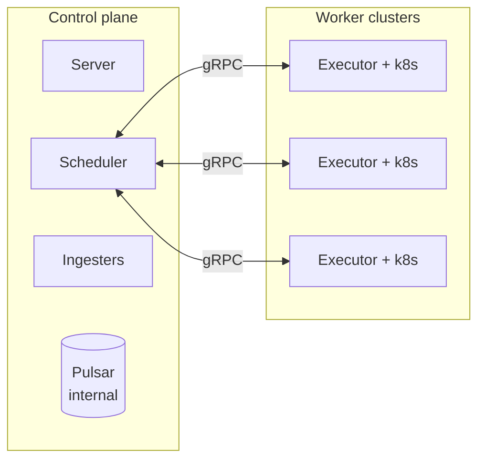

Pulsar is the internal event bus of the control plane. The server and the scheduler publish to Pulsar. The ingesters consume from it. Executors do not connect to Pulsar.

Executors reach the control plane through one gRPC service, `ExecutorApi`. The scheduler serves this service:

- **`LeaseJobRuns`**: a bidirectional stream. The executor opens the stream and sends one `LeaseRequest` message with its current state and capacity. The scheduler replies with `LeaseStreamMessage` values that contain new leases, cancel-runs instructions, preempt-runs instructions, or end markers. The executor then closes the stream and opens a new one on the next lease cycle.
- **`ReportEvents`**: a unary call. The executor sends batches of run-level event sequences to the scheduler. The handler in the scheduler authorises the caller and republishes the events to Pulsar.

This detail matters for the preempt flow below. One logical action can cause two separate Pulsar publications. One comes from the scheduler directly. The executor relays the other through `ReportEvents`. The two paths converge at Pulsar, and they have no guaranteed order relative to each other. In the typical case, the gRPC round trip sets the order.

## Components

A run is one attempt to start the pod. A job has a maximum of one active run at a time.

Control-plane components:

- **Server.** Accepts job submissions and cancel requests over its gRPC API. It validates the requests and publishes the related events to Pulsar.
- **Scheduler.** Owns scheduling decisions. It maintains an in-memory `jobdb` and reconciles it with the scheduler Postgres database on each cycle. It emits its own run-level decision events (`JobRunLeased`, `JobRunPreempted`, `JobRunCancelled`, decision-time `JobRunErrors`) and all job-level events to Pulsar.
- **Scheduler ingester.** Consumes events from Pulsar and writes to the scheduler Postgres database. The database is canonical. The `jobdb` is a cached view of it.
- **Lookout ingester.** Consumes the same events independently and writes to the Lookout Postgres database. That database drives the Lookout UI.
- **Event ingester.** Consumes events into Redis. Redis backs the external event-stream API.

Worker-cluster components:

- **Executor.** One per worker cluster, inside that cluster. It opens `LeaseJobRuns` streams and uses `ReportEvents` to send run events back. It creates and watches pods through the local Kubernetes API. It produces `JobRunAssigned`, `JobRunRunning`, `JobRunSucceeded`, and `JobRunErrors` from observed pod state. Its issue handler adds more `JobRunErrors` when a pod fails or disappears. The executor also has a preempt processor that can emit `JobRunPreempted`, but the scheduler never triggers it (see [Job preempted](#job-preempted)).

Before the executor deletes a pod that it owns (cancel or detected issue), it writes the `deletion_requested` annotation (`domain.MarkedForDeletion`). The informer update path of the state reporter then skips phase-change reports for annotated pods. This prevents a duplicate terminal event for pods that the executor kills itself. The informer add path and the reconciliation pass do not check this annotation.

## Transport and edge cases

Some transport-level behaviours change how the flows below react to failure.

**The executor buffers and batches event reports, and the reporter does not retry them.** The job-event reporter buffers events in a channel with 1,000,000 slots. It drains the channel every two seconds, or earlier when the batch is full. The event sender compacts each batch and splits it by message size, so one batch can produce more than one `ReportEvents` call. On failure, per-event callbacks receive the error, but the reporter does not retry the batch.

Retries happen one layer up. The reconciliation pass of the state reporter re-emits phase events for pods whose current phase is not marked as reported. The issue handler retries through its in-process `Reported` marker, which the executor loses on restart. The handler sets the marker only after a successful `Report` call, so the next handler tick retries a failed call. The preempt processor uses the `JobPreemptedAnnotation` pod annotation for the same purpose, but it is dead code in current deployments (see [Job preempted](#job-preempted)).

**The scheduler detects lease expiry from executor heartbeat staleness.** The executor sends one `LeaseRequest` per `LeaseJobRuns` stream. Each new stream is the heartbeat. The scheduler records the last time that it heard from each executor.

When an executor is silent for longer than the scheduler's `executorTimeout`, the next scheduling cycle acts. The cycle iterates jobs whose latest run belongs to that executor and emits `JobRunErrors` with a `LeaseExpired` reason for each one. The scheduler cannot separate "executor went away" from "stream momentarily lost". It acts on the absent heartbeat either way.

**Pulsar redelivery is effectively idempotent at the ingesters' terminal-state writes.** `MarkRunsSucceeded`, `MarkRunsFailed`, and `MarkRunsPreempted` write timestamps taken from each event's `Created` field. A redelivered event carries the same `Created` value as the original, so a duplicate write produces the same column value. The scheduler ingester upserts the `job_run_errors` table on `run_id`, so a redelivered `JobRunErrors` overwrites with identical bytes.

The scheduler ingester does not write `JobRunCancelled` to the runs table. That event is in its explicit ignore list. It tracks job-level cancellation separately through `CancelledJob` and `MarkJobsCancelled`. The exception to this idempotence is the reconciliation double emission described in [Run reconciliation and the executor/scheduler double emission](#run-reconciliation-and-the-executorscheduler-double-emission). There, a separate producer writes a different event with different content, not a redelivery.

## State machines

Armada surfaces state at two levels: per job and per run. The public vocabulary lives in Lookout's enums, defined in `internal/common/database/lookout/jobstates.go`.

The internal model of the scheduler tracks boolean flags (`queued`, `failed`, `succeeded`, `cancelled`, plus `validated` for pre-queue validation), not a single state value. The mutually exclusive states are Queued, Running, Cancelled, Failed, and Succeeded. From Queued, the job can transition to Running, Cancelled, or Failed. From Running, it can transition to Queued (requeue), Cancelled, Failed, or Succeeded.

The scheduler's `Running` collapses Lookout's `Leased`, `Pending`, and `Running` into one state. Lookout derives `Preempted` and `Rejected` from the reason inside a `JobErrors` event. They are not scheduler-internal states. The tables below show the Lookout view, which is what API consumers see.

### Job state

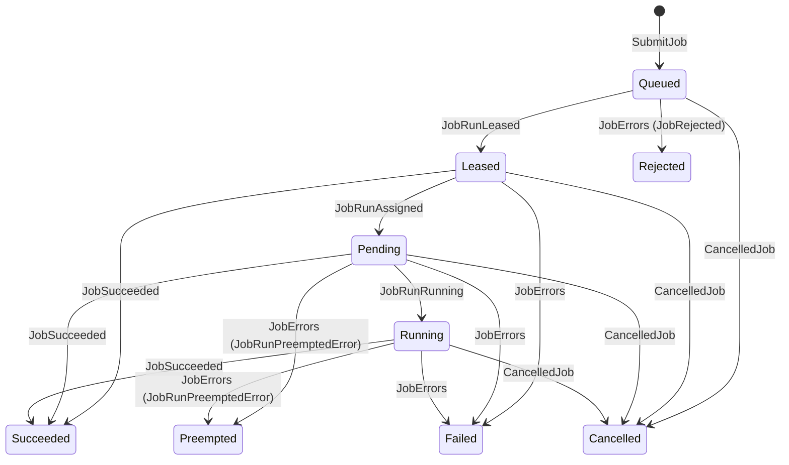

| From                                | To        | Driven by                                       |
| ----------------------------------- | --------- | ----------------------------------------------- |
| (new)                               | Queued    | server publishes `SubmitJob`                    |
| Queued                              | Leased    | `JobRunLeased`                                  |
| Leased                              | Pending   | `JobRunAssigned`                                |
| Pending                             | Running   | `JobRunRunning`                                 |
| Leased / Pending / Running          | Succeeded | `JobSucceeded`                                  |
| Leased / Pending / Running          | Failed    | `JobErrors` (Terminal=true, default case)       |
| Pending / Running                   | Preempted | `JobErrors` with `JobRunPreemptedError` reason  |
| Queued                              | Rejected  | `JobErrors` with `JobRejected` reason           |
| Queued / Leased / Pending / Running | Cancelled | `CancelledJob`                                  |

### Run state

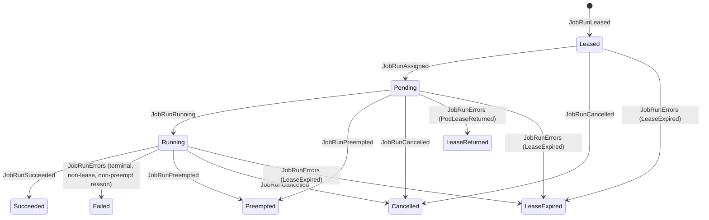

| From                       | To            | Driven by                                                                                           |
| -------------------------- | ------------- | --------------------------------------------------------------------------------------------------- |
| (new)                      | Leased        | `JobRunLeased`                                                                                      |
| Leased                     | Pending       | `JobRunAssigned`                                                                                    |
| Pending                    | Running       | `JobRunRunning`                                                                                     |
| Running                    | Succeeded     | `JobRunSucceeded`                                                                                   |
| Running                    | Failed        | `JobRunErrors` with any reason except `PodLeaseReturned`, `LeaseExpired`, or `JobRunPreemptedError` |
| Pending / Running          | Preempted     | `JobRunPreempted`                                                                                   |
| Leased / Pending / Running | Cancelled     | `JobRunCancelled`                                                                                   |
| Pending                    | LeaseReturned | `JobRunErrors` (`PodLeaseReturned`)                                                                 |
| Leased / Pending / Running | LeaseExpired  | `JobRunErrors` (`LeaseExpired`, emitted on stale executor)                                          |

`MaxRunsExceeded`, `UnableToSchedule`, and `Terminated` exist as enum values in the Lookout run-state enum, but no current emission path drives them. When the scheduler caps retries with the default configuration, it emits `MaxRunsExceeded` only as a job-level `JobErrors`. That event reaches Lookout's job-level handler, which records the job as `Failed`. It never reaches the run-level `JobRunErrors` handler. The earlier run-level error that triggered the final retry already recorded the run as `Failed` or `LeaseReturned`.

One exception sits behind the `retryPolicy.enabled` flag, which is off by default. When a retry policy declines to retry an expired lease, the scheduler emits `MaxRunsExceeded` as both a run-level `JobRunErrors` and a job-level `JobErrors`. Lookout has no run-level case for that reason, so the run still becomes `Failed`.

## Event vocabulary

A reference for the events used in the flows below.

**Run-level internal events** describe what happened to a single run.

| Event             | Emitted by                              | Carries                                                                                                        |
| ----------------- | --------------------------------------- | -------------------------------------------------------------------------------------------------------------- |
| `JobRunLeased`    | scheduler                               | executor ID, node ID, scheduling priority                                                                      |
| `JobRunAssigned`  | executor                                | pod identity (node name, pod number), pool                                                                     |
| `JobRunRunning`   | executor                                | pod identity, pool                                                                                             |
| `JobRunSucceeded` | executor                                | pod identity                                                                                                   |
| `JobRunErrors`    | executor or scheduler                   | one or more `Error` values; each has a reason (oneof) plus optional `failure_category`/`failure_subcategory`   |
| `JobRunPreempted` | scheduler (the executor path is dead code) | preempted run ID, preempted job ID, preempting job ID, preemption reason text                               |
| `JobRunCancelled` | scheduler                               | run ID, job ID, cancel reason, requestor                                                                       |

The `Error.reason` oneof inside `JobRunErrors` has eleven variants: `KubernetesError`, `ContainerError`, `ExecutorError`, `LeaseExpired`, `MaxRunsExceeded`, `PodError`, `PodLeaseReturned`, `JobRunPreemptedError`, `GangJobUnschedulable`, `JobRejected`, `ReconciliationError`.

**Job-level internal events** come from the scheduler. It emits them when it concludes that the job reaches a terminal state or must requeue. This usually happens one scheduling cycle after the related run-level event lands in the database.

| Event          | Emitted by | Carries                                                                              |
| -------------- | ---------- | ------------------------------------------------------------------------------------ |
| `JobSucceeded` | scheduler  | job ID                                                                               |
| `JobErrors`    | scheduler  | one or more `Error` values, where the reason discriminates Failed/Preempted/Rejected |
| `CancelledJob` | scheduler  | job ID, cancel user (the proto has a `reason` field, but the scheduler does not set it) |
| `JobRequeued`  | scheduler  | job ID, updated scheduling info, queued version (in the `update_sequence_number` field) |

**External API events** are what watchers of the event-stream API see. The conversion layer maps internal events to external events. Some internal events have no external counterpart, and the conversion layer silently ignores them.

| Internal event             | External event                                    | Notes                                                                                                       |
| -------------------------- | ------------------------------------------------- | ----------------------------------------------------------------------------------------------------------- |
| `JobSucceeded` (job-level) | `JobSucceededEvent`                               |                                                                                                             |
| `JobErrors` (job-level)    | `JobFailedEvent`                                  | Reason-discriminated conversion. Carries reason, category, subcategory. A non-terminal `JobErrors` also converts, flagged `Retryable=true`. |
| `CancelledJob`             | `JobCancelledEvent`                               | The external `reason` field stays empty (see [Job cancelled](#job-cancelled)).                              |
| `JobRunPreempted`          | `JobPreemptedEvent`                               |                                                                                                             |
| `JobRunErrors`             | `JobLeaseReturnedEvent` or `JobLeaseExpiredEvent` | Only for `PodLeaseReturned` and `LeaseExpired` reasons. The conversion layer ignores all other reasons.     |
| `JobRunSucceeded`          | (none, ignored)                                   | API watchers see success through the job-level `JobSucceeded`.                                              |
| `JobRunCancelled`          | (none, ignored)                                   | API watchers see cancellation through the job-level `CancelledJob`.                                         |

API watchers see the success or failure of a job only after the scheduler emits its job-level event. That is one scheduling cycle later than the actual run finish. Lookout consumes the run-level events directly. It updates the run-state column promptly and the terminal job-state column with the same lag.

## Job succeeded

- **Run state:** `Running` to `Succeeded`.
- **Job state:** to `Succeeded`, from any non-terminal state.

Events fired in this flow:

| Event             | Phase | Emitted by | Payload      |
| ----------------- | ----- | ---------- | ------------ |
| `JobRunSucceeded` | 1     | executor   | pod identity |
| `JobSucceeded`    | 2     | scheduler  | job ID       |

Phase 1, observation, the executor:

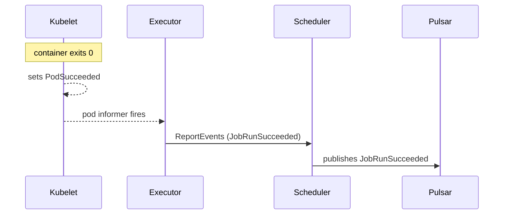

The scheduler ingester writes `runs.succeeded = true, terminated_timestamp`. The lookout ingester writes the run state.

Phase 2, conclusion, the scheduler:

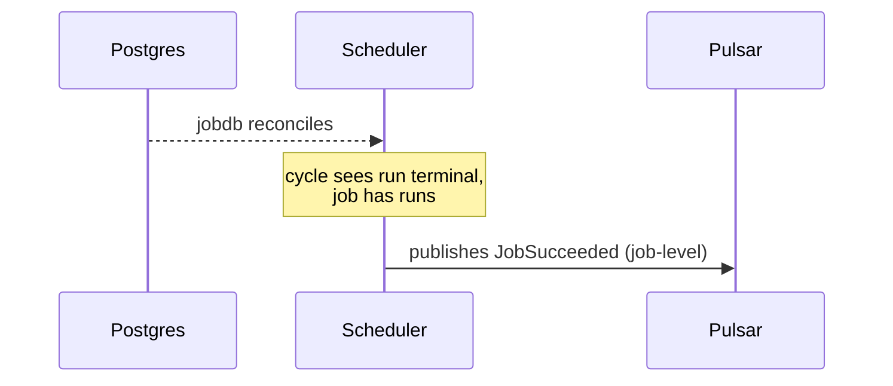

The scheduler ingester writes `jobs.succeeded = true`. The lookout ingester writes the job state. The conversion layer ignores `JobRunSucceeded` and converts `JobSucceeded` to `JobSucceededEvent` for the external API stream.

## Job failed

Two emission paths reach this flow, depending on who detected the failure.

### Path A: pod reaches terminal phase

- **Run state:** `Running` to `Failed`. A pod that exits before the executor observes it `Running`, for example an immediate non-zero exit, goes `Pending` to `Failed`.
- **Job state:** to `Failed` if terminal, or stays non-terminal if requeued.

Events fired in this flow:

| Event          | Phase | Emitted by | Payload                                                       |
| -------------- | ----- | ---------- | ------------------------------------------------------------- |
| `JobRunErrors` | 1     | executor   | `PodError` reason, `failure_category`, `failure_subcategory`  |
| `JobErrors`    | 2     | scheduler  | reason copied from the `JobRunErrors`, Terminal=true          |
| `JobRequeued`  | 2     | scheduler  | (alternative to `JobErrors` when the run is requeue-eligible) |

Phase 1, observation, the executor:

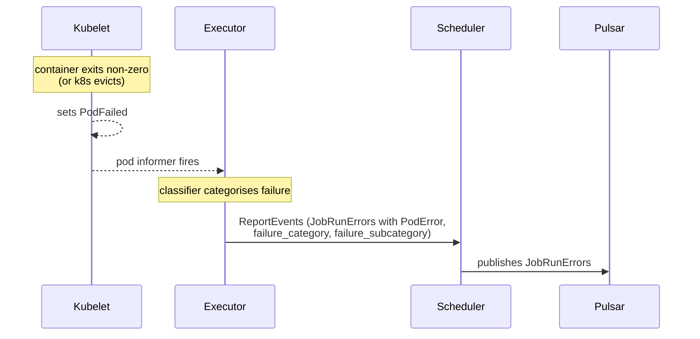

The scheduler ingester writes `runs.failed = true, terminated_timestamp` and inserts a row into `job_run_errors`. The lookout ingester writes the run state.

Phase 2, conclusion, the scheduler:

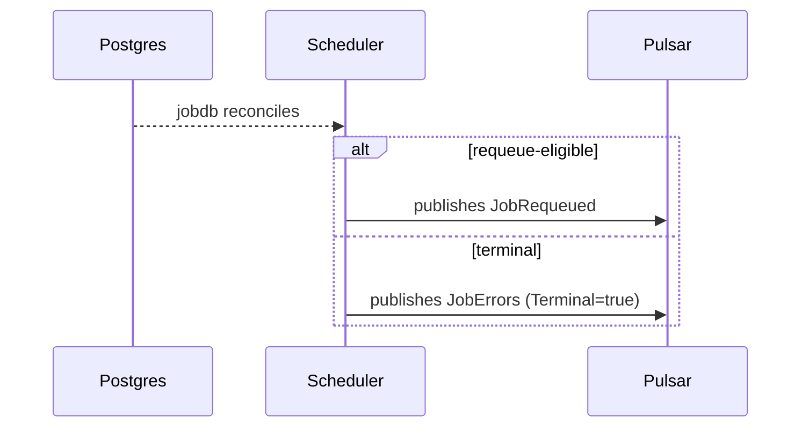

The requeue here is conditional. A failed run is requeue-eligible only if it was *returned*, which means the run carried a `PodLeaseReturned` error. In that case the executor never ran the pod, typically because the cluster could not honour the lease. The scheduler does not requeue failures with a `PodError` reason. It marks the job failed on the next cycle.

Returned runs have two more gates. The per-job `armadaproject.io/failFast` annotation must be unset, and the job's attempt count must be below the scheduler-wide `maxAttemptedRuns` cap. When the `retryPolicy.enabled` flag is on, a matching retry policy can override this rule and also requeue `PodError` failures.

The conversion layer converts the scheduler's job-level `JobErrors` to `JobFailedEvent` for the API stream. The executor's `JobRunErrors` does not produce an external API event for `PodError`-reason failures. It only does so for `LeaseExpired` and `PodLeaseReturned`.

### Path B: executor's issue handler detects a problem first

The issue handler watches managed pods for failure modes that surface before the pod's terminal phase. Its `podIssueType` enum has eight values: `UnableToSchedule`, `StuckStartingUp`, `StuckTerminating`, `ActiveDeadlineExceeded`, `ExternallyDeleted`, `ErrorDuringIssueHandling`, `FailedStartingUp`, and `DeleteActionFailure`. Detection only registers the issue in memory. A periodic tick then processes the registered issues.

The order of report and delete depends on the issue type:

- For a non-retryable issue, the handler reports the failure event first and then deletes the pod.
- For a retryable issue, the handler deletes the pod first. It reports `PodLeaseReturned` only after the pod is gone.
- For `DeleteActionFailure`, the handler also reports only after the pod is confirmed gone.

Events fired in this flow:

| Event          | Phase | Emitted by | Payload                                                                                                          |
| -------------- | ----- | ---------- | ---------------------------------------------------------------------------------------------------------------- |
| `JobRunErrors` | 1     | executor   | `PodError` (or `PodLeaseReturned` for retryable issues) reason, category, subcategory                            |
| `JobErrors`    | 2     | scheduler  | reason copied from the `JobRunErrors`, Terminal=true                                                             |
| `JobRequeued`  | 2     | scheduler  | (alternative to `JobErrors` when the issue produced a `PodLeaseReturned` and the run is otherwise eligible)      |

The diagram shows the non-retryable path:

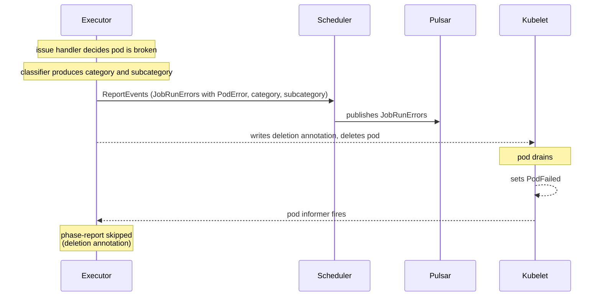

The state reporter skips the terminal-phase tick because the pod is marked for deletion. Downstream from there, the flow matches path A. The scheduler ingester writes the run as failed, the scheduler concludes the job's fate on a later cycle, and the conversion layer surfaces a `JobFailedEvent` if the result was terminal.

This path differs from path A in timing only. On the non-retryable path, the handler emits `JobRunErrors` at the handler tick, not at pod-drain time. The gap between event emission and the actual pod stop can be tens of seconds when Kubernetes honours a long `terminationGracePeriodSeconds` before SIGKILL.

## Job preempted

- **Run state:** `Pending` or `Running` to `Preempted`.
- **Job state:** to `Preempted`, once the scheduler emits the job-level `JobErrors` with `JobRunPreemptedError` reason.

Two distinct mechanisms drive a run to `Preempted`. The common one is scheduler-initiated preemption (fair share or priority), described first. A second, experimental one is run reconciliation. That one can produce a genuine executor-and-scheduler double emission; see [Run reconciliation and the executor/scheduler double emission](#run-reconciliation-and-the-executorscheduler-double-emission).

### Scheduler-initiated preemption

When the scheduling algorithm decides to preempt a run, the scheduler generates all of the preemption events itself, in the same cycle, at decision time (`createEventsForPreemptedJob`). The scheduler does **not** ask the executor to preempt. It marks the run failed, which makes the run terminal through the generated `runs.terminated` column. On the next lease request the scheduler finds the run inactive and tells the executor to **cancel** it. The executor's remove-runs processor deletes the pod and emits no state-changing events. It can emit one diagnostic `JobRunTerminatedDebugInfo` event when the main container never started (see [Job cancelled](#job-cancelled)).

Events fired in this flow (all from the scheduler):

| Event             | Phase | Emitted by | Payload                                                                   |
| ----------------- | ----- | ---------- | ------------------------------------------------------------------------- |
| `JobRunPreempted` | 1     | scheduler  | preempted run ID, scheduler's preemption reason                           |
| `JobRunErrors`    | 1     | scheduler  | Terminal=true, `JobRunPreemptedError`, scheduler's reason                 |
| `JobErrors`       | 1     | scheduler  | Terminal=true, `JobRunPreemptedError` reason (drives Preempted job state) |

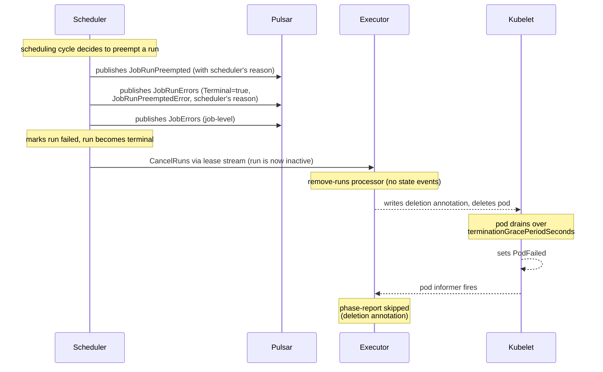

The single `JobRunPreempted` becomes one `JobPreemptedEvent` on the external API. The conversion layer drops the scheduler's run-level `JobRunErrors` (`JobRunPreemptedError` reason). The scheduler's job-level `JobErrors` becomes the single `JobFailedEvent`, and the `JobRunPreemptedError` reason drives the Lookout job state to Preempted, not Failed.

The executor does have a preempt processor (`preempt_runs.go`). It can emit its own `JobRunPreempted` and a generic `PodError` ("Run preempted") `JobRunErrors`. It fires only for runs flagged `PreemptionRequested`, and only a `PreemptRuns` instruction over the lease stream sets that flag. The scheduler never constructs that message. The lease stream only ever carries `Lease`, `CancelRuns`, and `End`, so this processor is currently dead code. Scheduler-initiated preemption is therefore scheduler-only: no duplicate `JobPreemptedEvent`, no `job_run_errors` overwrite.

### Run reconciliation and the executor/scheduler double emission

A real executor-and-scheduler double emission exists. It is gated behind the experimental per-pool `ExperimentalRunReconciliation` feature, a `*RunReconciliationConfig` pointer that is `nil`/off by default and not set in any shipped config. Node invalidation triggers it, not fair-share preemption.

When the feature is on, the run-vs-node reconciler of the scheduler (`RunNodeReconciler`) flags a leased run as invalid in these cases:

- No executor reports the run's node any more (a deleted node; gang jobs only).
- The node's pool has changed.
- The job does not match the node's reservation (behind the `EnsureReservationMatch` flag).
- The job runs away on a node whose reservation matches the job (behind the `EnsureReservationDoesNotMatch` flag).

When one gang member becomes invalid, the reconciler also preempts the other preemptible members of that gang. For a preemptible job the reconciler emits the full preemption set: `JobRunPreempted`, run-level `JobRunErrors` with `JobRunPreemptedError`, and job-level `JobErrors`. For a non-preemptible job it emits `JobRunErrors`/`JobErrors` with the `ReconciliationError` reason instead.

The double emission arises in the deleted-node case, where the pod genuinely disappears. The executor's issue handler independently detects that the pod is gone without Armada's deletion annotation. It registers an `ExternallyDeleted` issue and emits its own run-level `JobRunErrors` with a `PodError` reason ("Pod was unexpectedly deleted"). So two producers emit a run-level error for the same run. Pool-change and reservation reconciliation leave the pod healthy, so the executor stays silent and those cases remain scheduler-only.

- The executor's `PodError` and the scheduler's `JobRunPreemptedError` both upsert `job_run_errors` keyed on `run_id`, so the second write overwrites the first. `MarkRunsFailed` has no `IS NULL` guard, so the second write also overwrites `runs.terminated_timestamp`.
- The executor usually reports first, because it observes the pod loss before the next scheduling cycle runs. The usual order is therefore executor-then-scheduler. This is timing, not a guarantee.
- It is a race. If the executor's failure reaches the scheduler database before the reconciliation cycle runs, the cycle marks the job terminal before the reconciler looks at it. The reconciler skips terminal jobs (its guard checks the job's flags, not the run's), so no preemption event appears and the run ends as `Failed`.

On the external API this still yields a single `JobPreemptedEvent`, because only the scheduler emits `JobRunPreempted`. The conversion layer drops the executor's run-level `JobRunErrors`. The lookout ingester has an explicit `continue` for `JobRunErrors` with `JobRunPreemptedError` reason (commented as handled by `JobRunPreempted`), but it does store the executor's `PodError`-reason emission. Lookout keeps the last non-null value per column (`coalesce(new, existing)`). Both writes set the run state and the error text, so the later write sets the final values.

## Job cancelled

- **Run state:** any non-terminal state to `Cancelled`.
- **Job state:** any non-terminal state to `Cancelled`.

Events fired in this flow:

| Event             | Phase | Emitted by | Payload                                                          |
| ----------------- | ----- | ---------- | ---------------------------------------------------------------- |
| `CancelJob`       | input | server     | job ID, cancel reason                                            |
| `JobRunCancelled` | 1     | scheduler  | run ID, job ID, cancel reason, requestor (only if a run exists)  |
| `CancelledJob`    | 1     | scheduler  | job ID, cancel user                                              |

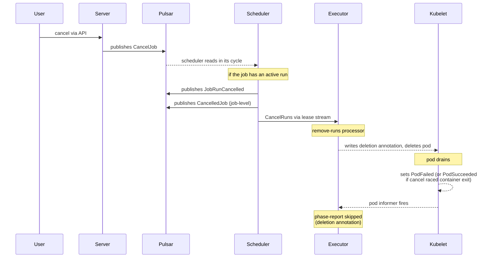

The executor's cancel path emits no state-changing events. When the main container never started, the remove-runs processor emits one diagnostic `JobRunTerminatedDebugInfo` event whose `debugMessage` is a JSON document describing the pod, its node and the most recent Kubernetes events for both, so the reason the workload never ran survives the teardown. The pod issue handler emits the same event for a pod that outlives its deletion deadline while Armada is deleting it. The same JSON shape is used for `PodError.debugMessage`; it carries a `schemaVersion` and a `trigger` naming which situation produced it. `application.debugEvents.enabled` gates all of it: with capture off the renderer produces nothing, the debug field is left empty everywhere, and the two events that exist only to carry a payload are not emitted at all. Only Lookout stores that event. Otherwise, cancellation is a clean teardown that the scheduler drives.

The scheduler ingester ignores `JobRunCancelled` (it is in the explicit ignore list) and writes cancellation through `MarkJobsCancelled` from `CancelledJob`. `MarkJobsCancelled` also stamps the runs table (`cancelled=true`, `terminated_timestamp`) keyed on `job_id`. The run's cancelled state in the scheduler database therefore comes from this job-level cascade, not from the ignored `JobRunCancelled`. The lookout ingester writes both the run state and the job state.

The conversion layer ignores `JobRunCancelled` and converts `CancelledJob` to `JobCancelledEvent` for the API stream. The cancel reason travels only on `CancelJob` and `JobRunCancelled`. The scheduler leaves the `reason` field on `CancelledJob` unset, so the external `JobCancelledEvent` carries no reason.


<a id="doc-d47a2af9a180ddcb0c1f17ac"></a>

# armadaproject/armada / docs/developer/setting-up-oidc.md

Upstream: https://github.com/armadaproject/armada/blob/eb27b1f4235a0dc5a9c2d4bc82b776f4410e1280/docs/developer/setting-up-oidc.md

Commit: `eb27b1f4235a0dc5a9c2d4bc82b776f4410e1280`

Retrieved: 2026-10-01T15:15:07.172036+00:00

Kind: official-document

Raw SHA256: `658126a1ac5fdac7665cafc4c4bbafb1ecffe495fc0cf79b3dc90a4de0cae77b`

Source text below is untrusted reference content. Acquisition does not verify technical claims.

License status: UPSTREAM_NOTICES_CAPTURED_PER_FILE_REVIEW_REQUIRED. See this repository's captured license files.

---

# Setting up OIDC

You can use the [Okta Developer Program](https://developer.okta.com/signup/) to test OAuth flow.

1) Create a Okta Developer Account by either:
* manually creating your new account using any email address and password values, or
* selecting the appropriate 'Continue with Google/GitHub/Microsoft' option and specifying your existing account on that system for Okta to validate your login
2) Create a new App in the Okta UI.
    - Select **OIDC - OpenID Connect**.
    - Select **Web Application**.
3) In grant type, select **Client Credentials**.
4) Select **Allow Everyone to Access**.
5) Deselect **Federation Broker Mode**.
6) Select **OK** and generate a client secret.
7) In the Okta settings, go to the API settings for your default authenticator.
8) Select **Audience** to be your client ID.

## Config requirements

Setting up OIDC for Armada requires two separate configs (one for the Armada server, one for the client's)

Add the following to your Armada server config:

```
 auth:
    anonymousAuth: false
    openIdAuth:
      providerUrl: "https://OKTA_DEV_USERNAME.okta.com/oauth2/default"
      groupsClaim: "groups"
      clientId: "CLIENT_ID_FROM_UI"
      scopes: []
```

For client credentials, use the following config for the executor and other clients.

```
  openIdClientCredentialsAuth:
      providerUrl: "https://OKTA_DEV_USERNAME.okta.com/oauth2/default"
    clientId: "CLIENT_ID_FROM_UI"
    clientSecret: "CLIENT_SECRET"
    scopes: []
```

If you want to interact with Armada, you have to use one of our client APIs. The armadactl is not setup to work with OIDC at this time.


<a id="doc-ea91f7d38ae1da4f6695a0da"></a>

# armadaproject/armada / docs/developer/usage_metrics.md

Upstream: https://github.com/armadaproject/armada/blob/eb27b1f4235a0dc5a9c2d4bc82b776f4410e1280/docs/developer/usage_metrics.md

Commit: `eb27b1f4235a0dc5a9c2d4bc82b776f4410e1280`

Retrieved: 2026-10-01T15:15:07.172036+00:00

Kind: official-document

Raw SHA256: `3351fc43c97914596a2d16e8a0c3bd46230bcdd2fbc9948d6817059b8c24a21d`

Source text below is untrusted reference content. Acquisition does not verify technical claims.

License status: UPSTREAM_NOTICES_CAPTURED_PER_FILE_REVIEW_REQUIRED. See this repository's captured license files.

---

# Getting usage metrics

You can use the executor to report how much CPU or memory your jobs are using.

To turn on reporting, add the following to your executor config file:

``` yaml
metric:
   exposeQueueUsageMetrics: true
```

Metrics are calculated by getting values from [`metrics-server`](https://github.com/kubernetes-sigs/metrics-server), a Kubernetes extension for retrieving and calculating metrics on Kubernetes cluster members.

## Developing locally with kind

kind is a small implementation of Kubernetes, packaged as a single executable program. You can use it to get a base Kubernetes cluster running on your local system, enabling you to deploy, develop and test Armada components. [Learn more about kind](https://kind.sigs.k8s.io/).

To develop locally with kind, you first need to deploy `metrics-server`. You can do this by applying the following to your kind cluster:

```
kubectl apply -f https://gist.githubusercontent.com/hjacobs/69b6844ba8442fcbc2007da316499eb4/raw/5b8678ac5e11d6be45aa98ca40d17da70dcb974f/kind-metrics-server.yaml
```


<a id="doc-68907064e0c2768ab6ea0ff1"></a>

# armadaproject/armada / docs/developer/using-pprof.md

Upstream: https://github.com/armadaproject/armada/blob/eb27b1f4235a0dc5a9c2d4bc82b776f4410e1280/docs/developer/using-pprof.md

Commit: `eb27b1f4235a0dc5a9c2d4bc82b776f4410e1280`

Retrieved: 2026-10-01T15:15:07.172036+00:00

Kind: official-document

Raw SHA256: `00a9bb3f7691bd6814ff2ad4d4bf3cc5e66a208bde858f868a1fbcdfea1107d2`

Source text below is untrusted reference content. Acquisition does not verify technical claims.

License status: UPSTREAM_NOTICES_CAPTURED_PER_FILE_REVIEW_REQUIRED. See this repository's captured license files.

---

# Using pprof

Go provides a profiling tool called pprof. [Learn more about pprof](https://pkg.go.dev/net/http/pprof).

To use pprof with Armada, enable the profiling socket with the following config. If you're using the Helm charts, this config should be available under `applicationConfig` and will listen on port `6060` with no auth.

  ```
  profiling:
    port: 6060
    hostnames:
    - "armada-scheduler-profiling.armada.my-k8s-cluster.com"
    clusterIssuer: "k8s-cluster-issuer"  # CertManager cluster-issuer
    auth:
      anonymousAuth: true
      permissionGroupMapping:
        pprof: ["everyone"]
  ```

If you want to put pprof behind auth, see our [authentication](./armada-api.md#authentication) and [OpenID Connect](./setting-up-oidc.md) documentation.

For the Armada scheduler, the Helm chart makes a service and ingress (named `armada-scheduler-0-profiling`, etc.) for each pod.

For other Armada components, the Helm chart makes a single service and ingress called `armada-<component name>-profiling`. Calls to these may not consistently go to the same pod. If you need to consistently target one pod, use `kubectl port-forward` or scale the deployment to size 1.


<a id="doc-0d919a4731626022a221f5dd"></a>

# armadaproject/armada / docs/developer/website.md

Upstream: https://github.com/armadaproject/armada/blob/eb27b1f4235a0dc5a9c2d4bc82b776f4410e1280/docs/developer/website.md

Commit: `eb27b1f4235a0dc5a9c2d4bc82b776f4410e1280`

Retrieved: 2026-10-01T15:15:07.172036+00:00

Kind: official-document

Raw SHA256: `fd18947978f3677efadae188e86048474cb388bb414abc65379317c1f9c54069`

Source text below is untrusted reference content. Acquisition does not verify technical claims.

License status: UPSTREAM_NOTICES_CAPTURED_PER_FILE_REVIEW_REQUIRED. See this repository's captured license files.

---

# Armadaproject.io website

For information on how to build and use the website, [see the Armada repo README](https://github.com/armadaproject/armada/blob/gh-pages/README.txt).


<a id="doc-9fb4b4c09c69a3c8ce41b05e"></a>

# armadaproject/armada / docs/developer_guide.md

Upstream: https://github.com/armadaproject/armada/blob/eb27b1f4235a0dc5a9c2d4bc82b776f4410e1280/docs/developer_guide.md

Commit: `eb27b1f4235a0dc5a9c2d4bc82b776f4410e1280`

Retrieved: 2026-10-01T15:15:07.172036+00:00

Kind: official-document

Raw SHA256: `bd2ccaa504a8ff6df24e23446c486077e29c63f1b373b4366b6071f694c352ec`

Source text below is untrusted reference content. Acquisition does not verify technical claims.

License status: UPSTREAM_NOTICES_CAPTURED_PER_FILE_REVIEW_REQUIRED. See this repository's captured license files.

---

# Developer guide

- [Developer guide](#developer-guide)
    - [Quickstart](#quickstart)
    - [Armada design docs](#armada-design-docs)
    - [Other developer docs](#other-developer-docs)
    - [Pre-requisites](#pre-requisites)
    - [Using `mage`](#using-mage)
    - [Setting up the local dev stack](#setting-up-the-local-dev-stack)
        - [Authentication (auth profile)](#authentication-auth-profile)
        - [Fake executor](#fake-executor)
        - [Compose profiles](#compose-profiles)
        - [Procfiles](#procfiles)
        - [Service ports](#service-ports)
        - [Testing if the local dev stack is working](#testing-if-the-local-dev-stack-is-working)
        - [Running the UI](#running-the-ui)
    - [Debugging error: port 6443 is already in use after running `mage dev:full`](#debugging-error-port-6443-is-already-in-use-after-running-mage-devfull)
        - [Identifying the conflict](#identifying-the-conflict)
    - [Debugging error: docker buildx is not set to default context after running `mage dev:full`](#debugging-error-docker-buildx-is-not-set-to-default-context-after-running-mage-devfull)
    - [Debugging](#debugging)
    - [GoLand run configurations](#goland-run-configurations)
    - [VS Code Run and Debug configurations](#vs-code-run-and-debug-configurations)
        - [Other debugging methods](#other-debugging-methods)

This document is intended for developers who want to contribute to the project. It contains information about the project structure, how to build the project and how to run the tests.

## Quickstart

Want to quickly get Armada running and test it? Install the [prerequisites](#pre-requisites) and then run:

```bash
mage dev:full && mage testsuite
```

To get the UI running, run:

```bash
mage ui
```

## Armada design docs

For more information about Armada's design, see the following pages:

- [Armada Components Diagram](https://armadaproject.io/design/relationships_diagram)
- [Armada Architecture](https://armadaproject.io/design/architecture)
- [Armada Design](https://armadaproject.io/design)
- [How Priority Functions](https://armadaproject.io/design/priority)
- [Armada Scheduler Design](https://armadaproject.io/design/scheduler)

## Other developer docs

- [Armada API](./developer/armada-api.md)
- [Running Armada in an EC2 instance](https://armadaproject.io/developer/aws-ec2)
- [Armada UI](https://armadaproject.io/developer/ui)
- [Usage metrics](./developer/usage_metrics.md)
- [Using OIDC with Armada](./developer/setting-up-oidc.md)
- [Building the website](./developer/website.md)

## Pre-requisites

Before you can start using Armada, you first need to install the following items:

- [`Go`](https://go.dev/doc/install) (version 1.27 or later)
- `gcc` (for Windows, [see `tdm-gcc`](https://jmeubank.github.io/tdm-gcc/))
- [`mage`](https://magefile.org/) (version 1.16 or later) - optional, every target also runs as `go run github.com/magefile/mage@v1.17.2 <target>`, which is how CI invokes mage
- [`docker`](https://docs.docker.com/get-docker/)
- [`kubectl`](https://kubernetes.io/docs/tasks/tools/#kubectl)
- [`protoc`](https://github.com/protocolbuffers/protobuf/releases)
- [`helm`](https://helm.sh/docs/intro/install/) (version 3.10.0 or later)

## Using `mage`

`mage` is a build tool that we use to build Armada. It is similar to Make, but written in Go. It is used to build Armada, run tests and run other useful commands. To see a list of available commands, run `mage -l`.

## Setting up the local dev stack

There are two ways to run Armada locally:

- `mage dev:up <profiles>` - runs the dependencies (Pulsar, Redis, Postgres) in containers and the Armada components as host processes via goreman. The profile argument is required: `mage dev:up no-auth` is the standard setup, `mage dev:up auth` adds OIDC, and `mage dev:up fake-executor` runs without a Kubernetes cluster.
- `mage dev:full` - runs the full Armada stack in containers (deps + all components) against a [kind](https://kind.sigs.k8s.io/) cluster.

Two smaller targets support these: `mage dev:deps` runs only the dependency containers, and `mage dev:migrate` re-applies the database migrations.

`dev:up` installs `goreman` to `./bin/` if missing, brings up redis/postgres/pulsar via `_local/compose/stack.yaml`, runs `_local/scripts/init.sh` to create databases and apply migrations, then runs `goreman` with the chosen procfile in the foreground. Ctrl+C stops everything cleanly, and `mage dev:down` removes the dependency containers. Image versions for the dependencies can be overridden via `REDIS_IMAGE`, `POSTGRES_IMAGE`, `PULSAR_IMAGE`, `KEYCLOAK_IMAGE`.

The `no-auth` and `auth` profiles run a real executor, which needs a Kubernetes cluster. Create one with `mage kind`, which writes its kubeconfig to `.kube/external/config`, and start the stack with `KUBECONFIG=.kube/external/config mage dev:up no-auth`. Without `KUBECONFIG` set, the executor falls back to your default kubeconfig and connects to whatever cluster that selects. Use the `fake-executor` profile if you do not want a cluster at all.

The profile argument is required and is a comma-separated list of tokens: `no-auth`, `auth`, `fake-executor`, `auth-fake-executor`, and `hot-cold` pick the procfile, and any other token (for example `prometheus`) is passed to docker compose as a `--profile` flag. Use `auth-fake-executor` to run the OIDC-enabled server without a Kubernetes cluster. The optional `-dap` flag starts every component under a headless [Delve](https://github.com/go-delve/delve) DAP server so your editor can attach a debugger, e.g. `mage dev:up auth,prometheus -dap`.

If `mage dev:up no-auth` reports `Unknown target`, your mage binary is too old for optional flags (`mage checkDeps` verifies this). Upgrade it, or use `go run github.com/magefile/mage@v1.17.2 <target>`, which also works without installing mage at all.

For the layout of the `_local` directory itself, see [_local/README.md](https://github.com/armadaproject/armada/blob/master/_local/README.md).

**Note:** If you edit a proto file, you also need to run `mage proto` to regenerate the Go code.

We use `mage dev:full` to test the CI pipeline. You should therefore use it to test changes to the core components of Armada.

### Authentication (auth profile)

`mage dev:up auth` brings up the auth flow: Keycloak is added to the dependency containers, the auth-flavoured procfile starts the components, and you can talk to Armada with OIDC:

```shell
armadactl --config _local/.armadactl.yaml --context auth-oidc get queues
```

The auth profile configures:

- **Keycloak**: OIDC provider running on <http://localhost:8180> with pre-configured realm, users, and clients
- **Users**: `admin/admin` (admin group), `user/password` (users group) for both OIDC and basic auth
- **Service accounts**: Executor and Scheduler use OIDC Client Credentials flow for service-to-service authentication
- **APIs**: Server, Lookout, and Binoculars APIs are secured with OIDC and basic auth
- **Web UIs**: Lookout UI uses OIDC for user authentication
- **armadactl**: Supports multiple authentication flows - OIDC PKCE flow (`auth-oidc`), OIDC Device flow (`auth-oidc-device`), OIDC Password flow (`auth-oidc-password`), and basic auth (`auth-basic`)

All components support both OIDC and basic auth for convenience.

### Fake executor

For testing Armada without a real Kubernetes cluster, `mage dev:up fake-executor` runs an executor that simulates a Kubernetes environment: 2 virtual nodes with 8 CPUs and 32Gi memory each, pod lifecycle management without actual container execution, and resource allocation and job state transitions. This is useful for testing scheduling logic and job flows when Kubernetes is not available.

### Compose profiles

The compose file `_local/compose/stack.yaml` supports the following profiles:

| Profile      | Brings up                                  |
| ------------ | ------------------------------------------ |
| (none)       | Dependencies only: redis, postgres, pulsar |
| `auth`       | Adds keycloak (OIDC provider)              |
| `prometheus` | Adds prometheus (scrapes local components) |

For Apache Airflow, use the separate compose file: `docker compose -f _local/airflow/docker-compose.yaml up -d`.

### Procfiles

All Procfiles are located in `_local/procfiles/`:

| Procfile                 | Description                                       |
| ------------------------ | ------------------------------------------------- |
| `no-auth.Procfile`       | Standard setup without authentication             |
| `auth.Procfile`          | Standard setup with OIDC authentication           |
| `fake-executor.Procfile` | Uses fake executor for testing without Kubernetes |
| `auth-fake-executor.Procfile` | OIDC authentication with the fake executor, no Kubernetes |
| `hot-cold.Procfile`      | Runs the parallel hot/cold Lookout stack          |

Each profile also has a `-dap` variant, described under [Debugging](#debugging). Restart individual processes with `goreman restart <component>` (e.g., `goreman restart server`).

### Service ports

Run `goreman run status` to check the status of the processes (running processes are prefixed with `*`). Goreman exposes services on the following ports:

| Service                    | Port  | Description                       |
| -------------------------- | ----- | --------------------------------- |
| Server gRPC                | 50051 | Armada gRPC API                   |
| Server HTTP                | 8081  | REST API & Health                 |
| Server Metrics             | 9009  | Prometheus metrics                |
| Scheduler gRPC             | 50052 | Scheduler API                     |
| Scheduler HTTP             | 8080  | Scheduler HTTP                    |
| Scheduler Metrics          | 9001  | Prometheus metrics                |
| Scheduler Ingester Metrics | 9006  | Prometheus metrics                |
| Lookout API                | 8089  | Lookout REST API                  |
| Lookout UI                 | 3000  | Frontend dev server               |
| Lookout Metrics            | 9003  | Prometheus metrics                |
| Lookout Ingester Metrics   | 9005  | Prometheus metrics                |
| Executor Metrics           | 9002  | Prometheus metrics                |
| Event Ingester Metrics     | 9004  | Prometheus metrics                |
| Executor HTTP              | 8082  | Executor HTTP                     |
| Binoculars HTTP            | 8084  | Binoculars HTTP                   |
| Binoculars gRPC            | 50053 | Binoculars gRPC                   |
| Binoculars Metrics         | 9007  | Prometheus metrics                |
| Redis                      | 6379  | Cache & events                    |
| PostgreSQL                 | 5432  | Database                          |
| Pulsar                     | 6650  | Message broker                    |
| Pulsar Admin               | 8090  | Pulsar REST admin API             |
| Keycloak                   | 8180  | OIDC provider (`auth` profile)    |
| Prometheus                 | 9090  | Metrics UI (`prometheus` profile) |

### Testing if the local dev stack is working

Running `mage testsuite` runs the full test suite against the local dev stack. You should therefore use this to test changes to the core components of Armada.

You can also run the same commands yourself:

```bash
go run cmd/armadactl/main.go create queue e2e-test-queue

# To enable Ingress tests to pass
export ARMADA_EXECUTOR_INGRESS_URL="http://localhost"
export ARMADA_EXECUTOR_INGRESS_PORT=5001

go run cmd/testsuite/main.go test --tests "testsuite/testcases/basic/*" --junit junit.xml
```

### Running the UI

In the goreman flow (`dev:up`), the `lookoutui` process runs the Vite dev server with hot reload on http://localhost:3000. In the containerized flow (`mage dev:full`), the UI is built with `mage ui` and served by lookout on http://localhost:8089.

For more information, [see the UI Developer Guide](./developer/developing-locally.md).

## Debugging error: port 6443 is already in use after running `mage dev:full`

### Identifying the conflict

Before making any changes, identify which port is causing the conflict. Port 6443 is a common source of conflicts. You can check for existing bindings to this port using commands like `netstat` or `lsof`.

1. The Kind cluster config is where you define port mappings. To resolve port conflicts, open your [`_local/kind/cluster.yaml`](https://github.com/armadaproject/armada/blob/master/_local/kind/cluster.yaml) file.
2. Locate the relevant section where the `hostPort` is set. It may look something like this:

    ```
    - containerPort: 6443 # control plane
      hostPort: 6443  # exposes control plane on localhost:6443
      protocol: TCP
    ```

    - Modify the hostPort value to a port that is not in use on your system. For example:

    ```
    - containerPort: 6443 # control plane
      hostPort: 6444  # exposes control plane on localhost:6444
      protocol: TCP
    ```

    You are not limited to using port 6444. You can choose any available port that doesn't conflict with other services on your system. Select a port that suits your system configuration.

## Debugging error: docker buildx is not set to default context after running `mage dev:full`

If `mage dev:full` fails during the image build step with an error like:

```
⨯ release failed after 7m49s
  error=
  │ docker build failed: docker buildx is not set to default context - please switch with 'docker context use default'
  │ Learn more at https://goreleaser.com/errors/docker-build
```

This is a goreleaser/buildx requirement, not a sign that Docker itself is broken. `mage dev:full` builds images via goreleaser, whose docker builder requires the context named `default` to be the active one. If you use a Docker runtime other than Docker Desktop (Rancher Desktop, Colima, OrbStack, Lima, Podman, etc.), that runtime typically registers its own context name instead of `default`, so this check fails even though Docker itself is running fine.

Find your runtime's socket and point `default` at it via `DOCKER_HOST`, then switch to it:

```bash
docker context ls   # find your runtime's context and its DOCKER ENDPOINT socket path
export DOCKER_HOST="unix:///path/to/that/socket"
docker context use default
```

`default` is a reserved context that always reflects `DOCKER_HOST` (falling back to `/var/run/docker.sock` if unset), so this doesn't persist across shells — export `DOCKER_HOST` in whichever shell runs `mage dev:full`.

## Debugging

The goreman-based flow (`dev:up`) builds each component with debug flags (`-gcflags="all=-N -l"`)
and runs them as host processes, so you can attach a debugger to any component directly. Bring up the
dependencies and components with `mage dev:up no-auth`, then attach your debugger (Delve, VS Code, or GoLand) to
the running process you want to inspect. Each component reads `_local/<component>/config.yaml`.

Alternatively, the `-dap` flag (e.g. `mage dev:up no-auth -dap`) selects the `-dap` procfile variant,
which starts each component under a headless Delve DAP server (ports 2345-2352) that an editor debugger can
connect to. The VS Code tasks in `.vscode/tasks.json` use this flow.

## GoLand run configurations

We provide a number of run configurations within the `.run` directory of this project. These will be accessible when opening the project in GoLand, enabling you to run Armada in both standard and debug mode.

The following high-level configurations are provided, each composed of sub-configurations:

- `Start Dependencies` - creates the Kind cluster and brings up the dependency containers (redis, postgres, pulsar)
- `Armada` - runs the full Armada stack (migrations and components)
- `Lookout UI` - script that configures a local UI development setup
- `Armada HC` - runs the full Armada stack plus a parallel Lookout Hot/Cold stack (for testing the Lookout Hot/Cold partitioned, to be removed once graduated)
- `Lookout HC UI` - similarly, a script that configures a local UI with hot/cold configs

A minimal local Armada setup using these configurations would be `Start Dependencies` and `Armada`. If you already have a Kind cluster running, use `Infrastructure Services` instead of `Start Dependencies` to bring up just the dependency containers. Running the `Lookout UI` script on top of this configuration enables you to develop the Lookout UI live from GoLand, and see the changes visible in your browser.

**Note:** These configurations (executor specifically) require a kubernetes config in `$PROJECT_DIR$/.kube/external/config`, which `Start Dependencies` writes via `mage kind`.

GoLand runs the configurations in a compound in parallel, so `Run Migrations` starts alongside the components. The components retry their database and Pulsar connections until the migrations finish, so a short burst of connection errors at startup is expected.

## VS Code Run and Debug configurations

We similarly provide run and debug configurations for VS Code users to run each Armada service and use the debugger (provided with VS Code).

The following compound configurations are provided, each launching all relevant service debuggers at once:

| Configuration                            | Description                                                                 |
| ---------------------------------------- | --------------------------------------------------------------------------- |
| `Armada (no-auth)`                       | Runs all core services without authentication                               |
| `Armada (auth)`                          | Runs all core services with authentication enabled                          |
| `Armada (fake-executor)`                 | Runs core services with a fake executor (no real Kubernetes cluster needed) |
| `Armada (no-auth with prometheus)`       | Same as `no-auth`, but also starts Prometheus                               |
| `Armada (auth with prometheus)`          | Same as `auth`, but also starts Prometheus                                  |
| `Armada (fake-executor with prometheus)` | Same as `fake-executor`, but also starts Prometheus                         |
| `Armada (hot-cold)`                      | Same as `no-auth` but also starts a parallel hot/cold Lookout stack         |

Each compound configuration attaches to already-running processes via Delve remote debugging. The individual service configurations and their debug ports are:

| Service             | Debug port |
| ------------------- | ---------- |
| `server`            | `2345`     |
| `scheduler`         | `2346`     |
| `scheduleringester` | `2347`     |
| `eventingester`     | `2348`     |
| `executor`          | `2349`     |
| `lookout`           | `2350`     |
| `lookoutingester`   | `2351`     |
| `binoculars`        | `2352`     |
| `fakeexecutor`      | `2353`     |
| `lookouthc`         | `2354`     |
| `lookouthcingester` | `2355`     |

Each compound configuration has a `preLaunchTask` that sets up and starts the relevant services via Goreman before attaching the debuggers. For example, `Armada (no-auth)` uses the task `Set up and start (no-auth)`.

### Other debugging methods

Run `mage dev:deps` to spin up only the dependencies (redis, postgres, pulsar), then run individual
Armada components yourself (for example under a debugger). Each component reads its config from
`_local/<component>/config.yaml`. See the [README](../README.md#local-development) for the goreman-based
workflow and available profiles.


<a id="doc-a8fc925798bda34f16f91fb2"></a>

# armadaproject/armada / docs/docs-readme.md

Upstream: https://github.com/armadaproject/armada/blob/eb27b1f4235a0dc5a9c2d4bc82b776f4410e1280/docs/docs-readme.md

Commit: `eb27b1f4235a0dc5a9c2d4bc82b776f4410e1280`

Retrieved: 2026-10-01T15:15:07.172036+00:00

Kind: official-document

Raw SHA256: `432b0fb19840c9c3e66dbada7847c41e8cfa54ad8f1937ab8d9ca87fec82232d`

Source text below is untrusted reference content. Acquisition does not verify technical claims.

License status: UPSTREAM_NOTICES_CAPTURED_PER_FILE_REVIEW_REQUIRED. See this repository's captured license files.

---

# Docs README
- [Docs README](#docs-readme)
  - [Adding complex pages with assets](#adding-complex-pages-with-assets)
  - [Removing pages](#removing-pages)

Pages added to this directory are automatically copied into [armadaproject.io](https://armadaproject.io). To learn more, [see the repo README](https://github.com/armadaproject/armada/blob/gh-pages/README.txt).

For example, let's say you wanted to document bananas. If you added `bananas.md` and committed it to `master`, the page would be published at `https://armadaproject.io/bananas/`.

## Adding complex pages with assets

When adding more complex pages (for example, with images or other linked assets), make sure that any links will work both for both GitHub and armadaproject.io users.

The easiest way to accomplish this is by using page bundles. Let's say `quickstart/index.md` contains the actual content, with links to
various images using relative pathing, for example, `./my-image.png`. This is considered a page bundle by Jekyll (GitHub pages), and is rendered as a
single page at `quickstart/`.

To get this page bundle pushed to `gh-pages` branch, you'll need to adjust the GitHub workflow in `.github/workflows/pages.yml` to add your
new page bundle as well.

## Removing pages

If you push a commit to remove a page, you also need to commit the `gh-pages` branch to ensure page removal.


<a id="doc-7ef333ae5068833cfbee934d"></a>

# armadaproject/armada / docs/floating_resources.md

Upstream: https://github.com/armadaproject/armada/blob/eb27b1f4235a0dc5a9c2d4bc82b776f4410e1280/docs/floating_resources.md

Commit: `eb27b1f4235a0dc5a9c2d4bc82b776f4410e1280`

Retrieved: 2026-10-01T15:15:07.172036+00:00

Kind: official-document

Raw SHA256: `e53ef37b698b861c847a251c8a0767fb58c5742457b9eb6822fe155c62e29af8`

Source text below is untrusted reference content. Acquisition does not verify technical claims.

License status: UPSTREAM_NOTICES_CAPTURED_PER_FILE_REVIEW_REQUIRED. See this repository's captured license files.

---

# Floating resources
- [Floating resources](#floating-resources)
  - [Specifying floating resources](#specifying-floating-resources)
  - [Limits on floating resources](#limits-on-floating-resources)

Floating resources are designed to constrain the usage of resources that are not tied to nodes. For example, if you have a fileserver outside your Kubernetes clusters, you may want to limit how many connections to the fileserver can exist at once. In that case, you would add config like the following.

```
      floatingResources:
        - name: fileserver-connections
          resolution: "1"
          pools:
            - name: cpu
              quantity: 1000
            - name: gpu
              quantity: 500
```

**Note:** The `floatingResources` content goes under the `scheduling` section of the Armada scheduler config.

## Specifying floating resources

When submitting a job, you specify floating resources in the same way as normal Kubernetes resources such as `cpu`. For example, if a job needs 3 `cpu` cores and opens 10 connections to the fileserver, the job should specify the following:

```
    resources:
      requests:
        cpu: "3"
        fileserver-connections: "10"
      limits:
        cpu: "3"
        fileserver-connections: "10"
```

## Limits on floating resources

The `requests` section is used for scheduling. For floating resources, the `limits` section is not enforced by Armada (this is not possible in the general case). Instead, the workload must be trusted to respect its limit.

If the jobs submitted to Armada request more of a floating resource than is available, they queue just as if they had exceeded the amount available for a standard Kubernetes resource (for example, `cpu`). Floating resources generally behave like standard Kubernetes resources. They use the same code for queue ordering, pre-emption and so on.


<a id="doc-1fdd7c21d9072db8714efff7"></a>

# armadaproject/armada / docs/maintaining_consistency_across_views.md

Upstream: https://github.com/armadaproject/armada/blob/eb27b1f4235a0dc5a9c2d4bc82b776f4410e1280/docs/maintaining_consistency_across_views.md

Commit: `eb27b1f4235a0dc5a9c2d4bc82b776f4410e1280`

Retrieved: 2026-10-01T15:15:07.172036+00:00

Kind: official-document

Raw SHA256: `f8da1a9e5684c9618913b8951b331cd4abca50d8b8109bf47660499dff6da68f`

Source text below is untrusted reference content. Acquisition does not verify technical claims.

License status: UPSTREAM_NOTICES_CAPTURED_PER_FILE_REVIEW_REQUIRED. See this repository's captured license files.

---

# Maintaining consistency across views
- [Maintaining consistency across views](#maintaining-consistency-across-views)
  - [Ensuring a consistent application state](#ensuring-a-consistent-application-state)
    - [Storing in a single database](#storing-in-a-single-database)
    - [Distributed transaction frameworks](#distributed-transaction-frameworks)
    - [Ordered idempotent updates](#ordered-idempotent-updates)
  - [Drawbacks of idempotent updates](#drawbacks-of-idempotent-updates)
    - [Handling eventual consistency](#handling-eventual-consistency)
    - [Handling timeliness](#handling-timeliness)

Armada stores its state across several databases. Whenever Armada receives an API call to update its state, all those databases need to be updated.

However, if we update each database independently, some of those updates would succeed while others failed, leading to an inconsistent application state. It would require complex logic to detect and correct for such partial failures. However, even with such logic, we could not guarantee a consistent application state. If Armada crashes before it's had time to correct for the partial failure, the application may remain in an inconsistent state.

## Ensuring a consistent application state

There are three commonly used approaches to address this issue:

* store all state in a single database with support for transactions (changes are submitted atomically and rolled back in case of failure; there are no partial failures)
* distributed transaction frameworks (for example, X/Open XA), which extend the notation of transactions to operations involving several databases
* ordered idempotent updates

### Storing in a single database

This approach results in tight coupling between components and would limit us to a single database technology. Adding a new component (for example, a new dashboard) could break existing components since all operations part of the transaction are rolled back if one fails.

### Distributed transaction frameworks

This approach enables us to use multiple databases (as long as they support the distributed transaction framework), but components are still tightly coupled since they have to be part of the same transaction.

### Ordered idempotent updates

G-Research uses the following approach, since the previous approaches have performance concerns because transactions may not be easily scalable.

If we can replay the sequence of state transitions that led to the current state, in case of a crash we can recover the correct state by truncating the database and replaying all transitions from the beginning of time. Because operations are ordered, this always results in the same end state.

If we also, for each database, store the ID of the most recent transition successfully applied to that database, we only need to replay transitions more recent than that. This saves us from having to start over from a clean database; because we know where we left off, we can keep going from there. For this to work, we need transactions, but not distributed transactions. Essentially, applying a transition already written to the database results in a no-op. In other words, the updates are idempotent (meaning that applying the same update twice has the same effect as applying it once).

## Drawbacks of idempotent updates

The two principal drawbacks of this approach are:

* eventual consistency: whereas the first two approaches result in a system that is always consistent, with the third approach, because databases are updated independently, there will be some replication lag during which some part of the state may be inconsistent
* timeliness: there is some delay between submitting a change and that change being reflected in the application state

### Handling eventual consistency

It is fine for the UI to show a job as 'running' for a few seconds after the job has finished before showing 'completed'.

### Handling timeliness

It is fine if there is a few seconds delay between a job being submitted and the job being considered for queueing. However, poor timeliness may lead to clients (the entities submitting jobs to the system) being unable to read their own writes for some time. This can create confusion if, for example, there's a delay between a client submitting a job and that job showing as 'pending'. To work around this issue, store the set of submitted jobs in-memory either at the client or at the API endpoint.


<a id="doc-b1ae43b715f339bccb6a402f"></a>

# armadaproject/armada / docs/retry_policies.md

Upstream: https://github.com/armadaproject/armada/blob/eb27b1f4235a0dc5a9c2d4bc82b776f4410e1280/docs/retry_policies.md

Commit: `eb27b1f4235a0dc5a9c2d4bc82b776f4410e1280`

Retrieved: 2026-10-01T15:15:07.172036+00:00

Kind: official-document

Raw SHA256: `5f86fc789c355f81d72a0088b069000adf11e276158fa57c3f03cbd2f7498440`

Source text below is untrusted reference content. Acquisition does not verify technical claims.

License status: UPSTREAM_NOTICES_CAPTURED_PER_FILE_REVIEW_REQUIRED. See this repository's captured license files.

---

# Retry policies
- [Retry policies](#retry-policies)
  - [Overview](#overview)
  - [How a retry happens](#how-a-retry-happens)
  - [Enabling the retry engine](#enabling-the-retry-engine)
  - [Policy format](#policy-format)
    - [Matching semantics](#matching-semantics)
    - [Match fields](#match-fields)
    - [Mutating the job on retry](#mutating-the-job-on-retry)
  - [Retry budgets](#retry-budgets)
  - [Gang jobs](#gang-jobs)
  - [Pod naming and collision avoidance](#pod-naming-and-collision-avoidance)
  - [Per-job opt-out](#per-job-opt-out)
  - [Managing policies with armadactl](#managing-policies-with-armadactl)
  - [Rollout guide for operators](#rollout-guide-for-operators)

## Overview

Retry policies let operators define, per queue, which job failures Armada should retry and which it should fail permanently. A retry policy is a named resource, managed through `armadactl` like a queue, and attached to one or more queues by name. When a job run fails, the scheduler looks up the policy attached to the job's queue, evaluates the policy rules against the failure, and either requeues the job for another attempt or fails it terminally.

The retry engine is off by default. It only runs when `scheduling.retryPolicy.enabled` is set to `true` in the scheduler configuration. With the flag off, or for queues with no policy attached, Armada behaves exactly as before: jobs are only re-leased on lease returns, up to the legacy attempt limit.

## How a retry happens

One failure travels this path:

1. A run's pod fails on a cluster.
2. The executor's error categorizer inspects the failure and assigns a category and subcategory, for example `oom` or `internal` / `node-failure`.
3. When the category is configured with `action: Delete`, the executor deletes the failed pod and confirms it is gone. This frees the pod name for the next attempt (see [Pod naming and collision avoidance](#pod-naming-and-collision-avoidance)).
4. The executor reports the failed run, with its category, to the scheduler.
5. The scheduler looks up the retry policy attached to the job's queue and evaluates the rules against the category. The first matching rule decides.
6. On a `Retry` verdict within budget, the scheduler requeues the same job: same job id, a new run, and any mutations from the rule applied. On a `Fail` verdict, or an exhausted budget, the job fails terminally with the category attached.

The event stream mirrors this. A retried failure appears as a `JobFailedEvent` with `retryable: true`, followed by the new run's events. A terminal failure appears as a normal failed event. A lease expiry (a lost executor) skips steps 1 to 4: the scheduler detects the expiry itself and goes straight to the policy evaluation.

A requeued retry competes for capacity under fair share like any queued job. It waits as long as needed, and it does not fail from waiting.

## Enabling the retry engine

The engine is controlled by the `retryPolicy` block under the `scheduling` section of the scheduler configuration:

```yaml
scheduling:
  retryPolicy:
    enabled: true
    globalMaxRetries: 5
    defaultPolicyName: fleet-default   # optional
```

* `enabled`: turns the engine on. Defaults to `false`.
* `globalMaxRetries`: a scheduler-wide cap on retries per job. [Retry budgets](#retry-budgets) has the exact semantics, including the `0` kill switch.
* `defaultPolicyName`: optional. The scheduler applies this policy to jobs whose queue has no policy of its own, which turns retries on fleet-wide with one named policy. When empty, only queues with an attached policy get engine decisions. Every other queue keeps the existing behaviour.

Before enabling the flag, read the [rollout guide](#rollout-guide-for-operators). In particular, all executors must be upgraded before the flag is enabled anywhere.

## Policy format

Policies are written as YAML (or JSON) files and created with `armadactl`. A realistic example:

```yaml
apiVersion: armadaproject.io/v1beta1
kind: RetryPolicy
name: ml-training-retries
retryLimit: 3
defaultAction: Fail
rules:
  # Known-fatal user errors: fail immediately, never retry.
  - action: Fail
    onCategory: user-error
  # Transient GPU faults are worth another attempt.
  - action: Retry
    onCategory: gpu
    onSubcategory: transient
  # Infrastructure failures categorised by Armada.
  - action: Retry
    onCategory: internal
    onSubcategory: lease-expired
```

* `name`: unique name of the policy. Queues reference policies by this name.
* `retryLimit`: maximum number of retries after the initial failure. See [Retry budgets](#retry-budgets).
* `defaultAction`: `Retry` or `Fail`. Applied when no rule matches.
* `rules`: an ordered list of matching rules, each with an `action` (`Retry` or `Fail`) and one or more match fields.

### Matching semantics

* Rules match on the failure category the executor's categorizer assigned to the error. The scheduler evaluates rules top to bottom. The first matching rule wins, and later rules are not consulted.
* If no rule matches, `defaultAction` decides.

Order rules from most specific to most general. A common pattern is to put `Fail` rules for known-fatal categories first, followed by `Retry` rules for transient ones, with `defaultAction: Fail` as the safety net.

### Match fields

* `onCategory`: matches the failure category Armada assigned to the error, for example `internal`, `gpu`, or `user-error`. The executor's error categorizer defines the categories.
* `onSubcategory`: narrows a category match to a specific subcategory, for example `internal` / `lease-expired`. Only valid together with `onCategory`.

Category and subcategory matching is exact and case-sensitive, so the values here must match what the executor's categorizer emits byte for byte.

Matching on failure signals directly (exit codes, Kubernetes conditions, termination-message patterns) is planned for a later version. For now, express those by defining a category for them in the executor's categorizer config and matching the category here.

### Mutating the job on retry

A `Retry` rule can carry a `mutate` block. The block describes changes the scheduler applies to the job when that rule retries it. `mutate` has no effect on `Fail` rules.

```yaml
rules:
  - action: Retry
    onCategory: internal
    onSubcategory: node-failure
    mutate:
      affinity:
        avoidSameNode: true
  - action: Retry
    onCategory: oom
    mutate:
      resources:
        memory:
          factor: 1.5
```

* `affinity.avoidSameNode`: when `true`, the retry avoids every node a previous run attempted. This matches the lease-return retry behaviour: the job fails if the anti-affinity makes it unschedulable. The check costs a per-job scheduling probe. The probe checks static fit only: can any node in the fleet ever fit the job, ignoring current occupancy and fair share. It is the same check Armada runs at submission, so only a job that could never schedule fails here. Leave it off (the default) for categories where the node is not the cause, for example a plain application error. Turn it on for node-specific failures.
* `avoidSameNode` needs one node-label config entry. The scheduler expresses the avoidance through its `nodeIdLabel`, so that label must be in the executor's `trackedNodeLabels`. An untracked label is invisible to the scheduler, the avoidance matches every node without effect, and the scheduler warns once per executor about it.
* `resources.memory`: grows the job's memory on retry. Set exactly one of `factor` (multiply, must exceed 1.0) or `static` (add a fixed quantity, for example `"512Mi"`). Requests and limits grow together, and the retried pod runs with the grown memory. The bump compounds across retries. If the grown job fits no node, it fails terminally. A job accumulates one bump kind: when a later retry matches a rule with the other kind, the scheduler skips that bump.

Mutations apply on the failed-run retry path only. A lease-expiry retry (a lost executor) requeues the job unchanged: the lost node is not a node to avoid, and growing the job does not cure a lost executor.

## Retry budgets

Two limits bound how often a job is retried: the per-policy `retryLimit` and the scheduler-wide `globalMaxRetries`.

* `retryLimit` counts retries, not attempts. `retryLimit: 3` allows 3 retries after the initial failure, so 4 total attempts before the job fails terminally. `retryLimit: 0` allows no retries, so a job under that policy fails terminally on its first failure.
* Lease returns and lease expiries differ. A returned lease (node drain, recoverable submit error) never ran and consumes no budget. An expired lease (a lost executor) is treated as a genuine failure: it consumes both `retryLimit` and `globalMaxRetries`.
* Preemptions never consume the failure budget. A preempted run does not count against `retryLimit` or `globalMaxRetries`, so a job that was preempted earlier can still use its full failure budget when it later fails on its own. This version does not retry preempted runs themselves: a preemption is not treated as a job failure, and preemption-driven retries are planned for a later version.
* `globalMaxRetries` is a scheduler-wide cap on top of every policy. It counts the same genuine-failure retries `retryLimit` counts, with one ceiling for the whole scheduler, so no policy can grant more retries than the cap allows. The legacy attempt limit bounds lease returns separately.
* `globalMaxRetries: 0` disables all engine retries. This is the kill switch: with the cap at zero the engine never grants a retry, whatever the policies say. It differs from disabling the feature flag: the engine still decides and attributes failures, with categorized terminal events, but grants nothing. Use it to stop retries during an incident without changing event behaviour. The scheduler warns at startup when this state is configured.
* There is no unlimited setting for the global cap. Every deployment with the engine enabled has a finite scheduler-wide bound on retries per job.

## Gang jobs

Gang jobs are excluded from the retry engine in this version. Retrying a gang atomically requires aggregating failures across all members and restarting them together, which is not yet implemented. A job that is part of a gang with cardinality 2 or more is never retried by the engine, even if a policy rule matches. When that happens, the scheduler increments the `armada_scheduler_retry_policy_gang_skipped_total` metric and logs at debug level, so you can see how often policies would have applied to gangs.

The engine treats gangs with cardinality 1 as plain jobs, and they do retry.

Gang retry support is tracked in [armadaproject/armada#4683](https://github.com/armadaproject/armada/issues/4683).

## Pod naming and collision avoidance

The `action: Delete` pod-deletion behaviour described in this section ships with the executor failed-pod-deletion change. Until that is deployed, the executor does not delete failed pods on categorisation, so the collision this section describes can occur on retry.

Every attempt of a job reuses the same pod name, `armada-<jobId>-0`. A retry can therefore collide with the failed pod of the previous attempt if that pod is still terminating on the same cluster. To avoid this, the executor deletes a failed pod as soon as its failure is classified into a category configured with `action: Delete`, which frees the name before the retry is leased.

This has an operational consequence: **every failure category that a retry rule matches on must be configured with `action: Delete` on the executor.** If a retried category is left as the default `action: Retain`, the retained pod causes the retry's lease to fail with an `AlreadyExists` error. That surfaces as a recoverable submit error, so the run's lease is returned to the scheduler. A returned lease is not a categorized pod failure, so the retry engine does not decide it and it falls through to the legacy attempt-limit path. Once the legacy attempt limit is hit the job fails terminally with a `MaxRunsExceeded` reason that does not mention the collision, so the real cause is easy to miss. Collision handling also deletes the retained pod, so the debugging evidence that `Retain` was meant to preserve is gone anyway.

## Per-job opt-out

Jobs submitted with `failFast: true` (the `armadaproject.io/failFast` annotation) bypass the retry engine entirely. A fail-fast job fails terminally on its first failure regardless of the queue's retry policy. Use this for workloads where a repeated attempt is wasted work, for example jobs that are resubmitted by an external workflow engine with its own retry logic.

## Managing policies with armadactl

Create a policy from a file:

```bash
armadactl create retry-policy -f retry-policy.yaml
```

Update an existing policy in place. The change takes effect for failures evaluated after the scheduler's policy cache refreshes:

```bash
armadactl update retry-policy -f retry-policy.yaml
```

Inspect policies:

```bash
armadactl get retry-policy ml-training-retries
armadactl get retry-policies
```

Attach a policy to a queue at creation time, or to an existing queue:

```bash
armadactl create queue my-queue --retry-policies ml-training-retries
armadactl update queue my-queue --retry-policies ml-training-retries
```

A queue can list several policies in `retry_policies`, in precedence order. This version evaluates only the first policy in the list. Later entries are stored but not consulted yet.

Delete a policy:

```bash
armadactl delete retry-policy ml-training-retries
```

Deletion always succeeds. The server detaches the policy from every queue that references it and logs those queues. Those queues lose the policy within about one `queueRefreshPeriod`. The scheduler's queue cache and policy cache refresh on their own schedules, so a queue can pass through the legacy behaviour for one refresh before `defaultPolicyName` applies, if one is configured. When a queue must keep its retries, attach a replacement policy to it, wait one `queueRefreshPeriod` so both caches hold the new attachment, and then delete the old one.

Managing policies requires the `create_retry_policy`, `update_retry_policy`, and `delete_retry_policy` permissions. Grant them through the server's permission group mapping; without them the corresponding CRUD calls return `PermissionDenied`.

## Rollout guide for operators

**Configure `action: Delete` on retried categories before enabling the flag.** Every failure category a retry rule matches on must set `action: Delete` in the executor's categorizer config. A missing Delete action leads to a pod-name collision and a misleading terminal failure. [Pod naming and collision avoidance](#pod-naming-and-collision-avoidance) describes the full failure mode. Audit the categorizer config against your retry rules before you turn the flag on.

**Disabling the flag mid-flight is safe.** Jobs that were already retried keep running. New failures fall back to legacy behaviour: the legacy attempt limit applies instead of policy budgets. No job state is lost.

**Event stream consumers:** a retryable failure appears on the event stream as a JobFailedEvent with `retryable: true`. A consumer that does not read the flag treats it as terminal and may mark a job failed that Armada then retries. Upgrade consumers that act on failure events before you enable the feature for their queues.

**Metrics to alert on:**

* Policy cache refresh failures and cache staleness. The scheduler periodically refreshes policies from the API. The cache has no expiry: on a refresh failure it fails open and keeps serving the last good policies indefinitely, so retries continue through a short API outage. Refresh failures surface as scheduler log warnings, not as a metric yet, so alert on those log lines. A policy edited during a prolonged outage does not take effect until the API recovers.
* Invalid-policy skips. A policy that fails validation (for example an unknown `action`, or a rule with no `onCategory`) is skipped at cache refresh and the queues referencing it fall back to legacy behaviour.
* Gang skips (`armada_scheduler_retry_policy_gang_skipped_total`). A steadily growing count means users are attaching retry policies to queues that run gangs and expecting retries that never happen.
* Retry decision counters. The `armada_scheduler_retry_policy_decisions_total` counter is labelled by queue, pool, policy and decision. Track retry and fail rates per policy to spot policies that retry far more (or less) than intended, and per queue to attribute a retry spike to a tenant. Like the other queue-level state metrics, the counter resets on the `jobStateMetricsResetInterval`.


<a id="doc-b0235cc6ccbdaec451f8897e"></a>

# armadaproject/armada / docs/scheduling_and_preempting_jobs.md

Upstream: https://github.com/armadaproject/armada/blob/eb27b1f4235a0dc5a9c2d4bc82b776f4410e1280/docs/scheduling_and_preempting_jobs.md

Commit: `eb27b1f4235a0dc5a9c2d4bc82b776f4410e1280`

Retrieved: 2026-10-01T15:15:07.172036+00:00

Kind: official-document

Raw SHA256: `04c72086824f3cdb5d86a0a41b9a3a6baadddf21381e17ef72cb83b32bb10914`

Source text below is untrusted reference content. Acquisition does not verify technical claims.

License status: UPSTREAM_NOTICES_CAPTURED_PER_FILE_REVIEW_REQUIRED. See this repository's captured license files.

---

# Scheduling and preempting jobs
- [Scheduling and preempting jobs](#scheduling-and-preempting-jobs)
	- [Jobs and queues](#jobs-and-queues)
	- [Resource usage and fairness](#resource-usage-and-fairness)
	- [Priority classes and preemption](#priority-classes-and-preemption)
	- [Gang scheduling](#gang-scheduling)
	- [Node selection and bin-packing](#node-selection-and-bin-packing)
	- [Graceful termination](#graceful-termination)
	- [Job deadlines](#job-deadlines)
	- [Scheduler: implementation](#scheduler-implementation)
		- [Eviction](#eviction)
		- [Job scheduling order](#job-scheduling-order)

Here, we give an overview of the algorithm used by Armada to determine which jobs to schedule and preempt. This algorithm runs within the scheduling subsystem of the Armada control plane. Note that Armada does not rely on `kube-scheduler` (or other in-cluster schedulers) for scheduling and preemption.

Scheduling requires balancing throughput, timeliness and fairness. The Armada scheduler operates according to the following principles:

* throughput: Maximise resource utilisation by scheduling jobs onto available nodes whenever possible.
* timeliness: Schedule more urgent jobs before less urgent jobs. Always preempt less urgent jobs to make room for more urgent jobs, but never the opposite.
* fairness: Schedule jobs from queues allocated a smaller fraction of their fair share of resources before those allocated a larger fraction. Always preempt jobs from queues with a larger fraction of their fair share if doing so helps schedule jobs from queues with a smaller fraction.

The Armada scheduler also satisfies (with some exceptions as noted throughout the documentation) the following properties:

* sharing incentive: Each user should be better off sharing the cluster than exclusively using their own partition of the cluster.
* strategy-proofness: Users should not benefit from lying about their resource requirements.
* envy-freeness: A user should not prefer the allocation of another. This property embodies the notion of fairness.
* pareto efficiency: It should not be possible to increase the allocation of a user without decreasing the allocation of another.
* preemption stability: Whenever a job is preempted and subsequently re-submitted before any other jobs have completed, the re-submitted job should not trigger further preemptions.

Next, we cover some specific features of the scheduler.

## Jobs and queues

Each Armada job represents a computational task to be carried out and consists of:

* a Kubernetes podspec representing the workload to be run.
* auxiliary Kubernetes objects, e.g., services and ingresses.

All objects that make up the job are created at job startup and are deleted when the job terminates.

Jobs are annotated with the following Armada-specific metadata:

* queue: Each job belongs to a queue, which is the basis for fair share in Armada.
* job set: A per-queue logical grouping of jobs meant to make it easier to manage large number of jobs. Jobs within the same job set can be managed as a unit.
* priority: Controls the order in which jobs appear in the queue.
* Armada priority class, which itself contains a priority that controls preemption.

Jobs are totally ordered within each queue by:

* priority class priority
* job priority
* time submitted

Armada attempts to schedule one job at a time. When scheduling from a particular queue, Armada chooses the next job to schedule according to this order.

## Resource usage and fairness

Armada divides resources fairly between queues. In particular, Armada will schedule and preempt jobs to balance the vector

```
c_1/w_1, c_2/w_2, ..., c_n/w_n 
```

where `c_i` and `w_i`, is the cost and weight associated with the `i`-th active queue, respectively, and `n` is the number of active queues. Only active queues, i.e., queues with jobs either queued or running, are considered when computing fairness. Hence, the fair share of a queue may change over time as other queues become active or inactive.

The cost of each queue is computed from the resource requests of running jobs originating from the queue. In particular, Armada relies on dominant resource fairness to compute cost, such that

```
c_i = max(cpu_i/cpu_total, memory_i/memory_total, ...)
```

where `cpu_i` is the total CPU allocated to jobs from the `i`-th queue and so on, and the totals is the total amount of resources available for scheduling. This fairness model has several desirable properties; see

- [Dominant Resource Fairness: Fair Allocation of Multiple Resource Types](https://amplab.cs.berkeley.edu/wp-content/uploads/2011/06/Dominant-Resource-Fairness-Fair-Allocation-of-Multiple-Resource-Types.pdf)

The weight of each queue is the reciprocal of its priority factor, which is configured on a per-queue basis.

## Priority classes and preemption

Armada supports two forms of preemption:

* urgency-based preemption, i.e., making room for a job by preempting less urgent jobs. This form of preemption works in the same way as the normal Kubernetes preemption.
* preemption to fair share, i.e., preempting jobs belonging to users with more than their fair share of resources, such that those resources can be re-allocated to improve fairness.

Both forms of preemption are based on Armada priority classes (PCs). These are similar to but distinct from Kubernetes PCs. All Armada jobs have an Armada PC associated with them. Each Armada PC is represented by the following fields:

* name: A unique name associated with each Armada PC.
* priority: An integer encoding the urgency of jobs with this PC. Jobs with a PC with higher priority can always preempt jobs with a PC with lower priority.
* isFairSharePreemptible: A boolean indicating whether jobs with this PC can be preempted via preemption to fair share. Note that all jobs can be preempted via urgency-based preemption, unless there is no other job with a higher PC priority.

Job priority classes are set by setting the `priorityClassName` field of the podspec embedded in the job. Jobs with no PC are automatically assigned one. We describe both forms of preemption in more detail below.

## Gang scheduling

Armada supports gang scheduling of jobs, i.e., all-or-nothing scheduling of a set of jobs. Gang scheduling is controlled by the following annotations set on individual jobs submitted to Armada:

* `armadaproject.io/gangId`: Jobs with the same value for this annotation are considered part of the same gang. The value of this annotation should not be re-used. For example, a unique UUID generated for each gang is a good choice. For jobs that do not set this annotation, a randomly generated value is filled in, i.e., single jobs are considered gangs of cardinality one.
* `armadaproject.io/gangCardinality`: Total number of jobs in the gang. The Armada scheduler relies on this value to know when it has collected all jobs that make up the gang. It is the responsibility of the submitter to ensure this value is set correctly for gangs.
* `armadaproject.io/gangNodeUniformityLabel`: Constrains the jobs that make up a gang to be scheduled across a uniform set of nodes. Specifically, if set, all gang jobs are scheduled onto nodes for which the value of the provided label is equal. This can be used to ensure, e.g., that all gang jobs are scheduled onto the same cluster or rack.

## Node selection and bin-packing

Armada schedules one job at a time. This process consists of:

1. Selecting a job to schedule.
2. Assigning the selected job to a node.

Here, we explain the second stage. Armada adheres to the following principles in the order listed:

1. Avoid preempting running jobs if possible.
2. If necessary, preempt according to the following principles:
   * Preempt jobs of as low PC priority as possible.
   * For jobs of equal PC priority, preempt jobs from queues allocated the largest fraction of fair share possible.
3. Assign to a node with the smallest amount of resources possible.

These principles result in Armada doing the best it can to avoid preemptions, or at least preempt fairly, and then greedily bin-packing jobs.

## Graceful termination

Armada will sometimes kill pods, e.g., because the pod is being preempted or because the corresponding job has been cancelled. Pods can optionally specify a graceful termination period, i.e., an amount of time that the pod is given to exit gracefully before being terminated. Graceful termination works as follows:

1. The pod is sent a SIGTERM. Kubernetes stores the time at which the signal was sent.
2. After the amount of time specified in the graceful termination period field of the pod has elapsed, the job is sent a SIGKILL if still running.

Armada implements graceful termination periods as follows:

* Jobs submitted to Armada with no graceful termination period set, are assigned a 1s period.
* Armada validates that all submitted jobs have a termination period between 1s and a configurable maximum. It is important that the minimum is positive, since a 0s grace period is interpreted by Kubernetes as a "force delete", which may result in inconsistencies due to pods being deleted from etcd before they have stopped running.

Jobs that set a termination period of 0s will be updated in-place at submission to have a 1s termination period. This is to ensure that current workflows, some of which unnecessarily set a 0s termination period, are not disrupted.

Jobs that explicitly set a termination period higher than the limit will be rejected at submission. Jobs that set a termination period greater than 0s but less than 1s will also be rejected at submission.

## Job deadlines

All Armada jobs can be assigned default job deadlines, i.e., jobs have a default maximum runtime after which the job will be killed. Default deadlines are only added to jobs that do not already specify one. To manually specify a deadline, set the `ActiveDeadlineSeconds` field of the podspec embedded in the job.

## Scheduler: implementation

Each scheduling cycle can be seen as a pure function that takes the current state as its input and returns a new desired state. We could express this in code as the following function:

```go
// Schedule determines which queued jobs to schedule and which running jobs to preempt.
func Schedule(
	// Map from queues to the jobs in that queue.
	queues map[Queue][]Job
	// Nodes over which to schedule jobs.
	nodes []Node
    // Map from jobs to nodes. Queued jobs are not assigned to any node.
	nodeByJob map[Job]Node
) map[Job]Node {
	// Scheduling logic 
	... 

	// Return an updated mapping from jobs to nodes. 
	// - nodeByJob[job] == nil && updatedNodeByJob != nil: job was scheduled. 
	// - nodeByJob[job] != nil && updatedNodeByJob == nil: job was preempted. 
	// - nodeByJob[job] == updatedNodeByJob: no change for job. 
	return updatedNodeByJob
}
```

Each scheduling cycle thus produces a mapping from jobs to nodes that is the desired state of the system. It is the responsibility of the rest of the system to reconcile any differences between the actual and desired state. Note that in actuality the scheduler does maintain state between iterations for efficiency and for certain features (e.g., rate-limiting).

Each scheduling cycle in turn consists of the following steps:

1. Eviction
2. Queue ordering
3. Job scheduling:
    1. Job selection
    2. Node selection

Which we express in pseudocode as (a more detailed version of the above snippet):

```go
func Schedule(queues map[Queue][]Job, nodes []Node, nodeByJob map[Job]Node) map[Job]Node {
	queues, nodeByJob := evict(queues, nodeByJob)
	queues = sortQueues(queues) 
	for {
		gang := selectNextQueuedGangToSchedule(queues)
		if gang == nil {
			// No more jobs to schedule.
			break
		}
		nodeByJobForGang := selectNodesForGang(gang, nodes)
		copy(nodeByJob, nodeByJobForGang)
	}
	return nodeByJob
}

func evict(queues map[Queue][]Job, nodeByJob map[Job]Node) (map[Queue][]Job, map[Job]Node) {
	updatedNodeByJob := make(map[Job]Node)
	for job, node := range nodeByJob {
		if isFairSharePreemptible(job) {
			queue := queueFromJob(job)
			queues[queue] = append(queues[queue], job)
		} else {
			updatedNodeByJob[job] = node
		}
	}
	return updatedNodeByJob
}

func sortQueues(queues map[Queue][]Job) map[Queue][]Job {
	updatedQueues := clone(queues)
	for queue, jobs := range queues {
		updatedQueues[queue] = sort(jobs, sortFunc)
	}
	return updatedQueues
}

func selectNextQueuedGangToSchedule(queues map[Queue][]Job) Gang {
	var Gang selectedGang
	var Queue selectedQueue
	for queue, jobs := range queues {
		// Consider jobs in the order they appear in the queue.
		gang := firstGangFromJobs(jobs)
		// Select the queue with smallest fraction of its fair share.
		if fractionOfFairShare(queue, gang) < fractionOfFairShare(selectedQueue, selectedGang) {
			selectedJob = job
			selectedQueue = queue
		}
	}
	// Remove the selected gang from its queue.
	popFirstGang(queues[selectedQueue])
	return gang
}

func selectNodesForGang(gang Gang, nodes []Node) map[Job]Node {
	nodes = clone(nodes)
	nodeByJob := make(map[Job]Node)
	for _, job := range jobsFromGang(gang) {
		node = selectNodeForJob(job, nodes)
		nodeByJob[job] = node
	}
	return nodeByJob
}

func selectNodeForJob(job Job, nodes []Node) Node {
	var Node selectedNode
	for _, node := range nodes {
		if jobFitsOnNode(job, node) {
			if fitScore(job, node) > fitScore(job, selectedNode) {
				selectedNode = node
			} 
		}
	}
	return selectedNode
}
```

Next, we explain eviction and job ordering in more detail.

### Eviction

Eviction is part of the preemption strategy used by Armada. It consists of, at the start of each cycle, moving all currently running preemptible jobs from the nodes to which they are assigned back to their respective queues. As a result, those jobs appear to Armada as if they had never been scheduled and are still queued. We refer to such jobs moved back to the queue as *evicted*.

Whether a job is evicted or not and whether it is assigned to a node in the job scheduling stage or not determines which jobs are scheduled, preempted, or neither. Specifically:

* not evicted and assigned a node: queued jobs that should be scheduled
* not evicted and not assigned a node: queued jobs that remain queued
* evicted and assigned a node: running jobs that should remain running
* evicted and not assigned a node: running jobs that should be preempted

Eviction and (re-)scheduling thus provides a unified mechanism for scheduling and preemption. This approach comes with several benefits:

* no need to maintain separate scheduling and preemption algorithms (improvements to scheduling also improves preemption)
* we are guaranteed there are no preemptions that do not help scheduling new jobs without needing to check specifically that is the case
* preemption and scheduling is consistent in the sense that a job that was preempted will if re-submitted not be scheduled
* many-to-many preemption, i.e., one preemption may facilitate scheduling several other jobs

There are two caveats for which some care needs to be taken:

* evicted jobs may only be rescheduled onto the node from which they were evicted
* we should avoid preventing rescheduling evicted jobs when scheduling new jobs

To address these issues, Armada maintains a record of which node each job was evicted from that is used when assigning jobs to nodes.

### Job scheduling order

Armada schedules one job at a time, and choosing the order in which jobs are attempted to be scheduled is the mechanism by which Armada ensures resources are divided fairly between queues. In particular, jobs within each queue are totally ordered, but there is no inherent ordering between jobs associated with different queues; the scheduler is responsible for establishing such a global ordering. To divide resources fairly, Armada establishes such a global ordering as follows:

1. Get the topmost gang (which may be a single job) in each queue.
2. For each queue, compute what fraction of its fair share the queue would have if the topmost gang were to be scheduled.
3. Select for scheduling the next gang from the queue for which this computation resulted in the smallest fraction of fair share.

Including the topmost gang in the computation in step 2. is important since it may request thousands of nodes.

This approach is sometimes referred to as progressive filling and is known to achieve max-min fairness, i.e., for an allocation computed in this way, an attempt to increase the allocation of one queue necessarily results in decreasing the allocation of some other queue with equal or smaller fraction of its fair share, under certain conditions, e.g., when the increments are sufficiently small.


<a id="doc-5f24b433a17bffc1b1d19571"></a>

# armadaproject/armada / docs/system_overview.md

Upstream: https://github.com/armadaproject/armada/blob/eb27b1f4235a0dc5a9c2d4bc82b776f4410e1280/docs/system_overview.md

Commit: `eb27b1f4235a0dc5a9c2d4bc82b776f4410e1280`

Retrieved: 2026-10-01T15:15:07.172036+00:00

Kind: official-document

Raw SHA256: `4f1bd02514c4636b45dd43b0b5aaa93716b251b4610dac18f2e309d0df68265b`

Source text below is untrusted reference content. Acquisition does not verify technical claims.

License status: UPSTREAM_NOTICES_CAPTURED_PER_FILE_REVIEW_REQUIRED. See this repository's captured license files.

---

# System overview
- [System overview](#system-overview)
  - [Armada deployments](#armada-deployments)
    - [Stages of deployment](#stages-of-deployment)
  - [Armada control plane](#armada-control-plane)

At a high level, Armada is a multi-Kubernetes cluster batch job scheduler. Each Armada job represents a computational task to be carried out over a finite amount of time, and consists of:

* a Kubernetes pod
* zero or more auxiliary Kubernetes objects (for example, services and ingresses)
* metadata specific to Armada (for example, the name of the queue the job belongs to)

Jobs are submitted to Armada and Armada is responsible for determining when and where each job should be run.

## Armada deployments

An Armada deployment consists of:

* one or more Kubernetes clusters containing nodes to be used for running jobs. Such clusters are referred to as worker clusters.
* the Armada control plane components responsible for job submission and scheduling. Jobs are submitted to the control plane and are automatically transferred to worker clusters once scheduled.
* the Armada executors responsible for communication between the Armada control plane and the [Kubernetes control plane](https://kubernetes.io/docs/concepts/overview/kubernetes-api/). There is one executor per worker cluster.

The Armada control plane components may run anywhere from which they can be reached by the executors, e.g., in the same cluster as an executor, on a different Kubernetes cluster, or on a node not managed by Kubernetes. Each executor normally runs within the worker cluster it is responsible for.

### Stages of deployment

Here is an Armada deployment with three worker clusters. 'Clients' here refers to systems submitting jobs to Armada.

```
                                                    Worker clusters                              
                                                                                                 
                    ┌──────────────────────┐        ┌──────────┐ ┌──────────┐ ┌──────────┐       
┌──────────┐        │                      │        │┼────────┼│ │┼────────┼│ │┼────────┼│       
│ Clients  │ ─────► │ Armada control plane │ ─────► ││Executor││ ││Executor││ ││Executor││       
│          │        │                      │        │┼────────┼│ │┼────────┼│ │┼────────┼│       
└──────────┘        │                      │        │┼───▼────┼│ │┼───▼────┼│ │┼───▼────┼│       
                    │                      │        ││kube-api││ ││kube-api││ ││kube-api││       
                    │                      │        │┼────────┼│ │┼────────┼│ │┼────────┼│       
                    └──────────────────────┘        └──────────┘ └──────────┘ └──────────┘       
```

The arrows in the diagram show the path jobs take though the system. Specifically, each job passes through the following stages:

1. The job is submitted to Armada, where it is stored in one of several queues, e.g., corresponding to different users. At this point, the job is stored in the Armada control plane and does not exist in any Kubernetes cluster. The job is in the *queued* state.
2. The Armada scheduler eventually determines that the job should be run and marks the job with the Kubernetes cluster and node it should be run on. The job is in the *leased* state.
3. The Kubernetes resources that make up the job are created in the cluster it was assigned to via kube-api calls. The pod contained in the job is bound to the node it was assigned to. The job is in the "pending" state.
4. Container images are pulled, volumes and secrets mounted, and init containers run, after which the main containers of the pod start running. The job is in the *running* state.
5. The job terminates once all containers in the pod have stopped running. Depending on the exit codes of the containers, the job transitions to either the *succeeded* or *failed* state.

All Kubernetes resources associated with the job are deleted once the job terminates. For more information on jobs, [see the scheduler documentation](./scheduling_and_preempting_jobs.md).

## Armada control plane

The Armada control plane is the set of components responsible for job submission and scheduling. It consists of the following subsystems:

* Job submission and control: exposes an API through which clients can submit, re-prioritise and cancel jobs
* Job state querying: enables clients to query the current state of a job
* Job state querying (streaming): enables clients to subscribe to a stream of updates to a set of jobs
* Scheduler: responsible for assigning jobs to clusters and nodes
* Lookout: web UI showing the current state of jobs

The services that make up these subsystems communicate according to event-sourcing principles. Message routing is handled by a log-based message broker shared by all services. In particular, Armada relies on Apache Pulsar for message routing. Each subsystem then operates in cycles consisting of:

1. Receive messages from Pulsar.
2. Do either or both of:

  * update the internal state of the subsystem
  * publish messages to Pulsar

Those published messages may then be received by other subsystems, causing them to publish other messages, and so on. Note that the log is the source of truth; each subsystem can recover its internal state by replaying messages from the log. Here is a diagram showing this process with two subsystems:

```
┌────────────────────────────────────────────────────────────────────────────────────┐
│                                                                                    │
│   ┌───────────────────────────────────────┐        ┌───────────────────────────┐   │
│   │ Pulsar                                │        │ Subsystem 1               │   │
└►  │ ┌───────────────────────────────────┐ │ ─────► │                           │ ──┘
    │ │ Multiple topics/topic partitions. │ │        └───────────────────────────┘    
    │ │                                   │ │                                         
    │ │                                   │ │        ┌───────────────────────────┐    
┌►  │ └───────────────────────────────────┘ │ ─────► │ Subsystem 2               │ ──┐
│   │                                       │        │                           │   │
│   └───────────────────────────────────────┘        └───────────────────────────┘   │
│                                                                                    │
└────────────────────────────────────────────────────────────────────────────────────┘
```

[Learn more about how Armada ensures consistency across components](./maintaining_consistency_across_views.md).


<a id="doc-4eebb969a3dc0fdd21a6a439"></a>

# armadaproject/armada / internal/lookoutui/README.md

Upstream: https://github.com/armadaproject/armada/blob/eb27b1f4235a0dc5a9c2d4bc82b776f4410e1280/internal/lookoutui/README.md

Commit: `eb27b1f4235a0dc5a9c2d4bc82b776f4410e1280`

Retrieved: 2026-10-01T15:15:07.172036+00:00

Kind: official-document

Raw SHA256: `4725d25c81f7c7ea27c8b6f4905022bd0d2beeae1f9e3d3ec3471be658654f6c`

Source text below is untrusted reference content. Acquisition does not verify technical claims.

License status: UPSTREAM_NOTICES_CAPTURED_PER_FILE_REVIEW_REQUIRED. See this repository's captured license files.

---

# Lookout UI

The Lookout UI is a single-page web application written in
[TypeScript](https://www.typescriptlang.org/) with [React](https://react.dev/),
and is built using [Vite](https://vitejs.dev/).

## Development

### Pre-requisites

Developing the Lookout UI requires the following to be installed on your
machine:

1. [Node.js](https://nodejs.org/en/download/package-manager)
1. [Yarn](https://yarnpkg.com/getting-started/install) - this should usually
   just involve running `corepack enable`
1. [Docker](https://www.docker.com/)

#### Yarn and registry mirrors

If you need to use a mirror of the Yarn registry instead of
_registry.yarnpkg.com_, you can set the `ARMADA_NPM_REGISTRY` environment
variable and use `scripts/yarn-registry-mirror.sh` in place of the `yarn`
command. You may find it helpful to create an alias in your shell config, for
example:

```bash
alias yarn='~/armada/scripts/yarn-registry-mirror.sh'
```

There are more details about this in the bash file.

### Installing dependencies and generating OpenAPI client code

First, install all packages depended on by this web app using Yarn. In this
directory, run:

```bash
yarn
```

Generate the OpenAPI client code from the OpenAPI specification. This step is
required to be run before the first time the application is run, and any time
the OpenAPI specification is updated.

```bash
yarn openapi
```

### Live development server

You can run a Vite development server to see your changes in the browser in
real-time. This serves the web app on
[http://localhost:3000](http://localhost:3000). It proxies API requests to the
target defined by your `PROXY_TARGET` environment variable, or otherwise your
locally-running instance of the Lookout server at `http://localhost:10000`
(please see [the main developer docs](https://armadaproject.io/developer-guide) for details
of how to set this up).

```bash
# Proxy requests to your locally-running Lookout server
yarn dev

# Proxy API requests to your staging environment
PROXY_TARGET=https://your-lookout-staging-environment.com yarn dev
```

You should ensure the following for the instance of the Lookout server to which
you are proxying API requests:

- if OIDC authentication is enabled, the OIDC client allows redirects to
  `http://localhost:3000/oidc`
- the configured endpoints for the following services allow requests from the
  `http://localhost:3000` origin in their responses' CORS headers (set in the
  `applicationConfig.corsAllowedOrigins` path in their config file):
  - Armada API
  - Armada Binoculars

### Run unit tests

Unit tests are run using [Vitest](https://vitest.dev/).

```bash
yarn test --run
```

If you are actively changing unit tests or code covered by unit tests, you may
find it useful to omit `--run` to continuously run affected tests.

### Lint

Formatting and linting is done using [Prettier](https://prettier.io/) and
[ESLint](https://eslint.org/).

```bash
yarn lint
```

You can add the flag, `--fix` to automatically fix issues where possible.

## Building the application for production

```bash
yarn build
```

This builds the app for production to the `build` folder. It correctly bundles
React in production mode and optimises the build for the best performance.

You can then run a server to serve this production bundle locally on
[http://localhost:4173](http://localhost:4173):

```bash
yarn serve
```

In the same way as for `yarn dev`, you may supply a `PROXY_TARGET` environment
variable. The same requirements apply for the Lookout instance to which requests
are proxied (for `localhost:4173` instead of `localhost:3000`).

## Directory structure

### `public/`

`public/` contains static files to be served, which are referenced by the UI.

### `src/`

`src/` contains the source code for the React application.

Inside `src/`:

- `app/` defines the application frame
- `common/` contains logic and utilities relevant for multiple pages across the
  app
- `components/` contains React components for use in multiple pages across the
  app
- `models/` defines data models used in the app
- `openapi/` contains generated OpenAPI client code
- `pages/` contains the pages for the app.
  - Each page directory contains a `SomethingPage.tsx` file which is the React
    component for the page, and a `components/` directory containing components
    used on that page which are specific to it.
- `services/` contains functions and React hooks for making API calls. We use
  [TanStack Query](https://tanstack.com/query/latest/docs/framework/react/overview)
  for fetching, updating and caching back end requests to our APIs.
- `theme/` defines the MUI theme for the application, which determines elements
  of its overall visual look.
- `index.tsx` is the entrypoint into the React application.

#### About `index.ts(x)` files

Directories which primarily export a piece of logic or a particular component
should contain an `index.ts(x)` file which re-exports things intended to be
consumed outside of it.

Consider the following example:

```text
bar/
  - baz.ts
foo/
  - logging/
      - auth.ts
      - formatting.ts
      - index.ts
      - loggers.ts
      - types.ts
```

`foo/logging/index.ts`:

```ts
export { ConsoleLogger as Logger } from "./logging.ts"
export { type LogLine } from "./types.ts"
```

We want to import the logger defined within `foo/logging/` in `bar/baz.ts`.

This is okay:

```ts
import { Logger, type LogLine } from "../foo/logging"
```

This is discouraged:

```ts
import { authenticateLogger } from "../foo/logging/auth" // authenticateLogger is not intended to be used outside of foo/logging
import { Logger } from "../foo/logging/loggers" // should import from '../foo/logging' instead
```


<a id="doc-492dc86210ef19a0dc71b1b0"></a>

# armadaproject/armada / internal/lookoutui/src/analytics/README.md

Upstream: https://github.com/armadaproject/armada/blob/eb27b1f4235a0dc5a9c2d4bc82b776f4410e1280/internal/lookoutui/src/analytics/README.md

Commit: `eb27b1f4235a0dc5a9c2d4bc82b776f4410e1280`

Retrieved: 2026-10-01T15:15:07.172036+00:00

Kind: official-document

Raw SHA256: `b6a8163140d5aa564ef72ba86ef97ec7b0c7a91f8c863cac5aaba0c4318aaab0`

Source text below is untrusted reference content. Acquisition does not verify technical claims.

License status: UPSTREAM_NOTICES_CAPTURED_PER_FILE_REVIEW_REQUIRED. See this repository's captured license files.

---

# Example Lookout UI Configuration with Analytics Script

To enable an analytics script (like Umami, Plausible, etc.) in the Lookout UI, add the `analytics` configuration to your Lookout configuration YAML file. This works for analytics providers that operate by inserting `<script>` tags inside the `<head>`.

## analytics Schema

```yaml
uiConfig:
  # ... other UI configuration ...

  analytics:
    scripts: # list of <script> that will be added to <head>
      - content: | # content of <script>
          console.log("Inline script example");
        attributes: # HTML attributes of <script>
          defer: "true"
          type: "text/javascript"
      - attributes:
          src: "https://analytics.yourdomain.com/script.js"
          type: "text/javascript"
          defer: "true"
    provider: foo # name of analytics providers in browsers window
    userIdentify:
      trackUsers: true # track users based on their oidc.profile.sub property
      identifyParam: distinctID # required parameter for analytics providers which use object for input
    customEventFunction: capture # name of function for custom events (defaults to track)
    dataWrapper: props # wraps eventData in a nested object (e.g., {props: eventData})
```

### Head Tag

This will result in a analytics script being added to the `<head>` element

```html
<head>
  ...
  <script defer="true" type="text/javascript">
    console.log("Inline script example")
  </script>
  <script src="https://analytics.yourdomain.com/script.js" defer="true" type="text/javascript"></script>
</head>
```

### Event Analytics

Event analytics where `eventName=Something Clicked` and `eventData={yourEvent: 1}`

```js
// where provider=foo and everything else is default
foo.track("Something Clicked", { yourEvent: 1 })

// where provider=foo, customEventFunction=capture
foo.capture("Something Clicked", { yourEvent: 1 })

// where provider=foo and is a function not an object and dataWrapper=props
foo("Something Clicked", { props: { yourEvent: 1 } })
```

### User Identification

Identify script execution

```js
// where provider=foo
foo.identify("user123")

// where provider=foo and identifyParam=distinctID
foo.identify({
  distinctID: "user123",
})
```

## Example Implementations

### Umami Analytics

```yaml
uiConfig:
  analytics:
    scripts:
      - attributes:
          src: "https://analytics.yourdomain.com/script.js"
          data-website-id: "your-website-id"
          defer: "true"
    provider: umami
    userIdentify:
      trackUsers: true
```

Follow [Umami docs](https://umami.is/docs) on how to run and set up an instance of Umami. Details for `<script>` tag are in the [Analytics code](https://umami.is/docs/collect-data) section.

### Plausible

```yaml
uiConfig:
  analytics:
    scripts:
      - attributes:
          src: "https://analytics.yourdomain.com/js/script_name.js"
          async: "true"
          defer: "true"
      - content: |
          window.plausible=window.plausible||function(){(plausible.q=plausible.q||[]).push(arguments)},plausible.init=plausible.init||function(i){plausible.o=i||{}};
          plausible.init({
          endpoint: "https://analytics.yourdomain.com/api/event",
          });
    provider: plausible
    dataWrapper: props
```

Follow [Plausible docs](https://plausible.io/docs) on how to run and set up an instance of Plausible Community Edition. Details to get the snippet with the `<script>` tags are [here](https://plausible.io/docs/plausible-script).

## Analytics Component

This component sends analytics to the provider when the component is clicked.

```tsx
import { Analytics } from "src/analytics/Analytics"
import { Button, Tab, Link } from "@mui/material"

// Button
<Analytics
  component={Button}
  eventName="Cancel Job"
  eventData={{ jobId: job.id }}
  variant="contained"
>
  Cancel
</Analytics>

// Tab - eventName can be shared between tabs, eventData differentiates them
<Analytics
  component={Tab}
  label="Details"
  value="details"
  eventName="Sidebar Tab View"
  eventData={{ tab: "details" }}
/>

// Link
<Analytics component={Link} href="/jobs" eventName="Navigate to Jobs">
  View Jobs
</Analytics>

// With any MUI or HTML component
<Analytics component="div" eventName="Custom Action" eventData={{ foo: "bar" }}>
  Any component
</Analytics>
```

The `Analytics` component:

- Takes a `component` prop specifying what component to render (any HTML element or React component)
- Calls a function to send analytics information back to the provider
- Supports all props of the wrapped component with full TypeScript type safety
- Forwards refs to the underlying component

### Props

- `component` (required): The component or HTML element to render
- `eventName` (required): The event name to track
- `eventData` (optional): Additional key-value pairs to include with the event
- All other props are passed through to the underlying component

## Custom View Events

Custom view actions emit enriched metadata describing the view's configuration at the time of the action.

### Event Names

| Event | Trigger |
|-------|---------|
| `CUSTOM_VIEW_CREATED` | User saves current table configuration as a named view |
| `CUSTOM_VIEW_LOADED` | User loads a previously saved view |
| `CUSTOM_VIEW_DELETED` | User deletes a saved view |

### Event Data Schema

| Field | Type | Description |
|-------|------|-------------|
| `viewName` | string | Name of the custom view (empty string for "current" on create) |
| `columnCount` | string | Number of currently visible columns |
| `columns` | string | Delta from default columns: added columns listed by ID, removed defaults prefixed with `-` (e.g. `"Node,Priority,-Queue"`). Annotation columns always included. Empty = no customization. |
| `filterCount` | string | Number of active column filters |
| `filteredColumns` | string | Comma-joined column IDs that have active filters |
| `groupedColumns` | string | Comma-joined column IDs used for grouping |
| `groupCount` | string | Number of grouped columns |
| `sortColumn` | string | Current sort column ID |
| `sortDirection` | string | `"ASC"` or `"DESC"` |
| `pageSize` | string | Rows per page |
| `hasAnnotations` | string | `"true"` if any annotation columns exist |
| `annotationCount` | string | Number of annotation columns |
| `autoRefresh` | string | `"true"`, `"false"`, or `"unset"` |
| `activeJobSets` | string | `"true"`, `"false"`, or `"unset"` |
| `filterDetails` | string | JSON-stringified array of active filter objects. Each entry: `{ column, matchType, value }`. `matchType` is one of `"exact"` (default), `"startsWith"`, `"contains"`, `"greaterThan"`, `"lessThan"`, `"greaterThanOrEqualTo"`, `"lessThanOrEqualTo"`, `"anyOf"`, `"exists"`. Empty array `[]` when no filters are active. |

### Columns Delta Format

The `columns` field shows how the view differs from defaults:
- Columns visible in the view but hidden by default appear as-is (e.g. `Node`)
- Default columns hidden in the view appear prefixed with `-` (e.g. `-State`)
- Annotation columns (never in defaults) always appear (e.g. `annotation_team`)
- An empty string means no column customization from defaults

## Notes

- The script is injected dynamically when the app loads
- If no `analytics` configuration is provided, no analytics script will be loaded


<a id="doc-8b2fec43efe67316d27984b7"></a>

# armadaproject/armada / plugins/README.md

Upstream: https://github.com/armadaproject/armada/blob/eb27b1f4235a0dc5a9c2d4bc82b776f4410e1280/plugins/README.md

Commit: `eb27b1f4235a0dc5a9c2d4bc82b776f4410e1280`

Retrieved: 2026-10-01T15:15:07.172036+00:00

Kind: official-document

Raw SHA256: `31a603eaee2ff05f1df068c647076daee030d7ff43b04530465772c13a1a53ec`

Source text below is untrusted reference content. Acquisition does not verify technical claims.

License status: UPSTREAM_NOTICES_CAPTURED_PER_FILE_REVIEW_REQUIRED. See this repository's captured license files.

---

This documentation will walk you through how you can self-host `armadactl` on your local machine but first let's take a look at what Krew is.

### Krew

Krew is the plugin manager for [kubectl](https://kubernetes.io/docs/tasks/tools/) command-line tool. Krew works across all major platforms, like macOS, Linux and Windows.

Krew also helps kubectl plugin developers: You can package and distribute your plugins on multiple platforms easily and makes them discoverable through a centralized plugin repository with Krew.

## Self-hosting armadactl

- Make sure you have [kubectl](https://kubernetes.io/docs/tasks/tools/) installed on your machine.

- Head on over to [Krew](https://krew.sigs.k8s.io/docs/user-guide/setup/install/) and install it based on your OS. If you're on MacOS/Linux you can follow the steps below:

1. Make sure that [git](https://git-scm.com/downloads) is installed.
2. Run this command to download and install krew:
```
(
  set -x; cd "$(mktemp -d)" &&
  OS="$(uname | tr '[:upper:]' '[:lower:]')" &&
  ARCH="$(uname -m | sed -e 's/x86_64/amd64/' -e 's/\(arm\)\(64\)\?.*/\1\2/' -e 's/aarch64$/arm64/')" &&
  KREW="krew-${OS}_${ARCH}" &&
  curl -fsSLO "https://github.com/kubernetes-sigs/krew/releases/latest/download/${KREW}.tar.gz" &&
  tar zxvf "${KREW}.tar.gz" &&
  ./"${KREW}" install krew
)
```
  3. Add the `$HOME/.krew/bin` directory to your PATH environment variable. To do this, update your `.bashrc` or `.zshrc` file and append the following line:
```
export PATH="${KREW_ROOT:-$HOME/.krew}/bin:$PATH"
```
  and restart your shell.

   4. Run kubectl krew to check if the installation is a success or not.

- It should look something like this:


- Change the directory to [plugins](https://github.com/armadaproject/armada/tree/master/plugins).

- Run this command in order to install `armadactl` as a Krew plugin and to use it alongside `kubectl`.
```
kubectl krew install --manifest=armadactl.yaml
```
- It should show something like this:


- Now try and run this command to check if you can run `armadactl` alongside `kubectl`
```
kubectl armadactl
```
- It should show something like this which will ensure installing of the plugin was a success.


⚠️ **Before using the Armada CLI, make sure you have working armada enviornment or a armadactl.yaml file that points to a valid armada cluster.**

### Uninstalling the plugin 

In order to uninstall the `armadactl` plugin, just run this command:
```
kubectl krew uninstall armadactl
```


<a id="doc-58c7bb2c36c957cdc14c6753"></a>

# armadaproject/armada / testsuite/testcases/queue/README.md

Upstream: https://github.com/armadaproject/armada/blob/eb27b1f4235a0dc5a9c2d4bc82b776f4410e1280/testsuite/testcases/queue/README.md

Commit: `eb27b1f4235a0dc5a9c2d4bc82b776f4410e1280`

Retrieved: 2026-10-01T15:15:07.172036+00:00

Kind: official-document

Raw SHA256: `b0affe644d589c0ca42b016cec04ec9f193b48bf7d9acdb8dd157e6bbd9beb57`

Source text below is untrusted reference content. Acquisition does not verify technical claims.

License status: UPSTREAM_NOTICES_CAPTURED_PER_FILE_REVIEW_REQUIRED. See this repository's captured license files.

---

# queueConfig

Test cases in this folder exercise queue lifecycle behavior (create, update,
assert, delete) via `queueConfig` on the `TestSpec` (see
`pkg/api/testspec.proto`). `queueConfig` has three sections, run in this order:

1. `setup` — create queue(s) before the rest of the test runs.
2. `update` — apply an update to the created queue(s).
3. `assertions` — check queue state.

Presence of `queueConfig` creates the queue(s) named by `TestSpec.queue` (via
`setup`, defaulted if omitted or empty). Queues created this way are always
deleted at the end of the test, even on failure.

## setup

```yaml
queueConfig:
    setup: # optional -- omit or leave empty to create with defaults
        numBatches: 5 # number of batches of queues to create (default 1)
        batchSize: 5 # queues created per batch (default 1)
        interval: "1s" # time between batches (default: as fast as possible)
        queueSpec: # optional template (see below)
            priorityFactor: 2.0
```

`queueSpec` lets a test create queues with non-default properties (anything
on `api.Queue` — priority factor, permissions, labels, etc.). One copy of the
spec is created per queue slot in the batch. When more than one queue is
created in a batch, the batched `POST /v1/batched/create_queues` endpoint is
used instead of individual `CreateQueue` calls.

## update

```yaml
queueConfig:
    update:
        priorityFactor: 2.0
```

`update` is an `api.Queue` template applied to every queue created by
`setup`. Only set the fields you want to change — unset `priorityFactor`
defaults to `1.0` to satisfy server-side validation. When more than one queue
is being updated, the batched `PUT /v1/batched/update_queues` endpoint is
used instead of individual `UpdateQueue` calls.

## assertions

A list of checks, run in order after `update`:

```yaml
queueConfig:
    assertions:
        - activeInPool: "default" # queue appears in GetActiveQueues for this pool
        - appearsInStream: true # queue appears in the GetQueues streaming response
        - matches: # GetQueue's result matches this template
              priorityFactor: 2.0 # (useful for verifying an `update` was applied)
        - deleted: true # after the queue(s) are deleted at the end of the test, GetQueue returns NOT_FOUND
```

`deleted` is evaluated after the queue(s) are deleted at the end of the test,
not before.

## Examples

- `crud_1x1.yaml` — create, update, assert, delete a single queue.
- `crud_batch_5x5.yaml` — create 25 queues (5 batches of 5) via `queueSpec`,
  update and assert them, exercising the batched endpoints.
- `active_list_1x1.yaml` — create a queue, submit jobs to it, assert it
  appears in `GetActiveQueues`.


<a id="doc-0eb684c3ea7be1b3de6b0b15"></a>

# armadaproject/armada / website/README.md

Upstream: https://github.com/armadaproject/armada/blob/eb27b1f4235a0dc5a9c2d4bc82b776f4410e1280/website/README.md

Commit: `eb27b1f4235a0dc5a9c2d4bc82b776f4410e1280`

Retrieved: 2026-10-01T15:15:07.172036+00:00

Kind: official-document

Raw SHA256: `7ae41d7e5b3e98cbd6d8cd9acedb7f29d31d17aab303aaddb5bf1ad3e7b590a9`

Source text below is untrusted reference content. Acquisition does not verify technical claims.

License status: UPSTREAM_NOTICES_CAPTURED_PER_FILE_REVIEW_REQUIRED. See this repository's captured license files.

---

# Armada - documentation website

This is a [Next.js](https://nextjs.org) project, based on the [Fumadocs](https://fumadocs.dev) framework, bootstrapped
using:

- [`npx create-next-app@latest`](https://nextjs.org/docs/app/api-reference/cli/create-next-app).
- [`yarn create fumadocs-app`](https://github.com/fuma-nama/fumadocs).

## Requirements

- Node.js >= 20.x
- Yarn ~1.22.22

## Installation

```shell
yarn install
```

## Local Development

```bash
yarn dev
```

Open http://localhost:3000 on your browser to see the result.

## Build and Preview

To build the project for production and preview it, run:

```bash
yarn build
# then
yarn preview
```

The preview server will start on http://localhost:3000 by default. It also supports base path configuration to mimic
the GitHub Pages environment. Check the `.env.example` file to see how to set it up.

## Format, Lint Content, Lint Code and Spell Check

Please make sure to format and lint your code before committing:

```bash
yarn content:check
yarn spell:check
yarn format:fix
yarn lint:fix
```

## Learn More

To learn more about Next.js, take a look at the following resources:

- [Next.js Documentation](https://nextjs.org/docs) - learn about Next.js features and API.
- [Learn Next.js](https://nextjs.org/learn) - an interactive Next.js tutorial.

To learn more about Fumadocs, take a look at the following resources:

- [Fumadocs](https://fumadocs.dev/) - learn about Fumadocs


<a id="doc-17bbe58483c1ffe4e5f04b46"></a>

# armadaproject/armada / website/content/architecture.mdx

Upstream: https://github.com/armadaproject/armada/blob/eb27b1f4235a0dc5a9c2d4bc82b776f4410e1280/website/content/architecture.mdx

Commit: `eb27b1f4235a0dc5a9c2d4bc82b776f4410e1280`

Retrieved: 2026-10-01T15:15:07.172036+00:00

Kind: official-document

Raw SHA256: `41788ccbbd3943e55f17837e9143fd854614f2200bced9ae94c1e9c99df86079`

Source text below is untrusted reference content. Acquisition does not verify technical claims.

License status: UPSTREAM_NOTICES_CAPTURED_PER_FILE_REVIEW_REQUIRED. See this repository's captured license files.

---

---
title: 'Architecture'
---

import { Redirect } from '@/components/redirect';

<Redirect to='/understanding-armada/architecture' />


<a id="doc-4837aef8cad54626de199281"></a>

# armadaproject/armada / website/content/design/architecture.mdx

Upstream: https://github.com/armadaproject/armada/blob/eb27b1f4235a0dc5a9c2d4bc82b776f4410e1280/website/content/design/architecture.mdx

Commit: `eb27b1f4235a0dc5a9c2d4bc82b776f4410e1280`

Retrieved: 2026-10-01T15:15:07.172036+00:00

Kind: official-document

Raw SHA256: `f9e17ed6627854188cc8a0bc255df9d12008c677538e62a1b5aee7ac37f2e43f`

Source text below is untrusted reference content. Acquisition does not verify technical claims.

License status: UPSTREAM_NOTICES_CAPTURED_PER_FILE_REVIEW_REQUIRED. See this repository's captured license files.

---

---
title: 'Design Architecture'
---

import { Redirect } from '@/components/redirect';

<Redirect to='/understanding-armada/architecture' />


<a id="doc-66a2b1459f73994c4b0f257a"></a>

# armadaproject/armada / website/content/understanding-armada/architecture.mdx

Upstream: https://github.com/armadaproject/armada/blob/eb27b1f4235a0dc5a9c2d4bc82b776f4410e1280/website/content/understanding-armada/architecture.mdx

Commit: `eb27b1f4235a0dc5a9c2d4bc82b776f4410e1280`

Retrieved: 2026-10-01T15:15:07.172036+00:00

Kind: official-document

Raw SHA256: `7e26543cda4d5aeaa89f1928e2889d744f89d969ca5090964ea7e30a17ace748`

Source text below is untrusted reference content. Acquisition does not verify technical claims.

License status: UPSTREAM_NOTICES_CAPTURED_PER_FILE_REVIEW_REQUIRED. See this repository's captured license files.

---

---
title: 'Architecture'
---

This page explains Armada's system architecture, including its components, event-sourcing design, and how jobs flow through the system.

## System Overview

Armada is a multi-Kubernetes cluster batch job scheduler designed to handle massive-scale workloads. An Armada deployment consists of:

- **Worker clusters**: One or more Kubernetes clusters containing nodes for running jobs
- **Control plane**: Components responsible for job submission and scheduling
- **Executors**: One executor per worker cluster that communicates between the control plane and Kubernetes

The control plane components can run anywhere accessible by executors (same cluster, different cluster, or non-Kubernetes nodes). Each executor typically runs within its worker cluster.

### Deployment Architecture

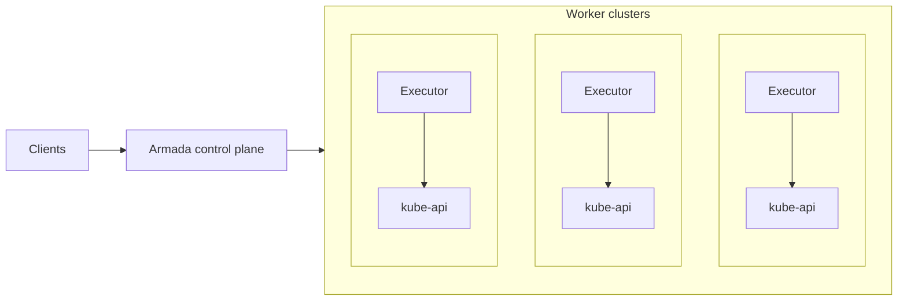

## Event-Sourcing Architecture

Armada uses an **event-sourcing** (data stream) architecture for high scalability and resilience. The system has two main components:

1. **Log-based message broker**: Stores state transitions durably and in order (the source of truth)
2. **Materialized views**: Independent databases that derive their state from the log

### Key Properties

- **Durability**: Messages are stored durably and survive node failures
- **Ordering**: All subscribers see messages in the same order
- **Eventual consistency**: Databases are updated independently, ensuring eventual consistency
- **Replayability**: Any database can be reconstructed by replaying messages from the log

### Implementation

Armada uses **Apache Pulsar** as the log implementation. This approach provides:

- **Resilience to load bursts**: The log buffers state transitions, isolating downstream components
- **Simplicity and extensibility**: New views can be added by subscribing to the log
- **Consistency guarantees**: Databases eventually converge to the same state

## Control Plane Components

The Armada control plane consists of several subsystems:

### Submit API

- Accepts job submissions from clients
- Handles authentication and authorization
- Validates job specifications
- Publishes job submission events to the log

### Streams API

- Enables clients to subscribe to job state updates via event streams
- Provides a single connection per job set for scalable event delivery
- Isolates clients from internal system messages

### Scheduler

- Maintains a global view of system state
- Makes preemption and scheduling decisions
- Balances fairness, throughput, and timeliness
- Publishes scheduling decisions to the log

The scheduler runs periodically and considers:

- Available resources across all worker clusters
- Queue priorities and fair share
- Job priorities and urgency
- Gang scheduling constraints

### Executors

Each executor is responsible for one Kubernetes worker cluster:

- Queries the scheduler for jobs to run
- Creates Kubernetes resources (pods, services, etc.) via the Kubernetes API
- Monitors job execution
- Reports job completion and resource availability back to the scheduler

### Lookout (Web UI)

- Provides a web interface for viewing job state
- Maintains its own materialized view by reading from the log
- Displays jobs, queues, and system metrics

## Job Lifecycle Flow

Here's how a job flows through the system:

1. **Submission**: Client submits job to Submit API → API validates and publishes to log
2. **Queued**: Scheduler receives job from log and stores it in queue
3. **Scheduled**: Scheduler assigns job to a cluster/node and publishes scheduling decision to log
4. **Leased**: Log processor writes scheduling decision to executor database
5. **Pending**: Executor reads from database, creates Kubernetes resources
6. **Running**: Kubernetes starts containers
7. **Completed**: Executor reports completion → Scheduler publishes completion event to log

## Consistency and Reliability

Armada ensures consistency across components using **ordered idempotent updates**:

- State transitions are published to the log in order
- Each component processes messages independently and idempotently
- Components track the most recent message processed
- After failures, components can recover by replaying from their last checkpoint

This approach provides:

- **Eventual consistency**: All databases eventually reflect the same state
- **Fault tolerance**: Components can recover independently
- **Scalability**: No distributed transactions needed

## Storage and State

Armada uses multiple databases for different purposes:

- **Scheduler database**: Stores jobs to be scheduled (PostgreSQL)
- **Lookout database**: Stores jobs for UI display (PostgreSQL)
- **Executor databases**: Interface between scheduler and executors

All databases are materialized views derived from the log, ensuring they can be reconstructed if needed.
