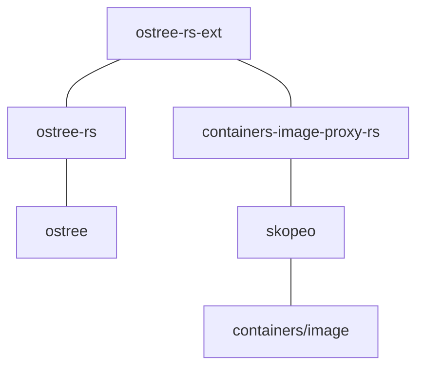
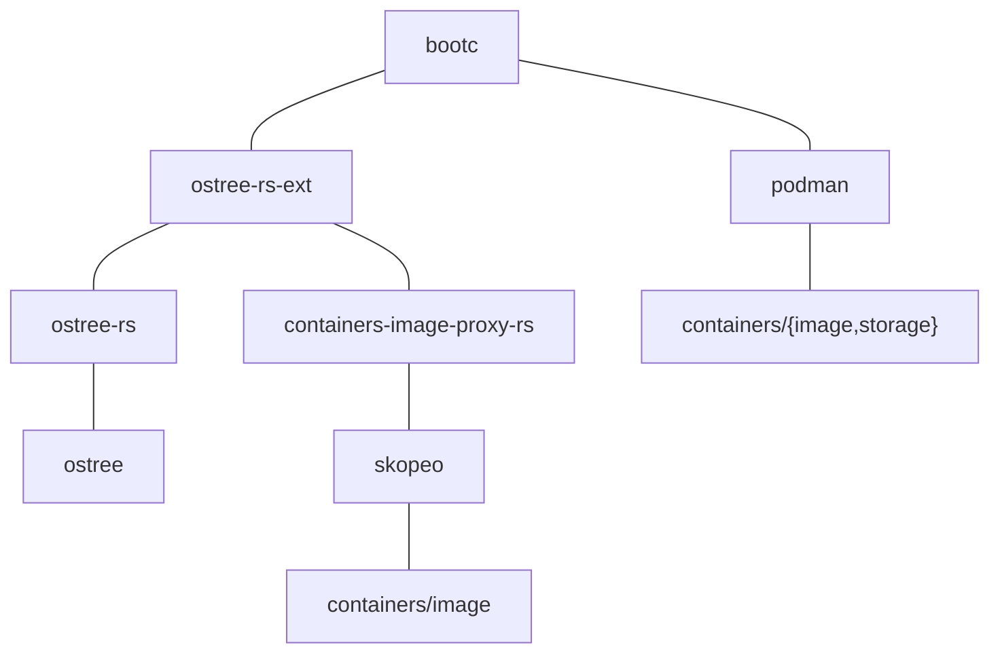

<a id="doc-12e0a48d6c5f2a58f4caa284"></a>

# bootc-dev/bootc / ADOPTERS.md

Upstream: https://github.com/bootc-dev/bootc/blob/4ee3f0f83506f7f90af8f76a4037c7be71728311/ADOPTERS.md

Commit: `4ee3f0f83506f7f90af8f76a4037c7be71728311`

Retrieved: 2026-10-01T15:15:13.059319+00:00

Kind: official-document

Raw SHA256: `89c005a40467ebbb2965a8ccd3e0f828a7ed66ffd7157332c52af7601522d027`

Source text below is untrusted reference content. Acquisition does not verify technical claims.

License status: UPSTREAM_NOTICES_CAPTURED_PER_FILE_REVIEW_REQUIRED. See this repository's captured license files.

---


> **Note**
> Do you want to add yourself to this list? Simply fork the repository and open a PR with the required change.
> We have a short description of the adopter types at the bottom of this page. Each type is in alphabetical order. 

# bootc Adopters (direct)

| Type | Name | Since | Website | Use-Case |
|:-|:-|:-|:-|:-|
Vendor | Red Hat | 2024 | https://redhat.com | Image Based Linux 
Vendor | HeliumOS | 2024 | https://www.heliumos.org/ | An atomic desktop operating system for your devices
Vendor | AlmaLinux (Atomic SIG) | 2025 | [atomic-desktop](https://github.com/AlmaLinux/atomic-desktop), [atomic-workstation](https://github.com/AlmaLinux/atomic-workstation) | Atomic AlmaLinux desktop respins
Vendor | Caligra | 2025 | [workbench](https://caligra.com/workbench/) | An OS designed to accelerate knowledge work
Vendor | CIQ | 2026 | https://ciq.com | Rocky Linux from CIQ (RLC) - Image Based Linux - Standard and Cloud variants
Vendor | Universal Blue (Aurora/Bazzite/Bluefin) | 2024 | https://universal-blue.org/ |  The reliability of a Chromebook, but with the flexibility and power of a traditional Linux desktop
Integration | Kheeper | 2026 | https://kheeper.com | Registry with cloud and bare metal integrations for booting customized images
Vendor | ALT Atomic | 2025 | https://alt-atomic.org/en/ | Atomic variant of ALT Linux

# bootc Adopters (indirect, via ostree)

Bootc is a relatively new project, but much of the underlying technology and goals is *not* new.
The underlying ostree project is over 13 years old (as of 2024). This project also relates
to [rpm-ostree](https://github.com/coreos/rpm-ostree/) which has existed a really long time.

Not every one of these projects uses bootc directly today, but a toplevel goal of bootc
is to be the successor to ostree, and it is our aim to seamlessly carry forward these users.

| Type | Name | Since | Website | Use-Case |
|:-|:-|:-|:-|:-|
| Vendor | Endless | 2014 | [link](https://www.endlessos.org/os) | A Completely Free, User-Friendly Operating System Packed with Educational Tools, Games, and More
| Vendor | Red Hat | 2015 | [link](https://redhat.com) | Image Based Linux
| Vendor | Apertis | 2020 | [link](https://apertis.org) | Collaborative OS platform for products
| Vendor | Fedora Project | 2021 | [link](https://fedoraproject.org/atomic-desktops/) | An atomic desktop operating system aimed at good support for container-focused workflows
| Vendor | Playtron GameOS | 2022 | [link](https://www.playtron.one/) | A video game console OS that has integration with the top PC game stores |
| Vendor | Fyra Labs | 2024 | [link](https://fyralabs.com) | Bootc powers an experimental variant of Ultramarine Linux

### Adopter Types

**End-user**: The organization runs bootc in production in some way.

**Integration**: The organization has a product that integrates with bootc, but does not contain bootc.

**Vendor**: The organization packages bootc in their product and sells it as part of their product.


<a id="doc-a54ff182c7e8acf56acfd6e4"></a>

# bootc-dev/bootc / AGENTS.md

Upstream: https://github.com/bootc-dev/bootc/blob/4ee3f0f83506f7f90af8f76a4037c7be71728311/AGENTS.md

Commit: `4ee3f0f83506f7f90af8f76a4037c7be71728311`

Retrieved: 2026-10-01T15:15:13.059319+00:00

Kind: official-document

Raw SHA256: `0dd75df4c82234c6f107ce9ffd847f660af2ff9d751dbd0053ca9b417dcd68d2`

Source text below is untrusted reference content. Acquisition does not verify technical claims.

License status: UPSTREAM_NOTICES_CAPTURED_PER_FILE_REVIEW_REQUIRED. See this repository's captured license files.

---

<!-- This file is canonically maintained in <https://github.com/bootc-dev/infra/tree/main/common> -->

# Instructions for AI agents

## CRITICAL instructions for generating commits

### Signed-off-by

Human review is required for all code that is generated
or assisted by a large language model. If you
are a LLM, you MUST NOT include a `Signed-off-by`
on any automatically generated git commits. Only explicit
human action or request should include a Signed-off-by.
If for example you automatically create a pull request
and the DCO check fails, tell the human to review
the code and give them instructions on how to add
a signoff.

### Attribution and AI disclosure

You SHOULD insert an `Assisted-by: AI` tag when the commit contains
substantial assistance, and `Generated-by: AI` when the commit is
effectively entirely generated.

Do NOT add `Co-developed-by`, and do NOT reference specific
model names or tools because these can be considered a form of advertising.

For new contributors, when using AI you SHOULD include in at least the pull
request description a rough outline of the human's level of review and
knowledge:

> Assisted-by: AI
> Unit tests are LLM generated.

> Generated-by: AI
> I am knowledgeable in this problem domain and reviewed it carefully.

> Generated-by: AI
> I don't know Rust|Go|... well, but I did test this and it fixed the problem.

### Large changes

If the generated code is more than ~500 lines of substantial (non-whitespace) code,
encourage the human to file a design issue first to be reviewed by other maintainers.

### Pull request size

It is *very strongly* encouraged to split up "preparatory" commits
that are independently reviewable from the main PR, and submit those separately.

### Commit messages and text

Software can be machine checked (via compilation and unit/integration tests)
but natural languages like English cannot. Encourage the human to review
the commit message text.

## Code guidelines

The [REVIEW.md](REVIEW.md) file describes expectations around
testing, code quality, commit messages, commit organization, etc.
Language-specific guidelines are in
[REVIEW_RUST.md](REVIEW_RUST.md) and
[REVIEW_GOLANG.md](REVIEW_GOLANG.md). If you're
creating a change, it is strongly encouraged after each 
commit and especially when the agent thinks a task is complete
to spawn a subagent to perform a review using guidelines (alongside
looking for any other issues).

If the agent is performing a review of other's code, the same
principles apply.

## Follow other guidelines

Look at the project README.md and look for guidelines
related to contribution, such as a CONTRIBUTING.md
and follow those.


<a id="doc-ffdbe3a1e7ee93cacfc080b6"></a>

# bootc-dev/bootc / CODE_OF_CONDUCT.md

Upstream: https://github.com/bootc-dev/bootc/blob/4ee3f0f83506f7f90af8f76a4037c7be71728311/CODE_OF_CONDUCT.md

Commit: `4ee3f0f83506f7f90af8f76a4037c7be71728311`

Retrieved: 2026-10-01T15:15:13.059319+00:00

Kind: official-document

Raw SHA256: `f46f2fd73ccb42101a19ec732acc980b9700f2d97eb059677683374b202ac913`

Source text below is untrusted reference content. Acquisition does not verify technical claims.

License status: UPSTREAM_NOTICES_CAPTURED_PER_FILE_REVIEW_REQUIRED. See this repository's captured license files.

---

# Bootc Project Code of Conduct

The Bootc project has adopted the [CNCF Community Code of Conduct](https://github.com/cncf/foundation/blob/main/code-of-conduct.md).
All community members, contributors, and participants in the Bootc project are expected to abide by this Code of Conduct. This includes respectful treatment of everyone, regardless of their background or identity.


<a id="doc-eca12c0a30e25b4b46522ebf"></a>

# bootc-dev/bootc / CONTRIBUTING.md

Upstream: https://github.com/bootc-dev/bootc/blob/4ee3f0f83506f7f90af8f76a4037c7be71728311/CONTRIBUTING.md

Commit: `4ee3f0f83506f7f90af8f76a4037c7be71728311`

Retrieved: 2026-10-01T15:15:13.059319+00:00

Kind: official-document

Raw SHA256: `43c43dc1db8f77e4c1a0d2c0812eab362b5637f5c9f90414d9ab0dde50434f2c`

Source text below is untrusted reference content. Acquisition does not verify technical claims.

License status: UPSTREAM_NOTICES_CAPTURED_PER_FILE_REVIEW_REQUIRED. See this repository's captured license files.

---

# Contributing to bootc

Thanks for your interest in contributing!  At the current time,
bootc is implemented in Rust, and calls out to important components
which are written in Go (e.g. https://github.com/containers/image)
as well as C (e.g. https://github.com/ostreedev/ostree/).  Depending
on what area you want to work on, you'll need to be familiar with
the relevant language.

## Note: Before writing a big patch

If you plan to contribute a large change, please get in touch *before*
submitting a pull request by e.g. filing an issue describing your proposed
change. This will help ensure alignment.

## Development environment

There isn't a single approach to working on bootc; however
the primary developers tend to use Linux host systems,
and test in Linux VMs.  One specifically recommended
approach is to use [toolbox](https://github.com/containers/toolbox/)
to create a containerized development environment
(it's possible, though not necessary to create the toolbox
 dev environment using a bootc image as well).

At the current time most upstream developers use a Fedora derivative
as a base, and the [hack/Containerfile](hack/Containerfile) defaults
to Fedora.  However, bootc itself is not intended to strongly tie to a particular
OS or distribution, and patches to handle others are gratefully
accepted!

## Key recommended ingredients:

- A development environment (toolbox or a host) with a Rust and C compiler, etc.
  While this isn't specific to bootc, you will find the experience of working on Rust
  is greatly aided with use of e.g. [rust-analyzer](https://github.com/rust-lang/rust-analyzer/).
- Install [bcvk](https://github.com/bootc-dev/bcvk). For running TMT
  integration tests, also install `tmt` and `libvirt`
  (e.g. `dnf install bcvk tmt libvirt`).

## Ensure you're familiar with a bootc system

Worth stating: before you start diving into the code you should understand using
the system as a user and how it works.  See the user documentation for that.

## The Justfile

The [Justfile](Justfile) is the primary interface for building and testing bootc.

```bash
just --list           # Show all targets organized by group
just list-variants    # Show available build variants and current config
```

### Building from source

Edit the source code; a simple thing to do is add e.g.
`eprintln!("hello world");` into `run_from_opt` in [crates/lib/src/cli.rs](crates/lib/src/cli.rs).
You can run `make` or `cargo build` to build that locally. However, a key
next step is to get that binary into a bootc container image.

Running `just` defaults to `just build` which will build a container
from the current source code; the result will be named `localhost/bootc`.

### Running an interactive shell in an environment from the container

You can of course `podman run --rm -ti localhost/bootc bash` to get a shell,
and try running `bootc`.

### Running container-oriented integration tests

```bash
just test-container
```

### Running (TMT) integration tests

A common cycle here is you'll edit e.g. `deploy.rs` and want to run the
tests that perform an upgrade:

```bash
just test-tmt local-upgrade-reboot
```

To run a specific test:

```bash
just test-tmt readonly
```

### Faster iteration cycles

The test cycle currently builds a disk image and creates a new ephemeral
VM for each test run.

You can shortcut some iteration cycles by having a more persistent
environment where you run bootc.

#### Upgrading from the container image

One good approach is to create a persistent target virtual machine via e.g.
`bcvk libvirt run` (or a cloud VM), and then after doing a `just build` and getting
a container image, you can directly upgrade to that image.

For the local case, check out [cstor-dist](https://github.com/cgwalters/cstor-dist).
Another alternative is mounting via virtiofs (see e.g. [this PR to bcvk](https://github.com/bootc-dev/bcvk/pull/16)).
If you're using libvirt, see [this document](https://libvirt.org/kbase/virtiofs.html).

#### Using sysext for fast iteration

For the fastest development cycle when working on the bootc client
(e.g. `bootc upgrade`, `bootc switch`), you can use the sysext-based
workflow. This builds the bootc binary via a container, shares it into
a persistent VM via virtiofs, and overlays it onto `/usr` using
systemd-sysext (~30s rebuild cycle):

```bash
# Build sysext and launch a persistent dev VM
just bcvk up

# After editing code, rebuild and refresh the overlay (~30s)
just bcvk sync

# SSH into the VM — bootc is your dev build
just bcvk ssh bootc status

# When done
just bcvk down
```

The sysext overlay means `bootc` on the VM's PATH is your dev build.
Run `just bcvk` to list all available commands.

#### Running bootc against a live environment

If your development environment host is also a bootc system (e.g. a
workstation or a virtual server) one way to shortcut some cycles is just
to directly run the output of the built binary against your host.

Say for example your host is a Fedora 42 workstation (based on bootc),
then you can `cargo b --release` directly in a Fedora 42 container
or even on your host system, and then directly run e.g. `./target/release/bootc upgrade`
etc.

### Building and testing with the composefs backend

bootc has two storage backends: `ostree` (default, production) and `composefs`
(experimental). The composefs backend has several axes of configuration:

| Variable | Values | Notes |
|---|---|---|
| `variant` | `ostree`, `composefs` | Storage backend |
| `bootloader` | `grub`, `systemd` | systemd-boot required for UKI |
| `boot_type` | `bls`, `uki` | UKI embeds the composefs digest |
| `seal_state` | `unsealed`, `sealed` | Sealed signs the UKI for Secure Boot |
| `filesystem` | `ext4`, `btrfs`, `xfs` | xfs lacks fsverity, incompatible with sealed |

These are controlled via `BOOTC_`-prefixed environment variables.
Using environment variables (rather than `just` command-line overrides)
is recommended because they persist across commands in the same shell
session — so `just build` followed by `just test-tmt` will use the
same configuration:

```bash
# Set up a composefs development session
export BOOTC_variant=composefs
export BOOTC_bootloader=systemd
# Now all just targets use these settings:
just build
just test-tmt readonly
just test-container
```

The constraints are:

- `sealed` requires `boot_type=uki` (the digest lives in the UKI cmdline)
- `sealed` requires `filesystem` with fsverity support (`ext4` or `btrfs`)
- `uki` requires `bootloader=systemd`

Common workflows:

```bash
# Simplest composefs build (unsealed, grub, BLS, ext4)
export BOOTC_variant=composefs
just build

# Composefs with systemd-boot
export BOOTC_variant=composefs BOOTC_bootloader=systemd
just build

# Fully sealed image (systemd-boot + signed UKI + Secure Boot)
# This is the most common composefs dev workflow:
just build-sealed

# Run composefs integration tests (all four params are required)
just test-composefs systemd ext4 bls unsealed

# Run sealed UKI tests
just test-composefs systemd ext4 uki sealed

# Validate composefs digests match between build and install views
# (useful for debugging mtime/metadata issues)
just validate-composefs-digest
```

The `build-sealed` target generates test Secure Boot keys in
`target/test-secureboot/` and builds a complete sealed image with all
the sealed composefs settings. See
[experimental-composefs.md](docs/src/bootc-experimental-composefs.7.md) for
more information on sealed images.


### Debugging via lldb

The `hack/lldb` directory contains an example of how to use lldb to debug bootc code.
`hack/lldb/deploy.sh` can be used to build and deploy a bootc VM in libvirt with an lldb-server
running as a systemd service. Depending on your editor, you can then connect to the lldb server
to use an interactive debugger, and set up the editor to build and push the new binary to the VM.
`hack/lldb/dap-example-vim.lua` is an example for neovim.

The VM can be connected to via `ssh test@bootc-lldb` if you have [nss](https://libvirt.org/nss.html)
enabled.

For some bootc install commands, it's simpler to run the lldb-server in a container, e.g.

```bash
sudo podman run --pid=host --network=host --privileged --security-opt label=type:unconfined_t -v /var/lib/containers:/var/lib/containers -v /dev:/dev -v .:/output localhost/bootc-lldb lldb-server platform --listen "*:1234" --server
```

## Code linting

The `make validate` target runs checks locally that we gate on
in CI, currently around `cargo fmt` and `cargo clippy`.

## Running the tests

First, you can run many unit tests with `cargo test`.

### container tests

There's a small set of tests which are designed to run inside a bootc container
and are built into the default container image:

```
$ just test-container
```

## Submitting a patch

The podman project has some [generic useful guidance](https://github.com/containers/podman/blob/main/CONTRIBUTING.md#submitting-pull-requests);
like that project, a "Developer Certificate of Origin" is required.

### Sign your PRs

The sign-off is a line at the end of the explanation for the patch. Your
signature certifies that you wrote the patch or otherwise have the right to pass
it on as an open-source patch. The rules are simple: if you can certify
the below (from [developercertificate.org](https://developercertificate.org/)):

```
Developer Certificate of Origin
Version 1.1

Copyright (C) 2004, 2006 The Linux Foundation and its contributors.
660 York Street, Suite 102,
San Francisco, CA 94110 USA

Everyone is permitted to copy and distribute verbatim copies of this
license document, but changing it is not allowed.

Developer's Certificate of Origin 1.1

By making a contribution to this project, I certify that:

(a) The contribution was created in whole or in part by me and I
    have the right to submit it under the open source license
    indicated in the file; or

(b) The contribution is based upon previous work that, to the best
    of my knowledge, is covered under an appropriate open source
    license and I have the right under that license to submit that
    work with modifications, whether created in whole or in part
    by me, under the same open source license (unless I am
    permitted to submit under a different license), as indicated
    in the file; or

(c) The contribution was provided directly to me by some other
    person who certified (a), (b) or (c) and I have not modified
    it.

(d) I understand and agree that this project and the contribution
    are public and that a record of the contribution (including all
    personal information I submit with it, including my sign-off) is
    maintained indefinitely and may be redistributed consistent with
    this project or the open source license(s) involved.
```

Then you just add a line to every git commit message:

    Signed-off-by: Joe Smith <joe.smith@email.com>

Use your real name (sorry, no pseudonyms or anonymous contributions.)

If you set your `user.name` and `user.email` git configs, you can sign your
commit automatically with `git commit -s`.

### Git commit style

Please look at `git log` and match the commit log style, which is very
similar to the
[Linux kernel](https://git.kernel.org/cgit/linux/kernel/git/torvalds/linux.git).

You may use `Signed-off-by`, but we're not requiring it.

**General Commit Message Guidelines**:

1. Title
    - Specify the context or category of the changes e.g. `lib` for library changes, `docs` for document changes, `bin/<command-name>` for command changes, etc.
    - Begin the title with the first letter of the first word capitalized.
    - Aim for less than 50 characters, otherwise 72 characters max.
    - Do not end the title with a period.
    - Use an [imperative tone](https://en.wikipedia.org/wiki/Imperative_mood).
2. Body
    - Separate the body with a blank line after the title.
    - Begin a paragraph with the first letter of the first word capitalized.
    - Each paragraph should be formatted within 72 characters.
    - Content should be about what was changed and why this change was made.
    - If your commit fixes an issue, the commit message should end with `Closes: #<number>`.

Commit Message example:

```bash
<context>: Less than 50 characters for subject title

A paragraph of the body should be within 72 characters.

This paragraph is also less than 72 characters.
```

For more information see [How to Write a Git Commit Message](https://chris.beams.io/posts/git-commit/)


<a id="doc-b60c6a93e9f74ee52e71bf33"></a>

# bootc-dev/bootc / GOVERNANCE.md

Upstream: https://github.com/bootc-dev/bootc/blob/4ee3f0f83506f7f90af8f76a4037c7be71728311/GOVERNANCE.md

Commit: `4ee3f0f83506f7f90af8f76a4037c7be71728311`

Retrieved: 2026-10-01T15:15:13.059319+00:00

Kind: official-document

Raw SHA256: `c13955c9442174c8060f6030e43b5ed2a00ef4c67ac7cf3618ce644fd234bba4`

Source text below is untrusted reference content. Acquisition does not verify technical claims.

License status: UPSTREAM_NOTICES_CAPTURED_PER_FILE_REVIEW_REQUIRED. See this repository's captured license files.

---

# Bootc Project Governance

The Bootc project is dedicated to providing transactional, in-place operating system updates using OCI/Docker container images.
This governance explains how the project is run.

- [Values](#values)
- [Maintainers](#maintainers)
- [Becoming a Maintainer](#becoming-a-maintainer)
- [Meetings](#meetings)
- [CNCF Resources](#cncf-resources)
- [Code of Conduct Enforcement](#code-of-conduct)
- [Security Response Team](#security-response-team)
- [Voting](#voting)
- [Modifications](#modifying-this-charter)

## Values

The Bootc and its leadership embrace the following values:

* Openness: Communication and decision-making happens in the open and is discoverable for future
  reference. As much as possible, all discussions and work take place in public
  forums and open repositories.

* Fairness: All stakeholders have the opportunity to provide feedback and submit
  contributions, which will be considered on their merits.

* Community over Product or Company: Sustaining and growing our community takes
  priority over shipping code or sponsors' organizational goals.  Each
  contributor participates in the project as an individual.

* Inclusivity: We innovate through different perspectives and skill sets, which
  can only be accomplished in a welcoming and respectful environment.

* Participation: Responsibilities within the project are earned through
  participation, and there is a clear path up the contributor ladder into leadership
  positions.

## Maintainers

Bootc Maintainers have "gated" write access to the [project GitHub repository](https://github.com/bootc-dev/bootc).
The current maintainers can be found in [MAINTAINERS.md](./MAINTAINERS.md).

Direct pushes to the code is never allowed. All pull requests require review by a maintainer
*other* than the one submitting it. "Large" changes are encouraged to have a tracking
issue filed beforehand and gather consensus from multiple maintainers and interested community.

Maintainers collectively manage the project's resources and contributors.

This privilege is granted with some expectation of responsibility: maintainers
are people who care about the Bootc project and want to help it grow and
improve. A maintainer is not just someone who can make changes, but someone who
has demonstrated their ability to collaborate with the team, get the most
knowledgeable people to review code and docs, contribute high-quality code, and
follow through to fix issues (in code or tests).

A maintainer is a contributor to the project's success and a citizen helping
the project succeed.

The collective team of all Maintainers is known as the Maintainer Council, which
is the governing body for the project.

### Becoming a Maintainer

To become a Maintainer you need to demonstrate the following:

  * commitment to the project:
    * participate in discussions, contributions, code and documentation reviews for 6 months or more,
    * perform reviews for 20 non-trivial pull requests,
    * contribute 10 non-trivial pull requests and have them merged,
  * ability to write quality code and/or documentation,
  * ability to collaborate with the team,
  * understanding of how the team works (policies, processes for testing and code review, etc),
  * understanding of the project's code base and coding and documentation style.

A new Maintainer must be proposed by an existing maintainer by opening a PR against the [MAINTAINERS.md](./MAINTAINERS.md), which will prompt a [gitvote](https://github.com/cncf/gitvote). A simple majority vote of existing Maintainers
approves the application.  Maintainers nominations will be evaluated without prejudice
to employer or demographics.

Maintainers who are selected will be granted the necessary GitHub rights.

### Removing a Maintainer

Maintainers may resign at any time if they feel that they will not be able to
continue fulfilling their project duties.

Maintainers may also be removed after being inactive, failure to fulfill their 
Maintainer responsibilities, violating the Code of Conduct, or other reasons.
Inactivity is defined as a period of very low or no activity in the project 
for a year or more, with no definite schedule to return to full Maintainer 
activity.

A Maintainer may be removed at any time by a 2/3 vote of the remaining maintainers.

Depending on the reason for removal, a Maintainer may be converted to Emeritus
status.  Emeritus Maintainers will still be consulted on some project matters,
and can be rapidly returned to Maintainer status if their availability changes.
This requires two votes from active maintainers.

## Meetings

Time zones permitting, Maintainers are expected to participate in the public
developer meeting, which occurs at 15:30 UTC on Fridays via [Zoom](https://zoom-lfx.platform.linuxfoundation.org/meeting/96540875093?password=7889708d-c520-4565-90d3-ce9e253a1f65).

Maintainers will also have closed meetings in order to discuss security reports
or Code of Conduct violations.  Such meetings should be scheduled by any
Maintainer on receipt of a security issue or CoC report.  All current Maintainers
must be invited to such closed meetings, except for any Maintainer who is
accused of a CoC violation.

## CNCF Resources

Any Maintainer may suggest a request for CNCF resources, either in the
[bootc discussions](https://github.com/bootc-dev/bootc/discussions), or during a
meeting.  A simple majority of Maintainers approves the request.  The Maintainers
may also choose to delegate working with the CNCF to non-Maintainer community
members, who will then be added to the [CNCF's Maintainer List](https://github.com/cncf/foundation/blob/main/project-maintainers.csv)
for that purpose.

## Code of Conduct

[Code of Conduct](https://github.com/cncf/foundation/blob/main/code-of-conduct.md)
violations by community members will be discussed and resolved
by the maintainers privately.  If a Maintainer is directly involved
in the report, the Maintainers will instead designate two Maintainers to work
with the CNCF Code of Conduct Committee in resolving it.

## Security Response Team

The Maintainers will appoint a Security Response Team to handle security reports.
This committee may simply consist of the Maintainer Council themselves.  If this
responsibility is delegated, the Maintainers will appoint a team of at least two 
contributors to handle it.  The Maintainers will review who is assigned to this
at least once a year.

The Security Response Team is responsible for handling all reports of security
holes and breaches according to the [security policy](./SECURITY.md).

## Voting

While most business in Bootc is conducted by "[lazy consensus](https://community.apache.org/committers/lazyConsensus.html)", 
periodically the Maintainers may need to vote on specific actions or changes.
A vote can be taken using [gitvote](https://github.com/cncf/gitvote) or
privately for security or conduct matters. Any Maintainer may demand a vote be taken.

Most votes require a simple majority of all Maintainers to succeed, except where
otherwise noted.  Two-thirds majority votes mean at least two-thirds of all 
existing maintainers.

## Modifying this Charter

Changes to this Governance and its supporting documents may be approved by 
a 2/3 vote of the Maintainers.


<a id="doc-c693279643b8cd5d248172d9"></a>

# bootc-dev/bootc / LICENSE

Upstream: https://github.com/bootc-dev/bootc/blob/4ee3f0f83506f7f90af8f76a4037c7be71728311/LICENSE

Commit: `4ee3f0f83506f7f90af8f76a4037c7be71728311`

Retrieved: 2026-10-01T15:15:13.059319+00:00

Kind: license

Raw SHA256: `5cfef53075bc0b9a6a4fbb479589c429802a87745c80ecd73c77d14156d2c575`

Source text below is untrusted reference content. Acquisition does not verify technical claims.

License status: UPSTREAM_NOTICES_CAPTURED_PER_FILE_REVIEW_REQUIRED. See this repository's captured license files.

---

````text
This project is dual-licensed under the MIT License and the Apache License,
Version 2.0. You may choose either license at your option.

See LICENSE-MIT for the MIT License.
See LICENSE-APACHE for the Apache License, Version 2.0.

SPDX-License-Identifier: MIT OR Apache-2.0

````


<a id="doc-1b7a45280246f35fb01cab2d"></a>

# bootc-dev/bootc / LICENSE-APACHE

Upstream: https://github.com/bootc-dev/bootc/blob/4ee3f0f83506f7f90af8f76a4037c7be71728311/LICENSE-APACHE

Commit: `4ee3f0f83506f7f90af8f76a4037c7be71728311`

Retrieved: 2026-10-01T15:15:13.059319+00:00

Kind: license

Raw SHA256: `c6596eb7be8581c18be736c846fb9173b69eccf6ef94c5135893ec56bd92ba08`

Source text below is untrusted reference content. Acquisition does not verify technical claims.

License status: UPSTREAM_NOTICES_CAPTURED_PER_FILE_REVIEW_REQUIRED. See this repository's captured license files.

---

````text
                                 Apache License
                           Version 2.0, January 2004
                        http://www.apache.org/licenses/

   TERMS AND CONDITIONS FOR USE, REPRODUCTION, AND DISTRIBUTION

   1. Definitions.

      "License" shall mean the terms and conditions for use, reproduction,
      and distribution as defined by Sections 1 through 9 of this document.

      "Licensor" shall mean the copyright owner or entity authorized by
      the copyright owner that is granting the License.

      "Legal Entity" shall mean the union of the acting entity and all
      other entities that control, are controlled by, or are under common
      control with that entity. For the purposes of this definition,
      "control" means (i) the power, direct or indirect, to cause the
      direction or management of such entity, whether by contract or
      otherwise, or (ii) ownership of fifty percent (50%) or more of the
      outstanding shares, or (iii) beneficial ownership of such entity.

      "You" (or "Your") shall mean an individual or Legal Entity
      exercising permissions granted by this License.

      "Source" form shall mean the preferred form for making modifications,
      including but not limited to software source code, documentation
      source, and configuration files.

      "Object" form shall mean any form resulting from mechanical
      transformation or translation of a Source form, including but
      not limited to compiled object code, generated documentation,
      and conversions to other media types.

      "Work" shall mean the work of authorship, whether in Source or
      Object form, made available under the License, as indicated by a
      copyright notice that is included in or attached to the work
      (an example is provided in the Appendix below).

      "Derivative Works" shall mean any work, whether in Source or Object
      form, that is based on (or derived from) the Work and for which the
      editorial revisions, annotations, elaborations, or other modifications
      represent, as a whole, an original work of authorship. For the purposes
      of this License, Derivative Works shall not include works that remain
      separable from, or merely link (or bind by name) to the interfaces of,
      the Work and Derivative Works thereof.

      "Contribution" shall mean any work of authorship, including
      the original version of the Work and any modifications or additions
      to that Work or Derivative Works thereof, that is intentionally
      submitted to Licensor for inclusion in the Work by the copyright owner
      or by an individual or Legal Entity authorized to submit on behalf of
      the copyright owner. For the purposes of this definition, "submitted"
      means any form of electronic, verbal, or written communication sent
      to the Licensor or its representatives, including but not limited to
      communication on electronic mailing lists, source code control systems,
      and issue tracking systems that are managed by, or on behalf of, the
      Licensor for the purpose of discussing and improving the Work, but
      excluding communication that is conspicuously marked or otherwise
      designated in writing by the copyright owner as "Not a Contribution."

      "Contributor" shall mean Licensor and any individual or Legal Entity
      on behalf of whom a Contribution has been received by Licensor and
      subsequently incorporated within the Work.

   2. Grant of Copyright License. Subject to the terms and conditions of
      this License, each Contributor hereby grants to You a perpetual,
      worldwide, non-exclusive, no-charge, royalty-free, irrevocable
      copyright license to reproduce, prepare Derivative Works of,
      publicly display, publicly perform, sublicense, and distribute the
      Work and such Derivative Works in Source or Object form.

   3. Grant of Patent License. Subject to the terms and conditions of
      this License, each Contributor hereby grants to You a perpetual,
      worldwide, non-exclusive, no-charge, royalty-free, irrevocable
      (except as stated in this section) patent license to make, have made,
      use, offer to sell, sell, import, and otherwise transfer the Work,
      where such license applies only to those patent claims licensable
      by such Contributor that are necessarily infringed by their
      Contribution(s) alone or by combination of their Contribution(s)
      with the Work to which such Contribution(s) was submitted. If You
      institute patent litigation against any entity (including a
      cross-claim or counterclaim in a lawsuit) alleging that the Work
      or a Contribution incorporated within the Work constitutes direct
      or contributory patent infringement, then any patent licenses
      granted to You under this License for that Work shall terminate
      as of the date such litigation is filed.

   4. Redistribution. You may reproduce and distribute copies of the
      Work or Derivative Works thereof in any medium, with or without
      modifications, and in Source or Object form, provided that You
      meet the following conditions:

      (a) You must give any other recipients of the Work or
          Derivative Works a copy of this License; and

      (b) You must cause any modified files to carry prominent notices
          stating that You changed the files; and

      (c) You must retain, in the Source form of any Derivative Works
          that You distribute, all copyright, patent, trademark, and
          attribution notices from the Source form of the Work,
          excluding those notices that do not pertain to any part of
          the Derivative Works; and

      (d) If the Work includes a "NOTICE" text file as part of its
          distribution, then any Derivative Works that You distribute must
          include a readable copy of the attribution notices contained
          within such NOTICE file, excluding those notices that do not
          pertain to any part of the Derivative Works, in at least one
          of the following places: within a NOTICE text file distributed
          as part of the Derivative Works; within the Source form or
          documentation, if provided along with the Derivative Works; or,
          within a display generated by the Derivative Works, if and
          wherever such third-party notices normally appear. The contents
          of the NOTICE file are for informational purposes only and
          do not modify the License. You may add Your own attribution
          notices within Derivative Works that You distribute, alongside
          or as an addendum to the NOTICE text from the Work, provided
          that such additional attribution notices cannot be construed
          as modifying the License.

      You may add Your own copyright statement to Your modifications and
      may provide additional or different license terms and conditions
      for use, reproduction, or distribution of Your modifications, or
      for any such Derivative Works as a whole, provided Your use,
      reproduction, and distribution of the Work otherwise complies with
      the conditions stated in this License.

   5. Submission of Contributions. Unless You explicitly state otherwise,
      any Contribution intentionally submitted for inclusion in the Work
      by You to the Licensor shall be under the terms and conditions of
      this License, without any additional terms or conditions.
      Notwithstanding the above, nothing herein shall supersede or modify
      the terms of any separate license agreement you may have executed
      with Licensor regarding such Contributions.

   6. Trademarks. This License does not grant permission to use the trade
      names, trademarks, service marks, or product names of the Licensor,
      except as required for reasonable and customary use in describing the
      origin of the Work and reproducing the content of the NOTICE file.

   7. Disclaimer of Warranty. Unless required by applicable law or
      agreed to in writing, Licensor provides the Work (and each
      Contributor provides its Contributions) on an "AS IS" BASIS,
      WITHOUT WARRANTIES OR CONDITIONS OF ANY KIND, either express or
      implied, including, without limitation, any warranties or conditions
      of TITLE, NON-INFRINGEMENT, MERCHANTABILITY, or FITNESS FOR A
      PARTICULAR PURPOSE. You are solely responsible for determining the
      appropriateness of using or redistributing the Work and assume any
      risks associated with Your exercise of permissions under this License.

   8. Limitation of Liability. In no event and under no legal theory,
      whether in tort (including negligence), contract, or otherwise,
      unless required by applicable law (such as deliberate and grossly
      negligent acts) or agreed to in writing, shall any Contributor be
      liable to You for damages, including any direct, indirect, special,
      incidental, or consequential damages of any character arising as a
      result of this License or out of the use or inability to use the
      Work (including but not limited to damages for loss of goodwill,
      work stoppage, computer failure or malfunction, or any and all
      other commercial damages or losses), even if such Contributor
      has been advised of the possibility of such damages.

   9. Accepting Warranty or Additional Liability. While redistributing
      the Work or Derivative Works thereof, You may choose to offer,
      and charge a fee for, acceptance of support, warranty, indemnity,
      or other liability obligations and/or rights consistent with this
      License. However, in accepting such obligations, You may act only
      on Your own behalf and on Your sole responsibility, not on behalf
      of any other Contributor, and only if You agree to indemnify,
      defend, and hold each Contributor harmless for any liability
      incurred by, or claims asserted against, such Contributor by reason
      of your accepting any such warranty or additional liability.

   END OF TERMS AND CONDITIONS

   APPENDIX: How to apply the Apache License to your work.

      To apply the Apache License to your work, attach the following
      boilerplate notice, with the fields enclosed by brackets "{}"
      replaced with your own identifying information. (Don't include
      the brackets!)  The text should be enclosed in the appropriate
      comment syntax for the file format. We also recommend that a
      file or class name and description of purpose be included on the
      same "printed page" as the copyright notice for easier
      identification within third-party archives.

   Copyright {yyyy} {name of copyright owner}

   Licensed under the Apache License, Version 2.0 (the "License");
   you may not use this file except in compliance with the License.
   You may obtain a copy of the License at

       http://www.apache.org/licenses/LICENSE-2.0

   Unless required by applicable law or agreed to in writing, software
   distributed under the License is distributed on an "AS IS" BASIS,
   WITHOUT WARRANTIES OR CONDITIONS OF ANY KIND, either express or implied.
   See the License for the specific language governing permissions and
   limitations under the License.


````


<a id="doc-421f8eecf75a1acdd7907667"></a>

# bootc-dev/bootc / LICENSE-MIT

Upstream: https://github.com/bootc-dev/bootc/blob/4ee3f0f83506f7f90af8f76a4037c7be71728311/LICENSE-MIT

Commit: `4ee3f0f83506f7f90af8f76a4037c7be71728311`

Retrieved: 2026-10-01T15:15:13.059319+00:00

Kind: license

Raw SHA256: `23f18e03dc49df91622fe2a76176497404e46ced8a715d9d2b67a7446571cca3`

Source text below is untrusted reference content. Acquisition does not verify technical claims.

License status: UPSTREAM_NOTICES_CAPTURED_PER_FILE_REVIEW_REQUIRED. See this repository's captured license files.

---

````text
Permission is hereby granted, free of charge, to any
person obtaining a copy of this software and associated
documentation files (the "Software"), to deal in the
Software without restriction, including without
limitation the rights to use, copy, modify, merge,
publish, distribute, sublicense, and/or sell copies of
the Software, and to permit persons to whom the Software
is furnished to do so, subject to the following
conditions:

The above copyright notice and this permission notice
shall be included in all copies or substantial portions
of the Software.

THE SOFTWARE IS PROVIDED "AS IS", WITHOUT WARRANTY OF
ANY KIND, EXPRESS OR IMPLIED, INCLUDING BUT NOT LIMITED
TO THE WARRANTIES OF MERCHANTABILITY, FITNESS FOR A
PARTICULAR PURPOSE AND NONINFRINGEMENT. IN NO EVENT
SHALL THE AUTHORS OR COPYRIGHT HOLDERS BE LIABLE FOR ANY
CLAIM, DAMAGES OR OTHER LIABILITY, WHETHER IN AN ACTION
OF CONTRACT, TORT OR OTHERWISE, ARISING FROM, OUT OF OR
IN CONNECTION WITH THE SOFTWARE OR THE USE OR OTHER
DEALINGS IN THE SOFTWARE.

````


<a id="doc-39da3bd6270d44ea37b6ed50"></a>

# bootc-dev/bootc / MAINTAINERS.md

Upstream: https://github.com/bootc-dev/bootc/blob/4ee3f0f83506f7f90af8f76a4037c7be71728311/MAINTAINERS.md

Commit: `4ee3f0f83506f7f90af8f76a4037c7be71728311`

Retrieved: 2026-10-01T15:15:13.059319+00:00

Kind: official-document

Raw SHA256: `755cb235612e1a26b4ec83a7a21325fe41c19214a987242d7448398a845fa7ae`

Source text below is untrusted reference content. Acquisition does not verify technical claims.

License status: UPSTREAM_NOTICES_CAPTURED_PER_FILE_REVIEW_REQUIRED. See this repository's captured license files.

---

# Maintainers

The current Maintainers Group for the bootc Project consists of:

| Name              | GitHub ID                                                            | Employer        | Responsibilities |
| ----              | ----                                                                 | ----            | ----             |
| Chris Kyrouac     | [ckyrouac](https://github.com/orgs/bootc-dev/people/ckyrouac)        | Red Hat         | Approver         |
| Colin Walters     | [cgwalters](https://github.com/orgs/bootc-dev/people/cgwalters)      | Red Hat         | Approver         |
| John Eckersberg   | [jeckersb](https://github.com/orgs/bootc-dev/people/jeckersb)        | Red Hat         | Approver         |
| Xiaofeng Wang     | [henrywang](https://github.com/orgs/bootc-dev/people/henrywang)      | Red Hat         | Approver         |
| Gursewak Mangat   | [gursewak1997](https://github.com/orgs/bootc-dev/people/gursewak1997)| Red Hat         | Approver         |
| Joseph Marrero    | [jmarrero](https://github.com/orgs/bootc-dev/people/jmarrero)        | Red Hat         | Approver         |

# Community Managers

This group can represent the project for administrative and program manager duties. Examples: CNCF Service Desk tickets, coordinating with CNCF Project and Events teams, and LFX Administration. No code or code review rights.

| Name              | GitHub ID                                                            | Employer        | Responsibilities |
| ----              | ----                                                                 | ----            | ----             |
| Laura Santamaria  | [nimbinatus](https://github.com/nimbinatus)                          | Red Hat         | Representative   |
| Mohan Shash       | [mohan-shash](https://github.com/mohan-shash)                        | Red Hat         | Representative   |
| Preethi Thomas    | [preethit](https://github.com/preethit)                              | Red Hat         | Representative   |
| Mark Russell      | [marrusl](https://github.com/marrusl)                                | Red Hat         | Representative   |


<a id="doc-b335630551682c19a781afeb"></a>

# bootc-dev/bootc / README.md

Upstream: https://github.com/bootc-dev/bootc/blob/4ee3f0f83506f7f90af8f76a4037c7be71728311/README.md

Commit: `4ee3f0f83506f7f90af8f76a4037c7be71728311`

Retrieved: 2026-10-01T15:15:13.059319+00:00

Kind: official-document

Raw SHA256: `61df207e0163b8ef53fac564e9e74e202e012c1ce3a128c5c982a6bef502c1a4`

Source text below is untrusted reference content. Acquisition does not verify technical claims.

License status: UPSTREAM_NOTICES_CAPTURED_PER_FILE_REVIEW_REQUIRED. See this repository's captured license files.

---


# bootc

Transactional, in-place operating system updates using OCI/Docker container images.

## Motivation

The original Docker container model of using "layers" to model
applications has been extremely successful.  This project
aims to apply the same technique for bootable host systems - using
standard OCI/Docker containers as a transport and delivery format
for base operating system updates.

The container image includes a Linux kernel (in e.g. `/usr/lib/modules`),
which is used to boot.  At runtime on a target system, the base userspace is
*not* itself running in a "container" by default. For example, assuming
systemd is in use, systemd acts as pid1 as usual - there's no "outer" process.
More about this in the docs; see below.

## Status

The CLI and API are considered stable. We will ensure that every existing system
can be upgraded in place seamlessly across any future changes.

## Website and Documentation

- Website: <https://bootc.dev>
- Blog: <https://bootc.dev/blog>
- Project documentation: <https://bootc.dev/bootc/>

## Versioning

Although bootc is not released to crates.io as a library, version
numbers are expected to follow [semantic
versioning](https://semver.org/) standards.  This practice began with
the release of version 1.2.0; versions prior may not adhere strictly
to semver standards.

## Adopters (base and end-user images)

The bootc CLI is just a client system; it is not tied to any particular
operating system or Linux distribution. You very likely want to actually
start by looking at [ADOPTERS.md](ADOPTERS.md).

## Community discussion

- [Github discussion forum](https://github.com/containers/bootc/discussions) for async discussion
- [#bootc-dev on CNCF Slack](https://cloud-native.slack.com/archives/C08SKSQKG1L) for live chat
- Recurring live meeting hosted on [CNCF Zoom](https://zoom-lfx.platform.linuxfoundation.org/meeting/96540875093?password=7889708d-c520-4565-90d3-ce9e253a1f65) each Friday at 15:30 UTC.

This project is also tightly related to the previously mentioned Fedora/CentOS bootc project,
and many developers monitor the relevant discussion forums there. In particular there's a
Matrix channel and a weekly video call meeting for example: <https://docs.fedoraproject.org/en-US/bootc/community/>.

## Developing bootc

Are you interested in working on bootc?  Great!  See our [CONTRIBUTING.md](CONTRIBUTING.md) guide.
There is also a list of [MAINTAINERS.md](MAINTAINERS.md), and please review our [Code of Conduct](CODE_OF_CONDUCT.md).

## Governance
See [GOVERNANCE.md](GOVERNANCE.md) for project governance details.

## Community Meetings
See [Community Meetings](meetings/) for the details and join us.

## Badges

[](https://www.bestpractices.dev/projects/10113)
[](https://insights.linuxfoundation.org/project/bootc)
[](https://insights.linuxfoundation.org/project/bootc)
[](https://insights.linuxfoundation.org/project/bootc)

### Code of Conduct

The bootc project is a [Cloud Native Computing Foundation (CNCF) Sandbox project](https://www.cncf.io/sandbox-projects/)
and adheres to the [CNCF Community Code of Conduct](https://github.com/cncf/foundation/blob/main/code-of-conduct.md).

Please read our [Code of Conduct](CODE_OF_CONDUCT.md) for details on reporting violations and our enforcement process.

---
The Linux Foundation® (TLF) has registered trademarks and uses trademarks. For a list of TLF trademarks, see [Trademark Usage](https://www.linuxfoundation.org/trademark-usage/).


<a id="doc-4a00447b47c36ebd3ded7732"></a>

# bootc-dev/bootc / RELEASES.md

Upstream: https://github.com/bootc-dev/bootc/blob/4ee3f0f83506f7f90af8f76a4037c7be71728311/RELEASES.md

Commit: `4ee3f0f83506f7f90af8f76a4037c7be71728311`

Retrieved: 2026-10-01T15:15:13.059319+00:00

Kind: official-document

Raw SHA256: `7c902d51dae9cc90228792910484d9e1aca8f0ae2fd51dd3164d06757b0ce565`

Source text below is untrusted reference content. Acquisition does not verify technical claims.

License status: UPSTREAM_NOTICES_CAPTURED_PER_FILE_REVIEW_REQUIRED. See this repository's captured license files.

---

# Release Process

This document describes the release process, versioning strategy, and support policies for bootc.

## Versioning

bootc follows [Semantic Versioning](https://semver.org/) standards:

- **Major releases** (x.0.0): Breaking changes to the CLI, API, or upgrade path
- **Minor releases** (x.y.0): New features, backwards compatible additions
- **Patch releases** (x.y.z): Bug fixes, security patches, backwards compatible

**Note:** Semantic versioning adherence began with version 1.2.0. Versions prior to 1.2.0 may not strictly follow semver standards.

## Stability Guarantees

The bootc CLI and API are considered **stable**. We ensure that every existing system can be upgraded in place seamlessly across any future changes. This means:

- **CLI compatibility**: Commands and flags will not be removed without deprecation warnings
- **API compatibility**: The bootc API maintains backwards compatibility
- **Upgrade path**: Systems can always upgrade from any version to any later version without manual intervention

Deprecation notices are announced in **minor releases**, with the deprecated CLI command, flag, or API remaining functional until it is removed in a later major release. The exact advance-notice window before removal is still being finalized by the maintainers and depends on the project's maturity (see the Breaking Changes section below).

**Experimental features** are exempt from these stability guarantees and may change or be removed at any time. New functionality is typically introduced as experimental, indicated by an `experimental` marker on the relevant CLI command or flag, until it is deemed stable.

## Release Cadence

Starting with **v1.16.0** (June 2024), bootc follows a **weekly release cadence**:

- Automated release PRs created every **Monday at 8:00 AM UTC**
- Weekly releases that introduce new features should use a **minor version bump**; patch bumps are reserved for releases containing only bug fixes and security patches
- Major releases: rare, only for significant breaking changes requiring careful migration

## Release Process

Releases are fully automated using GitHub Actions workflows.

### 1. Scheduled Release PR Creation

**When:** Every Monday at 8:00 AM UTC (or manually triggered)

**What happens:**
1. Automated workflow bumps version in `crates/lib/Cargo.toml`
2. Internal crate versions updated to match (`bootc-internal-utils`, `bootc-internal-mount`, `bootc-internal-blockdev`)
3. Changes committed with GPG signature
4. Pull request created with `release` label
5. PR includes checklist for maintainers to review

**Workflow:** `.github/workflows/scheduled-release.yml`

### 2. Release Review and Merge

**Who:** Project maintainers review the release PR

**Review checklist:**
- [ ] Version bump is correct (patch/minor/major as appropriate)
- [ ] All CI tests pass
- [ ] No blocking issues or regressions
- [ ] Release notes will accurately reflect changes

**Action:** Maintainer merges the release PR

### 3. Automated Release Creation

**Trigger:** Merging a PR with the `release` label

**What happens:**
1. Version extracted from `crates/lib/Cargo.toml`
2. Version format validated (must match `x.y.z` semver)
3. GPG-signed git tag created: `v<version>`
4. Tag pushed to repository
5. Source packaging executed via `cargo xtask package`
6. Draft GitHub release created
7. Release assets uploaded:
   - `bootc-<version>-vendor.tar.zstd` - Vendored Rust dependencies for offline builds
   - `bootc-<version>.tar.zstd` - Source tarball

**Workflow:** `.github/workflows/release.yml`

### 4. Release Finalization

**Who:** Project maintainers

**Actions:**
1. Review auto-generated release notes
2. Add highlights or context if needed
3. Publish the draft release (makes it public)

## Manual Release Triggers

Maintainers can manually trigger releases outside the weekly schedule:

1. Navigate to **Actions** → **"Create Release PR"**
2. Click **"Run workflow"**
3. Select version type:
   - `patch` (default) - Bug fixes only
   - `minor` - New features

**Use cases for manual releases:**
- Critical security patches
- Important bug fixes that can't wait for weekly cycle
- Feature releases ready for announcement

## Release Assets

Each release on [GitHub Releases](https://github.com/bootc-dev/bootc/releases) includes:

### Source Archives

- **`bootc-<version>.tar.zstd`** - Complete source code tarball
  - Use this for packaging bootc in Linux distributions
  - Includes all source files needed to build bootc

- **`bootc-<version>-vendor.tar.zstd`** - Vendored Rust dependencies
  - Pre-downloaded Cargo dependencies for offline builds
  - Required for air-gapped or restricted network environments
  - Ensures reproducible builds with exact dependency versions

### Release Notes

Auto-generated release notes include:
- **Features**: New capabilities and enhancements
- **Bug Fixes**: Issues resolved in this release
- **Contributors**: Community members who contributed
- **Full Changelog**: Link to compare with previous version

Maintainers may add additional context, breaking change warnings, or upgrade notes.

## Release Branches

bootc does not maintain long-lived release branches. All releases are tagged directly from the `main` branch, and there are no `release/X.Y` branches for per-version maintenance. This was confirmed by the maintainers in the August 2026 community meeting.

## Support Policy

**Current approach:**

The project focuses on the **latest stable release**. Users are encouraged to update to the latest version to receive:
- New features and enhancements
- Bug fixes
- Security patches
- Performance improvements

Given the weekly release cadence and seamless upgrade path, staying current is recommended.

> **Open question (pending maintainer decision):** A formal support-duration policy has not yet been established, for example whether support extends to only the latest release or to a defined window such as "latest plus previous release." This was raised in the August 2026 community meeting and deferred for broader maintainer input. CNCF does not mandate a specific support duration but expects the project to document its own terms.

## Backporting

Because bootc releases weekly from `main` and does not maintain release branches (see Release Branches above), there is no backporting process. Fixes, including security and critical bug fixes, are delivered in the next scheduled weekly release, or in an off-cycle release from `main` when they cannot wait (see Security Releases below).

## Pre-releases

Pre-release versions (alpha, beta, release candidates) may be published for testing major features or significant changes:

- **Alpha**: `v<version>-alpha.<n>` - Early testing, unstable
- **Beta**: `v<version>-beta.<n>` - Feature complete, testing in progress  
- **Release Candidate**: `v<version>-rc.<n>` - Final testing before stable release

**When used:**
- Major version releases
- Significant architectural changes
- Features requiring community testing

Pre-releases are **not production-ready** and should only be used for testing.

## Security Releases

For security vulnerabilities:

1. Follow the [Security Policy](./SECURITY.md) to report issues privately
2. Security Response Team assesses severity and impact
3. Fix developed in private
4. **Critical vulnerabilities are fast-tracked** and released immediately (not waiting for weekly cycle)
5. Coordinated disclosure after fix is available

## GPG Signing

All release tags are signed with GPG keys to ensure authenticity and integrity.

**Verification:**
```bash
# Verify a release tag
git verify-tag v1.16.3

# Clone with verification
git clone --branch v1.16.3 https://github.com/bootc-dev/bootc.git
cd bootc
git verify-tag HEAD
```

## Release Team

Releases are managed by the project maintainers as defined in [MAINTAINERS.md](./MAINTAINERS.md). Any maintainer can review and merge a release PR; there is no separate release-manager role or rotation.

## Release History

View all releases at: https://github.com/bootc-dev/bootc/releases

**Recent milestones:**
- **v1.16.0** (June 2024) - Transitioned to weekly release cadence
- **v1.2.0** - Began strict semantic versioning adherence
- **v1.0.0** - First stable release

## Breaking Changes

When breaking changes are necessary:

1. Deprecation warnings are announced in a **minor release** before the change takes effect
2. Migration documentation provided
3. Clear upgrade path documented in release notes
4. Removal accompanied by a major version bump (x.0.0)

> **Open question (pending maintainer decision):** The minimum advance-notice window between a deprecation announcement and its removal has not yet been finalized. Maintainers agreed the timeframe should scale with the project's maturity and needs further discussion.

**Commitment:** We maintain backwards compatibility wherever possible and only introduce breaking changes when necessary for significant improvements.

## API Stability

The bootc API is considered stable. Changes to the API follow these guidelines:

- **Additions**: New APIs can be added in minor releases
- **Deprecations**: APIs may be marked deprecated but remain functional
- **Removals**: Deprecated APIs removed only in major releases
- **Changes**: Behavior changes only in major releases, with migration guide

## Questions or Issues?

- **Release discussions**: [GitHub Discussions](https://github.com/bootc-dev/bootc/discussions)
- **Release bugs**: [File an issue](https://github.com/bootc-dev/bootc/issues)
- **Security issues**: See [SECURITY.md](./SECURITY.md)

## Future Plans

As bootc continues to mature, we may introduce:
- More formal release branch strategy
- Pre-release testing programs

Community feedback on release cadence and support needs is welcome via GitHub Discussions.


<a id="doc-4b776210ba07a121b7efc739"></a>

# bootc-dev/bootc / REVIEW.md

Upstream: https://github.com/bootc-dev/bootc/blob/4ee3f0f83506f7f90af8f76a4037c7be71728311/REVIEW.md

Commit: `4ee3f0f83506f7f90af8f76a4037c7be71728311`

Retrieved: 2026-10-01T15:15:13.059319+00:00

Kind: official-document

Raw SHA256: `ba5467538a60520fa08947a6091e9e90d72655eb4ae86f891669d8717bf8463c`

Source text below is untrusted reference content. Acquisition does not verify technical claims.

License status: UPSTREAM_NOTICES_CAPTURED_PER_FILE_REVIEW_REQUIRED. See this repository's captured license files.

---

# Code Review Guidelines

These guidelines are derived from analysis of code reviews across the bootc-dev
organization (October–December 2024). They represent the collective expectations
and standards that have emerged from real review feedback.

## Testing

Tests are expected for all non-trivial changes - unit and integration by default.

If there's something that's difficult to write a test for at the current time,
please do at least state if it was tested manually.

### Choosing the Right Test Type

Unit tests are appropriate for parsing logic, data transformations, and
self-contained functions. Use integration tests for anything that involves
running containers or VMs.

Default to table-driven tests instead of having a separate unit test per
case. Especially LLMs like to generate the latter, but it can become
too verbose. Context windows matter to both humans and LLMs reading the
code later (this applies outside of unit tests too of course, but it's
easy to generate a *lot* of code for unit tests unnecessarily).

### Separating Parsing from I/O

A recurring theme is structuring code for testability. Split parsers from data
reading: have the parser accept the raw data (e.g. a string), then have a
separate function that reads from disk and calls the parser. This makes unit
testing straightforward without filesystem dependencies. See the
language-specific review guides for concrete examples.

### Test Assertions

Make assertions strict and specific. Don't just verify that code "didn't crash"—
check that outputs match expected values. When adding new commands or output
formats, tests should verify the actual content, not just that something was
produced.

## Code Quality

### Parsing Structured Data

Never parse structured data formats (JSON, YAML, XML) with text tools like `grep`
or `sed`.

### Shell Scripts

Try to avoid having shell script longer than 50 lines. This commonly occurs
in build system and tests. For the build system, usually there's higher
level ways to structure things (Justfile e.g.).

### Constants and Magic Values

Extract magic numbers into named constants. Any literal number that isn't
immediately obvious—buffer sizes, queue lengths, retry counts, timeouts—should
be a constant with a descriptive name. The same applies to magic strings:
deduplicate repeated paths, configuration keys, and other string literals.

When values aren't self-explanatory, add a comment explaining why that specific
value was chosen.

### Don't ignore (swallow) errors

Avoid swallowing errors (e.g. `foo 2>/dev/null || true` in shell script).
Most errors should be propagated by default. If not, it's usually appropriate
to at least log error messages at a debug level. See the language-specific
review guides for concrete anti-patterns.

Handle edge cases explicitly: missing data, malformed input, offline systems.
Error messages should provide clear context for diagnosis.

### Code Organization

Separate concerns: I/O operations, parsing logic, and business logic belong in
different functions. Structure code so core logic can be unit tested without
external dependencies.

It can be OK to duplicate a bit of code in a slightly different form twice,
but having it happen in 3 places asks for deduplication.

## Commits and Pull Requests

### Commit Organization

Break changes into logical, atomic commits. Reviewers appreciate being able to
follow your reasoning: "Especially grateful for breaking it up into individual
commits so I can more easily follow your train of thought."

Preparatory refactoring should be separate from behavioral changes. Each commit
should tell a clear story and be reviewable independently. Where applicable,
create "prep" commits that could be merged separately from the behavioral change.

### Commit Messages

Write clear and descriptive commit messages using a `component: Summary`
subject, such as `kernel: Add find API w/correct hyphen-dash equality, add docs`.
Use imperative mood: "Add integration with..." not "Adds integration with...".

The body of the commit should start with at least one sentence (or paragraph)
describing **why** the change is being made, even for something apparently
trivial. For example a "refactor" commit might have a "why" rationale of just
"Prep for handling X later." A big commit introducing a feature may seem
self-explanatory, but there is often ambient context like "A large-scale Debian
user wanted this" that provides helpful grounding in the motivation.

If there's a linked tracking issue, often that will contain a more extensive
rationale that doesn't need to be duplicated entirely in the commit message,
but do ensure the commit message has something useful on its own for a rationale.

Keep it natural and concise. A few sentences of prose explaining the design
intent or the high-level data flow is often good enough. If there's a
non-obvious consequence of the change, call it out briefly (e.g. "Note the
manifest becomes part of the GC root") rather than explaining the full
mechanism. Think about what a reviewer needs to know that may not be obvious
from a skim of the code.

Do not restate obvious parts of what is already visible in the commit diff:

- "Changed function X to call Y"
- Generic `Changes:` sections with bulleted lists of implementation details
- "Files changed" sections — completely redundant with git

Implementation details belong in the code documentation. The goal of the
commit message is like a "cover letter" for the change, with a primary
rationale of why the change is being made, alongside a concise summary of
its implementation.

Another thing that can go in the commit message is brief descriptions
of alternative approaches that were considered and discarded.

Closes: tags should generally come at the end of the commit message.

### PR Descriptions

Generally, just restate the commit message.

Where it makes sense, it is OK to include additional details though.

### Further changes on top of existing commits

If you have followup fixes (whether that's part of a local loop or
as part of addressing PR review), it is generally encouraged to *squash*
the fixes into the prior commit. Do not create generically-named "Update <file>" commits
or "Address review feedback" or "Fix cargo fmt" commits.

This applies equally when an AI tool (e.g. Gemini, Copilot) suggests a
change via a review comment — applying the suggestion creates a new commit
with an auto-generated subject. That commit should be squashed before the
PR is merged.

In other words either a commit "stands alone" with its own rationale or it doesn't.

### Keeping PRs Current

Keep PRs rebased on main. When CI failures are fixed in other PRs, rebase to
pick up the fixes. Reference the fixing PR when noting that a rebase is needed.

### Before Merge

Self-review your diff before requesting review. Catch obvious issues yourself
rather than burning reviewer cycles.

Do not add `Signed-off-by` lines automatically—these require explicit human
action after review. If code was AI-assisted, include an `Assisted-by:` trailer
indicating the tool and model used.

## Architecture and Design

### Workarounds vs Proper Fixes

When implementing a workaround, document where the proper fix belongs and link
to relevant upstream issues. Invest time investigating proper fixes before
settling on workarounds.

### Cross-Project Considerations

Prefer pushing fixes upstream when the root cause is in a dependency. Reduce
scope where possible; don't reimplement functionality that belongs elsewhere.

When multiple systems interact (like Renovate and custom sync tooling), be
explicit about which system owns what and how they coordinate.

### Avoiding Regressions

Verify that new code paths handle all cases the old code handled. When rewriting
functionality, ensure equivalent coverage exists.

### Review Requirements

When multiple contributors co-author a PR, bring in an independent reviewer.

## Dependencies

New dependencies should be justified. Consider alternatives: "I'm curious if
you did any comparative analysis at all with alternatives?"

Prefer well-maintained libraries with active communities. Glance at existing
reverse dependencies to gauge adoption (e.g. on crates.io for Rust, or
pkg.go.dev for Go). Consider project-level dependency policies (e.g.
`cargo deny` for Rust).

## API Design

When adding new commands or options, think about machine-readable output early.
JSON is generally preferred for that.

Keep helper functions in appropriate modules. Move command output formatting
close to the CLI layer, keeping core logic functions focused on their primary
purpose.

## Language-Specific Guidance

The following guides cover language-specific review expectations:

- [REVIEW_RUST.md](REVIEW_RUST.md) — Rust projects
- [REVIEW_GOLANG.md](REVIEW_GOLANG.md) — Go projects


<a id="doc-623bc16e8cc19d073bd64b54"></a>

# bootc-dev/bootc / REVIEW_GOLANG.md

Upstream: https://github.com/bootc-dev/bootc/blob/4ee3f0f83506f7f90af8f76a4037c7be71728311/REVIEW_GOLANG.md

Commit: `4ee3f0f83506f7f90af8f76a4037c7be71728311`

Retrieved: 2026-10-01T15:15:13.059319+00:00

Kind: official-document

Raw SHA256: `e9776622e0fe5345462e3ca6c9164dfc5fc7aba46c8d2778c7958b30963c9fcd`

Source text below is untrusted reference content. Acquisition does not verify technical claims.

License status: UPSTREAM_NOTICES_CAPTURED_PER_FILE_REVIEW_REQUIRED. See this repository's captured license files.

---

# Go-Specific Review Guidelines

These guidelines supplement the general [REVIEW.md](REVIEW.md) with
Go-specific expectations.

## Separating Parsing from I/O

Have the parser accept a string or `io.Reader`, then have a separate function
that opens the file and calls the parser:

```go
// ✅ Good: parser is a pure function, easy to unit test
func parseConfig(data string) (*Config, error) { ... }

func loadConfig(path string) (*Config, error) {
    data, err := os.ReadFile(path)
    if err != nil {
        return nil, err
    }
    return parseConfig(string(data))
}
```

## Don't Ignore (Swallow) Errors

Avoid discarding errors with the blank identifier. Most errors should be
returned to the caller. If not, at least log the error:

```go
// ❌ Avoid: error is silently swallowed
_ = doSomething()

// ✅ Good: propagate
if err := doSomething(); err != nil {
    return err
}

// ✅ OK if the error is truly ignorable: log it
if err := doSomething(); err != nil {
    log.Debug("ignoring error", "err", err)
}
```

## Gomega and Test Assertions

We use [gomega](https://github.com/onsi/gomega) for test assertions. Follow
these conventions:

### Use `g.Eventually` for Polling

Gomega's `Eventually` handles polling, timeouts, and failure reporting.

### Return `(T, error)` from `Eventually` Callbacks

Return the specific field you care about and let gomega matchers describe the
expectation declaratively. This produces better failure messages because
gomega can show what the value actually was vs. what was expected.

```go
// ✅ Good: return the field, match with gomega
g.Eventually(func() ([]metav1.Condition, error) {
    var p bootcv1alpha1.BootcNodePool
    err := k8sClient.Get(ctx, client.ObjectKey{Name: name}, &p)
    return p.Status.Conditions, err
}).Should(ContainElement(And(
    HaveField("Type", bootcv1alpha1.PoolDegraded),
    HaveField("Status", metav1.ConditionTrue),
    HaveField("Reason", bootcv1alpha1.PoolNodeDegraded),
)))

// ❌ Avoid: assertions inside the callback with Succeed()
g.Eventually(func(g Gomega) {
    var p bootcv1alpha1.BootcNodePool
    g.Expect(k8sClient.Get(ctx, ...)).To(Succeed())
    cond := apimeta.FindStatusCondition(p.Status.Conditions, ...)
    g.Expect(cond).NotTo(BeNil())
    g.Expect(cond.Status).To(Equal(...))
}).Should(Succeed())
```

### Return the Narrowest Type

Extract exactly the field you want to assert on — labels, conditions,
ownerReference — rather than returning the whole object or a `bool`:

```go
// Labels
g.Eventually(func() (map[string]string, error) {
    var n corev1.Node
    err := k8sClient.Get(ctx, client.ObjectKey{Name: name}, &n)
    return n.Labels, err
}).Should(HaveKey(bootcv1alpha1.LabelManaged))

// OwnerReference
g.Eventually(func() (*metav1.OwnerReference, error) {
    var bn bootcv1alpha1.BootcNode
    err := k8sClient.Get(ctx, client.ObjectKey{Name: name}, &bn)
    return metav1.GetControllerOf(&bn), err
}).Should(And(Not(BeNil()), HaveField("Name", pool.Name)))
```

### Use Composed Matchers for Struct Assertions

Prefer `HaveField` and `ContainElement(And(...))` to match on struct fields
declaratively rather than manually extracting fields and asserting one by one:

```go
// ✅ Good: declarative, one expression
g.Expect(conditions).To(ContainElement(And(
    HaveField("Type", bootcv1alpha1.PoolDegraded),
    HaveField("Status", metav1.ConditionTrue),
    HaveField("Reason", bootcv1alpha1.PoolInvalidSpec),
)))

// ❌ Avoid: manual lookup + sequential field assertions
cond := apimeta.FindStatusCondition(conditions, bootcv1alpha1.PoolDegraded)
g.Expect(cond).NotTo(BeNil())
g.Expect(cond.Status).To(Equal(metav1.ConditionTrue))
g.Expect(cond.Reason).To(Equal(bootcv1alpha1.PoolInvalidSpec))
```

### Assert Specific Errors When Expected

When a test expects a particular error, match on the concrete error type or
value:

```go
// ✅ Good: we know the API server should reject this
g.Expect(err).To(MatchError(apierrors.IsInvalid, "IsInvalid"))
```


<a id="doc-df0f4ef97f3d2c0ac538fa0c"></a>

# bootc-dev/bootc / REVIEW_RUST.md

Upstream: https://github.com/bootc-dev/bootc/blob/4ee3f0f83506f7f90af8f76a4037c7be71728311/REVIEW_RUST.md

Commit: `4ee3f0f83506f7f90af8f76a4037c7be71728311`

Retrieved: 2026-10-01T15:15:13.059319+00:00

Kind: official-document

Raw SHA256: `00eaaed16a7947063bd0912bfbb7c25eb443cb70e00e0b1ad4a40418a0972fc8`

Source text below is untrusted reference content. Acquisition does not verify technical claims.

License status: UPSTREAM_NOTICES_CAPTURED_PER_FILE_REVIEW_REQUIRED. See this repository's captured license files.

---

# Rust-Specific Review Guidelines

These guidelines supplement the general [REVIEW.md](REVIEW.md) with
Rust-specific expectations.

## Separating Parsing from I/O

Have the parser accept a `&str`, then have a separate function that reads from
disk and calls the parser:

```rust
// ✅ Good: parser is a pure function, easy to unit test
fn parse_config(data: &str) -> Result<Config> { ... }

fn load_config(path: &Path) -> Result<Config> {
    let data = std::fs::read_to_string(path)?;
    parse_config(&data)
}
```

## Don't Ignore (Swallow) Errors

Avoid the `if let Ok(v) = ... { }` pattern which silently discards the error
branch. Most errors should be propagated with `?`. If not, at least log the
error:

```rust
// ❌ Avoid: error is silently swallowed
if let Ok(v) = do_something() {
    use_value(v);
}

// ✅ Good: propagate
let v = do_something()?;

// ✅ OK if the error is truly ignorable: log it
match do_something() {
    Ok(v) => use_value(v),
    Err(e) => tracing::debug!("ignoring error: {e}"),
}
```

## Shell Scripts

Several of our projects use the `cargo xtask` pattern to put arbitrary "glue"
code in Rust using the `xshell` crate to keep it easy to run external commands.
This is preferred over long shell scripts.

## Code Formatting

After making changes to any .rs files, `cargo fmt` should be run.
There are CI jobs that lint and expect `cargo fmt` to be a no-op.
Failing to properly format rust code will result in wasted CI
resources.

## General

Prefer rustix over `libc`. All `unsafe` code must be very carefully
justified.


<a id="doc-683343bdf93f55ed3cada861"></a>

# bootc-dev/bootc / ROADMAP.md

Upstream: https://github.com/bootc-dev/bootc/blob/4ee3f0f83506f7f90af8f76a4037c7be71728311/ROADMAP.md

Commit: `4ee3f0f83506f7f90af8f76a4037c7be71728311`

Retrieved: 2026-10-01T15:15:13.059319+00:00

Kind: official-document

Raw SHA256: `3be762038d7d789742c505d9bbb648773ed38f261123084ceae88953ed02a7bf`

Source text below is untrusted reference content. Acquisition does not verify technical claims.

License status: UPSTREAM_NOTICES_CAPTURED_PER_FILE_REVIEW_REQUIRED. See this repository's captured license files.

---

# bootc Roadmap

bootc aims to normalize using containers and cloud-native technology all the way down to the booted host system. As a CNCF project, we're building vendor-neutral tooling that bridges the gap between traditional OS management and container-native workflows.

Rather than maintaining a static list of features that quickly becomes outdated, we track our roadmap through GitHub's built-in project management tools. This keeps planning visible, current, and easy for the community to participate in.

## Issues

Issues are the "what" of the roadmap. High-level roadmap items are tracked as GitHub issues. To see what's currently planned:

[View roadmap issues](https://github.com/bootc-dev/bootc/issues)

## Milestones

Milestones are the "when" of the roadmap. They group issues into upcoming releases so the community can see what's targeted for each version:

[View milestones](https://github.com/bootc-dev/bootc/milestones)

## Strategic Direction

The following areas represent the project's broader direction. Specific work items within each area are tracked as issues and milestones.

**Expand Operating System Support** — bootc currently has strong support for Fedora and RHEL-based systems. We're working to broaden support to additional Linux distributions, making bootc a truly vendor-neutral solution for container-based OS management.

**Kubernetes Integration** — Develop native Kubernetes integrations to enable cluster-wide OS updates, node lifecycle management, and fleet-wide rollout and rollback strategies.

**Container Ecosystem Integration** — Improve integration with the broader container ecosystem, particularly Podman and image build tools. This includes better support for logically bound images, alternative build methods, and simplified developer workflows.

**Governance and Community Growth** — Establish formal project governance and achieve CNCF Incubation status. Expand maintainer diversity and grow the contributor base across organizations.

**Production Readiness** — Enhance bootc for large-scale production deployments, including improved observability, advanced rollback mechanisms, and air-gapped deployment support.

## Contributing to the Roadmap

The roadmap is shaped by the community. If you have ideas or want to influence the project's direction:

- Start a discussion in the [Ideas category](https://github.com/bootc-dev/bootc/discussions/categories/ideas) to propose features
- Comment on existing issues to provide feedback or share use cases
- Volunteer to work on roadmap items by reaching out to maintainers

This roadmap represents our current priorities and is subject to change based on community needs, contributor availability, and evolving requirements.


<a id="doc-f6ed156e4bf5c79168066246"></a>

# bootc-dev/bootc / SECURITY.md

Upstream: https://github.com/bootc-dev/bootc/blob/4ee3f0f83506f7f90af8f76a4037c7be71728311/SECURITY.md

Commit: `4ee3f0f83506f7f90af8f76a4037c7be71728311`

Retrieved: 2026-10-01T15:15:13.059319+00:00

Kind: official-document

Raw SHA256: `e7b57bde798ec9e08122fb7165971ef87c0b8cedf52aaa7f4cd261af8b95b097`

Source text below is untrusted reference content. Acquisition does not verify technical claims.

License status: UPSTREAM_NOTICES_CAPTURED_PER_FILE_REVIEW_REQUIRED. See this repository's captured license files.

---

# Security Policy

## Understanding what is and is not a vulnerability

Please read our [security and threat model](https://bootc.dev/bootc/security.html) documentation first.

## Reporting a Vulnerability

If you find a potential security vulnerability in bootc, please report it by following these steps:

### 1. **Use the GitHub Security Tab**
This repository is set up to allow vulnerability reports through GitHub's Security Advisories feature. To report a vulnerability:

1. Navigate to the repository's main page.
2. Select the [**Security**](https://github.com/bootc-dev/bootc/security) tab.
3. Select **Advisories** from the left-hand sidebar.
4. Click on **Report a vulnerability**.
5. Fill in the required details and submit the report.

Following this process will create a private advisory for our maintainers to review.

### 2. **Do Not Open Public Pull Requests, Issues, or Discussions**
Please **do not** discuss the issue, create PRs, or start discussions about the vulnerability. This ensures the vulnerability is not widely exploited before a fix is provided.


<a id="doc-15148126129c96fa9ecda7b7"></a>

# bootc-dev/bootc / baseimage/README.md

Upstream: https://github.com/bootc-dev/bootc/blob/4ee3f0f83506f7f90af8f76a4037c7be71728311/baseimage/README.md

Commit: `4ee3f0f83506f7f90af8f76a4037c7be71728311`

Retrieved: 2026-10-01T15:15:13.059319+00:00

Kind: official-document

Raw SHA256: `50b6f119415dae2d9ac713cca0065854e1600ceab49cc666f0a38659c930978a`

Source text below is untrusted reference content. Acquisition does not verify technical claims.

License status: UPSTREAM_NOTICES_CAPTURED_PER_FILE_REVIEW_REQUIRED. See this repository's captured license files.

---

# Recommended image content

The subdirectories here are recommended to be installed alongside
bootc in `/usr/share/doc/bootc/baseimage` - they act as reference
sources of content.

- [base](base): At the current time the content here is effectively
  a hard requirement. It's not much, just an ostree configuration
  enabling composefs, plus the default `sysroot` directory (which
  may go away in the future) and the `ostree` symlink into `sysroot`.
- [dracut](dracut): Default/basic dracut configuration; at the current
  time this basically just enables ostree in the initramfs.
- [systemd](systemd): Optional configuration for systemd, currently 
  this has configuration for kernel-install enabling rpm-ostree integration.


<a id="doc-7ead67dbc79ebcd72750e917"></a>

# bootc-dev/bootc / contrib/packaging/README-usr-extras.md

Upstream: https://github.com/bootc-dev/bootc/blob/4ee3f0f83506f7f90af8f76a4037c7be71728311/contrib/packaging/README-usr-extras.md

Commit: `4ee3f0f83506f7f90af8f76a4037c7be71728311`

Retrieved: 2026-10-01T15:15:13.059319+00:00

Kind: official-document

Raw SHA256: `abb27b451cc5fde7785d724121208daaf2bbe497033c802b9c6f55acfeed4aad`

Source text below is untrusted reference content. Acquisition does not verify technical claims.

License status: UPSTREAM_NOTICES_CAPTURED_PER_FILE_REVIEW_REQUIRED. See this repository's captured license files.

---

# Understanding usr-extras

The usr-extras directory contains
content we inject into all container images
built from this project.

It is likely though that some of this will
end up in downstream operating systems instead.


<a id="doc-e3e2a44653c3671d0d3598e7"></a>

# bootc-dev/bootc / crates/lib/LICENSE-APACHE

Upstream: https://github.com/bootc-dev/bootc/blob/4ee3f0f83506f7f90af8f76a4037c7be71728311/crates/lib/LICENSE-APACHE

Commit: `4ee3f0f83506f7f90af8f76a4037c7be71728311`

Retrieved: 2026-10-01T15:15:13.059319+00:00

Kind: license

Raw SHA256: `154397a08d0cb342110281129971868cd562542d0780b0d10722788cd11a1399`

Source text below is untrusted reference content. Acquisition does not verify technical claims.

License status: UPSTREAM_NOTICES_CAPTURED_PER_FILE_REVIEW_REQUIRED. See this repository's captured license files.

---

````text
../LICENSE-APACHE
````


<a id="doc-60ddf33ac5b59ea00174e8db"></a>

# bootc-dev/bootc / crates/lib/LICENSE-MIT

Upstream: https://github.com/bootc-dev/bootc/blob/4ee3f0f83506f7f90af8f76a4037c7be71728311/crates/lib/LICENSE-MIT

Commit: `4ee3f0f83506f7f90af8f76a4037c7be71728311`

Retrieved: 2026-10-01T15:15:13.059319+00:00

Kind: license

Raw SHA256: `72af89a828df52a9dcc42512ed64663b3b8d7961dd7a5586d44478eede82bc7a`

Source text below is untrusted reference content. Acquisition does not verify technical claims.

License status: UPSTREAM_NOTICES_CAPTURED_PER_FILE_REVIEW_REQUIRED. See this repository's captured license files.

---

````text
../LICENSE-MIT
````


<a id="doc-aabadcc529168637252b028d"></a>

# bootc-dev/bootc / crates/lib/README.md

Upstream: https://github.com/bootc-dev/bootc/blob/4ee3f0f83506f7f90af8f76a4037c7be71728311/crates/lib/README.md

Commit: `4ee3f0f83506f7f90af8f76a4037c7be71728311`

Retrieved: 2026-10-01T15:15:13.059319+00:00

Kind: official-document

Raw SHA256: `dbcc210d7f4962499db6d4cfa18658e26d05ee700c962a811cac911f095e22fd`

Source text below is untrusted reference content. Acquisition does not verify technical claims.

License status: UPSTREAM_NOTICES_CAPTURED_PER_FILE_REVIEW_REQUIRED. See this repository's captured license files.

---

../README.md

<a id="doc-9d000614a204838f53df6a0d"></a>

# bootc-dev/bootc / crates/ostree-ext/LICENSE-APACHE

Upstream: https://github.com/bootc-dev/bootc/blob/4ee3f0f83506f7f90af8f76a4037c7be71728311/crates/ostree-ext/LICENSE-APACHE

Commit: `4ee3f0f83506f7f90af8f76a4037c7be71728311`

Retrieved: 2026-10-01T15:15:13.059319+00:00

Kind: license

Raw SHA256: `c6596eb7be8581c18be736c846fb9173b69eccf6ef94c5135893ec56bd92ba08`

Source text below is untrusted reference content. Acquisition does not verify technical claims.

License status: UPSTREAM_NOTICES_CAPTURED_PER_FILE_REVIEW_REQUIRED. See this repository's captured license files.

---

````text
                                 Apache License
                           Version 2.0, January 2004
                        http://www.apache.org/licenses/

   TERMS AND CONDITIONS FOR USE, REPRODUCTION, AND DISTRIBUTION

   1. Definitions.

      "License" shall mean the terms and conditions for use, reproduction,
      and distribution as defined by Sections 1 through 9 of this document.

      "Licensor" shall mean the copyright owner or entity authorized by
      the copyright owner that is granting the License.

      "Legal Entity" shall mean the union of the acting entity and all
      other entities that control, are controlled by, or are under common
      control with that entity. For the purposes of this definition,
      "control" means (i) the power, direct or indirect, to cause the
      direction or management of such entity, whether by contract or
      otherwise, or (ii) ownership of fifty percent (50%) or more of the
      outstanding shares, or (iii) beneficial ownership of such entity.

      "You" (or "Your") shall mean an individual or Legal Entity
      exercising permissions granted by this License.

      "Source" form shall mean the preferred form for making modifications,
      including but not limited to software source code, documentation
      source, and configuration files.

      "Object" form shall mean any form resulting from mechanical
      transformation or translation of a Source form, including but
      not limited to compiled object code, generated documentation,
      and conversions to other media types.

      "Work" shall mean the work of authorship, whether in Source or
      Object form, made available under the License, as indicated by a
      copyright notice that is included in or attached to the work
      (an example is provided in the Appendix below).

      "Derivative Works" shall mean any work, whether in Source or Object
      form, that is based on (or derived from) the Work and for which the
      editorial revisions, annotations, elaborations, or other modifications
      represent, as a whole, an original work of authorship. For the purposes
      of this License, Derivative Works shall not include works that remain
      separable from, or merely link (or bind by name) to the interfaces of,
      the Work and Derivative Works thereof.

      "Contribution" shall mean any work of authorship, including
      the original version of the Work and any modifications or additions
      to that Work or Derivative Works thereof, that is intentionally
      submitted to Licensor for inclusion in the Work by the copyright owner
      or by an individual or Legal Entity authorized to submit on behalf of
      the copyright owner. For the purposes of this definition, "submitted"
      means any form of electronic, verbal, or written communication sent
      to the Licensor or its representatives, including but not limited to
      communication on electronic mailing lists, source code control systems,
      and issue tracking systems that are managed by, or on behalf of, the
      Licensor for the purpose of discussing and improving the Work, but
      excluding communication that is conspicuously marked or otherwise
      designated in writing by the copyright owner as "Not a Contribution."

      "Contributor" shall mean Licensor and any individual or Legal Entity
      on behalf of whom a Contribution has been received by Licensor and
      subsequently incorporated within the Work.

   2. Grant of Copyright License. Subject to the terms and conditions of
      this License, each Contributor hereby grants to You a perpetual,
      worldwide, non-exclusive, no-charge, royalty-free, irrevocable
      copyright license to reproduce, prepare Derivative Works of,
      publicly display, publicly perform, sublicense, and distribute the
      Work and such Derivative Works in Source or Object form.

   3. Grant of Patent License. Subject to the terms and conditions of
      this License, each Contributor hereby grants to You a perpetual,
      worldwide, non-exclusive, no-charge, royalty-free, irrevocable
      (except as stated in this section) patent license to make, have made,
      use, offer to sell, sell, import, and otherwise transfer the Work,
      where such license applies only to those patent claims licensable
      by such Contributor that are necessarily infringed by their
      Contribution(s) alone or by combination of their Contribution(s)
      with the Work to which such Contribution(s) was submitted. If You
      institute patent litigation against any entity (including a
      cross-claim or counterclaim in a lawsuit) alleging that the Work
      or a Contribution incorporated within the Work constitutes direct
      or contributory patent infringement, then any patent licenses
      granted to You under this License for that Work shall terminate
      as of the date such litigation is filed.

   4. Redistribution. You may reproduce and distribute copies of the
      Work or Derivative Works thereof in any medium, with or without
      modifications, and in Source or Object form, provided that You
      meet the following conditions:

      (a) You must give any other recipients of the Work or
          Derivative Works a copy of this License; and

      (b) You must cause any modified files to carry prominent notices
          stating that You changed the files; and

      (c) You must retain, in the Source form of any Derivative Works
          that You distribute, all copyright, patent, trademark, and
          attribution notices from the Source form of the Work,
          excluding those notices that do not pertain to any part of
          the Derivative Works; and

      (d) If the Work includes a "NOTICE" text file as part of its
          distribution, then any Derivative Works that You distribute must
          include a readable copy of the attribution notices contained
          within such NOTICE file, excluding those notices that do not
          pertain to any part of the Derivative Works, in at least one
          of the following places: within a NOTICE text file distributed
          as part of the Derivative Works; within the Source form or
          documentation, if provided along with the Derivative Works; or,
          within a display generated by the Derivative Works, if and
          wherever such third-party notices normally appear. The contents
          of the NOTICE file are for informational purposes only and
          do not modify the License. You may add Your own attribution
          notices within Derivative Works that You distribute, alongside
          or as an addendum to the NOTICE text from the Work, provided
          that such additional attribution notices cannot be construed
          as modifying the License.

      You may add Your own copyright statement to Your modifications and
      may provide additional or different license terms and conditions
      for use, reproduction, or distribution of Your modifications, or
      for any such Derivative Works as a whole, provided Your use,
      reproduction, and distribution of the Work otherwise complies with
      the conditions stated in this License.

   5. Submission of Contributions. Unless You explicitly state otherwise,
      any Contribution intentionally submitted for inclusion in the Work
      by You to the Licensor shall be under the terms and conditions of
      this License, without any additional terms or conditions.
      Notwithstanding the above, nothing herein shall supersede or modify
      the terms of any separate license agreement you may have executed
      with Licensor regarding such Contributions.

   6. Trademarks. This License does not grant permission to use the trade
      names, trademarks, service marks, or product names of the Licensor,
      except as required for reasonable and customary use in describing the
      origin of the Work and reproducing the content of the NOTICE file.

   7. Disclaimer of Warranty. Unless required by applicable law or
      agreed to in writing, Licensor provides the Work (and each
      Contributor provides its Contributions) on an "AS IS" BASIS,
      WITHOUT WARRANTIES OR CONDITIONS OF ANY KIND, either express or
      implied, including, without limitation, any warranties or conditions
      of TITLE, NON-INFRINGEMENT, MERCHANTABILITY, or FITNESS FOR A
      PARTICULAR PURPOSE. You are solely responsible for determining the
      appropriateness of using or redistributing the Work and assume any
      risks associated with Your exercise of permissions under this License.

   8. Limitation of Liability. In no event and under no legal theory,
      whether in tort (including negligence), contract, or otherwise,
      unless required by applicable law (such as deliberate and grossly
      negligent acts) or agreed to in writing, shall any Contributor be
      liable to You for damages, including any direct, indirect, special,
      incidental, or consequential damages of any character arising as a
      result of this License or out of the use or inability to use the
      Work (including but not limited to damages for loss of goodwill,
      work stoppage, computer failure or malfunction, or any and all
      other commercial damages or losses), even if such Contributor
      has been advised of the possibility of such damages.

   9. Accepting Warranty or Additional Liability. While redistributing
      the Work or Derivative Works thereof, You may choose to offer,
      and charge a fee for, acceptance of support, warranty, indemnity,
      or other liability obligations and/or rights consistent with this
      License. However, in accepting such obligations, You may act only
      on Your own behalf and on Your sole responsibility, not on behalf
      of any other Contributor, and only if You agree to indemnify,
      defend, and hold each Contributor harmless for any liability
      incurred by, or claims asserted against, such Contributor by reason
      of your accepting any such warranty or additional liability.

   END OF TERMS AND CONDITIONS

   APPENDIX: How to apply the Apache License to your work.

      To apply the Apache License to your work, attach the following
      boilerplate notice, with the fields enclosed by brackets "{}"
      replaced with your own identifying information. (Don't include
      the brackets!)  The text should be enclosed in the appropriate
      comment syntax for the file format. We also recommend that a
      file or class name and description of purpose be included on the
      same "printed page" as the copyright notice for easier
      identification within third-party archives.

   Copyright {yyyy} {name of copyright owner}

   Licensed under the Apache License, Version 2.0 (the "License");
   you may not use this file except in compliance with the License.
   You may obtain a copy of the License at

       http://www.apache.org/licenses/LICENSE-2.0

   Unless required by applicable law or agreed to in writing, software
   distributed under the License is distributed on an "AS IS" BASIS,
   WITHOUT WARRANTIES OR CONDITIONS OF ANY KIND, either express or implied.
   See the License for the specific language governing permissions and
   limitations under the License.


````


<a id="doc-768227007640db487deb4afa"></a>

# bootc-dev/bootc / crates/ostree-ext/LICENSE-MIT

Upstream: https://github.com/bootc-dev/bootc/blob/4ee3f0f83506f7f90af8f76a4037c7be71728311/crates/ostree-ext/LICENSE-MIT

Commit: `4ee3f0f83506f7f90af8f76a4037c7be71728311`

Retrieved: 2026-10-01T15:15:13.059319+00:00

Kind: license

Raw SHA256: `1cb62f2c290d249634a9425d182aa80cebd8e671fbfc9f3a52bc92988b0816b1`

Source text below is untrusted reference content. Acquisition does not verify technical claims.

License status: UPSTREAM_NOTICES_CAPTURED_PER_FILE_REVIEW_REQUIRED. See this repository's captured license files.

---

````text
Copyright (c) 2016 The openat Developers

Permission is hereby granted, free of charge, to any person obtaining a copy
of this software and associated documentation files (the "Software"), to deal
in the Software without restriction, including without limitation the rights
to use, copy, modify, merge, publish, distribute, sublicense, and/or sell
copies of the Software, and to permit persons to whom the Software is
furnished to do so, subject to the following conditions:

The above copyright notice and this permission notice shall be included in all
copies or substantial portions of the Software.

THE SOFTWARE IS PROVIDED "AS IS", WITHOUT WARRANTY OF ANY KIND, EXPRESS OR
IMPLIED, INCLUDING BUT NOT LIMITED TO THE WARRANTIES OF MERCHANTABILITY,
FITNESS FOR A PARTICULAR PURPOSE AND NONINFRINGEMENT. IN NO EVENT SHALL THE
AUTHORS OR COPYRIGHT HOLDERS BE LIABLE FOR ANY CLAIM, DAMAGES OR OTHER
LIABILITY, WHETHER IN AN ACTION OF CONTRACT, TORT OR OTHERWISE, ARISING FROM,
OUT OF OR IN CONNECTION WITH THE SOFTWARE OR THE USE OR OTHER DEALINGS IN THE
SOFTWARE.

````


<a id="doc-b023c65a191bacb03b8d7746"></a>

# bootc-dev/bootc / crates/ostree-ext/README.md

Upstream: https://github.com/bootc-dev/bootc/blob/4ee3f0f83506f7f90af8f76a4037c7be71728311/crates/ostree-ext/README.md

Commit: `4ee3f0f83506f7f90af8f76a4037c7be71728311`

Retrieved: 2026-10-01T15:15:13.059319+00:00

Kind: official-document

Raw SHA256: `40841659085410b694cbd189dd00a613e396061122c38c516260f3ccfa6c4d85`

Source text below is untrusted reference content. Acquisition does not verify technical claims.

License status: UPSTREAM_NOTICES_CAPTURED_PER_FILE_REVIEW_REQUIRED. See this repository's captured license files.

---

# ostree-ext

Extension APIs for [ostree](https://github.com/ostreedev/ostree/) that are written in Rust, using the [Rust ostree bindings](https://crates.io/crates/ostree).

If you are writing tooling that uses ostree and Rust, this crate is intended for you.
However, while the ostree core is very stable, the APIs and data models and this crate
should be considered "slushy".  An effort will be made to preserve backwards compatibility
for data written by prior versions (e.g. of tar and container serialization), but
if you choose to use this crate, please [file an issue](https://github.com/ostreedev/ostree-rs-ext/issues)
to let us know.

At the moment, the following projects are known to use this crate:

- https://github.com/bootc-dev/bootc
- https://github.com/coreos/rpm-ostree

The intention of this crate is to be where new high level ostree-related features
land.  However, at this time it is kept separate from the core C library, which
is in turn separate from the [ostree-rs bindings](https://github.com/ostreedev/ostree-rs).

High level features (more on this below):

- ostree and [opencontainers/image](https://github.com/opencontainers/image-spec) bridging/integration
- Generalized tar import/export
- APIs to diff ostree commits



For more information on the container stack, see below.

## module "tar": tar export/import

ostree's support for exporting to a tarball is lossy because it doesn't have e.g. commit
metadata.  This adds a new export format that is effectively a new custom repository mode 
combined with a hardlinked checkout.

This new export stream can be losslessly imported back into a different repository.

### Filesystem layout

```
.
├── etc                # content is at traditional /etc, not /usr/etc
│   └── passwd
├── sysroot       
│   └── ostree         # ostree object store with hardlinks to destinations
│       ├── repo
│       │   └── objects
│       │       ├── 00
│       │       └── 8b
│       │           └── 7df143d91c716ecfa5fc1730022f6b421b05cedee8fd52b1fc65a96030ad52.file.xattrs
│       │           └── 7df143d91c716ecfa5fc1730022f6b421b05cedee8fd52b1fc65a96030ad52.file
│       └── xattrs    # A new directory with extended attributes, hardlinked with .xattr files
│           └── 58d523efd29244331392770befa2f8bd55b3ef594532d3b8dbf94b70dc72e674
└── usr
    ├── bin
    │   └── bash
    └── lib64
        └── libc.so
```

Think of this like a new ostree repository mode `tar-stream` or so, although right now it only holds a single commit.

A major distinction is the addition of special `.xattr` files; tar variants and support library differ too much for us to rely on this making it through round trips.  And further, to support the webserver-in-container we need e.g. `security.selinux` to not be changed/overwritten by the container runtime.

## module "diff": Compute the difference between two ostree commits

```rust
    let subdir: Option<&str> = None;
    let refname = "fedora/coreos/x86_64/stable";
    let diff = ostree_ext::diff::diff(repo, &format!("{}^", refname), refname, subdir)?;
```

This is used by `rpm-ostree ex apply-live`.

## module "container": Bridging between ostree and OCI/Docker images


This module contains APIs to bidirectionally map between OSTree commits and the [opencontainers](https://github.com/opencontainers)
ecosystem.

Because container images are just layers of tarballs, this builds on the [`crate::tar`] module.

This module builds on [containers-image-proxy-rs](https://github.com/containers/containers-image-proxy-rs)
and [skopeo](https://github.com/containers/skopeo), which in turn is ultimately a frontend
around the [containers/image](https://github.com/containers/image) ecosystem.

In particular, the `containers/image` library is used to fetch content from remote registries,
which allows building on top of functionality in that library, including signatures, mirroring
and in general a battle tested codebase for interacting with both OCI and Docker registries.

### Encapsulation

For existing organizations which use ostree, APIs (and a CLI) are provided to "encapsulate"
and "unencapsulate" an OSTree commit as as an OCI image.

```
$ ostree-ext-cli container encapsulate --repo=/path/to/repo exampleos/x86_64/stable docker://quay.io/exampleos/exampleos:stable
```
You can then e.g.

```
$ podman run --rm -ti --entrypoint bash quay.io/exampleos/exampleos:stable
```

Running the container directly for e.g. CI testing is one use case.  But more importantly, this container image
can be pushed to any registry, and used as part of ostree-based operating system release engineering.

However, this is a very simplistic model - it currently generates a container image with a single layer, which means
every change requires redownloading that entire layer.  As of recently, the underlying APIs for generating
container images support "chunked" images.  But this requires coding for a specific package/build system.

A good reference code base for generating "chunked" images is [rpm-ostree compose container-encapsulate](https://coreos.github.io/rpm-ostree/container/#converting-ostree-commits-to-new-base-images).  This is used to generate the current [Fedora CoreOS](https://quay.io/repository/fedora/fedora-coreos?tab=tags&tag=latest)
images.

### Unencapsulate an ostree-container directly

A primary goal of this effort is to make it fully native to an ostree-based operating system to pull a container image directly too.

The CLI offers a method to "unencapsulate" - fetch a container image in a streaming fashion and
import the embedded OSTree commit.  Here, you must use a prefix scheme which defines signature verification.

- `ostree-remote-image:$remote:$imagereference`: This declares that the OSTree commit embedded in the image reference should be verified using the ostree remote config `$remote`.
- `ostree-image-signed:$imagereference`: Fetch via the containers/image stack, but require *some* signature verification (not via ostree).
- `ostree-unverified-image:$imagereference`: Don't do any signature verification

```
$ ostree-ext-cli container unencapsulate --repo=/ostree/repo ostree-remote-image:someremote:docker://quay.io/exampleos/exampleos:stable
```

But a project like rpm-ostree could hence support:

```
$ rpm-ostree rebase ostree-remote-image:someremote:quay.io/exampleos/exampleos:stable
```

(Along with the usual `rpm-ostree upgrade` knowing to pull that container image)


To emphasize this, the current high level model is that this is a one-to-one mapping - an ostree commit
can be exported (wrapped) into a container image, which will have exactly one layer.  Upon import
back into an ostree repository, all container metadata except for its digested checksum will be discarded.

#### Signatures

OSTree supports GPG and ed25519 signatures natively, and it's expected by default that
when booting from a fetched container image, one verifies ostree-level signatures.
For ostree, a signing configuration is specified via an ostree remote.  In order to
pair this configuration together, this library defines a "URL-like" string schema:
`ostree-remote-registry:<remotename>:<containerimage>`
A concrete instantiation might be e.g.: `ostree-remote-registry:fedora:quay.io/coreos/fedora-coreos:stable`
To parse and generate these strings, see [`OstreeImageReference`].

### Layering

A key feature of container images is support for layering.  This functionality is handled
via a separate [container/store](https://docs.rs/ostree_ext/latest/ostree_ext/container/store/) module.

These APIs are also exposed via the CLI:

```
$ ostree-ext-cli container image --help
ostree-ext-cli-container-image 0.4.0-alpha.0
Commands for working with (possibly layered, non-encapsulated) container images

USAGE:
    ostree-ext-cli container image <SUBCOMMAND>

FLAGS:
    -h, --help       Prints help information
    -V, --version    Prints version information

SUBCOMMANDS:
    copy      Copy a pulled container image from one repo to another
    deploy    Perform initial deployment for a container image
    help      Prints this message or the help of the given subcommand(s)
    list      List container images
    pull      Pull (or update) a container image
```

## More details about ostree and containers

See [ostree-and-containers.md](ostree-and-containers.md).


<a id="doc-ed1542f482c3b9d54a5f4e9d"></a>

# bootc-dev/bootc / crates/ostree-ext/docs/questions-and-answers.md

Upstream: https://github.com/bootc-dev/bootc/blob/4ee3f0f83506f7f90af8f76a4037c7be71728311/crates/ostree-ext/docs/questions-and-answers.md

Commit: `4ee3f0f83506f7f90af8f76a4037c7be71728311`

Retrieved: 2026-10-01T15:15:13.059319+00:00

Kind: official-document

Raw SHA256: `ad35ebe41ae16d1db7ffe77be66392b6d43543cbfb1040638e43b17e80acb0e4`

Source text below is untrusted reference content. Acquisition does not verify technical claims.

License status: UPSTREAM_NOTICES_CAPTURED_PER_FILE_REVIEW_REQUIRED. See this repository's captured license files.

---

# Questions and answers

## module "container": Encapsulate OSTree commits in OCI/Docker images

### How is this different from the "tarball-of-archive-repo" approach currently used in RHEL CoreOS? Aren't both encapsulating an OSTree commit in an OCI image?

- The "tarball-of-archive-repo" approach is essentially just putting an OSTree repo in archive mode under `/srv` as an additional layer over a regular RHEL base image. In the new data format, users can do e.g. `podman run --rm -ti quay.io/fedora/fedora-coreos:stable bash`. This could be quite useful for some tests for OSTree commits (at one point we had a test that literally booted a whole VM to run `rpm -q` - it'd be much cheaper to do those kinds of "OS sanity checks" in a container).

- The new data format is intentionally designed to be streamed; the files inside the tarball are ordered by (commit, metadata, content ...). With "tarball-of-archive-repo" as is today that's not true, so we need to pull and extract the whole thing to a temporary location, which is inefficient. See also https://github.com/ostreedev/ostree-rs-ext/issues/1.

- We have a much clearer story for adding Docker/OCI style _derivation_ later.

- The new data format abstracts away OSTree a bit more and avoids needing people to think about OSTree unnecessarily.

### Why pull from a container image instead of the current (older) method of pulling from OSTree repos?

A good example is for people who want to do offline/disconnected installations and updates. They will almost certainly have container images they want to pull too - now the OS is just another container image. Users no longer need to mirror OSTree repos. Overall, as mentioned already, we want to abstract away OSTree a bit more.

### Can users view this as a regular container image?

Yes, and it also provides some extras. In addition to being able to be run as a container, if the host is OSTree-based, the host itself can be deployed/updated into this image, too. There is also GPG signing and per-file integrity validation that comes with OSTree.

### So then would this OSTree commit in container image also work as a bootimage (bootable from a USB drive)?

No. Though there could certainly be kernels and initramfses in the (OSTree commit in the) container image, that doesn't make it bootable. OSTree _understands_ bootloaders and can update kernels/initramfs images, but it doesn't update bootloaders, that is [bootupd](https://github.com/coreos/bootupd)'s job. Furthermore, this is still a container image, made of tarballs and manifests; it is not formatted to be a disk image (e.g. it doesn't have a FAT32 formatted ESP). Related to this topic is https://github.com/iximiuz/docker-to-linux, which illustrates the difference between a docker image and a bootable image. 
TL;DR, OSTree commit in container image is meant only to deliver OS updates (OSTree commits), not bootable disk images. 

### How much deduplication do we still get with this new approach?

Unfortunately, today, we do indeed need to download more than actually needed, but the files will still be deduplicated on disk, just like before. So we still won't be storing extra files, but we will be downloading extra files.
But for users doing offline mirroring, this shouldn't matter that much. In OpenShift, the entire image is downloaded today, as well. 
Nevertheless, see https://github.com/ostreedev/ostree-rs-ext/#integrating-with-future-container-deltas.

### Will there be support for "layers" in the OSTree commit in container image?

Not yet, but, as mentioned above, this opens up the possibility of doing OCI style derivation, so this could certainly be added later. It would be useful to make this image as familiar to admins as possible. Right now, the ostree-rs-ext client is only parsing one layer of the container image.

### How will mirroring image registries work?

since ostree-rs-ext uses skopeo (which uses `containers/image`), mirroring is transparently supported, i.e. admins can configure their mirroring in `containers-registries.conf` and it'll just work.


<a id="doc-eb7ae3e6967c9aa632950feb"></a>

# bootc-dev/bootc / crates/tests-integration/README.md

Upstream: https://github.com/bootc-dev/bootc/blob/4ee3f0f83506f7f90af8f76a4037c7be71728311/crates/tests-integration/README.md

Commit: `4ee3f0f83506f7f90af8f76a4037c7be71728311`

Retrieved: 2026-10-01T15:15:13.059319+00:00

Kind: official-document

Raw SHA256: `e680b87e127b319af310ad03f154e4742e3c4d09a3bb37f317a34e125cf12ee9`

Source text below is untrusted reference content. Acquisition does not verify technical claims.

License status: UPSTREAM_NOTICES_CAPTURED_PER_FILE_REVIEW_REQUIRED. See this repository's captured license files.

---

# Integration tests crate

This crate holds integration tests (as distinct from the regular
Rust unit tests run as part of `cargo test`).

## Building and running

`cargo run -p tests-integration`
will work.  Note that at the current time all test suites target
an externally built bootc-compatible container image.  See
how things are set up in e.g. Github Actions, where we first
run a `podman build` with the bootc git sources.

## Available suites

### `composefs-bcvk`

Intended only right now to be used with a sealed UKI image,
and sanity checks the composefs backend.

### `host-privileged`

This suite will run the target container image in a way that expects
full privileges, but is *not* destructive.

### `install-alongside`

This suite is *DESTRUCTIVE*, executing the bootc `install to-existing-root`
style flow using the host root.  Run it in a transient virtual machine.

### `system-reinstall`

This suite is *DESTRUCTIVE*, executing the `system-reinstall-bootc`
tests.  Run it in a transient virtual machine.


<a id="doc-6e490221db20aaa056f2ed2c"></a>

# bootc-dev/bootc / docs/src/SUMMARY.md

Upstream: https://github.com/bootc-dev/bootc/blob/4ee3f0f83506f7f90af8f76a4037c7be71728311/docs/src/SUMMARY.md

Commit: `4ee3f0f83506f7f90af8f76a4037c7be71728311`

Retrieved: 2026-10-01T15:15:13.059319+00:00

Kind: official-document

Raw SHA256: `576d1f89c41e72e5e00bdcb54c55b089df69adf11875d2a1e3488cdd11ec61e9`

Source text below is untrusted reference content. Acquisition does not verify technical claims.

License status: UPSTREAM_NOTICES_CAPTURED_PER_FILE_REVIEW_REQUIRED. See this repository's captured license files.

---

# Summary

- [Introduction](bootc-overview.7.md)

# Installation

- [Installation](bootc-base-images.7.md)

# Building images

- [Building images](building/bootc-building-images.7.md)
- [Container runtime vs bootc runtime](building/bootc-container-runtime.7.md)
- [DNS and resolv.conf](building/bootc-dns.7.md)
- [Users, groups, SSH keys](building/bootc-users-and-groups.7.md)
- [`man bootc-sysusers-shadow-sync.service`](man/bootc-sysusers-shadow-sync.service.5.md)
- [Kernel arguments](building/bootc-kernel-arguments.7.md)
- [Secrets](building/bootc-secrets.7.md)
- [Management Services](building/bootc-management-services.7.md)

# Using bootc

- [Upgrade and rollback](bootc-upgrades.7.md)
- [Boot failure detection](bootc-boot-failure-detection.7.md)
- [Accessing registries and offline updates](bootc-registries-and-offline.7.md)
- [Logically bound images](bootc-logically-bound-images.7.md)
- [Booting local builds](bootc-local-builds.7.md)
- [Managing the initramfs after installation](bootc-initramfs.7.md)
- [`man bootc`](man/bootc.8.md)
- [`man bootc-config`](man/bootc-config.5.md)
- [`man bootc-config-diff`](man/bootc-config-diff.8.md)
- [`man bootc-edit`](man/bootc-edit.8.md)
- [`man bootc-status`](man/bootc-status.8.md)
- [`man bootc-upgrade`](man/bootc-upgrade.8.md)
- [`man bootc-switch`](man/bootc-switch.8.md)
- [`man bootc-rollback`](man/bootc-rollback.8.md)
- [`man bootc-usr-overlay`](man/bootc-usr-overlay.8.md)
- [`man bootc-fetch-apply-updates.service`](man/bootc-fetch-apply-updates.service.5.md)
- [`man bootc-status-updated.path`](man/bootc-status-updated.path.5.md)
- [`man bootc-status-updated.target`](man/bootc-status-updated.target.5.md)
- [Controlling bootc via API](bootc-api.7.md)

# Using `bootc install`

- [Understanding `bootc install`](bootc-installation.7.md)
- [`man bootc-install`](man/bootc-install.8.md)
- [`man bootc-install-config`](man/bootc-install-config.5.md)
- [`man bootc-install-to-disk`](man/bootc-install-to-disk.8.md)
- [`man bootc-install-to-filesystem`](man/bootc-install-to-filesystem.8.md)
- [`man bootc-install-to-existing-root`](man/bootc-install-to-existing-root.8.md)
- [`man bootc-install-mount`](man/bootc-install-mount.8.md)
- [`man bootc-install-finalize`](man/bootc-install-finalize.8.md)
- [`man bootc-install-ensure-completion`](man/bootc-install-ensure-completion.8.md)
- [`man bootc-install-print-configuration`](man/bootc-install-print-configuration.8.md)
- [`man system-reinstall-bootc`](man/system-reinstall-bootc.8.md)
- [`man bootc-destructive-cleanup.service`](man/bootc-destructive-cleanup.service.5.md)

# Bootc usage in containers

- [Read-only when in a default container](bootc-in-container.7.md)
- [`man bootc-container`](man/bootc-container.8.md)
- [`man bootc-container-inspect`](man/bootc-container-inspect.8.md)
- [`man bootc-container-split-kernel-and-rootfs`](man/bootc-container-split-kernel-and-rootfs.8.md)
- [`man bootc-container-ukify`](man/bootc-container-ukify.8.md)
- [`man bootc-container-lint`](man/bootc-container-lint.8.md)

# Architecture

- [Image layout](bootc-compatible-images.7.md)
- [Filesystem](bootc-filesystem.7.md)
- [Filesystem: sysroot](bootc-sysroot.7.md)
- [Container storage](bootc-container-storage.7.md)
- [Bootloader](bootc-bootloaders.7.md)
- [`man bootc-loader-entries`](man/bootc-loader-entries.8.md)
- [`man bootc-loader-entries-set-options-for-source`](man/bootc-loader-entries-set-options-for-source.8.md)
- [Disk encryption (e.g. LUKS)](bootc-filesystem-encryption.7.md)

# Security

- [Security and threat model](bootc-security.7.md)

# Experimental features

- [bootc image](bootc-experimental-image.7.md)
- [composefs backend](bootc-experimental-composefs.7.md)
- [`man bootc-composefs-finalize-staged`](man/bootc-composefs-finalize-staged.8.md)
- [unified storage](bootc-experimental-unified-storage.7.md)
- [`man bootc-root-setup.service`](man/bootc-root-setup.service.5.md)
- [`man bootc-setup-root-conf.toml`](man/bootc-setup-root-conf.5.md)
- [fsck](bootc-experimental-fsck.7.md)
- [install reset](bootc-experimental-install-reset.7.md)
- [--progress-fd](bootc-experimental-progress-fd.7.md)
- [container export](bootc-experimental-container-export.7.md)

# More information

- [Packaging and integration](bootc-packaging-and-integration.7.md)
- [Package manager integration](bootc-package-managers.7.md)
- [Relationship with other projects](bootc-relationships.7.md)
- [Relationship with OCI artifacts](bootc-oci-artifacts.7.md)
- [Relationship with systemd "particles"](bootc-systemd-particles.7.md)

# Development

- [Internals (rustdoc)](bootc-internals.7.md)


<a id="doc-c0077f88477dabf9f8626c2c"></a>

# bootc-dev/bootc / docs/src/bootc-api.7.md

Upstream: https://github.com/bootc-dev/bootc/blob/4ee3f0f83506f7f90af8f76a4037c7be71728311/docs/src/bootc-api.7.md

Commit: `4ee3f0f83506f7f90af8f76a4037c7be71728311`

Retrieved: 2026-10-01T15:15:13.059319+00:00

Kind: official-document

Raw SHA256: `fb1b257924f08031963211bfab49efb2d634066d6facd3b49fc88cb34d6136ae`

Source text below is untrusted reference content. Acquisition does not verify technical claims.

License status: UPSTREAM_NOTICES_CAPTURED_PER_FILE_REVIEW_REQUIRED. See this repository's captured license files.

---

# Using bootc via API

At the current time, bootc is primarily intended to be
driven via a fork/exec model. The core CLI verbs
are stable and will not change.

## Using `bootc edit` and `bootc status --json`

While bootc does not depend on Kubernetes, it does currently
also offer a Kubernetes *style* API, especially oriented
towards the [spec and status and other conventions](https://kubernetes.io/docs/reference/using-api/api-concepts/).

In general, most use cases of driving bootc via API are probably
most easily done by forking off `bootc upgrade` when desired,
and viewing `bootc status --json --format-version=1`.

## JSON Schema

The current API `org.containers.bootc/v1` is stable.
In order to support the future introduction of a v2
or newer format, please change your code now to explicitly
request `--format-version=1` as referenced above. (Available
since bootc 0.1.15, `--format-version=0` in bootc 0.1.14).

There is a [JSON schema](https://json-schema.org/) generated from
the Rust source code available here: [host-v1.schema.json](host-v1.schema.json).

A common way to use this is to run a code generator such as
[go-jsonschema](https://github.com/omissis/go-jsonschema) on the
input schema.


<a id="doc-62ae3515dcc39a58f972c4e0"></a>

# bootc-dev/bootc / docs/src/bootc-base-images.7.md

Upstream: https://github.com/bootc-dev/bootc/blob/4ee3f0f83506f7f90af8f76a4037c7be71728311/docs/src/bootc-base-images.7.md

Commit: `4ee3f0f83506f7f90af8f76a4037c7be71728311`

Retrieved: 2026-10-01T15:15:13.059319+00:00

Kind: official-document

Raw SHA256: `64415979c17ee9b0f3ba81023112cd9b20832073a1d39971bbb653e1a3a63b07`

Source text below is untrusted reference content. Acquisition does not verify technical claims.

License status: UPSTREAM_NOTICES_CAPTURED_PER_FILE_REVIEW_REQUIRED. See this repository's captured license files.

---

# Base images

Many users will be more interested in base (container) images.

## Fedora/CentOS

Currently, the [Fedora/CentOS bootc project](https://docs.fedoraproject.org/en-US/bootc/)
is the most closely aligned upstream project.

For pre-built base images; any Fedora derivative already using `ostree` can be seamlessly converted into using bootc;
for example, [Fedora CoreOS](https://quay.io/repository/fedora/fedora-coreos) can be used as a
base image; you will want to also `rpm-ostree install bootc` in your image builds currently.
There are some overlaps between `bootc` and `ignition` and `zincati` however; see
[this pull request](https://github.com/coreos/fedora-coreos-docs/pull/540) for more information.

For other derivatives such as the ["Atomic desktops"](https://gitlab.com/fedora/ostree), see
discussion of [relationships](bootc-relationships.7.md) which particularly covers interactions with rpm-ostree.

## Other

However, bootc itself is not tied to Fedora derivatives;
[this issue](https://github.com/coreos/bootupd/issues/468) tracks the main blocker for other distributions.


<a id="doc-1eaabb519c938c4be26d0327"></a>

# bootc-dev/bootc / docs/src/bootc-boot-failure-detection.7.md

Upstream: https://github.com/bootc-dev/bootc/blob/4ee3f0f83506f7f90af8f76a4037c7be71728311/docs/src/bootc-boot-failure-detection.7.md

Commit: `4ee3f0f83506f7f90af8f76a4037c7be71728311`

Retrieved: 2026-10-01T15:15:13.059319+00:00

Kind: official-document

Raw SHA256: `5c06cb78bb7baad5c1505d0737ae0aa8f8d7f8d7e5c6cc25f3130f0674edcc8b`

Source text below is untrusted reference content. Acquisition does not verify technical claims.

License status: UPSTREAM_NOTICES_CAPTURED_PER_FILE_REVIEW_REQUIRED. See this repository's captured license files.

---

# Upgrade/rollback failure detection in bootc

This document describes how to detect when a reboot failed to enable the staged image in bootc.

## Overview

bootc uses different mechanisms to detect boot failures depending on the backend (OSTree vs. composefs+UKI) and the specific point of failure. Understanding these mechanisms is crucial for system administrators and automated tooling that needs to detect failed updates.

## OSTree Backend Boot Failure Detection

For systems using the traditional OSTree backend, bootc relies on OSTree's built-in boot failure detection mechanisms.

### Key Services

1. **`ostree-finalize-staged.service`** - Runs during shutdown to finalize staged deployments
2. **`ostree-boot-complete.service`** - Runs early in boot to detect finalization failures

When `ostree-finalize-staged.service` fails during shutdown/reboot, this will create
a stamp file in `/boot`, and then on a subsequent reboot the `ostree-boot-complete.service`
service will detect it, and then itself exit with a failure mode.

You can monitor the success of both services, though for `ostree-finalize-staged.service`
note that the failure occurred during the previous boot's shutdown.


## Composefs Backend Boot Failure Detection

### Key Services

There is a `bootc-finalize-staged.service` which is similar to `ostree-finalize-staged.service`,
but there is not currently a similar `-boot-complete.service`. There is also a `bootc-root-setup.service`
that runs during initramfs to mount the composefs image and set up `/etc` and `/var` - but if this
service fails, the system will not boot at all (emergency mode or hang).

At the current time then, it is recommended to check the journal for failures from the previous boot:

```bash
# Check for finalization failures from previous boot
journalctl -u bootc-finalize-staged.service -b -1
```

### Systemd Boot Assessment Integration

As of a recent OSTree with [this commit](https://github.com/ostreedev/ostree/commit/08487091256b93493f8d692e37ab3d892c758da1)
it is possible to configure the boot loader entry counting.

At the current time, the composefs backend does not configure boot entry counting, this is likely to be added in the future.

## See Also

- [systemd Automatic Boot Assessment](https://systemd.io/AUTOMATIC_BOOT_ASSESSMENT/)
- [OSTree Manual](https://ostreedev.github.io/ostree/)
- [bootc-rollback(8)](man/bootc-rollback.8.md)
- [bootc-status(8)](man/bootc-status.8.md)


<a id="doc-36691593c8006823d79c3c62"></a>

# bootc-dev/bootc / docs/src/bootc-bootloaders.7.md

Upstream: https://github.com/bootc-dev/bootc/blob/4ee3f0f83506f7f90af8f76a4037c7be71728311/docs/src/bootc-bootloaders.7.md

Commit: `4ee3f0f83506f7f90af8f76a4037c7be71728311`

Retrieved: 2026-10-01T15:15:13.059319+00:00

Kind: official-document

Raw SHA256: `5311ad0d33051f6b55b10bb9dbfa8d5f22620f2f227593ca47ba4f16633453a8`

Source text below is untrusted reference content. Acquisition does not verify technical claims.

License status: UPSTREAM_NOTICES_CAPTURED_PER_FILE_REVIEW_REQUIRED. See this repository's captured license files.

---

# Bootloaders in `bootc`

`bootc` supports two ways to manage bootloaders.

## bootupd

[bootupd](https://github.com/coreos/bootupd/) is a project explicitly designed to abstract over and manage bootloader installation and configuration.
Today it primarily supports GRUB+shim. There are pending patches for it to support systemd-boot as well. 

When you run `bootc install`, it invokes `bootupctl backend install` to install the bootloader to the target disk or filesystem. The specific bootloader configuration is determined by the container image and the target system's hardware.

Currently, `bootc` only runs `bootupd` during the installation process. It does **not** automatically run `bootupctl update` to update the bootloader after installation. This means that bootloader updates must be handled separately, typically by the user or an automated system update process.

## systemd-boot

NOTE: systemd-boot is only supported for Composefs Backend and not for Ostree

If bootupd is not present in the input container image, then systemd-boot will be used
by default (except on s390x).

## s390x

bootc uses `zipl`.

## none

It is possible to skip bootloader installation entirely by using `--bootloader=none` (or `bootloader = "none"` in the [install] section of the config file).

With this option, users can have explicit control over how the boot loading is handled, without bootc or bootupd intervention.

NOTE: none is only supported for the Ostree backend and not for Composefs. It is also not supported for the s390x architecture. If used with `--generic-image`, it will lead to a generic image that does not have support for any bootloader.


<a id="doc-91d7d8f57e48233d4dcc0be1"></a>

# bootc-dev/bootc / docs/src/bootc-compatible-images.7.md

Upstream: https://github.com/bootc-dev/bootc/blob/4ee3f0f83506f7f90af8f76a4037c7be71728311/docs/src/bootc-compatible-images.7.md

Commit: `4ee3f0f83506f7f90af8f76a4037c7be71728311`

Retrieved: 2026-10-01T15:15:13.059319+00:00

Kind: official-document

Raw SHA256: `9129ea30150f701f141f04e8ad1437d2180bcb52fd0f1933b1aee6f5b72bbce8`

Source text below is untrusted reference content. Acquisition does not verify technical claims.

License status: UPSTREAM_NOTICES_CAPTURED_PER_FILE_REVIEW_REQUIRED. See this repository's captured license files.

---

# "bootc compatible" images

It is a toplevel goal of this project to tightly integrate
with the OCI ecosystem and make booting containers a normal
activity.

However, there are a number of basic requirements and integration
points, some of which have distribution-specific variants.

## Generic requirements (composefs or ostree backends)

### `/sysroot`

Your container image must have a `/sysroot` directory - this is where the "physical root" will be mounted. The permissions (mode) should generally be the same as `/usr` i.e. `0755` or similar.

### `LABEL containers.bootc=1` 

The rationale for this required label is that many higher level tools which expect to operate only on bootc-compatible OCI images will want to be able to present only compatible images. 

### Kernel (split)

The Linux kernel (and optionally initramfs) is embedded in the container image; the canonical location is `/usr/lib/modules/$kver/vmlinuz`, and the initramfs should be in `initramfs.img` in that directory. You should *not* include any content in `/boot` in your container image. Bootc will take care of copying the kernel/initramfs as needed from the container image to `/boot`.

### Kernel (sealed UKI)

For the composefs backend, the UKI must be located at `/boot/EFI/Linux/$kver.efi`.

### /ostree symlink and `bootc container lint`

This is [a bug](https://github.com/bootc-dev/bootc/issues/2256): currently a `/ostree -> /sysroot/ostree` symlink is required just for `bootc container lint` to pass, even though it's not required for `/sysroot/ostree` to exist.

## composefs backend

There are no strict additional basic filesystem/layout requirements for images which plan to deploy with composefs. However, see also [bootloaders](bootc-bootloaders.7.md).

## ostree backend

### `prepare-root.conf`

The upstream ostree builds today do not default to composefs. You must enable this via a `prepare-root.conf`:

```
[composefs]
enabled = true
```

This is checked by `bootc container lint`.

### Historical usage of `/ostree`

Some images include a `/ostree` directory. A requirement for this was dropped in [bootc 1.1.3](https://github.com/bootc-dev/bootc/releases/tag/v1.1.3), and it is recommended that new images do not include it.

## Suggested image content

The bootc project provides a [baseimage](https://github.com/bootc-dev/bootc/tree/main/baseimage) reference
set of configuration files for base images. In particular at
the current time the content defined by `base` must be used
(or recreated). There is also suggested integration there with
e.g. `dracut` to ensure the initramfs is set up, etc.

The `bootc container lint` command will check this.

## SELinux

The default mechanism for labeling today is that bootc will load the file contexts from the image (e.g. `/etc/selinux/policy`) and apply labels dynamically. This is the only mechanism that will work today with a generic bootc-unaware build tooling.

It is not supported to add `security.selinux` extended attributes into the OCI tar layers, though support for this may be added if requested.

### More details

Container runtimes such as `podman` and `docker` commonly
apply a "coarse" SELinux policy to running containers.
See [container-selinux](https://github.com/containers/container-selinux/blob/main/container_selinux.8).
It is very important to understand that non-bootc base
images do not (usually) have any embedded `security.selinux` metadata
at all; all labels on the toplevel container image
are *dynamically* generated per container invocation,
and there are no individually distinct e.g. `etc_t` and
`usr_t` types.

### `/ostree`

Only with the ostree backend, there is support for including the ostree commit metadata in the OCI image, which includes all xattrs. File content in derived layers will be labeled using the default file
contexts (from `/etc/selinux`). For example, you can do this (as of
bootc 1.1.0):

```
RUN semanage fcontext -a -t httpd_sys_content_t "/web(/.*)?"
```

(This command will write to `/etc/selinux/$policy/policy/`.)

It will currently not work to do e.g.:

```
RUN chcon -t foo_t /usr/bin/foo
```

Because the container runtime state will deny the attempt to
"physically" set the `security.selinux` extended attribute.


<a id="doc-fe01fba57ca08582c37bac51"></a>

# bootc-dev/bootc / docs/src/bootc-container-storage.7.md

Upstream: https://github.com/bootc-dev/bootc/blob/4ee3f0f83506f7f90af8f76a4037c7be71728311/docs/src/bootc-container-storage.7.md

Commit: `4ee3f0f83506f7f90af8f76a4037c7be71728311`

Retrieved: 2026-10-01T15:15:13.059319+00:00

Kind: official-document

Raw SHA256: `fdbe92e1082254ca4b5b29f4672395d98390366b1702fa45f74e255d62b07c98`

Source text below is untrusted reference content. Acquisition does not verify technical claims.

License status: UPSTREAM_NOTICES_CAPTURED_PER_FILE_REVIEW_REQUIRED. See this repository's captured license files.

---

# Container storage

The bootc project uses [ostree](https://github.com/ostreedev/ostree/) and specifically
the [ostree-rs-ext](https://github.com/ostreedev/ostree-rs-ext/) Rust library
which handles storage of container images on top of an ostree-based system for
the booted host, and additionally there is a
[containers/storage](https://github.com/containers/storage) instance for [logically bound images](bootc-logically-bound-images.7.md).

## Architecture



There were two high level goals that drove the design of the current system
architecture:

- Support seamless in-place migrations from existing ostree systems
- Avoid requiring deep changes to the podman stack

A simple way to explain the current architecture is that podman uses
two Go libraries:

- <https://github.com/containers/image>
- <https://github.com/containers/storage>

Whereas ostree uses a custom container storage, not `containers/storage`.

## Mapping container images to ostree

[OCI images](https://github.com/opencontainers/image-spec) are effectively
just a standardized format of tarballs wrapped with JSON - specifically
"layers" of tarballs.

The ostree-rs-ext project maps layers to OSTree commits.  Each layer
is stored separately, under an ostree "ref" (like a git branch)
under the `ostree/container/` namespace:

```
$ ostree refs ostree/container
```

### Layers

The `ostree/container/blob` namespace tracks storage of a container layer
identified by its blob ID (sha256 digest).

### Images

At the current time, ostree always boots into a "flattened" filesystem
tree.  This is generated as both a hardlinked checkout as well as
a composefs image.

The flattened tree is constructed and committed into the 
`ostree/container/image` namespace.  The commit metadata also includes
the OCI manifest and config objects.

This is implemented in the [ostree-rs-ext/container module](https://docs.rs/ostree-ext/latest/ostree_ext/container/index.html).

### SELinux labeling

See the SELinux section of [Image layout](bootc-compatible-images.7.md).

### Origin files

ostree has the concept of an `origin` file which defines the source
of truth for upgrades.  The container image reference for each deployment
is included in its origin.

## Booting

A core aspect of this entire design is that once a container image is
fetched into the ostree storage, from there on it just appears as
an "ostree commit", and so all code built on top can work with it.

For example, the `ostree-prepare-root.service` which runs in
the initramfs is currently agnostic to whether the filesystem tree originated
from an OCI image or some other mechanism; it just targets a
prepared flattened filesystem tree.

This is what is referenced by the `ostree=` kernel commandline.

## Logically bound images

In addition to the base image, bootc supports [logically bound images](bootc-logically-bound-images.7.md).


<a id="doc-76f3aad0b7bea01fcc023cbe"></a>

# bootc-dev/bootc / docs/src/bootc-experimental-composefs.7.md

Upstream: https://github.com/bootc-dev/bootc/blob/4ee3f0f83506f7f90af8f76a4037c7be71728311/docs/src/bootc-experimental-composefs.7.md

Commit: `4ee3f0f83506f7f90af8f76a4037c7be71728311`

Retrieved: 2026-10-01T15:15:13.059319+00:00

Kind: official-document

Raw SHA256: `5bc0502340c1371fdd335ce7302d95debdf7c562aa9fe94456aceb41f20e8569`

Source text below is untrusted reference content. Acquisition does not verify technical claims.

License status: UPSTREAM_NOTICES_CAPTURED_PER_FILE_REVIEW_REQUIRED. See this repository's captured license files.

---

# composefs backend

Experimental features are subject to change or removal. Please
do provide feedback on them.

## Overview

The composefs backend is an experimental alternative storage backend that uses [composefs-rs](https://github.com/composefs/composefs-rs) instead of ostree for storing and managing bootc system deployments.

The composefs backend has two independent integrity controls:

- **fs-verity enforcement.** By default every object in the composefs
  repository must have fs-verity enabled, and the root filesystem is only
  mounted if its digest matches the one on the kernel command line. Building a
  UKI with `--allow-missing-verity` adds a `?` marker to that argument, which
  makes fs-verity optional (for filesystems such as XFS that lack it). Both UKI
  and traditional kernel/initramfs installs can enforce fs-verity.
- **Boot authentication.** In a *sealed* deployment fs-verity is enforced and
  the expected root digest is embedded in a UKI signed for Secure Boot, so
  firmware authenticates the digest and the digest authenticates the root
  filesystem. A BLS entry or an
  unsigned UKI still has fs-verity checked at mount time, but nothing
  authenticates the digest itself.

## EROFS formats

composefs-rs can encode the EROFS image for a root filesystem in two formats,
which produce different digests for the same content:

- **V1** is compatible with the C composefs tools and is the default for new
  repositories. Its kernel argument is
  `composefs.digest=v1-sha512-12:<digest>`.
- **V2** is the older composefs-rs format, kept as a fallback. bootc writes
  its kernel argument as the bare `composefs=<digest>`.

By default `bootc container ukify` computes both digests and writes the V1
argument followed by the V2 one. `--erofs-version=v2` writes only the V2
argument.

Each argument names one exact image. Staging fails unless every digest in the
UKI matches an image bootc generated for that container image. At boot,
bootc's initramfs tries the arguments in order and moves on to the next one if
an image is missing, but an image that fails fs-verity checks stops the boot.
bootc never substitutes a different digest.

Existing repositories keep the format configuration recorded in their
metadata; opening one with a newer bootc doesn't convert it.

### The bare `composefs=` argument

Released UKIs have used the bare `composefs=<digest>` argument for different
formats:

- bootc 1.16.0 through 1.16.2 predate format versioning and use the original
  composefs-rs encoding that V2 descends from.
- bootc 1.16.3 writes a V2 digest.
- bootc 1.16.4 through 1.16.13 write a **V1** digest, because composefs-rs
  switched its default while `ukify` kept emitting only the bare argument.
- Releases after 1.16.13 write V2 there again, after an explicit V1 argument.

So bootc accepts a bare `composefs=` digest that matches either a V1 or a V2
image, and only enforces the format for the explicit
`composefs.digest=v1-…`/`composefs.digest=v2-…` form.

### Upgrading from bootc 1.16

When you update bootc in an image, **regenerate the initramfs before
generating the UKI**. The initramfs contains bootc's own mount logic, and
keeping an old initramfs with a newer bootc is not supported.

For a sealed deployment, sign the new UKI with a key the existing machine
trusts. If the deployment was built with `--allow-missing-verity`, keep that
flag. Then publish the image and run `bootc upgrade` as usual.

What happens next depends on the bootc version doing the staging. A client
that only understands `composefs=`, such as 1.16.0, stages the V2 fallback;
the new initramfs boots it, and the next upgrade (now staged by the new bootc)
moves the system to V1. bootc 1.16.4 and later already understand
`composefs.digest=` and stage V1 directly.

The 1.16.0 path is covered by the `test-49-composefs-1-16-bridge` TMT test for
both sealed and `--allow-missing-verity` UKIs, including rollback and garbage
collection. Upgrades from other releases, and from BLS (non-UKI) composefs
installs, are not yet tested.

## Storage and repository structure

Unlike the ostree backend, which keeps its repository at `/ostree/repo`, the composefs backend splits its on-disk state across two top-level directories in the physical sysroot:

- `/composefs`: The [composefs-rs repository](https://github.com/composefs/composefs-rs/blob/main/crates/composefs/src/repository_format.rs) (mode `0700`), containing:
  - `objects/`: content-addressed file storage, keyed by SHA-512 fs-verity digest and shared via reflink (`FICLONE`) where the filesystem supports it
  - `images/`: EROFS images describing each deployment's root filesystem metadata, possibly in both [formats](#erofs-formats)
  - `streams/`: OCI manifest, config, and layer splitstreams captured during image pulls
  - `bootc/storage/`: the `containers-storage:` instance backing logically bound images, reflink-shared with the composefs object store
- `/state/deploy/<deployment-id>/`: Persistent per-deployment state, one directory per deployment (see below for how it is named):
  - `etc/`: a writable copy of the deployment's `/etc`, bind-mounted onto the booted root's `/etc`
  - `var`: a symlink to the shared `/state/os/default/var`, bind-mounted onto the booted root's `/var`
  - `<deployment-id>.origin`: an INI file recording the image reference, boot type (BLS or UKI) and digest, and the OCI manifest digest (the latter is what keeps a deployment's objects alive across garbage collection)

Although composefs-rs supports other fs-verity hash algorithms, bootc currently hardcodes `SHA-512` for the repository. This is why EROFS image IDs and object identifiers are 128-character hex strings.

Three kinds of digest show up here and are easy to confuse. The OCI manifest
digest names the pulled container image (see the origin file above). An EROFS
digest names one bootable image under `images/` and is what the kernel command
line refers to; a deployment may have one of each format. The deployment ID names the
state directory; it is the digest of the boot image selected when the
deployment was staged.

There is no `/ostree/repo`; the composefs backend doesn't use the ostree repository at all. A minimal `/ostree` directory is still created, but only to hold a compatibility symlink (`ostree/bootc -> ../composefs/bootc`) so that existing tooling expecting `/usr/lib/bootc/storage` to resolve through `ostree/bootc` keeps working.

Transient, not-yet-finalized deployment state (used while staging an update before reboot) lives under `/run/composefs/staged-deployment` and is never persisted to disk.

## How Sealed Images Work

A sealed image is a cryptographically signed and verified bootc image that provides end-to-end integrity protection. This is achieved through:

- **Unified Kernel Images (UKIs)**: Combining kernel, initramfs, and boot parameters into a single signed binary
- **Composefs integration**: Using composefs with fs-verity for content-addressed filesystem verification
- **Secure Boot**: Cryptographic signatures on both the UKI and systemd-boot loader

A sealed image includes:

1. **composefs digest**: A SHA-512 hash of the entire root filesystem, computed at build time
2. **Unified Kernel Image (UKI)**: A single EFI binary containing the kernel, initramfs, and kernel command line with the composefs digest embedded
3. **Secure Boot signature**: The UKI is signed with your private key

At boot time, the composefs digest in the kernel command line (e.g. `composefs.digest=v1-sha512-12:<digest>`) is verified against the mounted root filesystem. This creates a chain of trust from firmware to userspace, ensuring the system will only boot if the root filesystem matches exactly what was signed.

## Building Sealed Images

### Prerequisites

For sealed images, the container must:

- Include a kernel and initramfs in `/usr/lib/modules/<kver>/`
- Have systemd-boot available (and NOT have `bootupd`)
- Not include a pre-built UKI (the build process generates one)

Sealed images also require:

- Secure Boot support in the target system firmware
- A filesystem with fs-verity support (e.g., ext4, btrfs) for the root partition

#### Using without Secure Boot

You can use a sealed UKI without Secure Boot enabled. The composefs and mounting
code is fully orthogonal to Secure Boot - the fs-verity digest of the root filesystem
and all of its contents will still be validated at runtime, which does provide
an increased level of integrity.

However: nothing validates that root digest itself, meaning any locally running
code can replace the UKI (e.g. after a container breakout) and fully control
the next boot.

It is intentional to support booting with Secure Boot disabled, because a
valid use case is to temporarily disable it in order to test a change locally
on e.g. one machine, then re-enable it later. However at the current time it
is not yet streamlined to regenerate the UKI locally.

This is independent of `--allow-missing-verity` (see [Overview](#overview)),
which instead makes fs-verity on the root filesystem optional.

### Build Pattern: Split the Kernel, Then Generate the UKI in a Separate Stage

Building a sealed image involves three stages: build the rootfs, split the kernel and initramfs out of it, and generate the signed UKI from the split rootfs in a tools stage:

```dockerfile
# Build your rootfs with all packages and configuration
FROM <base-image> as rootfs
RUN apt|dnf|zypper install ... && bootc container lint --fatal-warnings

# Split the kernel and initramfs out of the rootfs. This moves
# /usr/lib/modules/<kver>/{vmlinuz,initramfs.img} into /kernel/<kver>/,
# since for a sealed image they end up embedded in the UKI instead.
FROM rootfs as split
RUN mkdir /kernel && bootc container split-kernel-and-rootfs --rootfs / --output /kernel

# Generate the sealed UKI in a tools stage
FROM <tools-image> as sealed-uki
RUN --mount=type=bind,from=split,target=/target \
    --mount=type=bind,from=split,source=/kernel,target=/kernel \
    --mount=type=secret,id=secureboot_key \
    --mount=type=secret,id=secureboot_cert <<EORUN
set -euo pipefail

mkdir -p /out
kver=$(ls /kernel)

# `bootc container ukify` computes the composefs digest of /target, reads
# extra kernel arguments from /target/usr/lib/bootc/kargs.d, and invokes the
# real `ukify` binary with the digest embedded in the cmdline. Everything
# after `--` is passed straight through to ukify.
bootc container ukify \
  --rootfs /target \
  --kernel-dir "/kernel/${kver}" \
  -- \
  --output "/out/${kver}.efi" \
  --signtool sbsign \
  --secureboot-private-key /run/secrets/secureboot_key \
  --secureboot-certificate /run/secrets/secureboot_cert
EORUN

# Final image: the split rootfs (kernel/initramfs already removed) plus the signed UKI
FROM split
COPY --from=sealed-uki /out/*.efi /boot/EFI/Linux/
```

This pattern works because:

1. `bootc container split-kernel-and-rootfs` removes the raw kernel and initramfs from the rootfs ahead of time, so the final image never carries a duplicate copy of them (they end up embedded in the UKI instead)
2. `bootc container ukify` handles computing the composefs digest and assembling the kernel command line, so you only need to pass `ukify`-specific options (like signing) after `--`
3. The final stage copies the signed UKI into the already-split rootfs

### The `bootc container ukify` Command

```bash
bootc container ukify --rootfs <PATH> [OPTIONS] -- [UKIFY_ARGS...]
```

This is the recommended way to build a UKI for a bootc image. It computes the composefs digest of `--rootfs` (using the lower-level `compute-composefs-digest` primitive described below), reads extra kernel arguments from `/usr/lib/bootc/kargs.d`, and invokes the system `ukify` binary with the resulting cmdline. Anything after `--` is forwarded to `ukify` unchanged (e.g. `--output`, `--signtool`, signing key/cert options).

**Options:**

- `--rootfs <PATH>`: Root filesystem to operate on (default: `/`)
- `--kernel-dir <PATH>`: Directory containing `vmlinuz`/`initramfs.img`, named `/parent/<kernel-version>`. Needed when the kernel has already been split out of `--rootfs`, e.g. via `split-kernel-and-rootfs`
- `--allow-missing-verity`: Make fs-verity validation optional, for filesystems that don't support it (e.g. XFS)
- `--erofs-version <v1|v2>`: `v1` (the default) writes a V1 argument followed
  by a V2 fallback; `v2` writes only V2. See [EROFS formats](#erofs-formats).
- `--write-dumpfile-to <PATH>`: Write a composefs dumpfile for debugging

### The `bootc container compute-composefs-digest` Command

```bash
bootc container compute-composefs-digest [PATH]
```

A lower-level primitive, used internally by `ukify` above, that computes just the composefs digest for a filesystem without building a UKI. The digest is a 128-character SHA-512 hex string that uniquely identifies the filesystem contents. Useful for scripting or debugging outside of the UKI build flow.

**Options:**

- `PATH`: Path to the filesystem root (default: `/target`)
- `--erofs-version <v1|v2>`: EROFS format for the computed digest (default: `v1`)
- `--write-dumpfile-to <PATH>`: Generate a dumpfile for debugging

> **Note**: This command is currently hidden from `--help` output as it's part of the experimental composefs feature set.

### Final Image Structure

The sealed image should have:

- The signed UKI at `/boot/EFI/Linux/<kver>.efi`
- A signed systemd-boot at `/boot/EFI/BOOT/BOOTX64.EFI` and `/boot/EFI/systemd/systemd-bootx64.efi`
- The raw `vmlinuz` and `initramfs.img` removed from `/usr/lib/modules/<kver>/` (they're now embedded in the UKI)

### External Signing Workflow

For production environments with dedicated signing infrastructure:

1. **Build unsigned UKI**: Compute digest and create an unsigned UKI (omit `--signtool` from ukify)
2. **Sign externally**: Take the unsigned UKI to your signing infrastructure
3. **Complete the seal**: Inject the signed UKI into the final image

This workflow is planned for streamlining in future releases (see [#1498](https://github.com/bootc-dev/bootc/issues/1498)).

## Developing and Testing bootc with composefs

See [CONTRIBUTING.md](https://github.com/bootc-dev/bootc/blob/main/CONTRIBUTING.md) for information on building and testing bootc itself with composefs support.

## Bootloader Support

Whenever the container image has a UKI, bootc automatically selects the composefs backend during installation (see [Prerequisites](#prerequisites) above for the currently-supported UKI + systemd-boot configuration for building sealed images). Note that having a UKI does not by itself make an install sealed — that also depends on whether fs-verity enforcement is on, per [Overview](#overview) above.

Composefs installs using a traditional `vmlinuz`/`initramfs.img` layout instead of a UKI can enforce fs-verity, but are never sealed, since nothing authenticates the root digest. They can use either `bootupd` (GRUB) or systemd-boot, the same as the ostree backend. See [bootloaders.md](bootc-bootloaders.7.md) for the general bootloader selection rules. Under the hood, bootc writes standard BLS boot entries for both UKI and traditional kernels; see the [composefs boot module documentation](https://github.com/bootc-dev/bootc/blob/main/crates/lib/src/bootc_composefs/boot.rs) for details on how entry filenames and sort-keys are chosen to sort correctly on both GRUB and systemd-boot.

## Installation

There is a `--composefs-backend` option for `bootc install` to explicitly select a composefs backend apart from sealed images; this is not as heavily tested yet.

## Known issues

The composefs backend is experimental; on-disk formats are subject to change.

- Upgrades are tested only from bootc 1.16.0 UKI installs (see
  [Upgrading from bootc 1.16](#upgrading-from-bootc-116)), and that test
  doesn't yet run in CI.
- Recovery from missing or corrupt images and deployment state is not yet
  tested, nor is garbage collection when deployments are referenced by both V1
  and V2 boot entries (for example, that GC keeps a V2 fallback image a
  rollback deployment still boots from).
- How container signature enforcement carries over from installation into the
  installed system is not settled yet.
- Extended install APIs: Ability to cleanly implement anaconda %post and osbuild post mutations and general post-install pre-reboot; right now some tools just mount the deployment directory (note this one also relates to [APIs in general](https://github.com/bootc-dev/bootc/issues/522))

## Related issues

- [Unified storage](https://github.com/bootc-dev/bootc/issues/20): Not strictly a blocker but a really nice to have
- [Sealed image build UX](https://github.com/bootc-dev/bootc/issues/1498): Streamlined tooling for building sealed images
- In place transitions: 
  - First: support [factory reset](https://github.com/bootc-dev/bootc/issues/404) from ostree to composefs
  - Next: Support copying /etc and /var

## Additional Resources

- See [filesystem.md](bootc-filesystem.7.md) for information about composefs in the standard ostree backend
- See [bootloaders.md](bootc-bootloaders.7.md) for bootloader configuration details
- [composefs-rs](https://github.com/composefs/composefs-rs) - The underlying composefs implementation
- [composefs-rs repository format](https://github.com/composefs/composefs-rs/blob/main/crates/composefs/src/repository_format.rs) - Detailed on-disk layout of the `/composefs` repository
- [Unified Kernel Images specification](https://uapi-group.org/specifications/specs/unified_kernel_image/)
- [ukify documentation](https://www.freedesktop.org/software/systemd/man/latest/ukify.html) - Tool for building UKIs


<a id="doc-09a3bbf61cb069730e914525"></a>

# bootc-dev/bootc / docs/src/bootc-experimental-container-export.7.md

Upstream: https://github.com/bootc-dev/bootc/blob/4ee3f0f83506f7f90af8f76a4037c7be71728311/docs/src/bootc-experimental-container-export.7.md

Commit: `4ee3f0f83506f7f90af8f76a4037c7be71728311`

Retrieved: 2026-10-01T15:15:13.059319+00:00

Kind: official-document

Raw SHA256: `0f8ac09c06a8228d9a7da58009be2a76f541fc57d2ad7bd63c64097afd62e4aa`

Source text below is untrusted reference content. Acquisition does not verify technical claims.

License status: UPSTREAM_NOTICES_CAPTURED_PER_FILE_REVIEW_REQUIRED. See this repository's captured license files.

---

# container export

Experimental features are subject to change or removal. Please
do provide feedback on them.

## Overview

The `bootc container export` command exports a container filesystem as a
tar archive suitable for unpacking onto a target system.

However, this is a bit more than a simple format transformation:

- The output includes SELinux labeling (computed from the image's policy)
- The kernel can optionally be copied to `/boot` for compatibility with Anaconda's `liveimg` command

## Usage

```
bootc container export [OPTIONS] TARGET
```

### Options

- `--format <FORMAT>` - Export format (default: `tar`)
- `-o, --output <PATH>` - Output file (defaults to stdout)
- `--kernel-in-boot` - Copy kernel and initramfs from `/usr/lib/modules` to `/boot` for legacy compatibility
- `--disable-selinux` - Disable SELinux labeling in the exported archive

### Examples

Complete example using podman

```
podman run --rm \
    --mount=type=image,source=quay.io/example/example,target=/run/target \
    quay.io/example/example \
    bootc container export --kernel-in-boot /run/target > example.tar
```

There is also an `-o` option to write to a file directly, but when
using `podman run` shell redirection is simpler since `-o` would
require a bind mount to write to the host filesystem.

## Anaconda liveimg integration

A key targeted use case for this is Anaconda's `liveimg` kickstart command
which accepts any generic filesystem payload (tar, squashfs).

### Important considerations

The installed system will *not* have any bootc/ostree/composefs filesystem
structure, will not be read-only etc. The semantics of the installed
system are exactly the same as any other usage of Anaconda `liveimg`
or equivalent.

### Container image requirements

At the current time this is only tested with a workflow starting
`FROM quay.io/fedora/fedora-bootc` or equivalent. In theory, this workflow
would be compatible with an image starting with just `FROM fedora` then
`RUN dnf -y install kernel` etc., but that is not tested.

For the first case right now, you must include as part of your container
build this logic or equivalent:

```dockerfile
RUN sed -i '/layout=ostree/d' /usr/lib/kernel/install.conf && \
    rm -vf /usr/lib/kernel/install.conf.d/*-bootc-*.conf \
           /usr/lib/kernel/install.d/*-rpmostree.install
```

The sed command removes the `layout=ostree` line from `install.conf` while
preserving any other settings. The rm commands remove the bootc drop-in
and rpm-ostree plugin that would otherwise intercept `kernel-install` and
delegate to rpm-ostree (which doesn't work outside an ostree deployment).

### Required kickstart configuration

While the `liveimg` verb handles most of the basics, some `%post`
scripting is also required.

#### Bootloader setup via kernel-install

The `%post` script should use `kernel-install add` to set up the bootloader.
This creates BLS entries, copies the kernel, and generates an initramfs
via the standard plugin chain (50-dracut, 90-loaderentry, etc.):

```
%post --erroronfail
set -eux

KVER=$(ls /usr/lib/modules | head -1)

# Ensure machine-id exists (needed by kernel-install for BLS filenames)
if [ ! -s /etc/machine-id ]; then
    systemd-machine-id-setup
fi

# kernel-install creates the BLS entry, copies vmlinuz, and generates
# initramfs via the standard plugin chain (50-dracut, 90-loaderentry, etc.)
kernel-install add "$KVER" "/usr/lib/modules/$KVER/vmlinuz"

# Regenerate grub config to pick up BLS entries
grub2-mkconfig -o /boot/grub2/grub.cfg
%end
```


<a id="doc-4df3abaf0a675fc2942a6cfe"></a>

# bootc-dev/bootc / docs/src/bootc-experimental-fsck.7.md

Upstream: https://github.com/bootc-dev/bootc/blob/4ee3f0f83506f7f90af8f76a4037c7be71728311/docs/src/bootc-experimental-fsck.7.md

Commit: `4ee3f0f83506f7f90af8f76a4037c7be71728311`

Retrieved: 2026-10-01T15:15:13.059319+00:00

Kind: official-document

Raw SHA256: `48e5920b636bbeb36bd45c43fc06d41bfc2806787efd06656a0c5442f7b9844d`

Source text below is untrusted reference content. Acquisition does not verify technical claims.

License status: UPSTREAM_NOTICES_CAPTURED_PER_FILE_REVIEW_REQUIRED. See this repository's captured license files.

---

# bootc internals fsck

Experimental features are subject to change or removal. Please
do provide feedback on them.

## Using `bootc internals fsck`

This command expects a booted system, and performs consistency checks
in a read-only fashion.


<a id="doc-b2e8a66ab3f7d61010665d94"></a>

# bootc-dev/bootc / docs/src/bootc-experimental-image.7.md

Upstream: https://github.com/bootc-dev/bootc/blob/4ee3f0f83506f7f90af8f76a4037c7be71728311/docs/src/bootc-experimental-image.7.md

Commit: `4ee3f0f83506f7f90af8f76a4037c7be71728311`

Retrieved: 2026-10-01T15:15:13.059319+00:00

Kind: official-document

Raw SHA256: `704962e4f37a6d1dc456d20fa52f33715cbf6e70272f58ef02cc1f71e05f25fd`

Source text below is untrusted reference content. Acquisition does not verify technical claims.

License status: UPSTREAM_NOTICES_CAPTURED_PER_FILE_REVIEW_REQUIRED. See this repository's captured license files.

---

# bootc image

Experimental features are subject to change or removal. Please
do provide feedback on them.

Tracking issue: <https://github.com/bootc-dev/bootc/issues/690>

## Using `bootc image copy-to-storage`

This experimental command is intended to aid in [booting local builds](bootc-local-builds.7.md).

Invoking this command will default to copying the booted container image into the `containers-storage:`
area as used by e.g. `podman`, under the image tag `localhost/bootc` by default. It can
then be managed independently; used as a base image, pushed to a registry, etc.

Run `bootc image copy-to-storage --help` for more options.

Example workflow:

```
$ bootc image copy-to-storage
$ cat Containerfile
FROM localhost/bootc
...
$ podman build -t localhost/bootc-custom .
$ bootc switch --transport containers-storage localhost/bootc-custom
```


<a id="doc-3897a4065464a98875ba11d3"></a>

# bootc-dev/bootc / docs/src/bootc-experimental-install-reset.7.md

Upstream: https://github.com/bootc-dev/bootc/blob/4ee3f0f83506f7f90af8f76a4037c7be71728311/docs/src/bootc-experimental-install-reset.7.md

Commit: `4ee3f0f83506f7f90af8f76a4037c7be71728311`

Retrieved: 2026-10-01T15:15:13.059319+00:00

Kind: official-document

Raw SHA256: `f7732430cc226c6588ff3adc4f744898906b22cfc3828ae25a2605cce9b4a9a3`

Source text below is untrusted reference content. Acquisition does not verify technical claims.

License status: UPSTREAM_NOTICES_CAPTURED_PER_FILE_REVIEW_REQUIRED. See this repository's captured license files.

---

# Factory reset with `bootc install reset`

This is an experimental feature; use `--experimental` flag to acknowledge.

## Overview

The `bootc install reset` command allows you to perform a non-destructive factory reset of an existing bootc system. This creates a fresh installation state in a new stateroot while preserving the existing system's files on disk. After rebooting into the new deployment, you can still access the old system's data by examining files in `/sysroot/ostree/deploy/<old-stateroot>/`.

## How it works

When you run `bootc install reset`:

1. A new stateroot is created with an automatically generated name (format: `state-<year>-<serial>`, e.g., `s2025-0`)
2. A fresh deployment is created in the new stateroot using the currently booted image (or optionally a different image via `--target-imgref`)
3. Kernel arguments related to root filesystem configuration are automatically inherited from the current deployment
4. The `/boot` fstab entry is preserved from the current system if it exists
5. The new deployment becomes the default boot target

After rebooting, you'll be running in a completely fresh system state:
- `/etc` contains only the configuration from the container image
- `/var` is empty (no user data or state from the previous system)
- The old stateroot's files remain on disk at `/sysroot/ostree/deploy/<old-stateroot>/` and can be accessed for data recovery or inspection

## Usage

Basic usage (reset to the same image currently running):

```bash
bootc install reset --experimental
```

Reset and switch to a different image:

```bash
bootc install reset --experimental --target-imgref quay.io/example/myimage:latest
```

Reset with custom stateroot name:

```bash
bootc install reset --experimental --stateroot production-2025
```

Reset and immediately reboot:

```bash
bootc install reset --experimental --apply
```

Add custom kernel arguments:

```bash
bootc install reset --experimental --karg=console=ttyS0,115200n8
```

Skip inheriting root filesystem kernel arguments:

```bash
bootc install reset --experimental --no-root-kargs
```

## Kernel arguments

By default, `bootc install reset` automatically inherits kernel arguments from the currently booted deployment that are related to root filesystem configuration. This includes:

- `root=` - Root device specification
- `rootflags=` - Root filesystem mount options
- `rd.*` arguments - Initramfs arguments (e.g., for LVM, LUKS, network root)
- Kernel arguments defined in `/usr/lib/bootc/kargs.d/` and `/etc/bootc/kargs.d/`

You can:
- Add additional kernel arguments with `--karg` (can be specified multiple times)
- Skip automatic root filesystem argument inheritance with `--no-root-kargs`

## Use cases

- **Development/testing**: Quickly return to a clean state while preserving the ability to boot back to your development environment
- **Troubleshooting**: Reset to a known-good state without losing access to the problematic deployment for debugging
- **System refresh**: Start fresh after accumulating configuration changes, while keeping the old state accessible
- **Image testing**: Test a new image version in a separate stateroot before committing to it

## Cleaning up the old stateroot

After performing a factory reset and rebooting into the new stateroot, the old stateroot remains on disk at `/sysroot/ostree/deploy/<old-stateroot>/`. This allows you to access files from the previous system if needed.

Once you no longer need the old stateroot, you can remove it to free up disk space:

1. First, remove any remaining deployments from the old stateroot:

```bash
# List all deployments to find the old stateroot's deployment index
ostree admin status

# Remove the old deployment(s) by index
# The index is shown in the output (e.g., "1" for the second deployment)
ostree admin undeploy <index>
```

2. After all deployments from the old stateroot are removed, you can delete the stateroot directory:

```bash
# Replace "default" with your old stateroot name if different
mount -o remount,rw /sysroot
rm -rf /sysroot/ostree/deploy/default
```

**Note:** You cannot remove the stateroot directory while deployments still exist in it. OSTree protects deployment directories with filesystem-level mechanisms, so you must undeploy them first using `ostree admin undeploy`.

## Limitations

- This command requires `--experimental` flag as the feature is still under development
- Only works on systems already running bootc (not for initial installations)
- The old stateroot is not automatically removed and will consume disk space until manually deleted (see "Cleaning up the old stateroot" section above)

## See also

- `bootc switch` - Switch to a different container image
- `bootc status` - View current deployment status


<a id="doc-99dd4d0d2fdd235e48c70b8d"></a>

# bootc-dev/bootc / docs/src/bootc-experimental-progress-fd.7.md

Upstream: https://github.com/bootc-dev/bootc/blob/4ee3f0f83506f7f90af8f76a4037c7be71728311/docs/src/bootc-experimental-progress-fd.7.md

Commit: `4ee3f0f83506f7f90af8f76a4037c7be71728311`

Retrieved: 2026-10-01T15:15:13.059319+00:00

Kind: official-document

Raw SHA256: `45e3cb32938965f81b5db2aff1b6285fb3217ffd0df21563311659f88e0839ed`

Source text below is untrusted reference content. Acquisition does not verify technical claims.

License status: UPSTREAM_NOTICES_CAPTURED_PER_FILE_REVIEW_REQUIRED. See this repository's captured license files.

---


# Interactive progress with `--progress-fd`

This is an experimental feature; tracking issue: <https://github.com/bootc-dev/bootc/issues/1016>

While the `bootc status` tooling allows a client to discover the state
of the system, during interactive changes such as `bootc upgrade`
or `bootc switch` it is possible to monitor the status of downloads
or other operations at a fine-grained level with `--progress-fd`.

The format of data output over `--progress-fd` is [JSON Lines](https://jsonlines.org)
which is a series of JSON objects separated by newlines (the intermediate
JSON content is guaranteed not to contain a literal newline).

You can find the JSON schema describing this version here:
[progress-v0.schema.json](progress-v0.schema.json).

Deploying a new image with either switch or upgrade consists
of three stages: `pulling`, `importing`, and `staging`. The `pulling` step
downloads the image from the registry, offering per-layer and progress in
each message. The `importing` step imports the image into storage and consists
of a single step. Finally, `staging` runs a variety of staging
tasks. Currently, they are staging the image to disk, pulling bound images,
and removing old images.

Note that new stages or fields may be added at any time.

Importing and staging are affected by disk speed and the total image size. Pulling
is affected by network speed and how many layers invalidate between pulls.
Therefore, a large image with a good caching strategy will have longer
importing and staging times, and a small bespoke container image will have
negligible importing and staging times.


<a id="doc-65713bfa4ab4199277dbb63f"></a>

# bootc-dev/bootc / docs/src/bootc-experimental-unified-storage.7.md

Upstream: https://github.com/bootc-dev/bootc/blob/4ee3f0f83506f7f90af8f76a4037c7be71728311/docs/src/bootc-experimental-unified-storage.7.md

Commit: `4ee3f0f83506f7f90af8f76a4037c7be71728311`

Retrieved: 2026-10-01T15:15:13.059319+00:00

Kind: official-document

Raw SHA256: `93bb88b61c8ec2068b111dadf4cdfb88baf865f3295213ccc4eab98106ecbabf`

Source text below is untrusted reference content. Acquisition does not verify technical claims.

License status: UPSTREAM_NOTICES_CAPTURED_PER_FILE_REVIEW_REQUIRED. See this repository's captured license files.

---

# Unified storage

Experimental features are subject to change or removal. Please
do provide feedback on them.

Tracking issue: <https://github.com/bootc-dev/bootc/issues/20>

## Overview

Unified storage is the goal of having all storage for bootc be "unified" with the storage
used by a container runtime, such as podman.

Currently, bootc uses either ostree or composefs. [Logically bound images](bootc-logically-bound-images.7.md)
use the podman container storage.

## Goals

- Direct support for zstd:chunked: Container images using zstd:chunked compression
  can be efficiently pulled with deduplication
- Efficient `podman run <booted image>`: The booted OS image is directly accessible
  to podman without exporting/copying
- Shared layer storage: Layers common between the host image and app containers
  are stored only once
- When used with `bootc image cmd build`, can support direct build into the bootc-owned
  storage without a copy from the podman (or other app container) storage.

## Current status

**Status**: Experimental. The unified storage feature is under active development.

Currently supported:

- Installation with `--experimental-unified-storage` flag
- `bootc switch --experimental-unified-storage` to force the unified path
- Onboarding running systems via `bootc image set-unified`
- Auto-detection during upgrade/switch when image exists in bootc storage

### Why this isn't the default yet

A key blocker for enabling unified storage by default is
[container-libs#144](https://github.com/containers/container-libs/issues/144):
the containers/image stack currently copies data between `containers-storage:`
instances by serializing through tarballs. This means that when bootc imports
from its container storage into ostree, or when copying between different
container storage instances, each layer is fully re-serialized even when both
storages are on the same filesystem.

The architectural fix requires separating metadata from data in the copy path,
allowing file descriptors to be passed and reflinked rather than streamed
through tar. This will be solved by putting [composefs-rs](https://github.com/containers/composefs-rs)
in the middle to orchestrate zero-copy pulls. See [Future plans: composefs-to-ostree](#future-plans-composefs-to-ostree).

## Enabling unified storage

### During installation

Use the `--experimental-unified-storage` flag with `bootc install`:

```bash
bootc install to-disk --experimental-unified-storage /dev/sdX
```

This causes the installation to pull the source image into bootc's container
storage first, then import from there into ostree.

### On a running system

To onboard an existing system to unified storage, use:

```bash
bootc image set-unified
```

This re-pulls the currently booted image from its original source into the
bootc-owned container storage. After this, future `bootc upgrade` and
`bootc switch` operations will automatically use the unified storage path
when the image is detected in bootc storage.

## How it works

### Pull flow

With unified storage enabled:

1. The image is pulled using podman/skopeo into `/usr/lib/bootc/storage`
2. bootc then imports from `containers-storage:` transport into ostree
3. The image remains in bootc storage for podman access and layer sharing

### Auto-detection

During `bootc upgrade` or `bootc switch`, bootc automatically checks if the
target image already exists in the bootc container storage. If so, it uses
the unified storage path without requiring any flags. This means once you've
onboarded via `bootc image set-unified`, subsequent upgrades will automatically
use the unified path.

### Storage location

The bootc-owned container storage is at `/usr/lib/bootc/storage`, which is
a symlink to persistent storage under `/sysroot`. This is the same location
used for logically bound images.

## Example workflows

### Local build and boot

With unified storage, you can build a derived image locally and boot it directly:

```bash
# Copy the booted image to podman storage
bootc image copy-to-storage

# Switch to use containers-storage transport (enables unified path)
bootc switch --transport containers-storage localhost/bootc

# Onboard to unified storage
bootc image set-unified

# Build a derived image directly into bootc storage
bootc image cmd build -t localhost/my-custom .

# Switch to the derived image
bootc switch --transport containers-storage localhost/my-custom
```

### Using podman with the booted image

Once unified storage is enabled, podman can access the booted image:

```bash
podman --storage-opt=additionalimagestore=/usr/lib/bootc/storage run localhost/bootc
```

## Relationship to composefs backend

Unified storage is complementary to the [composefs backend](bootc-experimental-composefs.7.md).
While unified storage changes *how images are pulled* (using containers/storage),
the composefs backend changes *how the filesystem is stored and verified*.

## Future plans: composefs-to-ostree

These features will be combined in upcoming work to build a "composefs-first"
import pipeline. In this planned model, containers/storage will pull the image,
composefs will import it via reflinks (`FICLONE`), and then ostree will 
synthesize its commit by `FICLONE`ing from the composefs objects.

This will eliminate tar serialization entirely, meaning only one physical copy
of the image data will exist on disk, shared across all three stores.

## Future plans: composefs-as-storage

Looking further ahead, the ultimate evolution of unified storage is to make the host's `/sysroot/composefs` object store the single, global source of truth for all content-addressed files on the system.

Instead of `containers/storage` maintaining its own copy of application image layers and merely sharing the *host* OS layers, podman's composefs backend could be configured to write objects directly into `/sysroot/composefs` on bootc-managed systems.

This means there would be exactly one storage pool for:

1. The bootc host OS image
2. Logically bound app containers
3. Standard Podman app containers
4. Flatpak apps (by having flatpak's system helper write to the same object store)

Every file across the entire system—whether part of the base OS, a containerized database, or a desktop application—would be deduplicated automatically and perfectly at the object level via fsverity digests.

### Implementation notes

For developers, the internal design and target architecture for this three-store
unified storage model is documented in the rustdoc comments of the relevant source files:

- `crates/lib/src/store/mod.rs` — the target three-store architecture and reflink behavior
- `crates/lib/src/bootc_composefs/repo.rs` — composefs unified pull path stages
- `crates/lib/src/deploy.rs` — pull dispatch and ostree backend synthesis
- `crates/lib/src/image.rs` — `bootc image set-unified` entrypoints

## Limitations

- **Experimental**: The feature is not yet suitable for production use
- **Flag is hidden**: The `--experimental-unified-storage` install flag is
  hidden from `--help` output
- **Progress reporting**: Pull progress from podman is not yet integrated
  with bootc's progress reporting
- **Garbage collection**: Images in bootc storage are garbage collected based
  on deployment references; see [logically-bound-images.md](bootc-logically-bound-images.7.md)
  for details

## Related issues

- [#20](https://github.com/bootc-dev/bootc/issues/20) - Unified storage (main tracker)
- [#721](https://github.com/bootc-dev/bootc/issues/721) - bootc-owned containers/storage
- [#1190](https://github.com/bootc-dev/bootc/issues/1190) - composefs-native backend
- [containers/container-libs#144](https://github.com/containers/container-libs/issues/144) - Reflink support between container storages


<a id="doc-0c80e157b5b9e7260a39c1e6"></a>

# bootc-dev/bootc / docs/src/bootc-filesystem-encryption.7.md

Upstream: https://github.com/bootc-dev/bootc/blob/4ee3f0f83506f7f90af8f76a4037c7be71728311/docs/src/bootc-filesystem-encryption.7.md

Commit: `4ee3f0f83506f7f90af8f76a4037c7be71728311`

Retrieved: 2026-10-01T15:15:13.059319+00:00

Kind: official-document

Raw SHA256: `38b816e9ac8c5711ddebbb15955188e278fecab5b99df38c34698e94bf73440b`

Source text below is untrusted reference content. Acquisition does not verify technical claims.

License status: UPSTREAM_NOTICES_CAPTURED_PER_FILE_REVIEW_REQUIRED. See this repository's captured license files.

---

# Disk encryption (e.g. LUKS)

bootc supports any Linux filesystem and block storage setup,
and does not dictate any particular architecture. Once a writable
Linux filesystem is mounted, bootc can write content (images) into it,
in the same way e.g. podman, apt, and dnf do.

Concretely `bootc install to-filesystem` and `bootc upgrade` both operate
on pre-existing mounted filesystems. This includes LUKS and RAID
underneath for block storage.

However, LUKS is important enough that it deserves its own documentation.

## Recommendation: handle root filesystem encryption independently of bootc

If you want an encrypted root, set that up independently of bootc,
and then point `bootc install to-filesystem` at the resulting mounted
filesystem.

Reference implementations:

- **[Anaconda](https://github.com/rhinstaller/anaconda/)**, via its
  `bootc` kickstart command (which drives `to-filesystem` directly):
  kickstart's `--encrypted` options set up LUKS during install, and a
  `%post` script can add TPM2 binding with `systemd-cryptenroll`.
- **[`systemd-cryptsetup`](https://www.freedesktop.org/software/systemd/man/latest/systemd-cryptsetup@.service.html)
  and [`systemd-cryptenroll`](https://www.freedesktop.org/software/systemd/man/latest/systemd-cryptenroll.html)**
  directly, for installers or provisioning tooling that don't use
  Anaconda. Note that data for this can be provided via **[`systemd-imdsd`](https://www.freedesktop.org/software/systemd/man/latest/systemd-imdsd@.service.html)**
  (systemd v261+): on recognized clouds.

Whichever you use, that setup is owned by whoever builds and
maintains the image or installer, not by bootc.

### `/boot` or XBOOTLDR partition

Some layouts need a separate `/boot` or XBOOTLDR partition — for
example `tpm2-luks` requires one, since GRUB and most bootloaders
can't read a LUKS-encrypted `/boot`. If yours does, pass
`--boot-mount-spec` to `to-filesystem` so bootc knows where to
install boot assets. See
[More advanced installation with `to-filesystem`](bootc-installation.7.md#more-advanced-installation-with-to-filesystem).

### Root filesystem discovery

This is no different from non-LUKS cases; either use discoverable
partitions or `root=` plus `luks.uuid` style kernel arguments.

## First-boot encryption of an already-populated filesystem

It's common to have a "golden image" (a KubeVirt containerdisk, a
raw `.qcow2`, an AMI, and similar) that is already a bootc install
(i.e. the target OS) already. Typically, the filesystem is not already
encrypted, because there'd be nothing to use as a default unlocking
mechanism. Hence encrypting each instance uniquely means converting
that already-populated partition to LUKS2 in place, the first time it
boots. This is OS/distro-level work, not something bootc implements.

Fedora CoreOS is a reference architecture here: its disk
images ship unencrypted, and [Ignition](https://coreos.github.io/ignition/) can convert the root
filesystem to LUKS2 in place during the initramfs of the machine's
first real boot, optionally bound via `clevis` to `tpm2`, `tang`
(network-bound unlock), or a Shamir threshold across several pins. See
the [Fedora CoreOS storage docs](https://docs.fedoraproject.org/en-US/fedora-coreos/storage/)
for details. Other notes and prior art:

- [openSUSE's `disk-encryption-tool`](https://github.com/openSUSE/disk-encryption-tool) —
  shipping today via a dracut hook that runs
  `cryptsetup reencrypt --encrypt --reduce-device-size=<n>` before the
  partition is ever mounted.
- [`systemd-repart`'s `EncryptDataShift`](https://github.com/systemd/systemd/pull/29731) —
  open, unmerged RFC upstream.

This only protects data written after the per-device encryption
boundary exists; don't provision machine-specific secrets into the
image before that boundary is in place.

## Tracking

The following issues track requests to extend `tpm2-luks` further
(configurable PCRs, recovery keys, deferred/first-boot enrollment).
Given the direction above, the expectation is that these are better
solved by using `systemd-cryptsetup`/`systemd-cryptenroll` directly
in your own initramfs rather than by adding more options to bootc's
installer:

- [#421](https://github.com/bootc-dev/bootc/issues/421) install to-disk with LUKS + TPM broken
- [#476](https://github.com/bootc-dev/bootc/issues/476) Add config option to configure systemd-cryptenroll PCRs
- [#477](https://github.com/bootc-dev/bootc/issues/477) LUKS volumes need configurable password and/or recovery keys
- [#1329](https://github.com/bootc-dev/bootc/issues/1329) Support LUKS password on bootc install
- [#2089](https://github.com/bootc-dev/bootc/issues/2089) install to-disk --block-setup tpm2-luks hangs: libdevmapper udev cookie semaphore deadlock in container IPC namespace (closed; background on why install-time LUKS setup inside a container is fragile)


<a id="doc-f7b82b423b8ac4a101228794"></a>

# bootc-dev/bootc / docs/src/bootc-filesystem.7.md

Upstream: https://github.com/bootc-dev/bootc/blob/4ee3f0f83506f7f90af8f76a4037c7be71728311/docs/src/bootc-filesystem.7.md

Commit: `4ee3f0f83506f7f90af8f76a4037c7be71728311`

Retrieved: 2026-10-01T15:15:13.059319+00:00

Kind: official-document

Raw SHA256: `7536f176df1efc29d9e1f2a02219b3aebd23433ccce7a32ec7e53029b7c828e9`

Source text below is untrusted reference content. Acquisition does not verify technical claims.

License status: UPSTREAM_NOTICES_CAPTURED_PER_FILE_REVIEW_REQUIRED. See this repository's captured license files.

---

# Filesystem

As noted in other chapters, the bootc project currently
depends on the [ostree project](https://github.com/ostreedev/ostree/)
for storing the base container image. Additionally there is a [containers/storage](https://github.com/containers/storage) instance for [logically bound images](bootc-logically-bound-images.7.md).

However, bootc is intending to be a "fresh, new container-native interface",
and ostree is an implementation detail.

First, it is strongly recommended that bootc consumers use the ostree
[composefs backend](https://ostreedev.github.io/ostree/composefs/); to do this,
ensure that you have a `/usr/lib/ostree/prepare-root.conf` that contains at least

```ini
[composefs]
enabled = true
```

This will ensure that the entire `/` is a read-only filesystem which
is very important for achieving correct semantics.

## Understanding container build/runtime vs deployment

When run *as a container* (e.g. as part of a container build), the
filesystem is fully mutable in order to allow derivation to work.
For more on container builds, see [build guidance](building/bootc-building-images.7.md).

The rest of this document describes the state of the system when
"deployed" to a physical or virtual machine, and managed by `bootc`.

## Timestamps

bootc uses ostree, which currently [squashes all timestamps to zero](https://ostreedev.github.io/ostree/repo/#content-objects).
This is now viewed as an implementation bug and will be changed in the future.
For more information, see [this tracker issue](https://github.com/bootc-dev/bootc/issues/20).

## Understanding physical vs logical root with `/sysroot`

When the system is fully booted, it is into the equivalent of a `chroot`.
The "physical" host root filesystem will be mounted at `/sysroot`.
For more on this, see [filesystem: sysroot](bootc-sysroot.7.md).

This `chroot` filesystem is called a "deployment root". All the remaining
filesystem paths below are part of a deployment root which is used as a
final target for the system boot.  The target deployment is determined
via the `ostree=` kernel commandline argument.

## `/usr`

The overall recommendation is to keep all operating system content in `/usr`,
with directories such as `/bin` being symbolic links to `/usr/bin`, etc.
See [UsrMove](https://fedoraproject.org/wiki/Features/UsrMove) for example.

However, with composefs enabled `/usr` is not different from `/`;
they are part of the same immutable image.  So there is not a fundamental
need to do a full "UsrMove" with a bootc system.

### `/usr/local`

The OSTree upstream recommendation suggests making `/usr/local` a symbolic
link to `/var/usrlocal`. But because the emphasis of a bootc-oriented system is
on users deriving custom container images as the default entrypoint,
it is recommended here that base images configure `/usr/local` be a regular
directory (i.e. the default).

Projects that want to produce "final" images that are themselves
not intended to be derived from in general can enable that symbolic link
in derived builds.

## `/etc`

The `/etc` directory contains mutable persistent state by default; however,
it is supported (and encouraged) to enable the [`etc.transient` config option](https://ostreedev.github.io/ostree/man/ostree-prepare-root.html),
see below as well.

When in persistent mode, it inherits the OSTree semantics of [performing a 3-way merge](https://ostreedev.github.io/ostree/atomic-upgrades/#assembling-a-new-deployment-directory)
across upgrades.  In a nutshell:

- The *new default* `/etc` is used as a base
- The diff between current and previous `/etc` is applied to the new `/etc`
- Locally modified files in `/etc` different from the default `/usr/etc` (of the same deployment) will be retained

You can view the state via `ostree admin config-diff`. Note that the "diff"
here includes metadata (uid, gid, extended attributes), so changing any of those
will also mean that updated files from the image are not applied.

The implementation of this defaults to being executed by `ostree-finalize-staged.service`
at shutdown time, before the new bootloader entry is created.

The rationale for this design is that in practice today, many components of a Linux system end up shipping
default configuration files in `/etc`.  And even if the default package doesn't, often the software
only looks for config files there by default.

Some other image-based update systems do not have distinct "versions" of `/etc` and
it may be populated only set up at install time, and untouched thereafter.  But
that creates "hysteresis" where the state of the system's `/etc` is strongly
influenced by the initial image version.  This can lead to problems
where e.g. a change to `/etc/sudoers` (to give one simple example)
would require external intervention to apply.

For more on configuration file best practices, see [Building](building/bootc-building-images.7.md).

To emphasize again, it's recommended to enable `etc.transient` if possible, though
when using that you may need to store some machine-specific state in e.g. the
kernel commandline if applicable.

### `/usr/etc`

The `/usr/etc` tree is generated client side and contains the default container image's
view of `/etc`. This should generally be considered an internal implementation detail
of bootc/ostree. Do *not* explicitly put files into this location, it can create
undefined behavior. There is a check for this in `bootc container lint`.

### systemd-confext and systemd-sysext

[systemd-confext](https://www.freedesktop.org/software/systemd/man/systemd-confext.html)
and [systemd-sysext](https://www.freedesktop.org/software/systemd/man/systemd-sysext.html)
are not currently supported on bootc-managed systems.

These tools may be present in the operating system image (for example, because
they ship in the `systemd` package), but bootc has not validated them on deployed
systems. Using them on a bootc host is not recommended. There are two categories
of concern to be aware of.

#### Conflicts with transient overlays

confext and sysext apply their content by stacking overlayfs mounts. This can
conflict with the non-default use of transient overlays for `/` and `/etc`.
bootc systems commonly use composefs for the root filesystem, and may also enable
[transient root](#enabling-transient-root) and/or
[transient `/etc`](#enabling-transient-etc), each of which also uses overlayfs
stacking. The Linux kernel limits filesystem stacking depth
(`FILESYSTEM_MAX_STACK_DEPTH = 2`), so combining these features can exhaust the
available depth and cause confext or sysext overlays to fail.

The `/etc` case in particular is expected to become tractable: configuring the
composefs backend with `etc = none` (there is not yet a corresponding ostree
knob) leaves `/etc` free for confext to manage.

#### OS-specific integration concerns

Beyond the bootc-specific overlay concerns above, there may be additional
integration issues (for example, SELinux labeling) that are specific to a
particular OS or distribution. Consult your OS/distribution documentation for
guidance on confext and sysext.

For per-host configuration, use the patterns described in
[Building images: Configuration](building/bootc-building-images.7.md#configuration) instead:
image-embedded configuration (prefer `/usr` where possible), persistent `/etc`
with day-2 configuration management tools, or machine-local kernel arguments
via `rpm-ostree kargs` or `/usr/lib/bootc/kargs.d`.

For more on the design rationale, see
[Relationship with systemd "particles"](bootc-systemd-particles.7.md).

## `/var`

Content in `/var` persists by default; it is however supported to make it or subdirectories
mount points (whether network or `tmpfs`).  There is exactly one `/var`.  If it is
not a distinct partition, then it is automatically made a bind from
`/ostree/deploy/$stateroot/var` and shared across "deployments" (bootloader entries).

You may include content in `/var` in your image - and reference base images may
have a few basic directories such as `/var/tmp` (in order to ease use in container
builds).

However, it is very important to understand that content included in `/var`
in the container image acts like a Docker `VOLUME /var`. This means its
contents are unpacked *only from the initial image* - subsequent changes to `/var`
in a container image are not automatically applied.

A common case is for applications to want some directory structure (e.g. `/var/lib/postgresql`) to be pre-created.
It's recommended to use [systemd tmpfiles.d](https://www.freedesktop.org/software/systemd/man/latest/tmpfiles.d.html)
for this.  An even better approach where applicable is [StateDirectory=](https://www.freedesktop.org/software/systemd/man/latest/systemd.exec.html#RuntimeDirectory=)
in units.

As of bootc 1.1.6, the `bootc container lint` command will check for missing `tmpfiles.d`
entries and warn.

Note this is very different from the handling of `/etc`.   The rationale for this is
that `/etc` is relatively small configuration files, and the expected configuration
files are often bound to the operating system binaries in `/usr`.

But `/var` has arbitrarily large data (system logs, databases, etc.).  It would
also not be expected to be rolled back if the operating system state is rolled
back.  A simple example is that an `apt|dnf downgrade postgresql` should not
affect the physical database in general in `/var/lib/postgres`.  Similarly,
a bootc update or rollback should not affect this application data.

Having `/var` separate also makes it work cleanly to "stage" new
operating system updates before applying them (they're downloaded
and ready, but only take effect on reboot).

In general, this is the same rationale for Docker `VOLUME`: decouple the application
code from its data.

## Other directories

It is not supported to ship content in `/run` or `/proc` or other [API Filesystems](https://www.freedesktop.org/wiki/Software/systemd/APIFileSystems/) in container images.

Besides those, for other toplevel directories such as `/usr` `/opt`, they will be lifecycled with the container image.

### `/opt`

In the default suggested model of using composefs (per above) the `/opt` directory will be read-only, alongside
other toplevels such as `/usr`.

Some software (especially "3rd party" deb/rpm packages) expect to be able to write to
a subdirectory of `/opt` such as `/opt/examplepkg`.

See [building images](building/bootc-building-images.7.md) for recommendations on how to build
container images and adjust the filesystem for cases like this.

However, for some use cases, it may be easier to allow some level of mutability.
There are two options for this, each with separate trade-offs: transient roots
and state overlays.

### Other toplevel directories

Creating other toplevel directories and content (e.g. `/afs`, `/arbitrarymountpoint`)
or in general further nested data is supported - just create the directory
as part of your container image build process (e.g. `RUN mkdir /arbitrarymountpoint`).
These directories will be lifecycled with the container image state,
and appear immutable by default, the same as all other directories
such as `/usr` and `/opt`.

Mounting separate filesystems there can be done by the usual mechanisms
of `/etc/fstab`, systemd `.mount` units, etc.

#### SELinux for arbitrary toplevels

Note that operating systems using SELinux may use a label such as
`default_t` for unknown toplevel directories, which may not be
accessible by some processes. In this situation you currently may
need to also ensure a label is defined for them in the file contexts.

## Enabling transient root

This feature enables a fully transient writable rootfs by default.
To do this, set the

```toml
[root]
transient = true
```

option in `/usr/lib/ostree/prepare-root.conf`.  In particular this will allow software to
write (transiently, i.e. until the next reboot) to all top-level directories,
including `/usr` and `/opt`, with symlinks to `/var` for content that should
persist.

This can be combined with `etc.transient` as well (below).

More on prepare-root: <https://ostreedev.github.io/ostree/man/ostree-prepare-root.html>

Note that regenerating the initramfs is required when changing this file.

<!-- TODO: root.transient-ro is not yet handled by bootc's Rust code.
     The upstream ostree C code (ostree-prepare-root) fully supports both
     root.transient and root.transient-ro as separate keys, with mutual
     exclusion and implicit root_transient=TRUE when transient-ro is set.
     bootc's Rust side needs updates in three places:

     1. crates/ostree-ext/src/ostree_prepareroot.rs — overlayfs_enabled_in_config()
        only checks root.transient, not root.transient-ro. A config that sets only
        transient-ro=true without composefs.enabled will produce a false-negative
        in the baseimage-composefs lint.

     2. crates/initramfs/src/lib.rs — RootConfig only has a `transient: bool` field.
        It needs a `transient_ro: bool` field with #[serde(rename = "transient-ro")]
        and the composefs-native boot path must handle it (read-only overlayfs upper).

     3. crates/lib/src/lints.rs — no lint validates or warns about the transient-ro
        key; the existing composefs/overlayfs lint should be extended.

     Note: changing prepare-root.conf requires initramfs regeneration at container
     build time, so the fix must also account for that in any lint messaging.
-->
## Dynamic mountpoints with transient-ro

The `transient-ro` option allows privileged users to create dynamic toplevel mountpoints
at runtime while keeping the filesystem read-only by default. This is particularly useful for
applications that need to bind mount host paths that may be platform-specific or dynamic.

### Use cases

This feature addresses scenarios where:

- Applications need to bind mount host directories that match the host's absolute paths
- Platform-specific mountpoints are required (e.g., `/Users` on macOS)
- Dynamic mountpoints need to be created after deployment but before application startup
- The filesystem should remain read-only for regular processes

### Configuration

To enable this feature, add the following to `/usr/lib/ostree/prepare-root.conf`:

```toml
[root]
transient-ro = true
```

### How it works

When `transient-ro=true` is set:

1. The overlayfs upper directory is mounted read-only by default
2. Privileged processes can remount it as writable only in a new mount namespace, and perform arbitrary changes there, such as creating new toplevel mountpoints
3. These mountpoints persist for the current boot but do not survive reboots or upgrades
4. Regular processes continue to see a read-only filesystem

A privileged process can achieve this using standard Linux commands. For example:

```bash
# unshare -m -- /bin/sh -c 'mount -o remount,rw / && mkdir /new-mountpoint'
```

### Example: Podman machine integration

A common use case is with `podman machine` on macOS, where the VM needs to bind mount
host paths like `/Users/username` into the VM. With `transient-ro`, the system can:

1. Create the `/Users` directory dynamically at runtime
2. Bind mount the host's `/Users` directory to the VM's `/Users`
3. Keep the rest of the filesystem read-only for security

## Enabling transient etc

The default (per above) is to have `/etc` persist. If however you do
not need to use it for any per-machine state, then enabling a transient
`/etc` is a great way to reduce the amount of possible state drift. Set
the

```toml
[etc]
transient = true
```

option in `/usr/lib/ostree/prepare-root.conf`.

This can be combined with `root.transient` as well (above).

More on prepare-root: <https://ostreedev.github.io/ostree/man/ostree-prepare-root.html>

Note that regenerating the initramfs is required when changing this file.

## Enabling state overlays

This feature enables a writable overlay on top of `/opt` (or really, any
toplevel or subdirectory baked into the image that is normally read-only).

The semantics here are somewhat nuanced:

- Changes persist across reboots by default
- During updates, new files from the container image override any locally modified version

The advantages are:
- It makes it very easy to make compatible applications that install into `/opt`.
- In contrast to transient root (above), a smaller surface of the filesystem is mutable.

The disadvantages are:
- There is no equivalent to this feature in the Docker/Podman ecosystem.
- It allows for some temporary state drift until the next update.

To enable this feature, instantiate the `ostree-state-overlay@.service`
unit template on the target path. For example, for `/opt`:

```
RUN systemctl enable ostree-state-overlay@opt.service
```

## More generally dealing with `/opt`

Both transient root and state overlays above provide ways for packages
that install in `/opt` to operate. However, for maximum immutability the
best approach is simply to symlink just the parts of the `/opt` needed
into `/var`. See the section on `/opt` in [Image building and configuration
guidance](building/bootc-building-images.7.md) for a more concrete example.

## Increased filesystem integrity with fsverity

The bootc project uses [composefs](https://github.com/composefs/composefs)
by default for the root filesystem (using ostree's support for composefs).
However, the default configuration as recommended for base images
uses composefs in a mode that does not require signatures or fsverity.

bootc supports with ostree's model of hard requiring fsverity
for underlying objects. Enabling this also causes bootc
to error out at install time if the target filesystem does
not enable fsverity.

To enable this, inside your container build update
`/usr/lib/ostree/prepare-root.conf` with:

```
[composefs]
enabled = verity
```

At the current time, there is no default recommended
mechanism to check the integrity of the upper composefs.
For more information about this, see
[this tracking issue](https://github.com/bootc-dev/bootc/issues/1190).

Note that the default `/etc` and `/var` mounts are unaffected by
this configuration. Because `/etc` in particular can easily
contain arbitrary executable code (`/etc/systemd/system` unit files),
many deployment scenarios that want to hard require fsverity will also
want a "transient etc" model.

### Caveats

#### Does not apply to logically bound images

The [logically bound images](bootc-logically-bound-images.7.md) store is currently
implemented using a separate mechanism and configuring fsverity
for the bootc storage has no effect on it.

#### Enabling fsverity across upgrades

At the current time the integration is only for
installation; there is not yet support for automatically ensuring that
fsverity is enabled when upgrading from a state with
`composefs.enabled = yes` to `composefs.enabled = verity`.
Because older objects may not have fsverity enabled,
the new system will likely fail at runtime to access these older files
across the upgrade.


<a id="doc-1f95ad3aa5e293d74b7f3cfa"></a>

# bootc-dev/bootc / docs/src/bootc-in-container.7.md

Upstream: https://github.com/bootc-dev/bootc/blob/4ee3f0f83506f7f90af8f76a4037c7be71728311/docs/src/bootc-in-container.7.md

Commit: `4ee3f0f83506f7f90af8f76a4037c7be71728311`

Retrieved: 2026-10-01T15:15:13.059319+00:00

Kind: official-document

Raw SHA256: `352d09eb604306ccc5951db941eea80d35d9a9ccbea9b1d931130bd891497aac`

Source text below is untrusted reference content. Acquisition does not verify technical claims.

License status: UPSTREAM_NOTICES_CAPTURED_PER_FILE_REVIEW_REQUIRED. See this repository's captured license files.

---

# bootc is read-only when run in a default container

Currently, running e.g. `podman run <someimage> bootc upgrade` will not work.
There are a variety of reasons for this, such as the basic fact that by
default a `docker|podman run <image>` doesn't know where to update itself;
the image reference is not exposed into the target image (for security/operational
reasons).

## Supported operations

There are only two supported operations in a container environment today:

- `bootc status`: This can reliably be used to detect whether the system is
  actually booted via bootc or not.
- `bootc container lint`: See [man/bootc-container-lint.8.md](man/bootc-container-lint.8.md).

### Testing bootc in a container

Eventually we would like to support having bootc run inside a container environment
primarily for testing purposes. For this, please see the [tracking issue](https://github.com/bootc-dev/bootc/issues/400).


<a id="doc-e0cd6caacadaa4acc691525a"></a>

# bootc-dev/bootc / docs/src/bootc-initramfs.7.md

Upstream: https://github.com/bootc-dev/bootc/blob/4ee3f0f83506f7f90af8f76a4037c7be71728311/docs/src/bootc-initramfs.7.md

Commit: `4ee3f0f83506f7f90af8f76a4037c7be71728311`

Retrieved: 2026-10-01T15:15:13.059319+00:00

Kind: official-document

Raw SHA256: `13729738cca81ee18340d5adf8c5033366f5cbdb1e950fd38f86704e57608ddb`

Source text below is untrusted reference content. Acquisition does not verify technical claims.

License status: UPSTREAM_NOTICES_CAPTURED_PER_FILE_REVIEW_REQUIRED. See this repository's captured license files.

---

# Managing the initramfs after installation

The initramfs is part of the container image and is updated together with the
image. On systems using the OSTree backend with a split kernel and initramfs,
the canonical path is `/usr/lib/modules/$kver/initramfs.img`. Editing the copy
in `/boot` is not supported because `bootc` replaces it from the container
image during an update.

For how to modify and regenerate the initramfs *inside* an image build,
including dracut drop-in configuration, see your operating system's
documentation, for example Fedora's
[bootc initramfs guide](https://docs.fedoraproject.org/en-US/bootc/initramfs/).

## Prefer generic configuration

Content that at first looks machine-specific often does not need to be. A
single generic image can carry configuration that dispatches on a
machine-specific identifier at runtime — a hardware MAC address, a DMI
property, a disk serial, and so on. A udev rule that matches particular
hardware, for instance, can ship in the base or a shared derived image and
still only act on the machine that has that hardware.

Reach for a machine-local image only when the content genuinely cannot be
expressed generically. Keeping configuration in shared images means fewer
distinct images to build, test, and update.

## Machine-local initramfs content

When machine-specific initramfs content really is required — such as a udev
rule needed to unlock local storage that cannot be selected generically — and
until `bootc` has a dedicated interface for this use case, build a
machine-local derived image containing the configuration and its regenerated
initramfs. This keeps the image, rather than mutable files in `/boot`, as the
source of truth.

> This procedure applies to the OSTree backend with a split kernel and
> initramfs. It does not apply to sealed composefs/UKI images.

Create a build context containing the machine-specific files. For example:

```text
.
├── Containerfile
└── 98-storage.rules
```

The `Containerfile` derives from the image shown by `bootc status`, adds the
files, and regenerates the initramfs. Configure dracut with a drop-in under
`/usr/lib/dracut/dracut.conf.d` and regenerate for the image's kernel, per your
OS's initramfs documentation:

```Dockerfile
FROM quay.io/example/example-bootc:latest

COPY 98-storage.rules /etc/udev/rules.d/98-storage.rules
RUN echo 'install_items+=" /etc/udev/rules.d/98-storage.rules "' \
      > /usr/lib/dracut/dracut.conf.d/50-storage.conf

RUN set -xe; kver=$(ls /usr/lib/modules); \
    env DRACUT_NO_XATTR=1 dracut -vf "/usr/lib/modules/${kver}/initramfs.img" "$kver"; \
    bootc container lint
```

A bootc image must contain exactly one kernel, so `ls /usr/lib/modules` must
resolve to a single directory; `bootc container lint` checks this image
invariant. Dracut must be told the kernel version explicitly, because its
default targets the *running* kernel, which is not what a build should use. The
exact dracut modules and arguments depend on the base image and the content
being added.

Build the image locally and deploy it exactly as any other local build; see
[Booting local builds](bootc-local-builds.7.md) for building against the booted
image, the `containers-storage` transport, and automating the rebuild. Rebuild
and switch to this derived image whenever either the base image or the
machine-specific configuration changes.

## The rpm-ostree client-side initramfs mechanism

On rpm-ostree-managed systems, `rpm-ostree initramfs --enable` enables
client-side initramfs regeneration and accepts additional dracut arguments.
However, this mechanism predates bootc and records the regenerated initramfs as
a local rpm-ostree modification in the deployment origin (a
`regenerate-initramfs` key under `[rpmostree]`).

Bootc does not currently know how to reproduce or carry that configuration
onto a new container-image deployment. It marks a deployment with rpm-ostree
local modifications as incompatible, and `bootc upgrade` refuses to update it
with an error such as "Deployment contains local rpm-ostree modifications".
Running `rpm-ostree reset` removes the local modifications and allows bootc to
manage the deployment again, but also removes the client-side initramfs
configuration. It may remove other rpm-ostree package layering and overrides as
well, so inspect the pending changes before running it. Therefore, do not use
`rpm-ostree initramfs --enable` for this workflow if the system is intended to
continue receiving updates through bootc; use a derived container image
instead. See also
[Relationship with rpm-ostree](bootc-relationships.7.md#relationship-with-rpm-ostree).

## Future direction

[UKI add-ons](https://uapi-group.org/specifications/specs/unified_kernel_image/#addon-uki-format)
are the intended mechanism for adding machine-specific kernel arguments or
initrd content without rebuilding a Unified Kernel Image. The bootc project is
working toward this model for composefs/UKI systems.

For OSTree environments that do not use composefs with sealed UKIs, support for
supplementary initrds has been requested in
[ostree#3634](https://github.com/ostreedev/ostree/issues/3634), and a general
bootc interface is being designed in
[bootc#2414](https://github.com/bootc-dev/bootc/issues/2414). Until that design
is implemented, use the machine-local derived-image workflow above.


<a id="doc-3c2d46ea5d9079872a530bde"></a>

# bootc-dev/bootc / docs/src/bootc-installation.7.md

Upstream: https://github.com/bootc-dev/bootc/blob/4ee3f0f83506f7f90af8f76a4037c7be71728311/docs/src/bootc-installation.7.md

Commit: `4ee3f0f83506f7f90af8f76a4037c7be71728311`

Retrieved: 2026-10-01T15:15:13.059319+00:00

Kind: official-document

Raw SHA256: `59e3941fd8b63edd68a6a025636cd35600953c68df2235560302dc23ff1a41f4`

Source text below is untrusted reference content. Acquisition does not verify technical claims.

License status: UPSTREAM_NOTICES_CAPTURED_PER_FILE_REVIEW_REQUIRED. See this repository's captured license files.

---

# Installing "bootc compatible" images

A key goal of the bootc project is to think of bootable operating systems
as container images.  Docker/OCI container images are just tarballs
wrapped with some JSON.  But in order to boot a system (whether on bare metal
or virtualized), one needs a few key components:

- bootloader
- kernel (and optionally initramfs)
- root filesystem (xfs/ext4/btrfs etc.)

Bootloader installation depends on the platform and selected bootloader.
For example, GRUB installation uses [bootupd](https://github.com/coreos/bootupd/),
while systemd-boot uses `bootctl` and s390x uses `zipl`. Bootloader installation
can also be disabled. The default expectation is that bootloader contents
and install logic come from the container image in a `bootc` based system.

The Linux kernel (and optionally initramfs) is embedded in the container image; the canonical location
is `/usr/lib/modules/$kver/vmlinuz`, and the initramfs should be in `initramfs.img`
in that directory.

The `bootc install` command bridges the two worlds of a standard, runnable OCI image
and a bootable system by running tooling logic embedded
in the container image to create the filesystem and bootloader setup dynamically.
This requires running the container via `--privileged`; it uses the running Linux kernel
on the host to write the file content from the running container image; not the kernel
inside the container.

There are two sub-commands: `bootc install to-disk` and `bootc install to-filesystem`.

However, nothing *else* (external) is required to perform a basic installation
to disk - the container image itself comes with a baseline self-sufficient installer
that sets things up ready to boot.

## Internal vs external installers

The `bootc install to-disk` process only sets up a very simple
filesystem layout, using the default filesystem type defined in the container image,
plus hardcoded requisite platform-specific partitions such as the ESP.

In general, the `to-disk` flow should be considered mainly a "demo" for
the `bootc install to-filesystem` flow, which can be used by "external" installers
today.  For example, in the  [Fedora/CentOS bootc project](https://docs.fedoraproject.org/en-US/bootc/)
project, there are two "external" installers in Anaconda and `bootc-image-builder`.

More on this below.

## Executing `bootc install`

The two installation commands allow you to install the container image
either directly to a block device (`bootc install to-disk`) or to an existing
filesystem (`bootc install to-filesystem`).

The installation commands **MUST** be run **from** the container image
that will be installed, using `--privileged` and a few
other options. This means you are (currently) not able to install `bootc`
to an existing system and install your container image. Failure to run
`bootc` from a container image will result in an error.

Here's an example of using `bootc install` (root/elevated permission required):

```bash
podman run --rm --privileged --pid=host --ipc=host \
  -v /var/lib/containers:/var/lib/containers -v /dev:/dev \
  --security-opt label=type:unconfined_t \
  <image> bootc install to-disk /path/to/disk
```

Note that while `--privileged` is used, this command will not perform any
destructive action on the host system.  Among other things, `--privileged`
makes sure that all host devices are mounted into container. `/path/to/disk` is
the host's block device where `<image>` will be installed on.

The `--pid=host --ipc=host --security-opt label=type:unconfined_t` today
make it more convenient for bootc to perform some privileged
operations; in the future these requirements may be dropped.

The `-v /var/lib/containers:/var/lib/containers` option is required in order
for the container to access its own underlying image, which is used by
the installation process.

Jump to the section for [`install to-filesystem`](#more-advanced-installation) later
in this document for additional information about that method.

### "day 2" updates, security and fetch configuration

By default the `bootc install` path will find the pull specification used
for the `podman run` invocation and use it to set up "day 2" OS updates that `bootc update`
will use.

For example, if you invoke `podman run --privileged ... quay.io/examplecorp/exampleos:latest bootc install ...`
then the installed operating system will fetch updates from `quay.io/examplecorp/exampleos:latest`.
This can be overridden via `--target_imgref`; this is handy in cases like performing
installation in a manufacturing environment from a mirrored registry.

By default, the installation process will verify that the container (representing the target OS)
can fetch its own updates.

Additionally note that to perform an upgrade with a target image reference set to an
authenticated registry, you must provide a pull secret.  One path is to embed the pull secret into
the image in `/etc/ostree/auth.json`.

### Configuring the default root filesystem type

To use the `to-disk` installation flow, the container should include a root filesystem
type.  If it does not, then each user will need to specify `install to-disk --filesystem`.

To set a default filesystem type for `bootc install to-disk` as part of your OS/distribution base image,
create a file named `/usr/lib/bootc/install/00-<osname>.toml` with the contents of the form:

```toml
[install.filesystem.root]
type = "xfs"
```

For example, a derived image can supply `50-myos.toml` with
`type = "btrfs"` to override this default.
See [bootc-install-config](man/bootc-install-config.5.md) for file discovery,
merge precedence, and the available configuration fields.

## Installing an "unconfigured" image

The bootc project aims to support generic/general-purpose operating
systems and distributions that will ship unconfigured images.  An
unconfigured image does not have a default password or SSH key, etc.

For more information, see [Image building and configuration guidance](building/bootc-building-images.7.md).

## More advanced installation with `to-filesystem`

The basic `bootc install to-disk` logic is really a pretty small (but opinionated) wrapper
for a set of lower level tools that can also be invoked independently.

The `bootc install to-disk` command is effectively:

- `mkfs.$fs /dev/disk`
- `mount /dev/disk /mnt`
- `bootc install to-filesystem --karg=root=UUID=<uuid of /mnt> --imgref $self /mnt`

There may be a bit more involved here; for example configuring
`--block-setup tpm2-luks` will configure the root filesystem
with LUKS bound to the TPM2 chip, currently via [systemd-cryptenroll](https://www.freedesktop.org/software/systemd/man/systemd-cryptenroll.html#).
**We don't recommend this for new deployments**; see [Disk encryption (e.g. LUKS)](bootc-filesystem-encryption.7.md)
for why, and for the recommended approach of setting up encryption
independently of bootc via `systemd-cryptsetup` or Ignition.

Some OS/distributions may not want to enable it at all; it
can be configured off at build time via Cargo features.

### Using `bootc install to-filesystem`

The usual expected way for an external storage system to work
is to provide `root=<UUID>` and `rootflags` kernel arguments
to describe to the initial RAM disk how to find and mount the
root partition. For more on this, see the below section
discussing mounting the root filesystem.

Note that if a separate `/boot` is needed (e.g. for LUKS) you will also need to provide `--boot-mount-spec UUID=...`.

The `bootc install to-filesystem` command allows an operating
system or distribution to ship a separate installer that creates more complex block
storage or filesystem setups, but reuses the "top half" of the logic.
For example, [Anaconda](https://github.com/rhinstaller/anaconda/) has
a `bootc` kickstart command that drives `to-filesystem` this way.

#### Postprocessing after to-filesystem

Some installation tools may want to inject additional data, such as adding an
`/etc/hostname` into the target root. Mount the offline deployment explicitly
in the caller's mount namespace:

```bash
mkdir /mnt/installed
bootc install mount --sysroot /path/to/target --latest /mnt/installed
# mutate /mnt/installed/etc and /mnt/installed/var as needed
umount -R /mnt/installed
```

The deployment root and `/usr` are always read-only, while `/etc` and `/var`
are writable unless `--read-only` is given. `/var` is the deployment's state
directory on the target sysroot; if you set up a separate `/var` filesystem,
mount it on top yourself.
The mounts live in the caller's mount namespace until it removes them with
`umount -R`, so use a target with no unrelated mounts below it. See
[bootc-install-mount(8)](man/bootc-install-mount.8.md).

However, for tools that do perform any changes, there is a new
`bootc install finalize` command which is optional, but recommended
to run as the penultimate step before unmounting the target filesystem.

This command will perform some basic sanity checks and may also
perform fixups on the target root. For example, a direction
currently for bootc is to stop using `/etc/fstab`. While `install finalize`
does not do this today, in the future it may automatically migrate
`etc/fstab` to `rootflags` kernel arguments.

### Using `bootc install to-disk --via-loopback`

Because every `bootc` system comes with an opinionated default installation
process, you can create a raw disk image that you can boot via virtualization. Run these commands as root:

```bash
truncate -s 10G myimage.raw
podman run --rm --privileged --pid=host --ipc=host \
  --security-opt label=type:unconfined_t -v /dev:/dev \
  -v /var/lib/containers:/var/lib/containers -v .:/output \
  <yourimage> bootc install to-disk --generic-image \
  --via-loopback /output/myimage.raw
```

Notice that we use `--generic-image` for this use case.

Set the environment variable `BOOTC_DIRECT_IO=on` to create the loopback device with direct-io enabled.

### Using `bootc install to-existing-root`

This is a variant of `install to-filesystem`, which maximizes convenience for using
an existing Linux system, converting it into the target container image.  Note that
the `/boot` (and `/boot/efi`) partitions *will be reinitialized* - so this is a
somewhat destructive operation for the existing Linux installation.

Also, because the filesystem is reused, it's required that the target system kernel
support the root storage setup already initialized.

The core command should look like this (root/elevated permission required):

```bash
podman run --rm --privileged -v /dev:/dev \
  -v /var/lib/containers:/var/lib/containers -v /:/target \
  --pid=host --security-opt label=type:unconfined_t \
  <image> \
  bootc install to-existing-root
```

It is assumed in this command that the target rootfs is passed via `-v /:/target` at this time.

As noted above, the data in `/boot` will be wiped, but everything else in the existing
operating `/` is **NOT** automatically cleaned up.  This can
be useful, because it allows the new image to access data from the previous
host system.  For example, container images, database, user home directory data, and
config files in `/etc` are all available after the subsequent reboot in `/sysroot` (which
is the "physical root").

However, previous mount points or subvolumes will not be automatically
mounted in the new system, e.g. a btrfs subvolume for /home will not be automatically mounted to
/sysroot/home. These filesystems will persist and can be handled any way you want like manually
mounting them or defining the mount points as part of the bootc image.

#### Managing configuration: before and after reboot

There are two distinct scenarios for managing configuration with `to-existing-root`:

**Before rebooting (injecting new configuration):** You can inject new configuration
files into the newly installed deployment before the first boot. This is useful for
adding custom `/etc/fstab` entries, systemd mount units, or other fresh configuration
that the new system should have from the start.

**After rebooting (migrating old configuration):** You can copy or migrate configuration
and data from the old system (now accessible at `/sysroot`) to the new system. This is
useful for preserving network settings, user accounts, or application data from the
previous installation.

##### Before reboot: Injecting new configuration

After running `bootc install to-existing-root`, you may want to inject
configuration files (such as `/etc/fstab`, systemd units, or other
configuration) into the newly installed system before rebooting. Mount the
target explicitly and mutate it through the mounted view:

```bash
mkdir /mnt/installed
bootc install mount --sysroot /target --latest /mnt/installed

# Add a systemd mount unit
cat > /mnt/installed/etc/systemd/system/data.mount <<EOF
[Unit]
Description=Data partition

[Mount]
What=UUID=...
Where=/data
Type=xfs

[Install]
WantedBy=local-fs.target
EOF
umount -R /mnt/installed
```

###### Injecting kernel arguments for local state

An alternative approach is to key machine-local configuration from kernel arguments
via the `--karg` option to `bootc install to-existing-root`.

For example with filesystem mounts, systemd offers a `systemd.mount-extra` that
can be used instead of `/etc/fstab`:

```bash
bootc install to-existing-root \
  --karg="systemd.mount-extra=UUID=<uuid>:/data:xfs:defaults"
```

The `systemd.mount-extra` syntax is: `source:path:type:options`

##### After reboot: Migrating data from the old system

After rebooting into the new bootc system, the previous root filesystem is
mounted at `/sysroot`. You can then migrate configuration and data from the
old system to the new one.

**Important:** Any data from `/etc` that you want to use in the new system must be
manually copied from `/sysroot/etc` to `/etc` after rebooting into the new system.
There is currently no automated mechanism for migrating this configuration data.
This applies to network configurations, user accounts, application settings, and other
system configuration stored in `/etc`.

For example, after rebooting:

```bash
# Copy network configuration from the old system
cp /sysroot/etc/sysconfig/network-scripts/ifcfg-eth0 /etc/sysconfig/network-scripts/

# Copy application configuration
cp -r /sysroot/etc/myapp /etc/
```

A special case is using the `--root-ssh-authorized-keys` flag during installation
to automatically inherit root's SSH keys (which may have been injected from e.g.
cloud instance userdata via a tool like `cloud-init`). To do this, add
`--root-ssh-authorized-keys /target/root/.ssh/authorized_keys` to the install command.

See also the [bootc-install-to-existing-root(8)](man/bootc-install-to-existing-root.8.md)
man page for more details.

### Using `system-reinstall-bootc`

This is a separate binary included with bootc. It is an opinionated, interactive CLI that wraps `bootc install to-existing-root`. See [bootc install to-existing-root](#Using-bootc-install-to-existing-root) for details on the installation operation.

`system-reinstall-bootc` can be run from an existing Linux system. It will pull the supplied image, prompt to setup SSH keys for accessing the system, and run `bootc install to-existing-root` with all the bind mounts and SSH keys configured.

It will also add the `bootc-destructive-cleanup.service` systemd unit that will run on first boot to cleanup parts of the previous system. The cleanup actions can be configured per distribution by creating a script and packaging it similar to [this one for Fedora](https://github.com/bootc-dev/bootc/blob/main/contrib/scripts/fedora-bootc-destructive-cleanup).

### Using `bootc install to-filesystem --source-imgref <imgref>`

By default, `bootc install` has to be run inside a podman container. With this assumption,
it can escape the container, find the source container image (including its layers) in
the podman's container storage and use it to create the image.

When `--source-imgref <imgref>` is given, `bootc` no longer assumes that it runs inside podman.
Instead, the given container image reference (see [containers-transports(5)](https://github.com/containers/image/blob/main/docs/containers-transports.5.md)
for accepted formats) is used to fetch the image. Note that `bootc install` still has to be
run inside a chroot created from the container image. However, this allows users to use
a different sandboxing tool (e.g. [bubblewrap](https://github.com/containers/bubblewrap)).

This argument is mainly useful for 3rd-party tooling for building disk images from bootable
containers (e.g. based on [osbuild](https://github.com/osbuild/osbuild)).   


## Discoverable Partitions Specification (DPS)

As of bootc 1.11, the default partitioning layout for `bootc install to-disk` uses the
[Discoverable Partitions Specification (DPS)](https://uapi-group.org/specifications/specs/discoverable_partitions_specification/)
from the UAPI Group. This is an important foundation for modern Linux systems.

### What is DPS?

The Discoverable Partitions Specification defines well-known partition type GUIDs for
different purposes (root filesystem, ESP, swap, /home, etc.) and for different CPU
architectures. When partitions use these standardized type GUIDs, systemd and other
tools can automatically discover and mount them without explicit configuration.

Each supported CPU architecture has its own root partition type GUID. See the
[DPS specification](https://uapi-group.org/specifications/specs/discoverable_partitions_specification/)
for the complete list of partition types.

### How bootc uses DPS

When `bootc install to-disk` creates partitions, it sets the appropriate DPS partition
type GUID based on the target architecture. This enables:

1. **Automatic root discovery**: With a DPS-aware bootloader and initramfs, the root
   filesystem can be discovered automatically without a `root=` kernel argument.
   This is handled by [systemd-gpt-auto-generator](https://www.freedesktop.org/software/systemd/man/latest/systemd-gpt-auto-generator.html).

2. **Sealed/verified boot paths**: When using composefs with UKIs (Unified Kernel Images),
   bootc can omit the `root=` kernel argument entirely. The initramfs uses DPS to find
   the root partition, and composefs provides integrity verification.

3. **Future systemd-repart integration**: DPS partition types allow systemd-repart to
   automatically grow or create partitions based on declarative configuration.

### When is DPS used vs explicit kernel arguments?

| Installation Mode | Root Discovery Method |
|-------------------|----------------------|
| `to-disk` | Explicit `root=UUID=...` karg |
| `to-filesystem --root-mount-spec=""` | DPS auto-discovery (no `root=` karg) |
| `to-filesystem` (default) | Uses filesystem UUID as `root=UUID=...` karg |
| `to-existing-root` | Inherits from existing system |

For `to-disk`, bootc always injects a `root=UUID=<uuid>` kernel argument for
compatibility, even though the partition type is set to the DPS GUID. This
ensures the system boots on initramfs implementations that don't support
DPS auto-discovery.

For `to-filesystem`, the `--root-mount-spec=""` option (empty string) can be
used to omit the `root=` kernel argument entirely, enabling DPS auto-discovery.
This is useful when the bootloader and initramfs both support the
[Boot Loader Interface](https://systemd.io/BOOT_LOADER_INTERFACE/).

### Bootloader requirements for DPS auto-discovery

DPS auto-discovery requires a bootloader that implements the Boot Loader
Interface and sets the `LoaderDevicePartUUID` EFI variable. Supported
bootloaders include:

- **GRUB 2.12+** with the `bli` module (included in Fedora 43+, requires EFI boot)
- **systemd-boot** (always supports the Boot Loader Interface)

Older GRUB versions (without the `bli` module) do not set this variable and
DPS auto-discovery will not work.

### Implications for external installers

If you're building tooling that uses `bootc install to-filesystem`, you should:

1. **Set appropriate partition types**: Use the DPS type GUID for the root partition
   when creating partitions externally.

2. **Consider auto-discovery**: If your bootloader and initramfs support DPS, you
   may be able to omit `root=` kernel arguments entirely.

3. **Use `rootflags` for mount options**: Prefer the `rootflags=` kernel argument
   over `/etc/fstab` for root mount options, as this works better with composefs
   and DPS auto-discovery.

## systemd-repart

When `systemd-repart` is available and repart.d definitions are present in the
container image, `bootc install to-disk` uses systemd-repart instead of sfdisk
to partition the target disk.

### How definitions are discovered

Definitions are searched in the standard systemd-repart locations relative
to the container root:

- `/etc/repart.d/*.conf`
- `/run/repart.d/*.conf`
- `/usr/local/lib/repart.d/*.conf`
- `/usr/lib/repart.d/*.conf`

If `systemd-repart` is not installed or no `.conf` files exist in any of these
directories, bootc falls back to its built-in sfdisk partitioning.

### Root partition handling

All repart.d definitions are passed to systemd-repart together so that it can
plan a correct layout with proper space allocation across all partitions.

If the image's repart.d definitions do **not** include a root partition
(`Type=root`), bootc automatically injects one into `/run/repart.d/` before
invoking systemd-repart.  The generated root partition definition:

- Uses `Type=root` (architecture-specific DPS GUID is resolved by systemd-repart)
- Applies `Format=<fs>` from the configured root filesystem type
- Honours `--root-size` if specified (via `SizeMinBytes`/`SizeMaxBytes`)
- Otherwise takes all remaining space on the disk

This means images can ship repart.d definitions for additional partitions
(e.g. `/home`, swap, `/var`) without needing to also define root.
All definitions run at install time so that systemd-repart can plan the
layout with correct space allocation across all partitions.  This is
important because the root filesystem is mounted read-only on bootc
systems (`/sysroot` is ro), so systemd-repart cannot resize it after
installation.

**Important:** A root filesystem type is always required. It can come from
any of these sources (checked in order):

1. `--filesystem` CLI argument
2. `install.filesystem.root.type` in the install configuration
3. `Format=` in the repart.d root partition definition

If none of these provide a filesystem type, the installation will fail.

### Firstboot definitions

Images may include repart.d definitions for partitions beyond root, ESP,
and xbootldr, for example `/home`, swap, or `/var`.  Because all definitions
run at install time, systemd-repart allocates space for all of them during
installation.

### DPS auto-mount and symlinked directories

`systemd-gpt-auto-generator` maps DPS partition types to fixed mount points
(e.g. `Type=home` mounts at `/home`).  If the mount point is a symlink
as is common in ostree-based systems where `/home -> /var/home`, the
auto-generated mount unit will fail.

For this to work, the container image must ensure that `/home` is a real
directory, not a symlink.  Alternatively, use `Type=linux-generic` with a
partition label and mount it explicitly via a `systemd.mount-extra` kernel
argument:

```
systemd.mount-extra=PARTLABEL=home:/var/home:ext4
```

### Filesystem creation

When systemd-repart creates partitions, it also creates filesystems according
to the `Format=` directive in each definition.  In this case bootc reads
the filesystem UUIDs assigned by systemd-repart rather than running `mkfs`
itself.

### LUKS (tpm2-luks)

systemd-repart integration is not supported with `--block-setup tpm2-luks`.
When LUKS is configured, bootc always falls back to sfdisk partitioning.
This is because LUKS needs to format the root partition with `cryptsetup
luksFormat` after partitioning, which conflicts with systemd-repart having
already created a filesystem on that partition.

### Examples

For the full definition file format, see
[repart.d(5)](https://www.freedesktop.org/software/systemd/man/latest/repart.d.html).

#### Minimal: let bootc handle root

An image that only wants a custom ESP size:

```ini
# /usr/lib/repart.d/00-esp.conf
[Partition]
Type=esp
Format=vfat
SizeMinBytes=2G
SizeMaxBytes=2G
```

bootc will inject a root partition definition automatically.

## Finding and configuring the physical root filesystem

On a bootc system, the "physical root" is different from
the "logical root" of the booted container. For more on
that, see [filesystem](bootc-filesystem.7.md). This section
is about how the physical root filesystem is discovered.

Systems using systemd will often default to using
[systemd-fstab-generator](https://www.freedesktop.org/software/systemd/man/latest/systemd-fstab-generator.html)
and/or [systemd-gpt-auto-generator](https://www.freedesktop.org/software/systemd/man/latest/systemd-gpt-auto-generator.html#).
Support for the latter though for the root filesystem is conditional on EFI and a bootloader implementing the bootloader interface.

Outside of the discoverable partition model, a common baseline default for installers is to set `root=UUID=`
(and optionally `rootflags=`) kernel arguments as machine specific state.
When using `install to-filesystem`, you should provide these as explicit
kernel arguments.

Some installation tools may want to generate an `/etc/fstab`. An important
consideration is that when composefs is on by default (as it is expected
to be) it will no longer work to have an entry for `/` in `/etc/fstab`
(or a systemd `.mount` unit) that handles remounting the rootfs with
updated options after exiting the initrd.

In general, prefer using the `rootflags` kernel argument for that
use case; it ensures that the filesystem is mounted with the
correct options to start, and avoid having an entry for `/`
in `/etc/fstab`.

The physical root is mounted at `/sysroot`. It is an option
for legacy `/etc/fstab` references for `/` to use
`/sysroot` by default, but `rootflags` is preferred.

## Configuring machine-local state

Per the [filesystem](bootc-filesystem.7.md) section, `/etc` and `/var` are
machine-local state by default. To inject additional content after installation,
use `bootc install mount --sysroot /path/to/target --latest /mnt/installed`
and mutate `/mnt/installed/etc` or `/mnt/installed/var`. This is the
backend-neutral interface for installation software such as
[Anaconda](https://github.com/rhinstaller/anaconda) to implement `%post`
scripts before first boot.

## Provisioning and first boot

After `bootc install` completes, the system is ready for first boot. A key
design principle is that **minimal machine-specific configuration should be
injected at install time**. Instead, most configuration should happen at
runtime—either at first boot or on every boot—using standard Linux mechanisms.

This approach has several benefits:

- **Simpler installation**: The install process doesn't need to know about
  every possible configuration option
- **Better fits the container model**: Configuration logic lives in the
  container image, not in external tooling
- **Easier updates**: Runtime configuration naturally applies to updated
  deployments

### Install-time configuration

When some machine-specific data must be provided at install time, the preferred
approaches depend on your boot setup:

- **Type 1 BLS setups**: Use `bootc install --karg` to inject kernel arguments.
  For example, `--karg ip=192.168.1.100::192.168.1.1:255.255.255.0:host1::none`
  for static IP configuration, or `--karg console=ttyS0,115200` for serial console.

- **UKI setups**: Use [UKI addons](https://uapi-group.org/specifications/specs/unified_kernel_image/#addon-uki-format)
  (additional signed PE binaries containing extra kernel arguments or initrd content)
  to provide machine-specific configuration while preserving the signed UKI.

### Runtime configuration approaches

Since bootc systems are standard Linux systems, any provisioning tool that
works on Linux will work with bootc. Common approaches include:

- **cloud-init**: If included in your container image, runs at first boot to
  configure users, SSH keys, networking, and run custom scripts
- **Ignition**: Runs in the initramfs before the real root is mounted; used
  by Fedora CoreOS-style systems
- **systemd-firstboot**: Configures locale, timezone, hostname, etc. on first boot
- **Custom systemd services**: Use `ConditionFirstBoot=yes` for one-time setup,
  or run on every boot for dynamic configuration

The choice of provisioning tool depends on your base image and deployment
environment—bootc itself is agnostic.

### SSH key injection

For simple SSH access without a full provisioning system, bootc provides the
`--root-ssh-authorized-keys` option:

```bash
bootc install to-disk --root-ssh-authorized-keys /path/to/authorized_keys /dev/sda
```

This writes a systemd-tmpfiles configuration that ensures the SSH keys are
present on every boot, even if `/root` is a tmpfs.

### The `.bootc-aleph.json` file

After installation, bootc writes a JSON file at the root of the physical
filesystem (`.bootc-aleph.json`) containing installation provenance information:

- The source image reference and digest
- The target image reference (if provided)
- The OCI image labels from the installed image
- Installation timestamp
- bootc version
- Kernel version
- SELinux state

This file is useful for auditing and understanding how a system was provisioned.
From the booted system, this file is accessible at `/sysroot/.bootc-aleph.json`.


<a id="doc-f0bb8223055607bacef9ac58"></a>

# bootc-dev/bootc / docs/src/bootc-internals.7.md

Upstream: https://github.com/bootc-dev/bootc/blob/4ee3f0f83506f7f90af8f76a4037c7be71728311/docs/src/bootc-internals.7.md

Commit: `4ee3f0f83506f7f90af8f76a4037c7be71728311`

Retrieved: 2026-10-01T15:15:13.059319+00:00

Kind: official-document

Raw SHA256: `9e45a1ff44371d10ac7d1a6ecf705cc232002ac580f77a3974d0b00b881b44e1`

Source text below is untrusted reference content. Acquisition does not verify technical claims.

License status: UPSTREAM_NOTICES_CAPTURED_PER_FILE_REVIEW_REQUIRED. See this repository's captured license files.

---

# Internals

This section documents bootc's internal architecture for developers working
on the project. For user-facing documentation, see the rest of this book.

## Code Architecture

### CLI Structure

The `bootc` binary (`crates/cli`) is a thin wrapper that:

1. Performs global initialization (signal handlers, mounting filesystems)
2. Creates a tokio async runtime (single-threaded)
3. Delegates to `bootc_lib::cli::run_from_iter()`

The CLI uses [clap](https://docs.rs/clap) with derive macros. Each subcommand
typically opens the system storage via `store::BootedStorage::new_from_env()`,
performs the operation, and writes status to stdout or a progress fd.

CPU-intensive work is offloaded via `tokio::task::spawn_blocking`.

### Crate Organization

- **`bootc`** (`crates/cli`): Thin binary entrypoint
- **`bootc-lib`** (`crates/lib`): Core implementation library
- **`ostree-ext`** (`crates/ostree-ext`): OCI/ostree bridging, container import/export
- **Supporting crates**: Focused utilities (mount, blockdev, kernel cmdline, etc.)

Most functionality lives in `bootc-lib`, making it testable. The API is
internal and not stable for external consumers.

## Storage Backends

### OSTree Backend (stable, default)

Uses [ostree](https://ostreedev.github.io/ostree/) for content-addressed storage.
Container images are imported via `ostree-ext`. Deployments use ostree's native
mechanism with Boot Loader Specification (BLS) entries.

Key paths:

- `/sysroot/ostree/repo/` - OSTree repository
- `/sysroot/ostree/deploy/<stateroot>/` - Deployment directories

### Composefs Backend (experimental)

Uses [composefs-rs](https://github.com/containers/composefs-rs) directly,
enabling native UKI support and sealed images with fsverity integrity.

Key paths:

- `/sysroot/composefs/` - Composefs repository (EROFS images)
- `/sysroot/state/deploy/<deployment-id>/` - Per-deployment state
  (deployment-id is the SHA-512 fsverity digest)

Implementation: `bootc_composefs` module in `bootc-lib`.

## Key Modules

### The Store Module

The `store` module provides the `Storage` type abstracting both backends.
It lazily initializes:

- OSTree sysroot (`ostree::Sysroot`)
- Composefs repository (`composefs::Repository<Sha512HashValue>`)
- Container image storage for bound images (`podstorage::CStorage`)

### Deploy Module

Handles deployment lifecycle:

- Staging new deployments from container images
- Kernel argument management (`bootc_kargs`)
- Three-way merge of `/etc` configuration
- Rollback between deployments

### Spec Module

Defines core types (see [spec module rustdoc](internals/bootc_lib/spec/index.html)). These
are ultimately the types that are serialized to `bootc status --json` and form a key
part of the admin experience.

### bootc-owned Container Storage

The `podstorage` module implements bootc's own `containers-storage:` instance
at `/sysroot/ostree/bootc/storage/` (symlinked to `/usr/lib/bootc/storage/`).
This supports [Logically Bound Images](bootc-logically-bound-images.7.md) with proper
lifecycle management and garbage collection tied to deployments.

## Rustdoc API Documentation

The following rustdoc documentation is generated from the source code with
`--document-private-items` to expose internal APIs.

### Core crates

- [bootc-lib](internals/bootc_lib/index.html) - Core bootc implementation
- [bootc](internals/bootc/index.html) - CLI frontend

### Supporting crates

- [ostree-ext](internals/ostree_ext/index.html) - Extension APIs for OSTree
- [bootc-mount](internals/bootc_mount/index.html) - Internal mount utilities
- [bootc-kernel-cmdline](internals/bootc_kernel_cmdline/index.html) - Kernel command line parsing
- [bootc-initramfs-setup](internals/bootc_initramfs_setup/index.html) - Initramfs setup code
- [etc-merge](internals/etc_merge/index.html) - /etc merge handling

### Utility crates

- [bootc-internal-utils](internals/bootc_internal_utils/index.html) - Internal utilities
- [bootc-internal-blockdev](internals/bootc_internal_blockdev/index.html) - Block device handling
- [bootc-sysusers](internals/bootc_sysusers/index.html) - systemd-sysusers implementation
- [bootc-tmpfiles](internals/bootc_tmpfiles/index.html) - systemd-tmpfiles implementation

### External git crates

These crates are pulled from git and are not published to crates.io (so not on docs.rs).

- [composefs-ctl](internals/composefs_ctl/index.html) - composefs-rs entrypoint crate (re-exports composefs, composefs-boot, composefs-oci)


<a id="doc-de9f8c0a5147d84af89dde6d"></a>

# bootc-dev/bootc / docs/src/bootc-local-builds.7.md

Upstream: https://github.com/bootc-dev/bootc/blob/4ee3f0f83506f7f90af8f76a4037c7be71728311/docs/src/bootc-local-builds.7.md

Commit: `4ee3f0f83506f7f90af8f76a4037c7be71728311`

Retrieved: 2026-10-01T15:15:13.059319+00:00

Kind: official-document

Raw SHA256: `910f971078820161bfc99568cef283536faff61772ea01ed87f0fd59f7b36e32`

Source text below is untrusted reference content. Acquisition does not verify technical claims.

License status: UPSTREAM_NOTICES_CAPTURED_PER_FILE_REVIEW_REQUIRED. See this repository's captured license files.

---

# Booting local builds

In some scenarios, you may want to boot a *locally* built
container image, in order to apply a persistent hotfix
to a specific server, or as part of a development/testing
scenario.

## Building a new local image

At the current time, the bootc host container storage is distinct
from that of the `podman` container runtime storage (default
configuration in `/var/lib/containers`).

It not currently streamlined to export the booted host container
storage into the podman storage.

Hence today, to replicate the exact container image the
host has booted, take the container image referenced
in `bootc status` and turn it into a `podman pull`
invocation.

Next, craft a container build file with your desired changes:
```
FROM <image>
RUN apt|dnf upgrade https://example.com/systemd-hotfix.package
```

## Copying an updated image into the bootc storage

This command is straightforward; we just need to tell bootc
to fetch updates from `containers-storage`, which is the
local "application" container runtime (podman) storage:

```
$ bootc switch --transport containers-storage quay.io/fedora/fedora-bootc:40
```

From there, the new image will be queued for the next boot
and a `reboot` will apply it.

For more on valid transports, see [containers-transports](https://github.com/containers/image/blob/main/docs/containers-transports.5.md).

## Automating local rebuilds

The build and switch above can be automated with a systemd service and timer.
For example, keep the build context in `/var/lib/machine-bootc` and build the
image on a schedule:

```systemd
# /etc/systemd/system/machine-bootc-build.service
[Unit]
Description=Build the machine-local bootc image
After=network-online.target
Wants=network-online.target

[Service]
Type=oneshot
WorkingDirectory=/var/lib/machine-bootc
ExecStart=/usr/bin/podman build --security-opt=label=disable --pull=newer --tag localhost/machine-bootc:latest .
```

```systemd
# /etc/systemd/system/machine-bootc-build.timer
[Unit]
Description=Build the machine-local bootc image daily

[Timer]
OnCalendar=*-*-* 06:00:00
Persistent=true

[Install]
WantedBy=timers.target
```

```console
$ sudo systemctl daemon-reload
$ sudo systemctl enable --now machine-bootc-build.timer
```

This automates only the build. Staging the new image with `bootc switch` and
rebooting are intentionally left as explicit operations; automate them only
with a reboot policy appropriate for the machine.

Automating the rebuild is only worthwhile if the build reliably produces a new
image *when, and only when, an input changed*. With `--pull=newer` an identical
rebuild is a full cache hit and yields the same image, so nothing new is
deployed. But that relies on the build cache, not on reproducible output: a
step whose result is not deterministic (regenerating an initramfs is a common
example) can produce a different image on a cache-busted rebuild even when
nothing meaningful changed, causing needless reboots. Prefer reproducible build
steps for anything driven on a timer.


<a id="doc-73f4119bf2457228ba0bdc8c"></a>

# bootc-dev/bootc / docs/src/bootc-logically-bound-images.7.md

Upstream: https://github.com/bootc-dev/bootc/blob/4ee3f0f83506f7f90af8f76a4037c7be71728311/docs/src/bootc-logically-bound-images.7.md

Commit: `4ee3f0f83506f7f90af8f76a4037c7be71728311`

Retrieved: 2026-10-01T15:15:13.059319+00:00

Kind: official-document

Raw SHA256: `4921ccb73a27607b219d627b00c2e933f4e6ab5546330e1dff26a9a5829ffd74`

Source text below is untrusted reference content. Acquisition does not verify technical claims.

License status: UPSTREAM_NOTICES_CAPTURED_PER_FILE_REVIEW_REQUIRED. See this repository's captured license files.

---

# Logically Bound Images

## About logically bound images

This feature enables an association of container "app" images to a base bootc system image. Use cases for this include:

- Logging (e.g. journald->remote log forwarder container)
- Monitoring (e.g. [Prometheus node_exporter](https://github.com/prometheus/node_exporter))
- Configuration management agents
- Security agents

These types of things are commonly not updated outside of the host, and there's a secondary important property: We *always* want them present and available on the host, possibly from very early on in the boot. In contrast with default usage of tools like `podman` or `docker`, images may be pulled dynamically *after* the boot starts; requiring functioning networking, etc. For example if the remote registry is unavailable temporarily, the host system may run for a longer period of time without log forwarding or monitoring, which can be very undesirable.

Another simple way to say this is that logically bound images allow you to reference container images with the same confidence you can with `ExecStart=` in a systemd unit.

The term "logically bound" was created to contrast with [physically bound](https://github.com/bootc-dev/bootc/issues/644) images. There are some trade-offs between the two approaches. Some benefits of logically bound images are:

- The bootc system image can be updated without re-downloading the app image bits.
- The app images can be updated without modifying the bootc system image, this would be especially useful for development work

## Using logically bound images

Each image is defined in a [Podman Quadlet](https://docs.podman.io/en/latest/markdown/podman-systemd.unit.5.html) `.image` or `.container` file. An image is selected to be bound by creating a symlink in the `/usr/lib/bootc/bound-images.d` directory pointing to a `.image` or `.container` file. 

With these defined, during a `bootc upgrade` or `bootc switch` the bound images defined in the new bootc image will be automatically pulled into the bootc image storage, and are available to container runtimes such as podman by explicitly configuring them to point to the bootc storage as an "additional image store", via e.g.:

`podman --storage-opt=additionalimagestore=/usr/lib/bootc/storage run <image> ...`

An example Containerfile

```Dockerfile
FROM quay.io/myorg/myimage:latest

COPY ./my-app.image /usr/share/containers/systemd/my-app.image
COPY ./another-app.container /usr/share/containers/systemd/another-app.container

RUN ln -s /usr/share/containers/systemd/my-app.image \
    /usr/lib/bootc/bound-images.d/my-app.image && \
    ln -s /usr/share/containers/systemd/another-app.container \
    /usr/lib/bootc/bound-images.d/another-app.container
```

In the `.container` definition, you should use:

```
GlobalArgs=--storage-opt=additionalimagestore=/usr/lib/bootc/storage
```

NOTE: Do *not* attempt to globally enable `/usr/lib/bootc/storage` in `/etc/containers/storage.conf`; only
use the bootc storage for logically bound images, not also floating images. For more, see below.

## Pull secret

Images are fetched using the global bootc pull secret by default (`/etc/ostree/auth.json`). It is not yet supported to configure `PullSecret` in these image definitions.

## Garbage collection

The bootc image store is owned by bootc; images will be garbage collected when they are no longer referenced
by a file in `/usr/lib/bootc/bound-images.d`.

## Installation

Logically bound images must be present in the default container store (`/var/lib/containers`) when invoking
[bootc install](bootc-installation.7.md); the images will be copied into the target system and present
directly at boot, alongside the bootc base image.

## Limitations

The *only* field parsed and honored by bootc currently is the `Image` field of a `.image` or `.container` file.

Other pull-relevant flags such as `PullSecret=` for example are not supported (see above).
Another example unsupported flag is `Arch` (the default host architecture is always used).

There is no mechanism to inject arbitrary arguments to the `podman pull` (or equivalent)
invocation used by bootc. However, many properties used for container registry interaction
can be configured via [containers-registries.conf](https://github.com/containers/image/blob/main/docs/containers-registries.conf.5.md)
and apply to all commands operating on that image.

It is not currently supported in general to launch "rootless" containers from system-owned
image stores in general, whether from `/var/lib/containers` or the `/usr/lib/bootc/storage`.
There is no integration between bootc and "rootless" storage today, and none is planned.
Instead, it's recommended to ensure that your "system" or "rootful" containers drop
privileges. More in e.g. <https://github.com/containers/podman/discussions/13728>.

### Distro/OS installer support

At the current time, logically bound images are [not supported by Anaconda](https://github.com/rhinstaller/anaconda/discussions/5197).

## Comparison with default podman systemd units

In the comparison below, the term "floating" will be used for non-logically bound images. These images are often fetched by e.g. [podman-systemd](https://docs.podman.io/en/latest/markdown/podman-systemd.unit.5.html) and may be upgraded, added or removed independently of the host upgrade lifecycle.

### Lifecycle

- **Floating image:** The images are downloaded by the machine the first time it starts (requiring networking typically). Tools such as `podman auto-update` can be used to upgrade them independently of the host.
- **Logically bound image:** The images are referenced by the bootable container and are ensured to be available when the (bootc based) server starts. The image is always upgraded via `bootc upgrade` and appears read-only to other processes (e.g. `podman`).

### Upgrades, rollbacks and garbage collection

- **Floating image:** Managed by the user (`podman auto-update`, `podman image prune`). This can be triggered at anytime independent of the host upgrades or rollbacks, and host upgrades/rollbacks do not affect the set of images.
- **Logically bound image:** Managed exclusively by `bootc` during upgrades. The logically bound images corresponding to rollback deployments will also be retained. `bootc` performs garbage collection of unused images.

### "rootless" container image

- **Floating image:** Supported.
- **Logically bound image:** Not supported (`bootc` cannot be invoked as non-root). Instead, it's recommended to just drop most privileges for launched logically bound containers.

## Avoid using /usr/lib/bootc/storage for floating images

Because images and in particular *layers* of images can be removed over time as
the OS upgrades, if you attempt to globally enable `/usr/lib/bootc/storage`
in the global `/etc/containers/storage.conf` that would also apply to "floating"
container images (i.e. the default `podman run` and other runtimes), it can
cause a bug where floating images can later fail if layers that were reused
in the LBI storage are removed. In the future, this restriction may be lifted,
but at the current time you can only configure this additional storage
for logically bound images.


<a id="doc-545263dfc4fc0fb713335626"></a>

# bootc-dev/bootc / docs/src/bootc-oci-artifacts.7.md

Upstream: https://github.com/bootc-dev/bootc/blob/4ee3f0f83506f7f90af8f76a4037c7be71728311/docs/src/bootc-oci-artifacts.7.md

Commit: `4ee3f0f83506f7f90af8f76a4037c7be71728311`

Retrieved: 2026-10-01T15:15:13.059319+00:00

Kind: official-document

Raw SHA256: `86fa8d4f744876e2f05723025d33d87ba6e6dd5fd33aa9a5bc96fc36125f5646`

Source text below is untrusted reference content. Acquisition does not verify technical claims.

License status: UPSTREAM_NOTICES_CAPTURED_PER_FILE_REVIEW_REQUIRED. See this repository's captured license files.

---

# How does the use of OCI artifacts intersect with this effort?

The "bootc compatible" images are OCI container images; they do not rely on the [OCI artifact specification](https://github.com/opencontainers/image-spec/blob/main/artifacts-guidance.md) or [OCI referrers API](https://github.com/opencontainers/distribution-spec/blob/main/spec.md#enabling-the-referrers-api).

It is foreseeable that users will need to produce "traditional" disk images (i.e. raw disk images, qcow2 disk images, Amazon AMIs, etc.) from the "bootc compatible" container images using additional tools. Therefore, it is reasonable that some users may want to encapsulate those disk images as an OCI artifact for storage and distribution. However, it is not a goal to use `bootc` to produce these "traditional" disk images nor to facilitate the encapsulation of those disk images as OCI artifacts.


<a id="doc-166f75f018db7d70ffd98f6a"></a>

# bootc-dev/bootc / docs/src/bootc-overview.7.md

Upstream: https://github.com/bootc-dev/bootc/blob/4ee3f0f83506f7f90af8f76a4037c7be71728311/docs/src/bootc-overview.7.md

Commit: `4ee3f0f83506f7f90af8f76a4037c7be71728311`

Retrieved: 2026-10-01T15:15:13.059319+00:00

Kind: official-document

Raw SHA256: `84533167e3ebef1a1c51c285505e8ce9e5ba6e4551d1fdaf83d2113b925491a9`

Source text below is untrusted reference content. Acquisition does not verify technical claims.

License status: UPSTREAM_NOTICES_CAPTURED_PER_FILE_REVIEW_REQUIRED. See this repository's captured license files.

---

# bootc

Transactional, in-place operating system updates using OCI/Docker container images.
bootc is the key component in a broader mission of [bootable containers](https://containers.github.io/bootable/).

The original Docker container model of using "layers" to model
applications has been extremely successful.  This project
aims to apply the same technique for bootable host systems - using
standard OCI/Docker containers as a transport and delivery format
for base operating system updates.

The container image includes a Linux kernel (in e.g. `/usr/lib/modules`),
which is used to boot.  At runtime on a target system, the base userspace is
*not* itself running in a container by default.  For example, assuming
systemd is in use, systemd acts as pid1 as usual - there's no "outer" process.

# Status

The CLI and API for bootc are now considered stable. Every existing system
can be upgraded in place seamlessly across any future changes.

However, the core underlying code uses the [ostree](https://github.com/ostreedev/ostree)
project which has been powering stable operating system updates for
many years.  The stability here generally refers to the surface
APIs, not the underlying logic.


<a id="doc-7dda84824567f3c1c7d58102"></a>

# bootc-dev/bootc / docs/src/bootc-package-managers.7.md

Upstream: https://github.com/bootc-dev/bootc/blob/4ee3f0f83506f7f90af8f76a4037c7be71728311/docs/src/bootc-package-managers.7.md

Commit: `4ee3f0f83506f7f90af8f76a4037c7be71728311`

Retrieved: 2026-10-01T15:15:13.059319+00:00

Kind: official-document

Raw SHA256: `5bf5ded6532c5f766207dc258f84f006443e65ca47e4779250f487f85b118e5b`

Source text below is untrusted reference content. Acquisition does not verify technical claims.

License status: UPSTREAM_NOTICES_CAPTURED_PER_FILE_REVIEW_REQUIRED. See this repository's captured license files.

---

# Package manager integration

A toplevel goal of bootc is to encourage a default model
where Linux systems are built and delivered as (container) images.
In this model, the default usage of package managers such as `apt` and `dnf`
will be at container build time.

However, one may end up shipping the package manager tooling onto
the end system. In some cases this may be desirable even, to allow
workflows with transient overlays using e.g. `bootc usroverlay`.

## Detecting image-based systems

bootc is not the only image based system; there are many. A common
emphasis is on having the operating system content in `/usr`,
and for that filesystem to be mounted read-only at runtime.

A first recommendation here is that package managers should
detect if `/usr` is read-only, and provide a useful error
message referring users to documentation guidance.

An example of a non-bootc case is "Live CD" environments,
where the *physical media* is readonly. Some Live operating system environments end 
up mounting a transient writable overlay (whether via e.g. devicemapper or overlayfs)
that make the system appear writable, but it's arguably clearer not to do so by
default. Detecting `/usr` as read-only here and providing the same information
would make sense.

To specifically detect if bootc is in use, you can parse its JSON status
(if the binary is present) to tell if a system is tracking an image.
The following command succeeds if an image is *not* being tracked:
`test $(bootc status --format=json | jq .spec.image) = null`.

### The `/run/ostree-booted` file

This is created by ostree, and hence created by bootc (with the ostree)
backend. You can use it to detect ostree. However, *most* cases
should instead detect via one of the recommendations above.

### Running a read-only system via podman/docker

The historical default for docker (inherited into podman) is that
the `/` is a writable (but transient) overlayfs. However, e.g. `podman`
supports a `--read-only` flag, and [Kubernetes pods](https://kubernetes.io/docs/reference/kubernetes-api/workload-resources/pod-v1/) offer a
`securityContext.readOnlyRootFilesystem` flag.

Running containers in production in this way is a good idea,
for exactly the same reasons that bootc defaults to mounting
the system read-only.

Ensure that your package manager offers a useful error message
in this mode. Today for example:

```
$ podman run --read-only --rm -ti debian apt update
Reading package lists... Done
E: List directory /var/lib/apt/lists/partial is missing. - Acquire (30: Read-only file system)
$ podman run --read-only --rm -ti quay.io/fedora/fedora:40 dnf -y install strace
Config error: [Errno 30] Read-only file system: '/var/log/dnf.log': '/var/log/dnf.log'
```

However note that both of these fail on `/var` being read-only; in a default bootc
model, it won't be. A more accurate check is thus closer to:

```
$ podman run --read-only --rm -ti --tmpfs /var quay.io/fedora/fedora:40 dnf -y install strace
...
Error: Transaction test error:
  installing package strace-6.9-1.fc40.x86_64 needs 2MB more space on the / filesystem
```

```
$ podman run --read-only --rm --tmpfs /var -ti debian \
    /bin/sh -c 'apt update && apt -y install strace'
...
dpkg: error processing archive /var/cache/apt/archives/libunwind8_1.6.2-3_amd64.deb (--unpack):
 unable to clean up mess surrounding './usr/lib/x86_64-linux-gnu/libunwind-coredump.so.0.0.0' before installing another version: Read-only file system
```

These errors message are misleading and confusing for the user. A more useful error may look like e.g.:

```
$ podman run --read-only --rm --tmpfs /var -ti debian \
    /bin/sh -c 'apt update && apt -y install strace'
error: read-only /usr detected, refusing to operate. See `man apt-image-based` for more information.
```


## Transient overlays

Today there is a simple `bootc usroverlay` command that adds a transient writable overlayfs for `/usr`.
This makes many package manager operations work; conceptually it is similar
to the writable overlay that many "Live CDs" use. However, one cannot change the kernel
this way for example.

An optional integration that package managers can do is to detect this transient overlay
situation and inform the user that the changes will be ephemeral.

## Persistent changes

A bootc system by default *does* have a writable, persistent data store that holds
multiple container image versions (more in [filesystem](bootc-filesystem.7.md)).

Systems such as [rpm-ostree](https://github.com/coreos/rpm-ostree/) implement
a "hybrid" mechanism where packages can be persistently layered and re-applied;
the system effectively does a "local build", unioning the intermediate filesystems.

One aspect of how rpm-ostree implements this is by caching individual unpacked RPMs as ostree commits
in the ostree repo.

This section will be expanded later; you may also be able to find more information in [booting local builds](bootc-local-builds.7.md).


<a id="doc-b1dab27ee7df2e1e66c64df6"></a>

# bootc-dev/bootc / docs/src/bootc-packaging-and-integration.7.md

Upstream: https://github.com/bootc-dev/bootc/blob/4ee3f0f83506f7f90af8f76a4037c7be71728311/docs/src/bootc-packaging-and-integration.7.md

Commit: `4ee3f0f83506f7f90af8f76a4037c7be71728311`

Retrieved: 2026-10-01T15:15:13.059319+00:00

Kind: official-document

Raw SHA256: `ad9dc061c5f3f86825d686ace7143769a28d7ae341921a89e71c8997520bda4d`

Source text below is untrusted reference content. Acquisition does not verify technical claims.

License status: UPSTREAM_NOTICES_CAPTURED_PER_FILE_REVIEW_REQUIRED. See this repository's captured license files.

---

# Packaging and Integration

This document describes how to build and package bootc for distribution in operating systems.

### Build Requirements

- Rust toolchain (see `rust-toolchain.toml` for the version)
- `coreutils` and `make`

### Basic Build Commands

The primary build targets are:

```bash
make all
```

This builds:
- Binary artifacts (`cargo build --release`)
- Man pages (via `cargo xtask manpages`)

The built binaries are placed in `target/release/`:
- `bootc` - The main bootc CLI
- `system-reinstall-bootc` - System reinstallation tool
- `bootc-initramfs-setup` - Initramfs setup utility

### Installation

The `install` target supports the standard `DESTDIR` variable for staged installations, which is essential for packaging:

```bash
make install DESTDIR=/path/to/staging/root
```


The install target handles:
- Binary installation to `$(prefix)/bin`
- Man pages to `$(prefix)/share/man/man{5,8}`
- systemd units to `$(prefix)/lib/systemd/system`
- Documentation and examples to `$(prefix)/share/doc/bootc`
- Dracut module to `/usr/lib/dracut/modules.d/51bootc`
- Base image configuration files

### Optional Installation Targets

#### install-ostree-hooks

For distributions that need bootc to provide compatibility with `ostree container` commands:

```bash
make install-ostree-hooks DESTDIR=/tmp/stage
```

This creates symbolic links in `$(prefix)/libexec/libostree/ext/` for:
- `ostree-container`
- `ostree-ima-sign`
- `ostree-provisional-repair`

## Source Packaging

### Vendored Dependencies

bootc is written in Rust and has numerous dependencies. For distribution packaging, we recommend using a vendored tarball of Rust crates to ensure reproducible builds and avoid network access during the build process.

#### Generating the Vendor Tarball

Use the `cargo xtask package` command to generate both source and vendor tarballs:

```bash
cargo xtask package
```

This creates two files in the `target/` directory:
- `bootc-<version>.tar.zstd` - Source tarball with git archive contents
- `bootc-<version>-vendor.tar.zstd` - Vendored Rust dependencies

The source tarball includes a `.cargo/vendor-config.toml` file that configures cargo to use the vendored dependencies.

#### Using Vendored Dependencies in Builds

When building with vendored dependencies:

1. Extract both tarballs into your build directory
2. Extract the vendor tarball to create a `vendor/` directory
3. Ensure `.cargo/vendor-config.toml` is in place (included in source tarball)
4. Build normally with `make all`

The cargo build will automatically use the vendored crates instead of fetching from crates.io.

### Version Management

The version is derived from git tags. The `cargo xtask package` command automatically determines the version:
- If the current commit has a tag: uses the tag (e.g., `v1.0.0` becomes `1.0.0`)
- Otherwise: generates a timestamp-based version with commit hash (e.g., `202501181430.g1234567890`)

This ensures that development snapshots have monotonically increasing version numbers.

## Cargo Features

The build respects the `CARGO_FEATURES` environment variable. By default, the Makefile auto-detects whether to enable the `rhsm` (Red Hat Subscription Manager) feature based on the build environment's `/usr/lib/os-release`.

To explicitly control features:

```bash
make all CARGO_FEATURES="rhsm"
```

The `selinux` feature is enabled by default and links against libselinux.
Distributions that do not use SELinux can build without the default
features and add back the others they want (`pre-6.15` is only needed to
boot composefs systems on kernels older than 6.15):

```bash
make bin CARGO_OPTIONS='--no-default-features --features "install-to-disk pre-6.15"'
```

Such a build treats SELinux as disabled on the host, whatever the kernel
says: it never reads selinuxfs, doesn't try to enter the `install_t` domain
and doesn't parse SELinux contexts, so it is not suitable for hosts that run
SELinux. Note that libostree may still link libselinux itself, depending on
how it was built, and that the unit test targets (`make install-unit-tests`)
always use the default features.

## Integration Testing

For distributions that want to include integration tests, use:

```bash
make install-all DESTDIR=/tmp/stage
```

This installs:
- Everything from `make install`
- Everything from `make install-ostree-hooks`
- The integration test binary as `bootc-integration-tests`

## Base image content

Alongside building the binary here, you may also want to prepare
a base image. For that, see [bootc-images](bootc-compatible-images.7.md).

## Additional Resources

- See `Makefile` for all available targets and variables
- See `crates/xtask/src/xtask.rs` for cargo xtask implementation details
- See `contrib/packaging/bootc.spec` for an example RPM spec file that
  uses all of the above.


<a id="doc-d57269fcd4f6da9dcc8bcd4e"></a>

# bootc-dev/bootc / docs/src/bootc-registries-and-offline.7.md

Upstream: https://github.com/bootc-dev/bootc/blob/4ee3f0f83506f7f90af8f76a4037c7be71728311/docs/src/bootc-registries-and-offline.7.md

Commit: `4ee3f0f83506f7f90af8f76a4037c7be71728311`

Retrieved: 2026-10-01T15:15:13.059319+00:00

Kind: official-document

Raw SHA256: `516f6f708b52167bd5f6182add98660663ea298d12aef07e831a71b5d33f77c7`

Source text below is untrusted reference content. Acquisition does not verify technical claims.

License status: UPSTREAM_NOTICES_CAPTURED_PER_FILE_REVIEW_REQUIRED. See this repository's captured license files.

---

# Accessing registries and disconnected updates

The `bootc` project uses the [containers/image](https://github.com/containers/image)
library to fetch container images (the same used by `podman`) which means it honors almost all
the same configuration options in `/etc/containers`.

## Insecure registries

Container clients such as `podman pull` and `docker pull` have a `--tls-verify=false`
flag which says to disable TLS verification when accessing the registry.  `bootc`
has no such option.  Instead, you can globally configure the option
to disable TLS verification when accessing a specific registry via the
`/etc/containers/registries.conf.d` configuration mechanism, for example:

```
# /etc/containers/registries.conf.d/local-registry.conf
[[registry]]
location="localhost:5000"
insecure=true
```

For more, see [containers-registries.conf](https://github.com/containers/image/blob/main/docs/containers-registries.conf.5.md).

## Private registries

It's common to use a private repository when deploying a fleet of bootc instances.

In addition to registry configuration, private registries require authentication. This is configured by placing an `auth.json` file at `/etc/ostree/auth.json`.

For more, see [auth.json](https://man.archlinux.org/man/containers-auth.json.5)

## Disconnected and offline updates

It is common (a best practice even) to maintain systems which default
to being disconnected from the public Internet.

### Pulling updates from a local mirror

Everything in the section [remapping and mirroring images](https://github.com/containers/image/blob/main/docs/containers-registries.conf.5.md#remapping-and-mirroring-registries)
applies to bootc as well.

### Performing offline updates via USB

In a usage scenario where the operating system update is in a fully
disconnected environment and you want to perform updates via e.g. inserting
a USB drive, one can do this by copying the desired OS container image to
e.g. an `oci` directory:

```bash
skopeo copy docker://quay.io/exampleos/myos:latest oci:/path/to/filesystem/myos.oci
```

Then once the USB device containing the `myos.oci` OCI directory is mounted
on the target, use

```bash
bootc switch --transport oci /var/mnt/usb/myos.oci
```

The above command is only necessary once, and thereafter will be idempotent.
Then, use `bootc upgrade --apply` to fetch and apply the update from the USB device.

This process can all be automated by creating systemd
units that look for a USB device with a specific label, mount (optionally with LUKS
for example), and then trigger the bootc upgrade.


<a id="doc-999f1ddeb03f660bb76976c8"></a>

# bootc-dev/bootc / docs/src/bootc-relationships.7.md

Upstream: https://github.com/bootc-dev/bootc/blob/4ee3f0f83506f7f90af8f76a4037c7be71728311/docs/src/bootc-relationships.7.md

Commit: `4ee3f0f83506f7f90af8f76a4037c7be71728311`

Retrieved: 2026-10-01T15:15:13.059319+00:00

Kind: official-document

Raw SHA256: `192eaa4ae336362a5ae3f13f41a5e66053472f18af848f496d1ce179c6b45bc8`

Source text below is untrusted reference content. Acquisition does not verify technical claims.

License status: UPSTREAM_NOTICES_CAPTURED_PER_FILE_REVIEW_REQUIRED. See this repository's captured license files.

---

# Relationship with other projects

bootc is the key component in a broader mission of [bootable containers](https://containers.github.io/bootable/).
Here's its relationship to other moving parts.

## Relationship with podman

It gets a bit confusing to talk about shipping bootable operating systems in container images.
Again, to be clear: we are reusing container images as:

- A build mechanism (including running *as* a standard OCI container image)
- A transport mechanism

But, actually when a bootc container is booted, podman (or docker, etc.) is not involved.
The storage used for the operating system content is distinct from `/var/lib/containers`.
`podman image prune --all` will not delete your operating system.

That said, a toplevel goal of bootc is alignment with the https://github.com/containers ecosystem,
which includes podman.  But more specifically at a technical level, today bootc uses
[skopeo](https://github.com/containers/skopeo/) and hence indirectly [containers/image](https://github.com/containers/image)
as a way to fetch container images.

This means that bootc automatically also honors many of the knobs available in `/etc/containers` - specifically
things like [containers-registries.conf](https://github.com/containers/image/blob/main/docs/containers-registries.conf.5.md).

In other words, if you configure `podman` to pull images from your local mirror registry, then `bootc` will automatically honor that as well.

The simple way to say it is: A goal of `bootc` is to be the bootable-container analogue for `podman`, which runs application containers.  Everywhere one might run `podman`, one could also consider using `bootc`. 

## Relationship with Image Builder (osbuild)

There is a new [bootc-image-builder](https://github.com/osbuild/bootc-image-builder) project that is dedicated to the intersection of these two!

## Relationship with Kubernetes

Just as `podman` does not depend on a Kubernetes API server, `bootc` will also not depend on one.

However, there are also plans for `bootc` to also understand Kubernetes API types.  See [configmap/secret support](https://github.com/bootc-dev/bootc/issues/22) for example.

Perhaps in the future we may actually support some kind of `Pod` analogue for representing the host state.  Or we may define a [CRD](https://kubernetes.io/docs/concepts/extend-kubernetes/api-extension/custom-resources/) which can be used inside and outside of Kubernetes.

## Relationship with ostree

OSTree provides many things:
1. a git-like repo for OS data from which you can check out an entire rootfs
2. a bootloader integration layer
3. a transport layer for pulling content over HTTP

With bootc, the OSTree transport layer is not used. Instead, content is pulled
as OCI containers using `skopeo` as mentioned above. However, this content
is then imported into the local OSTree repo to perform a deployment checkout.
The role of OSTree may further shrink in the future, especially as tighter
integration with podman and composefs occurs, but it will remain an important
part of the bootc stack (in particular the bootloader integration layer and
management of deployment roots).

## Relationship with rpm-ostree

As mentioned above, bootc uses OSTree as a backing model, and so does
rpm-ostree. Hence, when using a container source, `rpm-ostree upgrade` and
`bootc upgrade` are effectively equivalent; you can use either command.

### Differences from rpm-ostree

- The ostree project never tried to have an opinionated "install" mechanism,
  but bootc does with `bootc install to-filesystem`
- Bootc has additional features such as `/usr/lib/bootc/kargs.d` and
  [logically bound images](bootc-logically-bound-images.7.md).

### Client side changes

Currently all functionality for client-side changes
such as `rpm-ostree install` or `rpm-ostree initramfs --enable`
continue to work, because of the shared base.

However, as soon as you mutate the system in this way, `bootc upgrade`
will error out as it will not understand how to upgrade
the system.  The bootc project currently takes a relatively
hard stance that system state should come from a container image.

The way kernel argument work also uses ostree on the backend
in both cases, so using e.g. `rpm-ostree kargs` will also work
on a system updating via bootc.

Overall, rpm-ostree is used in several important projects
and will continue to be maintained for many years to come.

However, for use cases which want a "pure" image based model,
using `bootc` will be more appealing.  bootc also does not
e.g. drag in dependencies on `libdnf` and the RPM stack.

bootc also has the benefit of starting as a pure Rust project;
and while it [doesn't have an IPC mechanism today](https://github.com/bootc-dev/bootc/issues/4), the surface
of such an API will be significantly smaller.

Further, bootc does aim to [include some of the functionality of zincati](https://github.com/bootc-dev/bootc/issues/5).

But all this said: *It will be supported to use both bootc and rpm-ostree together*; they are not exclusive.
For example, `bootc status` at least will still function even if packages are layered.

### Future bootc <-> podman binding

All the above said, it is likely that at some point bootc will switch to [hard binding with podman](https://github.com/bootc-dev/bootc/pull/215).
This will reduce the role of ostree, and hence break compatibility with rpm-ostree.
When such work lands, we will still support at least a "one way" transition from an
ostree backend.  But once this happens there are no plans to teach rpm-ostree
to use podman too.

## Relationship with Fedora CoreOS (and Silverblue, etc.)

Per above, it is a toplevel goal to support a seamless, transactional update from existing OSTree based systems, which includes these Fedora derivatives.

For Fedora CoreOS specifically, see [this tracker issue](https://github.com/coreos/fedora-coreos-tracker/issues/1446).

See also [OstreeNativeContainerStable](https://fedoraproject.org/wiki/Changes/OstreeNativeContainerStable).


<a id="doc-4d5438549e2e904d7cace631"></a>

# bootc-dev/bootc / docs/src/bootc-security.7.md

Upstream: https://github.com/bootc-dev/bootc/blob/4ee3f0f83506f7f90af8f76a4037c7be71728311/docs/src/bootc-security.7.md

Commit: `4ee3f0f83506f7f90af8f76a4037c7be71728311`

Retrieved: 2026-10-01T15:15:13.059319+00:00

Kind: official-document

Raw SHA256: `e9afaf62aabcbdc8a236cb3906272fba47387bb26957c4736434817005182662`

Source text below is untrusted reference content. Acquisition does not verify technical claims.

License status: UPSTREAM_NOTICES_CAPTURED_PER_FILE_REVIEW_REQUIRED. See this repository's captured license files.

---

# Security and threat model

This page describes bootc's trust boundaries and how to configure
stronger guarantees than the defaults. If you believe you've found a
valid vulnerability, see [SECURITY.md](https://github.com/bootc-dev/bootc/blob/main/SECURITY.md)
for how to report it.

## Privileges

bootc is a binary that is intended to be run with full privileges.
It does not expose a service (socket, HTTP endpoint) by default;
that's the role of higher level tooling.

All inputs (CLI arguments, etc) are hence considered fully trusted
by default.

## Container image verification

bootc honors the default `/etc/containers/policy.json` when fetching
images. The upstream default at the time of this writing
does not require signatures for generic images.

It is not a vulnerability in bootc that signatures are not required
by default.

It is however a very good idea for bootc users to enable signatures
for their images.

## On-disk integrity vs. pull-time verification

The default backend is ostree (with a composefs mount), but
fsverity is not enabled by default.

The composefs backend enables fsverity by default if available,
but does not verify the composefs image (because there's nothing
to verify it against by default).

The composefs backend with sealed UKIs does verify the composefs
mount. With composefs + sealed UKIs, it is a vulnerability if
e.g. an attacker can mutate a file in the image store, have
that persist across a re-mount without it resulting in an `EIO`
error (default for Linux kernel fsverity).


<a id="doc-5d52971f979eb7c69b41d3cc"></a>

# bootc-dev/bootc / docs/src/bootc-sysroot.7.md

Upstream: https://github.com/bootc-dev/bootc/blob/4ee3f0f83506f7f90af8f76a4037c7be71728311/docs/src/bootc-sysroot.7.md

Commit: `4ee3f0f83506f7f90af8f76a4037c7be71728311`

Retrieved: 2026-10-01T15:15:13.059319+00:00

Kind: official-document

Raw SHA256: `563a3ca7453f8f028fa5a5efedc3ea67deac291dd6c9b0be2c031b531dda355f`

Source text below is untrusted reference content. Acquisition does not verify technical claims.

License status: UPSTREAM_NOTICES_CAPTURED_PER_FILE_REVIEW_REQUIRED. See this repository's captured license files.

---

# Filesystem: Physical /sysroot

The bootc project uses [ostree](https://github.com/ostreedev/ostree/) as a backend,
and maps fetched container images to a [deployment](https://ostreedev.github.io/ostree/deployment/).

## stateroot

The underlying `ostree` CLI and API tooling expose a concept of `stateroot`, which
is not yet exposed via `bootc`.  The `stateroot` used by `bootc install`
is just named `default`.

The stateroot concept allows having fully separate parallel operating
system installations with fully separate `/etc` and `/var`, while
still sharing an underlying root filesystem.

In the future, this functionality will be exposed and used by `bootc`.

## /sysroot mount

When booted, the physical root will be available at `/sysroot` as a
read-only mount point and the logical root `/` will be a bind mount
pointing to a deployment directory under `/sysroot/ostree`.  This is a
key aspect of how `bootc upgrade` operates: it fetches the updated
container image and writes the base image files (using OSTree storage
to `/sysroot/ostree/repo`).

Beyond that and debugging/introspection, there are few use cases for tooling to
operate on the physical root.

### bootc-owned container storage

For [logically bound images](bootc-logically-bound-images.7.md),
bootc maintains a dedicated [containers/storage](https://github.com/containers/storage)
instance using the `overlay` backend (the same type of thing that backs `/var/lib/containers`).

This storage is accessible via a `/usr/lib/bootc/storage` symbolic link which points into
`/sysroot`. (Avoid directly referencing the `/sysroot` target)

At the current time, this storage is *not* used for the base bootable image.
This [unified storage issue](https://github.com/bootc-dev/bootc/issues/20) tracks unification.

## Expanding the root filesystem

One notable use case that *does* need to operate on `/sysroot`
is expanding the root filesystem.

Some higher level tools such as e.g. `cloud-init` may (reasonably)
expect the `/` mount point to be the physical root.  Tools like
this will need to be adjusted to instead detect this and operate
on `/sysroot`.

### Growing the block device

Fundamentally bootc is agnostic to the underlying block device setup.
How to grow the root block device depends on the underlying
storage stack, from basic partitions to LVM.  However, a
common tool is the [growpart](https://manpages.debian.org/testing/cloud-guest-utils/growpart.1.en.html)
utility from `cloud-init`.

### Growing the filesystem

The systemd project ships a [systemd-growfs](https://www.freedesktop.org/software/systemd/man/latest/systemd-growfs.html#)
tool and corresponding `systemd-growfs@` services.  This is
a relatively thin abstraction over detecting the target
root filesystem type and running the underlying tool such as
`xfs_growfs`.

At the current time, most Linux filesystems require
the target to be mounted writable in order to grow.  Hence,
an invocation of `system-growfs /sysroot` or `xfs_growfs /sysroot`
will need to be further wrapped in a temporary mount namespace.

Using a `MountFlags=slave` drop-in stanza for `systemd-growfs@sysroot.service`
is recommended, along with an `ExecStartPre=mount -o remount,rw /sysroot`.

### Detecting bootc/ostree systems

See the [package managers](bootc-package-managers.7.md) section on "Detecting image based systems".


<a id="doc-c9af2028f4c0041d224204bf"></a>

# bootc-dev/bootc / docs/src/bootc-systemd-particles.7.md

Upstream: https://github.com/bootc-dev/bootc/blob/4ee3f0f83506f7f90af8f76a4037c7be71728311/docs/src/bootc-systemd-particles.7.md

Commit: `4ee3f0f83506f7f90af8f76a4037c7be71728311`

Retrieved: 2026-10-01T15:15:13.059319+00:00

Kind: official-document

Raw SHA256: `583d5bf61555f90f6ad11fa7804c1f5500edbe9aa75e4f1816c2179f7b8d7047`

Source text below is untrusted reference content. Acquisition does not verify technical claims.

License status: UPSTREAM_NOTICES_CAPTURED_PER_FILE_REVIEW_REQUIRED. See this repository's captured license files.

---

# Relationship with systemd "particles"

There is an excellent [vision blog entry](https://0pointer.net/blog/fitting-everything-together.html)
that puts together a coherent picture for how a systemd (and [uapi-group.org](https://uapi-group.org/))
oriented Linux based operating system can be put together, and the rationale for doing so.

The "bootc vision" aligns with parts of this, but differs in emphasis and also some important technical details - and some of the emphasis and details have high level ramifications.  Simply stated: related but different.

## System emphasis

The "particle" proposal mentions that the desktop case is most
interesting; the bootc belief is that servers are equally
important and interesting.  In practice, this is not a real point
of differentiation, because the systemd project has done an excellent
job in catering to all use cases (desktop, embedded, server) etc.

An important aspect related to this is that the bootc project exists and must
interact with many ecosystems, from "systemd-oriented Linux" to Android and
Kubernetes. Hence, we would not explicitly compare with just ChromeOS, but also
with e.g. [Kairos](https://kairos.io/) and many others.

## Design goals

Many of the toplevel design goals do overall align. It is clear that e.g.
[Discoverable Disk Images](https://uapi-group.org/specifications/specs/discoverable_disk_image/)
and [OCI images](https://github.com/opencontainers/image-spec) align on managing
systems in an image-oriented fashion.

### A difference on goal 11

Goal 11 states:

> Things should not require explicit installation. i.e. every image should be a live image. For installation it should be sufficient to dd an OS image onto disk.

The `bootc install` approach is explicitly intending to support things such
as e.g. static IP addresses provisioned via kernel arguments at install time;
it is not a goal for installations to be equivalent to `dd`.  The bootc creator has experience with systems that install this way, and it creates practical problems in nontrivial scenarios such as ["Advanced Format"](https://en.wikipedia.org/wiki/Advanced_Format) disk drives, etc.

### New Goal: An explicit alignment with cloud-native

The bootc project has an explicit goal to to take formats, cues and inspiration
from the container and cloud-native ecosystem.  More on this in several sections below.

### New Goal: Continued explicit support for "unlocked" systems

A strong emphasis of the particle approach is "sealed" systems that chain from Secure Boot.
bootc aims to support the same.  And in practice, nothing in "particles" strictly
requires Secure Boot etc.

However, bootc has a stronger emphasis on continuing to support "unlocked"
systems into the foreseeable future in which key (even root level) operating system
changes can be that are outside of an explicit signed state and feel
*equally* first class, not just "developer system extensions".

Or stated more simply, it will be explicitly supported to create bootc-based
operating systems that boot as e.g. a cloud instance or as desktop machine that defaults to an unlocked state and provides good ergonomics in this scenario for managing user owned
state across operating system upgrades too.

## Hermetic `/usr`

One of the biggest differences starts with this.  The idea of having
the entire operating system self-contained in `/usr` is a good one.  However,
there is an immense amount of prior history and details that make this
hard to support in many generalized cases.

[This tracking issue](https://github.com/uapi-group/specifications/issues/76) is a good starting point - it's mostly about `/etc` (see below).

### bootc design: Carve out sub mounts

Instead, the bootc model allows arbitrary directory roots starting from `/`
to be included in the base operating system image.

This first notable difference is rooted in bootc taking a stronger cue from the [opencontainers](https://github.com/opencontainers) ecosystem (including docker/podman/Kubernetes).
There are no restrictions on application container filesystem layout (everything
is ephemeral by default, and persistence must be explicit); bootc aims to be closer
to this.

There is still alignment: bootc design does *strongly encourage* operating
system state to live underneath `/usr` - it should be the default place for all
operating system executable binaries and default configuration. It should be
read-only by default.

### `/etc`

Today, the bootc project uses [ostree](https://github.com/ostreedev/ostree/) as a backend,
and a key semantic ostree provides for `/etc` is a "3 way merge".

This has several important differences.  First, it means that `/etc` does get updated
by default for unchanged configuration files.

The default proposal for "particle" OSes to deal with "legacy" config files in
`/etc` is to copy them on first OS install (e.g. `/usr/share/factory`).

This creates serious problems for all the software (for example, OpenSSH) that put config
files there; - having the default configuration updated (e.g. for a security issue) for a package manager but not an image based update is not viable.

However a key point of alignment between the two is that we still aim to
have `/etc` exist and be useful!  Writing files there, whether from `vi`
or config management tooling must continue to work.  Both bootc and systemd "particle"
systems should still Feel Like Unix - in contrast to e.g. Android.

At the current time, this is implemented in ostree; as bootc moves
towards stronger integration with podman, it is likely that this logic
will simply be moved into bootc instead on top of podman.
Alternatively perhaps, podman itself may grow some support for
specifying this merge semantic for containers.

### Other persistent state: `/var`

Supporting arbitrary toplevel files in `/` on operating system
updates conflicts with a desire to have e.g. `/home` be persistent by default.

Hence, bootc emphasizes having e.g. `/home` → `/var/home` as
a default symlink in base images.

Aside from `/home` and `/etc`, it is common on most Linux systems to
have most persistent state under `/var`, so this is not a major point
of difference otherwise.

### Other toplevel files/directories

Even the operating systems have completed "UsrMerge" still have
legacy compatibility symlinks required in `/`, e.g. `/bin` → `/usr/bin`.
We still need to support shipping these for many cases, and they
are an important part of operating system state.  Having them
not be explicitly managed by OS updates is hence suboptimal.

Related to this, bootc will continue to support operating systems that have
not completed UsrMerge.

## Discoverable Disk images and booting

The bootc project will not use
[Discoverable Disk Images](https://uapi-group.org/specifications/specs/discoverable_disk_image/).
Instead, we orient as strongly around
[opencontainers/image-spec](https://github.com/opencontainers/image-spec) i.e.
OCI/Docker images.

This is the biggest technical difference that strongly influences
many other aspects of operating system design and experience.

It is an explicit goal of the bootc project that it should feel as
natural as possible for someone familiar with "application containers"
from podman/Docker/Kubernetes to take their tools and knowledge
and apply that to the base operating system too.

### Technical heart: composefs

There is a very strong security rationale behind much of the design proposal
of "particles" and DDIs.  It is absolutely true today, quoting the blog:

> That said, I think \[OCI has\] relatively weak properties, in particular when it comes to security, since immutability/measurements and similar are not provided. This means, unlike for system extensions and portable services a complete trust chain with attestation and per-app cryptographically protected data is much harder to implement sanely.

The [composefs project](https://github.com/containers/composefs/) aims to close
this gap, and the bootc project will use it, and has an explicit goal
to align with e.g. [podman](https://github.com/containers/podman) in using it too.

Effectively, everywhere one might use a DDI, bootc will usually support a container
image.  (However for some things like system configuration files, bootc may
aim to instead support e.g. plain ConfigMap files which are signed for example).

## System booting

### The bootloader

The strong emphasis of the UAPI-group is on
[UEFI](https://en.wikipedia.org/wiki/UEFI). However, the world is a bit broader
than that; the bootc project also will explicitly continue to support:

- [GNU Grub](https://www.gnu.org/software/grub/) for multiple reasons; among them that unfortunately x86 BIOS systems will not disappear entirely in the next 10 years even.
- Android Boot - because some hardware manufacturers ship it, and we want to support operating systems that must work on this hardware.
- [zipl](https://www.ibm.com/docs/en/linux-on-z?topic=bs-zipl-initial-program-loader) because it's how things work on s390x, and there is significant alignment in terms of emphasizing a "unified kernel" style flow.

#### Boot loader configs

bootc aims to align with the idea of generic bootloader-independent config files where possible; today it uses ostree.  For more on this, see [ostree and bootloaders](https://github.com/ostreedev/ostree/blob/main/docs/bootloaders.md).

### The kernel and initramfs

There is agreement that in order to achieve integrity, there must be a strong link
between the kernel and the first userspace code that executes in the initial RAM
disk.

Building on the bootloader statement above: bootc will support [UKI](https://uapi-group.org/specifications/specs/unified_kernel_image/), but not require it.

### The root filesystem

In the bootc model, the root filesystem defaults to a single physical Linux filesystem (e.g. `xfs`, `ext4`, `btrfs` etc.).  It is of course supported to mount other partitions and filesystems; doing so is encouraged even for `/var`.  , where one ends up with some space constraints around the OS `/usr` partition due to dm-verity.

This is a rather large difference already from particles; the root filesystem contains the operating system too; it is not a separate partition.  One thing this helps significantly with is dealing with the "space management" problems that dm-verity introduces (need for
a partition to have unused empty space to grow, and also a fixed-size ultimate capacity limit).

#### Locating the root

bootc does not mandate or emphasize any particular way to locate the root filesystem;
parts of the [discoverable partitions specification](https://uapi-group.org/specifications/specs/discoverable_partitions_specification/) specifically the "root partition" may be
used.  Or, the root filesystem can be found the traditional way, via a local `root=`
kernel argument.

Another point of contrast from the particle emphasis is that while we encourage encrypting the root filesystem, it is not required.  Particularly some use cases in cloud environments perform encryption at the hypervisor level and do not want additional
overhead of doing so per virtual machine.

#### Locating the base container image

Until this point, we have been operating under external constraints; no one is creating
a bootloader that directly understands how to start a container image, for example.
We've gotten as far as running a Linux userspace in the initial RAM disk, and the
physical root filesystem is mounted.

Here, we circle back to [composefs](https://github.com/containers/composefs).  One can
think of composefs as effectively a way to manage something like dm-verity, but using
files.

What bootc builds on top of that is to target a specific container image rootfs
that is part of the "physical" root.  Today, this is implemented again using ostree, via the `ostree=` kernel commandline argument.  In the future, it is likely to be a `bootc.image`.
However, integration with other bootloaders (such as Android Boot) require us to interact
with externally-specified fixed kernel arguments.  

Ultimately, the initramfs will contain logic to find the desired root container, which
again is just a set of files stored in the "physical" root filesystem.

#### Chaining integrity from the initramfs

One can think of composefs as effectively a way to manage something like dm-verity, but
supporting multiple ones stored inside a standard Linux filesystem.

For "sealed" systems, the bootc project suggests a default model where there is an "ephemeral key" that binds the UKI (or equivalent) and the real root.  For a bit more on this, see [ostree and composefs](https://ostreedev.github.io/ostree/composefs/#injecting-composefs-digests).  Effectively, at image build time an "ephemeral" key is generated which signs the composefs digest of the container image.  The public half
of this key is injected into the UKI, which is itself signed e.g. for Secure Boot.

At boot time, the initramfs will use its embedded public key to verify the composefs
digest of the target root - and from there, overlayfs in the Linux kernel combined
with fs-verity will continually verify the integrity of all operating system root
files we use.

At the current time, there is not one single standardized approach for signing composefs
images.  Ultimately, a composefs image has a digest, and signing and verification
of that digest can be done via any signing tool.  For more on this, see
[this issue](https://github.com/containers/composefs/issues/151).

bootc itself will not mandate one mechanism currently.  However, it is very likely
that we will ship an optionally-enabled opinionated mechanism that uses basic ed25519
signatures for example.

This is effectively equivalent to the particle approach of embedding a verity root hash into the kernel commandline - it means that the booted Linux kernel will *only* be capable
of mounting that one specific root filesystem.  Note that this model is effectively
the same as e.g. Fedora uses to sign kernel modules.

However, an "ephemeral key" is not the only valid way to do things; for some operating
system creators it may be very desirable to continue to be able to make root OS image
changes without changing the UKI (and hence re-signing it).  Instead, another valid
approach is to simply maintain a persistent public/private keypair.  This allows
disconnecting the build of userspace and kernel, but also means that there is less
strict verification between kernel and userspace (e.g. downgrade attacks become possible).

#### Chaining integrity to configuration and application containers

composefs is explicitly designed to be useful as a backend for "application" containers (e.g. podman).  There is again not one single mechanism for signing and verification; in some use cases, it may be enough to boot the operating system enough to implement "network as source of truth" - for example, the public keys for verification of application containers
might be fetched from a remote server.  Then before any application containers are run,
we dynamically fetch the relevant keys from a server which was trusted.

The bootc project will align with podman in general, and make it easy to implement
a mechanism that chains keys stored alongside the operating system into composefs-signed
application containers.

Configuration (effectively starting from `/etc` and the kernel commandline) in a "sealed" system is a complex topic.  Many operating system builds will want to disable the default "etc merge" and make `/etc` always lifecycle bound with the OS: commonly writable but ephemeral.

This topic is covered more in the next section.

## Modularity

A goal of "particles" is to add integrity into "general purpose" Linux OSes and distributions - supporting a world where there are a lot of users that simply directly install an OS from an upstream OS such as Debian or Fedora.  This has a lot of implications; among them that e.g. the Secure Boot signatures etc. are made by the OS creator, not the user.

A big emphasis for the bootc project in contrast a design where it is normal and expected for many users to *derive* (via standard container build technology) from the base image produced by the OS upstream.

This is just a difference in emphasis: "particles" can clearly be built fully customized by the end customer, and bootc fully supports booting "stock" images.  

But still: the bootc project will again much more strongly push any scenario that desires truly strong integrity towards making and managing custom derived builds.

### Extensions and security

In "unlocked" scenarios, the bootc project will continue to support a "traditional Unix" feeling where persistent changes to `/etc` can be written and maintained.  Similarly, it will continue to be supported to have machine-local kernel arguments.
There is significant value in migrating "package based" systems to "image based" systems, even if they are still "unsigned" or "unlocked".

The particle model calls for tools like [confext](https://uapi-group.org/specifications/specs/extension_image/#confext-configuration-extension) that use DDIs.  The "backend" of this (managing merged dynamic filesystem trees with overlayfs) and its relationship with systemd units is still relevant, but the bootc approach will again not expose DDIs to the user.  Instead, our approach will take cues from the cloud-native world and use e.g. [Kubernetes ConfigMap](https://github.com/bootc-dev/bootc/issues/22) and support signatures on these.

## More Modularity: Secondary OS installs

This uses OCI containers, which will work the same as the host.

## Developer Mode

This topic heavily diverges between the "unlocked" and "sealed" cases.  In the unlocked case, the bootc project aims to still continue to make it feel very "first class" to perform arbitrary machine-local mutations.  Instead of managing overlay DDIs, `bootc` will make it trivial and obvious to use local container builds using any standard container build tooling.

### Package managers

In order to ease the transition for users coming from package systems, the bootc project suggests that package managers like `apt` and `dnf` etc. learn how to become a frontend for "local" container builds too.  In other words, `apt|dnf install foo` would become shorthand for a container build like:

```
FROM <localhost>
RUN apt|dnf install foo
```

### Transitioning from unlocked, mutable local state to server-built images

Building on the above, a key point of `bootc` is to make it easy and obvious how to go from an "unlocked" system with potential unmanaged state towards a system built and managed using standard OCI container image build systems and tooling.  For example, there should be a command like `apt|dnf print-containerfile`.  (The problem is more complex than this of course, as we would likely want to capture some changes from `/etc` - but also some of those changes may include secrets, which are their own sub-topic)

## Democratizing Code Signing

Strong alignment here.

## Running the OS itself in a container

This is equally obvious to do when the host and the linked container runtime (e.g. podman) again use the same tools.

## Parameterizing Kernels

In "unlocked" scenarios (per above) we will continue to use bootloader configuration that is unsigned.

We will not (in contrast to particles) try to strongly support a "partially sealed, general purpose" model.  More on this below.

Most cases for "sealed" systems will want to entirely lock the kernel commandline, not even using a bootloader at all and hence there is no mechanism to configure it locally at all.  However, as discussed in various venues around UKI, "sealed" systems can become complex to deploy where there is a need for machine (or machine-type) specific kernel arguments:

- Deploying the RT kernel often wants to use [isolcpus=](https://access.redhat.com/solutions/480473).
- Setting static IP addresses on the kernel commandline to enable [network bound disk encryption](https://access.redhat.com/articles/6987053) for the rootfs

The bootc project default approach for this is to lean into the container-native world, using derivation to create a machine-independent "base image", then create derived, machine (or machine-class) specific images that are in turn signed.

## Updating Images

A big differentiation here is that bootc will reuse container technology for fetching updates.  The operating system and application containers will be signed with e.g. [sigstore](https://www.sigstore.dev/) or similar for network fetching.  The signature will cover the composefs digest, which enables continuous verification.

Managing storage of container images using composefs is more complex than `systemd-sysupdate` writing to a partition, but significantly more flexible.  For more on this, see [upstream composefs](https://github.com/containers/composefs).

### Kernel in images

The bootc and particle approaches are aligned on storing the kernel binary in `/usr/lib/modules/$kver`.  On the bootc side, a key bit here is that bootc will extract the kernel and initramfs (or just UKI) and put it in the appropriate place - this is implemented as a transactional operation.  There are significant details that can vary for how this works (because unlike particles, bootc aims to support non-EFI setups as well), but the high level idea is similar.

## Boot Counting + Assessment

This topic relates to the previous one; because of multiple bootloaders, there is not one single approach.  The systemd [automatic boot assessment](https://systemd.io/AUTOMATIC_BOOT_ASSESSMENT) is good where it can be used, but we also will support e.g. Android bootloaders.

## Picking the Newest Version

Because the storage of images is not just files or partitions, bootc will not expose to the user/administrator a semantic of `strvercmp` or package-manager oriented versioning semantics.  Instead, the implementation of "latest" will be implemented in a more Kubernetes-oriented fashion of having "local" API objects with spec and status.  This makes it easy and obvious for higher level management (e.g. cluster)
tooling to orchestrate updates in a Kubernetes-style fashion.

## Home Directory Management

The bootc project will not do anything with this.  We will support [systemd-homed](https://www.freedesktop.org/software/systemd/man/systemd-homed.service.html) where users want it, but in many dedicated servers and managed devices the idea of persistent user "home directories" are more of an anti-pattern.

## Partition Setup

The biggest difference again here is that bootc is oriented closer to a single root partition by default that includes the OS, system/app containers and persistent local state all as one unit.

## Trust chain

In contrast to particles, the bootc project does not aim to by default emphasize a model of using sysexts from the initramfs because its primary use case occurs when using a "partially sealed" system.  And per above (re kernels) it is insufficient for other cases.

Without this in the mix then, the trust chain is simple to describe: the
kernel+initramfs are verified by the bootloader, the initramfs contains the key
and logic necessary to verify the composefs digest of the root, and the root
starts to verify everything else.

## File System Choice

As mentioned above, any Linux filesystem is valid for the root.  For "sealed" systems using composefs will cover integrity and there is not a distinct need for dm-integrity.

## OS Installation vs. OS Instantiation

The bootc project is just less partition-oriented and more towards multiple-composefs-in-root oriented.  However the high level goal is shared of making it easy to "re-provision" and keeping the install-time flow as close as possible.

## Building Images According to this Model

This is a key point of bootc: we aim for operating systems and distributions to ship their own bootc-compatible base images that can be used as a default derivation source.  These images are just OCI images that will follow simple rules (as mentioned above, the kernel is found in `/usr/lib/modules/$kver/vmlinuz`) for example for the extra state to boot.

However in order to enable "sealed" systems (using signed composefs digests), the container build system will need support for this.  But, it is a goal to standardize the composefs metadata needed alongside the OCI, and to support this in the broader container ecosystem of tools (e.g. docker, podman) as well as bootc.

## Final words

This document is obviously very heavily inspired by [the original blog](https://0pointer.net/blog/fitting-everything-together.html).

A point of divergence is that a goal of the bootc project *is* to strongly
influence the existing operating systems and distributions and help them migrate
their customers into an image-based world - and to make practical compromises in
order to aid that goal.

But, the bootc project strongly agrees with the idea of finding common ground (the "50% shared" case).  At a practical level, this project will take a hard dependency on systemd *and* on the container ecosystem, extending bridges where they exist, working on shared standards and approaches between the two.


<a id="doc-bc52288a03907233c5e697d7"></a>

# bootc-dev/bootc / docs/src/bootc-upgrades.7.md

Upstream: https://github.com/bootc-dev/bootc/blob/4ee3f0f83506f7f90af8f76a4037c7be71728311/docs/src/bootc-upgrades.7.md

Commit: `4ee3f0f83506f7f90af8f76a4037c7be71728311`

Retrieved: 2026-10-01T15:15:13.059319+00:00

Kind: official-document

Raw SHA256: `97d545c7e7eead3ba13985f6a70960616748718f07b5a10462ab9ecc864ccd8d`

Source text below is untrusted reference content. Acquisition does not verify technical claims.

License status: UPSTREAM_NOTICES_CAPTURED_PER_FILE_REVIEW_REQUIRED. See this repository's captured license files.

---

# Managing upgrades

Right now, bootc is a quite simple tool that is designed to do just
a few things well.  One of those is transactionally fetching new operating system
updates from a registry and booting into them, while supporting rollback.

## The `bootc upgrade` verb

This will query the container image source and queue an updated container image for the next boot.

With the default OSTree backend, this implements an A/B style upgrade system.
Changes to the base image are staged, and the running system is not
changed by default.

Use `bootc upgrade --apply` to auto-apply if there are queued changes.

### Staged updates with `--download-only`

The `--download-only` flag allows you to prepare updates without automatically applying
them on the next reboot:

```shell
bootc upgrade --download-only
```

This will pull the new container image from the container image source and create a staged deployment
in download-only mode. The deployment will not be applied on shutdown or reboot until
you explicitly apply it.

#### Checking download-only status

To see whether a staged deployment is in download-only mode, use:

```shell
bootc status --verbose
```

In the output, you'll see `Download-only: yes` for deployments in download-only mode or
`Download-only: no` for deployments that will apply automatically. This status is only shown in verbose mode.

#### Applying download-only updates

There are three ways to apply a staged update that is in download-only mode:

**Option 1: Apply the staged update without checking for newer updates**

```shell
bootc upgrade --from-downloaded
```

This unlocks the staged deployment for automatic application on the next shutdown or reboot,
without fetching updates from the container image source. This is useful when you want to apply the
already-downloaded update at a scheduled time.

**Option 2: Apply the staged update and reboot immediately**

```shell
bootc upgrade --from-downloaded --apply
```

This unlocks the staged deployment and immediately reboots into it, without checking for
newer updates.

**Option 3: Check for newer updates and apply**

```shell
bootc upgrade
```

Running `bootc upgrade` without flags will pull from the container image source to check for updates.
If the staged deployment matches the latest available update, it will be unlocked. If a newer update is
available, the staged deployment will be replaced with the newer version.

#### Checking for updates without side effects

To check if updates are available without modifying the download-only state:

```shell
bootc upgrade --check
```

This only downloads updated metadata without changing the download-only state.

#### Example workflow

A typical workflow for controlled updates:

```shell
# 1. Download the update in download-only mode
bootc upgrade --download-only

# 2. Verify the staged deployment
bootc status --verbose
# Output shows: Download-only: yes

# 3. Test or wait for maintenance window...

# 4. Apply the update (choose one):
# Option A: Apply staged update without fetching from image source
bootc upgrade --from-downloaded

# Option B: Apply staged update and reboot immediately (without fetching from image source)
bootc upgrade --from-downloaded --apply

# Option C: Check for newer updates first, then apply
bootc upgrade
```

**Important notes**:

- **Image source check difference**: `bootc upgrade --from-downloaded` does NOT fetch from the
  container image source to check for newer updates, while `bootc upgrade` always does.
  Use `--from-downloaded` when you want to apply the specific version you already downloaded,
  regardless of whether newer updates are available.

- If you reboot before applying a download-only update, the system will boot into the
  current deployment and the staged deployment will be discarded. However, the downloaded image
  data remains cached, so re-running `bootc upgrade --download-only` will be fast and won't
  re-download the container image.

- If you switch to a different image (using `bootc switch` or `bootc upgrade` to a different
  image), the new staged deployment will replace the previous download-only deployment, and the
  previously cached image will become eligible for garbage collection.

There is also an opinionated `bootc-fetch-apply-updates.timer` and corresponding
service available in upstream for operating systems and distributions
to enable.

Man page: [bootc-upgrade](man/bootc-upgrade.8.md).

## Changing the container image source

Another useful pattern to implement can be to use a management agent
to invoke `bootc switch` (or declaratively via `bootc edit`)
to implement e.g. blue/green deployments,
where some hosts are rolled onto a new image independently of others.

```shell
bootc switch quay.io/examplecorp/os-prod-blue:latest
```

`bootc switch` has the same effect as `bootc upgrade`; there is no
semantic difference between the two other than changing the
container image being tracked.

This will preserve existing state in `/etc` and `/var` - for example,
host SSH keys and home directories.

Man page: [bootc-switch](man/bootc-switch.8.md).

## Soft reboots

Soft reboot restarts userspace without restarting the kernel, avoiding a full
hardware reboot. On the OSTree backend, `bootc upgrade` and `bootc switch`
support these `--soft-reboot` modes:

- `required`: Fails if the target deployment is not soft-reboot capable.
- `auto`: Prepares a soft reboot if the target deployment is capable;
  otherwise, leaves it configured for a regular reboot.

Use `--apply` to request an immediate restart after preparing the deployment.
Without `--apply`, `--soft-reboot` prepares the deployment but does not restart
the system immediately. Without `--soft-reboot`, `--apply` requests a regular
reboot.

The [experimental composefs backend](bootc-experimental-composefs.7.md) currently
differs: both modes fail if systemd lacks soft-reboot support. If the target
deployment is not soft-reboot capable, `auto` leaves it staged without
restarting, even with `--apply`; it does not automatically fall back to a
regular reboot in this case.

## Rollback

There is a  `bootc rollback` verb, and associated declarative interface
accessible to tools via `bootc edit`.  This will swap the bootloader
ordering to the previous boot entry.

Man page: [bootc-rollback](man/bootc-rollback.8.md).


<a id="doc-92a1c04f1b33a6382979b0b8"></a>

# bootc-dev/bootc / docs/src/building/bootc-building-images.7.md

Upstream: https://github.com/bootc-dev/bootc/blob/4ee3f0f83506f7f90af8f76a4037c7be71728311/docs/src/building/bootc-building-images.7.md

Commit: `4ee3f0f83506f7f90af8f76a4037c7be71728311`

Retrieved: 2026-10-01T15:15:13.059319+00:00

Kind: official-document

Raw SHA256: `5c798cfa5c991bc1902afee85c69d847bc6ea04565a7b8ea2d254935d2ec8034`

Source text below is untrusted reference content. Acquisition does not verify technical claims.

License status: UPSTREAM_NOTICES_CAPTURED_PER_FILE_REVIEW_REQUIRED. See this repository's captured license files.

---

# Generic guidance for building images

The bootc project intends to be operating system and distribution independent as possible,
similar to its related projects [podman](http://podman.io/) and [systemd](https://systemd.io/),
etc.

The recommendations for creating bootc-compatible images will in general need to
be owned by the OS/distribution - in particular the ones who create the default
bootc base image(s). However, some guidance is very generic to most Linux
systems (and bootc only supports Linux).

Let's however restate a base goal of this project:

> The original Docker container model of using "layers" to model
> applications has been extremely successful.  This project
> aims to apply the same technique for bootable host systems - using
> standard OCI/Docker containers as a transport and delivery format
> for base operating system updates.

Every tool and technique for creating application base images
should apply to the host Linux OS as much as possible.

## Understanding mutability

When run as a container (particularly as part of a build), bootc-compatible
images have all parts of the filesystem (e.g. `/usr` in particular) as fully
mutable state, and writing there is encouraged (see below).

When "deployed" to a physical or virtual machine, the container image
files are read-only by default; for more, see [filesystem](../bootc-filesystem.7.md).

## Installing software

For package management tools like `apt`, `dnf`, `zypper` etc.
(generically, `$pkgsystem`) it is very much expected that
the pattern of

`RUN $pkgsystem install somepackage && $pkgsystem clean all`

type flow Just Works here - the same way as it does
"application" container images.  This pattern is really how
Docker got started.

There's not much special to this that doesn't also apply
to application containers; but see below.

### Nesting OCI containers in bootc containers

The [OCI format](https://github.com/opencontainers/image-spec/blob/main/spec.md) uses
"whiteouts" represented in the tar stream as special `.wh` files, and typically
consumed by the Linux kernel `overlayfs` driver as special `0:0` character
devices.  Without special work, whiteouts cannot be nested.

Hence, an invocation like

```
RUN podman pull quay.io/exampleimage/someimage
```

will create problems, as the `podman` runtime will create whiteout files
inside the container image filesystem itself.

Special care and code changes will need to be made to container
runtimes to support such nesting.  Some more discussion in
[this tracker issue](https://github.com/bootc-dev/bootc/issues/128).

## systemd units

The model that is most popular with the Docker/OCI world
is "microservice" style containers with the application as
pid 1, isolating the applications from each other and
from the host system - as opposed to "system containers"
which run an init system like systemd, typically also
SSH and often multiple logical "application" components
as part of the same container.

The bootc project generally expects systemd as pid 1,
and if you embed software in your derived image, the
default would then be that that software is initially
launched via a systemd unit.

```dockerfile
RUN dnf -y install postgresql && dnf clean all
```

Would typically also carry a systemd unit, and that
service will be launched the same way as it would
on a package-based system.

## Users and groups

Note that the above `postgresql` today will allocate a user;
this leads to the topic of [users, groups and SSH keys](bootc-users-and-groups.7.md).

## Configuration

A key aspect of choosing a bootc-based operating system model
is that *code* and *configuration* can be strictly "lifecycle bound"
together in exactly the same way.

(Today, that's by including the configuration into the base
 container image; however a future enhancement for bootc
 will also support dynamically-injected ConfigMaps, similar
 to kubelet)

You can add configuration files to the same places they're
expected by typical package systems on Debian/Fedora/Arch
etc. and others - in `/usr` (preferred where possible)
or `/etc`.  systemd has long advocated and supported
a model where `/usr` (e.g. `/usr/lib/systemd/system`)
contains content owned by the operating system image.

`/etc` is machine-local state.  However, per [filesystem.md](../bootc-filesystem.7.md)
it's important to note that the underlying OSTree
system performs a 3-way merge of `/etc`, so changes you
make in the container image to e.g. `/etc/postgresql.conf`
will be applied on update, assuming it is not modified
locally.

Resolver configuration has an additional interaction with the container
runtime used to build the image. See
[DNS and `/etc/resolv.conf`](bootc-dns.7.md) for the recommended approach.

### Prefer using drop-in directories

These "locally modified" files can be a source of state drift.  The best
pattern to use is "drop-in" directories that are merged dynamically by
the relevant software.  systemd supports this comprehensively; see
[drop-ins](https://www.freedesktop.org/software/systemd/man/latest/systemd.unit.html)
for example in units.

And instead of modifying `/etc/sudoers.conf`, it's best practice to add
a file into `/etc/sudoers.d` for example.

Not all software supports this, however; and this is why there
is generic support for `/etc`.

### Configuration in /usr vs /etc

Some software supports generic configuration both `/usr` and `/etc` - systemd,
among others.  Because bootc supports *derivation* (the way OCI
containers work) - it is supported and encouraged to put configuration
files in `/usr` (instead of `/etc`) where possible, because then
the state is consistently immutable.

One pattern is to replace a configuration file like
`/etc/postgresql.conf` with a symlink to e.g. `/usr/postgres/etc/postgresql.conf`
for example, although this can run afoul of SELinux labeling.

### Secrets

There is a dedicated document for [secrets](bootc-secrets.7.md),
which is a special case of configuration.

## Handling read-only vs writable locations

The high level pattern for bootc systems is summarized again
this way:

- Put read-only data and executables in `/usr`
- Put configuration files in `/usr` (if they're static), or `/etc` if they need to be machine-local
- Put "data" (log files, databases, etc.) underneath `/var`

However, some software installs to `/opt/examplepkg` or another
location outside of `/usr`, and may include all three types of data
undernath its single toplevel directory.  For example, it
may write log files to `/opt/examplepkg/logs`.  A simple way to handle
this is to change the directories that need to be writable to symbolic links
to `/var`:

```dockerfile
RUN apt|dnf install examplepkg && \
    mv /opt/examplepkg/logs /var/log/examplepkg && \
    ln -sr /var/log/examplepkg /opt/examplepkg/logs
```

The [Fedora/CentOS bootc puppet example](https://gitlab.com/fedora/bootc/examples/-/tree/main/opt-puppet)
is one instance of this.

Another option is to configure the systemd unit launching the service to do these mounts
dynamically via e.g.

```
BindPaths=/var/log/exampleapp:/opt/exampleapp/logs
```


<a id="doc-7072363388d6d9dba5ba9a16"></a>

# bootc-dev/bootc / docs/src/building/bootc-container-runtime.7.md

Upstream: https://github.com/bootc-dev/bootc/blob/4ee3f0f83506f7f90af8f76a4037c7be71728311/docs/src/building/bootc-container-runtime.7.md

Commit: `4ee3f0f83506f7f90af8f76a4037c7be71728311`

Retrieved: 2026-10-01T15:15:13.059319+00:00

Kind: official-document

Raw SHA256: `30466192b2a51ed5dbbb67d16f7ceae294aa315bf8d3032dfa5bfc5cb52146e8`

Source text below is untrusted reference content. Acquisition does not verify technical claims.

License status: UPSTREAM_NOTICES_CAPTURED_PER_FILE_REVIEW_REQUIRED. See this repository's captured license files.

---


# Container runtime vs "bootc runtime"

Fundamentally, `bootc` reuses the [OCI image format](https://github.com/opencontainers/image-spec)
as a way to transport serialized filesystem trees with included metadata such as a `version`
label, etc.

A bootc container operates in two basic modes.  First, when invoked by a container run time such as `podman` or `docker` (typically as part of a build process), the bootc container behaves exactly the same as any other container. For example, although there is a kernel embedded in the container image, it is not executed - the host kernel is used.  There's no additional mount namespaces, etc.  Ultimately, the container runtime is in full control here.

The second, and most important mode of operation is when a bootc container is installed to a physical or virtual machine.  Here, bootc is in control; the container runtime used to build is no longer relevant.  However, it's *very* important to understand that bootc's role is quite limited:

- On boot, there is code in the initramfs to do a "chroot" equivalent into the target filesystem root
- On upgrade, bootc will fetch new content, but this will not affect the running root

Crucially, besides setting up some mounts, bootc itself does not act as any kind of "container runtime".  It does not set up pid or other namespace, does not change cgroups, etc.  That remains the role of other code (typically systemd).  `bootc` is not a persistent daemon by default; it does not impose any runtime overhead.

This distinction also applies to DNS configuration. A container runtime may
inject `/etc/resolv.conf` while building or running a container, but it is not
present to do so after a bootc image boots. See
[DNS and `/etc/resolv.conf`](bootc-dns.7.md).

Another example of this: While one can add [Container configuration](https://github.com/opencontainers/image-spec/blob/main/config.md) metadata, `bootc` generally ignores that at runtime today.

## Labels

A key aspect of OCI is the ability to use standardized (or semi-standardized)
labels.  The are stored and rendered by `bootc`; especially the
`org.opencontainers.image.version` label.

## Example ignored runtime metadata, and recommendations

### `ENTRYPOINT` and `CMD` (OCI: `Entrypoint`/`Cmd`)

Ignored by bootc.

It's recommended for bootc containers to set `CMD /sbin/init`; but this is not required.

The booted host system will launch from the bootloader, to the kernel+initramfs and
real root however it is "physically" configured inside the image.  Typically
today this is using [systemd](https://systemd.io/) in both the initramfs
and at runtime; but this is up to how you build the image.

### `ENV` (OCI: `Env`)

Ignored by bootc; to configure the global system environment you can
change the systemd configuration.  (Though this is generally not a good idea;
instead it's usually better to change the environment of individual services)

### `EXPOSE` (OCI: `exposedPorts`)

Ignored by bootc; it is agnostic to how the system firewall and network
function at runtime.

### `USER` (OCI: `User`)

Ignored by bootc; typically you should configure individual services inside
the bootc container to run as unprivileged users instead.

### `HEALTHCHECK` (OCI: *no equivalent*)

This is currently a Docker-specific metadata, and did not make it into the
OCI standards.  (Note [podman healthchecks](https://developers.redhat.com/blog/2019/04/18/monitoring-container-vitality-and-availability-with-podman#))

It is important to understand again is that there is no "outer container runtime" when a
bootc container is deployed on a host.  The system must perform health checking on itself (or have an external
system do it).

Relevant links:

- [bootc rollback](../man/bootc-rollback.8.md)
- [CentOS Automotive SIG unattended updates](https://sigs.centos.org/automotive/building/unattended_updates/#watchdog-in-qemu)
  (note that as of right now, greenboot does not yet integrate with bootc)
- <https://systemd.io/AUTOMATIC_BOOT_ASSESSMENT/>


## Kernel

When run as a container, the Linux kernel binary in
`/usr/lib/modules/$kver/vmlinuz` is ignored.  It
is only used when a bootc container is deployed
to a physical or virtual machine.

## Security properties

When run as a container, the container runtime will by default apply
various Linux kernel features such as namespacing to isolate
the container processes from other system processes.

None of these isolation properties apply when a bootc
system is deployed.

## SELinux

For more on the intersection of SELinux and current bootc (OSTree container)
images, see [bootc images - SELinux](../bootc-compatible-images.7.md#SELinux).


<a id="doc-7bcda357ea837adc80d42b0b"></a>

# bootc-dev/bootc / docs/src/building/bootc-dns.7.md

Upstream: https://github.com/bootc-dev/bootc/blob/4ee3f0f83506f7f90af8f76a4037c7be71728311/docs/src/building/bootc-dns.7.md

Commit: `4ee3f0f83506f7f90af8f76a4037c7be71728311`

Retrieved: 2026-10-01T15:15:13.059319+00:00

Kind: official-document

Raw SHA256: `feb132f3c618960588129817e295ddb31bec97ddb4007b4a032abc62aac103e8`

Source text below is untrusted reference content. Acquisition does not verify technical claims.

License status: UPSTREAM_NOTICES_CAPTURED_PER_FILE_REVIEW_REQUIRED. See this repository's captured license files.

---

# DNS and `/etc/resolv.conf`

`bootc` does not configure networking or select a DNS resolver. The operating
system in the container image must provide a coherent networking and DNS
policy, just as it must provide a kernel and an init system. Usually that
policy is owned by the distribution or base image.

The recommended approach is to configure DNS through the network management
and resolver services selected by the base image. Do not treat
`/etc/resolv.conf` as a file that should be copied from the container build
environment into the booted system.

## Build-time and boot-time resolver configuration

When an image is built, the container runtime normally provides temporary
`/etc/hostname`, `/etc/hosts`, and `/etc/resolv.conf` files so that `RUN`
instructions have working networking. These files describe the build
environment. They are not the DNS configuration of the machine that will boot
the image.

When the image is installed and booted, there is no outer Podman or other
container runtime to recreate these files. The network stack included in the
image is responsible for generating the booted host's resolver configuration.
See [Container runtime vs bootc runtime](bootc-container-runtime.7.md) for more about this
distinction.

In particular:

- Do not copy the build host's `/etc/resolv.conf` into an image.
- Do not rely on the `/etc/resolv.conf` visible in a networked `RUN`
  instruction. It may be a bind mount owned by Podman or Buildah.
- Do not use an empty regular `/etc/resolv.conf` as a placeholder. `bootc`
  removes it when importing the image (see below).
- Do not add files below `/run` to an image. `/run` is runtime state and is
  recreated on every boot.

The one thing `bootc` does with these files: when importing an image (with the
ostree backend today), it removes `/etc/resolv.conf` and `/etc/hostname` if
they are zero-length regular files, because that is what a container runtime
leaves behind after bind-mounting its own copies during the build (see
[buildah#4242](https://github.com/containers/buildah/issues/4242),
bootc [#1096](https://github.com/bootc-dev/bootc/pull/1096) and
[#1167](https://github.com/bootc-dev/bootc/pull/1167)). Apart from that,
`bootc` never reads or writes `/etc/resolv.conf`.

If a Containerfile step must intentionally replace `/etc/resolv.conf`, run the
step with networking disabled, for example with `RUN --network=none`. This
avoids modifying a container-runtime bind mount. It should only be necessary
when deliberately changing the resolver policy inherited from the base image.

## Follow the base image's resolver policy

A derived image should normally retain its base image's DNS implementation.
Configure DNS servers, search domains, and per-interface behavior through that
implementation rather than replacing `/etc/resolv.conf`.

Common policies include:

- NetworkManager supplies per-link DNS configuration to `systemd-resolved`,
  and `/etc/resolv.conf` points to the local resolver stub.
- NetworkManager writes a regular `/etc/resolv.conf` directly.
- Another network manager or resolver owns the file under a
  distribution-specific policy.

NetworkManager and `systemd-resolved` are not alternatives with the same role.
NetworkManager configures network interfaces and may use `systemd-resolved` as
its DNS backend. The base image must ensure that its selected services, the
type and target of `/etc/resolv.conf`, and its service enablement agree. For
anything beyond that, follow your distribution's networking documentation and
the references in [Further reading](#further-reading).

Environment-specific DNS configuration should generally be supplied when a
machine is provisioned. If DNS configuration is intentionally lifecycle-bound
to an image, include NetworkManager connection profiles or resolver drop-ins
in the image rather than including a generated `/etc/resolv.conf`. This keeps
the configuration declarative and makes its owner clear.

## Base images using `systemd-resolved`

A base image using `systemd-resolved` should ensure that:

- `systemd-resolved` is installed and enabled.
- NetworkManager or the selected network manager is configured to supply DNS
  information to it.
- `/etc/resolv.conf` is a symlink to a resolver file generated below
  `/run/systemd/resolve`, normally
  `../run/systemd/resolve/stub-resolv.conf`.

The upstream `systemd-resolved` package supplies a
[`systemd-tmpfiles`](https://www.freedesktop.org/software/systemd/man/latest/tmpfiles.d.html)
rule that creates the symlink at boot, so it does not need to exist in the
image:

```text
L! /etc/resolv.conf - - - - ../run/systemd/resolve/stub-resolv.conf
```

It does not contain DNS server
addresses; `systemd-resolved` creates the target under `/run` from runtime
network configuration. Base image authors should normally use the rule
provided by the `systemd-resolved` package. A custom distribution integration
can ship an equivalent vendor rule in `/usr/lib/tmpfiles.d`.

Do not disable `systemd-resolved` while retaining this rule and symlink. That
leaves `/etc/resolv.conf` pointing to a runtime file that no enabled service
creates.

### Fedora CoreOS example

Fedora CoreOS uses NetworkManager with `systemd-resolved`. It retains the
resolver stub symlink and configures DNS through NetworkManager connection
profiles. For example, its Butane configuration examples write NetworkManager
keyfiles under `/etc/NetworkManager/system-connections/` and set the `dns` and
`dns-search` properties there.

See the Fedora CoreOS documentation for
[host network configuration](https://docs.fedoraproject.org/en-US/fedora-coreos/sysconfig-network-configuration/)
and Fedora's description of its
[`systemd-resolved` integration](https://fedoraproject.org/wiki/Changes/systemd-resolved).
Fedora CoreOS also has an integration
[test for its resolver policy](https://github.com/coreos/fedora-coreos-config/blob/testing-devel/tests/kola/networking/resolv/systemd-resolved).

This is an example of a complete base-image policy, not a requirement that all
bootc images use `systemd-resolved`.

## Base images using a regular `/etc/resolv.conf`

A base image may instead have NetworkManager or another service write a
regular `/etc/resolv.conf` at runtime, on the booted host; nothing in the
container build produces that file. In that case it should ensure that:

- `systemd-resolved` is not enabled.
- No tmpfiles rule recreates the `systemd-resolved` symlink.
- `/etc/resolv.conf` is absent or is a regular file that the selected service
  is configured to manage.

For Fedora-derived images, removing the `systemd-resolved` package is generally
clearer than only disabling its service: the package also owns the tmpfiles
rule that creates the symlink. Do the removal in a `RUN --network=none` step:
with networking enabled, `/etc/resolv.conf` is the container runtime's bind
mount and the package's uninstall scriptlet fails when it tries to handle it
(package removal needs no network). The inherited stub symlink is left behind
by the removal; remove it in the same step:

```Dockerfile
RUN --network=none dnf -y remove systemd-resolved && rm -f /etc/resolv.conf
```

If the package must remain installed, mask its tmpfiles rule with a symlink to
`/dev/null` at `/etc/tmpfiles.d/systemd-resolve.conf` and disable the service.

Any Containerfile operation that removes the inherited resolver symlink should
use `RUN --network=none`, because a networked build step sees a bind mount at
`/etc/resolv.conf` instead of the image's file.

## `/etc/resolv.conf` is a symlink, managed by tmpfiles.d

Content that the *image* provides for `/etc/resolv.conf` should reach it
through a symlink created by a `systemd-tmpfiles` rule, not as a regular file
in the image: `/etc` is three-way merged across upgrades, and once a regular
file there has been modified locally a later image default no longer takes
effect (see [Filesystem: `/etc`](../bootc-filesystem.7.md#etc)). The target depends on
the policy:

- a file under `/run` when the resolver is dynamic -- this is what the
  `systemd-resolved` rule above does;
- a file under `/usr` when the configuration is truly static (below).

A regular file that a service such as NetworkManager *generates at runtime* is
a different matter: the service owns it and rewrites it on every boot, so it
does not carry image content and the merge behavior does not apply to it.

## Static resolver configuration

Static DNS is configured through the network stack, like any other DNS
setting, and that is the preferred mechanism even when the values never
change:

- NetworkManager: set `ipv4.dns` / `ipv6.dns` on the connection profile
  (with `ipv4.ignore-auto-dns yes` if DHCP must not add servers), typically
  together with a static address.
- `systemd-resolved`: drop-ins in `/etc/systemd/resolved.conf.d/`.

Baking DNS server addresses into the image as a `resolv.conf` file is
discouraged: they are machine or environment configuration, and the file
bypasses whatever the network stack would otherwise manage. If an image must
ship one anyway, put the content under `/usr`, for example
`/usr/lib/resolv.conf`, and point the symlink at it with a rule mirroring the
`systemd-resolved` one:

```text
L /etc/resolv.conf - - - - ../usr/lib/resolv.conf
```

Then mask the vendor `systemd-resolved` rule for the same path (a symlink to
`/dev/null` at `/etc/tmpfiles.d/systemd-resolve.conf`; two rules for one path
are an error in `tmpfiles.d`), configure the network stack not to manage the
file (`dns=none` in the `[main]` section of `NetworkManager.conf`; do not
enable `systemd-resolved`), and use `RUN --network=none` for the build step
that removes an inherited symlink.

## Further reading

Behavior such as `ndots`, timeouts, retries, caching, and split DNS is defined
by the resolver the base image selected, not by `bootc`. See the
[`systemd-resolved` documentation](https://www.freedesktop.org/software/systemd/man/latest/systemd-resolved.html)
and NetworkManager's documentation for
[`NetworkManager.conf`](https://networkmanager.pages.freedesktop.org/NetworkManager/NetworkManager/NetworkManager.conf.html)
and
[connection settings](https://networkmanager.dev/docs/api/latest/ref-settings.html).

## Application containers

Application containers and bootc hosts have different runtime behavior. By
default, Podman creates `/etc/hosts`, `/etc/hostname`, and `/etc/resolv.conf`
for each application container. Runtime options such as `podman run --dns`
control that generated file, and `--dns=none` requests use of the image's file.

The DNS options to `podman build` apply to networked `RUN` instructions; they
do not define the DNS policy of a host booted from the completed image. See the
Podman documentation for
[`podman run`](https://docs.podman.io/en/latest/markdown/podman-run.1.html) and
[`podman build`](https://docs.podman.io/en/latest/markdown/podman-build.1.html).


<a id="doc-740f9934ba09883aa072f9d3"></a>

# bootc-dev/bootc / docs/src/building/bootc-kernel-arguments.7.md

Upstream: https://github.com/bootc-dev/bootc/blob/4ee3f0f83506f7f90af8f76a4037c7be71728311/docs/src/building/bootc-kernel-arguments.7.md

Commit: `4ee3f0f83506f7f90af8f76a4037c7be71728311`

Retrieved: 2026-10-01T15:15:13.059319+00:00

Kind: official-document

Raw SHA256: `b5112de1f0a22c88d580ea9b9d39ecef0ef06787fa47f2bd53ac92aaffeaa73b`

Source text below is untrusted reference content. Acquisition does not verify technical claims.

License status: UPSTREAM_NOTICES_CAPTURED_PER_FILE_REVIEW_REQUIRED. See this repository's captured license files.

---

# Kernel arguments

The default bootc model uses ["type 1" bootloader config](https://uapi-group.org/specifications/specs/boot_loader_specification/)
files stored in `/boot/loader/entries`, which define arguments
provided to the Linux kernel. 

The set of kernel
arguments can be machine-specific state, but can also
be managed via container updates.

The bootloader entries are currently written by the OSTree backend.

More on Linux kernel arguments: <https://docs.kernel.org/admin-guide/kernel-parameters.html>

## /usr/lib/bootc/kargs.d

Many bootc use cases will use generic "OS/distribution" kernels.
In order to support injecting kernel arguments, bootc supports
a small custom config file format in `/usr/lib/bootc/kargs.d` in
TOML format, that have the following form:

```
# /usr/lib/bootc/kargs.d/10-example.toml
kargs = ["mitigations=auto,nosmt"]
```

There is also support for making these kernel arguments
architecture specific via the `match-architectures` key:

```
# /usr/lib/bootc/kargs.d/00-console.toml
kargs = ["console=ttyS0,115200n8"]
match-architectures = ["x86_64"]
```

NOTE: The architecture matching here accepts values defined
by the [Rust standard library](https://doc.rust-lang.org/std/env/consts/constant.ARCH.html)
(using the architecture of the `bootc` binary itself).

In some cases for Linux, this matches the value of `uname -m`, but
definitely not all. For example, on Fedora derivatives there is `ppc64le`,
but in Rust only `powerpc64`. A common discrepancy is that
Debian derivatives use `amd64`, whereas Rust (and Fedora derivatives)
use `x86_64`.

### Changing kernel arguments post-install via kargs.d

Changes to `kargs.d` files included in a container build
are honored post-install; the difference between the set of
kernel arguments is applied to the current bootloader
configuration. This will preserve any machine-local
kernel arguments.

## Kernel arguments injected at installation time

The `bootc install` flow supports a `--karg` to provide
install-time kernel arguments. These become machine-local
state. 

Higher level install tools (ideally at least using `bootc install to-filesystem`
can inject kernel arguments this way) too; for example,
the [Anaconda installer](https://github.com/rhinstaller/anaconda)
has a `bootloader` verb which ultimately uses an API
similar to this.

Post-install, it is supported for any tool to edit
the `/boot/loader/entries` files, which are in a standardized
format. 

Typically, `/boot` is mounted read-only to limit
the set of tools which write to this filesystem. It is not
"physically" read-only by default. One approach to edit
them is to run a tool under a new mount namespace, e.g.

```bash
unshare -m
mount -o remount,rw /boot
# tool to edit /boot/loader/entries
```

At the current time, `bootc` does not itself offer
an API to manipulate kernel arguments maintained per-machine.

Other projects such as `rpm-ostree` do, via e.g. `rpm-ostree kargs`,
which is just a frontend for editing the bootloader configuration
files. Note an important detail is that `rpm-ostree kargs` always
creates a new deployment.

`rpm-ostree kargs` and bootc will interoperate as they both
use the ostree backend today, and any kernel arguments changed
via that mechanism will persist across upgrades.

It is currently undefined behavior to remove kernel arguments
locally that are included in the base image via
`/usr/lib/bootc/kargs.d`.

## Injecting default arguments into custom kernels

The Linux kernel supports building in arguments into the kernel
binary, at the time of this writing via the `config CMDLINE`
build option. If you are building a custom kernel, then
it often makes sense to use this instead of `/usr/lib/bootc/kargs.d`
for example.


<a id="doc-925b7a9098622f2eb2eac3ad"></a>

# bootc-dev/bootc / docs/src/building/bootc-management-services.7.md

Upstream: https://github.com/bootc-dev/bootc/blob/4ee3f0f83506f7f90af8f76a4037c7be71728311/docs/src/building/bootc-management-services.7.md

Commit: `4ee3f0f83506f7f90af8f76a4037c7be71728311`

Retrieved: 2026-10-01T15:15:13.059319+00:00

Kind: official-document

Raw SHA256: `1585afce81014d69bdfd149f12c0401386048bea1326ef088c9d7f52d7d61740`

Source text below is untrusted reference content. Acquisition does not verify technical claims.

License status: UPSTREAM_NOTICES_CAPTURED_PER_FILE_REVIEW_REQUIRED. See this repository's captured license files.

---

# Management services

When running a fleet of systems, it is common to use a central management service. Commonly, these services provide a client to be installed on each system which connects to the central service. Often, the management service requires the client to perform a one time registration.

The following example shows how to install the client into a bootc image and run it at startup to register the system. This example assumes the management-client handles future connections to the server, e.g. via a cron job or a separate systemd service. This example could be modified to create a persistent systemd service if that is required. The Containerfile is not optimized in order to more clarly explain each step, e.g. it's generally better to invoke RUN a single time to avoid creating multiple layers in the image.

```Dockerfile
FROM <bootc base image>

# Typically when using a management service, it will determine when to upgrade the system.
# So, disable bootc-fetch-apply-updates.timer if it is included in the base image.
RUN systemctl disable bootc-fetch-apply-updates.timer

# Install the client from dnf, or some other method that applies for your client
RUN dnf install management-client -y && dnf clean all

# Bake the credentials for the management service into the image
ARG activation_key=

# The existence of .run_next_boot acts as a flag to determine if the
# registration is required to run when booting
RUN touch /etc/management-client/.run_next_boot

COPY <<"EOT" /usr/lib/systemd/system/management-client.service
[Unit]
Description=Run management client at boot
After=network-online.target
ConditionPathExists=/etc/management-client/.run_client_next_boot

[Service]
Type=oneshot
EnvironmentFile=/etc/management-client/.credentials
ExecStart=/usr/bin/management-client register --activation-key ${CLIENT_ACTIVATION_KEY}
ExecStartPre=/bin/rm -f /etc/management-client/.run_next_boot
ExecStop=/bin/rm -f /etc/management-client/.credentials

[Install]
WantedBy=multi-user.target
EOT

# Link the service to run at startup
RUN ln -s /usr/lib/systemd/system/management-client.service \
    /usr/lib/systemd/system/multi-user.target.wants/management-client.service

# Store the credentials in a file to be used by the systemd service
RUN echo -e "CLIENT_ACTIVATION_KEY=${activation_key}" > /etc/management-client/.credentials

# Set the flag to enable the service to run one time
# The systemd service will remove this file after the registration completes the first time
RUN touch /etc/management-client/.run_next_boot
```


<a id="doc-8f0f031861758fc99cceadcf"></a>

# bootc-dev/bootc / docs/src/building/bootc-secrets.7.md

Upstream: https://github.com/bootc-dev/bootc/blob/4ee3f0f83506f7f90af8f76a4037c7be71728311/docs/src/building/bootc-secrets.7.md

Commit: `4ee3f0f83506f7f90af8f76a4037c7be71728311`

Retrieved: 2026-10-01T15:15:13.059319+00:00

Kind: official-document

Raw SHA256: `f82d82129c85a2d98323624b5bbef0d26a204103711f0b565aa8f6e38be13016`

Source text below is untrusted reference content. Acquisition does not verify technical claims.

License status: UPSTREAM_NOTICES_CAPTURED_PER_FILE_REVIEW_REQUIRED. See this repository's captured license files.

---


# Secrets (e.g. container pull secrets)

To have `bootc` fetch updates from registry which requires authentication,
you must include a pull secret in one of `/etc/ostree/auth.json`,
`/run/ostree/auth.json` or `/usr/lib/ostree/auth.json`.

The path to the authentication file differs from that used
by e.g. `podman` by default as some of the file paths used
there are not appropriate for system services (e.g. reading
the `/root` home directory).

Regardless, injecting this data is a good example of a generic
"secret".  The bootc project does not currently include one
single opinionated mechanism for secrets.

## Synchronizing the bootc and podman credentials

See the [containers-auth.json](https://github.com/containers/image/blob/main/docs/containers-auth.json.5.md) man page. In many cases, you will
want to keep both the bootc and podman/skopeo credentials
in sync. One pattern is to symlink the two via e.g. a systemd `tmpfiles.d` fragment.

If you have a process invoking `podman login` (which by default writes to
an ephemeral `$XDG_RUNTIME_DIR/containers/auth.json`) you can then
`ln -s /run/user/0/containers/auth.json /run/ostree/auth.json`.

## Performing an explicit login

If you have automation (or manual processes) performing a login,
you can pass `--authfile` to set the bootc authfile explicitly;
for example

```bash
echo <somepassword> | podman login \
  --authfile /run/ostree/auth.json -u someuser --password-stdin
```

This pattern of using the ephemeral location in `/run` can work
well when the credentials are derived on system start from
an external system. For example, `aws ecr get-login-password --region region`
as suggested by [this document](https://docs.aws.amazon.com/AmazonECR/latest/userguide/Podman.html).

You can also use the machine-local persistent location `/etc/ostree/auth.json`
via this method.

## Using a credential helper

In order to use a credential helper as configured in `registries.conf`
such as `credential-helpers = ["ecr-login"]`, you must currently
also write a "no-op" authentication file with the contents `{}` (i.e. an
empty JSON object, not an empty file) into the pull secret location.

## Embedding in container build

This was mentioned above; you can include secrets in
the container image if the registry server is suitably protected.

In some cases, embedding only "bootstrap" secrets into the container
image is a viable pattern, especially alongside a mechanism for
having a machine authenticate to a cluster.   In this pattern,
a provisioning tool (whether run as part of the host system
or a container image) uses the bootstrap secret to lay down
and keep updated other secrets (for example, SSH keys,
certificates).

## Via cloud metadata

Most production IaaS systems support a "metadata server" or equivalent
which can securely host secrets - particularly "bootstrap secrets".
Your container image can include tooling such as `cloud-init`
or `ignition` which fetches these secrets.

## Embedded in disk images

Another pattern is to embed bootstrap secrets only in disk images.
For example, when generating a cloud disk image (AMI, OpenStack glance image, etc.)
from an input container image, the disk image can contain secrets that
are effectively machine-local state.  Rotating them would
require an additional management tool, or refreshing disk images.

## Injected via baremetal installers

It is common for installer tools to support injecting configuration
which can commonly cover secrets like this.

## Injecting secrets via systemd credentials

The systemd project has documentation for [credentials](https://systemd.io/CREDENTIALS/)
which applies in some deployment methodologies.


<a id="doc-04a2bc0984a79be76929897d"></a>

# bootc-dev/bootc / docs/src/building/bootc-users-and-groups.7.md

Upstream: https://github.com/bootc-dev/bootc/blob/4ee3f0f83506f7f90af8f76a4037c7be71728311/docs/src/building/bootc-users-and-groups.7.md

Commit: `4ee3f0f83506f7f90af8f76a4037c7be71728311`

Retrieved: 2026-10-01T15:15:13.059319+00:00

Kind: official-document

Raw SHA256: `24c4325a65ce9d8f8dddbbe74354f4e0706d57c07448082b4c3c5d2198af880d`

Source text below is untrusted reference content. Acquisition does not verify technical claims.

License status: UPSTREAM_NOTICES_CAPTURED_PER_FILE_REVIEW_REQUIRED. See this repository's captured license files.

---


# Users and groups

This is one of the more complex topics. Generally speaking, bootc has nothing to
do directly with configuring users or groups; it is a generic OS
update/configuration mechanism. (There is currently just one small exception in
that `bootc install` has a special case `--root-ssh-authorized-keys` argument,
but it's very much optional).

## Generic base images

Commonly OS/distribution base images will be generic, i.e.
without any configuration.  It is *very strongly recommended*
to avoid hardcoded passwords and ssh keys with publicly-available
private keys (as Vagrant does) in generic images.

### Injecting SSH keys via systemd credentials

The systemd project has documentation for [credentials](https://systemd.io/CREDENTIALS/)
which can be used in some environments to inject a root
password or SSH authorized_keys.  For many cases, this
is a best practice.

At the time of this writing this relies on SMBIOS which
is mainly configurable in local virtualization environments.
(qemu).

### Injecting users and SSH keys via cloud-init, etc.

Many IaaS and virtualization systems are oriented towards a "metadata server"
(see e.g. [AWS instance metadata](https://docs.aws.amazon.com/AWSEC2/latest/UserGuide/ec2-instance-metadata.html))
that are commonly processed by software such as [cloud-init](https://cloud-init.io/)
or [Ignition](https://github.com/coreos/ignition) or equivalent.

The base image you're using may include such software, or you
can install it in your own derived images.

In this model, SSH configuration is managed outside of the bootable
image.  See e.g. [GCP oslogin](https://cloud.google.com/compute/docs/oslogin/)
for an example of this where operating system identities are linked
to the underlying Google accounts.

### Adding users and credentials via custom logic (container or unit)

Of course, systems like `cloud-init` are not privileged; you
can inject any logic you want to manage credentials via
e.g. a systemd unit (which may launch a container image)
that manages things however you prefer.  Commonly,
this would be a custom network-hosted source.  For example,
[FreeIPA](https://www.freeipa.org/page/Main_Page).

Another example in a Kubernetes-oriented infrastructure would
be a container image that fetches desired authentication
credentials from a [CRD](https://kubernetes.io/docs/tasks/extend-kubernetes/custom-resources/custom-resource-definitions/)
hosted in the API server.  (To do things like this
it's suggested to reuse the kubelet credentials)

### System users and groups (added via packages, etc)

It is common for packages (deb/rpm/etc) to allocate system users
or groups as part of e.g `apt|dnf install <server package>` such as Apache or MySQL,
and this is often done by directly invoking `useradd` or `groupadd` as part
of package pre/post installation scripts.

With the`shadow-utils` implementation of `useradd` and the default glibc `files` this will
result in changes to the traditional `/etc/passwd` and `/etc/shadow` files
as part of the container build.

#### System drift from local /etc/passwd modifications

When the system is initially installed, the `/etc/passwd` in the container image will be
applied and contain desired users.

By default (without `etc = transient`, see below), the `/etc` directory is machine-local
persistent state. If subsequently `/etc/passwd` is modified local to the machine
(as is common for e.g. setting a root password) then any new changes in the container
image (such as users from new packages) *will not appear* on subsequent updates by default (they will be
in `/usr/etc/passwd` instead - the default image version).

The general best fix for this is to use `systemd-sysusers` instead of allocating
a user/group at build time at all.

##### Using systemd-sysusers

See [systemd-sysusers](https://www.freedesktop.org/software/systemd/man/latest/systemd-sysusers.html).
For example in your derived build:

```
COPY mycustom-user.conf /usr/lib/sysusers.d
```

A key aspect of how this works is that `sysusers` will make changes
to the traditional `/etc/passwd` file as necessary on boot instead
of at build time. If `/etc` is persistent, this can avoid uid/gid drift (but
in the general case it does mean that uid/gid allocation can
depend on how a specific machine was upgraded over time).

Note that the default `sysusers` design is that users are allocated on the client
side (per machine). Avoid having non-root owned files managed by `sysusers`
inside your image, especially underneath `/usr`. With the exception of
`setuid` or `setgid` binaries (which should also be strongly avoided), there is
generally no valid reason for having non-root owned files in `/usr` or other
runtime-immutable directories.

#### User and group home directories and `/var`

For systems configured with persistent `/home` → `/var/home`, any changes to `/var` made
in the container image after initial installation *will not be applied on subsequent updates*.  If for example you inject `/var/home/someuser/.ssh/authorized_keys`
into a container build, existing systems will *not* get the updated authorized keys file.

#### Using DynamicUser=yes for systemd units

For "system" users it's strongly recommended to use systemd [DynamicUser=yes](https://www.freedesktop.org/software/systemd/man/latest/systemd.exec.html#DynamicUser=) where
possible.

This is significantly better than the pattern of allocating users/groups
at "package install time" (e.g. [Fedora package user/group guidelines](https://docs.fedoraproject.org/en-US/packaging-guidelines/UsersAndGroups/)) because
it avoids potential UID/GID drift (see below).

#### Using systemd JSON user records

See [JSON user records](https://systemd.io/USER_RECORD/).  Unlike `sysusers`,
the canonical state for these live in `/usr` - if a subsequent
image drops a user record, then it will also vanish
from the system - unlike `sysusers.d`.

#### nss-altfiles

The [nss-altfiles](https://github.com/aperezdc/nss-altfiles) project
(long) predates systemd JSON user records.  It aims to help split
"system" users into `/usr/lib/passwd` and `/usr/lib/group`.  It's
very important to understand that this aligns with the way
the OSTree project handles the "3 way merge" for `/etc` as it
relates to `/etc/passwd`.  Currently, if the `/etc/passwd` file is
modified in any way on the local system, then subsequent changes
to `/etc/passwd` in the container image *will not be applied*.

Some base images may have `nss-altfiles` enabled by default;
this is currently the case for base images built by
[rpm-ostree](https://github.com/coreos/rpm-ostree).

Commonly, base images will have some "system" users pre-allocated
and managed via this file again to avoid uid/gid drift.

In a derived container build, you can also append users
to `/usr/lib/passwd` for example.  (At the time of this
writing there is no command line to do so though).

Typically it is more preferable to use `sysusers.d`
or `DynamicUser=yes`.

##### Modifying or adding members to system groups

`groupmod`, `gpasswd`, and `libuser`'s `lgroupadd` operate on `/etc/group`.
Many system groups also have an entry there (for example `wheel`) and are
managed normally. But some — typically hardware/device groups such as `cdrom`
or `dialout` — exist *only* in `/usr/lib/group`. Such a group resolves through
`getent group` yet is absent from `/etc/group`, so these tools fail or
silently do nothing:

- `groupmod -g <gid> cdrom` reports `group 'cdrom' does not exist in
  /etc/group`.
- `gpasswd -a <user> cdrom` and `lgroupadd` report the group does not exist
  in `/etc/group`.
- `usermod -aG cdrom <user>` exits `0` but does **not** add the member.

This is expected behavior of the split, not a bug. Check where a group lives
before managing it:

```console
$ grep '^cdrom:' /etc/group    # no output => the group is only in /usr/lib/group
$ getent group cdrom           # still resolves, via nss-altfiles
```

For a group that exists only in `/usr/lib/group`, add its line to `/etc/group`
(writable machine-local state) first, then manage it normally:

```console
$ getent group cdrom >> /etc/group
$ gpasswd -a <user> cdrom
```

Do **not** do this for a group that is already in `/etc/group` (such as
`wheel`): a duplicate entry breaks these tools (`Multiple entries named
'wheel' in /etc/group`). The membership added this way is machine-local; to
make it part of the image instead, add it as image content (a `sysusers.d`
`m <user> <group>` line, or by editing `/usr/lib/group` in the build). To
change a system group's GID, see
[Reusing a UID/GID reserved by the base image](#reusing-a-uidgid-reserved-by-the-base-image).

### Machine-local state for users

At this point, it is important to understand the [filesystem](../bootc-filesystem.7.md)
layout - the default is up to the base image.

The default Linux concept of a user has data stored in both `/etc` (`/etc/passwd`, `/etc/shadow` and groups)
and `/home`.  The choice for how these work is up to the base image, but
a common default for generic base images is to have both be machine-local persistent state.
In this model `/home` would be a symlink to `/var/home/someuser`.

#### Injecting users and SSH keys via at system provisioning time

For base images where `/etc` and `/var` are configured to persist by default, it
will then be generally supported to inject users via "installers" such
as [Anaconda](https://github.com/rhinstaller/anaconda/) (interactively or
via kickstart) or any others.

Typically generic installers such as this are designed for "one time bootstrap"
and again then the configuration becomes mutable machine-local state
that can be changed "day 2" via some other mechanism.

The simple case is a user with a password - typically the installer helps
set the initial password, but to change it there is a different in-system
tool (such as `passwd` or a GUI as part of [Cockpit](https://cockpit-project.org/), GNOME/KDE/etc).

It is intended that these flows work equivalently in a bootc-compatible
system, to support users directly installing "generic" base images, without
requiring changes to the tools above.

#### Transient home directories

Many operating system deployments will want to minimize persistent,
mutable and executable state - and user home directories are that

But it is also valid to default to having e.g. `/home` be a `tmpfs`
to ensure user data is cleaned up across reboots (and this pairs particularly
well with a transient `/etc` as well):

In order to set up the user's home directory to e.g. inject SSH `authorized_keys`
or other files, a good approach is to use systemd `tmpfiles.d` snippets:

```
f~ /home/someuser/.ssh/authorized_keys 600 someuser someuser - <base64 encoded data>
```
which can be embedded in the image as `/usr/lib/tmpfiles.d/someuser-keys.conf`.

Or a service embedded in the image can fetch keys from the network and write
them; this is the pattern used by cloud-init and [afterburn](https://github.com/coreos/afterburn).

### UID/GID drift

Any invocation of `useradd` or `groupadd` that does not allocate a *fixed* UID/GID may
be subject to "drift" in subsequent rebuilds by default.

One possibility is to explicitly force these user/group allocations into a static
state, via `systemd-sysusers` (per above) or explicitly adding the users with
static IDs *before* a dpkg/RPM installation script operates on it:

```
RUN <<EORUN
set -xeuo pipefail
groupadd -g 10044 mycustom-group
useradd -u 10044 -g 10044 -d /dev/null -M mycustom-user
dnf install -y mycustom-package.rpm
bootc container lint
EORUN
```

Ultimately the `/etc/passwd` and similar files are a mapping
between names and numeric identifiers.  A problem then becomes
when this mapping is dynamic and mixed with "stateless"
container image builds.

For example today the CentOS Stream 9 `postgresql` package
allocates a [static uid of `26`](https://gitlab.com/redhat/centos-stream/rpms/postgresql/-/blob/a03cf81d4b9a77d9150a78949269ae52a0027b54/postgresql.spec#L847).

This means that
```
RUN dnf -y install postgresql
```

will always result in a change to `/etc/passwd` that allocates uid 26
and data in `/var/lib/postgres` will always be owned by that UID.

However in contrast, the cockpit project allocates
[a floating cockpit-ws user](https://gitlab.com/redhat/centos-stream/rpms/cockpit/-/blob/1909236ad28c7d93238b8b3b806ecf9c4feb7e46/cockpit.spec#L506).

This means that each container image build (without additional work, unlike the
example at the beginning of this section),may (due to RPM installation 
ordering or other reasons) result in the uid changing.

This can be a problem if that user maintains persistent state.
Such cases are best handled by being converted to use `sysusers.d`
(see [Fedora change](https://fedoraproject.org/wiki/Changes/Adopting_sysusers.d_format)) - or again even better, using `DynamicUser=yes` (see above).

### Reusing a UID/GID reserved by the base image

Sometimes a local group or an application needs a specific numeric GID (or
UID) that a package in the base image already reserves. For example a fleet
has historically used GID `17` for a `developers` group, but the base image
ships a system group on GID `17`.

The obvious commands fail. `groupadd -g 17 developers` reports `GID '17'
already exists`, because the base group is a "system" entry served by
[nss-altfiles](#nss-altfiles) from `/usr/lib/group` and answers the lookup for
that GID; and `groupmod`/`gpasswd` cannot edit it there (see
[Modifying or adding members to system groups](#modifying-or-adding-members-to-system-groups)).
`systemd-sysusers` will not force an already-used GID either; given a conflict
it allocates a different one.

You do **not** need to remove the package that owns the group. There are two
supported approaches.

#### Prefer a non-conflicting GID

If the application refers to the group **by name**, the numeric value does not
matter to it; give the local group any free GID. Numbers below the
distribution's `SYS_GID_MAX` (see `/etc/login.defs`) are reserved for system
allocation, so choose from the free range and allocate it statically, e.g. via
[`sysusers.d`](#using-systemd-sysusers) or by appending to `/usr/lib/group`.
`getent group <gid>` on the base image confirms whether a number is free.

This avoids changing anything in the base image and is the right choice
whenever the specific number is not an external requirement.

#### Reassigning the base group's GID

When a specific reserved number really must be reused (a legacy assignment
already baked into a fleet's file ownership, for instance), reassign the base
group to a different free GID in your derived build. This is a configuration
change, not a package removal, and it must happen at build time — before the
allocation reaches a running machine's files. The group is defined in two
places that both have to agree:

```Dockerfile
FROM <base image>
RUN set -xeu; \
    # 1. move the base group off the wanted GID in the altfiles source
    sed -i 's/^cdrom:x:17:/cdrom:x:4711:/' /usr/lib/group; \
    # 2. keep systemd-sysusers consistent: a lexically-earlier drop-in wins
    #    over the base package's entry, so it will not try to recreate the
    #    group on the old GID at boot
    printf 'g cdrom 4711\n' > /usr/lib/sysusers.d/00-reassign-cdrom.conf; \
    # 3. allocate the local group at the now-free GID, statically in the image
    echo 'developers:x:17:' >> /usr/lib/group; \
    bootc container lint
```

`cdrom`, `17`, and `developers` are placeholders: substitute the group that
actually holds the GID (`getent group <gid>` names it), the GID you need, and a
free replacement GID from the reserved range. Note that on many bases `cdrom`
is a different GID, so the `sed` above matches nothing unless adapted.

Editing `/usr/lib/group` is necessary because altfiles keeps answering for the
old GID otherwise; the `sysusers.d` drop-in alone is not enough, and
`sysusers.d` alone cannot move an existing entry.

After this, `getent group 17` resolves to `developers`, the base group exists
on its new GID, and the mapping survives reboots and the `/etc` three-way
merge. Everything that referenced the base group **by name** continues to work
because name resolution stays consistent; only code that hardcodes the old
numeric GID would be affected, which is unusual.

Note that adding members to a group that lives in `/usr/lib/group` (such as the
reassigned base group) is itself an altfiles behavior: `gpasswd`/`usermod -aG`
operate on `/etc/group`, so promote the group's line into `/etc/group` first,
or manage the membership as image content.

#### tmpfiles.d use for setting ownership

Systemd's [tmpfiles.d](https://www.freedesktop.org/software/systemd/man/latest/tmpfiles.d.html) provides a way
to define files and directories in a way that will be processes at startup as needed. One way to work around
SELinux security context and user or group ownership of a directory or file can be by using the z or Z directives.

These directives will adjust the access mode, user and group ownership and the SELinux security context as
stated on the doc linked above.

For example, if we need `/var/lib/my_file.conf` to be part of the `tss` group but owned by `root`
we could create a tmpfiles.d entry with:

```
+z /var/lib/my_file 0640 root tss -
```


<a id="doc-3327565186469930f67b10c4"></a>

# bootc-dev/bootc / docs/src/man/bootc-composefs-finalize-staged.8.md

Upstream: https://github.com/bootc-dev/bootc/blob/4ee3f0f83506f7f90af8f76a4037c7be71728311/docs/src/man/bootc-composefs-finalize-staged.8.md

Commit: `4ee3f0f83506f7f90af8f76a4037c7be71728311`

Retrieved: 2026-10-01T15:15:13.059319+00:00

Kind: official-document

Raw SHA256: `577a5934dc4b6555a09c459bb813c3b03a587f618114c263e9c9a3c46e8f5750`

Source text below is untrusted reference content. Acquisition does not verify technical claims.

License status: UPSTREAM_NOTICES_CAPTURED_PER_FILE_REVIEW_REQUIRED. See this repository's captured license files.

---

# NAME

bootc-composefs-finalize-staged - Finalize a staged composefs deployment

# SYNOPSIS

**bootc composefs-finalize-staged** \[*OPTIONS...*\]

# DESCRIPTION

Finalize a staged composefs deployment. This is an internal command
invoked at shutdown by **bootc-finalize-staged.service**; it is not
intended to be run directly.

When `bootc upgrade` or `bootc switch` stages a new deployment on a
composefs system, it starts **bootc-finalize-staged.service**, whose
`ExecStop` runs this command as the system shuts down. It merges the
current `/etc` into the staged deployment and updates the bootloader
configuration so that the next boot uses it. If no deployment is
staged, it does nothing. It fails on systems using the ostree
backend, where **ostree-finalize-staged.service** does this instead.

The finalize service also pulls in
**bootc-finalize-staged-hold.service**, which runs this command with
`--hold` to keep `/boot` open while a deployment is staged. Otherwise
an automounted `/boot` (such as the ESP set up by
**systemd-gpt-auto-generator**(8)) could expire while idle, and then
either deadlock with shutdown or be unavailable when finalization
runs.

# OPTIONS

<!-- BEGIN GENERATED OPTIONS -->
**--hold**

    Hold /boot open until terminated, instead of finalizing

<!-- END GENERATED OPTIONS -->

# EXAMPLES

Check whether a staged deployment is waiting to be finalized at the
next shutdown:

    systemctl status bootc-finalize-staged.service bootc-finalize-staged-hold.service

# SEE ALSO

**bootc**(8), **bootc-upgrade**(8), **bootc-switch**(8)

# VERSION

<!-- VERSION PLACEHOLDER -->


<a id="doc-89805d8660eb9f7510511bab"></a>

# bootc-dev/bootc / docs/src/man/bootc-config-diff.8.md

Upstream: https://github.com/bootc-dev/bootc/blob/4ee3f0f83506f7f90af8f76a4037c7be71728311/docs/src/man/bootc-config-diff.8.md

Commit: `4ee3f0f83506f7f90af8f76a4037c7be71728311`

Retrieved: 2026-10-01T15:15:13.059319+00:00

Kind: official-document

Raw SHA256: `b94c9a244374514f1448d0f52c4a5b33dbb396adea5bd7d998d3b215a6521bb6`

Source text below is untrusted reference content. Acquisition does not verify technical claims.

License status: UPSTREAM_NOTICES_CAPTURED_PER_FILE_REVIEW_REQUIRED. See this repository's captured license files.

---

# NAME

bootc-config-diff - Diff current /etc configuration versus default

# SYNOPSIS

bootc config-diff

# DESCRIPTION

Diff current /etc configuration versus default

<!-- BEGIN GENERATED OPTIONS -->
<!-- END GENERATED OPTIONS -->

# EXAMPLES

TODO: Add practical examples showing how to use this command.

# SEE ALSO

**bootc**(8)

# VERSION

<!-- VERSION PLACEHOLDER -->


<a id="doc-8e82f9fc6acaea79686348e8"></a>

# bootc-dev/bootc / docs/src/man/bootc-config.5.md

Upstream: https://github.com/bootc-dev/bootc/blob/4ee3f0f83506f7f90af8f76a4037c7be71728311/docs/src/man/bootc-config.5.md

Commit: `4ee3f0f83506f7f90af8f76a4037c7be71728311`

Retrieved: 2026-10-01T15:15:13.059319+00:00

Kind: official-document

Raw SHA256: `5e2cd26e690f8174bb30fd4c55cb62e8a831490409c3e1d9299ed6df33e43b24`

Source text below is untrusted reference content. Acquisition does not verify technical claims.

License status: UPSTREAM_NOTICES_CAPTURED_PER_FILE_REVIEW_REQUIRED. See this repository's captured license files.

---

# NAME

bootc-config - Configuration file format for bootc

# SYNOPSIS

**/etc/bootc/config.toml**

# DESCRIPTION

The bootc configuration file uses TOML format to specify various
settings for bootc operation.

# FILE FORMAT

The configuration file is in TOML format with the following sections:

## [core]

Core configuration options.

**auto_updates** = *boolean*
    Enable or disable automatic updates. Default: false

**update_interval** = *string*
    Update check interval (e.g., "daily", "weekly"). Default: "weekly"

## [storage]

Storage-related configuration.

**root** = *path*
    Root storage path. Default: "/sysroot/ostree"

# EXAMPLES

A basic configuration file:

    [core]
    auto_updates = true
    update_interval = "daily"
    
    [storage]
    root = "/var/lib/bootc"

# FILES

**/etc/bootc/config.toml**
    System-wide configuration file

# SEE ALSO

**bootc**(8), **toml**(5)

# VERSION

<!-- VERSION PLACEHOLDER -->

<a id="doc-7514ccc5ec89722fa06be3b2"></a>

# bootc-dev/bootc / docs/src/man/bootc-container-inspect.8.md

Upstream: https://github.com/bootc-dev/bootc/blob/4ee3f0f83506f7f90af8f76a4037c7be71728311/docs/src/man/bootc-container-inspect.8.md

Commit: `4ee3f0f83506f7f90af8f76a4037c7be71728311`

Retrieved: 2026-10-01T15:15:13.059319+00:00

Kind: official-document

Raw SHA256: `67b501f8bcb44b26abe231e4051d3bac09b22e2a092c6255805a353fba80fe6c`

Source text below is untrusted reference content. Acquisition does not verify technical claims.

License status: UPSTREAM_NOTICES_CAPTURED_PER_FILE_REVIEW_REQUIRED. See this repository's captured license files.

---

# NAME

bootc-container-inspect - Output JSON to stdout containing the container image metadata

# SYNOPSIS

bootc container inspect

# DESCRIPTION

Output JSON to stdout containing the container image metadata.

# OUTPUT

The command outputs a JSON object with the following fields:

- `kargs`: An array of kernel arguments embedded in the container image.
- `kernel`: An object containing kernel information (or `null` if no kernel is found):
  - `version`: The kernel version identifier. For vmlinuz kernels, this is derived from the `/usr/lib/modules/<version>` directory name (equivalent to `uname -r`). For UKI images, this is the UKI filename without the `.efi` extension - which should usually be the same as the uname.
  - `unified`: A boolean indicating whether the kernel is packaged as a UKI (Unified Kernel Image).

# OPTIONS

<!-- BEGIN GENERATED OPTIONS -->
**--rootfs**=*ROOTFS*

    Operate on the provided rootfs

    Default: /

**--json**

    Output in JSON format

**--format**=*FORMAT*

    The output format

    Possible values:
    - humanreadable
    - yaml
    - json

<!-- END GENERATED OPTIONS -->

# EXAMPLES

Inspect container image metadata:

    bootc container inspect

Example output (vmlinuz kernel):

```json
{
  "kargs": [
    "console=ttyS0",
    "quiet"
  ],
  "kernel": {
    "version": "6.12.0-0.rc6.51.fc42.x86_64",
    "unified": false
  }
}
```

Example output (UKI):

```json
{
  "kargs": [],
  "kernel": {
    "version": "7e11ac46e3e022053e7226a20104ac656bf72d1a",
    "unified": true
  }
}
```

# SEE ALSO

**bootc**(8)

# VERSION

<!-- VERSION PLACEHOLDER -->


<a id="doc-bbb30470db1dad7b19e0de20"></a>

# bootc-dev/bootc / docs/src/man/bootc-container-lint.8.md

Upstream: https://github.com/bootc-dev/bootc/blob/4ee3f0f83506f7f90af8f76a4037c7be71728311/docs/src/man/bootc-container-lint.8.md

Commit: `4ee3f0f83506f7f90af8f76a4037c7be71728311`

Retrieved: 2026-10-01T15:15:13.059319+00:00

Kind: official-document

Raw SHA256: `9c99eb5843afc609cb542b262ff691b2a39ab85aa64a0f836c17ac9232447ea9`

Source text below is untrusted reference content. Acquisition does not verify technical claims.

License status: UPSTREAM_NOTICES_CAPTURED_PER_FILE_REVIEW_REQUIRED. See this repository's captured license files.

---

# NAME

bootc-container-lint - Perform relatively inexpensive static analysis
checks as part of a container build

# SYNOPSIS

**bootc container lint** \[*OPTIONS...*\]

# DESCRIPTION

Perform relatively inexpensive static analysis checks as part of a
container build.

This is intended to be invoked via e.g. `RUN bootc container lint` as
part of a build process; it will error if any problems are detected.

# OPTIONS

<!-- BEGIN GENERATED OPTIONS -->
**--rootfs**=*ROOTFS*

    Operate on the provided rootfs

    Default: /

**--fatal-warnings**

    Make warnings fatal

**--list**

    Instead of executing the lints, just print all available lints. At the current time, this will output in YAML format because it's reasonably human friendly. However, there is no commitment to maintaining this exact format; do not parse it via code or scripts

**--skip**=*SKIP*

    Skip checking the targeted lints, by name. Use `--list` to discover the set of available lints

**--no-truncate**

    Don't truncate the output. By default, only a limited number of entries are shown for each lint, followed by a count of remaining entries

<!-- END GENERATED OPTIONS -->

# VERSION

<!-- VERSION PLACEHOLDER -->


<a id="doc-a9736600b417306073b8c7af"></a>

# bootc-dev/bootc / docs/src/man/bootc-container-split-kernel-and-rootfs.8.md

Upstream: https://github.com/bootc-dev/bootc/blob/4ee3f0f83506f7f90af8f76a4037c7be71728311/docs/src/man/bootc-container-split-kernel-and-rootfs.8.md

Commit: `4ee3f0f83506f7f90af8f76a4037c7be71728311`

Retrieved: 2026-10-01T15:15:13.059319+00:00

Kind: official-document

Raw SHA256: `28cfd7799169acf0cb92042fa0186975cf3231d68ab4d9bc3311d8d9416b151e`

Source text below is untrusted reference content. Acquisition does not verify technical claims.

License status: UPSTREAM_NOTICES_CAPTURED_PER_FILE_REVIEW_REQUIRED. See this repository's captured license files.

---

# NAME

bootc-container-split-kernel-and-rootfs - Split kernel and rootfs from a container image

# SYNOPSIS

bootc container split-kernel-and-rootfs

# DESCRIPTION

Split kernel and rootfs from a container image

# OPTIONS

<!-- BEGIN GENERATED OPTIONS -->
**--rootfs**=*ROOTFS*

    Operate on the provided rootfs

    Default: /

**--output**=*OUTPUT*

    Output directory for the extracted kernel files

<!-- END GENERATED OPTIONS -->

# EXAMPLES

**Extract kernel files from the current root filesystem to `/kernel`:**

```
bootc container split-kernel-and-rootfs --output /kernel
```

This extracts the kernel and initramfs from the current root filesystem (/) and places them in `/kernel/<kernel-version>/` with filenames `vmlinuz` and `initramfs.img`.
Files that belong to the kernel binary are moved along with it under the same names, when present.
Currently that is only the FIPS HMAC file (`.vmlinuz.hmac`) shipped by Fedora and RHEL derivatives.
Other files in `/usr/lib/modules/<kernel-version>/`, such as `config` or `System.map`, stay in the rootfs.

**Extract kernel files from a mounted container rootfs:**

```
bootc container split-kernel-and-rootfs --rootfs /mnt/container-rootfs --output /output/kernels
```

This extracts kernel files from a container filesystem mounted at `/mnt/container-rootfs` and places them in the output directory.

**Example output structure:**

After running the command, the output directory will contain:

```
/output/kernels/
└── 6.5.0-15-generic/
    ├── .vmlinuz.hmac (Fedora/RHEL, if present)
    ├── vmlinuz
    └── initramfs.img
```

where `6.5.0-15-generic` is the detected kernel version from the source rootfs.

# SEE ALSO

**bootc**(8)

# VERSION

<!-- VERSION PLACEHOLDER -->


<a id="doc-c1b8d010a0e8cfae7b4ca310"></a>

# bootc-dev/bootc / docs/src/man/bootc-container-ukify.8.md

Upstream: https://github.com/bootc-dev/bootc/blob/4ee3f0f83506f7f90af8f76a4037c7be71728311/docs/src/man/bootc-container-ukify.8.md

Commit: `4ee3f0f83506f7f90af8f76a4037c7be71728311`

Retrieved: 2026-10-01T15:15:13.059319+00:00

Kind: official-document

Raw SHA256: `652ec3d5192721c2185ad6875a7505b2c555378c8c471947df7604160644bec0`

Source text below is untrusted reference content. Acquisition does not verify technical claims.

License status: UPSTREAM_NOTICES_CAPTURED_PER_FILE_REVIEW_REQUIRED. See this repository's captured license files.

---

# NAME

bootc-container-ukify - Build a Unified Kernel Image (UKI) using ukify

# SYNOPSIS

bootc container ukify [OPTIONS] [-- UKIFY_ARGS...]

# DESCRIPTION

Build a Unified Kernel Image (UKI) using ukify

This command computes the necessary arguments from the container image
(kernel, initrd, cmdline, os-release) and invokes ukify with them.
Any additional arguments after `--` are passed through to ukify unchanged.

Unless `--erofs-version=v2` is specified, the generated UKI contains the V1
composefs argument followed by a V2 fallback. The command does not inspect the
initramfs to choose a format. Explicit V2 emits only the legacy V2 argument.
When using the default output, the initramfs in the image must be regenerated
with a bootc version that supports V1 before the UKI is built.

# OPTIONS

<!-- BEGIN GENERATED OPTIONS -->
**ARGS**

    Additional arguments to pass to ukify (after `--`)

**--rootfs**=*ROOTFS*

    Operate on the provided rootfs

    Default: /

**--allow-missing-verity**

    Make fs-verity validation optional in case the filesystem doesn't support it

**--erofs-version**=*EROFS_VERSION*

    EROFS format version to use when computing the composefs digest

    Possible values:
    - v1
    - v2

**--write-dumpfile-to**=*WRITE_DUMPFILE_TO*

    Write a dumpfile to this path

**--kernel-dir**=*KERNEL_DIR*

    The directory containing the kernel and initramfs.img Must be of the format /parent/$kernel_version

<!-- END GENERATED OPTIONS -->

# EXAMPLES

    bootc container ukify --rootfs /target -- --output /output/uki.efi

# SEE ALSO

**bootc**(8), **ukify**(1)

# VERSION

<!-- VERSION PLACEHOLDER -->


<a id="doc-042cde82953e339e57b26c98"></a>

# bootc-dev/bootc / docs/src/man/bootc-container.8.md

Upstream: https://github.com/bootc-dev/bootc/blob/4ee3f0f83506f7f90af8f76a4037c7be71728311/docs/src/man/bootc-container.8.md

Commit: `4ee3f0f83506f7f90af8f76a4037c7be71728311`

Retrieved: 2026-10-01T15:15:13.059319+00:00

Kind: official-document

Raw SHA256: `11602dd82de3308d2e36d3b994c012cf8200686a4fa917a49615369044be866a`

Source text below is untrusted reference content. Acquisition does not verify technical claims.

License status: UPSTREAM_NOTICES_CAPTURED_PER_FILE_REVIEW_REQUIRED. See this repository's captured license files.

---

# NAME

bootc-container - Operations which can be executed as part of a
container build

# SYNOPSIS

**bootc container** \[*OPTIONS...*\] <*SUBCOMMAND*>

# DESCRIPTION

Operations which can be executed as part of a container build

<!-- BEGIN GENERATED OPTIONS -->
<!-- END GENERATED OPTIONS -->

# SUBCOMMANDS

<!-- BEGIN GENERATED SUBCOMMANDS -->
| Command | Description |
|---------|-------------|
| **bootc container inspect** | Output information about the container image |
| **bootc container lint** | Perform relatively inexpensive static analysis checks as part of a container build |
| **bootc container split-kernel-and-rootfs** | Split kernel and rootfs from a container image |
| **bootc container ukify** | Build a Unified Kernel Image (UKI) using ukify |

<!-- END GENERATED SUBCOMMANDS -->

# VERSION

<!-- VERSION PLACEHOLDER -->


<a id="doc-a202bb8afc873f85b8ff9580"></a>

# bootc-dev/bootc / docs/src/man/bootc-destructive-cleanup.service.5.md

Upstream: https://github.com/bootc-dev/bootc/blob/4ee3f0f83506f7f90af8f76a4037c7be71728311/docs/src/man/bootc-destructive-cleanup.service.5.md

Commit: `4ee3f0f83506f7f90af8f76a4037c7be71728311`

Retrieved: 2026-10-01T15:15:13.059319+00:00

Kind: official-document

Raw SHA256: `523c3c041e7e978958ba6d057eabf37c9e7578705fabcca76b3989440984fd7d`

Source text below is untrusted reference content. Acquisition does not verify technical claims.

License status: UPSTREAM_NOTICES_CAPTURED_PER_FILE_REVIEW_REQUIRED. See this repository's captured license files.

---

# NAME

bootc-destructive-cleanup.service

# DESCRIPTION

This systemd service runs on first boot after an "alongside" installation
using `bootc install to-existing-root --cleanup`. Its purpose is to clean up
files from the previous operating system.

The service runs as a oneshot unit and executes a distribution-specific cleanup
script located at `/usr/lib/bootc/fedora-bootc-destructive-cleanup` (for Fedora
derivatives).

## How it works

1. During `bootc install to-existing-root --cleanup`, a stamp file is created
   at `/sysroot/etc/bootc-destructive-cleanup`
2. A systemd generator (`bootc-systemd-generator`) detects this stamp file at
   boot time and enables the `bootc-destructive-cleanup.service` unit
3. The service runs the cleanup script on first boot

## What the cleanup script does

On Fedora derivatives, the cleanup script performs the following actions:

- Remounts `/sysroot` as read-write
- Removes all RPM packages installed in the physical root (the previous OS)
- Removes all container images from `/sysroot/var/lib/containers` using
  `podman system prune --all -f`

**Note:** The cleanup script does not remove stopped containers, so some storage
may remain. This behavior may change in the future.

# CUSTOMIZING THE CLEANUP SCRIPT

The current implementation ships a Fedora-specific cleanup script. Other
distributions can provide their own cleanup script by creating an executable
at `/usr/lib/bootc/fedora-bootc-destructive-cleanup` or by modifying the
systemd unit file to reference a different path.

For an example implementation, see the
[Fedora cleanup script](https://github.com/bootc-dev/bootc/blob/main/contrib/scripts/fedora-bootc-destructive-cleanup).

# PREVIOUS FILESYSTEM DATA

After an alongside installation, the previous root filesystem data is accessible
at `/sysroot` (the "physical root"). Previous mount points or subvolumes will
not be automatically mounted in the new system; for example, a btrfs subvolume
for /home will not be automatically mounted to /sysroot/home. These filesystems
persist and can be handled manually or defined as mount points in the bootc image.

# SEE ALSO

**bootc**(8), **bootc-install-to-existing-root**(8), **system-reinstall-bootc**(8)

# VERSION

<!-- VERSION PLACEHOLDER -->


<a id="doc-07475e9628db54686c6e522c"></a>

# bootc-dev/bootc / docs/src/man/bootc-edit.8.md

Upstream: https://github.com/bootc-dev/bootc/blob/4ee3f0f83506f7f90af8f76a4037c7be71728311/docs/src/man/bootc-edit.8.md

Commit: `4ee3f0f83506f7f90af8f76a4037c7be71728311`

Retrieved: 2026-10-01T15:15:13.059319+00:00

Kind: official-document

Raw SHA256: `cc2e363a9add926a761500649a6b443a7c7789031a2bb15f821b14d6de153218`

Source text below is untrusted reference content. Acquisition does not verify technical claims.

License status: UPSTREAM_NOTICES_CAPTURED_PER_FILE_REVIEW_REQUIRED. See this repository's captured license files.

---

# NAME

bootc-edit - Apply full changes to the host specification

# SYNOPSIS

**bootc edit** \[*OPTIONS...*\]

# DESCRIPTION

Apply full changes to the host specification.

This command operates very similarly to `kubectl apply`; if invoked
interactively, then the current host specification will be presented in
the system default `\$EDITOR` for interactive changes.

It is also possible to directly provide new contents via `bootc edit
\--filename`.

Only changes to the `spec` section are honored.

# OPTIONS

<!-- BEGIN GENERATED OPTIONS -->
**-f**, **--filename**=*FILENAME*

    Use filename to edit system specification

**--quiet**

    Don't display progress

<!-- END GENERATED OPTIONS -->

# VERSION

<!-- VERSION PLACEHOLDER -->


<a id="doc-08946bbc98cd0c719eb2ec6b"></a>

# bootc-dev/bootc / docs/src/man/bootc-fetch-apply-updates.service.5.md

Upstream: https://github.com/bootc-dev/bootc/blob/4ee3f0f83506f7f90af8f76a4037c7be71728311/docs/src/man/bootc-fetch-apply-updates.service.5.md

Commit: `4ee3f0f83506f7f90af8f76a4037c7be71728311`

Retrieved: 2026-10-01T15:15:13.059319+00:00

Kind: official-document

Raw SHA256: `d1c8daf5851f71818bfea177e8a290a499c50da74d133b044c47d83ef0111c62`

Source text below is untrusted reference content. Acquisition does not verify technical claims.

License status: UPSTREAM_NOTICES_CAPTURED_PER_FILE_REVIEW_REQUIRED. See this repository's captured license files.

---

# NAME

bootc-fetch-apply-updates.service

# DESCRIPTION

This service causes `bootc` to perform the following steps:

- Check the source registry for an updated container image
- If one is found, download it
- Reboot

This service also comes with a companion `bootc-fetch-apply-updates.timer`
systemd unit.  The current default systemd timer shipped in the upstream
project is enabled for daily updates.

However, it is fully expected that different operating systems
and distributions choose different defaults.

# CUSTOMIZING UPDATES

Note that all three of these steps can be decoupled; they
are:

- `bootc upgrade --check`
- `bootc upgrade`
- `bootc upgrade --apply`

# SEE ALSO

**bootc(1)**

# VERSION

<!-- VERSION PLACEHOLDER -->

<a id="doc-3570bbc9848dab7cb9483746"></a>

# bootc-dev/bootc / docs/src/man/bootc-install-config.5.md

Upstream: https://github.com/bootc-dev/bootc/blob/4ee3f0f83506f7f90af8f76a4037c7be71728311/docs/src/man/bootc-install-config.5.md

Commit: `4ee3f0f83506f7f90af8f76a4037c7be71728311`

Retrieved: 2026-10-01T15:15:13.059319+00:00

Kind: official-document

Raw SHA256: `ae0bbf1654f952085b8f0bc6ae4702ca3951c6be15c83040e8e5041e4827c9b8`

Source text below is untrusted reference content. Acquisition does not verify technical claims.

License status: UPSTREAM_NOTICES_CAPTURED_PER_FILE_REVIEW_REQUIRED. See this repository's captured license files.

---

# NAME

bootc-install-config.toml

# DESCRIPTION

The `bootc install` process supports customization through TOML drop-in files
in `/usr/lib/bootc/install`, `/usr/local/lib/bootc/install`, `/etc/bootc/install`,
and `/run/bootc/install`. If the same filename occurs in multiple directories,
the file in the later directory in this list takes precedence. The selected
files are then processed in alphanumerical filename order.

Fragments whose `match_architectures` includes the current architecture, or
which omit that field, are merged. Values such as the root filesystem type
are overridden when specified in a later fragment. The `kargs` and
`karg-deletes` lists are appended instead of replaced.

The individual files are merged into a single final installation config, so it is
supported for e.g. a container base image to provide a default root filesystem type,
that can be overridden in a derived container image.

# install

This is the only defined toplevel table.

The `install` section supports these subfields:

- `block`: An array of supported `to-disk` backends enabled by this base container image;
   if not specified, this will just be `direct`.  The only other supported value is `tpm2-luks`.
   The first value specified will be the default.  To enable both, use `block = ["direct", "tpm2-luks"]`.
- `filesystem`: See below.
- `kargs`: An array of strings; this will be appended to the set of kernel arguments.
- `match_architectures`: An array of strings; this filters the install config.
- `ostree`: See below.
- `stateroot`: The stateroot name to use. Defaults to `default`.
- `root-mount-spec`: A string specifying the root filesystem mount specification.
   For example, `UUID=2e9f4241-229b-4202-8429-62d2302382e1` or `LABEL=rootfs`.
   If not provided, the UUID of the target filesystem will be used.
   An empty string signals to omit boot mount kargs entirely.
- `boot-mount-spec`: A string specifying the /boot filesystem mount specification.
   If not provided and /boot is a separate mount, its UUID will be used.
   An empty string signals to omit boot mount kargs entirely.
- `discoverable-partitions`: Boolean.  When `true`, root discovery uses the
   Discoverable Partitions Specification via `systemd-gpt-auto-generator` and
   the `root=` kernel argument is omitted.  This requires the bootloader to
   implement the Boot Loader Interface (BLI); systemd-boot always does, GRUB
   needs the `bli` module (available in newer builds).  Defaults to `true`
   when using systemd-boot, `false` otherwise.
- `enforce-container-sigpolicy`: A boolean that controls whether to enforce that
   `containers-policy.json` (see `man containers-policy.json` for the full search
   path) includes a default policy which requires signatures.
   When `true`, image pulls will be rejected if the policy file specifies
   `insecureAcceptAnything` as the default. Defaults to `false`.
   This is equivalent to the `--enforce-container-sigpolicy` CLI flag.

# filesystem

There is one valid field:

- `root`: An instance of "filesystem-root"; see below

# filesystem-root

There is one valid field:

`type`: This can be any basic Linux filesystem with a `mkfs.$fstype`.  For example, `ext4`, `xfs`, etc.

# ostree

Configuration options for the ostree repository. There is one valid field:

- `bls-append-except-default`: A string of kernel arguments that will be appended to
  Boot Loader Spec entries, except for the default entry. This is useful for configuring
  arguments that should only apply to non-default deployments.

# bootupd

Configuration options for bootupd, responsible of setting up the bootloader.
There is only one valid field:
- `skip-boot-uuid`: A boolean that controls whether to skip writing partition UUIDs
   to the bootloader configuration. When `true`, bootupd is invoked with `--with-static-configs`
   instead of `--write-uuid`. Defaults to `false` (UUIDs are written by default).

# Examples

```toml
[install.filesystem.root]
type = "xfs"

[install]
kargs = ["nosmt", "console=tty0"]
stateroot = "myos"
root-mount-spec = "LABEL=rootfs"
boot-mount-spec = "UUID=abcd-1234"
enforce-container-sigpolicy = true

[install.ostree]
bls-append-except-default = 'grub_users=""'
```

Enable DPS auto-discovery for root (requires a BLI-capable bootloader):

```toml
[install]
discoverable-partitions = true
```

# SEE ALSO

**bootc(1)**

# VERSION

<!-- VERSION PLACEHOLDER -->


<a id="doc-662237a127ec7fe64b9ff9bf"></a>

# bootc-dev/bootc / docs/src/man/bootc-install-ensure-completion.8.md

Upstream: https://github.com/bootc-dev/bootc/blob/4ee3f0f83506f7f90af8f76a4037c7be71728311/docs/src/man/bootc-install-ensure-completion.8.md

Commit: `4ee3f0f83506f7f90af8f76a4037c7be71728311`

Retrieved: 2026-10-01T15:15:13.059319+00:00

Kind: official-document

Raw SHA256: `c084cfe4ff3ca402e3391d0f037fbba3c9989726bc2a7ddefbc3e535ee15cc74`

Source text below is untrusted reference content. Acquisition does not verify technical claims.

License status: UPSTREAM_NOTICES_CAPTURED_PER_FILE_REVIEW_REQUIRED. See this repository's captured license files.

---

# NAME

bootc-install-ensure-completion - Intended for use in environments that
are performing an ostree-based installation, not bootc

# SYNOPSIS

**bootc install ensure-completion** \[*OPTIONS...*\]

# DESCRIPTION

Intended for use in environments that are performing an ostree-based
installation, not bootc.

In this scenario the installation may be missing bootc specific features
such as kernel arguments, logically bound images and more. This command
can be used to attempt to reconcile. At the current time, the only
tested environment is Anaconda using `ostreecontainer` and it is
recommended to avoid usage outside of that environment. Instead, ensure
your code is using `bootc install to-filesystem` from the start.

<!-- BEGIN GENERATED OPTIONS -->
<!-- END GENERATED OPTIONS -->

# VERSION

<!-- VERSION PLACEHOLDER -->


<a id="doc-9d17572319520b6e98be28fd"></a>

# bootc-dev/bootc / docs/src/man/bootc-install-finalize.8.md

Upstream: https://github.com/bootc-dev/bootc/blob/4ee3f0f83506f7f90af8f76a4037c7be71728311/docs/src/man/bootc-install-finalize.8.md

Commit: `4ee3f0f83506f7f90af8f76a4037c7be71728311`

Retrieved: 2026-10-01T15:15:13.059319+00:00

Kind: official-document

Raw SHA256: `5f0d1fcb90034dc4b9d5fa87517c680a4aeed85faf6107f26353aaab1dbcef2d`

Source text below is untrusted reference content. Acquisition does not verify technical claims.

License status: UPSTREAM_NOTICES_CAPTURED_PER_FILE_REVIEW_REQUIRED. See this repository's captured license files.

---

# NAME

bootc-install-finalize - Execute this as the penultimate step of an
installation using `install to-filesystem`

# SYNOPSIS

**bootc install finalize** \[*OPTIONS...*\] <*ROOT_PATH*>

# DESCRIPTION

Execute this as the penultimate step of an installation using `install
to-filesystem`

# OPTIONS

<!-- BEGIN GENERATED OPTIONS -->
**ROOT_PATH**

    Path to the mounted root filesystem

    This argument is required.

<!-- END GENERATED OPTIONS -->

# ARGUMENTS

\<*ROOT_PATH*\>

:   Path to the mounted root filesystem

# VERSION

<!-- VERSION PLACEHOLDER -->


<a id="doc-068bbacf7da04262acc86f8a"></a>

# bootc-dev/bootc / docs/src/man/bootc-install-mount.8.md

Upstream: https://github.com/bootc-dev/bootc/blob/4ee3f0f83506f7f90af8f76a4037c7be71728311/docs/src/man/bootc-install-mount.8.md

Commit: `4ee3f0f83506f7f90af8f76a4037c7be71728311`

Retrieved: 2026-10-01T15:15:13.059319+00:00

Kind: official-document

Raw SHA256: `f20430a9c58dbf6796c897e8767cb373645143da86e843388ee61f91e8e619e1`

Source text below is untrusted reference content. Acquisition does not verify technical claims.

License status: UPSTREAM_NOTICES_CAPTURED_PER_FILE_REVIEW_REQUIRED. See this repository's captured license files.

---

# NAME

bootc-install-mount - Mount an installed deployment into a caller-owned directory

# SYNOPSIS

bootc install mount **--sysroot**=*SYSROOT* **--latest** [**--read-only**] *TARGET*

# DESCRIPTION

Mount the deployment from an offline physical sysroot, such as one just
created by **bootc install to-filesystem**, at **TARGET**. Both the OSTree
and composefs backends are supported. **TARGET** is an absolute path to a
directory; as with **mount**(8), whatever is there is hidden (bootc warns if
it is not empty).

A deployment selector is required; currently the only one is **--latest**.
For now the sysroot must also contain exactly one deployment, as it does
right after installation; otherwise bootc refuses to guess which one to
mount. Requiring the selector leaves room to choose among multiple
deployments in the future without changing what existing invocations mean.

The mount remains in the caller's mount namespace after this command exits;
bootc does not create a container, chroot, or private mount namespace.

The root follows what the initramfs does at boot. For composefs it is the
deployment's image. For OSTree it is the deployment's composefs image
(`.ostree.cfs`), mounted as **ostree-prepare-root**(1) does, unless
`prepare-root.conf` sets `composefs.enabled = no` or the deployment has no
image, in which case it is the deployment directory itself. Unlike
ostree-prepare-root, bootc also uses the image when `composefs.enabled` is
unset, does not consult kernel arguments, and for `signed` only requires
fs-verity without checking the commit signature.

The deployment root and `/usr` are always read-only. The persistent `/etc`
and `/var` are writable, unless **--read-only** is specified. The caller owns
the resulting mount tree and should clean it up recursively with **umount -R**.

`/etc` and `/var` are set up the way the deployment's root setup will mount
them at boot: for composefs as configured by **bootc-setup-root-conf**(5), and
for OSTree following `etc.transient` in `prepare-root.conf`. A transient
`/etc` is a fresh overlay of the image's `/etc`, so changes to it are
discarded on unmount, just as they would be on reboot. A transient root
(`root.transient`) is not applied; the root stays read-only.

`/var` is always the deployment's state directory on **SYSROOT**. bootc does
not look in the image or its configuration (such as `/etc/fstab` or systemd
mount units) for a separate `/var` filesystem, and does not consider kernel
arguments such as `systemd.volatile`. If the installation puts `/var` on its
own partition, mount that on top of *TARGET*`/var` yourself.

Plain **chroot**(1) into *TARGET* is not enough to run programs from the
deployment: it sets up no `/proc`, `/sys`, `/dev` or `/run`. Use a tool
that provides those, such as `bwrap`, `podman run --rootfs`, or
**systemd-nspawn**(1).

# OPTIONS

<!-- BEGIN GENERATED OPTIONS -->
**TARGET**

    Directory receiving the deployment mount

    This argument is required.

**--sysroot**=*SYSROOT*

    Offline target sysroot

**--latest**

    Mount the latest deployment. Currently the sysroot must contain exactly one

**--read-only**

    Mount /etc and /var read-only too. The deployment root is always read-only

<!-- END GENERATED OPTIONS -->

# EXAMPLES

Mount an installation and modify its persistent configuration and state:

```bash
mkdir /mnt/installed
bootc install mount --sysroot /mnt/sysroot --latest /mnt/installed
install -D -m 0644 hostname /mnt/installed/etc/hostname
umount -R /mnt/installed
```

# SEE ALSO

**bootc**(8), **bootc-install**(8)

# VERSION

<!-- VERSION PLACEHOLDER -->


<a id="doc-458025512ae46a4c892c21db"></a>

# bootc-dev/bootc / docs/src/man/bootc-install-print-configuration.8.md

Upstream: https://github.com/bootc-dev/bootc/blob/4ee3f0f83506f7f90af8f76a4037c7be71728311/docs/src/man/bootc-install-print-configuration.8.md

Commit: `4ee3f0f83506f7f90af8f76a4037c7be71728311`

Retrieved: 2026-10-01T15:15:13.059319+00:00

Kind: official-document

Raw SHA256: `3e9057273836bc272e0f8da987f358e3b66612cfaac1df1357b9bdffb5f27dcf`

Source text below is untrusted reference content. Acquisition does not verify technical claims.

License status: UPSTREAM_NOTICES_CAPTURED_PER_FILE_REVIEW_REQUIRED. See this repository's captured license files.

---

# NAME

bootc-install-print-configuration - Output JSON to stdout that contains
the merged installation configuration as it may be relevant to calling
processes using `install to-filesystem` that in particular want to
discover the desired root filesystem type from the container image

# SYNOPSIS

**bootc install print-configuration** \[*OPTIONS...*\]

# DESCRIPTION

Output JSON to stdout that contains the merged installation
configuration as it may be relevant to calling processes using `install
to-filesystem` that in particular want to discover the desired root
filesystem type from the container image.

At the current time, the only output key is `root-fs-type` which is a
string-valued filesystem name suitable for passing to `mkfs.\$type`.

# OPTIONS

<!-- BEGIN GENERATED OPTIONS -->
**--all**

    Print all configuration

<!-- END GENERATED OPTIONS -->

# VERSION

<!-- VERSION PLACEHOLDER -->


<a id="doc-88677033a698f113530e1768"></a>

# bootc-dev/bootc / docs/src/man/bootc-install-to-disk.8.md

Upstream: https://github.com/bootc-dev/bootc/blob/4ee3f0f83506f7f90af8f76a4037c7be71728311/docs/src/man/bootc-install-to-disk.8.md

Commit: `4ee3f0f83506f7f90af8f76a4037c7be71728311`

Retrieved: 2026-10-01T15:15:13.059319+00:00

Kind: official-document

Raw SHA256: `48606459386382e9ee48d457967e92a918332220be656e14c45c886e5573512d`

Source text below is untrusted reference content. Acquisition does not verify technical claims.

License status: UPSTREAM_NOTICES_CAPTURED_PER_FILE_REVIEW_REQUIRED. See this repository's captured license files.

---

# NAME

bootc-install-to-disk - Install to the target block device

# SYNOPSIS

**bootc install to-disk** \[*OPTIONS...*\] <*DEVICE*>

# DESCRIPTION

Install to the target block device.

This command must be invoked inside of the container, which will be
installed. The container must be run in `--privileged` mode, and
hence will be able to see all block devices on the system.

The default storage layout uses the root filesystem type configured in
the container image, alongside any required system partitions such as
the EFI system partition. Use `install to-filesystem` for anything
more complex such as RAID, LVM, LUKS etc.

## Partitioning details

The default as of bootc 1.11 uses the [Discoverable Partitions Specification](https://uapi-group.org/specifications/specs/discoverable_partitions_specification/)
(DPS) for the generated root filesystem, as well as any required system partitions
such as the EFI system partition.

### Partition layout

The installer creates a GPT partition table with architecture-appropriate
partitions. The exact layout varies by architecture but generally includes:

- **Boot partition** (architecture-specific): BIOS boot for x86_64, PReP for ppc64le, etc.
- **ESP**: EFI System Partition on UEFI architectures (x86_64, aarch64), at least 512 MiB
- **Boot**: Separate `/boot` partition, only created when using LUKS encryption
- **Root**: The root filesystem, using the remaining disk space

The root partition uses an architecture-specific DPS type GUID. Specific partition
sizes and type GUIDs are implementation details that may change between versions;
use `install to-filesystem` if you need precise control over the partition layout.

### Root filesystem discovery

The root partition can be discovered at boot time in two ways:

- **UUID mode** (default): A kernel argument `root=UUID=<uuid>` is
  injected, providing broad compatibility with all initramfs
  implementations and bootloaders.

- **DPS auto-discovery**: The `root=` kernel argument is omitted
  entirely.  `systemd-gpt-auto-generator` in the initramfs discovers
  the root partition by its DPS type GUID.  This enables transparent
  block-layer changes (such as adding LUKS encryption) without
  updating kernel arguments.  DPS auto-discovery requires the
  bootloader to implement the Boot Loader Interface (BLI).
  systemd-boot always supports this; GRUB supports it only with
  newer builds that include the `bli` module.

When using systemd-boot, DPS auto-discovery is enabled by default.
For GRUB, container base images that ship a BLI-capable build should
set `discoverable-partitions = true` in their install configuration
(see **bootc-install-config**(5)).

# OPTIONS

<!-- BEGIN GENERATED OPTIONS -->
**DEVICE**

    Target block device for installation.  The entire device will be wiped

    This argument is required.

**--wipe**

    Automatically wipe all existing data on device

**--block-setup**=*BLOCK_SETUP*

    Target root block device setup

    Possible values:
    - direct
    - tpm2-luks

**--filesystem**=*FILESYSTEM*

    Target root filesystem type

    Possible values:
    - xfs
    - ext4
    - btrfs

**--root-size**=*ROOT_SIZE*

    Size of the root partition (default specifier: M).  Allowed specifiers: M (mebibytes), G (gibibytes), T (tebibytes)

**--source-imgref**=*SOURCE_IMGREF*

    Install the system from an explicitly given source

**--target-transport**=*TARGET_TRANSPORT*

    The transport; e.g. oci, oci-archive, containers-storage.  Defaults to `registry`

    Default: registry

**--target-imgref**=*TARGET_IMGREF*

    Specify the image to fetch for subsequent updates

**--enforce-container-sigpolicy**

    This is the inverse of the previous `--target-no-signature-verification` (which is now a no-op).  Enabling this option enforces that `containers-policy.json` (see `man containers-policy.json` for the full search path) includes a default policy which requires signatures

**--run-fetch-check**

    Verify the image can be fetched from the bootc image. Updates may fail when the installation host is authenticated with the registry but the pull secret is not in the bootc image

**--skip-fetch-check**

    Verify the image can be fetched from the bootc image. Updates may fail when the installation host is authenticated with the registry but the pull secret is not in the bootc image

**--disable-selinux**

    Disable SELinux in the target (installed) system

**--karg**=*KARG*

    Add a kernel argument.  This option can be provided multiple times

**--karg-delete**=*KARG_DELETE*

    Remove a kernel argument.  This option can be provided multiple times

**--root-ssh-authorized-keys**=*ROOT_SSH_AUTHORIZED_KEYS*

    The path to an `authorized_keys` that will be injected into the `root` account

**--generic-image**

    Perform configuration changes suitable for a "generic" disk image. At the moment:

**--bound-images**=*BOUND_IMAGES*

    How should logically bound images be retrieved

    Possible values:
    - stored
    - skip
    - pull

    Default: stored

**--stateroot**=*STATEROOT*

    The stateroot name to use. Defaults to `default`

**--bootupd-skip-boot-uuid**

    Don't pass --write-uuid to bootupd during bootloader installation

**--bootloader**=*BOOTLOADER*

    The bootloader to use

    Possible values:
    - grub
    - grub-cc
    - systemd
    - none

**--via-loopback**

    Instead of targeting a block device, write to a file via loopback

**--composefs-backend**

    If true, composefs backend is used, else ostree backend is used

    Default: false

**--allow-missing-verity**

    Make fs-verity validation optional in case the filesystem doesn't support it

    Default: false

**--uki-addon**=*UKI_ADDON*

    Name of the UKI addons to install without the ".efi.addon" suffix. This option can be provided multiple times if multiple addons are to be installed

<!-- END GENERATED OPTIONS -->

# EXAMPLES

Install to a disk, wiping all existing data:

    bootc install to-disk --wipe /dev/sda

Install with a specific root filesystem type:

    bootc install to-disk --filesystem xfs /dev/nvme0n1

Install with TPM2 LUKS encryption:

    bootc install to-disk --block-setup tpm2-luks /dev/sda

Install with custom kernel arguments:

    bootc install to-disk --karg=nosmt --karg=console=ttyS0 /dev/sda

# SEE ALSO

**bootc**(8), **bootc-install**(8), **bootc-install-to-filesystem**(8)

# VERSION

<!-- VERSION PLACEHOLDER -->


<a id="doc-45a1325a80fd3023d2b54151"></a>

# bootc-dev/bootc / docs/src/man/bootc-install-to-existing-root.8.md

Upstream: https://github.com/bootc-dev/bootc/blob/4ee3f0f83506f7f90af8f76a4037c7be71728311/docs/src/man/bootc-install-to-existing-root.8.md

Commit: `4ee3f0f83506f7f90af8f76a4037c7be71728311`

Retrieved: 2026-10-01T15:15:13.059319+00:00

Kind: official-document

Raw SHA256: `bdd712da4114bfe433e64014b8afa1649be0276d29bf1acfc0fdec153d89ba41`

Source text below is untrusted reference content. Acquisition does not verify technical claims.

License status: UPSTREAM_NOTICES_CAPTURED_PER_FILE_REVIEW_REQUIRED. See this repository's captured license files.

---

# NAME

bootc-install-to-existing-root - Install to the host root filesystem

# SYNOPSIS

**bootc install to-existing-root** \[*OPTIONS...*\] \[*ROOT_PATH*\]

# DESCRIPTION

Install to the host root filesystem.

This is a variant of `install to-filesystem` that is designed to
install \"alongside\" the running host root filesystem. Currently, the
host root filesystem\'s `/boot` partition will be wiped, but the
content of the existing root will otherwise be retained, and will need
to be cleaned up if desired when rebooted into the new root.

## Managing configuration: before and after reboot

When using `to-existing-root`, there are two distinct scenarios for managing
configuration files:

1. **Before rebooting**: Injecting new configuration into the newly installed system
2. **After rebooting**: Migrating configuration from the old system to the new system

### Before reboot: Injecting new configuration

If you need to inject new configuration files (such as custom `/etc/fstab` entries,
systemd mount units, or other configuration) into the newly installed system before
rebooting, mount it with **bootc-install-mount**(8) and modify it through the
mounted view. For example, to add a systemd mount unit:

```bash
mkdir /mnt/installed
bootc install mount --sysroot /target --latest /mnt/installed
vi /mnt/installed/etc/systemd/system/data.mount
umount -R /mnt/installed
```

#### Injecting kernel arguments for local state

A better approach for machine-local configuration like filesystem mounts is to
inject kernel arguments during installation. Kernel arguments are ideal for
local/machine-specific state in a bootc system.

For filesystem mounts, use `systemd.mount-extra` instead of `/etc/fstab`:

```bash
# Add a mount via kernel argument (preferred over /etc/fstab)
bootc install to-existing-root \
  --karg="systemd.mount-extra=UUID=<uuid>:/data:xfs:defaults"
```

The `systemd.mount-extra` syntax is: `source:path:type:options`

You can also inject other local kernel arguments for machine-specific configuration:

```bash
# Add console settings for serial access
bootc install to-existing-root --karg="console=ttyS0,115200"

# Add storage-specific options
bootc install to-existing-root --karg="rootflags=subvol=root"
```

This approach is cleaner than editing configuration files because kernel arguments
are explicitly designed for local/machine-specific state in a bootc system.

**Note:** In the future, this functionality will be provided via a dedicated
bootc API to make finding and modifying the deployment more straightforward.

### After reboot: Migrating data from the old system

After rebooting into the new bootc system, the previous root filesystem data
is accessible at `/sysroot` (the "physical root"). This allows you to migrate
data from the old system to the new one.

**Important:** Any configuration data from `/etc` that you want to use in the
new system must be **manually copied** from `/sysroot/etc` to `/etc` after
rebooting. There is currently no automated mechanism for migrating this data.

For example, to migrate configuration after rebooting:

```bash
# After rebooting into the new system
# Copy network configuration from the old system
cp /sysroot/etc/sysconfig/network-scripts/ifcfg-eth0 /etc/sysconfig/network-scripts/

# Copy application configuration
cp -r /sysroot/etc/myapp /etc/

# Identify the old resolver policy, then migrate its authoritative
# network manager profiles or resolver configuration
stat -c '%F %N' /sysroot/etc/resolv.conf

# For user accounts, use proper tools
vipw  # Carefully review and merge users from /sysroot/etc/passwd
```

This applies to network configurations, user accounts, application settings,
and other system configuration stored in `/etc`. Review files in `/sysroot/etc`
and manually copy or merge what you need into `/etc`.

**Note:** A generated `/etc/resolv.conf` should not normally be copied or
edited directly. It may be a dangling symlink after reboot or contain only a
local resolver address such as `127.0.0.53`, rather than the upstream DNS
servers. Migrate the authoritative configuration, such as NetworkManager
connection profiles or resolver drop-ins, into the configuration used by the
new system. If both systems intentionally use a hand-managed static file, it
may instead be selectively migrated. See
[DNS and `/etc/resolv.conf`](../building/bootc-dns.7.md) for details.

**Note:** For filesystem mounts from `/etc/fstab` in the old system, consider
using kernel arguments (via `systemd.mount-extra`) injected before reboot instead
of migrating the fstab entries. See the "Injecting kernel arguments" section above.

# OPTIONS

<!-- BEGIN GENERATED OPTIONS -->
**ROOT_PATH**

    Path to the mounted root; this is now not necessary to provide. Historically it was necessary to ensure the host rootfs was mounted at here via e.g. `-v /:/target`

**--replace**=*REPLACE*

    Configure how existing data is treated

    Possible values:
    - wipe
    - alongside

    Default: alongside

**--source-imgref**=*SOURCE_IMGREF*

    Install the system from an explicitly given source

**--target-transport**=*TARGET_TRANSPORT*

    The transport; e.g. oci, oci-archive, containers-storage.  Defaults to `registry`

    Default: registry

**--target-imgref**=*TARGET_IMGREF*

    Specify the image to fetch for subsequent updates

**--enforce-container-sigpolicy**

    This is the inverse of the previous `--target-no-signature-verification` (which is now a no-op).  Enabling this option enforces that `containers-policy.json` (see `man containers-policy.json` for the full search path) includes a default policy which requires signatures

**--run-fetch-check**

    Verify the image can be fetched from the bootc image. Updates may fail when the installation host is authenticated with the registry but the pull secret is not in the bootc image

**--skip-fetch-check**

    Verify the image can be fetched from the bootc image. Updates may fail when the installation host is authenticated with the registry but the pull secret is not in the bootc image

**--disable-selinux**

    Disable SELinux in the target (installed) system

**--karg**=*KARG*

    Add a kernel argument.  This option can be provided multiple times

**--karg-delete**=*KARG_DELETE*

    Remove a kernel argument.  This option can be provided multiple times

**--root-ssh-authorized-keys**=*ROOT_SSH_AUTHORIZED_KEYS*

    The path to an `authorized_keys` that will be injected into the `root` account

**--generic-image**

    Perform configuration changes suitable for a "generic" disk image. At the moment:

**--bound-images**=*BOUND_IMAGES*

    How should logically bound images be retrieved

    Possible values:
    - stored
    - skip
    - pull

    Default: stored

**--stateroot**=*STATEROOT*

    The stateroot name to use. Defaults to `default`

**--bootupd-skip-boot-uuid**

    Don't pass --write-uuid to bootupd during bootloader installation

**--bootloader**=*BOOTLOADER*

    The bootloader to use

    Possible values:
    - grub
    - grub-cc
    - systemd
    - none

**--acknowledge-destructive**

    Accept that this is a destructive action and skip a warning timer

**--cleanup**

    Add the bootc-destructive-cleanup systemd service to delete files from the previous install on first boot

**--composefs-backend**

    If true, composefs backend is used, else ostree backend is used

    Default: false

**--allow-missing-verity**

    Make fs-verity validation optional in case the filesystem doesn't support it

    Default: false

**--uki-addon**=*UKI_ADDON*

    Name of the UKI addons to install without the ".efi.addon" suffix. This option can be provided multiple times if multiple addons are to be installed

<!-- END GENERATED OPTIONS -->

# VERSION

<!-- VERSION PLACEHOLDER -->


<a id="doc-4b363bf2912a4504dd756ae9"></a>

# bootc-dev/bootc / docs/src/man/bootc-install-to-filesystem.8.md

Upstream: https://github.com/bootc-dev/bootc/blob/4ee3f0f83506f7f90af8f76a4037c7be71728311/docs/src/man/bootc-install-to-filesystem.8.md

Commit: `4ee3f0f83506f7f90af8f76a4037c7be71728311`

Retrieved: 2026-10-01T15:15:13.059319+00:00

Kind: official-document

Raw SHA256: `8f947833d7464e14c98a2ecbd863498fd9b31a42284b4b4a4f2ad54684a44c8b`

Source text below is untrusted reference content. Acquisition does not verify technical claims.

License status: UPSTREAM_NOTICES_CAPTURED_PER_FILE_REVIEW_REQUIRED. See this repository's captured license files.

---

# NAME

bootc-install-to-filesystem - Install to an externally created
filesystem structure

# SYNOPSIS

**bootc install to-filesystem** \[*OPTIONS...*\] <*ROOT_PATH*>

# DESCRIPTION

Install to an externally created filesystem structure.

In this variant of installation, the root filesystem alongside any
necessary platform partitions (such as the EFI system partition) are
prepared and mounted by an external tool or script. The root filesystem
is currently expected to be empty by default.

# OPTIONS

<!-- BEGIN GENERATED OPTIONS -->
**ROOT_PATH**

    Path to the mounted root filesystem

    This argument is required.

**--root-mount-spec**=*ROOT_MOUNT_SPEC*

    Source device specification for the root filesystem.  For example, `UUID=2e9f4241-229b-4202-8429-62d2302382e1`. If not provided, the UUID of the target filesystem will be used. This option is provided as some use cases might prefer to mount by a label instead via e.g. `LABEL=rootfs`

**--boot-mount-spec**=*BOOT_MOUNT_SPEC*

    Mount specification for the /boot filesystem

**--replace**=*REPLACE*

    Initialize the system in-place; at the moment, only one mode for this is implemented. In the future, it may also be supported to set up an explicit "dual boot" system

    Possible values:
    - wipe
    - alongside

**--acknowledge-destructive**

    If the target is the running system's root filesystem, this will skip any warnings

**--skip-finalize**

    The default mode is to "finalize" the target filesystem by invoking `fstrim` and similar operations, and finally mounting it readonly.  This option skips those operations.  It is then the responsibility of the invoking code to perform those operations

**--source-imgref**=*SOURCE_IMGREF*

    Install the system from an explicitly given source

**--target-transport**=*TARGET_TRANSPORT*

    The transport; e.g. oci, oci-archive, containers-storage.  Defaults to `registry`

    Default: registry

**--target-imgref**=*TARGET_IMGREF*

    Specify the image to fetch for subsequent updates

**--enforce-container-sigpolicy**

    This is the inverse of the previous `--target-no-signature-verification` (which is now a no-op).  Enabling this option enforces that `containers-policy.json` (see `man containers-policy.json` for the full search path) includes a default policy which requires signatures

**--run-fetch-check**

    Verify the image can be fetched from the bootc image. Updates may fail when the installation host is authenticated with the registry but the pull secret is not in the bootc image

**--skip-fetch-check**

    Verify the image can be fetched from the bootc image. Updates may fail when the installation host is authenticated with the registry but the pull secret is not in the bootc image

**--disable-selinux**

    Disable SELinux in the target (installed) system

**--karg**=*KARG*

    Add a kernel argument.  This option can be provided multiple times

**--karg-delete**=*KARG_DELETE*

    Remove a kernel argument.  This option can be provided multiple times

**--root-ssh-authorized-keys**=*ROOT_SSH_AUTHORIZED_KEYS*

    The path to an `authorized_keys` that will be injected into the `root` account

**--generic-image**

    Perform configuration changes suitable for a "generic" disk image. At the moment:

**--bound-images**=*BOUND_IMAGES*

    How should logically bound images be retrieved

    Possible values:
    - stored
    - skip
    - pull

    Default: stored

**--stateroot**=*STATEROOT*

    The stateroot name to use. Defaults to `default`

**--bootupd-skip-boot-uuid**

    Don't pass --write-uuid to bootupd during bootloader installation

**--bootloader**=*BOOTLOADER*

    The bootloader to use

    Possible values:
    - grub
    - grub-cc
    - systemd
    - none

**--composefs-backend**

    If true, composefs backend is used, else ostree backend is used

    Default: false

**--allow-missing-verity**

    Make fs-verity validation optional in case the filesystem doesn't support it

    Default: false

**--uki-addon**=*UKI_ADDON*

    Name of the UKI addons to install without the ".efi.addon" suffix. This option can be provided multiple times if multiple addons are to be installed

<!-- END GENERATED OPTIONS -->

# VERSION

<!-- VERSION PLACEHOLDER -->


<a id="doc-4d6144bab9e1c9c1d8ab25a5"></a>

# bootc-dev/bootc / docs/src/man/bootc-install.8.md

Upstream: https://github.com/bootc-dev/bootc/blob/4ee3f0f83506f7f90af8f76a4037c7be71728311/docs/src/man/bootc-install.8.md

Commit: `4ee3f0f83506f7f90af8f76a4037c7be71728311`

Retrieved: 2026-10-01T15:15:13.059319+00:00

Kind: official-document

Raw SHA256: `448e0336d0ce348efed2b58aba0c459b764d9111e7761da717677a00e7448dc4`

Source text below is untrusted reference content. Acquisition does not verify technical claims.

License status: UPSTREAM_NOTICES_CAPTURED_PER_FILE_REVIEW_REQUIRED. See this repository's captured license files.

---

# NAME

bootc-install - Install the running container to a target

# SYNOPSIS

**bootc install** \[*OPTIONS...*\] <*SUBCOMMAND*>

# DESCRIPTION

Install the running container to a target.

## Understanding installations

The `bootc install` flow turns a container image into a bootable system,
including filesystem, bootloader, and update metadata setup. It is not
simply a copy of the container filesystem.

See [Installing bootc compatible images](../bootc-installation.7.md) for the
installation model, prerequisites, and end-to-end examples. This reference
documents the command and its subcommands.

## Secure Boot Keys

When installing with `systemd-boot`, bootc can let `systemd-boot` can handle enrollment of Secure Boot keys by putting signed EFI signature lists in `/usr/lib/bootc/install/secureboot-keys` which will copy over into `ESP/loader/keys` after bootloader installation. The keys will be copied to `loader/keys` subdirectory of the ESP. after installing `systemd-boot` to the system. More information on how key enrollment works with `systemd-boot` is available in the [systemd-boot](https://github.com/systemd/systemd/blob/26b2085d54ebbfca8637362eafcb4a8e3faf832f/man/systemd-boot.xml#L392) man page.

<!-- BEGIN GENERATED OPTIONS -->
<!-- END GENERATED OPTIONS -->

# SUBCOMMANDS

<!-- BEGIN GENERATED SUBCOMMANDS -->
| Command | Description |
|---------|-------------|
| **bootc install mount** | Mount an installed deployment into a caller-owned directory |
| **bootc install to-disk** | Install to the target block device |
| **bootc install to-filesystem** | Install to an externally created filesystem structure |
| **bootc install to-existing-root** | Install to the host root filesystem |
| **bootc install finalize** | Execute this as the penultimate step of an installation using `install to-filesystem` |
| **bootc install ensure-completion** | Intended for use in environments that are performing an ostree-based installation, not bootc |
| **bootc install print-configuration** | Output JSON to stdout that contains the merged installation configuration as it may be relevant to calling processes using `install to-filesystem` that in particular want to discover the desired root filesystem type from the container image |

<!-- END GENERATED SUBCOMMANDS -->

# VERSION

<!-- VERSION PLACEHOLDER -->


<a id="doc-a8a0b546836eedc88321fa38"></a>

# bootc-dev/bootc / docs/src/man/bootc-loader-entries-set-options-for-source.8.md

Upstream: https://github.com/bootc-dev/bootc/blob/4ee3f0f83506f7f90af8f76a4037c7be71728311/docs/src/man/bootc-loader-entries-set-options-for-source.8.md

Commit: `4ee3f0f83506f7f90af8f76a4037c7be71728311`

Retrieved: 2026-10-01T15:15:13.059319+00:00

Kind: official-document

Raw SHA256: `17b5f49df56562e2d3fcc74cffa54d96e7fea9ea717e1ecdc5252b770d788888`

Source text below is untrusted reference content. Acquisition does not verify technical claims.

License status: UPSTREAM_NOTICES_CAPTURED_PER_FILE_REVIEW_REQUIRED. See this repository's captured license files.

---

# NAME

bootc-loader-entries-set-options-for-source - Set or update the kernel arguments owned by a specific source

# SYNOPSIS

bootc loader-entries set-options-for-source **--source** *NAME* [**--options** *"KARGS"*]

# DESCRIPTION

Set or update the kernel arguments owned by a specific source. Each
source's arguments are tracked via `x-options-source-<name>` extension
keys in BLS config files on `/boot`. The `options` line is recomputed
as the merge of all tracked sources plus any untracked (pre-existing)
options.

This command stages a new deployment with the updated kernel arguments.
Changes take effect on the next reboot.

When a staged deployment already exists (e.g. from `bootc upgrade`),
it is replaced using the staged deployment's commit and origin,
preserving the pending upgrade while layering the kargs change on top.

# OPTIONS

<!-- BEGIN GENERATED OPTIONS -->
**--source**=*SOURCE*

    The name of the source that owns these kernel arguments

**--options**=*OPTIONS*

    The kernel arguments to set for this source

<!-- END GENERATED OPTIONS -->

# REQUIREMENTS

This command requires ostree >= 2026.1 with `bootconfig-extra` support
for preserving extension BLS keys through staged deployment roundtrips.
On older ostree versions, **bootc loader-entries** is unavailable: it is
omitted from **bootc --help**, and invoking it (including with **--help**)
prints an error and exits with status 77, distinct from usage errors (2)
and other failures (1). Callers can probe for the feature by checking the
exit status of **bootc loader-entries set-options-for-source --help**.

# EXAMPLES

Add TuneD kernel arguments:

    bootc loader-entries set-options-for-source --source tuned \
        --options "isolcpus=1-3 nohz_full=1-3"

Update TuneD kernel arguments (replaces previous values):

    bootc loader-entries set-options-for-source --source tuned \
        --options "isolcpus=0-7"

Remove all kernel arguments owned by TuneD:

    bootc loader-entries set-options-for-source --source tuned

Multiple sources can coexist independently:

    bootc loader-entries set-options-for-source --source tuned \
        --options "nohz=full isolcpus=1-3"
    bootc loader-entries set-options-for-source --source dracut \
        --options "rd.driver.pre=vfio-pci"

# KNOWN LIMITATIONS

Source keys set by prior calls in the same boot cycle (before any reboot)
are discovered by reading the staged deployment data file at
`/run/ostree/staged-deployment`. If this file is missing or cannot be
parsed, sources from prior calls may not be discovered, potentially
orphaning their kargs. In practice this should not occur, as the file is
managed by ostree and always present when a staged deployment exists.

# SEE ALSO

**bootc**(8), **bootc-loader-entries**(8)

# VERSION

<!-- VERSION PLACEHOLDER -->


<a id="doc-adebd64bf7849f20dcc2a9a3"></a>

# bootc-dev/bootc / docs/src/man/bootc-loader-entries.8.md

Upstream: https://github.com/bootc-dev/bootc/blob/4ee3f0f83506f7f90af8f76a4037c7be71728311/docs/src/man/bootc-loader-entries.8.md

Commit: `4ee3f0f83506f7f90af8f76a4037c7be71728311`

Retrieved: 2026-10-01T15:15:13.059319+00:00

Kind: official-document

Raw SHA256: `48fdea0b54f6a77e76909f6c5ef468f12af8b07a3457a9d1f8adc5e6fe3d49e4`

Source text below is untrusted reference content. Acquisition does not verify technical claims.

License status: UPSTREAM_NOTICES_CAPTURED_PER_FILE_REVIEW_REQUIRED. See this repository's captured license files.

---

# NAME

bootc-loader-entries - Operations on Boot Loader Specification (BLS) entries

# SYNOPSIS

bootc loader-entries *COMMAND*

# DESCRIPTION

Manage kernel arguments from multiple independent sources by tracking
argument ownership via `x-options-source-<name>` extension keys in BLS
config files.

This solves the problem of kernel argument accumulation on bootc systems
with transient `/etc`, where tools like TuneD lose their state files on
reboot and cannot track which kargs they previously set.

<!-- BEGIN GENERATED OPTIONS -->
<!-- END GENERATED OPTIONS -->

# COMMANDS

**set-options-for-source**
:   Set or update the kernel arguments owned by a specific source.

# SEE ALSO

**bootc**(8), **bootc-loader-entries-set-options-for-source**(8)

# VERSION

<!-- VERSION PLACEHOLDER -->


<a id="doc-88e89ac8f889f3a11dfe5c1f"></a>

# bootc-dev/bootc / docs/src/man/bootc-rollback.8.md

Upstream: https://github.com/bootc-dev/bootc/blob/4ee3f0f83506f7f90af8f76a4037c7be71728311/docs/src/man/bootc-rollback.8.md

Commit: `4ee3f0f83506f7f90af8f76a4037c7be71728311`

Retrieved: 2026-10-01T15:15:13.059319+00:00

Kind: official-document

Raw SHA256: `729fe8dd4e42c986bcebee0e4c2ff1cd65d81d61eaad3fc1127b811ff959496d`

Source text below is untrusted reference content. Acquisition does not verify technical claims.

License status: UPSTREAM_NOTICES_CAPTURED_PER_FILE_REVIEW_REQUIRED. See this repository's captured license files.

---

# NAME

bootc-rollback - Change the bootloader entry ordering

# SYNOPSIS

**bootc rollback** \[*OPTIONS...*\]

# DESCRIPTION

Change the bootloader entry ordering; the deployment under `rollback` will be queued for the next boot,
and the current will become rollback. If there is a `staged` entry (an unapplied, queued upgrade)
then it will be discarded.

Note that absent any additional control logic, if there is an active agent doing automated upgrades
(such as the default `bootc-fetch-apply-updates.timer` and associated `.service`) the
change here may be reverted. It's recommended to only use this in concert with an agent that
is in active control.

A systemd journal message will be logged with `MESSAGE_ID=26f3b1eb24464d12aa5e7b544a6b5468` in
order to detect a rollback invocation.

## Note on Rollbacks and the `/etc` Directory

When you perform a rollback (e.g., with `bootc rollback`), any
changes made to files in the `/etc` directory won't carry over
to the rolled-back deployment. The `/etc` files will revert
to their state from that previous deployment instead.

This is because `bootc rollback` just reorders the existing
deployments. It doesn't create new deployments. The `/etc`
merges happen when new deployments are created.

# OPTIONS

<!-- BEGIN GENERATED OPTIONS -->
**--apply**

    Restart or reboot into the rollback image

**--soft-reboot**=*SOFT_REBOOT*

    Configure soft reboot behavior

    Possible values:
    - required
    - auto

<!-- END GENERATED OPTIONS -->

# EXAMPLES

Rollback to the previous deployment:

    bootc rollback

Rollback and immediately apply the changes:

    bootc rollback --apply

Rollback with soft reboot if possible:

    bootc rollback --apply --soft-reboot=auto

# SEE ALSO

**bootc**(8), **bootc-upgrade**(8), **bootc-switch**(8), **bootc-status**(8)

# VERSION

<!-- VERSION PLACEHOLDER -->


<a id="doc-df7769cad2996479201220fd"></a>

# bootc-dev/bootc / docs/src/man/bootc-root-setup.service.5.md

Upstream: https://github.com/bootc-dev/bootc/blob/4ee3f0f83506f7f90af8f76a4037c7be71728311/docs/src/man/bootc-root-setup.service.5.md

Commit: `4ee3f0f83506f7f90af8f76a4037c7be71728311`

Retrieved: 2026-10-01T15:15:13.059319+00:00

Kind: official-document

Raw SHA256: `d25257780364a67a749e6b61185619c33056501db403e84f2d170726c9ffff21`

Source text below is untrusted reference content. Acquisition does not verify technical claims.

License status: UPSTREAM_NOTICES_CAPTURED_PER_FILE_REVIEW_REQUIRED. See this repository's captured license files.

---

# NAME

bootc-root-setup.service

# DESCRIPTION

A oneshot systemd service that runs in the initramfs to set up the root
filesystem when the composefs backend is active.  It is gated on the
`composefs=` kernel command line argument and on
`ConditionPathExists=/etc/initrd-release`, so it only runs inside an initramfs.

The service is ordered after `sysroot.mount` and before
`initrd-root-fs.target`.  It performs the following steps:

1. Opens the composefs repository at `/sysroot/composefs`.
2. Mounts the EROFS image identified by the `composefs=<digest>` kernel
   argument, with fs-verity verification.
3. Optionally wraps the root in a transient tmpfs overlay
   (see `root.transient` in **bootc-setup-root-conf.toml(5)**).
4. Bind-mounts or overlays `/etc` and `/var` from the per-deployment state
   directory at `/sysroot/state/deploy/<digest>/`.
5. Replaces `/sysroot` with the fully assembled root, ready for switch-root.

# CONFIGURATION

Behaviour is controlled by an optional TOML file installed into the initramfs:

`/usr/lib/composefs/setup-root-conf.toml`

See **bootc-setup-root-conf.toml(5)** for the full option reference.

# INSTALLATION

The service and its binary (`/usr/lib/bootc/initramfs-setup`) are installed
into the initramfs by the `51bootc` dracut module.  The module also installs
`/usr/lib/composefs/setup-root-conf.toml` when it is present on the host image,
so image authors do not need manual `dracut --include` invocations.

The `51bootc` module is *not* enabled by default (so that e.g. `apt|dnf install bootc`
don't pull it in). It's recommended for base images to enable it via a config file
in e.g. `/usr/lib/dracut/dracut.conf.d`.

# SEE ALSO

**bootc-setup-root-conf.toml(5)**, **bootc(8)**

# VERSION

<!-- VERSION PLACEHOLDER -->


<a id="doc-41550f345f02e67b15ae324c"></a>

# bootc-dev/bootc / docs/src/man/bootc-setup-root-conf.5.md

Upstream: https://github.com/bootc-dev/bootc/blob/4ee3f0f83506f7f90af8f76a4037c7be71728311/docs/src/man/bootc-setup-root-conf.5.md

Commit: `4ee3f0f83506f7f90af8f76a4037c7be71728311`

Retrieved: 2026-10-01T15:15:13.059319+00:00

Kind: official-document

Raw SHA256: `c1575125137ddcc91d9fca36be94bf06c76f589c531f5500e16b51874db61afe`

Source text below is untrusted reference content. Acquisition does not verify technical claims.

License status: UPSTREAM_NOTICES_CAPTURED_PER_FILE_REVIEW_REQUIRED. See this repository's captured license files.

---

# NAME

bootc-setup-root-conf.toml

# SYNOPSIS

`/usr/lib/composefs/setup-root-conf.toml`

# DESCRIPTION

When the composefs backend is active, `bootc-root-setup.service` runs in the
initramfs to mount the root filesystem before switch-root.  It reads this
optional TOML configuration file to control how `/`, `/etc`, and `/var` are
mounted.

If the file does not exist all options take their documented defaults.

The `51bootc` dracut module installs this file into the initramfs automatically
when it is present on the host image.  Image authors can therefore ship the
file at this path in their container image and rebuild the initramfs with a
plain `dracut --force`; no `--include` flags are needed.

**NOTE**: The composefs backend and this configuration file are experimental
and subject to change without notice.

# SECTIONS

## `[root]`

Controls the mount of the root (`/`) filesystem.

`transient` (boolean, default: `false`)
  If `true`, the composefs root is wrapped in a tmpfs overlay before
  switch-root.  All writes to `/` are discarded at the next reboot.
  This is useful for kiosk or lab systems where runtime modifications
  must never persist.

## `[etc]`

Controls how `/etc` is mounted from the deployment state directory.

`mount` (string)
  One of `"none"`, `"bind"` (default), `"overlay"`, or `"transient"`.

  - `none` (alias `"root"`) — `/etc` is not remounted; the composefs image's
    `/etc` is used directly and is read-only.  The system sees exactly the
    `/etc` baked into the container image, with no per-deployment state
    overlaid on top.  **This requires the OS and all services to work without
    a writable `/etc`**: SSH host keys, `machine-id`, NetworkManager leases,
    and similar files that are normally generated on first boot into the
    deployment's writable `/etc` must either be baked into the image or
    generated elsewhere (e.g. `/var`, systemd credentials).  This mode is
    most useful in combination with `[root] transient = true`, where the
    transient overlay already provides a writable surface over `/etc`.
  - `bind` — `/etc` is bind-mounted from the deployment state directory,
    preserving persistent per-machine changes across reboots (the default
    ostree behaviour).
  - `overlay` — `/etc` is an overlayfs with the deployment state as the upper
    layer; writes go to state and persist across reboots.
  - `transient` — `/etc` is a tmpfs overlay; all runtime edits are discarded
    on reboot.  Suitable for immutable or sealed images where `/etc` drift
    is undesirable.

`transient` (boolean, default: `false`)
  Shorthand for `mount = "transient"`.  Ignored when `mount` is also set.

## `[var]`

Controls how `/var` is mounted from the deployment state directory.

`mount` (string)
  One of `"bind"` (default) or `"none"`.

  - `bind` — `/var` is bind-mounted from the deployment state directory,
    preserving persistent per-machine data across reboots (the default).
  - `none` (alias `"root"`) — `/var` is not remounted; the composefs image's
    empty `/var` directory is used.  Combine with `systemd.volatile=state`
    (see below) to get a fresh tmpfs on every boot.

For a fresh, ephemeral `/var` on every boot (e.g. for stateless or kiosk
systems), use the `systemd.volatile=state` kernel argument.  `bootc-root-setup`
detects this karg automatically and skips the `/var` bind-mount, so no
explicit `[var]` section is needed.  The karg can be baked into the image via
`/usr/lib/bootc/kargs.d/`:

```toml
# /usr/lib/bootc/kargs.d/50-var-volatile.toml
kargs = ["systemd.volatile=state"]
```

This causes systemd to mount `/var` as a plain tmpfs at early boot, which is
fully compatible with tools like podman that use overlayfs under `/var`.
Note: unlike `/etc` and `/root`, using overlayfs (the `"transient"` mount type
from earlier releases) for `/var` is not supported because it breaks podman and
other tools that use overlayfs under `/var/lib/containers`.

# EXAMPLES

Default (all persistent, equivalent to an absent file):

```toml
[etc]
mount = "bind"
```

Transient `/etc` — suitable for sealed or integrity-verified images where
runtime `/etc` changes should be discarded on reboot:

```toml
[etc]
transient = true
```

Transient root with read-only `/etc` — `/` and `/etc` follow the composefs
image exactly within the session (all writes discarded on reboot).  To also
make `/var` ephemeral, combine with `systemd.volatile=state` in kargs.d:

```toml
[root]
transient = true

[etc]
mount = "root"
```

# FILES

`/usr/lib/composefs/setup-root-conf.toml`
  The configuration file read by `bootc-root-setup.service`.

# SEE ALSO

**bootc-root-setup.service(5)**, **bootc(8)**

# VERSION

<!-- VERSION PLACEHOLDER -->


<a id="doc-28136ba9be566e2f4bef7266"></a>

# bootc-dev/bootc / docs/src/man/bootc-status-updated.path.5.md

Upstream: https://github.com/bootc-dev/bootc/blob/4ee3f0f83506f7f90af8f76a4037c7be71728311/docs/src/man/bootc-status-updated.path.5.md

Commit: `4ee3f0f83506f7f90af8f76a4037c7be71728311`

Retrieved: 2026-10-01T15:15:13.059319+00:00

Kind: official-document

Raw SHA256: `51d84a59262d540ee31ae01011070bb96114be570e41082f1ab4fdab9908f0e6`

Source text below is untrusted reference content. Acquisition does not verify technical claims.

License status: UPSTREAM_NOTICES_CAPTURED_PER_FILE_REVIEW_REQUIRED. See this repository's captured license files.

---

# NAME

bootc-status-updated.path

# DESCRIPTION

This unit watches the `bootc` root directory (/ostree/bootc) for
modification, and triggers the companion `bootc-status-updated.target`
systemd unit.

The `bootc` program updates the mtime on its root directory when the
contents of `bootc status` changes as a result of an
update/upgrade/edit/switch/rollback operation.

# SEE ALSO

**bootc**(1), **bootc-status-updated.target**(5)

# VERSION

<!-- VERSION PLACEHOLDER -->


<a id="doc-9fc0af2a0f493fb6b6442190"></a>

# bootc-dev/bootc / docs/src/man/bootc-status-updated.target.5.md

Upstream: https://github.com/bootc-dev/bootc/blob/4ee3f0f83506f7f90af8f76a4037c7be71728311/docs/src/man/bootc-status-updated.target.5.md

Commit: `4ee3f0f83506f7f90af8f76a4037c7be71728311`

Retrieved: 2026-10-01T15:15:13.059319+00:00

Kind: official-document

Raw SHA256: `7da20fe7ad9885beb2410d79de37f4742ffa8d03a02176b51c4b244928b26eab`

Source text below is untrusted reference content. Acquisition does not verify technical claims.

License status: UPSTREAM_NOTICES_CAPTURED_PER_FILE_REVIEW_REQUIRED. See this repository's captured license files.

---

# NAME

bootc-status-updated.target

# DESCRIPTION

This unit is triggered by the companion `bootc-status-updated.path`
systemd unit.  This target is intended to enable users to add custom
services to trigger as a result of `bootc status` changing.

Add the following to your unit configuration to active it when `bootc
status` changes:

```
[Install]
WantedBy=bootc-status-updated.target
```

# SEE ALSO

**bootc**(1), **bootc-status-updated.path**(5)

# VERSION

<!-- VERSION PLACEHOLDER -->


<a id="doc-7666ebcb369079f6c827cfcf"></a>

# bootc-dev/bootc / docs/src/man/bootc-status.8.md

Upstream: https://github.com/bootc-dev/bootc/blob/4ee3f0f83506f7f90af8f76a4037c7be71728311/docs/src/man/bootc-status.8.md

Commit: `4ee3f0f83506f7f90af8f76a4037c7be71728311`

Retrieved: 2026-10-01T15:15:13.059319+00:00

Kind: official-document

Raw SHA256: `1559ed28707bbf9345b877a5cf9c8794c6b29d8ba2d08948c66a17da92c9d718`

Source text below is untrusted reference content. Acquisition does not verify technical claims.

License status: UPSTREAM_NOTICES_CAPTURED_PER_FILE_REVIEW_REQUIRED. See this repository's captured license files.

---

# NAME

bootc-status - Display status

# SYNOPSIS

**bootc status** \[*OPTIONS...*\]

# DESCRIPTION

Display status.

If standard output is a terminal, this will output a description of the bootc system state.
If standard output is not a terminal, output a YAML-formatted object using a schema
intended to match a Kubernetes resource that describes the state of the booted system.

## Parsing output via programs

Either the default YAML format or `--format=json` can be used. Do not attempt to
explicitly parse the output of `--format=humanreadable` as it will very likely
change over time.

## Programmatically detecting whether the system is deployed via bootc

Invoke e.g. `bootc status --json`, and check if `status.booted` is not `null`.

### Detecting rpm-ostree vs bootc

There is no "bootc runtime". When used with the default ostree backend, bootc
and tools like rpm-ostree end up sharing the same code and doing effectively the same thing.
Hence, there isn't a mechanism to detect if a system "is bootc" or "is rpm-ostree".

However, if the `incompatible` flag is set on a deployment, then there are layered packages and
`rpm-ostree` must be used for mutation.

# OPTIONS

<!-- BEGIN GENERATED OPTIONS -->
**--format**=*FORMAT*

    The output format

    Possible values:
    - humanreadable
    - yaml
    - json

**--format-version**=*FORMAT_VERSION*

    The desired format version. There is currently one supported version, which is exposed as both `0` and `1`. Pass this option to explicitly request it; it is possible that another future version 2 or newer will be supported in the future

**--booted**

    Only display status for the booted deployment

**-v**, **--verbose**

    Include additional fields in human readable format

<!-- END GENERATED OPTIONS -->

# EXAMPLES

Show current system status:

    bootc status

Show status in JSON format:

    bootc status --format=json

Show detailed status with verbose output:

    bootc status --verbose

Show only booted deployment status:

    bootc status --booted

# SEE ALSO

**bootc**(8), **bootc-upgrade**(8), **bootc-switch**(8), **bootc-rollback**(8)

# VERSION

<!-- VERSION PLACEHOLDER -->


<a id="doc-69033a20f9e95e391b22cb2d"></a>

# bootc-dev/bootc / docs/src/man/bootc-switch.8.md

Upstream: https://github.com/bootc-dev/bootc/blob/4ee3f0f83506f7f90af8f76a4037c7be71728311/docs/src/man/bootc-switch.8.md

Commit: `4ee3f0f83506f7f90af8f76a4037c7be71728311`

Retrieved: 2026-10-01T15:15:13.059319+00:00

Kind: official-document

Raw SHA256: `e8c533d732fbce807d8e0bbe1fee611cf2fdcb9bcd4ba4510548929268104569`

Source text below is untrusted reference content. Acquisition does not verify technical claims.

License status: UPSTREAM_NOTICES_CAPTURED_PER_FILE_REVIEW_REQUIRED. See this repository's captured license files.

---

# NAME

bootc-switch - Target a new container image reference to boot

# SYNOPSIS

**bootc switch** \[*OPTIONS...*\] <*TARGET*>

# DESCRIPTION

Target a new container image reference to boot.

This is almost exactly the same operation as `upgrade`, but additionally changes the container image reference
instead.

## Usage

A common pattern is to have a management agent control operating system updates via container image tags;
for example, `quay.io/exampleos/someuser:v1.0` and `quay.io/exampleos/someuser:v1.1` where some machines
are tracking `:v1.0`, and as a rollout progresses, machines can be switched to `v:1.1`.

It is also supported to provide explicit digests, via e.g. `bootc switch quay.io/exampleos/someuser@sha256:9cca0703342e24806a9f64e08c053dca7f2cd90f10529af8ea872afb0a0c77d4`. When you do this, `bootc upgrade` will always be a no-op. In this model, upgrades are then always triggered by further `switch` operations.

## Applying Changes

The `--apply` option will automatically restart the system if it has
changed after switching to the new image.

## Soft Reboot

For shared `--apply` and `--soft-reboot` behavior, see
[Soft reboots](../bootc-upgrades.7.md#soft-reboots).

# OPTIONS

<!-- BEGIN GENERATED OPTIONS -->
**TARGET**

    Target image to use for the next boot. Required unless `--from-downloaded` is present

**--quiet**

    Don't display progress

**--apply**

    Restart or reboot into the new target image

**--soft-reboot**=*SOFT_REBOOT*

    Configure soft reboot behavior

    Possible values:
    - required
    - auto

**--transport**=*TRANSPORT*

    The transport; e.g. registry, oci, oci-archive, docker-daemon, containers-storage.  Defaults to `registry`

    Default: registry

**--download-only**

    Download and stage the update without applying it

**--from-downloaded**

    Apply a staged deployment that was previously downloaded with --download-only

**--enforce-container-sigpolicy**

    This is the inverse of the previous `--target-no-signature-verification` (which is now a no-op)

**--retain**

    Retain reference to currently booted image

<!-- END GENERATED OPTIONS -->

# EXAMPLES

Switch to a different image version:

    bootc switch quay.io/exampleos/myapp:v1.1

Switch and immediately apply the changes:

    bootc switch --apply quay.io/exampleos/myapp:v1.1

Switch with soft reboot if possible:

    bootc switch --apply --soft-reboot=auto quay.io/exampleos/myapp:v1.1

# SEE ALSO

**bootc**(8), **bootc-upgrade**(8), **bootc-status**(8), **bootc-rollback**(8)

# VERSION

<!-- VERSION PLACEHOLDER -->


<a id="doc-c2da865f3b5aa09efe3d66aa"></a>

# bootc-dev/bootc / docs/src/man/bootc-sysusers-shadow-sync.service.5.md

Upstream: https://github.com/bootc-dev/bootc/blob/4ee3f0f83506f7f90af8f76a4037c7be71728311/docs/src/man/bootc-sysusers-shadow-sync.service.5.md

Commit: `4ee3f0f83506f7f90af8f76a4037c7be71728311`

Retrieved: 2026-10-01T15:15:13.059319+00:00

Kind: official-document

Raw SHA256: `e7f12185b78158dbe3c43ef49e4c3b7ae4e057c1840de35139b5ade8ffb59d60`

Source text below is untrusted reference content. Acquisition does not verify technical claims.

License status: UPSTREAM_NOTICES_CAPTURED_PER_FILE_REVIEW_REQUIRED. See this repository's captured license files.

---

# NAME

bootc-sysusers-shadow-sync.service

# DESCRIPTION

This systemd service removes orphaned and duplicate entries from
`/etc/shadow` and `/etc/gshadow` before `systemd-sysusers.service` runs.

If users or groups are dropped out from pristine `/etc` or `/usr/lib`
copies of `passwd` or `group`, and they have systemd-sysusers entries,
it's possible that stale data in the shadow files will cause systemd-sysusers
to fail.

This service runs before systemd-sysusers.service, and trims stale
data.

The service is only enabled on ostree and composefs boots; it has no
effect on conventional package-managed systems.
# SEE ALSO

**bootc**(8), **bootc-systemd-generator**(8), **systemd-sysusers.service**(8), **lckpwdf**(3)

# VERSION

<!-- VERSION PLACEHOLDER -->


<a id="doc-17b85e4e2085ad9d4065c2b0"></a>

# bootc-dev/bootc / docs/src/man/bootc-upgrade.8.md

Upstream: https://github.com/bootc-dev/bootc/blob/4ee3f0f83506f7f90af8f76a4037c7be71728311/docs/src/man/bootc-upgrade.8.md

Commit: `4ee3f0f83506f7f90af8f76a4037c7be71728311`

Retrieved: 2026-10-01T15:15:13.059319+00:00

Kind: official-document

Raw SHA256: `c01caa5dedad99116d07e6a4b308fcd42858bf2fa2a380ae6bc327537ac1eff1`

Source text below is untrusted reference content. Acquisition does not verify technical claims.

License status: UPSTREAM_NOTICES_CAPTURED_PER_FILE_REVIEW_REQUIRED. See this repository's captured license files.

---

# NAME

bootc-upgrade - Download and queue an updated container image to apply

# SYNOPSIS

**bootc upgrade** \[*OPTIONS...*\]

# DESCRIPTION

Download and queue an updated container image to apply.

This does not affect the running system; updates operate in an "A/B" style by default.

A queued update is visible as `staged` in `bootc status`.

## Checking for Updates

The `--check` option allows you to verify if updates are available without downloading the full image layers. This only downloads the updated manifest and image configuration (typically kilobyte-sized metadata), making it much faster than a full upgrade.

## Applying Updates

Currently by default, the update will be applied at shutdown time via `ostree-finalize-staged.service`.
There is also an explicit `bootc upgrade --apply` verb which will automatically take action (rebooting)
if the system has changed.

However, in the future this is likely to change such that reboots outside of a `bootc upgrade --apply`
do *not* automatically apply the update in addition.

## Soft Reboot

For shared `--apply` and `--soft-reboot` behavior, see
[Soft reboots](../bootc-upgrades.7.md#soft-reboots).

# OPTIONS

<!-- BEGIN GENERATED OPTIONS -->
**--quiet**

    Don't display progress

**--check**

    Check if an update is available without applying it

**--apply**

    Restart or reboot into the new target image

**--soft-reboot**=*SOFT_REBOOT*

    Configure soft reboot behavior

    Possible values:
    - required
    - auto

**--download-only**

    Download and stage the update without applying it

**--from-downloaded**

    Apply a staged deployment that was previously downloaded with --download-only

**--tag**=*TAG*

    Upgrade to a different tag of the currently booted image

<!-- END GENERATED OPTIONS -->

# EXAMPLES

Check for available updates:

    bootc upgrade --check

Upgrade and immediately apply the changes:

    bootc upgrade --apply

Upgrade with soft reboot if possible:

    bootc upgrade --apply --soft-reboot=auto

Upgrade to a different tag:

    bootc upgrade --tag v1.2

Check if a specific tag has updates before applying:

    bootc upgrade --tag prod --check

Upgrade to a tag and immediately apply:

    bootc upgrade --tag v2.0 --apply

# SEE ALSO

**bootc**(8), **bootc-switch**(8), **bootc-status**(8), **bootc-rollback**(8)

# VERSION

<!-- VERSION PLACEHOLDER -->


<a id="doc-c39bfb7f09efe2e9667b4fd6"></a>

# bootc-dev/bootc / docs/src/man/bootc-usr-overlay.8.md

Upstream: https://github.com/bootc-dev/bootc/blob/4ee3f0f83506f7f90af8f76a4037c7be71728311/docs/src/man/bootc-usr-overlay.8.md

Commit: `4ee3f0f83506f7f90af8f76a4037c7be71728311`

Retrieved: 2026-10-01T15:15:13.059319+00:00

Kind: official-document

Raw SHA256: `4f1ed8a1e67f0f250b12d7421be4987e9de6d0816fae0d7e3dda5ce19f2223e2`

Source text below is untrusted reference content. Acquisition does not verify technical claims.

License status: UPSTREAM_NOTICES_CAPTURED_PER_FILE_REVIEW_REQUIRED. See this repository's captured license files.

---

# NAME

bootc-usr-overlay - Adds a transient overlayfs on `/usr` that will be discarded
on reboot

# SYNOPSIS

**bootc usr-overlay** \[*OPTIONS...*\]

# DESCRIPTION

Adds a transient overlayfs on `/usr` that will be discarded on reboot. The
overlayfs is read/write by default.

## USE CASES

A common pattern is wanting to use tracing/debugging tools, such as
`strace` that may not be in the base image. A system package manager
such as `apt` or `dnf` can apply changes into this transient overlay
that will be discarded on reboot.

## STORAGE AND MEMORY REQUIREMENTS

The transient overlay is backed by a `tmpfs` filesystem, which means all
data written to the overlay (i.e. installed packages) is stored in
**system memory (RAM)**, not on persistent disk.  By default the kernel
sizes this `tmpfs` at 50% of physical RAM.

On systems with limited memory, installing large packages into the
overlay can exhaust available RAM and result in `ENOSPC` ("No space left
on device") errors.  There is currently no pre-flight space check and no
early warning before the `tmpfs` is full.

Keep this in mind when using transient overlays in memory-constrained
environments such as CI runners or small virtual machines.  If the
combined size of the packages being installed approaches half of the
system's RAM, consider increasing the VM's memory allocation instead.

## /ETC AND /VAR

However, this command has no effect on `/etc` and `/var` - changes
written there will persist. It is common for package installations to
modify these directories.

## UNMOUNTING

Almost always, a system process will hold a reference to the open mount
point. You can however invoke `umount -l /usr` to perform a "lazy
unmount".

# OPTIONS

<!-- BEGIN GENERATED OPTIONS -->
**--read-only**

    Mount the overlayfs as read-only. A read-only overlayfs is useful since it may be remounted as read/write in a private mount namespace and written to while the mount point remains read-only to the rest of the system

<!-- END GENERATED OPTIONS -->

# VERSION

<!-- VERSION PLACEHOLDER -->


<a id="doc-6fdcfcd1668b5051003d5e41"></a>

# bootc-dev/bootc / docs/src/man/bootc.8.md

Upstream: https://github.com/bootc-dev/bootc/blob/4ee3f0f83506f7f90af8f76a4037c7be71728311/docs/src/man/bootc.8.md

Commit: `4ee3f0f83506f7f90af8f76a4037c7be71728311`

Retrieved: 2026-10-01T15:15:13.059319+00:00

Kind: official-document

Raw SHA256: `f352f05d1ce3743297bb5a8f52ceb3e2e4ade4800826d5bf92e361023a4fbb0d`

Source text below is untrusted reference content. Acquisition does not verify technical claims.

License status: UPSTREAM_NOTICES_CAPTURED_PER_FILE_REVIEW_REQUIRED. See this repository's captured license files.

---

# NAME

bootc - Deploy and transactionally in-place with bootable container
images

# SYNOPSIS

**bootc** \[*OPTIONS...*\] <*SUBCOMMAND*>

# DESCRIPTION

Deploy and transactionally in-place with bootable container images.

The `bootc` project currently uses ostree-containers as a backend to
support a model of bootable container images. Once installed, whether
directly via `bootc install` (executed as part of a container) or via
another mechanism such as an OS installer tool, further updates can be
pulled and `bootc upgrade`.

For guides to building, installing, and managing bootable images, see
**bootc-docs**(7).

<!-- BEGIN GENERATED OPTIONS -->
<!-- END GENERATED OPTIONS -->

# SUBCOMMANDS

<!-- BEGIN GENERATED SUBCOMMANDS -->
| Command | Description |
|---------|-------------|
| **bootc upgrade** | Download and queue an updated container image to apply |
| **bootc switch** | Target a new container image reference to boot |
| **bootc rollback** | Change the bootloader entry ordering; the deployment under `rollback` will be queued for the next boot, and the current will become rollback.  If there is a `staged` entry (an unapplied, queued upgrade) then it will be discarded |
| **bootc edit** | Apply full changes to the host specification |
| **bootc status** | Display status |
| **bootc usr-overlay** | Add a transient overlayfs on `/usr` |
| **bootc install** | Install the running container to a target |
| **bootc container** | Operations which can be executed as part of a container build |
| **bootc loader-entries** | Operations on Boot Loader Specification (BLS) entries |
| **bootc composefs-finalize-staged** | Finalize a staged composefs deployment |

<!-- END GENERATED SUBCOMMANDS -->

# SEE ALSO

**bootc-docs**(7)

# VERSION

<!-- VERSION PLACEHOLDER -->


<a id="doc-dfbee15e8975adbb833542f3"></a>

# bootc-dev/bootc / docs/src/man/system-reinstall-bootc.8.md

Upstream: https://github.com/bootc-dev/bootc/blob/4ee3f0f83506f7f90af8f76a4037c7be71728311/docs/src/man/system-reinstall-bootc.8.md

Commit: `4ee3f0f83506f7f90af8f76a4037c7be71728311`

Retrieved: 2026-10-01T15:15:13.059319+00:00

Kind: official-document

Raw SHA256: `fdb6cd906934320c5bac828c85115da073db28f5ec8141ed74fcb7d406f8aef1`

Source text below is untrusted reference content. Acquisition does not verify technical claims.

License status: UPSTREAM_NOTICES_CAPTURED_PER_FILE_REVIEW_REQUIRED. See this repository's captured license files.

---

# NAME

system-reinstall-bootc - Reinstall the current system with a bootc image

# SYNOPSIS

**system-reinstall-bootc** <*BOOTC_IMAGE*>

# DESCRIPTION

**system-reinstall-bootc** is a utility that allows you to reinstall your current system using a bootc container image. This tool provides an interactive way to replace your existing system with a new bootc-based system while preserving SSH access and making the previous root filesystem (including user data) available in `/sysroot`.

The utility will:
- Pull the specified bootc container image
- Collect SSH keys for root access after reinstall
- Execute a bootc install to replace the current system
- Reboot into the new system

After reboot, the previous root filesystem will be available in `/sysroot`, and some automatic cleanup of the previous root will be performed. Note that existing mounts will not be automatically mounted by the bootc system unless they are defined in the bootc image.

This is primarily intended as a way to "take over" cloud virtual machine images, effectively using them as an installer environment.

# ARGUMENTS

**BOOTC_IMAGE**

    The bootc container image to install (e.g., quay.io/fedora/fedora-bootc:41)

    This argument is required.

# EXAMPLES

Reinstall with a custom bootc image:
```
system-reinstall-bootc registry.example.com/my-bootc:latest
```

# ENVIRONMENT

**BOOTC_REINSTALL_CONFIG**

    This variable is deprecated.

# SEE ALSO

**bootc**(8), **bootc-install**(8)

# VERSION

<!-- VERSION PLACEHOLDER -->


<a id="doc-1f98ac48ec70d389eb32cad3"></a>

# bootc-dev/bootc / docs/src/related.md

Upstream: https://github.com/bootc-dev/bootc/blob/4ee3f0f83506f7f90af8f76a4037c7be71728311/docs/src/related.md

Commit: `4ee3f0f83506f7f90af8f76a4037c7be71728311`

Retrieved: 2026-10-01T15:15:13.059319+00:00

Kind: official-document

Raw SHA256: `44f0a545aabf13fa39472fcb644bfd94284e95298c371bf630ea705cb281c531`

Source text below is untrusted reference content. Acquisition does not verify technical claims.

License status: UPSTREAM_NOTICES_CAPTURED_PER_FILE_REVIEW_REQUIRED. See this repository's captured license files.

---

# Related projects


<a id="doc-bebae1221b76d9d6ad0eb174"></a>

# bootc-dev/bootc / meetings/README.md

Upstream: https://github.com/bootc-dev/bootc/blob/4ee3f0f83506f7f90af8f76a4037c7be71728311/meetings/README.md

Commit: `4ee3f0f83506f7f90af8f76a4037c7be71728311`

Retrieved: 2026-10-01T15:15:13.059319+00:00

Kind: official-document

Raw SHA256: `f5d8e054739b99ff9a5a2062a80bb8d50f3d4dc6ed98148410978c396d4da252`

Source text below is untrusted reference content. Acquisition does not verify technical claims.

License status: UPSTREAM_NOTICES_CAPTURED_PER_FILE_REVIEW_REQUIRED. See this repository's captured license files.

---

# bootc Community Meetings

The bootc project holds weekly community meetings to discuss development, features, bugs, and community topics.

## Meeting Schedule

**When:** Every Friday at 15:30 UTC  
**Where:** [CNCF Zoom](https://zoom-lfx.platform.linuxfoundation.org/)  
**Calendar:** Meetings are listed on the [CNCF public calendar](https://www.cncf.io/calendar/) - search for "bootc"

## Meeting Notes

Meeting notes are captured and shared in two ways:

### 1. **Collaborative Notes (HackMD)**
Live collaborative notes during meetings are maintained at:  
[https://hackmd.io/V27jrOh4Sou-ZLcvrhHzJA](https://hackmd.io/V27jrOh4Sou-ZLcvrhHzJA)

Anyone can view and contribute to the notes during the meeting.

### 2. **AI-Generated Meeting Summaries (Zoom)**
After each meeting, Zoom automatically generates and publishes meeting summaries with:
- Transcripts
- Action items
- Key discussion points

**Access:** 
- Meeting attendees receive summaries automatically via email
- Non-attendees can access summaries through the calendar invite after the meeting concludes ([CNCF public calendar](https://www.cncf.io/calendar/) - search for "bootc")

## How to Participate

- **Register:** In the CNCF bootc project calendar, register for the meeting. You should then get an invite to attend, or you can use the Zoom link available in the event on the calendar and join without registration
- **Propose agenda items:** Add topics to the HackMD document before the meeting
- **Review past discussions:** Check the HackMD or Zoom summaries for historical notes

## Meeting Guidelines

- Meetings are open to all community members
- Please be respectful and follow the [CNCF Code of Conduct](https://github.com/cncf/foundation/blob/main/code-of-conduct.md)
- Keep discussions focused on bootc-related topics

## Questions?

For questions about meetings or to propose agenda items, reach out via:
- [#bootc-dev on CNCF Slack](https://cloud-native.slack.com/archives/C08SKSQKG1L)


<a id="doc-6ad5b1baa909e83dd7237ec2"></a>

# bootc-dev/bootc / tmt/README.md

Upstream: https://github.com/bootc-dev/bootc/blob/4ee3f0f83506f7f90af8f76a4037c7be71728311/tmt/README.md

Commit: `4ee3f0f83506f7f90af8f76a4037c7be71728311`

Retrieved: 2026-10-01T15:15:13.059319+00:00

Kind: official-document

Raw SHA256: `857877db1254cba5d29ecfdc8327b628e9b876d31f5529b6e4b5c9c83ced1867`

Source text below is untrusted reference content. Acquisition does not verify technical claims.

License status: UPSTREAM_NOTICES_CAPTURED_PER_FILE_REVIEW_REQUIRED. See this repository's captured license files.

---

# TMT integration tests

In the bootc CI, integration tests are executed via Packit on the Testing Farm.

See [CONTRIBUTING.md](../CONTRIBUTING.md#running-tmt-integration-tests) for
instructions on running them locally.


<a id="doc-ebdf3a8b75f494ea2f634c9e"></a>

# bootc-dev/bootc / tmt/tests/booted/README.md

Upstream: https://github.com/bootc-dev/bootc/blob/4ee3f0f83506f7f90af8f76a4037c7be71728311/tmt/tests/booted/README.md

Commit: `4ee3f0f83506f7f90af8f76a4037c7be71728311`

Retrieved: 2026-10-01T15:15:13.059319+00:00

Kind: official-document

Raw SHA256: `829ef405a8f63a32d651d200de759b7231cca7d3135d2a9af681e826b8e40ed9`

Source text below is untrusted reference content. Acquisition does not verify technical claims.

License status: UPSTREAM_NOTICES_CAPTURED_PER_FILE_REVIEW_REQUIRED. See this repository's captured license files.

---

# Booted tests

These are intended to run via tmt.

## Composefs EROFS V1/V2 regression coverage

The existing `BOOTC_erofs_version` configuration selects the format while the
image is built and is forwarded to tmt by `just test-tmt-nobuild`. It is not
an install flag: installation consumes the UKI already present in the image.
Use the same control for the base and synthetic upgrade images:

```console
export BOOTC_variant=composefs BOOTC_bootloader=systemd
export BOOTC_boot_type=uki BOOTC_seal_state=sealed
BOOTC_erofs_version=v1 just test-tmt readonly image-upgrade-reboot
BOOTC_erofs_version=v2 just test-tmt readonly image-upgrade-reboot
```

`readonly/046-test-erofs-version.nu` checks the booted root identity. Its V1
assertion requires the V2 fallback argument, and explicit V2 requires only the
legacy argument. This is a format regression check, not an old-client bridge
test. `image-upgrade-reboot` builds its derived UKI with the same selected
format and verifies current-client-to-current-client upgrade behavior. The
default `v1` case is dual-format (V1 then V2); it is not an initramfs
capability probe.

`composefs-1-16-bridge` is opt-in historical-client coverage, restricted to
the bootc 1.16.0 old-stager fixture. It requires a read-only shared container
store and prebuilt fixture images supplied by the coordinator; it does not
build, copy, or SCP images. The covered path is an old-stager migration where
the old client is followed by current bootc and a newly generated initramfs.
bootc 1.16.0 stages the V2 fallback of the dual-digest UKI; 1.16.4 and later
clients would stage V1 directly, which this test does not cover.
Both sealed and unsealed UKIs are covered; run one case at a time:

```console
cargo xtask run-tmt "$BOOTC_1160_STAGER_IMAGE" composefs-1-16-bridge \
  --composefs-backend --bootloader systemd --boot-type uki --seal-state sealed \
  --context composefs_bridge=true \
  --env BOOTC_composefs_bridge_integrity_mode=sealed \
  --env BOOTC_1160_bootc_sha256="$BOOTC_1160_BOOTC_SHA256" \
  --bridge-image "$BOOTC_CURRENT_DUAL_UKI_IMAGE" \
  --upgrade-image "$BOOTC_CURRENT_DUAL_UKI_UPGRADE_IMAGE"

cargo xtask run-tmt "$BOOTC_1160_STAGER_IMAGE" composefs-1-16-bridge \
  --composefs-backend --bootloader systemd --boot-type uki --seal-state unsealed \
  --context composefs_bridge=true \
  --env BOOTC_composefs_bridge_integrity_mode=unsealed \
  --env BOOTC_1160_bootc_sha256="$BOOTC_1160_BOOTC_SHA256" \
  --bridge-image "$BOOTC_CURRENT_DUAL_UKI_UNSEALED_IMAGE" \
  --upgrade-image "$BOOTC_CURRENT_DUAL_UKI_UPGRADE_UNSEALED_IMAGE"

```

Required fixture labels are `bootc.test.fixture=bootc-1.16.0-stager`,
`bootc.test.fixture=current-dual-uki-sealed`, and
`bootc.test.fixture=current-dual-uki-upgrade-sealed` for the sealed run.
The old-stager label is intentionally unchanged in both runs; its booted
status image is read from `.status.booted.image.image.image`.
The unsealed run requires separately built fixtures labeled
`bootc.test.fixture=current-dual-uki-unsealed` and
`bootc.test.fixture=current-dual-uki-upgrade-unsealed`; it never reuses a
strict fixture. The coordinator supplies the matching pullspecs through the
variables above.
For the old-stager case it also supplies the required
`BOOTC_1160_BOOTC_SHA256` value from the pinned fixture build; the test records
the exact `bootc --version`, RPM NEVRA, and `/usr/bin/bootc` checksum before it
stages the bridge image.

The bridge and upgrade fixtures must be independently generated with current
userspace and a newly generated dual-format UKI/initramfs for the requested
integrity mode. The sealed run must use Secure Boot firmware; the unsealed run
uses the explicitly insecure firmware context selected by `--seal-state
unsealed`. The test validates the image labels, the `?` marker in the V2 UKI
argument, and `missingVerityAllowed` in bootc status rather than treating
unsealed as a relaxed version of the sealed fixture.

The test checks the public status schema, `/proc/cmdline`, repository image
and deployment-state directories, and `/etc` and `/var` sentinels. There is no
stable public inspection API that labels an on-disk EROFS image as V1 or V2
independently of its UKI argument, so it does not infer that from filenames.
It performs rollback and `composefs-gc --assert-no-op` only after booting a
current client; no old 1.16 rollback or GC command is assumed.

This intentionally does not cover stale initramfs, old-initramfs-mode, or BLS
installs. The test is opt-in through `composefs_bridge=true`, so these large
fixtures are not added to the normal matrix.
