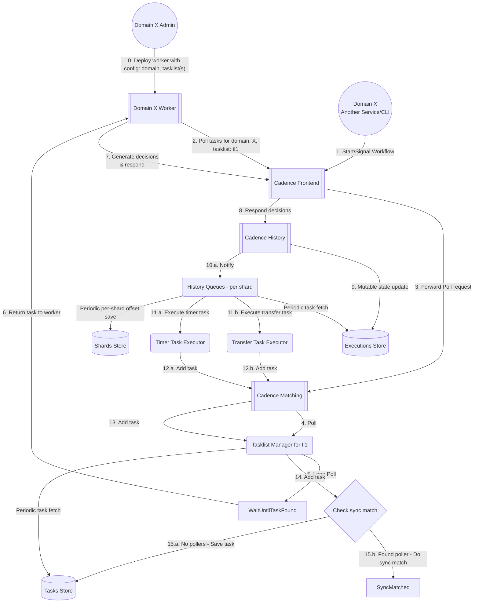
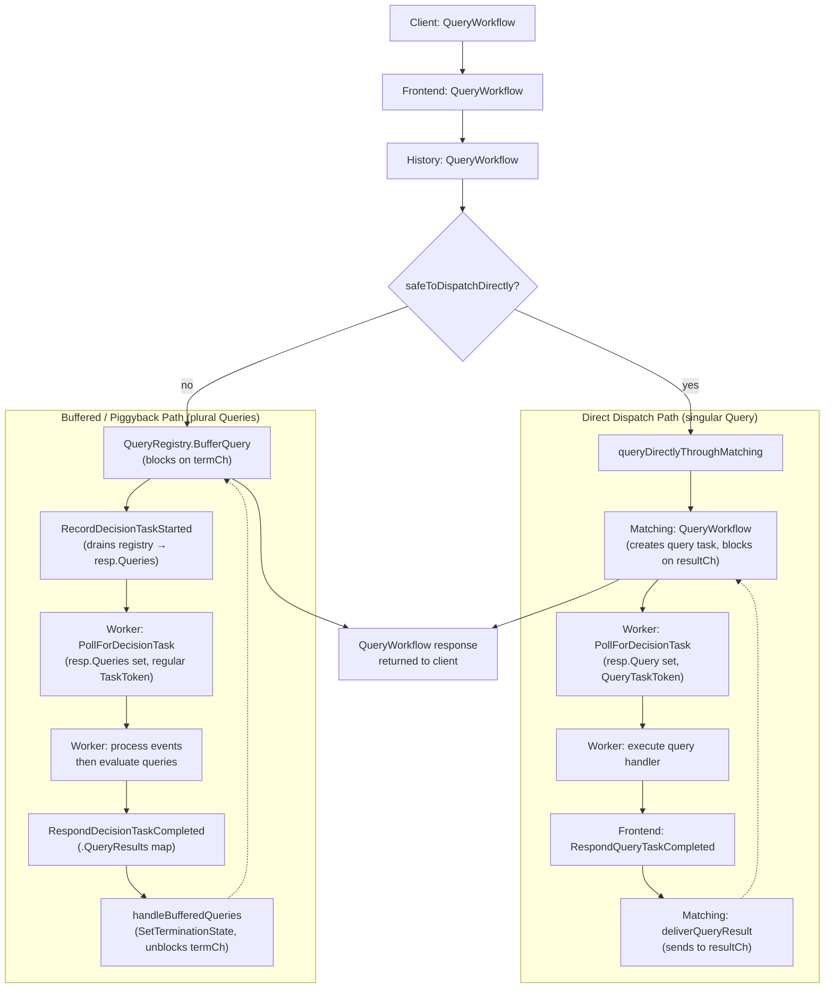

<a id="doc-0bdc8389aa115cfb9901c482"></a>

# cadence-workflow/cadence / .gitar/rules/architecture-separation.md

Upstream: https://github.com/cadence-workflow/cadence/blob/a771881a23b7b56d821ec1a8a73b11967ab71cb3/.gitar/rules/architecture-separation.md

Commit: `a771881a23b7b56d821ec1a8a73b11967ab71cb3`

Retrieved: 2026-10-01T15:15:19.906831+00:00

Kind: official-document

Raw SHA256: `c66dbd373c3009152d663db4d7f792ee28c2f31cd3e9b06c3493344f28ece2ec`

Source text below is untrusted reference content. Acquisition does not verify technical claims.

License status: UPSTREAM_NOTICES_CAPTURED_PER_FILE_REVIEW_REQUIRED. See this repository's captured license files.

---

---
title: Architecture Separation - Core Logic Abstraction
description: Prevents initialization logic from accumulating in cmd/server and ensures service/* depends only on interfaces
when: PR modifies files in cmd/server or service/*/
actions: Detect initialization logic in cmd/server, proprietary imports in service/*, and recommend Fx-based abstraction
---

# Architecture Separation - Core Logic Abstraction

Cadence must support both the standard open-source build and custom builds from a single codebase. Different builds may use different libraries (e.g., open-source Kafka client vs. company-internal Kafka library). To enable this, core service logic must depend only on interfaces, never on concrete infrastructure implementations.

See `AGENTS.md` Architecture Guidelines section for full context.

## Overview

When evaluating a pull request:

1. **Check `cmd/server` for new initialization logic** - server initialization and dependency wiring should use Fx modules, not accumulate in cmd/server
2. **Check `service/*/` for hard-coded infrastructure dependencies** - concrete types from infrastructure packages instead of interfaces
3. **Check `service/*/` for conditional environment logic** - if/switch statements selecting implementations based on environment
4. **Recommend interface-based abstraction** when violations are found

## Detection Logic

### Step 1: Check for new initialization logic in cmd/server

**CRITICAL**: Prevent ADDITIONAL initialization and dependency wiring logic from accumulating in `cmd/server`.

**Context**: The codebase is gradually migrating from manual initialization in `cmd/server/cadence/server.go` to Fx-based dependency injection. The existing `startService()` method contains substantial initialization logic that is being refactored over time. **New infrastructure dependencies should NOT add to this accumulation** - they should use Fx modules instead.

Inspect the PR diff for changes to `cmd/server/**/*.go` that add:

**Red flags (flag these as violations):**
- Adding NEW infrastructure client initialization that wasn't there before
  - Examples: new Kafka producers/consumers, new metrics backends, new peer discovery clients, new database clients
- Adding NEW conditional logic to select between different implementations
  - Examples: `if config.UseCustomKafka { ... } else { ... }` selecting infrastructure based on config
- Significant expansion of `startService()` or related initialization functions (e.g., adding 50+ lines)
- Creating new private helper functions in `cmd/server` specifically for infrastructure setup

**Allowable (don't flag these):**
- Small bug fixes or parameter adjustments to existing initialization code (< 10 lines changed)
- Refactoring existing initialization code to make it cleaner without adding new infrastructure types
- **Moving initialization code OUT of cmd/server into Fx modules** (this is progress toward the goal!)
- Changes to `cmd/server/cadence/fx.go` that wire Fx modules (this is the desired pattern)

**When new initialization logic is detected, recommend:**
1. Check if similar infrastructure already has an Fx module (look for `fx.go` files in `common/*` packages)
2. If yes: use the existing Fx module pattern instead of manual initialization
3. If no: create a new Fx module
   - Define the interface in the appropriate package (e.g., `common/messaging/interfaces.go`)
   - Create an Fx module file (e.g., `common/messaging/kafka/fx.go`) that provides the implementation
   - Wire it in `cmd/server/cadence/fx.go` instead of `cmd/server/cadence/server.go`
   - See existing examples: `common/archiver/archiverfx/`, `common/log/logfx/`, `common/metrics/metricsfx/`

### Step 2: Identify changes to service/* packages

Inspect the PR diff for any files matching:
- `service/**/*.go` (any Go file under service directories)

If no service files are modified, skip the service/* checks below.

### Step 3: Check for hard-coded infrastructure types in service/*

Look for:
- Variable declarations or struct fields with concrete infrastructure types (e.g., `*kafka.Producer`, `*ringpop.Ring`)
- Direct instantiation of infrastructure clients (`kafka.NewProducer(...)`, `NewCustomMetricsClient(...)`)
- Type assertions to concrete infrastructure types

**Expected pattern:**
```go
// Good: depends on interface
type MyService struct {
    peerProvider membership.PeerProvider  // interface
    kafkaClient  messaging.Client         // interface
}

// Bad: depends on concrete type
type MyService struct {
    ringpop *ringpop.Ring                 // concrete implementation
    kafka   *sarama.AsyncProducer         // concrete implementation
}
```

### Step 4: Check for environment-based conditionals in service/*

Look for:
- Conditional logic that selects implementations based on environment flags or build tags
- Switch/if statements choosing between different infrastructure providers

**Expected pattern:**
```go
// Bad: conditional logic in service/*
if config.Environment == "production" {
    client = NewProdKafkaClient()
} else {
    client = NewDevKafkaClient()
}

// Good: dependency injected via Fx
func NewMyService(kafkaClient messaging.Client) *MyService {
    // implementation selection happens at Fx wiring time
}
```

## Report Format

When violations are detected, provide:

1. **List of files and line numbers** with violations
2. **Type of violation** (proprietary import / hard-coded type / conditional logic)
3. **Recommended fix**: how to abstract behind an interface

### Example Report

> ⚠️ **Architecture violation: New initialization logic added to cmd/server**
>
> **CRITICAL: Do not add more initialization and dependency wiring logic inside cmd/server**
>
> **cmd/server/cadence/server.go:400-425**
> - Adds NEW Pinot client initialization (25 lines)
> - Adds conditional logic to select between Pinot implementations based on config
> 
> **Recommendation:**
> The codebase is migrating away from manual initialization in `cmd/server/cadence/server.go`. Instead of adding to the existing `startService()` function:
> 1. Create an Fx module for Pinot client initialization (e.g., `common/pinot/fx.go`)
> 2. Define the interface if one doesn't exist (e.g., `common/pinot/interfaces.go`)
> 3. Wire it through `cmd/server/cadence/fx.go` instead of `server.go`
> 
> **Examples to follow:**
> - `common/archiver/archiverfx/` - Fx module for archiver setup
> - `common/log/logfx/` - Fx module for logger initialization
> - `common/metrics/metricsfx/` - Fx module for metrics client
>
> **Why this matters:**
> - Over time, `cmd/server/cadence/server.go` has grown to 800+ lines of initialization logic
> - This accumulation causes open-source and custom builds to diverge
> - New infrastructure should use Fx modules to prevent further tech debt accumulation
>
> ---
>
> The following changes in `service/*/` also violate the interface-based abstraction principle:
>
> **service/history/engine.go:120**
> - Hard-coded concrete type `*ringpop.Ring` in struct field
> - Recommendation: Use the existing `membership.PeerProvider` interface instead
>
> **service/matching/handler.go:85**
> - Adds conditional logic: `if config.UseCustomQueue { ... } else { ... }`
> - Recommendation: Accept an interface dependency and let Fx wire the implementation based on config
>
> **Why this matters:**
> - Cadence supports both open-source builds and custom builds with different libraries
> - Core logic in `service/*/` must depend only on interfaces to remain portable
> - See `AGENTS.md` Architecture Guidelines for the full pattern

## Skip Conditions

Skip this rule when **ANY** of these is true:

### 1. No cmd/server or service/* files modified
- PR only changes `common/*`, `tools/*`, `schema/*`, tests, or other packages

### 2. Changes are to test files
- `*_test.go` files can use concrete implementations for testing

### 3. Changes are to Fx modules (for service/* only)
- Files named `*_fx.go` or `module.go` are expected to wire concrete implementations
- Note: `cmd/server` should NOT grow new initialization logic even in separate files

## Integration with Development Workflow

This rule complements:
- `AGENTS.md` Architecture Guidelines - provides the full pattern
- Local development - developers should check imports before `make pr`
- Code review - maintainers verify abstraction boundaries

## References

- `AGENTS.md` - Architecture Guidelines section
- `common/membership/hashring.go` - Example of interface definition pattern (PeerProvider interface at line 57)
- Fx documentation - https://uber-go.github.io/fx/


<a id="doc-12e0a48d6c5f2a58f4caa284"></a>

# cadence-workflow/cadence / ADOPTERS.md

Upstream: https://github.com/cadence-workflow/cadence/blob/a771881a23b7b56d821ec1a8a73b11967ab71cb3/ADOPTERS.md

Commit: `a771881a23b7b56d821ec1a8a73b11967ab71cb3`

Retrieved: 2026-10-01T15:15:19.906831+00:00

Kind: official-document

Raw SHA256: `8c3da0db74ec627397bb9ba422c4ccf406ba90cd5d1efdaabfec51570e4b8045`

Source text below is untrusted reference content. Acquisition does not verify technical claims.

License status: UPSTREAM_NOTICES_CAPTURED_PER_FILE_REVIEW_REQUIRED. See this repository's captured license files.

---

# ADOPTERS

This document lists organizations, companies, and individuals that are using Cadence in production or evaluation environments.
If you are using Cadence, please consider adding yourself to this list by opening a pull request or contacting the maintainers. See more instructions at the end of this page.
Your support helps us understand our user community and prioritize improvements.

## Production Users


### Uber Technologies

Uber has over 2000 use cases (Cadence domains) powered by Cadence. Here are some examples:

- **Infrastructure**: service & config rollout, CD pipelines, health checks & rollbacks, DB maintenance, bad node detection / replacement, compaction, DB backup / restore, migration orchestration, ...
- **ML / AI**: Agent orchestration, model training, data pipelines, fare estimation, ...
- **Finance**: payments, tips, disputes, bank verification, account onboarding, promotions, discounts, partnerships, gifting, billing / invoicing, loyalty points, ...
- **Product**: earner eligibility, onboarding, periodic document & compliance checks, document processing, vehicle management, inventory / catalog management, image processing, ads, repeat orders, vouchers, spending tracking, notifications, analytics, trip reports, ...

There are 20+ environments running Cadence where some of them hosts 400+ domains.


### NetApp

At [NetApp](https://www.netapp.com) we use Cadence as a key component of the Instaclustr platform’s control plane architecture. Our automated maintenance system relies on Cadence to orchestrate and schedule maintenance across tens of thousands of hosts in our managed fleet. By adopting Cadence we’ve been able to offer both our engineers and customers high-throughput, fault-tolerant execution of critical fleet operations.

NetApp is the intelligent data infrastructure company, providing solutions to manage any data, for any application, anywhere it is needed. Through the [Instaclustr](https://www.instaclustr.com) platform we offer fully managed Cadence, including automated provisioning of supporting infrastructure such as Apache Cassandra, Apache Kafka, and OpenSearch.


### DoorDash, Inc
DoorDash uses Cadence across a wide range of product and infrastructure use cases, including ETA, Fulfillment, Order Management, Storage, Catalog, Photos, Ads and more.
DoorDash’ use cases take advantage of Cadence’s orchestration for long running, fault tolerant workflows.

### Cloudera

At Cloudera, Cadence serves as a key component of our control plane architecture, providing reliable execution, fault tolerance, and observability for long-running, business-critical workflows. We use Cadence to orchestrate complex, distributed operations such as infrastructure provisioning, service deployments, and automated backup and restore processes. Leveraging Cadence's orchestration capabilities to manage these long-running tasks has helped us seamlessly scale our platform and significantly improve both the performance and reliability of our core data services, including Cloudera Data Warehouse.


The Cloudera logo is protected under U.S. trademark law and is used here with the permission of Cloudera, Inc. For more information, go to [cloudera.com](http://www.cloudera.com).

## Evaluating / Early Adopters

## How to Add Your Organization

- Fork this repository.
- Edit this file (ADOPTERS.md).
- Add your organization under the relevant section.

### Adding Your Logo

- If you would like your organization’s logo to appear on the Cadence website, repositories and documentation:
- Add your logo file (preferably in JPG/JPEG format) to the /logos directory in the repository.
- Name the file using lowercase letters and hyphens (for example: acme-corp.svg).
- Keep your image dimensions less than 300 pixels in width and 200 pixels in height.
- Update ADOPTERS.md to include your logo and link to your organization’s website.
- Logos should be submitted only by verified representatives or with permission from the organization.

Open a pull request with the title: Add \<Your Organization\> to ADOPTERS.md.


<a id="doc-a54ff182c7e8acf56acfd6e4"></a>

# cadence-workflow/cadence / AGENTS.md

Upstream: https://github.com/cadence-workflow/cadence/blob/a771881a23b7b56d821ec1a8a73b11967ab71cb3/AGENTS.md

Commit: `a771881a23b7b56d821ec1a8a73b11967ab71cb3`

Retrieved: 2026-10-01T15:15:19.906831+00:00

Kind: official-document

Raw SHA256: `39e3b13246cec55a4c6c58b73f7227ff819d5038ae94cf1b2c7cf7e6ea42ea7c`

Source text below is untrusted reference content. Acquisition does not verify technical claims.

License status: UPSTREAM_NOTICES_CAPTURED_PER_FILE_REVIEW_REQUIRED. See this repository's captured license files.

---

# Development Guidelines

This document contains critical information about working with this codebase.

## Core Rules

- NEVER ever mention a `co-authored-by` or similar aspects. In particular, never mention the tool used to create the commit message or PR.

## Development Commands

```bash
make bins   # build all binaries
make build  # compile-check all packages + test files (no codegen, no test execution)
make pr     # pre-PR: tidy → go-generate → fmt → lint
make pr GEN_DIR=service/history  # scoped codegen (faster for single package)
make test   # all unit tests (excludes host/ integration tests)
make test_e2e  # end-to-end integration tests in host/ (requires Docker dependencies running)
make lint   # lint only
make go-generate  # regenerate mocks, enums, wrapper files

go test -race -run TestFoo ./path/to/pkg/...  # run a specific test
```

## Gotchas

- **`idls/` submodule**: run `git submodule update --init --recursive` after checkout or all codegen and build targets fail silently.
- **Generated files**: `*_generated.go` and `*_mock.go` are produced by `make go-generate`.
  Edit the source `.tmpl` or interface file, then regenerate — never edit generated files directly.
- **`make pr` is required before every PR**: it runs tidy → go-generate → fmt → lint in sequence.
  If CI shows unexpected diffs in generated files, you forgot `make pr`. Prefer to use `make pr GEN_DIR=<package>` for faster iteration.
- **Go workspace gotcha**: `go build ./...` and `go test ./...` only cover the root module.
  Use `make bins` and `make test` for full coverage. Use `make tidy` (not `go mod tidy`).
- **IDL local testing**: To test local IDL changes before pushing, add `replace github.com/uber/cadence-idl => ./idls` to the bottom of `go.mod`. Remove before committing.
- **Submodule drift**: `git submodule update --init --recursive` fixes not just post-checkout failures but also mid-development build errors after upstream IDL changes.
- **SQLite for quick local dev**: No Docker required. Run `make install-schema-sqlite` then `./cadence-server --zone sqlite start` for the fastest path to a running local server.

## Coding Best Practices

- **Testing**:
  - Prefer table-tests; plain Go tests for trivially simple cases.
  - Do **not** write new suite-style tests (`testify/suite`) — legacy, maintain only.
  - Do **not** use `github.com/stretchr/testify` mocks — use `github.com/uber-go/mock`.
  - All new tests should be either plain Go tests or table-tests.
  - Round-trip test all mappers: `ToX(FromX(item)) == item`. Fuzz-test mappers following the pattern in `common/types/mapper/proto/api_test.go` and `schedule_test.go`.

- **License headers**: Do **not** add license headers to new files.

- **Types**:
  - Never use IDL code (`.gen/go/` or `.gen/proto/`) directly in service logic.
  - Map to `common/types` or `common/persistence` types via mappers in `common/types/mapper/`.
  - Files in `.gen/` are generated from IDL — do not edit manually.
  - Never use yarpcerrors directly in handler logic; instead, create an new Error type in IDL and map to internal ones under common/type/errors.go.

- **Blank Imports (Side-Effect Imports)**:
  - **NEVER** use blank imports (`import _`) in library code under `common/`, `service/`, or any package that gets imported transitively.
  - Blank imports execute `init()` functions with global side effects (driver registration, flag registration, global state mutation).
  - These cause problems: registration conflicts ("driver already registered"), order-of-initialization bugs, implicit dependencies, and issues in custom builds.
  - **Blank imports are ONLY allowed in:**
    - `cmd/**/main.go` — entry points with explicit control over initialization
    - `*_test.go` — test setup (use sparingly, prefer explicit setup)
    - `internal/tools.go` — build tool dependencies pinned in `go.mod`
  - **Examples of prohibited blank imports in library code:**
    - Database drivers: `_ "github.com/lib/pq"`, `_ "github.com/ncruces/go-sqlite3/driver"`
    - Profilers: `_ "net/http/pprof"`
    - Flag packages: `_ "github.com/some/flags"`
    - Any package that registers global state in `init()`
  - **What to do instead:** Move the blank import to `cmd/server/main.go` or the appropriate entry point.
  - **Example:** `common/persistence/sql/sqlplugin/sqlite/db.go` should NOT import drivers. Instead, `cmd/server/main.go` imports both the plugin package AND the driver.

- **License Headers**:
  - Do **not** add per-file license headers (MIT, Apache, or SPDX) to any source file.
  - The top-level `LICENSE` file (Apache 2.0) covers the entire repository.
  - When creating new `.go` files, start with the `package` declaration — no copyright or license block.
  - Files under `.gen/` are generated from IDL and may carry upstream headers — do not modify those manually.

## Architecture Guidelines

**Core Principle**: Cadence must support both the standard open-source build and custom builds from a single codebase. Different builds may use different libraries (e.g., open-source Kafka client vs. company-internal Kafka library). This requires strict separation between core logic and proprietary implementations.

- **Interface-based abstraction**:
  - Core server logic must depend only on interfaces, never on concrete infrastructure implementations.
  - Define clear interface boundaries that isolate core logic from external dependencies.
  - Example: `common/membership/resolver.go` defines a `PeerProvider` interface that abstracts peer discovery, allowing different implementations (e.g., Ringpop from open source, custom peer providers using proprietary libraries) without changing core membership logic.

- **Dependency injection with Fx**:
  - **CRITICAL**: Do NOT add NEW initialization or dependency wiring logic to `cmd/server/cadence/server.go`.
    - The codebase is gradually migrating from manual initialization to Fx-based dependency injection.
    - `cmd/server/cadence/server.go` currently contains substantial initialization logic that is being refactored over time.
    - **New infrastructure dependencies must use Fx modules**, not add to the existing manual initialization.
  - Create Fx modules to wire dependencies and select implementations for each build.
  - Core components should provide Fx modules that accept interface dependencies.
  - Proprietary implementations should provide Fx modules that bind their concrete implementations.
  - Examples of Fx modules: `common/archiver/archiverfx/`, `common/log/logfx/`, `common/metrics/metricsfx/`
  - Wire Fx modules in `cmd/server/cadence/fx.go`, not in `cmd/server/cadence/server.go`

- **Where to place code**:
  - **Core logic** → `service/*/`: business logic, algorithms, coordination — must depend only on interfaces
  - **Common packages** → `common/*`: mix of core utilities, shared interfaces, and implementations
  - **Interfaces** → Define in the package where core logic lives (e.g., `PeerProvider` in `common/membership/hashring.go`)
  - **Proprietary implementations** → Can live in `common/*/` or separate packages, but must implement well-defined interfaces
  - **Fx wiring** → Each implementation provides its own Fx module; core code should not know which implementation is selected

- **When adding new infrastructure dependencies**:
  1. Define an interface in the appropriate package (e.g., `type PeerProvider interface { ... }`)
  2. Have core logic in `service/*/` depend on the interface, not concrete implementations
  3. Provide Fx modules that bind different implementations for different builds
  4. Never import proprietary packages or libraries not available in the open-source build into `service/*/`

- **Red flags** (avoid these patterns):
  - **CRITICAL**: Adding NEW initialization or dependency wiring logic in `cmd/server/cadence/server.go`
    - Small bug fixes to existing code are fine, but NEW infrastructure initialization must use Fx modules
    - See `common/*/fx.go` files for examples of the Fx module pattern
  - Importing packages/libraries that are not available in all builds in `service/*/`
  - Hard-coding infrastructure choices in `service/*/` business logic
  - Adding conditional logic to select implementations in `service/*/` (use interface injection instead)

Following these guidelines allows custom builds to be maintained alongside the open-source build without duplicating or forking core logic.

## Pull Request Guidelines

PRs must follow the template in `.github/pull_request_guidance.md`.

PR titles must use Conventional Commits format: `<type>(<optional scope>): <description>`.
Valid types are defined in `.github/workflows/semantic-pr.yml`.
Example: `feat(history): add retry logic for shard takeover`.

## Development

For database setup, schema installation, and server start options: [CONTRIBUTING.md](CONTRIBUTING.md).

## Repository layout
A Cadence server cluster is composed of four different services: Frontend, Matching, History and Worker(system).
Here's what's in each top-level directory in this repository:

* **bench/** : Benchmark and load test suite for stress-testing a Cadence cluster
* **canary/** : The test code that needs to run periodically to ensure Cadence is healthy
* **client/** : Client wrappers to let the four different services talk to each other
* **cmd/** : The main function to build binaries for servers and CLI tools
* **common/** : Basically contains all the rest of the code in Cadence server, the names of the sub folder are the topics of the packages
* **config/** : Sample configuration files
* **docker/** : Code/scripts to build docker images
* **docs/** : Documentation
* **environment/** : Test helpers for reading environment variables (DB host/port, etc.) used by integration tests
* **host/** : End-to-end integration tests
* **idls/** : Git submodule with Thrift and Protobuf IDL definitions; source for all generated code under `.gen/`
* **internal/** : Internal Go tool dependencies (blank imports to pin codegen tools in `go.mod`)
* **proto/** : Protobuf definitions for internal persistence blobs and public Cadence APIs
* **schema/** : Versioned persistence schema for Cassandra/MySQL/Postgres/ElasticSearch
* **scripts/** : Scripts for CI build
* **service/** : Contains four sub-folders dedicated to each of the four services (frontend, history, matching, worker)
* **simulation/** : Black-box simulation tests that spin up a local Docker cluster and validate complex multi-component scenarios
* **tools/** : CLI tools for Cadence workflows and also schema updates for persistence

## Generic Rules

See the `.agents/` directory for:
- `go-style.md` - Go formatting and style (Uber style guide)
- `shell-style.md` - Shell scripting conventions

## Workflow Code in Repository

When adding workflow code to tests, examples, or tools:

- See [docs/non-deterministic-error.md](docs/non-deterministic-error.md) for debugging
- See `.cursor/rules/CADENCE-WORKFLOWS.mdc` for detailed patterns


<a id="doc-06572a96a58dc510037d5efa"></a>

# cadence-workflow/cadence / CHANGELOG.md

Upstream: https://github.com/cadence-workflow/cadence/blob/a771881a23b7b56d821ec1a8a73b11967ab71cb3/CHANGELOG.md

Commit: `a771881a23b7b56d821ec1a8a73b11967ab71cb3`

Retrieved: 2026-10-01T15:15:19.906831+00:00

Kind: official-document

Raw SHA256: `217da20b1fc8d6dc4c82b16f618b7c86d75865f44c126e90fbbedf37449dbec9`

Source text below is untrusted reference content. Acquisition does not verify technical claims.

License status: UPSTREAM_NOTICES_CAPTURED_PER_FILE_REVIEW_REQUIRED. See this repository's captured license files.

---

# Changelog
All notable changes to this project will be documented in this file.

The format is based on [Keep a Changelog](https://keepachangelog.com/en/1.0.0/),
and this project adheres to [Semantic Versioning](https://semver.org/spec/v2.0.0.html).

You can find a list of previous releases on the [github releases](https://github.com/cadence-workflow/cadence/releases) page.

## [Note]
There's a new opt-in feature for autoscale of tasklist partitions. It's optional but recommended for large scale use cases. Please refer to [tasklist-partition-config.md](https://github.com/cadence-workflow/cadence/blob/master/docs/migration/tasklist-partition-config.md) for additional details on the migration and its rationale.

## [1.3.3] - 2025-08-06
See [Release Note](https://github.com/cadence-workflow/cadence/releases/tag/v1.3.3) for details

## [1.3.2] - 2025-07-03
See [Release Note](https://github.com/cadence-workflow/cadence/releases/tag/v1.3.2) for details

## [1.3.1] - 2025-06-11
See [Release Note](https://github.com/cadence-workflow/cadence/releases/tag/v1.3.1) for details

## [1.3.0] - 2025-05-14
See [Release Note](https://github.com/cadence-workflow/cadence/releases/tag/v1.3.0) for details

## [1.2.18] - 2025-04-03
See [Release Note](https://github.com/cadence-workflow/cadence/releases/tag/v1.2.18) for details

## [1.2.17] - 2025-03-05
See [Release Note](https://github.com/cadence-workflow/cadence/releases/tag/v1.2.17) for details

## [1.2.16] - 2025-02-19
See [Release Note](https://github.com/cadence-workflow/cadence/releases/tag/v1.2.16) for details

## [1.2.15] - 2025-01-22
See [Release Note](https://github.com/cadence-workflow/cadence/releases/tag/v1.2.15) for details

## [1.2.14] - 2024-11-13
See [Release Note](https://github.com/cadence-workflow/cadence/releases/tag/v1.2.14) for details

## [1.2.13] - 2024-09-25
See [Release Note](https://github.com/cadence-workflow/cadence/releases/tag/v1.2.13) for details

## [1.2.12] - 2024-08-19
See [Release Note](https://github.com/cadence-workflow/cadence/releases/tag/v1.2.12) for details

## [1.2.11] - 2024-07-10
See [Release Note](https://github.com/cadence-workflow/cadence/releases/tag/v1.2.11) for details

## [1.2.10] - 2024-06-04
See [Release Note](https://github.com/cadence-workflow/cadence/releases/tag/v1.2.10) for details

## [1.2.9] - 2024-05-01
See [Release Note](https://github.com/cadence-workflow/cadence/releases/tag/v1.2.9) for details

## [1.2.8] - 2024-03-26
See [Release Note](https://github.com/cadence-workflow/cadence/releases/tag/v1.2.8) for details

## [1.2.7] - 2024-02-09
See [Release Note](https://github.com/cadence-workflow/cadence/releases/tag/v1.2.7) for details
### Upgrade notes
Cadence repo now has multiple submodules,
the split and explanation in [PR](https://github.com/cadence-workflow/cadence/pull/5609).

In principle, "plugins" are "optional" and we should not be forcing all optional dependencies on all users of any of Cadence.
Splitting dependencies into choose-your-own-adventure submodules is simply good library design for the ecosystem, and it's something we should be doing more of.

## [1.2.6] - 2023-12-14
### Added
- Added range query support for Pinot json index (#5426)
- Implemented GetTaskListSize method at persistence layer (#5442, #5447)
- Added a framework for the Task validator service (#5446)
- Added nit comments describing the Update workflow cycle (#5432)
- Added log user query param (#5437)
- Added CODEOWNERS file (#5453)
- Added a function to evict all elements older than the cache TTL (#5464)

### Fixed
- Fixed workflow replication for reset workflow (#5412)
- Fixed visibility mode for admin when use Pinot visibility (#5441)
- Fixed workflow started metric (#5443)
- Fixed timer-fixer, unfortunately broken in 1.2.5 (#5433)
- Fixed confusing comment in matching handler (#5450)

### Changed
- Cassandra version is changed from 3.11 to 4.1.3 (#5461)
  - If your machine already has ubercadence/server:master-auto-setup image then you need to repull so it works with latest docker-compose*.yml files
- Move dynamic ratelimiter to its own file (#5451)
- Create and use a limiter struct instead of just passing a function (#5454)
- Dynamic ratelimiter factories (#5455)
- Update github action for image publishing to released (#5460)
- Update matching to emit metric for tasklist backlog size (#5448)
- Change variable name from SecondsSinceEpoch into EventTimeMs (#5463)

### Removed
- Get rid of noisy task adding failure log in matching service (#5445)

## [1.2.5] - 2023-11-01

### Caution:

Prefer 1.2.4 or 1.2.6 if you have enabled the timer fixer.
These were broken by #5361, and fixed by #5433.

By default this fixer is _disabled_, so the version has not been retracted.

If you have already upgraded to 1.2.5, downgrading or using 1.2.6 should restore the timer fixer.
Or apply #5433 as a local patch.

### Added
- Scanner / Fixer changes (#5361)
  - Stale-workflow detection and cleanup added to shardscanner, disabled by default.
  - New dynamic config to better control scanner and fixer, particularly for concrete executions.
  - Documentation about how scanner/fixer work and how to control them, see [the scanner readme.md](service/worker/scanner/README.md)
    - This also includes example config to enable the new fixer.
- MigrationChecker interface to expose migration CLI (#5424)
- Added Pinot as new visibility store option (#5201)
  - Added pinot visibility triple manager to provide options to write to both ES and Pinot.
  - Added pinotVisibilityStore and pinotClient to support CRUD operations for Pinot.
  - Added pinot integration test to set up Pinot test cluster and test Pinot functionality.

### Fixed
- Fix CreateWorkflowModeContinueAsNew for SQL (#5413)
- Fix CLI count&list workflows error message (#5417)
- Hotfix for async matching for isolation-group redirection (#5423)
- Fix closeStatus for --format flag (#5422)

### Upgrade notes
- Any "concrete execution" or "timers" fixers run on upgrade may be missing the new config and those activities will have no invariants for a single run.  Later runs will work normally. (#5361)

## [1.2.4] - 2023-09-27
### Added
Implement config store for MySQL (#5403)
Implement config store for PostgresSQL (#5405)

### Fixed
Remove database check for config store tests (#5401)
Fix persistence tests setup (#5402)
Retract v1.2.3 (#5406)

## [1.2.3] - 2023-09-15
### Added
Expose workflow history size and count to client (#5392)

### Fixed
[cadence-cli] fix typo in input flag for parallelism (#5397)

### Changed
Update config store client to support SQL database (#5395)
Scaffold config store for sql plugins (#5396)
Improve poller detection for isolation (#5399)

## [1.2.2] - 2023-08-29
### Added
Added a update workflow execution count metric for RI (#5386)

### Fixed
Fixed nil pointer issue in domain migration command rendering (#5378)

### Changed
Pass partition config and isolation group to history/matching even if isolation is disabled (#5385)

## [1.2.1] - 2023-08-24
### Added
Added guardrail to on scalable tasklist number of write partitions (#5331)
Added Opensearch2 client with bulk API shared between clients (#5241)
Added Filters method to dynamic config Key (#5346)
Added domain migration validator command (#5369, #5374)
Added docker-compose with http API enabled (#5358)
Added support to enable TLS for HTTP inbounds (#5381)

### Fixed

### Changed
Updates to partition config middleware (#5334)
Allow to configure HTTP settings using template (#5329)
Cleanup the unused watchdog code (#5096)
Upgrade yarpc to v1.70.3 (#5341)
upgrade mysql (#5345)
change mysql schema folder v57 to v8 (#5356)
Remove duplicated line (#5328)
Fill IsCron for proto of WorkflowExecutionInfo (#5366)
Update idls and ensure thrift fields roundtrip (#5365)
Go version bump (#5367)
Update Dockerfile with a proper Go version and bump alpine version (#5371)
StartWorkflowExecution: validate RequestID before calling history (#5359)
Update list of available frontend HTTP endpoints (#5338)
Set a minimum timeout for async task dispatch based on rate limit (#5382)
Validate search-attribute-key so keys are fine in advanced search (#5340)

## [1.2.0] - 2023-08-24
### Added
Added more logs around unsupported version for consistent query (#5287)
Added datasource and dashboards to Grafana in Docker (#5207)
Added metric for isolation task matching (#5288)
Added local build instructions to Readme (#5299)
Added examples for reset-batch and batch commands in help usage section (#5302)
Record current worker Identity on Pending activity tasks (#5307)
Support invoking RPC using HTTP and JSON (#5305)
Added Worklfow start metric (#5289)
Added count of workflows indicator when running the listall command and waiting it to complete (#5309)
Added option to pass consistency level in the cassandra schema version validation (#5327)

### Fixed
Fixed rendering for isolation-groups in the CLI (#5285)
Fixed SearchAfter usage (#5311)
Fixed garbage collection logic for matching tasks (#5355)
Do not make poller crash if isolation group is invalid (#5372)

### Changed
Removed unused metric (#5292)
Show error message if requesting workflow does not exist (#5300)
Parse JWT flags when creating a context (#5296)
Set ReplicatorCacheCapacity to 0 (#5301)
Show explicit message if command is not found (#5298)
IDL update to include new field in PendingActivityInfo (#5306)
Set 12.4 version for postgres containers (#5326)
Extract EventColorFunction from ColorEvent (#5321)
Update consistency level for cassandra visibility (#5330)
Improve async-matching performance for isolation (#5363)

## [1.1.0] - 2023-08-24
### Added
Added metrics for delete workflow execution on a shard level (#5126)
Added overall persistence count for shardid (#5134)
Added Scanner to purge deprecated domain workflows (#5125)
Added domain status check in taskfilter (#5140)
Added usage for InactiveDomain Invariant (#5144, #5213)
Added request body into Attributes for auditing purpose with PII (#5151)
Added remaining persistence metrics that goes to a shard #5142
Added consistent query pershard metric (#5143, #5170)
Added logging with workflow/domain tags (#5159)
Added ShardID to valid attributes (#5161)
Added Pinot docker files, table config and schema (#5163)
Added Canary TLS support (#5086)
Added a small test to catch issues with deadlocks (#5171)
Added large workflow hot shard detection (#5166)
Added thin ES clients (#5162, #5217)
Added generic ES query building utilities (#5168)
Added Physical sharding for NoSQL-based persistence (#5187)
Added tasklist traffic metrics for non-sticky and non-forwarded tasklists (#5218, #5235)
Added default value for shard_id and update_time in mysql (#5246)
Added default value for shard_id and update_time in postgres (#5259)
Added Hostname tag into metrics and other services (#5245)
Added Domain name validation (#5250)
Added isolation-group types (#5260)
Added Dynamic-config type (#5261)
Added isolation groups to persistence (#5270)
Added helper function to store/retrieve partition config from context (#5195)
Added domain handler changes for isolation group (#5274)
Added isolation-group and partition libraries (#5262)
Added resource implmentation (#5278)
Added Admin API for zonal-isolation drain commands (#5282)
Added cli operations for the zonal-isolation drains (#5283)
Added metric for isolation task matching (#5288)
Added some more coverage to isolation-group state handler (#5304)

### Fixed
Removed circular dependencies between matching components (#5111)
Fixed InsertTasks query for Cassandra (#5119)
Fixed prometheus frontend label inconsistencies (#5087)
Fixed samples documentation (#5088)
Fixed type validation in configstore DC client value updating (#5110)
Fixed the config-store handling for not-found errors (#5203)
Fixed docker (#5244)
Fixed thrift mapper for DomainConfiguration (#5268)
Fixed panic while parsing workflows with timeouts (#5267)
Fixed sticky tasklist isolation (#5308)
Fixed SearchAfter usage (#5311)
Fixed isolation groups domain drains (#5315)

### Changed
Indexer: refactor ES processor (#5100)
Moved sample logger into persistence metric client for cleaness (#5129)
ES: do not set _type when using Bulk API for v7 client (#5104)
ES: single interface for different ES/OpenSearch versions (#5158)
ES: reduce code duplication (#5137)
Updated README.md (#5064, #5251)
Set poll interval for filebased dynamic config if not set (#5160)
Upgraded Golang base image to 1.18 to remediate CVEs (#5035)
Refactor matching integration test (#5182)
Merge Activity and Decision matching tests (#5186)
Update idls version (#5200)
Allow registering search attributes without Advance Visibility enabled (#5185)
Scaffold config store for SQL (#5239)
Bench: possibility to pass frontend address using env (#5113)
Remove tcheck dependency (#5247)
Update internal type to adopt idl change (#5253)
Update persistence layer to adopt idl update for isolation (#5254)
Update history to persist partition config (#5257)
Upgrades IDL to include isolation-groups (#5258)
Make ESClient fields public (#5269)
Remove unneeded file (#5276)
Updated frontend to adopt draining isolation groups (#5225) (#5281)
Updated matching to support tasklist isolation (#5280)
Bumping version to 1.1.0 (#5284)
Improvements on tasklist isolation (#5291)
Task processing panic handling (#5294)
Update ClusterNameForFailoverVersion to return error (#5293)
Feature/isolation group library logging improvements (#5295)
Increase number of forward tokens for isolation tasklists (#5310)
Seperate token pools for tasklists with isolation (#5314)
Disable isolation for sticky tasklist (#5319)
Change default value of AsyncTaskDispatchTimeout (#5320)

## [1.0.0] - 2023-04-26
See [Release Note](https://github.com/cadence-workflow/cadence/releases/tag/v1.0.0)

## [0.23.1] - 2021-11-18
See [Release Note](https://github.com/cadence-workflow/cadence/releases/tag/v0.23.1)

## [0.21.3] - 2021-07-17
### Added
- Added GRPC support. Cadence server will accept requests on both TChannel and GRPC. With dynamic config flag `system.enableGRPCOutbound` it will also switch to GRPC communication internally between server components.

### Fixed
- This change contains breaking change on user config. The masterClusterName config key is deprecated and is replaced with primaryClusterName key. (#4185)

### Changed
- Bump CLI version to v0.19.0
- Change `--connect-attributes` in `cadence-sql-tool` from URL encoding to the format of k1=v1,k2=v2...
- Change `--domain_data` in `cadence domain update/register` from the format of k1:v1,k2:v2... to the format of k1=v1,k2=v2...
- Deprecate local domains. All new domains should be created as global domains.
- Server will deep merge configuration files when loading. No need to copy the whole config section, specify only those fields that needs overriding. (#4165)

## [0.18.0] - 2021-01-22

## [0.16.1] - 2021-01-21

## [0.17.0] - 2021-01-13

## [0.16.0] - 2020-12-10


<a id="doc-6ebdb617a8104a7756d0cf36"></a>

# cadence-workflow/cadence / CLAUDE.md

Upstream: https://github.com/cadence-workflow/cadence/blob/a771881a23b7b56d821ec1a8a73b11967ab71cb3/CLAUDE.md

Commit: `a771881a23b7b56d821ec1a8a73b11967ab71cb3`

Retrieved: 2026-10-01T15:15:19.906831+00:00

Kind: official-document

Raw SHA256: `a54ff182c7e8acf56acfd6e4b9c3ff41e2c41a31c9b211b2deb9df75d9a478f9`

Source text below is untrusted reference content. Acquisition does not verify technical claims.

License status: UPSTREAM_NOTICES_CAPTURED_PER_FILE_REVIEW_REQUIRED. See this repository's captured license files.

---

AGENTS.md

<a id="doc-eca12c0a30e25b4b46522ebf"></a>

# cadence-workflow/cadence / CONTRIBUTING.md

Upstream: https://github.com/cadence-workflow/cadence/blob/a771881a23b7b56d821ec1a8a73b11967ab71cb3/CONTRIBUTING.md

Commit: `a771881a23b7b56d821ec1a8a73b11967ab71cb3`

Retrieved: 2026-10-01T15:15:19.906831+00:00

Kind: official-document

Raw SHA256: `b02db2c7d2f1805118413367ca38c9093abf9be57e43b8451d030e518c5bccb0`

Source text below is untrusted reference content. Acquisition does not verify technical claims.

License status: UPSTREAM_NOTICES_CAPTURED_PER_FILE_REVIEW_REQUIRED. See this repository's captured license files.

---

# Developing Cadence

This doc is intended for contributors to Cadence backend. Thanks for considering to contribute ❤️

> 📚 **New to contributing to Cadence?** Check out our [Contributing Guide](https://cadenceworkflow.io/community/how-to-contribute/getting-started) for an overview of the contribution process across all Cadence repositories. This document contains cadence backend specific setup and development instructions.

Once you go through the rest of this doc and get familiar with local development setup, take a look at the list of issues labeled with
[good-first-issue](https://github.com/cadence-workflow/cadence/issues?q=state%3Aopen%20label%3A%22good-first-issue%22).
These issues are a great way to start contributing to Cadence. Later when you are more familiar with Cadence, look at issues with
[up-for-grabs](https://github.com/cadence-workflow/cadence/labels/up-for-grabs).

Join our community on the CNCF Slack workspace at [cloud-native.slack.com](https://communityinviter.com/apps/cloud-native/cncf) in the **#cadence-users** channel to reach out and discuss issues with the team.

## Development Environment
Below are the instructions of how to set up a development Environment.

### 1. Building Environment

* Golang. Install on OS X with.
```
brew install go
```
* Make sure set PATH to include bin path of GO so that other executables like thriftrw can be found.
```bash
# check it first
echo $GOPATH
# append to PATH
PATH=$PATH:$GOPATH/bin
# to confirm, run
echo $PATH
```

* Download golang dependencies.
```bash
go mod download
```

After check out and go to the Cadence repo, compile the `cadence` service and helper tools without running test:

```bash
git submodule update --init --recursive

make bins
```

You should be able to get all the binaries of this repo:
* cadence-server: the server binary
* cadence: the CLI binary
* cadence-cassandra-tool: the Cassandra schema tools
* cadence-sql-tool: the SQL schema tools(for now only supports MySQL and Postgres)
* cadence-canary: the canary test binary
* cadence-bench: the benchmark test binary


:warning: Note:

If running into any compiling issue
>1. For proto/thrift errors, run `git submodule update --init --recursive` to fix
>2. Make sure you upgrade to the latest stable version of Golang.
>3. Check if this document is outdated by comparing with the building steps in [Dockerfile](https://github.com/cadence-workflow/cadence/blob/master/Dockerfile)

### 2. Setup Dependency
NOTE: you may skip this section if you want to use SQLite or you have installed the dependencies in any other ways, for example, using homebrew.

Cadence's core data model can be running with different persistence storages, including Cassandra,MySQL and Postgres.
Please refer to [persistence documentation](https://github.com/cadence-workflow/cadence/blob/master/docs/persistence.md) if you want to learn more.
Cadence's visibility data model can be running with either Cassandra/MySQL/Postgres database, or ElasticSearch+Kafka. The latter provides [advanced visibility feature](./docs/visibility-on-elasticsearch.md)

We recommend to use [docker-compose](https://docs.docker.com/compose/) to start those dependencies:

* If you want to start Cassandra dependency, use `./docker/dev/cassandra.yml`:
```
docker compose -f ./docker/dev/cassandra.yml up
```
You will use `CTRL+C` to stop it. Then `docker compose -f ./docker/dev/cassandra.yml down` to clean up the resources.

Or to run in the background
```
docker compose -f ./docker/dev/cassandra.yml up -d
```
Also use `docker compose -f ./docker/dev/cassandra.yml down` to stop and clean up the resources.

* Alternatively, use `./docker/dev/mysql.yml` for MySQL dependency. (MySQL has been updated from 5.7 to 8.0)
* Alternatively, use `./docker/dev/postgres.yml` for PostgreSQL dependency
* Alternatively, use `./docker/dev/cassandra-esv7-kafka.yml` for Cassandra, ElasticSearch(v7) and Kafka/ZooKeeper dependencies
* Alternatively, use `./docker/dev/mysql-esv7-kafka.yml` for MySQL, ElasticSearch(v7) and Kafka/ZooKeeper dependencies
* Alternatively, use `./docker/dev/cassandra-opensearch-kafka.yml` for Cassandra, OpenSearch(compatible with ElasticSearch v7) and Kafka/ZooKeeper dependencies
* Alternatively, use `./docker/dev/mongo-esv7-kafka.yml` for MongoDB, ElasticSearch(v7) and Kafka/ZooKeeper dependencies

### 3. Schema installation
Based on the above dependency setup, you also need to install the schemas.

* If you use SQLite then run `make install-schema-sqlite` to install SQLite schemas
* If you use `cassandra.yml` then run `make install-schema` to install Cassandra schemas
* If you use `cassandra-esv7-kafka.yml` then run `make install-schema && make install-schema-es-v7` to install Cassandra & ElasticSearch schemas
* If you use `cassandra-opensearch-kafka.yml` then run `make install-schema && make install-schema-es-opensearch` to install Cassandra & OpenSearch schemas
* If you use `mysql.yml` then run `install-schema-mysql` to install MySQL schemas
* If you use `postgres.yml` then run `install-schema-postgres` to install Postgres schemas
* `mysql-esv7-kafka.yml` can be used for single MySQL + ElasticSearch or multiple MySQL + ElasticSearch mode
  * for single MySQL: run `install-schema-mysql && make install-schema-es-v7`
  * for multiple MySQL: run `make install-schema-multiple-mysql` which will install schemas for 4 mysql databases and ElasticSearch

:warning: Note:
>If you use `cassandra-esv7-kafka.yml` and start server before `make install-schema-es-v7`, ElasticSearch may create a wrong index on demand.
You will have to delete the wrong index and then run the `make install-schema-es-v7` again. To delete the wrong index:
```
curl -X DELETE "http://127.0.0.1:9200/cadence-visibility-dev"
```

### 4. Run
Once you have done all above, try running the local binaries:


Then you will be able to run a basic local Cadence server for development.

  * If you use SQLite, then run `./cadence-server --zone sqlite start`, which load , which will load `config/development.yaml` + `config/development_sqlite.yaml` as config
  * If you use `cassandra.yml`, then run `./cadence-server start`, which will load `config/development.yaml` as config
  * If you use `mysql.yml` then run `./cadence-server --zone mysql start`, which will load `config/development.yaml` + `config/development_mysql.yaml` as config
  * If you use `postgres.yml` then run `./cadence-server --zone postgres start` , which will load `config/development.yaml` + `config/development_postgres.yaml` as config
  * If you use `cassandra-esv7-kafka.yml` then run `./cadence-server --zone es_v7 start`, which will load `config/development.yaml` + `config/development_es_v7.yaml` as config
  * If you use `cassandra-opensearch-kafka.yml` then run `./cadence-server --zone es_opensearch start` , which will load `config/development.yaml` + `config/development_es_opensearch.yaml` as config
  * If you use `mysql-esv7-kafka.yaml`
    * To run with multiple MySQL : `./cadence-server --zone multiple_mysql start`, which will load `config/development.yaml` + `config/development_multiple_mysql.yaml` as config

Then register a domain:
```
./cadence --do samples-domain domain register
```

### Sample Repo
The sample code is available in the [Sample repo](https://github.com/cadence-workflow/cadence-samples)

Then run a helloworld from [Go Client Sample](https://github.com/cadence-workflow/cadence-samples) or [Java Client Sample](https://github.com/cadence-workflow/cadence-java-samples)

```
make bins
```
will build all the samples.

Then
```
./bin/helloworld -m worker &
```
will start a worker for helloworld workflow.
You will see like:
```
$./bin/helloworld -m worker &
[1] 16520
2021-09-24T21:07:03.242-0700	INFO	common/sample_helper.go:109	Logger created.
2021-09-24T21:07:03.243-0700	DEBUG	common/factory.go:151	Creating RPC dispatcher outbound	{"ServiceName": "cadence-frontend", "HostPort": "127.0.0.1:7933"}
2021-09-24T21:07:03.250-0700	INFO	common/sample_helper.go:161	Domain successfully registered.	{"Domain": "samples-domain"}
2021-09-24T21:07:03.291-0700	INFO	internal/internal_worker.go:833	Started Workflow Worker	{"Domain": "samples-domain", "TaskList": "helloWorldGroup", "WorkerID": "16520@IT-USA-25920@helloWorldGroup"}
2021-09-24T21:07:03.300-0700	INFO	internal/internal_worker.go:858	Started Activity Worker	{"Domain": "samples-domain", "TaskList": "helloWorldGroup", "WorkerID": "16520@IT-USA-25920@helloWorldGroup"}
```
Then
```
./bin/helloworld
```
to start a helloworld workflow.
You will see the result like :
```
$./bin/helloworld
2021-09-24T21:07:06.220-0700	INFO	common/sample_helper.go:109	Logger created.
2021-09-24T21:07:06.220-0700	DEBUG	common/factory.go:151	Creating RPC dispatcher outbound	{"ServiceName": "cadence-frontend", "HostPort": "127.0.0.1:7933"}
2021-09-24T21:07:06.226-0700	INFO	common/sample_helper.go:161	Domain successfully registered.	{"Domain": "samples-domain"}
2021-09-24T21:07:06.272-0700	INFO	common/sample_helper.go:195	Started Workflow	{"WorkflowID": "helloworld_75cf142b-c0de-407e-9115-1d33e9b7551a", "RunID": "98a229b8-8fdd-4d1f-bf41-df00fb06f441"}
2021-09-24T21:07:06.347-0700	INFO	helloworld/helloworld_workflow.go:31	helloworld workflow started	{"Domain": "samples-domain", "TaskList": "helloWorldGroup", "WorkerID": "16520@IT-USA-25920@helloWorldGroup", "WorkflowType": "helloWorldWorkflow", "WorkflowID": "helloworld_75cf142b-c0de-407e-9115-1d33e9b7551a", "RunID": "98a229b8-8fdd-4d1f-bf41-df00fb06f441"}
2021-09-24T21:07:06.347-0700	DEBUG	internal/internal_event_handlers.go:489	ExecuteActivity	{"Domain": "samples-domain", "TaskList": "helloWorldGroup", "WorkerID": "16520@IT-USA-25920@helloWorldGroup", "WorkflowType": "helloWorldWorkflow", "WorkflowID": "helloworld_75cf142b-c0de-407e-9115-1d33e9b7551a", "RunID": "98a229b8-8fdd-4d1f-bf41-df00fb06f441", "ActivityID": "0", "ActivityType": "main.helloWorldActivity"}
2021-09-24T21:07:06.437-0700	INFO	helloworld/helloworld_workflow.go:62	helloworld activity started	{"Domain": "samples-domain", "TaskList": "helloWorldGroup", "WorkerID": "16520@IT-USA-25920@helloWorldGroup", "ActivityID": "0", "ActivityType": "main.helloWorldActivity", "WorkflowType": "helloWorldWorkflow", "WorkflowID": "helloworld_75cf142b-c0de-407e-9115-1d33e9b7551a", "RunID": "98a229b8-8fdd-4d1f-bf41-df00fb06f441"}
2021-09-24T21:07:06.513-0700	INFO	helloworld/helloworld_workflow.go:55	Workflow completed.	{"Domain": "samples-domain", "TaskList": "helloWorldGroup", "WorkerID": "16520@IT-USA-25920@helloWorldGroup", "WorkflowType": "helloWorldWorkflow", "WorkflowID": "helloworld_75cf142b-c0de-407e-9115-1d33e9b7551a", "RunID": "98a229b8-8fdd-4d1f-bf41-df00fb06f441", "Result": "Hello Cadence!"}
```

See [instructions](service/worker/README.md) for setting up replication(XDC).

## Repository layout
A Cadence server cluster is composed of four different services: Frontend, Matching, History and Worker(system).
Here's what's in each top-level directory in this repository:

* **canary/** : The test code that needs to run periodically to ensure Cadence is healthy
* **client/** : Client wrappers to let the four different services talk to each other
* **cmd/** : The main function to build binaries for servers and CLI tools
* **config/** : Sample configuration files
* **docker/** : Code/scripts to build docker images
* **docs/** : Documentation
* **host/** : End-to-end integration tests
* **schema/** : Versioned persistence schema for Cassandra/MySQL/Postgres/ElasticSearch
* **scripts/** : Scripts for CI build
* **tools/** : CLI tools for Cadence workflows and also schema updates for persistence
* **service/** : Contains four sub-folders that dedicated for each of the four services
* **common/** :  Basically contains all the rest of the code in Cadence server, the names of the sub folder are the topics of the packages

If looking at the Git history of the file/package, there should be some engineers focusing on each area/package/component that you are working on.
You will probably get code review from them. Don't hesitate to ask for some early feedback or help on Slack.

## Testing & Debug

To run all the package tests use the below command.
This will run all the tests excluding end-to-end integration test in host/ package):

```bash
make test
```
:warning: Note:
> You will see some test failures because of errors connecting to MySQL/Postgres if only Cassandra is up. This is okay if you don't write any code related to persistence layer.

To run all end-to-end integration tests in **host/** package:
```bash
make test_e2e
```

To debug a specific test case when you see some failure, you can trigger it from an IDE, or use the command
```
go test -v <path> -run <TestSuite> -testify.m <TestSpercificTaskName>
# example:
go test -v github.com/uber/cadence/common/persistence/persistence-tests -run TestVisibilitySamplingSuite -testify.m TestListClosedWorkflowExecutions
```

## IDL Changes

If you make changes in the idls submodule and want to test them locally, you can easily do that by using go mod to use the local idls directory instead of github.com/uber/cadence-idl. Temporarily add the following to the bottom of go.mod:

```replace github.com/uber/cadence-idl => ./idls```

Or alternatively, push your idl changes to a branch in your own fork of idl repo and pull that specific commit to idl submodule. Then apply the go.mod change mentioned above.

### Using IDL Changes

Once your [Pull Request](#pull-requests) has been successfully merged you can update cadence to use the new version:

```bash
# Update the IDLs directory
git submodule foreach git pull origin master
# Update go to use the latest idl package
go get github.com/uber/cadence-idl@latest
```

## Issue Triage

Every issue goes through three triage states tracked by `triage/*` labels:

| Label | Criteria | Who acts |
|---|---|---|
| `triage/needs-info` | Reporter must supply additional details. These may be reproduction steps or logs (for bugs), or clear acceptance criteria and behaviour (for features), etc. | Reporter |
| `triage/needs-decision` | The issue is understood but needs a TSC or area-owner decision on whether/when to address it. | TSC / maintainers |
| `triage/accepted` | Approved and ready to be picked up for implementation. | Contributors |

**TSC review queue:** [`is:open label:triage/needs-decision`](https://github.com/cadence-workflow/cadence/issues?q=is%3Aopen+label%3Atriage%2Fneeds-decision)

Issues filed from a template are automatically checked for completeness. If required sections are empty, the bot applies `triage/needs-info` and posts a comment listing what's missing. Once the reporter fills in the details, the bot removes the label on the next edit.

## Pull Requests
After all the preparation you are about to write code and make a Pull Request for the issue.

### When to open a PR
You have a few options for choosing when to submit:

* You can open a PR with an initial prototype with "Draft" option or with "WIP"(work in progress) in the title. This is useful when want to get some early feedback.

* PR is supposed to be or near production ready. You should have fixed all styling, adding new tests if possible, and verified the change doesn't break any existing tests.

* For small changes where the approach seems obvious, you can open a PR with what you believe to be production-ready or near-production-ready code. As you get more experience with how we develop code, you'll find that more PRs will begin falling into this category.

### Commit Messages And Titles of Pull Requests

Overcommit adds some requirements to your commit messages. At Uber, we follow the
[Chris Beams](http://chris.beams.io/posts/git-commit/) guide to writing git
commit messages. Read it, follow it, learn it, love it.

All commit messages are from the titles of your pull requests. So make sure follow the rules when titling them.
Please don't use very generic titles like "bug fixes".

All PR titles should start with UPPER case.

Examples:

- [Make sync activity retry multiple times before fetch history from remote](https://github.com/cadence-workflow/cadence/pull/1379)
- [Enable archival config per domain](https://github.com/cadence-workflow/cadence/pull/1351)

#### Code Format and Licence headers checking

The project has strict rule about Golang format, import ordering and license declarations. You have to run
```bash
make pr
```
which will take care of formatting for you.


### Code review
We take code reviews very seriously at Cadence. Please don't be deterred if you feel like you've received some hefty feedback. That's completely normal and expected—and, if you're an external contributor, we very much appreciate your contribution!

In this repository in particular, merging a PR means accepting responsibility for maintaining that code for, quite possibly, the lifetime of Cadence. To take on that reponsibility, we need to ensure that meets our strict standards for production-ready code.

No one is expected to write perfect code on the first try. That's why we have code reviews in the first place!

Also, don't be embarrassed when your review points out syntax errors, stray whitespace, typos, and missing docstrings! That's why we have reviews. These properties are meant to guide you in your final scan.

### Addressing feedback
If someone leaves line comments on your PR without leaving a top-level "looks good to me" (LGTM), it means they feel you should address their line comments before merging.

You should respond to all unresolved comments whenever you push a new revision or before you merge.

Also, as you gain confidence in Go, you'll find that some of the nitpicky style feedback you get does not make for obviously better code. Don't be afraid to stick to your guns and push back. Much of coding style is subjective.

### Merging
External contributors: you don't need to worry about this section. We'll merge your PR as soon as you've addressed all review feedback(you will get at least one approval) and pipeline runs are all successful(meaning all tests are passing).


<a id="doc-c693279643b8cd5d248172d9"></a>

# cadence-workflow/cadence / LICENSE

Upstream: https://github.com/cadence-workflow/cadence/blob/a771881a23b7b56d821ec1a8a73b11967ab71cb3/LICENSE

Commit: `a771881a23b7b56d821ec1a8a73b11967ab71cb3`

Retrieved: 2026-10-01T15:15:19.906831+00:00

Kind: license

Raw SHA256: `43070e2d4e532684de521b885f385d0841030efa2b1a20bafb76133a5e1379c1`

Source text below is untrusted reference content. Acquisition does not verify technical claims.

License status: UPSTREAM_NOTICES_CAPTURED_PER_FILE_REVIEW_REQUIRED. See this repository's captured license files.

---

````text
                                 Apache License
                           Version 2.0, January 2004
                        http://www.apache.org/licenses/

   TERMS AND CONDITIONS FOR USE, REPRODUCTION, AND DISTRIBUTION

   1. Definitions.

      "License" shall mean the terms and conditions for use, reproduction,
      and distribution as defined by Sections 1 through 9 of this document.

      "Licensor" shall mean the copyright owner or entity authorized by
      the copyright owner that is granting the License.

      "Legal Entity" shall mean the union of the acting entity and all
      other entities that control, are controlled by, or are under common
      control with that entity. For the purposes of this definition,
      "control" means (i) the power, direct or indirect, to cause the
      direction or management of such entity, whether by contract or
      otherwise, or (ii) ownership of fifty percent (50%) or more of the
      outstanding shares, or (iii) beneficial ownership of such entity.

      "You" (or "Your") shall mean an individual or Legal Entity
      exercising permissions granted by this License.

      "Source" form shall mean the preferred form for making modifications,
      including but not limited to software source code, documentation
      source, and configuration files.

      "Object" form shall mean any form resulting from mechanical
      transformation or translation of a Source form, including but
      not limited to compiled object code, generated documentation,
      and conversions to other media types.

      "Work" shall mean the work of authorship, whether in Source or
      Object form, made available under the License, as indicated by a
      copyright notice that is included in or attached to the work
      (an example is provided in the Appendix below).

      "Derivative Works" shall mean any work, whether in Source or Object
      form, that is based on (or derived from) the Work and for which the
      editorial revisions, annotations, elaborations, or other modifications
      represent, as a whole, an original work of authorship. For the purposes
      of this License, Derivative Works shall not include works that remain
      separable from, or merely link (or bind by name) to the interfaces of,
      the Work and Derivative Works thereof.

      "Contribution" shall mean any work of authorship, including
      the original version of the Work and any modifications or additions
      to that Work or Derivative Works thereof, that is intentionally
      submitted to Licensor for inclusion in the Work by the copyright owner
      or by an individual or Legal Entity authorized to submit on behalf of
      the copyright owner. For the purposes of this definition, "submitted"
      means any form of electronic, verbal, or written communication sent
      to the Licensor or its representatives, including but not limited to
      communication on electronic mailing lists, source code control systems,
      and issue tracking systems that are managed by, or on behalf of, the
      Licensor for the purpose of discussing and improving the Work, but
      excluding communication that is conspicuously marked or otherwise
      designated in writing by the copyright owner as "Not a Contribution."

      "Contributor" shall mean Licensor and any individual or Legal Entity
      on behalf of whom a Contribution has been received by Licensor and
      subsequently incorporated within the Work.

   2. Grant of Copyright License. Subject to the terms and conditions of
      this License, each Contributor hereby grants to You a perpetual,
      worldwide, non-exclusive, no-charge, royalty-free, irrevocable
      copyright license to reproduce, prepare Derivative Works of,
      publicly display, publicly perform, sublicense, and distribute the
      Work and such Derivative Works in Source or Object form.

   3. Grant of Patent License. Subject to the terms and conditions of
      this License, each Contributor hereby grants to You a perpetual,
      worldwide, non-exclusive, no-charge, royalty-free, irrevocable
      (except as stated in this section) patent license to make, have made,
      use, offer to sell, sell, import, and otherwise transfer the Work,
      where such license applies only to those patent claims licensable
      by such Contributor that are necessarily infringed by their
      Contribution(s) alone or by combination of their Contribution(s)
      with the Work to which such Contribution(s) was submitted. If You
      institute patent litigation against any entity (including a
      cross-claim or counterclaim in a lawsuit) alleging that the Work
      or a Contribution incorporated within the Work constitutes direct
      or contributory patent infringement, then any patent licenses
      granted to You under this License for that Work shall terminate
      as of the date such litigation is filed.

   4. Redistribution. You may reproduce and distribute copies of the
      Work or Derivative Works thereof in any medium, with or without
      modifications, and in Source or Object form, provided that You
      meet the following conditions:

      (a) You must give any other recipients of the Work or
          Derivative Works a copy of this License; and

      (b) You must cause any modified files to carry prominent notices
          stating that You changed the files; and

      (c) You must retain, in the Source form of any Derivative Works
          that You distribute, all copyright, patent, trademark, and
          attribution notices from the Source form of the Work,
          excluding those notices that do not pertain to any part of
          the Derivative Works; and

      (d) If the Work includes a "NOTICE" text file as part of its
          distribution, then any Derivative Works that You distribute must
          include a readable copy of the attribution notices contained
          within such NOTICE file, excluding those notices that do not
          pertain to any part of the Derivative Works, in at least one
          of the following places: within a NOTICE text file distributed
          as part of the Derivative Works; within the Source form or
          documentation, if provided along with the Derivative Works; or,
          within a display generated by the Derivative Works, if and
          wherever such third-party notices normally appear. The contents
          of the NOTICE file are for informational purposes only and
          do not modify the License. You may add Your own attribution
          notices within Derivative Works that You distribute, alongside
          or as an addendum to the NOTICE text from the Work, provided
          that such additional attribution notices cannot be construed
          as modifying the License.

      You may add Your own copyright statement to Your modifications and
      may provide additional or different license terms and conditions
      for use, reproduction, or distribution of Your modifications, or
      for any such Derivative Works as a whole, provided Your use,
      reproduction, and distribution of the Work otherwise complies with
      the conditions stated in this License.

   5. Submission of Contributions. Unless You explicitly state otherwise,
      any Contribution intentionally submitted for inclusion in the Work
      by You to the Licensor shall be under the terms and conditions of
      this License, without any additional terms or conditions.
      Notwithstanding the above, nothing herein shall supersede or modify
      the terms of any separate license agreement you may have executed
      with Licensor regarding such Contributions.

   6. Trademarks. This License does not grant permission to use the trade
      names, trademarks, service marks, or product names of the Licensor,
      except as required for reasonable and customary use in describing the
      origin of the Work and reproducing the content of the NOTICE file.

   7. Disclaimer of Warranty. Unless required by applicable law or
      agreed to in writing, Licensor provides the Work (and each
      Contributor provides its Contributions) on an "AS IS" BASIS,
      WITHOUT WARRANTIES OR CONDITIONS OF ANY KIND, either express or
      implied, including, without limitation, any warranties or conditions
      of TITLE, NON-INFRINGEMENT, MERCHANTABILITY, or FITNESS FOR A
      PARTICULAR PURPOSE. You are solely responsible for determining the
      appropriateness of using or redistributing the Work and assume any
      risks associated with Your exercise of permissions under this License.

   8. Limitation of Liability. In no event and under no legal theory,
      whether in tort (including negligence), contract, or otherwise,
      unless required by applicable law (such as deliberate and grossly
      negligent acts) or agreed to in writing, shall any Contributor be
      liable to You for damages, including any direct, indirect, special,
      incidental, or consequential damages of any character arising as a
      result of this License or out of the use or inability to use the
      Work (including but not limited to damages for loss of goodwill,
      work stoppage, computer failure or malfunction, or any and all
      other commercial damages or losses), even if such Contributor
      has been advised of the possibility of such damages.

   9. Accepting Warranty or Additional Liability. While redistributing
      the Work or Derivative Works thereof, You may choose to offer,
      and charge a fee for, acceptance of support, warranty, indemnity,
      or other liability obligations and/or rights consistent with this
      License. However, in accepting such obligations, You may act only
      on Your own behalf and on Your sole responsibility, not on behalf
      of any other Contributor, and only if You agree to indemnify,
      defend, and hold each Contributor harmless for any liability
      incurred by, or claims asserted against, such Contributor by reason
      of your accepting any such warranty or additional liability.

   END OF TERMS AND CONDITIONS

   APPENDIX: How to apply the Apache License to your work.

      To apply the Apache License to your work, attach the following
      boilerplate notice, with the fields enclosed by brackets "[]"
      replaced with your own identifying information. (Don't include
      the brackets!)  The text should be enclosed in the appropriate
      comment syntax for the file format. We also recommend that a
      file or class name and description of purpose be included on the
      same "printed page" as the copyright notice for easier
      identification within third-party archives.

   Copyright [yyyy] [name of copyright owner]

   Licensed under the Apache License, Version 2.0 (the "License");
   you may not use this file except in compliance with the License.
   You may obtain a copy of the License at

       http://www.apache.org/licenses/LICENSE-2.0

   Unless required by applicable law or agreed to in writing, software
   distributed under the License is distributed on an "AS IS" BASIS,
   WITHOUT WARRANTIES OR CONDITIONS OF ANY KIND, either express or implied.
   See the License for the specific language governing permissions and
   limitations under the License.
````


<a id="doc-39da3bd6270d44ea37b6ed50"></a>

# cadence-workflow/cadence / MAINTAINERS.md

Upstream: https://github.com/cadence-workflow/cadence/blob/a771881a23b7b56d821ec1a8a73b11967ab71cb3/MAINTAINERS.md

Commit: `a771881a23b7b56d821ec1a8a73b11967ab71cb3`

Retrieved: 2026-10-01T15:15:19.906831+00:00

Kind: official-document

Raw SHA256: `4d8bce7a511917eeda531d9ebc23d89f194d9a4cebd43d21734688acac8e7ed4`

Source text below is untrusted reference content. Acquisition does not verify technical claims.

License status: UPSTREAM_NOTICES_CAPTURED_PER_FILE_REVIEW_REQUIRED. See this repository's captured license files.

---

# Maintainers

## TSC
- Ender Demirkaya (https://github.com/demirkayaender)
- Jan Kisel (https://github.com/dkrotx)
- Shijie Sheng (https://github.com/shijiesheng)
- Zijian Chen (https://github.com/Shaddoll)
- Taylan Isikdemir (https://github.com/taylanisikdemir)
- Mitch O'Dea (https://github.com/instamitch)

## Maintainers
- Abhishek Jha (https://github.com/abhishekj720)
- Adhitya Mamallan (https://github.com/adhityamamallan)
- Andreas Holt (https://github.com/AndreasHolt)
- Assem Hafez (https://github.com/Assem-Hafez)
- Bowen Xiao (https://github.com/bowenxia)
- Chris Warren (https://github.com/c-warren)
- Diana Zawadzki (https://github.com/zawadzkidiana)
- Eleonora Di Gregorio (https://github.com/eleonoradgr)
- Felipe Imanishi (https://github.com/fimanishi)
- Gaziza Yestemirova (https://github.com/gazi-yestemirova)
- Jakob Haahr Taankvist (https://github.com/jakobht)
- Kevin Burns (https://github.com/Bueller87)
- Nate Mortensen (https://github.com/natemort)
- Neil Xie (https://github.com/neil-xie)
- Stanislav Bychkov (https://github.com/ribaraka)
- Tim Chan (https://github.com/macrotim)
- Tim Li (https://github.com/timl3136)
- Vladimir Gavrilenko (https://github.com/vladimir-gavrilenko)
- Vsevolod Kaloshin (https://github.com/arzonus)
- Yawei Zhang (https://github.com/YaweiZhang-930)


<a id="doc-dfb14fbb9e7d095209ec4cfd"></a>

# cadence-workflow/cadence / NOTICE

Upstream: https://github.com/cadence-workflow/cadence/blob/a771881a23b7b56d821ec1a8a73b11967ab71cb3/NOTICE

Commit: `a771881a23b7b56d821ec1a8a73b11967ab71cb3`

Retrieved: 2026-10-01T15:15:19.906831+00:00

Kind: license

Raw SHA256: `53d86f4fec2e8c6dc15f2e452dfaafcb11a30abcf06ba665ae28c0cf63922d0a`

Source text below is untrusted reference content. Acquisition does not verify technical claims.

License status: UPSTREAM_NOTICES_CAPTURED_PER_FILE_REVIEW_REQUIRED. See this repository's captured license files.

---

````text
Copyright (c) 2025 Uber Technologies, Inc.

Permission is hereby granted, free of charge, to any person obtaining a copy
 of this software and associated documentation files (the "Software"), to deal
 in the Software without restriction, including without limitation the rights
 to use, copy, modify, merge, publish, distribute, sublicense, and/or sell
 copies of the Software, and to permit persons to whom the Software is
 furnished to do so, subject to the following conditions:

 The above copyright notice and this permission notice shall be included in
 all copies or substantial portions of the Software.

 THE SOFTWARE IS PROVIDED "AS IS", WITHOUT WARRANTY OF ANY KIND, EXPRESS OR
 IMPLIED, INCLUDING BUT NOT LIMITED TO THE WARRANTIES OF MERCHANTABILITY,
 FITNESS FOR A PARTICULAR PURPOSE AND NONINFRINGEMENT. IN NO EVENT SHALL THE
 AUTHORS OR COPYRIGHT HOLDERS BE LIABLE FOR ANY CLAIM, DAMAGES OR OTHER
 LIABILITY, WHETHER IN AN ACTION OF CONTRACT, TORT OR OTHERWISE, ARISING FROM,
 OUT OF OR IN CONNECTION WITH THE SOFTWARE OR THE USE OR OTHER DEALINGS IN
 THE SOFTWARE.

````


<a id="doc-65928370cc9c6a9485f09cd9"></a>

# cadence-workflow/cadence / PROPOSALS.md

Upstream: https://github.com/cadence-workflow/cadence/blob/a771881a23b7b56d821ec1a8a73b11967ab71cb3/PROPOSALS.md

Commit: `a771881a23b7b56d821ec1a8a73b11967ab71cb3`

Retrieved: 2026-10-01T15:15:19.906831+00:00

Kind: official-document

Raw SHA256: `1c2fb329f6f26e6b681e1aada57bda1659a0c59afb8812487c669185e26fcd24`

Source text below is untrusted reference content. Acquisition does not verify technical claims.

License status: UPSTREAM_NOTICES_CAPTURED_PER_FILE_REVIEW_REQUIRED. See this repository's captured license files.

---

# Proposing Changes to Cadence

## Introduction

The design process for changes to Cadence is modeled on the [proposal process used by the M3 project](https://github.com/m3db/proposal).

## Process

- [Create an issue](https://github.com/cadence-workflow/cadence/issues/new) describing the proposal.

- Like any GitHub issue, a proposal issue is followed by an initial discussion about the suggestion. For Proposal issues:

  - The goal of the initial discussion is to reach agreement on the next step: (1) accept, (2) decline, or (3) ask for a design doc.
  - The discussion is expected to be resolved in a timely manner.
  - If the author wants to write a design doc, then they can write one.
  - A lack of agreement means the author should write a design doc.

- If a Proposal issue leads to a design doc:

  - The design doc should be presented as a Google Doc and must follow [the template](https://docs.google.com/document/d/1hpWpy5MB5l8uXfnl23lebhx-dvo79vb1jFUOyAtIHJw/edit?usp=sharing).
  - The design doc should be linked from the opened GitHub issue.
  - The design doc should only allow edit access to authors of the document.
  - Do not create the document from a corporate G Suite account. If you want to edit from a corporate G Suite account then first create the document from a personal Google account and grant edit access to your corporate G Suite account.
  - Comment access should also be accessible by the public. Make sure this is the case by clicking "Share" and "Get shareable link" ensuring you select "Anyone with the link can comment".

- Once comments and revisions on the design doc wind down, there is a final discussion about the proposal.

  - The goal of the final discussion is to reach agreement on the next step: (1) accept or (2) decline.
  - The discussion is expected to be resolved in a timely manner.

- Once the design doc is agreed upon, the author shall export the contents of the Google Doc as a Markdown document and submit a PR to add it to the proposal repository.

  - Authors can use [gdocs2md](https://github.com/mangini/gdocs2md) to convert the document but any cleanup required must be done by hand.
  - The design doc should be checked in at `docs/design/XYZ-shortname.md`, where `XYZ` is the GitHub issue number and `shortname` is a short name (a few dash-separated words at most).
  - The design doc should be added to the list of existing proposals in `docs/design/index.md`

- The author (and/or other contributors) do the work as described by the "Implementation" section of the proposal.

---

This project is released under the [Apache License, Version 2.0](LICENSE).


<a id="doc-b335630551682c19a781afeb"></a>

# cadence-workflow/cadence / README.md

Upstream: https://github.com/cadence-workflow/cadence/blob/a771881a23b7b56d821ec1a8a73b11967ab71cb3/README.md

Commit: `a771881a23b7b56d821ec1a8a73b11967ab71cb3`

Retrieved: 2026-10-01T15:15:19.906831+00:00

Kind: official-document

Raw SHA256: `605c99163321e387846057db3070acb6e506a84cb77c1837992dbb04dfd33ded`

Source text below is untrusted reference content. Acquisition does not verify technical claims.

License status: UPSTREAM_NOTICES_CAPTURED_PER_FILE_REVIEW_REQUIRED. See this repository's captured license files.

---

# Cadence
[](https://github.com/cadence-workflow/cadence/actions/workflows/ci-checks.yml)
[](https://codecov.io/gh/cadence-workflow/cadence)
[](https://communityinviter.com/apps/cloud-native/cncf)
[](https://github.com/cadence-workflow/cadence/releases)
[](http://www.apache.org/licenses/LICENSE-2.0)

Cadence Workflow is an open-source platform since 2017 for building and running scalable, fault-tolerant, and long-running workflows. This repository contains the core orchestration engine and tools including CLI, schema managment, benchmark and canary.


## Getting Started

Cadence backend consists of multiple services, a database (Cassandra/MySQL/PostgreSQL) and optionally Kafka+Elasticsearch.
As a user, you need a worker which contains your workflow implementation.
Once you have Cadence backend and worker(s) running, you can trigger workflows by using SDKs or via CLI.

1. Start cadence backend components locally

```
docker compose -f docker/docker-compose.yml up
```

2. Run the Samples

Try out the sample recipes for [Go](https://github.com/cadence-workflow/cadence-samples) or [Java](https://github.com/cadence-workflow/cadence-java-samples).

3. Visit UI

Visit http://localhost:8088 to check workflow histories and detailed traces.


### Kubernetes Deployment

For a guided Kubernetes installation experience, [KubeStellar Console](https://console.kubestellar.io/missions/install-cadence-workflow) provides a step-by-step mission that deploys Cadence using the official Helm chart from [cadence-charts](https://github.com/cadence-workflow/cadence-charts). The mission includes pre-flight checks, validation, troubleshooting, and rollback support.

### Client Libraries
You can implement your workflows with one of our client libraries:
- [Official Cadence Go SDK](https://github.com/cadence-workflow/cadence-go-client)
- [Official Cadence Java SDK](https://github.com/cadence-workflow/cadence-java-client)
There are also unofficial [Python](https://github.com/firdaus/cadence-python) and [Ruby](https://github.com/coinbase/cadence-ruby) SDKs developed by the community.

You can also use [iWF](https://github.com/indeedeng/iwf) as a DSL framework on top of Cadence.

### CLI

Cadence CLI can be used to operate workflows, tasklist, domain and even the clusters.

You can use the following ways to install Cadence CLI:
* Use brew to install CLI: `brew install cadence-workflow`
  * Follow the [instructions](https://github.com/cadence-workflow/cadence/discussions/4457) if you need to install older versions of CLI via homebrew. Usually this is only needed when you are running a server of a too old version.
* Use docker image for CLI: `docker run --rm ubercadence/cli:<releaseVersion>`  or `docker run --rm ubercadence/cli:master ` . Be sure to update your image when you want to try new features: `docker pull ubercadence/cli:master `
* Build the CLI binary yourself, check out the repo and run `make cadence` to build all tools. See [CONTRIBUTING](CONTRIBUTING.md) for prerequisite of make command.
* Build the CLI image yourself, see [instructions](docker/README.md#diy-building-an-image-for-any-tag-or-branch)

Cadence CLI is a powerful tool. The commands are organized by tabs. E.g. `workflow`->`batch`->`start`, or `admin`->`workflow`->`describe`.

Please read the [documentation](https://cadenceworkflow.io/docs/cli/#documentation) and always try out `--help` on any tab to learn & explore.

### UI

Try out [Cadence Web UI](https://github.com/cadence-workflow/cadence-web) to view your workflows on Cadence.
(This is already available at localhost:8088 if you run Cadence with docker compose)


### Other binaries in this repo

#### Bench/stress test workflow tools
See [bench documentation](./bench/README.md).

#### Periodical feature health check workflow tools(aka Canary)
See [canary documentation](./canary/README.md).

#### Schema tools for SQL and Cassandra
The tools are for [manual setup or upgrading database schema](docs/persistence.md)

  * If server runs with Cassandra, Use [Cadence Cassandra tool](tools/cassandra/README.md)
  * If server runs with SQL database, Use [Cadence SQL tool](tools/sql/README.md)

The easiest way to get the schema tool is via homebrew.

`brew install cadence-workflow` also includes `cadence-sql-tool` and `cadence-cassandra-tool`.
 * The schema files are located at `/usr/local/etc/cadence/schema/`.
 * To upgrade, make sure you remove the old ElasticSearch schema first: `mv /usr/local/etc/cadence/schema/elasticsearch /usr/local/etc/cadence/schema/elasticsearch.old && brew upgrade cadence-workflow`. Otherwise ElasticSearch schemas may not be able to get updated.
 * Follow the [instructions](https://github.com/cadence-workflow/cadence/discussions/4457) if you need to install older versions of schema tools via homebrew.
 However, easier way is to use new versions of schema tools with old versions of schemas.
 All you need is to check out the older version of schemas from this repo. Run `git checkout v0.21.3` to get the v0.21.3 schemas in [the schema folder](/schema).


## Contributing

We'd love your help in making Cadence great. Please review our [contribution guide](CONTRIBUTING.md).

If you'd like to propose a new feature, first join the [CNCF Slack workspace](https://communityinviter.com/apps/cloud-native/cncf) in the **#cadence-users** channel to start a discussion.

Please visit our [documentation](https://cadenceworkflow.io/docs/operation-guide/) site for production/cluster setup.


### Learning Resources
See Maxim's talk at [Data@Scale Conference](https://atscaleconference.com/videos/cadence-microservice-architecture-beyond-requestreply) for an architectural overview of Cadence.

Visit [cadenceworkflow.io](https://cadenceworkflow.io) to learn more about Cadence. Join us in [Cadence Documentation](https://github.com/cadence-workflow/Cadence-Docs) project. Feel free to raise an Issue or Pull Request there.

### Community
* [Github Discussion](https://github.com/cadence-workflow/cadence/discussions)
  * Best for Q&A, support/help, general discusion, and annoucement
* [Github Issues](https://github.com/cadence-workflow/cadence/issues)
  * Best for reporting bugs and feature requests
* [StackOverflow](https://stackoverflow.com/questions/tagged/cadence-workflow)
  * Best for Q&A and general discusion
* [Slack](https://communityinviter.com/apps/cloud-native/cncf) - Join **#cadence-users** channel on CNCF Slack
  * Best for contributing/development discussion


## Stars over time
[](https://starchart.cc/uber/cadence)


## License

Apache 2.0 License, please see [LICENSE](https://github.com/cadence-workflow/cadence/blob/master/LICENSE) for details.


<a id="doc-4a00447b47c36ebd3ded7732"></a>

# cadence-workflow/cadence / RELEASES.md

Upstream: https://github.com/cadence-workflow/cadence/blob/a771881a23b7b56d821ec1a8a73b11967ab71cb3/RELEASES.md

Commit: `a771881a23b7b56d821ec1a8a73b11967ab71cb3`

Retrieved: 2026-10-01T15:15:19.906831+00:00

Kind: official-document

Raw SHA256: `d1a4be37f89f7dc82841f44da66fcc972ba8f947404f9fabb2ebbe54e06289d5`

Source text below is untrusted reference content. Acquisition does not verify technical claims.

License status: UPSTREAM_NOTICES_CAPTURED_PER_FILE_REVIEW_REQUIRED. See this repository's captured license files.

---

# Releases upgrade instruction

## Upgrade to 0.16 and above

**TL;DR:** If your Cadence service is running on or above 0.14.0 and you do not have workflows running for more than 6 months. It is safe to upgrade without any operations.

If your cluster has open workflows for more than 6 months, please download and run the following CLI command prior to the upgrades.

Prior to release 0.16, the workflow state structure contains a field called replication state. Instead, we introduce a new field 'version histories' 
to manage the replication. In release 0.16, this field 'replication state' has been removed from the code path.
From release 0.14, the field 'replication state' has been deprecated. If you are upgrading the service from version below 0.14.0 to 0.16.0 or 
you may have workflows running for more than 6 months, please consider follow the instruction to see if you have any unsupported workflows.

## Detect unsupported open workflows

Run the following command based on your database.

Cassandra:

`cadence admin db unsupported-workflow --db_type=cassandra --db_address <db address> --db_port <port number> --username=<username> --password=<password> --keyspace <keyspace> --lower_shard_bound=<the start shard id> --upper_shard_bound=<the end shard id> --rps <scan rps> --output_filename ./cadence_scan`

MySQL/Postgres:

`cadence admin db unsupported-workflow --db_type=<mysql/postgres> --db_address <db address> --db_port <port number> --username=<username> --password=<password> --db_name <database name> --lower_shard_bound=<the start shard id> --upper_shard_bound=<the end shard id> --rps <scan rps> --output_filename ./cadence_scan`

**Note:** This CLI is a long-running process to scan the database for unsupported workflows.
If you have TLS configurations or use customized encoding/decoding type. Please use

`cadence adm db unsupported-workflow --help`

to configurate the correct connection.


After the CLI completes, a list of unsupported workflows will be listed in the file `cadence_scan`.

For example:

`cadence --address <host>:<port> --domain <ee7316ab-2e42-4f3c-86ee-344a4299791c> workflow reset --wid helloworld_7f2fa1fe-594e-44ad-a9e2-7ac7c5f97861 --rid e79ce972-b657-48a4-bba9-e2f2ac6424e2 --reset_type LastDecisionCompleted --reason 'release 0.16 upgrade'`

## Reset the workflow 

Use reset CLI to reset these unsupported workflow. This operation is to migrate these unsupported workflow data.

1. replace the host and port with your cadence host address and port number.
2. replace the domain uuid with the domain name.
To find the domain name, you can use `cadence --address <host>:<port> domain describe --domain_id=<domain uuid>`.

After replacing the fields with the correct values, you can copy/paste to run the CLI. This is going to reset those workflows to the last decision task completed event.

**Note:** If your workflows has outstanding child workflows, you have to wait for these child workflows completion or terminate the workflows.


<a id="doc-46ff119234b9456477b06dc1"></a>

# cadence-workflow/cadence / bench/README.md

Upstream: https://github.com/cadence-workflow/cadence/blob/a771881a23b7b56d821ec1a8a73b11967ab71cb3/bench/README.md

Commit: `a771881a23b7b56d821ec1a8a73b11967ab71cb3`

Retrieved: 2026-10-01T15:15:19.906831+00:00

Kind: official-document

Raw SHA256: `3758a724bf047c06d9e3a9075bd8d96860d0055960d3bf76cb93e860583db355`

Source text below is untrusted reference content. Acquisition does not verify technical claims.

License status: UPSTREAM_NOTICES_CAPTURED_PER_FILE_REVIEW_REQUIRED. See this repository's captured license files.

---

Cadence Bench Tests
===================

This README describes how to set up Cadence bench, different types of bench loads, and how to start the load.

Setup
-----------
### Cadence server

Bench suite is running against a Cadence server/cluster. See [documentation](https://cadenceworkflow.io/docs/operation-guide/setup/) for Cadence server cluster setup.

Note that only the Basic bench test don't require Advanced Visibility. 
 
Other advanced bench tests requires Cadence server with Advanced Visibility. 

For local env you can run it through:
- Docker: Instructions for running Cadence server through docker can be found in `docker/README.md`. Either `docker-compose-es-v7.yml` or `docker-compose-es.yml` can be used to start the server.
- Build from source: Please check [CONTRIBUTING](/CONTRIBUTING.md) for how to build and run Cadence server from source. Please also make sure Kafka and ElasticSearch are running before starting the server with `./cadence-server --zone es start`. If ElasticSearch v7 is used, change the value for `--zone` flag to `es_v7`.

See more [documentation here](https://cadenceworkflow.io/docs/concepts/search-workflows/).

### Bench Workers
:warning: NOTE: Starting this bench worker will not automatically start a bench test. Next two sections will cover how to start and configure it.

Different ways of start the bench workers:

#### 1. Use docker image `ubercadence/cadence-bench:master`

You can [pre-built docker-compose file](../docker/docker-compose-bench.yml) to run against local server
In the `docker/` directory, run:
```
docker compose -f docker-compose-bench.yml up
```
You can modify [the bench worker config](../docker/config/bench/development.yaml) to run against a prod server cluster. 

Or may run it with Kubernetes, for [example](https://github.com/longquanzheng/cadence-lab/blob/master/eks/bench-deployment.yaml). 


NOTE: Similar to server/CLI images, the `master` image will be built and published automatically by Github on every commit onto the `master` branch.
To use a different image than `master` tag.  See [docker hub](https://hub.docker.com/repository/docker/ubercadence/cadence-bench) for all the images.     

#### 2.  Build & Run the binary 

In the project root, build cadence bench binary:
   ```
   make cadence-bench
   ```

Then start bench worker:
   ```
   ./cadence-bench start
   ```
By default, it will load [the configuration in `config/bench/development.yaml`](../config/bench/development.yaml). 
Run `./cadence-bench -h` for details to understand the start options of how to change the loading directory if needed. 

Worker Configurations
----------------------
Bench workers configuration contains two parts:
- **Bench**: this part controls the client side, including the bench service name, which domains bench workers are responsible for and how many taskLists each domain should use.
```yaml 
bench:
  name: "cadence-bench" # bench name
  domains: ["cadence-bench", "cadence-bench-sync", "cadence-bench-batch"] # it will start workers on all those domains(also try to register if not exists) 
  numTaskLists: 3 # it will start workers listening on cadence-bench-tl-0, cadence-bench-tl-1,  cadence-bench-tl-2
``` 
1. Bench workers will only poll from task lists whose name start with `cadence-bench-tl-`. If in the configuration, `numTaskLists` is specified to be 2, then workers will only listen to `cadence-bench-tl-0` and `cadence-bench-tl-1`. So make sure you use a valid task list name when starting the bench load.
2. When starting bench workers, it will try to register a **local domain with archival feature disabled** for each domain name listed in the configuration, if not already exists. If your want to test the performance of global domains and/or archival feature, please register the domains first before starting the worker.

- **Cadence**: this control how bench worker should talk to Cadence server, which includes the server's service name and address.
```yaml
cadence:
  service: "cadence-frontend" # frontend service name
  host: "127.0.0.1:7833" # frontend address
  #metrics: ... # optional detailed client side metrics like workflow latency  
```
- **Metrics**: metrics configuration. Similar to server metric emitter, only M3/Statsd/Prometheus is supported. 
- **Log**: logging configuration.  Similar to server logging configuration. 


Bench Load Types
-----------
This section briefly describes the purpose of each bench load and provides a sample command for running the load. Detailed descriptions for each test's configuration can be found in `bench/lib/config.go`

Please note that all load configurations in `config/bench` is for only local development and illustration purpose, it does not reflect the actual capability of Cadence server.

### Basic
:warning: NOTE: This is the only bench test which doesn't require advanced visibility feature on the server. Make sure you set `useBasicVisibilityValidation` to true if run with basic(db) visibility.  
Also basicVisibilityValidation requires only one test load run in the same domain. This is because of the limitation of basic visibility now allow using workflowType and status filters at the same time.  

As the name suggests, this load tests the basic case of load testing. 
You will start a `launchWorkflow` which will execute some `launchActivities` to start `stressWorkflows`. Then the stressWorkflows running activities in sequential/parallel.
Once all stressWorkflows are started, launchWorkflow will wait stressWorkflows timeout + buffer time(default to 5 mins) before checking the status of all test workflows. 

Two criteria must be met to pass the verification:
1. No open workflows(this means server may lose some tasks and not able to close the stressWorkflows)
2. Failed/timeouted workflows <= threshold(totalLaunchCount * failureThreshold )

The basic load can also be run in "panic" mode by setting `"panicStressWorkflow": true,` to test if server can handle large number of panic workflows (which can be caused by a bad worker deployment).

Sample configuration can be found in `config/bench/basic.json` and `config/ben/basic_panic.json`. To start the test, a sample command can be
```
cadence --do <domain> wf start --tl cadence-bench-tl-0 --wt basic-load-test-workflow --dt 30 --et 3600 --if config/bench/basic.json
```

`<domain>` needs to be one of the domains in bench config (by default  ./config/bench/development.yaml), e.g. `cadence-bench`. 

Then wait for the bench test result. 
```
$cadence --do cadence-bench wf ob -w a2813321-a1bd-40c6-934f-88ad0ded6037
Progress:
  1, 2021-08-20T11:49:14-07:00, WorkflowExecutionStarted
  2, 2021-08-20T11:49:14-07:00, DecisionTaskScheduled
...
...
  20, 2021-08-20T11:59:24-07:00, DecisionTaskStarted
  21, 2021-08-20T11:59:24-07:00, DecisionTaskCompleted
  22, 2021-08-20T11:59:24-07:00, WorkflowExecutionCompleted

Result:
  Run Time: 26 seconds
  Status: COMPLETED
  Output: "TEST PASSED. Details report: timeoutCount: 0, failedCount: 0, openCount:0, launchCount: 100, maxThreshold:1"

```

The output/error result shows whether the test passes with detailed report.

Configuration of basic load type. The config is passed as the launch workflow input parameter using a JSON file. 
 
```yaml
# configuration for launch workflow
useBasicVisibilityValidation:   use basic(db based) visibility to verify the stress workflows, default false which requires advanced visibility on the server
totalLaunchCount	: total number of stressWorkflows that started by the launchWorkflow
waitTimeBufferInSeconds : buffer time in addition of ExecutionStartToCloseTimeoutInSeconds to wait for stressWorkflows before verification, default 300(5 minutes)
routineCount	: number of in-parallel launch activities that started by launchWorkflow, to start the stressWorkflows
failureThreshold	: the threshold of failed stressWorkflow for deciding whether or not the whole testSuite failed.
maxLauncherActivityRetryCount   : the max retry on launcher activity to start stress workflows, default: 5
contextTimeoutInSeconds	: RPC timeout inside activities(e.g. starting a stressWorkflow) default 3s

# configuration for stress workflow
executionStartToCloseTimeoutInSeconds	: StartToCloseTimeout of stressWorkflow, default 5m
chainSequence	: number of steps in the stressWorkflow
concurrentCount	: number of in-parallel activity(dummy activity only echo data) in a step of the stressWorkflow
payloadSizeBytes	: payloadSize of echo data in the dummy activity
minCadenceSleepInSeconds	: control sleep time between two steps in the stressWorkflow, actual sleep time = random(min,max), default: 0
maxCadenceSleepInSeconds	: control sleep time between two steps in the stressWorkflow, actual sleep time = random(min,max), default: 0
panicStressWorkflow	: if true, stressWorkflow will always panic, default false
``` 

### Cancellation
The load tests the StartWorkflowExecution and CancelWorkflowExecution sync API, and validates the number of cancelled workflows and if there's any open workflow.

Sample configuration can be found in `config/bench/cancellation.json` and it can be started with
```
cadence --do <domain> wf start --tl cadence-bench-tl-0 --wt cancellation-load-test-workflow --dt 30 --et 3600 --if config/bench/cancellation.json 
```

### Signal
The load tests the SignalWorkflowExecution and SignalWithStartWorkflowExecution sync API, and validates the latency of signaling, the number of successfully completed workflows and if there's any open workflow.

Sample configuration can be found in `config/bench/signal.json` and it can be started with
```
cadence --do cadence-bench wf start --tl cadence-bench-tl-0 --wt signal-load-test-workflow --dt 30 --et 3600 --if config/bench/signal.json  
```


### Concurrent Execution
The purpose of this load is to test when a workflow schedules a large number of activities or child workflows in a single decision batch, whether server can properly throttle the processing of this workflow without affecting the execution of workflows in other domains. It will also check if the delayed period is within limit or not and fail the test if it takes too long.

A typical usage will be run this load and another load for testing sync APIs (for example, basic, cancellation or signal) in two different test suites/domains (so that they are run in parallel in two domains). Apply proper task processing throttling configuration to the domain that is running the concurrent execution test and see if tests in the other domain can still pass or not. 

Sample configuration can be found in `config/bench/concurrent_execution.json` and it can be started with
```
cadence --do <domain> wf start --tl cadence-bench-tl-0 --wt concurrent-execution-test-workflow --dt 30 --et 3600 --if config/bench/concurrent_execution.json
```

### Timer
This load tests if Cadence server can properly handle the case when one domain fires a large number of timers in a short period of time. Ideally timer from that domain should be throttled and delayed without affecting workflows in other domains. It will also check if the delayed period is within limit or not and fail the test if the timer latency is too high.

Typical usage is the same as the concurrent execution load above. Run it in parallel with another sync API test and see if the other test can pass or not.

Sample configuration can be found in `config/bench/timer.json` and it can be started with
```
cadence --do <domain> wf start --tl cadence-bench-tl-0 --wt timer-load-test-workflow --dt 30 --et 3600 --if config/bench/timer.json 
```

### Cron: Run all the workloads as a TestSuite

:warning: NOTE: This requires a search attribute named `Passed` as boolean type. This search attribute should have been added to the [ES schema](/schema/elasticsearch). 
make sure the dynamic config also have [this search attribute (`frontend.validSearchAttributes`)](/config/dynamicconfig/development_es.yaml), so that Cadence server can recognize it.
* Validate `Passed` has been successfully added in the dynamic config:
   ```
   cadence cluster get-search-attr
   ```
   
`Cron` itself is not a test. It is responsible for running all other tests in parallel or sequential according a cron schedule. 

Tests in `Cron` are divided to into multiple test suites. Tests in different test suites will be run in parallel, while tests within a test suite will be run in a random sequential order. Different test suites can also be run in different domains, which provides a way for testing the multi-tenant performance of Cadence server. 

On the completion of each test, `Cron` will be signaled with the result of the test, which can be queried through:
```
cadence --do <domain> wf query --wid <workflowID of the Cron workflow> --qt test-results
```
This command will show the result of all completed tests.

When all tests complete, `Cron` will update the value of the `Passed` search attribute accordingly. `Passed` will be set to `true` only when all tests have passed, and `false` otherwise. Since the last event for cron workflow is always WorkflowContinuedAsNew, this search attribute can be used to tell whether one run of `Cron` is successful or not. You can see the search attribute value by adding `--psa` flag to workflow list commands when listing `Cron` runs.

A sample cron configuration is in `config/bench/cron.json`, and it can be started with
```
cadence --do <domain> wf start --tl cadence-bench-tl-0 --wt cron-test-workflow --dt 30 --et 7200 --if config/bench/cron.json
```


<a id="doc-de604131741491d45b775c8f"></a>

# cadence-workflow/cadence / canary/README.md

Upstream: https://github.com/cadence-workflow/cadence/blob/a771881a23b7b56d821ec1a8a73b11967ab71cb3/canary/README.md

Commit: `a771881a23b7b56d821ec1a8a73b11967ab71cb3`

Retrieved: 2026-10-01T15:15:19.906831+00:00

Kind: official-document

Raw SHA256: `224f2c8b29331464d6d2407dfb52880ba2d277c1ba0dd23805abb12f60f315d5`

Source text below is untrusted reference content. Acquisition does not verify technical claims.

License status: UPSTREAM_NOTICES_CAPTURED_PER_FILE_REVIEW_REQUIRED. See this repository's captured license files.

---

# Periodical feature health check workflow tools(aka Canary)

This README describes how to set up Cadence canary, different types of canary test cases, and how to start the canary.

Setup
-----------
## Prerequisite: Cadence server

Canary test suite is running against a Cadence server/cluster. See [documentation](https://cadenceworkflow.io/docs/operation-guide/setup/) for Cadence server cluster setup.

Note that some tests require features like [Advanced Visibility]((https://cadenceworkflow.io/docs/concepts/search-workflows/).) and [History Archival](https://cadenceworkflow.io/docs/concepts/archival/).

For local server env you can run it through:
- Docker: Instructions for running Cadence server through docker can be found in `docker/README.md`. Either `docker-compose-es-v7.yml` or `docker-compose-es.yml` can be used to start the server.
- Build from source: Please check [CONTRIBUTING](/CONTRIBUTING.md) for how to build and run Cadence server from source. Please also make sure Kafka and ElasticSearch are running before starting the server with `./cadence-server --zone es start`. If ElasticSearch v7 is used, change the value for `--zone` flag to `es_v7`.

## Run canary

Different ways of start the canary:

### 1. Use docker image `ubercadence/cadence-canary:master`

You can [pre-built docker-compose file](../docker/docker-compose-canary.yml) to run against local server
In the `docker/` directory, run:
```
docker compose -f docker-compose-canary.yml up
```

This will start the canary worker and also the cron canary.

You can modify [the canary worker config](../docker/config/canary/development.yaml) to run against a prod server cluster:
* Use a different mode to start canary worker only for testing
* Update the config to use Thrift/gRPC for communication
* Use a different image than `master` tag.  See [docker hub](https://hub.docker.com/repository/docker/ubercadence/cadence-canary) for all the images.
Similar to server/CLI images, the `master` image will be built and published automatically by Github on every commit onto the `master` branch.

### 2.  Build & Run

In the project root, build cadence canary binary:
 ```
 make cadence-canary
 ```

Then start canary worker & cron:
 ```
 ./cadence-canary start
 ```
This is essentially the same as
```
 ./cadence-canary start -mode all
 ```

By default, it will load [the configuration in `config/canary/development.yaml`](../config/canary/development.yaml).
Run `./cadence-canary -h` for details to understand the start options of how to change the loading directory if needed.

To start the worker only for manual testing certain cases:
 ```
  ./cadence-canary start -mode worker
  ```

### 3. Monitoring

In production, it's recommended to monitor the result of this canary. You can use [the workflow success metric](https://github.com/cadence-workflow/cadence/blob/9336ed963ca1b5e0df7206312aa5236433e04fd9/service/history/execution/context_util.go#L138)
emitted by cadence history service `workflow_success`. To monitor all the canary test cases, use `workflowType` of `workflow.sanity`.

Configurations
----------------------
Canary workers configuration contains two parts:
- **Canary**: this part controls which domains canary workers are responsible for what tests the sanity workflow will exclude.
```yaml
canary:
  domains: ["cadence-canary"] # it will start workers on all those domains(also try to register if not exists)
  excludes: ["workflow.searchAttributes", "workflow.batch", "workflow.archival.visibility", "workflow.archival.history"] # it will exclude the three test cases. If archival is not enabled, you should exclude "workflow.archival.visibility" and"workflow.archival.history". If advanced visibility is not enabled, you should exclude "workflow.searchAttributes" and "workflow.batch". Otherwise canary will fail on those test cases.
  cron:
    cronSchedule: "@every 30s" #the schedule of cron canary, default to "@every 30s"
    cronExecutionTimeout: 18m #the timeout of each run of the cron execution, default to 18 minutes
    startJobTimeout: 9m #the timeout of each run of the sanity test suite, default to 9 minutes
```
An exception here is `HistoryArchival` and `VisibilityArchival` test cases will always use `canary-archival-domain` domain.

- **Cadence**: this control how canary worker should talk to Cadence server, which includes the server's service name and address.
```yaml
cadence:
  service: "cadence-frontend" # frontend service name
  address: "127.0.0.1:7833" # frontend address
  #host: "127.0.0.1:7933" # replace address with host if using Thrift for compatibility
  #tlsCaFile: "path/to/file" # give file path to TLS CA file if TLS is enabled on the Cadence server
  #metrics: ... # optional detailed client side metrics like workflow latency. But for monitoring, simply use server side metrics `workflow_success` is enough.
```
- **Metrics**: metrics configuration. Similar to server metric emitter, only M3/Statsd/Prometheus is supported.
- **Log**: logging configuration.  Similar to server logging configuration.

Canary Test Cases & Starter
----------------------

### Cron Canary (periodically running the Sanity/starter suite)

The Cron workflow is not a test case. It's a top-level workflow to kick off the Sanity suite(described below) periodically.
To start the cron canary:
```
 ./cadence-canary start -mode cronCanary
 ```

For local development, you can also start the cron canary workflows along with the worker:
```
 ./cadence-canary start -m all
 ```

The Cron Schedule is from the Configuration.
However, changing the schedule requires you manually terminate the existing cron workflow to take into effect.
It can be [improved](https://github.com/cadence-workflow/cadence/issues/4469) in the future.

The workflowID is fixed: `"cadence.canary.cron"`

### Sanity suite (Starter for all test cases)
The sanity workflow is test suite workflow. It will kick off a bunch of childWorkflows for all the test to verify that Cadence server is operating correctly.

An error result of the sanity workflow indicates at least one of the test case fails.

You can start the sanity workflow as one-off run:
```
cadence --do <the domain you configured> workflow start --tl canary-task-queue --et 1200 --wt workflow.sanity -i 0
```

Or using the Cron Canary mentioned above to manage it.


Then observe the progress:
```
cadence --do cadence-canary workflow ob -w <...workflowID form the start command output>
```

NOTE 1:
* tasklist(tl) is fixed to `canary-task-queue`
* execution timeout(et) is recommended to 20 minutes(`1200` seconds) but you can adjust it
* the only required input is the scheduled unix timestamp, and `0` will uses the workflow starting time


NOTE 2: This is the workflow that you should monitor for alerting.
You can use [the workflow success metric](https://github.com/cadence-workflow/cadence/blob/9336ed963ca1b5e0df7206312aa5236433e04fd9/service/history/execution/context_util.go#L138)
emitted by cadence history service `workflow_success`. To monitor all the canary test cases use `workflowType` of `workflow.sanity`.


NOTE 3: This is [the list of the test cases](./sanity.go) that it will start all supported test cases by default if no excludes are configured.
You can find [the workflow names of the tests cases in this file](./const.go) if you want to manually start certain test cases.


### Echo
Echo workflow tests the very basic workflow functionality. It executes an activity to return some output and verifies it as the workflow result.

To manually start an `Echo` test case:
```
cadence --do <> workflow start --tl canary-task-queue --et 10 --wt workflow.echo -i 0
```
Then observe the progress:
```
cadence --do cadence-canary workflow ob -w <...workflowID form the start command output>
```

You can use these command for all other test cases listed below.

### Signal
Signal workflow tests the signal feature.

To manually start one run of this test case:
```
cadence --do <> workflow start --tl canary-task-queue --et 10 --wt workflow.signal -i 0
```

### Visibility
Visibility workflow tests the basic visibility feature. No advanced visibility needed, but advanced visibility should also support it.

To manually start one run of this test case:
```
cadence --do <> workflow start --tl canary-task-queue --et 10 --wt workflow.visibility -i 0
```

### SearchAttributes
SearchAttributes workflow tests the advanced visibility feature. Make sure advanced visibility feature is configured on the server. Otherwise, it should be excluded from the sanity test suite/case.

To manually start one run of this test case:
```
cadence --do <> workflow start --tl canary-task-queue --et 10 --wt workflow.searchAttributes -i 0
```

### ConcurrentExec
ConcurrentExec workflow tests executing activities concurrently.

To manually start one run of this test case:
```
cadence --do <> workflow start --tl canary-task-queue --et 10 --wt workflow.concurrent-execution -i 0
```

### Query
Query workflow tests the Query feature.

To manually start one run of this test case:
```
cadence --do <> workflow start --tl canary-task-queue --et 10 --wt workflow.query -i 0
```

### Timeout
Timeout workflow make sure the activity timeout is enforced.

To manually start one run of this test case:
```
cadence --do <> workflow start --tl canary-task-queue --et 10 --wt workflow.timeout -i 0
```

### LocalActivity
LocalActivity workflow tests the local activity feature.

To manually start one run of this test case:
```
cadence --do <> workflow start --tl canary-task-queue --et 10 --wt workflow.localactivity -i 0
```

### Cancellation
Cancellation workflowt tests cancellation feature.

To manually start one run of this test case:
```
cadence --do <> workflow start --tl canary-task-queue --et 10 --wt workflow.cancellation -i 0
```

### Retry
Retry workflow tests activity retry policy.

To manually start one run of this test case:
```
cadence --do <> workflow start --tl canary-task-queue --et 10 --wt workflow.retry -i 0
```

### Reset
Reset workflow tests reset feature.

To manually start one run of this test case:
```
cadence --do <> workflow start --tl canary-task-queue --et 10 --wt workflow.reset -i 0
```

### HistoryArchival
HistoryArchival tests history archival feature. Make sure history archival feature is configured on the server. Otherwise, it should be excluded from the sanity test suite/case.

This test case always uses `canary-archival-domain` domain.

To manually start one run of this test case:
```
cadence --do canary-archival-domain workflow start --tl canary-task-queue --et 10 --wt workflow.timeout -i 0
```

### VisibilityArchival
VisibilityArchival tests visibility archival feature. Make sure visibility feature is configured on the server. Otherwise, it should be excluded from the sanity test suite/case.

This test case always uses `canary-archival-domain` domain.

To manually start one run of this test case:
```
cadence --do canary-archival-domain workflow start --tl canary-task-queue --et 10 --wt workflow.timeout -i 0
```

### Batch
Batch workflow tests the batch job feature. Make sure advanced visibility feature is configured on the server. Otherwise, it should be excluded from the sanity test suite/case.

To manually start one run of this test case:
```
cadence --do <> workflow start --tl canary-task-queue --et 10 --wt workflow.batch -i 0
```


<a id="doc-8274729a671e2d7633e5a478"></a>

# cadence-workflow/cadence / cmd/server/README.md

Upstream: https://github.com/cadence-workflow/cadence/blob/a771881a23b7b56d821ec1a8a73b11967ab71cb3/cmd/server/README.md

Commit: `a771881a23b7b56d821ec1a8a73b11967ab71cb3`

Retrieved: 2026-10-01T15:15:19.906831+00:00

Kind: official-document

Raw SHA256: `cdab05fcc5864bb0307fba4e9a232574d679bb0dde67e473828f11bc0a7db64e`

Source text below is untrusted reference content. Acquisition does not verify technical claims.

License status: UPSTREAM_NOTICES_CAPTURED_PER_FILE_REVIEW_REQUIRED. See this repository's captured license files.

---

This is the primary "kitchen sink" server build, which includes all first-party optional plugins, and is used as our Docker-provided binary.

For the most part, this means that day-to-day library upgrades should:
1. Update the main `go.mod`'s dependencies
2. `make tidy`

New submodules we want to include by default should:
1. Add a replace in this `go.mod` like others
2. Import and register it somehow
3. `make tidy`

And if you have problems tidying:
1. Copy/paste all included modules into this `go.mod` (`/go.mod` + `/common/archiver/gcloud/go.mod` currently)
2. `go mod tidy` this submodule and it will probably be correct, `make build` to make sure
3. Commit to save your results!
4. `make tidy` to make sure it's stable


<a id="doc-a4065d78d87ceaf41c8b3353"></a>

# cadence-workflow/cadence / common/archiver/README.md

Upstream: https://github.com/cadence-workflow/cadence/blob/a771881a23b7b56d821ec1a8a73b11967ab71cb3/common/archiver/README.md

Commit: `a771881a23b7b56d821ec1a8a73b11967ab71cb3`

Retrieved: 2026-10-01T15:15:19.906831+00:00

Kind: official-document

Raw SHA256: `e5a184f0b904d5a3b8e1ae55592f72a83c1e6dfb656a35517437d7e227357fc7`

Source text below is untrusted reference content. Acquisition does not verify technical claims.

License status: UPSTREAM_NOTICES_CAPTURED_PER_FILE_REVIEW_REQUIRED. See this repository's captured license files.

---

## What

This README explains how to add new Archiver implementations.

## Steps

**Step 1: Create a new package for your implementation**

Create a new directory in the `archiver` folder. The structure should look like the following:
```
./common/archiver
  - filestore/                      -- Filestore implementation 
  - provider/
      - provider.go                 -- Provider of archiver instances
  - yourImplementation/
      - historyArchiver.go          -- HistoryArchiver implementation
      - historyArchiver_test.go     -- Unit tests for HistoryArchiver
      - visibilityArchiver.go       -- VisibilityArchiver implementations
      - visibilityArchiver_test.go  -- Unit tests for VisibilityArchiver
```

**Step 2: Implement the HistoryArchiver interface**

```go
type HistoryArchiver interface {
	// Archive is used to archive a workflow history. When the context expires the method should stop trying to archive.
	// Implementors are free to archive however they want, including implementing retries of sub-operations. The URI defines
	// the resource that histories should be archived into. The implementor gets to determine how to interpret the URI.
	// The Archive method may or may not be automatically retried by the caller. The ArchiveOptions are used
	// to interact with these retries including giving the implementor the ability to cancel retries and record progress
  // between retry attempts. 
  // This method will be invoked after a workflow passes its retention period.
  // It's possible that this method will be invoked for one workflow multiple times and potentially concurrently,
  // implementation should correctly handle the workflow not exist case and return nil error.
    Archive(context.Context, URI, *ArchiveHistoryRequest, ...ArchiveOption) error
    
    // Get is used to access an archived history. When context expires method should stop trying to fetch history.
    // The URI identifies the resource from which history should be accessed and it is up to the implementor to interpret this URI.
    // This method should thrift errors - see filestore as an example.
    Get(context.Context, URI, *GetHistoryRequest) (*GetHistoryResponse, error)
    
    // ValidateURI is used to define what a valid URI for an implementation is.
    ValidateURI(URI) error
}
```

**Step 3: Implement the VisibilityArchiver interface**

```go
type VisibilityArchiver interface {
    // Archive is used to archive one workflow visibility record. 
    // Check the Archive() method of the HistoryArchiver interface in Step 2 for parameters' meaning and requirements. 
    // The only difference is that the ArchiveOption parameter won't include an option for recording process. 
    // Please make sure your implementation is lossless. If any in-memory batching mechanism is used, then those batched records will be lost during server restarts. 
    // This method will be invoked when workflow closes. Note that because of conflict resolution, it is possible for a workflow to through the closing process multiple times, which means that this method can be invoked more than once after a workflow closes.
    Archive(context.Context, URI, *ArchiveVisibilityRequest, ...ArchiveOption) error
    
    // Query is used to retrieve archived visibility records. 
    // Check the Get() method of the HistoryArchiver interface in Step 2 for parameters' meaning and requirements.
    // The request includes a string field called query, which describes what kind of visibility records should be returned. For example, it can be some SQL-like syntax query string. 
    // Your implementation is responsible for parsing and validating the query, and also returning all visibility records that match the query. 
    // Currently the maximum context timeout passed into the method is 3 minutes, so it's ok if this method takes a long time to run.
    Query(context.Context, URI, *QueryVisibilityRequest) (*QueryVisibilityResponse, error)

    // ValidateURI is used to define what a valid URI for an implementation is.
    ValidateURI(URI) error
}
```

**Step 4: Update provider to provide access to your implementation**

Modify the `./provider/provider.go` file so that the `ArchiverProvider` knows how to create an instance of your archiver. 
Also, add configs for you archiver to static yaml config files and modify the `HistoryArchiverProvider` 
and `VisibilityArchiverProvider` struct in the `../common/config.go` accordingly.


## FAQ
**If my Archive method can automatically be retried by caller how can I record and access progress between retries?**

ArchiverOptions is used to handle this. The following shows and example: 
```go
func (a *Archiver) Archive(
	ctx context.Context,
	URI string,
	request *ArchiveRequest,
	opts ...ArchiveOption,
) error {
  featureCatalog := GetFeatureCatalog(opts...) // this function is defined in options.go

  var progress progress

  // Check if the feature for recording progress is enabled.
  if featureCatalog.ProgressManager != nil {
    if err := featureCatalog.ProgressManager.LoadProgress(ctx, &prevProgress); err != nil {
      // log some error message and return error if needed.
    }
  }

  // Your archiver implementation...

  // Record current progress
  if featureCatalog.ProgressManager != nil {
    if err := featureCatalog.ProgressManager.RecordProgress(ctx, progress); err != nil {
      // log some error message and return error if needed. 
    }
  }
}
```

**If my Archive method encounters an error which is non-retryable how do I indicate that the caller should not retry?**

```go
func (a *Archiver) Archive(
	ctx context.Context,
	URI string,
	request *ArchiveRequest,
	opts ...ArchiveOption,
) error {
  featureCatalog := GetFeatureCatalog(opts...) // this function is defined in options.go

  err := youArchiverImpl()
  if nonRetryableErr(err) {
    if featureCatalog.NonRetriableError != nil {
	  return featureCatalog.NonRetriableError() // when the caller gets this error type back it will not retry anymore.
    }
  }
}
```

**How does my history archiver implementation read history?**

The `archiver` package provides a utility class called `HistoryIterator` which is a wrapper of `HistoryManager`. 
Its usage is simpler than the `HistoryManager` given in the `BootstrapContainer`, 
so archiver implementations can choose to use it when reading workflow histories. 
See the `historyIterator.go` file for more details. 
Sample usage can be found in the filestore historyArchiver implementation.

**Should my archiver define all its own error types?**

Each archiver is free to define and return any errors it wants. However many common errors which
exist between archivers are already defined in `constants.go`.

**Is there a generic query syntax for visibility archiver?**

Currently no. But this is something we plan to do in the future. As for now, try to make your syntax similar to the one used by our advanced list workflow API.


<a id="doc-94032ef5b5ce46fad86df587"></a>

# cadence-workflow/cadence / common/archiver/gcloud/README.md

Upstream: https://github.com/cadence-workflow/cadence/blob/a771881a23b7b56d821ec1a8a73b11967ab71cb3/common/archiver/gcloud/README.md

Commit: `a771881a23b7b56d821ec1a8a73b11967ab71cb3`

Retrieved: 2026-10-01T15:15:19.906831+00:00

Kind: official-document

Raw SHA256: `d567e6a941fdd0b27f226aadbb9393588500b4375100f88c3aa3b186a4382afb`

Source text below is untrusted reference content. Acquisition does not verify technical claims.

License status: UPSTREAM_NOTICES_CAPTURED_PER_FILE_REVIEW_REQUIRED. See this repository's captured license files.

---

# Google Storage blobstore
## Configuration
See https://cloud.google.com/docs/authentication/production to understand how is made the authentication against google cloud storage

Nowdays we support three different ways in order to let Cadence know where your google keyfile credentials are located

* Cadence archival deployment.yaml configuration file
* `GOOGLE_APPLICATION_CREDENTIALS` environment variable
*  Google default credentials location

If more than one credentials location is given, then Cadence will resolve the conflicts by the following priority:

`GOOGLE_APPLICATION_CREDENTIALS > Cadencen archival deployment.yaml > Google default credentials`

Be sure that you have created your bucket first, and have enought rights in order to read/write over your bucket.

### Gcloud Archival example

Enabling archival is done by using the configuration below. `credentialsPath` is required but could be empty "" in order to allow a Google default credentials.

```
archival:
  history:
    status: "enabled"
    enableRead: true
    provider:
      gstorage:
        credentialsPath: "/tmp/keyfile.json"
  visibility:
    status: "enabled"
    enableRead: true
    provider:
      gstorage:
        credentialsPath: "/tmp/keyfile.json"

domainDefaults:
  archival:
    history:
      status: "enabled"
      URI: "gs://my-bucket-cad/cadence_archival/development"
    visibility:
      status: "enabled"
      URI: "gs://my-bucket-cad/cadence_archival/visibility"
```

## Visibility query syntax
You can query the visibility store by using the `cadence workflow listarchived` command

The syntax for the query is based on SQL

Supported column names are
- WorkflowType *String*
- WorkflowID *String*
- StartTime *Date*
- CloseTime *Date*
- SearchPrecision *String - Day, Hour, Minute, Second*

One of these fields are required, StartTime or CloseTime and they are mutually exclusive and also SearchPrecision.

Searching for a record will be done in times in the UTC timezone

SearchPrecision specifies what range you want to search for records. If you use `SearchPrecision = 'Day'`
it will search all records starting from `2020-01-21T00:00:00Z` to `2020-01-21T59:59:59Z` 

### Limitations

- The only operator supported is `=`
- Currently It's not possible to guarantee the resulSet order, specially if the pageSize it's fullfilled.  

### Example

*Searches the first 20 records for a given day 2020-01-21*

`./cadence --do samples-domain workflow listarchived -ps="20" -q "StartTime = '2020-01-21T00:00:00Z' AND SearchPrecision='Day'"`

## Archival query syntax

Once you have a workflowId and a runId you can retrieve your workflow history.

example:

`./cadence --do samples-domain  workflow  show  -w workflow-id -r runId`

<a id="doc-65c6540cae4ac93e2b0e78b8"></a>

# cadence-workflow/cadence / common/archiver/s3store/README.md

Upstream: https://github.com/cadence-workflow/cadence/blob/a771881a23b7b56d821ec1a8a73b11967ab71cb3/common/archiver/s3store/README.md

Commit: `a771881a23b7b56d821ec1a8a73b11967ab71cb3`

Retrieved: 2026-10-01T15:15:19.906831+00:00

Kind: official-document

Raw SHA256: `4fc835baff86ec6d5862c9324c7f9ab0889b62d3194308322827619241a2440b`

Source text below is untrusted reference content. Acquisition does not verify technical claims.

License status: UPSTREAM_NOTICES_CAPTURED_PER_FILE_REVIEW_REQUIRED. See this repository's captured license files.

---

# Amazon S3 blobstore
## Configuration
See https://docs.aws.amazon.com/sdk-for-go/v1/developer-guide/configuring-sdk.html#specifying-credentials on how to set up authentication against s3

Enabling archival is done by using the configuration below. `Region` and `bucket URI` are required
```
archival:
  history:
    status: "enabled"
    enableRead: true
    provider:
      s3store:
        region: "us-east-1"
  visibility:
    status: "enabled"
    enableRead: true
    provider:
      s3store:
        region: "us-east-1"

domainDefaults:
  archival:
    history:
      status: "enabled"
      URI: "s3://<bucket-name>"
    visibility:
      status: "enabled"
      URI: "s3://<bucket-name>"
```

## URI schemes
Two URI schemes are supported:

- `s3://<bucket-name>[/<path>]` — plain S3 bucket. The hostname is the bucket
  name and is passed directly to the AWS SDK. This is the original scheme.
- `s3-ap://<account-id>/<access-point-name>[/<path>]` — S3
  [access point](https://docs.aws.amazon.com/AmazonS3/latest/userguide/access-points.html).
  The region is taken from the archiver's configured `region`, so the **same URI
  works in every region**. This is useful for global domains where the archival
  URI must be identical across clusters.

At request time, an `s3-ap` URI is reconstructed into an access point ARN of
the form `arn:aws:s3:<region>:<account-id>:accesspoint/<access-point-name>` and
passed as the `Bucket` parameter to S3 SDK calls. Each cluster contributes its
own region to the ARN.

Example — registering a global domain with an access point archival URI:

```
cadence --do my-domain domain register \
  --history_uri    "s3-ap://710914175400/cadence-archival/prod" \
  --visibility_uri "s3-ap://710914175400/cadence-archival/prod" \
  --history_archival_status enabled \
  --visibility_archival_status enabled \
  --gd true --cl primary,secondary --ac primary --rd 7
```

In `us-east-1` this resolves to the bucket
`arn:aws:s3:us-east-1:710914175400:accesspoint/cadence-archival`; in
`eu-west-1` the same URI resolves to
`arn:aws:s3:eu-west-1:710914175400:accesspoint/cadence-archival`.

### Access point IAM and `HeadBucket`
At domain-registration time the frontend calls `HeadBucket` against the
constructed ARN to verify the URI. `HeadBucket` on an access point is evaluated
against the **underlying bucket's** policy, not the access point policy — so
granting `s3:*` on the access point alone is not enough. The role used by the
Cadence services needs `s3:ListBucket` on the underlying bucket
(`arn:aws:s3:::<underlying-bucket-name>`) for the validation check to pass.

The ARN partition is inferred from the region prefix, so the same URI works
across `aws`, `aws-cn` (China), `aws-us-gov` (GovCloud), and `aws-iso`/
`aws-iso-b` (Secret/Top-Secret) partitions.

### Limitations
- The `s3-ap` scheme requires the archiver's `region` config to be set. Plain
  `s3://` URIs work without it (the SDK falls back to environment / instance
  metadata).
- `s3ForcePathStyle: true` is incompatible with access points. Leave it unset
  (the default) when using `s3-ap://`.
- Multi-Region Access Points (MRAP) are not currently supported. MRAP ARNs have
  no region component and require SigV4A signing, which is a separate scheme.

## Visibility query syntax
You can query the visibility store by using the `cadence workflow listarchived` command

The syntax for the query is based on SQL

Supported column names are
- WorkflowID *String*
- WorkflowTypeName *String*
- StartTime *Date*
- CloseTime *Date*
- SearchPrecision *String - Day, Hour, Minute, Second*

WorkflowID or WorkflowTypeName is required. If filtering on date use StartTime or CloseTime in combination with SearchPrecision.

Searching for a record will be done in times in the UTC timezone

SearchPrecision specifies what range you want to search for records. If you use `SearchPrecision = 'Day'`
it will search all records starting from `2020-01-21T00:00:00Z` to `2020-01-21T59:59:59Z` 

### Limitations

- The only operator supported is `=` due to how records are stored in s3.

### Example

*Searches for all records done in day 2020-01-21 with the specified workflow id*

`./cadence --do samples-domain workflow listarchived -q "StartTime = '2020-01-21T00:00:00Z' AND WorkflowID='workflow-id' AND SearchPrecision='Day'"`
## Storage in S3
Workflow runs are stored in s3 using the following structure
```
s3://<bucket-name>/<domain-id>/
	history/<workflow-id>/<run-id>
	visibility/
            workflowTypeName/<workflow-type-name>/
                startTimeout/2020-01-21T16:16:11Z/<run-id>
                closeTimeout/2020-01-21T16:16:11Z/<run-id>
            workflowID/<workflow-id>/
                startTimeout/2020-01-21T16:16:11Z/<run-id>
                closeTimeout/2020-01-21T16:16:11Z/<run-id>
```

For `s3-ap://` URIs, the path component after the access point name plays the
same role as the path under a bucket name. For example,
`s3-ap://710914175400/cadence-archival/prod` produces objects under
`prod/<domain-id>/history/...` inside the underlying bucket.

## Using localstack for local development
1. Install awscli from [here](https://docs.aws.amazon.com/cli/latest/userguide/cli-chap-install.html)
2. Install localstack from [here](https://github.com/localstack/localstack#installing)
3. Launch localstack with `SERVICES=s3 localstack start`
4. Create a bucket using `aws --endpoint-url=http://localhost:4572 s3 mb s3://cadence-development` 
5. Configure archival and domainDefaults with the following configuration
```
archival:
  history:
    status: "enabled"
    enableRead: true
    provider:
      s3store:
        region: "us-east-1"
        endpoint: "http://127.0.0.1:4572"
        s3ForcePathStyle: true
  visibility:
    status: "enabled"
    enableRead: true
    provider:
      s3store:
        region: "us-east-1"
        endpoint: "http://127.0.0.1:4572"
        s3ForcePathStyle: true

domainDefaults:
  archival:
    history:
      status: "enabled"
      URI: "s3://cadence-development"
    visibility:
      status: "enabled"
      URI: "s3://cadence-development"
```


<a id="doc-2f9bee3bbaf68b3eb9958546"></a>

# cadence-workflow/cadence / common/authorization/README.md

Upstream: https://github.com/cadence-workflow/cadence/blob/a771881a23b7b56d821ec1a8a73b11967ab71cb3/common/authorization/README.md

Commit: `a771881a23b7b56d821ec1a8a73b11967ab71cb3`

Retrieved: 2026-10-01T15:15:19.906831+00:00

Kind: official-document

Raw SHA256: `00e88d71092bc04503809d2d5542bafdd7e35130f06c937b08d9f642e9b34efd`

Source text below is untrusted reference content. Acquisition does not verify technical claims.

License status: UPSTREAM_NOTICES_CAPTURED_PER_FILE_REVIEW_REQUIRED. See this repository's captured license files.

---

## Cadence has two authorizer options:

1. OAuthAuthorizer: validates JWTs issued by your Identity Provider and enforces permissions.
2. NoopAuthorizer: turns authorization off.

In order to configure, add an authorization section to Cadence server config [example](https://github.com/cadence-workflow/cadence/blob/master/config/development_oauth.yaml). These fields map 1:1 to the Go structs in [common/config](https://github.com/cadence-workflow/cadence/blob/master/common/config/authorization.go).

### Option A for OAuth : Validate tokens via JWKS


    authorization:
        oauthAuthorizer:
            enable: true 
            # Reject tokens with excessively long TTL (seconds). Optional but recommended.
            maxJwtTTL: 3600 
    
            # JWT verification config (algorithm + how to fetch public keys)
            jwtCredentials:
                algorithm: RS256         # supported: RS256
            # publicKey is optional if you supply a JWKS URL (below)
            # publicKey: /etc/cadence/keys/idp-public.pem

            provider:
                jwksURL: "https://YOUR_IDP/.well-known/jwks.json"
                # Optional JSONPath-like claims locations used by Cadence:
                groupsAttributePath: "groups"      
                adminAttributePath: "admin"

### Option B for OAuth : Validate tokens via a static public key


    authorization:
        oauthAuthorizer:
            enable: true
            maxJwtTTL: 3600
            jwtCredentials:
                algorithm: RS256
                publicKey: /etc/cadence/keys/idp-public.pem

### NoopAuthorizer: Turning authz off


    authorization:
        noopAuthorizer:
            enable: true

## Background

The server constructs an authorization.Attributes object for each API call (actor, API name, domain, optional workflow/tasklist), evaluates the token, and returns an allow/deny Decision. JWTs are expected to contain Cadence-specific claims including groups and (optionally) an admin flag.

### Key structs & functions:

```
authorization.Authorizer interface 

authorization.Attributes 
 
authorization.Decision

authorization.JWTClaims
```

When OAuth authZ is enabled, clients must present a valid JWT to the frontend service on every call (Cadence uses the provided token to authorize the API/Domain access). The exact header/wire placement is handled by Cadence’s server middleware and the client transport; the important bit is that the token must validate against your jwksURL/publicKey, include expected claims (groups/admin), and not exceed maxJwtTTL. 


<a id="doc-8c46ac8b2a4dd61de634ad61"></a>

# cadence-workflow/cadence / common/elasticsearch/esql/README.md

Upstream: https://github.com/cadence-workflow/cadence/blob/a771881a23b7b56d821ec1a8a73b11967ab71cb3/common/elasticsearch/esql/README.md

Commit: `a771881a23b7b56d821ec1a8a73b11967ab71cb3`

Retrieved: 2026-10-01T15:15:19.906831+00:00

Kind: official-document

Raw SHA256: `070927dd3d30262d5f8ba0b23f8a613dddbda9f5f9a9982bcf1709040010e187`

Source text below is untrusted reference content. Acquisition does not verify technical claims.

License status: UPSTREAM_NOTICES_CAPTURED_PER_FILE_REVIEW_REQUIRED. See this repository's captured license files.

---

# ESQL: Translate SQL to Elasticsearch DSL
Use SQL to query Elasticsearch. ES V6 compatible.

## Supported features
- [x] =, !=, <, >, <=, >=, <>, ()
- [x] comparison with arithmetics (e.g. colA + 1 < colB * 2)
- [x] arithmetic operators: +, -, *, /, %, >>, <<, ()
- [x] AND, OR, NOT
- [x] LIKE, IN, REGEX, IS NULL, BETWEEN
- [x] LIMIT, SIZE, DISTINCT
- [x] COUNT, COUNT(DISTINCT)
- [x] AVG, MAX, MIN, SUM
- [x] GROUP BY, ORDER BY
- [x] HAVING
- [x] query key value macro (see usage)
- [x] pagination (search after)
- [ ] pagination for aggregation
- [ ] functions
- [ ] JOIN
- [ ] nested queries


## Usage
Please refer to code and comments in `esql.go`. `esql.go` contains all the apis that an outside user needs.
### Basic Usage
~~~~go
sql := `SELECT COUNT(*), MAX(colA) FROM myTable WHERE colB < 10 GROUP BY colC HAVING COUNT(*) > 20`
e := NewESql()
dsl, _, err := e.ConvertPretty(sql)    // convert sql to dsl
if err == nil {
    fmt.Println(dsl)
}
~~~~
### Custom Query Macro
ESQL support API `ProcessQueryKey` to register custom policy for colName replacement. It accepts 2 functions, the first function determines whether a colName is to be replaced, the second specifies how to do the replacement. Use case: user has custom field `field`, but to resolve confict, server stores the field as `Custom.field`. `ProcessQueryKey` API can automatically do the conversion.

ESQL support API `ProcessQueryValue` to register custom policy for value processing. It accepts 2 functions, the first function determines whether a value of a colName is to be processed, the second specifies how to do the processing. Use case: user want to query time in readable format, but server stores time as an integer (unix nano). `ProcessQueryValue` API can automatically do the conversion.

Below shows an example.
~~~~go
sql := "SELECT colA FROM myTable WHERE colB < 10 AND dateTime = '2015-01-01T02:59:59Z'"
// custom policy that change colName like "col.." to "myCol.."
func myKeyFilter(colName string) bool {
    return strings.HasPrefix(colName, "col")
}
func myKeyProcess(colName string) (string, error) {
    return "myCol"+colName[3:], nil
}
// custom policy that convert formatted time string to unix nano
func myValueFilter(colName string) bool {
    return strings.Contains(colName, "Time") || strings.Contains(colName, "time")
}
func myValueProcess(timeStr string) (string, error) {
    // convert formatted time string to unix nano integer
    parsedTime, _ := time.Parse(defaultDateTimeFormat, timeStr)
    return fmt.Sprintf("%v", parsedTime.UnixNano()), nil
}
// with the 2 policies , converted dsl is equivalent to
// "SELECT myColA FROM myTable WHERE myColB < 10 AND dateTime = '1561678568048000000'
// in which the time is in unix nano format
e := NewESql()
e.ProcessQueryKey(myKeyFilter, myKeyProcess)            // set up macro for key
e.ProcessQueryValue(myValueFilter, myValueProcess)      // set up macro for value
dsl, _, err := e.ConvertPretty(sql)                     // convert sql to dsl
if err == nil {
    fmt.Println(dsl)
}
~~~~
### Pagination
ESQL support 2 kinds of pagination: FROM keyword and ES search_after.
- FROM keyword: the same as SQL syntax. Be careful, **ES only support a page smaller than 10k**, if your offset is large than 10k, search_after is necessary.
- search_after: Once you know the paging tokens, just feed them to `Convert` or `ConvertPretty` API in order.

Below shows an example.
~~~~go
// first page
sql_page1 := "SELECT * FROM myTable ORDER BY colA, colB LIMIT 10"
e := NewESql()
dsl_page1, sortFields, err := e.ConvertPretty(sql_page1)

// second page
// 1. Use FROM to retrieve the 2nd page
sql_page2_FROM := "SELECT * FROM myTable ORDER BY colA, colB LIMIT 10 FROM 10"
dsl_page2_FROM, sortFields, err := e.ConvertPretty(sql_page2_FROM)

// 2. Use search_after to retrieve the 2nd page
// we can use sortFields and the query result from page 1 to get the page tokens
sql_page2_search_after := sql_page1
page_token_colA := "123"
page_token_colB := "bbc"
dsl_page2_search_after, sortFields, err := e.ConvertPretty(sql_page2_search_after, page_colA, page_colB)
~~~~

For Cadence usage, refer to [this link](cadenceDevReadme.md).


## ES V2.x vs ES V6.5
|Item|ES V2.x|ES v6.5|
|:-:|:-:|:-:|
|missing check|{"missing": {"field": "xxx"}}|{"must_not": {"exist": {"field": "xxx"}}}|
|group by multiple columns|nested "aggs" field|"composite" flattened grouping|


## Attentions
- If you want to apply aggregation on some fields, they should not be in type `text` in ES
- `COUNT(colName)` will include documents w/ null values in that column in ES SQL API, while in esql we exclude null valued documents
- ES SQL API and esql do not support `SELECT DISTINCT`, a workaround is to query something like `SELECT * FROM table GROUP BY colName`
- ES SQL API does not support `ORDER BY aggregation`, esql support it by applying bucket_sort
- ES SQL API does not support `HAVING aggregation` that not show up in `SELECT`, esql support it
- To use regex query, the column should be `keyword` type, otherwise the regex is applied to all the terms produced by tokenizer from the original text rather than the original text itself
- Comparison with arithmetics can be potentially slow since it uses scripting query and thus is not able to take advantage of reverse index. For binary operators, please refer to [this link](https://www.elastic.co/guide/en/elasticsearch/painless/6.5/painless-operators.html) on the precedence. We don't support all of them.
- Comparison with arithmetics does not support date type


## Acknowledgement
This project is originated from [elasticsql](https://github.com/cch123/elasticsql). Table below shows the improvement.

|Item|detail|
|:-:|:-:|
|comparison|support comparison with arithmetics of different columns|
|keyword IS|support standard SQL keywords IS NULL, IS NOT NULL for missing check|
|keyword NOT|support NOT, convert NOT recursively since elasticsearch's must_not is not the same as boolean operator NOT in sql|
|keyword LIKE|using "wildcard" tag, support SQL wildcard '%' and '_'|
|keyword REGEX|using "regexp" tag, support standard regular expression syntax|
|keyword GROUP BY|using "composite" tag to flatten multiple grouping|
|keyword ORDER BY|using "bucket_sort" to support order by aggregation functions|
|keyword HAVING|using "bucket_selector" and painless scripting language to support HAVING|
|aggregations|allow introducing aggregation functions from all HAVING, SELECT, ORDER BY|
|column name filtering|allow user pass an white list, when the sql query tries to select column out side white list, refuse the converting|
|column name replacing|allow user pass an function as initializing parameter, the matched column name will be replaced upon the policy|
|query value replacing|allow user pass an function as initializing parameter, query value will be processed by such function if the column name matched in filter function|
|pagination|also return the sorting fields for future search after usage|
|optimization|using "filter" tag rather than "must" tag to avoid scoring analysis and save time|
|optimization|no redundant {"bool": {"filter": xxx}} wrapped|all queries wrapped by {"bool": {"filter": xxx}}|
|optimization|does not return document contents in aggregation query|
|optimization|only return fields user specifies after SELECT|


<a id="doc-d25c3e3a7fe2f5da911d27f4"></a>

# cadence-workflow/cadence / common/mapq/README.md

Upstream: https://github.com/cadence-workflow/cadence/blob/a771881a23b7b56d821ec1a8a73b11967ab71cb3/common/mapq/README.md

Commit: `a771881a23b7b56d821ec1a8a73b11967ab71cb3`

Retrieved: 2026-10-01T15:15:19.906831+00:00

Kind: official-document

Raw SHA256: `abf8b956fa39bcd212ed76a5e1566a242ba97a14706b817e7d124ab5f63c6c91`

Source text below is untrusted reference content. Acquisition does not verify technical claims.

License status: UPSTREAM_NOTICES_CAPTURED_PER_FILE_REVIEW_REQUIRED. See this repository's captured license files.

---

# MAPQ: Multi-tenant, Auto-partitioned, Persistent Queue

NOTE: This component is WIP.

## Overview

MAPQ is a new queue framework (introduced in June 2024), aiming to unify Cadence's internal task/request queues. The existing implementations for these applications are cumbersome and maintenance-heavy, with significant overlap and limited extensibility.
MAPQ will address the challenges of scalability, throughput, consistency, and ordering guarantees required by these diverse needs.


Challenges and Motivation
- History Task Queues: These queues are poorly understood and difficult to maintain, owing to the departure of their original developer and the non-maintainable state of the code. The design struggles with burst loads from timer/child workflow cases, requiring introduction of more granular task types and automated partitioning that the current system cannot support without extensive refactoring.
- Matching Task Lists: These are basic FIFO queues with some advanced features like sticky task lists, zonal isolation groups and partitioning. The most pressing issue is auto partitioning to reduce operational overhead.
- Async Request Queues: Initially integrated with Kafka topics as the request queue. Initial testing faced challenges like complex provisioning, inability to dynamically create topics/register consumers, poor visibility into the requests in the queue and difficult to tweak alerts. Async APIs are already designed with pluggable queue implementation already so swapping Kafka with something else will not be tricky.


### Goals

MAPQ will provide a solution tailored to meet the following goals:

- Multi-Tenancy: Guarantees fair access to resources for each tenant based on predefined quotas.
- Auto-Partitioning: Dynamically adjusts partitions based on specified fine-grained policies, supporting both random and deterministic message distribution across physically or virtually partitioned queues.
- Burst-Protection: Detects incoming message spikes and mitigates by utilizing dynamic auto-partitioning.
- Skew-Protection: Detects incoming message skews for given partition keys and mitigates by utilizing dynamic auto-partitioning.
- Advanced Partitioning Policies: Executes on a tree-like partitioning policy to support various levels of partition key hierarchies and strategies.
- Persistent: Ensures message durability via pluggable persistent layer.
- Delivery Guarantees: Guarantees at least once delivery.


### Problems with Existing Queues in Cadence

History Queues:

- Lack of granular partitioning and inextensibility of history queues make it difficult to address following pathological scenarios:
- Task prioritization: Background tasks like workflow deletion timer tasks share the same queue and consume from the same “processing budget” as other high priority tasks such as user created timers. This is because all timer tasks for a given shard are managed by a single queue.
- Multi tenancy: Tasks of the same type (e.g. all timers) are managed by a single queue and a noisy domain can drastically regress the experience of other domains. It is not possible to write tasks of a specific domain(s) to a separate queue and adjust read/write qps. Current queue granularity ends at task type (timer or transfer).
- Burst cases: Bursts of timers or child workflows are known issues that Cadence has no answers to. These bursts usually cause timeouts and may also impact processing of other domains’ tasks.

## High Level Design

MAPQ uses a tree data structure where nodes route incoming messages to child nodes. Nodes can be splitted/merged based on given policies. All leaf nodes are at the same level. Leaf nodes are the actual “queues” where messages are written to/read from via a provided persistent layer plugin.

The routing key per level, partitioning/departitioning strategy, RPS limits and other options are provided to MAPQ during initialization as a tree-like policy. It contains per level defaults and per-node (identified via path from root) overrides.

Once initialized the tree will have a minimal number of nodes provided in the policy but it respects policies for not-yet-existing nodes. Since MAPQ supports auto-partitioning there will be new nodes added/removed and it accepts providing policies for such nodes. For example, you might want to partition by domain only for bursty domains and allocate them specific RPS.


#### Tree structure with policies


#### Initialization and Object Hierarcy


#### Enqueue Flow


#### Dispatch Flow


<a id="doc-7c922d9b5b6a79da7c8fac95"></a>

# cadence-workflow/cadence / config/dynamicconfig/README.md

Upstream: https://github.com/cadence-workflow/cadence/blob/a771881a23b7b56d821ec1a8a73b11967ab71cb3/config/dynamicconfig/README.md

Commit: `a771881a23b7b56d821ec1a8a73b11967ab71cb3`

Retrieved: 2026-10-01T15:15:19.906831+00:00

Kind: official-document

Raw SHA256: `8fc53be2ee79c75671cb9abb05c0e1aefca2dbc2065c403164aa31081d8932d3`

Source text below is untrusted reference content. Acquisition does not verify technical claims.

License status: UPSTREAM_NOTICES_CAPTURED_PER_FILE_REVIEW_REQUIRED. See this repository's captured license files.

---

Use development.yaml file to override the default dynamic config value (they are specified
when creating the service config).

Each key can have zero or more values and each value can have zero or more
constraints. There are only three types of constraint:
    1. domainName: string
    2. taskListName: string
    3. taskType: int (0:Decision, 1:Activity)
A value will be selected and returned if all its has exactly the same constraints
as the ones specified in query filters (including the number of constraints).

Please use the following format:
```
testGetBoolPropertyKey:
  - value: false
  - value: true
    constraints:
      domainName: "global-samples-domain"
  - value: false
    constraints:
      domainName: "samples-domain"
testGetDurationPropertyKey:
  - value: "1m"
    constraints:
      domainName: "samples-domain"
      taskListName: "longIdleTimeTasklist"
testGetFloat64PropertyKey:
  - value: 12.0
    constraints:
      domainName: "samples-domain"
testGetMapPropertyKey:
  - value:
      key1: 1
      key2: "value 2"
      key3:
        - false
        - key4: true
          key5: 2.0
```


<a id="doc-da8fcbe728a9172b578e5d75"></a>

# cadence-workflow/cadence / docker/README.md

Upstream: https://github.com/cadence-workflow/cadence/blob/a771881a23b7b56d821ec1a8a73b11967ab71cb3/docker/README.md

Commit: `a771881a23b7b56d821ec1a8a73b11967ab71cb3`

Retrieved: 2026-10-01T15:15:19.906831+00:00

Kind: official-document

Raw SHA256: `2f93c719c1db7a7e5e6aad4096b86665b5f5aca8be09c1bcdff678cf42a78c25`

Source text below is untrusted reference content. Acquisition does not verify technical claims.

License status: UPSTREAM_NOTICES_CAPTURED_PER_FILE_REVIEW_REQUIRED. See this repository's captured license files.

---

Quickstart for development with local Cadence server
====================================

**Prerequisite**: [Docker + Docker compose](https://docs.docker.com/engine/installation/)

Following steps will bring up the docker container running cadence server
along with all its dependencies (cassandra, prometheus, grafana). Exposes cadence
frontend on ports 7933 (tchannel) / 7833 (grpc), web on port 8088, and grafana on port 3000.

```
cd $GOPATH/src/github.com/uber/cadence/docker
docker compose up
```
> Note: Above command will run with `master-auto-setup` image, which is a changing image all the time.
> You can use a released image if you want a stable version. See the below section of "Using a released image".

To update your `master-auto-setup` image to the latest version
```
docker pull ubercadence/server:master-auto-setup
```

* View Cadence-Web at http://localhost:8088
* View metrics at http://localhost:3000

Using different docker-compose files
-----------------------
By default `docker compose up` will run with `docker-compose.yml` in this folder.
This compose file is running with Cassandra, with basic visibility,
using Prometheus for emitting metric, with Grafana access.


We also provide several other compose files for different features/modes:

* docker-compose-es.yml enables advanced visibility with ElasticSearch 6.x
* docker-compose-es-v7.yml enables advanced visibility with ElasticSearch 7.x
* docker-compose-mysql.yml uses MySQL as persistence storage
* docker-compose-postgres.yml uses PostgreSQL as persistence storage
* docker-compose-statsd.yaml runs with Statsd+Graphite
* docker-compose-multiclusters.yaml runs with 2 cadence clusters
* docker-compose-custom-config.yml uses a custom configuration file instead of the template
* docker-compose-unleash.yml uses OpenFeature + Unleash OSS for dynamic config instead of the file-based client (builds the cadence image locally - see the file's header comment)

For example:
```
docker compose -f docker-compose-mysql.yml up
```

Also feel free to make your own to combine the above features.

Using a custom configuration file
-----------------------
By default, the Cadence server uses `config_template.yaml` which is processed by `dockerize` to substitute environment variables. If you need more control over the configuration, you can provide a fully custom config file.

To use a custom configuration:

1. Create your custom config file based on `config_template.yaml` or `config/server/custom-config.yaml` (example provided)
2. Mount it into the container
3. Set the `CADENCE_CONFIG_FILE` environment variable to point to your custom config

Example using docker-compose:
```yaml
services:
  cadence:
    image: ubercadence/server:master-auto-setup
    environment:
      - "CADENCE_CONFIG_FILE=/etc/cadence/config/custom.yaml"
    volumes:
      - ./config/server/custom-config.yaml:/etc/cadence/config/custom.yaml:ro
```

Or with docker run:
```bash
docker run -v $(pwd)/config/server/custom-config.yaml:/etc/cadence/config/custom.yaml \
  -e CADENCE_CONFIG_FILE=/etc/cadence/config/custom.yaml \
  ubercadence/server:master-auto-setup
```

See `docker-compose-custom-config.yml` and `config/server/custom-config.yaml` for a complete example.

Run canary and bench(load test)
-----------------------
After a local cadence server started, use the below command to run canary ro bench test
```
docker compose -f docker-compose-bench.yml up
```
and
```
docker compose -f docker-compose-canary.yml up
```


Using a released image
-----------------------
The above compose files all using master image. It's taking the latest bits on the master branch of this repo.
You may want to use more stable version from our release process.

With every tagged release of the cadence server, there is also a corresponding
docker image that's uploaded to docker hub. In addition, the release will also
contain a **docker.tar.gz** file (docker-compose startup scripts).

Go [here](https://github.com/cadence-workflow/cadence/releases/latest) to download a latest **docker.tar.gz**

Execute the following
commands to start a pre-built image along with all dependencies.

```
tar -xzvf docker.tar.gz
cd docker
docker compose up
```

DIY: Building an image for any tag or branch
-----------------------------------------
Replace **YOUR_TAG** and **YOUR_CHECKOUT_BRANCH_OR_TAG** in the below command to build:
You can checkout a [release tag](https://github.com/cadence-workflow/cadence/tags) (e.g. v0.21.3) or any branch you are interested.

```
cd $GOPATH/src/github.com/uber/cadence
git checkout YOUR_CHECKOUT_BRANCH_OR_TAG
docker build . -t ubercadence/<imageName>:YOUR_TAG
```

You can specify `--build-arg TARGET=<target>` to build different binaries.
There are three targets supported:
* server. Default target if not specified. This will build a regular server binary.
* auto-setup. The image will setup all the DB/ElasticSearch schema during startup.
* cli. This image is for [CLI](https://cadenceworkflow.io/docs/cli/).

For example of auto-setup images:
```
cd $GOPATH/src/github.com/uber/cadence
git checkout YOUR_CHECKOUT_BRANCH
docker build . -t ubercadence/server:YOUR_TAG-auto-setup --build-arg TARGET=auto-setup
```
Replace the tag of **image: ubercadence/server** to **YOUR_TAG** in docker-compose.yml .
Then stop service and remove all containers using the below commands.
```
docker compose down
docker compose up
```

DIY: Troubleshooting docker builds
----------------------------------

Note that Docker has been making changes to its build system, and the new system is currently missing some capabilities
that the old one had, and makes major changes to how you control it.
When searching for workarounds, make sure you are looking at modern answers, and consider specifically searching for
"buildkit" solutions.

You can also disable buildkit explicitly with `DOCKER_BUILDKIT=0 docker build ...`.

For output limiting (e.g. `[output clipped ...]` messages), or for anything that requires changing buildkit environment
variables or other options, start a new builder and use it to build with:
```
# create a new builder with your options
docker buildx create ...
# which will print out a name, use it in the build step.

# now use the exact same command as normal, but it prepends `buildx` and adds a builder flag.
docker buildx build . -t ubercadence/<imageName>:YOUR_TAG --builder <that_builder_name>
```

For output limiting (e.g. `[output clipped ...]` messages), you can fix this with some buildkit env variables:
```
docker buildx create --driver-opt env.BUILDKIT_STEP_LOG_MAX_SIZE=-1 --driver-opt env.BUILDKIT_STEP_LOG_MAX_SPEED=-1
```

DIY: Running a custom cadence server locally alongside cadence requirements
---------------------------------------------------------------------------
If you want to test out a custom-built cadence server, while running all the normal cadence dependencies, there's a simple workflow to do that:

Make your cadence server changes and build using "make bins". Then start everything, stop cadence server, and run your own cadence-server:
```
docker compose up
docker stop docker-cadence-1
./cadence-server start
```

Using docker image for production
=========================
In a typical production setting, dependencies (cassandra / statsd server) are
managed / started independently of the cadence-server. To use the container in
a production setting, use the following docker command:

```
docker run -e CASSANDRA_SEEDS=10.x.x.x                  -- csv of cassandra server ipaddrs
    -e CASSANDRA_USER=<username>                        -- Cassandra username
    -e CASSANDRA_PASSWORD=<password>                    -- Cassandra password
    -e KEYSPACE=<keyspace>                              -- Cassandra keyspace
    -e VISIBILITY_KEYSPACE=<visibility_keyspace>        -- Cassandra visibility keyspace, if using basic visibility
    -e KAFKA_SEEDS=10.x.x.x                             -- Kafka broker seed, if using ElasticSearch + Kafka for advanced visibility feature
    -e CASSANDRA_PROTO_VERSION=<protocol_version>       -- Cassandra protocol version
    -e ES_SEEDS=10.x.x.x                                -- ElasticSearch seed , if using ElasticSearch + Kafka for advanced visibility feature
    -e RINGPOP_SEEDS=10.x.x.x,10.x.x.x                  -- csv of ipaddrs for gossip bootstrap
    -e STATSD_ENDPOINT=10.x.x.x:8125                    -- statsd server endpoint
    -e NUM_HISTORY_SHARDS=1024                          -- Number of history shards
    -e SERVICES=history,matching                        -- Spinup only the provided services, separated by commas, options are frontend,history,matching and worker
    -e LOG_LEVEL=debug,info                             -- Logging level
    -e DYNAMIC_CONFIG_FILE_PATH=<dynamic_config_file>   -- Dynamic config file to be watched, default to /etc/cadence/config/dynamicconfig/development.yaml, but you can choose /etc/cadence/config/dynamicconfig/development_es.yaml if using ElasticSearch
    ubercadence/server:<tag>
```
Note that each env variable has a default value, so you don't have to specify it if the default works for you.
For more options to configure the docker, please refer to `config_template.yaml`.

For `<tag>`, use `auto-setup` images only for first initial setup, and use regular ones for production deployment. See the above explanation about `auto-setup`.

When upgrading, follow the release instrusctions if version upgrades require some configuration or schema changes.


<a id="doc-5e677f9b00a4decf8dce99cf"></a>

# cadence-workflow/cadence / docker/github_actions/README.md

Upstream: https://github.com/cadence-workflow/cadence/blob/a771881a23b7b56d821ec1a8a73b11967ab71cb3/docker/github_actions/README.md

Commit: `a771881a23b7b56d821ec1a8a73b11967ab71cb3`

Retrieved: 2026-10-01T15:15:19.906831+00:00

Kind: official-document

Raw SHA256: `7889902b84e97bb7e38419a4fb087d51fc2f76b9e08fe971e6b4ee6ad3aa15ec`

Source text below is untrusted reference content. Acquisition does not verify technical claims.

License status: UPSTREAM_NOTICES_CAPTURED_PER_FILE_REVIEW_REQUIRED. See this repository's captured license files.

---

# Running tests

## Testing the build locally
To try out the build locally, start from the root folder of this repo 
(cadence) and run the following commands.

unit tests:
```bash
docker compose -f docker/github_actions/docker-compose-local.yml build unit-test
```

NOTE: You would expect TestServerStartup to fail here as we don't have a way to install the schema like we do in pipeline.yml 

integration tests:
```bash
docker compose -f docker/github_actions/docker-compose-local.yml build integration-test-cassandra
```

cross DC integration tests:
```bash
docker compose -f docker/github_actions/docker-compose-local.yml build integration-test-ndc-cassandra
```

Run the integration tests:

unit tests:
```bash
docker compose -f docker/github_actions/docker-compose-local.yml run unit-test
```

integration tests:
```bash
docker compose -f docker/github_actions/docker-compose-local.yml run integration-test-cassandra
```

cross DC integration tests:
```bash
docker compose -f docker/github_actions/docker-compose-local.yml run integration-test-ndc-cassandra
```

## Testing the build in Github Actions
Creating a PR against the master branch will trigger the Github Actions
build. Members of the Cadence team can view the build pipeline here on Github.

Eventually this pipeline should be made public. It will need to ignore 
third party PRs for safety reasons.


<a id="doc-b974c19812b1fb204c8a7c1e"></a>

# cadence-workflow/cadence / docker/grafana/provisioning/dashboards/README.md

Upstream: https://github.com/cadence-workflow/cadence/blob/a771881a23b7b56d821ec1a8a73b11967ab71cb3/docker/grafana/provisioning/dashboards/README.md

Commit: `a771881a23b7b56d821ec1a8a73b11967ab71cb3`

Retrieved: 2026-10-01T15:15:19.906831+00:00

Kind: official-document

Raw SHA256: `090cb7abdafa6d8dc71adddce2e002cb45025256210a78e15b58799fc63868f2`

Source text below is untrusted reference content. Acquisition does not verify technical claims.

License status: UPSTREAM_NOTICES_CAPTURED_PER_FILE_REVIEW_REQUIRED. See this repository's captured license files.

---

# Grafana V2 Dashboards (Scenes v2)

## Status

**⚠️ Work in Progress**

The v2 dashboards are currently under active development and are not yet complete. They use Grafana Scenes v2 format (`apiVersion: dashboard.grafana.app/v2`) and will eventually replace the existing dashboards in the long term.

## Design Principles

### 1. One Metric Per Query (GCM Compatibility)

**DO NOT query multiple metrics in a single PromQL query.**

✅ **Correct - Split into separate queries:**
```promql
# Query A
sum(rate(cache_requests{...}[$__rate_interval]))

# Query B
sum(rate(cache_errors{...}[$__rate_interval]))

# Query C
sum(rate(cache_miss{...}[$__rate_interval]))
```

❌ **Incorrect - Multiple metrics in one query:**
```promql
sum by (__name__) (rate({__name__=~"cache_requests|cache_errors|cache_miss", ...}[$__rate_interval]))
```

**Rationale:**
- Google Cloud Monitoring (GCM) requires one metric per query
- Multi-metric queries using `__name__` selectors are not portable
- If you find yourself needing to query multiple metrics together, **this indicates a problem with how we emit metrics in the code** - fix the metric emission instead

### 2. Query Variables Restrictions

**Query variables are limited to `label_values()` queries only.**

This is a compatibility requirement for Google Cloud Monitoring integration.

✅ **Allowed:**
```promql
label_values(cadence_requests{cadence_service="cadence-frontend"}, deployment)
label_values(cadence_requests{deployment="$deployment"}, domain)
```

❌ **Not allowed:**
- Complex metric queries
- Aggregations in variables
- Multi-metric variable queries

### 3. Datasource Portability

All datasource references use **type-based** references instead of hardcoded UIDs:

```json
{
  "datasource": {
    "type": "prometheus"
  }
}
```

This makes dashboards portable across different Grafana instances and enables the "Share dashboard with another instance" feature.

## Dashboard Files

### Complete Dashboards
- `cadence-frontend-v2.json` - Frontend service monitoring
- `cadence-history-v2.json` - History service monitoring
- `cadence-matching-v2.json` - Matching service monitoring
- `cadence-persistence-v2.json` - Persistence layer monitoring
- `cadence-overall-v2.json` - Overall system monitoring

### Known Issues

**Some panels are currently broken:**
- **Replication-related panels** - Need investigation and fixes
- **Cross-cluster metrics** - May require metric emission changes
- Other panels may show incorrect data or fail to load

## Migration Notes

### From M3QL to PromQL

The v2 dashboards have been converted from M3 Query Language (M3QL) to Prometheus Query Language (PromQL):

- **Rate calculations:** Use `rate(metric[$__rate_interval:$__interval])` for counters
- **Histogram quantiles:** Use `histogram_quantile(0.99, sum by (le) (rate(metric_bucket{...}[$__rate_interval])))`
- **Label filters:** Use `cadence_service=~"cadence[-_]frontend"` to match both hyphenated and underscored formats
- **Operations:** Use PascalCase (e.g., `RespondDecisionTaskCompleted`, `PollForActivityTask`)

### Removed Features

The following features from v1 dashboards have been removed in v2:

- **Rollup queries** - Simplified to single metric queries
- **Zone variable** - Removed (not used)
- **Latency variable** - Removed (hardcoded percentiles instead)
- **latency_hist variable** - Removed (use p99/0.99 directly)
- **topN variable** - Removed (hardcoded to 20)

### Dashboard Variables

**Remaining variables:**

- **Overall dashboard:** `deployment`, `summarize`
- **Frontend dashboard:** `deployment`, `domain`, `tasklist`
- **History dashboard:** `deployment`, `summarize`, `shard`, `procedure`
- **Matching dashboard:** `deployment`, `domain`, `tasklist`, `procedure`
- **Persistence dashboard:** `deployment`, `service`, `operation`

## Contributing

When adding or modifying panels:

1. **Split multi-metric queries** into separate queries (one metric each)
2. **Use type-based datasource references** (`{"type": "prometheus"}`)
3. **Test with Google Cloud Monitoring** if available
4. **Avoid `label_replace`** - use native metric names instead
5. **Follow naming conventions:**
   - Services: `cadence_service=~"cadence[-_]<service>"`
   - Aggregations: Explicit `sum by (label1, label2)`

## Importing to Cloud Monitoring

To import Grafana dashboards to Google Cloud Monitoring:

1. **Start the local Grafana instance:**
   ```bash
   docker compose -f docker/docker-compose.yml up -d
   ```
   Navigate to `http://localhost:3000` and find the dashboard you want to export.

2. **Export the dashboard:**
   - In the dashboard toolbar, click **Export** → **Export as code**
   - Select **Model: Classic**
   - Enable **"Export for sharing externally"**
   - Save the exported JSON file

3. **Import to Cloud Monitoring:**
   - Upload the exported JSON file to Google Cloud Monitoring
   - You may see some warnings during import, but there should be **no errors**
   - Warnings are typically related to datasource mappings or plugin versions and are safe to ignore

## Future Work

- Fix broken replication panels
- Complete conversion of remaining TODO panels
- Validate all queries against Google Cloud Monitoring
- Add automated tests for dashboard JSON structure
- Document panel-by-panel conversion status

## Support

For issues or questions about the v2 dashboards:
1. Check the conversion documentation in the `.md` files in this directory
2. File an issue if you find broken panels or conversion errors


<a id="doc-8df72855e9bf4f8d7513bb5e"></a>

# cadence-workflow/cadence / docs/cassandra-executions-table.md

Upstream: https://github.com/cadence-workflow/cadence/blob/a771881a23b7b56d821ec1a8a73b11967ab71cb3/docs/cassandra-executions-table.md

Commit: `a771881a23b7b56d821ec1a8a73b11967ab71cb3`

Retrieved: 2026-10-01T15:15:19.906831+00:00

Kind: official-document

Raw SHA256: `4b2dbaebef0914e88e21256ecf73cea2a072d2be55debd4089fc9ceebdea7289`

Source text below is untrusted reference content. Acquisition does not verify technical claims.

License status: UPSTREAM_NOTICES_CAPTURED_PER_FILE_REVIEW_REQUIRED. See this repository's captured license files.

---

# Overview
The `executions` table in Cassandra is a table used for storing mutiple types of entities, because Cassandra doesn't support cross-table LWTs.
The `type` column in `executions` table indicates the type of entity stored in that row. Since the table stores all the entities, the columns
are the union set of columns of all entities. And the data in each column have different meaning for different type of entities. We'll explain
for each type of entity the usage of the columns in `executions` table.

## Shard
The `shard` entities are the rows with `type=0`, which stores the information of Cadence shards. The following columns are used:
* `shard_id`: the `id` of the Cadence shard
* `type`: indicates the type of entity, which is always `0` for `shard`
* `shard`: stores the information of `shard`
* `range_id`: used to manage changes to the shard's configuration and ownership

Other columns are set to a constant only because they're part of primary key columns:
* `domain_id`: 10000000-1000-f000-f000-000000000000
* `workflow_id`: 20000000-1000-f000-f000-000000000000
* `run_id`: 30000000-1000-f000-f000-000000000000
* `visibility_ts`: 2000-01-01 00:00:00.000000+0000
* `task_id`: -11

## Execution
The `execution` entities are the rows with `type=1`, which stores the information of workflow. And there are 2 types of executions: `current_execution` and `concrete_execution`.
### Current Execution
The `current_execution` entities has a constant value in the `run_id` column which equals `30000000-0000-f000-f000-000000000001`. The follwing columns are set:
* `shard_id`: the `id` of the Cadence shard
* `type`: indicates the type of the entity
* `domain_id`: the `id` of the domain of the workflow
* `workflow_id`: the `id` of the workflow
* `current_run_id`: the `run_id` of the most recent workflow among the workflows with the same `workflow_id`
* `execution`: stores some information about the workflow
* `workflow_last_write_version`: the failover version of the workflow last updated by a Cadence cluster
* `workflow_state`: the state of the workflow

The following columns are set to a constant value:
* `run_id`: 30000000-0000-f000-f000-000000000001
* `visibility_ts`: 2000-01-01 00:00:00.000000+0000
* `task_id`: -10

### Concrete Execution
The `concrete_execution` entities stores the information of each run of a workflow. These columns are set:
* `shard_id`: the `id` of the Cadence shard
* `type`: indicates the type of the entity
* `domain_id`: the `id` of the domain of the workflow
* `workflow_id`: the `id` of the workflow
* `run_id`: the `id` of the instance of the workflow
* `execution`: stores some information about the workflow
* `next_event_id`: the `id` of the next event of the workflow
* `activity_map`: the information of activities of the workflow
* `timer_map`: the information of timers of the workflow
* `child_executions_map`: the information of child workflows of the workflow
* `request_cancel_map`: the information of cancellation requests of the workflow
* `signal_map`: the information of signals applied to the workflow
* `signal_requested`: the ids of the signals applied to the workflow
* `buffered_events_list`: the buffered events of the workflow
* `workflow_last_write_version`: the failover version of the workflow last updated by a Cadence cluster
* `workflow_state`: the state of the workflow
* `version_histories`: stores the information tracking the version history of the workflow
* `version_histories_encoding`: the encoding type of `version_histories` column
* `checksum`: a piece of data used for detecting data corruption in database

The following columns are set to a constant value:
* `visibility_ts`: 2000-01-01 00:00:00.000000+0000
* `task_id`: -10

## Transfer Task
The `transfer_task` entities are the rows with `type=2`. The following columns are set:
* `shard_id`: the `id` of the Cadence shard
* `type`: indicates the type of the entity
* `task_id`: the `id` of the task
* `transfer`: the information of the task

The following columns are set to a constant value:
* `domain_id`: 10000000-3000-f000-f000-000000000000
* `workflow_id`: 20000000-3000-f000-f000-000000000000
* `run_id`: 30000000-3000-f000-f000-000000000000
* `visibility_ts`: 2000-01-01 00:00:00.000000+0000

## Timer Task
The `timer_task` entities are the rows with `type=3`. The following columns are set:
* `shard_id`: the `id` of the Cadence shard
* `type`: indicates the type of the entity
* `visibility_ts`: the timestamp of the timer task
* `task_id`: the `id` of the task
* `timer`: the information of the task

The following columns are set to a constant value:
* `domain_id`: 10000000-4000-f000-f000-000000000000
* `workflow_id`: 20000000-4000-f000-f000-000000000000
* `run_id`: 30000000-4000-f000-f000-000000000000

## Replication Task
The `replication_task` entities are the rows with `type=4`. The following columns are set:
* `shard_id`: the `id` of the Cadence shard
* `type`: indicates the type of the entity
* `task_id`: the `id` of the task
* `replication`: the information of the task

The following columns are set to a constant value:
* `domain_id`: 10000000-5000-f000-f000-000000000000
* `workflow_id`: 20000000-5000-f000-f000-000000000000
* `run_id`: 30000000-5000-f000-f000-000000000000
* `visibility_ts`: 2000-01-01 00:00:00.000000+0000

## Replication DLQ Task
The `dlq` entities are the rows with `type=5`. The following columns are set:
* `shard_id`: the `id` of the Cadence shard
* `type`: indicates the type of the entity
* `workflow_id`: the source cluster of the replication task
* `task_id`: the `id` of the task
* `replication`: the information of the task

The following columns are set to a constant value:
* `domain_id`: 10000000-6000-f000-f000-000000000000
* `run_id`: 30000000-6000-f000-f000-000000000000
* `visibility_ts`: 2000-01-01 00:00:00.000000+0000

## Cross Cluster Task
The `cross_cluster_task` entities are the rows with `type=6`. The following columns are set:
* `shard_id`: the `id` of the Cadence shard
* `type`: indicates the type of the entity
* `workflow_id`: the target cluster which the task is applied to
* `task_id`: the `id` of the task
* `cross_cluster`: the information of the task

The following columns are set to a constant value:
* `domain_id`: 10000000-7000-f000-f000-000000000000
* `run_id`: 30000000-7000-f000-f000-000000000000
* `visibility_ts`: 2000-01-01 00:00:00.000000+0000

## Workflow Requests
The `workflow_requests` entities are rows with `type` in `{7, 8, 9, 10}`. The following columns are set:
* `shard_id`: the `id` of the Cadence shard
* `type`: indicates the type of the entity (7 = StartWorkflowRequest, 8 = SignalWorkflowRequest, 9 = CancelWorkflowRequest, 10 = ResetWorkflowRequest)
* `domain_id`: the `id` of the domain
* `workflow_id`: the `id` of the workflow which the request is applied to
* `run_id`: the `id` of the request
* `task_id`: the failover version of the domain when the request is applied
* `current_run_id`: the `run_id` of the workflow which the request is applied to
The following columns are set to a constant value:
* `visibility_ts`: 2000-01-01 00:00:00.000000+0000


<a id="doc-77f436c7a34d0f18b4ded948"></a>

# cadence-workflow/cadence / docs/design/1533-host-specific-tasklist.md

Upstream: https://github.com/cadence-workflow/cadence/blob/a771881a23b7b56d821ec1a8a73b11967ab71cb3/docs/design/1533-host-specific-tasklist.md

Commit: `a771881a23b7b56d821ec1a8a73b11967ab71cb3`

Retrieved: 2026-10-01T15:15:19.906831+00:00

Kind: official-document

Raw SHA256: `dfcedc4c759c741e50c31917da91539aa49664df9f4162b06ca7f5d5ebe164a3`

Source text below is untrusted reference content. Acquisition does not verify technical claims.

License status: UPSTREAM_NOTICES_CAPTURED_PER_FILE_REVIEW_REQUIRED. See this repository's captured license files.

---

# Proposal: Resource-Specific Tasklist

Author: Yichao Yang (@yycptt)

Last updated: July 2019

Discussion at <https://github.com/cadence-workflow/cadence-go-client/issues/697>

## Abstract

Currently, there’s no straightforward way for a Cadence user to run multiple activities (a session) on a single activity worker. Although there is the option to explicitly specify a host-specific tasklist name or manually execute special activities to get information about the activity worker, these approaches have limitations and are error prone. Besides running multiple activities on a single worker, a user may also want to limit the total number of sessions running concurrently on a single worker if those sessions consume worker resources. This document proposes several new APIs and their implementations so that a user can create sessions, execute activities, and limit the number of concurrent sessions through a simple API call.

## Use Cases

### Machine Learning Model Training

A user can model the entire training process with multiple activities, for example, downloading datasets, data cleaning, model training, and parameter uploading. In this case, all activities should be executed by one activity worker. Otherwise, the dataset might be downloaded multiple times. In addition, as a dataset typically consumes a lot of disk space and model training requires GPU support, the number of total models training on a single worker should be limited.

### Service Deployment

In this case, a session represents the deployment of a service to one worker and the number of concurrent deployments is critical. A user controls that number by limiting the number of concurrently running sessions on an activity worker.

## Proposal

The scope of this proposal is limited to the Cadence client. Cadence server doesn’t need to be changed at all. The basic idea here is that we should write special workflow code for users to perform activity scheduling and worker monitoring, and expose simple APIs to users. Once users don’t need to care about those implementation details, they can focus on their own business logic.

The proposal includes both API changes and implementations. It aims at solving three problems:

1. How to ensure multiple activities are executed on one activity worker.

2. How to limit the number of concurrent sessions on an activity worker.

3. How to carry over session information between different workflow runs.

The following sections will first go through the APIs exposed to users, explain how to use them, and provide sample code. Any developer with previous Cadence experience should be able to understand the APIs and start using them immediately. After that I will explain the model behind those APIs and how they are implemented.

### API Changes

#### New Go Client API

There will be four new APIs available when writing a workflow:

```go
sessionCtx, err := workflow.CreateSession(ctx Context, so *SessionOptions)
```

A user calls this API to create a session on the worker that polls the task list specified in the ActivityOptions (or in the StartWorkflowOptions if the task list name is not specified in the ActivityOptions). All activities executed within the returned sessionCtx (a new context which contains metadata information of the created session) are considered to be part of the session and will be executed on the same worker. The sessionCtx will be cancelled if the worker executing this session dies or CompleteSession() is called.

The SessionOptions struct contains two fields: `ExecutionTimeout`, which specifies the maximum amount of time the session can run and `CreationTimeout`, which specifies how long session creation can take before returning an error.

CreateSession() will return an error if the context passed in already contains an open session. If all the workers are currently busy and unable to handle new sessions, the framework will keep retrying until the CreationTimeout you specified in the SessionOptions has passed before returning an error.

When executing an activity within a session, a user might get three types of errors:
1. Those returned from user activities. The session will not be marked as failed in this case, so the user can return whatever error they want and apply their business logic as necessary. If a user wants to end a session due to the error returned from the activity, use the CompleteSession() API below.
2. A special `ErrSessionFailed` error: this error means the session has failed due to worker failure and the session is marked as failed in the background. In this case, no activities can be executed using this context. The user can choose how to handle the failure. They can create a new session to retry or end the workflow with an error.
3. Cancelled error: If a session activity has been scheduled before worker failure is detected, it will be cancelled afterwards and a cancelled error will be returned.

```go
workflow.CompleteSession(sessionCtx Context)
```

This API is used to complete a session. It releases the resources reserved on the worker and cancels the session context (therefore all the activities using that session context). It does nothing when the session is already closed or failed.

```go
sessionInfoPtr := workflow.GetSessionInfo(sessionCtx Context)
```

This API returns session metadata stored in the context. If the context passed in doesn’t contain any session metadata, this API will return a nil pointer. For now, the only exported fields in sessionInfo are: sessionID, which is a unique identifier for a session, and hostname.

```go
sessionCtx, err := workflow.RecreateSession(ctx Context, recreateToken []byte, so *SessionOptions)
```

For long running sessions, user might want to split it into multiple runs while still wanting all the activities executed by the same worker. This API is designed for such a use case.

Its usage is the same as CreateSession() except that it also takes in a recreateToken. The token encodes the resource specific tasklist name on which the new session should be created. A user can get the token by calling the GetRecreateToken() method of the SessionInfo object.


#### Example

The basic usage looks like the following (it belongs to a larger workflow):

```go
sessionCtx, err := CreateSession(ctx)

if err != nil {

    // Creation failed. Wrong ctx or too many outstanding sessions.

}

defer CompleteSession(sessionCtx)

err = ExecuteActivity(sessionCtx, DownloadFileActivity, filename).Get(sessionCtx, nil)

if err != nil {

    // Session(worker) has failed or activity itself returns an error.

    // User can perform normal error handling here and decide whether creating a new session is needed.

    // If they decide to create a new session, they need to call CompleteSession() so that worker resources can be released. We recommend that users create a function for a session and call defer CompleteSession(sessionCtx) after a session is created. If session retry is needed, this function can be called multiple times if the error returned is retriable.

}

err = ExecuteActivity(sessionCtx, ProcessFileActivity, filename).Get(sessionCtx, nil)

if err != nil {

    // Session(worker) has failed or activity itself returns an error.

}

err = ExecuteActivity(sessionCtx, UploadFileActivity, filename).Get(sessionCtx, nil)

if err != nil {

    // Session(worker) has failed or activity itself returns an error.

}
```

#### New Worker Options

There will be three new options available when creating a worker:

* **EnableSessionWorker**

  This flag controls whether the worker will accept activities that belong to a session.

* **SessionResourceID**

  An identifier of the resource that will be consumed if a session is executed on the worker. For example, if a worker has a GPU, and a session for training a machine learning model is executed on the worker, then some memory on the GPU will be consumed. In this case, the resourceID can be the identifier of the GPU.

**NOTE:** Users must ensure that only one worker uses a certain resourceID on a host.

* **MaxCurrentSessionExecutionSize**

  Because a session may consume some kind of resource, a user can use this option to control the maximum number of sessions running in the worker process at the same time.

## Implementation

### Session Model

All sessions are **resource specific**. This means that a session is always tied to some kind of resource (not the worker). The resource can be CPU, GPU, memory, file descriptors, etc., and we want all the activities within a session to be executed by the same worker that owns the resource. If a worker dies and restarts, as long as it owns the same resource, we can try to reestablish the session (this is future work). Also, the user needs to ensure that the resource is owned by only one worker on a single host.

Note that when creating a session, a user doesn’t need to specify the resource that is consumed by the session. This is because right now one worker owns only one resource, so there’s only one resource type on the worker. As a result, as long as the user specifies the correct tasklist in the context passed into the createSession API, the correct type of resource will be consumed (since there’s only one). Later, when a worker can support multiple types of resources, users will need to specify the resource type when creating a session.

### Workflow Context

When a user calls the CreateSession() or RecreateSession() API, a structure that contains information about the created session will be stored in the returned context. The structure contains seven pieces of information:

1. **SessionID**: a unique ID for the created session. (Exported)

2. **Hostname**: the hostname of the worker that is responsible for executing the session. (Exported)

3. **ResourceID**: the resource consumed by the session. (Will Be Exported)

4. **tasklist**: the resource specific tasklist used by this session. (Not Exported)

5. **sessionState**: the state of the session (Not Exported).  It can take one of the three values below:

   1. **Open**: when the session is created and running
   2. **Failed**: when the worker is down and the session can’t continue
   3. **Closed**: when the user closes the session through the API call and the session is successfully closed

6. **sessionCancelFunc**: the function used to cancel the sessionCtx. It will cancel both the creation activity (see below) and all user activities. (Not Exported)

7. **completionCtx**: the context for executing the completion activity. It’s different from the sessionCtx as we want to cancel the session context when CompleteSession() is called, but the completion activity (see below) still needs to be executed. (Not Exported)

When a user calls the CompleteSession() API, the state of the session will be changed to "Closed" in place, which is why this API doesn’t return a new context variable.

There is no way to set the state of a session to “Failed”. The state of a session is “Failed” only when the worker executing the session is down and the change from “Open” to “Failed” is done in the background. Also notice that it’s possible that the worker is down, but the session state is still “Open” (since it takes some time to detect the worker failure). In this case, when a user executes an activity, the activity will still be scheduled on the resource specific tasklist. However, it will be cancelled after worker failure is detected and the user will get a cancelled error.

### Workflow Worker

When scheduling an activity, the workflow worker needs to check the context to see if this activity belongs to a session. If so and the state of that session is "Open", get the resource specific tasklist from the context and use it to override the tasklist value specified in the activity option. If on the other hand, the state is "Failed", the ExecuteActivity call will immediately fail without scheduling the activity and return an ErrSessionFailed error through Future.Get().

CreateSession() and CompleteSession() really do are **schedule special activities** and get some information from the worker which executes these activities.

* For CreateSession(), a special **session creation activity** will be scheduled on a global tasklist which is only used for this type of activity. During the execution of that activity, a signal containing the resource specific tasklist name will be sent back to the workflow (with other information like hostname). Once the signal is received by the worker, the creation is considered successful and the tasklist name will be stored in the session context. The creation activity also performs periodic heartbeat throughout the whole lifetime of the session. As a result, if the activity worker is down, the workflow can be notified and set the session state to “Failed”.

* For RecreateSession(), the same thing happens. The only difference is that the session creation activity will be **scheduled on the resource specific task list instead of a global one**.

* For CompleteSession(), a special **completion activity** will be scheduled on the resource specific tasklist. The purpose of this activity is to stop the corresponding creation activity created by the CreateSession()/CreateSessionWithHostID() API call, so that the resource used by the session can be released. Note that, **the completion activity must be scheduled on the resource specific tasklist (not a global one)** since we need to make sure the completion activity and the creation activity it needs to stop are running by the same worker.

### Activity Worker

When `EnableSessionWorker` is set to true, two more activity workers will be started.

* This worker polls from a global tasklist whose name is derived from the tasklist name specified in the workerOption and executes only the special session creation activity. This special activity serves several purposes:

   1. **Send the resource specific tasklist name** back to the workflow through signal.

   2. Keep **heart beating** to Cadence server until the end of the session.

      If the heart beating returns the `EntityNotExist` Error, this means the workflow/session has gone and this special activity should stop to release its resources.

      If on the other hand, the worker is down, Cadence server will send a heartbeat timeout error to the workflow, so the workflow can be notified and update the session state. Later, an ExecuteActivity() call to the failed session context will also fail.

   3. Check the number of currently running sessions on the worker. If the maximum number of concurrent sessions has been reached, return an error to fail the creation.

   One detail we need to ensure is that when the maximum number of concurrent sessions has been reached, this worker should stop polling from the global task list.

* Session Activity Worker: this worker only polls from the resource specific tasklist. There are three kinds of activities that can be run by this worker:

   1. User activities in a session that belongs to this host.

   2. Special activity to complete a session.

      The sole purpose of this activity is to stop the long running session creation activity so that new sessions can be executed.

   3. Special session creation activity scheduled by RecreateSession().

When domain failover happens, since no worker will poll from the resource specific task, all activities within a session will timeout and the user will get an error. Also, Cadence server will detect the heartbeat timeout from the session creation activity.

### Sequence Diagrams

This section illustrates the sequence diagrams for situations that may occur during the session execution.

* Here is the sequence diagram for a normal session execution.


* When activity worker fails during the execution.


* When the workflow failed or terminated during the execution.


* When there are too many outstanding sessions and the user is trying to create a new one. The assumption here is that each activity worker is configured to have **MaxCurrentSessionExecutionSize = 1**. Resource specific tasklist and session activity worker are omitted in the diagram.


* An example of RecreateSession().


## Open Issues

* Support automatic session reestablishing when worker goes down.

* Allow session activities to access session information such as sessionID, resourceID, etc. This information is useful for logging and debugging.

* Support multiple resources per worker and allow user to specify which type of resource a session will consume when creating the session.


<a id="doc-4494960ad17321510765c428"></a>

# cadence-workflow/cadence / docs/design/2215-synchronous-request-reply.md

Upstream: https://github.com/cadence-workflow/cadence/blob/a771881a23b7b56d821ec1a8a73b11967ab71cb3/docs/design/2215-synchronous-request-reply.md

Commit: `a771881a23b7b56d821ec1a8a73b11967ab71cb3`

Retrieved: 2026-10-01T15:15:19.906831+00:00

Kind: official-document

Raw SHA256: `b9fd98da125d401aa69eab538dc5673bfbe9b752b3a486392ef1fd3b4a3b5a6f`

Source text below is untrusted reference content. Acquisition does not verify technical claims.

License status: UPSTREAM_NOTICES_CAPTURED_PER_FILE_REVIEW_REQUIRED. See this repository's captured license files.

---

# Proposal: Synchronous Request Reply

Authors: Maxim Fateev (@mfateev), Andrew Dawson (@andrewjdawson2016)

Last updated: July 16, 2019

Discussion at [https://github.com/cadence-workflow/cadence/issues/2215](https://github.com/cadence-workflow/cadence/issues/2215)

## Abstract

Currently Cadence workflows only process events (in form of signals) asynchronously. The only synchronous operations supported by workflows are query and waiting for workflow completion. Query is a read only operation that cannot mutate a workflow state. And waiting for a workflow completion is applicable to a pretty narrow set of use cases. There is a clear need for workflows processing mutating requests synchronously. This document goes over various workflow related request/reply use cases, identifies requirements and proposes solutions.

## Use Cases

### Synchronous Update

For example customer service needs to notify a workflow that the task was matched to a specific customer service representative. The notification should fail if the task is not available for dispatch anymore. This can happen if the call is duplicated by the matching system or the task state has changed for other reasons.

### Page Flow

For example placing an order through a web UI or mobile app involves going through multiple screens. The data submitted from a screen is sent to a workflow which might execute activities and return information about the next page to present. In most cases the latency of this interaction is expected to be low.

### Conditional Update

Various scenarios would benefit from transactional guarantees. In its simplest form an update should not go through if a state of a workflow has changed since the last query. For example the page flow should reject an update from a cached browser page if a current state of the workflow expects a different one. While it is possible to implement this check in an application code a framework support for such guarantee would simplify the programming model.

### Queue Consumer

Queue Consumer receives a task from Kafka, constructs a workflow id from it and forwards it to the appropriate instance. If workflow cannot process message because it is corrupted it can reject it with an error which is eventually going to put it into the DLQ. Ideally if message is rejected it is not recorded in the history to not increase the history size due to retries. It also would allow workflow efficiently filter out unnecessary messages.

### Waiting for a State Change

For example continuous deployment show the current workflow state in the UI and update it once the workflow state changes. Currently they keep executing query periodically to learn about the state changes. The ideal solution would allow waiting for state changes using a long poll that is much more efficient. It also should scale to the large number of pollers watching a single workflow execution which is common in continuous deployment scenarios.

## Proposal

The proposal consists of three parts.

1. Guarantee read after write consistency between signal and query

2. Long poll on query result changes

3. Update operation that should complete within a single decision

All three together cover all the listed use cases.

### Guarantee read after write consistency between signal and query

Currently, there is a race condition when a query emitted after a signal sees a stale workflow state without the update from the signal. Accounting for this inconsistency complicates the workflow logic. Fixing this race condition allows the signal-then-query pattern to be used for request-reply scenarios. The drawback of this approach is suboptimal performance since it requires at least two decisions and multiple database updates. But, together with the long polling on query result changes feature, it is a reasonable way to implement update-and-wait for long-running update operations.

The reverse consistency of failing a signal if the workflow state has changed since the last query is also possible when requested. The basic idea is to return a current workflow (or query result) version with a query in the form of an opaque token. Then include the token into the SignalWorkflowExecution call arguments. The call is rejected if the version doesn’t match the one in the token.

#### Implementation Details

Here is the sequence diagram of the current QueryWorkflow API implementation:


The race condition happens because a query always creates its own special decision task even if there is an outstanding decision task caused by an external event. To not return state that workflow hasn’t reached yet the query ignores all the new events after the already processed decision task. This approach has another issue of failing queries for newly created workflows that haven’t yet seen a decision task.

The solution is to not create a separate decision task for a query, but include the query into an already outstanding one. It would be done by modifying the history service startDecisionTask method to return all the outstanding queries. And the client side should be modified to execute a decision as usual and then execute all the queries and insert both decisions and the query results into RespondDecisionTaskCompleted.

The main drawback of this approach is that a query cannot be processed while there is a started decision task. Usually decision task processing is pretty fast, but if it executes local activities the latency of a query can increase dramatically. The current implementation already has this problem when a sticky workflow execution (which is on by default) is used. But currently the delay happens on the client worker which serializes processing of decision tasks by the same workflow instance.

The naive implementation would add DecisionTaskScheduled/Started/Completed events to the history on every query. This is not acceptable as queries are read only operations and incurring the cost of all these updates and correspondent history growth would defeat its purpose. So the proposal is to skip any database updates if there is no outstanding decision task and rely on the in-memory cache of mutable state for such decision task handling. In case of a shard movement the state is going to be lost and the query request is going to fail. The reply to a decision task for such forgotten query can be safely ignored. If an external event like activity completion or signal is received when there is an outstanding decision task caused by a query then the event and the correspondent events including  DecisionTaskScheduled and later DecisionTaskStarted and DecisionTaskCompleted are added to the history without adding the duplicated task to the task list. The probability of a query failure in case of shard movement can be reduced by a frontend retrying it to a host that assumed the shard ownership.

Here is the sequence diagram for the proposed consistent QueryWorkflowExecution API:


The next diagram covers situation when query is received when another decision task is already started:


The current decision state diagram


Diagram with query task added


### Long poll on query result changes

The usage scenario is to include a token with a current workflow version (as nextEventId value) into QueryWorkflowExecution result. Then if the token is included into the next QueryWorkflowExecution call do not return the call until the workflow version changes. If it doesn’t change after the specified timeout (let’s say a minute) return the call with empty no changes result. An alternative is to use hash of the query result as the version. In this case workflow changes that don’t affect the query result are not going to notify the query callers.

#### Implementation Details

If nextEventId is used as a version, a QueryWorkflowExecution call to the History Service checks the version value against the current workflow nextEventId value. If they do not match the usual query path is executed. If the versions match the long poll request is registered with in-memory mutable state cache.  At some point the workflow execution receives an event that causes a decision task creation. When the decision task is started the queries registered with the workflow are included into it. The decision task completion includes the query results and all the registered long poll queries are notified about them. If no decision task is scheduled for the long poll timeout then the query is returned with no changes empty result.

If hash of the query result is used as a version then mutable state has to persist the map of hash(queryName + queryArgs) to hash(queryResult). And any new query request is checked against the correspondent value in this map. If it matches then it is registered with the mutable state. When a decision task due to an external event completes it includes query results. The query result hash is checked against the already stored result hashes. If the hash value has changed then the poll requests are notified.

### Update operation that should complete within a single decision

This section is not fully designed yet.

## Open issues

1. Design update operation. There is an outstanding design issue for how update works in a multiple DC model.

2. Agree on the client model for synchronous request reply primitives.


<a id="doc-d05670d769ba20d038d844f1"></a>

# cadence-workflow/cadence / docs/design/2290-cadence-ndc.md

Upstream: https://github.com/cadence-workflow/cadence/blob/a771881a23b7b56d821ec1a8a73b11967ab71cb3/docs/design/2290-cadence-ndc.md

Commit: `a771881a23b7b56d821ec1a8a73b11967ab71cb3`

Retrieved: 2026-10-01T15:15:19.906831+00:00

Kind: official-document

Raw SHA256: `7b903de54c908a1a7996b88df9d6ef84946c6113425964f33bfecfecf17ded4d`

Source text below is untrusted reference content. Acquisition does not verify technical claims.

License status: UPSTREAM_NOTICES_CAPTURED_PER_FILE_REVIEW_REQUIRED. See this repository's captured license files.

---

# Design doc: Cadence NDC

Author: Cadence Team

Last updated: Dec 2019

Reference: [#2290](https://github.com/cadence-workflow/cadence/issues/2290)


## Abstract

Cadence Cross DC is a feature which asynchronously replicates workflows from active data center to other passive data centers, for backup & state reconstruction. When necessary, customer can failover to any of the data centers which have the backup for high availability.

Cadence Cross DC is an AP (in terms of CAP).

This doc explains the high level concepts about Cadence Cross DC (mainly the N data center version).


## Newly Introduced Components

1. Version
2. Version history
3. Workflow history conflict resolution
4. Zombie workflows
5. Workflow task processing

### Version

Version is a newly introduced concept in Cadence Cross DC which describes the chronological order of events (per customer domain).

Cadence Cross DC is AP, all domain change events & workflow history events are replicated asynchronously for high throughput. This means that data across data centers are not strongly consistent. To guarantee that domain data & workflow data will achieve eventual consistency (especially when there is data conflict during a failover), version is introduced and attached to customers' domains. All workflow history events generated in a domain will also come with the version in that domain.

All participating data centers are pre-configured with a unique initial version, and a shared version increment:

* `initial version < shared version increment`

When performing failover for one domain from one data center to another data center, the version attached to the domain will be changed by the following rule:

* for all versions which follow `version % (shared version increment) == (active data centers' initial version)`, find the smallest version which has `version >= old version in domain`

When there is a data conflict, comparison will be made and workflow history events with the highest version will win.

When a data center is trying to mutate a workflow, version will be checked. A data center can mutate a workflow if and only if

* version in the domain belongs to this data center, i.e.
  `(version in domain) % (shared version increment) == (this data centers' initial version)`
* the version of this workflow's last event is equal or less then version in domain, i.e.
  `(last event's version) <= (version in domain)`

Domain version change example:

* Data center A comes with initial version: 1
* Data center B comes with initial version: 2
* Shared version increment: 10

T = 0: domain α is registered, with active data center set to data center A
```
domain α's version is 1
all workflows events generated within this domain, will come with version 1
```

T = 1: domain β is registered, with active data center set to data center B
```
domain β's version is 2
all workflows events generated within this domain, will come with version 2
```

T = 2: domain α is updated to with active data center set to data center B
```
domain α's version is 2
all workflows events generated within this domain, will come with version 2
```

T = 3: domain β is updated to with active data center set to data center A
```
domain β's version is 11
all workflows events generated within this domain, will come with version 11
```

### Version History

Version history is a newly introduced concept which provides high level summary about version information of workflow history.

Whenever there is a new workflow history event generated, the version from domain will be attached. Workflow mutable state will keep track of all history events & corresponding version.

Example, version history without data conflict:

* Data center A comes with initial version: 1
* Data center B comes with initial version: 2
* Shared version increment: 10

T = 0:  adding event with event ID == 1 & version == 1

View in both data center A & B
```
| -------- | ------------- | --------------- | ------- |
| Events                   | Version History           |
| -------- | ------------- | --------------- | ------- |
| Event ID | Event Version | Event ID        | Version |
| -------- | ------------- | --------------- | ------- |
| 1        | 1             | 1               | 1       |
| -------- | ------------- | --------------- | ------- |
```

T = 1:  adding event with event ID == 2 & version == 1

View in both data center A & B
```
| -------- | ------------- | --------------- | ------- |
| Events                   | Version History           |
| -------- | ------------- | --------------- | ------- |
| Event ID | Event Version | Event ID        | Version |
| -------- | ------------- | --------------- | ------- |
| 1        | 1             | 2               | 1       |
| 2        | 1             |                 |         |
| -------- | ------------- | --------------- | ------- |
```

T = 2:  adding event with event ID == 3 & version == 1

View in both data center A & B
```
| -------- | ------------- | --------------- | ------- |
| Events                   | Version History           |
| -------- | ------------- | --------------- | ------- |
| Event ID | Event Version | Event ID        | Version |
| -------- | ------------- | --------------- | ------- |
| 1        | 1             | 3               | 1       |
| 2        | 1             |                 |         |
| 3        | 1             |                 |         |
| -------- | ------------- | --------------- | ------- |
```

T = 3:  domain failover triggered, domain version is now 2
        adding event with event ID == 4 & version == 2

View in both data center A & B
```
| -------- | ------------- | --------------- | ------- |
| Events                   | Version History           |
| -------- | ------------- | --------------- | ------- |
| Event ID | Event Version | Event ID        | Version |
| -------- | ------------- | --------------- | ------- |
| 1        | 1             | 3               | 1       |
| 2        | 1             | 4               | 2       |
| 3        | 1             |                 |         |
| 4        | 2             |                 |         |
| -------- | ------------- | --------------- | ------- |
```

T = 4:  adding event with event ID == 5 & version == 2

View in both data center A & B
```
| -------- | ------------- | --------------- | ------- |
| Events                   | Version History           |
| -------- | ------------- | --------------- | ------- |
| Event ID | Event Version | Event ID        | Version |
| -------- | ------------- | --------------- | ------- |
| 1        | 1             | 3               | 1       |
| 2        | 1             | 5               | 2       |
| 3        | 1             |                 |         |
| 4        | 2             |                 |         |
| 5        | 2             |                 |         |
| -------- | ------------- | --------------- | ------- |
```

Since Cadence is AP, during failover (change of active data center of a domain), there exist case that more than one data center can modify a workflow, causing divergence of workflow history. Below shows how version history will look like under such conditions.

Example, version history with data conflict:

Below will show version history of the same workflow in 2 different data centers.

* Data center A comes with initial version: 1
* Data center B comes with initial version: 2
* Data center C comes with initial version: 3
* Shared version increment: 10

T = 0:

View in both data center B & C
```
| -------- | ------------- | --------------- | ------- |
| Events                   | Version History           |
| -------- | ------------- | --------------- | ------- |
| Event ID | Event Version | Event ID        | Version |
| -------- | ------------- | --------------- | ------- |
| 1        | 1             | 2               | 1       |
| 2        | 1             | 3               | 2       |
| 3        | 2             |                 |         |
| -------- | ------------- | --------------- | ------- |
```

T = 1: adding event with event ID == 4 & version == 2 in data center B
```
| -------- | ------------- | --------------- | ------- |
| Events                   | Version History           |
| -------- | ------------- | --------------- | ------- |
| Event ID | Event Version | Event ID        | Version |
| -------- | ------------- | --------------- | ------- |
| 1        | 1             | 2               | 1       |
| 2        | 1             | 4               | 2       |
| 3        | 2             |                 |         |
| 4        | 2             |                 |         |
| -------- | ------------- | --------------- | ------- |
```

T = 1: domain failover to data center C, adding event with event ID == 4 & version == 3 in data center C
```
| -------- | ------------- | --------------- | ------- |
| Events                   | Version History           |
| -------- | ------------- | --------------- | ------- |
| Event ID | Event Version | Event ID        | Version |
| -------- | ------------- | --------------- | ------- |
| 1        | 1             | 2               | 1       |
| 2        | 1             | 3               | 2       |
| 3        | 2             | 4               | 3       |
| 4        | 3             |                 |         |
| -------- | ------------- | --------------- | ------- |
```

T = 2:  replication task from data center C arrives in data center B

Note: below are a tree structures
```
                | -------- | ------------- |
                | Events                   |
                | -------- | ------------- |
                | Event ID | Event Version |
                | -------- | ------------- |
                | 1        | 1             |
                | 2        | 1             |
                | 3        | 2             |
                | -------- | ------------- |
                           |
           | ------------- | ------------ |
           |                              |
| -------- | ------------- |   | -------- | ------------- |
| Event ID | Event Version |   | Event ID | Event Version |
| -------- | ------------- |   | -------- | ------------- |
| 4        | 2             |   | 4        | 3             |
| -------- | ------------- |   | -------- | ------------- |

          | --------------- | ------- |
          | Version History           |
          | --------------- | ------- |
          | Event ID        | Version |
          | --------------- | ------- |
          | 2               | 1       |
          | 3               | 2       |
          | --------------- | ------- |
                            |
                  | ------- | ------------------- |
                  |                               |
| --------------- | ------- |   | --------------- | ------- |
| Event ID        | Version |   | Event ID        | Version |
| --------------- | ------- |   | --------------- | ------- |
| 4               | 2       |   | 4               | 3       |
| --------------- | ------- |   | --------------- | ------- |
```

T = 2:  replication task from data center B arrives in data center C, same as above


### Workflow History Conflict Resolution

When a workflow encounters divergence of workflow history, proper conflict resolution should be applied.

In Cadence NDC, workflow history events are modeled as a tree, as shown in the second example in [### Version History].

Workflows which encounters divergence will have more than one history branches. Among all history branches, the history branch with the highest version is considered as the `current branch` and workflow mutable state is a summary of the current branch. Whenever there is a switch between workflow history branches, a complete rebuild of workflow mutable state will occur.


### Zombie Workflows

There is an existing contract that for any domain & workflow ID combination, there can be at most one run (domain & workflow ID & run ID) open / running.

Cadence NDC aims to keep the workflow state as up-to-date as possible among all participating data centers.

Due to the nature of Cadence NDC, i.e. workflow history events are replicated asynchronously, different run (same domain & workflow ID) can arrive at target data center at different times, sometimes out of order, as shown below:

```
| ------------- |          | ------------- |          | ------------- |
| Data Center A |          | Network Layer |          | Data Center B |
| ------------- |          | ------------- |          | ------------- |
        |                          |                          |
        | Run 1 Replication Events |                          |
        | -----------------------> |                          |
        |                          |                          |
        | Run 2 Replication Events |                          |
        | -----------------------> |                          |
        |                          |                          |
        |                          |                          |
        |                          |                          |
        |                          | Run 2 Replication Events |
        |                          | -----------------------> |
        |                          |                          |
        |                          | Run 1 Replication Events |
        |                          | -----------------------> |
        |                          |                          |
| ------------- |          | ------------- |          | ------------- |
| Data Center A |          | Network Layer |          | Data Center B |
| ------------- |          | ------------- |          | ------------- |
```

Since run 2 appears in data center B first, run 1 cannot be replicated as runnable due to rule `at most one run open` (see above), thus, `zombie` workflow state is introduced. Zombie state indicates a workflow which cannot be actively mutated by a data center (assuming corresponding domain is active in this data center). A zombie workflow can only be changed by replication task.

Run 1 will be replicated similar to run 2, except run 1's workflow state will be zombie before run 1 reaches completion.


### Workflow Task Processing

In the context of Cadence NDC, workflow mutable state is an entity which tracks all pending tasks. Prior to the introduction of Cadence NDC, workflow history events are from a single branch, and Cadence server will only append new events to workflow history.

After the introduction of Cadence NDC, it is possible that a workflow can have multiple workflow history branches. Tasks generated according to one history branch maybe invalidated by history branch switching during conflict resolution.

Example:

T = 0: task A is generated according to event ID: 4, version: 2
```
| -------- | ------------- |
| Events                   |
| -------- | ------------- |
| Event ID | Event Version |
| -------- | ------------- |
| 1        | 1             |
| 2        | 1             |
| 3        | 2             |
| -------- | ------------- |
           |
           |
| -------- | ------------- |
| Event ID | Event Version |
| -------- | ------------- |
| 4        | 2             | <-- task A belongs to this event
| -------- | ------------- |
```

T = 1: conflict resolution happens, workflow mutable state is rebuilt and history event ID: 4, version: 3 is written down to persistence
```
                | -------- | ------------- |
                | Events                   |
                | -------- | ------------- |
                | Event ID | Event Version |
                | -------- | ------------- |
                | 1        | 1             |
                | 2        | 1             |
                | 3        | 2             |
                | -------- | ------------- |
                           |
           | ------------- | -------------------------------------------- |
           |                                                              |
| -------- | ------------- |                                   | -------- | ------------- |
| Event ID | Event Version |                                   | Event ID | Event Version |
| -------- | ------------- |                                   | -------- | ------------- |
| 4        | 2             | <-- task A belongs to this event  | 4        | 3             | <-- current branch / mutable state
| -------- | ------------- |                                   | -------- | ------------- |
```

T = 2: task A is loaded.

At this time, due to the rebuilt of workflow mutable state (conflict resolution), task A is no longer relevant (task A's corresponding event belongs to non-current branch). Task processing logic will verify both the event ID and version of the task against corresponding workflow mutable state, then discard task A.


<a id="doc-6563f2aa58a38ae4d9c88375"></a>

# cadence-workflow/cadence / docs/design/active-active/active-active.md

Upstream: https://github.com/cadence-workflow/cadence/blob/a771881a23b7b56d821ec1a8a73b11967ab71cb3/docs/design/active-active/active-active.md

Commit: `a771881a23b7b56d821ec1a8a73b11967ab71cb3`

Retrieved: 2026-10-01T15:15:19.906831+00:00

Kind: official-document

Raw SHA256: `f5d3c8dfc5c0bdb308f8018211fe4a017930d461b87d0c8a6d62942b2818a703`

Source text below is untrusted reference content. Acquisition does not verify technical claims.

License status: UPSTREAM_NOTICES_CAPTURED_PER_FILE_REVIEW_REQUIRED. See this repository's captured license files.

---

# Design doc: Cadence Active-Active

Author: [@taylanisikdemir](https://github.com/taylanisikdemir)

Last updated: Apr 2025

## Abstract

Multiple Cadence clusters can be configured to form a cluster group. Each cluster group can have multiple domains.
Currently domains are the smallest unit of isolation which supports two modes:

1. **Local Domain:** Only one cluster in the group hosts the domain. No replication.
2. **Active-Passive Domain:** Domain is active in one cluster and passive in other cluster(s). All workflows of the domain are replicated to other specified passive clusters. See [NDC doc](../2290-cadence-ndc.md) for more details.

This document describes the design and implementation of active-active domains which is a new mode where a domain can be active in multiple clusters but individual workflows are only active in one cluster at any given time.

## Background

The main drawbacks of Active-Passive approach are:

- **Cross region call forwarding:** Limiting domain to a single region may lead to cross region dependency in hot paths if the user wants to process requests in multiple regions. Passive regions will forward requests to the active region. This leads to increased latency, cost and potential timeouts.

- **Cross region data inconsistency:** Sticking with a single active Cadence region may lead to cross region data inconsistency issues for external data stores. Example:
  - A request originates in Region-0.
  - It writes something to a data store in Region-0 and starts a workflow for further processing.
  - Domain is active in Region-1 which means Cadence will forward requests to Region-1 and workers in Region-1 will process the workflow.
  - Worker in Region-1 is likely to read stale data from the data store in Region-1 because of eventual consistency of cross region data stores.

- **Underutilized workers in passive region(s):** Domain owners must deploy workers to both regions to be ready for failover. Workers in the passive region(s) stay idle. In the event of a failover, workers in the passive region(s) will need to scale up and if this is not done quickly, workflows will observe delays (potentially time outs).

- **Complexity of using multiple domains:** Current workaround to achieve active-active processing with Cadence is to create multiple domains and mark one of them active per region. E.g. domain-region0 and domain-region1. This requires users to remember which domain a specific workflow is created when they want to signal/describe the workflow. They can’t seamlessly create workflows in both regions for a single domain.


## Design

Active-active domains are a new mode of isolation where domain is active in multiple clusters but individual workflows are only active in one cluster at any given time. Users can create workflows in any of the active clusters under the same domain. Each workflow will be considered active in one of the domain's active clusters. The per-workflow active cluster selection mechanism will be dynamic/extensible to support different strategies.

Before diving into the details of active-active domains design, let's look at how active-passive domains work at high level. Then we will cover how active-active domains will be implemented in follow up sections.

### Active-Passive domain's failover version

As the name suggests, an active-passive domain is active in one cluster and passive in other clusters. All the workflows of the domain are replicated to other passive clusters. Active cluster is determined by the failover version of the domain in the database.

- Cluster group configuration:
```
clusterGroupMetadata:
    failoverVersionIncrement: 10
    clusterGroup:
        cluster0:
            initialFailoverVersion: 0
            ...
        cluster1:
            initialFailoverVersion: 2
            ...
```

Active-Passive domains take the initial failover version from the cluster group configuration when they are created based on their ActiveClusterName field in the domain configuration.


- Failover version in domain records:

Failover version is a property of active-passive domains which is updated as part of failover. Domain's failover version value uniquely maps to one of the clusters by using following formula: `domain.failoverVersion % clusterGroup.failoverVersionIncrement`. Let's look at an example:


| Domain | Failover Version |
|--------|------------------|
| Domain-A | 0 |
| Domain-B | 102 |

Domain-A is active in cluster-1 because failover version `0 % 100 = 0` which belongs to cluster-1 based on above configuration.
Domain-B is active in cluster-2 because failover version `102 % 100 = 2` which belongs to cluster-2 based on above configuration. Domain-B was failed over in the past, otherwise its failover version would be `0` or `2` (initialFailoverVersion in cluster group configuration).


### Clusters and Regions

There's no "region" concept in Cadence today. However, with active-active domains, we need to introduce the concept of regions. The constraints are going to be:

1. Each cluster belongs to one region.
2. There can be multiple clusters in a region.
3. A workflow of an active-active domain can ONLY be active in one cluster in a region.
4. A workflow of an active-active domain can be passive in any number of clusters in any number of regions.


The underlying reason for these constraints is mainly to reuse existing failover version to cluster mapping that relies on failover versions. By restricting active-active workflows of active-active domains to have only one active cluster per region, we can reuse the failover version mapping mechanism to determine the active cluster of a workflow.

Active-active domains do NOT have a failover version in the database because "activeness" is not a property of a domain. Instead, workflows of active-active domains will be associated with an "entity" which has a failover version based on the region.

The region information will be defined in cluster group configuration. e.g.
```
clusterGroupMetadata:
    primaryClusterName: cluster0
    failoverVersionIncrement: 100
    regions:  # new field.
        us-west:
            initialFailoverVersion: 1
        us-east:
            initialFailoverVersion: 3
    clusterGroup:
        cluster0:
            initialFailoverVersion: 0
            region: us-west
        cluster1:
            initialFailoverVersion: 2
            region: us-west
        cluster2:
            initialFailoverVersion: 4
            region: us-east
        cluster3:
            initialFailoverVersion: 6
            region: eu-west
```


Notice that regions also have a failover version now. This will be used to determine the active cluster of a workflow based on following lookups:
- Workflow maps to an entity (or directly to a region). This is static and cannot change over time.
- Entity maps to a region. This is dynamic and can change over time.
- Region maps to a cluster. This is static and cannot change over time. Note that there can be more than one cluster in a region but an active-active domain can only have one active cluster per region.

In other words,
- All workflows of active-passive domains use the failover version of the cluster that it is active in.
- Individual workflows of active-active domains use the failover version of the region that the entity that it is associated with belongs to.


Let's look at a few examples:

**Example 1:**
Assume that we have an active-active domain called "Domain-AA-Sticky-Region" which exists in multiple regions and would like to have its workflows be active in the region they are started. We think this will be the most common use case so it's going to be the default behavior.

**Example 2:**
Assume that we have an active-active domain called "Domain-AA-User-Location" which exists in multiple regions and runs workflows per user. Each user's workflow is supposed to be processed by the cluster closest to the user's current location. Users can move around which means their workflow's active cluster will change over time.


### Active cluster selection strategies

The active cluster per workflow selection strategies must support the examples given in the previous section and must be extensible to support other use cases. To drive such extensibility, we will introduce a new table called EntityActiveRegion to store <entity, region, cluster> mapping and the active cluster of each workflow (of an active-active domain) will be determined based on that information. The workflows themselves need to be associated with an entity which can be specified by the user in start workflow request.

1. Pick the cluster that received the start workflow request
   This is the default behavior and requires no additional configuration.

2. Pick the cluster based on an external entity specified in the start workflow request.
   This is useful when the user wants to dynamically change which cluster a workflow should be active in during the lifetime of workflow.
   e.g. In "Domain-AA-User-Location" example, a workflow that is started in cluster-0 but user moved to another region and the workflow needs to be active in cluster-1 going forward.


Workflow start parameters:

| Parameter | Description | Example |
|-----------|-------------|---------|
| active-region.lookup-source | Where to look up to determine the active region of the workflow for a given key. Ideally it should support the watch API. A corresponding watcher must be implemented within Cadence. | "custom.user-location-provider" |
| active-region.lookup-key | The key to look up from the above source. | "userid-123" |

The lookup source "custom.user-location-provider" is a custom provider that can be implemented by the user. Initially we are not going to define an RPC protocol for this and it has to be implemented within Cadence.


Workflow start request determines which cluster selection strategy to be used.

If both `active-region.lookup-source` and `active-region.lookup-key` are set, then the workflow will be associated with the entity specified and the active cluster will be determined based on that entity's region.

Otherwise, the default behavior is to pick the cluster that received the start workflow request.

### Workflow activeness metadata in execution table
A new row will be added to executions table as part of StartWorkflow LWT for active-active-domains. It will grab external entity source/key info from workflow’s headers if provided. If no such header is provided then current cluster’s region is stored as origin. These records are immutable and are replicated as part of regular per-shard replication tasks.

| Shard | RowType | Domain | WFID | RunID | Data |
|-------|---------|--------|------|-------|------|
| 1     | ActivenessMetadata | test-domain | wf1 | 123 | Origin=us-west |
| 2     | ActivenessMetadata | test-domain | wf2 | 456 | EntityType=user-location, EntityKey=london |


In the above example:
- `wf1` is created on us-west. No external entity associations exist. Its tasks will have failover version of the active cluster in us-west specified in domain's `RegionToClusterMap` which is 0.
- `wf2` is created with an external entity association. Its tasks will have failover version of following row in `EntityActiveRegion` table:
<type=user-location, key=london> which is 5. Its tasks will be processed by cluster3 because version 5 maps to us-east region and cluster3 is active in us-east.
- `wf3` is a long running workflow which was created when the domain was active-passive (migrated to active-active later on). It doesn't have an activeness metadata row in the executions table. Its existing tasks already have failover version of the cluster that it was active in so it will continue to be active in that cluster. Such workflows will continue to be processed with same failover version by the same cluster.

NOTE: Long running workflows of active-passive domains like `wf3` will required the active-active domain to include pre-migration ActiveClusterName in active cluster config. Migrating a domain from active-passive to active-active and removing existing ActiveClusterName from active cluster config will break such workflows.


### Domain records

Domain records will have a new field called ActiveClusters which contains the information about region to cluster mapping and failover versions of the clusters. Active-active domains will have this field set and ActiveClusterName field will be empty.
Active-passive domains will not have this field set and ActiveClusterName field will be set.

Domain replication config:
```
{
    // Clusters can be a subset of clusters in the group.
    Clusters: 	    [cluster0, cluster1, cluster2, cluster3],

    // Active clusters can have at most one from each region. Remaining clusters will be considered passive.
    ActiveClusters:  {
        RegionToClusterMap: {
            us-west: {
                ActiveClusterName: cluster0,
                FailoverVersion: 0, # failover version of cluster0.
            },
            us-east: {
                ActiveClusterName: cluster3,
                FailoverVersion: 6, # failover version of cluster3.
            },
        },
    },
}
```

**RegionToClusterMap:**

A map of regions to clusters that the domain can have active workflows in. It's initially formed based on cluster group configuration and given active clusters of the domain. Each region that the domain is active in will have an entry in this map.

Workflow task versions are assigned based on the failover version of the region that their associated entity belongs to.
If there's no entity associated with a workflow, then the task version is assigned based on the failover version of the region that the workflow is created on.

Active-passive domains can be turned into active-active domains by setting the ActiveClusters field. There can be open workflows with task versions mapping to a cluster failover version instead of a region failover version. Mapping logic will support this fallback to support migration from active-passive to active-active domains.

e.g.
A long running workflow of an active-passive domain has task in the queue with version 0. This is supposed to be active in cluster0.
If we make this domain active-active, the task version should resolve to:
- cluster0 if domain is active in cluster0 (direct mapping).
- cluster1 if domain is active in cluster1 (fallback to active cluster of the region).
- if domain has no active cluster in the region, then it's a resolution error and the task will not be processed as active anywhere.


### EntityActiveRegion Lookup Table
This table is used to lookup the active cluster of a workflow based on the entity that the workflow is associated with.

- Primary key of the table is <EntityType, EntityKey>
- A new plugin system will be introduced to watch supported entity types and populate the table
- Watchers are per cluster group
    - There’s one primary cluster for the group and watcher runs on that cluster
- This table is replicated to all clusters in the cluster group from the primary cluster
- Failover Version
    - Each entity record has a failover version to be used as workflow task versions
    - Initially set based on cluster metadata
    - Incremented based on Increment value from cluster metadata whenever mapping for a key changes


| EntityType | EntityKey | Region | Failover Version | LastUpdated |
|------------|-----------|--------|------------------|-------------|
| user-location | seattle   | us-west    | 1                |             |
| user-location | boston    | us-east    | 3                |             |
| user-location | london    | eu-west    | 5                |             |
| user-location | frankfurt | eu-central    | 7                |             |


This table is not domain specific so failover versions are not the failover versions of a cluster but instead the failover versions of a region. Region to cluster mapping is specific to domain.

Workflows associated with an entity will have task versions as indicated in the table above. Since these workflows are bound to a region, we cannot use the cluster failover versions.

Entity updates are replicated to all clusters and history engines will subscribe to these updates to notify task queues. This is similar to how domain failover changes are handled today. Notifying the task queues wake up the queues to resume processing and they will be able to apply active/standby logic based on new failover versions.


### Failover scenarios

**1. Regional failover (disabling a region):**
This is a typical operation when the operator updates `ActiveClusterName` field in the domain record to failover the active-passive domain to one of the passive clusters.
It's called cluster failover because of active-passive domains where only one cluster can be active.

In the active-active domain context, this operation will be done by updating `ActiveClusters` field in the domain record. Arbitrary changes can be made to the `ActiveClusters` field as long as following criterias are satisfied
- it's a subset of clusters in the cluster group.
- it has at most one active cluster per region.

For example, let's say we want to failover cluster0 to cluster3. (us-west -> us-east).

Before failover:
```
ActiveClusters:  {
    RegionToClusterMap: {
        us-west: {
            ActiveClusterName: cluster0,
            FailoverVersion: 0,
        },
        us-east: {
            ActiveClusterName: cluster3,
            FailoverVersion: 6,
        },
    },
}
```

After failover:
```
ActiveClusters:  {
    RegionToClusterMap: {
        us-west: { // failover version of us-west region is changed to 6 so that it maps to us-east region.
            ActiveClusterName: cluster3,
            FailoverVersion: 6,
        },
        us-east: {
            ActiveClusterName: cluster3,
            FailoverVersion: 6,
        },
    },
}
```

Failover version to cluster mapping:
- Workflows whose task version resolves to region us-west will start using version 6 from now on.
- Workflows whose task version resolves to region us-east will continue using version 6.

When the domain is in this state, the start workflowrequests (regardless of cluster selection strategy) will be forwarded to cluster3 and they will be sticky to that region.

**2. Within region failover (changing active cluster of a region):**

In the example active-active domain above, the cluster0 & cluster1 are available in us-west region and cluster0 is active.

If we want to failover from cluster0 to cluster1, then we need to update the `RegionToClusterMap` in the domain record and replace cluster0 with cluster1.

Before failover:
```
ActiveClusters:  {
    RegionToClusterMap: {
        us-west: {
            ActiveClusterName: cluster0,
            FailoverVersion: 0,
        },
        us-east: {
            ActiveClusterName: cluster3,
            FailoverVersion: 6,
        },
    },
}
```

After failover:
```
ActiveClusters:  {
    RegionToClusterMap: {
        us-west: {
            ActiveClusterName: cluster1,
            FailoverVersion: 2,
        },
        us-east: {
            ActiveClusterName: cluster3,
            FailoverVersion: 6,
        },
    },
}
```

Failover version to cluster mapping:
- Workflows whose task version resolves to region us-west will start using version 2 from now on.
- Workflows whose task version resolves to region us-east will continue using version 6.


**3. External entity failover:**

The external entity support is optional. If no entity is provided, the workflow will be associated with the region that the workflow is created on and they will be failed over as explained in the previous section.

If an external entity is provided for a workflow, then it can be failed over by updating the corresponding record in `EntityActiveRegion` lookup table.

Let's say we want to failover the entity with key "seattle" to region us-east so it gets processed by cluster3.

Before failover:
| EntityType | EntityKey | Region | Failover Version | LastUpdated |
|------------|-----------|--------|------------------|-------------|
| user-location | seattle   | us-west    | 1                |             |

After failover:
| EntityType | EntityKey | Region | Failover Version | LastUpdated |
|------------|-----------|--------|------------------|-------------|
| user-location | seattle   | us-east    | 3                |             |

Notice that the failover version is updated to 3. This means that all workflows associated with this entity will be considered active in us-east region from now on. Since there can only be one active cluster per region, the corresponding workflows will be active in cluster3.

Failover version to cluster mapping:
There's no change in the failover version to cluster mapping in entity failovers. Same versions map to same clusters as before.
However, new task versions of workflows belonging to "seattle" entity will be 3 from now on and therefore they will be active in cluster3.


**4. Active-passive to active-active migration:**

When an active-passive domain is migrated to active-active,
- The domain record will have the `ActiveClusters` field set
- The existing `ActiveClusterName` field will be left as is.
- The failover version of the domain will be incremented. Even though this is not used for task versions for active-active domains, it's incremented to indicate there was a change in replication config.


Before migration:
```
ActiveClusterName: cluster0,
FailoverVersion: 0
```

After migration:
```
ActiveClusterName: cluster0,
FailoverVersion: 100,
ActiveClusters:  {
    RegionToClusterMap: {
        us-west: {
            ActiveClusterName: cluster0,
            FailoverVersion: 0,
        },
        us-east: {
            ActiveClusterName: cluster3,
            FailoverVersion: 6,
        },
    },
}
```


### API Call Forwarding

Cadence frontend proxies some API calls to the active cluster of the domain. Currently, this request to cluster lookup is done by checking the failover version of the active-passive domain.
For active-active domains, the lookup will be per workflow based on the active cluster of the workflow.
Same set of APIs are going to be forwarded to the active cluster.

#### APIs that are not subject to forwarding. Always served by current cluster:

- Cluster APIs
    - Health
    - GetClusterInfo

- Visibility APIs
    - CountWorkflowExecutions
    - GetSearchAttributes
    - ListArchivedWorkflowExecutions
    - ListClosedWorkflowExecutions
    - ListOpenWorkflowExecutions
    - ListWorkflowExecutions
    - ScanWorkflowExecutions

- Domain APIs
    - DeprecateDomain
    - DescribeDomain
    - RegisterDomain
    - UpdateDomain
    - ListDomains

- Tasklist APIs
    - DescribeTaskList
    - ListTaskListPartitions
    - GetTaskListsByDomain
    - ResetStickyTaskList

- Worker APIs
    - PollForActivityTask
    - PollForDecisionTask
    - RespondDecisionTaskCompleted
    - RespondDecisionTaskFailed
    - RespondQueryTaskCompleted

- Per workflow APIs
  - RestartWorkflowExecution
  - RequestCancelWorkflowExecution
  - RefreshWorkflowTasks
  - DiagnoseWorkflowExecution
  - SignalWithStartWorkflowExecutionAsync
  - StartWorkflowExecutionAsync

Note: Async API calls might be ok without forwarding (current state). We want these to be low latency and high throughput. So better to avoid checking workflow execution records. This means potentially duplicate workflow creations in active-active mode if user retries in multiple regions. Check the reconciliation logic that is supposed to dedupe these. We may revisit this in the future.

#### APIs that are forwarded to active side (selectedAPIsForwardingRedirectionPolicyAPIAllowlistV2):

- Per workflow APIs
  - StartWorkflowExecution
  - SignalWorkflowExecution
  - SignalWithStartWorkflowExecution
  - ResetWorkflowExecution
  - TerminateWorkflowExecution
  - QueryWorkflow: Forwarded to active cluster if strong consistency parameter is set to true.
  - DescribeWorkflowExecution: Forwarded to active cluster if strong consistency parameter is set to true. (This is not supported as of Apr 2025 but the work is in progress.)
  - GetWorkflowExecutionHistory: Forwarded to active cluster if strong consistency parameter is set to true. (This is not supported as of Apr 2025 but the work is in progress.)

- Worker APIs
  - RecordActivityTaskHeartbeat
  - RecordActivityTaskHeartbeatByID
  - RespondActivityTaskCanceled
  - RespondActivityTaskCanceledByID
  - RespondActivityTaskCompleted
  - RespondActivityTaskCompletedByID
  - RespondActivityTaskFailed
  - RespondActivityTaskFailedByID


## Limitations

Below is a list of limitations of active-active domains.

- **Passive side tasklist processing:** Tasklist processing will be disabled for workflows that are passive in a cluster.
This is to avoid mixing tasklists of a domain with active and passive tasks. Instead, workflows will resume processing after failover by relying on decision/activity timeout tasks.
Misconfigured (very high) timeout values can lead to workflows not being processed for a long time which is already a risk in active-passive mode.

- **History Queue V2 dependency:** History Queue V2 must be enabled in the cluster to be able to use active-active domains.
Legacy queue implementation is not handling initial backoff timer tasks correctly for active-active domains. See comments in `allocateTimerIDsLocked`.
V2 queues can be enabled via dynamic config.
```
history.enableTransferQueueV2:
  - value: true
history.enableTimerQueueV2:
  - value: true
```

- **Cassandra dependency:** Cassandra is the only supported persistence store for active-active domains.
This is because the new entity region lookup table is stored in Cassandra.
This is a temporary limitation and we will support other persistence stores in the future.

- **Workflow id conflict:** Multiple clusters can start workflows independently with the same workflow id. This can lead to conflicts in active-active mode.
Conflict resolution mechanism should take care of this by terminating one of the workflows.

- **Graceful failover:** Graceful failover is not supported for active-active domains. It is not a mode that is frequently used for active-passive domains either.

- **External entity cardinality:** All cadence frontend and history services will have to make quick decisions on which cluster a workflow is active in. This requires caching all the domain data (already done for active-passive domains) and also caching the new entity region lookup table. This cache should be manageable in terms of memory usage so there will be a limit to the number of entities. Actual limit is going to be configurable based on available memory but ideally it should be in the order of thousands.


## Defining a new external entity type

// TODO(active-active): define external entity providers as plugins. See resource_impl.go


<a id="doc-6e725bf22e0efb13f7ba2b67"></a>

# cadence-workflow/cadence / docs/design/domain-updates/fencing-tokens.md

Upstream: https://github.com/cadence-workflow/cadence/blob/a771881a23b7b56d821ec1a8a73b11967ab71cb3/docs/design/domain-updates/fencing-tokens.md

Commit: `a771881a23b7b56d821ec1a8a73b11967ab71cb3`

Retrieved: 2026-10-01T15:15:19.906831+00:00

Kind: official-document

Raw SHA256: `d1b81cfc9796fb2e51e2a3d2f42d7482c8c281d0e7cf0e82228ff1c8a30f3e47`

Source text below is untrusted reference content. Acquisition does not verify technical claims.

License status: UPSTREAM_NOTICES_CAPTURED_PER_FILE_REVIEW_REQUIRED. See this repository's captured license files.

---

# Domain versions and fencing tokens with Cassandra

Last Updated: October 2025

### Background 

Cadence uses [fencing tokens](https://martin.kleppmann.com/2016/02/08/how-to-do-distributed-locking.html) heavily due to it's reliance on databases which don't allow for cross-table transactions (in Cassandra particularly). In most instances, they're used simply as a counter, to perform optimistic updates with a compare-and-set, such that if they're operating in stale data, it's integrity can be protected. However, there's a few cases where they pass additional information such as the cluster that's active as well.

There's quite a few of these tokens which have different purposes, particularly on the Domain side, and keeping track of their intent is a little tricky. This is a basic catelog of their mechanism and intent with respect to domains. The intent of this document is to provide something of an overview.

### Notification version: 

**Purpose**: cluster-level version guard for domain updates to prevent racing writes for the domains tables.
**Where it’s set**: on every domain update/create/delete it’s set via a conditional write to the following magical ‘domain’ `cadence-domain-metadata` record:

In Cassandra, this record is read like this::
```sql
SELECT notification_version FROM domains_by_name_v2 WHERE domains_partition = 0 and name = 'cadence-domain-metadata'
```

It's therefore set at the cluster level, though captured at a point in time on indivial domains (see FailoverNotificationVersion)

This is a simple monotonic counter. It goes up by \+1 every domain update for any domain in the cluster. In Cassandra, writes to the domains table are done with a conditional write to the `cadence-domain-metadata` pseudo-record as a means to guard against out-of-order updates.

In practice these values move up together accross clusters whenever there is a global domain update due to the domain's data being replicated, but these notification values are **not** comparable. For example, consider the following scenario.

### Failover Versions in each cluster:

| Cluster  | notification_version value | 
| ---------|----------------------------|
| cluster0 | 10                         | 
| cluster1 | 10                         | 

When a new global domain, replicated to both these clusters is registered, the `notification_version` will be increemented in both

| Cluster  | notification_version value | 
| ---------|----------------------------|
| cluster0 | 11                         | 
| cluster1 | 11                         | 

However, subsequently, if a 3 local domains, which are not replicated are registered in cluster1, the following will occur:

| Cluster  | notification_version value | 
| ---------|----------------------------|
| cluster0 | 11                         | 
| cluster1 | 14                         | 

### Domain FailoverVersion

**Purpose:** (in normal domains): 

- To indicate which cluster is active
- Specifies which domain updates are more recent
- Allows workflows to merge history branches with last-write-wins 

This is a somewhat more complicated counter which also indicates where it was generated (as in, which cluster generated the event). It is a monotonic counter, always going up, but the values by which it go up are incremented to indicate their origin, with something like a bitmask at the end of the counter acting as an identifier of the cluster (it's actually modulo, but it is used like a networking bitmask).

It uses the 'initial-failover-version' - an arbitrary unique int acting as a cluster identifier set a the cluster configuration level. The value changes for each failover. This is perhaps best illustrated with an example:

##### Example:

Given three clusters with the following intitial-failover-versions:
```
clusterA: 0
clusterB: 1
clusterC: 2
```

And given a `failover-increment` of `100` (this the value used to modulo the origin cluster)

And given a domain `test-domain`, available and replicated to all three clusters, 

- It is first registered (arbitrarily) to be active in clusterA, in which case the `FailoverVersion` is set to `0`. 
- If it is failed over to clusterB, then the `FailoverVersion` will become `1`.
- If it is failed back to clusterA, then it will jump up to the next increment and be `100` (which, modulo 100, gives 0, representing `clusterA`)

Since this value is attached to each workflow as it's executing and each history event as it's being written, each history event therefore can be value can therefore be modulo'd by the `failover-increment` to get its origin and given two history events in a history branch, the more recent can be picked by the value being higher (since history branches in both clusters for a given workflow may diverge during a failover briefly).

### FailoverNotificationVersion 

This is unfortunately similarly named to the Failover version, but it has a different purpose:

This is value which captures the current state of the domains at the point of processing them through the replication stack and during Graceful Failover. The values are **not** replicated and **not** comparable across clusters and its purpose is to prevent domain replication messages being replayed out of order.

**Where it’s set:** 

When a domain is replicating, in the worker that’s processing the message, it grabs the current notification version on the side that’s taking the incoming domain update message and adds it to the fields being written.


```go
// common/domain/replicationTaskExecutor.go running in the worker service as a faux singleton 
func (h *domainReplicationTaskExecutorImpl) handleDomainUpdateReplicationTask(ctx context.Context, task *types.DomainTaskAttributes) error {

	// first we need to get the current notification version since we need to it for conditional update
	metadata, err := h.domainManager.GetMetadata(ctx)
	if err != nil {
		h.logger.Error("Error getting metadata while handling replication task", tag.Error(err))
		return err
	}
	// this is the global notification_version for all domains
	notificationVersion := metadata.NotificationVersion
	
	resp, err := h.domainManager.GetDomain(ctx, &persistence.GetDomainRequest{
		Name: task.Info.GetName(),
	})

	// Where it will be set if the FailoverVersion is more recent then recently seen
	// ie, the failover event is more recent then stored in the DB
	if resp.FailoverVersion < task.GetFailoverVersion() {
		// ...
		request.FailoverNotificationVersion = notificationVersion
		// ...
	}

	// ... where it will be written to the DB
	return h.domainManager.UpdateDomain(ctx, request)
```

### Where is it used 

The failoverNotificationVersion is used as a guard to avoid out of order updates in the domain callback. 

This is running in all services, in the domain cache, and is triggered as a part of its internal refresh loop. It’s used to trigger a graceful failover trigger in history. 

### How it increments: 

- Every time there's a notification via the domain replication stack, the domains are comparing their current FailoverNotificationValue to the value (?). 

Given the following state for the domain `test35`:

| Cluster  | value | 
| ---------|-------|
| cluster0 | 19    | 
| cluster1 | 21    | 
| cluster2 | 20    | 

And the following metata values in the record `cadence-domain-metadata`

| Cluster  | value | 
| ---------|-------|
| cluster0 | 43    | 
| cluster1 | 35    | 
| cluster2 | 33    | 

After failing over domain `test35`, the expected values for the FailoverNotificationVersion in each cluster for the domain `test35` is: 

| Cluster  | value | 
| ---------|-------|
| cluster0 | 43    | 
| cluster1 | 33    | 
| cluster2 | 32    | 

And the following metata values in the record `cadence-domain-metadata`. These will have been updated by the domain data replicating

| Cluster  | value | 
| ---------|-------|
| cluster0 | 44    | 
| cluster1 | 36    | 
| cluster2 | 33    | 


### Active-Active domains and ClusterAttributes

Active-active domains split their notion of their workflows into subgroups called 'ClusterAttributes' which can be used by workflows using the domain to determine which cluster is active. They are a sub-implementation of FailoverVersion, ie the domain may have multiple ClusterAttributes, each with their own Version which functions similarly to the normal FailoverVersion.

Ie, a domain may validly have the following configuration:

For example, given three replicating clusters, with the following intitial-failover-versions
```
clusterA: 0
clusterB: 1
clusterC: 2
```

And a failover increment of 100:

For example: An active-active domain may have the following (this is a JSON representation of the domain `desc` command of a sample domain)

```
{
  "domainInfo": {
    "name": "active-active-domain",
    "status": "REGISTERED",
    "uuid": "177b38ef-ed54-4c0e-b84b-1b52e3c3598e"
  },
  "replicationConfiguration": {
    "activeClusterName": "cluster2",
    "clusters": [
      {
        "clusterName": "cluster0"
      },
      {
        "clusterName": "cluster1"
      },
      {
        "clusterName": "cluster2"
      }
    ],
    "activeClusters": {
      "attributeScopes": {
        "location": {
          "clusterAttributes": {
            "cityA": {
              "activeClusterName": "cluster0",
              "failoverVersion": 10
            },
            "cityB": {
              "activeClusterName": "cluster2",
              "failoverVersion": 12
            }
          }
        }
      }
    }
  },
  "failoverVersion": 52,
  "isGlobalDomain": true
}
```

In this instance, the domain has a 'default' active cluster (cluster2, indicated by the failoverVersion 52), as well as two cluster-attributes for the 'cities' attribute: `cityA` which is active in cluster0 and `cityB` which is active in cluster2. These can be failed over and active in clusters independently of the domain's default active cluster. 

Workflows using either of these cluster-attributes will only ever be active in one cluster at a time - that restriction remains.

<a id="doc-a404f4b6190ca5032e33ad37"></a>

# cadence-workflow/cadence / docs/design/graceful-domain-failover/3051-graceful-domain-failover.md

Upstream: https://github.com/cadence-workflow/cadence/blob/a771881a23b7b56d821ec1a8a73b11967ab71cb3/docs/design/graceful-domain-failover/3051-graceful-domain-failover.md

Commit: `a771881a23b7b56d821ec1a8a73b11967ab71cb3`

Retrieved: 2026-10-01T15:15:19.906831+00:00

Kind: official-document

Raw SHA256: `9a21b058511f8ba9c2f956567d8136a644e395341b3505763e8646011a0e6963`

Source text below is untrusted reference content. Acquisition does not verify technical claims.

License status: UPSTREAM_NOTICES_CAPTURED_PER_FILE_REVIEW_REQUIRED. See this repository's captured license files.

---

# Design doc: Cadence graceful domain failover

Author: Cadence Team

Last updated: Mar 2020

Reference: [#3051](https://github.com/cadence-workflow/cadence/issues/3051)


## Abstract

Cadence supports domain failover with a multi-cluster setup. However, the problems with the current failover are:
1. Workflow progress could be lost.
2. No causal consistency guarantee on the domain level.

The graceful domain failover uses to solve those two problems.

## Use cases

Users can trigger graceful domain failover via Cadence CLI (timeout is optional):

`cadence --domain cadence-global domain update -failover_type graceful -active_cluster XYZ -failover_timeout 120s`

Users can force complete domain failover via Cadence CLI:

`cadence --domain cadence-global domain update -failover_type force -active_cluster XYZ`

## Prerequisites
There are conditions before starting a graceful domain failover.
1. All clusters are available.
2. The networking between clusters is available.
3. The domain state has to be stable before graceful failover.

## Limitation
No concurrent graceful domain failover will be supported.

## Proposal

Due to the complexity of the protocol, it will go through the architecture from cross-cluster level, single cluster level to the host level.

The underlying protocol is to insert markers in the active-to-passive cluster to indicate the boundary when the domain switches to passive. On the other side, the passive-to-active cluster listens to those markers and switches domain to active after receiving all the markers.
Besides, after the failover marker inserted in the active-to-passive cluster, the shard cannot accept new external requests. Before the passive-to-active receives all failover marks, no shard will start to process tasks with active logic.

### Cross cluster level


1, The operator issues a graceful failover to the passive-to-active cluster.

2 - 3, The passive-to-active cluster gets domain data from all other clusters for two purposes: 1. Make sure the network and clusters are available before starting the graceful failover. 2. Make sure there is no ongoing failover.

4 - 5, If the check fails, return an error to the operator indicating the graceful failover abort.

6, After the graceful failover initiated, cluster Y updates the domain to pending_active with a higher failover version to database.

7, Respond to the operator indicating the graceful failover initiated.

8, The domain update event in step 6 replicates to cluster X.

9, Cluster X updates the domain with the higher failover version and sets the domain to passive.

10, Each shard receives a domain failover notification. The shard persists the pending failover marker and inserts the marker to the replication queue.

11, The inserted failover marker replicates to cluster Y.

12, Each shard in cluster Y listens to the failover marker and reports the ‘ready’ state to the failover coordinator after it receives the failover marker. Even if the shard receives the failover marker, the shard won't process tasks as active until all shards receive failover markers.

13, The failover coordinator updates domain from pending_active to active when received ‘ready’ signal from all shards.

14, The failover coordinator updates domain from pending_active to active when the timeout hits and regardless of how many ‘ready’ signals it received.

From the high-level sequence diagram, it explains how the protocol works within multi-clusters. There is detail at the cluster level.

### Cluster X


1, Frontend receives a domain replication message.

2, Frontend updates the domain data in the database with the active cluster sets to Cluster Y and a higher failover version.

3, Domain cache fetches domain updates in a refresh loop.

4, The database returns the domain data.

5-6, After the domain updates, domain cache sends a domain failover notification to each shard.

7, Shard 1 updates the shard info with a pending failover marker to insert.

8, Shard 1 try to insert the failover marker and remove the pending failover marker from shard info after successful insertion.

9, Shard 2 updates the shard info with a pending failover marker to insert.

10, Shard 2 try to insert the failover marker and remove the pending failover marker from shard info after successful insertion.

### Cluster Y


1, The graceful domain failover request sends to the Frontend service.

2, Frontend updates the domain in the database with a flag indicating the domain is Pending_Active.

3, Domain cache fetches domain updates in a refresh loop.

4, The database returns the domain data.

5, After the domain updates, domain cache sends a domain failover notification to each shard.

6, After the domain updates, domain cache sends a domain failover notification to each shard.

7, In shard 1, the engine notified the coordinator about the domain failover.

Happy case:

8, Shard 2 receives the failover marker.

9, Shard 1 receives the failover marker.

10, Shard 2 reports the ‘ready’ state to Coordinator.

11, Shard 1 reports the ‘ready’ state to Coordinator.

12, The coordinator persists the states from each shard.

Failure case:

13, Shard2 does not receive the failover marker.

14, Shard 1 receives failover marker.

15, Shard 1 reports the ‘ready’ state to Coordinator.

16, The graceful failover timeout reached.

After:

17, Coordinator update domain to active via frontend.

18, Frontend updates the domain in the database with the active state.

19, Domain cache fetches domain updates in a refresh loop.

20, The database returns the domain data.

21, After the domain updates, domain cache sends a domain failover notification to each shard.

22, After the domain updates, domain cache sends a domain failover notification to each shard.

23, Shard 1 starts to process events as active.

24, Shard 2 starts to process events as active.

## Implementation

New components:
1. New state in domain
2. New task processor
3. Failover marker
4. Failover coordinator
5. Buffer queue

### Domain

A new state "Pending_Active "introduced when domain moves from Passive to Active. When domain is in Pending_Active, no task will be processed as active.


Active to Passive: This happens when a domain failover from ‘active’ to ‘passive’ in the cluster.

Passive to Pending_Active: This happens when a domain failover from ‘passive’ to ‘active’ in the cluster. In this pending-active cluster, it first updates domain state to pending.

Pending_Active to Passive: This happens when the domain is in ‘pending_active’, the coordinator receives a domain failover notification with a higher version and the domain failovers to another cluster. Then the domain moves back to passive.

Pending_Active to Active: The coordinator moves domain from ‘pending_active’ to ‘active’ in the scenarios:
1. All shards received the failover notification and failover markers.
2. The failover timeout reaches, and the domain is not ‘active’.

### Task processor

As the new state introduced during graceful domain failover in the passive cluster, a new task processor introduces here to handle the task in Pending_Active state.

Transfer: Blocked on processing tasks during failover and continue to process tasks after domain switches to active.

Timer: Blocked on processing tasks during failover and continue to process tasks after domain switches to active.

### Failover marker
FailoverMarker {

    *replicationTask
    failoverVersion int64
    sourceCluster string
    Timestamp time.Time
}

### Failover coordinator
With the graceful failover protocol, we need to maintain a global state (in the same cluster) of all shards. So we need a new component for it. The coordinator could be a stand-alone component or elect a leader from the shards. This new component is to maintain a global state of all shards during a failover.
To keep the global state, each shard does heartbeat to the coordinator to send the last X minutes failover marker (X is the max graceful failover timeout we support).

The coordinator persists the state in memory and updates this state to database periodically. The state can be stored in the shard table. The state struct looks like:
map[string][]*int32
The key contains the domain and the failover version.
The value is a slice of shard ID.
Failover timeout
Currently, each history host has a component domain cache. Each shard on the same host gets domain failover notification from the domain cache. Domain cache periodically checks the database and updates the domain in memory. The failover timeout can leverage this component.

During the graceful failover domain update, we record the timeout in the domain data. Domain cache reads all domain data periodically and checks if any of the graceful failover should be timed out. If the graceful failover times out, the domain cache sends a notification to shard to update the domain from pending_active to active.

### [Open for discussion] Buffer queue

During the graceful failover, the task processing pauses. New external requests will be rejected when the shard already inserted the failover marker. This may causes problems if the caller cares about the availability of the APIs.
One of the options is to provide this buffer queue in the passive-to-active cluster to buffer those external requests. The trade-off of this feature is that it introduces complex to invalids the requests in the buffer queue.
This feature is independent of the graceful failover. But we list the option here for further discussion.

Those APIs includes:
1. StartWorkflowExecution
2. SignalWithStartWorkflowExecution
3. SignalWorkflowExecution
4. CancelWorkflowExecution
5. TerminateWorkflowExecution

With the current architecture, we can store those events in a queue. This queue has three types of processors.

Active processor: process the messages with the active logic.

PendingActive processor: Do not process messages in the buffer queue.

Passive processor: forward the messages to the active cluster.

#### Handle signal/cancel/terminate
1. Send a remote call to the source cluster to get the workflow state.
2. Add the message to the buffered queue if the workflow is open.

#### Handle start workflow
1. Send a remote call to the source cluster to make sure there is no open workflow with the same workflow id.
2. Inserts a start workflow task in the buffer queue and creates the mutable state, history event (no timer or transfer task will be generated).

The purpose of the start workflow task is to regenerate the timer tasks and transfer tasks once the domain becomes active.

The purpose of the mutable state and history event is to record the workflow start event for deduplication and generate replication tasks to other clusters to sync on the workflow data.

The generated history events will be replicated to all clusters. This process is required because all clusters should have the same workflow data.


<a id="doc-bd65764f7791182f23dfd9b9"></a>

# cadence-workflow/cadence / docs/design/history-queue-v2/history-queue-v2.md

Upstream: https://github.com/cadence-workflow/cadence/blob/a771881a23b7b56d821ec1a8a73b11967ab71cb3/docs/design/history-queue-v2/history-queue-v2.md

Commit: `a771881a23b7b56d821ec1a8a73b11967ab71cb3`

Retrieved: 2026-10-01T15:15:19.906831+00:00

Kind: official-document

Raw SHA256: `5e47bba8a42592b43b8a1f42ac5203e17dea3d37c4b7cb6440d425d32133400f`

Source text below is untrusted reference content. Acquisition does not verify technical claims.

License status: UPSTREAM_NOTICES_CAPTURED_PER_FILE_REVIEW_REQUIRED. See this repository's captured license files.

---

# Design doc: History Queue V2

Author: [@Shaddoll](https://github.com/Shaddoll)

Last Updated: Jun 2025

## Abstract

Cadence is a multi-tenant workflow orchestration platform used by multiple customers. It currently runs three types of history queues within the History Service: the transfer queue, timer queue, and replication queue. These queues are responsible for:

- Loading history tasks from database
- Submitting history tasks to history task scheduler for task execution
- Periodically persisting queue states (i.e., processing checkpoints) to the database so they can be resumed upon shard restarts

History Queue V1 suffers from poor isolation between domains, leading to noisy neighbor issues. Additionally, its implementation is poorly structured and prone to bugs.

History Queue V2 aims to replace V1 with a more robust and testable design, offering better code quality and improved task isolation.

## Architecture


Let's take transfer queue as an example. The above diagram displays the architecture of history queue v2.
## Implementation Details

Below is a breakdown of the main components, ordered from low-level to high-level:

**Virtual Slice**: This is the atomic component responsible for loading tasks from database with a given range and filter.

**Virtual Queue**: This is the component running a background job calling virtual slice to load tasks from database and submit history tasks to history task scheduler for execution. It has multiple virtual slices ordered by their range and they don't have any intersection. And the background job processes virtual slices sequentially in the order of task range.

**Virtual Queue Manager**: This is the parent component of virtual queues. Since each virtual queue has its own background job, they are isolated and that's how we achieve isolation in history queue v2. Inside a virtual queue manager, there is at least a root virtual queue component and optionally, there might be some other virtual queues. Virtual queues can be dynamically created and destructed, and the intersection of tasks processed by different virtual queues should be none. By default, there is only 1 root virtual queue.

**Queue Reader**: This is the component responsible for reading tasks from database on demand and it's shared by all virtual slices in the history queue v2 instance.

**Monitor & Mitigator**: Monitor is a component checking the queue processing of virtual queues and making decision to create new virtual queue. Mitigator is the component to perform the decision made by monitor. These 2 components won't be implemented in the initial release of history queue v2.

**Transfer Queue**: This is one instance of history queue v2, which is responsible for the critical jobs of transfer tasks. There is also timer queue and replication queue today and new category of history queues will be created in future.


<a id="doc-0df1b907f16b9977536a1244"></a>

# cadence-workflow/cadence / docs/design/index.md

Upstream: https://github.com/cadence-workflow/cadence/blob/a771881a23b7b56d821ec1a8a73b11967ab71cb3/docs/design/index.md

Commit: `a771881a23b7b56d821ec1a8a73b11967ab71cb3`

Retrieved: 2026-10-01T15:15:19.906831+00:00

Kind: official-document

Raw SHA256: `8271f699ee20fbd3fedc5719453dd649723d123a374a54c358a317edd61303c8`

Source text below is untrusted reference content. Acquisition does not verify technical claims.

License status: UPSTREAM_NOTICES_CAPTURED_PER_FILE_REVIEW_REQUIRED. See this repository's captured license files.

---

# Design Documents

- Resource Specific Tasklist [1533-host-specific-tasklist.md](1533-host-specific-tasklist.md)
- Synchronous Request Reply [2215-synchronous-request-reply.md](2215-synchronous-request-reply.md)
- N Data Center Replication [2290-cadence-ndc.md](2290-cadence-ndc.md)
- Graceful domain failover [3051-graceful-domain-failover.md](graceful-domain-failover/3051-graceful-domain-failover.md)

<a id="doc-c4495969c5afb29f48784c39"></a>

# cadence-workflow/cadence / docs/design/workflow-shadowing/2547-workflow-shadowing.md

Upstream: https://github.com/cadence-workflow/cadence/blob/a771881a23b7b56d821ec1a8a73b11967ab71cb3/docs/design/workflow-shadowing/2547-workflow-shadowing.md

Commit: `a771881a23b7b56d821ec1a8a73b11967ab71cb3`

Retrieved: 2026-10-01T15:15:19.906831+00:00

Kind: official-document

Raw SHA256: `c59e590b1a671224fee79c6d68ee9d9649bde48cbe09677a77ea49f505a881ad`

Source text below is untrusted reference content. Acquisition does not verify technical claims.

License status: UPSTREAM_NOTICES_CAPTURED_PER_FILE_REVIEW_REQUIRED. See this repository's captured license files.

---

# Design doc: Cadence Workflow Shadowing

Author: Yu Xia (@yux0), Yichao Yang (@yycptt)

Last updated: Apr 2021

Reference: [#2547](https://github.com/cadence-workflow/cadence/issues/2547)

## Abstract

Cadence client libraries use workflow history and workflow definition to determine the current workflow state which is used by the workflow (decision) task for deciding the next step in the workflow. Workflow histories are immutable and persisted in the Cadence server, while workflow definitions are controlled by users via worker deployments.

A non-deterministic error may happen when re-building the workflow state using a version of the workflow definition that is different than the one generating the workflow history. Typically caused by a non-backward compatible workflow definition change. For example:

| Version | Workflow Definition | Workflow History |
| --------| --------------------| ---------------- |
| V1 | 1. Start workflow<br />2. Start activity A<br />3. Complete workflow | 1. Workflow started<br />2. Activity A started |
| V2 | 1. Start workflow<br />2. Start activity B<br />3. Complete workflow | 1. Workflow started<br />2. Activity B started |

When a Cadence client uses V1 history and V2 definition to build the workflow state, it will expect information of activity A in the workflow state as it sees an activity started event for it. However, it's unable to find Activity A since another activity is specified in V2 definition. This will lead to a non-deterministic error during workflow (decision) task processing.

Depending on the non-deterministic error handling policy, the workflow will fail immediately or get blocked until manual operation is involved. This type of error has caused several incidents for our customers in the past. What make the situation worse is that understanding and mitigating the non-deterministic error is usually time-consuming. Blindly reverting the bad deployment will only make the situation worse as histories generated by the new workflow definition are also not compatible with the old one. The right mitigation requires not only manual operations, but also a deep understanding of why the non-deterministic error is happening, which will greatly increase the time needed to mitigate the issue.

### Goals

- The goal of this project is to detect the non-deterministic errors in pre-prod environments, notify customers on this error and reduce the number of incidents caused by the non-deterministic errors.

### Non-Goals

- 100% prevent non-deterministic errors: this project will not provide a bulletproof solution to prevent non-deterministic errors from happening in production.
- Provide mitigation solutions to non-deterministic errors: this project will not focus on how to solve existing non-deterministic errors for customers.

## Proposal

The proposal is creating a new worker mode called shadowing which reuses the existing workflow replay test framework available in both Golang and Java clients to only execute replay tests using the new workflow definition and workflow histories from production environments.

When the user worker is running in the shadowing mode, the normal activity and decision worker component will not be started, instead a new replay worker will be started to replay production workflow histories. More specifically, this replay worker will call the `ScanWorkflowExecution` API to get a list of workflow visibility records and then for each workflow, get the workflow history from Cadence server by calling `GetWorkflowExecutionHistory` API and replay it against the new workflow definition using the client side replay test framework. Upon replay failure, metrics and log messages will be emitted to notify the user that there are non-deterministic changes in the new workflow definition.

Note that as long as the worker can talk to the Cadence server to fetch visibility records and workflow history, it can be run in the shadowing mode. This means users have the flexibility to run it in the local environment during development to facilitate a rapid development cycle or/and make it part of the deployment process to run on a dedicated host in staging/preprod environment to get a better test coverage and catch rare cases.

Users will also have the option to specify what kind of workflows they would like to shadow. As an example, if the user doesn’t use the query feature, then shadowing for the closed workflow may not necessary. Or if a user only changed the definition for one workflow type, only workflow histories of that type need to be shadowed and checked. Please check the Implementation section for the detailed options users have.

The major advantages of this approach are:
- **Simplicity**, very little code change required for Cadence server
- **Can be run in both local and staging/preprod/canary environments**
- **Generic approach that fits our internal deployment process, CI/CD pipeline and also open source customers**.

The downsides however are:
- **Requires some effort on the user end** to setup the release pipeline and shadowing environment and we need to provide guidelines for them.
- The **load on Cadence server and our ElasticSearch cluster will increase** due to the added `GetWorkflowExecution` and `ScanWorkflowExecutions` call. But this increase can be easily controlled by the server side rate limiter. Check the “Open Questions” section for an estimate for the load.
- The dedicated **shadow worker will become idle after the replay test is done**.


## Other Considered Options

### [History Generation with task mocking](https://github.com/cadence-workflow/cadence-go-client/issues/1050)

The idea of this approach is similar to the local replay test framework. But instead of asking customers to get an existing workflow history from production, it will ask customers to define possible workflow inputs, activity input/output, signals, etc. and then generate multiple workflow histories based on different combinations of values based on a certain workflow version. Random errors will also be injected to cover failure cases. Upon workflow code change, those generated workflows can be replayed against the new workflow definition to see if there are any non-deterministic changes.

The approach can be viewed as some form of automated test where test cases are auto-generated based on various inputs to the workflow. As it can validate the changes through local tests, **the development cycle can be faster**. This could improve the local development experience and could be considered in vNext phase.

However, this also means that **users need to learn a set of new APIs** for specifying different types of inputs and update the test if there are new activities or signal channels. **Coverage might also be a concern** as many inputs are coming from upstream services, like Kafka, and it’s hard to specify all different possible parameters. Finally, from an implementation perspective, the new automated test framework is **language specific** and needs the effort to re-design API and re-implement for different client libraries.

### Integration test with archived (partial) history

This approach reuses existing history archival code paths to dump workflow histories that match a certain query to blob storage. When a user changes the workflow code, they can connect to the blob storage, and run an integration test locally to replay all of the archived history to see if there’s a non-deterministic error. Since not all blob storage support List operation when there's a large number of items, we may also need to rely on visibility archival for getting a list of workflowIDs and runIDs.

The approach **doesn’t require too many changes on server end** as most code paths for history/visibility archival can be reused. We only need to figure out when and how to sample the workflow for archiving, and the destination for archiving. It also **avoids the idle worker problem** and **won’t incur any load increase on Cadence server** as the testing framework will talk directly to the storage for storing archived history and visibility records.

There are also several downsides associated with this approach:
- We need to decide who owns and manages the blob storage.
  - If Cadence owns it, GDPR constraints might be a concern as some workflow histories will contain PII data and can’t be archived for too long. **A set of APIs for managing the storage** will also be necessary.
  - Register user callbacks for managing storage.
  - If users own it, it will **increase their burden for managing it**. E.g. regularly clean up the unneeded workflows (may due to GDPR constraints), update query to replay only recent workflows to ensure a reasonable test time.
- Extra work for setting additional history and visibility archival systems.
- The integration test may take a long time to replay all the archived workflows **making it not ideal to run locally**.
- Since the test is long running and not part of the deployment process, **users may tend to skip the test** if they believe the change they made is backward-compatible and causing issues when deployed to production.
- From an open source perspective, users need to have an archival system setup, which we only support S3 and GCP for now. If those two don't work for the customer, they may have to **implement their own archiver**. On the client side, we can provide a blob storage interface, but customers still need to **implement the logic for fetching history and/or visibility records for blob storage**.
- Finally since this approach takes blob storage as an external dependency, it **won’t be functioning when the dependencies are down**.

### Replication based replay test

The final approach is: reusing the replication stack to dispatch decision tasks to workers at the standby cluster and perform the replay check. However this approach only works for global domain users, so it’s not a valid option.

## Implementation

### Worker Implementation

In the proposal of workflow shadowing, the worker does shadowing traffic in 3 steps.
1. Get a list of workflow visibility records.
2. For each record, get the workflow history.
3. Run the replay test on the workflow history.

These steps can be implemented in native code or in Cadence workflow.

For the local development environment, we will provide a testing framework for shadowing workflow from production, so that users can validate their change sooner and speed up their development process. This kind of integration test can also be easily integrated with existing release pipelines to enforce a check upon landing code.

For staging/production environment, we incline to use a Cadence workflow to control the shadowing because of the following advantages:
1. **Scalability**: support large shadowing traffic.
2. **Extensibility**: easy to extend to different languages.
3. **Maintenance**: no special worker code to support the shadowing mode.
4. **Visibility**: shadowing progress and result can easily be viewed using the Cadence Web UI and metric dashboards.

As metrics will be emitted during the shadowing processing, it can also be integrated with release pipelines for checking workflow compatibility before deploying to production environments. The disadvantage is that users are required to start a Cadence server to run the shadow workflow.

### Shadow Worker Options

The following options will be added to the Worker Option struct in both Golang and Java client:
- **EnableShadowWorker**: a boolean flag indicates whether the worker should run in shadow mode.
- **ShadowMode**:
  - **Normal**: stop shadowing after a scan for all workflows, this will be the default selected value. A new iteration will be triggered upon worker restart or deployment.
  - **Continuous**: keep shadowing until the exit condition is met. Since open workflows will keep making progress, two replays might lead to different results. This mode is useful for user’s whose workflow will block on a long timer.
- **Domain**: user domain name.
- **TaskList**: the name of the task list the shadowing activity worker should poll from.
- **ShadowWorkflowQuery**: a visibility query for all the workflows that need to be replayed. If specified the following three options will be ignored.
- **ShadowWorkflowTypes**: a list of workflow types that need to be checked.
- **ShadowWorkflowStartTimeFilter**: a time range for the workflow start time.
- **ShadowWorkflowStatus**: a list of workflow status. Workflow will be checked only if its close status is in the list. Option for open workflow will also be provided and will be the default.
- **SamplingRate**: a float indicating the percentage of workflows (returned by workflow scan) that should be replayed.
- **Concurrency**: concurrency of replay checks, which is the number of parallel replay activities in the shadow workflow.

### Local Shadow Test Options

The options provided by the local test framework will be similar to the shadow worker options, but as in tests there’s only one single thread for scanning and replaying, only concurrency equal to 1 will be accepted. The option for EnableShadowWorker, Domain, and TaskList will also be removed.

### Workflow Code Ownership

We decide to keep the workflow code at the server side due to the following reasons:
1. The shadowing logic for Java and Go clients are identical. By keeping the shadowing workflow definition at the server side, we only need to implement it once, and don’t need to worry about keeping two workflow definitions in sync.
2. Since Cadence server owns the workflow code, we can update the workflow definition at any time and even make non-backward compatible changes without having to ask customers to update their client dependency.

The downsides are:
1. Cadence team needs to provide workers to process the decision task generated by the shadowing workflow.
2. Shadowing workflow from all the customers will live in one domain, so they may affect each other’s execution as the total amount of resources allocated to a given domain is limited.

However, considering the fact that the load generated by shadowing workflow is small and it’s unlikely many users will run the shadowing workflow at the same time, those downsides should not be a concern.

### Metrics

The following metrics will be emitted in the shadow workflow:
1. Number of succeeded/skipped/failed workflow replays
2. Latency for each replay test
3. Start/Complete/Continue_as_new of shadow workflow
4. Latency for each shadow workflow


<a id="doc-53cb991784592e1eaacd9821"></a>

# cadence-workflow/cadence / docs/flow.md

Upstream: https://github.com/cadence-workflow/cadence/blob/a771881a23b7b56d821ec1a8a73b11967ab71cb3/docs/flow.md

Commit: `a771881a23b7b56d821ec1a8a73b11967ab71cb3`

Retrieved: 2026-10-01T15:15:19.906831+00:00

Kind: official-document

Raw SHA256: `23afebac8ba09d0068c7a0a6459320e339f045658cd66b7e4e3221e999cc2c56`

Source text below is untrusted reference content. Acquisition does not verify technical claims.

License status: UPSTREAM_NOTICES_CAPTURED_PER_FILE_REVIEW_REQUIRED. See this repository's captured license files.

---

# Flow

## Workflow processing flow

Below diagram demonstrates how a workflow is processed by Cadence workers and backend components.
Note that this is a partial diagram that only highlights selected components and their interactions. There is more happening behind the scenes.

[comment]: <> (To visualize mermaid flowchart below, install Mermaid plugin for your IDE. Works in github out of the box)



### Cassandra Notes:

In order to leverage [Cassandra Light Weight Transactions](https://www.yugabyte.com/blog/apache-cassandra-lightweight-transactions-secondary-indexes-tunable-consistency/), Cadence stores multiple types of records in the same `executions` table. ([ref](https://github.com/cadence-workflow/cadence/blob/51758676ce9d9609e736c64f94dc387ed2c75b7c/schema/cassandra/cadence/schema.cql#L338))
- **Shards Store**: Shard records are stored in `executions` table with type=0.
- **Executions Store**: Execution records are stored in `executions` table with type=1
- **Tasks Store**: Task records are stored in `executions` table with type={2,3,4,5}


<a id="doc-9a44d93e0c3f3cd4a3150023"></a>

# cadence-workflow/cadence / docs/howtos/async-api.md

Upstream: https://github.com/cadence-workflow/cadence/blob/a771881a23b7b56d821ec1a8a73b11967ab71cb3/docs/howtos/async-api.md

Commit: `a771881a23b7b56d821ec1a8a73b11967ab71cb3`

Retrieved: 2026-10-01T15:15:19.906831+00:00

Kind: official-document

Raw SHA256: `10b85c9a58eaedc7860a63a14ac9916ad8958d80721dfb64045128f92336c254`

Source text below is untrusted reference content. Acquisition does not verify technical claims.

License status: UPSTREAM_NOTICES_CAPTURED_PER_FILE_REVIEW_REQUIRED. See this repository's captured license files.

---

# Async API

## Overview

Triggering too many workflows at the same time may overload the underlying storage system. It's typical the Cadence operator to set up quotas for these APIs via `frontend.rps` dynamic config. This means the caller service has to backoff and retry if the request is rejected by the Cadence server.

When you have millions of workflows to trigger, you may want to consider using the Async APIs. More specifically,
- `StartWorkflowExecutionAsync`
- `SignalWithStartWorkflowExecutionAsync`

These APIs are designed to be more efficient than the regular APIs. They don't wait for the workflow to be started or signaled. Instead, they queue a message to underlying queue system and return. The queue system supported currently is Kafka. The Cadence server (workers service) will poll the queue and process the messages.

## Caveats

- Global availability: Regional failovers will work as is for Global Cadence Domains. The async workflow requests will start on the active side once failed over. Previously enqueued requests will be forwarded to active side by Cadence in an idempotent way. If the regions are disconnected or the previously active region is fully down then the leftover messages in the queue will be processed once the region is healthy again.
- Idempotency: To avoid any edge cases and achieve full idempotency, Cadence dedupes requests based on request id. Request id is not exposed from our fat clients used internally so if you have additional retries on top of what client library already performs then you might send duplicate requests. See workflowid reuse policy to get around duplicate request problems.
- Workflow id reuse policy: If you enqueue duplicate requests with same workflow id and choose a reuse policy that causes failure to start, the failure will be discarded. Since duplicate delivery is given with queue systems (at least once) avoid using WorkflowIDReusePolicyTerminateIfRunning .
- Run id: Async APIs accept the same input parameters as their corresponding sync versions but do NOT return run id. Based on our discussions with multiple Cadence users, run id is discarded almost all the time so by switching to Async APIs you are getting pretty much the same semantics.
- Request size and rate limits: Async APIs can support higher rate limits than the regular APIs. The default rate limit is 10k rps. You can adjust the rate limit via `frontend.asyncrps` dynamic config. Your kafka topic might be the bottleneck so you can adjust the topic configuration accordingly.
- Delays: Async API requests are queued and consumed by Cadence backend. There can be some unexpected delays in this flow due to high number of messages/bytes etc. Basically your workflows don't start immediately and the delay depends on various factors.

## How to use

This section walks through how to use the Async APIs on a local Cadence cluster.


1. **Start a local Cadence cluster with async workflow queue enabled.**
```
docker compose -f docker/docker-compose-async-wf-kafka.yml up
```

This will start Cadence server, Cadence UI, Kafka, Cassandra, Prometheus and Grafana containers.
Notice the environment variables in the docker compose file:
- `ASYNC_WF_KAFKA_QUEUE_ENABLED`: This is set to `true` to enable the async workflow queue.
- `ASYNC_WF_KAFKA_QUEUE_TOPIC`: This is the name of the Kafka topic to use for the async workflow queue.
- `KAFKA_SEEDS`: This is the list of Kafka brokers to use for the async workflow queue.
- `KAFKA_PORT`: This is the port to use for the Kafka brokers.

When Cadence server container starts, it will materialize the ./docker/config_template.yaml file and populate `asyncWorkflowQueues` section with the following content:

```
asyncWorkflowQueues:
  queue1:
    type: "kafka"
    config:
      connection:
        brokers:
          - kafka:9092
      topic: async-wf-topic1
```

Now the Cadence server recognizes `queue1` as a valid async workflow queue. However, it doesn't interact with Kafka yet.

Note: It may take a minute for the containers to be ready. Check their status via `docker ps` command and once all are running, you can proceed to the next step.

2. **Register a domain (or skip this step if you already have a domain)**

```
docker run -t --rm --network host ubercadence/cli:master \
    --address localhost:7933 \
    --domain test-domain \
    domain register
```

3. **Enable async APIs for the domain**

Configure `test-domain` to use `queue1` as the async workflow queue.
```
docker run -t --rm --network host ubercadence/cli:master \
    --address localhost:7933 \
    --domain test-domain \
    admin async-wf-queue update \
    --json "{\"PredefinedQueueName\":\"queue1\", \"Enabled\": true}"
```

Note: If you get "Domain update too frequent." error, you can try to wait for a minute and run the command again.

Validate the new configuration:
```
docker run -t --rm --network host ubercadence/cli:master \
    --address localhost:7933 \
    --domain test-domain \
    admin async-wf-queue get
```

Cadence server will start a consumer to poll from the kafka topic within a minute. If more than one domain is using the same queue, the consumer will be shared across all domains.


4. **Start a workflow asynchronously**

The `test-domain` is now ready to accept async workflow requests. Update your worker (or modify samples code) to use one of the async APIs:
- [StartWorkflowExecutionAsync](https://github.com/cadence-workflow/cadence-idl/blob/0e56e57909d9fa738eaa8d7a9561ea16acdf51e4/proto/uber/cadence/api/v1/service_workflow.proto#L49)
- [SignalWithStartWorkflowExecutionAsync](https://github.com/cadence-workflow/cadence-idl/blob/0e56e57909d9fa738eaa8d7a9561ea16acdf51e4/proto/uber/cadence/api/v1/service_workflow.proto#L63)


<a id="doc-3eae0cec17ec541100036e02"></a>

# cadence-workflow/cadence / docs/howtos/cassandra-fql.md

Upstream: https://github.com/cadence-workflow/cadence/blob/a771881a23b7b56d821ec1a8a73b11967ab71cb3/docs/howtos/cassandra-fql.md

Commit: `a771881a23b7b56d821ec1a8a73b11967ab71cb3`

Retrieved: 2026-10-01T15:15:19.906831+00:00

Kind: official-document

Raw SHA256: `a7ac6a9f8dd1b980c1c3227cd31ca815a4b10e8f7fd141a3fff941f3ebe71b2e`

Source text below is untrusted reference content. Acquisition does not verify technical claims.

License status: UPSTREAM_NOTICES_CAPTURED_PER_FILE_REVIEW_REQUIRED. See this repository's captured license files.

---

# View Cassandra full query logs

1. Run cadence components via docker compose
```
docker compose docker/docker-compose.yml up
```

2. First enable fql via nodetool ([ref](https://cassandra.apache.org/doc/stable/cassandra/operating/fqllogging.html#enabling-fql))
```
docker exec $(docker inspect --format="{{.Id}}" docker-cassandra-1) nodetool enablefullquerylog --path /tmp/cassandra_fql
```

3. Check `/tmp/cassandra_fql` folder exists
```
docker exec $(docker inspect --format="{{.Id}}" docker-cassandra-1) ls /tmp/cassandra_fql
```

4. Run some workflows to generate queries (optional)

5. Inspect the full query log dump via fqltool (it's under tools/bin in default apache cassandra installation)
```
docker cp $(docker inspect --format="{{.Id}}" docker-cassandra-1):/tmp/cassandra_fql/ /tmp/cassandra_fql/ && fqltool dump /tmp/cassandra_fql | less
```


<a id="doc-d6953515fd5814a9f009b35a"></a>

# cadence-workflow/cadence / docs/howtos/setup-cadence-locally-with-replication.md

Upstream: https://github.com/cadence-workflow/cadence/blob/a771881a23b7b56d821ec1a8a73b11967ab71cb3/docs/howtos/setup-cadence-locally-with-replication.md

Commit: `a771881a23b7b56d821ec1a8a73b11967ab71cb3`

Retrieved: 2026-10-01T15:15:19.906831+00:00

Kind: official-document

Raw SHA256: `1b7bffe59c98bd0d9cd70e212518af38054c55385f050be474266b65256bdca1`

Source text below is untrusted reference content. Acquisition does not verify technical claims.

License status: UPSTREAM_NOTICES_CAPTURED_PER_FILE_REVIEW_REQUIRED. See this repository's captured license files.

---

### How to run Cadence locally with replication


This is a guide for using a local laptop instance and running three Cadence
clusters, all cross-replicted. They will (for the purposes of demonstration) be
entirely independentent, but poll one another for workflows for replication and
write to their own keyspaces independently.

It's a good way to work through how Cadence's domains are configured with
replication, how failovers work and so forth.

This is a somewhat more advanced tutorial, and so it's recommended to ensure
that you have a basic familiarity with Cadence and it's concepts first before
trying this.

#### Prerequisites

- Docker
- The ability to perform a local go build

#### Getting started

All commands are expected to be run from the repo's base path.

1. Ensure there's no existing containers running or preexisting state. You'll be
   creating a new keyspace and a new docker-container *only* for Cassandra, and
   so this can conflict in a few ways with other cassandra instances for
   fully-containerized cadence. Be sure to stop and/or remove them before
   running this.

2. Ensure you build the `cadence-server` binaries by using `make bins`.
   This will build the main application and produce a binary build of the local
   instance of cadence in the repo's base path.

3. Start docker with the XDC configuration: `docker compose  -f docker/dev/cassandra.yml up -d`

4. setup the schema for each of the instances with `until make
   install-schema-xdc; do sleep 1; done` (since Cassandra can take a while to
   setup, loop this check until it completes).

5. start (in tmux or terminal windows) each of the Cadence instances
  - `./cadence-server --config config --zone xdc --env development_xdc_cluster0 start`
  - `./cadence-server --config config --zone xdc --env development_xdc_cluster1 start`
  - `./cadence-server --config config --zone xdc --env development_xdc_cluster2 start`

6. Register a global domain that has multiple clusters enabled using the cadence
   CLI, so that it's worklows will be replicated across clusters: 
   `./cadence --domain test-domain domain register --gd true --clusters cluster0,cluster1`

7. Start and test workflows as needed and failover the domain to make another
   cluster active with a command such as this: `./cadence --domain test-domain domain update --ac cluster1`


<a id="doc-33cc957d823a282b18e9d329"></a>

# cadence-workflow/cadence / docs/migration/cassandra-shard-info.md

Upstream: https://github.com/cadence-workflow/cadence/blob/a771881a23b7b56d821ec1a8a73b11967ab71cb3/docs/migration/cassandra-shard-info.md

Commit: `a771881a23b7b56d821ec1a8a73b11967ab71cb3`

Retrieved: 2026-10-01T15:15:19.906831+00:00

Kind: official-document

Raw SHA256: `5e521f47ac124b32d0fc55fb9b3cf270baea8b82236143a440861f86f78c37c1`

Source text below is untrusted reference content. Acquisition does not verify technical claims.

License status: UPSTREAM_NOTICES_CAPTURED_PER_FILE_REVIEW_REQUIRED. See this repository's captured license files.

---

# What?

The [`shard`](https://github.com/cadence-workflow/cadence/blob/v1.3.3/schema/cassandra/cadence/schema.cql#L1) Cassandra data type and [`shard`](https://github.com/cadence-workflow/cadence/blob/v1.3.3/schema/cassandra/cadence/schema.cql#L368) column in Cassandra [`executions`](https://github.com/cadence-workflow/cadence/blob/v1.3.3/schema/cassandra/cadence/schema.cql#L357) table is deprecated in favor of [`data`](https://github.com/cadence-workflow/cadence/blob/v1.3.3/schema/cassandra/cadence/schema.cql#L366C3-L366C7) and [`data_encoding`](https://github.com/cadence-workflow/cadence/blob/v1.3.3/schema/cassandra/cadence/schema.cql#L367) field.

# Why?

The process to introduce new field to existing data type is quite tedious because we need to update the corresponding Cassandra data type.

# How?
1. Update server to v1.3.1 or a newer version
2. Set this dynamic configuration value to true
    - [`history.readNoSQLShardFromDataBlob`](https://github.com/cadence-workflow/cadence/blob/v1.3.3/common/dynamicconfig/dynamicproperties/constants.go#L4578C18-L4578C52)
3. Check the metrics with these tags:
    - operation: getshard
    - name: nosql_shard_store_read_from_original_column OR nosql_shard_store_read_from_data_blob

    These metrics are only emitted during service start time, and after migration you should only see metrics with `name:nosql_shard_store_read_from_data_blob` tag.

# Status
Starting from 1.3.4, the default value of [`history.readNoSQLShardFromDataBlob`](https://github.com/cadence-workflow/cadence/blob/v1.3.3/common/dynamicconfig/dynamicproperties/constants.go#L4578C18-L4578C52) is set to `true`. And we're planning to remove this dynamic config in later version.


<a id="doc-b0f16ab7119c4f7e637cc639"></a>

# cadence-workflow/cadence / docs/migration/tasklist-partition-config.md

Upstream: https://github.com/cadence-workflow/cadence/blob/a771881a23b7b56d821ec1a8a73b11967ab71cb3/docs/migration/tasklist-partition-config.md

Commit: `a771881a23b7b56d821ec1a8a73b11967ab71cb3`

Retrieved: 2026-10-01T15:15:19.906831+00:00

Kind: official-document

Raw SHA256: `511b3cd77edc75755d0ead420a2c9d7adf6492de7dc591da78745f507cbda530`

Source text below is untrusted reference content. Acquisition does not verify technical claims.

License status: UPSTREAM_NOTICES_CAPTURED_PER_FILE_REVIEW_REQUIRED. See this repository's captured license files.

---

# What?

This document writes the steps we need to execute to migrate the number of task list partitions configuration from dynamic configuration to the database. For background knowledge about task list partition, please read this [doc](../scalable_tasklist.md).

# Why?

We're doing this migration because we want to programmatically update the number of task list partitions. Not all implementations of dynamic configuration dependencies support update operation.

# How?
1. Check the existing number of partitions for the task list you want to migrate:
   - [matching.numTasklistReadPartitions](https://github.com/cadence-workflow/cadence/blob/v1.2.13/common/dynamicconfig/constants.go#L3350)
   - [matching.numTasklistWritePartitions](https://github.com/cadence-workflow/cadence/blob/v1.2.13/common/dynamicconfig/constants.go#L3344)

2. Run the following ClI commands to update the number of partitions of the task list you want to migrate and make sure that task list type parameter is not missing in your commands:
```
cadence admin tasklist update-partition -h
```
To get the number of partitions from database, use the following CLI command:
```
cadence admin tasklist describe -h
```
3. Set this dynamic configuration value to true for the task list you want to migrate:
  - [matching.enableGetNumberOfPartitionsFromCache](https://github.com/cadence-workflow/cadence/blob/v1.2.15-prerelease02/common/dynamicconfig/constants.go#L4008)

4. Repeat the steps for all task lists. However, you can skip the steps if the number of partitions of the task list is 1.

5. You can enable adaptive task list scaler for the task list. Set [matching.enableAdaptiveScaler](https://github.com/cadence-workflow/cadence/blob/v1.2.17/common/dynamicconfig/constants.go#L4012) to true for the task list.

# Status
As of v1.2.17, the default value of [matching.enableGetNumberOfPartitionsFromCache](https://github.com/cadence-workflow/cadence/blob/v1.2.17/common/dynamicconfig/constants.go#L4004) is still false.

# Plan
We're planning to change the default value of [matching.enableGetNumberOfPartitionsFromCache](https://github.com/cadence-workflow/cadence/blob/v1.2.17/common/dynamicconfig/constants.go#L4004) to `true` in v2.
We're planning to deprecate [matching.numTasklistReadPartitions](https://github.com/cadence-workflow/cadence/blob/v1.2.13/common/dynamicconfig/constants.go#L3350) and [matching.numTasklistWritePartitions](https://github.com/cadence-workflow/cadence/blob/v1.2.13/common/dynamicconfig/constants.go#L3344), but we haven't decided when to do it. Please be prepared for the migration.


<a id="doc-b2c034c518fdd68a076e7034"></a>

# cadence-workflow/cadence / docs/non-deterministic-error.md

Upstream: https://github.com/cadence-workflow/cadence/blob/a771881a23b7b56d821ec1a8a73b11967ab71cb3/docs/non-deterministic-error.md

Commit: `a771881a23b7b56d821ec1a8a73b11967ab71cb3`

Retrieved: 2026-10-01T15:15:19.906831+00:00

Kind: official-document

Raw SHA256: `973aebb7f7075ffae9460768b2399a93a253e3a7d566fe51d455607687103128`

Source text below is untrusted reference content. Acquisition does not verify technical claims.

License status: UPSTREAM_NOTICES_CAPTURED_PER_FILE_REVIEW_REQUIRED. See this repository's captured license files.

---


# Abstract

This article is for Cadence developers to understand and address issues with non-deterministic errors. It gives an introduction to the nature and categories of the non-deterministic error, and provide different ways for the fix. It uses Golang as example.

# What is non-deterministic error

## Some Internals of Cadence workflow

A Cadence workflow can be viewed as a long running process on a distributed operating system(OS). The process’s state and dispatching is owned by Cadence server, and customers’ workers provide CPU/memory resources to execute the process’s code. For most of the time, this process(workflow) is owned by a worker and running like in other normal OS. But because this is a distributed OS, the workflow ownership can be transferred to other workers and continue to run from the previous state. Unlike other OS, this is not restarting from the beginning. This is how workflow is fault tolerant to certain host failures.


Non-deterministic issues arise during this workflow ownership transfer. Cadence is designed with event sourcing, meaning that it persists each workflow state mutation as "**history event**", instead of the whole workflow state machine. After switching to another worker, the workflow state machine has to be rebuilt. The process of rebuilding the state machine is called “**history replay**”. Any failure during this history replay is a “**non-deterministic error**”.


Even if a workflow ownership doesn’t change, history replay is also required under some circumstances:

* A workflow stack(of an execution) lives in worker’s memory, a worker can own many workflow executions. So a worker can run out of memory, it has to kick off some workflow executions (with LRU) and rebuild them when necessary.

* Sometimes the stack can be stale because of some errors.

In Cadence, Workflow ownership is called "stickiness".

Worker memory cache for workflow stacks is called "sticky cache".

## Cadence History Protocol

History replay process is under some basic rules/concepts.

In Cadence, we use "close" to describe the opposite status of “open”. For activity/decision, close includes complete,timeout,fail. For workflow, close means complete/timeout/fail/terminate/cancel/continueAsNew.

### Decision

* Decision is the key of history replay. It drives the progress of a workflow.

* The decision state machine must be **Scheduled->Started->Closed**

* The first decision task is triggered by server. Starting from that, the rest of the decision tasks are triggered by some events of the workflow itself -- when those events mean something the workflow could be waiting for. For example, Signaled, ActivityClosed, ChildWorkflowClosed, TimerFired events. Events like ActivityStarted won’t trigger decisions.

* When a decision is started(internally called in flight), there cannot be any other events written into history before a decision is closed. Those events will be put into a buffer until the decision is closed -- flush buffer will write the events into history.

* **In executing mode**, a decision task will try to complete with some entities: Activities/Timers/Childworkflows/etc Scheduled.

* **In history replay mode**, decisions use all of those above to rebuild a stack. **Activities/Timers/ChildWorkflows/etc will not be re-executed during history replay.**

### Activity

* State machine is **Scheduled->Started->Closed**

* Activity is scheduled by DecisionCompleted

* Activity started by worker. Normally, ActivityStartedEvent can be put at any place in history except for in between DecisionStarted and DecisionClose.

* But Activity with RetryPolicy is a special case. Cadence will only write down Started event when Activity is finally closed.

* Activity completed/failed by worker, or timed out by server -- they all consider activity closed, and it will trigger a decision task if no decision task is ongoing.

* Like in the above, only ActivityClose events could trigger a decision.

### Local activity

* Local activity is executed within decision is processing in flight.

* Local activity is only recorded with DecisionCompleted -- no state machine needed.

* Local activity completed will trigger another decision

### Timer

* State machine is **Scheduled->Fired/Canceled**

* Timer is the implementation of "workflow.Sleep()" and “workflow.NewTimer().

* Timer is scheduled by DecisionCompleted

* Timer fired by server. It would trigger a decision.

* Timer canceled by worker(when workflow is canceled)

### ChildWorkflow

* State machine is **Initiated->Started->Closed**

* ChildWorkflow is initiated by DecisionCompleted

* ChildWorkflow is started by server(returning runID). It could trigger a decision.

* ChildWorkflow close events can be"canceled/failed/completed". It could trigger a decision.

### SignalExternal/RequestCancel

* State machine is **Initiated->Closed**

* They are both initiated by DecisionCompleted.

* Closed(completed/failed) by server, it could trigger a decision.

### More explanation of BufferedEvents

When a decision is in flight, if something like a signal comes in, Cadence has to put it into buffer. That’s because for the next decision, SDK always processes unhandled events starting from last decision completed.  There cannot be any other events to record between decision started and close event. [This may cause some issues](https://github.com/cadence-workflow/cadence/issues/2934) if you are sending a signal to self within a local activities.

## An Example of history protocol

To understand the protocol, consider an example of the following workflow code:
```go
func Workflow(ctx workflow.Context) error {
	ao := workflow.ActivityOptions{
		...
	}
	ctx = workflow.WithActivityOptions(ctx, ao)
	var a int
	err := workflow.ExecuteActivity(ctx, activityA).Get(ctx, &a)
	if err != nil {
		return err
	}
	workflow.Sleep(time.Minute)
	err = workflow.ExecuteActivity(ctx, activityB, a).Get(ctx, nil)
	if err != nil {
		return err
	}
	workflow.Sleep(time.Hour)
	return nil
}
```

The workflow will execute activityA, then wait for 1 minute, then execute activityB, finally waits for 1 hour to complete.

The history will be as follows if everything runs smoothly (no errors, timeouts, retries, etc):

```
ID:1		Workflow Started
ID:2		DecisionTaskScheduled : first decision triggered by server
ID:3		DecisionTaskStarted
ID:4		DecisionTaskCompleted
ID:5		ActivityTaskScheduled : activityA is scheduled by decision
ID:6		ActivityTaskStarted   : started by worker
ID:7		ActivityTaskCompleted : completed with result of var a
ID:8		DecisionTaskScheduled : triggered by ActivityCompleted
ID:9		DecisionTaskStarted
ID:10		DecisionTaskCompleted
ID:11		TimerStarted : decision scheduled a timer for 1 minute
ID:12		TimerFired : fired after 1 minute
ID:13		DecisionTaskScheduled : triggered by TimerFired
ID:14		DecisionTaskStarted
ID:15		DecisionTaskCompleted
ID:16		ActivityTaskScheduled: activityB scheduled by decision with param a
ID:17		ActivityTaskStarted : started by worker
ID:18		ActivityTaskCompleted : completed with nil as error
ID:19		DecisionTaskScheduled : triggered by ActivityCompleted
ID:20		DecisionTaskStarted
ID:21		DecisionTaskCompleted
ID:22		TimerStarted : decision scheduled a timer for 1 hour
ID:23		TimerFired : fired after 1 hour
ID:24		DecisionTaskScheduled : triggered by TimerFired
ID:25		DecisionTaskStarted
ID:26		DecisionTaskCompleted
ID:27		WorkflowCompleted     : completed by decision
```

## Categories of non-deterministic errors

### Missing decision

[Error message](https://github.com/cadence-workflow/cadence-go-client/blob/e5081b085b0333bac23f198e57959681e0aee987/internal/internal_task_handlers.go#L1206):

```go
fmt.Errorf("nondeterministic workflow: missing replay decision for %s", util.HistoryEventToString(e))
```

This means after replay code, the decision is scheduled less than history events. Using the previous history as an example, when the workflow is waiting at the one hour timer(event ID 22), if we delete the line of :
```go
 workflow.Sleep(time.Hour)
```
and restart worker, then it will run into this error. Because in the history, the workflow has a timer event that is supposed to fire in one hour. However, during replay, there is no logic to schedule that timer.

### Extra decision

[Error message](https://github.com/cadence-workflow/cadence-go-client/blob/e5081b085b0333bac23f198e57959681e0aee987/internal/internal_task_handlers.go#L1210):

```go
fmt.Errorf("nondeterministic workflow: extra replay decision for %s", util.DecisionToString(d))
```

This is basically the opposite of the previous case, which means that during replay, Cadence generates more decisions than those in history events. Using the previous history as an example, when the workflow is waiting at the one hour timer(event ID 22), if we change the line of :
```go
err = workflow.ExecuteActivity(ctx, activityB, a).Get(ctx, nil)
```
to

```go
fb := workflow.ExecuteActivity(ctx, activityB, a)
fc := workflow.ExecuteActivity(ctx, activityC, a)
err = fb.Get(ctx,nil)
if err != nil {
	return err
}
err = fc.Get(ctx,nil)
if err != nil {
	return err
}
```

And restart worker, then it will run into this error. Because in the history, the workflow has scheduled only activityB after the one minute timer, however, during replay, there are two activities scheduled in a decision( in parallel).

### Decision mismatch

[Error message](https://github.com/cadence-workflow/cadence-go-client/blob/e5081b085b0333bac23f198e57959681e0aee987/internal/internal_task_handlers.go#L1214):

```go
fmt.Errorf("nondeterministic workflow: history event is %s, replay decision is %s",util.HistoryEventToString(e), util.DecisionToString(d))
```

This means after replay code, the decision scheduled is different than the one in history. Using the previous history as an example, when the workflow is waiting at the one hour timer(event ID 22),

if we change the line of :
```go
err = workflow.ExecuteActivity(ctx, activityB, a).Get(ctx, nil)
```
to
```go
err = workflow.ExecuteActivity(ctx, activityC, a).Get(ctx, nil)
```
And restart worker, then it will run into this error. Because in the history, the workflow has scheduled activityB with input a, but during replay, it schedules activityC.

### Decision State Machine Panic

[Error message](https://github.com/cadence-workflow/cadence-go-client/blob/e5081b085b0333bac23f198e57959681e0aee987/internal/internal_decision_state_machine.go#L693):

```go
fmt.Sprintf("unknown decision %v, possible causes are nondeterministic workflow definition code"+" or incompatible change in the workflow definition", id)
```

This usually means workflow history is corrupted due to some bug. For example, the same activity can be scheduled and differentiated by activityID. So ActivityIDs for different activities are supposed to be unique in workflow history. If however we have an ActivityID collision, replay will run into this error.

## What can cause non-deterministic errors

* Changing the order of executing activities/timer/childWorkflows/signalExternal/CancelRequest

* Changing signature of activities

* Changing duration of timer

* Using time.Now() instead of workflow.Now()

* Use golang builtin "go" to start goroutine in workflow, instead of “workflow.Go”

* Use golang builtin channel instead of "workflow.Channel" for inter goroutines communication

* time.Sleep() will not work, even though it doesn’t cause non-deterministic errors, but changing to workflow.Sleep() will.

For those needs, see "How to address non-deterministic issues" in the next section.

## What will NOT cause non-deterministic errors

* Activity input/output is a struct, changing the details of the struct

* Adding/changing some code that will not affect history, for example, code about logs/metrics

* Change retry policy of activity/local activity

* <TODO: more to come...>

## Find the Non-Deterministic Code

Workflow logic can be complicated and changes to workflow code can be non-trivial and non-isolated. In case you are not able to pinpoint the exact code change that introduces the workflow logic and non-deterministic error, you can download the workflow history with non-deterministic error and [replay it locally](https://github.com/cadence-workflow/cadence-go-client/blob/master/worker/worker.go#L96). This is [an example](https://github.com/cadence-workflow/cadence-samples/blob/03293b934579e0353e08e75c2f46a84a5a7b2df0/cmd/samples/recipes/helloworld/replay_test.go#L39) of using this utility.

You can do this with different versions of your workflow code to see the difference in behavior.

However, it could be hard if you have too many versions or your code is too complicated to debug. In this case, you can run replay in debug mode to help you to step into your workflow logic.

To do this you first change [this code](https://github.com/cadence-workflow/cadence-go-client/blob/cc25a04f6f74c54ea9ae330741f63ae6df15f4df/internal/internal_event_handlers.go#L429) into

```go
func (wc *workflowEnvironmentImpl) GenerateSequence() int32 {
    result := wc.counterID
    wc.counterID++
    if wc.counterID == THE_ID_WITH_ERROR {
        fmt.Println("PAUSE HERE IN DEBUG MODE")
    }
    return result
}
```

THE_ID_WITH_ERROR is the ActivityID/TimerID of activities/timers of decision runs into non-deterministic error during your replay with current code. When you pause the replay thread in the fmt.Println("PAUSE HERE IN DEBUG MODE") , trace back in the stack you will see the position of your workflow code that run into non-deterministic error.

Currently this debugging experience is not very ideal. [This proposal will help](https://github.com/cadence-workflow/cadence/issues/2801).

## Automatic history replay and non-deterministic error detection

We have ideas on how non-deterministic errors can be detected automatically and safe rollout can be achieved. See [this issue](https://github.com/cadence-workflow/cadence/issues/2547).

# What to do with non-deterministic errors

## Related worker configs

### NonDeterministicWorkflowPolicy

This is a worker option to decide what to do with non-deterministic workflows. Default is **NonDeterministicWorkflowPolicyBlockWorkflow**

Another option is **NonDeterministicWorkflowPolicyFailWorkflow** which will fail the workflow immediately. You may want that if it is Okay to fail the trouble workflows for now(you can reopen later with reset) so that workers won’t keep on retrying the workflows.

### DisableStickyExecution

It defaults to false which means all workflows will stay in stickyCache unless there is memory pressure which causes them to be evicted. This is the desired behavior in production as it saves replay efforts. However it could hide potential non-deterministic errors exactly because of this reason.

When troubleshooting it might be helpful to let a small number of workers run with stickiness disabled, so that it always replays the whole history when execution decision tasks.

## GetVersion() & SideEffect()

If you know some code change will cause non-deterministic errors, then use

[workflow.GetVersion()](https://cadenceworkflow.io/docs/07_goclient/14_workflow_versioning) API to prevent it. This API will let the workflow that has finished the changing code to go with old code path, but let the workflows that hasn’t to go with new code path.

For example of "missing decision", instead of simply deleting the code, we could change it to:
```go
v := workflow.GetVersion(ctx, "delete_timer", workflow.DefaultVersion, 1)
if v == workflow.DefaultVersion{
   // run with old code
  workflow.Sleep(time.Hour)
}else{
  // run with new code
  // do nothing as we are deleting the timer
}
```


Another similar API to prevent non-deterministic error is [workflow.SideEffect()](https://cadenceworkflow.io/docs/07_goclient/10_side_effect).

## BinaryChecksum & workflow.Now()

What if Non-deterministic code change has been deployed without GetVersions()?

Sometimes we may forget to use GetVersions(), or misuse it. This could be a serious problem because after deployment, we probably cannot rollback: because some workflows has run with new code but some workflows has stuck. Rollback will save the stuck workflows but also stuck other workflows.

The best way is to use BinaryChecksum and Now() to let workflow diverge at the breaking changes. **workflow.GetInfo().[BinaryChecksum](https://github.com/cadence-workflow/cadence-go-client/issues/925)** is the checksum of the binary that made that decision. **workflow.[Now](https://github.com/cadence-workflow/cadence-go-client/issues/926)()** is timestamp that the decision is made. For better experience, you should integrate with binaryChecksum is in a format of "**Your GIT_REF**" by **worker.SetBinaryChecksum()** API.

Use the "extra decision" as an example. After deploy the code change, then there are workflow W1 stuck because of extra decision, however workflow W2 has started the two in-parallel activities. If we rollback the code, W1 will be fixed but W2 will be stuck. We can fix it by changing the code to:

```go
if *(workflow.GetInfo(ctx).BinaryChecksum)== "BINARY_BEFORE_BAD_DEPLOYMENT" || workflow.Now(ctx) < DeploymentStartTime {
    // run with old code
    err = workflow.ExecuteActivity(ctx, activityB, a).Get(ctx, nil)
    if err != nil {
      return err
    }
}else{
    // run with new code
  fb := workflow.ExecuteActivity(ctx, activityB, a)
  fc := workflow.ExecuteActivity(ctx, activityC, a)
  err = fb.Get(ctx,nil)
  if err != nil {
    return err
  }
  err = fc.Get(ctx,nil)
  if err != nil {
    return err
  }
}
```


BINARY_BEFORE_BAD_DEPLOYMENT is the previous binary checksum, DeploymentStartTime that deployment start time. This will tell the workflows that has finished the decision with previous binary, or the decision is old enough that is not finished with new code, then it should go with the old code. We need DeploymentStartTime because W1 could be started by different binary checksums.

## [Reset workflow](https://cadenceworkflow.io/docs/08_cli#restart-reset-workflow)

The last solution is to reset the workflows. A process in real OS can only move forward but never go back to previous state. However, a Cadence workflow can go back to previous state since we have stored the history as a list.

Internally reset a workflow will use history as a tree. It takes a history as base, and fork a new branch from it. So that you will reset many times without losing the history(until history is deleted after retention).

Reset will start a new run with new runID like continueAsNew.

After forking from the base, reset will also collect all the signals along the chain of continueAsNew from the base history. This is an important feature as we can consider signals are external events that we don’t want to lose.

However, reset will schedule and execute some activities that has done before. So after reset, you may see some activities are re-executed. Same applies for timer/ChildWorkflows. If you don’t want to re-execute, you can emit a signal to self to identify that this activity/timer/childWorkflow is done -- since reset will collect signals after resetting point.

Note  that reset with [child workflows](https://github.com/cadence-workflow/cadence/issues/2951) is not fully supported yet.

## Primitive Reset CLI Command

This reset command is for resetting one workflow. We may use this command to manually resetting particular workflow for experiment or mitigation.

It takes workflowID/runID for base history.

It takes either eventID or eventType for forking point.

EventID has to be decisionCloseEventID as we designed reset must be done by decision boundary.

ResetType support these: LastDecisionCompleted, LastContinuedAsNew, BadBinary ,FirstDecisionCompleted.

If the workflowID has an open run, you need to be aware of [this race condition](https://github.com/cadence-workflow/cadence/issues/2930) when resetting it.

## Batch Reset CLI Command

Reset-batch is for resetting a list of workflows. Usually reset-batch is more useful/powerful. Reset-batch command has many arguments, most of them are of two types: to decide what workflows to reset and where to reset to:

1. What workflows to reset

* Input file or query: only one of them is needed. Query will be same as List command(advanced functionality based on ElasticSearch).

* Exclude file- for filtering out some workflows that we don’t want to reset

* SkipIfCurrentOpen

* SkipIfBaseNotCurrent

* NonDeterministicOnly

2. Where to reset

* ResetType

* ResetBadBinaryChecksum

Other arguments:

Parallism will decide how fast you want to reset.

To be safe, you may use DryRun option for only printing some logs before actually executing it.

For example, in the case of "Decision State Machine Panic", we might have to reset the workflows by command:

*$nohup cadence --do samples-domain --env prod wf reset-batch --reason "fix outage" --query “WorkflowType=’SampleWorkflow’ AND CloseTime=missing”  --dry-run --reset-type <A-RESET-TYPE> --non_deterministic_only --skip_base_not_current &> reset.log &*

For reset type, you may try LastDecisionCompleted. Then try FirstDecisionCompleted. We should also provide [firstPanicDecision](https://github.com/cadence-workflow/cadence/issues/2952) resetType .

## AutoReset Workflow

Cadence also provides a command to reset all progress made by any binary given a binaryChecksum.

The way it works is to store the first decision completed ID as an **auto-reset point** for any binaryChecksum. Then when a customer mark a binary checksum is bad, the  badBinaryChecksum will be stored in domainConfig. Whenever an open workflow make any progress, it will reset the workflow to the auto-reset point.

There are some limitations:

1. There are only a limited number(20 by default) of auto-reset points for each workflow. Beyond that the auto-reset points will be rotated.

2. It only applies to open workflows.

3. It only reset when the open workflow make a decision respond

4. [It could be much improved by this proposal, ](https://github.com/cadence-workflow/cadence/issues/2810)

However, you can use reset batch command to achieve the same to both open/closed workflows and without waiting for making decision respond.


<a id="doc-ae95a56566237c780fd21ac1"></a>

# cadence-workflow/cadence / docs/persistence.md

Upstream: https://github.com/cadence-workflow/cadence/blob/a771881a23b7b56d821ec1a8a73b11967ab71cb3/docs/persistence.md

Commit: `a771881a23b7b56d821ec1a8a73b11967ab71cb3`

Retrieved: 2026-10-01T15:15:19.906831+00:00

Kind: official-document

Raw SHA256: `b498a5b10bc53b9c828709d5c5dc51f972eebac0e1420706069dfb0730d3bf44`

Source text below is untrusted reference content. Acquisition does not verify technical claims.

License status: UPSTREAM_NOTICES_CAPTURED_PER_FILE_REVIEW_REQUIRED. See this repository's captured license files.

---

# Overview
Cadence has a well defined API interface at the persistence layer. Any database that supports multi-row transactions on
a single shard or partition can be made to work with cadence. This includes cassandra, dynamoDB, auroraDB, MySQL,
PostgreSQL and many others. There are currently three supported database implementations at the persistence layer - 
cassandra and MySQL/PostgreSQL. This doc shows how to run cadence with cassandra and MySQL(PostgreSQL is mostly the same). It also describes the steps involved
in adding support for a new database at the persistence layer.

# Getting started on mac
## Cassandra
### Start cassandra
```
brew install cassandra
brew services start cassandra
```
### Install cadence schema
```
cd $GOPATH/github.com/cadence-workflow/cadence
make install-schema
```
> NOTE: See [CONTRIBUTING](/CONTRIBUTING.md) for prerequisite of make command.
>
### Start cadence server
```
cd $GOPATH/github.com/cadence-workflow/cadence
./cadence-server start --services=frontend,matching,history,worker
```

## MySQL
### Start MySQL server
```
brew install mysql
brew services start mysql
```
### Install cadence schema
```
cd $GOPATH/github.com/cadence-workflow/cadence
make install-schema-mysql
```
When run tests and CLI command locally, Cadence by default uses a user `uber` with password `uber`, with privileges of creating databases.
You can use the following command to create user(role) and grant access.
In the mysql shell:
```
> CREATE USER 'uber'@'%' IDENTIFIED BY 'uber';
> GRANT ALL PRIVILEGES ON *.* TO 'uber'@'%';
```
### Start cadence server
```
cd $GOPATH/github.com/cadence-workflow/cadence
cp config/development_mysql.yaml config/development.yaml
./cadence-server start --services=frontend,matching,history,worker
```

## PostgreSQL
### Start PostgreSQL server
```
brew install postgres
brew services start postgres
```
When run tests and CLI command locally, Cadence by default uses a superuser `postgres` with password `cadence`.
You can use the following command to create user(role) and grant access:
```
psql postgres

postgres=# CREATE USER postgres WITH PASSWORD 'cadence';
CREATE ROLE
postgres=# ALTER USER postgres WITH SUPERUSER;
ALTER ROLE
```
### Install cadence schema
```
cd $GOPATH/github.com/cadence-workflow/cadence
make install-schema-postgres
```

### Start cadence server
```
cd $GOPATH/github.com/cadence-workflow/cadence
cp config/development_postgres.yaml config/development.yaml
./cadence-server start --services=frontend,matching,history,worker
```

# Configuration
## Common to all persistence implementations
There are two major sub-subsystems within cadence that need persistence - cadence-core and visibility. cadence-core is
the workflow engine that uses persistence to store state tied to domains, workflows, workflow histories, task lists
etc. cadence-core powers almost all of the cadence APIs. cadence-core could be further broken down into multiple
subs-systems that have slightly different persistence workload characteristics. But for the purpose of simplicity, we
don't expose these sub-systems today but this may change in future. Visibility is the sub-system that powers workflow
search. This includes APIs such as ListOpenWorkflows and ListClosedWorkflows. Today, it is possible to run a cadence
server with cadence-core backed by one database and cadence-visibility backed by another kind of database.To get the full
feature set of visibility, the recommendation is to use elastic search as the persistence layer. However, it is also possible
to run visibility with limited feature set against Cassandra or MySQL today.  The top level persistence configuration looks
like the following:


```
persistence:
  defaultStore: datastore1    -- Name of the datastore that powers cadence-core
  visibilityStore: datastore2 -- Name of the datastore that powers cadence-visibility
  numHistoryShards: 1024      -- Number of cadence history shards, this limits the scalability of single cadence cluster
  datastores:                 -- Map of datastore-name -> datastore connection params
    datastore1:
      nosql:
         ...
    datastore2:
      sql:
        ...
```

## Note on numHistoryShards
Internally, cadence uses shards to distribute workflow ownership across different hosts. Shards are necessary for the
horizontal scalability of cadence service. The number of shards for a cadence cluster is picked at cluster provisioning
time and cannot be changed after that. One way to think about shards is the following - if you have a cluster with N
shards, then cadence cluster can be of size 1 to N. But beyond N, you won't be able to add more hosts to scale. In future,
we may add support to dynamically split shards but this is not supported as of today. Greater the number of shards,
greater the concurrency and horizontal scalability.

## Cassandra
```
persistence:
  ...
  datastores:
    datastore1:
      nosql:
        pluginName: "cassandra"
        hosts: "127.0.0.1,127.0.0.2"  -- CSV of cassandra hosts to connect to
        User: "user-name"
        Password: "password"
        keyspace: "cadence"           -- Name of the cassandra keyspace
        datacenter: "us-east-1a"      -- Cassandra datacenter filter to limit queries to a single dc (optional)
        maxConns: 2                   -- Number of tcp conns to cassandra server (single sub-system on one host) (optional)
```

## MySQL/PostgreSQL
The default isolation level for MySQL/PostgreSQL is READ-COMMITTED. 

Note that for MySQL 5.6 and below only, the isolation level needs to be
specified explicitly in the config via connectAttributes.

```
persistence:
  ...
  datastores:
    datastore1:
      sql:
        pluginName: "mysql"            -- name of the go sql plugin
        databaseName: "cadence"        -- name of the database to connect to
        connectAddr: "127.0.0.1:3306"  -- connection address, could be ip address or domain socket
        connectProtocol: "tcp"         -- connection protocol, tcp or anything that SQL Data Source Name accepts
        user: "uber"
        password: "uber"
        maxConns: 20                   -- max number of connections to sql server from one host (optional)
        maxIdleConns: 20               -- max number of idle conns to sql server from one host (optional)
        maxConnLifetime: "1h"          -- max connection lifetime before it is discarded (optional)
        connectAttributes:             -- custom dsn attributes, map of key-value pairs
          tx_isolation: "READ-COMMITTED"   -- required only for mysql 5.6 and below, optional otherwise
```

## Multiple SQL(MySQL/PostgreSQL) databases
To run Cadence clusters in a much larger scale using SQL database, multiple databases can be used as a sharded SQL database cluster. 

Set `useMultipleDatabases` to `true` and specify all databases' user/password/address using `multipleDatabasesConfig`:
```yaml
persistence:
  ...
  datastores:
    datastore1:
      sql:
        pluginName: "mysql"            -- name of the go sql plugin
        connectProtocol: "tcp"         -- connection protocol, tcp or anything that SQL Data Source Name accepts
        maxConnLifetime: "1h"          -- max connection lifetime before it is discarded (optional)
        useMultipleDatabases: true     -- this enabled the multiple SQL databases as sharded SQL cluster
        nShards: 4                     -- the number of shards -- in this mode, it needs to be greater than one and equalt to the length of multipleDatabasesConfig
        multipleDatabasesConfig:       -- each entry will represent a shard of the cluster
        - user: "root"
          password: "cadence"
          connectAddr: "127.0.0.1:3306"
          databaseName: "cadence0"
        - user: "root"
          password: "cadence"
          connectAddr: "127.0.0.1:3306"
          databaseName: "cadence1"
        - user: "root"
          password: "cadence"
          connectAddr: "127.0.0.1:3306"
          databaseName: "cadence2"
        - user: "root"
          password: "cadence"
          connectAddr: "127.0.0.1:3306"
          databaseName: "cadence3"
```


How Cadence implement the sharding:

* Workflow execution and historyShard records are sharded based on historyShardID(which is calculated  `historyShardID =hash(workflowID) % numHistoryShards` ), `dbShardID = historyShardID % numDBShards`
* Workflow History is sharded based on history treeID(a treeID usually is the runID unless it has reset. In case of reset, it will share the same tree as the base run). In that case, `dbShardID = hash(treeID) % numDBShards`
* Workflow tasks(for workflow/activity workers) is sharded based on domainID + tasklistName.  `dbShardID = hash(domainID + tasklistName ) % numDBShards`
* Workflow visibility is  sharded based on domainID like we said above.  `dbShardID = hash(domainID ) % numDBShards`
  * However, due to potential scalability issue, Cadence requires advanced visibility to run with multiple SQL database mode.
* Internal domain records is using single shard, it’s only writing when register/update domain, and read is protected by domainCache  `dbShardID = DefaultShardID(0)`
* Internal queue records is using single shard. Similarly, the read/write is low enough that it’s okay to not sharded. `dbShardID = DefaultShardID(0)`

# Adding support for new database

## For SQL Database
As there are many shared concepts and functionalities in SQL database, we abstracted those common code so that is much easier to implement persistence interfaces with any SQL database. It requires your database supports SQL operations like explicit transaction(with pessimistic locking)

This interface is tied to a specific schema i.e. the way data is laid out across tables and the table
names themselves are fixed. However, you get the flexibility wrt how you store the data within a table (i.e. column names and
types are not fixed). The API interface can be found [here](https://github.com/cadence-workflow/cadence/blob/master/common/persistence/sql/plugins/interfaces.go).
It's basically a CRUD API for every table in the schema. A sample schema definition for mysql that uses this interface
can be found [here](https://github.com/cadence-workflow/cadence/blob/master/schema/mysql/v8/cadence/schema.sql)

Any database that supports this interface can be plugged in with cadence server. 
We have implemented PostgreSQL within the repo, and also here is [**an example**](https://github.com/longquanzheng/cadence-extensions/tree/master/cadence-sqlite) to implement any database externally. 


## For other Non-SQL Database
For databases that don't support SQL operations like explicit transaction(with pessimistic locking),
Cadence requires at least supporting:
 1. Multi-row single shard conditional write(also called LightWeight transaction by Cassandra terminology)
 2. Strong consistency Read/Write operations   
 
This NoSQL persistence API interface can be found [here](https://github.com/cadence-workflow/cadence/blob/master/common/persistence/nosql/nosqlplugin/interfaces.go).
Currently this is only implemented with Cassandra. DynamoDB and MongoDB are in progress.  


<a id="doc-0c90fb550450ecf5e5fce020"></a>

# cadence-workflow/cadence / docs/query-flow-diagram.md

Upstream: https://github.com/cadence-workflow/cadence/blob/a771881a23b7b56d821ec1a8a73b11967ab71cb3/docs/query-flow-diagram.md

Commit: `a771881a23b7b56d821ec1a8a73b11967ab71cb3`

Retrieved: 2026-10-01T15:15:19.906831+00:00

Kind: official-document

Raw SHA256: `9126b495c881359c286bd213e6e82fb8ac3fa0fdb13c4f9b275e15ec4f99b7fc`

Source text below is untrusted reference content. Acquisition does not verify technical claims.

License status: UPSTREAM_NOTICES_CAPTURED_PER_FILE_REVIEW_REQUIRED. See this repository's captured license files.

---

# Cadence Query Dispatch Flow

Client can send `QueryWorkflow` requests to workflows to get current state via two distinct paths.

## Overview




## Consistency

> Query has two consistency levels, eventual and strong. Consider if you were to signal a workflow and then immediately query.
>
> ```sh
> cadence-cli --domain samples-domain workflow signal -w my_workflow_id -r my_run_id -n signal_name -if ./input.json
>
> cadence-cli --domain samples-domain workflow query -w my_workflow_id -r my_run_id -qt current_state
> ```
>
> In this example if signal were to change workflow state, query may or may not see that state update reflected in the query result. This is what it means for query to be eventually consistent.
>
> Query has another consistency level called strong consistency. A strongly consistent query is guaranteed to be based on workflow state which includes all events that came before the query was issued. An event is considered to have come before a query if the call creating the external event returned success before the query was issued. External events which are created while the query is outstanding may or may not be reflected in the workflow state the query result is based on.
> — [Cadence Documentation: Consistent Query](https://cadenceworkflow.io/docs/go-client/queries#consistent-query)

## Decision Criteria

`safeToDispatchDirectly` is `true` (→ direct path) when **any** of these hold:


| Condition                                         | Rationale                                                        |
| ------------------------------------------------- | ---------------------------------------------------------------- |
| `!isActive`                                       | Passive cluster — history is immutable, no new events can arrive |
| `!IsWorkflowExecutionRunning()`                   | Closed workflow — no more events, state is final                 |
| `QueryConsistencyLevelEventual`                   | No consistency guarantee needed                                  |
| `!HasPendingDecision() && !HasInFlightDecision()` | No unprocessed events — worker state is already up-to-date       |


The **buffered path** is used only when **all** conditions fail simultaneously:
active cluster + running workflow + strong consistency + outstanding decision.

## Direct Dispatch Path (singular `Query`)

1. **History** calls `queryDirectlyThroughMatching()` — tries sticky task list first, falls back to non-sticky.
2. **Matching.QueryWorkflow** creates a query task with a unique `taskID`, registers a `queryResultCh`, and calls `DispatchQueryTask` to sync-match with a poller.
3. A waiting poller picks it up via **PollForDecisionTask**. The response has:
  - `resp.Query` (singular `*WorkflowQuery`) set
  - A `QueryTaskToken` (not a regular `TaskToken`)
4. The **worker** detects `Query != nil`, executes the registered query handler, and calls **RespondQueryTaskCompleted**.
5. **Frontend** deserializes the `QueryTaskToken` and forwards to **Matching.RespondQueryTaskCompleted**, which calls `deliverQueryResult` — sending the result to `queryResultCh`.
6. The blocked `QueryWorkflow` goroutine in Matching receives the result and returns it up the stack.

```
Client → Frontend.QueryWorkflow
       → History.QueryWorkflow
       → History.queryDirectlyThroughMatching
       → Matching.QueryWorkflow  (blocks on resultCh)
              ↕ sync match
         PollForDecisionTask     (worker gets resp.Query)
         Worker executes query
         RespondQueryTaskCompleted → deliverQueryResult (unblocks resultCh)
       ← result flows back to client from matching
```

## Buffered / Piggyback Path (plural `Queries`)

1. **History** calls `QueryRegistry.BufferQuery()`, which stores the query in the `buffered` map and returns a `termCh`. The `QueryWorkflow` goroutine blocks on this channel.
2. When the next (or current) decision task is started, `**createRecordDecisionTaskStartedResponse`** drains all buffered queries from the registry into `resp.Queries` (a `map[string]*WorkflowQuery`).
3. The response flows through **Matching → Frontend → worker**. The worker receives both history events and the queries map.
4. The **worker** replays events first (ensuring state is up-to-date), then evaluates each query. Results are returned in **RespondDecisionTaskCompleted** via the `QueryResults` field (`map[string]*WorkflowQueryResult`).
5. **History's `handleBufferedQueries`** iterates over the results, calling `QueryRegistry.SetTerminationState` for each — moving queries from `buffered` to `completed`/`failed` and closing their `termCh`.
6. The blocked `QueryWorkflow` goroutine unblocks, reads the termination state, and returns the result.

```
Client → Frontend.QueryWorkflow
       → History.QueryWorkflow
       → QueryRegistry.BufferQuery  (blocks on termCh)
              ... waits ...
         RecordDecisionTaskStarted  (drains queries into resp.Queries)
         PollForDecisionTask        (worker gets decision + queries)
         Worker processes events, evaluates queries
         RespondDecisionTaskCompleted(.QueryResults)
         handleBufferedQueries → SetTerminationState (unblocks termCh)
       ← result flows back to client from history
```

## Key Differences


| Aspect              | Direct (Query)                                    | Buffered (Queries)                          |
| ------------------- | ------------------------------------------------- | ------------------------------------------- |
| Field on response   | `resp.Query` (singular)                           | `resp.Queries` (plural map)                 |
| Task token type     | `QueryTaskToken`                                  | Regular `TaskToken`                         |
| Worker responds via | `RespondQueryTaskCompleted`                       | `RespondDecisionTaskCompleted.QueryResults` |
| Blocks in           | Matching (`queryResultCh`)                        | History (`termCh` from QueryRegistry)       |
| When used           | No consistency concern or no outstanding decision | Strong consistency + outstanding decision   |


<a id="doc-6a17656d764b8e1930354f34"></a>

# cadence-workflow/cadence / docs/roadmap.md

Upstream: https://github.com/cadence-workflow/cadence/blob/a771881a23b7b56d821ec1a8a73b11967ab71cb3/docs/roadmap.md

Commit: `a771881a23b7b56d821ec1a8a73b11967ab71cb3`

Retrieved: 2026-10-01T15:15:19.906831+00:00

Kind: official-document

Raw SHA256: `3390972567e71fab0d04df7c5e73b506a94164fcfb2ca6b0426f83bd26e7847e`

Source text below is untrusted reference content. Acquisition does not verify technical claims.

License status: UPSTREAM_NOTICES_CAPTURED_PER_FILE_REVIEW_REQUIRED. See this repository's captured license files.

---

# Cadence Roadmap

The following is a high-level quarterly roadmap of the [Cadence](https://cadenceworkflow.io/) project.

## Q3 2019

* [Resource-Specific Tasklist (a.k.a session)](https://github.com/cadence-workflow/cadence/blob/master/docs/design/1533-host-specific-tasklist.md)
* [Visibility on Elastic Search](https://github.com/cadence-workflow/cadence/blob/master/docs/visibility-on-elasticsearch.md)
* Scalable tasklist
* MySQL support

## Q4 2019

* [Multi-DC support for Cadence replication](https://github.com/cadence-workflow/cadence/blob/master/docs/design/2290-cadence-ndc.md)
* Workflow history archival
* Workflow visibility archival
* [Synchronous Request Reply](https://github.com/cadence-workflow/cadence/blob/master/docs/design/2215-synchronous-request-reply.md)
* Postgres SQL support

## Q1 2020

* Service availability and reliability improvements
* [Domain level AuthN and AuthZ support](https://github.com/cadence-workflow/cadence/issues/2833)
* Graceful domain failover design
* UI bug fixes and performance improvements

## Q2 2020

* Kafka deprecation for Cadence replication
* Graceful domain failover
* Multi-tenancy task prioritization and resource isolation
* UI and CLI feature parity

## Q3 2020 and beyond

* GRPC support
* Parent-child affinity
* Task priority
* Reset 2.0 (more flexibility and handle child)
* Safe workflow code rollout


<a id="doc-caea67a6d282667a5b6fe3f3"></a>

# cadence-workflow/cadence / docs/scalable_tasklist.md

Upstream: https://github.com/cadence-workflow/cadence/blob/a771881a23b7b56d821ec1a8a73b11967ab71cb3/docs/scalable_tasklist.md

Commit: `a771881a23b7b56d821ec1a8a73b11967ab71cb3`

Retrieved: 2026-10-01T15:15:19.906831+00:00

Kind: official-document

Raw SHA256: `d6b9926826f67e2d292ec7be1fe8c0ca061154a10763321e882214edb5304bdd`

Source text below is untrusted reference content. Acquisition does not verify technical claims.

License status: UPSTREAM_NOTICES_CAPTURED_PER_FILE_REVIEW_REQUIRED. See this repository's captured license files.

---

# Overview
Matching is a sharded service which is sharded by tasklist, which means that all requests to a certain tasklist has to be processed by one Matching host. To avoid a single Matching host becoming the bottleneck and make the system scalable, scalable tasklist was introduced to allow a tasklist to be partitioned so that the requests can be processed by multiple Matching hosts. The partitions are transparent to customers, so when a request to a scalable tasklist arrives at Cadence server, it has to select a partition for the request. We'll describe the architecture of scalable tasklist and the selection algorithm we use.

# Requirements
There are 2 requirements for this feature:

1. Ensure a fair distribution of the requests among all partitions
2. Maximize the utilization of customer pollers

The first requirement is straightforward, which is the reason for introducing scalable tasklist. The second requirement is to make sure pollers are not waiting at a partition without any task because the default polling timeout is 60s.

# Architecture


The partitions are organized in a tree-structure. The number of child nodes is configurable, but in the diagram we just show a scalable tasklist with 6 partitions organized in a binary tree. When a partition receives a request, it can forward the request to its parent partition recursively until the root partition being reached.

# Configuration
The number of partitions of a tasklist is configured by 2 dynamicconfigs:

1. [matching.numTasklistReadPartitions](https://github.com/cadence-workflow/cadence/blob/v1.2.13/common/dynamicconfig/constants.go#L3350)
2. [matching.numTasklistWritePartitions](https://github.com/cadence-workflow/cadence/blob/v1.2.13/common/dynamicconfig/constants.go#L3344)

We're migrating this configuration from dynamicconfig to database. The following dynamicconfig is used to control where to read the number of partitions from:
- [matching.enableGetNumberOfPartitionsFromCache](https://github.com/cadence-workflow/cadence/blob/v1.2.15-prerelease02/common/dynamicconfig/constants.go#L4008)
To update the number of partitions, use the following CLI command:
```
cadence admin tasklist update-partition -h
```
To get the number of partitions from database, use the following CLI command:
```
cadence admin tasklist describe -h
```

The tree-structure and forwarding mechanism is configured by these dynamicconfigs:

1. [matching.forwarderMaxChildrenPerNode](https://github.com/cadence-workflow/cadence/blob/v1.2.13/common/dynamicconfig/constants.go#L3374)
2. [matching.forwarderMaxOutstandingPolls](https://github.com/cadence-workflow/cadence/blob/v1.2.13/common/dynamicconfig/constants.go#L3356)
3. [matching.forwarderMaxOutstandingTasks](https://github.com/cadence-workflow/cadence/blob/v1.2.13/common/dynamicconfig/constants.go#L3362)
4. [matching.forwarderMaxRatePerSecond](https://github.com/cadence-workflow/cadence/blob/v1.2.13/common/dynamicconfig/constants.go#L3368)

# Selection Algorithms
The selection algorithms are implemented as a LoadBalancer in [client/matching package](https://github.com/cadence-workflow/cadence/blob/v1.2.13/client/matching/loadbalancer.go#L37).

## Random Selection
This is the first algorithm and it's been widely adopted in production. It's completely stateless and uses a shared nothing architecture. The probabilistic model of discrete uniform distribution guarantees the fairness of the distribution of requests. And the utilization is improved by the tree-structure. For example, as shown in the diagram, if a task is produced to partition-5, but a poller is assigned to partition-3, we don't want the poller to wait at partition-3 for 60s and retry the poll request. And the retry has a 5/6 probability of not hitting partition-5. With the tree-structure and forwarding mechanism, the poller request and task are forwarded to root partition. So an idle poller waiting at partition-3 is utilized in this case.

## Round-Robin Selection
This algorithm also ensure a fair distribution of requests even with a small number of requests. It also uses a shared nothing architecture but it's soft stateful because it uses a cache to remember the previous selected partition.

## Weighted Selection
The algorithm selects a partition based on the backlog size of each partition if any partition has a backlog size larger than 100. If all partitions don't have a large backlog, it falls back to round-robin selection. It can be proven mathematically that it's better than the previous 2 algorithms.

For a tasklist with $N$ partitions, assuming the number of tasks in each partition is represented by $L_i$, the utilization fraction of partition $i$ is:

$$U_i = \frac{L_i}{\Sigma_{i=0}^{n-1}L_i}, \forall i \in \{0,1,..,N-1\}$$

According to Little's Law, in a stable queue system, the average number of tasks in a queue

$$L = \lambda W$$

 where $\lambda$ is the average arrival rate and $W$ is the average wait time a task spends in the queue. A queue is stable if the utilization factor $\rho$ is less than 1, where

 $$\rho = \frac{\lambda}{X\mu}$$

Here $\lambda$ is the arrival rate of tasks, $\mu$ is the service rate of a single poller, and $X$ is the number of pollers. However, there might be some time that $\rho$ is greater than 1, in which case, tasks are not dropped but persisted into the database. Assuming the number of tasks in the database for partition $i$ is $B_{i}$, the arrival rate is $\lambda_{i}$, the utilization fraction is:

$$U_i = \frac{B_i+\lambda_iW}{\Sigma_{i=0}^{n-1}B_i+W\Sigma_{i=0}^{n-1}\lambda_i}, \forall i \in \{0,1,..,N-1\}$$

To maximize the utilization of pollers, the probability of partition $i$ being selected for a poller should be:

$$P_i = U_{i}, \forall i \in \{0,1,..,N-1\}$$

Assuming $B_i=0, \forall i \in \{0,1,..,N-1\}$ and $\lambda_i=\frac{\lambda}{N}, \forall i \in \{0,1,..,N-1\}$,

$$P_i = \frac{1}{N}, \forall i \in \{0,1,..,N-1\}$$

It means that when the queue system is stable and the producer traffic is evenly distributed among all partitions, selecting partition based on number of tasks is equivalent to random and round-robin selection.

Here λ is the producer QPS and W is the average matching latency. In production, we observed that the average matching latency is about 10ms, and most tasklists only have a few hundred producer QPS of traffic. So for most stable partitions, $L$ is less than 10. So if no partition has a very large backlog size, it's safe to fallback to random selection or round-robin selection algorithm.


<a id="doc-5ab370129b24cde27170f89d"></a>

# cadence-workflow/cadence / docs/setup/MYSQL_SETUP.md

Upstream: https://github.com/cadence-workflow/cadence/blob/a771881a23b7b56d821ec1a8a73b11967ab71cb3/docs/setup/MYSQL_SETUP.md

Commit: `a771881a23b7b56d821ec1a8a73b11967ab71cb3`

Retrieved: 2026-10-01T15:15:19.906831+00:00

Kind: official-document

Raw SHA256: `2257dab7d5e91e524b518a334872e48c0a38b3efdf08d0418ac64e6488d12066`

Source text below is untrusted reference content. Acquisition does not verify technical claims.

License status: UPSTREAM_NOTICES_CAPTURED_PER_FILE_REVIEW_REQUIRED. See this repository's captured license files.

---

# Setup local MySQL with Docker
This document describes how to install MySQL 8.0 locally with Docker.

>Note: Install the docker on your machine before installing the MySQL.
* Make sure any MySQL containers are terminated and removed
```
docker ps -a
docker kill <container_id> && docker rm <container_id> # remove any MySQL containers.
```
* Fetch docker image (version 8.0 is what Travis runs so its what you will want locally)
```
docker pull mysql/mysql-server:8.0
```
* Run docker container (note the port mapping so that 3306 is exposed locally)
```
docker run -p 3306:3306 --name=mysql1 -d mysql/mysql-server:8.0
```
* When docker starts up the root MySQL user will have an auto generated password. You need to get that password to log into the container
```
docker logs mysql1 2>&1 | grep GENERATED
# The result looks like: [Entrypoint] GENERATED ROOT PASSWORD: iHqEvRYm6UP#YN$es;YnV3m(oJ
```
* Log into the container (when prompted for password use the password gotten from last step).
```
docker exec -it mysql1 mysql -uroot -p
```
* Before any SQL operations can be performed you must reset the root user's password (use anything you like in replace of root_password).
```
SET PASSWORD = PASSWORD('root_password');
```
* Now create the user that local MySQL tests will use. Also grant all privileges to user.
```
CREATE USER 'uber'@'%' IDENTIFIED BY 'uber';
GRANT ALL PRIVILEGES ON *.* TO 'uber'@'%';
```

<a id="doc-e072ad90f7ecc588e065f91e"></a>

# cadence-workflow/cadence / docs/setup/POSTGRES_SETUP.md

Upstream: https://github.com/cadence-workflow/cadence/blob/a771881a23b7b56d821ec1a8a73b11967ab71cb3/docs/setup/POSTGRES_SETUP.md

Commit: `a771881a23b7b56d821ec1a8a73b11967ab71cb3`

Retrieved: 2026-10-01T15:15:19.906831+00:00

Kind: official-document

Raw SHA256: `c90add56de87a425c564af036f57f752a9e0e702cb9908cac64f0bf2660b1b24`

Source text below is untrusted reference content. Acquisition does not verify technical claims.

License status: UPSTREAM_NOTICES_CAPTURED_PER_FILE_REVIEW_REQUIRED. See this repository's captured license files.

---

# Setup local Postgres with Docker
This document describes how to install latest Postgre locally with Docker.

>Note: Install the docker on your machine before installing the MySQL.
* Make sure any MySQL containers are terminated and removed
```
docker ps -a
docker kill <container_id> && docker rm <container_id> # remove any Postgres containers.
```
* Fetch docker image 
```
docker pull postgres
```
* Run docker container (note the port mapping so that 5432 is exposed locally)
```
mkdir -p ~/docker/volumes/postgres
docker run --rm --name pg-docker -e POSTGRES_PASSWORD=cadence -d -p 5432:5432 -v ~/docker/volumes/postgres:/var/lib/postgresql/data postgres
```
* Log into the container (when prompted for password use the password gotten from last step).
```
psql -h localhost -U postgres -d cadence
```

<a id="doc-a0ae189a3430d742cd2a596d"></a>

# cadence-workflow/cadence / docs/toc.md

Upstream: https://github.com/cadence-workflow/cadence/blob/a771881a23b7b56d821ec1a8a73b11967ab71cb3/docs/toc.md

Commit: `a771881a23b7b56d821ec1a8a73b11967ab71cb3`

Retrieved: 2026-10-01T15:15:19.906831+00:00

Kind: official-document

Raw SHA256: `1da9ef95501fa0cccd0e644f76a7505daa764aa385c8cd544e0779cc99d3ee67`

Source text below is untrusted reference content. Acquisition does not verify technical claims.

License status: UPSTREAM_NOTICES_CAPTURED_PER_FILE_REVIEW_REQUIRED. See this repository's captured license files.

---

# Table of Contents
- [Persistence](persistence.md) 
- [Visibility on ElasticSearch](visibility-on-elasticsearch.md)

<a id="doc-1323b31564a6f8aa13132e39"></a>

# cadence-workflow/cadence / docs/visibility-on-elasticsearch.md

Upstream: https://github.com/cadence-workflow/cadence/blob/a771881a23b7b56d821ec1a8a73b11967ab71cb3/docs/visibility-on-elasticsearch.md

Commit: `a771881a23b7b56d821ec1a8a73b11967ab71cb3`

Retrieved: 2026-10-01T15:15:19.906831+00:00

Kind: official-document

Raw SHA256: `5df1bb62b15501dcafd92b4eb7e9d81f55460c54cfcf955f010921e7d8eca21a`

Source text below is untrusted reference content. Acquisition does not verify technical claims.

License status: UPSTREAM_NOTICES_CAPTURED_PER_FILE_REVIEW_REQUIRED. See this repository's captured license files.

---

# Overview
Cadence visibility APIs allow users to list open or closed workflows with filters such as WorkflowType or WorkflowID.
With Cassandra, there are issues around scalability and performance, for example:
 - list large amount of workflows may kill Cassandra node.
 - data is partitioned by domain, which means writing large amount of workflow to one domain will cause Cassandra nodes hotspots.
 - query with filter is slow for large data.

(With MySQL, there might be similar issues but not tested)

In addition, Cadence want to support users to perform flexible query with multiple filters on even custom info.
That's why Cadence add support for enhanced visibility features on top of ElasticSearch (Note as ES below), which includes:
 - new visibility APIs to List/Scan/Count workflows with SQL like query
 - search attributes feature to support users provide custom info

# Quick Start
## Local Cadence Docker Setup
1. Increase docker memory to higher 6GB. Docker -> Preference -> advanced -> memory limit
2. Get docker compose file. Run `curl -O https://raw.githubusercontent.com/uber/cadence/master/docker/docker-compose-es.yml`
3. Start cadence docker which contains Kafka, Zookeeper and ElasticSearch. Run `docker compose -f docker-compose-es.yml up`
4. From docker output log, make sure ES and cadence started correctly. If encounter disk space not enough, try `docker system prune -a --volumes`
5. Register local domain and start using it. `cadence --do samples-domain d re`


## CLI Search Attributes Support

Make sure Cadence CLI version is 0.6.4+

### new list API examples

```
cadence --do samples-domain wf list -q 'WorkflowType = "main.Workflow" and (WorkflowID = "1645a588-4772-4dab-b276-5f9db108b3a8" or RunID = "be66519b-5f09-40cd-b2e8-20e4106244dc")'
cadence --do samples-domain wf list -q 'WorkflowType = "main.Workflow" StartTime > "2019-06-07T16:46:34-08:00" and CloseTime = missing'
```
To list only open workflows, add `CloseTime = missing` to the end of query.

### start workflow with search attributes

```
cadence --do samples-domain workflow start --tl helloWorldGroup --wt main.Workflow --et 60 --dt 10 -i '"input arg"' -search_attr_key 'CustomIntField | CustomKeywordField | CustomStringField |  CustomBoolField | CustomDatetimeField' -search_attr_value '5 | keyword1 | my test | true | 2019-06-07T16:16:36-08:00'
```

Note: start workflow with search attributes but without ES will succeed as normal, but will not be searchable and will not be shown in list result.

### search workflow with new list API

```
cadence --do samples-domain wf list -q '(CustomKeywordField = "keyword1" and CustomIntField >= 5) or CustomKeywordField = "keyword2"' -psa
cadence --do samples-domain wf list -q 'CustomKeywordField in ("keyword2", "keyword1") and CustomIntField >= 5 and CloseTime between "2018-06-07T16:16:36-08:00" and "2019-06-07T16:46:34-08:00" order by CustomDatetimeField desc' -psa
```

(Search attributes can be updated inside workflow, see example [here](https://github.com/cadence-workflow/cadence-samples/tree/master/cmd/samples/recipes/searchattributes).

# Details
## Dependencies
- Zookeeper - for Kafka to start
- Kafka - message queue for visibility data
- ElasticSearch v6+ - for data search (early ES version may not support some queries)

## Configuration
```
persistence:
  ...
  advancedVisibilityStore: es-visibility
  ...
  datastore:
    es-visibility:
      elasticsearch:
        url:
          scheme: "http"
          host: "127.0.0.1:9200"
        indices:
          visibility: cadence-visibility-dev
```
This part is used to config advanced visibility store to ElasticSearch.
 - `url` is for Cadence to discover ES
 - `indices/visibility` is ElasticSearch index name for the deployment.

Optional TLS Support can be enabled by setting the TLS config as follows:
```yaml
elasticsearch:
  url:
    scheme: "https"
    host: "127.0.0.1:9200"
  indices:
    visibility: cadence-visibility-dev
  tls:
    enabled: true
    caFile: /secrets/cadence/elasticsearch_cert.pem
    enableHostVerification: true
    serverName: myServerName
    certFile: /secrets/cadence/certfile.crt
    keyFile: /secrets/cadence/keyfile.key
    sslmode: false
```

Also need to add a kafka topic to visibility, as shown below.
```
kafka:
  ...
  applications:
    visibility:
      topic: cadence-visibility-dev
      dlq-topic: cadence-visibility-dev-dlq
  ...
```

There are dynamic configs to control ElasticSearch visibility features:
- `system.writeVisibilityStoreName` is an string property to control how to write visibility to data store.
`"off"` means do not write to advanced data store, same as db
`"es"` means only write to advanced data store (in this case is es),
`"db,es"` means write to both DB (Cassandra or MySQL) and advanced data store
- `system.readVisibilityStoreName` is a string property to control the read source for Cadence List APIs.


<a id="doc-246e0ed728897067d5a29aee"></a>

# cadence-workflow/cadence / schema/cassandra/README.md

Upstream: https://github.com/cadence-workflow/cadence/blob/a771881a23b7b56d821ec1a8a73b11967ab71cb3/schema/cassandra/README.md

Commit: `a771881a23b7b56d821ec1a8a73b11967ab71cb3`

Retrieved: 2026-10-01T15:15:19.906831+00:00

Kind: official-document

Raw SHA256: `a15cfa676d0587c6728ae2e0189f299ecaaf47588c5aba465150c0fc38d5a7b7`

Source text below is untrusted reference content. Acquisition does not verify technical claims.

License status: UPSTREAM_NOTICES_CAPTURED_PER_FILE_REVIEW_REQUIRED. See this repository's captured license files.

---

What
----
This directory contains the cassandra schema for every keyspace that cadence owns. The directory structure is as follows

```
./schema
   - visibility/           -- Contains schema for visibility data models
   - cadence/              -- Contains schema for default data models
        - keyspace.cql     -- Contains the keyspace definition
        - schema.cql       -- Contains the latest & greatest snapshot of the schema for the keyspace
        - versioned
             - v0.1/
             - v0.2/       -- One directory per schema version change
             - v1.0/
                - manifest.json   -- json file describing the change
                - changes.cql     -- changes in this version, only [CREATE, ALTER] commands are allowed
```

How
---

Q: How do I update existing schema ?
* Add your changes to schema.cql
* Create a new schema version directory under ./schema/keyspace/versioned/vx.x
  * Add a manifest.json
  * Add your changes in a cql file
* Update the unit test within ./tools/common/schema/updatetask_test.go `TestReadSchemaDirFromEmbeddings` with your version x.x
* Once you are done with these use the ./cadence-cassandra-tool to update the schema

Q: What's the format of manifest.json

Example below:
* MinCompatibleVersion is the minimum schema version that your code can handle
* SchemaUpdateCqlFiles are list of .cql files containg your create/alter commands


```
{
    "CurrVersion": "0.1",
    "MinCompatibleVersion": "0.1",
    "Description": "base version of schema",
    "SchemaUpdateCqlFiles": [
        "base.cql"
    ]
}
```

<a id="doc-5cd7e0a1b18f877ae68dc680"></a>

# cadence-workflow/cadence / schema/mongodb/README.md

Upstream: https://github.com/cadence-workflow/cadence/blob/a771881a23b7b56d821ec1a8a73b11967ab71cb3/schema/mongodb/README.md

Commit: `a771881a23b7b56d821ec1a8a73b11967ab71cb3`

Retrieved: 2026-10-01T15:15:19.906831+00:00

Kind: official-document

Raw SHA256: `c7c869c653af9fce8a183f5545a48330adc349e7f4a8281b2e672a3dc935b302`

Source text below is untrusted reference content. Acquisition does not verify technical claims.

License status: UPSTREAM_NOTICES_CAPTURED_PER_FILE_REVIEW_REQUIRED. See this repository's captured license files.

---

What
----
This directory contains the mongodb schema for every database that cadence owns. The directory structure is as follows


```
./schema
   - cadence/               -- Contains schema for default data models
        - schema.json       -- Contains the latest & greatest snapshot of the schema for the keyspace
        - schema.go         -- Contains the collection schema in Golang structs -- because MongoDB collection is shemaless.  
        - versioned
             - v0.1/
             - v0.2/        -- One directory per schema version change
             - v1.0/
                - manifest.json    -- json file describing the change
                - changes.json     -- changes in this version, only [create collection/index/documents] commands are allowed
```

## MongoDB JSON schema format
Below is an example of a schema JSON file containing two commands, for collection/index/documents creation. 
```json
[
  {
    "create": "collection_name"
  },
  {
    "createIndexes": "collection_name",
    "indexes": [
      {
        "key": {
          "fieldnamea": 1,
          "fieldnameb": -1
        },
        "name": "fieldnamea_fieldnameb"
      }
    ],
    "writeConcern": { "w": "majority" }
  },
  {
    "insert": "collection_name",
    "documents": [
      {
        "fieldnamea": 1,
        "fieldnameb": 0,
        "fieldnamec": "1234"
      },
      {
        "fieldnamea": 2,
        "fieldnameb": 1,
        "fieldnamec": "12344"
      },
      {
        "fieldnamea": 2,
        "fieldnameb": 2,
        "fieldnamec": "12345"
      }
    ],
    "ordered": false
  }
]
```


How
---

Q: How do I update existing schema ?
* Add your changes to schema.json for snapshot
* Create a new schema version directory under ./schema/<>/versioned/vx.x
  * Add a manifest.json
  * Add your changes in a json file

<a id="doc-6bbab926c796a5d84f4ac822"></a>

# cadence-workflow/cadence / schema/pinot/README.md

Upstream: https://github.com/cadence-workflow/cadence/blob/a771881a23b7b56d821ec1a8a73b11967ab71cb3/schema/pinot/README.md

Commit: `a771881a23b7b56d821ec1a8a73b11967ab71cb3`

Retrieved: 2026-10-01T15:15:19.906831+00:00

Kind: official-document

Raw SHA256: `048a55deea901279a05e651ce09812fbdc0f022a2eefa51bef17a5310f601834`

Source text below is untrusted reference content. Acquisition does not verify technical claims.

License status: UPSTREAM_NOTICES_CAPTURED_PER_FILE_REVIEW_REQUIRED. See this repository's captured license files.

---

There are 3 ways to create the tables in Pinot, need to make sure Pinot server is running. To start pinot server, use `docker compose -f ./docker/dev/cassandra-pinot-kafka.yml up`. 
Pinot has 4 components need to be started in order, so some components may fail to start for the first time. You can try again or restart the failed components in docker.

1. Manually add schema and realtime table in the UI, the configs can be found in the cadence-visibility-config file.

2. Use Pinot launcher script to add schema and table, this requires to download Apache Pinot.

`sh pinot-admin.sh AddTable \
-schemaFile [path_to_cadence]/cadence/Schema/Pinot/cadence-visibility-schema.json \
-tableConfigFile [path_to_cadence]/cadence/Schema/Pinot/cadence-visibility-config.json -exec`

3. Use docker to execute the launcher script.

`docker exec -it pinot-controller bin/pinot-admin.sh AddTable   \
-tableConfigFile /Schema/Pinot/cadence-visibility-schema.json   \
-schemaFile /Schema/Pinot/cadence-visibility-config.json -exec`

The result can be checked at http://localhost:9000/#/tables

<a id="doc-c4cec2551aef5f3c4cc1e42e"></a>

# cadence-workflow/cadence / service/worker/README.md

Upstream: https://github.com/cadence-workflow/cadence/blob/a771881a23b7b56d821ec1a8a73b11967ab71cb3/service/worker/README.md

Commit: `a771881a23b7b56d821ec1a8a73b11967ab71cb3`

Retrieved: 2026-10-01T15:15:19.906831+00:00

Kind: official-document

Raw SHA256: `ee5ca20cc8ea0b6cd3f9ec9c9f8aa46e30d84c6651a1f14c27bc16d0026ba983`

Source text below is untrusted reference content. Acquisition does not verify technical claims.

License status: UPSTREAM_NOTICES_CAPTURED_PER_FILE_REVIEW_REQUIRED. See this repository's captured license files.

---

Cadence Worker
==============

Cadence Worker is a new role for Cadence service used for hosting any
components responsible for performing background processing on the Cadence
cluster.

Replicator
----------

Replicator is a background worker responsible for consuming replication tasks
generated by remote Cadence clusters and pass it down to processor so they
can be applied to local Cadence cluster.

Quickstart for local development with multiple Cadence clusters and replication
====================================
1. Start dependency using docker if you don't have one running:
```
docker compose -f docker/dev/cassandra.yml up
```
Then install the schemas:
```
make install-schema-xdc
```

2. Start Cadence development server for cluster0, cluster1 and cluster2:
```
./cadence-server --zone xdc_cluster0 start
./cadence-server --zone xdc_cluster1 start
./cadence-server --zone xdc_cluster2 start
```

3. Create a global Cadence domain that replicates data across clusters
```
cadence --do samples-domain domain register --ac cluster0 --cl cluster0,cluster1,cluster2
```
Then run a helloworld from [Go Client Sample](https://github.com/cadence-workflow/cadence-samples/) or [Java Client Sample](https://github.com/cadence-workflow/cadence-java-samples)

4. Failover a domain between clusters:

Failover to cluster1:
```
cadence --do samples-domain domain update --ac cluster1
```
or failover to cluster2:
   ```
   cadence --do samples-domain domain update --ac cluster2
   ```
Failback to cluster0:
```
cadence --do samples-domain domain update --ac cluster0
```

## Multiple region setup
In a multiple region setup, use another set of config instead.

```
./cadence-server --zone cross_region_cluster0 start
./cadence-server --zone cross_region_cluster1 start
./cadence-server --zone cross_region_cluster2 start
```
Right now the only difference is at clusterGroupMetadata.clusterRedirectionPolicy.
In multiple region setup, network communication overhead between clusters is high so should use "selected-apis-forwarding". workflow/activity workers need to be connected to each cluster to keep high availability.


Archiver
--------

Archiver is used to handle archival of workflow execution histories. It does this by hosting a cadence client worker
and running an archival system workflow. The archival client gets used to initiate archival through signal sending. The archiver
shards work across several workflows.


<a id="doc-5bdda90b33fbf138bc464971"></a>

# cadence-workflow/cadence / service/worker/scanner/README.md

Upstream: https://github.com/cadence-workflow/cadence/blob/a771881a23b7b56d821ec1a8a73b11967ab71cb3/service/worker/scanner/README.md

Commit: `a771881a23b7b56d821ec1a8a73b11967ab71cb3`

Retrieved: 2026-10-01T15:15:19.906831+00:00

Kind: official-document

Raw SHA256: `bd21eb7897a3dc7d4323740c615205081f6b7ff667e93efc48a26c965de9807f`

Source text below is untrusted reference content. Acquisition does not verify technical claims.

License status: UPSTREAM_NOTICES_CAPTURED_PER_FILE_REVIEW_REQUIRED. See this repository's captured license files.

---

# A brief* overview of Scanner and Fixer and how to control them

First and foremost: most code in this folder is disabled by default dynamic config,
and it should be considered beta-like quality in general.  Understand what you are
enabling before enabling it, and run it at your own risk.  It is shared primarily so
others can learn from and leverage what we have already encountered, if they end up
needing it or something similar.

**Any _actually recommended_ fixing processes will be explicitly called out in release
notes or similar.**  This document is **not** recommending any, merely describing.

There are a variety of problems with the Scanner and Fixer related code, so
please do not take this document as a sign that it is a structure we want to _keep_.
It has just been confusing enough that it took substantial time to understand,
and now some of that effort is written down to save people the full effort in
the future.

## What is this folder for

This folder as a whole contains a variety of data-cleanup workflows.

Stuff like:
- Find old, unnecessary data and delete it.
- Find data caused by old bugs and fix it.
- Clean up and remove abandoned tasklists so they do not continue taking up space.

As a general rule, these all scan the full database (for one kind of data), check
some data, and clean it up if necessary.  
*How their code does that* varies quite a bit, however.

E.g. the "history scavenger" finds old branches of history that lost their CAS race
to update the workflow's official history.  It is not possible to guarantee that
these are cleaned up while a workflow runs, because any cleanup could have failed.  
Instead, the history scavenger periodically walks through the whole database and
looks for these orphaned history branches, and deletes them.

The most complex of these processes are based around `Scanner` and `Fixer`, and
so **this readme is almost exclusively written for them**.  
For others, just read their code, it's probably faster than reading any doc about
their code.

## Basic structure of `Scanner` and `Fixer` workflows

- "Invariants" define `Check` and `Fix` methods that make sure our invariants hold,
  and fixes them if they did not for some reason.
  - These are in the `common/reconciliation/invariant` folder, e.g.
    [concreteExecutionExists.go](../../../common/reconciliation/invariant/concreteExecutionExists.go)
    checks (`Check`) that a current execution record points to a concrete record
    that exists.  If it does not, it deletes the current record (the `Fix`).
  - Some of these have a paired "invariant collection" which is currently a 1:1
    relationship, and is used elsewhere to refer to the invariants by a name where
    it isn't unique per data-type (e.g. timer only has one).
  - These are often bundled together in an `InvariantManager`, which runs multiple and
    aggregates the results.
  - Invariants are _almost_ exclusively used by Scanner and Fixer.  One is also used
    as part of replication processing, in [ndc/history_resender.go](../../../common/ndc/history_resender.go).
    That use is essentially completely unrelated to Scanner or Fixer, and is ignored for this doc.
- [Scanner](shardscanner/scanner.go) runs only the `Check`, and pushes all failing checks to the blobstore.
  - It gets its core data through an Iterator, whose implementation depends on your datastore.
  - On each Iterator item, it runs through its list of Invariants (via an `InvariantManager`).
  - Per item, the aggregated result from the InvariantManager is collected, and pushed to a blob-store. 
- [Fixer](shardscanner/fixer.go) runs only `Fix`, on the downloaded results from the most-recent Scanner.
  - Structurally it's extremely similar to Scanner, but it calls `Fix` instead, and
    it gets its data from a different Iterator (this one iterates over the scanner
    results in your blobstore).
  - _All_ configured invariants run, not just the ones that failed `Check` previously.
  - Because only `Fix` is called, invariants should likely `Check` first internally.
- ^ The workflows that run Scanner and Fixer are started at service startup _if enabled_,
  and are run as continuous every-minute crons that essentially never expire.
  - Each scanner / fixer type uses its own tasklist, and these workers are only
    started if enabled.
    - This effectively means that enabling one works immediately after a service start,
      but disabling _only pauses_, which may be undesirable if they are resumed after
      a lengthy delay.
    - Because these are crons, only the original start arguments are retained, not new
      ones if changes are made.
    - **Manually cancel or terminate the cron workflows if you change relevant fields,
      and (re)start a worker to start the new versions.**
  - Each workflow that runs processes *only one data-source*, primarily via its Iterator.
    - This means all invariants within a scanner/fixer run handle the same type of data.
- The bulk of all ^ this is plugged together by `*shardscanner.ScannerConfig` instances,
  which contain everything that customizes each particular _kind_ of scanner/fixer,
  which is stored in / retrieved from the context by the workflow's type as a key.
  - E.g. see the [concrete_execution.go config](executions/concrete_execution.go).
  - The workflow type (registered function name) is in there, as are the start args,
    some high level dynamic config to control the scanner/fixer workflows (enabled,
    concurrency, etc), and "hooks" for both scanner and fixer.
  - The workflows largely do not care about this config, they just run the same
    activities each time and let the activities figure out what to do.
  - Activities get their config and other dependencies from [Get{Scanner,Fixer}Context](shardscanner/types.go)),
    which contain this config.
- Hooks (fields in the `ScannerConfig`) are where much of the non-workflow behavior comes from.
  - E.g. the concrete scanner hooks bundle up a "manager" (InvariantManager), "iterator"
    (walks the datasource and yields individual items to check), and "custom config"
    (dynamic config to control which invariants are enabled) as part of the `create*Hooks`
    funcs in [concrete_exeuction.go](executions/concrete_execution.go).
- And so, ultimately the workflows essentially take this config and create a Scanner or Fixer
  out of them (in activities), as you can see in e.g. [the scanner workflow](shardscanner/scanner_workflow.go).
  - It reads some config through an activity (which gets its per-workflow-type context).
    - This is used to decide parallelism / pass additional args to the scan activities.
  - The `scanShardActivity` (in [shardscanner/activities.go](shardscanner/activities.go)
    essentially iterates over shards, and runs `scanShard` on each one, which creates
    a `NewScanner` that gets its config and behavior from args / environment / hooks.
  - Fixer is **very** similar, except it also queries the previous Scanner run to get the
    list of blobstore files that it needs to process. 

Last but not least: there are other workflows in this folder which _do not_ follow these patterns!
- E.g. the [tasklist scanner and history scavenger](workflow.go), and [CheckDataCorruptionWorkflow](data_corruption_workflow.go).
- These are MUCH more localized in behavior and simpler, so they are not covered in this document.
  Just read the code :)
- Their workflows are still started in the main entry-point, [scanner.go](scanner.go).
  See the `Start` function, most are pretty easily found in there.

Hopefully that made sense.

## Config

Scanners and fixers are generally disabled by default, as they can consume
substantial resources and may delete or modify data to correct issues.  
Because of this, you generally need to modify your dynamic config to run them.

At the time of writing, you can enable these with config like the following.

Enable scanner workflows (these are per data source / per record type, like
"concrete executions" and "timers"):
```yaml
worker.executionsScannerEnabled:
  - value: true        # default false
worker.currentExecutionsScannerEnabled:
  - value: true        # default false
worker.timersScannerEnabled:
  - value: true        # default false
worker.historyScannerEnabled:
  - value: true        # default false
worker.taskListScannerEnabled:
  - value: true        # default true, only used on sql stores
```
Enable scanner invariants (currently each one only supports one data source /
record type, but there may be multiple invariants for the data source):
```yaml
# concretes
worker.executionsScannerInvariantCollectionStale:
  - value: true         # default false
worker.executionsScannerInvariantCollectionMutableState:
  - value: true         # default true
worker.executionsScannerInvariantCollectionHistory:
  - value: true         # default true

# timer invariant is implied as there is only one.
# to enable it, enable the workflow.

# currents, NONE OF THESE WORK because of type mismatch
worker.currentExecutionsScannerInvariantCollectionHistory:
  - value: true         # default true
worker.currentExecutionsInvariantCollectionMutableState:
  - value: true         # default true
```
Enable fixer workflows (also one per type):
```yaml
worker.concreteExecutionFixerEnabled:
  - value: true       # default false
worker.currentExecutionFixerEnabled:
  - value: true       # default false
worker.timersFixerEnabled:
  - value: true       # default false
```
Enable fixer to run on a domain (required to do anything to a domain's data,
which also means nothing will be fixed without this):
```yaml
worker.currentExecutionFixerDomainAllow:
  - value: true         # default false
    constraints: {domainName: "your-domain"}  # for example, or have no constraints to enable for all domains
worker.concreteExecutionFixerDomainAllow:
  - value: true         # default false
worker.timersFixerDomainAllow:
  - value: true         # default false
```
Enable fixer invariants:
```yaml
# concretes
worker.executionsFixerInvariantCollectionStale:
  - value: true         # default false
worker.executionsFixerInvariantCollectionMutableState:
  - value: true         # default true
worker.executionsFixerInvariantCollectionHistory:
  - value: true         # default true

# timer invariant is enabled if timer-fixer is enabled, as there is only one

# current execution fixer has never worked and does not currently support dynamic config
```

## Verifying locally

There are a few ways to run local clusters and make changes and test things out,
but this is the way I did things when reading and changing this code:

1. Run the default docker-compose cluster ([docker-compose.yml](../../../docker/docker-compose.yml))
2. Make your config/code/etc changes locally for scanner / fixer.
3. `make cadence-server` to ensure it builds
4. `./cadence-server start --services worker` to start up a worker that will
   connect to your docker compose cluster.
5. Browse history via the web UI, usually http://localhost:8088/domains/cadence-system/workflows

The default docker compose setup starts a worker instance, but due to the default
dynamic config setup where all but `worker.taskListScannerEnabled` are disabled,
the in-docker worker will not run (most) scanner/fixer tasklists and will not steal
any tasks from a local worker.

So you can often simply run it without any changes, start up your local (customized)
worker service outside of docker, and everything will Just Work™.

This way you can leverage the normal docker compose yaml files with minimal effort,
use the web UI to observe the results, and rapidly change/rebuild/rerun/debug/etc
without needing to deal with docker.

If you **do** need to debug the tasklist scanner, I would recommend making a custom build,
and modifying the docker compose file to use your build.  Details on that are below,
but they **are not necessary** for other scanners/fixers.

### Docker compose changes (tasklist scanner only)

There are a few ways to achieve this, but I like modifying the `docker-compose*.yaml`
file to use a custom local build, and just changing its dynamic config to disable
the tasklist scanner.

To do that, see the [docker/README.md file](../../../docker/README.md) for instructions.
Personally I prefer making a unique auto-setup tag so it does not replace any non-customized
docker compose runs in the future.  E.g.:
```yaml
services:
  # ...
  cadence:
    image: ubercadence/server:my-auto-setup  # use your new tag
    # ...
    environment:
      # note this env var, it is the file you need to change
      - "DYNAMIC_CONFIG_FILE_PATH=config/dynamicconfig/development.yaml"
```
And just make a build after changing the dynamic config file.  This will copy the file
into the docker image, and any local changes won't affect the running container.
```yaml
worker.taskListScannerEnabled:
  - value: false        # default true, only used on sql stores
```
Just set ^ this, and make sure the others are not explicitly enabled as they are
disabled by default, and you're likely done.

### Other things to change outside docker

- Config, as running the server locally will generally use the `config/dynamicconfig/development.yaml`
  file, so you likely want to change that one to enable your code.
- Data, to give your invariant / scanner something to notice
  - Running some workflows and then deleting / modifying the data by hand in the
    database is fairly simple.
- Your invariants, to prevent prematurely purging any manual data changes you made.
  - I'm fond of this trick:
    ```go
    func (i *invariant) Check(...) {
        x := true    // go vet doesn't currently complain
        if x {       // about dead code with this.  handy!
            return CheckResult{Failed} // fake failure, so all records go to fixer
        }
        // ... the rest of your normal code, unchanged
    }
    func (i *invariant) Fix(...) {
        // print the fix rather than doing it, so the next runs try too.
        // or do the `if x {` trick here too
    }
    ```
- Your IDE, to launch with only the worker, as other services are not necessary
  and it will just slow down startup/shutdown.
  - Just make sure you have `start --services worker` in its start-args.

### Running it all and checking the results

Add some breakpoints or print statements, run it and see what happens :)

If Scanner found anything interesting, you should now have a `/tmp/blobstore` folder with
files like `{uuid()}_0.corrupted`.  These uuids are _random_, and the `_0.corrupted` suffix
marks them as page 0 (out of N), and that they refer to corrupted entries.  You'll have
one uuid per Scanner shard (configurable, for concurrency) that found issues, and multiple
pages per shard if the results exceeded the paging size limit.

If Fixer found anything, `/tmp/blobstore` should now have `{uuid()}_0.skipped` and/or
`{uuid()}_0.fixed` files.  These uuids are _also random_, and do not refer to the Scanner
file that their data came from, and the uuid and paging patterns are the same as Scanner.

You may also have `*.failed` files, following the same pattern.  Similarly, these are cases
where an invariant returned a Failure result (they can come from scanner _or_ fixer).
Only `*.corrupted` files from scanner will be processed by fixer, however.

Note that `*.failed` files can contain invariant results of _all_ statuses, as the status
of a record _trends towards_ "failed", and only the final status is recorded.
For details, see the behavior in the [InvariantManger](../../../common/reconciliation/invariant/invariantManager.go).

You can also see the results in the scanner and fixer workflows in the UI.  In particular:
- Scanner:
  - Each scanner type has a unique ID, like `concreteExecutionsScannerWFID = "cadence-sys-executions-scanner"`.
  - Check the activities to see how many corruptions were found per shard
  - Query its `aggregate_report` (works in UI, others require arguments and you currently
    need to use the CLI) to get overall counts.
  - The activities return results with UUIDs and page numbers.
    These are the UUIDs and page ranges for files in `/tmp/blobstore`, so you can look up
    specific detailed results.
    - Otherwise tbh I grab a known workflow ID and grep the most-recent batch of files for it.
- Fixer:
  - Check the recent fixer workflows for fix results.
    - If it has completed already, it is likely _not_ the most-recent or the currently running one.
      Check older ones until you find some with more than ~ a dozen events, as those are no-ops.
  - The activities accept UUIDs and page ranges from scanner (these match the return values in
    scanner, and refer to the scan-result files in `/tmp/blobstore`), and return the same kind of
    structure (new random UUIDs, new page ranges, referring to new files in `/tmp/blobstore`).
    - Again, I would also recommend just grepping for known IDs that should have been processed.

If you are not printing or debugging whatever info you are looking for, check the
contents of these files to verify they're doing what you expect!

#### An example working scanner/fixer setup, visible in /tmp/blobstore files

This is the new "stale" invariant working in its concrete execution scanner -> the
concrete execution fixer also working, with faked results to simplify testing.
I also ran all the other concrete invariants because I was curious.

I made a change like this:
```go
func (c *staleWorkflowCheck) Check(
	ctx context.Context,
	execution interface{},
) CheckResult {
	x := true
	if x {
		return CheckResult{
			CheckResultType: CheckResultTypeCorrupted,
			InvariantName:   c.Name(),
			Info:            "fake corrupt",
		}
	}
	_, result := c.check(ctx, execution)
	return result
}
```
so the `Check` call would always fail, and the `Fix` call would run the real check.

And added dynamic config like this:
```yaml
# enable these invariants
worker.executionsScannerInvariantCollectionStale:
  - value: true         # default false
worker.executionsScannerInvariantCollectionMutableState:
  - value: true         # default true
worker.executionsScannerInvariantCollectionHistory:
  - value: true         # default true
worker.executionsFixerInvariantCollectionStale:
  - value: true         # default false
worker.executionsFixerInvariantCollectionMutableState:
  - value: true         # default true
worker.executionsFixerInvariantCollectionHistory:
  - value: true         # default true

# these invariants are all run by the concrete execution scanner/fixer
worker.executionsScannerEnabled:  # note slightly different name
  - value: true         # default false
worker.concreteExecutionFixerEnabled:
  - value: true         # default false
worker.concreteExecutionFixerDomainAllow:
  - value: true         # default false
```

After a scanner and fixer run, `/tmp/blobstore` contained `*.corrupted` and `*.skipped` files.
The `*.corrupted` files contained data like this:
```json
{
  "Input": {
    "Execution": { ... },
    "Result": {
      "CheckResultType": "corrupted",
      "DeterminingInvariantType": "stale_workflow",
      "CheckResults": [
        {
          "CheckResultType": "healthy",
          "InvariantName": "history_exists",
          "Info": "",
          "InfoDetails": ""
        },
        {
          "CheckResultType": "healthy",
          "InvariantName": "open_current_execution",
          "Info": "",
          "InfoDetails": ""
        },
        {
          "CheckResultType": "corrupted",
          "InvariantName": "stale_workflow",
          "Info": "fake corrupt",
          "InfoDetails": ""
        }
      ]
    }
  },
  "Result": {
    "FixResultType": "skipped",
    "DeterminingInvariantName": null,
    "FixResults": null
  }
}
```
You can see the two healthy invariants, and the one I faked.

When fixer then ran I got this in a `*.skipped` file:
```json
{
  "Execution": { ... },
  "Input": {
    "Execution": { ... },
    "Result": {
      "CheckResultType": "corrupted",
      "DeterminingInvariantType": "stale_workflow",
      "CheckResults": [
        {
          "CheckResultType": "healthy",
          "InvariantName": "history_exists",
          "Info": "",
          "InfoDetails": ""
        },
        {
          "CheckResultType": "healthy",
          "InvariantName": "open_current_execution",
          "Info": "",
          "InfoDetails": ""
        },
        {
          "CheckResultType": "corrupted",
          "InvariantName": "stale_workflow",
          "Info": "fake corrupt",
          "InfoDetails": ""
        }
      ]
    }
  },
  "Result": {
    "FixResultType": "skipped",
    "DeterminingInvariantName": null,
    "FixResults": [
      {
        "FixResultType": "skipped",
        "InvariantName": "history_exists",
        "CheckResult": {
          "CheckResultType": "healthy",
          "InvariantName": "history_exists",
          "Info": "",
          "InfoDetails": ""
        },
        "Info": "skipped fix because execution was healthy",
        "InfoDetails": ""
      },
      {
        "FixResultType": "skipped",
        "InvariantName": "open_current_execution",
        "CheckResult": {
          "CheckResultType": "healthy",
          "InvariantName": "open_current_execution",
          "Info": "",
          "InfoDetails": ""
        },
        "Info": "skipped fix because execution was healthy",
        "InfoDetails": ""
      },
      {
        "FixResultType": "skipped",
        "InvariantName": "stale_workflow",
        "CheckResult": {
          "CheckResultType": "",
          "InvariantName": "",
          "Info": "",
          "InfoDetails": ""
        },
        "Info": "no need to fix: completed workflow still within retention + 10-day buffer",
        "InfoDetails": "completed workflow still within retention + 10-day buffer, closed 2023-09-20 20:26:04.924876012 -0500 CDT and allowed to exist until 2023-10-07"
      }
    ]
  }
}
```
Notice that _all three_ invariants ran in the fixer (all three were enabled), and
all three fixes were skipped because they did not find any problems.

If I had also faked the stale workflow invariant `Fix`, you would see a `FixResultType`
of "fixed" on that invariant in fixer, and a file named `*.fixed` rather than `*.skipped`.

#### An example bad scanner/fixer setup

This is the current-execution scanner working -> the current-execution fixer misbehaving
and using the wrong type, and creating `*.failed` files, as of commit `eb55629d`.

I faked the current execution invariant to always say "corrupt" in `Check`, and panic in `Fix`,
and enabled the current execution scanner and fixer in dynamic config, and ran the worker.

First, the scanner run creates `*.corrupted` files with entries like this:
```json
{
  "Input": {
    "Execution": { ... },
    "Result": {
      "CheckResultType": "corrupted",
      "DeterminingInvariantType": "concrete_execution_exists",
      "CheckResults": [
        {
          "CheckResultType": "corrupted",
          "InvariantName": "concrete_execution_exists",
          "Info": "execution is open without having concrete execution",
          "InfoDetails": "concrete execution not found. WorkflowId: e905c98f-108a-4191-9ef2-ca07a1361f9c, RunId: 6bc5386b-c043-4eb1-a332-c3bb7b5188f0"
        }
      ]
    }
  },
  "Result": {
    "FixResultType": "skipped",
    "DeterminingInvariantName": null,
    "FixResults": null
  }
}
```
This shows that it identified my "always corrupt" results correctly, in the
[concrete_execution_exists invariant](../../../common/reconciliation/invariant/concreteExecutionExists.go).

This is later consumed by the current execution fixer, which produces `*.failed` files with
contents like this:
```json
{
  "Execution": { ... },
  "Input": {
    "Execution": { ... },
    "Result": {
      "CheckResultType": "corrupted",
      "DeterminingInvariantType": "concrete_execution_exists",
      "CheckResults": [
        {
          "CheckResultType": "corrupted",
          "InvariantName": "concrete_execution_exists",
          "Info": "execution is open without having concrete execution",
          "InfoDetails": "concrete execution not found. WorkflowId: e905c98f-108a-4191-9ef2-ca07a1361f9c, RunId: 6bc5386b-c043-4eb1-a332-c3bb7b5188f0"
        }
      ]
    }
  },
  "Result": {
    "FixResultType": "failed",
    "DeterminingInvariantName": "history_exists",
    "FixResults": [
      {
        "FixResultType": "failed",
        "InvariantName": "history_exists",
        "CheckResult": {
          "CheckResultType": "failed",
          "InvariantName": "history_exists",
          "Info": "failed to check: expected concrete execution",
          "InfoDetails": ""
        },
        "Info": "failed fix because check failed",
        "InfoDetails": ""
      },
      {
        "FixResultType": "failed",
        "InvariantName": "open_current_execution",
        "CheckResult": {
          "CheckResultType": "failed",
          "InvariantName": "open_current_execution",
          "Info": "failed to check: expected concrete execution",
          "InfoDetails": ""
        },
        "Info": "failed fix because check failed",
        "InfoDetails": ""
      }
    ]
  }
}
```
You can see scanner's data as the input-result, and _completely different invariants_
running and failing as the fixer result.

## Thoughts and prayers


Most notably:
- The current implementation is extremely difficult to extend externally, as the
  code depends heavily on constants that cannot be added to or changed.
  - Changing this likely requires rewriting a significant amount of the code, but
    does seem worth doing.
  - Future versions really should try to fix this.  Custom database plugins may
    have unique problems and need unique scan/fix tools, and those are unlikely
    to be open-source friendly and useful to run on _every_ database.
- The current-execution _fixer_ has never been run successfully anywhere.
  Beware drawing any conclusions from its code or config.
  - The scanner appears to work, and the invariant seems correct, but the fixer
    was written to use the _concrete_ execution invariants, and that has caused
    it to always fail when run.
  - This might be fixed and (optionally) enabled or deleted in the future.
- Current, concrete, and timer scan/fix code is _very similar_ but not identical.
  - Maybe this is good, maybe not, but it can be confusing.  Read carefully.
- Config keys, configurability, all things config-like vary widely between scan/fix implementations.
  - Copy/paste, don't guess.  And verify it before calling it "done".
- The current "scan everything, then fix everything" structure is problematically slow
  on large clusters, and quite resource-wasteful due to doing everything at least 2x.
  - Generally speaking it's probably not a bad thing to slow it down and re-check, but
    large clusters can take _weeks_ before fixer starts.  That's horrible for verifying
    fixes, or addressing any issues quickly.
- Queries feel like an odd way to pass data from scanner to fixer.
  - I _suspect_ they were done to avoid returning too much data, violating a blob-size
    limit constraint.  This... might be valid?  The data it actually uses is saved by
    fixer's querying activity though, so it is still bound by that limit.
  - Due to results being spread between many activities and many queries, overviews
    are hard to get.  We could instead push it all to a new blobstore file, for human use.
- There's a lot of indirection in general for unknown reasons, and that makes control-flow
  extremely hard to figure out.
  - Possibly it was intended for more flexibility than it has seen, possibly it would
    simply benefit from some modernizing (instance fields rather than background
    activity context), possibly it's a functional-like lament about the lack of
    generics in Go when it was written, I'm really not sure.

Overall it seems like it probably deserves a rewrite, though some of the parts are
pretty clearly reusable (invariants, iterators, etc).

---

[*]: may not actually be brief


<a id="doc-26ebda902372e8ac9f7ef94c"></a>

# cadence-workflow/cadence / simulation/README.md

Upstream: https://github.com/cadence-workflow/cadence/blob/a771881a23b7b56d821ec1a8a73b11967ab71cb3/simulation/README.md

Commit: `a771881a23b7b56d821ec1a8a73b11967ab71cb3`

Retrieved: 2026-10-01T15:15:19.906831+00:00

Kind: official-document

Raw SHA256: `28dc19f6d2f22b8bc154fe446d3bd34ba8271d9297e655d93b35a503721416aa`

Source text below is untrusted reference content. Acquisition does not verify technical claims.

License status: UPSTREAM_NOTICES_CAPTURED_PER_FILE_REVIEW_REQUIRED. See this repository's captured license files.

---

# Simulation Tests

Simulation tests are black box tests that validate complex multi-component scenarios against a Cadence cluster. They enable systematic testing of workflows that would otherwise require manual sanity checks.

## Overview

Each suite of simulation tests:
- instantiates a local docker cluster
- makes requests to the local cluster, based on the test configuration
- analyses the results

### Test Types

- **replication** - Tests the edge-case behaviour of workflows replicated to multiple clusters, e.g during failover, replication lag, or in active-active domains. 
- **matching** - Tests the performance of the cadence-matching service.
- **history** - Tests the behaviour of the history service.

See individual subdirectory READMEs for specific test details.

## Running Simulations

Running the tests requires that the developer has 
- [setup their development environment](../CONTRIBUTING.md#development-environment)
- has docker running

### Quick Start

```bash
# Run a basic replication test
./simulation/replication/run.sh --scenario default

# Run a matching performance test
./simulation/matching/run.sh --scenario throughput

# Run a history analysis test
./simulation/history/run.sh --scenario default
```

### Local Development

Some contributors may require a custom dockerfile to be passed to allow the simulation tests to build locally.
Add your dockerfile to `docker/github_actions/` with a custom suffix, and then pass the `--dockerfile-suffix` paramater to use it:

```bash
# For a file named Dockerfile.local in docker/github_actions:
./simulation/replication/run.sh --scenario default --dockerfile-suffix .local
```

## Adding New Simulations

Any time you are writing code that is complex, touches multiple components, or requires manual testing to sanity check its behaviour it is a candidate for a simulation test. To add a new simulation:

1. Create scenario file: `{type}/testdata/{type}_simulation_{name}.yaml`
2. Add config overrides: `config/dynamicconfig/{type}_simulation_{name}.yml` (if needed)
3. Test locally: `./simulation/{type}/run.sh --scenario {name}`
4. Add to CI matrix in `.github/workflows/{type}-simulation.yml`

### CI/CD

Note: only replication simulations run in GitHub Actions currently. To add a new replication scenario to CI, update the matrix in `.github/workflows/replication-simulation.yml`.


<a id="doc-dc8660101c7ede8899889f38"></a>

# cadence-workflow/cadence / simulation/matching/comparison/README.md

Upstream: https://github.com/cadence-workflow/cadence/blob/a771881a23b7b56d821ec1a8a73b11967ab71cb3/simulation/matching/comparison/README.md

Commit: `a771881a23b7b56d821ec1a8a73b11967ab71cb3`

Retrieved: 2026-10-01T15:15:19.906831+00:00

Kind: official-document

Raw SHA256: `a66f536367f16c6c31469d1335d474a572661a85b408fa9e47c258b7a23eff0b`

Source text below is untrusted reference content. Acquisition does not verify technical claims.

License status: UPSTREAM_NOTICES_CAPTURED_PER_FILE_REVIEW_REQUIRED. See this repository's captured license files.

---


This tool runs a set of matching simulation tests, extracts stats from their output and generates a csv to compare them easily.

Note: The parsing logic might break in the future if the `simulation/matching/run.sh` starts spitting different shaped lines. Alternative is to load all the event logs into a sqlite table and then run queries on top instead of parsing outputs of jq in this tool.


Run all the scenarios and compare:
```
go run simulation/matching/comparison/*.go
```

Run subset of scenarios and compare:
```
go run simulation/matching/comparison/*.go \
    --scenarios "fluctuating"
```

If you have already run some scenarios before and made changes in the csv output then run in Compare mode
```
go run simulation/matching/comparison/*.go \
    --ts 2024-11-27-21-29-55 \
    --mode Compare
```


<a id="doc-58e328d85cc0d4d9202e7ad9"></a>

# cadence-workflow/cadence / simulation/replication/README.md

Upstream: https://github.com/cadence-workflow/cadence/blob/a771881a23b7b56d821ec1a8a73b11967ab71cb3/simulation/replication/README.md

Commit: `a771881a23b7b56d821ec1a8a73b11967ab71cb3`

Retrieved: 2026-10-01T15:15:19.906831+00:00

Kind: official-document

Raw SHA256: `7fa299060a67bdfae144932784199789c8ae9e4c00e9fed0928f9c41b9ab6d58`

Source text below is untrusted reference content. Acquisition does not verify technical claims.

License status: UPSTREAM_NOTICES_CAPTURED_PER_FILE_REVIEW_REQUIRED. See this repository's captured license files.

---

# Replication Simulation

These simulations test replication of workflows across clusters. As replication is handled at the application layer there are many edge case scenarios that lead to conflict resolution when:

- there is a delay in replication
- a domain is failed over from one cluster to another
- active-active is enabled and a customer is making requests to both clusters

There are also sanity checks for the request routing layer. 

## Quick Run

```bash
# Basic test
./simulation/replication/run.sh --scenario default

# Active-active test
./simulation/replication/run.sh --scenario activeactive

# With custom dockerfile
./simulation/replication/run.sh --scenario default --dockerfile-suffix .local

# Rerun without rebuilding
./simulation/replication/run.sh --scenario default --rerun
```

### Results

Results are output to the following files:
- **Test logs**: `test.log` contains the summary of the test run
- **Summary**: `replication-simulator-output/test-{scenario}-{timestamp}-summary.txt` contains a summary of the test run 

You can also use the [Cadence UI](http://localhost:8088) to debug the workflows that ran during your test. 

To further debug, you can query for logs against the running docker containers.

## Configuration

Scenarios are written in `testdata/replication_simulation_{scenario}.yaml`. 
This naming convention is required by `run.sh` to find test scenarios to run. 

To configure the cadence instances that are running for the test use a dynamic config file at `config/dynamicconfig/replication_simulation_{scenario}.yml`.
Dynamic config can change any feature flag supported by Cadence - these feature flags can be used to hide full features, or to hide test-specific implementations that expose additional data required by your test.

## CI/CD

Scenarios run automatically in GitHub Actions via `.github/workflows/replication-simulation.yml`. Add new scenarios to the matrix once they pass locally.


<a id="doc-51c0d758ce7ba7cb9cec36fa"></a>

# cadence-workflow/cadence / tools/cassandra/README.md

Upstream: https://github.com/cadence-workflow/cadence/blob/a771881a23b7b56d821ec1a8a73b11967ab71cb3/tools/cassandra/README.md

Commit: `a771881a23b7b56d821ec1a8a73b11967ab71cb3`

Retrieved: 2026-10-01T15:15:19.906831+00:00

Kind: official-document

Raw SHA256: `f03c2f93ede61f64bc9b58c3c015bf81f7bd0c84a531ec692f8a67ac01d90233`

Source text below is untrusted reference content. Acquisition does not verify technical claims.

License status: UPSTREAM_NOTICES_CAPTURED_PER_FILE_REVIEW_REQUIRED. See this repository's captured license files.

---

## Using the cassandra schema tool
This package contains the tooling for cadence cassandra operations.

## For localhost development
```
make install-schema
```
> NOTE: See [CONTRIBUTING](/CONTRIBUTING.md) for prerequisite of make command.

## For production

### Get the Cassandra Schema tool
* Use brew to install CLI: `brew install cadence-workflow` which includes `cadence-cassandra-tool`
  * The schema files are located at `/usr/local/etc/cadence/schema/`.
  * Follow the [instructions](https://github.com/cadence-workflow/cadence/discussions/4457) if you need to install older versions of schema tools via homebrew.
 However, easier way is to use new versions of schema tools with old versions of schemas.
 All you need is to check out the older version of schemas from this repo. Run `git checkout v0.21.3` to get the v0.21.3 schemas in [the schema folder](/schema).
* Or build yourself, with `make cadence-cassandra-tool`. See [CONTRIBUTING](/CONTRIBUTING.md) for prerequisite of make command.

> Note: The binaries can also be found in the `ubercadence/server` docker images

### Do one time database creation and schema setup for a new cluster
This uses Cassandra's SimpleStratagey for replication. For production, we recommend using a replication factor of 3 with NetworkTopologyStrategy.

```
cadence-cassandra-tool --ep $CASSANDRA_SEEDS create -k $KEYSPACE --rf $RF
```

See https://www.ecyrd.com/cassandracalculator for an easy way to determine how many nodes and what replication factor you will want to use.  Note that Cadence by default uses `Quorum` for read and write consistency.

```
./cadence-cassandra-tool -ep 127.0.0.1 -k cadence setup-schema -v 0.0 # this sets up just the schema version tables with initial version of 0.0
./cadence-cassandra-tool -ep 127.0.0.1 -k cadence update-schema -d ./schema/cassandra/cadence/versioned # upgrades your schema to the latest version

./cadence-cassandra-tool -ep 127.0.0.1 -k cadence_visibility setup-schema -v 0.0 # this sets up just the schema version tables with initial version of 0.0 for visibility
./cadence-cassandra-tool -ep 127.0.0.1 -k cadence_visibility update-schema -d ./schema/cassandra/visibility/versioned # upgrades your schema to the latest version for visibility
```

### Update schema as part of a release
You can only upgrade to a new version after the initial setup done above.

```
./cadence-cassandra-tool -ep 127.0.0.1 -k cadence update-schema -d ./schema/cassandra/cadence/versioned -v x.xx -dryrun # executes a dryrun of upgrade to version x.xx
./cadence-cassandra-tool -ep 127.0.0.1 -k cadence update-schema -d ./schema/cassandra/cadence/versioned -v x.xx # actually executes the upgrade to version x.xx

./cadence-cassandra-tool -ep 127.0.0.1 -k cadence_visibility update-schema -d ./schema/cassandra/visibility/versioned -v x.xx --dryrun # executes a dryrun of upgrade to version x.xx
./cadence-cassandra-tool -ep 127.0.0.1 -k cadence_visibility update-schema -d ./schema/cassandra/visibility/versioned -v x.xx  # actually executes the upgrade to version x.xx
```


<a id="doc-841b5ad1eb96f381373e821f"></a>

# cadence-workflow/cadence / tools/cli/README.md

Upstream: https://github.com/cadence-workflow/cadence/blob/a771881a23b7b56d821ec1a8a73b11967ab71cb3/tools/cli/README.md

Commit: `a771881a23b7b56d821ec1a8a73b11967ab71cb3`

Retrieved: 2026-10-01T15:15:19.906831+00:00

Kind: official-document

Raw SHA256: `e0d9fccbd271d014571469b9c82133e8782253b1e697a5ec5b1446a687fd3606`

Source text below is untrusted reference content. Acquisition does not verify technical claims.

License status: UPSTREAM_NOTICES_CAPTURED_PER_FILE_REVIEW_REQUIRED. See this repository's captured license files.

---

Documentation for the Cadence command line interface is located at our [main site](https://cadenceworkflow.io/docs/cli/).

### Build CLI binary locally

To build the CLI tool locally check out the version tag (e.g. `git checkout v0.21.3`) and run `make tools`. 
This produces an executable called cadence.

Run help command with a local build:
````
./cadence --help
````

Command to describe a domain would look like this:
````
./cadence --domain samples-domain domain describe
````

<a id="doc-4c69aa901183d7a4fd0bac6f"></a>

# cadence-workflow/cadence / tools/mcp/README.md

Upstream: https://github.com/cadence-workflow/cadence/blob/a771881a23b7b56d821ec1a8a73b11967ab71cb3/tools/mcp/README.md

Commit: `a771881a23b7b56d821ec1a8a73b11967ab71cb3`

Retrieved: 2026-10-01T15:15:19.906831+00:00

Kind: official-document

Raw SHA256: `2cbddd8f0a2ab47d60edc406b58e2d53a7d259bfb7869341ee482cb3a84c0f70`

Source text below is untrusted reference content. Acquisition does not verify technical claims.

License status: UPSTREAM_NOTICES_CAPTURED_PER_FILE_REVIEW_REQUIRED. See this repository's captured license files.

---

## Overview

This folder contains an [MCP server](https://modelcontextprotocol.io/introduction) which exposes useful Cadence tools to Cursor.

## How to install
This should be integrated to Cursors inside devpod seamlessly. For now, follow manual steps below:

1. Build the server executable
```
mkdir -p .bin && go build -o .bin/cadence_mcp tools/mcp/main.go
```


2. Update .cursor/mcp.json with following entry. Use the full path to the executable:
```
{
"mcpServers": {
  "cadence-mcp-server": {
      "command": "/path/to/repo/.bin/cadence_mcp",
      "args": [],
      "env": {}
    }
  }
}
```

3. Enable Agent mode in Cursor.

4. Enable yolo mode if you want tools to be run without confirmation.

5. Restart Cursor

## Usage

Ask a relevant question. For example:

  Is my Cadence domain "cadence-system" resilient to regional outages?

For now, it will tell you "Yes" if the domain is global, and "No" otherwise.

## How to add a new tool

1. Implement the tool in main.go
2. Build the server executable
3. Restart Cursor
4. Ask a relevant questions and test it out


<a id="doc-11982270a686f1bda5d4f676"></a>

# cadence-workflow/cadence / tools/sql/README.md

Upstream: https://github.com/cadence-workflow/cadence/blob/a771881a23b7b56d821ec1a8a73b11967ab71cb3/tools/sql/README.md

Commit: `a771881a23b7b56d821ec1a8a73b11967ab71cb3`

Retrieved: 2026-10-01T15:15:19.906831+00:00

Kind: official-document

Raw SHA256: `47c2a53ad0b4735ceab05fd61f4776ecda53c4ec2453552f1897b738c3ed5814`

Source text below is untrusted reference content. Acquisition does not verify technical claims.

License status: UPSTREAM_NOTICES_CAPTURED_PER_FILE_REVIEW_REQUIRED. See this repository's captured license files.

---

## Using the SQL schema tool

This package contains the tooling for cadence sql operations. The tooling itself is agnostic of the storage engine behind
the sql interface. So, this same tool can be used against, say, OracleDB and MySQLDB

## For localhost development
```
SQL_USER=$USERNAME SQL_PASSWORD=$PASSWD make install-schema-mysql
```
> NOTE: See [CONTRIBUTING](/CONTRIBUTING.md) for prerequisite of make command.

## For production

### Get the SQL Schema tool
* Use brew to install CLI: `brew install cadence-workflow` which includes `cadence-sql-tool`
  * The schema files are located at `/usr/local/etc/cadence/schema/`.
  * Follow the [instructions](https://github.com/cadence-workflow/cadence/discussions/4457) if you need to install older versions of schema tools via homebrew.
 However, easier way is to use new versions of schema tools with old versions of schemas.
 All you need is to check out the older version of schemas from this repo. Run `git checkout v0.21.3` to get the v0.21.3 schemas in [the schema folder](/schema).
* Or build yourself, with `make cadence-sql-tool`. See [CONTRIBUTING](/CONTRIBUTING.md) for prerequisite of make command.

> Note: The binaries can also be found in the `ubercadence/server` docker images

### Do one time database creation and schema setup for a new cluster
- All command below are taking MySQL as example. For postgres, simply use with "--plugin postgres"

```
./cadence-sql-tool --ep $SQL_HOST_ADDR -p $port --plugin mysql create-database --db cadence
./cadence-sql-tool --ep $SQL_HOST_ADDR -p $port --plugin mysql create-database --db cadence_visibility
```

```
./cadence-sql-tool --ep $SQL_HOST_ADDR -p $port --plugin mysql --db cadence setup-schema -v 0.0 -- this sets up just the schema version tables with initial version of 0.0
./cadence-sql-tool --ep $SQL_HOST_ADDR -p $port --plugin mysql --db cadence update-schema -d ./schema/mysql/v8/cadence/versioned -- upgrades your schema to the latest version

./cadence-sql-tool --ep $SQL_HOST_ADDR -p $port --plugin mysql --db cadence_visibility setup-schema -v 0.0 -- this sets up just the schema version tables with initial version of 0.0 for visibility
./cadence-sql-tool --ep $SQL_HOST_ADDR -p $port --plugin mysql --db cadence_visibility update-schema -d ./schema/mysql/v8/visibility/versioned  -- upgrades your schema to the latest version for visibility
```

### Update schema as part of a release
You can only upgrade to a new version after the initial setup done above.

```
./cadence-sql-tool --ep $SQL_HOST_ADDR -p $port --plugin mysql --db cadence update-schema -d ./schema/mysql/v8/cadence/versioned -v x.x --dryrun -- executes a dryrun of upgrade to version x.x
./cadence-sql-tool --ep $SQL_HOST_ADDR -p $port --plugin mysql --db cadence update-schema -d ./schema/mysql/v8/cadence/versioned -v x.x    -- actually executes the upgrade to version x.x

./cadence-sql-tool --ep $SQL_HOST_ADDR -p $port --plugin mysql --db cadence_visibility update-schema -d ./schema/mysql/v8/visibility/versioned -v x.x --dryrun -- executes a dryrun of upgrade to version x.x
./cadence-sql-tool --ep $SQL_HOST_ADDR -p $port --plugin mysql --db cadence_visibility update-schema -d ./schema/mysql/v8/visibility/versioned -v x.x    -- actually executes the upgrade to version x.x
```
