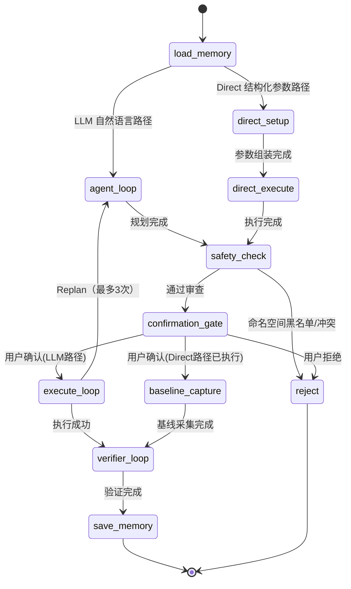
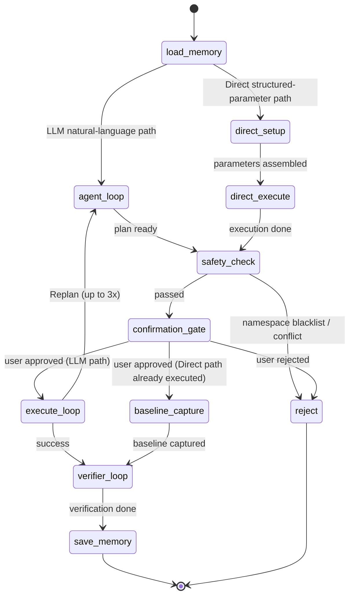

<a id="doc-40f60e1037245d7b8a98a732"></a>

# chaosblade-io/chaosblade / BUILD.md

Upstream: https://github.com/chaosblade-io/chaosblade/blob/e8e0d3adc90c414d9dc9a04a13f53ebadfbda8dc/BUILD.md

Commit: `e8e0d3adc90c414d9dc9a04a13f53ebadfbda8dc`

Retrieved: 2026-10-01T15:15:35.126632+00:00

Kind: official-document

Raw SHA256: `b230e8e11aedd03a40e8720cfc2f5dbf5a0d92c47542aa8a6e69aeb76d445544`

Source text below is untrusted reference content. Acquisition does not verify technical claims.

License status: UPSTREAM_NOTICES_CAPTURED_PER_FILE_REVIEW_REQUIRED. See this repository's captured license files.

---

# ChaosBlade Build Guide

## Overview

ChaosBlade is a powerful chaos engineering platform that supports compiling various project components on Mac, Linux, or Windows platforms. This document provides detailed instructions on how to build the ChaosBlade project.

## Requirements

### System Requirements
- **Git Version**: >= 1.8.5
- **Go Version**: Supports Go modules
- **Operating System**: macOS (Darwin), Linux, Windows

### Dependencies
- Go compiler
- Git
- Make
- Optional: Docker or Podman (for containerized builds)

## Version Management

### Automatic Version Detection
ChaosBlade supports automatically obtaining version numbers from Git Tags:
- If Git Tag exists, the version number will be automatically extracted (removing the v prefix)
- If no Git Tag exists, the default version 1.7.4 or environment variable `BLADE_VERSION` will be used

### Manual Version Setting
```bash
export BLADE_VERSION=1.8.0
make build
```

## Build Targets

### Basic Build

#### 1. Current Platform Build
```bash
# Build CLI tool
make build

# Build all components
make build_all
```

#### 2. Specific Platform Build
```bash
# Build all components for specific platform
make darwin_amd64
make darwin_arm64
make linux_amd64
make linux_arm64
make windows_amd64

# Build specific components for specific platform
make linux_amd64 MODULES=cli
make linux_amd64 MODULES=cli,os,java
make linux_amd64 MODULES=all
```

#### 3. Individual Component Build
```bash
# Build individual components for current platform
make cli          # Build CLI tool only
make os           # Build OS experiment scenarios
make cloud        # Build cloud experiment scenarios
make middleware   # Build middleware experiment scenarios
make java         # Build Java experiment scenarios
make cplus        # Build C/C++ experiment scenarios
make cri          # Build CRI experiment scenarios
make kubernetes   # Build Kubernetes experiment scenarios
make nsexec       # Build nsexec (Linux only)
make upx          # Compress binaries with UPX
make check_yaml   # Download check specification YAML files
```

#### 4. Build Preparation and Utilities
```bash
# Generate version information from Git
make generate_version

# Sync go.mod dependencies with Makefile branch configuration
make sync_go_mod

# Prepare build environment (clean and create directories)
make pre_build

# Package build artifacts
make package

# Clean all build artifacts
make clean
```

### Component List

| Component | Description | Notes |
|-----------|-------------|-------|
| `cli` | Command line tool | Core CLI tool |
| `os` | Operating system experiment scenarios | Basic resource experiment scenarios |
| `cloud` | Cloud platform experiment scenarios | Cloud service experiment scenarios |
| `middleware` | Middleware experiment scenarios | Middleware service experiment scenarios |
| `java` | Java experiment scenarios | JVM-related experiment scenarios |
| `cplus` | C/C++ experiment scenarios | C/C++ application experiment scenarios |
| `cri` | Container runtime experiment scenarios | CRI-related experiment scenarios |
| `kubernetes` | Kubernetes experiment scenarios | K8s-related experiment scenarios |
| `nsexec` | Namespace executor | Linux only, supports cross-platform compilation |
| `check_yaml` | Check specification files | Downloads check specification YAML files |

## Build Process

### 1. Pre-build Preparation
```bash
make pre_build
```
- Generate version information
- Clean and create build directories
- Set platform-specific environment variables

### 2. Component Build
Each component has an independent build process, including:
- Clone or update source code repositories
- Execute platform-specific build commands
- Copy build artifacts to target directories

### 3. Packaging
After build completion, platform-specific compressed packages are automatically generated:
- `chaosblade-{version}-{platform}_{arch}.tar.gz`

## Platform-Specific Build

### macOS (Darwin)
```bash
# AMD64 architecture
make darwin_amd64

# ARM64 architecture (Apple Silicon)
make darwin_arm64
```

### Linux
```bash
# AMD64 architecture
make linux_amd64

# ARM64 architecture
make linux_arm64
```

### Windows
```bash
# AMD64 architecture
make windows_amd64
```

## Containerized Build

### Docker Image Build
```bash
# Build Linux AMD64 image
make build_linux_amd64_image

# Build Linux ARM64 image
make build_linux_arm64_image

# Build with specific modules
make build_linux_amd64_image MODULES=cli,os
make build_linux_arm64_image MODULES=all
```

### Image Push
```bash
# Push to container image registry
make push_image
```

### Container Runtime Configuration
The build system automatically detects available container runtimes:
- **Docker** (default)
- **Podman** (if Docker is not available)

You can manually specify the container runtime:
```bash
# Use Docker explicitly
make nsexec CONTAINER_RUNTIME=docker

# Use Podman explicitly
make nsexec CONTAINER_RUNTIME=podman
```

## Cross-Platform Compilation

### nsexec Cross-Platform Compilation
The nsexec component supports cross-compilation from macOS to Linux:

#### Automatic Compiler Detection
The system automatically detects available cross-compilation toolchains in this order:
1. `musl-gcc` (for amd64)
2. `/usr/local/musl/bin/musl-gcc` (for amd64)
3. `x86_64-linux-musl-gcc` (for amd64)
4. `aarch64-linux-musl-gcc` (for arm64)
5. `gcc` (fallback for both architectures)
6. `aarch64-linux-gnu-gcc` (for arm64)
7. `container` (if no suitable compiler found)

#### Containerized Compilation
If no suitable cross-compilation toolchain is available, containers can be used for compilation:
```bash
# Using Docker
make nsexec CONTAINER_RUNTIME=docker

# Using Podman
make nsexec CONTAINER_RUNTIME=podman
```

### Cross-Platform Build with Containers
```bash
# Build Linux AMD64 using musl container
make cross_build_linux_amd64_by_container

# Build Linux ARM64 using ARM container
make cross_build_linux_arm64_by_container
```

### UPX Binary Compression
The build system supports UPX compression for smaller binary sizes:
```bash
# Compress binaries with UPX (Linux and Windows only)
make upx

# UPX is automatically applied during packaging for supported platforms
```

**Supported platforms for UPX:**
- Linux (amd64, arm64)
- Windows (amd64)

**Installation:**
- macOS: `brew install upx`
- Ubuntu/Debian: `apt-get install upx-ucl`
- CentOS/RHEL: `yum install upx`

## Build Configuration

### Environment Variables
- `GOOS`: Target operating system (linux, darwin, windows)
- `GOARCH`: Target architecture (amd64, arm64)
- `BLADE_VERSION`: Version number (auto-detected from Git tags or set manually)
- `CONTAINER_RUNTIME`: Container runtime (docker/podman, auto-detected)
- `MODULES`: Comma-separated list of components to build
- `GOPATH`: Go workspace path (for containerized builds)

### Build Flags
- `CGO_ENABLED=0`: Disable CGO for static linking
- `GO111MODULE=on`: Enable Go modules
- Static linking flags: `-ldflags="-s -w"` (strip debug info and symbols)
- Version injection: `-X` flags for embedding version information

### Version Information Injection
The build process automatically injects version information into binaries:
- Version number from Git tags or environment
- Build environment (`uname -mv`)
- Build timestamp
- Component-specific version information

## Build Artifacts

### Directory Structure
```
target/
└── chaosblade-{version}-{platform}_{arch}/
    ├── bin/           # Executable files
    ├── lib/           # Library files
    └── yaml/          # Configuration files
```

### File Naming
- Executable files: `blade` (Linux/macOS) or `blade.exe` (Windows)
- Compressed packages: `chaosblade-{version}-{platform}_{arch}.tar.gz`
- YAML specification files: `chaosblade-{component}-spec-{version}.yaml`
- Check specification: `chaosblade-check-spec-{version}.yaml`

### Build Cache
The build system uses a cache directory to store downloaded dependencies:
- Cache location: `target/cache/`
- Cached components: All external repositories (os, cloud, middleware, etc.)
- Cache management: Automatic clone/update of cached repositories

## Common Command Examples

### Quick Start
```bash
# Build for current platform
make build

# Build all components
make build_all
```

### Specific Platform Build
```bash
# Build for Linux AMD64 platform
make linux_amd64

# Build for macOS ARM64 platform
make darwin_arm64
```

### Component Selection Build
```bash
# Only build CLI and OS components
make linux_amd64 MODULES=cli,os

# Build all components
make linux_amd64 MODULES=all
```

### Container Image Build
```bash
# Build and push images
make build_linux_amd64_image
make build_linux_arm64_image
make push_image

# Build images with specific modules
make build_linux_amd64_image MODULES=cli,os
make build_linux_arm64_image MODULES=all
```

### Cross-Platform Build
```bash
# Build Linux versions using containers
make cross_build_linux_amd64_by_container
make cross_build_linux_arm64_by_container
```

### Utility Commands
```bash
# Generate version information
make generate_version

# Sync dependencies
make sync_go_mod

# Compress binaries
make upx

# Download check specifications
make check_yaml

# Run tests
make test

# Clean build artifacts
make clean
```

## Troubleshooting

### Common Issues

#### 1. Git Version Too Low
```bash
# Error message
ALERTMSG="please update git to >= 1.8.5"

# Solution
# Ubuntu/Debian
sudo apt-get update && sudo apt-get install git

# macOS
brew install git
```

#### 2. Missing Cross-Compilation Toolchain
```bash
# Ubuntu/Debian
sudo apt-get install musl-tools gcc-aarch64-linux-gnu

# macOS
brew install FiloSottile/musl-cross/musl-cross
```

#### 3. Container Runtime Issues
```bash
# Check Docker status
docker info

# Check Podman status
podman info

# Manually specify container runtime
make nsexec CONTAINER_RUNTIME=docker
```

#### 4. UPX Compression Issues
```bash
# Check if UPX is installed
which upx

# Install UPX on different platforms
# macOS
brew install upx

# Ubuntu/Debian
sudo apt-get install upx-ucl

# CentOS/RHEL
sudo yum install upx
```

#### 5. Cross-Compilation Issues
```bash
# Check available cross-compilers
which musl-gcc
which aarch64-linux-gnu-gcc

# Install cross-compilation tools
# Ubuntu/Debian
sudo apt-get install musl-tools gcc-aarch64-linux-gnu

# macOS
brew install FiloSottile/musl-cross/musl-cross
```

#### 6. Git Version Issues
```bash
# Check Git version
git --version

# Update Git if needed
# Ubuntu/Debian
sudo apt-get update && sudo apt-get install git

# macOS
brew install git
```

### Clean Build Artifacts
```bash
# Clean all build artifacts
make clean
```

## Testing

### Run Tests
```bash
# Run all tests
make test
```

### Test Coverage
Tests generate coverage reports:
- File: `coverage.txt`
- Mode: `atomic`

## Help Information

### View Help
```bash
make help
```

### Available Targets
```bash
# View all available make targets
make -n help
```

## Related Links

- [Project Homepage](https://github.com/chaosblade-io/chaosblade)
- [Contributing Guide](CONTRIBUTING.md)
- [Code Style Guide](docs/code_styles.md)
- [Release Process](docs/release_process.md)


<a id="doc-d5547a49f3af721e4cad998e"></a>

# chaosblade-io/chaosblade / BUILD_ZH.md

Upstream: https://github.com/chaosblade-io/chaosblade/blob/e8e0d3adc90c414d9dc9a04a13f53ebadfbda8dc/BUILD_ZH.md

Commit: `e8e0d3adc90c414d9dc9a04a13f53ebadfbda8dc`

Retrieved: 2026-10-01T15:15:35.126632+00:00

Kind: official-document

Raw SHA256: `5d692ce520619f792bc574e377440748ce4f302dcce63bce4b755ffa91f55efc`

Source text below is untrusted reference content. Acquisition does not verify technical claims.

License status: UPSTREAM_NOTICES_CAPTURED_PER_FILE_REVIEW_REQUIRED. See this repository's captured license files.

---

# ChaosBlade 构建指南

## 概述

ChaosBlade 是一个强大的混沌工程平台，支持在 Mac、Linux 或 Windows 平台上编译各种项目组件。本文档提供了如何构建 ChaosBlade 项目的详细说明。

## 系统要求

### 系统要求
- **Git 版本**: >= 1.8.5
- **Go 版本**: 支持 Go modules
- **操作系统**: macOS (Darwin)、Linux、Windows

### 依赖项
- Go 编译器
- Git
- Make
- 可选：Docker 或 Podman（用于容器化构建）

## 版本管理

### 自动版本检测
ChaosBlade 支持从 Git Tags 自动获取版本号：
- 如果存在 Git Tag，将自动提取版本号（移除 v 前缀）
- 如果不存在 Git Tag，将使用默认版本 1.7.4 或环境变量 `BLADE_VERSION`

### 手动版本设置
```bash
export BLADE_VERSION=1.8.0
make build
```

## 构建目标

### 基础构建

#### 1. 当前平台构建
```bash
# 构建 CLI 工具
make build

# 构建所有组件
make build_all
```

#### 2. 特定平台构建
```bash
# 为特定平台构建所有组件
make darwin_amd64
make darwin_arm64
make linux_amd64
make linux_arm64
make windows_amd64

# 为特定平台构建特定组件
make linux_amd64 MODULES=cli
make linux_amd64 MODULES=cli,os,java
make linux_amd64 MODULES=all
```

#### 3. 单独组件构建
```bash
# 为当前平台构建单独组件
make cli          # 仅构建 CLI 工具
make os           # 构建操作系统实验场景
make cloud        # 构建云平台实验场景
make middleware   # 构建中间件实验场景
make java         # 构建 Java 实验场景
make cplus        # 构建 C/C++ 实验场景
make cri          # 构建 CRI 实验场景
make kubernetes   # 构建 Kubernetes 实验场景
make nsexec       # 构建 nsexec（仅 Linux）
make upx          # 使用 UPX 压缩二进制文件
make check_yaml   # 下载检查规范 YAML 文件
```

#### 4. 构建准备和工具
```bash
# 从 Git 生成版本信息
make generate_version

# 同步 go.mod 依赖项与 Makefile 分支配置
make sync_go_mod

# 准备构建环境（清理和创建目录）
make pre_build

# 打包构建产物
make package

# 清理所有构建产物
make clean
```

### 组件列表

| 组件 | 描述 | 备注 |
|------|------|------|
| `cli` | 命令行工具 | 核心 CLI 工具 |
| `os` | 操作系统实验场景 | 基础资源实验场景 |
| `cloud` | 云平台实验场景 | 云服务实验场景 |
| `middleware` | 中间件实验场景 | 中间件服务实验场景 |
| `java` | Java 实验场景 | JVM 相关实验场景 |
| `cplus` | C/C++ 实验场景 | C/C++ 应用程序实验场景 |
| `cri` | 容器运行时实验场景 | CRI 相关实验场景 |
| `kubernetes` | Kubernetes 实验场景 | K8s 相关实验场景 |
| `nsexec` | 命名空间执行器 | 仅 Linux，支持跨平台编译 |
| `check_yaml` | 检查规范文件 | 下载检查规范 YAML 文件 |

## 构建过程

### 1. 构建前准备
```bash
make pre_build
```
- 生成版本信息
- 清理和创建构建目录
- 设置平台特定的环境变量

### 2. 组件构建
每个组件都有独立的构建过程，包括：
- 克隆或更新源代码仓库
- 执行平台特定的构建命令
- 将构建产物复制到目标目录

### 3. 打包
构建完成后，自动生成平台特定的压缩包：
- `chaosblade-{version}-{platform}_{arch}.tar.gz`

## 平台特定构建

### macOS (Darwin)
```bash
# AMD64 架构
make darwin_amd64

# ARM64 架构（Apple Silicon）
make darwin_arm64
```

### Linux
```bash
# AMD64 架构
make linux_amd64

# ARM64 架构
make linux_arm64
```

### Windows
```bash
# AMD64 架构
make windows_amd64
```

## 容器化构建

### Docker 镜像构建
```bash
# 构建 Linux AMD64 镜像
make build_linux_amd64_image

# 构建 Linux ARM64 镜像
make build_linux_arm64_image

# 使用特定模块构建
make build_linux_amd64_image MODULES=cli,os
make build_linux_arm64_image MODULES=all
```

### 镜像推送
```bash
# 推送到容器镜像仓库
make push_image
```

### 容器运行时配置
构建系统自动检测可用的容器运行时：
- **Docker**（默认）
- **Podman**（如果 Docker 不可用）

您可以手动指定容器运行时：
```bash
# 明确使用 Docker
make nsexec CONTAINER_RUNTIME=docker

# 明确使用 Podman
make nsexec CONTAINER_RUNTIME=podman
```

## 跨平台编译

### nsexec 跨平台编译
nsexec 组件支持从 macOS 到 Linux 的跨平台编译：

#### 自动编译器检测
系统按以下顺序自动检测可用的跨平台编译工具链：
1. `musl-gcc`（用于 amd64）
2. `/usr/local/musl/bin/musl-gcc`（用于 amd64）
3. `x86_64-linux-musl-gcc`（用于 amd64）
4. `aarch64-linux-musl-gcc`（用于 arm64）
5. `gcc`（两种架构的备用选项）
6. `aarch64-linux-gnu-gcc`（用于 arm64）
7. `container`（如果未找到合适的编译器）

#### 容器化编译
如果没有合适的跨平台编译工具链，可以使用容器进行编译：
```bash
# 使用 Docker
make nsexec CONTAINER_RUNTIME=docker

# 使用 Podman
make nsexec CONTAINER_RUNTIME=podman
```

### 使用容器进行跨平台构建
```bash
# 使用 musl 容器构建 Linux AMD64
make cross_build_linux_amd64_by_container

# 使用 ARM 容器构建 Linux ARM64
make cross_build_linux_arm64_by_container
```

### UPX 二进制压缩
构建系统支持 UPX 压缩以获得更小的二进制文件大小：
```bash
# 使用 UPX 压缩二进制文件（仅 Linux 和 Windows）
make upx

# UPX 在支持的平台的打包过程中自动应用
```

**UPX 支持的平台：**
- Linux（amd64、arm64）
- Windows（amd64）

**安装：**
- macOS: `brew install upx`
- Ubuntu/Debian: `apt-get install upx-ucl`
- CentOS/RHEL: `yum install upx`

## 构建配置

### 环境变量
- `GOOS`: 目标操作系统（linux、darwin、windows）
- `GOARCH`: 目标架构（amd64、arm64）
- `BLADE_VERSION`: 版本号（从 Git tags 自动检测或手动设置）
- `CONTAINER_RUNTIME`: 容器运行时（docker/podman，自动检测）
- `MODULES`: 要构建的组件列表（逗号分隔）
- `GOPATH`: Go 工作空间路径（用于容器化构建）

### 构建标志
- `CGO_ENABLED=0`: 禁用 CGO 进行静态链接
- `GO111MODULE=on`: 启用 Go modules
- 静态链接标志: `-ldflags="-s -w"`（剥离调试信息和符号）
- 版本注入: `-X` 标志用于嵌入版本信息

### 版本信息注入
构建过程自动将版本信息注入到二进制文件中：
- 来自 Git tags 或环境的版本号
- 构建环境（`uname -mv`）
- 构建时间戳
- 组件特定的版本信息

## 构建产物

### 目录结构
```
target/
└── chaosblade-{version}-{platform}_{arch}/
    ├── bin/           # 可执行文件
    ├── lib/           # 库文件
    └── yaml/          # 配置文件
```

### 文件命名
- 可执行文件: `blade`（Linux/macOS）或 `blade.exe`（Windows）
- 压缩包: `chaosblade-{version}-{platform}_{arch}.tar.gz`
- YAML 规范文件: `chaosblade-{component}-spec-{version}.yaml`
- 检查规范: `chaosblade-check-spec-{version}.yaml`

### 构建缓存
构建系统使用缓存目录存储下载的依赖项：
- 缓存位置: `target/cache/`
- 缓存组件: 所有外部仓库（os、cloud、middleware 等）
- 缓存管理: 自动克隆/更新缓存的仓库

## 常用命令示例

### 快速开始
```bash
# 为当前平台构建
make build

# 构建所有组件
make build_all
```

### 特定平台构建
```bash
# 为 Linux AMD64 平台构建
make linux_amd64

# 为 macOS ARM64 平台构建
make darwin_arm64
```

### 组件选择构建
```bash
# 仅构建 CLI 和 OS 组件
make linux_amd64 MODULES=cli,os

# 构建所有组件
make linux_amd64 MODULES=all
```

### 容器镜像构建
```bash
# 构建并推送镜像
make build_linux_amd64_image
make build_linux_arm64_image
make push_image

# 使用特定模块构建镜像
make build_linux_amd64_image MODULES=cli,os
make build_linux_arm64_image MODULES=all
```

### 跨平台构建
```bash
# 使用容器构建 Linux 版本
make cross_build_linux_amd64_by_container
make cross_build_linux_arm64_by_container
```

### 工具命令
```bash
# 生成版本信息
make generate_version

# 同步依赖项
make sync_go_mod

# 压缩二进制文件
make upx

# 下载检查规范
make check_yaml

# 运行测试
make test

# 清理构建产物
make clean
```

## 故障排除

### 常见问题

#### 1. Git 版本过低
```bash
# 错误信息
ALERTMSG="please update git to >= 1.8.5"

# 解决方案
# Ubuntu/Debian
sudo apt-get update && sudo apt-get install git

# macOS
brew install git
```

#### 2. 缺少跨平台编译工具链
```bash
# Ubuntu/Debian
sudo apt-get install musl-tools gcc-aarch64-linux-gnu

# macOS
brew install FiloSottile/musl-cross/musl-cross
```

#### 3. 容器运行时问题
```bash
# 检查 Docker 状态
docker info

# 检查 Podman 状态
podman info

# 手动指定容器运行时
make nsexec CONTAINER_RUNTIME=docker
```

#### 4. UPX 压缩问题
```bash
# 检查是否安装了 UPX
which upx

# 在不同平台安装 UPX
# macOS
brew install upx

# Ubuntu/Debian
sudo apt-get install upx-ucl

# CentOS/RHEL
sudo yum install upx
```

#### 5. 跨平台编译问题
```bash
# 检查可用的交叉编译器
which musl-gcc
which aarch64-linux-gnu-gcc

# 安装交叉编译工具
# Ubuntu/Debian
sudo apt-get install musl-tools gcc-aarch64-linux-gnu

# macOS
brew install FiloSottile/musl-cross/musl-cross
```

#### 6. Git 版本问题
```bash
# 检查 Git 版本
git --version

# 如需要更新 Git
# Ubuntu/Debian
sudo apt-get update && sudo apt-get install git

# macOS
brew install git
```

### 清理构建产物
```bash
# 清理所有构建产物
make clean
```

## 测试

### 运行测试
```bash
# 运行所有测试
make test
```

### 测试覆盖率
测试生成覆盖率报告：
- 文件: `coverage.txt`
- 模式: `atomic`

## 帮助信息

### 查看帮助
```bash
make help
```

### 可用目标
```bash
# 查看所有可用的 make 目标
make -n help
```

## 相关链接

- [项目主页](https://github.com/chaosblade-io/chaosblade)
- [贡献指南](CONTRIBUTING.md)
- [代码风格指南](docs/code_styles.md)
- [发布流程](docs/release_process.md)


<a id="doc-f506b6931b1979eda54c61ca"></a>

# chaosblade-io/chaosblade / CLOUDNATIVE.md

Upstream: https://github.com/chaosblade-io/chaosblade/blob/e8e0d3adc90c414d9dc9a04a13f53ebadfbda8dc/CLOUDNATIVE.md

Commit: `e8e0d3adc90c414d9dc9a04a13f53ebadfbda8dc`

Retrieved: 2026-10-01T15:15:35.126632+00:00

Kind: official-document

Raw SHA256: `d327ec8ff6c45299c6ae513ef950f050fd1fa7fc6922d84ae3dec23c2fd9421e`

Source text below is untrusted reference content. Acquisition does not verify technical claims.

License status: UPSTREAM_NOTICES_CAPTURED_PER_FILE_REVIEW_REQUIRED. See this repository's captured license files.

---

## Chaosblade Operator：在云原生场景下，将 Kubernetes 设计理解与混沌实验模型相结合标准化实现方案 


[chaosblade-operator](https://github.com/chaosblade-io/chaosblade-operator) 项目是针对 Kubernetes 平台所实现的混沌实验注入工具，遵循上述混沌实验模型规范化实验场景，把实验定义为 Kubernetes CRD 资源，将实验模型中的四部分映射为 Kubernetes 资源属性，很友好的将混沌实验模型与 Kubernetes 声明式设计结合在一起，依靠混沌实验模型便捷开发场景的同时，又可以很好的结合 Kubernetes 设计理念，通过 kubectl 或者编写代码直接调用 Kubernetes API 来创建、更新、删除混沌实验，而且资源状态可以非常清晰的表示实验的执行状态，标准化实现 Kubernetes 故障注入。除了使用上述方式执行实验外，还可以使用 chaosblade cli 方式非常方便的执行 kubernetes 实验场景，查询实验状态等。
遵循混沌实验模型实现的 chaosblade operator 除上述优势之外，还可以实现基础资源、应用服务、Docker 容器等场景复用，大大方便了 Kubernetes 场景的扩展，所以在符合 Kubernetes 标准化实现场景方式之上，结合混沌实验模型可以更有效、更清晰、更方便的实现、使用混沌实验场景。
下面通过一个具体的案例来说明 chaosblade-operator 的使用：对 cn-hangzhou.192.168.0.205 节点本地端口 40690 访问模拟 60% 的网络丢包。
**使用 yaml 配置方式，使用 kubectl 来执行实验**
```
apiVersion: chaosblade.io/v1alpha1
kind: ChaosBlade
metadata:
  name: loss-node-network-by-names
spec:
  experiments:
  - scope: node
    target: network
    action: loss
    desc: "node network loss"
    matchers:
    - name: names
      value: ["cn-hangzhou.192.168.0.205"]
    - name: percent
      value: ["60"]
    - name: interface
      value: ["eth0"]
    - name: local-port
      value: ["40690"]
```
执行实验：
```
kubectl apply -f loss-node-network-by-names.yaml
```
查询实验状态，返回信息如下（省略了 spec 等内容）：
```
~ » kubectl get blade loss-node-network-by-names -o json                                                            
{
    "apiVersion": "chaosblade.io/v1alpha1",
    "kind": "ChaosBlade",
    "metadata": {
        "creationTimestamp": "2019-11-04T09:56:36Z",
        "finalizers": [
            "finalizer.chaosblade.io"
        ],
        "generation": 1,
        "name": "loss-node-network-by-names",
        "resourceVersion": "9262302",
        "selfLink": "/apis/chaosblade.io/v1alpha1/chaosblades/loss-node-network-by-names",
        "uid": "63a926dd-fee9-11e9-b3be-00163e136d88"
    },
        "status": {
        "expStatuses": [
            {
                "action": "loss",
                "resStatuses": [
                    {
                        "id": "057acaa47ae69363",
                        "kind": "node",
                        "name": "cn-hangzhou.192.168.0.205",
                        "nodeName": "cn-hangzhou.192.168.0.205",
                        "state": "Success",
                        "success": true,
                        "uid": "e179b30d-df77-11e9-b3be-00163e136d88"
                    }
                ],
                "scope": "node",
                "state": "Success",
                "success": true,
                "target": "network"
            }
        ],
        "phase": "Running"
    }
}
```
通过以上内容可以很清晰的看出混沌实验的运行状态，执行以下命令停止实验：
```
kubectl delete -f loss-node-network-by-names.yaml
```
或者直接删除此 blade 资源
```
kubectl delete blade loss-node-network-by-names
```
还可以编辑 yaml 文件，更新实验内容执行，chaosblade operator 会完成实验的更新操作。

**使用 chaosblade cli 的 blade 命令执行**
```
blade create k8s node-network loss --percent 60 --interface eth0 --local-port 40690 --kubeconfig config --names cn-hangzhou.192.168.0.205
```
如果执行失败，会返回详细的错误信息；如果执行成功，会返回实验的 UID：
```
{"code":200,"success":true,"result":"e647064f5f20953c"}
```
可通过以下命令查询实验状态：
```
blade query k8s create e647064f5f20953c --kubeconfig config

{
  "code": 200,
  "success": true,
  "result": {
    "uid": "e647064f5f20953c",
    "success": true,
    "error": "",
    "statuses": [
      {
        "id": "fa471a6285ec45f5",
        "uid": "e179b30d-df77-11e9-b3be-00163e136d88",
        "name": "cn-hangzhou.192.168.0.205",
        "state": "Success",
        "kind": "node",
        "success": true,
        "nodeName": "cn-hangzhou.192.168.0.205"
      }
    ]
  }
}
```
销毁实验：
```
blade destroy e647064f5f20953c
```
除了上述两种方式调用外，还可以使用 kubernetes client-go 方式执行，具体可参考：[executor.go](https://github.com/chaosblade-io/chaosblade/blob/master/exec/kubernetes/executor.go) 代码实现。

通过上述介绍，可以看出在设计 ChaosBlade 项目初期就考虑了云原生实验场景，将混沌实验模型与 Kubernetes 设计理念友好的结合在一起，不仅可以遵循 Kubernetes 标准化实现，还可以复用其他领域场景和 chaosblade cli 调用方式。

详细的中文使用文档：https://chaosblade-io.gitbook.io/chaosblade-help-zh-cn/blade-create-k8s


<a id="doc-ffdbe3a1e7ee93cacfc080b6"></a>

# chaosblade-io/chaosblade / CODE_OF_CONDUCT.md

Upstream: https://github.com/chaosblade-io/chaosblade/blob/e8e0d3adc90c414d9dc9a04a13f53ebadfbda8dc/CODE_OF_CONDUCT.md

Commit: `e8e0d3adc90c414d9dc9a04a13f53ebadfbda8dc`

Retrieved: 2026-10-01T15:15:35.126632+00:00

Kind: official-document

Raw SHA256: `3c12be4bb26c491983bb7bf3ff86b8d502ebedce2616f26ccd8cf6c219a15736`

Source text below is untrusted reference content. Acquisition does not verify technical claims.

License status: UPSTREAM_NOTICES_CAPTURED_PER_FILE_REVIEW_REQUIRED. See this repository's captured license files.

---

# Chaosblade Community Code of Conduct

Chaosblade follows the [CNCF Code of Conduct](https://github.com/cncf/foundation/blob/master/code-of-conduct.md).

In cases of abusive, harassing, or any unacceptable behaviors, please don't hesitate to contact the project team at chaosblade.io.01@gmail.com.


<a id="doc-eca12c0a30e25b4b46522ebf"></a>

# chaosblade-io/chaosblade / CONTRIBUTING.md

Upstream: https://github.com/chaosblade-io/chaosblade/blob/e8e0d3adc90c414d9dc9a04a13f53ebadfbda8dc/CONTRIBUTING.md

Commit: `e8e0d3adc90c414d9dc9a04a13f53ebadfbda8dc`

Retrieved: 2026-10-01T15:15:35.126632+00:00

Kind: official-document

Raw SHA256: `ab1f5f5b643e1722ccc8befdd1911e6261d66ddc07ddc3b6f41f7a0db6a8b7d4`

Source text below is untrusted reference content. Acquisition does not verify technical claims.

License status: UPSTREAM_NOTICES_CAPTURED_PER_FILE_REVIEW_REQUIRED. See this repository's captured license files.

---

# Contributing to chaosblade

Welcome to ChaosBlade world, here is a list of contributing guide for you. If you find something incorrect or missing
 content in the page, please submit an issue or PR to fix it.


## What can you do 
Every action to make the project better is encouraged. On GitHub, every improvement for the project could be via a PR 
(short for pull request).

* If you find a typo, try to fix it!
* If you find a bug, try to fix it!
* If you find some redundant codes, try to remove them!
* If you find some test cases missing, try to add them!
* If you could enhance a feature, please **DO NOT** hesitate!
* If you find code implicit, try to add comments to make it clear!
* If you find code ugly, try to refactor that!
* If you can help to improve documents, it could not be better!
* If you find document incorrect, just do it and fix that!
* ...

Actually, it is impossible to list them completely. Just remember one principle:

**WE ARE LOOKING FORWARD TO ANY PR FROM YOU.**


## Contributing
### Preparation
Before you contribute, you need to register a Github ID. Prepare the following environment:
* go
* git

### Workflow
We use the `master` branch as the development branch, which indicates that this is an unstable branch.

Here is the workflow for contributors:

1. Fork to your own
2. Clone fork to the local repository
3. Create a new branch and work on it
4. Keep your branch in sync
5. Commit your changes (make sure your commit message concise)
6. Push your commits to your forked repository
7. Create a pull request

Please follow [Creating a pull request](https://docs.github.com/en/github/collaborating-with-issues-and-pull-requests/creating-a-pull-request).
Please make sure the PR has a corresponding issue.

After creating a PR, one or more reviewers will be assigned to the pull request.
The reviewers will review the code.

Before merging a PR, squash any fix review feedback, typo, merged, and rebased sorts of commits.
The final commit message should be clear and concise.

### Compile
Go to the project root directory which you cloned and execute compile:
```bash
make
```

If you compile the Linux package on the Mac operating system, you can do:
```bash
make build_linux
```

If you compile the chaosblade image, you can do:
```bash
make build_image
```
clean compilation:
```bash
make clean
```

### Code Style
See details of [CODE STYLE](./docs/code_styles.md)

### Commit Rules
#### Commit Message

Commit message could help reviewers better understand what is the purpose of submitted PR. It could help accelerate the code review procedure as well. We encourage contributors to use **EXPLICIT** commit message rather than an ambiguous message. In general, we advocate the following commit message type:

* feat: A new feature
* fix: A bug fix
* docs: Documentation only changes
* style: Changes that do not affect the meaning of the code (white-space, formatting, missing semi-colons, etc)
* refactor: A code change that neither fixes a bug or adds a feature
* perf: A code change that improves performance
* test: Adding missing or correcting existing tests
* chore: Changes to the build process or auxiliary tools and libraries such as documentation generation

On the other side, we discourage contributors from committing message like the following ways:

* ~~fix bug~~
* ~~update~~
* ~~add doc~~

If you get lost, please see [How to Write a Git Commit Message](http://chris.beams.io/posts/git-commit/) for a start.

#### Commit Content

Commit content represents all content changes included in one commit. We had better include things in one single commit which could support the reviewer's complete review without any other commits' help. In other word, contents in one single commit can pass the CI to avoid code mess. In brief, there are two minor rules for us to keep in mind:

* avoid very large change in a commit;
* complete and reviewable for each commit.

No matter commit message or commit content, we do take more emphasis on code review.


### Pull Request
We use [GitHub Issues](https://github.com/chaosblade-io/chaosblade/issues) and [Pull Requests](https://github.com/chaosblade-io/chaosblade/pulls) for trackers.

If you find a typo in document, find a bug in code, or want new features, or want to give suggestions,
you can [open an issue on GitHub](https://github.com/chaosblade-io/chaosblade/issues/new) to report it.
Please follow the guideline message in the issue template.

If you want to contribute, please follow the [contribution workflow](#Workflow) and create a new pull request.
If your PR contains large changes, e.g. component refactor or new components, please write detailed documents
about its design and usage.

Note that a single PR should not be too large. If heavy changes are required, it's better to separate the changes
to a few individual PRs.


### Code Review
All code should be well reviewed by one or more committers. Some principles:

- Readability: Important code should be well-documented. Comply with our code style.
- Elegance: New functions, classes or components should be well designed.
- Testability: Important code should be well-tested (high unit test coverage).

## Others
### Code of Conduct
*"In the interest of fostering an open and welcoming environment, we as contributors and maintainers pledge to make 
participation in our project and our community a harassment-free experience for everyone, regardless of age, body 
size, disability, ethnicity, sex characteristics, gender identity and expression, level of experience, education, 
socio-economic status, nationality, personal appearance, race, religion, or sexual identity and orientation..."*

See details of [CONTRIBUTOR COVENANT CODE OF CONDUCT](https://github.com/chaosblade-io/chaosblade/blob/master/CODE_OF_CONDUCT.md)

### Sign your work
The sign-off is a simple line at the end of the explanation for the patch, which certifies that you wrote it or otherwise have the right to pass it on as an open-source patch.
The rules are pretty simple: if you can certify the below (from [developercertificate.org](http://developercertificate.org/)):

```
Developer Certificate of Origin
Version 1.1

Copyright (C) 2004, 2006 The Linux Foundation and its contributors.
660 York Street, Suite 102,
San Francisco, CA 94110 USA

Everyone is permitted to copy and distribute verbatim copies of this
license document, but changing it is not allowed.

Developer's Certificate of Origin 1.1

By making a contribution to this project, I certify that:

(a) The contribution was created in whole or in part by me and I
    have the right to submit it under the open source license
    indicated in the file; or

(b) The contribution is based upon previous work that, to the best
    of my knowledge, is covered under an appropriate open source
    license and I have the right under that license to submit that
    work with modifications, whether created in whole or in part
    by me, under the same open source license (unless I am
    permitted to submit under a different license), as indicated
    in the file; or

(c) The contribution was provided directly to me by some other
    person who certified (a), (b) or (c) and I have not modified
    it.

(d) I understand and agree that this project and the contribution
    are public and that a record of the contribution (including all
    personal information I submit with it, including my sign-off) is
    maintained indefinitely and may be redistributed consistent with
    this project or the open source license(s) involved.
```

Then you just add a line to every git commit message:

```
Signed-off-by: Joe Smith <joe.smith@email.com>
```

Use your real name (sorry, no pseudonyms or anonymous contributions.)

If you set your `user.name` and `user.email` git configs, you can sign your commit automatically with `git commit -s`.


<a id="doc-b60c6a93e9f74ee52e71bf33"></a>

# chaosblade-io/chaosblade / GOVERNANCE.md

Upstream: https://github.com/chaosblade-io/chaosblade/blob/e8e0d3adc90c414d9dc9a04a13f53ebadfbda8dc/GOVERNANCE.md

Commit: `e8e0d3adc90c414d9dc9a04a13f53ebadfbda8dc`

Retrieved: 2026-10-01T15:15:35.126632+00:00

Kind: official-document

Raw SHA256: `3710bbc3a88d120e3f827b6c2fbbbad7503e5b9b645b6d8822f6b35cbd970b01`

Source text below is untrusted reference content. Acquisition does not verify technical claims.

License status: UPSTREAM_NOTICES_CAPTURED_PER_FILE_REVIEW_REQUIRED. See this repository's captured license files.

---

# Governance

The governance model adopted in ChaosBlade is influenced by many CNCF projects.

## Principles

- **Open**: ChaosBlade is open source community.
- **Welcoming and respectful**: See [Code of Conduct](https://github.com/cncf/foundation/blob/master/code-of-conduct.md).
- **Transparent and accessible**: Work and collaboration should be done in public.
- **Merit**: Ideas and contributions are accepted according to their technical merit
  and alignment with project objectives, scope and design principles.

## Project Maintainers

Maintainers are the first and foremost contributors that are committed to the success of ChaosBlade project.
They normally take the following responsibilities:

- Classify GitHub issues and perform pull request reviews for other maintainers and the community.

- During GitHub issue classification, apply all applicable [labels](https://github.com/chaosblade-io/chaosblade/labels)
  to each new issue. Labels are extremely useful for follow-up of future issues. Which labels to apply
  is somewhat subjective so just use your best judgment.

- Make sure that ongoing PRs are moving forward at the right pace or closing them if they are not
  moving in a productive direction.

- Participate when called upon in the security release process. Note
  that although this should be a rare occurrence, if a serious vulnerability is found, the process
  may take up to several full days of work to implement.

## Process of becoming a maintainer

- Talk to one of the existing project [maintainers](MAINTAINERS.md) that you are interested in becoming a
  maintainer and he will nominate you as a new maintainer. After nomination, you will need to
  create a PR to update the list in [MAINTAINERS.md](MAINTAINERS.md).
- We will expect you to start contributing increasingly complicated PRs, under the guidance
  of the existing maintainers.
- We may ask you to do some PRs from our backlog. As you gain experience with the code base and our standards,
  we will ask you to do code reviews for incoming PRs.
- Once the existing maintainers have made a consensus that the nominating maintainer has deep understanding
  about the project and is able to independently take the maintainer responsibilities,
  the PR will be approved and the new maintainer becomes active.

## When does a maintainer lose maintainer status

- If a maintainer is no longer interested or cannot perform the maintainer duties listed above, they
should volunteer to be moved to emeritus status.

- In extreme cases this can also occur by a vote of the maintainers per the voting process. The voting
process is a simple majority in which each maintainer receives one vote.

## Decision making process

Decisions are made based on consensus between maintainers.
Proposals and ideas can either be submitted for agreement via a github issue or PR,
or by sending an email to `chaosblade.io.01@gmail.com`.

In general, we prefer that technical issues and maintainer membership are amicably worked out between the persons involved.
If a dispute cannot be decided independently, get a third-party maintainer (e.g. a mutual contact with some background
on the issue, but not involved in the conflict) to intercede and the final decision will be made.
Decision making process should be transparent to adhere to the principles of ChaosBlade project.

## Code of Conduct

The ChaosBlade [Code of Conduct](CODE_OF_CONDUCT.md) is aligned with the CNCF Code of Conduct.

## Release process
Eligibility to be a release manager:

- MUST be an active Maintainer
- MUST have the GPG fingerprint listed in the maintainer list

Release steps:

- Open an issue to propose making a new release. The proposal should be public, with an exception for vulnerability fixes. If this is the first time for you to take a role of release management, you SHOULD make a beta (or alpha, RC) release as an exercise before releasing GA.
- Make sure that all the merged PRs are associated with the correct Milestone.
- Run git tag --sign vX.Y.Z-beta.W .
- Run git push UPSTREAM vX.Y.Z-beta.W .
- Wait for the Release action on GitHub Actions to complete. A draft release will appear in https://github.com/chaosblade-io/chaosblade/releases .
- Add release notes in the draft release, to explain the changes and show appreciation to the contributors. Make sure to fulfill the Release manager: [ADD YOUR NAME HERE] (@[ADD YOUR GITHUB ID HERE]) line with your name. e.g., Release manager: MandssS (@MandssS) .
- Click the Set as a pre-release checkbox if this release is a beta (or alpha, RC).
- Click the Publish release button.
- Close the Milestone.


## Credits

Some contents in this documents have been borrowed from [BFE](https://github.com/bfenetworks/bfe/blob/develop/GOVERNANCE.md) and [CoreDNS](https://github.com/coredns/coredns/blob/master/GOVERNANCE.md) projects.


<a id="doc-c693279643b8cd5d248172d9"></a>

# chaosblade-io/chaosblade / LICENSE

Upstream: https://github.com/chaosblade-io/chaosblade/blob/e8e0d3adc90c414d9dc9a04a13f53ebadfbda8dc/LICENSE

Commit: `e8e0d3adc90c414d9dc9a04a13f53ebadfbda8dc`

Retrieved: 2026-10-01T15:15:35.126632+00:00

Kind: license

Raw SHA256: `cdd1253f2fd1b9f9c65e175d8282bf9338337d75531c5464449b44a7be53452a`

Source text below is untrusted reference content. Acquisition does not verify technical claims.

License status: UPSTREAM_NOTICES_CAPTURED_PER_FILE_REVIEW_REQUIRED. See this repository's captured license files.

---

````text
                                 Apache License
                           Version 2.0, January 2004
                        http://www.apache.org/licenses/

   TERMS AND CONDITIONS FOR USE, REPRODUCTION, AND DISTRIBUTION

   1. Definitions.

      "License" shall mean the terms and conditions for use, reproduction,
      and distribution as defined by Sections 1 through 9 of this document.

      "Licensor" shall mean the copyright owner or entity authorized by
      the copyright owner that is granting the License.

      "Legal Entity" shall mean the union of the acting entity and all
      other entities that control, are controlled by, or are under common
      control with that entity. For the purposes of this definition,
      "control" means (i) the power, direct or indirect, to cause the
      direction or management of such entity, whether by contract or
      otherwise, or (ii) ownership of fifty percent (50%) or more of the
      outstanding shares, or (iii) beneficial ownership of such entity.

      "You" (or "Your") shall mean an individual or Legal Entity
      exercising permissions granted by this License.

      "Source" form shall mean the preferred form for making modifications,
      including but not limited to software source code, documentation
      source, and configuration files.

      "Object" form shall mean any form resulting from mechanical
      transformation or translation of a Source form, including but
      not limited to compiled object code, generated documentation,
      and conversions to other media types.

      "Work" shall mean the work of authorship, whether in Source or
      Object form, made available under the License, as indicated by a
      copyright notice that is included in or attached to the work
      (an example is provided in the Appendix below).

      "Derivative Works" shall mean any work, whether in Source or Object
      form, that is based on (or derived from) the Work and for which the
      editorial revisions, annotations, elaborations, or other modifications
      represent, as a whole, an original work of authorship. For the purposes
      of this License, Derivative Works shall not include works that remain
      separable from, or merely link (or bind by name) to the interfaces of,
      the Work and Derivative Works thereof.

      "Contribution" shall mean any work of authorship, including
      the original version of the Work and any modifications or additions
      to that Work or Derivative Works thereof, that is intentionally
      submitted to Licensor for inclusion in the Work by the copyright owner
      or by an individual or Legal Entity authorized to submit on behalf of
      the copyright owner. For the purposes of this definition, "submitted"
      means any form of electronic, verbal, or written communication sent
      to the Licensor or its representatives, including but not limited to
      communication on electronic mailing lists, source code control systems,
      and issue tracking systems that are managed by, or on behalf of, the
      Licensor for the purpose of discussing and improving the Work, but
      excluding communication that is conspicuously marked or otherwise
      designated in writing by the copyright owner as "Not a Contribution."

      "Contributor" shall mean Licensor and any individual or Legal Entity
      on behalf of whom a Contribution has been received by Licensor and
      subsequently incorporated within the Work.

   2. Grant of Copyright License. Subject to the terms and conditions of
      this License, each Contributor hereby grants to You a perpetual,
      worldwide, non-exclusive, no-charge, royalty-free, irrevocable
      copyright license to reproduce, prepare Derivative Works of,
      publicly display, publicly perform, sublicense, and distribute the
      Work and such Derivative Works in Source or Object form.

   3. Grant of Patent License. Subject to the terms and conditions of
      this License, each Contributor hereby grants to You a perpetual,
      worldwide, non-exclusive, no-charge, royalty-free, irrevocable
      (except as stated in this section) patent license to make, have made,
      use, offer to sell, sell, import, and otherwise transfer the Work,
      where such license applies only to those patent claims licensable
      by such Contributor that are necessarily infringed by their
      Contribution(s) alone or by combination of their Contribution(s)
      with the Work to which such Contribution(s) was submitted. If You
      institute patent litigation against any entity (including a
      cross-claim or counterclaim in a lawsuit) alleging that the Work
      or a Contribution incorporated within the Work constitutes direct
      or contributory patent infringement, then any patent licenses
      granted to You under this License for that Work shall terminate
      as of the date such litigation is filed.

   4. Redistribution. You may reproduce and distribute copies of the
      Work or Derivative Works thereof in any medium, with or without
      modifications, and in Source or Object form, provided that You
      meet the following conditions:

      (a) You must give any other recipients of the Work or
          Derivative Works a copy of this License; and

      (b) You must cause any modified files to carry prominent notices
          stating that You changed the files; and

      (c) You must retain, in the Source form of any Derivative Works
          that You distribute, all copyright, patent, trademark, and
          attribution notices from the Source form of the Work,
          excluding those notices that do not pertain to any part of
          the Derivative Works; and

      (d) If the Work includes a "NOTICE" text file as part of its
          distribution, then any Derivative Works that You distribute must
          include a readable copy of the attribution notices contained
          within such NOTICE file, excluding those notices that do not
          pertain to any part of the Derivative Works, in at least one
          of the following places: within a NOTICE text file distributed
          as part of the Derivative Works; within the Source form or
          documentation, if provided along with the Derivative Works; or,
          within a display generated by the Derivative Works, if and
          wherever such third-party notices normally appear. The contents
          of the NOTICE file are for informational purposes only and
          do not modify the License. You may add Your own attribution
          notices within Derivative Works that You distribute, alongside
          or as an addendum to the NOTICE text from the Work, provided
          that such additional attribution notices cannot be construed
          as modifying the License.

      You may add Your own copyright statement to Your modifications and
      may provide additional or different license terms and conditions
      for use, reproduction, or distribution of Your modifications, or
      for any such Derivative Works as a whole, provided Your use,
      reproduction, and distribution of the Work otherwise complies with
      the conditions stated in this License.

   5. Submission of Contributions. Unless You explicitly state otherwise,
      any Contribution intentionally submitted for inclusion in the Work
      by You to the Licensor shall be under the terms and conditions of
      this License, without any additional terms or conditions.
      Notwithstanding the above, nothing herein shall supersede or modify
      the terms of any separate license agreement you may have executed
      with Licensor regarding such Contributions.

   6. Trademarks. This License does not grant permission to use the trade
      names, trademarks, service marks, or product names of the Licensor,
      except as required for reasonable and customary use in describing the
      origin of the Work and reproducing the content of the NOTICE file.

   7. Disclaimer of Warranty. Unless required by applicable law or
      agreed to in writing, Licensor provides the Work (and each
      Contributor provides its Contributions) on an "AS IS" BASIS,
      WITHOUT WARRANTIES OR CONDITIONS OF ANY KIND, either express or
      implied, including, without limitation, any warranties or conditions
      of TITLE, NON-INFRINGEMENT, MERCHANTABILITY, or FITNESS FOR A
      PARTICULAR PURPOSE. You are solely responsible for determining the
      appropriateness of using or redistributing the Work and assume any
      risks associated with Your exercise of permissions under this License.

   8. Limitation of Liability. In no event and under no legal theory,
      whether in tort (including negligence), contract, or otherwise,
      unless required by applicable law (such as deliberate and grossly
      negligent acts) or agreed to in writing, shall any Contributor be
      liable to You for damages, including any direct, indirect, special,
      incidental, or consequential damages of any character arising as a
      result of this License or out of the use or inability to use the
      Work (including but not limited to damages for loss of goodwill,
      work stoppage, computer failure or malfunction, or any and all
      other commercial damages or losses), even if such Contributor
      has been advised of the possibility of such damages.

   9. Accepting Warranty or Additional Liability. While redistributing
      the Work or Derivative Works thereof, You may choose to offer,
      and charge a fee for, acceptance of support, warranty, indemnity,
      or other liability obligations and/or rights consistent with this
      License. However, in accepting such obligations, You may act only
      on Your own behalf and on Your sole responsibility, not on behalf
      of any other Contributor, and only if You agree to indemnify,
      defend, and hold each Contributor harmless for any liability
      incurred by, or claims asserted against, such Contributor by reason
      of your accepting any such warranty or additional liability.

   END OF TERMS AND CONDITIONS

   APPENDIX: How to apply the Apache License to your work.

      To apply the Apache License to your work, attach the following
      boilerplate notice, with the fields enclosed by brackets "{}"
      replaced with your own identifying information. (Don't include
      the brackets!)  The text should be enclosed in the appropriate
      comment syntax for the file format. We also recommend that a
      file or class name and description of purpose be included on the
      same "printed page" as the copyright notice for easier
      identification within third-party archives.

   Copyright 1999-2019 Alibaba Group Holding Ltd.

   Licensed under the Apache License, Version 2.0 (the "License");
   you may not use this file except in compliance with the License.
   You may obtain a copy of the License at

       http://www.apache.org/licenses/LICENSE-2.0

   Unless required by applicable law or agreed to in writing, software
   distributed under the License is distributed on an "AS IS" BASIS,
   WITHOUT WARRANTIES OR CONDITIONS OF ANY KIND, either express or implied.
   See the License for the specific language governing permissions and
   limitations under the License.

````


<a id="doc-39da3bd6270d44ea37b6ed50"></a>

# chaosblade-io/chaosblade / MAINTAINERS.md

Upstream: https://github.com/chaosblade-io/chaosblade/blob/e8e0d3adc90c414d9dc9a04a13f53ebadfbda8dc/MAINTAINERS.md

Commit: `e8e0d3adc90c414d9dc9a04a13f53ebadfbda8dc`

Retrieved: 2026-10-01T15:15:35.126632+00:00

Kind: official-document

Raw SHA256: `c362867d042fc82922884ce7d47ba389e4accde24b19af00188515c5c880ba12`

Source text below is untrusted reference content. Acquisition does not verify technical claims.

License status: UPSTREAM_NOTICES_CAPTURED_PER_FILE_REVIEW_REQUIRED. See this repository's captured license files.

---

# The ChaosBlade Maintainers

This file lists the maintainers of the ChaosBlade project. The responsibilities of maintainers are listed in
the [GOVERNANCE.md](GOVERNANCE.md) file.

## Project Maintainers

| Name                                                 | GitHub ID                                   | Affiliation  |
|------------------------------------------------------|---------------------------------------------|--------------|
| [Changjun_Xiao](mailto:changjun.xcj@alibaba-inc.com) | [xcaspar](https://github.com/xcaspar)       | Alibaba      |
| [Camix](mailto:mingshao.cmx@alibaba-inc.com)         | [MandssS](https://github.com/MandssS)       | Alibaba      |
| [Fei_Ye](mailto:185120555@qq.com)                    | [tiny-x](https://github.com/tiny-x)         | Individual   |
| [Xudong_Guo](mailto:guoxudong.dev@gmail.com)         | [sunny0826](https://github.com/sunny0826)   | JiHu(GitLab) |
| [Yuanning_Chao](mailto:chaoyuanning@chinamobile.com) | [Yuaninga](https://github.com/chaoyuanning) | China Mobile |
| [Spencer_Cai](mailto:spencercjh@gmail.com)           | [spencercjh](https://github.com/spencercjh) | Individual   |


<a id="doc-b335630551682c19a781afeb"></a>

# chaosblade-io/chaosblade / README.md

Upstream: https://github.com/chaosblade-io/chaosblade/blob/e8e0d3adc90c414d9dc9a04a13f53ebadfbda8dc/README.md

Commit: `e8e0d3adc90c414d9dc9a04a13f53ebadfbda8dc`

Retrieved: 2026-10-01T15:15:35.126632+00:00

Kind: official-document

Raw SHA256: `7ee32a22e79f44e08436d12658da2ef89791bd7cbdca8e7b56f6af05322f5675`

Source text below is untrusted reference content. Acquisition does not verify technical claims.

License status: UPSTREAM_NOTICES_CAPTURED_PER_FILE_REVIEW_REQUIRED. See this repository's captured license files.

---


# Chaosblade: An Easy to Use and Powerful Chaos Engineering Toolkit
[](https://travis-ci.org/chaosblade-io/chaosblade)
[](https://opencollective.com/chaosblade) [](https://codecov.io/gh/chaosblade-io/chaosblade)

[](https://bestpractices.coreinfrastructure.org/projects/5032)

中文版 [README](README_CN.md)  
Wiki: [DeepWiki](https://deepwiki.com/chaosblade-io/chaosblade-for-deepwiki)

## 🔥🔥🔥 Major UPDATE：Chaosblade Agent Released - Blade AI

Blade AI serves as the intelligent agent layer within the ChaosBlade ecosystem: at the foundational level, it invokes ChaosBlade to execute fault injection; at the upper level, it incorporates orchestration capabilities such as intent understanding, security auditing, effect verification, safe recovery, and structured reporting—thereby transforming fault drills from a process of "manually writing commands" into one completed through "conversational interaction."


For detailed information, please refer to: [Blade AI README](https://github.com/chaosblade-io/chaosblade/blob/feature/blade-ai/blade-ai/README_en.md)

* Release: [blade-ai-v0.1.0](https://github.com/chaosblade-io/chaosblade/releases/tag/blade-ai-v0.1.0)
* Code Branch: blade-ai-v0.1.0

## Introduction

ChaosBlade is an Alibaba open source experimental injection tool that follows the principles of chaos engineering and chaos experimental models to help enterprises improve the fault tolerance of distributed systems and ensure business continuity during the process of enterprises going to cloud or moving to cloud native systems.

Chaosblade is an internal open source project of MonkeyKing. It is based on Alibaba's nearly ten years of failure testing and drill practice, and combines the best ideas and practices of the Group's businesses.

ChaosBlade is not only easy to use, but also supports rich experimental scenarios. The scenarios include:
* Basic resources: such as CPU, memory, network, disk, process and other experimental scenarios;
* Java applications: such as databases, caches, messages, JVM itself, microservices, etc. You can also specify any class method to inject various complex experimental scenarios;
* C ++ applications: such as specifying arbitrary methods or experimental lines of code injection delay, tampering with variables and return values;
* container: such as killing the container, the CPU in the container, memory, network, disk, process and other experimental scenarios;
* Cloud-native platforms: For example, CPU, memory, network, disk, and process experimental scenarios on Kubernetes platform nodes, Pod network and Pod itself experimental scenarios such as killing Pods, and container experimental scenarios such as the aforementioned Docker container experimental scenario;

Encapsulating scenes by domain into individual projects can not only standardize the scenes in the domain, but also facilitate the horizontal and vertical expansion of the scenes. By following the chaos experimental model, the chaosblade cli can be called uniformly. The items currently included are:
* [chaosblade](https://github.com/chaosblade-io/chaosblade): Chaos experiment management tool, including commands for creating experiments, destroying experiments, querying experiments, preparing experimental environments, and canceling experimental environments. It is the execution of chaotic experiments. Tools, execution methods include CLI and HTTP. Provides complete commands, experimental scenarios, and scenario parameter descriptions, and the operation is simple and clear.
* [chaosblade-spec-go](https://github.com/chaosblade-io/chaosblade-spec-go): Chaos experimental model Golang language definition, scenes implemented using Golang language are easy to implement based on this specification.
* [chaosblade-exec-os](https://github.com/chaosblade-io/chaosblade-exec-os): Implementation of basic resource experimental scenarios.
* [chaosblade-exec-docker](https://github.com/chaosblade-io/chaosblade-exec-docker): Docker container experimental scenario implementation, standardized by calling the Docker API.
* [chaosblade-exec-cri](https://github.com/chaosblade-io/chaosblade-exec-cri): Container experimental scenario implementation, standardized by calling the CRI.
* [chaosblade-operator](https://github.com/chaosblade-io/chaosblade-operator): Kubernetes platform experimental scenario is implemented, chaos experiments are defined by Kubernetes standard CRD method, it is very convenient to use Kubernetes resource operation method To create, update, and delete experimental scenarios, including using kubectl, client-go, etc., and also using the chaosblade cli tool described above.
* [chaosblade-exec-jvm](https://github.com/chaosblade-io/chaosblade-exec-jvm): Java application experimental scenario implementation, using Java Agent technology to mount dynamically, without any access, zero-cost use It also supports uninstallation and completely recycles various resources created by the Agent.
* [chaosblade-exec-cplus](https://github.com/chaosblade-io/chaosblade-exec-cplus): C ++ application experimental scenario implementation, using GDB technology to implement method and code line level experimental scenario injection.
* [chaosblade-box](https://github.com/chaosblade-io/chaosblade-box): Possessing chaos engineering platform and resilience testing platform capabilities.For more information on the resilience testing platform capabilities, see the [main2](https://github.com/chaosblade-io/chaosblade-box/tree/main2) branch.
  
## Quick Start

This guide helps you run your first fault injection on Kubernetes in under 5 minutes using ChaosBlade. We'll inject a CPU stress fault into a Pod as a minimal example.

### Prerequisites

Before you begin, make sure you have:

- [ ] **kubectl access** to a running Kubernetes cluster (`kubectl cluster-info` returns successfully)
- [ ] A **target namespace** with at least one running Pod (default: `default`)
- [ ] **ChaosBlade installed**:
  - [ ] The [chaosblade](https://github.com/chaosblade-io/chaosblade/releases) CLI toolkit downloaded and extracted (the `blade` binary is on your `PATH`)
  - [ ] The [chaosblade-operator](https://github.com/chaosblade-io/chaosblade-operator/releases) deployed to your cluster (required for Kubernetes scenarios)

Install the operator with Helm:

```shell script
helm install chaosblade-operator chaosblade-operator-<version>.tgz --namespace chaosblade --create-namespace
```

Verify the operator is running:

```shell script
kubectl get pods -n chaosblade
```

### Inject Your First Fault (CPU Stress)

Run a cpu full-load fault against a Pod in the `default` namespace:

```shell script
blade create k8s pod-cpu fullload   --cpu-percent 80   --kubeconfig ~/.kube/config   --names <pod-name>   --namespace default
```

If the injection succeeds, ChaosBlade returns a JSON result containing an experiment `uid`. Save this `uid` to check status or destroy the experiment later:

```json
{"code":200,"success":true,"result":"<experiment-uid>"}
```

### Check the Experiment Status

```shell script
blade status <experiment-uid>
```

### Recover (Destroy the Fault)

Always recover after your drill to restore the target to normal:

```shell script
blade destroy <experiment-uid>
```

That's it! You've completed a full inject-verify-recover cycle. To explore more scenarios, run `blade create k8s -h` or see [Chaos Engineering Practice under Cloud Native](CLOUDNATIVE.md).

## CLI Command
You can download the latest chaosblade toolkit from [Releases](https://github.com/chaosblade-io/chaosblade/releases) and extract it and use it. If you want to inject Kubernetes related fault scenarios, you need to install [chaosblade-operator](https://github.com/chaosblade-io/chaosblade-operator/releases). For detailed Chinese usage documents, please see [chaosblade-help-zh-cn ](https://chaosblade-io.gitbook.io/chaosblade-help-zh-cn/).

chaosblade supports CLI and HTTP invocation methods. The supported commands are as follows:
* **prepare**: alias is p, preparation before the chaos engineering experiment, such as drilling Java applications, you need to attach the java agent. For example, to drill an application whose application name is business, execute `blade p jvm --process business` on the target host. If the attach is successful, return the uid for status query or agent revoke.
* **revoke**: alias is r, undo chaos engineering experiment preparation before, such as detaching java agent. The command is `blade revoke UID`
* **create**: alias is c, create a chaos engineering experiment. The command is `blade create [TARGET] [ACTION] [FLAGS]`. For example, if you implement a Dubbo consumer call xxx.xxx.Service interface delay 3s, the command executed is `blade create dubbo delay --consumer --time 3000 --Service xxx.xxx.Service`, if the injection is successful, return the experimental uid for status query and destroy the experiment.
* **destroy**: alias is d, destroy a chaos engineering experiment, such as destroying the Dubbo delay experiment mentioned above, the command is `blade destroy UID`
* **status**: alias s, query preparation stage or experiment status, the command is `blade status UID` or `blade status --type create`
* **server**: start the web server, expose the HTTP service, and call chaosblade through HTTP requests. For example, execute on the target machine xxxx: `blade server start -p 9526` to perform a CPU full load experiment:` curl "http://xxxx:9526/chaosblade?cmd=create%20cpu%20fullload" `

Use the `blade help [COMMAND]` or `blade [COMMAND] -h` command to view help

## Experience Demo
Download the chaosblade demo image and experience the use of the blade toolkit


Download image command：
```shell script
docker pull chaosbladeio/chaosblade-demo
```
Run the demo container：
```shell script
docker run -it --privileged chaosbladeio/chaosblade-demo
```
After entering the container, you can read the README.txt file to implement the chaos experiment, Enjoy it.

## Cloud Native
[chaosblade-operator](https://github.com/chaosblade-io/chaosblade-operator) The project is a chaos experiment injection tool for cloud-native platforms. It follows the chaos experiment model to standardize the experimental scenario and defines the experiment as Kubernetes CRD Resources, mapping experimental models to Kubernetes resource attributes, and very friendly combination of chaotic experimental models with Kubernetes declarative design. While relying on chaotic experimental models to conveniently develop scenarios, it can also well integrate Kubernetes design concepts, through kubectl or Write code to directly call the Kubernetes API to create, update, and delete chaotic experiments, and the resource status can clearly indicate the execution status of the experiment, and standardize Kubernetes fault injection. In addition to using the above methods to perform experiments, you can also use the chaosblade cli method to execute kubernetes experimental scenarios and query the experimental status very conveniently. For details, please read the chinese document: [Chaos Engineering Practice under Cloud Native](CLOUDNATIVE.md)

## Compile
See [BUILD.md](BUILD.md) for the details.

## Bugs and Feedback
For bug report, questions and discussions please submit [GitHub Issues](https://github.com/chaosblade-io/chaosblade/issues).

You can also contact us via:
* Dingding group (recommended for chinese): 23177705
* Slack group: [chaosblade-io](https://join.slack.com/t/chaosblade-io/shared_invite/zt-f0d3r3f4-TDK13Wr3QRUrAhems28p1w)
* Gitter room: [chaosblade community](https://gitter.im/chaosblade-io/community)
* Email: chaosblade.io.01@gmail.com
* Twitter: [chaosblade.io](https://twitter.com/ChaosbladeI)

## Contributing
We welcome every contribution, even if it is just punctuation. See details of [CONTRIBUTING](CONTRIBUTING.md). For the promotion ladder of specific community participation students, see： ([Contributor Ladder](https://github.com/chaosblade-io/community/blob/main/Contributor_Ladder.md))

## Business Registration
The original intention of our open source project is to lower the threshold for chaos engineering to be implemented in enterprises, so we highly value the use of the project in enterprises. Welcome everyone here [ISSUE](https://github.com/chaosblade-io/chaosblade/issues/32). After registration, you will be invited to join the corporate mail group to discuss the problems encountered by Chaos Engineering in the landing of the company and share the landing experience.

## Contributors

### Code Contributors

This project exists thanks to all the people who contribute. [[Contribute](CONTRIBUTING.md)].
<a href="https://github.com/chaosblade-io/chaosblade/graphs/contributors"></a>

## License
Chaosblade is licensed under the Apache License, Version 2.0. See [LICENSE](LICENSE) for the full license text.


<a id="doc-e6db595f1598cdd1968f2567"></a>

# chaosblade-io/chaosblade / README_CN.md

Upstream: https://github.com/chaosblade-io/chaosblade/blob/e8e0d3adc90c414d9dc9a04a13f53ebadfbda8dc/README_CN.md

Commit: `e8e0d3adc90c414d9dc9a04a13f53ebadfbda8dc`

Retrieved: 2026-10-01T15:15:35.126632+00:00

Kind: official-document

Raw SHA256: `588c5040311bc96d796ccb495edaf9316c6800fc127703c2f00a0a03165e0e5e`

Source text below is untrusted reference content. Acquisition does not verify technical claims.

License status: UPSTREAM_NOTICES_CAPTURED_PER_FILE_REVIEW_REQUIRED. See this repository's captured license files.

---


# ChaosBlade: 一个简单易用且功能强大的混沌实验实施工具
[](https://travis-ci.org/chaosblade-io/chaosblade)
[](https://codecov.io/gh/chaosblade-io/chaosblade)


## 🔥🔥🔥 重大更新 ChaosBlade Agent 发布: Blade AI

BLADE AI 是 ChaosBlade 生态的智能代理层：底层调用 ChaosBlade 执行故障注入，上层增加意图理解、安全审查、效果验证、安全恢复和结构化报告等编排能力，让故障演练从"手写命令"变成"对话完成"。

更多介绍请查看: [Blade AI README](https://github.com/chaosblade-io/chaosblade/blob/feature/blade-ai/blade-ai/README.md)

* 安装包: [blade-ai-v0.1.0](https://github.com/chaosblade-io/chaosblade/releases/tag/blade-ai-v0.1.0)
* 代码分支: blade-ai-v0.1.0

## 项目介绍
ChaosBlade 是阿里巴巴开源的一款遵循混沌工程原理和混沌实验模型的实验注入工具，帮助企业提升分布式系统的容错能力，并且在企业上云或往云原生系统迁移过程中业务连续性保障。

Chaosblade 是内部 MonkeyKing 对外开源的项目，其建立在阿里巴巴近十年故障测试和演练实践基础上，结合了集团各业务的最佳创意和实践。

ChaosBlade 不仅使用简单，而且支持丰富的实验场景，场景包括：
* 基础资源：比如 CPU、内存、网络、磁盘、进程等实验场景；
* Java 应用：比如数据库、缓存、消息、JVM 本身、微服务等，还可以指定任意类方法注入各种复杂的实验场景；
* C++ 应用：比如指定任意方法或某行代码注入延迟、变量和返回值篡改等实验场景；
* Docker 容器：比如杀容器、容器内 CPU、内存、网络、磁盘、进程等实验场景；
* 云原生平台：比如 Kubernetes 平台节点上 CPU、内存、网络、磁盘、进程实验场景，Pod 网络和 Pod 本身实验场景如杀 Pod，容器的实验场景如上述的 Docker 容器实验场景；

将场景按领域实现封装成一个个单独的项目，不仅可以使领域内场景标准化实现，而且非常方便场景水平和垂直扩展，通过遵循混沌实验模型，实现 chaosblade cli 统一调用。目前包含的项目如下：
* [chaosblade](https://github.com/chaosblade-io/chaosblade)：混沌实验管理工具，包含创建实验、销毁实验、查询实验、实验环境准备、实验环境撤销等命令，是混沌实验的执行工具，执行方式包含 CLI 和 HTTP 两种。提供完善的命令、实验场景、场景参数说明，操作简洁清晰。
* [chaosblade-spec-go](https://github.com/chaosblade-io/chaosblade-spec-go): 混沌实验模型 Golang 语言定义，便于使用 Golang 语言实现的场景都基于此规范便捷实现。
* [chaosblade-exec-os](https://github.com/chaosblade-io/chaosblade-exec-os): 基础资源实验场景实现。
* [chaosblade-exec-docker](https://github.com/chaosblade-io/chaosblade-exec-docker): Docker 容器实验场景实现，通过调用 Docker API 标准化实现。
* [chaosblade-exec-cri](https://github.com/chaosblade-io/chaosblade-exec-cri): 容器实验场景实现，通过调用 CRI 标准化实现。
* [chaosblade-operator](https://github.com/chaosblade-io/chaosblade-operator): Kubernetes 平台实验场景实现，将混沌实验通过 Kubernetes 标准的 CRD 方式定义，很方便的使用 Kubernetes 资源操作的方式来创建、更新、删除实验场景，包括使用 kubectl、client-go 等方式执行，而且还可以使用上述的 chaosblade cli 工具执行。
* [chaosblade-exec-jvm](https://github.com/chaosblade-io/chaosblade-exec-jvm): Java 应用实验场景实现，使用 Java Agent 技术动态挂载，无需任何接入，零成本使用，而且支持卸载，完全回收 Agent 创建的各种资源。
* [chaosblade-exec-cplus](https://github.com/chaosblade-io/chaosblade-exec-cplus): C++ 应用实验场景实现，使用 GDB 技术实现方法、代码行级别的实验场景注入。

## 使用文档
你可以从 [Releases](https://github.com/chaosblade-io/chaosblade/releases) 地址下载最新的 chaosblade 工具包，解压即用。如果想注入 Kubernetes 相关故障场景，需要安装 [chaosblade-operator](https://github.com/chaosblade-io/chaosblade-operator/releases)，详细的中文使用文档请查看 [chaosblade-help-zh-cn](https://chaosblade-io.gitbook.io/chaosblade-help-zh-cn/)。

chaosblade 支持 CLI 和 HTTP 两种调用方式，支持的命令如下：
* prepare：简写 p，混沌实验前的准备，比如演练 Java 应用，则需要挂载 java agent。例如要演练的应用名是 business，则在目标主机上执行 `blade p jvm --process business`。如果挂载成功，返回挂载的 uid，用于状态查询或者撤销挂载。
* revoke：简写 r，撤销之前混沌实验准备，比如卸载 java agent。命令是 `blade revoke UID`
* create: 简写是 c，创建一个混沌演练实验，指执行故障注入。命令是 `blade create [TARGET] [ACTION] [FLAGS]`，比如实施一次 Dubbo consumer 调用 xxx.xxx.Service 接口延迟 3s，则执行的命令为 `blade create dubbo delay --consumer --time 3000 --service xxx.xxx.Service`，如果注入成功，则返回实验的 uid，用于状态查询和销毁此实验使用。
* destroy：简写是 d，销毁之前的混沌实验，比如销毁上面提到的 Dubbo 延迟实验，命令是 `blade destroy UID`
* status：简写 s，查询准备阶段或者实验的状态，命令是 `blade status UID` 或者 `blade status --type create`
* server：启动 web server，暴露 HTTP 服务，可以通过 HTTP 请求来调用 chaosblade。例如在目标机器xxxx上执行：`blade server start -p 9526`，执行 CPU 满载实验：`curl "http:/xxxx:9526/chaosblade?cmd=create%20cpu%20fullload"`

以上命令帮助均可使用 `blade help [COMMAND]` 或者 `blade [COMMAND] -h` 查看，也可查看[新手指南](https://github.com/chaosblade-io/chaosblade/wiki/%E6%96%B0%E6%89%8B%E6%8C%87%E5%8D%97)，或者上述中文使用文档，快速上手使用。

## 快速体验
如果想不下载 chaosblade 工具包，快速体验 chaosblade，可以拉取 docker 镜像并运行，在容器内体验。


操作步骤如下：
下载镜像：
```bash
docker pull chaosbladeio/chaosblade-demo
```

启动镜像：
```bash
docker run -it --privileged chaosbladeio/chaosblade-demo
```

进入镜像之后，可阅读 README.txt 文件实施混沌实验，Enjoy it。

## 面向云原生
[chaosblade-operator](https://github.com/chaosblade-io/chaosblade-operator) 项目是针对云原生平台所实现的混沌实验注入工具，遵循混沌实验模型规范化实验场景，把实验定义为 Kubernetes CRD 资源，将实验模型映射为 Kubernetes 资源属性，很友好地将混沌实验模型与 Kubernetes 声明式设计结合在一起，在依靠混沌实验模型便捷开发场景的同时，又可以很好的结合 Kubernetes 设计理念，通过 kubectl 或者编写代码直接调用 Kubernetes API 来创建、更新、删除混沌实验，而且资源状态可以非常清晰地表示实验的执行状态，标准化实现 Kubernetes 故障注入。除了使用上述方式执行实验外，还可以使用 chaosblade cli 方式非常方便的执行 kubernetes 实验场景，查询实验状态等。具体请阅读：[云原生下的混沌工程实践](CLOUDNATIVE.md)

## 编译
详见 [BUILD_ZH.md](BUILD_ZH.md)

## 缺陷&建议
欢迎提交缺陷、问题、建议和新功能，所有项目（包含其他子项目）的问题都可以提交到[Github Issues](https://github.com/chaosblade-io/chaosblade/issues)

你也可以通过以下方式联系我们：
* 钉钉群（推荐）：23177705
* Gitter room: https://gitter.im/chaosblade-io/community
* 邮箱：chaosblade.io.01@gmail.com
* Twitter: chaosblade.io

## 参与贡献
我们非常欢迎每个 Issue 和 PR，即使一个标点符号，如何参加贡献请阅读 [CONTRIBUTING](CONTRIBUTING.md) 文档，或者通过上述的方式联系我们。具体社区参与同学的晋升者阶梯，参见： ([晋升者阶梯](https://github.com/chaosblade-io/community/blob/main/Contributor_Ladder_CN.md))

## 企业登记
我们开源此项目的初衷是降低混沌工程在企业中落地的门槛，所以非常看重该项目在企业的使用情况，欢迎大家在此 [ISSUE](https://github.com/chaosblade-io/chaosblade/issues/32) 中登记，登记后会被邀请加入企业邮件组，探讨混沌工程在企业落地中遇到的问题和分享落地经验。

## 场景大图


## 项目生态


## 未来规划
* 增强云原生领域场景
* Golang 应用混沌实验场景
* NodeJS 应用混沌实验场景
* 故障演练控制台
* 完善 ChaosBlade 各项目的开发文档
* 完善 ChaosBlade 工具的英文文档

## License
ChaosBlade 遵循 Apache 2.0 许可证，详细内容请阅读 [LICENSE](LICENSE)


<a id="doc-f6ed156e4bf5c79168066246"></a>

# chaosblade-io/chaosblade / SECURITY.md

Upstream: https://github.com/chaosblade-io/chaosblade/blob/e8e0d3adc90c414d9dc9a04a13f53ebadfbda8dc/SECURITY.md

Commit: `e8e0d3adc90c414d9dc9a04a13f53ebadfbda8dc`

Retrieved: 2026-10-01T15:15:35.126632+00:00

Kind: official-document

Raw SHA256: `0d0d55c86c4966d0cc18043ba92e15255ba2d662727a07ac610196605cc3f1bf`

Source text below is untrusted reference content. Acquisition does not verify technical claims.

License status: UPSTREAM_NOTICES_CAPTURED_PER_FILE_REVIEW_REQUIRED. See this repository's captured license files.

---

# ChaosBlade Security Policy

ChaosBlade is a growing community. We attach great importance to code security. We are very grateful to the users, security vulnerability researchers, etc. for reporting security vulnerabilities to us. All reported security vulnerabilities will be carefully assessed, addressed, and answered by us.

ChaosBlade 是一个正在成长的社区。 我们非常重视代码安全。 我们非常感谢用户、安全漏洞研究人员等向我们报告安全漏洞。 我们将仔细评估、解决和回答所有报告的安全漏洞。

## Reporting a Vulnerability

To report a security problem in ChaosBlade, please contact the ChaosBlade Security Team: chaosblade.io.01@gmail.com. The team will help diagnose the severity of the issue and determine how to address the issue. Issues deemed to be non-critical will be filed as GitHub issues. Critical issues will receive immediate attention and be fixed as quickly as possible.

要报告 ChaosBlade 中的安全问题，请联系 ChaosBlade 安全团队：chaosblade.io.01@gmail.com。 该团队将帮助诊断问题的严重性并确定如何解决问题。 被视为非关键的问题将作为 GitHub 问题提交。 关键问题将立即得到关注并尽快得到解决。

## Disclosure policy

For known public security vulnerabilities, we will disclose the disclosure as soon as possible after receiving the report. Vulnerabilities discovered for the first time will be disclosed in accordance with the following process:

1. The received security vulnerability report shall be handed over to the security team for follow-up coordination and repair work.
2. After the vulnerability is confirmed, we will create a draft Security Advisory on Github that lists the details of the vulnerability.
3. Invite related personnel to discuss the fix.
4. Fork the temporary private repository on Github, and collaborate to fix the vulnerability.
5. After the fixed code is merged into all supported versions, the vulnerability will be publicly posted in the GitHub Advisory Database.

对于已知的公共安全漏洞，我们将在接到报告后第一时间披露。 首次发现的漏洞将按照以下流程进行披露：

1. 将收到的安全漏洞报告交给安全团队进行后续协调和修复工作。
2. 确认漏洞后，我们将在 Github 上创建一份安全公告草案，列出漏洞的详细信息。
3. 邀请相关人员讨论修复。
4. 在 Github 上 fork 临时私有仓库，并协作修复漏洞。
5. 修复代码合并到所有支持版本后，漏洞将在GitHub咨询数据库中公开发布。


<a id="doc-3efd9bdace956662e65ce8b6"></a>

# chaosblade-io/chaosblade / blade-ai/NOTICE

Upstream: https://github.com/chaosblade-io/chaosblade/blob/e8e0d3adc90c414d9dc9a04a13f53ebadfbda8dc/blade-ai/NOTICE

Commit: `e8e0d3adc90c414d9dc9a04a13f53ebadfbda8dc`

Retrieved: 2026-10-01T15:15:35.126632+00:00

Kind: license

Raw SHA256: `0bd538c90b7b7bb6be1d4a36834dc6253ecdfbeabd83155525e63d35bcfa70dd`

Source text below is untrusted reference content. Acquisition does not verify technical claims.

License status: UPSTREAM_NOTICES_CAPTURED_PER_FILE_REVIEW_REQUIRED. See this repository's captured license files.

---

````text
blade-ai
Copyright 2026 ChaosBlade Authors

This product is part of the broader ChaosBlade ecosystem
(https://github.com/chaosblade-io). It is licensed under the Apache
License, Version 2.0 — see the LICENSE file at the repository root.

Third-party dependencies (each licensed under its own terms; refer to
the upstream project for canonical LICENSE / NOTICE files):

  Python (pyproject.toml)
    - LangGraph, LangChain — https://github.com/langchain-ai/langchain (MIT)
    - FastAPI               — https://github.com/tiangolo/fastapi (MIT)
    - Starlette             — https://github.com/encode/starlette (BSD-3-Clause)
    - Uvicorn               — https://github.com/encode/uvicorn (BSD-3-Clause)
    - Pydantic              — https://github.com/pydantic/pydantic (MIT)
    - Typer                 — https://github.com/tiangolo/typer (MIT)
    - Rich                  — https://github.com/Textualize/rich (MIT)

  TypeScript / Node (tui/package.json)
    - Ink                   — https://github.com/vadimdemedes/ink (MIT)
    - React                 — https://github.com/facebook/react (MIT)
    - cli-spinners          — https://github.com/sindresorhus/cli-spinners (MIT)
    - marked                — https://github.com/markedjs/marked (MIT)

This NOTICE consolidates first-party attribution and the most prominent
runtime dependencies. It is not an exhaustive list of every transitive
dependency; consult ``pyproject.toml`` / ``tui/package-lock.json`` for
the full tree.

````


<a id="doc-512da04710f482c7a1e14962"></a>

# chaosblade-io/chaosblade / blade-ai/README.md

Upstream: https://github.com/chaosblade-io/chaosblade/blob/e8e0d3adc90c414d9dc9a04a13f53ebadfbda8dc/blade-ai/README.md

Commit: `e8e0d3adc90c414d9dc9a04a13f53ebadfbda8dc`

Retrieved: 2026-10-01T15:15:35.126632+00:00

Kind: official-document

Raw SHA256: `8fda9fc608cee050181e361c8d848e48a62f205195b2884738fdcc893aec82de`

Source text below is untrusted reference content. Acquisition does not verify technical claims.

License status: UPSTREAM_NOTICES_CAPTURED_PER_FILE_REVIEW_REQUIRED. See this repository's captured license files.

---

# BLADE AI

[](LICENSE)
[](https://www.python.org/)
[](https://github.com/chaosblade-io/chaosblade/releases?q=blade-ai-v)

**语言:** 中文 | [English](README_en.md)

> Kubernetes 混沌工程智能代理 — 说人话就能注入故障，不用背命令。

BLADE AI 是 [ChaosBlade](https://github.com/chaosblade-io/chaosblade) 生态的智能代理层：底层调用 ChaosBlade 执行故障注入，上层增加意图理解、安全审查、效果验证、安全恢复和结构化报告等编排能力，让故障演练从"手写命令"变成"对话完成"。

## 文档导航

- **[介绍文档 → docs/INTRODUCTION.md](docs/INTRODUCTION.md)** — 项目定位、能力矩阵、架构设计、安全体系、技术栈
- **[使用文档 → docs/USAGE.md](docs/USAGE.md)** — 安装、TUI 使用、CLI 命令、19 个故障场景速查、Server 模式、API、配置

下文是最快路径，让你在 5 分钟内跑起来；想了解"为什么这样设计"或"全部能力"请进入上面两份文档。

---

## 安装

发布流水线 `release-blade-ai.yml` 会在 `blade-ai-v*` 标签推送时为四个平台产出自包含的可执行包（内嵌 Python 运行时、ChaosBlade 二进制、技能文件，解压即用）：linux-amd64 / linux-arm64 / darwin-amd64 / darwin-arm64。Windows 暂不支持。

### 一键脚本（推荐）

不传版本时脚本会自动查询 GitHub Releases 取最新的 `blade-ai-v*` tag，无需手动改脚本：

```bash
# macOS / Linux —— 装最新版（默认行为，自动 resolve 最新 release）
curl -fsSL https://chaosblade.io/install-agent.sh | bash

# 锁定指定版本（裸 semver，无 blade-ai-v 前缀）
curl -fsSL https://chaosblade.io/install-agent.sh | bash -s -- --version 0.1.0

# 或通过 env 变量
BLADE_AI_VERSION=0.1.0 curl -fsSL https://chaosblade.io/install-agent.sh | bash
```

> Windows: `install.ps1` 已就位但当前发布矩阵不包含 Windows 二进制；脚本会主动报「not yet supported」并指引走 WSL2 / 源码构建。Windows 矩阵恢复后 `irm | iex` 立即可用，且自带同款 latest 自动解析。

如果 `chaosblade.io` 域名跳转尚未配置，可以直接从 GitHub Releases 下载脚本：

```bash
# 直接走 GitHub Release 下载脚本
VERSION=0.1.0
curl -fsSL "https://github.com/chaosblade-io/chaosblade/releases/download/blade-ai-v${VERSION}/install.sh" | bash -s -- --version "${VERSION}"
```

### 手动下载预编译包

每次发布会上传 4 份归档 + `checksums.txt` 到 `blade-ai-v<版本>` Release：

| 平台 | 归档名 |
|------|-------|
| Linux x86_64 | `blade-ai-linux-amd64.tar.gz` |
| Linux ARM64 | `blade-ai-linux-arm64.tar.gz` |
| macOS Intel | `blade-ai-darwin-amd64.tar.gz` |
| macOS Apple Silicon | `blade-ai-darwin-arm64.tar.gz` |

```bash
VERSION=0.1.0
PLATFORM=darwin-arm64    # 按本机替换
URL="https://github.com/chaosblade-io/chaosblade/releases/download/blade-ai-v${VERSION}/blade-ai-${PLATFORM}.tar.gz"
curl -fSLO "${URL}"
tar -xzf "blade-ai-${PLATFORM}.tar.gz"
./blade-ai/blade-ai version
# 把 blade-ai/ 目录加入 PATH，或软链 blade-ai 到 /usr/local/bin
```

### 卸载

`uninstall.sh` / `uninstall.ps1` 跟 `install.*` 在每个 `blade-ai-v<版本>` Release 下一同上传，调用方式跟 install 完全对称。

```bash
# macOS / Linux —— 一键卸载（推荐；与 install 对称）
#
# 注意：通过 curl | bash 跑时 stdin 不是 tty，脚本会拒绝交互式
# y/N 确认；卸载是破坏性操作，必须显式 --force 才会执行。
# 不希望全删时配合 --keep-config / --version 等。
curl -fsSL https://chaosblade.io/uninstall-agent.sh | bash -s -- --force

# 先 --dry-run 看 plan，再决定要不要真删
curl -fsSL https://chaosblade.io/uninstall-agent.sh | bash -s -- --dry-run

# 删二进制 + PATH，保留 ~/.blade-ai/ 配置/记忆/技能
curl -fsSL https://chaosblade.io/uninstall-agent.sh | bash -s -- --force --keep-config

# 仅删某一版（多版本共存时其它版本和符号链接保留）
curl -fsSL https://chaosblade.io/uninstall-agent.sh | bash -s -- --force --version 0.1.0
```

如果 `chaosblade.io` 域名跳转尚未配置，可以直接从 GitHub Releases 拉脚本：

```bash
VERSION=0.1.0
curl -fsSL "https://github.com/chaosblade-io/chaosblade/releases/download/blade-ai-v${VERSION}/uninstall.sh" | bash -s -- --force
```

本地已有脚本（例如装过之后想直接用本地副本）：

```bash
# 真实终端调用：默认走交互 y/N，不需要 --force
bash ~/.blade-ai/versions/blade-ai-v0.1.0/scripts/uninstall.sh --dry-run
bash ~/.blade-ai/versions/blade-ai-v0.1.0/scripts/uninstall.sh
bash ~/.blade-ai/versions/blade-ai-v0.1.0/scripts/uninstall.sh --keep-config
bash ~/.blade-ai/versions/blade-ai-v0.1.0/scripts/uninstall.sh --version 0.1.0
```

```powershell
# Windows（脚本就位但当前发布矩阵不含 Windows，等 install.ps1 能用时同样能用）
.\uninstall.ps1                          # 全删
.\uninstall.ps1 -KeepConfig              # 保留配置
.\uninstall.ps1 -Version 0.1.0     # 安全校验：仅当 manifest 匹配时才删
.\uninstall.ps1 -DryRun                  # 看 plan 不删
```

每次修改 shell rc / 注册表前都会写备份（`~/.zshrc.blade-ai-uninstall.bak` / `~/.blade-ai/path-backup.txt`），误删可还原。

### 源码构建

```bash
git clone https://github.com/chaosblade-io/chaosblade.git
cd chaosblade/blade-ai
make dev      # 安装开发依赖
make build    # PyInstaller 打包到 dist/blade-ai/
```

---

## 快速开始

### 首次启动

```bash
blade-ai
```

首次启动会进入 5 步配置向导（对标 Claude Code 的初始化体验）：

1. **LLM API Key** — 支持阿里云百炼、OpenAI 兼容接口；输入回显掩码
2. **模型选择** — 推荐 `qwen-max-latest`、`qwq-32b` 等支持深度推理的模型
3. **集群配置** — 自动扫描 `~/.kube/`，选默认集群和命名空间
4. **权限模式** — 确认 / 自动 / 计划，日常推荐确认模式
5. **环境自检** — Blade 二进制、K8s 连通性、Operator 部署、技能完整性

完成后写入 `~/.blade-ai/config.json`，无需重启即进入对话循环。

### 第一次故障注入

```
💬 你: 帮我在 cms-demo 给 accounting 注入 CPU 压力 80%，持续 5 分钟

🤖 Agent:
  ⚡ 正在分析你的请求...
  ▸ 安全检查 ✓ — cms-demo 不在黑名单，无冲突实验
  ▸ 生成故障计划 ✓ — pod-cpu fullload, cpu-percent=80, timeout=300
  ▸ 等待人工确认...  → 用户输入 yes
  ▸ 执行注入 ✓ — ChaosBlade 实验创建成功 (uid: 4d2e...)
  ▸ 验证注入效果 ✓ — Layer1: blade_status=Running; Layer2: kubectl top pod CPU=82%
  ✅ 注入完成！任务 ID: task-20260507-a1b2c3
```

不需要记 `blade create k8s pod-cpu fullload --cpu-percent 80 --namespace cms-demo …` —— 说你想做什么就行。

### 三种使用形态

```bash
# 1) 对话式 TUI（推荐日常使用）
blade-ai

# 2) 结构化 CLI（适合脚本化）
blade-ai inject --scope pod --target cpu --action fullload \
  -n "accounting-6fbdb464c7-qn2vr" --namespace cms-demo \
  -p "cpu-percent=80" -d 600 --kubeconfig ~/.kube/config

# 3) Direct 模式（CI/CD，零 LLM 调用）
blade-ai inject --scope pod --target cpu --action fullload \
  -n "accounting-6fbdb464c7-qn2vr" --namespace cms-demo \
  -p "cpu-percent=80" -d 600 --direct --kubeconfig ~/.kube/config

# 4) Server 模式（多团队共享）
blade-ai-server   # 默认 8000 端口，FastAPI + SSE
```

详细命令、所有故障场景、Server API 见 **[docs/USAGE.md](docs/USAGE.md)**。

---

## 核心能力

| 维度 | 说明 |
|------|------|
| **意图理解** | 自然语言描述故障意图，自动匹配技能并生成执行计划 |
| **四层安全** | ToolGuard（命令白名单）→ Safety Check（命名空间黑名单）→ Confirmation Gate（人工确认）→ Loop Max（循环上限） |
| **故障注入** | 调用 ChaosBlade 在 K8s 集群中注入真实故障 |
| **两层验证** | Layer 1 操作正确性（确定性） + Layer 2 效果真实性（语义性） |
| **安全恢复** | 独立恢复链路 + `--force` 降级路径 + 三种分支结果 |
| **结构化报告** | 每次演练生成 JSON 报告，支持审计和外部系统集成 |
| **可观测性** | 实时 SSE 流式输出 + Token 追踪 + 执行追踪 |

支持 **19 个故障场景**，覆盖 Pod/Workload/Service/Node/Storage 5 个层级。完整列表见 [docs/USAGE.md#故障场景速查](docs/USAGE.md#故障场景速查)。

---

## 项目结构

```
blade-ai/
├── README.md                  ← 你正在看这里
├── docs/
│   ├── INTRODUCTION.md        ← 项目介绍与架构设计
│   └── USAGE.md               ← 完整使用文档
├── pyproject.toml             ← Python 包定义
├── blade-ai.spec              ← PyInstaller 配置
├── Makefile                   ← dev / test / build
├── src/chaos_agent/           ← Python 后端（LangGraph + FastAPI）
├── tui/                       ← TypeScript + Ink 前端（嵌入 PyInstaller bundle 一起发布）
├── skills/                    ← 故障注入技能包
├── scripts/                   ← install.sh / install.ps1
└── tests/                     ← Pytest 测试
```

---

## 开发与发布

### 本地开发

```bash
# Python 后端
cd blade-ai
make dev          # 安装开发依赖（pytest、ruff、mypy）
make test         # 跑测试
make build        # PyInstaller 打包

# TS TUI（独立调试）
cd tui
npm install
npm run dev       # tsx watch，源码改动自动重建
npm test          # vitest
npm run typecheck

# 改完 TS 源码必须 npm run build 重新生成 tui/dist/cli.js，
# 否则 PyInstaller 打的还是旧 bundle
```

### 发布

发布流程由 `chaosblade/.github/workflows/release-blade-ai.yml` 全自动驱动：

```bash
# 1) 同步 4 处版本字符串到目标版本
#    pyproject.toml / tui/package.json / src/chaos_agent/__init__.py
# 2) 提交并打 tag
git tag blade-ai-v0.1.0
git push origin blade-ai-v0.1.0
```

CI 会：

1. **verify-versions** — 比对 3 处版本字符串与标签，不一致则失败
2. **build-tui** — typecheck → tsup bundle → vitest → 上传 `tui-bundle` artifact（含 `cli.js` + `package.json` 标 `{"type":"module"}`）
3. **build (4 平台矩阵)** — 下载 ChaosBlade v1.8.0 → PyInstaller 打包
   - linux/amd64: ubuntu-latest 上 native build（glibc 2.39 baseline）
   - linux/arm64: ubuntu-24.04-arm 上 native build
   - darwin/amd64: macos-latest（Apple Silicon host）+ python.org universal2 Python + `arch -x86_64` 走 Rosetta 出 x86_64 bundle
   - darwin/arm64: macos-latest 上 native + ad-hoc codesign
   - 每个矩阵产出 `blade-ai-<os>-<arch>.tar.gz`
4. **release** — 聚合 4 份产物 + `checksums.txt` 创建 GitHub Release

整条流水线在 ~25 分钟内产出四平台可执行包。当前不发 npm 和 PyPI。


<a id="doc-8304708abd2047f6c2ee8983"></a>

# chaosblade-io/chaosblade / blade-ai/README_en.md

Upstream: https://github.com/chaosblade-io/chaosblade/blob/e8e0d3adc90c414d9dc9a04a13f53ebadfbda8dc/blade-ai/README_en.md

Commit: `e8e0d3adc90c414d9dc9a04a13f53ebadfbda8dc`

Retrieved: 2026-10-01T15:15:35.126632+00:00

Kind: official-document

Raw SHA256: `ab92227517b5b43b5b290f7feb146c393d5e98ac47b73672a946f146cfa3e6fc`

Source text below is untrusted reference content. Acquisition does not verify technical claims.

License status: UPSTREAM_NOTICES_CAPTURED_PER_FILE_REVIEW_REQUIRED. See this repository's captured license files.

---

# BLADE AI

[](LICENSE)
[](https://www.python.org/)
[](https://github.com/chaosblade-io/chaosblade/releases?q=blade-ai-v)

**Languages:** [中文](README.md) | English

> Kubernetes chaos-engineering AI agent — describe a fault in plain English (or Chinese), no need to memorize CLI flags.

BLADE AI is the orchestration layer on top of [ChaosBlade](https://github.com/chaosblade-io/chaosblade): the agent understands intent, runs four-layer safety review, drives the injection, verifies the effect, recovers cleanly, and produces a structured report — so a drill goes from "look up the right flag" to "talk to the agent".

## Documentation map

- **[Introduction → docs/INTRODUCTION_en.md](docs/INTRODUCTION_en.md)** — positioning, capability matrix, architecture, safety model, tech stack
- **[Usage → docs/USAGE_en.md](docs/USAGE_en.md)** — install, TUI, CLI, all 19 fault scenarios, server REST+SSE API, config

The rest of this file is the fastest path to a working install (≈5 min). Read the two longer docs above for "why it's designed this way" and the full capability surface.

---

## Install

The `release-blade-ai.yml` pipeline publishes self-contained binaries (bundled Python runtime + ChaosBlade binary + skill files; extract-and-run) for four platforms whenever a `blade-ai-v*` tag is pushed: `linux-amd64` / `linux-arm64` / `darwin-amd64` / `darwin-arm64`. **Windows is not yet supported.**

### One-liner (recommended)

When no version is given, the script queries the GitHub Releases API and resolves the latest `blade-ai-v*` tag automatically — no need to edit the script for each new release:

```bash
# macOS / Linux — install latest (default; auto-resolves the newest release)
curl -fsSL https://chaosblade.io/install-agent.sh | bash

# Pin a specific version (bare semver, no blade-ai-v prefix)
curl -fsSL https://chaosblade.io/install-agent.sh | bash -s -- --version 0.1.0

# Same via env var (works through irm | iex / docker / CI)
BLADE_AI_VERSION=0.1.0 curl -fsSL https://chaosblade.io/install-agent.sh | bash
```

> **Windows:** `install.ps1` is in place but the current release matrix does not ship a Windows binary; the script prints a clear "not yet supported" message and points you at WSL2 / building from source. Once a Windows matrix entry lands, `irm | iex` will work immediately with the same latest-version auto-resolution.

If the `chaosblade.io` redirect is not configured yet, fetch the installer directly from a GitHub Release:

```bash
# Fetch the install script straight from the GitHub Release
VERSION=0.1.0
curl -fsSL "https://github.com/chaosblade-io/chaosblade/releases/download/blade-ai-v${VERSION}/install.sh" | bash -s -- --version "${VERSION}"
```

### Download a prebuilt archive manually

Each release uploads 4 archives + `checksums.txt` to the `blade-ai-v<version>` Release:

| Platform | Archive |
|----------|---------|
| Linux x86_64 | `blade-ai-linux-amd64.tar.gz` |
| Linux ARM64 | `blade-ai-linux-arm64.tar.gz` |
| macOS Intel | `blade-ai-darwin-amd64.tar.gz` |
| macOS Apple Silicon | `blade-ai-darwin-arm64.tar.gz` |

```bash
VERSION=0.1.0
PLATFORM=darwin-arm64    # match your host
URL="https://github.com/chaosblade-io/chaosblade/releases/download/blade-ai-v${VERSION}/blade-ai-${PLATFORM}.tar.gz"
curl -fSLO "${URL}"
tar -xzf "blade-ai-${PLATFORM}.tar.gz"
./blade-ai/blade-ai version
# Add the blade-ai/ dir to PATH, or symlink blade-ai into /usr/local/bin
```

### Uninstall

`uninstall.sh` / `uninstall.ps1` are uploaded next to `install.*` in every `blade-ai-v<version>` release and mirror the install invocation style.

```bash
# macOS / Linux — one-liner (recommended; mirrors the install one-liner)
#
# Note: when invoked via curl | bash, stdin is not a tty, so the
# interactive y/N prompt is disabled. Uninstall is a destructive
# operation — you must pass --force to confirm explicitly. Combine
# with --keep-config / --version if you don't want everything gone.
curl -fsSL https://chaosblade.io/uninstall-agent.sh | bash -s -- --force

# Run a dry-run first, then decide whether to actually delete
curl -fsSL https://chaosblade.io/uninstall-agent.sh | bash -s -- --dry-run

# Remove binary + PATH but keep ~/.blade-ai/ (config / memory / skills)
curl -fsSL https://chaosblade.io/uninstall-agent.sh | bash -s -- --force --keep-config

# Remove a single version (other versions and symlink kept in multi-version setups)
curl -fsSL https://chaosblade.io/uninstall-agent.sh | bash -s -- --force --version 0.1.0
```

If the `chaosblade.io` redirect is not yet configured, pull the script directly from the GitHub Release:

```bash
VERSION=0.1.0
curl -fsSL "https://github.com/chaosblade-io/chaosblade/releases/download/blade-ai-v${VERSION}/uninstall.sh" | bash -s -- --force
```

If you already have the script locally (e.g. after install):

```bash
# Direct terminal invocation: interactive y/N — no --force needed
bash ~/.blade-ai/versions/blade-ai-v0.1.0/scripts/uninstall.sh --dry-run
bash ~/.blade-ai/versions/blade-ai-v0.1.0/scripts/uninstall.sh
bash ~/.blade-ai/versions/blade-ai-v0.1.0/scripts/uninstall.sh --keep-config
bash ~/.blade-ai/versions/blade-ai-v0.1.0/scripts/uninstall.sh --version 0.1.0
```

```powershell
# Windows (script is in place — works once install.ps1 ships a real binary)
.\uninstall.ps1                          # full uninstall
.\uninstall.ps1 -KeepConfig              # keep config dir
.\uninstall.ps1 -Version 0.1.0     # safety check: only proceed if manifest matches
.\uninstall.ps1 -DryRun                  # show the plan, no deletion
```

Every shell-rc / registry edit takes a sibling backup (`~/.zshrc.blade-ai-uninstall.bak` / `~/.blade-ai/path-backup.txt`), so a misclick is recoverable.

### Build from source

```bash
git clone https://github.com/chaosblade-io/chaosblade.git
cd chaosblade/blade-ai
make dev      # install dev deps
make build    # PyInstaller bundle into dist/blade-ai/
```

---

## Quick start

### First launch

```bash
blade-ai
```

The first run walks you through a 5-step onboarding wizard (similar feel to Claude Code's first launch):

1. **LLM API key** — supports Alibaba Cloud Bailian and any OpenAI-compatible endpoint; echo is masked
2. **Model selection** — recommend `qwen-max-latest`, `qwq-32b`, or anything that supports deep reasoning
3. **Cluster config** — auto-scans `~/.kube/` and picks defaults for cluster + namespace
4. **Permission mode** — confirm / auto / plan; recommend confirm for daily use
5. **Environment doctor** — verifies the Blade binary, K8s connectivity, ChaosBlade Operator install, skill files

The wizard writes `~/.blade-ai/config.json` and the agent enters the chat loop immediately — no restart needed.

### Your first injection

```
💬 You: inject 80% CPU pressure into the accounting service in cms-demo for 5 minutes

🤖 Agent:
  ⚡ Analyzing request...
  ▸ Safety check ✓ — cms-demo is not blacklisted, no overlapping experiments
  ▸ Plan generated ✓ — pod-cpu fullload, cpu-percent=80, timeout=300
  ▸ Waiting for human confirmation...  → user types yes
  ▸ Executing ✓ — ChaosBlade experiment created (uid: 4d2e...)
  ▸ Verifying effect ✓ — Layer 1: blade_status=Running; Layer 2: kubectl top pod CPU=82%
  ✅ Injection complete! Task ID: task-20260507-a1b2c3
```

No need to memorize `blade create k8s pod-cpu fullload --cpu-percent 80 --namespace cms-demo …` — just say what you want done.

### Three usage modes

```bash
# 1) Conversational TUI (recommended for interactive use)
blade-ai

# 2) Structured CLI (good for scripting)
blade-ai inject --scope pod --target cpu --action fullload \
  -n "accounting-6fbdb464c7-qn2vr" --namespace cms-demo \
  -p "cpu-percent=80" -d 600 --kubeconfig ~/.kube/config

# 3) Direct mode (zero LLM calls — best for CI/CD)
blade-ai inject --scope pod --target cpu --action fullload \
  -n "accounting-6fbdb464c7-qn2vr" --namespace cms-demo \
  -p "cpu-percent=80" -d 600 --direct --kubeconfig ~/.kube/config

# 4) Server mode (multi-team shared deployment)
blade-ai-server   # FastAPI + SSE, default port 8000
```

Full command reference, fault scenarios, and Server API live in **[docs/USAGE_en.md](docs/USAGE_en.md)**.

---

## Core capabilities

| Dimension | Description |
|-----------|-------------|
| **Intent understanding** | Describe a fault in natural language; agent matches a skill and assembles parameters |
| **Four-layer safety** | ToolGuard (command allowlist) → Safety Check (namespace blacklist) → Confirmation Gate (human-in-the-loop) → Loop Max (per-phase iteration caps) |
| **Fault injection** | Drives ChaosBlade to produce real failures in your K8s cluster |
| **Two-layer verification** | Layer 1 operation correctness (deterministic) + Layer 2 effect reality (semantic) |
| **Safe recovery** | Independent recover graph + `--force` fallback path + 3 branch outcomes (success / failure / lost) |
| **Structured reports** | Every drill emits a JSON report, suitable for audit and downstream pipelines |
| **Observability** | Real-time SSE streaming + token tracking + execution trace |

Supports **19 fault scenarios** across 5 layers: Pod / Workload / Service / Node / Storage. See [docs/USAGE_en.md#fault-scenarios](docs/USAGE_en.md#fault-scenarios) for the full list.

---

## Project layout

```
blade-ai/
├── README.md                  ← Chinese entry point
├── README_en.md               ← you are here
├── docs/
│   ├── INTRODUCTION.md / _en.md   ← project intro + architecture
│   └── USAGE.md / _en.md          ← full usage guide
├── pyproject.toml             ← Python package definition
├── blade-ai.spec              ← PyInstaller spec
├── Makefile                   ← dev / test / build
├── src/chaos_agent/           ← Python backend (LangGraph + FastAPI)
├── tui/                       ← TypeScript + Ink frontend (embedded into the PyInstaller bundle)
├── skills/                    ← fault-injection skill packs
├── scripts/                   ← install.sh / install.ps1 / uninstall.{sh,ps1}
└── tests/                     ← pytest suites
```

---

## Develop & release

### Local development

```bash
# Python backend
cd blade-ai
make dev          # install dev deps (pytest, ruff, mypy)
make test         # run tests
make build        # PyInstaller bundle

# TS TUI (standalone iteration)
cd tui
npm install
npm run dev       # tsx watch — rebuild on source change
npm test          # vitest
npm run typecheck

# After changing TS, you MUST `npm run build` to refresh tui/dist/cli.js,
# otherwise PyInstaller will package the stale bundle.
```

### Release

The release flow is fully automated by `chaosblade/.github/workflows/release-blade-ai.yml`:

```bash
# 1) Bump the 3 version strings in lockstep to the target version
#    pyproject.toml / tui/package.json / src/chaos_agent/__init__.py
# 2) Commit and push a tag
git tag blade-ai-v0.1.0
git push origin blade-ai-v0.1.0
```

CI will then:

1. **verify-versions** — compare the 3 version strings against the tag; fail on any drift
2. **build-tui** — typecheck → tsup bundle → vitest → upload `tui-bundle` artifact (contains `cli.js` + the `{"type":"module"}` marker `package.json`)
3. **build (4-platform matrix)** — download ChaosBlade v1.8.0 → PyInstaller bundle
   - linux/amd64: native build on ubuntu-latest (glibc 2.39 baseline)
   - linux/arm64: native build on ubuntu-24.04-arm
   - darwin/amd64: macos-latest (Apple Silicon host) + python.org universal2 Python + `arch -x86_64` Rosetta to produce an x86_64 bundle
   - darwin/arm64: native build on macos-latest + ad-hoc codesign
   - Each matrix entry uploads `blade-ai-<os>-<arch>.tar.gz`
4. **release** — collect the 4 archives + `checksums.txt` and publish a GitHub Release

End-to-end ≈25 minutes, producing 4 platform binaries. **No npm or PyPI publishing in the current configuration.**

---

## Feedback & contributing

- **Issues**: [github.com/chaosblade-io/chaosblade/issues](https://github.com/chaosblade-io/chaosblade/issues) (please prefix the title with `[blade-ai]`)
- **DingTalk group**: 23177705
- **Email**: chaosblade.io.01@gmail.com

PRs welcome — see [CONTRIBUTING.md](../CONTRIBUTING.md).

## License

Apache 2.0 — see [LICENSE](../LICENSE).


<a id="doc-ca6d3de58ac30a24018ee7d3"></a>

# chaosblade-io/chaosblade / blade-ai/docs/INTRODUCTION.md

Upstream: https://github.com/chaosblade-io/chaosblade/blob/e8e0d3adc90c414d9dc9a04a13f53ebadfbda8dc/blade-ai/docs/INTRODUCTION.md

Commit: `e8e0d3adc90c414d9dc9a04a13f53ebadfbda8dc`

Retrieved: 2026-10-01T15:15:35.126632+00:00

Kind: official-document

Raw SHA256: `3873accb795de7d1ba0666357a3d14f6a23c4b921860052a101fb4b8e30521a0`

Source text below is untrusted reference content. Acquisition does not verify technical claims.

License status: UPSTREAM_NOTICES_CAPTURED_PER_FILE_REVIEW_REQUIRED. See this repository's captured license files.

---

# BLADE AI 介绍文档

[](../LICENSE)

**语言:** 中文 | [English](INTRODUCTION_en.md)

> 说人话就能注入故障，不用背命令。

## 目录

- [是什么](#是什么)
- [为什么需要它](#为什么需要它)
- [核心能力矩阵](#核心能力矩阵)
- [架构总览](#架构总览)
- [三阶段 ReAct 状态机](#三阶段-react-状态机)
- [四层纵深安全体系](#四层纵深安全体系)
- [渐进式技能加载](#渐进式技能加载)
- [三层记忆系统](#三层记忆系统)
- [双模式架构](#双模式架构)
- [技术栈](#技术栈)
- [与 ChaosBlade 的边界](#与-chaosblade-的边界)
- [演进规划](#演进规划)

---

## 是什么

**BLADE AI 是 ChaosBlade 生态的智能代理层。** 底层调用 ChaosBlade 执行故障注入，上层增加意图理解、安全审查、效果验证、安全恢复和结构化报告等编排能力，让故障演练从"手写命令"变成"对话完成"。

它不是 ChaosBlade 的替代品 —— ChaosBlade 仍然是注入引擎，BLADE AI 是让你更安全、更省心地使用它的智能助手：

- **ChaosBlade 负责"如何注入"** —— 怎样在 K8s 中给 Pod 注入 CPU 压力，怎样让网络丢 60% 的包
- **BLADE AI 负责"如何安全、完整地完成一次演练"** —— 注入前确认目标资源是否存在、是否在黑名单、是否与已有实验冲突；注入后验证故障是否真实生效；演练结束后保证可靠恢复

## 为什么需要它

混沌工程的核心目标不是"制造故障"，而是"验证系统在故障下的韧性"。但实际操作中，一次完整的故障演练远不止执行一条 `blade create` 命令 —— 你还需要：

1. 确认目标资源是否存在 / 是否能定位到正确的 Pod
2. 确认操作是否安全（命名空间、与现有实验的冲突、参数合法性）
3. 注入后验证故障效果是否真实生效（不是 blade 返回 OK 就完事，要看 `kubectl top pod` 是否真的飙到 80%）
4. 演练结束后能否可靠恢复 —— 进程崩了、网络断了、blade UID 丢了怎么办

这些编排环节往往比注入本身更耗时、更易出错。BLADE AI 把整个演练流程（**意图 → 安全 → 注入 → 验证 → 恢复**）封装为一个完整的自动化闭环，确保不遗漏、不偷懒。

### 为什么不能直接用通用 LLM Agent + ChaosBlade Skill？

通用 Agent 的 Skill 本质是**提示词注入** —— 告诉 LLM "应该做什么"，但 LLM 可能跳过、遗漏、忘记。

BLADE AI 的安全检查（资源白名单、Dry-Run 预演、人机确认门、超时自动恢复）必须**嵌入 LangGraph 状态机执行引擎** —— 无论 LLM 输出什么，这些节点一定会执行。同样，恢复的三种分支结果（成功 / 失败需重试 / 实验已丢失需告警）是状态机的**条件边硬编码**，LLM 的线性指令序列无法保证降级路径的执行。

> **Skill 是知识层（告诉 Agent 怎么做），Agent 是责任层（保证安全执行和完整恢复）。两者互补而非替代。**

---

## 核心能力矩阵

| 能力维度 | 说明 | 技术实现 |
|---------|------|---------|
| **意图理解** | 自然语言描述故障意图，自动匹配技能并生成执行计划 | LLM + 技能决策树 |
| **安全审查** | 四层纵深防御，确保任何注入操作都经过多重校验 | ToolGuard + Safety Check + Confirmation Gate + Loop Max |
| **故障注入** | 调用 ChaosBlade 在 K8s 集群中注入真实故障 | blade create / kubectl |
| **效果验证** | 两层验证确认故障真实生效（操作正确性 + 效果真实性） | Layer 1 确定性验证 + Layer 2 语义性验证 |
| **安全恢复** | 独立恢复链路，支持成功/失败/丢失三种分支 | Recover Graph + 强制清理降级路径 |
| **结构化报告** | 每次演练生成 JSON 完整报告，支持审计和集成 | TaskTrace + TaskStore 持久化 |
| **可观测性** | 实时 SSE 流式输出 + Token 追踪 + 执行追踪 | StatusTracker + TracingCallback |

---

## 架构总览

```
┌─────────────────────────────────────────────────────────────┐
│                        接入层                                │
│   ┌──────────────┐    ┌────────────────────────────────┐   │
│   │ CLI (Typer)  │    │ Server (FastAPI + SSE)         │   │
│   │ AgentRunner  │    │ REST + Stream routes           │   │
│   └──────┬───────┘    └────────────┬───────────────────┘   │
│          │                         │                        │
│          └───────────┬─────────────┘                        │
│                      ▼                                      │
├─────────────────────────────────────────────────────────────┤
│                        编排层                                │
│   ┌─────────────────────────────────────────────────────┐   │
│   │              LangGraph StateGraph                    │   │
│   │  ┌─────────┐   ┌──────────┐   ┌─────────────────┐  │   │
│   │  │ Phase 1 │ → │ Safety   │ → │ Phase 2         │  │   │
│   │  │ 规划    │   │ Check    │   │ 执行            │  │   │
│   │  └─────────┘   └──────────┘   └─────┬───────────┘  │   │
│   │                                     ▼               │   │
│   │                           ┌─────────────────┐       │   │
│   │                           │ Phase 3         │       │   │
│   │                           │ 验证            │       │   │
│   │                           └─────────────────┘       │   │
│   └─────────────────────────────────────────────────────┘   │
│   AgentState (统一状态模型) + Router (条件路由)               │
├─────────────────────────────────────────────────────────────┤
│                        能力层                                │
│   ┌──────────┐  ┌──────────┐  ┌────────────────────────┐   │
│   │ 工具系统 │  │ 技能系统 │  │ 记忆系统               │   │
│   │ Blade    │  │ Tier 1-3 │  │ Working / Session /    │   │
│   │ Kubectl  │  │ 渐进加载 │  │ Operational Memory     │   │
│   │ Guard    │  │ Registry │  │                        │   │
│   └──────────┘  └──────────┘  └────────────────────────┘   │
├─────────────────────────────────────────────────────────────┤
│                        基础设施层                            │
│   ┌──────────┐  ┌──────────┐  ┌────────────────────────┐   │
│   │ 持久化   │  │ 可观测性 │  │ 配置管理               │   │
│   │ SQLite   │  │ Tracer   │  │ pydantic-settings      │   │
│   │ PG(可选) │  │ Tracker  │  │ 四级优先级             │   │
│   │ Checkpt  │  │ Stream   │  │                        │   │
│   └──────────┘  └──────────┘  └────────────────────────┘   │
└─────────────────────────────────────────────────────────────┘
```

---

## 三阶段 ReAct 状态机

核心是 LangGraph 三阶段 ReAct 状态机。一条完整的故障注入链路包含三个性质截然不同的子任务：

- **Phase 1 规划** — 理解意图 → 匹配技能 → 查询目标状态 → 生成执行计划。需要丰富的上下文（技能目录、K8s 资源信息），LLM 需要较大的思考空间
- **Phase 2 执行** — 调用 ChaosBlade 创建实验 → 验证返回。需要精准的工具调用和严格的错误处理，不需要冗长的上下文
- **Phase 3 验证** — 确认故障效果真实生效 → 确认可恢复。有自己的时间策略（延迟等待、轮询重试），与执行阶段的即时反馈模式完全不同

如果用一个巨大的 ReAct 循环处理所有阶段，会导致 Prompt 臃肿、LLM 行为不稳定、错误处理粗糙。三阶段分离的核心价值：每个阶段有独立的 Prompt 模式、工具集和循环上限，LLM 在每个阶段只需要关注当前阶段的任务。



### 关键设计决策

- **双路径** — LLM 路径（灵活）+ Direct 路径（确定性、零 LLM），共享安全审查和验证。两条路径在 `safety_check` 处汇合 —— Direct 路径只是跳过了 LLM 规划，**不跳过任何安全环节**
- **Chat 路由** — 用户经常问"你能做什么？""支持哪些故障？"，这些非故障请求不应该走注入流程。Agent 识别后直接对话回答，不走安全检查和确认门
- **Replan 机制** — Phase 2 执行失败不等于任务失败。如果遇到可恢复的错误（目标资源不存在、参数不兼容），Router 将流程回退到 Phase 1 重新规划，最多 3 次。这让 Agent 具备了应对动态 K8s 环境的自适应能力
- **两层验证** — Layer 1 确认 blade 实验创建成功（确定性），Layer 2 确认故障效果真实生效（语义性，LLM 读取技能验证章节 + kubectl 轮询）。故障效果有 5-30 秒延迟，Layer 2 采用"乐观验证"策略：最少 3 次检查（间隔约 10 秒），任一确认即通过
- **独立 Recover Graph** — 恢复有自己的两层验证体系 + `--force` 降级路径，支持 ChaosBlade 和非 ChaosBlade（kubectl scale/cordon/taint 等）两种故障类型的恢复

---

## 四层纵深安全体系

安全不是单点校验，而是多层递进。每层有明确的职责边界：

```
用户输入
  │
  ▼
┌─────────────────┐
│ 1. ToolGuard    │ ← 命令级：白名单(blade/kubectl/df/ping/sleep)
│                 │   + 黑名单(rm -rf, | bash, 反引号注入)
│                 │   + kubectl 子命令白名单
└────────┬────────┘
         ▼
┌─────────────────┐
│ 2. Safety Check │ ← 语义级：命名空间黑名单(kube-system默认禁止)
│   (规则引擎)    │   + 冲突检测(重叠实验标记warning)
│   无 LLM 参与   │   + 目标存在性验证
└────────┬────────┘
         ▼
┌─────────────────┐
│ 3. Confirmation │ ← 人工级：interrupt()暂停
│    Gate         │   等待 approve/reject
└────────┬────────┘
         ▼
┌─────────────────┐
│ 4. Loop Max     │ ← 系统级：每阶段循环上限
│                 │   agent≤50, execute≤50, verifier≤30
│                 │   recover verifier≤30, recursion≤150
└─────────────────┘
```

> **Safety Check 是纯规则引擎，不依赖 LLM —— 这是刻意的设计决策。**
>
> LLM 可以参与"如何注入"的决策，但不能参与"是否可以注入"的裁决。把安全审查交给 LLM，等于把钥匙交给被审查的人。

---

## 渐进式技能加载

故障注入知识通过 Skill 文件管理，采用三级渐进加载避免 Token 膨胀：

| Tier | 时机 | 加载内容 | Token 开销 |
|------|------|---------|-----------|
| Tier 1 Discovery | Agent 启动时 | frontmatter（name + description） | ~100 token/skill |
| Tier 2 Activation | LLM 调用 `activate_skill` 时 | 完整 SKILL.md body（注入步骤、参数说明、验证指令） | <5000 token/skill |
| Tier 3 Execution | 指令引用时 | `scripts/`、`references/` 中的具体文件 | 按需 |

**为什么不全量加载？** 20+ 技能的完整内容会膨胀到 10 万 token 以上，不仅消耗巨大，还会稀释 LLM 对关键指令的注意力。渐进加载让 LLM 先看"菜单"（Tier 1），再"点菜"（Tier 2），最后"享用"（Tier 3）。

新增故障类型只需三步：在 `skills/` 下创建子目录 → 编写 `SKILL.md` → Server 模式自动热加载（watchdog 500ms 防抖），CLI 模式重启后生效。**无需修改核心代码。**

---

## 三层记忆系统

| Layer | 名称 | 存储位置 | 生命周期 | 核心机制 |
|-------|------|---------|---------|---------|
| 1 | Working Memory | 内存（messages 列表） | 单次 Graph 执行 | 工具输出截断（5000字符）+ Token 计数 |
| 2 | Session Memory | `~/.blade-ai/memory/sessions/` | 单次任务 | LLM 压缩摘要（6段式）+ JSONL 原始日志 |
| 3 | Operational Memory | `~/.blade-ai/memory/experiments/` + `AGENT.md` | 跨任务 | 实验历史（冲突检测）+ 经验积累 |

统一入口 `PreReasoningHook` 在每次 LLM 推理前执行：工具输出截断 → Token 计数 → 上下文检查 → 触发压缩/持久化。当 token 估算超过 `context_max_tokens × compact_ratio`（默认 128K × 0.85）时，调用 LLM 将历史消息压缩为结构化摘要，保留三类关键信息（用户原始意图、已执行操作、当前状态），确保压缩后 Agent 仍能做出正确决策。

---

## 双模式架构

```
                ┌─────────────────────────┐
                │    CLI (Typer)          │
                │  config set mode ...    │
                └──────┬──────────┬───────┘
          mode=local   │          │  mode=server
                       ▼          ▼
                ┌──────────┐  ┌──────────┐
                │ AgentRun │  │ AgentCli │
                │  ner     │  │  ent     │
                │ (同进程) │  │ (HTTP)   │
                └────┬─────┘  └────┬─────┘
                     │             │
                     │      ┌──────▼──────────┐
                     │      │ FastAPI Server  │
                     │      │ + SSE Stream    │
                     │      └──────┬──────────┘
                     │             │
                ┌────▼─────────────▼────┐
                │   Agent Factory       │
                │   (统一构建 Graph)    │
                └───────────────────────┘
```

Local 模式和 Server 模式共享完全相同的 Agent Core（Graph、State、Router、Tools），差异仅在接入层：

- **Local 模式** — `AgentRunner` 同进程直接调用 Graph，适合个人使用、CI 内嵌
- **Server 模式** — `AgentClient` 通过 HTTP 与远程 FastAPI 通信，适合多团队共享、对接上游平台

通过 `blade-ai config set mode local|server` 一键切换。

**优雅关闭**：Server 模式下，`TaskTracker` 跟踪所有活跃的 `asyncio.Task`。收到 SIGTERM 时：标记 `shutting_down = true` 拒绝新请求 → 等待活跃任务完成（最长 30s）→ 超时后强制退出，但 checkpoint 已保存，重启后可恢复。

### TUI 渲染架构

默认 TUI 是 TypeScript + Ink 实现（源码在 `tui/`，作为 PyInstaller 二进制的一部分嵌入发布；当前不独立推送到 npm），视觉对标 Claude Code / Qwen Code：

- **TS TUI 是 renderer / view layer**，不持有任何业务逻辑
- **Python 是 agent runtime / state machine**，提供事件流
- 二者通过 **HTTP + SSE** 通信，事件协议文档化
- 用户感知是**单一可执行文件** `blade-ai`，启动后自动后台拉起 Python server

| 模式 | 触发 | 行为 |
|------|------|------|
| 嵌入式（默认） | `blade-ai` | TS CLI 自动 spawn `python -m chaos_agent.server.app --port 0`，从 stdout 读到 ready 端口后连接 |
| 远程 | `BLADE_AI_SERVER=http://x:8080 blade-ai` | TS CLI 直连远程，不 spawn |
| 开发 | 终端 1 跑 `blade-ai-server`，终端 2 跑 `npm run dev` | TS hot-reload，server 独立 |
| Legacy | `BLADE_AI_TUI=legacy blade-ai` | 走原有 Python TUI（prompt_toolkit + Rich） |

---

## 技术栈

| 层 | 技术 |
|----|------|
| 编排引擎 | LangGraph（StateGraph + interrupt + checkpointer） |
| LLM 接入 | langchain-openai（ChatOpenAI，OpenAI 兼容接口） |
| 注入引擎 | ChaosBlade v1.8.0（内嵌 blade 二进制） |
| TUI 框架 | TypeScript + Ink + zustand（默认）；prompt_toolkit + Rich（legacy） |
| HTTP 服务 | FastAPI + uvicorn（REST + SSE 流式输出） |
| CLI 框架 | Typer（结构化命令行） |
| 配置管理 | pydantic-settings（四级优先级：初始化参数 > config.json > 环境变量 > 默认值） |
| 持久化 | SQLite（默认）/ PostgreSQL（可选）+ AsyncSqliteSaver Checkpointer |
| 技能热加载 | watchdog（500ms 防抖自动 reload） |
| 打包 | PyInstaller `--onedir`（manylinux2014 docker 保证 glibc 2.17 基线） |

---

## 与 ChaosBlade 的边界

| 维度 | ChaosBlade | BLADE AI |
|------|-----------|---------|
| 定位 | 故障注入引擎 | 智能代理编排层 |
| 输入 | 结构化命令 | 自然语言 / 结构化参数 |
| 关注点 | 如何注入 | 如何安全、完整地完成一次演练 |
| 安全 | 依赖调用方保障 | 内置四层安全审查（命令级 → 语义级 → 人工级 → 系统级） |
| 验证 | 返回执行状态码 | 两层验证（操作正确性 + 效果真实性） |
| 恢复 | 提供 `blade destroy` 命令 | 独立恢复链路 + 两层恢复验证 + 强制清理降级路径 |
| 可审计 | 无 | 三层记忆 + Checkpointer 持久化 + TaskTrace 执行追踪 |

---

## 演进规划

| 阶段 | 交付物 | 核心能力 |
|------|--------|---------|
| Phase 1（当前） | 本地 CLI + TUI 工具 | 19 类 K8s 故障注入 + 自然语言对话 + 四层安全审查 + 两层验证 + 独立恢复链路 + 结构化报告 |
| Phase 2 | Server 模式 + Web 控制台 | FastAPI 远程 API + Web 控制台 + 多团队协作 + 审计仪表盘 |
| Phase 3 | 技能仓库 | 社区贡献技能 + 自动生成 + 审核机制 + `/skills search/install` |
| Phase 4 | 远程沙箱 + 多集群 | 长周期任务托管 + 跨集群协同演练 + 临时资源自动回收 |

**当前进度**：核心 8 个开发阶段已完成，系统具备端到端的故障注入与恢复能力。80+ 测试文件覆盖所有核心模块。

---

## 下一步

- 想跑起来 → [README.md](../README.md) 的快速开始章节
- 想看完整使用方法 → [docs/USAGE.md](USAGE.md)
- 想看故障场景速查 → [docs/USAGE.md#故障场景速查](USAGE.md#故障场景速查)
- 想看 API 接口 → [docs/USAGE.md#server-模式与-api](USAGE.md#server-模式与-api)


<a id="doc-a6210af331c0cd6e67e9989b"></a>

# chaosblade-io/chaosblade / blade-ai/docs/INTRODUCTION_en.md

Upstream: https://github.com/chaosblade-io/chaosblade/blob/e8e0d3adc90c414d9dc9a04a13f53ebadfbda8dc/blade-ai/docs/INTRODUCTION_en.md

Commit: `e8e0d3adc90c414d9dc9a04a13f53ebadfbda8dc`

Retrieved: 2026-10-01T15:15:35.126632+00:00

Kind: official-document

Raw SHA256: `e495e950d8331decf8e737dbb842ea649134755c51f624d8486aeda7a132f372`

Source text below is untrusted reference content. Acquisition does not verify technical claims.

License status: UPSTREAM_NOTICES_CAPTURED_PER_FILE_REVIEW_REQUIRED. See this repository's captured license files.

---

# BLADE AI — Introduction

[](../LICENSE)

**Languages:** [中文](INTRODUCTION.md) | English

> Describe a fault in plain English, no need to memorize CLI flags.

## Table of contents

- [What it is](#what-it-is)
- [Why it exists](#why-it-exists)
- [Capability matrix](#capability-matrix)
- [Architecture overview](#architecture-overview)
- [Three-phase ReAct state machine](#three-phase-react-state-machine)
- [Four-layer defense-in-depth safety](#four-layer-defense-in-depth-safety)
- [Progressive skill loading](#progressive-skill-loading)
- [Three-layer memory system](#three-layer-memory-system)
- [Dual-mode architecture](#dual-mode-architecture)
- [Tech stack](#tech-stack)
- [Boundary with ChaosBlade](#boundary-with-chaosblade)
- [Roadmap](#roadmap)

---

## What it is

**BLADE AI is the orchestration layer on top of the ChaosBlade ecosystem.** It drives ChaosBlade for fault injection at the bottom and adds intent understanding, safety review, effect verification, safe recovery, and structured reporting on top — turning a fault drill from "remember the right command" into "talk to the agent".

It does **not** replace ChaosBlade — ChaosBlade is still the injection engine; BLADE AI is the assistant that makes using it safer and more hands-off:

- **ChaosBlade owns "how to inject"** — how to apply CPU pressure to a Pod in K8s, how to drop 60% of packets on the network
- **BLADE AI owns "how to run a complete drill safely"** — before injection: confirm the target resource exists, is not blacklisted, and does not collide with an in-flight experiment; after injection: verify the fault actually took effect; after the drill: guarantee a reliable recovery

## Why it exists

The point of chaos engineering is not "creating failures" but "verifying the system's resilience under failure". In practice, a complete drill is far more than one `blade create` command — you also need to:

1. Confirm the target resource exists / pin down the exact Pod
2. Confirm the operation is safe (namespace policy, conflict with existing experiments, parameter validity)
3. Verify the effect after injection (not just `blade` returning OK — `kubectl top pod` should actually read 80%)
4. Recover reliably when the drill ends — what if the process crashed, the network blipped, or the blade UID got lost?

These orchestration steps are usually more time-consuming and error-prone than the injection itself. BLADE AI packages the whole flow (**intent → safety → injection → verification → recovery**) into a complete automated loop that never skips a step.

### Why not just "general LLM agent + a ChaosBlade skill"?

A generic agent's "skill" is fundamentally **prompt injection** — it *tells* the LLM what to do. But an LLM can skip, miss, or forget.

BLADE AI's safety checks (resource allowlists, dry-run preview, human-in-the-loop confirmation, timeout-driven recovery) are **embedded into the LangGraph state machine execution engine** — they fire regardless of what the LLM outputs. Similarly, the three recovery outcomes (success / retry-needed / lost-experiment-alarm) are **hard-coded as conditional edges** in the state machine; a linear LLM instruction sequence cannot guarantee the fallback path runs.

> **Skills are the knowledge layer (telling the agent *how*), the agent is the responsibility layer (guaranteeing safe execution and complete recovery). They complement, not substitute.**

---

## Capability matrix

| Capability | Description | Implementation |
|------------|-------------|----------------|
| **Intent understanding** | Natural-language fault description; agent matches a skill and assembles a plan | LLM + skill decision tree |
| **Safety review** | Four-layer defense-in-depth so every injection passes multiple checks | ToolGuard + Safety Check + Confirmation Gate + Loop Max |
| **Fault injection** | Drives ChaosBlade to produce real failures in the K8s cluster | `blade create` / `kubectl` |
| **Effect verification** | Two-layer check confirms the fault actually took effect (operational correctness + semantic reality) | Layer 1 deterministic + Layer 2 semantic |
| **Safe recovery** | Independent recovery flow supporting success / failure / lost branches | Recover graph + force-cleanup fallback |
| **Structured reports** | Every drill emits a complete JSON report for audit and integration | TaskTrace + persisted TaskStore |
| **Observability** | Real-time SSE streaming + token tracking + execution tracing | StatusTracker + TracingCallback |

---

## Architecture overview

```
┌─────────────────────────────────────────────────────────────┐
│                    Entry layer                              │
│   ┌──────────────┐    ┌────────────────────────────────┐   │
│   │ CLI (Typer)  │    │ Server (FastAPI + SSE)         │   │
│   │ AgentRunner  │    │ REST + Stream routes           │   │
│   └──────┬───────┘    └────────────┬───────────────────┘   │
│          │                         │                        │
│          └───────────┬─────────────┘                        │
│                      ▼                                      │
├─────────────────────────────────────────────────────────────┤
│                    Orchestration layer                      │
│   ┌─────────────────────────────────────────────────────┐   │
│   │              LangGraph StateGraph                    │   │
│   │  ┌─────────┐   ┌──────────┐   ┌─────────────────┐  │   │
│   │  │ Phase 1 │ → │ Safety   │ → │ Phase 2         │  │   │
│   │  │ Plan    │   │ Check    │   │ Execute         │  │   │
│   │  └─────────┘   └──────────┘   └─────┬───────────┘  │   │
│   │                                     ▼               │   │
│   │                           ┌─────────────────┐       │   │
│   │                           │ Phase 3         │       │   │
│   │                           │ Verify          │       │   │
│   │                           └─────────────────┘       │   │
│   └─────────────────────────────────────────────────────┘   │
│   AgentState (unified state model) + Router (conditional)   │
├─────────────────────────────────────────────────────────────┤
│                    Capability layer                         │
│   ┌──────────┐  ┌──────────┐  ┌────────────────────────┐   │
│   │ Tools    │  │ Skills   │  │ Memory                 │   │
│   │ Blade    │  │ Tier 1-3 │  │ Working / Session /    │   │
│   │ Kubectl  │  │ progress │  │ Operational Memory     │   │
│   │ Guard    │  │ Registry │  │                        │   │
│   └──────────┘  └──────────┘  └────────────────────────┘   │
├─────────────────────────────────────────────────────────────┤
│                    Infrastructure layer                     │
│   ┌──────────┐  ┌──────────┐  ┌────────────────────────┐   │
│   │ Storage  │  │ Observ.  │  │ Config                 │   │
│   │ SQLite   │  │ Tracer   │  │ pydantic-settings      │   │
│   │ PG(opt.) │  │ Tracker  │  │ 4-tier precedence      │   │
│   │ Checkpt  │  │ Stream   │  │                        │   │
│   └──────────┘  └──────────┘  └────────────────────────┘   │
└─────────────────────────────────────────────────────────────┘
```

---

## Three-phase ReAct state machine

The core is a three-phase ReAct state machine in LangGraph. A complete fault-injection chain is really three sub-tasks of very different character:

- **Phase 1 — Plan**: understand intent → match a skill → query target state → produce an execution plan. Needs rich context (skill catalog, K8s resource info) and gives the LLM room to think
- **Phase 2 — Execute**: call ChaosBlade to create the experiment → validate the return. Needs precise tool calls and strict error handling; no need for verbose context
- **Phase 3 — Verify**: confirm the fault actually took effect → confirm it is recoverable. Has its own time policy (delayed wait, polling retries) — completely different rhythm from the instant feedback of Execute

If one giant ReAct loop handled everything, the prompt would balloon, LLM behavior would get unstable, and error handling would be crude. The value of separating phases: each has its own prompt mode, tool set, and loop ceiling, so the LLM only needs to focus on the task in front of it.



### Key design decisions

- **Dual paths** — LLM path (flexible) + Direct path (deterministic, zero LLM), sharing the same safety review and verification. Both paths converge at `safety_check` — the Direct path only skips LLM planning; **it does not skip any safety stage**
- **Chat routing** — Users often ask "what can you do?" / "what faults do you support?". These non-injection requests should not run the injection flow. The agent detects them and answers conversationally, bypassing safety check + confirmation gate
- **Replan** — Phase 2 failure does not equal task failure. On a recoverable error (target not found, parameter incompatible), the router rewinds back to Phase 1 to replan, up to 3 times. This gives the agent resilience against the dynamic K8s environment
- **Two-layer verification** — Layer 1 confirms the blade experiment was created (deterministic); Layer 2 confirms the fault really took effect (semantic — LLM reads the skill's verification section + kubectl polls). Fault effects have a 5–30 s delay, so Layer 2 uses an "optimistic" strategy: at least 3 checks (≈10 s apart), passes if any one succeeds
- **Independent Recover Graph** — Recovery has its own two-layer verification + `--force` fallback path, supporting both ChaosBlade and non-ChaosBlade (`kubectl scale` / `cordon` / `taint` …) faults

---

## Four-layer defense-in-depth safety

Safety is not a single checkpoint but multiple layers in sequence, each with a clear responsibility boundary:

```
User input
  │
  ▼
┌─────────────────┐
│ 1. ToolGuard    │ ← Command level: allowlist (blade/kubectl/df/ping/sleep)
│                 │   + denylist (rm -rf, | bash, backtick injection)
│                 │   + kubectl subcommand allowlist
└────────┬────────┘
         ▼
┌─────────────────┐
│ 2. Safety Check │ ← Semantic level: namespace blacklist (kube-system blocked by default)
│   (rule engine) │   + conflict detection (overlapping experiments → warning)
│   no LLM        │   + target existence verification
└────────┬────────┘
         ▼
┌─────────────────┐
│ 3. Confirmation │ ← Human level: interrupt() pauses the graph
│    Gate         │   awaits approve / reject
└────────┬────────┘
         ▼
┌─────────────────┐
│ 4. Loop Max     │ ← System level: per-phase loop caps
│                 │   agent≤50, execute≤50, verifier≤30
│                 │   recover verifier≤30, recursion≤150
└─────────────────┘
```

> **Safety Check is a pure rule engine; it does not depend on an LLM — this is a deliberate design decision.**
>
> The LLM may participate in "how to inject" decisions, but it must not participate in "may we inject" rulings. Handing safety review to the LLM is handing the keys to the entity being audited.

---

## Progressive skill loading

Injection knowledge is managed through Skill files, loaded in three tiers to avoid token bloat:

| Tier | When | Loaded content | Token cost |
|------|------|---------------|------------|
| Tier 1 Discovery | Agent startup | frontmatter (name + description) | ~100 tok/skill |
| Tier 2 Activation | LLM calls `activate_skill` | Full SKILL.md body (steps, parameters, verification) | <5000 tok/skill |
| Tier 3 Execution | Referenced by instructions | Specific files under `scripts/`, `references/` | on demand |

**Why not eager-load everything?** Twenty-plus skills' full content would balloon past 100K tokens — expensive *and* it dilutes the LLM's attention on the actual instructions. Progressive loading lets the LLM read the "menu" first (Tier 1), then "order" (Tier 2), then "eat" (Tier 3).

Adding a new fault type is three steps: create a subdir under `skills/` → write a `SKILL.md` → server mode auto-reloads (watchdog with 500ms debounce); CLI mode picks it up on next launch. **No core code change needed.**

---

## Three-layer memory system

| Layer | Name | Storage | Lifetime | Core mechanism |
|-------|------|---------|---------|----------------|
| 1 | Working Memory | In-memory (messages list) | Single graph execution | Tool-output truncation (5000 chars) + token counting |
| 2 | Session Memory | `~/.blade-ai/memory/sessions/` | Single task | LLM-compressed summary (6-section format) + raw JSONL log |
| 3 | Operational Memory | `~/.blade-ai/memory/experiments/` + `AGENT.md` | Cross-task | Experiment history (for conflict detection) + accumulated lessons |

A unified entry point `PreReasoningHook` runs before every LLM inference: truncate tool outputs → count tokens → check context → trigger compaction / persistence. When the estimated token count exceeds `context_max_tokens × compact_ratio` (default 128K × 0.85), the agent calls the LLM to compress message history into a structured summary, preserving three categories (original user intent, executed operations, current state) so the agent still makes correct decisions after compaction.

---

## Dual-mode architecture

```
                ┌─────────────────────────┐
                │    CLI (Typer)          │
                │  config set mode ...    │
                └──────┬──────────┬───────┘
          mode=local   │          │  mode=server
                       ▼          ▼
                ┌──────────┐  ┌──────────┐
                │ AgentRun │  │ AgentCli │
                │  ner     │  │  ent     │
                │ (in-proc)│  │ (HTTP)   │
                └────┬─────┘  └────┬─────┘
                     │             │
                     │      ┌──────▼──────────┐
                     │      │ FastAPI Server  │
                     │      │ + SSE Stream    │
                     │      └──────┬──────────┘
                     │             │
                ┌────▼─────────────▼────┐
                │   Agent Factory       │
                │   (unified graph)     │
                └───────────────────────┘
```

Local mode and Server mode share the **exact same** Agent Core (Graph, State, Router, Tools); they only differ in the entry layer:

- **Local mode** — `AgentRunner` invokes the graph in-process. Best for personal use and CI embedding
- **Server mode** — `AgentClient` talks HTTP to a remote FastAPI. Best for multi-team sharing and upstream platform integration

Switch with `blade-ai config set mode local|server`.

**Graceful shutdown**: in Server mode, `TaskTracker` tracks every live `asyncio.Task`. On SIGTERM: set `shutting_down = true` (reject new requests) → wait for active tasks (up to 30 s) → force-exit on timeout. Checkpoints are saved throughout, so restart resumes seamlessly.

### TUI rendering architecture

The default TUI is TypeScript + Ink (source in `tui/`, embedded into the PyInstaller binary at release time; not separately published to npm currently). It's visually aligned with Claude Code / Qwen Code:

- **TS TUI is the renderer / view layer** — holds no business logic
- **Python is the agent runtime / state machine** — produces the event stream
- They communicate over **HTTP + SSE** with a documented event protocol
- From the user's perspective it's a **single executable** `blade-ai`; it spawns the Python server in the background on launch

| Mode | Trigger | Behavior |
|------|---------|----------|
| Embedded (default) | `blade-ai` | TS CLI spawns `python -m chaos_agent.server.app --port 0`, reads the ready port from stdout, connects |
| Remote | `BLADE_AI_SERVER=http://x:8080 blade-ai` | TS CLI connects directly; no spawn |
| Dev | Terminal 1 runs `blade-ai-server`, Terminal 2 runs `npm run dev` | TS hot-reloads; server is independent |
| Legacy | `BLADE_AI_TUI=legacy blade-ai` | Falls back to the original Python TUI (prompt_toolkit + Rich) |

---

## Tech stack

| Layer | Technology |
|-------|-----------|
| Orchestration engine | LangGraph (StateGraph + interrupt + checkpointer) |
| LLM access | langchain-openai (ChatOpenAI, any OpenAI-compatible endpoint) |
| Injection engine | ChaosBlade v1.8.0 (bundled `blade` binary) |
| TUI framework | TypeScript + Ink + zustand (default); prompt_toolkit + Rich (legacy) |
| HTTP server | FastAPI + uvicorn (REST + SSE streaming) |
| CLI framework | Typer (structured command line) |
| Config | pydantic-settings (4-tier precedence: init args > config.json > env vars > defaults) |
| Storage | SQLite (default) / PostgreSQL (optional) + AsyncSqliteSaver checkpointer |
| Skill hot-reload | watchdog (500ms-debounced auto-reload) |
| Packaging | PyInstaller `--onedir` (manylinux2014 docker for glibc 2.17 baseline historically; now native build) |

---

## Boundary with ChaosBlade

| Dimension | ChaosBlade | BLADE AI |
|-----------|-----------|---------|
| Position | Injection engine | Intelligent orchestration layer |
| Input | Structured commands | Natural language / structured parameters |
| Focus | How to inject | How to safely, completely run a drill |
| Safety | Caller's responsibility | Built-in 4-layer review (command → semantic → human → system) |
| Verification | Returns an exit code | Two-layer (operational correctness + effect reality) |
| Recovery | Provides `blade destroy` | Independent recovery flow + two-layer recovery verification + force-cleanup fallback |
| Auditability | None | 3-layer memory + checkpointer persistence + TaskTrace execution trace |

---

## Roadmap

| Phase | Deliverable | Core capabilities |
|-------|-------------|-------------------|
| Phase 1 (current) | Local CLI + TUI tool | 19 K8s fault scenarios + natural-language chat + 4-layer safety + 2-layer verification + independent recovery + structured reports |
| Phase 2 | Server mode + Web console | FastAPI remote API + web console + multi-team collaboration + audit dashboards |
| Phase 3 | Skill marketplace | Community-contributed skills + auto-generation + review process + `/skills search/install` |
| Phase 4 | Remote sandbox + multi-cluster | Long-running task hosting + cross-cluster coordinated drills + ephemeral resource cleanup |

**Current progress**: the 8 core development phases are complete; the system has end-to-end fault-injection + recovery capability. 80+ test files cover all core modules.

---

## Next steps

- Want to run it → [README_en.md](../README_en.md) Quick start section
- Full usage reference → [docs/USAGE_en.md](USAGE_en.md)
- Fault scenarios cheat sheet → [docs/USAGE_en.md#fault-scenarios](USAGE_en.md#fault-scenarios)
- Server REST + SSE API → [docs/USAGE_en.md#server-mode--api](USAGE_en.md#server-mode--api)


<a id="doc-dfeed60edd43c3296b7b23d2"></a>

# chaosblade-io/chaosblade / blade-ai/docs/USAGE.md

Upstream: https://github.com/chaosblade-io/chaosblade/blob/e8e0d3adc90c414d9dc9a04a13f53ebadfbda8dc/blade-ai/docs/USAGE.md

Commit: `e8e0d3adc90c414d9dc9a04a13f53ebadfbda8dc`

Retrieved: 2026-10-01T15:15:35.126632+00:00

Kind: official-document

Raw SHA256: `c0c5528be2856a2b949076ab8db4f202f3f08104099d7be7c35956b36fe5ebdc`

Source text below is untrusted reference content. Acquisition does not verify technical claims.

License status: UPSTREAM_NOTICES_CAPTURED_PER_FILE_REVIEW_REQUIRED. See this repository's captured license files.

---

# BLADE AI 使用文档

**语言:** 中文 | [English](USAGE_en.md)

完整的安装、配置、命令、API 速查与最佳实践。如果是第一次接触，先读 [README.md](../README.md) 了解快速开始；想了解架构与设计，读 [INTRODUCTION.md](INTRODUCTION.md)。

## 目录

- [安装](#安装)
- [卸载](#卸载)
- [首次配置](#首次配置)
- [对话式 TUI](#对话式-tui)
- [结构化 CLI](#结构化-cli)
- [三种注入模式详解](#三种注入模式详解)
- [故障场景速查](#故障场景速查)
- [恢复与降级](#恢复与降级)
- [Server 模式与 API](#server-模式与-api)
- [配置管理](#配置管理)
- [TS TUI 环境变量](#ts-tui-环境变量)
- [常见陷阱速查](#常见陷阱速查)
- [开发指南](#开发指南)

---

## 安装

### 一键脚本（推荐）

不传版本时脚本会自动查询 GitHub Releases 取最新的 `blade-ai-v*` tag。固定老版本可以传 `--version` 或 `BLADE_AI_VERSION`：

```bash
# macOS / Linux —— 装最新版（默认行为，自动 resolve 最新 release）
curl -fsSL https://chaosblade.io/install-agent.sh | bash

# 锁定指定版本
curl -fsSL https://chaosblade.io/install-agent.sh | bash -s -- --version 0.1.0

# 通过 env 传同样的版本（适合 Dockerfile / CI）
BLADE_AI_VERSION=0.1.0 curl -fsSL https://chaosblade.io/install-agent.sh | bash
```

脚本会自动按 `uname -m` 探测平台，从 `chaosblade-io/chaosblade` 的 `blade-ai-v<版本>` Release 下载对应 `tar.gz` 并解压到 `~/.blade-ai/versions/blade-ai-v<版本>/`，再创建 `~/.local/bin/blade-ai` 符号链接，并把 `~/.local/bin` 加入 shell rc 的 PATH（带 `# blade-ai` 标记，方便 `uninstall.sh` 精确清理）。

支持 4 个平台：`linux-amd64` / `linux-arm64` / `darwin-amd64` / `darwin-arm64`。**当前 Windows 暂不支持**（release-blade-ai.yml 不产 Windows 二进制；`install.ps1` 直接报错指引走 WSL2 / 源码构建）。

预编译包是**自包含**的：内嵌 Python 运行时 + ChaosBlade v1.8.0 二进制 + 全部技能文件，解压即用，无需 Python 或任何其他依赖。这特别适合堡垒机/跳板机等受限环境。

### 直接从 GitHub Release 下载

如果 `chaosblade.io` 域名跳转尚未配置，或想离线分发：

```bash
VERSION=0.1.0
PLATFORM=darwin-arm64    # linux-amd64 / linux-arm64 / darwin-amd64 / darwin-arm64
URL="https://github.com/chaosblade-io/chaosblade/releases/download/blade-ai-v${VERSION}"

curl -fSLO "${URL}/blade-ai-${PLATFORM}.tar.gz"
curl -fSLO "${URL}/checksums.txt"
sha256sum -c --ignore-missing checksums.txt    # 校验
tar -xzf "blade-ai-${PLATFORM}.tar.gz"
sudo ln -sf "$PWD/blade-ai/blade-ai" /usr/local/bin/blade-ai
```

### 源码构建

```bash
git clone https://github.com/chaosblade-io/chaosblade.git
cd chaosblade/blade-ai
make dev      # 安装开发依赖
make build    # PyInstaller 打包到 dist/blade-ai/
./dist/blade-ai/blade-ai version
```

> 当前发布通道**只通过 GitHub Releases 分发** —— 不再发 PyPI（`pip install blade-ai`）和 npm（`@blade-ai/tui`）。如果需要 pip / npm，自行 `make build` 后用 `python -m build` 打 wheel 或 `cd tui && npm publish` 推到私有 registry。

## 卸载

`uninstall.sh` / `uninstall.ps1` 跟 `install.*` 在每个 `blade-ai-v<版本>` Release 下一同上传，调用方式跟 install 完全对称。

### macOS / Linux —— 一键卸载（推荐）

```bash
# 一键全删（含 ~/.blade-ai/ 下的配置/记忆/技能/日志）
#
# 注意：curl | bash 模式下 stdin 不是 tty，脚本会拒绝交互 y/N，
# 卸载是破坏性操作必须显式 --force 才执行。
curl -fsSL https://chaosblade.io/uninstall-agent.sh | bash -s -- --force

# 先看 plan 再决定（--dry-run 不需要 --force，因为它本来就不删）
curl -fsSL https://chaosblade.io/uninstall-agent.sh | bash -s -- --dry-run

# 删二进制 + PATH，保留 ~/.blade-ai/ 用户数据
curl -fsSL https://chaosblade.io/uninstall-agent.sh | bash -s -- --force --keep-config

# 仅删某一版（多版本场景下其它版本和符号链接保留）
curl -fsSL https://chaosblade.io/uninstall-agent.sh | bash -s -- --force --version 0.1.0
```

如果 `chaosblade.io` 域名跳转尚未配置，可以直接从 GitHub Release 拉脚本：

```bash
VERSION=0.1.0
curl -fsSL "https://github.com/chaosblade-io/chaosblade/releases/download/blade-ai-v${VERSION}/uninstall.sh" | bash -s -- --force
```

### macOS / Linux —— 本地脚本调用（已装过的人）

```bash
# 默认全删（在真实终端跑会弹 y/N 交互确认）
bash <path>/uninstall.sh

# 看会做什么但不实际删
bash <path>/uninstall.sh --dry-run

# 删二进制 + PATH，保留用户数据
bash <path>/uninstall.sh --keep-config

# 仅删某一版
bash <path>/uninstall.sh --version 0.1.0

# CI 友好：跳 y/N 确认
bash <path>/uninstall.sh --force
```

### Windows

```powershell
# 全删
.\uninstall.ps1

# 保留配置
.\uninstall.ps1 -KeepConfig

# 安全校验：仅当 manifest 记录的版本 = 0.1.0 时才执行
.\uninstall.ps1 -Version 0.1.0

# 看 plan
.\uninstall.ps1 -DryRun
```

每次修改 shell rc / 注册表前会自动写备份（`~/.zshrc.blade-ai-uninstall.bak` / `~/.blade-ai/path-backup.txt`），误删可手动还原。`--keep-config` 模式下只清安装元数据（`install-manifest.json` + `receipt.json`），方便你下次重装从头开始。

### 使用国内镜像

```bash
# 一键脚本支持自定义下载源
BLADE_AI_MIRROR=https://your-mirror.example.com/releases/download \
  curl -fsSL https://chaosblade.io/install-agent.sh | bash

# latest 解析也可以指向自建 GitHub API mirror（罕见）
BLADE_AI_MIRROR_API=https://your-mirror.example.com/api/releases \
  curl -fsSL https://chaosblade.io/install-agent.sh | bash
```

### 使用国内镜像

```bash
# 一键脚本支持自定义下载源
BLADE_AI_MIRROR=https://your-mirror.example.com/releases/download \
  curl -fsSL https://chaosblade.io/install-agent.sh | bash
```

---

## 首次配置

首次启动 `blade-ai` 时，TUI 会自动进入五步配置向导。每一步只问一件事，提供合理默认值，敏感信息回显掩码：

1. **LLM API Key** —— 输入 API Key（支持阿里云百炼、OpenAI 兼容接口），回显掩码保护
2. **模型选择** —— 选择推理模型（推荐 `qwen-max-latest`、`qwq-32b` 等支持深度推理的模型）
3. **集群配置** —— 自动扫描 `~/.kube/` 目录下的 kubeconfig 文件，选择默认集群和命名空间
4. **权限模式** —— 选择默认权限模式（确认 / 自动 / 计划），建议日常使用确认模式
5. **环境自检** —— 自动检测四项环境状态：
   - ✓ 本地 Blade 二进制（`~/.blade-ai/vendor/blade`）
   - ✓ K8s 集群连通性（`kubectl cluster-info`）
   - ✓ ChaosBlade Operator 部署状态（`kubectl get pods -n chaosblade`）
   - ✓ 技能文件完整性（`~/.blade-ai/skills/` 哈希校验）

如果检测到 ChaosBlade Operator 缺失，会主动询问是否现在安装，并提供两种安装方式（Helm 推荐，kubectl apply 降级）。用户也可以选择跳过，不阻塞配置流程 —— 后续尝试 K8s 注入时会再次提示。

配置完成后写入 `~/.blade-ai/config.json`，保存后 Agent 发出第一句问候即进入对话循环，无需退出后重新运行。

---

## 对话式 TUI

`blade-ai` 启动即进入 TUI 对话界面。

### 三种权限模式（`Shift+Tab` 切换）

| 模式 | 行为 | 适用场景 |
|------|------|---------|
| 🔒 确认模式（默认） | 注入前展示计划，等待人工确认后才执行 | 日常演练，防止误操作 |
| ⚡ 自动模式 | 跳过确认门，直接执行注入和恢复 | CI/CD 流水线、信任的测试环境 |
| 📋 计划模式 | 纯只读，不执行任何注入操作，只输出计划 | 方案评审、能力探索、学习场景 |

底部状态栏实时显示当前权限模式（绿色=确认/黄色=自动/灰色=计划），以及集群名、命名空间等环境上下文。

### 六种对话意图

Agent 能识别并区分六种不同的对话意图，每种有独立的处理路径：

| 意图类型 | 用户示例 | Agent 行为 |
|---------|---------|-----------|
| 故障注入请求 | "注入 CPU 压力 80%" | 走完整注入流程（规划 → 安全 → 确认 → 执行 → 验证） |
| 能力探索 | "你能做什么？" | 展示能力，引导逐步澄清 |
| 模糊意图引导 | "看看系统在压力下表现" | 多轮对话收敛意图 |
| 恢复请求 | "恢复刚才的实验" | Recover Graph |
| 查询请求 | "当前有哪些活跃实验？" | 直接查询并回答 |
| 退出 | "结束" | 退出 TUI |

### 斜杠命令体系

作为自然语言交互的补充，提供快速操作入口：

| 命令 | 功能 |
|------|------|
| `/faults` | 列出所有支持的故障注入类型，按 Pod/Workload/Service/Node/Storage 层级分组 |
| `/skills` | 列出已安装技能包及其元信息 |
| `/skills info <name>` | 展示指定技能的详细信息（支持场景、前置条件、依赖项） |
| `/skills search <keyword>` | 从技能市场搜索，支持模糊匹配 |
| `/recover` | 恢复指定任务或最近一次实验 |
| `/config` | 查看/修改配置（API Key、模型、集群、权限模式） |
| `/history` | 查看演练历史和实验记录 |
| `/help` | 帮助信息（快捷键 + 命令 + 配置摘要） |
| `/exit` | 退出 TUI |

### 快捷键

| 快捷键 | 功能 |
|-------|------|
| `Shift+Tab` | 循环切换权限模式 |
| `Ctrl+C` | 中断当前操作（注入期间触发安全恢复） |
| `Ctrl+R` | 历史命令搜索 |
| `Ctrl+O` | 切换约束高度模式（长输出溢出处理） |
| `\` + Enter | 多行输入模式 |
| `@` | 触发 K8s 资源自动补全（Deployment/Service/Pod 名） |

---

## 结构化 CLI

适合脚本化和 CI/CD 集成，提供确定性执行路径。

### 三种注入模式对比

| 模式 | 命令标志 | LLM 参与 | 速度 | 适用场景 |
|------|---------|---------|------|---------|
| 自然语言 | `-i "描述"` | 是（规划+执行+验证） | 慢 15-30s | 探索式、模糊意图、**支持 label 选择器** |
| 结构化参数 | `--scope/--target/--action...` | 是（执行+验证） | 中 8-15s | 参数明确 |
| 直接模式 | `--scope... --direct` | 否（仅验证阶段） | 快 2-5s | CI/CD、自动化、快速注入 |

### 约束规则

- `--direct` 不兼容 `--input`，两者互斥
- `--direct` 需要完整的结构化参数（scope + target + action + target-name；Pod/Container scope 还需 namespace）
- `--stream` 仅支持自然语言模式
- Node 级别场景 CLI 不要求 `--namespace` 参数

### 通用参数表

| 参数 | 缩写 | 说明 | 示例 |
|------|------|------|------|
| `--scope` | - | 作用范围：node/pod/container | `--scope pod` |
| `--target` | - | 故障目标：cpu/mem/network/disk/process/pod | `--target cpu` |
| `--action` | - | 故障动作：fullload/load/delay/loss/fill/burn/kill/stop/delete/dns | `--action fullload` |
| `--target-name` | `-n` | **资源名称**（Pod 名/Node 名），**不是** label 选择器 | `-n "accounting-6fbdb464c7-qn2vr"` |
| `--namespace` | `--ns` | K8s 命名空间 | `--namespace cms-demo` |
| `--params` | `-p` | Key=value 参数，逗号分隔；裸键为布尔标志 | `-p "cpu-percent=80"` |
| `--duration` | `-d` | 持续时间（秒），映射为 blade `--timeout`，默认 60 | `-d 600` |
| `--direct` | - | 跳过 LLM 直接执行 | `--direct` |
| `--kubeconfig` | - | kubeconfig 文件路径 | `--kubeconfig ~/.kube/config` |
| `--confirm` | - | 注入前需人工确认 | `--confirm` |
| `--input` | `-i` | 自然语言描述 | `-i "注入CPU故障"` |

### 参数映射规则

| CLI 参数 | 映射到 blade 命令 | 说明 |
|----------|-----------------|------|
| `--target-name` / `-n` | `--names` | **始终**映射为资源名称，不是 label 选择器 |
| `-p "key=value"` | `--key value` | 键值对参数 |
| `-p "flag"` (裸键) | `--flag` | 布尔标志 |
| `-d 600` | `--timeout 600` | 自动追加 timeout |

> **`-n/--target-name` 与 label 选择器的区别**
>
> `-n` 映射到 ChaosBlade 的 `--names` 参数，期望的是**精确的资源名称**（如 Pod 名 `accounting-6fbdb464c7-qn2vr`），而非 label 选择器（如 `opentelemetry.io/name=accounting`）。
>
> - **Pod 级别**：`-n` 传 Pod 名称，blade 生成 `--names <pod-name>`
> - **Node 级别**：`-n` 传节点名称，blade 生成 `--names <node-name>`
> - **label 选择器定位 Pod**：仅自然语言模式支持。Agent 通过 LLM 自动将 label 转为 `--labels` 参数
>
> 如何获取 Pod 名称：
> ```bash
> kubectl get pods -n cms-demo -l "opentelemetry.io/name=accounting" \
>   --kubeconfig ~/.kube/config -o jsonpath='{.items[*].metadata.name}'
> ```

---

## 三种注入模式详解

### 自然语言模式（推荐，支持 label 选择器）

```bash
# 对某服务注入 CPU 满载（Agent 自动将 "accounting服务" 转为 label 选择器）
blade-ai inject -i "对cms-demo命名空间中accounting服务注入CPU满载故障，负载80%" \
  --kubeconfig ~/.kube/config

# 模糊意图（Agent 会引导澄清参数）
blade-ai inject -i "看看系统在压力下表现" \
  --kubeconfig ~/.kube/config
```

### 结构化参数模式（使用 Pod 名称）

```bash
# 注入 CPU 压力
blade-ai inject \
  --scope pod --target cpu --action fullload \
  -n "accounting-6fbdb464c7-qn2vr" --namespace cms-demo \
  -p "cpu-percent=80" -d 600 \
  --kubeconfig ~/.kube/config

# 注入内存压力
blade-ai inject \
  --scope pod --target mem --action load \
  -n "accounting-6fbdb464c7-qn2vr" --namespace cms-demo \
  -p "mode=ram,mem-percent=90" -d 600 \
  --kubeconfig ~/.kube/config

# 注入网络延迟
blade-ai inject \
  --scope pod --target network --action delay \
  -n "payment-5d979b947f-mht6v" --namespace cms-demo \
  -p "time=3000,interface=eth0" -d 600 \
  --kubeconfig ~/.kube/config
```

### 直接模式（`--direct`，零 LLM 调用，最快）

```bash
blade-ai inject \
  --scope pod --target cpu --action fullload \
  -n "accounting-6fbdb464c7-qn2vr" --namespace cms-demo \
  -p "cpu-percent=80" -d 600 --direct \
  --kubeconfig ~/.kube/config
```

> **Direct 路径 vs LLM 路径**
>
> 两条路径共享完全相同的安全审查和验证流程，差异仅在规划方式：
>
> | 路径 | 规划方式 | LLM 参与 | 延迟 | 确定性 | 适用场景 |
> |------|---------|---------|------|--------|---------|
> | Direct 路径 | 确定性技能激活 + 参数组装 | 零 LLM 调用 | 可控 | 结果可预测 | CI/CD 流水线、定时任务 |
> | LLM 路径 | LLM 理解意图 → 匹配技能 → 生成计划 | LLM 推理 | 数百ms到数秒 | 灵活但有不确定性 | 交互式调试、模糊意图 |

Direct 路径的存在是因为 LLM 规划在自动化场景中存在两个问题：一是延迟不可控，二是输出不确定。Direct 路径全程零 LLM 调用，延迟可控、结果可预测，适合嵌入 CI/CD 流水线。

---

## 故障场景速查

内置 `k8s-chaos-skills` 技能包，覆盖 **19 个故障场景**、5 个层级。

### Pod 层级（8 个场景）

| 场景 | 根因 | ChaosBlade 命令 | 验证方式 |
|------|------|-----------------|---------|
| CPU 使用率过高 | 死循环/高并发 | `pod-cpu fullload` | `kubectl top pod` CPU% ≥ 目标值 |
| OOM 内存异常 | 内存压力过大 | `pod-mem load` | Pod OOMKilled 事件或内存%达标 |
| 磁盘空间过高 | 日志数据积累 | `pod-disk fill` | Pod 内 `df -h` 使用率 ≥ 目标值 |
| 磁盘 IO 过高 | 异常 IO 占用 | `pod-disk burn` | `iostat` %util 升高 |
| 网络延迟 | 服务调用超时 | `pod-network delay` | 目标 Pod 延迟 ≥ 设定值 |
| 网络丢包 | 通信丢包 | `pod-network loss` | 丢包率 ≥ 设定百分比 |
| DNS 故障 | 域名解析异常 | `pod-network dns` | DNS 解析超时或失败 |
| 镜像拉取失败 | 镜像不存在/标签错误 | `kubectl patch` | Pod ImagePullBackOff 状态 |

### Workload 层级（3 个场景）

| 场景 | 根因 | 注入方式 | 验证方式 |
|------|------|---------|---------|
| 副本缩容 | 人为误操作 | `kubectl scale --replicas=0` | Pod 数量减少，服务端点缩减 |
| HPA 达到上限 | 资源饱和 | pod-cpu fullload 触发扩容 | HPA REPLICAS == MAXPODS |
| DaemonSet 不完全调度 | 节点不可调度 | `kubectl cordon` | DESIRED != READY，目标节点缺失 Pod |

### Service 层级（1 个场景）

| 场景 | 根因 | 注入方式 | 验证方式 |
|------|------|---------|---------|
| 负载均衡异常 | 后端不可达 | pod-network loss / process kill | Endpoints IP 列表缩减，请求 502/503 |

### Node 层级（5 个场景）

| 场景 | 根因 | 注入方式 | 验证方式 |
|------|------|---------|---------|
| Node CPU 过高 | 异常进程占用 | `node-cpu fullload` | `kubectl top node` CPU% ≥ 目标值 |
| Node 内存过高 | 异常进程占用 | `node-mem load` | `kubectl describe node` MemoryPressure=True |
| Node 磁盘 IO 过高 | 异常 IO 占用 | `node-disk burn` | 节点 iowait 升高，应用读写延迟增加 |
| 容器运行时磁盘过高 | 日志/临时文件堆积 | `node-disk fill` | `df -h` 分区 > 85%，Pod 可能 Evicted |
| 节点不可用 | 节点宕机 | `kubectl cordon` + taint | 节点 NotReady，Pod 迁移 |

### 存储层级（1 个场景）

| 场景 | 根因 | 注入方式 | 验证方式 |
|------|------|---------|---------|
| PVC Pending | 存储类配置错误 | `kubectl patch pvc` StorageClass | PVC status=Pending，Events 显示 storageclass not found |

### ChaosBlade 标准场景命令大全

#### Pod CPU 过高 (`pod / cpu / fullload`)
```bash
blade-ai inject -i "对cms-demo命名空间中accounting服务注入CPU满载故障，负载80%" --kubeconfig ~/.kube/config
blade-ai inject --scope pod --target cpu --action fullload -n "accounting-xxx" --namespace cms-demo -p "cpu-percent=80" -d 600 --kubeconfig ~/.kube/config
blade-ai inject --scope pod --target cpu --action fullload -n "accounting-xxx" --namespace cms-demo -p "cpu-percent=80" -d 600 --direct --kubeconfig ~/.kube/config
```

#### Pod OOM 内存异常 (`pod / mem / load`)
```bash
blade-ai inject --scope pod --target mem --action load -n "accounting-xxx" --namespace cms-demo -p "mode=ram,mem-percent=90" -d 600 --kubeconfig ~/.kube/config
```

#### Pod 磁盘空间 (`pod / disk / fill`)
```bash
blade-ai inject --scope pod --target disk --action fill -n "accounting-xxx" --namespace cms-demo -p "path=/tmp,size=10240" -d 600 --kubeconfig ~/.kube/config
```
> `size` 必须为纯正整数（单位 MB），禁止使用 `10g` 或 `10240m`。

#### Pod 磁盘 IO (`pod / disk / burn`)
```bash
blade-ai inject --scope pod --target disk --action burn -n "accounting-xxx" --namespace cms-demo -p "path=/tmp,read,write" -d 600 --kubeconfig ~/.kube/config
```
> `read` 和 `write` 是布尔标志，在 `-p` 中作为裸键传递（不带 `=值`）。

#### Pod Terminating / 进程挂起 (`pod / process / stop`)
```bash
blade-ai inject --scope pod --target process --action stop -n "accounting-xxx" --namespace cms-demo -p "process=java" -d 600 --kubeconfig ~/.kube/config
```

#### Pod 网络延迟 (`pod / network / delay`)
```bash
blade-ai inject --scope pod --target network --action delay -n "payment-xxx" --namespace cms-demo -p "time=3000,interface=eth0" -d 600 --kubeconfig ~/.kube/config
```

#### Pod 网络丢包 (`pod / network / loss`)
```bash
blade-ai inject --scope pod --target network --action loss -n "checkout-xxx" --namespace cms-demo -p "percent=60" -d 600 --kubeconfig ~/.kube/config
```
> 优先使用 `local-port` 或 `remote-port` 限制影响范围，避免全端口丢包。

#### Pod DNS 故障 (`pod / network / dns`)
```bash
blade-ai inject --scope pod --target network --action dns -n "cart-xxx" --namespace cms-demo -p "domain=example.com,ip=1.1.1.1" -d 600 --kubeconfig ~/.kube/config
```

#### Node CPU 过高 (`node / cpu / fullload`)
```bash
blade-ai inject --scope node --target cpu --action fullload -n "cn-hongkong.10.0.1.101" -p "cpu-percent=90" -d 600 --kubeconfig ~/.kube/config
```
> Node 级别不含 `--namespace`。

#### Node 内存过高 (`node / mem / load`)
```bash
blade-ai inject --scope node --target mem --action load -n "cn-hongkong.10.0.1.101" -p "mode=ram,mem-percent=95" -d 600 --kubeconfig ~/.kube/config
```

#### Node 磁盘 IO 过高 (`node / disk / burn`)
```bash
blade-ai inject --scope node --target disk --action burn -n "cn-hongkong.10.0.2.69" -p "path=/tmp,read,write" -d 600 --kubeconfig ~/.kube/config
```

#### Node 容器运行时磁盘过高 (`node / disk / fill`)
```bash
blade-ai inject --scope node --target disk --action fill -n "cn-hongkong.10.0.1.101" -p "path=/var/log,percent=90" -d 600 --kubeconfig ~/.kube/config
```
> 推荐使用 `percent` 参数（如 `percent=90`）以确保触发 DiskPressure（>85%）。

### kubectl 操作场景（5 个，仅自然语言模式）

以下场景底层使用 kubectl 操作而非 ChaosBlade，**不支持结构化参数和 `--direct` 模式**。

```bash
# Node 不可用
blade-ai inject -i "将节点cn-hongkong.10.0.1.101标记为不可调度" --kubeconfig ~/.kube/config

# workload 副本被缩容
blade-ai inject -i "将cms-demo命名空间中accounting服务缩容到0个副本" --kubeconfig ~/.kube/config

# DaemonSet 未完全调度
blade-ai inject -i "将节点标记为不可调度，使DaemonSet无法在该节点调度Pod" --kubeconfig ~/.kube/config

# PVC Pending 存储类配置错误
blade-ai inject -i "将PVC修改为不存在的StorageClass，模拟存储类配置错误" --kubeconfig ~/.kube/config

# Pod 镜像拉取失败
blade-ai inject -i "对cms-demo命名空间中frontend服务模拟镜像拉取失败" --kubeconfig ~/.kube/config
```

---

## 恢复与降级

```bash
# 通过 blade-ai 恢复（两层验证）
blade-ai recover --task-id <task-id> --kubeconfig ~/.kube/config

# 强制清理残留实验（进程崩溃后的降级路径）
blade-ai recover --task-id <task-id> --force --kubeconfig ~/.kube/config

# 通过 blade 直接恢复（blade-ai 不可用时的最终降级）
kubectl exec <tool-pod> -n chaosblade -- blade destroy <blade-uid> --kubeconfig=~/.kube/config
```

恢复有自己的两层验证：

- **Layer 1**：`blade destroy <uid>` 返回成功
- **Layer 2**：kubectl 轮询确认目标资源已恢复正常（CPU/内存使用率回落、Endpoints 恢复、镜像拉取成功）

进程崩溃 / blade UID 丢失等异常场景下，`--force` 会直接清理 K8s 中的 ChaosBlade CR，绕过 blade 二进制 —— 是兜底而非常规路径。

---

## Server 模式与 API

启动 FastAPI HTTP API 服务，供多团队共享或对接上游平台：

```bash
blade-ai-server                   # 启动 FastAPI 服务（默认端口 8000）
blade-ai-server --port 8089       # 指定端口
blade-ai-server --host 0.0.0.0    # 对外监听
```

### REST + SSE 接口

| 接口 | 方法 | 用途 |
|------|------|------|
| `/api/v1/inject` | POST | 提交故障注入请求 |
| `/api/v1/inject/stream` | POST (SSE) | 注入请求 + 实时流式输出 |
| `/api/v1/recover` | POST | 恢复指定任务 |
| `/api/v1/confirm` | POST | 确认/拒绝注入计划 |
| `/api/v1/tasks/{id}/stream` | GET (SSE) | 实时追踪任务执行进度 |
| `/api/v1/metric/{id}` | GET | 查询任务指标（时间线、耗时、token消耗） |
| `/api/v1/skills` | GET | 列出已安装技能 |
| `/api/v1/sessions` | POST | 创建 TUI session（TS TUI 使用） |
| `/api/v1/sessions/{id}` | DELETE | 销毁 session（CLI 退出时调用） |
| `/api/v1/sessions/{id}/state` | GET | 拉 session 元信息 |
| `/api/v1/sessions/{id}/turn` | POST (SSE) | 统一 SSE turn endpoint（TS TUI 核心接口） |
| `/api/v1/sessions/{id}/interrupt` | POST | 中断响应（confirm / cancel / answer） |
| `/api/v1/sessions/{id}/cancel` | POST | 取消当前 turn（Ctrl+C 触发） |
| `/api/v1/health` | GET | 健康检查 + 协议版本协商 |

### SSE 事件类型

| 事件 | 说明 |
|------|------|
| `token` | LLM 逐 token 输出 |
| `thinking` | 推理过程，独立于 token 事件，前端可选择展示或隐藏 |
| `tool_start` / `tool_end` | 工具调用开始 / 结束 |
| `node_start` / `node_end` | 图节点进入 / 退出 |
| `confirm` | 等待人工审批 |
| `result` | 最终结果 |
| `error` | 异常 |

### 协议版本

`X-Blade-Protocol-Version` 响应头携带协议版本号，TUI bundle 编译时锁定 `TUI_PROTOCOL_VERSION`，不匹配时启动显示非致命警告。

### HTTP 调用示例

```bash
# 列出技能
curl http://localhost:8089/api/v1/skills

# 故障注入
curl -X POST http://localhost:8089/api/v1/inject \
  -H "Content-Type: application/json" \
  -d '{
    "fault_type": "pod-cpu-high",
    "target_type": "pod",
    "target_name": "my-pod",
    "namespace": "default"
  }'

# SSE 实时追踪
curl -N http://localhost:8089/api/v1/tasks/task-xxx/stream

# 健康检查
curl http://localhost:8089/api/v1/health
```

---

## 配置管理

所有参数可通过 `blade-ai config` 管理，配置优先级：

```
初始化参数 > ~/.blade-ai/config.json > BLADE_AI_* 环境变量 > 代码默认值
```

```bash
# LLM 配置
blade-ai config set api_key "sk-xxx"                   # API Key
blade-ai config set api_base_url "https://..."         # API Base URL
blade-ai config set model_name "qwen-max-latest"       # 模型名称

# 集群配置
blade-ai config set kubeconfig "/path/to/kubeconfig"   # Kubeconfig 路径
blade-ai config set default_namespace "cms-demo"       # 默认命名空间

# 安全配置
blade-ai config set safety_blacklist_namespaces "kube-system,kube-public,production"
blade-ai config set confirmation_required true          # 是否需要人工确认

# 运行模式
blade-ai config set mode local                          # local / server
blade-ai config set server_port 8000                    # Server 端口

# 查看当前配置
blade-ai config show
```

### 持久化数据

集中在 `~/.blade-ai/` 目录：

| 路径 | 内容 |
|------|------|
| `config.json` | 用户配置 |
| `logs/` | 运行日志 |
| `skills/` | 技能文件（覆盖内嵌默认） |
| `memory/sessions/` | 单次任务的 Session Memory |
| `memory/experiments/` | 跨任务的 Operational Memory |
| `vendor/blade` | 内嵌 ChaosBlade 二进制 |

---

## TS TUI 环境变量

只影响 TUI 进程行为（不进 `config.json`），用于覆盖默认装载逻辑、强制语言、调试 SSE 等：

| 变量 | 作用 |
|------|------|
| `BLADE_AI_SERVER` | 连接到指定远端 server URL，跳过本地 spawn |
| `BLADE_AI_TUI=legacy` | 回退到旧版 Python TUI（prompt_toolkit + Rich） |
| `BLADE_AI_TUI=ts` | 强制使用 TS TUI；找不到 bundle 则失败（不静默降级） |
| `BLADE_AI_TUI_BIN` | 显式指定 TUI bundle 路径（`.js` 或可执行 shim） |
| `BLADE_AI_PYTHON` | 嵌入模式下用哪个 Python 解释器 spawn server |
| `BLADE_AI_LANG` | 强制语言：`zh` 或 `en`；缺省按 `LC_ALL` / `LANG` 自动判断 |
| `BLADE_AI_DEBUG=1` | 把 SSE 协议解析错误 dump 到 stderr |
| `BLADE_AI_MIRROR` | 安装脚本下载源（默认 GitHub Releases） |
| `NO_COLOR` | 关闭主题颜色（遵循 [no-color.org](https://no-color.org) 约定） |

---

## 常见陷阱速查

| # | 陷阱 | 正确做法 |
|---|------|---------|
| 1 | `-n` 传 label 选择器给结构化/direct 模式 | `-n` 传 Pod 名称；label 选择器用自然语言模式 |
| 2 | node-disk fill `size` 参数格式 | 纯正整数 MB：`size=10240`，禁止 `size=10g` |
| 3 | Node 级别传了 `--namespace` | Node scope 自动省略，CLI 也不要求 |
| 4 | `--target mem --action fullload` | `pod-mem` 用 `load`，只有 cpu 用 `fullload` |
| 5 | 网络故障未限制端口 | 优先用 `local-port`/`remote-port` 过滤 |
| 6 | 布尔标志传递方式 | 裸键：`-p "path=/tmp,read,write"`，禁止 `read=true` |
| 7 | `--direct` + `--input` 混用 | 两者互斥，选择一种模式 |
| 8 | `--direct` 缺少 `--namespace` | Pod/Container scope 必须提供 namespace |
| 9 | 改完 TS 源码忘记 `npm run build` | 必须重新生成 `tui/dist/cli.js`，否则 PyInstaller 打的还是旧 bundle |
| 10 | `blade status` 加 `--kubeconfig` 报错 | v1.8.0 不支持该参数，需通过 `KUBECONFIG` 环境变量传 |

---

## 开发指南

### Python 后端

```bash
git clone https://github.com/chaosblade-io/chaosblade.git
cd chaosblade/blade-ai
make dev      # 安装开发依赖（含 pytest、ruff、mypy）
make test     # 跑测试
make build    # PyInstaller 打包独立二进制（dist/blade-ai/）
```

主要目录：

| 路径 | 内容 |
|------|------|
| `src/chaos_agent/agent/` | LangGraph StateGraph、节点、Router |
| `src/chaos_agent/cli/` | Typer CLI 入口（`blade-ai` 命令） |
| `src/chaos_agent/server/` | FastAPI + SSE Server（`blade-ai-server` 命令） |
| `src/chaos_agent/tools/` | 工具实现（blade / kubectl / guard / skills） |
| `src/chaos_agent/skills/` | 技能加载器（Tier 1/2/3） |
| `src/chaos_agent/memory/` | 三层记忆系统 |
| `src/chaos_agent/config/` | 配置管理（pydantic-settings） |
| `skills/` | 19 个故障场景的 SKILL.md 文件 |
| `tests/` | Pytest 测试（80+ 文件） |

### TS TUI

TUI 渲染层在 `tui/` 子目录，通过 HTTP + SSE 与 Python 后端通信。需要 Node 22+：

```bash
cd tui
npm install
npm run typecheck
npm run build       # → dist/cli.js（Python 包通过这个 bundle 启动 TS TUI）
npm run dev         # tsx watch 模式，源码改动自动重建
npm test            # vitest

# 不需要终端的烟雾测试（headless）
node scripts/smoke-i18n.mjs       # locale 检测用例
node scripts/smoke-slash.mjs      # parser + registry + handler 分发
node scripts/smoke-reducer.mjs    # action ↔ state 转移
```

> **重要**：改完 TS 源码后必须 `npm run build` 重新生成 `tui/dist/cli.js`，否则 `blade-ai` 加载的还是旧 bundle（Python 端通过 `tui/dist/cli.js` 启动 TUI）。

### 发布流程

由 `chaosblade/.github/workflows/release-blade-ai.yml` 全自动驱动：

```bash
# 1) 同步 3 处版本字符串到目标版本（CI 守卫会比对）
#    blade-ai/pyproject.toml
#    blade-ai/tui/package.json
#    blade-ai/src/chaos_agent/__init__.py

# 2) 提交并打标签
git tag blade-ai-v0.1.0
git push origin blade-ai-v0.1.0
```

CI 流程：

| 阶段 | 内容 |
|------|------|
| `verify-versions` | 校验三处版本字符串与标签匹配 |
| `build-tui` | npm install (--ignore-scripts) → patch-package → typecheck → tsup bundle → vitest，上传 `tui-bundle` artifact（`cli.js` + `package.json`） |
| `build` | 4 平台矩阵 native build：linux-amd64 (ubuntu-latest) / linux-arm64 (ubuntu-24.04-arm) / darwin-amd64 (macos-latest + python.org universal2 Python + Rosetta) / darwin-arm64 (macos-latest)。各自下载对应 chaosblade tarball → PyInstaller 打包；macOS 走 ad-hoc codesign |
| `release` | 聚合 4 份归档 + `checksums.txt` 创建 GitHub Release |

整条流水线在 ~25 分钟内产出四平台可执行包。**当前不发 PyPI 和 npm**；分发完全通过 GitHub Releases + `install.sh` 一键脚本。

---

## 反馈与贡献

- **Issues**：[github.com/chaosblade-io/chaosblade/issues](https://github.com/chaosblade-io/chaosblade/issues)（请在标题加 `[blade-ai]` 前缀）
- **钉钉群**：23177705
- **邮箱**：chaosblade.io.01@gmail.com

欢迎 Issue 与 PR，详见 [CONTRIBUTING.md](../../CONTRIBUTING.md)。


<a id="doc-94d482fa85928abb2f00d703"></a>

# chaosblade-io/chaosblade / blade-ai/docs/USAGE_en.md

Upstream: https://github.com/chaosblade-io/chaosblade/blob/e8e0d3adc90c414d9dc9a04a13f53ebadfbda8dc/blade-ai/docs/USAGE_en.md

Commit: `e8e0d3adc90c414d9dc9a04a13f53ebadfbda8dc`

Retrieved: 2026-10-01T15:15:35.126632+00:00

Kind: official-document

Raw SHA256: `b4223692c1b2f8e575b21057bb9a4a0a42da3b6d31cb3e3c46d937ece5de1e16`

Source text below is untrusted reference content. Acquisition does not verify technical claims.

License status: UPSTREAM_NOTICES_CAPTURED_PER_FILE_REVIEW_REQUIRED. See this repository's captured license files.

---

# BLADE AI — Usage

**Languages:** [中文](USAGE.md) | English

A complete reference for install, configuration, commands, API, and best practices. If this is your first time, start with [README_en.md](../README_en.md) for the quick start. For architecture and design, see [INTRODUCTION_en.md](INTRODUCTION_en.md).

## Table of contents

- [Install](#install)
- [Uninstall](#uninstall)
- [First-time setup](#first-time-setup)
- [Conversational TUI](#conversational-tui)
- [Structured CLI](#structured-cli)
- [Three injection modes in detail](#three-injection-modes-in-detail)
- [Fault scenarios](#fault-scenarios)
- [Recovery & fallback](#recovery--fallback)
- [Server mode & API](#server-mode--api)
- [Configuration](#configuration)
- [TS TUI environment variables](#ts-tui-environment-variables)
- [Common pitfalls cheat sheet](#common-pitfalls-cheat-sheet)
- [Development guide](#development-guide)

---

## Install

### One-liner (recommended)

When no version is given, the installer queries the GitHub Releases API and resolves the latest `blade-ai-v*` tag. Pin an older version with `--version` or `BLADE_AI_VERSION`:

```bash
# macOS / Linux — install latest (default; auto-resolves the newest release)
curl -fsSL https://chaosblade.io/install-agent.sh | bash

# Pin a specific version
curl -fsSL https://chaosblade.io/install-agent.sh | bash -s -- --version 0.1.0

# Same via env var (good for Dockerfiles / CI)
BLADE_AI_VERSION=0.1.0 curl -fsSL https://chaosblade.io/install-agent.sh | bash
```

The script detects your platform from `uname -m`, downloads the matching `tar.gz` from the `chaosblade-io/chaosblade` `blade-ai-v<version>` Release, extracts it to `~/.blade-ai/versions/blade-ai-v<version>/`, creates a `~/.local/bin/blade-ai` symlink, and appends `~/.local/bin` to your shell rc PATH (tagged `# blade-ai` so `uninstall.sh` can clean it precisely).

Four platforms are supported: `linux-amd64` / `linux-arm64` / `darwin-amd64` / `darwin-arm64`. **Windows is currently unsupported** — `release-blade-ai.yml` does not produce a Windows binary; `install.ps1` exits with a clear "not yet supported" message pointing users at WSL2 / building from source.

Prebuilt archives are **self-contained**: bundled Python runtime + ChaosBlade v1.8.0 binary + all skill files; extract and run. No system Python or extra dependencies — particularly useful in jump-box / bastion-host environments.

### Download from a GitHub Release directly

If the `chaosblade.io` redirect is not yet configured, or you want offline distribution:

```bash
VERSION=0.1.0
PLATFORM=darwin-arm64    # linux-amd64 / linux-arm64 / darwin-amd64 / darwin-arm64
URL="https://github.com/chaosblade-io/chaosblade/releases/download/blade-ai-v${VERSION}"

curl -fSLO "${URL}/blade-ai-${PLATFORM}.tar.gz"
curl -fSLO "${URL}/checksums.txt"
sha256sum -c --ignore-missing checksums.txt    # verify
tar -xzf "blade-ai-${PLATFORM}.tar.gz"
sudo ln -sf "$PWD/blade-ai/blade-ai" /usr/local/bin/blade-ai
```

### Build from source

```bash
git clone https://github.com/chaosblade-io/chaosblade.git
cd chaosblade/blade-ai
make dev      # install dev deps
make build    # PyInstaller bundle into dist/blade-ai/
./dist/blade-ai/blade-ai version
```

> The current release channel **distributes only via GitHub Releases** — no PyPI (`pip install blade-ai`) or npm (`@blade-ai/tui`) anymore. If you need either, `make build` and then `python -m build` (wheel) / `cd tui && npm publish` to your private registry.

## Uninstall

`uninstall.sh` / `uninstall.ps1` are uploaded next to `install.*` in every `blade-ai-v<version>` release; invocation style mirrors install.

### macOS / Linux — one-liner (recommended)

```bash
# Full uninstall (binary + config + memory + skills + logs)
#
# Note: under curl | bash, stdin is not a tty so the interactive
# y/N prompt is disabled. Uninstall is destructive — you must pass
# --force to confirm explicitly.
curl -fsSL https://chaosblade.io/uninstall-agent.sh | bash -s -- --force

# Dry-run first to see the plan (--dry-run doesn't need --force; it
# never deletes anything anyway)
curl -fsSL https://chaosblade.io/uninstall-agent.sh | bash -s -- --dry-run

# Remove binary + PATH but keep ~/.blade-ai/ user data
curl -fsSL https://chaosblade.io/uninstall-agent.sh | bash -s -- --force --keep-config

# Remove one specific version (other versions and symlink kept in multi-version setups)
curl -fsSL https://chaosblade.io/uninstall-agent.sh | bash -s -- --force --version 0.1.0
```

If the `chaosblade.io` redirect is not yet configured, fetch the script directly from a GitHub Release:

```bash
VERSION=0.1.0
curl -fsSL "https://github.com/chaosblade-io/chaosblade/releases/download/blade-ai-v${VERSION}/uninstall.sh" | bash -s -- --force
```

### macOS / Linux — local script invocation (after install)

```bash
# Default: full uninstall (interactive y/N prompt in a real terminal)
bash <path>/uninstall.sh

# Show the plan but do not delete
bash <path>/uninstall.sh --dry-run

# Remove binary + PATH, but keep user data
bash <path>/uninstall.sh --keep-config

# Remove only one specific version
bash <path>/uninstall.sh --version 0.1.0

# CI-friendly: skip y/N
bash <path>/uninstall.sh --force
```

### Windows

```powershell
# Full uninstall
.\uninstall.ps1

# Keep config
.\uninstall.ps1 -KeepConfig

# Safety check: only proceed if the manifest version matches 0.1.0
.\uninstall.ps1 -Version 0.1.0

# Show plan
.\uninstall.ps1 -DryRun
```

A backup is always taken before mutating shell rc / Windows registry (`~/.zshrc.blade-ai-uninstall.bak` / `~/.blade-ai/path-backup.txt`), so a misclick is recoverable. `--keep-config` only removes install metadata (`install-manifest.json` + `receipt.json`), leaving config intact for a clean reinstall.

### Using a China mirror

```bash
# One-liner respects a custom download base
BLADE_AI_MIRROR=https://your-mirror.example.com/releases/download \
  curl -fsSL https://chaosblade.io/install-agent.sh | bash

# Latest-version resolution can also be redirected to a self-hosted GitHub API mirror (rare)
BLADE_AI_MIRROR_API=https://your-mirror.example.com/api/releases \
  curl -fsSL https://chaosblade.io/install-agent.sh | bash
```

---

## First-time setup

On the first `blade-ai` launch, the TUI runs a 5-step onboarding wizard. Each step asks one thing, offers a sensible default, and masks sensitive input:

1. **LLM API key** — paste your key (works with Alibaba Cloud Bailian and any OpenAI-compatible endpoint); echo is masked
2. **Model selection** — pick the reasoning model (recommend `qwen-max-latest`, `qwq-32b`, or any deep-reasoning-capable model)
3. **Cluster config** — auto-scans `~/.kube/` for kubeconfigs; pick defaults for cluster + namespace
4. **Permission mode** — pick the default permission mode (confirm / auto / plan); confirm is recommended for day-to-day use
5. **Environment doctor** — auto-detects four things:
   - ✓ Local Blade binary (`~/.blade-ai/vendor/blade`)
   - ✓ K8s connectivity (`kubectl cluster-info`)
   - ✓ ChaosBlade Operator install (`kubectl get pods -n chaosblade`)
   - ✓ Skill file integrity (hash check on `~/.blade-ai/skills/`)

If the ChaosBlade Operator is missing, the wizard offers to install it (Helm recommended, `kubectl apply` fallback) — or skip without blocking; subsequent injection attempts will prompt again.

Config is written to `~/.blade-ai/config.json`. The agent greets you immediately and enters the chat loop — no restart needed.

---

## Conversational TUI

Running `blade-ai` drops you straight into the chat UI.

### Three permission modes (cycle with `Shift+Tab`)

| Mode | Behavior | Use case |
|------|----------|----------|
| 🔒 Confirm (default) | Show the plan and wait for human approval before executing | Daily drills; prevent fat-finger mistakes |
| ⚡ Auto | Skip the confirmation gate, execute directly | CI/CD pipelines, trusted test environments |
| 📋 Plan | Read-only — produces the plan but never runs an injection | Plan reviews, capability exploration, learning |

The footer bar shows the current mode in real time (green = confirm / yellow = auto / gray = plan) along with the active cluster + namespace.

### Six conversational intents

The agent recognizes six distinct kinds of chat input, each routed differently:

| Intent | User says | Agent does |
|--------|-----------|-----------|
| Inject fault | "Inject 80% CPU pressure" | Runs the full pipeline (plan → safety → confirm → execute → verify) |
| Capability probe | "What can you do?" | Lists capabilities, guides the user toward specifics |
| Fuzzy intent | "Show me how the system holds up under pressure" | Multi-turn conversation to narrow the intent |
| Recover | "Recover that last experiment" | Runs the recover graph |
| Query | "What experiments are active right now?" | Queries and answers directly |
| Exit | "Bye" / "Exit" | Leaves the TUI |

### Slash command palette

A keyboard-friendly companion to free-form chat:

| Command | Function |
|---------|----------|
| `/faults` | List every supported fault type, grouped by Pod / Workload / Service / Node / Storage |
| `/skills` | List installed skill packs with metadata |
| `/skills info <name>` | Detail view (scenarios supported, prerequisites, dependencies) |
| `/skills search <keyword>` | Fuzzy search against the skill marketplace |
| `/recover` | Recover a specific task, or the most recent experiment |
| `/config` | View / edit config (API key, model, cluster, permission mode) |
| `/history` | Drill history + experiment records |
| `/help` | Help text (keybindings + commands + config summary) |
| `/exit` | Leave the TUI |

### Keybindings

| Key | Function |
|-----|----------|
| `Shift+Tab` | Cycle permission mode |
| `Ctrl+C` | Interrupt the current operation (triggers safe recovery during an active injection) |
| `Ctrl+R` | Search command history |
| `Ctrl+O` | Toggle "constrain height" mode (long-output overflow handling) |
| `\` + Enter | Multi-line input mode |
| `@` | Trigger K8s resource auto-completion (Deployment / Service / Pod names) |

---

## Structured CLI

For scripting and CI/CD integration — a deterministic execution path.

### Three injection modes compared

| Mode | Flag | LLM involvement | Speed | When to use |
|------|------|-----------------|-------|-------------|
| Natural-language | `-i "description"` | Yes (plan + execute + verify) | Slow 15–30s | Exploration, fuzzy intent, **label-selector support** |
| Structured params | `--scope/--target/--action ...` | Yes (execute + verify only) | Medium 8–15s | Parameters are known |
| Direct | `--scope ... --direct` | No (only verification stage) | Fast 2–5s | CI/CD, automation, fast injection |

### Constraints

- `--direct` and `--input` are mutually exclusive
- `--direct` requires the full set of structured params (`scope` + `target` + `action` + `target-name`; Pod/Container scope also needs `namespace`)
- `--stream` only works with natural-language mode
- Node-level scenarios do not need `--namespace`

### Common flags

| Flag | Short | Description | Example |
|------|-------|-------------|---------|
| `--scope` | - | Scope: node / pod / container | `--scope pod` |
| `--target` | - | Fault target: cpu / mem / network / disk / process / pod | `--target cpu` |
| `--action` | - | Fault action: fullload / load / delay / loss / fill / burn / kill / stop / delete / dns | `--action fullload` |
| `--target-name` | `-n` | **Resource name** (Pod name / Node name), **not** a label selector | `-n "accounting-6fbdb464c7-qn2vr"` |
| `--namespace` | `--ns` | K8s namespace | `--namespace cms-demo` |
| `--params` | `-p` | Key=value parameters, comma-separated; bare keys are boolean flags | `-p "cpu-percent=80"` |
| `--duration` | `-d` | Duration in seconds (maps to blade `--timeout`, default 60) | `-d 600` |
| `--direct` | - | Skip LLM and execute directly | `--direct` |
| `--kubeconfig` | - | Path to kubeconfig | `--kubeconfig ~/.kube/config` |
| `--confirm` | - | Require human confirmation before injecting | `--confirm` |
| `--input` | `-i` | Natural-language description | `-i "inject CPU fault"` |

### Parameter mapping

| CLI flag | Maps to blade arg | Notes |
|----------|------------------|-------|
| `--target-name` / `-n` | `--names` | **Always** a resource name, never a label selector |
| `-p "key=value"` | `--key value` | Key/value pair |
| `-p "flag"` (bare key) | `--flag` | Boolean flag |
| `-d 600` | `--timeout 600` | Automatically appended |

> **`-n/--target-name` vs label selectors**
>
> `-n` maps to ChaosBlade's `--names` flag, which expects an **exact resource name** (e.g. Pod name `accounting-6fbdb464c7-qn2vr`), not a label selector (e.g. `opentelemetry.io/name=accounting`).
>
> - **Pod scope**: `-n` is the Pod name; blade emits `--names <pod-name>`
> - **Node scope**: `-n` is the Node name; blade emits `--names <node-name>`
> - **Locating Pods by label selector**: natural-language mode only — the agent converts the label to a `--labels` parameter via LLM
>
> To get the Pod name:
> ```bash
> kubectl get pods -n cms-demo -l "opentelemetry.io/name=accounting" \
>   --kubeconfig ~/.kube/config -o jsonpath='{.items[*].metadata.name}'
> ```

---

## Three injection modes in detail

### Natural-language mode (recommended; supports label selectors)

```bash
# Inject CPU fullload into a service (the agent converts "accounting service" into a label selector)
blade-ai inject -i "inject CPU fullload at 80% into the accounting service in the cms-demo namespace" \
  --kubeconfig ~/.kube/config

# Fuzzy intent — the agent will ask clarifying questions
blade-ai inject -i "let's see how the system holds up under pressure" \
  --kubeconfig ~/.kube/config
```

### Structured-parameter mode (uses Pod names)

```bash
# CPU pressure
blade-ai inject \
  --scope pod --target cpu --action fullload \
  -n "accounting-6fbdb464c7-qn2vr" --namespace cms-demo \
  -p "cpu-percent=80" -d 600 \
  --kubeconfig ~/.kube/config

# Memory pressure
blade-ai inject \
  --scope pod --target mem --action load \
  -n "accounting-6fbdb464c7-qn2vr" --namespace cms-demo \
  -p "mode=ram,mem-percent=90" -d 600 \
  --kubeconfig ~/.kube/config

# Network latency
blade-ai inject \
  --scope pod --target network --action delay \
  -n "payment-5d979b947f-mht6v" --namespace cms-demo \
  -p "time=3000,interface=eth0" -d 600 \
  --kubeconfig ~/.kube/config
```

### Direct mode (`--direct`, zero LLM calls, fastest)

```bash
blade-ai inject \
  --scope pod --target cpu --action fullload \
  -n "accounting-6fbdb464c7-qn2vr" --namespace cms-demo \
  -p "cpu-percent=80" -d 600 --direct \
  --kubeconfig ~/.kube/config
```

> **Direct path vs LLM path**
>
> Both paths share the exact same safety review and verification flow; they only differ in how the plan is produced:
>
> | Path | Planning method | LLM involvement | Latency | Determinism | When to use |
> |------|-----------------|-----------------|---------|-------------|-------------|
> | Direct | Deterministic skill activation + parameter assembly | Zero LLM calls | Controlled | Predictable | CI/CD pipelines, scheduled tasks |
> | LLM | LLM understands intent → matches skill → generates plan | LLM inference | Hundreds of ms to seconds | Flexible but non-deterministic | Interactive debug, fuzzy intent |

Direct path exists because LLM planning has two problems in automation: latency is unbounded and output is non-deterministic. Direct is zero-LLM end-to-end — bounded latency, predictable result — suitable for embedding in CI/CD pipelines.

---

## Fault scenarios

The built-in `k8s-chaos-skills` skill pack covers **19 fault scenarios** across 5 layers.

### Pod layer (8 scenarios)

| Scenario | Root cause | ChaosBlade command | Verification |
|----------|-----------|-------------------|--------------|
| CPU over-utilization | Tight loop / high concurrency | `pod-cpu fullload` | `kubectl top pod` CPU% ≥ target |
| OOM (memory anomaly) | Memory pressure | `pod-mem load` | Pod OOMKilled event or memory% target |
| Disk space over-utilization | Log / data accumulation | `pod-disk fill` | In-Pod `df -h` ≥ target |
| Disk IO over-utilization | Abnormal IO load | `pod-disk burn` | `iostat` %util rises |
| Network latency | Service-call timeout | `pod-network delay` | Target Pod latency ≥ configured |
| Network packet loss | Communication loss | `pod-network loss` | Loss rate ≥ configured percent |
| DNS failure | Resolution failure | `pod-network dns` | DNS timeout / failure |
| Image pull failure | Missing image / wrong tag | `kubectl patch` | Pod ImagePullBackOff state |

### Workload layer (3 scenarios)

| Scenario | Root cause | Method | Verification |
|----------|-----------|--------|--------------|
| Replica scaled down | Human error | `kubectl scale --replicas=0` | Pod count drops, endpoints shrink |
| HPA at max | Resource saturation | `pod-cpu fullload` triggers scale-out | HPA REPLICAS == MAXPODS |
| DaemonSet incomplete scheduling | Node unschedulable | `kubectl cordon` | DESIRED != READY; missing Pod on target node |

### Service layer (1 scenario)

| Scenario | Root cause | Method | Verification |
|----------|-----------|--------|--------------|
| Load-balancer anomaly | Backend unreachable | `pod-network loss` / `process kill` | Endpoints IP list shrinks; requests 502/503 |

### Node layer (5 scenarios)

| Scenario | Root cause | Method | Verification |
|----------|-----------|--------|--------------|
| Node CPU over-utilization | Anomalous process | `node-cpu fullload` | `kubectl top node` CPU% ≥ target |
| Node memory over-utilization | Anomalous process | `node-mem load` | `kubectl describe node` MemoryPressure=True |
| Node disk IO over-utilization | Abnormal IO load | `node-disk burn` | Node iowait rises; app r/w latency increases |
| Container runtime disk over-utilization | Logs / tmpfiles pile up | `node-disk fill` | `df -h` partition > 85%; Pods may be Evicted |
| Node unavailable | Node down | `kubectl cordon` + taint | Node NotReady; Pods migrate |

### Storage layer (1 scenario)

| Scenario | Root cause | Method | Verification |
|----------|-----------|--------|--------------|
| PVC Pending | StorageClass misconfig | `kubectl patch pvc` StorageClass | PVC status=Pending; events show "storageclass not found" |

### Standard ChaosBlade scenario commands

#### Pod CPU over-utilization (`pod / cpu / fullload`)
```bash
blade-ai inject -i "inject CPU fullload at 80% into the accounting service in cms-demo" --kubeconfig ~/.kube/config
blade-ai inject --scope pod --target cpu --action fullload -n "accounting-xxx" --namespace cms-demo -p "cpu-percent=80" -d 600 --kubeconfig ~/.kube/config
blade-ai inject --scope pod --target cpu --action fullload -n "accounting-xxx" --namespace cms-demo -p "cpu-percent=80" -d 600 --direct --kubeconfig ~/.kube/config
```

#### Pod OOM memory anomaly (`pod / mem / load`)
```bash
blade-ai inject --scope pod --target mem --action load -n "accounting-xxx" --namespace cms-demo -p "mode=ram,mem-percent=90" -d 600 --kubeconfig ~/.kube/config
```

#### Pod disk space (`pod / disk / fill`)
```bash
blade-ai inject --scope pod --target disk --action fill -n "accounting-xxx" --namespace cms-demo -p "path=/tmp,size=10240" -d 600 --kubeconfig ~/.kube/config
```
> `size` must be a pure integer in MB; `10g` and `10240m` are not accepted.

#### Pod disk IO (`pod / disk / burn`)
```bash
blade-ai inject --scope pod --target disk --action burn -n "accounting-xxx" --namespace cms-demo -p "path=/tmp,read,write" -d 600 --kubeconfig ~/.kube/config
```
> `read` and `write` are boolean flags — pass them as bare keys in `-p` (no `=value`).

#### Pod Terminating / process hang (`pod / process / stop`)
```bash
blade-ai inject --scope pod --target process --action stop -n "accounting-xxx" --namespace cms-demo -p "process=java" -d 600 --kubeconfig ~/.kube/config
```

#### Pod network latency (`pod / network / delay`)
```bash
blade-ai inject --scope pod --target network --action delay -n "payment-xxx" --namespace cms-demo -p "time=3000,interface=eth0" -d 600 --kubeconfig ~/.kube/config
```

#### Pod network packet loss (`pod / network / loss`)
```bash
blade-ai inject --scope pod --target network --action loss -n "checkout-xxx" --namespace cms-demo -p "percent=60" -d 600 --kubeconfig ~/.kube/config
```
> Prefer `local-port` / `remote-port` to scope the blast radius; avoid all-port loss.

#### Pod DNS failure (`pod / network / dns`)
```bash
blade-ai inject --scope pod --target network --action dns -n "cart-xxx" --namespace cms-demo -p "domain=example.com,ip=1.1.1.1" -d 600 --kubeconfig ~/.kube/config
```

#### Node CPU over-utilization (`node / cpu / fullload`)
```bash
blade-ai inject --scope node --target cpu --action fullload -n "cn-hongkong.10.0.1.101" -p "cpu-percent=90" -d 600 --kubeconfig ~/.kube/config
```
> Node scope does not take `--namespace`.

#### Node memory over-utilization (`node / mem / load`)
```bash
blade-ai inject --scope node --target mem --action load -n "cn-hongkong.10.0.1.101" -p "mode=ram,mem-percent=95" -d 600 --kubeconfig ~/.kube/config
```

#### Node disk IO over-utilization (`node / disk / burn`)
```bash
blade-ai inject --scope node --target disk --action burn -n "cn-hongkong.10.0.2.69" -p "path=/tmp,read,write" -d 600 --kubeconfig ~/.kube/config
```

#### Container runtime disk over-utilization (`node / disk / fill`)
```bash
blade-ai inject --scope node --target disk --action fill -n "cn-hongkong.10.0.1.101" -p "path=/var/log,percent=90" -d 600 --kubeconfig ~/.kube/config
```
> Prefer `percent` (e.g. `percent=90`) to reliably trigger DiskPressure (>85%).

### kubectl operation scenarios (5; natural-language mode only)

These use `kubectl` rather than ChaosBlade under the hood and **do not** support structured params or `--direct`:

```bash
# Node unavailable
blade-ai inject -i "cordon node cn-hongkong.10.0.1.101" --kubeconfig ~/.kube/config

# Workload replicas scaled down
blade-ai inject -i "scale the accounting service in cms-demo to 0 replicas" --kubeconfig ~/.kube/config

# DaemonSet incomplete scheduling
blade-ai inject -i "cordon a node so the DaemonSet can't schedule a Pod onto it" --kubeconfig ~/.kube/config

# PVC Pending — wrong StorageClass
blade-ai inject -i "patch a PVC to point at a non-existent StorageClass to simulate misconfiguration" --kubeconfig ~/.kube/config

# Pod image pull failure
blade-ai inject -i "simulate an image pull failure on the frontend service in cms-demo" --kubeconfig ~/.kube/config
```

---

## Recovery & fallback

```bash
# Recover through blade-ai (two-layer verification)
blade-ai recover --task-id <task-id> --kubeconfig ~/.kube/config

# Force-clean residual experiments (fallback after process crash)
blade-ai recover --task-id <task-id> --force --kubeconfig ~/.kube/config

# Last-resort: recover via raw blade (when blade-ai itself is unavailable)
kubectl exec <tool-pod> -n chaosblade -- blade destroy <blade-uid> --kubeconfig=~/.kube/config
```

Recovery has its own two-layer verification:

- **Layer 1**: `blade destroy <uid>` returns success
- **Layer 2**: kubectl polls until the target resource looks normal (CPU/memory back down, endpoints restored, image pull succeeds)

For abnormal scenarios (process crash, lost blade UID), `--force` deletes the ChaosBlade CR directly from K8s, bypassing the `blade` binary — a fallback, not the normal path.

---

## Server mode & API

Start a FastAPI HTTP API for multi-team sharing or upstream platform integration:

```bash
blade-ai-server                   # FastAPI service on default port 8000
blade-ai-server --port 8089       # custom port
blade-ai-server --host 0.0.0.0    # listen externally
```

### REST + SSE endpoints

| Endpoint | Method | Purpose |
|----------|--------|---------|
| `/api/v1/inject` | POST | Submit a fault-injection request |
| `/api/v1/inject/stream` | POST (SSE) | Inject + real-time streaming output |
| `/api/v1/recover` | POST | Recover a specific task |
| `/api/v1/confirm` | POST | Approve / reject an injection plan |
| `/api/v1/tasks/{id}/stream` | GET (SSE) | Real-time tracking of task progress |
| `/api/v1/metric/{id}` | GET | Task metrics (timeline, durations, token consumption) |
| `/api/v1/skills` | GET | List installed skills |
| `/api/v1/sessions` | POST | Create a TUI session (used by TS TUI) |
| `/api/v1/sessions/{id}` | DELETE | Destroy a session (called on CLI exit) |
| `/api/v1/sessions/{id}/state` | GET | Fetch session metadata |
| `/api/v1/sessions/{id}/turn` | POST (SSE) | Unified SSE turn endpoint (TS TUI core) |
| `/api/v1/sessions/{id}/interrupt` | POST | Interrupt response (confirm / cancel / answer) |
| `/api/v1/sessions/{id}/cancel` | POST | Cancel current turn (triggered by Ctrl+C) |
| `/api/v1/health` | GET | Health check + protocol-version negotiation |

### SSE event types

| Event | Description |
|-------|-------------|
| `token` | LLM token-by-token output |
| `thinking` | Reasoning trace, separate from token events; the client may show or hide it |
| `tool_start` / `tool_end` | Tool invocation start / end |
| `node_start` / `node_end` | Graph node enter / exit |
| `confirm` | Awaiting human approval |
| `result` | Final result |
| `error` | Exception |

### Protocol versioning

The `X-Blade-Protocol-Version` response header carries the protocol version. The TUI bundle locks `TUI_PROTOCOL_VERSION` at compile time and prints a non-fatal warning on mismatch at boot.

### HTTP examples

```bash
# List skills
curl http://localhost:8089/api/v1/skills

# Inject
curl -X POST http://localhost:8089/api/v1/inject \
  -H "Content-Type: application/json" \
  -d '{
    "fault_type": "pod-cpu-high",
    "target_type": "pod",
    "target_name": "my-pod",
    "namespace": "default"
  }'

# Stream task progress over SSE
curl -N http://localhost:8089/api/v1/tasks/task-xxx/stream

# Health
curl http://localhost:8089/api/v1/health
```

---

## Configuration

All settings are managed through `blade-ai config`. Precedence (highest first):

```
init args > ~/.blade-ai/config.json > BLADE_AI_* env vars > code defaults
```

```bash
# LLM
blade-ai config set api_key "sk-xxx"                   # API key
blade-ai config set api_base_url "https://..."         # API base URL
blade-ai config set model_name "qwen-max-latest"       # Model name

# Cluster
blade-ai config set kubeconfig "/path/to/kubeconfig"   # Kubeconfig path
blade-ai config set default_namespace "cms-demo"       # Default namespace

# Safety
blade-ai config set safety_blacklist_namespaces "kube-system,kube-public,production"
blade-ai config set confirmation_required true          # Require human confirmation

# Runtime
blade-ai config set mode local                          # local / server
blade-ai config set server_port 8000                    # Server port

# Inspect current config
blade-ai config show
```

### Persistent data

All under `~/.blade-ai/`:

| Path | Contents |
|------|----------|
| `config.json` | User config |
| `logs/` | Runtime logs |
| `skills/` | Skill files (override embedded defaults) |
| `memory/sessions/` | Per-task Session Memory |
| `memory/experiments/` | Cross-task Operational Memory |
| `vendor/blade` | Embedded ChaosBlade binary |

---

## TS TUI environment variables

Only affect TUI process behavior (not persisted to `config.json`) — used to override the default loader, force a language, debug SSE, etc.:

| Variable | Effect |
|----------|--------|
| `BLADE_AI_SERVER` | Connect to a specific remote server URL; skip local spawn |
| `BLADE_AI_TUI=legacy` | Fall back to the legacy Python TUI (prompt_toolkit + Rich) |
| `BLADE_AI_TUI=ts` | Force the TS TUI; fail if the bundle is not found (no silent fallback) |
| `BLADE_AI_TUI_BIN` | Explicit path to the TUI bundle (`.js` or executable shim) |
| `BLADE_AI_PYTHON` | Python interpreter used to spawn the server in embedded mode |
| `BLADE_AI_LANG` | Force language: `zh` or `en`; default auto-detects from `LC_ALL` / `LANG` |
| `BLADE_AI_DEBUG=1` | Dump SSE protocol-parse errors to stderr |
| `BLADE_AI_MIRROR` | Installer download base URL (default: GitHub Releases) |
| `NO_COLOR` | Disable themed colors (follows the [no-color.org](https://no-color.org) convention) |

---

## Common pitfalls cheat sheet

| # | Pitfall | Correct usage |
|---|---------|---------------|
| 1 | Passing a label selector to `-n` in structured / direct mode | `-n` is a Pod name; use natural-language mode for label selectors |
| 2 | `node-disk fill` `size` format | Pure integer MB: `size=10240`; do NOT use `size=10g` |
| 3 | Passing `--namespace` for Node scope | Node scope skips namespace; the CLI does not need it |
| 4 | `--target mem --action fullload` | `pod-mem` uses `load`; only `cpu` uses `fullload` |
| 5 | Network fault with no port filter | Prefer `local-port` / `remote-port` |
| 6 | How to pass boolean flags | Bare key: `-p "path=/tmp,read,write"`; do NOT write `read=true` |
| 7 | Mixing `--direct` and `--input` | Mutually exclusive; pick one mode |
| 8 | `--direct` without `--namespace` | Pod/Container scope must supply a namespace |
| 9 | Forgetting `npm run build` after editing TS | Must regenerate `tui/dist/cli.js` or PyInstaller will ship the stale bundle |
| 10 | `blade status --kubeconfig` errors | v1.8.0 does not accept the flag; pass via `KUBECONFIG` env var instead |

---

## Development guide

### Python backend

```bash
git clone https://github.com/chaosblade-io/chaosblade.git
cd chaosblade/blade-ai
make dev      # install dev deps (pytest, ruff, mypy)
make test     # run tests
make build    # PyInstaller standalone binary into dist/blade-ai/
```

Main directories:

| Path | Contents |
|------|----------|
| `src/chaos_agent/agent/` | LangGraph StateGraph, nodes, Router |
| `src/chaos_agent/cli/` | Typer CLI entrypoint (the `blade-ai` command) |
| `src/chaos_agent/server/` | FastAPI + SSE server (the `blade-ai-server` command) |
| `src/chaos_agent/tools/` | Tool implementations (blade / kubectl / guard / skills) |
| `src/chaos_agent/skills/` | Skill loader (Tier 1/2/3) |
| `src/chaos_agent/memory/` | Three-layer memory system |
| `src/chaos_agent/config/` | Configuration (pydantic-settings) |
| `skills/` | SKILL.md files for the 19 fault scenarios |
| `tests/` | Pytest test suites (80+ files) |

### TS TUI

The TUI render layer lives in `tui/` and talks HTTP + SSE to the Python backend. Requires Node 22+:

```bash
cd tui
npm install
npm run typecheck
npm run build       # → dist/cli.js (Python uses this bundle to launch TS TUI)
npm run dev         # tsx watch — rebuild on source change
npm test            # vitest

# Headless smoke tests (no terminal needed)
node scripts/smoke-i18n.mjs       # locale detection
node scripts/smoke-slash.mjs      # parser + registry + handler dispatch
node scripts/smoke-reducer.mjs    # action ↔ state transitions
```

> **Important**: after changing TS source, you MUST `npm run build` to regenerate `tui/dist/cli.js`, or `blade-ai` will load the stale bundle (the Python side launches the TUI via `tui/dist/cli.js`).

### Release process

Fully driven by `chaosblade/.github/workflows/release-blade-ai.yml`:

```bash
# 1) Bump the 3 version strings (CI verifies)
#    blade-ai/pyproject.toml
#    blade-ai/tui/package.json
#    blade-ai/src/chaos_agent/__init__.py

# 2) Commit and push the tag
git tag blade-ai-v0.1.0
git push origin blade-ai-v0.1.0
```

CI pipeline:

| Stage | Content |
|-------|---------|
| `verify-versions` | Cross-check the 3 version strings against the tag |
| `build-tui` | npm install (--ignore-scripts) → patch-package → typecheck → tsup bundle → vitest, upload `tui-bundle` artifact (`cli.js` + `package.json`) |
| `build` | 4-platform native matrix: linux-amd64 (ubuntu-latest) / linux-arm64 (ubuntu-24.04-arm) / darwin-amd64 (macos-latest + python.org universal2 Python + Rosetta) / darwin-arm64 (macos-latest). Each downloads its matching chaosblade tarball → PyInstaller bundle; macOS ad-hoc codesign |
| `release` | Collect the 4 archives + `checksums.txt` → publish a GitHub Release |

End-to-end ≈25 minutes, producing 4 platform binaries. **Neither PyPI nor npm publishing is wired up in the current config**; distribution is entirely through GitHub Releases + the `install.sh` one-liner.

---

## Feedback & contributing

- **Issues**: [github.com/chaosblade-io/chaosblade/issues](https://github.com/chaosblade-io/chaosblade/issues) (please prefix the title with `[blade-ai]`)
- **DingTalk group**: 23177705
- **Email**: chaosblade.io.01@gmail.com

PRs welcome — see [CONTRIBUTING.md](../../CONTRIBUTING.md).


<a id="doc-32b5588d88218afa42547af2"></a>

# chaosblade-io/chaosblade / docs/beginner_guide_CN.md

Upstream: https://github.com/chaosblade-io/chaosblade/blob/e8e0d3adc90c414d9dc9a04a13f53ebadfbda8dc/docs/beginner_guide_CN.md

Commit: `e8e0d3adc90c414d9dc9a04a13f53ebadfbda8dc`

Retrieved: 2026-10-01T15:15:35.126632+00:00

Kind: official-document

Raw SHA256: `a1bd1261ea986fcb823203bcfe594e59c1ad1eaa9165572744561f60305b163b`

Source text below is untrusted reference content. Acquisition does not verify technical claims.

License status: UPSTREAM_NOTICES_CAPTURED_PER_FILE_REVIEW_REQUIRED. See this repository's captured license files.

---

欢迎关注 chaosblade 项目！这篇文章将带你快速掌握 chaosblade 工具的使用。

# 下载 chaosblade

获取 chaosblade 最新的 [release](https://github.com/chaosblade-io/chaosblade/releases) 包，目前支持的平台是 linux/amd64 和 darwin/64，下载对应平台的包。

下载完成后解压即可，无需编译。


# 使用 chaosblade
进入解压后的文件夹，可以看到以下内容：
```
├── bin
│   ├── chaos_fuse
│   ├── chaos_os
│   ├── nsexec
│   └── strace
├── blade
└── lib
│    ├── cplus
│    └── sandbox
├── logs
└── yaml
```

其中 blade 是可执行文件，即 chaosblade 工具的 cli，混沌实验执行的工具。执行 `./blade help` 可以查看支持命令有哪些：
```
An easy to use and powerful chaos engineering experiment toolkit

Usage:
  blade [command]

Available Commands:
  create      Create a chaos engineering experiment
  destroy     Destroy a chaos experiment
  help        Help about any command
  prepare     Prepare to experiment
  revoke      Undo chaos engineering experiment preparation
  status      Query preparation stage or experiment status
  version     Print version info

Flags:
  -d, --debug   Set client to DEBUG mode
  -h, --help    help for blade

Use "blade [command] --help" for more information about a command.
```
## 执行你的第一个混沌实验
我们拿 CPU 满载(CPU 使用率 100%) 演练场景举例（！！**注意，在不清楚影响面的情况下，切勿在生产系统机器上执行**），执行以下命令实施实验：
```
./blade create cpu fullload
```

执行结果返回：
```
{"code":200,"success":true,"result":"7c1f7afc281482c8"}
```

通过 `top` 命令查看 CPU 使用率：
```
CPU usage: 93.79% user, 6.20% sys, 0.0% idle
```

此时命令已经生效，**停止混沌实验**，执行：
```
./blade destroy 7c1f7afc281482c8 
```

返回以下结果，表示停止实验成功:
```
{"code":200,"success":true,"result":"command: cpu fullload --debug false --help false"}
``` 

再去观察 CPU 情况，CPU 负载已回到正常状态：
```
CPU usage: 6.36% user, 4.74% sys, 88.88% idle 
```
一次 CPU 满载演练完成。

## 你的第二个混沌实验
这次实验，我们演练 Dubbo 应用，我们的需求是 consumer 调用 com.alibaba.demo.HelloService 服务下的 hello 接口延迟 3 秒。接下来我们下载所需要的 Dubbo Demo： 
 
[dubbo-provider](https://chaosblade.oss-cn-hangzhou.aliyuncs.com/demo/dubbo-provider-1.0-SNAPSHOT.jar)  
[dubbo-consumer](https://chaosblade.oss-cn-hangzhou.aliyuncs.com/demo/dubbo-consumer-1.0-SNAPSHOT.jar)

下载完成后，执行以下命令启动应用，注意必须先启动 `dubbo-provider`，然后再启动 `dubbo-consumer`:
```
# 启动 dubbo-provider
nohup java -Djava.net.preferIPv4Stack=true -Dproject.name=dubbo-provider -jar dubbo-provider-1.0-SNAPSHOT.jar > provider.nohup.log 2>&1 &

# 稍等 2 秒，然后启动 dubbo-consumer
nohup java -Dserver.port=8080 -Djava.net.preferIPv4Stack=true -Dproject.name=dubbo-consumer -jar dubbo-consumer-1.0-SNAPSHOT.jar > consumer.nohup.log 2>&1 &
```
访问 `http://localhost:8080/hello?msg=world`，返回以下信息，表示启动成功：
```
{
    msg: "Dubbo Service: Hello world"
}
```

接下来我们要使用 blade 工具进行混沌实验，在执行实验前，我们需要先执行 prepare 命令，挂载所需要的 java agent：
```
./blade prepare jvm --process dubbo.consumer
```
返回以下结果，表示实验准备成功：
```
{"code":200,"success":true,"result":"e669d57f079a00cc"}
```
我们开始实施混沌实验，我们的需求是 consumer 调用 `com.alibaba.demo.HelloService` 服务下的 `hello` 接口延迟 3 秒。
我们执行 `./blade create dubbo delay -h` 命令查看 dubbo 调用延迟的命令用法：
``` 
Usage:
  blade create dubbo delay

Flags:
      --appname string      The consumer or provider application name
      --consumer            To tag consumer role experiment.
  -h, --help                help for delay
      --methodname string   The method name in service interface
      --offset string       delay offset for the time
      --process string      Application process name
      --provider            To tag provider experiment
      --service string      The service interface
      --time string         delay time (required)
      --version string      the service version

Global Flags:
  -d, --debug   Set client to DEBUG mode
```

调用 `com.alibaba.demo.HelloService` 服务下的 `hello` 接口延迟 3 秒，我们执行以下命令：
```
./blade create dubbo delay --time 3000 --service com.alibaba.demo.HelloService --methodname hello --consumer --process dubbo.consumer
```
返回以下结果，表示执行成功；访问 `http://localhost:8080/hello?msg=world` 验证是否延迟 3 秒。
```
{"code":200,"success":true,"result":"ec695fee1e458fc6"}
```
对实施实验的命令进行解析：
* `--time`: 3000，表示延迟 3000 ms；单位是 ms
* `--service`: com.alibaba.demo.HelloService， 表示调用的服务
* `--methodname`: hello，表示服务接口方法
* `--consumer`: 表示演练的是 dubbo consumer
* `--process`: dubbo.consumer，表示对哪个应用进程实施混沌实验

停止当前延迟的混沌实验，再次访问 url 验证是否恢复正常：
```
./blade destroy ec695fee1e458fc6
```

不尽兴的话，我们再实施调用刚才那个服务抛异常，执行 `./blade create dubbo throwCustomException -h` 命令查看帮助：
```
Throw custom exception with --exception option

Usage:
  blade create dubbo throwCustomException

Aliases:
  throwCustomException, tce

Flags:
      --appname string      The consumer or provider application name
      --consumer            To tag consumer role experiment.
      --exception string    Exception class inherit java.lang.Exception (required)
  -h, --help                help for throwCustomException
      --methodname string   The method name in service interface
      --process string      Application process name
      --provider            To tag provider experiment
      --service string      The service interface
      --version string      the service version

Global Flags:
  -d, --debug   Set client to DEBUG mode
```
和刚才延迟命令参数差不多，因为相同的参数是演练 dubbo 所需要的，不同的是没有了 `--time`，多了个 `--exception` 参数。
我们模拟调用刚才的服务抛 `java.lang.Exception` 异常：
```
./blade create dubbo throwCustomException --exception java.lang.Exception --service com.alibaba.demo.HelloService --methodname hello --consumer --process dubbo.consumer
```
返回以下结果，表示实验执行成功；访问 `http://localhost:8080/hello?msg=world` 验证是否异常
```
{"code":200,"success":true,"result":"09dd96f4c062df69"}
```
停止此次试验，再次访问请求，验证是否恢复：
```
./blade destroy 09dd96f4c062df69 
```

最后，我们撤销刚才的实验准备，即卸载 Java Agent：
```
./blade revoke e669d57f079a00cc
```
如果找不到之前执行 prepare 返回的 UID 的话，执行 `./blade status --type prepare` 命令查询：
```
{
        "code": 200,
        "success": true,
        "result": [
                {
                        "Uid": "e669d57f079a00cc",
                        "ProgramType": "jvm",
                        "Process": "dubbo.consumer",
                        "Port": "59688",
                        "Status": "Running",
                        "Error": "",
                        "CreateTime": "2019-03-29T16:19:37.284579975+08:00",
                        "UpdateTime": "2019-03-29T17:05:14.183382945+08:00"
                }
        ]
}
```

# FAQ
### 如何获取最新版本
chaosblade 每次发布，相关的 changelog 和新版的包都会同步到 RELEASE ，可在此地址下载。

### Windows 平台是否有支持计划
暂无支持计划，不过欢迎大家提相关支持的 issue，社区会根据大家的需求来决定是否支持。

### 执行 blade 命令报错： exec format error 或 cannot execute binary file 
这个问题是由于 chaosblade 包和运行的平台不兼容造成的，请提 [ISSUE](https://github.com/chaosblade-io/chaosblade/issues)来告知我们您遇到的问题，issue 中标注下载的 chaosblade 包版本和操作系统版本信息。


<a id="doc-a1af5fe0306d072efb649b33"></a>

# chaosblade-io/chaosblade / docs/beginner_guide_EN.md

Upstream: https://github.com/chaosblade-io/chaosblade/blob/e8e0d3adc90c414d9dc9a04a13f53ebadfbda8dc/docs/beginner_guide_EN.md

Commit: `e8e0d3adc90c414d9dc9a04a13f53ebadfbda8dc`

Retrieved: 2026-10-01T15:15:35.126632+00:00

Kind: official-document

Raw SHA256: `ec20ab68e7f55aa9671c35a144445017190686b3c9f7dc4b9cfceaf043ab760a`

Source text below is untrusted reference content. Acquisition does not verify technical claims.

License status: UPSTREAM_NOTICES_CAPTURED_PER_FILE_REVIEW_REQUIRED. See this repository's captured license files.

---

Welcome to the chaosblade project! this article will take you through the chaosblade tool quickly.

# Download chaosblade

Get the latest [release](https://github.com/chaosblade-io/chaosblade/releases) package of chaosblade, currently supported by linux/amd64 and darwin/64, and download the package for the corresponding platform.

Just download and unzip it, no need to compile.

# Using chaosblade
When you enter the unzipped folder, you can see the following contents:
```
├── bin
│   ├── chaos_fuse
│   ├── chaos_os
│   ├── nsexec
│   └── strace
├── blade
└── lib
│    ├── cplus
│    └── sandbox
├── logs
└── yaml
```

where blade is the executable file, the cli of the chaosblade tool, the tool for chaos experiments. Execute `. /blade help` to see what commands are supported:

```
An easy to use and powerful chaos engineering experiment toolkit

Usage:
  blade [command]

Available Commands:
  create      Create a chaos engineering experiment
  destroy     Destroy a chaos experiment
  help        Help about any command
  prepare     Prepare to experiment
  revoke      Undo chaos engineering experiment preparation
  status      Query preparation stage or experiment status
  version     Print version info

Flags:
  -d, --debug   Set client to DEBUG mode
  -h, --help    help for blade

Use "blade [command] --help" for more information about a command.
```

## Perform your first chaos experiment
Let's take a CPU full (100% CPU usage) exercise scenario as an example (!!! **Note, do not execute on the production system machine without knowing the impact surface**), and execute the following command to execute the experiment:

```
./blade create cpu fullload
```

Execution results return:
```
{"code":200,"success":true,"result":"7c1f7afc281482c8"}
```

View CPU usage with the `top` command:
```
CPU usage: 93.79% user, 6.20% sys, 0.0% idle
```

At this point the command is in effect, **Stop Chaos Experiment** and execute;
```
./blade destroy 7c1f7afc281482c8 
```

The following result is returned to indicate the success of the stop experiment:
```
CPU usage: 6.36% user, 4.74% sys, 88.88% idle 
```

A CPU full load walkthrough is completed.

## Your second chaos experiment
For this experiment, we walk through the Dubbo application, and our requirement is that the consumer calls the hello interface under the com.alibaba.demo.HelloService service with a delay of 3 seconds. Next, we download the Dubbo demo we need. 

[dubbo-provider](https://chaosblade.oss-cn-hangzhou.aliyuncs.com/demo/dubbo-provider-1.0-SNAPSHOT.jar)  
[dubbo-consumer](https://chaosblade.oss-cn-hangzhou.aliyuncs.com/demo/dubbo-consumer-1.0-SNAPSHOT.jar)

After downloading, execute the following command to start the application. Note that you must start `dubbo-provider` first, and then `dubbo-consumer`:

```
# Start dubbo-provider
nohup java -Djava.net.preferIPv4Stack=true -Dproject.name=dubbo-provider -jar dubbo-provider-1.0-SNAPSHOT.jar > provider.nohup.log 2>&1 &

# Wait 2 seconds, then start dubbo-consumer
nohup java -Dserver.port=8080 -Djava.net.preferIPv4Stack=true -Dproject.name=dubbo-consumer -jar dubbo-consumer-1.0-SNAPSHOT.jar > consumer.nohup.log 2>&1 &
```
Visit `http://localhost:8080/hello?msg=world` and return the following message indicating a successful start.
```
{
    msg: "Dubbo Service: Hello world"
}
```

Next, we will use the blade tool to perform chaos experiments. Before we can perform the experiments, we need to execute the prepare command to mount the required java agent.

```
./blade prepare jvm --process dubbo.consumer
```
The following results are returned to indicate successful experiment preparation:
```
{"code":200,"success":true,"result":"e669d57f079a00cc"}
```
We start implementing chaos experiments, and our requirement is that consumer calls to the `hello` interface under the `com.alibaba.demo.HelloService` service are delayed by 3 seconds.
We execute `. /blade create dubbo delay -h` command to see the command usage for the dubbo call delay:
``` 
Usage:
  blade create dubbo delay

Flags:
      --appname string      The consumer or provider application name
      --consumer            To tag consumer role experiment.
  -h, --help                help for delay
      --methodname string   The method name in service interface
      --offset string       delay offset for the time
      --process string      Application process name
      --provider            To tag provider experiment
      --service string      The service interface
      --time string         delay time (required)
      --version string      the service version

Global Flags:
  -d, --debug   Set client to DEBUG mode
```

Calling the `hello` interface under the `com.alibaba.demo.HelloService` service is delayed by 3 seconds and we execute the following command.
```
./blade create dubbo delay --time 3000 --service com.alibaba.demo.HelloService --methodname hello --consumer --process dubbo.consumer
```
The following result is returned, indicating successful execution; visit `http://localhost:8080/hello?msg=world` to verify that the delay is 3 seconds.
```
{"code":200,"success":true,"result":"ec695fee1e458fc6"}
```
Explanation of the order to perform the experiment：
* `--time`: 3000, indicates a delay of 3000 ms; the unit is ms
* `--service`: com.alibaba.demo.HelloService, indicating the called service
* `-methodname`: hello, indicating the service interface method
* `--consumer`: indicates that the walkthrough is a dubbo consumer
* `--process`: dubbo.consumer, indicating which application process to implement the chaos experiment on

Stop the chaos experiment with the current delay and visit the url again to verify that it is back to normal.
```
./blade destroy ec695fee1e458fc6
```

We can also implement a call to that service to throw an exception by running `. /blade create dubbo throwCustomException -h` command to see help：
```
Throw custom exception with --exception option

Usage:
  blade create dubbo throwCustomException

Aliases:
  throwCustomException, tce

Flags:
      --appname string      The consumer or provider application name
      --consumer            To tag consumer role experiment.
      --exception string    Exception class inherit java.lang.Exception (required)
  -h, --help                help for throwCustomException
      --methodname string   The method name in service interface
      --process string      Application process name
      --provider            To tag provider experiment
      --service string      The service interface
      --version string      the service version

Global Flags:
  -d, --debug   Set client to DEBUG mode
```
The same parameters as the delay command are needed to walk through dubbo, but without the `--time` and with an additional `--exception` parameter.
We simulate the call to the service we just made by throwing the `java.lang.Exception` exception:
```
./blade create dubbo throwCustomException --exception java.lang.Exception --service com.alibaba.demo.HelloService --methodname hello --consumer --process dubbo.consumer
```
The following result is returned, indicating successful execution of the experiment; visit `http://localhost:8080/hello?msg=world` to verify if there is an exception.
```
{"code":200,"success":true,"result":"09dd96f4c062df69"}
```
Stop this trial, access the request again and verify that it is restored.
```
./blade destroy 09dd96f4c062df69 

```
Finally, we undo the preparation for the experiment we just did, i.e., uninstall the Java Agent.
```
./blade revoke e669d57f079a00cc
```
If you can't find the UID returned by the previous prepare, execute `. /blade status --type prepare` command to query.
```
{
        "code": 200,
        "success": true,
        "result": [
                {
                        "Uid": "e669d57f079a00cc",
                        "ProgramType": "jvm",
                        "Process": "dubbo.consumer",
                        "Port": "59688",
                        "Status": "Running",
                        "Error": "",
                        "CreateTime": "2019-03-29T16:19:37.284579975+08:00",
                        "UpdateTime": "2019-03-29T17:05:14.183382945+08:00"
                }
        ]
}
```

# FAQ
### How to get the latest version
Every time chaosblade is released, the related changelog and the new version of the package will be synchronized to RELEASE, which can be downloaded at [this address](https://github.com/chaosblade-io/chaosblade/releases).

### Is there a support plan for the Windows platform
There is no support plan, but you are welcome to raise relevant support issues, the community will decide whether to support according to your needs.

### Executing the blade command reports an error: exec format error or cannot execute binary file 

This problem is caused by an incompatibility between the chaosblade package and the running platform. Please inform us about the problem by mentioning [ISSUE](https://github.com/chaosblade-io/chaosblade/issues), and mark the issue with the downloaded chaosblade package version and The operating system version information is indicated in the issue.

<a id="doc-22ee21b05c7086ab2bc082b7"></a>

# chaosblade-io/chaosblade / docs/chaos_experiment_model_CN.md

Upstream: https://github.com/chaosblade-io/chaosblade/blob/e8e0d3adc90c414d9dc9a04a13f53ebadfbda8dc/docs/chaos_experiment_model_CN.md

Commit: `e8e0d3adc90c414d9dc9a04a13f53ebadfbda8dc`

Retrieved: 2026-10-01T15:15:35.126632+00:00

Kind: official-document

Raw SHA256: `da86fa6ceb37a15dd83e8165db5a47bdce27aecd0abf9e2a20ee2bb3998fb9fc`

Source text below is untrusted reference content. Acquisition does not verify technical claims.

License status: UPSTREAM_NOTICES_CAPTURED_PER_FILE_REVIEW_REQUIRED. See this repository's captured license files.

---

遵循此模型，可以简单明了的执行一次混沌实验，控制实验的最小爆炸半径。并且可以方便快捷的扩展新的实验场景或者增强现有场景。[chaosblade](https://github.com/chaosblade-io/chaosblade) 和 [chaosblade-exec-jvm](https://github.com/chaosblade-io/chaosblade-exec-jvm) 工程都根据此模型实现。

# 模型定义

在给出模型之前先讨论实施一次混沌实验明确的问题：
* 对什么做混沌实验
* 混沌实验实施的范围是是什么
* 具体实施什么实验
* 实验生效的匹配条件有哪些

举个例子：一台 ip 是 10.0.0.1 机器上的应用，调用 com.example.HelloService@1.0.0 Dubbo 服务延迟 3s。根据上述的问题列表，先明确的是要对 Dubbo 组件混沌实验，实施实验的范围是 10.0.0.1 单机，对调用 com.example.HelloService@1.0.0 服务模拟 3s 延迟。 明确以上内容，就可以精准的实施一次混沌实验，抽象出以下模型：


* Target：实验靶点，指实验发生的组件，例如 容器、应用框架（Dubbo、Redis、Zookeeper）等。
* Scope：实验实施的范围，指具体触发实验的机器或者集群等。
* Matcher：实验规则匹配器，根据所配置的 Target，定义相关的实验匹配规则，可以配置多个。由于每个 Target 可能有各自特殊的匹配条件，比如 RPC 领域的 HSF、Dubbo，可以根据服务提供者提供的服务和服务消费者调用的服务进行匹配，缓存领域的 Redis，可以根据 set、get 操作进行匹配。
* Action：指实验模拟的具体场景，Target 不同，实施的场景也不一样，比如磁盘，可以演练磁盘满，磁盘 IO 读写高，磁盘硬件故障等。如果是应用，可以抽象出延迟、异常、返回指定值（错误码、大对象等）、参数篡改、重复调用等实验场景。

回到上述的例子，可以叙述为对 Dubbo 组件（Target）进行故障演练，演练的是 10.0.0.1 主机（Scope）的应用，调用 com.example.HelloService@1.0.0 （Matcher）服务延迟 3s（Action）。

伪代码可以写成：
```java
Toolkit.
    // 实验靶点
    dubbo.
    // 范围，此处是主机
    host("1.0.0.1").
    // 组件匹配器，消费者还是服务提供者
    consumer().
    // 组件匹配器，服务接口
    service("com.example.HelloService").
    // 组件匹配器，1.0.0 接口版本
    version("1.0.0").
    // 实验场景，延迟 3s
    delay(3000);
```

# chaosblade 模型实现

## chaosblade cli 调用
针对上述例子，chaosblade 调用命令是： 
```
blade create dubbo delay --time 3000 --consumer --service com.example.HelloService --version 1.0.0
```
* `dubbo`: 模型中的 target，对 dubbo 实施实验。
* `delay`: 模型中的 action，执行延迟演练场景。
* `--time`: 模型中 action 参数，指延迟时间。
* `--consumer`、`--service`、`--version`：模型中的 matchers，实验规则匹配器。

**注：** 由于 chaosblade 是在单机执行的工具，所以混沌实验模型中的 scope 默认为本机，不再显示声明。

## chaosblade 模型结构图

为了有个更加直观的认识，我们先通过以下的模型结构图来大致看一下模型之间的关系。核心接口模型是：ExpModelCommandSpec，由它引申出来的是ExpActionCommandSpec和ExpFlagSpec这两个接口。其中，ExpModelCommandSpec已有的具体实现有：cpu、network、disk等；ExpActionCommandSpec则是如cpu下的fullload之类的；ExpFlagSpec是各类自定义参数，比如--timeout。更加详细的模型定义说明请见后续小节。


## chaosblade 模型定义
```go
type ExpModelCommandSpec interface {
	// 组件名称
	Name() string

	// 支持的场景列表
	Actions() []ExpActionCommandSpec

	// ...
}
```
**注：** 一个组件混沌实验模型的定义，包含组件名称和所支持的实验场景列表。
```go
type ExpActionCommandSpec interface {
	// 演练场景名称
	Name() string

	// 规则匹配器列表
	Matchers() []ExpFlagSpec

	// Action 参数列表
	Flags() []ExpFlagSpec

	// Action 执行器
	Executor(channel Channel) Executor

    // ...
}
```
**注：** 一个实验场景 action 的定义，包含场景名称，场景所需参数和一些实验规则匹配器
```go
type ExpFlagSpec interface {
    // 参数名
	FlagName() string

    // 参数描述
	FlagDesc() string

    // 是否需要参数值
	FlagNoArgs() bool

    // 是否是必要参数
	FlagRequired() bool
}
```
**注：** 实验匹配器定义。

## chaosblade 模型具体实现
拿 network 组件举例，network 作为混沌实验组件，目前包含网络延迟、网络屏蔽、网络丢包、DNS 篡改演练场景，则依据模型规范，具体实现为：
```go
type NetworkCommandSpec struct {
}

func (*NetworkCommandSpec) Name() string {
	return "network"
}

func (*NetworkCommandSpec) Actions() []exec.ExpActionCommandSpec {
	return []exec.ExpActionCommandSpec{
		&DelayActionSpec{},
		&DropActionSpec{},
		&DnsActionSpec{},
		&LossActionSpec{},
	}
}
```

network target 定义了 `DelayActionSpec`、`DropActionSpec`、`DnsActionSpec`、`LossActionSpec` 四种混沌实验场景，其中 `DelayActionSpec` 定义如下：

```go
type DelayActionSpec struct {
}

func (*DelayActionSpec) Name() string {
	return "delay"
}

func (*DelayActionSpec) Matchers() []exec.ExpFlagSpec {
	return []exec.ExpFlagSpec{
		&exec.ExpFlag{
			Name: "local-port",
			Desc: "Port for external service",
		},
		&exec.ExpFlag{
			Name: "remote-port",
			Desc: "Port for invoking",
		},
		&exec.ExpFlag{
			Name: "exclude-port",
			Desc: "Exclude one local port, for example 22 port. This flag is invalid when --local-port or remote-port is specified",
		},
		&exec.ExpFlag{
			Name:     "device",
			Desc:     "Network device",
			Required: true,
		},
	}
}

func (*DelayActionSpec) Flags() []exec.ExpFlagSpec {
	return []exec.ExpFlagSpec{
		&exec.ExpFlag{
			Name:     "time",
			Desc:     "Delay time, ms",
			Required: true,
		},
		&exec.ExpFlag{
			Name: "offset",
			Desc: "Delay offset time, ms",
		},
	}
}

func (*DelayActionSpec) Executor(channel exec.Channel) exec.Executor {
	return &NetworkDelayExecutor{channel}
}
```
* `DelayActionSpec` 包含 2 个场景参数和 4 个规则匹配器。

# 总结
通过以上事例，可以看出此模型简单、易实现，并且可以覆盖目前已知的实验场景。后续可以对此模型进行完善，成为一个混沌实验标准。

# 附录 A

应用级别通用的故障场景：
* 延迟
* 异常
* 返回特定值
* 修改参数值
* 重复调用
* try-catch 块异常


# 文档贡献者
[@xcaspar](https://github.com/xcaspar)  
[@Cenyol](https://github.com/Cenyol)


<a id="doc-382e2f83a69df3df94ea044f"></a>

# chaosblade-io/chaosblade / docs/chaos_experiment_model_EN.md

Upstream: https://github.com/chaosblade-io/chaosblade/blob/e8e0d3adc90c414d9dc9a04a13f53ebadfbda8dc/docs/chaos_experiment_model_EN.md

Commit: `e8e0d3adc90c414d9dc9a04a13f53ebadfbda8dc`

Retrieved: 2026-10-01T15:15:35.126632+00:00

Kind: official-document

Raw SHA256: `a7bc32f4d3465802e35d78aafb3c7fba4abe815b292f0092ff03e0e8960e6083`

Source text below is untrusted reference content. Acquisition does not verify technical claims.

License status: UPSTREAM_NOTICES_CAPTURED_PER_FILE_REVIEW_REQUIRED. See this repository's captured license files.

---

Following this model, it is straightforward to perform a chaos experiment and control the minimum explosion radius of the experiment.The [chaosblade](https://github.com/chaosblade-io/chaosblade) and [chaosblade-exec-jvm](https://github.com/chaosblade-io/chaosblade-exec-jvm) projects are implemented according to this model.

## Model Definition
Before giving the model discuss the problem of implementing a chaos experiment explicitly.

- What to do the chaos experiment on
- What is the scope of the chaos experiment
- What are the specific experiments to be performed
- What are the matching conditions for the experiment to be effective?
  
For example, an application on a 10.0.0.1 machine with an IP address of 10.0.0.1 calls the com.example.HelloService@1.0.0 Dubbo service with a latency of 3s. Based on the list of problems above, the first thing that is clear is that you want to experiment with Dubbo component chaos, implementing the experiment on a single 10.0.0.1 machine, calling com. example.HelloService@1.0.0 service to simulate a 3s delay. By specifying the above, you can precisely implement a chaos experiment by abstracting the following model:


* Target: The target of the experiment, the component on which the experiment takes place, such as container, application framework (Dubbo, Redis, Zookeeper), etc.
* Scope: The scope of the experiment implementation, referring to the specific machine or cluster that triggers the experiment, etc.
* Matcher: Experiment rule matcher, according to the configured Target, define the relevant experiment matching rules, can be configured multiple. As each Target may have its own special matching conditions, for example, HSF and Dubbo in the RPC domain can be matched according to the services provided by the service provider and the services invoked by the service consumer, and Redis in the caching domain can be matched according to set and get operations.
* Action: refers to the specific scenario of the experiment simulation, Target is different, the implementation of the scenario is also different, for example, the disk, you can rehearse the disk full, disk IO read and write high, disk hardware failure, etc.. If it is an application, you can abstract the experimental scenarios such as delay, exception, return specified values (error codes, large objects, etc.), parameter tampering, repeated calls, etc.

Returning to the above example, it can be described as a failure drill for a Dubbo component (Target), for an application on host 10.0.0.1 (Scope), calling the com.example.HelloService@1.0.0 (Matcher) service with a 3s delay (Action).

The pseudo code can be written as follows：
```java
Toolkit.
    // Target
    dubbo.
    // Scope
    host("1.0.0.1").
    // Matcher 
    consumer().
    // Matcher
    service("com.example.HelloService").
    // Matcher
    version("1.0.0").
    // Action
    delay(3000);
```

# chaosblade mode implementation

## chaosblade cli call
For the above example, the chaosblade call command is:
```
blade create dubbo delay --time 3000 --consumer --service com.example.HelloService --version 1.0.0
```
- ```dubbo```: Target in the model, which performs experiments on dubbo.
- ```delay```: The action in the model that executes the delayed walkthrough scenario.
- ```--time```: action argument in the model, referring to the delay time.
- ```--consumer```, ```--service```, ```--version```: matchers in the model, experimental rule matchers.
  
**Note**: Since chaosblade is a tool that executes on a single machine, the scope in the chaos experiment model defaults to the local machine and no further declarations are shown.

## Chaosblade model structure diagram

In order to have a more intuitive understanding, let's take a general look at the relationship between the models through the following model structure diagram. The core interface model is ExpModelCommandSpec, from which the two interfaces ExpActionCommandSpec and ExpFlagSpec are derived. The ExpModelCommandSpec has specific implementations such as cpu, network, disk, etc.; the ExpActionCommandSpec is such as fullload under cpu, etc.; the ExpFlagSpec is a variety of custom parameters, such as --timeout. For more detailed model definitions, please see the subsequent subsections.


## chaosblade model definition
```go
type ExpModelCommandSpec interface {
	// Component Name
	Name() string

	// List of supported scenarios
	Actions() []ExpActionCommandSpec

	// ... 
}
```
**Note**: Definition of a component chaos experiment model with component names and a list of supported experiment scenarios.
```
type ExpActionCommandSpec interface {
	// Experimental scene name
	Name() string

	// Rule Matcher List
	Matchers() []ExpFlagSpec

	// Action parameter List
	Flags() []ExpFlagSpec

	// Action Executor
	Executor(channel Channel) Executor

    // ...
}
```
**Note**: Definition of an experimental scenario action, including the scenario name, the parameters required for the scenario and some experimental rule matchers
```go
type ExpFlagSpec interface {
    // Parameter Name
	FlagName() string

    // Parameter Description
	FlagDesc() string

    // Whether parameter values are required
	FlagNoArgs() bool

    // Is it a required parameter
	FlagRequired() bool
}
```
**Note**: Experimental matcher definition.

## Chaosblade model implementation
Take the network component as an example, network as a chaos experiment component, currently contains network latency, network shielding, network packet loss, DNS tampering exercise scenarios, then according to the model specification, the specific implementation as follows.
```go
type NetworkCommandSpec struct {
}

func (*NetworkCommandSpec) Name() string {
	return "network"
}

func (*NetworkCommandSpec) Actions() []exec.ExpActionCommandSpec {
	return []exec.ExpActionCommandSpec{
		&DelayActionSpec{},
		&DropActionSpec{},
		&DnsActionSpec{},
		&LossActionSpec{},
	}
}

```
The network target defines four chaotic experiment scenarios, DelayActionSpec, DropActionSpec, DnsActionSpec, and LossActionSpec, where DelayActionSpec is defined as follows.

```go
type DelayActionSpec struct {
}

func (*DelayActionSpec) Name() string {
	return "delay"
}

func (*DelayActionSpec) Matchers() []exec.ExpFlagSpec {
	return []exec.ExpFlagSpec{
		&exec.ExpFlag{
			Name: "local-port",
			Desc: "Port for external service",
		},
		&exec.ExpFlag{
			Name: "remote-port",
			Desc: "Port for invoking",
		},
		&exec.ExpFlag{
			Name: "exclude-port",
			Desc: "Exclude one local port, for example 22 port. This flag is invalid when --local-port or remote-port is specified",
		},
		&exec.ExpFlag{
			Name:     "device",
			Desc:     "Network device",
			Required: true,
		},
	}
}

func (*DelayActionSpec) Flags() []exec.ExpFlagSpec {
	return []exec.ExpFlagSpec{
		&exec.ExpFlag{
			Name:     "time",
			Desc:     "Delay time, ms",
			Required: true,
		},
		&exec.ExpFlag{
			Name: "offset",
			Desc: "Delay offset time, ms",
		},
	}
}

func (*DelayActionSpec) Executor(channel exec.Channel) exec.Executor {
	return &NetworkDelayExecutor{channel}
}
```
* `DelayActionSpec` contains 2 scene parameters and 4 rule matchers.

## Summary
The above examples show that this model is simple, easy to implement, and can cover the currently known experimental scenarios. This model can be improved later to become a standard for chaotic experiments.

## Appendix A
Application-level generic failure scenarios.

* Delay
* Exceptions
* Returning a specific value
* Modifying a parameter value
* Repeated calls
* try-catch block exceptions

## Document Contributors
[@xcaspar](https://github.com/xcaspar)  
[@Cenyol](https://github.com/Cenyol)
[@Super-long](https://github.com/Super-long)

<a id="doc-62cb6fbc8b6d1b51bcdc10f0"></a>

# chaosblade-io/chaosblade / docs/code_styles.md

Upstream: https://github.com/chaosblade-io/chaosblade/blob/e8e0d3adc90c414d9dc9a04a13f53ebadfbda8dc/docs/code_styles.md

Commit: `e8e0d3adc90c414d9dc9a04a13f53ebadfbda8dc`

Retrieved: 2026-10-01T15:15:35.126632+00:00

Kind: official-document

Raw SHA256: `ea37a80ae8090610421bf779b26982d5dc52e351e32fa11ed0e7fedaa6baa8af`

Source text below is untrusted reference content. Acquisition does not verify technical claims.

License status: UPSTREAM_NOTICES_CAPTURED_PER_FILE_REVIEW_REQUIRED. See this repository's captured license files.

---

# Code Style

Code style is a set of rules or guidelines when writing source codes of a software project. Following particular code style will definitely help contributors to read and understand source codes very well. In addition, it will help to avoid introducing errors as well.

## Code Style Tools

Project chaosblade is written in Golang. And currently we use three tools to help conform code styles in this project. These three tools are:

* [gofmt](https://golang.org/cmd/gofmt)
* [go vet](https://golang.org/cmd/vet/)

And all these tools are used in [Makefile](../Makefile).

## Code Review Comments

When collaborating in chaosblade project, we follow the style from [Go Code Review Comments](https://github.com/golang/go/wiki/CodeReviewComments). Before contributing, we treat this as a must-read.

## Additional Style Rules

For a project, existing tools and rules may not be sufficient. To align more in styles, we recommend contributors taking a thorough look at the following additional style rules:

### RULE001 - Add blank line between field's comments

When constructing a struct, if comments needed for fields in struct, keep a blank line between fields. The encouraged way is as following:

``` golang
// correct example
// ContainerManager is the default implement of interface ContainerMgr.
type ContainerManager struct {
	// Store stores containers in Backend store.
	// Element operated in store must has a type of *ContainerMeta.
	// By default, Store will use local filesystem with json format to store containers.
	Store *meta.Store

	// Client is used to interact with containerd.
	Client ctrd.APIClient

	// NameToID stores relations between container's name and ID.
	// It is used to get container ID via container name.
	NameToID *collect.SafeMap
	......
}
```

Rather than:

```golang
// wrong example
// ContainerManager is the default implement of interface ContainerMgr.
type ContainerManager struct {
	// Store stores containers in Backend store.
	// Element operated in store must has a type of *ContainerMeta.
	// By default, Store will use local filesystem with json format to store containers.
	Store *meta.Store
	// Client is used to interact with containerd.
	Client ctrd.APIClient
	// NameToID stores relations between container's name and ID.
	// It is used to get container ID via container name.
	NameToID *collect.SafeMap
	......
}
```

### RULE002 - Add parameter name in interface definition

When defining interface functions, we should always explicitly add formal parameters, and this helps a lot to code readability. For example, the following way are preferred:

``` golang
// correct example
// ContainerMgr is an interface to define all operations against container.
type ContainerMgr interface {
	// Start a container.
	Start(ctx context.Context, id, detachKeys string) error

	// Stop a container.
	Stop(ctx context.Context, name string, timeout int64) error
	......
}
```

However, missing formal parameter's name would make interface unreadable, since we would never know what the parameter's real meaning unless turning to one implementation of this interface:

``` golang
// wrong example
type ContainerMgr interface {
	// Start a container.
	Start(context.Context, string, string) error

	// Stop a container.
	Stop(context.Context, string, int64) error
	......
}

```

In addition, a blank line between function's comments is encouraged to make interface more readable.

### RULE003 - Import Packages

When importing packages, to improve readabilities, we should import package by sequence:

* Golang's built-in system packages;
* project's own packages;
* third-party packages.

And we should keep a blank line among these three kinds of packages like the following:

``` golang
import (
	"fmt"
	"strings"
	"time"

	"github.com/chaosblade-io/chaosblade/data"
	"github.com/chaosblade-io/chaosblade/util"

	"github.com/sirupsen/logrus"
	"github.com/spf13/cobra"
)
```

### RULE004 - Variable declaration position

Variable object should be declared at the beginning of the go file following package name and importing.

### RULE005 - Generation of action failure

When generating error in one function execution failure, we should generally use the following way to append string "failed to do something" and the specific err instance to construct a new error:

``` golang
fmt.Errorf("failed to do something: %v", err)
```

When an err could be thrown out, please remember to add it in the error construction.

### RULE006 - Return fast to indent less

chaosblade encourages contributors to take advantages of `return fast` to simply source code and indent less. For example, the following codes are discouraged:

``` golang
// wrong example
if retry {
	if t, err := calculateSleepTime(d); err == nil {
		time.Sleep(t)
		times++
		return retryLoad()
	}
	return fmt.Errorf("failed to calculate timeout: %v", err)
}
return nil
```

In code above, there are some indents which can be avoided. The encouraged way is like the following:

``` golang
// correct example
if !retry {
	return nil
}

t, err := calculateSleepTime(d);
if err != nil {
	return fmt.Errorf("failed to calculate timeout: %v", err)
}

time.Sleep(t)
times++

return retryLoad()
```

### RULE007 - Lowercase log and error

No matter log or error, first letter of the message must be lower-case. So, `log.Debugf("failed to add list: %v", err)` is encouraged. And `log.Debugf("Failed to add list: %v", err)` is not perferred.

### RULE008 - Nested errors

When occurring nesting errors, we recommend first considering using package `github.com/pkg/errors`.

### RULE009 - Comment correctly

Every comment must begin with `//` plus a whitespace no matter for a variable, struct, function, code block and anything else. Please don't forget the whitespace, and end up all the sentence with a `.`. In addition, it is encouraged to use third person singular to polish the majority of function's comments. For example, the following way

```golang
// wrong example
// ExecContainer execute a process in container.
func (c *Client) ExecContainer(ctx context.Context, process *Process) error {
	......
}
```

could be polished to be `executes` rather than `execute`:

```golang
// correct example
// ExecContainer executes a process in container.
func (c *Client) ExecContainer(ctx context.Context, process *Process) error {
	......
}
```

### RULE010 - Always remember DRY

We should take `DRY(Don't Repeat Yourself)` into consideration when adding anything.

### RULE011 - Welcome to your addition

If you think much more practical code styles should be introduced in chaosblade. Please submit a pull request to make this better.


## Reference
[Pouch Code Style](https://github.com/alibaba/pouch/blob/master/docs/contributions/code_styles.md)


<a id="doc-02c8546ea565c9fca731e2af"></a>

# chaosblade-io/chaosblade / docs/logic_flow_Introduction_CN.md

Upstream: https://github.com/chaosblade-io/chaosblade/blob/e8e0d3adc90c414d9dc9a04a13f53ebadfbda8dc/docs/logic_flow_Introduction_CN.md

Commit: `e8e0d3adc90c414d9dc9a04a13f53ebadfbda8dc`

Retrieved: 2026-10-01T15:15:35.126632+00:00

Kind: official-document

Raw SHA256: `4be662454a6b86d556f70841cc9a969b6f8bd42ab73056c901af383f13b215f5`

Source text below is untrusted reference content. Acquisition does not verify technical claims.

License status: UPSTREAM_NOTICES_CAPTURED_PER_FILE_REVIEW_REQUIRED. See this repository's captured license files.

---

# 逻辑流程简介

了解完相关模型接口之后，在此之上我们可以继续简单的了解模型之间是如何进行交互，一条命令如：`blade create cpu fullload`输入回车之后，系统是如何一步步解析成对应的模型，并最终执行达到压测负载效果的。话不多说，看下图：


## Cobra框架

首先建议了解一下Cobra，它是go的一个开源工具库，提供简单的接口来创建强大现代的CLI接口，类似于git或者go工具。同时，它也是一个应用，用来生成个人应用框架，组织系统命令、子命令以及相关参数，关于cobra更多具体信息详见[这里官方说明](https://github.com/spf13/cobra)，从而开发以Cobra为基础的应用。Docker源码中使用了Cobra。

上图中一开始的添加各种指令，诸如：version、prepare、revoke、create等，在项目源码中就是基于cobra进行实现的，然后再进行二级命令以及相关参数的封装逻辑。

## chaosblade 流程简介

首先，程序在一开始的时候，会添加各类基础命令，诸如：version、prepare、revoke、create等，这些命令除了create拥有多种二级子命令之外，其余都是原生的Cobra命令模型，只有一级命令搭配参数进行操作。这些命令相对来说都比较简单，具体实现可以直接看源码，在熟悉了Cobra之后看一眼就能明白。

除了项目源码和文档，另一个了解chaosblade用法的方式是通过不断的help提示来获取帮助信息。比如：

```bash
blade help
blade create help
blade create cpu help
```

在你输入blade之后不知所措的时候，一路help下去会有惊喜不断，感谢大神提供的彩蛋。

### 各类create子命令

create的子命令在前面的模型章节中对应于：ExpModelCommandSpec接口。主要有如下几类：

**OS命令** 即操作系统层级的负载命令，目前只支持*nix系统，提供了cpu、disk、network、mem等负载命令。

**DockerOS命令** 即Docker容器中的操作系统层级的负载命令，这个和上述的OS命令基本是保持一致的，从源码也可以发现，它只是对OS命令对象做了个封装，然后就塞进Docker命令对象中。

还有Jvm、k8s等，可以看出这一级命令名称是名词，也就是呼应了ExpModelCommandSpec这个接口的命名含义，它就是个目标model操作对象。在这些model对象后面的二级子命令才是各种操作action，如fullload。

### Model对象下的Action

接上Model子命令，这一级二级子命令对应的接口模型为：ExpActionCommandSpec。比如cpu fullload, network delay和drop等。属于真正执行操作的命令，从其命名为动词上可看出。

系统解析到这步之后，就会带上参数ExpFlagSpec去调用具体的bin目录下对应的命令，实现系统负载操作。

## 总结

本文首先通过逻辑流程简图，展示了系统大致的运作流程。然后简单介绍了Cobra库的功能及其在本项目中的作用。之后从命令的结构上，一级级介绍其运作流程，更多详细信息请参考源码实现。


## 参考

- [Cobra官方说明](https://github.com/spf13/cobra)


## 文档贡献者
[@Cenyol](https://github.com/Cenyol)


<a id="doc-e2627ef0c1c7fb7ab059041e"></a>

# chaosblade-io/chaosblade / docs/logic_flow_Introduction_EN.md

Upstream: https://github.com/chaosblade-io/chaosblade/blob/e8e0d3adc90c414d9dc9a04a13f53ebadfbda8dc/docs/logic_flow_Introduction_EN.md

Commit: `e8e0d3adc90c414d9dc9a04a13f53ebadfbda8dc`

Retrieved: 2026-10-01T15:15:35.126632+00:00

Kind: official-document

Raw SHA256: `8e3a3654924cab9b8fd062d5b20815bd1fb897d57d52c2f52211c89cb390b1c8`

Source text below is untrusted reference content. Acquisition does not verify technical claims.

License status: UPSTREAM_NOTICES_CAPTURED_PER_FILE_REVIEW_REQUIRED. See this repository's captured license files.

---

# Logical Process Introduction

After understanding the relevant model interface, we can continue to understand briefly how the models interact with each other. After entering a command such as `blade create cpu fullload`, how the system resolves into the corresponding model step by step, and finally executes to achieve the effect of pressure test load. Without further ado, see the following figure.


## Cobra

It is first recommended to know about Cobra, an open source tool library for go that provides a simple interface to create a powerful modern CLI interface, similar to git or go tools. It is also an application for generating personal application frameworks, organizing system commands, subcommands, and related parameters. For more specific information about cobra see [official description here](https://github.com/spf13/cobra) to develop Cobra-based applications. Cobra is used in the Docker source code.

The above diagram begins with adding various commands, such as version, prepare, revoke, create, etc., in the project source code is based on cobra for implementation, and then the secondary commands and related parameters of the packaging logic.

## chaosblade Process Introduction

First of all, the program at the beginning, will add all kinds of basic commands, such as: version, prepare, revoke, create, etc., these commands in addition to create has a variety of secondary subcommands, the rest are the native Cobra command model, only one level of command with parameters to operate. These commands are relatively simple, the specific implementation can be seen directly in the source code, after familiar with the Cobra look at a glance to understand.

In addition to the project source code and documentation, another way to understand chaosblade usage is to get help information through the constant help prompt. For example:

```bash
blade help
blade create help
blade create cpu help
```

After you type blade overwhelmed, help all the way down will have surprises, thanks to the gods to provide easter eggs!

### Various create subcommands

The subcommands of create correspond in the previous model section: ExpModelCommandSpec interface. The main categories are as follows.

**OS commands** i.e. OS-level load commands, currently only supported for *nix systems, provide load commands for cpu, disk, network, mem, etc.

**DockerOS commands** i.e. OS-level load commands in Docker containers, this is basically consistent with the above OS commands, as you can also find from the source code, it just makes a wrapper around the OS command object, and then it is stuffed into the Docker command object.

And Jvm, k8s, etc., you can see that the name of this level of command is a noun, which echoes the meaning of the naming of the interface ExpModelCommandSpec, it is a target model operation object. In these model objects followed by the second-level subcommand is a variety of operational actions, such as fullload.

### Action under Model object

The interface model corresponding to this level 2 subcommand is ExpActionCommandSpec, such as cpu fullload, network delay and drop. It is a command that actually performs an action, as can be seen from its naming as a verb.

After the system resolves to this step, it will take the parameter ExpFlagSpec to call the corresponding command in the specific bin directory to realize the system load operation.

## Summary

This paper first shows the general operation flow of the system through a logical flow sketch. Then it briefly introduces the functions of Cobra library and its role in this project. After that, it introduces the operation flow from the command structure at one level, please refer to the source code implementation for more details.

## Reference

- [Cobra Official Description](https://github.com/spf13/cobra)

## Document Contributors
[@Cenyol](https://github.com/Cenyol)
[@Super-long](https://github.com/Super-long)

<a id="doc-b54fc682b6f5e7b977b36d98"></a>

# chaosblade-io/chaosblade / docs/release_process.md

Upstream: https://github.com/chaosblade-io/chaosblade/blob/e8e0d3adc90c414d9dc9a04a13f53ebadfbda8dc/docs/release_process.md

Commit: `e8e0d3adc90c414d9dc9a04a13f53ebadfbda8dc`

Retrieved: 2026-10-01T15:15:35.126632+00:00

Kind: official-document

Raw SHA256: `699614d8b9851172495d07cc1ffe82d7ef6e484d1201132357c1f22a834ae6e6`

Source text below is untrusted reference content. Acquisition does not verify technical claims.

License status: UPSTREAM_NOTICES_CAPTURED_PER_FILE_REVIEW_REQUIRED. See this repository's captured license files.

---

# ChaosBlade 版本发布流程

本文档描述了 ChaosBlade 项目的版本发布流程，包括从 Git Tag 到自动化构建再到编译产物包含版本的完整流程。

## 📋 目录

- [版本发布概述](#版本发布概述)
- [版本号规范](#版本号规范)
- [自动化发布流程](#自动化发布流程)
- [手动发布流程](#手动发布流程)
- [版本信息验证](#版本信息验证)
- [常见问题](#常见问题)

## 🎯 版本发布概述

ChaosBlade 采用语义化版本控制（Semantic Versioning），版本号格式为 `X.Y.Z[-prerelease][+build]`。

### 版本类型

- **主版本号 (X)**: 不兼容的 API 修改
- **次版本号 (Y)**: 向下兼容的功能性新增
- **修订版本号 (Z)**: 向下兼容的问题修正
- **预发布版本**: 如 `1.8.0-beta.1`, `1.8.0-rc.1`
- **构建版本**: 如 `1.8.0+20231201`

## 🏷️ 版本号规范

### 版本号格式

```
X.Y.Z[-prerelease][+build]
```

### 示例

- `1.8.0` - 正式发布版本
- `1.8.0-beta.1` - Beta 预发布版本
- `1.8.0-rc.1` - Release Candidate 版本
- `1.8.0+20231201` - 带构建信息的版本

### 版本号规则

1. **主版本号**: 重大变更，不兼容旧版本
2. **次版本号**: 新功能，兼容旧版本
3. **修订版本号**: Bug 修复，兼容旧版本
4. **预发布版本**: 开发阶段版本，不稳定
5. **构建版本**: 构建元数据，不影响版本比较

## 🤖 自动化发布流程

### 触发条件

当推送 Git Tag 到远程仓库时，GitHub Actions 会自动触发发布流程：

```bash
# 推送标签触发自动化构建
git tag v1.8.0
git push origin v1.8.0
```

### 自动化流程步骤

1. **版本检查**: 验证版本号格式和 Git 状态
2. **版本信息生成**: 自动生成版本信息文件
3. **多平台构建**: 构建所有支持平台的二进制文件
4. **版本验证**: 验证编译产物中的版本信息
5. **创建 Release**: 自动创建 GitHub Release
6. **上传产物**: 上传所有构建产物到 Release

### 支持的平台

- **Linux**: AMD64, ARM64
- **macOS**: AMD64 (Intel), ARM64 (Apple Silicon)
- **Windows**: AMD64

## 🛠️ 手动发布流程

### 使用发布脚本

我们提供了自动化发布脚本 `scripts/release.sh`：

```bash
# 完整发布流程
./scripts/release.sh 1.8.0

# 仅构建
./scripts/release.sh -b 1.8.0

# 仅创建标签
./scripts/release.sh -t 1.8.0

# 仅创建 Release
./scripts/release.sh -r 1.8.0

# 试运行模式
./scripts/release.sh -d 1.8.0

# 强制发布（跳过检查）
./scripts/release.sh -f 1.8.0
```

### 手动发布步骤

1. **准备发布**
   ```bash
   # 确保在 master/main 分支
   git checkout master
   
   # 确保工作目录干净
   git status
   
   # 拉取最新代码
   git pull origin master
   ```

2. **创建标签**
   ```bash
   # 创建带注释的标签
   git tag -a v1.8.0 -m "Release v1.8.0"
   
   # 推送标签
   git push origin v1.8.0
   ```

3. **等待自动化构建**
   - GitHub Actions 会自动构建所有平台
   - 构建完成后自动创建 Release
   - 所有产物自动上传到 Release

## 🔍 版本信息验证

### 检查版本信息

```bash
# 查看版本信息
./blade version

# 输出示例
ChaosBlade Version Information:
==============================
Version:     1.8.0
Git Tag:     v1.8.0
Git Commit:  a1b2c3d
Git Branch:  master
Build Time:  2023-12-01 10:00:00 UTC
Environment: darwin amd64
Release:     Yes (Production)
==============================
```

### 验证构建产物

```bash
# 解压构建产物
tar -xzf chaosblade-1.8.0-linux_amd64.tar.gz
cd chaosblade-1.8.0-linux_amd64

# 验证版本
./blade version

# 验证文件完整性
ls -la
```

## 📁 文件结构

```
chaosblade/
├── scripts/
│   ├── version.sh          # 版本信息生成脚本
│   └── release.sh          # 发布脚本
├── version/
│   ├── version.go          # 版本包基础定义
│   └── version_info.go     # 自动生成的版本信息
├── .github/
│   └── workflows/
│       ├── ci.yml          # CI 工作流
│       └── release.yml     # 发布工作流
└── Makefile                # 构建配置
```

## 🔧 配置说明

### Makefile 配置

Makefile 已更新为支持自动版本检测：

```makefile
# 版本信息管理
# 支持从Git Tag自动获取版本号
GIT_TAG := $(shell git describe --tags --abbrev=0 2>/dev/null || echo "")
ifeq ($(GIT_TAG),)
    # 如果没有Git Tag，使用默认版本或环境变量
    BLADE_VERSION ?= 1.7.4
else
    # 从Git Tag提取版本号（移除v前缀）
    BLADE_VERSION := $(shell echo $(GIT_TAG) | sed 's/^v//')
endif
```

### GitHub Actions 配置

发布工作流配置在 `.github/workflows/release.yml` 中，包括：

- 版本检查和验证
- 多平台构建
- 版本信息验证
- 自动创建 Release
- 产物上传

## ❓ 常见问题

### Q: 如何回滚版本？

A: 不建议删除已发布的标签。如果需要修复问题，建议发布新的修订版本。

### Q: 预发布版本如何处理？

A: 预发布版本（如 beta、rc）会触发相同的构建流程，但不会自动创建正式 Release。

### Q: 构建失败怎么办？

A: 检查 GitHub Actions 日志，修复问题后重新推送标签。

### Q: 如何自定义 Release 说明？

A: 可以手动编辑 GitHub Release 页面，或修改 `scripts/release.sh` 中的模板。

### Q: 支持哪些版本号格式？

A: 支持标准的语义化版本格式，包括预发布和构建元数据。

## 📞 支持

如果在发布过程中遇到问题，请：

1. 查看 GitHub Actions 日志
2. 检查版本号格式是否正确
3. 确保 Git 状态正常
4. 在 GitHub Issues 中报告问题

## 📚 相关链接

- [语义化版本控制](https://semver.org/)
- [GitHub Actions 文档](https://docs.github.com/en/actions)
- [GitHub CLI 文档](https://cli.github.com/)
- [ChaosBlade 项目主页](https://github.com/chaosblade-io/chaosblade)


<a id="doc-79aeb5dab310dd78eadae374"></a>

# chaosblade-io/chaosblade / docs/version_sync_guide.md

Upstream: https://github.com/chaosblade-io/chaosblade/blob/e8e0d3adc90c414d9dc9a04a13f53ebadfbda8dc/docs/version_sync_guide.md

Commit: `e8e0d3adc90c414d9dc9a04a13f53ebadfbda8dc`

Retrieved: 2026-10-01T15:15:35.126632+00:00

Kind: official-document

Raw SHA256: `e15b5c630008b47e53709e7234ae1e764939f986558515e1fb135dcaf2b0afac`

Source text below is untrusted reference content. Acquisition does not verify technical claims.

License status: UPSTREAM_NOTICES_CAPTURED_PER_FILE_REVIEW_REQUIRED. See this repository's captured license files.

---

# ChaosBlade Version Sync Guide

## Overview

ChaosBlade now supports automatic synchronization of branch configurations from Makefile to dependency versions in go.mod files. This ensures that the dependency versions used during build are consistent with the branches configured in Makefile.

## Features

- **Automatic Version Sync**: Automatically updates dependency versions in go.mod based on branch configurations in Makefile
- **Smart Version Generation**: 
  - For `master`/`main` branches, uses base version number (e.g., `v1.7.4`)
  - For other branches, generates timestamped version numbers (e.g., `v1.7.4-0.20241208094701-dev-1-7-5`)
- **Cross-platform Compatibility**: Supports macOS and Linux systems
- **Safe Backup**: Automatically backs up original go.mod file
- **Syntax Validation**: Automatically validates go.mod syntax after updates

## Usage

### 1. Manual Version Sync

```bash
# Sync versions and clean backup files
make sync_go_mod

# Or run the script directly
./scripts/sync_go_mod.sh

# Keep backup files
./scripts/sync_go_mod.sh --keep-backup
```

### 2. Automatic Sync (Recommended)

Version sync is integrated into the build process and will automatically sync when executing the following commands:

```bash
# Build for current platform
make build
make build_all

# Build for specific platforms
make linux_amd64
make darwin_amd64
# ... other platforms
```

### 3. View Help Information

```bash
# View Makefile help
make help

# View script help
./scripts/sync_go_mod.sh --help
```

## Configuration

### Branch Configuration in Makefile

The following variables control branches for each project:

```makefile
# chaosblade-exec-os
BLADE_EXEC_OS_BRANCH=master

# chaosblade-exec-middleware
BLADE_EXEC_MIDDLEWARE_BRANCH=main

# chaosblade-exec-cloud
BLADE_EXEC_CLOUD_BRANCH=main

# chaosblade-exec-cri
BLADE_EXEC_CRI_BRANCH=main

# chaosblade-exec-kubernetes
BLADE_OPERATOR_BRANCH=master

# chaosblade-exec-jvm
BLADE_EXEC_JVM_BRANCH=master

# chaosblade-exec-cplus
BLADE_EXEC_CPLUS_BRANCH=master

# chaosblade-spec-go
BLADE_SPEC_GO_BRANCH=master
```

### Version Number Generation Rules

1. **Base Version Number**: Obtained from `BLADE_VERSION` variable (automatically extracted from Git Tag by default)
2. **Branch Version Number**: All branches use branch name directly
   - `master` branch: Use `master`
   - `main` branch: Use `main`
   - Other branches: Use branch name directly (e.g., `dev-1.7.5`)

### Example

Assuming current configuration:
- `BLADE_VERSION=1.7.4`
- `BLADE_EXEC_OS_BRANCH=dev-1.7.5`
- `BLADE_EXEC_CLOUD_BRANCH=main`

Generated version numbers:
- `chaosblade-exec-os`: `dev-1.7.5` (Go will resolve this to a specific commit like `v1.7.5-0.20241208094701-b2d815847b22`)
- `chaosblade-exec-cloud`: `main` (Go will resolve this to a specific commit like `v1.7.5-0.20250902042623-6caabb19d8c5`)

## Workflow

1. **Extract Configuration**: Extract branch configurations and version information from Makefile
2. **Generate Versions**: Generate corresponding version numbers based on branch types
3. **Backup Files**: Automatically backup original go.mod file
4. **Update Dependencies**: Use sed command to update dependency versions in go.mod
5. **Validate Syntax**: Run `go mod tidy` to validate syntax correctness
6. **Clean Backup**: Clean backup files after successful validation

## Troubleshooting

### Common Issues

1. **Permission Error**: Ensure the script has execution permissions
   ```bash
   chmod +x scripts/sync_go_mod.sh
   ```

2. **sed Command Error**: The script automatically handles differences between macOS and Linux

3. **go.mod Syntax Error**: The script will automatically restore backup files

### Restore Original Files

If issues occur after updates, you can manually restore:

```bash
# If backup file exists
mv go.mod.backup go.mod

# Or re-sync
make sync_go_mod
```

## Notes

1. **Version Consistency**: Ensure branch configurations in Makefile are consistent with actually used branches
2. **Dependency Availability**: Dependencies corresponding to generated version numbers must exist in the respective repositories
3. **Build Order**: Version sync executes in the `pre_build` stage, ensuring completion before build
4. **Backup Management**: It's recommended to manually backup go.mod file before important operations

## Technical Implementation

- **Script Language**: Bash
- **Dependencies**: git, go, sed
- **Compatibility**: macOS, Linux
- **Integration Method**: Makefile target dependencies

## Related Files

- `scripts/sync_go_mod.sh`: Version sync script
- `Makefile`: Build configuration and branch definitions
- `go.mod`: Go module dependency file
- `docs/version_sync_guide.md`: This document
