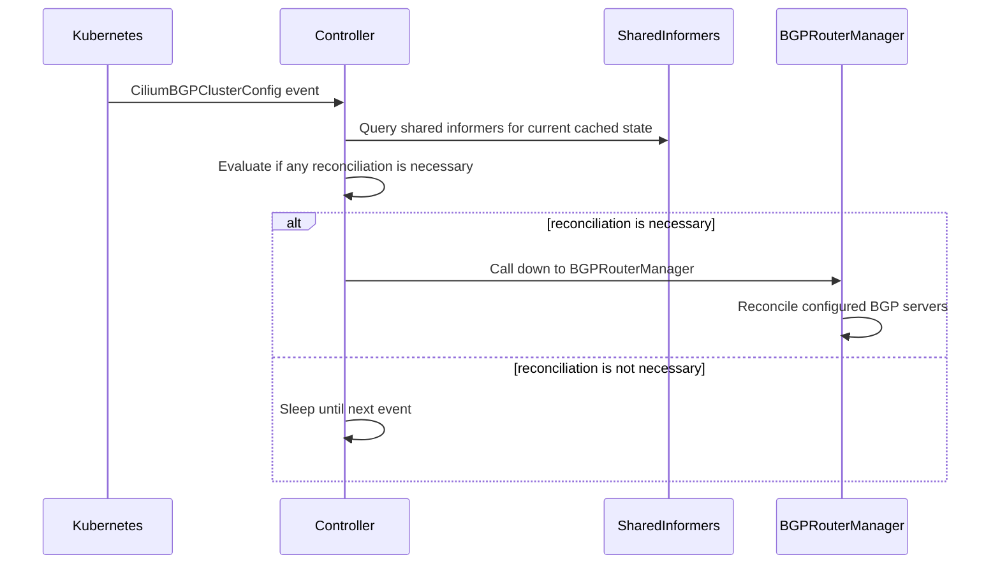
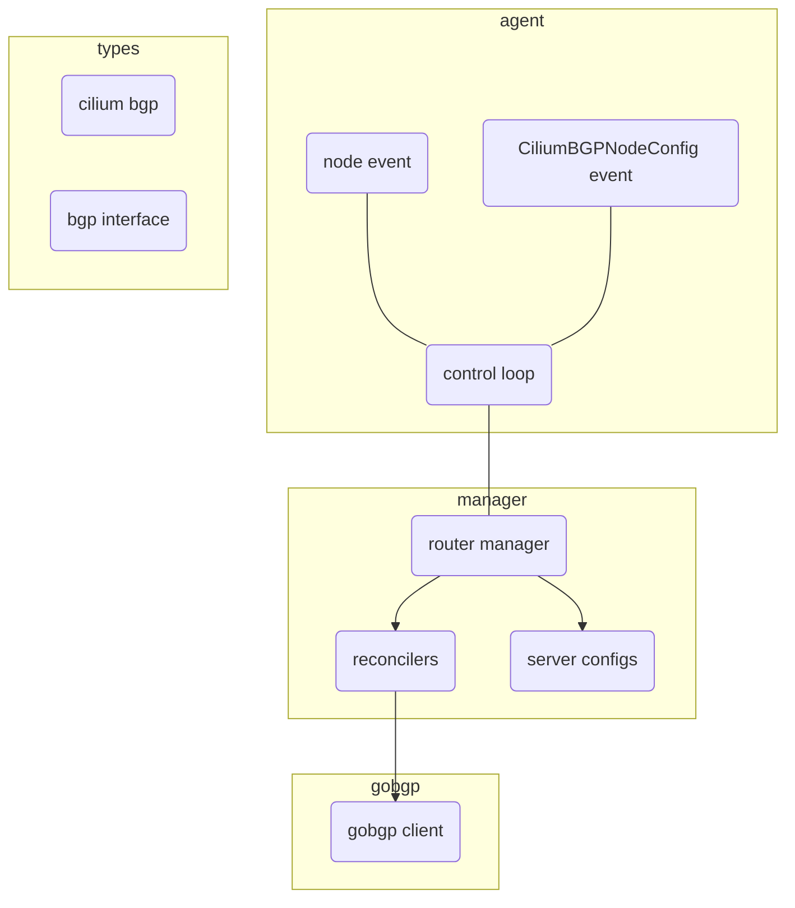
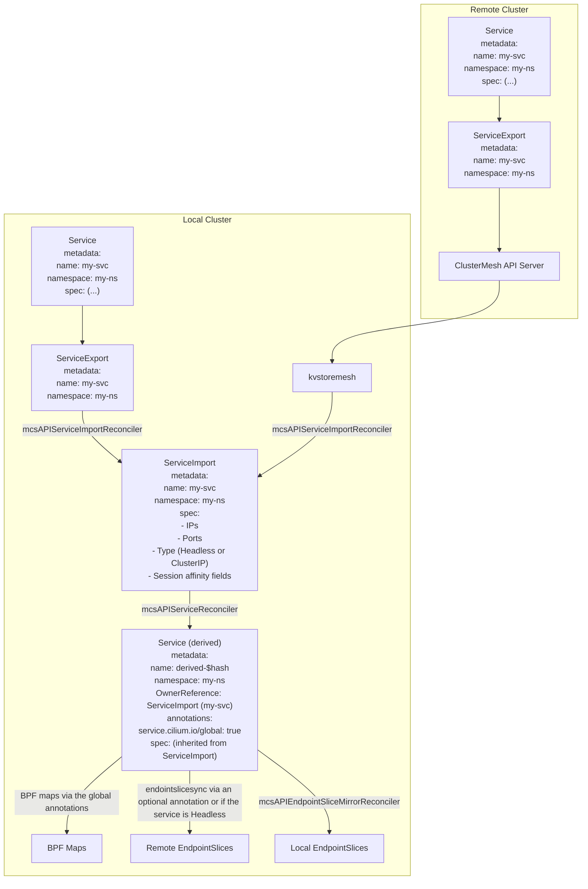

<a id="doc-48d860ab49ffa0e6fb37eadb"></a>

# cilium/cilium / USERS.md

Upstream: https://github.com/cilium/cilium/blob/e478d1da3ce9a67657f66d6f71791bc47159c637/USERS.md

Commit: `e478d1da3ce9a67657f66d6f71791bc47159c637`

Retrieved: 2026-10-01T15:15:56.330208+00:00

Kind: official-document

Raw SHA256: `d8f041f80b83c712afeeea932652a7ca5e43df0dc070c6edad58fd16d9e0fd4a`

Source text below is untrusted reference content. Acquisition does not verify technical claims.

License status: UPSTREAM_NOTICES_CAPTURED_PER_FILE_REVIEW_REQUIRED. See this repository's captured license files.

---

Who is using Cilium?
====================

Sharing experiences and learning from other users is essential. We are
frequently asked who is using a particular feature of Cilium so people can get in
contact with other users to share experiences and best practices. People
also often want to know if product/platform X has integrated Cilium.
While the [Cilium Slack community](https://slack.cilium.io) allows
users to get in touch, it can be challenging to find this information quickly.

The following is a directory of adopters to help identify users of individual
features. The users themselves directly maintain the list.

Why Add Your Organization?
--------------------------

Cilium is the standard for cloud native networking and security, and your company's support
helps drive its adoption and success. By joining the adopters, you:  

✅ **Showcase Your Leadership** – Highlight your commitment to modern, eBPF-based
cloud native networking, observability, and security.

✅ **Support the Open Source Community** – Demonstrate real-world adoption,
which strengthens the project's credibility and growth.  

Adding yourself as a user
-------------------------

If you are using Cilium or it is integrated into your product, service, or
platform, please consider adding yourself as a user with a quick
description of your use case by opening a pull request to this file and adding
a section describing your usage of Cilium. If you are open to others contacting
you about your use of Cilium on Slack, add your Slack nickname as well.

    N: Name of user (company)
    D: Description
    U: Usage of features
    L: Link with further information (optional)
    Q: Contacts available for questions (optional)

Example entry:

    * N: Cilium Example User Inc.
      D: Cilium Example User Inc. is using Cilium for scientific purposes
      U: ENI networking, DNS policies, ClusterMesh
      Q: @slacknick1, @slacknick2

Requirements to be listed
-------------------------

 * You must represent the user listed. Do *NOT* add entries on behalf of
   other users.
 * There is no minimum deployment size but we request to list permanent
   production deployments only, i.e., no demo or trial deployments.

Users (Alphabetically)
----------------------

    * N: Ænix
      D: Ænix uses Cilium in free PaaS platform [Cozystack](https://cozystack.io) for running containers, virtual machines and Kubernetes-as-a-Service.
      U: Networking, NetworkPolicy, kube-proxy replacement, CNI-Chaining (with kube-ovn)
      L: https://cozystack.io/
      Q: @kvaps

    * N: AccuKnox
      D: AccuKnox uses Cilium for network visibility and network policy enforcement.
      U: L3/L4/L7 policy enforcement using Identity, External/VM Workloads, Network Visibility using Hubble
      L: https://www.accuknox.com/spifee-identity-for-cilium-presentation-at-kubecon-2021, https://www.accuknox.com/cilium
      Q: @nyrahul

    * N: Acoss
      D: Acoss is using cilium as their main CNI plugin (self hosted k8s, On-premises)
      U: CiliumNetworkPolicy, Hubble, BPF NodePort, Direct routing
      L: @JrCs

    * N: Adobe, Inc.
      D: Adobe's Project Ethos uses Cilium for multi-tenant, multi-cloud clusters
      U: L3/L4/L7 policies
      L: https://youtu.be/39FLsSc2P-Y

    * N: Aether
      D: Aether uses Cilium as the CNI for every tenant cluster of its managed Kubernetes platform
      U: Networking, NetworkPolicy, Host Firewall, LoadBalancer IPAM, kube-proxy replacement, Service Mesh
      L: https://aetherplatform.cloud/

    * N: AirQo
      D: AirQo uses Cilium as the CNI plugin
      U: CNI, Networking, NetworkPolicy, Cluster Mesh, Hubble, Kubernetes services
      L: @airqo-platform
      
    * N: Alauda
      D: Alauda uses Cilium in the Alauda Container Platform product to provide high performance network,observability and security.
      U: Networking, NetworkPolicy, Services, Observability
      Q：@oilbeater
      
    * N: Alibaba Cloud
      D: Alibaba Cloud is using Cilium together with Terway CNI as the high-performance ENI dataplane
      U: Networking, NetworkPolicy, Services, IPVLAN
      L: https://www.alibabacloud.com/blog/how-does-alibaba-cloud-build-high-performance-cloud-native-pod-networks-in-production-environments_596590

    * N: Amazon Web Services (AWS)
      D: AWS uses Cilium as the default CNI for EKS Anywhere
      U: Networking, NetworkPolicy, Services
      L: https://isovalent.com/blog/post/2021-09-aws-eks-anywhere-chooses-cilium

    * N: APPUiO by VSHN
      D: VSHN uses Cilium for multi-tenant networking on APPUiO Cloud and as an add-on to APPUiO Managed, both on Red Hat OpenShift and Cloud Kubernetes.
      U: CNI, Networking, NetworkPolicy, Hubble, IPAM, Kubernetes services
      L: https://products.docs.vshn.ch/products/appuio/managed/addon_cilium.html and https://www.appuio.cloud

    * N: ArangoDB Oasis
      D: ArangoDB Oasis is using Cilium in to separate database deployments in our multi-tenant cloud environment
      U: Networking, CiliumNetworkPolicy(cluster & local), Hubble, IPAM
      L: https://cloud.arangodb.com
      Q: @ewoutp @Robert-Stam

    * N: Archer Aviation
      D: Archer Aviation uses Cilium as part of the foundation of the Kubernetes cluster.
      U: Networking, Observability, Security
      L: https://www.archer.com
      Q: @Hongbo Miao

    * N: Ascend.io
      D: Ascend.io is using Cilium as a consistent CNI for our Data Automation Platform on GKE, EKS, and AKS.
      U: Transparent Encryption, Overlay Networking, Cluster Mesh, Egress Gateway, Network Policy, Hubble
      L: https://www.ascend.io/
      Q: @Joe Stevens

    * N: Ayedo
      D: Ayedo builds and operates cloud-native container platforms based on Kubernetes
      U: Hubble for Visibility, Cilium as Mesh between Services
      L: https://www.ayedo.de/

    * N: Batumbu
      D: Batumbu uses Cilium as the CNI in all GKE clusters, using its cluster mesh feature to connect clusters within the same environment.
      U: CNI, Cluster Mesh, Hubble, NetworkPolicy
      Q: @gustysap
      L: https://batumbu.id/

    * N: Back Market
      D: Back Market is using Cilium as CNI in all their clusters and environments (kOps + EKS in AWS)
      U: CNI, Network Policies, Transparent Encryption (WG), Hubble
      Q: @nitrikx
      L: https://www.backmarket.com/

    * N: Berops
      D: Cilium is used as a CNI plug-in in our open-source multi-cloud and hybrid-cloud Kubernetes platform - Claudie
      U: CNI, Network Policies, Hubble
      Q: @Bernard Halas
      L: https://github.com/berops/claudie

    * N: Bitnami
      D: Cilium is part of the largest open-source application catalog.
      U: CNI, Hubble, BGP, eBPF, CiliumNetworkPolicy, CiliumClusterwideNetworkPolicy
      L: https://bitnami.com/stack/cilium
      Q: @carrodher

    * N: BMC Software
      D: Cilium can be optionally used in BMC Helix Innovaton Suite and BMC IT Operations Management On Premise
      U: CNI, Hubble
      L: https://www.bmc.com
      Q: @ryebridge
      
    * N: ByteDance
      D: ByteDance is using Cilium as CNI plug-in for self-hosted Kubernetes.
      U: CNI, Networking
      L: @Jiang Wang

    * N: Canonical
      D: Canonical's Kubernetes distribution microk8s uses Cilium as CNI plugin
      U: Networking, NetworkPolicy, and Kubernetes services
      L: https://microk8s.io/

    * N: Capital One
      D: Capital One uses Cilium as its standard CNI for all Kubernetes environments
      U: CNI, CiliumClusterWideNetworkpolicy, CiliumNetworkPolicy, Hubble, network visibility
      L: https://www.youtube.com/watch?v=hwOpCKBaJ-w

    * N: Celonis
      D: Celonis has standardized on Cilium as the primary CNI across its entire global cluster fleet.
      U: CNI, Hubble, CiliumNetworkPolicies, Network Visibility, Transparent Encryption
      L: https://www.celonis.com

    * N: CENGN - Centre of Excellence in Next Generation Networks
      D: CENGN is using Cilium in multiple clusters including production and development clusters (self-hosted k8s, On-premises)
      U: L3/L4/L7 network policies, Monitoring via Prometheus metrics & Hubble
      L: https://www.youtube.com/watch?v=yXm7yZE2rk4
      Q: @rmaika @mohahmed13

    * N: Cistec
      D: Cistec is a clinical information system provider and uses Cilium as the CNI plugin.
      U: Networking and network policy
      L: https://www.cistec.com/

    * N: Civo
      D: Civo is offering Cilium as the CNI option for Civo users to choose it for their Civo Kubernetes clusters.
      U: Networking and network policy
      L: https://www.civo.com/kubernetes

    * N: ClickHouse
      D: ClickHouse uses Cilium as CNI for AWS Kubernetes environments
      U: CiliumNetworkPolicy, Hubble, ClusterMesh
      L: https://clickhouse.com

    * N: Cloutomate
      D: Cloutomate uses Cilium as CNI for itself and customer installations
      U: Networking Observability and Security, Service Mesh, Cluster Mesh
      L: https://cloutomate.de

    * N: Cognite
      D: Cognite is an industrial DataOps provider and uses Cilium as the CNI plugin
      Q: @Robert Collins

    * N: Confluent
      D: Confluent is a data streaming platform to stream, connect, process, and govern data in real-time.
      U: Networking, NetworkPolicy
      L: https://www.confluent.io

    * N: CONNY
      D: CONNY is legaltech platform to improve access to justice for individuals
      U: Networking, NetworkPolicy, Services
      Q: @ant31
      L: https://conny.de

    * N: CoreWeave
      D: CoreWeave, The AI Hyperscaler™, uses Cilium as the default CNI for CoreWeave Kubernetes Service.
      U: Networking
      L: https://www.coreweave.com/
      Q: @dswaffordcw

    * N: Cosmonic
      D: Cilium is the CNI for Cosmonic's Nomad based PaaS
      U: Networking, NetworkPolicy, Transparent Encryption
      L: https://cilium.io/blog/2023/01/18/cosmonic-user-story/

    * N: Crane
      D: Crane uses Cilium as the default CNI
      U: Networking, NetworkPolicy, Services
      L: https://github.com/slzcc/crane
      Q: @slzcc

    * N: Cybozu
      D: Cybozu deploys Cilium to on-prem Kubernetes Cluster and uses it with Coil by CNI chaining.
      U: CNI Chaining, L4 LoadBalancer, NetworkPolicy, Hubble
      L: https://cybozu-global.com/

    * N: Daimler Truck AG
      D: The CSG RuntimeDepartment of DaimlerTruck is maintaining an AKS k8s cluster as a shared resource for DevOps crews and is using Cilium as the default CNI (BYOCNI).
      U: Networking, NetworkPolicy and Monitoring
      L: https://daimlertruck.com
      Q: @brandshaide

    * N: DaoCloud - spiderpool & merbridge
      D: spiderpool is using Cilium as their main CNI plugin for overlay and merbridge is using  Cilium eBPF library to speed up your Service Mesh
      U: CNI, Service load-balancing, cluster mesh
      L: https://github.com/spidernet-io/spiderpool, https://github.com/merbridge/merbridge
      Q: @weizhoublue, @kebe7jun

    * N: Datadog
      D: Datadog is using Cilium in AWS (self-hosted k8s)
      U: ENI Networking, Service load-balancing, Encryption, Network Policies, Hubble
      Q: @lbernail, @roboll, @mvisonneau

    * N: Dcode.tech
      D: We specialize in AWS and Kubernetes, and actively implement Cilium at our clients. 
      U: CNI, CiliumNetworkPolicy, Hubble UI
      L: https://dcode.tech/
      Q: @eliranw, @maordavidov
  
    * N: Deckhouse
      D: Deckhouse Kubernetes Platform is using Cilium as a one of the supported CNIs.
      U: Networking, Security, Hubble UI for network visibility
      L: https://github.com/deckhouse/deckhouse

    * N: Deezer
      D: Deezer is using Cilium as CNI for all our on-prem clusters for its performance and security. We plan to leverage BGP features as well soon
      U: CNI, Hubble, kube-proxy replacement, eBPF
      L: https://github.com/deezer

    * N: DigitalOcean
      D: DigitalOcean is using Cilium as the CNI for Digital Ocean's managed Kubernetes Services (DOKS)
      U: Networking and network policy
      L: https://github.com/digitalocean/DOKS

    * N: Docaposte
      D: Docaposte is the digital trust leader in France. We have selected Cilium as our CNI for Kubernetes deployments in production environments, due to its performance and advanced features.
      U: eBPF, CiliumclusterWideNetworkPolicy, CiliumNetworkPolicy, kube-proxy replacement, Hubble
      L: https://docaposte.fr
      Q: @albundy83

    * N: ECCO Data and AI
      D: ECCO Data and AI is using Cilium as CNI in all their clusters and environments (EKS in AWS).
      U: CNI, IPv6 networking, Service Load Balancing and Cluster Mesh
      L: https://github.com/SneaksAndData

    * N: Edgeless Systems
      D: Edgeless Systems is using Cilium as the CNI for Edgeless System's Confidential Kubernetes Distribution (Constellation)
      U: Networking (CNI), Transparent Encryption (WG),
      L: https://docs.edgeless.systems/constellation/architecture/networking
      Q: @m1ghtym0

    * N: Eficode
      D: As a cloud-native and devops consulting firm, we have implemented Cilium on customer engagements
      U: CNI, CiliumNetworkPolicy at L7, Hubble
      L: https://eficode.com/
      Q: @Andy Allred

    * N: Elastic Path
      D: Elastic Path is using Cilium in their CloudOps for Kubernetes production clusters
      U: CNI
      L: https://documentation.elasticpath.com/cloudops-kubernetes/docs/index.html
      Q: @Neil Seward

    * N: Entrywan
      D: Entrywan provides Cilium as a CNI option in its managed kubernetes service
      U: CNI
      L: https://www.entrywan.com/docs#kubernetes
      Q: @aarongroom

    * N: Equinix
      D: Equinix Metal is using Cilium for production and non-production environments on bare metal
      U: CNI, CiliumClusterWideNetworkpolicy, CiliumNetworkPolicy, BGP advertisements, Hubble, network visibility
      L: https://metal.equinix.com/
      Q: @tylerauerbeck, @fishnix, @tenyo, @hegartyk

    * N: Equinix
      D: Equinix NL Managed Services is using Cilium with their Managed Kubernetes offering
      U: CNI, network policies, visibility
      L: https://www.equinix.nl/products/support-services/managed-services/netherlands
      Q: @jonkerj

    * N: Eastern Switzerland University of Applied Sciences (OST)
      D: OST is using Cilium in their production clusters (self-hosted, bare-metal, private cloud) and in their Cloud Native training courses.
      U: CNI with Gateway API, Network Policies, L2 Announcements, Hubble Observability, Kube-proxy replacement
      L: https://www.ost.ch
      Q: @Jan Untersander

    * N: EvoCloud
      D: EvoCloud uses Cilium as a Kubernetes proxy replacement, CNI with Gateway API integration, Cluster mesh with BGP enabled, Network policy and Hubble Observability.
      U: L4/L7 Networking, L2 Announcement, Network Policies, Kube-proxy replacement, CNI with Gateway API, Hubble for tracing and observability, ClusterMesh and ServiceMesh
      L: https://github.com/evocloud-dev/evocloud-paas
      Q: @geanttechnology, @escapevelocity17321

    * N: Exoscale
      D: Exoscale is offering Cilium as a CNI option on its managed Kubernetes service named SKS (Scalable Kubernetes Service)
      U: CNI, Networking
      L: https://www.exoscale.com/sks/
      Q: @Antoine

    * N: finleap connect
      D: finleap connect is using Cilium in their production clusters (self-hosted, bare-metal, private cloud)
      U: CNI, NetworkPolicies
      Q: @chue

    * N: Form3
      D: Form3 is using Cilium in their production clusters (self-hosted, bare-metal, private cloud)
      U: Service load-balancing, Encryption, CNI, NetworkPolicies
      Q: @kevholditch-f3, samo-f3, ewilde-form3

    * N: FPT Telecom
      D: FTEL uses Cilium as their CNI plugin to handle the massive CPE Management traffic to the backends
      U: CNI, CiliumclusterWideNetworkPolicy, CiliumNetworkPolicy, Kube-Proxy Replacement, Hubble, Direct Routing, Egress Gateway, Service Load Balancing, L2 Announcement, BGP Advertisement
      Q: @minhng99

    * N: F5 Inc
      D: F5 helps customers with Cilium VXLAN tunnel integration with BIG-IP
      U: Networking
      L: https://github.com/f5devcentral/f5-ci-docs/blob/master/docs/cilium/cilium-bigip-info.rst
      Q: @vincentmli
    
    * N: Gcore
      D: Gcore supports Cilium as CNI provider for Gcore Managed Kubernetes Service
      U: CNI, Networking, NetworkPolicy, Kubernetes Services
      L: https://gcore.com/news/cilium-cni-support
      Q: @rzdebskiy

    * N: Giant Swarm
      D: Giant Swarm is using Cilium in their Cluster API based managed Kubernetes service (AWS, Azure, GCP, OpenStack, VMware Cloud Director and VMware vSphere) as CNI
      U: Networking
      L: https://www.giantswarm.io/

    * N: GitLab
      D: GitLab is using Cilium to implement network policies inside Auto DevOps deployed clusters for customers using k8s
      U: Network policies
      L: https://docs.gitlab.com/ee/user/clusters/applications.html#install-cilium-using-gitlab-ci
      Q: @ap4y @whaber

    * N: Google
      D: Google is using Cilium in Anthos and Google Kubernetes Engine (GKE) as Dataplane V2
      U: Networking, network policy, and network visibility
      L: https://cloud.google.com/blog/products/containers-kubernetes/bringing-ebpf-and-cilium-to-google-kubernetes-engine

    * N: G DATA CyberDefense AG
      D: G DATA CyberDefense AG is using Cilium on our managed on premise clusters.
      U: Networking, network policy, security, and network visibility
      L: https://gdatasoftware.com
      Q: @farodin91

    * N: Guida
      D: Guida is using Cilium with their Managed Kubernetes offering both in public and private cloud.
      U: CNI, Network Policies, Observability
      L: https://www.guida.nl

    * N: Guidewire Software, Inc.
      D: Guidewire Software, Inc. is using Cilium for the Guidewire Cloud Platform.
      U: CNI, network policy, and network visibility
      L: https://www.guidewire.com

    * N: IDNIC | Kadabra
      D: IDNIC is the National Internet Registry administering IP addresses for INDONESIA, uses Cilium to powered Kadabra project runing services across multi data centers.
      U: Networking, Network Policies, kube-proxy Replacement, Service Load Balancing and Cluster Mesh
      L: https://ris.idnic.net/
      Q: @ardikabs

    * N: IKEA IT AB
      D: IKEA IT AB is using Cilium for production and non-production environments (self-hosted, bare-metal, private cloud)
      U: Networking, CiliumclusterWideNetworkPolicy, CiliumNetworkPolicy, kube-proxy replacement, Hubble, Direct routing, egress gateway, hubble-otel, Multi Nic XDP, BGP advertisements, Bandwidth Manager, Service Load Balancing, Cluster Mesh
      L: https://www.ingka.com/

    * N: Immerok
      D: Immerok uses Cilium for cross-cluster communication and network isolation; Immerok Cloud is a serverless platform for the full power of [Apache Flink](https://flink.apache.org) at any scale.
      U: Networking, network policy, observability, cluster mesh, kube-proxy replacement, security, CNI
      L: https://immerok.io
      Q: @austince, @dmvk

    * N: Incentive.me
      D: Incentive.me use Cilium, Tetragon, and Hubble for enterprise networking, observability, and security of all environments.
      U: Networking, network policy, observability, cluster mesh, kube-proxy replacement, security, egress gateway, service load balancing, CNI
      L: https://incentive.me
      Q: @lucasfcnunes

    * N: Infomaniak
      D: Infomaniak is using Cilium in their production clusters (self-hosted, bare-metal and openstack)
      U: Networking, CiliumNetworkPolicy, BPF NodePort, Direct routing, kube-proxy replacement
      L: https://www.infomaniak.com/en
      Q: @reneluria

    * N: innoQ Schweiz GmbH
      D: As a consulting company we added Cilium to a couple of our customers infrastructure
      U: Networking, CiliumNetworkPolicy at L7, kube-proxy replacement, encryption
      L: https://www.cloud-migration.ch/
      Q: @fakod

    * N: IONX Networks Limited
      D: IONX's Infrastructure uses Cilium as CNI plugin
      U: CNI, IPv4 and IPv6 Networking, SCTP, Service load balancing and Kubernetes services
      L: https://ionxnetworks.com/
      Q: @murali509

    * N: Intility AS
      D: Intility is a managed service provider for enterprises and we use Cilium, Tetragon, and Hubble to deliver world class managed Kubernetes clusters to customers from our own private cloud
      U: Networking, CiliumNetworkPolicy, CiliumCIDRGroup, security, CNI
      L: https://intility.com/container-platform/
      Q: @jonasks, @daniwk, @stianfro

     * N: Isovalent
       D: Cilium is the platform that powers Isovalent’s enterprise networking, observability, and security solutions
       U: Networking, network policy, observability, cluster mesh, kube-proxy replacement, security, egress gateway, service load balancing, CNI
       L: https://isovalent.com/product/
       Q: @BillMulligan

    * N: Jar
       D: Cilium is used as Jar's CNI on all prod and pre production environments.
       U: Networking, network policy, observability, cluster mesh, kube-proxy replacement, security, egress gateway, service load balancing, CNI
       L: https://myjar.app/blog/engineering/
       Q: @rohan-changejar @rohangrge

    * N: JUMO
      D: JUMO is using Cilium as their CNI plugin for all of their AWS-hosted EKS clusters
      U: Networking, network policy, network visibility, cluster mesh
      Q: @Matthieu ANTOINE, @Carlos Castro, @Joao Coutinho (Slack)

    * N: Kakao
      D: Kakao is using Cilium as the CNI for their private cloud's managed Kubernetes service
      U: Custom eBPF programs, networking, network policy, kube-proxy replacement
      L: https://youtu.be/WRACr5nXl9U
      Q: @gyutaeb

    * N: KA-NABELL
      D: KA-NABELL harnesses Cilium to deliver Kubernetes networking with robust security and clear observability.
      U: CNI/ENI Networking, kube-proxy replacement, Monitoring via Prometheus metrics & Hubble, eBPF, CiliumNetworkPolicy
      L: https://speakerdeck.com/andoshin11/envoy-external-authztogrpc-extensionwoli-yong-sita-wan-zhang-ranai-microservicesren-zheng-ren-ke-ji-pan?slide=8
      Q: @kahirokunn

    * N: Keploy
      D: Keploy is using the Cilium to capture the network traffic to perform E2E Testing.
      U: Networking, network policy, Monitoring, E2E Testing
      L: https://keploy.io/

    * N: Kilo
      D: Cilium is a supported CNI for Kilo. When used together, Cilium + Kilo create a full mesh via WireGuard for Kubernetes in edge environments.
      U: CNI, Networking, Hubble, kube-proxy replacement, network policy
      L: https://kilo.squat.ai/
      Q: @squat, @arpagon

    * N: Koyeb
      D: Koyeb hosts microVMs on its own servers and uses Cilium to power a mesh in between those
      U: Networking, policies inside a non-Kubernetes environment
      L: https://www.koyeb.com/blog/70-faster-deployments-and-high-performance-private-network
      Q: @koyeb on Twitter / https://community.koyeb.com/

    * N: kOps
      D: kOps is using Cilium as one of the supported CNIs
      U: Networking, Hubble, Encryption, kube-proxy replacement
      L: kops.sigs.k8s.io/
      Q: @olemarkus

    * N: Kryptos Logic
      D: Kryptos is a cyber security company that is using Kubernetes on-prem in which Cilium is our CNI of choice.
      U: Networking, Observability, kube-proxy replacement

    * N: kubeasz
      D: kubeasz, a certified kubernetes installer, is using Cilium as a one of the supported CNIs.
      U: Networking, network policy, Hubble for network visibility
      L: https://github.com/easzlab/kubeasz

    * N: Kube-OVN
      D: Kube-OVN uses Cilium to enhance service performance, security and monitoring.
      U: CNI-Chaining, Hubble, kube-proxy replacement
      L: https://github.com/kubeovn/kube-ovn/blob/master/docs/IntegrateCiliumIntoKubeOVN.md
      Q: @oilbeater

    * N: Kube-Hetzner
      D: Kube-Hetzner is a open-source Terraform project that uses Cilium as an possible CNI in its cluster deployment on Hetzner Cloud.
      U: Networking, Hubble, kube-proxy replacement
      L: https://github.com/kube-hetzner/terraform-hcloud-kube-hetzner#cni
      Q: @MysticalTech

    * N: Kubermatic
      D: Kubermatic Kubernetes Platform is using Cilium as a one of the supported CNIs.
      U: Networking, network policy, Hubble for network visibility
      L: https://github.com/kubermatic/kubermatic

    * N: KubeSphere - KubeKey
      D: KubeKey is an open-source lightweight tool for deploying Kubernetes clusters and addons efficiently. It uses Cilium as one of the supported CNIs.
      U: Networking, Security, Hubble UI for network visibility
      L: https://github.com/kubesphere/kubekey
      Q: @FeynmanZhou

    * N: K8e - Simple Kubernetes Distribution
      D: Kubernetes Easy (k8e) is a lightweight, Extensible, Enterprise Kubernetes distribution. It uses Cilium as default CNI network.
      U: Networking, network policy, Hubble for network visibility
      L: https://github.com/xiaods/k8e
      Q: @xds2000

    * N: Labyrinth Labs
      D: One stop shop for Cloud, AWS, Kubernetes
      U: Networking, network policies, Hubble for network visibility
      L: https://lablabs.io
      Q: @mliner

    * N: LinkPool
      D: LinkPool is a professional Web3 infrastructure provider.
      U: LinkPool is using Cilium as the CNI for its on-premise production clusters
      L: https://linkpool.com
      Q: @jleeh

    * N: Liquid Reply
      D: Liquid Reply is a professional service provider and utilizes Cilium on suitable projects and implementations.
      U: Networking, network policy, Hubble for network visibility, Security
      L: http://liquidreply.com
      Q: @mkorbi

    * N: Magic Leap
      D: Magic Leap is using Hubble plugged to GKE Dataplane v2 clusters
      U: Hubble
      Q: @romachalm

    * N: Melenion Inc
      D: Melenion is using Cilium as the CNI for its on-premise production clusters
      U: Service Load Balancing, Hubble
      Q: @edude03

    * N: Meltwater
      D: Meltwater is using Cilium in AWS on self-hosted multi-tenant k8s clusters as the CNI plugin
      U: ENI Networking, Encryption, Monitoring via Prometheus metrics & Hubble
      Q: @recollir, @dezmodue

    * N: Microsoft
      D: Microsoft is using Cilium in "Azure CNI powered by Cilium" AKS (Azure Kubernetes Services) clusters
      L: https://techcommunity.microsoft.com/t5/azure-networking-blog/azure-cni-powered-by-cilium-for-azure-kubernetes-service-aks/ba-p/3662341
      Q: @tamilmani1989 @chandanAggarwal

    * N: Mobilab
      D: Mobilab uses Cilium as the CNI for its internal cloud
      U: CNI
      L: https://mobilabsolutions.com/2019/01/why-we-switched-to-cilium/

    * N: mogenius
      D: mogenius is using Cilium for the mogenius platform
      U: CNI, network-policy and network-observability
      L: https://mogenius.com

    * N: MyFitnessPal
      D: MyFitnessPal trusts Cilium with high volume user traffic in AWS on self-hosted k8s clusters as the CNI plugin and in GKE with Dataplane V2
      U: Networking (CNI, Maglev, kube-proxy replacement, local redirect policy),  Observability (Network metrics with Hubble, DNS proxy, service maps, policy troubleshooting) and Security (Network Policy)
      L: https://www.myfitnesspal.com

    * N: Mux, Inc.
      D: Mux deploys Cilium on self-hosted k8s clusters (Cluster API) in GCP and AWS to run its video streaming/analytics platforms.
      U: Pod networking (CNI, IPAM, Host-reachable Services), Hubble, Cluster-mesh. TBD: Network Policy, Transparent Encryption (WG), Host Firewall.
      L: https://mux.com
      Q: @dilyevsky
      
    * N: NetBird
      D: NetBird uses Cilium to compile BPF to Go for cross-platform DNS management and NAT traversal
      U: bpf2go to compile a C source file into eBPF bytecode and then to Go
      L: https://netbird.io/knowledge-hub/using-xdp-ebpf-to-share-default-dns-port-between-resolvers
      Q: @braginini

    * N: Netcloud AG
      D: As a Swiss ICT company we are using Cilium as their CNI for mission critical, on premise k8s clusters.
      U: Overlay Networking, CNI, Network Policy, Kube-Proxy Replacement, Service load-balancing
      L: https://www.netcloud.ch
      
    * N: NETWAYS Web Services
      D: NETWAYS Web Services offers Cilium to their clients as CNI option for their Managed Kubernetes clusters.
      U: Networking (CNI), Observability (Hubble)
      L: https://nws.netways.de/managed-kubernetes/

    * N: New York Times (the)
      D: The New York Times is using Cilium on EKS to build multi-region multi-tenant shared clusters
      U: Networking (CNI, EKS IPAM, Maglev, kube-proxy replacement, Direct Routing),  Observability (Network metrics with Hubble, policy troubleshooting) and Security (Network Policy)
      L: https://www.nytimes.com/, https://youtu.be/9FDpMNvPrCw
      Q: @abebars

    * N: Nexxiot
      D: Nexxiot is an IoT SaaS provider using Cilium as the main CNI plugin on AWS EKS clusters
      U: Networking (IPAM, CNI), Security (Network Policies), Visibility (hubble)
      L: https://nexxiot.com

    * N: Nine Internet Solutions AG
      D: Nine uses Cilium on all Nine Kubernetes Engine clusters
      U: CNI, network policy, kube-proxy replacement, host firewall
      L: https://www.nine.ch/en/kubernetes

    * N: Northflank
      D: Northflank is a PaaS and uses Cilium as the main CNI plugin across GCP, Azure, AWS and bare-metal
      U: Networking, network policy, hubble, packet monitoring and network visibility
      L: https://northflank.com
      Q: @NorthflankWill, @Champgoblem

    * N: Nutanix
      D: Nutanix uses Cilium as the default CNI plugin for NKP (Nutanix Kubernetes Platform) when deployed on AHV
      U: Networking, NetworkPolicy, Services
      L: https://www.nutanix.com/products/kubernetes-management-platform
      Q: @tuxtof

    * N: OpenChoreo
      D: OpenChoreo uses Cilium to enforce zero-trust network security through CiliumNetworkPolicies and provide advanced network observability with Hubble.
      U: CNI, CiliumNetworkPolicy, Hubble, Layer 7 visibility via Cilium Envoy
      L: https://openchoreo.dev/ecosystem/item/networking-cilium/
      Q: @akila-i

    * N: Outscale Kubernetes as a Service (OKS)
      D: Cilium is the default Container Network Interface (CNI) used by OUTSCALE on all clusters provisioned through its Kubernetes offering, OKS.
      U: CNI, Hubble, CiliumNetworkPolicy, kube-proxy replacement, eBPF 
      L: https://fr.outscale.com/cloud-experience/outscale-kubernetes-as-a-service/

    * N: Overstock Inc.
      D: Overstock is using Cilium as the main CNI plugin on bare-metal clusters (self hosted k8s).
      U: Networking, network policy, hubble, observability

    * N: OVHcloud
      D: OVHcloud is using Cilium as the default CNI on their Managed Kubernetes Service (MKS) clusters offering with Premium plan.
      U: CNI, network policies, visibility
      L: https://www.ovhcloud.com/
      Q: @scraly

    * N: Pagali Payments Service
      D: Pagali is using Cilium on AWS EKS (aws-cni chaining) for our own services.
      U: Networking, Observability, Security, Service Mesh (GAMMA), Gateway API
      L: https://pagali.com.br
      Q: github (@dverzolla, @udleinati)
      
    * N: Palantir Technologies Inc.
      D: Palantir is using Cilium as their main CNI plugin in all major cloud providers [AWS/Azure/GCP] (self hosted k8s).
      U: ENI networking, L3/L4 policies, FQDN based policy, FQDN filtering, IPSec
      Q: ungureanuvladvictor

    * N: Palark GmbH
      D: Palark uses Cilium for networking in its Kubernetes platform provided to numerous customers as a part of its DevOps as a Service offering.
      U: CNI, Networking, Network policy, Security, Hubble UI
      L: https://blog.palark.com/why-cilium-for-kubernetes-networking/
      Q: @shurup

    * N: PayPal
      D: PayPal is using Cilium as the CNI for its self-managed Kubernetes clusters.
      U: CNI, Multi-pool IPAM, BGP, kube-proxy replacement, ipmasq, native routing
      L: [PayPal](https://www.paypal.com/in/home)
      Q: @dsanthosh

    * N: Pionative
      D: Pionative supplies all its clients across cloud providers with
      Kubernetes running Cilium to deliver the best performance out there.
      U: CNI, Networking, Security, eBPF
      L: https://www.pionative.com
      Q: @Pionerd

    * N: Plaid Inc
      D: Plaid is using Cilium as their CNI plugin in self-hosted Kubernetes on AWS.
      U: CNI, network policies
      L: [https://plaid.com](https://plaid.com/contact/)
      Q: @diversario @jandersen-plaid

    * N: PlanetScale
      D: PlanetScale is using Cilium as the CNI for its serverless database platform.
      U: Networking (CNI, IPAM, kube-proxy replacement, native routing), Network Security, Cluster Mesh, Load Balancing
      L: https://planetscale.com/
      Q: @dctrwatson

    * N: plusserver Kubernetes Engine (PSKE)
      D: PSKE uses Cilium for multiple scenarios, for examples for managed Kubernetes clusters provided with Gardener Project across AWS and OpenStack.
      U: CNI , Overlay Network, Network Policies
      L: https://www.plusserver.com/en/product/managed-kubernetes/, https://github.com/gardener/gardener-extension-networking-cilium

    * N: Polar Signals
      D: Polar Signals uses Cilium as the CNI on its GKE dataplane v2 based clusters.
      U: Networking
      L: https://polarsignals.com
      Q: @polarsignals @brancz

    * N: Polverio
      D: Polverio KubeLift is a single-node Kubernetes distribution optimized for Azure, using Cilium as the CNI.
      U: CNI, IPAM
      L: https://polverio.com
      Q: @polverio @stuartpreston

    * N: Poseidon Laboratories
      D: Poseidon's Typhoon Kubernetes distro uses Cilium as the default CNI and its used internally
      U: Networking, policies, service load balancing
      L: https://github.com/poseidon/typhoon/
      Q: @dghubble @typhoon8s

    * N: PostFinance AG
      D: PostFinance is using Cilium as their CNI for all mission critical, on premise k8s clusters
      U: Networking, network policies, kube-proxy replacement
      L: https://github.com/postfinance

    * N: Proton AG
      D: Proton is using Cilium as their CNI for all their Kubernetes clusters
      U: Networking, network policies, host firewall, kube-proxy replacement, Hubble
      L: https://proton.me/
      Q: @protonjhow

    * N: Radio France
      D: Radio France is using Cilium in their production clusters (self-hosted k8s with kops on AWS)
      U: Mainly Service load-balancing
      Q: @francoisj

    * N: Qpoint
      D: An eBPF-based egress observability platform for your cloud and production applications
      U: CNI, bpf2go to compile a C source file into eBPF bytecode and then to Go
      L: https://www.qpoint.io/ and https://github.com/qpoint-io
      Q: @Marc Barry

    * N: Rancher Labs, now part of SUSE
      D: Rancher Labs certified Kubernetes distribution RKE2 can be deployed with Cilium.
      U: Networking and network policy
      L: https://github.com/rancher/rke and https://github.com/rancher/rke2

    * N: Rapyuta Robotics.
      D: Rapyuta is using cilium as their main CNI plugin. (self hosted k8s)
      U: CiliumNetworkPolicy, Hubble, Service Load Balancing.
      Q: @Gowtham

    * N: Rafay Systems
      D: Rafay's Kubernetes Operations Platform uses Cilium for centralized network visibility and network policy enforcement
      U: NetworkPolicy, Visibility via Prometheus metrics & Hubble
      L: https://rafay.co/platform/network-policy-manager/
      Q: @cloudnativeboy @mohanatreya

    * N: Robinhood Markets
      D: Robinhood uses Cilium for Kubernetes overlay networking in an environment where we run tests for backend services
      U: CNI, Overlay networking
      Q: @Madhu CS

    * N: Santa Claus & the Elves
      D: All our infrastructure to process children's letters and wishes, toy making, and delivery, distributed over multiple clusters around the world, is now powered by Cilium.
      U: ClusterMesh, L4LB, XDP acceleration, Bandwidth manager, Encryption, Hubble
      L: https://qmonnet.github.io/whirl-offload/2024/01/02/santa-switches-to-cilium/

    * N: SAP
      D: SAP uses Cilium for multiple internal scenarios. For examples for self-hosted Kubernetes scenarios on AWS with SAP Concur and for managed Kubernetes clusters provided with Gardener Project across AWS, Azure, GCP, and OpenStack.
      U: CNI , Overlay Network, Network Policies
      L: https://www.concur.com, https://gardener.cloud/, https://github.com/gardener/gardener-extension-networking-cilium
      Q: @dragan (SAP Concur), @docktofuture & @ScheererJ (Gardener)

    * N: Sapian
      D: Sapian uses Cilium as the default CNI in our product DialBox Cloud; DialBox cloud is an Edge Kubernetes cluster using [kilo](https://github.com/squat/kilo) for WireGuard mesh connectivity inter-nodes. Therefore, Cilium is crucial for low latency in real-time communications environments.
      U: CNI, Network Policies, Hubble, kube-proxy replacement
      L: https://sapian.com.co, https://arpagon.co/blog/k8s-edge
      Q: @arpagon

    * N: Schenker AG
      D: Land transportation unit of Schenker uses Cilium as default CNI in self-managed kubernetes clusters running in AWS
      U: CNI, Monitoring, kube-proxy replacement
      L: https://www.dbschenker.com/global
      Q: @amirkkn

    * N: Scigility AG
      D: We use Cilium as the default CNI across client implementations and also for our internal platform.
      U: CNI, Monitoring, kube-proxy replacement, Hubble
      L: https://scigility.com/
      Q: @ciil

    * N: Sealos
      D: Sealos is using Cilium as a consistent CNI for our Sealos Cloud.
      U: Networking, Service, kube-proxy replacement, Network Policy, Hubble
      L: https://sealos.io
      Q: @fanux, @yangchuansheng

    * N: SeatGeek
      D: SeatGeek uses Cilium as the default CNI/service mesh for AWS hosted clusters
      U: CNI, ClusterMesh, Network Policy, Hubble, L7 Mesh
      L: https://seatgeek.com
      Q: @byxorna, @aetimmes

    * N: Seznam.cz
      D: Seznam.cz uses Cilium in multiple scenarios in on-prem DCs. At first as L4LB which loadbalances external traffic into k8s+openstack clusters then as CNI in multiple k8s and openstack clusters which are all connected in a clustermesh to enforce NetworkPolicies across pods/VMs.
      U: L4LB, L3/4 CNPs+CCNPs, KPR, Hubble, HostPolicy, Direct-routing, IPv4+IPv6, ClusterMesh
      Q: @oblazek

    * N: Simple
      D: Simple uses cilium as default CNI in Kubernetes clusters (AWS EKS) for both development and production environments.
      U: CNI, Network Policies, Hubble
      L: https://simple.life
      Q: @sergeyshevch

    * N: Scaleway
      D: Scaleway uses Cilium as the default CNI for Kubernetes Kapsule
      U: Networking, NetworkPolicy, Services
      L: @jtherin @remyleone

    * N: Schuberg Philis
      D: Schuberg Philis uses Cilium as CNI for mission critical kubernetes clusters we run for our customers.
      U: CNI (instead of amazon-vpc-cni-k8s), DefaultDeny(Zero Trust), Hubble, CiliumNetworkPolicy, CiliumClusterwideNetworkPolicy, EKS
      L: https://schubergphilis.com/en
      Q: @stimmerman @shoekstra @mbaumann

    * N: SDV Services
      D: SDV Services uses Cilium to host Wordpress multi-tenant the cloud-native way and also as the CNI for customer Kubernetes clusters.
      U: CNI, Networking, NetworkPolicy, Hubble, IPAM, Kubernetes services
      L: https://sdvservices.nl
      Q: @Sjouke de Vries
      
    * N: SI Analytics
      D: SI Analytics uses Cilium as CNI in self-managed Kubernetes clusters in on-prem DCs. And also use Cilium as CNI in its GKE dataplane v2 based clusters.
      U: CNI, Network Policies, Hubble
      L: https://si-analytics.ai, https://ovision.ai
      Q: @jholee

    * N: SIGHUP
      D: SIGHUP integrated Cilium as a supported CNI for KFD (Kubernetes Fury Distribution), our enterprise-grade OSS reference architecture
      U: Available supported CNI
      L: https://sighup.io, https://github.com/sighupio/fury-kubernetes-networking
      Q: @jnardiello @nutellino

    * N: SINAD
      D: SINAD uses Cilium and integrates Tetragon (Which is amazing) to their application EzyKube 
      U: CNI, Networking, Node2Node & Pod2Pod Encryption, Kube-Proxy Replacement, eBPF, security
      L: https://sinad.io 

    * N: SmileDirectClub
      D: SmileDirectClub is using Cilium in manufacturing clusters (self-hosted on vSphere and AWS EC2)
      U: CNI
      Q: @joey, @onur.gokkocabas

    * N: Snapp
      D: Snapp is using Cilium in production for its on premise openshift clusters
      U: CNI, Network Policies, Hubble
      Q: @m-yosefpor

    * N: Solo.io
      D: Cilium is part of Gloo Application Networking platform, with a “batteries included but swappable” manner
      U: CNI, Network Policies
      Q: @linsun

    * N: S&P Global
      D: S&P Global uses Cilium as their multi-cloud CNI
      U: CNI
      L: https://www.youtube.com/watch?v=6CZ_SSTqb4g

    * N: Spectro Cloud
      D: Spectro Cloud uses & promotes Cilium for clusters its K8S management platform (Palette) deploys
      U: CNI, Overlay network, kube-proxy replacement
      Q: @Kevin Reeuwijk

    * N: Spherity
      D: Spherity  is using Cilium on AWS EKS
      U: CNI/ENI Networking, Network policies, Hubble
      Q: @solidnerd

    * N: Sportradar
      D: Sportradar is using Cilium as their main CNI plugin in AWS (using kops)
      U: L3/L4 policies, Hubble, BPF NodePort, CiliumClusterwideNetworkPolicy
      Q: @Eric Bailey, @Ole Markus

    * N: Sproutfi
      D: Sproutfi uses Cilium as the CNI on its GKE based clusters
      U: Service Load Balancing, Hubble, Datadog Integration for Prometheus metrics
      Q: @edude03

    * N: SuperOrbital
      D: As a Kubernetes-focused consulting firm, we have implemented Cilium on customer engagements
      U: CNI, CiliumNetworkPolicy at L7, Hubble
      L: https://superorbital.io/
      Q: @jmcshane

    * N: Syself
      D: Syself uses Cilium as the CNI for Syself Autopilot, a managed Kubernetes platform
      U: CNI, HostFirewall, Monitoring, CiliumClusterwideNetworkPolicy, Hubble
      L: https://syself.com
      Q: @sbaete

    * N: Talos
      D: Cilium is one of the supported CNI's in Talos
      U: Networking, NetworkPolicy, Hubble, BPF NodePort
      L: https://github.com/talos-systems/talos
      Q: @frezbo, @smira, @Ulexus

    * N: Tencent Cloud
      D: Tencent Cloud container team designed the TKE hybrid cloud container network solution with Cilium as the cluster network base
      U: Networking, CNI
      L: https://segmentfault.com/a/1190000040298428/en

    * N: teuto.net Netzdienste GmbH
      D: teuto.net is using cilium for their managed k8s service, t8s
      U: CNI, CiliumNetworkPolicy, Hubble, Encryption, ...
      L: https://teuto.net/managed-kubernetes
      Q: @cwrau

    * N: Trendyol
      D: Trendyol.com has recently implemented Cilium as the default CNI for its production Kubernetes clusters starting from version 1.26.
      U: Networking, kube-proxy replacement, eBPF, Network Visibility with Hubble and Grafana, Local Redirect Policy
      L: https://t.ly/FDCZK

    * N: T-Systems International
      D: TSI uses Cilium for it's Open Sovereign Cloud product, including as a CNI for Gardener-based Kubernetes clusters and bare-metal infrastructure managed by OnMetal.
      U: CNI, overlay network, NetworkPolicies
      Q: @ManuStoessel

    * N: uSwitch
      D: uSwitch is using Cilium in AWS for all their production clusters (self hosted k8s)
      U: ClusterMesh, CNI-Chaining (with amazon-vpc-cni-k8s)
      Q: @jirving

    * N: United Cloud
      D: United Cloud is using Cilium for all non-production and production clusters (on-premises)
      U: CNI, Hubble, CiliumNetworkPolicy, CiliumClusterwideNetworkPolicy, ClusterMesh, Encryption
      L: https://united.cloud
      Q: @boris

    * N: Utmost Software, Inc
      D: Utmost is using Cilium in all tiers of its Kubernetes ecosystem to implement zero trust
      U: CNI, DefaultDeny(Zero Trust), Hubble, CiliumNetworkPolicy, CiliumClusterwideNetworkPolicy
      L: https://blog.utmost.co/zero-trust-security-at-utmost
      Q: @andrewholt

    * N: Trip.com
      D: Trip.com is using Cilium in their production clusters (self-hosted k8s, On-premises and AWS)
      U: ENI Networking, Service load-balancing, Direct routing (via Bird)
      L: https://ctripcloud.github.io/cilium/network/2020/01/19/trip-first-step-towards-cloud-native-networking.html
      Q: @ArthurChiao

    * N: Tailor Brands
      D: Tailor Brands is using Cilium in their production, staging, and development clusters (AWS EKS)
      U: CNI (instead of amazon-vpc-cni-k8s), Hubble, Datadog Integration for Prometheus metrics
      Q: @liorrozen

    * N: Twilio
      D: Twilio Segment is using Cilium across their k8s-based compute platform
      U: CNI, EKS direct routing, kube-proxy replacement, Hubble, CiliumNetworkPolicies
      Q: @msaah

    * N: ungleich
      D: ungleich is using Cilium as part of IPv6-only Kubernetes deployments.
      U: CNI, IPv6 only networking, BGP, eBPF
      Q: @Nico Schottelius, @nico:ungleich.ch (Matrix)

    * N: Veepee
      D: Veepee is using Cilium on their on-premise Kubernetes clusters, hosting majority of their applications.
      U. CNI, BGP, eBPF, Hubble, DirectRouting (via kube-router)
      Q: @nerzhul

    * N: Verbano Tech
      D: Verbano Tech runs Cilium as the CNI for a production K3s deployment on a node that coexists with Docker Compose services.
      U: CNI, Hubble, Kubernetes Services with eBPF per-packet ClusterIP load-balancing
      L: https://verbano.tech/en/engineering/k3s-cilium-docker-compose-clusterip-timeouts/

    * N: Vietnam Post Cloud
      D: Vietnnam Post Cloud is using Cilium in their production, staging, and development clusters
      U: Networking, NetworkPolicy, Services, IPVLAN
      L: https://www.vietnampost.vn
      Q: @chint-vnpost-vn

    * N: Virtuozzo
      D: Cilium CNI is the default network plugin for Kubernetes clusters within Virtuozzo Hybrid Infrastructure.
      U: Networking, NetworkPolicy, Services
      L: https://docs.virtuozzo.com/virtuozzo_hybrid_infrastructure_6_3_admins_guide/index.html#provisioning-kubernetes.html
      Q: egor.ustinov@virtuozzo.com

    * N: VMware by Broadcom
      D: VMware offers multi-arch (ARM, AMD) and multi-distro (Ubuntu, RedHat UBI, Debian, PhotonOS) Cilium as part of the Tanzu Application Catalog, enabling customers to deploy it in their Kubernetes infrastructure.
      U: CNI, Hubble, BGP, eBPF, CiliumNetworkPolicy, CiliumClusterwideNetworkPolicy
      L: https://app-catalog.vmware.com/catalog?gfilter=cilium
      Q: @carrodher

    * N: Wildlife Studios
      D: Wildlife Studios is using Cilium in AWS for all their game production clusters (self hosted k8s)
      U: ClusterMesh, Global Service Load Balancing.
      Q: @Oki @luanguimaraesla @rsafonseca
      
    * N: University of Wisconsin - Madison
      D: Leveraged in production clusters
      U: ClusterMesh, Global Service Load Balancing
      
    * N: WSO2
      D: WSO2 is using Cilium to implemented Zero Trust Network Security for their Kubernetes clusters
      U: CNI, WireGuard Transparent Encryption, CiliumClusterWideNetworkpolicy, CiliumNetworkPolicy, Hubble, Layer 7 visibility and Service Mesh via Cilium Envoy
      L: https://www.cncf.io/case-studies/wso2/
      Q: @lakwarus @isala404 @tharinduwijewardane

    * N: Yahoo!
      D: Yahoo is using Cilium for L4 North-South Load Balancing for Kubernetes Services
      L: https://www.youtube.com/watch?v=-C86fBMcp5Q

    * N: ZeroHash
      D: Zero Hash is using Cilium as CNI for networking, security and monitoring features for Kubernetes clusters
      U: CNI/ENI Networking, Network policies, Hubble
      Q: @eugenestarchenko


<a id="doc-2143556952e67d260d3175c0"></a>

# cilium/cilium / api/v1/datapathplugins/README.md

Upstream: https://github.com/cilium/cilium/blob/e478d1da3ce9a67657f66d6f71791bc47159c637/api/v1/datapathplugins/README.md

Commit: `e478d1da3ce9a67657f66d6f71791bc47159c637`

Retrieved: 2026-10-01T15:15:56.330208+00:00

Kind: official-document

Raw SHA256: `9eeed90cfb5ab915e335a616b131dbed77c9df3c04be58e60cb827d8f06c6c19`

Source text below is untrusted reference content. Acquisition does not verify technical claims.

License status: UPSTREAM_NOTICES_CAPTURED_PER_FILE_REVIEW_REQUIRED. See this repository's captured license files.

---

# Protocol Documentation
<a name="top"></a>

## Table of Contents

- [datapathplugins/datapathplugins.proto](#datapathplugins_datapathplugins-proto)
    - [AttachmentContext](#datapathplugins-AttachmentContext)
    - [AttachmentContext.Host](#datapathplugins-AttachmentContext-Host)
    - [AttachmentContext.InterfaceInfo](#datapathplugins-AttachmentContext-InterfaceInfo)
    - [AttachmentContext.LXC](#datapathplugins-AttachmentContext-LXC)
    - [AttachmentContext.Overlay](#datapathplugins-AttachmentContext-Overlay)
    - [AttachmentContext.PodInfo](#datapathplugins-AttachmentContext-PodInfo)
    - [AttachmentContext.Socket](#datapathplugins-AttachmentContext-Socket)
    - [AttachmentContext.Wireguard](#datapathplugins-AttachmentContext-Wireguard)
    - [AttachmentContext.XDP](#datapathplugins-AttachmentContext-XDP)
    - [InstrumentCollectionRequest](#datapathplugins-InstrumentCollectionRequest)
    - [InstrumentCollectionRequest.Collection](#datapathplugins-InstrumentCollectionRequest-Collection)
    - [InstrumentCollectionRequest.Collection.Map](#datapathplugins-InstrumentCollectionRequest-Collection-Map)
    - [InstrumentCollectionRequest.Collection.MapsEntry](#datapathplugins-InstrumentCollectionRequest-Collection-MapsEntry)
    - [InstrumentCollectionRequest.Collection.Program](#datapathplugins-InstrumentCollectionRequest-Collection-Program)
    - [InstrumentCollectionRequest.Collection.ProgramsEntry](#datapathplugins-InstrumentCollectionRequest-Collection-ProgramsEntry)
    - [InstrumentCollectionRequest.Hook](#datapathplugins-InstrumentCollectionRequest-Hook)
    - [InstrumentCollectionRequest.Hook.AttachTarget](#datapathplugins-InstrumentCollectionRequest-Hook-AttachTarget)
    - [InstrumentCollectionResponse](#datapathplugins-InstrumentCollectionResponse)
    - [PrepareCollectionRequest](#datapathplugins-PrepareCollectionRequest)
    - [PrepareCollectionRequest.CollectionSpec](#datapathplugins-PrepareCollectionRequest-CollectionSpec)
    - [PrepareCollectionRequest.CollectionSpec.MapSpec](#datapathplugins-PrepareCollectionRequest-CollectionSpec-MapSpec)
    - [PrepareCollectionRequest.CollectionSpec.MapsEntry](#datapathplugins-PrepareCollectionRequest-CollectionSpec-MapsEntry)
    - [PrepareCollectionRequest.CollectionSpec.ProgramSpec](#datapathplugins-PrepareCollectionRequest-CollectionSpec-ProgramSpec)
    - [PrepareCollectionRequest.CollectionSpec.ProgramsEntry](#datapathplugins-PrepareCollectionRequest-CollectionSpec-ProgramsEntry)
    - [PrepareCollectionResponse](#datapathplugins-PrepareCollectionResponse)
    - [PrepareCollectionResponse.HookSpec](#datapathplugins-PrepareCollectionResponse-HookSpec)
    - [PrepareCollectionResponse.HookSpec.OrderingConstraint](#datapathplugins-PrepareCollectionResponse-HookSpec-OrderingConstraint)
  
    - [HookType](#datapathplugins-HookType)
    - [PrepareCollectionResponse.HookSpec.OrderingConstraint.Order](#datapathplugins-PrepareCollectionResponse-HookSpec-OrderingConstraint-Order)
  
    - [DatapathPlugin](#datapathplugins-DatapathPlugin)
  
- [Scalar Value Types](#scalar-value-types)


<a name="datapathplugins_datapathplugins-proto"></a>
<p align="right"><a href="#top">Top</a></p>

## datapathplugins/datapathplugins.proto


<a name="datapathplugins-AttachmentContext"></a>

### AttachmentContext
AttachmentContext contains the context about the attachment point in
question. It may carry endpoint-specific information used to determine which
hooks to load or how to configure them.


| Field | Type | Label | Description |
| ----- | ---- | ----- | ----------- |
| host | [AttachmentContext.Host](#datapathplugins-AttachmentContext-Host) |  |  |
| lxc | [AttachmentContext.LXC](#datapathplugins-AttachmentContext-LXC) |  |  |
| overlay | [AttachmentContext.Overlay](#datapathplugins-AttachmentContext-Overlay) |  |  |
| socket | [AttachmentContext.Socket](#datapathplugins-AttachmentContext-Socket) |  |  |
| wireguard | [AttachmentContext.Wireguard](#datapathplugins-AttachmentContext-Wireguard) |  |  |
| xdp | [AttachmentContext.XDP](#datapathplugins-AttachmentContext-XDP) |  |  |


<a name="datapathplugins-AttachmentContext-Host"></a>

### AttachmentContext.Host
attachment context for bpf_host (netdev, cilium_host, cilium_net).


| Field | Type | Label | Description |
| ----- | ---- | ----- | ----------- |
| iface | [AttachmentContext.InterfaceInfo](#datapathplugins-AttachmentContext-InterfaceInfo) |  | interface that is being configured. |


<a name="datapathplugins-AttachmentContext-InterfaceInfo"></a>

### AttachmentContext.InterfaceInfo
InterfaceInfo contains information about a network interface.


| Field | Type | Label | Description |
| ----- | ---- | ----- | ----------- |
| name | [string](#string) |  | name of the network interface. |


<a name="datapathplugins-AttachmentContext-LXC"></a>

### AttachmentContext.LXC
attachment context for bpf_lxc (containers).


| Field | Type | Label | Description |
| ----- | ---- | ----- | ----------- |
| iface | [AttachmentContext.InterfaceInfo](#datapathplugins-AttachmentContext-InterfaceInfo) |  | interface that is being configured. |
| pod_info | [AttachmentContext.PodInfo](#datapathplugins-AttachmentContext-PodInfo) |  | pod that is being configured. |


<a name="datapathplugins-AttachmentContext-Overlay"></a>

### AttachmentContext.Overlay
attachment context for bpf_overlay (vxlan/geneve).


| Field | Type | Label | Description |
| ----- | ---- | ----- | ----------- |
| iface | [AttachmentContext.InterfaceInfo](#datapathplugins-AttachmentContext-InterfaceInfo) |  | interface that is being configured. |


<a name="datapathplugins-AttachmentContext-PodInfo"></a>

### AttachmentContext.PodInfo
PodInfo contains information about a pod.


| Field | Type | Label | Description |
| ----- | ---- | ----- | ----------- |
| namespace | [string](#string) |  | pod namespace. |
| name | [string](#string) |  | pod name. |
| container_name | [string](#string) |  | container name. |


<a name="datapathplugins-AttachmentContext-Socket"></a>

### AttachmentContext.Socket
attachment context for bpf_sock (connect4,bind4,...)


<a name="datapathplugins-AttachmentContext-Wireguard"></a>

### AttachmentContext.Wireguard
attachment context for bpf_wireguard (cilium_wg)


| Field | Type | Label | Description |
| ----- | ---- | ----- | ----------- |
| iface | [AttachmentContext.InterfaceInfo](#datapathplugins-AttachmentContext-InterfaceInfo) |  | interface that is being configured. |


<a name="datapathplugins-AttachmentContext-XDP"></a>

### AttachmentContext.XDP
attachment context for bpf_xdp (netdev)


| Field | Type | Label | Description |
| ----- | ---- | ----- | ----------- |
| iface | [AttachmentContext.InterfaceInfo](#datapathplugins-AttachmentContext-InterfaceInfo) |  | interface that is being configured. |


<a name="datapathplugins-InstrumentCollectionRequest"></a>

### InstrumentCollectionRequest
Phase 2: Cilium has constructed and loaded the collection along with any
dispatcher programs that are meant to replace existing entrypoints in the
collection. Cilium sends a round of requests to any plugins that wanted to
inject hooks in the prepare phase.


| Field | Type | Label | Description |
| ----- | ---- | ----- | ----------- |
| collection | [InstrumentCollectionRequest.Collection](#datapathplugins-InstrumentCollectionRequest-Collection) |  |  |
| attachment_context | [AttachmentContext](#datapathplugins-AttachmentContext) |  |  |
| config | [google.protobuf.Any](#google-protobuf-Any) |  | config contains datapath configuration for this collection. |
| hooks | [InstrumentCollectionRequest.Hook](#datapathplugins-InstrumentCollectionRequest-Hook) | repeated | list of hooks corresponding with those specified by the plugin in its PrepareHooks response. |
| pins | [string](#string) |  | an ephemeral per-request bpffs directory where a plugin can pin an arbitrary set of objects. The lifecycle of these pins will be bound to that of the attachment context. This is useful especially in cases where the plugin loads its own set of tail call programs accessible from the entrypoint hook program and want to make sure a PROG_ARRAY and the programs it contains remain intact even after the InstrumentCollection request returns. |
| cookie | [string](#string) |  | cookie matches the cookie provided in the plugin&#39;s PrepareHooks response. |


<a name="datapathplugins-InstrumentCollectionRequest-Collection"></a>

### InstrumentCollectionRequest.Collection
Program and map IDs in the collection


| Field | Type | Label | Description |
| ----- | ---- | ----- | ----------- |
| programs | [InstrumentCollectionRequest.Collection.ProgramsEntry](#datapathplugins-InstrumentCollectionRequest-Collection-ProgramsEntry) | repeated | program details for each programs in the collection. |
| maps | [InstrumentCollectionRequest.Collection.MapsEntry](#datapathplugins-InstrumentCollectionRequest-Collection-MapsEntry) | repeated | map details for each map in the collection. |


<a name="datapathplugins-InstrumentCollectionRequest-Collection-Map"></a>

### InstrumentCollectionRequest.Collection.Map


| Field | Type | Label | Description |
| ----- | ---- | ----- | ----------- |
| id | [uint32](#uint32) |  |  |


<a name="datapathplugins-InstrumentCollectionRequest-Collection-MapsEntry"></a>

### InstrumentCollectionRequest.Collection.MapsEntry


| Field | Type | Label | Description |
| ----- | ---- | ----- | ----------- |
| key | [string](#string) |  |  |
| value | [InstrumentCollectionRequest.Collection.Map](#datapathplugins-InstrumentCollectionRequest-Collection-Map) |  |  |


<a name="datapathplugins-InstrumentCollectionRequest-Collection-Program"></a>

### InstrumentCollectionRequest.Collection.Program


| Field | Type | Label | Description |
| ----- | ---- | ----- | ----------- |
| id | [uint32](#uint32) |  |  |


<a name="datapathplugins-InstrumentCollectionRequest-Collection-ProgramsEntry"></a>

### InstrumentCollectionRequest.Collection.ProgramsEntry


| Field | Type | Label | Description |
| ----- | ---- | ----- | ----------- |
| key | [string](#string) |  |  |
| value | [InstrumentCollectionRequest.Collection.Program](#datapathplugins-InstrumentCollectionRequest-Collection-Program) |  |  |


<a name="datapathplugins-InstrumentCollectionRequest-Hook"></a>

### InstrumentCollectionRequest.Hook


| Field | Type | Label | Description |
| ----- | ---- | ----- | ----------- |
| type | [HookType](#datapathplugins-HookType) |  | position of the hook relative to the target program. |
| target | [string](#string) |  | name of the program that should be instrumented. |
| attach_target | [InstrumentCollectionRequest.Hook.AttachTarget](#datapathplugins-InstrumentCollectionRequest-Hook-AttachTarget) |  | info necessary for loading freplace programs. |
| pin_path | [string](#string) |  | plugin must pin the hook program to this pin path before responding to Cilium. |


<a name="datapathplugins-InstrumentCollectionRequest-Hook-AttachTarget"></a>

### InstrumentCollectionRequest.Hook.AttachTarget


| Field | Type | Label | Description |
| ----- | ---- | ----- | ----------- |
| program_id | [uint32](#uint32) |  | id of the target program. |
| subprog_name | [string](#string) |  | name of the hook&#39;s subprogram inside the target program. |


<a name="datapathplugins-InstrumentCollectionResponse"></a>

### InstrumentCollectionResponse


<a name="datapathplugins-PrepareCollectionRequest"></a>

### PrepareCollectionRequest
Phase 1: As Cilium loads and prepares a collection for a particular
attachment point, it sends a PrepareHooksRequest to each plugin with context
about the attachment point, collection, and its configuration. The plugin
decides which hooks it would like to insert, where it would like to insert
them, and informs Cilium in the PrepareHooksResponse.


| Field | Type | Label | Description |
| ----- | ---- | ----- | ----------- |
| collection | [PrepareCollectionRequest.CollectionSpec](#datapathplugins-PrepareCollectionRequest-CollectionSpec) |  |  |
| attachment_context | [AttachmentContext](#datapathplugins-AttachmentContext) |  |  |
| config | [google.protobuf.Any](#google-protobuf-Any) |  | config contains datapath configuration for this collection. |


<a name="datapathplugins-PrepareCollectionRequest-CollectionSpec"></a>

### PrepareCollectionRequest.CollectionSpec


| Field | Type | Label | Description |
| ----- | ---- | ----- | ----------- |
| programs | [PrepareCollectionRequest.CollectionSpec.ProgramsEntry](#datapathplugins-PrepareCollectionRequest-CollectionSpec-ProgramsEntry) | repeated | program details for each programs in the collection. |
| maps | [PrepareCollectionRequest.CollectionSpec.MapsEntry](#datapathplugins-PrepareCollectionRequest-CollectionSpec-MapsEntry) | repeated | map details for each map in the collection. |


<a name="datapathplugins-PrepareCollectionRequest-CollectionSpec-MapSpec"></a>

### PrepareCollectionRequest.CollectionSpec.MapSpec


| Field | Type | Label | Description |
| ----- | ---- | ----- | ----------- |
| type | [uint32](#uint32) |  |  |
| key_size | [uint32](#uint32) |  |  |
| value_size | [uint32](#uint32) |  |  |
| max_entries | [uint32](#uint32) |  |  |
| flags | [uint32](#uint32) |  |  |
| pin_type | [uint32](#uint32) |  |  |


<a name="datapathplugins-PrepareCollectionRequest-CollectionSpec-MapsEntry"></a>

### PrepareCollectionRequest.CollectionSpec.MapsEntry


| Field | Type | Label | Description |
| ----- | ---- | ----- | ----------- |
| key | [string](#string) |  |  |
| value | [PrepareCollectionRequest.CollectionSpec.MapSpec](#datapathplugins-PrepareCollectionRequest-CollectionSpec-MapSpec) |  |  |


<a name="datapathplugins-PrepareCollectionRequest-CollectionSpec-ProgramSpec"></a>

### PrepareCollectionRequest.CollectionSpec.ProgramSpec


| Field | Type | Label | Description |
| ----- | ---- | ----- | ----------- |
| type | [uint32](#uint32) |  |  |
| attach_type | [uint32](#uint32) |  |  |
| section_name | [string](#string) |  |  |
| license | [string](#string) |  |  |


<a name="datapathplugins-PrepareCollectionRequest-CollectionSpec-ProgramsEntry"></a>

### PrepareCollectionRequest.CollectionSpec.ProgramsEntry


| Field | Type | Label | Description |
| ----- | ---- | ----- | ----------- |
| key | [string](#string) |  |  |
| value | [PrepareCollectionRequest.CollectionSpec.ProgramSpec](#datapathplugins-PrepareCollectionRequest-CollectionSpec-ProgramSpec) |  |  |


<a name="datapathplugins-PrepareCollectionResponse"></a>

### PrepareCollectionResponse


| Field | Type | Label | Description |
| ----- | ---- | ----- | ----------- |
| hooks | [PrepareCollectionResponse.HookSpec](#datapathplugins-PrepareCollectionResponse-HookSpec) | repeated | list of hooks that should be added to the collection. |
| cookie | [string](#string) |  | cookie is an opaque string that will be passed in the subsequent InstrumentCollectionRequest related to this PrepareCollectionRequest. It may be used by plugins to associate the two requests or carry metadata between them. |


<a name="datapathplugins-PrepareCollectionResponse-HookSpec"></a>

### PrepareCollectionResponse.HookSpec


| Field | Type | Label | Description |
| ----- | ---- | ----- | ----------- |
| type | [HookType](#datapathplugins-HookType) |  | position of the hook relative to the target program. |
| target | [string](#string) |  | name of the program that should be instrumented. |
| constraints | [PrepareCollectionResponse.HookSpec.OrderingConstraint](#datapathplugins-PrepareCollectionResponse-HookSpec-OrderingConstraint) | repeated | constraints is a list of ordering constraints for this hook. If other plugins want to place a hook at this same hook point, hooks from various plugins will be arranged in an order that respects all ordering constraints. |


<a name="datapathplugins-PrepareCollectionResponse-HookSpec-OrderingConstraint"></a>

### PrepareCollectionResponse.HookSpec.OrderingConstraint
An OrderingConstraint is a constraint about where this hook should
go at this hook point relative to other plugins&#39; hooks.


| Field | Type | Label | Description |
| ----- | ---- | ----- | ----------- |
| order | [PrepareCollectionResponse.HookSpec.OrderingConstraint.Order](#datapathplugins-PrepareCollectionResponse-HookSpec-OrderingConstraint-Order) |  |  |
| plugin | [string](#string) |  |  |


 


<a name="datapathplugins-HookType"></a>

### HookType


| Name | Number | Description |
| ---- | ------ | ----------- |
| UNKNOWN | 0 |  |
| PRE | 1 | pre hooks run before the main Cilium program. |
| POST | 2 | post hooks run after the main Cilium program. |


<a name="datapathplugins-PrepareCollectionResponse-HookSpec-OrderingConstraint-Order"></a>

### PrepareCollectionResponse.HookSpec.OrderingConstraint.Order


| Name | Number | Description |
| ---- | ------ | ----------- |
| UNKNOWN | 0 |  |
| BEFORE | 1 |  |
| AFTER | 2 |  |


 

 


<a name="datapathplugins-DatapathPlugin"></a>

### DatapathPlugin
A DatapathPlugin interacts with Cilium&#39;s loader to augment or modify BPF
collections as they are prepared for an attachment point.

| Method Name | Request Type | Response Type | Description |
| ----------- | ------------ | ------------- | ------------|
| PrepareCollection | [PrepareCollectionRequest](#datapathplugins-PrepareCollectionRequest) | [PrepareCollectionResponse](#datapathplugins-PrepareCollectionResponse) | PrepareCollection happens before the BPF collection is loaded into the kernel. Cilium passes BPF collection details to the plugin and the plugin tells Cilium how it would like to modify the collection. |
| InstrumentCollection | [InstrumentCollectionRequest](#datapathplugins-InstrumentCollectionRequest) | [InstrumentCollectionResponse](#datapathplugins-InstrumentCollectionResponse) | InstrumentCollection happens after the BPF collection is loaded into the kernel. Cilium passes BPF collection details to the plugin along with details about hook attachment points it created in the prepare phase. The plugin loads its BPF programs and passes them back to Cilium to be attached to these hook points. |

 


## Scalar Value Types

| .proto Type | Notes | C++ | Java | Python | Go | C# | PHP | Ruby |
| ----------- | ----- | --- | ---- | ------ | -- | -- | --- | ---- |
| <a name="double" /> double |  | double | double | float | float64 | double | float | Float |
| <a name="float" /> float |  | float | float | float | float32 | float | float | Float |
| <a name="int32" /> int32 | Uses variable-length encoding. Inefficient for encoding negative numbers – if your field is likely to have negative values, use sint32 instead. | int32 | int | int | int32 | int | integer | Bignum or Fixnum (as required) |
| <a name="int64" /> int64 | Uses variable-length encoding. Inefficient for encoding negative numbers – if your field is likely to have negative values, use sint64 instead. | int64 | long | int/long | int64 | long | integer/string | Bignum |
| <a name="uint32" /> uint32 | Uses variable-length encoding. | uint32 | int | int/long | uint32 | uint | integer | Bignum or Fixnum (as required) |
| <a name="uint64" /> uint64 | Uses variable-length encoding. | uint64 | long | int/long | uint64 | ulong | integer/string | Bignum or Fixnum (as required) |
| <a name="sint32" /> sint32 | Uses variable-length encoding. Signed int value. These more efficiently encode negative numbers than regular int32s. | int32 | int | int | int32 | int | integer | Bignum or Fixnum (as required) |
| <a name="sint64" /> sint64 | Uses variable-length encoding. Signed int value. These more efficiently encode negative numbers than regular int64s. | int64 | long | int/long | int64 | long | integer/string | Bignum |
| <a name="fixed32" /> fixed32 | Always four bytes. More efficient than uint32 if values are often greater than 2^28. | uint32 | int | int | uint32 | uint | integer | Bignum or Fixnum (as required) |
| <a name="fixed64" /> fixed64 | Always eight bytes. More efficient than uint64 if values are often greater than 2^56. | uint64 | long | int/long | uint64 | ulong | integer/string | Bignum |
| <a name="sfixed32" /> sfixed32 | Always four bytes. | int32 | int | int | int32 | int | integer | Bignum or Fixnum (as required) |
| <a name="sfixed64" /> sfixed64 | Always eight bytes. | int64 | long | int/long | int64 | long | integer/string | Bignum |
| <a name="bool" /> bool |  | bool | boolean | boolean | bool | bool | boolean | TrueClass/FalseClass |
| <a name="string" /> string | A string must always contain UTF-8 encoded or 7-bit ASCII text. | string | String | str/unicode | string | string | string | String (UTF-8) |
| <a name="bytes" /> bytes | May contain any arbitrary sequence of bytes. | string | ByteString | str | []byte | ByteString | string | String (ASCII-8BIT) |


<a id="doc-f7c17e01884d0b364e813da9"></a>

# cilium/cilium / api/v1/flow/README.md

Upstream: https://github.com/cilium/cilium/blob/e478d1da3ce9a67657f66d6f71791bc47159c637/api/v1/flow/README.md

Commit: `e478d1da3ce9a67657f66d6f71791bc47159c637`

Retrieved: 2026-10-01T15:15:56.330208+00:00

Kind: official-document

Raw SHA256: `e6db0e1314774dd128c8443549b974f2b6e3afd523794df53d3fa11a16df2f76`

Source text below is untrusted reference content. Acquisition does not verify technical claims.

License status: UPSTREAM_NOTICES_CAPTURED_PER_FILE_REVIEW_REQUIRED. See this repository's captured license files.

---

# Protocol Documentation
<a name="top"></a>

## Table of Contents

- [flow/flow.proto](#flow_flow-proto)
    - [AgentEvent](#flow-AgentEvent)
    - [AgentEventUnknown](#flow-AgentEventUnknown)
    - [Aggregate](#flow-Aggregate)
    - [CiliumEventType](#flow-CiliumEventType)
    - [DNS](#flow-DNS)
    - [DebugEvent](#flow-DebugEvent)
    - [Emitter](#flow-Emitter)
    - [Endpoint](#flow-Endpoint)
    - [EndpointRegenNotification](#flow-EndpointRegenNotification)
    - [EndpointUpdateNotification](#flow-EndpointUpdateNotification)
    - [Ethernet](#flow-Ethernet)
    - [EventTypeFilter](#flow-EventTypeFilter)
    - [FileInfo](#flow-FileInfo)
    - [Flow](#flow-Flow)
    - [FlowFilter](#flow-FlowFilter)
    - [FlowFilter.Experimental](#flow-FlowFilter-Experimental)
    - [HTTP](#flow-HTTP)
    - [HTTPHeader](#flow-HTTPHeader)
    - [ICMPv4](#flow-ICMPv4)
    - [ICMPv6](#flow-ICMPv6)
    - [IGMP](#flow-IGMP)
    - [IP](#flow-IP)
    - [IPCacheNotification](#flow-IPCacheNotification)
    - [IPTraceID](#flow-IPTraceID)
    - [Kafka](#flow-Kafka)
    - [Layer4](#flow-Layer4)
    - [Layer7](#flow-Layer7)
    - [LostEvent](#flow-LostEvent)
    - [NetworkInterface](#flow-NetworkInterface)
    - [Policy](#flow-Policy)
    - [PolicyUpdateNotification](#flow-PolicyUpdateNotification)
    - [SCTP](#flow-SCTP)
    - [Service](#flow-Service)
    - [ServiceDeleteNotification](#flow-ServiceDeleteNotification)
    - [ServiceUpsertNotification](#flow-ServiceUpsertNotification)
    - [ServiceUpsertNotificationAddr](#flow-ServiceUpsertNotificationAddr)
    - [TCP](#flow-TCP)
    - [TCPFlags](#flow-TCPFlags)
    - [TimeNotification](#flow-TimeNotification)
    - [TraceContext](#flow-TraceContext)
    - [TraceParent](#flow-TraceParent)
    - [Tunnel](#flow-Tunnel)
    - [UDP](#flow-UDP)
    - [VRRP](#flow-VRRP)
    - [Workload](#flow-Workload)
  
    - [AgentEventType](#flow-AgentEventType)
    - [AuthType](#flow-AuthType)
    - [DebugCapturePoint](#flow-DebugCapturePoint)
    - [DebugEventType](#flow-DebugEventType)
    - [DropReason](#flow-DropReason)
    - [EventType](#flow-EventType)
    - [FlowType](#flow-FlowType)
    - [IPVersion](#flow-IPVersion)
    - [L7FlowType](#flow-L7FlowType)
    - [LostEventSource](#flow-LostEventSource)
    - [SCTPChunkType](#flow-SCTPChunkType)
    - [SocketTranslationPoint](#flow-SocketTranslationPoint)
    - [TraceObservationPoint](#flow-TraceObservationPoint)
    - [TraceReason](#flow-TraceReason)
    - [TrafficDirection](#flow-TrafficDirection)
    - [Tunnel.Protocol](#flow-Tunnel-Protocol)
    - [Verdict](#flow-Verdict)
  
- [Scalar Value Types](#scalar-value-types)


<a name="flow_flow-proto"></a>
<p align="right"><a href="#top">Top</a></p>

## flow/flow.proto


<a name="flow-AgentEvent"></a>

### AgentEvent


| Field | Type | Label | Description |
| ----- | ---- | ----- | ----------- |
| type | [AgentEventType](#flow-AgentEventType) |  |  |
| unknown | [AgentEventUnknown](#flow-AgentEventUnknown) |  |  |
| agent_start | [TimeNotification](#flow-TimeNotification) |  |  |
| policy_update | [PolicyUpdateNotification](#flow-PolicyUpdateNotification) |  | used for POLICY_UPDATED and POLICY_DELETED |
| endpoint_regenerate | [EndpointRegenNotification](#flow-EndpointRegenNotification) |  | used for ENDPOINT_REGENERATE_SUCCESS and ENDPOINT_REGENERATE_FAILURE |
| endpoint_update | [EndpointUpdateNotification](#flow-EndpointUpdateNotification) |  | used for ENDPOINT_CREATED and ENDPOINT_DELETED |
| ipcache_update | [IPCacheNotification](#flow-IPCacheNotification) |  | used for IPCACHE_UPSERTED and IPCACHE_DELETED |
| service_upsert | [ServiceUpsertNotification](#flow-ServiceUpsertNotification) |  | **Deprecated.**  |
| service_delete | [ServiceDeleteNotification](#flow-ServiceDeleteNotification) |  | **Deprecated.**  |


<a name="flow-AgentEventUnknown"></a>

### AgentEventUnknown


| Field | Type | Label | Description |
| ----- | ---- | ----- | ----------- |
| type | [string](#string) |  |  |
| notification | [string](#string) |  |  |


<a name="flow-Aggregate"></a>

### Aggregate
Aggregate contains flow aggregation counters


| Field | Type | Label | Description |
| ----- | ---- | ----- | ----------- |
| ingress_flow_count | [uint32](#uint32) |  | ingress_flow_count is the count of flows in the ingress direction |
| egress_flow_count | [uint32](#uint32) |  | egress_flow_count is the count of flows in the egress direction |
| unknown_direction_flow_count | [uint32](#uint32) |  | unknown_direction_flow_count is the count of flows with unknown traffic direction |


<a name="flow-CiliumEventType"></a>

### CiliumEventType
CiliumEventType from which the flow originated.


| Field | Type | Label | Description |
| ----- | ---- | ----- | ----------- |
| type | [int32](#int32) |  | type of event the flow originated from, i.e. github.com/cilium/cilium/pkg/monitor/api.MessageType* |
| sub_type | [int32](#int32) |  | sub_type may indicate more details depending on type, e.g. - github.com/cilium/cilium/pkg/monitor/api.Trace* - github.com/cilium/cilium/pkg/monitor/api.Drop* - github.com/cilium/cilium/pkg/monitor/api.DbgCapture* |


<a name="flow-DNS"></a>

### DNS
DNS flow. This is basically directly mapped from Cilium&#39;s [LogRecordDNS](https://github.com/cilium/cilium/blob/04f3889d627774f79e56d14ddbc165b3169e2d01/pkg/proxy/accesslog/record.go#L264):


| Field | Type | Label | Description |
| ----- | ---- | ----- | ----------- |
| query | [string](#string) |  | DNS name that&#39;s being looked up: e.g. &#34;isovalent.com.&#34; |
| ips | [string](#string) | repeated | List of IP addresses in the DNS response. |
| ttl | [uint32](#uint32) |  | TTL in the DNS response. |
| cnames | [string](#string) | repeated | List of CNames in the DNS response. |
| observation_source | [string](#string) |  | Corresponds to DNSDataSource defined in: https://github.com/cilium/cilium/blob/04f3889d627774f79e56d14ddbc165b3169e2d01/pkg/proxy/accesslog/record.go#L253 |
| rcode | [uint32](#uint32) |  | Return code of the DNS request defined in: https://www.iana.org/assignments/dns-parameters/dns-parameters.xhtml#dns-parameters-6 |
| qtypes | [string](#string) | repeated | String representation of qtypes defined in: https://tools.ietf.org/html/rfc1035#section-3.2.3 |
| rrtypes | [string](#string) | repeated | String representation of rrtypes defined in: https://www.iana.org/assignments/dns-parameters/dns-parameters.xhtml#dns-parameters-4 |


<a name="flow-DebugEvent"></a>

### DebugEvent


| Field | Type | Label | Description |
| ----- | ---- | ----- | ----------- |
| type | [DebugEventType](#flow-DebugEventType) |  |  |
| source | [Endpoint](#flow-Endpoint) |  |  |
| hash | [google.protobuf.UInt32Value](#google-protobuf-UInt32Value) |  |  |
| arg1 | [google.protobuf.UInt32Value](#google-protobuf-UInt32Value) |  |  |
| arg2 | [google.protobuf.UInt32Value](#google-protobuf-UInt32Value) |  |  |
| arg3 | [google.protobuf.UInt32Value](#google-protobuf-UInt32Value) |  |  |
| message | [string](#string) |  |  |
| cpu | [google.protobuf.Int32Value](#google-protobuf-Int32Value) |  |  |


<a name="flow-Emitter"></a>

### Emitter
Emitter identifies the source that emits a Hubble flow.


| Field | Type | Label | Description |
| ----- | ---- | ----- | ----------- |
| name | [string](#string) |  | name identifies the emitter. The name should be capitalized (&#34;Hubble&#34;, not &#34;hubble&#34; nor &#34;HUBBLE&#34;). |
| version | [string](#string) |  | version identifiers the emitter version. The version should not contain a &#39;v&#39; prefix as sometimes seen (&#34;1.19.0&#34;, not &#34;v1.19.0&#34;). |


<a name="flow-Endpoint"></a>

### Endpoint


| Field | Type | Label | Description |
| ----- | ---- | ----- | ----------- |
| ID | [uint32](#uint32) |  |  |
| identity | [uint32](#uint32) |  |  |
| cluster_name | [string](#string) |  |  |
| namespace | [string](#string) |  |  |
| labels | [string](#string) | repeated | labels in `foo=bar` format. |
| pod_name | [string](#string) |  |  |
| workloads | [Workload](#flow-Workload) | repeated |  |
| pod_uid | [string](#string) |  | pod_uid is the Kubernetes UID of the Pod represented by this endpoint. |


<a name="flow-EndpointRegenNotification"></a>

### EndpointRegenNotification


| Field | Type | Label | Description |
| ----- | ---- | ----- | ----------- |
| id | [uint64](#uint64) |  |  |
| labels | [string](#string) | repeated |  |
| error | [string](#string) |  |  |


<a name="flow-EndpointUpdateNotification"></a>

### EndpointUpdateNotification


| Field | Type | Label | Description |
| ----- | ---- | ----- | ----------- |
| id | [uint64](#uint64) |  |  |
| labels | [string](#string) | repeated |  |
| error | [string](#string) |  |  |
| pod_name | [string](#string) |  |  |
| namespace | [string](#string) |  |  |


<a name="flow-Ethernet"></a>

### Ethernet


| Field | Type | Label | Description |
| ----- | ---- | ----- | ----------- |
| source | [string](#string) |  |  |
| destination | [string](#string) |  |  |


<a name="flow-EventTypeFilter"></a>

### EventTypeFilter
EventTypeFilter is a filter describing a particular event type.


| Field | Type | Label | Description |
| ----- | ---- | ----- | ----------- |
| type | [int32](#int32) |  | type is the primary flow type as defined by: github.com/cilium/cilium/pkg/monitor/api.MessageType* |
| match_sub_type | [bool](#bool) |  | match_sub_type is set to true when matching on the sub_type should be done. This flag is required as 0 is a valid sub_type. |
| sub_type | [int32](#int32) |  | sub_type is the secondary type, e.g. - github.com/cilium/cilium/pkg/monitor/api.Trace* |


<a name="flow-FileInfo"></a>

### FileInfo


| Field | Type | Label | Description |
| ----- | ---- | ----- | ----------- |
| name | [string](#string) |  |  |
| line | [uint32](#uint32) |  |  |


<a name="flow-Flow"></a>

### Flow


| Field | Type | Label | Description |
| ----- | ---- | ----- | ----------- |
| time | [google.protobuf.Timestamp](#google-protobuf-Timestamp) |  |  |
| uuid | [string](#string) |  | uuid is a universally unique identifier for this flow. |
| emitter | [Emitter](#flow-Emitter) |  | emitter identifies the source that emitted the flow. |
| verdict | [Verdict](#flow-Verdict) |  |  |
| drop_reason | [uint32](#uint32) |  | **Deprecated.** only applicable to Verdict = DROPPED. deprecated in favor of drop_reason_desc. |
| auth_type | [AuthType](#flow-AuthType) |  | **Deprecated.** auth_type is deprecated and no longer set. |
| ethernet | [Ethernet](#flow-Ethernet) |  | l2 |
| IP | [IP](#flow-IP) |  | l3 |
| l4 | [Layer4](#flow-Layer4) |  | l4 |
| tunnel | [Tunnel](#flow-Tunnel) |  |  |
| source | [Endpoint](#flow-Endpoint) |  |  |
| destination | [Endpoint](#flow-Endpoint) |  |  |
| Type | [FlowType](#flow-FlowType) |  |  |
| node_name | [string](#string) |  | NodeName is the name of the node from which this Flow was captured. |
| node_labels | [string](#string) | repeated | node labels in `foo=bar` format. |
| source_names | [string](#string) | repeated | all names the source IP can have. |
| destination_names | [string](#string) | repeated | all names the destination IP can have. |
| l7 | [Layer7](#flow-Layer7) |  | L7 information. This field is set if and only if FlowType is L7. |
| reply | [bool](#bool) |  | **Deprecated.** Deprecated. This suffers from false negatives due to protobuf not being able to distinguish between the value being false or it being absent. Please use is_reply instead. |
| event_type | [CiliumEventType](#flow-CiliumEventType) |  | EventType of the originating Cilium event |
| source_service | [Service](#flow-Service) |  | source_service contains the service name of the source |
| destination_service | [Service](#flow-Service) |  | destination_service contains the service name of the destination |
| traffic_direction | [TrafficDirection](#flow-TrafficDirection) |  | traffic_direction of the connection, e.g. ingress or egress |
| policy_match_type | [uint32](#uint32) |  | policy_match_type is only applicable to the cilium event type PolicyVerdict https://github.com/cilium/cilium/blob/e831859b5cc336c6d964a6d35bbd34d1840e21b9/pkg/monitor/datapath_policy.go#L50 |
| trace_observation_point | [TraceObservationPoint](#flow-TraceObservationPoint) |  | Only applicable to cilium trace notifications, blank for other types. |
| trace_reason | [TraceReason](#flow-TraceReason) |  | Cilium datapath trace reason info. |
| file | [FileInfo](#flow-FileInfo) |  | Cilium datapath filename and line number. Currently only applicable when Verdict = DROPPED. |
| ip_trace_id | [IPTraceID](#flow-IPTraceID) |  | IPTraceID relates to the trace ID in the IP options of a packet. |
| drop_reason_desc | [DropReason](#flow-DropReason) |  | only applicable to Verdict = DROPPED. |
| ext_error | [int32](#int32) |  | ext_error is the extended error code reported by the datapath alongside the primary drop reason (see DropNotify.ExtError in pkg/monitor). It provides additional context for the drop (for example, the BPF FIB lookup result for DROP_NO_FIB). Only applicable to Verdict = DROPPED. |
| ext_drop_reason_desc | [string](#string) |  | ext_drop_reason_desc is the human-readable extended drop reason combining drop_reason_desc with ext_error (equivalent to the string produced by cilium monitor&#39;s DropReasonExt). Only set for drops reported via DropNotify; not populated for policy verdict denials, which carry their reason in drop_reason_desc. |
| is_reply | [google.protobuf.BoolValue](#google-protobuf-BoolValue) |  | is_reply indicates that this was a packet (L4) or message (L7) in the reply direction. May be absent (in which case it is unknown whether it is a reply or not). |
| debug_capture_point | [DebugCapturePoint](#flow-DebugCapturePoint) |  | Only applicable to cilium debug capture events, blank for other types |
| interface | [NetworkInterface](#flow-NetworkInterface) |  | interface is the network interface on which this flow was observed |
| proxy_port | [uint32](#uint32) |  | proxy_port indicates the port of the proxy to which the flow was forwarded |
| trace_context | [TraceContext](#flow-TraceContext) |  | trace_context contains information about a trace related to the flow, if any. |
| sock_xlate_point | [SocketTranslationPoint](#flow-SocketTranslationPoint) |  | sock_xlate_point is the socket translation point. Only applicable to TraceSock notifications, blank for other types |
| socket_cookie | [uint64](#uint64) |  | socket_cookie is the Linux kernel socket cookie for this flow. Only applicable to TraceSock notifications, zero for other types |
| cgroup_id | [uint64](#uint64) |  | cgroup_id of the process which emitted this event. Only applicable to TraceSock notifications, zero for other types |
| Summary | [string](#string) |  | **Deprecated.** This is a temporary workaround to support summary field for pb.Flow without duplicating logic from the old parser. This field will be removed once we fully migrate to the new parser. |
| extensions | [google.protobuf.Any](#google-protobuf-Any) |  | extensions can be used to add arbitrary additional metadata to flows. This can be used to extend functionality for other Hubble compatible APIs, or experiment with new functionality without needing to change the public API. |
| egress_allowed_by | [Policy](#flow-Policy) | repeated | The CiliumNetworkPolicies allowing the egress of the flow. |
| ingress_allowed_by | [Policy](#flow-Policy) | repeated | The CiliumNetworkPolicies allowing the ingress of the flow. |
| egress_denied_by | [Policy](#flow-Policy) | repeated | The CiliumNetworkPolicies denying the egress of the flow. |
| ingress_denied_by | [Policy](#flow-Policy) | repeated | The CiliumNetworkPolicies denying the ingress of the flow. |
| policy_log | [string](#string) | repeated | The set of Log values for policies that matched this flow. If no matched policies have an explicit log value configured, this list is empty. Duplicate values are elided; each entry is unique. |
| aggregate | [Aggregate](#flow-Aggregate) |  | Aggregate contains flow aggregation counters when flow aggregation is enabled. This field is only populated for aggregated flows. |


<a name="flow-FlowFilter"></a>

### FlowFilter
FlowFilter represent an individual flow filter. All fields are optional. If
multiple fields are set, then all fields must match for the filter to match.


| Field | Type | Label | Description |
| ----- | ---- | ----- | ----------- |
| uuid | [string](#string) | repeated | uuid filters by a list of flow uuids. |
| source_ip | [string](#string) | repeated | source_ip filters by a list of source ips. Each of the source ips can be specified as an exact match (e.g. &#34;1.1.1.1&#34;) or as a CIDR range (e.g. &#34;1.1.1.0/24&#34;). |
| source_ip_xlated | [string](#string) | repeated | source_ip_xlated filters by a list IPs. Each of the IPs can be specified as an exact match (e.g. &#34;1.1.1.1&#34;) or as a CIDR range (e.g. &#34;1.1.1.0/24&#34;). |
| source_pod | [string](#string) | repeated | source_pod filters by a list of source pod name prefixes, optionally within a given namespace (e.g. &#34;xwing&#34;, &#34;kube-system/coredns-&#34;). The pod name can be omitted to only filter by namespace (e.g. &#34;kube-system/&#34;) or the namespace can be omitted to filter for pods in any namespace (e.g. &#34;/xwing&#34;) |
| source_fqdn | [string](#string) | repeated | source_fqdn filters by a list of source fully qualified domain names |
| source_label | [string](#string) | repeated | source_labels filters on a list of source label selectors. Selectors support the full Kubernetes label selector syntax. |
| source_service | [string](#string) | repeated | source_service filters on a list of source service names. This field supports the same syntax as the source_pod field. |
| source_workload | [Workload](#flow-Workload) | repeated | source_workload filters by a list of source workload. |
| source_cluster_name | [string](#string) | repeated | source_cluster_name filters by a list of source cluster names. |
| destination_ip | [string](#string) | repeated | destination_ip filters by a list of destination ips. Each of the destination ips can be specified as an exact match (e.g. &#34;1.1.1.1&#34;) or as a CIDR range (e.g. &#34;1.1.1.0/24&#34;). |
| destination_pod | [string](#string) | repeated | destination_pod filters by a list of destination pod names |
| destination_fqdn | [string](#string) | repeated | destination_fqdn filters by a list of destination fully qualified domain names |
| destination_label | [string](#string) | repeated | destination_label filters on a list of destination label selectors |
| destination_service | [string](#string) | repeated | destination_service filters on a list of destination service names |
| destination_workload | [Workload](#flow-Workload) | repeated | destination_workload filters by a list of destination workload. |
| destination_cluster_name | [string](#string) | repeated | destination_cluster_name filters by a list of destination cluster names. |
| traffic_direction | [TrafficDirection](#flow-TrafficDirection) | repeated | traffic_direction filters flow by direction of the connection, e.g. ingress or egress. |
| verdict | [Verdict](#flow-Verdict) | repeated | only return Flows that were classified with a particular verdict. |
| drop_reason_desc | [DropReason](#flow-DropReason) | repeated | only applicable to Verdict = DROPPED (e.g. &#34;POLICY_DENIED&#34;, &#34;UNSUPPORTED_L3_PROTOCOL&#34;) |
| interface | [NetworkInterface](#flow-NetworkInterface) | repeated | interface is the network interface on which this flow was observed. |
| event_type | [EventTypeFilter](#flow-EventTypeFilter) | repeated | event_type is the list of event types to filter on |
| http_status_code | [string](#string) | repeated | http_status_code is a list of string prefixes (e.g. &#34;4&#43;&#34;, &#34;404&#34;, &#34;5&#43;&#34;) to filter on the HTTP status code |
| protocol | [string](#string) | repeated | protocol filters flows by L4 or L7 protocol, e.g. (e.g. &#34;tcp&#34;, &#34;http&#34;) |
| source_port | [string](#string) | repeated | source_port filters flows by L4 source port |
| destination_port | [string](#string) | repeated | destination_port filters flows by L4 destination port |
| reply | [bool](#bool) | repeated | reply filters flows based on the direction of the flow. |
| dns_query | [string](#string) | repeated | dns_query filters L7 DNS flows by query patterns (RE2 regex), e.g. &#39;kube.*local&#39;. |
| source_identity | [uint32](#uint32) | repeated | source_identity filters by the security identity of the source endpoint. |
| destination_identity | [uint32](#uint32) | repeated | destination_identity filters by the security identity of the destination endpoint. |
| http_method | [string](#string) | repeated | GET, POST, PUT, etc. methods. This type of field is well suited for an enum but every single existing place is using a string already. |
| http_path | [string](#string) | repeated | http_path is a list of regular expressions to filter on the HTTP path. |
| http_url | [string](#string) | repeated | http_url is a list of regular expressions to filter on the HTTP URL. |
| http_header | [HTTPHeader](#flow-HTTPHeader) | repeated | http_header is a list of key:value pairs to filter on the HTTP headers. |
| tcp_flags | [TCPFlags](#flow-TCPFlags) | repeated | tcp_flags filters flows based on TCP header flags |
| node_name | [string](#string) | repeated | node_name is a list of patterns to filter on the node name, e.g. &#34;k8s*&#34;, &#34;test-cluster/*.domain.com&#34;, &#34;cluster-name/&#34; etc. |
| node_labels | [string](#string) | repeated | node_labels filters on a list of node label selectors. Selectors support the full Kubernetes label selector syntax. |
| ip_version | [IPVersion](#flow-IPVersion) | repeated | filter based on IP version (ipv4 or ipv6) |
| trace_id | [string](#string) | repeated | trace_id filters flows by trace ID |
| ip_trace_id | [uint64](#uint64) | repeated | ip_trace_id filters flows by IPTraceID |
| encrypted | [bool](#bool) | repeated | encrypted filters flows based on encryption status (WireGuard/IPsec). When set to true, only encrypted flows are returned. When set to false, only unencrypted flows are returned. |
| experimental | [FlowFilter.Experimental](#flow-FlowFilter-Experimental) |  | experimental contains filters that are not stable yet. Support for experimental features is always optional and subject to change. |


<a name="flow-FlowFilter-Experimental"></a>

### FlowFilter.Experimental
Experimental contains filters that are not stable yet. Support for
experimental features is always optional and subject to change.


| Field | Type | Label | Description |
| ----- | ---- | ----- | ----------- |
| cel_expression | [string](#string) | repeated | cel_expression takes a common expression language (CEL) expression returning a boolean to determine if the filter matched or not. You can use the `_flow` variable to access fields on the flow using the flow.Flow protobuf field names. See https://github.com/google/cel-spec/blob/v0.14.0/doc/intro.md#introduction for more details on CEL and accessing the protobuf fields in CEL. Using CEL has performance cost compared to other filters, so prefer using non-CEL filters when possible, and try to specify CEL filters last in the list of FlowFilters. |


<a name="flow-HTTP"></a>

### HTTP
L7 information for HTTP flows. It corresponds to Cilium&#39;s [accesslog.LogRecordHTTP](https://github.com/cilium/cilium/blob/728c79e427438ab6f8d9375b62fccd6fed4ace3a/pkg/proxy/accesslog/record.go#L206) type.


| Field | Type | Label | Description |
| ----- | ---- | ----- | ----------- |
| code | [uint32](#uint32) |  |  |
| method | [string](#string) |  |  |
| url | [string](#string) |  |  |
| protocol | [string](#string) |  |  |
| headers | [HTTPHeader](#flow-HTTPHeader) | repeated |  |


<a name="flow-HTTPHeader"></a>

### HTTPHeader


| Field | Type | Label | Description |
| ----- | ---- | ----- | ----------- |
| key | [string](#string) |  |  |
| value | [string](#string) |  |  |


<a name="flow-ICMPv4"></a>

### ICMPv4


| Field | Type | Label | Description |
| ----- | ---- | ----- | ----------- |
| type | [uint32](#uint32) |  |  |
| code | [uint32](#uint32) |  |  |


<a name="flow-ICMPv6"></a>

### ICMPv6


| Field | Type | Label | Description |
| ----- | ---- | ----- | ----------- |
| type | [uint32](#uint32) |  |  |
| code | [uint32](#uint32) |  |  |


<a name="flow-IGMP"></a>

### IGMP


| Field | Type | Label | Description |
| ----- | ---- | ----- | ----------- |
| type | [uint32](#uint32) |  |  |
| group_address | [string](#string) |  |  |


<a name="flow-IP"></a>

### IP


| Field | Type | Label | Description |
| ----- | ---- | ----- | ----------- |
| source | [string](#string) |  |  |
| source_xlated | [string](#string) |  | source_xlated is the post-translation source IP when the flow was SNATed. When &#34;source_xlated&#34; is set, the &#34;source&#34; field is populated with the pre-translation source IP address. |
| destination | [string](#string) |  |  |
| ipVersion | [IPVersion](#flow-IPVersion) |  |  |
| encrypted | [bool](#bool) |  | This field indicates whether the TraceReasonEncryptMask is set or not. https://github.com/cilium/cilium/blob/ba0ed147bd5bb342f67b1794c2ad13c6e99d5236/pkg/monitor/datapath_trace.go#L27 |


<a name="flow-IPCacheNotification"></a>

### IPCacheNotification


| Field | Type | Label | Description |
| ----- | ---- | ----- | ----------- |
| cidr | [string](#string) |  |  |
| identity | [uint32](#uint32) |  |  |
| old_identity | [google.protobuf.UInt32Value](#google-protobuf-UInt32Value) |  |  |
| host_ip | [string](#string) |  |  |
| old_host_ip | [string](#string) |  |  |
| encrypt_key | [uint32](#uint32) |  |  |
| namespace | [string](#string) |  |  |
| pod_name | [string](#string) |  |  |


<a name="flow-IPTraceID"></a>

### IPTraceID


| Field | Type | Label | Description |
| ----- | ---- | ----- | ----------- |
| trace_id | [uint64](#uint64) |  |  |
| ip_option_type | [uint32](#uint32) |  |  |


<a name="flow-Kafka"></a>

### Kafka
L7 information for Kafka flows. It corresponds to Cilium&#39;s [accesslog.LogRecordKafka](https://github.com/cilium/cilium/blob/728c79e427438ab6f8d9375b62fccd6fed4ace3a/pkg/proxy/accesslog/record.go#L229) type.


| Field | Type | Label | Description |
| ----- | ---- | ----- | ----------- |
| error_code | [int32](#int32) |  |  |
| api_version | [int32](#int32) |  |  |
| api_key | [string](#string) |  |  |
| correlation_id | [int32](#int32) |  |  |
| topic | [string](#string) |  |  |


<a name="flow-Layer4"></a>

### Layer4


| Field | Type | Label | Description |
| ----- | ---- | ----- | ----------- |
| TCP | [TCP](#flow-TCP) |  |  |
| UDP | [UDP](#flow-UDP) |  |  |
| ICMPv4 | [ICMPv4](#flow-ICMPv4) |  | ICMP is technically not L4, but mutually exclusive with the above |
| ICMPv6 | [ICMPv6](#flow-ICMPv6) |  |  |
| SCTP | [SCTP](#flow-SCTP) |  |  |
| VRRP | [VRRP](#flow-VRRP) |  |  |
| IGMP | [IGMP](#flow-IGMP) |  |  |


<a name="flow-Layer7"></a>

### Layer7
Message for L7 flow, which roughly corresponds to Cilium&#39;s accesslog [LogRecord](https://github.com/cilium/cilium/blob/728c79e427438ab6f8d9375b62fccd6fed4ace3a/pkg/proxy/accesslog/record.go#L141):


| Field | Type | Label | Description |
| ----- | ---- | ----- | ----------- |
| type | [L7FlowType](#flow-L7FlowType) |  |  |
| latency_ns | [uint64](#uint64) |  | Latency of the response |
| dns | [DNS](#flow-DNS) |  |  |
| http | [HTTP](#flow-HTTP) |  |  |
| kafka | [Kafka](#flow-Kafka) |  | **Deprecated.**  |


<a name="flow-LostEvent"></a>

### LostEvent
LostEvent is a message which notifies consumers about a loss of events
that happened before the events were captured by Hubble.


| Field | Type | Label | Description |
| ----- | ---- | ----- | ----------- |
| source | [LostEventSource](#flow-LostEventSource) |  | source is the location where events got lost. |
| num_events_lost | [uint64](#uint64) |  | num_events_lost is the number of events that haven been lost at source. |
| cpu | [google.protobuf.Int32Value](#google-protobuf-Int32Value) |  | cpu on which the event was lost if the source of lost events is PERF_EVENT_RING_BUFFER. |
| first | [google.protobuf.Timestamp](#google-protobuf-Timestamp) |  | first is the timestamp of the first event that was lost. |
| last | [google.protobuf.Timestamp](#google-protobuf-Timestamp) |  | last is the timestamp of the last event that was lost. |


<a name="flow-NetworkInterface"></a>

### NetworkInterface


| Field | Type | Label | Description |
| ----- | ---- | ----- | ----------- |
| index | [uint32](#uint32) |  |  |
| name | [string](#string) |  |  |


<a name="flow-Policy"></a>

### Policy


| Field | Type | Label | Description |
| ----- | ---- | ----- | ----------- |
| name | [string](#string) |  |  |
| namespace | [string](#string) |  |  |
| labels | [string](#string) | repeated |  |
| revision | [uint64](#uint64) |  |  |
| kind | [string](#string) |  |  |


<a name="flow-PolicyUpdateNotification"></a>

### PolicyUpdateNotification


| Field | Type | Label | Description |
| ----- | ---- | ----- | ----------- |
| labels | [string](#string) | repeated |  |
| revision | [uint64](#uint64) |  |  |
| rule_count | [int64](#int64) |  |  |


<a name="flow-SCTP"></a>

### SCTP


| Field | Type | Label | Description |
| ----- | ---- | ----- | ----------- |
| source_port | [uint32](#uint32) |  |  |
| destination_port | [uint32](#uint32) |  |  |
| chunk_type | [SCTPChunkType](#flow-SCTPChunkType) |  |  |


<a name="flow-Service"></a>

### Service


| Field | Type | Label | Description |
| ----- | ---- | ----- | ----------- |
| name | [string](#string) |  |  |
| namespace | [string](#string) |  |  |


<a name="flow-ServiceDeleteNotification"></a>

### ServiceDeleteNotification


| Field | Type | Label | Description |
| ----- | ---- | ----- | ----------- |
| id | [uint32](#uint32) |  |  |


<a name="flow-ServiceUpsertNotification"></a>

### ServiceUpsertNotification


| Field | Type | Label | Description |
| ----- | ---- | ----- | ----------- |
| id | [uint32](#uint32) |  |  |
| frontend_address | [ServiceUpsertNotificationAddr](#flow-ServiceUpsertNotificationAddr) |  |  |
| backend_addresses | [ServiceUpsertNotificationAddr](#flow-ServiceUpsertNotificationAddr) | repeated |  |
| type | [string](#string) |  |  |
| traffic_policy | [string](#string) |  | **Deprecated.**  |
| name | [string](#string) |  |  |
| namespace | [string](#string) |  |  |
| ext_traffic_policy | [string](#string) |  |  |
| int_traffic_policy | [string](#string) |  |  |


<a name="flow-ServiceUpsertNotificationAddr"></a>

### ServiceUpsertNotificationAddr


| Field | Type | Label | Description |
| ----- | ---- | ----- | ----------- |
| ip | [string](#string) |  |  |
| port | [uint32](#uint32) |  |  |


<a name="flow-TCP"></a>

### TCP


| Field | Type | Label | Description |
| ----- | ---- | ----- | ----------- |
| source_port | [uint32](#uint32) |  |  |
| destination_port | [uint32](#uint32) |  |  |
| flags | [TCPFlags](#flow-TCPFlags) |  |  |


<a name="flow-TCPFlags"></a>

### TCPFlags


| Field | Type | Label | Description |
| ----- | ---- | ----- | ----------- |
| FIN | [bool](#bool) |  |  |
| SYN | [bool](#bool) |  |  |
| RST | [bool](#bool) |  |  |
| PSH | [bool](#bool) |  |  |
| ACK | [bool](#bool) |  |  |
| URG | [bool](#bool) |  |  |
| ECE | [bool](#bool) |  |  |
| CWR | [bool](#bool) |  |  |
| NS | [bool](#bool) |  |  |


<a name="flow-TimeNotification"></a>

### TimeNotification


| Field | Type | Label | Description |
| ----- | ---- | ----- | ----------- |
| time | [google.protobuf.Timestamp](#google-protobuf-Timestamp) |  |  |


<a name="flow-TraceContext"></a>

### TraceContext
TraceContext contains trace context propagation data, i.e. information about a
distributed trace.
For more information about trace context, check the [W3C Trace Context specification](https://www.w3.org/TR/trace-context/).


| Field | Type | Label | Description |
| ----- | ---- | ----- | ----------- |
| parent | [TraceParent](#flow-TraceParent) |  | parent identifies the incoming request in a tracing system. |


<a name="flow-TraceParent"></a>

### TraceParent
TraceParent identifies the incoming request in a tracing system.


| Field | Type | Label | Description |
| ----- | ---- | ----- | ----------- |
| trace_id | [string](#string) |  | trace_id is a unique value that identifies a trace. It is a byte array represented as a hex string. |


<a name="flow-Tunnel"></a>

### Tunnel


| Field | Type | Label | Description |
| ----- | ---- | ----- | ----------- |
| protocol | [Tunnel.Protocol](#flow-Tunnel-Protocol) |  |  |
| IP | [IP](#flow-IP) |  |  |
| l4 | [Layer4](#flow-Layer4) |  |  |
| vni | [uint32](#uint32) |  |  |


<a name="flow-UDP"></a>

### UDP


| Field | Type | Label | Description |
| ----- | ---- | ----- | ----------- |
| source_port | [uint32](#uint32) |  |  |
| destination_port | [uint32](#uint32) |  |  |


<a name="flow-VRRP"></a>

### VRRP


| Field | Type | Label | Description |
| ----- | ---- | ----- | ----------- |
| type | [uint32](#uint32) |  |  |
| vrid | [uint32](#uint32) |  |  |
| priority | [uint32](#uint32) |  |  |


<a name="flow-Workload"></a>

### Workload


| Field | Type | Label | Description |
| ----- | ---- | ----- | ----------- |
| name | [string](#string) |  |  |
| kind | [string](#string) |  |  |


 


<a name="flow-AgentEventType"></a>

### AgentEventType
AgentEventType is the type of agent event. These values are shared with type
AgentNotification in pkg/monitor/api/types.go.

| Name | Number | Description |
| ---- | ------ | ----------- |
| AGENT_EVENT_UNKNOWN | 0 |  |
| AGENT_STARTED | 2 |  |
| POLICY_UPDATED | 3 |  |
| POLICY_DELETED | 4 |  |
| ENDPOINT_REGENERATE_SUCCESS | 5 |  |
| ENDPOINT_REGENERATE_FAILURE | 6 |  |
| ENDPOINT_CREATED | 7 |  |
| ENDPOINT_DELETED | 8 |  |
| IPCACHE_UPSERTED | 9 |  |
| IPCACHE_DELETED | 10 |  |
| SERVICE_UPSERTED | 11 |  |
| SERVICE_DELETED | 12 |  |


<a name="flow-AuthType"></a>

### AuthType
These types correspond to definitions in pkg/policy/l4.go.

| Name | Number | Description |
| ---- | ------ | ----------- |
| DISABLED | 0 |  |
| SPIRE | 1 |  |
| TEST_ALWAYS_FAIL | 2 |  |


<a name="flow-DebugCapturePoint"></a>

### DebugCapturePoint
These values are shared with pkg/monitor/api/datapath_debug.go and bpf/lib/dbg.h.

| Name | Number | Description |
| ---- | ------ | ----------- |
| DBG_CAPTURE_POINT_UNKNOWN | 0 |  |
| DBG_CAPTURE_DELIVERY | 4 |  |
| DBG_CAPTURE_FROM_LB | 5 |  |
| DBG_CAPTURE_AFTER_V46 | 6 |  |
| DBG_CAPTURE_AFTER_V64 | 7 |  |
| DBG_CAPTURE_PROXY_PRE | 8 |  |
| DBG_CAPTURE_PROXY_POST | 9 |  |
| DBG_CAPTURE_SNAT_PRE | 10 |  |
| DBG_CAPTURE_SNAT_POST | 11 |  |


<a name="flow-DebugEventType"></a>

### DebugEventType
These values are shared with pkg/monitor/api/datapath_debug.go and bpf/lib/dbg.h.

| Name | Number | Description |
| ---- | ------ | ----------- |
| DBG_EVENT_UNKNOWN | 0 |  |
| DBG_GENERIC | 1 |  |
| DBG_LOCAL_DELIVERY | 2 |  |
| DBG_ENCAP | 3 |  |
| DBG_LXC_FOUND | 4 |  |
| DBG_POLICY_DENIED | 5 |  |
| DBG_CT_LOOKUP | 6 |  |
| DBG_CT_LOOKUP_REV | 7 |  |
| DBG_CT_MATCH | 8 |  |
| DBG_CT_CREATED | 9 |  |
| DBG_CT_CREATED2 | 10 |  |
| DBG_ICMP6_HANDLE | 11 |  |
| DBG_ICMP6_REQUEST | 12 |  |
| DBG_ICMP6_NS | 13 |  |
| DBG_ICMP6_TIME_EXCEEDED | 14 |  |
| DBG_CT_VERDICT | 15 |  |
| DBG_DECAP | 16 |  |
| DBG_PORT_MAP | 17 |  |
| DBG_ERROR_RET | 18 |  |
| DBG_TO_HOST | 19 |  |
| DBG_TO_STACK | 20 |  |
| DBG_PKT_HASH | 21 |  |
| DBG_LB6_LOOKUP_FRONTEND | 22 |  |
| DBG_LB6_LOOKUP_FRONTEND_FAIL | 23 |  |
| DBG_LB6_LOOKUP_BACKEND_SLOT | 24 |  |
| DBG_LB6_LOOKUP_BACKEND_SLOT_SUCCESS | 25 |  |
| DBG_LB6_LOOKUP_BACKEND_SLOT_V2_FAIL | 26 |  |
| DBG_LB6_LOOKUP_BACKEND_FAIL | 27 |  |
| DBG_LB6_REVERSE_NAT_LOOKUP | 28 |  |
| DBG_LB6_REVERSE_NAT | 29 |  |
| DBG_LB4_LOOKUP_FRONTEND | 30 |  |
| DBG_LB4_LOOKUP_FRONTEND_FAIL | 31 |  |
| DBG_LB4_LOOKUP_BACKEND_SLOT | 32 |  |
| DBG_LB4_LOOKUP_BACKEND_SLOT_SUCCESS | 33 |  |
| DBG_LB4_LOOKUP_BACKEND_SLOT_V2_FAIL | 34 |  |
| DBG_LB4_LOOKUP_BACKEND_FAIL | 35 |  |
| DBG_LB4_REVERSE_NAT_LOOKUP | 36 |  |
| DBG_LB4_REVERSE_NAT | 37 |  |
| DBG_LB4_LOOPBACK_SNAT | 38 |  |
| DBG_LB4_LOOPBACK_SNAT_REV | 39 |  |
| DBG_CT_LOOKUP4 | 40 |  |
| DBG_RR_BACKEND_SLOT_SEL | 41 |  |
| DBG_REV_PROXY_LOOKUP | 42 |  |
| DBG_REV_PROXY_FOUND | 43 |  |
| DBG_REV_PROXY_UPDATE | 44 |  |
| DBG_L4_POLICY | 45 |  |
| DBG_NETDEV_IN_CLUSTER | 46 |  |
| DBG_NETDEV_ENCAP4 | 47 |  |
| DBG_CT_LOOKUP4_1 | 48 |  |
| DBG_CT_LOOKUP4_2 | 49 |  |
| DBG_CT_CREATED4 | 50 |  |
| DBG_CT_LOOKUP6_1 | 51 |  |
| DBG_CT_LOOKUP6_2 | 52 |  |
| DBG_CT_CREATED6 | 53 |  |
| DBG_SKIP_PROXY | 54 |  |
| DBG_L4_CREATE | 55 |  |
| DBG_IP_ID_MAP_FAILED4 | 56 |  |
| DBG_IP_ID_MAP_FAILED6 | 57 |  |
| DBG_IP_ID_MAP_SUCCEED4 | 58 |  |
| DBG_IP_ID_MAP_SUCCEED6 | 59 |  |
| DBG_LB_STALE_CT | 60 |  |
| DBG_INHERIT_IDENTITY | 61 |  |
| DBG_SK_LOOKUP4 | 62 |  |
| DBG_SK_LOOKUP6 | 63 |  |
| DBG_SK_ASSIGN | 64 |  |
| DBG_L7_LB | 65 |  |
| DBG_SKIP_POLICY | 66 |  |
| DBG_LB6_LOOPBACK_SNAT | 67 |  |
| DBG_LB6_LOOPBACK_SNAT_REV | 68 |  |


<a name="flow-DropReason"></a>

### DropReason
These values are shared with pkg/monitor/api/drop.go and bpf/lib/common.h.
Note that non-drop reasons (i.e. values less than api.DropMin) are not used
here.

| Name | Number | Description |
| ---- | ------ | ----------- |
| DROP_REASON_UNKNOWN | 0 | non-drop reasons |
| INVALID_SOURCE_MAC | 130 | drop reasons |
| INVALID_DESTINATION_MAC | 131 |  |
| INVALID_SOURCE_IP | 132 |  |
| POLICY_DENIED | 133 |  |
| INVALID_PACKET_DROPPED | 134 |  |
| CT_TRUNCATED_OR_INVALID_HEADER | 135 |  |
| CT_MISSING_TCP_ACK_FLAG | 136 |  |
| CT_UNKNOWN_L4_PROTOCOL | 137 |  |
| CT_CANNOT_CREATE_ENTRY_FROM_PACKET | 138 |  |
| UNSUPPORTED_L3_PROTOCOL | 139 |  |
| MISSED_TAIL_CALL | 140 |  |
| ERROR_WRITING_TO_PACKET | 141 |  |
| UNKNOWN_L4_PROTOCOL | 142 |  |
| UNKNOWN_ICMPV4_CODE | 143 |  |
| UNKNOWN_ICMPV4_TYPE | 144 |  |
| UNKNOWN_ICMPV6_CODE | 145 |  |
| UNKNOWN_ICMPV6_TYPE | 146 |  |
| ERROR_RETRIEVING_TUNNEL_KEY | 147 |  |
| ERROR_RETRIEVING_TUNNEL_OPTIONS | 148 |  |
| INVALID_GENEVE_OPTION | 149 |  |
| UNKNOWN_L3_TARGET_ADDRESS | 150 |  |
| STALE_OR_UNROUTABLE_IP | 151 |  |
| NO_MATCHING_LOCAL_CONTAINER_FOUND | 152 |  |
| ERROR_WHILE_CORRECTING_L3_CHECKSUM | 153 |  |
| ERROR_WHILE_CORRECTING_L4_CHECKSUM | 154 |  |
| CT_MAP_INSERTION_FAILED | 155 |  |
| INVALID_IPV6_EXTENSION_HEADER | 156 |  |
| IP_FRAGMENTATION_NOT_SUPPORTED | 157 |  |
| SERVICE_BACKEND_NOT_FOUND | 158 |  |
| NO_TUNNEL_OR_ENCAPSULATION_ENDPOINT | 160 |  |
| FAILED_TO_INSERT_INTO_PROXYMAP | 161 |  |
| REACHED_EDT_RATE_LIMITING_DROP_HORIZON | 162 |  |
| UNKNOWN_CONNECTION_TRACKING_STATE | 163 |  |
| LOCAL_HOST_IS_UNREACHABLE | 164 |  |
| NO_CONFIGURATION_AVAILABLE_TO_PERFORM_POLICY_DECISION | 165 |  |
| UNSUPPORTED_L2_PROTOCOL | 166 |  |
| NO_MAPPING_FOR_NAT_MASQUERADE | 167 |  |
| UNSUPPORTED_PROTOCOL_FOR_NAT_MASQUERADE | 168 |  |
| FIB_LOOKUP_FAILED | 169 |  |
| ENCAPSULATION_TRAFFIC_IS_PROHIBITED | 170 |  |
| INVALID_IDENTITY | 171 |  |
| UNKNOWN_SENDER | 172 |  |
| NAT_NOT_NEEDED | 173 |  |
| IS_A_CLUSTERIP | 174 |  |
| FIRST_LOGICAL_DATAGRAM_FRAGMENT_NOT_FOUND | 175 |  |
| FORBIDDEN_ICMPV6_MESSAGE | 176 |  |
| DENIED_BY_LB_SRC_RANGE_CHECK | 177 |  |
| SOCKET_LOOKUP_FAILED | 178 |  |
| SOCKET_ASSIGN_FAILED | 179 |  |
| PROXY_REDIRECTION_NOT_SUPPORTED_FOR_PROTOCOL | 180 |  |
| POLICY_DENY | 181 |  |
| VLAN_FILTERED | 182 |  |
| INVALID_VNI | 183 |  |
| INVALID_TC_BUFFER | 184 |  |
| NO_SID | 185 |  |
| MISSING_SRV6_STATE | 186 |  |
| NAT46 | 187 |  |
| NAT64 | 188 |  |
| AUTH_REQUIRED | 189 |  |
| CT_NO_MAP_FOUND | 190 |  |
| SNAT_NO_MAP_FOUND | 191 |  |
| INVALID_CLUSTER_ID | 192 |  |
| UNSUPPORTED_PROTOCOL_FOR_DSR_ENCAP | 193 |  |
| NO_EGRESS_GATEWAY | 194 |  |
| UNENCRYPTED_TRAFFIC | 195 |  |
| TTL_EXCEEDED | 196 |  |
| NO_NODE_ID | 197 |  |
| DROP_RATE_LIMITED | 198 |  |
| IGMP_HANDLED | 199 |  |
| IGMP_SUBSCRIBED | 200 |  |
| MULTICAST_HANDLED | 201 |  |
| DROP_HOST_NOT_READY | 202 | A BPF program wants to tail call into bpf_host, but the host datapath hasn&#39;t been loaded yet. |
| DROP_EP_NOT_READY | 203 | A BPF program wants to tail call some endpoint&#39;s policy program in cilium_call_policy, but the program is not available. |
| DROP_NO_EGRESS_IP | 204 | An Egress Gateway node matched a packet against an Egress Gateway policy that didn&#39;t select a valid Egress IP. |
| DROP_PUNT_PROXY | 205 | Punt packet to a user space proxy. |
| DROP_FRAG_NOT_FOUND_WORLD | 207 | A non-first IP fragment from the world was dropped because its first fragment (carrying the L4 ports) was never seen, so host policy cannot be evaluated. Split from DROP_FRAG_NOT_FOUND to distinguish ambient external fragments from in-cluster fragment-tracking bugs. |


<a name="flow-EventType"></a>

### EventType
EventType are constants are based on the ones from &lt;linux/perf_event.h&gt;.

| Name | Number | Description |
| ---- | ------ | ----------- |
| UNKNOWN | 0 |  |
| EventSample | 9 | EventSample is equivalent to PERF_RECORD_SAMPLE. |
| RecordLost | 2 | RecordLost is equivalent to PERF_RECORD_LOST. |


<a name="flow-FlowType"></a>

### FlowType


| Name | Number | Description |
| ---- | ------ | ----------- |
| UNKNOWN_TYPE | 0 |  |
| L3_L4 | 1 | not sure about the underscore here, but `L34` also reads strange |
| L7 | 2 |  |
| SOCK | 3 |  |


<a name="flow-IPVersion"></a>

### IPVersion


| Name | Number | Description |
| ---- | ------ | ----------- |
| IP_NOT_USED | 0 |  |
| IPv4 | 1 |  |
| IPv6 | 2 |  |


<a name="flow-L7FlowType"></a>

### L7FlowType
This enum corresponds to Cilium&#39;s L7 accesslog [FlowType](https://github.com/cilium/cilium/blob/728c79e427438ab6f8d9375b62fccd6fed4ace3a/pkg/proxy/accesslog/record.go#L26):

| Name | Number | Description |
| ---- | ------ | ----------- |
| UNKNOWN_L7_TYPE | 0 |  |
| REQUEST | 1 |  |
| RESPONSE | 2 |  |
| SAMPLE | 3 |  |


<a name="flow-LostEventSource"></a>

### LostEventSource


| Name | Number | Description |
| ---- | ------ | ----------- |
| UNKNOWN_LOST_EVENT_SOURCE | 0 |  |
| PERF_EVENT_RING_BUFFER | 1 | PERF_EVENT_RING_BUFFER indicates that events were dropped in the BPF perf event ring buffer, indicating that userspace agent did not keep up with the events produced by the datapath. |
| OBSERVER_EVENTS_QUEUE | 2 | OBSERVER_EVENTS_QUEUE indicates that events were dropped because the Hubble events queue was full, indicating that the Hubble observer did not keep up. |
| HUBBLE_RING_BUFFER | 3 | HUBBLE_RING_BUFFER indicates that the event was dropped because it could not be read from Hubble&#39;s ring buffer in time before being overwritten. |


<a name="flow-SCTPChunkType"></a>

### SCTPChunkType


| Name | Number | Description |
| ---- | ------ | ----------- |
| UNSUPPORTED | 0 |  |
| INIT | 1 |  |
| INIT_ACK | 2 |  |
| SHUTDOWN | 3 |  |
| SHUTDOWN_ACK | 4 |  |
| SHUTDOWN_COMPLETE | 5 |  |
| ABORT | 6 |  |


<a name="flow-SocketTranslationPoint"></a>

### SocketTranslationPoint
This mirrors enum xlate_point in bpf/lib/trace_sock.h

| Name | Number | Description |
| ---- | ------ | ----------- |
| SOCK_XLATE_POINT_UNKNOWN | 0 |  |
| SOCK_XLATE_POINT_PRE_DIRECTION_FWD | 1 | Pre service translation |
| SOCK_XLATE_POINT_POST_DIRECTION_FWD | 2 | Post service translation |
| SOCK_XLATE_POINT_PRE_DIRECTION_REV | 3 | Pre reverse service translation |
| SOCK_XLATE_POINT_POST_DIRECTION_REV | 4 | Post reverse service translation |


<a name="flow-TraceObservationPoint"></a>

### TraceObservationPoint


| Name | Number | Description |
| ---- | ------ | ----------- |
| UNKNOWN_POINT | 0 | Cilium treats 0 as TO_LXC, but its&#39;s something we should work to remove. This is intentionally set as unknown, so proto API can guarantee the observation point is always going to be present on trace events. |
| TO_PROXY | 1 | TO_PROXY indicates network packets are transmitted towards the l7 proxy. |
| TO_HOST | 2 | TO_HOST indicates network packets are transmitted towards the host namespace. |
| TO_STACK | 3 | TO_STACK indicates network packets are transmitted towards the Linux kernel network stack on host machine. |
| TO_OVERLAY | 4 | TO_OVERLAY indicates network packets are transmitted towards the tunnel device. |
| TO_ENDPOINT | 101 | TO_ENDPOINT indicates network packets are transmitted towards endpoints (containers). |
| FROM_ENDPOINT | 5 | FROM_ENDPOINT indicates network packets were received from endpoints (containers). |
| FROM_PROXY | 6 | FROM_PROXY indicates network packets were received from the l7 proxy. |
| FROM_HOST | 7 | FROM_HOST indicates network packets were received from the host namespace. |
| FROM_STACK | 8 | FROM_STACK indicates network packets were received from the Linux kernel network stack on host machine. |
| FROM_OVERLAY | 9 | FROM_OVERLAY indicates network packets were received from the tunnel device. |
| FROM_NETWORK | 10 | FROM_NETWORK indicates network packets were received from native devices. |
| TO_NETWORK | 11 | TO_NETWORK indicates network packets are transmitted towards native devices. |
| FROM_CRYPTO | 12 | FROM_CRYPTO indicates network packets were received from the crypto process for decryption. |
| TO_CRYPTO | 13 | TO_CRYPTO indicates network packets are transmitted towards the crypto process for encryption. |


<a name="flow-TraceReason"></a>

### TraceReason


| Name | Number | Description |
| ---- | ------ | ----------- |
| TRACE_REASON_UNKNOWN | 0 |  |
| NEW | 1 |  |
| ESTABLISHED | 2 |  |
| REPLY | 3 |  |
| RELATED | 4 |  |
| REOPENED | 5 |  |
| SRV6_ENCAP | 6 |  |
| SRV6_DECAP | 7 |  |
| ENCRYPT_OVERLAY | 8 |  |


<a name="flow-TrafficDirection"></a>

### TrafficDirection


| Name | Number | Description |
| ---- | ------ | ----------- |
| TRAFFIC_DIRECTION_UNKNOWN | 0 |  |
| INGRESS | 1 |  |
| EGRESS | 2 |  |


<a name="flow-Tunnel-Protocol"></a>

### Tunnel.Protocol


| Name | Number | Description |
| ---- | ------ | ----------- |
| UNKNOWN | 0 |  |
| VXLAN | 1 |  |
| GENEVE | 2 |  |


<a name="flow-Verdict"></a>

### Verdict


| Name | Number | Description |
| ---- | ------ | ----------- |
| VERDICT_UNKNOWN | 0 | UNKNOWN is used if there is no verdict for this flow event |
| FORWARDED | 1 | FORWARDED is used for flow events where the trace point has forwarded this packet or connection to the next processing entity. |
| DROPPED | 2 | DROPPED is used for flow events where the connection or packet has been dropped (e.g. due to a malformed packet, it being rejected by a network policy etc). The exact drop reason may be found in drop_reason_desc. |
| ERROR | 3 | ERROR is used for flow events where an error occurred during processing |
| AUDIT | 4 | AUDIT is used on policy verdict events in policy audit mode, to denominate flows that would have been dropped by policy if audit mode was turned off |
| REDIRECTED | 5 | REDIRECTED is used for flow events which have been redirected to the proxy |
| TRACED | 6 | TRACED is used for flow events which have been observed at a trace point, but no particular verdict has been reached yet |
| TRANSLATED | 7 | TRANSLATED is used for flow events where an address has been translated |


 

 

 


## Scalar Value Types

| .proto Type | Notes | C++ | Java | Python | Go | C# | PHP | Ruby |
| ----------- | ----- | --- | ---- | ------ | -- | -- | --- | ---- |
| <a name="double" /> double |  | double | double | float | float64 | double | float | Float |
| <a name="float" /> float |  | float | float | float | float32 | float | float | Float |
| <a name="int32" /> int32 | Uses variable-length encoding. Inefficient for encoding negative numbers – if your field is likely to have negative values, use sint32 instead. | int32 | int | int | int32 | int | integer | Bignum or Fixnum (as required) |
| <a name="int64" /> int64 | Uses variable-length encoding. Inefficient for encoding negative numbers – if your field is likely to have negative values, use sint64 instead. | int64 | long | int/long | int64 | long | integer/string | Bignum |
| <a name="uint32" /> uint32 | Uses variable-length encoding. | uint32 | int | int/long | uint32 | uint | integer | Bignum or Fixnum (as required) |
| <a name="uint64" /> uint64 | Uses variable-length encoding. | uint64 | long | int/long | uint64 | ulong | integer/string | Bignum or Fixnum (as required) |
| <a name="sint32" /> sint32 | Uses variable-length encoding. Signed int value. These more efficiently encode negative numbers than regular int32s. | int32 | int | int | int32 | int | integer | Bignum or Fixnum (as required) |
| <a name="sint64" /> sint64 | Uses variable-length encoding. Signed int value. These more efficiently encode negative numbers than regular int64s. | int64 | long | int/long | int64 | long | integer/string | Bignum |
| <a name="fixed32" /> fixed32 | Always four bytes. More efficient than uint32 if values are often greater than 2^28. | uint32 | int | int | uint32 | uint | integer | Bignum or Fixnum (as required) |
| <a name="fixed64" /> fixed64 | Always eight bytes. More efficient than uint64 if values are often greater than 2^56. | uint64 | long | int/long | uint64 | ulong | integer/string | Bignum |
| <a name="sfixed32" /> sfixed32 | Always four bytes. | int32 | int | int | int32 | int | integer | Bignum or Fixnum (as required) |
| <a name="sfixed64" /> sfixed64 | Always eight bytes. | int64 | long | int/long | int64 | long | integer/string | Bignum |
| <a name="bool" /> bool |  | bool | boolean | boolean | bool | bool | boolean | TrueClass/FalseClass |
| <a name="string" /> string | A string must always contain UTF-8 encoded or 7-bit ASCII text. | string | String | str/unicode | string | string | string | String (UTF-8) |
| <a name="bytes" /> bytes | May contain any arbitrary sequence of bytes. | string | ByteString | str | []byte | ByteString | string | String (ASCII-8BIT) |


<a id="doc-0bedbb0844540e9bb6084ef9"></a>

# cilium/cilium / api/v1/observer/README.md

Upstream: https://github.com/cilium/cilium/blob/e478d1da3ce9a67657f66d6f71791bc47159c637/api/v1/observer/README.md

Commit: `e478d1da3ce9a67657f66d6f71791bc47159c637`

Retrieved: 2026-10-01T15:15:56.330208+00:00

Kind: official-document

Raw SHA256: `a266ea1abd54c0583cacade71d201ed13e49930ab7afffefe1271a43f3f71d3b`

Source text below is untrusted reference content. Acquisition does not verify technical claims.

License status: UPSTREAM_NOTICES_CAPTURED_PER_FILE_REVIEW_REQUIRED. See this repository's captured license files.

---

# Protocol Documentation
<a name="top"></a>

## Table of Contents

- [observer/observer.proto](#observer_observer-proto)
    - [ExportEvent](#observer-ExportEvent)
    - [GetAgentEventsRequest](#observer-GetAgentEventsRequest)
    - [GetAgentEventsResponse](#observer-GetAgentEventsResponse)
    - [GetDebugEventsRequest](#observer-GetDebugEventsRequest)
    - [GetDebugEventsResponse](#observer-GetDebugEventsResponse)
    - [GetFlowsRequest](#observer-GetFlowsRequest)
    - [GetFlowsRequest.Experimental](#observer-GetFlowsRequest-Experimental)
    - [GetFlowsResponse](#observer-GetFlowsResponse)
    - [GetNamespacesRequest](#observer-GetNamespacesRequest)
    - [GetNamespacesResponse](#observer-GetNamespacesResponse)
    - [GetNodesRequest](#observer-GetNodesRequest)
    - [GetNodesResponse](#observer-GetNodesResponse)
    - [Namespace](#observer-Namespace)
    - [Node](#observer-Node)
    - [ServerStatusRequest](#observer-ServerStatusRequest)
    - [ServerStatusResponse](#observer-ServerStatusResponse)
    - [TLS](#observer-TLS)
  
    - [Observer](#observer-Observer)
  
- [Scalar Value Types](#scalar-value-types)


<a name="observer_observer-proto"></a>
<p align="right"><a href="#top">Top</a></p>

## observer/observer.proto


<a name="observer-ExportEvent"></a>

### ExportEvent
ExportEvent contains an event to be exported. Not to be used outside of the
exporter feature.


| Field | Type | Label | Description |
| ----- | ---- | ----- | ----------- |
| flow | [flow.Flow](#flow-Flow) |  |  |
| node_status | [relay.NodeStatusEvent](#relay-NodeStatusEvent) |  | node_status informs clients about the state of the nodes participating in this particular GetFlows request. |
| lost_events | [flow.LostEvent](#flow-LostEvent) |  | lost_events informs clients about events which got dropped due to a Hubble component being unavailable |
| agent_event | [flow.AgentEvent](#flow-AgentEvent) |  | agent_event informs clients about an event received from the Cilium agent. |
| debug_event | [flow.DebugEvent](#flow-DebugEvent) |  | debug_event contains Cilium datapath debug events |
| node_name | [string](#string) |  | Name of the node where this event was observed. |
| time | [google.protobuf.Timestamp](#google-protobuf-Timestamp) |  | Timestamp at which this event was observed. |


<a name="observer-GetAgentEventsRequest"></a>

### GetAgentEventsRequest


| Field | Type | Label | Description |
| ----- | ---- | ----- | ----------- |
| number | [uint64](#uint64) |  | Number of flows that should be returned. Incompatible with `since/until`. Defaults to the most recent (last) `number` events, unless `first` is true, then it will return the earliest `number` events. |
| first | [bool](#bool) |  | first specifies if we should look at the first `number` events or the last `number` of events. Incompatible with `follow`. |
| follow | [bool](#bool) |  | follow sets when the server should continue to stream agent events after printing the last N agent events. |
| since | [google.protobuf.Timestamp](#google-protobuf-Timestamp) |  | Since this time for returned agent events. Incompatible with `number`. |
| until | [google.protobuf.Timestamp](#google-protobuf-Timestamp) |  | Until this time for returned agent events. Incompatible with `number`. |


<a name="observer-GetAgentEventsResponse"></a>

### GetAgentEventsResponse
GetAgentEventsResponse contains an event received from the Cilium agent.


| Field | Type | Label | Description |
| ----- | ---- | ----- | ----------- |
| agent_event | [flow.AgentEvent](#flow-AgentEvent) |  |  |
| node_name | [string](#string) |  | Name of the node where this event was observed. |
| time | [google.protobuf.Timestamp](#google-protobuf-Timestamp) |  | Timestamp at which this event was observed. |


<a name="observer-GetDebugEventsRequest"></a>

### GetDebugEventsRequest


| Field | Type | Label | Description |
| ----- | ---- | ----- | ----------- |
| number | [uint64](#uint64) |  | Number of events that should be returned. Incompatible with `since/until`. Defaults to the most recent (last) `number` events, unless `first` is true, then it will return the earliest `number` events. |
| first | [bool](#bool) |  | first specifies if we should look at the first `number` events or the last `number` of events. Incompatible with `follow`. |
| follow | [bool](#bool) |  | follow sets when the server should continue to stream debug events after printing the last N debug events. |
| since | [google.protobuf.Timestamp](#google-protobuf-Timestamp) |  | Since this time for returned debug events. Incompatible with `number`. |
| until | [google.protobuf.Timestamp](#google-protobuf-Timestamp) |  | Until this time for returned debug events. Incompatible with `number`. |


<a name="observer-GetDebugEventsResponse"></a>

### GetDebugEventsResponse
GetDebugEventsResponse contains a Cilium datapath debug events.


| Field | Type | Label | Description |
| ----- | ---- | ----- | ----------- |
| debug_event | [flow.DebugEvent](#flow-DebugEvent) |  |  |
| node_name | [string](#string) |  | Name of the node where this event was observed. |
| time | [google.protobuf.Timestamp](#google-protobuf-Timestamp) |  | Timestamp at which this event was observed. |


<a name="observer-GetFlowsRequest"></a>

### GetFlowsRequest


| Field | Type | Label | Description |
| ----- | ---- | ----- | ----------- |
| number | [uint64](#uint64) |  | Number of flows that should be returned. Incompatible with `since/until`. Defaults to the most recent (last) `number` flows, unless `first` is true, then it will return the earliest `number` flows. |
| first | [bool](#bool) |  | first specifies if we should look at the first `number` flows or the last `number` of flows. Incompatible with `follow`. |
| follow | [bool](#bool) |  | follow sets when the server should continue to stream flows after printing the last N flows. |
| blacklist | [flow.FlowFilter](#flow-FlowFilter) | repeated | blacklist defines a list of filters which have to match for a flow to be excluded from the result. If multiple blacklist filters are specified, only one of them has to match for a flow to be excluded. |
| whitelist | [flow.FlowFilter](#flow-FlowFilter) | repeated | whitelist defines a list of filters which have to match for a flow to be included in the result. If multiple whitelist filters are specified, only one of them has to match for a flow to be included. The whitelist and blacklist can both be specified. In such cases, the set of the returned flows is the set difference `whitelist - blacklist`. In other words, the result will contain all flows matched by the whitelist that are not also simultaneously matched by the blacklist. |
| since | [google.protobuf.Timestamp](#google-protobuf-Timestamp) |  | Since this time for returned flows. Incompatible with `number`. |
| until | [google.protobuf.Timestamp](#google-protobuf-Timestamp) |  | Until this time for returned flows. Incompatible with `number`. |
| field_mask | [google.protobuf.FieldMask](#google-protobuf-FieldMask) |  | FieldMask allows clients to limit flow&#39;s fields that will be returned. For example, {paths: [&#34;source.id&#34;, &#34;destination.id&#34;]} will return flows with only these two fields set. |
| experimental | [GetFlowsRequest.Experimental](#observer-GetFlowsRequest-Experimental) |  |  |
| extensions | [google.protobuf.Any](#google-protobuf-Any) |  | extensions can be used to add arbitrary additional metadata to GetFlowsRequest. This can be used to extend functionality for other Hubble compatible APIs, or experiment with new functionality without needing to change the public API. |


<a name="observer-GetFlowsRequest-Experimental"></a>

### GetFlowsRequest.Experimental
Experimental contains fields that are not stable yet. Support for
experimental features is always optional and subject to change.


<a name="observer-GetFlowsResponse"></a>

### GetFlowsResponse
GetFlowsResponse contains either a flow or a protocol message.


| Field | Type | Label | Description |
| ----- | ---- | ----- | ----------- |
| flow | [flow.Flow](#flow-Flow) |  |  |
| node_status | [relay.NodeStatusEvent](#relay-NodeStatusEvent) |  | node_status informs clients about the state of the nodes participating in this particular GetFlows request. |
| lost_events | [flow.LostEvent](#flow-LostEvent) |  | lost_events informs clients about events which got dropped due to a Hubble component being unavailable |
| node_name | [string](#string) |  | Name of the node where this event was observed. |
| time | [google.protobuf.Timestamp](#google-protobuf-Timestamp) |  | Timestamp at which this event was observed. |


<a name="observer-GetNamespacesRequest"></a>

### GetNamespacesRequest


<a name="observer-GetNamespacesResponse"></a>

### GetNamespacesResponse
GetNamespacesResponse contains the list of namespaces.


| Field | Type | Label | Description |
| ----- | ---- | ----- | ----------- |
| namespaces | [Namespace](#observer-Namespace) | repeated | Namespaces is a list of namespaces with flows |


<a name="observer-GetNodesRequest"></a>

### GetNodesRequest


<a name="observer-GetNodesResponse"></a>

### GetNodesResponse
GetNodesResponse contains the list of nodes.


| Field | Type | Label | Description |
| ----- | ---- | ----- | ----------- |
| nodes | [Node](#observer-Node) | repeated | Nodes is an exhaustive list of nodes. |


<a name="observer-Namespace"></a>

### Namespace


| Field | Type | Label | Description |
| ----- | ---- | ----- | ----------- |
| cluster | [string](#string) |  |  |
| namespace | [string](#string) |  |  |


<a name="observer-Node"></a>

### Node
Node represents a cluster node.


| Field | Type | Label | Description |
| ----- | ---- | ----- | ----------- |
| name | [string](#string) |  | Name is the name of the node. |
| version | [string](#string) |  | Version is the version of Cilium/Hubble as reported by the node. |
| address | [string](#string) |  | Address is the network address of the API endpoint. |
| state | [relay.NodeState](#relay-NodeState) |  | State represents the known state of the node. |
| tls | [TLS](#observer-TLS) |  | TLS reports TLS related information. |
| uptime_ns | [uint64](#uint64) |  | UptimeNS is the uptime of this instance in nanoseconds |
| num_flows | [uint64](#uint64) |  | number of currently captured flows |
| max_flows | [uint64](#uint64) |  | maximum capacity of the ring buffer |
| seen_flows | [uint64](#uint64) |  | total amount of flows observed since the observer was started |


<a name="observer-ServerStatusRequest"></a>

### ServerStatusRequest


<a name="observer-ServerStatusResponse"></a>

### ServerStatusResponse


| Field | Type | Label | Description |
| ----- | ---- | ----- | ----------- |
| num_flows | [uint64](#uint64) |  | number of currently captured flows In a multi-node context, this is the cumulative count of all captured flows. |
| max_flows | [uint64](#uint64) |  | maximum capacity of the ring buffer In a multi-node context, this is the aggregation of all ring buffers capacities. |
| seen_flows | [uint64](#uint64) |  | total amount of flows observed since the observer was started In a multi-node context, this is the aggregation of all flows that have been seen. |
| uptime_ns | [uint64](#uint64) |  | uptime of this observer instance in nanoseconds In a multi-node context, this field corresponds to the uptime of the longest living instance. |
| num_connected_nodes | [google.protobuf.UInt32Value](#google-protobuf-UInt32Value) |  | number of nodes for which a connection is established |
| num_unavailable_nodes | [google.protobuf.UInt32Value](#google-protobuf-UInt32Value) |  | number of nodes for which a connection cannot be established |
| unavailable_nodes | [string](#string) | repeated | list of nodes that are unavailable This list may not be exhaustive. |
| version | [string](#string) |  | Version is the version of Cilium/Hubble. |
| flows_rate | [double](#double) |  | Approximate rate of flows seen by Hubble per second over the last minute. In a multi-node context, this is the sum of all flows rates. |


<a name="observer-TLS"></a>

### TLS
TLS represents TLS information.


| Field | Type | Label | Description |
| ----- | ---- | ----- | ----------- |
| enabled | [bool](#bool) |  | Enabled reports whether TLS is enabled or not. |
| server_name | [string](#string) |  | ServerName is the TLS server name that can be used as part of the TLS cert validation process. |


 

 

 


<a name="observer-Observer"></a>

### Observer
Observer returns a stream of Flows depending on which filter the user want
to observe.

| Method Name | Request Type | Response Type | Description |
| ----------- | ------------ | ------------- | ------------|
| GetFlows | [GetFlowsRequest](#observer-GetFlowsRequest) | [GetFlowsResponse](#observer-GetFlowsResponse) stream | GetFlows returning structured data, meant to eventually obsolete GetLastNFlows. |
| GetAgentEvents | [GetAgentEventsRequest](#observer-GetAgentEventsRequest) | [GetAgentEventsResponse](#observer-GetAgentEventsResponse) stream | GetAgentEvents returns Cilium agent events. |
| GetDebugEvents | [GetDebugEventsRequest](#observer-GetDebugEventsRequest) | [GetDebugEventsResponse](#observer-GetDebugEventsResponse) stream | GetDebugEvents returns Cilium datapath debug events. |
| GetNodes | [GetNodesRequest](#observer-GetNodesRequest) | [GetNodesResponse](#observer-GetNodesResponse) | GetNodes returns information about nodes in a cluster. |
| GetNamespaces | [GetNamespacesRequest](#observer-GetNamespacesRequest) | [GetNamespacesResponse](#observer-GetNamespacesResponse) | GetNamespaces returns information about namespaces in a cluster. The namespaces returned are namespaces which have had network flows in the last hour. The namespaces are returned sorted by cluster name and namespace in ascending order. |
| ServerStatus | [ServerStatusRequest](#observer-ServerStatusRequest) | [ServerStatusResponse](#observer-ServerStatusResponse) | ServerStatus returns some details about the running hubble server. |

 


## Scalar Value Types

| .proto Type | Notes | C++ | Java | Python | Go | C# | PHP | Ruby |
| ----------- | ----- | --- | ---- | ------ | -- | -- | --- | ---- |
| <a name="double" /> double |  | double | double | float | float64 | double | float | Float |
| <a name="float" /> float |  | float | float | float | float32 | float | float | Float |
| <a name="int32" /> int32 | Uses variable-length encoding. Inefficient for encoding negative numbers – if your field is likely to have negative values, use sint32 instead. | int32 | int | int | int32 | int | integer | Bignum or Fixnum (as required) |
| <a name="int64" /> int64 | Uses variable-length encoding. Inefficient for encoding negative numbers – if your field is likely to have negative values, use sint64 instead. | int64 | long | int/long | int64 | long | integer/string | Bignum |
| <a name="uint32" /> uint32 | Uses variable-length encoding. | uint32 | int | int/long | uint32 | uint | integer | Bignum or Fixnum (as required) |
| <a name="uint64" /> uint64 | Uses variable-length encoding. | uint64 | long | int/long | uint64 | ulong | integer/string | Bignum or Fixnum (as required) |
| <a name="sint32" /> sint32 | Uses variable-length encoding. Signed int value. These more efficiently encode negative numbers than regular int32s. | int32 | int | int | int32 | int | integer | Bignum or Fixnum (as required) |
| <a name="sint64" /> sint64 | Uses variable-length encoding. Signed int value. These more efficiently encode negative numbers than regular int64s. | int64 | long | int/long | int64 | long | integer/string | Bignum |
| <a name="fixed32" /> fixed32 | Always four bytes. More efficient than uint32 if values are often greater than 2^28. | uint32 | int | int | uint32 | uint | integer | Bignum or Fixnum (as required) |
| <a name="fixed64" /> fixed64 | Always eight bytes. More efficient than uint64 if values are often greater than 2^56. | uint64 | long | int/long | uint64 | ulong | integer/string | Bignum |
| <a name="sfixed32" /> sfixed32 | Always four bytes. | int32 | int | int | int32 | int | integer | Bignum or Fixnum (as required) |
| <a name="sfixed64" /> sfixed64 | Always eight bytes. | int64 | long | int/long | int64 | long | integer/string | Bignum |
| <a name="bool" /> bool |  | bool | boolean | boolean | bool | bool | boolean | TrueClass/FalseClass |
| <a name="string" /> string | A string must always contain UTF-8 encoded or 7-bit ASCII text. | string | String | str/unicode | string | string | string | String (UTF-8) |
| <a name="bytes" /> bytes | May contain any arbitrary sequence of bytes. | string | ByteString | str | []byte | ByteString | string | String (ASCII-8BIT) |


<a id="doc-dca20b63b50750144449d610"></a>

# cilium/cilium / api/v1/peer/README.md

Upstream: https://github.com/cilium/cilium/blob/e478d1da3ce9a67657f66d6f71791bc47159c637/api/v1/peer/README.md

Commit: `e478d1da3ce9a67657f66d6f71791bc47159c637`

Retrieved: 2026-10-01T15:15:56.330208+00:00

Kind: official-document

Raw SHA256: `b7223cb62666247ea5561318bc8eaf3126c91b202206d1fb6f593e776c18a3c7`

Source text below is untrusted reference content. Acquisition does not verify technical claims.

License status: UPSTREAM_NOTICES_CAPTURED_PER_FILE_REVIEW_REQUIRED. See this repository's captured license files.

---

# Protocol Documentation
<a name="top"></a>

## Table of Contents

- [peer/peer.proto](#peer_peer-proto)
    - [ChangeNotification](#peer-ChangeNotification)
    - [NotifyRequest](#peer-NotifyRequest)
    - [TLS](#peer-TLS)
  
    - [ChangeNotificationType](#peer-ChangeNotificationType)
  
    - [Peer](#peer-Peer)
  
- [Scalar Value Types](#scalar-value-types)


<a name="peer_peer-proto"></a>
<p align="right"><a href="#top">Top</a></p>

## peer/peer.proto


<a name="peer-ChangeNotification"></a>

### ChangeNotification
ChangeNotification indicates a change regarding a hubble peer.


| Field | Type | Label | Description |
| ----- | ---- | ----- | ----------- |
| name | [string](#string) |  | Name is the name of the peer, typically the hostname. The name includes the cluster name if a value other than default has been specified. This value can be used to uniquely identify the host. When the cluster name is not the default, the cluster name is prepended to the peer name and a forward slash is added.

Examples: - runtime1 - testcluster/runtime1 |
| address | [string](#string) |  | Address is the address of the peer&#39;s gRPC service. |
| type | [ChangeNotificationType](#peer-ChangeNotificationType) |  | ChangeNotificationType indicates the type of change, ie whether the peer was added, deleted or updated. |
| tls | [TLS](#peer-TLS) |  | TLS provides information to connect to the Address with TLS enabled. If not set, TLS shall be assumed to be disabled. |


<a name="peer-NotifyRequest"></a>

### NotifyRequest


<a name="peer-TLS"></a>

### TLS
TLS provides information to establish a TLS connection to the peer.


| Field | Type | Label | Description |
| ----- | ---- | ----- | ----------- |
| server_name | [string](#string) |  | ServerName is used to verify the hostname on the returned certificate. |


 


<a name="peer-ChangeNotificationType"></a>

### ChangeNotificationType
ChangeNotificationType defines the peer change notification type.

| Name | Number | Description |
| ---- | ------ | ----------- |
| UNKNOWN | 0 |  |
| PEER_ADDED | 1 |  |
| PEER_DELETED | 2 |  |
| PEER_UPDATED | 3 |  |


 

 


<a name="peer-Peer"></a>

### Peer
Peer lists  hubble peers and notifies of changes.

| Method Name | Request Type | Response Type | Description |
| ----------- | ------------ | ------------- | ------------|
| Notify | [NotifyRequest](#peer-NotifyRequest) | [ChangeNotification](#peer-ChangeNotification) stream | Notify sends information about hubble peers in the cluster. When Notify is called, it sends information about all the peers that are already part of the cluster (with the type as PEER_ADDED). It subsequently notifies of any change. |

 


## Scalar Value Types

| .proto Type | Notes | C++ | Java | Python | Go | C# | PHP | Ruby |
| ----------- | ----- | --- | ---- | ------ | -- | -- | --- | ---- |
| <a name="double" /> double |  | double | double | float | float64 | double | float | Float |
| <a name="float" /> float |  | float | float | float | float32 | float | float | Float |
| <a name="int32" /> int32 | Uses variable-length encoding. Inefficient for encoding negative numbers – if your field is likely to have negative values, use sint32 instead. | int32 | int | int | int32 | int | integer | Bignum or Fixnum (as required) |
| <a name="int64" /> int64 | Uses variable-length encoding. Inefficient for encoding negative numbers – if your field is likely to have negative values, use sint64 instead. | int64 | long | int/long | int64 | long | integer/string | Bignum |
| <a name="uint32" /> uint32 | Uses variable-length encoding. | uint32 | int | int/long | uint32 | uint | integer | Bignum or Fixnum (as required) |
| <a name="uint64" /> uint64 | Uses variable-length encoding. | uint64 | long | int/long | uint64 | ulong | integer/string | Bignum or Fixnum (as required) |
| <a name="sint32" /> sint32 | Uses variable-length encoding. Signed int value. These more efficiently encode negative numbers than regular int32s. | int32 | int | int | int32 | int | integer | Bignum or Fixnum (as required) |
| <a name="sint64" /> sint64 | Uses variable-length encoding. Signed int value. These more efficiently encode negative numbers than regular int64s. | int64 | long | int/long | int64 | long | integer/string | Bignum |
| <a name="fixed32" /> fixed32 | Always four bytes. More efficient than uint32 if values are often greater than 2^28. | uint32 | int | int | uint32 | uint | integer | Bignum or Fixnum (as required) |
| <a name="fixed64" /> fixed64 | Always eight bytes. More efficient than uint64 if values are often greater than 2^56. | uint64 | long | int/long | uint64 | ulong | integer/string | Bignum |
| <a name="sfixed32" /> sfixed32 | Always four bytes. | int32 | int | int | int32 | int | integer | Bignum or Fixnum (as required) |
| <a name="sfixed64" /> sfixed64 | Always eight bytes. | int64 | long | int/long | int64 | long | integer/string | Bignum |
| <a name="bool" /> bool |  | bool | boolean | boolean | bool | bool | boolean | TrueClass/FalseClass |
| <a name="string" /> string | A string must always contain UTF-8 encoded or 7-bit ASCII text. | string | String | str/unicode | string | string | string | String (UTF-8) |
| <a name="bytes" /> bytes | May contain any arbitrary sequence of bytes. | string | ByteString | str | []byte | ByteString | string | String (ASCII-8BIT) |


<a id="doc-885d756ae46b02249f330e09"></a>

# cilium/cilium / api/v1/relay/README.md

Upstream: https://github.com/cilium/cilium/blob/e478d1da3ce9a67657f66d6f71791bc47159c637/api/v1/relay/README.md

Commit: `e478d1da3ce9a67657f66d6f71791bc47159c637`

Retrieved: 2026-10-01T15:15:56.330208+00:00

Kind: official-document

Raw SHA256: `bfdd6a2254a1e77d28c2ee36b4e47fb98087f559b6bc533e871b14e18145c3e4`

Source text below is untrusted reference content. Acquisition does not verify technical claims.

License status: UPSTREAM_NOTICES_CAPTURED_PER_FILE_REVIEW_REQUIRED. See this repository's captured license files.

---

# Protocol Documentation
<a name="top"></a>

## Table of Contents

- [relay/relay.proto](#relay_relay-proto)
    - [NodeStatusEvent](#relay-NodeStatusEvent)
  
    - [NodeState](#relay-NodeState)
  
- [Scalar Value Types](#scalar-value-types)


<a name="relay_relay-proto"></a>
<p align="right"><a href="#top">Top</a></p>

## relay/relay.proto


<a name="relay-NodeStatusEvent"></a>

### NodeStatusEvent
NodeStatusEvent is a message sent by hubble-relay to inform clients about
the state of a particular node.


| Field | Type | Label | Description |
| ----- | ---- | ----- | ----------- |
| state_change | [NodeState](#relay-NodeState) |  | state_change contains the new node state |
| node_names | [string](#string) | repeated | node_names is the list of nodes for which the above state changes applies |
| message | [string](#string) |  | message is an optional message attached to the state change (e.g. an error message). The message applies to all nodes in node_names. |


 


<a name="relay-NodeState"></a>

### NodeState


| Name | Number | Description |
| ---- | ------ | ----------- |
| UNKNOWN_NODE_STATE | 0 | UNKNOWN_NODE_STATE indicates that the state of this node is unknown. |
| NODE_CONNECTED | 1 | NODE_CONNECTED indicates that we have established a connection to this node. The client can expect to observe flows from this node. |
| NODE_UNAVAILABLE | 2 | NODE_UNAVAILABLE indicates that the connection to this node is currently unavailable. The client can expect to not see any flows from this node until either the connection is re-established or the node is gone. |
| NODE_GONE | 3 | NODE_GONE indicates that a node has been removed from the cluster. No reconnection attempts will be made. |
| NODE_ERROR | 4 | NODE_ERROR indicates that a node has reported an error while processing the request. No reconnection attempts will be made. |


 

 

 


## Scalar Value Types

| .proto Type | Notes | C++ | Java | Python | Go | C# | PHP | Ruby |
| ----------- | ----- | --- | ---- | ------ | -- | -- | --- | ---- |
| <a name="double" /> double |  | double | double | float | float64 | double | float | Float |
| <a name="float" /> float |  | float | float | float | float32 | float | float | Float |
| <a name="int32" /> int32 | Uses variable-length encoding. Inefficient for encoding negative numbers – if your field is likely to have negative values, use sint32 instead. | int32 | int | int | int32 | int | integer | Bignum or Fixnum (as required) |
| <a name="int64" /> int64 | Uses variable-length encoding. Inefficient for encoding negative numbers – if your field is likely to have negative values, use sint64 instead. | int64 | long | int/long | int64 | long | integer/string | Bignum |
| <a name="uint32" /> uint32 | Uses variable-length encoding. | uint32 | int | int/long | uint32 | uint | integer | Bignum or Fixnum (as required) |
| <a name="uint64" /> uint64 | Uses variable-length encoding. | uint64 | long | int/long | uint64 | ulong | integer/string | Bignum or Fixnum (as required) |
| <a name="sint32" /> sint32 | Uses variable-length encoding. Signed int value. These more efficiently encode negative numbers than regular int32s. | int32 | int | int | int32 | int | integer | Bignum or Fixnum (as required) |
| <a name="sint64" /> sint64 | Uses variable-length encoding. Signed int value. These more efficiently encode negative numbers than regular int64s. | int64 | long | int/long | int64 | long | integer/string | Bignum |
| <a name="fixed32" /> fixed32 | Always four bytes. More efficient than uint32 if values are often greater than 2^28. | uint32 | int | int | uint32 | uint | integer | Bignum or Fixnum (as required) |
| <a name="fixed64" /> fixed64 | Always eight bytes. More efficient than uint64 if values are often greater than 2^56. | uint64 | long | int/long | uint64 | ulong | integer/string | Bignum |
| <a name="sfixed32" /> sfixed32 | Always four bytes. | int32 | int | int | int32 | int | integer | Bignum or Fixnum (as required) |
| <a name="sfixed64" /> sfixed64 | Always eight bytes. | int64 | long | int/long | int64 | long | integer/string | Bignum |
| <a name="bool" /> bool |  | bool | boolean | boolean | bool | bool | boolean | TrueClass/FalseClass |
| <a name="string" /> string | A string must always contain UTF-8 encoded or 7-bit ASCII text. | string | String | str/unicode | string | string | string | String (UTF-8) |
| <a name="bytes" /> bytes | May contain any arbitrary sequence of bytes. | string | ByteString | str | []byte | ByteString | string | String (ASCII-8BIT) |


<a id="doc-596bf83478845afe31782ff5"></a>

# cilium/cilium / api/v1/standalone-dns-proxy/README.md

Upstream: https://github.com/cilium/cilium/blob/e478d1da3ce9a67657f66d6f71791bc47159c637/api/v1/standalone-dns-proxy/README.md

Commit: `e478d1da3ce9a67657f66d6f71791bc47159c637`

Retrieved: 2026-10-01T15:15:56.330208+00:00

Kind: official-document

Raw SHA256: `44982f6206cf090a421a1dc7c143e0dfd91e08501e389bee877a6b00f4805807`

Source text below is untrusted reference content. Acquisition does not verify technical claims.

License status: UPSTREAM_NOTICES_CAPTURED_PER_FILE_REVIEW_REQUIRED. See this repository's captured license files.

---

<!-- This file was autogenerated via "make generate-sdp-api", do not edit manually -->

# Protocol Documentation
<a name="top"></a>

## Table of Contents

- [standalone-dns-proxy/standalone-dns-proxy.proto](#standalone-dns-proxy_standalone-dns-proxy-proto)
    - [DNSPolicy](#standalonednsproxy-DNSPolicy)
    - [DNSResponseData](#standalonednsproxy-DNSResponseData)
    - [DNSServer](#standalonednsproxy-DNSServer)
    - [EndpointInfo](#standalonednsproxy-EndpointInfo)
    - [FQDNMapping](#standalonednsproxy-FQDNMapping)
    - [IdentityToEndpointMapping](#standalonednsproxy-IdentityToEndpointMapping)
    - [IdentityToPrefixMapping](#standalonednsproxy-IdentityToPrefixMapping)
    - [MetricsData](#standalonednsproxy-MetricsData)
    - [PolicyState](#standalonednsproxy-PolicyState)
    - [PolicyStateResponse](#standalonednsproxy-PolicyStateResponse)
    - [ProcessingStats](#standalonednsproxy-ProcessingStats)
    - [UpdateMappingResponse](#standalonednsproxy-UpdateMappingResponse)
  
    - [ProxyErrorType](#standalonednsproxy-ProxyErrorType)
    - [ResponseCode](#standalonednsproxy-ResponseCode)
  
    - [FQDNData](#standalonednsproxy-FQDNData)
  
- [Scalar Value Types](#scalar-value-types)


<a name="standalone-dns-proxy_standalone-dns-proxy-proto"></a>
<p align="right"><a href="#top">Top</a></p>

## standalone-dns-proxy/standalone-dns-proxy.proto


<a name="standalonednsproxy-DNSPolicy"></a>

### DNSPolicy
L7 DNS policy specifying which requests are permitted to which DNS server


| Field | Type | Label | Description |
| ----- | ---- | ----- | ----------- |
| source_endpoint_id | [uint32](#uint32) |  | Endpoint ID of the workload this L7 DNS policy should apply to |
| dns_pattern | [string](#string) | repeated | Allowed DNS pattern this identity is allowed to resolve. |
| dns_servers | [DNSServer](#standalonednsproxy-DNSServer) | repeated | List of DNS servers to be allowed to connect. |


<a name="standalonednsproxy-DNSResponseData"></a>

### DNSResponseData
DNSResponseData holds the DNS message details extracted from the response
that are needed for access logging on the agent side.


| Field | Type | Label | Description |
| ----- | ---- | ----- | ----------- |
| is_response | [bool](#bool) |  | Whether this is a DNS response (true) or request (false) |
| cnames | [string](#string) | repeated | CNAME records from the DNS response |
| qtypes | [uint32](#uint32) | repeated | DNS question types |
| answer_types | [uint32](#uint32) | repeated | DNS answer record types |


<a name="standalonednsproxy-DNSServer"></a>

### DNSServer
DNServer identity, port and protocol the requests be allowed to


| Field | Type | Label | Description |
| ----- | ---- | ----- | ----------- |
| dns_server_identity | [uint32](#uint32) |  | Identity of destination DNS server |
| dns_server_port | [uint32](#uint32) |  |  |
| dns_server_proto | [uint32](#uint32) |  |  |


<a name="standalonednsproxy-EndpointInfo"></a>

### EndpointInfo
cilium endpoint ipaddress and ID


| Field | Type | Label | Description |
| ----- | ---- | ----- | ----------- |
| id | [uint64](#uint64) |  |  |
| ip | [bytes](#bytes) | repeated |  |


<a name="standalonednsproxy-FQDNMapping"></a>

### FQDNMapping
FQDN-IP mapping goalstate sent from SDP to agent


| Field | Type | Label | Description |
| ----- | ---- | ----- | ----------- |
| fqdn | [string](#string) |  | dns name |
| record_ip | [bytes](#bytes) | repeated | List of IPs corresponding to dns name |
| ttl | [uint32](#uint32) |  | TTL of DNS record |
| source_identity | [uint32](#uint32) |  | Identity of the client making the DNS request |
| source_ip | [bytes](#bytes) |  | IP address of the client making the DNS request |
| response_code | [uint32](#uint32) |  | DNS Response code as specified in RFC2316 |
| metrics_data | [MetricsData](#standalonednsproxy-MetricsData) |  | Metrics and access logging data collected by the standalone DNS proxy. |


<a name="standalonednsproxy-IdentityToEndpointMapping"></a>

### IdentityToEndpointMapping
Cilium Identity ID to IP address mapping


| Field | Type | Label | Description |
| ----- | ---- | ----- | ----------- |
| identity | [uint32](#uint32) |  |  |
| endpoint_info | [EndpointInfo](#standalonednsproxy-EndpointInfo) | repeated |  |


<a name="standalonednsproxy-IdentityToPrefixMapping"></a>

### IdentityToPrefixMapping
Cilium Identity ID to IP prefix mapping


| Field | Type | Label | Description |
| ----- | ---- | ----- | ----------- |
| identity | [uint32](#uint32) |  |  |
| prefix | [bytes](#bytes) | repeated |  |


<a name="standalonednsproxy-MetricsData"></a>

### MetricsData
MetricsData carries the flow context and timing statistics that the agent
needs to emit proxy metrics and access log records for DNS events
originating from the standalone DNS proxy.


| Field | Type | Label | Description |
| ----- | ---- | ----- | ----------- |
| processing_stats | [ProcessingStats](#standalonednsproxy-ProcessingStats) |  | Proxy request processing timing statistics |
| dns_response_data | [DNSResponseData](#standalonednsproxy-DNSResponseData) |  | DNS response metadata extracted from the DNS message |
| source_port | [uint32](#uint32) |  | Source port of the endpoint making the DNS request |
| server_addr | [string](#string) |  | IP:port of the destination DNS server as &#34;ip:port&#34; string (e.g., &#34;8.8.8.8:53&#34;) |
| server_identity | [uint32](#uint32) |  | Security identity of the destination DNS server |
| protocol | [string](#string) |  | L4 protocol used for the DNS request (e.g., &#34;udp&#34;, &#34;tcp&#34;) |
| allowed | [bool](#bool) |  | Whether the DNS request was allowed by policy |
| error_message | [string](#string) |  | Error message if the DNS request encountered an error (empty if no error) |
| error_type | [ProxyErrorType](#standalonednsproxy-ProxyErrorType) |  | Structured error classification for metrics without relying on string matching. |


<a name="standalonednsproxy-PolicyState"></a>

### PolicyState
L7 DNS policy snapshot of all local endpoints and identity to ip mapping of source 
and destinatione egress endpoints enforcing fqdn rules.


| Field | Type | Label | Description |
| ----- | ---- | ----- | ----------- |
| egress_l7_dns_policy | [DNSPolicy](#standalonednsproxy-DNSPolicy) | repeated |  |
| request_id | [string](#string) |  | Random UUID based identifier which will be referenced in ACKs |
| identity_to_endpoint_mapping | [IdentityToEndpointMapping](#standalonednsproxy-IdentityToEndpointMapping) | repeated | Identity to Endpoint mapping for the DNS server and the source identity |
| identity_to_prefix_mapping | [IdentityToPrefixMapping](#standalonednsproxy-IdentityToPrefixMapping) | repeated | Identity to Prefix mapping for the identity |


<a name="standalonednsproxy-PolicyStateResponse"></a>

### PolicyStateResponse
Ack sent from SDP to Agent on processing DNS policy rules


| Field | Type | Label | Description |
| ----- | ---- | ----- | ----------- |
| response | [ResponseCode](#standalonednsproxy-ResponseCode) |  |  |
| request_id | [string](#string) |  | Request ID for which response is sent to |


<a name="standalonednsproxy-ProcessingStats"></a>

### ProcessingStats
ProcessingStats carries proxy request timing statistics collected by the
standalone DNS proxy. All durations are in nanoseconds.
Only fields actually measured by the standalone proxy are included here;
agent-side timings (policy generation, dataplane, cache updates, etc.)
are measured directly by the agent after receiving the gRPC message.


| Field | Type | Label | Description |
| ----- | ---- | ----- | ----------- |
| total_time_ns | [int64](#int64) |  |  |
| processing_time_ns | [int64](#int64) |  |  |
| upstream_time_ns | [int64](#int64) |  |  |
| semaphore_acquire_time_ns | [int64](#int64) |  |  |
| policy_check_time_ns | [int64](#int64) |  |  |


<a name="standalonednsproxy-UpdateMappingResponse"></a>

### UpdateMappingResponse
Ack returned by cilium agent to SDP on receiving FQDN-IP mapping update


| Field | Type | Label | Description |
| ----- | ---- | ----- | ----------- |
| response | [ResponseCode](#standalonednsproxy-ResponseCode) |  |  |


 


<a name="standalonednsproxy-ProxyErrorType"></a>

### ProxyErrorType
ProxyErrorType classifies the error that occurred during DNS proxy
processing. The agent uses this to reconstruct the correct error type
for metrics reporting (metric label, semaphore-rejected counter, etc.)
without relying on Go error-type information that is lost during gRPC
serialization.

| Name | Number | Description |
| ---- | ------ | ----------- |
| PROXY_ERROR_TYPE_NONE | 0 | No error occurred. |
| PROXY_ERROR_TYPE_PROXY | 1 | A generic proxy-side error (e.g. failed to parse, forward, etc.). |
| PROXY_ERROR_TYPE_TIMEOUT | 2 | An upstream network timeout (e.g. DNS server did not respond). |
| PROXY_ERROR_TYPE_SEMAPHORE_FAILED | 3 | The DNS proxy concurrency semaphore could not be acquired immediately. |
| PROXY_ERROR_TYPE_SEMAPHORE_TIMED_OUT | 4 | The DNS proxy concurrency semaphore timed out during the grace period. |


<a name="standalonednsproxy-ResponseCode"></a>

### ResponseCode
Response code returned by RPC methods.

| Name | Number | Description |
| ---- | ------ | ----------- |
| RESPONSE_CODE_UNSPECIFIED | 0 |  |
| RESPONSE_CODE_NO_ERROR | 1 |  |
| RESPONSE_CODE_FORMAT_ERROR | 2 |  |
| RESPONSE_CODE_SERVER_FAILURE | 3 |  |
| RESPONSE_CODE_NOT_IMPLEMENTED | 4 |  |
| RESPONSE_CODE_ERROR_INVALID_ARGUMENT | 6 | Invalid argument passed to the RPC method |
| RESPONSE_CODE_ERROR_ENDPOINT_NOT_FOUND | 5 | Endpoint not found for the given IP |
| RESPONSE_CODE_REFUSED | 7 |  |


 

 


<a name="standalonednsproxy-FQDNData"></a>

### FQDNData
Cilium agent runs the FQDNData service and Standalone DNS proxy connects to it to get the DNS Policy rules.
Standalone DNS proxy sends FQDN-IP mapping updates to Cilium Agent.
CFP: https://github.com/cilium/design-cfps/pull/54

| Method Name | Request Type | Response Type | Description |
| ----------- | ------------ | ------------- | ------------|
| StreamPolicyState | [PolicyStateResponse](#standalonednsproxy-PolicyStateResponse) stream | [PolicyState](#standalonednsproxy-PolicyState) stream | StreamPolicyState is used by the Standalone DNS proxy to get the current policy state. Policy state includes the DNS policies and the identity to IP mapping. Cilium agent will stream DNS policies state to Standalone DNS proxy. In case of any client side error, cilium agent will cancel the stream and SDP will have to re-subscribe. In case of any server side error, cilium agent will send an error response and SDP will have to re-subscribe. |
| UpdateMappingRequest | [FQDNMapping](#standalonednsproxy-FQDNMapping) | [UpdateMappingResponse](#standalonednsproxy-UpdateMappingResponse) | UpdateMappingRequest is used by the Standalone DNS proxy to update ciliium agent with FQDN-IP mappings which in turn update L3/L4 policy maps. In case of any error, SDP will either retry the connection if the error is server side or will error out. Note: In case of concurrent updates, since this is called in a callback(notifyDNSMsg) from the DNS server it follows the same behavior as the inbuilt dns proxy in cilium. |

 


## Scalar Value Types

| .proto Type | Notes | C++ | Java | Python | Go | C# | PHP | Ruby |
| ----------- | ----- | --- | ---- | ------ | -- | -- | --- | ---- |
| <a name="double" /> double |  | double | double | float | float64 | double | float | Float |
| <a name="float" /> float |  | float | float | float | float32 | float | float | Float |
| <a name="int32" /> int32 | Uses variable-length encoding. Inefficient for encoding negative numbers – if your field is likely to have negative values, use sint32 instead. | int32 | int | int | int32 | int | integer | Bignum or Fixnum (as required) |
| <a name="int64" /> int64 | Uses variable-length encoding. Inefficient for encoding negative numbers – if your field is likely to have negative values, use sint64 instead. | int64 | long | int/long | int64 | long | integer/string | Bignum |
| <a name="uint32" /> uint32 | Uses variable-length encoding. | uint32 | int | int/long | uint32 | uint | integer | Bignum or Fixnum (as required) |
| <a name="uint64" /> uint64 | Uses variable-length encoding. | uint64 | long | int/long | uint64 | ulong | integer/string | Bignum or Fixnum (as required) |
| <a name="sint32" /> sint32 | Uses variable-length encoding. Signed int value. These more efficiently encode negative numbers than regular int32s. | int32 | int | int | int32 | int | integer | Bignum or Fixnum (as required) |
| <a name="sint64" /> sint64 | Uses variable-length encoding. Signed int value. These more efficiently encode negative numbers than regular int64s. | int64 | long | int/long | int64 | long | integer/string | Bignum |
| <a name="fixed32" /> fixed32 | Always four bytes. More efficient than uint32 if values are often greater than 2^28. | uint32 | int | int | uint32 | uint | integer | Bignum or Fixnum (as required) |
| <a name="fixed64" /> fixed64 | Always eight bytes. More efficient than uint64 if values are often greater than 2^56. | uint64 | long | int/long | uint64 | ulong | integer/string | Bignum |
| <a name="sfixed32" /> sfixed32 | Always four bytes. | int32 | int | int | int32 | int | integer | Bignum or Fixnum (as required) |
| <a name="sfixed64" /> sfixed64 | Always eight bytes. | int64 | long | int/long | int64 | long | integer/string | Bignum |
| <a name="bool" /> bool |  | bool | boolean | boolean | bool | bool | boolean | TrueClass/FalseClass |
| <a name="string" /> string | A string must always contain UTF-8 encoded or 7-bit ASCII text. | string | String | str/unicode | string | string | string | String (UTF-8) |
| <a name="bytes" /> bytes | May contain any arbitrary sequence of bytes. | string | ByteString | str | []byte | ByteString | string | String (ASCII-8BIT) |


<a id="doc-e42de20f588647a6f3ec78aa"></a>

# cilium/cilium / bpf/COPYING

Upstream: https://github.com/cilium/cilium/blob/e478d1da3ce9a67657f66d6f71791bc47159c637/bpf/COPYING

Commit: `e478d1da3ce9a67657f66d6f71791bc47159c637`

Retrieved: 2026-10-01T15:15:56.330208+00:00

Kind: license

Raw SHA256: `8ed6cdbc047edbcea7b48dd24bb87f65ab8626a12efc3fb5189ce3ef04c60992`

Source text below is untrusted reference content. Acquisition does not verify technical claims.

License status: UPSTREAM_NOTICES_CAPTURED_PER_FILE_REVIEW_REQUIRED. See this repository's captured license files.

---

````text
The code under this directory, unless otherwise specified, is dual-licensed:
you can use it either under the terms of the GPL v2.0 (only) or the 2-Clause
BSD license, at your option. Note that this dual licensing only applies to the
files under this directory, and not this project as a whole.

See the files LICENSE.GPL-2.0 and LICENSE.BSD-2-Clause in this directory for
more details about the terms of these licenses.

````


<a id="doc-851a221c33edfdd30759a01d"></a>

# cilium/cilium / bpf/LICENSE.BSD-2-Clause

Upstream: https://github.com/cilium/cilium/blob/e478d1da3ce9a67657f66d6f71791bc47159c637/bpf/LICENSE.BSD-2-Clause

Commit: `e478d1da3ce9a67657f66d6f71791bc47159c637`

Retrieved: 2026-10-01T15:15:56.330208+00:00

Kind: license

Raw SHA256: `87f5bcd709fb87016ce5ddbf19186fa4813846641eb74e9b119afa9a03b29406`

Source text below is untrusted reference content. Acquisition does not verify technical claims.

License status: UPSTREAM_NOTICES_CAPTURED_PER_FILE_REVIEW_REQUIRED. See this repository's captured license files.

---

````text
Copyright Authors of Cilium. All rights reserved.

Redistribution and use in source and binary forms, with or without
modification, are permitted provided that the following conditions are met:

1. Redistributions of source code must retain the above copyright notice,
   this list of conditions and the following disclaimer.

2. Redistributions in binary form must reproduce the above copyright
   notice, this list of conditions and the following disclaimer in the
   documentation and/or other materials provided with the distribution.

THIS SOFTWARE IS PROVIDED BY THE COPYRIGHT HOLDERS AND CONTRIBUTORS "AS IS"
AND ANY EXPRESS OR IMPLIED WARRANTIES, INCLUDING, BUT NOT LIMITED TO, THE
IMPLIED WARRANTIES OF MERCHANTABILITY AND FITNESS FOR A PARTICULAR PURPOSE
ARE DISCLAIMED. IN NO EVENT SHALL THE COPYRIGHT HOLDER OR CONTRIBUTORS BE
LIABLE FOR ANY DIRECT, INDIRECT, INCIDENTAL, SPECIAL, EXEMPLARY, OR
CONSEQUENTIAL DAMAGES (INCLUDING, BUT NOT LIMITED TO, PROCUREMENT OF
SUBSTITUTE GOODS OR SERVICES; LOSS OF USE, DATA, OR PROFITS; OR BUSINESS
INTERRUPTION) HOWEVER CAUSED AND ON ANY THEORY OF LIABILITY, WHETHER IN
CONTRACT, STRICT LIABILITY, OR TORT (INCLUDING NEGLIGENCE OR OTHERWISE)
ARISING IN ANY WAY OUT OF THE USE OF THIS SOFTWARE, EVEN IF ADVISED OF THE
POSSIBILITY OF SUCH DAMAGE.

````


<a id="doc-c3ce8d3389cb1b088d5d4f9f"></a>

# cilium/cilium / bpf/LICENSE.GPL-2.0

Upstream: https://github.com/cilium/cilium/blob/e478d1da3ce9a67657f66d6f71791bc47159c637/bpf/LICENSE.GPL-2.0

Commit: `e478d1da3ce9a67657f66d6f71791bc47159c637`

Retrieved: 2026-10-01T15:15:56.330208+00:00

Kind: license

Raw SHA256: `0d5bf346df9e635a29dcdddf832dc5b002ca6cdc1c5c9c6c567d2a61bb0c5c15`

Source text below is untrusted reference content. Acquisition does not verify technical claims.

License status: UPSTREAM_NOTICES_CAPTURED_PER_FILE_REVIEW_REQUIRED. See this repository's captured license files.

---

````text

		    GNU GENERAL PUBLIC LICENSE
		       Version 2, June 1991

 Copyright (C) 1989, 1991 Free Software Foundation, Inc.
                       51 Franklin St, Fifth Floor, Boston, MA  02110-1301  USA
 Everyone is permitted to copy and distribute verbatim copies
 of this license document, but changing it is not allowed.

			    Preamble

  The licenses for most software are designed to take away your
freedom to share and change it.  By contrast, the GNU General Public
License is intended to guarantee your freedom to share and change free
software--to make sure the software is free for all its users.  This
General Public License applies to most of the Free Software
Foundation's software and to any other program whose authors commit to
using it.  (Some other Free Software Foundation software is covered by
the GNU Library General Public License instead.)  You can apply it to
your programs, too.

  When we speak of free software, we are referring to freedom, not
price.  Our General Public Licenses are designed to make sure that you
have the freedom to distribute copies of free software (and charge for
this service if you wish), that you receive source code or can get it
if you want it, that you can change the software or use pieces of it
in new free programs; and that you know you can do these things.

  To protect your rights, we need to make restrictions that forbid
anyone to deny you these rights or to ask you to surrender the rights.
These restrictions translate to certain responsibilities for you if you
distribute copies of the software, or if you modify it.

  For example, if you distribute copies of such a program, whether
gratis or for a fee, you must give the recipients all the rights that
you have.  You must make sure that they, too, receive or can get the
source code.  And you must show them these terms so they know their
rights.

  We protect your rights with two steps: (1) copyright the software, and
(2) offer you this license which gives you legal permission to copy,
distribute and/or modify the software.

  Also, for each author's protection and ours, we want to make certain
that everyone understands that there is no warranty for this free
software.  If the software is modified by someone else and passed on, we
want its recipients to know that what they have is not the original, so
that any problems introduced by others will not reflect on the original
authors' reputations.

  Finally, any free program is threatened constantly by software
patents.  We wish to avoid the danger that redistributors of a free
program will individually obtain patent licenses, in effect making the
program proprietary.  To prevent this, we have made it clear that any
patent must be licensed for everyone's free use or not licensed at all.

  The precise terms and conditions for copying, distribution and
modification follow.

		    GNU GENERAL PUBLIC LICENSE
   TERMS AND CONDITIONS FOR COPYING, DISTRIBUTION AND MODIFICATION

  0. This License applies to any program or other work which contains
a notice placed by the copyright holder saying it may be distributed
under the terms of this General Public License.  The "Program", below,
refers to any such program or work, and a "work based on the Program"
means either the Program or any derivative work under copyright law:
that is to say, a work containing the Program or a portion of it,
either verbatim or with modifications and/or translated into another
language.  (Hereinafter, translation is included without limitation in
the term "modification".)  Each licensee is addressed as "you".

Activities other than copying, distribution and modification are not
covered by this License; they are outside its scope.  The act of
running the Program is not restricted, and the output from the Program
is covered only if its contents constitute a work based on the
Program (independent of having been made by running the Program).
Whether that is true depends on what the Program does.

  1. You may copy and distribute verbatim copies of the Program's
source code as you receive it, in any medium, provided that you
conspicuously and appropriately publish on each copy an appropriate
copyright notice and disclaimer of warranty; keep intact all the
notices that refer to this License and to the absence of any warranty;
and give any other recipients of the Program a copy of this License
along with the Program.

You may charge a fee for the physical act of transferring a copy, and
you may at your option offer warranty protection in exchange for a fee.

  2. You may modify your copy or copies of the Program or any portion
of it, thus forming a work based on the Program, and copy and
distribute such modifications or work under the terms of Section 1
above, provided that you also meet all of these conditions:

    a) You must cause the modified files to carry prominent notices
    stating that you changed the files and the date of any change.

    b) You must cause any work that you distribute or publish, that in
    whole or in part contains or is derived from the Program or any
    part thereof, to be licensed as a whole at no charge to all third
    parties under the terms of this License.

    c) If the modified program normally reads commands interactively
    when run, you must cause it, when started running for such
    interactive use in the most ordinary way, to print or display an
    announcement including an appropriate copyright notice and a
    notice that there is no warranty (or else, saying that you provide
    a warranty) and that users may redistribute the program under
    these conditions, and telling the user how to view a copy of this
    License.  (Exception: if the Program itself is interactive but
    does not normally print such an announcement, your work based on
    the Program is not required to print an announcement.)

These requirements apply to the modified work as a whole.  If
identifiable sections of that work are not derived from the Program,
and can be reasonably considered independent and separate works in
themselves, then this License, and its terms, do not apply to those
sections when you distribute them as separate works.  But when you
distribute the same sections as part of a whole which is a work based
on the Program, the distribution of the whole must be on the terms of
this License, whose permissions for other licensees extend to the
entire whole, and thus to each and every part regardless of who wrote it.

Thus, it is not the intent of this section to claim rights or contest
your rights to work written entirely by you; rather, the intent is to
exercise the right to control the distribution of derivative or
collective works based on the Program.

In addition, mere aggregation of another work not based on the Program
with the Program (or with a work based on the Program) on a volume of
a storage or distribution medium does not bring the other work under
the scope of this License.

  3. You may copy and distribute the Program (or a work based on it,
under Section 2) in object code or executable form under the terms of
Sections 1 and 2 above provided that you also do one of the following:

    a) Accompany it with the complete corresponding machine-readable
    source code, which must be distributed under the terms of Sections
    1 and 2 above on a medium customarily used for software interchange; or,

    b) Accompany it with a written offer, valid for at least three
    years, to give any third party, for a charge no more than your
    cost of physically performing source distribution, a complete
    machine-readable copy of the corresponding source code, to be
    distributed under the terms of Sections 1 and 2 above on a medium
    customarily used for software interchange; or,

    c) Accompany it with the information you received as to the offer
    to distribute corresponding source code.  (This alternative is
    allowed only for noncommercial distribution and only if you
    received the program in object code or executable form with such
    an offer, in accord with Subsection b above.)

The source code for a work means the preferred form of the work for
making modifications to it.  For an executable work, complete source
code means all the source code for all modules it contains, plus any
associated interface definition files, plus the scripts used to
control compilation and installation of the executable.  However, as a
special exception, the source code distributed need not include
anything that is normally distributed (in either source or binary
form) with the major components (compiler, kernel, and so on) of the
operating system on which the executable runs, unless that component
itself accompanies the executable.

If distribution of executable or object code is made by offering
access to copy from a designated place, then offering equivalent
access to copy the source code from the same place counts as
distribution of the source code, even though third parties are not
compelled to copy the source along with the object code.

  4. You may not copy, modify, sublicense, or distribute the Program
except as expressly provided under this License.  Any attempt
otherwise to copy, modify, sublicense or distribute the Program is
void, and will automatically terminate your rights under this License.
However, parties who have received copies, or rights, from you under
this License will not have their licenses terminated so long as such
parties remain in full compliance.

  5. You are not required to accept this License, since you have not
signed it.  However, nothing else grants you permission to modify or
distribute the Program or its derivative works.  These actions are
prohibited by law if you do not accept this License.  Therefore, by
modifying or distributing the Program (or any work based on the
Program), you indicate your acceptance of this License to do so, and
all its terms and conditions for copying, distributing or modifying
the Program or works based on it.

  6. Each time you redistribute the Program (or any work based on the
Program), the recipient automatically receives a license from the
original licensor to copy, distribute or modify the Program subject to
these terms and conditions.  You may not impose any further
restrictions on the recipients' exercise of the rights granted herein.
You are not responsible for enforcing compliance by third parties to
this License.

  7. If, as a consequence of a court judgment or allegation of patent
infringement or for any other reason (not limited to patent issues),
conditions are imposed on you (whether by court order, agreement or
otherwise) that contradict the conditions of this License, they do not
excuse you from the conditions of this License.  If you cannot
distribute so as to satisfy simultaneously your obligations under this
License and any other pertinent obligations, then as a consequence you
may not distribute the Program at all.  For example, if a patent
license would not permit royalty-free redistribution of the Program by
all those who receive copies directly or indirectly through you, then
the only way you could satisfy both it and this License would be to
refrain entirely from distribution of the Program.

If any portion of this section is held invalid or unenforceable under
any particular circumstance, the balance of the section is intended to
apply and the section as a whole is intended to apply in other
circumstances.

It is not the purpose of this section to induce you to infringe any
patents or other property right claims or to contest validity of any
such claims; this section has the sole purpose of protecting the
integrity of the free software distribution system, which is
implemented by public license practices.  Many people have made
generous contributions to the wide range of software distributed
through that system in reliance on consistent application of that
system; it is up to the author/donor to decide if he or she is willing
to distribute software through any other system and a licensee cannot
impose that choice.

This section is intended to make thoroughly clear what is believed to
be a consequence of the rest of this License.

  8. If the distribution and/or use of the Program is restricted in
certain countries either by patents or by copyrighted interfaces, the
original copyright holder who places the Program under this License
may add an explicit geographical distribution limitation excluding
those countries, so that distribution is permitted only in or among
countries not thus excluded.  In such case, this License incorporates
the limitation as if written in the body of this License.

  9. The Free Software Foundation may publish revised and/or new versions
of the General Public License from time to time.  Such new versions will
be similar in spirit to the present version, but may differ in detail to
address new problems or concerns.

Each version is given a distinguishing version number.  If the Program
specifies a version number of this License which applies to it and "any
later version", you have the option of following the terms and conditions
either of that version or of any later version published by the Free
Software Foundation.  If the Program does not specify a version number of
this License, you may choose any version ever published by the Free Software
Foundation.

  10. If you wish to incorporate parts of the Program into other free
programs whose distribution conditions are different, write to the author
to ask for permission.  For software which is copyrighted by the Free
Software Foundation, write to the Free Software Foundation; we sometimes
make exceptions for this.  Our decision will be guided by the two goals
of preserving the free status of all derivatives of our free software and
of promoting the sharing and reuse of software generally.

			    NO WARRANTY

  11. BECAUSE THE PROGRAM IS LICENSED FREE OF CHARGE, THERE IS NO WARRANTY
FOR THE PROGRAM, TO THE EXTENT PERMITTED BY APPLICABLE LAW.  EXCEPT WHEN
OTHERWISE STATED IN WRITING THE COPYRIGHT HOLDERS AND/OR OTHER PARTIES
PROVIDE THE PROGRAM "AS IS" WITHOUT WARRANTY OF ANY KIND, EITHER EXPRESSED
OR IMPLIED, INCLUDING, BUT NOT LIMITED TO, THE IMPLIED WARRANTIES OF
MERCHANTABILITY AND FITNESS FOR A PARTICULAR PURPOSE.  THE ENTIRE RISK AS
TO THE QUALITY AND PERFORMANCE OF THE PROGRAM IS WITH YOU.  SHOULD THE
PROGRAM PROVE DEFECTIVE, YOU ASSUME THE COST OF ALL NECESSARY SERVICING,
REPAIR OR CORRECTION.

  12. IN NO EVENT UNLESS REQUIRED BY APPLICABLE LAW OR AGREED TO IN WRITING
WILL ANY COPYRIGHT HOLDER, OR ANY OTHER PARTY WHO MAY MODIFY AND/OR
REDISTRIBUTE THE PROGRAM AS PERMITTED ABOVE, BE LIABLE TO YOU FOR DAMAGES,
INCLUDING ANY GENERAL, SPECIAL, INCIDENTAL OR CONSEQUENTIAL DAMAGES ARISING
OUT OF THE USE OR INABILITY TO USE THE PROGRAM (INCLUDING BUT NOT LIMITED
TO LOSS OF DATA OR DATA BEING RENDERED INACCURATE OR LOSSES SUSTAINED BY
YOU OR THIRD PARTIES OR A FAILURE OF THE PROGRAM TO OPERATE WITH ANY OTHER
PROGRAMS), EVEN IF SUCH HOLDER OR OTHER PARTY HAS BEEN ADVISED OF THE
POSSIBILITY OF SUCH DAMAGES.

		     END OF TERMS AND CONDITIONS

	    How to Apply These Terms to Your New Programs

  If you develop a new program, and you want it to be of the greatest
possible use to the public, the best way to achieve this is to make it
free software which everyone can redistribute and change under these terms.

  To do so, attach the following notices to the program.  It is safest
to attach them to the start of each source file to most effectively
convey the exclusion of warranty; and each file should have at least
the "copyright" line and a pointer to where the full notice is found.

    <one line to give the program's name and a brief idea of what it does.>
    Copyright (C) <year>  <name of author>

    This program is free software; you can redistribute it and/or modify
    it under the terms of the GNU General Public License as published by
    the Free Software Foundation; either version 2 of the License, or
    (at your option) any later version.

    This program is distributed in the hope that it will be useful,
    but WITHOUT ANY WARRANTY; without even the implied warranty of
    MERCHANTABILITY or FITNESS FOR A PARTICULAR PURPOSE.  See the
    GNU General Public License for more details.

    You should have received a copy of the GNU General Public License
    along with this program; if not, write to the Free Software
    Foundation, Inc., 51 Franklin St, Fifth Floor, Boston, MA  02110-1301  USA


Also add information on how to contact you by electronic and paper mail.

If the program is interactive, make it output a short notice like this
when it starts in an interactive mode:

    Gnomovision version 69, Copyright (C) year name of author
    Gnomovision comes with ABSOLUTELY NO WARRANTY; for details type `show w'.
    This is free software, and you are welcome to redistribute it
    under certain conditions; type `show c' for details.

The hypothetical commands `show w' and `show c' should show the appropriate
parts of the General Public License.  Of course, the commands you use may
be called something other than `show w' and `show c'; they could even be
mouse-clicks or menu items--whatever suits your program.

You should also get your employer (if you work as a programmer) or your
school, if any, to sign a "copyright disclaimer" for the program, if
necessary.  Here is a sample; alter the names:

  Yoyodyne, Inc., hereby disclaims all copyright interest in the program
  `Gnomovision' (which makes passes at compilers) written by James Hacker.

  <signature of Ty Coon>, 1 April 1989
  Ty Coon, President of Vice

This General Public License does not permit incorporating your program into
proprietary programs.  If your program is a subroutine library, you may
consider it more useful to permit linking proprietary applications with the
library.  If this is what you want to do, use the GNU Library General
Public License instead of this License.

````


<a id="doc-dab0b844ed06e6a66f95f2fe"></a>

# cilium/cilium / bpf/tests/scapy/README.md

Upstream: https://github.com/cilium/cilium/blob/e478d1da3ce9a67657f66d6f71791bc47159c637/bpf/tests/scapy/README.md

Commit: `e478d1da3ce9a67657f66d6f71791bc47159c637`

Retrieved: 2026-10-01T15:15:56.330208+00:00

Kind: official-document

Raw SHA256: `65496d13bbacf1f0becc3743e3c152f7143c0d9a821ba21f84e07cf9761e0b3d`

Source text below is untrusted reference content. Acquisition does not verify technical claims.

License status: UPSTREAM_NOTICES_CAPTURED_PER_FILE_REVIEW_REQUIRED. See this repository's captured license files.

---

# Using Scapy for BPF unit tests in Cilium

## How to port or write your first unit test with Scapy buffers

Start by looking at `tc_l2_announce.c` test as a reference, along with the
`scapy.h` header, and check commit [`6595a3cbe5`](https://github.com/cilium/cilium/commit/6595a3cbe5).

Steps:

0. Create the BPF unit test skeleton, if test is not there
1. Define the buffer you will use in a file `bpf/tests/scapy/<test_name>_pkt_defs.py`,
   following the format below:
```
## <Test name> (test_file_name.c)

<test_name>_<packet_name> = (
  Ether()/...
...
)
```
   Packet definitions are global, so make sure to prefix them with `test_name`.
2. In the `_pktgen` section of the test, declare the buffer using
   `BUF_DECL(LOCAL_NAME, <test_name>_<packet_name>)`, and then push the buffer
   bytes to the builder using `BUILDER_PUSH_BUF(builder, LOCAL_NAME)`.
3. On the `_check` functions, use `BUF_DECL()` to declare the buffer, and use
   `ASSERT_CTX_BUF_OFF("assert message", "<First Scapy Layer: e.g. Ether>", ctx
   offset, LOCAL_NAME, size to compare)`.
4. Remove old asserts.

### Porting an existing test

You can take as a reference commit [`6595a3cbe5`](https://github.com/cilium/cilium/commit/6595a3cbe5).

> [!IMPORTANT]
> To prevent regressions caused by two errors canceling each other out, do NOT
> remove existing assertions until packet generation _and_ all `ASSERT_CTX_*`
> checks pass.

#### Packet generation

Start by modifying the `_pktgen()` section (`build_packet()` in some tests). Use
`HEXDUMP()` to dump the pkt after `pktgen__finish()`:

<details>
<summary><i>diff: using hexdump()</i></summary>

```
diff --git a/bpf/tests/tc_l2_announcement6.c b/bpf/tests/tc_l2_announcement6.c
index 3f9303e46e..6193bf9200 100644
--- a/bpf/tests/tc_l2_announcement6.c
+++ b/bpf/tests/tc_l2_announcement6.c
@@ -16,6 +16,7 @@
 #undef QUIET_CT

 #include "pktgen.h"
+#include "../lib/hexdump.h"

 /* Enable code paths under test */
 #define ENABLE_IPV6
@@ -94,6 +95,7 @@ static __always_inline int build_packet(struct __ctx_buff *ctx)
                return TEST_ERROR;

        pktgen__finish(&builder);
+       HEXDUMP("test", ctx);
        return 0;
 }
```

</details>

Start monitoring the `trace_pipe`:

```
sudo cat /sys/kernel/tracing/trace_pipe | grep test
```

From the repository root, run the BPF test in another terminal:

```
make run_bpf_tests BPF_TEST=tc_l2_announcement6
```

Recover the packet trace:

```
[...]
           <...>-2084557 [003] b..11 146984.634298: bpf_trace_printk: tc_l2_announcement6.c:98 test: pkt_hex Ether[3333ff000001deadbeefdeef86dd6000000000203a4020010000000000000000000000000001fd1000000000000000000000000000018700000040000000fd1000000000000000000000000000010101deadbeefdeef]
```

Now open a Scapy shell, and use `command()` to create the scapy command:

```
>>> s = "3333ff000001deadbeefdeef86dd6000000000203a4020010000000000000000000000000001fd1000000000000000000000000000018700000040000000fd1000000000000000000000000000010101deadbeefdeef"
>>> p = Ether(bytes.fromhex(s))
>>> p.command()
"Ether(dst='33:33:ff:00:00:01', src='de:ad:be:ef:de:ef', type=34525)/IPv6(version=6, tc=0, fl=0, plen=32, nh=58, hlim=64, src='2001::1', dst='fd10::1')/ICMPv6ND_NS(type=135, code=0, cksum=0, res=1073741824, tgt='fd10::1')/ICMPv6NDOptSrcLLAddr(type=1, len=1, lladdr='de:ad:be:ef:de:ef')"
```

Remove all the unnecessary fields, especially the ones inferred by stacking
layers, irrelevant or reasonable defaults. Make sure TTL are adjusted (e.g. +1
in some cases).

Replace values with the constants defined in `pkt_defs.py` (e.g.MACs, IPs). Add
any new value necessary in `pkt_defs.py` (if common) or in your specific
`test_pkt_defs.py`:

```
l2_announce6_ns = (
    Ether(dst=l2_announce6_ns_mmac, src=mac_one) /
    IPv6(src=v6_ext_node_one, dst=l2_announce6_ns_ma, hlim=255) /
    ICMPv6ND_NS(tgt=v6_svc_one) /
    ICMPv6NDOptSrcLLAddr(lladdr=mac_one)
)
```

Run the test and adjust the scapy packet until it passes.

#### Checks

If the expected packet in the `_check` function is different than the injected,
define the new packet. You can take as reference the injected packet.

```
l2_announce6_na = (
    Ether(dst=mac_one, src=mac_two) /
    IPv6(src=v6_svc_one, dst=v6_ext_node_one, hlim=255) /
    ICMPv6ND_NA(R=0, S=1, O=1, tgt=v6_svc_one) /
    ICMPv6NDOptDstLLAddr(lladdr=mac_two)
)
```

Add the `ASSERT_CTX_BUF_*()` after the current assertions but before
`test_finish()`:

```
	BUF_DECL(L2_ANNOUNCE6_NA, l2_announce6_na);

	ASSERT_CTX_BUF_OFF("tc_l2announce2_entry_found_na",
			   "Ether", ctx,
			   sizeof(__u32), L2_ANNOUNCE6_NA,
			   sizeof(BUF(L2_ANNOUNCE6_NA)));
	test_finish();
```

Run the test and adjust the expected scapy packet until checks pass. Finally,
remove all the packet-related assertions covered by the Scapy:

<details>
<summary><i>diff: example of a ported _check() function</i></summary>

```
@@ -115,27 +88,14 @@ int l2_announcement_arp_no_entry_check(__maybe_unused const struct __ctx_buff *c

        status_code = data;

        /* The program should pass unknown ARP messages to the stack */
        assert(*status_code == TC_ACT_OK);

-       l2 = data + sizeof(__u32);
-       if ((void *)l2 + sizeof(struct ethhdr) > data_end)
-               test_fatal("l2 out of bounds");
-
-       l3 = data + sizeof(__u32) + sizeof(struct ethhdr);
-
-       if ((void *)l3 + sizeof(struct arphdreth) > data_end)
-               test_fatal("l3 out of bounds");
-
-       assert(memcmp(l2->h_source, (__u8 *)mac_one, ETH_ALEN) == 0);
-       assert(memcmp(l2->h_dest, (__u8 *)mac_bcast, ETH_ALEN) == 0);
-       assert(l3->ar_op == bpf_htons(ARPOP_REQUEST));
-       assert(l3->ar_sip == v4_ext_one);
-       assert(l3->ar_tip == v4_svc_one);
-       assert(memcmp(l3->ar_sha, (__u8 *)mac_one, ETH_ALEN) == 0);
-       assert(memcmp(l3->ar_tha, (__u8 *)mac_bcast, ETH_ALEN) == 0);
-
+       BUF_DECL(EXPECTED_ARP_REQ, l2_announce_arp_req);
+       ASSERT_CTX_BUF_OFF("arp_req_no_entry_untouched", "Ether", ctx,
+                          sizeof(__u32), EXPECTED_ARP_REQ,
+                          sizeof(BUF(EXPECTED_ARP_REQ)));
        test_finish();

```
</details>

## Using Scapy

### General Scapy references

Some useful pointers:

* Scapy [official docs](https://scapy.readthedocs.io/en/latest/)
* Source code in [Github](https://github.com/secdev/scapy), and specifically the
  [layers folder](https://github.com/secdev/scapy/tree/master/scapy/layers).

### Hands on tutorial

The easiest way to learn about Scapy layers is to use the `scapy` CLI, and its
introspection capabilities. There are multiple ways to do that. So...

```
$ scapy
>>>
```

#### Listing all Scapy commands

Use `lsc()`.

#### Listing all available layers

```
>>> ls()
AD_AND_OR  : None
AD_KDCIssued : None
AH         : AH
AKMSuite   : AKM suite
ARP        : ARP
ASN1P_INTEGER : None
ASN1P_OID  : None
ASN1P_PRIVSEQ : None
ASN1_Packet : None
ASN1_Packet : None
[...]
ZigBeeBeacon : ZigBee Beacon Payload
ZigbeeAppCommandPayload : Zigbee Application Layer Command Payload
ZigbeeAppDataPayload : Zigbee Application Layer Data Payload (General APS Frame Format)
ZigbeeAppDataPayloadStub : Zigbee Application Layer Data Payload for Inter-PAN Transmission
ZigbeeClusterLibrary : Zigbee Cluster Library (ZCL) Frame
ZigbeeDeviceProfile : Zigbee Device Profile (ZDP) Frame
ZigbeeNWK  : Zigbee Network Layer
ZigbeeNWKCommandPayload : Zigbee Network Layer Command Payload
ZigbeeNWKStub : Zigbee Network Layer for Inter-PAN Transmission
ZigbeeSecurityHeader : Zigbee Security Header
```

Note: some layers, like BGP, MPLS etc.. are in contrib and need to be imported
manually.

```
>>> p = BGP()
---------------------------------------------------------------------------
NameError                                 Traceback (most recent call last)
Cell In[1], line 1
----> 1 p = BGP()

NameError: name 'BGP' is not defined
>>> from scapy.contrib.bgp import *
WARNING: [bgp.py] use_2_bytes_asn: True
>>> p = BGP()
```

There is a more interactive layer listing using `explore()`.

#### Inspecting a particular layer and its fields

To list the field names, you can create a temporary layer object and use `show()`:

```
>>> TCP().show()
###[ TCP ]###
  sport     = ftp_data
  dport     = http
  seq       = 0
  ack       = 0
  dataofs   = None
  reserved  = 0
  flags     = S
  window    = 8192
  chksum    = None
  urgptr    = 0
  options   = ''
```

Or use `ls(TCP)` to get the field and the types:

```
>>> ls(TCP)
sport      : ShortEnumField                      = ('20')
dport      : ShortEnumField                      = ('80')
seq        : IntField                            = ('0')
ack        : IntField                            = ('0')
dataofs    : BitField  (4 bits)                  = ('None')
reserved   : BitField  (3 bits)                  = ('0')
flags      : FlagsField                          = ('<Flag 2 (S)>')
window     : ShortField                          = ('8192')
chksum     : XShortField                         = ('None')
urgptr     : ShortField                          = ('0')
options    : TCPOptionsField                     = ("b''")
```

For fields such as enums you can check the valid options using:

```
IP().get_field('proto').i2s

{0: 'hopopt',
 1: 'icmp',
 2: 'igmp',
 3: 'ggp',
 4: 'ipencap',
 5: 'st',
 6: 'tcp',
 8: 'egp',
 9: 'igp',
 12: 'pup',
 17: 'udp',
 [...]
 143: 'ethernet',
 262: 'mptcp'}

```

For fields such as flags:

```
>>> IP().get_field('flags').names
['MF', 'DF', 'evil']
>>> TCP().get_field('flags').names
'FSRPAUECN'
```

#### Importing packets from a PCAP file

```
>>> pkts = rdpcap("test.pcap")
>>> len(pkts)
7
>>> pkts[0]
<Ether  dst=ff:ff:ff:ff:ff:ff src=de:ad:be:ef:de:ef type=ARP |<ARP  hwtype=Ethernet (10Mb) ptype=IPv4 hwlen=6 plen=4 op=who-has hwsrc=de:ad:be:ef:de:ef psrc=110.0.11.1 hwdst=ff:ff:ff:ff:ff:ff pdst=172.16.10.1 |>>
```

You can write a pcap file using `wrpcap("test_copy.pcap", pkts)`.

#### Creating scapy objects/packets from hex strings

Creating a scapy object from a hex string:

```
>>> s = "0013d4c3b2a1000c294f8d2c080045000034a6f400004006b1e6c0a80001c0a800c7c0a80050c0a80051aabbccdd11223344"
>>> p = Ether(bytes.fromhex(s))
>>> p.show()
###[ Ethernet ]###
  dst       = 00:13:d4:c3:b2:a1
  src       = 00:0c:29:4f:8d:2c
  type      = IPv4
###[ IP ]###
     version   = 4
     ihl       = 5
     tos       = 0x0
     len       = 52
     id        = 42740
     flags     =
     frag      = 0
     ttl       = 64
     proto     = tcp
     chksum    = 0xb1e6
     src       = 192.168.0.1
     dst       = 192.168.0.199
     \options   \
###[ TCP ]###
        sport     = 49320
        dport     = http
        seq       = 3232235601
        ack       = 2864434397
        dataofs   = 1
        reserved  = 0
        flags     = SUN
        window    = 13124
        chksum    = None
        urgptr    = 0
        options   = ''

```

Dump in tcpdump-like hexdump representation:

```
>>> hexdump(p)
0000  FF FF FF FF FF FF 00 00 00 00 00 00 08 00 45 00  ..............E.
0010  00 33 00 01 00 00 40 06 7C C2 7F 00 00 01 7F 00  .3....@.|.......
0020  00 01 00 14 00 50 00 00 00 00 00 00 00 00 50 02  .....P........P.
0030  20 00 1F A3 00 00 48 65 6C 6C 6F 20 77 6F 72 6C   .....Hello worl
0040  64
```

C-style Byte array hex representation:

```
>>> p = Ether()/IP()/TCP()/Raw("Hello world")
>>> chexdump(p)
0xff, 0xff, 0xff, 0xff, 0xff, 0xff, 0x00, 0x00, 0x00, 0x00, 0x00, 0x00, 0x08, 0x00, 0x45, 0x00, 0x00, 0x33, 0x00, 0x01, 0x00, 0x00, 0x40, 0x06, 0x7c, 0xc2, 0x7f, 0x00, 0x00, 0x01, 0x7f, 0x00, 0x00, 0x01, 0x00, 0x14, 0x00, 0x50, 0x00, 0x00, 0x00, 0x00, 0x00, 0x00, 0x00, 0x00, 0x50, 0x02, 0x20, 0x00, 0x1f, 0xa3, 0x00, 0x00, 0x48, 0x65, 0x6c, 0x6c, 0x6f, 0x20, 0x77, 0x6f, 0x72, 0x6c, 0x64
```

#### Modifying a Scapy object, cloning, comparing.

```
>>> p = pkts[0] #Reference
>>> p2 = p.copy()
>>> p1["Ether"]
<Ether  dst=ff:ff:ff:ff:ff:ff src=de:ad:be:ef:de:ef type=ARP |<ARP  hwtype=Ethernet (10Mb) ptype=IPv4 hwlen=6 plen=4 op=who-has hwsrc=de:ad:be:ef:de:ef psrc=110.0.11.1 hwdst=ff:ff:ff:ff:ff:ff pdst=172.16.10.1 |>>
>>> p1["Ether"].dst = "AA:BB:CC:DD:EE:FF"
>>> p1 == p2
False
>>> p1["ARP"] == p2["ARP"]
True
```

#### Getting the Scapy "command" (stacked layer definition) from a Scapy object

Use `command()` on a Scapy object:

```
>>> pkts[0].command()
"Ether(dst='ff:ff:ff:ff:ff:ff', src='de:ad:be:ef:de:ef', type=2054)/ARP(hwtype=1, ptype=2048, hwlen=6, plen=4, op=1, hwsrc='de:ad:be:ef:de:ef', psrc='110.0.11.1', hwdst='ff:ff:ff:ff:ff:ff', pdst='172.16.10.1')"
```

#### Working with checksums

On a newly created Scapy object, checksums won't be computed and they will be
`None`. This is to allow further modification of the layers without having to
continously recalculate checksums.

```
>>> p = Ether()/IP()/TCP()/Raw("Hello world")
>>> p.show()
###[ Ethernet ]###
  dst       = ff:ff:ff:ff:ff:ff
  src       = 00:00:00:00:00:00
  type      = IPv4
###[ IP ]###
     version   = 4
     ihl       = None
     tos       = 0x0
     len       = None
     id        = 1
     flags     =
     frag      = 0
     ttl       = 64
     proto     = tcp
     chksum    = None  # <------------------
     src       = 127.0.0.1
     dst       = 127.0.0.1
     \options   \
###[ TCP ]###
        sport     = ftp_data
        dport     = http
        seq       = 0
        ack       = 0
        dataofs   = None
        reserved  = 0
        flags     = S
        window    = 8192
        chksum    = None  # <------------------
        urgptr    = 0
        options   = ''
###[ Raw ]###
           load      = 'Hello world'
```

_If not manually set_, Scapy will automatically compute the (right) checksum
when sending it, either via `send()` or `sendp()`. You can also force checksum
calculation using `show2()`.

```
>>> p.show2()
###[ Ethernet ]###
  dst       = ff:ff:ff:ff:ff:ff
  src       = 00:00:00:00:00:00
  type      = IPv4
###[ IP ]###
     version   = 4
     ihl       = 5
     tos       = 0x0
     len       = 51
     id        = 1
     flags     =
     frag      = 0
     ttl       = 64
     proto     = tcp
     chksum    = 0x7cc2
     src       = 127.0.0.1
     dst       = 127.0.0.1
     \options   \
###[ TCP ]###
        sport     = ftp_data
        dport     = http
        seq       = 0
        ack       = 0
        dataofs   = 5
        reserved  = 0
        flags     = S
        window    = 8192
        chksum    = 0x1fa3
        urgptr    = 0
        options   = []
###[ Raw ]###
           load      = 'Hello world'
```

You can easily check whether a checksum is correct (e.g. when importing from
a PCAP capture) by copying it and using `show2()`:

<details>
<summary><i>Simple process to verify checksums</i></summary>

```
>>> p = Ether()/IP()/TCP()/Raw("Hello world") #this could come from a PCAP, hexdump() etc.
>>> p.show2()
###[ Ethernet ]###
  dst       = ff:ff:ff:ff:ff:ff
  src       = 00:00:00:00:00:00
  type      = IPv4
###[ IP ]###
     version   = 4
     ihl       = 5
     tos       = 0x0
     len       = 51
     id        = 1
     flags     =
     frag      = 0
     ttl       = 64
     proto     = tcp
     chksum    = 0x7cc2
     src       = 127.0.0.1
     dst       = 127.0.0.1
     \options   \
###[ TCP ]###
        sport     = ftp_data
        dport     = http
        seq       = 0
        ack       = 0
        dataofs   = 5
        reserved  = 0
        flags     = S
        window    = 8192
        chksum    = 0x1fa3
        urgptr    = 0
        options   = []
###[ Raw ]###
           load      = 'Hello world'

>>> p["IP"].chksum = 1234 # Set it to an incorrect value
>>> p.show()
###[ Ethernet ]###
  dst       = ff:ff:ff:ff:ff:ff
  src       = 00:00:00:00:00:00
  type      = IPv4
###[ IP ]###
     version   = 4
     ihl       = None
     tos       = 0x0
     len       = None
     id        = 1
     flags     =
     frag      = 0
     ttl       = 64
     proto     = tcp
     chksum    = 0x4d2
     src       = 127.0.0.1
     dst       = 127.0.0.1
     \options   \
###[ TCP ]###
        sport     = ftp_data
        dport     = http
        seq       = 0
        ack       = 0
        dataofs   = None
        reserved  = 0
        flags     = S
        window    = 8192
        chksum    = None
        urgptr    = 0
        options   = ''
###[ Raw ]###
           load      = 'Hello world'

>>> p_ok = p.copy()
>>> p_ok.show2()
###[ Ethernet ]###
  dst       = ff:ff:ff:ff:ff:ff
  src       = 00:00:00:00:00:00
  type      = IPv4
###[ IP ]###
     version   = 4
     ihl       = 5
     tos       = 0x0
     len       = 51
     id        = 1
     flags     =
     frag      = 0
     ttl       = 64
     proto     = tcp
     chksum    = 0x4d2
     src       = 127.0.0.1
     dst       = 127.0.0.1
     \options   \
###[ TCP ]###
        sport     = ftp_data
        dport     = http
        seq       = 0
        ack       = 0
        dataofs   = 5
        reserved  = 0
        flags     = S
        window    = 8192
        chksum    = 0x1fa3
        urgptr    = 0
        options   = []
###[ Raw ]###
           load      = 'Hello world'

>>> p == p2
False
```

</details>

#### Using ranges and sets for values

You can define a collection of packets with permutations on one or more fields
by using the set `[]` or the range `()` operators.

Use `list()` to generate all the permutations packets:

```
>>> meta_pkt = Ether()/IP(src=["1.1.1.1", "1.1.1.2"])/TCP()/Raw("Hello world")
>>> list(meta_pkt)
[<Ether  type=IPv4 |<IP  frag=0 proto=tcp src=1.1.1.1 |<TCP  |<Raw  load='Hello world' |>>>>,
 <Ether  type=IPv4 |<IP  frag=0 proto=tcp src=1.1.1.2 |<TCP  |<Raw  load='Hello world' |>>>>]
>>> meta_pkt2=Ether()/IP()/TCP(dport=(123,140))/Raw("Hello world")
>>> list(meta_pkt2)
[<Ether  type=IPv4 |<IP  frag=0 proto=tcp |<TCP  dport=123 |<Raw  load='Hello world' |>>>>,
 <Ether  type=IPv4 |<IP  frag=0 proto=tcp |<TCP  dport=124 |<Raw  load='Hello world' |>>>>,
 <Ether  type=IPv4 |<IP  frag=0 proto=tcp |<TCP  dport=125 |<Raw  load='Hello world' |>>>>,
 <Ether  type=IPv4 |<IP  frag=0 proto=tcp |<TCP  dport=126 |<Raw  load='Hello world' |>>>>,
 <Ether  type=IPv4 |<IP  frag=0 proto=tcp |<TCP  dport=127 |<Raw  load='Hello world' |>>>>,
 <Ether  type=IPv4 |<IP  frag=0 proto=tcp |<TCP  dport=128 |<Raw  load='Hello world' |>>>>,
 <Ether  type=IPv4 |<IP  frag=0 proto=tcp |<TCP  dport=129 |<Raw  load='Hello world' |>>>>,
 <Ether  type=IPv4 |<IP  frag=0 proto=tcp |<TCP  dport=130 |<Raw  load='Hello world' |>>>>,
 <Ether  type=IPv4 |<IP  frag=0 proto=tcp |<TCP  dport=131 |<Raw  load='Hello world' |>>>>,
 <Ether  type=IPv4 |<IP  frag=0 proto=tcp |<TCP  dport=132 |<Raw  load='Hello world' |>>>>,
 <Ether  type=IPv4 |<IP  frag=0 proto=tcp |<TCP  dport=133 |<Raw  load='Hello world' |>>>>,
 <Ether  type=IPv4 |<IP  frag=0 proto=tcp |<TCP  dport=134 |<Raw  load='Hello world' |>>>>,
 <Ether  type=IPv4 |<IP  frag=0 proto=tcp |<TCP  dport=epmap |<Raw  load='Hello world' |>>>>,
 <Ether  type=IPv4 |<IP  frag=0 proto=tcp |<TCP  dport=136 |<Raw  load='Hello world' |>>>>,
 <Ether  type=IPv4 |<IP  frag=0 proto=tcp |<TCP  dport=137 |<Raw  load='Hello world' |>>>>,
 <Ether  type=IPv4 |<IP  frag=0 proto=tcp |<TCP  dport=138 |<Raw  load='Hello world' |>>>>,
 <Ether  type=IPv4 |<IP  frag=0 proto=tcp |<TCP  dport=netbios_ssn |<Raw  load='Hello world' |>>>>,
 <Ether  type=IPv4 |<IP  frag=0 proto=tcp |<TCP  dport=140 |<Raw  load='Hello world' |>>>>]
```

You can also directly inject them using `send()`/`sendp()` without the need to
use `list()`.


<a id="doc-48fc7b6b1552b38b9b5a3b03"></a>

# cilium/cilium / contrib/backporting/README.md

Upstream: https://github.com/cilium/cilium/blob/e478d1da3ce9a67657f66d6f71791bc47159c637/contrib/backporting/README.md

Commit: `e478d1da3ce9a67657f66d6f71791bc47159c637`

Retrieved: 2026-10-01T15:15:56.330208+00:00

Kind: official-document

Raw SHA256: `d4847985fb70d6ef591ee53cca63bcf1a8f3ec511f99ec75757d131e9f422bd8`

Source text below is untrusted reference content. Acquisition does not verify technical claims.

License status: UPSTREAM_NOTICES_CAPTURED_PER_FILE_REVIEW_REQUIRED. See this repository's captured license files.

---

Cilium Backporting Scripts
==========================

See the [Backporting guide for the
backporter](https://docs.cilium.io/en/latest/contributing/release/backports/#backporting-guide-for-the-backporter).


<a id="doc-66c341debf5307363d303acd"></a>

# cilium/cilium / contrib/containerlab/README.md

Upstream: https://github.com/cilium/cilium/blob/e478d1da3ce9a67657f66d6f71791bc47159c637/contrib/containerlab/README.md

Commit: `e478d1da3ce9a67657f66d6f71791bc47159c637`

Retrieved: 2026-10-01T15:15:56.330208+00:00

Kind: official-document

Raw SHA256: `16dd34b9a707bdbbb4f812ddbe48ecc76a2ff2f2a9159628ecf9fa610aee35ae`

Source text below is untrusted reference content. Acquisition does not verify technical claims.

License status: UPSTREAM_NOTICES_CAPTURED_PER_FILE_REVIEW_REQUIRED. See this repository's captured license files.

---

BGPv2 Labs
==========

Prerequisites
-------------

Few dependencies are required to run kubernetes kind cluster in container lab environment.

Please refer to installation guides below
- [KIND](https://kind.sigs.k8s.io/docs/user/quick-start/)
- [Container-lab](https://containerlab.dev/install/)
- [kubectl](https://kubernetes.io/docs/tasks/tools/install-kubectl-linux/)

Usage
-----

Each lab contains a 'Makefile' which can be used to deploy, destroy or reload lab as well as apply kubernetes resources.
- make deploy
- make destroy
- make reload

Version of Cilium in these labs is pinned to the latest stable version. It can be overridden by VERSION environment variable.


<a id="doc-eccbc052de22f7b0b150c596"></a>

# cilium/cilium / contrib/containerlab/auto-discovery/default-gateway/multi-homing/README.md

Upstream: https://github.com/cilium/cilium/blob/e478d1da3ce9a67657f66d6f71791bc47159c637/contrib/containerlab/auto-discovery/default-gateway/multi-homing/README.md

Commit: `e478d1da3ce9a67657f66d6f71791bc47159c637`

Retrieved: 2026-10-01T15:15:56.330208+00:00

Kind: official-document

Raw SHA256: `fefe563260456b2b3b611c842954e1acf30b4faca425daa494158f97d0a01159`

Source text below is untrusted reference content. Acquisition does not verify technical claims.

License status: UPSTREAM_NOTICES_CAPTURED_PER_FILE_REVIEW_REQUIRED. See this repository's captured license files.

---

Multi-homing BGP with Default Gateway Auto Discovery
====================================================

Multi-homing BGP means Cilium node is peering with two upstream routers over different links.

Common design requirements

- Node is connected to two different top-of-rack switches for redundancy.
- Separation of east-west and north-south traffic via different links on the node. This may require different advertisements to each peer.

BGP Resources
-------------

**BGP instance configuration**

In the below example, we define two eBGP peers without peer address. Peer address will be auto discovered using default gateway
for each address family. It will create bgp session per peer configured so each address family will have one bgp session  , both of which have identical peering configuration defined in
CiliumBGPPeerConfig resource with name `cilium-peer`.

```yaml
  bgpInstances:
  - name: "65001"
    localASN: 65001
    peers:
    - name: "ipv6-65000"
      peerASN: 65000
      autoDiscovery:
        mode: "DefaultGateway"
        defaultGateway:
          addressFamily: ipv6
      peerConfigRef:
        name: "cilium-peer"
```
**BGP peer configuration**
Peer configuration contains various peering settings like transport, authentication and AFI/SAFI configurations.
```yaml
  families:
    - afi: ipv4
      safi: unicast
      advertisements:
        matchLabels:
          advertise: "pod-cidr"
    - afi: ipv6
      safi: unicast
      advertisements:
        matchLabels:
          advertise: "pod-cidr"
```
In the above example, both IPv4 and IPv6 address families are enabled and for each address family we advertise CiliumBGPAdvertisement resource
which matches the label "advertise=pod-cidr".
**BGP advertisement**
Snippet of 'PodCIDR' advertisement is defined below. BGP control plane will advertise pod cidr prefix
```yaml
    - advertisementType: "PodCIDR"
```
**BGP node configuration override**
In below example, router ID is configured manually for each node. Name of the CiliumBGPNodeConfigOverride resource matches the node name on which this 
configuration will be applied.
```yaml
---
apiVersion: cilium.io/v2alpha1
kind: CiliumBGPNodeConfigOverride
metadata:
  name: bgp-cplane-dev-multi-homing-control-plane
spec:
  bgpInstances:
    - name: "65001"
      routerID: "1.2.3.4"

---
apiVersion: cilium.io/v2alpha1
kind: CiliumBGPNodeConfigOverride
metadata:
  name: bgp-cplane-dev-multi-homing-worker
spec:
  bgpInstances:
    - name: "65001"
      routerID: "5.6.7.8"
```
Verification
------------
**BGP Peering**
```
root@bgp-cplane-dev-mh-worker:/home/cilium# cilium-dbg shell -- bgp/peers         
Instance   Peer         Session State   Uptime   Family         Received   Accepted   Advertised
65001      ipv6-65000   established     1m27s    ipv4-unicast   2          0          1
                                                 ipv6-unicast   2          0          1

```

**BGP Routes**

```
root@bgp-cplane-dev-mh-worker:/home/cilium# cilium-dbg shell -- bgp/routes out ipv4 unicast -a
Instance   Peer         Prefix        NextHop          Age     Attrs
65001      ipv6-65000   10.1.1.0/24   fd00:11:0:2::2   2m21s   [{Origin: i} {AsPath: 65001}]
```

On peering routers we can see 10.1.1.0/24 prefix with appropriate route attributes and configured router ID.

**FRR Router0**

```
 docker exec -it clab-bgp-cplane-dev-mh-router0 vtysh -c 'sh bgp ipv4 10.1.1.0'
% Network not in table
```

**FRR Router1**

```
docker exec -it clab-bgp-cplane-dev-mh-router1 vtysh -c 'sh bgp ipv4 10.1.1.0'
BGP routing table entry for 10.1.1.0/24, version 2
Paths: (1 available, best #1, table default)
  Advertised to non peer-group peers:
  fd00:11:0:1::2 fd00:11:0:2::2
  65001
    fd00:11:0:2::2 from fd00:11:0:2::2 (5.6.7.8)               <<<<<<<<< Router ID
      Origin IGP, valid, external, best (First path received)
      Last update: Sat Apr  5 23:37:36 2025
```

Failover
------------

if the default route fails for any reason like interface going down, it will trigger a reconciliation and worker will failover to the other router i.e router0

**BGP Peering**

```
root@bgp-cplane-dev-mh-worker:/home/cilium# cilium-dbg shell -- bgp/peers
Instance   Peer         Session State   Uptime   Family         Received   Accepted   Advertised
65001      ipv6-65000   established     9s       ipv4-unicast   1          0          1
                                                 ipv6-unicast   1          0          1
```

**BGP Routes**

```
root@bgp-cplane-dev-mh-worker:/home/cilium# cilium-dbg shell -- bgp/routes out ipv4 unicast -a
Instance   Peer         Prefix        NextHop          Age      Attrs
65001      ipv6-65000   10.1.1.0/24   fd00:10:0:2::2   10m39s   [{Origin: i} {AsPath: 65001}]
```

On one of the peering router we can see 10.1.1.0/24 prefix with appropriate route attributes and configured router ID.

**FRR Router0**

```
 docker exec -it clab-bgp-cplane-dev-mh-router0 vtysh -c 'sh bgp ipv4 10.1.1.0'
BGP routing table entry for 10.1.1.0/24, version 2
Paths: (1 available, best #1, table default)
  Advertised to non peer-group peers:
  fd00:10:0:1::2 fd00:10:0:2::2
  65001
    fd00:10:0:2::2 from fd00:10:0:2::2 (5.6.7.8)
      Origin IGP, valid, external, best (First path received)
      Last update: Sun Apr  6 00:27:43 2025
```

**FRR Router1**

```
docker exec -it clab-bgp-cplane-dev-mh-router1 vtysh -c 'sh bgp ipv4 10.1.1.0'
% Network not in table
```


<a id="doc-739d09d615034c2eca356282"></a>

# cilium/cilium / contrib/containerlab/auto-discovery/default-gateway/service/README.md

Upstream: https://github.com/cilium/cilium/blob/e478d1da3ce9a67657f66d6f71791bc47159c637/contrib/containerlab/auto-discovery/default-gateway/service/README.md

Commit: `e478d1da3ce9a67657f66d6f71791bc47159c637`

Retrieved: 2026-10-01T15:15:56.330208+00:00

Kind: official-document

Raw SHA256: `17c2d947c18ee01d806ee166640407e97cbdbdfd5c5a6bbc578b65466eccbd28`

Source text below is untrusted reference content. Acquisition does not verify technical claims.

License status: UPSTREAM_NOTICES_CAPTURED_PER_FILE_REVIEW_REQUIRED. See this repository's captured license files.

---

Service Announcements
=====================

Cilium BGP control plane can advertise virtual IPs ( VIPs ) of services. These are /32 or /128 exact match routes of cluster IP, external IP or load-balancer ingress IP.

This lab is split into three parts

- BGP peering and advertisement ( `make apply-bgp` )
- Cluster IP and external IP advertisement ( `make apply-service` )
- Load balancer IP advertisement ( `make apply-lb` )

BGP Resources
-------------

Omitting instance and peering resources, those are similar to other labs.

**BGP Advertisements**

In below example, there are three advertisements. One Pod CIDR and two service advertisements.

- Pod CIDR : This will allow us to advertise node Pod CIDR with BGP community attribute of '65000:99'.
- Service ( match label : "bgp=blue" ) : The advertisement will have BGP community attribute of '65000:100'.
- Service ( match label : "bgp=red" ) : The advertisement will have BGP community attribute of '65000:200'.

In 'Service' advertisement type, we have to define service.addresses list, which can be [ ClusterIP, externalIP or LoadBalancerIP ].

```yaml
  advertisements:
    - advertisementType: "PodCIDR"
      attributes:
        communities:
          standard: [ "65000:99" ]
    - advertisementType: "Service"
      service:
        addresses:
          - ClusterIP
          - ExternalIP
          - LoadBalancerIP
      selector:
        matchExpressions:
          - { key: bgp, operator: In, values: [ blue ] }
      attributes:
        communities:
          standard: [ "65000:100" ]
    - advertisementType: "Service"
      service:
        addresses:
          - ClusterIP
          - ExternalIP
          - LoadBalancerIP
      selector:
        matchExpressions:
          - { key: bgp, operator: In, values: [ red ] }
      attributes:
        communities:
          standard: [ "65000:200" ]

```

Verification
------------

### Services

```
NAMESPACE↑          NAME                 TYPE             CLUSTER-IP          EXTERNAL-IP            PORTS             AGE 
tenant-blue         service-blue         NodePort         10.2.51.216         192.168.100.10         1234►31394        66s 
tenant-red          service-red          NodePort         10.2.13.151         192.168.200.10         1236►31012        65s 
```

Below is the routing table of connected router. Let's go over the routes

- 10.1.0.0/24 and 10.1.1.0/24 are pod CIDR routes. Each is coming from respective cilium node ( control-plane, worker).
- 10.2.51.216/32 is cluster IP of blue service. We define `internalTrafficPolicy=Local` for it, so we receive this route only from node which has the backend for this service.
- 10.2.13.151/32 is cluster IP of red service. Since internal traffic policy is not set ( default iTP=Cluster ), we receive this route from both cilium nodes.
- 192.168.100.10/32 and 192.168.200.10/32 are external IPs, they follow similar pattern ( relying on `externalTrafficPolicy` configuration).

```
docker exec -it clab-bgp-cplane-dev-service-router0 vtysh -c 'sh bgp ipv4'
BGP table version is 8, local router ID is 10.0.0.1, vrf id 0
Default local pref 100, local AS 65000
Status codes:  s suppressed, d damped, h history, * valid, > best, = multipath,
               i internal, r RIB-failure, S Stale, R Removed
Nexthop codes: @NNN nexthop's vrf id, < announce-nh-self
Origin codes:  i - IGP, e - EGP, ? - incomplete
RPKI validation codes: V valid, I invalid, N Not found
   Network          Next Hop            Metric LocPrf Weight Path
*> 10.1.0.0/24      fd00:10:0:1::2                         0 65001 i
*> 10.1.1.0/24      fd00:10:0:2::2                         0 65001 i
*= 10.2.13.151/32   fd00:10:0:2::2                         0 65001 i
*>                  fd00:10:0:1::2                         0 65001 i
*> 10.2.51.216/32   fd00:10:0:2::2                         0 65001 i
*> 192.168.100.10/32
                    fd00:10:0:2::2                         0 65001 i
*= 192.168.200.10/32
                    fd00:10:0:2::2                         0 65001 i
*>                  fd00:10:0:1::2                         0 65001 i
Displayed  6 routes and 8 total paths
```

Following output shows BGP attributes for various advertisement types.

**PodCIDR**

BGP community attribute for pod cidr prefixes is 65000:99.

```
 docker exec -it clab-bgp-cplane-dev-service-router0 vtysh -c 'sh bgp ipv4 10.1.1.0'
BGP routing table entry for 10.1.1.0/24, version 4
Paths: (1 available, best #1, table default)
  Advertised to non peer-group peers:
  fd00:10:0:1::2 fd00:10:0:2::2
  65001
    fd00:10:0:2::2 from fd00:10:0:2::2 (10.0.2.2)
      Origin IGP, valid, external, best (First path received)
      Community: 65000:99
      Last update: Thu May 16 18:21:57 2024
```

**Blue Service**

This service is configured with internalTrafficPolicy=Local. We see single route with BGP community set to 65000:100.

```
docker exec -it clab-bgp-cplane-dev-service-router0 vtysh -c 'sh bgp ipv4 10.2.51.216/32'
BGP routing table entry for 10.2.51.216/32, version 7
Paths: (1 available, best #1, table default)
  Advertised to non peer-group peers:
  fd00:10:0:1::2 fd00:10:0:2::2
  65001
    fd00:10:0:2::2 from fd00:10:0:2::2 (10.0.2.2)
      Origin IGP, valid, external, best (First path received)
      Community: 65000:100
      Last update: Thu May 16 18:21:57 2024
```

**Red Service**

This service is configured with internalTrafficPolicy=Cluster. We see multipath route with BGP community set to 65000:200 from both peers.

```
docker exec -it clab-bgp-cplane-dev-service-router0 vtysh -c 'sh bgp ipv4 10.2.13.151/32 '
BGP routing table entry for 10.2.13.151/32, version 5
Paths: (2 available, best #2, table default)
  Advertised to non peer-group peers:
  fd00:10:0:1::2 fd00:10:0:2::2
  65001
    fd00:10:0:2::2 from fd00:10:0:2::2 (10.0.2.2)
      Origin IGP, valid, external, multipath
      Community: 65000:200
      Last update: Thu May 16 18:21:57 2024
  65001
    fd00:10:0:1::2 from fd00:10:0:1::2 (10.0.1.2)
      Origin IGP, valid, external, multipath, best (Older Path)
      Community: 65000:200
      Last update: Thu May 16 18:21:55 2024
```

### Load Balancer

Load balancer services are configured similarly.

```
NAMESPACE↑         NAME                   TYPE                CLUSTER-IP         EXTERNAL-IP       PORTS             AGE  
tenant-blue        lb-service-blue        LoadBalancer        10.2.165.65        20.0.10.1         1234►32398        2m17s
tenant-red         lb-service-red         LoadBalancer        10.2.97.3          20.1.10.1         1236►30547        2m17s
```

tenant-blue is configured with externalTrafficPolicy=Local, but we do not have any endpoint associated with this service. So we do not see  20.0.10.1/32 route advertised.

```
docker exec -it clab-bgp-cplane-dev-service-router0 vtysh -c 'sh bgp ipv4 20.0.10.1/32'
% Network not in table
```

tenant-red is configured with externalTrafficPolicy=Cluster, we see 20.1.10.1/32 prefix being advertised regardless of endpoint state.

```
docker exec -it clab-bgp-cplane-dev-service-router0 vtysh -c 'sh bgp ipv4 20.1.10.1/32'
BGP routing table entry for 20.1.10.1/32, version 11
Paths: (2 available, best #1, table default)
  Advertised to non peer-group peers:
  fd00:10:0:1::2 fd00:10:0:2::2
  65001
    fd00:10:0:1::2 from fd00:10:0:1::2 (10.0.1.2)
      Origin IGP, valid, external, multipath, best (Router ID)
      Community: 65000:200
      Last update: Thu May 16 18:37:28 2024
  65001
    fd00:10:0:2::2 from fd00:10:0:2::2 (10.0.2.2)
      Origin IGP, valid, external, multipath
      Community: 65000:200
      Last update: Thu May 16 18:37:28 2024
```


<a id="doc-3f3a6f3c4868eec84177e9dc"></a>

# cilium/cilium / contrib/containerlab/multi-homing/README.md

Upstream: https://github.com/cilium/cilium/blob/e478d1da3ce9a67657f66d6f71791bc47159c637/contrib/containerlab/multi-homing/README.md

Commit: `e478d1da3ce9a67657f66d6f71791bc47159c637`

Retrieved: 2026-10-01T15:15:56.330208+00:00

Kind: official-document

Raw SHA256: `1b73bd0781d3b12c6b81771f1bc8458c742ed132bc764f9606e49442a447d55c`

Source text below is untrusted reference content. Acquisition does not verify technical claims.

License status: UPSTREAM_NOTICES_CAPTURED_PER_FILE_REVIEW_REQUIRED. See this repository's captured license files.

---

Multi-homing BGP
================

Multi-homing BGP means Cilium node is peering with two upstream routers over different links.

Common design requirements

- Node is connected to two different top-of-rack switches for redundancy.
- Separation of east-west and north-south traffic via different links on the node. This may require different advertisements to each peer.

BGP Resources
-------------

**BGP instance configuration**

In the below example, we define two eBGP peers - fd00:10:0:1::1 and fd00:11:0:1::1, both of which have identical peering configuration defined in
CiliumBGPPeerConfig resource with name `cilium-peer`.

```yaml
  bgpInstances:
  - name: "65001"
    localASN: 65001
    peers:
    - name: "65000"
      peerASN: 65000
      peerAddress: fd00:10::1
      peerConfigRef:
        name: "cilium-peer"
    - name: "65011"
      peerASN: 65011
      peerAddress: fd00:11::1
      peerConfigRef:
        name: "cilium-peer"
```


**BGP peer configuration**

Peer configuration contains various peering settings like transport, authentication and AFI/SAFI configurations.

```yaml
  families:
    - afi: ipv4
      safi: unicast
      advertisements:
        matchLabels:
          advertise: "pod-cidr"
    - afi: ipv6
      safi: unicast
      advertisements:
        matchLabels:
          advertise: "pod-cidr"
```

In the above example, both IPv4 and IPv6 address families are enabled and for each address family we advertise CiliumBGPAdvertisement resource
which matches the label "advertise=pod-cidr".

**BGP advertisement**

Snippet of 'PodCIDR' advertisement is defined below. BGP control plane will advertise pod cidr prefix with BGP community attribute of 'no-export'.

```yaml
    - advertisementType: "PodCIDR"
      attributes:
        communities:
          wellKnown: [ "no-export" ]
```

**BGP node configuration override**

In below example, router ID is configured manually for each node. Name of the CiliumBGPNodeConfigOverride resource matches the node name on which this 
configuration will be applied.

```yaml
---
apiVersion: cilium.io/v2alpha1
kind: CiliumBGPNodeConfigOverride
metadata:
  name: bgp-cplane-dev-multi-homing-control-plane
spec:
  bgpInstances:
    - name: "65001"
      routerID: "1.2.3.4"

---
apiVersion: cilium.io/v2alpha1
kind: CiliumBGPNodeConfigOverride
metadata:
  name: bgp-cplane-dev-multi-homing-worker
spec:
  bgpInstances:
    - name: "65001"
      routerID: "5.6.7.8"
```

Verification
------------

**BGP Peering**

```
root@bgp-cplane-dev-multi-homing-worker:/home/cilium# cilium-dbg shell -- bgp/peers
Instance   Peer    Session State   Uptime   Family         Received   Accepted   Advertised
65001      65000   established     1m9s     ipv4-unicast   0          0          1
                                            ipv6-unicast   0          0          1
           65011   established     1m9s     ipv4-unicast   0          0          1
                                            ipv6-unicast   0          0          1

```

**BGP Routes**

PodCIDR is 10.1.1.0 on this node, which is advertised with communities attribute 'no-export'.

```
root@bgp-cplane-dev-multi-homing-worker:/home/cilium# cilium-dbg shell -- bgp/routes out ipv4 unicast -a
Instance   Peer    Prefix        NextHop          Age     Attrs
65001      65000   10.1.1.0/24   fd00:10:0:2::2   1m24s   [{Origin: i} {AsPath: 65001} {Communities: no-export}]
           65011   10.1.1.0/24   fd00:11:0:2::2   1m24s   [{Origin: i} {AsPath: 65001} {Communities: no-export}]
```

On peering routers we can see 10.1.1.0/24 prefix with appropriate route attributes and configured router ID.

**FRR Router0**

```
 docker exec -it clab-bgp-cplane-dev-multi-homing-router0 vtysh -c 'sh bgp ipv4 10.1.1.0'
BGP routing table entry for 10.1.1.0/24, version 2
Paths: (1 available, best #1, table default, not advertised to EBGP peer)
  Not advertised to any peer
  65001
    fd00:10:0:2::2 from fd00:10:0:2::2 (5.6.7.8)               <<<<<<<<< Router ID
      Origin IGP, valid, external, best (First path received)
      Community: no-export                                     <<<<<<<<< Community
      Last update: Fri Jun 28 15:30:33 2024
```

**FRR Router1**

```
docker exec -it clab-bgp-cplane-dev-multi-homing-router1 vtysh -c 'sh bgp ipv4 10.1.1.0'
BGP routing table entry for 10.1.1.0/24, version 1
Paths: (1 available, best #1, table default, not advertised to EBGP peer)
  Not advertised to any peer
  65001
    fd00:11:0:2::2 from fd00:11:0:2::2 (5.6.7.8)
      Origin IGP, valid, external, best (First path received)
      Community: no-export
      Last update: Fri Jun 28 15:30:31 2024
```


<a id="doc-28f75829f577b4b15c69b25c"></a>

# cilium/cilium / contrib/containerlab/pod-ip-pool/README.md

Upstream: https://github.com/cilium/cilium/blob/e478d1da3ce9a67657f66d6f71791bc47159c637/contrib/containerlab/pod-ip-pool/README.md

Commit: `e478d1da3ce9a67657f66d6f71791bc47159c637`

Retrieved: 2026-10-01T15:15:56.330208+00:00

Kind: official-document

Raw SHA256: `e940b8acab603cc7fe6041589789b57a935fb45101f7aeea1b28adef7ff93b92`

Source text below is untrusted reference content. Acquisition does not verify technical claims.

License status: UPSTREAM_NOTICES_CAPTURED_PER_FILE_REVIEW_REQUIRED. See this repository's captured license files.

---

Cilium Pod IP Pool
==================

Cilium BGP control plane can advertise pod IP pools defined in CiliumPodIPPool. Pod IP Pool allocations are dynamic, and node specific prefix will be announced when prefix is allocated to the node.

CiliumPodIPPool Resources
-------------------------
In this example, pool have larger /16 CIDR block and it will allocate /24 prefix from this block to each node. Similarly, IPv6 CIDR blocks are defined.

Default Pool
```yaml
  ipv4:
    cidrs:
      - 10.100.0.0/16
    maskSize: 24
```

Red Pool
```yaml
  ipv4:
    cidrs:
      - 10.200.0.0/16
    maskSize: 24
```

BGP Resources
-------------

**BGP Instance**

Single BGP peer is defined in the BGP cluster configuration. This will be applied to both Control-Plane and Worker nodes ( matching on node selector label ).

```yaml
  - name: "65001"
    localASN: 65001
    peers:
    - name: "65000"
      peerASN: 65000
      peerAddress: fd00:10::1
      peerConfigRef:
        name: "cilium-peer"
```

**BGP Peer Configuration**

Peer configuration defines IPv4/IPv6 unicast AFI/SAFI. Both address families have advertisements setting with label selector. 

In below example, both v4 and v6 families have advertisement label selector of "advertise=pod-ip-pool". 

```yaml
  families:
    - afi: ipv4
      safi: unicast
      advertisements:
        matchLabels:
          advertise: "pod-ip-pool"
    - afi: ipv6
      safi: unicast
      advertisements:
        matchLabels:
          advertise: "pod-ip-pool"
```

**BGP Advertisement**

BGP Advertisement resource has two different pool settings. One for blue pool and another for red, both are used to advertise prefix from respective
pools but with different BGP attributes.

```yaml
  advertisements:
    - advertisementType: "CiliumPodIPPool"
      selector:
        matchLabels:
          pool: "blue"
      attributes:
        communities:
          standard: [ "65000:100" ]
    - advertisementType: "CiliumPodIPPool"
      selector:
        matchLabels:
          pool: "red"
      attributes:
        communities:
          standard: [ "65000:200" ]
```

Verification
------------

**BGP Advertisement**

```
root@bgp-cplane-dev-pod-ip-pool-worker:/home/cilium# cilium-dbg shell -- bgp/routes out ipv4 unicast -a
Instance   Peer    Prefix          NextHop          Age    Attrs
65001      65000   10.100.0.0/24   fd00:10:0:2::2   1m6s   [{Origin: i} {AsPath: 65001} {Communities: 65000:100}]
                   10.200.1.0/24   fd00:10:0:2::2   1m6s   [{Origin: i} {AsPath: 65001} {Communities: 65000:200}]

root@bgp-cplane-dev-pod-ip-pool-worker:/home/cilium# cilium-dbg shell -- bgp/routes out ipv6 unicast -a
Instance   Peer    Prefix              NextHop          Age    Attrs
65001      65000   fd00:100:1:2::/64   fd00:10:0:2::2   1m9s   [{Origin: i} {AsPath: 65001} {Communities: 65000:100}]
                   fd00:200:1:3::/64   fd00:10:0:2::2   1m9s   [{Origin: i} {AsPath: 65001} {Communities: 65000:200}]
```

**Router0**

```
docker exec -it clab-bgp-cplane-dev-pod-ip-pool-router0 vtysh -c 'sh bgp ipv4'
BGP table version is 4, local router ID is 10.0.0.1, vrf id 0
Default local pref 100, local AS 65000
Status codes:  s suppressed, d damped, h history, * valid, > best, = multipath,
               i internal, r RIB-failure, S Stale, R Removed
Nexthop codes: @NNN nexthop's vrf id, < announce-nh-self
Origin codes:  i - IGP, e - EGP, ? - incomplete
RPKI validation codes: V valid, I invalid, N Not found

   Network          Next Hop            Metric LocPrf Weight Path
*> 10.100.0.0/24    fd00:10:0:1::2                         0 65001 i
*> 10.100.1.0/24    fd00:10:0:2::2                         0 65001 i
*> 10.200.0.0/24    fd00:10:0:2::2                         0 65001 i
*> 10.200.1.0/24    fd00:10:0:1::2                         0 65001 i

Displayed  4 routes and 4 total paths

docker exec -it clab-bgp-cplane-dev-pod-ip-pool-router0 vtysh -c 'sh bgp ipv4 10.100.0.0'
BGP routing table entry for 10.100.0.0/24, version 1
Paths: (1 available, best #1, table default)
  Advertised to non peer-group peers:
  fd00:10:0:1::2 fd00:10:0:2::2
  65001
    fd00:10:0:1::2 from fd00:10:0:1::2 (10.0.1.2)
      Origin IGP, valid, external, best (First path received)
      Community: 65000:100
      Last update: Fri Jun 28 15:55:08 2024

docker exec -it clab-bgp-cplane-dev-pod-ip-pool-router0 vtysh -c 'sh bgp ipv4 10.200.0.0'
BGP routing table entry for 10.200.0.0/24, version 3
Paths: (1 available, best #1, table default)
  Advertised to non peer-group peers:
  fd00:10:0:1::2 fd00:10:0:2::2
  65001
    fd00:10:0:2::2 from fd00:10:0:2::2 (10.0.2.2)
      Origin IGP, valid, external, best (First path received)
      Community: 65000:200
      Last update: Fri Jun 28 15:54:59 2024
```

<a id="doc-e02fc1a509cecfdcf675e9bf"></a>

# cilium/cilium / contrib/containerlab/service/README.md

Upstream: https://github.com/cilium/cilium/blob/e478d1da3ce9a67657f66d6f71791bc47159c637/contrib/containerlab/service/README.md

Commit: `e478d1da3ce9a67657f66d6f71791bc47159c637`

Retrieved: 2026-10-01T15:15:56.330208+00:00

Kind: official-document

Raw SHA256: `7f4511256d913c52431ecf9accbe203c8e3f4ee7ace5915ea4cfc286c21d1a02`

Source text below is untrusted reference content. Acquisition does not verify technical claims.

License status: UPSTREAM_NOTICES_CAPTURED_PER_FILE_REVIEW_REQUIRED. See this repository's captured license files.

---

Service Announcements
=====================

Cilium BGP control plane can advertise virtual IPs ( VIPs ) of services. These are /32 or /128 exact match routes of cluster IP, external IP or load-balancer ingress IP.

This lab is split into three parts

- BGP peering and advertisement ( `make apply-bgp` )
- Cluster IP and external IP advertisement ( `make apply-service` )
- Load balancer IP advertisement ( `make apply-lb` )

BGP Resources
-------------

Omitting instance and peering resources, those are similar to other labs.

**BGP Advertisements**

In below example, there are three advertisements. One Pod CIDR and two service advertisements.

- Pod CIDR : This will allow us to advertise node Pod CIDR with BGP community attribute of '65000:99'.
- Service ( match label : "bgp=blue" ) : The advertisement will have BGP community attribute of '65000:100'.
- Service ( match label : "bgp=red" ) : The advertisement will have BGP community attribute of '65000:200'.

In 'Service' advertisement type, we have to define service.addresses list, which can be [ ClusterIP, externalIP or LoadBalancerIP ].

```yaml
  advertisements:
    - advertisementType: "PodCIDR"
      attributes:
        communities:
          standard: [ "65000:99" ]
    - advertisementType: "Service"
      service:
        addresses:
          - ClusterIP
          - ExternalIP
          - LoadBalancerIP
      selector:
        matchExpressions:
          - { key: bgp, operator: In, values: [ blue ] }
      attributes:
        communities:
          standard: [ "65000:100" ]
    - advertisementType: "Service"
      service:
        addresses:
          - ClusterIP
          - ExternalIP
          - LoadBalancerIP
      selector:
        matchExpressions:
          - { key: bgp, operator: In, values: [ red ] }
      attributes:
        communities:
          standard: [ "65000:200" ]

```

Verification
------------

### Services

```
NAMESPACE↑          NAME                 TYPE             CLUSTER-IP          EXTERNAL-IP            PORTS             AGE 
tenant-blue         service-blue         NodePort         10.2.51.216         192.168.100.10         1234►31394        66s 
tenant-red          service-red          NodePort         10.2.13.151         192.168.200.10         1236►31012        65s 
```

Below is the routing table of connected router. Let's go over the routes

- 10.1.0.0/24 and 10.1.1.0/24 are pod CIDR routes. Each is coming from respective cilium node ( control-plane, worker).
- 10.2.51.216/32 is cluster IP of blue service. We define `internalTrafficPolicy=Local` for it, so we receive this route only from node which has the backend for this service.
- 10.2.13.151/32 is cluster IP of red service. Since internal traffic policy is not set ( default iTP=Cluster ), we receive this route from both cilium nodes.
- 192.168.100.10/32 and 192.168.200.10/32 are external IPs, they follow similar pattern ( relying on `externalTrafficPolicy` configuration).

```
docker exec -it clab-bgp-cplane-dev-service-router0 vtysh -c 'sh bgp ipv4'
BGP table version is 8, local router ID is 10.0.0.1, vrf id 0
Default local pref 100, local AS 65000
Status codes:  s suppressed, d damped, h history, * valid, > best, = multipath,
               i internal, r RIB-failure, S Stale, R Removed
Nexthop codes: @NNN nexthop's vrf id, < announce-nh-self
Origin codes:  i - IGP, e - EGP, ? - incomplete
RPKI validation codes: V valid, I invalid, N Not found

   Network          Next Hop            Metric LocPrf Weight Path
*> 10.1.0.0/24      fd00:10:0:1::2                         0 65001 i
*> 10.1.1.0/24      fd00:10:0:2::2                         0 65001 i
*= 10.2.13.151/32   fd00:10:0:2::2                         0 65001 i
*>                  fd00:10:0:1::2                         0 65001 i
*> 10.2.51.216/32   fd00:10:0:2::2                         0 65001 i
*> 192.168.100.10/32
                    fd00:10:0:2::2                         0 65001 i
*= 192.168.200.10/32
                    fd00:10:0:2::2                         0 65001 i
*>                  fd00:10:0:1::2                         0 65001 i

Displayed  6 routes and 8 total paths
```

Following output shows BGP attributes for various advertisement types.

**PodCIDR**

BGP community attribute for pod cidr prefixes is 65000:99.

```
 docker exec -it clab-bgp-cplane-dev-service-router0 vtysh -c 'sh bgp ipv4 10.1.1.0'
BGP routing table entry for 10.1.1.0/24, version 4
Paths: (1 available, best #1, table default)
  Advertised to non peer-group peers:
  fd00:10:0:1::2 fd00:10:0:2::2
  65001
    fd00:10:0:2::2 from fd00:10:0:2::2 (10.0.2.2)
      Origin IGP, valid, external, best (First path received)
      Community: 65000:99
      Last update: Thu May 16 18:21:57 2024
```

**Blue Service**

This service is configured with internalTrafficPolicy=Local. We see single route with BGP community set to 65000:100.

```
docker exec -it clab-bgp-cplane-dev-service-router0 vtysh -c 'sh bgp ipv4 10.2.51.216/32'
BGP routing table entry for 10.2.51.216/32, version 7
Paths: (1 available, best #1, table default)
  Advertised to non peer-group peers:
  fd00:10:0:1::2 fd00:10:0:2::2
  65001
    fd00:10:0:2::2 from fd00:10:0:2::2 (10.0.2.2)
      Origin IGP, valid, external, best (First path received)
      Community: 65000:100
      Last update: Thu May 16 18:21:57 2024
```

**Red Service**

This service is configured with internalTrafficPolicy=Cluster. We see multipath route with BGP community set to 65000:200 from both peers.

```
docker exec -it clab-bgp-cplane-dev-service-router0 vtysh -c 'sh bgp ipv4 10.2.13.151/32 '
BGP routing table entry for 10.2.13.151/32, version 5
Paths: (2 available, best #2, table default)
  Advertised to non peer-group peers:
  fd00:10:0:1::2 fd00:10:0:2::2
  65001
    fd00:10:0:2::2 from fd00:10:0:2::2 (10.0.2.2)
      Origin IGP, valid, external, multipath
      Community: 65000:200
      Last update: Thu May 16 18:21:57 2024
  65001
    fd00:10:0:1::2 from fd00:10:0:1::2 (10.0.1.2)
      Origin IGP, valid, external, multipath, best (Older Path)
      Community: 65000:200
      Last update: Thu May 16 18:21:55 2024
```

### Load Balancer

Load balancer services are configured similarly.

```
NAMESPACE↑         NAME                   TYPE                CLUSTER-IP         EXTERNAL-IP       PORTS             AGE  
tenant-blue        lb-service-blue        LoadBalancer        10.2.165.65        20.0.10.1         1234►32398        2m17s
tenant-red         lb-service-red         LoadBalancer        10.2.97.3          20.1.10.1         1236►30547        2m17s
```

tenant-blue is configured with externalTrafficPolicy=Local, but we do not have any endpoint associated with this service. So we do not see  20.0.10.1/32 route advertised.

```
docker exec -it clab-bgp-cplane-dev-service-router0 vtysh -c 'sh bgp ipv4 20.0.10.1/32'
% Network not in table
```

tenant-red is configured with externalTrafficPolicy=Cluster, we see 20.1.10.1/32 prefix being advertised regardless of endpoint state.

```
docker exec -it clab-bgp-cplane-dev-service-router0 vtysh -c 'sh bgp ipv4 20.1.10.1/32'
BGP routing table entry for 20.1.10.1/32, version 11
Paths: (2 available, best #1, table default)
  Advertised to non peer-group peers:
  fd00:10:0:1::2 fd00:10:0:2::2
  65001
    fd00:10:0:1::2 from fd00:10:0:1::2 (10.0.1.2)
      Origin IGP, valid, external, multipath, best (Router ID)
      Community: 65000:200
      Last update: Thu May 16 18:37:28 2024
  65001
    fd00:10:0:2::2 from fd00:10:0:2::2 (10.0.2.2)
      Origin IGP, valid, external, multipath
      Community: 65000:200
      Last update: Thu May 16 18:37:28 2024
```


<a id="doc-02e044aa800c8b000408f3ba"></a>

# cilium/cilium / contrib/examples/script/example.go

Upstream: https://github.com/cilium/cilium/blob/e478d1da3ce9a67657f66d6f71791bc47159c637/contrib/examples/script/example.go

Commit: `e478d1da3ce9a67657f66d6f71791bc47159c637`

Retrieved: 2026-10-01T15:15:56.330208+00:00

Kind: upstream-example-code

Raw SHA256: `3f68ef33423394d2dab649f93cc6a30dd49566dc2768234d1086571214b6b014`

Source text below is untrusted reference content. Acquisition does not verify technical claims.

License status: UPSTREAM_NOTICES_CAPTURED_PER_FILE_REVIEW_REQUIRED. See this repository's captured license files.

---

````text
package script

import (
	"fmt"
	"log/slog"
	"sync/atomic"

	"github.com/cilium/hive"
	"github.com/cilium/hive/cell"
	"github.com/cilium/hive/script"
	"github.com/spf13/pflag"
)

// Cell defines our example module that provides the [Example] object
// and script commands to interact with it.
var Cell = cell.Module(
	"example",
	"Example module",

	cell.Provide(
		New,
		ExampleCommands,
	),
)

type Example struct {
	log   *slog.Logger
	count atomic.Int32
}

func New(log *slog.Logger) *Example {
	return &Example{log: log}
}

func (e *Example) SayHello(name, greeting string) string {
	e.log.Info("SayHello() called", "name", name, "greeting", greeting)
	e.count.Add(1)
	return fmt.Sprintf("%s %s\n", greeting, name)
}

func ExampleCommands(e *Example) hive.ScriptCmdsOut {
	return hive.NewScriptCmds(map[string]script.Cmd{
		// example/hello command says a greeting to the stdout buffer.
		"example/hello": script.Command(
			script.CmdUsage{
				Summary: "Say hello",
				Args:    "name",
				Flags: func(fs *pflag.FlagSet) {
					fs.String("greeting", "Hello,", "Greeting to use")
				},
			},

			// Define the function for executing the command.  The function takes
			// [script.State] that provides logging, flags and utilities, and the
			// command arguments that are left over from parsing [CmdUsage.Flags].
			//
			// The function can either directly execute the command and return a
			// nil [script.WaitFunc] or if the command should run in the background
			// ([script.CmdUsage.Async] is true) or the if the command needs to write
			// to stdout/stderr buffers, then a [script.WaitFunc] should be returned.
			//
			// It is preferable to return output in stdout and not Logf'd so it
			// can be matched against.  In "cilium-dbg shell" the output looks the
			// same regardless of whether Logf() or stdout is used (the "[stdout]"
			// banner is stripped).
			func(s *script.State, args ...string) (script.WaitFunc, error) {
				if len(args) != 1 {
					return nil, fmt.Errorf("%w: expected name", script.ErrUsage)
				}
				name := args[0]
				return func(s *script.State) (stdout, stderr string, err error) {
					greeting, err := s.Flags.GetString("greeting")
					if err != nil {
						return "", "", err
					}
					// In addition to [stdout] and [stderr] the command can also write to
					// a separate log buffer. The logs however are not matchable in tests.
					s.Logf("calling SayHello(%s, %s)\n", name, greeting)
					stdout = e.SayHello(name, greeting)
					return
				}, nil
			},
		),

		// example/counts command writes the number of times SayHello() has been called to
		// stdout.
		"example/counts": script.Command(
			script.CmdUsage{
				Summary: "Show the call counts of the example module",
			},
			func(s *script.State, args ...string) (script.WaitFunc, error) {
				return func(s *script.State) (stdout, stderr string, err error) {
					stdout = fmt.Sprintf("%d SayHello()\n", e.count.Load())
					return
				}, nil
			},
		),
	})
}

````


<a id="doc-81468f1a366c7ae8c5b2a9ca"></a>

# cilium/cilium / contrib/examples/script/example_test.go

Upstream: https://github.com/cilium/cilium/blob/e478d1da3ce9a67657f66d6f71791bc47159c637/contrib/examples/script/example_test.go

Commit: `e478d1da3ce9a67657f66d6f71791bc47159c637`

Retrieved: 2026-10-01T15:15:56.330208+00:00

Kind: upstream-example-code

Raw SHA256: `4019873757bd60e595e3620e2a9cc95fd62b0a9e5e5ba57b131eadd575570161`

Source text below is untrusted reference content. Acquisition does not verify technical claims.

License status: UPSTREAM_NOTICES_CAPTURED_PER_FILE_REVIEW_REQUIRED. See this repository's captured license files.

---

````text
package script

import (
	"context"
	"maps"
	"testing"
	"time"

	"github.com/cilium/hive"
	"github.com/cilium/hive/hivetest"
	"github.com/cilium/hive/script"
	"github.com/cilium/hive/script/scripttest"
	"github.com/spf13/pflag"
	"github.com/stretchr/testify/require"
)

func TestScript(t *testing.T) {
	ctx, cancel := context.WithTimeout(context.Background(), 5*time.Second)
	t.Cleanup(cancel)

	// Run the test scripts in parallel using the [ctx] defined above. This
	// gives each test script 5 seconds to complete. Without a context that
	// times out we would default to the 10 minute test timeout. Choose a
	// timeout that is suitable large for your tests that has enough buffer,
	// but still makes a good feedback cycle when working on new or failing
	// tests.
	scripttest.Test(
		t,
		ctx,
		func(t testing.TB, args []string) *script.Engine {
			log := hivetest.Logger(t)

			// Define a "test" hive consisting of the cell being tested and
			// its dependencies.
			h := hive.New(
				Cell,

				// dependencies of [Cell] would go here.
			)
			flags := pflag.NewFlagSet("", pflag.ContinueOnError)
			h.RegisterFlags(flags)

			// Gather the commands provided by cells in the hive [h] and add
			// the default script commands.
			cmds, err := h.ScriptCommands(log)
			require.NoError(t, err, "ScriptCommands")
			maps.Insert(cmds, maps.All(script.DefaultCmds()))

			// Stop the hive automatically after the test is complete.
			t.Cleanup(func() { h.Stop(log, context.Background()) })

			// Return the engine for executing the test scripts.
			return &script.Engine{
				Cmds: cmds,
			}
		},
		[]string{},         // Environment
		"testdata/*.txtar", // Scripts to execute
	)
}

````


<a id="doc-75b7e881117c6c8c66d8179a"></a>

# cilium/cilium / contrib/examples/statedb/example.go

Upstream: https://github.com/cilium/cilium/blob/e478d1da3ce9a67657f66d6f71791bc47159c637/contrib/examples/statedb/example.go

Commit: `e478d1da3ce9a67657f66d6f71791bc47159c637`

Retrieved: 2026-10-01T15:15:56.330208+00:00

Kind: upstream-example-code

Raw SHA256: `2734c95747a2897858a082b5354433143dc30edb4ee209bdfa6400ed936ed240`

Source text below is untrusted reference content. Acquisition does not verify technical claims.

License status: UPSTREAM_NOTICES_CAPTURED_PER_FILE_REVIEW_REQUIRED. See this repository's captured license files.

---

````text
package main

import (
	"context"
	"fmt"
	"strconv"
	"time"

	"github.com/cilium/hive/cell"
	"github.com/cilium/hive/job"
	"github.com/cilium/statedb"
	"github.com/cilium/statedb/index"
)

// Example is our object that we want to index and store in a table.
type Example struct {
	ID        uint64
	CreatedAt time.Time
}

// TableHeader defines how cilium-dbg displays the header
func (e Example) TableHeader() []string {
	return []string{
		"ID",
		"CreatedAt",
	}
}

// TableRow defines how cilium-dbg displays a row
func (e Example) TableRow() []string {
	return []string{
		strconv.FormatUint(e.ID, 10),
		e.CreatedAt.String(),
	}
}

// TableName is a constant for the table name. This is used in cilium-dbg
// to refer to this table.
const TableName = "examples"

var (
	// idIndex defines the primary index for the Example object.
	idIndex = statedb.Index[Example, uint64]{
		Name: "id",
		FromObject: func(e Example) index.KeySet {
			return index.NewKeySet(index.Uint64(e.ID))
		},
		FromKey:    index.Uint64,
		FromString: index.Uint64String,
		Unique:     true,
	}
	// ByID exports the query function for the id index. It's a convention
	// for providing a short readable short-hand for creating queries.
	// ("query" is essentially just the index name + the key created with
	//  the "FromKey" method defined above).
	ByID = idIndex.Query
)

// NewExampleTable creates the table and registers it.
func NewExampleTable(db *statedb.DB) (statedb.RWTable[Example], error) {
	return statedb.NewTable(
		db,
		TableName,
		idIndex,
	)
}

// Cell provides the Table[Example] and registers a controller to populate
// the table.
var Cell = cell.Module(
	"example",
	"Examples",

	// Provide RWTable[Example] privately
	cell.ProvidePrivate(NewExampleTable),

	// Provide Table[Example] publicly
	cell.Provide(statedb.RWTable[Example].ToTable),

	// Register a controller that manages the contents of the
	// table.
	cell.Invoke(registerExampleController),
)

type exampleController struct {
	db       *statedb.DB
	examples statedb.RWTable[Example]
}

// loop is a simple control-loop that once a second inserts an example object
// with an increasing [ID]. When 5 objects are reached it deletes everything
// and starts over.
func (e *exampleController) loop(ctx context.Context, health cell.Health) error {
	id := uint64(0)
	tick := time.NewTicker(time.Second)
	defer tick.Stop()

	health.OK("Starting")
	for {
		var tickTime time.Time
		select {
		case tickTime = <-tick.C:
		case <-ctx.Done():
			return nil
		}
		wtxn := e.db.WriteTxn(e.examples)
		id++
		if id <= 5 {
			e.examples.Insert(wtxn, Example{ID: id, CreatedAt: tickTime})
		} else {
			e.examples.DeleteAll(wtxn)
			id = 0
		}
		wtxn.Commit()

		// Report the health of the job. This can be inspected with
		// "cilium-dbg status --all-health" or with "cilium-dbg shell -- db/show health".
		health.OK(fmt.Sprintf("%d examples inserted", id))
	}
}

func registerExampleController(jg job.Group, db *statedb.DB, examples statedb.RWTable[Example]) {
	// Construct the controller and add the loop() method as a one-shot background
	// job to the module's job group.
	// When the controller doesn't have any useful API to outside we can use this
	// pattern instead of "Provide(NewController)" to keep things internal.
	ctrl := &exampleController{db, examples}
	jg.Add(job.OneShot(
		"loop",
		ctrl.loop,
	))
}

````


<a id="doc-ee688ce5753f1dc17fc98133"></a>

# cilium/cilium / contrib/examples/statedb/example_test.go

Upstream: https://github.com/cilium/cilium/blob/e478d1da3ce9a67657f66d6f71791bc47159c637/contrib/examples/statedb/example_test.go

Commit: `e478d1da3ce9a67657f66d6f71791bc47159c637`

Retrieved: 2026-10-01T15:15:56.330208+00:00

Kind: upstream-example-code

Raw SHA256: `90c98b72ebc203c883683aa6d902aa3eb3788afc40a883c0ab59cdea6ed7ff46`

Source text below is untrusted reference content. Acquisition does not verify technical claims.

License status: UPSTREAM_NOTICES_CAPTURED_PER_FILE_REVIEW_REQUIRED. See this repository's captured license files.

---

````text
package main

import (
	"testing"

	"github.com/cilium/hive/hivetest"

	"github.com/cilium/cilium/pkg/hive"
)

// TestExampleHive checks that the example compiles and the
// dependencies can be wired up.
func TestExampleHive(t *testing.T) {
	err := hive.New(Cell).Populate(hivetest.Logger(t))
	if err != nil {
		t.Fatalf("Populate failed: %s", err)
	}
}

````


<a id="doc-130f2b6fe3e571ae761b4155"></a>

# cilium/cilium / contrib/examples/statedb/main.go

Upstream: https://github.com/cilium/cilium/blob/e478d1da3ce9a67657f66d6f71791bc47159c637/contrib/examples/statedb/main.go

Commit: `e478d1da3ce9a67657f66d6f71791bc47159c637`

Retrieved: 2026-10-01T15:15:56.330208+00:00

Kind: upstream-example-code

Raw SHA256: `503b465e5fa66211c1286d3fab83c33b9a18dd51ff062164ef4cec0d54400c58`

Source text below is untrusted reference content. Acquisition does not verify technical claims.

License status: UPSTREAM_NOTICES_CAPTURED_PER_FILE_REVIEW_REQUIRED. See this repository's captured license files.

---

````text
package main

import (
	"context"
	"fmt"
	"time"

	"github.com/cilium/hive/cell"
	"github.com/cilium/hive/job"
	"github.com/cilium/statedb"

	"github.com/cilium/cilium/pkg/hive"
	"github.com/cilium/cilium/pkg/logging"
)

func followExamples(jg job.Group, db *statedb.DB, table statedb.Table[Example]) {
	jg.Add(job.OneShot(
		"follow",
		func(ctx context.Context, _ cell.Health) error {
			// Start tracking changes to the table. This instructs the database
			// to keep deleted objects off to the side for us to observe.
			wtxn := db.WriteTxn(table)
			changeIterator, err := table.Changes(wtxn)
			wtxn.Commit()
			if err != nil {
				return err
			}

			for {
				// Iterate over the changed objects.
				changes, watch := changeIterator.Next(db.ReadTxn())
				for change, rev := range changes {
					e := change.Object
					fmt.Printf("ID: %d, CreatedAt: %s (revision: %d, deleted: %v)\n",
						e.ID, e.CreatedAt.Format(time.Stamp), rev, change.Deleted)
				}
				// Wait until there's new changes to consume.
				select {
				case <-ctx.Done():
					return nil
				case <-watch:
				}
			}
		},
	))
}

func main() {
	hive.New(
		cell.Module("app", "Example app",
			Cell,
			cell.Invoke(followExamples),
		),
		// slogloggercheck: it's just an example, so we can use the default logger
	).Run(logging.DefaultSlogLogger)
}

````


<a id="doc-16a3797f2cb2a89b75008dad"></a>

# cilium/cilium / contrib/examples/statedb_k8s/main.go

Upstream: https://github.com/cilium/cilium/blob/e478d1da3ce9a67657f66d6f71791bc47159c637/contrib/examples/statedb_k8s/main.go

Commit: `e478d1da3ce9a67657f66d6f71791bc47159c637`

Retrieved: 2026-10-01T15:15:56.330208+00:00

Kind: upstream-example-code

Raw SHA256: `4ac5d8fc4acc850cdf81339d83ede53e991a693b5abfa12f21d047507e35ccc2`

Source text below is untrusted reference content. Acquisition does not verify technical claims.

License status: UPSTREAM_NOTICES_CAPTURED_PER_FILE_REVIEW_REQUIRED. See this repository's captured license files.

---

````text
package main

import (
	"context"
	"fmt"
	"os"

	"github.com/cilium/hive/cell"
	"github.com/cilium/hive/job"
	"github.com/cilium/statedb"
	"github.com/spf13/pflag"

	"github.com/cilium/cilium/pkg/hive"
	"github.com/cilium/cilium/pkg/k8s/client"
	v1 "github.com/cilium/cilium/pkg/k8s/slim/k8s/api/core/v1"
	"github.com/cilium/cilium/pkg/logging"
)

func followPods(jg job.Group, db *statedb.DB, table statedb.Table[*v1.Pod]) {
	jg.Add(job.OneShot(
		"follow-pods",
		func(ctx context.Context, _ cell.Health) error {
			wtxn := db.WriteTxn(table)
			changeIterator, err := table.Changes(wtxn)
			wtxn.Commit()
			if err != nil {
				return err
			}

			for {
				// Iterate over the changed objects.
				changes, watch := changeIterator.Next(db.ReadTxn())
				for change, rev := range changes {
					pod := change.Object
					fmt.Printf("Pod(%s/%s): %s (revision: %d, deleted: %v)\n",
						pod.Namespace, pod.Name, pod.Status.Phase,
						rev, change.Deleted)
				}
				// Wait until there's new changes to consume.
				select {
				case <-ctx.Done():
					return nil
				case <-watch:
				}
			}
		},
	))
}

var app = cell.Module(
	"app",
	"Example app",

	client.Cell, // client.Clientset
	PodsCell,    // Table[*Pod]

	cell.Invoke(followPods),
)

func main() {
	h := hive.New(app)
	h.RegisterFlags(pflag.CommandLine)
	if err := pflag.CommandLine.Parse(os.Args); err != nil {
		panic(err)
	}
	// slogloggercheck: it's just an example, so we can use the default logger
	h.Run(logging.DefaultSlogLogger)
}

````


<a id="doc-d2c2169a9384826a9bcb9b16"></a>

# cilium/cilium / contrib/examples/statedb_k8s/main_test.go

Upstream: https://github.com/cilium/cilium/blob/e478d1da3ce9a67657f66d6f71791bc47159c637/contrib/examples/statedb_k8s/main_test.go

Commit: `e478d1da3ce9a67657f66d6f71791bc47159c637`

Retrieved: 2026-10-01T15:15:56.330208+00:00

Kind: upstream-example-code

Raw SHA256: `4f56500a4161f36c2365c1915a734d2421991069b788c21f724ad32facb78bd2`

Source text below is untrusted reference content. Acquisition does not verify technical claims.

License status: UPSTREAM_NOTICES_CAPTURED_PER_FILE_REVIEW_REQUIRED. See this repository's captured license files.

---

````text
package main

import (
	"testing"

	"github.com/cilium/hive/hivetest"

	"github.com/cilium/cilium/pkg/hive"
)

// TestExampleHive checks that the example compiles and the
// dependencies can be wired up.
func TestExampleHive(t *testing.T) {
	err := hive.New(app).Populate(hivetest.Logger(t))
	if err != nil {
		t.Fatalf("Populate failed: %s", err)
	}
}

````


<a id="doc-4bd9e88a87202a6c95f07d22"></a>

# cilium/cilium / contrib/examples/statedb_k8s/pods.go

Upstream: https://github.com/cilium/cilium/blob/e478d1da3ce9a67657f66d6f71791bc47159c637/contrib/examples/statedb_k8s/pods.go

Commit: `e478d1da3ce9a67657f66d6f71791bc47159c637`

Retrieved: 2026-10-01T15:15:56.330208+00:00

Kind: upstream-example-code

Raw SHA256: `4e6cdf583395f0b5e0b372f4aaa708ae7b0d970f47bc39f06356f6d420dbdefb`

Source text below is untrusted reference content. Acquisition does not verify technical claims.

License status: UPSTREAM_NOTICES_CAPTURED_PER_FILE_REVIEW_REQUIRED. See this repository's captured license files.

---

````text
package main

import (
	"log/slog"

	"github.com/cilium/hive/cell"
	"github.com/cilium/hive/job"
	"github.com/cilium/statedb"
	"github.com/cilium/statedb/index"
	"k8s.io/client-go/tools/cache"

	"github.com/cilium/cilium/pkg/k8s"
	"github.com/cilium/cilium/pkg/k8s/client"
	v1 "github.com/cilium/cilium/pkg/k8s/slim/k8s/api/core/v1"
	"github.com/cilium/cilium/pkg/k8s/utils"
)

const PodTableName = "pods"

var (
	// podNameIndex is the primary index for pods which indexes them by namespace+name.
	podNameIndex = statedb.Index[*v1.Pod, string]{
		Name: "name",
		FromObject: func(obj *v1.Pod) index.KeySet {
			return index.NewKeySet(index.String(obj.Namespace + "/" + obj.Name))
		},
		FromKey:    index.String,
		FromString: index.FromString,
		Unique:     true,
	}
	PodByName = podNameIndex.Query
)

// NewPodTable creates the pod table and registers it.
func NewPodTable(db *statedb.DB) (statedb.RWTable[*v1.Pod], error) {
	return statedb.NewTableAny(
		db,
		PodTableName,
		podTableHeader,
		podTableRow,
		podNameIndex,
	)
}

func podTableHeader() []string {
	return []string{"Namespace", "Name"}
}

func podTableRow(pod *v1.Pod) []string {
	return []string{pod.Namespace, pod.Name}
}

// PodListerWatcher is the lister watcher for pod objects. This is separately
// defined so integration tests can provide their own if needed.
type PodListerWatcher cache.ListerWatcher

func newPodListerWatcher(log *slog.Logger, cs client.Clientset) PodListerWatcher {
	if !cs.IsEnabled() {
		log.Error("client not configured, please set --k8s-kubeconfig-path")
		return nil
	}
	return PodListerWatcher(utils.ListerWatcherFromTyped(cs.Slim().CoreV1().Pods("")))
}

// registerReflector creates and registers a reflector for pods.
func registerReflector(
	jg job.Group,
	lw PodListerWatcher,
	db *statedb.DB,
	pods statedb.RWTable[*v1.Pod],
) error {
	if lw == nil {
		return nil
	}
	cfg := k8s.ReflectorConfig[*v1.Pod]{
		Name:          "pods",
		Table:         pods,
		ListerWatcher: lw,
		// More options available to e.g. transform the objects.
	}
	return k8s.RegisterReflector(
		jg,
		db,
		cfg,
	)
}

// PodsCell provides Table[*v1.Pod] and registers a reflector to populate
// the table from the api-server.
var PodsCell = cell.Module(
	"pods",
	"Pods table",

	cell.ProvidePrivate(
		NewPodTable,
		newPodListerWatcher,
	),
	cell.Provide(statedb.RWTable[*v1.Pod].ToTable),
	cell.Invoke(registerReflector),
)

````


<a id="doc-8416ca47ab41489f80846ece"></a>

# cilium/cilium / contrib/replies/README.md

Upstream: https://github.com/cilium/cilium/blob/e478d1da3ce9a67657f66d6f71791bc47159c637/contrib/replies/README.md

Commit: `e478d1da3ce9a67657f66d6f71791bc47159c637`

Retrieved: 2026-10-01T15:15:56.330208+00:00

Kind: official-document

Raw SHA256: `c0f0d01bfe61ed7899a7eac133ede8018485b1accf5ca5af192e8c82e3813f9e`

Source text below is untrusted reference content. Acquisition does not verify technical claims.

License status: UPSTREAM_NOTICES_CAPTURED_PER_FILE_REVIEW_REQUIRED. See this repository's captured license files.

---

# Saved replies

This directory contains some sample replies that are useful to share with
community members who are engaging with the project:

- [Let's build this together](./build-together.txt)
- [Mark as draft to address feedback](./address-feedback.txt)
- [Disclose motivation and generative AI use](./why-implement-like-this.txt)
- [Complete the PR template](./complete-template.md)

To use these, browse to [your saved replies] and add a new saved reply using
the form at the bottom. When responding to an issue or PR, there is an icon in
the top right that you can use to recall the saved replies.

For more information, see the GitHub [saved replies documentation].

[saved replies documentation]: https://docs.github.com/en/get-started/writing-on-github/working-with-saved-replies
[your saved replies]: https://github.com/settings/replies


<a id="doc-abe591f69f1e96317cfa21a2"></a>

# cilium/cilium / examples/datapath-plugin/bpf/common.h

Upstream: https://github.com/cilium/cilium/blob/e478d1da3ce9a67657f66d6f71791bc47159c637/examples/datapath-plugin/bpf/common.h

Commit: `e478d1da3ce9a67657f66d6f71791bc47159c637`

Retrieved: 2026-10-01T15:15:56.330208+00:00

Kind: upstream-example-code

Raw SHA256: `76de0a4d9351adb561555db839e7b709a11363cbc0ddceb47b2c3f8fe25af291`

Source text below is untrusted reference content. Acquisition does not verify technical claims.

License status: UPSTREAM_NOTICES_CAPTURED_PER_FILE_REVIEW_REQUIRED. See this repository's captured license files.

---

````text
/* SPDX-License-Identifier: (GPL-2.0-only OR BSD-2-Clause) */
/* Copyright Authors of Cilium */

#pragma once

#include <bpf/section.h>

char attachment_context[256];

#define TC_ACT_UNSPEC	-1
#define SYS_PROCEED	1

# define printk(fmt, ...)					\
		({						\
			const char ____fmt[] = fmt;		\
			trace_printk(____fmt, sizeof(____fmt),	\
				     ##__VA_ARGS__);		\
		})

````


<a id="doc-df8634571579d92973866fa1"></a>

# cilium/cilium / examples/datapath-plugin/bpf/skb.c

Upstream: https://github.com/cilium/cilium/blob/e478d1da3ce9a67657f66d6f71791bc47159c637/examples/datapath-plugin/bpf/skb.c

Commit: `e478d1da3ce9a67657f66d6f71791bc47159c637`

Retrieved: 2026-10-01T15:15:56.330208+00:00

Kind: upstream-example-code

Raw SHA256: `8cc29c59ea66850cc4ffc5fa917a75ab060ddfa052503801a8af784840e0895b`

Source text below is untrusted reference content. Acquisition does not verify technical claims.

License status: UPSTREAM_NOTICES_CAPTURED_PER_FILE_REVIEW_REQUIRED. See this repository's captured license files.

---

````text
// SPDX-License-Identifier: (GPL-2.0-only OR BSD-2-Clause)
/* Copyright Authors of Cilium */

#include <bpf/ctx/skb.h>
#include "common.h"

__section("freplace")
int before(struct __ctx_buff *ctx __maybe_unused)
{
	printk("before %s\n", attachment_context);

	return TC_ACT_UNSPEC;
}

__section("freplace")
int after(struct __ctx_buff *ctx __maybe_unused, int ret)
{
	printk("after %s (ret=%d)\n", attachment_context, ret);

	return TC_ACT_UNSPEC;
}

BPF_LICENSE("Dual BSD/GPL");

````


<a id="doc-8b9f211da0f6e7ed321efb7e"></a>

# cilium/cilium / examples/datapath-plugin/bpf/sock.c

Upstream: https://github.com/cilium/cilium/blob/e478d1da3ce9a67657f66d6f71791bc47159c637/examples/datapath-plugin/bpf/sock.c

Commit: `e478d1da3ce9a67657f66d6f71791bc47159c637`

Retrieved: 2026-10-01T15:15:56.330208+00:00

Kind: upstream-example-code

Raw SHA256: `230ae9b612d41fa5f397443045a137b59b5cdac994ac212238f12b27294f2a31`

Source text below is untrusted reference content. Acquisition does not verify technical claims.

License status: UPSTREAM_NOTICES_CAPTURED_PER_FILE_REVIEW_REQUIRED. See this repository's captured license files.

---

````text
// SPDX-License-Identifier: (GPL-2.0-only OR BSD-2-Clause)
/* Copyright Authors of Cilium */

#include <bpf/ctx/unspec.h>
#include "common.h"

__section("freplace")
int before(struct bpf_sock *ctx __maybe_unused)
{
	printk("before %s\n", attachment_context);

	return SYS_PROCEED;
}

__section("freplace")
int after(struct bpf_sock *ctx __maybe_unused, int ret)
{
	printk("after %s (ret=%d)\n", attachment_context, ret);

	return SYS_PROCEED;
}

BPF_LICENSE("Dual BSD/GPL");

````


<a id="doc-55e7259d0147b9a79a1ae47b"></a>

# cilium/cilium / examples/datapath-plugin/bpf/sock_addr.c

Upstream: https://github.com/cilium/cilium/blob/e478d1da3ce9a67657f66d6f71791bc47159c637/examples/datapath-plugin/bpf/sock_addr.c

Commit: `e478d1da3ce9a67657f66d6f71791bc47159c637`

Retrieved: 2026-10-01T15:15:56.330208+00:00

Kind: upstream-example-code

Raw SHA256: `75110d2a9343685ff12eaea0764c4976bc6b4e72ac2b9c30b62bbd56345deba9`

Source text below is untrusted reference content. Acquisition does not verify technical claims.

License status: UPSTREAM_NOTICES_CAPTURED_PER_FILE_REVIEW_REQUIRED. See this repository's captured license files.

---

````text
// SPDX-License-Identifier: (GPL-2.0-only OR BSD-2-Clause)
/* Copyright Authors of Cilium */

#include <bpf/ctx/unspec.h>
#include "common.h"

__section("freplace")
int before(struct bpf_sock_addr *ctx __maybe_unused)
{
	printk("before %s\n", attachment_context);

	return SYS_PROCEED;
}

__section("freplace")
int after(struct bpf_sock_addr *ctx __maybe_unused, int ret)
{
	printk("after %s (ret=%d)\n", attachment_context, ret);

	return SYS_PROCEED;
}

BPF_LICENSE("Dual BSD/GPL");

````


<a id="doc-fa06b2b26667d0a2532b1008"></a>

# cilium/cilium / examples/datapath-plugin/bpf/xdp.c

Upstream: https://github.com/cilium/cilium/blob/e478d1da3ce9a67657f66d6f71791bc47159c637/examples/datapath-plugin/bpf/xdp.c

Commit: `e478d1da3ce9a67657f66d6f71791bc47159c637`

Retrieved: 2026-10-01T15:15:56.330208+00:00

Kind: upstream-example-code

Raw SHA256: `696691494fcbc6618e0d5c8726d2b6c3787b37171b81b619b3467baa7c0e0783`

Source text below is untrusted reference content. Acquisition does not verify technical claims.

License status: UPSTREAM_NOTICES_CAPTURED_PER_FILE_REVIEW_REQUIRED. See this repository's captured license files.

---

````text
// SPDX-License-Identifier: (GPL-2.0-only OR BSD-2-Clause)
/* Copyright Authors of Cilium */

#include <bpf/ctx/xdp.h>
#include "common.h"

__section("freplace")
int before(struct __ctx_buff *ctx __maybe_unused)
{
	printk("before %s\n", attachment_context);

	return TC_ACT_UNSPEC;
}

__section("freplace")
int after(struct __ctx_buff *ctx __maybe_unused, int ret)
{
	printk("after %s (ret=%d)\n", attachment_context, ret);

	return TC_ACT_UNSPEC;
}

BPF_LICENSE("Dual BSD/GPL");

````


<a id="doc-75a9ba0c2596680813dcd7d2"></a>

# cilium/cilium / examples/datapath-plugin/gen.go

Upstream: https://github.com/cilium/cilium/blob/e478d1da3ce9a67657f66d6f71791bc47159c637/examples/datapath-plugin/gen.go

Commit: `e478d1da3ce9a67657f66d6f71791bc47159c637`

Retrieved: 2026-10-01T15:15:56.330208+00:00

Kind: upstream-example-code

Raw SHA256: `271ec849d17cf2992c713789bcbb9bd0e11362ae832e8f2ca25d581452bb34bf`

Source text below is untrusted reference content. Acquisition does not verify technical claims.

License status: UPSTREAM_NOTICES_CAPTURED_PER_FILE_REVIEW_REQUIRED. See this repository's captured license files.

---

````text
// SPDX-License-Identifier: Apache-2.0
// Copyright Authors of Cilium

package main

//go:generate go run github.com/cilium/ebpf/cmd/bpf2go skb ./bpf/skb.c
//go:generate go run github.com/cilium/ebpf/cmd/bpf2go xdp ./bpf/xdp.c
//go:generate go run github.com/cilium/ebpf/cmd/bpf2go sock ./bpf/sock.c
//go:generate go run github.com/cilium/ebpf/cmd/bpf2go sock_addr ./bpf/sock_addr.c

````


<a id="doc-83426760151d08b98fe3e019"></a>

# cilium/cilium / examples/datapath-plugin/main.go

Upstream: https://github.com/cilium/cilium/blob/e478d1da3ce9a67657f66d6f71791bc47159c637/examples/datapath-plugin/main.go

Commit: `e478d1da3ce9a67657f66d6f71791bc47159c637`

Retrieved: 2026-10-01T15:15:56.330208+00:00

Kind: upstream-example-code

Raw SHA256: `f04ab18c3fbd0b02a0dbe29ee1e19efa405fd63a0c705ef20cf7c4d9338dd9be`

Source text below is untrusted reference content. Acquisition does not verify technical claims.

License status: UPSTREAM_NOTICES_CAPTURED_PER_FILE_REVIEW_REQUIRED. See this repository's captured license files.

---

````text
// SPDX-License-Identifier: Apache-2.0
// Copyright Authors of Cilium

package main

import (
	"context"
	"flag"
	"fmt"
	"log/slog"
	"net"
	"os"
	"path"
	"strings"

	"github.com/cilium/ebpf"

	"github.com/cilium/cilium/api/v1/datapathplugins"

	"github.com/google/uuid"
	"google.golang.org/grpc"
	"google.golang.org/grpc/metadata"
)

const (
	ciliumVersionMetadataKey = "cilium_version"

	logKeyCiliumVersion = ciliumVersionMetadataKey
	logKeyListenPath    = "listenPath"
	logKeyRequest       = "request"
	logKeyResponse      = "response"
	logKeyTraceId       = "traceId"
	logKeyError         = "error"

	preHookName  = "before"
	postHookName = "after"
)

func main() {
	unixSocketPath := flag.String("unix-socket-path", "", "UNIX socket to listen on")
	flag.Parse()

	logger := slog.Default()
	logger.Info("Starting plugin server", logKeyListenPath, *unixSocketPath)
	os.Remove(*unixSocketPath)
	err := runServer(logger, *unixSocketPath)
	logger.Error("Plugin server stopped",
		logKeyError, err,
	)

	if err != nil {
		os.Exit(1)
	}
}

func runServer(logger *slog.Logger, sockPath string) error {
	addr, err := net.ResolveUnixAddr("unix", sockPath)
	if err != nil {
		return fmt.Errorf("resolving address: %w", err)
	}
	listener, err := net.ListenUnix("unix", addr)
	if err != nil {
		return fmt.Errorf("starting listener: %w", err)
	}

	dps, err := newDatapathPluginServer(logger)
	if err != nil {
		return fmt.Errorf("creating server: %w", err)
	}

	server := grpc.NewServer()
	datapathplugins.RegisterDatapathPluginServer(server, dps)

	return server.Serve(listener)
}

type datapathPluginServer struct {
	logger *slog.Logger
}

func newDatapathPluginServer(logger *slog.Logger) (*datapathPluginServer, error) {
	s := &datapathPluginServer{
		logger: logger,
	}

	return s, nil
}

func (s *datapathPluginServer) PrepareCollection(ctx context.Context, req *datapathplugins.PrepareCollectionRequest) (*datapathplugins.PrepareCollectionResponse, error) {
	var hooks []*datapathplugins.PrepareCollectionResponse_HookSpec

	switch req.AttachmentContext.Context.(type) {
	case *datapathplugins.AttachmentContext_Host_, *datapathplugins.AttachmentContext_Lxc,
		*datapathplugins.AttachmentContext_Overlay_, *datapathplugins.AttachmentContext_Wireguard_:
		hooks = prepareSKBAndXDPHooks(req.GetCollection().GetPrograms())
	case *datapathplugins.AttachmentContext_Xdp:
		hooks = prepareSKBAndXDPHooks(req.GetCollection().GetPrograms())
	case *datapathplugins.AttachmentContext_Socket_:
		hooks = prepareSockHooks(req.GetCollection().GetPrograms())
	default:
		s.logger.Info("PrepareCollection()",
			logKeyCiliumVersion, ciliumVersion(ctx),
			logKeyRequest, req,
			logKeyResponse, "nil",
		)

		return nil, nil
	}

	id := uuid.New().String()
	resp := &datapathplugins.PrepareCollectionResponse{
		Hooks:  hooks,
		Cookie: id,
	}

	s.logger.Info("PrepareCollection()",
		logKeyCiliumVersion, ciliumVersion(ctx),
		logKeyTraceId, id,
		logKeyRequest, req,
		logKeyResponse, resp,
	)

	return resp, nil
}

func (s *datapathPluginServer) InstrumentCollection(ctx context.Context, req *datapathplugins.InstrumentCollectionRequest) (*datapathplugins.InstrumentCollectionResponse, error) {
	logger := s.logger.With(logKeyTraceId, req.GetCookie())

	if err := loadAndPin(req.GetAttachmentContext(), req.GetHooks(), req.GetPins()); err != nil {
		logger.Error("InstrumentCollection()",
			logKeyCiliumVersion, ciliumVersion(ctx),
			logKeyRequest, req,
			logKeyError, err,
		)

		return nil, err
	} else {
		logger.Info("InstrumentCollection()",
			logKeyCiliumVersion, ciliumVersion(ctx),
			logKeyRequest, req,
		)
	}

	return &datapathplugins.InstrumentCollectionResponse{}, nil
}

func ciliumVersion(ctx context.Context) string {
	version := "unknown"

	md, ok := metadata.FromIncomingContext(ctx)
	if ok {
		versionMd := md.Get(ciliumVersionMetadataKey)
		if len(versionMd) == 1 {
			version = versionMd[0]
		}
	}

	return version
}

func strToByte256(s string) [256]byte {
	var buf [256]byte

	copy(buf[:], s)

	return buf
}

func prepareSKBAndXDPHooks(programs map[string]*datapathplugins.PrepareCollectionRequest_CollectionSpec_ProgramSpec) []*datapathplugins.PrepareCollectionResponse_HookSpec {
	var hooks []*datapathplugins.PrepareCollectionResponse_HookSpec

	for name, prog := range programs {
		if !strings.HasSuffix(prog.SectionName, "/entry") {
			continue
		}
		if name == "cil_lxc_policy" ||
			name == "cil_lxc_policy_egress" ||
			name == "cil_host_policy" {
			continue
		}

		hooks = append(hooks,
			&datapathplugins.PrepareCollectionResponse_HookSpec{
				Type:   datapathplugins.HookType_PRE,
				Target: name,
			},
			&datapathplugins.PrepareCollectionResponse_HookSpec{
				Type:   datapathplugins.HookType_POST,
				Target: name,
			},
		)
	}

	return hooks
}

func prepareSockHooks(programs map[string]*datapathplugins.PrepareCollectionRequest_CollectionSpec_ProgramSpec) []*datapathplugins.PrepareCollectionResponse_HookSpec {
	var hooks []*datapathplugins.PrepareCollectionResponse_HookSpec

	for name := range programs {
		hooks = append(hooks,
			&datapathplugins.PrepareCollectionResponse_HookSpec{
				Type:   datapathplugins.HookType_PRE,
				Target: name,
			},
			&datapathplugins.PrepareCollectionResponse_HookSpec{
				Type:   datapathplugins.HookType_POST,
				Target: name,
			},
		)
	}

	return hooks
}

func loadAndPin(ac *datapathplugins.AttachmentContext, hooks []*datapathplugins.InstrumentCollectionRequest_Hook, pinPath string) error {
	acStr, err := attachmentContextStr(ac)
	if err != nil {
		return err
	}

	specByTarget := map[string]*ebpf.CollectionSpec{}
	for _, hook := range hooks {
		if specByTarget[hook.Target] == nil {
			spec, err := collectionSpec(ac, hook.Target)
			if err != nil {
				return fmt.Errorf("loading specs: %w", err)
			}
			specByTarget[hook.Target] = spec
		}

		spec := specByTarget[hook.Target]

		targetProg, err := ebpf.NewProgramFromID(ebpf.ProgramID(hook.AttachTarget.ProgramId))
		if err != nil {
			return fmt.Errorf("loading target program %d: %w", hook.AttachTarget.ProgramId, err)
		}
		defer targetProg.Close()

		var progSpec *ebpf.ProgramSpec
		if hook.Type == datapathplugins.HookType_PRE {
			progSpec = spec.Programs[preHookName]
		} else {
			progSpec = spec.Programs[postHookName]
		}
		progSpec.AttachTarget = targetProg
		progSpec.AttachTo = hook.AttachTarget.SubprogName
	}

	objsByTarget := map[string]*ebpf.Collection{}

	for target, spec := range specByTarget {
		coll, err := ebpf.NewCollectionWithOptions(spec, ebpf.CollectionOptions{
			Maps: ebpf.MapOptions{
				PinPath: pinPath,
			},
		})
		if err != nil {
			return fmt.Errorf("loading collection for %s: %w", target, err)
		}
		defer coll.Close()
		objsByTarget[target] = coll
		if err := coll.Variables["attachment_context"].Set(strToByte256(fmt.Sprintf("%s %s()", acStr, target))); err != nil {
			return fmt.Errorf("setting attachment_context for %s: %w", target, err)
		}
	}

	for _, hook := range hooks {
		coll := objsByTarget[hook.Target]

		var prog *ebpf.Program
		if hook.Type == datapathplugins.HookType_PRE {
			prog = coll.Programs[preHookName]
		} else {
			prog = coll.Programs[postHookName]
		}

		if err := prog.Pin(hook.PinPath); err != nil {
			return fmt.Errorf("pinning program to %s: %w", hook.PinPath, err)
		}
	}

	return nil
}

func attachmentContextStr(ac *datapathplugins.AttachmentContext) (string, error) {
	var acStr string

	switch ac := ac.Context.(type) {
	case *datapathplugins.AttachmentContext_Host_:
		acStr = path.Join("host", ac.Host.GetIface().Name)
	case *datapathplugins.AttachmentContext_Lxc:
		acStr = path.Join(
			"lxc",
			ac.Lxc.GetPodInfo().GetNamespace(),
			ac.Lxc.GetPodInfo().GetName(),
			ac.Lxc.GetIface().Name,
		)
	case *datapathplugins.AttachmentContext_Overlay_:
		acStr = path.Join("overlay", ac.Overlay.GetIface().Name)
	case *datapathplugins.AttachmentContext_Wireguard_:
		acStr = path.Join("wireguard", ac.Wireguard.GetIface().Name)
	case *datapathplugins.AttachmentContext_Socket_:
		acStr = "socket"
	case *datapathplugins.AttachmentContext_Xdp:
		acStr = path.Join("xdp", ac.Xdp.GetIface().Name)
	default:
		return "", fmt.Errorf("unexpected attachment context: %v", ac)
	}

	return acStr, nil
}

func collectionSpec(attachmentContext *datapathplugins.AttachmentContext, target string) (*ebpf.CollectionSpec, error) {
	if attachmentContext.GetSocket() != nil {
		switch target {
		case "cil_sock4_connect", "cil_sock4_pre_bind",
			"cil_sock4_sendmsg", "cil_sock4_recvmsg",
			"cil_sock4_getpeername", "cil_sock6_connect",
			"cil_sock6_pre_bind", "cil_sock6_sendmsg",
			"cil_sock6_recvmsg", "cil_sock6_getpeername":
			return loadSock_addr()
		case "cil_sock4_post_bind", "cil_sock6_post_bind",
			"cil_sock_release":
			return loadSock()
		}

		return nil, fmt.Errorf("unrecognized socket program: %s", target)
	} else if attachmentContext.GetXdp() != nil {
		return loadXdp()
	}

	return loadSkb()
}

````


<a id="doc-1cd13cff245bd7fdada87882"></a>

# cilium/cilium / examples/datapath-plugin/skb_bpfeb.go

Upstream: https://github.com/cilium/cilium/blob/e478d1da3ce9a67657f66d6f71791bc47159c637/examples/datapath-plugin/skb_bpfeb.go

Commit: `e478d1da3ce9a67657f66d6f71791bc47159c637`

Retrieved: 2026-10-01T15:15:56.330208+00:00

Kind: upstream-example-code

Raw SHA256: `ed37856260b64e733825327413afd890228255028d1fae0a54b5b3f49b2b0a7f`

Source text below is untrusted reference content. Acquisition does not verify technical claims.

License status: UPSTREAM_NOTICES_CAPTURED_PER_FILE_REVIEW_REQUIRED. See this repository's captured license files.

---

````text
// Code generated by bpf2go; DO NOT EDIT.
//go:build mips || mips64 || ppc64 || s390x

package main

import (
	"bytes"
	_ "embed"
	"fmt"
	"io"

	"github.com/cilium/ebpf"
)

// Names of all BPF objects in the ELF.
//
// Used for safe lookups in a Collection or CollectionSpec.
const (
	skbProgAfter            = "after"
	skbProgBefore           = "before"
	skbVarAttachmentContext = "attachment_context"
)

// loadSkb returns the embedded CollectionSpec for skb.
func loadSkb() (*ebpf.CollectionSpec, error) {
	reader := bytes.NewReader(_SkbBytes)
	spec, err := ebpf.LoadCollectionSpecFromReader(reader)
	if err != nil {
		return nil, fmt.Errorf("can't load skb: %w", err)
	}

	return spec, err
}

// loadSkbObjects loads skb and converts it into a struct.
//
// The following types are suitable as obj argument:
//
//	*skbObjects
//	*skbPrograms
//	*skbMaps
//
// See ebpf.CollectionSpec.LoadAndAssign documentation for details.
func loadSkbObjects(obj any, opts *ebpf.CollectionOptions) error {
	spec, err := loadSkb()
	if err != nil {
		return err
	}

	return spec.LoadAndAssign(obj, opts)
}

// skbSpecs contains maps and programs before they are loaded into the kernel.
//
// It can be passed ebpf.CollectionSpec.Assign.
type skbSpecs struct {
	skbProgramSpecs
	skbMapSpecs
	skbVariableSpecs
}

// skbProgramSpecs contains programs before they are loaded into the kernel.
//
// It can be passed ebpf.CollectionSpec.Assign.
type skbProgramSpecs struct {
	After  *ebpf.ProgramSpec `ebpf:"after"`
	Before *ebpf.ProgramSpec `ebpf:"before"`
}

// skbMapSpecs contains maps before they are loaded into the kernel.
//
// It can be passed ebpf.CollectionSpec.Assign.
type skbMapSpecs struct {
}

// skbVariableSpecs contains global variables before they are loaded into the kernel.
//
// It can be passed ebpf.CollectionSpec.Assign.
type skbVariableSpecs struct {
	AttachmentContext *ebpf.VariableSpec `ebpf:"attachment_context"`
}

// skbObjects contains all objects after they have been loaded into the kernel.
//
// It can be passed to loadSkbObjects or ebpf.CollectionSpec.LoadAndAssign.
type skbObjects struct {
	skbPrograms
	skbMaps
	skbVariables
}

func (o *skbObjects) Close() error {
	return _SkbClose(
		&o.skbPrograms,
		&o.skbMaps,
	)
}

// skbMaps contains all maps after they have been loaded into the kernel.
//
// It can be passed to loadSkbObjects or ebpf.CollectionSpec.LoadAndAssign.
type skbMaps struct {
}

func (m *skbMaps) Close() error {
	return _SkbClose()
}

// skbVariables contains all global variables after they have been loaded into the kernel.
//
// It can be passed to loadSkbObjects or ebpf.CollectionSpec.LoadAndAssign.
type skbVariables struct {
	AttachmentContext *ebpf.Variable `ebpf:"attachment_context"`
}

// skbPrograms contains all programs after they have been loaded into the kernel.
//
// It can be passed to loadSkbObjects or ebpf.CollectionSpec.LoadAndAssign.
type skbPrograms struct {
	After  *ebpf.Program `ebpf:"after"`
	Before *ebpf.Program `ebpf:"before"`
}

func (p *skbPrograms) Close() error {
	return _SkbClose(
		p.After,
		p.Before,
	)
}

func _SkbClose(closers ...io.Closer) error {
	for _, closer := range closers {
		if err := closer.Close(); err != nil {
			return err
		}
	}
	return nil
}

// Do not access this directly.
//
//go:embed skb_bpfeb.o
var _SkbBytes []byte

````


<a id="doc-1615d00bdb8e831f8a307bfa"></a>

# cilium/cilium / examples/datapath-plugin/skb_bpfel.go

Upstream: https://github.com/cilium/cilium/blob/e478d1da3ce9a67657f66d6f71791bc47159c637/examples/datapath-plugin/skb_bpfel.go

Commit: `e478d1da3ce9a67657f66d6f71791bc47159c637`

Retrieved: 2026-10-01T15:15:56.330208+00:00

Kind: upstream-example-code

Raw SHA256: `d378b2300e814a430d417e68006eb11133a32a6dd34fcee9d47ec5b73c33d17f`

Source text below is untrusted reference content. Acquisition does not verify technical claims.

License status: UPSTREAM_NOTICES_CAPTURED_PER_FILE_REVIEW_REQUIRED. See this repository's captured license files.

---

````text
// Code generated by bpf2go; DO NOT EDIT.
//go:build 386 || amd64 || arm || arm64 || loong64 || mips64le || mipsle || ppc64le || riscv64 || wasm

package main

import (
	"bytes"
	_ "embed"
	"fmt"
	"io"

	"github.com/cilium/ebpf"
)

// Names of all BPF objects in the ELF.
//
// Used for safe lookups in a Collection or CollectionSpec.
const (
	skbProgAfter            = "after"
	skbProgBefore           = "before"
	skbVarAttachmentContext = "attachment_context"
)

// loadSkb returns the embedded CollectionSpec for skb.
func loadSkb() (*ebpf.CollectionSpec, error) {
	reader := bytes.NewReader(_SkbBytes)
	spec, err := ebpf.LoadCollectionSpecFromReader(reader)
	if err != nil {
		return nil, fmt.Errorf("can't load skb: %w", err)
	}

	return spec, err
}

// loadSkbObjects loads skb and converts it into a struct.
//
// The following types are suitable as obj argument:
//
//	*skbObjects
//	*skbPrograms
//	*skbMaps
//
// See ebpf.CollectionSpec.LoadAndAssign documentation for details.
func loadSkbObjects(obj any, opts *ebpf.CollectionOptions) error {
	spec, err := loadSkb()
	if err != nil {
		return err
	}

	return spec.LoadAndAssign(obj, opts)
}

// skbSpecs contains maps and programs before they are loaded into the kernel.
//
// It can be passed ebpf.CollectionSpec.Assign.
type skbSpecs struct {
	skbProgramSpecs
	skbMapSpecs
	skbVariableSpecs
}

// skbProgramSpecs contains programs before they are loaded into the kernel.
//
// It can be passed ebpf.CollectionSpec.Assign.
type skbProgramSpecs struct {
	After  *ebpf.ProgramSpec `ebpf:"after"`
	Before *ebpf.ProgramSpec `ebpf:"before"`
}

// skbMapSpecs contains maps before they are loaded into the kernel.
//
// It can be passed ebpf.CollectionSpec.Assign.
type skbMapSpecs struct {
}

// skbVariableSpecs contains global variables before they are loaded into the kernel.
//
// It can be passed ebpf.CollectionSpec.Assign.
type skbVariableSpecs struct {
	AttachmentContext *ebpf.VariableSpec `ebpf:"attachment_context"`
}

// skbObjects contains all objects after they have been loaded into the kernel.
//
// It can be passed to loadSkbObjects or ebpf.CollectionSpec.LoadAndAssign.
type skbObjects struct {
	skbPrograms
	skbMaps
	skbVariables
}

func (o *skbObjects) Close() error {
	return _SkbClose(
		&o.skbPrograms,
		&o.skbMaps,
	)
}

// skbMaps contains all maps after they have been loaded into the kernel.
//
// It can be passed to loadSkbObjects or ebpf.CollectionSpec.LoadAndAssign.
type skbMaps struct {
}

func (m *skbMaps) Close() error {
	return _SkbClose()
}

// skbVariables contains all global variables after they have been loaded into the kernel.
//
// It can be passed to loadSkbObjects or ebpf.CollectionSpec.LoadAndAssign.
type skbVariables struct {
	AttachmentContext *ebpf.Variable `ebpf:"attachment_context"`
}

// skbPrograms contains all programs after they have been loaded into the kernel.
//
// It can be passed to loadSkbObjects or ebpf.CollectionSpec.LoadAndAssign.
type skbPrograms struct {
	After  *ebpf.Program `ebpf:"after"`
	Before *ebpf.Program `ebpf:"before"`
}

func (p *skbPrograms) Close() error {
	return _SkbClose(
		p.After,
		p.Before,
	)
}

func _SkbClose(closers ...io.Closer) error {
	for _, closer := range closers {
		if err := closer.Close(); err != nil {
			return err
		}
	}
	return nil
}

// Do not access this directly.
//
//go:embed skb_bpfel.o
var _SkbBytes []byte

````


<a id="doc-11d2586ec542b831a015df91"></a>

# cilium/cilium / examples/datapath-plugin/sock_addr_bpfeb.go

Upstream: https://github.com/cilium/cilium/blob/e478d1da3ce9a67657f66d6f71791bc47159c637/examples/datapath-plugin/sock_addr_bpfeb.go

Commit: `e478d1da3ce9a67657f66d6f71791bc47159c637`

Retrieved: 2026-10-01T15:15:56.330208+00:00

Kind: upstream-example-code

Raw SHA256: `2d7316ec5244e38a58f1518ea10c19a3df6a8214b312168b48431e8ad8669c25`

Source text below is untrusted reference content. Acquisition does not verify technical claims.

License status: UPSTREAM_NOTICES_CAPTURED_PER_FILE_REVIEW_REQUIRED. See this repository's captured license files.

---

````text
// Code generated by bpf2go; DO NOT EDIT.
//go:build mips || mips64 || ppc64 || s390x

package main

import (
	"bytes"
	_ "embed"
	"fmt"
	"io"

	"github.com/cilium/ebpf"
)

// Names of all BPF objects in the ELF.
//
// Used for safe lookups in a Collection or CollectionSpec.
const (
	sock_addrProgAfter            = "after"
	sock_addrProgBefore           = "before"
	sock_addrVarAttachmentContext = "attachment_context"
)

// loadSock_addr returns the embedded CollectionSpec for sock_addr.
func loadSock_addr() (*ebpf.CollectionSpec, error) {
	reader := bytes.NewReader(_Sock_addrBytes)
	spec, err := ebpf.LoadCollectionSpecFromReader(reader)
	if err != nil {
		return nil, fmt.Errorf("can't load sock_addr: %w", err)
	}

	return spec, err
}

// loadSock_addrObjects loads sock_addr and converts it into a struct.
//
// The following types are suitable as obj argument:
//
//	*sock_addrObjects
//	*sock_addrPrograms
//	*sock_addrMaps
//
// See ebpf.CollectionSpec.LoadAndAssign documentation for details.
func loadSock_addrObjects(obj any, opts *ebpf.CollectionOptions) error {
	spec, err := loadSock_addr()
	if err != nil {
		return err
	}

	return spec.LoadAndAssign(obj, opts)
}

// sock_addrSpecs contains maps and programs before they are loaded into the kernel.
//
// It can be passed ebpf.CollectionSpec.Assign.
type sock_addrSpecs struct {
	sock_addrProgramSpecs
	sock_addrMapSpecs
	sock_addrVariableSpecs
}

// sock_addrProgramSpecs contains programs before they are loaded into the kernel.
//
// It can be passed ebpf.CollectionSpec.Assign.
type sock_addrProgramSpecs struct {
	After  *ebpf.ProgramSpec `ebpf:"after"`
	Before *ebpf.ProgramSpec `ebpf:"before"`
}

// sock_addrMapSpecs contains maps before they are loaded into the kernel.
//
// It can be passed ebpf.CollectionSpec.Assign.
type sock_addrMapSpecs struct {
}

// sock_addrVariableSpecs contains global variables before they are loaded into the kernel.
//
// It can be passed ebpf.CollectionSpec.Assign.
type sock_addrVariableSpecs struct {
	AttachmentContext *ebpf.VariableSpec `ebpf:"attachment_context"`
}

// sock_addrObjects contains all objects after they have been loaded into the kernel.
//
// It can be passed to loadSock_addrObjects or ebpf.CollectionSpec.LoadAndAssign.
type sock_addrObjects struct {
	sock_addrPrograms
	sock_addrMaps
	sock_addrVariables
}

func (o *sock_addrObjects) Close() error {
	return _Sock_addrClose(
		&o.sock_addrPrograms,
		&o.sock_addrMaps,
	)
}

// sock_addrMaps contains all maps after they have been loaded into the kernel.
//
// It can be passed to loadSock_addrObjects or ebpf.CollectionSpec.LoadAndAssign.
type sock_addrMaps struct {
}

func (m *sock_addrMaps) Close() error {
	return _Sock_addrClose()
}

// sock_addrVariables contains all global variables after they have been loaded into the kernel.
//
// It can be passed to loadSock_addrObjects or ebpf.CollectionSpec.LoadAndAssign.
type sock_addrVariables struct {
	AttachmentContext *ebpf.Variable `ebpf:"attachment_context"`
}

// sock_addrPrograms contains all programs after they have been loaded into the kernel.
//
// It can be passed to loadSock_addrObjects or ebpf.CollectionSpec.LoadAndAssign.
type sock_addrPrograms struct {
	After  *ebpf.Program `ebpf:"after"`
	Before *ebpf.Program `ebpf:"before"`
}

func (p *sock_addrPrograms) Close() error {
	return _Sock_addrClose(
		p.After,
		p.Before,
	)
}

func _Sock_addrClose(closers ...io.Closer) error {
	for _, closer := range closers {
		if err := closer.Close(); err != nil {
			return err
		}
	}
	return nil
}

// Do not access this directly.
//
//go:embed sock_addr_bpfeb.o
var _Sock_addrBytes []byte

````


<a id="doc-29d9b032da8de1c9659036b0"></a>

# cilium/cilium / examples/datapath-plugin/sock_addr_bpfel.go

Upstream: https://github.com/cilium/cilium/blob/e478d1da3ce9a67657f66d6f71791bc47159c637/examples/datapath-plugin/sock_addr_bpfel.go

Commit: `e478d1da3ce9a67657f66d6f71791bc47159c637`

Retrieved: 2026-10-01T15:15:56.330208+00:00

Kind: upstream-example-code

Raw SHA256: `3e5de006dd17951665b80191dd729ff2711679fbc96f90dbe395d29f1cbd5000`

Source text below is untrusted reference content. Acquisition does not verify technical claims.

License status: UPSTREAM_NOTICES_CAPTURED_PER_FILE_REVIEW_REQUIRED. See this repository's captured license files.

---

````text
// Code generated by bpf2go; DO NOT EDIT.
//go:build 386 || amd64 || arm || arm64 || loong64 || mips64le || mipsle || ppc64le || riscv64 || wasm

package main

import (
	"bytes"
	_ "embed"
	"fmt"
	"io"

	"github.com/cilium/ebpf"
)

// Names of all BPF objects in the ELF.
//
// Used for safe lookups in a Collection or CollectionSpec.
const (
	sock_addrProgAfter            = "after"
	sock_addrProgBefore           = "before"
	sock_addrVarAttachmentContext = "attachment_context"
)

// loadSock_addr returns the embedded CollectionSpec for sock_addr.
func loadSock_addr() (*ebpf.CollectionSpec, error) {
	reader := bytes.NewReader(_Sock_addrBytes)
	spec, err := ebpf.LoadCollectionSpecFromReader(reader)
	if err != nil {
		return nil, fmt.Errorf("can't load sock_addr: %w", err)
	}

	return spec, err
}

// loadSock_addrObjects loads sock_addr and converts it into a struct.
//
// The following types are suitable as obj argument:
//
//	*sock_addrObjects
//	*sock_addrPrograms
//	*sock_addrMaps
//
// See ebpf.CollectionSpec.LoadAndAssign documentation for details.
func loadSock_addrObjects(obj any, opts *ebpf.CollectionOptions) error {
	spec, err := loadSock_addr()
	if err != nil {
		return err
	}

	return spec.LoadAndAssign(obj, opts)
}

// sock_addrSpecs contains maps and programs before they are loaded into the kernel.
//
// It can be passed ebpf.CollectionSpec.Assign.
type sock_addrSpecs struct {
	sock_addrProgramSpecs
	sock_addrMapSpecs
	sock_addrVariableSpecs
}

// sock_addrProgramSpecs contains programs before they are loaded into the kernel.
//
// It can be passed ebpf.CollectionSpec.Assign.
type sock_addrProgramSpecs struct {
	After  *ebpf.ProgramSpec `ebpf:"after"`
	Before *ebpf.ProgramSpec `ebpf:"before"`
}

// sock_addrMapSpecs contains maps before they are loaded into the kernel.
//
// It can be passed ebpf.CollectionSpec.Assign.
type sock_addrMapSpecs struct {
}

// sock_addrVariableSpecs contains global variables before they are loaded into the kernel.
//
// It can be passed ebpf.CollectionSpec.Assign.
type sock_addrVariableSpecs struct {
	AttachmentContext *ebpf.VariableSpec `ebpf:"attachment_context"`
}

// sock_addrObjects contains all objects after they have been loaded into the kernel.
//
// It can be passed to loadSock_addrObjects or ebpf.CollectionSpec.LoadAndAssign.
type sock_addrObjects struct {
	sock_addrPrograms
	sock_addrMaps
	sock_addrVariables
}

func (o *sock_addrObjects) Close() error {
	return _Sock_addrClose(
		&o.sock_addrPrograms,
		&o.sock_addrMaps,
	)
}

// sock_addrMaps contains all maps after they have been loaded into the kernel.
//
// It can be passed to loadSock_addrObjects or ebpf.CollectionSpec.LoadAndAssign.
type sock_addrMaps struct {
}

func (m *sock_addrMaps) Close() error {
	return _Sock_addrClose()
}

// sock_addrVariables contains all global variables after they have been loaded into the kernel.
//
// It can be passed to loadSock_addrObjects or ebpf.CollectionSpec.LoadAndAssign.
type sock_addrVariables struct {
	AttachmentContext *ebpf.Variable `ebpf:"attachment_context"`
}

// sock_addrPrograms contains all programs after they have been loaded into the kernel.
//
// It can be passed to loadSock_addrObjects or ebpf.CollectionSpec.LoadAndAssign.
type sock_addrPrograms struct {
	After  *ebpf.Program `ebpf:"after"`
	Before *ebpf.Program `ebpf:"before"`
}

func (p *sock_addrPrograms) Close() error {
	return _Sock_addrClose(
		p.After,
		p.Before,
	)
}

func _Sock_addrClose(closers ...io.Closer) error {
	for _, closer := range closers {
		if err := closer.Close(); err != nil {
			return err
		}
	}
	return nil
}

// Do not access this directly.
//
//go:embed sock_addr_bpfel.o
var _Sock_addrBytes []byte

````


<a id="doc-603a37a1f87dee857526ca3a"></a>

# cilium/cilium / examples/datapath-plugin/sock_bpfeb.go

Upstream: https://github.com/cilium/cilium/blob/e478d1da3ce9a67657f66d6f71791bc47159c637/examples/datapath-plugin/sock_bpfeb.go

Commit: `e478d1da3ce9a67657f66d6f71791bc47159c637`

Retrieved: 2026-10-01T15:15:56.330208+00:00

Kind: upstream-example-code

Raw SHA256: `de9d55de1d693ee0653a2a2a0dfb88d18ecfc11b94d8e7d75b69d466a417205d`

Source text below is untrusted reference content. Acquisition does not verify technical claims.

License status: UPSTREAM_NOTICES_CAPTURED_PER_FILE_REVIEW_REQUIRED. See this repository's captured license files.

---

````text
// Code generated by bpf2go; DO NOT EDIT.
//go:build mips || mips64 || ppc64 || s390x

package main

import (
	"bytes"
	_ "embed"
	"fmt"
	"io"

	"github.com/cilium/ebpf"
)

// Names of all BPF objects in the ELF.
//
// Used for safe lookups in a Collection or CollectionSpec.
const (
	sockProgAfter            = "after"
	sockProgBefore           = "before"
	sockVarAttachmentContext = "attachment_context"
)

// loadSock returns the embedded CollectionSpec for sock.
func loadSock() (*ebpf.CollectionSpec, error) {
	reader := bytes.NewReader(_SockBytes)
	spec, err := ebpf.LoadCollectionSpecFromReader(reader)
	if err != nil {
		return nil, fmt.Errorf("can't load sock: %w", err)
	}

	return spec, err
}

// loadSockObjects loads sock and converts it into a struct.
//
// The following types are suitable as obj argument:
//
//	*sockObjects
//	*sockPrograms
//	*sockMaps
//
// See ebpf.CollectionSpec.LoadAndAssign documentation for details.
func loadSockObjects(obj any, opts *ebpf.CollectionOptions) error {
	spec, err := loadSock()
	if err != nil {
		return err
	}

	return spec.LoadAndAssign(obj, opts)
}

// sockSpecs contains maps and programs before they are loaded into the kernel.
//
// It can be passed ebpf.CollectionSpec.Assign.
type sockSpecs struct {
	sockProgramSpecs
	sockMapSpecs
	sockVariableSpecs
}

// sockProgramSpecs contains programs before they are loaded into the kernel.
//
// It can be passed ebpf.CollectionSpec.Assign.
type sockProgramSpecs struct {
	After  *ebpf.ProgramSpec `ebpf:"after"`
	Before *ebpf.ProgramSpec `ebpf:"before"`
}

// sockMapSpecs contains maps before they are loaded into the kernel.
//
// It can be passed ebpf.CollectionSpec.Assign.
type sockMapSpecs struct {
}

// sockVariableSpecs contains global variables before they are loaded into the kernel.
//
// It can be passed ebpf.CollectionSpec.Assign.
type sockVariableSpecs struct {
	AttachmentContext *ebpf.VariableSpec `ebpf:"attachment_context"`
}

// sockObjects contains all objects after they have been loaded into the kernel.
//
// It can be passed to loadSockObjects or ebpf.CollectionSpec.LoadAndAssign.
type sockObjects struct {
	sockPrograms
	sockMaps
	sockVariables
}

func (o *sockObjects) Close() error {
	return _SockClose(
		&o.sockPrograms,
		&o.sockMaps,
	)
}

// sockMaps contains all maps after they have been loaded into the kernel.
//
// It can be passed to loadSockObjects or ebpf.CollectionSpec.LoadAndAssign.
type sockMaps struct {
}

func (m *sockMaps) Close() error {
	return _SockClose()
}

// sockVariables contains all global variables after they have been loaded into the kernel.
//
// It can be passed to loadSockObjects or ebpf.CollectionSpec.LoadAndAssign.
type sockVariables struct {
	AttachmentContext *ebpf.Variable `ebpf:"attachment_context"`
}

// sockPrograms contains all programs after they have been loaded into the kernel.
//
// It can be passed to loadSockObjects or ebpf.CollectionSpec.LoadAndAssign.
type sockPrograms struct {
	After  *ebpf.Program `ebpf:"after"`
	Before *ebpf.Program `ebpf:"before"`
}

func (p *sockPrograms) Close() error {
	return _SockClose(
		p.After,
		p.Before,
	)
}

func _SockClose(closers ...io.Closer) error {
	for _, closer := range closers {
		if err := closer.Close(); err != nil {
			return err
		}
	}
	return nil
}

// Do not access this directly.
//
//go:embed sock_bpfeb.o
var _SockBytes []byte

````


<a id="doc-a1261bb841df821fad09d85b"></a>

# cilium/cilium / examples/datapath-plugin/sock_bpfel.go

Upstream: https://github.com/cilium/cilium/blob/e478d1da3ce9a67657f66d6f71791bc47159c637/examples/datapath-plugin/sock_bpfel.go

Commit: `e478d1da3ce9a67657f66d6f71791bc47159c637`

Retrieved: 2026-10-01T15:15:56.330208+00:00

Kind: upstream-example-code

Raw SHA256: `c0e1f58dca5b3552f9a334bf8b2d800a60aa5c1597a83c88ba35f7a9e1551927`

Source text below is untrusted reference content. Acquisition does not verify technical claims.

License status: UPSTREAM_NOTICES_CAPTURED_PER_FILE_REVIEW_REQUIRED. See this repository's captured license files.

---

````text
// Code generated by bpf2go; DO NOT EDIT.
//go:build 386 || amd64 || arm || arm64 || loong64 || mips64le || mipsle || ppc64le || riscv64 || wasm

package main

import (
	"bytes"
	_ "embed"
	"fmt"
	"io"

	"github.com/cilium/ebpf"
)

// Names of all BPF objects in the ELF.
//
// Used for safe lookups in a Collection or CollectionSpec.
const (
	sockProgAfter            = "after"
	sockProgBefore           = "before"
	sockVarAttachmentContext = "attachment_context"
)

// loadSock returns the embedded CollectionSpec for sock.
func loadSock() (*ebpf.CollectionSpec, error) {
	reader := bytes.NewReader(_SockBytes)
	spec, err := ebpf.LoadCollectionSpecFromReader(reader)
	if err != nil {
		return nil, fmt.Errorf("can't load sock: %w", err)
	}

	return spec, err
}

// loadSockObjects loads sock and converts it into a struct.
//
// The following types are suitable as obj argument:
//
//	*sockObjects
//	*sockPrograms
//	*sockMaps
//
// See ebpf.CollectionSpec.LoadAndAssign documentation for details.
func loadSockObjects(obj any, opts *ebpf.CollectionOptions) error {
	spec, err := loadSock()
	if err != nil {
		return err
	}

	return spec.LoadAndAssign(obj, opts)
}

// sockSpecs contains maps and programs before they are loaded into the kernel.
//
// It can be passed ebpf.CollectionSpec.Assign.
type sockSpecs struct {
	sockProgramSpecs
	sockMapSpecs
	sockVariableSpecs
}

// sockProgramSpecs contains programs before they are loaded into the kernel.
//
// It can be passed ebpf.CollectionSpec.Assign.
type sockProgramSpecs struct {
	After  *ebpf.ProgramSpec `ebpf:"after"`
	Before *ebpf.ProgramSpec `ebpf:"before"`
}

// sockMapSpecs contains maps before they are loaded into the kernel.
//
// It can be passed ebpf.CollectionSpec.Assign.
type sockMapSpecs struct {
}

// sockVariableSpecs contains global variables before they are loaded into the kernel.
//
// It can be passed ebpf.CollectionSpec.Assign.
type sockVariableSpecs struct {
	AttachmentContext *ebpf.VariableSpec `ebpf:"attachment_context"`
}

// sockObjects contains all objects after they have been loaded into the kernel.
//
// It can be passed to loadSockObjects or ebpf.CollectionSpec.LoadAndAssign.
type sockObjects struct {
	sockPrograms
	sockMaps
	sockVariables
}

func (o *sockObjects) Close() error {
	return _SockClose(
		&o.sockPrograms,
		&o.sockMaps,
	)
}

// sockMaps contains all maps after they have been loaded into the kernel.
//
// It can be passed to loadSockObjects or ebpf.CollectionSpec.LoadAndAssign.
type sockMaps struct {
}

func (m *sockMaps) Close() error {
	return _SockClose()
}

// sockVariables contains all global variables after they have been loaded into the kernel.
//
// It can be passed to loadSockObjects or ebpf.CollectionSpec.LoadAndAssign.
type sockVariables struct {
	AttachmentContext *ebpf.Variable `ebpf:"attachment_context"`
}

// sockPrograms contains all programs after they have been loaded into the kernel.
//
// It can be passed to loadSockObjects or ebpf.CollectionSpec.LoadAndAssign.
type sockPrograms struct {
	After  *ebpf.Program `ebpf:"after"`
	Before *ebpf.Program `ebpf:"before"`
}

func (p *sockPrograms) Close() error {
	return _SockClose(
		p.After,
		p.Before,
	)
}

func _SockClose(closers ...io.Closer) error {
	for _, closer := range closers {
		if err := closer.Close(); err != nil {
			return err
		}
	}
	return nil
}

// Do not access this directly.
//
//go:embed sock_bpfel.o
var _SockBytes []byte

````


<a id="doc-c2a9606bba902fd8a740eac4"></a>

# cilium/cilium / examples/datapath-plugin/xdp_bpfeb.go

Upstream: https://github.com/cilium/cilium/blob/e478d1da3ce9a67657f66d6f71791bc47159c637/examples/datapath-plugin/xdp_bpfeb.go

Commit: `e478d1da3ce9a67657f66d6f71791bc47159c637`

Retrieved: 2026-10-01T15:15:56.330208+00:00

Kind: upstream-example-code

Raw SHA256: `a3b61a960f0c7ab9b8517fcc0733974ecb88eba36b91a469af00af39335effd9`

Source text below is untrusted reference content. Acquisition does not verify technical claims.

License status: UPSTREAM_NOTICES_CAPTURED_PER_FILE_REVIEW_REQUIRED. See this repository's captured license files.

---

````text
// Code generated by bpf2go; DO NOT EDIT.
//go:build mips || mips64 || ppc64 || s390x

package main

import (
	"bytes"
	_ "embed"
	"fmt"
	"io"

	"github.com/cilium/ebpf"
)

// Names of all BPF objects in the ELF.
//
// Used for safe lookups in a Collection or CollectionSpec.
const (
	xdpMapCiliumXdpScratch  = "cilium_xdp_scratch"
	xdpProgAfter            = "after"
	xdpProgBefore           = "before"
	xdpVarAttachmentContext = "attachment_context"
)

// loadXdp returns the embedded CollectionSpec for xdp.
func loadXdp() (*ebpf.CollectionSpec, error) {
	reader := bytes.NewReader(_XdpBytes)
	spec, err := ebpf.LoadCollectionSpecFromReader(reader)
	if err != nil {
		return nil, fmt.Errorf("can't load xdp: %w", err)
	}

	return spec, err
}

// loadXdpObjects loads xdp and converts it into a struct.
//
// The following types are suitable as obj argument:
//
//	*xdpObjects
//	*xdpPrograms
//	*xdpMaps
//
// See ebpf.CollectionSpec.LoadAndAssign documentation for details.
func loadXdpObjects(obj any, opts *ebpf.CollectionOptions) error {
	spec, err := loadXdp()
	if err != nil {
		return err
	}

	return spec.LoadAndAssign(obj, opts)
}

// xdpSpecs contains maps and programs before they are loaded into the kernel.
//
// It can be passed ebpf.CollectionSpec.Assign.
type xdpSpecs struct {
	xdpProgramSpecs
	xdpMapSpecs
	xdpVariableSpecs
}

// xdpProgramSpecs contains programs before they are loaded into the kernel.
//
// It can be passed ebpf.CollectionSpec.Assign.
type xdpProgramSpecs struct {
	After  *ebpf.ProgramSpec `ebpf:"after"`
	Before *ebpf.ProgramSpec `ebpf:"before"`
}

// xdpMapSpecs contains maps before they are loaded into the kernel.
//
// It can be passed ebpf.CollectionSpec.Assign.
type xdpMapSpecs struct {
	CiliumXdpScratch *ebpf.MapSpec `ebpf:"cilium_xdp_scratch"`
}

// xdpVariableSpecs contains global variables before they are loaded into the kernel.
//
// It can be passed ebpf.CollectionSpec.Assign.
type xdpVariableSpecs struct {
	AttachmentContext *ebpf.VariableSpec `ebpf:"attachment_context"`
}

// xdpObjects contains all objects after they have been loaded into the kernel.
//
// It can be passed to loadXdpObjects or ebpf.CollectionSpec.LoadAndAssign.
type xdpObjects struct {
	xdpPrograms
	xdpMaps
	xdpVariables
}

func (o *xdpObjects) Close() error {
	return _XdpClose(
		&o.xdpPrograms,
		&o.xdpMaps,
	)
}

// xdpMaps contains all maps after they have been loaded into the kernel.
//
// It can be passed to loadXdpObjects or ebpf.CollectionSpec.LoadAndAssign.
type xdpMaps struct {
	CiliumXdpScratch *ebpf.Map `ebpf:"cilium_xdp_scratch"`
}

func (m *xdpMaps) Close() error {
	return _XdpClose(
		m.CiliumXdpScratch,
	)
}

// xdpVariables contains all global variables after they have been loaded into the kernel.
//
// It can be passed to loadXdpObjects or ebpf.CollectionSpec.LoadAndAssign.
type xdpVariables struct {
	AttachmentContext *ebpf.Variable `ebpf:"attachment_context"`
}

// xdpPrograms contains all programs after they have been loaded into the kernel.
//
// It can be passed to loadXdpObjects or ebpf.CollectionSpec.LoadAndAssign.
type xdpPrograms struct {
	After  *ebpf.Program `ebpf:"after"`
	Before *ebpf.Program `ebpf:"before"`
}

func (p *xdpPrograms) Close() error {
	return _XdpClose(
		p.After,
		p.Before,
	)
}

func _XdpClose(closers ...io.Closer) error {
	for _, closer := range closers {
		if err := closer.Close(); err != nil {
			return err
		}
	}
	return nil
}

// Do not access this directly.
//
//go:embed xdp_bpfeb.o
var _XdpBytes []byte

````


<a id="doc-70fb1b19a0530d068898caa2"></a>

# cilium/cilium / examples/datapath-plugin/xdp_bpfel.go

Upstream: https://github.com/cilium/cilium/blob/e478d1da3ce9a67657f66d6f71791bc47159c637/examples/datapath-plugin/xdp_bpfel.go

Commit: `e478d1da3ce9a67657f66d6f71791bc47159c637`

Retrieved: 2026-10-01T15:15:56.330208+00:00

Kind: upstream-example-code

Raw SHA256: `cff1b10163c8454dc8c07e95dd0589773f2da2b9722faf2c6668d4c55297b9c9`

Source text below is untrusted reference content. Acquisition does not verify technical claims.

License status: UPSTREAM_NOTICES_CAPTURED_PER_FILE_REVIEW_REQUIRED. See this repository's captured license files.

---

````text
// Code generated by bpf2go; DO NOT EDIT.
//go:build 386 || amd64 || arm || arm64 || loong64 || mips64le || mipsle || ppc64le || riscv64 || wasm

package main

import (
	"bytes"
	_ "embed"
	"fmt"
	"io"

	"github.com/cilium/ebpf"
)

// Names of all BPF objects in the ELF.
//
// Used for safe lookups in a Collection or CollectionSpec.
const (
	xdpMapCiliumXdpScratch  = "cilium_xdp_scratch"
	xdpProgAfter            = "after"
	xdpProgBefore           = "before"
	xdpVarAttachmentContext = "attachment_context"
)

// loadXdp returns the embedded CollectionSpec for xdp.
func loadXdp() (*ebpf.CollectionSpec, error) {
	reader := bytes.NewReader(_XdpBytes)
	spec, err := ebpf.LoadCollectionSpecFromReader(reader)
	if err != nil {
		return nil, fmt.Errorf("can't load xdp: %w", err)
	}

	return spec, err
}

// loadXdpObjects loads xdp and converts it into a struct.
//
// The following types are suitable as obj argument:
//
//	*xdpObjects
//	*xdpPrograms
//	*xdpMaps
//
// See ebpf.CollectionSpec.LoadAndAssign documentation for details.
func loadXdpObjects(obj any, opts *ebpf.CollectionOptions) error {
	spec, err := loadXdp()
	if err != nil {
		return err
	}

	return spec.LoadAndAssign(obj, opts)
}

// xdpSpecs contains maps and programs before they are loaded into the kernel.
//
// It can be passed ebpf.CollectionSpec.Assign.
type xdpSpecs struct {
	xdpProgramSpecs
	xdpMapSpecs
	xdpVariableSpecs
}

// xdpProgramSpecs contains programs before they are loaded into the kernel.
//
// It can be passed ebpf.CollectionSpec.Assign.
type xdpProgramSpecs struct {
	After  *ebpf.ProgramSpec `ebpf:"after"`
	Before *ebpf.ProgramSpec `ebpf:"before"`
}

// xdpMapSpecs contains maps before they are loaded into the kernel.
//
// It can be passed ebpf.CollectionSpec.Assign.
type xdpMapSpecs struct {
	CiliumXdpScratch *ebpf.MapSpec `ebpf:"cilium_xdp_scratch"`
}

// xdpVariableSpecs contains global variables before they are loaded into the kernel.
//
// It can be passed ebpf.CollectionSpec.Assign.
type xdpVariableSpecs struct {
	AttachmentContext *ebpf.VariableSpec `ebpf:"attachment_context"`
}

// xdpObjects contains all objects after they have been loaded into the kernel.
//
// It can be passed to loadXdpObjects or ebpf.CollectionSpec.LoadAndAssign.
type xdpObjects struct {
	xdpPrograms
	xdpMaps
	xdpVariables
}

func (o *xdpObjects) Close() error {
	return _XdpClose(
		&o.xdpPrograms,
		&o.xdpMaps,
	)
}

// xdpMaps contains all maps after they have been loaded into the kernel.
//
// It can be passed to loadXdpObjects or ebpf.CollectionSpec.LoadAndAssign.
type xdpMaps struct {
	CiliumXdpScratch *ebpf.Map `ebpf:"cilium_xdp_scratch"`
}

func (m *xdpMaps) Close() error {
	return _XdpClose(
		m.CiliumXdpScratch,
	)
}

// xdpVariables contains all global variables after they have been loaded into the kernel.
//
// It can be passed to loadXdpObjects or ebpf.CollectionSpec.LoadAndAssign.
type xdpVariables struct {
	AttachmentContext *ebpf.Variable `ebpf:"attachment_context"`
}

// xdpPrograms contains all programs after they have been loaded into the kernel.
//
// It can be passed to loadXdpObjects or ebpf.CollectionSpec.LoadAndAssign.
type xdpPrograms struct {
	After  *ebpf.Program `ebpf:"after"`
	Before *ebpf.Program `ebpf:"before"`
}

func (p *xdpPrograms) Close() error {
	return _XdpClose(
		p.After,
		p.Before,
	)
}

func _XdpClose(closers ...io.Closer) error {
	for _, closer := range closers {
		if err := closer.Close(); err != nil {
			return err
		}
	}
	return nil
}

// Do not access this directly.
//
//go:embed xdp_bpfel.o
var _XdpBytes []byte

````


<a id="doc-15acb7b947dd7aba0693bfe2"></a>

# cilium/cilium / examples/kubernetes-grpc/cc_door_client.py

Upstream: https://github.com/cilium/cilium/blob/e478d1da3ce9a67657f66d6f71791bc47159c637/examples/kubernetes-grpc/cc_door_client.py

Commit: `e478d1da3ce9a67657f66d6f71791bc47159c637`

Retrieved: 2026-10-01T15:15:56.330208+00:00

Kind: upstream-example-code

Raw SHA256: `3910e73d37036a49ca5e36c5e5def00e27c9b1b371749f51dce418e4beac5503`

Source text below is untrusted reference content. Acquisition does not verify technical claims.

License status: UPSTREAM_NOTICES_CAPTURED_PER_FILE_REVIEW_REQUIRED. See this repository's captured license files.

---

````text
# Copyright 2015 gRPC authors.
#
# Licensed under the Apache License, Version 2.0 (the "License");
# you may not use this file except in compliance with the License.
# You may obtain a copy of the License at
#
#     http://www.apache.org/licenses/LICENSE-2.0
#
# Unless required by applicable law or agreed to in writing, software
# distributed under the License is distributed on an "AS IS" BASIS,
# WITHOUT WARRANTIES OR CONDITIONS OF ANY KIND, either express or implied.
# See the License for the specific language governing permissions and
# limitations under the License.

"""The Python implementation of the GRPC cloudcity.DoorManager client."""

from __future__ import print_function

import grpc

import cloudcity_pb2
import cloudcity_pb2_grpc
import sys

arg1 = 'GetName'
arg2 = '1'
arg3 = '99' 

def run():
  channel = grpc.insecure_channel('cc-door-server:50051')
  stub = cloudcity_pb2_grpc.DoorManagerStub(channel)
  if arg1 == 'GetName':
    response = stub.GetName(cloudcity_pb2.DoorRequest(door_id=int(arg2)))
    print("Door name is: " + response.name)
  elif arg1 == 'GetLocation':
    response = stub.GetLocation(cloudcity_pb2.DoorRequest(door_id=int(arg2)))
    print("Door location is lat = %s long = %s" % (response.lat, response.long))
  elif arg1 == 'GetStatus':
    response = stub.GetStatus(cloudcity_pb2.DoorRequest(door_id=int(arg2)))
    if response.state == cloudcity_pb2.OPEN: 
        print("Door is open")
    else: 
        print("Door is closed")
  elif arg1 == 'RequestMaintenance':
    response = stub.RequestMaintenance(cloudcity_pb2.DoorMaintRequest(
            door_id=int(arg2), maint_description=arg3))
    if response.success: 
        print("Successfully submitted maintenance request")
    else: 
        print("Failed to submit maintenaince request") 
  elif arg1 == 'SetAccessCode':
    response = stub.SetAccessCode(cloudcity_pb2.DoorAccessCodeRequest(
            door_id=int(arg2), access_code=int(arg3)))
    if response.success: 
        print("Successfully set AccessCode to " + arg3)
    else: 
        print("Failed to set AccessCode") 

  else:
    print("Invalid call " + arg1)
    return

if __name__ == '__main__':
  if len(sys.argv) > 1:
    arg1 = sys.argv[1]
  if len(sys.argv) > 2:
    arg2 = sys.argv[2]
  if len(sys.argv) > 3:
    arg3 = sys.argv[3]

  run()

````


<a id="doc-3e13a1840b2cfbd1e5872f16"></a>

# cilium/cilium / examples/kubernetes-grpc/cc_door_server.py

Upstream: https://github.com/cilium/cilium/blob/e478d1da3ce9a67657f66d6f71791bc47159c637/examples/kubernetes-grpc/cc_door_server.py

Commit: `e478d1da3ce9a67657f66d6f71791bc47159c637`

Retrieved: 2026-10-01T15:15:56.330208+00:00

Kind: upstream-example-code

Raw SHA256: `cdcf3980367e8fb205bc48b9927fcad718e7976fb4ffcd286b2b578e777d1b36`

Source text below is untrusted reference content. Acquisition does not verify technical claims.

License status: UPSTREAM_NOTICES_CAPTURED_PER_FILE_REVIEW_REQUIRED. See this repository's captured license files.

---

````text
# Copyright 2015 gRPC authors.
#
# Licensed under the Apache License, Version 2.0 (the "License");
# you may not use this file except in compliance with the License.
# You may obtain a copy of the License at
#
#     http://www.apache.org/licenses/LICENSE-2.0
#
# Unless required by applicable law or agreed to in writing, software
# distributed under the License is distributed on an "AS IS" BASIS,
# WITHOUT WARRANTIES OR CONDITIONS OF ANY KIND, either express or implied.
# See the License for the specific language governing permissions and
# limitations under the License.

"""The Python implementation of the GRPC cloudcity.DoorManager server."""

from concurrent import futures
import time

import grpc

import cloudcity_pb2
import cloudcity_pb2_grpc

_ONE_DAY_IN_SECONDS = 60 * 60 * 24


class DoorManager(cloudcity_pb2_grpc.DoorManagerServicer):

  def GetName(self, request, context):
    return cloudcity_pb2.DoorNameReply(name='Spaceport Door #%s' % request.door_id)

  def GetLocation(self, request, context): 
    return cloudcity_pb2.DoorLocationReply(lat=10.2222, long=68.8788)

  def GetStatus(self, request, context): 
    return cloudcity_pb2.DoorStatusReply(state=cloudcity_pb2.CLOSED)

  def RequestMaintenance(self, request, context): 
    return cloudcity_pb2.DoorActionReply(success=True) 

  def SetAccessCode(self, request, context): 
    return cloudcity_pb2.DoorActionReply(success=True) 


def serve():
  server = grpc.server(futures.ThreadPoolExecutor(max_workers=10))
  cloudcity_pb2_grpc.add_DoorManagerServicer_to_server(DoorManager(), server)
  server.add_insecure_port('[::]:50051')
  server.start()
  try:
    while True:
      time.sleep(_ONE_DAY_IN_SECONDS)
  except KeyboardInterrupt:
    server.stop(0)

if __name__ == '__main__':
  serve()

````


<a id="doc-4187d5125ca09b80df7a545d"></a>

# cilium/cilium / examples/kubernetes-ztunnel/generate-secrets.sh

Upstream: https://github.com/cilium/cilium/blob/e478d1da3ce9a67657f66d6f71791bc47159c637/examples/kubernetes-ztunnel/generate-secrets.sh

Commit: `e478d1da3ce9a67657f66d6f71791bc47159c637`

Retrieved: 2026-10-01T15:15:56.330208+00:00

Kind: upstream-example-code

Raw SHA256: `0fdf8106c60116a223df153f8e4a59611dc1b0265c3b07fc03ead52c45edc803`

Source text below is untrusted reference content. Acquisition does not verify technical claims.

License status: UPSTREAM_NOTICES_CAPTURED_PER_FILE_REVIEW_REQUIRED. See this repository's captured license files.

---

````text
#!/usr/bin/env bash
# SPDX-License-Identifier: Apache-2.0
# Copyright Authors of Cilium

set -eu

# == Bootstrap ===
openssl genrsa -out bootstrap-private.key 2048

echo '
[ req ]
distinguished_name = req_distinguished_name
x509_extensions = v3_ca
prompt = no

[ req_distinguished_name ]
O = cluster.local

[ v3_ca ]
subjectKeyIdentifier = hash
authorityKeyIdentifier = keyid:always,issuer
basicConstraints = CA:FALSE
keyUsage = digitalSignature, keyEncipherment
extendedKeyUsage = serverAuth, clientAuth
subjectAltName = @alt_names

[alt_names]
DNS.1 = localhost
' > openssl.conf

openssl req -x509 -new -nodes -key bootstrap-private.key -sha256 -days 3650 -out bootstrap-root.crt -config openssl.conf

# == CA ==
openssl genrsa -out ca-private.key 2048

echo '
[ req ]
distinguished_name = req_distinguished_name
x509_extensions = v3_ca
prompt = no

[ req_distinguished_name ]
O = cluster.local

[ v3_ca ]
subjectKeyIdentifier = hash
authorityKeyIdentifier = keyid:always,issuer
basicConstraints = critical, CA:true
keyUsage = critical, digitalSignature, cRLSign, keyCertSign
' > openssl.conf

openssl req -x509 -new -nodes -key ca-private.key -sha256 -days 3650 -out ca-root.crt -config openssl.conf

kubectl --namespace kube-system create secret generic cilium-ztunnel-secrets \
      --from-file=bootstrap-private.key=bootstrap-private.key \
      --from-file=bootstrap-root.crt=bootstrap-root.crt \
      --from-file=ca-private.key=ca-private.key \
      --from-file=ca-root.crt=ca-root.crt

````


<a id="doc-670b66bea395c31c82e3993b"></a>

# cilium/cilium / examples/kubernetes/addons/prometheus/README.md

Upstream: https://github.com/cilium/cilium/blob/e478d1da3ce9a67657f66d6f71791bc47159c637/examples/kubernetes/addons/prometheus/README.md

Commit: `e478d1da3ce9a67657f66d6f71791bc47159c637`

Retrieved: 2026-10-01T15:15:56.330208+00:00

Kind: official-document

Raw SHA256: `39b5299bc0fa95a47b674511e0a66925220c7192cad5f4c6c378c77d3956231c`

Source text below is untrusted reference content. Acquisition does not verify technical claims.

License status: UPSTREAM_NOTICES_CAPTURED_PER_FILE_REVIEW_REQUIRED. See this repository's captured license files.

---

# Deploying Prometheus & Grafana for Cilium

This is an example deployment that includes Prometheus and Grafana in a single
deployment.

The default installation contains:

- Grafana: A visualization dashboard with Cilium Dashboard pre-loaded.
- Prometheus: a time series database and monitoring system.

## Enable Metrics in Cilium & Cilium-operator

Enable prometheus metrics on all Cilium agents, be aware this will open the
port `9962` in all nodes of your cluster where a cilium-agent is running.

```
$ kubectl patch -n kube-system configmap cilium-config --type merge --patch '{"data":{"prometheus-serve-addr":":9962"}}'
configmap/cilium-config patched
```

Make sure you restart all Cilium agents so they can get the new ConfigMap with
`prometheus-serve-addr` option set.

Next, install all monitoring tools and configurations by running:

```
$ kubectl create -f examples/kubernetes/addons/prometheus/monitoring-example.yaml
namespace/monitoring created
configmap/prometheus created
deployment.apps/prometheus created
service/prometheus created
service/prometheus-open created
clusterrolebinding.rbac.authorization.k8s.io/prometheus created
clusterrole.rbac.authorization.k8s.io/prometheus created
serviceaccount/prometheus-k8s created
configmap/grafana-config created
deployment.apps/grafana created
service/grafana created
configmap/grafana-dashboards created
job.batch/grafana-dashboards-import created
```

## How to access Grafana

Expose the port on your local machine

```
kubectl -n cilium-monitoring port-forward service/grafana --address 0.0.0.0 --address :: 3000:3000
```

Access it via your browser: `https://localhost:3000`

## How to access Prometheus

Expose the port on your local machine

```
kubectl -n cilium-monitoring port-forward service/prometheus --address 0.0.0.0 --address :: 9090:9090
```

Access it via your browser: `https://localhost:9090`


<a id="doc-9677aeef102af27b8cf77b40"></a>

# cilium/cilium / examples/kubernetes/connectivity-check/README.md

Upstream: https://github.com/cilium/cilium/blob/e478d1da3ce9a67657f66d6f71791bc47159c637/examples/kubernetes/connectivity-check/README.md

Commit: `e478d1da3ce9a67657f66d6f71791bc47159c637`

Retrieved: 2026-10-01T15:15:56.330208+00:00

Kind: official-document

Raw SHA256: `41b37533b0e5995d3da2244c874021440d41bcc2b49247b61ba93a904747f550`

Source text below is untrusted reference content. Acquisition does not verify technical claims.

License status: UPSTREAM_NOTICES_CAPTURED_PER_FILE_REVIEW_REQUIRED. See this repository's captured license files.

---

# Connectivity Check

Set of deployments that will perform a series of connectivity checks via
liveness and readiness checks. An unhealthy/unready pod indicates a problem.

## Connectivity checks

* [Standard connectivity checks](./connectivity-check.yaml)
* [Standard connectivity checks (internal traffic only)](./connectivity-check-internal.yaml)
  * Same as standard connectivity checks but without external traffic check (e.g 1.1.1.1 and www.google.com).
  * This file is currently used in github action conformance test with kind IPv6 cluster.
* [Standard connectivity checks with hostport](./connectivity-check-hostport.yaml)
  * Requires either eBPF hostport to be enabled or portmap CNI chaining.
* [Single-node connectivity checks](./connectivity-check-single-node.yaml)
  * Standard connectivity checks minus the checks that require multiple nodes.
* [Proxy connectivity checks](./connectivity-check-proxy.yaml)
  * Extra checks for various paths involving Layer 7 policy.
* [Connectivity checks with only k8s netpol](./connectivity-check-netpol-only.yaml)
  * Similar to the standard connectivity checks but without using any Cilium CRDs for network policy.

## Developer documentation

These checks are written in [CUE](https://cuelang.org/) to define various
checks in a concise manner. The definitions for the checks are split across
multiple files per the following logic:

* `resources.cue`: The main definitions for templating all Kubernetes resources
  including Deployment, Service, and CiliumNetworkPolicy.
* `echo-servers.cue`: Data definitions for all `echo-*` servers used for other
  connectivity checks.
* `defaults.cue`: Default parameters used to define how specific checks connect
  to particular echo servers, including selecting the probe destination,
  selecting pod affinity, and default image for all checks.
* `network.cue`, `policy.cue`, `proxy.cue`, `services.cue`: Data definitions
  for various connectivity checks at different layers and using different
  features. L7 policy checks are defined in `proxy.cue` and not `policy.cue`.
* `*_tool.cue`: Various CLI tools for listing and generating the YAML
  definitions used above. For more information, run `make help` in this
  directory.

For more information, see https://github.com/cilium/cilium/pull/12599 .

## Listing and generating connectivity checks

```
$ make help
List connectivity-check resources specified in this directory

Usage:
  cue [-t component=<component>] [-t kind=<kind>] [-t name=<name>] [-t quarantine=true] [-t topology=<topology>] [-t traffic=any] [-t type=<tooltype>] <command>

Available Commands:
  dump   Generate connectivity-check YAMLs from the cuelang scripts
  ls     List connectivity-check resources specified in this directory

Available filters:
  component   { all | default | network | policy | services | hostport | proxy } (default excludes hostport, proxy)
  kind        { Deployment | Service | CiliumNetworkPolicy } (default: all)
  quarantine  { true | false } (default: false)
  topology    { any | single-node } (default: any)
  traffic     { any | internal | external } (default: any)
  type        { autocheck | tool } (default: autocheck)

Example command:
$ cue -t component=all ls

The cue CLI may be installed via the following command:
$ go get cuelang.org/go@v0.2.2
```


<a id="doc-fa4b4e944b7cc8bf5d0e6f0e"></a>

# cilium/cilium / examples/kubernetes/gateway/external-authz/README.md

Upstream: https://github.com/cilium/cilium/blob/e478d1da3ce9a67657f66d6f71791bc47159c637/examples/kubernetes/gateway/external-authz/README.md

Commit: `e478d1da3ce9a67657f66d6f71791bc47159c637`

Retrieved: 2026-10-01T15:15:56.330208+00:00

Kind: official-document

Raw SHA256: `84093d346bab5338e97c44a4edf508b87d9601dfb63eebb6e9c8b491228d8a93`

Source text below is untrusted reference content. Acquisition does not verify technical claims.

License status: UPSTREAM_NOTICES_CAPTURED_PER_FILE_REVIEW_REQUIRED. See this repository's captured license files.

---

# ExternalAuth Test Service

This directory contains a minimal test auth service for Gateway API `ExternalAuth`
experiments with Cilium.

It exposes:

- HTTP ext_authz endpoint on port `8080`
- gRPC ext_authz endpoint on port `9000`

Both variants:

- always allow the request
- log one line per request
- add `X-Test-Authz` to the allow response

## Build

For a local `kind` cluster:

```bash
docker build -t external-authz-test:dev -f examples/kubernetes/gateway/external-authz/Dockerfile .
kind load docker-image external-authz-test:dev
```

## Deploy

This example assumes:

- Cilium Gateway API support is enabled
- Gateway API CRDs with `ExternalAuth` support are installed

Apply the full setup:

```bash
kubectl apply -f examples/kubernetes/gateway/external-authz/manifests.yaml
```

This creates:

- `auth-service` with HTTP and gRPC ext_authz endpoints
- an `echo` backend service
- one `Gateway`
- five `HTTPRoute`s:
  - `/http-auth` uses HTTP `ExternalAuth`
  - `/http-auth-shared` reuses the same HTTP `ExternalAuth` config on another path
  - `/http-auth-variant` reuses the same auth service with different HTTP auth settings
  - `/grpc-auth` uses gRPC `ExternalAuth`
  - `/no-auth` has no auth filter

## Verify

Get the gateway address:

```bash
kubectl -n gateway-external-authz-demo get gateway ext-authz-gateway
```

Then send requests:

```bash
curl -i http://GATEWAY_ADDRESS/http-auth
curl -i http://GATEWAY_ADDRESS/http-auth-shared
curl -i -H 'X-Debug-Token: demo' http://GATEWAY_ADDRESS/http-auth-variant
curl -i http://GATEWAY_ADDRESS/grpc-auth
curl -i http://GATEWAY_ADDRESS/no-auth
```

Watch auth logs:

```bash
kubectl -n gateway-external-authz-demo logs deploy/ext-authz-test -f
```

Expected behavior:

- `/http-auth` logs an HTTP auth request
- `/http-auth-shared` also logs an HTTP auth request through the same auth service
- `/http-auth-variant` logs an HTTP auth request to a different auth path (`/variant-check`)
- `/grpc-auth` logs a gRPC auth request
- `/no-auth` reaches the backend without an auth-service log line


<a id="doc-0761a590d61bac2cdd0fe0f9"></a>

# cilium/cilium / examples/kubernetes/gateway/external-authz/main.go

Upstream: https://github.com/cilium/cilium/blob/e478d1da3ce9a67657f66d6f71791bc47159c637/examples/kubernetes/gateway/external-authz/main.go

Commit: `e478d1da3ce9a67657f66d6f71791bc47159c637`

Retrieved: 2026-10-01T15:15:56.330208+00:00

Kind: upstream-example-code

Raw SHA256: `f15fe694842017bb3a27c7eb1526af5ca4dc09f1101cba0ef24c8b82afe30395`

Source text below is untrusted reference content. Acquisition does not verify technical claims.

License status: UPSTREAM_NOTICES_CAPTURED_PER_FILE_REVIEW_REQUIRED. See this repository's captured license files.

---

````text
// SPDX-License-Identifier: Apache-2.0
// Copyright Authors of Cilium

package main

import (
	"context"
	"errors"
	"fmt"
	"log/slog"
	"net"
	"net/http"
	"os"
	"os/signal"
	"slices"
	"strconv"
	"strings"
	"syscall"
	"time"

	corev3 "github.com/envoyproxy/go-control-plane/envoy/config/core/v3"
	authv3 "github.com/envoyproxy/go-control-plane/envoy/service/auth/v3"
	"golang.org/x/sync/errgroup"
	"google.golang.org/grpc"
	"google.golang.org/grpc/codes"
	grpc_health_v1 "google.golang.org/grpc/health/grpc_health_v1"
	"google.golang.org/grpc/status"
	"google.golang.org/protobuf/types/known/structpb"
)

const (
	defaultHTTPPort = 8080
	defaultGRPCPort = 9000
	shutdownTimeout = 5 * time.Second

	logKeyError   = "error"
	logKeyHeaders = "headers"
	logKeyHost    = "host"
	logKeyMethod  = "method"
	logKeyPath    = "path"
	logKeyPort    = "port"
)

type server struct {
	authv3.UnimplementedAuthorizationServer
	logger *slog.Logger
}

func main() {
	logger := slog.New(slog.NewTextHandler(os.Stdout, &slog.HandlerOptions{
		Level: slog.LevelInfo,
	}))

	httpPort := getenvInt("HTTP_PORT", defaultHTTPPort)
	grpcPort := getenvInt("GRPC_PORT", defaultGRPCPort)

	ctx, stop := signal.NotifyContext(context.Background(), syscall.SIGINT, syscall.SIGTERM)
	defer stop()

	httpSrv := &http.Server{
		Addr:              fmt.Sprintf(":%d", httpPort),
		Handler:           newHTTPMux(logger),
		ReadHeaderTimeout: 5 * time.Second,
	}

	grpcLis, err := net.Listen("tcp", fmt.Sprintf(":%d", grpcPort))
	if err != nil {
		logger.Error("failed to listen for gRPC", logKeyError, err)
		os.Exit(1)
	}

	grpcSrv := grpc.NewServer()
	authv3.RegisterAuthorizationServer(grpcSrv, &server{logger: logger})
	grpc_health_v1.RegisterHealthServer(grpcSrv, healthServer{})

	g, gctx := errgroup.WithContext(ctx)
	g.Go(func() error {
		logger.Info("starting HTTP auth service", logKeyPort, httpPort)
		err := httpSrv.ListenAndServe()
		if err != nil && !errors.Is(err, http.ErrServerClosed) {
			return err
		}
		return nil
	})
	g.Go(func() error {
		logger.Info("starting gRPC auth service", logKeyPort, grpcPort)
		if err := grpcSrv.Serve(grpcLis); err != nil && gctx.Err() == nil {
			return err
		}
		return nil
	})

	<-ctx.Done()
	logger.Info("shutdown requested")

	shutdownCtx, cancel := context.WithTimeout(context.Background(), shutdownTimeout)
	defer cancel()

	grpcSrv.GracefulStop()
	if err := httpSrv.Shutdown(shutdownCtx); err != nil {
		logger.Error("HTTP shutdown failed", logKeyError, err)
	}

	if err := g.Wait(); err != nil && !errors.Is(err, grpc.ErrServerStopped) {
		logger.Error("server exited with error", logKeyError, err)
		os.Exit(1)
	}
}

func newHTTPMux(logger *slog.Logger) http.Handler {
	mux := http.NewServeMux()
	mux.HandleFunc("/healthz", func(w http.ResponseWriter, _ *http.Request) {
		w.WriteHeader(http.StatusOK)
		_, _ = w.Write([]byte("ok\n"))
	})
	mux.HandleFunc("/", func(w http.ResponseWriter, r *http.Request) {
		logger.Info("http ext_authz request",
			logKeyMethod, r.Method,
			logKeyPath, r.URL.Path,
			logKeyHost, r.Host,
			logKeyHeaders, flattenHTTPHeaders(r.Header),
		)
		w.Header().Set("X-Test-Authz", "allowed-http")
		w.WriteHeader(http.StatusOK)
		_, _ = w.Write([]byte("allowed\n"))
	})
	return mux
}

func (s *server) Check(ctx context.Context, req *authv3.CheckRequest) (*authv3.CheckResponse, error) {
	httpAttrs := req.GetAttributes().GetRequest().GetHttp()
	s.logger.InfoContext(ctx, "grpc ext_authz request",
		logKeyMethod, httpAttrs.GetMethod(),
		logKeyPath, httpAttrs.GetPath(),
		logKeyHost, httpAttrs.GetHost(),
		logKeyHeaders, flattenHeaderMap(httpAttrs.GetHeaders()),
	)

	return &authv3.CheckResponse{
		Status: status.New(codes.OK, "").Proto(),
		HttpResponse: &authv3.CheckResponse_OkResponse{
			OkResponse: &authv3.OkHttpResponse{
				Headers: []*corev3.HeaderValueOption{
					{
						Header: &corev3.HeaderValue{
							Key:   "x-test-authz",
							Value: "allowed-grpc",
						},
					},
				},
				DynamicMetadata: &structpb.Struct{
					Fields: map[string]*structpb.Value{
						"result": structpb.NewStringValue("allowed"),
					},
				},
			},
		},
	}, nil
}

type healthServer struct {
	grpc_health_v1.UnimplementedHealthServer
}

func (healthServer) Check(_ context.Context, _ *grpc_health_v1.HealthCheckRequest) (*grpc_health_v1.HealthCheckResponse, error) {
	return &grpc_health_v1.HealthCheckResponse{Status: grpc_health_v1.HealthCheckResponse_SERVING}, nil
}

func (healthServer) Watch(_ *grpc_health_v1.HealthCheckRequest, srv grpc_health_v1.Health_WatchServer) error {
	return srv.Send(&grpc_health_v1.HealthCheckResponse{Status: grpc_health_v1.HealthCheckResponse_SERVING})
}

func getenvInt(key string, fallback int) int {
	raw := os.Getenv(key)
	if raw == "" {
		return fallback
	}
	v, err := strconv.Atoi(raw)
	if err != nil {
		return fallback
	}
	return v
}

func flattenHTTPHeaders(headers http.Header) string {
	keys := make([]string, 0, len(headers))
	for key := range headers {
		keys = append(keys, key)
	}
	slices.Sort(keys)

	parts := make([]string, 0, len(headers))
	for _, key := range keys {
		values := headers[key]
		parts = append(parts, key+"="+strings.Join(values, ","))
	}
	return strings.Join(parts, " ")
}

func flattenHeaderMap(headers map[string]string) string {
	keys := make([]string, 0, len(headers))
	for key := range headers {
		keys = append(keys, key)
	}
	slices.Sort(keys)

	parts := make([]string, 0, len(headers))
	for _, key := range keys {
		value := headers[key]
		parts = append(parts, key+"="+value)
	}
	return strings.Join(parts, " ")
}

````


<a id="doc-f37bbc4975ee48c1569d1264"></a>

# cilium/cilium / examples/minikube/README.rst

Upstream: https://github.com/cilium/cilium/blob/e478d1da3ce9a67657f66d6f71791bc47159c637/examples/minikube/README.rst

Commit: `e478d1da3ce9a67657f66d6f71791bc47159c637`

Retrieved: 2026-10-01T15:15:56.330208+00:00

Kind: official-document

Raw SHA256: `1396eb500caafd9c42a1f37aab13cfb8d4410c426e7d7d9d1d408ac17896b415`

Source text below is untrusted reference content. Acquisition does not verify technical claims.

License status: UPSTREAM_NOTICES_CAPTURED_PER_FILE_REVIEW_REQUIRED. See this repository's captured license files.

---

Getting Started with Cilium on minikube
=======================================
https://docs.cilium.io/en/latest/gettingstarted/k8s-install-default/#create-the-cluster - click on the "minikube" tab.


<a id="doc-a515636b55a65bbafab3556f"></a>

# cilium/cilium / examples/policies/l3/simple/README.rst

Upstream: https://github.com/cilium/cilium/blob/e478d1da3ce9a67657f66d6f71791bc47159c637/examples/policies/l3/simple/README.rst

Commit: `e478d1da3ce9a67657f66d6f71791bc47159c637`

Retrieved: 2026-10-01T15:15:56.330208+00:00

Kind: official-document

Raw SHA256: `579394980610b9751c857cacd7dd89b75345ecfbcebb5e979459954e173fe10f`

Source text below is untrusted reference content. Acquisition does not verify technical claims.

License status: UPSTREAM_NOTICES_CAPTURED_PER_FILE_REVIEW_REQUIRED. See this repository's captured license files.

---

* Allow communication from endpoints with label ``role=frontend`` to to
  endpoints with label ``role=backend``.


<a id="doc-2ca137f168c2867f538f7904"></a>

# cilium/cilium / images/README.md

Upstream: https://github.com/cilium/cilium/blob/e478d1da3ce9a67657f66d6f71791bc47159c637/images/README.md

Commit: `e478d1da3ce9a67657f66d6f71791bc47159c637`

Retrieved: 2026-10-01T15:15:56.330208+00:00

Kind: official-document

Raw SHA256: `9b0791acab726e97d6cf843cc01c3ccf1175a599ab73c9cd6b9c61112235c13e`

Source text below is untrusted reference content. Acquisition does not verify technical claims.

License status: UPSTREAM_NOTICES_CAPTURED_PER_FILE_REVIEW_REQUIRED. See this repository's captured license files.

---

# Cilium Images

This directory contains build definitions for Cilium images.

Some of these images are built on top of [`cilium/image-tools`](https://github.com/cilium/image-tools),
anyone reading this document should also read [`cilium/image-tools` documentation](https://github.com/cilium/image-tools/blob/master/README.md).

## Description of Images

### [`builder`](builder/Dockerfile)

This image is based on the Ubuntu image.

It adds `protoc` and plugins, the Go toolchain, the cross-compilation
toolchains, and the `clang` compiler (from the [`llvm`](https://github.com/cilium/image-tools#imagesllvm)
image) used to build the BPF datapath.

### [`runtime`](runtime/Dockerfile)

This image is based on the Ubuntu image. It provides the user-space the
`cilium-agent` needs at runtime: networking tooling (`iproute2`, `iptables`,
`ipset`, `kmod`), the `clang`/`llc` toolchain (from the [`llvm`](https://github.com/cilium/image-tools#imagesllvm) image)
and [`bpftool`](https://github.com/cilium/image-tools#imagesbpftool) (both from
`cilium/image-tools`) used to compile and inspect the BPF datapath on the node,
and the CNI loopback plugin.

It also includes [`gops`](https://github.com/google/gops) for debugging as well
as Ubuntu user-space for troubleshooting.

### [`cilium`](cilium/Dockerfile)

It includes `cilium-agent` and other binaries, including `cilium-dbg`, `envoy`,
`cilium-health` and `hubble-cli`.

This image is based on the `runtime` image, and it contains Ubuntu user-space for
troubleshooting.

### [`operator`](operator/Dockerfile)

This image includes only `cilium-operator` binaries (plus CA certificates),
no other binaries or libraries are included.

That same Dockerfile is used to build other operator variants (alibabacloud, aws, azure and generic) based on the value of the `OPERATOR_VARIANT` build-arg.

### [`hubble-relay`](hubble-relay/Dockerfile)

This image includes only the `hubble-relay` binary (plus CA certificates), no other
binaries or libraries are included.

## Tooling

### Making changes

## `runtime` & `builder`

These images are wholly defined by the contents of the image directory, and are
tagged with git tree hash  for the image directory (see
[`cilium/image-tools` documentation](https://github.com/cilium/image-tools#usage)
for details).

If you are making a routine update to the build and runtime images, you can
update all dependent images in the same PR, as long as overall scope of the PR
is just an update to some dependencies and not an implementation of a feature.

The process is described in the [official documentation](https://docs.cilium.io/en/latest/contributing/development/images/#update-cilium-builder-and-cilium-runtime-images)

### Building Locally

One should be able to build all the images locally as long as they have Docker
installed with [`buildx` plug-in](https://docs.docker.com/buildx/working-with-buildx/).

E.g. to build a version fo `runtime` image, run:

```
make -C images runtime-image
```

To push the `runtime` image to a registry, use:
```
make -C images runtime-image PUSH=true REGISTRIES=docker.io/<username>
```

To consume new `runtime` image in `cilium` image, you will need to update
`images/cilium/Dockerfile` manually.

Building and testing `builder` image locally would be accomplished in very
similar manner.

### Testing

Some images have tests, for example when `runtime` image is built, all the
components that it consists of are being tested using `container-structure-test`
tool (see [`cilium/image-tools` docs for details](https://github.com/cilium/image-tools#imagestester)).

### Understanding multi-platform `Dockerfile`

A multi-platform `Dockerfile` pattern applied to Cilium images is as follows:
```
## select host platform as linux/amd64, since that's that is what's currently
## available in GitHub Actions;
## it's possible to use `--platform=${BUILDPLATFORM}`, but that requires more
## logic to decide which target is built natively and which one is
## cross-compiled
FROM --platform=linux/amd64 ${CILIUM_BUILDER_IMAGE} as builder

## mount Cilium repo in `GOPATH`, also mount caches
RUN --mount=type=bind,readwrite,target=/go/src/github.com/cilium/cilium --mount=target=/root/.cache,type=cache --mount=target=/go/pkg/mod,type=cache \
  ## build natively and install the binaries to /out/linux/amd64
  make build-container install-container \
    DESTDIR=/out/linux/amd64

RUN --mount=type=bind,readwrite,target=/go/src/github.com/cilium/cilium --mount=target=/root/.cache,type=cache --mount=target=/go/pkg/mod,type=cache \
  ## cross-compile for arm64 and install the binaries to /out/linux/arm64
  env GOARCH=arm64 CC=aarch64-linux-gnu-gcc \
    make build-container install-container \
      DESTDIR=/out/linux/arm64 \
      # HOST_CC and HOST_STRIP are required by `bpf/Makefile`
      HOST_CC=aarch64-linux-gnu-gcc HOST_STRIP=aarch64-linux-gnu-strip

## this section will get to run on each of the platform, and in GitHub Actions
## it will run on top of qemu, which is slow, but sufficient for these minor
## steps
FROM ${CILIUM_RUNTIME_IMAGE}
ARG TARGETPLATFORM
LABEL maintainer="maintainer@cilium.io"

COPY --from=builder /out/${TARGETPLATFORM} /

WORKDIR /home/cilium

RUN groupadd -f cilium \
    && echo ". /etc/profile.d/bash_completion.sh" >> /etc/bash.bashrc

CMD ["/usr/bin/cilium-dbg"]
```


<a id="doc-051f1e2cc4186856c170394f"></a>

# cilium/cilium / install/kubernetes/cilium/LICENSE

Upstream: https://github.com/cilium/cilium/blob/e478d1da3ce9a67657f66d6f71791bc47159c637/install/kubernetes/cilium/LICENSE

Commit: `e478d1da3ce9a67657f66d6f71791bc47159c637`

Retrieved: 2026-10-01T15:15:56.330208+00:00

Kind: license

Raw SHA256: `f096c31ac0fb2e66df5b7ec20049741ae15accd50c8cd4d100b4db6c9353f6aa`

Source text below is untrusted reference content. Acquisition does not verify technical claims.

License status: UPSTREAM_NOTICES_CAPTURED_PER_FILE_REVIEW_REQUIRED. See this repository's captured license files.

---

````text
                                 Apache License
                           Version 2.0, January 2004
                        http://www.apache.org/licenses/

   TERMS AND CONDITIONS FOR USE, REPRODUCTION, AND DISTRIBUTION

   1. Definitions.

      "License" shall mean the terms and conditions for use, reproduction,
      and distribution as defined by Sections 1 through 9 of this document.

      "Licensor" shall mean the copyright owner or entity authorized by
      the copyright owner that is granting the License.

      "Legal Entity" shall mean the union of the acting entity and all
      other entities that control, are controlled by, or are under common
      control with that entity. For the purposes of this definition,
      "control" means (i) the power, direct or indirect, to cause the
      direction or management of such entity, whether by contract or
      otherwise, or (ii) ownership of fifty percent (50%) or more of the
      outstanding shares, or (iii) beneficial ownership of such entity.

      "You" (or "Your") shall mean an individual or Legal Entity
      exercising permissions granted by this License.

      "Source" form shall mean the preferred form for making modifications,
      including but not limited to software source code, documentation
      source, and configuration files.

      "Object" form shall mean any form resulting from mechanical
      transformation or translation of a Source form, including but
      not limited to compiled object code, generated documentation,
      and conversions to other media types.

      "Work" shall mean the work of authorship, whether in Source or
      Object form, made available under the License, as indicated by a
      copyright notice that is included in or attached to the work
      (an example is provided in the Appendix below).

      "Derivative Works" shall mean any work, whether in Source or Object
      form, that is based on (or derived from) the Work and for which the
      editorial revisions, annotations, elaborations, or other modifications
      represent, as a whole, an original work of authorship. For the purposes
      of this License, Derivative Works shall not include works that remain
      separable from, or merely link (or bind by name) to the interfaces of,
      the Work and Derivative Works thereof.

      "Contribution" shall mean any work of authorship, including
      the original version of the Work and any modifications or additions
      to that Work or Derivative Works thereof, that is intentionally
      submitted to Licensor for inclusion in the Work by the copyright owner
      or by an individual or Legal Entity authorized to submit on behalf of
      the copyright owner. For the purposes of this definition, "submitted"
      means any form of electronic, verbal, or written communication sent
      to the Licensor or its representatives, including but not limited to
      communication on electronic mailing lists, source code control systems,
      and issue tracking systems that are managed by, or on behalf of, the
      Licensor for the purpose of discussing and improving the Work, but
      excluding communication that is conspicuously marked or otherwise
      designated in writing by the copyright owner as "Not a Contribution."

      "Contributor" shall mean Licensor and any individual or Legal Entity
      on behalf of whom a Contribution has been received by Licensor and
      subsequently incorporated within the Work.

   2. Grant of Copyright License. Subject to the terms and conditions of
      this License, each Contributor hereby grants to You a perpetual,
      worldwide, non-exclusive, no-charge, royalty-free, irrevocable
      copyright license to reproduce, prepare Derivative Works of,
      publicly display, publicly perform, sublicense, and distribute the
      Work and such Derivative Works in Source or Object form.

   3. Grant of Patent License. Subject to the terms and conditions of
      this License, each Contributor hereby grants to You a perpetual,
      worldwide, non-exclusive, no-charge, royalty-free, irrevocable
      (except as stated in this section) patent license to make, have made,
      use, offer to sell, sell, import, and otherwise transfer the Work,
      where such license applies only to those patent claims licensable
      by such Contributor that are necessarily infringed by their
      Contribution(s) alone or by combination of their Contribution(s)
      with the Work to which such Contribution(s) was submitted. If You
      institute patent litigation against any entity (including a
      cross-claim or counterclaim in a lawsuit) alleging that the Work
      or a Contribution incorporated within the Work constitutes direct
      or contributory patent infringement, then any patent licenses
      granted to You under this License for that Work shall terminate
      as of the date such litigation is filed.

   4. Redistribution. You may reproduce and distribute copies of the
      Work or Derivative Works thereof in any medium, with or without
      modifications, and in Source or Object form, provided that You
      meet the following conditions:

      (a) You must give any other recipients of the Work or
          Derivative Works a copy of this License; and

      (b) You must cause any modified files to carry prominent notices
          stating that You changed the files; and

      (c) You must retain, in the Source form of any Derivative Works
          that You distribute, all copyright, patent, trademark, and
          attribution notices from the Source form of the Work,
          excluding those notices that do not pertain to any part of
          the Derivative Works; and

      (d) If the Work includes a "NOTICE" text file as part of its
          distribution, then any Derivative Works that You distribute must
          include a readable copy of the attribution notices contained
          within such NOTICE file, excluding those notices that do not
          pertain to any part of the Derivative Works, in at least one
          of the following places: within a NOTICE text file distributed
          as part of the Derivative Works; within the Source form or
          documentation, if provided along with the Derivative Works; or,
          within a display generated by the Derivative Works, if and
          wherever such third-party notices normally appear. The contents
          of the NOTICE file are for informational purposes only and
          do not modify the License. You may add Your own attribution
          notices within Derivative Works that You distribute, alongside
          or as an addendum to the NOTICE text from the Work, provided
          that such additional attribution notices cannot be construed
          as modifying the License.

      You may add Your own copyright statement to Your modifications and
      may provide additional or different license terms and conditions
      for use, reproduction, or distribution of Your modifications, or
      for any such Derivative Works as a whole, provided Your use,
      reproduction, and distribution of the Work otherwise complies with
      the conditions stated in this License.

   5. Submission of Contributions. Unless You explicitly state otherwise,
      any Contribution intentionally submitted for inclusion in the Work
      by You to the Licensor shall be under the terms and conditions of
      this License, without any additional terms or conditions.
      Notwithstanding the above, nothing herein shall supersede or modify
      the terms of any separate license agreement you may have executed
      with Licensor regarding such Contributions.

   6. Trademarks. This License does not grant permission to use the trade
      names, trademarks, service marks, or product names of the Licensor,
      except as required for reasonable and customary use in describing the
      origin of the Work and reproducing the content of the NOTICE file.

   7. Disclaimer of Warranty. Unless required by applicable law or
      agreed to in writing, Licensor provides the Work (and each
      Contributor provides its Contributions) on an "AS IS" BASIS,
      WITHOUT WARRANTIES OR CONDITIONS OF ANY KIND, either express or
      implied, including, without limitation, any warranties or conditions
      of TITLE, NON-INFRINGEMENT, MERCHANTABILITY, or FITNESS FOR A
      PARTICULAR PURPOSE. You are solely responsible for determining the
      appropriateness of using or redistributing the Work and assume any
      risks associated with Your exercise of permissions under this License.

   8. Limitation of Liability. In no event and under no legal theory,
      whether in tort (including negligence), contract, or otherwise,
      unless required by applicable law (such as deliberate and grossly
      negligent acts) or agreed to in writing, shall any Contributor be
      liable to You for damages, including any direct, indirect, special,
      incidental, or consequential damages of any character arising as a
      result of this License or out of the use or inability to use the
      Work (including but not limited to damages for loss of goodwill,
      work stoppage, computer failure or malfunction, or any and all
      other commercial damages or losses), even if such Contributor
      has been advised of the possibility of such damages.

   9. Accepting Warranty or Additional Liability. While redistributing
      the Work or Derivative Works thereof, You may choose to offer,
      and charge a fee for, acceptance of support, warranty, indemnity,
      or other liability obligations and/or rights consistent with this
      License. However, in accepting such obligations, You may act only
      on Your own behalf and on Your sole responsibility, not on behalf
      of any other Contributor, and only if You agree to indemnify,
      defend, and hold each Contributor harmless for any liability
      incurred by, or claims asserted against, such Contributor by reason
      of your accepting any such warranty or additional liability.

   END OF TERMS AND CONDITIONS

   APPENDIX: How to apply the Apache License to your work.

      To apply the Apache License to your work, attach the following
      boilerplate notice, with the fields enclosed by brackets "{}"
      replaced with your own identifying information. (Don't include
      the brackets!)  The text should be enclosed in the appropriate
      comment syntax for the file format. We also recommend that a
      file or class name and description of purpose be included on the
      same "printed page" as the copyright notice for easier
      identification within third-party archives.

   Copyright {yyyy} Authors of Cilium

   Licensed under the Apache License, Version 2.0 (the "License");
   you may not use this file except in compliance with the License.
   You may obtain a copy of the License at

       http://www.apache.org/licenses/LICENSE-2.0

   Unless required by applicable law or agreed to in writing, software
   distributed under the License is distributed on an "AS IS" BASIS,
   WITHOUT WARRANTIES OR CONDITIONS OF ANY KIND, either express or implied.
   See the License for the specific language governing permissions and
   limitations under the License.


````


<a id="doc-82241bd6987061f9f739d835"></a>

# cilium/cilium / install/kubernetes/cilium/README.md

Upstream: https://github.com/cilium/cilium/blob/e478d1da3ce9a67657f66d6f71791bc47159c637/install/kubernetes/cilium/README.md

Commit: `e478d1da3ce9a67657f66d6f71791bc47159c637`

Retrieved: 2026-10-01T15:15:56.330208+00:00

Kind: official-document

Raw SHA256: `24ecc3afd73f50d4f7a97b34facc6937e2a4c21fa8e07e425378921a778124a3`

Source text below is untrusted reference content. Acquisition does not verify technical claims.

License status: UPSTREAM_NOTICES_CAPTURED_PER_FILE_REVIEW_REQUIRED. See this repository's captured license files.

---

# cilium

 

Cilium is open source software for providing and transparently securing
network connectivity and loadbalancing between application workloads such as
application containers or processes. Cilium operates at Layer 3/4 to provide
traditional networking and security services as well as Layer 7 to protect and
secure use of modern application protocols such as HTTP and gRPC.

A new Linux kernel technology called eBPF is at the foundation of Cilium.
It supports dynamic insertion of eBPF bytecode into the Linux kernel at various
integration points such as: network IO, application sockets, and tracepoints
to implement security, networking and visibility logic. eBPF is highly
efficient and flexible.


## Prerequisites

* Kubernetes: `>= 1.21.0-0`
* Helm: `>= 3.0`

## Getting Started

Try Cilium on any Kubernetes distribution in under 15 minutes:

| Minikube | Self-Managed K8s | Amazon EKS | Google GKE | Microsoft AKS |
|:-:|:-:|:-:|:-:|:-:|
| [](https://docs.cilium.io/en/stable/gettingstarted/k8s-install-default/) | [](https://docs.cilium.io/en/stable/gettingstarted/k8s-install-default/) | [](https://docs.cilium.io/en/stable/gettingstarted/k8s-install-default/) | [](https://docs.cilium.io/en/stable/gettingstarted/k8s-install-default/) | [](https://docs.cilium.io/en/stable/gettingstarted/k8s-install-default/) |

Or, for a quick install with the default configuration:

```
$ helm repo add cilium https://helm.cilium.io/
$ helm install cilium cilium/cilium --namespace=kube-system
```

After Cilium is installed, you can explore the features that Cilium has to
offer from the [Getting Started Guides page](https://docs.cilium.io/en/stable/gettingstarted/).

## Source Code

* <https://github.com/cilium/cilium>

## Getting Help

The best way to get help if you get stuck is to ask a question on the
[Cilium Slack channel](https://slack.cilium.io). With Cilium
contributors across the globe, there is almost always someone available to help.

## Values

| Key | Type | Default | Description |
|-----|------|---------|-------------|
| MTU | int | `0` | Configure the underlying network MTU to overwrite auto-detected MTU. This value doesn't change the host network interface MTU i.e. eth0 or ens0. It changes the MTU for cilium_net@cilium_host, cilium_host@cilium_net, cilium_vxlan and lxc_health interfaces. |
| affinity | object | `{"podAntiAffinity":{"requiredDuringSchedulingIgnoredDuringExecution":[{"labelSelector":{"matchLabels":{"k8s-app":"cilium"}},"topologyKey":"kubernetes.io/hostname"}]}}` | Affinity for cilium-agent. |
| agent | bool | `true` | Install the cilium agent resources. |
| agentNotReadyTaintKey | string | `"node.cilium.io/agent-not-ready"` | Configure the key of the taint indicating that Cilium is not ready on the node. When set to a value starting with `ignore-taint.cluster-autoscaler.kubernetes.io/`, the Cluster Autoscaler will ignore the taint on its decisions, allowing the cluster to scale up. |
| aksbyocni.enabled | bool | `false` | Enable AKS BYOCNI integration. Note that this is incompatible with AKS clusters not created in BYOCNI mode: use Azure integration (`azure.enabled`) instead. |
| alibabacloud.enabled | bool | `false` | Enable AlibabaCloud ENI integration |
| alibabacloud.nodeSpec.securityGroupTags | list | `[]` |  |
| alibabacloud.nodeSpec.securityGroups | list | `[]` |  |
| alibabacloud.nodeSpec.vSwitchTags | list | `[]` |  |
| alibabacloud.nodeSpec.vSwitches | list | `[]` |  |
| annotateK8sNode | bool | `false` | Annotate k8s node upon initialization with Cilium's metadata. |
| annotations | object | `{}` | Annotations to be added to all top-level cilium-agent objects (resources under templates/cilium-agent) |
| apiRateLimit | string | `nil` | The api-rate-limit option can be used to overwrite individual settings of the default configuration for rate limiting calls to the Cilium Agent API |
| authentication.mutual.spire.adminSocketPath | string | `"/run/spire/sockets/admin.sock"` | SPIRE socket path where the SPIRE delegated api agent is listening |
| authentication.mutual.spire.agentSocketPath | string | `"/run/spire/sockets/agent/agent.sock"` | SPIRE socket path where the SPIRE workload agent is listening. Applies to both the Cilium Agent and Operator |
| authentication.mutual.spire.annotations | object | `{}` | Annotations to be added to all top-level spire objects (resources under templates/spire) |
| authentication.mutual.spire.connectionTimeout | string | `"30s"` | SPIRE connection timeout |
| authentication.mutual.spire.enabled | bool | `false` | Enable SPIRE integration (beta) |
| authentication.mutual.spire.install.agent.affinity | object | `{}` | SPIRE agent affinity configuration |
| authentication.mutual.spire.install.agent.annotations | object | `{}` | SPIRE agent annotations |
| authentication.mutual.spire.install.agent.image | object | `{"digest":"sha256:41b0dcd8b258a69db9e2768292a060766fb76fd866e4bc925849981ea1b825ff","override":null,"pullPolicy":"Always","repository":"ghcr.io/spiffe/spire-agent","tag":"1.15.3","useDigest":true}` | SPIRE agent image |
| authentication.mutual.spire.install.agent.labels | object | `{}` | SPIRE agent labels |
| authentication.mutual.spire.install.agent.nodeSelector | object | `{}` | SPIRE agent nodeSelector configuration ref: ref: https://kubernetes.io/docs/concepts/scheduling-eviction/assign-pod-node/#nodeselector |
| authentication.mutual.spire.install.agent.podSecurityContext | object | `{}` | Security context to be added to spire agent pods. SecurityContext holds pod-level security attributes and common container settings. ref: https://kubernetes.io/docs/tasks/configure-pod-container/security-context/#set-the-security-context-for-a-pod |
| authentication.mutual.spire.install.agent.priorityClassName | string | `""` | The priority class to use for the spire agent |
| authentication.mutual.spire.install.agent.resources | object | `{}` | container resource limits & requests |
| authentication.mutual.spire.install.agent.securityContext | object | `{}` | Security context to be added to spire agent containers. SecurityContext holds pod-level security attributes and common container settings. ref: https://kubernetes.io/docs/tasks/configure-pod-container/security-context/#set-the-security-context-for-a-container |
| authentication.mutual.spire.install.agent.serviceAccount | object | `{"create":true,"name":"spire-agent"}` | SPIRE agent service account |
| authentication.mutual.spire.install.agent.skipKubeletVerification | bool | `true` | SPIRE Workload Attestor kubelet verification. |
| authentication.mutual.spire.install.agent.tolerations | list | `[{"effect":"NoSchedule","key":"node.kubernetes.io/not-ready"},{"effect":"NoSchedule","key":"node-role.kubernetes.io/master"},{"effect":"NoSchedule","key":"node-role.kubernetes.io/control-plane"},{"effect":"NoSchedule","key":"node.cloudprovider.kubernetes.io/uninitialized","value":"true"},{"key":"CriticalAddonsOnly","operator":"Exists"}]` | SPIRE agent tolerations configuration By default it follows the same tolerations as the agent itself to allow the Cilium agent on this node to connect to SPIRE. ref: https://kubernetes.io/docs/concepts/scheduling-eviction/taint-and-toleration/ |
| authentication.mutual.spire.install.enabled | bool | `true` | Enable SPIRE installation. This will only take effect only if authentication.mutual.spire.enabled is true |
| authentication.mutual.spire.install.existingNamespace | bool | `false` | SPIRE namespace already exists. Set to true if Helm should not create, manage, and import the SPIRE namespace. |
| authentication.mutual.spire.install.initImage | object | `{"digest":"sha256:fd7dc98638c8e305f4dc34e979f1c0fdfdcaeb0fbf8fcff77ae834b6da3d7e6e","override":null,"pullPolicy":"Always","repository":"docker.io/library/busybox","tag":"1.38.0","useDigest":true}` | init container image of SPIRE agent and server |
| authentication.mutual.spire.install.namespace | string | `"cilium-spire"` | SPIRE namespace to install into |
| authentication.mutual.spire.install.server.affinity | object | `{}` | SPIRE server affinity configuration |
| authentication.mutual.spire.install.server.annotations | object | `{}` | SPIRE server annotations |
| authentication.mutual.spire.install.server.ca.keyType | string | `"rsa-4096"` | SPIRE CA key type AWS requires the use of RSA. EC cryptography is not supported |
| authentication.mutual.spire.install.server.ca.subject | object | `{"commonName":"Cilium SPIRE CA","country":"US","organization":"SPIRE"}` | SPIRE CA Subject |
| authentication.mutual.spire.install.server.dataStorage.accessMode | string | `"ReadWriteOnce"` | Access mode of the SPIRE server data storage |
| authentication.mutual.spire.install.server.dataStorage.enabled | bool | `true` | Enable SPIRE server data storage |
| authentication.mutual.spire.install.server.dataStorage.size | string | `"1Gi"` | Size of the SPIRE server data storage |
| authentication.mutual.spire.install.server.dataStorage.storageClass | string | `nil` | StorageClass of the SPIRE server data storage |
| authentication.mutual.spire.install.server.image | object | `{"digest":"sha256:4082f30d3e0ddc4000a171392c4ea174345ee44d161ee917c70b97b2ecfba141","override":null,"pullPolicy":"Always","repository":"ghcr.io/spiffe/spire-server","tag":"1.15.3","useDigest":true}` | SPIRE server image |
| authentication.mutual.spire.install.server.initContainers | list | `[]` | SPIRE server init containers |
| authentication.mutual.spire.install.server.labels | object | `{}` | SPIRE server labels |
| authentication.mutual.spire.install.server.nodeSelector | object | `{}` | SPIRE server nodeSelector configuration ref: ref: https://kubernetes.io/docs/concepts/scheduling-eviction/assign-pod-node/#nodeselector |
| authentication.mutual.spire.install.server.podSecurityContext | object | `{}` | Security context to be added to spire server pods. SecurityContext holds pod-level security attributes and common container settings. ref: https://kubernetes.io/docs/tasks/configure-pod-container/security-context/#set-the-security-context-for-a-pod |
| authentication.mutual.spire.install.server.priorityClassName | string | `""` | The priority class to use for the spire server |
| authentication.mutual.spire.install.server.resources | object | `{}` | container resource limits & requests |
| authentication.mutual.spire.install.server.securityContext | object | `{}` | Security context to be added to spire server containers. SecurityContext holds pod-level security attributes and common container settings. ref: https://kubernetes.io/docs/tasks/configure-pod-container/security-context/#set-the-security-context-for-a-container |
| authentication.mutual.spire.install.server.service.annotations | object | `{}` | Annotations to be added to the SPIRE server service |
| authentication.mutual.spire.install.server.service.labels | object | `{}` | Labels to be added to the SPIRE server service |
| authentication.mutual.spire.install.server.service.type | string | `"ClusterIP"` | Service type for the SPIRE server service |
| authentication.mutual.spire.install.server.serviceAccount | object | `{"create":true,"name":"spire-server"}` | SPIRE server service account |
| authentication.mutual.spire.install.server.tolerations | list | `[]` | SPIRE server tolerations configuration ref: https://kubernetes.io/docs/concepts/scheduling-eviction/taint-and-toleration/ |
| authentication.mutual.spire.serverAddress | string | `nil` | SPIRE server address used by Cilium Operator  If k8s Service DNS along with port number is used (e.g. <service-name>.<namespace>.svc(.*):<port-number> format), Cilium Operator will resolve its address by looking up the clusterIP from Service resource.  Example values: 10.0.0.1:8081, spire-server.cilium-spire.svc:8081 |
| authentication.mutual.spire.trustDomain | string | `"spiffe.cilium"` | SPIFFE trust domain to use for fetching certificates |
| autoDirectNodeRoutes | bool | `false` | Enable installation of PodCIDR routes between worker nodes if worker nodes share a common L2 network segment. |
| azure.enabled | bool | `false` | Enable Azure integration. Note that this is incompatible with AKS clusters created in BYOCNI mode: use AKS BYOCNI integration (`aksbyocni.enabled`) instead. |
| azure.nodeSpec.azureInterfaceName | string | `""` |  |
| bandwidthManager | object | `{"bbr":false,"bbrHostNamespaceOnly":false,"enabled":false}` | Enable bandwidth manager to optimize TCP and UDP workloads and allow for rate-limiting traffic from individual Pods with EDT (Earliest Departure Time) through the "kubernetes.io/egress-bandwidth" Pod annotation. |
| bandwidthManager.bbr | bool | `false` | Activate BBR TCP congestion control for Pods |
| bandwidthManager.bbrHostNamespaceOnly | bool | `false` | Activate BBR TCP congestion control for Pods in the host namespace only. |
| bandwidthManager.enabled | bool | `false` | Enable bandwidth manager infrastructure (also prerequirement for BBR) |
| bgpControlPlane | object | `{"enabled":false,"legacyOriginAttribute":{"enabled":false},"routerIDAllocation":{"ipPool":"","mode":"default"},"secretsNamespace":{"create":false,"name":"kube-system"},"statusReport":{"enabled":true}}` | This feature set enables virtual BGP routers to be created via BGP CRDs. |
| bgpControlPlane.enabled | bool | `false` | Enables the BGP control plane. |
| bgpControlPlane.legacyOriginAttribute | object | `{"enabled":false}` | Legacy BGP ORIGIN attribute settings |
| bgpControlPlane.legacyOriginAttribute.enabled | bool | `false` | Enable/Disable advertising LoadBalancerIP routes with the legacy BGP ORIGIN attribute value INCOMPLETE (2) instead of the default IGP (0). Enable for compatibility with the legacy behavior of MetalLB integration. |
| bgpControlPlane.routerIDAllocation | object | `{"ipPool":"","mode":"default"}` | BGP router-id allocation mode |
| bgpControlPlane.routerIDAllocation.ipPool | string | `""` | IP pool to allocate the BGP router-id from when the mode is ip-pool. |
| bgpControlPlane.routerIDAllocation.mode | string | `"default"` | BGP router-id allocation mode. In default mode, the router-id is derived from the IPv4 address if it is available, or else it is determined by the lower 32 bits of the MAC address. |
| bgpControlPlane.secretsNamespace | object | `{"create":false,"name":"kube-system"}` | SecretsNamespace is the namespace which BGP support will retrieve secrets from. |
| bgpControlPlane.secretsNamespace.create | bool | `false` | Create secrets namespace for BGP secrets. |
| bgpControlPlane.secretsNamespace.name | string | `"kube-system"` | The name of the secret namespace to which Cilium agents are given read access |
| bgpControlPlane.statusReport | object | `{"enabled":true}` | Status reporting settings |
| bgpControlPlane.statusReport.enabled | bool | `true` | Enable/Disable BGP status reporting It is recommended to enable status reporting in general, but if you have any issue such as high API server load, you can disable it by setting this to false. |
| bpf.autoMount.enabled | bool | `true` | Enable automatic mount of BPF filesystem When `autoMount` is enabled, the BPF filesystem is mounted at `bpf.root` path on the underlying host and inside the cilium agent pod. If users disable `autoMount`, it's expected that users have mounted bpffs filesystem at the specified `bpf.root` volume, and then the volume will be mounted inside the cilium agent pod at the same path. |
| bpf.ctAccounting | bool | `false` | Enable CT accounting for packets and bytes |
| bpf.ctAnyMax | int | `262144` | Configure the maximum number of entries for the non-TCP connection tracking table. |
| bpf.ctTcpMax | int | `524288` | Configure the maximum number of entries in the TCP connection tracking table. |
| bpf.datapathMode | string | `veth` | Mode for Pod devices for the core datapath (auto, veth, netkit, netkit-l2). Note netkit is incompatible with TPROXY (`bpf.tproxy`). |
| bpf.disableExternalIPMitigation | bool | `false` | Disable ExternalIP mitigation (CVE-2020-8554) |
| bpf.distributedLRU | object | `{"enabled":false}` | Control to use a distributed per-CPU backend memory for the core BPF LRU maps which Cilium uses. This improves performance significantly, but it is also recommended to increase BPF map sizing along with that. |
| bpf.distributedLRU.enabled | bool | `false` | Enable distributed LRU backend memory. For compatibility with existing installations it is off by default. |
| bpf.enableTCX | bool | `true` | Attach endpoint programs using tcx instead of legacy tc hooks on supported kernels. |
| bpf.events | object | `{"default":{"burstLimit":null,"rateLimit":null},"drop":{"enabled":true},"policyVerdict":{"enabled":true},"trace":{"enabled":true}}` | Control events generated by the Cilium datapath exposed to Cilium monitor and Hubble. Helm configuration for BPF events map rate limiting is experimental and might change in upcoming releases. |
| bpf.events.default | object | `{"burstLimit":null,"rateLimit":null}` | Default settings for all types of events except dbg. |
| bpf.events.default.burstLimit | int | `0` | Configure the maximum number of messages that can be written to BPF events map in 1 second. If burstLimit is greater than 0, non-zero value for rateLimit must also be provided lest the configuration is considered invalid. Setting both burstLimit and rateLimit to 0 disables BPF events rate limiting. |
| bpf.events.default.rateLimit | int | `0` | Configure the limit of messages per second that can be written to BPF events map. The number of messages is averaged, meaning that if no messages were written to the map over 5 seconds, it's possible to write more events in the 6th second. If rateLimit is greater than 0, non-zero value for burstLimit must also be provided lest the configuration is considered invalid. Setting both burstLimit and rateLimit to 0 disables BPF events rate limiting. |
| bpf.events.drop.enabled | bool | `true` | Enable drop events. |
| bpf.events.policyVerdict.enabled | bool | `true` | Enable policy verdict events. |
| bpf.events.trace.enabled | bool | `true` | Enable trace events. |
| bpf.hostLegacyRouting | bool | `false` | Configure whether direct routing mode should route traffic via host stack (true) or directly and more efficiently out of BPF (false) if the kernel supports it. The latter has the implication that it will also bypass netfilter in the host namespace. |
| bpf.lbAlgorithmAnnotation | bool | `false` | Enable the option to define the load balancing algorithm on a per-service basis through service.cilium.io/lb-algorithm annotation. |
| bpf.lbExternalClusterIP | bool | `false` | Allow cluster external access to ClusterIP services. |
| bpf.lbMapMax | int | `65536` | Configure the maximum number of service entries in the load balancer maps. |
| bpf.lbModeAnnotation | bool | `false` | Enable the option to define the load balancing mode (SNAT or DSR) on a per-service basis through service.cilium.io/forwarding-mode annotation. |
| bpf.lbSourceRangeAllTypes | bool | `false` | Enable loadBalancerSourceRanges CIDR filtering for all service types, not just LoadBalancer services. The corresponding NodePort and ClusterIP (if enabled for cluster-external traffic) will also apply the CIDR filter. |
| bpf.mapDynamicSizeRatio | float64 | `0.0025` | Configure auto-sizing for all BPF maps based on available memory. ref: https://docs.cilium.io/en/stable/network/ebpf/maps/ |
| bpf.masquerade | bool | `false` | Enable native IP masquerade support in eBPF |
| bpf.monitorAggregation | string | `"medium"` | Configure the level of aggregation for monitor notifications. Valid options are none, low, medium, maximum. |
| bpf.monitorFlags | string | `"all"` | Configure which TCP flags trigger notifications when seen for the first time in a connection. |
| bpf.monitorInterval | string | `"5s"` | Configure the typical time between monitor notifications for active connections. |
| bpf.monitorTraceIPOption | int | `0` | Configure the IP tracing option type. This option is used to specify the IP option type to use for tracing. The value must be an integer between 0 and 255. @schema type: [null, integer] minimum: 0 maximum: 255 @schema |
| bpf.natMax | int | `524288` | Configure the maximum number of entries for the NAT table. |
| bpf.neighMax | int | `524288` | Configure the maximum number of entries for the neighbor table. |
| bpf.nodeMapMax | int | `nil` | Configures the maximum number of entries for the node table. |
| bpf.policyMapMax | int | `16384` | Configure the maximum number of entries in endpoint policy map (per endpoint). @schema type: [null, integer] @schema |
| bpf.policyMapPressureMetricsThreshold | float64 | `0.1` | Configure threshold for emitting pressure metrics of policy maps. @schema type: [null, number] @schema |
| bpf.policyStatsMapMax | int | `65536` | Configure the maximum number of entries in global policy stats map. @schema type: [null, integer] @schema |
| bpf.preallocateMaps | bool | `false` | Enables pre-allocation of eBPF map values. This increases memory usage but can reduce latency. |
| bpf.root | string | `"/sys/fs/bpf"` | Configure the mount point for the BPF filesystem |
| bpf.stats.enabled | bool | `false` | Enable BPF statistics collection |
| bpf.tproxy | bool | `false` | Configure the eBPF-based TPROXY (beta) to reduce reliance on iptables rules for implementing Layer 7 policy. Note this is incompatible with netkit (`bpf.datapathMode=netkit`, `bpf.datapathMode=netkit-l2`). |
| bpf.vlanBypass | list | `[]` | Configure explicitly allowed VLAN id's for bpf logic bypass. [0] will allow all VLAN id's without any filtering. |
| bpfClockProbe | bool | `false` | Enable BPF clock source probing for more efficient tick retrieval. |
| certgen | object | `{"affinity":{},"annotations":{"cronJob":{},"job":{}},"cronJob":{"failedJobsHistoryLimit":1,"successfulJobsHistoryLimit":3},"enforceCAValidityThroughoutLeavesDuration":true,"extraVolumeMounts":[],"extraVolumes":[],"generateCA":true,"image":{"digest":"sha256:14d29a176fc96d15b154559ce1a5baf01367c10baabfa7bb8028b72f087a56f0","override":null,"pullPolicy":"Always","repository":"quay.io/cilium/certgen","tag":"v0.4.11","useDigest":true},"nodeSelector":{},"podLabels":{},"priorityClassName":"","resources":{},"tolerations":[],"ttlSecondsAfterFinished":null}` | Configure certificate generation for Hubble integration. If hubble.tls.auto.method=cronJob, these values are used for the Kubernetes CronJob which will be scheduled regularly to (re)generate any certificates not provided manually. |
| certgen.affinity | object | `{}` | Affinity for certgen |
| certgen.annotations | object | `{"cronJob":{},"job":{}}` | Annotations to be added to the hubble-certgen initial Job and CronJob |
| certgen.cronJob.failedJobsHistoryLimit | int | `1` | The number of failed finished jobs to keep |
| certgen.cronJob.successfulJobsHistoryLimit | int | `3` | The number of successful finished jobs to keep |
| certgen.enforceCAValidityThroughoutLeavesDuration | bool | `true` | When set to true, certgen enforces that the certification authority chain remains valid for the entire duration of the leaf certificates to be generated, and fails with a hard error if that is not the case. This allows to flag early situations in which the CA certificates need to be manually regenerated, before they actually expire. |
| certgen.extraVolumeMounts | list | `[]` | Additional certgen volumeMounts. |
| certgen.extraVolumes | list | `[]` | Additional certgen volumes. |
| certgen.generateCA | bool | `true` | When set to true the certificate authority secret is created. |
| certgen.nodeSelector | object | `{}` | Node selector for certgen ref: https://kubernetes.io/docs/concepts/scheduling-eviction/assign-pod-node/#nodeselector |
| certgen.podLabels | object | `{}` | Labels to be added to hubble-certgen pods |
| certgen.priorityClassName | string | `""` | Priority class for certgen ref: https://kubernetes.io/docs/concepts/scheduling-eviction/pod-priority-preemption/#priorityclass |
| certgen.resources | object | `{}` | Resource limits for certgen ref: https://kubernetes.io/docs/concepts/configuration/manage-resources-containers |
| certgen.tolerations | list | `[]` | Node tolerations for pod assignment on nodes with taints ref: https://kubernetes.io/docs/concepts/scheduling-eviction/taint-and-toleration/ |
| certgen.ttlSecondsAfterFinished | string | `nil` | Seconds after which the completed job pod will be deleted |
| cgroup | object | `{"autoMount":{"enabled":true,"resources":{}},"hostRoot":"/run/cilium/cgroupv2"}` | Configure cgroup related configuration |
| cgroup.autoMount.enabled | bool | `true` | Enable auto mount of cgroup2 filesystem. When `autoMount` is enabled, cgroup2 filesystem is mounted at `cgroup.hostRoot` path on the underlying host and inside the cilium agent pod. If users disable `autoMount`, it's expected that users have mounted cgroup2 filesystem at the specified `cgroup.hostRoot` volume, and then the volume will be mounted inside the cilium agent pod at the same path. |
| cgroup.autoMount.resources | object | `{}` | Init Container Cgroup Automount resource limits & requests |
| cgroup.hostRoot | string | `"/run/cilium/cgroupv2"` | Configure cgroup root where cgroup2 filesystem is mounted on the host (see also: `cgroup.autoMount`) |
| ciliumEndpointSlice | object | `{"enabled":false,"rateLimits":[{"burst":20,"limit":10,"nodes":0},{"burst":100,"limit":50,"nodes":100}]}` | CiliumEndpointSlice configuration options. |
| ciliumEndpointSlice.enabled | bool | `false` | Enable Cilium EndpointSlice feature. |
| ciliumEndpointSlice.rateLimits | list | `[{"burst":20,"limit":10,"nodes":0},{"burst":100,"limit":50,"nodes":100}]` | List of rate limit options to be used for the CiliumEndpointSlice controller. Each object in the list must have the following fields: nodes: Count of nodes at which to apply the rate limit. limit: The sustained request rate in requests per second. The maximum rate that can be configured is 50. burst: The burst request rate in requests per second. The maximum burst that can be configured is 100. |
| cleanBpfState | bool | `false` | Clean all eBPF datapath state from the initContainer of the cilium-agent DaemonSet.  WARNING: Use with care! |
| cleanState | bool | `false` | Clean all local Cilium state from the initContainer of the cilium-agent DaemonSet. Implies cleanBpfState: true.  WARNING: Use with care! |
| cluster.id | int | `0` | Unique ID of the cluster. Must be unique across all connected clusters and in the range of 1 to 255. Only required for Cluster Mesh, may be 0 if Cluster Mesh is not used. |
| cluster.name | string | `"default"` | Name of the cluster. Only required for Cluster Mesh. It must respect the following constraints: * It must contain at most 32 characters; * It must begin and end with a lower case alphanumeric character; * It may contain lower case alphanumeric characters and dashes between. The "default" name cannot be used if the Cluster ID is different from 0. |
| clustermesh.annotations | object | `{}` | Annotations to be added to all top-level clustermesh objects (resources under templates/clustermesh-apiserver and templates/clustermesh-config) |
| clustermesh.apiserver.affinity | object | `{"podAntiAffinity":{"preferredDuringSchedulingIgnoredDuringExecution":[{"podAffinityTerm":{"labelSelector":{"matchLabels":{"k8s-app":"clustermesh-apiserver"}},"topologyKey":"kubernetes.io/hostname"},"weight":100}]}}` | Affinity for clustermesh.apiserver |
| clustermesh.apiserver.etcd.init.extraArgs | list | `[]` | Additional arguments to `clustermesh-apiserver etcdinit`. |
| clustermesh.apiserver.etcd.init.extraEnv | list | `[]` | Additional environment variables to `clustermesh-apiserver etcdinit`. |
| clustermesh.apiserver.etcd.init.resources | object | `{}` | Specifies the resources for etcd init container in the apiserver |
| clustermesh.apiserver.etcd.lifecycle | object | `{}` | lifecycle setting for the etcd container |
| clustermesh.apiserver.etcd.resources | object | `{}` | Specifies the resources for etcd container in the apiserver |
| clustermesh.apiserver.etcd.securityContext | object | `{"allowPrivilegeEscalation":false,"capabilities":{"drop":["ALL"]}}` | Security context to be added to clustermesh-apiserver etcd containers |
| clustermesh.apiserver.etcd.storageMedium | string | `"Disk"` | Specifies whether etcd data is stored in a temporary volume backed by the node's default medium, such as disk, SSD or network storage (Disk), or RAM (Memory). The Memory option enables improved etcd read and write performance at the cost of additional memory usage, which counts against the memory limits of the container. |
| clustermesh.apiserver.etcdQPS | int | `50` | Rate limit for the apiserver container while syncing Kubernetes resources from the local cluster to the local etcd. |
| clustermesh.apiserver.extraArgs | list | `[]` | Additional clustermesh-apiserver arguments. |
| clustermesh.apiserver.extraEnv | list | `[]` | Additional clustermesh-apiserver environment variables. |
| clustermesh.apiserver.extraInitContainers | list | `[]` | Additional init containers added to the clustermesh-apiserver Deployment. |
| clustermesh.apiserver.extraVolumeMounts | list | `[]` | Additional clustermesh-apiserver volumeMounts. |
| clustermesh.apiserver.extraVolumes | list | `[]` | Additional clustermesh-apiserver volumes. |
| clustermesh.apiserver.healthPort | int | `9880` | TCP port for the clustermesh-apiserver health API. |
| clustermesh.apiserver.image | object | `{"digest":"","override":null,"pullPolicy":"Always","repository":"quay.io/cilium/clustermesh-apiserver-ci","tag":"latest","useDigest":false}` | Clustermesh API server image. |
| clustermesh.apiserver.kvstoremesh.etcdQPS | int | `100` | Rate limit for the kvstoremesh container while syncing resources from all remote clusters to the local etcd. |
| clustermesh.apiserver.kvstoremesh.extraArgs | list | `[]` | Additional KVStoreMesh arguments. |
| clustermesh.apiserver.kvstoremesh.extraEnv | list | `[]` | Additional KVStoreMesh environment variables. |
| clustermesh.apiserver.kvstoremesh.extraVolumeMounts | list | `[]` | Additional KVStoreMesh volumeMounts. |
| clustermesh.apiserver.kvstoremesh.healthPort | int | `9881` | TCP port for the KVStoreMesh health API. |
| clustermesh.apiserver.kvstoremesh.kvstoreMode | string | `"internal"` | Specify the KVStore mode when running KVStoreMesh Supported values: - "internal": remote cluster identities are cached in etcd that runs as a sidecar within ``clustermesh-apiserver`` pod. - "external": ``clustermesh-apiserver`` will sync remote cluster information to the etcd used as kvstore. This can't be enabled with crd identity allocation mode. |
| clustermesh.apiserver.kvstoremesh.lifecycle | object | `{}` | lifecycle setting for the KVStoreMesh container |
| clustermesh.apiserver.kvstoremesh.readinessProbe | object | `{}` | Configuration for the KVStoreMesh readiness probe. |
| clustermesh.apiserver.kvstoremesh.resources | object | `{}` | Resource requests and limits for the KVStoreMesh container |
| clustermesh.apiserver.kvstoremesh.securityContext | object | `{"allowPrivilegeEscalation":false,"capabilities":{"drop":["ALL"]}}` | KVStoreMesh Security context |
| clustermesh.apiserver.lifecycle | object | `{}` | lifecycle setting for the apiserver container |
| clustermesh.apiserver.metrics.enabled | bool | `true` | Enables exporting apiserver metrics in OpenMetrics format. |
| clustermesh.apiserver.metrics.etcd.enabled | bool | `true` | Enables exporting etcd metrics in OpenMetrics format. |
| clustermesh.apiserver.metrics.etcd.mode | string | `"basic"` | Set level of detail for etcd metrics; specify 'extensive' to include server side gRPC histogram metrics. |
| clustermesh.apiserver.metrics.etcd.port | int | `9963` | Configure the port the etcd metric server listens on. |
| clustermesh.apiserver.metrics.etcd.portName | string | `"etcd-metrics"` | Name of the etcd metrics container port. |
| clustermesh.apiserver.metrics.kvstoremesh.enabled | bool | `true` | Enables exporting KVStoreMesh metrics in OpenMetrics format. |
| clustermesh.apiserver.metrics.kvstoremesh.port | int | `9964` | Configure the port the KVStoreMesh metric server listens on. |
| clustermesh.apiserver.metrics.kvstoremesh.portName | string | `"kvmesh-metrics"` | Name of the KVStoreMesh metrics container port. |
| clustermesh.apiserver.metrics.port | int | `9962` | Configure the port the apiserver metric server listens on. |
| clustermesh.apiserver.metrics.portName | string | `"apiserv-metrics"` | Name of the clustermesh-apiserver metrics container port. |
| clustermesh.apiserver.metrics.serviceMonitor.annotations | object | `{}` | Annotations to add to ServiceMonitor clustermesh-apiserver |
| clustermesh.apiserver.metrics.serviceMonitor.enabled | bool | `false` | Enable service monitor. This requires the prometheus CRDs to be available (see https://github.com/prometheus-operator/prometheus-operator/blob/main/example/prometheus-operator-crd/monitoring.coreos.com_servicemonitors.yaml) |
| clustermesh.apiserver.metrics.serviceMonitor.etcd.interval | string | `"10s"` | Interval for scrape metrics (etcd metrics) |
| clustermesh.apiserver.metrics.serviceMonitor.etcd.metricRelabelings | string | `nil` | Metrics relabeling configs for the ServiceMonitor clustermesh-apiserver (etcd metrics) |
| clustermesh.apiserver.metrics.serviceMonitor.etcd.relabelings | string | `nil` | Relabeling configs for the ServiceMonitor clustermesh-apiserver (etcd metrics) |
| clustermesh.apiserver.metrics.serviceMonitor.etcd.scrapeTimeout | string | `nil` | Timeout after which scrape is considered to be failed. |
| clustermesh.apiserver.metrics.serviceMonitor.interval | string | `"10s"` | Interval for scrape metrics (apiserver metrics) |
| clustermesh.apiserver.metrics.serviceMonitor.kvstoremesh.interval | string | `"10s"` | Interval for scrape metrics (KVStoreMesh metrics) |
| clustermesh.apiserver.metrics.serviceMonitor.kvstoremesh.metricRelabelings | string | `nil` | Metrics relabeling configs for the ServiceMonitor clustermesh-apiserver (KVStoreMesh metrics) |
| clustermesh.apiserver.metrics.serviceMonitor.kvstoremesh.relabelings | string | `nil` | Relabeling configs for the ServiceMonitor clustermesh-apiserver (KVStoreMesh metrics) |
| clustermesh.apiserver.metrics.serviceMonitor.kvstoremesh.scrapeTimeout | string | `nil` | Timeout after which scrape is considered to be failed. |
| clustermesh.apiserver.metrics.serviceMonitor.labels | object | `{}` | Labels to add to ServiceMonitor clustermesh-apiserver |
| clustermesh.apiserver.metrics.serviceMonitor.metricRelabelings | string | `nil` | Metrics relabeling configs for the ServiceMonitor clustermesh-apiserver (apiserver metrics) |
| clustermesh.apiserver.metrics.serviceMonitor.relabelings | string | `nil` | Relabeling configs for the ServiceMonitor clustermesh-apiserver (apiserver metrics) |
| clustermesh.apiserver.metrics.serviceMonitor.scrapeTimeout | string | `nil` | Timeout after which scrape is considered to be failed. |
| clustermesh.apiserver.nodeSelector | object | `{"kubernetes.io/os":"linux"}` | Node labels for pod assignment ref: https://kubernetes.io/docs/concepts/scheduling-eviction/assign-pod-node/#nodeselector |
| clustermesh.apiserver.podAnnotations | object | `{}` | Annotations to be added to clustermesh-apiserver pods |
| clustermesh.apiserver.podDisruptionBudget.enabled | bool | `false` | enable PodDisruptionBudget ref: https://kubernetes.io/docs/concepts/workloads/pods/disruptions/ |
| clustermesh.apiserver.podDisruptionBudget.maxUnavailable | int | `1` | Maximum number/percentage of pods that may be made unavailable |
| clustermesh.apiserver.podDisruptionBudget.minAvailable | string | `nil` | Minimum number/percentage of pods that should remain scheduled. When it's set, maxUnavailable must be disabled by `maxUnavailable: null` |
| clustermesh.apiserver.podDisruptionBudget.unhealthyPodEvictionPolicy | string | `nil` | How are unhealthy, but running, pods counted for eviction |
| clustermesh.apiserver.podLabels | object | `{}` | Labels to be added to clustermesh-apiserver pods |
| clustermesh.apiserver.podSecurityContext | object | `{"fsGroup":65532,"runAsGroup":65532,"runAsNonRoot":true,"runAsUser":65532}` | Security context to be added to clustermesh-apiserver pods |
| clustermesh.apiserver.priorityClassName | string | `""` | The priority class to use for clustermesh-apiserver |
| clustermesh.apiserver.readinessProbe | object | `{}` | Configuration for the clustermesh-apiserver readiness probe. |
| clustermesh.apiserver.replicas | int | `1` | Number of replicas run for the clustermesh-apiserver deployment. |
| clustermesh.apiserver.resources | object | `{}` | Resource requests and limits for the clustermesh-apiserver |
| clustermesh.apiserver.securityContext | object | `{"allowPrivilegeEscalation":false,"capabilities":{"drop":["ALL"]}}` | Security context to be added to clustermesh-apiserver containers |
| clustermesh.apiserver.service.annotations | object | `{}` | Annotations for the clustermesh-apiserver service. Example annotations to configure an internal load balancer on different cloud providers: * AKS: service.beta.kubernetes.io/azure-load-balancer-internal: "true" * EKS: service.beta.kubernetes.io/aws-load-balancer-scheme: "internal" * GKE: networking.gke.io/load-balancer-type: "Internal" |
| clustermesh.apiserver.service.enableSessionAffinity | string | `"HAOnly"` | Defines when to enable session affinity. Each replica in a clustermesh-apiserver deployment runs its own discrete etcd cluster. Remote clients connect to one of the replicas through a shared Kubernetes Service. A client reconnecting to a different backend will require a full resync to ensure data integrity. Session affinity can reduce the likelihood of this happening, but may not be supported by all cloud providers. Possible values:  - "HAOnly" (default) Only enable session affinity for deployments with more than 1 replica.  - "Always" Always enable session affinity.  - "Never" Never enable session affinity. Useful in environments where            session affinity is not supported, but may lead to slightly            degraded performance due to more frequent reconnections. |
| clustermesh.apiserver.service.externalTrafficPolicy | string | `"Cluster"` | The externalTrafficPolicy of service used for apiserver access. |
| clustermesh.apiserver.service.externallyCreated | bool | `false` | Set externallyCreated to true to create the clustermesh-apiserver service outside this helm chart. For example after external load balancer controllers are created. |
| clustermesh.apiserver.service.internalTrafficPolicy | string | `"Cluster"` | The internalTrafficPolicy of service used for apiserver access. |
| clustermesh.apiserver.service.labels | object | `{}` | Labels for the clustermesh-apiserver service. |
| clustermesh.apiserver.service.loadBalancerClass | string | `nil` | Configure a loadBalancerClass. Allows to configure the loadBalancerClass on the clustermesh-apiserver LB service in case the Service type is set to LoadBalancer (requires Kubernetes 1.24+). |
| clustermesh.apiserver.service.loadBalancerIP | string | `nil` | Configure a specific loadBalancerIP. Allows to configure a specific loadBalancerIP on the clustermesh-apiserver LB service in case the Service type is set to LoadBalancer. |
| clustermesh.apiserver.service.loadBalancerSourceRanges | list | `[]` | Configure loadBalancerSourceRanges. Allows to configure the source IP ranges allowed to access the clustermesh-apiserver LB service in case the Service type is set to LoadBalancer. |
| clustermesh.apiserver.service.nodePort | int | `32379` | Optional port to use as the node port for apiserver access. |
| clustermesh.apiserver.service.port | int | `2379` | Service port for the clustermesh-apiserver service. |
| clustermesh.apiserver.service.type | string | `"NodePort"` | The type of service used for apiserver access. |
| clustermesh.apiserver.terminationGracePeriodSeconds | int | `30` | terminationGracePeriodSeconds for the clustermesh-apiserver deployment |
| clustermesh.apiserver.tls.authMode | string | `"cluster"` | Configure the clustermesh authentication mode. Supported values: - legacy:     All clusters access remote clustermesh instances with the same               username (i.e., remote). The "remote" certificate must be               generated with CN=remote if provided manually. - migration:  Intermediate mode required to upgrade from legacy to cluster               (and vice versa) with no disruption. Specifically, it enables               the creation of the per-cluster usernames, while still using               the common one for authentication. The "remote" certificate must               be generated with CN=remote if provided manually (same as legacy). - cluster:    Each cluster accesses remote etcd instances with a username               depending on the local cluster name (i.e., remote-<cluster-name>).               The "remote" certificate must be generated with CN=remote-<cluster-name>               if provided manually. Cluster mode is meaningful only when the same               CA is shared across all clusters part of the mesh. - cluster-strict:               Same as cluster, but does not create the shared remote username.               Enable only after all clusters in the mesh use cluster mode. |
| clustermesh.apiserver.tls.auto | object | `{"certManagerIssuerRef":{},"certValidityDuration":365,"enabled":true,"method":"helm","privateKey":{},"schedule":"0 0 1 */4 *","server":{"extraDnsNames":[],"extraIpAddresses":[]},"subject":{}}` | Configure automatic TLS certificates generation. A Kubernetes CronJob is used the generate any certificates not provided by the user at installation time. |
| clustermesh.apiserver.tls.auto.certManagerIssuerRef | object | `{}` | certmanager issuer used when clustermesh.apiserver.tls.auto.method=certmanager. |
| clustermesh.apiserver.tls.auto.certValidityDuration | int | `365` | Generated certificates validity duration in days. |
| clustermesh.apiserver.tls.auto.enabled | bool | `true` | When set to true, automatically generate a CA and certificates to enable mTLS between clustermesh-apiserver and external workload instances.  When set to false you need to pre-create the following secrets: - clustermesh-apiserver-server-cert - clustermesh-apiserver-admin-cert - clustermesh-apiserver-remote-cert - clustermesh-apiserver-local-cert The above secret should at least contains the keys `tls.crt` and `tls.key` and optionally `ca.crt` if a CA bundle is not configured. |
| clustermesh.apiserver.tls.auto.privateKey | object | `{}` | Private key options. These include the key algorithm and size, the used encoding and the rotation policy used when clustermesh.apiserver.tls.auto.method=certmanager. https://cert-manager.io/docs/reference/api-docs/#cert-manager.io/v1.CertificatePrivateKey |
| clustermesh.apiserver.tls.auto.schedule | string | `"0 0 1 */4 *"` | Schedule for certificates regeneration (regardless of their expiration date). Only used if method is "cronJob". If nil, then no recurring job will be created. Instead, only the one-shot job is deployed to generate the certificates at installation time.  Due to the out-of-band distribution of client certs to external workloads the CA is (re)regenerated only if it is not provided as a helm value and the k8s secret is manually deleted.  Defaults to midnight of the first day of every fourth month. For syntax, see https://kubernetes.io/docs/concepts/workloads/controllers/cron-jobs/#schedule-syntax |
| clustermesh.apiserver.tls.auto.server.extraDnsNames | list | `[]` | Extra DNS names added to certificate when it's auto generated |
| clustermesh.apiserver.tls.auto.server.extraIpAddresses | list | `[]` | Extra IP addresses added to certificate when it's auto generated |
| clustermesh.apiserver.tls.auto.subject | object | `{}` | X509Subject Full X509 name specification used when clustermesh.apiserver.tls.auto.method=certmanager. https://cert-manager.io/docs/reference/api-docs/#cert-manager.io/v1.X509Subject |
| clustermesh.apiserver.tls.disableDefaultVolumes | bool | `false` | Disable the default TLS certificate volumes and mounts for clustermesh-apiserver (including KVStoreMesh), cilium-agent and cilium-operator, allowing you to provide your own via extraVolumes/extraVolumeMounts. This also disables mounting the clustermesh configuration, which then needs to be provided separately (likely at a different location). |
| clustermesh.apiserver.tolerations | list | `[]` | Node tolerations for pod assignment on nodes with taints ref: https://kubernetes.io/docs/concepts/scheduling-eviction/taint-and-toleration/ |
| clustermesh.apiserver.topologySpreadConstraints | list | `[]` | Pod topology spread constraints for clustermesh-apiserver |
| clustermesh.apiserver.updateStrategy | object | `{"rollingUpdate":{"maxSurge":1,"maxUnavailable":0},"type":"RollingUpdate"}` | clustermesh-apiserver update strategy |
| clustermesh.cacheTTL | string | `"0s"` | The time to live for the cache of a remote cluster after connectivity is lost. If the connection is not re-established within this duration, the cached data is revoked to prevent stale state. If not specified or set to 0s, the cache is never revoked (default). |
| clustermesh.config | object | `{"clusters":[],"domain":"mesh.cilium.io","enabled":false}` | Clustermesh explicit configuration. |
| clustermesh.config.clusters | list | `[]` | Clusters to be peered in the mesh. @schema type: [object, array] @schema |
| clustermesh.config.domain | string | `"mesh.cilium.io"` | Default dns domain for the Clustermesh API servers This is used in the case cluster addresses are not provided and IPs are used. |
| clustermesh.config.enabled | bool | `false` | Enable the Clustermesh explicit configuration. If set to false, you need to provide the following resources yourself: - (Secret) cilium-clustermesh (used by cilium-agent/cilium-operator to connect to   the local etcd instance if KVStoreMesh is enabled or the remote clusters   if KVStoreMesh is disabled) - (Secret) cilium-kvstoremesh (used by KVStoreMesh to connect to the remote clusters) - (ConfigMap) clustermesh-remote-users (used to create one etcd user per remote cluster   if clustermesh-apiserver is used and `clustermesh.apiserver.tls.authMode` is not   set to `legacy`) |
| clustermesh.defaultGlobalNamespace | bool | `true` | Default behavior of namespaces in Clustermesh.  A "global" namespace means its resources (CiliumEndpoints, CiliumIdentities, and Services) are exported and shared across all connected clusters in the mesh. This enables: - Cross-cluster pod-to-pod connectivity - Cross-cluster network policy enforcement (policies can match labels on pods in remote clusters) - Global services and Multi-Cluster Services (MCS-API)  A "local" namespace means its resources stay within the cluster and are NOT exported to other clusters. Cross-cluster communication and network policies will not work for pods in local namespaces.  If set to true, all namespaces are considered global by default unless explicitly annotated with clustermesh.cilium.io/global=false. If set to false, all namespaces are considered local by default unless explicitly annotated with clustermesh.cilium.io/global=true.  Note: For cross-cluster communication to work, BOTH the source and destination namespaces must be global. Additionally, for a service to be a Global Service, it must both reside in a global namespace AND be annotated with service.cilium.io/global=true. This setting improves scalability by limiting the amount of state synchronized across clusters.  Defaults to true (preserves existing behavior where all namespaces are global). |
| clustermesh.enableEndpointSliceSynchronization | bool | `false` | Enable the synchronization of Kubernetes EndpointSlices corresponding to the remote endpoints of appropriately-annotated global services through ClusterMesh |
| clustermesh.maxConnectedClusters | int | `255` | The maximum number of clusters to support in a ClusterMesh. This value cannot be changed on running clusters, and all clusters in a ClusterMesh must be configured with the same value. Values > 255 will decrease the maximum allocatable cluster-local identities. Supported values are 255 and 511. |
| clustermesh.mcsapi.corednsAutoConfigure.affinity | object | `{}` | Affinity for coredns-mcsapi-autoconfig |
| clustermesh.mcsapi.corednsAutoConfigure.annotations | object | `{}` | Annotations to be added to the coredns-mcsapi-autoconfig Job |
| clustermesh.mcsapi.corednsAutoConfigure.coredns.clusterDomain | string | `"cluster.local"` | The cluster domain for the cluster CoreDNS service |
| clustermesh.mcsapi.corednsAutoConfigure.coredns.clustersetDomain | string | `"clusterset.local"` | The clusterset domain for the cluster CoreDNS service |
| clustermesh.mcsapi.corednsAutoConfigure.coredns.configMapName | string | `"coredns"` | The ConfigMap name for the cluster CoreDNS service |
| clustermesh.mcsapi.corednsAutoConfigure.coredns.deploymentName | string | `"coredns"` | The Deployment for the cluster CoreDNS service |
| clustermesh.mcsapi.corednsAutoConfigure.coredns.namespace | string | `"kube-system"` | The namespace for the cluster CoreDNS service |
| clustermesh.mcsapi.corednsAutoConfigure.coredns.serviceAccountName | string | `"coredns"` | The Service Account name for the cluster CoreDNS service |
| clustermesh.mcsapi.corednsAutoConfigure.enabled | bool | `false` | Enable auto-configuration of CoreDNS for Multi-Cluster Services API.    CoreDNS MUST be at least in version v1.12.2 to run this. |
| clustermesh.mcsapi.corednsAutoConfigure.extraArgs | list | `[]` | Additional arguments to `clustermesh-apiserver coredns-mcsapi-auto-configure`. |
| clustermesh.mcsapi.corednsAutoConfigure.extraVolumeMounts | list | `[]` | Additional coredns-mcsapi-autoconfig volumeMounts. |
| clustermesh.mcsapi.corednsAutoConfigure.extraVolumes | list | `[]` | Additional coredns-mcsapi-autoconfig volumes. |
| clustermesh.mcsapi.corednsAutoConfigure.nodeSelector | object | `{}` | Node selector for coredns-mcsapi-autoconfig ref: https://kubernetes.io/docs/concepts/scheduling-eviction/assign-pod-node/#nodeselector |
| clustermesh.mcsapi.corednsAutoConfigure.podLabels | object | `{}` | Labels to be added to coredns-mcsapi-autoconfig pods |
| clustermesh.mcsapi.corednsAutoConfigure.priorityClassName | string | `""` | Priority class for coredns-mcsapi-autoconfig ref: https://kubernetes.io/docs/concepts/scheduling-eviction/pod-priority-preemption/#priorityclass |
| clustermesh.mcsapi.corednsAutoConfigure.resources | object | `{}` | Resource limits for coredns-mcsapi-autoconfig ref: https://kubernetes.io/docs/concepts/configuration/manage-resources-containers |
| clustermesh.mcsapi.corednsAutoConfigure.tolerations | list | `[]` | Node tolerations for pod assignment on nodes with taints ref: https://kubernetes.io/docs/concepts/scheduling-eviction/taint-and-toleration/ |
| clustermesh.mcsapi.corednsAutoConfigure.ttlSecondsAfterFinished | int | `1800` | Seconds after which the completed job pod will be deleted |
| clustermesh.mcsapi.enabled | bool | `false` | Enable Multi-Cluster Services API support |
| clustermesh.mcsapi.installCRDs | bool | `true` | Enabled MCS-API CRDs auto-installation |
| clustermesh.policyDefaultLocalCluster | bool | `true` | Control whether policy rules assume by default the local cluster if not explicitly selected |
| clustermesh.useAPIServer | bool | `false` | Deploy clustermesh-apiserver for clustermesh. This option is typically used with ``clustermesh.config.enabled=true``. Refer to the ``clustermesh.config.enabled=true``documentation for more information. |
| cni.binPath | string | `"/opt/cni/bin"` | Configure the path to the CNI binary directory on the host. |
| cni.chainingMode | string | `nil` | Configure chaining on top of other CNI plugins. Possible values:  - none  - aws-cni  - flannel  - generic-veth  - portmap |
| cni.chainingTarget | string | `nil` | A CNI network name in to which the Cilium plugin should be added as a chained plugin. This will cause the agent to watch for a CNI network with this network name. When it is found, this will be used as the basis for Cilium's CNI configuration file. If this is set, it assumes a chaining mode of generic-veth. As a special case, a chaining mode of aws-cni implies a chainingTarget of aws-cni. |
| cni.confFileMountPath | string | `"/tmp/cni-configuration"` | Configure the path to where to mount the ConfigMap inside the agent pod. |
| cni.confPath | string | `"/etc/cni/net.d"` | Configure the path to the CNI configuration directory on the host. |
| cni.configMap | string | `""` | When defined, configMap will mount the provided value as ConfigMap and interpret the 'cni.configMapKey' value as CNI configuration file and write it when the agent starts up. |
| cni.configMapKey | string | `"cni-config"` | Configure the key in the CNI ConfigMap to read the contents of the CNI configuration from. For this to be effective, the 'cni.configMap' parameter must be specified too. Note that the 'cni.configMap' parameter is the name of the ConfigMap, while 'cni.configMapKey' is the name of the key in the ConfigMap data containing the actual configuration. |
| cni.customConf | bool | `false` | Skip writing of the CNI configuration. This can be used if writing of the CNI configuration is performed by external automation. |
| cni.enableRouteMTUForCNIChaining | bool | `false` | Enable route MTU for pod netns when CNI chaining is used |
| cni.exclusive | bool | `true` | Make Cilium take ownership over the `/etc/cni/net.d` directory on the node, renaming all non-Cilium CNI configurations to `*.cilium_bak`. This ensures no Pods can be scheduled using other CNI plugins during Cilium agent downtime. |
| cni.hostConfDirMountPath | string | `"/host/etc/cni/net.d"` | Configure the path to where the CNI configuration directory is mounted inside the agent pod. |
| cni.install | bool | `true` | Install the CNI configuration and binary files into the filesystem. |
| cni.iptablesRemoveAWSRules | bool | `true` | Enable the removal of iptables rules created by the AWS CNI VPC plugin. |
| cni.logFile | string | `"/var/run/cilium/cilium-cni.log"` | Configure the log file for CNI logging with retention policy of 7 days. Disable CNI file logging by setting this field to empty explicitly. |
| cni.resources | object | `{"limits":{"cpu":1,"memory":"1Gi"},"requests":{"cpu":"100m","memory":"10Mi"}}` | Specifies the resources for the cni initContainer |
| cni.uninstall | bool | `false` | Remove the CNI configuration and binary files on agent shutdown. Enable this if you're removing Cilium from the cluster. Disable this to prevent the CNI configuration file from being removed during agent upgrade, which can cause nodes to go unmanageable. |
| commonLabels | object | `{}` | commonLabels allows users to add common labels for all Cilium resources. |
| configDriftDetection | object | `{"driftChecker":true,"enabled":true,"ignoredKeys":[]}` | Configuration for the ConfigMap drift detection feature. When enabled, the agent continuously watches the cilium-config ConfigMap and exposes a cilium_drift_checker_config_delta Prometheus metric reporting the number of keys that differ between the ConfigMap and the agent's active settings. A non-zero value indicates that the agent has not yet applied all current ConfigMap changes and needs to be restarted. |
| configDriftDetection.driftChecker | bool | `true` | Enable the drift checker which compares the DynamicConfig table against the agent's active settings and publishes the cilium_drift_checker_config_delta metric. |
| configDriftDetection.enabled | bool | `true` | Enable watching of the cilium-config ConfigMap and reflecting its contents into the agent's internal DynamicConfig table. |
| configDriftDetection.ignoredKeys | list | `[]` | List of config-map keys to ignore when computing the drift delta. |
| connectivityProbeFrequencyRatio | float64 | `0.5` | Ratio of the connectivity probe frequency vs resource usage, a float in [0, 1]. 0 will give more frequent probing, 1 will give less frequent probing. Probing frequency is dynamically adjusted based on the cluster size. |
| conntrackGCInterval | string | `"0s"` | Configure how frequently garbage collection should occur for the datapath connection tracking table. |
| conntrackGCMaxInterval | string | `""` | Configure the maximum frequency for the garbage collection of the connection tracking table. Only affects the automatic computation for the frequency and has no effect when 'conntrackGCInterval' is set. This can be set to more frequently clean up unused identities created from ToFQDN policies. |
| crdWaitTimeout | string | `"5m"` | Configure timeout in which Cilium will exit if CRDs are not available |
| daemon.allowedConfigOverrides | string | `nil` | allowedConfigOverrides is a list of config-map keys that can be overridden. That is to say, if this value is set, config sources (excepting the first one) can only override keys in this list.  This takes precedence over blockedConfigOverrides.  By default, all keys may be overridden. To disable overrides, set this to "none" or change the configSources variable. |
| daemon.blockedConfigOverrides | string | `nil` | blockedConfigOverrides is a list of config-map keys that may not be overridden. In other words, if any of these keys appear in a configuration source excepting the first one, they will be ignored  This is ignored if allowedConfigOverrides is set.  By default, all keys may be overridden. |
| daemon.configSources | string | `nil` | Configure a custom list of possible configuration override sources The default is "config-map:cilium-config,cilium-node-config". For supported values, see the help text for the build-config subcommand. Note that this value should be a comma-separated string. |
| daemon.enableSourceIPVerification | bool | `true` | enableSourceIPVerification is a boolean flag to enable or disable the Source IP verification of endpoints. This flag is useful when Cilium is chained with other CNIs.  By default, this functionality is enabled |
| daemon.runPath | string | `"/var/run/cilium"` | Configure where Cilium runtime state should be stored. |
| dashboards | object | `{"annotations":{},"enabled":false,"label":"grafana_dashboard","labelValue":"1","namespace":null}` | Grafana dashboards for cilium-agent grafana can import dashboards based on the label and value ref: https://github.com/grafana/helm-charts/tree/main/charts/grafana#sidecar-for-dashboards |
| datapathPlugins | object | `{"enabled":false,"stateDir":"/var/run/cilium/plugins"}` | Plugins to inject custom BPF into the datapath. |
| datapathPlugins.enabled | bool | `false` | Enable datapath plugins. |
| datapathPlugins.stateDir | string | `"/var/run/cilium/plugins"` | Parent directory for per-plugin state directories. |
| debug.enabled | bool | `false` | Enable debug logging |
| debug.metricsSamplingInterval | string | `"5m"` | Set the agent-internal metrics sampling frequency. This sets the frequency of the internal sampling of the agent metrics. These are available via the "cilium-dbg shell -- metrics -s" command and are part of the metrics HTML page included in the sysdump. @schema type: [null, string] @schema |
| debug.verbose | string | `nil` | Configure verbosity levels for debug logging This option is used to enable debug messages for operations related to such sub-system such as (e.g. kvstore, envoy, datapath, policy, or tagged), and flow is for enabling debug messages emitted per request, message and connection. Multiple values can be set via a space-separated string (e.g. "datapath envoy").  Applicable values: - flow - kvstore - envoy - datapath - policy - tagged |
| defaultLBServiceIPAM | string | `"lbipam"` | defaultLBServiceIPAM indicates the default LoadBalancer Service IPAM when no LoadBalancer class is set. Applicable values: lbipam, nodeipam, none |
| devices | string | `""` | Specify which network interfaces can run the eBPF datapath. This means that a packet sent from a pod to a destination outside the cluster will be masqueraded (to an output device IPv4 address), if the output device runs the program. When not specified, probing will automatically detect devices that have a non-local route. This should be used only when auto-detection is not suitable. The devices are a comma-separated list and support '+' as a wildcard, e.g. "net0,eth+" matches "net0" and any device starting with "eth". A device can be excluded with "!", e.g. "net0,eth+,!eth0". |
| directRoutingSkipUnreachable | bool | `false` | Enable skipping of PodCIDR routes between worker nodes if the worker nodes are in a different L2 network segment. |
| disableEndpointCRD | bool | `false` | Disable the usage of CiliumEndpoint CRD. |
| dnsPolicy | string | `""` | DNS policy for Cilium agent pods. Ref: https://kubernetes.io/docs/concepts/services-networking/dns-pod-service/#pod-s-dns-policy |
| dnsProxy.dnsRejectResponseCode | string | `"refused"` | DNS response code for rejecting DNS requests, available options are '[nameError refused]'. |
| dnsProxy.enableDnsCompression | bool | `true` | Allow the DNS proxy to compress responses to endpoints that are larger than 512 Bytes or the EDNS0 option, if present. |
| dnsProxy.endpointMaxIpPerHostname | int | `1000` | Maximum number of IPs to maintain per FQDN name for each endpoint. |
| dnsProxy.idleConnectionGracePeriod | string | `"0s"` | Time during which idle but previously active connections with expired DNS lookups are still considered alive. |
| dnsProxy.maxDeferredConnectionDeletes | int | `10000` | Maximum number of IPs to retain for expired DNS lookups with still-active connections. |
| dnsProxy.minTtl | int | `0` | The minimum time, in seconds, to use DNS data for toFQDNs policies. If the upstream DNS server returns a DNS record with a shorter TTL, Cilium overwrites the TTL with this value. Setting this value to zero means that Cilium will honor the TTLs returned by the upstream DNS server. |
| dnsProxy.preAllocateIdentities | bool | `true` | Pre-allocate ToFQDN identities. This reduces DNS proxy tail latency, at the potential cost of some unnecessary policymap entries. Disable this if you have a large (200+) number of unique ToFQDN selectors. |
| dnsProxy.preCache | string | `""` | DNS cache data at this path is preloaded on agent startup. (deprecated: will be removed in v1.21) |
| dnsProxy.proxyPort | int | `0` | Global port on which the in-agent DNS proxy should listen. Default 0 is a OS-assigned port. |
| dnsProxy.proxyResponseMaxDelay | string | `"100ms"` | The maximum time the DNS proxy holds an allowed DNS response before sending it along. Responses are sent as soon as the datapath is updated with the new IP information. |
| dnsProxy.socketLingerTimeout | int | `10` | Timeout (in seconds) when closing the connection between the DNS proxy and the upstream server. If set to 0, the connection is closed immediately (with TCP RST). If set to -1, the connection is closed asynchronously in the background. |
| egressGateway.enabled | bool | `false` | Enables egress gateway to redirect and SNAT the traffic that leaves the cluster. |
| egressGateway.reconciliationTriggerInterval | string | `"1s"` | Time between triggers of egress gateway state reconciliations |
| enableCriticalPriorityClass | bool | `true` | Explicitly enable or disable priority class. .Capabilities.KubeVersion is unsettable in `helm template` calls, it depends on k8s libraries version that Helm was compiled against. This option allows to explicitly disable setting the priority class, which is useful for rendering charts for gke clusters in advance. |
| enableIPv4BIGTCP | bool | `false` | Enables IPv4 BIG TCP support which increases maximum IPv4 GSO/GRO limits for nodes and pods |
| enableIPv4Masquerade | bool | `true` unless ipam eni mode is active | Enables masquerading of IPv4 traffic leaving the node from endpoints. |
| enableIPv6BIGTCP | bool | `false` | Enables IPv6 BIG TCP support which increases maximum IPv6 GSO/GRO limits for nodes and pods |
| enableIPv6Masquerade | bool | `true` unless ipam eni mode is active | Enables masquerading of IPv6 traffic leaving the node from endpoints. |
| enableInternalTrafficPolicy | bool | `true` | Enable Internal Traffic Policy |
| enableLBIPAM | bool | `true` | Enable LoadBalancer IP Address Management |
| enableMasqueradeRouteSource | bool | `false` | Enables masquerading to the source of the route for traffic leaving the node from endpoints. |
| enableNoServiceEndpointsRoutable | bool | `true` | Enable routing to a service that has zero endpoints |
| enableNonDefaultDenyPolicies | bool | `true` | Enable Non-Default-Deny policies |
| enableXTSocketFallback | bool | `true` | Enables the fallback compatibility solution for when the xt_socket kernel module is missing and it is needed for the datapath L7 redirection to work properly. See documentation for details on when this can be disabled: https://docs.cilium.io/en/stable/operations/system_requirements/#linux-kernel. |
| encryption.enabled | bool | `false` | Enable transparent network encryption. |
| encryption.ipsec.interface | string | `""` | The interface to use for encrypted traffic. |
| encryption.ipsec.keyFile | string | `"keys"` | Name of the key file inside the Kubernetes secret configured via secretName. |
| encryption.ipsec.keyRotationDuration | string | `"5m"` | Maximum duration of the IPsec key rotation. The previous key will be removed after that delay. |
| encryption.ipsec.keyWatcher | bool | `true` | Enable the key watcher. If disabled, a restart of the agent will be necessary on key rotations. |
| encryption.ipsec.mountPath | string | `"/etc/ipsec"` | Path to mount the secret inside the Cilium pod. |
| encryption.ipsec.secretName | string | `"cilium-ipsec-keys"` | Name of the Kubernetes secret containing the encryption keys. |
| encryption.nodeEncryption | bool | `false` | Enable encryption for pure node to node traffic. This option is only effective when encryption.type is set to "wireguard". Deprecated: will be removed in v1.22. |
| encryption.strictMode | object | `{"egress":{"allowRemoteNodeIdentities":false,"cidr":"","enabled":false},"ingress":{"enabled":false}}` | Configure the Encryption Pod2Pod strict mode. |
| encryption.strictMode.egress.allowRemoteNodeIdentities | bool | `false` | Allow dynamic lookup of remote node identities. This is required when tunneling is used or direct routing is used and the node CIDR and pod CIDR overlap. |
| encryption.strictMode.egress.cidr | string | `""` | CIDR for the Encryption Pod2Pod strict egress mode. |
| encryption.strictMode.egress.enabled | bool | `false` | Enable strict egress encryption. |
| encryption.strictMode.ingress.enabled | bool | `false` | Enable strict ingress encryption. When enabled, all unencrypted pod-to-pod ingress traffic will be dropped. This option requires WireGuard encryption. |
| encryption.type | string | `"ipsec"` | Encryption method. Can be one of ipsec, wireguard or ztunnel. |
| encryption.wireguard.persistentKeepalive | string | `"0s"` | Controls WireGuard PersistentKeepalive option. Set 0s to disable. |
| encryption.ztunnel | object | `{"affinity":{},"annotations":{},"ca":{"type":"internal"},"caAddress":"https://localhost:15012","extraEnv":[],"extraVolumeMounts":[],"extraVolumes":[],"healthPort":15021,"image":{"digest":"sha256:884de5adde400e39f58e36c7a729f7690466ca4a8eb4c2a8daa9c1c025115b24","override":null,"pullPolicy":"Always","repository":"quay.io/cilium/ztunnel","tag":"v1.0.0","useDigest":true},"minReadySeconds":0,"nodeSelector":{"kubernetes.io/os":"linux"},"podAnnotations":{},"podLabels":{},"priorityClassName":null,"readinessProbe":{"failureThreshold":3,"initialDelaySeconds":0,"periodSeconds":10},"resources":{"requests":{"cpu":"200m","memory":"512Mi"}},"secrets":{"bootstrapRootCert":null},"terminationGracePeriodSeconds":30,"tolerations":[{"effect":"NoSchedule","operator":"Exists"},{"key":"CriticalAddonsOnly","operator":"Exists"},{"effect":"NoExecute","operator":"Exists"}],"updateStrategy":{"rollingUpdate":{"maxSurge":1,"maxUnavailable":0},"type":"RollingUpdate"}}` | ztunnel encryption configuration. ztunnel is Istio's purpose-built, per-node proxy for handling L4 traffic in ambient mesh mode. These settings only apply when encryption.type is set to "ztunnel". |
| encryption.ztunnel.affinity | object | `{}` | Affinity for ztunnel pods. |
| encryption.ztunnel.annotations | object | `{}` | Annotations to be added to all ztunnel resources. |
| encryption.ztunnel.ca | object | `{"type":"internal"}` | CA backend used by ztunnel to issue workload identities. |
| encryption.ztunnel.ca.type | string | `"internal"` | Type of CA. "spire" uses an external SPIRE server (the operator then manages SPIRE entries for enrolled namespaces). "internal" uses Cilium's built-in CA and skips the SPIRE enrollment reconciler. |
| encryption.ztunnel.caAddress | string | `"https://localhost:15012"` | CA server address for certificate requests. |
| encryption.ztunnel.extraEnv | list | `[]` | Additional ztunnel container environment variables. |
| encryption.ztunnel.extraVolumeMounts | list | `[]` | Additional ztunnel volumeMounts. |
| encryption.ztunnel.extraVolumes | list | `[]` | Additional ztunnel volumes. |
| encryption.ztunnel.healthPort | int | `15021` | TCP port for the health API. |
| encryption.ztunnel.image | object | `{"digest":"sha256:884de5adde400e39f58e36c7a729f7690466ca4a8eb4c2a8daa9c1c025115b24","override":null,"pullPolicy":"Always","repository":"quay.io/cilium/ztunnel","tag":"v1.0.0","useDigest":true}` | ztunnel container image. |
| encryption.ztunnel.minReadySeconds | int | `0` | Minimum number of seconds for which a newly created ztunnel pod should be ready before it is considered available. |
| encryption.ztunnel.nodeSelector | object | `{"kubernetes.io/os":"linux"}` | Node selector for ztunnel pods. |
| encryption.ztunnel.podAnnotations | object | `{}` | Annotations to be added to ztunnel pods. |
| encryption.ztunnel.podLabels | object | `{}` | Labels to be added to ztunnel pods. |
| encryption.ztunnel.priorityClassName | string | `nil` | The priority class to use for ztunnel pods. |
| encryption.ztunnel.readinessProbe | object | `{"failureThreshold":3,"initialDelaySeconds":0,"periodSeconds":10}` | Readiness probe configuration. |
| encryption.ztunnel.resources | object | `{"requests":{"cpu":"200m","memory":"512Mi"}}` | ztunnel resource limits & requests. |
| encryption.ztunnel.secrets | object | `{"bootstrapRootCert":null}` | ztunnel secrets configuration. |
| encryption.ztunnel.secrets.bootstrapRootCert | string | `nil` | Base64-encoded bootstrap root certificate content. If not provided, the secret must be created manually before deploying. @schema type: [null, string] @schema |
| encryption.ztunnel.terminationGracePeriodSeconds | int | `30` | Configure termination grace period for ztunnel DaemonSet. |
| encryption.ztunnel.tolerations | list | `[{"effect":"NoSchedule","operator":"Exists"},{"key":"CriticalAddonsOnly","operator":"Exists"},{"effect":"NoExecute","operator":"Exists"}]` | Node tolerations for ztunnel scheduling. |
| encryption.ztunnel.updateStrategy | object | `{"rollingUpdate":{"maxSurge":1,"maxUnavailable":0},"type":"RollingUpdate"}` | ztunnel update strategy. |
| endpointHealthChecking.enabled | bool | `true` | Enable connectivity health checking between virtual endpoints. |
| endpointLockdownOnMapOverflow | bool | `false` | Enable endpoint lockdown on policy map overflow. |
| endpointPolicyUpdateTimeoutDuration | string | `""` | Max duration to wait for envoy to respond to configuration changes. Default "10s". |
| endpointRoutes.enabled | bool | `false` | Enable use of per endpoint routes instead of routing via the cilium_host interface. |
| eni.awsEnablePrefixDelegation | bool | `false` | Enable ENI prefix delegation |
| eni.awsReleaseExcessIPs | bool | `false` | Release IPs not used from the ENI |
| eni.ec2APIEndpoint | string | `""` | EC2 API endpoint to use |
| eni.enabled | bool | `false` | Enable Elastic Network Interface (ENI) integration. |
| eni.eniTags | object | `{}` | Tags to apply to the newly created ENIs |
| eni.gcInterval | string | `"5m"` | Interval for garbage collection of unattached ENIs. Set to "0s" to disable. |
| eni.gcTags | object | `{"io.cilium/cilium-managed":"true,"io.cilium/cluster-name":"<auto-detected>"}` | Additional tags attached to ENIs created by Cilium. Dangling ENIs with this tag will be garbage collected |
| eni.iamRole | string | `""` | If using IAM role for Service Accounts will not try to inject identity values from cilium-aws kubernetes secret. Adds annotation to service account if managed by Helm. See https://github.com/aws/amazon-eks-pod-identity-webhook |
| eni.instanceTagsFilter | list | `[]` | Filter via AWS EC2 Instance tags (k=v) which will dictate which AWS EC2 Instances are going to be used to create new ENIs |
| eni.nodeSpec | object | `{"deleteOnTermination":null,"disablePrefixDelegation":false,"excludeInterfaceTags":[],"firstInterfaceIndex":null,"securityGroupTags":[],"securityGroups":[],"subnetIDs":[],"subnetTags":[],"usePrimaryAddress":false}` | NodeSpec configuration for the ENI |
| eni.nodeSpec.deleteOnTermination | string | `nil` | Delete ENI on termination @schema type: [null, boolean] @schema |
| eni.nodeSpec.disablePrefixDelegation | bool | `false` | Disable prefix delegation for IP allocation |
| eni.nodeSpec.excludeInterfaceTags | list | `[]` | Exclude interface tags to use for IP allocation |
| eni.nodeSpec.firstInterfaceIndex | string | `nil` | First interface index to use for IP allocation @schema type: [null, integer] @schema |
| eni.nodeSpec.securityGroupTags | list | `[]` | Security group tags to use for IP allocation |
| eni.nodeSpec.securityGroups | list | `[]` | Security groups to use for IP allocation |
| eni.nodeSpec.subnetIDs | list | `[]` | Subnet IDs to use for IP allocation |
| eni.nodeSpec.subnetTags | list | `[]` | Subnet tags to use for IP allocation |
| eni.nodeSpec.usePrimaryAddress | bool | `false` | Use primary address for IP allocation |
| eni.subnetIDsFilter | list | `[]` | Filter via subnet IDs which will dictate which subnets are going to be used to create new ENIs Important note: This requires that each instance has an ENI with a matching subnet attached when Cilium is deployed. If you only want to control subnets for ENIs attached by Cilium, use the CNI configuration file settings (cni.customConf) instead. |
| eni.subnetTagsFilter | list | `[]` | Filter via tags (k=v) which will dictate which subnets are going to be used to create new ENIs Important note: This requires that each instance has an ENI with a matching subnet attached when Cilium is deployed. If you only want to control subnets for ENIs attached by Cilium, use the CNI configuration file settings (cni.customConf) instead. |
| envoy.affinity | object | `{"nodeAffinity":{"requiredDuringSchedulingIgnoredDuringExecution":{"nodeSelectorTerms":[{"matchExpressions":[{"key":"cilium.io/no-schedule","operator":"NotIn","values":["true"]}]}]}},"podAffinity":{"requiredDuringSchedulingIgnoredDuringExecution":[{"labelSelector":{"matchLabels":{"k8s-app":"cilium"}},"topologyKey":"kubernetes.io/hostname"}]},"podAntiAffinity":{"requiredDuringSchedulingIgnoredDuringExecution":[{"labelSelector":{"matchLabels":{"k8s-app":"cilium-envoy"}},"topologyKey":"kubernetes.io/hostname"}]}}` | Affinity for cilium-envoy. |
| envoy.annotations | object | `{}` | Annotations to be added to all top-level cilium-envoy objects (resources under templates/cilium-envoy) |
| envoy.baseID | int | `0` |  Set Envoy'--base-id' to use when allocating shared memory regions. Only needs to be changed if multiple Envoy instances will run on the same node and may have conflicts. Supported values: 0 - 4294967295. Defaults to '0' |
| envoy.bootstrapConfigMap | string | `nil` | ADVANCED OPTION: Bring your own custom Envoy bootstrap ConfigMap. Provide the name of a ConfigMap with a `bootstrap-config.json` key. When specified, Envoy will use this ConfigMap instead of the default provided by the chart. WARNING: Use of this setting has the potential to prevent cilium-envoy from starting up, and can cause unexpected behavior (e.g. due to syntax error or semantically incorrect configuration). Before submitting an issue, please ensure you have disabled this feature, as support cannot be provided for custom Envoy bootstrap configs. @schema type: [null, string] @schema |
| envoy.clusterMaxConnections | int | `1024` | Maximum number of connections on Envoy clusters |
| envoy.clusterMaxPendingRequests | int | `1024` | Maximum number of pending requests on Envoy clusters |
| envoy.clusterMaxRequests | int | `1024` | Maximum number of requests on Envoy clusters |
| envoy.connectTimeoutSeconds | int | `2` | Time in seconds after which a TCP connection attempt times out |
| envoy.debug.admin.enabled | bool | `false` | Enable admin interface for cilium-envoy. This is useful for debugging and should not be enabled in production. |
| envoy.debug.admin.port | int | `9901` | Port number (bound to loopback interface). kubectl port-forward can be used to access the admin interface. |
| envoy.dnsPolicy | string | `nil` | DNS policy for Cilium envoy pods. Ref: https://kubernetes.io/docs/concepts/services-networking/dns-pod-service/#pod-s-dns-policy |
| envoy.enabled | string | `true` for new installation | Enable Envoy Proxy in standalone DaemonSet. This field is enabled by default for new installation. |
| envoy.extraArgs | list | `[]` | Additional envoy container arguments. |
| envoy.extraContainers | list | `[]` | Additional containers added to the cilium Envoy DaemonSet. |
| envoy.extraEnv | list | `[]` | Additional envoy container environment variables. |
| envoy.extraHostPathMounts | list | `[]` | Additional envoy hostPath mounts. |
| envoy.extraVolumeMounts | list | `[]` | Additional envoy volumeMounts. |
| envoy.extraVolumes | list | `[]` | Additional envoy volumes. |
| envoy.healthPort | int | `9878` | TCP port for the health API. |
| envoy.httpRetryCount | int | `3` | Maximum number of retries for each HTTP request |
| envoy.httpRetryTimeout | int | `0` | Time in seconds after which a forwarded but uncompleted HTTP request is retried. Default 0 (never). |
| envoy.httpUpstreamLingerTimeout | string | `nil` | Time in seconds to block Envoy worker thread while an upstream HTTP connection is closing. If set to 0, the connection is closed immediately (with TCP RST). If set to -1, the connection is closed asynchronously in the background. |
| envoy.idleTimeoutDurationSeconds | int | `60` | Set Envoy upstream HTTP idle connection timeout seconds. Does not apply to connections with pending requests. Default 60s |
| envoy.image | object | `{"digest":"sha256:0c59f308419ac92d18d61d381a8bb3004ba8ea0d5c2a03c5283626871b26953e","override":null,"pullPolicy":"Always","repository":"quay.io/cilium/cilium-envoy","tag":"v1.39.1-1790794634-fbfb16f5f9d4c09131542931999a2cbe79a863f8","useDigest":true}` | Envoy container image. |
| envoy.initContainers | list | `[]` | Init containers added to the cilium Envoy DaemonSet. |
| envoy.initialFetchTimeoutSeconds | int | `30` | Time in seconds after which the initial fetch on an xDS stream is considered timed out |
| envoy.livenessProbe.enabled | bool | `true` | Enable liveness probe for cilium-envoy |
| envoy.livenessProbe.failureThreshold | int | `10` | failure threshold of liveness probe |
| envoy.livenessProbe.initialDelaySeconds | int | `0` | Initial delay before the liveness probe begins |
| envoy.livenessProbe.periodSeconds | int | `30` | interval between checks of the liveness probe |
| envoy.livenessProbe.timeoutSeconds | int | `5` | Timeout for the liveness probe |
| envoy.log.accessLogBufferSize | int | `4096` | Size of the Envoy access log buffer created within the agent in bytes. Tune this value up if you encounter "Envoy: Discarded truncated access log message" errors. Large request/response header sizes (e.g. 16KiB) will require a larger buffer size. |
| envoy.log.accessLogEnabled | bool | `true` | Enable access log forwarding for integration with Hubble. |
| envoy.log.defaultLevel | string | Defaults to the default log level of the Cilium Agent - `info` | Default log level of Envoy application log that is configured if Cilium debug / verbose logging isn't enabled. This option allows to have a different log level than the Cilium Agent - e.g. lower it to `critical`. Possible values: trace, debug, info, warning, error, critical, off |
| envoy.log.format | string | `"[%Y-%m-%d %T.%e][%t][%l][%n] [%g:%#] %v"` | The format string to use for laying out the log message metadata of Envoy. If specified, Envoy will use text format output. This setting is mutually exclusive with envoy.log.format_json. |
| envoy.log.format_json | string | `nil` | The JSON logging format to use for Envoy. This setting is mutually exclusive with envoy.log.format. ref: https://www.envoyproxy.io/docs/envoy/latest/api-v3/config/bootstrap/v3/bootstrap.proto#envoy-v3-api-field-config-bootstrap-v3-bootstrap-applicationlogconfig-logformat-json-format |
| envoy.log.path | string | `""` | Path to a separate Envoy log file, if any. Defaults to /dev/stdout. |
| envoy.maxConcurrentRetries | int | `128` | Maximum number of concurrent retries on Envoy clusters |
| envoy.maxConnectionDurationSeconds | int | `0` | Set Envoy HTTP option max_connection_duration seconds. Default 0 (disable) |
| envoy.maxGlobalDownstreamConnections | int | `50000` | Maximum number of global downstream connections |
| envoy.maxRequestsPerConnection | int | `0` | ProxyMaxRequestsPerConnection specifies the max_requests_per_connection setting for Envoy |
| envoy.minReadySeconds | int | `0` | Minimum number of seconds for which a newly created envoy pod should be ready before it is considered available. |
| envoy.nodeLocality.enabled | bool | `false` | Enable node-locality support for cilium-envoy. When enabled, Cilium looks up the node zone from the topology label and passes it to the Envoy process via `--service-zone`. Startup fails if the zone cannot be resolved or the label is empty. |
| envoy.nodeSelector | object | `{"kubernetes.io/os":"linux"}` | Node selector for cilium-envoy. |
| envoy.podAnnotations | object | `{}` | Annotations to be added to envoy pods |
| envoy.podLabels | object | `{}` | Labels to be added to envoy pods |
| envoy.podSecurityContext | object | `{"appArmorProfile":{"type":"Unconfined"}}` | Security Context for cilium-envoy pods. |
| envoy.podSecurityContext.appArmorProfile | object | `{"type":"Unconfined"}` | AppArmorProfile options for the `cilium-agent` and init containers |
| envoy.policyRestoreTimeoutDuration | string | `nil` | Max duration to wait for endpoint policies to be restored on restart. Default "3m". |
| envoy.priorityClassName | string | `nil` | The priority class to use for cilium-envoy. |
| envoy.prometheus | object | `{"enabled":true,"port":"9964","portName":"envoy-metrics","serviceMonitor":{"annotations":{},"enabled":false,"interval":"10s","labels":{},"metricRelabelings":null,"relabelings":[{"action":"replace","replacement":"${1}","sourceLabels":["__meta_kubernetes_pod_node_name"],"targetLabel":"node"}],"scrapeTimeout":null}}` | Configure Cilium Envoy Prometheus options. Note that some of these apply to either cilium-agent or cilium-envoy. |
| envoy.prometheus.enabled | bool | `true` | Enable prometheus metrics for cilium-envoy |
| envoy.prometheus.port | string | `"9964"` | Serve prometheus metrics for cilium-envoy on the configured port |
| envoy.prometheus.portName | string | `"envoy-metrics"` | Name of the Envoy Prometheus container port, for both standalone and embedded Envoy. |
| envoy.prometheus.serviceMonitor.annotations | object | `{}` | Annotations to add to ServiceMonitor cilium-envoy |
| envoy.prometheus.serviceMonitor.enabled | bool | `false` | Enable service monitors. This requires the prometheus CRDs to be available (see https://github.com/prometheus-operator/prometheus-operator/blob/main/example/prometheus-operator-crd/monitoring.coreos.com_servicemonitors.yaml) Note that this setting applies to both cilium-envoy _and_ cilium-agent with Envoy enabled. |
| envoy.prometheus.serviceMonitor.interval | string | `"10s"` | Interval for scrape metrics. |
| envoy.prometheus.serviceMonitor.labels | object | `{}` | Labels to add to ServiceMonitor cilium-envoy |
| envoy.prometheus.serviceMonitor.metricRelabelings | string | `nil` | Metrics relabeling configs for the ServiceMonitor cilium-envoy or for cilium-agent with Envoy configured. |
| envoy.prometheus.serviceMonitor.relabelings | list | `[{"action":"replace","replacement":"${1}","sourceLabels":["__meta_kubernetes_pod_node_name"],"targetLabel":"node"}]` | Relabeling configs for the ServiceMonitor cilium-envoy or for cilium-agent with Envoy configured. |
| envoy.prometheus.serviceMonitor.scrapeTimeout | string | `nil` | Timeout after which scrape is considered to be failed. |
| envoy.readinessProbe.failureThreshold | int | `3` | failure threshold of readiness probe |
| envoy.readinessProbe.initialDelaySeconds | int | `0` | Initial delay before the readiness probe begins |
| envoy.readinessProbe.periodSeconds | int | `30` | interval between checks of the readiness probe |
| envoy.readinessProbe.timeoutSeconds | int | `5` | Timeout for the readiness probe |
| envoy.resources | object | `{}` | Envoy resource limits & requests ref: https://kubernetes.io/docs/concepts/configuration/manage-resources-containers/ |
| envoy.rollOutPods | bool | `false` | Roll out cilium envoy pods automatically when configmap is updated. |
| envoy.securityContext.capabilities.envoy | list | `["NET_ADMIN","SYS_ADMIN"]` | Capabilities for the `cilium-envoy` container. Even though granted to the container, the cilium-envoy-starter wrapper drops all capabilities after forking the actual Envoy process. `NET_BIND_SERVICE` is the only capability that can be passed to the Envoy process by setting `envoy.securityContext.capabilities.keepCapNetBindService=true` (in addition to granting the capability to the container). Note: In case of embedded envoy, the capability must  be granted to the cilium-agent container. |
| envoy.securityContext.capabilities.keepCapNetBindService | bool | `false` | Keep capability `NET_BIND_SERVICE` for Envoy process. |
| envoy.securityContext.privileged | bool | `false` | Run the pod with elevated privileges |
| envoy.securityContext.seLinuxOptions | object | `{"level":"s0","type":"spc_t"}` | SELinux options for the `cilium-envoy` container |
| envoy.startupProbe.enabled | bool | `true` | Enable startup probe for cilium-envoy |
| envoy.startupProbe.failureThreshold | int | `105` | failure threshold of startup probe. 105 x 2s translates to the old behaviour of the readiness probe (120s delay + 30 x 3s) |
| envoy.startupProbe.initialDelaySeconds | int | `5` | Initial delay before the startup probe begins |
| envoy.startupProbe.periodSeconds | int | `2` | interval between checks of the startup probe |
| envoy.startupProbe.timeoutSeconds | int | `5` | Timeout for the startup probe |
| envoy.staticRuntimeConfig | object | `{}` | Static runtime bootstrap config for envoy. ref: https://www.envoyproxy.io/docs/envoy/latest/configuration/operations/runtime#static-bootstrap |
| envoy.streamIdleTimeoutDurationSeconds | int | `300` | Set Envoy the amount of time that the connection manager will allow a stream to exist with no upstream or downstream activity. default 5 minutes |
| envoy.terminationGracePeriodSeconds | int | `1` | Configure termination grace period for cilium-envoy DaemonSet. |
| envoy.tolerations | list | `[{"operator":"Exists"}]` | Node tolerations for envoy scheduling to nodes with taints ref: https://kubernetes.io/docs/concepts/scheduling-eviction/taint-and-toleration/ |
| envoy.updateStrategy | object | `{"rollingUpdate":{"maxUnavailable":2},"type":"RollingUpdate"}` | cilium-envoy update strategy ref: https://kubernetes.io/docs/concepts/workloads/controllers/daemonset/#updating-a-daemonset |
| envoy.useOriginalSourceAddress | bool | `true` | For cases when CiliumEnvoyConfig is not used directly (Ingress, Gateway), configures Cilium BPF Metadata listener filter to use the original source address when extracting the metadata for a request. |
| envoy.xdsMode | string | `ads` for new 1.20+ installations; none when `upgradeCompatibility` is set below `1.20` | xDS server operating mode for Envoy proxy configuration. Supported values are: "split" for the existing per-resource-type xDS, "delta-split" for incremental Delta xDS, "ads" for the ADS (Aggregated Discovery Service) xDS, and "strict-ads" for ADS with strict snapshot cache behavior and generated snapshot consistency checks. Null value omits setting this option. Cilium Agent defaults missing option to "split" to keep upgrades in the legacy mode. |
| envoy.xffNumTrustedHopsL7PolicyEgress | int | `0` | Number of trusted hops regarding the x-forwarded-for and related HTTP headers for the egress L7 policy enforcement Envoy listeners. |
| envoy.xffNumTrustedHopsL7PolicyIngress | int | `0` | Number of trusted hops regarding the x-forwarded-for and related HTTP headers for the ingress L7 policy enforcement Envoy listeners. |
| envoyConfig.enabled | bool | `false` | Enable CiliumEnvoyConfig CRD CiliumEnvoyConfig CRD can also be implicitly enabled by other options. |
| envoyConfig.retryInterval | string | `"15s"` | Interval in which an attempt is made to reconcile failed EnvoyConfigs. If the duration is zero, the retry is deactivated. |
| envoyConfig.secretsNamespace | object | `{"create":true,"name":"cilium-secrets"}` | SecretsNamespace is the namespace in which envoy SDS will retrieve secrets from. |
| envoyConfig.secretsNamespace.create | bool | `true` | Create secrets namespace for CiliumEnvoyConfig CRDs. |
| envoyConfig.secretsNamespace.name | string | `"cilium-secrets"` | The name of the secret namespace to which Cilium agents are given read access. |
| etcd.enabled | bool | `false` | Enable etcd mode for the agent. |
| etcd.endpoints | list | `["https://CHANGE-ME:2379"]` | List of etcd endpoints |
| etcd.ssl | bool | `false` | Enable use of TLS/SSL for connectivity to etcd. |
| extraArgs | list | `[]` | Additional agent container arguments. |
| extraConfig | object | `{}` | extraConfig allows you to specify additional configuration parameters to be included in the cilium-config configmap. |
| extraContainers | list | `[]` | Additional containers added to the cilium DaemonSet. |
| extraEnv | list | `[]` | Additional agent container environment variables. |
| extraHostPathMounts | list | `[]` | Additional agent hostPath mounts. |
| extraInitContainers | list | `[]` | Additional initContainers added to the cilium Daemonset. |
| extraVolumeMounts | list | `[]` | Additional agent volumeMounts. |
| extraVolumes | list | `[]` | Additional agent volumes. |
| forceDeviceDetection | bool | `false` | Forces the auto-detection of devices, even if specific devices are explicitly listed |
| gatewayAPI.enableAlpn | bool | `false` | Enable ALPN for all listeners configured with Gateway API. ALPN will attempt HTTP/2, then HTTP 1.1. Note that this will also enable `appProtocol` support, and services that wish to use HTTP/2 will need to indicate that via their `appProtocol`. |
| gatewayAPI.enableAppProtocol | bool | `false` | Enable Backend Protocol selection support (GEP-1911) for Gateway API via appProtocol. |
| gatewayAPI.enableProxyProtocol | bool | `false` | Enable proxy protocol for all GatewayAPI listeners. Note that _only_ Proxy protocol traffic will be accepted once this is enabled. |
| gatewayAPI.enabled | bool | `false` | Enable support for Gateway API in cilium This will automatically set enable-envoy-config as well. |
| gatewayAPI.externalTrafficPolicy | string | `"Cluster"` | Control how traffic from external sources is routed to the LoadBalancer Kubernetes Service for all Cilium GatewayAPI Gateway instances. Valid values are "Cluster" and "Local". Note that this value will be ignored when `hostNetwork.enabled == true`. ref: https://kubernetes.io/docs/reference/networking/virtual-ips/#external-traffic-policy |
| gatewayAPI.gatewayClass.create | string | `"auto"` | Enable creation of GatewayClass resource The default value is 'auto' which decides according to presence of gateway.networking.k8s.io/v1/GatewayClass in the cluster. Other possible values are 'true' and 'false', which will either always or never create the GatewayClass, respectively. |
| gatewayAPI.hostNetwork.enabled | bool | `false` | Configure whether the Envoy listeners should be exposed on the host network. |
| gatewayAPI.hostNetwork.nodes.matchLabels | object | `{}` | Specify the labels of the nodes where the Ingress listeners should be exposed  matchLabels:   kubernetes.io/os: linux   kubernetes.io/hostname: kind-worker |
| gatewayAPI.secretsNamespace | object | `{"create":true,"name":"cilium-secrets","sync":true}` | SecretsNamespace is the namespace in which envoy SDS will retrieve TLS secrets from. |
| gatewayAPI.secretsNamespace.create | bool | `true` | Create secrets namespace for Gateway API. |
| gatewayAPI.secretsNamespace.name | string | `"cilium-secrets"` | Name of Gateway API secret namespace. |
| gatewayAPI.secretsNamespace.sync | bool | `true` | Enable secret sync, which will make sure all TLS secrets used by Ingress are synced to secretsNamespace.name. If disabled, TLS secrets must be maintained externally. |
| gatewayAPI.useRemoteAddress | bool | `true` | Configure whether to use the remote address of the client when determining the source IP. When enabled, the source IP is determined from the remote address instead of the proxy protocol header. |
| gatewayAPI.xffNumTrustedHops | int | `0` | The number of additional GatewayAPI proxy hops from the right side of the HTTP header to trust when determining the origin client's IP address. |
| gke.enabled | bool | `false` | Enable Google Kubernetes Engine integration |
| healthCheckICMPFailureThreshold | int | `3` | Number of ICMP requests sent for each health check before marking a node or endpoint unreachable. |
| healthChecking | bool | `true` | Enable connectivity health checking. |
| healthPort | int | `9879` | TCP port for the agent health API. This is not the port for cilium-health. |
| hostFirewall | object | `{"enabled":false}` | Configure the host firewall. |
| hostFirewall.enabled | bool | `false` | Enables the enforcement of host policies in the eBPF datapath. |
| hubble.annotations | object | `{}` | Annotations to be added to all top-level hubble objects (resources under templates/hubble) |
| hubble.dropEventEmitter | object | `{"enabled":false,"interval":"2m","reasons":["policy_denied"]}` | Emit v1.Events related to pods on detection of packet drops.    This feature is alpha, please provide feedback at https://github.com/cilium/cilium/issues/33975. |
| hubble.dropEventEmitter.interval | string | `"2m"` | - Minimum time between emitting same events. |
| hubble.dropEventEmitter.reasons | list | `["policy_denied"]` | - Drop reasons to emit events for. ref: https://docs.cilium.io/en/stable/_api/v1/flow/README/#dropreason |
| hubble.enabled | bool | `true` | Enable Hubble (true by default). |
| hubble.export | object | `{"dynamic":{"config":{"configMapName":"cilium-flowlog-config","content":[{"aggregationInterval":"0s","excludeFilters":[],"fieldAggregate":[],"fieldMask":[],"fileCompress":false,"fileMaxBackups":5,"fileMaxSizeMb":10,"filePath":"/var/run/cilium/hubble/events.log","includeFilters":[],"name":"all"}],"createConfigMap":true},"enabled":false},"static":{"aggregationInterval":"0s","allowList":[],"denyList":[],"enabled":false,"fieldAggregate":[],"fieldMask":[],"fileCompress":false,"fileMaxBackups":5,"fileMaxSizeMb":10,"filePath":"/var/run/cilium/hubble/events.log"}}` | Hubble flows export. |
| hubble.export.dynamic | object | `{"config":{"configMapName":"cilium-flowlog-config","content":[{"aggregationInterval":"0s","excludeFilters":[],"fieldAggregate":[],"fieldMask":[],"fileCompress":false,"fileMaxBackups":5,"fileMaxSizeMb":10,"filePath":"/var/run/cilium/hubble/events.log","includeFilters":[],"name":"all"}],"createConfigMap":true},"enabled":false}` | - Dynamic exporters configuration. Dynamic exporters may be reconfigured without a need of agent restarts. |
| hubble.export.dynamic.config.configMapName | string | `"cilium-flowlog-config"` | -- Name of configmap with configuration that may be altered to reconfigure exporters within a running agents. |
| hubble.export.dynamic.config.content | list | `[{"aggregationInterval":"0s","excludeFilters":[],"fieldAggregate":[],"fieldMask":[],"fileCompress":false,"fileMaxBackups":5,"fileMaxSizeMb":10,"filePath":"/var/run/cilium/hubble/events.log","includeFilters":[],"name":"all"}]` | -- Exporters configuration in YAML format. |
| hubble.export.dynamic.config.createConfigMap | bool | `true` | -- True if helm installer should create config map. Switch to false if you want to self maintain the file content. |
| hubble.export.static | object | `{"aggregationInterval":"0s","allowList":[],"denyList":[],"enabled":false,"fieldAggregate":[],"fieldMask":[],"fileCompress":false,"fileMaxBackups":5,"fileMaxSizeMb":10,"filePath":"/var/run/cilium/hubble/events.log"}` | - Static exporter configuration. Static exporter is bound to agent lifecycle. |
| hubble.export.static.aggregationInterval | string | `"0s"` | - Defines the interval at which to aggregate before exporting Hubble flows.     Aggregation feature is only enabled when fieldAggregate is specified and aggregationInterval > 0s. |
| hubble.export.static.fileCompress | bool | `false` | - Enable compression of rotated files. |
| hubble.export.static.fileMaxBackups | int | `5` | - Defines max number of backup/rotated files. |
| hubble.export.static.fileMaxSizeMb | int | `10` | - Defines max file size of output file before it gets rotated. |
| hubble.hostUsers | bool | `nil` | Enable hostUsers for Hubble. This will allow use of user-namespaces for hubble components. Not all clusters support user-namespaces. See: https://kubernetes.io/docs/concepts/workloads/pods/user-namespaces/ |
| hubble.listenAddress | string | `":4244"` | An additional address for Hubble to listen to. Set this field ":4244" if you are enabling Hubble Relay, as it assumes that Hubble is listening on port 4244. |
| hubble.metrics | object | `{"dashboards":{"annotations":{},"enabled":false,"label":"grafana_dashboard","labelValue":"1","namespace":null},"dynamic":{"config":{"configMapName":"cilium-dynamic-metrics-config","content":[],"createConfigMap":true},"enabled":false},"enableOpenMetrics":false,"enabled":null,"port":9965,"portName":"hubble-metrics","serviceAnnotations":{},"serviceMonitor":{"annotations":{},"enabled":false,"interval":"10s","jobLabel":"","labels":{},"metricRelabelings":null,"relabelings":[{"action":"replace","replacement":"${1}","sourceLabels":["__meta_kubernetes_pod_node_name"],"targetLabel":"node"}],"scrapeTimeout":null,"tlsConfig":{}},"tls":{"enabled":false,"server":{"cert":"","existingSecret":"","extraDnsNames":[],"extraIpAddresses":[],"key":"","mtls":{"enabled":false,"key":"ca.crt","name":null,"useSecret":false}}}}` | Hubble metrics configuration. See https://docs.cilium.io/en/stable/observability/metrics/#hubble-metrics for more comprehensive documentation about Hubble metrics. |
| hubble.metrics.dashboards | object | `{"annotations":{},"enabled":false,"label":"grafana_dashboard","labelValue":"1","namespace":null}` | Grafana dashboards for hubble grafana can import dashboards based on the label and value ref: https://github.com/grafana/helm-charts/tree/main/charts/grafana#sidecar-for-dashboards |
| hubble.metrics.dynamic.config.configMapName | string | `"cilium-dynamic-metrics-config"` | -- Name of configmap with configuration that may be altered to reconfigure metric handlers within a running agent. |
| hubble.metrics.dynamic.config.content | list | `[]` | -- Exporters configuration in YAML format. |
| hubble.metrics.dynamic.config.createConfigMap | bool | `true` | -- True if helm installer should create config map. Switch to false if you want to self maintain the file content. |
| hubble.metrics.enableOpenMetrics | bool | `false` | Enables exporting hubble metrics in OpenMetrics format. |
| hubble.metrics.enabled | string | `nil` | Configures the list of metrics to collect. If empty or null, metrics are disabled. Example:    enabled:   - dns:query;ignoreAAAA   - drop   - tcp   - flow   - icmp   - http  You can specify the list of metrics from the helm CLI:    --set hubble.metrics.enabled="{dns:query;ignoreAAAA,drop,tcp,flow,icmp,http}"  |
| hubble.metrics.port | int | `9965` | Configure the port the hubble metric server listens on. |
| hubble.metrics.portName | string | `"hubble-metrics"` | Name of the Hubble metrics container port. |
| hubble.metrics.serviceAnnotations | object | `{}` | Annotations to be added to hubble-metrics service. |
| hubble.metrics.serviceMonitor.annotations | object | `{}` | Annotations to add to ServiceMonitor hubble |
| hubble.metrics.serviceMonitor.enabled | bool | `false` | Create ServiceMonitor resources for Prometheus Operator. This requires the prometheus CRDs to be available. ref: https://github.com/prometheus-operator/prometheus-operator/blob/main/example/prometheus-operator-crd/monitoring.coreos.com_servicemonitors.yaml) |
| hubble.metrics.serviceMonitor.interval | string | `"10s"` | Interval for scrape metrics. |
| hubble.metrics.serviceMonitor.jobLabel | string | `""` | jobLabel to add for ServiceMonitor hubble |
| hubble.metrics.serviceMonitor.labels | object | `{}` | Labels to add to ServiceMonitor hubble |
| hubble.metrics.serviceMonitor.metricRelabelings | string | `nil` | Metrics relabeling configs for the ServiceMonitor hubble |
| hubble.metrics.serviceMonitor.relabelings | list | `[{"action":"replace","replacement":"${1}","sourceLabels":["__meta_kubernetes_pod_node_name"],"targetLabel":"node"}]` | Relabeling configs for the ServiceMonitor hubble |
| hubble.metrics.serviceMonitor.scrapeTimeout | string | `nil` | Timeout after which scrape is considered to be failed. |
| hubble.metrics.tls.server.cert | string | `""` | base64 encoded PEM values for the Hubble metrics server certificate (deprecated). Use existingSecret instead. |
| hubble.metrics.tls.server.existingSecret | string | `""` | Name of the Secret containing the certificate and key for the Hubble metrics server. If specified, cert and key are ignored. |
| hubble.metrics.tls.server.extraDnsNames | list | `[]` | Extra DNS names added to certificate when it's auto generated |
| hubble.metrics.tls.server.extraIpAddresses | list | `[]` | Extra IP addresses added to certificate when it's auto generated |
| hubble.metrics.tls.server.key | string | `""` | base64 encoded PEM values for the Hubble metrics server key (deprecated). Use existingSecret instead. |
| hubble.metrics.tls.server.mtls | object | `{"enabled":false,"key":"ca.crt","name":null,"useSecret":false}` | Configure mTLS for the Hubble metrics server. |
| hubble.metrics.tls.server.mtls.key | string | `"ca.crt"` | Entry of the ConfigMap containing the CA. |
| hubble.metrics.tls.server.mtls.name | string | `nil` | Name of the ConfigMap containing the CA to validate client certificates against. If mTLS is enabled and this is unspecified, it will default to the same CA used for Hubble metrics server certificates. |
| hubble.networkPolicyCorrelation | object | `{"enabled":true}` | Enables network policy correlation of Hubble flows, i.e. populating `egress_allowed_by`, `ingress_denied_by` fields with policy information. |
| hubble.peerService.clusterDomain | string | `"cluster.local"` | The cluster domain to use to query the Hubble Peer service. It should be the local cluster. |
| hubble.peerService.targetPort | int | `4244` | Target Port for the Peer service, must match the hubble.listenAddress' port. |
| hubble.preferIpv6 | bool | `false` | Whether Hubble should prefer to announce IPv6 or IPv4 addresses if both are available. Deprecated: use top-level preferIpv6 instead. |
| hubble.redact | object | `{"enabled":false,"http":{"headers":{"allow":[],"deny":[]},"urlQuery":false,"userInfo":true}}` | Enables redacting sensitive information present in Layer 7 flows. |
| hubble.redact.http.headers.allow | list | `[]` | List of HTTP headers to allow: headers not matching will be redacted. Note: `allow` and `deny` lists cannot be used both at the same time, only one can be present. Example:   redact:     enabled: true     http:       headers:         allow:           - traceparent           - tracestate           - Cache-Control  You can specify the options from the helm CLI:   --set hubble.redact.enabled="true"   --set hubble.redact.http.headers.allow="traceparent,tracestate,Cache-Control" |
| hubble.redact.http.headers.deny | list | `[]` | List of HTTP headers to deny: matching headers will be redacted. Note: `allow` and `deny` lists cannot be used both at the same time, only one can be present. Example:   redact:     enabled: true     http:       headers:         deny:           - Authorization           - Proxy-Authorization  You can specify the options from the helm CLI:   --set hubble.redact.enabled="true"   --set hubble.redact.http.headers.deny="Authorization,Proxy-Authorization" |
| hubble.redact.http.urlQuery | bool | `false` | Enables redacting URL query (GET) parameters. Example:    redact:     enabled: true     http:       urlQuery: true  You can specify the options from the helm CLI:    --set hubble.redact.enabled="true"   --set hubble.redact.http.urlQuery="true" |
| hubble.redact.http.userInfo | bool | `true` | Enables redacting user info, e.g., password when basic auth is used. Example:    redact:     enabled: true     http:       userInfo: true  You can specify the options from the helm CLI:    --set hubble.redact.enabled="true"   --set hubble.redact.http.userInfo="true" |
| hubble.relay.affinity | object | `{"podAffinity":{"requiredDuringSchedulingIgnoredDuringExecution":[{"labelSelector":{"matchLabels":{"k8s-app":"cilium"}},"topologyKey":"kubernetes.io/hostname"}]}}` | Affinity for hubble-replay |
| hubble.relay.annotations | object | `{}` | Annotations to be added to all top-level hubble-relay objects (resources under templates/hubble-relay) |
| hubble.relay.enabled | bool | `false` | Enable Hubble Relay (requires hubble.enabled=true) |
| hubble.relay.extraEnv | list | `[]` | Additional hubble-relay environment variables. |
| hubble.relay.extraInitContainers | list | `[]` | Additional init containers added to the hubble-relay Deployment. |
| hubble.relay.extraVolumeMounts | list | `[]` | Additional hubble-relay volumeMounts. |
| hubble.relay.extraVolumes | list | `[]` | Additional hubble-relay volumes. |
| hubble.relay.gops.enabled | bool | `true` | Enable gops for hubble-relay |
| hubble.relay.gops.port | int | `9893` | Configure gops listen port for hubble-relay |
| hubble.relay.image | object | `{"digest":"","override":null,"pullPolicy":"Always","repository":"quay.io/cilium/hubble-relay-ci","tag":"latest","useDigest":false}` | Hubble-relay container image. |
| hubble.relay.listenHost | string | `""` | Host to listen to. Specify an empty string to bind to all the interfaces. |
| hubble.relay.listenPort | string | `"4245"` | Port to listen to. |
| hubble.relay.logOptions | object | `{"format":null,"level":null}` | Logging configuration for hubble-relay. |
| hubble.relay.logOptions.format | string | text-ts | Log format for hubble-relay. Valid values are: text, text-ts, json, json-ts. |
| hubble.relay.logOptions.level | string | info | Log level for hubble-relay. Valid values are: debug, info, warn, error. |
| hubble.relay.nodeSelector | object | `{"kubernetes.io/os":"linux"}` | Node labels for pod assignment ref: https://kubernetes.io/docs/concepts/scheduling-eviction/assign-pod-node/#nodeselector |
| hubble.relay.podAnnotations | object | `{}` | Annotations to be added to hubble-relay pods |
| hubble.relay.podDisruptionBudget.enabled | bool | `false` | enable PodDisruptionBudget ref: https://kubernetes.io/docs/concepts/workloads/pods/disruptions/ |
| hubble.relay.podDisruptionBudget.maxUnavailable | int | `1` | Maximum number/percentage of pods that may be made unavailable |
| hubble.relay.podDisruptionBudget.minAvailable | string | `nil` | Minimum number/percentage of pods that should remain scheduled. When it's set, maxUnavailable must be disabled by `maxUnavailable: null` |
| hubble.relay.podDisruptionBudget.unhealthyPodEvictionPolicy | string | `nil` | How are unhealthy, but running, pods counted for eviction |
| hubble.relay.podLabels | object | `{}` | Labels to be added to hubble-relay pods |
| hubble.relay.podSecurityContext | object | `{"fsGroup":65532,"seccompProfile":{"type":"RuntimeDefault"}}` | hubble-relay pod security context |
| hubble.relay.pprof.address | string | `"localhost"` | Configure pprof listen address for hubble-relay |
| hubble.relay.pprof.blockProfileRate | int | `0` | Enable goroutine blocking profiling for hubble-relay and set the rate of sampled events in nanoseconds (set to 1 to sample all events [warning: performance overhead]) |
| hubble.relay.pprof.enabled | bool | `false` | Enable pprof for hubble-relay |
| hubble.relay.pprof.mutexProfileFraction | int | `0` | Enable mutex contention profiling for hubble-relay and set the fraction of sampled events (set to 1 to sample all events) |
| hubble.relay.pprof.port | int | `6062` | Configure pprof listen port for hubble-relay |
| hubble.relay.priorityClassName | string | `""` | The priority class to use for hubble-relay |
| hubble.relay.prometheus | object | `{"enabled":false,"port":9966,"portName":"prometheus","serviceMonitor":{"annotations":{},"enabled":false,"interval":"10s","labels":{},"metricRelabelings":null,"relabelings":null,"scrapeTimeout":null}}` | Enable prometheus metrics for hubble-relay on the configured port at /metrics |
| hubble.relay.prometheus.portName | string | `"prometheus"` | Name of the hubble-relay Prometheus container port. |
| hubble.relay.prometheus.serviceMonitor.annotations | object | `{}` | Annotations to add to ServiceMonitor hubble-relay |
| hubble.relay.prometheus.serviceMonitor.enabled | bool | `false` | Enable service monitors. This requires the prometheus CRDs to be available (see https://github.com/prometheus-operator/prometheus-operator/blob/main/example/prometheus-operator-crd/monitoring.coreos.com_servicemonitors.yaml) |
| hubble.relay.prometheus.serviceMonitor.interval | string | `"10s"` | Interval for scrape metrics. |
| hubble.relay.prometheus.serviceMonitor.labels | object | `{}` | Labels to add to ServiceMonitor hubble-relay |
| hubble.relay.prometheus.serviceMonitor.metricRelabelings | string | `nil` | Metrics relabeling configs for the ServiceMonitor hubble-relay |
| hubble.relay.prometheus.serviceMonitor.relabelings | string | `nil` | Relabeling configs for the ServiceMonitor hubble-relay |
| hubble.relay.prometheus.serviceMonitor.scrapeTimeout | string | `nil` | Timeout after which scrape is considered to be failed. |
| hubble.relay.replicas | int | `1` | Number of replicas run for the hubble-relay deployment. |
| hubble.relay.resources | object | `{}` | Specifies the resources for the hubble-relay pods |
| hubble.relay.retryTimeout | string | `nil` | Backoff duration to retry connecting to the local hubble instance in case of failure (e.g. "30s"). |
| hubble.relay.rollOutPods | bool | `false` | Roll out Hubble Relay pods automatically when configmap is updated. |
| hubble.relay.securityContext | object | `{"allowPrivilegeEscalation":false,"capabilities":{"drop":["ALL"]},"readOnlyRootFilesystem":true,"runAsGroup":65532,"runAsNonRoot":true,"runAsUser":65532,"seccompProfile":{"type":"RuntimeDefault"}}` | hubble-relay container security context |
| hubble.relay.service | object | `{"nodePort":31234,"type":"ClusterIP"}` | hubble-relay service configuration. |
| hubble.relay.service.nodePort | int | `31234` | - The port to use when the service type is set to NodePort. |
| hubble.relay.service.type | string | `"ClusterIP"` | - The type of service used for Hubble Relay access, either ClusterIP, NodePort or LoadBalancer. |
| hubble.relay.sortBufferDrainTimeout | string | `nil` | When the per-request flows sort buffer is not full, a flow is drained every time this timeout is reached (only affects requests in follow-mode) (e.g. "1s"). |
| hubble.relay.sortBufferLenMax | int | `nil` | Max number of flows that can be buffered for sorting before being sent to the client (per request) (e.g. 100). |
| hubble.relay.terminationGracePeriodSeconds | int | `1` | Configure termination grace period for hubble relay Deployment. |
| hubble.relay.tls | object | `{"client":{"cert":"","existingSecret":"","key":""},"disableDefaultVolumes":false,"server":{"cert":"","enabled":false,"existingSecret":"","extraDnsNames":[],"extraIpAddresses":[],"key":"","mtls":false,"relayName":"ui.hubble-relay.cilium.io"}}` | TLS configuration for Hubble Relay |
| hubble.relay.tls.client | object | `{"cert":"","existingSecret":"","key":""}` | The hubble-relay client certificate and private key. This keypair is presented to Hubble server instances for mTLS authentication and is required when hubble.tls.enabled is true. These values need to be set manually if hubble.tls.auto.enabled is false. |
| hubble.relay.tls.client.cert | string | `""` | base64 encoded PEM values for the Hubble relay client certificate (deprecated). Use existingSecret instead. |
| hubble.relay.tls.client.existingSecret | string | `""` | Name of the Secret containing the certificate and key for the Hubble metrics server. If specified, cert and key are ignored. |
| hubble.relay.tls.client.key | string | `""` | base64 encoded PEM values for the Hubble relay client key (deprecated). Use existingSecret instead. |
| hubble.relay.tls.disableDefaultVolumes | bool | `false` | Disable the default TLS certificate volumes and mounts for Hubble Relay, allowing you to provide your own via extraVolumes/extraVolumeMounts. |
| hubble.relay.tls.server | object | `{"cert":"","enabled":false,"existingSecret":"","extraDnsNames":[],"extraIpAddresses":[],"key":"","mtls":false,"relayName":"ui.hubble-relay.cilium.io"}` | The hubble-relay server certificate and private key |
| hubble.relay.tls.server.cert | string | `""` | base64 encoded PEM values for the Hubble relay server certificate (deprecated). Use existingSecret instead. |
| hubble.relay.tls.server.existingSecret | string | `""` | Name of the Secret containing the certificate and key for the Hubble relay server. If specified, cert and key are ignored. |
| hubble.relay.tls.server.extraDnsNames | list | `[]` | extra DNS names added to certificate when its auto gen |
| hubble.relay.tls.server.extraIpAddresses | list | `[]` | extra IP addresses added to certificate when its auto gen |
| hubble.relay.tls.server.key | string | `""` | base64 encoded PEM values for the Hubble relay server key (deprecated). Use existingSecret instead. |
| hubble.relay.tolerations | list | `[]` | Node tolerations for pod assignment on nodes with taints ref: https://kubernetes.io/docs/concepts/scheduling-eviction/taint-and-toleration/ |
| hubble.relay.topologySpreadConstraints | list | `[]` | Pod topology spread constraints for hubble-relay |
| hubble.relay.updateStrategy | object | `{"rollingUpdate":{"maxUnavailable":1},"type":"RollingUpdate"}` | hubble-relay update strategy |
| hubble.skipUnknownCGroupIDs | bool | `true` | Skip Hubble events with unknown cgroup ids |
| hubble.socketPath | string | `"/var/run/cilium/hubble.sock"` | Unix domain socket path to listen to when Hubble is enabled. |
| hubble.tls | object | `{"auto":{"certManagerIssuerRef":{},"certValidityDuration":365,"enabled":true,"method":"helm","privateKey":{},"schedule":"0 0 1 */4 *","subject":{}},"disableDefaultVolumes":false,"enabled":true,"server":{"cert":"","existingSecret":"","extraDnsNames":[],"extraIpAddresses":[],"key":""}}` | TLS configuration for Hubble |
| hubble.tls.auto | object | `{"certManagerIssuerRef":{},"certValidityDuration":365,"enabled":true,"method":"helm","privateKey":{},"schedule":"0 0 1 */4 *","subject":{}}` | Configure automatic TLS certificates generation. |
| hubble.tls.auto.certManagerIssuerRef | object | `{}` | certmanager issuer used when hubble.tls.auto.method=certmanager. |
| hubble.tls.auto.certValidityDuration | int | `365` | Generated certificates validity duration in days.  Defaults to 365 days (1 year) because MacOS does not accept self-signed certificates with expirations > 825 days. |
| hubble.tls.auto.enabled | bool | `true` | Auto-generate certificates. When set to true, automatically generate a CA and certificates to enable mTLS between Hubble server and Hubble Relay instances. If set to false, the certs for Hubble server need to be provided by setting appropriate values below. |
| hubble.tls.auto.method | string | `"helm"` | Set the method to auto-generate certificates. Supported values: - helm:         This method uses Helm to generate all certificates. - cronJob:      This method uses a Kubernetes CronJob the generate any                 certificates not provided by the user at installation                 time. - certmanager:  This method use cert-manager to generate & rotate certificates. |
| hubble.tls.auto.privateKey | object | `{}` | Private key options. These include the key algorithm and size, the used encoding and the rotation policy used when hubble.tls.auto.method=certmanager. https://cert-manager.io/docs/reference/api-docs/#cert-manager.io/v1.CertificatePrivateKey |
| hubble.tls.auto.schedule | string | `"0 0 1 */4 *"` | Schedule for certificates regeneration (regardless of their expiration date). Only used if method is "cronJob". If nil, then no recurring job will be created. Instead, only the one-shot job is deployed to generate the certificates at installation time.  Defaults to midnight of the first day of every fourth month. For syntax, see https://kubernetes.io/docs/concepts/workloads/controllers/cron-jobs/#schedule-syntax |
| hubble.tls.auto.subject | object | `{}` | X509Subject Full X509 name specification used when hubble.tls.auto.method=certmanager. https://cert-manager.io/docs/reference/api-docs/#cert-manager.io/v1.X509Subject |
| hubble.tls.disableDefaultVolumes | bool | `false` | Disable the default TLS certificate volumes and mounts for the Hubble server, allowing you to provide your own via extraVolumes/extraVolumeMounts. |
| hubble.tls.enabled | bool | `true` | Enable mutual TLS for listenAddress. Setting this value to false is highly discouraged as the Hubble API provides access to potentially sensitive network flow metadata and is exposed on the host network. |
| hubble.tls.server | object | `{"cert":"","existingSecret":"","extraDnsNames":[],"extraIpAddresses":[],"key":""}` | The Hubble server certificate and private key |
| hubble.tls.server.cert | string | `""` | base64 encoded PEM values for the Hubble server certificate (deprecated). Use existingSecret instead. |
| hubble.tls.server.existingSecret | string | `""` | Name of the Secret containing the certificate and key for the Hubble server. If specified, cert and key are ignored. |
| hubble.tls.server.extraDnsNames | list | `[]` | Extra DNS names added to certificate when it's auto generated |
| hubble.tls.server.extraIpAddresses | list | `[]` | Extra IP addresses added to certificate when it's auto generated |
| hubble.tls.server.key | string | `""` | base64 encoded PEM values for the Hubble server key (deprecated). Use existingSecret instead. |
| hubble.ui.affinity | object | `{}` | Affinity for hubble-ui |
| hubble.ui.annotations | object | `{}` | Annotations to be added to all top-level hubble-ui objects (resources under templates/hubble-ui) |
| hubble.ui.backend.extraEnv | list | `[]` | Additional hubble-ui backend environment variables. |
| hubble.ui.backend.extraVolumeMounts | list | `[]` | Additional hubble-ui backend volumeMounts. |
| hubble.ui.backend.extraVolumes | list | `[]` | Additional hubble-ui backend volumes. |
| hubble.ui.backend.image | object | `{"digest":"sha256:83b3fc763f3d49948c306bf49b08277383e195904b9ca5c0c0022b2112628787","override":null,"pullPolicy":"Always","repository":"quay.io/cilium/hubble-ui-backend","tag":"v0.13.6","useDigest":true}` | Hubble-ui backend image. |
| hubble.ui.backend.resources | object | `{}` | Resource requests and limits for the 'backend' container of the 'hubble-ui' deployment. |
| hubble.ui.backend.securityContext | object | `{"allowPrivilegeEscalation":false,"capabilities":{"drop":["ALL"]}}` | Hubble-ui backend security context. |
| hubble.ui.baseUrl | string | `"/"` | Defines base url prefix for all hubble-ui http requests. It needs to be changed in case if ingress for hubble-ui is configured under some sub-path. Trailing `/` is required for custom path, ex. `/service-map/` |
| hubble.ui.enabled | bool | `false` | Whether to enable the Hubble UI. |
| hubble.ui.extraInitContainers | list | `[]` | Additional init containers added to the hubble-ui Deployment. |
| hubble.ui.frontend.extraEnv | list | `[]` | Additional hubble-ui frontend environment variables. |
| hubble.ui.frontend.extraVolumeMounts | list | `[]` | Additional hubble-ui frontend volumeMounts. |
| hubble.ui.frontend.extraVolumes | list | `[]` | Additional hubble-ui frontend volumes. |
| hubble.ui.frontend.image | object | `{"digest":"sha256:049a80a03585c043d0c3121bdc518c72b0fd42bae07e4bcce0fdb8f1e88041d0","override":null,"pullPolicy":"Always","repository":"quay.io/cilium/hubble-ui","tag":"v0.13.6","useDigest":true}` | Hubble-ui frontend image. |
| hubble.ui.frontend.resources | object | `{}` | Resource requests and limits for the 'frontend' container of the 'hubble-ui' deployment. |
| hubble.ui.frontend.securityContext | object | `{"allowPrivilegeEscalation":false,"capabilities":{"drop":["ALL"]}}` | Hubble-ui frontend security context. |
| hubble.ui.frontend.server.ipv6 | object | `{"enabled":true}` | Controls server listener for ipv6 |
| hubble.ui.httpRoute | object | `{"annotations":{},"enabled":false,"hostnames":["chart-example.local"],"labels":{},"parentRefs":[{"name":"cilium-gateway","namespace":"kube-system"}]}` | hubble-ui GatewayAPI HTTPRoute configuration. |
| hubble.ui.httpRoute.parentRefs | list | `[{"name":"cilium-gateway","namespace":"kube-system"}]` | parentRefs define which Gateways this HTTPRoute attaches to. |
| hubble.ui.ingress | object | `{"annotations":{},"className":"","enabled":false,"hosts":["chart-example.local"],"labels":{},"tls":[]}` | hubble-ui ingress configuration. |
| hubble.ui.labels | object | `{}` | Additional labels to be added to 'hubble-ui' deployment object |
| hubble.ui.nodeSelector | object | `{"kubernetes.io/os":"linux"}` | Node labels for pod assignment ref: https://kubernetes.io/docs/concepts/scheduling-eviction/assign-pod-node/#nodeselector |
| hubble.ui.podAnnotations | object | `{}` | Annotations to be added to hubble-ui pods |
| hubble.ui.podDisruptionBudget.enabled | bool | `false` | enable PodDisruptionBudget ref: https://kubernetes.io/docs/concepts/workloads/pods/disruptions/ |
| hubble.ui.podDisruptionBudget.maxUnavailable | int | `1` | Maximum number/percentage of pods that may be made unavailable |
| hubble.ui.podDisruptionBudget.minAvailable | string | `nil` | Minimum number/percentage of pods that should remain scheduled. When it's set, maxUnavailable must be disabled by `maxUnavailable: null` |
| hubble.ui.podDisruptionBudget.unhealthyPodEvictionPolicy | string | `nil` | How are unhealthy, but running, pods counted for eviction |
| hubble.ui.podLabels | object | `{}` | Labels to be added to hubble-ui pods |
| hubble.ui.priorityClassName | string | `""` | The priority class to use for hubble-ui |
| hubble.ui.replicas | int | `1` | The number of replicas of Hubble UI to deploy. |
| hubble.ui.rollOutPods | bool | `false` | Roll out Hubble-ui pods automatically when configmap is updated. |
| hubble.ui.securityContext | object | `{"fsGroup":1001,"runAsGroup":1001,"runAsNonRoot":true,"runAsUser":1001,"seccompProfile":{"type":"RuntimeDefault"}}` | Security context to be added to Hubble UI pods |
| hubble.ui.service | object | `{"annotations":{},"labels":{},"nodePort":31235,"type":"ClusterIP"}` | hubble-ui service configuration. |
| hubble.ui.service.annotations | object | `{}` | Annotations to be added for the Hubble UI service |
| hubble.ui.service.labels | object | `{}` | Labels to be added for the Hubble UI service |
| hubble.ui.service.nodePort | int | `31235` | - The port to use when the service type is set to NodePort. |
| hubble.ui.service.type | string | `"ClusterIP"` | - The type of service used for Hubble UI access, either ClusterIP or NodePort. |
| hubble.ui.standalone.enabled | bool | `false` | When true, it will allow installing the Hubble UI only, without checking dependencies. It is useful if a cluster already has cilium and Hubble relay installed and you just want Hubble UI to be deployed. When installed via helm, installing UI should be done via `helm upgrade` and when installed via the cilium cli, then `cilium hubble enable --ui` |
| hubble.ui.standalone.tls.certsVolume | object | `{}` | When deploying Hubble UI in standalone, with tls enabled for Hubble relay, it is required to provide a volume for mounting the client certificates. |
| hubble.ui.tls.client.cert | string | `""` | base64 encoded PEM values for the Hubble UI client certificate (deprecated). Use existingSecret instead. |
| hubble.ui.tls.client.existingSecret | string | `""` | Name of the Secret containing the client certificate and key for Hubble UI If specified, cert and key are ignored. |
| hubble.ui.tls.client.key | string | `""` | base64 encoded PEM values for the Hubble UI client key (deprecated). Use existingSecret instead. |
| hubble.ui.tls.disableDefaultVolumes | bool | `false` | Disable the default TLS certificate volumes and mounts for Hubble UI, allowing you to provide your own via extraVolumes/extraVolumeMounts. |
| hubble.ui.tmpVolume | object | `{}` | Configure temporary volume for hubble-ui |
| hubble.ui.tolerations | list | `[]` | Node tolerations for pod assignment on nodes with taints ref: https://kubernetes.io/docs/concepts/scheduling-eviction/taint-and-toleration/ |
| hubble.ui.topologySpreadConstraints | list | `[]` | Pod topology spread constraints for hubble-ui |
| hubble.ui.updateStrategy | object | `{"rollingUpdate":{"maxUnavailable":1},"type":"RollingUpdate"}` | hubble-ui update strategy. |
| identityAllocationMode | string | `"crd"` | Method to use for identity allocation (`crd`, `kvstore` or `doublewrite-readkvstore` / `doublewrite-readcrd` for migrating between identity backends). |
| identityChangeGracePeriod | string | `"5s"` | Time to wait before using new identity on endpoint identity change. |
| identityManagementMode | string | `"agent"` | Control whether CiliumIdentities are created by the agent ("agent"), the operator ("operator") or both ("both"). "Both" should be used only to migrate between "agent" and "operator". Operator-managed identities is a beta feature. |
| image | object | `{"digest":"","override":null,"pullPolicy":"Always","repository":"quay.io/cilium/cilium-ci","tag":"latest","useDigest":false}` | Agent container image. |
| imagePullSecrets | list | `[]` | Configure image pull secrets for pulling container images |
| ingressController.default | bool | `false` | Set cilium ingress controller to be the default ingress controller This will let cilium ingress controller route entries without ingress class set |
| ingressController.defaultSecretName | string | `nil` | Default secret name for ingresses without .spec.tls[].secretName set. |
| ingressController.defaultSecretNamespace | string | `nil` | Default secret namespace for ingresses without .spec.tls[].secretName set. |
| ingressController.enableProxyProtocol | bool | `false` | Enable proxy protocol for all Ingress listeners. Note that _only_ Proxy protocol traffic will be accepted once this is enabled. |
| ingressController.enabled | bool | `false` | Enable cilium ingress controller This will automatically set enable-envoy-config as well. |
| ingressController.enforceHttps | bool | `true` | Enforce https for host having matching TLS host in Ingress. Incoming traffic to http listener will return 308 http error code with respective location in header. |
| ingressController.hostNetwork.enabled | bool | `false` | Configure whether the Envoy listeners should be exposed on the host network. |
| ingressController.hostNetwork.httpPort | int | `0` | Configure a specific port on the host network that gets used for the shared HTTP listener. If unset or 0, sharedListenerPort is used. |
| ingressController.hostNetwork.httpsPort | int | `0` | Configure a specific port on the host network that gets used for the shared HTTPS listener. If unset or 0, sharedListenerPort is used. |
| ingressController.hostNetwork.nodes.matchLabels | object | `{}` | Specify the labels of the nodes where the Ingress listeners should be exposed  matchLabels:   kubernetes.io/os: linux   kubernetes.io/hostname: kind-worker |
| ingressController.hostNetwork.sharedListenerPort | int | `8080` | Configure a specific port on the host network that gets used for the shared listener. |
| ingressController.hostNetwork.tlsPassthroughPort | int | `0` | Configure a specific port on the host network that gets used for the shared TLS passthrough listener. If unset or 0, sharedListenerPort is used. |
| ingressController.ingressLBAnnotationPrefixes | list | `["lbipam.cilium.io","nodeipam.cilium.io","service.beta.kubernetes.io","service.kubernetes.io","cloud.google.com"]` | IngressLBAnnotations are the annotation and label prefixes, which are used to filter annotations and/or labels to propagate from Ingress to the Load Balancer service |
| ingressController.loadbalancerMode | string | `"dedicated"` | Default ingress load balancer mode Supported values: shared, dedicated For granular control, use the following annotations on the ingress resource: "ingress.cilium.io/loadbalancer-mode: dedicated" (or "shared"). |
| ingressController.secretsNamespace | object | `{"create":true,"name":"cilium-secrets","sync":true}` | SecretsNamespace is the namespace in which envoy SDS will retrieve TLS secrets from. |
| ingressController.secretsNamespace.create | bool | `true` | Create secrets namespace for Ingress. |
| ingressController.secretsNamespace.name | string | `"cilium-secrets"` | Name of Ingress secret namespace. |
| ingressController.secretsNamespace.sync | bool | `true` | Enable secret sync, which will make sure all TLS secrets used by Ingress are synced to secretsNamespace.name. If disabled, TLS secrets must be maintained externally. |
| ingressController.service | object | `{"allocateLoadBalancerNodePorts":null,"annotations":{},"externalTrafficPolicy":"Cluster","insecureNodePort":null,"labels":{},"loadBalancerClass":null,"loadBalancerIP":null,"name":"cilium-ingress","secureNodePort":null,"type":"LoadBalancer"}` | Load-balancer service in shared mode. This is a single load-balancer service for all Ingress resources. |
| ingressController.service.allocateLoadBalancerNodePorts | string | `nil` | Configure if node port allocation is required for LB service ref: https://kubernetes.io/docs/concepts/services-networking/service/#load-balancer-nodeport-allocation |
| ingressController.service.annotations | object | `{}` | Annotations to be added for the shared LB service |
| ingressController.service.externalTrafficPolicy | string | `"Cluster"` | Control how traffic from external sources is routed to the LoadBalancer Kubernetes Service for Cilium Ingress in shared mode. Valid values are "Cluster" and "Local". ref: https://kubernetes.io/docs/reference/networking/virtual-ips/#external-traffic-policy |
| ingressController.service.insecureNodePort | string | `nil` | Configure a specific nodePort for insecure HTTP traffic on the shared LB service |
| ingressController.service.labels | object | `{}` | Labels to be added for the shared LB service |
| ingressController.service.loadBalancerClass | string | `nil` | Configure a specific loadBalancerClass on the shared LB service (requires Kubernetes 1.24+) |
| ingressController.service.loadBalancerIP | string | `nil` | Configure a specific loadBalancerIP on the shared LB service |
| ingressController.service.name | string | `"cilium-ingress"` | Service name |
| ingressController.service.secureNodePort | string | `nil` | Configure a specific nodePort for secure HTTPS traffic on the shared LB service |
| ingressController.service.type | string | `"LoadBalancer"` | Service type for the shared LB service |
| ingressController.useRemoteAddress | bool | `true` | Configure whether to use the remote address of the client when determining the source IP. When enabled, the source IP is determined from the remote address instead of the proxy protocol header. |
| ingressController.xffNumTrustedHops | int | `0` | The number of additional Ingress proxy hops from the right side of the HTTP header to trust when determining the origin client's IP address. |
| initResources | object | `{}` | resources & limits for the agent init containers |
| installNoConntrackIptablesRules | bool | `false` | Install Iptables rules to skip netfilter connection tracking on all pod traffic. This option is only effective when Cilium is running in direct routing and full KPR mode. Moreover, this option cannot be enabled when Cilium is running in a managed Kubernetes environment or in a chained CNI setup. |
| ipMasqAgent | object | `{"enabled":false}` | Configure the eBPF-based ip-masq-agent |
| ipam.ciliumNodeUpdateRate | string | `"15s"` | Maximum rate at which the CiliumNode custom resource is updated. |
| ipam.installUplinkRoutesForDelegatedIPAM | bool | `false` | Install ingress/egress routes through uplink on host for Pods when working with delegated IPAM plugin. |
| ipam.mode | string | `"cluster-pool"` | Configure IP Address Management mode. ref: https://docs.cilium.io/en/stable/network/concepts/ipam/ |
| ipam.multiPoolPreAllocation | string | `""` | Pre-allocation settings for IPAM in Multi-Pool mode |
| ipam.nodeSpec | object | `{"ipamMaxAllocate":null,"ipamMinAllocate":null,"ipamPreAllocate":null,"ipamStaticIPTags":[]}` | NodeSpec configuration for the IPAM |
| ipam.nodeSpec.ipamMaxAllocate | string | `nil` | IPAM max allocate @schema type: [null, integer] @schema |
| ipam.nodeSpec.ipamMinAllocate | string | `nil` | IPAM min allocate @schema type: [null, integer] @schema |
| ipam.nodeSpec.ipamPreAllocate | string | `nil` | IPAM pre allocate @schema type: [null, integer] @schema |
| ipam.nodeSpec.ipamStaticIPTags | list | `[]` | IPAM static IP tags (currently only works with AWS and Azure) |
| ipam.operator.autoCreateCiliumPodIPPools | object | `{}` | IP pools to auto-create in multi-pool IPAM mode. |
| ipam.operator.clusterPoolIPv4MaskSize | int | `24` | IPv4 CIDR mask size to delegate to individual nodes for IPAM. |
| ipam.operator.clusterPoolIPv4PodCIDRList | list | `["10.0.0.0/8"]` | IPv4 CIDR list range to delegate to individual nodes for IPAM. |
| ipam.operator.clusterPoolIPv6MaskSize | int | `120` | IPv6 CIDR mask size to delegate to individual nodes for IPAM. |
| ipam.operator.clusterPoolIPv6PodCIDRList | list | `["fd00::/104"]` | IPv6 CIDR list range to delegate to individual nodes for IPAM. |
| ipam.operator.externalAPILimitBurstSize | int | `20` | The maximum burst size when rate limiting access to external APIs. Also known as the token bucket capacity. |
| ipam.operator.externalAPILimitQPS | float | `4.0` | The maximum queries per second when rate limiting access to external APIs. Also known as the bucket refill rate, which is used to refill the bucket up to the burst size capacity. |
| iptablesRandomFully | bool | `false` | Configure iptables--random-fully. Disabled by default. View https://github.com/cilium/cilium/issues/13037 for more information. |
| ipv4.enabled | bool | `true` | Enable IPv4 support. |
| ipv4NativeRoutingCIDR | string | `""` | Allows to explicitly specify the IPv4 CIDR for native routing. When specified, Cilium assumes networking for this CIDR is preconfigured and hands traffic destined for that range to the Linux network stack without applying any SNAT. Generally speaking, specifying a native routing CIDR implies that Cilium can depend on the underlying networking stack to route packets to their destination. To offer a concrete example, if Cilium is configured to use direct routing and the Kubernetes CIDR is included in the native routing CIDR, the user must configure the routes to reach pods, either manually or by setting the auto-direct-node-routes flag. |
| ipv6.enabled | bool | `false` | Enable IPv6 support. |
| ipv6NativeRoutingCIDR | string | `""` | Allows to explicitly specify the IPv6 CIDR for native routing. When specified, Cilium assumes networking for this CIDR is preconfigured and hands traffic destined for that range to the Linux network stack without applying any SNAT. Generally speaking, specifying a native routing CIDR implies that Cilium can depend on the underlying networking stack to route packets to their destination. To offer a concrete example, if Cilium is configured to use direct routing and the Kubernetes CIDR is included in the native routing CIDR, the user must configure the routes to reach pods, either manually or by setting the auto-direct-node-routes flag. |
| k8s | object | `{"apiServerURLs":null,"requireIPv4PodCIDR":false,"requireIPv6PodCIDR":false}` | Configure Kubernetes specific configuration |
| k8s.apiServerURLs | string | `nil` | A space separated list of Kubernetes API server URLs to use with the client. For example "https://192.168.0.1:6443 https://192.168.0.2:6443" |
| k8s.requireIPv4PodCIDR | bool | `false` | requireIPv4PodCIDR enables waiting for Kubernetes to provide the PodCIDR range via the Kubernetes node resource |
| k8s.requireIPv6PodCIDR | bool | `false` | requireIPv6PodCIDR enables waiting for Kubernetes to provide the PodCIDR range via the Kubernetes node resource |
| k8sClientExponentialBackoff | object | `{"backoffBaseSeconds":1,"backoffMaxDurationSeconds":120,"enabled":true}` | Configure exponential backoff for client-go in Cilium agent. |
| k8sClientExponentialBackoff.backoffBaseSeconds | int | `1` | Configure base (in seconds) for exponential backoff. |
| k8sClientExponentialBackoff.backoffMaxDurationSeconds | int | `120` | Configure maximum duration (in seconds) for exponential backoff. |
| k8sClientExponentialBackoff.enabled | bool | `true` | Enable exponential backoff for client-go in Cilium agent. |
| k8sClientRateLimit | object | `{"burst":null,"operator":{"burst":null,"qps":null},"qps":null}` | Configure the client side rate limit for the agent  If the amount of requests to the Kubernetes API server exceeds the configured rate limit, the agent will start to throttle requests by delaying them until there is budget or the request times out. |
| k8sClientRateLimit.burst | int | 20 | The burst request rate in requests per second. The rate limiter will allow short bursts with a higher rate. |
| k8sClientRateLimit.operator | object | `{"burst":null,"qps":null}` | Configure the client side rate limit for the Cilium Operator |
| k8sClientRateLimit.operator.burst | int | 200 | The burst request rate in requests per second. The rate limiter will allow short bursts with a higher rate. |
| k8sClientRateLimit.operator.qps | int | 100 | The sustained request rate in requests per second. |
| k8sClientRateLimit.qps | int | 10 | The sustained request rate in requests per second. |
| k8sClusterNetworkPolicy.enabled | bool | `false` | Enable support for K8s Cluster Network Policy |
| k8sNetworkPolicy.enabled | bool | `true` | Enable support for K8s NetworkPolicy |
| k8sServiceHost | string | `""` | Kubernetes service host - use "auto" for automatic lookup from the cluster-info ConfigMap |
| k8sServiceHostRef | object | `{"key":null,"name":null}` | Configure the Kubernetes service endpoint dynamically using a ConfigMap. Mutually exclusive with `k8sServiceHost`. |
| k8sServiceHostRef.key | string | `nil` | Key in the ConfigMap containing the Kubernetes service endpoint |
| k8sServiceHostRef.name | string | `nil` | name of the ConfigMap containing the Kubernetes service endpoint |
| k8sServiceLookupConfigMapName | string | `""` | When `k8sServiceHost=auto`, allows to customize the configMap name. It defaults to `cluster-info`. |
| k8sServiceLookupNamespace | string | `""` | When `k8sServiceHost=auto`, allows to customize the namespace that contains `k8sServiceLookupConfigMapName`. It defaults to `kube-public`. |
| k8sServicePort | string | `""` | Kubernetes service port |
| keepDeprecatedLabels | bool | `false` | Keep the deprecated selector labels when deploying Cilium DaemonSet. |
| keepDeprecatedProbes | bool | `false` | Keep the deprecated probes when deploying Cilium DaemonSet |
| kubeConfigPath | string | `"~/.kube/config"` | Kubernetes config path |
| kubeProxyReplacement | string | `"false"` | Configure the kube-proxy replacement in Cilium BPF datapath Valid options are "true" or "false". ref: https://docs.cilium.io/en/stable/network/kubernetes/kubeproxy-free/ @schema@ type: [string, boolean] @schema@ |
| kubeProxyReplacementHealthzBindAddr | string | `""` | healthz server bind address for the kube-proxy replacement. To enable set the value to '0.0.0.0:10256' for all ipv4 addresses and this '[::]:10256' for all ipv6 addresses. By default it is disabled. |
| l2NeighDiscovery.enabled | bool | `false` | Enable L2 neighbor discovery in the agent |
| l2announcements | object | `{"enabled":false}` | Configure L2 announcements |
| l2announcements.enabled | bool | `false` | Enable L2 announcements |
| l2podAnnouncements | object | `{"enabled":false,"interfacePattern":""}` | Configure L2 pod announcements |
| l2podAnnouncements.enabled | bool | `false` | Enable L2 pod announcements |
| l2podAnnouncements.interfacePattern | string | `""` | A regular expression matching interfaces used for sending Gratuitous ARP pod announcements |
| l7Proxy | bool | `true` | Enable Layer 7 network policy. |
| livenessProbe.failureThreshold | int | `10` | failure threshold of liveness probe |
| livenessProbe.periodSeconds | int | `30` | interval between checks of the liveness probe |
| livenessProbe.requireK8sConnectivity | bool | `false` | whether to require k8s connectivity as part of the check. |
| loadBalancer | object | `{"acceleration":"disabled","l7":{"algorithm":"round_robin","backend":"disabled","ports":[]},"serviceTopology":false}` | Configure service load balancing |
| loadBalancer.acceleration | string | `"disabled"` | acceleration is the option to accelerate service handling via XDP Applicable values can be: disabled (do not use XDP), native (XDP BPF program is run directly out of the networking driver's early receive path), or best-effort (use native mode XDP acceleration on devices that support it). |
| loadBalancer.l7 | object | `{"algorithm":"round_robin","backend":"disabled","ports":[]}` | L7 LoadBalancer |
| loadBalancer.l7.algorithm | string | `"round_robin"` | Default LB algorithm The default LB algorithm to be used for services, which can be overridden by the service annotation (e.g. service.cilium.io/lb-l7-algorithm) Applicable values: round_robin, least_request, random |
| loadBalancer.l7.backend | string | `"disabled"` | Enable L7 service load balancing via envoy proxy. The request to a k8s service, which has specific annotation e.g. service.cilium.io/lb-l7, will be forwarded to the local backend proxy to be load balanced to the service endpoints. Please refer to docs for supported annotations for more configuration.  Applicable values:   - envoy: Enable L7 load balancing via envoy proxy. This will automatically set enable-envoy-config as well.   - disabled: Disable L7 load balancing by way of service annotation. |
| loadBalancer.l7.ports | list | `[]` | List of ports from service to be automatically redirected to above backend. Any service exposing one of these ports will be automatically redirected. Fine-grained control can be achieved by using the service annotation. |
| loadBalancer.serviceTopology | bool | `false` | serviceTopology enables K8s Topology Aware Hints -based service endpoints filtering |
| localRedirectPolicies.addressMatcherCIDRs | string | `nil` | Limit the allowed addresses in Address Matcher rule of Local Redirect Policies to the given CIDRs. @schema@ type: [null, array] @schema@ |
| localRedirectPolicies.enabled | bool | `false` | Enable local redirect policies. |
| localRedirectPolicy | bool | `false` | Enable Local Redirect Policy (deprecated, please use 'localRedirectPolicies.enabled' instead) |
| logSystemLoad | bool | `false` | Enables periodic logging of system load |
| maglev | object | `{}` | Configure maglev consistent hashing |
| minReadySeconds | int | `0` | Minimum number of seconds for which a newly created agent pod should be ready before it is considered available. Defaults to 0 (pod is considered available as soon as it is ready). ref: https://kubernetes.io/docs/tasks/manage-daemon/update-daemon-set/ |
| monitor | object | `{"enabled":false}` | cilium-monitor sidecar. |
| monitor.enabled | bool | `false` | Enable the cilium-monitor sidecar. |
| name | string | `"cilium"` | Agent daemonset name. |
| namespaceOverride | string | `""` | namespaceOverride allows to override the destination namespace for Cilium resources. |
| nat.mapStatsEntries | int | `32` | Number of the top-k SNAT map connections to track in Cilium statedb. |
| nat.mapStatsInterval | string | `"30s"` | Interval between how often SNAT map is counted for stats. |
| nat46x64Gateway | object | `{"enabled":false}` | Configure standalone NAT46/NAT64 gateway |
| nat46x64Gateway.enabled | bool | `false` | Enable RFC6052-prefixed translation |
| nativeRoutingCIDRFromClusterPool | bool | `false` | Derive the native routing CIDRs from the cluster-pool IPAM CIDRs when ipv4NativeRoutingCIDR / ipv6NativeRoutingCIDR are not explicitly set. Only effective with ipam.mode=cluster-pool and requires exactly one CIDR per enabled IP family in clusterPoolIPv4PodCIDRList / clusterPoolIPv6PodCIDRList. |
| networkDriver | object | `{"enabled":false}` | Enable the Network Driver feature |
| nodeIPAM.enabled | bool | `false` | Configure Node IPAM ref: https://docs.cilium.io/en/stable/network/node-ipam/ |
| nodePort | object | `{"addresses":null,"autoProtectPortRange":true,"bindProtection":true,"enableDynamicSourceLookup":false,"enableHealthCheck":true,"enableHealthCheckLoadBalancerIP":false,"extendedNATPortRange":""}` | Configure N-S k8s service loadbalancing |
| nodePort.addresses | string | `nil` | List of CIDRs for choosing which IP addresses assigned to native devices are used for NodePort load-balancing. By default this is empty and the first suitable, preferably private, IPv4 and IPv6 address assigned to each device is used.  Example:    addresses: ["192.168.1.0/24", "2001::/64"]  |
| nodePort.autoProtectPortRange | bool | `true` | Append NodePort range to ip_local_reserved_ports if clash with ephemeral ports is detected. |
| nodePort.bindProtection | bool | `true` | Set to true to prevent applications binding to service ports. |
| nodePort.enableDynamicSourceLookup | bool | `false` | Enable dynamic source IP resolution for SNAT via linux's routing table. The kernel must support this feature. |
| nodePort.enableHealthCheck | bool | `true` | Enable healthcheck nodePort server for NodePort services |
| nodePort.enableHealthCheckLoadBalancerIP | bool | `false` | Enable access of the healthcheck nodePort on the LoadBalancerIP. Needs EnableHealthCheck to be enabled |
| nodePort.extendedNATPortRange | string | `""` | Configure an extended range of ephemeral ports for BPF masquerade (e.g. "1024,29999") |
| nodeSelector | object | `{"kubernetes.io/os":"linux"}` | Node selector for cilium-agent. |
| nodeSelectorLabels | bool | `false` | Enable/Disable use of node label based identity |
| nodeinit.affinity | object | `{}` | Affinity for cilium-nodeinit |
| nodeinit.annotations | object | `{}` | Annotations to be added to all top-level nodeinit objects (resources under templates/cilium-nodeinit) |
| nodeinit.bootstrapFile | string | `"/tmp/cilium-bootstrap.d/cilium-bootstrap-time"` | bootstrapFile is the location of the file where the bootstrap timestamp is written by the node-init DaemonSet |
| nodeinit.enabled | bool | `false` | Enable the node initialization DaemonSet |
| nodeinit.extraEnv | list | `[]` | Additional nodeinit environment variables. |
| nodeinit.extraVolumeMounts | list | `[]` | Additional nodeinit volumeMounts. |
| nodeinit.extraVolumes | list | `[]` | Additional nodeinit volumes. |
| nodeinit.image | object | `{"digest":"sha256:f99e2beda7324e93ba04d6240d9626a6b9ab023d7d56e3b029d3d9c823ce63ef","override":null,"pullPolicy":"Always","repository":"quay.io/cilium/startup-script","tag":"1782916218-36ae25f","useDigest":true}` | node-init image. |
| nodeinit.minReadySeconds | int | `0` | Minimum number of seconds for which a newly created node-init pod should be ready before it is considered available. |
| nodeinit.nodeSelector | object | `{"kubernetes.io/os":"linux"}` | Node labels for nodeinit pod assignment ref: https://kubernetes.io/docs/concepts/scheduling-eviction/assign-pod-node/#nodeselector |
| nodeinit.podAnnotations | object | `{}` | Annotations to be added to node-init pods. |
| nodeinit.podLabels | object | `{}` | Labels to be added to node-init pods. |
| nodeinit.podSecurityContext | object | `{"appArmorProfile":{"type":"Unconfined"}}` | Security Context for cilium-node-init pods. |
| nodeinit.podSecurityContext.appArmorProfile | object | `{"type":"Unconfined"}` | AppArmorProfile options for the `cilium-node-init` and init containers |
| nodeinit.prestop | object | `{"postScript":"","preScript":""}` | prestop offers way to customize prestop nodeinit script (pre and post position) |
| nodeinit.priorityClassName | string | `""` | The priority class to use for the nodeinit pod. |
| nodeinit.resources | object | `{"requests":{"cpu":"100m","memory":"100Mi"}}` | nodeinit resource limits & requests ref: https://kubernetes.io/docs/concepts/configuration/manage-resources-containers/ |
| nodeinit.securityContext | object | `{"allowPrivilegeEscalation":false,"capabilities":{"add":["SYS_MODULE","NET_ADMIN","SYS_ADMIN","SYS_CHROOT","SYS_PTRACE"]},"privileged":false,"seLinuxOptions":{"level":"s0","type":"spc_t"}}` | Security context to be added to nodeinit pods. |
| nodeinit.startup | object | `{"postScript":"","preScript":""}` | startup offers way to customize startup nodeinit script (pre and post position) |
| nodeinit.tolerations | list | `[{"operator":"Exists"}]` | Node tolerations for nodeinit scheduling to nodes with taints ref: https://kubernetes.io/docs/concepts/scheduling-eviction/taint-and-toleration/ |
| nodeinit.updateStrategy | object | `{"type":"RollingUpdate"}` | node-init update strategy |
| nodeinit.waitForCloudInit | bool | `false` | wait for Cloud init to finish on the host and assume the node has cloud init installed |
| operator.affinity | object | `{"podAntiAffinity":{"requiredDuringSchedulingIgnoredDuringExecution":[{"labelSelector":{"matchLabels":{"io.cilium/app":"operator"}},"topologyKey":"kubernetes.io/hostname"}]}}` | Affinity for cilium-operator |
| operator.annotations | object | `{}` | Annotations to be added to all top-level cilium-operator objects (resources under templates/cilium-operator) |
| operator.dashboards | object | `{"annotations":{},"enabled":false,"label":"grafana_dashboard","labelValue":"1","namespace":null}` | Grafana dashboards for cilium-operator grafana can import dashboards based on the label and value ref: https://github.com/grafana/helm-charts/tree/main/charts/grafana#sidecar-for-dashboards |
| operator.dnsPolicy | string | `""` | DNS policy for Cilium operator pods. Ref: https://kubernetes.io/docs/concepts/services-networking/dns-pod-service/#pod-s-dns-policy |
| operator.enabled | bool | `true` | Enable the cilium-operator component (required). |
| operator.endpointGCInterval | string | `"5m0s"` | Interval for endpoint garbage collection. |
| operator.extraArgs | list | `[]` | Additional cilium-operator container arguments. |
| operator.extraEnv | list | `[]` | Additional cilium-operator environment variables. |
| operator.extraHostPathMounts | list | `[]` | Additional cilium-operator hostPath mounts. |
| operator.extraInitContainers | list | `[]` | Additional init containers added to the operator Deployment. |
| operator.extraVolumeMounts | list | `[]` | Additional cilium-operator volumeMounts. |
| operator.extraVolumes | list | `[]` | Additional cilium-operator volumes. |
| operator.hostNetwork | bool | `true` | HostNetwork setting |
| operator.hostUsers | bool | `true` | HostUsers setting (must be true if hostNetwork is true) |
| operator.identityGCInterval | string | `"15m0s"` | Interval for identity garbage collection. |
| operator.identityHeartbeatTimeout | string | `"30m0s"` | Timeout for identity heartbeats. |
| operator.image | object | `{"alibabacloudDigest":"","awsDigest":"","azureDigest":"","genericDigest":"","override":null,"pullPolicy":"Always","repository":"quay.io/cilium/operator","suffix":"-ci","tag":"latest","useDigest":false}` | cilium-operator image. |
| operator.nodeGCInterval | string | `"5m0s"` | Interval for cilium node garbage collection. |
| operator.nodeSelector | object | `{"kubernetes.io/os":"linux"}` | Node labels for cilium-operator pod assignment ref: https://kubernetes.io/docs/concepts/scheduling-eviction/assign-pod-node/#nodeselector |
| operator.podAnnotations | object | `{}` | Annotations to be added to cilium-operator pods |
| operator.podDisruptionBudget.enabled | bool | `false` | enable PodDisruptionBudget ref: https://kubernetes.io/docs/concepts/workloads/pods/disruptions/ |
| operator.podDisruptionBudget.maxUnavailable | int | `1` | Maximum number/percentage of pods that may be made unavailable |
| operator.podDisruptionBudget.minAvailable | string | `nil` | Minimum number/percentage of pods that should remain scheduled. When it's set, maxUnavailable must be disabled by `maxUnavailable: null` |
| operator.podDisruptionBudget.unhealthyPodEvictionPolicy | string | `nil` | How are unhealthy, but running, pods counted for eviction |
| operator.podLabels | object | `{}` | Labels to be added to cilium-operator pods |
| operator.podSecurityContext | object | `{"seccompProfile":{"type":"RuntimeDefault"}}` | Security context to be added to cilium-operator pods |
| operator.pprof.address | string | `"localhost"` | Configure pprof listen address for cilium-operator |
| operator.pprof.blockProfileRate | int | `0` | Enable goroutine blocking profiling for cilium-operator and set the rate of sampled events in nanoseconds (set to 1 to sample all events [warning: performance overhead]) |
| operator.pprof.enabled | bool | `false` | Enable pprof for cilium-operator |
| operator.pprof.mutexProfileFraction | int | `0` | Enable mutex contention profiling for cilium-operator and set the fraction of sampled events (set to 1 to sample all events) |
| operator.pprof.port | int | `6061` | Configure pprof listen port for cilium-operator |
| operator.priorityClassName | string | `""` | The priority class to use for cilium-operator |
| operator.prometheus | object | `{"enabled":true,"metricsService":false,"port":9963,"portName":"prometheus","serviceMonitor":{"annotations":{},"enabled":false,"interval":"10s","jobLabel":"","labels":{},"metricRelabelings":null,"relabelings":null,"scrapeTimeout":null},"tls":{"enabled":false,"server":{"existingSecret":"","mtls":{"enabled":false}}}}` | Enable prometheus metrics for cilium-operator on the configured port at /metrics |
| operator.prometheus.portName | string | `"prometheus"` | Name of the cilium-operator Prometheus container port. |
| operator.prometheus.serviceMonitor.annotations | object | `{}` | Annotations to add to ServiceMonitor cilium-operator |
| operator.prometheus.serviceMonitor.enabled | bool | `false` | Enable service monitors. This requires the prometheus CRDs to be available (see https://github.com/prometheus-operator/prometheus-operator/blob/main/example/prometheus-operator-crd/monitoring.coreos.com_servicemonitors.yaml) |
| operator.prometheus.serviceMonitor.interval | string | `"10s"` | Interval for scrape metrics. |
| operator.prometheus.serviceMonitor.jobLabel | string | `""` | jobLabel to add for ServiceMonitor cilium-operator |
| operator.prometheus.serviceMonitor.labels | object | `{}` | Labels to add to ServiceMonitor cilium-operator |
| operator.prometheus.serviceMonitor.metricRelabelings | string | `nil` | Metrics relabeling configs for the ServiceMonitor cilium-operator |
| operator.prometheus.serviceMonitor.relabelings | string | `nil` | Relabeling configs for the ServiceMonitor cilium-operator |
| operator.prometheus.serviceMonitor.scrapeTimeout | string | `nil` | Timeout after which scrape is considered to be failed. |
| operator.prometheus.tls | object | `{"enabled":false,"server":{"existingSecret":"","mtls":{"enabled":false}}}` | TLS configuration for Prometheus |
| operator.prometheus.tls.server.existingSecret | string | `""` | Name of the Secret containing the certificate, key and CA files for the Prometheus server. |
| operator.removeNodeTaints | bool | `true` | Remove Cilium node taint from Kubernetes nodes that have a healthy Cilium pod running. |
| operator.replicas | int | `2` | Number of replicas to run for the cilium-operator deployment |
| operator.resources | object | `{}` | cilium-operator resource limits & requests ref: https://kubernetes.io/docs/concepts/configuration/manage-resources-containers/ |
| operator.rollOutPods | bool | `false` | Roll out cilium-operator pods automatically when configmap is updated. |
| operator.securityContext | object | `{"allowPrivilegeEscalation":false,"capabilities":{"drop":["ALL"]}}` | Security context to be added to cilium-operator pods |
| operator.setNodeNetworkStatus | bool | `true` | Set Node condition NetworkUnavailable to 'false' with the reason 'CiliumIsUp' for nodes that have a healthy Cilium pod. |
| operator.setNodeTaints | string | same as removeNodeTaints | Taint nodes where Cilium is scheduled but not running. This prevents pods from being scheduled to nodes where Cilium is not the default CNI provider. |
| operator.skipCRDCreation | bool | `false` | Skip CRDs creation for cilium-operator |
| operator.tolerations | list | `[{"key":"node-role.kubernetes.io/control-plane","operator":"Exists"},{"key":"node-role.kubernetes.io/master","operator":"Exists"},{"key":"node.kubernetes.io/not-ready","operator":"Exists"},{"key":"node.cloudprovider.kubernetes.io/uninitialized","operator":"Exists"}]` | Node tolerations for cilium-operator scheduling to nodes with taints ref: https://kubernetes.io/docs/concepts/scheduling-eviction/taint-and-toleration/ Toleration for agentNotReadyTaintKey taint is always added to cilium-operator pods. @schema type: [null, array] @schema |
| operator.topologySpreadConstraints | list | `[]` | Pod topology spread constraints for cilium-operator |
| operator.unmanagedPodWatcher.intervalSeconds | int | `15` | Interval, in seconds, to check if there are any pods that are not managed by Cilium. |
| operator.unmanagedPodWatcher.restart | bool | `true` | Restart any pod that are not managed by Cilium. |
| operator.unmanagedPodWatcher.selector | string | `nil` | Selector for pods that should be restarted when not managed by Cilium. If not set, defaults to built-in selector "k8s-app=kube-dns". Set to empty string to select all pods. @schema type: [null, string] @schema |
| operator.updateStrategy | object | `{"rollingUpdate":{"maxSurge":"25%","maxUnavailable":"50%"},"type":"RollingUpdate"}` | cilium-operator update strategy |
| pmtuDiscovery.enabled | bool | `false` | Enable path MTU discovery to send ICMP fragmentation-needed replies to the client. |
| pmtuDiscovery.packetizationLayerPMTUDMode | string | `"blackhole"` | Enable kernel probing path MTU discovery for Pods which uses different message sizes to search for correct MTU value. Valid values are: always, blackhole, disabled and unset (or empty). If value is 'unset' or left empty then will not try to override setting. |
| podAnnotations | object | `{}` | Annotations to be added to agent pods |
| podLabels | object | `{}` | Labels to be added to agent pods |
| podSecurityContext | object | `{"appArmorProfile":{"type":"Unconfined"},"seccompProfile":{"type":"Unconfined"}}` | Security Context for cilium-agent pods. |
| podSecurityContext.appArmorProfile | object | `{"type":"Unconfined"}` | AppArmorProfile options for the `cilium-agent` and init containers |
| policyCIDRMatchMode | string | `nil` | policyCIDRMatchMode is a list of entities that may be selected by CIDR selector. The possible value is "nodes". |
| policyDenyResponse | string | `"none"` | Configure what the response should be to pod egress traffic denied by network policy. Possible values:  - none (default)  - icmp |
| policyEnforcementMode | string | `"default"` | The agent can be put into one of the three policy enforcement modes: default, always and never. ref: https://docs.cilium.io/en/stable/security/policy/intro/#policy-enforcement-modes |
| pprof.address | string | `"localhost"` | Configure pprof listen address for cilium-agent |
| pprof.blockProfileRate | int | `0` | Enable goroutine blocking profiling for cilium-agent and set the rate of sampled events in nanoseconds (set to 1 to sample all events [warning: performance overhead]) |
| pprof.enabled | bool | `false` | Enable pprof for cilium-agent |
| pprof.mutexProfileFraction | int | `0` | Enable mutex contention profiling for cilium-agent and set the fraction of sampled events (set to 1 to sample all events) |
| pprof.port | int | `6060` | Configure pprof listen port for cilium-agent |
| preferIpv6 | bool | `false` | Prefer IPv6 addresses over IPv4 when both are available for health probes and Hubble peer communication. |
| preflight.affinity | object | `{"podAffinity":{"requiredDuringSchedulingIgnoredDuringExecution":[{"labelSelector":{"matchLabels":{"k8s-app":"cilium"}},"topologyKey":"kubernetes.io/hostname"}]}}` | Affinity for cilium-preflight |
| preflight.annotations | object | `{}` | Annotations to be added to all top-level preflight objects (resources under templates/cilium-preflight) |
| preflight.enabled | bool | `false` | Enable Cilium pre-flight resources (required for upgrade) |
| preflight.envoy.image | object | `{"digest":"sha256:0c59f308419ac92d18d61d381a8bb3004ba8ea0d5c2a03c5283626871b26953e","override":null,"pullPolicy":"Always","repository":"quay.io/cilium/cilium-envoy","tag":"v1.39.1-1790794634-fbfb16f5f9d4c09131542931999a2cbe79a863f8","useDigest":true}` | Envoy pre-flight image. |
| preflight.extraEnv | list | `[]` | Additional preflight environment variables. |
| preflight.extraVolumeMounts | list | `[]` | Additional preflight volumeMounts. |
| preflight.extraVolumes | list | `[]` | Additional preflight volumes. |
| preflight.image | object | `{"digest":"","override":null,"pullPolicy":"Always","repository":"quay.io/cilium/cilium-ci","tag":"latest","useDigest":false}` | Cilium pre-flight image. |
| preflight.nodeSelector | object | `{"kubernetes.io/os":"linux"}` | Node labels for preflight pod assignment ref: https://kubernetes.io/docs/concepts/scheduling-eviction/assign-pod-node/#nodeselector |
| preflight.podAnnotations | object | `{}` | Annotations to be added to preflight pods |
| preflight.podDisruptionBudget.enabled | bool | `false` | enable PodDisruptionBudget ref: https://kubernetes.io/docs/concepts/workloads/pods/disruptions/ |
| preflight.podDisruptionBudget.maxUnavailable | int | `1` | Maximum number/percentage of pods that may be made unavailable |
| preflight.podDisruptionBudget.minAvailable | string | `nil` | Minimum number/percentage of pods that should remain scheduled. When it's set, maxUnavailable must be disabled by `maxUnavailable: null` |
| preflight.podDisruptionBudget.unhealthyPodEvictionPolicy | string | `nil` | How are unhealthy, but running, pods counted for eviction |
| preflight.podLabels | object | `{}` | Labels to be added to the preflight pod. |
| preflight.podSecurityContext | object | `{}` | Security context to be added to preflight pods. |
| preflight.priorityClassName | string | `""` | The priority class to use for the preflight pod. |
| preflight.readinessProbe.initialDelaySeconds | int | `5` | For how long kubelet should wait before performing the first probe |
| preflight.readinessProbe.periodSeconds | int | `5` | interval between checks of the readiness probe |
| preflight.resources | object | `{}` | preflight resource limits & requests ref: https://kubernetes.io/docs/concepts/configuration/manage-resources-containers/ |
| preflight.securityContext | object | `{"allowPrivilegeEscalation":false}` | Security context to be added to preflight pods |
| preflight.terminationGracePeriodSeconds | int | `1` | Configure termination grace period for preflight Deployment and DaemonSet. |
| preflight.tolerations | list | `[{"operator":"Exists"}]` | Node tolerations for preflight scheduling to nodes with taints ref: https://kubernetes.io/docs/concepts/scheduling-eviction/taint-and-toleration/ |
| preflight.updateStrategy | object | `{"type":"RollingUpdate"}` | preflight update strategy |
| preflight.validateCNPs | bool | `true` | By default we should always validate the installed CNPs before upgrading Cilium. This will make sure the user will have the policies deployed in the cluster with the right schema. |
| priorityClassName | string | `""` | The priority class to use for cilium-agent. |
| prometheus | object | `{"controllerGroupMetrics":["write-cni-file","sync-host-ips","sync-lb-maps-with-k8s-services"],"enabled":false,"metrics":null,"metricsService":false,"port":9962,"portName":"prometheus","serviceMonitor":{"annotations":{},"enabled":false,"interval":"10s","jobLabel":"","labels":{},"metricRelabelings":null,"relabelings":[{"action":"replace","replacement":"${1}","sourceLabels":["__meta_kubernetes_pod_node_name"],"targetLabel":"node"}],"scrapeTimeout":null,"trustCRDsExist":false}}` | Configure prometheus metrics on the configured port at /metrics |
| prometheus.controllerGroupMetrics | list | `["write-cni-file","sync-host-ips","sync-lb-maps-with-k8s-services"]` | - Enable controller group metrics for monitoring specific Cilium subsystems. The list is a list of controller group names. The special values of "all" and "none" are supported. The set of controller group names is not guaranteed to be stable between Cilium versions. |
| prometheus.metrics | string | `nil` | Metrics that should be enabled or disabled from the default metric list. The list is expected to be separated by a space. (+metric_foo to enable metric_foo , -metric_bar to disable metric_bar). ref: https://docs.cilium.io/en/stable/observability/metrics/ |
| prometheus.portName | string | `"prometheus"` | Name of the cilium-agent Prometheus container port. |
| prometheus.serviceMonitor.annotations | object | `{}` | Annotations to add to ServiceMonitor cilium-agent |
| prometheus.serviceMonitor.enabled | bool | `false` | Enable service monitors. This requires the prometheus CRDs to be available (see https://github.com/prometheus-operator/prometheus-operator/blob/main/example/prometheus-operator-crd/monitoring.coreos.com_servicemonitors.yaml) |
| prometheus.serviceMonitor.interval | string | `"10s"` | Interval for scrape metrics. |
| prometheus.serviceMonitor.jobLabel | string | `""` | jobLabel to add for ServiceMonitor cilium-agent |
| prometheus.serviceMonitor.labels | object | `{}` | Labels to add to ServiceMonitor cilium-agent |
| prometheus.serviceMonitor.metricRelabelings | string | `nil` | Metrics relabeling configs for the ServiceMonitor cilium-agent |
| prometheus.serviceMonitor.relabelings | list | `[{"action":"replace","replacement":"${1}","sourceLabels":["__meta_kubernetes_pod_node_name"],"targetLabel":"node"}]` | Relabeling configs for the ServiceMonitor cilium-agent |
| prometheus.serviceMonitor.scrapeTimeout | string | `nil` | Timeout after which scrape is considered to be failed. |
| prometheus.serviceMonitor.trustCRDsExist | bool | `false` | Set to `true` and helm will not check for monitoring.coreos.com/v1 CRDs before deploying |
| rbac.create | bool | `true` | Enable creation of Resource-Based Access Control configuration. |
| readinessProbe.failureThreshold | int | `3` | failure threshold of readiness probe |
| readinessProbe.periodSeconds | int | `30` | interval between checks of the readiness probe |
| resourceQuotas | object | `{"cilium":{"hard":{"pods":"10k"}},"enabled":false,"operator":{"hard":{"pods":"15"}}}` | Enable resource quotas for priority classes used in the cluster. |
| resources | object | `{}` | Agent resource limits & requests ref: https://kubernetes.io/docs/concepts/configuration/manage-resources-containers/ |
| rollOutCiliumPods | bool | `false` | Roll out cilium agent pods automatically when configmap is updated. |
| routingMode | string | `"tunnel"` | Enable native-routing mode or tunneling mode. Possible values:   - ""   - native   - tunnel |
| scheduling | object | `{"mode":"anti-affinity"}` | Scheduling configurations for cilium pods |
| scheduling.mode | string | Defaults to apply a pod anti-affinity rule to the agent pod - `anti-affinity` | Mode specifies how Cilium daemonset pods should be scheduled to Nodes. `anti-affinity` mode applies a pod anti-affinity rule to the cilium daemonset. Pod anti-affinity may significantly impact scheduling throughput for large clusters. See: https://kubernetes.io/docs/concepts/scheduling-eviction/assign-pod-node/#inter-pod-affinity-and-anti-affinity `kube-scheduler` mode forgoes the anti-affinity rule for full scheduling throughput. Kube-scheduler avoids host port conflict when scheduling pods. |
| sctp | object | `{"enabled":false}` | SCTP Configuration Values |
| sctp.enabled | bool | `false` | Enable SCTP support. NOTE: Currently, SCTP support does not support rewriting ports or multihoming. |
| secretsNamespaceAnnotations | object | `{}` | Annotations to be added to all cilium-secret namespaces (resources under templates/cilium-secrets-namespace) |
| secretsNamespaceLabels | object | `{}` | Labels to be added to all cilium-secret namespaces (resources under templates/cilium-secrets-namespace) |
| securityContext.allowPrivilegeEscalation | bool | `false` | disable privilege escalation |
| securityContext.capabilities.applySysctlOverwrites | list | `["SYS_ADMIN","SYS_CHROOT","SYS_PTRACE"]` | capabilities for the `apply-sysctl-overwrites` init container |
| securityContext.capabilities.ciliumAgent | list | `["CHOWN","KILL","NET_ADMIN","NET_RAW","IPC_LOCK","SYS_MODULE","SYS_ADMIN","SYS_RESOURCE","DAC_OVERRIDE","FOWNER","SETGID","SETUID","SYSLOG"]` | Capabilities for the `cilium-agent` container |
| securityContext.capabilities.cleanCiliumState | list | `["NET_ADMIN","SYS_MODULE","SYS_ADMIN","SYS_RESOURCE"]` | Capabilities for the `clean-cilium-state` init container |
| securityContext.capabilities.mountCgroup | list | `["SYS_ADMIN","SYS_CHROOT","SYS_PTRACE"]` | Capabilities for the `mount-cgroup` init container |
| securityContext.privileged | bool | `false` | Run the pod with elevated privileges |
| securityContext.seLinuxOptions | object | `{"level":"s0","type":"spc_t"}` | SELinux options for the `cilium-agent` and init containers |
| serviceAccounts | object | Component's fully qualified name. | Define serviceAccount names for components. |
| serviceAccounts.clustermeshcertgen | object | `{"annotations":{},"automount":true,"create":true,"name":"clustermesh-apiserver-generate-certs"}` | Clustermeshcertgen is used if clustermesh.apiserver.tls.auto.method=cronJob |
| serviceAccounts.corednsMCSAPI | object | `{"annotations":{},"automount":true,"create":true,"name":"cilium-coredns-mcsapi-autoconfig"}` | CorednsMCSAPI is used if clustermesh.mcsapi.corednsAutoConfigure.enabled=true |
| serviceAccounts.hubblecertgen | object | `{"annotations":{},"automount":true,"create":true,"name":"hubble-generate-certs"}` | Hubblecertgen is used if hubble.tls.auto.method=cronJob |
| serviceAccounts.nodeinit.enabled | bool | `false` | Enabled is temporary until https://github.com/cilium/cilium-cli/issues/1396 is implemented. Cilium CLI doesn't create the SAs for node-init, thus the workaround. Helm is not affected by this issue. Name and automount can be configured, if enabled is set to true. Otherwise, they are ignored. Enabled can be removed once the issue is fixed. Cilium-nodeinit DS must also be fixed. |
| serviceAccounts.ztunnel | object | `{"annotations":{},"automount":false,"create":true,"name":"ztunnel-cilium"}` | Ztunnel is used if encryption.type=ztunnel |
| serviceNoBackendResponse | string | `"reject"` | Configure what the response should be to traffic for a service without backends. Possible values:  - reject (default)  - drop |
| sleepAfterInit | bool | `false` | Do not run Cilium agent when running with clean mode. Useful to completely uninstall Cilium as it will stop Cilium from starting and create artifacts in the node. |
| socketLB | object | `{"enabled":false}` | Configure socket LB |
| socketLB.enabled | bool | `false` | Enable socket LB |
| standaloneDnsProxy | object | `{"annotations":{},"automountServiceAccountToken":false,"debug":false,"enabled":false,"image":{"digest":"","override":null,"pullPolicy":"Always","repository":"","tag":"","useDigest":false},"minReadySeconds":5,"nodeSelector":{"kubernetes.io/os":"linux"},"rollOutPods":false,"serverPort":10095,"tolerations":[],"updateStrategy":{"rollingUpdate":{"maxSurge":2,"maxUnavailable":0},"type":"RollingUpdate"}}` | Standalone DNS Proxy Configuration Note: The standalone DNS proxy uses the agent's dnsProxy.* configuration for DNS settings (proxyPort, enableDnsCompression) to ensure consistency. |
| standaloneDnsProxy.annotations | object | `{}` | Standalone DNS proxy annotations |
| standaloneDnsProxy.automountServiceAccountToken | bool | `false` | Standalone DNS proxy auto mount service account token |
| standaloneDnsProxy.debug | bool | `false` | Standalone DNS proxy debug mode |
| standaloneDnsProxy.enabled | bool | `false` | Enable standalone DNS proxy (alpha feature) |
| standaloneDnsProxy.image | object | `{"digest":"","override":null,"pullPolicy":"Always","repository":"","tag":"","useDigest":false}` | Standalone DNS proxy image |
| standaloneDnsProxy.minReadySeconds | int | `5` | Minimum number of seconds for which a newly created standalone DNS proxy pod should be ready before it is considered available. |
| standaloneDnsProxy.nodeSelector | object | `{"kubernetes.io/os":"linux"}` | Standalone DNS proxy Node Selector |
| standaloneDnsProxy.rollOutPods | bool | `false` | Roll out Standalone DNS proxy automatically when configmap is updated. |
| standaloneDnsProxy.serverPort | int | `10095` | Standalone DNS proxy server port |
| standaloneDnsProxy.tolerations | list | `[]` | Standalone DNS proxy tolerations |
| standaloneDnsProxy.updateStrategy | object | `{"rollingUpdate":{"maxSurge":2,"maxUnavailable":0},"type":"RollingUpdate"}` | Standalone DNS proxy update strategy |
| startupProbe.failureThreshold | int | `300` | failure threshold of startup probe. Allow Cilium to take up to 600s to start up (300 attempts with 2s between attempts). |
| startupProbe.periodSeconds | int | `2` | interval between checks of the startup probe |
| synchronizeK8sNodes | bool | `true` | Synchronize Kubernetes nodes to kvstore and perform CNP GC. |
| sysctlfix | object | `{"enabled":true}` | Configure sysctl override described in #20072. |
| sysctlfix.enabled | bool | `true` | Enable the sysctl override. When enabled, the init container will mount the /proc of the host so that the `sysctlfix` utility can execute. |
| terminationGracePeriodSeconds | int | `1` | Configure termination grace period for cilium-agent DaemonSet. |
| tls | object | `{"ca":{"cert":"","certValidityDuration":1095,"key":""},"caBundle":{"enabled":false,"key":"ca.crt","name":"cilium-root-ca.crt","useSecret":false},"readSecretsOnlyFromSecretsNamespace":null,"secretSync":{"enabled":null},"secretsBackend":null,"secretsNamespace":{"create":true,"name":"cilium-secrets"}}` | Configure TLS configuration in the agent. |
| tls.ca | object | `{"cert":"","certValidityDuration":1095,"key":""}` | Base64 encoded PEM values for the CA certificate and private key. This can be used as common CA to generate certificates used by hubble and clustermesh components. It is neither required nor used when cert-manager is used to generate the certificates. |
| tls.ca.cert | string | `""` | Optional CA cert. If it is provided, it will be used by cilium to generate all other certificates. Otherwise, an ephemeral CA is generated. |
| tls.ca.certValidityDuration | int | `1095` | Generated certificates validity duration in days. This will be used for auto generated CA. |
| tls.ca.key | string | `""` | Optional CA private key. If it is provided, it will be used by cilium to generate all other certificates. Otherwise, an ephemeral CA is generated. |
| tls.caBundle | object | `{"enabled":false,"key":"ca.crt","name":"cilium-root-ca.crt","useSecret":false}` | Configure the CA trust bundle used for the validation of the certificates leveraged by hubble and clustermesh. When enabled, it overrides the content of the 'ca.crt' field of the respective certificates, allowing for CA rotation with no down-time. |
| tls.caBundle.enabled | bool | `false` | Enable the use of the CA trust bundle. |
| tls.caBundle.key | string | `"ca.crt"` | Entry of the ConfigMap containing the CA trust bundle. |
| tls.caBundle.name | string | `"cilium-root-ca.crt"` | Name of the ConfigMap containing the CA trust bundle. |
| tls.caBundle.useSecret | bool | `false` | Use a Secret instead of a ConfigMap. |
| tls.readSecretsOnlyFromSecretsNamespace | string | `nil` | Configure if the Cilium Agent will only look in `tls.secretsNamespace` for    CiliumNetworkPolicy relevant Secrets.    If false, the Cilium Agent will be granted READ (GET/LIST/WATCH) access    to _all_ secrets in the entire cluster. This is not recommended and is    included for backwards compatibility.    This value obsoletes `tls.secretsBackend`, with `true` == `local` in the old    setting, and `false` == `k8s`. |
| tls.secretSync | object | `{"enabled":null}` | Configures settings for synchronization of TLS Interception Secrets |
| tls.secretSync.enabled | string | `nil` | Enable synchronization of Secrets for TLS Interception. If disabled and tls.readSecretsOnlyFromSecretsNamespace is set to 'false', then secrets will be read directly by the agent. |
| tls.secretsBackend | string | `nil` | This configures how the Cilium agent loads the secrets used TLS-aware CiliumNetworkPolicies (namely the secrets referenced by terminatingTLS and originatingTLS). This value is DEPRECATED and will be removed in a future version. Use `tls.readSecretsOnlyFromSecretsNamespace` instead. Possible values:   - local   - k8s |
| tls.secretsNamespace | object | `{"create":true,"name":"cilium-secrets"}` | Configures where secrets used in CiliumNetworkPolicies will be looked for |
| tls.secretsNamespace.create | bool | `true` | Create secrets namespace for TLS Interception secrets. |
| tls.secretsNamespace.name | string | `"cilium-secrets"` | Name of TLS Interception secret namespace. |
| tmpVolume | object | `{}` | Configure temporary volume for cilium-agent |
| tolerations | list | `[{"operator":"Exists"}]` | Node tolerations for agent scheduling to nodes with taints ref: https://kubernetes.io/docs/concepts/scheduling-eviction/taint-and-toleration/ |
| tunnelPort | int | Port 8472 for VXLAN, Port 6081 for Geneve | Configure VXLAN and Geneve tunnel port. |
| tunnelProtocol | string | `"vxlan"` | Tunneling protocol to use in tunneling mode and for ad-hoc tunnels. Possible values:   - ""   - vxlan   - geneve |
| tunnelSourcePortRange | string | 0-0 to let the kernel driver decide the range | Configure VXLAN and Geneve tunnel source port range hint. |
| underlayProtocol | string | `"auto"` | IP family for the underlay. Possible values:   - "ipv4"   - "ipv6"   - "auto" |
| updateStrategy | object | `{"rollingUpdate":{"maxUnavailable":2},"type":"RollingUpdate"}` | Cilium agent update strategy |
| upgradeCompatibility | string | `nil` | upgradeCompatibility helps users upgrading to ensure that the configMap for Cilium will not change critical values to ensure continued operation This flag is not required for new installations. For example: '1.7', '1.8', '1.9' |
| vtep.cidr | string | `""` | A space separated list of VTEP device CIDRs, for example "1.1.1.0/24 1.1.2.0/24" |
| vtep.enabled | bool | `false` | Enables VXLAN Tunnel Endpoint (VTEP) Integration (beta) to allow Cilium-managed pods to talk to third party VTEP devices over Cilium tunnel. |
| vtep.endpoint | string | `""` | A space separated list of VTEP device endpoint IPs, for example "1.1.1.1  1.1.2.1" |
| vtep.mac | string | `""` | A space separated list of VTEP device MAC addresses (VTEP MAC), for example "x:x:x:x:x:x  y:y:y:y:y:y:y" |
| vtep.mask | string | `""` | VTEP CIDRs Mask that applies to all VTEP CIDRs, for example "255.255.255.0" |
| waitForKubeProxy | bool | `false` | Wait for KUBE-PROXY-CANARY iptables rule to appear in "wait-for-kube-proxy" init container before launching cilium-agent. More context can be found in the commit message of below PR https://github.com/cilium/cilium/pull/20123 |
| wellKnownIdentities.enabled | bool | `false` | Enable the use of well-known identities. |


<a id="doc-d5e0480b2438e3e9ecbc96cc"></a>

# cilium/cilium / pkg/bgp/README.md

Upstream: https://github.com/cilium/cilium/blob/e478d1da3ce9a67657f66d6f71791bc47159c637/pkg/bgp/README.md

Commit: `e478d1da3ce9a67657f66d6f71791bc47159c637`

Retrieved: 2026-10-01T15:15:56.330208+00:00

Kind: official-document

Raw SHA256: `c2ff86b77c1b69c00b61c6d5ca4a9c6e9866ffe91baa32edce7e896d5e1532fa`

Source text below is untrusted reference content. Acquisition does not verify technical claims.

License status: UPSTREAM_NOTICES_CAPTURED_PER_FILE_REVIEW_REQUIRED. See this repository's captured license files.

---

# Cilium BGP Control Plane

BGP Control Plane provides a way for Cilium to advertise routes to connected routers by using the
[Border Gateway Protocol][] (BGP). BGP Control Plane makes Pod networks and/or Services of type
`LoadBalancer` reachable from outside the cluster for environments that support BGP. Because BGP
Control Plane does not program the [datapath][], do not use it to establish reachability within
the cluster.

[Border Gateway Protocol]: https://datatracker.ietf.org/doc/html/rfc4271
[datapath]: https://docs.cilium.io/en/latest/network/ebpf/

## Usage

Currently a single flag in the `Cilium Agent` exists to turn on the `BGP Control Plane` feature set.

```
--enable-bgp-control-plane=true
```

When set to `true` the `BGP Control Plane` `Controllers` will be instantiated and will begin listening for events on `CiliumBGP*` resources.

## Configuration

Please see [Cilium BGP Control Plane](https://docs.cilium.io/en/stable/network/bgp-control-plane/bgp-control-plane/) documentation for configuration and operation guide.

## Architecture

The `BGP Control Plane` is split into a `Agent-Side Control Plane` and a `Operator-Side` control plane.

Both control planes are implemented by a `Controller` which follows the `Kubernetes` controller pattern. 

Both control planes primary listen for `CiliumBGP*` CRDs, along with other Cilium and Kubernetes resources useful for implementing a BGP control plane. 

The Operator-Side control plane processes `CiliumBGPClusterConfig` CRDs, and the CRDs referenced from it,
and creates/updates/deletes one `CiliumBGPNodeConfig` for each BGP-enabled node in the cluster. The
`CiliumBGPNodeConfig` with the name of the given node becomes the primary configuration source of the `Agent-Side Control Plane`.

### Agent-Side Architecture

#### Component Diagram

Above is a high level sequence diagram describing the control flow of the `Agent-Side BGP Control Plane` 

##### Architecture Diagram


*Note*: We summarize the Kubernetes events which trigger the `Controller` to just a `CiliumBGPNodeConfig` event, however the `Controller` will wake on other events which influence changes in the `Agent-Side BGP Control Plane`. See the source code for full details.

#### Controller
The `Agent-Side Control Plane` implements a controller located in `pkg/bgp/agent/controller.go`.

The controller listens for `CiliumBGPNodeConfig`, determines if a resource applies to its current host and if it does, captures some information about Cilium's current state then calls down to the implemented `Manager`.

#### Manager
The `Manager` is an interface used to define a declarative API between the `Controller` and instantiated BGP routers.

The interface defines a single declarative method whose argument is the desired `CiliumBGPNodeConfig` (among a few others).

The `Manager` is in charge of pushing the `BGP Control Plane` to the desired `CiliumBGPNodeConfig` or returning an error if it is not possible.

You can find this implementation in `pkg/bgp/manager`.

This implementation will 
* evaluate the desired `CiliumBGPNodeConfig`
* create/remove the desired BGP routers 
* advertise/withdraw the desired BGP routes 
* enable/disable any BGP server specific features
* inform the caller if the node config cannot be applied

The `Manager` implementation is capable of evaluating each `CiliumBGPNodeInstance` from within a `CiliumBGPNodeConfig` in isolation.

This means when applying a `CiliumBGPNodeConfig` the `Manager` will attempt to create each `CiliumBGPNodeInstance`.

If a particular `CiliumBGPNodeInstance` fails to instantiate the error is logged and the `Manager` will continue to the next `CiliumBGPNodeInstance`, utilizing the aforementioned logic.

###### Manager Architecture

It's worth expanding on how the implementation of the `Manager` works internally.

This `Manager` views each `CiliumBGPNodeInstance` as a BGP router instance.

Each `CiliumBGPNodeInstance` defines a local ASN, a router ID and a list of neighbors to peer with.

This is enough for the `Manager` to create a `BgpServer` instance, which is the nomenclature defining a BGP speaker in `gobgp`-package-parlance.

The `Manager` employs a set of `ConfigReconciler`(s) which perform the order-dependent reconciliation actions for each `BgpServer` it must reconcile.

A `ConfigReconciler` is an interface where the reconciler is invoked via the `Reconcile` method.

See the source code at `pkg/bgp/manager` for a more in depth explanation of how each `ConfigReconciler` is called.

#### Router
Underlying router implementation exposes imperative API for BGP related configuration, such as add/remove neighbor, add/remove routes etc. Currently, only gobgp is supported as
underlying routing implementation.

This shim layer provides translation between cilium specific BGP types and gobgp types.

See the source code at `pkg/bgp/gobgp` for more details.


<a id="doc-12fd427bf22767e2f56790f5"></a>

# cilium/cilium / pkg/clustermesh/mcsapi/README.md

Upstream: https://github.com/cilium/cilium/blob/e478d1da3ce9a67657f66d6f71791bc47159c637/pkg/clustermesh/mcsapi/README.md

Commit: `e478d1da3ce9a67657f66d6f71791bc47159c637`

Retrieved: 2026-10-01T15:15:56.330208+00:00

Kind: official-document

Raw SHA256: `36bf80fb086e0586995d5d1c5322ada95325ea82ae3c58dcf41ca1ca56c95341`

Source text below is untrusted reference content. Acquisition does not verify technical claims.

License status: UPSTREAM_NOTICES_CAPTURED_PER_FILE_REVIEW_REQUIRED. See this repository's captured license files.

---

# Multi-Cluster Services API

Multi-Cluster Services API (MCS-API) is a standard API extending the Service concept
in multiple clusters. For more information about MCS-API see the [KEP-1645](https://github.com/kubernetes/enhancements/blob/master/keps/sig-multicluster/1645-multi-cluster-services-api/README.md).

MCS-API relies on two new CRDs: ServiceExport and ServiceImport. A ServiceExport
is a simple resource marking a Service of the same name and namespace for
exporting it into other clusters. The ServiceImport resource is entirely managed
by its implementation (by a Cilium controller in our case) and represents the
aggregation of all the Services exported. See also the [user documentation](https://docs.cilium.io/en/latest/network/clustermesh/mcsapi/) about
MCS-API in Cilium and the [KEP-1645](https://github.com/kubernetes/enhancements/blob/master/keps/sig-multicluster/1645-multi-cluster-services-api/README.md).

## The implementation

The implementation relies on a dedicated struct in the `types` subpackage named `MCSAPIServiceSpec`
which contains the different fields of the exported services (a Service and a ServiceExport of the same name).
This struct is synchronized to the Clustermesh API Server like other clustermesh structs
not directly tied to MCS-API. It is then pulled from all the clusters to reconstruct the
ServiceImport resources by the controller `mcsAPIServiceImportReconciler`.

Note that exporting a Service can result in a conflict, [see the dedicated
section in the KEP describing conflicts](https://github.com/kubernetes/enhancements/blob/master/keps/sig-multicluster/1645-multi-cluster-services-api/README.md#constraints-and-conflict-resolution).
Also unlike some other implementations we handle conflicts at import time (even though
this information is exposed to the user on the ServiceExport object). That's because the Cilium
way of exporting a Service is to update its local clustermesh API Server while at import time
it aggregates the information from every clustermesh API Server. Thus this is also handled
when we construct the ServiceImport resource in the `mcsAPIServiceImportReconciler` controller.

Then based on this ServiceImport another controller `mcsAPIServiceReconciler` will
create an actual Service named `derived-$hash` which is the internal Service designed to
trigger the normal mechanism of a regular global Service. This involves for instance ClusterIP
generation but also all the other clustermesh flows that are not necessarily related
directly to MCS-API (syncing the remote endpoints to BPF maps, EndpointSliceSync, ...).

The same controller will also reports back the IPs from the derived Service to the ServiceImport.

To handle all the DNS aspect we rely on the multicluster CoreDNS plugin which queries
the ServiceImport and the EndpointSlice resources, for more details about this see
the [user documentation](https://docs.cilium.io/en/latest/network/clustermesh/mcsapi/) describing its installation.





<a id="doc-835f77bce2229992e22593ea"></a>

# cilium/cilium / pkg/k8s/resource/example/main.go

Upstream: https://github.com/cilium/cilium/blob/e478d1da3ce9a67657f66d6f71791bc47159c637/pkg/k8s/resource/example/main.go

Commit: `e478d1da3ce9a67657f66d6f71791bc47159c637`

Retrieved: 2026-10-01T15:15:56.330208+00:00

Kind: upstream-example-code

Raw SHA256: `0aef42e596cfe8bfe43f24755aa55a8626564ef7918bd585199f4c8c4e117b7b`

Source text below is untrusted reference content. Acquisition does not verify technical claims.

License status: UPSTREAM_NOTICES_CAPTURED_PER_FILE_REVIEW_REQUIRED. See this repository's captured license files.

---

````text
// SPDX-License-Identifier: Apache-2.0
// Copyright Authors of Cilium

package main

import (
	"context"
	"errors"
	"fmt"
	"log/slog"
	"math/rand/v2"

	"github.com/cilium/hive/cell"
	"github.com/cilium/workerpool"
	"github.com/spf13/pflag"
	corev1 "k8s.io/api/core/v1"
	"k8s.io/client-go/util/workqueue"

	"github.com/cilium/cilium/pkg/hive"
	"github.com/cilium/cilium/pkg/k8s/client"
	"github.com/cilium/cilium/pkg/k8s/resource"
	"github.com/cilium/cilium/pkg/k8s/utils"
	"github.com/cilium/cilium/pkg/labels"
	"github.com/cilium/cilium/pkg/logging"
	"github.com/cilium/cilium/pkg/logging/logfields"
	"github.com/cilium/cilium/pkg/time"
)

// PrintServices for the pkg/k8s/resource which observers pods and services and once a second prints the list of
// services with the pods associated with each service.
//
// Run with:
//
//  go run . --k8s-kubeconfig-path ~/.kube/config
//
// To test, try running:
//
//  kubectl run -it --rm --image=nginx  --port=80 --expose nginx

var (
	// slogloggercheck: it's just an example, so we can use the default logger
	log = logging.DefaultSlogLogger.With(logfields.LogSubsys, "example")
)

func main() {
	hive := hive.New(
		client.Cell,
		resourcesCell,
		printServicesCell,

		cell.Invoke(func(*PrintServices) {}),
	)
	hive.RegisterFlags(pflag.CommandLine)
	pflag.Parse()
	hive.Run(slog.Default())
}

var resourcesCell = cell.Module(
	"resources",
	"Kubernetes Pod and Service resources",

	cell.Provide(
		func(lc cell.Lifecycle, c client.Clientset, mp workqueue.MetricsProvider) resource.Resource[*corev1.Pod] {
			if !c.IsEnabled() {
				return nil
			}
			lw := utils.ListerWatcherFromTyped[*corev1.PodList](c.CoreV1().Pods(""))
			return resource.New[*corev1.Pod](lc, lw, mp, resource.WithMetric("Pod"))
		},
		func(lc cell.Lifecycle, c client.Clientset, mp workqueue.MetricsProvider) resource.Resource[*corev1.Service] {
			if !c.IsEnabled() {
				return nil
			}
			lw := utils.ListerWatcherFromTyped[*corev1.ServiceList](c.CoreV1().Services(""))
			return resource.New[*corev1.Service](lc, lw, mp, resource.WithMetric("Service"))
		},
	),
)

var printServicesCell = cell.Module(
	"print-services",
	"Prints Kubernetes Services",

	cell.Provide(newPrintServices),
)

type PrintServices struct {
	wp *workerpool.WorkerPool

	pods     resource.Resource[*corev1.Pod]
	services resource.Resource[*corev1.Service]
}

type printServicesParams struct {
	cell.In

	Lifecycle cell.Lifecycle
	Pods      resource.Resource[*corev1.Pod]
	Services  resource.Resource[*corev1.Service]
}

func newPrintServices(p printServicesParams) (*PrintServices, error) {
	if p.Pods == nil || p.Services == nil {
		return nil, fmt.Errorf("Resources not available. Missing --k8s-kubeconfig-path?")
	}
	ps := &PrintServices{
		pods:     p.Pods,
		services: p.Services,
	}
	p.Lifecycle.Append(ps)
	return ps, nil
}

func (ps *PrintServices) Start(startCtx cell.HookContext) error {
	ps.wp = workerpool.New(1)
	ps.wp.Submit("processLoop", ps.processLoop)

	// Using the start context, do a blocking dump of all
	// services. Using the start context here makes sure that
	// this operation is aborted if it blocks too long.
	ps.printServices(startCtx)

	return nil
}

func (ps *PrintServices) Stop(cell.HookContext) error {
	ps.wp.Close()
	return nil
}

// printServices prints services at start to show how Store() can be used.
func (ps *PrintServices) printServices(ctx context.Context) {

	// Retrieve a handle to the store. Blocks until the store has synced.
	// Can fail if the context is cancelled (e.g. PrintServices is being stopped).
	store, err := ps.services.Store(ctx)
	if err != nil {
		log.Error("Failed to retrieve store, aborting", logfields.Error, err)
		return
	}

	log.Info("Services:")
	for _, svc := range store.List() {
		labels := labels.Map2Labels(svc.Spec.Selector, labels.LabelSourceK8s)
		log.Info(fmt.Sprintf("  - %s/%s\ttype=%s\tselector=%s", svc.Namespace, svc.Name, svc.Spec.Type, labels))
	}

}

// processLoop observes changes to pods and services and periodically prints the
// services and the pods that each service selects.
func (ps *PrintServices) processLoop(ctx context.Context) error {
	ticker := time.NewTicker(time.Second)
	defer ticker.Stop()

	// Subscribe to pods and services.
	pods := ps.pods.Events(ctx)
	services := ps.services.Events(ctx)

	// State:
	podLabels := make(map[resource.Key]labels.Labels)
	serviceSelectors := make(map[resource.Key]labels.Labels)

	// Process the pod and service events and periodically print the services.
	// Loop until the pods and services have completed. We need to process
	// both streams to the end to make sure we're not blocking the resource even
	// if we're stopping (e.g. context cancelled).
	for pods != nil || services != nil {
		select {
		case <-ticker.C:
			for key, selectors := range serviceSelectors {
				log.Info(fmt.Sprintf("%s (%s)", key, selectors))
				for podName, lbls := range podLabels {
					match := true
					for _, sel := range selectors {
						match = match && lbls.HasLabel(sel)
					}
					if match {
						log.Info(fmt.Sprintf("  - %s", podName))
					}
				}
			}
			log.Info("----------------------------------------------------------")

		case ev, ok := <-pods:
			if !ok {
				pods = nil
				continue
			}

			switch ev.Kind {
			case resource.Sync:
				// Pods have now been synced and the set of Upsert events
				// received thus far forms a coherent snapshot of the pods
				// at a specific point in time. This is usually used in the context
				// of garbage collection at startup: we now know what is the set of pods that
				// existed at the api-server brief moment ago and can remove persisted
				// data of pods that are not part of this set.
			case resource.Upsert:
				log.Info("Pod updated", logfields.Pod, ev.Key)
				podLabels[ev.Key] = labels.Map2Labels(ev.Object.Labels, labels.LabelSourceK8s)
			case resource.Delete:
				log.Info("Pod deleted", logfields.Pod, ev.Key)
				delete(podLabels, ev.Key)
			}

			// Always mark the event as processed. This tells the resource that more
			// events can be now emitted for this key and if error is nil it clears
			// any rate limiting state related to failed attempts.
			ev.Done(nil)

		case ev, ok := <-services:
			if !ok {
				services = nil
				continue
			}

			// Simulate a fault 10% of the time. This will cause this event to be retried
			// later.
			if rand.IntN(10) == 1 {
				log.Info("Injecting a fault!")
				ev.Done(errors.New("injected fault"))
				continue
			}

			switch ev.Kind {
			case resource.Sync:
				log.Info("Services synced")
			case resource.Upsert:
				log.Info("Service updated", logfields.Service, ev.Key)
				if len(ev.Object.Spec.Selector) > 0 {
					serviceSelectors[ev.Key] = labels.Map2Labels(ev.Object.Spec.Selector, labels.LabelSourceK8s)
				}
			case resource.Delete:
				log.Info("Service deleted", logfields.Service, ev.Key)
				delete(serviceSelectors, ev.Key)
			}
			ev.Done(nil)
		}
	}

	return nil
}

````


<a id="doc-9dd7849dfcfd7c26deba0a43"></a>

# cilium/cilium / pkg/k8s/slim/README.md

Upstream: https://github.com/cilium/cilium/blob/e478d1da3ce9a67657f66d6f71791bc47159c637/pkg/k8s/slim/README.md

Commit: `e478d1da3ce9a67657f66d6f71791bc47159c637`

Retrieved: 2026-10-01T15:15:56.330208+00:00

Kind: official-document

Raw SHA256: `088aa59960b6e21682ae6e3ede90f69210eb766f136c66ada15dbd0526afa3bd`

Source text below is untrusted reference content. Acquisition does not verify technical claims.

License status: UPSTREAM_NOTICES_CAPTURED_PER_FILE_REVIEW_REQUIRED. See this repository's captured license files.

---

# Slim Kubernetes structures

This package is intended to be a slim copy of the structures used in k8s watchers.

The most common structures are under `vendor/k8s.io/api/core/v1/types.go`, or
`vendor/k8s.io/apimachinery/pkg/apis/meta/v1/types.go`.

Use the following script to update the slim files. Update the `tag` variable as
necessary. Keep in mind that updating the slim files is not as simple as
accepting the changes that the script generates. Only the changes relevant to
the structures used by Cilium are necessary to keep.

Note: if updating from RC versions, first run the script as-is and commit in a
temporary commit all of the changes generated by the script. Then, update the
`tag` and re-run the script. Any changes to the slim structures in the
generated diff is what needs to be committed; all other changes are
unnecessary.

```bash
tag=v1.37.0
url="https://raw.githubusercontent.com/kubernetes/kubernetes/${tag}"

curl "${url}/staging/src/k8s.io/api/core/v1/doc.go" > pkg/k8s/slim/k8s/api/core/v1/doc.go
curl "${url}/staging/src/k8s.io/api/core/v1/register.go" > pkg/k8s/slim/k8s/api/core/v1/register.go
curl "${url}/staging/src/k8s.io/api/core/v1/taint.go" > pkg/k8s/slim/k8s/api/core/v1/taint.go
curl "${url}/staging/src/k8s.io/api/core/v1/types.go" > pkg/k8s/slim/k8s/api/core/v1/types.go

curl "${url}/staging/src/k8s.io/api/discovery/v1/doc.go" > pkg/k8s/slim/k8s/api/discovery/v1/doc.go
curl "${url}/staging/src/k8s.io/api/discovery/v1/register.go" > pkg/k8s/slim/k8s/api/discovery/v1/register.go
curl "${url}/staging/src/k8s.io/api/discovery/v1/types.go" > pkg/k8s/slim/k8s/api/discovery/v1/types.go
curl "${url}/staging/src/k8s.io/api/discovery/v1/well_known_labels.go" > pkg/k8s/slim/k8s/api/discovery/v1/well_known_labels.go

curl "${url}/staging/src/k8s.io/apimachinery/pkg/labels/doc.go" > pkg/k8s/slim/k8s/apis/labels/doc.go
curl "${url}/staging/src/k8s.io/apimachinery/pkg/labels/labels.go" > pkg/k8s/slim/k8s/apis/labels/labels.go
curl "${url}/staging/src/k8s.io/apimachinery/pkg/labels/selector.go" > pkg/k8s/slim/k8s/apis/labels/selector.go

curl "${url}/staging/src/k8s.io/apimachinery/pkg/apis/meta/v1/validation/validation.go" > pkg/k8s/slim/k8s/apis/meta/v1/validation/validation.go

curl "${url}/staging/src/k8s.io/apimachinery/pkg/apis/meta/v1/doc.go" > pkg/k8s/slim/k8s/apis/meta/v1/doc.go
curl "${url}/staging/src/k8s.io/apimachinery/pkg/apis/meta/v1/helpers.go" > pkg/k8s/slim/k8s/apis/meta/v1/helpers.go
curl "${url}/staging/src/k8s.io/apimachinery/pkg/apis/meta/v1/meta.go" > pkg/k8s/slim/k8s/apis/meta/v1/meta.go
curl "${url}/staging/src/k8s.io/apimachinery/pkg/apis/meta/v1/register.go" > pkg/k8s/slim/k8s/apis/meta/v1/register.go
curl "${url}/staging/src/k8s.io/apimachinery/pkg/apis/meta/v1/time.go" > pkg/k8s/slim/k8s/apis/meta/v1/time.go
curl "${url}/staging/src/k8s.io/apimachinery/pkg/apis/meta/v1/time_proto.go" > pkg/k8s/slim/k8s/apis/meta/v1/time_proto.go
curl "${url}/staging/src/k8s.io/apimachinery/pkg/apis/meta/v1/types.go" > pkg/k8s/slim/k8s/apis/meta/v1/types.go

curl "${url}/staging/src/k8s.io/apimachinery/pkg/apis/meta/v1beta1/doc.go" > pkg/k8s/slim/k8s/apis/meta/v1beta1/doc.go
curl "${url}/staging/src/k8s.io/apimachinery/pkg/apis/meta/v1beta1/register.go" > pkg/k8s/slim/k8s/apis/meta/v1beta1/register.go
curl "${url}/staging/src/k8s.io/apimachinery/pkg/apis/meta/v1beta1/types.go" > pkg/k8s/slim/k8s/apis/meta/v1beta1/types.go

curl "${url}/staging/src/k8s.io/api/networking/v1/doc.go" > pkg/k8s/slim/k8s/api/networking/v1/doc.go
curl "${url}/staging/src/k8s.io/api/networking/v1/register.go" > pkg/k8s/slim/k8s/api/networking/v1/register.go
curl "${url}/staging/src/k8s.io/api/networking/v1/types.go" > pkg/k8s/slim/k8s/api/networking/v1/types.go
curl "${url}/staging/src/k8s.io/api/networking/v1/well_known_annotations.go" > pkg/k8s/slim/k8s/api/networking/v1/well_known_annotations.go

curl "${url}/staging/src/k8s.io/apimachinery/pkg/selection/operator.go" > pkg/k8s/slim/k8s/apis/selection/operator.go

curl "${url}/staging/src/k8s.io/apimachinery/pkg/util/intstr/intstr.go" > pkg/k8s/slim/k8s/apis/util/intstr/intstr.go

curl "${url}/staging/src/k8s.io/apimachinery/pkg/api/meta/conditions.go" > pkg/k8s/slim/k8s/apis/api/meta/conditions.go
```

All fields of the copied structures are exactly the same as the ones available
in the official k8s source code. To keep a slimmer version of these structures
make sure the unused fields by Cilium are removed from the slimmer versions.
See below section regarding gotchas.

If new fields need to be added or removed to these structures, some files need
to be regenerated with `make generate-k8s-api` in the root directory of this
repository.

The directory `./k8s/client` is entirely auto-generated. This directory has the
source code of an optimized Kubernetes client.

With this optimized Kubernetes client we can wrap some official and
non-optimized Kubernetes interfaces with the ones built for the slimmer
versions. So make sure you are correctly wrapping the interfaces with our
implementations. If this client is used a structure that is not registered under
"register.go" of that package or if the client is being used for a type that is
not optimized yet, you will hit the error:
`Failed to list ... no kind "..." is registered for version "v1"`. To fix this
make sure the package is registered and the client is supposed to be used
for that structure.

## Gotchas for updating slim structures

* Remove any changes regarding comments starting with "import ..." because that
  affects the protoc's code generation
* Remove any changes regarding a change of the import path for the `core` and
  `meta` v1* packages, i.e. undo changes that cause the import path to fallback
  to "k8s.io/..." rather than "pkg/k8s/slim/..."
* Remove all new structures that are not used by Cilium and only update the
  structures that are in use
* Ignore all changes to `pkg/k8s/slim/k8s/apis/meta/v1/meta.go` regarding the
  `Object` interface methods, unless the updating you are performing requires
  these interface methods to change.
* Ignore changes that remove that the `kubebuilder` directives on the
  `LabelSelectorRequirement` struct, especially for the `Operator` field.
* Ignore changes to `LabelSelector` inside
  `pkg/k8s/slim/k8s/apis/meta/v1/types.go` and `MatchLabelsValue`. The latter
  is a custom type that we depend on.
* Ignore changes inside `pkg/k8s/slim/k8s/apis/labels/selector.go` regarding
  new fields in the `Parser` struct, especially with `path`. If new fields are
  added to the struct, add them if you know what you are doing.


<a id="doc-61a1d6b6f2319cfd5908e7e0"></a>

# cilium/cilium / pkg/loadbalancer/README.md

Upstream: https://github.com/cilium/cilium/blob/e478d1da3ce9a67657f66d6f71791bc47159c637/pkg/loadbalancer/README.md

Commit: `e478d1da3ce9a67657f66d6f71791bc47159c637`

Retrieved: 2026-10-01T15:15:56.330208+00:00

Kind: official-document

Raw SHA256: `e3b416e39c6d70b79b8ba9b6de3839041e85ce07ee1278571784228f9ffc2f25`

Source text below is untrusted reference content. Acquisition does not verify technical claims.

License status: UPSTREAM_NOTICES_CAPTURED_PER_FILE_REVIEW_REQUIRED. See this repository's captured license files.

---

# Load-balancing control-plane

This package implements the core load-balancing control-plane. Built on top of
[StateDB](https://github.com/cilium/statedb) around 3 core tables:
- `Table[*Frontend]` (frontends): Service frontends keyed by address, port and protocol.
  The frontend references backends associated with it. Frontends are what are reconciled
  to BPF maps.
- `Table[*Service]` (services): Service metadata shared by multiple frontends.
- `Table[*Backend]` (backends): Backends associated with services.

Modifying the state is done via the `Writer` API. It ensures consistency and manages the references between
services, frontends and backends.

The basic architecture looks as follows:
```
  [Data source A]       [Data source B]      [Health checker]    
        \                     |                  /   ^     
         ----------------.    v   .--------------   /
                          [Writer]                 /
                         /    |   \               /
              .---------'     v    '------.      /
         [Services]      [Frontends]    [Backends]
                             | ^              |
                             v |              v
                         [Reconciler]    [ L7 proxy (Envoy) ]
                              |
                              v
                          [BPF maps]
```

The different data sources insert data using `Writer.UpsertService`, `Writer.UpsertFrontend`, etc. methods.

The main data source is of course the Kubernetes one which is implemented in `reflector.go`. It batches up
changes to Services and EndpointSlices and commits them periodically so the system can process changes in
batches. Kubernetes Services are mapped to a Service object with zero or more Frontends. From EndpointSlices
a Backend instance is created. Each Backend object contains a set of instances, one per service that references
it.

The BPF reconciler (bpf_reconciler.go) watches the frontend table (service and backend objects
are referenced by the frontend object) and reconcile updates towards the BPF maps. The reconciliation status is
written back to frontends (`Status` field).

This architecture enables: 
- Easy addition of new data sources 
- Ability to observe changes to the data at coarse or fine granularity via StateDB watch channels
- Separation of concerns: the error handling is performed by the reconciler and low-level errors are
  not bubbled up to data sources (which wouldn't know how to handle it). Readers are not in the
  critical path.

## Source code organization

The core source files are:

- service.go, frontend.go, backend.go: The struct and table definitions
- config.go: Configuration structs. `Config` is the main configuration, `ExtConfig` bridges from
  `option.DaemonConfig` to avoid direct references to it (to be removed eventually) and `TestConfig`
  allows tests to tweak the behavior.
- writer: API for modifying the tables while maintaining cross-table references
- reconciler: Reconciliation from frontends to BPF maps
- maps: "LBMaps" wrapper around BPF maps
- reflectors: Reflects Kubernetes Service, Pod and EndpointSlices to the tables (via Writer)

## Inspecting state

State of load-balancing can be inspected via `cilium-dbg shell`:

```
  $ kubectl exec -it -n kube-system ds/cilium -- cilium-dbg shell
  ...
  > db/show frontends
  > db/show backends
  > db/show services
  > lb/maps-dump
```

You can also explore this in the standalone "repl". See `repl/main.go`.

## Testing

The new architecture makes it easier to write integration tests due to the decoupling. An
integration test for a data source can depend just on the tables & writer and verify that the
tables are correctly populated without having to mock other features or the BPF operations.

An "end-to-end" style test can be found in `tests/script_test.go` that tests going from Kubernetes
objects specified in YAML to the BPF map contents using script tests in `testdata`. This is
the main way of testing the control-plane.

Similar tests can be found from components building on top of load-balancing in `redirectpolicy/script_test.go`
and `pkg/ciliumenvoyconfig/script_test.go`. For more info on script tests see
https://docs.cilium.io/en/latest/contributing/development/hive/#testing-with-hive-script and
https://docs.cilium.io/en/latest/contributing/development/statedb/#script-commands.

For quick feedback loop you can use the `watch.sh` script (in tests/) to run a script test when the
txtar file changes.

IMPORTANT: When adding new test cases it's important to stress test to make sure the new
test is not flaky. Run `stress.sh` to run 500 iterations of all tests.

Tests can be executed normally with "go test":
```
  $ go test ./...
```

To run the privileged tests that use the real BPF maps:
```
  $ cd tests
  $ go test -c
  $ PRIVILEGED_TESTS=1 sudo -E ./tests.test -test.run . -test.v -test.count 1
```

## Benchmarking

The `benchmark/` directory contains a benchmark testing the throughput and memory usage
when going from Kubernetes objects to BPF map contents. Run with `go run ./benchmark/cmd`.
Highly encouraged to use this when doing structural changes or adding additional indexing.

The average result that you can expect is around ~50k  per second with ~50 objects allocated
per service.


<a id="doc-d798d0273dbf8794aced62f2"></a>

# cilium/cilium / pkg/networkdriver/README.md

Upstream: https://github.com/cilium/cilium/blob/e478d1da3ce9a67657f66d6f71791bc47159c637/pkg/networkdriver/README.md

Commit: `e478d1da3ce9a67657f66d6f71791bc47159c637`

Retrieved: 2026-10-01T15:15:56.330208+00:00

Kind: official-document

Raw SHA256: `05440f3c88bb65bd6bd978642e9d941b55f1e01616628ce969c7997211077052`

Source text below is untrusted reference content. Acquisition does not verify technical claims.

License status: UPSTREAM_NOTICES_CAPTURED_PER_FILE_REVIEW_REQUIRED. See this repository's captured license files.

---

# Cilium Network Driver

Cilium Network Driver allows cilium-agent to expose network devices directly
to pods, without those pods participating in the Cilium fabric. The driver
registers as a
[DRA](https://kubernetes.io/docs/concepts/scheduling-eviction/dynamic-resource-allocation/)
plugin and publishes `ResourceSlice` resources to the Kubernetes API so pods
can claim devices via the standard DRA framework.

## Requirements

- Kubernetes v1.34+
- Container Runtime NRI support (and have it enabled). The agent 
  depends on `/var/run/nri/nri.sock` for plugin registration.
- Cilium agent with `--enable-network-driver` (set automatically
  when the Helm flag is enabled)

## Use cases

Applications that need direct network device access on a separate network
plane from the Cilium-managed pod network and/or physical device
hand-off from the host, such as:

- DPDK-based applications (VNFs, packet-processing pipelines)
- High-frequency trading or other low-latency workloads

## Device Managers

A Device Manager implements the `types.DeviceManager` interface and is
responsible for discovering and lifecycle-managing a class of network device.
Each manager runs as a long-lived goroutine: it calls `publish(devices)`
whenever the device set changes, then blocks until context cancellation.

Available device managers:

| Manager         | Key in CRD     | `DeviceManagerType` string | Devices managed                                          |
|-----------------|----------------|----------------------------|-----------------------------------------------------------|
| `sriov`         | `sriov`        | `sr-iov`                   | SR-IOV Virtual Functions (legacy mode)                    |
| `dummy`         | `dummy`        | `dummy`                    | Linux dummy interfaces                                    |

### SR-IOV device manager

The SR-IOV manager (`pkg/networkdriver/sriov`) discovers VFs by walking
`/host/sys/bus/pci/devices`, filtering for Ethernet-class PCI devices
(`class=0x0200`) that are SR-IOV Virtual Functions (i.e. have a `physfn`
symlink). For each matching VF it records:

- PCI address (`Addr`) — used as the stable `IfName()` (colons and dots
  replaced with dashes, e.g. `0000-03-00-1`)
- Kernel interface name (`KernelIfaceName`) — populated when the VF has a
  kernel netdev bound (empty for DPDK/vfio-bound VFs)
- Physical Function kernel interface name (`PFName`) and VF index (`VFID`) —
  used by `Setup` to configure VLAN and by `Free` to reset it
- PCI vendor/device ID and kernel driver

VLAN isolation is enforced directly via `ndo_set_vf_vlan` on the PF
(`LinkSetVfVlan`).

VF count provisioning (`sriov_numvfs`) is handled at startup: if a PF already
has VFs configured (non-zero `sriov_numvfs`) the manager leaves them
untouched and logs a warning if the count differs from config. If the PF has
no VFs, the manager writes the requested count to `sriov_numvfs`.

The manager publishes the discovered VF list once at startup, then blocks
until context cancellation. It does not re-scan at runtime; a VF set that
changes while the agent is running requires an agent restart.

### Dummy device manager

The dummy manager (`pkg/networkdriver/dummy`) synthesises Linux dummy
interfaces named `dummy0`…`dummy<N-1>` from the configured `count`. Actual
link creation is deferred to `Setup` (called at `PrepareResourceClaims` time).
The manager publishes the synthesised device list once at startup and then
blocks.

## State management — StateDB

The driver keeps live device inventory and prepared allocation state in two
[StateDB](https://github.com/cilium/statedb) tables. Device discovery can then
change without erasing the claim state needed to configure a pod or free a
device later. Both tables are visible through `cilium-dbg statedb`.

### Device inventory

`networkdriver-dra-devices` contains the devices currently reported by each
device manager:

```go
type DRADevice struct {
    Name    string
    Manager types.DeviceManagerType
    Dev     types.Device
}
```

`Name` is the primary key and the name published in a `ResourceSlice`. It
does not have to match a kernel interface name. `Manager` identifies the
device manager, and `Dev` is that manager's current device object.

Each device manager calls `onDevices` with its complete inventory. The driver
updates that manager's rows and removes devices it no longer reports. This
does not remove prepared allocation state. If the manager rediscovers a
prepared device, `Merge` preserves state that discovery can no longer see,
such as an SR-IOV Virtual Function interface name after the interface moved
into a pod network namespace.

`ResourceSlice` attributes are computed from `Dev.GetAttrs()` on each
publication. The driver also adds the `pool` and `deviceManager` attributes.

### Prepared allocations

`networkdriver-dra-allocations` contains devices that the driver prepared for
a Kubernetes Dynamic Resource Allocation (DRA) `ResourceClaim`:

```go
type DRAAllocation struct {
    DeviceName     string
    Manager        types.DeviceManagerType
    PreparedDevice types.Device
    Pool           string
    PodUID         kube_types.UID
    ClaimUID       kube_types.UID
    Config         types.DeviceConfig
}
```

The primary key is `AllocationKey(Pool, DeviceName)`. Secondary indexes
support lookups by claim UID, device name, and pod UID. `PreparedDevice`
holds the device state after setup, while `Config` records claim-specific
settings such as the pod interface name or VLAN.

The allocation table has a different lifetime from device inventory. An
inventory row answers, “What does the device manager see now?” An allocation
row answers, “What did the driver prepare, for which claim and pod, and what
state will it need for pod setup or cleanup?” Keeping those answers separate
prevents an inventory refresh from losing allocation state.

### Allocation lifecycle

```text
Device manager goroutine
  └─ Run(ctx, publish)
       └─ publish([]types.Device)
            └─ driver.onDevices()
                 ├─ merges prepared state found by device name
                 ├─ upserts Name/Manager/Dev in networkdriver-dra-devices
                 └─ removes missing inventory rows
                    (networkdriver-dra-allocations is unchanged)

PrepareResourceClaims (kubelet → DRA plugin)
  └─ for each scheduler-selected device
       ├─ reads the DRADevice from networkdriver-dra-devices
       ├─ calls Device.Setup(Config)
       ├─ serializes the prepared device to ResourceClaim.Status.Devices
       └─ after the status update, inserts a DRAAllocation in
          networkdriver-dra-allocations

RunPodSandbox (container runtime → NRI plugin)
  └─ finds allocations by PodUID
       └─ configures their devices in the pod network namespace

UnprepareResourceClaims (kubelet → DRA plugin)
  └─ finds allocations by ClaimUID
       └─ calls Device.Free(Config)
            ├─ success → deletes the DRAAllocation
            └─ failure → retains the row for a later retry

ResourceSlice publication (a change to either table wakes this loop)
  ├─ networkdriver-dra-devices
  │    └─ supplies the current device and its attributes
  ├─ networkdriver-dra-allocations
  │    └─ pins a prepared device to its recorded pool
  └─ buildPoolsFromTable()
       └─ draPlugin.PublishResources()

Agent restart
  ├─ local pods
  │    └─ resolve direct or template-generated ResourceClaims
  │         └─ ResourceClaim.Status.Devices
  │              └─ DeviceManager.RestoreDevice()
  │                   └─ rebuilds networkdriver-dra-allocations
  ├─ device managers rebuild networkdriver-dra-devices independently
  └─ DRA and NRI registration starts after both tables are initialized
```

The ResourceClaim status is the durable recovery record; both StateDB tables
are node-local runtime state. If the agent stops after `Device.Setup` but
before it updates the claim status, there is no serialized device state to
restore. The driver logs a warning on restart because that device may require
manual cleanup. If the status update succeeds but the agent stops before the
StateDB write, restart recovery can rebuild the allocation from the status.

Changes to either table trigger a new `ResourceSlice` publication. If one
device has allocation rows that name different pools, the state is ambiguous.
The driver logs the conflict and does not advertise that device.

### Inspecting state at runtime

```bash
kubectl -n kube-system exec <cilium-pod> -c cilium-agent -- \
  cilium-dbg statedb |
  jq '{
    inventory: .["networkdriver-dra-devices"] | map({Name, Manager}),
    allocations: .["networkdriver-dra-allocations"] |
      map({DeviceName, Manager, Pool, PodUID, ClaimUID, Config})
  }'
```

Example output for one prepared SR-IOV Virtual Function:

```json
{
  "inventory": [
    {
      "Name": "0000-03-00-1",
      "Manager": "sr-iov"
    }
  ],
  "allocations": [
    {
      "DeviceName": "0000-03-00-1",
      "Manager": "sr-iov",
      "Pool": "sriov-pool",
      "PodUID": "a1b2c3d4-...",
      "ClaimUID": "e5f6a7b8-...",
      "Config": {
        "podIfName": "sriov0",
        "vlan": 1001
      }
    }
  ]
}
```

An empty allocation list means StateDB currently tracks no prepared devices.
A retained allocation row can also indicate that cleanup failed; check the
agent log before treating it as an active pod allocation.

## How to use the Network Driver

### 1. Enable the feature

The DRA framework, NRI (CRI integration hook), and device discovery require
host mounts that are not needed by any other Cilium feature. The Network
Driver must therefore be explicitly enabled:

```bash
helm upgrade cilium cilium/cilium \
  --set networkDriver.enabled=true
```

This sets `--enable-cilium-network-driver` on the agent.

### 2. Provide a node configuration

The agent reads its configuration from a `CiliumNetworkDriverNodeConfig` CRD
whose `metadata.name` matches the cilium node name (from `CiliumNode`).
Note: at the current point in time, configuration updates need a restart
of the cilium-agent pod.

Per-node configs can be created directly (see below), or generated
automatically for groups of nodes by the operator from a
`CiliumNetworkDriverClusterConfig` — see
[Cluster-wide configuration](#cluster-wide-configuration-operator-driven).

```yaml
apiVersion: cilium.io/v2alpha1
kind: CiliumNetworkDriverNodeConfig
metadata:
  name: worker-node-1        # must match CiliumNode name
spec:
  driverName: "networkdriver.cilium.io"  # optional; this is the default
  # Optional DRA plugin-registration retry tuning (all have defaults):
  draRegistrationRetryInterval: 1   # seconds between registration retries
  draRegistrationTimeout: 5         # seconds to wait for each attempt
  draRegistrationMaxAttempts: 10    # give up after this many attempts
  deviceManagerConfigs:
    ...
  pools:
    ...
```

**Minimal example — dummy devices (3 devices):**

```yaml
apiVersion: cilium.io/v2alpha1
kind: CiliumNetworkDriverNodeConfig
metadata:
  name: worker-node-1
spec:
  deviceManagerConfigs:
    dummy:
      enabled: true
      count: 3          # number of dummy links to create and advertise
  pools:
    - name: fast-net
      filter:
        deviceManagers:
          - dummy
```

**SR-IOV example — 4 VFs on ens1f0 (legacy mode):**

```yaml
apiVersion: cilium.io/v2alpha1
kind: CiliumNetworkDriverNodeConfig
metadata:
  name: worker-node-1
spec:
  deviceManagerConfigs:
    sriov:
      enabled: true
      ifaces:
        - ifName: ens1f0
          vfCount: 4
  pools:
    - name: sriov-pool
      filter:
        deviceManagers:
          - sr-iov
        pfNames:
          - ens1f0
```

#### Pool filters

Pools group devices that share a common purpose. Only devices matched by
the pool's filter are advertised in the corresponding `ResourceSlice`.
All specified filter fields are ANDed together.

| Filter field     | SR-IOV                                                                                  | Dummy                                   |
|------------------|-------------------------------------------------------------------------------------------|------------------------------------------|
| `deviceManagers` | Match when set to `sr-iov`                                                                | Match when set to `dummy`               |
| `ifNames`        | Kernel interface name of the VF (empty for DPDK/vfio-bound VFs, which have no kernel netdev; for a VF currently inside a pod netns, the last-known kernel ifname is preserved via `Merge` rather than cleared — use `pciAddrs` if you need a filter unaffected by this) | Kernel interface name of the dummy link |
| `pfNames`        | Physical Function kernel interface name                                                   | Ignored — dummy devices always match    |
| `parentIfNames`  | Ignored — devices always match regardless of this filter                                  | Not applicable (non-empty → no match)   |
| `pciAddrs`       | PCI address of the VF (e.g. `0000:03:00.1`)                                               | Not applicable (non-empty → no match)   |
| `vendorIDs`      | PCI vendor ID                                                                              | Not applicable (non-empty → no match)   |
| `deviceIDs`      | PCI device ID                                                                              | Not applicable (non-empty → no match)   |
| `drivers`        | Kernel driver bound to the VF (e.g. `mlx5_core`, `vfio-pci`)                              | Not applicable (non-empty → no match)   |

#### Filter conflict rules

Filters are validated at configuration load time and enforced at runtime.

**Config-time validation** rejects a configuration with duplicate pool names or
where the same `ifNames` value appears across more than one pool, since that
field uniquely identifies a single device.

**Runtime conflict resolution** handles cases where a device matches more than
one pool despite passing config-time validation (e.g. when pools overlap via
`pfNames`, `drivers`, or `vendorIDs`). The driver normally assigns the
device to one pool using the following priority:

1. **Prepared allocation** — if the allocation table contains a row for the
   device, the recorded `Pool` is kept for as long as that allocation exists,
   regardless of how filters re-evaluate in the meantime. If multiple rows
   name different pools, the driver logs the conflict and does not advertise
   the device. Pool pinning does **not** apply after the final allocation row
   is removed.
2. **Alphabetically first matching pool** — deterministic tie-break, applied
   fresh on every publish for a device with no prepared allocation.

An error is logged whenever a device matches more than one pool.

#### Device configuration options

Device-specific configuration is passed as opaque parameters in the
`ResourceClaim` (see step 3). Supported fields (from `types/types.go`):

| Field       | Type     | Description                                                                 |
|-------------|----------|------------------------------------------------------------------------------|
| `vlan`      | `int32`  | 802.1q VLAN ID to configure on the device (SR-IOV only)                      |
| `podIfName` | `string` | Rename the interface inside the pod namespace                               |

### Cluster-wide configuration (operator-driven)

Instead of (or in addition to) creating `CiliumNetworkDriverNodeConfig`
objects by hand per node, the cilium-operator can generate and manage them
for you from a cluster-scoped `CiliumNetworkDriverClusterConfig` CRD. This is
implemented in `operator/pkg/networkdriver/config` and is gated by the same
`--enable-network-driver` flag on the operator (`networkDriver.enabled=true`
via Helm also propagates to the operator).

```yaml
apiVersion: cilium.io/v2alpha1
kind: CiliumNetworkDriverClusterConfig
metadata:
  name: sriov-workers
spec:
  nodeSelector:            # optional; omit/nil to match all nodes
    matchLabels:
      node-role: sriov-worker
  spec:                    # a full CiliumNetworkDriverNodeConfigSpec
    deviceManagerConfigs:
      sriov:
        enabled: true
        ifaces:
          - ifName: ens1f0
            vfCount: 4
    pools:
      - name: sriov-pool
        filter:
          deviceManagers:
            - sr-iov
          pfNames:
            - ens1f0
```

The operator watches `CiliumNode` objects and all
`CiliumNetworkDriverClusterConfig` objects, matches each node's labels
against each cluster config's `nodeSelector` (an empty/nil selector matches
every node), and creates/updates a `CiliumNetworkDriverNodeConfig` named
after the node for every match — mirroring `spec.spec` verbatim into the
generated node config's `.spec`. Deleting a `CiliumNetworkDriverClusterConfig`
(or a node no longer matching any selector) deletes the corresponding
generated `CiliumNetworkDriverNodeConfig` objects.

#### Conflict resolution

A node may only be governed by one cluster config at a time. When more than
one `CiliumNetworkDriverClusterConfig` selects the same node, priority is:

1. **Older `creationTimestamp` wins** — the earliest-created config that
   matches a node "occupies" it.
2. **Alphabetical name, as a tiebreak** — for configs created at the exact
   same time.

Every other cluster config that also matches an already-occupied node is
marked conflicting: `status.conditions` gets a
`cilium.io/ConflictingClusterConfiguration` condition
(`reason: configurationConflict`) set to `True`, and none of its nodes are
touched by that config (they keep whatever the winning config assigned, or
remain unconfigured if no non-conflicting config matches them). The
condition is cleared automatically once the conflict is resolved (e.g. the
higher-priority config is deleted or its selector no longer matches).

```bash
# See which cluster configs are active/conflicting and which nodes they cover
kubectl get ciliumnetworkdriverclusterconfigs
kubectl get ciliumnetworkdriverclusterconfig sriov-workers -o yaml   # check status.conditions

# See the node configs the operator generated (named after the node, not
# the cluster config, e.g. "worker-node-1" — not "sriov-workers")
kubectl get ciliumnetworkdrivernodeconfigs
kubectl get ciliumnetworkdrivernodeconfig worker-node-1 -o yaml
```

Manually created `CiliumNetworkDriverNodeConfig` objects for a node that
also matches a cluster config are treated as external drift: the operator's
reconciler owns that object once a cluster config selects the node, and
will overwrite/recreate it to match the cluster config's `spec.spec` (a
periodic 5-minute refresh additionally re-checks for such external changes,
independent of any Kubernetes watch event). Node configs whose node no
longer exists, or that no longer match any cluster config's node selector,
are deleted.

### 3. Prepare device requests

Create a `DeviceClass` to encapsulate device selection logic:

```yaml
apiVersion: resource.k8s.io/v1
kind: DeviceClass
metadata:
  name: sriov-pool.networkdriver.cilium.io
spec:
  selectors:
  - cel:
      expression: >
        device.driver == "networkdriver.cilium.io" &&
        device.attributes["networkdriver.cilium.io"].pool == "sriov-pool"
```

Create a `ResourceClaimTemplate` that references the class and passes device
configuration as opaque parameters:

```yaml
apiVersion: resource.k8s.io/v1
kind: ResourceClaimTemplate
metadata:
  name: sriov-claim
spec:
  spec:
    devices:
      requests:
      - name: net
        exactly:
          deviceClassName: sriov-pool.networkdriver.cilium.io
      config:
      - requests:
          - net
        opaque:
          driver: networkdriver.cilium.io
          parameters:
            vlan: 1001
            podIfName: sriov0
```

### 4. Request a device from a pod

Reference the `ResourceClaimTemplate` in the pod spec:

```yaml
apiVersion: v1
kind: Pod
metadata:
  name: dpdk-app
spec:
  resourceClaims:
  - name: net
    resourceClaimTemplateName: sriov-claim-direct
  containers:
  - name: app
    image: my-dpdk-app:latest
```

## Verifying the setup

### Check node configuration was applied

```bash
# List all per-node configurations
kubectl get ciliumnetworkdrivernodeconfigs

# Inspect the configuration for a specific node
kubectl get ciliumnetworkdrivernodeconfig worker-node-1 -o yaml
```

### Verify published devices (ResourceSlices)

```bash
# List all ResourceSlices published by the network driver
kubectl get resourceslice

# Inspect a specific slice
kubectl get resourceslice <name> -o yaml
```

Example output:
```
NAME                                              NODE           DRIVER                    POOL         AGE
worker-node-1-networkdriver.cilium.io-abc12   worker-node-1  networkdriver.cilium.io   sriov-pool   30s
```

### Verify ResourceClaims and allocations

```bash
# List all resource claims
kubectl get resourceclaims -A

# Check claim status (allocated, reserved, device status)
kubectl get resourceclaim <name> -n <namespace> -o yaml

# List claim templates
kubectl get resourceclaimtemplates -A
```

### Verify DeviceClasses

```bash
kubectl get deviceclasses
```

### Inspect device and allocation state

```bash
# cilium-dbg statedb always dumps JSON — same command as the "Inspecting
# state at runtime" section above, see that section for a way to pretty-print it.
kubectl -n kube-system exec <cilium-pod> -c cilium-agent -- cilium-dbg statedb
```

`networkdriver-dra-devices` shows current inventory.
`networkdriver-dra-allocations` shows prepared devices and any rows retained
for a failed cleanup attempt. See “State management — StateDB” above for the
field definitions and lifecycle.

## Feature status

Experimental. The API and configuration format may change between releases.


<a id="doc-af306cc0afe2d24703ef325a"></a>

# cilium/cilium / pkg/ztunnel/pb/README.md

Upstream: https://github.com/cilium/cilium/blob/e478d1da3ce9a67657f66d6f71791bc47159c637/pkg/ztunnel/pb/README.md

Commit: `e478d1da3ce9a67657f66d6f71791bc47159c637`

Retrieved: 2026-10-01T15:15:56.330208+00:00

Kind: official-document

Raw SHA256: `7d703c26edc2167997abc2b7b002203811a1c3334beeadfaf77416e06e6d1b02`

Source text below is untrusted reference content. Acquisition does not verify technical claims.

License status: UPSTREAM_NOTICES_CAPTURED_PER_FILE_REVIEW_REQUIRED. See this repository's captured license files.

---

# Protocol Documentation
<a name="top"></a>

## Table of Contents

- [ca_ztunnel.proto](#ca_ztunnel-proto)
    - [IstioCertificateRequest](#istio-v1-auth-IstioCertificateRequest)
    - [IstioCertificateResponse](#istio-v1-auth-IstioCertificateResponse)
  
    - [IstioCertificateService](#istio-v1-auth-IstioCertificateService)
  
- [workload_ztunnel.proto](#workload_ztunnel-proto)
    - [Address](#istio-workload-Address)
    - [ApplicationTunnel](#istio-workload-ApplicationTunnel)
    - [Extension](#istio-workload-Extension)
    - [GatewayAddress](#istio-workload-GatewayAddress)
    - [LoadBalancing](#istio-workload-LoadBalancing)
    - [Locality](#istio-workload-Locality)
    - [NamespacedHostname](#istio-workload-NamespacedHostname)
    - [NetworkAddress](#istio-workload-NetworkAddress)
    - [Port](#istio-workload-Port)
    - [PortList](#istio-workload-PortList)
    - [Service](#istio-workload-Service)
    - [Workload](#istio-workload-Workload)
    - [Workload.ServicesEntry](#istio-workload-Workload-ServicesEntry)
  
    - [ApplicationTunnel.Protocol](#istio-workload-ApplicationTunnel-Protocol)
    - [IPFamilies](#istio-workload-IPFamilies)
    - [LoadBalancing.HealthPolicy](#istio-workload-LoadBalancing-HealthPolicy)
    - [LoadBalancing.Mode](#istio-workload-LoadBalancing-Mode)
    - [LoadBalancing.Scope](#istio-workload-LoadBalancing-Scope)
    - [NetworkMode](#istio-workload-NetworkMode)
    - [TunnelProtocol](#istio-workload-TunnelProtocol)
    - [WorkloadStatus](#istio-workload-WorkloadStatus)
    - [WorkloadType](#istio-workload-WorkloadType)
  
- [zds_ztunnel.proto](#zds_ztunnel-proto)
    - [Ack](#istio-workload-zds-Ack)
    - [AddWorkload](#istio-workload-zds-AddWorkload)
    - [DelWorkload](#istio-workload-zds-DelWorkload)
    - [KeepWorkload](#istio-workload-zds-KeepWorkload)
    - [SnapshotSent](#istio-workload-zds-SnapshotSent)
    - [WorkloadInfo](#istio-workload-zds-WorkloadInfo)
    - [WorkloadRequest](#istio-workload-zds-WorkloadRequest)
    - [WorkloadResponse](#istio-workload-zds-WorkloadResponse)
    - [ZdsHello](#istio-workload-zds-ZdsHello)
  
    - [Version](#istio-workload-zds-Version)
  
- [Scalar Value Types](#scalar-value-types)


<a name="ca_ztunnel-proto"></a>
<p align="right"><a href="#top">Top</a></p>

## ca_ztunnel.proto


<a name="istio-v1-auth-IstioCertificateRequest"></a>

### IstioCertificateRequest
Certificate request message. The authentication should be based on:
1. Bearer tokens carried in the side channel;
2. Client-side certificate via Mutual TLS handshake.
Note: the service implementation is REQUIRED to verify the authenticated caller is authorize to
all SANs in the CSR. The server side may overwrite any requested certificate field based on its
policies.


| Field | Type | Label | Description |
| ----- | ---- | ----- | ----------- |
| csr | [string](#string) |  | PEM-encoded certificate request. The public key in the CSR is used to generate the certificate, and other fields in the generated certificate may be overwritten by the CA. |
| validity_duration | [int64](#int64) |  | Optional: requested certificate validity period, in seconds. |
| metadata | [google.protobuf.Struct](#google-protobuf-Struct) |  | $hide_from_docs Optional: Opaque metadata provided by the XDS node to Istio. Supported metadata: WorkloadName, WorkloadIP, ClusterID |


<a name="istio-v1-auth-IstioCertificateResponse"></a>

### IstioCertificateResponse
Certificate response message.


| Field | Type | Label | Description |
| ----- | ---- | ----- | ----------- |
| cert_chain | [string](#string) | repeated | PEM-encoded certificate chain. The leaf cert is the first element, and the root cert is the last element. |


 

 

 


<a name="istio-v1-auth-IstioCertificateService"></a>

### IstioCertificateService
Service for managing certificates issued by the CA.

| Method Name | Request Type | Response Type | Description |
| ----------- | ------------ | ------------- | ------------|
| CreateCertificate | [IstioCertificateRequest](#istio-v1-auth-IstioCertificateRequest) | [IstioCertificateResponse](#istio-v1-auth-IstioCertificateResponse) | Using provided CSR, returns a signed certificate. |

 


<a name="workload_ztunnel-proto"></a>
<p align="right"><a href="#top">Top</a></p>

## workload_ztunnel.proto


<a name="istio-workload-Address"></a>

### Address
Address represents a unique address.

Address joins two sub-resources, Workload and Service, to support querying by IP address.
Address is intended to be able to be looked up on-demand, allowing a client
to answer a question like &#34;what is this IP address&#34;, similar to a reverse DNS lookup.

Each resource will have a mesh-wide unique opaque name, defined in the individual messages.
In addition, to support lookup by IP address, they will have *alias* names for each IP the resource represents.
There may be multiple aliases for the same resource (examples: service in multiple networks, or a dual-stack workload).
Aliases are keyed by network/IP address. Example: &#34;default/1.2.3.4&#34;.

In some cases, we do not know the IP address of a Workload. For instance, we may simply know
that there is a workload behind a gateway, and rely on the gateway to handle the rest.
In this case, the key format will be &#34;resource-uid&#34;. The resource can be a Pod, WorkloadEntry, etc.
These resources cannot be looked up on-demand.

In some cases, we do not know the IP address of a Service. These services cannot be used for matching
outbound traffic, as we only have L4 attributes to route based on. However,
they can be used for Gateways.
In this case, the key format will be &#34;network/hostname&#34;.
These resources cannot be looked up on-demand.


| Field | Type | Label | Description |
| ----- | ---- | ----- | ----------- |
| workload | [Workload](#istio-workload-Workload) |  | Workload represents an individual workload. This could be a single Pod, a VM instance, etc. |
| service | [Service](#istio-workload-Service) |  | Service represents a service - a group of workloads that can be accessed together. |


<a name="istio-workload-ApplicationTunnel"></a>

### ApplicationTunnel
ApplicationProtocol specifies a workload  (application or gateway) can
consume tunnel information.


| Field | Type | Label | Description |
| ----- | ---- | ----- | ----------- |
| protocol | [ApplicationTunnel.Protocol](#istio-workload-ApplicationTunnel-Protocol) |  | A target natively handles this type of traffic. |
| port | [uint32](#uint32) |  | optional: if set, traffic should be sent to this port after the last zTunnel hop |


<a name="istio-workload-Extension"></a>

### Extension
Extension provides a mechanism to attach arbitrary additional configuration to an object.


| Field | Type | Label | Description |
| ----- | ---- | ----- | ----------- |
| name | [string](#string) |  | name provides an opaque name for the extension. This may have semantic meaning or used for debugging. This should be unique amongst all extensions attached to an item. |
| config | [google.protobuf.Any](#google-protobuf-Any) |  | config provides some opaque configuration. |


<a name="istio-workload-GatewayAddress"></a>

### GatewayAddress
GatewayAddress represents the address of a gateway


| Field | Type | Label | Description |
| ----- | ---- | ----- | ----------- |
| hostname | [NamespacedHostname](#istio-workload-NamespacedHostname) |  | TODO: add support for hostname lookup |
| address | [NetworkAddress](#istio-workload-NetworkAddress) |  |  |
| hbone_mtls_port | [uint32](#uint32) |  | port to reach the gateway at for mTLS HBONE connections |


<a name="istio-workload-LoadBalancing"></a>

### LoadBalancing


| Field | Type | Label | Description |
| ----- | ---- | ----- | ----------- |
| routing_preference | [LoadBalancing.Scope](#istio-workload-LoadBalancing-Scope) | repeated | routing_preference defines what scopes we want to keep traffic within. The `mode` determines how these routing preferences are handled |
| mode | [LoadBalancing.Mode](#istio-workload-LoadBalancing-Mode) |  | mode defines how we should handle the routing preferences. |
| health_policy | [LoadBalancing.HealthPolicy](#istio-workload-LoadBalancing-HealthPolicy) |  | health_policy defines how we should filter endpoints |


<a name="istio-workload-Locality"></a>

### Locality


| Field | Type | Label | Description |
| ----- | ---- | ----- | ----------- |
| region | [string](#string) |  |  |
| zone | [string](#string) |  |  |
| subzone | [string](#string) |  |  |


<a name="istio-workload-NamespacedHostname"></a>

### NamespacedHostname
NamespacedHostname represents a service bound to a specific namespace.


| Field | Type | Label | Description |
| ----- | ---- | ----- | ----------- |
| namespace | [string](#string) |  | The namespace the service is in. |
| hostname | [string](#string) |  | hostname (ex: gateway.example.com) |


<a name="istio-workload-NetworkAddress"></a>

### NetworkAddress
NetworkAddress represents an address bound to a specific network.


| Field | Type | Label | Description |
| ----- | ---- | ----- | ----------- |
| network | [string](#string) |  | Network represents the network this address is on. |
| address | [bytes](#bytes) |  | Address presents the IP (v4 or v6). |


<a name="istio-workload-Port"></a>

### Port


| Field | Type | Label | Description |
| ----- | ---- | ----- | ----------- |
| service_port | [uint32](#uint32) |  | Port the service is reached at (frontend). |
| target_port | [uint32](#uint32) |  | Port the service forwards to (backend). |


<a name="istio-workload-PortList"></a>

### PortList
PorList represents the ports for a service


| Field | Type | Label | Description |
| ----- | ---- | ----- | ----------- |
| ports | [Port](#istio-workload-Port) | repeated |  |


<a name="istio-workload-Service"></a>

### Service
Service represents a service - a group of workloads that can be accessed together.
The xds primary key is &#34;namespace/hostname&#34;.
Secondary (alias) keys are the unique `network/IP` pairs that the service can be reached at.


| Field | Type | Label | Description |
| ----- | ---- | ----- | ----------- |
| name | [string](#string) |  | Name represents the name for the service. For Kubernetes, this is the Service name. |
| namespace | [string](#string) |  | Namespace represents the namespace for the service. |
| hostname | [string](#string) |  | Hostname represents the FQDN of the service. For Kubernetes, this would be &lt;name&gt;.&lt;namespace&gt;.svc.&lt;cluster domain&gt;. |
| addresses | [NetworkAddress](#istio-workload-NetworkAddress) | repeated | Address represents the addresses the service can be reached at. There may be multiple addresses for a single service if it resides in multiple networks, multiple clusters, and/or if it&#39;s dual stack. For a headless kubernetes service, this list will be empty. |
| ports | [Port](#istio-workload-Port) | repeated | Ports for the service. The target_port may be overridden on a per-workload basis. |
| subject_alt_names | [string](#string) | repeated | Optional; if set, the SAN to verify for TLS connections. Typically, this is not set and per-workload identity is used to verify |
| waypoint | [GatewayAddress](#istio-workload-GatewayAddress) |  | Waypoint is the waypoint proxy for this service. When set, all incoming requests must go through the waypoint. |
| load_balancing | [LoadBalancing](#istio-workload-LoadBalancing) |  | Load balancing policy for selecting endpoints. Note: this applies only to connecting directly to the workload; when waypoints are used, the waypoint&#39;s load_balancing configuration is used. |
| ip_families | [IPFamilies](#istio-workload-IPFamilies) |  | IP families provides configuration about the IP families this service supports. |
| extensions | [Extension](#istio-workload-Extension) | repeated | Extension provides a mechanism to attach arbitrary additional configuration to an object. |


<a name="istio-workload-Workload"></a>

### Workload
Workload represents a workload - an endpoint (or collection behind a hostname).
The xds primary key is &#34;uid&#34; as defined on the workload below.
Secondary (alias) keys are the unique `network/IP` pairs that the workload can be reached at.


| Field | Type | Label | Description |
| ----- | ---- | ----- | ----------- |
| uid | [string](#string) |  | UID represents a globally unique opaque identifier for this workload. For k8s resources, it is recommended to use the more readable format:

cluster/group/kind/namespace/name/section-name

As an example, a ServiceEntry with two WorkloadEntries inlined could become two Workloads with the following UIDs: - cluster1/networking.istio.io/v1alpha3/ServiceEntry/default/external-svc/endpoint1 - cluster1/networking.istio.io/v1alpha3/ServiceEntry/default/external-svc/endpoint2

For VMs and other workloads other formats are also supported; for example, a single UID string: &#34;0ae5c03d-5fb3-4eb9-9de8-2bd4b51606ba&#34; |
| name | [string](#string) |  | Name represents the name for the workload. For Kubernetes, this is the pod name. This is just for debugging and may be elided as an optimization. |
| namespace | [string](#string) |  | Namespace represents the namespace for the workload. This is just for debugging and may be elided as an optimization. |
| addresses | [bytes](#bytes) | repeated | Address represents the IPv4/IPv6 address for the workload. This should be globally unique. This should not have a port number. Each workload must have at least either an address or hostname; not both. |
| hostname | [string](#string) |  | The hostname for the workload to be resolved by the ztunnel. DNS queries are sent on-demand by default. If the resolved DNS query has several endpoints, the request will be forwarded to the first response.

At a minimum, each workload must have either an address or hostname. For example, a workload that backs a Kubernetes service will typically have only endpoints. A workload that backs a headless Kubernetes service, however, will have both addresses as well as a hostname used for direct access to the headless endpoint. |
| network | [string](#string) |  | Network represents the network this workload is on. This may be elided for the default network. A (network,address) pair makeup a unique key for a workload *at a point in time*. |
| tunnel_protocol | [TunnelProtocol](#istio-workload-TunnelProtocol) |  | Protocol that should be used to connect to this workload. |
| trust_domain | [string](#string) |  | The SPIFFE identity of the workload. The identity is joined to form spiffe://&lt;trust_domain&gt;/ns/&lt;namespace&gt;/sa/&lt;service_account&gt;. TrustDomain of the workload. May be elided if this is the mesh wide default (typically cluster.local) |
| service_account | [string](#string) |  | ServiceAccount of the workload. May be elided if this is &#34;default&#34; |
| waypoint | [GatewayAddress](#istio-workload-GatewayAddress) |  | If present, the waypoint proxy for this workload. All incoming requests must go through the waypoint. |
| network_gateway | [GatewayAddress](#istio-workload-GatewayAddress) |  | If present, East West network gateway this workload can be reached through. Requests from remote networks should traverse this gateway. |
| node | [string](#string) |  | Name of the node the workload runs on |
| canonical_name | [string](#string) |  | CanonicalName for the workload. Used for telemetry. |
| canonical_revision | [string](#string) |  | CanonicalRevision for the workload. Used for telemetry. |
| workload_type | [WorkloadType](#istio-workload-WorkloadType) |  | WorkloadType represents the type of the workload. Used for telemetry. |
| workload_name | [string](#string) |  | WorkloadName represents the name for the workload (of type WorkloadType). Used for telemetry. |
| native_tunnel | [bool](#bool) |  | If set, this indicates a workload expects to directly receive tunnel traffic. In ztunnel, this means: * Requests *from* this workload do not need to be tunneled if they already are tunneled by the tunnel_protocol. * Requests *to* this workload, via the tunnel_protocol, do not need to be de-tunneled. |
| application_tunnel | [ApplicationTunnel](#istio-workload-ApplicationTunnel) |  | If an application, such as a sandwiched waypoint proxy, supports directly receiving information from zTunnel they can set application_protocol. |
| services | [Workload.ServicesEntry](#istio-workload-Workload-ServicesEntry) | repeated | The services for which this workload is an endpoint. The key is the NamespacedHostname string of the format namespace/hostname. |
| authorization_policies | [string](#string) | repeated | A list of authorization policies applicable to this workload. NOTE: this *only* includes Selector based policies. Namespace and global polices are returned out of band. Authorization policies are only valid for workloads with `addresses` rather than `hostname`. |
| status | [WorkloadStatus](#istio-workload-WorkloadStatus) |  |  |
| cluster_id | [string](#string) |  | The cluster ID that the workload instance belongs to |
| locality | [Locality](#istio-workload-Locality) |  | The Locality defines information about where a workload is geographically deployed |
| network_mode | [NetworkMode](#istio-workload-NetworkMode) |  |  |
| extensions | [Extension](#istio-workload-Extension) | repeated | Extension provides a mechanism to attach arbitrary additional configuration to an object. |
| capacity | [google.protobuf.UInt32Value](#google-protobuf-UInt32Value) |  | Capacity for this workload. This represents the amount of traffic the workload can handle, relative to other workloads If unset, the capacity is default to 1. |


<a name="istio-workload-Workload-ServicesEntry"></a>

### Workload.ServicesEntry


| Field | Type | Label | Description |
| ----- | ---- | ----- | ----------- |
| key | [string](#string) |  |  |
| value | [PortList](#istio-workload-PortList) |  |  |


 


<a name="istio-workload-ApplicationTunnel-Protocol"></a>

### ApplicationTunnel.Protocol


| Name | Number | Description |
| ---- | ------ | ----------- |
| NONE | 0 | Bytes are copied from the inner stream without modification. |
| PROXY | 1 | Prepend PROXY protocol headers before copying bytes Standard PROXY source and destination information is included, along with potential extra TLV headers: 0xD0 - The SPIFFE identity of the source workload 0xD1 - The FQDN or Hostname of the targeted Service |


<a name="istio-workload-IPFamilies"></a>

### IPFamilies


| Name | Number | Description |
| ---- | ------ | ----------- |
| AUTOMATIC | 0 | AUTOMATIC is inferred from the configured addresses. |
| IPV4_ONLY | 1 | Only IPv4 is supported |
| IPV6_ONLY | 2 | Only IPv6 is supported |
| DUAL | 3 | Both IPv4 and IPv6 is supported |


<a name="istio-workload-LoadBalancing-HealthPolicy"></a>

### LoadBalancing.HealthPolicy


| Name | Number | Description |
| ---- | ------ | ----------- |
| ONLY_HEALTHY | 0 | Only select healthy endpoints |
| ALLOW_ALL | 1 | Include all endpoints, even if they are unhealthy. |


<a name="istio-workload-LoadBalancing-Mode"></a>

### LoadBalancing.Mode


| Name | Number | Description |
| ---- | ------ | ----------- |
| UNSPECIFIED_MODE | 0 |  |
| STRICT | 1 | In STRICT mode, only endpoints that meets all of the routing preferences will be considered. This can be used, for instance, to keep traffic ONLY within the same cluster/node/region. This should be used with caution, as it can result in all traffic being dropped if there is no matching endpoints, even if there are endpoints outside of the preferences. |
| FAILOVER | 2 | In FAILOVER mode, endpoint selection will prefer endpoints that match all preferences, but failover to groups of endpoints that match less (or, eventually, none) preferences. For instance, with `[NETWORK, REGION, ZONE]`, we will send to: 1. Endpoints matching `[NETWORK, REGION, ZONE]` 2. Endpoints matching `[NETWORK, REGION]` 3. Endpoints matching `[NETWORK]` 4. Any endpoints |


<a name="istio-workload-LoadBalancing-Scope"></a>

### LoadBalancing.Scope


| Name | Number | Description |
| ---- | ------ | ----------- |
| UNSPECIFIED_SCOPE | 0 |  |
| REGION | 1 | Prefer traffic in the same region. |
| ZONE | 2 | Prefer traffic in the same zone. |
| SUBZONE | 3 | Prefer traffic in the same subzone. |
| NODE | 4 | Prefer traffic on the same node. |
| CLUSTER | 5 | Prefer traffic in the same cluster. |
| NETWORK | 6 | Prefer traffic in the same network. |


<a name="istio-workload-NetworkMode"></a>

### NetworkMode
NetworkMode indicates how the addresses of the workload should be treated.

| Name | Number | Description |
| ---- | ------ | ----------- |
| STANDARD | 0 | STANDARD means that the workload is uniquely identified by its address (within its network). |
| HOST_NETWORK | 1 | HOST_NETWORK means the workload has an IP address that is shared by many workloads. The data plane should avoid attempting to lookup these workloads by IP address (which could return the wrong result). |


<a name="istio-workload-TunnelProtocol"></a>

### TunnelProtocol
TunnelProtocol indicates the tunneling protocol for requests.

| Name | Number | Description |
| ---- | ------ | ----------- |
| NONE | 0 | NONE means requests should be forwarded as-is, without tunneling. |
| HBONE | 1 | HBONE means requests should be tunneled over HTTP. This does not dictate HTTP/1.1 vs HTTP/2; ALPN should be used for that purpose.

Future options may include things like QUIC/HTTP3, etc. |


<a name="istio-workload-WorkloadStatus"></a>

### WorkloadStatus


| Name | Number | Description |
| ---- | ------ | ----------- |
| HEALTHY | 0 | Workload is healthy and ready to serve traffic. |
| UNHEALTHY | 1 | Workload is unhealthy and NOT ready to serve traffic. |


<a name="istio-workload-WorkloadType"></a>

### WorkloadType


| Name | Number | Description |
| ---- | ------ | ----------- |
| DEPLOYMENT | 0 |  |
| CRONJOB | 1 |  |
| POD | 2 |  |
| JOB | 3 |  |


 

 

 


<a name="zds_ztunnel-proto"></a>
<p align="right"><a href="#top">Top</a></p>

## zds_ztunnel.proto


<a name="istio-workload-zds-Ack"></a>

### Ack
Ztunnel ack message. If error is not empty, this is an error message.


| Field | Type | Label | Description |
| ----- | ---- | ----- | ----------- |
| error | [string](#string) |  |  |


<a name="istio-workload-zds-AddWorkload"></a>

### AddWorkload
Add a workload to the ztunnel. This will be accompanied by ancillary data containing
the workload&#39;s netns file descriptor.


| Field | Type | Label | Description |
| ----- | ---- | ----- | ----------- |
| uid | [string](#string) |  |  |
| workload_info | [WorkloadInfo](#istio-workload-zds-WorkloadInfo) |  |  |


<a name="istio-workload-zds-DelWorkload"></a>

### DelWorkload
Delete a workload from the ztunnel. Ztunnel should shutdown the workload&#39;s proxy.


| Field | Type | Label | Description |
| ----- | ---- | ----- | ----------- |
| uid | [string](#string) |  |  |


<a name="istio-workload-zds-KeepWorkload"></a>

### KeepWorkload
Keep workload that we can&#39;t find in the fd cache. This can only be sent before SnapshotSent is sent
to signal ztunnel to not delete the workload if it has it.


| Field | Type | Label | Description |
| ----- | ---- | ----- | ----------- |
| uid | [string](#string) |  |  |


<a name="istio-workload-zds-SnapshotSent"></a>

### SnapshotSent
Let ztunnel know that a full snapshot was sent. Ztunnel should reconcile its internal state
and remove internal entries that were not sent.


<a name="istio-workload-zds-WorkloadInfo"></a>

### WorkloadInfo


| Field | Type | Label | Description |
| ----- | ---- | ----- | ----------- |
| name | [string](#string) |  |  |
| namespace | [string](#string) |  |  |
| service_account | [string](#string) |  |  |


<a name="istio-workload-zds-WorkloadRequest"></a>

### WorkloadRequest
Sent from CNI to ztunnel


| Field | Type | Label | Description |
| ----- | ---- | ----- | ----------- |
| add | [AddWorkload](#istio-workload-zds-AddWorkload) |  |  |
| keep | [KeepWorkload](#istio-workload-zds-KeepWorkload) |  |  |
| del | [DelWorkload](#istio-workload-zds-DelWorkload) |  |  |
| snapshot_sent | [SnapshotSent](#istio-workload-zds-SnapshotSent) |  |  |


<a name="istio-workload-zds-WorkloadResponse"></a>

### WorkloadResponse
Sent from ztunnel to CNI


| Field | Type | Label | Description |
| ----- | ---- | ----- | ----------- |
| ack | [Ack](#istio-workload-zds-Ack) |  |  |


<a name="istio-workload-zds-ZdsHello"></a>

### ZdsHello


| Field | Type | Label | Description |
| ----- | ---- | ----- | ----------- |
| version | [Version](#istio-workload-zds-Version) |  |  |


 


<a name="istio-workload-zds-Version"></a>

### Version


| Name | Number | Description |
| ---- | ------ | ----------- |
| NOT_USED | 0 |  |
| V1 | 1 |  |


 

 

 


## Scalar Value Types

| .proto Type | Notes | C++ | Java | Python | Go | C# | PHP | Ruby |
| ----------- | ----- | --- | ---- | ------ | -- | -- | --- | ---- |
| <a name="double" /> double |  | double | double | float | float64 | double | float | Float |
| <a name="float" /> float |  | float | float | float | float32 | float | float | Float |
| <a name="int32" /> int32 | Uses variable-length encoding. Inefficient for encoding negative numbers – if your field is likely to have negative values, use sint32 instead. | int32 | int | int | int32 | int | integer | Bignum or Fixnum (as required) |
| <a name="int64" /> int64 | Uses variable-length encoding. Inefficient for encoding negative numbers – if your field is likely to have negative values, use sint64 instead. | int64 | long | int/long | int64 | long | integer/string | Bignum |
| <a name="uint32" /> uint32 | Uses variable-length encoding. | uint32 | int | int/long | uint32 | uint | integer | Bignum or Fixnum (as required) |
| <a name="uint64" /> uint64 | Uses variable-length encoding. | uint64 | long | int/long | uint64 | ulong | integer/string | Bignum or Fixnum (as required) |
| <a name="sint32" /> sint32 | Uses variable-length encoding. Signed int value. These more efficiently encode negative numbers than regular int32s. | int32 | int | int | int32 | int | integer | Bignum or Fixnum (as required) |
| <a name="sint64" /> sint64 | Uses variable-length encoding. Signed int value. These more efficiently encode negative numbers than regular int64s. | int64 | long | int/long | int64 | long | integer/string | Bignum |
| <a name="fixed32" /> fixed32 | Always four bytes. More efficient than uint32 if values are often greater than 2^28. | uint32 | int | int | uint32 | uint | integer | Bignum or Fixnum (as required) |
| <a name="fixed64" /> fixed64 | Always eight bytes. More efficient than uint64 if values are often greater than 2^56. | uint64 | long | int/long | uint64 | ulong | integer/string | Bignum |
| <a name="sfixed32" /> sfixed32 | Always four bytes. | int32 | int | int | int32 | int | integer | Bignum or Fixnum (as required) |
| <a name="sfixed64" /> sfixed64 | Always eight bytes. | int64 | long | int/long | int64 | long | integer/string | Bignum |
| <a name="bool" /> bool |  | bool | boolean | boolean | bool | bool | boolean | TrueClass/FalseClass |
| <a name="string" /> string | A string must always contain UTF-8 encoded or 7-bit ASCII text. | string | String | str/unicode | string | string | string | String (UTF-8) |
| <a name="bytes" /> bytes | May contain any arbitrary sequence of bytes. | string | ByteString | str | []byte | ByteString | string | String (ASCII-8BIT) |


<a id="doc-5de36acd90308dc62abf7855"></a>

# cilium/cilium / test/README.md

Upstream: https://github.com/cilium/cilium/blob/e478d1da3ce9a67657f66d6f71791bc47159c637/test/README.md

Commit: `e478d1da3ce9a67657f66d6f71791bc47159c637`

Retrieved: 2026-10-01T15:15:56.330208+00:00

Kind: official-document

Raw SHA256: `a0d4e0e7d235ad441528a63c687baa84aa29ca692798411bf26ab6f68ec8fff0`

Source text below is untrusted reference content. Acquisition does not verify technical claims.

License status: UPSTREAM_NOTICES_CAPTURED_PER_FILE_REVIEW_REQUIRED. See this repository's captured license files.

---

# Cilium Test Framework

For information about how to run tests, check out [the testing documentation](https://docs.cilium.io/en/latest/contributing/testing/).


<a id="doc-030aff2ffdeefb733dda4f70"></a>

# cilium/cilium / test/controlplane/README.md

Upstream: https://github.com/cilium/cilium/blob/e478d1da3ce9a67657f66d6f71791bc47159c637/test/controlplane/README.md

Commit: `e478d1da3ce9a67657f66d6f71791bc47159c637`

Retrieved: 2026-10-01T15:15:56.330208+00:00

Kind: official-document

Raw SHA256: `d03a383d3f1e884169a170bf8d42855fad6e429f9d6129144cc9e4c3d4d36a0a`

Source text below is untrusted reference content. Acquisition does not verify technical claims.

License status: UPSTREAM_NOTICES_CAPTURED_PER_FILE_REVIEW_REQUIRED. See this repository's captured license files.

---

# Control-plane tests for the cilium agent

The control-plane tests are integration tests that validate that the agent
performs the correct datapath action when given Kubernetes resources as inputs.

These tests are one step down from full end-to-end tests and the test cases
are purposely written in terms of "k8s objects in, mock datapath state out" in
order to not make any assumptions about the control-plane implementation. This
approach caters towards:

- Regression testing. Bugs in the control-plane implementation that can
  be reproduced in a k8s environment can be converted into a test case by
  capturing the k8s resources that describe the state of the cluster

- Refactoring. Even large changes in the implementation of the control-plane
  would not invalidate the test cases themselves. Only `suite/agent.go` would need
  to be adapted.

## Running the tests

The tests can be run as usual with Go test:

  $ go test ./test/controlplane

If the test case is a golden test, the golden output files can be updated
with the '-update' flag:

  $ go test ./test/controlplane -test.v -test.run TestControlPlane/GracefulTermination -update

For debug log output, run with '-debug' flag:

  $ go test ./test/controlplane -test.v -debug

## Writing tests

Since the tests pull in pretty much the whole agent the tests are
unidiomatically compiled into a single test binary to avoid long linking
times and producing of many large binaries.  The entry point is defined in
controlplane_test.go, and the tests add themselves into the test suite via
init() by calling suite.AddTestCase.

The test cases consist of calling suite.NewControlPlaneTest to construct
suite.ControlPlaneTest with which one can start the agent with desired
configuration and update and delete K8s objects.

For representative examples see `node/nodehandler.go` (test with manually
constructed k8s object) and `services/nodeport/nodeport.go` (test with
generated k8s objects and golden test files).

## Updating k8s versions

To update the k8s versions being tested, the only step necessary is to
update the `k8s_versions.txt` file and run `make update-k8s-versions
generate-input-files`. This make target will regenerate all auto-generated
input files. You may also need to run `make update-golden` to regenerate the
golden files, especially if you bump an existing version's patch revision.

If a new k8s version is being added, remove the oldest kind-config file and
manually add the new kind-config file in all directories that contain the
kind-configs. It is possible to list all kind-config files with `find . -type f -regextype posix-extended -regex ".*/kind-config-.*.yaml"`

It might be necessary to update the `suite/testcase.go` file with the new
API resources used in the k8s version.


<a id="doc-6ebd133cb9265fb22b6b0f06"></a>

# cilium/cilium / test/vtep/README.rst

Upstream: https://github.com/cilium/cilium/blob/e478d1da3ce9a67657f66d6f71791bc47159c637/test/vtep/README.rst

Commit: `e478d1da3ce9a67657f66d6f71791bc47159c637`

Retrieved: 2026-10-01T15:15:56.330208+00:00

Kind: official-document

Raw SHA256: `3e698f5279775b292ff6ebfa16be5ffab5e1d600a49c64c846e2947528e822da`

Source text below is untrusted reference content. Acquisition does not verify technical claims.

License status: UPSTREAM_NOTICES_CAPTURED_PER_FILE_REVIEW_REQUIRED. See this repository's captured license files.

---

How to test VXLAN Tunnel Endpoint (VTEP) integration 
====================================================

Requirements

1. One Virtual Machine with Linux distribution (Ubuntu 20.04 tested)
2. Please reference https://docs.cilium.io/en/stable/installation/kind/
   for Cilium deployment in kind dependencies
3. Install python3-scapy package

::

    KIND (K8S in Docker)

    +------------------------------------------------------------------------+
    |                                              Host(initns)              |
    |      +------------------------------+    +--------------------+        |
    |      |                              |    |                    |        |
    |      |  K8S control node            |    | K8S worker node    |        |
    |      |                              |    |                    |        |
    |      |  +--------+ vtepCIDR:        |    |                    |        |
    |      |  |busybox |    10.1.5.0/24   |    |                    |        |
    |      |  |        | vtepEndpoint:    |    |                    |        |
    |      |  +-eth0---+    172.18.0.1    |    |                    |        |
    |      |     |       vtepMAC:         |    |                    |        |
    |      |     |         x:x:x:x:x:x:x  |    |                    |        |
    |      |    lxcxxx@if                 |    |                    |        |
    |      |     |                        |    |                    |        |
    |      |     |                        |    |                    |        |
    |      |     +---cilium_vxlan--+      |    |                    |        |
    |      |                       |      |    |                    |        |
    |      |                       |      |    |  172.18.0.3        |        |
    |      +----------------------veth0---+    +------veth0---------+        |
    |         172.18.0.2            |                  |                     |
    |                             veth1               veth2                  |
    |                               |                  |                     |
    |  kubectl exec -it \           |                  |                     |
    |    <busybox> -- \             +-----------br0----+                     |
    |    ping 10.1.5.1                       172.18.0.1                      |
    |                                       ./vxlan-responder.py sniff       |
    |                                        on host bridge interface        |
    +------------------------------------------------------------------------+


VTEP integration test steps, You can also run install.sh for following steps

.. code-block:: bash 

   # Deploy kind cluster with one control plane node kind-cluster.yaml
   kind create cluster --config=kind-cluster.yaml
   # Deploy Cilium in KIND k8s control plane node VTEP support enabled
   helm install cilium cilium/cilium --version <cilium version> \
         --namespace kube-system \
         --set vtep.enabled="true" \
         --set vtep.endpoint="172.18.0.1" \
         --set vtep.cidr="10.1.5.0/24" \
         --set vtep.mask="255.255.255.0" \
         --set vtep.mac="00:50:56:A0:7D:D8"
   # docker pull the image and load in kind
   docker pull cilium/cilium:<version>
   kind load docker-image cilium/cilium:<version>
   # deploy busybox on kind control plaine node
   kubectl label node kind-control-plane  dedicated=master
   kubectl taint nodes --all node-role.kubernetes.io/master-
   kubectl taint nodes --all node-role.kubernetes.io/control-plane-
   kubectl apply -f busybox-master.yaml
   # Deploy vxlan-responder.py in systemd service
   cp vxlan-responder.service /etc/systemd/system/
   cp vxlan-responder.py /usr/local/bin/
   systemctl enable vxlan-responder.service
   systemctl start vxlan-responder.service
   # Ping from busybox to IP 10.1.5.1 within external VXLAN CIDR 10.1.5.0/24
   kubectl exec -it busybox-master  -- ping -c 10 10.1.5.1

.. note::

   When kind cluster is up, check VM host bridge interface name
   and change ``vxlan-responder.py`` argument ``--bridge`` in  ``vxlan-responder.service``
   to sniff on the bridge interface for example ``--bridge br-22b28ede79c2``
