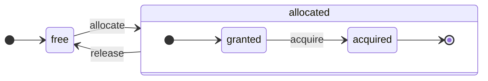
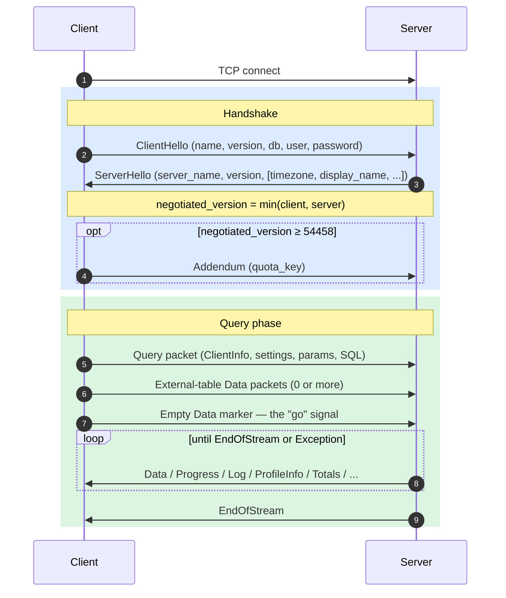
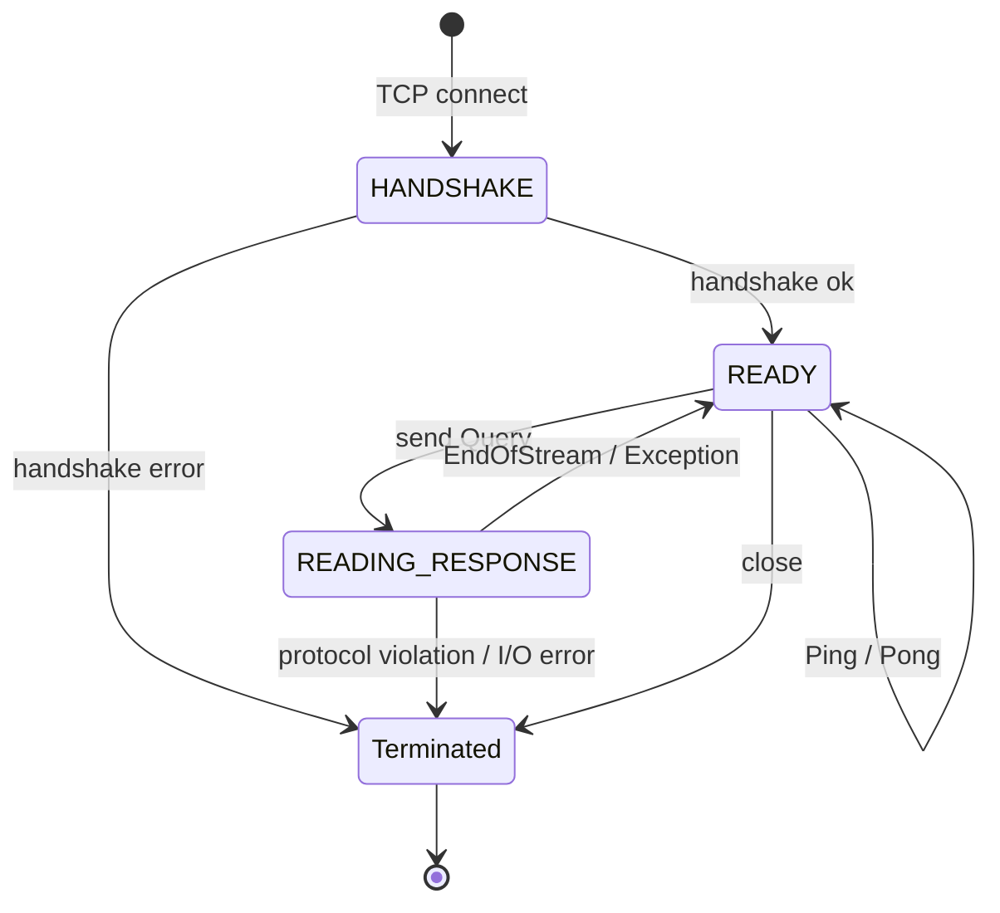
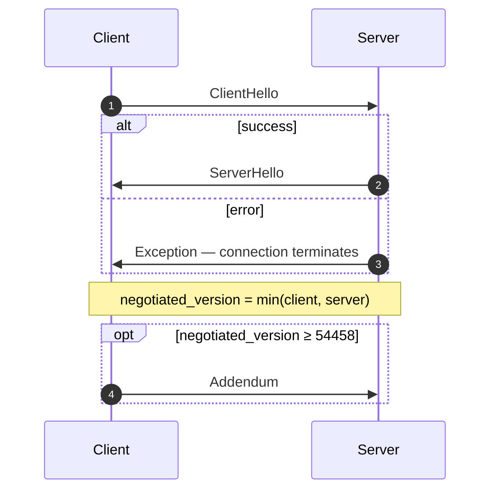
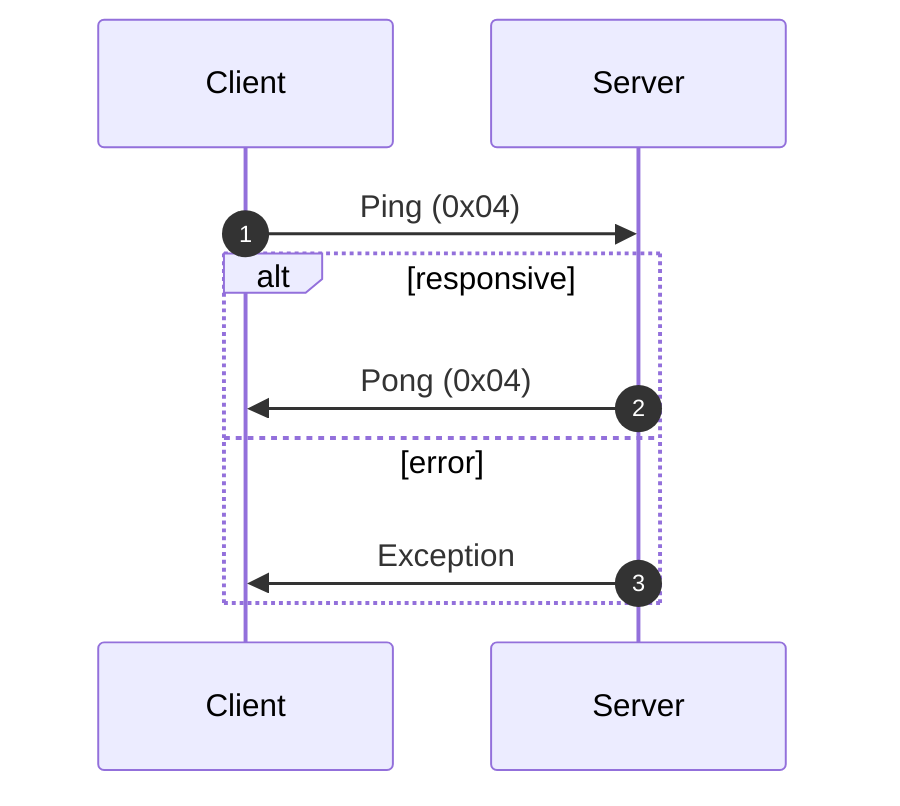
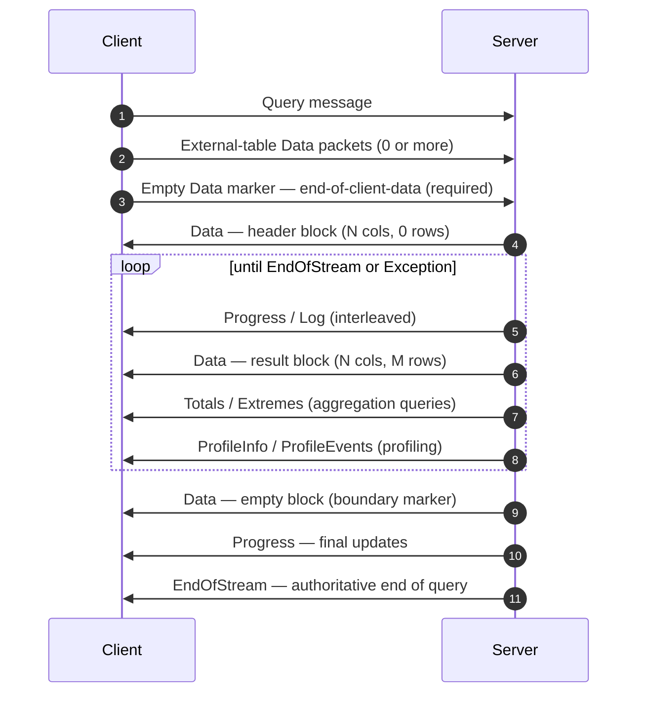
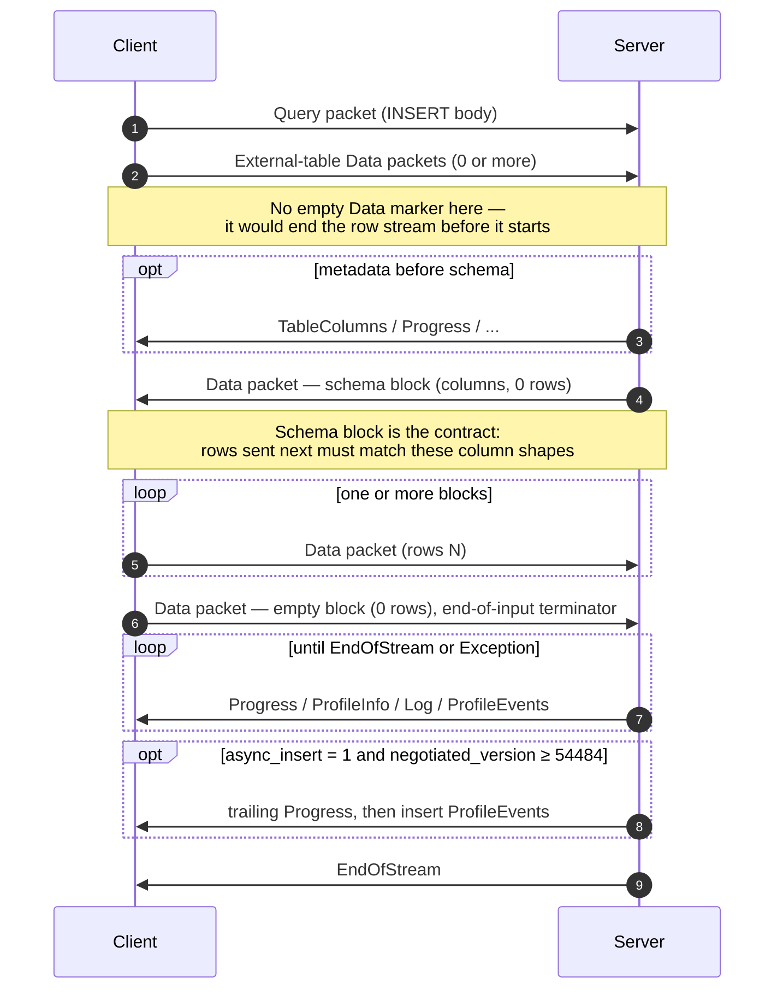
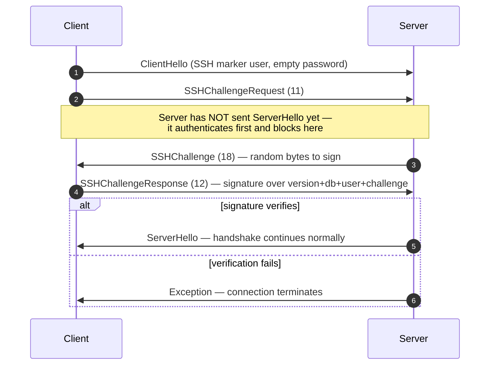

<a id="doc-22275a5f9768823129e67917"></a>

# ClickHouse/ClickHouse / docs/ar/resources/changelogs/oss/2024.mdx

Upstream: https://github.com/ClickHouse/ClickHouse/blob/28dc98b1fc057c08396c95e495b9327754a10b04/docs/ar/resources/changelogs/oss/2024.mdx

Commit: `28dc98b1fc057c08396c95e495b9327754a10b04`

Retrieved: 2026-10-01T15:20:10.316397+00:00

Kind: official-document

Raw SHA256: `e7b7e59cb06ab917043d102e684ea74398fd7617b5ea11b89d5bd9686f751bcc`

Source text below is untrusted reference content. Acquisition does not verify technical claims.

License status: UPSTREAM_NOTICES_CAPTURED_PER_FILE_REVIEW_REQUIRED. See this repository's captured license files.

---

---
slug: /whats-new/changelog/2024
sidebarTitle: '2024'
title: 'سجل تغييرات 2024'
description: 'سجل تغييرات 2024'
keywords: ['ClickHouse 2024', 'سجل تغييرات 2024', 'ملاحظات الإصدار', 'سجل الإصدارات', 'الميزات الجديدة']
doc_type: 'changelog'
---

<div id="table-of-contents">
  ### جدول المحتويات
</div>

**[إصدار ClickHouse‏ v24.12، 2024-12-19](/ar/resources/changelogs/oss/2024#a-id2412a-clickhouse-release-2412-2024-12-19)**<br />
**[إصدار ClickHouse‏ v24.11، 2024-11-26](/ar/resources/changelogs/oss/2024#a-id2411a-clickhouse-release-2411-2024-11-26)**<br />
**[إصدار ClickHouse‏ v24.10، 2024-10-31](/ar/resources/changelogs/oss/2024#a-id2410a-clickhouse-release-2410-2024-10-31)**<br />
**[إصدار ClickHouse‏ v24.9، 2024-09-26](/ar/resources/changelogs/oss/2024#a-id249a-clickhouse-release-249-2024-09-26)**<br />
**[إصدار ClickHouse‏ v24.8 LTS، 2024-08-20](/ar/resources/changelogs/oss/2024#a-id248a-clickhouse-release-248-lts-2024-08-20)**<br />
**[إصدار ClickHouse‏ v24.7، 2024-07-30](/ar/resources/changelogs/oss/2024#a-id247a-clickhouse-release-247-2024-07-30)**<br />
**[إصدار ClickHouse‏ v24.6، 2024-07-01](/ar/resources/changelogs/oss/2024#a-id246a-clickhouse-release-246-2024-07-01)**<br />
**[إصدار ClickHouse‏ v24.5، 2024-05-30](/ar/resources/changelogs/oss/2024#a-id245a-clickhouse-release-245-2024-05-30)**<br />
**[إصدار ClickHouse‏ v24.4، 2024-04-30](/ar/resources/changelogs/oss/2024#a-id244a-clickhouse-release-244-2024-04-30)**<br />
**[إصدار ClickHouse‏ v24.3 LTS، 2024-03-26](/ar/resources/changelogs/oss/2024#a-id243a-clickhouse-release-243-lts-2024-03-27)**<br />
**[إصدار ClickHouse‏ v24.2، 2024-02-29](/ar/resources/changelogs/oss/2024#a-id242a-clickhouse-release-242-2024-02-29)**<br />
**[إصدار ClickHouse‏ v24.1، 2024-01-30](/ar/resources/changelogs/oss/2024#a-id241a-clickhouse-release-241-2024-01-30)**<br />
**[سجل التغييرات لعام 2023](/ar/resources/changelogs/oss/2023)**<br />

### <a id="2412" /> الإصدار 24.12 من ClickHouse، 2024-12-19. [العرض التقديمي](https://presentations.clickhouse.com/2024-release-24.12/)، [الفيديو](https://www.youtube.com/watch?v=bv-ut-Q6vnc)

<Frame>
  <iframe src="https://www.youtube.com/embed/bv-ut-Q6vnc" frameborder="0" allow="accelerometer; autoplay; clipboard-write; encrypted-media; gyroscope; picture-in-picture" allowfullscreen />
</Frame>

<div id="backward-incompatible-change">
  #### تغيير غير متوافق مع الإصدارات السابقة
</div>

* أصبحت الدالتان `greatest` و`least` تتجاهلان الآن قيم الإدخال NULL، بعدما كانتا تُرجعان سابقًا NULL إذا كانت إحدى الوسيطات NULL. على سبيل المثال، أصبح `SELECT greatest(1, 2, NULL)` يُرجع الآن 2. وهذا يجعل السلوك متوافقًا مع PostgreSQL، لكنه في الوقت نفسه يخرق التوافق مع MySQL الذي يُرجع NULL. للاحتفاظ بالسلوك السابق، اضبط الإعداد `least_greatest_legacy_null_behavior` (القيمة الافتراضية: `false`) على `true`. [#65519](https://github.com/ClickHouse/ClickHouse/pull/65519) [#73344](https://github.com/ClickHouse/ClickHouse/pull/73344) ([kevinyhzou](https://github.com/KevinyhZou)).
* أصبح تكامل MongoDB الجديد هو الافتراضي الآن. ويمكن للمستخدمين الذين يفضّلون استخدام برنامج تشغيل MongoDB القديم (المستند إلى برنامج تشغيل Poco) تفعيل إعداد الخادم `use_legacy_mongodb_integration`. [#73359](https://github.com/ClickHouse/ClickHouse/pull/73359) ([Kirill Nikiforov](https://github.com/allmazz).

<div id="new-feature">
  #### ميزة جديدة
</div>

* نُقلت أنواع `JSON`/`Dynamic`/`Variant` من الميزات التجريبية إلى المرحلة التجريبية المتقدمة (beta). [#72294](https://github.com/ClickHouse/ClickHouse/pull/72294) ([Pavel Kruglov](https://github.com/Avogar)). كما جرى أيضًا ترحيل هذا التغيير وجميع الإصلاحات إلى الإصدار 24.11.
* يوفّر تطور المخطط لتنسيق [تخزين بيانات Iceberg](https://iceberg.apache.org/spec/#file-system-operations) للمستخدم خيارات واسعة لتعديل مخطط الجدول. ويمكن تغيير ترتيب الأعمدة وأسماء الأعمدة وامتدادات الأنواع البسيطة في الخلفية. [#69445](https://github.com/ClickHouse/ClickHouse/pull/69445) ([Daniil Ivanik](https://github.com/divanik)).
* التكامل مع Iceberg REST Catalog: أُضيف محرك database جديد باسم Iceberg، يربط الكتالوج بالكامل بـ ClickHouse. [#71542](https://github.com/ClickHouse/ClickHouse/pull/71542) ([Kseniia Sumarokova](https://github.com/kssenii)).
* أُضيفت cache للفهرس الأساسي لجداول `MergeTree` (يمكن تفعيلها عبر إعداد table `use_primary_key_cache`). وإذا كان التحميل الكسول وcache مفعّلين للفهرس الأساسي، فسيُحمَّل إلى cache عند الطلب (على غرار mark cache) بدلًا من إبقائه في الذاكرة دائمًا. كما أُضيف prewarm للفهرس الأساسي عند عمليات الإدراج/الدمج/الجلب الخاصة بـ data parts، وعند إعادة تشغيل table (يمكن تفعيله عبر الإعداد `prewarm_primary_key_cache`). يتيح ذلك خفض memory usage للجداول الضخمة على التخزين المشترك، وقد اختبرناه على جداول تضم أكثر من كوادريليون سجل. [#72102](https://github.com/ClickHouse/ClickHouse/pull/72102) ([Anton Popov](https://github.com/CurtizJ)). [#72750](https://github.com/ClickHouse/ClickHouse/pull/72750) ([Alexander Gololobov](https://github.com/davenger)).
* تنفيذ الأمر `SYSTEM LOAD PRIMARY KEY` لتحميل primary indexes لجميع parts في table محدد، أو لجميع tables إذا لم يُحدَّد table. سيكون ذلك مفيدًا لاختبارات benchmark ولتجنّب زمن استجابة إضافي أثناء تنفيذ query. [#66252](https://github.com/ClickHouse/ClickHouse/pull/66252) [#67733](https://github.com/ClickHouse/ClickHouse/pull/67733) ([ZAWA&#95;ll](https://github.com/Zawa-ll)).
* أُضيف query يتيح Attach جداول `MergeTree` كـ `ReplicatedMergeTree` والعكس صحيح: `ATTACH TABLE ... AS REPLICATED` و `ATTACH TABLE ... AS NOT REPLICATED`. [#65401](https://github.com/ClickHouse/ClickHouse/pull/65401) ([Kirill](https://github.com/kirillgarbar)).
* إعداد جديد، `http_response_headers`، يتيح لك تخصيص headers الخاصة باستجابات HTTP. فعلى سبيل المثال، يمكنك توجيه المتصفح لعرض صورة مخزّنة في database. وهذا يحل [#59620](https://github.com/ClickHouse/ClickHouse/issues/59620). [#72656](https://github.com/ClickHouse/ClickHouse/pull/72656) ([Alexey Milovidov](https://github.com/alexey-milovidov)).
* إضافة الدالة `toUnixTimestamp64Second` التي تحوّل `DateTime64` إلى قيمة `Int64` بدقة ثوانٍ ثابتة، بما يتيح دعم إرجاع قيم سالبة إذا كان التاريخ يسبق حقبة يونكس. [#70597](https://github.com/ClickHouse/ClickHouse/pull/70597) ([zhanglistar](https://github.com/zhanglistar)). [#73146](https://github.com/ClickHouse/ClickHouse/pull/73146) ([Robert Schulze](https://github.com/rschu1ze)).
* إضافة إعداد جديد `enforce_index_structure_match_on_partition_manipulation` للسماح بعملية attach عندما تكون projections وsecondary indices الخاصة بـ source table مجموعة جزئية من تلك الموجودة في target table. وهذا يحل [#70602](https://github.com/ClickHouse/ClickHouse/issues/70602). [#70603](https://github.com/ClickHouse/ClickHouse/pull/70603) ([zwy991114](https://github.com/zwy991114)).
* إضافة الصياغة ALTER USER `{ADD|MODIFY|DROP SETTING}`، وALTER USER `{ADD|DROP PROFILE}`، والأمر نفسه لـ ALTER ROLE وALTER PROFILE. وبذلك، بدلًا من استبدال مجموعة Settings بالكامل، يمكنك تعديلها. [#72050](https://github.com/ClickHouse/ClickHouse/pull/72050) ([pufit](https://github.com/pufit)).
* تمت إضافة الدالة `arrayPRAUC`، التي تحسب AUC ‏(المساحة تحت المنحنى) لمنحنى Precision Recall. [#72073](https://github.com/ClickHouse/ClickHouse/pull/72073) ([Emmanuel](https://github.com/emmanuelsdias)).
* تمت إضافة الدالة `indexOfAssumeSorted` لأنواع المصفوفات. وهي تُحسّن البحث عندما تكون المصفوفة مرتبة ترتيبًا غير تنازلي. ويظهر أثر ذلك مع المصفوفات الكبيرة جدًا (أكثر من 100,000 عنصر). [#72517](https://github.com/ClickHouse/ClickHouse/pull/72517) ([Eric Kurbanov](https://github.com/erickurbanov)).
* يتيح استخدام فاصل كمُعاملٍ ثانٍ اختياري للدالة التجميعية `groupConcat`. [#72540](https://github.com/ClickHouse/ClickHouse/pull/72540) ([Yarik Briukhovetskyi](https://github.com/yariks5s)).
* أصبحت الدالة `translate` تدعم الآن حذف الأحرف إذا كان المُعامل `from` يحتوي على أحرف أكثر من المُعامل `to`. مثال: `SELECT translate('clickhouse', 'clickhouse', 'CLICK')` تُرجع الآن `CLICK`. [#71441](https://github.com/ClickHouse/ClickHouse/pull/71441) ([shuai.xu](https://github.com/shuai-xu)).

<div id="experimental-features">
  #### الميزات التجريبية
</div>

* إعداد جديد لـ MergeTree باسم `allow_experimental_reverse_key` يتيح دعم ترتيب الفرز التنازلي في مفاتيح الفرز الخاصة بـ MergeTree. ويُعد هذا مفيدًا لتحليل السلاسل الزمنية، وخاصةً في استعلامات TopN. مثال على الاستخدام: `ENGINE = MergeTree ORDER BY (time DESC, key)` - ترتيب تنازلي للحقل `time`. [#71095](https://github.com/ClickHouse/ClickHouse/pull/71095) ([Amos Bird](https://github.com/amosbird)).

<div id="performance-improvement">
  #### تحسين الأداء
</div>

* إعادة ترتيب JOIN. أُضيف خيار لتحديد جانب الـ join الذي سيعمل بوصفه الجدول الداخلي (build) في خطة query. يتحكم في ذلك الإعداد `query_plan_join_swap_table`، ويمكن ضبطه على `auto`. في هذا الوضع، سيحاول ClickHouse اختيار الجدول ذي أقل عدد من الصفوف. [#71577](https://github.com/ClickHouse/ClickHouse/pull/71577) ([Vladimir Cherkasov](https://github.com/vdimir)).
* ستُستخدم الآن خوارزمية `parallel_hash` (عند انطباق ذلك) عندما يكون الإعداد `join_algorithm` مضبوطًا على `default`. وسيظل البديلان السابقان (`direct` و`hash`) قيد الاستخدام إذا تعذر استخدام `parallel_hash`. [#70788](https://github.com/ClickHouse/ClickHouse/pull/70788) ([Nikita Taranov](https://github.com/nickitat)).
* أُضيف خيار لاستخراج التعبيرات المشتركة من تعبيري `WHERE` و`ON` لتقليل عدد جداول hash المستخدمة أثناء عمليات join. ويكون ذلك مفيدًا عندما يحتوي شرط JOIN ON على أجزاء مشتركة داخل AND ضمن أجزاء OR مختلفة. يمكن تفعيل ذلك عبر `optimize_extract_common_expressions = 1`. [#71537](https://github.com/ClickHouse/ClickHouse/pull/71537) ([János Benjamin Antal](https://github.com/antaljanosbenjamin)).
* يتيح استخدام الفهارس في `SELECT` عندما يُحوَّل عمود مفهرس باستخدام CAST إلى `LowCardinality(String)`، وهو ما قد يحدث عند تشغيل query على Merge table تحتوي بعض جداوله على `String` وبعضها الآخر على `LowCardinality(String)`. [#71598](https://github.com/ClickHouse/ClickHouse/pull/71598) ([Yarik Briukhovetskyi](https://github.com/yariks5s)).
* أثناء تنفيذ query باستخدام parallel replicas ومع تفعيل الخطة المحلية، لا يُجرى index analysis على workers. وسيختار coordinator النطاقات المطلوب قراءتها لـ workers استنادًا إلى index analysis من جهته (على initiator الخاص بالـ query). وهذا يجعل الاستعلامات القصيرة مع parallel replicas تتمتع بزمن استجابة منخفض يماثل استعلامات العقدة الواحدة. [#72109](https://github.com/ClickHouse/ClickHouse/pull/72109) ([Igor Nikonov](https://github.com/devcrafter)).
* خُفِّض استهلاك الذاكرة في `clickhouse disks remove --recursive` لأقراص object storage. [#67323](https://github.com/ClickHouse/ClickHouse/pull/67323) ([Kirill](https://github.com/kirillgarbar)).
* استُعيد التحسين الخاص بقراءة subcolumns لعمود واحد في compact parts من [#57631](https://github.com/ClickHouse/ClickHouse/pull/57631). إذ حُذف سابقًا بالخطأ. [#72285](https://github.com/ClickHouse/ClickHouse/pull/72285) ([Pavel Kruglov](https://github.com/Avogar)).
* تسريع فرز الأعمدة `LowCardinality(String)` عبر إزالة الافتراضية من الاستدعاءات داخل المقارن. [#72337](https://github.com/ClickHouse/ClickHouse/pull/72337) ([Alexander Gololobov](https://github.com/davenger)).
* تحسين الدالة `argMin`/`argMax` لبعض data types البسيطة. [#72350](https://github.com/ClickHouse/ClickHouse/pull/72350) ([alesapin](https://github.com/alesapin)).
* تحسين آلية القفل باستخدام الأقفال المشتركة في memory tracker لتقليل التنافس على الأقفال، مما يحسن الأداء على الأنظمة التي تحتوي على عدد كبير جدًا من وحدات CPU. [#72375](https://github.com/ClickHouse/ClickHouse/pull/72375) ([Jiebin Sun](https://github.com/jiebinn)).
* أُضيف إعداد جديد، `use_async_executor_for_materialized_views`. يستخدم تنفيذًا غير متزامن، وربما متعدد الخيوط، لـ query الخاص بالـ materialized view، ما قد يسرّع معالجة views أثناء INSERT، لكنه يستهلك أيضًا مزيدًا من الذاكرة. [#72497](https://github.com/ClickHouse/ClickHouse/pull/72497) ([alesapin](https://github.com/alesapin)).
* تحسين أداء deserialization لحالات aggregate functions (في data type `AggregateFunction` وفي distributed queries). كما تحسن قليلًا أداء parsing للتنسيق `RowBinary`. [#72818](https://github.com/ClickHouse/ClickHouse/pull/72818) ([Anton Popov](https://github.com/CurtizJ)).
* تقسيم ranges أثناء القراءة باستخدام parallel replicas وفق ترتيب مفتاح الجدول لاستهلاك ذاكرة أقل أثناء القراءة. [#72173](https://github.com/ClickHouse/ClickHouse/pull/72173) ([JIaQi](https://github.com/JiaQiTang98)).
* تسريع عمليات الإدراج في MergeTree في حال وجود قيمة واحدة فقط لمفتاح التقسيم داخل الدفعة المُدرَجة. [#72348](https://github.com/ClickHouse/ClickHouse/pull/72348) ([alesapin](https://github.com/alesapin)).
* تنفيذ إنشاء الجداول بالتوازي أثناء الاستعادة من نسخة احتياطية. قبل طلب السحب هذا، كان الأمر `RESTORE` ينشئ الجداول دائمًا ضمن thread واحدة، ما قد يكون بطيئًا في حال النسخ الاحتياطية التي تحتوي على عدد كبير من الجداول. [#72427](https://github.com/ClickHouse/ClickHouse/pull/72427) ([Vitaly Baranov](https://github.com/vitlibar)).
* قد يستغرق إسقاط mark cache وقتًا ملحوظًا إذا كان كبيرًا. وإذا احتفظنا بـ mutex الخاص بـ Context أثناء ذلك، فسيؤدي هذا إلى تعطيل كثير من الأنشطة الأخرى، بل وحتى اتصال client جديد لن يمكن إنشاؤه إلى أن يتم تحريره. وفي الواقع، لا يلزم الاحتفاظ بهذا الـ mutex للمزامنة، إذ يكفي وجود مرجع محلي إلى cache عبر shared ptr. [#72749](https://github.com/ClickHouse/ClickHouse/pull/72749) ([Alexander Gololobov](https://github.com/davenger)).

<div id="improvement">
  #### تحسينات
</div>

* أُزيل الإعداد `allow_experimental_join_condition`، ما يتيح شروط non-equi افتراضيًا. [#69910](https://github.com/ClickHouse/ClickHouse/pull/69910) ([Vladimir Cherkasov](https://github.com/vdimir)).
* أصبحت الإعدادات الواردة من تهيئة server ‏(`users.xml`) تُطبَّق الآن على client أيضًا. وهذا مفيد لإعدادات `format`، مثل `date_time_output_format`. [#71178](https://github.com/ClickHouse/ClickHouse/pull/71178) ([Michael Kolupaev](https://github.com/al13n321)).
* تنفيذ `GROUP BY`/`ORDER BY` تلقائيًا على القرص استنادًا إلى استخدام ذاكرة server/المستخدم. ويُتحكَّم في ذلك عبر إعدادات query ‏`max_bytes_ratio_before_external_group_by`/`max_bytes_ratio_before_external_sort`. [#71406](https://github.com/ClickHouse/ClickHouse/pull/71406) ([Azat Khuzhin](https://github.com/azat)).
* أُضيف منطق جديد للإلغاء: يتحقق `CancellationChecker` من حالات timeout لكل query بدأ تنفيذها ويوقفها بمجرد بلوغ المهلة الزمنية. [#69880](https://github.com/ClickHouse/ClickHouse/pull/69880) ([Yarik Briukhovetskyi](https://github.com/yariks5s)).
* دعم ALTER من `Object` إلى `JSON`، ما يعني أنه يمكنك الترحيل بسهولة من نوع Object المصنَّف كمُهمل. [#71784](https://github.com/ClickHouse/ClickHouse/pull/71784) ([Pavel Kruglov](https://github.com/Avogar)).
* السماح بقيم غير معروفة في set وغير موجودة في Enum. إصلاح [#72662](https://github.com/ClickHouse/ClickHouse/issues/72662). [#72686](https://github.com/ClickHouse/ClickHouse/pull/72686) ([zhanglistar](https://github.com/zhanglistar)).
* دعم عامل البحث في السلاسل النصية (مثل LIKE) لنوع البيانات `Enum`، تنفيذًا لـ [#72661](https://github.com/ClickHouse/ClickHouse/issues/72661). [#72732](https://github.com/ClickHouse/ClickHouse/pull/72732) ([zhanglistar](https://github.com/zhanglistar)).
* كان يتم قبول بعض استعلامات ALTER USER غير المنطقية. إصلاح [#71227](https://github.com/ClickHouse/ClickHouse/issues/71227). [#71286](https://github.com/ClickHouse/ClickHouse/pull/71286) ([Arthur Passos](https://github.com/arthurpassos)).
* مراعاة `prefer_locahost_replica` عند بناء plan لعملية `INSERT ... SELECT` الموزعة. [#72190](https://github.com/ClickHouse/ClickHouse/pull/72190) ([filimonov](https://github.com/filimonov)).
* خالفت Azure مواصفة Iceberg، إذ صنّفت Iceberg v1 على نحو خاطئ على أنه Iceberg v2. المشكلة [موصوفة هنا](https://github.com/ClickHouse/ClickHouse/issues/72091). ينشئ Azure Iceberg Writer ملفات Iceberg metadata (وكذلك manifest files) بما يخالف المواصفات. نحاول الآن قراءة metadata الخاصة بتنسيق Iceberg v1 باستخدام قارئ v2 (لأنها تُكتَب بهذه الطريقة)، وأُضيف أيضًا error عندما لا تُنشأ الحقول المقابلة في manifest file. [#72277](https://github.com/ClickHouse/ClickHouse/pull/72277) ([Daniil Ivanik](https://github.com/divanik)).
* أصبح مسموحًا الآن استخدام `CREATE MATERIALIZED VIEW` مع `UNION [ALL]` في query. والسلوك مماثل لما يحدث مع materialized view التي تستخدم `JOIN`: إذ لن يعمل كمُشغِّل لعملية insert سوى أول table في تعبير `SELECT`، بينما ستُتجاهل جميع الجداول الأخرى. ومع ذلك، إذا كانت هناك عدة مراجع إلى الجدول الأول (على سبيل المثال، UNION مع نفسه)، فستُعالَج جميعها على أنها block البيانات المُدرجة. [#72347](https://github.com/ClickHouse/ClickHouse/pull/72347) ([alesapin](https://github.com/alesapin)).
* أُضيف التحقق من صحة source query عند استخدام ClickHouse كمصدر لقاموس. [#72548](https://github.com/ClickHouse/ClickHouse/pull/72548) ([Alexey Katsman](https://github.com/alexkats)).
* ضمان أن ClickHouse سيرى تغييرات ZooKeeper عند إعادة تحميل config. [#72593](https://github.com/ClickHouse/ClickHouse/pull/72593) ([Azat Khuzhin](https://github.com/azat)).
* تحسين تقدير استخدام الذاكرة للـ marks المخزنة مؤقتًا لتقليل إجمالي استخدام الذاكرة في cache. [#72630](https://github.com/ClickHouse/ClickHouse/pull/72630) ([Antonio Andelic](https://github.com/antonio2368)).
* أُضيف مقياس جديد باسم `StartupScriptsExecutionState`. ويمكن أن يأخذ هذا المقياس ثلاث قيم: 0 = لم تنتهِ برامج بدء التشغيل النصية بعد، 1 = نُفِّذت برامج بدء التشغيل النصية بنجاح، 2 = فشلت برامج بدء التشغيل النصية. نحتاج إلى هذا المقياس لمعرفة ما إذا كانت برامج بدء التشغيل النصية تُنفَّذ بنجاح في السحابة، خصوصًا بعد إصدارات التكوينات الأساسية. [#72637](https://github.com/ClickHouse/ClickHouse/pull/72637) ([Miсhael Stetsyuk](https://github.com/mstetsyuk)).
* أُضيف المقياس الجديد `MergeTreeIndexGranularityInternalArraysTotalSize` إلى `system.metrics`. وتبرز الحاجة إلى هذا المقياس للعثور على المثيلات ذات مجموعات البيانات الضخمة المعرّضة للارتفاع
* أُضيفت عمليات إعادة المحاولة عند إنشاء جدول replicated. [#72682](https://github.com/ClickHouse/ClickHouse/pull/72682) ([Vitaly Baranov](https://github.com/vitlibar)).
* أُضيف `total_bytes_with_inactive` إلى `system.tables` لاحتساب إجمالي البايتات الخاصة بالأجزاء غير النشطة. [#72690](https://github.com/ClickHouse/ClickHouse/pull/72690) ([Kai Zhu](https://github.com/nauu)).
* أُضيفت إعدادات MergeTree إلى `system.settings_changes`. [#72694](https://github.com/ClickHouse/ClickHouse/pull/72694) ([Raúl Marín](https://github.com/Algunenano)).
* أُضيف دعم JSON type في الدالة `notEmpty`. [#72741](https://github.com/ClickHouse/ClickHouse/pull/72741) ([Pavel Kruglov](https://github.com/Avogar)).
* أُضيف دعم تحليل خطأ GCS S3 `AuthenticationRequired`. [#72753](https://github.com/ClickHouse/ClickHouse/pull/72753) ([Vitaly Baranov](https://github.com/vitlibar)).
* أُضيف دعم النوع `Dynamic` في الدالتين `ifNull` و`coalesce`. [#72772](https://github.com/ClickHouse/ClickHouse/pull/72772) ([Pavel Kruglov](https://github.com/Avogar)).
* أُضيف دعم `Dynamic` في الدوال `toFloat64`/`touInt32`/إلخ. [#72989](https://github.com/ClickHouse/ClickHouse/pull/72989) ([Pavel Kruglov](https://github.com/Avogar)).
* أُضيفت إعدادات طلبات S3: `http_max_fields` و`http_max_field_name_size` و`http_max_field_value_size`، وتُستخدم أثناء تحليل استجابات واجهة برمجة تطبيقات S3 عند إنشاء نسخة احتياطية أو الاستعادة. [#72778](https://github.com/ClickHouse/ClickHouse/pull/72778) ([Vitaly Baranov](https://github.com/vitlibar)).
* لا تُحذف البيانات الوصفية للجدول في Keeper ضمن Storage S3(Azure)Queue إلا بعد حذف آخر جدول يستخدم هذه البيانات الوصفية. [#72810](https://github.com/ClickHouse/ClickHouse/pull/72810) ([Kseniia Sumarokova](https://github.com/kssenii)).
* أُضيفت profile events `JoinBuildTableRowCount`/`JoinProbeTableRowCount/JoinResultRowCount`. [#72842](https://github.com/ClickHouse/ClickHouse/pull/72842) ([Vladimir Cherkasov](https://github.com/vdimir)).
* أُضيف دعم الأعمدة الفرعية في sorting key الخاص بـ MergeTree وفي skip indexes. [#72644](https://github.com/ClickHouse/ClickHouse/pull/72644) ([Pavel Kruglov](https://github.com/Avogar)).

<div id="bug-fix-user-visible-misbehavior-in-an-official-stable-release">
  #### إصلاح خطأ
</div>

* إصلاح احتمال وجود أجزاء متداخلة في MergeTree (بعد فشل عملية نقل جزء إلى الدليل `detached`، وربما كان ذلك بسبب عملية على object storage). [#70476](https://github.com/ClickHouse/ClickHouse/pull/70476) ([Azat Khuzhin](https://github.com/azat)).
* إصلاح اكتشاف الخطأ عندما يكون اسم الجدول طويلًا جدًا، مع توفير رسالة تشخيصية توضح الحد الأقصى للطول. وإضافة دالة جديدة `getMaxTableNameLengthForDatabase`. [#70810](https://github.com/ClickHouse/ClickHouse/pull/70810) ([Yarik Briukhovetskyi](https://github.com/yariks5s)).
* إصلاح العمليات اليتيمة بعد تعطل `clickhouse-library-bridge` (يتيح هذا البرنامج تشغيل مكتبات غير آمنة). [#71301](https://github.com/ClickHouse/ClickHouse/pull/71301) ([MikhailBurdukov](https://github.com/MikhailBurdukov)).
* إصلاح خطأ NoSuchKey أثناء التراجع عن transaction عند فشل إنشاء directory للقرص `plain_rewritable`. [#71439](https://github.com/ClickHouse/ClickHouse/pull/71439) ([Julia Kartseva](https://github.com/jkartseva)).
* إصلاح serialization لقيم `Dynamic` في JSON formats من نوع `Pretty`. [#71923](https://github.com/ClickHouse/ClickHouse/pull/71923) ([Pavel Kruglov](https://github.com/Avogar)).
* إضافة اسم format المُستنتَج إلى create query في محركات `File`/`S3`/`URL`/`HDFS`/`Azure`. سابقًا، كان اسم التنسيق يُستنتج في كل مرة يُعاد فيها تشغيل server، وإذا أزيلت data files المحددة، كان ذلك يؤدي إلى أخطاء أثناء بدء تشغيل الخادم. [#72108](https://github.com/ClickHouse/ClickHouse/pull/72108) ([Pavel Kruglov](https://github.com/Avogar)).
* إصلاح أخطاء عند استخدام UDF في join على expression مع analyzer القديم. [#72179](https://github.com/ClickHouse/ClickHouse/pull/72179) ([Raúl Marín](https://github.com/Algunenano)).
* إصلاح بعض الأخطاء الصغيرة في `StorageObjectStorage`. ويتطلب ذلك تمكين `use_hive_partitioning` افتراضيًا. [#72185](https://github.com/ClickHouse/ClickHouse/pull/72185) ([Yarik Briukhovetskyi](https://github.com/yariks5s)).
* إصلاح خلل كان يؤدي إلى تعثر `min_age_to_force_merge_on_partition_only` في محاولة دمج partition نفسها مرارًا رغم أنها كانت قد دُمجت بالفعل في part واحدة، مع عدم دمج الـ partitions التي تحتوي على parts متعددة. [#72209](https://github.com/ClickHouse/ClickHouse/pull/72209) ([Christoph Wurm](https://github.com/cwurm)).
* إصلاح تعطل في `SimpleSquashingChunksTransform` كان يحدث في حالات نادرة عند processing الأعمدة sparse. [#72226](https://github.com/ClickHouse/ClickHouse/pull/72226) ([Vladimir Cherkasov](https://github.com/vdimir)).
* إصلاح data race في `GraceHashJoin` كانت قد تؤدي إلى غياب بعض rows من مخرجات join. [#72233](https://github.com/ClickHouse/ClickHouse/pull/72233) ([Nikita Taranov](https://github.com/nickitat)).
* إصلاح استعلامات `ALTER DELETE` مع العمود materialized `_block_number` (إذا كان الإعداد `enable_block_number_column` مفعّلًا). [#72261](https://github.com/ClickHouse/ClickHouse/pull/72261) ([Anton Popov](https://github.com/CurtizJ)).
* إصلاح data race عند استدعاء `ColumnDynamic::dumpStructure()` بشكل concurrent، مثلًا في مُنشئ `ConcurrentHashJoin`. [#72278](https://github.com/ClickHouse/ClickHouse/pull/72278) ([Nikita Taranov](https://github.com/nickitat)).
* إصلاح احتمال حدوث `LOGICAL_ERROR` مع الأعمدة المكررة في `ORDER BY ... WITH FILL`. [#72387](https://github.com/ClickHouse/ClickHouse/pull/72387) ([Vladimir Cherkasov](https://github.com/vdimir)).
* إصلاح عدم تطابق الأنواع في عدة حالات بعد تطبيق `optimize_functions_to_subcolumns`. [#72394](https://github.com/ClickHouse/ClickHouse/pull/72394) ([Anton Popov](https://github.com/CurtizJ)).
* استخدم `AWS_CONTAINER_AUTHORIZATION_TOKEN_FILE` بدلًا من `AWS_CONTAINER_AUTHORIZATION_TOKEN_PATH`. يُصلح [#71074](https://github.com/ClickHouse/ClickHouse/issues/71074). [#72397](https://github.com/ClickHouse/ClickHouse/pull/72397) ([Konstantin Bogdanov](https://github.com/thevar1able)).
* إصلاح فشل تحليل استعلامات `BACKUP DATABASE db EXCEPT TABLES db.table`. [#72429](https://github.com/ClickHouse/ClickHouse/pull/72429) ([Konstantin Bogdanov](https://github.com/thevar1able)).
* منع إنشاء `Variant` فارغ. [#72454](https://github.com/ClickHouse/ClickHouse/pull/72454) ([Pavel Kruglov](https://github.com/Avogar)).
* إصلاح التنسيق غير الصحيح لـ `result_part_path` في `system.merges`. [#72567](https://github.com/ClickHouse/ClickHouse/pull/72567) ([Konstantin Bogdanov](https://github.com/thevar1able)).
* إصلاح تحليل نمط glob يتكوّن من عنصر واحد (مثل `{file}`). [#72572](https://github.com/ClickHouse/ClickHouse/pull/72572) ([Konstantin Bogdanov](https://github.com/thevar1able)).
* إصلاح توليد الاستعلام للخادم التابع في حالة وجود distributed query مع `ARRAY JOIN`. يُصلح [#69276](https://github.com/ClickHouse/ClickHouse/issues/69276). [#72608](https://github.com/ClickHouse/ClickHouse/pull/72608) ([Dmitry Novik](https://github.com/novikd)).
* إصلاح خطأ يحدث عندما لا تُرجع `DateTime64 IN DateTime64` أي نتائج. [#72640](https://github.com/ClickHouse/ClickHouse/pull/72640) ([Yarik Briukhovetskyi](https://github.com/yariks5s)).
* إصلاح عدم اتساق البيانات الوصفية عند إضافة replica جديدة إلى قاعدة بيانات Replicated تحتوي على جدول أُنشئ باستخدام `flatten_nested=0`. [#72685](https://github.com/ClickHouse/ClickHouse/pull/72685) ([Alexander Tokmakov](https://github.com/tavplubix)).
* إصلاح إعدادات SSL المتقدمة للاتصال الداخلي في Keeper. [#72730](https://github.com/ClickHouse/ClickHouse/pull/72730) ([Antonio Andelic](https://github.com/antonio2368)).
* إصلاح خطأ &quot;No such key&quot; في الوضع غير المرتب لـ S3Queue عندما يكون الإعداد `tracked_files_limit` أصغر من معدل ظهور ملفات S3. [#72738](https://github.com/ClickHouse/ClickHouse/pull/72738) ([Kseniia Sumarokova](https://github.com/kssenii)).
* إصلاح الاستثناء الذي يطرحه RemoteQueryExecutor عندما لا يكون المستخدم موجودًا محليًا. [#72759](https://github.com/ClickHouse/ClickHouse/pull/72759) ([Andrey Zvonov](https://github.com/zvonand)).
* إصلاح mutations مع العمود materialized `_block_number` (إذا كان الإعداد `enable_block_number_column` مُمكّنًا). [#72854](https://github.com/ClickHouse/ClickHouse/pull/72854) ([Anton Popov](https://github.com/CurtizJ)).
* إصلاح النسخ الاحتياطي/الاستعادة مع disk عادي قابل لإعادة الكتابة في حال وجود ملفات فارغة في النسخة الاحتياطية. [#72858](https://github.com/ClickHouse/ClickHouse/pull/72858) ([Kseniia Sumarokova](https://github.com/kssenii)).
* إلغاء inserts بشكل صحيح في DistributedAsyncInsertDirectoryQueue. [#72885](https://github.com/ClickHouse/ClickHouse/pull/72885) ([Antonio Andelic](https://github.com/antonio2368)).
* إصلاح تعطل أثناء تحليل بيانات غير صحيحة إلى أعمدة متناثرة (قد يحدث ذلك عند تمكين الإعداد `enable_parsing_to_custom_serialization`). [#72891](https://github.com/ClickHouse/ClickHouse/pull/72891) ([Anton Popov](https://github.com/CurtizJ)).
* إصلاح احتمال حدوث تعطل أثناء استعادة النسخة الاحتياطية. [#72947](https://github.com/ClickHouse/ClickHouse/pull/72947) ([Kseniia Sumarokova](https://github.com/kssenii)).
* إصلاح خطأ في أسلوب JOIN `parallel_hash` قد يظهر عندما يحتوي الاستعلام على شرط معقد في العبارة `ON` مع عوامل تصفية لعدم المساواة. [#72993](https://github.com/ClickHouse/ClickHouse/pull/72993) ([Nikita Taranov](https://github.com/nickitat)).
* استخدام إعدادات التنسيق الافتراضية أثناء تحليل JSON لتجنّب تعطّل فك التسلسل. [#73043](https://github.com/ClickHouse/ClickHouse/pull/73043) ([Pavel Kruglov](https://github.com/Avogar)).
* إصلاح تعطل في المعاملات عند استخدام وحدة تخزين غير مدعومة. [#73045](https://github.com/ClickHouse/ClickHouse/pull/73045) ([Raúl Marín](https://github.com/Algunenano)).
* إصلاح احتمال المبالغة في تقدير تتبّع الذاكرة (عندما كان الفرق بين `MemoryTracking` و `MemoryResident` يواصل الازدياد). [#73081](https://github.com/ClickHouse/ClickHouse/pull/73081) ([Azat Khuzhin](https://github.com/azat)).
* التحقق من وجود مفاتيح JSON مكررة أثناء تحليل Tuple. وكان هذا قد يؤدي سابقًا إلى خطأ منطقي `Invalid number of rows in Chunk` أثناء التحليل. [#73082](https://github.com/ClickHouse/ClickHouse/pull/73082) ([Pavel Kruglov](https://github.com/Avogar)).

<div id="buildtestingpackaging-improvement">
  #### تحسينات البناء/الاختبار/التغليف
</div>

* أصبحت جميع الأدوات الصغيرة التي كانت موجودة سابقًا في المجلد `/utils` وتتطلب ترجمتها برمجيًا يدويًا من الشيفرة المصدرية جزءًا من حزمة ClickHouse الرئيسية. وهذا يغلق: [#72404](https://github.com/ClickHouse/ClickHouse/issues/72404). [#72426](https://github.com/ClickHouse/ClickHouse/pull/72426) ([Nikita Mikhaylov](https://github.com/nikitamikhaylov)).
* التراجع عن إزالة `/etc/systemd/system/clickhouse-server.service` التي أُدخلت في الإصدار 22.3 [#39323](https://github.com/ClickHouse/ClickHouse/issues/39323). [#72259](https://github.com/ClickHouse/ClickHouse/pull/72259) ([Mikhail f. Shiryaev](https://github.com/Felixoid)).
* تقسيم وحدات الترجمة الكبيرة لتجنب فشل الترجمة البرمجية بسبب قيود الذاكرة وCPU. [#72352](https://github.com/ClickHouse/ClickHouse/pull/72352) ([Yakov Olkhovskiy](https://github.com/yakov-olkhovskiy)).
* OSX: البناء مع دعم ICU، مما يتيح collations، وتحويلات مجموعات المحارف، وميزات التوطين الأخرى. [#73083](https://github.com/ClickHouse/ClickHouse/pull/73083) ([Raúl Marín](https://github.com/Algunenano)).

### <a id="2411" /> إصدار ClickHouse 24.11، بتاريخ 2024-11-26. [العرض التقديمي](https://presentations.clickhouse.com/2024-release-24.11/)، [الفيديو](https://www.youtube.com/watch?v=0hpTvtq__4g)

<Frame>
  <iframe src="https://www.youtube.com/embed/0hpTvtq__4g" frameborder="0" allow="accelerometer; autoplay; clipboard-write; encrypted-media; gyroscope; picture-in-picture" allowfullscreen />
</Frame>

<div id="backward-incompatible-change">
  #### تغيير غير متوافق مع الإصدارات السابقة
</div>

* أزل جداول النظام `generate_series` و`generateSeries`. أُضيفت هنا عن طريق الخطأ: [#59390](https://github.com/ClickHouse/ClickHouse/issues/59390). [#71091](https://github.com/ClickHouse/ClickHouse/pull/71091) ([Alexey Milovidov](https://github.com/alexey-milovidov)).
* أزل `StorageExternalDistributed`. يُغلق [#70600](https://github.com/ClickHouse/ClickHouse/issues/70600).[#71176](https://github.com/ClickHouse/ClickHouse/pull/71176) ([flynn](https://github.com/ucasfl)).
* أصبحت محركات الجداول Kafka وNATS وRabbitMQ مشمولة الآن بأذوناتها الخاصة ضمن التسلسل الهرمي `SOURCES`. أضف الأذونات إلى أي مستخدمي قاعدة بيانات غير `default` ينشئون جداول بهذه الأنواع من المحركات. [#71250](https://github.com/ClickHouse/ClickHouse/pull/71250) ([Christoph Wurm](https://github.com/cwurm)).
* تحقّق من استعلام mutation الكامل قبل تنفيذه (بما في ذلك الاستعلامات الفرعية). يمنع هذا تشغيل استعلام غير صالح عن طريق الخطأ وتراكم mutations ميتة تعيق mutations الصالحة. [#71300](https://github.com/ClickHouse/ClickHouse/pull/71300) ([Christoph Wurm](https://github.com/cwurm)).
* أعد تسمية إعداد ذاكرة التخزين المؤقت لنظام الملفات `skip_download_if_exceeds_query_cache` إلى `filesystem_cache_skip_download_if_exceeds_per_query_cache_write_limit`. [#71578](https://github.com/ClickHouse/ClickHouse/pull/71578) ([Kseniia Sumarokova](https://github.com/kssenii)).
* أزل دعم `Enum` وكذلك الوسيطات من النوع `UInt128` و`UInt256` في `deltaSumTimestamp`. وأزل أيضًا دعم `Int8` و`UInt8` و`Int16` و`UInt16` للوسيطة الثانية (&quot;timestamp&quot;) في `deltaSumTimestamp`. [#71790](https://github.com/ClickHouse/ClickHouse/pull/71790) ([Alexey Milovidov](https://github.com/alexey-milovidov)).
* عند استرجاع البيانات مباشرةً من Dictionary باستخدام تخزين Dictionary، أو دالة الجدول الخاصة بالقاموس، أو تنفيذ SELECT مباشر من القاموس نفسه، أصبح يكفي الآن امتلاك إذن `SELECT` أو إذن `dictGet` للقاموس. يتماشى هذا مع المحاولات السابقة لمنع تجاوزات ACL: https://github.com/ClickHouse/ClickHouse/pull/57362 و https://github.com/ClickHouse/ClickHouse/pull/65359. كما يجعل الأخيرة متوافقة أيضًا مع الإصدارات السابقة. [#72051](https://github.com/ClickHouse/ClickHouse/pull/72051) ([Nikita Mikhaylov](https://github.com/nikitamikhaylov)).

<div id="experimental-feature">
  #### ميزة تجريبية
</div>

* إضافة `allow_feature_tier` كمفتاح تبديل عام لتعطيل جميع الميزات التجريبية / ميزات بيتا. [#71841](https://github.com/ClickHouse/ClickHouse/pull/71841) [#71145](https://github.com/ClickHouse/ClickHouse/pull/71145) ([Raúl Marín](https://github.com/Algunenano)).
* إصلاح خطأ محتمل `No such file or directory` بسبب وجود رموز خاصة غير مُهربة في الملفات الخاصة بالأعمدة الفرعية لـ JSON. [#71182](https://github.com/ClickHouse/ClickHouse/pull/71182) ([Pavel Kruglov](https://github.com/Avogar)).
* دعم ALTER من String إلى JSON. ويغيّر طلب السحب هذا أيضًا تسلسل نوعَي JSON وDynamic إلى الإصدار الجديد V2. ولا يزال بالإمكان استخدام الإصدار القديم V1 عبر تفعيل الإعداد `merge_tree_use_v1_object_and_dynamic_serialization` (يمكن استخدامه أثناء الترقية حتى تظل إمكانية التراجع عن الإصدار متاحةً دون مشكلات). [#70442](https://github.com/ClickHouse/ClickHouse/pull/70442) ([Pavel Kruglov](https://github.com/Avogar)).
* إضافة CAST بسيط من Map/Tuple/Object إلى JSON الجديد عبر التسلسل/إلغاء التسلسل من سلسلة JSON. [#71320](https://github.com/ClickHouse/ClickHouse/pull/71320) ([Pavel Kruglov](https://github.com/Avogar)).
* عدم السماح افتراضيًا باستخدام أنواع Variant/Dynamic في ORDER BY/GROUP BY/PARTITION BY/PRIMARY KEY لأنها قد تؤدي إلى نتائج غير متوقعة. [#69731](https://github.com/ClickHouse/ClickHouse/pull/69731) ([Pavel Kruglov](https://github.com/Avogar)).
* حظر استخدام أنواع Dynamic/Variant في دوال min/max لتجنّب الالتباس. [#71761](https://github.com/ClickHouse/ClickHouse/pull/71761) ([Pavel Kruglov](https://github.com/Avogar)).

<div id="new-feature">
  #### ميزة جديدة
</div>

* أُضيفت صيغة SQL لوصف إدارة عبء العمل والموارد. https://clickhouse.com/docs/operations/workload-scheduling. [#69187](https://github.com/ClickHouse/ClickHouse/pull/69187) ([Sergei Trifonov](https://github.com/serxa)).
* نوع بيانات جديد، `BFloat16`، يمثّل أعداد الفاصلة العائمة ذات 16 بت مع أسّ من 8 بتات، وإشارة، ومانتيسا من 7 بتات. وهذا يُغلق [#44206](https://github.com/ClickHouse/ClickHouse/issues/44206). وهذا يُغلق [#49937](https://github.com/ClickHouse/ClickHouse/issues/49937). [#64712](https://github.com/ClickHouse/ClickHouse/pull/64712) ([Alexey Milovidov](https://github.com/alexey-milovidov)).
* أُضيف استعلام `CHECK GRANT` للتحقق مما إذا كان المستخدم/الدور الحالي قد مُنح الامتياز المحدد، وما إذا كان الجدول/العمود المقابل موجودًا في الذاكرة. [#68885](https://github.com/ClickHouse/ClickHouse/pull/68885) ([Unalian](https://github.com/Unalian)).
* أُضيفت دوال الجداول `iceberg[S3;HDFS;Azure]Cluster` و`deltaLakeCluster` و`hudiCluster`. [#72045](https://github.com/ClickHouse/ClickHouse/pull/72045) ([Mikhail Artemenko](https://github.com/Michicosun)).
* أُضيفت إمكانية تعيين اسم المستخدم/كلمة المرور في `http_handlers` (لـ `dynamic_query_handler`/`predefined_query_handler`). [#70725](https://github.com/ClickHouse/ClickHouse/pull/70725) ([Azat Khuzhin](https://github.com/azat)).
* أُضيف دعم لبند staleness في ORDER BY WITH FILL. [#71151](https://github.com/ClickHouse/ClickHouse/pull/71151) ([Mikhail Artemenko](https://github.com/Michicosun)).
* أصبح بإمكان كل طريقة authentication أن يكون لها تاريخ انتهاء صلاحية خاص بها، وأُزيل ذلك من كيان المستخدم. [#70090](https://github.com/ClickHouse/ClickHouse/pull/70090) ([Arthur Passos](https://github.com/arthurpassos)).
* أُضيفت الدوال الجديدة `parseDateTime64` و`parseDateTime64OrNull` و`parseDateTime64OrZero`. وبالمقارنة مع الدالة الحالية `parseDateTime` (ومتغيراتها)، فإنها تُرجع قيمة من النوع `DateTime64` بدلًا من `DateTime`. [#71581](https://github.com/ClickHouse/ClickHouse/pull/71581) ([kevinyhzou](https://github.com/KevinyhZou)).

<div id="performance-improvement">
  #### تحسين الأداء
</div>

* جرى تحسين استخدام الذاكرة لقيم `index granularity` إذا كانت `granularity` ثابتة للـ part. وأُضيفت إمكانية اختيار `granularity` ثابتة دائمًا للـ part (الإعداد `use_const_adaptive_granularity`)، مما يساعد على ضمان تحسين استخدامها في الذاكرة دائمًا. ويساعد ذلك في أعباء العمل الكبيرة (تريليونات من الصفوف في التخزين المشترك) على تجنب الزيادة المستمرة في استخدام الذاكرة بسبب metadata الخاصة بـ data parts (قيم `index granularity`). [#71786](https://github.com/ClickHouse/ClickHouse/pull/71786) ([Anton Popov](https://github.com/CurtizJ)).
* لم نعد ننسخ columns الخاصة بـ input blocks عند `join_algorithm = 'parallel_hash'` أثناء توزيعها بين threads للمعالجة المتوازية. [#67782](https://github.com/ClickHouse/ClickHouse/pull/67782) ([Nikita Taranov](https://github.com/nickitat)).
* جرى تحسين خوارزمية merge الخاصة بـ `Replacing` للأجزاء غير المتقاطعة. [#70977](https://github.com/ClickHouse/ClickHouse/pull/70977) ([Anton Popov](https://github.com/CurtizJ)).
* لا تُدرج detached parts من الأقراص readonly وأحادية الكتابة ضمن metrics و system.detached&#95;parts. [#71086](https://github.com/ClickHouse/ClickHouse/pull/71086) ([Alexey Milovidov](https://github.com/alexey-milovidov)).
* لا تُحتسب heavy asynchronous metrics افتراضيًا. أُضيفت هذه الميزة في [#40332](https://github.com/ClickHouse/ClickHouse/issues/40332)، لكن ليس من المناسب وجود مهمة background ثقيلة مطلوبة لعميل واحد فقط. [#71087](https://github.com/ClickHouse/ClickHouse/pull/71087) ([Alexey Milovidov](https://github.com/alexey-milovidov)).
* بالنسبة إلى الأقراص `plain_rewritable`: لا تستدعِ واجهة برمجة تطبيقات object storage عند سرد الأدلة، لأن ذلك قد لا يكون فعّالًا من حيث التكلفة. وبدلًا من ذلك، خزّن قائمة أسماء الملفات في الذاكرة. والمقايضات هنا هي زيادة زمن initial load والذاكرة المطلوبة لتخزين أسماء الملفات. [#70823](https://github.com/ClickHouse/ClickHouse/pull/70823) ([Julia Kartseva](https://github.com/jkartseva)).
* جرى تحسين أداء ودقة interval collection الخاص بـ `system.query_metric_log` عبر تقليل المنطقة الحرجة. [#71473](https://github.com/ClickHouse/ClickHouse/pull/71473) ([Pablo Marcos](https://github.com/pamarcos)).
* تحسين read-in-order عبر توليد rows افتراضية، بحيث تُقرأ بيانات أقل أثناء merge sort، وهو ما يفيد خصوصًا عند وجود parts متعددة. [#62125](https://github.com/ClickHouse/ClickHouse/pull/62125) ([Shichao Jin](https://github.com/jsc0218)).
* أُضيف server setting `async_load_system_database` الذي يسمح لـ server بالبدء مع system database غير مُحمّلة بالكامل. ويساعد ذلك على تشغيل ClickHouse بسرعة أكبر إذا كان هناك الكثير من system tables. [#69847](https://github.com/ClickHouse/ClickHouse/pull/69847) ([Sergei Trifonov](https://github.com/serxa)).
* أُضيف parameter `--threads` إلى `clickhouse-compressor`، مما يتيح ضغط البيانات in parallel. [#70860](https://github.com/ClickHouse/ClickHouse/pull/70860) ([Alexey Milovidov](https://github.com/alexey-milovidov)).
* أُضيف إعداد `prewarm_mark_cache` يفعّل loading للـ marks إلى mark cache عند inserts وعمليات merge وfetches الخاصة بـ parts، وكذلك عند بدء تشغيل table. [#71053](https://github.com/ClickHouse/ClickHouse/pull/71053) ([Anton Popov](https://github.com/CurtizJ)).
* تقليص مصفوفة `index&#95;granularity` في الذاكرة لتقليل البصمة الذاكرية لعائلة MergeTree table engines. [#71595](https://github.com/ClickHouse/ClickHouse/pull/71595) ([alesapin](https://github.com/alesapin)).
* عطّل إعداد filesystem cache ‏`boundary_alignment` للقراءات غير المعتمدة على disk، مما يحسّن أداء القراءة من الملفات البعيدة standalone مع Caching. [#71827](https://github.com/ClickHouse/ClickHouse/pull/71827) ([Kseniia Sumarokova](https://github.com/kssenii)).
* كانت queries مثل `SELECT * FROM table LIMIT ...` تُحمّل part indexes رغم أنها لم تكن مستخدمة. [#71866](https://github.com/ClickHouse/ClickHouse/pull/71866) ([Alexander Gololobov](https://github.com/davenger)).
* تم تفعيل `parallel_replicas_local_plan` افتراضيًا. يساهم إنشاء خطة محلية متكاملة على العقدة المُبادِرة للاستعلام في تحسين أداء النسخ المتماثلة المتوازية مع تقليل استهلاك الموارد، كما يتيح فرصًا لتطبيق المزيد من تحسينات الاستعلام. [#70171](https://github.com/ClickHouse/ClickHouse/pull/70171) ([Igor Nikonov](https://github.com/devcrafter)).

<div id="improvement-1">
  #### تحسين
</div>

* أصبح بالإمكان استخدام clickhouse مع وسيطة ملف بالشكل `ch queries.sql`. [#71589](https://github.com/ClickHouse/ClickHouse/pull/71589) ([Raúl Marín](https://github.com/Algunenano)).
* باتت صيغة `Vertical` (التي تُفعَّل أيضًا عند إنهاء الاستعلام بـ `\G`) تدعم ميزات صيغ Pretty، مثل: - تمييز مجموعات الآلاف في الأرقام؛ - عرض تلميح رقمي مقروء. [#71630](https://github.com/ClickHouse/ClickHouse/pull/71630) ([Alexey Milovidov](https://github.com/alexey-milovidov)).
* تمرير أدوار المستخدم الخارجية من منشئ الاستعلام إلى العقد الأخرى في الـcluster. ويكون ذلك مفيدًا عندما يكون منشئ الاستعلام وحده لديه إمكانية الوصول إلى external authenticator (مثل LDAP). [#70332](https://github.com/ClickHouse/ClickHouse/pull/70332) ([Andrey Zvonov](https://github.com/zvonand)).
* أُضيفت الأسماء المستعارة `anyRespectNulls` و`firstValueRespectNulls` و`anyValueRespectNulls` لدالة aggregation ‏`any`. كما أُضيفت الأسماء المستعارة `anyLastRespectNulls` و`lastValueRespectNulls` لدالة aggregation ‏`anyLast`. يتيح ذلك استخدام صياغة camel-case فقط بصورة أكثر طبيعية بدلًا من الصياغة المختلطة بين camel-case والشرطة السفلية، على سبيل المثال: `SELECT anyLastRespectNullsStateIf` بدلًا من `anyLast_respect_nullsStateIf`. [#71403](https://github.com/ClickHouse/ClickHouse/pull/71403) ([Peter Nguyen](https://github.com/petern48)).
* أُضيف parameter جديد إلى configuration باسم `date_time_utc`، ما يتيح لتنسيق سجلات JSON دعم التاريخ والوقت بتوقيت UTC بصيغة RFC 3339/ISO8601. [#71560](https://github.com/ClickHouse/ClickHouse/pull/71560) ([Ali](https://github.com/xogoodnow)).
* أُضيف نوع header جديد إلى S3 endpoints لمصادقة المستخدم (`access_header`). يتيح ذلك الحصول على access header بأدنى أولوية، على أن يُستبدل بـ `access_key_id` من أي source آخر (مثل schema جدول أو named collection). [#71011](https://github.com/ClickHouse/ClickHouse/pull/71011) ([MikhailBurdukov](https://github.com/MikhailBurdukov)).
* ستُرجع الدوال عالية الرتبة التي تحتوي على Arrays ثابتة وarguments ملتقطة ثابتة قيمًا ثابتة. [#58400](https://github.com/ClickHouse/ClickHouse/pull/58400) ([Alexey Milovidov](https://github.com/alexey-milovidov)).
* أصبحت أسماء خطوات query plan (`EXPLAIN PLAN json=1`) وأسماء processors في pipeline (`EXPLAIN PIPELINE compact=0,graph=1`) تتضمن الآن معرّفًا فريدًا كلاحقة. يتيح ذلك مطابقة مخرجات Profiler الخاصة بالـprocessors وtraces الخاصة بـ OpenTelemetry مع مخرجات explain. [#63518](https://github.com/ClickHouse/ClickHouse/pull/63518) ([qhsong](https://github.com/qhsong)).
* أُضيف خيار للتحقق مما إذا كان object موجودًا بعد كتابته إلى Azure Blob Storage، ويُتحكم في ذلك عبر الإعداد `check_objects_after_upload`. [#64847](https://github.com/ClickHouse/ClickHouse/pull/64847) ([Smita Kulkarni](https://github.com/SmitaRKulkarni)).
* استخدام قاعدة البيانات `Atomic` افتراضيًا في `clickhouse-local`. يعالج البندين 1 و5 من [#50647](https://github.com/ClickHouse/ClickHouse/issues/50647). ويغلق [#44817](https://github.com/ClickHouse/ClickHouse/issues/44817). [#68024](https://github.com/ClickHouse/ClickHouse/pull/68024) ([Alexey Milovidov](https://github.com/alexey-milovidov)).
* تؤدي Exceptions إلى قطع HTTP protocol لتنبيه client بوجود خطأ. [#68800](https://github.com/ClickHouse/ClickHouse/pull/68800) ([Sema Checherinda](https://github.com/CheSema)).
* الإبلاغ عن المضيفين الذين يشغّلون distributed DDL queries من خلال إنشاء replica&#95;dir ووضع علامة على replicas النشطة في DDLWorker. [#69658](https://github.com/ClickHouse/ClickHouse/pull/69658) ([tuanpach](https://github.com/tuanpach)).
* الانتظار فقط على replicas النشطة لاستعلامات قاعدة البيانات ON CLUSTER إذا كان distributed&#95;ddl&#95;output&#95;mode مضبوطًا على *&#95;only&#95;active. [#69660](https://github.com/ClickHouse/ClickHouse/pull/69660) ([tuanpach](https://github.com/tuanpach)).
* تحسين معالجة الأخطاء وإلغاء عمليات النسخ الاحتياطي والاستعادة الخاصة بـ `ON CLUSTER`: - إذا فشلت عملية نسخ احتياطي أو استعادة على مضيف واحد، فسيتم إلغاؤها تلقائيًا على المضيفين الآخرين - يجب ألا تظهر أخطاء غريبة بسبب فشل بعض المضيفين بينما تواصل مضيفات أخرى عملها - إذا أُلغيت عملية نسخ احتياطي أو استعادة على مضيف واحد، فسيتم إلغاؤها تلقائيًا على المضيفين الآخرين - إصلاح المشكلات المتعلقة بـ `test_disallow_concurrency` - والآن ينبغي أن يعمل تعطيل التزامن بشكل أفضل - أصبحت عمليات النسخ الاحتياطي والاستعادة الآن أكثر تحمّلًا بكثير لانقطاعات ZooKeeper. [#70027](https://github.com/ClickHouse/ClickHouse/pull/70027) ([Vitaly Baranov](https://github.com/vitlibar)).
* دعم `ALTER TABLE ... MODIFY/RESET SETTING ...` لبعض الإعدادات في محرك التخزين S3Queue. [#70811](https://github.com/ClickHouse/ClickHouse/pull/70811) ([Kseniia Sumarokova](https://github.com/kssenii)).
* تمت إضافة إمكانية إعادة تحميل شهادات العميل بالطريقة نفسها المستخدمة لإعادة تحميل شهادات الخادم. [#70997](https://github.com/ClickHouse/ClickHouse/pull/70997) ([Roman Antonov](https://github.com/Romeo58rus)).
* جعل حجم سجل العميل قابلاً للتهيئة وزيادة حجمه الافتراضي. [#71014](https://github.com/ClickHouse/ClickHouse/pull/71014) ([Jiří Kozlovský](https://github.com/jirislav)).
* دعم الأنواع Boolean في القارئ الأصلي لـ Parquet. [#71055](https://github.com/ClickHouse/ClickHouse/pull/71055) ([Arthur Passos](https://github.com/arthurpassos)).
* إعادة المحاولة مع مزيد من الأخطاء عند التفاعل مع S3، مثل &quot;Malformed message&quot;. [#71088](https://github.com/ClickHouse/ClickHouse/pull/71088) ([Alexey Milovidov](https://github.com/alexey-milovidov)).
* خفض مستوى السجل لبعض الرسائل المتعلقة بـ S3. [#71090](https://github.com/ClickHouse/ClickHouse/pull/71090) ([Alexey Milovidov](https://github.com/alexey-milovidov)).
* دعم كتابة ملفات HDFS التي تحتوي على مسافات. [#71105](https://github.com/ClickHouse/ClickHouse/pull/71105) ([exmy](https://github.com/exmy)).
* تمت إضافة إعدادات تحدّ من عدد الجداول المكررة وDictionaries وviews. [#71179](https://github.com/ClickHouse/ClickHouse/pull/71179) ([Kirill](https://github.com/kirillgarbar)).
* استخدام `AWS_CONTAINER_AUTHORIZATION_TOKEN_FILE` بدلًا من `AWS_CONTAINER_AUTHORIZATION_TOKEN` إذا كان الأول متاحًا. يعالج [#71074](https://github.com/ClickHouse/ClickHouse/issues/71074). [#71269](https://github.com/ClickHouse/ClickHouse/pull/71269) ([Konstantin Bogdanov](https://github.com/thevar1able)).
* إزالة إنشاء عقدة metadata&#95;version في ZooKeeper من خيط إعادة تشغيل ReplicatedMergeTree. الحالة الوحيدة التي نحتاج فيها إلى إنشاء هذه العقدة هي عندما يحدّث المستخدم من إصدار أقدم من 20.4 مباشرةً إلى إصدار أحدث من 24.10. لا يدعم ClickHouse عمليات Upgrades التي تمتد لأكثر من عام، لذا ينبغي إثارة استثناء ومطالبة المستخدم بالتحديث تدريجيًا بدلًا من إنشاء هذه العقدة. [#71385](https://github.com/ClickHouse/ClickHouse/pull/71385) ([Miсhael Stetsyuk](https://github.com/mstetsyuk)).
* إضافة لوحات معلومات لكل مضيف `Overview (host)` و`Cloud overview (host)` إلى لوحة المعلومات المتقدمة. [#71422](https://github.com/ClickHouse/ClickHouse/pull/71422) ([alesapin](https://github.com/alesapin)).
* يستخدم `clickhouse-local` SELECT ضمنيًا افتراضيًا، مما يتيح استخدامه كآلة حاسبة. تحسين تمييز الصياغة النحوية لوضع SELECT الضمني. [#71620](https://github.com/ClickHouse/ClickHouse/pull/71620) ([Alexey Milovidov](https://github.com/alexey-milovidov)).
* ستقوم تطبيقات سطر الأوامر بتمييز الصياغة النحوية حتى في حالة العبارات المتعددة. [#71622](https://github.com/ClickHouse/ClickHouse/pull/71622) ([Alexey Milovidov](https://github.com/alexey-milovidov)).
* ستُرجِع تطبيقات سطر الأوامر رموز خروج غير صفرية عند حدوث أخطاء. في الإصدارات السابقة، كان التطبيق `disks` يُرجِع صفرًا عند الخطأ، وكانت التطبيقات الأخرى تُرجِع صفرًا للأخطاء 256 (`PARTITION_ALREADY_EXISTS`) و512 (`SET_NON_GRANTED_ROLE`). [#71623](https://github.com/ClickHouse/ClickHouse/pull/71623) ([Alexey Milovidov](https://github.com/alexey-milovidov)).
* عندما يُمرَّر المستخدم/المجموعة على هيئة معرّف ID، يفشل `clickhouse su`. يُصلح هذا التصحيح ذلك ليقبل أيضًا `UID:GID`. [#71626](https://github.com/ClickHouse/ClickHouse/pull/71626) ([Mikhail f. Shiryaev](https://github.com/Felixoid)).
* إتاحة تعطيل زيادة حجم المخزن المؤقت في الذاكرة لذاكرة التخزين المؤقت لنظام الملفات عبر الإعداد `filesystem_cache_prefer_bigger_buffer_size`. [#71640](https://github.com/ClickHouse/ClickHouse/pull/71640) ([Kseniia Sumarokova](https://github.com/kssenii)).
* إضافة إعداد منفصل `background_download_max_file_segment_size` لتحديد الحد الأقصى لحجم مقطع الملف للتنزيل في الخلفية في ذاكرة التخزين المؤقت لنظام الملفات. [#71648](https://github.com/ClickHouse/ClickHouse/pull/71648) ([Kseniia Sumarokova](https://github.com/kssenii)).
* تحسين طفيف في تحليل JSON type: إذا كانت الكتلة الحالية لمسار JSON path تحتوي على قيم من عدة أنواع، فسيُحاوَل اختيار أفضل نوع عبر تجربة الأنواع وفق ترتيب best-effort خاص. [#71785](https://github.com/ClickHouse/ClickHouse/pull/71785) ([Pavel Kruglov](https://github.com/Avogar)).
* سابقًا، كانت القراءة من `system.asynchronous_metrics` تنتظر اكتمال التحديث المتزامن. وقد يستغرق ذلك وقتًا طويلًا إذا كان النظام تحت حمل كثيف. مع هذا التغيير، أصبح بالإمكان دائمًا قراءة القيم التي جُمعت سابقًا. [#71798](https://github.com/ClickHouse/ClickHouse/pull/71798) ([Alexander Gololobov](https://github.com/davenger)).
* ‏S3Queue وAzureQueue: اضبط `polling_max_timeout_ms` على 10 دقائق، و`polling_backoff_ms` على 30 ثانية. [#71817](https://github.com/ClickHouse/ClickHouse/pull/71817) ([Kseniia Sumarokova](https://github.com/kssenii)).
* تحديث `HostResolver` ثلاث مرات خلال فترة `history`. [#71863](https://github.com/ClickHouse/ClickHouse/pull/71863) ([Sema Checherinda](https://github.com/CheSema)).
* أُضيف إلى صفحة HTML الخاصة بـ Advanced dashboard محدِّد منسدل لاختيار dashboard من الجدول `system.dashboards`. [#72081](https://github.com/ClickHouse/ClickHouse/pull/72081) ([Sergei Trifonov](https://github.com/serxa)).
* التحقق من وجود قاعدة البيانات الافتراضية بعد التفويض. يُصلح [#71097](https://github.com/ClickHouse/ClickHouse/issues/71097). [#71140](https://github.com/ClickHouse/ClickHouse/pull/71140) ([Konstantin Bogdanov](https://github.com/thevar1able)).

<div id="bug-fix-user-visible-misbehavior-in-an-official-stable-release-1">
  #### إصلاح خطأ (سلوك غير صحيح يلاحظه المستخدم في إصدار مستقر رسمي)
</div>

* لم تعد الأجزاء التي أُلغي تكرارها أثناء استعلام `ATTACH PART` تبقى عالقة بالبادئة `attaching_`. [#65636](https://github.com/ClickHouse/ClickHouse/pull/65636) ([Kirill](https://github.com/kirillgarbar)).
* إصلاح خلل كانت فيه DateTime64 تفقد الدقة في الدالة `IN`. [#67230](https://github.com/ClickHouse/ClickHouse/pull/67230) ([Yarik Briukhovetskyi](https://github.com/yariks5s)).
* إصلاح خطأ منطقي محتمل عند استخدام الدوال مع `IGNORE/RESPECT NULLS` في `ORDER BY ... WITH FILL`، ويغلق [#57609](https://github.com/ClickHouse/ClickHouse/issues/57609). [#68234](https://github.com/ClickHouse/ClickHouse/pull/68234) ([Vladimir Cherkasov](https://github.com/vdimir)).
* إصلاح أخطاء منطقية نادرة في عمليات insert غير المتزامنة ذات التنسيق `Native` عند بلوغ حد الذاكرة. [#68965](https://github.com/ClickHouse/ClickHouse/pull/68965) ([Anton Popov](https://github.com/CurtizJ)).
* إصلاح COMMENT في CREATE TABLE للعمود EPHEMERAL. [#70458](https://github.com/ClickHouse/ClickHouse/pull/70458) ([Yakov Olkhovskiy](https://github.com/yakov-olkhovskiy)).
* إصلاح خطأ منطقي في JSONExtract مع LowCardinality(Nullable). [#70549](https://github.com/ClickHouse/ClickHouse/pull/70549) ([Pavel Kruglov](https://github.com/Avogar)).
* السماح بتنفيذ system drop replica zkpath عندما توجد replica أخرى لها zk path نفسه. [#70642](https://github.com/ClickHouse/ClickHouse/pull/70642) ([MikhailBurdukov](https://github.com/MikhailBurdukov)).
* إصلاح تعطل وتسرب في AggregateFunctionGroupArraySorted. [#70820](https://github.com/ClickHouse/ClickHouse/pull/70820) ([Michael Kolupaev](https://github.com/al13n321)).
* إضافة إمكانية تجاوز Content-Type عبر headers المستخدم في URL engine. [#70859](https://github.com/ClickHouse/ClickHouse/pull/70859) ([Artem Iurin](https://github.com/ortyomka)).
* إصلاح خطأ منطقي في `StorageS3Queue` &quot;Cannot create a persistent node in /processed since it already exists&quot;. [#70984](https://github.com/ClickHouse/ClickHouse/pull/70984) ([Kseniia Sumarokova](https://github.com/kssenii)).
* إصلاح مشكلة عدم إغلاق الجلسات المُسمّاة وبقائها معلّقة إلى الأبد في ظروف معينة. [#70998](https://github.com/ClickHouse/ClickHouse/pull/70998) ([Márcio Martins](https://github.com/marcio-absmartly)).
* إصلاح الخلل الذي لم يكن يراعي العمود &#95;row&#95;exists في خيار إعادة البناء الخاص بـ projection lightweight delete. [#71089](https://github.com/ClickHouse/ClickHouse/pull/71089) ([Shichao Jin](https://github.com/jsc0218)).
* إصلاح مشكلة `AT_* is out of range` عند التشغيل على Oracle Linux UEK 6.10. [#71109](https://github.com/ClickHouse/ClickHouse/pull/71109) ([Örjan Fors](https://github.com/op)).
* إصلاح قيمة غير صحيحة في system.query&#95;metric&#95;log بسبب حالة تسابق غير متوقعة. [#71124](https://github.com/ClickHouse/ClickHouse/pull/71124) ([Pablo Marcos](https://github.com/pamarcos)).
* إصلاح عدم تطابق اسم الدالة التجميعية quantileExactWeightedInterpolated. أُدخل هذا الخلل في https://github.com/ClickHouse/ClickHouse/pull/69619. للإحاطة @Algunenano. [#71168](https://github.com/ClickHouse/ClickHouse/pull/71168) ([李扬](https://github.com/taiyang-li)).
* إصلاح استثناء bad&#95;weak&#95;ptr مع Dynamic عند مقارنة الدوال. [#71183](https://github.com/ClickHouse/ClickHouse/pull/71183) ([Pavel Kruglov](https://github.com/Avogar)).
* التحقق من أن قراءة ملف 7z تتم من جهاز محلي. [#71184](https://github.com/ClickHouse/ClickHouse/pull/71184) ([Daniil Ivanik](https://github.com/divanik)).
* إصلاح مشكلة تجاهل إعدادات التنسيق في تنسيق Native عبر HTTP ومع الإدراجات غير المتزامنة. [#71193](https://github.com/ClickHouse/ClickHouse/pull/71193) ([Pavel Kruglov](https://github.com/Avogar)).
* لم تعد استعلامات SELECT التي تعمل بالإعداد `use_query_cache = 1` تُرفض إذا ظهر اسم جدول نظام كسلسلة حرفية؛ على سبيل المثال، أصبح الاستعلام `SELECT * FROM users WHERE name = 'system.metrics' SETTINGS use_query_cache = true;` يعمل الآن. [#71254](https://github.com/ClickHouse/ClickHouse/pull/71254) ([Robert Schulze](https://github.com/rschu1ze)).
* إصلاح خلل يؤدي إلى زيادة استخدام الذاكرة إذا كان enable&#95;filesystem&#95;cache=1، لكن القرص في إعدادات التخزين لا يحتوي على أي إعدادات لذاكرة التخزين المؤقت. [#71261](https://github.com/ClickHouse/ClickHouse/pull/71261) ([Kseniia Sumarokova](https://github.com/kssenii)).
* إصلاح الخطأ المحتمل &quot;Cannot read all data&quot; أثناء إلغاء تسلسل قاموس LowCardinality من عمود Dynamic. [#71299](https://github.com/ClickHouse/ClickHouse/pull/71299) ([Pavel Kruglov](https://github.com/Avogar)).
* إصلاح عدم اكتمال تنظيف تنسيق الإخراج المتوازي في العميل. [#71304](https://github.com/ClickHouse/ClickHouse/pull/71304) ([Raúl Marín](https://github.com/Algunenano)).
* أُضيف فكّ المحارف الخاصة المفقود في المجموعات المسماة. وبدون هذا الإصلاح، لا يمكن لـ clickhouse-server بدء التشغيل. [#71308](https://github.com/ClickHouse/ClickHouse/pull/71308) ([MikhailBurdukov](https://github.com/MikhailBurdukov)).
* إصلاح الإدراجات غير المتزامنة مع الكتل الفارغة عبر البروتوكول الأصلي. [#71312](https://github.com/ClickHouse/ClickHouse/pull/71312) ([Anton Popov](https://github.com/CurtizJ)).
* إصلاح عدم اتساق تنسيق AST عند منح امتيازات wildcard غير صحيحة [#71309](https://github.com/ClickHouse/ClickHouse/issues/71309). [#71332](https://github.com/ClickHouse/ClickHouse/pull/71332) ([pufit](https://github.com/pufit)).
* إضافة try/catch إلى المُدمِّرات الخاصة بأجزاء البيانات لتجنّب std::terminate. [#71364](https://github.com/ClickHouse/ClickHouse/pull/71364) ([alesapin](https://github.com/alesapin)).
* التحقق من الأنواع المشبوهة والتجريبية في تلميحات نوع JSON. [#71369](https://github.com/ClickHouse/ClickHouse/pull/71369) ([Pavel Kruglov](https://github.com/Avogar)).
* بدء تشغيل خيط عامل الذاكرة على أنظمة التشغيل غير Linux أيضًا (إصلاح [#71051](https://github.com/ClickHouse/ClickHouse/issues/71051)). [#71384](https://github.com/ClickHouse/ClickHouse/pull/71384) ([Alexandre Snarskii](https://github.com/snar)).
* إصلاح الخطأ Invalid number of rows in Chunk مع عمود Variant. [#71388](https://github.com/ClickHouse/ClickHouse/pull/71388) ([Pavel Kruglov](https://github.com/Avogar)).
* إصلاح الخطأ column &quot;attgenerated&quot; does not exist في إصدارات PostgreSQL الأقدم، وإصلاح [#60651](https://github.com/ClickHouse/ClickHouse/issues/60651). [#71396](https://github.com/ClickHouse/ClickHouse/pull/71396) ([0xMihalich](https://github.com/0xMihalich)).
* لتجنّب إغراق سجلات الخادم، تُسجَّل الآن محاولات المصادقة الفاشلة عند المستوى `DEBUG` بدلًا من `ERROR`. [#71405](https://github.com/ClickHouse/ClickHouse/pull/71405) ([Robert Schulze](https://github.com/rschu1ze)).
* إصلاح تعطل في table function ‏`mongodb` عند تمرير وسيطات غير صحيحة (مثل `NULL`). [#71426](https://github.com/ClickHouse/ClickHouse/pull/71426) ([Vladimir Cherkasov](https://github.com/vdimir)).
* إصلاح تعطل مرتبط بـ optimize&#95;rewrite&#95;array&#95;exists&#95;to&#95;has. [#71432](https://github.com/ClickHouse/ClickHouse/pull/71432) ([Raúl Marín](https://github.com/Algunenano)).
* تم إصلاح استخدام الإعداد `max_insert_delayed_streams_for_parallel_write` في عمليات الإدراج. كان يعمل سابقًا بشكل غير صحيح، ما قد يؤدي إلى ارتفاع استخدام الذاكرة في عمليات الإدراج التي تكتب البيانات إلى عدة أقسام. [#71474](https://github.com/ClickHouse/ClickHouse/pull/71474) ([Anton Popov](https://github.com/CurtizJ)).
* إصلاح الخطأ المحتمل `Argument for function must be constant` (المحلل القديم) في الحالات التي قد يظهر فيها `arrayJoin` ظاهريًا في شرط `WHERE`. حدث هذا كتراجع بعد https://github.com/ClickHouse/ClickHouse/pull/65414. [#71476](https://github.com/ClickHouse/ClickHouse/pull/71476) ([Nikolai Kochetov](https://github.com/KochetovNicolai)).
* منع حدوث تعطل في SortCursor عند وجود 0 أعمدة (المحلل القديم). [#71494](https://github.com/ClickHouse/ClickHouse/pull/71494) ([Raúl Marín](https://github.com/Algunenano)).
* إصلاح تجاوز Date32 للنطاق بسبب بيانات ORC غير المهيأة. لمزيد من التفاصيل، راجع https://github.com/apache/incubator-gluten/issues/7823. [#71500](https://github.com/ClickHouse/ClickHouse/pull/71500) ([李扬](https://github.com/taiyang-li)).
* إصلاح احتساب حجم العمود في Wide part للنوعين Dynamic وJSON. [#71526](https://github.com/ClickHouse/ClickHouse/pull/71526) ([Pavel Kruglov](https://github.com/Avogar)).
* إصلاح في المحلل عند استخدام الاستعلام داخل العرض المادي العامل IN مع CTE. يغلق [#65598](https://github.com/ClickHouse/ClickHouse/issues/65598). [#71538](https://github.com/ClickHouse/ClickHouse/pull/71538) ([Maksim Kita](https://github.com/kitaisreal)).
* تجنب حدوث تعطل عند استخدام UDF في قيد. [#71541](https://github.com/ClickHouse/ClickHouse/pull/71541) ([Raúl Marín](https://github.com/Algunenano)).
* إرجاع 0 أو المحرف الافتراضي بدلًا من إطلاق خطأ في دوال `bitShift` عند الخروج عن الحدود. [#71580](https://github.com/ClickHouse/ClickHouse/pull/71580) ([Pablo Marcos](https://github.com/pamarcos)).
* إصلاح تعطل الخادم أثناء استخدام عرض مادي مع بعض المحركات. [#71593](https://github.com/ClickHouse/ClickHouse/pull/71593) ([Pervakov Grigorii](https://github.com/GrigoryPervakov)).
* كان ARRAY JOIN مع بنية بيانات متداخلة تحتوي على اسم مستعار لمصفوفة ثابتة يؤدي إلى إلغاء مرجع مؤشر فارغ. يغلق هذا [#71677](https://github.com/ClickHouse/ClickHouse/issues/71677). [#71678](https://github.com/ClickHouse/ClickHouse/pull/71678) ([Alexey Milovidov](https://github.com/alexey-milovidov)).
* إصلاح LOGICAL&#95;ERROR عند تنفيذ ALTER مع tuple فارغ. يصلح هذا [#71647](https://github.com/ClickHouse/ClickHouse/issues/71647). [#71679](https://github.com/ClickHouse/ClickHouse/pull/71679) ([Amos Bird](https://github.com/amosbird)).
* لا تُحوِّل المجموعة الثابتة في predicates على أعمدة التقسيم عند استخدام العامل NOT IN. [#71695](https://github.com/ClickHouse/ClickHouse/pull/71695) ([Eduard Karacharov](https://github.com/korowa)).
* إصلاح رسالة السجل الخاصة بفشل سكربت التهيئة في Docker لتكون أوضح. [#71734](https://github.com/ClickHouse/ClickHouse/pull/71734) ([Андрей](https://github.com/andreineustroev)).
* إصلاح CAST من LowCardinality(Nullable) إلى Dynamic. كان ذلك قد يؤدي سابقًا إلى الخطأ `Bad cast from type DB::ColumnVector<int> to DB::ColumnNullable`. [#71742](https://github.com/ClickHouse/ClickHouse/pull/71742) ([Pavel Kruglov](https://github.com/Avogar)).
* إصلاح الاستثناء في toDayOfWeek ضمن شرط `WHERE` مع مفتاح أساسي من النوع DateTime64. [#71849](https://github.com/ClickHouse/ClickHouse/pull/71849) ([Yakov Olkhovskiy](https://github.com/yakov-olkhovskiy)).
* تم إصلاح تعبئة القيم الافتراضية بعد parsing إلى الأعمدة sparse. [#71854](https://github.com/ClickHouse/ClickHouse/pull/71854) ([Anton Popov](https://github.com/CurtizJ)).
* إصلاح خطأ الدالة GROUPING عندما يكون الإدخال ALIAS في جدول موزّع، وإغلاق [#68602](https://github.com/ClickHouse/ClickHouse/issues/68602). [#71855](https://github.com/ClickHouse/ClickHouse/pull/71855) ([Vladimir Cherkasov](https://github.com/vdimir)).
* إصلاح تعطل محتمل عند استخدام `allow_experimental_join_condition`، وإغلاق [#71693](https://github.com/ClickHouse/ClickHouse/issues/71693). [#71857](https://github.com/ClickHouse/ClickHouse/pull/71857) ([Vladimir Cherkasov](https://github.com/vdimir)).
* إصلاح عبارات SELECT التي تستخدم clause `WITH TIES` وقد لا تُرجع عددًا كافيًا من الصفوف. [#71886](https://github.com/ClickHouse/ClickHouse/pull/71886) ([wxybear](https://github.com/wxybear)).
* إصلاح استثناء TOO&#95;LARGE&#95;ARRAY&#95;SIZE الناتج عن اعتبار column من ناتج تقييم arrayWithConstant، بالخطأ، متجاوزًا حد حجم المصفوفة. [#71894](https://github.com/ClickHouse/ClickHouse/pull/71894) ([Udi](https://github.com/udiz)).
* كان `clickhouse-benchmark` يبلّغ عن metrics غير صحيحة للاستعلامات التي تستغرق أكثر من ثانية واحدة. [#71898](https://github.com/ClickHouse/ClickHouse/pull/71898) ([Alexey Milovidov](https://github.com/alexey-milovidov)).
* إصلاح data race بين مؤشّر التقدّم وجدول التقدّم في clickhouse-client. تظهر هذه المشكلة عند استخدام FROM INFILE. كما تم اعتراض ضغطات المفاتيح أثناء استعلامات INSERT لتبديل عرض جدول التقدّم. [#71901](https://github.com/ClickHouse/ClickHouse/pull/71901) ([Julia Kartseva](https://github.com/jkartseva)).
* استخدام Keeperات مساعدة لاكتشاف cluster تلقائيًا. [#71911](https://github.com/ClickHouse/ClickHouse/pull/71911) ([Anton Ivashkin](https://github.com/ianton-ru)).
* إصلاح column ‏rows&#95;processed في system.s3/azure&#95;queue&#95;log الذي تعطّل في الإصدار 24.6. إغلاق [#69975](https://github.com/ClickHouse/ClickHouse/issues/69975). [#71946](https://github.com/ClickHouse/ClickHouse/pull/71946) ([Kseniia Sumarokova](https://github.com/kssenii)).
* إصلاح حالة كانت فيها دالتا `s3`/`s3Cluster` قد تُرجعان نتيجة غير مكتملة أو تطرحان استثناءً. كانت هذه الحالة تتضمن استخدام glob pattern في عنوان URI الخاص بـ s3 (مثل `pattern/*`) مع وجود object فارغ بالمفتاح `pattern/` (وتنشئ S3 Console مثل هذه objects تلقائيًا). كما تغيّرت القيمة الافتراضية للإعداد `s3_skip_empty_files` من `false` إلى `true`. [#71947](https://github.com/ClickHouse/ClickHouse/pull/71947) ([Nikita Taranov](https://github.com/nickitat)).
* إصلاح تعطل في تمييز الصياغة في clickhouse-client. إغلاق [#71864](https://github.com/ClickHouse/ClickHouse/issues/71864). [#71949](https://github.com/ClickHouse/ClickHouse/pull/71949) ([Nikolay Degterinsky](https://github.com/evillique)).
* إصلاح خطأ `Illegal type` في جداول `MergeTree` عند استخدام دالة binary monotonic في `ORDER BY` إذا كانت argument الأولى ثابتة. إصلاح [#71941](https://github.com/ClickHouse/ClickHouse/issues/71941). [#71966](https://github.com/ClickHouse/ClickHouse/pull/71966) ([Nikolai Kochetov](https://github.com/KochetovNicolai)).
* السماح فقط باستعلامات SELECT داخل EXPLAIN AST المستخدم ضمن subquery. أما الأنواع الأخرى من queries فتؤدي إلى logical error: &#39;Bad cast from type DB::ASTCreateQuery to DB::ASTSelectWithUnionQuery&#39; أو `Inconsistent AST formatting`. [#71982](https://github.com/ClickHouse/ClickHouse/pull/71982) ([Pavel Kruglov](https://github.com/Avogar)).
* عند insert سجل باستخدام `clickhouse-client`، يقرأ client أوصاف الأعمدة من server. لكن كان هناك خطأ يجعلنا نكتب الأوصاف بترتيب غير صحيح، بينما الترتيب الصحيح هو [statistics, ttl, settings]. [#71991](https://github.com/ClickHouse/ClickHouse/pull/71991) ([Han Fei](https://github.com/hanfei1991)).
* إصلاح تنسيق أوامر ALTER من `MOVE PARTITION ... TO TABLE ...` عند تمكين `format_alter_commands_with_parentheses`. [#72080](https://github.com/ClickHouse/ClickHouse/pull/72080) ([János Benjamin Antal](https://github.com/antaljanosbenjamin)).
* إصلاح عمليات RIGHT / FULL JOIN في الاستعلامات التي تستخدم parallel replicas. يمكن الآن تنفيذ عمليات RIGHT JOIN باستخدام parallel replicas (مع توزيع قراءة الجدول الأيمن). أما عمليات FULL JOIN فلا يمكن تنفيذها بالتوازي بين العقد، وتُنفَّذ محليًا. [#71162](https://github.com/ClickHouse/ClickHouse/pull/71162) ([Igor Nikonov](https://github.com/devcrafter)).
* إصلاح المشكلة التي كانت تؤدي إلى طباعة ClickHouse داخل حاويات Docker للرسالة &quot;get&#95;mempolicy: Operation not permitted&quot; على stderr بسبب تقييد استدعاءات النظام. [#70900](https://github.com/ClickHouse/ClickHouse/pull/70900) ([filimonov](https://github.com/filimonov)).
* إصلاح سجل metadata&#95;version في ZooKeeper ضمن خيط إعادة التشغيل بدلًا من خيط attach. [#70297](https://github.com/ClickHouse/ClickHouse/pull/70297) ([Miсhael Stetsyuk](https://github.com/mstetsyuk)).
* هذا إصلاح لميزة &quot;zero-copy&quot; replication، وهي غير مدعومة وستُزال بالكامل. لا تحذف blob عندما تكون هناك عقد تستخدمه في ReplicatedMergeTree مع zero-copy replication. [#71186](https://github.com/ClickHouse/ClickHouse/pull/71186) ([Antonio Andelic](https://github.com/antonio2368)).
* هذا إصلاح لميزة &quot;zero-copy&quot; replication، وهي غير مدعومة وستُزال بالكامل. جرى الحصول على قفل zero-copy مشترك قبل نقل part إلى zero-copy disk لمنع احتمال فقدان البيانات إذا لم يكن Keeper متاحًا. [#71845](https://github.com/ClickHouse/ClickHouse/pull/71845) ([Aleksei Filatov](https://github.com/aalexfvk)).

### <a id="2410" /> إصدار ClickHouse 24.10، بتاريخ 2024-10-31. [العرض التقديمي](https://presentations.clickhouse.com/2024-release-24.10/), [الفيديو](https://www.youtube.com/watch?v=AamIAjURp4U)

<Frame>
  <iframe src="https://www.youtube.com/embed/AamIAjURp4U" frameborder="0" allow="accelerometer; autoplay; clipboard-write; encrypted-media; gyroscope; picture-in-picture" allowfullscreen />
</Frame>

<div id="backward-incompatible-change">
  #### تغيير غير متوافق مع الإصدارات السابقة
</div>

* أصبح من الممكن كتابة `SETTINGS` قبل `FORMAT` في سلسلة من الاستعلامات باستخدام `UNION` عندما تكون الاستعلامات الفرعية داخل أقواس. يُغلق هذا [#39712](https://github.com/ClickHouse/ClickHouse/issues/39712). كما يغيّر هذا السلوكَ عند تحديد عبارة SETTINGS مرتين في تسلسل واحد داخل الاستعلام. وستكون الأولوية لعبارة SETTINGS الأقرب إلى الاستعلام الفرعي المعني. في الإصدارات السابقة، كان يمكن لعبارة SETTINGS الخارجية أن تتقدّم في الأولوية على العبارة الداخلية. [#68614](https://github.com/ClickHouse/ClickHouse/pull/68614) ([Alexey Milovidov](https://github.com/alexey-milovidov)).
* أصبح الآن مسموحًا افتراضيًا بإعادة ترتيب شروط التصفية في عبارة `[PRE]WHERE`. ويمكن تعطيل ذلك بضبط `allow_reorder_prewhere_conditions` على `false`. [#70657](https://github.com/ClickHouse/ClickHouse/pull/70657) ([Nikita Taranov](https://github.com/nickitat)).
* أُزيلت مكتبة `idxd-config` بسبب ترخيصها غير المتوافق. ويؤدي ذلك أيضًا إلى إزالة برنامج الترميز Intel DeflateQPL التجريبي. [#70987](https://github.com/ClickHouse/ClickHouse/pull/70987) ([Alexey Milovidov](https://github.com/alexey-milovidov)).

<div id="new-feature">
  #### ميزة جديدة
</div>

* إتاحة منح الوصول إلى البادئات التي تتضمن أحرف بدل. `GRANT SELECT ON db.table_pefix_* TO user`. [#65311](https://github.com/ClickHouse/ClickHouse/pull/65311) ([pufit](https://github.com/pufit)).
* إذا ضغطت على مفتاح المسافة أثناء تنفيذ query، فسيعرض client جدولًا آنيًا يتضمن metrics مفصلة. يمكنك تمكين ذلك على مستوى عام باستخدام الخيار الجديد `--progress-table` في clickhouse-client؛ ويرتبط به الخيار الجديد `--enable-progress-table-toggle`، الذي يبدّل عرض جدول التقدم عند الضغط على مفتاح التحكم (Space). [#63689](https://github.com/ClickHouse/ClickHouse/pull/63689) ([Maria Khristenko](https://github.com/mariaKhr)), [#70423](https://github.com/ClickHouse/ClickHouse/pull/70423) ([Julia Kartseva](https://github.com/jkartseva)).
* إتاحة التخزين المؤقت لملفات القراءة لمحركات table الخاصة بـ object storage وdata lake باستخدام hash من ETag + file path كمفتاح cache. [#70135](https://github.com/ClickHouse/ClickHouse/pull/70135) ([Kseniia Sumarokova](https://github.com/kssenii)).
* دعم إنشاء table باستخدام query: `CREATE TABLE ... CLONE AS ...`. تستنسخ هذه الصيغة schema الخاصة بـ source table ثم تُجري Attach لجميع partitions إلى table المُنشأة حديثًا. هذه feature مدعومة فقط مع الجداول من family `MergeTree`‎. يغلق [#65015](https://github.com/ClickHouse/ClickHouse/issues/65015). [#69091](https://github.com/ClickHouse/ClickHouse/pull/69091) ([tuanpach](https://github.com/tuanpach)).
* إضافة system table جديدة، `system.query_metric_log`، تحتوي على history لقيم Memory وMetric من table system.events لكل query على حدة، وتُكتب دوريًا إلى القرص. [#66532](https://github.com/ClickHouse/ClickHouse/pull/66532) ([Pablo Marcos](https://github.com/pamarcos)).
* يمكن كتابة query بسيطة من نوع SELECT باستخدام SELECT ضمنية لتمكين expressions بأسلوب الآلة الحاسبة، مثل: `ch "1 + 2"`. ويتحكم في ذلك setting جديدة هي `implicit_select`. [#68502](https://github.com/ClickHouse/ClickHouse/pull/68502) ([Alexey Milovidov](https://github.com/alexey-milovidov)).
* دعم وضع `--copy` في clickhouse local كاختصار لتحويل format [#68503](https://github.com/ClickHouse/ClickHouse/issues/68503). [#68583](https://github.com/ClickHouse/ClickHouse/pull/68583) ([Denis Hananein](https://github.com/denis-hananein)).
* إضافة صفحة HTML مدمجة لتصور merges، وهي متاحة على path ‏`/merges`. [#70821](https://github.com/ClickHouse/ClickHouse/pull/70821) ([Alexey Milovidov](https://github.com/alexey-milovidov)).
* إضافة دعم للدالة `arrayUnion`. [#68989](https://github.com/ClickHouse/ClickHouse/pull/68989) ([Peter Nguyen](https://github.com/petern48)).
* إتاحة aliases ذات معاملات في SQL. [#50665](https://github.com/ClickHouse/ClickHouse/pull/50665) ([Anton Kozlov](https://github.com/tonickkozlov)).
* إضافة aggregate function جديدة باسم `quantileExactWeightedInterpolated`، وهي نسخة interpolated مبنية على quantileExactWeighted. قد يتساءل البعض لماذا نحتاج إلى `quantileExactWeightedInterpolated` جديدة مع أننا نملك بالفعل `quantileExactInterpolatedWeighted`. السبب هو أن الجديدة أدق من القديمة. وهذا من أجل التوافق مع spark. [#69619](https://github.com/ClickHouse/ClickHouse/pull/69619) ([李扬](https://github.com/taiyang-li)).
* دالة جديدة باسم `arrayElementOrNull`. تُرجع `NULL` إذا كان فهرس Array خارج النطاق أو إذا لم يتم العثور على مفتاح Map. [#69646](https://github.com/ClickHouse/ClickHouse/pull/69646) ([李扬](https://github.com/taiyang-li)).
* يتيح للمستخدمين تحديد regular expressions عبر الحقلين الجديدين `message_regexp` و`message_regexp_negative` في ملف `config.xml` لتصفية logging. ويُطبَّق logging على النص المنسق غير الملوَّن لتوفير تجربة أكثر سلاسة للمطورين. [#69657](https://github.com/ClickHouse/ClickHouse/pull/69657) ([Peter Nguyen](https://github.com/petern48)).
* تمت إضافة الدالة `RIPEMD160`، التي تحسب قيمة hash التشفيرية RIPEMD-160 لسلسلة نصية. مثال: `SELECT HEX(RIPEMD160('The quick brown fox jumps over the lazy dog'))` تُرجع `37F332F68DB77BD9D7EDD4969571AD671CF9DD3B`. [#70087](https://github.com/ClickHouse/ClickHouse/pull/70087) ([Dergousov Maxim](https://github.com/m7kss1)).
* دعم قراءة جداول `Iceberg` على `HDFS`. [#70268](https://github.com/ClickHouse/ClickHouse/pull/70268) ([flynn](https://github.com/ucasfl)).
* دعم CTE بصيغة `WITH ... INSERT`، بعدما كان المدعوم سابقًا يقتصر على `INSERT ... WITH ...`. [#70593](https://github.com/ClickHouse/ClickHouse/pull/70593) ([Shichao Jin](https://github.com/jsc0218)).
* تكامل MongoDB: دعم جميع أنواع MongoDB، ودعم عبارتي WHERE وORDER BY على جانب MongoDB، وفرض قيود على expression غير المدعومة من MongoDB. لاحظ أن التكامل الجديد معطّل افتراضيًا، ولاستخدامه يُرجى تعيين `<use_legacy_mongodb_integration>` إلى `false` في config الخادم. [#63279](https://github.com/ClickHouse/ClickHouse/pull/63279) ([Kirill Nikiforov](https://github.com/allmazz)).
* تمت إضافة دالة جديدة `getSettingOrDefault` لإرجاع default value وتجنّب حدوث Exception إذا لم يتم العثور على custom setting في profile الحالي. [#69917](https://github.com/ClickHouse/ClickHouse/pull/69917) ([Shankar](https://github.com/shiyer7474)).

<div id="experimental-feature">
  #### ميزة تجريبية
</div>

* أصبحت العروض المادية القابلة للتحديث جاهزة للاستخدام في بيئات production. [#70550](https://github.com/ClickHouse/ClickHouse/pull/70550) ([Michael Kolupaev](https://github.com/al13n321)). كما أصبحت العروض المادية القابلة للتحديث مدعومة الآن في قواعد بيانات Replicated. [#60669](https://github.com/ClickHouse/ClickHouse/pull/60669) ([Michael Kolupaev](https://github.com/al13n321)).
* نُقلت النسخ المتماثلة المتوازية من الحالة التجريبية إلى Beta. وأُعيدت صياغة الإعدادات التي تتحكم في سلوك خوارزميات النسخ المتماثلة المتوازية. وتذكيرًا سريعًا: يحتوي ClickHouse على أربع خوارزميات مختلفة للقراءة المتوازية باستخدام عدة replicas، وينعكس ذلك في الإعداد `parallel_replicas_mode`، وتكون قيمته الافتراضية `read_tasks`. بالإضافة إلى ذلك، أُضيف إعداد تبديل `enable_parallel_replicas`. [#63151](https://github.com/ClickHouse/ClickHouse/pull/63151) ([Alexey Milovidov](https://github.com/alexey-milovidov)), ([Nikita Mikhaylov](https://github.com/nikitamikhaylov)).
* دعم النوع `Dynamic` في معظم الدوال من خلال تنفيذها على الأنواع الداخلية داخل `Dynamic`. [#69691](https://github.com/ClickHouse/ClickHouse/pull/69691) ([Pavel Kruglov](https://github.com/Avogar)).
* إتاحة قراءة/كتابة النوع `JSON` كسلسلة ثنائية في تنسيق `RowBinary` ضمن الإعدادات `input_format_binary_read_json_as_string/output_format_binary_write_json_as_string`. [#70288](https://github.com/ClickHouse/ClickHouse/pull/70288) ([Pavel Kruglov](https://github.com/Avogar)).
* إتاحة إجراء التسلسل/إلغاء التسلسل لعمود `JSON` كعمود `String` واحد في Native format. للإخراج، استخدم الإعداد `output_format_native_write_json_as_string`. وللإدخال، استخدم إصدار التسلسل `1` قبل بيانات العمود. [#70312](https://github.com/ClickHouse/ClickHouse/pull/70312) ([Pavel Kruglov](https://github.com/Avogar)).
* استُحدث وضع خاص (تجريبي) لمحدد الدمج في جداول MergeTree، يجعله أكثر هجوميةً تجاه الأقسام القريبة من الحد الأقصى لعدد الأجزاء. ويُتحكم فيه عبر إعداد MergeTree على مستوى الجدول `merge_selector_use_blurry_base`. [#70645](https://github.com/ClickHouse/ClickHouse/pull/70645) ([Nikita Mikhaylov](https://github.com/nikitamikhaylov)).
* تنفيذ ser/de عام بين `Union` في Avro وأنواع `Variant` في ClickHouse. يحل المشكلة [#69713](https://github.com/ClickHouse/ClickHouse/issues/69713). [#69712](https://github.com/ClickHouse/ClickHouse/pull/69712) ([Jiří Kozlovský](https://github.com/jirislav)).

<div id="performance-improvement">
  #### تحسين الأداء
</div>

* أُعيدت هيكلة `IDisk` و`IObjectStorage` لتحسين الأداء. وستُهيَّأ الجداول من مخازن الكائنات `plain` و`plain_rewritable` بسرعة أكبر. [#68146](https://github.com/ClickHouse/ClickHouse/pull/68146) ([Alexey Milovidov](https://github.com/alexey-milovidov), [Julia Kartseva](https://github.com/jkartseva)). ولم يعد يُستدعى طلب LIST في واجهة برمجة تطبيقات تخزين الكائنات عند التحقق مما إذا كان الملف أو الدليل موجودًا على القرص `plain_rewritable`، لأن ذلك قد يكون مرتفع التكلفة. [#70852](https://github.com/ClickHouse/ClickHouse/pull/70852) ([Julia Kartseva](https://github.com/jkartseva)). كما جرى تقليل عدد طلبات HEAD في واجهة برمجة تطبيقات تخزين الكائنات على القرص `plain&#95;rewritable`. [#70915](https://github.com/ClickHouse/ClickHouse/pull/70915) ([Julia Kartseva](https://github.com/jkartseva)).
* أُضيفت إمكانية تحليل البيانات مباشرةً إلى الأعمدة sparse. [#69828](https://github.com/ClickHouse/ClickHouse/pull/69828) ([Anton Popov](https://github.com/CurtizJ)).
* تحسين أداء تحليل التنسيقات التي تحتوي على عدد كبير من القيم المفقودة (مثل `JSONEachRow`). [#69875](https://github.com/ClickHouse/ClickHouse/pull/69875) ([Anton Popov](https://github.com/CurtizJ)).
* يدعم القراءة المتوازية لمجموعات الصفوف في Parquet، والتحميل المسبق لمجموعات الصفوف في وضع `single-threaded`. [#69862](https://github.com/ClickHouse/ClickHouse/pull/69862) ([LiuNeng](https://github.com/liuneng1994)).
* دعم فهرس MinMax للدالة `pointInPolygon`. [#62085](https://github.com/ClickHouse/ClickHouse/pull/62085) ([JackyWoo](https://github.com/JackyWoo)).
* استخدام bloom filters عند قراءة ملفات Parquet. [#62966](https://github.com/ClickHouse/ClickHouse/pull/62966) ([Arthur Passos](https://github.com/arthurpassos)).
* إعادة تسمية الأجزاء من دون أقفال لتجنّب تأثير INSERT في SELECT (بسبب قفل الأجزاء) (في الظروف العادية مع `fsync_part_directory`، تضاعف QPS لعمليات SELECT مع INSERT بالتوازي بمقدار 2x، ويكون التأثير أكبر تحت الأحمال العالية). ملاحظة: يقتصر هذا حاليًا على `ReplicatedMergeTree` فقط. [#64955](https://github.com/ClickHouse/ClickHouse/pull/64955) ([Azat Khuzhin](https://github.com/azat)).
* مراعاة `ttl_only_drop_parts` عند `materialize ttl`؛ مع قراءة الأعمدة الضرورية فقط لإعادة حساب TTL وحذف الأجزاء عبر استبدالها بجزء فارغ. [#65488](https://github.com/ClickHouse/ClickHouse/pull/65488) ([Andrey Zvonov](https://github.com/zvonand)).
* تحسين إنشاء الخيوط في ThreadPool لتقليل التنافس على الأقفال إلى أدنى حد. ويُنفَّذ إنشاء الخيوط الآن خارج القسم الحرج لتجنّب التأخير في جدولة المهام وإدارة الخيوط تحت الأحمال المرتفعة. ويجعل ذلك ClickHouse أكثر استجابةً بكثير تحت الأحمال المتزامنة الكثيفة. [#68694](https://github.com/ClickHouse/ClickHouse/pull/68694) ([filimonov](https://github.com/filimonov)).
* تمكين قراءة أعمدة السلاسل النصية `LowCardinality` من `ORC`. [#69481](https://github.com/ClickHouse/ClickHouse/pull/69481) ([李扬](https://github.com/taiyang-li)).
* استخدام `LowCardinality` مع `ProfileEvents` في سجلات النظام مثل `part_log` و`query_views_log` و`filesystem_cache_log`. [#70152](https://github.com/ClickHouse/ClickHouse/pull/70152) ([Alexey Milovidov](https://github.com/alexey-milovidov)).
* تحسين أداء الدالتين `fromUnixTimestamp` و`toUnixTimestamp`. [#71042](https://github.com/ClickHouse/ClickHouse/pull/71042) ([kevinyhzou](https://github.com/KevinyhZou)).
* عدم تعطيل القراءة غير المحظورة من page cache على مستوى الخادم بالكامل عند القراءة من I/O حاجب. وكان هذا يؤدي إلى تراجع الأداء عندما لا يدعم نظام ملفات واحد (مثل tmpfs) استدعاء النظام `preadv2`، بينما تدعمه أنظمة أخرى. [#70299](https://github.com/ClickHouse/ClickHouse/pull/70299) ([Antonio Andelic](https://github.com/antonio2368)).
* لم يعُد `ALTER TABLE .. REPLACE PARTITION` ينتظر عمليات mutation/الدمج التي تحدث في أقسام أخرى. [#59138](https://github.com/ClickHouse/ClickHouse/pull/59138) ([Vasily Nemkov](https://github.com/Enmk)).
* لا تُجرى عملية تحقق عند مزامنة ACL من Keeper، إذ يُجرى التحقق أثناء الإنشاء. قد لا يكون لهذا أثر كبير، لكن هناك عمليات تثبيت تضم عشرات الآلاف أو أكثر من المستخدمين المُنشَئين، وقد يستغرق التحقق غير الضروري من hash وقتًا طويلًا حتى يكتمل أثناء بدء تشغيل الخادم (إذ يزامن كل شيء من Keeper). [#70644](https://github.com/ClickHouse/ClickHouse/pull/70644) ([Raúl Marín](https://github.com/Algunenano)).

<div id="improvement-1">
  #### تحسين
</div>

* سيقوم `CREATE TABLE AS` بنسخ `PRIMARY KEY` و`ORDER BY` والبنود المشابهة (في جداول `MergeTree`). [#69739](https://github.com/ClickHouse/ClickHouse/pull/69739) ([sakulali](https://github.com/sakulali)).
* دعم XID ‏64-بت في Keeper. يمكن تمكينه باستخدام قيمة الإعداد `use_xid_64`. [#69908](https://github.com/ClickHouse/ClickHouse/pull/69908) ([Antonio Andelic](https://github.com/antonio2368)).
* تُضبط وسائط سطر الأوامر لإعدادات Bool على `true` عندما لا يتم توفير أي قيمة للوسيطة (على سبيل المثال `clickhouse-client --optimize_aggregation_in_order --query "SELECT 1"`). [#70459](https://github.com/ClickHouse/ClickHouse/pull/70459) ([davidtsuk](https://github.com/davidtsuk)).
* تمت إضافة إعدادات على مستوى المستخدم `min_free_disk_bytes_to_perform_insert` و`min_free_disk_perform_to_throw_insert` لمنع عمليات الإدراج على الأقراص التي شارفت على الامتلاء. [#69755](https://github.com/ClickHouse/ClickHouse/pull/69755) ([Marco Vilas Boas](https://github.com/marco-vb)).
* ستكون الوثائق المضمّنة للإعدادات أكثر تفصيلًا واكتمالًا من الوثائق الموجودة على الموقع الإلكتروني. وهذه هي الخطوة الأولى قبل جعل وثائق الموقع الإلكتروني تُولَّد دائمًا تلقائيًا من الشيفرة المصدرية. ولهذا آثار بعيدة المدى: - سيُضمن تضمين كل إعداد؛ - لن يكون هناك احتمال لوجود قيم افتراضية متقادمة؛ - يمكننا توليد هذه الوثائق لكل إصدار من ClickHouse؛ - ويمكن للخادوم نفسه عرض الوثائق حتى بدون الوصول إلى الإنترنت. توليد وثائق الموقع الإلكتروني من الشيفرة المصدرية. [#70289](https://github.com/ClickHouse/ClickHouse/pull/70289) ([Alexey Milovidov](https://github.com/alexey-milovidov)).
* السماح بأن تكون السلسلة الهدف `needle` فارغة في الدالة `replace`، بنفس السلوك الموجود في PostgreSQL. [#69918](https://github.com/ClickHouse/ClickHouse/pull/69918) ([zhanglistar](https://github.com/zhanglistar)).
* السماح بأن تكون السلسلة الهدف `needle` فارغة في الدوال `replaceRegexp*`. [#70053](https://github.com/ClickHouse/ClickHouse/pull/70053) ([zhanglistar](https://github.com/zhanglistar)).
* تُنشأ الروابط الرمزية للجداول في الدليل `data/database_name/` لتشير إلى المسارات الفعلية لبيانات الجدول، بحسب سياسة التخزين، بدلًا من الدليل `store/...` على القرص الافتراضي. [#61777](https://github.com/ClickHouse/ClickHouse/pull/61777) ([Kirill](https://github.com/kirillgarbar)).
* عند تحليل حقل `Enum` من `JSON`، سيُفسَّر أيُّ نصٍّ يحتوي على عدد صحيح على أنه عنصر `Enum` المقابل. ويغلق هذا [#65119](https://github.com/ClickHouse/ClickHouse/issues/65119). [#66801](https://github.com/ClickHouse/ClickHouse/pull/66801) ([scanhex12](https://github.com/scanhex12)).
* السماح بإجراء `TRIM` لـ `LEADING` أو `TRAILING` على سلسلة نصية فارغة باعتباره عملية دون أي تأثير. يُغلق [#67792](https://github.com/ClickHouse/ClickHouse/issues/67792). [#68455](https://github.com/ClickHouse/ClickHouse/pull/68455) ([Peter Nguyen](https://github.com/petern48)).
* تحسين توافق `cast(timestamp as String)` مع Spark. [#69179](https://github.com/ClickHouse/ClickHouse/pull/69179) ([Wenzheng Liu](https://github.com/lwz9103)).
* استخدم دائمًا المحلّل الجديد لحساب التعبيرات الثابتة عندما تكون `enable_analyzer` مضبوطة على `true`. دعم حساب وسائط دالة الجدول `executable` دون استخدام استعلام `SELECT` للتعبيرات الثابتة. [#69292](https://github.com/ClickHouse/ClickHouse/pull/69292) ([Dmitry Novik](https://github.com/novikd)).
* إضافة إعداد `enable_secure_identifiers` لمنع المعرّفات التي تحتوي على محارف خاصة. [#69411](https://github.com/ClickHouse/ClickHouse/pull/69411) ([tuanpach](https://github.com/tuanpach)).
* أضِف `show_create_query_identifier_quoting_rule` لتحديد آلية وضع علامات الاقتباس حول المعرّفات في ناتج استعلام `SHOW CREATE TABLE`. Possible values: - `user_display`: عندما تكون المعرّفات كلمةً مفتاحية. - `when_necessary`: عندما تكون المعرّفات إحدى القيم `{"distinct", "all", "table"}` أو عندما قد يؤدي ذلك إلى التباس، مثل أسماء الأعمدة وأسماء سمات Dictionary. - `always`: ضع علامات اقتباس حول المعرّفات دائمًا. [#69448](https://github.com/ClickHouse/ClickHouse/pull/69448) ([tuanpach](https://github.com/tuanpach)).
* حسِّن استعادة تبعيات كيانات الوصول [#69563](https://github.com/ClickHouse/ClickHouse/pull/69563) ([Vitaly Baranov](https://github.com/vitlibar)).
* إذا شغّلت `clickhouse-client` أو أي تطبيق CLI آخر، وبدأ تشغيله ببطء بسبب زيادة الحمل على الخادم، ثم بدأت في كتابة الاستعلام، مثل `SELECT`، فكانت الإصدارات السابقة تعرض بقية الأحرف المرتدة من الطرفية قبل طباعة رسالة الترحيب، مثل `SELECTClickHouse local version 24.10.1.1.` بدلًا من `ClickHouse local version 24.10.1.1.`. وقد أُصلح ذلك الآن. يُغلق هذا [#31696](https://github.com/ClickHouse/ClickHouse/issues/31696). [#69856](https://github.com/ClickHouse/ClickHouse/pull/69856) ([Alexey Milovidov](https://github.com/alexey-milovidov)).
* أضِف عمودًا جديدًا `readonly_duration` إلى جدول `system.replicas`. وهذا مطلوب للتمييز في alerts بين النسخ المتماثلة الفعلية للقراءة فقط ونسخ sentinel. [#69871](https://github.com/ClickHouse/ClickHouse/pull/69871) ([Miсhael Stetsyuk](https://github.com/mstetsyuk)).
* غيّر نوع الإعداد `join_output_by_rowlist_perkey_rows_threshold` إلى عدد صحيح غير موقّع. [#69886](https://github.com/ClickHouse/ClickHouse/pull/69886) ([kevinyhzou](https://github.com/KevinyhZou)).
* حسِّن logging الخاص بـ span في OpenTelemetry ليشمل إعدادات query. [#70011](https://github.com/ClickHouse/ClickHouse/pull/70011) ([sharathks118](https://github.com/sharathks118)).
* أضِف معلومات تشخيصية حول array functions عالية الرتبة إذا كان نوع ناتج lambda غير متوقع. [#70093](https://github.com/ClickHouse/ClickHouse/pull/70093) ([ttanay](https://github.com/ttanay)).
* تحسين في Keeper: تقليل القفل أثناء تغييرات cluster. [#70275](https://github.com/ClickHouse/ClickHouse/pull/70275) ([Antonio Andelic](https://github.com/antonio2368)).
* أضِف الكلمتين المفتاحيتين `WITH IMPLICIT` و`FINAL` إلى الأمر `SHOW GRANTS`. وأصلِح خطأً بسيطًا في grants الضمنية: [#70094](https://github.com/ClickHouse/ClickHouse/issues/70094). [#70293](https://github.com/ClickHouse/ClickHouse/pull/70293) ([pufit](https://github.com/pufit)).
* راعِ `compatibility` في MergeTree settings. تُؤخذ قيمة `compatibility` من profile ‏`default` عند بدء تشغيل server، وتُعدَّل إعدادات MergeTree الافتراضية وفقًا لذلك. ولا تؤثر التغييرات اللاحقة على الإعداد `compatibility` في إعدادات MergeTree. [#70322](https://github.com/ClickHouse/ClickHouse/pull/70322) ([Nikolai Kochetov](https://github.com/KochetovNicolai)).
* تجنّب إغراق logs بأجسام استجابات HTTP كبيرة عند حدوث أخطاء أثناء الاتصال بين الخوادم. [#70487](https://github.com/ClickHouse/ClickHouse/pull/70487) ([Vladimir Cherkasov](https://github.com/vdimir)).
* أُضيف إعداد جديد `max_parts_to_move` للتحكم في الحد الأقصى لعدد parts التي يمكن نقلها دفعة واحدة. [#70520](https://github.com/ClickHouse/ClickHouse/pull/70520) ([Vladimir Cherkasov](https://github.com/vdimir)).
* قيِّد تكرار بعض log messages. [#70601](https://github.com/ClickHouse/ClickHouse/pull/70601) ([Alexey Milovidov](https://github.com/alexey-milovidov)).
* كان `CHECK TABLE` مع المحدِّد `PART` يُعرَض بتنسيق غير صحيح في client. [#70660](https://github.com/ClickHouse/ClickHouse/pull/70660) ([Alexey Milovidov](https://github.com/alexey-milovidov)).
* دعم كتابة فهرس العمود وفهرس الإزاحة باستخدام الكاتب الأصلي لـ Parquet. [#70669](https://github.com/ClickHouse/ClickHouse/pull/70669) ([LiuNeng](https://github.com/liuneng1994)).
* دعم تحليل `DateTime64` للميكروثواني والمنطقة الزمنية وفق صيغة Joda (&quot;Joda&quot; هي مكتبة Java شائعة للتاريخ والوقت، و&quot;صيغة Joda&quot; هي أسلوب تلك المكتبة). [#70737](https://github.com/ClickHouse/ClickHouse/pull/70737) ([kevinyhzou](https://github.com/KevinyhZou)).
* تم تغيير النهج المتبع لتحديد ما إذا كان التخزين السحابي يدعم [الحذف الدفعي](https://docs.aws.amazon.com/AmazonS3/latest/API/API_DeleteObjects.html) أم لا. [#70786](https://github.com/ClickHouse/ClickHouse/pull/70786) ([Vitaly Baranov](https://github.com/vitlibar)).
* دعم Parquet page v2 في القارئ الأصلي. [#70807](https://github.com/ClickHouse/ClickHouse/pull/70807) ([Arthur Passos](https://github.com/arthurpassos)).
* إضافة تحقّق مما إذا كان الجدول يحتوي على كلٍّ من `storage_policy` و`disk` مضبوطَين. كما أُضيف تحقّق مما إذا كانت سياسة التخزين الجديدة متوافقة مع القديمة عند استخدام الإعداد `disk`. [#70839](https://github.com/ClickHouse/ClickHouse/pull/70839) ([Kirill](https://github.com/kirillgarbar)).
* إضافة `system.s3_queue_settings` و`system.azure_queue_settings`. [#70841](https://github.com/ClickHouse/ClickHouse/pull/70841) ([Kseniia Sumarokova](https://github.com/kssenii)).
* أصبحت الدالتان `base58Encode` و`base58Decode` تقبلان الآن وسائط من النوع `FixedString`. مثال: `SELECT base58Encode(toFixedString('plaintext', 9));`. [#70846](https://github.com/ClickHouse/ClickHouse/pull/70846) ([Faizan Patel](https://github.com/faizan2786)).
* إضافة العمود `partition` إلى كل نوع من أنواع الإدخالات في سجل الأجزاء. سابقًا، كان يُضبط لبعض الإدخالات فقط. هذا يُغلق [#70819](https://github.com/ClickHouse/ClickHouse/issues/70819). [#70848](https://github.com/ClickHouse/ClickHouse/pull/70848) ([Alexey Milovidov](https://github.com/alexey-milovidov)).
* إضافة الحدثين `MergeStart` و`MutateStart` إلى `system.part_log`، مما يساعد في تحليل عمليات الدمج وتصوّرها. [#70850](https://github.com/ClickHouse/ClickHouse/pull/70850) ([Alexey Milovidov](https://github.com/alexey-milovidov)).
* إضافة حدث profile جديد يتعلق بعدد أجزاء المصدر المدمجة. يتيح ذلك مراقبة تشعّب شجرة الدمج في بيئة الإنتاج. [#70908](https://github.com/ClickHouse/ClickHouse/pull/70908) ([Alexey Milovidov](https://github.com/alexey-milovidov)).
* أُعيد تفعيل التنزيلات الخلفية إلى ذاكرة التخزين المؤقت لنظام الملفات. [#70929](https://github.com/ClickHouse/ClickHouse/pull/70929) ([Nikita Taranov](https://github.com/nickitat)).
* إضافة خوارزمية جديدة لمحدد الدمج باسم `Trivial` للاستخدام المتخصص فقط. وهي أسوأ من محدد الدمج `Simple`. [#70969](https://github.com/ClickHouse/ClickHouse/pull/70969) ([Alexey Milovidov](https://github.com/alexey-milovidov)).
* دعم تنفيذ `CREATE OR REPLACE VIEW` بصورة ذرّية. [#70536](https://github.com/ClickHouse/ClickHouse/pull/70536) ([tuanpach](https://github.com/tuanpach))
* تمت إضافة وضع `strict_once` إلى الدالة التجميعية `windowFunnel` لتجنب احتساب الحدث نفسه عدة مرات إذا طابق شروطًا متعددة، ويُغلق [#21835](https://github.com/ClickHouse/ClickHouse/issues/21835). [#69738](https://github.com/ClickHouse/ClickHouse/pull/69738) ([Vladimir Cherkasov](https://github.com/vdimir)).

<div id="bug-fix-user-visible-misbehavior-in-an-official-stable-release-2">
  #### إصلاح خطأ (خلل يلاحظه المستخدم في إصدار مستقر رسمي)
</div>

* تطبيق تحديثات الإعدادات على كائن السياق العام. يعالج هذا مشكلات مثل [#62308](https://github.com/ClickHouse/ClickHouse/issues/62308). [#62944](https://github.com/ClickHouse/ClickHouse/pull/62944) ([Amos Bird](https://github.com/amosbird)).
* إصلاح مشكلة عدم استخدام `ReadSettings` للقيم التي يعيّنها المستخدم، إذ كانت تُستخدم القيم الافتراضية فقط. [#65625](https://github.com/ClickHouse/ClickHouse/pull/65625) ([Kseniia Sumarokova](https://github.com/kssenii)).
* إصلاح مشكلة عدم تطابق النوع في `sumMapFiltered` عند استخدام وسائط موقَّعة. [#58408](https://github.com/ClickHouse/ClickHouse/pull/58408) ([Chen768959](https://github.com/Chen768959)).
* إصلاح الرتابة في دوال التحويل المشابهة لـ `toHour` عند تمرير وسيط اختياري للمنطقة الزمنية. [#60264](https://github.com/ClickHouse/ClickHouse/pull/60264) ([Amos Bird](https://github.com/amosbird)).
* تخفيف فحص `supportsPrewhere` لجداول `Merge`. يعالج هذا [#61064](https://github.com/ClickHouse/ClickHouse/issues/61064). وقد جرى تشديده دون داعٍ في [#60082](https://github.com/ClickHouse/ClickHouse/issues/60082). [#61091](https://github.com/ClickHouse/ClickHouse/pull/61091) ([Amos Bird](https://github.com/amosbird)).
* إصلاح التعامل مع الإعداد `use_concurrency_control` لضمان فرض الحد `concurrent_threads_soft_limit_num` على نحو صحيح. ويؤدي هذا إلى تفعيل التحكم في التزامن افتراضيًا لأنه كان معطّلًا سابقًا بسبب خلل. [#61473](https://github.com/ClickHouse/ClickHouse/pull/61473) ([Sergei Trifonov](https://github.com/serxa)).
* إصلاح تحسين غير صحيح لقسم `JOIN ON` في حالة التحقق من `IS NULL` داخل أي دالة أخرى (مثل `NOT`)، بما قد يؤدي إلى نتائج خاطئة. يُغلق [#67915](https://github.com/ClickHouse/ClickHouse/issues/67915). [#68049](https://github.com/ClickHouse/ClickHouse/pull/68049) ([Vladimir Cherkasov](https://github.com/vdimir)).
* منع استعلامات `ALTER` التي قد تجعل استعلام `CREATE` الخاص بالجداول غير صالح. [#68574](https://github.com/ClickHouse/ClickHouse/pull/68574) ([János Benjamin Antal](https://github.com/antaljanosbenjamin)).
* إصلاح عدم اتساق تنسيق AST للدالتين `negate` (`-`) و`NOT` مع Tuples والمصفوفات. [#68600](https://github.com/ClickHouse/ClickHouse/pull/68600) ([Vladimir Cherkasov](https://github.com/vdimir)).
* إصلاح إدراج نوع غير مكتمل في `Dynamic` أثناء إلغاء التسلسل. وكان هذا قد يؤدي إلى أخطاء `Parameter out of bound`. [#69291](https://github.com/ClickHouse/ClickHouse/pull/69291) ([Pavel Kruglov](https://github.com/Avogar)).
* في zero-copy replication، وهي ميزة تجريبية ويجب عدم استخدامها في بيئات production: إصلاح حلقة لا نهائية بعد `restore replica` في شجرة الدمج المتماثلة مع zero copy. [#69293](https://github.com/CljmnickHouse/ClickHouse/pull/69293) ([MikhailBurdukov](https://github.com/MikhailBurdukov)).
* إعادة القيمة الافتراضية لـ `processing_threads_num` لتكون عدد أنوية CPU في وحدة التخزين `S3Queue`. [#69384](https://github.com/ClickHouse/ClickHouse/pull/69384) ([Kseniia Sumarokova](https://github.com/kssenii)).
* تجاوز مسار `try/catch` عند إجراء إلغاء/تسلسل `Protobuf` المتداخل المتكرر إلى الأعمدة المتداخلة (يعالج [#41971](https://github.com/ClickHouse/ClickHouse/issues/41971)). [#69556](https://github.com/ClickHouse/ClickHouse/pull/69556) ([Eliot Hautefeuille](https://github.com/hileef)).
* إصلاح تعطل أثناء الإدراج في عمود `FixedString` في محرك `PostgreSQL`. [#69584](https://github.com/ClickHouse/ClickHouse/pull/69584) ([Pavel Kruglov](https://github.com/Avogar)).
* إصلاح تعطل عند تنفيذ `create view t as (with recursive 42 as ttt select ttt);`. [#69676](https://github.com/ClickHouse/ClickHouse/pull/69676) ([Han Fei](https://github.com/hanfei1991)).
* تم إصلاح `maxMapState` الذي كان يطلق &#39;Bad get&#39; إذا كان نوع القيمة هو DateTime64. [#69787](https://github.com/ClickHouse/ClickHouse/pull/69787) ([Michael Kolupaev](https://github.com/al13n321)).
* إصلاح `getSubcolumn` مع الأعمدة `LowCardinality` من خلال تجاوز `useDefaultImplementationForLowCardinalityColumns` لإرجاع `true`. [#69831](https://github.com/ClickHouse/ClickHouse/pull/69831) ([Miсhael Stetsyuk](https://github.com/mstetsyuk)).
* إصلاح توقف عمليات الإرسال الموزعة بشكل دائم إذا فشلت عملية DROP لجدول موزع. [#69843](https://github.com/ClickHouse/ClickHouse/pull/69843) ([Azat Khuzhin](https://github.com/azat)).
* إصلاح الاستعلامات غير القابلة للإلغاء التي تحتوي على WITH FILL مع مفاتيح NaN. يُغلق هذا [#69261](https://github.com/ClickHouse/ClickHouse/issues/69261). [#69845](https://github.com/ClickHouse/ClickHouse/pull/69845) ([Alexey Milovidov](https://github.com/alexey-milovidov)).
* إصلاح القيمة الافتراضية الخاصة بـ analyzer عند استخدام قيمة توافق قديمة. [#69895](https://github.com/ClickHouse/ClickHouse/pull/69895) ([Raúl Marín](https://github.com/Algunenano)).
* عدم التحقق من التبعيات أثناء CREATE OR REPLACE VIEW عند تنفيذ DROP للجدول القديم. سابقًا، كان استعلام CREATE OR REPLACE يفشل عند وجود جداول تعتمد على العرض المُعاد إنشاؤه. [#69907](https://github.com/ClickHouse/ClickHouse/pull/69907) ([Pavel Kruglov](https://github.com/Avogar)).
* إصلاح متعلق بـ Decimal. يُصلح [#69730](https://github.com/ClickHouse/ClickHouse/issues/69730). [#69978](https://github.com/ClickHouse/ClickHouse/pull/69978) ([Arthur Passos](https://github.com/arthurpassos)).
* أصبح DEFINER/INVOKER يعمل الآن مع العروض المعلّمة بمعلمات. [#69984](https://github.com/ClickHouse/ClickHouse/pull/69984) ([pufit](https://github.com/pufit)).
* إصلاح تحليل مُعرِّفات العرض. [#69985](https://github.com/ClickHouse/ClickHouse/pull/69985) ([pufit](https://github.com/pufit)).
* تم إصلاح خلل كانت فيه المنطقة الزمنية تغيّر نتيجة الاستعلام الذي يتضمن وسائط من النوع `Date` أو `Date32`. [#70036](https://github.com/ClickHouse/ClickHouse/pull/70036) ([Yarik Briukhovetskyi](https://github.com/yariks5s)).
* يُصلح `Block structure mismatch` في الاستعلامات التي تحتوي على عروض متداخلة وشرط `WHERE`. يُصلح [#66209](https://github.com/ClickHouse/ClickHouse/issues/66209). [#70054](https://github.com/ClickHouse/ClickHouse/pull/70054) ([Nikolai Kochetov](https://github.com/KochetovNicolai)).
* تجنب إعادة استخدام الأعمدة بين named tuples مختلفة عند تقييم دوال `tuple`. يُصلح هذا [#70022](https://github.com/ClickHouse/ClickHouse/issues/70022). [#70103](https://github.com/ClickHouse/ClickHouse/pull/70103) ([Amos Bird](https://github.com/amosbird)).
* إصلاح LOGICAL&#95;ERROR غير الصحيح عند استبدال القيم الحرفية في النطاقات. [#70122](https://github.com/ClickHouse/ClickHouse/pull/70122) ([Pablo Marcos](https://github.com/pamarcos)).
* التحقق من النوع Nullable(Nothing) أثناء ALTER TABLE MODIFY COLUMN/QUERY لمنع الجداول ذات نوع البيانات هذا. [#70123](https://github.com/ClickHouse/ClickHouse/pull/70123) ([Pavel Kruglov](https://github.com/Avogar)).
* رسالة خطأ مناسبة للاستعلام غير القانوني `JOIN ... ON *`، ويُغلق هذا [#68650](https://github.com/ClickHouse/ClickHouse/issues/68650). [#70124](https://github.com/ClickHouse/ClickHouse/pull/70124) ([Vladimir Cherkasov](https://github.com/vdimir)).
* إصلاح نتيجة غير صحيحة مع فهرس تخطّي البيانات. [#70127](https://github.com/ClickHouse/ClickHouse/pull/70127) ([Raúl Marín](https://github.com/Algunenano)).
* إصلاح `data race` في دالة فك الضغط `decompress` الخاصة بـ ColumnObject/ColumnTuple، والذي كان قد يؤدي إلى استخدام الذاكرة بعد تحريرها. [#70137](https://github.com/ClickHouse/ClickHouse/pull/70137) ([Pavel Kruglov](https://github.com/Avogar)).
* إصلاح احتمال حدوث تعليق في ALTER COLUMN مع النوع Dynamic. [#70144](https://github.com/ClickHouse/ClickHouse/pull/70144) ([Pavel Kruglov](https://github.com/Avogar)).
* سيعتبر ClickHouse الآن مزيدًا من الأخطاء قابلة لإعادة المحاولة، ولن يوسم أجزاء البيانات بأنها تالفة في حال وقوع مثل هذه الأخطاء. [#70145](https://github.com/ClickHouse/ClickHouse/pull/70145) ([alesapin](https://github.com/alesapin)).
* استخدام المعامل `max_types` الصحيح أثناء إنشاء النوع Dynamic لـ JSON subcolumn. [#70147](https://github.com/ClickHouse/ClickHouse/pull/70147) ([Pavel Kruglov](https://github.com/Avogar)).
* إصلاح ظهور كلمة المرور في `system.query_log` للمستخدمين الذين يستخدمون أسلوب المصادقة بكلمة مرور bcrypt. [#70148](https://github.com/ClickHouse/ClickHouse/pull/70148) ([Nikolay Degterinsky](https://github.com/evillique)).
* إصلاح عدّاد الأحداث للواجهة الأصلية (InterfaceNativeSendBytes). [#70153](https://github.com/ClickHouse/ClickHouse/pull/70153) ([Yakov Olkhovskiy](https://github.com/yakov-olkhovskiy)).
* إصلاح احتمال حدوث تعطل مرتبط بـ JSON columns. [#70172](https://github.com/ClickHouse/ClickHouse/pull/70172) ([Pavel Kruglov](https://github.com/Avogar)).
* إصلاح عدة مشكلات في arrayMin وarrayMax. [#70207](https://github.com/ClickHouse/ClickHouse/pull/70207) ([Raúl Marín](https://github.com/Algunenano)).
* مراعاة الإعداد allow&#95;simdjson في محلل JSON type. [#70218](https://github.com/ClickHouse/ClickHouse/pull/70218) ([Pavel Kruglov](https://github.com/Avogar)).
* إصلاح إلغاء مرجعية مؤشر فارغ عند إنشاء materialized view تحتوي على عمليتي selects و `INTERSECT`، مثل `CREATE MATERIALIZED VIEW v0 AS (SELECT 1) INTERSECT (SELECT 1);`. [#70264](https://github.com/ClickHouse/ClickHouse/pull/70264) ([Konstantin Bogdanov](https://github.com/thevar1able)).
* لا تعدّل الإعدادات العامة باستخدام نصوص بدء التشغيل. سابقًا، كان تغيير أحد الإعدادات في نص بدء التشغيل يؤدي إلى تغييره على مستوى عام. [#70310](https://github.com/ClickHouse/ClickHouse/pull/70310) ([Antonio Andelic](https://github.com/antonio2368)).
* إصلاح ALTER للنوع `Dynamic` عند تقليل المعامل max&#95;types، وهو ما كان قد يؤدي إلى تعطل الخادم. [#70328](https://github.com/ClickHouse/ClickHouse/pull/70328) ([Pavel Kruglov](https://github.com/Avogar)).
* إصلاح التعطل عند استخدام WITH FILL بشكل غير صحيح. [#70338](https://github.com/ClickHouse/ClickHouse/pull/70338) ([Raúl Marín](https://github.com/Algunenano)).
* إصلاح احتمال حدوث استخدام للذاكرة بعد تحريرها في `SYSTEM DROP FORMAT SCHEMA CACHE FOR Protobuf`. [#70358](https://github.com/ClickHouse/ClickHouse/pull/70358) ([Azat Khuzhin](https://github.com/azat)).
* إصلاح التعطل أثناء GROUP BY على JSON sub-object subcolumn. [#70374](https://github.com/ClickHouse/ClickHouse/pull/70374) ([Pavel Kruglov](https://github.com/Avogar)).
* لا تُجرِ `prefetch` للأجزاء في vertical merges إذا كان الجزء لا يحتوي على أي صفوف. [#70452](https://github.com/ClickHouse/ClickHouse/pull/70452) ([Antonio Andelic](https://github.com/antonio2368)).
* إصلاح التعطل في WHERE مع lambda functions. [#70464](https://github.com/ClickHouse/ClickHouse/pull/70464) ([Raúl Marín](https://github.com/Algunenano)).
* إصلاح إنشاء الجداول باستخدام `CREATE ... AS table_function(...)` مع قاعدة البيانات `Replicated` ومصدر table function غير المتاح على replica ثانوية. [#70511](https://github.com/ClickHouse/ClickHouse/pull/70511) ([Kseniia Sumarokova](https://github.com/kssenii)).
* تجاهل جميع المخرجات في `async insert` عند استخدام `wait_for_async_insert=1`. يُغلق [#62644](https://github.com/ClickHouse/ClickHouse/issues/62644). [#70530](https://github.com/ClickHouse/ClickHouse/pull/70530) ([Konstantin Bogdanov](https://github.com/thevar1able)).
* تجاهل الملف frozen&#95;metadata.txt أثناء اجتياز دليل الظل من system.remote&#95;data&#95;paths. [#70590](https://github.com/ClickHouse/ClickHouse/pull/70590) ([Aleksei Filatov](https://github.com/aalexfvk)).
* إصلاح إنشاء دوال النوافذ ذات الحالة على ذاكرة غير مصطفّة. [#70631](https://github.com/ClickHouse/ClickHouse/pull/70631) ([Raúl Marín](https://github.com/Algunenano)).
* إصلاح حالات التعطل النادرة في استعلامات `SELECT` وعمليات الدمج بعد إضافة عمود من النوع `Array` مع تعبير افتراضي غير فارغ. [#70695](https://github.com/ClickHouse/ClickHouse/pull/70695) ([Anton Popov](https://github.com/CurtizJ)).
* سيحترم الإدراج في دالة الجدول S3 إعدادات الاستعلام. [#70696](https://github.com/ClickHouse/ClickHouse/pull/70696) ([Vladimir Cherkasov](https://github.com/vdimir)).
* إصلاح الاستدعاء الذاتي غير المنتهي عند استنتاج مخطط Protobuf عندما يكون تخطي الحقول غير المدعومة مُمكّنًا. [#70697](https://github.com/ClickHouse/ClickHouse/pull/70697) ([Raúl Marín](https://github.com/Algunenano)).
* تعطيل enable&#95;named&#95;columns&#95;in&#95;function&#95;tuple افتراضيًا. [#70833](https://github.com/ClickHouse/ClickHouse/pull/70833) ([Raúl Marín](https://github.com/Algunenano)).
* إصلاح مشكلة عدم سريان الإعداد processing&#95;threads&#95;num في محرك الجدول S3Queue عندما يكون مستنتجًا من عدد أنوية CPU على الخادم. [#70837](https://github.com/ClickHouse/ClickHouse/pull/70837) ([Kseniia Sumarokova](https://github.com/kssenii)).
* تطبيع وسائط named tuple في حالات التجميع. هذا يُصلح [#69732](https://github.com/ClickHouse/ClickHouse/issues/69732). [#70853](https://github.com/ClickHouse/ClickHouse/pull/70853) ([Amos Bird](https://github.com/amosbird)).
* إصلاح خطأ منطقي ناتج عن الأصفار السالبة في جدول hash ثنائي المستوى. هذا يُغلق [#70973](https://github.com/ClickHouse/ClickHouse/issues/70973). [#70979](https://github.com/ClickHouse/ClickHouse/pull/70979) ([Alexey Milovidov](https://github.com/alexey-milovidov)).
* إصلاح `limit by` و`limit with ties` في البيئات الموزعة ومع parallel replicas. [#70880](https://github.com/ClickHouse/ClickHouse/pull/70880) ([Nikita Taranov](https://github.com/nickitat)).

### <a id="249" /> إصدار ClickHouse 24.9 بتاريخ 2024-09-26. [العرض التقديمي](https://presentations.clickhouse.com/2024-release-24.9/)، [الفيديو](https://www.youtube.com/watch?v=ray6wJGCHbs)

<Frame>
  <iframe src="https://www.youtube.com/embed/ray6wJGCHbs" frameborder="0" allow="accelerometer; autoplay; clipboard-write; encrypted-media; gyroscope; picture-in-picture" allowfullscreen />
</Frame>

<div id="backward-incompatible-change">
  #### تغيير غير متوافق مع الإصدارات السابقة
</div>

* أصبحت التعبيرات مثل `a[b].c` مدعومة في `Tuple` المسماة، وكذلك الاشتراكات المسماة انطلاقًا من تعبيرات عشوائية، مثل `expr().name`. وهذا مفيد لمعالجة JSON. يُغلق هذا [#54965](https://github.com/ClickHouse/ClickHouse/issues/54965). في الإصدارات السابقة، كان التعبير بالشكل `expr().name` يُحلَّل على أنه `tupleElement(expr(), name)`، وكان محلل الاستعلامات يبحث عن العمود `name` بدلًا من عنصر `Tuple` المقابل؛ أما في الإصدار الجديد، فقد أصبح `tupleElement(expr(), 'name')`. في معظم الحالات، لم يكن السلوك السابق يعمل، لكن يمكن تصور سيناريو نادر جدًا قد يؤدي فيه هذا التغيير إلى عدم توافق: إذا كنت قد خزّنت أسماء عناصر `Tuple` في عمود أو اسم مستعار، وكان اسمه مختلفًا عن اسم عنصر `Tuple`: `SELECT 'b' AS a, CAST([tuple(123)] AS 'Array(Tuple(b UInt8))') AS t, t[1].a`. ومن غير المرجح جدًا أنك استخدمت مثل هذه الاستعلامات، لكن لا يزال يتعين علينا وسم هذا التغيير بأنه قد يكون غير متوافق مع الإصدارات السابقة. [#68435](https://github.com/ClickHouse/ClickHouse/pull/68435) ([Alexey Milovidov](https://github.com/alexey-milovidov)).
* عند تمكين الإعداد `print_pretty_type_names`، سيطبع نوع البيانات `Tuple` بصيغة منسقة في عبارات `SHOW CREATE TABLE`، والدالة `formatQuery`، وفي الوضع التفاعلي في `clickhouse-client` و`clickhouse-local`. في الإصدارات السابقة، كان هذا الإعداد يُطبَّق فقط على استعلامات `DESCRIBE` و`toTypeName`. يُغلق هذا [#65753](https://github.com/ClickHouse/ClickHouse/issues/65753). [#68492](https://github.com/ClickHouse/ClickHouse/pull/68492) ([Alexey Milovidov](https://github.com/alexey-milovidov)).
* لا يُسمح بتحديد UUID صراحةً عند إنشاء جدول في قواعد بيانات `Replicated`. كذلك، لا يُسمح بتحديد `Keeper path` واسم الـ replica صراحةً لجداول *MergeTree في قواعد بيانات `Replicated`. ويُدخل هذا إعدادًا جديدًا هو `database_replicated_allow_explicit_uuid`، كما يغيّر نوع `database_replicated_allow_replicated_engine_arguments` من Bool إلى UInt64 [#66104](https://github.com/ClickHouse/ClickHouse/pull/66104) ([Alexander Tokmakov](https://github.com/tavplubix)).

<div id="new-feature">
  #### ميزة جديدة
</div>

* السماح للمستخدم بامتلاك عدة طرق مصادقة بدلًا من طريقة واحدة فقط، مع إمكانية إعادة تعيين طرق المصادقة إلى أحدث طريقة تمت إضافتها. إذا كنت تريد تشغيل مثيلات على 24.8 ومثيلًا واحدًا على 24.9 لبعض الوقت، فمن الأفضل ضبط `max_authentication_methods_per_user` = 1 خلال تلك الفترة لتجنّب حالات عدم التوافق المحتملة. [#65277](https://github.com/ClickHouse/ClickHouse/pull/65277) ([Arthur Passos](https://github.com/arthurpassos)).
* إضافة دعم لـ `ATTACH PARTITION ALL FROM`. [#61987](https://github.com/ClickHouse/ClickHouse/pull/61987) ([Kirill Nikiforov](https://github.com/allmazz)).
* إضافة الإعداد `input_format_json_empty_as_default` الذي، عند تفعيله، يعامل الحقول الفارغة في مُدخلات JSON على أنها قيم افتراضية. يُغلق [#59339](https://github.com/ClickHouse/ClickHouse/issues/59339). [#66782](https://github.com/ClickHouse/ClickHouse/pull/66782) ([Alexis Arnaud](https://github.com/a-a-f)).
* أُضيفت الدالتان `overlay` و`overlayUTF8` اللتان تستبدلان أجزاءً من سلسلة نصية بسلسلة نصية أخرى. مثال: `SELECT overlay('Hello New York', 'Jersey', 11)` تُرجع `Hello New Jersey`. [#66933](https://github.com/ClickHouse/ClickHouse/pull/66933) ([李扬](https://github.com/taiyang-li)).
* إضافة دعم لعمليات الحذف الخفيف في partition ضمن `DELETE FROM [db.]table [ON CLUSTER cluster] [IN PARTITION partition_expr] WHERE expr; ` [#67805](https://github.com/ClickHouse/ClickHouse/pull/67805) ([sunny](https://github.com/sunny19930321)).
* تنفيذ المقارنة بين قيم نوع البيانات `Interval` من domains مختلفة (مثل الثواني والدقائق)، بحيث تُحوَّل الآن إلى أقل supertype مشترك. [#68057](https://github.com/ClickHouse/ClickHouse/pull/68057) ([Yarik Briukhovetskyi](https://github.com/yariks5s)).
* إضافة الإعداد `create_if_not_exists` لجعل السلوك الافتراضي مماثلًا لـ `IF NOT EXISTS` أثناء عبارات CREATE. [#68164](https://github.com/ClickHouse/ClickHouse/pull/68164) ([Peter Nguyen](https://github.com/petern48)).
* يتيح الآن قراءة جداول `Iceberg` في Azure ومحليًا. [#68210](https://github.com/ClickHouse/ClickHouse/pull/68210) ([Daniil Ivanik](https://github.com/divanik)).
* يمكن الآن حذف إدخالات query cache حسب tag. على سبيل المثال، يمكن الآن حذف إدخال query cache الذي أُنشئ بواسطة `SELECT 1 SETTINGS use_query_cache = true, query_cache_tag = 'abc'` باستخدام `SYSTEM DROP QUERY CACHE TAG 'abc'`. [#68477](https://github.com/ClickHouse/ClickHouse/pull/68477) ([Michał Tabaszewski](https://github.com/pinsvin00)).
* إضافة تشفير التخزين لـ named collections. [#68615](https://github.com/ClickHouse/ClickHouse/pull/68615) ([Pablo Marcos](https://github.com/pamarcos)).
* إضافة العمود الظاهري `_headers` إلى محرك الجداول `URL`. يُغلق [#65026](https://github.com/ClickHouse/ClickHouse/issues/65026). [#68867](https://github.com/ClickHouse/ClickHouse/pull/68867) ([flynn](https://github.com/ucasfl)).
* إضافة جدول `system.projections` لتتبّع projections المتاحة. [#68901](https://github.com/ClickHouse/ClickHouse/pull/68901) ([Jordi Villar](https://github.com/jrdi)).
* إضافة الدالة الجديدة `arrayZipUnaligned` للتوافق مع Spark (والتي تحمل الاسم `arrays_zip` في Spark)، وتتيح التعامل مع arrays غير المتحاذية استنادًا إلى `arrayZip` الأصلية. [#69030](https://github.com/ClickHouse/ClickHouse/pull/69030) ([李扬](https://github.com/taiyang-li)).
* أُضيفت أوامر `cp`/`mv` إلى تطبيق سطر أوامر عميل Keeper، وتوفّر نسخ/نقل العقدة بصورة ذرية. [#69034](https://github.com/ClickHouse/ClickHouse/pull/69034) ([Mikhail Artemenko](https://github.com/Michicosun)).
* يضيف الوسيط `scale` (الافتراضي: `true`) إلى الدالة `arrayAUC`، بما يتيح تخطي خطوة التطبيع (التذكرة [#69609](https://github.com/ClickHouse/ClickHouse/issues/69609)). [#69717](https://github.com/ClickHouse/ClickHouse/pull/69717) ([gabrielmcg44](https://github.com/gabrielmcg44)).

<div id="experimental-feature">
  #### ميزة تجريبية
</div>

* يضيف الإعداد `input_format_try_infer_variants`، الذي يتيح استنتاج النوع `Variant` أثناء استنتاج المخطط في تنسيقات النص عندما يكون هناك أكثر من نوع محتمل لعناصر العمود/المصفوفة. [#63798](https://github.com/ClickHouse/ClickHouse/pull/63798) ([Shaun Struwig](https://github.com/Blargian)).
* يضيف الدوال التجميعية `distinctDynamicTypes`/`distinctJSONPaths`/`distinctJSONPathsAndTypes` لتحسين فحص محتوى نوع عمود JSON. [#68463](https://github.com/ClickHouse/ClickHouse/pull/68463) ([Kruglov Pavel](https://github.com/Avogar)).
* خوارزمية جديدة لتحديد وحدة توزيع العلامات بين النسخ المتماثلة المتوازية باستخدام تجزئة متسقة. ويجري اختيار أعداد مختلفة من العلامات لأنماط القراءة المختلفة لتحسين الأداء. [#68424](https://github.com/ClickHouse/ClickHouse/pull/68424) ([Nikita Taranov](https://github.com/nickitat)).
* سابقًا، كان التعقيد الخوارزمي لمنطق إزالة التكرار للأجزاء في معالجة إعلانات النسخ المتماثلة المتوازية هو O(n^2)، وكان ذلك قد يستغرق وقتًا ملحوظًا للجداول التي تحتوي على عدد كبير من الأجزاء (أو التقسيمات). يجعل هذا التغيير التعقيد O(n*log(n)). [#69596](https://github.com/ClickHouse/ClickHouse/pull/69596) ([Alexander Gololobov](https://github.com/davenger)).
* تحسينات على العرض المادي القابل للتحديث: وضع الإلحاق (`... REFRESH EVERY 1 MINUTE APPEND ...`) لإضافة صفوف إلى جدول موجود بدلًا من الكتابة فوق الجدول بالكامل، وإعادات المحاولة (معطّلة افتراضيًا، وتُضبط في قسم SETTINGS من الاستعلام)، والاستعلام `SYSTEM WAIT VIEW <name>` الذي ينتظر التحديث الجاري حاليًا، بالإضافة إلى بعض الإصلاحات. [#58934](https://github.com/ClickHouse/ClickHouse/pull/58934) ([Michael Kolupaev](https://github.com/al13n321)).
* تمت إضافة `min_max` كنوع جديد من الإحصاءات (التجريبية). وهو يدعم تقدير شروط النطاق على الأعمدة الرقمية، مثل `x < 100`. [#67013](https://github.com/ClickHouse/ClickHouse/pull/67013) ([JackyWoo](https://github.com/JackyWoo)).
* تحسين castOrDefault للأعمدة من نوع Variant/Dynamic بحيث يعمل حتى عندما تكون الأنواع الداخلية غير قابلة للتحويل إطلاقًا. [#67150](https://github.com/ClickHouse/ClickHouse/pull/67150) ([Kruglov Pavel](https://github.com/Avogar)).
* أصبح النسخ المتماثل لمجموعة فرعية من الأعمدة متاحًا الآن عبر MaterializedPostgreSQL. ويغلق [#33748](https://github.com/ClickHouse/ClickHouse/issues/33748). [#69092](https://github.com/ClickHouse/ClickHouse/pull/69092) ([Kruglov Kirill](https://github.com/1on)).

<div id="performance-improvement">
  #### تحسين الأداء
</div>

* جرى تنفيذ قراءة الملفات المطلوبة فقط لتقسيم Hive. [#68963](https://github.com/ClickHouse/ClickHouse/pull/68963) ([Yarik Briukhovetskyi](https://github.com/yariks5s)).
* تحسين أداء JOIN عبر إعادة ترتيب الجدول الأيمن حسب المفاتيح عندما تكون مفاتيح الجدول متقاربة في عمليات hash join من نوع LEFT أو INNER. [#60341](https://github.com/ClickHouse/ClickHouse/pull/60341) ([kevinyhzou](https://github.com/KevinyhZou)).
* تحسين أداء ALL JOIN عبر إلحاق قائمة الصفوف عند الحاجة. [#63677](https://github.com/ClickHouse/ClickHouse/pull/63677) ([kevinyhzou](https://github.com/KevinyhZou)).
* تحميل البيانات الوصفية لذاكرة التخزين المؤقت لنظام الملفات بشكل غير متزامن أثناء عملية الإقلاع، لتسريع إعادة التشغيل (ويُتحكَّم بذلك عبر الإعداد `load_metadata_asynchronously`). [#65736](https://github.com/ClickHouse/ClickHouse/pull/65736) ([Daniel Pozo Escalona](https://github.com/danipozo)).
* جرى تحسين الدالتين `array` و`map` لمعالجة بعض الحالات الشائعة بسرعة أكبر بكثير. [#67707](https://github.com/ClickHouse/ClickHouse/pull/67707) ([李扬](https://github.com/taiyang-li)).
* تحسين بسيط في قراءة السلاسل النصية في ORC، خصوصًا عندما لا يحتوي العمود على أي قيم NULL. [#67794](https://github.com/ClickHouse/ClickHouse/pull/67794) ([李扬](https://github.com/taiyang-li)).
* تحسين الأداء العام لعمليات الدمج عبر تقليل العبء الإضافي الناتج عن جدولة خطوات الدمج. [#68016](https://github.com/ClickHouse/ClickHouse/pull/68016) ([Anton Popov](https://github.com/CurtizJ)).
* تسريع الطلبات إلى S3 عندما لا يكون profile مضبوطًا، ولا تكون بيانات الاعتماد مضبوطة، ولا يكون IMDS متاحًا (على سبيل المثال، عند الاستعلام عن bucket عامة من جهاز خارج Cloud). وهذا يُغلق [#52771](https://github.com/ClickHouse/ClickHouse/issues/52771). [#68082](https://github.com/ClickHouse/ClickHouse/pull/68082) ([Alexey Milovidov](https://github.com/alexey-milovidov)).
* إزالة الافتراضية من قارئ format في `RowInputFormatWithNamesAndTypes` لتحقيق بعض تحسينات الأداء. [#68437](https://github.com/ClickHouse/ClickHouse/pull/68437) ([李扬](https://github.com/taiyang-li)).
* إضافة الدمج المتوازي للدالة التجميعية `uniq` عند التجميع باستخدام مفتاح Group By لتحقيق أقصى استفادة من وحدة المعالجة المركزية. [#68441](https://github.com/ClickHouse/ClickHouse/pull/68441) ([Jiebin Sun](https://github.com/jiebinn)).
* إضافة الإعداد `output_format_orc_dictionary_key_size_threshold` للسماح للمستخدم بتمكين ترميز القاموس لعمود String في output format ‏`ORC`. ويساعد ذلك على تقليل حجم ملف `ORC` الناتج وتحسين أداء القراءة بشكل ملحوظ. [#68591](https://github.com/ClickHouse/ClickHouse/pull/68591) ([李扬](https://github.com/taiyang-li)).
* تقديم طلب جديد في Keeper باسم RemoveRecursive يزيل العقدة مع كامل شجرتها الفرعية. [#69332](https://github.com/ClickHouse/ClickHouse/pull/69332) ([Mikhail Artemenko](https://github.com/Michicosun)).
* تسريع أداء الإدراج في جدول يحتوي على vector similarity index عبر إضافة البيانات إلى فهرس المتجهات بالتوازي. [#69493](https://github.com/ClickHouse/ClickHouse/pull/69493) ([flynn](https://github.com/ucasfl)).
* تقليل استخدام الذاكرة في عمليات الإدراج إلى JSON باستخدام حجم buffer كتابة متكيف. فكثير من الملفات التي ينشئها عمود JSON في Wide part تحتوي على كمية صغيرة من البيانات، ولا جدوى من تخصيص buffer بحجم 1MB لها. [#69272](https://github.com/ClickHouse/ClickHouse/pull/69272) ([Kruglov Pavel](https://github.com/Avogar)).
* تجنب إعادة thread إلى threadpool الخاص بـ concurrent hash join لتفادي أن ينشئ الاستعلام عددًا مفرطًا من threads. [#69406](https://github.com/ClickHouse/ClickHouse/pull/69406) ([Duc Canh Le](https://github.com/canhld94)).

<div id="improvement-1">
  #### تحسين
</div>

* أصبح CREATE TABLE AS ينسخ الآن أيضًا PRIMARY KEY وORDER BY والعبارات المشابهة. ويدعم هذا حاليًا فقط MergeTree family من table engines. [#69076](https://github.com/ClickHouse/ClickHouse/pull/69076) ([sakulali](https://github.com/sakulali)).
* جرى تعزيز أجزاء من codebase المرتبطة بتحليل entities الصغيرة. وقد اكتُشفت الأخطاء (الطفيفة) التالية وأُصلحت: - إذا كان جدول `DeltaLake` مُقسَّمًا حسب Bool، فكانت قيمة partition تُفسَّر دائمًا على أنها false؛ - كان جدول `ExternalDistributed` يستخدم shard واحدة فقط من العناوين المقدَّمة؛ وكانت قيمة الإعداد `max_threads` وما شابهها تُطبع بالشكل `'auto(N)'` بدلًا من `auto(N)`. [#52503](https://github.com/ClickHouse/ClickHouse/pull/52503) ([Alexey Milovidov](https://github.com/alexey-milovidov)).
* استُخدمت metrics الخاصة بـ cgroup لاحتساب CPU usage بدلًا من system-wide metrics. [#62003](https://github.com/ClickHouse/ClickHouse/pull/62003) ([Nikita Taranov](https://github.com/nickitat)).
* أصبح IO scheduling لأقراص S3 البعيدة يُنفَّذ الآن على مستوى streams الخاصة بمقبس HTTP (بدلًا من طلبات S3 كاملةً) لحل مشكلات throttling المتعلقة بـ `bandwidth_limit`. [#65182](https://github.com/ClickHouse/ClickHouse/pull/65182) ([Sergei Trifonov](https://github.com/serxa)).
* كانت الدالتان `upperUTF8` و`lowerUTF8` قادرتين سابقًا فقط على تحويل الأحرف السيريلية إلى أحرف كبيرة/صغيرة. وقد أُزيل هذا القيد الآن، وأصبح تحويل الأحرف إلى كبيرة/صغيرة يدعم أحرف أي لغة. Example: يعيد `SELECT upperUTF8('Süden')` الآن القيمة `SÜDEN`. [#65761](https://github.com/ClickHouse/ClickHouse/pull/65761) ([李扬](https://github.com/taiyang-li)).
* عند تنفيذ lightweight delete على table تحتوي على projection(s)، كان أمام المستخدمين سابقًا خياران: إما throw an exception (افتراضيًا) أو إسقاط الـ projection عند تنفيذ lightweight delete. أما الآن، فقد أصبح هناك خيار ثالث يتيح الإبقاء على lightweight delete ثم إعادة بناء projection(s). [#66169](https://github.com/ClickHouse/ClickHouse/pull/66169) ([jsc0218](https://github.com/jsc0218)).
* أُضيف خياران (`dns_allow_resolve_names_to_ipv4` و `dns_allow_resolve_names_to_ipv6`) للسماح بحظر connections حسب عائلة IP. [#66895](https://github.com/ClickHouse/ClickHouse/pull/66895) ([MikhailBurdukov](https://github.com/MikhailBurdukov)).
* أصبح تجاهل Ctrl-Z قابلًا للتهيئة (ignore&#95;shell&#95;suspend) في clickhouse-client. [#67134](https://github.com/ClickHouse/ClickHouse/pull/67134) ([Azat Khuzhin](https://github.com/azat)).
* تحسين التحقق من UTF-8 في JSON output formats. يضمن ذلك توليد JSON صالح عند وجود تسلسلات بايت معيّنة في بيانات النتائج. [#67938](https://github.com/ClickHouse/ClickHouse/pull/67938) ([mwoenker](https://github.com/mwoenker)).
* أُضيفت profile events لعمليات merges وmutations لتحسين introspection. [#68015](https://github.com/ClickHouse/ClickHouse/pull/68015) ([Anton Popov](https://github.com/CurtizJ)).
* ODBC: جلب http&#95;max&#95;tries من server configuration. [#68128](https://github.com/ClickHouse/ClickHouse/pull/68128) ([Rodolphe Dugé de Bernonville](https://github.com/RodolpheDuge)).
* إضافة دعم wildcard لتحديد هوية المستخدم في extension ‏SubjectAltName من X.509. [#68236](https://github.com/ClickHouse/ClickHouse/pull/68236) ([Marco Vilas Boas](https://github.com/marco-vb)).
* تحسين schema inference لقيم date time. يُستخدم `DateTime64` الآن فقط عندما تحتوي قيمة date time على جزء كسري، وإلا فيُستخدم DateTime العادي. كما أصبح inference لكل من Date/DateTime أكثر صرامة الآن، خصوصًا عندما يكون `date_time_input_format='best_effort'`، لتجنب استنتاج date times من السلاسل النصية في الحالات الطرفية. [#68382](https://github.com/ClickHouse/ClickHouse/pull/68382) ([Kruglov Pavel](https://github.com/Avogar)).
* إزالة الشيفرة القديمة للمجموعات المُسمّاة من القواميس واستبدالها بالشيفرة الجديدة، بما يتيح استخدام المجموعات المُسمّاة المُنشأة عبر DDL داخل القواميس. يغلق [#60936](https://github.com/ClickHouse/ClickHouse/issues/60936)، ويغلق [#36890](https://github.com/ClickHouse/ClickHouse/issues/36890). [#68412](https://github.com/ClickHouse/ClickHouse/pull/68412) ([Kseniia Sumarokova](https://github.com/kssenii)).
* استخدام HTTP/1.1 بدلًا من HTTP/1.0 (المُعيَّن افتراضيًا) لمُوثِّقات HTTP الخارجية. [#68456](https://github.com/ClickHouse/ClickHouse/pull/68456) ([Aleksei Filatov](https://github.com/aalexfvk)).
* إضافة مجموعة جديدة من المقاييس لاستبطان مجمّع الخيوط، بما يوفّر رؤى أعمق حول أداء مجمّع الخيوط وسلوكه. [#68674](https://github.com/ClickHouse/ClickHouse/pull/68674) ([filimonov](https://github.com/filimonov)).
* دعم معلمات الاستعلام في عمليات الإدراج غير المتزامنة بتنسيق `Values`. [#68741](https://github.com/ClickHouse/ClickHouse/pull/68741) ([Anton Popov](https://github.com/CurtizJ)).
* دعم `Date32` في `dateTrunc` و`toStartOfInterval`. [#68874](https://github.com/ClickHouse/ClickHouse/pull/68874) ([LiuNeng](https://github.com/liuneng1994)).
* إضافة العمودين `plan_step_name` و`plan_step_description` إلى `system.processors_profile_log`. [#68954](https://github.com/ClickHouse/ClickHouse/pull/68954) ([Alexander Gololobov](https://github.com/davenger)).
* دعم اللغة الإسبانية في القواميس المضمّنة. [#69035](https://github.com/ClickHouse/ClickHouse/pull/69035) ([Vasily Okunev](https://github.com/VOkunev)).
* إضافة معمارية CPU إلى رسالة معلومات الأعطال المختصرة. [#69037](https://github.com/ClickHouse/ClickHouse/pull/69037) ([Konstantin Bogdanov](https://github.com/thevar1able)).
* ستفشل الاستعلامات بسرعة أكبر إذا تعذّر إنشاء اتصال جديد بـ Keeper أثناء إعادة المحاولة. [#69148](https://github.com/ClickHouse/ClickHouse/pull/69148) ([Raúl Marín](https://github.com/Algunenano)).
* تحديث Database Factory بحيث يصبح بإمكان محركات قواعد البيانات المعرّفة من المستخدم أن تتضمن معاملات وإعدادات وتجاوزات للجداول (على غرار StorageFactory). [#69201](https://github.com/ClickHouse/ClickHouse/pull/69201) ([NikBarykin](https://github.com/NikBarykin)).
* كان وضع الاستعادة الذي يستبدل جميع محركات الجداول والدوال الخارجية بمحرك `Null` (الإعدادان `restore_replace_external_engines_to_null` و`restore_replace_external_table_functions_to_null`) يفشل إذا كان الجدول يحتوي على SETTINGS. والآن، تُزال الإعدادات من تعريف الجدول في هذه الحالة، ما يتيح استعادة هذه الجداول. [#69253](https://github.com/ClickHouse/ClickHouse/pull/69253) ([Ilya Yatsishin](https://github.com/qoega)).
* أصبح CLICKHOUSE&#95;PASSWORD الآن يُهرَّب بشكل صحيح داخل XML في نقطة الدخول لصورة ClickHouse. [#69301](https://github.com/ClickHouse/ClickHouse/pull/69301) ([aohoyd](https://github.com/aohoyd)).
* السماح بمعاملات فارغة لـ `arrayZip`/`arrayZipUnaligned`، كما حدث مع concat في https://github.com/ClickHouse/ClickHouse/pull/65887. وذلك من أجل التوافق مع Spark في Gluten CH Backend. [#69576](https://github.com/ClickHouse/ClickHouse/pull/69576) ([李扬](https://github.com/taiyang-li)).
* دعم خيارات SSL أكثر تقدمًا للاتصال الداخلي لـ Keeper (مثل المفاتيح الخاصة المحمية بعبارة مرور). [#69582](https://github.com/ClickHouse/ClickHouse/pull/69582) ([Antonio Andelic](https://github.com/antonio2368)).
* قد يستغرق تحليل الفهرس وقتًا ملحوظًا في الجداول الكبيرة التي تحتوي على عدد كبير من الأجزاء أو الأقسام. ومن المفترض أن يتيح هذا التغيير إيقاف الاستعلامات الثقيلة في هذه المرحلة. [#69606](https://github.com/ClickHouse/ClickHouse/pull/69606) ([Alexander Gololobov](https://github.com/davenger)).
* إخفاء المعلومات الحساسة في دالة الجدول `gcs`. [#69611](https://github.com/ClickHouse/ClickHouse/pull/69611) ([Vitaly Baranov](https://github.com/vitlibar)).
* إعادة إنشاء الإسقاط لعمليات الدمج التي تقلّل عدد الصفوف. [#62364](https://github.com/ClickHouse/ClickHouse/pull/62364) ([cangyin](https://github.com/cangyin)).

<div id="bug-fix-user-visible-misbehavior-in-an-official-stable-release-3">
  #### إصلاح خلل (سلوك خاطئ يلاحظه المستخدم في إصدار مستقر رسمي)
</div>

* إصلاح إرفاق الجدول عندما يحتوي `pg dbname` على الرمز &quot;-&quot; في المحرك التجريبي وغير المدعوم MaterializedPostgreSQL. [#62730](https://github.com/ClickHouse/ClickHouse/pull/62730) ([takakawa](https://github.com/takakawa)).
* تم إصلاح خطأ في generated columns في المحرك التجريبي وغير المدعوم إطلاقًا MaterializedPostgreSQL عندما يكون ترتيب `adnum` معطّلًا [#63161](https://github.com/ClickHouse/ClickHouse/issues/63161). كما تم إصلاح خطأ في العمود `id` الذي يستخدم التعبير `nextval` كقيمة default في MaterializedPostgreSQL التجريبي وغير المدعوم إطلاقًا عند وجود generated columns في الجدول. وتم أيضًا إصلاح خطأ عند حذف publication تحتوي على رموز خارج [a-z1-9-]. [#67664](https://github.com/ClickHouse/ClickHouse/pull/67664) ([Kruglov Kirill](https://github.com/1on)).
* دعم Storage Join للأعمدة Nullable في left table، وإغلاق [#61247](https://github.com/ClickHouse/ClickHouse/issues/61247). [#66926](https://github.com/ClickHouse/ClickHouse/pull/66926) ([vdimir](https://github.com/vdimir)).
* نتيجة query غير صحيحة مع parallel replicas (بما في ذلك توزيع queries) عندما يحتوي المعامل `IN` على تحويل إلى Decimal(). أُدخل هذا الخلل مع analyzer الجديد. [#67234](https://github.com/ClickHouse/ClickHouse/pull/67234) ([Igor Nikonov](https://github.com/devcrafter)).
* إصلاح المشكلة التي تؤدي إلى عدم اتساق metadata عند تنفيذ alter modify order by. [#67436](https://github.com/ClickHouse/ClickHouse/pull/67436) ([iceFireser](https://github.com/iceFireser)).
* إصلاح الحد الأعلى للدالة `fromModifiedJulianDay`. كان من المفترض أن يكون `9999-12-31`، لكنه ضُبط بالخطأ على `9999-01-01`. [#67583](https://github.com/ClickHouse/ClickHouse/pull/67583) ([PHO](https://github.com/depressed-pho)).
* إصلاح الحالة التي لا يكون فيها الـ index في بداية الـ tuple أثناء query من نوع `IN`. [#67626](https://github.com/ClickHouse/ClickHouse/pull/67626) ([Yarik Briukhovetskyi](https://github.com/yariks5s)).
* إصلاح انتهاء الصلاحية في `RoleCache`. [#67748](https://github.com/ClickHouse/ClickHouse/pull/67748) ([Vitaly Baranov](https://github.com/vitlibar)).
* إصلاح فقدان window view لبعض blocks بسبب بطء flush إلى العرض. [#67983](https://github.com/ClickHouse/ClickHouse/pull/67983) ([Raúl Marín](https://github.com/Algunenano)).
* إصلاح مشكلة MSan الناتجة عن format تاريخ غير صحيح. [#68105](https://github.com/ClickHouse/ClickHouse/pull/68105) ([JackyWoo](https://github.com/JackyWoo)).
* تم إصلاح crash في Filtering الخاص بـ Parquet عندما تختلف data types في الملف بشكل كبير عن types المطلوبة (مثلًا `... FROM file('a.parquet', Parquet, 'x String')`، بينما يحتوي الملف على `x Int64`). ومن دون هذا الإصلاح، استخدم `input_format_parquet_filter_push_down = 0` كحل بديل. [#68131](https://github.com/ClickHouse/ClickHouse/pull/68131) ([Michael Kolupaev](https://github.com/al13n321)).
* إصلاح crash في `lag`/`lead` أُدخل في [#67091](https://github.com/ClickHouse/ClickHouse/issues/67091). [#68262](https://github.com/ClickHouse/ClickHouse/pull/68262) ([lgbo](https://github.com/lgbo-ustc)).
* محاولة إصلاح crash في Postgres عند إلغاء query. [#68288](https://github.com/ClickHouse/ClickHouse/pull/68288) ([Kseniia Sumarokova](https://github.com/kssenii)).
* بعد https://github.com/ClickHouse/ClickHouse/pull/61984، لا يزال `schema_inference_make_columns_nullable=0` قادرًا على جعل الأعمدة `Nullable` في صيغ Parquet/Arrow. كان هذا التغيير غير متوافق مع الإصدارات السابقة، وقد لاحظ المستخدمون هذا التغير في السلوك. يعيد هذا الـ PR القيمة `schema_inference_make_columns_nullable=0` إلى سلوكها السابق (لن يتم infer أي أعمدة Nullable)، ويقدّم قيمة جديدة هي `auto` لهذا الإعداد، بحيث تجعل الأعمدة `Nullable` فقط إذا كانت البيانات تتضمن معلومات عن قابلية القيم الفارغة. [#68298](https://github.com/ClickHouse/ClickHouse/pull/68298) ([Kruglov Pavel](https://github.com/Avogar)).
* يُصلح [#50868](https://github.com/ClickHouse/ClickHouse/issues/50868). كانت القيم الثابتة الصغيرة من نوع DateTime64 التي يعيدها استعلام فرعي متداخل داخل distributed query تتحول خطأً إلى Nulls، مما يتسبب في أخطاء واحتمال ظهور نتائج استعلام غير صحيحة. [#68323](https://github.com/ClickHouse/ClickHouse/pull/68323) ([Shankar](https://github.com/shiyer7474)).
* إصلاح غياب وضع مزامنة replica في الاستعلام `SYSTEM SYNC REPLICA`. [#68326](https://github.com/ClickHouse/ClickHouse/pull/68326) ([Duc Canh Le](https://github.com/canhld94)).
* إصلاح خلل في شرط المفتاح. [#68354](https://github.com/ClickHouse/ClickHouse/pull/68354) ([Han Fei](https://github.com/hanfei1991)).
* إصلاح تعطل عند drop أو rename دور مستخدم مُستخدَم في دليل المستخدمين الخارجي LDAP. [#68355](https://github.com/ClickHouse/ClickHouse/pull/68355) ([Andrey Zvonov](https://github.com/zvonand)).
* إصلاح قيمة عمود Progress في system.view&#95;refreshes عندما تتجاوز 1 [#68377](https://github.com/ClickHouse/ClickHouse/issues/68377). [#68378](https://github.com/ClickHouse/ClickHouse/pull/68378) ([megao](https://github.com/jetgm)).
* معالجة علامات regexp بشكل صحيح. [#68389](https://github.com/ClickHouse/ClickHouse/pull/68389) ([Han Fei](https://github.com/hanfei1991)).
* يعمل عامل CAST بأسلوب PostgreSQL (`::`) بشكل صحيح حتى مع القيم الحرفية السداسية العشرية بأسلوب SQL والقيم الحرفية من نوع binary string (مثل: `SELECT x'414243'::String`). هذا يُغلق [#68324](https://github.com/ClickHouse/ClickHouse/issues/68324). [#68482](https://github.com/ClickHouse/ClickHouse/pull/68482) ([Alexey Milovidov](https://github.com/alexey-milovidov)).
* تصحيح طفيف لـ https://github.com/ClickHouse/ClickHouse/pull/68131. [#68494](https://github.com/ClickHouse/ClickHouse/pull/68494) ([Chang chen](https://github.com/baibaichen)).
* إصلاح [#68239](https://github.com/ClickHouse/ClickHouse/issues/68239) في SAMPLE n عندما تكون n عددًا صحيحًا. [#68499](https://github.com/ClickHouse/ClickHouse/pull/68499) ([Denis Hananein](https://github.com/denis-hananein)).
* إصلاح خلل في mann-whitney-utest عندما لا يكون حجما التوزيعين متساويين. [#68556](https://github.com/ClickHouse/ClickHouse/pull/68556) ([Han Fei](https://github.com/hanfei1991)).
* بعد إعادة تشغيل غير متوقعة، يتعذر بدء replication لـ ReplicatedMergeTree بسبب معالجة غير سليمة للجزء covered-by-broken. [#68584](https://github.com/ClickHouse/ClickHouse/pull/68584) ([baolin](https://github.com/baolinhuang)).
* إصلاح أخطاء `LOGICAL_ERROR` عند تطبيق الدوال `sipHash64Keyed` أو `sipHash128Keyed` أو `sipHash128ReferenceKeyed` على arrays أو tuples فارغة. [#68630](https://github.com/ClickHouse/ClickHouse/pull/68630) ([Robert Schulze](https://github.com/rschu1ze)).
* قد يقوم فهرس النص الكامل بتصفية أعمدة غير صحيحة عند فهرسة عدة أعمدة، إذ لم يكن يعيد ضبط row&#95;id بين الأعمدة المختلفة. خطوات إعادة المشكلة موجودة في tests/queries/0&#95;stateless/03228&#95;full&#95;text&#95;with&#95;multi&#95;col.sql. بدون هذا الإصلاح. [#68644](https://github.com/ClickHouse/ClickHouse/pull/68644) ([siyuan](https://github.com/linkwk7)).
* إصلاح المحرفين غير الصالحين &#39;\t&#39; و&#39;\n&#39; في replica&#95;name عند إنشاء جدول Replicated، مما يؤدي إلى parsing غير صحيح لـ &#39;source replica&#39; في LogEntry. ذُكر ذلك في issue [#68640](https://github.com/ClickHouse/ClickHouse/issues/68640). [#68645](https://github.com/ClickHouse/ClickHouse/pull/68645) ([Zhigao Hong](https://github.com/zghong)).
* أُعيدت الأعمدة الافتراضية ` _table` و`_database` إلى الجداول الموزعة. وكانت متاحة حتى الإصدار 24.3. [#68672](https://github.com/ClickHouse/ClickHouse/pull/68672) ([Anton Popov](https://github.com/CurtizJ)).
* إصلاح خطأ محتمل `Size of permutation (0) is less than required (...)` أثناء تبديل عمود Variant. [#68681](https://github.com/ClickHouse/ClickHouse/pull/68681) ([Kruglov Pavel](https://github.com/Avogar)).
* إصلاح خطأ محتمل `DB::Exception: Block structure mismatch in joined block stream: different columns:` مع عمود JSON الجديد. [#68686](https://github.com/ClickHouse/ClickHouse/pull/68686) ([Kruglov Pavel](https://github.com/Avogar)).
* إصلاح مشكلة المفاتيح الثابتة المُجسَّدة عند تجزئة الخرائط التي تستخدم المصفوفات كمفاتيح في الدوال `sipHash(64/128)Keyed`. [#68731](https://github.com/ClickHouse/ClickHouse/pull/68731) ([Salvatore Mesoraca](https://github.com/aiven-sal)).
* جرى جعل `ColumnsDescription::toString` ينسّق كل عمود باستخدام كائن `IAST::FormatState` نفسه. ويؤدي ذلك إلى كتابة بيانات وصفية موحّدة للأعمدة على القرص وفي ZooKeeper. [#68733](https://github.com/ClickHouse/ClickHouse/pull/68733) ([Miсhael Stetsyuk](https://github.com/mstetsyuk)).
* إصلاح دمج البيانات المجمّعة لمجموعات التجميع. [#68744](https://github.com/ClickHouse/ClickHouse/pull/68744) ([Nikolai Kochetov](https://github.com/KochetovNicolai)).
* إصلاح خطأ منطقي عند إنشاء merge tree مكرّرة، ثم تعديل عمود، ثم تنفيذ modify statistics. [#68820](https://github.com/ClickHouse/ClickHouse/pull/68820) ([Han Fei](https://github.com/hanfei1991)).
* إصلاح حلّ الأعمدة الفرعية الديناميكية من الاستعلامات الفرعية في المحلّل. [#68824](https://github.com/ClickHouse/ClickHouse/pull/68824) ([Kruglov Pavel](https://github.com/Avogar)).
* إصلاح تحليل البيانات الوصفية للأنواع المعقدة في DeltaLake. ويغلق هذا [#68739](https://github.com/ClickHouse/ClickHouse/issues/68739). [#68836](https://github.com/ClickHouse/ClickHouse/pull/68836) ([Kseniia Sumarokova](https://github.com/kssenii)).
* أُصلحت عمليات الإدراج غير المتزامنة عندما تتغير البيانات الوصفية للجدول (بواسطة استعلامات `ALTER ADD/MODIFY COLUMN`) بعد الإدراج ولكن قبل التفريغ إلى الجدول. [#68837](https://github.com/ClickHouse/ClickHouse/pull/68837) ([Anton Popov](https://github.com/CurtizJ)).
* إصلاح استثناء غير متوقع عند تمرير tuple فارغ ضمن مصفوفة. ويعالج هذا [#68618](https://github.com/ClickHouse/ClickHouse/issues/68618). [#68848](https://github.com/ClickHouse/ClickHouse/pull/68848) ([Amos Bird](https://github.com/amosbird)).
* إصلاح تحليل أوامر mutations الخاصة بالبيانات الوصفية فقط. [#68935](https://github.com/ClickHouse/ClickHouse/pull/68935) ([János Benjamin Antal](https://github.com/antaljanosbenjamin)).
* إصلاح احتمال ظهور نتيجة غير صحيحة أثناء دمج حالة anyHeavy. [#68950](https://github.com/ClickHouse/ClickHouse/pull/68950) ([Raúl Marín](https://github.com/Algunenano)).
* أُصلحت الكتابة إلى العروض المادية عند تمكين الإعداد `optimize_functions_to_subcolumns`. [#68951](https://github.com/ClickHouse/ClickHouse/pull/68951) ([Anton Popov](https://github.com/CurtizJ)).
* عدم استخدام ذاكرة التخزين المؤقت لعمليات التسلسل في أساليب عمود Dynamic الثابت. فقد يؤدي ذلك إلى استخدام قيمة غير مهيأة، أو حتى إلى حدوث race condition أثناء عمليات التجميع. [#68953](https://github.com/ClickHouse/ClickHouse/pull/68953) ([Kruglov Pavel](https://github.com/Avogar)).
* إصلاح parsing error عندما ينبغي إدراج null كقيمة افتراضية في بعض الحالات أثناء تحليل JSON type. [#68955](https://github.com/ClickHouse/ClickHouse/pull/68955) ([Kruglov Pavel](https://github.com/Avogar)).
* إصلاح عدم إرسال `Content-Encoding` في بعض الاستجابات المضغوطة. [#64802](https://github.com/ClickHouse/ClickHouse/issues/64802). [#68975](https://github.com/ClickHouse/ClickHouse/pull/68975) ([Konstantin Bogdanov](https://github.com/thevar1able)).
* كانت هناك حالات جرى فيها ضمّ المسار بصورة غير صحيحة، بحيث احتوى على الجزء `//`، وقد حُلّت هذه المشكلة باستخدام تطبيع المسار. [#69066](https://github.com/ClickHouse/ClickHouse/pull/69066) ([Yarik Briukhovetskyi](https://github.com/yariks5s)).
* إصلاح خطأ منطقي عند وجود async insert فارغ. [#69080](https://github.com/ClickHouse/ClickHouse/pull/69080) ([Han Fei](https://github.com/hanfei1991)).
* إصلاح data race في عرض التقدّم داخل clickhouse-client أثناء إلغاء query. [#69081](https://github.com/ClickHouse/ClickHouse/pull/69081) ([Sergei Trifonov](https://github.com/serxa)).
* إصلاح خلل كان يمنع استخدام vector similarity index ‏(وهو حاليًا Experimental) عند استخدام cosine distance بوصفها دالة المسافة. [#69090](https://github.com/ClickHouse/ClickHouse/pull/69090) ([flynn](https://github.com/ucasfl)).
* يعالج هذا التغيير مشكلةً كان فيها تكرار محاولة إنشاء قاعدة بيانات Replicated بعد تعطل server أثناء عملية الإنشاء الأولى قد يؤدي إلى حدوث خطأ. [#69102](https://github.com/ClickHouse/ClickHouse/pull/69102) ([Miсhael Stetsyuk](https://github.com/mstetsyuk)).
* لا تستنتج النوع Bool من String في CSV عندما تكون `input_format_csv_try_infer_numbers_from_strings = 1`، لأننا لا نسمح بقراءة قيم bool من السلاسل النصية. [#69109](https://github.com/ClickHouse/ClickHouse/pull/69109) ([Kruglov Pavel](https://github.com/Avogar)).
* إصلاح parsing error في explain ast insert queries على client عندما يكون `--multiquery` مفعّلًا. [#69123](https://github.com/ClickHouse/ClickHouse/pull/69123) ([wxybear](https://github.com/wxybear)).
* لم تكن clause ‏`UNION` داخل subqueries تُعالَج بشكل صحيح في queries التي تستخدم parallel replicas، وكان ذلك يؤدي إلى LOGICAL&#95;ERROR ‏`Duplicate announcement received for replica`. [#69146](https://github.com/ClickHouse/ClickHouse/pull/69146) ([Igor Nikonov](https://github.com/devcrafter)).
* إصلاح تمرير structure argument في s3Cluster. سابقًا، كان من الممكن فقدان التعبير `DEFAULT` الخاص بالـ column عند إرسال query إلى replicas في s3Cluster. [#69147](https://github.com/ClickHouse/ClickHouse/pull/69147) ([Kruglov Pavel](https://github.com/Avogar)).
* مراعاة إعدادات format في Values format أثناء التحويل من expression إلى نوع الوجهة. [#69149](https://github.com/ClickHouse/ClickHouse/pull/69149) ([Kruglov Pavel](https://github.com/Avogar)).
* إصلاح `clickhouse-client --queries-file` للمستخدمين ذوي وضع readonly (إذ كان يفشل سابقًا مع `Cannot modify 'log_comment' setting in readonly mode`). [#69175](https://github.com/ClickHouse/ClickHouse/pull/69175) ([Azat Khuzhin](https://github.com/azat)).
* إصلاح data race في clickhouse-client عندما يكون موصولًا عبر pipe إلى عملية انتهت مبكرًا. [#69186](https://github.com/ClickHouse/ClickHouse/pull/69186) ([vdimir](https://github.com/vdimir)).
* إصلاح النتائج غير الصحيحة لـ uniq و GROUP BY لأنواع JSON/Dynamic. [#69203](https://github.com/ClickHouse/ClickHouse/pull/69203) ([Kruglov Pavel](https://github.com/Avogar)).
* إصلاح اكتشاف format الخاص بـ INFILE في asynchronous inserts. إذا لم يكن format محددًا صراحةً في FORMAT clause، فيمكن اكتشافه من امتداد ملف INFILE. [#69237](https://github.com/ClickHouse/ClickHouse/pull/69237) ([Julia Kartseva](https://github.com/jkartseva)).
* بعد [هذه issue](https://github.com/ClickHouse/ClickHouse/pull/59946#issuecomment-1943653197)، توجد في بيئة production عدة table replicas تكون فيها قيمة العقدة `metadata_version` مساويةً لـ `0` وفي الوقت نفسه مختلفةً عن إصدار عقدة `metadata` الخاصة بالجدول المقابل. ويؤدي ذلك إلى فشل queries ‏`alter` على مثل هذه replicas. [#69274](https://github.com/ClickHouse/ClickHouse/pull/69274) ([Miсhael Stetsyuk](https://github.com/mstetsyuk)).
* وسم النوع Dynamic على أنه ليس نوع مفتاح أساسي آمنًا لتجنّب المشكلات المتعلقة بـ Fields. [#69311](https://github.com/ClickHouse/ClickHouse/pull/69311) ([Kruglov Pavel](https://github.com/Avogar)).
* تحسين استعادة تبعيات كيانات الوصول. [#69346](https://github.com/ClickHouse/ClickHouse/pull/69346) ([Vitaly Baranov](https://github.com/vitlibar)).
* إصلاح سلوك غير معرّف عند فشل جميع محاولات الاتصال أثناء الحصول على connection لعمليات الإدراج. [#69390](https://github.com/ClickHouse/ClickHouse/pull/69390) ([Pablo Marcos](https://github.com/pamarcos)).
* إغلاق [#69135](https://github.com/ClickHouse/ClickHouse/issues/69135). إذا حاولنا إعادة استخدام البيانات المضمومة لعملية ربط `cross`، فإن ذلك لا يمكن أن يحدث حاليًا في ClickHouse. لذلك من الأفضل الإبقاء على `have_compressed` في `reuseJoinedData`. [#69404](https://github.com/ClickHouse/ClickHouse/pull/69404) ([lgbo](https://github.com/lgbo-ustc)).
* جعل الدالة `materialize()` تُرجع full column عندما تكون المعلمة sparse column. [#69429](https://github.com/ClickHouse/ClickHouse/pull/69429) ([Alexander Gololobov](https://github.com/davenger)).
* إصلاح `LOGICAL_ERROR` في الدالة `sqidDecode` ([#69450](https://github.com/ClickHouse/ClickHouse/issues/69450)). [#69451](https://github.com/ClickHouse/ClickHouse/pull/69451) ([Robert Schulze](https://github.com/rschu1ze)).
* إصلاح سريع لمشكلة s3queue في الإصدار 24.6 أو عند create query مع database replicated. [#69454](https://github.com/ClickHouse/ClickHouse/pull/69454) ([Kseniia Sumarokova](https://github.com/kssenii)).
* إصلاح حالة كان فيها استهلاك الذاكرة مرتفعًا جدًا بسبب squashing في استعلامات `INSERT INTO ... SELECT` أو `CREATE TABLE AS SELECT`. [#69469](https://github.com/ClickHouse/ClickHouse/pull/69469) ([Yarik Briukhovetskyi](https://github.com/yariks5s)).
* أصبحت العبارتان `SHOW COLUMNS` و`SHOW INDEX` تعملان الآن بشكل صحيح إذا كان اسم الجدول يحتوي على نقاط. [#69514](https://github.com/ClickHouse/ClickHouse/pull/69514) ([Salvatore Mesoraca](https://github.com/aiven-sal)).
* لم يعد مسموحًا الآن باستخدام query cache للاستعلامات التي يكون فيها نمط overflow != &#39;throw&#39;. وهذا يمنع الحالات التي قد تُخزَّن فيها نتائج استعلامات مبتورة وغير صحيحة في query cache. (issue [#67476](https://github.com/ClickHouse/ClickHouse/issues/67476)). [#69549](https://github.com/ClickHouse/ClickHouse/pull/69549) ([Robert Schulze](https://github.com/rschu1ze)).
* الحفاظ على الترتيب الأصلي للشروط أثناء النقل إلى prewhere. في السابق، كان يمكن أن يتغير الترتيب، ما قد يؤدي إلى فشل الاستعلامات عندما يكون الترتيب مهمًا. [#69560](https://github.com/ClickHouse/ClickHouse/pull/69560) ([Kruglov Pavel](https://github.com/Avogar)).
* إصلاح المعالجة التمهيدية للطلبات المتعددة في Keeper بعد حدوث الخطأ ZNOAUTH. [#69627](https://github.com/ClickHouse/ClickHouse/pull/69627) ([Antonio Andelic](https://github.com/antonio2368)).
* إصلاح `METADATA_MISMATCH` الذي كان قد يحدث بسبب TTL مع WHERE clause في DatabaseReplicated عند إنشاء replica جديدة. [#69736](https://github.com/ClickHouse/ClickHouse/pull/69736) ([Nikolay Degterinsky](https://github.com/evillique)).
* إصلاح الإعداد `tracked_file_ttl_sec` في `StorageS3(Azure)Queue`. فقد كنا نكتبه إلى keeper بالمفتاح `tracked_file_ttl_sec`، لكننا نقرأه على أنه `tracked_files_ttl_sec`، وكان ذلك خطأً مطبعيًا. [#69742](https://github.com/ClickHouse/ClickHouse/pull/69742) ([Kseniia Sumarokova](https://github.com/kssenii)).
* استخدام tryconvertfieldtotype في gethyperrectangleforrowgroup. [#69745](https://github.com/ClickHouse/ClickHouse/pull/69745) ([Miсhael Stetsyuk](https://github.com/mstetsyuk)).
* التراجع عن &quot;إصلاح `prewhere` من دون أعمدة ومن دون دقة الفهرسة التكيفية (تقريبًا من دون أي شيء)&quot;&#39;. وبسبب التغييرات التي تم التراجع عنها، قد تحدث بعض الأخطاء عند قراءة أجزاء البيانات الناتجة عن إصدارات CH القديمة (على الأرجح 2021 أو أقدم). [#68897](https://github.com/ClickHouse/ClickHouse/pull/68897) ([Alexander Gololobov](https://github.com/davenger)).

### <a id="248" /> إصدار ClickHouse 24.8 LTS، 2024-08-20. [العرض التقديمي](https://presentations.clickhouse.com/2024-release-24.8/)، [الفيديو](https://www.youtube.com/watch?v=AeLmp2jc51k)

<Frame>
  <iframe src="https://www.youtube.com/embed/AeLmp2jc51k" frameborder="0" allow="accelerometer; autoplay; clipboard-write; encrypted-media; gyroscope; picture-in-picture" allowfullscreen />
</Frame>

<div id="backward-incompatible-change">
  #### تغيير غير متوافق مع الإصدارات السابقة
</div>

* أصبح `clickhouse-client` و`clickhouse-local` يعملان افتراضيًا في وضع الاستعلامات المتعددة بدلًا من وضع الاستعلام الواحد. على سبيل المثال، أصبح الأمر `clickhouse-client -q "SELECT 1; SELECT 2"` يعمل الآن، بينما كان على المستخدمين سابقًا إضافة `--multiquery` (أو `-n`). كما أصبح الخيار `--multiquery/-n` قديمًا. وتُعامَل استعلامات INSERT ضمن العبارات متعددة الاستعلامات معاملة خاصة بحسب عبارة FORMAT: فإذا كانت FORMAT هي `VALUES` (وهي الحالة الأكثر شيوعًا)، فإن نهاية عبارة INSERT تُمثَّل بفاصلة منقوطة `;` في نهاية الاستعلام. أما في جميع FORMATs الأخرى (مثل `CSV` أو `JSONEachRow`)، فإن نهاية عبارة INSERT تُمثَّل بسطرين جديدين `\n\n` في نهاية الاستعلام. [#63898](https://github.com/ClickHouse/ClickHouse/pull/63898) ([FFish](https://github.com/wxybear)).
* في الإصدارات السابقة، كان من الممكن استخدام صياغة بديلة لأنواع البيانات `LowCardinality` عبر إلحاق `WithDictionary` باسم نوع البيانات. كانت هذه مجرد تنفيذ أولي عملي، ولم تُوثَّق أو تُطرَح للعامة مطلقًا. أما الآن فقد أصبحت مهملة. إذا كنت قد استخدمت هذه الصياغة، فعليك تنفيذ ALTER على جداولك وإعادة تسمية أنواع البيانات إلى `LowCardinality`. [#66842](https://github.com/ClickHouse/ClickHouse/pull/66842) ([Alexey Milovidov](https://github.com/alexey-milovidov)).
* إصلاح أخطاء منطقية في وحدة التخزين `Buffer` المستخدمة مع جدول وجهة موزّع. وهذا تغيير غير متوافق مع الإصدارات السابقة: فقد تتوقف الاستعلامات التي تستخدم `Buffer` مع جدول وجهة موزّع عن العمل إذا ظهر الجدول أكثر من مرة في الاستعلام (مثلًا في ربط ذاتي). [#67015](https://github.com/ClickHouse/ClickHouse/pull/67015) ([vdimir](https://github.com/vdimir)).
* في الإصدارات السابقة، كان استدعاء دوال التوزيعات العشوائية المعتمدة على دالة غاما (مثل Chi-Squared وStudent وFisher) باستخدام معاملات سالبة قريبة من الصفر يؤدي إلى حساب طويل أو إلى حلقة لا نهائية. في الإصدار الجديد، سيؤدي استدعاء هذه الدوال بمعاملات صفرية أو سالبة إلى ظهور استثناء. هذا يُغلق [#67297](https://github.com/ClickHouse/ClickHouse/issues/67297). [#67326](https://github.com/ClickHouse/ClickHouse/pull/67326) ([Alexey Milovidov](https://github.com/alexey-milovidov)).
* أصبح جدول النظام `text_log` مفعّلًا افتراضيًا. وهذا متوافق بالكامل مع الإصدارات السابقة، لكن قد تلاحظ زيادة طفيفة جدًا في استخدام القرص المحلي (إذ يستهلك جدول النظام هذا مقدارًا ضئيلًا جدًا من مساحة القرص). [#67428](https://github.com/ClickHouse/ClickHouse/pull/67428) ([Alexey Milovidov](https://github.com/alexey-milovidov)).
* في الإصدارات السابقة، قد تكون `arrayWithConstant` بطيئة إذا طُلب منها توليد مصفوفات كبيرة جدًا. في الإصدار الجديد، أصبح الحد الأقصى 1 جيجابايت لكل مصفوفة. هذا يُغلق [#32754](https://github.com/ClickHouse/ClickHouse/issues/32754). [#67741](https://github.com/ClickHouse/ClickHouse/pull/67741) ([Alexey Milovidov](https://github.com/alexey-milovidov)).
* إصلاح تنسيق المعدِّل REPLACE (ومنع حذف الأقواس). [#67774](https://github.com/ClickHouse/ClickHouse/pull/67774) ([Azat Khuzhin](https://github.com/azat)).
* تم النقل الخلفي في [#68349](https://github.com/ClickHouse/ClickHouse/issues/68349): إعادة تنفيذ النوع `Dynamic`. الآن، عند بلوغ الحد الأقصى لأنواع البيانات الديناميكية، لا تُحوَّل الأنواع الجديدة إلى String، بل تُخزَّن في بنية بيانات خاصة بتنسيق ثنائي مع نوع بيانات مُرمَّز ثنائيًا. وأصبح بالإمكان الآن قراءة أي نوع أُدرِج يومًا في العمود `Dynamic` منه كعمود فرعي. [#68132](https://github.com/ClickHouse/ClickHouse/pull/68132) ([Kruglov Pavel](https://github.com/Avogar)).

<div id="new-feature">
  #### ميزة جديدة
</div>

* أُضيف إعداد جديد لـ `MergeTree` باسم `deduplicate_merge_projection_mode` للتحكم في projections أثناء عمليات الدمج (في محركات محددة) وفي استعلام `OPTIMIZE DEDUPLICATE`. الخيارات المدعومة هي: `throw` (إطلاق استثناء إذا لم تكن الـ projection مدعومة بالكامل في محرك *MergeTree)، و`drop` (إزالة الـ projection أثناء الدمج إذا تعذر دمجها بشكل متسق)، و`rebuild` (إعادة بناء الـ projection من الصفر، وهي عملية مكلفة). [#66672](https://github.com/ClickHouse/ClickHouse/pull/66672) ([jsc0218](https://github.com/jsc0218)).
* أُضيف العمود الافتراضي `_etag` إلى S3 table engine. ويعالج ذلك المشكلة [#65312](https://github.com/ClickHouse/ClickHouse/issues/65312). [#65386](https://github.com/ClickHouse/ClickHouse/pull/65386) ([skyoct](https://github.com/skyoct)).
* أُضيفت آلية وسم (namespace) إلى query cache. وتُعامل query cache الاستعلامات نفسها ذات الوسوم المختلفة على أنها استعلامات مختلفة. مثال: `SELECT 1 SETTINGS use_query_cache = 1, query_cache_tag = 'abc'` و`SELECT 1 SETTINGS use_query_cache = 1, query_cache_tag = 'def'` ينشئان الآن cache entries مختلفة في query cache. [#68235](https://github.com/ClickHouse/ClickHouse/pull/68235) ([sakulali](https://github.com/sakulali)).
* دعم المزيد من حالات strictness الخاصة بـ JOIN (`LEFT/RIGHT SEMI/ANTI/ANY JOIN`) مع شروط عدم مساواة تتضمن columns من كلٍّ من الجدول الأيسر والجدول الأيمن. مثل: `t1.y < t2.y` (راجع الإعداد `allow_experimental_join_condition`). [#64281](https://github.com/ClickHouse/ClickHouse/pull/64281) ([lgbo](https://github.com/lgbo-ustc)).
* دعم Hive-style partitioning في محركات مختلفة (`File`, `URL`, `S3`, `AzureBlobStorage`, `HDFS`). ينظّم Hive-style partitioning البيانات ضمن أدلة فرعية مقسّمة، مما يجعل الاستعلام عن datasets الكبيرة وإدارتها أكثر كفاءة. حاليًا، يقتصر ذلك على إنشاء virtual columns بالاسم والبيانات المناسبين. وسيُضيف طلب السحب اللاحق آلية filtering المناسبة للبيانات (لتسريع الأداء). [#65997](https://github.com/ClickHouse/ClickHouse/pull/65997) ([Yarik Briukhovetskyi](https://github.com/yariks5s)).
* أُضيفت الدالة `printf` للتوافق مع Spark (مع أنه يمكنك استخدام الدالة الحالية `format`). [#66257](https://github.com/ClickHouse/ClickHouse/pull/66257) ([李扬](https://github.com/taiyang-li)).
* أُضيف الخياران `restore_replace_external_engines_to_null` و`restore_replace_external_table_functions_to_null` لاستبدال external engines وtable&#95;engines بمحرك `Null`، وهو ما قد يكون مفيدًا للاختبار. ومن المفترض أن يعمل ذلك مع RESTORE ومع الإنشاء الصريح للجداول. [#66536](https://github.com/ClickHouse/ClickHouse/pull/66536) ([Ilya Yatsishin](https://github.com/qoega)).
* أُضيف دعم لقراءة هندسة `MULTILINESTRING` بتنسيق `WKT` باستخدام الدالة `readWKTLineString`. [#67647](https://github.com/ClickHouse/ClickHouse/pull/67647) ([Jacob Reckhard](https://github.com/jacobrec)).
* أُضيفت table function جديدة باسم `fuzzQuery`. تتيح هذه الدالة تعديل query string معيّن بإدخال تغييرات عشوائية عليه. مثال: `SELECT query FROM fuzzQuery('SELECT 1') LIMIT 5;`. [#67655](https://github.com/ClickHouse/ClickHouse/pull/67655) ([pufit](https://github.com/pufit)).
* أُضيف الاستعلام `ALTER TABLE ... DROP DETACHED PARTITION ALL` لحذف جميع الأقسام المنفصلة. [#67885](https://github.com/ClickHouse/ClickHouse/pull/67885) ([Duc Canh Le](https://github.com/canhld94)).
* أُضيفت الإحصائية `rows_before_aggregation_at_least` إلى استجابة الاستعلام عند تفعيل الإعداد الجديد `rows_before_aggregation`. وتمثل هذه الإحصائية عدد rows المقروءة قبل aggregation. وفي سياق distributed query، عند استخدام دالة aggregation `group by` أو `max` من دون `limit`، يمكن أن يعكس `rows_before_aggregation_at_least` عدد الصفوف التي طابقها الاستعلام. [#66084](https://github.com/ClickHouse/ClickHouse/pull/66084) ([morning-color](https://github.com/morning-color)).
* إتاحة استعلام `OPTIMIZE` على جداول `Join` لتقليل استهلاك الذاكرة. [#67883](https://github.com/ClickHouse/ClickHouse/pull/67883) ([Duc Canh Le](https://github.com/canhld94)).
* إتاحة تشغيل الاستعلام فورًا في play عند إضافة `&run=1` إلى عنوان URL [#66457](https://github.com/ClickHouse/ClickHouse/pull/66457) ([Aleksandr Musorin](https://github.com/AVMusorin)).

<div id="experimental-feature">
  #### ميزة تجريبية
</div>

* إضافة نوع بيانات `JSON` جديد. [#66444](https://github.com/ClickHouse/ClickHouse/pull/66444) ([Kruglov Pavel](https://github.com/Avogar)).
* إضافة محرك الجدول الجديد `TimeSeries`. [#64183](https://github.com/ClickHouse/ClickHouse/pull/64183) ([Vitaly Baranov](https://github.com/vitlibar)).
* إضافة محرك التخزين التجريبي الجديد `Kafka` لتخزين الإزاحات في Keeper بدلًا من الاعتماد على ترحيلها إلى Kafka. وهذا يجعل عملية commit إلى جداول ClickHouse ذرّية من حيث الاستهلاك من قائمة الانتظار. [#57625](https://github.com/ClickHouse/ClickHouse/pull/57625) ([János Benjamin Antal](https://github.com/antaljanosbenjamin)).
* استخدام طريقة تكيفية لحساب حجم مهام القراءة (أي إنها تعتمد على أحجام أعمدة القراءة) للنسخ المتماثلة المتوازية. [#60377](https://github.com/ClickHouse/ClickHouse/pull/60377) ([Nikita Taranov](https://github.com/nickitat)).
* إضافة نوع إحصاءات `count_min` ‏(مخططات count-min) يوفّر تقديرات للانتقائية لمسندات المساواة مثل `col = 'val'`. أنواع البيانات المدعومة هي string وdate وdatetime والأنواع الرقمية. [#65521](https://github.com/ClickHouse/ClickHouse/pull/65521) ([JackyWoo](https://github.com/JackyWoo)).

<div id="performance-improvement">
  #### تحسين الأداء
</div>

* الإعداد `optimize_functions_to_subcolumns` مفعّل افتراضيًا. [#68053](https://github.com/ClickHouse/ClickHouse/pull/68053) ([Anton Popov](https://github.com/CurtizJ)).
* تُخزَّن البيانات الوصفية لدليل القرص `plain_rewritable` ضمن تخطيط `__meta`، بشكل منفصل عن بيانات MergeTree في التخزين الكائني. كما نُقل القرص `plain_rewritable` إلى بنية أدلة مسطّحة. [#65751](https://github.com/ClickHouse/ClickHouse/pull/65751) ([Julia Kartseva](https://github.com/jkartseva)).
* تحسين تجميع الأعمدة (وهي عملية تحدث في استعلامات INSERT) للأنواع `String`/`Array`/`Map`/`Variant`/`Dynamic` من خلال حجز الذاكرة المطلوبة مسبقًا لجميع الأعمدة الفرعية. [#67043](https://github.com/ClickHouse/ClickHouse/pull/67043) ([Kruglov Pavel](https://github.com/Avogar)).
* تسريع `SYSTEM FLUSH LOGS` وتفريغ السجلات عند الإيقاف. [#67472](https://github.com/ClickHouse/ClickHouse/pull/67472) ([Sema Checherinda](https://github.com/CheSema)).
* تحسين الأداء العام لعمليات الدمج عبر تقليل الكلفة الإضافية في خطوات جدولة عمليات الدمج. [#68016](https://github.com/ClickHouse/ClickHouse/pull/68016) ([Anton Popov](https://github.com/CurtizJ)).
* تسريع إزالة الجداول في استعلام `DROP DATABASE`، مع زيادة القيمة الافتراضية لـ `database_catalog_drop_table_concurrency` إلى 16. [#67228](https://github.com/ClickHouse/ClickHouse/pull/67228) ([Nikita Mikhaylov](https://github.com/nikitamikhaylov)).
* تجنّب تخصيص سعة أكبر من اللازم لعمود مصفوفة أثناء الكتابة إلى ORC. يؤدي ذلك إلى تحسين الأداء بنسبة 15% لعمود Array. [#67879](https://github.com/ClickHouse/ClickHouse/pull/67879) ([李扬](https://github.com/taiyang-li)).
* تسريع mutations في MergeTree غير المكرّر بشكل ملحوظ [#66911](https://github.com/ClickHouse/ClickHouse/pull/66911) [#66909](https://github.com/ClickHouse/ClickHouse/pull/66909) ([Alexey Milovidov](https://github.com/alexey-milovidov)).

<div id="improvement-1">
  #### تحسين
</div>

* أُعيدت تسمية الإعداد `allow_experimental_analyzer` إلى `enable_analyzer`. وتم الاحتفاظ بالاسم القديم على هيئة اسم مستعار. ويعني ذلك أن Analyzer لم يعد في مرحلة Beta، بل أصبح معتمدًا بالكامل لبيئات production. [#66438](https://github.com/ClickHouse/ClickHouse/pull/66438) ([Nikita Mikhaylov](https://github.com/nikitamikhaylov)).
* تحسين استدلال المخطط لقيم التاريخ والوقت. والآن لا يُستخدم DateTime64 إلا عندما تحتوي قيمة التاريخ والوقت على جزء كسري، وإلا فيُستخدم DateTime العادي. كما أصبح استدلال Date/DateTime أكثر صرامة الآن، خاصةً عند استخدام `date_time_input_format='best_effort'`، لتجنّب استدلال قيم التاريخ والوقت من السلاسل النصية في الحالات الطرفية. [#68382](https://github.com/ClickHouse/ClickHouse/pull/68382) ([Kruglov Pavel](https://github.com/Avogar)).
* أصبح ClickHouse server يدعم الآن الإعداد الجديد `max_keep_alive_requests`. وبالنسبة إلى اتصالات HTTP الدائمة مع الخادم، فإنه يعمل بالتوازي مع `keep_alive_timeout` — فإذا لم تنتهِ مهلة الخمول، ولكن كان قد تم بالفعل تنفيذ أكثر من `max_keep_alive_requests` طلبًا عبر الاتصال المعني، فسيُغلِقه الخادم. [#61793](https://github.com/ClickHouse/ClickHouse/pull/61793) ([Nikita Taranov](https://github.com/nickitat)).
* تحسينات متنوعة في لوحة المعلومات المتقدمة. ويؤدي هذا إلى إغلاق [#67697](https://github.com/ClickHouse/ClickHouse/issues/67697). ويؤدي هذا إلى إغلاق [#63407](https://github.com/ClickHouse/ClickHouse/issues/63407). ويؤدي هذا إلى إغلاق [#51129](https://github.com/ClickHouse/ClickHouse/issues/51129). ويؤدي هذا إلى إغلاق [#61204](https://github.com/ClickHouse/ClickHouse/issues/61204). [#67701](https://github.com/ClickHouse/ClickHouse/pull/67701) ([Alexey Milovidov](https://github.com/alexey-milovidov)).
* لم يعد امتياز REMOTE مطلوبًا عند إنشاء distributed table: إذ يكفي امتياز Distributed engine. [#65419](https://github.com/ClickHouse/ClickHouse/pull/65419) ([jsc0218](https://github.com/jsc0218)).
* عدم تمرير سجلات Keeper صراحةً في صورة Docker لإتاحة تجاوزها. [#65564](https://github.com/ClickHouse/ClickHouse/pull/65564) ([Azat Khuzhin](https://github.com/azat)).
* أُضيفت إعدادات `use_same_password_for_base_backup` لاستعلامات `BACKUP` و`RESTORE`، مما يتيح إنشاء نسخ احتياطية تزايدية واستعادتها من/إلى أرشيفات محمية بكلمة مرور. [#66214](https://github.com/ClickHouse/ClickHouse/pull/66214) ([Samuele](https://github.com/sguerrini97)).
* تجاهل `async_load_databases` لاستعلام `ATTACH` (إذ كان من الممكن سابقًا أن يعيد `ATTACH` النتيجة قبل إرفاق الجداول). [#66240](https://github.com/ClickHouse/ClickHouse/pull/66240) ([Azat Khuzhin](https://github.com/azat)).
* أُضيفت سجلات ومقاييس للاتصالات المرفوضة (عند عدم توفر موارد كافية). [#66410](https://github.com/ClickHouse/ClickHouse/pull/66410) ([Alexander Tokmakov](https://github.com/tavplubix)).
* دعم نوع `UUID` بصورة صحيحة لمحرك MongoDB. [#66671](https://github.com/ClickHouse/ClickHouse/pull/66671) ([Azat Khuzhin](https://github.com/azat)).
* إضافة مقاييس لتأخر النسخ المتماثل ووقت التعافي. [#66703](https://github.com/ClickHouse/ClickHouse/pull/66703) ([Miсhael Stetsyuk](https://github.com/mstetsyuk)).
* إضافة المقياس `DiskS3NoSuchKeyErrors`. [#66704](https://github.com/ClickHouse/ClickHouse/pull/66704) ([Miсhael Stetsyuk](https://github.com/mstetsyuk)).
* ضمان عمل العبارة `COMMENT` مع جميع table engines. [#66832](https://github.com/ClickHouse/ClickHouse/pull/66832) ([Joe Lynch](https://github.com/joelynch)).
* تقبل الدالة `mapFromArrays` الآن `Map(K, V)` كوسيط أول. على سبيل المثال، يعمل الآن ‎`SELECT mapFromArrays(map('a', 4, 'b', 4), ['aa', 'bb'])`‎ ويُرجع `{('a',4):'aa',('b',4):'bb'}`. كذلك، إذا كان الوسيط الأول من النوع Array، فيمكنه الآن أيضًا أن يكون من النوع `Array(Nullable(T))` أو `Array(LowCardinality(Nullable(T)))`، ما دامت القيم الفعلية في المصفوفة ليست `NULL`. [#67103](https://github.com/ClickHouse/ClickHouse/pull/67103) ([李扬](https://github.com/taiyang-li)).
* أصبحت إعدادات `clickhouse-local` تُقرأ من `~/.clickhouse-local`. [#67135](https://github.com/ClickHouse/ClickHouse/pull/67135) ([Azat Khuzhin](https://github.com/azat)).
* أُعيدت تسمية الإعداد `input_format_orc_read_use_writer_time_zone` إلى `input_format_orc_reader_timezone`، مع السماح للمستخدم بتعيين المنطقة الزمنية للقارئ. [#67175](https://github.com/ClickHouse/ClickHouse/pull/67175) ([kevinyhzou](https://github.com/KevinyhZou)).
* خُفِّض مستوى الخطأ `Socket is not connected` عندما يُعاد ضبط اتصال HTTP فورًا من النظير بعد الاتصال، مما يُغلق [#34218](https://github.com/ClickHouse/ClickHouse/issues/34218). [#67177](https://github.com/ClickHouse/ClickHouse/pull/67177) ([vdimir](https://github.com/vdimir)).
* إضافة إمكانية تحميل لوحات المعلومات لـ `system.dashboards` من config (وبمجرد تعيينها، فإنها تتجاوز الإعداد المسبق الافتراضي للوحات المعلومات). [#67232](https://github.com/ClickHouse/ClickHouse/pull/67232) ([Azat Khuzhin](https://github.com/azat)).
* تُكتب دوال النافذة في SQL تقليديًا بصيغة snake case. ولأن ClickHouse يستخدم صيغة `camelCase`، فقد أُنشئت الأسماء البديلة الجديدة `denseRank()` و`percentRank()`. ويمكن استدعاء هاتين الدالتين الجديدتين بالطريقة نفسها تمامًا مثل الدالتين الأصليتين `dense_rank()` و`percent_rank()`. وتظل كل من صياغتي snake case و`camelCase` قابلة للاستخدام. كما أُضيف اختبار جديد لكل دالة. وهذا يُغلق [#67042](https://github.com/ClickHouse/ClickHouse/issues/67042). [#67334](https://github.com/ClickHouse/ClickHouse/pull/67334) ([Peter Nguyen](https://github.com/petern48)).
* الاكتشاف التلقائي لتنسيق ملف الإعدادات إذا لم يكن الامتداد `.xml` أو `.yml` أو `.yaml`. إذا بدأ الملف بـ &lt; فقد يكون XML، وإلا فقد يكون YAML. وهذا مفيد عند تمرير ملف إعدادات من pipe: `clickhouse-server --config-file <(echo "hello: world")`. [#67391](https://github.com/ClickHouse/ClickHouse/pull/67391) ([sakulali](https://github.com/sakulali)).
* أصبحت الدالتان `formatDateTime` و`formatDateTimeInJodaSyntax` تتعاملان الآن مع وسيط format باعتباره اختياريًا. وإذا لم يُحدَّد، فتُفترض سلسلتا التنسيق `%Y-%m-%d %H:%i:%s` و`yyyy-MM-dd HH:mm:ss`. مثال: تُرجع ‎`SELECT parseDateTime('2021-01-04 23:12:34')`‎ الآن قيمة DateTime `2021-01-04 23:12:34` (في السابق، كان هذا يؤدي إلى استثناء). [#67399](https://github.com/ClickHouse/ClickHouse/pull/67399) ([Robert Schulze](https://github.com/rschu1ze)).
* إعادة محاولة طلبات Keeper تلقائيًا في KeeperMap إذا حدثت بسبب timeout أو فقدان الاتصال. [#67448](https://github.com/ClickHouse/ClickHouse/pull/67448) ([Antonio Andelic](https://github.com/antonio2368)).
* إضافة `-no-pie` إلى إصدارات Aarch64 Linux المبنية للسماح بالاستبطان الصحيح وإظهار الرموز في stacktraces بعد إعادة تشغيل ClickHouse. [#67916](https://github.com/ClickHouse/ClickHouse/pull/67916) ([filimonov](https://github.com/filimonov)).
* أُضيفت profile events لعمليات الدمج وmutations لتحسين الاستبطان. [#68015](https://github.com/ClickHouse/ClickHouse/pull/68015) ([Anton Popov](https://github.com/CurtizJ)).
* إزالة logs غير الضرورية لـ `MergeTree` غير المكرر. [#68238](https://github.com/ClickHouse/ClickHouse/pull/68238) ([Daniil Ivanik](https://github.com/divanik)).

<div id="buildtestingpackaging-improvement">
  #### تحسينات البناء/الاختبار/التغليف
</div>

* لم يعد فحص `اختبارات التكامل` غير المستقرة يشغّل كل حالة اختبار عدة مرات للعثور على المزيد من المشكلات في الاختبارات وجعلها أكثر موثوقية. ويستخدم مكتبة `pytest-repeat` لتشغيل حالة الاختبار عدة مرات ضمن البيئة نفسها. ومن المهم تنظيف الجداول وسائر الكيانات في نهاية حالة الاختبار لكي ينجح. كما أن التكرار أسرع بكثير من تشغيل `pytest` عدة مرات، لأنه يبدأ الحاويات اللازمة مرة واحدة فقط. [#66986](https://github.com/ClickHouse/ClickHouse/pull/66986) ([Ilya Yatsishin](https://github.com/qoega)).
* إزالة العائق أمام استخدام CLion مع ClickHouse. ففي الإصدارات السابقة، كان CLion يتجمّد لمدة دقيقة مع كل ضغطة مفتاح. هذا يُغلق [#66994](https://github.com/ClickHouse/ClickHouse/issues/66994). [#66995](https://github.com/ClickHouse/ClickHouse/pull/66995) ([Alexey Milovidov](https://github.com/alexey-milovidov)).
* ‏getauxval: تجنّب حدوث تعطّل عند إعادة التنفيذ تحت sanitizer بسبب الارتفاع الكبير في إنتروبيا ASLR في نوى Linux الأحدث. [#67081](https://github.com/ClickHouse/ClickHouse/pull/67081) ([Raúl Marín](https://github.com/Algunenano)).
* جرى استخراج بعض أجزاء شيفرة client إلى ملف واحد، وتطبيق أعلى مستوى ممكن من التحسين عليها حتى في إصدارات debug builds. هذا يُغلق: [#65745](https://github.com/ClickHouse/ClickHouse/issues/65745). [#67215](https://github.com/ClickHouse/ClickHouse/pull/67215) ([Nikita Mikhaylov](https://github.com/nikitamikhaylov)).

<div id="bug-fix">
  #### إصلاحات الأخطاء
</div>

* ينطبق فقط على نوع البيانات التجريبي Variant. إصلاح تعطل مع النوع Variant + AggregateFunction. [#67122](https://github.com/ClickHouse/ClickHouse/pull/67122) ([Kruglov Pavel](https://github.com/Avogar)).
* إصلاح تعطل في DistributedAsyncInsert عندما يكون الاتصال فارغًا. [#67219](https://github.com/ClickHouse/ClickHouse/pull/67219) ([Pablo Marcos](https://github.com/pamarcos)).
* إصلاح تعطل `uniq` و`uniqTheta ` مع وسيطة `tuple()`. يغلق [#67303](https://github.com/ClickHouse/ClickHouse/issues/67303). [#67306](https://github.com/ClickHouse/ClickHouse/pull/67306) ([flynn](https://github.com/ucasfl)).
* إصلاح [#66026](https://github.com/ClickHouse/ClickHouse/issues/66026). تجنّب اجتياز وسيطات table function غير المحلولة في `ReplaceTableNodeToDummyVisitor`. [#67522](https://github.com/ClickHouse/ClickHouse/pull/67522) ([Dmitry Novik](https://github.com/novikd)).
* إصلاح احتمال حدوث تجاوز سعة المكدس في الدالة `JSONMergePatch`. أُعيدت تسمية هذه الدالة من `jsonMergePatch` إلى `JSONMergePatch` لأن الاسم السابق كان غير صحيح. ولا يزال الاسم السابق محفوظًا للتوافق. كما تم تحسين تشخيص الأخطاء في الدالة. يغلق هذا [#67304](https://github.com/ClickHouse/ClickHouse/issues/67304). [#67756](https://github.com/ClickHouse/ClickHouse/pull/67756) ([Alexey Milovidov](https://github.com/alexey-milovidov)).
* إصلاح إلغاء مرجعية مؤشر NULL، الناتج عن استعلام مُعدّ خصيصًا، والذي كان يتسبب في تعطل الخادم عبر hopEnd وhopStart وtumbleEnd وtumbleStart. [#68098](https://github.com/ClickHouse/ClickHouse/pull/68098) ([Salvatore Mesoraca](https://github.com/aiven-sal)).
* إصلاح `Not-ready Set` في بعض جداول النظام عند التصفية باستخدام الاستعلامات الفرعية. [#66018](https://github.com/ClickHouse/ClickHouse/pull/66018) ([Michael Kolupaev](https://github.com/al13n321)).
* إصلاح قراءة الأعمدة الفرعية بعد استعلام `ALTER ADD COLUMN`. [#66243](https://github.com/ClickHouse/ClickHouse/pull/66243) ([Anton Popov](https://github.com/CurtizJ)).
* إصلاح القيم المنطقية الحرفية في الاستعلام المُرسل إلى قاعدة بيانات خارجية (لمحركات مثل `PostgreSQL`). [#66282](https://github.com/ClickHouse/ClickHouse/pull/66282) ([vdimir](https://github.com/vdimir)).
* إصلاح تنسيق استعلام يحتوي على تعبير JOIN ON باسم مستعار، فمثلًا يجب تنسيق `... JOIN t2 ON (x = y) AS e ORDER BY x` على النحو `... JOIN t2 ON ((x = y) AS e) ORDER BY x`. [#66312](https://github.com/ClickHouse/ClickHouse/pull/66312) ([vdimir](https://github.com/vdimir)).
* إصلاح cluster() للسرّ بين الخوادم (مع الحفاظ على المستخدم الأولي كما كان سابقًا). [#66364](https://github.com/ClickHouse/ClickHouse/pull/66364) ([Azat Khuzhin](https://github.com/azat)).
* إصلاح خطأ محتمل وقت التشغيل أثناء تحويل حقل Array يحتوي على nulls إلى Array(Variant). [#66727](https://github.com/ClickHouse/ClickHouse/pull/66727) ([Kruglov Pavel](https://github.com/Avogar)).
* إصلاح حالة توقف متبادل عرضية في Context::getDDLWorker. [#66843](https://github.com/ClickHouse/ClickHouse/pull/66843) ([Alexander Gololobov](https://github.com/davenger)).
* إصلاح إنشاء جدول KeeperMap بعد عملية drop غير مكتملة. [#66865](https://github.com/ClickHouse/ClickHouse/pull/66865) ([Antonio Andelic](https://github.com/antonio2368)).
* إصلاح خطأ part تالفة أثناء الاستعادة إلى disk من نوع `s3_plain_rewritable`. [#66881](https://github.com/ClickHouse/ClickHouse/pull/66881) ([Vitaly Baranov](https://github.com/vitlibar)).
* في حالات نادرة، كان بإمكان ClickHouse اعتبار parts تالفة بسبب بعض projections غير المتوقعة على disk. وقد تم إصلاح ذلك الآن. [#66898](https://github.com/ClickHouse/ClickHouse/pull/66898) ([alesapin](https://github.com/alesapin)).
* إصلاح اكتشاف التنسيق غير الصالح في استدلال المخطط، والذي قد يؤدي إلى الخطأ المنطقي: التنسيق Format {} لا يدعم استدلال المخطط. [#66899](https://github.com/ClickHouse/ClickHouse/pull/66899) ([Kruglov Pavel](https://github.com/Avogar)).
* إصلاح احتمال حدوث حالة توقف تام عند إلغاء الاستعلام مع النسخ المتماثلة المتوازية. [#66905](https://github.com/ClickHouse/ClickHouse/pull/66905) ([Nikita Taranov](https://github.com/nickitat)).
* منع create as select حتى عند تعيين database&#95;replicated&#95;allow&#95;heavy&#95;create. كان هذا محظورًا دائمًا في 23.12، وسُمِح به بالخطأ تحت هذا الإعداد في 24.7 غير المُصدَر. [#66980](https://github.com/ClickHouse/ClickHouse/pull/66980) ([vdimir](https://github.com/vdimir)).
* قد تؤدي القراءة من `numbers` بالخطأ إلى طرح استثناء عند تعيين الحد `max_rows_to_read`. يُغلق هذا [#66992](https://github.com/ClickHouse/ClickHouse/issues/66992). [#66996](https://github.com/ClickHouse/ClickHouse/pull/66996) ([Alexey Milovidov](https://github.com/alexey-milovidov)).
* إضافة تحويل نوع مناسب إلى دوال النوافذ lagInFrame و leadInFrame — ما يُصلح اختبار msan. [#67091](https://github.com/ClickHouse/ClickHouse/pull/67091) ([Yakov Olkhovskiy](https://github.com/yakov-olkhovskiy)).
* كان TRUNCATE DATABASE يوقف replication كما لو كان استعلام DROP DATABASE، وقد أُصلح ذلك. [#67129](https://github.com/ClickHouse/ClickHouse/pull/67129) ([Alexander Tokmakov](https://github.com/tavplubix)).
* استخدام Context عميل منفصل في `clickhouse-local`. [#67133](https://github.com/ClickHouse/ClickHouse/pull/67133) ([Vitaly Baranov](https://github.com/vitlibar)).
* إصلاح الخطأ `Cannot convert column because it is non constant in source stream but must be constant in result.` في استعلام يقرأ من جدول `Merge` فوق جدول `Distriburted` مع shard واحد. [#67146](https://github.com/ClickHouse/ClickHouse/pull/67146) ([Nikolai Kochetov](https://github.com/KochetovNicolai)).
* تصحيح سلوك `ORDER BY all` عند تعطيل `enable_order_by_all` ومع النسخ المتماثلة المتوازية (بما في ذلك distributed queries). [#67153](https://github.com/ClickHouse/ClickHouse/pull/67153) ([Igor Nikonov](https://github.com/devcrafter)).
* إصلاح الاستخدام غير الصحيح لـ input&#95;format&#95;max&#95;bytes&#95;to&#95;read&#95;for&#95;schema&#95;inference في schema cache. [#67157](https://github.com/ClickHouse/ClickHouse/pull/67157) ([Kruglov Pavel](https://github.com/Avogar)).
* إصلاح تسرّب الذاكرة في count distinct عند طرح استثناء أثناء GROUP BY على مفتاح Nullable واحد. [#67171](https://github.com/ClickHouse/ClickHouse/pull/67171) ([Jet He](https://github.com/compasses)).
* إصلاح خطأ في التحسين يحوّل OUTER JOIN إلى INNER JOIN. يُغلق هذا [#67156](https://github.com/ClickHouse/ClickHouse/issues/67156). ويُغلق أيضًا [#66447](https://github.com/ClickHouse/ClickHouse/issues/66447). أُدخل هذا الخلل في https://github.com/ClickHouse/ClickHouse/pull/62907. [#67178](https://github.com/ClickHouse/ClickHouse/pull/67178) ([Maksim Kita](https://github.com/kitaisreal)).
* إصلاح الخطأ `Conversion from AggregateFunction(name, Type) to AggregateFunction(name, Nullable(Type)) is not supported`. كان الخلل ناتجًا عن التحسين `optimize_rewrite_aggregate_function_with_if`. يُصلح هذا [#67112](https://github.com/ClickHouse/ClickHouse/issues/67112). [#67229](https://github.com/ClickHouse/ClickHouse/pull/67229) ([Nikolai Kochetov](https://github.com/KochetovNicolai)).
* إصلاح تعليق الاستعلام عند استخدام tuple فارغ كطرف أيسر للدالة IN. [#67295](https://github.com/ClickHouse/ClickHouse/pull/67295) ([Duc Canh Le](https://github.com/canhld94)).
* كان من الممكن إنشاء بيانات JSON متداخلة بعمق كبير على نحو يؤدي إلى تجاوز سعة المكدس أثناء تخطي الحقول غير المعروفة. يُغلق هذا [#67292](https://github.com/ClickHouse/ClickHouse/issues/67292). [#67324](https://github.com/ClickHouse/ClickHouse/pull/67324) ([Alexey Milovidov](https://github.com/alexey-milovidov)).
* إصلاح إرفاق جدول ReplicatedMergeTree بعد حدوث استثناء أثناء بدء التشغيل. [#67360](https://github.com/ClickHouse/ClickHouse/pull/67360) ([Antonio Andelic](https://github.com/antonio2368)).
* إصلاح `segfault` ناتج عن فصل غير صحيح عن مجموعة الخيوط في `Aggregator`. [#67385](https://github.com/ClickHouse/ClickHouse/pull/67385) ([Antonio Andelic](https://github.com/antonio2368)).
* إصلاح حالة إضافية يجري فيها تحديد دالة غير حتمية في PK. [#67395](https://github.com/ClickHouse/ClickHouse/pull/67395) ([Nikolai Kochetov](https://github.com/KochetovNicolai)).
* إصلاح مشكلة في فهرس `bloom_filter` كانت تتسبب في تعطيل الاستعلامات ذات الشروط الغريبة قليلًا، مثل `(k=2)=(k=2)` أو `has([1,2,3], k)`. [#67423](https://github.com/ClickHouse/ClickHouse/pull/67423) ([Michael Kolupaev](https://github.com/al13n321)).
* تحليل اسم الملف/URI الذي يحتوي على `::` بصورة صحيحة إذا لم يكن أرشيفًا. [#67433](https://github.com/ClickHouse/ClickHouse/pull/67433) ([Antonio Andelic](https://github.com/antonio2368)).
* إصلاح انتظار المهام في ~WriteBufferFromS3 في حال أُلغي WriteBuffer. [#67459](https://github.com/ClickHouse/ClickHouse/pull/67459) ([Kseniia Sumarokova](https://github.com/kssenii)).
* حماية أدلة الأجزاء المؤقتة من الإزالة أثناء RESTORE. [#67491](https://github.com/ClickHouse/ClickHouse/pull/67491) ([Vitaly Baranov](https://github.com/vitlibar)).
* إصلاح تنفيذ دوال التقييم المختصر المتداخلة. [#67520](https://github.com/ClickHouse/ClickHouse/pull/67520) ([Kruglov Pavel](https://github.com/Avogar)).
* إصلاح `Logical error: Expected the argument №N of type T to have X rows, but it has 0`. كان يمكن أن يحدث هذا الخطأ في query بعيدة تتضمن تعبيرًا ثابتًا في `GROUP BY` (مع المحلّل الجديد). [#67536](https://github.com/ClickHouse/ClickHouse/pull/67536) ([Nikolai Kochetov](https://github.com/KochetovNicolai)).
* إصلاح `join` على Tuple تحتوي على NULLs: كانت بعض الاستعلامات، مع المحلّل الجديد ووجود `NULL` داخل الـ Tuple في قسم `JOIN ON`، تُرجع نتائج غير صحيحة. [#67538](https://github.com/ClickHouse/ClickHouse/pull/67538) ([vdimir](https://github.com/vdimir)).
* إصلاح إعادة الجدولة غير الضرورية لـ FileCache::freeSpaceRatioKeepingThreadFunc() في حالة امتلاء cache غير قابلة للإخلاء. [#67540](https://github.com/ClickHouse/ClickHouse/pull/67540) ([Kseniia Sumarokova](https://github.com/kssenii)).
* إصلاح الإدراج في المحركات الشبيهة بالتدفق (Kafka و RabbitMQ و NATS) عبر واجهة HTTP. [#67554](https://github.com/ClickHouse/ClickHouse/pull/67554) ([János Benjamin Antal](https://github.com/antaljanosbenjamin)).
* إصلاح الدالة `toStartOfWeek` التي كانت تُرجع نتيجة غير صحيحة مع قيمة `DateTime64` صغيرة. [#67558](https://github.com/ClickHouse/ClickHouse/pull/67558) ([Yarik Briukhovetskyi](https://github.com/yariks5s)).
* إصلاح إنشاء عرض باستخدام CTE تعاودي. [#67587](https://github.com/ClickHouse/ClickHouse/pull/67587) ([Yakov Olkhovskiy](https://github.com/yakov-olkhovskiy)).
* إصلاح `Logical error: 'file_offset_of_buffer_end <= read_until_position'` في filesystem cache. يُغلق هذا [#57508](https://github.com/ClickHouse/ClickHouse/issues/57508). [#67623](https://github.com/ClickHouse/ClickHouse/pull/67623) ([Kseniia Sumarokova](https://github.com/kssenii)).
* يُصلح [#62282](https://github.com/ClickHouse/ClickHouse/issues/62282). أُزيل استدعاء `convertFieldToString()`، وأُضيفت شيفرة serialization خاصة بكل datatype. كان substitution في parameterized view معطّلًا لعدة datatypes عندما تكون قيمة parameter دالة أو expression تُرجع instance من datatype. [#67654](https://github.com/ClickHouse/ClickHouse/pull/67654) ([Shankar](https://github.com/shiyer7474)).
* إصلاح crash في `percent_rank`. تم تغيير نوع frame الافتراضي لـ `percent_rank` إلى `range unbounded preceding and unbounded following`. كما أصبح window frame الافتراضي لـ `IWindowFunction` يؤخذ في الاعتبار، وباتت window functions التي لا تتضمن تعريف window frame في sql تُوضَع بشكل صحيح ضمن `WindowTransfomer`s مختلفة. [#67661](https://github.com/ClickHouse/ClickHouse/pull/67661) ([lgbo](https://github.com/lgbo-ustc)).
* إصلاح إعادة تحميل SQL UDFs مع UNION. سابقًا، كان من الممكن أن تؤدي إعادة تشغيل server إلى جعل UDF غير صالح. [#67665](https://github.com/ClickHouse/ClickHouse/pull/67665) ([Antonio Andelic](https://github.com/antonio2368)).
* إصلاح logical error محتمل بالنص &quot;Unexpected return type from if&quot; مع Variant type التجريبي، ومع الإعداد المفعّل `use_variant_as_common_type ` في الدالة if عند استخدام Tuples وMaps. [#67687](https://github.com/ClickHouse/ClickHouse/pull/67687) ([Kruglov Pavel](https://github.com/Avogar)).
* بسبب خلل في Linux Kernel، قد يتعطل query في `TimerDescriptor::drain`. يُغلق هذا [#37686](https://github.com/ClickHouse/ClickHouse/issues/37686). [#67702](https://github.com/ClickHouse/ClickHouse/pull/67702) ([Alexey Milovidov](https://github.com/alexey-milovidov)).
* إصلاح اكتمال الأمر `RESTORE ON CLUSTER`. [#67720](https://github.com/ClickHouse/ClickHouse/pull/67720) ([Vitaly Baranov](https://github.com/vitlibar)).
* إصلاح تعليق Dictionary في حالة CANNOT&#95;SCHEDULE&#95;TASK أثناء loading. [#67751](https://github.com/ClickHouse/ClickHouse/pull/67751) ([Azat Khuzhin](https://github.com/azat)).
* تعمل الآن queries مثل `SELECT count() FROM t WHERE cast(c = 1 or c = 9999 AS Bool) SETTINGS use_skip_indexes=1` بشكل صحيح مع Bloom filter indexes على `c`. [#67781](https://github.com/ClickHouse/ClickHouse/pull/67781) ([jsc0218](https://github.com/jsc0218)).
* إصلاح نتائج aggregation غير صحيحة في بعض queries التي تتضمن aggregation بدون keys وfilter، وإغلاق [#67419](https://github.com/ClickHouse/ClickHouse/issues/67419). [#67804](https://github.com/ClickHouse/ClickHouse/pull/67804) ([vdimir](https://github.com/vdimir)).
* التحقق من data types التجريبية/المريبة في ALTER ADD/MODIFY COLUMN. [#67911](https://github.com/ClickHouse/ClickHouse/pull/67911) ([Kruglov Pavel](https://github.com/Avogar)).
* إصلاح parsing لـ DateTime64 بعد constant folding في distributed queries، وإغلاق [#66773](https://github.com/ClickHouse/ClickHouse/issues/66773). [#67920](https://github.com/ClickHouse/ClickHouse/pull/67920) ([vdimir](https://github.com/vdimir)).
* إصلاح نتيجة `count()` غير صحيحة عند وجود دالة غير deterministic في predicate. [#67922](https://github.com/ClickHouse/ClickHouse/pull/67922) ([János Benjamin Antal](https://github.com/antaljanosbenjamin)).
* تم إصلاح حساب الحد الأقصى للـ soft limit الخاص بـ thread في البيئات المعتمدة على containers حيث يكون عدد وحدات CPU المتاحة للاستخدام محدودًا. [#67963](https://github.com/ClickHouse/ClickHouse/pull/67963) ([Robert Schulze](https://github.com/rschu1ze)).
* لم يعد ClickHouse يعتبر part تالفًا إذا لم يكن projection موجودًا على disk لكنه موجود في `checksums.txt`. [#68003](https://github.com/ClickHouse/ClickHouse/pull/68003) ([alesapin](https://github.com/alesapin)).
* تم إصلاح تخطّي الأجزاء غير المتأثرة في عمليات mutation مع المحلّل الجديد. في السابق، عند تمكين المحلّل، كان يمكن أن تُعاد كتابة البيانات في الجزء بواسطة عملية mutation حتى إذا لم تكن هذه العملية تؤثر في هذا الجزء وفقًا لشرط التصفية. [#68052](https://github.com/ClickHouse/ClickHouse/pull/68052) ([Anton Popov](https://github.com/CurtizJ)).
* أُزيل تحسين غير صحيح كان يحذف الفرز في الاستعلامات الفرعية التي تستخدم `OFFSET`. يُصلح [#67906](https://github.com/ClickHouse/ClickHouse/issues/67906). [#68099](https://github.com/ClickHouse/ClickHouse/pull/68099) ([Graham Campbell](https://github.com/GrahamCampbell)).
* محاولة إصلاح الخطأ `Block structure mismatch in AggregatingStep stream: different types` في تحسين الإسقاط التجميعي. [#68107](https://github.com/ClickHouse/ClickHouse/pull/68107) ([Nikolai Kochetov](https://github.com/KochetovNicolai)).
* محاولة إصلاح تعطّل Postgres عند إلغاء query. [#68288](https://github.com/ClickHouse/ClickHouse/pull/68288) ([Kseniia Sumarokova](https://github.com/kssenii)).
* إصلاح غياب وضع مزامنة replica في الاستعلام `SYSTEM SYNC REPLICA`. [#68326](https://github.com/ClickHouse/ClickHouse/pull/68326) ([Duc Canh Le](https://github.com/canhld94)).

### <a id="247" /> إصدار ClickHouse 24.7، 2024-07-30. [العرض التقديمي](https://presentations.clickhouse.com/2024-release-24.7/)، [الفيديو](https://www.youtube.com/watch?v=GerQFdJCk7A)

<Frame>
  <iframe src="https://www.youtube.com/embed/GerQFdJCk7A" frameborder="0" allow="accelerometer; autoplay; clipboard-write; encrypted-media; gyroscope; picture-in-picture" allowfullscreen />
</Frame>

<div id="backward-incompatible-change">
  #### تغيير غير متوافق مع الإصدارات السابقة
</div>

* حظر `CRATE MATERIALIZED VIEW ... ENGINE Replicated*MergeTree POPULATE AS SELECT ...` مع قواعد بيانات Replicated. [#63963](https://github.com/ClickHouse/ClickHouse/pull/63963) ([vdimir](https://github.com/vdimir)).
* لن يقبل `clickhouse-keeper-client` إلا المسارات داخل سلاسل نصية حرفية، مثل `ls '/hello/world'`، وليس السلاسل المجردة مثل `ls /hello/world`. [#65494](https://github.com/ClickHouse/ClickHouse/pull/65494) ([Alexey Milovidov](https://github.com/alexey-milovidov)).
* أُعيدت تسمية المقياس `KeeperOutstandingRequets` إلى `KeeperOutstandingRequests`. [#66206](https://github.com/ClickHouse/ClickHouse/pull/66206) ([Robert Schulze](https://github.com/rschu1ze)).
* أُزيل الحقل `is_deterministic` من جدول `system.functions`. [#66630](https://github.com/ClickHouse/ClickHouse/pull/66630) ([Alexey Milovidov](https://github.com/alexey-milovidov)).
* ستحاول الدالة `tuple` الآن إنشاء named tuples في الاستعلام (ويتحكم في ذلك `enable_named_columns_in_function_tuple`). وقد أُضيفت الدالة `tupleNames` لاستخراج الأسماء من tuples. [#54881](https://github.com/ClickHouse/ClickHouse/pull/54881) ([Amos Bird](https://github.com/amosbird)).
* تغيير آلية عمل إزالة التكرار في Materialized Views. وقد أُصلحت حالات كثيرة مثل: - في destination table: تُقسَّم البيانات إلى كتلتين أو أكثر، وتُعدّ هذه الكتل مكررة عند insert تلك الكتلة in parallel. - في MV destination table: تُزال الكتل المتطابقة باعتبارها مكررة، ويحدث ذلك عندما تنتج MV كثيرًا بيانات متطابقة نتيجةً لبيانات إدخال مختلفة بسبب إجراء aggregation. - في MV destination table: تُزال الكتل المتطابقة القادمة من MV مختلفة باعتبارها مكررة. [#61601](https://github.com/ClickHouse/ClickHouse/pull/61601) ([Sema Checherinda](https://github.com/CheSema)).
* تُرجع الدالتان `bitShiftLeft` و `bitShitfRight` خطأً عند مواضع shift الخارجة عن النطاق. [#65838](https://github.com/ClickHouse/ClickHouse/pull/65838) ([Pablo Marcos](https://github.com/pamarcos)).

<div id="new-feature">
  #### ميزة جديدة
</div>

* إضافة دعم `ASOF JOIN` لخوارزمية `full_sorting_join`. [#55051](https://github.com/ClickHouse/ClickHouse/pull/55051) ([vdimir](https://github.com/vdimir)).
* دعم مصادقة JWT في `clickhouse-client` (ستكون متاحة فقط في ClickHouse Cloud). [#62829](https://github.com/ClickHouse/ClickHouse/pull/62829) ([Konstantin Bogdanov](https://github.com/thevar1able)).
* إضافة دوال SQL ‏`changeYear` و`changeMonth` و`changeDay` و`changeHour` و`changeMinute` و`changeSecond`. على سبيل المثال، يُرجع `SELECT changeMonth(toDate('2024-06-14'), 7)` التاريخ `2024-07-14`. [#63186](https://github.com/ClickHouse/ClickHouse/pull/63186) ([cucumber95](https://github.com/cucumber95)).
* تقديم نصوص بدء تشغيل تتيح تنفيذ الاستعلامات المعدّة مسبقًا في مرحلة بدء التشغيل. [#64889](https://github.com/ClickHouse/ClickHouse/pull/64889) ([pufit](https://github.com/pufit)).
* دعم `accept_invalid_certificate` في إعدادات العميل للسماح له بالاتصال عبر TCP آمن بخادم يعمل بشهادة موقعة ذاتيًا، ويمكن استخدامه كصيغة مختصرة لإعدادات عميل `openSSL` المناظرة `verificationMode=none` + `invalidCertificateHandler.name=AcceptCertificateHandler`. [#65238](https://github.com/ClickHouse/ClickHouse/pull/65238) ([peacewalker122](https://github.com/peacewalker122)).
* إضافة `system.error_log` الذي يحتوي على سجل تاريخي لقيم الأخطاء من الجدول `system.errors`، ويُفرَّغ دوريًا إلى القرص. [#65381](https://github.com/ClickHouse/ClickHouse/pull/65381) ([Pablo Marcos](https://github.com/pamarcos)).
* إضافة دالة التجميع `groupConcat`. وهي مماثلة تقريبًا لـ `arrayStringConcat( groupArray(column), ',')`، ويمكنها استقبال معاملين: محدِّد نصي وعدد العناصر المطلوب معالجتها. [#65451](https://github.com/ClickHouse/ClickHouse/pull/65451) ([Yarik Briukhovetskyi](https://github.com/yariks5s)).
* إضافة تخزين AzureQueue. [#65458](https://github.com/ClickHouse/ClickHouse/pull/65458) ([Kseniia Sumarokova](https://github.com/kssenii)).
* إضافة إعداد جديد لتعطيل/تمكين كتابة فهرس الصفحات في ملفات Parquet. [#65475](https://github.com/ClickHouse/ClickHouse/pull/65475) ([lgbo](https://github.com/lgbo-ustc)).
* تقديم إعداد الخادم `logger.console_log_level` للتحكم في مستوى السجل المرسل إلى وحدة التحكم (إذا كان مفعّلًا). [#65559](https://github.com/ClickHouse/ClickHouse/pull/65559) ([Azat Khuzhin](https://github.com/azat)).
* إلحاق حرف البدل `*` تلقائيًا بنهاية مسار الدليل في دالة الجدول ‏`file`. [#66019](https://github.com/ClickHouse/ClickHouse/pull/66019) ([Zhidong (David) Guo](https://github.com/Gun9niR)).
* إضافة الخيار `--memory-usage` إلى العميل في الوضع غير التفاعلي. [#66393](https://github.com/ClickHouse/ClickHouse/pull/66393) ([vdimir](https://github.com/vdimir)).
* إنشاء عميل تفاعلي لـ `clickhouse-disks`، وإضافة قرص محلي من دليل محلي. [#64446](https://github.com/ClickHouse/ClickHouse/pull/64446) ([Daniil Ivanik](https://github.com/divanik)).
* عند حدوث حذف خفيف على جدول يحتوي على projection واحدة أو أكثر، يكون لدى المستخدمين خياران: إما طرح استثناء (افتراضيًا) أو حذف الـ projection. [#65594](https://github.com/ClickHouse/ClickHouse/pull/65594) ([jsc0218](https://github.com/jsc0218)).
* إضافة جداول نظام تتضمن المعلومات الأساسية عن جميع الجداول المفصولة. [#65400](https://github.com/ClickHouse/ClickHouse/pull/65400) ([Konstantin Morozov](https://github.com/k-morozov)).

<div id="experimental-feature">
  #### ميزة تجريبية
</div>

* تغيير التسلسل الثنائي لنوع البيانات `Variant`: إضافة وضع `compact` لتجنّب كتابة discriminator نفسه عدة مرات في granules التي تحتوي على variant واحد أو على قيم NULL فقط. وإضافة إعداد MergeTree ‏`use_compact_variant_discriminators_serialization` المُمكَّن افتراضيًا. لاحظ أن نوع Variant لا يزال تجريبيًا، لذا فإن هذا التغيير غير المتوافق مع الإصدارات السابقة في التسلسل مقبول. [#62774](https://github.com/ClickHouse/ClickHouse/pull/62774) ([Kruglov Pavel](https://github.com/Avogar)).
* دعم التخزين الخلفي على disk لـ clickhouse-keeper. [#56626](https://github.com/ClickHouse/ClickHouse/pull/56626) ([Han Fei](https://github.com/hanfei1991)).
* إعادة هيكلة دوال JSONExtract، مع دعم المزيد من الأنواع، بما في ذلك النوع التجريبي Dynamic. [#66046](https://github.com/ClickHouse/ClickHouse/pull/66046) ([Kruglov Pavel](https://github.com/Avogar)).
* دعم null map subcolumn لكلٍّ من الأعمدة الفرعية ‏`Variant` و`Dynamic`. [#66178](https://github.com/ClickHouse/ClickHouse/pull/66178) ([Kruglov Pavel](https://github.com/Avogar)).
* إصلاح قراءة الأعمدة الفرعية ‏`Dynamic` من جدول `Memory` بعد تعديله. سابقًا، إذا جرى تغيير parameter ‏`max_types` لنوع Dynamic في جدول Memory عبر alter، فقد تُرجع قراءات الأعمدة الفرعية اللاحقة نتيجة غير صحيحة. [#66066](https://github.com/ClickHouse/ClickHouse/pull/66066) ([Kruglov Pavel](https://github.com/Avogar)).
* إضافة دعم `cluster_for_parallel_replicas` عند استخدام النسخ المتماثلة المتوازية ذات custom key. يتيح ذلك استخدام النسخ المتماثلة المتوازية ذات custom key مع جداول MergeTree. [#65453](https://github.com/ClickHouse/ClickHouse/pull/65453) ([Antonio Andelic](https://github.com/antonio2368)).

<div id="performance-improvement">
  #### تحسين الأداء
</div>

* استُبدلت خوارزمية التحويل من int إلى string بأخرى أسرع (من amdn/itoa معدّلة إلى jeaiii/itoa معدّلة). [#61661](https://github.com/ClickHouse/ClickHouse/pull/61661) ([Raúl Marín](https://github.com/Algunenano)).
* تُجمَع الآن أحجام hash tables التي ينشئها join (خوارزمية `parallel_hash`) وتُخزَّن مؤقتًا. وستُستخدم هذه المعلومات لتخصيص مساحة مسبقًا في hash tables عند تنفيذ query لاحقًا، مما يوفّر الوقت اللازم لإعادة تحجيم hash tables. [#64553](https://github.com/ClickHouse/ClickHouse/pull/64553) ([Nikita Taranov](https://github.com/nickitat)).
* جرى تحسين queries التي تستخدم `ORDER BY` مع المفتاح الأساسي و`WHERE` وتتضمن condition عالية الانتقائية، وذلك باستخدام buffering. ويتحكم في ذلك الإعداد `read_in_order_use_buffering` (مفعّل افتراضيًا)، وقد يزيد من استخدام الذاكرة في query. [#64607](https://github.com/ClickHouse/ClickHouse/pull/64607) ([Anton Popov](https://github.com/CurtizJ)).
* تحسين أداء loading لبيانات `plain_rewritable` الوصفية. [#65634](https://github.com/ClickHouse/ClickHouse/pull/65634) ([Alexey Milovidov](https://github.com/alexey-milovidov)).
* سيستخدم إرفاق الجداول على disks للقراءة فقط موارد أقل عبر عدم تحميل الأجزاء القديمة. [#65635](https://github.com/ClickHouse/ClickHouse/pull/65635) ([Alexey Milovidov](https://github.com/alexey-milovidov)).
* دعم minmax hyperrectangle لفهارس Set. [#65676](https://github.com/ClickHouse/ClickHouse/pull/65676) ([AntiTopQuark](https://github.com/AntiTopQuark)).
* إلغاء تحميل الفهرس الأساسي للأجزاء القديمة لتقليل إجمالي استخدام الذاكرة. [#65852](https://github.com/ClickHouse/ClickHouse/pull/65852) ([Anton Popov](https://github.com/CurtizJ)).
* أصبحت الدالتان `replaceRegexpAll` و`replaceRegexpOne` الآن أسرع بكثير إذا كان pattern بسيطًا، أي لا يحتوي على metacharacters أو pattern classes أو flags أو أحرف grouping وما إلى ذلك. (شكرًا لـ Taiyang Li). [#66185](https://github.com/ClickHouse/ClickHouse/pull/66185) ([Robert Schulze](https://github.com/rschu1ze)).
* طلبات s3: تقليل زمن retry لـ queries، وزيادة عدد retries للنسخ الاحتياطية. 8.5 دقائق و100 محاولة retry لـ queries، و1.2 ساعة و1000 retry لاستعادة النسخ الاحتياطية. [#65232](https://github.com/ClickHouse/ClickHouse/pull/65232) ([Sema Checherinda](https://github.com/CheSema)).
* دعم تحسين LIMIT في query plan. ودعم LIMIT pushdown لتخزين PostgreSQL وtable function. [#65454](https://github.com/ClickHouse/ClickHouse/pull/65454) ([Maksim Kita](https://github.com/kitaisreal)).
* تحسين load balancing في ZooKeeper. لا تنتهي session الحالية حتى تصبح العقد المثلى متاحة، رغم `fallback_session_lifetime`. وأُضيف أيضًا دعم للموازنة المراعية لمناطق التوفّر (AZ). [#65570](https://github.com/ClickHouse/ClickHouse/pull/65570) ([Alexander Tokmakov](https://github.com/tavplubix)).
* يحذف DatabaseCatalog الجداول بسرعة أكبر باستخدام ما يصل إلى database&#95;catalog&#95;drop&#95;table&#95;concurrency من threads. [#66065](https://github.com/ClickHouse/ClickHouse/pull/66065) ([Sema Checherinda](https://github.com/CheSema)).

<div id="improvement-1">
  #### تحسين
</div>

* تحسّنت موازنة التحميل في ZooKeeper. لم تعد الجلسة الحالية تنتهي إلى أن تصبح العُقد المثلى متاحة، رغم `fallback_session_lifetime`. وأُضيف أيضًا دعم للموازنة المراعية لمناطق التوفّر (AZ). [#65570](https://github.com/ClickHouse/ClickHouse/pull/65570) ([Alexander Tokmakov](https://github.com/tavplubix)).
* أصبح الإعداد `optimize_trivial_insert_select` معطّلًا افتراضيًا. وفي معظم الحالات، يُفترض أن يكون ذلك مفيدًا. ومع ذلك، إذا لاحظت بطئًا في `INSERT SELECT` أو زيادة في استخدام الذاكرة، فيمكنك إعادة تفعيله أو تنفيذ `SET compatibility = '24.6'`. [#58970](https://github.com/ClickHouse/ClickHouse/pull/58970) ([Alexey Milovidov](https://github.com/alexey-milovidov)).
* طباعة stacktrace ومعلومات تشخيصية إذا تعطّل `clickhouse-client` أو `clickhouse-local`. [#61109](https://github.com/ClickHouse/ClickHouse/pull/61109) ([Alexander Tokmakov](https://github.com/tavplubix)).
* كانت نتيجة `SHOW INDEX | INDEXES | INDICES | KEYS` تُرتَّب سابقًا بحسب أسماء أعمدة المفتاح الأساسي. ونظرًا لأن ذلك لم يكن بديهيًا، أصبحت النتيجة الآن تُرتَّب بحسب مواضع أعمدة المفتاح الأساسي داخله. [#61131](https://github.com/ClickHouse/ClickHouse/pull/61131) ([Robert Schulze](https://github.com/rschu1ze)).
* تغيير آلية إزالة التكرار في Materialized Views. وقد أُصلح عدد كبير من الحالات، مثل: - في جدول الوجهة: تُقسَّم البيانات إلى كتلتين أو أكثر، ثم تُعتبَر هذه الكتل مكررة عند إدراجها بالتوازي. - في جدول وجهة MV: تُزال الكتل المتطابقة على أنها مكررة، ويحدث ذلك عندما يُنتج MV كثيرًا بيانات متطابقة كنتيجة لبيانات إدخال مختلفة بسبب تنفيذ aggregation. - في جدول وجهة MV: تُزال الكتل المتطابقة القادمة من MV مختلفة على أنها مكررة. [#61601](https://github.com/ClickHouse/ClickHouse/pull/61601) ([Sema Checherinda](https://github.com/CheSema)).
* دعم قراءة بيانات DeltaLake المُقسَّمة إلى partition. واستنتاج مخطط DeltaLake من خلال قراءة metadata بدلًا من البيانات. [#63201](https://github.com/ClickHouse/ClickHouse/pull/63201) ([Kseniia Sumarokova](https://github.com/kssenii)).
* في composable protocols، كانت طبقة TLS تقبل فقط المعاملين `certificateFile` و`privateKeyFile`. https://clickhouse.com/docs/operations/settings/composable-protocols. [#63985](https://github.com/ClickHouse/ClickHouse/pull/63985) ([Anton Ivashkin](https://github.com/ianton-ru)).
* أُضيف حدث profile event باسم `SelectQueriesWithPrimaryKeyUsage`، ويشير إلى عدد استعلامات SELECT التي تستخدم المفتاح الأساسي لتقييم عبارة WHERE. [#64492](https://github.com/ClickHouse/ClickHouse/pull/64492) ([0x01f](https://github.com/0xfei)).
* إصلاحات وتحسينات متعلقة بـ `StorageS3Queue`. استنتاج قيمة افتراضية لـ `s3queue_processing_threads_num` وفقًا لعدد أنوية CPU الفعلية على الخادم (بدلًا من القيمة الافتراضية السابقة البالغة 1). وتعيين القيمة الافتراضية لـ `s3queue_loading_retries` إلى 10. وإصلاح احتمال ظهور &quot;Uncaught exception&quot; مبهمة في عمود الاستثناء ضمن `system.s3queue`. وعدم زيادة عدد المحاولات عند حدوث الاستثناء `MEMORY_LIMIT_EXCEEDED`. ونقل commit للملفات إلى مرحلة تلي اكتمال الإدراج في الجدول بالكامل لتجنّب تنفيذ commit للملفات قبل إدراجها. وإضافة الإعدادات `s3queue_max_processed_files_before_commit` و`s3queue_max_processed_rows_before_commit` و`s3queue_max_processed_bytes_before_commit` و`s3queue_max_processing_time_sec_before_commit` للتحكم بشكل أفضل في توقيت commit وflush. [#65046](https://github.com/ClickHouse/ClickHouse/pull/65046) ([Kseniia Sumarokova](https://github.com/kssenii)).
* دعم الأسماء المستعارة في دالة العرض المعلَّم بالمعلمات (في analyzer الجديد فقط). [#65190](https://github.com/ClickHouse/ClickHouse/pull/65190) ([Kseniia Sumarokova](https://github.com/kssenii)).
* تحديث لإخفاء مفتاح الحساب في السجلات ضمن azureBlobStorage. [#65273](https://github.com/ClickHouse/ClickHouse/pull/65273) ([SmitaRKulkarni](https://github.com/SmitaRKulkarni)).
* partition pruning لعبارات `IN` الشرطية عندما يكون filter expression جزءًا من تعبير `PARTITION BY`. [#65335](https://github.com/ClickHouse/ClickHouse/pull/65335) ([Eduard Karacharov](https://github.com/korowa)).
* يمكن تطبيق `arrayMin`/`arrayMax` على جميع أنواع البيانات القابلة للمقارنة. [#65455](https://github.com/ClickHouse/ClickHouse/pull/65455) ([pn](https://github.com/chloro-pn)).
* تحسين احتساب الذاكرة في cgroups v2 لاستبعاد الحجم الذي تشغله ذاكرة صفحة التخزين المؤقت. [#65470](https://github.com/ClickHouse/ClickHouse/pull/65470) ([Nikita Taranov](https://github.com/nickitat)).
* عدم إنشاء إعدادات التنسيق لكل صف عند تسلسل الأجزاء لإدراجها في جدول EmbeddedRocksDB. [#65474](https://github.com/ClickHouse/ClickHouse/pull/65474) ([Duc Canh Le](https://github.com/canhld94)).
* تقليص موجّه `clickhouse-local` إلى `:)` فقط. إذ يستغرق `getFQDNOrHostName()` وقتًا طويلًا جدًا على MacOS، ولا نريد أصلًا وجود اسم مضيف في موجّه `clickhouse-local`. [#65510](https://github.com/ClickHouse/ClickHouse/pull/65510) ([Konstantin Bogdanov](https://github.com/thevar1able)).
* تجنّب طباعة رسالة من jemalloc حول arenas لكل CPU على الأجهزة الافتراضية منخفضة الإمكانات. [#65532](https://github.com/ClickHouse/ClickHouse/pull/65532) ([Alexey Milovidov](https://github.com/alexey-milovidov)).
* تعطيل التنزيل الخلفي لذاكرة التخزين المؤقت لنظام الملفات افتراضيًا. سيُعاد تفعيله عندما نُصلح مشكلة احتمال ظهور &quot;Memory limit exceeded&quot;، لأن تحرير الذاكرة يتم خارج سياق الاستعلام (بينما يُخصَّص buffer داخل سياق الاستعلام) عند استخدام سلاسل التنزيل الخلفية. بالإضافة إلى ذلك، نحتاج إلى إضافة إعداد منفصل لتحديد الحد الأقصى لحجم التنزيل لعمّال الخلفية (وهو حاليًا مقيّد بواسطة max&#95;file&#95;segment&#95;size، وقد يكون كبيرًا جدًا). [#65534](https://github.com/ClickHouse/ClickHouse/pull/65534) ([Kseniia Sumarokova](https://github.com/kssenii)).
* إضافة خيار جديد إلى config وهو `<config_reload_interval_ms>` يتيح تحديد مدى تكرار إعادة تحميل clickhouse للإعدادات. [#65545](https://github.com/ClickHouse/ClickHouse/pull/65545) ([alesapin](https://github.com/alesapin)).
* تنفيذ الترميز الثنائي لأنواع بيانات ClickHouse وإضافة مواصفاته إلى الوثائق. واستخدامه في التسلسل الثنائي لـ Dynamic، وإتاحة استخدامه في تنسيقي RowBinaryWithNamesAndTypes وNative ضمن الإعدادات. [#65546](https://github.com/ClickHouse/ClickHouse/pull/65546) ([Kruglov Pavel](https://github.com/Avogar)).
* أصبحت إعدادات الخادم `compiled_expression_cache_size` و`compiled_expression_cache_elements_size` تظهر الآن في `system.server_settings`. [#65584](https://github.com/ClickHouse/ClickHouse/pull/65584) ([Robert Schulze](https://github.com/rschu1ze)).
* إضافة دعم للتعرّف على المستخدم استنادًا إلى امتداد SubjectAltName في x509. [#65626](https://github.com/ClickHouse/ClickHouse/pull/65626) ([Anton Kozlov](https://github.com/tonickkozlov)).
* سيلتزم `clickhouse-local` بالقيمتين `max_server_memory_usage` و`max_server_memory_usage_to_ram_ratio` من ملف الإعدادات. كما سيضبط الحد الأقصى لاستخدام الذاكرة على 90% من ذاكرة النظام افتراضيًا، كما يفعل `clickhouse-server`. [#65697](https://github.com/ClickHouse/ClickHouse/pull/65697) ([Alexey Milovidov](https://github.com/alexey-milovidov)).
* إضافة برنامج نصي لنسخ ملفاتك احتياطيًا إلى ClickHouse. [#65699](https://github.com/ClickHouse/ClickHouse/pull/65699) ([Alexey Milovidov](https://github.com/alexey-milovidov)).
* أصبح مصدر PostgreSQL يدعم إلغاء الاستعلامات. [#65722](https://github.com/ClickHouse/ClickHouse/pull/65722) ([Maksim Kita](https://github.com/kitaisreal)).
* جعل `allow_experimental_analyzer` خاضعًا لتحكم initiator في الاستعلامات الموزعة. وهذا يضمن التوافق والصحة أثناء العمليات في clusters ذات الإصدارات المختلطة. [#65777](https://github.com/ClickHouse/ClickHouse/pull/65777) ([Nikita Mikhaylov](https://github.com/nikitamikhaylov)).
* مراعاة حد CPU الخاص بـ cgroup في Keeper. [#65819](https://github.com/ClickHouse/ClickHouse/pull/65819) ([Antonio Andelic](https://github.com/antonio2368)).
* السماح باستخدام الدالة `concat` مع معاملات فارغة `:) select concat();`. [#65887](https://github.com/ClickHouse/ClickHouse/pull/65887) ([李扬](https://github.com/taiyang-li)).
* السماح بالتحكم في المجموعات المسماة في `clickhouse-local`. [#65973](https://github.com/ClickHouse/ClickHouse/pull/65973) ([Alexey Milovidov](https://github.com/alexey-milovidov)).
* تحسين أحداث profile المرتبطة بـ Azure. [#65999](https://github.com/ClickHouse/ClickHouse/pull/65999) ([alesapin](https://github.com/alesapin)).
* دعم قراءة ملفات ORC وفق المنطقة الزمنية الخاصة بالكاتب. [#66025](https://github.com/ClickHouse/ClickHouse/pull/66025) ([kevinyhzou](https://github.com/KevinyhZou)).
* إضافة إعدادات للتحكم في الاتصالات بـ PostgreSQL. يحدد الإعداد `postgresql_connection_attempt_timeout` القيمة التي تُمرَّر إلى المعامل `connect_timeout` في عنوان URL للاتصال. ويحدد الإعداد `postgresql_connection_pool_retries` عدد مرات إعادة المحاولة لإنشاء اتصال بنقطة نهاية PostgreSQL. [#66232](https://github.com/ClickHouse/ClickHouse/pull/66232) ([Dmitry Novik](https://github.com/novikd)).
* تقليل عدم دقة `input_wait_elapsed_us`/`elapsed_us` في `system.processors_profile_log`. [#66239](https://github.com/ClickHouse/ClickHouse/pull/66239) ([Azat Khuzhin](https://github.com/azat)).
* تحسين ProfileEvents لذاكرة التخزين المؤقت لنظام الملفات. [#66249](https://github.com/ClickHouse/ClickHouse/pull/66249) ([zhukai](https://github.com/nauu)).
* إضافة إعدادات لتجاهل العبارة `ON CLUSTER` في الاستعلامات الخاصة بإدارة المجموعات المسماة مع التخزين المُكرَّر. [#66288](https://github.com/ClickHouse/ClickHouse/pull/66288) ([MikhailBurdukov](https://github.com/MikhailBurdukov)).
* تتيح الدالة `generateSnowflakeID` الآن تحديد معرّف جهاز كمعامل لمنع التصادمات في المجموعات الكبيرة. [#66374](https://github.com/ClickHouse/ClickHouse/pull/66374) ([ZAWA&#95;ll](https://github.com/Zawa-ll)).
* تعطيل التعليق باستخدام `Ctrl+Z` في الوضع التفاعلي. هذا فخ شائع وليس سلوكًا متوقعًا لدى معظم المستخدمين تقريبًا. أتخيل أن قلة قليلة فقط من المستخدمين المحترفين جدًا قد يقدّرون تعليق تطبيقات الطرفية في الخلفية، لكنني لا أعرف أحدًا منهم. [#66511](https://github.com/ClickHouse/ClickHouse/pull/66511) ([Alexey Milovidov](https://github.com/alexey-milovidov)).
* إضافة خيار للتحقق من نوع المفتاح الأساسي في Dictionaries. من دون هذا الخيار، وفي التخطيطات البسيطة، سيُحوَّل أي نوع عمود ضمنيًا إلى UInt64. [#66595](https://github.com/ClickHouse/ClickHouse/pull/66595) ([MikhailBurdukov](https://github.com/MikhailBurdukov)).

<div id="bug-fix-user-visible-misbehavior-in-an-official-stable-release-3">
  #### إصلاح خلل (سلوك خاطئ يلاحظه المستخدم في إصدار مستقر رسمي)
</div>

* التحقّق من التبعيات الدورية في استعلامات CREATE/REPLACE/RENAME/EXCHANGE، وإلقاء استثناء إذا وُجدت تبعية دورية. سابقًا، كان هذا النوع من التبعيات الدورية قد يؤدي إلى حالة توقف متبادل أثناء بدء تشغيل الخادم. كما أُصلحت بعض الأخطاء في إنشاء التبعيات. [#65405](https://github.com/ClickHouse/ClickHouse/pull/65405) ([Kruglov Pavel](https://github.com/Avogar)).
* إصلاح الأحجام غير المتوقعة لأعمدة `LowCardinality` في استدعاءات الدوال. [#65298](https://github.com/ClickHouse/ClickHouse/pull/65298) ([Raúl Marín](https://github.com/Algunenano)).
* إصلاح تعطل في maxIntersections. [#65689](https://github.com/ClickHouse/ClickHouse/pull/65689) ([Raúl Marín](https://github.com/Algunenano)).
* إصلاح إعادة ضبط البند `VALID UNTIL` في تعريف المستخدم بعد إعادة التشغيل. [#66409](https://github.com/ClickHouse/ClickHouse/pull/66409) ([Nikolay Degterinsky](https://github.com/evillique)).
* إصلاح عمود الوقت المتبقي في `SHOW MERGES`. [#66735](https://github.com/ClickHouse/ClickHouse/pull/66735) ([Alexey Milovidov](https://github.com/alexey-milovidov)).
* كان من الممكن أن تظهر العبارة `Query was cancelled` مرتين في clickhouse-client. تم إصلاح هذا السلوك. [#66005](https://github.com/ClickHouse/ClickHouse/pull/66005) ([Nikita Mikhaylov](https://github.com/nikitamikhaylov)).
* إصلاح تعطل أثناء استخدام `MaterializedMySQL` (وهي ميزة تجريبية غير مدعومة) مع TABLE OVERRIDE الذي يربط حقلاً من نوع NULL في MySQL بحقل من نوع not NULL في ClickHouse. [#54649](https://github.com/ClickHouse/ClickHouse/pull/54649) ([Filipp Ozinov](https://github.com/bakwc)).
* إصلاح خطأ منطقي عندما لا يقرأ تعبير `PREWHERE` أي أعمدة، ولا يحتوي الجدول على adaptive index granularity (جدول قديم جدًا). [#59173](https://github.com/ClickHouse/ClickHouse/pull/59173) ([Alexander Gololobov](https://github.com/davenger)).
* إصلاح خطأ في المخزن المؤقت للإلغاء عند إلغاء query. [#64478](https://github.com/ClickHouse/ClickHouse/pull/64478) ([Sema Checherinda](https://github.com/CheSema)).
* إصلاح تعبئة أعمدة الأجزاء من metadata (عندما لا يكون columns.txt موجودًا). [#64757](https://github.com/ClickHouse/ClickHouse/pull/64757) ([Azat Khuzhin](https://github.com/azat)).
* إصلاح تعطل في `ALTER TABLE ... ON CLUSTER ... MODIFY SQL SECURITY`. [#64957](https://github.com/ClickHouse/ClickHouse/pull/64957) ([pufit](https://github.com/pufit)).
* إصلاح تعطل عند تدمير AccessControl: إضافة إيقاف صريح. [#64993](https://github.com/ClickHouse/ClickHouse/pull/64993) ([Vitaly Baranov](https://github.com/vitlibar)).
* إزالة الدالة الأحادية الحقن من وسيط دوال `uniq*` بشكل تكراري. كان هذا يعمل بشكل صحيح سابقًا، لكنه تعطل في analyzer الجديد. [#65140](https://github.com/ClickHouse/ClickHouse/pull/65140) ([Duc Canh Le](https://github.com/canhld94)).
* إصلاح اسم الإسقاط غير المتوقع في query مع CTE. [#65267](https://github.com/ClickHouse/ClickHouse/pull/65267) ([wudidapaopao](https://github.com/wudidapaopao)).
* اشتراط امتياز `dictGet` عند الوصول إلى القواميس عبر Direct Query أو محرك الجدول `Dictionary`. [#65359](https://github.com/ClickHouse/ClickHouse/pull/65359) ([Joe Lynch](https://github.com/joelynch)).
* إصلاح مصادقة S3 الخاصة بالمستخدم مع incremental backups. [#65481](https://github.com/ClickHouse/ClickHouse/pull/65481) ([Antonio Andelic](https://github.com/antonio2368)).
* تعطيل تحسين `non-intersecting-parts` للاستعلامات التي تحتوي على `FINAL` إذا كان تحسين `read-in-order` مُمكّنًا. كان هذا قد يؤدي إلى نتيجة query غير صحيحة. وكحل بديل، عطّل `do_not_merge_across_partitions_select_final` و`split_parts_ranges_into_intersecting_and_non_intersecting_final` قبل دمج هذا الإصلاح. [#65505](https://github.com/ClickHouse/ClickHouse/pull/65505) ([Nikolai Kochetov](https://github.com/KochetovNicolai)).
* إصلاح الاستثناء `Index out of bound for blob metadata` الذي كان يحدث إذا جرت تصفية جميع الملفات من دفعة القائمة. [#65523](https://github.com/ClickHouse/ClickHouse/pull/65523) ([Kseniia Sumarokova](https://github.com/kssenii)).
* إصلاح الخطأ NOT&#95;FOUND&#95;COLUMN&#95;IN&#95;BLOCK عند دمج إزالة التكرار للإسقاط. [#65573](https://github.com/ClickHouse/ClickHouse/pull/65573) ([Yakov Olkhovskiy](https://github.com/yakov-olkhovskiy)).
* إصلاح خلل في MergeJoin. إذ قد يُعامَل العمود في التسلسل sparse على أنه عمود من نوعه Nested رغم عدم تنفيذ التحويل المطلوب. [#65632](https://github.com/ClickHouse/ClickHouse/pull/65632) ([Nikita Taranov](https://github.com/nickitat)).
* إصلاح خلل تمثل في عدم تطبيق مستوى التوافق &#39;23.4&#39; بشكل صحيح. [#65737](https://github.com/ClickHouse/ClickHouse/pull/65737) ([cw5121](https://github.com/cw5121)).
* إصلاح خلل في جدول odbc ذي الحقول Nullable. [#65738](https://github.com/ClickHouse/ClickHouse/pull/65738) ([Rodolphe Dugé de Bernonville](https://github.com/RodolpheDuge)).
* إصلاح خطأ data race في `TCPHandler`، والذي كان يمكن أن يحدث عند وقوع خطأ جسيم. [#65744](https://github.com/ClickHouse/ClickHouse/pull/65744) ([Kseniia Sumarokova](https://github.com/kssenii)).
* إصلاح الاستثناءات غير الصحيحة في الدالة `parseDateTime` مع العناصر النائبة `%F` و `%D`. [#65768](https://github.com/ClickHouse/ClickHouse/pull/65768) ([Antonio Andelic](https://github.com/antonio2368)).
* بالنسبة إلى الاستعلامات التي تقرأ من `PostgreSQL`، ألغِ استعلام `PostgreSQL` الداخلي إذا كان استعلام ClickHouse قد انتهى. وإلا، فلن يمكن إلغاء استعلام `ClickHouse` حتى ينتهي استعلام `PostgreSQL` الداخلي. [#65771](https://github.com/ClickHouse/ClickHouse/pull/65771) ([Maksim Kita](https://github.com/kitaisreal)).
* إصلاح خلل في منطق short circuit عند استخدام analyzer القديم و `dictGetOrDefault`. [#65802](https://github.com/ClickHouse/ClickHouse/pull/65802) ([jsc0218](https://github.com/jsc0218)).
* إصلاح خلل كان يؤدي إلى أن تتسبب عمليات الكتابة باستخدام TTL في EmbeddedRocksDB في إتلاف ملفات SST. [#65816](https://github.com/ClickHouse/ClickHouse/pull/65816) ([Duc Canh Le](https://github.com/canhld94)).
* تُرجِع الدوال `bitTest` و `bitTestAll` و `bitTestAny` الآن خطأً إذا كان فهرس bit المحدد خارج النطاق. [#65818](https://github.com/ClickHouse/ClickHouse/pull/65818) ([Pablo Marcos](https://github.com/pamarcos)).
* أصبح الإعداد `join_any_take_last_row` مدعومًا في أي استعلام يستخدم hash join. [#65820](https://github.com/ClickHouse/ClickHouse/pull/65820) ([vdimir](https://github.com/vdimir)).
* تحسين التعامل مع شروط join التي تتضمن تحققات `IS NULL` (على سبيل المثال، يُعاد كتابة `ON (a = b AND (a IS NOT NULL) AND (b IS NOT NULL) ) OR ( (a IS NULL) AND (b IS NULL) )` إلى `ON a <=> b`)؛ مع إصلاح التحسين غير الصحيح عند وجود شروط أخرى غير `IS NULL`. [#65835](https://github.com/ClickHouse/ClickHouse/pull/65835) ([vdimir](https://github.com/vdimir)).
* إصلاح الزيادة المستمرة في memory usage في S3Queue. [#65839](https://github.com/ClickHouse/ClickHouse/pull/65839) ([Kseniia Sumarokova](https://github.com/kssenii)).
* إصلاح التعامل مع حالات التعادل في `arrayAUC` بما يطابق sklearn. [#65840](https://github.com/ClickHouse/ClickHouse/pull/65840) ([gabrielmcg44](https://github.com/gabrielmcg44)).
* إصلاح مشكلات محتملة في اتصالات TLS الخاصة ببروتوكول MySQL server. [#65917](https://github.com/ClickHouse/ClickHouse/pull/65917) ([Azat Khuzhin](https://github.com/azat)).
* إصلاح المشكلات المحتملة في اتصالات TLS الخاصة ببروتوكول عميل MySQL. [#65938](https://github.com/ClickHouse/ClickHouse/pull/65938) ([Azat Khuzhin](https://github.com/azat)).
* إصلاح التعامل مع `SSL_ERROR_WANT_READ`/`SSL_ERROR_WANT_WRITE` عند ضبط المهلة على صفر. [#65941](https://github.com/ClickHouse/ClickHouse/pull/65941) ([Azat Khuzhin](https://github.com/azat)).
* إضافة الإعدادات المفقودة `input_format_csv_skip_first_lines/input_format_tsv_skip_first_lines/input_format_csv_try_infer_numbers_from_strings/input_format_csv_try_infer_strings_from_quoted_tuples` إلى ذاكرة التخزين المؤقت لاستنتاج المخطط، لأنها قد تغيّر المخطط الناتج. يمنع ذلك الحصول على نتائج غير صحيحة لاستنتاج المخطط عند تغيير هذه الإعدادات. [#65980](https://github.com/ClickHouse/ClickHouse/pull/65980) ([Kruglov Pavel](https://github.com/Avogar)).
* يشير العمود &#95;size في محرك S3 ودالة الجدول S3 إلى حجم ملف داخل الأرشيف، وليس إلى حجم الأرشيف نفسه. [#65993](https://github.com/ClickHouse/ClickHouse/pull/65993) ([Daniil Ivanik](https://github.com/divanik)).
* إصلاح تحليل الأعمدة الفرعية الديناميكية في analyzer، مع تجنّب قراءة العمود بالكامل عند قراءة عمود فرعي ديناميكي. [#66004](https://github.com/ClickHouse/ClickHouse/pull/66004) ([Kruglov Pavel](https://github.com/Avogar)).
* إصلاح دمج config لـ from&#95;env مع تجاوزات replace. [#66034](https://github.com/ClickHouse/ClickHouse/pull/66034) ([Azat Khuzhin](https://github.com/azat)).
* إصلاح احتمال حدوث تعليق في `GRPCServer` أثناء الإيقاف. [#66061](https://github.com/ClickHouse/ClickHouse/pull/66061) ([Vitaly Baranov](https://github.com/vitlibar)).
* إصلاح عدة حالات في الدالة `has` مع الوسيطات `LowCardinality` غير الثابتة. [#66088](https://github.com/ClickHouse/ClickHouse/pull/66088) ([Anton Popov](https://github.com/CurtizJ)).
* إصلاح `groupArrayIntersect`. إذ كان يتصرف بشكل غير صحيح في الدالة `merge()`. كما أُصلح السلوك في `deserialise()` للبيانات الرقمية والبيانات العامة. [#66103](https://github.com/ClickHouse/ClickHouse/pull/66103) ([Yarik Briukhovetskyi](https://github.com/yariks5s)).
* إصلاح خلل تجاوز سعة المخزن المؤقت في تنفيذ `unbin`/`unhex`. [#66106](https://github.com/ClickHouse/ClickHouse/pull/66106) ([Nikita Taranov](https://github.com/nickitat)).
* تعطيل تحسين `merge-filters` الذي أُدخل في [#64760](https://github.com/ClickHouse/ClickHouse/issues/64760). فقد يتسبب في حدوث استثناء إذا دمج التحسين تعبيري تصفية من دون تطبيق التقييم المختصر. [#66126](https://github.com/ClickHouse/ClickHouse/pull/66126) ([Nikolai Kochetov](https://github.com/KochetovNicolai)).
* إصلاح المشكلة التي كان فيها الخادم يفشل في تحليل ملفات Avro ذات المصفوفات المرمّزة بحجم block سالب، وهو ما أصبح مسموحًا به الآن وفقًا لمواصفة Avro. [#66130](https://github.com/ClickHouse/ClickHouse/pull/66130) ([Serge Klochkov](https://github.com/slvrtrn)).
* إصلاح خلل في عميل ZooKeeper: إذ كان يمكن أن تعلق الجلسة في حالة غير قابلة للاستخدام بعد تلقي خطأ عتادي من ZooKeeper. على سبيل المثال، قد يحدث هذا بسبب &quot;soft memory limit&quot; في ClickHouse Keeper. [#66140](https://github.com/ClickHouse/ClickHouse/pull/66140) ([Alexander Tokmakov](https://github.com/tavplubix)).
* إصلاح مشكلة في SumIfToCountIfVisitor مع الأعداد الصحيحة الموقّعة. [#66146](https://github.com/ClickHouse/ClickHouse/pull/66146) ([Raúl Marín](https://github.com/Algunenano)).
* إصلاح حالة نادرة تتضمن بيانات مفقودة في نتيجة الاستعلام الموزّع. [#66174](https://github.com/ClickHouse/ClickHouse/pull/66174) ([vdimir](https://github.com/vdimir)).
* إصلاح ترتيب تحليل حقول البيانات الوصفية في StorageDeltaLake. [#66211](https://github.com/ClickHouse/ClickHouse/pull/66211) ([Kseniia Sumarokova](https://github.com/kssenii)).
* لا تُطلِق `TIMEOUT_EXCEEDED` في وضع `none_only_active` الخاص بـ `distributed_ddl_output_mode`. [#66218](https://github.com/ClickHouse/ClickHouse/pull/66218) ([Alexander Tokmakov](https://github.com/tavplubix)).
* إصلاح التعامل مع الحدّ في `system.numbers_mt` عندما يتعذر استخدام أي فهرس. [#66231](https://github.com/ClickHouse/ClickHouse/pull/66231) ([János Benjamin Antal](https://github.com/antaljanosbenjamin)).
* إصلاح طريقة اكتشاف ClickHouse server للعدد الأقصى من CPU cores القابلة للاستخدام كما تحددها cgroups v2 إذا كان الخادم يعمل داخل حاوية مثل Docker. وبمزيد من التفصيل، غالبًا ما تشغّل الحاويات عملياتها ضمن cgroup الجذر ذي الاسم الفارغ. في هذه الحالة، كان ClickHouse يتجاهل حدود CPU التي تفرضها cgroups v2. [#66237](https://github.com/ClickHouse/ClickHouse/pull/66237) ([filimonov](https://github.com/filimonov)).
* إصلاح الخطأ `Not-ready set` عند استخدام استعلام فرعي مع `IN` في القيد. [#66261](https://github.com/ClickHouse/ClickHouse/pull/66261) ([Nikolai Kochetov](https://github.com/KochetovNicolai)).
* إصلاح الإبلاغ عن الأخطاء أثناء النسخ إلى S3 أو AzureBlobStorage. [#66295](https://github.com/ClickHouse/ClickHouse/pull/66295) ([Vitaly Baranov](https://github.com/vitlibar)).
* منع watchdog من الاحتفاظ بواصفات ملفات السجل غير المرتبطة (التي جرى تدويرها). [#66334](https://github.com/ClickHouse/ClickHouse/pull/66334) ([Aleksei Filatov](https://github.com/aalexfvk)).
* إصلاح الخلل الذي كان يتسبب في فقدان logicalexpressionoptimizerpass للنوع المنطقي للثابت. [#66344](https://github.com/ClickHouse/ClickHouse/pull/66344) ([pn](https://github.com/chloro-pn)).
* إصلاح الخطأ `Column identifier is already registered` مع `group_by_use_nulls=true` والمحلل الجديد. [#66400](https://github.com/ClickHouse/ClickHouse/pull/66400) ([Nikolai Kochetov](https://github.com/KochetovNicolai)).
* إصلاح احتمال ظهور نتائج غير صحيحة في الاستعلامات التي تنفذ join وتطبق filter على table ذات external engine (مثل PostgreSQL)، بسبب filter pushdown مفرط. ومن الآن فصاعدًا، لن تُرسل الشروط من قسم `where` إلى database الخارجية في حالة استخدام outer join مع external table. [#66402](https://github.com/ClickHouse/ClickHouse/pull/66402) ([vdimir](https://github.com/vdimir)).
* إضافة materialization المفقود للأعمدة في cross join. [#66413](https://github.com/ClickHouse/ClickHouse/pull/66413) ([lgbo](https://github.com/lgbo-ustc)).
* إصلاح الخطأ `Cannot find column` في الاستعلامات التي تحتوي على expression ثابتة في مفتاح `GROUP BY` مع تفعيل المحلل الجديد. [#66433](https://github.com/ClickHouse/ClickHouse/pull/66433) ([Nikolai Kochetov](https://github.com/KochetovNicolai)).
* تجنب حدوث logical error محتمل أثناء الاستيراد من تنسيق Npy في حال كان مستوى nesting للمصفوفة غير صالح، مع إصلاح اختبار الأنواع الأخرى من الأخطاء. [#66461](https://github.com/ClickHouse/ClickHouse/pull/66461) ([Yarik Briukhovetskyi](https://github.com/yariks5s)).
* إصلاح النتيجة الخاطئة لـ `count()` عندما توجد دالة غير deterministic في predicate. [#66510](https://github.com/ClickHouse/ClickHouse/pull/66510) ([Duc Canh Le](https://github.com/canhld94)).
* تتبّع الذاكرة بشكل صحيح في `Allocator::realloc`. [#66548](https://github.com/ClickHouse/ClickHouse/pull/66548) ([Antonio Andelic](https://github.com/antonio2368)).
* إصلاح قراءة ذاكرة غير مهيأة عند إجراء hashing لـ tuples الفارغة. [#66562](https://github.com/ClickHouse/ClickHouse/pull/66562) ([Alexey Milovidov](https://github.com/alexey-milovidov)).
* إصلاح نتيجة غير صحيحة للاستعلامات التي تحتوي على `WINDOW`. وقد يحدث ذلك عندما تكون أعمدة `PARTITION` ذات serialization sparse وتُنفَّذ window functions بالتوازي. [#66579](https://github.com/ClickHouse/ClickHouse/pull/66579) ([Nikolai Kochetov](https://github.com/KochetovNicolai)).
* إصلاح إزالة المجموعات المسماة من التخزين المحلي. [#66599](https://github.com/ClickHouse/ClickHouse/pull/66599) ([János Benjamin Antal](https://github.com/antaljanosbenjamin)).
* إصلاح عدم تحديث `column_length` في `ColumnTuple::insertManyFrom`. [#66626](https://github.com/ClickHouse/ClickHouse/pull/66626) ([lgbo](https://github.com/lgbo-ustc)).
* إصلاح الخطأين `Unknown identifier` و `Column is not under aggregate function` في الاستعلامات التي تحتوي على التعبير `(column IS NULL).` وقد تسبّب [#65088](https://github.com/ClickHouse/ClickHouse/issues/65088) في هذا الخلل، وذلك فقط عند تعطيل analyzer. [#66654](https://github.com/ClickHouse/ClickHouse/pull/66654) ([Nikolai Kochetov](https://github.com/KochetovNicolai)).
* إصلاح الخطأ `Method getResultType is not supported for QUERY query node` عند استخدام استعلام فرعي scalar كوسيطة أولى لـ IN (مع analyzer الجديد). [#66655](https://github.com/ClickHouse/ClickHouse/pull/66655) ([Nikolai Kochetov](https://github.com/KochetovNicolai)).
* إصلاح احتمال حدوث الخطأ PARAMETER&#95;OUT&#95;OF&#95;BOUND أثناء قراءة subcolumn من النوع variant. [#66659](https://github.com/ClickHouse/ClickHouse/pull/66659) ([Kruglov Pavel](https://github.com/Avogar)).
* إصلاح حالة نادرة لتعطل merge بعد drop column. [#66707](https://github.com/ClickHouse/ClickHouse/pull/66707) ([Raúl Marín](https://github.com/Algunenano)).
* إصلاح فشل التأكيد `isUniqTypes` عند تنفيذ insert select من مصادر بعيدة. [#66722](https://github.com/ClickHouse/ClickHouse/pull/66722) ([Sema Checherinda](https://github.com/CheSema)).
* إصلاح logical error في PrometheusRequestHandler. [#66621](https://github.com/ClickHouse/ClickHouse/pull/66621) ([Vitaly Baranov](https://github.com/vitlibar)).
* إصلاح حالة في الدالة `indexHint` اكتشفها fuzzer. [#66286](https://github.com/ClickHouse/ClickHouse/pull/66286) ([Anton Popov](https://github.com/CurtizJ)).
* إصلاح تنسيق AST لعبارة &#39;create table b empty as a&#39;. [#64951](https://github.com/ClickHouse/ClickHouse/pull/64951) ([Michael Kolupaev](https://github.com/al13n321)).

### <a id="246" /> إصدار ClickHouse 24.6، 2024-07-01. [العرض التقديمي](https://presentations.clickhouse.com/2024-release-24.6/)، [الفيديو](https://www.youtube.com/watch?v=BK-x8lpvOQw)

<Frame>
  <iframe src="https://www.youtube.com/embed/BK-x8lpvOQw" frameborder="0" allow="accelerometer; autoplay; clipboard-write; encrypted-media; gyroscope; picture-in-picture" allowfullscreen />
</Frame>

<div id="backward-incompatible-change">
  #### تغيير غير متوافق مع الإصدارات السابقة
</div>

* تفعيل التحميل غير المتزامن لقواعد البيانات والجداول افتراضيًا. راجع `async_load_databases` في config.xml. رغم أن هذا التغيير متوافق بالكامل، فقد يؤدي إلى اختلاف في السلوك. عندما تكون قيمة `async_load_databases` هي false، كما في الإصدارات السابقة، لن يقبل الخادم الاتصالات حتى يكتمل تحميل جميع الجداول. وعندما تكون قيمة `async_load_databases` هي true، كما في الإصدار الجديد، يمكن للخادم قبول الاتصالات قبل اكتمال تحميل جميع الجداول. وإذا نُفِّذ استعلام على جدول لم يُحمَّل بعد، فسينتظر إلى أن يكتمل تحميل الجدول، وقد يستغرق ذلك وقتًا طويلًا. وقد يغيّر هذا سلوك الخادم إذا كان جزءًا من نظام موزع كبير خلف موازن تحميل. في الحالة الأولى، قد يتلقى موازن التحميل رفضًا للاتصال وينتقل سريعًا إلى خادم آخر عند الفشل. وفي الحالة الثانية، قد يتصل موازن التحميل بخادم لا يزال يحمّل الجداول، ما يؤدي إلى ارتفاع كمون الاستعلام. علاوة على ذلك، إذا تراكم عدد كبير من الاستعلامات في حالة انتظار، فقد يؤدي ذلك إلى مشكلة &quot;thundering herd&quot; عند بدء معالجتها كلها في الوقت نفسه. ولا يظهر هذا الاختلاف إلا في الأنظمة الخلفية الموزعة ذات الأحمال المرتفعة. يمكنك تعيين قيمة `async_load_databases` إلى false لتجنب هذه المشكلة. [#57695](https://github.com/ClickHouse/ClickHouse/pull/57695) ([Alexey Milovidov](https://github.com/alexey-milovidov)).
* الإعداد `replace_long_file_name_to_hash` مفعّل افتراضيًا لجداول `MergeTree`. [#64457](https://github.com/ClickHouse/ClickHouse/pull/64457) ([Anton Popov](https://github.com/CurtizJ)). هذا الإعداد متوافق بالكامل، ولا يلزم اتخاذ أي إجراء أثناء الترقية. تنسيق البيانات الجديد مدعوم في جميع الإصدارات بدءًا من 23.9. بعد تفعيل هذا الإعداد، لن يعود بإمكانك الرجوع إلى إصدار 23.8 أو أقدم.
* ستفشل بعض الاستعلامات غير الصالحة في مرحلة أبكر أثناء التحليل. ملاحظة: تم تعطيل دعم تعبيرات KQL المضمنة (لغة Kusto التجريبية) عند وضعها داخل `kql` table function من دون قيمة نصية حرفية، مثل `kql(garbage | trash)` بدلًا من `kql('garbage | trash')` أو `kql($$garbage | trash$$)`. أُضيفت هذه الميزة من غير قصد، ولا ينبغي أن تكون موجودة. [#61500](https://github.com/ClickHouse/ClickHouse/pull/61500) ([Alexey Milovidov](https://github.com/alexey-milovidov)).
* أُعيدت صياغة المعالجة المتوازية في وضع `Ordered` للتخزين `S3Queue`. هذا الطلب للسحب غير متوافق مع الإصدارات السابقة في وضع Ordered إذا كنت تستخدم الإعدادين `s3queue_processing_threads_num` أو `s3queue_total_shards_num`. تم حذف الإعداد `s3queue_total_shards_num`، وكان يُسمح سابقًا باستخدامه فقط مع `s3queue_allow_experimental_sharded_mode`، وهو الآن مهمل. تمت إضافة إعداد جديد هو `s3queue_buckets`. [#64349](https://github.com/ClickHouse/ClickHouse/pull/64349) ([Kseniia Sumarokova](https://github.com/kssenii)).
* أُضيفت الدوال الجديدة `snowflakeIDToDateTime` و`snowflakeIDToDateTime64` و`dateTimeToSnowflakeID` و`dateTime64ToSnowflakeID`. وعلى خلاف الدوال الحالية `snowflakeToDateTime` و`snowflakeToDateTime64` و`dateTimeToSnowflake` و`dateTime64ToSnowflake`، فإن الدوال الجديدة متوافقة مع الدالة `generateSnowflakeID`، أي إنها تقبل Snowflake IDs التي تُنشئها `generateSnowflakeID` وتنتج Snowflake IDs من النوع نفسه الذي تنتجه `generateSnowflakeID` (أي `UInt64`). بالإضافة إلى ذلك، تستخدم الدوال الجديدة افتراضيًا UNIX epoch (المعروف أيضًا باسم 1970-01-01)، تمامًا مثل `generateSnowflakeID`. وإذا لزم الأمر، يمكن تمرير epoch مختلف، مثل epoch الخاصة بـ Twitter/X بتاريخ 2010-11-04، أي 1288834974657 مللي ثانية منذ UNIX epoch. دوال التحويل القديمة مهملة وستُزال بعد فترة انتقالية: ولمواصلة استخدامها رغم ذلك، فعّل الإعداد `allow_deprecated_snowflake_conversion_functions`. [#64948](https://github.com/ClickHouse/ClickHouse/pull/64948) ([Robert Schulze](https://github.com/rschu1ze)).

<div id="new-feature">
  #### ميزة جديدة
</div>

* السماح بتخزين المجموعات المسماة في ClickHouse Keeper. [#64574](https://github.com/ClickHouse/ClickHouse/pull/64574) ([Kseniia Sumarokova](https://github.com/kssenii)).
* دعم Tuples الفارغة. [#55061](https://github.com/ClickHouse/ClickHouse/pull/55061) ([Amos Bird](https://github.com/amosbird)).
* إضافة دوال لترميز منحنى Hilbert وفك ترميزه. [#60156](https://github.com/ClickHouse/ClickHouse/pull/60156) ([Artem Mustafin](https://github.com/Artemmm91)).
* إضافة دعم لتحليل الفهارس على `hilbertEncode`. [#64662](https://github.com/ClickHouse/ClickHouse/pull/64662) ([Artem Mustafin](https://github.com/Artemmm91)).
* تمت إضافة دعم لقراءة هندسة `LINESTRING` بتنسيق WKT باستخدام الدالة `readWKTLineString`. [#62519](https://github.com/ClickHouse/ClickHouse/pull/62519) ([Nikita Mikhaylov](https://github.com/nikitamikhaylov)).
* السماح بإرفاق الأجزاء من قرص آخر. [#63087](https://github.com/ClickHouse/ClickHouse/pull/63087) ([Unalian](https://github.com/Unalian)).
* تمت إضافة دوال SQL جديدة `generateSnowflakeID` لإنشاء معرّفات Snowflake على نمط Twitter. [#63577](https://github.com/ClickHouse/ClickHouse/pull/63577) ([Danila Puzov](https://github.com/kazalika)).
* تمت إضافة الإعدادين `merge_workload` و `mutation_workload` لتنظيم كيفية استخدام الموارد وتشاركها بين عمليات الدمج وعمليات mutation وأعباء العمل الأخرى. [#64061](https://github.com/ClickHouse/ClickHouse/pull/64061) ([Sergei Trifonov](https://github.com/serxa)).
* إضافة دعم لمقارنة النوعين `IPv4` و `IPv6` باستخدام العامل `=`. [#64292](https://github.com/ClickHouse/ClickHouse/pull/64292) ([Francisco J. Jurado Moreno](https://github.com/Beetelbrox)).
* دعم الوسيطات من نوع Decimal في الدوال الرياضية الثنائية (pow, atan2, max2, min2, hypot). [#64582](https://github.com/ClickHouse/ClickHouse/pull/64582) ([Mikhail Gorshkov](https://github.com/mgorshkov)).
* تمت إضافة دوال SQL `parseReadableSize` (إلى جانب الصيغتين `OrNull` و `OrZero`). [#64742](https://github.com/ClickHouse/ClickHouse/pull/64742) ([Francisco J. Jurado Moreno](https://github.com/Beetelbrox)).
* إضافة إعدادات الخادم `max_table_num_to_throw` و `max_database_num_to_throw` لتقييد عدد قواعد البيانات أو الجداول في استعلامات `CREATE`. [#64781](https://github.com/ClickHouse/ClickHouse/pull/64781) ([Xu Jia](https://github.com/XuJia0210)).
* إضافة العمود الافتراضي `_time` إلى وسائط التخزين الشبيهة بالملفات (s3/file/hdfs/url/azureBlobStorage). [#64947](https://github.com/ClickHouse/ClickHouse/pull/64947) ([Ilya Golshtein](https://github.com/ilejn)).
* تم تقديم دوال جديدة `base64URLEncode` و `base64URLDecode` و `tryBase64URLDecode`. [#64991](https://github.com/ClickHouse/ClickHouse/pull/64991) ([Mikhail Gorshkov](https://github.com/mgorshkov)).
* إضافة الدالة الجديدة `editDistanceUTF8`، التي تحسب [مسافة التحرير](https://en.wikipedia.org/wiki/Edit_distance) بين سلسلتين نصيتين بترميز UTF8. [#65269](https://github.com/ClickHouse/ClickHouse/pull/65269) ([LiuNeng](https://github.com/liuneng1994)).
* إضافة الإعداد `http_response_headers` لدعم ترويسات الاستجابة المخصصة في معالجات HTTP المخصصة. [#63562](https://github.com/ClickHouse/ClickHouse/pull/63562) ([Grigorii](https://github.com/GSokol)).
* تمت إضافة دالة جدول جديدة باسم `loop` لدعم إرجاع نتائج الاستعلام في حلقة لا نهائية. [#63452](https://github.com/ClickHouse/ClickHouse/pull/63452) ([Sariel](https://github.com/sarielwxm)). وهذا مفيد للاختبار.
* أُضيف عمودان إضافيان إلى `system.query_log`: ‏`used_privileges` و`missing_privileges`. يُملأ `used_privileges` بامتيازات الوصول التي جرى التحقق منها أثناء تنفيذ الاستعلام، ويحتوي `missing_privileges` على امتيازات الوصول المطلوبة غير المتوفرة. [#64597](https://github.com/ClickHouse/ClickHouse/pull/64597) ([Alexey Katsman](https://github.com/alexkats)).
* أُضيف الإعداد `output_format_pretty_display_footer_column_names` الذي يعرض، عند تمكينه، أسماء الأعمدة في تذييل الجدول للجداول الطويلة (50 صفًا افتراضيًا)، بينما تتحكم `output_format_pretty_display_footer_column_names_min_rows` في قيمة عتبة الحد الأدنى لعدد الصفوف. [#65144](https://github.com/ClickHouse/ClickHouse/pull/65144) ([Shaun Struwig](https://github.com/Blargian)).

<div id="experimental-feature-5">
  #### الميزة التجريبية
</div>

* إضافة إحصاءات من نوع &quot;عدد القيم المميزة&quot;. [#59357](https://github.com/ClickHouse/ClickHouse/pull/59357) ([Han Fei](https://github.com/hanfei1991)).
* دعم الإحصاءات مع ReplicatedMergeTree. [#64934](https://github.com/ClickHouse/ClickHouse/pull/64934) ([Han Fei](https://github.com/hanfei1991)).
* إذا جرى تكوين &quot;مجموعة النسخ المتماثلة&quot; لقاعدة بيانات `Replicated`، فسيُنشأ تلقائيًا cluster يضم النسخ المتماثلة من جميع المجموعات. [#64312](https://github.com/ClickHouse/ClickHouse/pull/64312) ([Alexander Tokmakov](https://github.com/tavplubix)).
* إضافة الإعدادين `parallel_replicas_custom_key_range_lower` و `parallel_replicas_custom_key_range_upper` للتحكم في كيفية قيام parallel replicas ذات الشظايا الديناميكية بموازاة الاستعلامات عند استخدام range filter. [#64604](https://github.com/ClickHouse/ClickHouse/pull/64604) ([josh-hildred](https://github.com/josh-hildred)).

<div id="performance-improvement">
  #### تحسين الأداء
</div>

* إضافة إمكانية إعادة ترتيب الصفوف أثناء `insert` لتحسين الحجم من دون الإخلال بالترتيب الذي يحدده `PRIMARY KEY`. يتحكم في ذلك الإعداد `optimize_row_order` (معطّل افتراضيًا). [#63578](https://github.com/ClickHouse/ClickHouse/pull/63578) ([Igor Markelov](https://github.com/ElderlyPassionFruit)).
* إضافة قارئ Parquet أصلي يمكنه قراءة البيانات الثنائية لـ Parquet مباشرةً إلى أعمدة ClickHouse. يتحكم في ذلك الإعداد `input_format_parquet_use_native_reader` (معطّل افتراضيًا). [#60361](https://github.com/ClickHouse/ClickHouse/pull/60361) ([ZhiHong Zhang](https://github.com/copperybean)).
* دعم تحسين العدّ البسيط الجزئي عندما يكون مرشح `query` قادرًا على تحديد `ranges` دقيقة من جداول MergeTree. [#60463](https://github.com/ClickHouse/ClickHouse/pull/60463) ([Amos Bird](https://github.com/amosbird)).
* تقليل الحد الأقصى لاستهلاك الذاكرة في عمليات `INSERT` متعددة الخيوط عبر تجميع دفعات من عدة خيوط في محوّل واحد. [#61047](https://github.com/ClickHouse/ClickHouse/pull/61047) ([Yarik Briukhovetskyi](https://github.com/yariks5s)).
* تقليل استهلاك الذاكرة عند استخدام تخزين الكائنات في Azure عبر استخدام تخصيص ذاكرة ثابت، مع تجنّب تخصيص `buffer` إضافي. [#63160](https://github.com/ClickHouse/ClickHouse/pull/63160) ([SmitaRKulkarni](https://github.com/SmitaRKulkarni)).
* تقليل عدد استدعاءات الدوال الافتراضية في `ColumnNullable::size`. [#60556](https://github.com/ClickHouse/ClickHouse/pull/60556) ([HappenLee](https://github.com/HappenLee)).
* تسريع `splitByRegexp` عندما تكون وسيطة `regular expression` حرفًا واحدًا. [#62696](https://github.com/ClickHouse/ClickHouse/pull/62696) ([Robert Schulze](https://github.com/rschu1ze)).
* تسريع التجميع باستخدام مفاتيح 8-bit و16-bit عبر تتبّع الحدين الأدنى والأقصى للمفاتيح المستخدمة. يتيح ذلك تقليل عدد الخلايا التي يلزم التحقق منها. [#62746](https://github.com/ClickHouse/ClickHouse/pull/62746) ([Jiebin Sun](https://github.com/jiebinn)).
* تحسين العامل IN عندما يكون الطرف الأيسر `LowCardinality` والطرف الأيمن مجموعة من الثوابت. [#64060](https://github.com/ClickHouse/ClickHouse/pull/64060) ([Zhiguo Zhou](https://github.com/ZhiguoZh)).
* استخدام تجمّع خيوط لتهيئة جداول التجزئة وتدميرها داخل `ConcurrentHashJoin`. [#64241](https://github.com/ClickHouse/ClickHouse/pull/64241) ([Nikita Taranov](https://github.com/nickitat)).
* تحسين عمليات الدمج العمودي في الجداول ذات الأعمدة المتناثرة. [#64311](https://github.com/ClickHouse/ClickHouse/pull/64311) ([Anton Popov](https://github.com/CurtizJ)).
* تفعيل الجلب المسبق للبيانات من `remote filesystem` أثناء عمليات الدمج العمودي. يحسّن ذلك زمن الاستجابة لعمليات الدمج العمودي في الجداول التي تُخزَّن بياناتها على `remote filesystem`. [#64314](https://github.com/ClickHouse/ClickHouse/pull/64314) ([Anton Popov](https://github.com/CurtizJ)).
* تقليل الاستدعاءات المتكررة إلى `isDefault` في `ColumnSparse::filter` لتحسين الأداء. [#64426](https://github.com/ClickHouse/ClickHouse/pull/64426) ([Jiebin Sun](https://github.com/jiebinn)).
* تسريع أوامر keeper-client ‏`find_super_nodes` و`find_big_family` عبر تنفيذ عدة طلبات `getChildren` غير متزامنة. [#64628](https://github.com/ClickHouse/ClickHouse/pull/64628) ([Alexander Gololobov](https://github.com/davenger)).
* تحسين الدالة `least`/`greatest` لوسائط الأنواع الرقمية Nullable. [#64668](https://github.com/ClickHouse/ClickHouse/pull/64668) ([KevinyhZou](https://github.com/KevinyhZou)).
* السماح بدمج خطوتَي تصفية متتاليتين في `query plan`. يحسّن ذلك تحسين `filter-push-down` إذا أمكن دفع `filter condition` إلى الأسفل من الخطوة الأصل. [#64760](https://github.com/ClickHouse/ClickHouse/pull/64760) ([Nikolai Kochetov](https://github.com/KochetovNicolai)).
* إزالة تحسين غير مناسب في تنفيذ `vertical final`، وإعادة تفعيل خوارزمية `vertical final` افتراضيًا. [#64783](https://github.com/ClickHouse/ClickHouse/pull/64783) ([Duc Canh Le](https://github.com/canhld94)).
* إزالة عُقد ALIAS من تعبير التصفية. يؤدي ذلك إلى تحسين طفيف في أداء الاستعلامات التي تستخدم `PREWHERE` (مع analyzer الجديد). [#64793](https://github.com/ClickHouse/ClickHouse/pull/64793) ([Nikolai Kochetov](https://github.com/KochetovNicolai)).
* إعادة تفعيل التخزين المؤقت للجلسات في OpenSSL. [#65111](https://github.com/ClickHouse/ClickHouse/pull/65111) ([Robert Schulze](https://github.com/rschu1ze)).
* إضافة إعدادات لتعطيل materialization لـ skip indexes والإحصاءات عند insert (`materialize_skip_indexes_on_insert` و `materialize_statistics_on_insert`). [#64391](https://github.com/ClickHouse/ClickHouse/pull/64391) ([Anton Popov](https://github.com/CurtizJ)).
* استخدام حجم الذاكرة المخصَّصة لحساب حجم row group وتقليل Peak memory لكاتب Parquet في الوضع single-threaded. [#64424](https://github.com/ClickHouse/ClickHouse/pull/64424) ([LiuNeng](https://github.com/liuneng1994)).
* تحسين مكرِّر column المتناثر لتقليل عدد استدعاءات `size`. [#64497](https://github.com/ClickHouse/ClickHouse/pull/64497) ([Jiebin Sun](https://github.com/jiebinn)).
* تحديث condition لاستخدام النسخ من جانب الخادم للنسخ الاحتياطية إلى Azure blob storage. [#64518](https://github.com/ClickHouse/ClickHouse/pull/64518) ([SmitaRKulkarni](https://github.com/SmitaRKulkarni)).
* تحسين استخدام الذاكرة في عمليات vertical merge للجداول التي تحتوي على عدد كبير من skip indexes. [#64580](https://github.com/ClickHouse/ClickHouse/pull/64580) ([Anton Popov](https://github.com/CurtizJ)).

<div id="improvement-1">
  #### تحسين
</div>

* سيعرض `SHOW CREATE TABLE` عند تنفيذه على جداول النظام الآن تعليقًا فريدًا ومفيدًا جدًا لكل جدول، يوضح سبب الحاجة إلى هذا الجدول. [#63788](https://github.com/ClickHouse/ClickHouse/pull/63788) ([Nikita Mikhaylov](https://github.com/nikitamikhaylov)).
* يمكن الآن أن تكون الوسيطة الثانية (scale) للدوال `round()`, `roundBankers()`, `floor()`, `ceil()` و `trunc()` غير ثابتة. [#64798](https://github.com/ClickHouse/ClickHouse/pull/64798) ([Mikhail Gorshkov](https://github.com/mgorshkov)).
* إعادة التحميل الفوري لسياسة التخزين لجداول `Distributed` عند إضافة قرص جديد. [#58285](https://github.com/ClickHouse/ClickHouse/pull/58285) ([Duc Canh Le](https://github.com/canhld94)).
* تجنّب احتمال حدوث حالة توقف تام أثناء تحليل الفهرس في MergeTree عند جدولة الخيوط في خدمة مثقلة. [#59427](https://github.com/ClickHouse/ClickHouse/pull/59427) ([Sean Haynes](https://github.com/seandhaynes)).
* عدة إصلاحات طفيفة لحالات طرفية في دعم وكيل S3 &amp; الأنفاق. [#63427](https://github.com/ClickHouse/ClickHouse/pull/63427) ([Arthur Passos](https://github.com/arthurpassos)).
* تحسين وضوح إعادة الإرسال في io&#95;uring. أُعيدت تسمية حدث profile ‏`IOUringSQEsResubmits` -&gt; `IOUringSQEsResubmitsAsync` مع إضافة حدث جديد `IOUringSQEsResubmitsSync`. [#63699](https://github.com/ClickHouse/ClickHouse/pull/63699) ([Tomer Shafir](https://github.com/tomershafir)).
* أُضيف إعداد جديد، `metadata_keep_free_space_bytes`، للإبقاء على مساحة خالية على قرص تخزين البيانات الوصفية. [#64128](https://github.com/ClickHouse/ClickHouse/pull/64128) ([MikhailBurdukov](https://github.com/MikhailBurdukov)).
* إضافة مقاييس لتتبّع عدد الأدلة التي ينشئها ويزيلها تخزين البيانات الوصفية `plain_rewritable`، وعدد الإدخالات في الخريطة الموجودة في الذاكرة من المحلي إلى البعيد. [#64175](https://github.com/ClickHouse/ClickHouse/pull/64175) ([Julia Kartseva](https://github.com/jkartseva)).
* أصبحت ذاكرة التخزين المؤقت للاستعلامات تعتبر الآن الاستعلامات المتطابقة ذات الإعدادات المختلفة استعلاماتٍ مختلفة. ويزيد هذا من المتانة في الحالات التي تؤثر فيها إعدادات مختلفة (مثل `limit` أو `additional_table_filters`) في نتيجة الاستعلام. [#64205](https://github.com/ClickHouse/ClickHouse/pull/64205) ([Robert Schulze](https://github.com/rschu1ze)).
* دعم رمز الخطأ غير القياسي `QpsLimitExceeded` في object storage بوصفه خطأً قابلاً لإعادة المحاولة. [#64225](https://github.com/ClickHouse/ClickHouse/pull/64225) ([Sema Checherinda](https://github.com/CheSema)).
* منع تحويل جدول MergeTree إلى replicated إذا كان مسار ZooKeeper لهذا الجدول موجودًا بالفعل. [#64244](https://github.com/ClickHouse/ClickHouse/pull/64244) ([Kirill](https://github.com/kirillgarbar)).
* أُضيف إعداد جديد `input_format_parquet_prefer_block_bytes` للتحكم في متوسط عدد بايتات block الناتج، كما عُدّلت القيمة الافتراضية لـ `input_format_parquet_max_block_size` إلى 65409. [#64427](https://github.com/ClickHouse/ClickHouse/pull/64427) ([LiuNeng](https://github.com/liuneng1994)).
* السماح بتجاوز الوكيل للمضيفين المحددين في متغير البيئة `no_proxy` وفي إعدادات وكيل ClickHouse. [#63314](https://github.com/ClickHouse/ClickHouse/pull/63314) ([Arthur Passos](https://github.com/arthurpassos)).
* تشغيل Keeper دائمًا بعدد كافٍ من الخيوط في مجمع الخيوط العام. [#64444](https://github.com/ClickHouse/ClickHouse/pull/64444) ([Duc Canh Le](https://github.com/canhld94)).
* لا تؤثر الإعدادات من config المستخدم في عمليات الدمج والتعديلات لـ `MergeTree` فوق object storage. [#64456](https://github.com/ClickHouse/ClickHouse/pull/64456) ([alesapin](https://github.com/alesapin)).
* دعم رمز الخطأ غير القياسي `TotalQpsLimitExceeded` في تخزين الكائنات باعتباره خطأً قابلاً لإعادة المحاولة. [#64520](https://github.com/ClickHouse/ClickHouse/pull/64520) ([Sema Checherinda](https://github.com/CheSema)).
* تحديث لوحة المعلومات المتقدمة لكلٍّ من الإصدار مفتوح المصدر وClickHouse Cloud لتشمل مخططًا لـ &#39;الحد الأقصى لاتصالات الشبكة المتزامنة&#39;. [#64610](https://github.com/ClickHouse/ClickHouse/pull/64610) ([Thom O&#39;Connor](https://github.com/thomoco)).
* تحسين تقرير التقدّم في `zeros_mt` و`generateRandom`. [#64804](https://github.com/ClickHouse/ClickHouse/pull/64804) ([Raúl Marín](https://github.com/Algunenano)).
* إضافة مقياس غير متزامن `jemalloc.profile.active` لإظهار ما إذا كان أخذ العينات نشطًا حاليًا. وهذه آلية تفعيل إضافية إلى جانب `prof.active`؛ ويجب أن يكون كلاهما نشطًا لكي يأخذ خيط التنفيذ المستدعي عينات. [#64842](https://github.com/ClickHouse/ClickHouse/pull/64842) ([Unalian](https://github.com/Unalian)).
* إزالة تعليم `allow_experimental_join_condition` على أنه مهم. وقد يكون هذا التعليم قد منع تنفيذ الاستعلامات الموزعة بنجاح في عنقود ذي إصدارات مختلطة. [#65008](https://github.com/ClickHouse/ClickHouse/pull/65008) ([Nikita Mikhaylov](https://github.com/nikitamikhaylov)).
* إضافة مقاييس غير متزامنة على الخادم باسم `DiskGetObjectThrottler*` و`DiskGetObjectThrottler*` تعكس حد معدل الطلبات في الثانية المحدد عبر إعدادات القرص `s3_max_get_rps` و`s3_max_put_rps`، وكذلك العدد المتاح حاليًا من الطلبات التي يمكن إرسالها دون بلوغ حد تقييد المعدل على القرص. وتُعرَّف هذه المقاييس لكل قرص لديه حد مُهيأ. [#65050](https://github.com/ClickHouse/ClickHouse/pull/65050) ([Sergei Trifonov](https://github.com/serxa)).
* تهيئة جامع التتبّع العام لـ `Poco::ThreadPool` (مطلوب لـ Keeper وغيرها). [#65239](https://github.com/ClickHouse/ClickHouse/pull/65239) ([Kseniia Sumarokova](https://github.com/kssenii)).
* إضافة تحقّق عند إنشاء مستخدم باستخدام `bcrypt_hash`. [#65242](https://github.com/ClickHouse/ClickHouse/pull/65242) ([Raúl Marín](https://github.com/Algunenano)).
* إضافة أحداث profile لعدد الصفوف المقروءة أثناء/بعد `PREWHERE`. [#64198](https://github.com/ClickHouse/ClickHouse/pull/64198) ([Nikita Taranov](https://github.com/nickitat)).
* طباعة الاستعلام في `EXPLAIN PLAN` مع النسخ المتماثلة المتوازية. [#64298](https://github.com/ClickHouse/ClickHouse/pull/64298) ([vdimir](https://github.com/vdimir)).
* إعادة تسمية `allow_deprecated_functions` إلى `allow_deprecated_error_prone_window_functions`. [#64358](https://github.com/ClickHouse/ClickHouse/pull/64358) ([Raúl Marín](https://github.com/Algunenano)).
* تطبيق الإعداد `max_read_buffer_size` أيضًا على واصفات الملفات في دالة الجدول `file`. [#64532](https://github.com/ClickHouse/ClickHouse/pull/64532) ([Azat Khuzhin](https://github.com/azat)).
* تعطيل المعاملات لوحدات التخزين غير المدعومة حتى بالنسبة إلى العروض المادية. [#64918](https://github.com/ClickHouse/ClickHouse/pull/64918) ([alesapin](https://github.com/alesapin)).
* حظر العبارة `QUALIFY` في المحلّل القديم. كان المحلّل القديم يتجاهل `QUALIFY`، لذا كان من الممكن أن يؤدي ذلك إلى إزالة غير متوقعة للبيانات في mutations. [#65356](https://github.com/ClickHouse/ClickHouse/pull/65356) ([Dmitry Novik](https://github.com/novikd)).

<div id="bug-fix-user-visible-misbehavior-in-an-official-stable-release-5">
  #### إصلاح خطأ (خلل ظاهر للمستخدم في إصدار مستقر رسمي)
</div>

* تم إصلاح خلل في مكتبة Apache ORC: أُصلح حساب إحصاءات ORC عند الكتابة للأنواع غير الموقعة على جميع المنصات، ولنوع Int8 على ARM. [#64563](https://github.com/ClickHouse/ClickHouse/pull/64563) ([Michael Kolupaev](https://github.com/al13n321)).
* أُعيد السلوك السابق لكيفية عمل ClickHouse وتفسيره لـ Tuples في CSV format. ويؤدي هذا التغيير فعليًا إلى التراجع عن https://github.com/ClickHouse/ClickHouse/pull/60994، مع إتاحته فقط عبر بعض الإعدادات: `output_format_csv_serialize_tuple_into_separate_columns`, `input_format_csv_deserialize_separate_columns_into_tuple` و `input_format_csv_try_infer_strings_from_quoted_tuples`. [#65170](https://github.com/ClickHouse/ClickHouse/pull/65170) ([Nikita Mikhaylov](https://github.com/nikitamikhaylov)).
* إصلاح خطأ في الأذونات يتيح لمستخدم، في حالة معيّنة، تصعيد امتيازاته على قاعدة البيانات default دون المنح اللازمة. [#64769](https://github.com/ClickHouse/ClickHouse/pull/64769) ([pufit](https://github.com/pufit)).
* إصلاح تعطل مرتبط بـ UniqInjectiveFunctionsEliminationPass و uniqCombined. [#65188](https://github.com/ClickHouse/ClickHouse/pull/65188) ([Raúl Marín](https://github.com/Algunenano)).
* إصلاح خلل في ClickHouse Keeper يتسبب في عدم تطابق digest أثناء إغلاق الجلسة. [#65198](https://github.com/ClickHouse/ClickHouse/pull/65198) ([Aleksei Filatov](https://github.com/aalexfvk)).
* استخدام محاذاة الذاكرة الصحيحة لمُعدِّل Distinct. سابقًا، كان من الممكن أن يحدث تعطل بسبب تخصيص غير صالح للذاكرة عند استخدام هذا المُعدِّل. [#65379](https://github.com/ClickHouse/ClickHouse/pull/65379) ([Antonio Andelic](https://github.com/antonio2368)).
* إصلاح تعطل مع `DISTINCT` وwindow functions. [#64767](https://github.com/ClickHouse/ClickHouse/pull/64767) ([Igor Nikonov](https://github.com/devcrafter)).
* تم إصلاح مشكلة عدم عمل skip index من نوع &#39;set&#39; مع IN و indexHint(). [#62083](https://github.com/ClickHouse/ClickHouse/pull/62083) ([Michael Kolupaev](https://github.com/al13n321)).
* دعم تنفيذ function أثناء إسناد قيمة parameterized view. [#63502](https://github.com/ClickHouse/ClickHouse/pull/63502) ([SmitaRKulkarni](https://github.com/SmitaRKulkarni)).
* تم إصلاح تتبع الذاكرة في Parquet. [#63584](https://github.com/ClickHouse/ClickHouse/pull/63584) ([Michael Kolupaev](https://github.com/al13n321)).
* تم إصلاح قراءة columns من النوع `Tuple(Map(LowCardinality(String), String), ...)`. [#63956](https://github.com/ClickHouse/ClickHouse/pull/63956) ([Anton Popov](https://github.com/CurtizJ)).
* إصلاح خطأ `Cyclic aliases` للأسماء المستعارة الدورية من أنواع مختلفة (expression و function). [#63993](https://github.com/ClickHouse/ClickHouse/pull/63993) ([Nikolai Kochetov](https://github.com/KochetovNicolai)).
* سيستخدم هذا الإصلاح Context مُعاد تعريفه بشكل صحيح مع المُعرِّف المناسب لكل view على حدة ضمن query pipeline. [#64079](https://github.com/ClickHouse/ClickHouse/pull/64079) ([pufit](https://github.com/pufit)).
* إصلاح analyzer: تم إصلاح خطأ &quot;Not found column&quot; عند استخدام INTERPOLATE. [#64096](https://github.com/ClickHouse/ClickHouse/pull/64096) ([Yakov Olkhovskiy](https://github.com/yakov-olkhovskiy)).
* إصلاح إنشاء النسخ الاحتياطية في S3 buckets باستخدام بيانات اعتماد تختلف عن بيانات اعتماد disk الذي يحتوي على الملف. [#64153](https://github.com/ClickHouse/ClickHouse/pull/64153) ([Antonio Andelic](https://github.com/antonio2368)).
* أصبح query cache الآن يميّز بين استعلامين متطابقين إذا كانا موجَّهين إلى قاعدتي بيانات مختلفتين. وكان من الممكن استغلال السلوك السابق لتجاوز الامتيازات المفقودة اللازمة لقراءة البيانات من جدول. [#64199](https://github.com/ClickHouse/ClickHouse/pull/64199) ([Robert Schulze](https://github.com/rschu1ze)).
* إصلاح احتمال التوقف بسبب استثناء غير ملتقط في ~WriteBufferFromFileDescriptor داخل StatusFile. [#64206](https://github.com/ClickHouse/ClickHouse/pull/64206) ([Kruglov Pavel](https://github.com/Avogar)).
* إصلاح الخطأ `duplicate alias` في الاستعلامات الموزعة التي تتضمن `ARRAY JOIN`. [#64226](https://github.com/ClickHouse/ClickHouse/pull/64226) ([Nikolai Kochetov](https://github.com/KochetovNicolai)).
* إصلاح accurateCast غير المتوقَّع من سلسلة نصية إلى عدد صحيح. [#64255](https://github.com/ClickHouse/ClickHouse/pull/64255) ([wudidapaopao](https://github.com/wudidapaopao)).
* إصلاح تبسيط CNF في حال احتوت أي مجموعة OR على ذرات متنافية فيما بينها. [#64256](https://github.com/ClickHouse/ClickHouse/pull/64256) ([Eduard Karacharov](https://github.com/korowa)).
* إصلاح التحقق من حجم شجرة الاستعلام. [#64377](https://github.com/ClickHouse/ClickHouse/pull/64377) ([Dmitry Novik](https://github.com/novikd)).
* إصلاح الخطأ `Logical error: Bad cast` في جدول `Buffer` مع `PREWHERE`. [#64388](https://github.com/ClickHouse/ClickHouse/pull/64388) ([Nikolai Kochetov](https://github.com/KochetovNicolai)).
* منع التسجيل التكراري في `blob_storage_log` عندما يكون مخزنًا على تخزين الكائنات. [#64393](https://github.com/ClickHouse/ClickHouse/pull/64393) ([vdimir](https://github.com/vdimir)).
* إصلاح استعلامات `CREATE TABLE AS` للجداول التي تحتوي على تعبيرات افتراضية. [#64455](https://github.com/ClickHouse/ClickHouse/pull/64455) ([Anton Popov](https://github.com/CurtizJ)).
* إصلاح سلوك `optimize_read_in_order` مع ORDER BY ... NULLS FIRST / LAST في الجداول ذات المفاتيح `Nullable`. [#64483](https://github.com/ClickHouse/ClickHouse/pull/64483) ([Eduard Karacharov](https://github.com/korowa)).
* إصلاح الخطأين `Expression nodes list expected 1 projection names` و `Unknown expression or identifier` في الاستعلامات التي تحتوي على أسماء مستعارة لـ `GLOBAL IN.`. [#64517](https://github.com/ClickHouse/ClickHouse/pull/64517) ([Nikolai Kochetov](https://github.com/KochetovNicolai)).
* إصلاح الخطأ `Cannot find column` في الاستعلامات الموزعة التي تحتوي على CTE ثابت في مفتاح `GROUP BY`. [#64519](https://github.com/ClickHouse/ClickHouse/pull/64519) ([Nikolai Kochetov](https://github.com/KochetovNicolai)).
* إصلاح حلقة التعطل عند الاستعادة من نسخة احتياطية عندما تُمنع العملية بسبب إنشاء MV بمُعرِّف definer لم تتم استعادته بعد. [#64595](https://github.com/ClickHouse/ClickHouse/pull/64595) ([pufit](https://github.com/pufit)).
* إصلاح ناتج الدالة `formatDateTimeInJodaSyntax` عندما يُنتج المُنسِّق عددًا فرديًا من الأحرف ويكون الحرف الأخير `0`. على سبيل المثال، `SELECT formatDateTimeInJodaSyntax(toDate('2012-05-29'), 'D')` تُرجع الآن `150` بشكل صحيح بدلًا من `15` سابقًا. [#64614](https://github.com/ClickHouse/ClickHouse/pull/64614) ([LiuNeng](https://github.com/liuneng1994)).
* عدم إعادة كتابة التجميع إذا كان المُركِّب `-If` مستخدمًا بالفعل. [#64638](https://github.com/ClickHouse/ClickHouse/pull/64638) ([Dmitry Novik](https://github.com/novikd)).
* إصلاح استنتاج النوع للقيم `float` (في حال كان `buffer` صغيرًا، مثل `--max_read_buffer_size 1`). [#64641](https://github.com/ClickHouse/ClickHouse/pull/64641) ([Azat Khuzhin](https://github.com/azat)).
* إصلاح خلل كان قد يؤدي إلى عدم عمل TTLs مع التعبيرات. [#64694](https://github.com/ClickHouse/ClickHouse/pull/64694) ([alesapin](https://github.com/alesapin)).
* إصلاح إزالة تعبيري `WHERE` و`PREWHERE` عندما تكون قيمتهما `true` دائمًا (في المُحلِّل الجديد). [#64695](https://github.com/ClickHouse/ClickHouse/pull/64695) ([Nikolai Kochetov](https://github.com/KochetovNicolai)).
* تم إصلاح الاستبعاد المفرط للأجزاء بواسطة فهارس النص المعتمدة على الرموز (`ngrambf` , `full_text`) عند التصفية حسب ناتج `startsWith` و`endsWith` و`match` و`multiSearchAny`. [#64720](https://github.com/ClickHouse/ClickHouse/pull/64720) ([Eduard Karacharov](https://github.com/korowa)).
* تم إصلاح السلوك غير الصحيح لهروب ANSI CSI في الدالة `UTF8::computeWidth`. [#64756](https://github.com/ClickHouse/ClickHouse/pull/64756) ([Shaun Struwig](https://github.com/Blargian)).
* تم إصلاح حالة إزالة غير صحيحة لـ `ORDER BY` / `LIMIT BY` عبر الاستعلامات الفرعية. [#64766](https://github.com/ClickHouse/ClickHouse/pull/64766) ([Raúl Marín](https://github.com/Algunenano)).
* تم إصلاح عملية ربط غير متساوٍ (تجريبية) مع الاستعلامات الفرعية للمجموعات الموجودة ضمن شروط الربط المختلطة. [#64775](https://github.com/ClickHouse/ClickHouse/pull/64775) ([lgbo](https://github.com/lgbo-ustc)).
* تم إصلاح تعطل في ذاكرة تخزين مؤقت محلية فوق القرص `plain_rewritable`. [#64778](https://github.com/ClickHouse/ClickHouse/pull/64778) ([Julia Kartseva](https://github.com/jkartseva)).
* إصلاح في Keeper: إرجاع القيمة الصحيحة لـ `zk_latest_snapshot_size` في الأمر `mntr`. [#64784](https://github.com/ClickHouse/ClickHouse/pull/64784) ([Antonio Andelic](https://github.com/antonio2368)).
* تم إصلاح الخطأ `Cannot find column` في استعلام موزع مع `ARRAY JOIN` على عمود `Nested`. يصلح [#64755](https://github.com/ClickHouse/ClickHouse/issues/64755). [#64801](https://github.com/ClickHouse/ClickHouse/pull/64801) ([Nikolai Kochetov](https://github.com/KochetovNicolai)).
* تم إصلاح تسرّب للذاكرة في سياسة التخزين المؤقت slru. [#64803](https://github.com/ClickHouse/ClickHouse/pull/64803) ([Kseniia Sumarokova](https://github.com/kssenii)).
* تم إصلاح احتمال تتبع الذاكرة بشكل غير صحيح في عدة أنواع من الاستعلامات: الاستعلامات التي تقرأ أي بيانات من S3، والاستعلامات عبر بروتوكول HTTP، وasynchronous inserts. [#64844](https://github.com/ClickHouse/ClickHouse/pull/64844) ([Anton Popov](https://github.com/CurtizJ)).
* تم إصلاح الخطأ `Block structure mismatch` في الاستعلامات التي تقرأ باستخدام `PREWHERE` من العرض المادي عندما يحتوي العرض المادي على أعمدة من أنواع تختلف عن جدول المصدر. يصلح [#64611](https://github.com/ClickHouse/ClickHouse/issues/64611). [#64855](https://github.com/ClickHouse/ClickHouse/pull/64855) ([Nikolai Kochetov](https://github.com/KochetovNicolai)).
* تم إصلاح تعطل نادر عندما يحتوي الجدول على TTL مع subquery + قاعدة بيانات replicated + parallel replicas + المحلّل. هذه الحالة نادرة جدًا فعلًا، لكن يُرجى عدم استخدام TTLs مع الاستعلامات الفرعية. [#64858](https://github.com/ClickHouse/ClickHouse/pull/64858) ([alesapin](https://github.com/alesapin)).
* تم إصلاح تكرار أحداث `Delete` في `blob_storage_log` عند وجود دفعة حذف كبيرة. [#64924](https://github.com/ClickHouse/ClickHouse/pull/64924) ([vdimir](https://github.com/vdimir)).
* تم إصلاح الخطأ `Session moved to another server` من [Zoo]Keeper، والذي قد يحدث بعد بدء تشغيل الخادم عندما يحتوي ملف الإعدادات على تضمينات من [Zoo]Keeper. [#64986](https://github.com/ClickHouse/ClickHouse/pull/64986) ([Alexander Tokmakov](https://github.com/tavplubix)).
* تم إصلاح الاستعلام `ALTER MODIFY COMMENT` الذي كان معطّلًا مع `VIEW`ات ذات معلمات في https://github.com/ClickHouse/ClickHouse/pull/54211. [#65031](https://github.com/ClickHouse/ClickHouse/pull/65031) ([Nikolay Degterinsky](https://github.com/evillique)).
* تم إصلاح `host_id` في DatabaseReplicated عندما تكون المعلمة `cluster_secure_connection` مُمكّنة. سابقًا، لم تكن جميع الاتصالات داخل الـ cluster التي ينشئها DatabaseReplicated آمنة، حتى إذا كانت المعلمة مُمكّنة. [#65054](https://github.com/ClickHouse/ClickHouse/pull/65054) ([Nikolay Degterinsky](https://github.com/evillique)).
* إصلاح الخطأ `Not-ready Set` بعد تحسين `PREWHERE` في StorageMerge. [#65057](https://github.com/ClickHouse/ClickHouse/pull/65057) ([Nikolai Kochetov](https://github.com/KochetovNicolai)).
* تجنّب الكتابة إلى المخزن المؤقت المُنهى في وحدات التخزين الشبيهة بـ File. [#65063](https://github.com/ClickHouse/ClickHouse/pull/65063) ([Kruglov Pavel](https://github.com/Avogar)).
* إصلاح احتمال أن تصبح مدة الاستعلام غير منتهية في حالة الأسماء المستعارة الدورية. يُصلح [#64849](https://github.com/ClickHouse/ClickHouse/issues/64849). [#65081](https://github.com/ClickHouse/ClickHouse/pull/65081) ([Nikolai Kochetov](https://github.com/KochetovNicolai)).
* إصلاح الخطأ `Unknown expression identifier` في الاستعلامات البعيدة مع `INTERPOLATE (alias)` (المحلل الجديد). يُصلح [#64636](https://github.com/ClickHouse/ClickHouse/issues/64636). [#65090](https://github.com/ClickHouse/ClickHouse/pull/65090) ([Nikolai Kochetov](https://github.com/KochetovNicolai)).
* إصلاح نقل العمليات الحسابية إلى خارج التجميع. في المحلل الجديد، كان هذا التحسين يُطبَّق مرة واحدة فقط. [#65104](https://github.com/ClickHouse/ClickHouse/pull/65104) ([Dmitry Novik](https://github.com/novikd)).
* إصلاح إعادة كتابة اسم الدالة التجميعية في المحلل الجديد. [#65110](https://github.com/ClickHouse/ClickHouse/pull/65110) ([Dmitry Novik](https://github.com/novikd)).
* الاستجابة برمز 5xx بدلًا من 200 OK عند حدوث مهلة استلام أثناء قراءة (أجزاء من) جسم الطلب من مقبس العميل. [#65118](https://github.com/ClickHouse/ClickHouse/pull/65118) ([Julian Maicher](https://github.com/jmaicher)).
* إصلاح احتمال حدوث تعطل في الطلبات الاحتياطية. [#65206](https://github.com/ClickHouse/ClickHouse/pull/65206) ([Azat Khuzhin](https://github.com/azat)).
* إصلاح الخلل في التقييم المختصر لقاموسي Hashed و Hashed&#95;Array، والذي قد يقرأ قيمة رقمية غير مهيأة، مما يؤدي إلى أخطاء متنوعة. [#65256](https://github.com/ClickHouse/ClickHouse/pull/65256) ([jsc0218](https://github.com/jsc0218)).
* يضمن هذا التغيير أن يكون نوع الثابت (المعامل الثاني لعامل `IN`) مرئيًا دائمًا أثناء عملية تحويل النوع لعامل `IN`. وإلا، فقد يؤدي فقدان معلومات النوع إلى فشل بعض التحويلات، مثل التحويل من DateTime إلى Date. هذا يُصلح ([#64487](https://github.com/ClickHouse/ClickHouse/issues/64487)). [#65315](https://github.com/ClickHouse/ClickHouse/pull/65315) ([pn](https://github.com/chloro-pn)).

<div id="buildtestingpackaging-improvement-2">
  #### تحسينات البناء/الاختبار/التحزيم
</div>

* إضافة دعم LLVM XRay. [#64592](https://github.com/ClickHouse/ClickHouse/pull/64592) [#64837](https://github.com/ClickHouse/ClickHouse/pull/64837) ([Tomer Shafir](https://github.com/tomershafir)).
* توحيد تنفيذات التخزين s3/hdfs/azure في فئة واحدة تعمل مع IObjectStorage. وينطبق الأمر نفسه على *Cluster وبحيرات البيانات ووحدات تخزين Queue. [#59767](https://github.com/ClickHouse/ClickHouse/pull/59767) ([Kseniia Sumarokova](https://github.com/kssenii)).
* إعادة هيكلة مكوّن كتابة جزء البيانات لإزالة التبعيات على MergeTreeData و DataPart. [#63620](https://github.com/ClickHouse/ClickHouse/pull/63620) ([Alexander Gololobov](https://github.com/davenger)).
* إعادة هيكلة `KeyCondition` وتحليل المفتاح لتحسين `PartitionPruner` وتحسين العدّ البسيط. هذا منفصل عن [#60463](https://github.com/ClickHouse/ClickHouse/issues/60463). [#61459](https://github.com/ClickHouse/ClickHouse/pull/61459) ([Amos Bird](https://github.com/amosbird)).
* إضافة تأكيدات للتحقق من أن جميع الدوال تُستدعى بأعمدة ذات الحجم الصحيح. [#63723](https://github.com/ClickHouse/ClickHouse/pull/63723) ([Raúl Marín](https://github.com/Algunenano)).
* جعل خدمة `network` مطلوبة عند استخدام سكربت التهيئة `rc` لبدء خادوم ClickHouse كعملية خدمية. [#60650](https://github.com/ClickHouse/ClickHouse/pull/60650) ([Chun-Sheng, Li](https://github.com/peter279k)).
* تقليل حجم بعض الاختبارات البطيئة. [#64387](https://github.com/ClickHouse/ClickHouse/pull/64387) [#64452](https://github.com/ClickHouse/ClickHouse/pull/64452) ([Raúl Marín](https://github.com/Algunenano)).
* إعادة تشغيل سجلات ZooKeeper باستخدام keeper-bench. [#62481](https://github.com/ClickHouse/ClickHouse/pull/62481) ([Antonio Andelic](https://github.com/antonio2368)).

### <a id="245" /> إصدار ClickHouse 24.5، 2024-05-30. [العرض التقديمي](https://presentations.clickhouse.com/2024-release-24.5/)، [الفيديو](https://www.youtube.com/watch?v=dURnKjLuZLg)

<Frame>
  <iframe src="https://www.youtube.com/embed/dURnKjLuZLg" frameborder="0" allow="accelerometer; autoplay; clipboard-write; encrypted-media; gyroscope; picture-in-picture" allowfullscreen />
</Frame>

<div id="backward-incompatible-change">
  #### تغيير غير متوافق مع الإصدارات السابقة
</div>

* أُعيدت تسمية &quot;الفهارس المعكوسة&quot; إلى &quot;فهارس النص الكامل&quot; لأنه اسم أقل تقنية وأكثر سهولة للمستخدم. ويؤدي ذلك أيضًا إلى تغيير البيانات الوصفية الداخلية للجدول، كما يتسبب في تعطّل الجداول التي تحتوي على فهارس معكوسة (تجريبية) موجودة مسبقًا. يُرجى التأكد من إزالة هذه الفهارس قبل الترقية ثم إعادة إنشائها بعد الترقية. [#62884](https://github.com/ClickHouse/ClickHouse/pull/62884) ([Robert Schulze](https://github.com/rschu1ze)).
* أُهمل استخدام الدوال `neighbor` و `runningAccumulate` و `runningDifferenceStartingWithFirstValue` و `runningDifference` (لأنها عرضة للأخطاء). ويجب استخدام دوال window function المناسبة بدلًا منها. ولإعادة تفعيلها، اضبط `allow_deprecated_error_prone_window_functions = 1` أو اضبط `compatibility = '24.4'` أو إصدارًا أقدم. [#63132](https://github.com/ClickHouse/ClickHouse/pull/63132) ([Nikita Taranov](https://github.com/nickitat)).
* ستصبح الاستعلامات على `system.columns` أسرع عند وجود عدد كبير من الأعمدة، لكن ذلك ينطبق عندما لا يكون `SHOW TABLES` ممنوحًا للعديد من قواعد البيانات أو الجداول. لاحظ أنه في الإصدارات السابقة، إذا منحت `SHOW COLUMNS` لأعمدة فردية من دون منح `SHOW TABLES` للجداول المقابلة، فسيعرض جدول `system.columns` هذه الأعمدة، أما في الإصدار الجديد فسيتخطى الجدول بالكامل. كما أُزيلت رسائل trace log &quot;Access granted&quot; و &quot;Access denied&quot; التي كانت تُبطئ الاستعلامات. [#63439](https://github.com/ClickHouse/ClickHouse/pull/63439) ([Alexey Milovidov](https://github.com/alexey-milovidov)).

<div id="new-feature">
  #### ميزة جديدة
</div>

* يضيف تنسيق `Form` لقراءة/كتابة سجل واحد بتنسيق `application/x-www-form-urlencoded`. [#60199](https://github.com/ClickHouse/ClickHouse/pull/60199) ([Shaun Struwig](https://github.com/Blargian)).
* أُضيفت إمكانية استخدام الضغط في `CROSS JOIN`. [#60459](https://github.com/ClickHouse/ClickHouse/pull/60459) ([p1rattttt](https://github.com/p1rattttt)).
* أُضيفت إمكانية تنفيذ `CROSS JOIN` باستخدام الملفات المؤقتة إذا تجاوز الحجم الحدود المسموح بها. [#63432](https://github.com/ClickHouse/ClickHouse/pull/63432) ([p1rattttt](https://github.com/p1rattttt)).
* دعم `join` بشروط عدم مساواة تتضمن أعمدة من كلٍّ من الجدول الأيسر والجدول الأيمن، مثل: `t1.y < t2.y`. للتفعيل، استخدم `SET allow_experimental_join_condition = 1`. [#60920](https://github.com/ClickHouse/ClickHouse/pull/60920) ([lgbo](https://github.com/lgbo-ustc)).
* يمكن الآن أن تكون مفاتيح `Map` من الأنواع `Float32`, `Float64`, `Array(T)`, `Map(K, V)` و `Tuple(T1, T2, ...)`. يُغلق [#54537](https://github.com/ClickHouse/ClickHouse/issues/54537). [#59318](https://github.com/ClickHouse/ClickHouse/pull/59318) ([李扬](https://github.com/taiyang-li)).
* تقديم التحميل المجمّع إلى `EmbeddedRocksDB` عبر إنشاء ملف SST وإدخاله بدلًا من الاعتماد على memtable المضمّنة في rocksdb. يساعد ذلك على زيادة سرعة الاستيراد، خصوصًا مع استعلامات insert طويلة التشغيل إلى جداول StorageEmbeddedRocksDB. كما أُضيفت أيضًا table settings لـ `EmbeddedRocksDB`. [#59163](https://github.com/ClickHouse/ClickHouse/pull/59163) [#63324](https://github.com/ClickHouse/ClickHouse/pull/63324) ([Duc Canh Le](https://github.com/canhld94)).
* يمكن للمستخدم الآن تحليل CRLF مع تنسيق TSV باستخدام الإعداد `input_format_tsv_crlf_end_of_line`. يُغلق [#56257](https://github.com/ClickHouse/ClickHouse/issues/56257). [#59747](https://github.com/ClickHouse/ClickHouse/pull/59747) ([Shaun Struwig](https://github.com/Blargian)).
* إعداد جديد `input_format_force_null_for_omitted_fields` يفرض قيم NULL للحقول المتروكة. [#60887](https://github.com/ClickHouse/ClickHouse/pull/60887) ([Constantine Peresypkin](https://github.com/pkit)).
* سابقًا، لم يكن تخزين S3 ودالة الجدول S3 يدعمان القراءة من ملفات الأرشيف مثل tarballs و zip و 7z. أما الآن، فأصبحا يتيحان استعراض الملفات داخل الأرشيفات في S3. [#62259](https://github.com/ClickHouse/ClickHouse/pull/62259) ([Daniil Ivanik](https://github.com/divanik)).
* دعم الدالة الشرطية `clamp`. [#62377](https://github.com/ClickHouse/ClickHouse/pull/62377) ([skyoct](https://github.com/skyoct)).
* إضافة output format `NPy`. [#62430](https://github.com/ClickHouse/ClickHouse/pull/62430) ([豪肥肥](https://github.com/HowePa)).
* أُضيف التنسيق `Raw` كاسم بديل لـ `TSVRaw`. [#63394](https://github.com/ClickHouse/ClickHouse/pull/63394) ([Unalian](https://github.com/Unalian)).
* أُضيفت دالة SQL جديدة `generateUUIDv7` لتوليد معرّفات UUID بالإصدار 7، أي معرّفات UUID قائمة على الطابع الزمني مع مكوّن عشوائي. كما أُضيفت دالة جديدة `UUIDToNum` لاستخراج البايتات من UUID، ودالة جديدة `UUIDv7ToDateTime` لاستخراج مكوّن الطابع الزمني من UUID بالإصدار 7. [#62852](https://github.com/ClickHouse/ClickHouse/pull/62852) ([Alexey Petrunyaka](https://github.com/pet74alex)).
* على Linux و MacOS، إذا كان stdout الخاص بالبرنامج مُعاد توجيهه إلى ملف ذي امتداد ضغط، فستُستخدم طريقة الضغط المقابلة بدلًا من عدم استخدام أي ضغط (بما يجعله يتصرف بصورة مشابهة لـ `INTO OUTFILE`). [#63662](https://github.com/ClickHouse/ClickHouse/pull/63662) ([v01dXYZ](https://github.com/v01dXYZ)).
* تغيير التحذير عند وجود عدد كبير من الجداول المرفقة لتمييز الجداول وطرق العرض والقواميس. [#64180](https://github.com/ClickHouse/ClickHouse/pull/64180) ([Francisco J. Jurado Moreno](https://github.com/Beetelbrox)).
* إضافة دعم للدالة `azureBlobStorage` في ClickHouse server لاستخدام هوية حمل العمل في Azure للمصادقة على Azure Blob Storage. إذا تم تعيين المعامل `use_workload_identity` في config، فستُستخدم [هوية حمل العمل](https://github.com/Azure/azure-sdk-for-cpp/tree/main/sdk/identity/azure-identity#authenticate-azure-hosted-applications) للمصادقة. [#57881](https://github.com/ClickHouse/ClickHouse/pull/57881) ([Vinay Suryadevara](https://github.com/vinay92-ch)).
* إضافة معلومات TTL إلى الجدول `system.parts_columns`. [#63200](https://github.com/ClickHouse/ClickHouse/pull/63200) ([litlig](https://github.com/litlig)).

<div id="experimental-features">
  #### الميزات التجريبية
</div>

* تنفيذ نوع البيانات `Dynamic` الذي يتيح تخزين قيم من أي نوع داخله دون الحاجة إلى معرفة جميع الأنواع مسبقًا. يتوفر النوع `Dynamic` عبر الإعداد `allow_experimental_dynamic_type`. مرجع: [#54864](https://github.com/ClickHouse/ClickHouse/issues/54864). [#63058](https://github.com/ClickHouse/ClickHouse/pull/63058) ([Kruglov Pavel](https://github.com/Avogar)).
* أصبح من الممكن إنشاء قاعدة بيانات `MaterializedMySQL` دون اتصال بـ MySQL. [#63397](https://github.com/ClickHouse/ClickHouse/pull/63397) ([Kirill](https://github.com/kirillgarbar)).
* وضع علامة تلقائيًا على النسخة المتماثلة لقاعدة بيانات Replicated database باعتبارها مفقودة وبدء الاسترداد إذا فشلت مهمة DDL ما أكثر من `max_retries_before_automatic_recovery` (100 افتراضيًا) مرة متتالية بالخطأ نفسه. كذلك، أُصلح خطأ كان يمكن أن يتسبب في تخطّي إدخالات DDL عند إطلاق استثناء خلال مرحلة مبكرة من تنفيذ الإدخال. [#63549](https://github.com/ClickHouse/ClickHouse/pull/63549) ([Alexander Tokmakov](https://github.com/tavplubix)).
* احتساب الملفات الفاشلة ضمن `s3queue_tracked_file_ttl_sec` و `s3queue_traked_files_limit` في `StorageS3Queue`. [#63638](https://github.com/ClickHouse/ClickHouse/pull/63638) ([Kseniia Sumarokova](https://github.com/kssenii)).

<div id="performance-improvement">
  #### تحسين الأداء
</div>

* تقليل التزاحم في ذاكرة التخزين المؤقت لنظام الملفات (الجزء 4). يتيح ذلك إبقاء ذاكرة التخزين المؤقت لنظام الملفات غير ممتلئة حتى الحد الأقصى عبر تنفيذ عمليات إخلاء إضافية في الخلفية (يتم التحكم فيها بواسطة `keep_free_space_size(elements)_ratio`). وهذا يخفف الضغط الناتج عن حجز المساحة للاستعلامات (في method `tryReserve`). كما يتم ذلك بطريقة خالية من الأقفال قدر الإمكان، بحيث لا ينبغي أن يعيق الاستخدام العادي لذاكرة التخزين المؤقت. [#61250](https://github.com/ClickHouse/ClickHouse/pull/61250) ([Kseniia Sumarokova](https://github.com/kssenii)).
* تخطي merging لكتل projection التي أُنشئت حديثًا أثناء عمليات `INSERT`. [#59405](https://github.com/ClickHouse/ClickHouse/pull/59405) ([Nikita Taranov](https://github.com/nickitat)).
* معالجة دوال السلاسل النصية `...UTF8` بأسلوب `ascii` إذا كانت سلاسل الإدخال كلها محارف ASCII. مستوحاة من https://github.com/apache/doris/pull/29799. تسريع إجمالي بمقدار 1.07x~1.62x. ويُلاحظ أن Peak memory usage انخفض في بعض الحالات. [#61632](https://github.com/ClickHouse/ClickHouse/pull/61632) ([李扬](https://github.com/taiyang-li)).
* تحسين أداء globs الخاصة بالتحديد (`{}`) في StorageS3. [#62120](https://github.com/ClickHouse/ClickHouse/pull/62120) ([Andrey Zvonov](https://github.com/zvonand)).
* يحتوي HostResolver على كل عنوان IP عدة مرات. إذا كان للمضيف البعيد عدة عناوين IP، وكان الوصول — لسبب ما (مثل قواعد firewall) — مسموحًا لبعضها وممنوعًا لبعضها الآخر، فلن يُعلَّم إلا السجل الأول لعناوين IP المحظورة على أنه فاشل، وتبقى لهذه العناوين في كل محاولة فرصة لأن تُختار (وتفشل مرة أخرى). وحتى مع إصلاح ذلك، يتم إسقاط DNS cache كل 120 ثانية، وقد تُختار عناوين IP هذه مرة أخرى. [#62652](https://github.com/ClickHouse/ClickHouse/pull/62652) ([Anton Ivashkin](https://github.com/ianton-ru)).
* إضافة configuration جديدة باسم `prefer_merge_sort_block_bytes` للتحكم في استهلاك الذاكرة وتسريع الفرز بمقدار مرتين عند merging عندما يكون هناك الكثير من الأعمدة. [#62904](https://github.com/ClickHouse/ClickHouse/pull/62904) ([LiuNeng](https://github.com/liuneng1994)).
* سيبدأ `clickhouse-local` بشكل أسرع. في الإصدارات السابقة، كان لا يحذف الأدلة المؤقتة بسبب خطأ. أما الآن فسيفعل ذلك. وهذا يغلق [#62941](https://github.com/ClickHouse/ClickHouse/issues/62941). [#63074](https://github.com/ClickHouse/ClickHouse/pull/63074) ([Alexey Milovidov](https://github.com/alexey-milovidov)).
* تحسينات دقيقة على الأداء للمحلل الجديد. [#63429](https://github.com/ClickHouse/ClickHouse/pull/63429) ([Raúl Marín](https://github.com/Algunenano)).
* سيعمل index analysis إذا تمت مقارنة `DateTime` مع `DateTime64`. وهذا يغلق [#63441](https://github.com/ClickHouse/ClickHouse/issues/63441). [#63443](https://github.com/ClickHouse/ClickHouse/pull/63443) [#63532](https://github.com/ClickHouse/ClickHouse/pull/63532) ([Alexey Milovidov](https://github.com/alexey-milovidov)).
* تسريع الفهارس من النوع `set` قليلًا (بحوالي 1.5 مرة) عبر إزالة البيانات المهملة. [#64098](https://github.com/ClickHouse/ClickHouse/pull/64098) ([Alexey Milovidov](https://github.com/alexey-milovidov)).
* إزالة نسخ البيانات عند الكتابة إلى ذاكرة التخزين المؤقت لنظام الملفات. [#63401](https://github.com/ClickHouse/ClickHouse/pull/63401) ([Kseniia Sumarokova](https://github.com/kssenii)).
* ستستخدم backups مع Azure blob storage الآن النسخ المتعدد. [#64116](https://github.com/ClickHouse/ClickHouse/pull/64116) ([alesapin](https://github.com/alesapin)).
* السماح باستخدام النسخ الأصلي لـ Azure حتى مع اختلاف الحاويات. [#64154](https://github.com/ClickHouse/ClickHouse/pull/64154) ([alesapin](https://github.com/alesapin)).
* أخيرًا، تم تمكين النسخ الأصلي لـ Azure. [#64182](https://github.com/ClickHouse/ClickHouse/pull/64182) ([alesapin](https://github.com/alesapin)).

<div id="improvement">
  #### تحسينات
</div>

* السماح باستخدام `clickhouse-local` واختصاراته `clickhouse` و`ch` مع استعلام أو ملف استعلامات كوسيط موضعي. أمثلة: `ch "SELECT 1"`, `ch --param_test Hello "SELECT {test:String}"`, `ch query.sql`. يُغلق هذا [#62361](https://github.com/ClickHouse/ClickHouse/issues/62361). [#63081](https://github.com/ClickHouse/ClickHouse/pull/63081) ([Alexey Milovidov](https://github.com/alexey-milovidov)).
* تمكين البيانات الوصفية plain&#95;rewritable لمخازن الكائنات المحلية وAzure ‏(azure&#95;blob&#95;storage). [#63365](https://github.com/ClickHouse/ClickHouse/pull/63365) ([Julia Kartseva](https://github.com/jkartseva)).
* دعم علامات الاقتباس Unicode بالنمط الإنجليزي، مثل “Hello” و&#39;world&#39;. هذا أمرٌ محلّ شك عموماً، لكنه مفيد عندما تكتب استعلامك في معالج نصوص مثل Google Docs. يُغلق هذا [#58634](https://github.com/ClickHouse/ClickHouse/issues/58634). [#63381](https://github.com/ClickHouse/ClickHouse/pull/63381) ([Alexey Milovidov](https://github.com/alexey-milovidov)).
* السماح بفواصل لاحقة في قائمة الأعمدة ضمن استعلام INSERT. على سبيل المثال، `INSERT INTO test (a, b, c, ) VALUES ...`. [#63803](https://github.com/ClickHouse/ClickHouse/pull/63803) ([Alexey Milovidov](https://github.com/alexey-milovidov)).
* تحسين رسائل الاستثناءات لتنسيق `Regexp`. [#63804](https://github.com/ClickHouse/ClickHouse/pull/63804) ([Alexey Milovidov](https://github.com/alexey-milovidov)).
* السماح بفواصل لاحقة في تنسيق `Values`. على سبيل المثال، أصبح هذا الاستعلام مسموحاً: `INSERT INTO test (a, b, c) VALUES (4, 5, 6,);`. [#63810](https://github.com/ClickHouse/ClickHouse/pull/63810) ([Alexey Milovidov](https://github.com/alexey-milovidov)).
* جعل RabbitMQ يرسل nack للرسائل المعطوبة. يُغلق [#45350](https://github.com/ClickHouse/ClickHouse/issues/45350). [#60312](https://github.com/ClickHouse/ClickHouse/pull/60312) ([Kseniia Sumarokova](https://github.com/kssenii)).
* إصلاح crash في فكّ تكديس المكدس Asynchronous ‏(مثل عند استخدام sampling query profiler) أثناء تفسير معلومات Debug. يُغلق هذا [#60460](https://github.com/ClickHouse/ClickHouse/issues/60460). [#60468](https://github.com/ClickHouse/ClickHouse/pull/60468) ([Alexey Milovidov](https://github.com/alexey-milovidov)).
* رسائل منفصلة لخطأ S3 ‏&#39;no key&#39; في حالتي disk وstorage. [#61108](https://github.com/ClickHouse/ClickHouse/pull/61108) ([Sema Checherinda](https://github.com/CheSema)).
* سيعمل شريط التقدم مع الاستعلامات البسيطة التي تحتوي على LIMIT من `system.zeros` و`system.zeros_mt` (وهو يعمل بالفعل مع `system.numbers` و`system.numbers_mt`) ومع الدالة الجدولية `generateRandom`. وكميزة إضافية، إذا كان العدد الإجمالي للسجلات أكبر من حد `max_rows_to_read`، فسيتم throw an exception في وقت أبكر. يُغلق هذا [#58183](https://github.com/ClickHouse/ClickHouse/issues/58183). [#61823](https://github.com/ClickHouse/ClickHouse/pull/61823) ([Alexey Milovidov](https://github.com/alexey-milovidov)).
* دعم &quot;Merge Key&quot; في تكوينات YAML (هذه ميزة غريبة في YAML، يُرجى تجاهلها). [#62685](https://github.com/ClickHouse/ClickHouse/pull/62685) ([Azat Khuzhin](https://github.com/azat)).
* تحسين رسالة الخطأ عند استخدام دالة غير deterministic مع مصدر Replicated. [#62896](https://github.com/ClickHouse/ClickHouse/pull/62896) ([Grégoire Pineau](https://github.com/lyrixx)).
* إصلاح secret بين الخوادم لـ Distributed فوق Distributed من `remote`. [#63013](https://github.com/ClickHouse/ClickHouse/pull/63013) ([Azat Khuzhin](https://github.com/azat)).
* دعم `include_from` في ملفات YAML. ومع ذلك، يُفضَّل استخدام `config.d` [#63106](https://github.com/ClickHouse/ClickHouse/pull/63106) ([Eduard Karacharov](https://github.com/korowa)).
* الاحتفاظ بالبيانات السابقة في الطرفية بعد الاختيار من اقتراحات skim. [#63261](https://github.com/ClickHouse/ClickHouse/pull/63261) ([FlameFactory](https://github.com/FlameFactory)).
* أصبح عرض الحقول (في Pretty formats أو في الدالة `visibleWidth`) يتجاهل ANSI escape sequences بشكل صحيح. [#63270](https://github.com/ClickHouse/ClickHouse/pull/63270) ([Shaun Struwig](https://github.com/Blargian)).
* تحديث استخدام رمز الخطأ `NUMBER_OF_ARGUMENTS_DOESNT_MATCH` إلى رموز أخطاء أدق عند الاقتضاء. [#63406](https://github.com/ClickHouse/ClickHouse/pull/63406) ([Yohann Jardin](https://github.com/yohannj)).
* أصبح `os_user` و`client_hostname` يُضبطان الآن بشكل صحيح للاستعلامات الخاصة باقتراحات سطر الأوامر في clickhouse-client. هذا يُغلق [#63430](https://github.com/ClickHouse/ClickHouse/issues/63430). [#63433](https://github.com/ClickHouse/ClickHouse/pull/63433) ([Alexey Milovidov](https://github.com/alexey-milovidov)).
* تصحيح `max_block_size` تلقائياً إلى القيمة الافتراضية إذا كانت قيمته صفراً. [#63587](https://github.com/ClickHouse/ClickHouse/pull/63587) ([Antonio Andelic](https://github.com/antonio2368)).
* إضافة عمود ALIAS باسم build&#95;id إلى trace&#95;log لتسهيل إعادة التسمية التلقائية عند اكتشاف تغييرات في binary. وذلك لمعالجة [#52086](https://github.com/ClickHouse/ClickHouse/issues/52086). [#63656](https://github.com/ClickHouse/ClickHouse/pull/63656) ([Zimu Li](https://github.com/woodlzm)).
* تمكين عملية truncate لأقراص object storage. [#63693](https://github.com/ClickHouse/ClickHouse/pull/63693) ([MikhailBurdukov](https://github.com/MikhailBurdukov)).
* أصبح تحميل قائمة الكلمات المفتاحية يعتمد الآن على revision الخاص بالخادم، وسيتم تعطيله في الإصدارات القديمة من ClickHouse server. CC @azat. [#63786](https://github.com/ClickHouse/ClickHouse/pull/63786) ([Nikita Mikhaylov](https://github.com/nikitamikhaylov)).
* يجب أن تقرأ أقراص ClickHouse إعدادات الخادم للحصول على إصدار format الفعلي للـ metadata. [#63831](https://github.com/ClickHouse/ClickHouse/pull/63831) ([Sema Checherinda](https://github.com/CheSema)).
* تعطيل قيود pretty format (`output_format_pretty_max_rows`/`output_format_pretty_max_value_width`) عندما لا يكون stdout من نوع TTY. [#63942](https://github.com/ClickHouse/ClickHouse/pull/63942) ([Azat Khuzhin](https://github.com/azat)).
* أصبحت معالجة Exception تعمل الآن عند استخدام ClickHouse داخل AWS Lambda. المؤلف: [Alexey Coolnev](https://github.com/acoolnev). [#64014](https://github.com/ClickHouse/ClickHouse/pull/64014) ([Alexey Milovidov](https://github.com/alexey-milovidov)).
* إطلاق `CANNOT_DECOMPRESS` بدلاً من `CORRUPTED_DATA` عند تمرير بيانات compressed غير صالحة عبر HTTP. [#64036](https://github.com/ClickHouse/ClickHouse/pull/64036) ([vdimir](https://github.com/vdimir)).
* أصبحت الآن إشارة التنبيه لرقم كبير واحد في Pretty formats تعمل مع Nullable وLowCardinality. هذا يُغلق [#61993](https://github.com/ClickHouse/ClickHouse/issues/61993). [#64084](https://github.com/ClickHouse/ClickHouse/pull/64084) ([Alexey Milovidov](https://github.com/alexey-milovidov)).
* إضافة metrics وlogs وأسماء thread أثناء تصفية parts باستخدام الفهارس. [#64130](https://github.com/ClickHouse/ClickHouse/pull/64130) ([Alexey Milovidov](https://github.com/alexey-milovidov)).
* تجاهل `allow_suspicious_primary_key` عند `ATTACH` والتحقق منه عند `ALTER`. [#64202](https://github.com/ClickHouse/ClickHouse/pull/64202) ([Azat Khuzhin](https://github.com/azat)).

<div id="buildtestingpackaging-improvement-2">
  #### تحسينات البناء/الاختبار/التحزيم
</div>

* يُبنى ClickHouse باستخدام clang-18. كما جرى تمكين الكثير من عمليات التحقّق الجديدة من clang-tidy-18. [#60469](https://github.com/ClickHouse/ClickHouse/pull/60469) ([Alexey Milovidov](https://github.com/alexey-milovidov)).
* دعم loongarch64 تجريبيًا كمنصة جديدة لـ ClickHouse. [#63733](https://github.com/ClickHouse/ClickHouse/pull/63733) ([qiangxuhui](https://github.com/qiangxuhui)).
* تجري مراجعة Dockerfile من قِبل المكتبة الرسمية لـ Docker في https://github.com/docker-library/official-images/pull/15846. [#63400](https://github.com/ClickHouse/ClickHouse/pull/63400) ([Mikhail f. Shiryaev](https://github.com/Felixoid)).
* ستُجمع معلومات عن كل رمز في كل وحدة ترجمة داخل قاعدة بيانات CI لكل عملية build ضمن CI. وبذلك يُغلَق [#63494](https://github.com/ClickHouse/ClickHouse/issues/63494). [#63495](https://github.com/ClickHouse/ClickHouse/pull/63495) ([Alexey Milovidov](https://github.com/alexey-milovidov)).
* تحديث مكتبة Apache Datasketches. وهذا يحل [#63858](https://github.com/ClickHouse/ClickHouse/issues/63858). [#63923](https://github.com/ClickHouse/ClickHouse/pull/63923) ([Alexey Milovidov](https://github.com/alexey-milovidov)).
* تمكين دعم GRPC لنظام aarch64 linux أثناء البناء المتقاطع للملف التنفيذي. [#64072](https://github.com/ClickHouse/ClickHouse/pull/64072) ([alesapin](https://github.com/alesapin)).
* إصلاح فكّ المكدس عند SIGSEGV على aarch64 (بسبب صِغر مكدس الإشارة) [#64058](https://github.com/ClickHouse/ClickHouse/pull/64058) ([Azat Khuzhin](https://github.com/azat)).

<div id="bug-fix-user-visible-misbehavior-in-an-official-stable-release">
  #### إصلاح خطأ
</div>

* تم تعطيل الإعداد `enable_vertical_final` افتراضيًا. لا ينبغي استخدام هذه الميزة لأنها تحتوي على خطأ: [#64543](https://github.com/ClickHouse/ClickHouse/issues/64543). [#64544](https://github.com/ClickHouse/ClickHouse/pull/64544) ([Alexander Tokmakov](https://github.com/tavplubix)).
* إصلاح إنشاء نسخة احتياطية عند استخدام عدة shards [#57684](https://github.com/ClickHouse/ClickHouse/pull/57684) ([Vitaly Baranov](https://github.com/vitlibar)).
* إصلاح تمرير projections/indexes/المفتاح الأساسي من قائمة الأعمدة في استعلام CREATE إلى الجدول الداخلي لـ MV [#59183](https://github.com/ClickHouse/ClickHouse/pull/59183) ([Azat Khuzhin](https://github.com/azat)).
* إصلاح الدمج غير الصحيح لـ boundRatio [#60532](https://github.com/ClickHouse/ClickHouse/pull/60532) ([Tao Wang](https://github.com/wangtZJU)).
* إصلاح تعطل يحدث عند استدعاء بعض الدوال على أعمدة ثابتة منخفضة الكاردينالية [#61966](https://github.com/ClickHouse/ClickHouse/pull/61966) ([Michael Kolupaev](https://github.com/al13n321)).
* إصلاح الاستعلامات التي تستخدم FINAL وتعطي نتائج غير صحيحة عندما لا يستخدم الجدول الحبيبية التكيفية [#62432](https://github.com/ClickHouse/ClickHouse/pull/62432) ([Duc Canh Le](https://github.com/canhld94)).
* تحسين اكتشاف دعم cgroups v2 لوحدات التحكم في الذاكرة [#62903](https://github.com/ClickHouse/ClickHouse/pull/62903) ([Robert Schulze](https://github.com/rschu1ze)).
* إصلاح الاستخدام اللاحق للجداول الخارجية في client [#62964](https://github.com/ClickHouse/ClickHouse/pull/62964) ([Azat Khuzhin](https://github.com/azat)).
* إصلاح تعطل عند استخدام untuple وlambda غير محلولة [#63131](https://github.com/ClickHouse/ClickHouse/pull/63131) ([Raúl Marín](https://github.com/Algunenano)).
* إصلاح بدء الخادم في الاستماع للاتصالات قبل الأوان [#63181](https://github.com/ClickHouse/ClickHouse/pull/63181) ([alesapin](https://github.com/alesapin)).
* إصلاح الأجزاء المتداخلة عند إعادة التشغيل بعد أمر DROP PART [#63202](https://github.com/ClickHouse/ClickHouse/pull/63202) ([Han Fei](https://github.com/hanfei1991)).
* تحميل الإعدادات الافتراضية لـ SQL security بشكل صحيح أثناء بدء التشغيل [#63209](https://github.com/ClickHouse/ClickHouse/pull/63209) ([pufit](https://github.com/pufit)).
* إصلاح filter join وpush down لمرشح JOIN [#63234](https://github.com/ClickHouse/ClickHouse/pull/63234) ([Maksim Kita](https://github.com/kitaisreal)).
* إصلاح الحلقة اللانهائية في AzureObjectStorage::listObjects [#63257](https://github.com/ClickHouse/ClickHouse/pull/63257) ([Julia Kartseva](https://github.com/jkartseva)).
* إصلاح تجاهل CROSS join للإعداد join&#95;algorithm [#63273](https://github.com/ClickHouse/ClickHouse/pull/63273) ([vdimir](https://github.com/vdimir)).
* إصلاح إنهاء WriteBufferToFileSegment وStatusFile [#63346](https://github.com/ClickHouse/ClickHouse/pull/63346) ([vdimir](https://github.com/vdimir)).
* إصلاح خطأ منطقي أثناء تنفيذ استعلام SELECT بعد ALTER في حالات نادرة [#63353](https://github.com/ClickHouse/ClickHouse/pull/63353) ([alesapin](https://github.com/alesapin)).
* إصلاح الترويسة `X-ClickHouse-Timezone` مع `session_timezone` [#63377](https://github.com/ClickHouse/ClickHouse/pull/63377) ([Andrey Zvonov](https://github.com/zvonand)).
* إصلاح assert في وضع Debug عند استخدام التجميع WITH ROLLUP وأنواع LowCardinality  [#63398](https://github.com/ClickHouse/ClickHouse/pull/63398) ([Raúl Marín](https://github.com/Algunenano)).
* إصلاحات بسيطة لـ group&#95;by&#95;use&#95;nulls [#63405](https://github.com/ClickHouse/ClickHouse/pull/63405) ([vdimir](https://github.com/vdimir)).
* إصلاح النسخ الاحتياطي/الاستعادة لـ projection part في حال أُزيلت projection من البيانات الوصفية للجدول، بينما لا يزال الجزء يحتوي على projection [#63426](https://github.com/ClickHouse/ClickHouse/pull/63426) ([Kseniia Sumarokova](https://github.com/kssenii)).
* إصلاح mysql dictionary source [#63481](https://github.com/ClickHouse/ClickHouse/pull/63481) ([vdimir](https://github.com/vdimir)).
* إدراج QueryFinish عند AsyncInsertFlush في حال عدم وجود بيانات [#63483](https://github.com/ClickHouse/ClickHouse/pull/63483) ([Raúl Marín](https://github.com/Algunenano)).
* إصلاح: used&#95;dictionaries فارغة في system.query&#95;log [#63487](https://github.com/ClickHouse/ClickHouse/pull/63487) ([Eduard Karacharov](https://github.com/korowa)).
* جعل `MergeTreePrefetchedReadPool` أكثر أمانًا [#63513](https://github.com/ClickHouse/ClickHouse/pull/63513) ([Antonio Andelic](https://github.com/antonio2368)).
* إصلاح تعطل عند الخروج مع تمكين sentry (بسبب تدمير openssl قبل sentry) [#63548](https://github.com/ClickHouse/ClickHouse/pull/63548) ([Azat Khuzhin](https://github.com/azat)).
* إصلاح دعم Array وMap مع Keyed hashing [#63628](https://github.com/ClickHouse/ClickHouse/pull/63628) ([Salvatore Mesoraca](https://github.com/aiven-sal)).
* إصلاح filter pushdown لـ Parquet وربما StorageMerge [#63642](https://github.com/ClickHouse/ClickHouse/pull/63642) ([Michael Kolupaev](https://github.com/al13n321)).
* منع التحويل إلى Replicated إذا كان مسار ZooKeeper موجودًا بالفعل [#63670](https://github.com/ClickHouse/ClickHouse/pull/63670) ([Kirill](https://github.com/kirillgarbar)).
* المحلل: تقرأ views الأعمدة المطلوبة فقط [#63688](https://github.com/ClickHouse/ClickHouse/pull/63688) ([Maksim Kita](https://github.com/kitaisreal)).
* المحلل: منع إعادة تعريف WINDOW [#63694](https://github.com/ClickHouse/ClickHouse/pull/63694) ([Dmitry Novik](https://github.com/novikd)).
* كان flatten&#95;nested معطّلًا مع Replicated database التجريبية. [#63695](https://github.com/ClickHouse/ClickHouse/pull/63695) ([Nikolai Kochetov](https://github.com/KochetovNicolai)).
* إصلاح [#63653](https://github.com/ClickHouse/ClickHouse/issues/63653) [#63722](https://github.com/ClickHouse/ClickHouse/pull/63722) ([Nikolai Kochetov](https://github.com/KochetovNicolai)).
* السماح بالتحويل من Array(Nothing) إلى Map(Nothing, Nothing) [#63753](https://github.com/ClickHouse/ClickHouse/pull/63753) ([Nikolai Kochetov](https://github.com/KochetovNicolai)).
* إصلاح ILLEGAL&#95;COLUMN في partial&#95;merge join [#63755](https://github.com/ClickHouse/ClickHouse/pull/63755) ([vdimir](https://github.com/vdimir)).
* إصلاح: إزالة distinct الزائدة مع window functions [#63776](https://github.com/ClickHouse/ClickHouse/pull/63776) ([Igor Nikonov](https://github.com/devcrafter)).
* إصلاح تعطل محتمل مع SYSTEM UNLOAD PRIMARY KEY [#63778](https://github.com/ClickHouse/ClickHouse/pull/63778) ([Raúl Marín](https://github.com/Algunenano)).
* إصلاح query تحتوي على alias دورية مكررة. [#63791](https://github.com/ClickHouse/ClickHouse/pull/63791) ([Nikolai Kochetov](https://github.com/KochetovNicolai)).
* جعل `TokenIterator` lazy كما ينبغي [#63801](https://github.com/ClickHouse/ClickHouse/pull/63801) ([Alexey Milovidov](https://github.com/alexey-milovidov)).
* إضافة الإعداد `endpoint_subpath` إلى S3 URI [#63806](https://github.com/ClickHouse/ClickHouse/pull/63806) ([Julia Kartseva](https://github.com/jkartseva)).
* إصلاح حالة التوقف المتبادل في `ParallelReadBuffer` [#63814](https://github.com/ClickHouse/ClickHouse/pull/63814) ([Antonio Andelic](https://github.com/antonio2368)).
* إصلاح الأعمدة المكافئة في push down لمرشح JOIN [#63819](https://github.com/ClickHouse/ClickHouse/pull/63819) ([Maksim Kita](https://github.com/kitaisreal)).
* إزالة البيانات من جميع الأقراص بعد DROP مع قاعدة بيانات Lazy. [#63848](https://github.com/ClickHouse/ClickHouse/pull/63848) ([MikhailBurdukov](https://github.com/MikhailBurdukov)).
* إصلاح النتيجة غير الصحيحة عند القراءة من MV مع parallel replicas والمحلل الجديد [#63861](https://github.com/ClickHouse/ClickHouse/pull/63861) ([Nikita Taranov](https://github.com/nickitat)).
* إصلاحات في الأمرين `find_super_nodes` و`find_big_family` في keeper-client [#63862](https://github.com/ClickHouse/ClickHouse/pull/63862) ([Alexander Gololobov](https://github.com/davenger)).
* تحديث اسم تنفيذ lambda [#63864](https://github.com/ClickHouse/ClickHouse/pull/63864) ([Nikolai Kochetov](https://github.com/KochetovNicolai)).
* إصلاح SIGSEGV الناتج عن Profiler الخاص بـ CPU/Real [#63865](https://github.com/ClickHouse/ClickHouse/pull/63865) ([Azat Khuzhin](https://github.com/azat)).
* إصلاح الاستعلام `EXPLAIN CURRENT TRANSACTION` [#63926](https://github.com/ClickHouse/ClickHouse/pull/63926) ([Anton Popov](https://github.com/CurtizJ)).
* إصلاح في المحلل: إنها سلاحف حتى النهاية... [#63930](https://github.com/ClickHouse/ClickHouse/pull/63930) ([Yakov Olkhovskiy](https://github.com/yakov-olkhovskiy)).
* السماح ببعض أوامر ALTER TABLE للقرص `plain_rewritable` [#63933](https://github.com/ClickHouse/ClickHouse/pull/63933) ([Julia Kartseva](https://github.com/jkartseva)).
* إصلاح Distributed في CTE التكراري [#63939](https://github.com/ClickHouse/ClickHouse/pull/63939) ([Maksim Kita](https://github.com/kitaisreal)).
* المحلل: إصلاح resolve لـ COLUMNS [#63962](https://github.com/ClickHouse/ClickHouse/pull/63962) ([Dmitry Novik](https://github.com/novikd)).
* LIMIT BY وskip&#95;unused&#95;shards مع المحلل [#63983](https://github.com/ClickHouse/ClickHouse/pull/63983) ([Nikolai Kochetov](https://github.com/KochetovNicolai)).
* إصلاح بعض المشاكل البسيطة (Kusto التجريبي) [#63992](https://github.com/ClickHouse/ClickHouse/pull/63992) ([Yong Wang](https://github.com/kashwy)).
* إلغاء تسلسل مدخلات binary غير الموثوق بها بطريقة أكثر أمانًا [#64024](https://github.com/ClickHouse/ClickHouse/pull/64024) ([Robert Schulze](https://github.com/rschu1ze)).
* إصلاح query analysis للاستعلامات التي تتضمن الإعداد `final` = 1 للجداول الموزعة المبنية على جداول لا تنتمي إلى عائلة MergeTree. [#64037](https://github.com/ClickHouse/ClickHouse/pull/64037) ([Nikolai Kochetov](https://github.com/KochetovNicolai)).
* إضافة Settings المفقودة إلى recoverLostReplica [#64040](https://github.com/ClickHouse/ClickHouse/pull/64040) ([Raúl Marín](https://github.com/Algunenano)).
* إصلاح فحوصات الوصول لـ SQL security مع المحلل [#64079](https://github.com/ClickHouse/ClickHouse/pull/64079) ([pufit](https://github.com/pufit)).
* إصلاح في المحلل: يجب استخدام تعبير interpolate فقط مع DAG [#64096](https://github.com/ClickHouse/ClickHouse/pull/64096) ([Yakov Olkhovskiy](https://github.com/yakov-olkhovskiy)).
* إصلاح كتابة النسخ الاحتياطي على azure لكتل multipart بحجم 1 MiB (حجم read buffer) بدلًا من `max_upload_part_size` (في حالة النسخ غير native) [#64117](https://github.com/ClickHouse/ClickHouse/pull/64117) ([Kseniia Sumarokova](https://github.com/kssenii)).
* تنفيذ آلية fallback بشكل صحيح أثناء نسخ النسخة الاحتياطية [#64153](https://github.com/ClickHouse/ClickHouse/pull/64153) ([Antonio Andelic](https://github.com/antonio2368)).
* منع LOGICAL&#95;ERROR عند CREATE TABLE كعرض مادي [#64174](https://github.com/ClickHouse/ClickHouse/pull/64174) ([Raúl Marín](https://github.com/Algunenano)).
* ذاكرة التخزين المؤقت للاستعلامات: اعتبار الاستعلامات المتطابقة على قواعد بيانات مختلفة استعلاماتٍ مختلفة [#64199](https://github.com/ClickHouse/ClickHouse/pull/64199) ([Robert Schulze](https://github.com/rschu1ze)).
* تجاهل `text_log` في Keeper [#64218](https://github.com/ClickHouse/ClickHouse/pull/64218) ([Antonio Andelic](https://github.com/antonio2368)).
* إصلاح خطأ منطقي: تحويل نوع غير صالح لجدول Buffer مع prewhere. [#64388](https://github.com/ClickHouse/ClickHouse/pull/64388) ([Nikolai Kochetov](https://github.com/KochetovNicolai)).

### <a id="244" /> إصدار ClickHouse 24.4 بتاريخ 2024-04-30. [العرض التقديمي](https://presentations.clickhouse.com/2024-release-24.4/)، [الفيديو](https://www.youtube.com/watch?v=dtUqgcfOGmE)

<Frame>
  <iframe src="https://www.youtube.com/embed/dtUqgcfOGmE" frameborder="0" allow="accelerometer; autoplay; clipboard-write; encrypted-media; gyroscope; picture-in-picture" allowfullscreen />
</Frame>

<div id="upgrade-notes">
  #### ملاحظات الترقية
</div>

* أصبحت `clickhouse-odbc-bridge` و`clickhouse-library-bridge` الآن حزمتين منفصلتين. ويغلق هذا [#61677](https://github.com/ClickHouse/ClickHouse/issues/61677). [#62114](https://github.com/ClickHouse/ClickHouse/pull/62114) ([Alexey Milovidov](https://github.com/alexey-milovidov)).
* لم يعد مسموحًا بتعيين max&#95;parallel&#95;replicas (للقراءة المتوازية التجريبية من النسخ المتماثلة) إلى `0`، لأن ذلك غير منطقي. ويغلق هذا [#60140](https://github.com/ClickHouse/ClickHouse/issues/60140). [#61201](https://github.com/ClickHouse/ClickHouse/pull/61201) ([Kruglov Pavel](https://github.com/Avogar)).
* أُزيل دعم الاستعلام `INSERT WATCH` (وهو جزء من الميزة المتقادمة `LIVE VIEW`). [#62382](https://github.com/ClickHouse/ClickHouse/pull/62382) ([Alexey Milovidov](https://github.com/alexey-milovidov)).
* أُزيل الإعداد `optimize_monotonous_functions_in_order_by`. [#63004](https://github.com/ClickHouse/ClickHouse/pull/63004) ([Raúl Marín](https://github.com/Algunenano)).
* أُزيل الوسم التجريبي من محرك قاعدة البيانات `Replicated`. وهو الآن في مرحلة Beta. [#62937](https://github.com/ClickHouse/ClickHouse/pull/62937) ([Justin de Guzman](https://github.com/justindeguzman)).

<div id="new-feature">
  #### ميزة جديدة
</div>

* دعم عبارات CTE العودية. [#62074](https://github.com/ClickHouse/ClickHouse/pull/62074) ([Maksim Kita](https://github.com/kitaisreal)).
* دعم البند `QUALIFY`. يُغلق [#47819](https://github.com/ClickHouse/ClickHouse/issues/47819). [#62619](https://github.com/ClickHouse/ClickHouse/pull/62619) ([Maksim Kita](https://github.com/kitaisreal)).
* أصبحت محركات الجداول قابلة للمنح الآن، ولن يؤثر ذلك في سلوك المستخدمين الحاليين. [#60117](https://github.com/ClickHouse/ClickHouse/pull/60117) ([jsc0218](https://github.com/jsc0218)).
* أُضيف S3 disk قابل لإعادة الكتابة يدعم عمليات INSERT ولا يتطلب بيانات وصفية مخزنة محليًا. [#61116](https://github.com/ClickHouse/ClickHouse/pull/61116) ([Julia Kartseva](https://github.com/jkartseva)). وحالة الاستخدام الرئيسية له هي جداول النظام.
* سيعمل تمييز الصياغة أثناء الكتابة في العميل على مستوى الصياغة (وكان يعمل سابقًا على مستوى المحلل المعجمي). [#62123](https://github.com/ClickHouse/ClickHouse/pull/62123) ([Alexey Milovidov](https://github.com/alexey-milovidov)).
* يدعم حذف عدة جداول في الوقت نفسه مثل `DROP TABLE a, b, c`;. [#58705](https://github.com/ClickHouse/ClickHouse/pull/58705) ([zhongyuankai](https://github.com/zhongyuankai)).
* أصبح تعديل إعدادات جدول Memory عبر `ALTER MODIFY SETTING` مدعومًا الآن. مثال: `ALTER TABLE memory MODIFY SETTING min_rows_to_keep = 100, max_rows_to_keep = 1000;`. [#62039](https://github.com/ClickHouse/ClickHouse/pull/62039) ([zhongyuankai](https://github.com/zhongyuankai)).
* أُضيفت معلمة الاستعلام `role` إلى واجهة HTTP. وهي تعمل بطريقة مشابهة لـ `SET ROLE x`، إذ تطبّق الدور قبل تنفيذ العبارة. ويتيح ذلك تجاوز قيد واجهة HTTP، إذ لا يُسمح بعبارات متعددة، ولا يمكن إرسال كلٍّ من `SET ROLE x` والعبارة نفسها في الوقت ذاته. ويمكن تعيين عدة أدوار بهذه الطريقة، مثل `?role=x&role=y`، وهو ما يعادل `SET ROLE x, y`. [#62669](https://github.com/ClickHouse/ClickHouse/pull/62669) ([Serge Klochkov](https://github.com/slvrtrn)).
* أُضيف `SYSTEM UNLOAD PRIMARY KEY` لتحرير استخدام الذاكرة للمفتاح الأساسي للجدول. [#62738](https://github.com/ClickHouse/ClickHouse/pull/62738) ([Pablo Marcos](https://github.com/pamarcos)).
* أُضيفت الأعمدة `value1` و`value2` و... و`value10` إلى `system.text_log`. وتحتوي هذه الأعمدة على القيم التي استُخدمت لتنسيق الرسالة. [#59619](https://github.com/ClickHouse/ClickHouse/pull/59619) ([Alexey Katsman](https://github.com/alexkats)).
* أُضيف العمود الافتراضي الدائم `_block_offset` الذي يخزّن الرقم الأصلي للصف داخل block كما أُسنِد عند insert. ويمكن تمكين تخزين العمود `_block_offset` بشكل دائم عبر إعداد MergeTree ‏`enable_block_offset_column`. وأُضيف العمود الافتراضي `_part_data_version` الذي يحتوي إما على الحد الأدنى لرقم block أو إصدار mutation الخاص بالجزء. ولم يعد العمود الافتراضي الدائم `_block_number` يُعد تجريبيًا. [#60676](https://github.com/ClickHouse/ClickHouse/pull/60676) ([Anton Popov](https://github.com/CurtizJ)).
* أُضيف إعداد `input_format_json_throw_on_bad_escape_sequence`، ويتيح تعطيله حفظ تسلسلات escape غير الصحيحة في JSON input formats. [#61889](https://github.com/ClickHouse/ClickHouse/pull/61889) ([Kruglov Pavel](https://github.com/Avogar)).

<div id="performance-improvement">
  #### تحسين الأداء
</div>

* تحسينات على push down لمرشح JOIN باستخدام sets مكافئة. [#61216](https://github.com/ClickHouse/ClickHouse/pull/61216) ([Maksim Kita](https://github.com/kitaisreal)).
* تحسين لتحويل OUTER JOIN إلى INNER JOIN إذا كان المرشح بعد JOIN يرشّح القيم الافتراضية دائمًا. يمكن التحكم في هذا التحسين باستخدام الإعداد `query_plan_convert_outer_join_to_inner_join`، وهو مُمكّن افتراضيًا. [#62907](https://github.com/ClickHouse/ClickHouse/pull/62907) ([Maksim Kita](https://github.com/kitaisreal)).
* تحسين لـ AWS S3. يجب على العميل إرسال الترويسة &#39;Keep-Alive: timeout=X&#39; إلى الخادم. وإذا تلقّى العميل استجابة من الخادم تتضمن هذه الترويسة، فعليه استخدام القيمة الواردة من الخادم. ومن الأفضل أيضًا ألّا يستخدم العميل اتصالًا يوشك على انتهاء صلاحيته لتجنّب حالة التسابق عند إغلاق الاتصال. [#62249](https://github.com/ClickHouse/ClickHouse/pull/62249) ([Sema Checherinda](https://github.com/CheSema)).
* تقليل الحمل الإضافي الناتج عن mutations لعمليات SELECT (الإصدار 2). [#60856](https://github.com/ClickHouse/ClickHouse/pull/60856) ([Azat Khuzhin](https://github.com/azat)).
* أصبحت الدوال الأكثر استدعاءً في PODArray تُدرج الآن قسرًا inline. [#61144](https://github.com/ClickHouse/ClickHouse/pull/61144) ([李扬](https://github.com/taiyang-li)).
* تسريع parsing لـ JSON عبر تخطي بقية الكائن بعد قراءة جميع الأعمدة المطلوبة. [#62210](https://github.com/ClickHouse/ClickHouse/pull/62210) ([lgbo](https://github.com/lgbo-ustc)).
* تحسين عمليات insert select البسيطة من الملفات في table functions من نوع file/s3/hdfs/url/.... وتمت إضافة الإعداد المنفصل max&#95;parsing&#95;threads للتحكم في عدد threads المستخدمة في parsing المتوازي. [#62404](https://github.com/ClickHouse/ClickHouse/pull/62404) ([Kruglov Pavel](https://github.com/Avogar)).
* أصبحت الدالتان `to_utc_timestamp` و `from_utc_timestamp` الآن أسرع بنحو الضعف. [#62583](https://github.com/ClickHouse/ClickHouse/pull/62583) ([KevinyhZou](https://github.com/KevinyhZou)).
* أصبحت الدوال `parseDateTimeOrNull` و `parseDateTimeOrZero` و `parseDateTimeInJodaSyntaxOrNull` و `parseDateTimeInJodaSyntaxOrZero` تعمل الآن بسرعة أكبر بكثير (من 10x إلى 1000x) عندما يحتوي الإدخال في معظمه على قيم غير قابلة للتحليل. [#62634](https://github.com/ClickHouse/ClickHouse/pull/62634) ([LiuNeng](https://github.com/liuneng1994)).
* أصبحت عمليات SELECT على `system.query_cache` الآن أسرع بشكل ملحوظ عندما يحتوي query cache على عدد كبير من entries (على سبيل المثال أكثر من 100.000). [#62671](https://github.com/ClickHouse/ClickHouse/pull/62671) ([Robert Schulze](https://github.com/rschu1ze)).
* تقليل التنازع في filesystem cache (الجزء 3): تنفيذ الإزالة من filesystem دون قفل عند محاولة حجز المساحة. [#61163](https://github.com/ClickHouse/ClickHouse/pull/61163) ([Kseniia Sumarokova](https://github.com/kssenii)).
* تسريع تغيير الحجم الديناميكي لـ filesystem cache. [#61723](https://github.com/ClickHouse/ClickHouse/pull/61723) ([Kseniia Sumarokova](https://github.com/kssenii)).
* لا يُعاد تحميل dictionary source الذي يستخدم `INVALIDATE_QUERY` مرتين عند بدء التشغيل. [#62050](https://github.com/ClickHouse/ClickHouse/pull/62050) ([vdimir](https://github.com/vdimir)).
* إصلاح مشكلة تتمثل في أنه عند إضافة `= 1` أو `= 0` بشكل زائد بعد تعبير Boolean يتضمن primary key، لا يُستخدم primary index. على سبيل المثال، كلٌّ من `SELECT * FROM <table> WHERE <primary-key> IN (<value>) = 1` و `SELECT * FROM <table> WHERE <primary-key> NOT IN (<value>) = 0` سينفّذان فحصًا كاملًا للجدول، رغم أنه يمكن استخدام primary index. [#62142](https://github.com/ClickHouse/ClickHouse/pull/62142) ([josh-hildred](https://github.com/josh-hildred)).
* إرجاع تدفق من الكتل من `system.remote_data_paths` بدلًا من تجميع النتيجة بالكامل في كتلة واحدة كبيرة. يتيح ذلك استهلاك قدر أقل من الذاكرة، وعرض التقدّم المرحلي، وإلغاء الاستعلام. [#62613](https://github.com/ClickHouse/ClickHouse/pull/62613) ([Alexander Gololobov](https://github.com/davenger)).

<div id="experimental-feature-5">
  #### الميزة التجريبية
</div>

* دعم مخزن مؤقت للكتابة المتوازية في Azure Blob Storage، يُدار عبر الإعداد `azure_allow_parallel_part_upload`. [#62534](https://github.com/ClickHouse/ClickHouse/pull/62534) ([SmitaRKulkarni](https://github.com/SmitaRKulkarni)).
* تعمل ذاكرة التخزين المؤقت للصفحات في userspace الآن مع تخزين الويب الثابت (`disk(type = web)`). استخدم إعداد العميل `use_page_cache_for_disks_without_file_cache=1` لتمكينها. [#61911](https://github.com/ClickHouse/ClickHouse/pull/61911) ([Michael Kolupaev](https://github.com/al13n321)).
* عدم اعتبار متغيرات Bool والمتغيرات العددية مشبوهة في النوع `Variant`. [#61999](https://github.com/ClickHouse/ClickHouse/pull/61999) ([Kruglov Pavel](https://github.com/Avogar)).
* تحسين التحويل من String إلى `Variant` باستخدام parsing. [#62005](https://github.com/ClickHouse/ClickHouse/pull/62005) ([Kruglov Pavel](https://github.com/Avogar)).
* دعم `Variant` في دوال JSONExtract. [#62014](https://github.com/ClickHouse/ClickHouse/pull/62014) ([Kruglov Pavel](https://github.com/Avogar)).
* وسم النوع `Variant` على أنه قابل للمقارنة، بحيث يمكن استخدامه في المفتاح الأساسي. [#62693](https://github.com/ClickHouse/ClickHouse/pull/62693) ([Kruglov Pavel](https://github.com/Avogar)).

<div id="improvement-1">
  #### تحسين
</div>

* لتسهيل الأمر، سيعمل ‎`SELECT * FROM numbers() `‎ بالطريقة نفسها التي يعمل بها ‎`SELECT * FROM system.numbers`‎ — من دون حد. [#61969](https://github.com/ClickHouse/ClickHouse/pull/61969) ([YenchangChan](https://github.com/YenchangChan)).
* أُضيفت وسوم consumer/producer منفصلة لإعداد Kafka. يجنّب هذا التحذيرات الصادرة من librdkafka (مكتبة C سيئة وفيها الكثير من العلل) التي تفيد بأنه جرى تحديد خصائص consumer لنسخ producer والعكس صحيح (على سبيل المثال، ‎`Configuration property session.timeout.ms is a consumer property and will be ignored by this producer instance`‎). يغلق: [#58983](https://github.com/ClickHouse/ClickHouse/issues/58983). [#58956](https://github.com/ClickHouse/ClickHouse/pull/58956) ([Aleksandr Musorin](https://github.com/AVMusorin)).
* أصبحت الدالتان ‎`date_diff`‎ و‎`age`‎ تحسبان النتيجة الآن بدقة النانوثانية بدلًا من دقة الميكروثانية. كما أنهما تدعمان الآن ‎`nanosecond`‎ (أو ‎`nanoseconds`‎ أو ‎`ns`‎) كقيمة ممكنة للمعامل ‎`unit`‎. [#61409](https://github.com/ClickHouse/ClickHouse/pull/61409) ([Austin Kothig](https://github.com/kothiga)).
* أُضيفت وحدات nano- وmicro- وmilliseconds إلى ‎`date_trunc`‎. [#62335](https://github.com/ClickHouse/ClickHouse/pull/62335) ([Misz606](https://github.com/Misz606)).
* أُضيفت إعادة تحميل سلسلة الشهادات أثناء إعادة تحميل الشهادة. [#61671](https://github.com/ClickHouse/ClickHouse/pull/61671) ([Pervakov Grigorii](https://github.com/GrigoryPervakov)).
* محاولة منع الخطأ [#60432](https://github.com/ClickHouse/ClickHouse/issues/60432) بعدم السماح بإرفاق جدول إذا كانت هناك نسخة متماثلة نشطة لمسار النسخة المتماثلة نفسه. [#61876](https://github.com/ClickHouse/ClickHouse/pull/61876) ([Arthur Passos](https://github.com/arthurpassos)).
* تنفيذ دعم ‎`input`‎ في ‎`clickhouse-local`‎. [#61923](https://github.com/ClickHouse/ClickHouse/pull/61923) ([Azat Khuzhin](https://github.com/azat)).
* أصبح محرك الجدول ‎`Join`‎ مع strictness ‏‎`ANY`‎ متسقًا بعد إعادة التحميل. عند إدراج عدة صفوف بالمفتاح نفسه، ستكون للأولى أولوية أعلى (أما سابقًا، فكان الاختيار يتم عشوائيًا عند تحميل الجدول). يغلق [#51027](https://github.com/ClickHouse/ClickHouse/issues/51027). [#61972](https://github.com/ClickHouse/ClickHouse/pull/61972) ([vdimir](https://github.com/vdimir)).
* استنتاج أنواع الأعمدة Nullable تلقائيًا من schema الخاص بـ Apache Arrow. [#61984](https://github.com/ClickHouse/ClickHouse/pull/61984) ([Maksim Kita](https://github.com/kitaisreal)).
* السماح بإلغاء الدمج المتوازي للحالات التجميعية أثناء التجميع. مثال: ‎`uniqExact`‎. [#61992](https://github.com/ClickHouse/ClickHouse/pull/61992) ([Maksim Kita](https://github.com/kitaisreal)).
* استخدام ‎`system.keywords`‎ لملء الاقتراحات، واستخدامها أيضًا داخليًا في جميع المواضع. [#62000](https://github.com/ClickHouse/ClickHouse/pull/62000) ([Nikita Mikhaylov](https://github.com/nikitamikhaylov)).
* سيؤدي ‎`OPTIMIZE FINAL`‎ لـ ‎`ReplicatedMergeTree`‎ الآن إلى انتظار اكتمال عمليات الدمج النشطة حاليًا، ثم إعادة محاولة جدولة دمج نهائي. وهذا يجعله أقرب إلى سلوك ‎`MergeTree`‎ العادي. [#62067](https://github.com/ClickHouse/ClickHouse/pull/62067) ([Nikita Taranov](https://github.com/nickitat)).
* عند قراءة البيانات من ملف Hive Text File، كان السطر الأول من الملف يُستخدم لتحديد عدد حقول الإدخال، وأحيانًا لا يتطابق عدد الحقول في هذا السطر مع ما هو معرّف في Hive table. فعلى سبيل المثال، إذا كان Hive table معرّفًا بثلاثة أعمدة مثل `test_tbl(a Int32, b Int32, c Int32)`، لكن السطر الأول من الملف النصي يحتوي على حقلين فقط، فسيُضبط عدد حقول الإدخال على 2. وإذا كان السطر التالي من الملف النصي يحتوي على 3 حقول، فلن تتم قراءة الحقل الثالث، بل ستُسند إليه القيمة الافتراضية 0، وهذا غير صحيح. [#62086](https://github.com/ClickHouse/ClickHouse/pull/62086) ([KevinyhZou](https://github.com/KevinyhZou)).
* `CREATE AS` ينسخ comment الخاص بالجدول. [#62117](https://github.com/ClickHouse/ClickHouse/pull/62117) ([Pablo Marcos](https://github.com/pamarcos)).
* إضافة Progress الاستعلام إلى جدول zookeeper. [#62152](https://github.com/ClickHouse/ClickHouse/pull/62152) ([JackyWoo](https://github.com/JackyWoo)).
* إضافة إمكانية تشغيل trace collector ‏(Real و CPU) على مستوى server بالكامل. [#62189](https://github.com/ClickHouse/ClickHouse/pull/62189) ([alesapin](https://github.com/alesapin)).
* تمت إضافة الإعداد `lightweight_deletes_sync` (القيمة الافتراضية: 2 - انتظار جميع replicas بشكل متزامن). وهو مشابه للإعداد `mutations_sync`، لكنه يؤثر فقط في سلوك lightweight deletes. [#62195](https://github.com/ClickHouse/ClickHouse/pull/62195) ([Anton Popov](https://github.com/CurtizJ)).
* التمييز بين القيم Boolean والأعداد الصحيحة عند parsing القيم الخاصة بـ custom settings: `SET custom_a = true; SET custom_b = 1;`. [#62206](https://github.com/ClickHouse/ClickHouse/pull/62206) ([Vitaly Baranov](https://github.com/vitlibar)).
* دعم الوصول إلى S3 عبر endpoints من نوع AWS Private Link Interface. يُغلق هذا [#60021](https://github.com/ClickHouse/ClickHouse/issues/60021) و [#31074](https://github.com/ClickHouse/ClickHouse/issues/31074) و [#53761](https://github.com/ClickHouse/ClickHouse/issues/53761). [#62208](https://github.com/ClickHouse/ClickHouse/pull/62208) ([Arthur Passos](https://github.com/arthurpassos)).
* عدم إنشاء directory لـ UDF في clickhouse-client إذا لم يكن موجودًا. يُغلق هذا [#59597](https://github.com/ClickHouse/ClickHouse/issues/59597). [#62366](https://github.com/ClickHouse/ClickHouse/pull/62366) ([Alexey Milovidov](https://github.com/alexey-milovidov)).
* لم تعد query cache تخزّن نتائج queries على system tables (`system.*`, `information_schema.*`, `INFORMATION_SCHEMA.*`). [#62376](https://github.com/ClickHouse/ClickHouse/pull/62376) ([Robert Schulze](https://github.com/rschu1ze)).
* قد يتأخر الاستعلام `MOVE PARTITION TO TABLE` أو قد يطلق الاستثناء `TOO_MANY_PARTS` لتجنّب تجاوز حدود part count. وتُطبَّق الإعدادات والحدود نفسها المطبقة على استعلام `INSERT` (راجع الإعدادات `max_parts_in_total`, `parts_to_delay_insert`, `parts_to_throw_insert`, `inactive_parts_to_throw_insert`, `inactive_parts_to_delay_insert`, `max_avg_part_size_for_too_many_parts`, `min_delay_to_insert_ms` و `max_delay_to_insert`). [#62420](https://github.com/ClickHouse/ClickHouse/pull/62420) ([Sergei Trifonov](https://github.com/serxa)).
* تم تغيير directory التثبيت الافتراضي على MacOS من `/usr/bin` إلى `/usr/local/bin`. وهذا ضروري لأن ميزة System Integrity Protection من Apple، التي قُدمت مع MacOS El Capitan ‏(2015)، تمنع الكتابة إلى `/usr/bin` حتى عند استخدام `sudo`. [#62489](https://github.com/ClickHouse/ClickHouse/pull/62489) ([haohang](https://github.com/yokofly)).
* جعل `transform` يعيد دائمًا أول تطابق. [#62518](https://github.com/ClickHouse/ClickHouse/pull/62518) ([Raúl Marín](https://github.com/Algunenano)).
* أُضيف العمود `hostname` المفقود إلى جدول النظام `blob_storage_log`. [#62456](https://github.com/ClickHouse/ClickHouse/pull/62456) ([Jayme Bird](https://github.com/jaymebrd)).
* اتساقًا مع جداول النظام الأخرى، أصبح `system.backup_log` يحتوي الآن على العمود `event_time`. [#62541](https://github.com/ClickHouse/ClickHouse/pull/62541) ([Jayme Bird](https://github.com/jaymebrd)).
* يحتوي الجدول `system.backup_log` الآن على مفتاح الفرز &quot;default&quot;، وهو `event_date, event_time`، مثل محركات الجداول `_log` الأخرى. [#62667](https://github.com/ClickHouse/ClickHouse/pull/62667) ([Nikita Mikhaylov](https://github.com/nikitamikhaylov)).
* تجنّب تقييم تعبيرات DEFAULT الخاصة بالجدول أثناء تنفيذ `RESTORE`. [#62601](https://github.com/ClickHouse/ClickHouse/pull/62601) ([Vitaly Baranov](https://github.com/vitlibar)).
* تحتاج أيضًا وحدات تخزين S3 والنسخ الاحتياطية إلى إعدادات Keep alive الافتراضية نفسها مثل قرص S3. [#62648](https://github.com/ClickHouse/ClickHouse/pull/62648) ([Sema Checherinda](https://github.com/CheSema)).
* أُضيف معرّف العميل الخاص بـ librdkafka (تلك المكتبة سيئة السمعة المكتوبة بلغة C، والتي تتضمن كثيرًا من العيوب) إلى رسائل السجل، لتمييز رسائل السجل الصادرة من مستهلكين مختلفين لجدول واحد. [#62813](https://github.com/ClickHouse/ClickHouse/pull/62813) ([János Benjamin Antal](https://github.com/antaljanosbenjamin)).
* السماح باستخدام الماكروين الخاصين `{uuid}` و`{database}` في مسار ZooKeeper لقاعدة بيانات Replicated. [#62818](https://github.com/ClickHouse/ClickHouse/pull/62818) ([Vitaly Baranov](https://github.com/vitlibar)).
* السماح باستخدام quota key مع آلية مصادقة مختلفة في طلبات HTTP. [#62842](https://github.com/ClickHouse/ClickHouse/pull/62842) ([Kseniia Sumarokova](https://github.com/kssenii)).
* تقليل مستوى التفصيل في وسيطة سطر الأوامر `--help` في `clickhouse client` و`clickhouse local`. ويُولَّد الإخراج السابق الآن بواسطة `--help --verbose`. [#62973](https://github.com/ClickHouse/ClickHouse/pull/62973) ([Yarik Briukhovetskyi](https://github.com/yariks5s)).
* أُزيل `log_bin_use_v1_row_events` في MySQL 8.3، وتم تعديل المحرك التجريبي `MaterializedMySQL` ليتوافق مع ذلك [#60479](https://github.com/ClickHouse/ClickHouse/issues/60479). [#63101](https://github.com/ClickHouse/ClickHouse/pull/63101) ([Eugene Klimov](https://github.com/Slach)). المؤلف: Nikolay Yankin.

<div id="buildtestingpackaging-improvement-2">
  #### تحسينات البناء/الاختبار/التحزيم
</div>

* تضمين تبعيات Rust محليًا، بحيث يمكن بناء شيفرة Rust (التي نستخدمها لبعض الميزات الثانوية من باب الترف والتسلية) بطريقة سليمة، على نحو مماثل لـ C++. [#62297](https://github.com/ClickHouse/ClickHouse/pull/62297) ([Raúl Marín](https://github.com/Algunenano)).
* يستخدم ClickHouse الآن OpenSSL 3.2 بدلًا من BoringSSL. [#59870](https://github.com/ClickHouse/ClickHouse/pull/59870) ([Robert Schulze](https://github.com/rschu1ze)). تجدر الإشارة إلى أن OpenSSL يتمتع عمومًا بثقافة هندسية أضعف (مثل وجود عدد غير صفري من تقارير sanitizer التي اضطررنا إلى ترقيعها، ونظام build معقد يتضمن ملفات مولَّدة، وما إلى ذلك)، لكنه يوفر توافقية أفضل.
* تجاهل استعلامات DROP في اختبار الإجهاد باحتمال 1/2، واستخدام TRUNCATE بدلًا من تجاهل DROP في فحص الترقية لجداول Memory/JOIN. [#61476](https://github.com/ClickHouse/ClickHouse/pull/61476) ([Kruglov Pavel](https://github.com/Avogar)).
* إزالة وحدات التخزين عند ‎/etc/clickhouse-keeper و ‎/var/log/clickhouse-keeper من Docker image الخاصة بـ Keeper. [#61683](https://github.com/ClickHouse/ClickHouse/pull/61683) ([Tristan](https://github.com/Tristan971)).
* إضافة اختبارات لجميع التذاكر التي لم تعد ذات صلة مع تفعيل المحلل (Analyzer) افتراضيًا. Closes: [#55794](https://github.com/ClickHouse/ClickHouse/issues/55794) Closes: [#49472](https://github.com/ClickHouse/ClickHouse/issues/49472) Closes: [#44414](https://github.com/ClickHouse/ClickHouse/issues/44414) Closes: [#13843](https://github.com/ClickHouse/ClickHouse/issues/13843) Closes: [#55803](https://github.com/ClickHouse/ClickHouse/issues/55803) Closes: [#48308](https://github.com/ClickHouse/ClickHouse/issues/48308) Closes: [#45535](https://github.com/ClickHouse/ClickHouse/issues/45535) Closes: [#44365](https://github.com/ClickHouse/ClickHouse/issues/44365) Closes: [#44153](https://github.com/ClickHouse/ClickHouse/issues/44153) Closes: [#42399](https://github.com/ClickHouse/ClickHouse/issues/42399) Closes: [#27115](https://github.com/ClickHouse/ClickHouse/issues/27115) Closes: [#23162](https://github.com/ClickHouse/ClickHouse/issues/23162) Closes: [#15395](https://github.com/ClickHouse/ClickHouse/issues/15395) Closes: [#15411](https://github.com/ClickHouse/ClickHouse/issues/15411) Closes: [#14978](https://github.com/ClickHouse/ClickHouse/issues/14978) Closes: [#17319](https://github.com/ClickHouse/ClickHouse/issues/17319) Closes: [#11813](https://github.com/ClickHouse/ClickHouse/issues/11813) Closes: [#13210](https://github.com/ClickHouse/ClickHouse/issues/13210) Closes: [#23053](https://github.com/ClickHouse/ClickHouse/issues/23053) Closes: [#37729](https://github.com/ClickHouse/ClickHouse/issues/37729) Closes: [#32639](https://github.com/ClickHouse/ClickHouse/issues/32639) Closes: [#9954](https://github.com/ClickHouse/ClickHouse/issues/9954) Closes: [#41964](https://github.com/ClickHouse/ClickHouse/issues/41964) Closes: [#54317](https://github.com/ClickHouse/ClickHouse/issues/54317) Closes: [#7520](https://github.com/ClickHouse/ClickHouse/issues/7520) Closes: [#36973](https://github.com/ClickHouse/ClickHouse/issues/36973) Closes: [#40955](https://github.com/ClickHouse/ClickHouse/issues/40955) Closes: [#19687](https://github.com/ClickHouse/ClickHouse/issues/19687) Closes: [#23104](https://github.com/ClickHouse/ClickHouse/issues/23104) Closes: [#21584](https://github.com/ClickHouse/ClickHouse/issues/21584) Closes: [#23344](https://github.com/ClickHouse/ClickHouse/issues/23344) Closes: [#22627](https://github.com/ClickHouse/ClickHouse/issues/22627) Closes: [#10276](https://github.com/ClickHouse/ClickHouse/issues/10276) Closes: [#19687](https://github.com/ClickHouse/ClickHouse/issues/19687) Closes: [#4567](https://github.com/ClickHouse/ClickHouse/issues/4567) Closes: [#17710](https://github.com/ClickHouse/ClickHouse/issues/17710) Closes: [#11068](https://github.com/ClickHouse/ClickHouse/issues/11068) Closes: [#24395](https://github.com/ClickHouse/ClickHouse/issues/24395) Closes: [#23416](https://github.com/ClickHouse/ClickHouse/issues/23416) Closes: [#23162](https://github.com/ClickHouse/ClickHouse/issues/23162) Closes: [#25655](https://github.com/ClickHouse/ClickHouse/issues/25655) Closes: [#11757](https://github.com/ClickHouse/ClickHouse/issues/11757) Closes: [#6571](https://github.com/ClickHouse/ClickHouse/issues/6571) Closes: [#4432](https://github.com/ClickHouse/ClickHouse/issues/4432) Closes: [#8259](https://github.com/ClickHouse/ClickHouse/issues/8259) Closes: [#9233](https://github.com/ClickHouse/ClickHouse/issues/9233) Closes: [#14699](https://github.com/ClickHouse/ClickHouse/issues/14699) Closes: [#27068](https://github.com/ClickHouse/ClickHouse/issues/27068) Closes: [#28687](https://github.com/ClickHouse/ClickHouse/issues/28687) Closes: [#28777](https://github.com/ClickHouse/ClickHouse/issues/28777) Closes: [#29734](https://github.com/ClickHouse/ClickHouse/issues/29734) Closes: [#61238](https://github.com/ClickHouse/ClickHouse/issues/61238) Closes: [#33825](https://github.com/ClickHouse/ClickHouse/issues/33825) Closes: [#35608](https://github.com/ClickHouse/ClickHouse/issues/35608) Closes: [#29838](https://github.com/ClickHouse/ClickHouse/issues/29838) Closes: [#35652](https://github.com/ClickHouse/ClickHouse/issues/35652) Closes: [#36189](https://github.com/ClickHouse/ClickHouse/issues/36189) Closes: [#39634](https://github.com/ClickHouse/ClickHouse/issues/39634) Closes: [#47432](https://github.com/ClickHouse/ClickHouse/issues/47432) Closes: [#54910](https://github.com/ClickHouse/ClickHouse/issues/54910) Closes: [#57321](https://github.com/ClickHouse/ClickHouse/issues/57321) Closes: [#59154](https://github.com/ClickHouse/ClickHouse/issues/59154) Closes: [#61014](https://github.com/ClickHouse/ClickHouse/issues/61014) Closes: [#61950](https://github.com/ClickHouse/ClickHouse/issues/61950) Closes: [#55647](https://github.com/ClickHouse/ClickHouse/issues/55647) Closes: [#61947](https://github.com/ClickHouse/ClickHouse/issues/61947). [#62185](https://github.com/ClickHouse/ClickHouse/pull/62185) ([Nikita Mikhaylov](https://github.com/nikitamikhaylov)).
* أُضيفت اختبارات إضافية من مشكلات لم تعد ذات صلة أو أصلحها analyzer. يغلق: [#58985](https://github.com/ClickHouse/ClickHouse/issues/58985) يغلق: [#59549](https://github.com/ClickHouse/ClickHouse/issues/59549) يغلق: [#36963](https://github.com/ClickHouse/ClickHouse/issues/36963) يغلق: [#39453](https://github.com/ClickHouse/ClickHouse/issues/39453) يغلق: [#56521](https://github.com/ClickHouse/ClickHouse/issues/56521) يغلق: [#47552](https://github.com/ClickHouse/ClickHouse/issues/47552) يغلق: [#56503](https://github.com/ClickHouse/ClickHouse/issues/56503) يغلق: [#59101](https://github.com/ClickHouse/ClickHouse/issues/59101) يغلق: [#50271](https://github.com/ClickHouse/ClickHouse/issues/50271) يغلق: [#54954](https://github.com/ClickHouse/ClickHouse/issues/54954) يغلق: [#56466](https://github.com/ClickHouse/ClickHouse/issues/56466) يغلق: [#11000](https://github.com/ClickHouse/ClickHouse/issues/11000) يغلق: [#10894](https://github.com/ClickHouse/ClickHouse/issues/10894) يغلق: https://github.com/ClickHouse/ClickHouse/issues/448 يغلق: [#8030](https://github.com/ClickHouse/ClickHouse/issues/8030) يغلق: [#32139](https://github.com/ClickHouse/ClickHouse/issues/32139) يغلق: [#47288](https://github.com/ClickHouse/ClickHouse/issues/47288) يغلق: [#50705](https://github.com/ClickHouse/ClickHouse/issues/50705) يغلق: [#54511](https://github.com/ClickHouse/ClickHouse/issues/54511) يغلق: [#55466](https://github.com/ClickHouse/ClickHouse/issues/55466) يغلق: [#58500](https://github.com/ClickHouse/ClickHouse/issues/58500) يغلق: [#39923](https://github.com/ClickHouse/ClickHouse/issues/39923) يغلق: [#39855](https://github.com/ClickHouse/ClickHouse/issues/39855) يغلق: [#4596](https://github.com/ClickHouse/ClickHouse/issues/4596) يغلق: [#47422](https://github.com/ClickHouse/ClickHouse/issues/47422) يغلق: [#33000](https://github.com/ClickHouse/ClickHouse/issues/33000) يغلق: [#14739](https://github.com/ClickHouse/ClickHouse/issues/14739) يغلق: [#44039](https://github.com/ClickHouse/ClickHouse/issues/44039) يغلق: [#8547](https://github.com/ClickHouse/ClickHouse/issues/8547) يغلق: [#22923](https://github.com/ClickHouse/ClickHouse/issues/22923) يغلق: [#23865](https://github.com/ClickHouse/ClickHouse/issues/23865) يغلق: [#29748](https://github.com/ClickHouse/ClickHouse/issues/29748) يغلق: [#4222](https://github.com/ClickHouse/ClickHouse/issues/4222). [#62457](https://github.com/ClickHouse/ClickHouse/pull/62457) ([Nikita Mikhaylov](https://github.com/nikitamikhaylov)).
* أُصلحت أخطاء البناء عند ربط OpenSSL ديناميكيًا (ملاحظة: هذا غير مدعوم عمومًا ولا يلزم إلا لمنصات s390x من IBM). [#62888](https://github.com/ClickHouse/ClickHouse/pull/62888) ([Harry Lee](https://github.com/HarryLeeIBM)).

<div id="bug-fix-user-visible-misbehavior-in-an-official-stable-release-5">
  #### إصلاح خطأ (خلل ظاهر للمستخدم في إصدار مستقر رسمي)
</div>

* إصلاح خطأ منطقي عند التراجع عن معاملة إدراج quorum. [#61953](https://github.com/ClickHouse/ClickHouse/pull/61953) ([Han Fei](https://github.com/hanfei1991)).
* إصلاح خطأ في المحلّل عند استخدام COUNT(*) مع بند FILTER [#61357](https://github.com/ClickHouse/ClickHouse/pull/61357) ([Duc Canh Le](https://github.com/canhld94)).
* إصلاح خطأ منطقي في `group_by_use_nulls` + مجموعات التجميع + المحلّل + materialize/constant [#61567](https://github.com/ClickHouse/ClickHouse/pull/61567) ([Kruglov Pavel](https://github.com/Avogar)).
* إلغاء عمليات الدمج قبل إزالة الأجزاء المنقولة [#61610](https://github.com/ClickHouse/ClickHouse/pull/61610) ([János Benjamin Antal](https://github.com/antaljanosbenjamin)).
* إصلاح الإنهاء القسري في Apache Arrow [#61720](https://github.com/ClickHouse/ClickHouse/pull/61720) ([Kruglov Pavel](https://github.com/Avogar)).
* البحث عن العلامة `convert_to_replicated` في المسار الصحيح الموافق للقرص المحدد [#61769](https://github.com/ClickHouse/ClickHouse/pull/61769) ([Kirill](https://github.com/kirillgarbar)).
* إصلاح احتمال حدوث سباق بيانات في الاتصالات الخاصة بـ distributed&#95;foreground&#95;insert/distributed&#95;background&#95;insert&#95;batch [#61867](https://github.com/ClickHouse/ClickHouse/pull/61867) ([Azat Khuzhin](https://github.com/azat)).
* تصنيف الخطأ CANNOT&#95;PARSE&#95;ESCAPE&#95;SEQUENCE على أنه خطأ تحليل لتتمكن من تخطيه في تنسيقات إدخال الصفوف [#61883](https://github.com/ClickHouse/ClickHouse/pull/61883) ([Kruglov Pavel](https://github.com/Avogar)).
* إصلاح كتابة رسالة Exception في output format عبر HTTP عند استخدام http&#95;wait&#95;end&#95;of&#95;query [#61951](https://github.com/ClickHouse/ClickHouse/pull/61951) ([Kruglov Pavel](https://github.com/Avogar)).
* إصلاح مناسب لـ LowCardinality مع دوال JSONExtact [#61957](https://github.com/ClickHouse/ClickHouse/pull/61957) ([Nikita Mikhaylov](https://github.com/nikitamikhaylov)).
* إصلاح crash في المحرك Merge إذا لم تكن Row Policy تحتوي على expression [#61971](https://github.com/ClickHouse/ClickHouse/pull/61971) ([Ilya Golshtein](https://github.com/ilejn)).
* إصلاح Exception غير ملتقطة في destructor الخاص بـ WriteBufferAzureBlobStorage [#61988](https://github.com/ClickHouse/ClickHouse/pull/61988) ([SmitaRKulkarni](https://github.com/SmitaRKulkarni)).
* إصلاح CREATE TABLE بدون تعريف الأعمدة لـ ReplicatedMergeTree [#62040](https://github.com/ClickHouse/ClickHouse/pull/62040) ([Azat Khuzhin](https://github.com/azat)).
* إصلاح optimize&#95;skip&#95;unused&#95;shards&#95;rewrite&#95;in لمفتاح تجزئة مركّب [#62047](https://github.com/ClickHouse/ClickHouse/pull/62047) ([Azat Khuzhin](https://github.com/azat)).
* ضبط ReadWriteBufferFromHTTP على قيمة host الصحيحة في الترويسة عند إعادة التوجيه [#62068](https://github.com/ClickHouse/ClickHouse/pull/62068) ([Sema Checherinda](https://github.com/CheSema)).
* إصلاح تعذّر external table على تحليل نوع البيانات Bool [#62115](https://github.com/ClickHouse/ClickHouse/pull/62115) ([Duc Canh Le](https://github.com/canhld94)).
* المحلّل: إصلاح تحليل query parameter [#62186](https://github.com/ClickHouse/ClickHouse/pull/62186) ([Dmitry Novik](https://github.com/novikd)).
* إصلاح استعادة الأجزاء في وضع readonly [#62207](https://github.com/ClickHouse/ClickHouse/pull/62207) ([Vitaly Baranov](https://github.com/vitlibar)).
* إصلاح crash في تعريف index يحتوي على SQL UDF [#62225](https://github.com/ClickHouse/ClickHouse/pull/62225) ([vdimir](https://github.com/vdimir)).
* إصلاح بذرة عشوائية NULL في generateRandom مع المحلّل. [#62248](https://github.com/ClickHouse/ClickHouse/pull/62248) ([Nikolai Kochetov](https://github.com/KochetovNicolai)).
* التعامل بشكل صحيح مع الأعمدة الثابتة في Distinct Transfom [#62250](https://github.com/ClickHouse/ClickHouse/pull/62250) ([Antonio Andelic](https://github.com/antonio2368)).
* إصلاح Parts Splitter للاستعلامات التي تستخدم المعدِّل FINAL [#62268](https://github.com/ClickHouse/ClickHouse/pull/62268) ([Nikita Taranov](https://github.com/nickitat)).
* المحلّل: إصلاح resolve للـ alias في العرض المعلَّم بمعاملات [#62274](https://github.com/ClickHouse/ClickHouse/pull/62274) ([Dmitry Novik](https://github.com/novikd)).
* المحلّل: إصلاح resolve للأسماء من النطاقات الأصلية [#62281](https://github.com/ClickHouse/ClickHouse/pull/62281) ([Dmitry Novik](https://github.com/novikd)).
* إصلاح argMax مع عمود رقمي غير native قابل لـ Nullable [#62285](https://github.com/ClickHouse/ClickHouse/pull/62285) ([Raúl Marín](https://github.com/Algunenano)).
* إصلاح BACKUP وRESTORE لـ materialized view في قاعدة بيانات Ordinary [#62295](https://github.com/ClickHouse/ClickHouse/pull/62295) ([Vitaly Baranov](https://github.com/vitlibar)).
* إصلاح data race على القيم scalar في Context [#62305](https://github.com/ClickHouse/ClickHouse/pull/62305) ([Kruglov Pavel](https://github.com/Avogar)).
* إصلاح المفتاح الأساسي في materialized view [#62319](https://github.com/ClickHouse/ClickHouse/pull/62319) ([Murat Khairulin](https://github.com/mxwell)).
* عدم إنشاء pipeline insert متعددة الخيوط للجداول التي لا تدعم ذلك [#62333](https://github.com/ClickHouse/ClickHouse/pull/62333) ([vdimir](https://github.com/vdimir)).
* إصلاح المحلّل مع الوسائط الموضعية في الاستعلام الموزّع [#62362](https://github.com/ClickHouse/ClickHouse/pull/62362) ([flynn](https://github.com/ucasfl)).
* إصلاح filter pushdown من additional&#95;table&#95;filters في محرك Merge داخل المحلّل [#62398](https://github.com/ClickHouse/ClickHouse/pull/62398) ([Kruglov Pavel](https://github.com/Avogar)).
* إصلاح استعلامات جدول GLOBAL IN مع المحلّل. [#62409](https://github.com/ClickHouse/ClickHouse/pull/62409) ([Nikolai Kochetov](https://github.com/KochetovNicolai)).
* مراعاة الإعدادات truncate&#95;on&#95;insert/create&#95;new&#95;file&#95;on&#95;insert في محركات s3/hdfs/azure أثناء الكتابة المقسّمة حسب partition [#62425](https://github.com/ClickHouse/ClickHouse/pull/62425) ([Kruglov Pavel](https://github.com/Avogar)).
* إصلاح مسار restore للنسخ الاحتياطي في AzureBlobStorage [#62447](https://github.com/ClickHouse/ClickHouse/pull/62447) ([SmitaRKulkarni](https://github.com/SmitaRKulkarni)).
* إصلاح SimpleSquashingChunksTransform [#62451](https://github.com/ClickHouse/ClickHouse/pull/62451) ([Nikita Taranov](https://github.com/nickitat)).
* إصلاح التقاط lambda المتداخلة. [#62462](https://github.com/ClickHouse/ClickHouse/pull/62462) ([Nikolai Kochetov](https://github.com/KochetovNicolai)).
* تجنّب حدوث crash عند قراءة Protobuf مع أنواع recursive [#62506](https://github.com/ClickHouse/ClickHouse/pull/62506) ([Raúl Marín](https://github.com/Algunenano)).
* إصلاح خطأ عند نقل partition إلى نفسها [#62524](https://github.com/ClickHouse/ClickHouse/pull/62524) ([helifu](https://github.com/helifu)).
* إصلاح scalar subquery في LIMIT [#62567](https://github.com/ClickHouse/ClickHouse/pull/62567) ([Nikolai Kochetov](https://github.com/KochetovNicolai)).
* إصلاح segfault في Hive engine التجريبي وغير المدعوم، والذي لا نفضله على أي حال [#62578](https://github.com/ClickHouse/ClickHouse/pull/62578) ([Nikolay Degterinsky](https://github.com/evillique)).
* إصلاح تسرّب الذاكرة في groupArraySorted [#62597](https://github.com/ClickHouse/ClickHouse/pull/62597) ([Antonio Andelic](https://github.com/antonio2368)).
* إصلاح crash في largestTriangleThreeBuckets [#62646](https://github.com/ClickHouse/ClickHouse/pull/62646) ([Raúl Marín](https://github.com/Algunenano)).
* إصلاح tumble[Start,End] و hop[Start,End] عند درجات دقة أعلى [#62705](https://github.com/ClickHouse/ClickHouse/pull/62705) ([Jordi Villar](https://github.com/jrdi)).
* إصلاح حالة combinator في argMin/argMax [#62708](https://github.com/ClickHouse/ClickHouse/pull/62708) ([Raúl Marín](https://github.com/Algunenano)).
* إصلاح تعطل البيانات المؤقتة في cache بسبب تحسين التنازع على قفل cache [#62715](https://github.com/ClickHouse/ClickHouse/pull/62715) ([Kseniia Sumarokova](https://github.com/kssenii)).
* إصلاح crash في الدالة `mergeTreeIndex` [#62762](https://github.com/ClickHouse/ClickHouse/pull/62762) ([Anton Popov](https://github.com/CurtizJ)).
* إصلاح: تحديث: الأعمدة materialized المتداخلة: إصلاحات لفحص الحجم [#62773](https://github.com/ClickHouse/ClickHouse/pull/62773) ([Eliot Hautefeuille](https://github.com/hileef)).
* إصلاح عدم تطبيق FINAL modifier في CTE مع المحلّل [#62811](https://github.com/ClickHouse/ClickHouse/pull/62811) ([Duc Canh Le](https://github.com/canhld94)).
* إصلاح crash في الدالة `formatRow` مع format ‏`JSON` وواجهة HTTP [#62840](https://github.com/ClickHouse/ClickHouse/pull/62840) ([Anton Popov](https://github.com/CurtizJ)).
* Azure: إصلاح إنشاء عنوان URL النهائي من كائن endpoint [#62850](https://github.com/ClickHouse/ClickHouse/pull/62850) ([Daniel Pozo Escalona](https://github.com/danipozo)).
* إصلاح codec ‏GCD [#62853](https://github.com/ClickHouse/ClickHouse/pull/62853) ([Nikita Taranov](https://github.com/nickitat)).
* إصلاح مفتاح LowCardinality(Nullable) في hyperrectangle [#62866](https://github.com/ClickHouse/ClickHouse/pull/62866) ([Amos Bird](https://github.com/amosbird)).
* إصلاح fromUnixtimestamp في صياغة Joda عندما تتجاوز قيمة الإدخال UInt32 [#62901](https://github.com/ClickHouse/ClickHouse/pull/62901) ([KevinyhZou](https://github.com/KevinyhZou)).
* تعطيل optimize&#95;rewrite&#95;aggregate&#95;function&#95;with&#95;if لـ sum(nullable) [#62912](https://github.com/ClickHouse/ClickHouse/pull/62912) ([Raúl Marín](https://github.com/Algunenano)).
* إصلاح PREWHERE في StorageBuffer مع أنواع أعمدة مختلفة في source table. [#62916](https://github.com/ClickHouse/ClickHouse/pull/62916) ([Nikolai Kochetov](https://github.com/KochetovNicolai)).
* إصلاح التعامل غير الصحيح مع فشل إنشاء directory لمفتاح cache في البيانات المؤقتة في cache [#62925](https://github.com/ClickHouse/ClickHouse/pull/62925) ([Kseniia Sumarokova](https://github.com/kssenii)).
* gRPC: إصلاح crash عند اتصال peer عبر IPv6 [#62978](https://github.com/ClickHouse/ClickHouse/pull/62978) ([Konstantin Bogdanov](https://github.com/thevar1able)).
* إصلاح احتمال حدوث CHECKSUM&#95;DOESNT&#95;MATCH (وأخطاء أخرى) أثناء fetches المتماثلة [#62987](https://github.com/ClickHouse/ClickHouse/pull/62987) ([Azat Khuzhin](https://github.com/azat)).
* إصلاح الإنهاء بسبب استثناء غير ملتقط في البيانات المؤقتة في cache [#62998](https://github.com/ClickHouse/ClickHouse/pull/62998) ([Kseniia Sumarokova](https://github.com/kssenii)).
* إصلاح التحويل الضمني في optimize&#95;rewrite&#95;aggregate&#95;function&#95;with&#95;if [#62999](https://github.com/ClickHouse/ClickHouse/pull/62999) ([Raúl Marín](https://github.com/Algunenano)).
* إصلاح الاستثناء غير المُعالَج في ~RestorerFromBackup [#63040](https://github.com/ClickHouse/ClickHouse/pull/63040) ([Vitaly Baranov](https://github.com/vitlibar)).
* عدم إزالة ثوابت الخادم من مفتاح GROUP BY للاستعلام الثانوي. [#63047](https://github.com/ClickHouse/ClickHouse/pull/63047) ([Nikolai Kochetov](https://github.com/KochetovNicolai)).
* إصلاح التقدير الخاطئ لرتابة الدالة abs [#63097](https://github.com/ClickHouse/ClickHouse/pull/63097) ([Duc Canh Le](https://github.com/canhld94)).
* تعيين اسم الخادم لمصافحة SSL في محرك MongoDB [#63122](https://github.com/ClickHouse/ClickHouse/pull/63122) ([Alexander Gololobov](https://github.com/davenger)).
* استخدام قاعدة البيانات التي يحددها المستخدم بدلًا من &quot;config&quot; للتحقق من إصدار بروتوكول wire في MongoDB [#63126](https://github.com/ClickHouse/ClickHouse/pull/63126) ([Alexander Gololobov](https://github.com/davenger)).

### <a id="243" /> إصدار ClickHouse 24.3 LTS، 2024-03-27. [العرض التقديمي](https://presentations.clickhouse.com/2024-release-24.3/)، [الفيديو](https://www.youtube.com/watch?v=FGhdXXXTuTg)

<Frame>
  <iframe src="https://www.youtube.com/embed/FGhdXXXTuTg" frameborder="0" allow="accelerometer; autoplay; clipboard-write; encrypted-media; gyroscope; picture-in-picture" allowfullscreen />
</Frame>

<div id="upgrade-notes">
  #### ملاحظات الترقية
</div>

* يكون الإعداد `allow_experimental_analyzer` مفعّلًا افتراضيًا، وهو ينقل query analysis إلى تنفيذ جديد يتمتع بتوافق أفضل واكتمال أكبر للميزات. وتُعد ميزة &quot;analyzer&quot; الآن في مرحلة بيتا بدلًا من تجريبية. يمكنك استعادة السلوك القديم عبر ضبط `compatibility` على `24.2` أو تعطيل الإعداد `allow_experimental_analyzer`. شاهد [الفيديو على YouTube](https://www.youtube.com/watch?v=zhrOYQpgvkk).
* يتيح ClickHouse استخدام بيانات binary عشوائية في نوع البيانات String، الذي يكون عادةً UTF-8. ولا تدعم Strings في Parquet/ORC/Arrow سوى UTF-8. لذلك يمكنك اختيار نوع البيانات في Arrow الذي سيُستخدم مع نوع البيانات String في ClickHouse — أي String أو Binary. ويجري التحكم في ذلك عبر الإعدادات `output_format_parquet_string_as_string` و`output_format_orc_string_as_string` و`output_format_arrow_string_as_string`. ومع أن Binary أكثر دقةً وتوافقًا، فإن استخدام String افتراضيًا يتوافق مع توقعات المستخدمين في معظم الحالات. ويدعم Parquet/ORC/Arrow العديد من طرق الضغط، بما في ذلك lz4 وzstd. ويدعم ClickHouse جميع طرق الضغط هذه. وبعض الأدوات الأقل جودة تفتقر إلى دعم طريقة الضغط الأسرع `lz4`، ولذلك جعلنا `zstd` الخيار الافتراضي. ويجري التحكم في ذلك عبر الإعدادات `output_format_parquet_compression_method` و`output_format_orc_compression_method` و`output_format_arrow_compression_method`. لقد غيّرنا القيمة الافتراضية إلى `zstd` في Parquet وORC، ولكن ليس في Arrow (إذ يركّز على الاستخدامات منخفضة المستوى). [#61817](https://github.com/ClickHouse/ClickHouse/pull/61817) ([Alexey Milovidov](https://github.com/alexey-milovidov)).
* في إصدار ClickHouse الجديد، ستستخدم الدوال `geoDistance` و`greatCircleDistance` و`greatCircleAngle` نوع البيانات ذي الفاصلة العائمة مزدوجة الدقة 64-بت في الحسابات الداخلية وفي نوع الإرجاع إذا كانت جميع الوسائط من نوع Float64. وهذا يُغلق [#58476](https://github.com/ClickHouse/ClickHouse/issues/58476). في الإصدارات السابقة، كانت الدالة تستخدم دائمًا Float32. يمكنك العودة إلى السلوك القديم عبر ضبط `geo_distance_returns_float64_on_float64_arguments` على `false` أو ضبط `compatibility` على `24.2` أو أقدم. [#61848](https://github.com/ClickHouse/ClickHouse/pull/61848) ([Alexey Milovidov](https://github.com/alexey-milovidov)). بالمشاركة في التأليف مع [Geet Patel](https://github.com/geetptl).
* أصبحت أجزاء البيانات القديمة الموجودة في الذاكرة مهملة منذ الإصدار 23.5، ولم تعد مدعومة منذ الإصدار 23.10. والآن أُزيلت الشيفرة المتبقية. استكمالًا لـ [#55186](https://github.com/ClickHouse/ClickHouse/issues/55186) و[#45409](https://github.com/ClickHouse/ClickHouse/issues/45409). ومن غير المرجح أنك استخدمت أجزاء البيانات الموجودة في الذاكرة لأنها كانت متاحة فقط قبل الإصدار 23.5، وفقط عند تفعيلها يدويًا بتحديد SETTINGS المقابلة لجدول MergeTree. للتحقق مما إذا كانت لديك أجزاء بيانات موجودة في الذاكرة، شغّل الاستعلام التالي: `SELECT part_type, count() FROM system.parts GROUP BY part_type ORDER BY part_type`. ولتعطيل استخدام أجزاء البيانات الموجودة في الذاكرة، نفّذ `ALTER TABLE ... MODIFY SETTING min_bytes_for_compact_part = DEFAULT, min_rows_for_compact_part = DEFAULT`. قبل الترقية من إصدارات ClickHouse القديمة، تحقّق أولًا من عدم وجود أجزاء بيانات في الذاكرة لديك. وإذا وُجدت أجزاء بيانات في الذاكرة، فعطّلها أولًا، ثم انتظر حتى تختفي جميع أجزاء البيانات الموجودة في الذاكرة، وبعد ذلك واصل الترقية. [#61127](https://github.com/ClickHouse/ClickHouse/pull/61127) ([Alexey Milovidov](https://github.com/alexey-milovidov)).
* تغيّر اسم العمود من `duration_ms` إلى `duration_microseconds` في جدول `system.zookeeper` ليعكس حقيقة أن المدة تُقاس بدقة الميكروثانية. [#60774](https://github.com/ClickHouse/ClickHouse/pull/60774) ([Duc Canh Le](https://github.com/canhld94)).
* ارفض استعلامات INSERT الواردة إذا كانت إعدادات مستوى الاستعلام `async_insert` و`deduplicate_blocks_in_dependent_materialized_views` مفعّلتين معًا. يتحكم في هذا السلوك الإعداد `throw_if_deduplication_in_dependent_materialized_views_enabled_with_async_insert`، وهو مفعّل افتراضيًا. ويُعد هذا استكمالًا لـ https://github.com/ClickHouse/ClickHouse/pull/59699، وهو مطلوب لإزالة العائق أمام https://github.com/ClickHouse/ClickHouse/pull/59915. [#60888](https://github.com/ClickHouse/ClickHouse/pull/60888) ([Nikita Mikhaylov](https://github.com/nikitamikhaylov)).
* نُقلت الأداة `clickhouse-copier` إلى repository منفصل على GitHub: https://github.com/ClickHouse/copier. لم تعد مضمنة في الحزمة، لكنها لا تزال متاحة للتنزيل بشكل منفصل. هذا يغلق: [#60734](https://github.com/ClickHouse/ClickHouse/issues/60734) هذا يغلق: [#60540](https://github.com/ClickHouse/ClickHouse/issues/60540) هذا يغلق: [#60250](https://github.com/ClickHouse/ClickHouse/issues/60250) هذا يغلق: [#52917](https://github.com/ClickHouse/ClickHouse/issues/52917) هذا يغلق: [#51140](https://github.com/ClickHouse/ClickHouse/issues/51140) هذا يغلق: [#47517](https://github.com/ClickHouse/ClickHouse/issues/47517) هذا يغلق: [#47189](https://github.com/ClickHouse/ClickHouse/issues/47189) هذا يغلق: [#46598](https://github.com/ClickHouse/ClickHouse/issues/46598) هذا يغلق: [#40257](https://github.com/ClickHouse/ClickHouse/issues/40257) هذا يغلق: [#36504](https://github.com/ClickHouse/ClickHouse/issues/36504) هذا يغلق: [#35485](https://github.com/ClickHouse/ClickHouse/issues/35485) هذا يغلق: [#33702](https://github.com/ClickHouse/ClickHouse/issues/33702) هذا يغلق: [#26702](https://github.com/ClickHouse/ClickHouse/issues/26702).
* لزيادة التوافق مع MySQL، أصبح الاسم البديل التوافقي `locate` يقبل الآن الوسيطات `(needle, haystack[, start_pos])` افتراضيًا. ويمكن استعادة السلوك السابق `(haystack, needle, [, start_pos])` عبر ضبط `function_locate_has_mysql_compatible_argument_order = 0`. [#61092](https://github.com/ClickHouse/ClickHouse/pull/61092) ([Robert Schulze](https://github.com/rschu1ze)).
* يُمنع `SimpleAggregateFunction` في `ORDER BY` لجداول `MergeTree` افتراضيًا (مثل `AggregateFunction`، إذ يُمنع كلاهما لأنه غير قابل للمقارنة) (استخدم `allow_suspicious_primary_key` للسماح بهما). [#61399](https://github.com/ClickHouse/ClickHouse/pull/61399) ([Azat Khuzhin](https://github.com/azat)).
* أصبح database engine ‏`Ordinary` في حالة Deprecated. ستتلقى تحذيرًا في clickhouse-client إذا كان server لديك يستخدمه. هذا يغلق [#52229](https://github.com/ClickHouse/ClickHouse/issues/52229). [#56942](https://github.com/ClickHouse/ClickHouse/pull/56942) ([shabroo](https://github.com/shabroo)).

<div id="new-feature">
  #### ميزة جديدة
</div>

* إضافة دعم لقراءة النسخ الاحتياطية وكتابتها بصيغة `tar` (إلى جانب `zip`). [#59535](https://github.com/ClickHouse/ClickHouse/pull/59535) ([josh-hildred](https://github.com/josh-hildred)).
* إضافة دعم لحاويات S3 Express. [#59965](https://github.com/ClickHouse/ClickHouse/pull/59965) ([Nikita Taranov](https://github.com/nickitat)).
* السماح بإرفاق الأجزاء من قرص مختلف (باستخدام النسخ بدلًا من الرابط الثابت). [#60112](https://github.com/ClickHouse/ClickHouse/pull/60112) ([Unalian](https://github.com/Unalian)).
* جداول `Memory` محدودة الحجم: يجري التحكم بها عبر إعداداتها `min_bytes_to_keep, max_bytes_to_keep, min_rows_to_keep` و `max_rows_to_keep`. [#60612](https://github.com/ClickHouse/ClickHouse/pull/60612) ([Jake Bamrah](https://github.com/JakeBamrah)).
* فصل الحدود الخاصة بعدد الاستعلامات المنتظرة والمنفَّذة. تمت إضافة إعداد خادم جديد `max_waiting_queries` يحدّ من عدد الاستعلامات المنتظرة بسبب `async_load_databases`. ولم تعد الحدود الحالية لعدد الاستعلامات المنفَّذة تحتسب الاستعلامات المنتظرة. [#61053](https://github.com/ClickHouse/ClickHouse/pull/61053) ([Sergei Trifonov](https://github.com/serxa)).
* تمت إضافة جدول `system.keywords` الذي يحتوي على جميع الكلمات المفتاحية من المُحلِّل. وهو مطلوب أساسًا وسيُستخدم لتحسين اختبار Fuzzing وإبراز الصياغة. [#51808](https://github.com/ClickHouse/ClickHouse/pull/51808) ([Nikita Mikhaylov](https://github.com/nikitamikhaylov)).
* إضافة دعم `ATTACH PARTITION ALL`. [#61107](https://github.com/ClickHouse/ClickHouse/pull/61107) ([Kirill Nikiforov](https://github.com/allmazz)).
* إضافة دالة جديدة، `getClientHTTPHeader`. وبذلك أُغلقت [#54665](https://github.com/ClickHouse/ClickHouse/issues/54665). بالمشاركة في التأليف مع @lingtaolf. [#61820](https://github.com/ClickHouse/ClickHouse/pull/61820) ([Alexey Milovidov](https://github.com/alexey-milovidov)).
* إضافة `generate_series` كدالة جدولية (اسم بديل متوافق مع PostgreSQL للدالة الحالية `numbers`). تُولِّد هذه الدالة جدولًا يحتوي على متتالية حسابية من الأعداد الطبيعية. [#59390](https://github.com/ClickHouse/ClickHouse/pull/59390) ([divanik](https://github.com/divanik)).
* إضافة وضع دعم لـ `topK`/`topkWeighed` يُرجع عدد القيم وخطأها. [#54508](https://github.com/ClickHouse/ClickHouse/pull/54508) ([UnamedRus](https://github.com/UnamedRus)).
* تمت إضافة الدالة `toMillisecond` التي تُرجع مكوّن الملّي ثانية للقيم من النوع `DateTime` أو `DateTime64`. [#60281](https://github.com/ClickHouse/ClickHouse/pull/60281) ([Shaun Struwig](https://github.com/Blargian)).
* السماح بتهيئة معالجات إعادة توجيه HTTP لـ clickhouse-server. على سبيل المثال، يمكنك جعل `/` يعيد التوجيه إلى واجهة Play. [#60390](https://github.com/ClickHouse/ClickHouse/pull/60390) ([Alexey Milovidov](https://github.com/alexey-milovidov)).

<div id="performance-improvement">
  #### تحسين الأداء
</div>

* جرى تحسين الدالة `dotProduct` لتجنّب نسخ الذاكرة غير الضروري والمكلف. [#60928](https://github.com/ClickHouse/ClickHouse/pull/60928) ([Robert Schulze](https://github.com/rschu1ze)).
* أصبحت طباعة الأعداد الصحيحة ذات 256 بت أسرع بمقدار 30 مرة. [#61100](https://github.com/ClickHouse/ClickHouse/pull/61100) ([Raúl Marín](https://github.com/Algunenano)).
* إذا كان المفتاح الأساسي للجدول يحتوي في معظمه على أعمدة غير مفيدة، فلا تُحتفَظ هذه الأعمدة في الذاكرة. ويُتحكَّم في ذلك عبر إعداد جديد هو `primary_key_ratio_of_unique_prefix_values_to_skip_suffix_columns` بقيمة افتراضية `0.9`، ما يعني أنه في المفتاح الأساسي المركّب، إذا كان أحد الأعمدة يغيّر قيمته في 0.9 على الأقل من إجمالي الحالات، فلن تُحمَّل الأعمدة التي تليه. [#60255](https://github.com/ClickHouse/ClickHouse/pull/60255) ([Alexey Milovidov](https://github.com/alexey-milovidov)).
* تحسين أداء أساليب التجميع المتسلسلة عند وجود عدة أعمدة `Nullable`. [#55809](https://github.com/ClickHouse/ClickHouse/pull/55809) ([Amos Bird](https://github.com/amosbird)).
* إنشاء مخرجات JSON عند الحاجة فقط لتحسين أداء ALL JOIN. [#58278](https://github.com/ClickHouse/ClickHouse/pull/58278) ([LiuNeng](https://github.com/liuneng1994)).
* أصبحت اتصالات HTTP/HTTPS مع الخدمات الخارجية، مثل AWS S3، قابلة لإعادة الاستخدام في جميع حالات الاستخدام، حتى عندما تكون الاستجابة من فئة 3xx أو 4xx. [#58845](https://github.com/ClickHouse/ClickHouse/pull/58845) ([Sema Checherinda](https://github.com/CheSema)).
* تحسينات على الدوال التجميعية `argMin` / `argMax` / `any` / `anyLast` / `anyHeavy`، وكذلك على استعلامات `ORDER BY {u8/u16/u32/u64/i8/i16/u32/i64) LIMIT 1`. [#58640](https://github.com/ClickHouse/ClickHouse/pull/58640) ([Raúl Marín](https://github.com/Algunenano)).
* تحسين بسيط لمرشّح العمود. ويمكن خفض Peak memory إلى 44% من القيمة الأصلية في بعض الحالات. [#59698](https://github.com/ClickHouse/ClickHouse/pull/59698) ([李扬](https://github.com/taiyang-li)).
* تنفيذ الدالة `multiIf` بأسلوب columnar عندما يكون النوع الأساسي لنوع النتيجة عددًا. [#60384](https://github.com/ClickHouse/ClickHouse/pull/60384) ([李扬](https://github.com/taiyang-li)).
* أصبح `mutex` أسرع (بما يقارب الضعف). [#60823](https://github.com/ClickHouse/ClickHouse/pull/60823) ([Azat Khuzhin](https://github.com/azat)).
* تصريف عدة اتصالات بالتوازي عند اكتمال distributed query. [#60845](https://github.com/ClickHouse/ClickHouse/pull/60845) ([lizhuoyu5](https://github.com/lzydmxy)).
* تحسين نقل البيانات بين أعمدة من نوع Nullable رقمي أو Nullable نصي، ما يحسّن بعض الاختبارات المعيارية المصغّرة. [#60846](https://github.com/ClickHouse/ClickHouse/pull/60846) ([李扬](https://github.com/taiyang-li)).
* ستتأثر العمليات على filesystem cache بدرجة أقل من التنافس على القفل. [#61066](https://github.com/ClickHouse/ClickHouse/pull/61066) ([Alexey Milovidov](https://github.com/alexey-milovidov)).
* تحسين ARRAY JOIN وعمليات JOIN الأخرى عبر منع تحسين خاطئ من المصرّف. إغلاق [#61074](https://github.com/ClickHouse/ClickHouse/issues/61074).  [#61075](https://github.com/ClickHouse/ClickHouse/pull/61075) ([李扬](https://github.com/taiyang-li)).
* إذا كان الاستعلام الذي يحتوي على خطأ نحوي يتضمن المطابِق `COLUMNS` مع تعبير نمطي، فكان التعبير النمطي يُصرَّف برمجيًا في كل مرة أثناء التراجع في المحلل النحوي، بدلًا من تصريفه مرة واحدة فقط. كان هذا خطأً جوهريًا. وقد وُضع التعبير النمطي المُصرَّف في AST. لكن الحرف A في AST يعني &quot;abstract&quot;، أي إنه يجب ألا يحتوي على كائنات ثقيلة. ويمكن إنشاء أجزاء من AST والتخلص منها أثناء التحليل النحوي، بما في ذلك أثناء عدد كبير من عمليات التراجع. يؤدي ذلك إلى بطء في جانب التحليل النحوي، وبالتالي يتيح تنفيذ هجوم DoS بواسطة مستخدم `readonly`. لكن المشكلة الرئيسية هي أن ذلك يعيق التقدم في أدوات Fuzzers. [#61543](https://github.com/ClickHouse/ClickHouse/pull/61543) ([Alexey Milovidov](https://github.com/alexey-milovidov)).
* أُضيفت مرحلة جديدة في المحلّل لتحسين العامل IN عند وجود قيمة واحدة. [#61564](https://github.com/ClickHouse/ClickHouse/pull/61564) ([LiuNeng](https://github.com/liuneng1994)).
* يقوم DNSResolver بخلط مجموعة عناوين IP التي تم حلّها، وهو ما يلزم لتحقيق استخدام متوازن لعدة نقاط نهاية في AWS S3. [#60965](https://github.com/ClickHouse/ClickHouse/pull/60965) ([Sema Checherinda](https://github.com/CheSema)).

<div id="experimental-feature">
  #### ميزة تجريبية
</div>

* دعم القراءة المتوازية لـ Azure Blob Storage. يحسّن ذلك أداء تخزين الكائنات التجريبي في Azure. [#61503](https://github.com/ClickHouse/ClickHouse/pull/61503) ([SmitaRKulkarni](https://github.com/SmitaRKulkarni)).
* إضافة `WriteBuffer` غير متزامن لـ Azure Blob Storage، على غرار S3. يحسّن ذلك أداء تخزين الكائنات التجريبي في Azure. [#59929](https://github.com/ClickHouse/ClickHouse/pull/59929) ([SmitaRKulkarni](https://github.com/SmitaRKulkarni)).
* استخدام الهوية المُدارة لعمليات الإدخال/الإخراج الخاصة بالنسخ الاحتياطية عند استخدام Azure Blob Storage. وإضافة إعداد يمنع ClickHouse من محاولة إنشاء حاوية غير موجودة، وهو ما يتطلب أذونات على مستوى حساب التخزين. [#61785](https://github.com/ClickHouse/ClickHouse/pull/61785) ([Daniel Pozo Escalona](https://github.com/danipozo)).
* إضافة الإعداد `parallel_replicas_allow_in_with_subquery = 1`، الذي يتيح عمل الاستعلامات الفرعية لـ IN مع النسخ المتماثلة المتوازية. [#60950](https://github.com/ClickHouse/ClickHouse/pull/60950) ([Nikolai Kochetov](https://github.com/KochetovNicolai)).
* تغيير يتعلق بالنسخ المتماثل &quot;بدون نسخ&quot;: يجب حذف جميع أقفال zero-copy المرتبطة بجدول عند حذف الجدول. كما يجب إزالة الدليل الذي يحتوي على هذه الأقفال. [#57575](https://github.com/ClickHouse/ClickHouse/pull/57575) ([Sema Checherinda](https://github.com/CheSema)).

<div id="improvement-1">
  #### تحسين
</div>

* استخدام `MergeTree` كمحرك الجدول الافتراضي. [#60524](https://github.com/ClickHouse/ClickHouse/pull/60524) ([Alexey Milovidov](https://github.com/alexey-milovidov))
* تفعيل `output_format_pretty_row_numbers` افتراضيًا، لأنه أفضل من ناحية سهولة الاستخدام. [#61791](https://github.com/ClickHouse/ClickHouse/pull/61791) ([Alexey Milovidov](https://github.com/alexey-milovidov)).
* في الإصدار السابق، لم تكن بعض الأرقام في تنسيقات Pretty منسّقة بالقدر الكافي. [#61794](https://github.com/ClickHouse/ClickHouse/pull/61794) ([Alexey Milovidov](https://github.com/alexey-milovidov)).
* لن تُقتطع القيمة الطويلة في تنسيقات Pretty إذا كانت هي القيمة الوحيدة في مجموعة النتائج، كما في ناتج الاستعلام `SHOW CREATE TABLE`. [#61795](https://github.com/ClickHouse/ClickHouse/pull/61795) ([Alexey Milovidov](https://github.com/alexey-milovidov)).
* على غرار `clickhouse-local`، سيقبل `clickhouse-client` الخيار `--output-format` كمرادف للخيار `--format`. وهذا يغلق [#59848](https://github.com/ClickHouse/ClickHouse/issues/59848). [#61797](https://github.com/ClickHouse/ClickHouse/pull/61797) ([Alexey Milovidov](https://github.com/alexey-milovidov)).
* إذا كان stdout عبارة عن طرفية ولم يُحدَّد تنسيق الإخراج، فسيستخدم `clickhouse-client` والأدوات المشابهة `PrettyCompact` افتراضيًا، كما في الوضع التفاعلي. وسيتعامل `clickhouse-client` و`clickhouse-local` مع وسيطات سطر الأوامر الخاصة بتنسيقات الإدخال والإخراج بطريقة موحّدة. وهذا يغلق [#61272](https://github.com/ClickHouse/ClickHouse/issues/61272). [#61800](https://github.com/ClickHouse/ClickHouse/pull/61800) ([Alexey Milovidov](https://github.com/alexey-milovidov)).
* تجميع الأرقام بشرطات سفلية في تنسيقات Pretty لتحسين سهولة القراءة. ويتحكم في ذلك إعداد جديد هو `output_format_pretty_highlight_digit_groups`. [#61802](https://github.com/ClickHouse/ClickHouse/pull/61802) ([Alexey Milovidov](https://github.com/alexey-milovidov)).
* إضافة إمكانية تجاوز إعدادات INSERT الأولية عبر `SYSTEM FLUSH DISTRIBUTED`. [#61832](https://github.com/ClickHouse/ClickHouse/pull/61832) ([Azat Khuzhin](https://github.com/azat)).
* تفعيل profiling للمعالجات افتراضيًا (الوقت المستغرق/عدد البايتات الداخلة والخارجة لعمليات الفرز والتجميع، ...). [#61096](https://github.com/ClickHouse/ClickHouse/pull/61096) ([Azat Khuzhin](https://github.com/azat)).
* دعم الملفات التي لا تحتوي على امتداد تنسيق في قاعدة بيانات Filesystem. [#60795](https://github.com/ClickHouse/ClickHouse/pull/60795) ([Kruglov Pavel](https://github.com/Avogar)).
* جعل جميع أسماء التنسيقات غير حساسة لحالة الأحرف، مثل Tsv أو TSV أو tsv أو حتى rowbinary. [#60420](https://github.com/ClickHouse/ClickHouse/pull/60420) ([豪肥肥](https://github.com/HowePa)). وسأقدّر استمرارك في كتابتها بالشكل الصحيح، مثل `JSON` 😇 لا `Json` 🤮، لكن لا بأس إن كتبتها بالطريقة التي تفضّلها.
* تمت إضافة الوضع `none_only_active` للإعداد `distributed_ddl_output_mode`. [#60340](https://github.com/ClickHouse/ClickHouse/pull/60340) ([Alexander Tokmakov](https://github.com/tavplubix)).
* أصبحت ألوان لوحة المعلومات المتقدمة أفضل قليلًا للرسوم البيانية متعددة الخطوط. [#60391](https://github.com/ClickHouse/ClickHouse/pull/60391) ([Alexey Milovidov](https://github.com/alexey-milovidov)).
* تحتوي لوحة المعلومات المتقدمة الآن على عناصر تحكم تظل مرئية دائمًا أثناء التمرير. وهذا يتيح لك إضافة مخطط جديد دون الحاجة إلى التمرير إلى الأعلى. [#60692](https://github.com/ClickHouse/ClickHouse/pull/60692) ([Alexey Milovidov](https://github.com/alexey-milovidov)).
* أثناء تنفيذ الاستعلام `MODIFY COLUMN` للعروض المادية، تحقّق من بنية الجدول الداخلي للتأكد من وجود كل عمود. [#47427](https://github.com/ClickHouse/ClickHouse/pull/47427) ([sunny](https://github.com/sunny19930321)).
* يمكن استخدام أنواع String وEnums في السياق نفسه، مثل: المصفوفات، واستعلامات UNION، والتعبيرات الشرطية. وبذلك تُغلَق المشكلة [#60726](https://github.com/ClickHouse/ClickHouse/issues/60726). [#60727](https://github.com/ClickHouse/ClickHouse/pull/60727) ([Alexey Milovidov](https://github.com/alexey-milovidov)).
* السماح بتعريف Enums في بنية البيانات الخارجية لمعالجة الاستعلامات (وهو جدول مؤقت فوري يمكنك توفيره لاستعلامك). [#57857](https://github.com/ClickHouse/ClickHouse/pull/57857) ([Duc Canh Le](https://github.com/canhld94)).
* أُخذت الصفوف المحذوفة حذفًا خفيفًا في الاعتبار عند اختيار الأجزاء المراد دمجها، بحيث يمكن تقدير حجم القرص للجزء الناتج على نحوٍ أدق. [#58223](https://github.com/ClickHouse/ClickHouse/pull/58223) ([Zhuo Qiu](https://github.com/jewelzqiu)).
* أُضيفت تعليقات للأعمدة في المزيد من جداول النظام. استكمالًا لـ https://github.com/ClickHouse/ClickHouse/pull/58356. [#59016](https://github.com/ClickHouse/ClickHouse/pull/59016) ([Nikita Mikhaylov](https://github.com/nikitamikhaylov)).
* أصبح بالإمكان الآن استخدام الأعمدة الافتراضية في PREWHERE. وهذا مفيد للأعمدة الافتراضية غير الثابتة مثل `_part_offset`. [#59033](https://github.com/ClickHouse/ClickHouse/pull/59033) ([Amos Bird](https://github.com/amosbird)). وتحسّنت سهولة الاستخدام العامة للأعمدة الافتراضية. فقد أصبح الآن مسموحًا باستخدام الأعمدة الافتراضية في `PREWHERE` (وهو أمر مفيد للأعمدة الافتراضية غير الثابتة مثل `_part_offset`). كما أصبحت الوثائق المضمّنة متاحة الآن للأعمدة الافتراضية بوصفها تعليقًا على العمود في استعلام `DESCRIBE` عند تمكين الإعداد `describe_include_virtual_columns`. [#60205](https://github.com/ClickHouse/ClickHouse/pull/60205) ([Anton Popov](https://github.com/CurtizJ)).
* بدلًا من استخدام مفتاح ثابت، أصبح تخزين الكائنات الآن يُنشئ مفتاحًا لتحديد صلاحية إزالة الكائنات. [#59495](https://github.com/ClickHouse/ClickHouse/pull/59495) ([Sema Checherinda](https://github.com/CheSema)).
* السماح باستخدام &quot;local&quot; بوصفه نوع تخزين الكائنات بدلًا من &quot;local&#95;blob&#95;storage&quot;. [#60165](https://github.com/ClickHouse/ClickHouse/pull/60165) ([Kseniia Sumarokova](https://github.com/kssenii)).
* التفريغ المتوازي لكتل INSERT المعلّقة في محرك Distributed عند `DETACH`/إيقاف الخادم وعند `SYSTEM FLUSH DISTRIBUTED` (لن يعمل التوازي إلا إذا كانت لديك سياسة متعددة الأقراص لجدول ما، كما هو الحال مع كل شيء في محرك Distributed حاليًا). [#60225](https://github.com/ClickHouse/ClickHouse/pull/60225) ([Azat Khuzhin](https://github.com/azat)).
* إضافة إعداد لفرض استخدام read-through cache لعمليات الدمج. [#60308](https://github.com/ClickHouse/ClickHouse/pull/60308) ([Kseniia Sumarokova](https://github.com/kssenii)).
* تحسين لبروتوكول التوافق مع MySQL. تشير المشكلة [#57598](https://github.com/ClickHouse/ClickHouse/issues/57598) إلى اختلاف في السلوك يتعلق بالتعامل مع المعاملات. إذ يُبلَّغ عن إرسال COMMIT/ROLLBACK عندما لا تكون هناك معاملة نشطة على أنه خطأ، خلافًا لسلوك MySQL. [#60338](https://github.com/ClickHouse/ClickHouse/pull/60338) ([PapaToemmsn](https://github.com/PapaToemmsn)).
* أصبحت الدالة `substring` تملك الآن اسمًا مستعارًا جديدًا هو `byteSlice`. [#60494](https://github.com/ClickHouse/ClickHouse/pull/60494) ([Robert Schulze](https://github.com/rschu1ze)).
* أُعيدت تسمية إعداد الخادم `dns_cache_max_size` إلى `dns_cache_max_entries` لتقليل الالتباس. [#60500](https://github.com/ClickHouse/ClickHouse/pull/60500) ([Kirill Nikiforov](https://github.com/allmazz)).
* لم يعد `SHOW INDEX | INDEXES | INDICES | KEYS` يفرز النتائج حسب أعمدة المفتاح الأساسي (إذ كان ذلك غير بديهي). [#60514](https://github.com/ClickHouse/ClickHouse/pull/60514) ([Robert Schulze](https://github.com/rschu1ze)).
* تحسين في Keeper: إيقاف التشغيل أثناء بدء التشغيل عند اكتشاف snapshot غير صالحة لتجنّب فقدان البيانات. [#60537](https://github.com/ClickHouse/ClickHouse/pull/60537) ([Antonio Andelic](https://github.com/antonio2368)).
* تحديث tzdata إلى 2024a. [#60768](https://github.com/ClickHouse/ClickHouse/pull/60768) ([Raúl Marín](https://github.com/Algunenano)).
* تحسين في Keeper: دعم `leadership_expiry_ms` في إعدادات Keeper. [#60806](https://github.com/ClickHouse/ClickHouse/pull/60806) ([Brokenice0415](https://github.com/Brokenice0415)).
* استنتاج الأعداد ذات الصيغة الأسّية دائمًا في تنسيقات JSON بغضّ النظر عن الإعداد `input_format_try_infer_exponent_floats`. وإضافة الإعداد `input_format_json_use_string_type_for_ambiguous_paths_in_named_tuples_inference_from_objects` الذي يتيح استخدام String type للمسارات الملتبسة بدلًا من إرجاع استثناء أثناء استنتاج named Tuples من JSON objects. [#60808](https://github.com/ClickHouse/ClickHouse/pull/60808) ([Kruglov Pavel](https://github.com/Avogar)).
* إضافة دعم لبنية `START TRANSACTION` المستخدمة عادةً في صياغة MySQL، ما يحلّ https://github.com/ClickHouse/ClickHouse/discussions/60865. [#60886](https://github.com/ClickHouse/ClickHouse/pull/60886) ([Zach Naimon](https://github.com/ArctypeZach)).
* إضافة علامة إلى خوارزمية merge join ذات الفرز الكامل للتعامل مع null على أنها الأكبر أو الأصغر. وبذلك يمكن أن يصبح السلوك متوافقًا مع أنظمة SQL الأخرى، مثل Apache Spark. [#60896](https://github.com/ClickHouse/ClickHouse/pull/60896) ([loudongfeng](https://github.com/loudongfeng)).
* دعم اكتشاف تنسيق الإخراج بحسب امتداد الملف في `clickhouse-client` و`clickhouse-local`. [#61036](https://github.com/ClickHouse/ClickHouse/pull/61036) ([豪肥肥](https://github.com/HowePa)).
* تحديث حد الذاكرة في بيئة التشغيل عند تغيّر قيمة CGroups في Linux. [#61049](https://github.com/ClickHouse/ClickHouse/pull/61049) ([Han Fei](https://github.com/hanfei1991)).
* إضافة الدالة `toUInt128OrZero`، التي سقطت سهوًا في السابق (ويرتبط ذلك بـ https://github.com/ClickHouse/ClickHouse/pull/945). كما جرى جعل الأسماء المستعارة التوافقية `FROM_UNIXTIME` و`DATE_FORMAT` (وهما ليستا أصليتين في ClickHouse وتوجدان فقط للتوافق مع MySQL) غير حسّاستين لحالة الأحرف، كما هو متوقّع من الأسماء المستعارة المتوافقة مع SQL. [#61114](https://github.com/ClickHouse/ClickHouse/pull/61114) ([Alexey Milovidov](https://github.com/alexey-milovidov)).
* تحسينات على عمليات التحقق من الوصول، بما يتيح سحب صلاحيات غير ممنوحة في حال لم يكن لدى المستخدم المستهدف أيضًا امتيازات السحب نفسها. مثال: `GRANT SELECT ON *.* TO user1; REVOKE SELECT ON system.* FROM user1;`. [#61115](https://github.com/ClickHouse/ClickHouse/pull/61115) ([pufit](https://github.com/pufit)).
* إصلاح الدالة `has()` مع عمود `Nullable` (يُصلح [#60214](https://github.com/ClickHouse/ClickHouse/issues/60214)). [#61249](https://github.com/ClickHouse/ClickHouse/pull/61249) ([Mikhail Koviazin](https://github.com/mkmkme)).
* أصبح من الممكن الآن تحديد السمة `merge="true"` في substitutions الخاصة بالإعدادات للأشجار الفرعية `<include from_zk="/path" merge="true">`. وعند تحديد هذه السمة، سيقوم ClickHouse بدمج الشجرة الفرعية مع الإعدادات الحالية، وإلا فسيكون السلوك الافتراضي هو إلحاق محتوى جديد بالإعدادات. [#61299](https://github.com/ClickHouse/ClickHouse/pull/61299) ([alesapin](https://github.com/alesapin)).
* إضافة مقاييس غير متزامنة لتعيينات الذاكرة الافتراضية: `VMMaxMapCount` و`VMNumMaps`. إغلاق [#60662](https://github.com/ClickHouse/ClickHouse/issues/60662). [#61354](https://github.com/ClickHouse/ClickHouse/pull/61354) ([Tuan Pham Anh](https://github.com/tuanpavn)).
* استخدام الإعداد `temporary_files_codec` في جميع المواضع التي تُنشأ فيها بيانات مؤقتة، مثل الفرز باستخدام الذاكرة الخارجية وGROUP BY باستخدام الذاكرة الخارجية. وكان يعمل سابقًا فقط مع خوارزمية JOIN `partial_merge`. [#61456](https://github.com/ClickHouse/ClickHouse/pull/61456) ([Maksim Kita](https://github.com/kitaisreal)).
* إضافة إعداد جديد `max_parser_backtracks` يتيح تقييد تعقيد parsing الاستعلام. [#61502](https://github.com/ClickHouse/ClickHouse/pull/61502) ([Alexey Milovidov](https://github.com/alexey-milovidov)).
* تقليل التنازع أثناء تغيير الحجم الديناميكي لذاكرة التخزين المؤقت لنظام الملفات. [#61524](https://github.com/ClickHouse/ClickHouse/pull/61524) ([Kseniia Sumarokova](https://github.com/kssenii)).
* منع الوضع المُجزّأ لطابور StorageS3 لأنه ستُعاد كتابته. [#61537](https://github.com/ClickHouse/ClickHouse/pull/61537) ([Kseniia Sumarokova](https://github.com/kssenii)).
* إصلاح خطأ مطبعي: من `use_leagcy_max_level` إلى `use_legacy_max_level`. [#61545](https://github.com/ClickHouse/ClickHouse/pull/61545) ([William Schoeffel](https://github.com/wiledusc)).
* إزالة بعض الإدخالات المكررة في `system.blob_storage_log`. [#61622](https://github.com/ClickHouse/ClickHouse/pull/61622) ([YenchangChan](https://github.com/YenchangChan)).
* إضافة الدالة `current_user` كاسم بديل للتوافق مع MySQL. [#61770](https://github.com/ClickHouse/ClickHouse/pull/61770) ([Yarik Briukhovetskyi](https://github.com/yariks5s)).
* إصلاح عدم اتساق حالات الدوال التجميعية ذات الفاصلة العائمة في clusters مختلطة من x86-64 وARM [#60610](https://github.com/ClickHouse/ClickHouse/pull/60610) ([Harry Lee](https://github.com/HarryLeeIBM)).

<div id="buildtestingpackaging-improvement">
  #### تحسينات البناء/الاختبار/التغليف
</div>

* بات مُحلّل الاستعلامات اللحظي يعمل الآن على AArch64. في الإصدارات السابقة، كان يعمل فقط عندما لا يقضي البرنامج وقتًا داخل استدعاء نظام (`syscall`). [#60807](https://github.com/ClickHouse/ClickHouse/pull/60807) ([Alexey Milovidov](https://github.com/alexey-milovidov)).
* أُضيف إصدار ClickHouse إلى وسوم Docker. يُغلق [#54224](https://github.com/ClickHouse/ClickHouse/issues/54224). [#60949](https://github.com/ClickHouse/ClickHouse/pull/60949) ([Nikolay Monkov](https://github.com/nikmonkov)).
* ترقية `prqlc` إلى 0.11.3. [#60616](https://github.com/ClickHouse/ClickHouse/pull/60616) ([Maximilian Roos](https://github.com/max-sixty)).
* إضافة مُولِّد اختبارات عشوائية عام لنص الاستعلام في `clickhouse-local`. [#61508](https://github.com/ClickHouse/ClickHouse/pull/61508) ([Alexey Milovidov](https://github.com/alexey-milovidov)).

<div id="bug-fix-user-visible-misbehavior-in-an-official-stable-release-5">
  #### إصلاح خطأ (خلل ظاهر للمستخدم في إصدار مستقر رسمي)
</div>

* إصلاح finished&#95;mutations&#95;to&#95;keep=0 في MergeTree (كما تنص الوثائق، فإن 0 تعني الاحتفاظ بكل شيء) [#60031](https://github.com/ClickHouse/ClickHouse/pull/60031) ([Azat Khuzhin](https://github.com/azat)).
* كان هناك خلل في تحسين FINAL، وهكذا وصفه المؤلف: &quot;PartsSplitter invalid ranges for the same part&quot;. [#60041](https://github.com/ClickHouse/ClickHouse/pull/60041) ([Maksim Kita](https://github.com/kitaisreal)).
* كان هناك خلل في Apache Hive، وهو تجريبي وغير مدعوم. [#60262](https://github.com/ClickHouse/ClickHouse/pull/60262) ([shanfengp](https://github.com/Aed-p)).
* تحسين للنسخ المتماثلة المتوازية التجريبية: فرض إعادة التحليل إذا تغيّرت النسخ المتماثلة المتوازية [#60362](https://github.com/ClickHouse/ClickHouse/pull/60362) ([Raúl Marín](https://github.com/Algunenano)).
* إصلاح استخدام نوع البيانات الوصفية العادي مع خيار تهيئة الأقراص الجديد [#60396](https://github.com/ClickHouse/ClickHouse/pull/60396) ([Kseniia Sumarokova](https://github.com/kssenii)).
* محاولة إصلاح الخطأ المنطقي &#39;Cannot capture column because it has incompatible type&#39; في mapContainsKeyLike [#60451](https://github.com/ClickHouse/ClickHouse/pull/60451) ([Kruglov Pavel](https://github.com/Avogar)).
* تجنب حساب الاستعلامات الفرعية القياسية في CREATE TABLE. [#60464](https://github.com/ClickHouse/ClickHouse/pull/60464) ([Nikolai Kochetov](https://github.com/KochetovNicolai)).
* إصلاح حالة توقف متبادل في التحليل المتوازي عند تخطي عدد كبير من الصفوف بسبب الأخطاء [#60516](https://github.com/ClickHouse/ClickHouse/pull/60516) ([Kruglov Pavel](https://github.com/Avogar)).
* كان هناك خلل في دعم KQL (Kusto) التجريبي: إصلاح `max_query_size_for_kql_compound_operator`: [#60534](https://github.com/ClickHouse/ClickHouse/pull/60534) ([Yong Wang](https://github.com/kashwy)).
* إصلاح في Keeper: إضافة مهلات عند انتظار سجلات commit [#60544](https://github.com/ClickHouse/ClickHouse/pull/60544) ([Antonio Andelic](https://github.com/antonio2368)).
* عدم إخراج تلميحات رقمية لأنواع التاريخ [#60577](https://github.com/ClickHouse/ClickHouse/pull/60577) ([Raúl Marín](https://github.com/Algunenano)).
* إصلاح القراءة من MergeTree مع الدوال غير الحتمية في عامل التصفية [#60586](https://github.com/ClickHouse/ClickHouse/pull/60586) ([Kruglov Pavel](https://github.com/Avogar)).
* إصلاح الخطأ المنطقي عند وجود نوع قيمة غير صحيح لإعداد التوافق [#60596](https://github.com/ClickHouse/ClickHouse/pull/60596) ([Kruglov Pavel](https://github.com/Avogar)).
* إصلاح(prql): معالج panic أكثر متانة [#60615](https://github.com/ClickHouse/ClickHouse/pull/60615) ([Maximilian Roos](https://github.com/max-sixty)).
* إصلاح `intDiv` لوسائط decimal وdate [#60672](https://github.com/ClickHouse/ClickHouse/pull/60672) ([Yarik Briukhovetskyi](https://github.com/yariks5s)).
* إصلاح: توسيع CTE في استعلام alter modify [#60682](https://github.com/ClickHouse/ClickHouse/pull/60682) ([Yakov Olkhovskiy](https://github.com/yakov-olkhovskiy)).
* إصلاح system.parts لمحرك قاعدة بيانات غير Atomic/Ordinary (أي Memory) [#60689](https://github.com/ClickHouse/ClickHouse/pull/60689) ([Azat Khuzhin](https://github.com/azat)).
* إصلاح &quot;Invalid storage definition in metadata file&quot; للعروض ذات المعلمات [#60708](https://github.com/ClickHouse/ClickHouse/pull/60708) ([Azat Khuzhin](https://github.com/azat)).
* إصلاح تجاوز سعة المخزن المؤقت في CompressionCodecMultiple [#60731](https://github.com/ClickHouse/ClickHouse/pull/60731) ([Alexey Milovidov](https://github.com/alexey-milovidov)).
* إزالة العبارات غير المنطقية من SQL/JSON [#60738](https://github.com/ClickHouse/ClickHouse/pull/60738) ([Alexey Milovidov](https://github.com/alexey-milovidov)).
* إزالة تعليمة assertion خاطئة في الدالة التجميعية quantileGK [#60740](https://github.com/ClickHouse/ClickHouse/pull/60740) ([李扬](https://github.com/taiyang-li)).
* إصلاح خطأ insert-select + insert&#95;deduplication&#95;token عبر ضبط streams على 1 [#60745](https://github.com/ClickHouse/ClickHouse/pull/60745) ([Jordi Villar](https://github.com/jrdi)).
* منع تعيين ترويسات metadata مخصصة في عمليات multipart upload غير المدعومة [#60748](https://github.com/ClickHouse/ClickHouse/pull/60748) ([Francisco J. Jurado Moreno](https://github.com/Beetelbrox)).
* إصلاح toStartOfInterval [#60763](https://github.com/ClickHouse/ClickHouse/pull/60763) ([Andrey Zvonov](https://github.com/zvonand)).
* إصلاح تعطل في arrayEnumerateRanked [#60764](https://github.com/ClickHouse/ClickHouse/pull/60764) ([Raúl Marín](https://github.com/Algunenano)).
* إصلاح تعطل عند استخدام input() في INSERT SELECT JOIN [#60765](https://github.com/ClickHouse/ClickHouse/pull/60765) ([Kruglov Pavel](https://github.com/Avogar)).
* إصلاح تعطل عند اختلاف قيمة allow&#95;experimental&#95;analyzer في subqueries [#60770](https://github.com/ClickHouse/ClickHouse/pull/60770) ([Dmitry Novik](https://github.com/novikd)).
* إزالة الاستدعاء التكراري عند القراءة من S3 [#60849](https://github.com/ClickHouse/ClickHouse/pull/60849) ([Antonio Andelic](https://github.com/antonio2368)).
* إصلاح احتمال التعليق عند حدوث خطأ في HashedDictionaryParallelLoader [#60926](https://github.com/ClickHouse/ClickHouse/pull/60926) ([vdimir](https://github.com/vdimir)).
* إصلاح RESTORE غير المتزامن مع قاعدة بيانات Replicated (ميزة تجريبية) [#60934](https://github.com/ClickHouse/ClickHouse/pull/60934) ([Antonio Andelic](https://github.com/antonio2368)).
* إصلاح deadlock في async inserts إلى جداول `Log` عبر البروتوكول الأصلي [#61055](https://github.com/ClickHouse/ClickHouse/pull/61055) ([Anton Popov](https://github.com/CurtizJ)).
* إصلاح التنفيذ المؤجل للوسيطة الافتراضية في dictGetOrDefault لـ RangeHashedDictionary [#61196](https://github.com/ClickHouse/ClickHouse/pull/61196) ([Kruglov Pavel](https://github.com/Avogar)).
* إصلاح عدة أخطاء في groupArraySorted [#61203](https://github.com/ClickHouse/ClickHouse/pull/61203) ([Raúl Marín](https://github.com/Algunenano)).
* إصلاح إعادة تهيئة Keeper للملف التنفيذي المستقل [#61233](https://github.com/ClickHouse/ClickHouse/pull/61233) ([Antonio Andelic](https://github.com/antonio2368)).
* إصلاح استخدام session&#95;token في محرك S3 [#61234](https://github.com/ClickHouse/ClickHouse/pull/61234) ([Kruglov Pavel](https://github.com/Avogar)).
* إصلاح احتمال ظهور نتيجة غير صحيحة للدالة التجميعية `uniqExact` [#61257](https://github.com/ClickHouse/ClickHouse/pull/61257) ([Anton Popov](https://github.com/CurtizJ)).
* إصلاح أخطاء في أمر show database [#61269](https://github.com/ClickHouse/ClickHouse/pull/61269) ([Raúl Marín](https://github.com/Algunenano)).
* إصلاح logical error في تخزين RabbitMQ مع الأعمدة MATERIALIZED [#61320](https://github.com/ClickHouse/ClickHouse/pull/61320) ([vdimir](https://github.com/vdimir)).
* إصلاح CREATE OR REPLACE DICTIONARY [#61356](https://github.com/ClickHouse/ClickHouse/pull/61356) ([Vitaly Baranov](https://github.com/vitlibar)).
* إصلاح استعلام ATTACH مع ON CLUSTER خارجي [#61365](https://github.com/ClickHouse/ClickHouse/pull/61365) ([Nikolay Degterinsky](https://github.com/evillique)).
* إصلاح تحسين المفاتيح المتتالية للمفاتيح القابلة لأن تكون NULL [#61393](https://github.com/ClickHouse/ClickHouse/pull/61393) ([Anton Popov](https://github.com/CurtizJ)).
* إصلاح مشكلة split في DAG الخاص بـ actions [#61458](https://github.com/ClickHouse/ClickHouse/pull/61458) ([Raúl Marín](https://github.com/Algunenano)).
* إصلاح إكمال عملية RESTORE فاشلة [#61466](https://github.com/ClickHouse/ClickHouse/pull/61466) ([Vitaly Baranov](https://github.com/vitlibar)).
* تعطيل async&#95;insert&#95;use&#95;adaptive&#95;busy&#95;timeout بشكل صحيح مع إعدادات التوافق [#61468](https://github.com/ClickHouse/ClickHouse/pull/61468) ([Raúl Marín](https://github.com/Algunenano)).
* السماح بوضع العمليات في الطابور ضمن pool الاستعادة [#61475](https://github.com/ClickHouse/ClickHouse/pull/61475) ([Nikita Taranov](https://github.com/nickitat)).
* إصلاح حالة عدم اتساق عند قراءة system.parts باستخدام UUID. [#61479](https://github.com/ClickHouse/ClickHouse/pull/61479) ([Dan Wu](https://github.com/wudanzy)).
* إصلاح ALTER QUERY MODIFY SQL SECURITY [#61480](https://github.com/ClickHouse/ClickHouse/pull/61480) ([pufit](https://github.com/pufit)).
* إصلاح تعطل في window view (ميزة تجريبية) [#61526](https://github.com/ClickHouse/ClickHouse/pull/61526) ([Alexey Milovidov](https://github.com/alexey-milovidov)).
* إصلاح `repeat` مع الأعداد الصحيحة غير الأصلية [#61527](https://github.com/ClickHouse/ClickHouse/pull/61527) ([Antonio Andelic](https://github.com/antonio2368)).
* إصلاح الوسيط `-s` الخاص بالعميل [#61530](https://github.com/ClickHouse/ClickHouse/pull/61530) ([Mikhail f. Shiryaev](https://github.com/Felixoid)).
* إصلاح تعطل في arrayPartialReverseSort [#61539](https://github.com/ClickHouse/ClickHouse/pull/61539) ([Raúl Marín](https://github.com/Algunenano)).
* إصلاح البحث في السلاسل النصية مع موضع ثابت [#61547](https://github.com/ClickHouse/ClickHouse/pull/61547) ([Antonio Andelic](https://github.com/antonio2368)).
* إصلاح تسبّب addDays في حدوث خطأ عند استخدام DateTime64 [#61561](https://github.com/ClickHouse/ClickHouse/pull/61561) ([Shuai li](https://github.com/loneylee)).
* منع نوع الإدخال LowCardinality لـ JSONExtract [#61617](https://github.com/ClickHouse/ClickHouse/pull/61617) ([Julia Kartseva](https://github.com/jkartseva)).
* إصلاح `system.part_log` من أجل async insert مع إزالة التكرار [#61620](https://github.com/ClickHouse/ClickHouse/pull/61620) ([Antonio Andelic](https://github.com/antonio2368)).
* إصلاح استثناء `Non-ready set` في system.parts. [#61666](https://github.com/ClickHouse/ClickHouse/pull/61666) ([Nikolai Kochetov](https://github.com/KochetovNicolai)).
* إصلاح actual&#95;part&#95;name لـ REPLACE&#95;RANGE (`Entry actual part isn't empty yet`) [#61675](https://github.com/ClickHouse/ClickHouse/pull/61675) ([Alexander Tokmakov](https://github.com/tavplubix)).
* إصلاح تقرير sanitizer في `multiSearchAllPositionsCaseInsensitiveUTF8` بسبب UTF-8 غير الصحيح [#61749](https://github.com/ClickHouse/ClickHouse/pull/61749) ([pufit](https://github.com/pufit)).
* إصلاح ملاحظة تفيد بأن إطار RANGE غير مدعوم للأعمدة Nullable. [#61766](https://github.com/ClickHouse/ClickHouse/pull/61766) ([YuanLiu](https://github.com/ditgittube)).

### <a id="242" /> إصدار ClickHouse 24.2 بتاريخ 2024-02-29. [العرض التقديمي](https://presentations.clickhouse.com/2024-release-24.2/)، [الفيديو](https://www.youtube.com/watch?v=iN2y-TK8f3A)

<Frame>
  <iframe src="https://www.youtube.com/embed/iN2y-TK8f3A" frameborder="0" allow="accelerometer; autoplay; clipboard-write; encrypted-media; gyroscope; picture-in-picture" allowfullscreen />
</Frame>

<div id="backward-incompatible-change">
  #### تغيير غير متوافق مع الإصدارات السابقة
</div>

* التحقق من صحة الأنواع المريبة/التجريبية داخل الأنواع المتداخلة. سابقًا، لم نكن نتحقق من صحة هذه الأنواع (باستثناء JSON) داخل الأنواع المتداخلة مثل Array/Tuple/Map. [#59385](https://github.com/ClickHouse/ClickHouse/pull/59385) ([Kruglov Pavel](https://github.com/Avogar)).
* إضافة فحص سلامة لعدد خيوط التنفيذ وأحجام block. [#60138](https://github.com/ClickHouse/ClickHouse/pull/60138) ([Raúl Marín](https://github.com/Algunenano)).
* عدم استنتاج قيم Float المكتوبة بالصياغة الأسّية افتراضيًا. تمت إضافة الإعداد `input_format_try_infer_exponent_floats` الذي يعيد السلوك السابق (وهو معطّل افتراضيًا). يُغلق [#59476](https://github.com/ClickHouse/ClickHouse/issues/59476). [#59500](https://github.com/ClickHouse/ClickHouse/pull/59500) ([Kruglov Pavel](https://github.com/Avogar)).
* السماح بإحاطة عمليات alter بأقواس. ويمكن التحكم في إضافة الأقواس عبر إعداد `format_alter_operations_with_parentheses`. افتراضيًا، في queries المنسّقة، تتم إضافة الأقواس لأننا نخزّن عمليات alter المنسّقة في بعض المواضع على هيئة metadata (مثل: mutations). يوضّح Syntax الجديد بعض queries التي تنتهي فيها عمليات alter بقائمة. على سبيل المثال: `ALTER TABLE x MODIFY TTL date GROUP BY a, b, DROP COLUMN c` لا يمكن parse له بشكل صحيح باستخدام Syntax القديم. في Syntax الجديد، تكون query `ALTER TABLE x (MODIFY TTL date GROUP BY a, b), (DROP COLUMN c)` واضحة. لا تستطيع الإصدارات الأقدم قراءة Syntax الجديد، لذلك قد يؤدي استخدامه إلى مشكلات إذا كانت إصدارات ClickHouse الأحدث والأقدم مختلطة داخل cluster واحد. [#59532](https://github.com/ClickHouse/ClickHouse/pull/59532) ([János Benjamin Antal](https://github.com/antaljanosbenjamin)).
* إصلاح لمشكلة أمان في materialized view كانت تسمح للمستخدم بإجراء insert في table من دون grants المطلوبة لذلك. ويتحقق الإصلاح من أن لدى المستخدم permission لإجراء insert ليس فقط في materialized view، بل أيضًا في جميع underlying tables. وهذا يعني أن بعض queries التي كانت تعمل سابقًا قد تفشل الآن برسالة `Not enough privileges`. ولمعالجة هذه المشكلة، يقدّم هذا الإصدار ميزة جديدة ضمن SQL security الخاصة بـ views https://clickhouse.com/docs/sql-reference/statements/create/view#sql&#95;security. [#54901](https://github.com/ClickHouse/ClickHouse/pull/54901) [#60439](https://github.com/ClickHouse/ClickHouse/pull/60439) ([pufit](https://github.com/pufit)).

<div id="new-feature">
  #### ميزة جديدة
</div>

* أُضيف بناء نحوي جديد يتيح تحديد المستخدم المعرِّف في view/materialized view. ويتيح ذلك تنفيذ عمليات SELECT/INSERT من الـ views من دون الحاجة إلى أذونات صريحة على الجداول الأساسية. وبذلك، سيحتوي الـ View الأذونات ضمنيًا. [#54901](https://github.com/ClickHouse/ClickHouse/pull/54901) [#60439](https://github.com/ClickHouse/ClickHouse/pull/60439) ([pufit](https://github.com/pufit)).
* إضافة محاولة لاكتشاف تنسيق الملف تلقائيًا أثناء استدلال المخطط إذا كان غير معروف في محركات `file/s3/hdfs/url/azureBlobStorage`. يُغلق [#50576](https://github.com/ClickHouse/ClickHouse/issues/50576). [#59092](https://github.com/ClickHouse/ClickHouse/pull/59092) ([Kruglov Pavel](https://github.com/Avogar)).
* تنفيذ الضبط التلقائي لمهلات asynchronous insert. وقد أُضيفت الإعدادات التالية: async&#95;insert&#95;poll&#95;timeout&#95;ms, async&#95;insert&#95;use&#95;adaptive&#95;busy&#95;timeout, async&#95;insert&#95;busy&#95;timeout&#95;min&#95;ms, async&#95;insert&#95;busy&#95;timeout&#95;max&#95;ms, async&#95;insert&#95;busy&#95;timeout&#95;increase&#95;rate, async&#95;insert&#95;busy&#95;timeout&#95;decrease&#95;rate. [#58486](https://github.com/ClickHouse/ClickHouse/pull/58486) ([Julia Kartseva](https://github.com/jkartseva)).
* إتاحة تعيين QUOTA لعدد إخفاقات تسجيل الدخول المتتالية الأقصى. [#54737](https://github.com/ClickHouse/ClickHouse/pull/54737) ([Alexey Gerasimchuck](https://github.com/Demilivor)).
* aggregate function جديدة باسم `groupArrayIntersect`. متابعة لـ: [#49862](https://github.com/ClickHouse/ClickHouse/issues/49862). [#59598](https://github.com/ClickHouse/ClickHouse/pull/59598) ([Yarik Briukhovetskyi](https://github.com/yariks5s)).
* دعم النسخ الاحتياطي والاستعادة لـ `AzureBlobStorage`. يحل [#50747](https://github.com/ClickHouse/ClickHouse/issues/50747). [#56988](https://github.com/ClickHouse/ClickHouse/pull/56988) ([SmitaRKulkarni](https://github.com/SmitaRKulkarni)).
* يمكن للمستخدم الآن تحديد سلسلة Template مباشرةً في الاستعلام باستخدام `format_schema_rows_template` كبديل عن `format_template_row`. يُغلق [#31363](https://github.com/ClickHouse/ClickHouse/issues/31363). [#59088](https://github.com/ClickHouse/ClickHouse/pull/59088) ([Shaun Struwig](https://github.com/Blargian)).
* تنفيذ التحويل التلقائي لجداول merge tree من أنواع مختلفة إلى محرك Replicated. أنشئ ملف `convert_to_replicated` فارغًا في دليل بيانات الجدول (`/clickhouse/store/xxx/xxxyyyyy-yyyy-yyyy-yyyy-yyyyyyyyyyyy/`) وسيُحوَّل هذا الجدول تلقائيًا عند بدء تشغيل الخادم في المرة التالية. [#57798](https://github.com/ClickHouse/ClickHouse/pull/57798) ([Kirill](https://github.com/kirillgarbar)).
* أُضيف الاستعلام `ALTER TABLE table FORGET PARTITION partition` الذي يزيل عُقد ZooKeeper المرتبطة بـ partition فارغ. [#59507](https://github.com/ClickHouse/ClickHouse/pull/59507) ([Sergei Trifonov](https://github.com/serxa)). هذه ميزة مخصصة للمستخدمين المتقدمين.
* دعم ملف بيانات اعتماد JWT لمحرك الجدول NATS. [#59543](https://github.com/ClickHouse/ClickHouse/pull/59543) ([Nickolaj Jepsen](https://github.com/nickolaj-jepsen)).
* تنفيذ جدول `system.dns_cache`، وقد يكون مفيدًا في استكشاف مشكلات DNS وإصلاحها. [#59856](https://github.com/ClickHouse/ClickHouse/pull/59856) ([Kirill Nikiforov](https://github.com/allmazz)).
* سيقبل codec ‏`LZ4HC` مستوى جديدًا هو 2، وهو أسرع من الحد الأدنى السابق 3، لكن بمعدل ضغط أقل. في الإصدارات السابقة، كان `LZ4HC(2)` وما دونه يعادل `LZ4HC(3)`. المؤلف: [Cyan4973](https://github.com/Cyan4973). [#60090](https://github.com/ClickHouse/ClickHouse/pull/60090) ([Alexey Milovidov](https://github.com/alexey-milovidov)).
* تمت إضافة الجدول `system.dns_cache`، وقد يكون مفيدًا في Debug مشكلات DNS. كما تمت إضافة إعداد خادم جديد هو dns&#95;cache&#95;max&#95;size. [#60257](https://github.com/ClickHouse/ClickHouse/pull/60257) ([Kirill Nikiforov](https://github.com/allmazz)).
* تمت إضافة دعم الإصدار أحادي الوسيط من table function ‏`merge`، بالشكل `merge(['db_name', ] 'tables_regexp')`. [#60372](https://github.com/ClickHouse/ClickHouse/pull/60372) ([豪肥肥](https://github.com/HowePa)).
* تمت إضافة دعم الوسائط الموضعية السالبة. يُغلق [#57736](https://github.com/ClickHouse/ClickHouse/issues/57736). [#58292](https://github.com/ClickHouse/ClickHouse/pull/58292) ([flynn](https://github.com/ucasfl)).
* تمت إضافة دعم لتحديد مجموعة من المستخدمين المسموح لهم لبعض إعدادات S3 في config باستخدام المفتاح `user`. [#60144](https://github.com/ClickHouse/ClickHouse/pull/60144) ([Antonio Andelic](https://github.com/antonio2368)).
* تمت إضافة table function ‏`mergeTreeIndex`. وهي تعرض محتويات ملفات index وmarks الخاصة بجداول `MergeTree`. ويمكن استخدامها لأغراض introspection. الصياغة: `mergeTreeIndex(database, table, [with_marks = true])` حيث إن `database.table` هو جدول موجود يستخدم المحرك `MergeTree`. [#58140](https://github.com/ClickHouse/ClickHouse/pull/58140) ([Anton Popov](https://github.com/CurtizJ)).

<div id="experimental-feature">
  #### ميزة تجريبية
</div>

* أُضيفت الدالة `seriesOutliersDetectTukey` لاكتشاف القيم الشاذة في البيانات المتسلسلة باستخدام خوارزمية حدود Tukey. [#58632](https://github.com/ClickHouse/ClickHouse/pull/58632) ([Bhavna Jindal](https://github.com/bhavnajindal)). ضع في اعتبارك أن هذا السلوك سيتغير في إصدار التصحيح التالي.
* أُضيفت الدالة `variantType` التي تُرجع قيمة Enum باسم نوع Variant لكل صف. [#59398](https://github.com/ClickHouse/ClickHouse/pull/59398) ([Kruglov Pavel](https://github.com/Avogar)).
* دعم `LEFT JOIN` و`ALL INNER JOIN` والاستعلامات الفرعية البسيطة للنسخ المتماثلة المتوازية (فقط مع المحلّل). يحدّد الإعداد الجديد `parallel_replicas_prefer_local_join` ما إذا كان سيتم تنفيذ `JOIN` محليًا (افتراضيًا) أو باستخدام `GLOBAL JOIN`. يجب أن تكون جميع الجداول موجودة على كل نسخة متماثلة من `cluster_for_parallel_replicas`. ويُستخدم الإعدادان الجديدان `min_external_table_block_size_rows` و`min_external_table_block_size_bytes` لدمج الكتل الصغيرة المُرسلة إلى الجداول المؤقتة (فقط مع المحلّل). [#58916](https://github.com/ClickHouse/ClickHouse/pull/58916) ([Nikolai Kochetov](https://github.com/KochetovNicolai)).
* السماح بإنشاء الجداول بشكل متزامن في قاعدة البيانات `Replicated` أثناء إضافة نسخة متماثلة جديدة أو استعادتها. [#59277](https://github.com/ClickHouse/ClickHouse/pull/59277) ([Konstantin Bogdanov](https://github.com/thevar1able)).
* تنفيذ عامل مقارنة لقيم `Variant` وإدراج قيم Field بشكل صحيح في عمود `Variant`. وعدم السماح افتراضيًا بإنشاء نوع `Variant` يضم أنواع Variant متشابهة (مع السماح بذلك عبر الإعداد `allow_suspicious_variant_types`). إغلاق [#59996](https://github.com/ClickHouse/ClickHouse/issues/59996). إغلاق [#59850](https://github.com/ClickHouse/ClickHouse/issues/59850). [#60198](https://github.com/ClickHouse/ClickHouse/pull/60198) ([Kruglov Pavel](https://github.com/Avogar)).
* تعطيل JOIN للنسخ المتماثلة المتوازية مع CTE (من دون المحلّل) [#59239](https://github.com/ClickHouse/ClickHouse/pull/59239) ([Raúl Marín](https://github.com/Algunenano)).

<div id="performance-improvement">
  #### تحسين الأداء
</div>

* سيستخدم المفتاح الأساسي مقدارًا أقل من الذاكرة. [#60049](https://github.com/ClickHouse/ClickHouse/pull/60049) ([Alexey Milovidov](https://github.com/alexey-milovidov)).
* تحسين استخدام الذاكرة للمفتاح الأساسي وبعض العمليات الأخرى. [#60050](https://github.com/ClickHouse/ClickHouse/pull/60050) ([Alexey Milovidov](https://github.com/alexey-milovidov)).
* سيُحمَّل المفتاح الأساسي للجداول إلى الذاكرة بشكل lazy عند أول وصول. ويتحكم في ذلك إعداد MergeTree الجديد `primary_key_lazy_load`، وهو مفعّل افتراضيًا. ويوفر هذا عدة مزايا: - لن يُحمَّل للجداول غير المستخدمة؛ - إذا لم تكن الذاكرة كافية، فسيتم طرح استثناء عند أول استخدام بدلًا من حدوث ذلك عند بدء تشغيل الخادوم. لكن لهذا أيضًا عدة عيوب: - ستظهر كلفة زمن الاستجابة لتحميل المفتاح الأساسي عند أول query بدلًا من قبل قبول الاتصالات؛ وقد يؤدي هذا نظريًا إلى مشكلة thundering herd. هذا يُغلق [#11188](https://github.com/ClickHouse/ClickHouse/issues/11188). [#60093](https://github.com/ClickHouse/ClickHouse/pull/60093) ([Alexey Milovidov](https://github.com/alexey-milovidov)).
* دوال مسافة متجهية تُستخدم في البحث المتجهي. [#58866](https://github.com/ClickHouse/ClickHouse/pull/58866) ([Robert Schulze](https://github.com/rschu1ze)).
* إضافة الدالة المتجهية `dotProduct` المفيدة في البحث المتجهي. [#60202](https://github.com/ClickHouse/ClickHouse/pull/60202) ([Robert Schulze](https://github.com/rschu1ze)).
* إضافة إمكانية short-circuit للدالة `dictGetOrDefault`. يُغلق [#52098](https://github.com/ClickHouse/ClickHouse/issues/52098). [#57767](https://github.com/ClickHouse/ClickHouse/pull/57767) ([jsc0218](https://github.com/jsc0218)).
* تحسين في Keeper: تخزين مقدار محدد فقط من السجلات مؤقتًا في الذاكرة، مع التحكم بذلك عبر `latest_logs_cache_size_threshold` و `commit_logs_cache_size_threshold`. [#59460](https://github.com/ClickHouse/ClickHouse/pull/59460) ([Antonio Andelic](https://github.com/antonio2368)).
* تحسين في Keeper: تقليل حجم عقدة البيانات بدرجة أكبر. [#59592](https://github.com/ClickHouse/ClickHouse/pull/59592) ([Antonio Andelic](https://github.com/antonio2368)).
* مواصلة تحسين إخفاق التفرع في الدالة `if` عندما يكون نوع النتيجة هو `Float*/Decimal*/*Int*`، استكمالًا لـ https://github.com/ClickHouse/ClickHouse/pull/57885. [#59148](https://github.com/ClickHouse/ClickHouse/pull/59148) ([李扬](https://github.com/taiyang-li)).
* تحسين الدالة `if` عندما يكون نوع الإدخال `Map`، مع تسريع يصل إلى نحو 10x. [#59413](https://github.com/ClickHouse/ClickHouse/pull/59413) ([李扬](https://github.com/taiyang-li)).
* تحسين أداء النوع `Int8` عبر تطبيق strict aliasing (وهو متوفر بالفعل لـ `UInt8` وجميع الأنواع الصحيحة الأخرى). [#59485](https://github.com/ClickHouse/ClickHouse/pull/59485) ([Raúl Marín](https://github.com/Algunenano)).
* تحسين أداء sum/avg بشكل شرطي للأنواع bigint وbig decimal عبر تقليل إخفاق التفرع. [#59504](https://github.com/ClickHouse/ClickHouse/pull/59504) ([李扬](https://github.com/taiyang-li)).
* تحسين أداء عمليات SELECT مع mutations النشطة. [#59531](https://github.com/ClickHouse/ClickHouse/pull/59531) ([Azat Khuzhin](https://github.com/azat)).
* تحسين الدالة `isNotNull` باستخدام AVX2. [#59621](https://github.com/ClickHouse/ClickHouse/pull/59621) ([李扬](https://github.com/taiyang-li)).
* تحسين أداء ASOF JOIN للبيانات المرتبة أو شبه المرتبة. [#59731](https://github.com/ClickHouse/ClickHouse/pull/59731) ([Maksim Kita](https://github.com/kitaisreal)).
* تبيّن أن القيمة الافتراضية السابقة البالغة 1 MB لـ `async_insert_max_data_size` كانت صغيرة جدًا. وستصبح القيمة الجديدة 10 MiB. [#59536](https://github.com/ClickHouse/ClickHouse/pull/59536) ([Nikita Mikhaylov](https://github.com/nikitamikhaylov)).
* استخدام عدة خيوط تنفيذ أثناء قراءة البيانات الوصفية للجداول من نسخة احتياطية عند تنفيذ أمر RESTORE. [#60040](https://github.com/ClickHouse/ClickHouse/pull/60040) ([Vitaly Baranov](https://github.com/vitlibar)).
* الآن، إذا كان `StorageBuffer` يحتوي على أكثر من shard واحد (`num_layers` &gt; 1)، فسيجري التفريغ في الخلفية بالتزامن لجميع الـ shards باستخدام عدة خيوط تنفيذ. [#60111](https://github.com/ClickHouse/ClickHouse/pull/60111) ([alesapin](https://github.com/alesapin)).

<div id="improvement-1">
  #### تحسين
</div>

* عندما يكون format الإخراج هو `Pretty` وكانت الكتلة تتكوّن من قيمة رقمية واحدة تتجاوز المليون، فسيُطبع رقم سهل القراءة على يمين الجدول. [#60379](https://github.com/ClickHouse/ClickHouse/pull/60379) ([rogeryk](https://github.com/rogeryk)).
* أُضيفت الإعدادات `split_parts_ranges_into_intersecting_and_non_intersecting_final` و`split_intersecting_parts_ranges_into_layers_final`. هذه الإعدادات مطلوبة لتعطيل التحسينات للاستعلامات التي تستخدم `FINAL`، وهي مخصّصة لأغراض تصحيح الأخطاء فقط. [#59705](https://github.com/ClickHouse/ClickHouse/pull/59705) ([Maksim Kita](https://github.com/kitaisreal)). في الواقع، لا يقتصر استخدامها على ذلك فقط، إذ يمكنها أيضًا خفض استخدام الذاكرة على حساب الأداء.
* أُعيدت تسمية الإعداد `extract_kvp_max_pairs_per_row` إلى `extract_key_value_pairs_max_pairs_per_row`. وقد ظهرت المشكلة (الاختصار غير الضروري في اسم الإعداد) في https://github.com/ClickHouse/ClickHouse/pull/43606. كما جرى إصلاح توثيق هذا الإعداد. [#59683](https://github.com/ClickHouse/ClickHouse/pull/59683) ([Alexey Milovidov](https://github.com/alexey-milovidov)). [#59960](https://github.com/ClickHouse/ClickHouse/pull/59960) ([jsc0218](https://github.com/jsc0218)).
* أصبح تنفيذ `ALTER COLUMN MATERIALIZE` على عمود يحتوي على تعبير `DEFAULT` أو `MATERIALIZED` يطابق الدلالات بدقة. [#58023](https://github.com/ClickHouse/ClickHouse/pull/58023) ([Duc Canh Le](https://github.com/canhld94)).
* جرى تفعيل آلية `backoff` الأُسّي للتعامل مع الأخطاء أثناء mutations. وسيؤدي ذلك إلى تقليل استخدام CPU، واستخدام الذاكرة، وأحجام ملفات السجل. [#58036](https://github.com/ClickHouse/ClickHouse/pull/58036) ([MikhailBurdukov](https://github.com/MikhailBurdukov)).
* أُضيف تحسين لاحتساب حدث Profile `InitialQuery`. [#58195](https://github.com/ClickHouse/ClickHouse/pull/58195) ([Unalian](https://github.com/Unalian)).
* أصبح من الممكن تعريف `volume_priority` في `storage_configuration`. [#58533](https://github.com/ClickHouse/ClickHouse/pull/58533) ([Andrey Zvonov](https://github.com/zvonand)).
* أُضيف دعم النوع `Date32` في codec ‏`T64`. [#58738](https://github.com/ClickHouse/ClickHouse/pull/58738) ([Hongbin Ma](https://github.com/binmahone)).
* أصبح مسموحًا باستخدام الفواصل اللاحقة في الأنواع التي تحتوي على عدة عناصر. [#59119](https://github.com/ClickHouse/ClickHouse/pull/59119) ([Aleksandr Musorin](https://github.com/AVMusorin)).
* يمكن الآن تحديد إعدادات Distributed table engine في server configuration file (على غرار MergeTree settings)، مثل: `<distributed> <flush_on_detach>false</flush_on_detach> </distributed>`. [#59291](https://github.com/ClickHouse/ClickHouse/pull/59291) ([Azat Khuzhin](https://github.com/azat)).
* أُضيفت إعادة المحاولة عند انقطاع الاتصال وانتهاء sessions أثناء قراءة `system.zookeeper`. وهذا مفيد عند قراءة عدد كبير من الصفوف من جدول `system.zookeeper`، خصوصًا في حال وجود حالات انقطاع اتصال مُفتعلة لاختبار الأعطال. [#59388](https://github.com/ClickHouse/ClickHouse/pull/59388) ([Alexander Gololobov](https://github.com/davenger)).
* لم تعد الأرقام التي تبدأ بأصفار تُفسَّر على أنها أعداد ثُمانية عندما يكون `input_format_values_interpret_expressions=0`. [#59403](https://github.com/ClickHouse/ClickHouse/pull/59403) ([Joanna Hulboj](https://github.com/jh0x)).
* عند بدء التشغيل، وكلما تغيّرت ملفات config، يحدّث ClickHouse الحدود الصارمة للذاكرة الخاصة بـ memory tracker الإجمالي لديه. وتُحتسب هذه الحدود استنادًا إلى server settings المختلفة وحدود cgroups (على Linux). في السابق، كان المسار `/sys/fs/cgroup/memory.max` (في cgroups v2) مضمّنًا بشكل ثابت في الشيفرة. ونتيجة لذلك، كانت حدود ذاكرة cgroup v2 المضبوطة للمجموعات المتداخلة (التسلسلات الهرمية)، مثل `/sys/fs/cgroup/my/nested/group/memory.max`، تُتجاهل. وقد أُصلح ذلك الآن. أما سلوك حدود ذاكرة v1 فيبقى دون تغيير. [#59435](https://github.com/ClickHouse/ClickHouse/pull/59435) ([Robert Schulze](https://github.com/rschu1ze)).
* أُضيفت profile events جديدة لمراقبة الوقت المستغرَق في حساب PK/projections/secondary indices أثناء عمليات `INSERT`. [#59436](https://github.com/ClickHouse/ClickHouse/pull/59436) ([Nikita Taranov](https://github.com/nickitat)).
* أصبح بالإمكان تحديد نقطة بداية لـ S3Queue في وضع Ordered عند الإنشاء باستخدام الإعداد `s3queue_last_processed_path`. [#59446](https://github.com/ClickHouse/ClickHouse/pull/59446) ([Kseniia Sumarokova](https://github.com/kssenii)).
* أصبحت التعليقات الخاصة بـ system tables متاحة أيضًا في `system.tables` ضمن `clickhouse-local`. [#59493](https://github.com/ClickHouse/ClickHouse/pull/59493) ([Nikita Mikhaylov](https://github.com/nikitamikhaylov)).
* جدول `system.zookeeper`: في السابق كانت النتيجة بالكامل تتراكم في الذاكرة ثم تُعاد على هيئة chunk كبيرة واحدة. من شأن هذا التغيير أن يساعد في تقليل استهلاك الذاكرة عند قراءة عدد كبير من rows من `system.zookeeper`، وإظهار التقدم المرحلي (عدد rows التي تمت قراءتها حتى الآن)، وتجنّب الوصول إلى Connection timeout عندما تكون result set كبيرة. [#59545](https://github.com/ClickHouse/ClickHouse/pull/59545) ([Alexander Gololobov](https://github.com/davenger)).
* أصبح dashboard الآن يفهم حالتي الضغط وعدم الضغط لـ #hash في عناوين URL أيضًا (للتوافق مع الإصدارات السابقة). استكمالًا لـ [#59124](https://github.com/ClickHouse/ClickHouse/issues/59124). [#59548](https://github.com/ClickHouse/ClickHouse/pull/59548) ([Amos Bird](https://github.com/amosbird)).
* جرت ترقية Intel QPL (المستخدَم بواسطة codec `DEFLATE_QPL`) من v1.3.1 إلى v1.4.0. كما أُصلح خلل في آلية polling timeout، إذ لاحظنا أنه في بعض الحالات لا يعمل timeout بالشكل الصحيح؛ فإذا حدث timeout، فقد يعالج كل من IAA وCPU الـ buffer بشكل concurrent. وفي الوقت الحالي، من الأفضل التأكد من أن حالة codec الخاصة بـ IAA ليست QPL&#95;STS&#95;BEING&#95;PROCESSED، ثم fallback إلى codec البرمجي. [#59551](https://github.com/ClickHouse/ClickHouse/pull/59551) ([jasperzhu](https://github.com/jinjunzh)).
* لا تعرض تحذيرًا بشأن إصدار server في ClickHouse Cloud، لأن ClickHouse Cloud تتولى Upgrades السلسة تلقائيًا. [#59657](https://github.com/ClickHouse/ClickHouse/pull/59657) ([Alexey Milovidov](https://github.com/alexey-milovidov)).
* بعد الاستخراج الذاتي، يُنقل الـ binary المؤقت بدلًا من نسخه. [#59661](https://github.com/ClickHouse/ClickHouse/pull/59661) ([Yakov Olkhovskiy](https://github.com/yakov-olkhovskiy)).
* إصلاح فكّ تكديس stack على Apple macOS. يُغلق هذا [#53653](https://github.com/ClickHouse/ClickHouse/issues/53653). [#59690](https://github.com/ClickHouse/ClickHouse/pull/59690) ([Nikita Mikhaylov](https://github.com/nikitamikhaylov)).
* التحقق من تجاوز stack في parsers حتى إذا أساء المستخدم ضبط الإعداد `max_parser_depth` على قيمة مرتفعة جدًا. يُغلق هذا [#59622](https://github.com/ClickHouse/ClickHouse/issues/59622). [#59697](https://github.com/ClickHouse/ClickHouse/pull/59697) ([Alexey Milovidov](https://github.com/alexey-milovidov)). [#60434](https://github.com/ClickHouse/ClickHouse/pull/60434)
* توحيد سلوك named collection المُنشأة عبر XML وSQL في Kafka storage. [#59710](https://github.com/ClickHouse/ClickHouse/pull/59710) ([Pervakov Grigorii](https://github.com/GrigoryPervakov)).
* إذا كانت قيمة `merge_max_block_size_bytes` صغيرة بما يكفي وكانت الجداول تحتوي على rows عريضة (strings أو tuples)، فقد تعلق background merges في حلقة لا نهائية. وقد أُصلح هذا السلوك. متابعة لـ https://github.com/ClickHouse/ClickHouse/pull/59340. [#59812](https://github.com/ClickHouse/ClickHouse/pull/59812) ([Nikita Mikhaylov](https://github.com/nikitamikhaylov)).
* السماح باستخدام uuid في replica&#95;path إذا كان CREATE TABLE يتضمنه صراحةً. [#59908](https://github.com/ClickHouse/ClickHouse/pull/59908) ([Azat Khuzhin](https://github.com/azat)).
* إضافة العمود `metadata_version` الخاص بجداول ReplicatedMergeTree إلى جدول النظام `system.tables`. [#59942](https://github.com/ClickHouse/ClickHouse/pull/59942) ([Maksim Kita](https://github.com/kitaisreal)).
* تحسين في Keeper: إرسال المقاييس/الأحداث المرتبطة بـ Keeper فقط إلى Prometheus. [#59945](https://github.com/ClickHouse/ClickHouse/pull/59945) ([Antonio Andelic](https://github.com/antonio2368)).
* ستعرض لوحة المعلومات المقاييس عبر إصدارات ClickHouse المختلفة حتى إذا تغيّرت بنية جداول النظام بعد الترقية. [#59967](https://github.com/ClickHouse/ClickHouse/pull/59967) ([Alexey Milovidov](https://github.com/alexey-milovidov)).
* السماح بتحميل معلومات AZ من ملف. [#59976](https://github.com/ClickHouse/ClickHouse/pull/59976) ([Konstantin Bogdanov](https://github.com/thevar1able)).
* تحسين في Keeper: إضافة عمليات إعادة المحاولة عند الإخفاق في العمليات المرتبطة بـ Disk. [#59980](https://github.com/ClickHouse/ClickHouse/pull/59980) ([Antonio Andelic](https://github.com/antonio2368)).
* إضافة إعداد config جديد `backups.remove_backup_files_after_failure`: `<clickhouse> <backups> <remove_backup_files_after_failure>true</remove_backup_files_after_failure> </backups> </clickhouse>`. [#60002](https://github.com/ClickHouse/ClickHouse/pull/60002) ([Vitaly Baranov](https://github.com/vitlibar)).
* استخدام مسار احتياطي عند نسخ ملفات S3 من GCP إلى النسخ عبر buffer إذا أعاد GCP الخطأ `Internal Error` مع رمز خطأ HTTP `GATEWAY_TIMEOUT`. [#60164](https://github.com/ClickHouse/ClickHouse/pull/60164) ([Maksim Kita](https://github.com/kitaisreal)).
* تنفيذ short-circuit للدالة `ULIDStringToDateTime`. [#60211](https://github.com/ClickHouse/ClickHouse/pull/60211) ([Juan Madurga](https://github.com/jlmadurga)).
* إضافة العمود `query_id` إلى الجدولين `system.backups` و`system.backup_log`. وإضافة stacktrace الخاص بالخطأ إلى العمود `error`. [#60220](https://github.com/ClickHouse/ClickHouse/pull/60220) ([Maksim Kita](https://github.com/kitaisreal)).
* أصبحت الاتصالات عبر منفذ MySQL تعمل تلقائيًا بالإعداد `prefer_column_name_to_alias = 1` لدعم QuickSight دون إعدادات إضافية. كذلك، أصبح الإعدادان `mysql_map_string_to_text_in_show_columns` و`mysql_map_fixed_string_to_text_in_show_columns` مفعّلين افتراضيًا الآن، ويؤثران أيضًا فقط في اتصالات MySQL. وهذا يزيد التوافق مع المزيد من أدوات ذكاء الأعمال. [#60365](https://github.com/ClickHouse/ClickHouse/pull/60365) ([Robert Schulze](https://github.com/rschu1ze)).
* إصلاح race condition في شيفرة JavaScript كانت تؤدي إلى تكرار المخططات فوق بعضها بعضًا. [#60392](https://github.com/ClickHouse/ClickHouse/pull/60392) ([Alexey Milovidov](https://github.com/alexey-milovidov)).

<div id="buildtestingpackaging-improvement">
  #### تحسينات البناء/الاختبار/التغليف
</div>

* أُضيفت عمليات بناء واختبارات مع جمع التغطية باستخدام الاستبطان. استكمالًا لـ [#56102](https://github.com/ClickHouse/ClickHouse/issues/56102). [#58792](https://github.com/ClickHouse/ClickHouse/pull/58792) ([Alexey Milovidov](https://github.com/alexey-milovidov)).
* تحديث سلسلة أدوات Rust في `corrosion-cmake` عند ضبط متغير سلسلة أدوات الترجمة المتقاطعة في CMake. [#59309](https://github.com/ClickHouse/ClickHouse/pull/59309) ([Aris Tritas](https://github.com/aris-aiven)).
* إضافة بعض اختبارات الإدخال العشوائي إلى ASTLiterals. [#59383](https://github.com/ClickHouse/ClickHouse/pull/59383) ([Raúl Marín](https://github.com/Algunenano)).
* إذا كنت تريد تشغيل نصوص initdb البرمجية في كل مرة تبدأ فيها حاوية ClickHouse، فعليك تهيئة متغير البيئة CLICKHOUSE&#95;ALWAYS&#95;RUN&#95;INITDB&#95;SCRIPTS. [#59808](https://github.com/ClickHouse/ClickHouse/pull/59808) ([Alexander Nikolaev](https://github.com/AlexNik)).
* إزالة إمكانية تعطيل المكوّنات العامة في ClickHouse (مثل server/client/...)، مع الإبقاء على بعض المكوّنات التي تتطلب مكتبات إضافية (مثل ODBC أو Keeper). [#59857](https://github.com/ClickHouse/ClickHouse/pull/59857) ([Azat Khuzhin](https://github.com/azat)).
* سيُجري Query fuzzer اختبارات على SETTINGS داخل الاستعلامات. [#60087](https://github.com/ClickHouse/ClickHouse/pull/60087) ([Alexey Milovidov](https://github.com/alexey-milovidov)).
* إضافة دعم لبناء ClickHouse باستخدام clang-19 ‏(master). [#60448](https://github.com/ClickHouse/ClickHouse/pull/60448) ([Alexey Milovidov](https://github.com/alexey-milovidov)).

<div id="bug-fix-user-visible-misbehavior-in-an-official-stable-release-8">
  #### إصلاح خطأ (سلوك خاطئ يمكن للمستخدم ملاحظته في إصدار مستقر رسمي)
</div>

* إصلاح الخطأ &quot;Non-ready set&quot; في TTL WHERE. [#57430](https://github.com/ClickHouse/ClickHouse/pull/57430) ([Nikolai Kochetov](https://github.com/KochetovNicolai)).
* إصلاح خلل في الدالة `quantilesGK` [#58216](https://github.com/ClickHouse/ClickHouse/pull/58216) ([李扬](https://github.com/taiyang-li)).
* إصلاح سلوك غير صحيح في `intDiv` مع وسيطات Decimal [#59243](https://github.com/ClickHouse/ClickHouse/pull/59243) ([Yarik Briukhovetskyi](https://github.com/yariks5s)).
* إصلاح `translate` مع مُدخلات FixedString [#59356](https://github.com/ClickHouse/ClickHouse/pull/59356) ([Raúl Marín](https://github.com/Algunenano)).
* إصلاح حساب البصمة في Keeper [#59439](https://github.com/ClickHouse/ClickHouse/pull/59439) ([Antonio Andelic](https://github.com/antonio2368)).
* إصلاح تتبعات المكدس للملفات التنفيذية التي لا تحتوي على رموز تصحيح [#59444](https://github.com/ClickHouse/ClickHouse/pull/59444) ([Azat Khuzhin](https://github.com/azat)).
* إصلاح `ASTAlterCommand::formatImpl` في حالة الإعدادات الخاصة بالعمود... [#59445](https://github.com/ClickHouse/ClickHouse/pull/59445) ([János Benjamin Antal](https://github.com/antaljanosbenjamin)).
* إصلاح `SELECT * FROM [...] ORDER BY ALL` مع المحلّل [#59462](https://github.com/ClickHouse/ClickHouse/pull/59462) ([zhongyuankai](https://github.com/zhongyuankai)).
* إصلاح استثناء محتمل غير مُلتقط أثناء إلغاء استعلام موزّع [#59487](https://github.com/ClickHouse/ClickHouse/pull/59487) ([Azat Khuzhin](https://github.com/azat)).
* جعل MAX يستخدم القواعد نفسها التي تستخدمها permutation للأنواع المعقدة [#59498](https://github.com/ClickHouse/ClickHouse/pull/59498) ([Raúl Marín](https://github.com/Algunenano)).
* إصلاح حالة حدّية عند تمرير `update_insert_deduplication_token_in_dependent_materialized_views` [#59544](https://github.com/ClickHouse/ClickHouse/pull/59544) ([Jordi Villar](https://github.com/jrdi)).
* إصلاح النتيجة غير الصحيحة لـ `arrayElement` / `map` عند القيم الفارغة [#59594](https://github.com/ClickHouse/ClickHouse/pull/59594) ([Raúl Marín](https://github.com/Algunenano)).
* إصلاح تعطل في topK عند دمج حالات فارغة [#59603](https://github.com/ClickHouse/ClickHouse/pull/59603) ([Raúl Marín](https://github.com/Algunenano)).
* إصلاح جدول موزّع بمفتاح تقسيم ثابت [#59606](https://github.com/ClickHouse/ClickHouse/pull/59606) ([Vitaly Baranov](https://github.com/vitlibar)).
* إصلاح مشكلة في KQL اكتشفها WingFuzz [#59626](https://github.com/ClickHouse/ClickHouse/pull/59626) ([Yong Wang](https://github.com/kashwy)).
* إصلاح الخطأ &quot;Read beyond last offset&quot; في AsynchronousBoundedReadBuffer [#59630](https://github.com/ClickHouse/ClickHouse/pull/59630) ([Vitaly Baranov](https://github.com/vitlibar)).
* الحفاظ على الاسم المستعار للدالة في RewriteSumFunctionWithSumAndCountVisitor [#59658](https://github.com/ClickHouse/ClickHouse/pull/59658) ([Raúl Marín](https://github.com/Algunenano)).
* إصلاح وقت بدء الاستعلام في الاستعلامات غير الأوّلية [#59662](https://github.com/ClickHouse/ClickHouse/pull/59662) ([Raúl Marín](https://github.com/Algunenano)).
* التحقق من أنواع الوسيطات لفهرس التخطي `minmax` [#59733](https://github.com/ClickHouse/ClickHouse/pull/59733) ([Anton Popov](https://github.com/CurtizJ)).
* إصلاح الدالة leftPad / rightPad مع مُدخلات FixedString [#59739](https://github.com/ClickHouse/ClickHouse/pull/59739) ([Raúl Marín](https://github.com/Algunenano)).
* إصلاح مشكلة في AST fuzzer في الدالة `countMatches` [#59752](https://github.com/ClickHouse/ClickHouse/pull/59752) ([Robert Schulze](https://github.com/rschu1ze)).
* RabbitMQ: إصلاح حالة الرسائل التي لم تُؤكَّد ولم تُرفَض [#59775](https://github.com/ClickHouse/ClickHouse/pull/59775) ([Kseniia Sumarokova](https://github.com/kssenii)).
* إصلاح تنفيذ StorageURL جزءًا من الاستعلام في خيط واحد [#59833](https://github.com/ClickHouse/ClickHouse/pull/59833) ([Michael Kolupaev](https://github.com/al13n321)).
* S3Queue: إصلاح قيمة غير مهيأة [#59897](https://github.com/ClickHouse/ClickHouse/pull/59897) ([Kseniia Sumarokova](https://github.com/kssenii)).
* إصلاح parsing لتعابير partition المحاطة بأقواس [#59901](https://github.com/ClickHouse/ClickHouse/pull/59901) ([János Benjamin Antal](https://github.com/antaljanosbenjamin)).
* إصلاح تعطل في format ‏JSONColumnsWithMetadata عبر HTTP [#59925](https://github.com/ClickHouse/ClickHouse/pull/59925) ([Kruglov Pavel](https://github.com/Avogar)).
* عدم إعادة كتابة sum إلى count إذا كانت القيمة المعادة مختلفة في المحلّل [#59926](https://github.com/ClickHouse/ClickHouse/pull/59926) ([Azat Khuzhin](https://github.com/azat)).
* إصلاح تعطل عند قراءة UniqExactSet [#59928](https://github.com/ClickHouse/ClickHouse/pull/59928) ([Maksim Kita](https://github.com/kitaisreal)).
* إصلاح metadata&#95;version غير الصالح في ReplicatedMergeTree [#59946](https://github.com/ClickHouse/ClickHouse/pull/59946) ([Maksim Kita](https://github.com/kitaisreal)).
* إصلاح حالة data race في `StorageDistributed` [#59987](https://github.com/ClickHouse/ClickHouse/pull/59987) ([Nikita Taranov](https://github.com/nickitat)).
* Docker: تشغيل نصوص التهيئة عند تفعيل الخيار بدلًا من تعطيله [#59991](https://github.com/ClickHouse/ClickHouse/pull/59991) ([jktng](https://github.com/jktng)).
* إصلاح INSERT إلى `SQLite` عند وجود علامة اقتباس مفردة (بالهروب من علامات الاقتباس المفردة باستخدام علامة اقتباس بدلًا من الشرطة المائلة العكسية) [#60015](https://github.com/ClickHouse/ClickHouse/pull/60015) ([Azat Khuzhin](https://github.com/azat)).
* إصلاح عدة أخطاء منطقية في `arrayFold` [#60022](https://github.com/ClickHouse/ClickHouse/pull/60022) ([Raúl Marín](https://github.com/Algunenano)).
* إصلاح إزالة optimize&#95;uniq&#95;to&#95;count للاسم المستعار للعمود [#60026](https://github.com/ClickHouse/ClickHouse/pull/60026) ([Raúl Marín](https://github.com/Algunenano)).
* إصلاح استثناء محتمل من جدول S3Queue عند إسقاطه [#60036](https://github.com/ClickHouse/ClickHouse/pull/60036) ([Kseniia Sumarokova](https://github.com/kssenii)).
* إصلاح formatting لـ NOT مع القيم الحرفية المفردة [#60042](https://github.com/ClickHouse/ClickHouse/pull/60042) ([Raúl Marín](https://github.com/Algunenano)).
* استخدام max&#95;query&#95;size من Context في DDLLogEntry بدلًا من القيمة الثابتة 4096 [#60083](https://github.com/ClickHouse/ClickHouse/pull/60083) ([Kruglov Pavel](https://github.com/Avogar)).
* إصلاح التنسيق غير المتسق للاستعلامات التي تحتوي على جداول باسم `table`. إصلاح التنسيق الخاطئ للاستعلامات التي تتضمن `UNION ALL` و`INTERSECT` و`EXCEPT` عندما لا تكون بنيتها خطية. هذا يُغلق #52349. إصلاح التنسيق الخاطئ لاستعلامات `SYSTEM`، بما في ذلك `SYSTEM ... DROP FILESYSTEM CACHE` و`SYSTEM ... REFRESH/START/STOP/CANCEL/TEST VIEW` و`SYSTEM ENABLE/DISABLE FAILPOINT`. إصلاح تنسيق استعلامات DDL المُعلَّمة بمعلمات. إصلاح تنسيق استعلام `DESCRIBE FILESYSTEM CACHE`. إصلاح التنسيق غير الصحيح لـ `SET param_...` (استعلام يضبط معلمة). إصلاح التنسيق غير الصحيح لاستعلامات `CREATE INDEX`. إصلاح التنسيق غير المتسق لـ `CREATE USER` والاستعلامات المشابهة. إصلاح التنسيق غير المتسق لـ `CREATE SETTINGS PROFILE`. إصلاح التنسيق غير الصحيح لـ `ALTER ... MODIFY REFRESH`. إصلاح التنسيق غير المتسق لدوال window إذا كانت إزاحات frame تعبيرات. إصلاح التنسيق غير المتسق لـ `RESPECT NULLS` و`IGNORE NULLS` إذا استُخدما بعد دالة تنفّذ operator (مثل `plus`). إصلاح التنسيق العبثي لـ `SYSTEM SYNC REPLICA ... LIGHTWEIGHT FROM ...`. إصلاح التنسيق غير المتسق للاستعلامات غير الصالحة التي تحتوي على `GROUP BY GROUPING SETS ... WITH ROLLUP/CUBE/TOTALS`. إصلاح التنسيق غير المتسق لـ `GRANT CURRENT GRANTS`. إصلاح التنسيق غير المتسق لـ `CREATE TABLE (... COLLATE)`. بالإضافة إلى ذلك، أصلحتُ التنسيق غير الصحيح لـ `EXPLAIN` في الاستعلامات الفرعية (#60102). وأُصلح التنسيق غير الصحيح لدوال lambda (#60012). وأُضيف فحص حتى لا تعود هذه الفظائع لتفوتنا مستقبلًا. [#60095](https://github.com/ClickHouse/ClickHouse/pull/60095) ([Alexey Milovidov](https://github.com/alexey-milovidov)).
* إصلاح التنسيق غير المتسق لـ `EXPLAIN` في الاستعلامات الفرعية [#60102](https://github.com/ClickHouse/ClickHouse/pull/60102) ([Alexey Milovidov](https://github.com/alexey-milovidov)).
* إصلاح تعطل cosineDistance مع Nullable [#60150](https://github.com/ClickHouse/ClickHouse/pull/60150) ([Raúl Marín](https://github.com/Algunenano)).
* السماح بتحويل Bools ذات التمثيل النصي إلى قيم Bool فعلية [#60160](https://github.com/ClickHouse/ClickHouse/pull/60160) ([Robert Schulze](https://github.com/rschu1ze)).
* إصلاح `system.s3queue_log` [#60166](https://github.com/ClickHouse/ClickHouse/pull/60166) ([Kseniia Sumarokova](https://github.com/kssenii)).
* إصلاح arrayReduce مع اسم دالة تجميعية Nullable [#60188](https://github.com/ClickHouse/ClickHouse/pull/60188) ([Raúl Marín](https://github.com/Algunenano)).
* إخفاء المعلومات الحساسة لـ `S3Queue` [#60233](https://github.com/ClickHouse/ClickHouse/pull/60233) ([Kseniia Sumarokova](https://github.com/kssenii)).
* إصلاح رموز استثناءات HTTP. [#60252](https://github.com/ClickHouse/ClickHouse/pull/60252) ([Austin Kothig](https://github.com/kothiga)).
* S3Queue: إصلاح خطأ (ويُصلح أيضًا الاختبار غير المستقر test&#95;storage&#95;s3&#95;queue/test.py::test&#95;shards&#95;distributed) [#60282](https://github.com/ClickHouse/ClickHouse/pull/60282) ([Kseniia Sumarokova](https://github.com/kssenii)).
* إصلاح استخدام قيمة غير مهيأة ونتيجة غير صالحة في دوال التجزئة مع IPv6 [#60359](https://github.com/ClickHouse/ClickHouse/pull/60359) ([Kruglov Pavel](https://github.com/Avogar)).
* إصلاح OptimizeDateOrDateTimeConverterWithPreimageVisitor مع وسائط NULL [#60453](https://github.com/ClickHouse/ClickHouse/pull/60453) ([Raúl Marín](https://github.com/Algunenano)).
* إصلاح خطأ بسيط كان يمنع تنفيذ استعلامات الجداول الموزعة المُرسلة من عملاء لهجتَي KQL أو PRQL على النسخ المتماثلة. [#59674](https://github.com/ClickHouse/ClickHouse/issues/59674). [#60470](https://github.com/ClickHouse/ClickHouse/pull/60470) ([Alexey Milovidov](https://github.com/alexey-milovidov)) [#59674](https://github.com/ClickHouse/ClickHouse/pull/59674) ([Austin Kothig](https://github.com/kothiga)).

### <a id="241" /> إصدار ClickHouse 24.1، 2024-01-30. [العرض التقديمي](https://presentations.clickhouse.com/2024-release-24.1/)، [الفيديو](https://www.youtube.com/watch?v=pBF9g0wGAGs)

<Frame>
  <iframe src="https://www.youtube.com/embed/pBF9g0wGAGs" frameborder="0" allow="accelerometer; autoplay; clipboard-write; encrypted-media; gyroscope; picture-in-picture" allowfullscreen />
</Frame>

<div id="backward-incompatible-change">
  #### تغيير غير متوافق مع الإصدارات السابقة
</div>

* أصبح الإعداد `print_pretty_type_names` مفعّلًا افتراضيًا. يمكنك تعطيله للاحتفاظ بالسلوك السابق، أو تنفيذ `SET compatibility = '23.12'`. [#57726](https://github.com/ClickHouse/ClickHouse/pull/57726) ([Alexey Milovidov](https://github.com/alexey-milovidov)).
* تم إهمال إعداد MergeTree `clean_deleted_rows`، ولم يعد له أي تأثير. ولم تعد الكلمة المفتاحية `CLEANUP` الخاصة بـ `OPTIMIZE` مسموحًا بها افتراضيًا (إلا إذا كان `allow_experimental_replacing_merge_with_cleanup` مفعّلًا). [#58316](https://github.com/ClickHouse/ClickHouse/pull/58316) ([Alexander Tokmakov](https://github.com/tavplubix)).
* لم تعد الدالة `reverseDNSQuery` متاحة. وبذلك أُغلقت [#58368](https://github.com/ClickHouse/ClickHouse/issues/58368). [#58369](https://github.com/ClickHouse/ClickHouse/pull/58369) ([Alexey Milovidov](https://github.com/alexey-milovidov)).
* جرى تفعيل تغييرات متعددة لتحسين آلية access control في configuration file. تؤثر هذه التغييرات في السلوك، لذا راجع `config.xml` ضمن القسم `access_control_improvements`. وإذا لم تكن متأكدًا، فأبقِ القيم في configuration file كما كانت في الإصدار السابق. [#58584](https://github.com/ClickHouse/ClickHouse/pull/58584) ([Alexey Milovidov](https://github.com/alexey-milovidov)).
* جرى تحسين عمل `sumMapFiltered` مع قيم NaN. فأصبحت قيم NaN توضع الآن في النهاية (بدلًا من توزيعها عشوائيًا)، وتُعد مختلفة عن أي قيمة أخرى. كما أصبح `-0` يُعامل الآن على أنه مساوٍ لـ `0`؛ وبما أن القيم 0 تُستبعَد، فإن قيم `-0` تُستبعَد أيضًا. [#58959](https://github.com/ClickHouse/ClickHouse/pull/58959) ([Raúl Marín](https://github.com/Algunenano)).
* ستعمل الدالة `visibleWidth` وفقًا للتوثيق. ففي الإصدارات السابقة، كانت تكتفي بعدّ code points بعد string serialization، مثل الدالة `lengthUTF8`، لكنها لم تكن تراعي المحارف ذات العرض الصفري، والمحارف المُركّبة، والمحارف كاملة العرض، وعلامات الجدولة، ومحارف الحذف. وقد تغيّر هذا السلوك الآن بما يتوافق مع التوثيق. وإذا أردت الاحتفاظ بالسلوك السابق، فاضبط `function_visible_width_behavior` على `0`، أو اضبط `compatibility` على `23.12` أو إصدار أقدم. [#59022](https://github.com/ClickHouse/ClickHouse/pull/59022) ([Alexey Milovidov](https://github.com/alexey-milovidov)).
* تم تعطيل dialect ‏`Kusto` إلى أن يُصلَح هذان الخطآن: [#59037](https://github.com/ClickHouse/ClickHouse/issues/59037) و [#59036](https://github.com/ClickHouse/ClickHouse/issues/59036). [#59305](https://github.com/ClickHouse/ClickHouse/pull/59305) ([Alexey Milovidov](https://github.com/alexey-milovidov)). وستؤدي أي محاولة لاستخدام `Kusto` إلى ظهور Exception.
* لم يعد التنفيذ الأكثر كفاءة للمُعدِّل `FINAL` يضمن الحفاظ على الترتيب حتى عند تعيين `max_threads = 1`. وإذا كنت تعتمد على السلوك السابق، فاضبط `enable_vertical_final` على 0 أو `compatibility` على `23.12`.

<div id="new-feature">
  #### ميزة جديدة
</div>

* تنفيذ نوع البيانات `Variant` الذي يمثّل `union` لأنواع بيانات أخرى. يعني النوع `Variant(T1, T2, ..., TN)` أن كل صف من هذا النوع يحمل قيمة من النوع `T1` أو `T2` أو ... أو `TN`، أو لا يحمل أيًّا منها (القيمة `NULL`). يتوفر نوع `Variant` عبر الإعداد `allow_experimental_variant_type`. مرجع: [#54864](https://github.com/ClickHouse/ClickHouse/issues/54864). [#58047](https://github.com/ClickHouse/ClickHouse/pull/58047) ([Kruglov Pavel](https://github.com/Avogar)).
* يمكن الآن تحديد بعض الإعدادات (حاليًا `min_compress_block_size` و `max_compress_block_size`) على مستوى العمود، بحيث تكون لها أولوية على الإعداد المناظر على مستوى الجدول. مثال: `CREATE TABLE tab (col String SETTINGS (min_compress_block_size = 81920, max_compress_block_size = 163840)) ENGINE = MergeTree ORDER BY tuple();`. [#55201](https://github.com/ClickHouse/ClickHouse/pull/55201) ([Duc Canh Le](https://github.com/canhld94)).
* إضافة الدالة التجميعية `quantileDD`، إلى جانب `quantilesDD` و `medianDD` المقابلتين لها. وهي تستند إلى DDSketch https://www.vldb.org/pvldb/vol12/p2195-masson.pdf. ### إدخال توثيقي للتغييرات الموجّهة للمستخدم. [#56342](https://github.com/ClickHouse/ClickHouse/pull/56342) ([Srikanth Chekuri](https://github.com/srikanthccv)).
* السماح بتهيئة أي نوع من أنواع object storage مع أي نوع من أنواع metadata type. [#58357](https://github.com/ClickHouse/ClickHouse/pull/58357) ([Kseniia Sumarokova](https://github.com/kssenii)).
* إضافة الوضعين `null_status_on_timeout_only_active` و `throw_only_active` إلى `distributed_ddl_output_mode`، بما يتيح تجنّب انتظار replicas غير النشطة. [#58350](https://github.com/ClickHouse/ClickHouse/pull/58350) ([Alexander Tokmakov](https://github.com/tavplubix)).
* إضافة الدالة `arrayShingles` لحساب المصفوفات الفرعية؛ فعلى سبيل المثال، تُرجع `arrayShingles([1, 2, 3, 4, 5], 3)` القيمة `[[1,2,3],[2,3,4],[3,4,5]]`. [#58396](https://github.com/ClickHouse/ClickHouse/pull/58396) ([Zheng Miao](https://github.com/zenmiao7)).
* إضافة الدوال `punycodeEncode` و `punycodeDecode` و `idnaEncode` و `idnaDecode`، وهي مفيدة لتحويل أسماء النطاقات الدولية إلى تمثيل ASCII وفقًا لمعيار IDNA. [#58454](https://github.com/ClickHouse/ClickHouse/pull/58454) ([Robert Schulze](https://github.com/rschu1ze)).
* إضافة دوال similarity functions للسلاسل النصية: `dramerauLevenshteinDistance` و `jaroSimilarity` و `jaroWinklerSimilarity`. [#58531](https://github.com/ClickHouse/ClickHouse/pull/58531) ([Robert Schulze](https://github.com/rschu1ze)).
* إضافة إعدادين هما `output_format_compression_level` لتغيير مستوى Compression للإخراج، و `output_format_compression_zstd_window_log` لتعيين window size للضغط صراحةً وتمكين الوضع بعيد المدى لضغط zstd إذا كانت Compression method للإخراج هي `zstd`. يُطبَّق ذلك على `INTO OUTFILE` وعند الكتابة إلى table functions `file` و `url` و `hdfs` و `s3` و `azureBlobStorage`. [#58539](https://github.com/ClickHouse/ClickHouse/pull/58539) ([Duc Canh Le](https://github.com/canhld94)).
* تعطيل ANSI escape sequences تلقائيًا في Pretty formats إذا لم يكن الإخراج طرفية. إضافة وضع `auto` جديد إلى الإعداد `output_format_pretty_color`. [#58614](https://github.com/ClickHouse/ClickHouse/pull/58614) ([Shaun Struwig](https://github.com/Blargian)).
* إضافة الدالة `sqidDecode` التي تفك ترميز [Sqids](https://sqids.org/). [#58544](https://github.com/ClickHouse/ClickHouse/pull/58544) ([Robert Schulze](https://github.com/rschu1ze)).
* إتاحة قراءة قيم Bool كسلاسل String في JSON input formats. يتم ذلك عبر الإعداد `input_format_json_read_bools_as_strings` المفعّل افتراضيًا. [#58561](https://github.com/ClickHouse/ClickHouse/pull/58561) ([Kruglov Pavel](https://github.com/Avogar)).
* أُضيفت الدالة `seriesDecomposeSTL` التي تفكّك سلسلة زمنية إلى مكوّن موسمي واتجاه ومكوّن متبقٍ. [#57078](https://github.com/ClickHouse/ClickHouse/pull/57078) ([Bhavna Jindal](https://github.com/bhavnajindal)).
* تقديم MySQL Binlog Client لـ MaterializedMySQL: اتصال binlog واحد لعدة قواعد بيانات. [#57323](https://github.com/ClickHouse/ClickHouse/pull/57323) ([Val Doroshchuk](https://github.com/valbok)).
* توفّر Intel QuickAssist Technology ‏(QAT) تسريعًا عتاديًا للضغط والتشفير. حصل ClickHouse على compression codec جديد هو `ZSTD_QAT` يستفيد من QAT لضغط zstd. يستخدم هذا codec كلًا من [QATlib من Intel](https://github.com/intel/qatlib) و[QAT ZSTD Plugin من Intel](https://github.com/intel/QAT-ZSTD-Plugin). حاليًا، لا يمكن تسريع سوى الضغط عتاديًا (مع اللجوء إلى fallback برمجي إذا تعذّرت تهيئة QAT)، بينما يعمل فك الضغط دائمًا برمجيًا. [#57509](https://github.com/ClickHouse/ClickHouse/pull/57509) ([jasperzhu](https://github.com/jinjunzh)).
* تنفيذ الطريقة الجديدة لتوليد مفاتيح object storage لأقراص S3. ويمكن الآن تعريف format باستخدام صياغة Regex الخاصة بـ `re2` عبر الخيار `key_template` في وصف القرص. [#57663](https://github.com/ClickHouse/ClickHouse/pull/57663) ([Sema Checherinda](https://github.com/CheSema)).
* يحتوي الجدول system.dropped&#95;tables&#95;parts على parts الخاصة بجداول system.dropped&#95;tables (وهي الجداول التي أُسقطت ولكن لم تُزل بعد). [#58038](https://github.com/ClickHouse/ClickHouse/pull/58038) ([Yakov Olkhovskiy](https://github.com/yakov-olkhovskiy)).
* إضافة الإعداد `max_materialized_views_size_for_table` لتقييد عدد materialized views المرتبطة بجدول. [#58068](https://github.com/ClickHouse/ClickHouse/pull/58068) ([zhongyuankai](https://github.com/zhongyuankai)).
* تحسينات على `clickhouse-format`: دعم استعلامات INSERT مع `VALUES`؛ ودعم comments (استخدم `--comments` لإخراجها)؛ ودعم الخيار `--max_line_length` لتنسيق الاستعلامات الطويلة فقط بصيغة multiline. [#58246](https://github.com/ClickHouse/ClickHouse/pull/58246) ([vdimir](https://github.com/vdimir)).
* Attach جميع system tables في `clickhouse-local`، بما في ذلك `system.parts`. هذا يغلق [#58312](https://github.com/ClickHouse/ClickHouse/issues/58312). [#58359](https://github.com/ClickHouse/ClickHouse/pull/58359) ([Alexey Milovidov](https://github.com/alexey-milovidov)).
* دعم data types من نوع `Enum` في الدالة `transform`. هذا يغلق [#58241](https://github.com/ClickHouse/ClickHouse/issues/58241). [#58360](https://github.com/ClickHouse/ClickHouse/pull/58360) ([Alexey Milovidov](https://github.com/alexey-milovidov)).
* إضافة الجدول `system.database_engines`. [#58390](https://github.com/ClickHouse/ClickHouse/pull/58390) ([Bharat Nallan](https://github.com/bharatnc)). والسماح بتسجيل database engines بشكل مستقل في codebase. [#58365](https://github.com/ClickHouse/ClickHouse/pull/58365) ([Bharat Nallan](https://github.com/bharatnc)). والسماح بتسجيل Interpreters بشكل مستقل. [#58443](https://github.com/ClickHouse/ClickHouse/pull/58443) ([Bharat Nallan](https://github.com/bharatnc)).
* أُضيف المعدِّل `FROM <Replicas>` إلى الاستعلام `SYSTEM SYNC REPLICA LIGHTWEIGHT`. يضمن المعدِّل `FROM` أننا ننتظر عمليات الجلب وعمليات drop-ranges فقط لنسخ المصدر المحددة، وكذلك لأي replica غير موجودة في ZooKeeper أو لها `source&#95;replica` فارغ. [#58393](https://github.com/ClickHouse/ClickHouse/pull/58393) ([Jayme Bird](https://github.com/jaymebrd)).
* أُضيف الإعداد `update_insert_deduplication_token_in_dependent_materialized_views`. يتيح هذا الإعداد تحديث رمز منع تكرار الإدراج باستخدام معرّف الجدول أثناء الإدراج في العروض المادية التابعة. يغلق [#59165](https://github.com/ClickHouse/ClickHouse/issues/59165). [#59238](https://github.com/ClickHouse/ClickHouse/pull/59238) ([Maksim Kita](https://github.com/kitaisreal)).
* أُضيفت العبارة `SYSTEM RELOAD ASYNCHRONOUS METRICS` التي تُحدِّث المقاييس غير المتزامنة. وهي مفيدة في الغالب للاختبار والتطوير. [#53710](https://github.com/ClickHouse/ClickHouse/pull/53710) ([Robert Schulze](https://github.com/rschu1ze)).

<div id="performance-improvement">
  #### تحسين الأداء
</div>

* أُعيدت كتابة آلية التنسيق للنسخ المتماثلة المتوازية لتحسين التوازي وموضعية ذاكرة التخزين المؤقت. وقد اختُبرت من حيث قابلية التوسع الخطي على مئات النسخ المتماثلة. كما أُضيف إليها دعم القراءة بالترتيب. [#57968](https://github.com/ClickHouse/ClickHouse/pull/57968) ([Nikita Taranov](https://github.com/nickitat)).
* استُبدل التخزين المؤقت الصادر لـ HTTP بمخازن ClickHouse الأصلية. وأُضيفت مقاييس لاحتساب عدد البايتات للواجهات. [#56064](https://github.com/ClickHouse/ClickHouse/pull/56064) ([Yakov Olkhovskiy](https://github.com/yakov-olkhovskiy)).
* ستُدمج حالات التجميع الكبيرة لـ `uniqExact` بالتوازي في الاستعلامات الموزعة. [#59009](https://github.com/ClickHouse/ClickHouse/pull/59009) ([Nikita Taranov](https://github.com/nickitat)).
* خُفِّض استخدام الذاكرة بعد القراءة من جداول `MergeTree`. [#59290](https://github.com/ClickHouse/ClickHouse/pull/59290) ([Anton Popov](https://github.com/CurtizJ)).
* خُفِّض استخدام الذاكرة في الدمج الرأسي. [#59340](https://github.com/ClickHouse/ClickHouse/pull/59340) ([Anton Popov](https://github.com/CurtizJ)).
* تجنُّب الاستهلاك الهائل للذاكرة أثناء بدء تشغيل Keeper في مزيد من الحالات. [#58455](https://github.com/ClickHouse/ClickHouse/pull/58455) ([Antonio Andelic](https://github.com/antonio2368)).
* تحسين في Keeper: تقليل استخدام الذاكرة للعُقد المخزّنة. [#59002](https://github.com/ClickHouse/ClickHouse/pull/59002) ([Antonio Andelic](https://github.com/antonio2368)).
* تنفيذ `FINAL` أكثر ملاءمة لذاكرة التخزين المؤقت. ملاحظة بشأن تغيّر السلوك: سابقًا، كانت الاستعلامات التي تستخدم المُعدِّل `FINAL` وتقرأ عبر `single stream` (مثل `max_threads = 1`) تنتج مخرجات مرتبة حتى بدون تحديد عبارة `ORDER BY` صراحةً. لم يعد ذلك مضمونًا عندما تكون `enable_vertical_final = true` (وهي كذلك افتراضيًا). [#54366](https://github.com/ClickHouse/ClickHouse/pull/54366) ([Duc Canh Le](https://github.com/canhld94)).
* تجاوز النسخ الإضافي في `ReadBufferFromIStream`، الذي يُستخدم مثلًا للقراءة من S3. [#56961](https://github.com/ClickHouse/ClickHouse/pull/56961) ([Nikita Taranov](https://github.com/nickitat)).
* تحسين دالة عنصر المصفوفة عندما يكون الإدخال Array(Map)/Array(Array(Num)/Array(Array(String))/Array(BigInt)/Array(Decimal). كانت التطبيقات السابقة تُجري عمليات تخصيص أكثر من اللازم. وقد تصل زيادة السرعة الناتجة عن هذا التحسين إلى ~6x، خصوصًا عندما يكون نوع الإدخال Array(Map). [#56403](https://github.com/ClickHouse/ClickHouse/pull/56403) ([李扬](https://github.com/taiyang-li)).
* قراءة العمود مرة واحدة عند قراءة أكثر من عمود فرعي منه في الأجزاء compact. [#57631](https://github.com/ClickHouse/ClickHouse/pull/57631) ([Kruglov Pavel](https://github.com/Avogar)).
* أُعيدت كتابة AST للدالة `sum(column + constant)`. وهذا متاح كمرحلة تحسين في المُحلِّل [#57853](https://github.com/ClickHouse/ClickHouse/pull/57853) ([Jiebin Sun](https://github.com/jiebinn)).
* أصبح تقييم الدالة `match` يستفيد الآن من فهارس التجاوز `ngrambf_v1` و`tokenbf_v1`. [#57882](https://github.com/ClickHouse/ClickHouse/pull/57882) ([凌涛](https://github.com/lingtaolf)).
* أصبح تقييم الدالة `match` يستفيد الآن من الفهارس المعكوسة. [#58284](https://github.com/ClickHouse/ClickHouse/pull/58284) ([凌涛](https://github.com/lingtaolf)).
* لا يعود `FINAL` في MergeTree يقارن الصفوف من الجزء نفسه غير L0. [#58142](https://github.com/ClickHouse/ClickHouse/pull/58142) ([Duc Canh Le](https://github.com/canhld94)).
* تسريع استدعاءات iota (ملء المصفوفة بأرقام متتالية). [#58271](https://github.com/ClickHouse/ClickHouse/pull/58271) ([Raúl Marín](https://github.com/Algunenano)).
* تسريع MIN/MAX للأنواع غير الرقمية. [#58334](https://github.com/ClickHouse/ClickHouse/pull/58334) ([Raúl Marín](https://github.com/Algunenano)).
* حسّن دمج عوامل التصفية (كما في `PREWHERE` متعدد المراحل) باستخدام تعليمات BMI2/SSE المضمّنة [#58800](https://github.com/ClickHouse/ClickHouse/pull/58800) ([Zhiguo Zhou](https://github.com/ZhiguoZh)).
* استخدم خيط تنفيذ واحدًا أقل في `clickhouse-local`. [#58968](https://github.com/ClickHouse/ClickHouse/pull/58968) ([Alexey Milovidov](https://github.com/alexey-milovidov)).
* حسّن أداء الدالة `multiIf` عندما يكون النوع Nullable. [#57745](https://github.com/ClickHouse/ClickHouse/pull/57745) ([KevinyhZou](https://github.com/KevinyhZou)).
* أضف `SYSTEM JEMALLOC PURGE` لتطهير صفحات jemalloc غير المستخدمة، و`SYSTEM JEMALLOC [ ENABLE | DISABLE | FLUSH ] PROFILE` للتحكم في ملف تعريف jemalloc إذا كان Profiler مفعّلًا. وأُضيف أيضًا أمر 4LW مرتبط بـ jemalloc في Keeper: `jmst` لتفريغ إحصاءات jemalloc، و`jmfp` و`jmep` و`jmdp` للتحكم في ملف تعريف jemalloc إذا كان Profiler مفعّلًا. [#58665](https://github.com/ClickHouse/ClickHouse/pull/58665) ([Antonio Andelic](https://github.com/antonio2368)).
* خفّض استهلاك الذاكرة أثناء إنشاء النسخ الاحتياطية إلى S3. [#58962](https://github.com/ClickHouse/ClickHouse/pull/58962) ([Vitaly Baranov](https://github.com/vitlibar)).

<div id="improvement-1">
  #### تحسين
</div>

* أُضيفت تعليقات (أوصاف موجزة) إلى جميع أعمدة جداول النظام. وهناك عدة أسباب لذلك: - نحن نستخدم جداول النظام كثيرًا، وقد يكون من الصعب جدًا أحيانًا على المطور فهم الغرض من عمود معيّن ومعناه. - نحن نُجري تغييرات كثيرة على جداول النظام (بإضافة أعمدة جديدة أو تعديل الأعمدة الموجودة)، وتكون وثائقها قديمة دائمًا. على سبيل المثال، ألقِ نظرة على صفحة التوثيق الخاصة بـ [`system.parts`](/ar/reference/system-tables/parts). فهي تفتقد الكثير من الأعمدة - ونود في النهاية إنشاء التوثيق مباشرةً من ClickHouse. [#58356](https://github.com/ClickHouse/ClickHouse/pull/58356) ([Nikita Mikhaylov](https://github.com/nikitamikhaylov)).
* السماح بالاستعلامات التي لا تحتوي على أسماء مستعارة للاستعلامات الفرعية في `PASTE JOIN`. [#58654](https://github.com/ClickHouse/ClickHouse/pull/58654) ([Yarik Briukhovetskyi](https://github.com/yariks5s)).
* تمكين تكامل `MySQL`/`MariaDB` على macOS. هذا يُغلق [#21191](https://github.com/ClickHouse/ClickHouse/issues/21191). [#46316](https://github.com/ClickHouse/ClickHouse/pull/46316) ([Alexey Milovidov](https://github.com/alexey-milovidov)) ([Robert Schulze](https://github.com/rschu1ze)).
* تعطيل `max_rows_in_set_to_optimize_join` افتراضيًا. [#56396](https://github.com/ClickHouse/ClickHouse/pull/56396) ([vdimir](https://github.com/vdimir)).
* إضافة مَعلمة config باسم `<host_name>` تتيح تجنب تحليل hostnames في استعلامات DDL مع ON CLUSTER ومحركات قواعد البيانات Replicated. وهذا يخفف احتمال تعطل الطابور في حال حدوث تغيير في تعريف cluster. يُغلق [#57573](https://github.com/ClickHouse/ClickHouse/issues/57573). [#57603](https://github.com/ClickHouse/ClickHouse/pull/57603) ([Nikolay Degterinsky](https://github.com/evillique)).
* زيادة `load_metadata_threads` إلى 16 لذاكرة التخزين المؤقت لنظام الملفات. سيؤدي ذلك إلى تسريع بدء تشغيل الخادم. [#57732](https://github.com/ClickHouse/ClickHouse/pull/57732) ([Alexey Milovidov](https://github.com/alexey-milovidov)).
* إضافة إمكانية تقييد merges/mutations (`max_mutations_bandwidth_for_server`/`max_merges_bandwidth_for_server`). [#57877](https://github.com/ClickHouse/ClickHouse/pull/57877) ([Azat Khuzhin](https://github.com/azat)).
* استُبدل العمود غير الموثّق (boolean) `is_hot_reloadable` في جدول النظام `system.server_settings` بالعمود ‏(Enum8) `changeable_without_restart` ذي القيم الممكنة `No` و`Yes` و`IncreaseOnly` و`DecreaseOnly`. كما تم توثيق هذا العمود أيضًا. [#58029](https://github.com/ClickHouse/ClickHouse/pull/58029) ([skyoct](https://github.com/skyoct)).
* يدعم Cluster discovery الآن تعيين username وpassword، ويُغلق [#58063](https://github.com/ClickHouse/ClickHouse/issues/58063). [#58123](https://github.com/ClickHouse/ClickHouse/pull/58123) ([vdimir](https://github.com/vdimir)).
* دعم query parameters في `ALTER TABLE ... PART`. [#58297](https://github.com/ClickHouse/ClickHouse/pull/58297) ([Azat Khuzhin](https://github.com/azat)).
* إنشاء consumers لجداول Kafka عند الحاجة (مع الاحتفاظ بهم لفترة زمنية — `kafka_consumers_pool_ttl_ms` منذ آخر استخدام). ومن المفترض أن يحل هذا مشكلة الإحصاءات الخاصة بـ `system.kafka_consumers` (التي لا تُستهلك عندما لا يقرأ أحد من جدول Kafka، مما يؤدي إلى تسرّب مستمر في الذاكرة وبطء في فصل الجدول)، كما يعيد طلب السحب هذا أيضًا تمكين الإحصاءات الخاصة بـ `system.kafka_consumers` افتراضيًا. [#58310](https://github.com/ClickHouse/ClickHouse/pull/58310) ([Azat Khuzhin](https://github.com/azat)).
* `sparkBar` كاسم مستعار لـ `sparkbar`. [#58335](https://github.com/ClickHouse/ClickHouse/pull/58335) ([凌涛](https://github.com/lingtaolf)).
* تجنب إرسال طلبات `ComposeObject` بعد الرفع إلى `GCS`. [#58343](https://github.com/ClickHouse/ClickHouse/pull/58343) ([Azat Khuzhin](https://github.com/azat)).
* التعامل بشكل صحيح مع المفاتيح التي تحتوي أسماؤها على نقطة داخل ملفات XML الخاصة بالإعدادات. [#58354](https://github.com/ClickHouse/ClickHouse/pull/58354) ([Azat Khuzhin](https://github.com/azat)).
* جعل الدالة `format` تُرجع قيمة ثابتة عند استخدام argumentات ثابتة. هذا يُغلق [#58355](https://github.com/ClickHouse/ClickHouse/issues/58355). [#58358](https://github.com/ClickHouse/ClickHouse/pull/58358) ([Alexey Milovidov](https://github.com/alexey-milovidov)).
* إضافة إعداد `max_estimated_execution_time` للفصل بين `max_execution_time` و`max_estimated_execution_time`. [#58402](https://github.com/ClickHouse/ClickHouse/pull/58402) ([Zhang Yifan](https://github.com/zhangyifan27)).
* تقديم تلميح عند استخدام اسم غير صالح لمحرك قاعدة البيانات. [#58444](https://github.com/ClickHouse/ClickHouse/pull/58444) ([Bharat Nallan](https://github.com/bharatnc)).
* إضافة إعدادات لتحسين التحكم في نوع الفهارس في قاموس Arrow. واستخدام نوع عدد صحيح موقّع للفهارس افتراضيًا، كما يوصي Arrow. يُغلق [#57401](https://github.com/ClickHouse/ClickHouse/issues/57401). [#58519](https://github.com/ClickHouse/ClickHouse/pull/58519) ([Kruglov Pavel](https://github.com/Avogar)).
* تنفيذ [#58575](https://github.com/ClickHouse/ClickHouse/issues/58575): دعم متغير البيئة `CLICKHOUSE_PASSWORD_FILE ` عند تشغيل صورة Docker. [#58583](https://github.com/ClickHouse/ClickHouse/pull/58583) ([Eyal Halpern Shalev](https://github.com/Eyal-Shalev)).
* عند تنفيذ بعض الاستعلامات التي تتطلب عددًا كبيرًا من التدفقات لقراءة البيانات، كان الخطأ `"Paste JOIN requires sorted tables only"` يظهر سابقًا. الآن يُخفَّض عدد التدفقات إلى 1 في هذه الحالة. [#58608](https://github.com/ClickHouse/ClickHouse/pull/58608) ([Yarik Briukhovetskyi](https://github.com/yariks5s)).
* تحسين رسالة الخطأ INVALID&#95;IDENTIFIER. [#58703](https://github.com/ClickHouse/ClickHouse/pull/58703) ([Yakov Olkhovskiy](https://github.com/yakov-olkhovskiy)).
* تحسين التعامل مع القيم الرقمية الحرفية الموقّعة في normalizeQuery. [#58710](https://github.com/ClickHouse/ClickHouse/pull/58710) ([Salvatore Mesoraca](https://github.com/aiven-sal)).
* دعم نوع البيانات Point في MySQL. [#58721](https://github.com/ClickHouse/ClickHouse/pull/58721) ([Kseniia Sumarokova](https://github.com/kssenii)).
* عند مقارنة عمود Float32 بسلسلة ثابتة، تُقرأ السلسلة على أنها Float32 (بدلًا من Float64). [#58724](https://github.com/ClickHouse/ClickHouse/pull/58724) ([Raúl Marín](https://github.com/Algunenano)).
* تحسين التوافق مع S3، وإضافة دعم تخزين ECloud EOS. [#58786](https://github.com/ClickHouse/ClickHouse/pull/58786) ([xleoken](https://github.com/xleoken)).
* السماح لـ `KILL QUERY` بإلغاء النسخ الاحتياطية وعمليات الاستعادة. كما يجعل هذا الطلب النسخ الاحتياطية وعمليات الاستعادة الجارية مرئية في `system.processes`. كذلك، يوجد الآن إعداد جديد في إعدادات الخادم هو `shutdown_wait_backups_and_restores` (default=true)، ويجعل الخادم إما ينتظر عند إيقاف التشغيل حتى تكتمل جميع النسخ الاحتياطية وعمليات الاستعادة الجارية، أو يلغيها مباشرة. [#58804](https://github.com/ClickHouse/ClickHouse/pull/58804) ([Vitaly Baranov](https://github.com/vitlibar)).
* إضافة دعم codec ‏ZSTD إلى Avro format. يُغلق [#58735](https://github.com/ClickHouse/ClickHouse/issues/58735). [#58805](https://github.com/ClickHouse/ClickHouse/pull/58805) ([flynn](https://github.com/ucasfl)).
* حصلت واجهة MySQL على دعم للإعدادين `net_write_timeout` و`net_read_timeout`. ويُحوَّل `net_write_timeout` إلى إعداد ClickHouse الأصلي `send_timeout`، وبالمثل يُحوَّل `net_read_timeout` إلى `receive_timeout`. وأُصلحت مشكلة كانت تجعل ضبط إعداد MySQL ‏`sql_select_limit` ممكنًا فقط إذا كانت عبارة SQL بأكملها مكتوبة بأحرف كبيرة. [#58835](https://github.com/ClickHouse/ClickHouse/pull/58835) ([Serge Klochkov](https://github.com/slvrtrn)).
* تحسين رسالة الاستثناء عند تعارض إنشاء Dictionary وtable بالاسم نفسه. [#58841](https://github.com/ClickHouse/ClickHouse/pull/58841) ([Yarik Briukhovetskyi](https://github.com/yariks5s)).
* التأكد من أنه بالنسبة إلى disks المخصّصة (المنشأة من SQL)، يجب تحديد إما `filesystem_caches_path` (بادئة directory مشتركة لجميع filesystem caches) أو `custom_cached_disks_base_directory` (بادئة directory مشتركة فقط لـ filesystem caches المنشأة من disks مخصّصة) في config الخاص بـ server. وتكون لـ `custom_cached_disks_base_directory` أولوية أعلى للأقراص المخصّصة من `filesystem_caches_path`، الذي يُستخدم إذا لم يكن الأول موجودًا. ويجب أن يقع إعداد filesystem cache ‏`path` داخل ذلك directory، وإلا فسيُطرح استثناء يمنع إنشاء disk. ولن يؤثر ذلك في disks التي أُنشئت على إصدار أقدم ثم جرت ترقية server، إذ لن يُطرح الاستثناء في هذه الحالة للسماح لـ server بالبدء بنجاح. كما أُضيف `custom_cached_disks_base_directory` إلى config الافتراضي لـ server بالقيمة `/var/lib/clickhouse/caches/`. يغلق [#57825](https://github.com/ClickHouse/ClickHouse/issues/57825). [#58869](https://github.com/ClickHouse/ClickHouse/pull/58869) ([Kseniia Sumarokova](https://github.com/kssenii)).
* حصلت واجهة MySQL على توافق مع queries ‏`SHOW WARNINGS`/`SHOW COUNT(*) WARNINGS`، مع أن النتيجة المعادة تكون دائمًا empty set. [#58929](https://github.com/ClickHouse/ClickHouse/pull/58929) ([Serge Klochkov](https://github.com/slvrtrn)).
* تخطي replicas غير المتاحة عند تنفيذ `INSERT SELECT` الموزّع المتوازي. [#58931](https://github.com/ClickHouse/ClickHouse/pull/58931) ([Alexander Tokmakov](https://github.com/tavplubix)).
* عرض log level بصيغة وصفية لفظية عند تمكين formatting السجلات المنظَّمة بتنسيق json. [#58936](https://github.com/ClickHouse/ClickHouse/pull/58936) ([Tim Liou](https://github.com/wheatdog)).
* حصلت واجهة MySQL على دعم لعبارات `CAST(x AS SIGNED)` و`CAST(x AS UNSIGNED)` عبر Aliases لأنواع البيانات: `SIGNED` لـ Int64 و`UNSIGNED` لـ UInt64. وهذا يحسّن التوافق مع أدوات BI مثل Looker Studio. [#58954](https://github.com/ClickHouse/ClickHouse/pull/58954) ([Serge Klochkov](https://github.com/slvrtrn)).
* تغيير directory العمل إلى data path داخل حاوية docker. [#58975](https://github.com/ClickHouse/ClickHouse/pull/58975) ([cangyin](https://github.com/cangyin)).
* أُضيف إعداد لـ Azure Blob Storage باسم `azure_max_unexpected_write_error_retries`، ويمكن أيضًا ضبطه من config ضمن قسم azure. [#59001](https://github.com/ClickHouse/ClickHouse/pull/59001) ([SmitaRKulkarni](https://github.com/SmitaRKulkarni)).
* السماح لـ server بالبدء حتى مع وجود table معطوب في data lake. يغلق [#58625](https://github.com/ClickHouse/ClickHouse/issues/58625). [#59080](https://github.com/ClickHouse/ClickHouse/pull/59080) ([Kseniia Sumarokova](https://github.com/kssenii)).
* السماح بتجاهل schema evolution في table engine ‏`Iceberg` وقراءة جميع data باستخدام schema التي يحددها المستخدم عند إنشاء table أو أحدث schema جرى parsed من metadata عند إنشاء table. ويتم ذلك عبر الإعداد `iceberg_engine_ignore_schema_evolution`، وهو معطّل افتراضيًا. لاحظ أن تمكين هذا الإعداد قد يؤدي إلى نتائج غير صحيحة، لأنه في حالة تطور schema ستُقرأ جميع data files باستخدام schema نفسها. [#59133](https://github.com/ClickHouse/ClickHouse/pull/59133) ([Kruglov Pavel](https://github.com/Avogar)).
* حظر العمليات القابلة للتعديل (`INSERT`/`ALTER`/`OPTIMIZE`/...) على وحدات التخزين للقراءة فقط أو للكتابة لمرة واحدة، مع إرجاع الخطأ المناسب `TABLE_IS_READ_ONLY` (لتجنّب المخلّفات). وتجنّب ترك مخلّفات على الأقراص المخصّصة للكتابة لمرة واحدة (`format_version.txt`) عند `CREATE`/`ATTACH`. وتجاهل `DROP` في `ReplicatedMergeTree` (وكذلك في `MergeTree`). وإصلاح التكرار عبر `s3_plain` (`MetadataStorageFromPlainObjectStorage::iterateDirectory`). للتوضيح: القرص `web` للقراءة فقط، و`s3_plain` للكتابة لمرة واحدة. [#59170](https://github.com/ClickHouse/ClickHouse/pull/59170) ([Azat Khuzhin](https://github.com/azat)).
* إصلاح خلل في العمود التجريبي `_block_number` كان يمكن أن يؤدي إلى خطأ منطقي عند الجمع المعقّد بين عمليات `ALTER` و`merge`. يُصلح [#56202](https://github.com/ClickHouse/ClickHouse/issues/56202). ويستبدل [#58601](https://github.com/ClickHouse/ClickHouse/issues/58601). [#59295](https://github.com/ClickHouse/ClickHouse/pull/59295) ([alesapin](https://github.com/alesapin)).
* أصبحت واجهة Play تفهم متى يُعاد استثناء داخل JSON. تعديل من أجل [#52853](https://github.com/ClickHouse/ClickHouse/issues/52853). [#59303](https://github.com/ClickHouse/ClickHouse/pull/59303) ([Alexey Milovidov](https://github.com/alexey-milovidov)).
* يتيح معالج HTTP ‏`/binary` تحديد المستخدم والمضيف، واختياريًا كلمة المرور، في سلسلة الاستعلام. [#59311](https://github.com/ClickHouse/ClickHouse/pull/59311) ([Alexey Milovidov](https://github.com/alexey-milovidov)).
* دعم النسخ الاحتياطية للجداول المضغوطة داخل الذاكرة. يُغلق هذا [#57893](https://github.com/ClickHouse/ClickHouse/issues/57893). [#59315](https://github.com/ClickHouse/ClickHouse/pull/59315) ([Alexey Milovidov](https://github.com/alexey-milovidov)).
* دعم عبارة `FORMAT` في استعلامات `BACKUP` و`RESTORE`. [#59338](https://github.com/ClickHouse/ClickHouse/pull/59338) ([Vitaly Baranov](https://github.com/vitlibar)).
* تدعم الدالة `concatWithSeparator` الآن أي أنواع من الوسائط (بدلًا من قصرها على الوسائط من النوعين `String` و`FixedString`). على سبيل المثال، يعيد `SELECT concatWithSeparator('.', 'number', 1)` الآن القيمة `number.1`. [#59341](https://github.com/ClickHouse/ClickHouse/pull/59341) ([Robert Schulze](https://github.com/rschu1ze)).

<div id="buildtestingpackaging-improvement">
  #### تحسينات البناء/الاختبار/التغليف
</div>

* تحسين الأسماء المستعارة للملف التنفيذي clickhouse (إذ أصبح `ch`/`clickhouse` يشير الآن إلى `clickhouse-local` أو `clickhouse` بحسب الوسائط) وإضافة الإكمال التلقائي في bash للأسماء المستعارة الجديدة. [#58344](https://github.com/ClickHouse/ClickHouse/pull/58344) ([Azat Khuzhin](https://github.com/azat)).
* إضافة فحص لتغييرات الإعدادات إلى CI للتأكد من أن جميع تغييرات الإعدادات تنعكس في سجل تغييرات الإعدادات. [#58555](https://github.com/ClickHouse/ClickHouse/pull/58555) ([Kruglov Pavel](https://github.com/Avogar)).
* استخدام الجداول المرفقة مباشرةً من S3 في الاختبارات ذات الحالة. [#58791](https://github.com/ClickHouse/ClickHouse/pull/58791) ([Alexey Milovidov](https://github.com/alexey-milovidov)).
* حفظ ملف `fuzzer.log` كاملًا كأرشيف بدلًا من آخر 100 ألف سطر. كثيرًا ما يحذف `tail -n 100000` الأسطر التي تحتوي على تعريفات الجداول. مثال:. [#58821](https://github.com/ClickHouse/ClickHouse/pull/58821) ([Dmitry Novik](https://github.com/novikd)).
* تفعيل Rust على macOS مع Aarch64 (سيضيف هذا البحث التقريبي في العميل باستخدام skim ولغة PRQL، رغم أنني لا أظن أن هناك من يستضيف ClickHouse على Darwin، لذا أقول إن هذا مخصص في الغالب للبحث التقريبي في العميل). [#59272](https://github.com/ClickHouse/ClickHouse/pull/59272) ([Azat Khuzhin](https://github.com/azat)).
* إصلاح مشكلة في التجميع في العناقيد المختلطة من x86&#95;64 وARM [#59132](https://github.com/ClickHouse/ClickHouse/pull/59132) ([Harry Lee](https://github.com/HarryLeeIBM)).

<div id="bug-fix-user-visible-misbehavior-in-an-official-stable-release-9">
  #### خطأ (سلوك خاطئ يلاحظه المستخدم في إصدار مستقر رسمي)
</div>

* إضافة تحويل مفاتيح الربط لـ Nested LowCardinality [#51550](https://github.com/ClickHouse/ClickHouse/pull/51550) ([vdimir](https://github.com/vdimir)).
* تسطيح نوع Nested الحقيقي فقط إذا كانت `flatten_nested=1`، وليس كل Array(Tuple) [#56132](https://github.com/ClickHouse/ClickHouse/pull/56132) ([Kruglov Pavel](https://github.com/Avogar)).
* إصلاح خلل في الإسقاطات وإعداد `aggregate_functions_null_for_empty` أثناء الإدراج. [#56944](https://github.com/ClickHouse/ClickHouse/pull/56944) ([Amos Bird](https://github.com/amosbird)).
* إصلاح استثناء محتمل بسبب UUID قديم لملف تعريف [#57263](https://github.com/ClickHouse/ClickHouse/pull/57263) ([Vasily Nemkov](https://github.com/Enmk)).
* إصلاح التعامل مع مخازن القراءة المؤقتة في StreamingFormatExecutor [#57438](https://github.com/ClickHouse/ClickHouse/pull/57438) ([Kruglov Pavel](https://github.com/Avogar)).
* تجاهل MVs التي يكون جدولها الهدف محذوفًا أثناء الدفع إلى العروض [#57520](https://github.com/ClickHouse/ClickHouse/pull/57520) ([Kruglov Pavel](https://github.com/Avogar)).
* إزالة احتمال حدوث تسابق بين ALTER&#95;METADATA و MERGE&#95;PARTS [#57755](https://github.com/ClickHouse/ClickHouse/pull/57755) ([Azat Khuzhin](https://github.com/azat)).
* إصلاح خلل في ترتيب expressions في group by مع rollup [#57786](https://github.com/ClickHouse/ClickHouse/pull/57786) ([Chen768959](https://github.com/Chen768959)).
* إصلاح لميزة replication «zero-copy» المتقادمة: إصلاح فقدان الكتل الثنائية بعد حذف replica تحتوي على broken detached parts [#58333](https://github.com/ClickHouse/ClickHouse/pull/58333) ([Alexander Tokmakov](https://github.com/tavplubix)).
* السماح للمستخدمين بالعمل مع الروابط الرمزية في user&#95;files&#95;path [#58447](https://github.com/ClickHouse/ClickHouse/pull/58447) ([Duc Canh Le](https://github.com/canhld94)).
* إصلاح تعطل عند عدم احتواء جدول graphite على دالة aggregate [#58453](https://github.com/ClickHouse/ClickHouse/pull/58453) ([Duc Canh Le](https://github.com/canhld94)).
* تأخير القراءة من StorageKafka للسماح بقراءات متعددة في العروض المادية [#58477](https://github.com/ClickHouse/ClickHouse/pull/58477) ([János Benjamin Antal](https://github.com/antaljanosbenjamin)).
* إصلاح حالة بسيطة من intersecting parts [#58482](https://github.com/ClickHouse/ClickHouse/pull/58482) ([Alexander Tokmakov](https://github.com/tavplubix)).
* تعطيل MergeTreePrefetchedReadPool للاستعلامات التي تحتوي على LIMIT فقط [#58505](https://github.com/ClickHouse/ClickHouse/pull/58505) ([Maksim Kita](https://github.com/kitaisreal)).
* تمكين قواعد البيانات العادية أثناء الاستعادة [#58520](https://github.com/ClickHouse/ClickHouse/pull/58520) ([Jihyuk Bok](https://github.com/tomahawk28)).
* إصلاح القراءة عبر threadpool في Apache Hive لصيغ ORC/Parquet/... [#58537](https://github.com/ClickHouse/ClickHouse/pull/58537) ([sunny](https://github.com/sunny19930321)).
* إخفاء credentials في العمود `base_backup_name` ضمن `system.backup_log` [#58550](https://github.com/ClickHouse/ClickHouse/pull/58550) ([Daniel Pozo Escalona](https://github.com/danipozo)).
* `toStartOfInterval` لتقريب قيم الملّي ثانية والميكروثانية [#58557](https://github.com/ClickHouse/ClickHouse/pull/58557) ([Yarik Briukhovetskyi](https://github.com/yariks5s)).
* تعطيل `max_joined_block_rows` في ConcurrentHashJoin [#58595](https://github.com/ClickHouse/ClickHouse/pull/58595) ([vdimir](https://github.com/vdimir)).
* إصلاح join باستخدام Nullable في المُحلِّل القديم [#58596](https://github.com/ClickHouse/ClickHouse/pull/58596) ([vdimir](https://github.com/vdimir)).
* `makeDateTime64`: السماح بأن تكون الوسيطة `fraction` غير ثابتة [#58597](https://github.com/ClickHouse/ClickHouse/pull/58597) ([Robert Schulze](https://github.com/rschu1ze)).
* إصلاح احتمال فكّ إسناد NULL أثناء ترميز الإطارات المضمّنة [#58607](https://github.com/ClickHouse/ClickHouse/pull/58607) ([Azat Khuzhin](https://github.com/azat)).
* تحسين عزل إدخالات ذاكرة التخزين المؤقت للاستعلامات عند إعادة إنشاء المستخدمين أو تبديل الأدوار [#58611](https://github.com/ClickHouse/ClickHouse/pull/58611) ([Robert Schulze](https://github.com/rschu1ze)).
* إصلاح تحليل مفتاح partition المعطّل عند تنفيذ تحسين الإسقاط [#58638](https://github.com/ClickHouse/ClickHouse/pull/58638) ([Amos Bird](https://github.com/amosbird)).
* ذاكرة التخزين المؤقت للاستعلامات: إصلاح الحصة الخاصة بكل مستخدم [#58731](https://github.com/ClickHouse/ClickHouse/pull/58731) ([Robert Schulze](https://github.com/rschu1ze)).
* إصلاح partitioning للتدفق في دوال النوافذ المتوازية [#58739](https://github.com/ClickHouse/ClickHouse/pull/58739) ([Dmitry Novik](https://github.com/novikd)).
* إصلاح الاستدعاء المزدوج لعملية التدمير عند رمي استثناء في addBatchLookupTable8 [#58745](https://github.com/ClickHouse/ClickHouse/pull/58745) ([Raúl Marín](https://github.com/Algunenano)).
* عدم معالجة الطلبات في Keeper أثناء الإيقاف [#58765](https://github.com/ClickHouse/ClickHouse/pull/58765) ([Antonio Andelic](https://github.com/antonio2368)).
* إصلاح فكّ إسناد مؤشر فارغ في `SlabsPolygonIndex::find` [#58771](https://github.com/ClickHouse/ClickHouse/pull/58771) ([Yarik Briukhovetskyi](https://github.com/yariks5s)).
* إصلاح الدالة JSONExtract لأعمدة LowCardinality(Nullable) [#58808](https://github.com/ClickHouse/ClickHouse/pull/58808) ([vdimir](https://github.com/vdimir)).
* إصلاح التراكم غير المتوقع لاستخدام الذاكرة عند إنشاء عدد كبير جدًا من الجداول باستخدام CREATE و DROP. [#58831](https://github.com/ClickHouse/ClickHouse/pull/58831) ([Maksim Kita](https://github.com/kitaisreal)).
* قراءات متعددة من تخزين file log في mv [#58877](https://github.com/ClickHouse/ClickHouse/pull/58877) ([János Benjamin Antal](https://github.com/antaljanosbenjamin)).
* فرض قيود على معرّف مفتاح الوصول في S3. [#58900](https://github.com/ClickHouse/ClickHouse/pull/58900) ([MikhailBurdukov](https://github.com/MikhailBurdukov)).
* إصلاح احتمال حدوث crash في clickhouse-local أثناء تحميل الاقتراحات [#58907](https://github.com/ClickHouse/ClickHouse/pull/58907) ([Kruglov Pavel](https://github.com/Avogar)).
* إصلاح crash عند استخدام `indexHint` [#58911](https://github.com/ClickHouse/ClickHouse/pull/58911) ([Dmitry Novik](https://github.com/novikd)).
* إصلاح فقدان StorageURL للرؤوس عند إعادة تشغيل الخادم [#58933](https://github.com/ClickHouse/ClickHouse/pull/58933) ([Michael Kolupaev](https://github.com/al13n321)).
* المحلّل: إصلاح استبدال التخزين بكتلة الإدراج [#58958](https://github.com/ClickHouse/ClickHouse/pull/58958) ([Yakov Olkhovskiy](https://github.com/yakov-olkhovskiy)).
* إصلاح عملية seek في ReadBufferFromZipArchive [#58966](https://github.com/ClickHouse/ClickHouse/pull/58966) ([Michael Kolupaev](https://github.com/al13n321)).
* إصلاح للفهارس المعكوسة التجريبية (لا تستخدمها في بيئة الإنتاج): أصبح `DROP INDEX` للفهرس المعكوس يزيل الآن جميع الملفات ذات الصلة من التخزين الدائم [#59040](https://github.com/ClickHouse/ClickHouse/pull/59040) ([mochi](https://github.com/MochiXu)).
* إصلاح سباق بيانات في query&#95;factories&#95;info [#59049](https://github.com/ClickHouse/ClickHouse/pull/59049) ([Kseniia Sumarokova](https://github.com/kssenii)).
* تعطيل إعادة المحاولة عند ظهور خطأ &quot;عدد كبير جدًا من عمليات إعادة التوجيه&quot; [#59099](https://github.com/ClickHouse/ClickHouse/pull/59099) ([skyoct](https://github.com/skyoct)).
* إصلاح حالة توقف متبادل عند إيقاف تشغيل قاعدة بيانات لم تبدأ تشغيلها بعد [#59137](https://github.com/ClickHouse/ClickHouse/pull/59137) ([Sergei Trifonov](https://github.com/serxa)).
* إصلاح: LIMIT BY و LIMIT في استعلام موزع [#59153](https://github.com/ClickHouse/ClickHouse/pull/59153) ([Igor Nikonov](https://github.com/devcrafter)).
* إصلاح تعطل عند استخدام منطقة زمنية Nullable مع `toString` [#59190](https://github.com/ClickHouse/ClickHouse/pull/59190) ([Yarik Briukhovetskyi](https://github.com/yariks5s)).
* إصلاح الإنهاء القسري في بيانات Iceberg الوصفية عند وجود مسارات ملفات غير صالحة [#59275](https://github.com/ClickHouse/ClickHouse/pull/59275) ([Kruglov Pavel](https://github.com/Avogar)).
* إصلاح اسم المعمارية عند تحديد هدف Rust [#59307](https://github.com/ClickHouse/ClickHouse/pull/59307) ([p1rattttt](https://github.com/p1rattttt)).
* إصلاح خطأ منطقي يتعلق بـ &quot;set غير جاهزة&quot; عند الاستعلام من `system.tables` باستخدام استعلام فرعي في عبارة IN. [#59351](https://github.com/ClickHouse/ClickHouse/pull/59351) ([Nikolai Kochetov](https://github.com/KochetovNicolai)).

<div id="changelog-for-2023">
  ## [سجل التغييرات لعام 2023](/ar/resources/changelogs/oss/2023)
</div>


<a id="doc-88baee5442ac80baff85aac1"></a>

# ClickHouse/ClickHouse / docs/ar/resources/changelogs/oss/2025.mdx

Upstream: https://github.com/ClickHouse/ClickHouse/blob/28dc98b1fc057c08396c95e495b9327754a10b04/docs/ar/resources/changelogs/oss/2025.mdx

Commit: `28dc98b1fc057c08396c95e495b9327754a10b04`

Retrieved: 2026-10-01T15:20:10.316397+00:00

Kind: official-document

Raw SHA256: `a203bd3d95465da4c54f6a9b4fa282777e9b79677f0941de539d308f6aebb50e`

Source text below is untrusted reference content. Acquisition does not verify technical claims.

License status: UPSTREAM_NOTICES_CAPTURED_PER_FILE_REVIEW_REQUIRED. See this repository's captured license files.

---

---
slug: /whats-new/changelog/2025
sidebarTitle: '2025'
title: 'سجل التغييرات 2025'
description: 'سجل التغييرات 2025'
keywords: ['ClickHouse 2025', 'سجل التغييرات 2025', 'ملاحظات الإصدار', 'سجل الإصدارات', 'الميزات الجديدة']
doc_type: 'changelog'
---

<div id="table-of-contents">
  ### جدول المحتويات
</div>

**[إصدار ClickHouse ‏v25.12، 2025-12-18](#2512)**<br />
**[إصدار ClickHouse ‏v25.11، 2025-11-27](#2511)**<br />
**[إصدار ClickHouse ‏v25.10، 2025-10-30](#2510)**<br />
**[إصدار ClickHouse ‏v25.9، 2025-09-25](#259)**<br />
**[إصدار ClickHouse ‏v25.8 LTS، 2025-08-28](#258)**<br />
**[إصدار ClickHouse ‏v25.7، 2025-07-24](#257)**<br />
**[إصدار ClickHouse ‏v25.6، 2025-06-26](#256)**<br />
**[إصدار ClickHouse ‏v25.5، 2025-05-22](#255)**<br />
**[إصدار ClickHouse ‏v25.4، 2025-04-22](#254)**<br />
**[إصدار ClickHouse ‏v25.3 LTS، 2025-03-20](#253)**<br />
**[إصدار ClickHouse ‏v25.2، 2025-02-27](#252)**<br />
**[إصدار ClickHouse ‏v25.1، 2025-01-28](#251)**<br />
**[سجل التغييرات لعام 2024](/ar/resources/changelogs/oss/2024)**<br />
**[سجل التغييرات لعام 2023](/ar/resources/changelogs/oss/2023)**<br />
**[سجل التغييرات لعام 2022](/ar/resources/changelogs/oss/2022)**<br />
**[سجل التغييرات لعام 2021](/ar/resources/changelogs/oss/2021)**<br />
**[سجل التغييرات لعام 2020](/ar/resources/changelogs/oss/2020)**<br />
**[سجل التغييرات لعام 2019](/ar/resources/changelogs/oss/2019)**<br />
**[سجل التغييرات لعام 2018](/ar/resources/changelogs/oss/2018)**<br />
**[سجل التغييرات لعام 2017](/ar/resources/changelogs/oss/2017)**<br />

<div id="2512">
  ### إصدار ClickHouse 25.12، 2025-12-18
</div>

<div id="backward-incompatible-change">
  #### تغيير غير متوافق مع الإصدارات السابقة
</div>

* يتطلب `ALTER MODIFY COLUMN` الآن تحديد `DEFAULT` صراحةً عند تحويل الأعمدة القابلة لـ NULL إلى أنواع غير قابلة لـ NULL. سابقًا، كان من الممكن أن تتعطل عمليات `ALTER` هذه بسبب أخطاء cannot convert null to not null، أما الآن فتُستبدل قيم NULL بتعبير default الخاص بالعمود. يحل [#5985](https://github.com/ClickHouse/ClickHouse/issues/5985). [#84770](https://github.com/ClickHouse/ClickHouse/pull/84770) ([Vladimir Cherkasov](https://github.com/vdimir)).
* لن يعيد tokenizer الخاص بـ Ngram بعد الآن ngrams يقل طولها عن N المضبوط عليه. كما لن يعيد Text Search أي صفوف عندما تكون tokens البحث فارغة. [#89757](https://github.com/ClickHouse/ClickHouse/pull/89757) ([George Larionov](https://github.com/george-larionov)).
* عند تعديل عمود من `String` إلى `Nullable(String)`، لن نُجري mutation على البيانات. لكن بالنسبة إلى aggregate function ‏`uniq`، فهي تستخدم بنية بيانات مختلفة: ففي حالة nullable column، سيُستخدم `AggregateFunctionNull` مع مجمّع uniq متداخل. كما سيقوم `AggregateFunctionNull` بإجراء serialize لعلامة bool إضافية. وهذا سيجعل ملف الإحصاءات غير متوافق. ويتمثل الإصلاح في إضافة علامة لتسجيل ما إذا كان العمود nullable column أثناء serialization. لقد تغيّر format الإحصاءات، وقد يفشل server إذا كانت لدينا إحصاءات بالتنسيق القديم. سيؤدي طلب السحب هذا [#90904](https://github.com/ClickHouse/ClickHouse/pull/90904) إلى إصلاح الانهيار، وإطلاق exception عندما تستخدم الإحصاءات الحالية التنسيق القديم. ولتجنب exception، ينبغي تشغيل `ALTER TABLE table MATERIALIZE STATISTICS ALL` لإعادة إنشاء الإحصاءات وإصلاح المشكلة. [#90311](https://github.com/ClickHouse/ClickHouse/pull/90311) ([Han Fei](https://github.com/hanfei1991)).
* أُزيلت settings ‏`allow_not_comparable_types_in_order_by`/`allow_not_comparable_types_in_comparison_functions`. إن السماح باستخدام أنواع غير قابلة للمقارنة في ORDER BY أو في دوال المقارنة قد يؤدي إلى logical errors ونتائج غير متوقعة. يحل [#90028](https://github.com/ClickHouse/ClickHouse/issues/90028). [#90527](https://github.com/ClickHouse/ClickHouse/pull/90527) ([Pavel Kruglov](https://github.com/Avogar)).
* تم تغيير القيمة الافتراضية للإعداد `check_query_single_value_result` من `true` إلى `false`. يؤدي هذا إلى أن يعيد `CHECK TABLE` نتائج مفصلة لكل جزء بدلًا من نتيجة مجمعة (1 = سليم، 0 = تم العثور على errors). وبالمقارنة مع السلوك السابق، فمن المرجح أن يكون هذا أكثر توافقًا مع ما يريده المستخدم. [#91009](https://github.com/ClickHouse/ClickHouse/pull/91009) ([Robert Schulze](https://github.com/rschu1ze)).
* عدة إصلاحات تتعلق بالفهارس الضمنية. لن يتضمن schema المعروض أو المخزَّن (metadata الخاص بـ Keeper) الفهارس الضمنية، مثل تلك التي تُنشئها settings ‏`add_minmax_index_for_numeric_columns` أو `add_minmax_index_for_string_columns`. قد يتسبب هذا في أخطاء metadata عند إنشاء MergeTree table من نوع `ReplicatedMergeTree` أو تحديثه في إصدار أحدث، بينما توجد replica في إصدار أقدم. في هذه الحالات، أرسل عبارات DDL إلى replica القديمة حتى تتم ترقية cluster بالكامل. [#91429](https://github.com/ClickHouse/ClickHouse/pull/91429) ([Raúl Marín](https://github.com/Algunenano)).
* تم تحديث clickhouse-client ليعيد رمز خروج غير صفري (159 - TIMEOUT&#95;EXCEEDED) عندما تنتهي مهلة query بسبب `receive_timeout`. سابقًا، كانت حالات timeout تعيد رمز الخروج 0 (نجاح)، مما كان يصعّب على البرامج النصية وعمليات الأتمتة اكتشاف حالات فشل timeout. [#91432](https://github.com/ClickHouse/ClickHouse/pull/91432) ([Sav](https://github.com/sberss)).
* أصبح الآن محظورًا إنشاء جداول `MergeTree` الخاصة (مثل `ReplacingMergeTree` و`CollapsingMergeTree` وغيرها) باستخدام مفتاح `ORDER BY` فارغ، لأن merge behavior في هذه الجداول غير معرّف. وإذا كنت لا تزال بحاجة إلى إنشاء مثل هذا table، فقم بتمكين الإعداد `allow_suspicious_primary_key`. [#91569](https://github.com/ClickHouse/ClickHouse/pull/91569) ([Anton Popov](https://github.com/CurtizJ)).
* إصلاح الدالتين `bitShiftLeft` و`bitShiftRight` لكي تعيدا 0 أو قيمة فارغة عندما يكون shift مساويًا تمامًا لحجم النوع. [#91943](https://github.com/ClickHouse/ClickHouse/pull/91943) ([Pablo Marcos](https://github.com/pamarcos)).
* متابعة لـ [#88380](https://github.com/ClickHouse/ClickHouse/pull/88380). يُصنّف طلب السحب هذا تعطيل الوسيطات الموضعية في الإسقاطات على أنه تغيير غير متوافق مع الإصدارات السابقة. بالإضافة إلى ذلك، يقدّم الإعداد `enable_positional_arguments_for_projections` لتمكين ترقية آمنة لعنقود ClickHouse عند وجود وسيطات موضعية في الإسقاطات. [#92007](https://github.com/ClickHouse/ClickHouse/pull/92007) ([Dmitry Novik](https://github.com/novikd)).
* تفعيل البيانات المشتركة المتقدمة لـ JSON افتراضيًا. بعد هذا التغيير، لن يعود الرجوع إلى إصدارات أقدم من 25.8 ممكنًا، لأن هذه الإصدارات لن تتمكن من قراءة أجزاء البيانات الجديدة التي تتضمن عمود JSON. ولضمان ترقيات آمنة، يُوصى بضبط إعداد `compatibility` على الإصدار السابق أو ضبط إعدادات MergeTree على `dynamic_serialization_version='v2', object_serialization_version='v2'`. [#92511](https://github.com/ClickHouse/ClickHouse/pull/92511) ([Pavel Kruglov](https://github.com/Avogar)).

<div id="new-feature">
  #### ميزة جديدة
</div>

* يمكن للمستخدمين الآن تهيئة جداول S3/Azure Queue لنقل الملفات المُعالجة أو وسمها، بالإضافة إلى الخيارات السابقة للاحتفاظ بالملفات أو حذفها. يعالج [#72944](https://github.com/ClickHouse/ClickHouse/issues/72944). [#86907](https://github.com/ClickHouse/ClickHouse/pull/86907) ([Murat Khairulin](https://github.com/mxwell)).
* في وحدة تخزين S3/Azure Queue، تمت إضافة الإعداد `commit_on_select` (لتحديد ما إذا كان يلزم تنفيذ commit للبيانات المُعالجة وما إذا كان يجب تطبيق الإجراء `after_processing`). القيمة الافتراضية هي `false`، مع إصلاح التحقق من mv المرفقة أثناء select. [#91450](https://github.com/ClickHouse/ClickHouse/pull/91450) ([Kseniia Sumarokova](https://github.com/kssenii)).
* إضافة instrumentation وقت التشغيل باستخدام XRay لتصحيح المشكلات في بيئات production وإنشاء profile بشكل deterministic. يعالج [#74249](https://github.com/ClickHouse/ClickHouse/issues/74249). [#89173](https://github.com/ClickHouse/ClickHouse/pull/89173) ([Pablo Marcos](https://github.com/pamarcos)).
* يتيح استخدام وسيطات ثانية غير ثابتة مع `IN`. كما يدعم استخدام Tuple كوسيطة ثانية. [#77906](https://github.com/ClickHouse/ClickHouse/pull/77906) ([Yarik Briukhovetskyi](https://github.com/yariks5s)).
* دوال لحساب المساحة والمحيط لنوع Geometry. [#89047](https://github.com/ClickHouse/ClickHouse/pull/89047) ([Konstantin Vedernikov](https://github.com/scanhex12)).
* تنفيذ الدالة `dictGetKeys` التي تُرجع مفتاح/مفاتيح Dictionary التي تساوي فيها attribute القيمة المحددة. وتستخدم cache للبحث العكسي لكل query، تُضبط عبر الإعداد `max_reverse_dictionary_lookup_cache_size_bytes`، لتسريع عمليات lookup المتكررة. [#89197](https://github.com/ClickHouse/ClickHouse/pull/89197) ([Nihal Z. Miaji](https://github.com/nihalzp)).
* تمت إضافة الإعداد `type_json_skip_invalid_typed_paths` لتعطيل الاستثناءات في عمليات insert/تحويل الأنواع إلى JSON type عندما يتعذر تحويل JSON المُدخل إلى paths محددة الأنواع صراحةً في JSON type. وفي هذه الحالة، يُستخدم بدلًا من ذلك القيمة null/zero للمسار المحدد النوع. [#89886](https://github.com/ClickHouse/ClickHouse/pull/89886) ([Max Justus Spransy](https://github.com/maxjustus)).
* دعم join من النوع `direct` (nested loop) لجداول MergeTree. لاستخدامه، حدده كخيار وحيد في الإعداد: `join_algorithm = 'direct'`. [#89920](https://github.com/ClickHouse/ClickHouse/pull/89920) ([Vladimir Cherkasov](https://github.com/vdimir)).
* دعم `ORDER BY` في عملية `CREATE` لـ Iceberg، مع الفرز في `INSERT`. يعالج [#89916](https://github.com/ClickHouse/ClickHouse/issues/89916). [#90141](https://github.com/ClickHouse/ClickHouse/pull/90141) ([Konstantin Vedernikov](https://github.com/scanhex12)).
* تقديم إعدادات على مستوى projection، متاحة عبر clause الجديدة `WITH SETTINGS` في `ALTER TABLE ... ADD PROJECTION`. تتيح هذه الإعدادات لـ projections تجاوز بعض معلمات تخزين MergeTree (مثل `index_granularity` و`index_granularity_bytes`) لكل projection على حدة. [#90158](https://github.com/ClickHouse/ClickHouse/pull/90158) ([Amos Bird](https://github.com/amosbird)).
* إضافة دالة SQL `HMAC(algorithm, message, key)` كجزء من [#73900](https://github.com/ClickHouse/ClickHouse/issues/73900) و[#38775](https://github.com/ClickHouse/ClickHouse/issues/38775). [#90837](https://github.com/ClickHouse/ClickHouse/pull/90837) ([Mikhail f. Shiryaev](https://github.com/Felixoid)).
* إضافة دعم للدالة `has` لاستخدام primary key وdata skipping indexes عندما تكون الوسيطة الأولى مصفوفة ثابتة. يغلق [#90980](https://github.com/ClickHouse/ClickHouse/issues/90980). [#91023](https://github.com/ClickHouse/ClickHouse/pull/91023) ([Nihal Z. Miaji](https://github.com/nihalzp)).
* تنفيذ تنسيق إدخال/إخراج جديد `Buffers`. يشبه هذا التنسيق `Native`، لكنه بخلاف `Native` لا يخزّن أسماء الأعمدة أو أنواعها أو أي بيانات وصفية إضافية. يغلق [#84017](https://github.com/ClickHouse/ClickHouse/issues/84017). [#91156](https://github.com/ClickHouse/ClickHouse/pull/91156) ([Nihal Z. Miaji](https://github.com/nihalzp)).
* إضافة إعداد `max_streams_for_files_processing_in_cluster_functions` للتحكم في عدد التدفقات المستخدمة لقراءة الملفات بالتوازي في Cluster table functions. يغلق [#90223](https://github.com/ClickHouse/ClickHouse/issues/90223). [#91323](https://github.com/ClickHouse/ClickHouse/pull/91323) ([Pavel Kruglov](https://github.com/Avogar)).
* إخفاء البيانات لأمان على مستوى الصفوف (متاح فقط في ClickHouse Cloud). إضافة محلّل سياسة إخفاء البيانات لدعم ذلك في clickhouse-client. [#90552](https://github.com/ClickHouse/ClickHouse/pull/90552) ([pufit](https://github.com/pufit)).
* إضافة الخيار `allow_reentry` إلى aggregate function `windowFunnel`. عند تفعيله مع strict&#95;order، فإنه يتجاهل الأحداث التي تخالف الترتيب بدلًا من إيقاف تحليل مسار التحويل. يتيح ذلك التعامل مع رحلات المستخدم التي تتضمن عمليات تحديث (A-&gt;A-&gt;B) أو رجوعًا إلى الخلف (A-&gt;B-&gt;A-&gt;C) من دون التقليل من معدلات التحويل المُبلّغ عنها. [#86916](https://github.com/ClickHouse/ClickHouse/pull/86916) ([Lee ChaeRok](https://github.com/LeeChaeRok)).
* توافق Keeper مع zookeeper: الإنشاء مع الإحصاءات. [#88797](https://github.com/ClickHouse/ClickHouse/pull/88797) ([Konstantin Vedernikov](https://github.com/scanhex12)).
* دعم watches الدائمة في ZooKeeper ضمن ClickHouse Keeper. متابعة الجزء 2: https://github.com/ClickHouse/ClickHouse/pull/78207. [#88813](https://github.com/ClickHouse/ClickHouse/pull/88813) ([Konstantin Vedernikov](https://github.com/scanhex12)).
* إضافة إعداد MergeTree `alter_column_secondary_index_mode` للتحكم في ما يجب فعله بالفَهارس أثناء mutations. القيم الممكنة: throw و drop و rebuild و compatibility. يغلق [#77797](https://github.com/ClickHouse/ClickHouse/issues/77797). [#89335](https://github.com/ClickHouse/ClickHouse/pull/89335) ([Raúl Marín](https://github.com/Algunenano)).
* بما أن نوعي البيانات `Time` و `Time64` أصبحا جاهزين لبيئات production، فقد أصبح الإعداد `enable_time_time64_type` مفعّلًا افتراضيًا الآن. [#89345](https://github.com/ClickHouse/ClickHouse/pull/89345) ([Yarik Briukhovetskyi](https://github.com/yariks5s)).
* دعم قراءة DeltaLake CDF عبر table function ‏`deltaLake` باستخدام الإعدادين `delta_lake_snapshot_start_version` و `delta_lake_snapshot_end_version`. يُفعَّل CDF ‏(Change Data Feed، وهي ميزة تتيح التقاط تغييرات البيانات على مستوى الصفوف والاستعلام عنها تلقائيًا — مثل inserts و updates و deletes — بين إصدارات جدول Delta) في DeltaLake عبر `delta.enableChangeDataFeed`. الأعمدة المتاحة إلى جانب البيانات هي `_change_type` و `_commit_version` و `_commit_timestamp`. [#90431](https://github.com/ClickHouse/ClickHouse/pull/90431) ([Kseniia Sumarokova](https://github.com/kssenii)).
* دعم الفهارس السالبة للوصول إلى عناصر tuple (مثل `tuple.-1`). [#91665](https://github.com/ClickHouse/ClickHouse/pull/91665) ([Amos Bird](https://github.com/amosbird)).

<div id="experimental-feature">
  #### ميزة تجريبية
</div>

* تقديم تنسيق Text index v3 وترقيته إلى حالة Beta.
* أُضيف منطق جديد لتنفيذ الاستعلامات تلقائيًا باستخدام النسخ المتماثلة المتوازية، ويتحكم فيه الإعداد `automatic_parallel_replicas_mode`. أثناء التنفيذ العادي على عقدة واحدة، يجمع ClickHouse إحصاءات ستُؤخذ في الحسبان لاحقًا خلال مرحلة التخطيط. وإذا أشارت هذه الإحصاءات إلى أن النسخ المتماثلة المتوازية قد تكون مفيدة، فسينفّذ ClickHouse الاستعلام المعني تلقائيًا باستخدام النسخ المتماثلة المتوازية. ولا تزال مجموعة الاستعلامات المدعومة محدودة نسبيًا في الوقت الحالي. [#87541](https://github.com/ClickHouse/ClickHouse/pull/87541) ([Nikita Taranov](https://github.com/nickitat)).
* إتاحة الوصول إلى مثيلات ClickHouse Cloud باستخدام بيانات اعتماد Cloud عبر `--login`. [#89261](https://github.com/ClickHouse/ClickHouse/pull/89261) ([Krishna Mannem](https://github.com/kcmannem)).
* إضافة إعداد على مستوى الجلسة باسم `aggregate_function_input_format` لتحسين استعلامات `INSERT` إلى الجداول التي تحتوي على أعمدة `AggregateFunction`، بما يتيح إدراج البيانات كحالة مُسلسلة أو قيم خام أو مصفوفات. [#88088](https://github.com/ClickHouse/ClickHouse/pull/88088) ([Punith Nandyappa Subashchandra](https://github.com/punithns97)).

<div id="performance-improvement">
  #### تحسين الأداء
</div>

* حسِّن استعلامات `ORDER BY...LIMIT N` باستخدام skip index ومرشح العتبة الديناميكي لتقليل عدد الصفوف المُعالَجة بشكل كبير. [#89835](https://github.com/ClickHouse/ClickHouse/pull/89835) ([Shankar Iyer](https://github.com/shankar-iyer)).
* يستخدم ClickHouse الآن skip indexes لإجراء index analysis على عبارات `WHERE` التي تحتوي على شروط تصفية مختلطة مرتبطة بـ `AND` و`OR`. في السابق، كان يلزم أن تكون عبارة `WHERE` اقترانًا (AND) من شروط التصفية للاستفادة من skip indexes. يتحكم إعداد جديد `use_skip_indexes_for_disjunctions` (الافتراضي: on) في هذه الميزة. (issue [#75228](https://github.com/ClickHouse/ClickHouse/issues/75228)). [#87781](https://github.com/ClickHouse/ClickHouse/pull/87781) ([Shankar Iyer](https://github.com/shankar-iyer)).
* إضافة دعم للحفاظ على القراءة بالترتيب من الجدول الأيسر في عمليات LEFT/INNER JOIN، بحيث يمكن الاستفادة من ذلك في الخطوات اللاحقة. ويمكن تعطيل هذا السلوك باستخدام الإعداد `query_plan_read_in_order_through_join`. كما أُضيف دعم لتحسين الصف الافتراضي أثناء القراءة (راجع الإعداد `read_in_order_use_virtual_row`) لعمليات LEFT/INNER JOIN. [#89815](https://github.com/ClickHouse/ClickHouse/pull/89815) ([Vladimir Cherkasov](https://github.com/vdimir)).
* تحسين أداء الأعمدة materialized مؤجلًا عند استخدام حد أكبر. [#90309](https://github.com/ClickHouse/ClickHouse/pull/90309) ([Nikolai Kochetov](https://github.com/KochetovNicolai)).
* ينبغي أن يلاحظ المستخدمون انخفاضًا في زمن الاستجابة أثناء index analysis عند وجود فهارس `minmax` كبيرة (بملايين granules). [#90428](https://github.com/ClickHouse/ClickHouse/pull/90428) ([Shankar Iyer](https://github.com/shankar-iyer)).
* تنفيذ خوارزمية بسيطة من نوع DPsize لإعادة ترتيب INNER JOINs. يتحكم إعداد تجريبي جديد في الخوارزميات المستخدمة وترتيب استخدامها؛ فعلى سبيل المثال، يعني `query_plan_optimize_join_order_algorithm='dpsize,greedy'` أنه تتم تجربة DPsize أولًا مع fallback إلى greedy. [#91002](https://github.com/ClickHouse/ClickHouse/pull/91002) ([Alexander Gololobov](https://github.com/davenger)).
* الإخفاق سريعًا عندما تصل الاستعلامات إلى حدود الصفوف. يحل [#61872](https://github.com/ClickHouse/ClickHouse/issues/61872). [#62804](https://github.com/ClickHouse/ClickHouse/pull/62804) ([Sean Haynes](https://github.com/seandhaynes)).
* أضاف [#84477](https://github.com/clickhouse/clickhouse/pull/84477) قيودًا على استعلامات `select` التي يمكن استخدامها في استعلامات `insert select from s3Cluster(...)` من أجل التنفيذ الموزع المتوازي. يتيح هذا التغيير استخدام `where`، وهو ما كان ممكنًا سابقًا. [#84611](https://github.com/ClickHouse/ClickHouse/pull/84611) ([Igor Nikonov](https://github.com/devcrafter)).
* تنفيذ prefetch للمفاتيح أثناء التكرار على hash table لتقليل cache misses إلى الحد الأدنى. [#84708](https://github.com/ClickHouse/ClickHouse/pull/84708) ([lgbo](https://github.com/lgbo-ustc)).
* تحسين الدالة التجميعية `histogram` عبر فرز ذيل مصفوفة النقاط فقط وتخطي الفرز للمدخلات الرتيبة، بما يحقق تسريعًا بنحو ~10%. [#85760](https://github.com/ClickHouse/ClickHouse/pull/85760) ([MakarDev](https://github.com/MakarDev)).
* تحسين أداء التصفية للمسندات التي تتضمن دوال مثل `like` و`equals` و`has` وغيرها، من خلال الاستفادة من مرشح أولي إضافي مبني على text index. ويُفعَّل هذا التحسين عبر الإعداد `query_plan_text_index_add_hint`. كما تحسّن استخدام text index للأعمدة من نوع البيانات `Map`. [#88550](https://github.com/ClickHouse/ClickHouse/pull/88550) ([Anton Popov](https://github.com/CurtizJ)).
* تحسين عمليات lookup العكسية المتكررة في Dictionary عبر تنفيذ lookups أسرع ضمن مجموعة محسوبة مسبقًا من قيم المفاتيح الممكنة. يغلق [#7968](https://github.com/ClickHouse/ClickHouse/issues/7968). [#88971](https://github.com/ClickHouse/ClickHouse/pull/88971) ([Nihal Z. Miaji](https://github.com/nihalzp)).
* تحسين أداء الدالة التجميعية `topK` وسلوكها. [#90091](https://github.com/ClickHouse/ClickHouse/pull/90091) ([Raúl Marín](https://github.com/Algunenano)).
* تحسين أداء عمليات مقارنة `Decimal`. يحلّ [#28192](https://github.com/ClickHouse/ClickHouse/issues/28192). [#90153](https://github.com/ClickHouse/ClickHouse/pull/90153) ([Konstantin Bogdanov](https://github.com/thevar1able)).
* دعم partition pruning لدوال Apache Paimon، استكمالًا لما بدأ في https://github.com/ClickHouse/ClickHouse/pull/84423. [#90253](https://github.com/ClickHouse/ClickHouse/pull/90253) ([JIaQi](https://github.com/JiaQiTang98)).
* استخدام عمليات SIMD متقدمة للدوال المنطقية عبر التوزيع الديناميكي. [#90432](https://github.com/ClickHouse/ClickHouse/pull/90432) ([Raúl Marín](https://github.com/Algunenano)).
* تحسين أداء تنفيذ دوال JIT عبر تجنّب تهيئة عمود النتيجة إلى الصفر دون داعٍ. [#90449](https://github.com/ClickHouse/ClickHouse/pull/90449) ([Raúl Marín](https://github.com/Algunenano)).
* تسريع فك ضغط `T64` عبر التوزيع الديناميكي. [#90610](https://github.com/ClickHouse/ClickHouse/pull/90610) ([Raúl Marín](https://github.com/Algunenano)).
* تحسين التصفية الموضعية داخل قارئ MergeTree. يحلّ [#87119](https://github.com/ClickHouse/ClickHouse/issues/87119). [#90630](https://github.com/ClickHouse/ClickHouse/pull/90630) ([Xiaozhe Yu](https://github.com/wudidapaopao)).
* إضافة آلية استدلالية جديدة لتقليل عرض خيارات الدمج المحددة. سيؤدي تنفيذ عمليات دمج أضيق إلى زيادة write amplification، لكنه قد يساعد في الوقت نفسه على تجنّب أخطاء `TOO_MANY_PARTS`. [#91163](https://github.com/ClickHouse/ClickHouse/pull/91163) ([Mikhail Artemenko](https://github.com/Michicosun)).
* تحسين query performance لجداول S3 المُنشأة باستخدام glob pattern عبر تمرير قيم مرشح `_path` إلى الأسفل، مما يتيح تجنّب عمليات سرد S3. ويتحكم في ذلك الإعداد `s3_path_filter_limit`. [#91165](https://github.com/ClickHouse/ClickHouse/pull/91165) ([Eduard Karacharov](https://github.com/korowa)).
* تسريع تحويل الأعمدة إلى bool (في WHERE clauses) عبر التوزيع الديناميكي. [#91203](https://github.com/ClickHouse/ClickHouse/pull/91203) ([Raúl Marín](https://github.com/Algunenano)).
* تسريع فرز block رقمي واحد عبر التوزيع الديناميكي. [#91213](https://github.com/ClickHouse/ClickHouse/pull/91213) ([Raúl Marín](https://github.com/Algunenano)).
* إضافة تحسين لإزالة الأعمدة غير المستخدمة في query plans. يحلّ [#75152](https://github.com/ClickHouse/ClickHouse/issues/75152). [#76487](https://github.com/ClickHouse/ClickHouse/pull/76487) ([János Benjamin Antal](https://github.com/antaljanosbenjamin)).
* تم تغيير default value لـ `query_plan_optimize_join_order_limit` إلى `10`. [#89312](https://github.com/ClickHouse/ClickHouse/pull/89312) ([Alexey Milovidov](https://github.com/alexey-milovidov)).
* تفعيل الإعداد `allow_statistics_optimize` افتراضيًا، بحيث يستخدم مُحسّن JOIN column statistics. [#89332](https://github.com/ClickHouse/ClickHouse/pull/89332) ([Alexey Milovidov](https://github.com/alexey-milovidov)).
* دعم JOIN Runtime Filters لعمليات `ANTI` JOIN. كما أُعيدت هيكلة تنفيذ runtime filters لتقليل التنافس على الأقفال. [#89710](https://github.com/ClickHouse/ClickHouse/pull/89710) ([Dmitry Novik](https://github.com/novikd)).
* تقليل memory usage أثناء عمليات الدمج في جدول `system.metric_log` (المفعّل افتراضيًا) عبر ضبط `min_bytes_for_wide_part` و`vertical_merge_algorithm_min_bytes_to_activate` على 128MB. [#89811](https://github.com/ClickHouse/ClickHouse/pull/89811) ([filimonov](https://github.com/filimonov)).
* تفعيل استخدام inverted index في PREWHERE. يحلّ [#89975](https://github.com/ClickHouse/ClickHouse/issues/89975). [#89977](https://github.com/ClickHouse/ClickHouse/pull/89977) ([Peng Jian](https://github.com/fastio)).
* لا تُضِف مزوّدي S3 عند استخدام GCP OAuth، إذ يحسّن ذلك الأداء على GCS. [#91706](https://github.com/ClickHouse/ClickHouse/pull/91706) ([Antonio Andelic](https://github.com/antonio2368)).

<div id="improvement">
  #### تحسينات
</div>

* أُضيف إعداد جديد `apply_row_policy_after_final` يتيح للاستعلام تطبيق سياسة الصف فقط بعد `final`، مما يجعل سلوك ReplacingMergeTree مع سياسات الصفوف أكثر صحة. يُصلح [#90986](https://github.com/ClickHouse/ClickHouse/issues/90986). [#91065](https://github.com/ClickHouse/ClickHouse/pull/91065) ([Yarik Briukhovetskyi](https://github.com/yariks5s)).
* في تنسيق `Pretty`، تُعرض الآن الـ named tuples بصيغة Pretty JSON. يُغلق هذا [#65022](https://github.com/ClickHouse/ClickHouse/issues/65022). [#91779](https://github.com/ClickHouse/ClickHouse/pull/91779) ([Mostafa Mohamed Salah](https://github.com/Sasao4o)).
* أُضيفت الحقول `last_error_time` و`last_error_message` و`last_error_query_id` و`last_error_trace` إلى جدول `system.error_log`. [#89879](https://github.com/ClickHouse/ClickHouse/pull/89879) ([Narasimha Pakeer](https://github.com/npakeer)).
* يمكن لعميل CLI الآن كتم الرسالة &#39;ClickHouse server version is older than ClickHouse client. It may indicate that the server is out of date and can be upgraded&#39; بتحديد `--no-server-client-version-message` أو `false`. [#87784](https://github.com/ClickHouse/ClickHouse/pull/87784) ([Larry Snizek](https://github.com/larry-cdn77)).
* أُضيفت رسالة خطأ تفيد بأن الجزء خضع لإزالة التكرار. [#80264](https://github.com/ClickHouse/ClickHouse/pull/80264) ([Aleksandr Musorin](https://github.com/AVMusorin)).
* أُضيف العمودان `dependencies` و`missing_dependencies` إلى `system.kafka_consumers` للإبلاغ عن الجداول المستهدفة للعروض المادية الخاصة بجداول Kafka. وأُضيف العداد `KafkaMVNotReady`. [#85346](https://github.com/ClickHouse/ClickHouse/pull/85346) ([Ilya Golshtein](https://github.com/ilejn)).
* تعمل الآن التعبيرات الافتراضية للجدول بشكل صحيح مع عمليات insert باستخدام remote وnative protocol. يُغلق هذا [#87972](https://github.com/ClickHouse/ClickHouse/issues/87972). [#88540](https://github.com/ClickHouse/ClickHouse/pull/88540) ([Pervakov Grigorii](https://github.com/GrigoryPervakov)).
* أُتيح تعطيل جمع المقاييس غير المتزامنة `PSI_*_*`. [#88557](https://github.com/ClickHouse/ClickHouse/pull/88557) ([MikhailBurdukov](https://github.com/MikhailBurdukov)).
* أُضيف دعم التسلسل المتناثر لأعمدة النوع `Nullable`. ويُكمل هذا [#44539](https://github.com/ClickHouse/ClickHouse/issues/44539). [#88999](https://github.com/ClickHouse/ClickHouse/pull/88999) ([Amos Bird](https://github.com/amosbird)).
* أصبح للقرص `plain-rewritable` الآن تنفيذ وتخطيط خاصان به، ولم يعد يعتمد على أقراص `plain` العادية كأساس له. [#89807](https://github.com/ClickHouse/ClickHouse/pull/89807) ([Mikhail Artemenko](https://github.com/Michicosun)).
* يجب ألا يتضمن أي Exception في HTTP مطلقًا القطعة الصفرية النهائية. [#89998](https://github.com/ClickHouse/ClickHouse/pull/89998) ([Kaviraj Kanagaraj](https://github.com/kavirajk)).
* أُضيف فحص من جهة خادم Keeper أثناء handshake لرفض العملاء عندما يكون `last_zxid_seen (provided by the client) > last_processed_zxid`. يمنع هذا القراءات المتقادمة عند إعادة اتصال العملاء بـ replicas المتأخرة. [#90016](https://github.com/ClickHouse/ClickHouse/pull/90016) ([Miсhael Stetsyuk](https://github.com/mstetsyuk)).
* أُضيف `kafka_consumer_reschedule_ms` كإعداد قابل للضبط لمحرك جداول `Kafka` لضبط مدة انتظار consumers للبيانات الجديدة. يحل [#89204](https://github.com/ClickHouse/ClickHouse/issues/89204). [#90112](https://github.com/ClickHouse/ClickHouse/pull/90112) ([Jeremy Aguilon](https://github.com/JerAguilon)).
* أُضيف عمود جديد `parts_in_progress_names` إلى `system.mutations` لتحسين التشخيص. [#90155](https://github.com/ClickHouse/ClickHouse/pull/90155) ([Shaohua Wang](https://github.com/tiandiwonder)).
* إعادة محاولة أخطاء الشبكة عندما تُحلِّل مكتبة S3 استجابة XML. [#90216](https://github.com/ClickHouse/ClickHouse/pull/90216) ([Sema Checherinda](https://github.com/CheSema)).
* نريد تشغيل Keeper في عمليات خادم منفصلة، ولتجنّب إرهاق Prometheus في المناطق الكبيرة، ينبغي الاستمرار في إظهار المقاييس المرتبطة بـ Keeper فقط. [#90244](https://github.com/ClickHouse/ClickHouse/pull/90244) ([Miсhael Stetsyuk](https://github.com/mstetsyuk)).
* إضافة دعم لتحميل إعدادات ClickHouse Client من مسارات XDG Base Directory (مثل `~/.config/clickhouse/config.xml`) بالإضافة إلى الموقع القديم `~/.clickhouse-client/`. يحلّ [#89882](https://github.com/ClickHouse/ClickHouse/issues/89882). [#90306](https://github.com/ClickHouse/ClickHouse/pull/90306) ([Wujun Jiang](https://github.com/rainac1)).
* إضافة حدّ لحجم دفعة طلبات append بالبايت في Keeper. يمكن التحكّم في هذا الحد عبر `keeper_server.coordination_settings.max_requests_append_bytes_size`. [#90342](https://github.com/ClickHouse/ClickHouse/pull/90342) ([Antonio Andelic](https://github.com/antonio2368)).
* إضافة إعداد في Iceberg لمنع زيادة عدد الأقسام بشكل كبير. [#90365](https://github.com/ClickHouse/ClickHouse/pull/90365) ([Konstantin Vedernikov](https://github.com/scanhex12)).
* تحديث رسائل التحذير عند الاقتراب من حدود guardrails: إظهار القيم الحالية وقيم throw. [#90438](https://github.com/ClickHouse/ClickHouse/pull/90438) ([Nikita Fomichev](https://github.com/fm4v)).
* بث الأجزاء في جدول `system.filesystem_cache` بدلًا من إنشاء جزء واحد يحتوي على حالة cache بالكامل. وقد تستغرق قراءة حالة filesystem cache وقتًا طويلًا في أحجام cache الكبيرة وتستهلك قدرًا كبيرًا من الذاكرة، لذا فإن بثّها ضروري في عمليات النشر الكبيرة. [#90508](https://github.com/ClickHouse/ClickHouse/pull/90508) ([Kseniia Sumarokova](https://github.com/kssenii)).
* إصلاح رسالة Exception غير صحيحة في partitioning الخاص بـ Hive: إذ كانت تفتقد إلى مسافة. [#90685](https://github.com/ClickHouse/ClickHouse/pull/90685) ([Alexey Milovidov](https://github.com/alexey-milovidov)).
* أصبحت الإدخالات في cache فهرس تشابه المتجهات تُزال الآن عند حذف table parts أو استبدالها بأجزاء أحدث. وقبل ذلك، كانت لا تُزال إلا تدريجيًا عبر eviction الخاص بـ cache. [#90750](https://github.com/ClickHouse/ClickHouse/pull/90750) ([Shankar Iyer](https://github.com/shankar-iyer)).
* ترقية chdig (أداة تشخيص ClickHouse لسطر الأوامر) إلى [v25.12.1](https://github.com/azat/chdig/releases/tag/v25.12.1). [#91394](https://github.com/ClickHouse/ClickHouse/pull/91394) ([Azat Khuzhin](https://github.com/azat)).
* أصبحت عناوين URL الموقَّعة مسبقًا تعمل الآن مع S3. يُغلق [#65032](https://github.com/ClickHouse/ClickHouse/issues/65032). [#90827](https://github.com/ClickHouse/ClickHouse/pull/90827) ([Yarik Briukhovetskyi](https://github.com/yariks5s)).
* أصبح الفهرس النصي يعمل الآن مع جداول `ReplacingMergeTree`. [#90908](https://github.com/ClickHouse/ClickHouse/pull/90908) ([Elmi Ahmadov](https://github.com/ahmadov)).
* تجنّب كشف إصدار ClickHouse server في استجابات أخطاء HTTP المُعادة قبل المصادقة. [#91003](https://github.com/ClickHouse/ClickHouse/pull/91003) ([filimonov](https://github.com/filimonov)).
* الآن سيُطرَح الاستثناء `HTTP_CONNECTION_LIMIT_REACHED` عند بلوغ `hard_limit` لاتصال عملاء http. وقد ضُبطت هذه القيمة على `20000` لاتصالات الأقراص. [#91016](https://github.com/ClickHouse/ClickHouse/pull/91016) ([Sema Checherinda](https://github.com/CheSema)).
* تقديم `system.background_schedule_pool{,_log}` لتحسين introspection للوظائف الخلفية. [#91157](https://github.com/ClickHouse/ClickHouse/pull/91157) ([Azat Khuzhin](https://github.com/azat)).
* يمكنك الآن بسرعة إضافة تعليق أو إزالة تعليق عن الأسطر المحددة حاليًا في محرر الاستعلامات في web UI باستخدام `Ctrl+/` (أو `Cmd+/` على Mac)، مما يسهل تعطيل أجزاء من الاستعلام مؤقتًا أثناء الاختبار. [#91160](https://github.com/ClickHouse/ClickHouse/pull/91160) ([Samuel K.](https://github.com/OpenGLShaders)).
* أُضيف `system.completions` إلى قائمة الجداول المتاحة دائمًا. [#91166](https://github.com/ClickHouse/ClickHouse/pull/91166) ([Yakov Olkhovskiy](https://github.com/yakov-olkhovskiy)).
* أُضيفت profile events `FailedInitialQuery` و`FailedInitialSelectQuery`. [#91172](https://github.com/ClickHouse/ClickHouse/pull/91172) ([RinChanNOW](https://github.com/RinChanNOWWW)).
* تم إصلاح احتمال حدوث تجويع في thread pool عند قراءة عينات الأعمدة لأعمدة JSON التي تحتوي على عدد كبير من subcolumns، وذلك عبر مراعاة الإعداد `merge_tree_use_prefixes_deserialization_thread_pool` بدلًا من استخدام thread pool دائمًا. [#91208](https://github.com/ClickHouse/ClickHouse/pull/91208) ([Raufs Dunamalijevs](https://github.com/rienath)).
* تمت إضافة دعم النوع `JSON` في `tupleElement`. يُغلق [#81630](https://github.com/ClickHouse/ClickHouse/issues/81630). [#91327](https://github.com/ClickHouse/ClickHouse/pull/91327) ([Pavel Kruglov](https://github.com/Avogar)).
* تم إصلاح أخطاء memory limit غير الحقيقية عند تمكين userspace page cache. [#91361](https://github.com/ClickHouse/ClickHouse/pull/91361) ([Michael Kolupaev](https://github.com/al13n321)).
* أصبح الآن بالإمكان إنشاء tokenizer من نوع Ngrams مع ngram&#95;length = 1. [#91529](https://github.com/ClickHouse/ClickHouse/pull/91529) ([George Larionov](https://github.com/george-larionov)).
* تمت إضافة دعم إعدادات التخزين داخل الدوال في `INSERT INTO FUNCTION`، على غرار الدعم الموجود مسبقًا في `SELECT`. يُغلق [#89386](https://github.com/ClickHouse/ClickHouse/issues/89386). [#91707](https://github.com/ClickHouse/ClickHouse/pull/91707) ([Kseniia Sumarokova](https://github.com/kssenii)).
* يتم الآن إطلاق الخطأ &quot;not implemented&quot; لاستعلام truncate في data lake بدلًا من عدم تنفيذ أي شيء بصمت. يُغلق [#86604](https://github.com/ClickHouse/ClickHouse/issues/86604). [#91713](https://github.com/ClickHouse/ClickHouse/pull/91713) ([Kseniia Sumarokova](https://github.com/kssenii)).
* تم تعيين الحد الأقصى لحجم الرسالة في قارئ parquet v3 لتجنب ظهور `DB::Exception: apache::thrift::transport::TTransportException: MaxMessageSize reached`. [#91737](https://github.com/ClickHouse/ClickHouse/pull/91737) ([Arthur Passos](https://github.com/arthurpassos)).
* أُضيف الإعداد `insert_select_deduplicate`، ما يوضح بصورة أفضل كيفية التعامل مع insert deduplication في `INSERT SELECT`. وبوجه عام، لا يمكن إجراء deduplication لمثل هذه queries، لكن إذا لم يتغير الجدول وكانت النتيجة sorted، فيمكن إجراء deduplication عند retry. لم نكن قادرين على تتبع ما إذا كان source هو نفسه، لكن كان بإمكاننا التحقق مما إذا كانت نتيجة select query مرتبة. واتضح عمليًا أن التحقق من ذلك في الحالة العامة صعب جدًا، لكن الحالة البسيطة مع `ORDER BY ALL` سهلة. حاليًا، المنطق هنا معطّل بالفعل؛ فنحن نحاول إجراء deduplication، لكن في معظم الحالات لا يكتشف التكرارات بين blocks لأن select يعيد بيانات مختلفة. [#91830](https://github.com/ClickHouse/ClickHouse/pull/91830) ([Sema Checherinda](https://github.com/CheSema)).
* السماح بالتحويل الضمني للنوع عند تحويل `Array` إلى `QBit`. ويمكن الآن إدراج مصفوفات الأعداد الصحيحة والفاصلة العائمة مباشرةً في columns من نوع `QBit` من دون تحويلات نوع صريحة. [#91846](https://github.com/ClickHouse/ClickHouse/pull/91846) ([Raufs Dunamalijevs](https://github.com/rienath)).
* أُضيف حد أقصى لحجم رسالة `CapnProto`. ويمكن تغييره باستخدام `format_capn_proto_max_message_size`. [#91888](https://github.com/ClickHouse/ClickHouse/pull/91888) ([Antonio Andelic](https://github.com/antonio2368)).
* تحسين مقاييس mark cache بحيث تقتصر على تتبّع الاستعلامات فقط (فبعد [#83415](https://github.com/ClickHouse/ClickHouse/issues/83415) جرى تحديث `MarkCacheHits`/`MarkCacheMisses` لتشمل عمليات الدمج أيضًا، ويعيد طلب السحب هذا هذا السلوك إلى سابق عهده). [#91910](https://github.com/ClickHouse/ClickHouse/pull/91910) ([Azat Khuzhin](https://github.com/azat)).
* إصلاح ضبط `client_info.interface` على `TCP` للاتصالات المحلية. [#91933](https://github.com/ClickHouse/ClickHouse/pull/91933) ([Konstantin Bogdanov](https://github.com/thevar1able)).
* أصبحت المعلَمة `refresh_certificates_task_interval` في تهيئة عميل ACME تتوقع قيمة بالثواني. [#92211](https://github.com/ClickHouse/ClickHouse/pull/92211) ([Konstantin Bogdanov](https://github.com/thevar1able)).
* تسجيل أحداث الأجزاء في `system.part_log` الخاصة بـ `system.*_log`. [#92217](https://github.com/ClickHouse/ClickHouse/pull/92217) ([Azat Khuzhin](https://github.com/azat)).

#### إصلاح خلل (سلوك غير صحيح ظاهر للمستخدم في إصدار مستقر رسمي)

* يُصلح بعض الأخطاء في `PREWHERE` المرتبطة بالأنواع الفائقة لنوعي البيانات `Time` و`Time64`. يحلّ [#84544](https://github.com/ClickHouse/ClickHouse/issues/84544). [#84715](https://github.com/ClickHouse/ClickHouse/pull/84715) ([Yarik Briukhovetskyi](https://github.com/yariks5s)).
* يهيّئ `DNSResolver` قبل استخدامه لمراعاة الإعدادات المخصصة. يُصلح [#76296](https://github.com/ClickHouse/ClickHouse/issues/76296). [#81302](https://github.com/ClickHouse/ClickHouse/pull/81302) ([Zhigao Hong](https://github.com/zghong)).
* يُصلح قراءة الأعمدة الفرعية من عمود يحتوي اسمه على نقطة في بعض الحالات. يحلّ [#81261](https://github.com/ClickHouse/ClickHouse/issues/81261), [#82058](https://github.com/ClickHouse/ClickHouse/issues/82058), [#88169](https://github.com/ClickHouse/ClickHouse/issues/88169). [#87205](https://github.com/ClickHouse/ClickHouse/pull/87205) ([Pavel Kruglov](https://github.com/Avogar)).
* يُصلح تعطّل محرك GenerateRandom عند استخدام معلمات غير حرفية: يعيد BAD&#95;ARGUMENTS مع رسالة واضحة بدلًا من LOGICAL&#95;ERROR. [#88157](https://github.com/ClickHouse/ClickHouse/pull/88157) ([Shafi Ahmed](https://github.com/ita004)).
* يُصلح إزالة أعمدة الإسقاط غير المستخدمة عند وجود `UNION`. يُصلح [#88180](https://github.com/ClickHouse/ClickHouse/issues/88180). [#88350](https://github.com/ClickHouse/ClickHouse/pull/88350) ([Sema Checherinda](https://github.com/CheSema)).
* تم إصلاح التوزيع غير الصحيح على الشظايا في تحسين `JOIN` عندما يكون المفتاح الأساسي مرتبًا ترتيبًا تنازليًا. يحلّ [#88512](https://github.com/ClickHouse/ClickHouse/issues/88512). [#88794](https://github.com/ClickHouse/ClickHouse/pull/88794) ([Amos Bird](https://github.com/amosbird)).
* إعادة تفعيل s3queue&#95;keeper&#95;fault&#95;injection&#95;probablility، مع إصلاح المشكلات. [#88800](https://github.com/ClickHouse/ClickHouse/pull/88800) ([Kseniia Sumarokova](https://github.com/kssenii)).
* تم إصلاح عدة مشكلات ناجمة عن إزالة الأعمدة مبكرًا في TTL. يحلّ [#88002](https://github.com/ClickHouse/ClickHouse/issues/88002). [#88860](https://github.com/ClickHouse/ClickHouse/pull/88860) ([Amos Bird](https://github.com/amosbird)).
* يطرح استثناءً عند تعيين temporary&#95;files&#95;buffer&#95;size إلى 0. يحلّ [#88900](https://github.com/ClickHouse/ClickHouse/issues/88900). [#88917](https://github.com/ClickHouse/ClickHouse/pull/88917) ([Vladimir Cherkasov](https://github.com/vdimir)).
* يُصلح خطأ `Bad get` الذي كان يحدث أثناء تحليل الفهرس `Set` إذا كان المسند يحتوي على ثابت `NULL`. يُصلح [#84856](https://github.com/ClickHouse/ClickHouse/issues/84856) و[#82974](https://github.com/ClickHouse/ClickHouse/issues/82974). [#89429](https://github.com/ClickHouse/ClickHouse/pull/89429) ([Nikolai Kochetov](https://github.com/KochetovNicolai)).
* يُصلح `Cannot add subcolumn X.Y: column with this name already exists`. يحلّ [#89599](https://github.com/ClickHouse/ClickHouse/issues/89599). [#89602](https://github.com/ClickHouse/ClickHouse/pull/89602) ([Azat Khuzhin](https://github.com/azat)).
* يُصلح أخطاءً في الدالتين `theilsU` و`contingency` كانت تتسبب في نتائج غير صحيحة. [#89760](https://github.com/ClickHouse/ClickHouse/pull/89760) ([Nihal Z. Miaji](https://github.com/nihalzp)).
* إصلاح مشكلات استقرار الأسماء المستعارة: إصلاح StrictnessLevel مع SharedDatabaseCatalog، ومنع أن يكون الهدف أيضًا اسمًا مستعارًا، وتنفيذ واجهات إضافية (getSerializationHints, supportsReplication, getStoragePolicy, totalBytesUncompressed, lifetimeRows, lifetimeBytes, storesDataOnDisk, tryLockForShare, lockForShare). يحلّ [#89106](https://github.com/ClickHouse/ClickHouse/issues/89106). [#89812](https://github.com/ClickHouse/ClickHouse/pull/89812) ([Kai Zhu](https://github.com/nauu)).
* إصلاح احتمال حدوث crash أثناء query عن بُعد مع `ARRAY JOIN` داخل `IN` وعند تمكين الإعداد `enable_lazy_columns_replication`. يحلّ [#90361](https://github.com/ClickHouse/ClickHouse/issues/90361). [#89997](https://github.com/ClickHouse/ClickHouse/pull/89997) ([Pavel Kruglov](https://github.com/Avogar)).
* إصلاح احتمال حدوث logical error عند استخدام `analyzer_compatibility_join_using_top_level_identifier` مع عدة joins. [#90010](https://github.com/ClickHouse/ClickHouse/pull/90010) ([Vladimir Cherkasov](https://github.com/vdimir)).
* إصلاح استنتاج قيم DateTime64 غير صحيحة من Strings في text formats في بعض الحالات. يحلّ [#89368](https://github.com/ClickHouse/ClickHouse/issues/89368). [#90013](https://github.com/ClickHouse/ClickHouse/pull/90013) ([Pavel Kruglov](https://github.com/Avogar)).
* إجراء فحوصات للحجم عند فك تسلسل البيانات من aggregation states ومصادر أخرى. [#90031](https://github.com/ClickHouse/ClickHouse/pull/90031) ([Raúl Marín](https://github.com/Algunenano)).
* تقسيم ranges الخاصة بـ parts حسب خصائص وحدات التخزين لتمكين merges الخاصة بإسقاط TTL لوحدات التخزين الباردة. بعد هذا التصحيح، ستُزال parts التي لها حد TTL أقصى &lt; now من التخزين البارد. ولن تُجدول الخوارزمية إلا **عمليات إسقاط لجزء واحد فقط**. [#90059](https://github.com/ClickHouse/ClickHouse/pull/90059) ([Mikhail Artemenko](https://github.com/Michicosun)).
* إذا أُنشئ Kafka table بالإعداد `kafka_handle_error_mode = 'dead_letter_queue'` ولم يكن الجدول `system.dead_letter_queue` مهيأً، فقد كان من الممكن أن يتعطل server. تم إصلاح هذا السلوك. يحلّ [#87573](https://github.com/ClickHouse/ClickHouse/issues/87573). [#90064](https://github.com/ClickHouse/ClickHouse/pull/90064) ([Nikita Mikhaylov](https://github.com/nikitamikhaylov)).
* إصلاح الخطأ المحتمل `Column with Array type is not represented by ColumnArray column: Replicated` أثناء Insertion مع استخدام `ARRAY JOIN` وتمكين الإعداد `enable_lazy_columns_replication`. [#90066](https://github.com/ClickHouse/ClickHouse/pull/90066) ([Pavel Kruglov](https://github.com/Avogar)).
* إصلاح crash أثناء الإيقاف النظيف لـ server بسبب ترتيب إتلاف غير صحيح. يحلّ [#82420](https://github.com/ClickHouse/ClickHouse/issues/82420). [#90076](https://github.com/ClickHouse/ClickHouse/pull/90076) ([Nikita Mikhaylov](https://github.com/nikitamikhaylov)).
* إصلاح logical error وخطأ في modulo في numbers system table عند استخدام حجم خطوة كبير. يُغلق [#83398](https://github.com/ClickHouse/ClickHouse/issues/83398). [#90123](https://github.com/ClickHouse/ClickHouse/pull/90123) ([Nihal Z. Miaji](https://github.com/nihalzp)).
* إصلاح عدم احتفاظ كتابة Parquet بالترتيب الأصلي عند استخدام الكتابة أحادية الخيط مع الكاتب native. يتراجع جزئيًا عن https://github.com/ClickHouse/ClickHouse/pull/64424/files. [#90126](https://github.com/ClickHouse/ClickHouse/pull/90126) ([Arthur Passos](https://github.com/arthurpassos)).
* عدم تطبيق تحسين العقدة الثابتة على expression الخاصة بـ LIMIT/OFFSET. يصلح [#89607](https://github.com/ClickHouse/ClickHouse/issues/89607). [#90156](https://github.com/ClickHouse/ClickHouse/pull/90156) ([Yakov Olkhovskiy](https://github.com/yakov-olkhovskiy)).
* إصلاح عدم توافق تجزئة Hive الذي كان يمنع الترقية السلسة في 25.8 (ويعالج الخطأ `All hive partitioning columns must be present in the schema` أثناء الترقية). [#90202](https://github.com/ClickHouse/ClickHouse/pull/90202) ([Kseniia Sumarokova](https://github.com/kssenii)).
* إصلاح JSON Exception في جدول Iceberg يحتوي على عمود timestamp عند استخدام Glue catalog. يحل [#90210](https://github.com/ClickHouse/ClickHouse/issues/90210). [#90209](https://github.com/ClickHouse/ClickHouse/pull/90209) ([Alsu Giliazova](https://github.com/alsugiliazova)).
* إصلاح عدم تطابق عدد الصفوف في MergeTreeReaderIndex عندما يكون الجزء يحتوي فقط على عدد صفوف أقل من index&#95;granularity. يحل [#89691](https://github.com/ClickHouse/ClickHouse/issues/89691). [#90254](https://github.com/ClickHouse/ClickHouse/pull/90254) ([Peng Jian](https://github.com/fastio)).
* إصلاح استعلام `WITH FILL` اللانهائي مع `nan`/`inf`. يحل [#69261](https://github.com/ClickHouse/ClickHouse/issues/69261). [#90255](https://github.com/ClickHouse/ClickHouse/pull/90255) ([Konstantin Bogdanov](https://github.com/thevar1able)).
* إصلاح خطأ &#39;column not found&#39; عند استخدام query&#95;plan&#95;use&#95;logical&#95;join&#95;step=0 مع شرط residual في JOIN ON. يحل [#88635](https://github.com/ClickHouse/ClickHouse/issues/88635). [#90279](https://github.com/ClickHouse/ClickHouse/pull/90279) ([Vladimir Cherkasov](https://github.com/vdimir)).
* إصلاح بعض queries مع تحسين aggregated projection. [#90288](https://github.com/ClickHouse/ClickHouse/pull/90288) ([János Benjamin Antal](https://github.com/antaljanosbenjamin)).
* إصلاح خلل في قراءة subcolumns من JSON في compact parts كان قد يؤدي إلى الخطأ `CANNOT_READ_ALL_DATA`. يحل [#90264](https://github.com/ClickHouse/ClickHouse/issues/90264). [#90302](https://github.com/ClickHouse/ClickHouse/pull/90302) ([Pavel Kruglov](https://github.com/Avogar)).
* لن يستخدم ClickHouse الآن تحسين read-in-order مع Iceberg إذا لم يكن ترتيب الفرز محددًا في manifest files (أو لم يكن مطابقًا لـ default&#95;sort&#95;order في الجدول). يصلح [#89178](https://github.com/ClickHouse/ClickHouse/issues/89178). [#90304](https://github.com/ClickHouse/ClickHouse/pull/90304) ([alesapin](https://github.com/alesapin)).
* ينبغي الآن أن يراعي Time وTime64 المناطق الزمنية بشكل صحيح عند التحويل من DateTime وDateTime64 (أي يجب أن يعرض الوقت في نفس timezone التي تظهر للمستخدم عند عرضه كـ DateTime[64]). يغلق [#89896](https://github.com/ClickHouse/ClickHouse/issues/89896). [#90310](https://github.com/ClickHouse/ClickHouse/pull/90310) ([Yarik Briukhovetskyi](https://github.com/yariks5s)).
* إصلاح خلل كان يؤدي فيه `SELECT CAST(CAST(now(), 'Time'), 'Time64')` إلى نتيجة غير صحيحة. يغلق [#88349](https://github.com/ClickHouse/ClickHouse/issues/88349). [#90324](https://github.com/ClickHouse/ClickHouse/pull/90324) ([Yarik Briukhovetskyi](https://github.com/yariks5s)).
* إصلاح crash ناتج عن overflow عددي صحيح في randomStringUTF8. [#90326](https://github.com/ClickHouse/ClickHouse/pull/90326) ([Michael Kolupaev](https://github.com/al13n321)).
* إصلاح تحديثات Cluster Discovery في البيئات متعددة العناقيد مع `multicluster_root_path` لمنع التأخير وفقدان تحديثات ZooKeeper. [#90341](https://github.com/ClickHouse/ClickHouse/pull/90341) ([RinChanNOW](https://github.com/RinChanNOWWW)).
* إصلاح خطأ منطقي محتمل في `prewhere` على JSON path غير موجود مع `index&#95;granularity&#95;bytes=0`. يحل [#86924](https://github.com/ClickHouse/ClickHouse/issues/86924). [#90375](https://github.com/ClickHouse/ClickHouse/pull/90375) ([Pavel Kruglov](https://github.com/Avogar)).
* أُصلح خلل في `L2DistanceTransposed` كان يتسبب في حدوث أعطال عندما تتجاوز وسيطة precision النطاق المسموح. يغلق [#90401](https://github.com/ClickHouse/ClickHouse/issues/90401). [#90405](https://github.com/ClickHouse/ClickHouse/pull/90405) ([Raufs Dunamalijevs](https://github.com/rienath)).
* إصلاح خطأ منطقي محتمل في `arrayUnion` مع وسيطة `Array(Dynamic)`. يحل [#90270](https://github.com/ClickHouse/ClickHouse/issues/90270). [#90409](https://github.com/ClickHouse/ClickHouse/pull/90409) ([Pavel Kruglov](https://github.com/Avogar)).
* إصلاح خطأ منطقي محتمل عند إعادة تسمية عمود Nested نفسه وتعديله ضمن عملية ALTER واحدة. يحل [#90406](https://github.com/ClickHouse/ClickHouse/issues/90406). [#90412](https://github.com/ClickHouse/ClickHouse/pull/90412) ([Pavel Kruglov](https://github.com/Avogar)).
* إصلاح parsing لقيم JSON/Dynamic/Variant من HTTP Parameters. يحل [#88925](https://github.com/ClickHouse/ClickHouse/issues/88925). [#90430](https://github.com/ClickHouse/ClickHouse/pull/90430) ([Pavel Kruglov](https://github.com/Avogar)).
* أُصلحت race condition في partitioning الخاصة بـ Hive، حيث كان `KeyValuePairExtractor` ثابتًا ويتسبب في تلف البيانات أو حدوث أعطال أثناء قراءات الملفات المتزامنة. [#90474](https://github.com/ClickHouse/ClickHouse/pull/90474) ([Paresh Joshi](https://github.com/pareshjoshij)).
* أُصلحت حسابات مسافة غير صحيحة في `L2DistanceTransposed` عند استخدام Reference vector على شكل مصفوفة (والتي تكون افتراضيًا `Array(Float64))` مع أعمدة `QBit` ذات element type غير `Float64` (`Float32`, `BFloat16`). أصبحت الدالة الآن تُحوِّل Reference vector تلقائيًا لمطابقة element type الخاص بـ `QBit`. يحل [#89976](https://github.com/ClickHouse/ClickHouse/issues/89976). [#90485](https://github.com/ClickHouse/ClickHouse/pull/90485) ([Raufs Dunamalijevs](https://github.com/rienath)).
* يُصلح خللًا يتسبب في أن `toDateTimeOrNull` يعيد NULL عند تمرير وسيطة سالبة. [#90490](https://github.com/ClickHouse/ClickHouse/pull/90490) ([Yarik Briukhovetskyi](https://github.com/yariks5s)).
* إصلاح خطأ منطقي محتمل أثناء إخراج `LowCardinality(Bool/Date32)` بتنسيق `Arrow`. يحل [#83883](https://github.com/ClickHouse/ClickHouse/issues/83883). [#90505](https://github.com/ClickHouse/ClickHouse/pull/90505) ([Pavel Kruglov](https://github.com/Avogar)).
* أُصلحت دوال parsing الخاصة بـ IPv4 (مثل `IPv4StringToNumOrDefault`) التي كانت تُرجع قيَمًا عشوائية لبعض المدخلات غير الصالحة. يحل [#90544](https://github.com/ClickHouse/ClickHouse/issues/90544). يحل [#87583](https://github.com/ClickHouse/ClickHouse/issues/87583). [#90545](https://github.com/ClickHouse/ClickHouse/pull/90545) ([Michael Kolupaev](https://github.com/al13n321)).
* إعادة محاولة `markReplicasActive` عند تعذر resolve العنوان أثناء التحقق من المضيف المحلي: اطبع سجل تحذير إذا حدث استثناء أثناء التحقق من المضيف المحلي في DDLTask. في `DDLWorker::markReplicasActive`، ارمِ استثناءً لإعادة المحاولة إذا لم يُعثر على مضيف محلي وكانت هناك معرّفات مضيفين في clusters. [#90556](https://github.com/ClickHouse/ClickHouse/pull/90556) ([Tuan Pham Anh](https://github.com/tuanpach)).
* إصلاح خطأ منطقي ناتج عن حالة نادرة في الدالة `equals`. يغلق [#88142](https://github.com/ClickHouse/ClickHouse/issues/88142). [#90557](https://github.com/ClickHouse/ClickHouse/pull/90557) ([Nihal Z. Miaji](https://github.com/nihalzp)).
* يُفترض أن هذا يُصلح أعطال Thread sanitizer في `test_ssh/test.py::test_paramiko_password`. [#90612](https://github.com/ClickHouse/ClickHouse/pull/90612) ([Govind R Nair](https://github.com/Revertionist)).
* إصلاح خطأ منطقي في الدالة `concatWithSeparator` عند استخدام عمود const غير نصي. يغلق [#90596](https://github.com/ClickHouse/ClickHouse/issues/90596). [#90655](https://github.com/ClickHouse/ClickHouse/pull/90655) ([Nihal Z. Miaji](https://github.com/nihalzp)).
* إصلاح التنسيق في `INTO OUTFILE`. يعالج [#90207](https://github.com/ClickHouse/ClickHouse/issues/90207). [#90656](https://github.com/ClickHouse/ClickHouse/pull/90656) ([Azat Khuzhin](https://github.com/azat)).
* إصلاح تعطل محتمل عند تنفيذ mutations مع الاستعلامات الفرعية و`allow_statistics_optimize=1`. يعالج [#90626](https://github.com/ClickHouse/ClickHouse/issues/90626). [#90664](https://github.com/ClickHouse/ClickHouse/pull/90664) ([Azat Khuzhin](https://github.com/azat)).
* إصلاح تحقق analyzer لـ `LIMIT BY` مع `GROUP BY` بحيث يُنتِج الخطأ الصحيح `NOT_AN_AGGREGATE` بدلًا من `NOT_FOUND_COLUMN_IN_BLOCK` عندما يستخدم `LIMIT BY` أعمدة غير موجودة في `GROUP BY`. يغلق [#89713](https://github.com/ClickHouse/ClickHouse/issues/89713). [#90665](https://github.com/ClickHouse/ClickHouse/pull/90665) ([xiaohuanlin](https://github.com/xiaohuanlin)).
* إصلاح أخطاء تحويل الأنواع عند استخدام أعمدة `LowCardinality` في partition key. يغلق [#89412](https://github.com/ClickHouse/ClickHouse/issues/89412). [#90666](https://github.com/ClickHouse/ClickHouse/pull/90666) ([xiaohuanlin](https://github.com/xiaohuanlin)).
* إصلاح مشكلة كانت تتسبب في استخدام query condition cache بشكل غير صحيح في الاستعلامات التي تحتوي filter predicates فيها على ثوابت مطوية من دوال غير حتمية (مثل `shardNum()`). [#90692](https://github.com/ClickHouse/ClickHouse/pull/90692) ([Eduard Karacharov](https://github.com/korowa)).
* إصلاح خطأ segfault في استعلام يحتوي على الدالة EXISTS ضمن قسم join on. والآن يُرجع الاستعلام ببساطة الخطأ `INVALID_JOIN_ON_EXPRESSION`. يغلق [#90698](https://github.com/ClickHouse/ClickHouse/issues/90698). [#90719](https://github.com/ClickHouse/ClickHouse/pull/90719) ([Vladimir Cherkasov](https://github.com/vdimir)).
* إصلاح الخطأ المنطقي: &#39;Inconsistent AST formatting&#39; في AccessRightsElement عند استخدام قاعدة البيانات default بدون أي table. [#90742](https://github.com/ClickHouse/ClickHouse/pull/90742) ([Pablo Marcos](https://github.com/pamarcos)).
* إصلاح التحقق من صلاحيات الوصول لاستعلامات `ALTER UPDATE` عند استخدام table function `remote` مع `localhost` بوصفه المضيف الهدف. [#90761](https://github.com/ClickHouse/ClickHouse/pull/90761) ([pufit](https://github.com/pufit)).
* إصلاح اعتماد إخفاء secrets في named collections على `display_secrets_in_show_and_select` و`format_display_secrets_in_show_and_select`. [#90765](https://github.com/ClickHouse/ClickHouse/pull/90765) ([Pablo Marcos](https://github.com/pamarcos)).
* تعطيل `enable_shared_storage_snapshot_in_query` (لأنه يؤدي إلى تسربات في الذاكرة). [#90770](https://github.com/ClickHouse/ClickHouse/pull/90770) ([Azat Khuzhin](https://github.com/azat)).
* إصلاح مشكلة تكرار البيانات في RIGHT JOIN مع distributed table عند تمكين parallel replicas. [#90806](https://github.com/ClickHouse/ClickHouse/pull/90806) ([zoomxi](https://github.com/zoomxi)).
* إصلاح حالة محتملة من عدم الاتساق بين shared data وdynamic paths في JSON، مما قد يؤدي إلى أخطاء منطقية ونتائج غير متوقعة. [#90816](https://github.com/ClickHouse/ClickHouse/pull/90816) ([Pavel Kruglov](https://github.com/Avogar)).
* إصلاح `ALTER MODIFY QUERY` مع `dictGet()` واسم القاموس في CSE ضمن SharedCatalog (ميزة متاحة على Cloud فقط). [#90860](https://github.com/ClickHouse/ClickHouse/pull/90860) ([Azat Khuzhin](https://github.com/azat)).
* إصلاح توافق التسلسل داخل الذاكرة لحالة تجميع String. فقد كان اختلاف التسلسل قد يؤدي إلى نتائج مكررة إذا نُفِّذ استعلام تجميع على مثيلات بإصدارات مختلفة. ويمكن تمكين التسلسل الجديد باستخدام `serialize_string_in_memory_with_zero_byte`. [#90880](https://github.com/ClickHouse/ClickHouse/pull/90880) ([Antonio Andelic](https://github.com/antonio2368)).
* إصلاح التفريغ الخلفي لـ Buffer في حالة تكرار عمليات `INSERT`. [#90892](https://github.com/ClickHouse/ClickHouse/pull/90892) ([Azat Khuzhin](https://github.com/azat)).
* عدم إدراج المجلد الأب contrib/ في system.licenses. [#90901](https://github.com/ClickHouse/ClickHouse/pull/90901) ([Raúl Marín](https://github.com/Algunenano)).
* إصلاح الارتفاع الكبير في استخدام الذاكرة أثناء قراءة أعمدة JSON/Dynamic/Variant. [#90907](https://github.com/ClickHouse/ClickHouse/pull/90907) ([Pavel Kruglov](https://github.com/Avogar)).
* إصلاح تخصيص المخزن المؤقت للدالة base58Decode. [#90909](https://github.com/ClickHouse/ClickHouse/pull/90909) ([Antonio Andelic](https://github.com/antonio2368)).
* إصلاح خطأ منطقي محتمل عند تلقي طلب قراءة آخر من replica بعد إرسال استجابة تحمل العلامة `finish=true`. وكان ذلك ممكنًا بسبب حالة تسابق منطقية داخل `MergeTreeReadPoolParallelReplicas`، رغم أن احتمال حدوثه كان ضئيلًا جدًا. [#90921](https://github.com/ClickHouse/ClickHouse/pull/90921) ([Nikita Taranov](https://github.com/nickitat)).
* إصلاح التحقق من grants ذات wildcard عند تنفيذ revoke جزئي. كما أُضيفت المزيد من الاختبارات. [#90922](https://github.com/ClickHouse/ClickHouse/pull/90922) ([pufit](https://github.com/pufit)).
* إصلاح التجميع في `SummingMergeTree` لأعمدة `Nested` `LowCardinality`. [#90927](https://github.com/ClickHouse/ClickHouse/pull/90927) ([Ivan Babrou](https://github.com/bobrik)).
* إصلاح التعامل مع grants العامة عند استخدام revoke مع wildcard. ويعالج هذا مشكلةً قد تتسبب فيها إزالة wildcard grant في سحب بعض grants على المستوى العام، مثل `CREATE USER`، عن طريق الخطأ. [#90928](https://github.com/ClickHouse/ClickHouse/pull/90928) ([pufit](https://github.com/pufit)).
* إصلاح احتمال حدوث حلقة لا نهائية في azure list blobs. [#90947](https://github.com/ClickHouse/ClickHouse/pull/90947) ([Julia Kartseva](https://github.com/jkartseva)).
* إصلاح الزيادة المفرطة في عمليات تفريغ Buffer (تستهلك CPU وتنتج كمًا هائلًا من السجلات). [#91000](https://github.com/ClickHouse/ClickHouse/pull/91000) ([Azat Khuzhin](https://github.com/azat)).
* ... عدم السماح بضبط adaptive&#95;write&#95;buffer&#95;initial&#95;size على 0. [#91001](https://github.com/ClickHouse/ClickHouse/pull/91001) ([Pedro Ferreira](https://github.com/PedroTadim)).
* إصلاح خلل في JSON عندما يمكن أن يكون path موجودًا في كلٍّ من shared data وdynamic paths أثناء قراءة sub-object في compact parts مع تعطيل `write_marks_for_substreams_in_compact_parts`. [#91014](https://github.com/ClickHouse/ClickHouse/pull/91014) ([Pavel Kruglov](https://github.com/Avogar)).
* إصلاح `std::out&#95;of&#95;range` في CTE مع `dictGet` بدون arguments. يغلق [#91027](https://github.com/ClickHouse/ClickHouse/issues/91027). [#91022](https://github.com/ClickHouse/ClickHouse/pull/91022) ([Pavel Kruglov](https://github.com/Avogar)).
* إصلاح قراءة subcolumns الديناميكية من materialized columns في mutations. يغلق [#90653](https://github.com/ClickHouse/ClickHouse/issues/90653). [#91040](https://github.com/ClickHouse/ClickHouse/pull/91040) ([Pavel Kruglov](https://github.com/Avogar)).
* إصلاح مشكلة عدم عمل الدالة `arrayFilter` عند استخدام مصفوفة فارغة مع الدالة `isNull`. يُغلق [#73849](https://github.com/ClickHouse/ClickHouse/issues/73849). [#91105](https://github.com/ClickHouse/ClickHouse/pull/91105) ([Nihal Z. Miaji](https://github.com/nihalzp)).
* إصلاح خطأ منطقي في `ARRAY JOIN` عندما يكون أحد أعمدة الجدول عمود Tuple فارغًا. يُغلق [#90801](https://github.com/ClickHouse/ClickHouse/issues/90801). [#91123](https://github.com/ClickHouse/ClickHouse/pull/91123) ([Nihal Z. Miaji](https://github.com/nihalzp)).
* إصلاح الإظهار الكسول لعمود أُضيف عبر alter add column في الأجزاء القديمة. [#91142](https://github.com/ClickHouse/ClickHouse/pull/91142) ([Pavel Kruglov](https://github.com/Avogar)).
* إصلاح دمج أعمدة JSON في Summing/Aggregating/Coalescing MergeTree. كان هذا قد يؤدي سابقًا إلى ظهور مسارات ديناميكية غير متوقعة أثناء الكتابة إلى أجزاء البيانات. [#91151](https://github.com/ClickHouse/ClickHouse/pull/91151) ([Pavel Kruglov](https://github.com/Avogar)).
* إصلاح احتمال حدوث بنية ديناميكية غير متسقة أثناء الكتابة في compact parts، ما قد يؤدي إلى segfault. [#91152](https://github.com/ClickHouse/ClickHouse/pull/91152) ([Pavel Kruglov](https://github.com/Avogar)).
* إصلاح parsing لقيم Float دون العادية بصيغة التدوين العلمي. يُغلق [#78903](https://github.com/ClickHouse/ClickHouse/issues/78903). [#91162](https://github.com/ClickHouse/ClickHouse/pull/91162) ([Nihal Z. Miaji](https://github.com/nihalzp)).
* إصلاح الاستدلال الخاطئ على schema في INSERT SELECT من استعلام فرعي له source ذو schema ضمنية. [#91204](https://github.com/ClickHouse/ClickHouse/pull/91204) ([Pervakov Grigorii](https://github.com/GrigoryPervakov)).
* إصلاح المشكلة https://github.com/clickhouse/clickhouse/issues/91206: عند إنشاء table بإحصاءات وكتابة بعض البيانات ثم حذف إحدى الإحصاءات، كان ذلك يؤدي إلى crash عند قراءتها مرة أخرى، لأن النظام يفترض أن serialize و deserialize سيستخدمان أنواع الإحصاءات نفسها. في هذا الإصلاح، يتم التحقق مما إذا كانت metadata الحالية تحتوي على الإحصاءات المُسلسلة، وإذا لم تكن موجودة فستُنشأ إحصاءات وهمية ويُنفَّذ deserialize فقط لتجاوزها. [#91227](https://github.com/ClickHouse/ClickHouse/pull/91227) ([Han Fei](https://github.com/hanfei1991)).
* إصلاح الإدراج في عمود CoalescingMergeTree يحتوي على Tuple من JSON/Dynamic و LowCardinality. يُغلق [#91215](https://github.com/ClickHouse/ClickHouse/issues/91215). [#91270](https://github.com/ClickHouse/ClickHouse/pull/91270) ([Pavel Kruglov](https://github.com/Avogar)).
* إصلاح SYSTEM DROP FILESYSTEM CACHE ON CLUSTER. [#91304](https://github.com/ClickHouse/ClickHouse/pull/91304) ([Anton Ivashkin](https://github.com/ianton-ru)).
* إصلاح احتمال حدوث خطأ منطقي &quot;Bad cast from type DB::ColumnSparse to DB::ColumnNullable&quot;. يُغلق [#91284](https://github.com/ClickHouse/ClickHouse/issues/91284). [#91309](https://github.com/ClickHouse/ClickHouse/pull/91309) ([Pavel Kruglov](https://github.com/Avogar)).
* إصلاح crash عند فك تسلسل تدفقات بايت مُعدّة بخبث إلى أنواع QBit متداخلة، وهو أمر يُفترض أن يكون مستحيلًا، لكنه كان قابلًا للاستغلال للتسبب في تعطل server. [#91313](https://github.com/ClickHouse/ClickHouse/pull/91313) ([Raufs Dunamalijevs](https://github.com/rienath)).
* إصلاح Alias table ذات الوسائط الفارغة في Replicated database. حُلّت [#91378](https://github.com/ClickHouse/ClickHouse/issues/91378). [#91382](https://github.com/ClickHouse/ClickHouse/pull/91382) ([Kai Zhu](https://github.com/nauu)).
* حاليًا، هذا الإعداد مضبوط على false، لذا عند flush لطابور async insert إلى server بعيد، تكون عمليات الإدراج متزامنة دائمًا، حتى إذا كانت قيمة الإعداد True لهذا المستخدم. [#91386](https://github.com/ClickHouse/ClickHouse/pull/91386) ([Mikhail f. Shiryaev](https://github.com/Felixoid)).
* إزالة الأعمدة المتناثرة من الترويسة في خوارزميات الدمج. يُغلق [#91377](https://github.com/ClickHouse/ClickHouse/issues/91377). [#91396](https://github.com/ClickHouse/ClickHouse/pull/91396) ([Pavel Kruglov](https://github.com/Avogar)).
* إصلاح خلل في partitioning الخاص بـ hive في الإصدار 25.8 قد يؤدي إلى ظهور الاستثناء `A hive partitioned file can't contain only partition columns` بشكل غير صحيح. [#91403](https://github.com/ClickHouse/ClickHouse/pull/91403) ([Kseniia Sumarokova](https://github.com/kssenii)).
* إصلاح تعطل في `dictGetDescendants` يتسبب فيه `NULL` عندما يكون نوع القاموس يدعم Hierarchy، لكن لا يكون أي عمود من النوع `HIERARCHICAL`. يُغلق [#92026](https://github.com/ClickHouse/ClickHouse/issues/92026). يُغلق [#92121](https://github.com/ClickHouse/ClickHouse/issues/92121). [#91420](https://github.com/ClickHouse/ClickHouse/pull/91420) ([Nihal Z. Miaji](https://github.com/nihalzp)).
* إصلاح تعطل في الدالة `IN` عند استخدام lambda ووسيطات tuple غير ثابتة. يُغلق [#91379](https://github.com/ClickHouse/ClickHouse/issues/91379). [#91446](https://github.com/ClickHouse/ClickHouse/pull/91446) ([Nihal Z. Miaji](https://github.com/nihalzp)).
* إصلاح عمليات الكتابة المتوازية التي تُفعَّل بواسطة عمليات insert الخاصة بـ MaterializedView إلى وحدات التخزين التي لا تدعمها. [#91449](https://github.com/ClickHouse/ClickHouse/pull/91449) ([Pervakov Grigorii](https://github.com/GrigoryPervakov)).
* التعامل مع القيم الفارغة في قواميس xml الخاصة بـ Ytsaurus. [#91465](https://github.com/ClickHouse/ClickHouse/pull/91465) ([MikhailBurdukov](https://github.com/MikhailBurdukov)).
* إصلاح فشل النوع `QBit` مع معلمات الاستعلام مثل `SET param_q=[1,2,3,4]; SELECT {q:QBit(Float32,4)}`. [#91488](https://github.com/ClickHouse/ClickHouse/pull/91488) ([Raufs Dunamalijevs](https://github.com/rienath)).
* إصلاح LOGICAL&#95;ERROR عند استخدام untuple في تعبير ثابت. [#91507](https://github.com/ClickHouse/ClickHouse/pull/91507) ([Pervakov Grigorii](https://github.com/GrigoryPervakov)).
* إصلاح احتمال حدوث سباق بيانات في `librdkafka`. [#91521](https://github.com/ClickHouse/ClickHouse/pull/91521) ([János Benjamin Antal](https://github.com/antaljanosbenjamin)).
* إصلاح خطأ منطقي تسببه وسيطة النجمة في الدالة `remote`. يُغلق [#90568](https://github.com/ClickHouse/ClickHouse/issues/90568). [#91524](https://github.com/ClickHouse/ClickHouse/pull/91524) ([Nihal Z. Miaji](https://github.com/nihalzp)).
* إصلاح overflow أثناء القراءة من format ‏ORC لأنواع Date وDateTime64. يُغلق [#70976](https://github.com/ClickHouse/ClickHouse/issues/70976). [#91572](https://github.com/ClickHouse/ClickHouse/pull/91572) ([Yarik Briukhovetskyi](https://github.com/yariks5s)).
* منع أوامر ALTER لمحركات الجداول الخاصة بـ تخزين الكائنات. على سبيل المثال، كان يمكن أن يؤدي ALTER ADD PROJECTION إلى تعذر إعادة تشغيل الخادم، لأن محركات تخزين الكائنات لا تدعم الإسقاطات. [#91573](https://github.com/ClickHouse/ClickHouse/pull/91573) ([Nikolay Degterinsky](https://github.com/evillique)).
* إصلاح [`L2DistanceTransposed`](/ar/reference/functions/regular-functions/distance-functions#L2DistanceTransposed) الذي كان يعيد نتائج غير صحيحة عند استخدام متجهات مرجعية غير ثابتة (على سبيل المثال، من جدول). [#91517](https://github.com/ClickHouse/ClickHouse/issues/91517). [#91593](https://github.com/ClickHouse/ClickHouse/pull/91593) ([Raufs Dunamalijevs](https://github.com/rienath)).
* يُصلح خطأً في عمليات JOIN على شروط FALSE كان يؤدي إلى إرجاع `LOGICAL_ERROR` أثناء مرحلة التوزيع. يُغلق [#91173](https://github.com/ClickHouse/ClickHouse/issues/91173). [#91598](https://github.com/ClickHouse/ClickHouse/pull/91598) ([Yarik Briukhovetskyi](https://github.com/yariks5s)).
* يُصلح زيادة استهلاك الذاكرة في عملية join مع &quot;additional filter&quot;، ويُغلق [#91011](https://github.com/ClickHouse/ClickHouse/issues/91011). [#91664](https://github.com/ClickHouse/ClickHouse/pull/91664) ([Vladimir Cherkasov](https://github.com/vdimir)).
* يُصلح استعلامات JOIN مع view ووضع parallel replicas المفعّل. [#91813](https://github.com/ClickHouse/ClickHouse/pull/91813) ([Igor Nikonov](https://github.com/devcrafter)).
* يُصلح إعداد delta lake `delta_lake_snapshot_version` الذي كان قد يُعطي نتيجة غير صحيحة عند استخدامه مع محرك جدول (وليس table function) وبالقيمة -1 (معطّل) بعد استخدام snapshot version سابقًا. يُغلق [#87676](https://github.com/ClickHouse/ClickHouse/issues/87676). [#91818](https://github.com/ClickHouse/ClickHouse/pull/91818) ([Kseniia Sumarokova](https://github.com/kssenii)).
* يُصلح LOGICAL&#95;ERROR في RecursiveCTEChunkGenerator. [#91827](https://github.com/ClickHouse/ClickHouse/pull/91827) ([Pablo Marcos](https://github.com/pamarcos)).
* يُصلح عدم تطابق بنية block في الاستعلامات التي تستخدم FINAL وPREWHERE. [#91847](https://github.com/ClickHouse/ClickHouse/pull/91847) ([Antonio Andelic](https://github.com/antonio2368)).
* يُصلح logical error مع `join_use_nulls` وعمليات join متعددة إلى جانب cross join. [#91853](https://github.com/ClickHouse/ClickHouse/pull/91853) ([Vladimir Cherkasov](https://github.com/vdimir)).
* يضيف آلية إصلاح لـ JSON في حال وجود path مكرر في shared data وdynamic paths، وهو ما كان قد يحدث بسبب الخطأ الذي أُصلح في https://github.com/ClickHouse/ClickHouse/pull/90816. [#91886](https://github.com/ClickHouse/ClickHouse/pull/91886) ([Pavel Kruglov](https://github.com/Avogar)).
* يُصلح خطأً في قارئ ORC عند قراءة أعمدة string المُرمَّزة باستخدام DICTIONARY&#95;V2 والتي لا تحتوي إلا على قيم NULL. [#91889](https://github.com/ClickHouse/ClickHouse/pull/91889) ([Peng Jian](https://github.com/fastio)).
* يُصلح حالة عدم اتساق في serialization بين substreams sparse وnullable في أعمدة Tuple، وكان ذلك قد يؤدي إلى parts تالفة أو إلى تعطل أثناء القراءة. يعالج هذا https://github.com/ClickHouse/ClickHouse/pull/91851 . @Algunenano هل يمكنك المساعدة في التحقق مما إذا كان هذا قد يُصلح stress test في المستودع الخاص؟ @CurtizJ هل يمكنك أيضًا إلقاء نظرة، من فضلك؟ شكرًا! [#91932](https://github.com/ClickHouse/ClickHouse/pull/91932) ([Amos Bird](https://github.com/amosbird)).
* يُصلح الخطأ `Directory '{}' does not exist (LOGICAL_ERROR)` عند إنشاء backups على disks القابلة لإعادة الكتابة المباشرة. [#91935](https://github.com/ClickHouse/ClickHouse/pull/91935) ([Julia Kartseva](https://github.com/jkartseva)).
* يمنع حدوث crash عند الاتصال بـ MongoDB باستخدام named collections. [#91959](https://github.com/ClickHouse/ClickHouse/pull/91959) ([Antonio Andelic](https://github.com/antonio2368)).
* يُصلح الخطأ &quot;TOO&#95;MANY&#95;MARKS&quot; الذي كان يمكن أن يحدث بعد بعض استعلامات `ALTER` الخاصة بـ compact parts. [#91980](https://github.com/ClickHouse/ClickHouse/pull/91980) ([alesapin](https://github.com/alesapin)).
* يُغلق https://github.com/clickhouse/clickhouse/issues/87417: يحتوي writing schema للتنسيق v1 على خطأ، إذ يجب أن يكون نوع &quot;added&#95;snapshot&#95;id&quot; هو &quot;long&quot; بدلًا من &quot;null, long&quot; لأنه حقل مطلوب. وهذا خلل لأنه غير متوافق مع أنظمة أخرى مثل spark. وعند مزج manifest files هذه، يظهر الخطأ. [#92078](https://github.com/ClickHouse/ClickHouse/pull/92078) ([Han Fei](https://github.com/hanfei1991)).
* إصلاح الأسماء غير الصحيحة لـ `readWKT` و`readWKB`، والتي كانت بالتنسيق الخاطئ في الإصدارات السابقة. [#92094](https://github.com/ClickHouse/ClickHouse/pull/92094) ([Alexey Milovidov](https://github.com/alexey-milovidov)).
* إصلاح العديد من الأخطاء المنطقية، وحالات تجاوز السعة، والأخطاء الوظيفية في الدالة `midpoint`. يغلق [#91816](https://github.com/ClickHouse/ClickHouse/issues/91816). [#92102](https://github.com/ClickHouse/ClickHouse/pull/92102) ([Nihal Z. Miaji](https://github.com/nihalzp)).
* إصلاح النتائج غير الصحيحة التي قد تظهر عند قراءة بعض الأعمدة الفرعية (مثل حجم السلسلة النصية) مع الترميز المتناثر. [#92156](https://github.com/ClickHouse/ClickHouse/pull/92156) ([Pavel Kruglov](https://github.com/Avogar)).
* إصلاح فشل `system.view_refreshes` مع الخطأ `No macro 'replica' in config`. [#92203](https://github.com/ClickHouse/ClickHouse/pull/92203) ([Michael Kolupaev](https://github.com/al13n321)).
* إصلاح استبدال UDF في التنسيق. [#92210](https://github.com/ClickHouse/ClickHouse/pull/92210) ([Raúl Marín](https://github.com/Algunenano)).
* في `ddlworker::markreplicasactive`، إذا لم يتم العثور على مضيف نشط وكان `remote_servers` يحتوي على بعض host&#95;ids، فسيُطبع سجل تحذيري بدلًا من طرح استثناء. [#92223](https://github.com/ClickHouse/ClickHouse/pull/92223) ([Tuan Pham Anh](https://github.com/tuanpach)).
* إحاطة المعاملين `IN` و`NOT IN` بأقواس. يعالج [#85075](https://github.com/ClickHouse/ClickHouse/issues/85075). [#92225](https://github.com/ClickHouse/ClickHouse/pull/92225) ([Mikhail f. Shiryaev](https://github.com/Felixoid)).
* إصلاح النسخ الاحتياطي لجداول KeeperMap وMemory. قد يؤدي إنشاء نسخة احتياطية للجداول التي تستخدم أحد هذين المحركين مع ضبط `max_compress_block_size` على `0` إلى حدوث crash. [#92237](https://github.com/ClickHouse/ClickHouse/pull/92237) ([Antonio Andelic](https://github.com/antonio2368)).
* إصلاح crash عند قراءة كلٍّ من بيانات String والعمود الفرعي `.size` من محرك Log. يعالج هذا [#89909](https://github.com/ClickHouse/ClickHouse/issues/89909). ويتضمن ذلك بعض commits في [#92290](https://github.com/ClickHouse/ClickHouse/issues/92290). [#92341](https://github.com/ClickHouse/ClickHouse/pull/92341) ([Amos Bird](https://github.com/amosbird)).
* إصلاح خطأ منطقي ناتج عن استخدام النوع `Nothing` في argumentات الدالة `caseWithExpression`. يغلق [#85354](https://github.com/ClickHouse/ClickHouse/issues/85354). [#92351](https://github.com/ClickHouse/ClickHouse/pull/92351) ([Nihal Z. Miaji](https://github.com/nihalzp)).
* إصلاح crash محتمل في aggregate functions بعد MEMORY&#95;LIMIT&#95;EXCEEDED. [#92390](https://github.com/ClickHouse/ClickHouse/pull/92390) ([Azat Khuzhin](https://github.com/azat)).

#### تحسينات البناء/الاختبار/التغليف

* استخدام `clang-21` في CI. [#87074](https://github.com/ClickHouse/ClickHouse/pull/87074) ([Konstantin Bogdanov](https://github.com/thevar1able)).
* تجنّب التنزيل من cmake عند البناء المتقاطع. [#90506](https://github.com/ClickHouse/ClickHouse/pull/90506) ([Raúl Marín](https://github.com/Algunenano)).

<div id="2511">
  ### إصدار ClickHouse 25.11، 2025-11-27
</div>

<div id="backward-incompatible-change">
  #### تغيير غير متوافق مع الإصدارات السابقة
</div>

* إزالة النوع `Object` المهمل. [#85718](https://github.com/ClickHouse/ClickHouse/pull/85718) ([Pavel Kruglov](https://github.com/Avogar)).
* إزالة الميزة `LIVE VIEW` المتقادمة. إذا كنت تستخدم `LIVE VIEW`، فلن تتمكن من الترقية إلى الإصدار الجديد. [#88706](https://github.com/ClickHouse/ClickHouse/pull/88706) ([Alexey Milovidov](https://github.com/alexey-milovidov)).
* في الإصدارات السابقة، كان النوع `Geometry` مجرد اسم مستعار لـ `String`، لكنه أصبح الآن نوعًا كامل الميزات. [#83344](https://github.com/ClickHouse/ClickHouse/pull/83344) ([scanhex12](https://github.com/scanhex12)).
* تهريب أسماء الملفات المُنشأة للـ subcolumns من النوع `Variant` في جزء البيانات Wide من جداول MergeTree. يكسر هذا التغيير التوافق مع الجداول القديمة التي تستخدم أنواع البيانات Variant/Dynamic/JSON. كما يعالج تخزين الأنواع التي تحتوي على رموز خاصة داخل Variant (مثل DateTime مع timezone محددة تحتوي على `\`). ويمكن تعطيل هذا التهريب بتغيير إعداد MergeTree `escape_variant_subcolumn_filenames` (وللحفاظ على التوافق، عطّل هذا الإعداد في config الخاصة بـ MergeTree أو اضبط إعداد `compatibility` على الإصدار السابق قبل الترقية). يعالج [#69590](https://github.com/ClickHouse/ClickHouse/issues/69590). [#87300](https://github.com/ClickHouse/ClickHouse/pull/87300) ([Pavel Kruglov](https://github.com/Avogar)).
* تفعيل تنسيق serialization ‏`with_size_stream` لنوع البيانات `String` افتراضيًا. هذا التغيير متوافق مع الإصدارات السابقة، لكن تنسيق serialization الجديد مدعوم فقط بدءًا من الإصدار 25.10، ما يعني أن الرجوع إلى إصدارات أقدم من 25.10 لن يكون ممكنًا. وإذا أردت الحفاظ على إمكانية الرجوع إلى 25.9 وما قبله، فاضبط `serialization_info_version` على `basic` و`string_serialization_version` على `single_stream` في قسم `merge_tree` من server configuration. [#89329](https://github.com/ClickHouse/ClickHouse/pull/89329) ([Alexey Milovidov](https://github.com/alexey-milovidov)).
* دعم وسم الاستثناءات في استجابة نتائج HTTP لتمكين clients من parse الاستثناءات بدرجة أعلى من الموثوقية. يعالج [#75175](https://github.com/ClickHouse/ClickHouse/issues/75175). الإعداد `http_write_exception_in_output_format` معطّل افتراضيًا لضمان الاتساق عبر formats. [#88818](https://github.com/ClickHouse/ClickHouse/pull/88818) ([Kaviraj Kanagaraj](https://github.com/kavirajk)). ورغم أنه ليس من المفترض أن يؤدي إلى كسر أي سلوك قائم (وفي أسوأ الحالات ستُضاف سلسلة غريبة إلى رسالة الاستثناء)، فلا يزال من المنطقي استخدام &quot;تغيير غير متوافق مع الإصدارات السابقة&quot; كفئة في changelog للتنبيه فقط (لأنه لا أحد يعلم كيف قد تقوم بعض السكربتات الرديئة بتحليل رسالة الاستثناء).
* حظر إنشاء عدة disks من نوع `plain-rewritable` فوق path مشترك في object storage، لأن ذلك قد يؤدي إلى سلوك غير معرّف عند حدوث تصادمات بين transactions مختلفة لـ metadata storage. [#89038](https://github.com/ClickHouse/ClickHouse/pull/89038) ([Mikhail Artemenko](https://github.com/Michicosun)).
* إصلاح أولوية إعدادات SASL الخاصة بـ Kafka storage. وأصبحت إعدادات SASL على مستوى الجدول والمحددة في استعلامات CREATE TABLE تتجاوز الآن بشكل صحيح الإعدادات الخاصة بالمستهلك/المنتِج الواردة من configuration files. [#89401](https://github.com/ClickHouse/ClickHouse/pull/89401) ([János Benjamin Antal](https://github.com/antaljanosbenjamin)).
* أصبحت timestamps الخاصة بـ Parquet التي لا تحتوي على timezone (‏isAdjustedToUTC=false) تُقرأ الآن على أنها DateTime64(..., &#39;UTC&#39;) بدلًا من DateTime64(...). وهذا أقل خطأً، لأن تحويل timestamp من هذا النوع في UTC إلى سلسلة نصية ينتج تمثيلًا للوقت المحلي الصحيح. استخدم `input_format_parquet_local_time_as_utc = 0` للحصول على السلوك القديم. يعالج [#87469](https://github.com/ClickHouse/ClickHouse/issues/87469). [#87872](https://github.com/ClickHouse/ClickHouse/pull/87872) ([Michael Kolupaev](https://github.com/al13n321)).
* تحسين طفيف في codec ‏`T64`: لم يعد يقبل أنواع البيانات التي لا تتوافق محاذاتها مع حجم عنصر الضغط، إذ كان ذلك يتسبب في خطأ برمجي. يعالج [#89282](https://github.com/ClickHouse/ClickHouse/issues/89282). [#89432](https://github.com/ClickHouse/ClickHouse/pull/89432) ([yanglongwei](https://github.com/ylw510)).

<div id="new-feature">
  #### ميزة جديدة
</div>

* تقديم النوع `Geometry` مع دعم قراءة التنسيقين `WKB` و`WKT`. في الإصدارات السابقة، كان النوع `Geometry` اسماً مستعاراً لـ `String`، أما الآن فقد أصبح نوعاً متكاملاً بالكامل. [#83344](https://github.com/ClickHouse/ClickHouse/pull/83344) ([scanhex12](https://github.com/scanhex12)).
* إضافة عبارة SQL جديدة `EXECUTE AS` لدعم انتحال هوية المستخدم. يحل [#39048](https://github.com/ClickHouse/ClickHouse/issues/39048). [#70775](https://github.com/ClickHouse/ClickHouse/pull/70775) ([Shankar](https://github.com/shiyer7474)).
* إضافة الدالة `naiveBayesClassifier` لتصنيف النصوص باستخدام Naive Bayes بالاعتماد على ngrams. [#88677](https://github.com/ClickHouse/ClickHouse/pull/88677) ([Nihal Z. Miaji](https://github.com/nihalzp)).
* إضافة دعم `LIMIT` و`OFFSET` الكسريين لاختيار جزء من جدول. يُغلق [#81892](https://github.com/ClickHouse/ClickHouse/issues/81892). [#88755](https://github.com/ClickHouse/ClickHouse/pull/88755) ([Ahmed Gouda](https://github.com/0xgouda)).
* نظام ClickHouse الفرعي لكتالوج Microsoft OneLake. [#89366](https://github.com/ClickHouse/ClickHouse/pull/89366) ([scanhex12](https://github.com/scanhex12)).
* إضافة الدالة `flipCoordinates` التي تفك العدد المطلوب من الأبعاد في Array وتبدّل المؤشرات داخل عمود Tuple. يحل [#79469](https://github.com/ClickHouse/ClickHouse/issues/79469). [#79634](https://github.com/ClickHouse/ClickHouse/pull/79634) ([Sachin Kumar Singh](https://github.com/sachinkumarsingh092)).
* إضافة جدول `system.unicode` الذي يحتوي على قائمة بمحارف Unicode وخصائصها. يُغلق [#80055](https://github.com/ClickHouse/ClickHouse/issues/80055). [#80857](https://github.com/ClickHouse/ClickHouse/pull/80857) ([wxybear](https://github.com/wxybear)).
* إضافة إعداد MergeTree جديد `merge_max_dynamic_subcolumns_in_wide_part` لإتاحة تقييد عدد الأعمدة الفرعية الديناميكية في Wide part بعد الدمج، بغض النظر عن المعلمات المحددة في نوع البيانات. [#87646](https://github.com/ClickHouse/ClickHouse/pull/87646) ([Pavel Kruglov](https://github.com/Avogar)).
* إضافة دعم دالة window ‏`cume_dist`. يُصلح [#86920](https://github.com/ClickHouse/ClickHouse/issues/86920). [#88102](https://github.com/ClickHouse/ClickHouse/pull/88102) ([Manuel](https://github.com/raimannma)).
* يمكن للمستخدم الآن إضافة الوسيطة الجديدة `preprocessor` عند إنشاء text index. وهذه الوسيطة عبارة عن expression عشوائي يحوّل كل document قبل tokenization. [#88272](https://github.com/ClickHouse/ClickHouse/pull/88272) ([Jimmy Aguilar Mena](https://github.com/Ergus)).
* إضافة الحقل `memory_usage` إلى `X-ClickHouse-Progress` و`X-ClickHouse-Summary`. ويمكن استخدامه لجمع معلومات استخدام الذاكرة للاستعلامات آنياً من جهة العميل. [#88393](https://github.com/ClickHouse/ClickHouse/pull/88393) ([Christoph Wurm](https://github.com/cwurm)).
* إضافة الإعداد `into_outfile_create_parent_directories` لإنشاء الأدلة الأصلية تلقائياً من أجل `INTO OUTFILE`، مما يمنع حدوث أخطاء عندما لا تكون مسارات الإخراج موجودة. وهذا يبسّط سير العمل في الحالات التي تكتب فيها الاستعلامات النتائج إلى أدلة متداخلة. يحل [#88610](https://github.com/ClickHouse/ClickHouse/issues/88610). [#88795](https://github.com/ClickHouse/ClickHouse/pull/88795) ([Saksham](https://github.com/Saksham10-11)).
* دعم صياغة `CREATE OR REPLACE` للجداول المؤقتة. يُغلق [#35888](https://github.com/ClickHouse/ClickHouse/issues/35888). [#89450](https://github.com/ClickHouse/ClickHouse/pull/89450) ([Aleksandr Musorin](https://github.com/AVMusorin)).
* دعم `arrayRemove` لإزالة جميع العناصر المساوية لـ `elem` من المصفوفة `arr`. وهذا مطلوب فقط للتوافق مع Postgres، لأن ClickHouse يوفّر بالفعل الدالة الأقوى بكثير `arrayFilter`. يحل [#52099](https://github.com/ClickHouse/ClickHouse/issues/52099). [#89585](https://github.com/ClickHouse/ClickHouse/pull/89585) ([tiwarysaurav](https://github.com/tiwarysaurav)).
* يقدّم الدالة scalar ‏`midpoint` التي تحسب المتوسط. يحل [#89029](https://github.com/ClickHouse/ClickHouse/issues/89029). [#89679](https://github.com/ClickHouse/ClickHouse/pull/89679) ([simonmichal](https://github.com/simonmichal)).
* توفّر واجهة الويب الآن زر تنزيل. ويؤدي ذلك إلى تنزيل النتيجة كاملةً حتى إذا كانت واجهة المستخدم تعرض جزءًا منها فقط. [#89768](https://github.com/ClickHouse/ClickHouse/pull/89768) ([Alexey Milovidov](https://github.com/alexey-milovidov)).
* إضافة الإعداد `arrow_flight_request_descriptor_type` لدعم Dremio وخوادم Arrow Flight الأخرى التي تتطلب descriptor بنمط الأوامر. ينفّذ [#89523](https://github.com/ClickHouse/ClickHouse/issues/89523). [#89826](https://github.com/ClickHouse/ClickHouse/pull/89826) ([Shreyas Ganesh](https://github.com/shreyasganesh0)).
* دوال aggregate جديدة `argAndMin` و`argAndMax` تُرجع الوسيط والقيمة المتطرفة المقابلة. وفي الإصدارات السابقة كان ذلك ممكنًا أيضًا باستخدام Tuple كوسيط. [#89884](https://github.com/ClickHouse/ClickHouse/pull/89884) ([AbdAlRahman Gad](https://github.com/AbdAlRahmanGad)).
* إعدادات لكتابة قيم التحقق الخاصة بـ Parquet والتحقق منها. [#79012](https://github.com/ClickHouse/ClickHouse/pull/79012) ([Michael Kolupaev](https://github.com/al13n321)).
* تمت إضافة الإعداد `kafka_schema_registry_skip_bytes` إلى Kafka table engine لتخطي بايتات ترويسة الغلاف (مثل البادئة المكوّنة من 19 بايت في AWS Glue Schema Registry) قبل parsing للـ message payload. يتيح ذلك لـ ClickHouse استهلاك الرسائل من schema registries التي تضيف headers للـ metadata. [#89621](https://github.com/ClickHouse/ClickHouse/pull/89621) ([Taras Polishchuk](https://github.com/wake-up-neo)).
* إضافة الدالة `h3PolygonToCells` التي يمكنها ملء Geometry بخلايا h3 السداسية. يحل [#33991](https://github.com/ClickHouse/ClickHouse/issues/33991). [#66262](https://github.com/ClickHouse/ClickHouse/pull/66262) ([Zacharias Knudsen](https://github.com/zachasme)).
* إضافة العمود الافتراضي الجديد `_tags` ‏(`Map(String, String)`) الذي يتضمن جميع tags المرتبطة بالـ blob في S3 (ملاحظة: إذا لم تكن للـ blob أي tags، فلن يُجرى أي طلب إضافي). يحل [#72945](https://github.com/ClickHouse/ClickHouse/issues/72945). [#77773](https://github.com/ClickHouse/ClickHouse/pull/77773) ([Zicong Qu](https://github.com/zicongleoqu)).

<div id="experimental-feature">
  #### ميزة تجريبية
</div>

* دعم استرجاع شهادات TLS من موفري ACME، ‏[RFC 8555](https://datatracker.ietf.org/doc/html/rfc8555)، مثل Let&#39;s Encrypt. يتيح ذلك التهيئة التلقائية لـ TLS على العناقيد الموزعة. [#66315](https://github.com/ClickHouse/ClickHouse/pull/66315) ([Konstantin Bogdanov](https://github.com/thevar1able)).
* دعم جزء من واجهة برمجة تطبيقات استعلامات HTTP الخاصة بـ Prometheus. لتمكين ذلك، أضف قاعدة بالنوع `query_api` في قسم `<prometheus>` ضمن ملف التهيئة. المعالجات المدعومة هي `/api/v1/query_range` و `/api/v1/query`. [#86132](https://github.com/ClickHouse/ClickHouse/pull/86132) ([Nikita Mikhaylov](https://github.com/nikitamikhaylov)).
* أصبح البحث بالنص الكامل الآن في مرحلة بيتا (بعد أن كان سابقًا في مرحلة تجريبية). [#88928](https://github.com/ClickHouse/ClickHouse/pull/88928) ([Robert Schulze](https://github.com/rschu1ze)).
* نُقل `Alias` إلى المرحلة التجريبية، ويمكن تمكينه باستخدام `allow_experimental_alias_table_engine = 1`. [#89712](https://github.com/ClickHouse/ClickHouse/pull/89712) ([Kai Zhu](https://github.com/nauu)).

<div id="performance-improvement">
  #### تحسين الأداء
</div>

* أصبح Parquet reader v3 مفعّلًا افتراضيًا. [#88827](https://github.com/ClickHouse/ClickHouse/pull/88827) ([Michael Kolupaev](https://github.com/al13n321)).
* التنفيذ الموزّع: تقسيم المهام بشكل أفضل بحسب معرّفات row groups، لا بحسب الملفات. [#87508](https://github.com/ClickHouse/ClickHouse/pull/87508) ([scanhex12](https://github.com/scanhex12)).
* تستخدم عمليات `RIGHT` و`FULL` JOIN الآن ConcurrentHashJoin؛ ما يعني أن هذه الأنواع من عمليات join تعمل الآن بدرجة أعلى من التوازي. ويحسّن ذلك أداء حالات مختلفة لعمليات RIGHT وFULL JOIN بما يصل إلى الضعف. يعالج [#78027](https://github.com/ClickHouse/ClickHouse/issues/78027). [#78462](https://github.com/ClickHouse/ClickHouse/pull/78462) ([Yarik Briukhovetskyi](https://github.com/yariks5s)).
* تحسين القيم الكبيرة في التعبيرات الثابتة داخل الاستعلامات. يغلق [#72880](https://github.com/ClickHouse/ClickHouse/issues/72880). [#81104](https://github.com/ClickHouse/ClickHouse/pull/81104) ([Yakov Olkhovskiy](https://github.com/yakov-olkhovskiy)).
* استعلامات `SELECT` أسرع حتى 8 مرات عند استخدام partition pruning بكثافة على الجداول التي تحتوي على أكثر من 10 آلاف part. [#85535](https://github.com/ClickHouse/ClickHouse/pull/85535) ([James Morrison](https://github.com/jawm)).
* عندما يستخدم الاستعلام fixed hash map من أجل aggregation state ‏(group by على عدد صحيح صغير)، يدمج ClickHouse حالة التجميع بالتوازي لتسريع الاستعلام. [#87366](https://github.com/ClickHouse/ClickHouse/pull/87366) ([Jianfei Hu](https://github.com/incfly)).
* إتاحة استخدام projections ‏(التي تستخدم SELECT لـ `_part_offset` وORDER BY مختلفًا) بوصفها secondary index. عند تفعيل ذلك، يمكن استخدام بعض query predicates للقراءة من projection parts وتوليد bitmaps لتصفية الصفوف بكفاءة خلال مرحلة PREWHERE. وهذه هي الخطوة الثالثة لتنفيذ projection index، بعد [#80343](https://github.com/ClickHouse/ClickHouse/issues/80343). [#81021](https://github.com/ClickHouse/ClickHouse/pull/81021) ([Amos Bird](https://github.com/amosbird)).
* إصلاح VDSO لأنظمة Aarch64 النادرة، وربما لتركيبات أخرى من المعمارية/النواة. [#86096](https://github.com/ClickHouse/ClickHouse/pull/86096) ([Tomas Hulata](https://github.com/tombokombo)).
* تحسين سرعة فك ضغط LZ4 من خلال تبسيط الشيفرة وضبط [خوارزمية الاختيار](https://clickhouse.com/blog/lz4-compression-in-clickhouse#how-to-choose-the-best-algorithm). [#88360](https://github.com/ClickHouse/ClickHouse/pull/88360) ([Raúl Marín](https://github.com/Algunenano)).
* يقسّم S3 الكائنات داخليًا استنادًا إلى prefixes أسماء المفاتيح، ويتوسّع تلقائيًا للتعامل مع معدلات طلبات مرتفعة لكل partition. يقدّم هذا التغيير إعدادَي BACKUP جديدين: data&#95;file&#95;name&#95;generator و data&#95;file&#95;name&#95;prefix&#95;length. عندما تكون data&#95;file&#95;name&#95;generator=checksum، تُسمّى data files الخاصة بالنسخ الاحتياطي باستخدام hash لمحتوياتها. Example: بالنسبة إلى checksum = `abcd1234ef567890abcd1234ef567890` و`data_file_name_prefix_length = 3`، سيكون المسار الناتج: `abc/d1234ef567890abcd1234ef567890`. ويعزّز توزيع المفاتيح الناتج load balancing عبر partitions في S3 ويقلّل من خطر throttling. [#88418](https://github.com/ClickHouse/ClickHouse/pull/88418) ([Julia Kartseva](https://github.com/jkartseva)).
* تحسين أداء text index عبر تخزين كتل dictionary مؤقتًا واستخدام جداول hash لعمليات token lookups بدلًا من binary search. [#88786](https://github.com/ClickHouse/ClickHouse/pull/88786) ([Elmi Ahmadov](https://github.com/ahmadov)).
* يمكن للاستعلامات الآن الاستفادة من `optimize_read_in_order` و`query_plan_optimize_lazy_materialization` في الوقت نفسه. يعالج [#88767](https://github.com/ClickHouse/ClickHouse/issues/88767). [#88866](https://github.com/ClickHouse/ClickHouse/pull/88866) ([Manuel](https://github.com/raimannma)).
* استخدم aggregate projection للاستعلامات التي تتضمن `DISTINCT`. يغلق [#86925](https://github.com/ClickHouse/ClickHouse/issues/86925). [#88894](https://github.com/ClickHouse/ClickHouse/pull/88894) ([Nihal Z. Miaji](https://github.com/nihalzp)).
* التخزين المؤقت لـ posting lists لتحسين الأداء في عمليات التشغيل المتتالية. [#88912](https://github.com/ClickHouse/ClickHouse/pull/88912) ([Elmi Ahmadov](https://github.com/ahmadov)).
* تشغيل تحويل LIMIT BY المتدفق في الحالات التي يطابق فيها ترتيب فرز الإدخال مفاتيح LIMIT BY. [#88969](https://github.com/ClickHouse/ClickHouse/pull/88969) ([Eduard Karacharov](https://github.com/korowa)).
* السماح بإعادة كتابة `ANY LEFT JOIN` أو `ANY RIGHT JOIN` إلى `ALL INNER JOIN` في بعض الحالات. [#89403](https://github.com/ClickHouse/ClickHouse/pull/89403) ([Dmitry Novik](https://github.com/novikd)).
* تقليل الكلفة الإضافية لـ logging: استخدام عدد أقل من العمليات atomic لكل entry. [#89651](https://github.com/ClickHouse/ClickHouse/pull/89651) ([Sergei Trifonov](https://github.com/serxa)).
* عند تفعيل Runtime Filters في query تحتوي على joins متعددة وإضافة عدة Runtime Filters، أصبح من الممكن تطبيق pushdown لخطوات filter المضافة حديثًا فوق الخطوات الأخرى. [#89725](https://github.com/ClickHouse/ClickHouse/pull/89725) ([Alexander Gololobov](https://github.com/davenger)).
* تسريع بعض عمليات `uniqExact` قليلًا عبر تقليل الكلفة الإضافية لدمج hash tables. [#89727](https://github.com/ClickHouse/ClickHouse/pull/89727) ([Raúl Marín](https://github.com/Algunenano)).
* زيادة الحد الأقصى لعدد rows في lazy materialization من 10 إلى 100. [#89772](https://github.com/ClickHouse/ClickHouse/pull/89772) ([Alexey Milovidov](https://github.com/alexey-milovidov)).
* تفعيل الإعداد `allow_special_serialization_kinds_in_output_formats` افتراضيًا. سيؤدي ذلك إلى تقليل memory usage وتحسين سرعة query عند إخراج أعمدة Sparse/Replicated في بعض output formats المعتمدة على الصفوف. [#89402](https://github.com/ClickHouse/ClickHouse/pull/89402) ([Pavel Kruglov](https://github.com/Avogar)).
* أُضيفت parallelism لاستعلامات `ALTER TABLE ... FREEZE`. [#71743](https://github.com/ClickHouse/ClickHouse/pull/71743) ([Kirill](https://github.com/kirillgarbar)).
* إضافة cache لمصادقة bcrypt. [#87115](https://github.com/ClickHouse/ClickHouse/pull/87115) ([Nikolay Degterinsky](https://github.com/evillique)).
* إذا كان skip index المستخدم في query مع `FINAL` على column يشكّل جزءًا من primary key، فإن الخطوة الإضافية للتحقق من تقاطع primary key في parts الأخرى تصبح غير ضرورية، ولم تعد تُنفَّذ. يحل [#85897](https://github.com/ClickHouse/ClickHouse/issues/85897). [#88368](https://github.com/ClickHouse/ClickHouse/pull/88368) ([Shankar Iyer](https://github.com/shankar-iyer)).
* أصبح التحسين `enable_lazy_columns_replication` هو default الآن، مما سيوفر memory usage في joins. [#89316](https://github.com/ClickHouse/ClickHouse/pull/89316) ([Alexey Milovidov](https://github.com/alexey-milovidov)).
* استحداث cache لكل table لـ `ColumnsDescription` الخاصة بـ parts، مما يقلل memory usage عندما تحتوي tables على عدد كبير من parts وcolumns كثيرة. [#89352](https://github.com/ClickHouse/ClickHouse/pull/89352) ([Azat Khuzhin](https://github.com/azat)).
* أُدخلت cache للرأس المفكك التسلسل لـ text index لتقليل I/O وتحسين query performance. ويمكن ضبط هذه cache عبر server settings الجديدة: - `text_index_header_cache_policy` - `text_index_header_cache_size` - `text_index_header_cache_max_entries` - `text_index_header_cache_size_ratio`. [#89513](https://github.com/ClickHouse/ClickHouse/pull/89513) ([Elmi Ahmadov](https://github.com/ahmadov)).

<div id="improvement">
  #### تحسينات
</div>

* ينبغي أن يوفّر UNION توحيدًا للأنواع باستخدام `Variant` عند الحاجة، إذا كان `use_variant_as_common_type` مفعّلًا. يعالج [#82772](https://github.com/ClickHouse/ClickHouse/issues/82772). [#83246](https://github.com/ClickHouse/ClickHouse/pull/83246) ([Mithun p](https://github.com/mithunputhusseri)).
* أصبح بالإمكان الآن منح الأدوار المعرّفة في SQL إلى المستخدمين المعرّفين في `users.xml`. [#88139](https://github.com/ClickHouse/ClickHouse/pull/88139) ([c-end](https://github.com/c-end)).
* تسجيل الاستعلامات الداخلية (التي تُنفَّذ داخليًا بواسطة Dictionaries، وRefreshable Materialized Views، وغيرها)، وإضافة العمود الجديد `is_internal` إلى `system.query_log`. [#83277](https://github.com/ClickHouse/ClickHouse/pull/83277) ([Miсhael Stetsyuk](https://github.com/mstetsyuk)).
* تحسين المعامل `IS NOT DISTINCT FROM` (`<=>`): أُضيف دعم للمعكوس `IS DISTINCT FROM`، ودعم للمعاملات الرقمية المتوافقة من أنواع مختلفة (مثل `Nullable(UInt32)` و `Nullable(Int64)`). يعالج [#86763](https://github.com/ClickHouse/ClickHouse/issues/86763). [#87581](https://github.com/ClickHouse/ClickHouse/pull/87581) ([yanglongwei](https://github.com/ylw510)).
* سيقوم `clickhouse-client` و `clickhouse-local` في interactive mode بإبراز المعرّفات في سطر الأوامر التي تحمل الاسم نفسه للمعرّف الحالي الواقع تحت المؤشر. [#89689](https://github.com/ClickHouse/ClickHouse/pull/89689) ([Alexey Milovidov](https://github.com/alexey-milovidov)).
* لم تعد الإعدادات المرتبطة بـ output format تؤثر في query caching. كذلك، سيتجاهل query caching الإعداد `http_response_headers`. وهذا مطلوب لإتاحة تنفيذ ميزات مثل تنزيل النتيجة من cache في Web UI. [#89756](https://github.com/ClickHouse/ClickHouse/pull/89756) ([Alexey Milovidov](https://github.com/alexey-milovidov)).
* ستوفّر HTTP interface الترويستين `Age` و `Expires` عند استخدام query result cache. ويشير وجود الترويسة `Age` إلى ما إذا كانت النتيجة من cache، بينما تُضبط `Expires` أيضًا عند أول كتابة. كما أُضيفت profile events جديدة: `QueryCacheAgeSeconds` و `QueryCacheReadRows` و `QueryCacheReadBytes` و `QueryCacheWrittenRows` و `QueryCacheWrittenBytes`. [#89759](https://github.com/ClickHouse/ClickHouse/pull/89759) ([Alexey Milovidov](https://github.com/alexey-milovidov)).
* السماح بالإدراج في الجداول البعيدة وجداول data lake عندما يكون `disable_insertion_and_mutation` مفعّلًا (أي warehouses للقراءة فقط في ClickHouse Cloud). [#88549](https://github.com/ClickHouse/ClickHouse/pull/88549) ([Alexander Tokmakov](https://github.com/tavplubix)).
* إضافة الاستعلام `SYSTEM DROP TEXT INDEX CACHES`. [#90287](https://github.com/ClickHouse/ClickHouse/pull/90287) ([Anton Popov](https://github.com/CurtizJ)).
* تفعيل `enable_shared_storage_snapshot_in_query` افتراضيًا لتوفير ضمانات اتساق أفضل. ولا يُتوقع أن تكون لذلك أي سلبيات. [#82634](https://github.com/ClickHouse/ClickHouse/pull/82634) ([Alexey Milovidov](https://github.com/alexey-milovidov)).
* أُضيف الإعداد `send_profile_events` الذي يتيح للعملاء تقليل Network traffic عندما لا تكون profile events مستخدمة. [#89588](https://github.com/ClickHouse/ClickHouse/pull/89588) ([Kaviraj Kanagaraj](https://github.com/kavirajk)).
* السماح بتعطيل التنزيل في الخلفية للمقاطع القريبة لكل query على حدة. يصلح [#89524](https://github.com/ClickHouse/ClickHouse/issues/89524). [#89668](https://github.com/ClickHouse/ClickHouse/pull/89668) ([tanner-bruce](https://github.com/tanner-bruce)).
* السماح بـ `FETCH PARTITION` عند وجود أقراص تالفة في جداول replicated merge tree. [#58663](https://github.com/ClickHouse/ClickHouse/pull/58663) ([Duc Canh Le](https://github.com/canhld94)).
* إصلاح استثناء غير ملتقط أثناء جلب schema جدول MySQL في MySQL database engine. [#69358](https://github.com/ClickHouse/ClickHouse/pull/69358) ([Duc Canh Le](https://github.com/canhld94)).
* تُنفَّذ الآن جميع استعلامات DDL ‏`ON CLUSTER` ضمن سياق مستخدم الاستعلام الأصلي، لتحسين التحقق من صلاحيات الوصول. [#71334](https://github.com/ClickHouse/ClickHouse/pull/71334) ([pufit](https://github.com/pufit)).
* أُضيف دعم `UUID` في `Parquet` عندما يكون مُمثَّلًا بواسطة `FixedString(16)` مع النوع المنطقي `UUID`. [#74484](https://github.com/ClickHouse/ClickHouse/pull/74484) ([alekseev-maksim](https://github.com/alekseev-maksim)).
* تعطيل ThreadFuzzer افتراضيًا في الملفات التنفيذية غير الخاصة بالخادم. [#89115](https://github.com/ClickHouse/ClickHouse/pull/89115) ([Raúl Marín](https://github.com/Algunenano)).
* جعل تحسينات خطة الاستعلام مرئية للخطة الفرعية المُدخلة للاستعلام الفرعي المترابط عبر تأجيل إضفاء الطابع المادي عليها. جزء من [#79890](https://github.com/ClickHouse/ClickHouse/issues/79890). [#85455](https://github.com/ClickHouse/ClickHouse/pull/85455) ([Dmitry Novik](https://github.com/novikd)).
* يمكنك الآن رؤية شريط التقدم والسجلات وإحصاءات الأداء لاستعلامات `CREATE OR REPLACE TABLE` مع `SELECT` في clickhouse-client. ولن يؤدي هذا الاستعلام بعد الآن إلى timeout حتى إذا كان `SELECT` يستغرق وقتًا طويلًا. يحل [#38416](https://github.com/ClickHouse/ClickHouse/issues/38416). [#87247](https://github.com/ClickHouse/ClickHouse/pull/87247) ([Diskein](https://github.com/Diskein)).
* دعم النوعين `JSON` و`Dynamic` في دوال hash. يحل [#87734](https://github.com/ClickHouse/ClickHouse/issues/87734). [#87791](https://github.com/ClickHouse/ClickHouse/pull/87791) ([Pavel Kruglov](https://github.com/Avogar)).
* تنفيذ الأجزاء المفقودة من خادم ArrowFlight. [#88013](https://github.com/ClickHouse/ClickHouse/pull/88013) ([Vitaly Baranov](https://github.com/vitlibar)).
* إضافة histogram metrics متعددة إلى الخادم وKeeper لقياس مدد مراحل تنفيذ طلبات Keeper. ستُضاف metrics التالية إلى الخادم: `keeper_client_queue_duration_milliseconds` و`keeper_client_send_duration_milliseconds` و`keeper_client_roundtrip_duration_milliseconds`. وستُضاف metrics التالية إلى Keeper: `keeper_server_preprocess_request_duration_milliseconds` و`keeper_server_process_request_duration_milliseconds` و`keeper_server_queue_duration_milliseconds` و`keeper_server_send_duration_milliseconds`. [#88158](https://github.com/ClickHouse/ClickHouse/pull/88158) ([Miсhael Stetsyuk](https://github.com/mstetsyuk)).
* إضافة الخيار `input_headers` إلى استعلام `EXPLAIN` لإضافة headers الإدخال إلى الخطوات. [#88311](https://github.com/ClickHouse/ClickHouse/pull/88311) ([János Benjamin Antal](https://github.com/antaljanosbenjamin)).
* إضافة profile events لعدّ عدد طلبات S3 وAzureBlobStorage التي تؤخرها throttlers. ويُصلح هذا عدم الاتساق في profile events الخاصة بـ ThrottlerCount المرتبطة بالـ disk وغير المرتبطة به. ولم تعد طلبات HTTP DELETE الخاصة بـ AzureBlobStorage خاضعة للتقييد. [#88535](https://github.com/ClickHouse/ClickHouse/pull/88535) ([Sergei Trifonov](https://github.com/serxa)).
* تخزين statistics على مستوى table مؤقتًا، مع إضافة إعدادين: إعداد merge tree ‏`refresh_statistics_interval` ويعني interval تحديث cache الإحصاءات، وتعني القيمة 0 عدم إنشاء cache. أما إعداد session ‏`use_statistics_cache` فيحدد ما إذا كان يجب استخدام statistics على مستوى table في query. وفي بعض الأحيان نرغب في statistics أفضل، لذلك نختار تجاهلها. [#88670](https://github.com/ClickHouse/ClickHouse/pull/88670) ([Han Fei](https://github.com/hanfei1991)).
* إصلاح deserialization الثنائي لـ `Array` و`Map` لاستخدام الإعداد `max_binary_array_size` بدلًا من `max_binary_string_size` عند التحقق من حدود الحجم. ويضمن هذا تطبيق الحدود الصحيحة عند القراءة بتنسيق `RowBinary`. [#88744](https://github.com/ClickHouse/ClickHouse/pull/88744) ([Raufs Dunamalijevs](https://github.com/rienath)).
* أُضيف الصنف `LockGuardWithStopWatch` واستُخدم في background pool لتنفيذ عمليات الدمج. وإذا ظلّ mutex محتجزًا لمدة ثانية، أو واجه أحد الخيوط صعوبة في الحصول عليه خلال ثانية، فستُطبع رسالة تحذير. كما نُقل الكود الثقيل من destructor الخاص بـ `MergeMutateSelectedEntry` إلى الدالة `finalize` لتجنّب الاحتفاظ بالقفل داخل executor الخاص بـ `MergeTreeBackground` لمدة طويلة جدًا. [#88898](https://github.com/ClickHouse/ClickHouse/pull/88898) ([Nikita Mikhaylov](https://github.com/nikitamikhaylov)).
* أصبح من الممكن استخدام AWS Regions التي تتطلب opt-in مع S3 تلقائيًا عندما لا تكون المنطقة محددة في endpoint. مرجع: [opt-in AWS regions](https://docs.aws.amazon.com/global-infrastructure/latest/regions/aws-regions.html). [#88930](https://github.com/ClickHouse/ClickHouse/pull/88930) ([Andrey Zvonov](https://github.com/zvonand)).
* يمكن للمستخدم الآن إلغاء query في clickhouse-client بالضغط على Ctrl-C أثناء تشغيل pager. يحلّ هذا المشكلة [#80778](https://github.com/ClickHouse/ClickHouse/issues/80778). [#88935](https://github.com/ClickHouse/ClickHouse/pull/88935) ([Grigorii](https://github.com/GSokol)).
* ستعرض web UI أشرطة داخل الجدول حتى عندما تكون القيم سالبة. وبذلك يمكنها عرض مخطط أشرطة ثنائي الاتجاه بألوان مختلفة للأشرطة على الجانبين السالب والموجب. [#89016](https://github.com/ClickHouse/ClickHouse/pull/89016) ([Alexey Milovidov](https://github.com/alexey-milovidov)).
* تعطيل `shared_merge_tree_create_per_replica_metadata_nodes` لتقليل كمية metadata التي يخزنها `SharedMergeTree` في Keeper. [#89036](https://github.com/ClickHouse/ClickHouse/pull/89036) ([Alexander Tokmakov](https://github.com/tavplubix)).
* جعل `S3Queue` يراعي server setting ‏`disable_insertion_and_mutation`. [#89048](https://github.com/ClickHouse/ClickHouse/pull/89048) ([Raúl Marín](https://github.com/Algunenano)).
* تعيين القيمة الافتراضية لـ `s3_retry_attempts` إلى 500 في 25.6 لضمان نجاح النسخ الاحتياطية عند حدوث إعادة تقسيم في S3 واستجابة S3 بأخطاء slow-down لأكثر من 10 دقائق. [#89051](https://github.com/ClickHouse/ClickHouse/pull/89051) ([Nikita Mikhaylov](https://github.com/nikitamikhaylov)).
* يمكن الآن استخدام الإعدادين `kafka_compression_codec` و`kafka_compression_level` لتحديد الضغط لمنتجي Kafka في كلا Kafka engines. [#89073](https://github.com/ClickHouse/ClickHouse/pull/89073) ([János Benjamin Antal](https://github.com/antaljanosbenjamin)).
* إضافة column جديدة باسم `statistics` في `system.columns`، تشير إلى أنواع الإحصاءات المبنية على هذا الجدول. وإذا أُنشئ نوع من الإحصاءات تلقائيًا، فسيظهر مع اللاحقة (auto). [#89086](https://github.com/ClickHouse/ClickHouse/pull/89086) ([Han Fei](https://github.com/hanfei1991)).
* تحسين رسالة الخطأ عند تمرير توسيع عام بدلًا من اسم cluster إلى table function من نوع `*Cluster`. [#89093](https://github.com/ClickHouse/ClickHouse/pull/89093) ([Konstantin Bogdanov](https://github.com/thevar1able)).
* YTsaurus: السماح باستخدام replicated&#95;table كمصدر بيانات. [#89107](https://github.com/ClickHouse/ClickHouse/pull/89107) ([MikhailBurdukov](https://github.com/MikhailBurdukov)).
* لم تعد queries التي تبدأ بمسافات بيضاء تُحفَظ في history ضمن CLI. [#89116](https://github.com/ClickHouse/ClickHouse/pull/89116) ([Konstantin Bogdanov](https://github.com/thevar1able)).
* دعم Array من String كمدخل للدالتين `hasAnyTokens` و`hasAllTokens`. [#89124](https://github.com/ClickHouse/ClickHouse/pull/89124) ([Elmi Ahmadov](https://github.com/ahmadov)).
* تعديل طريقة تخزين الأقراص plain-rewritable لبياناتها الوصفية في الذاكرة، مما يعالج العديد من الأخطاء المرتبطة بتداخل الأدلة وما يتصل بذلك. [#89125](https://github.com/ClickHouse/ClickHouse/pull/89125) ([Mikhail Artemenko](https://github.com/Michicosun)).
* سيُجرى الحساب المسبق للاستعلامات الفرعية التي تظهر داخل تعبيرات IN عند الاستعلام عن جدول Iceberg على نحو صحيح قبل تحليل تقليم الأقسام. [#89177](https://github.com/ClickHouse/ClickHouse/pull/89177) ([Daniil Ivanik](https://github.com/divanik)).
* تفعيل `create_table_empty_primary_key_by_default` افتراضيًا. وهذا أفضل من ناحية سهولة الاستخدام. [#89333](https://github.com/ClickHouse/ClickHouse/pull/89333) ([Alexey Milovidov](https://github.com/alexey-milovidov)).
* إصلاح شيفرة غير صحيحة في محرك قاعدة البيانات `Backup`، إذ كان قد يُنشئ استعلامًا غير صالحًا مع `SHOW CREATE DATABASE` أو عند الاستعلام عن `engine_full` من `system.databases`. يغلق [#89477](https://github.com/ClickHouse/ClickHouse/issues/89477). [#89341](https://github.com/ClickHouse/ClickHouse/pull/89341) ([Alexey Milovidov](https://github.com/alexey-milovidov)).
* في الإصدارات السابقة، كان الإعداد `create_table_empty_primary_key_by_default` غير فعّال عندما لا تحدد محرك الجدول في استعلام CREATE TABLE. [#89342](https://github.com/ClickHouse/ClickHouse/pull/89342) ([Alexey Milovidov](https://github.com/alexey-milovidov)).
* تحديث `chdig` إلى v25.11.1 - ويتضمن تحسينات كبيرة في التسجيل وتحسينات متنوعة أخرى ([ملاحظات الإصدار لـ 25.11](https://github.com/azat/chdig/releases/tag/v25.11.1)). [#89957](https://github.com/ClickHouse/ClickHouse/pull/89957) ([Azat Khuzhin](https://github.com/azat)). ([ملاحظات الإصدار لـ 25.10](https://github.com/azat/chdig/releases/tag/v25.10.1)). [#89452](https://github.com/ClickHouse/ClickHouse/pull/89452) ([Azat Khuzhin](https://github.com/azat)).
* جعل أداة تغيير حجم مربع نص الاستعلام في واجهة الويب بعرض كامل، مما يجعله أكثر سهولة قليلًا. كذلك، لم تكن أداة تغيير الحجم الأصلية في المتصفح متاحة في Safari على iPad، وبعد هذا التغيير أصبح بإمكانك على الأقل سحب الحافة السفلية لمربع النص إذا كنت تعرف ذلك. [#89457](https://github.com/ClickHouse/ClickHouse/pull/89457) ([Alexey Milovidov](https://github.com/alexey-milovidov)).
* تحسين تتبع الذاكرة أثناء توليد نتائج hash joins. سابقًا، لم يكن يجري تتبع التخصيصات المؤقتة أثناء توليد نتيجة join بشكل صحيح، مما قد يؤدي إلى تجاوز حد الذاكرة. [#89560](https://github.com/ClickHouse/ClickHouse/pull/89560) ([Azat Khuzhin](https://github.com/azat)).
* سجل الخادم غير المتزامن: إجراء flush في وقت أبكر وزيادة حجم queue الافتراضي. [#89597](https://github.com/ClickHouse/ClickHouse/pull/89597) ([Raúl Marín](https://github.com/Algunenano)).
* إصلاح القيم غير الصحيحة لـ `FilesystemCacheBytes` (وغيرها) في `system.asynchronous_metrics`. تشغيل استعلامات `SYSTEM` على مخابئ نظام الملفات مرة واحدة فقط. عرض ذري للمخابئ التي تشير إلى المسار نفسه في `system.filesystem_caches`. [#89640](https://github.com/ClickHouse/ClickHouse/pull/89640) ([Azat Khuzhin](https://github.com/azat)).
* توضيح وصف بعض الأعمدة في `system.view_refreshes`. [#89701](https://github.com/ClickHouse/ClickHouse/pull/89701) ([Tuan Pham Anh](https://github.com/tuanpach)).
* تخزين بيانات اعتماد S3 التي تتعامل مع endpoint الخاص بـ STS مؤقتًا بحيث يمكن إعادة استخدامها عبر استدعاءات دوال مختلفة. ويمكن التحكم في عدد بيانات الاعتماد المخزنة مؤقتًا عبر `s3_credentials_provider_max_cache_size`. [#89734](https://github.com/ClickHouse/ClickHouse/pull/89734) ([Antonio Andelic](https://github.com/antonio2368)).
* إصلاح pushdown لمرشح runtime عندما توجد تحته عدة خطوات expression. [#89741](https://github.com/ClickHouse/ClickHouse/pull/89741) ([Alexander Gololobov](https://github.com/davenger)).
* إذا كانت ذاكرة النظام أقل من 5GB، فلا تُجرى `mlock` للملف التنفيذي افتراضيًا. [#89751](https://github.com/ClickHouse/ClickHouse/pull/89751) ([Alexey Milovidov](https://github.com/alexey-milovidov)).
* لم تعد تلميحات الأنواع في واجهة الويب تتجاوز رأس الجدول. كما صُحِّح عرض التلميحات المنبثقة أيضًا، فلم تعد تظهر خلف رأس الجدول. [#89753](https://github.com/ClickHouse/ClickHouse/pull/89753) ([Alexey Milovidov](https://github.com/alexey-milovidov)).
* إظهار خصائص الجدول في واجهة الويب. سيؤدي النقر على عدد الصفوف أو البايتات إلى إظهار استعلام من `system.tables`. وسيؤدي النقر على محرك الجدول إلى إظهار `SHOW TABLES`. [#89771](https://github.com/ClickHouse/ClickHouse/pull/89771) ([Alexey Milovidov](https://github.com/alexey-milovidov)).
* دعم `non_replicated_deduplication_window` للجداول التي تستخدم قرصًا لا يدعم الكتابة بأسلوب append. يحل هذا [#87281](https://github.com/ClickHouse/ClickHouse/issues/87281). [#89796](https://github.com/ClickHouse/ClickHouse/pull/89796) ([Tuan Pham Anh](https://github.com/tuanpach)).
* أُضيفت إمكانية تعيين قائمة بالجداول المطلوب تنفيذ flush لها في الأمر `SYSTEM FLUSH ASYNC INSERT QUEUE`. [#89915](https://github.com/ClickHouse/ClickHouse/pull/89915) ([Sema Checherinda](https://github.com/CheSema)).
* تخزين معرّفات كتل إزالة التكرار في `system.part_log`. [#89928](https://github.com/ClickHouse/ClickHouse/pull/89928) ([Sema Checherinda](https://github.com/CheSema)).
* تم تغيير القيمة الافتراضية لإعداد ذاكرة التخزين المؤقت لنظام الملفات `keep_free_space_remove_batch` من 10 إلى 100، لأنه أكثر كفاءة. [#90030](https://github.com/ClickHouse/ClickHouse/pull/90030) ([Kseniia Sumarokova](https://github.com/kssenii)).
* تقديم نوع الدمج TTL DROP، وعدم تحديث الجدولة التالية لدمج حذف TTL بعد هذا النوع من عمليات الدمج. [#90077](https://github.com/ClickHouse/ClickHouse/pull/90077) ([Mikhail Artemenko](https://github.com/Michicosun)).
* استخدام حد أقل للعُقد في طلب RemoveRecursive الخاص بـ Keeper أثناء تنظيف S3Queue. [#90201](https://github.com/ClickHouse/ClickHouse/pull/90201) ([Antonio Andelic](https://github.com/antonio2368)).
* جعل الاستعلام `SYSTEM FLUSH LOGS` ينتظر إنشاء الجدول حتى عندما تكون السجلات فارغة. [#89408](https://github.com/ClickHouse/ClickHouse/pull/89408) ([János Benjamin Antal](https://github.com/antaljanosbenjamin)).
* إصلاح القيمة غير الصحيحة لـ `rows_before_limit_at_least` عند وجود عدة أجزاء بعيدة مشاركة في تجميع موزع مع دمج، أو عند وجود استعلامات فرعية من نوع IN. ويصلح هذا [#63280](https://github.com/ClickHouse/ClickHouse/issues/63280). [#63511](https://github.com/ClickHouse/ClickHouse/pull/63511) ([Amos Bird](https://github.com/amosbird)).
* إصلاح ظهور `0 rows in set` بعد استعلام `INSERT INTO ... SELECT`. يُغلق [#47800](https://github.com/ClickHouse/ClickHouse/issues/47800). [#79462](https://github.com/ClickHouse/ClickHouse/pull/79462) ([Engel Danila](https://github.com/aaaengel)).

<div id="bug-fix-user-visible-misbehavior-in-an-official-stable-release">
  #### إصلاح خلل (سلوك غير صحيح يمكن للمستخدم ملاحظته في إصدار مستقر رسمي)
</div>

* إصلاح `multiIf` عند استخدام argument ثابتة والتقييم المختصر. يُغلق [#72714](https://github.com/ClickHouse/ClickHouse/issues/72714). [#84546](https://github.com/ClickHouse/ClickHouse/pull/84546) ([Yakov Olkhovskiy](https://github.com/yakov-olkhovskiy)).
* إصلاح خطأ منطقي عند التحديد من جدول يحتوي على قيد استعلام فرعي. يحل [#84190](https://github.com/ClickHouse/ClickHouse/issues/84190). [#85575](https://github.com/ClickHouse/ClickHouse/pull/85575) ([Pervakov Grigorii](https://github.com/GrigoryPervakov)).
* إصلاح خلل في الاستعلامات الخاصة التي تستخدم URI يحتوي على علامات استفهام. [#85663](https://github.com/ClickHouse/ClickHouse/pull/85663) ([Yarik Briukhovetskyi](https://github.com/yariks5s)).
* إصلاح مشكلة غياب بعض الأعمدة أحيانًا في مخرجات `EXPLAIN indexes = 1`. يحل [#86696](https://github.com/ClickHouse/ClickHouse/issues/86696). [#87083](https://github.com/ClickHouse/ClickHouse/pull/87083) ([Michael Kolupaev](https://github.com/al13n321)).
* إصلاح خطأ محتمل `Cannot add subcolumn` عند استخدام parallel replicas. يُغلق [#84888](https://github.com/ClickHouse/ClickHouse/issues/84888). [#87514](https://github.com/ClickHouse/ClickHouse/pull/87514) ([Pavel Kruglov](https://github.com/Avogar)).
* في parquet writer، إخراج سلسلة `created_by` بالتنسيق الصحيح، مثل `ClickHouse version 25.10.1 (build 5b1dfb14925db8901a4e9202cd5d63c11ecfbb9f)` بدلًا من `ClickHouse v25.9.1.1-testing`. وإصلاح توافق Parquet reader مع الملفات غير السليمة التي كتبها parquet-mr القديم. [#87735](https://github.com/ClickHouse/ClickHouse/pull/87735) ([Michael Kolupaev](https://github.com/al13n321)).
* إصلاح احتساب phi-squared الذي كان يؤدي إلى نتائج غير صحيحة في `cramersV` و`cramersVBiasCorrected` و`theilsU` و`contingency`. [#87831](https://github.com/ClickHouse/ClickHouse/pull/87831) ([Nihal Z. Miaji](https://github.com/nihalzp)).
* إصلاح قراءة Array مختلطة من Float وBool في JSON. وكان إدراج مثل هذه البيانات يؤدي سابقًا إلى استثناء. [#88008](https://github.com/ClickHouse/ClickHouse/pull/88008) ([Pavel Kruglov](https://github.com/Avogar)).
* استخدام shared&#95;ptr مع QueryState في TCPHandler لاكتشاف ما إذا كانت الحالة غير صالحة في setProgressCallback وsetFileProgressCallback وsetBlockMarshallingCallback. [#88201](https://github.com/ClickHouse/ClickHouse/pull/88201) ([Tuan Pham Anh](https://github.com/tuanpach)).
* إصلاح خطأ منطقي في إعادة ترتيب CROSS JOIN عندما يكون query&#95;plan&#95;optimize&#95;join&#95;order&#95;limit &gt; 1. يُغلق [#89409](https://github.com/ClickHouse/ClickHouse/issues/89409). [#88286](https://github.com/ClickHouse/ClickHouse/pull/88286) ([Vladimir Cherkasov](https://github.com/vdimir)).
* إصلاح [#88426](https://github.com/ClickHouse/ClickHouse/issues/88426): 1. منع تعريفات الأعمدة الصريحة في Alias، مع تحميل الأعمدة تلقائيًا من target table. وهذا يضمن أن يطابق alias دائمًا schema الخاصة بالجدول الهدف. 2. تمرير المزيد من method من IStorage عبر Proxy. [#88552](https://github.com/ClickHouse/ClickHouse/pull/88552) ([Kai Zhu](https://github.com/nauu)).
* بعد الاستعادة، قد تبقى replica في Replicated database عالقة لفترة طويلة وهي تطبع رسائل مثل `Failed to marked query-0004647339 as finished (finished=No node, synced=No node)`، وقد أُصلحت هذه المشكلة. [#88671](https://github.com/ClickHouse/ClickHouse/pull/88671) ([Alexander Tokmakov](https://github.com/tavplubix)).
* إصلاح احتمال ظهور الخطأ &quot;Context has expired&quot; مع analyzer الجديد عند استخدام subqueries. [#88694](https://github.com/ClickHouse/ClickHouse/pull/88694) ([Azat Khuzhin](https://github.com/azat)).
* تم إصلاح خطأ segmentation fault في قارئ Parquet عندما تكون قيمة input&#95;format&#95;parquet&#95;local&#95;file&#95;min&#95;bytes&#95;for&#95;seek مضبوطة على 0. يحلّ هذا المشكلة [#78456](https://github.com/ClickHouse/ClickHouse/issues/78456). [#88784](https://github.com/ClickHouse/ClickHouse/pull/88784) ([Animesh](https://github.com/anibilthare)).
* تم إصلاح النتيجة غير الصحيحة لـ min(PK)/max(PK) عندما يكون PK بترتيب عكسي. يحلّ هذا المشكلة [#83619](https://github.com/ClickHouse/ClickHouse/issues/83619). [#88796](https://github.com/ClickHouse/ClickHouse/pull/88796) ([Amos Bird](https://github.com/amosbird)).
* تم إصلاح تطبيق قيود الحجم التي تفرضها الإعدادات max&#95;table&#95;size&#95;to&#95;drop و max&#95;partition&#95;size&#95;to&#95;drop عند تنفيذ DROP على الجداول الداخلية. [#88812](https://github.com/ClickHouse/ClickHouse/pull/88812) ([Nikolay Degterinsky](https://github.com/evillique)).
* تم إصلاح `top_k` بحيث يراعي parameter الخاص بالعتبة عند استدعائه باستخدام argument واحد. يغلق هذا [#88757](https://github.com/ClickHouse/ClickHouse/issues/88757). [#88867](https://github.com/ClickHouse/ClickHouse/pull/88867) ([Manuel](https://github.com/raimannma)).
* أصبح بإمكان مصادر endpoint في ArrowFlight التي تتطلب connection عبر SSL (مثل تلك الموجودة خلف AWS ALB) الآن طلب dataset محدد بشكل صحيح. [#88868](https://github.com/ClickHouse/ClickHouse/pull/88868) ([alex-shchetkov](https://github.com/alex-shchetkov)).
* تم إصلاح التعامل مع Nested(Tuple(...)) غير المُجسَّدة (المضافة عبر ALTER). يحلّ هذا المشكلة [#83133](https://github.com/ClickHouse/ClickHouse/issues/83133). [#88879](https://github.com/ClickHouse/ClickHouse/pull/88879) ([Azat Khuzhin](https://github.com/azat)).
* تم إصلاح خطأ في الدالة `reverseUTF8`. في الإصدارات السابقة، كانت تعكس بالخطأ بايتات code points في UTF-8 ذات الطول 4. يغلق هذا [#88913](https://github.com/ClickHouse/ClickHouse/issues/88913). [#88914](https://github.com/ClickHouse/ClickHouse/pull/88914) ([Alexey Milovidov](https://github.com/alexey-milovidov)).
* تم إصلاح protocol الخاص بـ icebergS3Cluster. وبدأ دعم schema evolution وعمليات الحذف الموضعي وحذف المساواة في دالة Iceberg cluster. يحلّ هذا المشكلة [#88287](https://github.com/ClickHouse/ClickHouse/issues/88287). [#88919](https://github.com/ClickHouse/ClickHouse/pull/88919) ([Yang Jiang](https://github.com/Ted-Jiang)).
* تم تعطيل parallel&#95;replicas&#95;support&#95;projection للاستعلامات التي تستخدم parallel replicas عبر الجداول الموزعة. يغلق هذا [#88899](https://github.com/ClickHouse/ClickHouse/issues/88899). [#88922](https://github.com/ClickHouse/ClickHouse/pull/88922) ([zoomxi](https://github.com/zoomxi)).
* تم تمرير Context في عمليات CAST الداخلية. وأُصلحت عدة مشكلات لم تكن فيها إعدادات CAST تُمرَّر. يغلق هذا [#88873](https://github.com/ClickHouse/ClickHouse/issues/88873). ويغلق أيضًا [#78025](https://github.com/ClickHouse/ClickHouse/issues/78025). [#88929](https://github.com/ClickHouse/ClickHouse/pull/88929) ([Manuel](https://github.com/raimannma)).
* تم إصلاح تحديد format الملف من globs في الدالة file(). يحلّ هذا المشكلة [#88920](https://github.com/ClickHouse/ClickHouse/issues/88920). [#88947](https://github.com/ClickHouse/ClickHouse/pull/88947) ([Vitaly Baranov](https://github.com/vitlibar)).
* لا يُتحقَّق من صلاحية الوصول `SET DEFINER <current_user>:definer` عند إنشاء VIEW باستخدام SQL SECURITY DEFINER. [#88968](https://github.com/ClickHouse/ClickHouse/pull/88968) ([pufit](https://github.com/pufit)).
* تم إصلاح `LOGICAL_ERROR` في `L2DistanceTransposed(vec1, vec2, p)`، إذ كانت آلية التحسين الخاصة بالقراءة الجزئية لـ `QBit` تزيل `Nullable` من نوع الإرجاع بشكل غير صحيح عندما كان `p` من النوع `Nullable`. [#88974](https://github.com/ClickHouse/ClickHouse/pull/88974) ([Raufs Dunamalijevs](https://github.com/rienath)).
* إصلاح تعطل عند وجود نوع `catalog` غير معروف. يحلّ [#88819](https://github.com/ClickHouse/ClickHouse/issues/88819). [#88987](https://github.com/ClickHouse/ClickHouse/pull/88987) ([scanhex12](https://github.com/scanhex12)).
* إغلاق [#88081](https://github.com/ClickHouse/ClickHouse/issues/88081). [#88988](https://github.com/ClickHouse/ClickHouse/pull/88988) ([scanhex12](https://github.com/scanhex12)).
* تم إصلاح تراجع الأداء في تحليل فهارس التخطي. [#89004](https://github.com/ClickHouse/ClickHouse/pull/89004) ([Anton Popov](https://github.com/CurtizJ)).
* إصلاح خطأ ACCESS&#95;ENTITY&#95;NOT&#95;FOUND عند محاولة تنفيذ clusterAllReplicas بواسطة مستخدم لديه دور غير موجود. يحلّ [#87670](https://github.com/ClickHouse/ClickHouse/issues/87670). [#89068](https://github.com/ClickHouse/ClickHouse/pull/89068) ([pufit](https://github.com/pufit)).
* إصلاح معالجة الأعمدة المتفرقة بواسطة قيد CHECK. يغلق [#88637](https://github.com/ClickHouse/ClickHouse/issues/88637). [#89076](https://github.com/ClickHouse/ClickHouse/pull/89076) ([Eduard Karacharov](https://github.com/korowa)).
* تم إصلاح العدد غير الصحيح للصفوف عند ملء الأعمدة الافتراضية في MergeTreeReaderTextIndex، مما كان يتسبب في تعطل مصحوب بـ LOGICAL&#95;ERROR. [#89095](https://github.com/ClickHouse/ClickHouse/pull/89095) ([Peng Jian](https://github.com/fastio)).
* منع تسرّب عدّاد دمج TTL عند حدوث استثناءات أثناء تحضير الدمج. يحلّ [#89019](https://github.com/ClickHouse/ClickHouse/issues/89019). [#89127](https://github.com/ClickHouse/ClickHouse/pull/89127) ([save-my-heart](https://github.com/save-my-heart)).
* إصلاح حساب حجم المخزن المؤقت المطلوب لعمليات الترميز وفك الترميز base32/base58. [#89133](https://github.com/ClickHouse/ClickHouse/pull/89133) ([Antonio Andelic](https://github.com/antonio2368)).
* إصلاح مشكلة use-after-free في Distributed بسبب حالة تسابق بين الإيقاف وعمليات INSERT في الخلفية. يحلّ [#88640](https://github.com/ClickHouse/ClickHouse/issues/88640). [#89136](https://github.com/ClickHouse/ClickHouse/pull/89136) ([Azat Khuzhin](https://github.com/azat)).
* تجنّب احتمال حدوث حالات تسابق على البيانات بسبب استثناءات قابلة للتغيير أثناء تحليل Parquet. يُصلح [#88385](https://github.com/ClickHouse/ClickHouse/issues/88385). [#89174](https://github.com/ClickHouse/ClickHouse/pull/89174) ([Azat Khuzhin](https://github.com/azat)).
* العرض المادي القابل للتحديث: تم إصلاح تعطل نادر في الخادم إذا جرى إسقاط الجدول المصدر بالكامل أثناء التحديث. [#89203](https://github.com/ClickHouse/ClickHouse/pull/89203) ([Michael Kolupaev](https://github.com/al13n321)).
* تفريغ المخازن المؤقتة عند إرسال خطأ في منتصف دفق مضغوط في واجهة HTTP. [#89256](https://github.com/ClickHouse/ClickHouse/pull/89256) ([Alexander Tokmakov](https://github.com/tavplubix)).
* منع تطبيق قواعد إخفاء الاستعلامات بشكل غير صحيح على عبارات DDL. [#89272](https://github.com/ClickHouse/ClickHouse/pull/89272) ([MikhailBurdukov](https://github.com/MikhailBurdukov)).
* تم إصلاح العدد غير الصحيح للصفوف عند ملء الأعمدة الافتراضية في MergeTreeReaderTextIndex، مما كان يتسبب في تعطل مصحوب بـ LOGICAL&#95;ERROR. يعيد فتح [#89095](https://github.com/ClickHouse/ClickHouse/issues/89095). [#89303](https://github.com/ClickHouse/ClickHouse/pull/89303) ([Jimmy Aguilar Mena](https://github.com/Ergus)).
* إصلاح: Statistics countmin لا يدعم تقدير نوع البيانات LowCardinality(Nullable(String))، مما يؤدي إلى LOGICAL&#95;ERROR. [#89343](https://github.com/ClickHouse/ClickHouse/pull/89343) ([Han Fei](https://github.com/hanfei1991)).
* احتمال حدوث تعطل/سلوك غير معرّف في الدالة IN عندما تختلف أنواع أعمدة المفتاح الأساسي عن أنواع الأعمدة في الطرف الأيمن من الدالة IN. مثال: SELECT string&#95;column, int&#95;column FROM test&#95;table WHERE (string&#95;column, int&#95;column) IN (SELECT &#39;5&#39;, &#39;not a number&#39;). يظهر ذلك عند تحديد عدد كبير من الصفوف ووجود صفوف تتضمن أنواعًا غير متوافقة. [#89367](https://github.com/ClickHouse/ClickHouse/pull/89367) ([Ilya Golshtein](https://github.com/ilejn)).
* إصلاح اقتطاع الوسيطات في `countIf(*)`. يغلق [#89372](https://github.com/ClickHouse/ClickHouse/issues/89372). [#89373](https://github.com/ClickHouse/ClickHouse/pull/89373) ([Manuel](https://github.com/raimannma)).
* تجنّب فقدان checksums غير المضغوطة للإحصاءات أثناء تنفيذ mutations. [#89381](https://github.com/ClickHouse/ClickHouse/pull/89381) ([Azat Khuzhin](https://github.com/azat)).
* إصلاح LOGICAL&#95;ERROR في L2DistanceTransposed(vec1, vec2, p)، حيث أزالت عملية التحسين الخاصة بقراءة QBit الجزئية Nullable من نوع الإرجاع بشكل غير صحيح عندما كانت p من النوع LowCardinality(Nullable(T)). يحل [#88362](https://github.com/ClickHouse/ClickHouse/issues/88362). [#89397](https://github.com/ClickHouse/ClickHouse/pull/89397) ([Raufs Dunamalijevs](https://github.com/rienath)).
* إصلاح تحميل الجداول ذات sparse serialization غير الصحيح لـ Tuple نفسه (وهو ما تكتبه إصدارات ClickHouse الأقدم). [#89405](https://github.com/ClickHouse/ClickHouse/pull/89405) ([Azat Khuzhin](https://github.com/azat)).
* إصلاح المعالجة غير الصحيحة لعملية merge للأجزاء التي أفرغها TTL مع projections غير فارغة عند استخدام `deduplicate_merge_projection_mode='ignore'`. يحل [#89430](https://github.com/ClickHouse/ClickHouse/issues/89430). [#89458](https://github.com/ClickHouse/ClickHouse/pull/89458) ([Amos Bird](https://github.com/amosbird)).
* إصلاح logical error في full&#95;sorting&#95;merge join عند وجود أعمدة مكررة. يحل [#86957](https://github.com/ClickHouse/ClickHouse/issues/86957). [#89495](https://github.com/ClickHouse/ClickHouse/pull/89495) ([Vladimir Cherkasov](https://github.com/vdimir)).
* إصلاح قراءة changelogs أثناء بدء تشغيل Keeper في الحالات التي لم يُعاد فيها rename لـ changelog بشكل صحيح أثناء rotation. [#89496](https://github.com/ClickHouse/ClickHouse/pull/89496) ([Antonio Andelic](https://github.com/antonio2368)).
* إصلاح نتائج JOIN غير الصحيحة عند استخدام شروط OR مع مفاتيح فريدة في الجدول الأيمن. يحل [#89391](https://github.com/ClickHouse/ClickHouse/issues/89391). [#89512](https://github.com/ClickHouse/ClickHouse/pull/89512) ([Vladimir Cherkasov](https://github.com/vdimir)).
* إصلاح احتمال ظهور &quot;Context has expired&quot; مع analyzer و PK IN (استعلام فرعي) (v2). يُصلح [#89433](https://github.com/ClickHouse/ClickHouse/issues/89433). [#89527](https://github.com/ClickHouse/ClickHouse/pull/89527) ([Azat Khuzhin](https://github.com/azat)).
* إصلاح replication في MaterializedPostgreSQL للجداول التي تحتوي على أسماء أعمدة مُكوّنة بأحرف كبيرة. يحل [#72363](https://github.com/ClickHouse/ClickHouse/issues/72363). [#89530](https://github.com/ClickHouse/ClickHouse/pull/89530) ([Danylo Osipchuk](https://github.com/Lenivaya)).
* إصلاح تعطل في حال كانت حالة دالة aggregate تحتوي على قيمة متسلسلة لعمود من النوع LowCardinality(String). [#89550](https://github.com/ClickHouse/ClickHouse/pull/89550) ([Pavel Kruglov](https://github.com/Avogar)).
* إصلاح تعطّل يحدث عند استخدام `ARRAY JOIN` على الجانب الأيمن من JOIN مع تفعيل الإعداد `enable_lazy_columns_replication`. [#89551](https://github.com/ClickHouse/ClickHouse/pull/89551) ([Pavel Kruglov](https://github.com/Avogar)).
* إصلاح خطأ منطقي في query&#95;plan&#95;convert&#95;join&#95;to&#95;in. يحل المشكلة [#89066](https://github.com/ClickHouse/ClickHouse/issues/89066). [#89554](https://github.com/ClickHouse/ClickHouse/pull/89554) ([Vladimir Cherkasov](https://github.com/vdimir)).
* إصلاح استثناء في مُقدِّر الإحصاءات عند محاولة تقدير الشروط في حال عدم تطابق أنواع العمود والثابت وتعذّر تحويلها. [#89596](https://github.com/ClickHouse/ClickHouse/pull/89596) ([Han Fei](https://github.com/hanfei1991)).
* إضافة Runtime Filters فقط إلى خوارزميات join المدعومة، أي hash joins. لا يمكن إنشاء مرشّح إلا عندما تقرأ خوارزمية join الجانب الأيمن كاملًا أولًا ثم تقرأ الجانب الأيسر، لكن FullSortingMergeJoin مثلًا يقرأ الجانبين بالتزامن. يصلح [#89220](https://github.com/ClickHouse/ClickHouse/issues/89220). [#89652](https://github.com/ClickHouse/ClickHouse/pull/89652) ([Alexander Gololobov](https://github.com/davenger)).
* إصلاح التنفيذات المتزامنة للدوال `hasAnyTokens` و`hasAllTokens` و`tokens` مع `sparseGrams` tokenizer. يحل المشكلة [#89605](https://github.com/ClickHouse/ClickHouse/issues/89605). [#89665](https://github.com/ClickHouse/ClickHouse/pull/89665) ([Elmi Ahmadov](https://github.com/ahmadov)).
* إصلاح خطأ منطقي/تعطّل في runtime filter الخاص بـ join في بعض الحالات. يصلح [#89062](https://github.com/ClickHouse/ClickHouse/issues/89062). [#89666](https://github.com/ClickHouse/ClickHouse/pull/89666) ([Alexander Gololobov](https://github.com/davenger)).
* إصلاح خطأ منطقي محتمل أثناء تنفيذ `ARRAY JOIN` على عمود Map مع تفعيل `enable_lazy_columns_replication`. يغلق [#89705](https://github.com/ClickHouse/ClickHouse/issues/89705). [#89717](https://github.com/ClickHouse/ClickHouse/pull/89717) ([Pavel Kruglov](https://github.com/Avogar)).
* تجنّب تعطّل ناتج عن القراءة من خادم بعيد بعد انقطاع الاتصال في الاستعلامات البعيدة أثناء الإلغاء. يحل المشكلة [#89468](https://github.com/ClickHouse/ClickHouse/issues/89468). [#89740](https://github.com/ClickHouse/ClickHouse/pull/89740) ([Azat Khuzhin](https://github.com/azat)).
* إصلاح race condition في مسار قراءة فهرس projection. يحل المشكلة [#89497](https://github.com/ClickHouse/ClickHouse/issues/89497). [#89762](https://github.com/ClickHouse/ClickHouse/pull/89762) ([Peng Jian](https://github.com/fastio)).
* إصلاح خلل في قراءة فهرس projection كان قد يؤدي إلى race conditions. يحل المشكلة [#89497](https://github.com/ClickHouse/ClickHouse/issues/89497). [#89775](https://github.com/ClickHouse/ClickHouse/pull/89775) ([Amos Bird](https://github.com/amosbird)).
* إصلاح تعامل Paimon table function مع الجداول التي لا تحتوي على partition. يحل المشكلة [#89690](https://github.com/ClickHouse/ClickHouse/issues/89690). [#89793](https://github.com/ClickHouse/ClickHouse/pull/89793) ([JIaQi](https://github.com/JiaQiTang98)).
* إصلاح خطأ منطقي محتمل أثناء قراءة paths وsubcolumns التابعة لها في advanced JSON shared data serialization. يغلق [#89805](https://github.com/ClickHouse/ClickHouse/issues/89805). [#89819](https://github.com/ClickHouse/ClickHouse/pull/89819) ([Pavel Kruglov](https://github.com/Avogar)).
* إصلاح احتمال حدوث stack overflow أثناء فك التسلسل الثنائي لأنواع البيانات. يغلق [#88710](https://github.com/ClickHouse/ClickHouse/issues/88710). [#89822](https://github.com/ClickHouse/ClickHouse/pull/89822) ([Pavel Kruglov](https://github.com/Avogar)).
* إصلاح خطأ منطقي مرتبط بـ tuple فارغ داخل الدالة `IN`. يغلق [#88343](https://github.com/ClickHouse/ClickHouse/issues/88343). [#89850](https://github.com/ClickHouse/ClickHouse/pull/89850) ([Nihal Z. Miaji](https://github.com/nihalzp)).
* إزالة الدوال الحقنية من `GROUP BY` بغض النظر عن `optimize_injective_functions_in_group_by` في المحلّل القديم، حفاظًا على التوافق. يحل [#89854](https://github.com/ClickHouse/ClickHouse/issues/89854). [#89870](https://github.com/ClickHouse/ClickHouse/pull/89870) ([Raufs Dunamalijevs](https://github.com/rienath)).
* إذا انقطع الدمج بسبب، على سبيل المثال، حد الذاكرة، فسيستدعي المنفّذ الخلفي لطفرات الدمج `cancel` على مهمة الدمج من دون قفل، لكن في هذه الحالة لن تتم إزالة الجزء الناتج الذي أُنشئ جزئيًا (لأنه لم يكتمل، ولم يكن مرئيًا في هذه المرحلة). بعد ذلك ستُدمَّر مهمة الدمج، ما سيؤدي إلى تدمير الجزء الناتج. وسيؤدي ذلك إلى التراجع عن معاملة القرص والتسبب في إزالة البيانات من S3. وفي النهاية، نُفِّذ تنظيف هذه البيانات المهملة تحت قفل المنفّذ الخلفي لطفرات الدمج. [#89875](https://github.com/ClickHouse/ClickHouse/pull/89875) ([Mikhail Artemenko](https://github.com/Michicosun)).
* إصلاح خطأ منطقي مرتبط بـ tuple فارغ داخل الدالتين `reverse` و`CAST`. يغلق [#89137](https://github.com/ClickHouse/ClickHouse/issues/89137). [#89908](https://github.com/ClickHouse/ClickHouse/pull/89908) ([Nihal Z. Miaji](https://github.com/nihalzp)).
* سيعرض ClickHouse الآن قاعدة بيانات كتالوج بحيرة البيانات في الاستعلام `SHOW DATABASES` افتراضيًا. [#89914](https://github.com/ClickHouse/ClickHouse/pull/89914) ([alesapin](https://github.com/alesapin)).
* إصلاح استخدام النسخ الأصلي على GCS للنسخ الاحتياطية. وبسبب استنساخ غير صحيح للعميل، كان النسخ الأصلي على GCS يفشل دائمًا ويستخدم أسلوبًا أقل كفاءة يعتمد على القراءة والكتابة اليدويتين للبيانات. [#89923](https://github.com/ClickHouse/ClickHouse/pull/89923) ([Antonio Andelic](https://github.com/antonio2368)).
* إصلاح حساب حجم المخزن المؤقت للدالة base32Encode. كان حساب base32Encode لعمود من السلاسل النصية بحجم أقل من 5 قد يؤدي إلى انهيارات. يحل [#89911](https://github.com/ClickHouse/ClickHouse/issues/89911). [#89929](https://github.com/ClickHouse/ClickHouse/pull/89929) ([Antonio Andelic](https://github.com/antonio2368)).
* إصلاح التعامل الخاطئ مع محارف الهروب في استعلامَي `SHOW COLUMNS` و`SHOW FUNCTIONS`. [#89942](https://github.com/ClickHouse/ClickHouse/pull/89942) ([alesapin](https://github.com/alesapin)).
* إصلاح التحقق من URL في محرك MongoDB عندما يحتوي اسم المستخدم على الحرف &#39;@&#39;. في السابق، كانت أسماء المستخدمين التي تحتوي على &#39;@&#39; تتسبب في خطأ بسبب الترميز غير الصحيح. [#89970](https://github.com/ClickHouse/ClickHouse/pull/89970) ([Kai Zhu](https://github.com/nauu)).
* نُقل إلى إصدار أقدم في [#90592](https://github.com/ClickHouse/ClickHouse/issues/90592): إصلاح انهيار محتمل أثناء استعلام عن بُعد مع `ARRAY JOIN` داخل `IN` ومع تمكين الإعداد `enable_lazy_columns_replication`. يحل [#90361](https://github.com/ClickHouse/ClickHouse/issues/90361). [#89997](https://github.com/ClickHouse/ClickHouse/pull/89997) ([Pavel Kruglov](https://github.com/Avogar)).
* نُقل إلى إصدار أقدم في [#90448](https://github.com/ClickHouse/ClickHouse/issues/90448): إصلاح استنتاج قيم DateTime64 غير صحيحة من Strings في تنسيقات النص في بعض الحالات. يحل [#89368](https://github.com/ClickHouse/ClickHouse/issues/89368). [#90013](https://github.com/ClickHouse/ClickHouse/pull/90013) ([Pavel Kruglov](https://github.com/Avogar)).
* إصلاح خطأ منطقي ناتج عن عمود Tuple فارغ في `BSONEachRow` و`MsgPack`. يُغلق [#89814](https://github.com/ClickHouse/ClickHouse/issues/89814). يُغلق [#71536](https://github.com/ClickHouse/ClickHouse/issues/71536). [#90018](https://github.com/ClickHouse/ClickHouse/pull/90018) ([Nihal Z. Miaji](https://github.com/nihalzp)).
* أُدرج أيضًا في [#90457](https://github.com/ClickHouse/ClickHouse/issues/90457): إجراء فحوصات للحجم عند إلغاء تسلسل البيانات من حالات التجميع ومصادر أخرى. [#90031](https://github.com/ClickHouse/ClickHouse/pull/90031) ([Raúl Marín](https://github.com/Algunenano)).
* إصلاح احتمال ظهور الخطأ &#39;عدد الصفوف غير صالح في Chunk&#39; في JOIN مع الأعمدة المكررة. يحل [#89411](https://github.com/ClickHouse/ClickHouse/issues/89411). [#90053](https://github.com/ClickHouse/ClickHouse/pull/90053) ([Vladimir Cherkasov](https://github.com/vdimir)).
* أُدرج أيضًا في [#90588](https://github.com/ClickHouse/ClickHouse/issues/90588): إصلاح الخطأ المحتمل `Column with Array type is not represented by ColumnArray column: Replicated` أثناء insert عند استخدام `ARRAY JOIN` مع تفعيل الإعداد `enable_lazy_columns_replication`. [#90066](https://github.com/ClickHouse/ClickHouse/pull/90066) ([Pavel Kruglov](https://github.com/Avogar)).
* السماح بالملفات التي تبدأ بنقطة في user&#95;files. يُغلق [#89662](https://github.com/ClickHouse/ClickHouse/issues/89662). [#90079](https://github.com/ClickHouse/ClickHouse/pull/90079) ([Raúl Marín](https://github.com/Algunenano)).
* أُدرج أيضًا في [#90647](https://github.com/ClickHouse/ClickHouse/issues/90647): إصلاح خطأ منطقي وخلل في عملية modulo في جدول النظام `numbers` عند استخدام قيمة step كبيرة. يُغلق [#83398](https://github.com/ClickHouse/ClickHouse/issues/83398). [#90123](https://github.com/ClickHouse/ClickHouse/pull/90123) ([Nihal Z. Miaji](https://github.com/nihalzp)).
* إصلاح overflow للأعداد الصحيحة أثناء parsing لوسيطات القاموس. يُغلق [#78506](https://github.com/ClickHouse/ClickHouse/issues/78506). [#90171](https://github.com/ClickHouse/ClickHouse/pull/90171) ([Raúl Marín](https://github.com/Algunenano)).
* أُدرج أيضًا في [#90468](https://github.com/ClickHouse/ClickHouse/issues/90468): إصلاح عدم توافق partitioning في hive الذي كان يمنع الترقية السلسة في 25.8 (ويعالج الخطأ `All hive partitioning columns must be present in the schema` أثناء الترقية). [#90202](https://github.com/ClickHouse/ClickHouse/pull/90202) ([Kseniia Sumarokova](https://github.com/kssenii)).
* إصلاح احتمال ظهور نتائج query غير صحيحة بعد lightweight updates في استعلامات `SELECT` عند تفعيل query condition cache. يصلح [#90176](https://github.com/ClickHouse/ClickHouse/issues/90176). يصلح [#90054](https://github.com/ClickHouse/ClickHouse/issues/90054). [#90204](https://github.com/ClickHouse/ClickHouse/pull/90204) ([Anton Popov](https://github.com/CurtizJ)).
* إصلاح تعطل في StorageDistributed عند parsing لأسماء أدلة shard غير الصالحة. [#90243](https://github.com/ClickHouse/ClickHouse/pull/90243) ([Aleksandr Musorin](https://github.com/AVMusorin)).
* دعم التحويل الضمني من String إلى عدد صحيح أو قيمة Boolean في `LogicalExpressionOptimizerPass`. يحل [#89803](https://github.com/ClickHouse/ClickHouse/issues/89803). [#90245](https://github.com/ClickHouse/ClickHouse/pull/90245) ([Elmi Ahmadov](https://github.com/ahmadov)).
* إصلاح التنسيق غير الصحيح لبعض skip indexes في تعريف الجدول، مما يتسبب في `METADATA_MISMATCH` ويعطّل إنشاء replicas جديدة في Replicated Database. [#90251](https://github.com/ClickHouse/ClickHouse/pull/90251) ([Nikolay Degterinsky](https://github.com/evillique)).
* تم ترحيل هذا الإصلاح إلى الإصدارات الأقدم في [#90381](https://github.com/ClickHouse/ClickHouse/issues/90381): يُصلح عدم تطابق عدد الصفوف في MergeTreeReaderIndex عندما كان الجزء الوحيد يحتوي على عدد صفوف أقل من index&#95;granularity. يحل [#89691](https://github.com/ClickHouse/ClickHouse/issues/89691). [#90254](https://github.com/ClickHouse/ClickHouse/pull/90254) ([Peng Jian](https://github.com/fastio)).
* تم ترحيل هذا الإصلاح إلى الإصدارات الأقدم في [#90608](https://github.com/ClickHouse/ClickHouse/issues/90608): إصلاح خلل في قراءة الأعمدة الفرعية من JSON في compact parts قد يؤدي إلى الخطأ `CANNOT_READ_ALL_DATA`. يحل [#90264](https://github.com/ClickHouse/ClickHouse/issues/90264). [#90302](https://github.com/ClickHouse/ClickHouse/pull/90302) ([Pavel Kruglov](https://github.com/Avogar)).
* إصلاح مشكلة عدم عمل الدوال `trim` و`ltrim` و`rtrim` مع وسيطين. يغلق [#90170](https://github.com/ClickHouse/ClickHouse/issues/90170). [#90305](https://github.com/ClickHouse/ClickHouse/pull/90305) ([Nihal Z. Miaji](https://github.com/nihalzp)).
* تم ترحيل هذا الإصلاح إلى الإصدارات الأقدم في [#90625](https://github.com/ClickHouse/ClickHouse/issues/90625): إصلاح خطأ منطقي محتمل في prewhere عند استخدام مسار JSON غير موجود مع index&#95;granularity&#95;bytes=0. يحل [#86924](https://github.com/ClickHouse/ClickHouse/issues/86924). [#90375](https://github.com/ClickHouse/ClickHouse/pull/90375) ([Pavel Kruglov](https://github.com/Avogar)).
* تم ترحيل هذا الإصلاح إلى الإصدارات الأقدم في [#90484](https://github.com/ClickHouse/ClickHouse/issues/90484): إصلاح خلل في `L2DistanceTransposed` كان يتسبب في تعطل البرنامج عندما تتجاوز قيمة الوسيط precision النطاق المسموح. يغلق [#90401](https://github.com/ClickHouse/ClickHouse/issues/90401). [#90405](https://github.com/ClickHouse/ClickHouse/pull/90405) ([Raufs Dunamalijevs](https://github.com/rienath)).
* تم ترحيل هذا الإصلاح إلى الإصدارات الأقدم في [#90577](https://github.com/ClickHouse/ClickHouse/issues/90577): إصلاح حسابات مسافة غير صحيحة في `L2DistanceTransposed` عند استخدام متجهات مرجعية من نوع array (والتي تكون افتراضيًا `Array(Float64))`) مع أعمدة `QBit` ذات element type غير `Float64` (`Float32` و`BFloat16`). أصبحت الدالة الآن تُجري `CAST` تلقائيًا للمتجه المرجعي ليتطابق مع element type الخاص بـ `QBit`. يحل [#89976](https://github.com/ClickHouse/ClickHouse/issues/89976). [#90485](https://github.com/ClickHouse/ClickHouse/pull/90485) ([Raufs Dunamalijevs](https://github.com/rienath)).
* تم ترحيل هذا الإصلاح إلى الإصدارات الأقدم في [#90601](https://github.com/ClickHouse/ClickHouse/issues/90601): إصلاح خطأ منطقي ناتج عن حالة نادرة في الدالة `equals`. يغلق [#88142](https://github.com/ClickHouse/ClickHouse/issues/88142). [#90557](https://github.com/ClickHouse/ClickHouse/pull/90557) ([Nihal Z. Miaji](https://github.com/nihalzp)).
* إصلاح `CoalescingMergeTree` لأنواع `Tuple`. [#88828](https://github.com/ClickHouse/ClickHouse/pull/88828) ([scanhex12](https://github.com/scanhex12)).

#### تحسينات البناء/الاختبار/التغليف

* إصلاح خطأ رفض الاتصال عند تشغيل ClickHouse في Docker باستخدام نصوص SQL الخاصة بـ initdb ومنفذ TCP تمت إعادة تعريفه. [#88042](https://github.com/ClickHouse/ClickHouse/pull/88042) ([Grigorii](https://github.com/GSokol)).
* دعم e2k تجريبيًا كمنصة جديدة لـ ClickHouse. [#90159](https://github.com/ClickHouse/ClickHouse/pull/90159) ([Ramil Sattarov](https://github.com/r-a-sattarov)).
* إزالة ما تبقى من استخدام `FindPackage` من CMake. يجب ألا تعتمد عمليات البناء على حزم النظام. [#89380](https://github.com/ClickHouse/ClickHouse/pull/89380) ([Alexey Milovidov](https://github.com/alexey-milovidov)).
* استخدام ذاكرة التخزين المؤقت للمترجم في عمليات البناء أثناء تهيئة CMake (مثل `protoc`). [#89613](https://github.com/ClickHouse/ClickHouse/pull/89613) ([Konstantin Bogdanov](https://github.com/thevar1able)).
* استخدام sysroot الخاص بـ FreeBSD 13.4. [#89617](https://github.com/ClickHouse/ClickHouse/pull/89617) ([Konstantin Bogdanov](https://github.com/thevar1able)).

<div id="2510">
  ### إصدار ClickHouse 25.10، بتاريخ 2025-10-31
</div>

<div id="backward-incompatible-change">
  #### تغيير غير متوافق مع الإصدارات السابقة
</div>

* تم تغيير الإعداد الافتراضي `schema_inference_make_columns_nullable` بحيث يراعي معلومات قابلية العمود لأن يكون `Nullable` من البيانات الوصفية في Parquet/ORC/Arrow، بدلاً من جعل كل شيء `Nullable`. لا تغيير في التنسيقات النصية. [#71499](https://github.com/ClickHouse/ClickHouse/pull/71499) ([Michael Kolupaev](https://github.com/al13n321)).
* ستتجاهل ذاكرة تخزين نتائج الاستعلامات المؤقتة الإعداد `log_comment`، بحيث إن تغيير `log_comment` فقط في الاستعلام لن يؤدي بعد الآن إلى تفويت في ذاكرة التخزين المؤقت. هناك احتمال ضئيل أن يكون بعض المستخدمين قد قسّموا الذاكرة المؤقتة لديهم عمداً عبر تغيير `log_comment`. يغيّر هذا التعديل ذلك السلوك، ولذلك فهو غير متوافق مع الإصدارات السابقة. يُرجى استخدام الإعداد `query_cache_tag` لهذا الغرض. [#79878](https://github.com/ClickHouse/ClickHouse/pull/79878) ([filimonov](https://github.com/filimonov)).
* في الإصدارات السابقة، كانت الاستعلامات التي تحتوي على دوال جداول تحمل الاسم نفسه للدوال التنفيذية الخاصة بالمعاملات تُنسَّق بشكل غير متسق. يُغلق [#81601](https://github.com/ClickHouse/ClickHouse/issues/81601). يُغلق [#81977](https://github.com/ClickHouse/ClickHouse/issues/81977). يُغلق [#82834](https://github.com/ClickHouse/ClickHouse/issues/82834). يُغلق [#82835](https://github.com/ClickHouse/ClickHouse/issues/82835). لن تقوم استعلامات EXPLAIN SYNTAX دائماً بتنسيق المعاملات — ويعكس السلوك الجديد بشكل أفضل الغرض من شرح الصياغة. كما أن `clickhouse-format` و`formatQuery` وما شابههما لن ينسّقا الدوال باعتبارها معاملات إذا كان الاستعلام قد تضمّنها بصيغة دالية. [#82825](https://github.com/ClickHouse/ClickHouse/pull/82825) ([Alexey Milovidov](https://github.com/alexey-milovidov)).
* يُحظر استخدام النوع `Dynamic` في مفاتيح `JOIN`. فقد يؤدي ذلك إلى نتائج غير متوقعة عند مقارنة قيمة من النوع `Dynamic` بنوع آخر غير `Dynamic`. ومن الأفضل تحويل العمود من النوع `Dynamic` إلى النوع المطلوب. [#86358](https://github.com/ClickHouse/ClickHouse/pull/86358) ([Pavel Kruglov](https://github.com/Avogar)).
* أصبح خيار الخادم `storage_metadata_write_full_object_key` مفعّلاً افتراضياً، ولم يعد بالإمكان تعطيله الآن. هذا تغيير متوافق مع الإصدارات السابقة. وهذا للتنبيه فقط. كما أن هذا التغيير متوافق مستقبلياً فقط مع إصدارات 25.x. وهذا يعني أنه لا يمكنك الرجوع إلى إصدار أقدم إلا ضمن أي إصدار من سلسلة 25.x إذا اضطررت إلى التراجع عن الإصدار الجديد. [#87335](https://github.com/ClickHouse/ClickHouse/pull/87335) ([Sema Checherinda](https://github.com/CheSema)).
* خُفِّض `replicated_deduplication_window_seconds` من أسبوع واحد إلى ساعة واحدة لتخزين عدد أقل من znode في ZooKeeper عندما يكون معدل الإدراج منخفضاً. [#87414](https://github.com/ClickHouse/ClickHouse/pull/87414) ([Sema Checherinda](https://github.com/CheSema)).
* أُعيدت تسمية الإعداد `query_plan_use_new_logical_join_step` إلى `query_plan_use_logical_join_step`. [#87679](https://github.com/ClickHouse/ClickHouse/pull/87679) ([Vladimir Cherkasov](https://github.com/vdimir)).
* تتيح الصياغة الجديدة أن تكون معلمة tokenizer الخاصة بالفهرس النصي أكثر تعبيراً. [#87997](https://github.com/ClickHouse/ClickHouse/pull/87997) ([Elmi Ahmadov](https://github.com/ahmadov)).
* أُعيدت تسمية الدالتين `searchAny` و`searchAll` إلى `hasAnyTokens` و`hasAllTokens` لتحقيق اتساق أفضل مع الدالة الحالية `hasToken`. [#88109](https://github.com/ClickHouse/ClickHouse/pull/88109) ([Robert Schulze](https://github.com/rschu1ze)).
* أُزيل `cache_hits_threshold` من ذاكرة التخزين المؤقت لنظام الملفات. أُضيفت هذه الميزة بواسطة مساهم خارجي قبل أن تتوفر لدينا سياسة cache من نوع SLRU، والآن بعد توفرها لم يعد من المنطقي دعم الاثنين معاً. [#88344](https://github.com/ClickHouse/ClickHouse/pull/88344) ([Kseniia Sumarokova](https://github.com/kssenii)).
* تغييران طفيفان على آلية عمل الإعدادين `min_free_disk_ratio_to_perform_insert` و`min_free_disk_bytes_to_perform_insert`: - استخدِم البايتات غير المحجوزة بدلًا من البايتات المتاحة لتحديد ما إذا كان ينبغي رفض عملية insert. قد لا يكون هذا بالغ الأهمية إذا كانت الحجوزات الخاصة بعمليات الدمج والتعديلات في الخلفية صغيرة مقارنةً بالعتبات المُعدّة، لكنه يبدو أدق. - لا تطبّق هذه الإعدادات على جداول النظام. والسبب هو أننا ما زلنا نريد أن تستمر جداول مثل `query_log` في التحديث. وهذا يساعد كثيرًا في استكشاف الأخطاء وإصلاحها. وعادةً ما تكون البيانات المكتوبة إلى جداول النظام صغيرة مقارنةً بالبيانات الفعلية، لذا ينبغي أن تتمكن من الاستمرار لفترة أطول بكثير مع عتبة معقولة لـ `min_free_disk_ratio_to_perform_insert`. [#88468](https://github.com/ClickHouse/ClickHouse/pull/88468) ([c-end](https://github.com/c-end)).
* فعِّل الوضع غير المتزامن للتكرار الداخلي في Keeper. سيحافظ Keeper على السلوك نفسه كما كان من قبل، مع احتمال تحقيق تحسينات في الأداء. إذا كنت تُحدِّث من إصدار أقدم من 23.9، فعليك إما التحديث أولًا إلى 23.9+ ثم إلى 25.10+، أو يمكنك أيضًا ضبط `keeper_server.coordination_settings.async_replication` على 0 قبل التحديث وتمكينه بعد اكتمال التحديث. [#88515](https://github.com/ClickHouse/ClickHouse/pull/88515) ([Antonio Andelic](https://github.com/antonio2368)).

<div id="new-feature">
  #### ميزة جديدة
</div>

* إضافة دعم `LIMIT` و`OFFSET` بقيم سالبة. يُغلق [#28913](https://github.com/ClickHouse/ClickHouse/issues/28913). [#88411](https://github.com/ClickHouse/ClickHouse/pull/88411) ([Nihal Z. Miaji](https://github.com/nihalzp)).
* يُنشئ المحرك `Alias` وكيلاً لجدول آخر. وتُمرَّر جميع عمليات القراءة والكتابة إلى الجدول الهدف، بينما لا يخزّن الاسم المستعار نفسه أي بيانات، ويحتفظ فقط بمرجع إلى الجدول الهدف. [#87965](https://github.com/ClickHouse/ClickHouse/pull/87965) ([Kai Zhu](https://github.com/nauu)).
* دعم كامل للمعامل `IS NOT DISTINCT FROM` (`<=>`). [#88155](https://github.com/ClickHouse/ClickHouse/pull/88155) ([simonmichal](https://github.com/simonmichal)).
* أُضيفت إمكانية إنشاء الإحصاءات تلقائيًا لجميع الأعمدة المناسبة في جداول `MergeTree`. كما أُضيف إعداد على مستوى الجدول باسم `auto_statistics_types` يخزّن أنواع الإحصاءات المطلوب إنشاؤها مفصولة بفواصل (مثل `auto_statistics_types = 'minmax, uniq, countmin'`). [#87241](https://github.com/ClickHouse/ClickHouse/pull/87241) ([Anton Popov](https://github.com/CurtizJ)).
* فهرس bloom filter جديد للنصوص، وهو `sparse_gram`. [#79985](https://github.com/ClickHouse/ClickHouse/pull/79985) ([scanhex12](https://github.com/scanhex12)).
* دالة جديدة `conv` لتحويل الأرقام بين الأسس العددية، وتدعم حاليًا الأسس من `2` إلى `36`. [#83058](https://github.com/ClickHouse/ClickHouse/pull/83058) ([hp](https://github.com/hp77-creator)).
* أُضيف دعم صياغة `LIMIT BY ALL`. وعلى غرار `GROUP BY ALL` و`ORDER BY ALL`، تتوسع `LIMIT BY ALL` تلقائيًا لاستخدام جميع التعبيرات غير التجميعية من عبارة `SELECT` كمفاتيح لـ `LIMIT BY`. على سبيل المثال، فإن `SELECT id, name, count(*) FROM table GROUP BY id LIMIT 1 BY ALL` تكافئ `SELECT id, name, count(*) FROM table GROUP BY id LIMIT 1 BY id, name`. وتبسّط هذه الميزة الاستعلامات عندما تريد تطبيق التقييد على جميع الأعمدة المحددة غير التجميعية دون سردها صراحةً. يُغلق [#59152](https://github.com/ClickHouse/ClickHouse/issues/59152). [#84079](https://github.com/ClickHouse/ClickHouse/pull/84079) ([Surya Kant Ranjan](https://github.com/iit2009046)).
* إضافة دعم الاستعلام عن Apache Paimon في ClickHouse. يتيح هذا التكامل لمستخدمي ClickHouse التفاعل مباشرةً مع تخزين بحيرة البيانات الخاص بـ Paimon. [#84423](https://github.com/ClickHouse/ClickHouse/pull/84423) ([JIaQi](https://github.com/JiaQiTang98)).
* أُضيفت الدالة التجميعية `studentTTestOneSample`. [#85436](https://github.com/ClickHouse/ClickHouse/pull/85436) ([Dylan](https://github.com/DylanBlakemore)).
* الدالة التجميعية `quantilePrometheusHistogram`، التي تقبل الحدود العليا والقيم التراكمية لسلال المدرج التكراري كوسائط، وتُجري استيفاءً خطيًا بين الحدين الأعلى والأدنى للسلة التي يقع فيها موضع الكوانتايل. وتتصرف بشكل مشابه لدالة PromQL `histogram_quantile` على المدرجات التكرارية التقليدية. [#86294](https://github.com/ClickHouse/ClickHouse/pull/86294) ([Stephen Chi](https://github.com/stephchi0)).
* جدول نظام جديد لملفات البيانات الوصفية الخاصة بـ delta lake. [#87263](https://github.com/ClickHouse/ClickHouse/pull/87263) ([scanhex12](https://github.com/scanhex12)).
* إضافة `ALTER TABLE REWRITE PARTS` — يعيد كتابة أجزاء الجدول من البداية باستخدام جميع الإعدادات الجديدة (إذ إن بعض الإعدادات، مثل `use_const_adaptive_granularity`، لا تُطبَّق إلا على الأجزاء الجديدة). [#87774](https://github.com/ClickHouse/ClickHouse/pull/87774) ([Azat Khuzhin](https://github.com/azat)).
* إضافة الأمر `SYSTEM RECONNECT ZOOKEEPER` لفرض قطع الاتصال بـ ZooKeeper ثم إعادة الاتصال به (https://github.com/ClickHouse/ClickHouse/issues/87317). [#87318](https://github.com/ClickHouse/ClickHouse/pull/87318) ([Pradeep Chhetri](https://github.com/chhetripradeep)).
* حدِّد عدد المجموعات المسماة عبر الإعدادين `max_named_collection_num_to_warn` و`max_named_collection_num_to_throw`. وأُضيف Metric جديد `NamedCollection` والخطأ `TOO_MANY_NAMED_COLLECTIONS`. [#87343](https://github.com/ClickHouse/ClickHouse/pull/87343) ([Pablo Marcos](https://github.com/pamarcos)).
* أُضيفت صيغ محسّنة غير متحسسة لحالة الأحرف من الدالتين `startsWith` و`endsWith`: `startsWithCaseInsensitive` و`endsWithCaseInsensitive` و`startsWithCaseInsensitiveUTF8` و`endsWithCaseInsensitiveUTF8`. [#87374](https://github.com/ClickHouse/ClickHouse/pull/87374) ([Guang Zhao](https://github.com/zheguang)).
* أُضيفت طريقة لتوفير تعريفات `WORKLOAD` و`RESOURCE` في SQL باستخدام قسم إعدادات الخادم &quot;resources&#95;and&#95;workloads&quot;. [#87430](https://github.com/ClickHouse/ClickHouse/pull/87430) ([Sergei Trifonov](https://github.com/serxa)).
* أُضيف إعداد table جديد `min_level_for_wide_part` يتيح تحديد المستوى الأدنى الذي يجب أن يبلغه الـ part لكي يُنشأ كـ Wide part. [#88179](https://github.com/ClickHouse/ClickHouse/pull/88179) ([Christoph Wurm](https://github.com/cwurm)).
* أُضيفت صيغ recursive للأمرين `cp`-`cpr` و`mv`-`mvr` في Keeper client. [#88570](https://github.com/ClickHouse/ClickHouse/pull/88570) ([Mikhail Artemenko](https://github.com/Michicosun)).
* أُضيف إعداد session لاستبعاد قائمة من skip indexes من materialization عند inserts (`exclude_materialize_skip_indexes_on_insert`). وأُضيف إعداد merge tree table لاستبعاد قائمة من skip indexes من materialization أثناء merge (`exclude_materialize_skip_indexes_on_merge`). [#87252](https://github.com/ClickHouse/ClickHouse/pull/87252) ([George Larionov](https://github.com/george-larionov)).

<div id="experimental-feature">
  #### ميزة تجريبية
</div>

* تنفيذ نوع البيانات `QBit` الذي يخزّن المتجهات بتنسيق مقطّع على مستوى البتات، والدالة `L2DistanceTransposed` التي تتيح البحث المتجهي التقريبي، مع التحكّم في المفاضلة بين الدقة والسرعة بواسطة معلمة. [#87922](https://github.com/ClickHouse/ClickHouse/pull/87922) ([Raufs Dunamalijevs](https://github.com/rienath)).
* أصبحت الدالتان `searchAll` و`searchAny` تعملان الآن أيضًا على أعمدة لا تتضمن أعمدة نصية. وفي هذه الحالات، تستخدمان الـ tokenizer الافتراضي. [#87722](https://github.com/ClickHouse/ClickHouse/pull/87722) ([Jimmy Aguilar Mena](https://github.com/Ergus)).

<div id="performance-improvement">
  #### تحسين الأداء
</div>

* تنفيذ النسخ المتماثل الكسول للأعمدة في JOIN و ARRAY JOIN، مع تجنّب تحويل تمثيل الأعمدة الخاصة مثل Sparse و Replicated إلى أعمدة كاملة في بعض تنسيقات الإخراج. يجنّب ذلك نسخ البيانات في الذاكرة دون داعٍ. [#88752](https://github.com/ClickHouse/ClickHouse/pull/88752) ([Pavel Kruglov](https://github.com/Avogar)).
* إضافة تسلسل اختياري للعمود الفرعي `.size` لأعمدة String من المستوى الأعلى في جداول MergeTree لتحسين الضغط وإتاحة وصول فعّال إلى الأعمدة الفرعية. كما أُضيفت إعدادات MergeTree جديدة للتحكم في إصدار التسلسل وتحسين التعابير الخاصة بالسلاسل الفارغة. [#82850](https://github.com/ClickHouse/ClickHouse/pull/82850) ([Amos Bird](https://github.com/amosbird)).
* دعم القراءة بالترتيب في Iceberg. [#88454](https://github.com/ClickHouse/ClickHouse/pull/88454) ([scanhex12](https://github.com/scanhex12)).
* تسريع بعض استعلامات JOIN عبر إنشاء bloom filter من الشجرة الفرعية اليمنى أثناء runtime وتمرير هذا المرشح إلى عملية المسح في الشجرة الفرعية اليسرى. وقد يكون ذلك مفيدًا في استعلامات مثل `SELECT avg(o_totalprice) FROM orders, customer, nation WHERE c_custkey = o_custkey AND c_nationkey=n_nationkey AND n_name = 'FRANCE'`. [#84772](https://github.com/ClickHouse/ClickHouse/pull/84772) ([Alexander Gololobov](https://github.com/davenger)).
* تحسين query performance عبر إعادة تنظيم ترتيب تكامل Query Condition Cache ‏(QCC) مع index analysis. يُطبَّق الآن ترشيح QCC قبل تحليل primary key و skip index، ما يقلّل حسابات الفهارس غير الضرورية. كما جرى توسيع index analysis لدعم range filters متعددة، وتُخزَّن نتائج التصفية الناتجة عنه الآن مجددًا في QCC. يسرّع ذلك بشكل كبير الاستعلامات التي يهيمن فيها index analysis على زمن التنفيذ، خصوصًا تلك التي تعتمد على skip indexes (مثل vector indexes أو inverted indexes). [#82380](https://github.com/ClickHouse/ClickHouse/pull/82380) ([Amos Bird](https://github.com/amosbird)).
* مجموعة من التحسينات الدقيقة لتسريع الاستعلامات الصغيرة. [#83096](https://github.com/ClickHouse/ClickHouse/pull/83096) ([Raúl Marín](https://github.com/Algunenano)).
* ضغط السجلات وprofile events في native protocol. في clusters التي تضم أكثر من 100 replica، تستهلك profile events غير المضغوطة من 1 إلى 10 ميغابايت/ثانية، ويصبح شريط التقدّم بطيئًا على اتصالات الإنترنت البطيئة. هذا يُغلق [#82533](https://github.com/ClickHouse/ClickHouse/issues/82533). [#83586](https://github.com/ClickHouse/ClickHouse/pull/83586) ([Alexey Milovidov](https://github.com/alexey-milovidov)).
* تحسين أداء البحث النصي الحساس لحالة الأحرف (في عمليات مثل التصفية، على سبيل المثال `WHERE URL LIKE '%google%'`) باستخدام مكتبة [StringZilla](https://github.com/ashvardanian/StringZilla)، مع الاستفادة من تعليمات SIMD الخاصة بالمعالج عند توفرها. [#84161](https://github.com/ClickHouse/ClickHouse/pull/84161) ([Raúl Marín](https://github.com/Algunenano)).
* تقليل تخصيص الذاكرة ونسخها عند تنفيذ select من جدول MergeTree تجميعي مع FINAL عندما يحتوي الجدول على أعمدة من النوع `SimpleAggregateFunction(anyLast)`. [#84428](https://github.com/ClickHouse/ClickHouse/pull/84428) ([Duc Canh Le](https://github.com/canhld94)).
* توفير آلية لدفع predicates الخاصة بـ JOIN المبنية على disjunction إلى مستوى أدنى. مثال: في TPC-H Q7، بالنسبة إلى condition على جدولين n1 و n2 مثل `(n1.n_name = 'FRANCE' AND n2.n_name = 'GERMANY') OR (n1.n_name = 'GERMANY' AND n2.n_name = 'FRANCE')`، تُستخرج partial filters منفصلة لكل جدول: `n1.n_name = 'FRANCE' OR n1.n_name = 'GERMANY'` لـ n1 و `n2.n_name = 'GERMANY' OR n2.n_name = 'FRANCE'` لـ n2. [#84735](https://github.com/ClickHouse/ClickHouse/pull/84735) ([Yarik Briukhovetskyi](https://github.com/yariks5s)).
* تحسين أداء `LIKE` مع البادئة أو اللاحقة باستخدام الإعداد الافتراضي الجديد `optimize_rewrite_like_perfect_affix`. [#85920](https://github.com/ClickHouse/ClickHouse/pull/85920) ([Guang Zhao](https://github.com/zheguang)).
* إصلاح تراجع الأداء الناتج عن كِبر حجم المفتاح المُسلسل عند التجميع حسب عدة أعمدة من نوع string/number. وهذا استكمال لـ [#83884](https://github.com/ClickHouse/ClickHouse/pull/83884). [#85924](https://github.com/ClickHouse/ClickHouse/pull/85924) ([李扬](https://github.com/taiyang-li)).
* إضافة الإعداد الجديد `joined_block_split_single_row` لتقليل استخدام الذاكرة في hash joins التي تحتوي على عدد كبير من المطابقات لكل مفتاح. ويتيح ذلك تقسيم نتائج hash join إلى chunks حتى داخل المطابقات الخاصة بصف واحد من left table، وهو مفيد بشكل خاص عندما يطابق صف واحد من left table آلافًا أو ملايين الصفوف من right table. سابقًا، كان يجب إنشاء جميع المطابقات في الذاكرة دفعة واحدة. وهذا يقلل Peak memory usage، لكنه قد يزيد CPU usage. [#87913](https://github.com/ClickHouse/ClickHouse/pull/87913) ([Vladimir Cherkasov](https://github.com/vdimir)).
* تحسينات على SharedMutex (تحسين الأداء عند وجود عدد كبير من queries المتزامنة). [#87491](https://github.com/ClickHouse/ClickHouse/pull/87491) ([Raúl Marín](https://github.com/Algunenano)).
* تحسين أداء بناء text index للمستندات التي تحتوي غالبًا على tokens غير متكررة. [#87546](https://github.com/ClickHouse/ClickHouse/pull/87546) ([Anton Popov](https://github.com/CurtizJ)).
* تسريع الحالة الشائعة للـ destructor الخاص بـ Field (تحسين الأداء عند وجود عدد كبير من queries الصغيرة). [#87631](https://github.com/ClickHouse/ClickHouse/pull/87631) ([Raúl Marín](https://github.com/Algunenano)).
* تخطي إعادة حساب إحصاءات runtime للـ hash table أثناء تحسين JOIN (مما يحسن أداء جميع queries التي تحتوي على JOINs). وتمت إضافة profile events جديدة: `JoinOptimizeMicroseconds` و `QueryPlanOptimizeMicroseconds`. [#87683](https://github.com/ClickHouse/ClickHouse/pull/87683) ([Vladimir Cherkasov](https://github.com/vdimir)).
* تفعيل حفظ marks في cache وتجنب direct IO لقارئ MergeTreeLazy. وهذا يحسن أداء queries التي تتضمن ORDER BY وLIMIT صغيرًا. [#87989](https://github.com/ClickHouse/ClickHouse/pull/87989) ([Nikita Taranov](https://github.com/nickitat)).
* أصبح تنفيذ query من نوع SELECT مع clause `FINAL` على table من نوع `ReplacingMergeTree` تحتوي على العمود `is_deleted` أسرع الآن بفضل تحسين التوازي الناتج عن تحسينين موجودين بالفعل: 1. تحسين `do_not_merge_across_partitions_select_final` لأجل partitions في table التي تحتوي على `part` واحد فقط؛ 2. تقسيم ranges الأخرى المحددة من table إلى `intersecting / non-intersecting`، بحيث لا تمر عبر transform دمج FINAL إلا ranges المتقاطعة. [#88090](https://github.com/ClickHouse/ClickHouse/pull/88090) ([Shankar Iyer](https://github.com/shankar-iyer)).
* تقليل أثر عدم استخدام fail points (وهو مسار الشيفرة الافتراضي عندما لا يكون debugging نشطًا). [#88196](https://github.com/ClickHouse/ClickHouse/pull/88196) ([Raúl Marín](https://github.com/Algunenano)).
* تجنب الفحص الكامل لـ `system.tables` عند التصفية حسب `uuid` (وقد يكون هذا مفيدًا إذا لم يكن لديك سوى UUID من السجلات أو من ZooKeeper path). [#88379](https://github.com/ClickHouse/ClickHouse/pull/88379) ([Azat Khuzhin](https://github.com/azat)).
* تحسين أداء الدوال `tokens` و `hasAllTokens` و `hasAnyTokens`. [#88416](https://github.com/ClickHouse/ClickHouse/pull/88416) ([Anton Popov](https://github.com/CurtizJ)).
* جعل `AddedColumns::appendFromBlock` مضمّنًا inline لتحقيق تحسن طفيف في أداء JOIN في بعض الحالات. [#88455](https://github.com/ClickHouse/ClickHouse/pull/88455) ([Nikita Taranov](https://github.com/nickitat)).
* أصبحت ميزة الإكمال التلقائي في Client أسرع وأكثر اتساقًا باستخدام `system.completions` بدلًا من تنفيذ عدة queries على جداول النظام. [#84694](https://github.com/ClickHouse/ClickHouse/pull/84694) ([|2ustam](https://github.com/RuS2m)).
* إضافة parameter جديد للـ text index باسم `dictionary_block_frontcoding_compression` للتحكم في Compression الخاصة بالـ dictionary. ويكون هذا مُمكّنًا افتراضيًا لاستخدام ضغط `front-coding`. [#87175](https://github.com/ClickHouse/ClickHouse/pull/87175) ([Elmi Ahmadov](https://github.com/ahmadov)).
* دمج البيانات من جميع خيوط التنفيذ قبل إدراجها في العروض المادية، وذلك وفقًا للإعدادين `min_insert_block_size_rows_for_materialized_views` و `min_insert_block_size_bytes_for_materialized_views`. سابقًا، إذا كان `parallel_view_processing` مفعّلًا، كانت كل خيط تنفيذ يُدرج في عرض مادي معيّن يدمج الإدراج بشكل مستقل، مما قد يؤدي إلى زيادة عدد الأجزاء المُنشأة. [#87280](https://github.com/ClickHouse/ClickHouse/pull/87280) ([Antonio Andelic](https://github.com/antonio2368)).
* إضافة الإعداد `temporary_files_buffer_size` للتحكم في حجم المخزن المؤقت الخاص بكاتبي الملفات المؤقتة. * تحسين استهلاك الذاكرة في عملية `scatter` (المستخدمة، على سبيل المثال، في grace hash join) لأعمدة `LowCardinality`. [#88237](https://github.com/ClickHouse/ClickHouse/pull/88237) ([Vladimir Cherkasov](https://github.com/vdimir)).
* إضافة دعم القراءة المباشرة من فهارس النصوص مع النسخ المتماثلة المتوازية. وتحسين أداء قراءة فهارس النصوص من التخزين الكائني. [#88262](https://github.com/ClickHouse/ClickHouse/pull/88262) ([Anton Popov](https://github.com/CurtizJ)).
* ستستخدم الاستعلامات التي تتضمن جداول من كتالوجات بحيرات البيانات النسخ المتماثلة المتوازية في المعالجة الموزعة. [#88273](https://github.com/ClickHouse/ClickHouse/pull/88273) ([scanhex12](https://github.com/scanhex12)).
* ستُنفَّذ الخوارزمية الاستدلالية الداخلية لضبط خوارزمية عمليات الدمج في الخلفية، والمسماة &quot;to&#95;remove&#95;small&#95;parts&#95;at&#95;right&quot;، قبل حساب درجة نطاق الدمج. قبل ذلك، كان محدد الدمج يختار الدمج الواسع، ثم يرشّح لاحقته بعد ذلك. إصلاح: [#85374](https://github.com/ClickHouse/ClickHouse/issues/85374). [#88736](https://github.com/ClickHouse/ClickHouse/pull/88736) ([Mikhail Artemenko](https://github.com/Michicosun)).

<div id="improvement">
  #### تحسينات
</div>

* تدعم الدالة `generateSerialID` الآن وسيطًا غير ثابت لاسم السلسلة. يُغلق [#83750](https://github.com/ClickHouse/ClickHouse/issues/83750). [#88270](https://github.com/ClickHouse/ClickHouse/pull/88270) ([Alexey Milovidov](https://github.com/alexey-milovidov)).
* أُضيفت المعلمة الاختيارية `start_value` إلى الدالة `generateSerialID` لتحديد قيم بدء مخصصة للسلاسل الجديدة. [#88085](https://github.com/ClickHouse/ClickHouse/pull/88085) ([Manuel](https://github.com/raimannma)).
* أُضيف الخيار `--semicolons_inline` في `clickhouse-format` لتنسيق الاستعلامات بحيث توضع الفواصل المنقوطة في السطر الأخير بدلًا من سطر جديد. [#88018](https://github.com/ClickHouse/ClickHouse/pull/88018) ([Jan Rada](https://github.com/ZelvaMan)).
* أصبح من الممكن ضبط throttling على مستوى الخادم عندما تُستبدل التهيئة في Keeper. يُغلق [#73964](https://github.com/ClickHouse/ClickHouse/issues/73964). [#74066](https://github.com/ClickHouse/ClickHouse/pull/74066) ([JIaQi](https://github.com/JiaQiTang98)).
* لم تعد `mannWhitneyUTest` تطرح استثناءً عندما تحتوي كلتا العينتين على قيم متطابقة فقط. وهي الآن تُرجع نتيجة صالحة ومتسقة مع SciPy. وهذا يُغلق: [#79814](https://github.com/ClickHouse/ClickHouse/issues/79814). [#80009](https://github.com/ClickHouse/ClickHouse/pull/80009) ([DeanNeaht](https://github.com/DeanNeaht)).
* تؤدي إعادة كتابة transaction لتخزين الكائنات على القرص إلى إزالة blobs البعيدة السابقة إذا جرى commit لـ transaction البيانات الوصفية. [#81787](https://github.com/ClickHouse/ClickHouse/pull/81787) ([Sema Checherinda](https://github.com/CheSema)).
* إصلاح تمريرة التحسين الخاصة بالتعبير المتساوي الزائد عن الحاجة عندما تختلف `LowCardinality` للنوع الناتج قبل التحسين وبعده. [#82651](https://github.com/ClickHouse/ClickHouse/pull/82651) ([Yakov Olkhovskiy](https://github.com/yakov-olkhovskiy)).
* عندما يضبط عملاء HTTP الترويسة `X-ClickHouse-100-Continue: defer` بالإضافة إلى `Expect: 100-continue`، لا يرسل ClickHouse استجابة `100 Continue` إلى العميل إلا بعد نجاح التحقق من الحصة، مما يمنع هدر عرض نطاق الشبكة في نقل أجسام الطلبات التي سيجري التخلص منها على أي حال. وهذا مهم لاستعلامات INSERT، إذ يمكن إرسال الاستعلام ضمن query string في عنوان URL، بينما تُرسل البيانات في request body. إن إلغاء الطلب قبل إرسال body كاملًا يمنع إعادة استخدام connection مع HTTP/1.1، لكن زمن الوصول الإضافي الناتج عن فتح connections جديدة يكون عادةً ضئيلًا مقارنةً بالمدة الإجمالية لعملية INSERT عند التعامل مع كميات كبيرة من البيانات. [#84304](https://github.com/ClickHouse/ClickHouse/pull/84304) ([c-end](https://github.com/c-end)).
* إخفاء بيانات اعتماد S3 في السجلات عند استخدام DATABASE ENGINE = Backup مع تخزين S3. [#85336](https://github.com/ClickHouse/ClickHouse/pull/85336) ([Kenny Sun](https://github.com/hwabis)).
* جعل تحسينات query plan مرئية للخطة الفرعية المُدخلة لـ correlated subquery عبر تأجيل materialization الخاصة بها. جزء من [#79890](https://github.com/ClickHouse/ClickHouse/issues/79890). [#85455](https://github.com/ClickHouse/ClickHouse/pull/85455) ([Dmitry Novik](https://github.com/novikd)).
* تغيير في SYSTEM DROP DATABASE REPLICA: - عند الحذف مع قاعدة بيانات أو عند حذف replica بالكامل: سيُحذف أيضًا replica لكل table في database - إذا تم توفير &#39;WITH TABLES&#39;، فسيُحذف replica لكل storage - بخلاف ذلك، يبقى المنطق كما هو، ولا يُحذف إلا replica على databases - عند حذف replica لقاعدة بيانات باستخدام Keeper path: - إذا تم توفير &#39;WITH TABLES&#39;: - استعادة database بصيغة Atomic - استعادة جداول RMT من statement في Keeper - حذف database (وتُحذف أيضًا الجداول المستعادة) - بخلاف ذلك، لا يُحذف إلا replica على Keeper path المحدد. [#85637](https://github.com/ClickHouse/ClickHouse/pull/85637) ([Tuan Pham Anh](https://github.com/tuanpach)).
* إصلاح عدم اتساق تنسيق TTL عندما يحتوي على الدالة `materialize`. يغلق [#82828](https://github.com/ClickHouse/ClickHouse/issues/82828). [#85749](https://github.com/ClickHouse/ClickHouse/pull/85749) ([Alexey Milovidov](https://github.com/alexey-milovidov)).
* لم تعد حالة جدول Iceberg تُخزَّن في كائن Storage. من شأن ذلك أن يجعل Iceberg في ClickHouse قابلاً للاستخدام مع الاستعلامات المتزامنة. [#86062](https://github.com/ClickHouse/ClickHouse/pull/86062) ([Daniil Ivanik](https://github.com/divanik)).
* جعل قفل bucket في وضع S3Queue المرتّب وضعًا دائمًا، على غرار processing nodes عند `use_persistent_processing_nodes = 1`. وإضافة حقن أعطال Keeper في الاختبارات. [#86628](https://github.com/ClickHouse/ClickHouse/pull/86628) ([Kseniia Sumarokova](https://github.com/kssenii)).
* تقديم تلميحات عندما يكون لدى المستخدم خطأ مطبعي في اسم format. يغلق [#86761](https://github.com/ClickHouse/ClickHouse/issues/86761). [#87092](https://github.com/ClickHouse/ClickHouse/pull/87092) ([flynn](https://github.com/ucasfl)).
* ستتجاوز replicas البعيدة تحليل الفهرس عند عدم وجود projections. [#87096](https://github.com/ClickHouse/ClickHouse/pull/87096) ([zoomxi](https://github.com/zoomxi)).
* السماح بتعطيل ترميز UTF8 لجدول ytsaurus. [#87150](https://github.com/ClickHouse/ClickHouse/pull/87150) ([MikhailBurdukov](https://github.com/MikhailBurdukov)).
* تعطيل `s3_slow_all_threads_after_retryable_error` افتراضيًا. [#87198](https://github.com/ClickHouse/ClickHouse/pull/87198) ([Nikita Mikhaylov](https://github.com/nikitamikhaylov)).
* إعادة تسمية table function ‏`arrowflight` إلى `arrowFlight`. [#87249](https://github.com/ClickHouse/ClickHouse/pull/87249) ([Vitaly Baranov](https://github.com/vitlibar)).
* تحديث `clickhouse-benchmark` ليقبل استخدام `-` بدلًا من `_` في flags الخاصة بالـ CLI. [#87251](https://github.com/ClickHouse/ClickHouse/pull/87251) ([Ahmed Gouda](https://github.com/0xgouda)).
* جعل عملية flush إلى `system.crash_log` أثناء معالجة الإشارات متزامنة. [#87253](https://github.com/ClickHouse/ClickHouse/pull/87253) ([Miсhael Stetsyuk](https://github.com/mstetsyuk)).
* إضافة إعداد `inject_random_order_for_select_without_order_by`، الذي يحقن `ORDER BY rand()` في استعلامات `SELECT` ذات المستوى الأعلى التي لا تحتوي على clause ‏`ORDER BY`. [#87261](https://github.com/ClickHouse/ClickHouse/pull/87261) ([Rui Zhang](https://github.com/zhangruiddn)).
* تحسين رسالة الخطأ في `joinGet` بحيث توضّح بشكل صحيح أن عدد `join_keys` لا يساوي عدد `right_table_keys`. [#87279](https://github.com/ClickHouse/ClickHouse/pull/87279) ([Isak Ellmer](https://github.com/spinojara)).
* إضافة إمكانية التحقق من stat لأي عقدة Keeper أثناء write tx. ويمكن أن يساعد ذلك في اكتشاف مشكلة ABA. [#87282](https://github.com/ClickHouse/ClickHouse/pull/87282) ([Mikhail Artemenko](https://github.com/Michicosun)).
* إعادة توجيه طلبات ytsaurus الثقيلة إلى heavy proxies. [#87342](https://github.com/ClickHouse/ClickHouse/pull/87342) ([MikhailBurdukov](https://github.com/MikhailBurdukov)).
* إصلاح حالات التراجع لعمليات unlink/rename/removeRecursive/removeDirectory/etc، وكذلك counts الخاصة بالـ hardlink ضمن أي workloads ممكنة لبيانات metadata في معاملات disk، مع تبسيط interfaces لجعلها أكثر عمومية بحيث يمكن إعادة استخدامها في مخازن meta أخرى. [#87358](https://github.com/ClickHouse/ClickHouse/pull/87358) ([Mikhail Artemenko](https://github.com/Michicosun)).
* إضافة parameter للإعداد `keeper_server.tcp_nodelay` يتيح تعطيل `TCP_NODELAY` لـ Keeper. [#87363](https://github.com/ClickHouse/ClickHouse/pull/87363) (Copilot).
* دعم الخيار `--connection` في `clickhouse-benchmarks`. وهو يعمل بالطريقة نفسها المدعومة في `clickhouse-client`، إذ يمكنك تحديد اتصالات معرّفة مسبقًا في `config.xml`/`config.yaml` الخاص بالعميل ضمن المسار `connections_credentials`، لتجنّب التصريح باسم المستخدم/كلمة المرور صراحةً عبر وسائط سطر الأوامر. كما أُضيف دعم `--accept-invalid-certificate` إلى `clickhouse-benchmark`. [#87370](https://github.com/ClickHouse/ClickHouse/pull/87370) ([Azat Khuzhin](https://github.com/azat)).
* أصبح الإعداد `max_insert_threads` يسري الآن على جداول Iceberg. [#87407](https://github.com/ClickHouse/ClickHouse/pull/87407) ([alesapin](https://github.com/alesapin)).
* إضافة مدرج تكراري ومقاييس متعددة الأبعاد إلى `PrometheusMetricsWriter`. وبهذه الطريقة، سيحتوي المعالج `PrometheusRequestHandler` على جميع المقاييس الأساسية، ويمكن استخدامه لجمع المقاييس بشكل موثوق وبأعباء منخفضة في Cloud. [#87521](https://github.com/ClickHouse/ClickHouse/pull/87521) ([Miсhael Stetsyuk](https://github.com/mstetsyuk)).
* أصبحت الدالة `hasToken` تُرجع الآن صفرًا من التطابقات للرمز `token` الفارغ (في حين كان ذلك يؤدي سابقًا إلى طرح استثناء). [#87564](https://github.com/ClickHouse/ClickHouse/pull/87564) ([Jimmy Aguilar Mena](https://github.com/Ergus)).
* إضافة دعم الفهرس النصي لقيم `Array` و`Map` (`mapKeys` و`mapValues`). والدوال المدعومة هي `mapContainsKey` و`has`. [#87602](https://github.com/ClickHouse/ClickHouse/pull/87602) ([Elmi Ahmadov](https://github.com/ahmadov)).
* إضافة مقياس جديد باسم `ZooKeeperSessionExpired` يشير إلى عدد جلسات ZooKeeper العامة منتهية الصلاحية. [#87613](https://github.com/ClickHouse/ClickHouse/pull/87613) ([Miсhael Stetsyuk](https://github.com/mstetsyuk)).
* استخدام عميل تخزين S3 بإعدادات خاصة بالنسخ الاحتياطي (على سبيل المثال، backup&#95;slow&#95;all&#95;threads&#95;after&#95;retryable&#95;s3&#95;error) لإجراء نسخ من جهة الخادم (native) إلى وجهة النسخ الاحتياطي. كما أصبح الإعداد s3&#95;slow&#95;all&#95;threads&#95;after&#95;retryable&#95;error متقادماً. [#87660](https://github.com/ClickHouse/ClickHouse/pull/87660) ([Julia Kartseva](https://github.com/jkartseva)).
* إصلاح المعالجة غير الصحيحة للإعدادين `max_joined_block_size_rows` و`max_joined_block_size_bytes` أثناء تسلسل خطة الاستعلام مع `make_distributed_plan` التجريبي. [#87675](https://github.com/ClickHouse/ClickHouse/pull/87675) ([Vladimir Cherkasov](https://github.com/vdimir)).
* أصبح الإعداد `enable_http_compression` هو الإعداد الافتراضي الآن. وهذا يعني أنه إذا كان العميل يقبل ضغط HTTP، فسيستخدمه الخادم. ومع ذلك، لهذا التغيير بعض السلبيات. فقد يطلب العميل طريقة ضغط كثيفة مثل `bzip2`، وهو أمر غير عملي وسيزيد من استهلاك موارد الخادم (لكن ذلك لن يظهر إلا عند نقل نتائج كبيرة). وقد يطلب العميل `gzip`، وهو ليس سيئًا جدًا، لكنه أقل كفاءة من `zstd`. إغلاق [#71591](https://github.com/ClickHouse/ClickHouse/issues/71591). [#87703](https://github.com/ClickHouse/ClickHouse/pull/87703) ([Alexey Milovidov](https://github.com/alexey-milovidov)).
* إضافة مُدخل جديد في `system.server_settings`، وهو `keeper_hosts`، يعرض قائمة مضيفي [Zoo]Keeper التي يمكن لـ ClickHouse الاتصال بها. [#87718](https://github.com/ClickHouse/ClickHouse/pull/87718) ([Nikita Mikhaylov](https://github.com/nikitamikhaylov)).
* إضافة القيمتين `from` و`to` إلى لوحات معلومات النظام لتسهيل التحقيقات التاريخية. [#87823](https://github.com/ClickHouse/ClickHouse/pull/87823) ([Mikhail f. Shiryaev](https://github.com/Felixoid)).
* إضافة مزيد من المعلومات لتتبّع الأداء في عمليات SELECT على Iceberg. [#87903](https://github.com/ClickHouse/ClickHouse/pull/87903) ([Daniil Ivanik](https://github.com/divanik)).
* تحسين لذاكرة التخزين المؤقت لنظام الملفات: إعادة استخدام مكرّر أولوية ذاكرة التخزين المؤقت بين الخيوط التي تحجز مساحة فيها بالتزامن. [#87914](https://github.com/ClickHouse/ClickHouse/pull/87914) ([Kseniia Sumarokova](https://github.com/kssenii)).
* إضافة إمكانية تقييد الطلبات في `Keeper` (إعداد `max_request_size`، وهو مماثل لـ `jute.maxbuffer` في `ZooKeeper`، ويكون معطّلًا افتراضيًا للحفاظ على backward compatibility، وسيُفعّل في الإصدارات القادمة). [#87952](https://github.com/ClickHouse/ClickHouse/pull/87952) ([Azat Khuzhin](https://github.com/azat)).
* جعل `clickhouse-benchmark` لا يضمّن stacktraces في رسائل الخطأ افتراضيًا. [#87954](https://github.com/ClickHouse/ClickHouse/pull/87954) ([Ahmed Gouda](https://github.com/0xgouda)).
* تجنّب استخدام التحميل غير المتزامن للـ marks عبر thread pool (`load_marks_asynchronously=1`) عندما تكون الـ marks موجودة في cache (إذ قد تكون الـ pool تحت ضغط، ما يحمّل queries كلفة إضافية حتى إذا كانت الـ marks موجودة بالفعل في cache). [#87967](https://github.com/ClickHouse/ClickHouse/pull/87967) ([Azat Khuzhin](https://github.com/azat)).
* ‏Ytsaurus: السماح بإنشاء جدول/table functions/dictionaries باستخدام مجموعة فرعية من columns. [#87982](https://github.com/ClickHouse/ClickHouse/pull/87982) ([MikhailBurdukov](https://github.com/MikhailBurdukov)).
* من الآن فصاعدًا، سيكون `system.zookeeper_connection_log` مفعّلًا افتراضيًا، ويمكن استخدامه للحصول على معلومات حول sessions الخاصة بـ Keeper. [#88011](https://github.com/ClickHouse/ClickHouse/pull/88011) ([János Benjamin Antal](https://github.com/antaljanosbenjamin)).
* توحيد سلوك TCP وHTTP عند تمرير external tables مكررة. يتيح HTTP تمرير temporary table عدة مرات. [#88032](https://github.com/ClickHouse/ClickHouse/pull/88032) ([Sema Checherinda](https://github.com/CheSema)).
* إزالة MemoryPools المخصصة لقراءة Arrow/ORC/Parquet. يبدو أن هذا component لم يعد مطلوبًا بعد [#84082](https://github.com/ClickHouse/ClickHouse/pull/84082)، لأننا الآن نتتبع جميع allocations على أي حال. [#88035](https://github.com/ClickHouse/ClickHouse/pull/88035) ([Nikita Mikhaylov](https://github.com/nikitamikhaylov)).
* السماح بإنشاء قاعدة بيانات `Replicated` بدون arguments. [#88044](https://github.com/ClickHouse/ClickHouse/pull/88044) ([Pervakov Grigorii](https://github.com/GrigoryPervakov)).
* ‏`clickhouse-keeper-client`: إضافة دعم للاتصال بمنفذ TLS الخاص بـ clickhouse-keeper، مع الإبقاء على أسماء العلامات كما هي في clickhouse-client. [#88065](https://github.com/ClickHouse/ClickHouse/pull/88065) ([Pradeep Chhetri](https://github.com/chhetripradeep)).
* إضافة حدث profile جديد لتتبّع عدد المرات التي رُفض فيها دمج في الخلفية بسبب تجاوز حدود الذاكرة. [#88084](https://github.com/ClickHouse/ClickHouse/pull/88084) ([Grant Holly](https://github.com/grantholly-clickhouse)).
* تمكين analyzer للتحقق من صحة تعبيرات القيم الافتراضية للأعمدة في CREATE/ALTER TABLE. [#88087](https://github.com/ClickHouse/ClickHouse/pull/88087) ([Max Justus Spransy](https://github.com/maxjustus)).
* تحسين داخلي في تخطيط الاستعلامات: استخدام JoinStepLogical مع `CROSS JOIN`. [#88151](https://github.com/ClickHouse/ClickHouse/pull/88151) ([Vladimir Cherkasov](https://github.com/vdimir)).
* إضافة alias للدالتين `hasAnyTokens` (`hasAnyToken`) و`hasAllTokens` (`hasAllToken`). [#88162](https://github.com/ClickHouse/ClickHouse/pull/88162) ([George Larionov](https://github.com/george-larionov)).
* تمكين sampling profiler العام افتراضيًا (أي حتى لخيوط الخادم غير المرتبطة بـ queries): جمع stacktraces لجميع الخيوط كل 10 ثوانٍ من وقت CPU والوقت الفعلي. [#88209](https://github.com/ClickHouse/ClickHouse/pull/88209) ([Alexander Tokmakov](https://github.com/tavplubix)).
* تحديث Azure SDK ليشمل إصلاحًا لمشكلة &#39;Content-Length&#39; التي تظهر مع وظيفتَي النسخ وإنشاء الحاوية. [#88278](https://github.com/ClickHouse/ClickHouse/pull/88278) ([Smita Kulkarni](https://github.com/SmitaRKulkarni)).
* جعل الدالة `lag` غير حساسة لحالة الأحرف للتوافق مع MySQL. [#88322](https://github.com/ClickHouse/ClickHouse/pull/88322) ([Lonny Kapelushnik](https://github.com/lonnylot)).
* السماح لـ `clickhouse-local` بالبدء من دليل `clickhouse-server`. في الإصدارات السابقة، كان يؤدي ذلك إلى ظهور الخطأ `Cannot parse UUID: .` والآن يمكنك تشغيل `clickhouse-local` والتعامل مع قواعد بيانات الخادم من دون تشغيل الخادم. [#88383](https://github.com/ClickHouse/ClickHouse/pull/88383) ([Alexey Milovidov](https://github.com/alexey-milovidov)).
* إضافة الإعداد `keeper_server.coordination_settings.check_node_acl_on_remove`. إذا كان مُمكّنًا، فسيتم قبل كل عملية حذف لعقدة التحقق من قوائم ACL لكلٍّ من العقدة نفسها والعقدة الأصلية. وإلا فسيتم التحقق فقط من ACL الخاصة بالعقدة الأصلية. [#88513](https://github.com/ClickHouse/ClickHouse/pull/88513) ([Antonio Andelic](https://github.com/antonio2368)).
* أصبحت أعمدة `JSON` الآن تُعرَض بتنسيق مُنسّق عند استخدام format `Vertical`. يُغلق [#81794](https://github.com/ClickHouse/ClickHouse/issues/81794). [#88524](https://github.com/ClickHouse/ClickHouse/pull/88524) ([Frank Rosner](https://github.com/FRosner)).
* تخزين ملفات `clickhouse-client` (مثل history الاستعلامات) في المواقع المحددة في مواصفة [XDG Base Directories](https://specifications.freedesktop.org/basedir-spec/latest/index.html) بدلًا من جذر الدليل المنزلي. سيستمر استخدام `~/.clickhouse-client-history` إذا كان موجودًا بالفعل. [#88538](https://github.com/ClickHouse/ClickHouse/pull/88538) ([Konstantin Bogdanov](https://github.com/thevar1able)).
* إصلاح تسرّب في الذاكرة ناتج عن `GLOBAL IN` (https://github.com/ClickHouse/ClickHouse/issues/88615). [#88617](https://github.com/ClickHouse/ClickHouse/pull/88617) ([pranavmehta94](https://github.com/pranavmehta94)).
* إضافة overload إلى hasAny/hasAllTokens لقبول مُدخل نصي. [#88679](https://github.com/ClickHouse/ClickHouse/pull/88679) ([George Larionov](https://github.com/george-larionov)).
* إضافة step إلى سكربت postinstall الخاص بـ `clickhouse-keeper` لتفعيل بدء التشغيل عند الإقلاع. [#88746](https://github.com/ClickHouse/ClickHouse/pull/88746) ([YenchangChan](https://github.com/YenchangChan)).
* التحقق من بيانات الاعتماد في web UI عند اللصق فقط، بدلًا من التحقق عند كل ضغطة مفتاح. هذا يتجنب مشكلة مرتبطة بخوادم LDAP غير المضبوطة بشكل صحيح. يُغلق هذا [#85777](https://github.com/ClickHouse/ClickHouse/issues/85777). [#88769](https://github.com/ClickHouse/ClickHouse/pull/88769) ([Alexey Milovidov](https://github.com/alexey-milovidov)).
* تقييد طول رسالة الاستثناء عند انتهاك قيد. في الإصدارات السابقة، كان من الممكن الحصول على رسالة استثناء طويلة جدًا عند إدراج سلسلة نصية طويلة جدًا، ثم ينتهي بها المطاف مكتوبة في query&#95;log. يُغلق [#87032](https://github.com/ClickHouse/ClickHouse/issues/87032). [#88801](https://github.com/ClickHouse/ClickHouse/pull/88801) ([Alexey Milovidov](https://github.com/alexey-milovidov)).
* إصلاح طلب بنية dataset من خادم ArrowFlight عند إنشاء table. [#87542](https://github.com/ClickHouse/ClickHouse/pull/87542) ([Vitaly Baranov](https://github.com/vitlibar)).

#### إصلاح خلل (سلوك خاطئ ملحوظ للمستخدم في إصدار مستقر رسمي)

* تم إصلاح GeoParquet الذي كان يتسبب في أخطاء في بروتوكول العميل. [#84020](https://github.com/ClickHouse/ClickHouse/pull/84020) ([Michael Kolupaev](https://github.com/al13n321)).
* إصلاح تحليل الدوال المعتمدة على المضيف مثل shardNum() في الاستعلامات الفرعية على عقدة initiator. [#84409](https://github.com/ClickHouse/ClickHouse/pull/84409) ([Eduard Karacharov](https://github.com/korowa)).
* تم إصلاح المعالجة غير الصحيحة للتواريخ السابقة لـ epoch مع الأجزاء الكسرية من الثانية في عدة دوال مرتبطة بالتاريخ والوقت، مثل `parseDateTime64BestEffort` و `change{Year,Month,Day}` و `makeDateTime64`. في السابق، كان الجزء دون الثانية يُطرح من الثواني بدلًا من إضافته. على سبيل المثال، كانت `parseDateTime64BestEffort('1969-01-01 00:00:00.468')` تُرجع `1968-12-31 23:59:59.532` بدلًا من `1969-01-01 00:00:00.468`. [#85396](https://github.com/ClickHouse/ClickHouse/pull/85396) ([xiaohuanlin](https://github.com/xiaohuanlin)).
* إصلاح فشل أوامر ALTER COLUMN IF EXISTS عندما تتغير حالة العمود ضمن تعليمة ALTER نفسها. وأصبحت أوامر مثل DROP COLUMN IF EXISTS و MODIFY COLUMN IF EXISTS و COMMENT COLUMN IF EXISTS و RENAME COLUMN IF EXISTS تتعامل الآن بشكل صحيح مع الحالات التي يُحذف فيها العمود بواسطة أمر سابق ضمن التعليمة نفسها. [#86046](https://github.com/ClickHouse/ClickHouse/pull/86046) ([xiaohuanlin](https://github.com/xiaohuanlin)).
* إصلاح استنتاج Date/DateTime/DateTime64 للتواريخ الواقعة خارج النطاق المدعوم. [#86184](https://github.com/ClickHouse/ClickHouse/pull/86184) ([Pavel Kruglov](https://github.com/Avogar)).
* إصلاح تعطل كان يحدث عندما تؤدي بعض البيانات الصالحة المقدمة من المستخدم إلى عمود `AggregateFunction(quantileDD)` إلى تكرار عمليات الدمج بلا نهاية. [#86560](https://github.com/ClickHouse/ClickHouse/pull/86560) ([Raphaël Thériault](https://github.com/raphael-theriault-swi)).
* دعم النوعين JSON/Dynamic في الجداول المُنشأة باستخدام table function ‏`cluster`. [#86821](https://github.com/ClickHouse/ClickHouse/pull/86821) ([Pavel Kruglov](https://github.com/Avogar)).
* إصلاح كون نتيجة دالة محسوبة داخل CTE غير حتمية في الاستعلام. [#86967](https://github.com/ClickHouse/ClickHouse/pull/86967) ([Yakov Olkhovskiy](https://github.com/yakov-olkhovskiy)).
* إصلاح LOGICAL&#95;ERROR في EXPLAIN عند استخدام pointInPolygon على أعمدة المفتاح الأساسي. [#86971](https://github.com/ClickHouse/ClickHouse/pull/86971) ([Michael Kolupaev](https://github.com/al13n321)).
* إصلاح جداول data lake التي تحتوي على تسلسل مرمّز بالنسبة المئوية في الاسم. يُغلق [#86626](https://github.com/ClickHouse/ClickHouse/issues/86626). [#87020](https://github.com/ClickHouse/ClickHouse/pull/87020) ([Anton Ivashkin](https://github.com/ianton-ru)).
* إصلاح السلوك غير الصحيح لـ `IS NULL` على nullable columns في `OUTER JOIN` مع `optimize_functions_to_subcolumns`، وإغلاق [#78625](https://github.com/ClickHouse/ClickHouse/issues/78625). [#87058](https://github.com/ClickHouse/ClickHouse/pull/87058) ([Vladimir Cherkasov](https://github.com/vdimir)).
* تم إصلاح الاحتساب غير الصحيح لعمليات تحرير البيانات المؤقتة في تتبع الحد `max_temporary_data_on_disk_size`، وإغلاق [#87118](https://github.com/ClickHouse/ClickHouse/issues/87118). [#87140](https://github.com/ClickHouse/ClickHouse/pull/87140) ([JIaQi](https://github.com/JiaQiTang98)).
* أصبحت الدالة checkHeaders تتحقق الآن بشكل صحيح من headers المقدمة وترفض headers المحظورة. المؤلف الأصلي: Michael Anastasakis (@michael-anastasakis). [#87172](https://github.com/ClickHouse/ClickHouse/pull/87172) ([Raúl Marín](https://github.com/Algunenano)).
* يوحّد سلوك `toDate` و`toDate32` عبر جميع الأنواع الرقمية. ويُصلح فحص underflow في `Date32` أثناء التحويل من `int16`. [#87176](https://github.com/ClickHouse/ClickHouse/pull/87176) ([Pervakov Grigorii](https://github.com/GrigoryPervakov)).
* يُصلح خطأ منطقيًا في parallel replicas للاستعلامات التي تحتوي على عدة عمليات `JOIN`، وخصوصًا عند وجود `RIGHT JOIN` بعد `LEFT/INNER JOIN`. [#87178](https://github.com/ClickHouse/ClickHouse/pull/87178) ([Igor Nikonov](https://github.com/devcrafter)).
* يراعي الإعداد `input_format_try_infer_variants` في ذاكرة التخزين المؤقت لاستنتاج المخطط. [#87180](https://github.com/ClickHouse/ClickHouse/pull/87180) ([Pavel Kruglov](https://github.com/Avogar)).
* يجعل `pathStartsWith` يطابق فقط المسارات الواقعة ضمن البادئة. [#87181](https://github.com/ClickHouse/ClickHouse/pull/87181) ([Raúl Marín](https://github.com/Algunenano)).
* يُصلح الأخطاء المنطقية في العمود الافتراضي `_row_number` وعمليات الحذف الموضعي في Iceberg. [#87220](https://github.com/ClickHouse/ClickHouse/pull/87220) ([Michael Kolupaev](https://github.com/al13n321)).
* يُصلح الخطأ `LOGICAL_ERROR` &quot;Too large size passed to allocator&quot; في `JOIN` بسبب خلط الكتل الثابتة وغير الثابتة. [#87231](https://github.com/ClickHouse/ClickHouse/pull/87231) ([Azat Khuzhin](https://github.com/azat)).
* يُصلح lightweight updates مع الاستعلامات الفرعية التي تقرأ من جداول `MergeTree` أخرى. [#87285](https://github.com/ClickHouse/ClickHouse/pull/87285) ([Anton Popov](https://github.com/CurtizJ)).
* يُصلح تحسين النقل إلى PREWHERE، الذي لم يكن يعمل عند وجود سياسة صفوف. وهو استكمال لـ [#85118](https://github.com/ClickHouse/ClickHouse/issues/85118). ويغلق [#69777](https://github.com/ClickHouse/ClickHouse/issues/69777). ويغلق [#83748](https://github.com/ClickHouse/ClickHouse/issues/83748). [#87303](https://github.com/ClickHouse/ClickHouse/pull/87303) ([Nikolai Kochetov](https://github.com/KochetovNicolai)).
* يُصلح تطبيق الرقع على الأعمدة ذات التعبير الافتراضي المفقودة في data parts. [#87347](https://github.com/ClickHouse/ClickHouse/pull/87347) ([Anton Popov](https://github.com/CurtizJ)).
* يُصلح عطل `segmentation fault` عند استخدام أسماء حقول partition مكررة في جداول MergeTree. [#87365](https://github.com/ClickHouse/ClickHouse/pull/87365) ([xiaohuanlin](https://github.com/xiaohuanlin)).
* يُصلح ترقية EmbeddedRocksDB. [#87392](https://github.com/ClickHouse/ClickHouse/pull/87392) ([Raúl Marín](https://github.com/Algunenano)).
* يُصلح القراءة المباشرة من فهرس النص في تخزين الكائنات. [#87399](https://github.com/ClickHouse/ClickHouse/pull/87399) ([Anton Popov](https://github.com/CurtizJ)).
* يمنع إنشاء privilege باستخدام engine غير موجود. [#87419](https://github.com/ClickHouse/ClickHouse/pull/87419) ([Jitendra](https://github.com/jitendra1411)).
* يتجاهل فقط أخطاء عدم العثور الخاصة بـ `s3_plain_rewritable` (ما قد يؤدي إلى شتى أنواع المشكلات). [#87426](https://github.com/ClickHouse/ClickHouse/pull/87426) ([Azat Khuzhin](https://github.com/azat)).
* يُصلح Dictionaries ذات المصدر YTSaurus وتخطيطات *range&#95;hashed. [#87490](https://github.com/ClickHouse/ClickHouse/pull/87490) ([MikhailBurdukov](https://github.com/MikhailBurdukov)).
* يُصلح إنشاء Array من Tuple فارغة. [#87520](https://github.com/ClickHouse/ClickHouse/pull/87520) ([Pavel Kruglov](https://github.com/Avogar)).
* يتحقق من الأعمدة غير الصالحة أثناء إنشاء جدول مؤقت. [#87524](https://github.com/ClickHouse/ClickHouse/pull/87524) ([Pavel Kruglov](https://github.com/Avogar)).
* لا تضع أعمدة partition الخاصة بـ hive مطلقًا في ترويسة التنسيق. يُصلح [#87515](https://github.com/ClickHouse/ClickHouse/issues/87515). [#87528](https://github.com/ClickHouse/ClickHouse/pull/87528) ([Arthur Passos](https://github.com/arthurpassos)).
* إصلاح تهيئة القراءة من التنسيق في DeltaLake عند استخدام تنسيق نصي. [#87529](https://github.com/ClickHouse/ClickHouse/pull/87529) ([Pavel Kruglov](https://github.com/Avogar)).
* يُصلح التحقق من صلاحيات الوصول في عمليتَي select و insert لجداول Buffer. [#87545](https://github.com/ClickHouse/ClickHouse/pull/87545) ([pufit](https://github.com/pufit)).
* منع إنشاء فهرس تخطي البيانات لجدول S3. [#87554](https://github.com/ClickHouse/ClickHouse/pull/87554) ([Bharat Nallan](https://github.com/bharatnc)).
* تجنب تسرّب الذاكرة المتتبَّعة في التسجيل غير المتزامن (قد يحدث انحراف كبير، يصل خلال 10 ساعات إلى ~100GiB) و text&#95;log (وقد يحدث فيه انحراف مماثل تقريبًا). [#87584](https://github.com/ClickHouse/ClickHouse/pull/87584) ([Azat Khuzhin](https://github.com/azat)).
* إصلاح خلل قد يؤدي إلى تجاوز إعدادات الخادم العامة بواسطة إعدادات SELECT الخاصة بـ View أو Materialized View، إذا أُسقط هذا العرض بشكل غير متزامن وأُعيد تشغيل الخادم قبل اكتمال التنظيف الخلفي. [#87603](https://github.com/ClickHouse/ClickHouse/pull/87603) ([Alexander Tokmakov](https://github.com/tavplubix)).
* استبعاد بايتات userspace page cache (إن أمكن) عند حساب تحذير الحمل الزائد على الذاكرة. [#87610](https://github.com/ClickHouse/ClickHouse/pull/87610) ([Bharat Nallan](https://github.com/bharatnc)).
* إصلاح خلل كان يمكن أن يؤدي إلى `LOGICAL_ERROR` بسبب ترتيب الأنواع غير الصحيح أثناء إلغاء تسلسل CSV. [#87622](https://github.com/ClickHouse/ClickHouse/pull/87622) ([Yarik Briukhovetskyi](https://github.com/yariks5s)).
* إصلاح المعالجة غير الصحيحة لـ `command_read_timeout` في القواميس القابلة للتنفيذ. [#87627](https://github.com/ClickHouse/ClickHouse/pull/87627) ([Azat Khuzhin](https://github.com/azat)).
* إصلاح السلوك غير الصحيح لـ SELECT * REPLACE في WHERE clause مع analyzer الجديد عند التصفية على الأعمدة المستبدلة. [#87630](https://github.com/ClickHouse/ClickHouse/pull/87630) ([xiaohuanlin](https://github.com/xiaohuanlin)).
* إصلاح two-level aggregation عند استخدام `Merge` فوق `Distributed`. [#87687](https://github.com/ClickHouse/ClickHouse/pull/87687) ([c-end](https://github.com/c-end)).
* إصلاح إنشاء block الإخراج في خوارزمية HashJoin عندما لا تُستخدم قائمة الصفوف اليمنى. يُصلح [#87401](https://github.com/ClickHouse/ClickHouse/issues/87401). [#87699](https://github.com/ClickHouse/ClickHouse/pull/87699) ([Dmitry Novik](https://github.com/novikd)).
* كان يمكن اختيار وضع قراءة parallel replicas بشكل غير صحيح إذا لم توجد بيانات للقراءة بعد تطبيق index analysis. يُغلق [#87653](https://github.com/ClickHouse/ClickHouse/issues/87653). [#87700](https://github.com/ClickHouse/ClickHouse/pull/87700) ([zoomxi](https://github.com/zoomxi)).
* إصلاح معالجة أعمدة `timestamp` / `timestamptz` في Glue. [#87733](https://github.com/ClickHouse/ClickHouse/pull/87733) ([Andrey Zvonov](https://github.com/zvonand)).
* هذا يُغلق [#86587](https://github.com/ClickHouse/ClickHouse/issues/86587). [#87761](https://github.com/ClickHouse/ClickHouse/pull/87761) ([scanhex12](https://github.com/scanhex12)).
* إصلاح كتابة القيم المنطقية في PostgreSQL interface. [#87762](https://github.com/ClickHouse/ClickHouse/pull/87762) ([Artem Yurov](https://github.com/ArtemYurov)).
* إصلاح خطأ &quot;جدول غير معروف&quot; في query من نوع insert select مع CTE، [#85368](https://github.com/ClickHouse/ClickHouse/issues/85368). [#87789](https://github.com/ClickHouse/ClickHouse/pull/87789) ([Guang Zhao](https://github.com/zheguang)).
* إصلاح قراءة العمود الفرعي لخريطة null من Variants، التي لا يمكن أن تكون داخل Nullable. [#87798](https://github.com/ClickHouse/ClickHouse/pull/87798) ([Pavel Kruglov](https://github.com/Avogar)).
* إصلاح التعامل مع الخطأ عند تعذّر إسقاط قاعدة البيانات بالكامل على الـ cluster من العقدة الثانوية. [#87802](https://github.com/ClickHouse/ClickHouse/pull/87802) ([Tuan Pham Anh](https://github.com/tuanpach)).
* إصلاح عدة أخطاء في فهارس التخطي. [#87817](https://github.com/ClickHouse/ClickHouse/pull/87817) ([Raúl Marín](https://github.com/Algunenano)).
* في AzureBlobStorage، تم التحديث لتجربة النسخ native أولًا ثم الرجوع إلى القراءة والكتابة عند حدوث الخطأ &#39;Unauthroized&#39; (في AzureBlobStorage، إذا كانت storage accounts مختلفة بين المصدر والوجهة فسنحصل على الخطأ &#39;Unauthorized&#39;). كما تم إصلاح تطبيق &quot;use&#95;native&#95;copy&quot; عند تعريف endpoint في configuration. [#87826](https://github.com/ClickHouse/ClickHouse/pull/87826) ([Smita Kulkarni](https://github.com/SmitaRKulkarni)).
* يتعطل ClickHouse إذا كان ملف ArrowStream يحتوي على Dictionary غير فريد. [#87863](https://github.com/ClickHouse/ClickHouse/pull/87863) ([Ilya Golshtein](https://github.com/ilejn)).
* إصلاح عطل فادح عند استخدام approx&#95;top&#95;k و finalizeAggregation. [#87892](https://github.com/ClickHouse/ClickHouse/pull/87892) ([Jitendra](https://github.com/jitendra1411)).
* إصلاح عملية الدمج مع projections عندما تكون آخر block فارغة. [#87928](https://github.com/ClickHouse/ClickHouse/pull/87928) ([Raúl Marín](https://github.com/Algunenano)).
* عدم إزالة الدوال الحقنية من GROUP BY إذا كانت أنواع arguments غير مسموح بها في GROUP BY. [#87958](https://github.com/ClickHouse/ClickHouse/pull/87958) ([Pavel Kruglov](https://github.com/Avogar)).
* إصلاح الاستبعاد غير الصحيح لـ granules/partitions للمفاتيح المستندة إلى datetime عند استخدام الإعداد `session_timezone` في queries. [#87987](https://github.com/ClickHouse/ClickHouse/pull/87987) ([Eduard Karacharov](https://github.com/korowa)).
* إرجاع عدد الصفوف المتأثرة بعد query في واجهة PostgreSQL. [#87990](https://github.com/ClickHouse/ClickHouse/pull/87990) ([Artem Yurov](https://github.com/ArtemYurov)).
* تقييد استخدام filter pushdown مع PASTE JOIN لأنه قد يؤدي إلى نتائج غير صحيحة. [#88078](https://github.com/ClickHouse/ClickHouse/pull/88078) ([Yarik Briukhovetskyi](https://github.com/yariks5s)).
* تطبيق تطبيع URI قبل التقييم لعملية التحقق من grants التي أُضيفت في https://github.com/ClickHouse/ClickHouse/pull/84503. [#88089](https://github.com/ClickHouse/ClickHouse/pull/88089) ([pufit](https://github.com/pufit)).
* إصلاح logical error عندما لا يطابق ARRAY JOIN COLUMNS() أي columns في analyzer الجديد. [#88091](https://github.com/ClickHouse/ClickHouse/pull/88091) ([xiaohuanlin](https://github.com/xiaohuanlin)).
* إصلاح التحذير &quot;High ClickHouse memory usage&quot; (باستثناء page cache). [#88092](https://github.com/ClickHouse/ClickHouse/pull/88092) ([Azat Khuzhin](https://github.com/azat)).
* إصلاح تلف محتمل للبيانات في جداول `MergeTree` التي تم تعيين `TTL` على column فيها. [#88095](https://github.com/ClickHouse/ClickHouse/pull/88095) ([Anton Popov](https://github.com/CurtizJ)).
* إصلاح Exception محتمل غير مُلتقط أثناء قراءة `system.tables` عند وجود جداول غير صالحة في databases خارجية مرفقة (`PostgreSQL`/`SQLite`/...). [#88105](https://github.com/ClickHouse/ClickHouse/pull/88105) ([Azat Khuzhin](https://github.com/azat)).
* إصلاح crash في الدالتين `mortonEncode` و `hilbertEncode` عند استدعائهما باستخدام argument من نوع tuple فارغ. [#88110](https://github.com/ClickHouse/ClickHouse/pull/88110) ([xiaohuanlin](https://github.com/xiaohuanlin)).
* الآن ستستغرق استعلامات `ON CLUSTER` وقتًا أقل عند وجود نُسخ متماثلة غير نشطة في العنقود. [#88153](https://github.com/ClickHouse/ClickHouse/pull/88153) ([alesapin](https://github.com/alesapin)).
* أصبح عامل DDL الآن ينظّف المضيفين القدامى من مجموعة النُسخ المتماثلة. سيؤدي ذلك إلى تقليل كمية البيانات الوصفية المخزنة في ZooKeeper. [#88154](https://github.com/ClickHouse/ClickHouse/pull/88154) ([alesapin](https://github.com/alesapin)).
* إصلاح تشغيل ClickHouse بدون cgroups (إذ أصبحت cgroups، عن طريق الخطأ، متطلبًا للمقاييس غير المتزامنة). [#88164](https://github.com/ClickHouse/ClickHouse/pull/88164) ([Azat Khuzhin](https://github.com/azat)).
* تنفيذ تراجع صحيح عن عملية نقل الدليل عند حدوث خطأ. نحتاج إلى إعادة كتابة جميع كائنات `prefix.path` التي تغيّرت أثناء التنفيذ، وليس الكائن الجذر فقط. [#88198](https://github.com/ClickHouse/ClickHouse/pull/88198) ([Mikhail Artemenko](https://github.com/Michicosun)).
* تم إصلاح نشر العلامة `is_shared` في `ColumnLowCardinality`. وقد يؤدي ذلك إلى نتيجة group-by غير صحيحة إذا أُدرجت قيمة جديدة في عمود بعد أن تكون قيم التجزئة قد حُسبت مسبقًا وخُزنت مؤقتًا بالفعل في `ReverseIndex`. [#88213](https://github.com/ClickHouse/ClickHouse/pull/88213) ([Nikita Taranov](https://github.com/nickitat)).
* إصلاح إعداد workload ‏`max_cpu_share`. ويمكن الآن استخدامه دون الحاجة إلى تعيين إعداد workload ‏`max_cpus`. [#88217](https://github.com/ClickHouse/ClickHouse/pull/88217) ([Neerav](https://github.com/neeravsalaria)).
* إصلاح خطأ كان يؤدي إلى تعلّق الـ mutations الثقيلة جدًا التي تحتوي على استعلامات فرعية في مرحلة التحضير. وأصبح الآن من الممكن إيقاف هذه الـ mutations باستخدام `SYSTEM STOP MERGES`. [#88241](https://github.com/ClickHouse/ClickHouse/pull/88241) ([alesapin](https://github.com/alesapin)).
* أصبحت الاستعلامات الفرعية المترابطة تعمل الآن مع وحدات التخزين الكائني. [#88290](https://github.com/ClickHouse/ClickHouse/pull/88290) ([alesapin](https://github.com/alesapin)).
* تجنّب محاولة تهيئة قواعد بيانات DataLake عند الوصول إلى `system.projections` و`system.data_skipping_indices`. [#88330](https://github.com/ClickHouse/ClickHouse/pull/88330) ([Azat Khuzhin](https://github.com/azat)).
* لن تظهر الآن catalogs الخاصة ببحيرات البيانات في جداول استبطان النظام إلا إذا كان `show_data_lake_catalogs_in_system_tables` مفعّلًا صراحةً. [#88341](https://github.com/ClickHouse/ClickHouse/pull/88341) ([alesapin](https://github.com/alesapin)).
* تم إصلاح DatabaseReplicated بحيث يراعي إعداد `interserver_http_host`. [#88378](https://github.com/ClickHouse/ClickHouse/pull/88378) ([xiaohuanlin](https://github.com/xiaohuanlin)).
* أصبحت positional arguments الآن معطّلة صراحةً في سياق تعريف Projections، لأنها غير منطقية في هذه المرحلة الداخلية من الاستعلام. يُصلح هذا [#48604](https://github.com/ClickHouse/ClickHouse/issues/48604). [#88380](https://github.com/ClickHouse/ClickHouse/pull/88380) ([Amos Bird](https://github.com/amosbird)).
* إصلاح التعقيد التربيعي في الدالة `countMatches`. يغلق [#88400](https://github.com/ClickHouse/ClickHouse/issues/88400). [#88401](https://github.com/ClickHouse/ClickHouse/pull/88401) ([Alexey Milovidov](https://github.com/alexey-milovidov)).
* أصبحت أوامر `ALTER COLUMN ... COMMENT` الخاصة بجداول KeeperMap متماثلة، بحيث تُعتمد في البيانات الوصفية لقاعدة البيانات Replicated وتُنشَر إلى جميع النُسخ المتماثلة. يغلق [#88077](https://github.com/ClickHouse/ClickHouse/issues/88077). [#88408](https://github.com/ClickHouse/ClickHouse/pull/88408) ([Eduard Karacharov](https://github.com/korowa)).
* إصلاح حالة اعتماد دوري زائف مع Materialized Views في Database Replicated، كانت تمنع إضافة نُسخ متماثلة جديدة إلى قاعدة البيانات. [#88423](https://github.com/ClickHouse/ClickHouse/pull/88423) ([Nikolay Degterinsky](https://github.com/evillique)).
* إصلاح تجميع الأعمدة المتناثرة عند ضبط `group_by_overflow_mode` على `any`. [#88440](https://github.com/ClickHouse/ClickHouse/pull/88440) ([Eduard Karacharov](https://github.com/korowa)).
* إصلاح الخطأ &quot;column not found&quot; عند استخدام `query_plan_use_logical_join_step=0` مع عدة عبارات FULL JOIN USING. يغلق [#88103](https://github.com/ClickHouse/ClickHouse/issues/88103). [#88473](https://github.com/ClickHouse/ClickHouse/pull/88473) ([Vladimir Cherkasov](https://github.com/vdimir)).
* في التجمعات الكبيرة التي يزيد عدد العقد فيها على 10، يرتفع احتمال فشل عملية الاستعادة مع الخطأ `[941] 67c45db4-4df4-4879-87c5-25b8d1e0d414 <Trace>: RestoreCoordinationOnCluster The version of node /clickhouse/backups/restore-7c551a77-bd76-404c-bad0-3213618ac58e/stage/num_hosts changed (attempt #9), will try again`. إذ تُستبدل العقدة `num_hosts` من قِبل العديد من المضيفين في الوقت نفسه. ويجعل هذا الإصلاح الإعداد الذي يتحكم في عدد المحاولات ديناميكيًا. يغلق [#87721](https://github.com/ClickHouse/ClickHouse/issues/87721). [#88484](https://github.com/ClickHouse/ClickHouse/pull/88484) ([Mikhail f. Shiryaev](https://github.com/Felixoid)).
* هذا PR مخصص فقط لضمان التوافق مع 23.8 وما قبله. وقد أُدخلت مشكلة التوافق بواسطة هذا PR: https://github.com/ClickHouse/ClickHouse/pull/54240 سيفشل هذا SQL عند استخدام `enable_analyzer=0` (قبل 23.8 كان ذلك يعمل بشكل صحيح). [#88491](https://github.com/ClickHouse/ClickHouse/pull/88491) ([JIaQi](https://github.com/JiaQiTang98)).
* إصلاح تجاوز السعة الصحيحة الذي يرصدُه UBSAN في رسالة الخطأ `accurateCast` عند تحويل القيم الكبيرة إلى DateTime. [#88520](https://github.com/ClickHouse/ClickHouse/pull/88520) ([xiaohuanlin](https://github.com/xiaohuanlin)).
* إصلاح محرك CoalescingMergeTree لأنواع Tuple. هذا يغلق [#88469](https://github.com/ClickHouse/ClickHouse/issues/88469). [#88526](https://github.com/ClickHouse/ClickHouse/pull/88526) ([scanhex12](https://github.com/scanhex12)).
* منع عمليات الحذف عند `iceberg_format_version=1`. هذا يغلق [#88444](https://github.com/ClickHouse/ClickHouse/issues/88444). [#88532](https://github.com/ClickHouse/ClickHouse/pull/88532) ([scanhex12](https://github.com/scanhex12)).
* يُصلح هذا التصحيح عملية نقل الأقراص `plain-rewritable` للمجلدات ذات العمق غير المحدود. [#88586](https://github.com/ClickHouse/ClickHouse/pull/88586) ([Mikhail Artemenko](https://github.com/Michicosun)).
* إصلاح SQL SECURITY DEFINER مع دوال *cluster. [#88588](https://github.com/ClickHouse/ClickHouse/pull/88588) ([Julian Maicher](https://github.com/jmaicher)).
* إصلاح احتمال حدوث تعطل بسبب mutation متزامنة لأعمدة PREWHERE الثابتة الأساسية. [#88605](https://github.com/ClickHouse/ClickHouse/pull/88605) ([Azat Khuzhin](https://github.com/azat)).
* إصلاح القراءة من فهرس النص وتمكين ذاكرة التخزين المؤقت لشروط الاستعلام (مع تمكين الإعدادين `use_skip_indexes_on_data_read` و `use_query_condition_cache`). [#88660](https://github.com/ClickHouse/ClickHouse/pull/88660) ([Anton Popov](https://github.com/CurtizJ)).
* قد يؤدي الاستثناء `Poco::TimeoutException` المطروح من `Poco::Net::HTTPChunkedStreamBuf::readFromDevice` إلى تعطل مع SIGABRT. [#88668](https://github.com/ClickHouse/ClickHouse/pull/88668) ([Miсhael Stetsyuk](https://github.com/mstetsyuk)).
* نُقل الإصلاح إلى [#88910](https://github.com/ClickHouse/ClickHouse/issues/88910): بعد الاستعادة، قد تظل النسخة المتماثلة في قاعدة بيانات Replicated عالقةً لفترة طويلة وهي تطبع رسائل مثل `Failed to marked query-0004647339 as finished (finished=No node, synced=No node)`، وقد أُصلح ذلك. [#88671](https://github.com/ClickHouse/ClickHouse/pull/88671) ([Alexander Tokmakov](https://github.com/tavplubix)).
* إصلاح الإلحاق بـ `system.zookeeper_connection_log` في حال اتصل ClickHouse للمرة الأولى بعد إعادة تحميل الإعدادات. [#88728](https://github.com/ClickHouse/ClickHouse/pull/88728) ([Antonio Andelic](https://github.com/antonio2368)).
* أُصلح خلل كان قد يؤدي عند تحويل DateTime64 إلى Date مع `date_time_overflow_behavior = 'saturate'` إلى نتائج غير صحيحة للقيم الخارجة عن النطاق عند العمل مع المناطق الزمنية. [#88737](https://github.com/ClickHouse/ClickHouse/pull/88737) ([Manuel](https://github.com/raimannma)).
* المحاولة رقم N لإصلاح خطأ &quot;having zero bytes error&quot; في محرك جدول S3 مع تفعيل cache. [#88740](https://github.com/ClickHouse/ClickHouse/pull/88740) ([Kseniia Sumarokova](https://github.com/kssenii)).
* إصلاح التحقق من الوصول عند تنفيذ select على `loop` table function. [#88802](https://github.com/ClickHouse/ClickHouse/pull/88802) ([pufit](https://github.com/pufit)).
* التقاط الاستثناءات عند فشل async logging لمنع إنهاء البرنامج. [#88814](https://github.com/ClickHouse/ClickHouse/pull/88814) ([Raúl Marín](https://github.com/Algunenano)).
* نُقل الإصلاح إلى [#89060](https://github.com/ClickHouse/ClickHouse/issues/89060): إصلاح `top_k` بحيث يراعي parameter المسمى threshold عند استدعائه باستخدام argument واحد. أُغلق [#88757](https://github.com/ClickHouse/ClickHouse/issues/88757). [#88867](https://github.com/ClickHouse/ClickHouse/pull/88867) ([Manuel](https://github.com/raimannma)).
* نُقل الإصلاح إلى [#88944](https://github.com/ClickHouse/ClickHouse/issues/88944): إصلاح خلل في الدالة `reverseUTF8`. في الإصدارات السابقة، كانت تعكس عن طريق الخطأ بايتات UTF-8 code points ذات الطول 4. ويغلق هذا [#88913](https://github.com/ClickHouse/ClickHouse/issues/88913). [#88914](https://github.com/ClickHouse/ClickHouse/pull/88914) ([Alexey Milovidov](https://github.com/alexey-milovidov)).
* نُقل الإصلاح إلى [#88980](https://github.com/ClickHouse/ClickHouse/issues/88980): عدم التحقق من صلاحية الوصول `SET DEFINER <current_user>:definer` عند إنشاء view باستخدام SQL SECURITY DEFINER. [#88968](https://github.com/ClickHouse/ClickHouse/pull/88968) ([pufit](https://github.com/pufit)).
* نُقل الإصلاح إلى [#89058](https://github.com/ClickHouse/ClickHouse/issues/89058): أُصلح `LOGICAL_ERROR` في `L2DistanceTransposed(vec1, vec2, p)`، حيث كانت عملية التحسين الخاصة بقراءة `QBit` الجزئية تزيل `Nullable` من return type بشكل غير صحيح عندما كان `p` من النوع `Nullable`. [#88974](https://github.com/ClickHouse/ClickHouse/pull/88974) ([Raufs Dunamalijevs](https://github.com/rienath)).
* نُقل الإصلاح إلى [#89167](https://github.com/ClickHouse/ClickHouse/issues/89167): إصلاح crash عند وجود catalog type غير معروف. يحلّ [#88819](https://github.com/ClickHouse/ClickHouse/issues/88819). [#88987](https://github.com/ClickHouse/ClickHouse/pull/88987) ([scanhex12](https://github.com/scanhex12)).
* نُقل الإصلاح إلى [#89028](https://github.com/ClickHouse/ClickHouse/issues/89028): أُصلح تراجع الأداء في تحليل skipping indexes. [#89004](https://github.com/ClickHouse/ClickHouse/pull/89004) ([Anton Popov](https://github.com/CurtizJ)).

#### تحسينات البناء/الاختبار/التغليف

* استخدام الإصدار 18.0 من مكتبة `postgres`. [#87647](https://github.com/ClickHouse/ClickHouse/pull/87647) ([Konstantin Bogdanov](https://github.com/thevar1able)).
* تفعيل ICU على FreeBSD. [#87891](https://github.com/ClickHouse/ClickHouse/pull/87891) ([Raúl Marín](https://github.com/Algunenano)).
* استخدام SSE 4.2 عند استخدام التوجيه الديناميكي إلى SSE 4.2 بدلًا من SSE 4. [#88029](https://github.com/ClickHouse/ClickHouse/pull/88029) ([Raúl Marín](https://github.com/Algunenano)).
* عدم اشتراط العلامة `NO_ARMV81_OR_HIGHER` إذا لم يكن `Speculative Store Bypass Safe` متاحًا. [#88051](https://github.com/ClickHouse/ClickHouse/pull/88051) ([Konstantin Bogdanov](https://github.com/thevar1able)).
* عند بناء ClickHouse باستخدام `ENABLE_LIBFIU=OFF`، تصبح الدوال المرتبطة بـ failpoint من نوع no-op، ولم يعد بإمكانها التأثير في الأداء. وتُرجِع استعلامات `SYSTEM ENABLE/DISABLE FAILPOINT` الخطأ `SUPPORT_IS_DISABLED` في هذه الحالة. [#88184](https://github.com/ClickHouse/ClickHouse/pull/88184) ([c-end](https://github.com/c-end)).

<div id="259">
  ### إصدار ClickHouse 25.9 بتاريخ 2025-09-25
</div>

<div id="backward-incompatible-change">
  #### تغيير غير متوافق مع الإصدارات السابقة
</div>

* تعطيل العمليات الثنائية غير المنطقية مع IPv4/IPv6: تم تعطيل عمليتَي الجمع/الطرح على IPv4/IPv6 عند استخدامها مع نوع غير صحيح. في السابق، كان يُسمح بهذه العمليات مع الأنواع ذات الفاصلة العائمة، كما كانت تؤدي إلى ظهور أخطاء منطقية مع بعض الأنواع الأخرى (مثل DateTime). [#86336](https://github.com/ClickHouse/ClickHouse/pull/86336) ([Raúl Marín](https://github.com/Algunenano)).
* إيقاف الإعداد `allow_dynamic_metadata_for_data_lakes` تمهيدًا لإزالته. تحاول الآن جميع جداول Iceberg جلب مخطط الجدول الأحدث من التخزين قبل تنفيذ كل استعلام. [#86366](https://github.com/ClickHouse/ClickHouse/pull/86366) ([Daniil Ivanik](https://github.com/divanik)).
* تم تغيير آلية تحليل العمود الموحَّد الناتج عن عبارة `OUTER JOIN ... USING` لتكون أكثر اتساقًا: في السابق، عند تحديد عمود USING والأعمدة المؤهلة معًا (`a, t1.a, t2.a`) في OUTER JOIN، كان عمود USING يُحلَّل بشكل غير صحيح إلى `t1.a`، ما يؤدي إلى إظهار 0/NULL للصفوف القادمة من الجدول الأيمن التي ليس لها تطابق في الجدول الأيسر. الآن تُحلَّل المعرّفات الواردة في عبارة USING دائمًا إلى العمود الموحَّد، بينما تُحلَّل المعرّفات المؤهلة إلى الأعمدة غير الموحَّدة، بغض النظر عن المعرّفات الأخرى الموجودة في الاستعلام. على سبيل المثال: &#96;&#96;&#96;sql SELECT a, t1.a, t2.a FROM (SELECT 1 as a WHERE 0) t1 FULL JOIN (SELECT 2 as a) t2 USING (a) -- قبل: a=0, t1.a=0, t2.a=2 (غير صحيح - تم تحليل &#39;a&#39; إلى t1.a) -- بعد: a=2, t1.a=0, t2.a=2 (صحيح - &#39;a&#39; موحَّد). [#80848](https://github.com/ClickHouse/ClickHouse/pull/80848) ([Vladimir Cherkasov](https://github.com/vdimir)).
* زيادة نافذة إزالة التكرار في Replicated إلى 10000. هذا متوافق بالكامل، لكن يمكن تصوّر سيناريوهات قد يؤدي فيها هذا التغيير إلى ارتفاع استهلاك الموارد عند وجود عدد كبير من الجداول. [#86820](https://github.com/ClickHouse/ClickHouse/pull/86820) ([Sema Checherinda](https://github.com/CheSema)).

<div id="new-feature">
  #### ميزة جديدة
</div>

* يمكنك الآن استخدام NATS JetStream لاستهلاك الرسائل عبر تحديد الإعدادات الجديدة `nats_stream` و`nats_consumer` لمحرك NATS. [#84799](https://github.com/ClickHouse/ClickHouse/pull/84799) ([Dmitry Novikov](https://github.com/dmitry-sles-novikov)).
* أُضيف دعم للمصادقة وSSL في دالة الجدول `arrowFlight`. [#87120](https://github.com/ClickHouse/ClickHouse/pull/87120) ([Vitaly Baranov](https://github.com/vitlibar)).
* أُضيفت معلمة جديدة إلى محرك الجدول `S3` ودالة الجدول `s3` باسم `storage_class_name`، وتتيح تحديد فئة التخزين الذكية التي تدعمها AWS. وهي مدعومة بصيغة key-value وكذلك بالصيغة الموضعية (deprecated). [#87122](https://github.com/ClickHouse/ClickHouse/pull/87122) ([alesapin](https://github.com/alesapin)).
* `ALTER UPDATE` لمحرك جدول Iceberg. [#86059](https://github.com/ClickHouse/ClickHouse/pull/86059) ([scanhex12](https://github.com/scanhex12)).
* أُضيف جدول النظام `iceberg_metadata_log` لاسترجاع ملفات بيانات Iceberg الوصفية أثناء عبارات SELECT. [#86152](https://github.com/ClickHouse/ClickHouse/pull/86152) ([scanhex12](https://github.com/scanhex12)).
* تدعم جداول `Iceberg` و`DeltaLake` تهيئة أقراص مخصصة عبر إعداد التخزين `disk`. [#86778](https://github.com/ClickHouse/ClickHouse/pull/86778) ([scanhex12](https://github.com/scanhex12)).
* أُضيف دعم Azure لأقراص بحيرات البيانات. [#87173](https://github.com/ClickHouse/ClickHouse/pull/87173) ([scanhex12](https://github.com/scanhex12)).
* أُضيف دعم كتالوج `Unity` فوق Azure blob storage. [#80013](https://github.com/ClickHouse/ClickHouse/pull/80013) ([Smita Kulkarni](https://github.com/SmitaRKulkarni)).
* أُضيف دعم لمزيد من التنسيقات (`ORC`, `Avro`) في عمليات الكتابة إلى `Iceberg`. وهذا يُغلق [#86179](https://github.com/ClickHouse/ClickHouse/issues/86179). [#87277](https://github.com/ClickHouse/ClickHouse/pull/87277) ([scanhex12](https://github.com/scanhex12)).
* أُضيف جدول نظام جديد `database_replicas` يتضمن معلومات عن نُسخ قواعد البيانات المتماثلة. [#83408](https://github.com/ClickHouse/ClickHouse/pull/83408) ([Konstantin Morozov](https://github.com/k-morozov)).
* أُضيفت الدالة `arrayExcept` التي تطرح مصفوفة من أخرى باعتبارها مجموعة. [#82368](https://github.com/ClickHouse/ClickHouse/pull/82368) ([Joanna Hulboj](https://github.com/jh0x)).
* أُضيف جدول جديد `system.aggregated_zookeeper_log`. يحتوي الجدول على إحصاءات (مثل عدد العمليات، ومتوسط زمن الاستجابة، والأخطاء) لعمليات ZooKeeper، مجمّعة بحسب معرّف الجلسة، والمسار الأب، ونوع العملية، وتُكتب دوريًا إلى القرص. [#85102](https://github.com/ClickHouse/ClickHouse/pull/85102) [#87208](https://github.com/ClickHouse/ClickHouse/pull/87208) ([Miсhael Stetsyuk](https://github.com/mstetsyuk)).
* دالة جديدة، `isValidASCII`. تُرجع 1 إذا كانت سلسلة الإدخال أو FixedString تحتوي فقط على بايتات ASCII ‏(0x00–0x7F)، وإلا فتُرجع 0. يُغلق [#85377](https://github.com/ClickHouse/ClickHouse/issues/85377). ... [#85786](https://github.com/ClickHouse/ClickHouse/pull/85786) ([rajat mohan](https://github.com/rajatmohan22)).
* يمكن تحديد الإعدادات المنطقية بدون وسائط، مثل `SET use_query_cache;`، وهو ما يعادل ضبطها على true. [#85800](https://github.com/ClickHouse/ClickHouse/pull/85800) ([thraeka](https://github.com/thraeka)).
* خيارات تهيئة جديدة: يتيح `logger.startupLevel` و`logger.shutdownLevel` تجاوز مستوى السجل أثناء بدء تشغيل ClickHouse وإيقافه، على التوالي. [#85967](https://github.com/ClickHouse/ClickHouse/pull/85967) ([Lennard Eijsackers](https://github.com/Blokje5)).
* الدالتان التجميعيتان `timeSeriesChangesToGrid` و`timeSeriesResetsToGrid`. تعملان بطريقة مشابهة لـ `timeSeriesRateToGrid`، إذ تقبلان معاملات timestamp للبداية، وtimestamp للنهاية، و`step`، ونافذة الرجوع للخلف، بالإضافة إلى وسيطين لـ `timestamps` و`values`، لكنهما تتطلبان عينة واحدة على الأقل لكل نافذة بدلًا من 2. وتحسبان `changes`/`resets` في PromQL، أي عدد المرات التي تتغير فيها قيمة العينة أو تنخفض داخل النافذة المحددة لكل timestamp في الشبكة الزمنية المعرّفة بهذه المعاملات. نوع الإرجاع هو `Array(Nullable(Float64))`. [#86010](https://github.com/ClickHouse/ClickHouse/pull/86010) ([Stephen Chi](https://github.com/stephchi0)).
* يتيح للمستخدمين إنشاء طرق عرض مؤقتة بصياغة مشابهة للجداول المؤقتة (`CREATE TEMPORARY VIEW`). [#86432](https://github.com/ClickHouse/ClickHouse/pull/86432) ([Aly Kafoury](https://github.com/AlyHKafoury)).
* إضافة تحذيرات بشأن استخدام CPU والذاكرة إلى جدول `system.warnings`. [#86838](https://github.com/ClickHouse/ClickHouse/pull/86838) ([Bharat Nallan](https://github.com/bharatnc)).
* دعم المؤشر `oneof` في مدخلات `Protobuf`. يمكن استخدام عمود خاص للإشارة إلى وجود جزء من oneof. إذا كانت الرسالة تحتوي على [oneof](https://protobuf.dev/programming-guides/proto3/#oneof) وكان `input_format_protobuf_oneof_presence` مضبوطًا، فسيملأ ClickHouse العمود الذي يحدد أي حقل من oneof تم العثور عليه. [#82885](https://github.com/ClickHouse/ClickHouse/pull/82885) ([Ilya Golshtein](https://github.com/ilejn)).
* تحسين تحليل التخصيصات استنادًا إلى أدوات jemalloc الداخلية. يمكن الآن تمكين محلل jemalloc العام باستخدام الإعداد `jemalloc_enable_global_profiler`. ويمكن تخزين عينات التخصيصات العامة وعمليات إلغاء التخصيص في `system.trace_log` تحت النوع `JemallocSample` عبر تمكين الإعداد `jemalloc_collect_global_profile_samples_in_trace_log`. كما يمكن الآن تمكين تحليل jemalloc لكل استعلام على حدة باستخدام الإعداد `jemalloc_enable_profiler`. ويمكن التحكم في تخزين العينات في `system.trace_log` لكل استعلام باستخدام الإعداد `jemalloc_collect_profile_samples_in_trace_log`. وتم تحديث jemalloc إلى إصدار أحدث. [#85438](https://github.com/ClickHouse/ClickHouse/pull/85438) ([Antonio Andelic](https://github.com/antonio2368)).
* إعداد جديد لحذف الملفات عند حذف جداول Iceberg. هذا يُغلق [#86211](https://github.com/ClickHouse/ClickHouse/issues/86211). [#86501](https://github.com/ClickHouse/ClickHouse/pull/86501) ([scanhex12](https://github.com/scanhex12)).

<div id="experimental-feature">
  #### ميزة تجريبية
</div>

* أُعيد تصميم الفهرس النصي المعكوس من الصفر ليكون قابلاً للتوسع مع مجموعات البيانات التي لا تتسع في RAM. [#86485](https://github.com/ClickHouse/ClickHouse/pull/86485) ([Anton Popov](https://github.com/CurtizJ)).
* تستخدم إعادة ترتيب عمليات JOIN الآن الإحصاءات. يمكن تمكين هذه الميزة بضبط `allow_statistics_optimize = 1` و `query_plan_optimize_join_order_limit = 10`. [#86822](https://github.com/ClickHouse/ClickHouse/pull/86822) ([Han Fei](https://github.com/hanfei1991)).
* أصبحت `alter table ... materialize statistics all` مدعومة، وهي تُطبّق جميع إحصاءات الجدول وتخزّنها فعليًا. [#87197](https://github.com/ClickHouse/ClickHouse/pull/87197) ([Han Fei](https://github.com/hanfei1991)).

<div id="performance-improvement">
  #### تحسين الأداء
</div>

* دعم تصفية أجزاء البيانات باستخدام فهارس التخطي أثناء القراءة لتقليل قراءات الفهارس غير الضرورية. يتم التحكم في ذلك عبر الإعداد الجديد `use_skip_indexes_on_data_read` (معطّل افتراضيًا). يعالج هذا [#75774](https://github.com/ClickHouse/ClickHouse/issues/75774). ويتضمن أيضًا بعض الأعمال التأسيسية المشتركة مع [#81021](https://github.com/ClickHouse/ClickHouse/issues/81021). [#81526](https://github.com/ClickHouse/ClickHouse/pull/81526) ([Amos Bird](https://github.com/amosbird)).
* أُضيف تحسين لترتيب JOIN يمكنه إعادة ترتيب عمليات JOIN تلقائيًا لتحسين الأداء (ويتم التحكم فيه عبر الإعداد `query_plan_optimize_join_order_limit`). لاحظ أن تحسين ترتيب JOIN يدعم الإحصاءات حاليًا بشكل محدود، ويعتمد أساسًا على تقديرات عدد الصفوف من محركات التخزين - وستُضاف آليات أكثر تطورًا لجمع الإحصاءات وتقدير cardinality في الإصدارات القادمة. **إذا واجهت مشكلات في استعلامات JOIN بعد الترقية**، يمكنك تعطيل التنفيذ الجديد مؤقتًا عبر ضبط `SET query_plan_use_new_logical_join_step = 0` ثم الإبلاغ عن المشكلة للتحقيق. **ملاحظة حول تحليل المعرّفات من USING clause**: تم تغيير تحليل العمود الموحَّد من clause `OUTER JOIN ... USING` ليصبح أكثر اتساقًا: سابقًا، عند تحديد كلٍّ من عمود USING والأعمدة المؤهلة (`a, t1.a, t2.a`) في OUTER JOIN، كان عمود USING يُحلَّل بشكل غير صحيح على أنه `t1.a`، مما يُظهر 0/NULL للصفوف القادمة من الجدول الأيمن التي لا تطابقها أي قيمة من اليسار. الآن، تُحلَّل المعرّفات من USING clause دائمًا إلى العمود الموحَّد، بينما تُحلَّل المعرّفات المؤهلة إلى الأعمدة غير الموحَّدة، بغض النظر عن المعرّفات الأخرى الموجودة في الاستعلام. على سبيل المثال: &#96;&#96;&#96;sql SELECT a, t1.a, t2.a FROM (SELECT 1 as a WHERE 0) t1 FULL JOIN (SELECT 2 as a) t2 USING (a) -- قبل: a=0, t1.a=0, t2.a=2 (غير صحيح - تم تحليل &#39;a&#39; على أنه t1.a) -- بعد: a=2, t1.a=0, t2.a=2 (صحيح - &#39;a&#39; هو العمود الموحَّد). [#80848](https://github.com/ClickHouse/ClickHouse/pull/80848) ([Vladimir Cherkasov](https://github.com/vdimir)).
* دعم `INSERT SELECT` الموزّع لبحيرات البيانات. [#86783](https://github.com/ClickHouse/ClickHouse/pull/86783) ([scanhex12](https://github.com/scanhex12)).
* تحسين PREWHERE optimization للشروط مثل `func(primary_column) = 'xx'` و `column in (xxx)`. [#85529](https://github.com/ClickHouse/ClickHouse/pull/85529) ([李扬](https://github.com/taiyang-li)).
* تنفيذ إعادة كتابة JOIN: 1. تحويل `LEFT ANY JOIN` و `RIGHT ANY JOIN` إلى `SEMI`/`ANTI` JOIN إذا كان شرط التصفية دائمًا false بالنسبة إلى الصفوف المتطابقة أو غير المتطابقة. يتم التحكم في هذا التحسين عبر الإعداد الجديد `query_plan_convert_any_join_to_semi_or_anti_join`. 2. تحويل `FULL ALL JOIN` إلى `LEFT ALL` أو `RIGHT ALL` JOIN إذا كان شرط التصفية دائمًا false بالنسبة إلى الصفوف غير المتطابقة من أحد الجانبين. [#86028](https://github.com/ClickHouse/ClickHouse/pull/86028) ([Dmitry Novik](https://github.com/novikd)).
* تحسين أداء عمليات الدمج العمودي بعد تنفيذ lightweight delete. [#86169](https://github.com/ClickHouse/ClickHouse/pull/86169) ([Anton Popov](https://github.com/CurtizJ)).
* تحسين أداء `HashJoin` بشكل طفيف في حالة `LEFT/RIGHT` join الذي يحتوي على عدد كبير من الصفوف غير المتطابقة. [#86312](https://github.com/ClickHouse/ClickHouse/pull/86312) ([Nikita Taranov](https://github.com/nickitat)).
* Radix sort: مساعدة المصرّف على استخدام SIMD وتحسين prefetching. يستخدم dynamic dispatch للاستفادة من software prefetching على معالجات Intel فقط. ويواصل هذا العمل الذي بدأه @taiyang-li في https://github.com/ClickHouse/ClickHouse/pull/77029. [#86378](https://github.com/ClickHouse/ClickHouse/pull/86378) ([Raúl Marín](https://github.com/Algunenano)).
* تحسين أداء الاستعلامات القصيرة التي تحتوي على عدد كبير من الأجزاء في الجداول (من خلال تحسين `MarkRanges` باستخدام `devector` بدلًا من `deque`). [#86933](https://github.com/ClickHouse/ClickHouse/pull/86933) ([Azat Khuzhin](https://github.com/azat)).
* تحسين أداء تطبيق patch parts في وضع JOIN. [#87094](https://github.com/ClickHouse/ClickHouse/pull/87094) ([Anton Popov](https://github.com/CurtizJ)).
* تمت إضافة الإعداد `query_condition_cache_selectivity_threshold` (القيمة الافتراضية: 1.0)، الذي يستبعد نتائج الفحص الخاصة بالمسندات منخفضة الانتقائية من الإدراج في query condition cache. يتيح ذلك تقليل استهلاك الذاكرة في query condition cache، مقابل انخفاض معدل إصابات cache. [#86076](https://github.com/ClickHouse/ClickHouse/pull/86076) ([zhongyuankai](https://github.com/zhongyuankai)).
* تقليل استخدام الذاكرة في عمليات الكتابة إلى Iceberg. [#86544](https://github.com/ClickHouse/ClickHouse/pull/86544) ([scanhex12](https://github.com/scanhex12)).

<div id="improvement">
  #### تحسينات
</div>

* دعم كتابة عدة ملفات بيانات في Iceberg ضمن عملية insert واحدة. أُضيفت الإعدادات الجديدة `iceberg_insert_max_rows_in_data_file` و`iceberg_insert_max_bytes_in_data_file` للتحكم في هذه الحدود. [#86275](https://github.com/ClickHouse/ClickHouse/pull/86275) ([scanhex12](https://github.com/scanhex12)).
* إضافة حدّ للصفوف/البايتات لملفات البيانات المُدرجة في Delta Lake. ويجري التحكم بذلك عبر الإعدادين `delta_lake_insert_max_rows_in_data_file` و`delta_lake_insert_max_bytes_in_data_file`. [#86357](https://github.com/ClickHouse/ClickHouse/pull/86357) ([Kseniia Sumarokova](https://github.com/kssenii)).
* دعم المزيد من الأنواع للتقسيمات في عمليات الكتابة إلى Iceberg. هذا يُغلق [#86206](https://github.com/ClickHouse/ClickHouse/issues/86206). [#86298](https://github.com/ClickHouse/ClickHouse/pull/86298) ([scanhex12](https://github.com/scanhex12)).
* جعل استراتيجية إعادة المحاولة في S3 قابلة للتهيئة، كما أصبحت إعدادات قرص S3 قابلة لإعادة التحميل الفوري عند تغيير ملف config XML. [#82642](https://github.com/ClickHouse/ClickHouse/pull/82642) ([RinChanNOW](https://github.com/RinChanNOWWW)).
* تحسين محرك الجداول S3(Azure)Queue بحيث يتمكن من الاستمرار عند فقدان الاتصال بـ ZooKeeper من دون تكرارات محتملة. ويتطلب ذلك تمكين إعداد S3Queue `use_persistent_processing_nodes` (ويمكن تغييره عبر `ALTER TABLE MODIFY SETTING`). [#85995](https://github.com/ClickHouse/ClickHouse/pull/85995) ([Kseniia Sumarokova](https://github.com/kssenii)).
* يمكنك استخدام معلمات الاستعلام بعد `TO` عند إنشاء عرض مادي، على سبيل المثال: `CREATE MATERIALIZED VIEW mv TO {to_table:Identifier} AS SELECT * FROM src_table`. [#84899](https://github.com/ClickHouse/ClickHouse/pull/84899) ([Diskein](https://github.com/Diskein)).
* تقديم إرشادات أوضح للمستخدمين عند تحديد إعدادات غير صحيحة لمحرك الجداول `Kafka2`. [#83701](https://github.com/ClickHouse/ClickHouse/pull/83701) ([János Benjamin Antal](https://github.com/antaljanosbenjamin)).
* لم يعد من الممكن تحديد مناطق زمنية للنوع `Time` (إذ لم يكن لذلك معنى). [#84689](https://github.com/ClickHouse/ClickHouse/pull/84689) ([Yarik Briukhovetskyi](https://github.com/yariks5s)).
* تبسيط المنطق المرتبط بتحليل Time/Time64 في وضع `best_effort` (مع تجنّب بعض الأخطاء أيضًا). [#84730](https://github.com/ClickHouse/ClickHouse/pull/84730) ([Yarik Briukhovetskyi](https://github.com/yariks5s)).
* إضافة الدالة `deltaLakeAzureCluster` (على غرار `deltaLakeAzure` لوضع العنقود) والدالة `deltaLakeS3Cluster` (اسم مستعار لـ `deltaLakeCluster`). يعالج هذا [#85358](https://github.com/ClickHouse/ClickHouse/issues/85358). [#85547](https://github.com/ClickHouse/ClickHouse/pull/85547) ([Smita Kulkarni](https://github.com/SmitaRKulkarni)).
* تطبيق الإعداد `azure_max_single_part_copy_size` على عمليات النسخ العادية بالطريقة نفسها المستخدمة في النسخ الاحتياطي. [#85767](https://github.com/ClickHouse/ClickHouse/pull/85767) ([Ilya Golshtein](https://github.com/ilejn)).
* إبطاء خيوط عميل S3 عند حدوث أخطاء قابلة لإعادة المحاولة في تخزين الكائنات S3. ويوسّع هذا الإعداد السابق `backup_slow_all_threads_after_retryable_s3_error` ليشمل أقراص S3، مع إعادة تسميته إلى الاسم الأكثر عمومية `s3_slow_all_threads_after_retryable_error`. [#85918](https://github.com/ClickHouse/ClickHouse/pull/85918) ([Julia Kartseva](https://github.com/jkartseva)).
* وسم الإعدادات allow&#95;experimental&#95;variant/dynamic/json وenable&#95;variant/dynamic/json بأنها متقادمة. والآن أصبحت الأنواع الثلاثة مفعّلة دائمًا دون شروط. [#85934](https://github.com/ClickHouse/ClickHouse/pull/85934) ([Pavel Kruglov](https://github.com/Avogar)).
* دعم التصفية باستخدام سلسلة URL الكاملة (التوجيه `full_url`) في `http_handlers` (بما في ذلك المخطط و`host:port`). [#86155](https://github.com/ClickHouse/ClickHouse/pull/86155) ([Azat Khuzhin](https://github.com/azat)).
* إضافة إعداد جديد، `allow_experimental_delta_lake_writes`. [#86180](https://github.com/ClickHouse/ClickHouse/pull/86180) ([Kseniia Sumarokova](https://github.com/kssenii)).
* إصلاح اكتشاف systemd في سكربت init.d (ما يصلح فحص &quot;Install packages&quot;). [#86187](https://github.com/ClickHouse/ClickHouse/pull/86187) ([Azat Khuzhin](https://github.com/azat)).
* إضافة مقياس بُعدي جديد `startup_scripts_failure_reason`. هذا المقياس مطلوب للتمييز بين الأنواع المختلفة من الأخطاء التي تؤدي إلى فشل سكربتات بدء التشغيل. وعلى وجه الخصوص، نحتاج لأغراض التنبيه إلى التمييز بين الأخطاء العابرة (مثل `MEMORY_LIMIT_EXCEEDED` أو `KEEPER_EXCEPTION`) والأخطاء غير العابرة. [#86202](https://github.com/ClickHouse/ClickHouse/pull/86202) ([Miсhael Stetsyuk](https://github.com/mstetsyuk)).
* السماح بحذف دالة `identity` الخاصة بالـ partition في Iceberg table. [#86314](https://github.com/ClickHouse/ClickHouse/pull/86314) ([scanhex12](https://github.com/scanhex12)).
* إضافة إمكانية تفعيل تسجيل JSON لقناة محددة فقط؛ ولتحقيق ذلك، اضبط `logger.formatting.channel` على إحدى القيم `syslog`/`console`/`errorlog`/`log`. [#86331](https://github.com/ClickHouse/ClickHouse/pull/86331) ([Azat Khuzhin](https://github.com/azat)).
* السماح باستخدام الأرقام الأصلية في `WHERE`. وهي مسموح بها بالفعل كوسيطات للدوال المنطقية. يبسّط ذلك تحسينات دفع عوامل التصفية ونقلها إلى `PREWHERE`. [#86390](https://github.com/ClickHouse/ClickHouse/pull/86390) ([Nikolai Kochetov](https://github.com/KochetovNicolai)).
* إصلاح خطأ عند تنفيذ `SYSTEM DROP REPLICA` على catalog يحتوي على metadata تالفة. [#86391](https://github.com/ClickHouse/ClickHouse/pull/86391) ([Nikita Mikhaylov](https://github.com/nikitamikhaylov)).
* إضافة retries إضافية لفحص الوصول إلى القرص (`skip_access_check = 0`) في Azure، لأن تهيئة الوصول قد تستغرق وقتًا طويلًا نسبيًا. [#86419](https://github.com/ClickHouse/ClickHouse/pull/86419) ([Alexander Tokmakov](https://github.com/tavplubix)).
* جعل نافذة التقادم في الدوال `timeSeries*()` مفتوحة من اليسار ومغلقة من اليمين. [#86588](https://github.com/ClickHouse/ClickHouse/pull/86588) ([Vitaly Baranov](https://github.com/vitlibar)).
* إضافة أحداث profile جديدة `FailedInternal*Query`. [#86627](https://github.com/ClickHouse/ClickHouse/pull/86627) ([Shane Andrade](https://github.com/mauidude)).
* إصلاح التعامل مع المستخدمين الذين تحتوي أسماؤهم على نقطة عند إضافتهم عبر config file. [#86633](https://github.com/ClickHouse/ClickHouse/pull/86633) ([Mikhail Koviazin](https://github.com/mkmkme)).
* إضافة مقياس غير متزامن لاستخدام الذاكرة في الاستعلامات (`QueriesMemoryUsage` و`QueriesPeakMemoryUsage`). [#86669](https://github.com/ClickHouse/ClickHouse/pull/86669) ([Azat Khuzhin](https://github.com/azat)).
* يمكنك استخدام الخيار `clickhouse-benchmark --precise` للحصول على تقارير أكثر دقة عن QPS وغيرها من المقاييس لكل فترة. يساعد ذلك على الحصول على QPS متسق عندما تكون مدد الاستعلامات مقاربة لفاصل إعداد التقارير `--delay D`. [#86684](https://github.com/ClickHouse/ClickHouse/pull/86684) ([Sergei Trifonov](https://github.com/serxa)).
* جعل قيم nice لخيوط Linux قابلة للتهيئة لإسناد أولويات أعلى أو أقل لبعض الخيوط (merge/mutate، query، materialized view، zookeeper client). [#86703](https://github.com/ClickHouse/ClickHouse/pull/86703) ([Miсhael Stetsyuk](https://github.com/mstetsyuk)).
* إصلاح الخطأ المضلل “specified upload does not exist”، الذي يحدث عند فقدان الاستثناء الأصلي أثناء multipart upload بسبب race condition. [#86725](https://github.com/ClickHouse/ClickHouse/pull/86725) ([Julia Kartseva](https://github.com/jkartseva)).
* تقييد وصف query plan في استعلام `EXPLAIN`. لا يُحسب الوصف للاستعلامات الأخرى غير `EXPLAIN`. تمت إضافة الإعداد `query_plan_max_step_description_length`. [#86741](https://github.com/ClickHouse/ClickHouse/pull/86741) ([Nikolai Kochetov](https://github.com/KochetovNicolai)).
* إضافة إمكانية ضبط الإشارات المعلّقة لمحاولة تجاوز CANNOT&#95;CREATE&#95;TIMER (لـ query profiler، ‏`query_profiler_real_time_period_ns`/`query_profiler_cpu_time_period_ns`). وكذلك جمع `SigQ` من `/proc/self/status` لأغراض introspection (إذا كان `ProcessSignalQueueSize` قريبًا من `ProcessSignalQueueLimit`، فمن المرجح أن تظهر أخطاء `CANNOT_CREATE_TIMER`). [#86760](https://github.com/ClickHouse/ClickHouse/pull/86760) ([Azat Khuzhin](https://github.com/azat)).
* تحسين أداء طلب `RemoveRecursive` في Keeper. [#86789](https://github.com/ClickHouse/ClickHouse/pull/86789) ([Antonio Andelic](https://github.com/antonio2368)).
* إزالة المسافات البيضاء الزائدة في `PrettyJSONEachRow` عند إخراج JSON type. [#86819](https://github.com/ClickHouse/ClickHouse/pull/86819) ([Pavel Kruglov](https://github.com/Avogar)).
* نكتب الآن أحجام blobs الخاصة بـ `prefix.path` عند إزالة directory على القرص العادي القابل لإعادة الكتابة. [#86908](https://github.com/ClickHouse/ClickHouse/pull/86908) ([alesapin](https://github.com/alesapin)).
* دعم Performance tests على مثيلات ClickHouse البعيدة، بما في ذلك ClickHouse Cloud. Usage example: `tests/performance/scripts/perf.py tests/performance/math.xml --runs 10 --user <username> --password <password> --host <hostname> --port <port> --secure`. [#86995](https://github.com/ClickHouse/ClickHouse/pull/86995) ([Raufs Dunamalijevs](https://github.com/rienath)).
* مراعاة حدود الذاكرة في بعض المواضع المعروفة بتخصيص كميات كبيرة من الذاكرة (&gt;16MiB) (الفرز، async inserts، file log). [#87035](https://github.com/ClickHouse/ClickHouse/pull/87035) ([Azat Khuzhin](https://github.com/azat)).
* إطلاق استثناء إذا لم يكن الإعداد `network_compression_method` يستخدم codec عامًا مدعومًا. [#87097](https://github.com/ClickHouse/ClickHouse/pull/87097) ([Robert Schulze](https://github.com/rschu1ze)).
* أصبح system table `system.query_cache` يعيد الآن *جميع* cache entries في query result cache، بينما كان سابقًا يعيد فقط الإدخالات المشتركة أو الإدخالات غير المشتركة للمستخدم نفسه والدور نفسه. وهذا مقبول لأن الإدخالات غير المشتركة يُفترض ألا تكشف *نتائج الاستعلامات*، بينما يعيد `system.query_cache` *سلاسل الاستعلامات*. وهذا يجعل سلوك system table أكثر شبهًا بـ `system.query_log`. [#87104](https://github.com/ClickHouse/ClickHouse/pull/87104) ([Robert Schulze](https://github.com/rschu1ze)).
* تمكين التقييم قصير الدارة للدالة `parseDateTime`. [#87184](https://github.com/ClickHouse/ClickHouse/pull/87184) ([Pavel Kruglov](https://github.com/Avogar)).
* إضافة عمود جديد `statistics` إلى `system.parts_columns`. [#87259](https://github.com/ClickHouse/ClickHouse/pull/87259) ([Han Fei](https://github.com/hanfei1991)).

#### إصلاح خلل (سلوك غير صحيح ملحوظ للمستخدم في إصدار مستقر رسمي)

* لا يجري التحقق من نتائج استعلامات ALTER إلا على العقدة البادئة في قواعد البيانات المكررة والجداول المكررة داخليًا. ويعالج هذا الحالات التي قد يعلق فيها استعلام ALTER مُعتمد بالفعل على عقد أخرى. [#83849](https://github.com/ClickHouse/ClickHouse/pull/83849) ([János Benjamin Antal](https://github.com/antaljanosbenjamin)).
* تقييد عدد المهام من كل نوع في `BackgroundSchedulePool`. يجنّب ذلك الحالات التي تشغل فيها مهام من نوع واحد جميع الفتحات، بينما تبقى المهام الأخرى دون تنفيذ. كما يمنع حالات deadlocks عندما تنتظر المهام بعضها بعضًا. ويتحكم في ذلك إعداد الخادم `background_schedule_pool_max_parallel_tasks_per_type_ratio`. [#84008](https://github.com/ClickHouse/ClickHouse/pull/84008) ([Alexander Tokmakov](https://github.com/tavplubix)).
* إيقاف الجداول بشكل صحيح عند استعادة النسخة المتماثلة لقاعدة البيانات. وكان الإيقاف غير الصحيح يؤدي إلى LOGICAL&#95;ERROR في بعض محركات الجداول أثناء استعادة النسخة المتماثلة لقاعدة البيانات. [#84744](https://github.com/ClickHouse/ClickHouse/pull/84744) ([Antonio Andelic](https://github.com/antonio2368)).
* التحقق من حقوق الوصول أثناء إنشاء تلميحات تصحيح الأخطاء المطبعية لاسم قاعدة البيانات. [#85371](https://github.com/ClickHouse/ClickHouse/pull/85371) ([Dmitry Novik](https://github.com/novikd)).
* 1. LowCardinality لأعمدة hive 2. ملء أعمدة hive قبل الأعمدة الافتراضية (مطلوب من أجل https://github.com/ClickHouse/ClickHouse/pull/81040) 3. ظهور LOGICAL&#95;ERROR عند استخدام format فارغ لـ hive [#85528](https://github.com/ClickHouse/ClickHouse/issues/85528) 4. إصلاح التحقق في حالة كانت أعمدة partition في hive هي الأعمدة الوحيدة 5. التأكد من تحديد جميع أعمدة hive في المخطط 6. إصلاح جزئي لـ parallel&#95;replicas&#95;cluster مع hive 7. استخدام حاوية مرتبة في extractkeyValuePairs لأدوات hive المساعدة (مطلوب من أجل https://github.com/ClickHouse/ClickHouse/pull/81040). [#85538](https://github.com/ClickHouse/ClickHouse/pull/85538) ([Arthur Passos](https://github.com/arthurpassos)).
* منع التحسين غير الضروري للوسيطة الأولى في دوال `IN`، والذي كان يؤدي أحيانًا إلى حدوث خطأ عند استخدام تعيين المصفوفات. [#85546](https://github.com/ClickHouse/ClickHouse/pull/85546) ([Yakov Olkhovskiy](https://github.com/yakov-olkhovskiy)).
* لم تُعدَّل المطابقة بين معرّفات المصدر في iceberg وأسماء parquet بما يتوافق مع المخطط عند كتابة ملف parquet. يعالج طلب السحب هذا المخطط المرتبط بكل ملف بيانات في iceberg، وليس المخطط الحالي. [#85829](https://github.com/ClickHouse/ClickHouse/pull/85829) ([Daniil Ivanik](https://github.com/divanik)).
* إصلاح قراءة حجم الملف بشكل منفصل عن فتحه. يرتبط هذا بـ https://github.com/ClickHouse/ClickHouse/pull/33372، الذي أُضيف استجابةً لخلل في نوى Linux الأقدم من الإصدار `5.10`. [#85837](https://github.com/ClickHouse/ClickHouse/pull/85837) ([Konstantin Bogdanov](https://github.com/thevar1able)).
* لم يعد ClickHouse Keeper يفشل في البدء على الأنظمة التي يكون فيها IPv6 معطّلًا على مستوى النواة (مثل RHEL مع ipv6.disable=1). وهو يحاول الآن الرجوع تلقائيًا إلى مستمع IPv4 إذا فشل مستمع IPv6 الأولي. [#85901](https://github.com/ClickHouse/ClickHouse/pull/85901) ([jskong1124](https://github.com/jskong1124)).
* يغلق طلب السحب هذا [#77990](https://github.com/ClickHouse/ClickHouse/issues/77990). إضافة دعم TableFunctionRemote للنسخ المتماثلة المتوازية في globalJoin. [#85929](https://github.com/ClickHouse/ClickHouse/pull/85929) ([zoomxi](https://github.com/zoomxi)).
* إصلاح مؤشر NULL في `orcschemareader::initializeifneeded()`. يعالج طلب السحب هذا المشكلة التالية: [#85292](https://github.com/ClickHouse/ClickHouse/issues/85292) ### توثيق للتغييرات الظاهرة للمستخدم. [#85951](https://github.com/ClickHouse/ClickHouse/pull/85951) ([yanglongwei](https://github.com/ylw510)).
* إضافة تحقق للسماح بالاستعلامات الفرعية المترابطة في عبارة FROM فقط إذا كانت تستخدم أعمدة من الاستعلام الخارجي. يعالج [#85469](https://github.com/ClickHouse/ClickHouse/issues/85469). ويعالج [#85402](https://github.com/ClickHouse/ClickHouse/issues/85402). [#85966](https://github.com/ClickHouse/ClickHouse/pull/85966) ([Dmitry Novik](https://github.com/novikd)).
* إصلاح alter update لعمود يحتوي على عمود فرعي مستخدم في تعبير عمود مادي آخر. سابقًا، لم يكن العمود المادي الذي يحتوي تعبيره على عمود فرعي يُحدَّث بشكل صحيح. [#85985](https://github.com/ClickHouse/ClickHouse/pull/85985) ([Pavel Kruglov](https://github.com/Avogar)).
* منع تعديل الأعمدة التي تُستخدم أعمدتها الفرعية في PK أو تعبير التقسيم. [#86005](https://github.com/ClickHouse/ClickHouse/pull/86005) ([Pavel Kruglov](https://github.com/Avogar)).
* إصلاح قراءة الأعمدة الفرعية مع وضع المطابقة غير الافتراضي للعمود في DeltaLake storage. [#86064](https://github.com/ClickHouse/ClickHouse/pull/86064) ([Kseniia Sumarokova](https://github.com/kssenii)).
* إصلاح استخدام القيم الافتراضية الخاطئة للمسار مع تلميح Enum داخل JSON. [#86065](https://github.com/ClickHouse/ClickHouse/pull/86065) ([Pavel Kruglov](https://github.com/Avogar)).
* تحليل عنوان URL الخاص بـ DataLake hive catalog مع تنقية المدخلات. يغلق [#86018](https://github.com/ClickHouse/ClickHouse/issues/86018). [#86092](https://github.com/ClickHouse/ClickHouse/pull/86092) ([rajat mohan](https://github.com/rajatmohan22)).
* إصلاح خطأ منطقي أثناء تغيير الحجم الديناميكي لذاكرة التخزين المؤقت لنظام الملفات. يغلق [#86122](https://github.com/ClickHouse/ClickHouse/issues/86122). ويغلق https://github.com/ClickHouse/clickhouse-core-incidents/issues/473. [#86130](https://github.com/ClickHouse/ClickHouse/pull/86130) ([Kseniia Sumarokova](https://github.com/kssenii)).
* استخدام `NonZeroUInt64` لـ `logs_to_keep` في DatabaseReplicatedSettings. [#86142](https://github.com/ClickHouse/ClickHouse/pull/86142) ([Tuan Pham Anh](https://github.com/tuanpach)).
* تم طرح Exception بواسطة استعلام `FINAL` مع skip index إذا كان الجدول (مثل `ReplacingMergeTree`) قد أُنشئ بالإعداد `index_granularity_bytes = 0`. وقد أُصلح هذا الاستثناء الآن. [#86147](https://github.com/ClickHouse/ClickHouse/pull/86147) ([Shankar Iyer](https://github.com/shankar-iyer)).
* يزيل سلوك UB ويُصلح مشكلات parsing في partition expression لـ Iceberg. [#86166](https://github.com/ClickHouse/ClickHouse/pull/86166) ([Daniil Ivanik](https://github.com/divanik)).
* إصلاح crash عند وجود blocks ثابتة وغير ثابتة في عملية INSERT واحدة. [#86230](https://github.com/ClickHouse/ClickHouse/pull/86230) ([Azat Khuzhin](https://github.com/azat)).
* معالجة include من `/etc/metrika.xml` افتراضيًا عند إنشاء disks من SQL. [#86232](https://github.com/ClickHouse/ClickHouse/pull/86232) ([alekar](https://github.com/alekar)).
* إصلاح accurateCastOrNull/accurateCastOrDefault من String إلى JSON. [#86240](https://github.com/ClickHouse/ClickHouse/pull/86240) ([Pavel Kruglov](https://github.com/Avogar)).
* دعم الأدلة التي لا تحتوي على &#39;/&#39; في engine الخاص بـ Iceberg. [#86249](https://github.com/ClickHouse/ClickHouse/pull/86249) ([scanhex12](https://github.com/scanhex12)).
* إصلاح crash في replaceRegex عند استخدام haystack من نوع FixedString وneedle فارغة. [#86270](https://github.com/ClickHouse/ClickHouse/pull/86270) ([Raúl Marín](https://github.com/Algunenano)).
* إصلاح crash أثناء ALTER UPDATE Nullable(JSON). [#86281](https://github.com/ClickHouse/ClickHouse/pull/86281) ([Pavel Kruglov](https://github.com/Avogar)).
* إصلاح column definer المفقود في system.tables. [#86295](https://github.com/ClickHouse/ClickHouse/pull/86295) ([Raúl Marín](https://github.com/Algunenano)).
* إصلاح cast من LowCardinality(Nullable(T)) إلى Dynamic. [#86365](https://github.com/ClickHouse/ClickHouse/pull/86365) ([Pavel Kruglov](https://github.com/Avogar)).
* إصلاح logical error أثناء الكتابة إلى DeltaLake. يغلق [#86175](https://github.com/ClickHouse/ClickHouse/issues/86175). [#86367](https://github.com/ClickHouse/ClickHouse/pull/86367) ([Kseniia Sumarokova](https://github.com/kssenii)).
* إصلاح الخطأ `416 The range specified is invalid for the current size of the resource. The range specified is invalid for the current size of the resource` عند قراءة blobs فارغة من Azure blob storage للـ disk من نوع plain&#95;rewritable. [#86400](https://github.com/ClickHouse/ClickHouse/pull/86400) ([Julia Kartseva](https://github.com/jkartseva)).
* إصلاح GROUP BY Nullable(JSON). [#86410](https://github.com/ClickHouse/ClickHouse/pull/86410) ([Pavel Kruglov](https://github.com/Avogar)).
* إصلاح خطأ في Materialized Views: قد لا يعمل MV إذا أُنشئ ثم حُذف ثم أُنشئ مرة أخرى بالاسم نفسه. [#86413](https://github.com/ClickHouse/ClickHouse/pull/86413) ([Alexander Tokmakov](https://github.com/tavplubix)).
* الفشل إذا كانت جميع replicas غير متاحة عند القراءة من دوال *cluster. [#86414](https://github.com/ClickHouse/ClickHouse/pull/86414) ([Julian Maicher](https://github.com/jmaicher)).
* إصلاح تسرّب `MergesMutationsMemoryTracking` بسبب جداول `Buffer` وإصلاح `query_views_log` للبث من `Kafka` (وغيره). [#86422](https://github.com/ClickHouse/ClickHouse/pull/86422) ([Azat Khuzhin](https://github.com/azat)).
* إصلاح عرض الجداول بعد حذف reference table الخاصة بـ alias storage. [#86433](https://github.com/ClickHouse/ClickHouse/pull/86433) ([RinChanNOW](https://github.com/RinChanNOWWW)).
* إصلاح غياب ترويسة chunk عند تمكين send&#95;chunk&#95;header واستدعاء UDF عبر بروتوكول HTTP. [#86469](https://github.com/ClickHouse/ClickHouse/pull/86469) ([Vladimir Cherkasov](https://github.com/vdimir)).
* إصلاح احتمال حدوث توقف متبادل عند تمكين عمليات تفريغ profile الخاصة بـ jemalloc. [#86473](https://github.com/ClickHouse/ClickHouse/pull/86473) ([Azat Khuzhin](https://github.com/azat)).
* إصلاح قراءة الأعمدة الفرعية في محرك الجدول DeltaLake. يغلق [#86204](https://github.com/ClickHouse/ClickHouse/issues/86204). [#86477](https://github.com/ClickHouse/ClickHouse/pull/86477) ([Kseniia Sumarokova](https://github.com/kssenii)).
* التعامل مع معرّف مضيف loopback بشكل صحيح لتجنب التصادم عند معالجة مهام DDL. [#86479](https://github.com/ClickHouse/ClickHouse/pull/86479) ([Tuan Pham Anh](https://github.com/tuanpach)).
* إصلاح detach/attach لجداول محرك قاعدة بيانات Postgres ذات الأعمدة الرقمية/العشرية. [#86480](https://github.com/ClickHouse/ClickHouse/pull/86480) ([Julian Maicher](https://github.com/jmaicher)).
* إصلاح استخدام ذاكرة غير مهيأة في getSubcolumnType. [#86498](https://github.com/ClickHouse/ClickHouse/pull/86498) ([Raúl Marín](https://github.com/Algunenano)).
* الدالتان `searchAny` و`searchAll` عند استدعائهما بـ needles فارغة تُرجعان الآن `true` (أي &quot;تطابق كل شيء&quot;). سابقًا، كانتا تُرجعان `false`. (المشكلة [#86300](https://github.com/ClickHouse/ClickHouse/issues/86300)). [#86500](https://github.com/ClickHouse/ClickHouse/pull/86500) ([Elmi Ahmadov](https://github.com/ahmadov)).
* إصلاح الدالة `timeSeriesResampleToGridWithStaleness()` عندما لا تحتوي الفترة الأولى على أي قيمة. [#86507](https://github.com/ClickHouse/ClickHouse/pull/86507) ([Vitaly Baranov](https://github.com/vitlibar)).
* إصلاح التعطل الناتج عن ضبط `merge_tree_min_read_task_size` على 0. [#86527](https://github.com/ClickHouse/ClickHouse/pull/86527) ([yanglongwei](https://github.com/ylw510)).
* أثناء القراءة، يُؤخذ التنسيق لكل ملف بيانات من البيانات الوصفية الخاصة بـ Iceberg (وكان يُؤخذ سابقًا من وسيطات الجدول). [#86529](https://github.com/ClickHouse/ClickHouse/pull/86529) ([Daniil Ivanik](https://github.com/divanik)).
* تجاهل الاستثناءات أثناء تفريغ السجل عند الإيقاف وجعل عملية الإيقاف أكثر أمانًا (لتجنب SIGSEGV). [#86546](https://github.com/ClickHouse/ClickHouse/pull/86546) ([Azat Khuzhin](https://github.com/azat)).
* إصلاح تسبّب محرك قاعدة البيانات Backup في إطلاق استثناء عند تنفيذ استعلام على ملفات part ذات الحجم الصفري. [#86563](https://github.com/ClickHouse/ClickHouse/pull/86563) ([Max Justus Spransy](https://github.com/maxjustus)).
* إصلاح غياب ترويسة chunk عند تمكين send&#95;chunk&#95;header واستدعاء UDF عبر بروتوكول HTTP. [#86606](https://github.com/ClickHouse/ClickHouse/pull/86606) ([Vladimir Cherkasov](https://github.com/vdimir)).
* إصلاح الخطأ المنطقي في S3Queue &quot;Expected current processor {} to be equal to {}&quot;، الناجم عن انتهاء صلاحية جلسة Keeper. [#86615](https://github.com/ClickHouse/ClickHouse/pull/86615) ([Kseniia Sumarokova](https://github.com/kssenii)).
* إصلاح أخطاء تتعلق بـ Nullable في عمليات insert وpruning. هذا يُغلق [#86407](https://github.com/ClickHouse/ClickHouse/issues/86407). [#86630](https://github.com/ClickHouse/ClickHouse/pull/86630) ([scanhex12](https://github.com/scanhex12)).
* لا تُعطِّل cache نظام الملفات إذا كانت metadata cache الخاصة بـ Iceberg معطّلة. [#86635](https://github.com/ClickHouse/ClickHouse/pull/86635) ([Daniil Ivanik](https://github.com/divanik)).
* تم إصلاح الخطأ &#39;Deadlock in Parquet::ReadManager (single-threaded)&#39; في Parquet reader v3. [#86644](https://github.com/ClickHouse/ClickHouse/pull/86644) ([Michael Kolupaev](https://github.com/al13n321)).
* إصلاح دعم IPv6 في `listen_host` لـ ArrowFlight. [#86664](https://github.com/ClickHouse/ClickHouse/pull/86664) ([Vitaly Baranov](https://github.com/vitlibar)).
* إصلاح مشكلة الإيقاف في handler الخاص بـ `ArrowFlight`. يعالج هذا الطلب [#86596](https://github.com/ClickHouse/ClickHouse/issues/86596). [#86665](https://github.com/ClickHouse/ClickHouse/pull/86665) ([Vitaly Baranov](https://github.com/vitlibar)).
* إصلاح distributed queries مع `describe_compact_output=1`. [#86676](https://github.com/ClickHouse/ClickHouse/pull/86676) ([Azat Khuzhin](https://github.com/azat)).
* إصلاح parsing لتعريفات window وتطبيق query parameters. [#86720](https://github.com/ClickHouse/ClickHouse/pull/86720) ([Azat Khuzhin](https://github.com/azat)).
* إصلاح الاستثناء `Partition strategy wildcard can not be used without a '_partition_id' wildcard.` عند إنشاء table باستخدام `PARTITION BY` ولكن بدون wildcard للقسم، وهو ما كان يعمل في الإصدارات السابقة لـ 25.8. يُغلق https://github.com/ClickHouse/clickhouse-private/issues/37567. [#86748](https://github.com/ClickHouse/ClickHouse/pull/86748) ([Kseniia Sumarokova](https://github.com/kssenii)).
* إصلاح خطأ LogicalError عندما تحاول queries متوازية الحصول على قفل واحد. [#86751](https://github.com/ClickHouse/ClickHouse/pull/86751) ([Pervakov Grigorii](https://github.com/GrigoryPervakov)).
* إصلاح كتابة NULL إلى shared data في JSON ضمن input format من نوع RowBinary، مع إضافة بعض عمليات التحقق الإضافية في ColumnObject. [#86812](https://github.com/ClickHouse/ClickHouse/pull/86812) ([Pavel Kruglov](https://github.com/Avogar)).
* إصلاح permutation فارغة لـ Tuple مع limit. [#86828](https://github.com/ClickHouse/ClickHouse/pull/86828) ([Pavel Kruglov](https://github.com/Avogar)).
* عدم استخدام عقدة Keeper منفصلة لعقد المعالجة الدائمة. إصلاح لـ https://github.com/ClickHouse/ClickHouse/pull/85995. يُغلق [#86406](https://github.com/ClickHouse/ClickHouse/issues/86406). [#86841](https://github.com/ClickHouse/ClickHouse/pull/86841) ([Kseniia Sumarokova](https://github.com/kssenii)).
* إصلاح تعطل table الخاصة بمحرك TimeSeries عند إنشاء replica جديدة في Replicated Database. [#86845](https://github.com/ClickHouse/ClickHouse/pull/86845) ([Nikolay Degterinsky](https://github.com/evillique)).
* إصلاح الاستعلام عن `system.distributed_ddl_queue` في الحالات التي تفتقد فيها tasks بعض عقد Keeper. [#86848](https://github.com/ClickHouse/ClickHouse/pull/86848) ([Antonio Andelic](https://github.com/antonio2368)).
* إصلاح seek عند نهاية block غير المضغوط. [#86906](https://github.com/ClickHouse/ClickHouse/pull/86906) ([Pavel Kruglov](https://github.com/Avogar)).
* معالجة الاستثناء الذي يُطرَح أثناء التنفيذ غير المتزامن لـ Iceberg Iterator. [#86932](https://github.com/ClickHouse/ClickHouse/pull/86932) ([Daniil Ivanik](https://github.com/divanik)).
* إصلاح حفظ إعدادات XML الكبيرة التي جرت معالجتها مسبقًا. [#86934](https://github.com/ClickHouse/ClickHouse/pull/86934) ([c-end](https://github.com/c-end)).
* إصلاح تعبئة حقل التاريخ في جدول system.iceberg&#95;metadata&#95;log. [#86961](https://github.com/ClickHouse/ClickHouse/pull/86961) ([Daniil Ivanik](https://github.com/divanik)).
* إصلاح إعادة الحساب اللانهائية لـ `TTL` مع `WHERE`. [#86965](https://github.com/ClickHouse/ClickHouse/pull/86965) ([Anton Popov](https://github.com/CurtizJ)).
* إصلاح احتمال ظهور نتيجة غير صحيحة للدالة `uniqExact` مع المعدِّلين `ROLLUP` و `CUBE`. [#87014](https://github.com/ClickHouse/ClickHouse/pull/87014) ([Nikita Taranov](https://github.com/nickitat)).
* إصلاح استنتاج مخطط الجدول باستخدام الدالة الجدولية `url()` عندما يكون الإعداد `parallel_replicas_for_cluster_functions` مضبوطًا على 1. [#87029](https://github.com/ClickHouse/ClickHouse/pull/87029) ([Konstantin Bogdanov](https://github.com/thevar1able)).
* تحويل ناتج PREWHERE بشكل صحيح بعد تقسيمه إلى عدة خطوات. [#87040](https://github.com/ClickHouse/ClickHouse/pull/87040) ([Antonio Andelic](https://github.com/antonio2368)).
* إصلاح lightweight updates مع عبارة `ON CLUSTER`. [#87043](https://github.com/ClickHouse/ClickHouse/pull/87043) ([Anton Popov](https://github.com/CurtizJ)).
* إصلاح توافق بعض حالات الدوال التجميعية مع وسيط String. [#87049](https://github.com/ClickHouse/ClickHouse/pull/87049) ([Pavel Kruglov](https://github.com/Avogar)).
* إصلاح مشكلة كانت تمنع تمرير اسم النموذج من OpenAI. [#87100](https://github.com/ClickHouse/ClickHouse/pull/87100) ([Kaushik Iska](https://github.com/iskakaushik)).
* EmbeddedRocksDB: يجب أن يكون المسار داخل user&#95;files. [#87109](https://github.com/ClickHouse/ClickHouse/pull/87109) ([Raúl Marín](https://github.com/Algunenano)).
* إصلاح جداول KeeperMap التي أُنشئت قبل 25.1 وكانت تترك البيانات في ZooKeeper بعد تنفيذ استعلام DROP. [#87112](https://github.com/ClickHouse/ClickHouse/pull/87112) ([Nikolay Degterinsky](https://github.com/evillique)).
* إصلاح قراءة معرّفات الحقول في maps و arrays من Parquet. [#87136](https://github.com/ClickHouse/ClickHouse/pull/87136) ([scanhex12](https://github.com/scanhex12)).
* إصلاح قراءة Array مع العمود الفرعي لأحجام المصفوفة في lazy materialization. [#87139](https://github.com/ClickHouse/ClickHouse/pull/87139) ([Pavel Kruglov](https://github.com/Avogar)).
* إصلاح دالة CASE مع وسائط Dynamic. [#87177](https://github.com/ClickHouse/ClickHouse/pull/87177) ([Pavel Kruglov](https://github.com/Avogar)).
* إصلاح قراءة Array فارغة من سلسلة فارغة في CSV. [#87182](https://github.com/ClickHouse/ClickHouse/pull/87182) ([Pavel Kruglov](https://github.com/Avogar)).
* إصلاح احتمال ظهور نتيجة غير صحيحة لـ `EXISTS` غير المرتبط. كان هذا السلوك معطّلًا عند استخدام `execute_exists_as_scalar_subquery=1`، الذي أُدخل في https://github.com/ClickHouse/ClickHouse/pull/85481 ويؤثر في `25.8`. يصلح [#86415](https://github.com/ClickHouse/ClickHouse/issues/86415). [#87207](https://github.com/ClickHouse/ClickHouse/pull/87207) ([Nikolai Kochetov](https://github.com/KochetovNicolai)).
* يُصدر خطأ إذا لم يكن iceberg&#95;metadata&#95;log مُهيأً وكان المستخدم يحاول الحصول على معلومات debug حول بيانات Iceberg الوصفية. كما يُصلح الوصول إلى nullptr. [#87250](https://github.com/ClickHouse/ClickHouse/pull/87250) ([Daniil Ivanik](https://github.com/divanik)).

#### تحسينات البناء/الاختبار/التغليف

* إصلاح التوافق مع abseil-cpp 20250814.0، https://github.com/abseil/abseil-cpp/issues/1923. [#85970](https://github.com/ClickHouse/ClickHouse/pull/85970) ([Yuriy Chernyshov](https://github.com/georgthegreat)).
* جعل بناء محلل WASM المستقل خاضعًا لخيار flag. [#86505](https://github.com/ClickHouse/ClickHouse/pull/86505) ([Konstantin Bogdanov](https://github.com/thevar1able)).
* إصلاح بناء crc32c على وحدات CPU الأقدم من ARM التي لا تدعم التعليمة `vmull_p64`. [#86521](https://github.com/ClickHouse/ClickHouse/pull/86521) ([Pablo Marcos](https://github.com/pamarcos)).
* استخدام `openldap` 2.6.10. [#86623](https://github.com/ClickHouse/ClickHouse/pull/86623) ([Konstantin Bogdanov](https://github.com/thevar1able)).
* عدم محاولة اعتراض `memalign` على darwin. [#86769](https://github.com/ClickHouse/ClickHouse/pull/86769) ([Konstantin Bogdanov](https://github.com/thevar1able)).
* استخدام `krb5` 1.22.1-final. [#86836](https://github.com/ClickHouse/ClickHouse/pull/86836) ([Konstantin Bogdanov](https://github.com/thevar1able)).
* إصلاح فكّ أسماء حزم crate الخاصة بـ Rust في `list-licenses.sh`. [#87305](https://github.com/ClickHouse/ClickHouse/pull/87305) ([Konstantin Bogdanov](https://github.com/thevar1able)).

<div id="258">
  ### إصدار ClickHouse 25.8 LTS، 2025-08-28
</div>

<div id="backward-incompatible-change">
  #### تغيير غير متوافق مع الإصدارات السابقة
</div>

* استنتاج `Array(Dynamic)` بدلًا من `Tuple` غير المُسمّاة للمصفوفات التي تحتوي على قيم من أنواع مختلفة في JSON. لاستخدام السلوك السابق، عطّل الإعداد `input_format_json_infer_array_of_dynamic_from_array_of_different_types`. [#80859](https://github.com/ClickHouse/ClickHouse/pull/80859) ([Pavel Kruglov](https://github.com/Avogar)).
* نقل مقاييس زمن الاستجابة في S3 إلى المدرجات التكرارية لتحقيق التجانس والبساطة. [#82305](https://github.com/ClickHouse/ClickHouse/pull/82305) ([Miсhael Stetsyuk](https://github.com/mstetsyuk)).
* اشتراط استخدام العلامات المعكوسة حول المعرّفات التي تحتوي على نقاط في التعبيرات الافتراضية، لمنع تحليلها على أنها معرّفات مركّبة. [#83162](https://github.com/ClickHouse/ClickHouse/pull/83162) ([Pervakov Grigorii](https://github.com/GrigoryPervakov)).
* لا يكون التجسيد الكسول مفعّلًا إلا مع analyzer (وهو الإعداد الافتراضي)، وذلك لتجنّب صيانته بدون analyzer، والذي تبيّن من تجربتنا أنه يواجه بعض المشكلات (على سبيل المثال، عند استخدام `indexHint()` في الشروط). [#83791](https://github.com/ClickHouse/ClickHouse/pull/83791) ([Igor Nikonov](https://github.com/devcrafter)).
* كتابة قيم النوع `Enum` بصيغة `BYTE_ARRAY` مع النوع المنطقي `ENUM` في تنسيق إخراج Parquet افتراضيًا. [#84169](https://github.com/ClickHouse/ClickHouse/pull/84169) ([Pavel Kruglov](https://github.com/Avogar)).
* تفعيل إعداد MergeTree `write_marks_for_substreams_in_compact_parts` افتراضيًا. ويحسّن ذلك بشكل كبير أداء قراءة الأعمدة الفرعية من أجزاء Compact المُنشأة حديثًا. ولن تتمكن الخوادم التي يقل إصدارها عن 25.5 من قراءة أجزاء Compact الجديدة. [#84171](https://github.com/ClickHouse/ClickHouse/pull/84171) ([Pavel Kruglov](https://github.com/Avogar)).
* كانت القيمة الافتراضية السابقة لـ `concurrent_threads_scheduler` هي `round_robin`، وقد تبيّن أنها غير عادلة عند وجود عدد كبير من الاستعلامات أحادية الخيط (مثل INSERTs). يجعل هذا التغيير البديل الأكثر أمانًا `fair_round_robin` هو المُجدول الافتراضي. [#84747](https://github.com/ClickHouse/ClickHouse/pull/84747) ([Sergei Trifonov](https://github.com/serxa)).
* يدعم ClickHouse صياغة Heredoc على نمط PostgreSQL: `$tag$ string contents... $tag$`، والمعروفة أيضًا باسم السلاسل النصية المحاطة بعلامات الدولار. في الإصدارات السابقة، كانت القيود المفروضة على الوسوم أقل: إذ كان يمكن أن تحتوي على محارف عشوائية، بما في ذلك علامات الترقيم والمسافات البيضاء. وكان هذا يسبب التباسًا في التحليل مع المعرّفات التي يمكن أن تبدأ أيضًا بمحرف الدولار. وفي الوقت نفسه، لا يسمح PostgreSQL إلا بمحارف الكلمات داخل الوسوم. ولحل هذه المشكلة، نقصر الآن وسوم Heredoc على احتواء محارف الكلمات فقط. يغلق [#84731](https://github.com/ClickHouse/ClickHouse/issues/84731). [#84846](https://github.com/ClickHouse/ClickHouse/pull/84846) ([Alexey Milovidov](https://github.com/alexey-milovidov)).
* تم تحديث الدوال `azureBlobStorage` و`deltaLakeAzure` و`icebergAzure` للتحقق بشكل صحيح من أذونات `AZURE`. وتتحقق الآن جميع الدوال ذات الصيغة العنقودية (دوال `-Cluster`) من الأذونات مقارنةً بنظيراتها غير العنقودية. بالإضافة إلى ذلك، تفرض الدالتان `icebergLocal` و`deltaLakeLocal` الآن التحقق من أذونات `FILE`. [#84938](https://github.com/ClickHouse/ClickHouse/pull/84938) ([Nikita Mikhaylov](https://github.com/nikitamikhaylov)).
* تفعيل الإعداد `allow_dynamic_metadata_for_data_lakes` (إعداد على مستوى محرك الجدول) افتراضيًا. [#85044](https://github.com/ClickHouse/ClickHouse/pull/85044) ([Daniil Ivanik](https://github.com/divanik)).
* تعطيل وضع علامات اقتباس حول الأعداد الصحيحة ذات 64 بت في تنسيقات JSON افتراضيًا. [#74079](https://github.com/ClickHouse/ClickHouse/pull/74079) ([Pavel Kruglov](https://github.com/Avogar))

<div id="new-feature">
  #### ميزة جديدة
</div>

* تمت إضافة دعم أساسي للهجة PromQL. لاستخدامها، عيّن `dialect='promql'` في clickhouse-client، ووجّهه إلى جدول TimeSeries باستخدام الإعداد `promql_table_name='X'`، ثم نفّذ استعلامات مثل `rate(ClickHouseProfileEvents_ReadCompressedBytes[1m])[5m:1m]`. بالإضافة إلى ذلك، يمكنك تضمين استعلام PromQL داخل SQL: `SELECT * FROM prometheusQuery('up', ...);`. وحتى الآن، لا يُدعَم سوى الدوال `rate` و`delta` و`increase`. ولا توجد operators أحادية/ثنائية، ولا واجهة برمجة تطبيقات HTTP. [#75036](https://github.com/ClickHouse/ClickHouse/pull/75036) ([Vitaly Baranov](https://github.com/vitlibar)).
* أصبح بإمكان توليد SQL المدعوم بالذكاء الاصطناعي الآن الاستدلال تلقائيًا من متغيرات البيئة ANTHROPIC&#95;API&#95;KEY وOPENAI&#95;API&#95;KEY إذا كانت متاحة، وذلك لتوفير خيار استخدام هذه الميزة دون أي إعداد. [#83787](https://github.com/ClickHouse/ClickHouse/pull/83787) ([Kaushik Iska](https://github.com/iskakaushik)).
* تم تنفيذ دعم بروتوكول [ArrowFlight RPC](https://arrow.apache.org/docs/format/Flight.html) بإضافة table function جديدة هي `arrowflight`. [#74184](https://github.com/ClickHouse/ClickHouse/pull/74184) ([zakr600](https://github.com/zakr600)).
* أصبحت جميع الجداول الآن تدعم العمود الافتراضي `_table` (وليس فقط الجداول التي تستخدم المحرك `Merge`)، وهو مفيد بشكل خاص للاستعلامات التي تتضمن UNION ALL. [#63665](https://github.com/ClickHouse/ClickHouse/pull/63665) ([Xiaozhe Yu](https://github.com/wudidapaopao)).
* أصبح من الممكن استخدام أي storage policy (أي object storage مثل S3) لأغراض external aggregation/sorting. [#84734](https://github.com/ClickHouse/ClickHouse/pull/84734) ([Azat Khuzhin](https://github.com/azat)).
* تم تنفيذ authentication في AWS S3 باستخدام IAM role مُقدَّم صراحةً. كما تم تنفيذ OAuth لـ GCS. وكانت هذه الميزات متاحة حتى وقت قريب فقط في ClickHouse Cloud، وهي الآن مفتوحة المصدر. كما جرت مزامنة بعض interfaces، مثل serialization لمعاملات connection الخاصة بـ object storages. [#84011](https://github.com/ClickHouse/ClickHouse/pull/84011) ([Alexey Milovidov](https://github.com/alexey-milovidov)).
* تمت إضافة دعم position deletes لمحرك الجداول Iceberg TableEngine. [#83094](https://github.com/ClickHouse/ClickHouse/pull/83094) ([Daniil Ivanik](https://github.com/divanik)).
* تمت إضافة دعم Iceberg Equality Deletes. [#85843](https://github.com/ClickHouse/ClickHouse/pull/85843) ([Han Fei](https://github.com/hanfei1991)).
* دعم عمليات كتابة Iceberg عند الإنشاء. يغلق [#83927](https://github.com/ClickHouse/ClickHouse/issues/83927). [#83983](https://github.com/ClickHouse/ClickHouse/pull/83983) ([Konstantin Vedernikov](https://github.com/scanhex12)).
* دعم Glue catalogs لعمليات الكتابة. [#84136](https://github.com/ClickHouse/ClickHouse/pull/84136) ([Konstantin Vedernikov](https://github.com/scanhex12)).
* دعم Iceberg REST catalogs لعمليات الكتابة. [#84684](https://github.com/ClickHouse/ClickHouse/pull/84684) ([Konstantin Vedernikov](https://github.com/scanhex12)).
* دمج جميع position delete files الخاصة بـ Iceberg في data files. سيؤدي ذلك إلى تقليل عدد ملفات Parquet وأحجامها في تخزين Iceberg. Syntax: `OPTIMIZE TABLE table_name`. [#85250](https://github.com/ClickHouse/ClickHouse/pull/85250) ([Konstantin Vedernikov](https://github.com/scanhex12)).
* دعم `drop table` لـ Iceberg (الإزالة من REST/Glue catalogs، بالإضافة إلى إزالة metadata الخاصة بالجدول). [#85395](https://github.com/ClickHouse/ClickHouse/pull/85395) ([Konstantin Vedernikov](https://github.com/scanhex12)).
* دعم alter delete mutations لـ Iceberg بتنسيق merge-on-read. [#85549](https://github.com/ClickHouse/ClickHouse/pull/85549) ([Konstantin Vedernikov](https://github.com/scanhex12)).
* دعم الكتابة إلى DeltaLake. يُغلق [#79603](https://github.com/ClickHouse/ClickHouse/issues/79603). [#85564](https://github.com/ClickHouse/ClickHouse/pull/85564) ([Kseniia Sumarokova](https://github.com/kssenii)).
* أُضيف الإعداد `delta_lake_snapshot_version` للسماح بقراءة إصدار snapshot محدد في table engine `DeltaLake`. [#85295](https://github.com/ClickHouse/ClickHouse/pull/85295) ([Kseniia Sumarokova](https://github.com/kssenii)).
* كتابة المزيد من إحصاءات Iceberg (أحجام الأعمدة، والحدود الدنيا والعليا) في metadata (إدخالات manifest) من أجل pruning بأسلوب min-max. [#85746](https://github.com/ClickHouse/ClickHouse/pull/85746) ([Konstantin Vedernikov](https://github.com/scanhex12)).
* دعم إضافة/حذف/تعديل الأعمدة في Iceberg للأنواع البسيطة. [#85769](https://github.com/ClickHouse/ClickHouse/pull/85769) ([Konstantin Vedernikov](https://github.com/scanhex12)).
* Iceberg: دعم كتابة ملف version-hint. هذا يُغلق [#85097](https://github.com/ClickHouse/ClickHouse/issues/85097). [#85130](https://github.com/ClickHouse/ClickHouse/pull/85130) ([Konstantin Vedernikov](https://github.com/scanhex12)).
* ستخزّن العروض Views التي ينشئها مستخدمون مؤقتون الآن نسخة من المستخدم الفعلي، ولن تعود تُبطَل بعد حذف المستخدم المؤقت. [#84763](https://github.com/ClickHouse/ClickHouse/pull/84763) ([pufit](https://github.com/pufit)).
* أصبح vector similarity index يدعم الآن binary quantization. ويقلّل binary quantization بشكل كبير من استهلاك الذاكرة ويُسرّع عملية بناء vector index (بفضل الحساب الأسرع للمسافة). كذلك، أصبح الإعداد الحالي `vector_search_postfilter_multiplier `قديمًا واستُبدل بإعداد أكثر عمومية: `vector_search_index_fetch_multiplier`. [#85024](https://github.com/ClickHouse/ClickHouse/pull/85024) ([Shankar Iyer](https://github.com/shankar-iyer)).
* السماح باستخدام معاملات key value في table engine/function `s3` أو `s3Cluster`، على سبيل المثال `s3('url', CSV, structure = 'a Int32', compression_method = 'gzip')`. [#85134](https://github.com/ClickHouse/ClickHouse/pull/85134) ([Kseniia Sumarokova](https://github.com/kssenii)).
* system table جديد للاحتفاظ بالرسائل الواردة الخاطئة من engines مثل Kafka (&quot;dead letter queue&quot;). [#68873](https://github.com/ClickHouse/ClickHouse/pull/68873) ([Ilya Golshtein](https://github.com/ilejn)).
* الأمر الجديد SYSTEM RESTORE DATABASE REPLICA لقواعد البيانات Replicated، على نحو مماثل للوظيفة الحالية الخاصة بالاستعادة في ReplicatedMergeTree. [#73100](https://github.com/ClickHouse/ClickHouse/pull/73100) ([Konstantin Morozov](https://github.com/k-morozov)).
* أصبح protocol الخاص بـ PostgreSQL يدعم الآن الأمر `COPY`. [#74344](https://github.com/ClickHouse/ClickHouse/pull/74344) ([Konstantin Vedernikov](https://github.com/scanhex12)).
* دعم client بلغة C# لبروتوكول mysql. هذا يُغلق [#83992](https://github.com/ClickHouse/ClickHouse/issues/83992). [#84397](https://github.com/ClickHouse/ClickHouse/pull/84397) ([Konstantin Vedernikov](https://github.com/scanhex12)).
* إضافة دعم reads وwrites بأسلوب hive partition. [#76802](https://github.com/ClickHouse/ClickHouse/pull/76802) ([Arthur Passos](https://github.com/arthurpassos)).
* إضافة system table باسم `zookeeper_connection_log` لتخزين معلومات تاريخية حول اتصالات ZooKeeper. [#79494](https://github.com/ClickHouse/ClickHouse/pull/79494) ([János Benjamin Antal](https://github.com/antaljanosbenjamin)).
* يفعّل إعداد الخادم `cpu_slot_preemption` جدولة CPU الاستباقية لأحمال العمل ويضمن تخصيصًا عادلًا وفق مبدأ max-min لوقت CPU بين أحمال العمل. كما أُضيفت إعدادات workload جديدة لخنق CPU: `max_cpus` و`max_cpu_share` و`max_burst_cpu_seconds`. مزيد من التفاصيل: https://clickhouse.com/docs/operations/workload-scheduling#cpu&#95;scheduling. [#80879](https://github.com/ClickHouse/ClickHouse/pull/80879) ([Sergei Trifonov](https://github.com/serxa)).
* يُسقِط اتصال TCP بعد عدد queries مُعدّ مسبقًا أو عند بلوغ حد زمني معيّن. ويكون هذا مفيدًا لتحقيق توزيع أكثر تجانسًا للاتصالات بين عُقد cluster الواقعة خلف load balancer. يحل [#68000](https://github.com/ClickHouse/ClickHouse/issues/68000). [#81472](https://github.com/ClickHouse/ClickHouse/pull/81472) ([Kenny Sun](https://github.com/hwabis)).
* أصبحت parallel replicas تدعم الآن استخدام projections في queries. [#82659](https://github.com/ClickHouse/ClickHouse/issues/82659). [#82807](https://github.com/ClickHouse/ClickHouse/pull/82807) ([zoomxi](https://github.com/zoomxi)).
* تمت إضافة دعم DESCRIBE SELECT بالإضافة إلى DESCRIBE (SELECT ...). [#82947](https://github.com/ClickHouse/ClickHouse/pull/82947) ([Yarik Briukhovetskyi](https://github.com/yariks5s)).
* فرض اتصال آمن لـ mysql&#95;port وpostgresql&#95;port. [#82962](https://github.com/ClickHouse/ClickHouse/pull/82962) ([tiandiwonder](https://github.com/tiandiwonder)).
* يمكنك الآن إجراء lookups لمفاتيح JSON بدون حساسية لحالة الأحرف باستخدام `JSONExtractCaseInsensitive` (والمتغيرات الأخرى من `JSONExtract`). [#83770](https://github.com/ClickHouse/ClickHouse/pull/83770) ([Alistair Evans](https://github.com/alistairjevans)).
* تقديم table ‏`system.completions`. يُغلق [#81889](https://github.com/ClickHouse/ClickHouse/issues/81889). [#83833](https://github.com/ClickHouse/ClickHouse/pull/83833) ([|2ustam](https://github.com/RuS2m)).
* تمت إضافة function جديدة `nowInBlock64`. Example على الاستخدام: `SELECT nowInBlock64(6)` تُرجِع `2025-07-29 17:09:37.775725`. [#84178](https://github.com/ClickHouse/ClickHouse/pull/84178) ([Halersson Paris](https://github.com/halersson)).
* إضافة extra&#95;credentials إلى AzureBlobStorage للمصادقة باستخدام client&#95;id وtenant&#95;id. [#84235](https://github.com/ClickHouse/ClickHouse/pull/84235) ([Pablo Marcos](https://github.com/pamarcos)).
* تمت إضافة function ‏`dateTimeToUUIDv7` لتحويل قيمة DateTime إلى UUIDv7. Example على الاستخدام: `SELECT dateTimeToUUIDv7(toDateTime('2025-08-15 18:57:56'))` تُرجِع `0198af18-8320-7a7d-abd3-358db23b9d5c`. [#84319](https://github.com/ClickHouse/ClickHouse/pull/84319) ([samradovich](https://github.com/samradovich)).
* دالتا aggregate ‏`timeSeriesDerivToGrid` و`timeSeriesPredictLinearToGrid` لإعادة أخذ عينات data إلى شبكة زمنية يحدّدها start timestamp وend timestamp وstep؛ وتحسبان `deriv` و`predict_linear` الشبيهتين بـ PromQL، على التوالي. [#84328](https://github.com/ClickHouse/ClickHouse/pull/84328) ([Stephen Chi](https://github.com/stephchi0)).
* إضافة دالتين جديدتين من TimeSeries: - `timeSeriesRange(start_timestamp, end_timestamp, step)`, - `timeSeriesFromGrid(start_timestamp, end_timestamp, step, values)`,. [#85435](https://github.com/ClickHouse/ClickHouse/pull/85435) ([Vitaly Baranov](https://github.com/vitlibar)).
* تمت إضافة صياغة جديدة: `GRANT READ ON S3('s3://foo/.*') TO user`. [#84503](https://github.com/ClickHouse/ClickHouse/pull/84503) ([pufit](https://github.com/pufit)).
* تمت إضافة `Hash` كتنسيق إخراج جديد. إذ يحسب قيمة hash واحدة لجميع الأعمدة والصفوف في النتيجة. ويُفيد ذلك في حساب &quot;بصمة&quot; للنتيجة، على سبيل المثال، في حالات الاستخدام التي يشكّل فيها نقل البيانات عنق الزجاجة. مثال: يُرجع `SELECT arrayJoin(['abc', 'def']), 42 FORMAT Hash` القيمة `e5f9e676db098fdb9530d2059d8c23ef`. [#84607](https://github.com/ClickHouse/ClickHouse/pull/84607) ([Robert Schulze](https://github.com/rschu1ze)).
* تمت إضافة إمكانية إعداد watches مخصّصة في استعلامات Keeper Multi. [#84964](https://github.com/ClickHouse/ClickHouse/pull/84964) ([Mikhail Artemenko](https://github.com/Michicosun)).
* تمت إضافة الخيار `--max-concurrency` إلى أداة `clickhouse-benchmark`، وهو يفعّل وضعًا تزداد فيه أعداد الاستعلامات المتوازية تدريجيًا. [#85623](https://github.com/ClickHouse/ClickHouse/pull/85623) ([Sergei Trifonov](https://github.com/serxa)).
* دعم المقاييس المجمّعة جزئيًا. [#85328](https://github.com/ClickHouse/ClickHouse/pull/85328) ([Mikhail Artemenko](https://github.com/Michicosun)).

<div id="experimental-feature">
  #### ميزة تجريبية
</div>

* تم تفعيل دعم الاستعلامات الفرعية المترابطة افتراضيًا، ولم يعد تجريبيًا. [#85107](https://github.com/ClickHouse/ClickHouse/pull/85107) ([Dmitry Novik](https://github.com/novikd)).
* تمت ترقية كتالوجات بحيرة البيانات Unity وGlue وRest وHive Metastore من الحالة التجريبية إلى بيتا. [#85848](https://github.com/ClickHouse/ClickHouse/pull/85848) ([Melvyn Peignon](https://github.com/melvynator)).
* تمت ترقية التحديثات الخفيفة وعمليات الحذف من الحالة التجريبية إلى بيتا.
* أصبح البحث التقريبي في المتجهات باستخدام فهارس تشابه المتجهات متاحًا الآن ضمن GA. [#85888](https://github.com/ClickHouse/ClickHouse/pull/85888) ([Robert Schulze](https://github.com/rschu1ze)).
* محرك جدول Ytsaurus ودالة الجدول. [#77606](https://github.com/ClickHouse/ClickHouse/pull/77606) ([MikhailBurdukov](https://github.com/MikhailBurdukov)).
* سابقًا، كانت بيانات الفهرس النصي تُقسَّم إلى عدة مقاطع (وكان الحجم الافتراضي لكل مقطع 256 MiB). قد يساعد ذلك في تقليل استهلاك الذاكرة أثناء بناء الفهرس النصي، لكنه يزيد من المساحة المطلوبة على القرص ويرفع زمن استجابة الاستعلام. [#84590](https://github.com/ClickHouse/ClickHouse/pull/84590) ([Elmi Ahmadov](https://github.com/ahmadov)).

<div id="performance-improvement">
  #### تحسين الأداء
</div>

* تنفيذ جديد لقارئ Parquet. وهو أسرع عمومًا ويدعم pushdown لتصفية البيانات على مستوى الصفحة وPREWHERE. وهو حاليًا تجريبي. استخدم الإعداد `input_format_parquet_use_native_reader_v3` لتمكينه. [#82789](https://github.com/ClickHouse/ClickHouse/pull/82789) ([Michael Kolupaev](https://github.com/al13n321)).
* استُبدل ناقل HTTP الرسمي في مكتبة Azure بتنفيذنا الخاص لعميل HTTP لخدمة Azure Blob Storage. وأُضيفت عدة إعدادات لهذا العميل تحاكي إعدادات S3. كما أُضيفت مهلات اتصال صارمة لكلٍّ من Azure وS3. وتحسّنت إمكانات الاستبطان لأحداث profile والمقاييس في Azure. العميل الجديد مفعّل افتراضيًا، ويوفّر زمن استجابة أفضل بكثير للاستعلامات الباردة على Azure Blob Storage. ويمكن الرجوع إلى عميل `Curl` القديم عبر ضبط `azure_sdk_use_native_client=false`. [#83294](https://github.com/ClickHouse/ClickHouse/pull/83294) ([alesapin](https://github.com/alesapin)). كان التنفيذ الرسمي السابق لعميل Azure غير مناسب لبيئات الإنتاج بسبب طفرات زمن الاستجابة الشديدة، التي تراوحت من خمس ثوانٍ إلى عدة دقائق. لقد تخلّصنا من ذلك التنفيذ السيئ جدًا، ونحن فخورون جدًا بذلك.
* تُعالَج الفهارس بترتيب تصاعدي بحسب حجم الملف. ويمنح الترتيب النهائي للفهارس أولوية لفهارس minmax والفهارس المتجهية، نظرًا إلى البساطة والانتقائية على الترتيب، ثم للفهارس الصغيرة بعد ذلك. وضمن فهارس minmax/المتجهات، تُفضَّل أيضًا الفهارس الأصغر. [#84094](https://github.com/ClickHouse/ClickHouse/pull/84094) ([Maruth Goyal](https://github.com/maruthgoyal)).
* تمكين إعداد MergeTree ‏`write_marks_for_substreams_in_compact_parts` افتراضيًا. ويُحسّن ذلك بشكل كبير أداء قراءة الأعمدة الفرعية من أجزاء Compact المُنشأة حديثًا. ولن تتمكن الخوادم ذات الإصدارات الأقدم من 25.5 من قراءة أجزاء Compact الجديدة. [#84171](https://github.com/ClickHouse/ClickHouse/pull/84171) ([Pavel Kruglov](https://github.com/Avogar)).
* محرك الجداول `azureBlobStorage`: تخزين رموز مصادقة الهوية المُدارة مؤقتًا وإعادة استخدامها عند الإمكان لتجنّب تقييد المعدل. [#79860](https://github.com/ClickHouse/ClickHouse/pull/79860) ([Nick Blakely](https://github.com/niblak)).
* ستُحوَّل عمليات JOIN من نوع `ALL` `LEFT/INNER` تلقائيًا إلى `RightAny` إذا كان الجانب الأيمن محددًا وظيفيًا بواسطة أعمدة مفتاح join (أي إن جميع الصفوف لها قيم فريدة لمفتاح join). [#84010](https://github.com/ClickHouse/ClickHouse/pull/84010) ([Nikita Taranov](https://github.com/nickitat)).
* إضافة `max_joined_block_size_bytes` إلى جانب `max_joined_block_size_rows` للحد من استخدام الذاكرة في عمليات JOIN ذات الأعمدة الثقيلة. [#83869](https://github.com/ClickHouse/ClickHouse/pull/83869) ([Nikolai Kochetov](https://github.com/KochetovNicolai)).
* أُضيف منطق جديد (يتحكم فيه الإعداد `enable_producing_buckets_out_of_order_in_aggregation`، وهو مفعّل افتراضيًا) يتيح إرسال بعض buckets خارج الترتيب أثناء التجميع الموفّر للذاكرة. وعندما تستغرق بعض buckets الخاصة بالتجميع وقتًا أطول بكثير من غيرها في الدمج، فإنه يحسّن الأداء من خلال السماح للعقدة initiator بدمج buckets ذات المعرّفات الأعلى في أثناء ذلك. والجانب السلبي هو احتمال زيادة استخدام الذاكرة (ومن المفترض ألا تكون كبيرة). [#80179](https://github.com/ClickHouse/ClickHouse/pull/80179) ([Nikita Taranov](https://github.com/nickitat)).
* تقديم الإعداد `optimize_rewrite_regexp_functions` (مفعّل افتراضيًا)، الذي يتيح للمُحسّن إعادة كتابة بعض استدعاءات `replaceRegexpAll` و`replaceRegexpOne` و`extract` إلى صيغ أبسط وأكثر كفاءة عند اكتشاف أنماط تعبير نمطي محددة. (issue [#81981](https://github.com/ClickHouse/ClickHouse/issues/81981)). [#81992](https://github.com/ClickHouse/ClickHouse/pull/81992) ([Amos Bird](https://github.com/amosbird)).
* معالجة `max_joined_block_rows` خارج الحلقة الرئيسية في hash JOIN. أداء أفضل قليلًا لـ ALL JOIN. [#83216](https://github.com/ClickHouse/ClickHouse/pull/83216) ([Nikolai Kochetov](https://github.com/KochetovNicolai)).
* معالجة فهارس min-max ذات granularity الأعلى أولًا. يُغلق [#75381](https://github.com/ClickHouse/ClickHouse/issues/75381). [#83798](https://github.com/ClickHouse/ClickHouse/pull/83798) ([Maruth Goyal](https://github.com/maruthgoyal)).
* جعل دوال التجميع النافذية `DISTINCT` تعمل بزمن خطي، وإصلاح خطأ في `sumDistinct`. يغلق [#79792](https://github.com/ClickHouse/ClickHouse/issues/79792). يغلق [#52253](https://github.com/ClickHouse/ClickHouse/issues/52253). [#79859](https://github.com/ClickHouse/ClickHouse/pull/79859) ([Nihal Z. Miaji](https://github.com/nihalzp)).
* تُنجز استعلامات البحث المتجهي التي تستخدم فهرس تشابه المتجهات بزمن استجابة أقل، بفضل تقليل عمليات القراءة من التخزين وخفض استخدام CPU. [#83803](https://github.com/ClickHouse/ClickHouse/pull/83803) ([Shankar Iyer](https://github.com/shankar-iyer)).
* استخدام تجزئة Rendezvous لتحسين محلية cache في توزيع workload بين parallel replicas. [#82511](https://github.com/ClickHouse/ClickHouse/pull/82511) ([Anton Ivashkin](https://github.com/ianton-ru)).
* تنفيذ addManyDefaults لمعدِّلات If، بحيث أصبحت aggregate functions التي تستخدم معدِّلات If أسرع الآن. [#83870](https://github.com/ClickHouse/ClickHouse/pull/83870) ([Raúl Marín](https://github.com/Algunenano)).
* حساب Key column المُسلسَل بأسلوب عمودي عند التجميع حسب عدة أعمدة string أو number. [#83884](https://github.com/ClickHouse/ClickHouse/pull/83884) ([李扬](https://github.com/taiyang-li)).
* إزالة عمليات المسح الكامل في الحالات التي يؤدي فيها index analysis إلى ranges فارغة عند قراءة parallel replicas. [#84971](https://github.com/ClickHouse/ClickHouse/pull/84971) ([Eduard Karacharov](https://github.com/korowa)).
* تجربة `-falign-functions=64` في محاولة لجعل اختبارات الأداء أكثر استقرارًا. [#83920](https://github.com/ClickHouse/ClickHouse/pull/83920) ([Azat Khuzhin](https://github.com/azat)).
* أصبح فهرس bloom filter يُستخدم الآن مع conditions مثل `has([c1, c2, ...], column)`، حيث لا يكون `column` من النوع `Array`. ويحسّن ذلك أداء هذه queries، لتصبح بكفاءة العامل `IN`. [#83945](https://github.com/ClickHouse/ClickHouse/pull/83945) ([Doron David](https://github.com/dorki)).
* تقليل استدعاءات memcpy غير الضرورية في CompressedReadBufferBase::readCompressedData. [#83986](https://github.com/ClickHouse/ClickHouse/pull/83986) ([Raúl Marín](https://github.com/Algunenano)).
* تحسين `largestTriangleThreeBuckets` عبر إزالة البيانات المؤقتة. [#84479](https://github.com/ClickHouse/ClickHouse/pull/84479) ([Alexey Milovidov](https://github.com/alexey-milovidov)).
* تحسين إلغاء تسلسل string عبر تبسيط الشيفرة. يغلق [#38564](https://github.com/ClickHouse/ClickHouse/issues/38564). [#84561](https://github.com/ClickHouse/ClickHouse/pull/84561) ([Alexey Milovidov](https://github.com/alexey-milovidov)).
* إصلاح حساب الحد الأدنى لـ task size الخاصة بـ parallel replicas. [#84752](https://github.com/ClickHouse/ClickHouse/pull/84752) ([Nikita Taranov](https://github.com/nickitat)).
* تحسين أداء تطبيق patch parts في وضع `Join`. [#85040](https://github.com/ClickHouse/ClickHouse/pull/85040) ([Anton Popov](https://github.com/CurtizJ)).
* إزالة البايت الصفري. يُغلق [#85062](https://github.com/ClickHouse/ClickHouse/issues/85062). تم إصلاح بعض الأخطاء الطفيفة. لم تكن الدالتان `structureToProtobufSchema` و`structureToCapnProtoSchema` تضيفان بايت الإنهاء الصفري على نحو صحيح، وكانتا تستخدمان سطرًا جديدًا بدلًا منه. وكان هذا يؤدي إلى غياب سطر جديد في المخرجات، وقد يتسبب في تجاوز سعة المخزن المؤقت عند استخدام دوال أخرى تعتمد على البايت الصفري (مثل `logTrace` و`demangle` و`extractURLParameter` و`toStringCutToZero` و`encrypt`/`decrypt`). كما أن dictionary layout ‏`regexp_tree` لم يكن يدعم معالجة السلاسل النصية التي تحتوي على بايتات صفرية. وكانت الدالة `formatRowNoNewline`، عند استدعائها بتنسيق `Values` أو بأي تنسيق آخر لا يحتوي على سطر جديد في نهاية الصفوف، تقطع آخر محرف من المخرجات بالخطأ. وكانت الدالة `stem` تحتوي على خطأ متعلقًا بسلامة الاستثناءات قد يؤدي إلى تسرّب في الذاكرة في حالات نادرة جدًا. وكانت الدالة `initcap` تعمل بشكل غير صحيح مع وسائط `FixedString`: إذ لم تكن تتعرّف على بداية الكلمة في أول السلسلة إذا كانت السلسلة السابقة في كتلة قد انتهت بمحرف كلمة. كما تم إصلاح ثغرة أمنية في تنسيق Apache `ORC`، كان من الممكن أن تؤدي إلى كشف ذاكرة غير مهيأة. وتغيّر سلوك الدالة `replaceRegexpAll` والاسم المستعار المقابل لها `REGEXP_REPLACE`: إذ أصبح بإمكانها الآن إجراء تطابق فارغ في نهاية السلسلة حتى إذا كان التطابق السابق قد عالج السلسلة بالكامل، كما في حالتي `^a*|a*$` أو `^|.*` — وهذا يتوافق مع دلالات JavaScript وPerl وPython وPHP وRuby، لكنه يختلف عن دلالة PostgreSQL. كما جرى تبسيط تنفيذ العديد من الدوال وتحسينه. وكانت وثائق عدة دوال غير صحيحة، وقد صُحِّحت الآن. ضع في اعتبارك أن خرج `byteSize` لأعمدة String والأنواع المعقدة المؤلفة من أعمدة String قد تغيّر (من 9 بايتات لكل سلسلة فارغة إلى 8 بايتات لكل سلسلة فارغة)، وهذا أمر طبيعي. [#85063](https://github.com/ClickHouse/ClickHouse/pull/85063) ([Alexey Milovidov](https://github.com/alexey-milovidov)).
* تحسين materialization للثوابت في الحالات التي لا نُجري فيها هذا الـ materialization إلا لإرجاع صف واحد. [#85071](https://github.com/ClickHouse/ClickHouse/pull/85071) ([Alexey Milovidov](https://github.com/alexey-milovidov)).
* تحسين معالجة الملفات المتوازية باستخدام backend ‏delta-kernel-rs. [#85642](https://github.com/ClickHouse/ClickHouse/pull/85642) ([Azat Khuzhin](https://github.com/azat)).
* تمت إضافة إعداد جديد هو enable&#95;add&#95;distinct&#95;to&#95;in&#95;subqueries. عند تفعيله، سيضيف ClickHouse تلقائيًا DISTINCT إلى الاستعلامات الفرعية في عبارات IN للاستعلامات الموزعة. ويمكن أن يقلل ذلك بشكل كبير من حجم الجداول المؤقتة المنقولة بين الشظايا ويحسّن كفاءة الشبكة. ملاحظة: هذه مفاضلة — فبينما ينخفض النقل عبر الشبكة، يلزم تنفيذ عمل دمج إضافي (إزالة التكرار) على كل عقدة. فعّل هذا الإعداد عندما يكون النقل عبر الشبكة هو عنق الزجاجة وتكون كلفة الدمج مقبولة. [#81908](https://github.com/ClickHouse/ClickHouse/pull/81908) ([fhw12345](https://github.com/fhw12345)).
* تقليل الحمل الإضافي لتتبّع ذاكرة الاستعلامات في user-defined functions التنفيذية. [#83929](https://github.com/ClickHouse/ClickHouse/pull/83929) ([Eduard Karacharov](https://github.com/korowa)).
* تنفيذ filtering داخلي في `delta-kernel-rs` (الإحصاءات وpartition pruning) ضمن التخزين `DeltaLake`. [#84006](https://github.com/ClickHouse/ClickHouse/pull/84006) ([Kseniia Sumarokova](https://github.com/kssenii)).
* تعطيل skipping indexes التي تعتمد على أعمدة جرى تحديثها on-the-fly أو بواسطة patch parts، ولكن بدرجة أكثر دقة. الآن، لا تُستخدم skipping indexes إلا في الأجزاء المتأثرة بـ on-the-fly mutations أو patch parts؛ أما سابقًا فكانت هذه الفهارس تُعطَّل لجميع الأجزاء. [#84241](https://github.com/ClickHouse/ClickHouse/pull/84241) ([Anton Popov](https://github.com/CurtizJ)).
* تخصيص الحد الأدنى من الذاكرة المطلوبة لـ encrypted&#95;buffer في named collections المشفّرة. [#84432](https://github.com/ClickHouse/ClickHouse/pull/84432) ([Pablo Marcos](https://github.com/pamarcos)).
* تحسين دعم Bloom filter indexes ‏(العادية وngram وtoken) بحيث يمكن استخدامها عندما تكون الوسيطة الأولى Array ثابتة (المجموعة) وتكون الثانية هي العمود المفهرس (المجموعة الفرعية)، مما يتيح تنفيذ الاستعلامات بكفاءة أكبر. [#84700](https://github.com/ClickHouse/ClickHouse/pull/84700) ([Doron David](https://github.com/dorki)).
* تقليل التزاحم على قفل التخزين في Keeper. [#84732](https://github.com/ClickHouse/ClickHouse/pull/84732) ([Antonio Andelic](https://github.com/antonio2368)).
* إضافة الدعم المفقود لـ `read_in_order_use_virtual_row` مع `WHERE`. يتيح ذلك تخطي قراءة المزيد من الأجزاء للاستعلامات التي تحتوي على عوامل تصفية لم تُدفَع بالكامل إلى `PREWHERE`. [#84835](https://github.com/ClickHouse/ClickHouse/pull/84835) ([Nikolai Kochetov](https://github.com/KochetovNicolai)).
* يتيح التكرار غير المتزامن على الكائنات من جدول Iceberg دون تخزين الكائنات لكل ملف بيانات بشكل صريح. [#85369](https://github.com/ClickHouse/ClickHouse/pull/85369) ([Daniil Ivanik](https://github.com/divanik)).
* تنفيذ `EXISTS` غير المرتبط كاستعلام فرعي scalar. يتيح ذلك استخدام التخزين المؤقت للاستعلامات الفرعية scalar واختزال النتيجة إلى ثابت، مما يفيد الفهارس. ولأغراض التوافق، أُضيف الإعداد الجديد `execute_exists_as_scalar_subquery=1`. [#85481](https://github.com/ClickHouse/ClickHouse/pull/85481) ([Nikolai Kochetov](https://github.com/KochetovNicolai)).

<div id="improvement">
  #### تحسينات
</div>

* أُضيفت إعدادات `database_replicated` لتحديد القيم الافتراضية لـ DatabaseReplicatedSettings. وإذا لم يكن الإعداد موجودًا في استعلام إنشاء قاعدة بيانات Replicated، فستُستخدَم القيمة من هذا الإعداد. [#85127](https://github.com/ClickHouse/ClickHouse/pull/85127) ([Tuan Pham Anh](https://github.com/tuanpach)).
* أصبح بالإمكان تغيير حجم أعمدة الجدول في واجهة الويب (play). [#84012](https://github.com/ClickHouse/ClickHouse/pull/84012) ([Doron David](https://github.com/dorki)).
* دعم ملف `.metadata.json` مضغوط عبر الإعداد `iceberg_metadata_compression_method`. وهو يدعم جميع أساليب الضغط في ClickHouse. يُغلق هذا [#84895](https://github.com/ClickHouse/ClickHouse/issues/84895). [#85196](https://github.com/ClickHouse/ClickHouse/pull/85196) ([Konstantin Vedernikov](https://github.com/scanhex12)).
* عرض عدد النطاقات المطلوب قراءتها في ناتج `EXPLAIN indexes = 1`. [#79938](https://github.com/ClickHouse/ClickHouse/pull/79938) ([Christoph Wurm](https://github.com/cwurm)).
* إضافة إعدادات لتعيين حجم block ضغط ORC، مع تحديث قيمته الافتراضية من 64KB إلى 256KB للحفاظ على الاتساق مع spark أو hive. [#80602](https://github.com/ClickHouse/ClickHouse/pull/80602) ([李扬](https://github.com/taiyang-li)).
* إضافة الملف `columns_substreams.txt` إلى Wide part لتتبّع جميع التيارات الفرعية المخزّنة في الجزء. ويساعد ذلك على تتبّع التيارات الديناميكية في نوعَي JSON وDynamic، وبالتالي تجنّب قراءة عيّنة من هذه الأعمدة للحصول على قائمة التيارات الديناميكية (على سبيل المثال، لحساب أحجام الأعمدة). كما أصبحت جميع التيارات الديناميكية تظهر الآن في `system.parts_columns`. [#81091](https://github.com/ClickHouse/ClickHouse/pull/81091) ([Pavel Kruglov](https://github.com/Avogar)).
* إضافة علامة CLI ‏`--show&#95;secrets` إلى `clickhouse format` لإخفاء البيانات الحساسة افتراضيًا. [#81524](https://github.com/ClickHouse/ClickHouse/pull/81524) ([Nikolai Ryzhov](https://github.com/Dolaxom)).
* أصبحت طلبات القراءة والكتابة في S3 خاضعة لتحديد المعدل على مستوى مقبس HTTP (بدلًا من طلبات S3 كاملة)، لتجنّب المشكلات المرتبطة بتحديد المعدل في `max_remote_read_network_bandwidth_for_server` و`max_remote_write_network_bandwidth_for_server`. [#81837](https://github.com/ClickHouse/ClickHouse/pull/81837) ([Sergei Trifonov](https://github.com/serxa)).
* السماح بخلط قواعد ترتيب مختلفة للعمود نفسه في نوافذ مختلفة (لدوال النوافذ). [#82877](https://github.com/ClickHouse/ClickHouse/pull/82877) ([Yakov Olkhovskiy](https://github.com/yakov-olkhovskiy)).
* إضافة أداة لمحاكاة محددات الدمج وتصوّرها ومقارنتها. [#71496](https://github.com/ClickHouse/ClickHouse/pull/71496) ([Sergei Trifonov](https://github.com/serxa)).
* إضافة دعم دوال الجداول `remote*` مع النسخ المتماثلة المتوازية إذا جرى توفير cluster في الوسيط `address_expression`. كما يُصلح هذا [#73295](https://github.com/ClickHouse/ClickHouse/issues/73295). [#82904](https://github.com/ClickHouse/ClickHouse/pull/82904) ([Igor Nikonov](https://github.com/devcrafter)).
* ضبط جميع رسائل السجل الخاصة بكتابة ملفات النسخ الاحتياطي على TRACE. [#82907](https://github.com/ClickHouse/ClickHouse/pull/82907) ([Hans Krutzer](https://github.com/hkrutzer)).
* قد يُنسِّق منسّق SQL الدوال المعرّفة من قبل المستخدم ذات الأسماء غير المعتادة وcodecs بشكل غير متّسق. يُغلق هذا [#83092](https://github.com/ClickHouse/ClickHouse/issues/83092). [#83644](https://github.com/ClickHouse/ClickHouse/pull/83644) ([Alexey Milovidov](https://github.com/alexey-milovidov)).
* يمكنك الآن استخدام نوعَي Time وTime64 داخل نوع JSON. [#83784](https://github.com/ClickHouse/ClickHouse/pull/83784) ([Yarik Briukhovetskyi](https://github.com/yariks5s)).
* تستخدم عمليات joins مع parallel replicas الآن الخطوة المنطقية الخاصة بـ join. إذا واجهت أي مشكلات في استعلامات join التي تستخدم parallel replicas، فجرّب `SET query_plan_use_new_logical_join_step=0` وأبلِغ عن issue. [#83801](https://github.com/ClickHouse/ClickHouse/pull/83801) ([Vladimir Cherkasov](https://github.com/vdimir)).
* إصلاح التوافق مع cluster&#95;function&#95;process&#95;archive&#95;on&#95;multiple&#95;nodes. [#83968](https://github.com/ClickHouse/ClickHouse/pull/83968) ([Kseniia Sumarokova](https://github.com/kssenii)).
* دعم تغيير إعدادات insert الخاصة بـ mv على مستوى جدول `S3Queue`. أُضيفت إعدادات جديدة على مستوى `S3Queue`: ‏`min_insert_block_size_rows_for_materialized_views` و `min_insert_block_size_bytes_for_materialized_views`. افتراضيًا، ستُستخدم إعدادات مستوى profile، وستتجاوزها إعدادات مستوى `S3Queue`. [#83971](https://github.com/ClickHouse/ClickHouse/pull/83971) ([Kseniia Sumarokova](https://github.com/kssenii)).
* تمت إضافة حدث profile باسم `MutationAffectedRowsUpperBound` يعرض عدد الصفوف المتأثرة في mutation (على سبيل المثال، العدد الإجمالي للصفوف التي تستوفي الشرط في استعلام `ALTER UPDATE` أو `ALTER DELETE`). [#83978](https://github.com/ClickHouse/ClickHouse/pull/83978) ([Anton Popov](https://github.com/CurtizJ)).
* استخدام معلومات cgroup (عند الاقتضاء، أي إذا كانت `memory_worker_use_cgroup` و cgroups متاحة) لضبط memory tracker ‏(`memory_worker_correct_memory_tracker`). [#83981](https://github.com/ClickHouse/ClickHouse/pull/83981) ([Azat Khuzhin](https://github.com/azat)).
* MongoDB: parsing ضمني للسلاسل النصية إلى أنواع رقمية. سابقًا، إذا تم تلقي قيمة نصية من source في MongoDB لعمود رقمي في ClickHouse table، كان يتم طرح استثناء. الآن، يحاول engine تحليل القيمة الرقمية من السلسلة النصية تلقائيًا. يُغلق [#81167](https://github.com/ClickHouse/ClickHouse/issues/81167). [#84069](https://github.com/ClickHouse/ClickHouse/pull/84069) ([Kirill Nikiforov](https://github.com/allmazz)).
* إبراز مجموعات الأرقام في تنسيقات `Pretty` للأرقام من النوع `Nullable`. [#84070](https://github.com/ClickHouse/ClickHouse/pull/84070) ([Alexey Milovidov](https://github.com/alexey-milovidov)).
* Dashboard: لن تتجاوز التلميحة حدود الحاوية من الأعلى. [#84072](https://github.com/ClickHouse/ClickHouse/pull/84072) ([Alexey Milovidov](https://github.com/alexey-milovidov)).
* أصبحت النقاط في dashboard أفضل مظهرًا قليلًا. [#84074](https://github.com/ClickHouse/ClickHouse/pull/84074) ([Alexey Milovidov](https://github.com/alexey-milovidov)).
* يحتوي dashboard الآن على favicon أفضل قليلًا. [#84076](https://github.com/ClickHouse/ClickHouse/pull/84076) ([Alexey Milovidov](https://github.com/alexey-milovidov)).
* Web UI: إتاحة الفرصة للمتصفحات لحفظ password. كما سيتذكر أيضًا قيم URL. [#84087](https://github.com/ClickHouse/ClickHouse/pull/84087) ([Alexey Milovidov](https://github.com/alexey-milovidov)).
* إضافة دعم لتطبيق ACL إضافي على عقد Keeper محددة باستخدام config ‏`apply_to_children`. [#84137](https://github.com/ClickHouse/ClickHouse/pull/84137) ([Antonio Andelic](https://github.com/antonio2368)).
* إصلاح استخدام serialization لمميّزات Variant من نوع &quot;compact&quot; في MergeTree. سابقًا، لم يكن يُستخدم في بعض الحالات التي كان يمكن استخدامه فيها. [#84141](https://github.com/ClickHouse/ClickHouse/pull/84141) ([Pavel Kruglov](https://github.com/Avogar)).
* تمت إضافة server setting، `logs_to_keep`، إلى إعدادات Replicated database، مما يتيح تغيير parameter الافتراضي `logs_to_keep` لقواعد بيانات Replicated. تؤدي القيم الأقل إلى تقليل عدد ZNodes (خصوصًا إذا كان هناك العديد من قواعد البيانات)، بينما تسمح القيم الأعلى لـ replica مفقودة باللحاق بعد فترة زمنية أطول. [#84183](https://github.com/ClickHouse/ClickHouse/pull/84183) ([Alexey Khatskevich](https://github.com/Khatskevich)).
* أُضيف الإعداد `json_type_escape_dots_in_keys` لتهريب النقاط في مفاتيح JSON أثناء تحليل JSON type. يكون هذا الإعداد معطّلًا افتراضيًا. [#84207](https://github.com/ClickHouse/ClickHouse/pull/84207) ([Pavel Kruglov](https://github.com/Avogar)).
* التحقق مما إذا كان الاتصال قد أُلغي قبل التحقق من EOF، لمنع القراءة من اتصال مغلق. يعالج [#83893](https://github.com/ClickHouse/ClickHouse/issues/83893). [#84227](https://github.com/ClickHouse/ClickHouse/pull/84227) ([Raufs Dunamalijevs](https://github.com/rienath)).
* تحسين طفيف في ألوان تحديد النص في واجهة الويب. يظهر الفرق بشكل ملحوظ فقط في خلايا الجداول المحددة في الوضع الداكن. في الإصدارات السابقة، لم يكن التباين بين النص وخلفية التحديد كافيًا. [#84258](https://github.com/ClickHouse/ClickHouse/pull/84258) ([Alexey Milovidov](https://github.com/alexey-milovidov)).
* تحسين التعامل مع إيقاف تشغيل الخادم بالنسبة إلى اتصالات client من خلال تبسيط عمليات التحقق الداخلية. [#84312](https://github.com/ClickHouse/ClickHouse/pull/84312) ([Raufs Dunamalijevs](https://github.com/rienath)).
* أُضيف الإعداد `delta_lake_enable_expression_visitor_logging` لتعطيل سجلات expression visitor، إذ قد تكون مطولة أكثر من اللازم حتى عند مستوى سجل الاختبار أثناء debugging. [#84315](https://github.com/ClickHouse/ClickHouse/pull/84315) ([Kseniia Sumarokova](https://github.com/kssenii)).
* أصبحت المقاييس على مستوى Cgroup والمقاييس على مستوى النظام تُبلّغ الآن معًا. وتحمل المقاييس على مستوى Cgroup الأسماء `CGroup<Metric>`، بينما تحمل المقاييس على مستوى نظام التشغيل (المجمّعة من procfs) الأسماء `OS<Metric>`. [#84317](https://github.com/ClickHouse/ClickHouse/pull/84317) ([Nikita Taranov](https://github.com/nickitat)).
* تحسين طفيف في المخططات في واجهة الويب. ليس كثيرًا، لكنه أفضل. [#84326](https://github.com/ClickHouse/ClickHouse/pull/84326) ([Alexey Milovidov](https://github.com/alexey-milovidov)).
* تغيير القيمة الافتراضية لإعداد قاعدة البيانات Replicated `max_retries_before_automatic_recovery` إلى 10، لتسريع recovery في بعض الحالات. [#84369](https://github.com/ClickHouse/ClickHouse/pull/84369) ([Alexander Tokmakov](https://github.com/tavplubix)).
* إصلاح تنسيق العبارة CREATE USER مع query parameters (أي `CREATE USER {username:Identifier} IDENTIFIED WITH no_password`). [#84376](https://github.com/ClickHouse/ClickHouse/pull/84376) ([Azat Khuzhin](https://github.com/azat)).
* إضافة `backup_restore_s3_retry_initial_backoff_ms` و`backup_restore_s3_retry_max_backoff_ms` و`backup_restore_s3_retry_jitter_factor` لتهيئة strategy الخاصة بـ retry وbackoff في S3 المستخدمة أثناء عمليات النسخ الاحتياطي والاستعادة. [#84421](https://github.com/ClickHouse/ClickHouse/pull/84421) ([Julia Kartseva](https://github.com/jkartseva)).
* إصلاح نمط ordered في S3Queue: الخروج مبكرًا إذا طُلِب shutdown. [#84463](https://github.com/ClickHouse/ClickHouse/pull/84463) ([Kseniia Sumarokova](https://github.com/kssenii)).
* دعم الكتابة إلى Iceberg بحيث يمكن القراءة من pyiceberg. [#84466](https://github.com/ClickHouse/ClickHouse/pull/84466) ([Konstantin Vedernikov](https://github.com/scanhex12)).
* السماح بتحويل نوع قيم Set عند دفع عوامل التصفية `IN` / `GLOBAL IN` إلى مستوى المفاتيح الأساسية لتخزين KeyValue (مثل EmbeddedRocksDB وKeeperMap). [#84515](https://github.com/ClickHouse/ClickHouse/pull/84515) ([Eduard Karacharov](https://github.com/korowa)).
* ترقية chdig إلى [25.7.1](https://github.com/azat/chdig/releases/tag/v25.7.1). [#84521](https://github.com/ClickHouse/ClickHouse/pull/84521) ([Azat Khuzhin](https://github.com/azat)).
* أصبحت الأخطاء منخفضة المستوى أثناء تنفيذ UDF تؤدي الآن إلى الفشل برمز الخطأ `UDF_EXECUTION_FAILED`، بينما كان يمكن سابقًا إرجاع رموز أخطاء مختلفة. [#84547](https://github.com/ClickHouse/ClickHouse/pull/84547) ([Xu Jia](https://github.com/XuJia0210)).
* إضافة الأمر `get_acl` إلى KeeperClient. [#84641](https://github.com/ClickHouse/ClickHouse/pull/84641) ([Antonio Andelic](https://github.com/antonio2368)).
* إضافة snapshot version إلى محركات جداول بحيرة البيانات. [#84659](https://github.com/ClickHouse/ClickHouse/pull/84659) ([Pete Hampton](https://github.com/pjhampton)).
* إضافة مقياس متعدد الأبعاد لحجم `ConcurrentBoundedQueue`، مع تصنيفه بحسب نوع queue (أي الغرض من queue) ومعرّف queue (أي معرّف مُولَّد عشوائيًا للمثيل الحالي من queue). [#84675](https://github.com/ClickHouse/ClickHouse/pull/84675) ([Miсhael Stetsyuk](https://github.com/mstetsyuk)).
* يوفّر الجدول `system.columns` الآن `column` كاسم مستعار للعمود `name` الموجود مسبقًا. [#84695](https://github.com/ClickHouse/ClickHouse/pull/84695) ([Yunchi Pang](https://github.com/yunchipang)).
* إضافة MergeTree setting جديد باسم `search_orphaned_parts_drives` لتقييد نطاق البحث عن parts، مثلًا بحسب الأقراص ذات البيانات الوصفية المحلية. [#84710](https://github.com/ClickHouse/ClickHouse/pull/84710) ([Ilya Golshtein](https://github.com/ilejn)).
* إضافة 4LW جديد في Keeper، وهو `lgrq`، لتبديل تسجيل الطلبات الواردة. [#84719](https://github.com/ClickHouse/ClickHouse/pull/84719) ([Antonio Andelic](https://github.com/antonio2368)).
* أصبحت مطابقة forward&#95;headers في المصادقة الخارجية تتم بدون حساسية لحالة الأحرف. [#84737](https://github.com/ClickHouse/ClickHouse/pull/84737) ([ingodwerust](https://github.com/ingodwerust)).
* تدعم الأداة `encrypt_decrypt` الآن اتصالات ZooKeeper المشفّرة. [#84764](https://github.com/ClickHouse/ClickHouse/pull/84764) ([Roman Vasin](https://github.com/rvasin)).
* إضافة عمود format string إلى `system.errors`. هذا العمود مطلوب للتجميع حسب نوع error نفسه في قواعد التنبيه. [#84776](https://github.com/ClickHouse/ClickHouse/pull/84776) ([Miсhael Stetsyuk](https://github.com/mstetsyuk)).
* تم تحديث `clickhouse-format` ليقبل `--highlight` كاسم مستعار لـ `--hilite`. - وتم تحديث `clickhouse-client` ليقبل `--hilite` كاسم مستعار لـ `--highlight`. - وتم تحديث توثيق `clickhouse-format` ليعكس هذا التغيير. [#84806](https://github.com/ClickHouse/ClickHouse/pull/84806) ([Rishabh Bhardwaj](https://github.com/rishabh1815769)).
* إصلاح قراءة Iceberg باستخدام معرّفات field للـ types المعقّدة. [#84821](https://github.com/ClickHouse/ClickHouse/pull/84821) ([Konstantin Vedernikov](https://github.com/scanhex12)).
* إضافة setting جديد باسم `backup_slow_all_threads_after_retryable_s3_error` لتقليل الضغط على S3 أثناء موجات retry الناتجة عن أخطاء مثل `SlowDown`، وذلك بإبطاء جميع threads بمجرد رصد error واحد قابل لإعادة المحاولة. [#84854](https://github.com/ClickHouse/ClickHouse/pull/84854) ([Julia Kartseva](https://github.com/jkartseva)).
* تخطّي إنشاء الجدول المؤقت القديم وإعادة تسميته لتعريفات RMV DDLs غير القابلة لـ append في قواعد البيانات Replicated. [#84858](https://github.com/ClickHouse/ClickHouse/pull/84858) ([Tuan Pham Anh](https://github.com/tuanpach)).
* تقييد حجم cache الخاص بـ Keeper log entry بعدد entries باستخدام `keeper_server.coordination_settings.latest_logs_cache_entry_count_threshold` و `keeper_server.coordination_settings.commit_logs_cache_entry_count_threshold`. [#84877](https://github.com/ClickHouse/ClickHouse/pull/84877) ([Antonio Andelic](https://github.com/antonio2368)).
* السماح باستخدام `simdjson` على معماريات غير مدعومة (وكان هذا يؤدي سابقًا إلى أخطاء `CANNOT_ALLOCATE_MEMORY`). [#84966](https://github.com/ClickHouse/ClickHouse/pull/84966) ([Azat Khuzhin](https://github.com/azat)).
* التسجيل غير المتزامن: جعل الحدود قابلة للضبط وإضافة إمكانات فحص داخلي. [#85105](https://github.com/ClickHouse/ClickHouse/pull/85105) ([Raúl Marín](https://github.com/Algunenano)).
* اجمع جميع الكائنات المُزالة لتنفيذ عملية إزالة واحدة في تخزين الكائنات. [#85316](https://github.com/ClickHouse/ClickHouse/pull/85316) ([Mikhail Artemenko](https://github.com/Michicosun)).
* إن التنفيذ الحالي لملفات الحذف الموضعي في Iceberg يُبقي جميع البيانات في RAM. وقد يكون ذلك مكلفًا جدًا إذا كانت ملفات الحذف الموضعي كبيرة، وهذا يحدث كثيرًا. أما تنفيذي فيُبقي فقط آخر مجموعة صفوف من ملفات حذف Parquet في RAM، ما يقلّل التكلفة بشكل كبير. [#85329](https://github.com/ClickHouse/ClickHouse/pull/85329) ([Konstantin Vedernikov](https://github.com/scanhex12)).
* ‏chdig: إصلاح الآثار المتبقية على الشاشة، وإصلاح crash بعد تعديل query في المحرر، والبحث عن `editor` في `path`، والتحديث إلى [25.8.1](https://github.com/azat/chdig/releases/tag/v25.8.1). [#85341](https://github.com/ClickHouse/ClickHouse/pull/85341) ([Azat Khuzhin](https://github.com/azat)).
* إضافة `partition_columns_in_data_file` المفقود إلى تهيئة Azure. [#85373](https://github.com/ClickHouse/ClickHouse/pull/85373) ([Arthur Passos](https://github.com/arthurpassos)).
* السماح بخطوة صفرية في الدوال `timeSeries*ToGrid`. وهذا جزء من [#75036](https://github.com/ClickHouse/ClickHouse/pull/75036). [#85390](https://github.com/ClickHouse/ClickHouse/pull/85390) ([Vitaly Baranov](https://github.com/vitlibar)).
* تمت إضافة العلامة show&#95;data&#95;lake&#95;catalogs&#95;in&#95;system&#95;tables للتحكم في إضافة جداول بحيرة البيانات إلى system.tables. يعالج هذا [#85384](https://github.com/ClickHouse/ClickHouse/issues/85384). [#85411](https://github.com/ClickHouse/ClickHouse/pull/85411) ([Smita Kulkarni](https://github.com/SmitaRKulkarni)).
* تمت إضافة دعم لتوسيع الماكرو في `remote_fs_zero_copy_zookeeper_path`. [#85437](https://github.com/ClickHouse/ClickHouse/pull/85437) ([Mikhail Koviazin](https://github.com/mkmkme)).
* سيبدو الذكاء الاصطناعي في clickhouse-client أفضل قليلًا. [#85447](https://github.com/ClickHouse/ClickHouse/pull/85447) ([Alexey Milovidov](https://github.com/alexey-milovidov)).
* تفعيل trace&#95;log.symbolize افتراضيًا لعمليات النشر القديمة. [#85456](https://github.com/ClickHouse/ClickHouse/pull/85456) ([Azat Khuzhin](https://github.com/azat)).
* دعم حلّ المزيد من حالات المعرّفات المركبة. وعلى وجه الخصوص، يحسّن ذلك توافق `ARRAY JOIN` مع المحلل القديم. وتم تقديم إعداد جديد `analyzer_compatibility_allow_compound_identifiers_in_unflatten_nested` للإبقاء على السلوك القديم. [#85492](https://github.com/ClickHouse/ClickHouse/pull/85492) ([Nikolai Kochetov](https://github.com/KochetovNicolai)).
* تجاهل UNKNOWN&#95;DATABASE أثناء الحصول على أحجام أعمدة الجداول لأجل system.columns. [#85632](https://github.com/ClickHouse/ClickHouse/pull/85632) ([Azat Khuzhin](https://github.com/azat)).
* تمت إضافة حدّ (إعداد الجدول `max_uncompressed_bytes_in_patches`) لإجمالي البايتات غير المضغوطة في أجزاء التصحيح. ويمنع ذلك التباطؤ الكبير في استعلامات SELECT بعد التحديثات خفيفة الوزن، كما يمنع إساءة الاستخدام المحتملة للتحديثات خفيفة الوزن. [#85641](https://github.com/ClickHouse/ClickHouse/pull/85641) ([Anton Popov](https://github.com/CurtizJ)).
* أضف عمود `parameter` إلى `system.grants` لتحديد نوع المصدر في `GRANT READ/WRITE` ومحرك الجدول في `GRANT TABLE ENGINE`. [#85643](https://github.com/ClickHouse/ClickHouse/pull/85643) ([MikhailBurdukov](https://github.com/MikhailBurdukov)).
* إصلاح تحليل الفاصلة الختامية في أعمدة استعلام CREATE DICTIONARY بعد عمود يحتوي على parameters، على سبيل المثال Decimal(8). يُغلق [#85586](https://github.com/ClickHouse/ClickHouse/issues/85586). [#85653](https://github.com/ClickHouse/ClickHouse/pull/85653) ([Nikolay Degterinsky](https://github.com/evillique)).
* إضافة دعم للمصفوفات الداخلية في الدالة `nested`. [#85719](https://github.com/ClickHouse/ClickHouse/pull/85719) ([Nikolai Kochetov](https://github.com/KochetovNicolai)).
* أصبحت جميع تخصيصات الذاكرة التي تجريها المكتبات الخارجية مرئية الآن لمتتبع الذاكرة في ClickHouse، ويجري احتسابها بشكل صحيح. وقد يؤدي ذلك إلى &quot;زيادة&quot; استخدام الذاكرة المُبلّغ عنه لبعض الاستعلامات، أو إلى حدوث إخفاقات مع `MEMORY_LIMIT_EXCEEDED`. [#84082](https://github.com/ClickHouse/ClickHouse/pull/84082) ([Nikita Mikhaylov](https://github.com/nikitamikhaylov)).

#### إصلاح خلل (خلل ظاهر للمستخدم في إصدار مستقر رسمي)

* يُصلح طلب السحب هذا آلية تحديد metadata عند الاستعلام عن جداول Iceberg عبر REST Catalog. ... [#80562](https://github.com/ClickHouse/ClickHouse/pull/80562) ([Saurabh Kumar Ojha](https://github.com/saurabhojha)).
* إصلاح `markReplicasActive` في `DDLWorker` و `DatabaseReplicatedDDLWorker`. [#81395](https://github.com/ClickHouse/ClickHouse/pull/81395) ([Tuan Pham Anh](https://github.com/tuanpach)).
* إصلاح التراجع عن عمود Dynamic عند فشل التحليل. [#82169](https://github.com/ClickHouse/ClickHouse/pull/82169) ([Pavel Kruglov](https://github.com/Avogar)).
* إذا استُدعيت الدالة `trim` بمدخلات ثابتة بالكامل، فإنها تُنتج الآن سلسلة خرج ثابتة. (خطأ [#78796](https://github.com/ClickHouse/ClickHouse/issues/78796)). [#82900](https://github.com/ClickHouse/ClickHouse/pull/82900) ([Robert Schulze](https://github.com/rschu1ze)).
* إصلاح خطأ منطقي يتعلق بتكرار الاستعلامات الفرعية عند تمكين `optimize_syntax_fuse_functions`، مع إغلاق [#75511](https://github.com/ClickHouse/ClickHouse/issues/75511). [#83300](https://github.com/ClickHouse/ClickHouse/pull/83300) ([Vladimir Cherkasov](https://github.com/vdimir)).
* إصلاح النتائج غير الصحيحة للاستعلامات التي تتضمن clause ‏`WHERE ... IN (<subquery>)` عند تمكين query condition cache (الإعداد `use_query_condition_cache`). [#83445](https://github.com/ClickHouse/ClickHouse/pull/83445) ([LB7666](https://github.com/acking-you)).
* تاريخيًا، لم تكن الدالة `gcs` تتطلب أي صلاحيات لاستخدامها. أما الآن، فستتحقق من permission ‏`GRANT READ ON S3` عند الاستخدام. إغلاق [#70567](https://github.com/ClickHouse/ClickHouse/issues/70567). [#83503](https://github.com/ClickHouse/ClickHouse/pull/83503) ([pufit](https://github.com/pufit)).
* تخطّي العُقد غير المتاحة أثناء `INSERT SELECT` من `s3Cluster()` إلى MergeTree مكرّر. [#83676](https://github.com/ClickHouse/ClickHouse/pull/83676) ([Igor Nikonov](https://github.com/devcrafter)).
* إصلاح الكتابة مع append (في MergeTree المستخدم للمعاملات Experimental) مع metadata types ‏`plain_rewritable`/`plain`، إذ كان يتم تجاهلها سابقًا تمامًا. [#83695](https://github.com/ClickHouse/ClickHouse/pull/83695) ([Tuan Pham Anh](https://github.com/tuanpach)).
* إخفاء تفاصيل authentication الخاصة بـ Avro schema registry حتى لا تظهر للمستخدم أو في السجلات. [#83713](https://github.com/ClickHouse/ClickHouse/pull/83713) ([János Benjamin Antal](https://github.com/antaljanosbenjamin)).
* إصلاح المشكلة التي تحدث عندما يُنشأ جدول MergeTree باستخدام `add_minmax_index_for_numeric_columns=1` أو `add_minmax_index_for_string_columns=1`، ثم يُجرى materialize للفهرس لاحقًا أثناء عملية ALTER، مما يمنع Replicated database من التهيئة بشكل صحيح على replica جديدة. [#83751](https://github.com/ClickHouse/ClickHouse/pull/83751) ([Nikolay Degterinsky](https://github.com/evillique)).
* إصلاح مُخرِج Parquet الذي كان يُنتج إحصاءات غير صحيحة (الحد الأدنى/الحد الأقصى) لأنواع Decimal. [#83754](https://github.com/ClickHouse/ClickHouse/pull/83754) ([Michael Kolupaev](https://github.com/al13n321)).
* إصلاح فرز قيم NaN في النوع `LowCardinality(Float32|Float64|BFloat16)`. [#83786](https://github.com/ClickHouse/ClickHouse/pull/83786) ([Pervakov Grigorii](https://github.com/GrigoryPervakov)).
* عند restoring من نسخة احتياطية، قد لا يكون المستخدم المعرِّف قد نُسخ احتياطيًا، مما يؤدي إلى تعطل النسخة الاحتياطية بالكامل. ولحل ذلك، نؤجل التحقق من permissions عند إنشاء الجدول الهدف أثناء restore، ولا نتحقق منها إلا أثناء runtime. [#83818](https://github.com/ClickHouse/ClickHouse/pull/83818) ([pufit](https://github.com/pufit)).
* إصلاح تعطل في client بسبب ترك connection في حالة انقطاع بعد تنفيذ `INSERT` غير صالح. [#83842](https://github.com/ClickHouse/ClickHouse/pull/83842) ([Azat Khuzhin](https://github.com/azat)).
* السماح بالإشارة إلى أي جدول في وسيطة `view(...)` الخاصة بالدالة الجدولية `remote` عند تمكين المحلّل. يعالج [#78717](https://github.com/ClickHouse/ClickHouse/issues/78717). ويعالج [#79377](https://github.com/ClickHouse/ClickHouse/issues/79377). [#83844](https://github.com/ClickHouse/ClickHouse/pull/83844) ([Dmitry Novik](https://github.com/novikd)).
* أصبحت استدعاءات Onprogress في jsoneachrowwithprogress متزامنة مع الإنهاء. [#83879](https://github.com/ClickHouse/ClickHouse/pull/83879) ([Sema Checherinda](https://github.com/CheSema)).
* يغلق هذا [#81303](https://github.com/ClickHouse/ClickHouse/issues/81303). [#83892](https://github.com/ClickHouse/ClickHouse/pull/83892) ([Konstantin Vedernikov](https://github.com/scanhex12)).
* إصلاح colorSRGBToOKLCH/colorOKLCHToSRGB عند المزج بين الوسائط الثابتة وغير الثابتة. [#83906](https://github.com/ClickHouse/ClickHouse/pull/83906) ([Azat Khuzhin](https://github.com/azat)).
* إصلاح كتابة مسارات JSON ذات القيم NULL بتنسيق RowBinary. [#83923](https://github.com/ClickHouse/ClickHouse/pull/83923) ([Pavel Kruglov](https://github.com/Avogar)).
* تم إصلاح تجاوز السعة للقيم الكبيرة (&gt;2106-02-07) عند التحويل من Date إلى DateTime64. [#83982](https://github.com/ClickHouse/ClickHouse/pull/83982) ([Yarik Briukhovetskyi](https://github.com/yariks5s)).
* تطبيق `filesystem_prefetches_limit` دائمًا (وليس فقط من `MergeTreePrefetchedReadPool`). [#83999](https://github.com/ClickHouse/ClickHouse/pull/83999) ([Azat Khuzhin](https://github.com/azat)).
* إصلاح خلل نادر قد يؤدي فيه استعلام `MATERIALIZE COLUMN` إلى ظهور ملفات غير متوقعة في `checksums.txt` وينتهي في النهاية إلى فصل أجزاء البيانات. [#84007](https://github.com/ClickHouse/ClickHouse/pull/84007) ([alesapin](https://github.com/alesapin)).
* إصلاح الخطأ المنطقي `Expected single dictionary argument for function` عند تنفيذ JOIN على شرط عدم مساواة، عندما يكون أحد الأعمدة من النوع `LowCardinality` والآخر ثابتًا. يُغلق [#81779](https://github.com/ClickHouse/ClickHouse/issues/81779). [#84019](https://github.com/ClickHouse/ClickHouse/pull/84019) ([Alexey Milovidov](https://github.com/alexey-milovidov)).
* إصلاح تعطل `clickhouse client` عند استخدامه في الوضع التفاعلي مع تمييز بناء الجملة. [#84025](https://github.com/ClickHouse/ClickHouse/pull/84025) ([Bharat Nallan](https://github.com/bharatnc)).
* إصلاح النتائج غير الصحيحة عند استخدام ذاكرة التخزين المؤقت لشروط الاستعلام مع CTEs التكرارية (المشكلة [#81506](https://github.com/ClickHouse/ClickHouse/issues/81506)). [#84026](https://github.com/ClickHouse/ClickHouse/pull/84026) ([zhongyuankai](https://github.com/zhongyuankai)).
* التعامل مع الاستثناءات بشكل صحيح أثناء التحديث الدوري للأجزاء. [#84083](https://github.com/ClickHouse/ClickHouse/pull/84083) ([Azat Khuzhin](https://github.com/azat)).
* إصلاح دمج المرشّح في شرط JOIN في الحالات التي تكون فيها معاملات المساواة من أنواع مختلفة أو تشير إلى ثوابت. يعالج [#83432](https://github.com/ClickHouse/ClickHouse/issues/83432). [#84145](https://github.com/ClickHouse/ClickHouse/pull/84145) ([Dmitry Novik](https://github.com/novikd)).
* إصلاح تعطل نادر في ClickHouse عندما يحتوي الجدول على projection، وتكون `lightweight_mutation_projection_mode = 'rebuild'`، وينفّذ المستخدم حذفًا خفيفًا يحذف ALL الصفوف من أي block في الجدول. [#84158](https://github.com/ClickHouse/ClickHouse/pull/84158) ([alesapin](https://github.com/alesapin)).
* إصلاح حالة تعطل تبادلي ناتجة عن خيط التحقق من الإلغاء في الخلفية. [#84203](https://github.com/ClickHouse/ClickHouse/pull/84203) ([Antonio Andelic](https://github.com/antonio2368)).
* إصلاح التحليل التكراري اللانهائي لتعريفات `WINDOW` غير الصالحة. يُصلح هذا [#83131](https://github.com/ClickHouse/ClickHouse/issues/83131). [#84242](https://github.com/ClickHouse/ClickHouse/pull/84242) ([Dmitry Novik](https://github.com/novikd)).
* تم إصلاح خلل كان يتسبب في ترميز Bech32 وفك ترميزه بشكل غير صحيح. ولم يُكتشف هذا الخلل أصلًا لأن تنفيذًا للخوارزمية عبر الإنترنت استُخدم للاختبار كان يعاني من المشكلة نفسها. [#84257](https://github.com/ClickHouse/ClickHouse/pull/84257) ([George Larionov](https://github.com/george-larionov)).
* تم إصلاح الإنشاء غير الصحيح لـ tuples الفارغة في الدالة `array()`. يُصلح هذا [#84202](https://github.com/ClickHouse/ClickHouse/issues/84202). [#84297](https://github.com/ClickHouse/ClickHouse/pull/84297) ([Amos Bird](https://github.com/amosbird)).
* إصلاح `LOGICAL_ERROR` في الاستعلامات التي تستخدم parallel replicas وتحتوي على عدة عمليات INNER join تتبعها عملية RIGHT join. لا تستخدم parallel replicas مع مثل هذه الاستعلامات. [#84299](https://github.com/ClickHouse/ClickHouse/pull/84299) ([Vladimir Cherkasov](https://github.com/vdimir)).
* سابقًا، لم تكن فهارس `set` تراعي الأعمدة من النوع `Nullable` عند التحقق مما إذا كانت granules تستوفي المرشح (المشكلة [#75485](https://github.com/ClickHouse/ClickHouse/issues/75485)). [#84305](https://github.com/ClickHouse/ClickHouse/pull/84305) ([Elmi Ahmadov](https://github.com/ahmadov)).
* أصبح ClickHouse الآن يقرأ الجداول من Glue Catalog عندما يكون نوع الجدول محددًا بأحرف صغيرة. [#84316](https://github.com/ClickHouse/ClickHouse/pull/84316) ([alesapin](https://github.com/alesapin)).
* لا تحاول استبدال table functions ببديلها الخاص بالـ cluster عند وجود JOIN أو subquery. [#84335](https://github.com/ClickHouse/ClickHouse/pull/84335) ([Konstantin Bogdanov](https://github.com/thevar1able)).
* إصلاح استخدام logger في `IAccessStorage`. [#84365](https://github.com/ClickHouse/ClickHouse/pull/84365) ([Konstantin Bogdanov](https://github.com/thevar1able)).
* تم إصلاح logical error في lightweight updates التي تُحدّث جميع أعمدة الجدول. [#84380](https://github.com/ClickHouse/ClickHouse/pull/84380) ([Anton Popov](https://github.com/CurtizJ)).
* أصبح من الممكن الآن تطبيق codec `DoubleDelta` على الأعمدة ذات النوع الرقمي فقط. وعلى وجه الخصوص، لم يعد بالإمكان ضغط أعمدة `FixedString` باستخدام `DoubleDelta`. (يُصلح [#80220](https://github.com/ClickHouse/ClickHouse/issues/80220)). [#84383](https://github.com/ClickHouse/ClickHouse/pull/84383) ([Jimmy Aguilar Mena](https://github.com/Ergus)).
* لم تكن المقارنة مع قيمة nan تستخدم ranges الصحيحة أثناء تقييم فهرس `MinMax`. [#84386](https://github.com/ClickHouse/ClickHouse/pull/84386) ([Elmi Ahmadov](https://github.com/ahmadov)).
* إصلاح قراءة Variant column مع lazy materialization. [#84400](https://github.com/ClickHouse/ClickHouse/pull/84400) ([Pavel Kruglov](https://github.com/Avogar)).
* اجعل `zoutofmemory` خطأً عتاديًا، وإلا فسيؤدي إلى logical error. راجع https://github.com/clickhouse/clickhouse-core-incidents/issues/877. [#84420](https://github.com/ClickHouse/ClickHouse/pull/84420) ([Han Fei](https://github.com/hanfei1991)).
* تم إصلاح تعطل server عندما يحاول مستخدم أُنشئ باستخدام `no_password` تسجيل الدخول بعد تغيير server setting `allow_no_password` إلى 0. [#84426](https://github.com/ClickHouse/ClickHouse/pull/84426) ([Shankar Iyer](https://github.com/shankar-iyer)).
* إصلاح عمليات الكتابة غير المرتبة إلى changelog الخاص بـ Keeper. سابقًا، كان من الممكن وجود عمليات كتابة جارية إلى changelog، لكن التراجع قد يتسبب في تغيير متزامن لملف الوجهة. وكان هذا يؤدي إلى logs غير متسقة، مع احتمال فقدان البيانات. [#84434](https://github.com/ClickHouse/ClickHouse/pull/84434) ([Antonio Andelic](https://github.com/antonio2368)).
* الآن، إذا أُزيلت كل قيم TTL من الجدول، فلن ينفّذ MergeTree أي شيء متعلقًا بـ TTL. [#84441](https://github.com/ClickHouse/ClickHouse/pull/84441) ([alesapin](https://github.com/alesapin)).
* كان يُسمح بتنفيذ INSERT SELECT موزّع ومتوازٍ مع LIMIT، وهذا غير صحيح لأنه يؤدي إلى تكرار البيانات في الجدول الهدف. [#84477](https://github.com/ClickHouse/ClickHouse/pull/84477) ([Igor Nikonov](https://github.com/devcrafter)).
* إصلاح تقليم الملفات باستخدام عمود افتراضي في بحيرات البيانات. [#84520](https://github.com/ClickHouse/ClickHouse/pull/84520) ([Kseniia Sumarokova](https://github.com/kssenii)).
* إصلاح تسرّبات في Keeper مع تخزين rocksdb (لم تكن iterators تُدمَّر). [#84523](https://github.com/ClickHouse/ClickHouse/pull/84523) ([Azat Khuzhin](https://github.com/azat)).
* إصلاح عدم تحقّق ALTER MODIFY ORDER BY من أعمدة TTL في مفاتيح الفرز. تُرفض أعمدة TTL الآن بشكل صحيح عند استخدامها في بنود ORDER BY أثناء عمليات ALTER، مما يمنع احتمال تلف الجدول. [#84536](https://github.com/ClickHouse/ClickHouse/pull/84536) ([xiaohuanlin](https://github.com/xiaohuanlin)).
* تغيير القيمة السابقة للإصدار 25.5 من `allow_experimental_delta_kernel_rs` إلى `false` لأغراض التوافق. [#84587](https://github.com/ClickHouse/ClickHouse/pull/84587) ([Kseniia Sumarokova](https://github.com/kssenii)).
* لم يعد يأخذ schema من manifest files، بل يخزّن schemas ذات الصلة لكل snapshot بشكل مستقل. ويستنتج schema المناسبة لكل ملف بيانات من snapshot المقابلة له. كان السلوك السابق يخالف مواصفة Iceberg بالنسبة إلى entries في manifest files ذات الحالة existing. [#84588](https://github.com/ClickHouse/ClickHouse/pull/84588) ([Daniil Ivanik](https://github.com/divanik)).
* إصلاح مشكلة كان فيها إعداد Keeper `rotate_log_storage_interval = 0` يتسبب في تعطل ClickHouse. (المشكلة [#83975](https://github.com/ClickHouse/ClickHouse/issues/83975)). [#84637](https://github.com/ClickHouse/ClickHouse/pull/84637) ([George Larionov](https://github.com/george-larionov)).
* إصلاح logical error من S3Queue &quot;Table is already registered&quot;. يُغلق [#84433](https://github.com/ClickHouse/ClickHouse/issues/84433). ظهر الخلل بعد https://github.com/ClickHouse/ClickHouse/pull/83530. [#84677](https://github.com/ClickHouse/ClickHouse/pull/84677) ([Kseniia Sumarokova](https://github.com/kssenii)).
* قفل &#39;mutex&#39; عند الحصول على zookeeper من &#39;view&#39; في RefreshTask. [#84699](https://github.com/ClickHouse/ClickHouse/pull/84699) ([Tuan Pham Anh](https://github.com/tuanpach)).
* إصلاح الخطأ `CORRUPTED_DATA` عند استخدام الأعمدة lazy مع الفرز الخارجي. [#84738](https://github.com/ClickHouse/ClickHouse/pull/84738) ([János Benjamin Antal](https://github.com/antaljanosbenjamin)).
* إصلاح تقليم الأعمدة مع delta-kernel في التخزين `DeltaLake`. يُغلق [#84543](https://github.com/ClickHouse/ClickHouse/issues/84543). [#84745](https://github.com/ClickHouse/ClickHouse/pull/84745) ([Kseniia Sumarokova](https://github.com/kssenii)).
* تحديث credentials في delta-kernel في التخزين DeltaLake. [#84751](https://github.com/ClickHouse/ClickHouse/pull/84751) ([Kseniia Sumarokova](https://github.com/kssenii)).
* إصلاح بدء backups داخلية غير ضرورية بعد مشكلات في الاتصال. [#84755](https://github.com/ClickHouse/ClickHouse/pull/84755) ([Vitaly Baranov](https://github.com/vitlibar)).
* إصلاح مشكلة كان فيها الاستعلام عن source بعيد بطيء الاستجابة قد يؤدي إلى تجاوز حدود المتجه. [#84820](https://github.com/ClickHouse/ClickHouse/pull/84820) ([George Larionov](https://github.com/george-larionov)).
* لم تعد tokenizers `ngram` و `no_op` تتسبب في تعطل text index ‏(التجريبي) عند وجود tokens إدخال فارغة. [#84849](https://github.com/ClickHouse/ClickHouse/pull/84849) ([Robert Schulze](https://github.com/rschu1ze)).
* تم إصلاح lightweight updates للجداول التي تستخدم محرّكي `ReplacingMergeTree` و`CollapsingMergeTree`. [#84851](https://github.com/ClickHouse/ClickHouse/pull/84851) ([Anton Popov](https://github.com/CurtizJ)).
* تخزين جميع Settings بشكل صحيح في metadata الجدول للجداول التي تستخدم محرّك object queue. [#84860](https://github.com/ClickHouse/ClickHouse/pull/84860) ([Antonio Andelic](https://github.com/antonio2368)).
* إصلاح العدد الإجمالي لـ watches التي يعيدها Keeper. [#84890](https://github.com/ClickHouse/ClickHouse/pull/84890) ([Antonio Andelic](https://github.com/antonio2368)).
* تم إصلاح lightweight updates للجداول ذات محرّك `ReplicatedMergeTree` التي أُنشئت على خوادم بإصدار أقل من 25.7. [#84933](https://github.com/ClickHouse/ClickHouse/pull/84933) ([Anton Popov](https://github.com/CurtizJ)).
* تم إصلاح lightweight updates للجداول ذات محرّك `MergeTree` غير المكرّر بعد تنفيذ query من نوع `ALTER TABLE ... REPLACE PARTITION`. [#84941](https://github.com/ClickHouse/ClickHouse/pull/84941) ([Anton Popov](https://github.com/CurtizJ)).
* إصلاح توليد أسماء الأعمدة للقيم الحرفية Boolean بحيث تستخدم &quot;true&quot;/&quot;false&quot; بدلًا من &quot;1&quot;/&quot;0&quot;، مما يمنع تعارض أسماء الأعمدة بين القيم الحرفية Boolean والقيم الصحيحة في queries. [#84945](https://github.com/ClickHouse/ClickHouse/pull/84945) ([xiaohuanlin](https://github.com/xiaohuanlin)).
* إصلاح انحراف تتبّع الذاكرة الناتج عن background schedule pool وexecutor. [#84946](https://github.com/ClickHouse/ClickHouse/pull/84946) ([Azat Khuzhin](https://github.com/azat)).
* إصلاح مشكلات محتملة في عدم دقة الفرز في محرّك الجداول Merge. [#85025](https://github.com/ClickHouse/ClickHouse/pull/85025) ([Xiaozhe Yu](https://github.com/wudidapaopao)).
* تنفيذ واجهات API المفقودة لـ DiskEncrypted. [#85028](https://github.com/ClickHouse/ClickHouse/pull/85028) ([Azat Khuzhin](https://github.com/azat)).
* إضافة فحص للتحقق مما إذا كان subquery مترابطًا يُستخدم في سياق موزّع لتجنّب حدوث crash. يُصلح [#82205](https://github.com/ClickHouse/ClickHouse/issues/82205). [#85030](https://github.com/ClickHouse/ClickHouse/pull/85030) ([Dmitry Novik](https://github.com/novikd)).
* لم يعد Iceberg يحاول تخزين snapshot version ذي الصلة مؤقتًا بين select queries، وأصبح يحاول دائمًا resolve الـ snapshot كما هو فعليًا. وكانت المحاولة السابقة لتخزين snapshot الخاص بـ Iceberg مؤقتًا قد أدت إلى مشكلات عند استخدام Iceberg table مع time travel. [#85038](https://github.com/ClickHouse/ClickHouse/pull/85038) ([Daniil Ivanik](https://github.com/divanik)).
* تم إصلاح التحرير المزدوج للذاكرة في `AzureIteratorAsync`. [#85064](https://github.com/ClickHouse/ClickHouse/pull/85064) ([Nikita Taranov](https://github.com/nickitat)).
* تحسين رسالة error عند محاولة إنشاء user معرّف باستخدام JWT. [#85072](https://github.com/ClickHouse/ClickHouse/pull/85072) ([Konstantin Bogdanov](https://github.com/thevar1able)).
* تم إصلاح تنظيف patch parts في `ReplicatedMergeTree`. سابقًا، كان من الممكن ألا تكون نتيجة lightweight update مرئية مؤقتًا على replica إلى أن يتم تنزيل part مدموج أو mutated يقوم بـ materialize لـ patch parts من replica أخرى. [#85121](https://github.com/ClickHouse/ClickHouse/pull/85121) ([Anton Popov](https://github.com/CurtizJ)).
* إصلاح الخطأ illegal&#95;type&#95;of&#95;argument في mv عندما تكون types مختلفة. [#85135](https://github.com/ClickHouse/ClickHouse/pull/85135) ([Sema Checherinda](https://github.com/CheSema)).
* إصلاح segfault في تنفيذ delta-kernel. [#85160](https://github.com/ClickHouse/ClickHouse/pull/85160) ([Kseniia Sumarokova](https://github.com/kssenii)).
* إصلاح استعادة replicated databases عندما يستغرق نقل ملف metadata وقتًا طويلًا. [#85177](https://github.com/ClickHouse/ClickHouse/pull/85177) ([Tuan Pham Anh](https://github.com/tuanpach)).
* إصلاح `Not-ready Set` في `IN (subquery)` داخل إعداد `additional_table_filters expression`. [#85210](https://github.com/ClickHouse/ClickHouse/pull/85210) ([Nikolai Kochetov](https://github.com/KochetovNicolai)).
* إزالة استدعاءات `getStatus()` غير الضرورية أثناء استعلامات SYSTEM DROP REPLICA. ويُصلح ذلك الحالة التي يُحذف فيها جدول في الخلفية ويُطرَح الاستثناء `Shutdown for storage is called`. [#85220](https://github.com/ClickHouse/ClickHouse/pull/85220) ([Nikolay Degterinsky](https://github.com/evillique)).
* إصلاح حالة تسابق في تنفيذ delta-kernel لمحرك `DeltaLake`. [#85221](https://github.com/ClickHouse/ClickHouse/pull/85221) ([Kseniia Sumarokova](https://github.com/kssenii)).
* إصلاح قراءة البيانات المقسّمة إلى partition عند تعطيل delta-kernel في محرك `DeltaLake`. وقد كان هذا معطّلًا في الإصدار 25.7 (https://github.com/ClickHouse/ClickHouse/pull/81136). [#85223](https://github.com/ClickHouse/ClickHouse/pull/85223) ([Kseniia Sumarokova](https://github.com/kssenii)).
* إضافة عمليات التحقق المفقودة من طول اسم الجدول في استعلامات CREATE OR REPLACE و RENAME. [#85326](https://github.com/ClickHouse/ClickHouse/pull/85326) ([Michael Kolupaev](https://github.com/al13n321)).
* إصلاح إنشاء RMV على نسخة متماثلة جديدة من قاعدة بيانات Replicated إذا جرى حذف DEFINER. [#85327](https://github.com/ClickHouse/ClickHouse/pull/85327) ([Nikolay Degterinsky](https://github.com/evillique)).
* إصلاح الكتابة إلى Iceberg للأنواع المعقّدة. [#85330](https://github.com/ClickHouse/ClickHouse/pull/85330) ([Konstantin Vedernikov](https://github.com/scanhex12)).
* كتابة الحدَّين الأدنى والأقصى غير مدعومة للأنواع المعقّدة. [#85332](https://github.com/ClickHouse/ClickHouse/pull/85332) ([Konstantin Vedernikov](https://github.com/scanhex12)).
* إصلاح خطأ منطقي أثناء القراءة من دوال تخزين الكائنات عبر جدول Distributed أو table function بعيدة. إصلاحات: [#84658](https://github.com/ClickHouse/ClickHouse/issues/84658)، و[#85173](https://github.com/ClickHouse/ClickHouse/issues/85173)، و[#52022](https://github.com/ClickHouse/ClickHouse/issues/52022). [#85359](https://github.com/ClickHouse/ClickHouse/pull/85359) ([alesapin](https://github.com/alesapin)).
* إصلاح النسخ الاحتياطي للأجزاء التي تحتوي على projections تالفة. [#85362](https://github.com/ClickHouse/ClickHouse/pull/85362) ([Antonio Andelic](https://github.com/antonio2368)).
* منع استخدام العمود `_part_offset` في projection ضمن الإصدارات إلى أن يستقر. [#85372](https://github.com/ClickHouse/ClickHouse/pull/85372) ([Sema Checherinda](https://github.com/CheSema)).
* إصلاح تعطل وفساد البيانات أثناء ALTER UPDATE لـ JSON. [#85383](https://github.com/ClickHouse/ClickHouse/pull/85383) ([Pavel Kruglov](https://github.com/Avogar)).
* قد تُنتج الاستعلامات التي تستخدم parallel replicas وتستفيد من تحسين القراءة العكسية `in order` نتائج غير صحيحة. [#85406](https://github.com/ClickHouse/ClickHouse/pull/85406) ([Igor Nikonov](https://github.com/devcrafter)).
* إصلاح احتمال حدوث UB (سلوك غير معرّف/أعطال) في حالة MEMORY&#95;LIMIT&#95;EXCEEDED أثناء deserialization لـ String. [#85440](https://github.com/ClickHouse/ClickHouse/pull/85440) ([Azat Khuzhin](https://github.com/azat)).
* إصلاح عدم صحة المقاييس KafkaAssignedPartitions و KafkaConsumersWithAssignment. [#85494](https://github.com/ClickHouse/ClickHouse/pull/85494) ([Ilya Golshtein](https://github.com/ilejn)).
* إصلاح التقليل من تقدير إحصائية البايتات المعالَجة عند استخدام PREWHERE (صراحةً أو تلقائيًا). [#85495](https://github.com/ClickHouse/ClickHouse/pull/85495) ([Michael Kolupaev](https://github.com/al13n321)).
* إصلاح شرط الإنهاء المبكر لإبطاء معدل طلبات S3: أصبح يكفي أن تكون إحدى القيمتين s3&#95;slow&#95;all&#95;threads&#95;after&#95;network&#95;error أو backup&#95;slow&#95;all&#95;threads&#95;after&#95;retryable&#95;s3&#95;error مفعّلة لتطبيق سلوك الإبطاء عند توقّف جميع الخيوط بسبب خطأ قابل لإعادة المحاولة، بدلًا من اشتراط تفعيلهِما معًا. [#85505](https://github.com/ClickHouse/ClickHouse/pull/85505) ([Julia Kartseva](https://github.com/jkartseva)).
* يصلح هذا التغيير تحليل metadata عند الاستعلام عن جداول Iceberg عبر REST catalog. ... [#85531](https://github.com/ClickHouse/ClickHouse/pull/85531) ([Saurabh Kumar Ojha](https://github.com/saurabhojha)).
* إصلاح تعطل نادر في asynchronous inserts عند تغيير الإعدادين `log_comment` أو `insert_deduplication_token`. [#85540](https://github.com/ClickHouse/ClickHouse/pull/85540) ([Anton Popov](https://github.com/CurtizJ)).
* كانت معلمات مثل date&#95;time&#95;input&#95;format تُتجاهل عند استخدام HTTP مع multipart/form-data. [#85570](https://github.com/ClickHouse/ClickHouse/pull/85570) ([Sema Checherinda](https://github.com/CheSema)).
* إصلاح إخفاء secrets في table functions ‏icebergS3Cluster و icebergAzureCluster. [#85658](https://github.com/ClickHouse/ClickHouse/pull/85658) ([MikhailBurdukov](https://github.com/MikhailBurdukov)).
* إصلاح فقدان الدقة في `JSONExtract` عند تحويل أرقام JSON إلى Decimal types. وتحافظ قيم JSON الرقمية الآن على تمثيلها العشري الدقيق، ما يتجنب أخطاء التقريب الخاصة بالأعداد ذات الفاصلة العائمة. [#85665](https://github.com/ClickHouse/ClickHouse/pull/85665) ([ssive7b](https://github.com/ssive7b)).
* إصلاح `LOGICAL_ERROR` عند استخدام `COMMENT COLUMN IF EXISTS` ضمن statement ‏`ALTER` نفسه بعد `DROP COLUMN`. وأصبحت clause ‏`IF EXISTS` الآن تتجاوز عملية التعليق بشكل صحيح إذا كان العمود قد أُزيل ضمن statement نفسه. [#85688](https://github.com/ClickHouse/ClickHouse/pull/85688) ([xiaohuanlin](https://github.com/xiaohuanlin)).
* إصلاح قراءة العدد من cache في delta lake. [#85704](https://github.com/ClickHouse/ClickHouse/pull/85704) ([Kseniia Sumarokova](https://github.com/kssenii)).
* إصلاح segfault نادر في CoalescingMergeTree عند التعامل مع Strings كبيرة. هذا يغلق [#84582](https://github.com/ClickHouse/ClickHouse/issues/84582). [#85709](https://github.com/ClickHouse/ClickHouse/pull/85709) ([Konstantin Vedernikov](https://github.com/scanhex12)).
* تحديث timestamp الخاص بـ metadata في عمليات الكتابة إلى Iceberg. [#85711](https://github.com/ClickHouse/ClickHouse/pull/85711) ([Konstantin Vedernikov](https://github.com/scanhex12)).
* كان استخدام `distributed_depth` كمؤشر على *Cluster function غير صحيح، وقد يؤدي إلى ازدواجية البيانات؛ استخدم `client_info.collaborate_with_initiator` بدلًا من ذلك. [#85734](https://github.com/ClickHouse/ClickHouse/pull/85734) ([Konstantin Bogdanov](https://github.com/thevar1able)).
* يتعذر على Spark قراءة position delete files. [#85762](https://github.com/ClickHouse/ClickHouse/pull/85762) ([Konstantin Vedernikov](https://github.com/scanhex12)).
* إصلاح send&#95;logs&#95;source&#95;regexp (بعد إعادة هيكلة logging غير المتزامن في [#85105](https://github.com/ClickHouse/ClickHouse/issues/85105)). [#85797](https://github.com/ClickHouse/ClickHouse/pull/85797) ([Azat Khuzhin](https://github.com/azat)).
* إصلاح احتمال عدم الاتساق في Dictionaries التي تستخدم update&#95;field عند حدوث أخطاء MEMORY&#95;LIMIT&#95;EXCEEDED. [#85807](https://github.com/ClickHouse/ClickHouse/pull/85807) ([Azat Khuzhin](https://github.com/azat)).
* دعم الثوابت العامة من عبارة `WITH` في عملية `INSERT SELECT` الموزعة المتوازية عند استخدام جدول الوجهة `Distributed`. في السابق، كان يمكن أن ينتج عن الاستعلام الخطأ `Unknown expression identifier`. [#85811](https://github.com/ClickHouse/ClickHouse/pull/85811) ([Nikolai Kochetov](https://github.com/KochetovNicolai)).
* إخفاء بيانات الاعتماد لـ `deltaLakeAzure` و`deltaLakeCluster` و`icebergS3Cluster` و`icebergAzureCluster`. [#85889](https://github.com/ClickHouse/ClickHouse/pull/85889) ([Julian Maicher](https://github.com/jmaicher)).
* إصلاح خطأ منطقي عند محاولة `CREATE ... AS (SELECT * FROM s3Cluster(...))` مع `DatabaseReplicated`. [#85904](https://github.com/ClickHouse/ClickHouse/pull/85904) ([Konstantin Bogdanov](https://github.com/thevar1able)).
* إصلاح طلبات HTTP التي تُجريها دالة الجدول `url()` بحيث تُدرج أرقام المنافذ بشكل صحيح في ترويسة Host عند الوصول إلى منافذ غير قياسية. يحل هذا حالات فشل المصادقة عند استخدام عناوين URL موقّعة مسبقًا مع خدمات متوافقة مع S3 مثل MinIO التي تعمل على منافذ مخصصة، وهو أمر شائع في بيئات التطوير. (إصلاح [#85898](https://github.com/ClickHouse/ClickHouse/issues/85898)). [#85921](https://github.com/ClickHouse/ClickHouse/pull/85921) ([Tom Quist](https://github.com/tomquist)).
* سيتجاهل Unity Catalog الآن المخططات ذات أنواع البيانات غير المعتادة في حالة الجداول غير التابعة لـ Delta. إصلاح [#85699](https://github.com/ClickHouse/ClickHouse/issues/85699). [#85950](https://github.com/ClickHouse/ClickHouse/pull/85950) ([alesapin](https://github.com/alesapin)).
* إصلاح قابلية الحقول لاستخدام القيم NULL في Iceberg. [#85977](https://github.com/ClickHouse/ClickHouse/pull/85977) ([Konstantin Vedernikov](https://github.com/scanhex12)).
* إصلاح خلل في تعافي قاعدة البيانات `Replicated`: إذا كان اسم الجدول يحتوي على الرمز `%`، فقد يُعاد إنشاء الجدول باسم مختلف أثناء التعافي. [#85987](https://github.com/ClickHouse/ClickHouse/pull/85987) ([Alexander Tokmakov](https://github.com/tavplubix)).
* إصلاح فشل الاستعادة من النسخ الاحتياطية بسبب الخطأ `BACKUP_ENTRY_NOT_FOUND` عند استعادة جدول `Memory` فارغ. [#86012](https://github.com/ClickHouse/ClickHouse/pull/86012) ([Julia Kartseva](https://github.com/jkartseva)).
* إضافة عمليات تحقق من `sharding&#95;key` أثناء تنفيذ ALTER على جدول Distributed. في السابق، كان ALTER غير الصحيح يؤدي إلى إتلاف تعريف الجدول والتسبب في إعادة تشغيل الخادم. [#86015](https://github.com/ClickHouse/ClickHouse/pull/86015) ([Nikolay Degterinsky](https://github.com/evillique)).
* عدم إنشاء ملف حذف فارغ في Iceberg. [#86061](https://github.com/ClickHouse/ClickHouse/pull/86061) ([Konstantin Vedernikov](https://github.com/scanhex12)).
* إصلاح مشكلة تسببت فيها قيم الإعدادات الكبيرة في تعطّل جداول S3Queue وإعادة تشغيل النسخة المتماثلة. [#86074](https://github.com/ClickHouse/ClickHouse/pull/86074) ([Nikolay Degterinsky](https://github.com/evillique)).

#### تحسينات البناء/الاختبار/التغليف

* استخدام الأقراص المشفّرة لاختبارات S3 افتراضيًا. [#59898](https://github.com/ClickHouse/ClickHouse/pull/59898) ([Nikita Mikhaylov](https://github.com/nikitamikhaylov)).
* استخدام الملف التنفيذي `clickhouse` في اختبارات التكامل للحصول على رموز تصحيح غير مُزالة. [#83779](https://github.com/ClickHouse/ClickHouse/pull/83779) ([Mikhail f. Shiryaev](https://github.com/Felixoid)).
* ترقية إصدار libxml2 الداخلي من 2.14.4 إلى 2.14.5. [#84230](https://github.com/ClickHouse/ClickHouse/pull/84230) ([Robert Schulze](https://github.com/rschu1ze)).
* ترقية إصدار curl الداخلي من 8.14.0 إلى 8.15.0. [#84231](https://github.com/ClickHouse/ClickHouse/pull/84231) ([Robert Schulze](https://github.com/rschu1ze)).
* نستخدم الآن ذاكرة أقل للتخزين المؤقت في CI، ولدينا اختبارات أفضل لآلية الإخلاء. [#84676](https://github.com/ClickHouse/ClickHouse/pull/84676) ([alesapin](https://github.com/alesapin)).

<div id="257">
  ### إصدار ClickHouse 25.7، 2025-07-24
</div>

<div id="backward-incompatible-change">
  #### تغيير غير متوافق مع الإصدارات السابقة
</div>

* تغييرات على الدالة `extractKeyValuePairs`: أُضيفت وسيطة جديدة `unexpected_quoting_character_strategy` تتحكم في ما يحدث عند العثور، بشكل غير متوقع، على `quoting_character` أثناء قراءة مفتاح أو قيمة غير محاطين بعلامات اقتباس. يمكن أن تكون القيمة إحدى القيم التالية: `invalid` أو `accept` أو `promote`. تؤدي `invalid` إلى تجاهل المفتاح والعودة إلى حالة انتظار المفتاح. وتتعامل `accept` معه على أنه جزء من المفتاح. أما `promote` فتتجاهل الحرف السابق وتبدأ التحليل على أنه مفتاح محاط بعلامات اقتباس. بالإضافة إلى ذلك، بعد تحليل قيمة محاطة بعلامات اقتباس، لا يُحلَّل المفتاح التالي إلا إذا وُجد فاصل بين الأزواج. [#80657](https://github.com/ClickHouse/ClickHouse/pull/80657) ([Arthur Passos](https://github.com/arthurpassos)).
* دعم المطابقة ذات الطول الصفري في الدالة `countMatches`. يمكن للمستخدمين الذين يرغبون في الاحتفاظ بالسلوك السابق تفعيل الإعداد `count_matches_stop_at_empty_match`. [#81676](https://github.com/ClickHouse/ClickHouse/pull/81676) ([Elmi Ahmadov](https://github.com/ahmadov)).
* استخدام محددات المعدل على مستوى الخادم للعمليات المحلية (`max_local_read_bandwidth_for_server` و`max_local_write_bandwidth_for_server`) والبعيدة (`max_remote_read_network_bandwidth_for_server` و`max_remote_write_network_bandwidth_for_server`) عند إنشاء النسخ الاحتياطية، بالإضافة إلى إعدادات الخادم المخصصة لها (`max_backup_bandwidth_for_server` و`max_mutations_bandwidth_for_server` و`max_merges_bandwidth_for_server`). [#81753](https://github.com/ClickHouse/ClickHouse/pull/81753) ([Sergei Trifonov](https://github.com/serxa)).
* منع إنشاء جدول بدون أعمدة قابلة للإدراج. [#81835](https://github.com/ClickHouse/ClickHouse/pull/81835) ([Pervakov Grigorii](https://github.com/GrigoryPervakov)).
* جعل دوال cluster تعمل بالتوازي على مستوى الملفات داخل الأرشيفات. في الإصدارات السابقة، كان الأرشيف بالكامل (مثل zip أو tar أو 7z) يُعد وحدة عمل واحدة. أُضيف إعداد جديد `cluster_function_process_archive_on_multiple_nodes`، وقيمته الافتراضية `true`. وإذا ضُبط على `true`، فإنه يحسن أداء معالجة الأرشيفات في دوال cluster. ويجب ضبطه على `false` للحفاظ على التوافق وتجنب الأخطاء أثناء الترقية إلى 25.7+ عند استخدام دوال cluster مع الأرشيفات في الإصدارات الأقدم. [#82355](https://github.com/ClickHouse/ClickHouse/pull/82355) ([Kseniia Sumarokova](https://github.com/kssenii)).
* كان الاستعلام `SYSTEM RESTART REPLICAS` يؤدي إلى إيقاظ الجداول في قاعدة البيانات Lazy، حتى من دون امتلاك صلاحية وصول إلى تلك القاعدة، وكان ذلك يحدث بينما كانت هذه الجداول تُحذف بالتزامن. ملاحظة: الآن لن يعيد `SYSTEM RESTART REPLICAS` تشغيل replicas إلا في قواعد البيانات التي لديك فيها صلاحية `SHOW TABLES`، وهذا هو السلوك الطبيعي. [#83321](https://github.com/ClickHouse/ClickHouse/pull/83321) ([Alexey Milovidov](https://github.com/alexey-milovidov)).

<div id="new-feature">
  #### ميزة جديدة
</div>

* أُضيف دعم lightweight updates لجداول عائلة `MergeTree`. ويمكن استخدام lightweight updates عبر صياغة جديدة: `UPDATE <table> SET col1 = val1, col2 = val2, ... WHERE <condition>`. كما أُضيف تنفيذ lightweight deletes من خلال lightweight updates. ويمكن تفعيل ذلك بضبط الإعداد `lightweight_delete_mode = 'lightweight_update'`. [#82004](https://github.com/ClickHouse/ClickHouse/pull/82004) ([Anton Popov](https://github.com/CurtizJ)).
* دعم الأنواع المعقدة في schema evolution لـ Iceberg. [#73714](https://github.com/ClickHouse/ClickHouse/pull/73714) ([Konstantin Vedernikov](https://github.com/scanhex12)).
* إضافة دعم لعمليات INSERT في جداول Iceberg. [#82692](https://github.com/ClickHouse/ClickHouse/pull/82692) ([Konstantin Vedernikov](https://github.com/scanhex12)).
* قراءة data files في Iceberg باستخدام معرّفات الحقول. وهذا يحسّن التوافق مع Iceberg، إذ يمكن إعادة تسمية الحقول في metadata مع ربطها بأسماء مختلفة في Parquet files الأساسية. وهذا يُغلق [#83065](https://github.com/ClickHouse/ClickHouse/issues/83065). [#83653](https://github.com/ClickHouse/ClickHouse/pull/83653) ([Konstantin Vedernikov](https://github.com/scanhex12)).
* يدعم ClickHouse الآن ملفات `metadata.json` المضغوطة الخاصة بـ Iceberg. يُصلح هذا [#70874](https://github.com/ClickHouse/ClickHouse/issues/70874). [#81451](https://github.com/ClickHouse/ClickHouse/pull/81451) ([alesapin](https://github.com/alesapin)).
* دعم `TimestampTZ` في Glue catalog. وهذا يُغلق [#81654](https://github.com/ClickHouse/ClickHouse/issues/81654). [#83132](https://github.com/ClickHouse/ClickHouse/pull/83132) ([Konstantin Vedernikov](https://github.com/scanhex12)).
* إضافة توليد SQL بالذكاء الاصطناعي إلى clickhouse client. يمكنك الآن توليد استعلامات SQL من أوصاف باللغة الطبيعية عبر إضافة السابقة `??` إلى الاستعلام. ويدعم ذلك موفري OpenAI وAnthropic مع schema discovery تلقائيًا. [#83314](https://github.com/ClickHouse/ClickHouse/pull/83314) ([Kaushik Iska](https://github.com/iskakaushik)).
* إضافة دالة لكتابة geo types بتنسيق WKB. [#82935](https://github.com/ClickHouse/ClickHouse/pull/82935) ([Konstantin Vedernikov](https://github.com/scanhex12)).
* استُحدث نوعا وصول جديدان: `READ` و `WRITE` للمصادر، مع إهمال جميع أنواع الوصول السابقة المتعلقة بالمصادر. سابقًا كان `GRANT S3 ON *.* TO user`، أما الآن فأصبح: `GRANT READ, WRITE ON S3 TO user`. ويتيح هذا أيضًا فصل أذونات `READ` و `WRITE` للمصادر، على سبيل المثال: `GRANT READ ON * TO user`، و `GRANT WRITE ON S3 TO user`. وتخضع هذه الميزة للإعداد `access_control_improvements.enable_read_write_grants` وهي معطّلة افتراضيًا. [#73659](https://github.com/ClickHouse/ClickHouse/pull/73659) ([pufit](https://github.com/pufit)).
* NumericIndexedVector: بنية بيانات متجهية جديدة تعتمد على ضغط bit-sliced وRoaring-bitmap، إلى جانب أكثر من 20 دالة للبناء والتحليل والحسابات النقطية. ويمكنها تقليل مساحة التخزين وتسريع joins وfilters وaggregations على البيانات sparse. وهي تنفّذ [#70582](https://github.com/ClickHouse/ClickHouse/issues/70582) وورقة [“Large-Scale Metric Computation in Online Controlled Experiment Platform”](https://arxiv.org/abs/2405.08411) لـ T. Xiong وY. Wang من VLDB 2024. [#74193](https://github.com/ClickHouse/ClickHouse/pull/74193) ([FriendLey](https://github.com/FriendLey)).
* أصبح workload setting `max_waiting_queries` مدعومًا الآن. ويمكن استخدامه لتقييد حجم طابور الاستعلامات. وإذا جرى بلوغ الحد، فستُنهي جميع الاستعلامات اللاحقة مع الخطأ `SERVER_OVERLOADED`. [#81250](https://github.com/ClickHouse/ClickHouse/pull/81250) ([Oleg Doronin](https://github.com/dorooleg)).
* إضافة الدوال المالية: `financialInternalRateOfReturnExtended` (`XIRR`)، و`financialInternalRateOfReturn` (`IRR`)، و`financialNetPresentValueExtended` (`XNPV`)، و`financialNetPresentValue` (`NPV`). [#81599](https://github.com/ClickHouse/ClickHouse/pull/81599) ([Joanna Hulboj](https://github.com/jh0x)).
* إضافة الدالتين الجيومكانيتين `polygonsIntersectCartesian` و`polygonsIntersectSpherical` للتحقق مما إذا كان هناك تقاطع بين مضلعين. [#81882](https://github.com/ClickHouse/ClickHouse/pull/81882) ([Paul Lamb](https://github.com/plamb)).
* دعم العمود الافتراضي `_part_granule_offset` في جداول MergeTree-family. يشير هذا العمود إلى الفهرس الصفري لـ granule/mark الذي ينتمي إليه كل صف داخل data part الخاص به. يعالج هذا [#79572](https://github.com/ClickHouse/ClickHouse/issues/79572). [#82341](https://github.com/ClickHouse/ClickHouse/pull/82341) ([Amos Bird](https://github.com/amosbird)). [#82341](https://github.com/ClickHouse/ClickHouse/pull/82341) ([Amos Bird](https://github.com/amosbird))
* إضافة دالتي SQL `colorSRGBToOkLCH` و`colorOkLCHToSRGB` لتحويل الألوان بين فضاءَي الألوان sRGB وOkLCH. [#83679](https://github.com/ClickHouse/ClickHouse/pull/83679) ([Fgrtue](https://github.com/Fgrtue)).
* السماح باستخدام المعاملات في استعلامات `CREATE USER` لأسماء المستخدمين. [#81387](https://github.com/ClickHouse/ClickHouse/pull/81387) ([Diskein](https://github.com/Diskein)).
* يحتوي جدول `system.formats` الآن على معلومات موسعة حول التنسيقات، مثل نوع محتوى HTTP، وإمكانات استنتاج المخطط، وغير ذلك. [#81505](https://github.com/ClickHouse/ClickHouse/pull/81505) ([Alexey Milovidov](https://github.com/alexey-milovidov)).

<div id="experimental-feature">
  #### ميزة تجريبية
</div>

* أُضيفت الدالتان `searchAny` و`searchAll` كأداتين عامتي الغرض للبحث في الفهارس النصية. [#80641](https://github.com/ClickHouse/ClickHouse/pull/80641) ([Elmi Ahmadov](https://github.com/ahmadov)).
* أصبح الفهرس النصي يدعم الآن أداة تقسيم النصوص `split` الجديدة. [#81752](https://github.com/ClickHouse/ClickHouse/pull/81752) ([Elmi Ahmadov](https://github.com/ahmadov)).
* تم تغيير القيمة الافتراضية لـ index granularity في فهارس `text` إلى 64. وهذا يحسّن الأداء المتوقع لمتوسط استعلامات الاختبار في اختبارات benchmark الداخلية. [#82162](https://github.com/ClickHouse/ClickHouse/pull/82162) ([Jimmy Aguilar Mena](https://github.com/Ergus)).
* تخزّن بنية bitmap ذات 256 بت الـ labels الصادرة للحالة بترتيب معيّن، لكن تُحفَظ الحالات الصادرة على disk بالترتيب الذي تظهر به في hash table. لذلك قد يشير label إلى الحالة التالية الخاطئة عند القراءة من disk. [#82783](https://github.com/ClickHouse/ClickHouse/pull/82783) ([Elmi Ahmadov](https://github.com/ahmadov)).
* تم تفعيل ضغط zstd لـ FST tree blob في الفهارس النصية. [#83093](https://github.com/ClickHouse/ClickHouse/pull/83093) ([Elmi Ahmadov](https://github.com/ahmadov)).
* تمت ترقية vector similarity index إلى بيتا. كما أُضيف إعداد alias باسم `enable_vector_similarity_index` ويجب تمكينه لاستخدام vector similarity index. [#83459](https://github.com/ClickHouse/ClickHouse/pull/83459) ([Robert Schulze](https://github.com/rschu1ze)).
* أُزيل منطق `send_metadata` التجريبي المرتبط بـ zero-copy replication التجريبية. لم يُستخدم هذا المنطق مطلقًا، ولا يوجد من يدعم هذا الكود. ونظرًا إلى عدم وجود أي اختبارات مرتبطة به، فمن المرجّح بدرجة كبيرة أنه معطّل منذ وقت طويل. [#82508](https://github.com/ClickHouse/ClickHouse/pull/82508) ([alesapin](https://github.com/alesapin)).
* دُمج `StorageKafka2` في `system.kafka_consumers`. [#82652](https://github.com/ClickHouse/ClickHouse/pull/82652) ([János Benjamin Antal](https://github.com/antaljanosbenjamin)).
* أصبح من الممكن تقدير تعبيرات CNF/DNF المعقدة، مثل `(a < 1 and a > 0) or b = 3`، باستخدام الإحصاءات. [#82663](https://github.com/ClickHouse/ClickHouse/pull/82663) ([Han Fei](https://github.com/hanfei1991)).

<div id="performance-improvement">
  #### تحسين الأداء
</div>

* تقديم Logging غير المتزامن. عند إخراج السجلات إلى جهاز بطيء، لم يعد ذلك يؤخر الاستعلامات. [#82516](https://github.com/ClickHouse/ClickHouse/pull/82516) ([Raúl Marín](https://github.com/Algunenano)). وتحديد الحد الأقصى لعدد الإدخالات المحتفَظ بها في قائمة الانتظار. [#83214](https://github.com/ClickHouse/ClickHouse/pull/83214) ([Raúl Marín](https://github.com/Algunenano)).
* أصبح `INSERT SELECT` الموزع المتوازي مفعّلًا افتراضيًا في الوضع الذي يُنفَّذ فيه `INSERT SELECT` على كل shard بشكل مستقل، راجع الإعداد `parallel_distributed_insert_select`. [#83040](https://github.com/ClickHouse/ClickHouse/pull/83040) ([Igor Nikonov](https://github.com/devcrafter)).
* عندما لا يحتوي aggregation query إلا على دالة `count()` واحدة على عمود غير `Nullable`، يُضمَّن منطق aggregation بالكامل أثناء فحص hash table. وهذا يجنّب تخصيص أي aggregation state أو إدارتها، مما يقلل بشكل ملحوظ من memory usage والعبء الإضافي على CPU. يعالج هذا جزئيًا [#81982](https://github.com/ClickHouse/ClickHouse/issues/81982). [#82104](https://github.com/ClickHouse/ClickHouse/pull/82104) ([Amos Bird](https://github.com/amosbird)).
* جرى تحسين أداء `HashJoin` بإزالة الحلقة الإضافية على hash maps في الحالة الشائعة التي تحتوي على key column واحدة فقط، كما أُزيلت فحوصات `null_map` و`join_mask` عندما تكون دائمًا `true`/`false`. [#82308](https://github.com/ClickHouse/ClickHouse/pull/82308) ([Nikita Taranov](https://github.com/nickitat)).
* تحسين بسيط لمُعدِّل `-If` combinator. [#78454](https://github.com/ClickHouse/ClickHouse/pull/78454) ([李扬](https://github.com/taiyang-li)).
* تُنفَّذ استعلامات vector search التي تستخدم vector similarity index بزمن latency أقل بفضل تقليل قراءات التخزين وخفض CPU usage. [#79103](https://github.com/ClickHouse/ClickHouse/pull/79103) ([Shankar Iyer](https://github.com/shankar-iyer)).
* مراعاة `merge_tree_min_{rows,bytes}_for_seek` في `filterPartsByQueryConditionCache` لمواءمته مع الطرق الأخرى التي تُجري التصفية باستخدام indexes. [#80312](https://github.com/ClickHouse/ClickHouse/pull/80312) ([李扬](https://github.com/taiyang-li)).
* جعل pipeline بعد خطوة `TOTALS` متعدد الخيوط. [#80331](https://github.com/ClickHouse/ClickHouse/pull/80331) ([UnamedRus](https://github.com/UnamedRus)).
* إصلاح التصفية حسب المفتاح في وحدات التخزين `Redis` و`KeeperMap`. [#81833](https://github.com/ClickHouse/ClickHouse/pull/81833) ([Pervakov Grigorii](https://github.com/GrigoryPervakov)).
* إضافة إعداد جديد `min_joined_block_size_rows` (مماثل لـ `min_joined_block_size_bytes`؛ وقيمته الافتراضية 65409) للتحكم في الحد الأدنى لحجم block (بالصفوف) لكتل الإدخال والإخراج الخاصة بـ JOIN (إذا كانت join algorithm تدعم ذلك). ستُدمَج الكتل الصغيرة. [#81886](https://github.com/ClickHouse/ClickHouse/pull/81886) ([Nikita Taranov](https://github.com/nickitat)).
* لم يعد `ATTACH PARTITION` يؤدي إلى إسقاط جميع الذاكرات المخبئية. [#82377](https://github.com/ClickHouse/ClickHouse/pull/82377) ([Alexey Milovidov](https://github.com/alexey-milovidov)).
* تحسين plan المُولَّدة للاستعلامات الفرعية correlated عبر إزالة JOIN operations الزائدة باستخدام فئات التكافؤ. وإذا وُجدت expressions مكافئة لكل الأعمدة correlated، فلن يُنشأ `CROSS JOIN` إذا كان الإعداد `query_plan_correlated_subqueries_use_substitution` مفعّلًا. [#82435](https://github.com/ClickHouse/ClickHouse/pull/82435) ([Dmitry Novik](https://github.com/novikd)).
* قراءة columns المطلوبة فقط في correlated subquery عندما تظهر بوصفها argument للدالة `EXISTS`. [#82443](https://github.com/ClickHouse/ClickHouse/pull/82443) ([Dmitry Novik](https://github.com/novikd)).
* تسريع مقارنات query trees قليلًا أثناء query analysis. [#82617](https://github.com/ClickHouse/ClickHouse/pull/82617) ([Nikolai Kochetov](https://github.com/KochetovNicolai)).
* أُضيفت محاذاة في Counter الخاص بـ ProfileEvents للحد من المشاركة الزائفة. [#82697](https://github.com/ClickHouse/ClickHouse/pull/82697) ([Jiebin Sun](https://github.com/jiebinn)).
* طُبِّقت التحسينات الخاصة بـ `null_map` و`JoinMask` من [#82308](https://github.com/ClickHouse/ClickHouse/issues/82308) على حالة JOIN ذات الشروط المنفصلة المتعددة أيضًا. كما جرى تحسين بنية البيانات `KnownRowsHolder`. [#83041](https://github.com/ClickHouse/ClickHouse/pull/83041) ([Nikita Taranov](https://github.com/nickitat)).
* استُخدم `std::vector<std::atomic_bool>` العادي لأعلام join لتجنب حساب hash عند كل وصول إلى هذه الأعلام. [#83043](https://github.com/ClickHouse/ClickHouse/pull/83043) ([Nikita Taranov](https://github.com/nickitat)).
* لم تعد الذاكرة تُخصَّص مسبقًا لأعمدة النتيجة عندما يستخدم `HashJoin` وضع الإخراج `lazy`. فهذا غير فعّال، خصوصًا عندما يكون عدد المطابقات منخفضًا. إضافةً إلى ذلك، يصبح العدد الدقيق للمطابقات معلومًا بعد اكتمال عملية joining، لذا يمكن إجراء التخصيص المسبق بدقة أكبر. [#83304](https://github.com/ClickHouse/ClickHouse/pull/83304) ([Nikita Taranov](https://github.com/nickitat)).
* تقليل نسخ الذاكرة في headers الخاصة بالمنافذ أثناء إنشاء pipeline. [PR](https://github.com/ClickHouse/ClickHouse/pull/70105) الأصلي من [heymind](https://github.com/heymind). [#83381](https://github.com/ClickHouse/ClickHouse/pull/83381) ([Raúl Marín](https://github.com/Algunenano)).
* تحسين بدء تشغيل clickhouse-keeper عند استخدامه تخزين rocksdb. [#83390](https://github.com/ClickHouse/ClickHouse/pull/83390) ([Antonio Andelic](https://github.com/antonio2368)).
* تجنب الاحتفاظ بالقفل أثناء إنشاء بيانات snapshot الخاصة بالتخزين لتقليل التزاحم على القفل عند ارتفاع الحمل المتزامن. [#83510](https://github.com/ClickHouse/ClickHouse/pull/83510) ([Duc Canh Le](https://github.com/canhld94)).
* تحسين أداء input format ‏`ProtobufSingle` عبر إعادة استخدام المُسلسِل عندما لا تحدث parsing errors. [#83613](https://github.com/ClickHouse/ClickHouse/pull/83613) ([Eduard Karacharov](https://github.com/korowa)).
* تحسين أداء بناء pipeline، ما يسرّع queries القصيرة. [#83631](https://github.com/ClickHouse/ClickHouse/pull/83631) ([Raúl Marín](https://github.com/Algunenano)).
* تحسين `MergeTreeReadersChain::getSampleBlock`، ما يسرّع queries القصيرة. [#83875](https://github.com/ClickHouse/ClickHouse/pull/83875) ([Raúl Marín](https://github.com/Algunenano)).
* تسريع سرد الجداول في كتالوج البيانات من خلال الطلبات غير المتزامنة. [#81084](https://github.com/ClickHouse/ClickHouse/pull/81084) ([alesapin](https://github.com/alesapin)).
* إدخال jitter إلى آلية retry الخاصة بـ S3 عند تفعيل config ‏`s3_slow_all_threads_after_network_error`. [#81849](https://github.com/ClickHouse/ClickHouse/pull/81849) ([zoomxi](https://github.com/zoomxi)).

<div id="improvement">
  #### تحسينات
</div>

* تلوين الأقواس بعدة ألوان لتحسين سهولة القراءة. [#82538](https://github.com/ClickHouse/ClickHouse/pull/82538) ([Konstantin Bogdanov](https://github.com/thevar1able)).
* إبراز المحارف الوصفية في أنماط LIKE/REGEXP أثناء الكتابة. هذا متاح بالفعل في `clickhouse-format` وفي إخراج echo ضمن `clickhouse-client`، وأصبح الآن متاحًا أيضًا في موجّه الأوامر. [#82871](https://github.com/ClickHouse/ClickHouse/pull/82871) ([Alexey Milovidov](https://github.com/alexey-milovidov)).
* سيعمل التمييز في `clickhouse-format` وفي إخراج echo الخاص بالعميل بالطريقة نفسها التي يعمل بها التمييز في موجّه سطر الأوامر. [#82874](https://github.com/ClickHouse/ClickHouse/pull/82874) ([Alexey Milovidov](https://github.com/alexey-milovidov)).
* أصبح يُسمح الآن باستخدام الأقراص `plain_rewritable` كأقراص للبيانات الوصفية لقاعدة البيانات. وتم تنفيذ الطريقتين `moveFile` و`replaceFile` في `plain_rewritable` لدعم استخدامها كقرص قاعدة بيانات. [#79424](https://github.com/ClickHouse/ClickHouse/pull/79424) ([Tuan Pham Anh](https://github.com/tuanpach)).
* إتاحة النسخ الاحتياطي لقواعد بيانات `PostgreSQL` و`MySQL` و`DataLake`. ويقتصر النسخ الاحتياطي لهذه القواعد على حفظ التعريف فقط دون البيانات الموجودة بداخلها. [#79982](https://github.com/ClickHouse/ClickHouse/pull/79982) ([Nikolay Degterinsky](https://github.com/evillique)).
* وُسِم الإعداد `allow_experimental_join_condition` بأنه متقادم، لأنه أصبح الآن مسموحًا به دائمًا. [#80566](https://github.com/ClickHouse/ClickHouse/pull/80566) ([Vladimir Cherkasov](https://github.com/vdimir)).
* إضافة مقاييس الضغط إلى المقاييس غير المتزامنة في ClickHouse. [#80779](https://github.com/ClickHouse/ClickHouse/pull/80779) ([Xander Garbett](https://github.com/Garbett1)).
* أُضيفت المقاييس `MarkCacheEvictedBytes` و`MarkCacheEvictedMarks` و`MarkCacheEvictedFiles` لتتبّع عمليات الإخلاء من ذاكرة التخزين المؤقت للعلامات. (المشكلة [#60989](https://github.com/ClickHouse/ClickHouse/issues/60989)). [#80799](https://github.com/ClickHouse/ClickHouse/pull/80799) ([Shivji Kumar Jha](https://github.com/shiv4289)).
* دعم كتابة `enum` في Parquet كمصفوفة بايتات كما تقتضي [المواصفة](https://github.com/apache/parquet-format/blob/master/LogicalTypes.md#enum). [#81090](https://github.com/ClickHouse/ClickHouse/pull/81090) ([Arthur Passos](https://github.com/arthurpassos)).
* تحسين في محرك الجدول `DeltaLake`: يوفّر delta-kernel-rs واجهة `ExpressionVisitor` API، وقد نُفِّذت في طلب السحب هذا وطُبِّقت على تحويل تعبيرات أعمدة partition (وستحل محل أسلوب قديم مهمَل داخل delta-kernel-rs كان مستخدمًا سابقًا في شيفرتنا). مستقبلًا، ستتيح `ExpressionVisitor` أيضًا تنفيذ التشذيب المعتمد على الإحصاءات وبعض ميزات delta-lake الخاصة. بالإضافة إلى ذلك، يهدف هذا التغيير إلى دعم تشذيب الأقسام في محرك الجدول `DeltaLakeCluster` (إذ ستُسلسَل نتيجة التعبير المُحلَّل، أي ActionsDAG، وتُرسَل من العقدة البادئة مع مسار البيانات، لأن هذا النوع من المعلومات اللازمة للتشذيب لا يتوفر إلا كمعلومات وصفية عند سرد ملفات البيانات، وهي عملية تنفذها العقدة البادئة فقط، لكن يجب تطبيقها على البيانات في كل خادم قراءة). [#81136](https://github.com/ClickHouse/ClickHouse/pull/81136) ([Kseniia Sumarokova](https://github.com/kssenii)).
* الاحتفاظ بأسماء العناصر عند اشتقاق الأنواع الفائقة لـ named tuples. [#81345](https://github.com/ClickHouse/ClickHouse/pull/81345) ([lgbo](https://github.com/lgbo-ustc)).
* احتساب الرسائل المستهلَكة يدويًا لتجنّب الاعتماد على offset المعتمد سابقًا في StorageKafka2. [#81662](https://github.com/ClickHouse/ClickHouse/pull/81662) ([János Benjamin Antal](https://github.com/antaljanosbenjamin)).
* تمت إضافة `clickhouse-keeper-utils`، وهي أداة سطر أوامر جديدة لإدارة بيانات ClickHouse Keeper وتحليلها. تدعم الأداة تفريغ الحالة من اللقطات وملفات changelog، وتحليل ملفات changelog، واستخراج نطاقات سجلات محددة. [#81677](https://github.com/ClickHouse/ClickHouse/pull/81677) ([Antonio Andelic](https://github.com/antonio2368)).
* لا يُعاد ضبط محددات الشبكة الإجمالية أو الخاصة بكل مستخدم مطلقًا، مما يضمن عدم تجاوز الحدَّين `max_network_bandwidth_for_all_users` و`max_network_bandwidth_for_all_users` أبدًا. [#81729](https://github.com/ClickHouse/ClickHouse/pull/81729) ([Sergei Trifonov](https://github.com/serxa)).
* دعم كتابة ملفات GeoParquet كتنسيق إخراج. [#81784](https://github.com/ClickHouse/ClickHouse/pull/81784) ([Konstantin Vedernikov](https://github.com/scanhex12)).
* منع بدء alter mutation من نوع `RENAME COLUMN` إذا كان سيعيد تسمية عمود متأثر حاليًا بعملية mutation بيانات غير مكتملة. [#81823](https://github.com/ClickHouse/ClickHouse/pull/81823) ([Mikhail Artemenko](https://github.com/Michicosun)).
* يُرسَل الرأس Connection في نهاية الرؤوس، عند اتضاح ما إذا كان ينبغي الإبقاء على الاتصال. [#81951](https://github.com/ClickHouse/ClickHouse/pull/81951) ([Sema Checherinda](https://github.com/CheSema)).
* ضبط قائمة انتظار خوادم TCP (64 افتراضيًا) استنادًا إلى listen&#95;backlog (4096 افتراضيًا). [#82045](https://github.com/ClickHouse/ClickHouse/pull/82045) ([Azat Khuzhin](https://github.com/azat)).
* إضافة إمكانية إعادة تحميل `max_local_read_bandwidth_for_server` و`max_local_write_bandwidth_for_server` أثناء التشغيل دون إعادة تشغيل الخادم. [#82083](https://github.com/ClickHouse/ClickHouse/pull/82083) ([Kai Zhu](https://github.com/nauu)).
* إضافة دعم لمسح جميع التحذيرات من الجدول `system.warnings` باستخدام `TRUNCATE TABLE system.warnings`. [#82087](https://github.com/ClickHouse/ClickHouse/pull/82087) ([Vladimir Cherkasov](https://github.com/vdimir)).
* إصلاح استبعاد الأقسام غير اللازمة مع دوال cluster الخاصة بـ data lake. [#82131](https://github.com/ClickHouse/ClickHouse/pull/82131) ([Kseniia Sumarokova](https://github.com/kssenii)).
* إصلاح قراءة البيانات المقسّمة إلى partitions في دالة الجدول DeltaLakeCluster. في هذا PR، جرى رفع protocol version الخاصة بدوال cluster، مما يتيح إرسال معلومات إضافية من initiator إلى replicas. وتتضمن هذه المعلومات تعبير delta-kernel transform، وهو مطلوب لتحليل partition columns (ولبعض الأمور الأخرى مستقبلًا، مثل generated columns، إلخ). [#82132](https://github.com/ClickHouse/ClickHouse/pull/82132) ([Kseniia Sumarokova](https://github.com/kssenii)).
* أصبحت الدالة `reinterpret` تدعم الآن التحويل إلى `Array(T)` حيث يكون `T` نوع بيانات ثابت الحجم (issue [#82621](https://github.com/ClickHouse/ClickHouse/issues/82621)). [#83399](https://github.com/ClickHouse/ClickHouse/pull/83399) ([Shankar Iyer](https://github.com/shankar-iyer)).
* أصبحت قاعدة البيانات Datalake تُطلق الآن استثناءً أوضح. يُصلح [#81211](https://github.com/ClickHouse/ClickHouse/issues/81211). [#82304](https://github.com/ClickHouse/ClickHouse/pull/82304) ([alesapin](https://github.com/alesapin)).
* تحسين CROSS JOIN عبر إرجاع false من `HashJoin::needUsedFlagsForPerRightTableRow`. [#82379](https://github.com/ClickHouse/ClickHouse/pull/82379) ([lgbo](https://github.com/lgbo-ustc)).
* السماح بكتابة/قراءة أعمدة map بصيغة Array من Tuples. [#82408](https://github.com/ClickHouse/ClickHouse/pull/82408) ([MikhailBurdukov](https://github.com/MikhailBurdukov)).
* إدراج تراخيص حزم [Rust](https://clickhouse.com/blog/rust) في `system.licenses`. [#82440](https://github.com/ClickHouse/ClickHouse/pull/82440) ([Raúl Marín](https://github.com/Algunenano)).
* يمكن الآن استخدام وحدات الماكرو مثل `{uuid}` في إعداد `keeper_path` لمحرك الجدول S3Queue. [#82463](https://github.com/ClickHouse/ClickHouse/pull/82463) ([Nikolay Degterinsky](https://github.com/evillique)).
* تحسين في Keeper: نقل ملفات changelog بين الأقراص في thread يعمل في الخلفية. سابقًا، كان نقل changelog إلى قرص آخر يحظر Keeper بالكامل إلى أن تكتمل عملية النقل. وكان هذا يؤدي إلى تراجع الأداء إذا كانت عملية النقل طويلة (على سبيل المثال، إلى قرص S3). [#82485](https://github.com/ClickHouse/ClickHouse/pull/82485) ([Antonio Andelic](https://github.com/antonio2368)).
* تحسين في Keeper: إضافة `config` جديدة باسم `keeper_server.cleanup_old_and_ignore_new_acl`. عند تفعيلها، ستُزال ACL من جميع العقد، مع تجاهل ACL للطلبات الجديدة. وإذا كان الهدف هو إزالة ACL بالكامل من العقد، فمن المهم إبقاء `config` مفعّلة إلى أن يتم إنشاء `snapshot` جديدة. [#82496](https://github.com/ClickHouse/ClickHouse/pull/82496) ([Antonio Andelic](https://github.com/antonio2368)).
* أُضيف إعداد خادم جديد `s3queue_disable_streaming` يعطّل `streaming` في الجداول التي تستخدم محرك الجدول S3Queue. ويمكن تغيير هذا الإعداد من دون إعادة تشغيل الخادم. [#82515](https://github.com/ClickHouse/ClickHouse/pull/82515) ([Kseniia Sumarokova](https://github.com/kssenii)).
* أُعيدت هيكلة ميزة تغيير الحجم الديناميكي لذاكرة التخزين المؤقت لنظام الملفات، مع إضافة المزيد من السجلات لأغراض الفحص الداخلي. [#82556](https://github.com/ClickHouse/ClickHouse/pull/82556) ([Kseniia Sumarokova](https://github.com/kssenii)).
* سيستمع `clickhouse-server`، حتى بدون ملف إعداد، أيضًا إلى منفذ PostgreSQL ‏9005، كما هو الحال مع الإعداد الافتراضي. [#82633](https://github.com/ClickHouse/ClickHouse/pull/82633) ([Alexey Milovidov](https://github.com/alexey-milovidov)).
* في `ReplicatedMergeTree::executeMetadataAlter`، نحصل على StorageID، ثم نحاول استدعاء `IDatabase::alterTable` من دون أخذ DDLGuard. وخلال هذه الفترة قد يكون الجدول المعني قد استُبدل تقنيًا بجدول آخر، لذا فعند جلب التعريف سنحصل على تعريف غير صحيح. ولتجنّب ذلك، أُضيف تحقق منفصل لمطابقة UUIDs عند محاولة استدعاء `IDatabase::alterTable`. [#82666](https://github.com/ClickHouse/ClickHouse/pull/82666) ([Nikolay Degterinsky](https://github.com/evillique)).
* عند Attach قاعدة بيانات تستخدم قرصًا بعيدًا بوضع read-only، أضِف UUIDs الخاصة بالجداول يدويًا إلى DatabaseCatalog. [#82670](https://github.com/ClickHouse/ClickHouse/pull/82670) ([Tuan Pham Anh](https://github.com/tuanpach)).
* منع المستخدم من استخدام `nan` و`inf` مع `NumericIndexedVector`. يعالج [#82239](https://github.com/ClickHouse/ClickHouse/issues/82239) وغير ذلك قليلًا. [#82681](https://github.com/ClickHouse/ClickHouse/pull/82681) ([Raufs Dunamalijevs](https://github.com/rienath)).
* لا تُهمِل القيم الصفرية في تنسيقات الترويسة `X-ClickHouse-Progress` و`X-ClickHouse-Summary`. [#82727](https://github.com/ClickHouse/ClickHouse/pull/82727) ([Nikita Mikhaylov](https://github.com/nikitamikhaylov)).
* تحسين في Keeper: دعم أذونات محددة لـ ACL من النوع world:anyone. [#82755](https://github.com/ClickHouse/ClickHouse/pull/82755) ([Antonio Andelic](https://github.com/antonio2368)).
* عدم السماح باستخدام `RENAME COLUMN` أو `DROP COLUMN` على الأعمدة المدرجة صراحةً للجمع في SummingMergeTree. يغلق [#81836](https://github.com/ClickHouse/ClickHouse/issues/81836). [#82821](https://github.com/ClickHouse/ClickHouse/pull/82821) ([Alexey Milovidov](https://github.com/alexey-milovidov)).
* تحسين دقة التحويل من `Decimal` إلى `Float32`، وتنفيذ التحويل من `Decimal` إلى `BFloat16`. يغلق [#82660](https://github.com/ClickHouse/ClickHouse/issues/82660). [#82823](https://github.com/ClickHouse/ClickHouse/pull/82823) ([Alexey Milovidov](https://github.com/alexey-milovidov)).
* ستبدو أشرطة التمرير في واجهة الويب أفضل قليلًا. [#82869](https://github.com/ClickHouse/ClickHouse/pull/82869) ([Alexey Milovidov](https://github.com/alexey-milovidov)).
* سيتيح `clickhouse-server` المزود بإعدادات مضمّنة استخدام واجهة الويب عبر تقديم استجابة HTTP OPTIONS. [#82870](https://github.com/ClickHouse/ClickHouse/pull/82870) ([Alexey Milovidov](https://github.com/alexey-milovidov)).
* إضافة دعم لتحديد ACL إضافية لـ Keeper للمسارات في config. إذا أردت إضافة ACL إضافية لمسار معيّن، فعرّفها في config تحت `zookeeper.path_acls`. [#82898](https://github.com/ClickHouse/ClickHouse/pull/82898) ([Antonio Andelic](https://github.com/antonio2368)).
* سيُبنى الآن snapshot الخاص بـ mutations انطلاقًا من snapshot الخاص بـ parts المرئية. كما ستُعاد أيضًا إعادة احتساب counters الخاصة بـ mutation المستخدمة في snapshot بناءً على mutations المضمّنة. [#82945](https://github.com/ClickHouse/ClickHouse/pull/82945) ([Mikhail Artemenko](https://github.com/Michicosun)).
* إضافة ProfileEvent عندما يرفض Keeper عملية كتابة بسبب soft memory limit. [#82963](https://github.com/ClickHouse/ClickHouse/pull/82963) ([Xander Garbett](https://github.com/Garbett1)).
* إضافة columns ‏`commit_time` و`commit_id` إلى `system.s3queue_log`. [#83016](https://github.com/ClickHouse/ClickHouse/pull/83016) ([Kseniia Sumarokova](https://github.com/kssenii)).
* في بعض الحالات، نحتاج إلى dimensions متعددة لمقاييسنا. على سبيل المثال، عدّ merges أو mutations الفاشلة حسب رموز error بدلًا من الاكتفاء بـ counter واحد. تقديم `system.dimensional_metrics`، الذي يحقق ذلك تحديدًا ويضيف أول metric متعدد الأبعاد باسم `failed_merges`. [#83030](https://github.com/ClickHouse/ClickHouse/pull/83030) ([Miсhael Stetsyuk](https://github.com/mstetsyuk)).
* توحيد تحذيرات Settings غير المعروفة في clickhouse client وتسجيلها على شكل ملخص. [#83042](https://github.com/ClickHouse/ClickHouse/pull/83042) ([Bharat Nallan](https://github.com/bharatnc)).
* أصبح clickhouse client الآن يعرض Port المحلي عند حدوث error في connection. [#83050](https://github.com/ClickHouse/ClickHouse/pull/83050) ([Jianfei Hu](https://github.com/incfly)).
* تحسين طفيف في معالجة error داخل `AsynchronousMetrics`. إذا كان directory ‏`/sys/block` موجودًا ولكن لا يمكن الوصول إليه، فسيبدأ server من دون Monitoring لأجهزة block device. يغلق [#79229](https://github.com/ClickHouse/ClickHouse/issues/79229). [#83115](https://github.com/ClickHouse/ClickHouse/pull/83115) ([Alexey Milovidov](https://github.com/alexey-milovidov)).
* إيقاف تشغيل SystemLogs بعد tables العادية (وقبل system tables بدلًا من قبل الجداول العادية). [#83134](https://github.com/ClickHouse/ClickHouse/pull/83134) ([Kseniia Sumarokova](https://github.com/kssenii)).
* إضافة logs لعملية إيقاف تشغيل `S3Queue`. [#83163](https://github.com/ClickHouse/ClickHouse/pull/83163) ([Kseniia Sumarokova](https://github.com/kssenii)).
* إمكانية parse ‏`Time` و`Time64` بصيغ `MM:SS` أو `M:SS` أو `SS` أو `S`. [#83299](https://github.com/ClickHouse/ClickHouse/pull/83299) ([Yarik Briukhovetskyi](https://github.com/yariks5s)).
* عند `distributed_ddl_output_mode='*_only_active'`، لا تنتظر replicas الجديدة أو المستعادة التي يكون replication lag لديها أكبر من `max_replication_lag_to_enqueue`. من المفترض أن يساعد ذلك على تجنب `DDL task is not finished on some hosts` عندما تصبح replica جديدة نشطة بعد اكتمال التهيئة أو recovery، لكنها تكون قد راكمت replication log كبيرًا أثناء التهيئة. كذلك، تنفيذ query ‏`SYSTEM SYNC DATABASE REPLICA STRICT` التي تنتظر حتى يصبح replication log أقل من `max_replication_lag_to_enqueue`. [#83302](https://github.com/ClickHouse/ClickHouse/pull/83302) ([Alexander Tokmakov](https://github.com/tavplubix)).
* لا تُخرج أوصافًا طويلة جدًا لإجراءات `expression` في رسائل الاستثناء. يُغلق [#83164](https://github.com/ClickHouse/ClickHouse/issues/83164). [#83350](https://github.com/ClickHouse/ClickHouse/pull/83350) ([Alexey Milovidov](https://github.com/alexey-milovidov)).
* إضافة إمكانية `parse` بادئة `part` ولاحقتها، وكذلك التحقق من التغطية للأعمدة غير الثابتة. [#83377](https://github.com/ClickHouse/ClickHouse/pull/83377) ([Mikhail Artemenko](https://github.com/Michicosun)).
* توحيد أسماء `parameter` في ODBC وJDBC عند استخدام `named collections`. [#83410](https://github.com/ClickHouse/ClickHouse/pull/83410) ([Andrey Zvonov](https://github.com/zvonand)).
* عند إيقاف تشغيل التخزين، يُطلق `getStatus` استثناءً من النوع `ErrorCodes::ABORTED`. في السابق، كان هذا يؤدي إلى فشل استعلام `select`. أما الآن فنلتقط استثناءات `ErrorCodes::ABORTED` ونتجاهلها عمدًا بدلًا من ذلك. [#83435](https://github.com/ClickHouse/ClickHouse/pull/83435) ([Miсhael Stetsyuk](https://github.com/mstetsyuk)).
* إضافة مقاييس `resource` الخاصة بالعملية (مثل `UserTimeMicroseconds` و`SystemTimeMicroseconds` و`RealTimeMicroseconds`) إلى أحداث `profile events` في `part_log` لإدخالات `MergeParts`. [#83460](https://github.com/ClickHouse/ClickHouse/pull/83460) ([Vladimir Cherkasov](https://github.com/vdimir)).
* تفعيل علامات الميزات `create_if_not_exists` و`check_not_exists` و`remove_recursive` في Keeper افتراضيًا، ما يتيح أنواعًا جديدة من الطلبات. [#83488](https://github.com/ClickHouse/ClickHouse/pull/83488) ([Antonio Andelic](https://github.com/antonio2368)).
* إيقاف بث S3(Azure/etc)Queue قبل إيقاف أي `table` عند إيقاف `server`. [#83530](https://github.com/ClickHouse/ClickHouse/pull/83530) ([Kseniia Sumarokova](https://github.com/kssenii)).
* تفعيل `Date`/`Date32` كأعداد صحيحة في `JSON` input formats. [#83597](https://github.com/ClickHouse/ClickHouse/pull/83597) ([MikhailBurdukov](https://github.com/MikhailBurdukov)).
* جعل رسائل الاستثناء في بعض الحالات عند `loading` وإضافة `projections` أسهل قراءةً. [#83728](https://github.com/ClickHouse/ClickHouse/pull/83728) ([Robert Schulze](https://github.com/rschu1ze)).
* تقديم خيار `configuration` لتخطي فحوصات سلامة `checksum` للملف التنفيذي `clickhouse-server`. يعالج [#83637](https://github.com/ClickHouse/ClickHouse/issues/83637). [#83749](https://github.com/ClickHouse/ClickHouse/pull/83749) ([Rafael Roquetto](https://github.com/rafaelroquetto)).

#### إصلاح خلل (سلوك غير صحيح ظاهر للمستخدم في إصدار مستقر رسمي)

* إصلاح القيمة الافتراضية الخاطئة للخيار `--reconnect` في `clickhouse-benchmark`. وقد تغيّرت بالخطأ في [#79465](https://github.com/ClickHouse/ClickHouse/issues/79465). [#82677](https://github.com/ClickHouse/ClickHouse/pull/82677) ([Alexey Milovidov](https://github.com/alexey-milovidov)).
* إصلاح عدم اتساق التنسيق في `CREATE DICTIONARY`. يُغلق [#82105](https://github.com/ClickHouse/ClickHouse/issues/82105). [#82829](https://github.com/ClickHouse/ClickHouse/pull/82829) ([Alexey Milovidov](https://github.com/alexey-milovidov)).
* إصلاح عدم اتساق تنسيق TTL عندما يحتوي على الدالة `materialize`. يُغلق [#82828](https://github.com/ClickHouse/ClickHouse/issues/82828). [#82831](https://github.com/ClickHouse/ClickHouse/pull/82831) ([Alexey Milovidov](https://github.com/alexey-milovidov)).
* إصلاح عدم اتساق تنسيق EXPLAIN AST في استعلام فرعي عندما يتضمن خيارات إخراج مثل INTO OUTFILE. يُغلق [#82826](https://github.com/ClickHouse/ClickHouse/issues/82826). [#82840](https://github.com/ClickHouse/ClickHouse/pull/82840) ([Alexey Milovidov](https://github.com/alexey-milovidov)).
* إصلاح عدم اتساق تنسيق التعبيرات الموضوعة بين قوسين مع الأسماء المستعارة في السياق الذي لا يُسمح فيه بالأسماء المستعارة. يُغلق [#82836](https://github.com/ClickHouse/ClickHouse/issues/82836). يُغلق [#82837](https://github.com/ClickHouse/ClickHouse/issues/82837). [#82867](https://github.com/ClickHouse/ClickHouse/pull/82867) ([Alexey Milovidov](https://github.com/alexey-milovidov)).
* استخدام رمز الخطأ الصحيح عند ضرب حالة دالة تجميع مع IPv4. يُغلق [#82817](https://github.com/ClickHouse/ClickHouse/issues/82817). [#82818](https://github.com/ClickHouse/ClickHouse/pull/82818) ([Alexey Milovidov](https://github.com/alexey-milovidov)).
* إصلاح خطأ منطقي في ذاكرة التخزين المؤقت لنظام الملفات: &quot;وجود صفر بايتات رغم أن النطاق لم يكتمل&quot;. [#81868](https://github.com/ClickHouse/ClickHouse/pull/81868) ([Kseniia Sumarokova](https://github.com/kssenii)).
* إعادة حساب فهرس الحد الأدنى-الحد الأقصى عندما يقلّص TTL عدد الصفوف، لضمان صحة الخوارزميات التي تعتمد عليه، مثل `minmax_count_projection`. يحل هذا [#77091](https://github.com/ClickHouse/ClickHouse/issues/77091). [#77166](https://github.com/ClickHouse/ClickHouse/pull/77166) ([Amos Bird](https://github.com/amosbird)).
* بالنسبة إلى الاستعلامات التي تجمع بين `ORDER BY ... LIMIT BY ... LIMIT N`، عندما يُنفَّذ ORDER BY على شكل PartialSorting، فإن العداد `rows_before_limit_at_least` يعكس الآن عدد الصفوف التي يستهلكها بند LIMIT بدلًا من عدد الصفوف التي تستهلكها عملية تحويل الفرز. [#78999](https://github.com/ClickHouse/ClickHouse/pull/78999) ([Eduard Karacharov](https://github.com/korowa)).
* إصلاح التخطي المفرط للحبيبات عند التصفية عبر فهارس token/ngram باستخدام regexp يحتوي على alternation وكان البديل الأول فيه غير حرفي. [#79373](https://github.com/ClickHouse/ClickHouse/pull/79373) ([Eduard Karacharov](https://github.com/korowa)).
* إصلاح خطأ منطقي مع العامل `<=>` وJoin storage، وبات الاستعلام يُرجع الآن رمز الخطأ الصحيح. [#80165](https://github.com/ClickHouse/ClickHouse/pull/80165) ([Vladimir Cherkasov](https://github.com/vdimir)).
* إصلاح تعطل في الدالة `loop` عند استخدامها مع عائلة الدالة `remote`. وضمان الالتزام ببند LIMIT في `loop(remote(...))`. [#80299](https://github.com/ClickHouse/ClickHouse/pull/80299) ([Julia Kartseva](https://github.com/jkartseva)).
* إصلاح السلوك غير الصحيح للدالتين `to_utc_timestamp` و`from_utc_timestamp` عند التعامل مع التواريخ السابقة لبداية Unix epoch ‏(1970-01-01) واللاحقة للتاريخ الأقصى ‏(2106-02-07 06:28:15). أصبحت هاتان الدالتان الآن تقيدان القيم بشكل صحيح عند بداية epoch والتاريخ الأقصى، على التوالي. [#80498](https://github.com/ClickHouse/ClickHouse/pull/80498) ([Surya Kant Ranjan](https://github.com/iit2009046)).
* في بعض الاستعلامات المنفذة باستخدام parallel replicas، كان يمكن تطبيق تحسينات القراءة بالترتيب على initiator بينما يتعذر تطبيقها على العقد البعيدة. وهذا يؤدي إلى استخدام أوضاع قراءة مختلفة من قبل parallel replicas coordinator ‏(على initiator) وعلى العقد البعيدة، وهو خطأ منطقي. [#80652](https://github.com/ClickHouse/ClickHouse/pull/80652) ([Igor Nikonov](https://github.com/devcrafter)).
* إصلاح خطأ منطقي أثناء materialize projection عند تغيير column type إلى Nullable. [#80741](https://github.com/ClickHouse/ClickHouse/pull/80741) ([Pavel Kruglov](https://github.com/Avogar)).
* إصلاح إعادة احتساب TTL بشكل غير صحيح في TTL GROUP BY عند تحديث TTL. [#81222](https://github.com/ClickHouse/ClickHouse/pull/81222) ([Evgeniy Ulasik](https://github.com/H0uston)).
* إصلاح تطبيق Parquet bloom filter للشرط مثل `WHERE function(key) IN (...)` بشكل غير صحيح كما لو كان `WHERE key IN (...)`. [#81255](https://github.com/ClickHouse/ClickHouse/pull/81255) ([Michael Kolupaev](https://github.com/al13n321)).
* إصلاح احتمال حدوث crash في `Aggregator` في حال وقوع استثناء أثناء merge. [#81450](https://github.com/ClickHouse/ClickHouse/pull/81450) ([Nikita Taranov](https://github.com/nickitat)).
* إصلاح `InterpreterInsertQuery::extendQueryLogElemImpl` لإضافة العلامات العكسية إلى اسمي database وtable عند الحاجة (مثلًا عندما تحتوي الأسماء على محارف خاصة مثل `-`). [#81528](https://github.com/ClickHouse/ClickHouse/pull/81528) ([Ilia Shvyrialkin](https://github.com/Harzu)).
* إصلاح تنفيذ `IN` مع `transform_null_in=1` عند وجود NULL في argument الأيسر ونتيجة subquery غير Nullable. [#81584](https://github.com/ClickHouse/ClickHouse/pull/81584) ([Pavel Kruglov](https://github.com/Avogar)).
* لم يعد يتم التحقق من الأنواع التجريبية/المشبوهة في تنفيذ expression ‏default/materialize أثناء القراءة من table موجود. [#81618](https://github.com/ClickHouse/ClickHouse/pull/81618) ([Pavel Kruglov](https://github.com/Avogar)).
* إصلاح خطأ &quot;Context has expired&quot; أثناء merges عند استخدام dict في expression ‏TTL. [#81690](https://github.com/ClickHouse/ClickHouse/pull/81690) ([Azat Khuzhin](https://github.com/azat)).
* إصلاح الرتابة في دالة cast. [#81722](https://github.com/ClickHouse/ClickHouse/pull/81722) ([zoomxi](https://github.com/zoomxi)).
* إصلاح المشكلة التي لا تُقرأ فيها columns المطلوبة أثناء query processing الخاصة بـ scalar correlated subquery. ويعالج هذا [#81716](https://github.com/ClickHouse/ClickHouse/issues/81716). [#81805](https://github.com/ClickHouse/ClickHouse/pull/81805) ([Dmitry Novik](https://github.com/novikd)).
* في الإصدارات السابقة، كان server يعيد محتوى زائدًا للطلبات الموجهة إلى `/js`. وهذا يُغلق [#61890](https://github.com/ClickHouse/ClickHouse/issues/61890). [#81895](https://github.com/ClickHouse/ClickHouse/pull/81895) ([Alexey Milovidov](https://github.com/alexey-milovidov)).
* سابقًا، كان يمكن لتعريفات table engine الخاصة بـ `MongoDB` أن تتضمن مكوّن path في argument ‏`host:port`، وكان يُتجاهل بصمت. وكان تكامل mongodb يرفض تحميل مثل هذه الجداول. مع هذا الإصلاح *أصبحنا نسمح بتحميل هذه الجداول ونتجاهل مكوّن path* إذا كان engine ‏`MongoDB` يحتوي على خمس arguments، مع استخدام Database name من arguments. *ملاحظة:* لا يُطبَّق هذا الإصلاح على الجداول المُنشأة حديثًا أو الاستعلامات التي تستخدم `mongo` table function، وكذلك على dictionary sources وnamed collections. [#81942](https://github.com/ClickHouse/ClickHouse/pull/81942) ([Vladimir Cherkasov](https://github.com/vdimir)).
* إصلاح تعطل محتمل في `Aggregator` عند حدوث استثناء أثناء الدمج. [#82022](https://github.com/ClickHouse/ClickHouse/pull/82022) ([Nikita Taranov](https://github.com/nickitat)).
* إصلاح تحليل عامل التصفية عند استخدام عمود alias ثابت فقط في الاستعلام. يُصلح [#79448](https://github.com/ClickHouse/ClickHouse/issues/79448). [#82037](https://github.com/ClickHouse/ClickHouse/pull/82037) ([Dmitry Novik](https://github.com/novikd)).
* إصلاح `LOGICAL&#95;ERROR` والتعطل الذي يليه عند استخدام العمود نفسه في `TTL` مع `GROUP BY` و `SET`. [#82054](https://github.com/ClickHouse/ClickHouse/pull/82054) ([Pablo Marcos](https://github.com/pamarcos)).
* إصلاح التحقق من وسيطات دالة الجدول S3 عند إخفاء الأسرار، ما يمنع حدوث `LOGICAL_ERROR` محتمل. يغلق [#80620](https://github.com/ClickHouse/ClickHouse/issues/80620). [#82056](https://github.com/ClickHouse/ClickHouse/pull/82056) ([Vladimir Cherkasov](https://github.com/vdimir)).
* إصلاح حالات سباق البيانات في Iceberg. [#82088](https://github.com/ClickHouse/ClickHouse/pull/82088) ([Azat Khuzhin](https://github.com/azat)).
* إصلاح `DatabaseReplicated::getClusterImpl`. إذا كان العنصر الأول (أو العناصر الأولى) من `hosts` يحتوي على `id == DROPPED_MARK` ولم تكن هناك عناصر أخرى للشريحة نفسها، فسيكون العنصر الأول من `shards` متجهًا فارغًا، ما يؤدي إلى `std::out_of_range`. [#82093](https://github.com/ClickHouse/ClickHouse/pull/82093) ([Miсhael Stetsyuk](https://github.com/mstetsyuk)).
* إصلاح خطأ نسخ ولصق في `arraySimilarity` يمنع استخدام الأوزان `UInt32` و `Int32`. وتحديث الاختبارات والوثائق. [#82103](https://github.com/ClickHouse/ClickHouse/pull/82103) ([Mikhail f. Shiryaev](https://github.com/Felixoid)).
* إصلاح الخطأ `Not found column` في الاستعلامات التي تستخدم `arrayJoin` ضمن شرط `WHERE` ومع `IndexSet`. [#82113](https://github.com/ClickHouse/ClickHouse/pull/82113) ([Nikolai Kochetov](https://github.com/KochetovNicolai)).
* إصلاح خلل في تكامل Glue catalog. يمكن الآن لـ ClickHouse قراءة الجداول ذات أنواع البيانات المتداخلة التي تحتوي بعض الأعمدة الفرعية فيها على قيم عشرية، مثل: `map<string, decimal(9, 2)>`. يُصلح [#81301](https://github.com/ClickHouse/ClickHouse/issues/81301). [#82114](https://github.com/ClickHouse/ClickHouse/pull/82114) ([alesapin](https://github.com/alesapin)).
* إصلاح تراجع في الأداء في `SummingMergeTree` أُدخل في الإصدار 25.5 في https://github.com/ClickHouse/ClickHouse/pull/79051. [#82130](https://github.com/ClickHouse/ClickHouse/pull/82130) ([Pavel Kruglov](https://github.com/Avogar)).
* عند تمرير الإعدادات عبر URI، تُؤخذ القيمة الأخيرة في الاعتبار. [#82137](https://github.com/ClickHouse/ClickHouse/pull/82137) ([Sema Checherinda](https://github.com/CheSema)).
* إصلاح الخطأ &quot;Context has expired&quot; في Iceberg. [#82146](https://github.com/ClickHouse/ClickHouse/pull/82146) ([Azat Khuzhin](https://github.com/azat)).
* إصلاح احتمال حدوث deadlock في الاستعلامات البعيدة عندما يكون الخادم تحت ضغط الذاكرة. [#82160](https://github.com/ClickHouse/ClickHouse/pull/82160) ([Kirill](https://github.com/kirillgarbar)).
* إصلاح تجاوز السعة في الدوال `numericIndexedVectorPointwiseAdd` و `numericIndexedVectorPointwiseSubtract` و `numericIndexedVectorPointwiseMultiply` و `numericIndexedVectorPointwiseDivide` الذي كان يحدث عند تطبيقها على أعداد كبيرة. [#82165](https://github.com/ClickHouse/ClickHouse/pull/82165) ([Raufs Dunamalijevs](https://github.com/rienath)).
* إصلاح خلل في تبعيات الجداول كان يتسبب في عدم التقاط Materialized Views لاستعلامات `INSERT`. [#82222](https://github.com/ClickHouse/ClickHouse/pull/82222) ([Nikolay Degterinsky](https://github.com/evillique)).
* إصلاح احتمال حدوث `data-race` بين خيط الاقتراحات وخيط العميل الرئيسي. [#82233](https://github.com/ClickHouse/ClickHouse/pull/82233) ([Azat Khuzhin](https://github.com/azat)).
* أصبح بإمكان ClickHouse الآن قراءة جداول Iceberg من Glue catalog بعد schema evolution. يعالج هذا [#81272](https://github.com/ClickHouse/ClickHouse/issues/81272). [#82301](https://github.com/ClickHouse/ClickHouse/pull/82301) ([alesapin](https://github.com/alesapin)).
* إصلاح التحقق من إعدادات المقاييس غير المتزامنة `asynchronous_metrics_update_period_s` و`asynchronous_heavy_metrics_update_period_s`. [#82310](https://github.com/ClickHouse/ClickHouse/pull/82310) ([Bharat Nallan](https://github.com/bharatnc)).
* إصلاح خطأ منطقي عند حلّ المطابِق في استعلام يحتوي على عدة عمليات JOIN، وإغلاق [#81969](https://github.com/ClickHouse/ClickHouse/issues/81969). [#82421](https://github.com/ClickHouse/ClickHouse/pull/82421) ([Vladimir Cherkasov](https://github.com/vdimir)).
* إضافة وقت انتهاء صلاحية إلى رمز AWS ECS المميز بحيث يمكن إعادة تحميله. [#82422](https://github.com/ClickHouse/ClickHouse/pull/82422) ([Konstantin Bogdanov](https://github.com/thevar1able)).
* إصلاح خلل في الوسائط `NULL` في الدالة `CASE`. [#82436](https://github.com/ClickHouse/ClickHouse/pull/82436) ([Yarik Briukhovetskyi](https://github.com/yariks5s)).
* إصلاح حالات `data-race` في العميل (من خلال عدم استخدام السياق العام) وتجاوزات `session_timezone` (سابقًا، إذا كانت `session_timezone` مضبوطة — مثلًا في `users.xml`/خيارات العميل — على قيمة غير فارغة، بينما كانت في سياق الاستعلام فارغة، فكانت القيمة من `users.xml` تُستخدم، وهذا غير صحيح؛ أما الآن فستكون الأولوية دائمًا لسياق الاستعلام على السياق العام). [#82444](https://github.com/ClickHouse/ClickHouse/pull/82444) ([Azat Khuzhin](https://github.com/azat)).
* إصلاح تعطيل محاذاة الحدود للمخزن المؤقت cached في محركات الجداول الخارجية. وقد تعطل ذلك في https://github.com/ClickHouse/ClickHouse/pull/81868. [#82493](https://github.com/ClickHouse/ClickHouse/pull/82493) ([Kseniia Sumarokova](https://github.com/kssenii)).
* إصلاح الانهيار عند ضمّ تخزين key-value باستخدام مفتاح محوَّل النوع. [#82497](https://github.com/ClickHouse/ClickHouse/pull/82497) ([Pervakov Grigorii](https://github.com/GrigoryPervakov)).
* إصلاح إخفاء قيم named collection في السجلات/query&#95;log. يغلق [#82405](https://github.com/ClickHouse/ClickHouse/issues/82405). [#82510](https://github.com/ClickHouse/ClickHouse/pull/82510) ([Kseniia Sumarokova](https://github.com/kssenii)).
* إصلاح احتمال حدوث انهيار في logging أثناء إنهاء جلسة، إذ قد يكون user&#95;id فارغًا أحيانًا. [#82513](https://github.com/ClickHouse/ClickHouse/pull/82513) ([Bharat Nallan](https://github.com/bharatnc)).
* إصلاح الحالات التي كان يمكن أن يتسبب فيها parsing الخاص بـ Time في مشكلات msan. ويعالج هذا: [#82477](https://github.com/ClickHouse/ClickHouse/issues/82477). [#82514](https://github.com/ClickHouse/ClickHouse/pull/82514) ([Yarik Briukhovetskyi](https://github.com/yariks5s)).
* عدم السماح بضبط `threadpool_writer_pool_size` على الصفر لضمان عدم تعطل عمليات الخادم. [#82532](https://github.com/ClickHouse/ClickHouse/pull/82532) ([Bharat Nallan](https://github.com/bharatnc)).
* إصلاح `LOGICAL_ERROR` أثناء تحليل تعبير سياسة الصفوف للأعمدة المترابطة. [#82618](https://github.com/ClickHouse/ClickHouse/pull/82618) ([Dmitry Novik](https://github.com/novikd)).
* إصلاح الاستخدام غير الصحيح للبيانات الوصفية الأصلية في table function ‏`mergeTreeProjection` عندما تكون `enable_shared_storage_snapshot_in_query = 1`. وهذا مرتبط بـ [#82634](https://github.com/ClickHouse/ClickHouse/issues/82634). [#82638](https://github.com/ClickHouse/ClickHouse/pull/82638) ([Amos Bird](https://github.com/amosbird)).
* تدعم الدوال `trim{Left,Right,Both}` الآن سلاسل الإدخال من النوع &quot;FixedString(N)&quot;. على سبيل المثال، أصبح `SELECT trimBoth(toFixedString('abc', 3), 'ac')` يعمل الآن. [#82691](https://github.com/ClickHouse/ClickHouse/pull/82691) ([Robert Schulze](https://github.com/rschu1ze)).
* في AzureBlobStorage، عند استخدام النسخ الأصلي، تُقارَن طرق المصادقة، وإذا وقع استثناء أثناء ذلك، فقد جرى تحديث الشيفرة للرجوع إلى أسلوب القراءة ثم النسخ (أي النسخ غير الأصلي). [#82693](https://github.com/ClickHouse/ClickHouse/pull/82693) ([Smita Kulkarni](https://github.com/SmitaRKulkarni)).
* إصلاح إلغاء التسلسل لـ `groupArraySample`/`groupArrayLast` في حالة العناصر الفارغة (إذ كان إلغاء التسلسل قد يتخطى جزءًا من البيانات الثنائية إذا كان الإدخال فارغًا، ما قد يؤدي إلى تلف أثناء قراءة البيانات وظهور UNKNOWN&#95;PACKET&#95;FROM&#95;SERVER في بروتوكول TCP). لا يؤثر هذا في الأرقام وأنواع التاريخ والوقت. [#82763](https://github.com/ClickHouse/ClickHouse/pull/82763) ([Pedro Ferreira](https://github.com/PedroTadim)).
* إصلاح النسخ الاحتياطي لجدول `Memory` فارغ، والذي كان يتسبب في فشل استعادة النسخة الاحتياطية مع الخطأ `BACKUP_ENTRY_NOT_FOUND`. [#82791](https://github.com/ClickHouse/ClickHouse/pull/82791) ([Julia Kartseva](https://github.com/jkartseva)).
* إصلاح السلامة عند الاستثناء في إعادة كتابة union/intersect/except&#95;default&#95;mode. يُغلق [#82664](https://github.com/ClickHouse/ClickHouse/issues/82664). [#82820](https://github.com/ClickHouse/ClickHouse/pull/82820) ([Alexey Milovidov](https://github.com/alexey-milovidov)).
* تتبّع عدد مهام تحميل الجداول غير المتزامنة. إذا كانت هناك مهام قيد التشغيل، فلا تُحدِّث `tail_ptr` في `TransactionLog::removeOldEntries`. [#82824](https://github.com/ClickHouse/ClickHouse/pull/82824) ([Tuan Pham Anh](https://github.com/tuanpach)).
* إصلاح حالات سباق البيانات في Iceberg. [#82841](https://github.com/ClickHouse/ClickHouse/pull/82841) ([Azat Khuzhin](https://github.com/azat)).
* كان من الممكن أن يفشل تحسين الإعداد `use_skip_indexes_if_final_exact_mode` (المُقدَّم في 25.6) في اختيار نطاق مرشّح مناسب، وذلك بحسب إعدادات محرك `MergeTree` / توزيع البيانات. وقد تم حل ذلك الآن. [#82879](https://github.com/ClickHouse/ClickHouse/pull/82879) ([Shankar Iyer](https://github.com/shankar-iyer)).
* تعيين قيمة salt لبيانات المصادقة عند التحليل من AST بالنوع SCRAM&#95;SHA256&#95;PASSWORD. [#82888](https://github.com/ClickHouse/ClickHouse/pull/82888) ([Tuan Pham Anh](https://github.com/tuanpach)).
* عند استخدام تنفيذ Database غير قائم على التخزين المؤقت، تُحذف البيانات الوصفية للجدول المقابل بعد إرجاع الأعمدة، ويصبح المرجع غير صالح. [#82939](https://github.com/ClickHouse/ClickHouse/pull/82939) ([buyval01](https://github.com/buyval01)).
* إصلاح تعديل عامل التصفية للاستعلامات التي تحتوي على تعبير JOIN مع جدول يستخدم التخزين `Merge`. يُصلح [#82092](https://github.com/ClickHouse/ClickHouse/issues/82092). [#82950](https://github.com/ClickHouse/ClickHouse/pull/82950) ([Dmitry Novik](https://github.com/novikd)).
* إصلاح LOGICAL&#95;ERROR في QueryMetricLog: لا يمكن أن يكون Mutex مساويًا لـ NULL. [#82979](https://github.com/ClickHouse/ClickHouse/pull/82979) ([Pablo Marcos](https://github.com/pamarcos)).
* إصلاح المخرجات غير الصحيحة للدالة `formatDateTime` عند استخدام المنسِّق `%f` مع المنسِّقات ذات الحجم المتغير (مثل `%M`). [#83020](https://github.com/ClickHouse/ClickHouse/pull/83020) ([Robert Schulze](https://github.com/rschu1ze)).
* إصلاح تراجع الأداء مع المحلل المفعّل عندما كانت الاستعلامات الثانوية تقرأ دائمًا جميع الأعمدة من VIEWs. يُصلح [#81718](https://github.com/ClickHouse/ClickHouse/issues/81718). [#83036](https://github.com/ClickHouse/ClickHouse/pull/83036) ([Dmitry Novik](https://github.com/novikd)).
* إصلاح رسالة الخطأ المضللة عند استعادة نسخة احتياطية على قرص للقراءة فقط. [#83051](https://github.com/ClickHouse/ClickHouse/pull/83051) ([Julia Kartseva](https://github.com/jkartseva)).
* عدم التحقق من وجود تبعيات دورية عند إنشاء جدول بلا تبعيات. يعالج هذا تراجع الأداء في حالات الاستخدام التي تتضمن إنشاء آلاف الجداول، والذي أُدخل في https://github.com/ClickHouse/ClickHouse/pull/65405. [#83077](https://github.com/ClickHouse/ClickHouse/pull/83077) ([Pavel Kruglov](https://github.com/Avogar)).
* إصلاح مشكلة القراءة الضمنية لقيم Time السالبة إلى الجدول، وجعل الوثائق أكثر وضوحًا. [#83091](https://github.com/ClickHouse/ClickHouse/pull/83091) ([Yarik Briukhovetskyi](https://github.com/yariks5s)).
* عدم استخدام أجزاء غير مرتبطة من قاموس مشترك في الدالة `lowCardinalityKeys`. [#83118](https://github.com/ClickHouse/ClickHouse/pull/83118) ([Alexey Milovidov](https://github.com/alexey-milovidov)).
* إصلاح التراجع في استخدام subcolumns مع Materialized Views. ويعالج هذا: [#82784](https://github.com/ClickHouse/ClickHouse/issues/82784). [#83221](https://github.com/ClickHouse/ClickHouse/pull/83221) ([Nikita Mikhaylov](https://github.com/nikitamikhaylov)).
* إصلاح تعطل في العميل بسبب بقاء الاتصال في حالة disconnected بعد تنفيذ INSERT غير صالح. [#83253](https://github.com/ClickHouse/ClickHouse/pull/83253) ([Azat Khuzhin](https://github.com/azat)).
* إصلاح تعطل عند حساب حجم block يحتوي على columns فارغة. [#83271](https://github.com/ClickHouse/ClickHouse/pull/83271) ([Raúl Marín](https://github.com/Algunenano)).
* إصلاح تعطل محتمل في Variant type ضمن UNION. [#83295](https://github.com/ClickHouse/ClickHouse/pull/83295) ([Pavel Kruglov](https://github.com/Avogar)).
* إصلاح LOGICAL&#95;ERROR في clickhouse-local لاستعلامات SYSTEM غير المدعومة. [#83333](https://github.com/ClickHouse/ClickHouse/pull/83333) ([Surya Kant Ranjan](https://github.com/iit2009046)).
* إصلاح `no_sign_request` لعميل S3. يمكن استخدامه لتجنب توقيع طلبات S3 صراحةً. كما يمكن تعريفه لنقاط endpoint محددة باستخدام إعدادات مستندة إلى endpoint. [#83379](https://github.com/ClickHouse/ClickHouse/pull/83379) ([Antonio Andelic](https://github.com/antonio2368)).
* إصلاح تعطل قد يحدث لاستعلام يتضمن الإعداد &#39;max&#95;threads=1&#39; عند تنفيذه تحت حمل مع تمكين scheduling للـ CPU. [#83387](https://github.com/ClickHouse/ClickHouse/pull/83387) ([Fan Ziqi](https://github.com/f2quantum)).
* إصلاح الاستثناء `TOO_DEEP_SUBQUERIES` عندما يشير تعريف CTE إلى تعبير جدول آخر يحمل الاسم نفسه. [#83413](https://github.com/ClickHouse/ClickHouse/pull/83413) ([Dmitry Novik](https://github.com/novikd)).
* إصلاح السلوك غير الصحيح عند تنفيذ `REVOKE S3 ON system.*`، إذ كان يؤدي إلى سحب أذونات S3 من `*.*`. ويعالج هذا [#83417](https://github.com/ClickHouse/ClickHouse/issues/83417). [#83420](https://github.com/ClickHouse/ClickHouse/pull/83420) ([pufit](https://github.com/pufit)).
* عدم مشاركة async&#95;read&#95;counters بين الاستعلامات. [#83423](https://github.com/ClickHouse/ClickHouse/pull/83423) ([Azat Khuzhin](https://github.com/azat)).
* تعطيل parallel replicas عندما يحتوي subquery على FINAL. [#83455](https://github.com/ClickHouse/ClickHouse/pull/83455) ([zoomxi](https://github.com/zoomxi)).
* معالجة تجاوز عددي صحيح طفيف في configuration الخاصة بالإعداد `role_cache_expiration_time_seconds` (المشكلة [#83374](https://github.com/ClickHouse/ClickHouse/issues/83374)). [#83461](https://github.com/ClickHouse/ClickHouse/pull/83461) ([wushap](https://github.com/wushap)).
* إصلاح خطأ أُدخل في https://github.com/ClickHouse/ClickHouse/pull/79963. عند الإدراج في MV مع definer، يجب أن يستخدم التحقق من الأذونات الامتيازات الخاصة بالـ definer. يُصلح هذا [#79951](https://github.com/ClickHouse/ClickHouse/issues/79951). [#83502](https://github.com/ClickHouse/ClickHouse/pull/83502) ([pufit](https://github.com/pufit)).
* تعطيل تقليم الملفات المستند إلى الحدود لعناصر Array في Iceberg وقيم Map في Iceberg، بما في ذلك جميع الحقول الفرعية Nested التابعة لها. [#83520](https://github.com/ClickHouse/ClickHouse/pull/83520) ([Daniil Ivanik](https://github.com/divanik)).
* إصلاح أخطاء محتملة تشير إلى أن File Cache لم تتم تهيئتها عند استخدامها كمخزن بيانات مؤقت. [#83539](https://github.com/ClickHouse/ClickHouse/pull/83539) ([Bharat Nallan](https://github.com/bharatnc)).
* إصلاح في Keeper: تحديث العدد الإجمالي لـ watch بشكل صحيح عند حذف العقد الزائلة عند إغلاق الجلسة. [#83583](https://github.com/ClickHouse/ClickHouse/pull/83583) ([Antonio Andelic](https://github.com/antonio2368)).
* إصلاح سلوك غير صحيح في الذاكرة يتعلق بـ max&#95;untracked&#95;memory. [#83607](https://github.com/ClickHouse/ClickHouse/pull/83607) ([Azat Khuzhin](https://github.com/azat)).
* قد يؤدي INSERT SELECT مع UNION ALL إلى إلغاء مرجعية مؤشر NULL في حالة نادرة. يُغلق هذا [#83618](https://github.com/ClickHouse/ClickHouse/issues/83618). [#83643](https://github.com/ClickHouse/ClickHouse/pull/83643) ([Alexey Milovidov](https://github.com/alexey-milovidov)).
* منع القيمة الصفرية لـ max&#95;insert&#95;block&#95;size لأنها قد تتسبب في خطأ منطقي. [#83688](https://github.com/ClickHouse/ClickHouse/pull/83688) ([Bharat Nallan](https://github.com/bharatnc)).
* إصلاح حلقة لا نهائية في estimateCompressionRatio() عند block&#95;size&#95;bytes=0. [#83704](https://github.com/ClickHouse/ClickHouse/pull/83704) ([Azat Khuzhin](https://github.com/azat)).
* إصلاح مقاييس `IndexUncompressedCacheBytes`/`IndexUncompressedCacheCells`/`IndexMarkCacheBytes`/`IndexMarkCacheFiles` (إذ كانت تُدرج سابقًا ضمن metric من دون البادئة `Cache`). [#83730](https://github.com/ClickHouse/ClickHouse/pull/83730) ([Azat Khuzhin](https://github.com/azat)).
* إصلاح احتمال حدوث إنهاء قسري (بسبب ضم threads من المهمة) ونأمل أيضًا حالات التعليق (في اختبارات الوحدة) أثناء إيقاف `BackgroundSchedulePool`. [#83769](https://github.com/ClickHouse/ClickHouse/pull/83769) ([Azat Khuzhin](https://github.com/azat)).
* إضافة إعداد للتوافق مع الإصدارات السابقة للسماح للمحلل الجديد بالإشارة إلى alias خارجي في عبارة WITH عند حدوث تعارض في الأسماء. يُصلح [#82700](https://github.com/ClickHouse/ClickHouse/issues/82700). [#83797](https://github.com/ClickHouse/ClickHouse/pull/83797) ([Dmitry Novik](https://github.com/novikd)).
* إصلاح حالة توقف متبادل عند الإيقاف بسبب قفل السياق بشكل تكراري أثناء تنظيف library bridge. [#83824](https://github.com/ClickHouse/ClickHouse/pull/83824) ([Azat Khuzhin](https://github.com/azat)).

<div id="buildtestingpackaging-improvement">
  #### تحسينات في البناء/الاختبار/التحزيم
</div>

* إنشاء مكتبة C مصغّرة (10 كيلوبايت) لمحلّل ClickHouse. هذا مطلوب من أجل [#80977](https://github.com/ClickHouse/ClickHouse/issues/80977). [#81347](https://github.com/ClickHouse/ClickHouse/pull/81347) ([Alexey Milovidov](https://github.com/alexey-milovidov)). إضافة اختبار لمحلّل مستقل، وإضافة وسم الاختبار `fasttest-only`. [#82472](https://github.com/ClickHouse/ClickHouse/pull/82472) ([Yakov Olkhovskiy](https://github.com/yakov-olkhovskiy)).
* إضافة فحص لمدخلات الوحدة الفرعية Nix. [#81691](https://github.com/ClickHouse/ClickHouse/pull/81691) ([Konstantin Bogdanov](https://github.com/thevar1able)).
* إصلاح مجموعة من المشكلات التي قد تحدث عند محاولة تشغيل اختبارات التكامل على localhost. [#82135](https://github.com/ClickHouse/ClickHouse/pull/82135) ([Oleg Doronin](https://github.com/dorooleg)).
* تجميع SymbolIndex على Mac وFreeBSD. (لكنه سيعمل فقط على أنظمة ELF، أي Linux وFreeBSD). [#82347](https://github.com/ClickHouse/ClickHouse/pull/82347) ([Alexey Milovidov](https://github.com/alexey-milovidov)).
* ترقية Azure SDK إلى v1.15.0. [#82747](https://github.com/ClickHouse/ClickHouse/pull/82747) ([Smita Kulkarni](https://github.com/SmitaRKulkarni)).
* إضافة وحدة التخزين من google-cloud-cpp إلى نظام البناء. [#82881](https://github.com/ClickHouse/ClickHouse/pull/82881) ([Pablo Marcos](https://github.com/pamarcos)).
* تغيير `Dockerfile.ubuntu` الخاص بـ clickhouse-server ليتوافق مع متطلبات Docker Official Library. [#83039](https://github.com/ClickHouse/ClickHouse/pull/83039) ([Mikhail f. Shiryaev](https://github.com/Felixoid)).
* متابعة لـ [#83158](https://github.com/ClickHouse/ClickHouse/issues/83158) لإصلاح رفع نواتج البناء إلى `curl clickhouse.com`. [#83463](https://github.com/ClickHouse/ClickHouse/pull/83463) ([Mikhail f. Shiryaev](https://github.com/Felixoid)).
* إضافة الملف التنفيذي `busybox` وأدوات التثبيت إلى صور `clickhouse/clickhouse-server` وصور `clickhouse` الرسمية. [#83735](https://github.com/ClickHouse/ClickHouse/pull/83735) ([Mikhail f. Shiryaev](https://github.com/Felixoid)).
* إضافة دعم لمتغير البيئة `CLICKHOUSE_HOST` لتحديد مضيف خادم ClickHouse، بما يتماشى مع متغيرَي البيئة `CLICKHOUSE_USER` و`CLICKHOUSE_PASSWORD` الموجودين مسبقًا. يتيح ذلك تهيئة أسهل من دون تعديل العميل أو ملفات التهيئة مباشرةً. [#83659](https://github.com/ClickHouse/ClickHouse/pull/83659) ([Doron David](https://github.com/dorki)).

<div id="256">
  ### إصدار ClickHouse 25.6، 2025-06-26
</div>

<div id="backward-incompatible-change">
  #### تغيير غير متوافق مع الإصدارات السابقة
</div>

* سابقًا، كانت الدالة `countMatches` تتوقف عن العد عند أول تطابق فارغ حتى لو كان النمط يسمح بذلك. ولتجاوز هذه المشكلة، تواصل `countMatches` الآن التنفيذ بالتقدّم بمقدار محرف واحد عند حدوث تطابق فارغ. ويمكن للمستخدمين الذين يفضّلون الإبقاء على السلوك السابق تفعيل الإعداد `count_matches_stop_at_empty_match`. [#81676](https://github.com/ClickHouse/ClickHouse/pull/81676) ([Elmi Ahmadov](https://github.com/ahmadov)).
* طفيف: فرض أن تكون إعدادات الخادم `backup_threads` و`restore_threads` غير صفرية. [#80224](https://github.com/ClickHouse/ClickHouse/pull/80224) ([Raúl Marín](https://github.com/Algunenano)).
* طفيف: إصلاح `bitNot` مع `String` بحيث يعيد سلسلة منتهية بصفر في التمثيل الداخلي للذاكرة. ولا يُفترض أن يؤثر هذا في أي سلوك ظاهر للمستخدم، لكن المؤلف أراد مع ذلك لفت الانتباه إلى هذا التغيير. [#80791](https://github.com/ClickHouse/ClickHouse/pull/80791) ([Azat Khuzhin](https://github.com/azat)).

<div id="new-feature">
  #### ميزة جديدة
</div>

* أنواع بيانات جديدة: `Time` ([H]HH:MM:SS) و`Time64` ([H]HH:MM:SS[.fractional])، إلى جانب بعض دوال التحويل الأساسية ودوال للتعامل مع أنواع بيانات أخرى. أُضيفت إعدادات للتوافق مع الدالة الحالية `toTime`. وتم ضبط الإعداد `use_legacy_to_time` للإبقاء على السلوك القديم في الوقت الحالي. [#81217](https://github.com/ClickHouse/ClickHouse/pull/81217) ([Yarik Briukhovetskyi](https://github.com/yariks5s)). كما أُضيف دعم للمقارنة بين `Time` و`Time64`. [#80327](https://github.com/ClickHouse/ClickHouse/pull/80327) ([Yarik Briukhovetskyi](https://github.com/yariks5s)).
* أداة CLI جديدة، وهي [`chdig`](https://github.com/azat/chdig/) - واجهة TUI لـ ClickHouse (مشابهة لـ `top`) كجزء من ClickHouse. [#79666](https://github.com/ClickHouse/ClickHouse/pull/79666) ([Azat Khuzhin](https://github.com/azat)).
* دعم الإعداد `disk` لمحركي قواعد البيانات `Atomic` و`Ordinary`، لتحديد القرص الذي تُخزَّن عليه ملفات البيانات الوصفية للجداول. [#80546](https://github.com/ClickHouse/ClickHouse/pull/80546) ([Tuan Pham Anh](https://github.com/tuanpach)). يتيح ذلك إرفاق قواعد بيانات من مصادر خارجية.
* نوع جديد من MergeTree، وهو `CoalescingMergeTree` - حيث يأخذ المحرك أول قيمة غير `NULL` أثناء عمليات الدمج في الخلفية. هذا يُغلق [#78869](https://github.com/ClickHouse/ClickHouse/issues/78869). [#79344](https://github.com/ClickHouse/ClickHouse/pull/79344) ([scanhex12](https://github.com/scanhex12)).
* دعم دوال لقراءة WKB (&quot;Well-Known Binary&quot; هو تنسيق للترميز الثنائي لمختلف الأنواع الهندسية، ويُستخدم في تطبيقات GIS). انظر [#43941](https://github.com/ClickHouse/ClickHouse/issues/43941). [#80139](https://github.com/ClickHouse/ClickHouse/pull/80139) ([scanhex12](https://github.com/scanhex12)).
* أُضيفت جدولة فتحات الاستعلامات لأحمال العمل، راجع [workload scheduling](/ar/concepts/features/configuration/server-config/workload-scheduling#query_scheduling) للتفاصيل. [#78415](https://github.com/ClickHouse/ClickHouse/pull/78415) ([Sergei Trifonov](https://github.com/serxa)).
* دوال مساعدة `timeSeries*` لتسريع بعض السيناريوهات عند العمل مع بيانات السلاسل الزمنية: - إعادة أخذ عينات من البيانات إلى شبكة زمنية مع تحديد timestamp البداية وtimestamp النهاية والخطوة - حساب `delta` و`rate` و`idelta` و`irate` بأسلوب مشابه لـ PromQL. [#80590](https://github.com/ClickHouse/ClickHouse/pull/80590) ([Alexander Gololobov](https://github.com/davenger)).
* إضافة الدوال `mapContainsValuesLike`/`mapContainsValues`/`mapExtractValuesLike` للتصفية حسب قيم `map`، مع دعمها في الفهارس المعتمدة على bloom filter. [#78171](https://github.com/ClickHouse/ClickHouse/pull/78171) ([UnamedRus](https://github.com/UnamedRus)).
* يمكن الآن لقيود الإعدادات تحديد مجموعة من القيم غير المسموح بها. [#78499](https://github.com/ClickHouse/ClickHouse/pull/78499) ([Bharat Nallan](https://github.com/bharatnc)).
* أُضيف الإعداد `enable_shared_storage_snapshot_in_query` لتمكين مشاركة لقطة التخزين نفسها عبر جميع الاستعلامات الفرعية ضمن استعلام واحد. وهذا يضمن قراءات متسقة من الجدول نفسه، حتى عند الرجوع إلى الجدول عدة مرات داخل الاستعلام. [#79471](https://github.com/ClickHouse/ClickHouse/pull/79471) ([Amos Bird](https://github.com/amosbird)).
* دعم كتابة أعمدة `JSON` إلى `Parquet` وقراءة أعمدة `JSON` من `Parquet` مباشرةً. [#79649](https://github.com/ClickHouse/ClickHouse/pull/79649) ([Nihal Z. Miaji](https://github.com/nihalzp)).
* إضافة دعم `MultiPolygon` إلى `pointInPolygon`. [#79773](https://github.com/ClickHouse/ClickHouse/pull/79773) ([Nihal Z. Miaji](https://github.com/nihalzp)).
* إضافة دعم للاستعلام عن جداول Delta المربوطة على نظام الملفات المحلي عبر دالة الجدول `deltaLakeLocal`. [#79781](https://github.com/ClickHouse/ClickHouse/pull/79781) ([roykim98](https://github.com/roykim98)).
* إضافة الإعداد الجديد `cast_string_to_date_time_mode` الذي يتيح اختيار وضع تحليل DateTime أثناء التحويل من String. [#80210](https://github.com/ClickHouse/ClickHouse/pull/80210) ([Pavel Kruglov](https://github.com/Avogar)). على سبيل المثال، يمكنك ضبطه على وضع best effort.
* تمت إضافة الدالتين `bech32Encode` و`bech32Decode` للعمل مع خوارزمية Bech الخاصة بـBitcoin (المشكلة [#40381](https://github.com/ClickHouse/ClickHouse/issues/40381)). [#80239](https://github.com/ClickHouse/ClickHouse/pull/80239) ([George Larionov](https://github.com/glarik)).
* إضافة دوال SQL لتحليل أسماء أجزاء MergeTree. [#80573](https://github.com/ClickHouse/ClickHouse/pull/80573) ([Mikhail Artemenko](https://github.com/Michicosun)).
* السماح بتصفية الأجزاء المحددة للاستعلام بحسب القرص الموجودة عليه، وذلك عبر إضافة عمود افتراضي جديد هو `_disk_name`. [#80650](https://github.com/ClickHouse/ClickHouse/pull/80650) ([tanner-bruce](https://github.com/tanner-bruce)).
* إضافة صفحة رئيسية تتضمن قائمة بأدوات الويب المضمنة. وستُفتح عند طلبها من متصفح أو user agent مشابه. [#81129](https://github.com/ClickHouse/ClickHouse/pull/81129) ([Alexey Milovidov](https://github.com/alexey-milovidov)).
* ستستبعد الدوال `arrayFirst` و`arrayFirstIndex` و`arrayLast` و`arrayLastIndex` الآن قيم NULL التي يعيدها تعبير التصفية. في الإصدارات السابقة، لم تكن نتائج التصفية من النوع Nullable مدعومة. يُصلح هذا [#81113](https://github.com/ClickHouse/ClickHouse/issues/81113). [#81197](https://github.com/ClickHouse/ClickHouse/pull/81197) ([Lennard Eijsackers](https://github.com/Blokje5)).
* أصبح من الممكن الآن كتابة `USE DATABASE name` بدلًا من `USE name`. [#81307](https://github.com/ClickHouse/ClickHouse/pull/81307) ([Yarik Briukhovetskyi](https://github.com/yariks5s)).
* تمت إضافة جدول نظام جديد `system.codecs` لاستعراض الترميزات المتاحة. (المشكلة [#81525](https://github.com/ClickHouse/ClickHouse/issues/81525)). [#81600](https://github.com/ClickHouse/ClickHouse/pull/81600) ([Jimmy Aguilar Mena](https://github.com/Ergus)).
* دعم دالتي النوافذ `lag` و`lead`. يُغلق هذا [#9887](https://github.com/ClickHouse/ClickHouse/issues/9887). [#82108](https://github.com/ClickHouse/ClickHouse/pull/82108) ([Dmitry Novik](https://github.com/novikd)).
* تدعم الدالة `tokens` الآن tokenizer جديدًا باسم `split`، وهو مناسب للسجلات. [#80195](https://github.com/ClickHouse/ClickHouse/pull/80195) ([Robert Schulze](https://github.com/rschu1ze)).
* إضافة دعم للوسيط `--database` في `clickhouse-local`. يمكنك التبديل إلى قاعدة بيانات أُنشئت مسبقًا. يُغلق هذا [#44115](https://github.com/ClickHouse/ClickHouse/issues/44115). [#81465](https://github.com/ClickHouse/ClickHouse/pull/81465) ([Alexey Milovidov](https://github.com/alexey-milovidov)).

<div id="experimental-feature">
  #### ميزة تجريبية
</div>

* تنفيذ منطق شبيه بإعادة توازن Kafka في `Kafka2` باستخدام ClickHouse Keeper. ولكل replica، ندعم نوعين من أقفال partition: أقفال دائمة وأقفال مؤقتة. وتحاول الـ replica الاحتفاظ بالأقفال الدائمة لأطول فترة ممكنة. وفي أي لحظة، لا يكون لدى الـ replica أكثر من `all_topic_partitions / active_replicas_count` (حيث إن `all_topic_partitions` هو إجمالي عدد partitions، و`active_replicas_count` هو عدد replicas النشطة) من الأقفال الدائمة؛ وإذا تجاوز العدد ذلك، فإن الـ replica تُحرِّر بعض partitions. كما تحتفظ الـ replica ببعض partitions مؤقتًا. ويتغير الحد الأقصى لعدد الأقفال المؤقتة على الـ replica ديناميكيًا لإتاحة الفرصة أمام replicas الأخرى لأخذ بعض partitions كأقفال دائمة. وعند تحديث الأقفال المؤقتة، تُحرِّر الـ replica جميعها ثم تحاول الحصول على أقفال أخرى من جديد. [#78726](https://github.com/ClickHouse/ClickHouse/pull/78726) ([Daria Fomina](https://github.com/sinfillo)).
* تحسين للفهرس النصي التجريبي: أصبحت المعلمات الصريحة مدعومة عبر أزواج key-value. والمعلمات المدعومة حاليًا هي `tokenizer` الإلزامي، و`max_rows_per_postings_list` و`ngram_size` الاختياريتان. [#80262](https://github.com/ClickHouse/ClickHouse/pull/80262) ([Elmi Ahmadov](https://github.com/ahmadov)).
* سابقًا، لم تكن وحدة التخزين `packed` مدعومة في full-text index، لأن معرّف segment كان يُحدَّث أثناء التنفيذ عبر قراءة ملف `.gin_sid` على disk وكتابته. وفي حالة وحدة التخزين `packed`، لا تكون قراءة قيمة من ملف غير مُعتمَد (uncommited) مدعومة، مما أدى إلى issue. أما الآن، فقد أصبح ذلك يعمل بصورة صحيحة. [#80852](https://github.com/ClickHouse/ClickHouse/pull/80852) ([Elmi Ahmadov](https://github.com/ahmadov)).
* أُعيدت تسمية indexes التجريبية من النوع `gin` (وهو اسم لا يعجبني لأنه مزحة داخلية بين مطوري PostgreSQL) إلى `text`. وما زالت indexes الحالية من النوع `gin` قابلة للتحميل، لكنها سترمي استثناءً (مع اقتراح استخدام indexes من النوع `text` بدلًا منها) عند محاولة استخدامها في البحث. [#80855](https://github.com/ClickHouse/ClickHouse/pull/80855) ([Robert Schulze](https://github.com/rschu1ze)).

<div id="performance-improvement">
  #### تحسين الأداء
</div>

* تمكين دعم التصفية باستخدام عدة `projection`، بما يتيح استخدام أكثر من `projection` واحدة للتصفية على مستوى الأجزاء. يعالج هذا [#55525](https://github.com/ClickHouse/ClickHouse/issues/55525). وهذه هي الخطوة الثانية لتنفيذ فهرس `projection`، بعد [#78429](https://github.com/ClickHouse/ClickHouse/issues/78429). [#80343](https://github.com/ClickHouse/ClickHouse/pull/80343) ([Amos Bird](https://github.com/amosbird)).
* استخدام سياسة cache ‏`SLRU` في filesystem cache افتراضيًا. [#75072](https://github.com/ClickHouse/ClickHouse/pull/75072) ([Kseniia Sumarokova](https://github.com/kssenii)).
* إزالة التزاحم في خطوة Resize ضمن query pipeline. [#77562](https://github.com/ClickHouse/ClickHouse/pull/77562) ([Zhiguo Zhou](https://github.com/ZhiguoZh)).
* أُضيف خيار لنقل عمليات (de)compression و(de)serialization الخاصة بـ blocks إلى خيوط الـpipeline بدلًا من خيط واحد مرتبط باتصال شبكي. يتم التحكم في ذلك بواسطة الإعداد `enable_parallel_blocks_marshalling`. ومن المفترض أن يؤدي ذلك إلى تسريع distributed queries التي تنقل كميات كبيرة من البيانات بين initiator والعُقد البعيدة. [#78694](https://github.com/ClickHouse/ClickHouse/pull/78694) ([Nikita Taranov](https://github.com/nickitat)).
* تحسينات في الأداء لجميع أنواع bloom filter. [Video from the OpenHouse conference](https://www.youtube.com/watch?v=yIVz0NKwQvA\&pp=ygUQb3BlbmhvdXNlIG9wZW5haQ%3D%3D) [#79800](https://github.com/ClickHouse/ClickHouse/pull/79800) ([Delyan Kratunov](https://github.com/dkratunov)).
* أُضيف مسار سريع في `UniqExactSet::merge` عندما تكون إحدى المجموعتين فارغة. كذلك، إذا كانت مجموعة LHS الآن ثنائية المستوى وكانت RHS أحادية المستوى، فلن نُجري تحويل RHS إلى ثنائية المستوى. [#79971](https://github.com/ClickHouse/ClickHouse/pull/79971) ([Nikita Taranov](https://github.com/nickitat)).
* تحسين كفاءة إعادة استخدام الذاكرة وتقليل أخطاء الصفحات عند استخدام hash tables ثنائية المستوى. ومن شأن ذلك تسريع GROUP BY. [#80245](https://github.com/ClickHouse/ClickHouse/pull/80245) ([Jiebin Sun](https://github.com/jiebinn)).
* تجنّب التحديثات غير الضرورية وتقليل التزاحم على الأقفال في query condition cache. [#80247](https://github.com/ClickHouse/ClickHouse/pull/80247) ([Jiebin Sun](https://github.com/jiebinn)).
* تحسين بسيط لـ `concatenateBlocks`. ومن المرجّح أن يكون مفيدًا لـ parallel hash join. [#80328](https://github.com/ClickHouse/ClickHouse/pull/80328) ([李扬](https://github.com/taiyang-li)).
* عند تحديد mark ranges من نطاق primary key، لا يمكن استخدام binary search إذا كانت primary key مغلّفة بدوال. يخفف هذا الـPR من هذا القيد: إذ يظل بالإمكان تطبيق binary search عندما تكون primary key مغلّفة بسلسلة دوال رتيبة دائمًا، أو عندما تحتوي RPN على عنصر يكون صحيحًا دائمًا. يُغلق [#45536](https://github.com/ClickHouse/ClickHouse/issues/45536). [#80597](https://github.com/ClickHouse/ClickHouse/pull/80597) ([zoomxi](https://github.com/zoomxi)).
* تحسين سرعة إيقاف تشغيل محرك `Kafka` (إزالة تأخير إضافي قدره 3 ثوانٍ في حالة وجود جداول `Kafka` متعددة). [#80796](https://github.com/ClickHouse/ClickHouse/pull/80796) ([Azat Khuzhin](https://github.com/azat)).
* Async inserts: تقليل memory usage وتحسين أداء استعلامات insert. [#80972](https://github.com/ClickHouse/ClickHouse/pull/80972) ([Raúl Marín](https://github.com/Algunenano)).
* عدم إجراء profile على processors إذا كان جدول السجل معطّلًا. [#81256](https://github.com/ClickHouse/ClickHouse/pull/81256) ([Raúl Marín](https://github.com/Algunenano)). وهذا يسرّع الاستعلامات القصيرة جدًا.
* تسريع `toFixedString` عندما تكون القيمة المصدر مطابقة تمامًا لما هو مطلوب. [#81257](https://github.com/ClickHouse/ClickHouse/pull/81257) ([Raúl Marín](https://github.com/Algunenano)).
* لا تُعالَج قيم الحصص إذا لم يكن المستخدم خاضعًا لقيود. [#81549](https://github.com/ClickHouse/ClickHouse/pull/81549) ([Raúl Marín](https://github.com/Algunenano)). يسرّع ذلك الاستعلامات القصيرة جدًا.
* إصلاح تراجع في الأداء في تتبّع الذاكرة. [#81694](https://github.com/ClickHouse/ClickHouse/pull/81694) ([Michael Kolupaev](https://github.com/al13n321)).
* تحسين أمثلية مفتاح التجزئة في الاستعلام الموزّع. [#78452](https://github.com/ClickHouse/ClickHouse/pull/78452) ([fhw12345](https://github.com/fhw12345)).
* النسخ المتماثلة المتوازية: تجنُّب انتظار النسخ المتماثلة البطيئة غير المستخدمة إذا كانت جميع مهام القراءة قد أُسنِدت إلى نسخ متماثلة أخرى. [#80199](https://github.com/ClickHouse/ClickHouse/pull/80199) ([Igor Nikonov](https://github.com/devcrafter)).
* تستخدم النسخ المتماثلة المتوازية مهلة اتصال مستقلة، راجع الإعداد `parallel_replicas_connect_timeout_ms`. سابقًا كانت الإعدادات `connect_timeout_with_failover_ms`/`connect_timeout_with_failover_secure_ms` تُستخدم كقيم مهلة الاتصال لاستعلامات النسخ المتماثلة المتوازية (ثانية واحدة افتراضيًا). [#80421](https://github.com/ClickHouse/ClickHouse/pull/80421) ([Igor Nikonov](https://github.com/devcrafter)).
* في نظام ملفات مزوّد بسجل، تُكتَب عملية `mkdir` في سجل نظام الملفات المحفوظ على القرص. وإذا كان القرص بطيئًا، فقد يستغرق ذلك وقتًا طويلًا. نُقِل هذا خارج نطاق قفل الحجز. [#81371](https://github.com/ClickHouse/ClickHouse/pull/81371) ([Kseniia Sumarokova](https://github.com/kssenii)).
* تأجيل قراءة ملفات manifest الخاصة بـ Iceberg حتى أول استعلام قراءة. [#81619](https://github.com/ClickHouse/ClickHouse/pull/81619) ([Daniil Ivanik](https://github.com/divanik)).
* السماح بنقل الشرط `GLOBAL [NOT] IN` إلى عبارة `PREWHERE` عند الاقتضاء. [#79996](https://github.com/ClickHouse/ClickHouse/pull/79996) ([Eduard Karacharov](https://github.com/korowa)).

<div id="improvement">
  #### تحسينات
</div>

* يستخدم `EXPLAIN SYNTAX` الآن محلّلًا جديدًا. ويُرجع AST مُنشأً من شجرة الاستعلام. وأُضيف الخيار `query_tree_passes` للتحكم في عدد التمريرات التي تُنفَّذ قبل تحويل شجرة الاستعلام إلى AST. [#74536](https://github.com/ClickHouse/ClickHouse/pull/74536) ([Vladimir Cherkasov](https://github.com/vdimir)).
* أُضيف تسلسل مسطّح لـ Dynamic وJSON في Native format، ما يتيح تسلسل/فك تسلسل بيانات Dynamic وJSON دون الحاجة إلى بُنى خاصة مثل shared variant لـ Dynamic وshared data لـ JSON. ويمكن تمكين هذا التسلسل عبر الإعداد `output_format_native_use_flattened_dynamic_and_json_serialization`. كما يمكن استخدامه لتسهيل دعم Dynamic وJSON في بروتوكول TCP لدى العملاء بمختلف اللغات. [#80499](https://github.com/ClickHouse/ClickHouse/pull/80499) ([Pavel Kruglov](https://github.com/Avogar)).
* تحديث بيانات اعتماد `S3` بعد الخطأ `AuthenticationRequired`. [#77353](https://github.com/ClickHouse/ClickHouse/pull/77353) ([Vitaly Baranov](https://github.com/vitlibar)).
* أُضيفت مقاييس القواميس إلى `system.asynchronous_metrics` - `DictionaryMaxUpdateDelay` - أقصى تأخير (بالثواني) في تحديث القاموس. - `DictionaryTotalFailedUpdates` - عدد الأخطاء منذ آخر تحميل ناجح في جميع القواميس. [#78175](https://github.com/ClickHouse/ClickHouse/pull/78175) ([Vlad](https://github.com/codeworse)).
* إضافة تحذير بشأن قواعد البيانات التي قد تكون أُنشئت لحفظ الجداول المعطوبة. [#78841](https://github.com/ClickHouse/ClickHouse/pull/78841) ([János Benjamin Antal](https://github.com/antaljanosbenjamin)).
* إضافة العمود الظاهري `_time` في محرّكي `S3Queue` و`AzureQueue`. [#78926](https://github.com/ClickHouse/ClickHouse/pull/78926) ([Anton Ivashkin](https://github.com/ianton-ru)).
* جعل الإعدادات التي تتحكم في قطع الاتصال عند زيادة حمل CPU قابلة لإعادة التحميل الفوري. [#79052](https://github.com/ClickHouse/ClickHouse/pull/79052) ([Alexey Katsman](https://github.com/alexkats)).
* إضافة بادئة الحاوية إلى مسارات البيانات المُبلّغ عنها في system.tables للأقراص العادية في Azure blob storage، بما يجعل التقارير متسقة مع S3 وGCP. [#79241](https://github.com/ClickHouse/ClickHouse/pull/79241) ([Julia Kartseva](https://github.com/jkartseva)).
* يقبل clickhouse-client وlocal الآن أيضًا معلمات الاستعلام بصيغة `param-<name>` (شرطة) إلى جانب `param_<name>` (شرطة سفلية). وهذا يُغلق [#63093](https://github.com/ClickHouse/ClickHouse/issues/63093). [#79429](https://github.com/ClickHouse/ClickHouse/pull/79429) ([Engel Danila](https://github.com/aaaengel)).
* رسالة تحذير مفصّلة بشأن خصم عرض النطاق الترددي عند نسخ البيانات من التخزين المحلي إلى S3 البعيد مع تمكين checksum. [#79464](https://github.com/ClickHouse/ClickHouse/pull/79464) ([VicoWu](https://github.com/VicoWu)).
* سابقًا، عندما كانت القيمة `input_format_parquet_max_block_size = 0` (وهي قيمة غير صالحة)، كان ClickHouse يتوقف عن الاستجابة. وقد أُصلح هذا السلوك الآن. وهذا يُغلق [#79394](https://github.com/ClickHouse/ClickHouse/issues/79394). [#79601](https://github.com/ClickHouse/ClickHouse/pull/79601) ([abashkeev](https://github.com/abashkeev)).
* إضافة الإعداد `throw_on_error` إلى `startup_scripts`: عندما تكون قيمة `throw_on_error` هي true، فلن يبدأ الخادوم ما لم تكتمل جميع الاستعلامات بنجاح. وتكون قيمة `throw_on_error` افتراضيًا false، مع الحفاظ على السلوك السابق. [#79732](https://github.com/ClickHouse/ClickHouse/pull/79732) ([Aleksandr Musorin](https://github.com/AVMusorin)).
* السماح بإضافة `http_response_headers` في `http_handlers` من أي نوع. [#79975](https://github.com/ClickHouse/ClickHouse/pull/79975) ([Andrey Zvonov](https://github.com/zvonand)).
* تدعم الدالة `reverse` الآن نوع البيانات `Tuple`. يُغلق [#80053](https://github.com/ClickHouse/ClickHouse/issues/80053). [#80083](https://github.com/ClickHouse/ClickHouse/pull/80083) ([flynn](https://github.com/ucasfl)).
* حل [#75817](https://github.com/ClickHouse/ClickHouse/issues/75817): السماح بجلب بيانات `auxiliary_zookeepers` من جدول `system.zookeeper`. [#80146](https://github.com/ClickHouse/ClickHouse/pull/80146) ([Nikolay Govorov](https://github.com/mrdimidium)).
* إضافة metrics غير متزامنة عن مقابس TCP الخاصة بالخادم. وهذا يحسّن قابلية الرصد. يغلق [#80187](https://github.com/ClickHouse/ClickHouse/issues/80187). [#80188](https://github.com/ClickHouse/ClickHouse/pull/80188) ([Alexey Milovidov](https://github.com/alexey-milovidov)).
* دعم `anyLast_respect_nulls` و `any_respect_nulls` بوصفهما `SimpleAggregateFunction`. [#80219](https://github.com/ClickHouse/ClickHouse/pull/80219) ([Diskein](https://github.com/Diskein)).
* إزالة الاستدعاء غير الضروري `adjustCreateQueryForBackup` لقواعد البيانات Replicated. [#80282](https://github.com/ClickHouse/ClickHouse/pull/80282) ([Vitaly Baranov](https://github.com/vitlibar)).
* السماح بتمرير خيارات إضافية (تأتي بعد `--` مثل `-- --config.value='abc'`) في `clickhouse-local` من دون علامة المساواة. يغلق [#80292](https://github.com/ClickHouse/ClickHouse/issues/80292). [#80293](https://github.com/ClickHouse/ClickHouse/pull/80293) ([Alexey Milovidov](https://github.com/alexey-milovidov)).
* إبراز المحارف الخاصة في استعلامات `SHOW ... LIKE`. هذا يغلق [#80275](https://github.com/ClickHouse/ClickHouse/issues/80275). [#80297](https://github.com/ClickHouse/ClickHouse/pull/80297) ([Alexey Milovidov](https://github.com/alexey-milovidov)).
* جعل SQL UDF دائمة في `clickhouse-local`. وستُحمَّل الدالة التي أُنشئت مسبقًا عند بدء التشغيل. هذا يغلق [#80085](https://github.com/ClickHouse/ClickHouse/issues/80085). [#80300](https://github.com/ClickHouse/ClickHouse/pull/80300) ([Alexey Milovidov](https://github.com/alexey-milovidov)).
* إصلاح الوصف في خطة EXPLAIN لخطوة DISTINCT التمهيدية. [#80330](https://github.com/ClickHouse/ClickHouse/pull/80330) ([UnamedRus](https://github.com/UnamedRus)).
* السماح باستخدام named collections في ODBC/JDBC. [#80334](https://github.com/ClickHouse/ClickHouse/pull/80334) ([Andrey Zvonov](https://github.com/zvonand)).
* إضافة metrics لعدد الأقراص readonly والمعطلة. كما تُسجَّل رسالة في السجل عند بدء تشغيل DiskLocalCheckThread. [#80391](https://github.com/ClickHouse/ClickHouse/pull/80391) ([VicoWu](https://github.com/VicoWu)).
* تنفيذ دعم التخزين `s3_plain_rewritable` مع projections. في الإصدارات السابقة، لم تكن كائنات metadata في S3 التي تشير إلى projections تُحدَّث عند نقلها. يغلق [#70258](https://github.com/ClickHouse/ClickHouse/issues/70258). [#80393](https://github.com/ClickHouse/ClickHouse/pull/80393) ([Sav](https://github.com/sberss)).
* لن يحاول الأمر `SYSTEM UNFREEZE` البحث عن parts في الأقراص readonly وأقراص الكتابة لمرة واحدة. هذا يغلق [#80430](https://github.com/ClickHouse/ClickHouse/issues/80430). [#80432](https://github.com/ClickHouse/ClickHouse/pull/80432) ([Alexey Milovidov](https://github.com/alexey-milovidov)).
* خفض مستوى التسجيل لرسائل merged parts. [#80476](https://github.com/ClickHouse/ClickHouse/pull/80476) ([Hans Krutzer](https://github.com/hkrutzer)).
* تغيير السلوك الافتراضي لاستبعاد الأقسام في جداول Iceberg. [#80583](https://github.com/ClickHouse/ClickHouse/pull/80583) ([Melvyn Peignon](https://github.com/melvynator)).
* إضافة اثنين من ProfileEvents الجديدة لقابلية رصد خوارزميات البحث في index: `IndexBinarySearchAlgorithm` و `IndexGenericExclusionSearchAlgorithm`. [#80679](https://github.com/ClickHouse/ClickHouse/pull/80679) ([Pablo Marcos](https://github.com/pamarcos)).
* لا تُصدر رسائل في السجلات بشأن عدم دعم `MADV_POPULATE_WRITE` في النوى الأقدم (لتجنّب ازدحام السجلات). [#80704](https://github.com/ClickHouse/ClickHouse/pull/80704) ([Robert Schulze](https://github.com/rschu1ze)).
* أُضيف دعم `Date32` و`DateTime64` في تعبيرات `TTL`. [#80710](https://github.com/ClickHouse/ClickHouse/pull/80710) ([Andrey Zvonov](https://github.com/zvonand)).
* عُدّلت قيم التوافق الخاصة بـ `max_merge_delayed_streams_for_parallel_write`. [#80760](https://github.com/ClickHouse/ClickHouse/pull/80760) ([Azat Khuzhin](https://github.com/azat)).
* إصلاح عطل: إذا طُرح استثناء أثناء محاولة إزالة ملف مؤقت (تُستخدم هذه الملفات لكتابة البيانات المؤقتة إلى القرص عند spilling) داخل المُخرِّب، فقد ينتهي البرنامج. [#80776](https://github.com/ClickHouse/ClickHouse/pull/80776) ([Alexey Milovidov](https://github.com/alexey-milovidov)).
* إضافة المُعدِّل `IF EXISTS` إلى `SYSTEM SYNC REPLICA`. [#80810](https://github.com/ClickHouse/ClickHouse/pull/80810) ([Raúl Marín](https://github.com/Algunenano)).
* توسيع رسالة الاستثناء حول &quot;Having zero bytes, but read range is not finished...&quot;، وإضافة العمود `finished_download_time` إلى `system.filesystem_cache`. [#80849](https://github.com/ClickHouse/ClickHouse/pull/80849) ([Kseniia Sumarokova](https://github.com/kssenii)).
* إضافة قسم خوارزمية البحث إلى مخرجات `EXPLAIN` عند استخدامه مع indexes = 1. ويعرض إما &quot;binary search&quot; أو &quot;generic exclusion search&quot;. [#80881](https://github.com/ClickHouse/ClickHouse/pull/80881) ([Pablo Marcos](https://github.com/pamarcos)).
* في بداية عام 2024، كانت `prefer_column_name_to_alias` مضبوطة برمجيًا على true لمعالج MySQL لأن analyzer الجديد لم يكن مفعّلًا افتراضيًا. والآن يمكن إلغاء هذا الضبط البرمجي. [#80916](https://github.com/ClickHouse/ClickHouse/pull/80916) ([Yarik Briukhovetskyi](https://github.com/yariks5s)).
* يعرض `system.iceberg_history` الآن السجلّ لقواعد بيانات catalogs مثل glue أو iceberg rest. كما أُعيدت تسمية العمودين `table_name` و`database_name` إلى `table` و`database` في `system.iceberg_history` لتحقيق الاتساق. [#80975](https://github.com/ClickHouse/ClickHouse/pull/80975) ([alesapin](https://github.com/alesapin)).
* السماح بوضع القراءة فقط للدالة الجدولية `merge`، بحيث لا يعود امتياز `CREATE TEMPORARY TABLE` مطلوبًا لاستخدامها. [#80981](https://github.com/ClickHouse/ClickHouse/pull/80981) ([Miсhael Stetsyuk](https://github.com/mstetsyuk)).
* تحسين استبطان الذاكرات المخبئية داخل الذاكرة (بعرض معلومات عن الذاكرات المخبئية في `system.metrics` بدلًا من `system.asynchronouse_metrics` غير المكتمل). وإضافة حجم الذاكرات المخبئية داخل الذاكرة (بالبايت) إلى `dashboard.html`. كما أُعيدت تسمية `VectorSimilarityIndexCacheSize`/`IcebergMetadataFilesCacheSize` إلى `VectorSimilarityIndexCacheBytes`/`IcebergMetadataFilesCacheBytes`. [#81023](https://github.com/ClickHouse/ClickHouse/pull/81023) ([Azat Khuzhin](https://github.com/azat)).
* تجاهل قواعد البيانات ذات engines التي لا يمكن أن تحتوي على جداول `RocksDB` أثناء القراءة من `system.rocksdb`. [#81083](https://github.com/ClickHouse/ClickHouse/pull/81083) ([Pervakov Grigorii](https://github.com/GrigoryPervakov)).
* السماح باستخدام `filesystem_caches` و`named_collections` في ملف الإعداد `clickhouse-local`. [#81105](https://github.com/ClickHouse/ClickHouse/pull/81105) ([Alexey Milovidov](https://github.com/alexey-milovidov)).
* إصلاح تمييز `PARTITION BY` في استعلامات `INSERT`. ففي الإصدارات السابقة، لم يكن `PARTITION BY` يُعرَض ككلمة مفتاحية. [#81106](https://github.com/ClickHouse/ClickHouse/pull/81106) ([Alexey Milovidov](https://github.com/alexey-milovidov)).
* تحسينان صغيران في واجهة الويب: - التعامل بشكل صحيح مع الاستعلامات التي لا تُنتج مخرجات، مثل `CREATE` و`INSERT` (فحتى وقت قريب، كانت هذه الاستعلامات تؤدي إلى ظهور مؤشّر تحميل لا نهائي)؛ - عند النقر المزدوج على جدول، يتم التمرير إلى الأعلى. [#81131](https://github.com/ClickHouse/ClickHouse/pull/81131) ([Alexey Milovidov](https://github.com/alexey-milovidov)).
* يوفّر المقياس `MemoryResidentWithoutPageCache` مقدار الذاكرة الفعلية التي تستهلكها عملية الخادم، باستثناء userspace page cache، بالبايت. ويمنح ذلك رؤية أدق لاستخدام الذاكرة الفعلي عند استخدام userspace page cache. وعند تعطيل userspace page cache، تكون هذه القيمة مساوية لـ `MemoryResident`. [#81233](https://github.com/ClickHouse/ClickHouse/pull/81233) ([Jayme Bird](https://github.com/jaymebrd)).
* وسم الاستثناءات التي سُجّلت يدويًا في client والخادم المحلي وKeeper client وتطبيق disks على أنها مسجّلة، حتى لا تُسجَّل مرتين. [#81271](https://github.com/ClickHouse/ClickHouse/pull/81271) ([Miсhael Stetsyuk](https://github.com/mstetsyuk)).
* أصبحت الإعدادات `use_skip_indexes_if_final` و`use_skip_indexes_if_final_exact_mode` تستخدم `True` افتراضيًا. وستستخدم الاستعلامات التي تتضمن العبارة `FINAL` الآن skip indexes (عند الاقتضاء) لتضييق نطاق granules، كما ستقرأ أي granules إضافية تقابل نطاقات primary key المطابقة. ويمكن للمستخدمين الذين يحتاجون إلى السلوك السابق القائم على النتائج التقريبية أو غير الدقيقة ضبط `use_skip_indexes_if_final_exact_mode` على `FALSE` بعد تقييم دقيق. [#81331](https://github.com/ClickHouse/ClickHouse/pull/81331) ([Shankar Iyer](https://github.com/shankar-iyer)).
* عند وجود عدة استعلامات في web UI، سيُشغَّل الاستعلام الموجود تحت المؤشر. استكمالًا لـ [#80977](https://github.com/ClickHouse/ClickHouse/issues/80977). [#81354](https://github.com/ClickHouse/ClickHouse/pull/81354) ([Alexey Milovidov](https://github.com/alexey-milovidov)).
* يعالج هذا PR مشكلات في تنفيذ `is_strict` ضمن فحوصات الرتابة لدوال التحويل. حاليًا، تُرجع بعض دوال التحويل، مثل `toFloat64(UInt32)` و`toDate(UInt8)`، قيمة `is_strict` على أنها false بشكل غير صحيح، بينما ينبغي أن تُرجع true. [#81359](https://github.com/ClickHouse/ClickHouse/pull/81359) ([zoomxi](https://github.com/zoomxi)).
* عند التحقق مما إذا كان `KeyCondition` يطابق نطاقًا متصلًا، وإذا كان المفتاح مغلفًا بسلسلة دوال غير strict، فقد يلزم تحويل `Constraint::POINT` إلى `Constraint::RANGE`. على سبيل المثال: `toDate(event_time) = '2025-06-03'` يعني وجود نطاق لـ `event_time`: [&#39;2025-06-03 00:00:00&#39;, &#39;2025-06-04 00:00:00&#39;). يُصلح هذا PR هذا السلوك. [#81400](https://github.com/ClickHouse/ClickHouse/pull/81400) ([zoomxi](https://github.com/zoomxi)).
* ستؤدي الأسماء المستعارة `clickhouse`/`ch` إلى استدعاء `clickhouse-client` بدلًا من `clickhouse-local` إذا جرى تحديد `--host` أو `--port`. استكمالًا لـ [#79422](https://github.com/ClickHouse/ClickHouse/issues/79422). يُغلق [#65252](https://github.com/ClickHouse/ClickHouse/issues/65252). [#81509](https://github.com/ClickHouse/ClickHouse/pull/81509) ([Alexey Milovidov](https://github.com/alexey-milovidov)).
* بعد توفّر بيانات توزيع زمن استجابة Keeper، أصبح بإمكاننا ضبط buckets الخاصة بالمدرج التكراري للمقاييس. [#81516](https://github.com/ClickHouse/ClickHouse/pull/81516) ([Miсhael Stetsyuk](https://github.com/mstetsyuk)).
* إضافة حدث profile باسم `PageCacheReadBytes`. [#81742](https://github.com/ClickHouse/ClickHouse/pull/81742) ([Kseniia Sumarokova](https://github.com/kssenii)).
* إصلاح خطأ منطقي في filesystem cache: &quot;وجود صفر بايتات لكن النطاق لم ينتهِ&quot;. [#81868](https://github.com/ClickHouse/ClickHouse/pull/81868) ([Kseniia Sumarokova](https://github.com/kssenii)).

#### إصلاح خطأ (خلل ظاهر للمستخدم في إصدار مستقر رسمي)

* إصلاح العرض ذي المعلمات مع استعلام SELECT EXCEPT. يغلق [#49447](https://github.com/ClickHouse/ClickHouse/issues/49447). [#57380](https://github.com/ClickHouse/ClickHouse/pull/57380) ([Nikolay Degterinsky](https://github.com/evillique)).
* المحلّل: إصلاح اسم إسقاط العمود بعد ترقية نوع العمود في join. يغلق [#63345](https://github.com/ClickHouse/ClickHouse/issues/63345). [#63519](https://github.com/ClickHouse/ClickHouse/pull/63519) ([Dmitry Novik](https://github.com/novikd)).
* إصلاح خطأ منطقي في حالات تعارض أسماء الأعمدة عندما يكون analyzer&#95;compatibility&#95;join&#95;using&#95;top&#95;level&#95;identifier مفعّلًا. [#75676](https://github.com/ClickHouse/ClickHouse/pull/75676) ([Vladimir Cherkasov](https://github.com/vdimir)).
* إصلاح استخدام CTE في predicates المدفوعة للأسفل عندما يكون `allow_push_predicate_ast_for_distributed_subqueries` مفعّلًا. يصلح [#75647](https://github.com/ClickHouse/ClickHouse/issues/75647). يصلح [#79672](https://github.com/ClickHouse/ClickHouse/issues/79672). [#77316](https://github.com/ClickHouse/ClickHouse/pull/77316) ([Dmitry Novik](https://github.com/novikd)).
* إصلاح مشكلة كان فيها الأمر SYSTEM SYNC REPLICA LIGHTWEIGHT &#39;foo&#39; يبلّغ عن نجاح العملية حتى عندما لا تكون النسخة المتماثلة المحددة موجودة. وأصبح الأمر الآن يتحقق بشكل صحيح من وجود النسخة المتماثلة في Keeper قبل محاولة المزامنة. [#78405](https://github.com/ClickHouse/ClickHouse/pull/78405) ([Jayme Bird](https://github.com/jaymebrd)).
* إصلاح انهيار في حالة محددة جدًا عند استخدام الدالة `currentDatabase` في أقسام `CONSTRAINT` ضمن استعلامات `ON CLUSTER` يغلق [#78100](https://github.com/ClickHouse/ClickHouse/issues/78100). [#79070](https://github.com/ClickHouse/ClickHouse/pull/79070) ([pufit](https://github.com/pufit)).
* إصلاح تمرير الأدوار الخارجية في الاستعلامات بين الخوادم. [#79099](https://github.com/ClickHouse/ClickHouse/pull/79099) ([Andrey Zvonov](https://github.com/zvonand)).
* محاولة استخدام IColumn بدلًا من Field في SingleValueDataGeneric. وهذا يُصلح قيم الإرجاع غير الصحيحة لبعض الدوال التجميعية مثل `argMax` للأنواع `Dynamic/Variant/JSON`. [#79166](https://github.com/ClickHouse/ClickHouse/pull/79166) ([Pavel Kruglov](https://github.com/Avogar)).
* إصلاح تطبيق الإعدادين use&#95;native&#95;copy و allow&#95;azure&#95;native&#95;copy على Azure blob storage، وتحديث السلوك لاستخدام النسخ الأصلي فقط عند تطابق بيانات الاعتماد، مما يحل [#78964](https://github.com/ClickHouse/ClickHouse/issues/78964). [#79561](https://github.com/ClickHouse/ClickHouse/pull/79561) ([Smita Kulkarni](https://github.com/SmitaRKulkarni)).
* إصلاح أخطاء منطقية تتعلق بنطاق منشأ غير معروف لعمود، وكانت تظهر أثناء التحقق مما إذا كان هذا العمود مرتبطًا. يصلح [#78183](https://github.com/ClickHouse/ClickHouse/issues/78183). يصلح [#79451](https://github.com/ClickHouse/ClickHouse/issues/79451). [#79727](https://github.com/ClickHouse/ClickHouse/pull/79727) ([Dmitry Novik](https://github.com/novikd)).
* إصلاح النتائج غير الصحيحة لمجموعات التجميع مع ColumnConst والمحلّل. [#79743](https://github.com/ClickHouse/ClickHouse/pull/79743) ([Andrey Zvonov](https://github.com/zvonand)).
* إصلاح تكرار نتائج الجزء المحلي عند القراءة من جدول موزّع عندما تكون النسخة المتماثلة المحلية متقادمة. [#79761](https://github.com/ClickHouse/ClickHouse/pull/79761) ([Eduard Karacharov](https://github.com/korowa)).
* إصلاح ترتيب الفرز لقيم NaN ذات بت الإشارة السالب. [#79847](https://github.com/ClickHouse/ClickHouse/pull/79847) ([Pervakov Grigorii](https://github.com/GrigoryPervakov)).
* الآن لم يعد `GROUP BY ALL` يراعي جزء `GROUPING`. [#79915](https://github.com/ClickHouse/ClickHouse/pull/79915) ([Yarik Briukhovetskyi](https://github.com/yariks5s)).
* تم إصلاح دمج الحالة غير الصحيح في الدالتين `TopK` / `TopKWeighted`، الذي كان يؤدي إلى قيم خطأ مفرطة حتى عند عدم استنفاد السعة. [#79939](https://github.com/ClickHouse/ClickHouse/pull/79939) ([Joel Höner](https://github.com/athre0z)).
* تمت مراعاة الإعداد `readonly` في `azure_blob_storage` object storage. [#79954](https://github.com/ClickHouse/ClickHouse/pull/79954) ([Julia Kartseva](https://github.com/jkartseva)).
* تم إصلاح نتائج query غير الصحيحة وانهيارات نفاد الذاكرة عند استخدام `match(column, '^…')` مع محارف مُهرَّبة باستخدام backslash. [#79969](https://github.com/ClickHouse/ClickHouse/pull/79969) ([filimonov](https://github.com/filimonov)).
* تعطيل partitioning بنمط Hive لبحيرات البيانات. يعالج هذا جزئيًا https://github.com/issues/assigned?issue=ClickHouse%7CClickHouse%7C79937. [#80005](https://github.com/ClickHouse/ClickHouse/pull/80005) ([Daniil Ivanik](https://github.com/divanik)).
* تعذر تطبيق skip indexes مع تعبيرات lambda. تم إصلاح الحالة التي تتطابق فيها الدوال عالية المستوى في تعريف index تمامًا مع الموجودة في query. [#80025](https://github.com/ClickHouse/ClickHouse/pull/80025) ([Nikolai Kochetov](https://github.com/KochetovNicolai)).
* إصلاح إصدار metadata أثناء attach part على replica التي تنفذ أمر ATTACH&#95;PART من سجل replication. [#80038](https://github.com/ClickHouse/ClickHouse/pull/80038) ([Aleksei Filatov](https://github.com/aalexfvk)).
* لا تُضاف أسماء Executable User Defined Functions ‏(eUDF) إلى العمود `used_functions` في الجدول `system.query_log`، بخلاف الدوال الأخرى. ينفذ طلب السحب هذا إضافة اسم eUDF إذا استُخدمت eUDF في الطلب. [#80073](https://github.com/ClickHouse/ClickHouse/pull/80073) ([Kyamran](https://github.com/nibblerenush)).
* إصلاح logical error في Arrow format مع LowCardinality(FixedString). [#80156](https://github.com/ClickHouse/ClickHouse/pull/80156) ([Pavel Kruglov](https://github.com/Avogar)).
* إصلاح قراءة subcolumns من محرك Merge. [#80158](https://github.com/ClickHouse/ClickHouse/pull/80158) ([Pavel Kruglov](https://github.com/Avogar)).
* إصلاح خلل في المقارنة بين الأنواع الرقمية داخل `KeyCondition`. [#80207](https://github.com/ClickHouse/ClickHouse/pull/80207) ([Yarik Briukhovetskyi](https://github.com/yariks5s)).
* إصلاح AMBIGUOUS&#95;COLUMN&#95;NAME عند تطبيق lazy materialization على table تحتوي على projections. [#80251](https://github.com/ClickHouse/ClickHouse/pull/80251) ([Igor Nikonov](https://github.com/devcrafter)).
* إصلاح تحسين العدّ غير الصحيح لعوامل تصفية prefix للسلاسل مثل LIKE &#39;ab&#95;c%&#39; عند استخدام projections الضمنية. ويعالج هذا [#80250](https://github.com/ClickHouse/ClickHouse/issues/80250). [#80261](https://github.com/ClickHouse/ClickHouse/pull/80261) ([Amos Bird](https://github.com/amosbird)).
* إصلاح serialization غير الصحيح لحقول رقمية متداخلة كسلاسل نصية في مستندات MongoDB. وإزالة الحد الأقصى لعمق المستندات من MongoDB. [#80289](https://github.com/ClickHouse/ClickHouse/pull/80289) ([Kirill Nikiforov](https://github.com/allmazz)).
* إجراء فحوصات metadata أقل صرامة لـ RMT في Replicated database. يُغلق هذا [#80296](https://github.com/ClickHouse/ClickHouse/issues/80296). [#80298](https://github.com/ClickHouse/ClickHouse/pull/80298) ([Nikolay Degterinsky](https://github.com/evillique)).
* إصلاح التمثيل النصي لـ DateTime وDateTime64 في PostgreSQL storage. [#80301](https://github.com/ClickHouse/ClickHouse/pull/80301) ([Yakov Olkhovskiy](https://github.com/yakov-olkhovskiy)).
* السماح باستخدام `DateTime` مع منطقة زمنية في جداول `StripeLog`. يُغلق هذا [#44120](https://github.com/ClickHouse/ClickHouse/issues/44120). [#80304](https://github.com/ClickHouse/ClickHouse/pull/80304) ([Alexey Milovidov](https://github.com/alexey-milovidov)).
* تعطيل `filter-push-down` للـ predicate الذي يحتوي على دالة غير حتمية إذا كانت خطوة في query plan تغيّر عدد الصفوف. يُصلح هذا [#40273](https://github.com/ClickHouse/ClickHouse/issues/40273). [#80329](https://github.com/ClickHouse/ClickHouse/pull/80329) ([Nikolai Kochetov](https://github.com/KochetovNicolai)).
* إصلاح الأخطاء المنطقية المحتملة والأعطال في projections مع subcolumns. [#80333](https://github.com/ClickHouse/ClickHouse/pull/80333) ([Pavel Kruglov](https://github.com/Avogar)).
* إصلاح الخطأ `NOT_FOUND_COLUMN_IN_BLOCK` الناتج عن تحسين `filter-push-down` لخطوة JOIN المنطقية عندما لا يكون التعبير `ON` عبارة عن مساواة بسيطة. يُصلح هذا [#79647](https://github.com/ClickHouse/ClickHouse/issues/79647) ويُصلح [#77848](https://github.com/ClickHouse/ClickHouse/issues/77848). [#80360](https://github.com/ClickHouse/ClickHouse/pull/80360) ([Nikolai Kochetov](https://github.com/KochetovNicolai)).
* إصلاح النتيجة غير الصحيحة عند قراءة المفاتيح المرتبة ترتيبًا عكسيًا في الجداول المُقسَّمة إلى partitionات. يُصلح هذا [#79987](https://github.com/ClickHouse/ClickHouse/issues/79987). [#80448](https://github.com/ClickHouse/ClickHouse/pull/80448) ([Amos Bird](https://github.com/amosbird)).
* إصلاح الفرز غير الصحيح في الجداول التي تحتوي على مفتاح Nullable مع تفعيل optimize&#95;read&#95;in&#95;order. [#80515](https://github.com/ClickHouse/ClickHouse/pull/80515) ([Pervakov Grigorii](https://github.com/GrigoryPervakov)).
* إصلاح تعطل عملية DROP للـ refreshable materialized view إذا كان العرض قد أُوقِف باستخدام SYSTEM STOP REPLICATED VIEW. [#80543](https://github.com/ClickHouse/ClickHouse/pull/80543) ([Michael Kolupaev](https://github.com/al13n321)).
* إصلاح الخطأ &#39;Cannot find column&#39; مع Tuple ثابت في distributed query. [#80596](https://github.com/ClickHouse/ClickHouse/pull/80596) ([Yakov Olkhovskiy](https://github.com/yakov-olkhovskiy)).
* إصلاح الدالة `shardNum` في جداول Distributed مع `join_use_nulls`. [#80612](https://github.com/ClickHouse/ClickHouse/pull/80612) ([János Benjamin Antal](https://github.com/antaljanosbenjamin)).
* إصلاح النتيجة غير الصحيحة عند قراءة column موجود في subset من الجداول في محرك Merge. [#80643](https://github.com/ClickHouse/ClickHouse/pull/80643) ([Pavel Kruglov](https://github.com/Avogar)).
* إصلاح مشكلة محتملة في بروتوكول SSH (بسبب تعليق في replxx). [#80688](https://github.com/ClickHouse/ClickHouse/pull/80688) ([Azat Khuzhin](https://github.com/azat)).
* أصبح الـ timestamp في جدول iceberg&#95;history صحيحًا الآن. [#80711](https://github.com/ClickHouse/ClickHouse/pull/80711) ([Melvyn Peignon](https://github.com/melvynator)).
* إصلاح عطل محتمل عند فشل تسجيل Dictionary (فعندما يفشل `CREATE DICTIONARY` مع `CANNOT_SCHEDULE_TASK` قد يترك ذلك مؤشرًا معلّقًا في registry الخاص بالـ Dictionary، ما قد يؤدي لاحقًا إلى عطل). [#80714](https://github.com/ClickHouse/ClickHouse/pull/80714) ([Azat Khuzhin](https://github.com/azat)).
* إصلاح التعامل مع globs من نوع enum ذات العنصر الواحد في table functions الخاصة بـ object storage. [#80716](https://github.com/ClickHouse/ClickHouse/pull/80716) ([Konstantin Bogdanov](https://github.com/thevar1able)).
* إصلاح نوع النتيجة غير الصحيح لدوال المقارنة مع Tuple(Dynamic) وString، والذي كان يؤدي إلى خطأ منطقي. [#80728](https://github.com/ClickHouse/ClickHouse/pull/80728) ([Pavel Kruglov](https://github.com/Avogar)).
* إضافة دعم نوع البيانات المفقود `timestamp_ntz` في Unity Catalog. يُصلح [#79535](https://github.com/ClickHouse/ClickHouse/issues/79535)، ويُصلح [#79875](https://github.com/ClickHouse/ClickHouse/issues/79875). [#80740](https://github.com/ClickHouse/ClickHouse/pull/80740) ([alesapin](https://github.com/alesapin)).
* إصلاح الخطأ `THERE_IS_NO_COLUMN` في الاستعلامات الموزعة مع `IN cte`. يُصلح [#75032](https://github.com/ClickHouse/ClickHouse/issues/75032). [#80757](https://github.com/ClickHouse/ClickHouse/pull/80757) ([Nikolai Kochetov](https://github.com/KochetovNicolai)).
* إصلاح العدد المفرط من الملفات (مما يؤدي إلى استهلاك مفرط للذاكرة) في ORDER BY الخارجي. [#80777](https://github.com/ClickHouse/ClickHouse/pull/80777) ([Azat Khuzhin](https://github.com/azat)).
* قد يُغلق طلب السحب هذا [#80742](https://github.com/ClickHouse/ClickHouse/issues/80742). [#80783](https://github.com/ClickHouse/ClickHouse/pull/80783) ([zoomxi](https://github.com/zoomxi)).
* إصلاح تعطل في Kafka بسبب أن get&#95;member&#95;id() كان يُنشئ `std::string` من NULL (وربما كانت هذه المشكلة تحدث فقط عند فشل الاتصال بالوسيط). [#80793](https://github.com/ClickHouse/ClickHouse/pull/80793) ([Azat Khuzhin](https://github.com/azat)).
* انتظار المستهلكين بشكل صحيح قبل إيقاف Kafka engine (إذ يمكن أن تؤدي المستهلكات النشطة بعد الإيقاف إلى تشغيل عمليات تحقق Debug متنوعة، وقد تقرأ أيضًا بيانات من الوسطاء في الخلفية بعد إسقاط الجدول أو فصله). [#80795](https://github.com/ClickHouse/ClickHouse/pull/80795) ([Azat Khuzhin](https://github.com/azat)).
* إصلاح `NOT_FOUND_COLUMN_IN_BLOCK` الناتج عن تحسين `predicate-push-down`. يُصلح [#80443](https://github.com/ClickHouse/ClickHouse/issues/80443). [#80834](https://github.com/ClickHouse/ClickHouse/pull/80834) ([Nikolai Kochetov](https://github.com/KochetovNicolai)).
* إصلاح خطأ منطقي عند تحليل مطابقة النجمة (*) في table function ضمن JOIN مع USING. [#80894](https://github.com/ClickHouse/ClickHouse/pull/80894) ([Vladimir Cherkasov](https://github.com/vdimir)).
* إصلاح احتساب الذاكرة لذاكرة التخزين المؤقت الخاصة بملفات بيانات Iceberg الوصفية. [#80904](https://github.com/ClickHouse/ClickHouse/pull/80904) ([Azat Khuzhin](https://github.com/azat)).
* إصلاح التقسيم غير الصحيح مع partition key قابل لـ NULL. [#80913](https://github.com/ClickHouse/ClickHouse/pull/80913) ([Pervakov Grigorii](https://github.com/GrigoryPervakov)).
* إصلاح الخطأ `Table does not exist` في الاستعلامات الموزعة مع predicate مدفوع إلى الأسفل (`allow_push_predicate_ast_for_distributed_subqueries=1`) عندما لا يكون source table موجودًا على initiator. يُصلح [#77281](https://github.com/ClickHouse/ClickHouse/issues/77281). [#80915](https://github.com/ClickHouse/ClickHouse/pull/80915) ([Nikolai Kochetov](https://github.com/KochetovNicolai)).
* إصلاح خطأ منطقي في الدوال المتداخلة مع نوافذ مسماة. [#80926](https://github.com/ClickHouse/ClickHouse/pull/80926) ([Pervakov Grigorii](https://github.com/GrigoryPervakov)).
* إصلاح Extremes للأعمدة القابلة لـ NULL وأعمدة الأعداد ذات الفاصلة العائمة. [#80970](https://github.com/ClickHouse/ClickHouse/pull/80970) ([Pervakov Grigorii](https://github.com/GrigoryPervakov)).
* إصلاح تعطل محتمل أثناء الاستعلام من system.tables (وربما يحدث ذلك عند وجود ضغط على الذاكرة). [#80976](https://github.com/ClickHouse/ClickHouse/pull/80976) ([Azat Khuzhin](https://github.com/azat)).
* إصلاح إعادة التسمية الذرية مع truncate للملفات التي يُستدل على الضغط فيها من امتداد الملف. [#80979](https://github.com/ClickHouse/ClickHouse/pull/80979) ([Pablo Marcos](https://github.com/pamarcos)).
* إصلاح ErrorCodes::getName. [#81032](https://github.com/ClickHouse/ClickHouse/pull/81032) ([RinChanNOW](https://github.com/RinChanNOWWW)).
* إصلاح خلل كان يمنع المستخدم من سرد الجداول في Unity Catalog من دون امتلاك أذونات عليها جميعًا. الآن تُدرج كل الجداول بشكل صحيح، وأي محاولة للقراءة من جدول مقيّد ستؤدي إلى إطلاق استثناء. [#81044](https://github.com/ClickHouse/ClickHouse/pull/81044) ([alesapin](https://github.com/alesapin)).
* سيتجاهل ClickHouse الآن الأخطاء والاستجابات غير المتوقعة من كتالوجات بحيرات البيانات في استعلام `SHOW TABLES`. يعالج هذا [#79725](https://github.com/ClickHouse/ClickHouse/issues/79725). [#81046](https://github.com/ClickHouse/ClickHouse/pull/81046) ([alesapin](https://github.com/alesapin)).
* إصلاح تحليل DateTime64 من الأعداد الصحيحة في JSONExtract وعند تحليل نوع JSON. [#81050](https://github.com/ClickHouse/ClickHouse/pull/81050) ([Pavel Kruglov](https://github.com/Avogar)).
* أخذ الإعداد date&#95;time&#95;input&#95;format في الحسبان ضمن ذاكرة التخزين المؤقت لاستدلال المخطط. [#81052](https://github.com/ClickHouse/ClickHouse/pull/81052) ([Pavel Kruglov](https://github.com/Avogar)).
* إصلاح التعطل عند INSERT إذا حُذف الجدول بعد بدء الاستعلام ولكن قبل إرسال الأعمدة. [#81053](https://github.com/ClickHouse/ClickHouse/pull/81053) ([Azat Khuzhin](https://github.com/azat)).
* إصلاح use-of-uninitialized-value في quantileDeterministic. [#81062](https://github.com/ClickHouse/ClickHouse/pull/81062) ([Azat Khuzhin](https://github.com/azat)).
* إصلاح إدارة عدد الروابط الصلبة لمعاملات القرص metadatastoragefromdisk. وإضافة اختبارات. [#81066](https://github.com/ClickHouse/ClickHouse/pull/81066) ([Sema Checherinda](https://github.com/CheSema)).
* لا تُضاف أسماء User Defined Functions (UDF) إلى جدول `system.query_log` بخلاف الدوال الأخرى. يضيف هذا التغيير اسم UDF إلى أحد العمودين `used_executable_user_defined_functions` أو `used_sql_user_defined_functions` إذا استُخدمت UDF في الطلب. [#81101](https://github.com/ClickHouse/ClickHouse/pull/81101) ([Kyamran](https://github.com/nibblerenush)).
* إصلاح أخطاء `Too large size ... passed to allocator` أو حالات التعطل المحتملة في عمليات INSERT عبر بروتوكول HTTP باستخدام التنسيقات النصية (`JSON`, `Values`, ...) مع حذف حقول `Enum`. [#81145](https://github.com/ClickHouse/ClickHouse/pull/81145) ([Anton Popov](https://github.com/CurtizJ)).
* إصلاح LOGICAL&#95;ERROR عند وجود عمود Sparse في block خاص بـ INSERT مُرسل إلى MV غير MT. [#81161](https://github.com/ClickHouse/ClickHouse/pull/81161) ([Azat Khuzhin](https://github.com/azat)).
* إصلاح `Unknown table expression identifier` في `distributed_product_mode_local=local` مع النسخ المتماثل المتقاطع. [#81162](https://github.com/ClickHouse/ClickHouse/pull/81162) ([Nikolai Kochetov](https://github.com/KochetovNicolai)).
* إصلاح التخزين المؤقت غير الصحيح لعدد الصفوف في ملفات Parquet بعد التصفية. [#81184](https://github.com/ClickHouse/ClickHouse/pull/81184) ([Michael Kolupaev](https://github.com/al13n321)).
* إصلاح الإعداد fs cache max&#95;size&#95;to&#95;total&#95;space عند استخدامه مع مسار cache نسبي. [#81237](https://github.com/ClickHouse/ClickHouse/pull/81237) ([Kseniia Sumarokova](https://github.com/kssenii)).
* إصلاح تعطل clickhouse-local عند إخراج tuples أو maps ثابتة بتنسيق Parquet. [#81249](https://github.com/ClickHouse/ClickHouse/pull/81249) ([Michael Kolupaev](https://github.com/al13n321)).
* التحقق من offsets الخاصة بالمصفوفات المستلمة عبر الشبكة. [#81269](https://github.com/ClickHouse/ClickHouse/pull/81269) ([Azat Khuzhin](https://github.com/azat)).
* إصلاح بعض الحالات الطرفية في استعلام يربط جداول فارغة ويستخدم دوال النافذة. يؤدي هذا الخلل إلى تضخم عدد التدفقات المتوازية، مما يسبب حالات نفاد الذاكرة (OOM). [#81299](https://github.com/ClickHouse/ClickHouse/pull/81299) ([Alexander Gololobov](https://github.com/davenger)).
* إصلاحات لدوال Cluster الخاصة بـ data lake (`deltaLakeCluster` و`icebergCluster` وما إلى ذلك): (1) إصلاح احتمال حدوث segfault في `DataLakeConfiguration` عند استخدام الدالة `Cluster` مع المحلّل القديم؛ (2) إزالة التحديثات المكررة لبيانات data lake الوصفية (طلبات إضافية إلى تخزين الكائنات)؛ (3) إصلاح عمليات الإدراج الزائدة في تخزين الكائنات عندما لا يكون التنسيق محددًا صراحةً (وكان ذلك قد أُنجز بالفعل لمحركات data lake غير العنقودية). [#81300](https://github.com/ClickHouse/ClickHouse/pull/81300) ([Kseniia Sumarokova](https://github.com/kssenii)).
* جعل العلامة force&#95;restore&#95;data تستعيد البيانات الوصفية المفقودة لـ Keeper. [#81324](https://github.com/ClickHouse/ClickHouse/pull/81324) ([Raúl Marín](https://github.com/Algunenano)).
* إصلاح خطأ Region في delta-kernel. يُصلح [#79914](https://github.com/ClickHouse/ClickHouse/issues/79914). [#81353](https://github.com/ClickHouse/ClickHouse/pull/81353) ([Kseniia Sumarokova](https://github.com/kssenii)).
* تعطيل JIT غير الصحيح لـ divideOrNull. [#81370](https://github.com/ClickHouse/ClickHouse/pull/81370) ([Raúl Marín](https://github.com/Algunenano)).
* إصلاح خطأ insert عند وجود اسم طويل لعمود partition في جدول MergeTree. [#81390](https://github.com/ClickHouse/ClickHouse/pull/81390) ([hy123q](https://github.com/haoyangqian)).
* نُقل الإصلاح إلى الإصدارات الأقدم في [#81957](https://github.com/ClickHouse/ClickHouse/issues/81957): إصلاح احتمال حدوث crash في `Aggregator` عند وقوع استثناء أثناء merge. [#81450](https://github.com/ClickHouse/ClickHouse/pull/81450) ([Nikita Taranov](https://github.com/nickitat)).
* لا تخزّن محتوى عدة ملفات manifest في الذاكرة. [#81470](https://github.com/ClickHouse/ClickHouse/pull/81470) ([Daniil Ivanik](https://github.com/divanik)).
* إصلاح احتمال حدوث crash أثناء إيقاف مجمعات الخلفية (`background_.*pool_size`). [#81473](https://github.com/ClickHouse/ClickHouse/pull/81473) ([Azat Khuzhin](https://github.com/azat)).
* إصلاح قراءة خارج الحدود في التنسيق `Npy` عند الكتابة إلى table يستخدم engine `URL`. يُغلق هذا [#81356](https://github.com/ClickHouse/ClickHouse/issues/81356). [#81502](https://github.com/ClickHouse/ClickHouse/pull/81502) ([Alexey Milovidov](https://github.com/alexey-milovidov)).
* هناك احتمال أن تعرض واجهة الويب `NaN%` (وهي من مشكلات JavaScript المعتادة). [#81507](https://github.com/ClickHouse/ClickHouse/pull/81507) ([Alexey Milovidov](https://github.com/alexey-milovidov)).
* إصلاح `DatabaseReplicated` للحالة `database_replicated_enforce_synchronous_settings=1`. [#81564](https://github.com/ClickHouse/ClickHouse/pull/81564) ([Azat Khuzhin](https://github.com/azat)).
* إصلاح ترتيب الفرز للأنواع LowCardinality(Nullable(...)). [#81583](https://github.com/ClickHouse/ClickHouse/pull/81583) ([Pervakov Grigorii](https://github.com/GrigoryPervakov)).
* يجب ألا يحتفظ الخادم باتصال HTTP إذا لم تتم قراءة الطلب بالكامل من socket. [#81595](https://github.com/ClickHouse/ClickHouse/pull/81595) ([Sema Checherinda](https://github.com/CheSema)).
* جعل الاستعلامات الفرعية المترابطة scalar تُرجع نتيجة Nullable لتعبير projection. وإصلاح الحالة التي يُنتج فيها الاستعلام الفرعي المترابط مجموعة نتائج فارغة. [#81632](https://github.com/ClickHouse/ClickHouse/pull/81632) ([Dmitry Novik](https://github.com/novikd)).
* إصلاح `Unexpected relative path for a deduplicated part` أثناء `ATTACH` إلى `ReplicatedMergeTree`. [#81647](https://github.com/ClickHouse/ClickHouse/pull/81647) ([Azat Khuzhin](https://github.com/azat)).
* لن تسري إعدادات الاستعلام `use_iceberg_partition_pruning` على تخزين `Iceberg` لأنها تستخدم السياق العام بدلًا من سياق الاستعلام. وهذا ليس أمرًا حرجًا لأن القيمة الافتراضية هي `true`. ويمكن لهذا التغيير إصلاح ذلك. [#81673](https://github.com/ClickHouse/ClickHouse/pull/81673) ([Han Fei](https://github.com/hanfei1991)).
* تم ترحيله أيضًا إلى الإصدارات السابقة في [#82128](https://github.com/ClickHouse/ClickHouse/issues/82128): إصلاح الخطأ &quot;Context has expired&quot; أثناء عمليات الدمج عند استخدام قاموس في تعبير TTL. [#81690](https://github.com/ClickHouse/ClickHouse/pull/81690) ([Azat Khuzhin](https://github.com/azat)).
* إضافة تحقّق من صحة إعداد MergeTree ‏`merge_max_block_size` لضمان ألا يساوي صفرًا. [#81693](https://github.com/ClickHouse/ClickHouse/pull/81693) ([Bharat Nallan](https://github.com/bharatnc)).
* إصلاح مشكلات في `clickhouse-local` تتعلق باستعلامات `DROP VIEW ` العالقة. [#81705](https://github.com/ClickHouse/ClickHouse/pull/81705) ([Bharat Nallan](https://github.com/bharatnc)).
* إصلاح عملية join في StorageRedis في بعض الحالات. [#81736](https://github.com/ClickHouse/ClickHouse/pull/81736) ([Pervakov Grigorii](https://github.com/GrigoryPervakov)).
* إصلاح تعطل في `ConcurrentHashJoin` عند استخدام `USING ()` فارغة مع تفعيل المحلّل القديم. [#81754](https://github.com/ClickHouse/ClickHouse/pull/81754) ([Nikita Taranov](https://github.com/nickitat)).
* إصلاح في Keeper: منع اعتماد سجلات جديدة إذا وُجد إدخال غير صالح في السجلات. سابقًا، إذا طبّق القائد بعض السجلات بشكل غير صحيح، فكان يواصل اعتماد سجلات جديدة، رغم أن التابع كان سيكتشف عدم تطابق digest ويتوقف. [#81780](https://github.com/ClickHouse/ClickHouse/pull/81780) ([Antonio Andelic](https://github.com/antonio2368)).
* إصلاح المشكلة التي لا تُقرأ فيها الأعمدة المطلوبة أثناء معالجة الاستعلامات الفرعية scalar المترابطة. يُصلح [#81716](https://github.com/ClickHouse/ClickHouse/issues/81716). [#81805](https://github.com/ClickHouse/ClickHouse/pull/81805) ([Dmitry Novik](https://github.com/novikd)).
* قام أحدهم بحشو شيفرتنا بـ Kusto. وتم تنظيف ذلك. هذا يغلق [#81643](https://github.com/ClickHouse/ClickHouse/issues/81643). [#81885](https://github.com/ClickHouse/ClickHouse/pull/81885) ([Alexey Milovidov](https://github.com/alexey-milovidov)).
* في الإصدارات السابقة، كان الخادم يعيد محتوى زائدًا للطلبات الموجّهة إلى `/js`. هذا يغلق [#61890](https://github.com/ClickHouse/ClickHouse/issues/61890). [#81895](https://github.com/ClickHouse/ClickHouse/pull/81895) ([Alexey Milovidov](https://github.com/alexey-milovidov)).
* سابقًا، كان يمكن أن تتضمن تعريفات محرك الجدول `MongoDB` مكوّن مسار في الوسيط `host:port`، وكان يُتجاهل بصمت. ويرفض تكامل `MongoDB` تحميل مثل هذه الجداول. ومع هذا الإصلاح *نسمح بتحميل هذه الجداول ونتجاهل مكوّن المسار* إذا كان لمحرك `MongoDB` خمسة وسائط، مع استخدام اسم قاعدة البيانات من الوسائط. *ملاحظة:* لا يُطبَّق هذا الإصلاح على الجداول المُنشأة حديثًا أو على الاستعلامات التي تستخدم دالة الجدول `mongo`، وكذلك على مصادر القواميس والمجموعات المسماة. [#81942](https://github.com/ClickHouse/ClickHouse/pull/81942) ([Vladimir Cherkasov](https://github.com/vdimir)).
* إصلاح تعطل محتمل في `Aggregator` عند حدوث استثناء أثناء الدمج. [#82022](https://github.com/ClickHouse/ClickHouse/pull/82022) ([Nikita Taranov](https://github.com/nickitat)).
* إصلاح خطأ نسخ ولصق في `arraySimilarity`، ومنع استخدام أوزان `UInt32` و`Int32`. مع تحديث الاختبارات والوثائق. [#82103](https://github.com/ClickHouse/ClickHouse/pull/82103) ([Mikhail f. Shiryaev](https://github.com/Felixoid)).
* إصلاح احتمال حدوث سباق بيانات بين خيط الاقتراحات والخيط الرئيسي للعميل. [#82233](https://github.com/ClickHouse/ClickHouse/pull/82233) ([Azat Khuzhin](https://github.com/azat)).

<div id="buildtestingpackaging-improvement">
  #### تحسينات في البناء/الاختبار/التحزيم
</div>

* استخدم `postgres` 16.9. [#81437](https://github.com/ClickHouse/ClickHouse/pull/81437) ([Konstantin Bogdanov](https://github.com/thevar1able)).
* استخدم `openssl` 3.2.4. [#81438](https://github.com/ClickHouse/ClickHouse/pull/81438) ([Konstantin Bogdanov](https://github.com/thevar1able)).
* استخدم `abseil-cpp` 2025-01-27. [#81440](https://github.com/ClickHouse/ClickHouse/pull/81440) ([Konstantin Bogdanov](https://github.com/thevar1able)).
* استخدم `mongo-c-driver` 1.30.4. [#81449](https://github.com/ClickHouse/ClickHouse/pull/81449) ([Konstantin Bogdanov](https://github.com/thevar1able)).
* استخدم `krb5` 1.21.3-final. [#81453](https://github.com/ClickHouse/ClickHouse/pull/81453) ([Konstantin Bogdanov](https://github.com/thevar1able)).
* استخدم `orc` 2.1.2. [#81455](https://github.com/ClickHouse/ClickHouse/pull/81455) ([Konstantin Bogdanov](https://github.com/thevar1able)).
* استخدم `grpc` 1.73.0. [#81629](https://github.com/ClickHouse/ClickHouse/pull/81629) ([Konstantin Bogdanov](https://github.com/thevar1able)).
* استخدم `delta-kernel-rs` v0.12.1. [#81707](https://github.com/ClickHouse/ClickHouse/pull/81707) ([Konstantin Bogdanov](https://github.com/thevar1able)).
* حدّث `c-ares` إلى `v1.34.5`. [#81159](https://github.com/ClickHouse/ClickHouse/pull/81159) ([Konstantin Bogdanov](https://github.com/thevar1able)).
* رقِّ `curl` إلى 8.14 لمعالجة CVE-2025-5025 وCVE-2025-4947. [#81171](https://github.com/ClickHouse/ClickHouse/pull/81171) ([larryluogit](https://github.com/larryluogit)).
* رقِّ `libarchive` إلى 3.7.9 لمعالجة: CVE-2024-20696 CVE-2025-25724 CVE-2024-48958 CVE-2024-57970 CVE-2025-1632 CVE-2024-48957 CVE-2024-48615. [#81174](https://github.com/ClickHouse/ClickHouse/pull/81174) ([larryluogit](https://github.com/larryluogit)).
* رقِّ `libxml2` إلى 2.14.3. [#81187](https://github.com/ClickHouse/ClickHouse/pull/81187) ([larryluogit](https://github.com/larryluogit)).
* تجنّب نسخ شيفرات مصدر Rust المضمّنة إلى `CARGO_HOME`. [#79560](https://github.com/ClickHouse/ClickHouse/pull/79560) ([Konstantin Bogdanov](https://github.com/thevar1able)).
* أزل التبعية لمكتبة Sentry عبر استبدالها بنقطة النهاية الخاصة بنا. [#80236](https://github.com/ClickHouse/ClickHouse/pull/80236) ([Alexey Milovidov](https://github.com/alexey-milovidov)).
* حدّث تبعيات بايثون في صور CI لمعالجة تنبيهات Dependabot. [#80658](https://github.com/ClickHouse/ClickHouse/pull/80658) ([Raúl Marín](https://github.com/Algunenano)).
* أعد محاولة قراءة علامة إيقاف DDL المكرّر من Keeper عند بدء التشغيل لجعل الاختبارات أكثر متانة عند تمكين حقن الأعطال لـ Keeper. [#80964](https://github.com/ClickHouse/ClickHouse/pull/80964) ([Alexander Gololobov](https://github.com/davenger)).
* استخدم https لرابط أرشيف ubuntu. [#81016](https://github.com/ClickHouse/ClickHouse/pull/81016) ([Raúl Marín](https://github.com/Algunenano)).
* حدّث تبعيات بايثون في صور الاختبار. [#81042](https://github.com/ClickHouse/ClickHouse/pull/81042) ([dependabot[bot]](https://github.com/apps/dependabot)).
* إضافة `flake.nix` لإصدارات Nix. [#81463](https://github.com/ClickHouse/ClickHouse/pull/81463) ([Konstantin Bogdanov](https://github.com/thevar1able)).
* إصلاح `delta-kernel-rs` الذي كان يتطلب الوصول إلى الشبكة أثناء البناء. إغلاق [#80609](https://github.com/ClickHouse/ClickHouse/issues/80609). [#81602](https://github.com/ClickHouse/ClickHouse/pull/81602) ([Konstantin Bogdanov](https://github.com/thevar1able)). اقرأ المقال [A Year of Rust in ClickHouse](https://clickhouse.com/blog/rust).

<div id="255">
  ### إصدار ClickHouse 25.5، 2025-05-22
</div>

<div id="backward-incompatible-change">
  #### تغيير غير متوافق مع الإصدارات السابقة
</div>

* أصبحت الدالة `geoToH3` تقبل المُدخلات الآن بالترتيب (lat, lon, res) (وهو الترتيب الشائع في الدوال الهندسية الأخرى). ويمكن للمستخدمين الذين يرغبون في الاحتفاظ بترتيب النتائج السابق (lon, lat, res) ضبط الإعداد `geotoh3_argument_order = 'lon_lat'`. [#78852](https://github.com/ClickHouse/ClickHouse/pull/78852) ([Pratima Patel](https://github.com/pratimapatel2008)).
* أُضيف إعداد لذاكرة التخزين المؤقت لنظام الملفات `allow_dynamic_cache_resize`، وقيمته الافتراضية `false`، للسماح بتغيير حجم ذاكرة التخزين المؤقت لنظام الملفات ديناميكيًا. السبب: في بعض البيئات (ClickHouse Cloud)، تحدث جميع أحداث التوسّع عبر إعادة تشغيل العملية، ونرغب في أن تكون هذه الميزة معطّلة صراحةً لمزيد من التحكم في السلوك وكإجراء احترازي أيضًا. وقد وُسِم طلب السحب هذا بأنه غير متوافق مع الإصدارات السابقة، لأن تغيير الحجم الديناميكي لذاكرة التخزين المؤقت كان يعمل افتراضيًا في الإصدارات الأقدم من دون إعداد خاص. [#79148](https://github.com/ClickHouse/ClickHouse/pull/79148) ([Kseniia Sumarokova](https://github.com/kssenii)).
* أُزيل دعم أنواع الفهارس القديمة `annoy` و`usearch`. وكان كلاهما مجرد هياكل صورية منذ وقت طويل، أي إن كل محاولة لاستخدام هذه الفهارس القديمة كانت تُرجع خطأً على أي حال. إذا كانت لا تزال لديك فهارس `annoy` و`usearch`، فيُرجى حذفها. [#79802](https://github.com/ClickHouse/ClickHouse/pull/79802) ([Robert Schulze](https://github.com/rschu1ze)).
* أُزيل إعداد الخادم `format_alter_commands_with_parentheses`. أُضيف هذا الإعداد وكان معطّلًا افتراضيًا في 24.2. ثم فُعِّل افتراضيًا في 25.2. وبما أنه لا توجد إصدارات LTS لا تدعم التنسيق الجديد، فيمكن إزالة هذا الإعداد. [#79970](https://github.com/ClickHouse/ClickHouse/pull/79970) ([János Benjamin Antal](https://github.com/antaljanosbenjamin)).
* فُعِّل تنفيذ `delta-kernel-rs` لتخزين `DeltaLake` افتراضيًا. [#79541](https://github.com/ClickHouse/ClickHouse/pull/79541) ([Kseniia Sumarokova](https://github.com/kssenii)).
* إذا كانت القراءة من `URL` تتضمن عدة عمليات إعادة توجيه، فسيُطبَّق الإعداد `enable_url_encoding` بشكل صحيح عبر جميع عمليات إعادة التوجيه في السلسلة. [#79563](https://github.com/ClickHouse/ClickHouse/pull/79563) ([Shankar Iyer](https://github.com/shankar-iyer)). أصبحت القيمة الافتراضية للإعداد `enble_url_encoding` الآن `false`. [#80088](https://github.com/ClickHouse/ClickHouse/pull/80088) ([Shankar Iyer](https://github.com/shankar-iyer)).

<div id="new-feature">
  #### ميزة جديدة
</div>

* دعم الاستعلامات الفرعية المترابطة القيمية في جملة WHERE. ويُغلق هذا [#6697](https://github.com/ClickHouse/ClickHouse/issues/6697). [#79600](https://github.com/ClickHouse/ClickHouse/pull/79600) ([Dmitry Novik](https://github.com/novikd)). ودعم الاستعلامات الفرعية المترابطة في قائمة الإسقاط في الحالات البسيطة. [#79925](https://github.com/ClickHouse/ClickHouse/pull/79925) ([Dmitry Novik](https://github.com/novikd)). [#76078](https://github.com/ClickHouse/ClickHouse/pull/76078) ([Dmitry Novik](https://github.com/novikd)). ويغطي الآن 100% من مجموعة اختبارات TPC-H.
* أصبح البحث المتجهي باستخدام فهرس تشابه المتجهات الآن في مرحلة بيتا (بعد أن كان سابقًا تجريبيًا). [#80164](https://github.com/ClickHouse/ClickHouse/pull/80164) ([Robert Schulze](https://github.com/rschu1ze)).
* دعم الأنواع الجغرافية في تنسيق `Parquet`. ويُغلق هذا [#75317](https://github.com/ClickHouse/ClickHouse/issues/75317). [#79777](https://github.com/ClickHouse/ClickHouse/pull/79777) ([scanhex12](https://github.com/scanhex12)).
* دوال جديدة `sparseGrams`, `sparseGramsHashes`, `sparseGramsHashesUTF8`, `sparseGramsUTF8` لحساب &quot;sparse-ngrams&quot; — وهي خوارزمية قوية لاستخراج السلاسل الفرعية لأغراض الفهرسة والبحث. [#79517](https://github.com/ClickHouse/ClickHouse/pull/79517) ([scanhex12](https://github.com/scanhex12)).
* يستخدم `clickhouse-local` (واسمه المستعار المختصر `ch`) الآن `FROM table` ضمنيًا عند وجود بيانات إدخال للمعالجة. ويُغلق هذا [#65023](https://github.com/ClickHouse/ClickHouse/issues/65023). كما أُتيح استنتاج التنسيق في `clickhouse-local` إذا لم يُحدَّد `--input-format` وكان يعالج ملفًا عاديًا. [#79085](https://github.com/ClickHouse/ClickHouse/pull/79085) ([Alexey Milovidov](https://github.com/alexey-milovidov)).
* إضافة الدالتين `stringBytesUniq` و`stringBytesEntropy` للبحث عن بيانات قد تكون عشوائية أو مشفرة. [#79350](https://github.com/ClickHouse/ClickHouse/pull/79350) ([Sachin Kumar Singh](https://github.com/sachinkumarsingh092)).
* أُضيفت دوال لترميز base32 وفك ترميزه. [#79809](https://github.com/ClickHouse/ClickHouse/pull/79809) ([Joanna Hulboj](https://github.com/jh0x)).
* إضافة الدالتين `getServerSetting` و`getMergeTreeSetting`. ويُغلق هذا #78318. [#78439](https://github.com/ClickHouse/ClickHouse/pull/78439) ([NamNguyenHoai](https://github.com/NamHoaiNguyen)).
* إضافة الإعداد الجديد `iceberg_enable_version_hint` للاستفادة من ملف `version-hint.text`. [#78594](https://github.com/ClickHouse/ClickHouse/pull/78594) ([Arnaud Briche](https://github.com/arnaudbriche)).
* يتيح إمكانية TRUNCATE لجداول محددة من قاعدة بيانات، مع تصفيتها باستخدام الكلمة المفتاحية `LIKE`. [#78597](https://github.com/ClickHouse/ClickHouse/pull/78597) ([Yarik Briukhovetskyi](https://github.com/yariks5s)).
* دعم العمود الافتراضي `_part_starting_offset` في جداول عائلة `MergeTree`. يمثّل هذا العمود العدد التراكمي للصفوف في جميع الأجزاء السابقة، ويُحسَب في وقت الاستعلام استنادًا إلى قائمة الأجزاء الحالية. وتُحفَظ القيم التراكمية طوال تنفيذ الاستعلام وتظل سارية حتى بعد part pruning. كما أُعيدت هيكلة المنطق الداخلي ذي الصلة لدعم هذا السلوك. [#79417](https://github.com/ClickHouse/ClickHouse/pull/79417) ([Amos Bird](https://github.com/amosbird)).
* إضافة الدوال `divideOrNull`,`moduloOrNull`, `intDivOrNull`,`positiveModuloOrNull` لإرجاع NULL عندما تكون المعطاة اليمنى صفرًا. [#78276](https://github.com/ClickHouse/ClickHouse/pull/78276) ([kevinyhzou](https://github.com/KevinyhZou)).
* يدعم البحث المتجهي في ClickHouse الآن كلاً من التصفية المسبقة والتصفية اللاحقة، ويوفر إعدادات ذات صلة لمزيد من التحكم الدقيق. (التذكرة [#78161](https://github.com/ClickHouse/ClickHouse/issues/78161)). [#79854](https://github.com/ClickHouse/ClickHouse/pull/79854) ([Shankar Iyer](https://github.com/shankar-iyer)).
* إضافة الدالتين [`icebergHash`](https://iceberg.apache.org/spec/#appendix-b-32-bit-hash-requirements) و[`icebergBucket`](https://iceberg.apache.org/spec/#bucket-transform-details). ودعم استبعاد ملفات البيانات في جداول `Iceberg` المُقسَّمة باستخدام [`bucket transfom`](https://iceberg.apache.org/spec/#partitioning). [#79262](https://github.com/ClickHouse/ClickHouse/pull/79262) ([Daniil Ivanik](https://github.com/divanik)).

<div id="experimental-feature">
  #### ميزة تجريبية
</div>

* أنواع البيانات الجديدة `Time`/`Time64`: ‏`Time` (HHH:MM:SS) و`Time64` (HHH:MM:SS.`<fractional>`) مع بعض دوال التحويل الأساسية ودوال للتعامل مع أنواع البيانات الأخرى. كذلك، تم تغيير اسم الدالة الحالية من toTime إلى toTimeWithFixedDate لأن الدالة toTime مطلوبة لدالة التحويل. [#75735](https://github.com/ClickHouse/ClickHouse/pull/75735) ([Yarik Briukhovetskyi](https://github.com/yariks5s)).
  72459).
* كتالوج Hive metastore لبحيرة بيانات Iceberg. [#77677](https://github.com/ClickHouse/ClickHouse/pull/77677) ([scanhex12](https://github.com/scanhex12)).
* أُعيدت تسمية الفهارس من النوع `full_text` إلى `gin`. وهذا يتماشى مع المصطلحات الأكثر شيوعًا في PostgreSQL وقواعد البيانات الأخرى. تظل الفهارس الحالية من النوع `full_text` قابلة للتحميل، لكنها ستطرح استثناءً (مع اقتراح فهارس `gin` بدلًا منها) عند محاولة استخدامها في عمليات البحث. [#79024](https://github.com/ClickHouse/ClickHouse/pull/79024) ([Robert Schulze](https://github.com/rschu1ze)).

<div id="performance-improvement">
  #### تحسين الأداء
</div>

* تغيير تنسيق الأجزاء compact لحفظ العلامات لكل substream بما يتيح قراءة subcolumns الفردية. ولا يزال تنسيق Compact القديم مدعومًا لعمليات القراءة، كما يمكن تمكينه لعمليات الكتابة باستخدام إعداد MergeTree `write_marks_for_substreams_in_compact_parts`. وهو معطّل افتراضيًا لجعل الترقيات أكثر أمانًا، لأنه يغيّر طريقة تخزين الأجزاء compact. وسيُفعَّل افتراضيًا في أحد الإصدارات القادمة. [#77940](https://github.com/ClickHouse/ClickHouse/pull/77940) ([Pavel Kruglov](https://github.com/Avogar)).
* السماح بنقل الشروط التي تتضمن subcolumns إلى prewhere. [#79489](https://github.com/ClickHouse/ClickHouse/pull/79489) ([Pavel Kruglov](https://github.com/Avogar)).
* تسريع الفهارس الثانوية عبر تقييم تعبيراتها على عدة granules دفعةً واحدة. [#64109](https://github.com/ClickHouse/ClickHouse/pull/64109) ([Alexey Milovidov](https://github.com/alexey-milovidov)).
* تمكين `compile_expressions` (مصرّف JIT لأجزاء من التعبيرات العادية) افتراضيًا. يُغلق هذا [#51264](https://github.com/ClickHouse/ClickHouse/issues/51264) و[#56386](https://github.com/ClickHouse/ClickHouse/issues/56386) و[#66486](https://github.com/ClickHouse/ClickHouse/issues/66486). [#79907](https://github.com/ClickHouse/ClickHouse/pull/79907) ([Alexey Milovidov](https://github.com/alexey-milovidov)).
* تقديم إعداد جديد: `use_skip_indexes_in_final_exact_mode`. إذا كان الاستعلام على جدول `ReplacingMergeTree` يتضمن العبارة FINAL، فإن قراءة نطاقات الجدول فقط استنادًا إلى skip indexes قد تؤدي إلى نتيجة غير صحيحة. يضمن هذا الإعداد إرجاع نتائج صحيحة من خلال فحص الأجزاء الأحدث التي تتداخل مع نطاقات المفتاح الأساسي التي يعيدها skip index. اضبطه على 0 للتعطيل، و1 للتمكين. [#78350](https://github.com/ClickHouse/ClickHouse/pull/78350) ([Shankar Iyer](https://github.com/shankar-iyer)).
* ستُسنِد Table functions الخاصة بالـ cluster في object storage (مثل `s3Cluster`) الآن الملفات إلى replicas للقراءة استنادًا إلى consistent hash لتحسين تمركز ذاكرة التخزين المؤقت. [#77326](https://github.com/ClickHouse/ClickHouse/pull/77326) ([Andrej Hoos](https://github.com/adikus)).
* تحسين أداء `S3Queue`/`AzureQueue` عبر السماح بتنفيذ عمليات INSERT للبيانات بالتوازي (يمكن تمكين ذلك باستخدام إعداد queue `parallel_inserts=true`). سابقًا، كان S3Queue/AzureQueue لا ينفذان بالتوازي إلا الجزء الأول من pipeline (التنزيل والتحليل)، وكانت عملية INSERT أحادية الخيط. كما أن عمليات `INSERT` تكاد تكون دائمًا هي عنق الزجاجة. والآن سيزداد الأداء بشكل شبه خطي مع `processing_threads_num`. [#77671](https://github.com/ClickHouse/ClickHouse/pull/77671) ([Azat Khuzhin](https://github.com/azat)). كما جرى تحسين عدالة max&#95;processed&#95;files&#95;before&#95;commit في S3Queue/AzureQueue. [#79363](https://github.com/ClickHouse/ClickHouse/pull/79363) ([Azat Khuzhin](https://github.com/azat)).
* تقديم threshold (يُنظَّم بواسطة الإعداد `parallel_hash_join_threshold`) للرجوع إلى الخوارزمية `hash` عندما يكون حجم الجدول الأيمن أقل من threshold. [#76185](https://github.com/ClickHouse/ClickHouse/pull/76185) ([Nikita Taranov](https://github.com/nickitat)).
* نستخدم الآن عدد replicas لتحديد task size لعمليات القراءة عند تمكين parallel replicas. ويوفر ذلك توزيعًا أفضل للعمل بين replicas عندما لا تكون كمية البيانات المطلوب قراءتها كبيرة فعليًا. [#78695](https://github.com/ClickHouse/ClickHouse/pull/78695) ([Nikita Taranov](https://github.com/nickitat)).
* السماح بالدمج المتوازي لحالات `uniqExact` خلال المرحلة النهائية من aggregation الموزع. [#78703](https://github.com/ClickHouse/ClickHouse/pull/78703) ([Nikita Taranov](https://github.com/nickitat)).
* إصلاح احتمال تراجع الأداء في الدمج المتوازي لحالات `uniqExact` عند aggregation باستخدام مفتاح. [#78724](https://github.com/ClickHouse/ClickHouse/pull/78724) ([Nikita Taranov](https://github.com/nickitat)).
* تقليل عدد استدعاءات List Blobs API إلى Azure storage. [#78860](https://github.com/ClickHouse/ClickHouse/pull/78860) ([Julia Kartseva](https://github.com/jkartseva)).
* تحسين أداء `INSERT SELECT` الموزّع مع النسخ المتماثلة المتوازية. [#79441](https://github.com/ClickHouse/ClickHouse/pull/79441) ([Azat Khuzhin](https://github.com/azat)).
* منع `LogSeriesLimiter` من إجراء التنظيف عند كل عملية إنشاء، ما يجنّب التنازع على الأقفال وتراجع الأداء في سيناريوهات التزامن العالي. [#79864](https://github.com/ClickHouse/ClickHouse/pull/79864) ([filimonov](https://github.com/filimonov)).
* تسريع الاستعلامات عبر تحسين العدّ البسيط. [#79945](https://github.com/ClickHouse/ClickHouse/pull/79945) ([Raúl Marín](https://github.com/Algunenano)).
* تحسين التضمين لبعض العمليات مع `Decimal`. [#79999](https://github.com/ClickHouse/ClickHouse/pull/79999) ([Konstantin Bogdanov](https://github.com/thevar1able)).
* تعيين `input_format_parquet_bloom_filter_push_down` إلى true افتراضيًا. وكذلك إصلاح خطأ في سجل تغييرات الإعدادات. [#80058](https://github.com/ClickHouse/ClickHouse/pull/80058) ([Alexey Milovidov](https://github.com/alexey-milovidov)).
* تحسين mutations الخاصة بـ `ALTER ... DELETE` للأجزاء التي يجب حذف جميع الصفوف فيها. والآن، في مثل هذه الحالات، يُنشأ جزء فارغ بدلًا من الجزء الأصلي من دون تنفيذ mutation. [#79307](https://github.com/ClickHouse/ClickHouse/pull/79307) ([Anton Popov](https://github.com/CurtizJ)).
* تجنّب النسخ الإضافي لـ block أثناء الإدراج في Compact part عند الإمكان. [#79536](https://github.com/ClickHouse/ClickHouse/pull/79536) ([Pavel Kruglov](https://github.com/Avogar)).
* إضافة الإعداد `input_format_max_block_size_bytes` لتقييد blocks التي تُنشأ في input formats بالبايت. ويمكن أن يساعد ذلك في تجنّب ارتفاع memory usage أثناء استيراد البيانات عندما تحتوي الصفوف على values كبيرة. [#79495](https://github.com/ClickHouse/ClickHouse/pull/79495) ([Pavel Kruglov](https://github.com/Avogar)).
* إزالة صفحات الحماية لـ threads و async&#95;socket&#95;for&#95;remote/use&#95;hedge&#95;requests. وتغيير طريقة التخصيص في `FiberStack` من `mmap` إلى `aligned_alloc`. وبما أن ذلك يؤدي إلى تقسيم VMA، فقد يتم بلوغ vm.max&#95;map&#95;count تحت الحمل الشديد. [#79147](https://github.com/ClickHouse/ClickHouse/pull/79147) ([Sema Checherinda](https://github.com/CheSema)).
* Lazy Materialization مع النسخ المتماثلة المتوازية. [#79401](https://github.com/ClickHouse/ClickHouse/pull/79401) ([Igor Nikonov](https://github.com/devcrafter)).

<div id="improvement">
  #### تحسينات
</div>

* أُضيفت إمكانية تطبيق lightweight deletes مباشرةً أثناء التنفيذ (باستخدام الإعدادات `lightweight_deletes_sync = 0` و `apply_mutations_on_fly = 1`). [#79281](https://github.com/ClickHouse/ClickHouse/pull/79281) ([Anton Popov](https://github.com/CurtizJ)).
* إذا كانت البيانات المعروضة بتنسيق Pretty تظهر في الطرفية، وكان block لاحق يستخدم عروض الأعمدة نفسها، فيمكن متابعته من block السابق ودمجه معه عبر تحريك المؤشر إلى الأعلى. وبذلك يُغلَق [#79333](https://github.com/ClickHouse/ClickHouse/issues/79333). وتخضع هذه الميزة للإعداد الجديد `output_format_pretty_glue_chunks`. [#79339](https://github.com/ClickHouse/ClickHouse/pull/79339) ([Alexey Milovidov](https://github.com/alexey-milovidov)).
* تم توسيع الدالة `isIPAddressInRange` لتدعم أنواع البيانات `String` و `IPv4` و `IPv6` و `Nullable(String)` و `Nullable(IPv4)` و `Nullable(IPv6)`. [#78364](https://github.com/ClickHouse/ClickHouse/pull/78364) ([YjyJeff](https://github.com/YjyJeff)).
* أصبح من الممكن تغيير إعدادات pooler لاتصال محرك `PostgreSQL` ديناميكيًا. [#78414](https://github.com/ClickHouse/ClickHouse/pull/78414) ([Samay Sharma](https://github.com/samay-sharma)).
* أصبح من الممكن تحديد `_part_offset` في projection العادي. وهذه هي الخطوة الأولى نحو بناء فهرس projection. ويمكن استخدامه مع [#58224](https://github.com/ClickHouse/ClickHouse/issues/58224)، وقد يساعد في تحسين #63207. [#78429](https://github.com/ClickHouse/ClickHouse/pull/78429) ([Amos Bird](https://github.com/amosbird)).
* أُضيفت أعمدة جديدة (`create_query` و `source`) إلى `system.named_collections`. وبذلك يُغلَق [#78179](https://github.com/ClickHouse/ClickHouse/issues/78179). [#78582](https://github.com/ClickHouse/ClickHouse/pull/78582) ([MikhailBurdukov](https://github.com/MikhailBurdukov)).
* أُضيف حقل جديد باسم `condition` إلى جدول النظام `system.query_condition_cache`. ويخزّن هذا الحقل الشرط بصيغته النصية الصريحة، والذي يُستخدم hash الخاص به كمفتاح في query condition cache. [#78671](https://github.com/ClickHouse/ClickHouse/pull/78671) ([Robert Schulze](https://github.com/rschu1ze)).
* أصبح بالإمكان الآن إنشاء vector similarity indexes على أعمدة `BFloat16`. [#78850](https://github.com/ClickHouse/ClickHouse/pull/78850) ([Robert Schulze](https://github.com/rschu1ze)).
* تمت إضافة دعم للطوابع الزمنية unix ذات الجزء الكسري في parsing من نوع `DateTime64` بأسلوب best effort. [#78908](https://github.com/ClickHouse/ClickHouse/pull/78908) ([Pavel Kruglov](https://github.com/Avogar)).
* في تنفيذ delta-kernel لتخزين `DeltaLake`، تم إصلاح وضع column mapping، وإضافة اختبارات لـ schema evolution. [#78921](https://github.com/ClickHouse/ClickHouse/pull/78921) ([Kseniia Sumarokova](https://github.com/kssenii)).
* تم تحسين عملية insert إلى عمود `Variant` في تنسيق Values عبر تحسين تحويل القيم. [#78923](https://github.com/ClickHouse/ClickHouse/pull/78923) ([Pavel Kruglov](https://github.com/Avogar)).
* تم توسيع الدالة `tokens` لقبول argument إضافي هو &quot;tokenizer&quot;، إلى جانب arguments أخرى خاصة بكل tokenizer. [#79001](https://github.com/ClickHouse/ClickHouse/pull/79001) ([Elmi Ahmadov](https://github.com/ahmadov)).
* أصبح statement ‏`SHOW CLUSTER` الآن يوسّع وحدات macro (إن وُجدت) في argument الخاص به. [#79006](https://github.com/ClickHouse/ClickHouse/pull/79006) ([arf42](https://github.com/arf42)).
* أصبحت دوال hash الآن تدعم قيم `NULL` داخل arrays و tuples و maps. (المسألتان [#48365](https://github.com/ClickHouse/ClickHouse/issues/48365) و [#48623](https://github.com/ClickHouse/ClickHouse/issues/48623)). [#79008](https://github.com/ClickHouse/ClickHouse/pull/79008) ([Michael Kolupaev](https://github.com/al13n321)).
* تحديث cctz إلى 2025a. [#79043](https://github.com/ClickHouse/ClickHouse/pull/79043) ([Raúl Marín](https://github.com/Algunenano)).
* تغيير المعالجة الافتراضية لـ stderr في UDFs إلى &quot;log&#95;last&quot;. فهذا أفضل من ناحية سهولة الاستخدام. [#79066](https://github.com/ClickHouse/ClickHouse/pull/79066) ([Alexey Milovidov](https://github.com/alexey-milovidov)).
* جعل التراجع عن علامات التبويب ممكنًا في واجهة الويب. هذا يُغلق [#71284](https://github.com/ClickHouse/ClickHouse/issues/71284). [#79084](https://github.com/ClickHouse/ClickHouse/pull/79084) ([Alexey Milovidov](https://github.com/alexey-milovidov)).
* إزالة الإعدادات أثناء `recoverLostReplica` كما جرى في: https://github.com/ClickHouse/ClickHouse/pull/78637. [#79113](https://github.com/ClickHouse/ClickHouse/pull/79113) ([Nikita Mikhaylov](https://github.com/nikitamikhaylov)).
* إضافة profile events: `ParquetReadRowGroups` و `ParquetPrunedRowGroups` لتتبّع تشذيب فهرس Parquet. [#79180](https://github.com/ClickHouse/ClickHouse/pull/79180) ([flynn](https://github.com/ucasfl)).
* دعم تنفيذ `ALTER` على database ضمن cluster. [#79242](https://github.com/ClickHouse/ClickHouse/pull/79242) ([Tuan Pham Anh](https://github.com/tuanpach)).
* تخطّي مرات التشغيل الفائتة لجمع الإحصاءات الخاصة بـ QueryMetricLog صراحةً، وإلا فسيستغرق السجل وقتًا طويلًا للحاق بالوقت الحالي. [#79257](https://github.com/ClickHouse/ClickHouse/pull/79257) ([Mikhail Artemenko](https://github.com/Michicosun)).
* بعض التحسينات الصغيرة على قراءة التنسيقات المعتمدة على `Arrow`. [#79308](https://github.com/ClickHouse/ClickHouse/pull/79308) ([Bharat Nallan](https://github.com/bharatnc)).
* وُسِم الإعداد `allow_archive_path_syntax` بأنه تجريبي بالخطأ. وتمت إضافة اختبار لمنع تفعيل الإعدادات التجريبية افتراضيًا. [#79320](https://github.com/ClickHouse/ClickHouse/pull/79320) ([Alexey Milovidov](https://github.com/alexey-milovidov)).
* أصبحت إعدادات page cache قابلة للتعديل لكل query على حدة. وهذا مطلوب لتسريع التجارب، ولإتاحة الضبط الدقيق للاستعلامات ذات الإنتاجية العالية وزمن الاستجابة المنخفض. [#79337](https://github.com/ClickHouse/ClickHouse/pull/79337) ([Alexey Milovidov](https://github.com/alexey-milovidov)).
* عدم طباعة تلميحات الأرقام في تنسيقات Pretty للأرقام التي تبدو مثل معظم قيم 64-bit hash. هذا يُغلق [#79334](https://github.com/ClickHouse/ClickHouse/issues/79334). [#79338](https://github.com/ClickHouse/ClickHouse/pull/79338) ([Alexey Milovidov](https://github.com/alexey-milovidov)).
* ستُحتسب ألوان الرسوم البيانية في لوحات المعلومات المتقدمة من hash الخاص بالـ query المقابل. وهذا يسهّل تذكّر الرسم البياني والعثور عليه أثناء التمرير في لوحة المعلومات. [#79341](https://github.com/ClickHouse/ClickHouse/pull/79341) ([Alexey Milovidov](https://github.com/alexey-milovidov)).
* إضافة metric غير متزامن، `FilesystemCacheCapacity` - السعة الإجمالية في `cache` virtual filesystem. وهذا مفيد لمراقبة البنية التحتية ككل. [#79348](https://github.com/ClickHouse/ClickHouse/pull/79348) ([Alexey Milovidov](https://github.com/alexey-milovidov)).
* تحسين الوصول إلى system.parts (قراءة أحجام columns/indexes فقط عند الطلب). [#79352](https://github.com/ClickHouse/ClickHouse/pull/79352) ([Azat Khuzhin](https://github.com/azat)).
* حساب الحقول ذات الصلة فقط للاستعلام `'SHOW CLUSTER <name>'` بدلًا من جميع الحقول. [#79368](https://github.com/ClickHouse/ClickHouse/pull/79368) ([Tuan Pham Anh](https://github.com/tuanpach)).
* السماح بتحديد إعدادات التخزين لـ `DatabaseCatalog`. [#79407](https://github.com/ClickHouse/ClickHouse/pull/79407) ([Kseniia Sumarokova](https://github.com/kssenii)).
* دعم التخزين المحلي في `DeltaLake`. [#79416](https://github.com/ClickHouse/ClickHouse/pull/79416) ([Kseniia Sumarokova](https://github.com/kssenii)).
* إضافة إعداد على مستوى الاستعلام لتمكين delta-kernel-rs: `allow_experimental_delta_kernel_rs`. [#79418](https://github.com/ClickHouse/ClickHouse/pull/79418) ([Kseniia Sumarokova](https://github.com/kssenii)).
* إصلاح احتمال حدوث حلقة لا نهائية عند سرد blobs من blob storage على Azure/S3. [#79425](https://github.com/ClickHouse/ClickHouse/pull/79425) ([Alexander Gololobov](https://github.com/davenger)).
* إضافة إعداد لـ filesystem cache: `max_size_ratio_to_total_space`. [#79460](https://github.com/ClickHouse/ClickHouse/pull/79460) ([Kseniia Sumarokova](https://github.com/kssenii)).
* بالنسبة إلى `clickhouse-benchmark`، أُعيدت تهيئة خيار `reconnect` ليقبل القيم 0 أو 1 أو N لإعادة الاتصال وفقًا لذلك. [#79465](https://github.com/ClickHouse/ClickHouse/pull/79465) ([Sachin Kumar Singh](https://github.com/sachinkumarsingh092)).
* السماح باستخدام `ALTER TABLE ... MOVE|REPLACE PARTITION` للجداول الموجودة على disks `plain_rewritable` مختلفة. [#79566](https://github.com/ClickHouse/ClickHouse/pull/79566) ([Julia Kartseva](https://github.com/jkartseva)).
* أصبح vector similarity index يُستخدم الآن أيضًا إذا كان Reference vector من النوع `Array(BFloat16)`. [#79745](https://github.com/ClickHouse/ClickHouse/pull/79745) ([Shankar Iyer](https://github.com/shankar-iyer)).
* إضافة last&#95;error&#95;message وlast&#95;error&#95;trace وquery&#95;id إلى جدول النظام system.error&#95;log. التذكرة ذات الصلة [#75816](https://github.com/ClickHouse/ClickHouse/issues/75816). [#79836](https://github.com/ClickHouse/ClickHouse/pull/79836) ([Andrei Tinikov](https://github.com/Dolso)).
* تمكين إرسال تقارير الأعطال افتراضيًا. ويمكن إيقاف ذلك من خلال configuration file الخاص بالخادم. [#79838](https://github.com/ClickHouse/ClickHouse/pull/79838) ([Alexey Milovidov](https://github.com/alexey-milovidov)).
* يعرض جدول النظام `system.functions` الآن إصدار ClickHouse الذي Introduced in أُضيفت فيه الدوال لأول مرة. [#79839](https://github.com/ClickHouse/ClickHouse/pull/79839) ([Robert Schulze](https://github.com/rschu1ze)).
* تمت إضافة الإعداد `access_control_improvements.enable_user_name_access_type`. يتيح هذا الإعداد تمكين/تعطيل grants الدقيقة للمستخدمين/الأدوار، والتي قُدمت في https://github.com/ClickHouse/ClickHouse/pull/72246. قد ترغب في إيقاف هذا الإعداد إذا كانت لديك cluster تحتوي على replicas أقدم من 25.1. [#79842](https://github.com/ClickHouse/ClickHouse/pull/79842) ([pufit](https://github.com/pufit)).
* أصبح التنفيذ الصحيح للأسلوب `ASTSelectWithUnionQuery::clone()` يأخذ الحقل `is_normalized` في الحسبان أيضًا. وقد يساعد ذلك في [#77569](https://github.com/ClickHouse/ClickHouse/issues/77569). [#79909](https://github.com/ClickHouse/ClickHouse/pull/79909) ([Nikita Mikhaylov](https://github.com/nikitamikhaylov)).
* إصلاح التنسيق غير المتسق لبعض queries التي تستخدم العامل EXCEPT. فإذا كان الطرف الأيسر من العامل EXCEPT ينتهي بـ `*`، فإن formatted query يفقد الأقواس، ثم يُحلَّل على أنه `*` مع modifier `EXCEPT`. وقد عثر fuzzer على هذه queries، ومن غير المرجح ظهورها عمليًا. هذا يغلق [#79950](https://github.com/ClickHouse/ClickHouse/issues/79950). [#79952](https://github.com/ClickHouse/ClickHouse/pull/79952) ([Alexey Milovidov](https://github.com/alexey-milovidov)).
* تحسين طفيف في parsing النوع `JSON` باستخدام cache لترتيب deserialization الخاص بالـ variants. [#79984](https://github.com/ClickHouse/ClickHouse/pull/79984) ([Pavel Kruglov](https://github.com/Avogar)).
* تمت إضافة الإعداد `s3_slow_all_threads_after_network_error`. [#80035](https://github.com/ClickHouse/ClickHouse/pull/80035) ([Vitaly Baranov](https://github.com/vitlibar)).
* كان مستوى التسجيل المتعلق بالأجزاء المحددة للدمج غير صحيح (Information). يُغلق [#80061](https://github.com/ClickHouse/ClickHouse/issues/80061). [#80062](https://github.com/ClickHouse/ClickHouse/pull/80062) ([Alexey Milovidov](https://github.com/alexey-milovidov)).
* trace-visualizer: تمت إضافة runtime/share إلى التلميحات ورسائل الحالة. [#79040](https://github.com/ClickHouse/ClickHouse/pull/79040) ([Sergei Trifonov](https://github.com/serxa)).
* trace-visualizer: تحميل البيانات من ClickHouse server. [#79042](https://github.com/ClickHouse/ClickHouse/pull/79042) ([Sergei Trifonov](https://github.com/serxa)).
* تمت إضافة مقاييس لعمليات الدمج الفاشلة. [#79228](https://github.com/ClickHouse/ClickHouse/pull/79228) ([Miсhael Stetsyuk](https://github.com/mstetsyuk)).
* سيعرض `clickhouse-benchmark` النسبة المئوية استنادًا إلى الحد الأقصى لعدد التكرارات إذا كان محددًا. [#79346](https://github.com/ClickHouse/ClickHouse/pull/79346) ([Alexey Milovidov](https://github.com/alexey-milovidov)).
* تمت إضافة أداة تصوّر لجدول system.parts. [#79437](https://github.com/ClickHouse/ClickHouse/pull/79437) ([Sergei Trifonov](https://github.com/serxa)).
* تمت إضافة أداة لتحليل زمن استجابة الاستعلامات. [#79978](https://github.com/ClickHouse/ClickHouse/pull/79978) ([Sergei Trifonov](https://github.com/serxa)).

#### إصلاح خطأ (خلل ظاهر للمستخدم في إصدار مستقر رسمي)

* إصلاح حالات عدم إعادة تسمية الأعمدة في الجزء. [#76346](https://github.com/ClickHouse/ClickHouse/pull/76346) ([Anton Popov](https://github.com/CurtizJ)).
* قد يبدأ العرض المادي متأخرًا أكثر من اللازم، مثلًا بعد جدول Kafka الذي يبث البيانات إليه. [#72123](https://github.com/ClickHouse/ClickHouse/pull/72123) ([Ilya Golshtein](https://github.com/ilejn)).
* إصلاح إعادة كتابة استعلام `SELECT` أثناء إنشاء `VIEW` عند تمكين المحلل. يُغلق [#75956](https://github.com/ClickHouse/ClickHouse/issues/75956). [#76356](https://github.com/ClickHouse/ClickHouse/pull/76356) ([Dmitry Novik](https://github.com/novikd)).
* إصلاح تطبيق `async_insert` من الخادم (عبر `apply_settings_from_server`) (إذ كان يؤدي سابقًا إلى أخطاء `Unknown packet 11 from server` على العميل). [#77578](https://github.com/ClickHouse/ClickHouse/pull/77578) ([Azat Khuzhin](https://github.com/azat)).
* إصلاح عدم عمل العرض المادي القابل للتحديث في قاعدة بيانات Replicated على النسخ المتماثلة المضافة حديثًا. [#77774](https://github.com/ClickHouse/ClickHouse/pull/77774) ([Michael Kolupaev](https://github.com/al13n321)).
* إصلاح تسبب العروض المادية القابلة للتحديث في تعطيل النسخ الاحتياطية. [#77893](https://github.com/ClickHouse/ClickHouse/pull/77893) ([Michael Kolupaev](https://github.com/al13n321)).
* إصلاح الخطأ المنطقي القديم الذي كان يظهر مع `transform`. [#78247](https://github.com/ClickHouse/ClickHouse/pull/78247) ([Yarik Briukhovetskyi](https://github.com/yariks5s)).
* إصلاح بعض الحالات التي لم يكن فيها الفهرس الثانوي يُطبَّق مع المحلل. إصلاح [#65607](https://github.com/ClickHouse/ClickHouse/issues/65607)، وإصلاح [#69373](https://github.com/ClickHouse/ClickHouse/issues/69373). [#78485](https://github.com/ClickHouse/ClickHouse/pull/78485) ([Nikolai Kochetov](https://github.com/KochetovNicolai)).
* إصلاح تفريغ أحداث profile (`NetworkSendElapsedMicroseconds`/`NetworkSendBytes`) لبروتوكول HTTP عند تمكين الضغط (يجب ألا يزيد الخطأ على حجم المخزن المؤقت، ويكون عادةً نحو 1MiB). [#78516](https://github.com/ClickHouse/ClickHouse/pull/78516) ([Azat Khuzhin](https://github.com/azat)).
* إصلاح توليد المحلل للخطأ LOGICAL&#95;ERROR عندما يتضمن JOIN ... USING عمود ALIAS — إذ ينبغي أن يُنتج الخطأ المناسب. [#78618](https://github.com/ClickHouse/ClickHouse/pull/78618) ([Yakov Olkhovskiy](https://github.com/yakov-olkhovskiy)).
* إصلاح في المحلل: يفشل CREATE VIEW ... ON CLUSTER إذا كان SELECT يحتوي على وسائط موضعية. [#78663](https://github.com/ClickHouse/ClickHouse/pull/78663) ([Yakov Olkhovskiy](https://github.com/yakov-olkhovskiy)).
* إصلاح الخطأ `Block structure mismatch` في حالة `INSERT SELECT` إلى دالة جدول مع استنتاج المخطط إذا كان `SELECT` يحتوي على استعلامات فرعية قيمية. [#78677](https://github.com/ClickHouse/ClickHouse/pull/78677) ([Pervakov Grigorii](https://github.com/GrigoryPervakov)).
* إصلاح في المحلل: عند استخدام prefer&#95;global&#95;in&#95;and&#95;join=1 لجدول Distributed في استعلام `SELECT`، يجب استبدال الدالة `in` بـ `globalIn`. [#78749](https://github.com/ClickHouse/ClickHouse/pull/78749) ([Yakov Olkhovskiy](https://github.com/yakov-olkhovskiy)).
* إصلاح عدة أنواع من استعلامات `SELECT` التي تقرأ من جداول بمحرك `MongoDB` أو من دالة الجدول `mongodb`: الاستعلامات التي تتضمن تحويلًا ضمنيًا لقيمة ثابتة في عبارة `WHERE` (مثلًا `WHERE datetime = '2025-03-10 00:00:00'`)؛ والاستعلامات التي تحتوي على `LIMIT` و`GROUP BY`. كان من الممكن سابقًا أن تُرجع نتائج غير صحيحة. [#78777](https://github.com/ClickHouse/ClickHouse/pull/78777) ([Anton Popov](https://github.com/CurtizJ)).
* إصلاح التحويل بين أنواع JSON المختلفة. يُنفَّذ ذلك الآن عبر cast بسيط من/إلى String. وهو أقل كفاءة، لكنه دقيق بنسبة 100%. [#78807](https://github.com/ClickHouse/ClickHouse/pull/78807) ([Pavel Kruglov](https://github.com/Avogar)).
* إصلاح خطأ منطقي أثناء تحويل النوع Dynamic إلى Interval. [#78813](https://github.com/ClickHouse/ClickHouse/pull/78813) ([Pavel Kruglov](https://github.com/Avogar)).
* إصلاح التراجع عن العمود عند حدوث خطأ في تحليل JSON. [#78836](https://github.com/ClickHouse/ClickHouse/pull/78836) ([Pavel Kruglov](https://github.com/Avogar)).
* إصلاح الخطأ `bad cast` عند استخدام join مع عمود alias ثابت. [#78848](https://github.com/ClickHouse/ClickHouse/pull/78848) ([Vladimir Cherkasov](https://github.com/vdimir)).
* عدم السماح باستخدام prewhere في materialized view على أعمدة ذات أنواع مختلفة بين العرض والجدول الهدف. [#78889](https://github.com/ClickHouse/ClickHouse/pull/78889) ([Pavel Kruglov](https://github.com/Avogar)).
* إصلاح خطأ منطقي أثناء تحليل بيانات binary تالفة لعمود Variant. [#78982](https://github.com/ClickHouse/ClickHouse/pull/78982) ([Pavel Kruglov](https://github.com/Avogar)).
* طرح استثناء عند ضبط حجم دفعة Parquet على 0. سابقًا، عندما كانت قيمة `output_format_parquet_batch_size = 0` كان ClickHouse يتوقف عن الاستجابة. وقد أُصلح هذا السلوك الآن. [#78991](https://github.com/ClickHouse/ClickHouse/pull/78991) ([daryawessely](https://github.com/daryawessely)).
* إصلاح إلغاء التسلسل لمميّزات Variant ذات التنسيق basic في compact parts. وقد أُدخل ذلك في https://github.com/ClickHouse/ClickHouse/pull/55518. [#79000](https://github.com/ClickHouse/ClickHouse/pull/79000) ([Pavel Kruglov](https://github.com/Avogar)).
* أصبحت Dictionaries من النوع `complex_key_ssd_cache` ترفض الآن المَعلمَين `block_size` و`write_buffer_size` إذا كانت قيمتهما صفرًا أو سالبة (issue [#78314](https://github.com/ClickHouse/ClickHouse/issues/78314)). [#79028](https://github.com/ClickHouse/ClickHouse/pull/79028) ([Elmi Ahmadov](https://github.com/ahmadov)).
* تجنّب استخدام Field للأعمدة غير المجمّعة في SummingMergeTree. إذ كان ذلك قد يؤدي إلى أخطاء غير متوقعة مع أنواع Dynamic/Variant المستخدمة في SummingMergeTree. [#79051](https://github.com/ClickHouse/ClickHouse/pull/79051) ([Pavel Kruglov](https://github.com/Avogar)).
* إصلاح القراءة من Materialized View مع جدول وجهة Distributed وترويسة مختلفة في analyzer. [#79059](https://github.com/ClickHouse/ClickHouse/pull/79059) ([Pavel Kruglov](https://github.com/Avogar)).
* إصلاح خطأ كان يتسبب في أن `arrayUnion()` يعيد قيمًا إضافية (غير صحيحة) في الجداول التي كانت تحتوي على Batch inserts. إصلاح [#75057](https://github.com/ClickHouse/ClickHouse/issues/75057). [#79079](https://github.com/ClickHouse/ClickHouse/pull/79079) ([Peter Nguyen](https://github.com/petern48)).
* إصلاح segfault في `OpenSSLInitializer`. إغلاق [#79092](https://github.com/ClickHouse/ClickHouse/issues/79092). [#79097](https://github.com/ClickHouse/ClickHouse/pull/79097) ([Konstantin Bogdanov](https://github.com/thevar1able)).
* تعيين prefix دائمًا لـ S3 ListObject. [#79114](https://github.com/ClickHouse/ClickHouse/pull/79114) ([Azat Khuzhin](https://github.com/azat)).
* إصلاح خطأ كان يتسبب في أن `arrayUnion()` يعيد قيمًا إضافية (غير صحيحة) في الجداول التي كانت تحتوي على Batch inserts. إصلاح [#79157](https://github.com/ClickHouse/ClickHouse/issues/79157). [#79158](https://github.com/ClickHouse/ClickHouse/pull/79158) ([Peter Nguyen](https://github.com/petern48)).
* إصلاح خطأ منطقي بعد filter pushdown. [#79164](https://github.com/ClickHouse/ClickHouse/pull/79164) ([Pervakov Grigorii](https://github.com/GrigoryPervakov)).
* إصلاح محرك الجدول DeltaLake عند استخدام تنفيذ delta-kernel مع endpoints قائمة على http، وإصلاح NOSIGN. يغلق [#78124](https://github.com/ClickHouse/ClickHouse/issues/78124). [#79203](https://github.com/ClickHouse/ClickHouse/pull/79203) ([Kseniia Sumarokova](https://github.com/kssenii)).
* إصلاح في Keeper: تجنّب تشغيل watches عند فشل الطلبات المتعددة. [#79247](https://github.com/ClickHouse/ClickHouse/pull/79247) ([Antonio Andelic](https://github.com/antonio2368)).
* منع النوعين Dynamic وJSON في IN. مع التنفيذ الحالي لـ `IN`، قد يؤدي ذلك إلى نتائج غير صحيحة. الدعم الصحيح لهذه الأنواع في `IN` معقّد ويمكن إضافته مستقبلًا. [#79282](https://github.com/ClickHouse/ClickHouse/pull/79282) ([Pavel Kruglov](https://github.com/Avogar)).
* إصلاح التحقق من المسارات المكررة أثناء تحليل نوع JSON. [#79317](https://github.com/ClickHouse/ClickHouse/pull/79317) ([Pavel Kruglov](https://github.com/Avogar)).
* إصلاح مشكلات الاتصال في SecureStreamSocket. [#79383](https://github.com/ClickHouse/ClickHouse/pull/79383) ([Konstantin Bogdanov](https://github.com/thevar1able)).
* إصلاح تحميل أقراص plain&#95;rewritable التي تحتوي على بيانات. [#79439](https://github.com/ClickHouse/ClickHouse/pull/79439) ([Julia Kartseva](https://github.com/jkartseva)).
* إصلاح تعطل في اكتشاف subcolumns الديناميكية في Wide parts ضمن MergeTree. [#79466](https://github.com/ClickHouse/ClickHouse/pull/79466) ([Pavel Kruglov](https://github.com/Avogar)).
* التحقق من طول اسم الجدول فقط في استعلامات CREATE الأولية. وعدم التحقق من ذلك في عمليات CREATE الثانوية لتجنّب مشكلات backward compatibility. [#79488](https://github.com/ClickHouse/ClickHouse/pull/79488) ([Miсhael Stetsyuk](https://github.com/mstetsyuk)).
* إصلاح الخطأ `Block structure mismatch` في عدة حالات تتعلق بالجداول التي تحتوي على أعمدة sparse. [#79491](https://github.com/ClickHouse/ClickHouse/pull/79491) ([Anton Popov](https://github.com/CurtizJ)).
* إصلاح حالتين من الخطأ &quot;Logical Error: Can&#39;t set alias of * of Asterisk on alias&quot;. [#79505](https://github.com/ClickHouse/ClickHouse/pull/79505) ([Raúl Marín](https://github.com/Algunenano)).
* إصلاح استخدام مسارات غير صحيحة عند إعادة تسمية قاعدة بيانات Atomic. [#79569](https://github.com/ClickHouse/ClickHouse/pull/79569) ([Tuan Pham Anh](https://github.com/tuanpach)).
* إصلاح ORDER BY على عمود JSON مع أعمدة أخرى. [#79591](https://github.com/ClickHouse/ClickHouse/pull/79591) ([Pavel Kruglov](https://github.com/Avogar)).
* إصلاح تكرار النتائج عند القراءة من remote مع تعطيل كلٍّ من `use_hedged_requests` و`allow_experimental_parallel_reading_from_replicas`. [#79599](https://github.com/ClickHouse/ClickHouse/pull/79599) ([Eduard Karacharov](https://github.com/korowa)).
* إصلاح تعطل في تنفيذ delta-kernel عند استخدام Unity Catalog. [#79677](https://github.com/ClickHouse/ClickHouse/pull/79677) ([Kseniia Sumarokova](https://github.com/kssenii)).
* توسيع وحدات الماكرو لعناقيد الاكتشاف التلقائي. [#79696](https://github.com/ClickHouse/ClickHouse/pull/79696) ([Anton Ivashkin](https://github.com/ianton-ru)).
* التعامل بالشكل المناسب مع page&#95;cache&#95;limits المُعدّ بشكل غير صحيح. [#79805](https://github.com/ClickHouse/ClickHouse/pull/79805) ([Bharat Nallan](https://github.com/bharatnc)).
* إصلاح ناتج دالة SQL ‏`formatDateTime` إذا تبِع مُنسِّقٌ متغيّر الحجم (مثل `%W`، أي اسم يوم الأسبوع `Monday` و`Tuesday` وما إلى ذلك) مُنسِّقًا مركبًا (أي مُنسِّق يطبع عدة مكوّنات دفعة واحدة، مثل `%D`، أي التاريخ الأمريكي `05/04/25`). [#79835](https://github.com/ClickHouse/ClickHouse/pull/79835) ([Robert Schulze](https://github.com/rschu1ze)).
* يدعم IcebergS3 تحسين count، لكن IcebergS3Cluster لا يدعمه. ونتيجة لذلك، قد تكون نتيجة count() المُعادة في وضع العنقود مضاعفةً بعدد النسخ المتماثلة. [#79844](https://github.com/ClickHouse/ClickHouse/pull/79844) ([wxybear](https://github.com/wxybear)).
* يُصلح الخطأ AMBIGUOUS&#95;COLUMN&#95;NAME مع lazy materialization عندما لا تُستخدم أي أعمدة في تنفيذ الاستعلام حتى الوصول إلى projection. مثال: SELECT * FROM t ORDER BY rand() LIMIT 5. [#79926](https://github.com/ClickHouse/ClickHouse/pull/79926) ([Igor Nikonov](https://github.com/devcrafter)).
* إخفاء password في الاستعلام `CREATE DATABASE datalake ENGINE = DataLakeCatalog(\'http://catalog:8181\', \'admin\', \'password\')`. [#79941](https://github.com/ClickHouse/ClickHouse/pull/79941) ([Han Fei](https://github.com/hanfei1991)).
* السماح بتحديد alias في JOIN USING. حدِّد هذا alias إذا أُعيدت تسمية العمود (على سبيل المثال بسبب ARRAY JOIN). يُصلح [#73707](https://github.com/ClickHouse/ClickHouse/issues/73707). [#79942](https://github.com/ClickHouse/ClickHouse/pull/79942) ([Nikolai Kochetov](https://github.com/KochetovNicolai)).
* السماح لـ materialized views بالعمل بشكل صحيح مع UNIONs على النسخ المتماثلة الجديدة. [#80037](https://github.com/ClickHouse/ClickHouse/pull/80037) ([Samay Sharma](https://github.com/samay-sharma)).
* يتعرّف محدِّد التنسيق `%e` في دالة SQL `parseDateTime` الآن على الأيام أحادية الرقم (مثل `3`)، بينما كان يتطلب سابقًا حشوًا بمسافة (مثل ` 3`). وهذا يجعل سلوكه متوافقًا مع MySQL. للاحتفاظ بالسلوك السابق، اضبط setting `parsedatetime_e_requires_space_padding = 1`. (issue [#78243](https://github.com/ClickHouse/ClickHouse/issues/78243)). [#80057](https://github.com/ClickHouse/ClickHouse/pull/80057) ([Robert Schulze](https://github.com/rschu1ze)).
* يُصلح التحذيرات `Cannot find 'kernel' in '[...]/memory.stat'` في سجل ClickHouse (issue [#77410](https://github.com/ClickHouse/ClickHouse/issues/77410)). [#80129](https://github.com/ClickHouse/ClickHouse/pull/80129) ([Robert Schulze](https://github.com/rschu1ze)).
* التحقق من حجم stack في FunctionComparison لتجنب تعطل بسبب stack overflow. [#78208](https://github.com/ClickHouse/ClickHouse/pull/78208) ([Julia Kartseva](https://github.com/jkartseva)).
* يُصلح حالة تسابق أثناء تنفيذ SELECT من `system.workloads`. [#78743](https://github.com/ClickHouse/ClickHouse/pull/78743) ([Sergei Trifonov](https://github.com/serxa)).
* إصلاح: lazy materialization في distributed queries. [#78815](https://github.com/ClickHouse/ClickHouse/pull/78815) ([Igor Nikonov](https://github.com/devcrafter)).
* إصلاح التحويل من `Array(Bool)` إلى `Array(FixedString)`. [#78863](https://github.com/ClickHouse/ClickHouse/pull/78863) ([Nikita Taranov](https://github.com/nickitat)).
* جعل اختيار إصدار Parquet أقل إرباكًا. [#78818](https://github.com/ClickHouse/ClickHouse/pull/78818) ([Michael Kolupaev](https://github.com/al13n321)).
* إصلاح الدمج الذاتي لـ `ReservoirSampler`. [#79031](https://github.com/ClickHouse/ClickHouse/pull/79031) ([Nikita Taranov](https://github.com/nickitat)).
* إصلاح تخزين insertion table في context الخاص بالـ client. [#79046](https://github.com/ClickHouse/ClickHouse/pull/79046) ([Pervakov Grigorii](https://github.com/GrigoryPervakov)).
* إصلاح ترتيب إتلاف أعضاء البيانات في `AggregatingSortedAlgorithm` و `SummingSortedAlgorithm`. [#79056](https://github.com/ClickHouse/ClickHouse/pull/79056) ([Nikita Taranov](https://github.com/nickitat)).
* يجب ألا يؤثر `enable_user_name_access_type` على نوع الوصول `DEFINER`. [#80026](https://github.com/ClickHouse/ClickHouse/pull/80026) ([pufit](https://github.com/pufit)).
* قد يتوقف الاستعلام على قاعدة بيانات system عن الاستجابة إذا كانت البيانات الوصفية لقاعدة بيانات system موجودة في Keeper. [#79304](https://github.com/ClickHouse/ClickHouse/pull/79304) ([Mikhail Artemenko](https://github.com/Michicosun)).

<div id="buildtestingpackaging-improvement">
  #### تحسينات في البناء/الاختبار/التحزيم
</div>

* إتاحة إعادة استخدام الملف التنفيذي `chcache` المبني بدلًا من إعادة بنائه في كل مرة. [#78851](https://github.com/ClickHouse/ClickHouse/pull/78851) ([János Benjamin Antal](https://github.com/antaljanosbenjamin)).
* إضافة انتظار لحالة الإيقاف المؤقت في NATS. [#78987](https://github.com/ClickHouse/ClickHouse/pull/78987) ([Dmitry Novikov](https://github.com/dmitry-sles-novikov)).
* إصلاح مشكلة نشر بنية ARM بالخطأ على أنها amd64compat. [#79122](https://github.com/ClickHouse/ClickHouse/pull/79122) ([Alexander Gololobov](https://github.com/davenger)).
* استخدام كود تجميعي مُولَّد مسبقًا لـ OpenSSL. [#79386](https://github.com/ClickHouse/ClickHouse/pull/79386) ([Konstantin Bogdanov](https://github.com/thevar1able)).
* إصلاحات للسماح بالبناء باستخدام `clang20`. [#79588](https://github.com/ClickHouse/ClickHouse/pull/79588) ([Konstantin Bogdanov](https://github.com/thevar1able)).
* `chcache`: دعم التخزين المؤقت في Rust. [#78691](https://github.com/ClickHouse/ClickHouse/pull/78691) ([Konstantin Bogdanov](https://github.com/thevar1able)).
* إضافة معلومات فكّ التكدس لملفات الكود التجميعي الخاصة بـ `zstd`. [#79288](https://github.com/ClickHouse/ClickHouse/pull/79288) ([Michael Kolupaev](https://github.com/al13n321)).

<div id="254">
  ### إصدار ClickHouse 25.4 بتاريخ 2025-04-22
</div>

<div id="backward-incompatible-change">
  #### تغيير غير متوافق مع الإصدارات السابقة
</div>

* التحقّق من تطابق جميع الأعمدة في العرض المادي مع الجدول الهدف عندما تكون القيمة `allow_materialized_view_with_bad_select` هي `false`. [#74481](https://github.com/ClickHouse/ClickHouse/pull/74481) ([Christoph Wurm](https://github.com/cwurm)).
* إصلاح الحالات التي يُستخدَم فيها `dateTrunc` مع معاملات Date/DateTime سالبة. [#77622](https://github.com/ClickHouse/ClickHouse/pull/77622) ([Yarik Briukhovetskyi](https://github.com/yariks5s)).
* أُزيل تكامل `MongoDB` القديم. وأصبح إعداد الخادم `use_legacy_mongodb_integration` متقادمًا ولم يعد يؤدي أي وظيفة. [#77895](https://github.com/ClickHouse/ClickHouse/pull/77895) ([Robert Schulze](https://github.com/rschu1ze)).
* تحسين التحقّق في `SummingMergeTree` لتخطي التجميع للأعمدة المستخدمة في مفاتيح التقسيم أو الفرز. [#78022](https://github.com/ClickHouse/ClickHouse/pull/78022) ([Pervakov Grigorii](https://github.com/GrigoryPervakov)).

<div id="new-feature">
  #### ميزة جديدة
</div>

* أُضيفت جدولة CPU slot لأعباء العمل، راجع [الوثائق](/ar/concepts/features/configuration/server-config/workload-scheduling#cpu_scheduling) لمزيد من التفاصيل. [#77595](https://github.com/ClickHouse/ClickHouse/pull/77595) ([Sergei Trifonov](https://github.com/serxa)).
* سيحتفظ `clickhouse-local` بقواعد بياناته بعد إعادة التشغيل إذا حدّدت وسيطة سطر الأوامر `--path`. ويغلق هذا [#50647](https://github.com/ClickHouse/ClickHouse/issues/50647). ويغلق أيضًا [#49947](https://github.com/ClickHouse/ClickHouse/issues/49947). [#71722](https://github.com/ClickHouse/ClickHouse/pull/71722) ([Alexey Milovidov](https://github.com/alexey-milovidov)).
* رفض الاستعلامات عندما يكون الخادم محمّلًا فوق طاقته. ويُتخذ القرار بناءً على نسبة وقت الانتظار (`OSCPUWaitMicroseconds`) إلى وقت الانشغال (`OSCPUVirtualTimeMicroseconds`). ويُسقَط الاستعلام باحتمال معيّن عندما تكون هذه النسبة بين `min_os_cpu_wait_time_ratio_to_throw` و `max_os_cpu_wait_time_ratio_to_throw` (وهما إعدادان على مستوى الاستعلام). [#63206](https://github.com/ClickHouse/ClickHouse/pull/63206) ([Alexey Katsman](https://github.com/alexkats)).
* السفر عبر الزمن في `Iceberg`: إضافة إعداد للاستعلام عن جداول `Iceberg` عند طابع زمني محدد. [#71072](https://github.com/ClickHouse/ClickHouse/pull/71072) ([Brett Hoerner](https://github.com/bretthoerner)). [#77439](https://github.com/ClickHouse/ClickHouse/pull/77439) ([Daniil Ivanik](https://github.com/divanik)).
* ذاكرة تخزين مؤقت داخل الذاكرة لبيانات `Iceberg` الوصفية، تخزّن ملفات manifest وقائمتها و`metadata.json` لتسريع الاستعلامات. [#77156](https://github.com/ClickHouse/ClickHouse/pull/77156) ([Han Fei](https://github.com/hanfei1991)).
* دعم محرك الجداول `DeltaLake` لـ Azure Blob Storage. يُصلح [#68043](https://github.com/ClickHouse/ClickHouse/issues/68043). [#74541](https://github.com/ClickHouse/ClickHouse/pull/74541) ([Smita Kulkarni](https://github.com/SmitaRKulkarni)).
* أُضيفت ذاكرة تخزين مؤقت داخل الذاكرة لفهارس تشابه المتجهات بعد إلغاء تسلسلها. ومن المتوقع أن يؤدي ذلك إلى تسريع استعلامات البحث التقريبي المتكرر عن أقرب جار (ANN). ويُتحكَّم في حجم ذاكرة التخزين المؤقت الجديدة عبر إعدادات الخادم `vector_similarity_index_cache_size` و `vector_similarity_index_cache_max_entries`. وتحل هذه الميزة محل ميزة ذاكرة التخزين المؤقت لفهرس التخطي في الإصدارات السابقة. [#77905](https://github.com/ClickHouse/ClickHouse/pull/77905) ([Shankar Iyer](https://github.com/shankar-iyer)).
* دعم استبعاد الأقسام غير اللازمة في DeltaLake. [#78486](https://github.com/ClickHouse/ClickHouse/pull/78486) ([Kseniia Sumarokova](https://github.com/kssenii)).
* دعم التحديث في الخلفية في جداول `MergeTree` للقراءة فقط، ما يتيح الاستعلام عن الجداول القابلة للتحديث من عدد غير محدود من القرّاء الموزعين (بحيرة بيانات أصلية في ClickHouse). [#76467](https://github.com/ClickHouse/ClickHouse/pull/76467) ([Alexey Milovidov](https://github.com/alexey-milovidov)).
* دعم استخدام أقراص مخصصة لتخزين ملفات البيانات الوصفية لقواعد البيانات. ويمكن حاليًا ضبط ذلك على مستوى الخادم العام فقط. [#77365](https://github.com/ClickHouse/ClickHouse/pull/77365) ([Tuan Pham Anh](https://github.com/tuanpach)).
* دعم ALTER TABLE ... ATTACH|DETACH|MOVE|REPLACE PARTITION للقرص plain&#95;rewritable. [#77406](https://github.com/ClickHouse/ClickHouse/pull/77406) ([Julia Kartseva](https://github.com/jkartseva)).
* إضافة إعدادات جدول لتهيئة `SASL` وبيانات الاعتماد إلى محرك الجداول `Kafka`. ويتيح ذلك تهيئة المصادقة المستندة إلى SASL مع Kafka والأنظمة المتوافقة معه مباشرةً داخل عبارة CREATE TABLE، بدلًا من الاضطرار إلى استخدام ملفات التهيئة أو المجموعات المسماة. [#78810](https://github.com/ClickHouse/ClickHouse/pull/78810) ([Christoph Wurm](https://github.com/cwurm)).
* السماح بتعيين `default_compression_codec` لجداول MergeTree: ويُستخدم هذا الإعداد عندما لا يحدّد استعلام CREATE واحدًا صراحةً للأعمدة المعنية. وهذا يعالج [#42005](https://github.com/ClickHouse/ClickHouse/issues/42005). [#66394](https://github.com/ClickHouse/ClickHouse/pull/66394) ([gvoelfin](https://github.com/gvoelfin)).
* إضافة الإعداد `bind_host` في تهيئة clusters لكي يتمكن ClickHouse من استخدام شبكة محددة للاتصالات الموزعة. [#74741](https://github.com/ClickHouse/ClickHouse/pull/74741) ([Todd Yocum](https://github.com/toddyocum)).
* تقديم عمود جديد، `parametrized_view_parameters`، في `system.tables`. يعالج https://github.com/clickhouse/clickhouse/issues/66756. [#75112](https://github.com/ClickHouse/ClickHouse/pull/75112) ([NamNguyenHoai](https://github.com/NamHoaiNguyen)).
* السماح بتغيير تعليق قاعدة البيانات. يعالج [#73351](https://github.com/ClickHouse/ClickHouse/issues/73351) ### إضافة توثيقية للتغييرات الموجهة للمستخدم. [#75622](https://github.com/ClickHouse/ClickHouse/pull/75622) ([NamNguyenHoai](https://github.com/NamHoaiNguyen)).
* دعم المصادقة `SCRAM-SHA-256` في compatibility protocol الخاص بـ PostgreSQL. [#76839](https://github.com/ClickHouse/ClickHouse/pull/76839) ([scanhex12](https://github.com/scanhex12)).
* إضافة الدوال `arrayLevenshteinDistance` و`arrayLevenshteinDistanceWeighted` و`arraySimilarity`. [#77187](https://github.com/ClickHouse/ClickHouse/pull/77187) ([Mikhail f. Shiryaev](https://github.com/Felixoid)).
* أصبح الإعداد `parallel_distributed_insert_select` ساري المفعول مع `INSERT SELECT` إلى `ReplicatedMergeTree` (وكان يتطلب سابقًا جداول `Distributed`). [#78041](https://github.com/ClickHouse/ClickHouse/pull/78041) ([Igor Nikonov](https://github.com/devcrafter)).
* تقديم الدالة `toInterval`. تقبل هذه الدالة وسيطتين (القيمة والوحدة)، وتحوّل القيمة إلى نوع `Interval` محدد. [#78723](https://github.com/ClickHouse/ClickHouse/pull/78723) ([Andrew Davis](https://github.com/pulpdrew)).
* إضافة عدة طرق ملائمة لتحديد ملف `metadata.json` الجذر في Iceberg table function والمحرك. يعالج [#78455](https://github.com/ClickHouse/ClickHouse/issues/78455). [#78475](https://github.com/ClickHouse/ClickHouse/pull/78475) ([Daniil Ivanik](https://github.com/divanik)).
* دعم المصادقة المعتمدة على كلمة المرور في بروتوكول SSH في ClickHouse. [#78586](https://github.com/ClickHouse/ClickHouse/pull/78586) ([Nikita Mikhaylov](https://github.com/nikitamikhaylov)).

<div id="experimental-feature">
  #### ميزة تجريبية
</div>

* دعم الاستعلامات الفرعية المترابطة كمعامل لتعبير `EXISTS` في جملة `WHERE`. يُغلق [#72459](https://github.com/ClickHouse/ClickHouse/issues/72459). [#76078](https://github.com/ClickHouse/ClickHouse/pull/76078) ([Dmitry Novik](https://github.com/novikd)).
* أُضيفت الدالتان `sparseGrams` و `sparseGramsHashes` بنسختَي ASCII و UTF8. المؤلف: [scanhex12](https://github.com/scanhex12). [#78176](https://github.com/ClickHouse/ClickHouse/pull/78176) ([Pervakov Grigorii](https://github.com/GrigoryPervakov)). لا تستخدمهما: سيتغير التنفيذ في الإصدارات القادمة.

<div id="performance-improvement">
  #### تحسين الأداء
</div>

* تحسين الأداء باستخدام الأعمدة الكسولة التي تقرأ البيانات بعد `ORDER BY` و`LIMIT`. [#55518](https://github.com/ClickHouse/ClickHouse/pull/55518) ([Xiaozhe Yu](https://github.com/wudidapaopao)).
* تم تفعيل ذاكرة التخزين المؤقت لشروط الاستعلام افتراضيًا. [#79080](https://github.com/ClickHouse/ClickHouse/pull/79080) ([Alexey Milovidov](https://github.com/alexey-milovidov)).
* تسريع إنشاء نتيجة JOIN من خلال إلغاء الافتراضية في استدعاءات `col->insertFrom()`. [#77350](https://github.com/ClickHouse/ClickHouse/pull/77350) ([Alexander Gololobov](https://github.com/davenger)).
* دمج شروط المساواة من خطوة filter في مخطط الاستعلام ضمن شرط JOIN عند الإمكان، بما يتيح استخدامها كمفاتيح في جدول hash. [#78877](https://github.com/ClickHouse/ClickHouse/pull/78877) ([Dmitry Novik](https://github.com/novikd)).
* استخدام sharding ديناميكيًا في JOIN إذا كان مفتاح JOIN بادئةً لـ PK في كلا الجزأين. يُفعَّل هذا التحسين عبر الإعداد `query_plan_join_shard_by_pk_ranges` (وهو معطّل افتراضيًا). [#74733](https://github.com/ClickHouse/ClickHouse/pull/74733) ([Nikolai Kochetov](https://github.com/KochetovNicolai)).
* دعم تقليم البيانات في `Iceberg` استنادًا إلى قيم الحدين الأدنى والأعلى للأعمدة. يُصلح [#77638](https://github.com/ClickHouse/ClickHouse/issues/77638). [#78242](https://github.com/ClickHouse/ClickHouse/pull/78242) ([alesapin](https://github.com/alesapin)).
* تنفيذ تحسين بسيط لعملية العدّ في `Iceberg`. وأصبحت الآن الاستعلامات التي تتضمن `count()` ومن دون أي مرشحات أسرع. يُغلق [#77639](https://github.com/ClickHouse/ClickHouse/issues/77639). [#78090](https://github.com/ClickHouse/ClickHouse/pull/78090) ([alesapin](https://github.com/alesapin)).
* إضافة إمكانية ضبط عدد الأعمدة التي يمكن لعمليات الدمج تفريغها بالتوازي باستخدام `max_merge_delayed_streams_for_parallel_write` (من المفترض أن يقلل ذلك استهلاك الذاكرة في عمليات الدمج العمودية إلى S3 بنحو 25 مرة). [#77922](https://github.com/ClickHouse/ClickHouse/pull/77922) ([Azat Khuzhin](https://github.com/azat)).
* تعطيل `filesystem_cache_prefer_bigger_buffer_size` عندما تُستخدم الذاكرة المؤقتة بشكل غير مباشر، مثل عمليات الدمج. وهذا يقلل استهلاك الذاكرة أثناء عمليات الدمج. [#77898](https://github.com/ClickHouse/ClickHouse/pull/77898) ([Kseniia Sumarokova](https://github.com/kssenii)).
* نستخدم الآن عدد النسخ المتماثلة لتحديد حجم المهمة عند القراءة مع تفعيل parallel replicas. ويوفّر ذلك توزيعًا أفضل للعمل بين النسخ المتماثلة عندما لا تكون كمية البيانات المطلوب قراءتها كبيرة فعليًا. [#78695](https://github.com/ClickHouse/ClickHouse/pull/78695) ([Nikita Taranov](https://github.com/nickitat)).
* دعم IO prefetch غير المتزامن لتنسيق `ORC`، مما يحسّن الأداء العام عبر إخفاء كمون IO البعيد. [#70534](https://github.com/ClickHouse/ClickHouse/pull/70534) ([李扬](https://github.com/taiyang-li)).
* الحجز المسبق للذاكرة المستخدمة في عمليات الإدراج غير المتزامنة لتحسين الأداء. [#74945](https://github.com/ClickHouse/ClickHouse/pull/74945) ([Ilya Golshtein](https://github.com/ilejn)).
* تقليل عدد طلبات Keeper عبر الاستغناء عن طلبات `get` المفردة، التي كان من الممكن أن تتسبب في حمل كبير على Keeper مع زيادة عدد النسخ المتماثلة، في المواضع التي يتوفر فيها `multiRead`. [#56862](https://github.com/ClickHouse/ClickHouse/pull/56862) ([Nikolay Degterinsky](https://github.com/evillique)).
* تحسين طفيف لتشغيل الدوال على الوسائط من النوع Nullable. [#76489](https://github.com/ClickHouse/ClickHouse/pull/76489) ([李扬](https://github.com/taiyang-li)).
* تحسين `arraySort`. [#76850](https://github.com/ClickHouse/ClickHouse/pull/76850) ([李扬](https://github.com/taiyang-li)).
* دمج marks الخاصة بالجزء نفسه وكتابتها في ذاكرة التخزين المؤقت لشروط الاستعلام دفعةً واحدة لتقليل الاعتماد على الأقفال. [#77377](https://github.com/ClickHouse/ClickHouse/pull/77377) ([zhongyuankai](https://github.com/zhongyuankai)).
* تحسين أداء `s3Cluster` للاستعلامات التي تتضمن توسعًا واحدًا بين الأقواس. [#77686](https://github.com/ClickHouse/ClickHouse/pull/77686) ([Tomáš Hromada](https://github.com/gyfis)).
* تحسين `ORDER BY` عند استخدام عمود واحد من نوع Nullable أو LowCardinality. [#77789](https://github.com/ClickHouse/ClickHouse/pull/77789) ([李扬](https://github.com/taiyang-li)).
* تحسين استهلاك الذاكرة في التنسيق `Native`. [#78442](https://github.com/ClickHouse/ClickHouse/pull/78442) ([Azat Khuzhin](https://github.com/azat)).
* تحسين طفيف: لا تُعاد كتابة `count(if(...))` إلى `countIf` إذا كان CAST مطلوبًا. إغلاق [#78564](https://github.com/ClickHouse/ClickHouse/issues/78564). [#78565](https://github.com/ClickHouse/ClickHouse/pull/78565) ([李扬](https://github.com/taiyang-li)).
* يمكن الآن للدالة `hasAll` الاستفادة من فهارس التخطي للنص الكامل `tokenbf_v1` و`ngrambf_v1`. [#77662](https://github.com/ClickHouse/ClickHouse/pull/77662) ([UnamedRus](https://github.com/UnamedRus)).
* كان فهرس تشابه المتجهات قد يخصص من الذاكرة الرئيسية ما يصل إلى ضعف المطلوب. تعيد هذه المعالجة تصميم استراتيجية تخصيص الذاكرة، مما يقلل استهلاك الذاكرة ويحسن فعالية ذاكرة التخزين المؤقت لفهرس تشابه المتجهات. (المشكلة [#78056](https://github.com/ClickHouse/ClickHouse/issues/78056)). [#78394](https://github.com/ClickHouse/ClickHouse/pull/78394) ([Shankar Iyer](https://github.com/shankar-iyer)).
* تقديم الإعداد `schema_type` لجدول `system.metric_log` لتحديد نوع المخطط. هناك ثلاثة مخططات مسموح بها: `wide` -- وهو المخطط الحالي، حيث يكون كل metric/event في عمود منفصل (وهو الأكثر فعالية عند قراءة أعمدة منفصلة)، و`transposed` -- وهو مشابه لـ `system.asynchronous_metric_log`، حيث تُخزَّن metrics/events كصفوف، و`transposed_with_wide_view` -- وهو الخيار الأكثر إثارة للاهتمام، إذ يُنشئ جدولًا أساسيًا بمخطط `transposed`، مع إضافة view بمخطط `wide` يترجم الاستعلامات إلى الجدول الأساسي. في `transposed_with_wide_view`، لا تكون الدقة دون الثانية في الـ view مدعومة، ويكون `event_time_microseconds` مجرد alias لأغراض backward compatibility. [#78412](https://github.com/ClickHouse/ClickHouse/pull/78412) ([alesapin](https://github.com/alesapin)).

<div id="improvement">
  #### تحسينات
</div>

* تسلسل خطة الاستعلام لاستعلامات `Distributed`. تمت إضافة إعداد جديد هو `serialize_query_plan`. عند التمكين، ستستخدم الاستعلامات من جدول `Distributed` خطة استعلام متسلسلة لتنفيذ الاستعلامات البعيدة. ويضيف هذا نوع حزمة جديدًا إلى بروتوكول TCP، ويجب إضافة `<process_query_plan_packet>true</process_query_plan_packet>` إلى إعدادات الخادم للسماح بمعالجة هذه الحزمة. [#69652](https://github.com/ClickHouse/ClickHouse/pull/69652) ([Nikolai Kochetov](https://github.com/KochetovNicolai)).
* دعم النوع `JSON` وقراءة الأعمدة الفرعية من الـ views. [#76903](https://github.com/ClickHouse/ClickHouse/pull/76903) ([Pavel Kruglov](https://github.com/Avogar)).
* دعم ALTER DATABASE ... ON CLUSTER. [#79242](https://github.com/ClickHouse/ClickHouse/pull/79242) ([Tuan Pham Anh](https://github.com/tuanpach)).
* تظهر الآن عمليات التحديث الخاصة بـ refreshable materialized views في `system.query_log`. [#71333](https://github.com/ClickHouse/ClickHouse/pull/71333) ([Michael Kolupaev](https://github.com/al13n321)).
* يمكن الآن تمييز User-defined functions (UDFs) على أنها حتمية عبر إعداد جديد في الـ configuration الخاصة بها. كذلك، تتحقق query cache الآن مما إذا كانت UDFs المستدعاة داخل الاستعلام حتمية. وإذا كان الأمر كذلك، فإنها تخزّن نتيجة الاستعلام مؤقتًا. (المسألة [#59988](https://github.com/ClickHouse/ClickHouse/issues/59988)). [#77769](https://github.com/ClickHouse/ClickHouse/pull/77769) ([Jimmy Aguilar Mena](https://github.com/Ergus)).
* تم تفعيل آلية backoff لجميع أنواع المهام المتماثلة. يتيح ذلك تقليل CPU usage وmemory usage وأحجام log file. كما أُضيفت الإعدادات الجديدة `max_postpone_time_for_failed_replicated_fetches_ms` و`max_postpone_time_for_failed_replicated_merges_ms` و`max_postpone_time_for_failed_replicated_tasks_ms`، وهي مشابهة لـ `max_postpone_time_for_failed_mutations_ms`. [#74576](https://github.com/ClickHouse/ClickHouse/pull/74576) ([MikhailBurdukov](https://github.com/MikhailBurdukov)).
* إضافة `query_id` إلى `system.errors`. يغلق [#75815](https://github.com/ClickHouse/ClickHouse/issues/75815). [#76581](https://github.com/ClickHouse/ClickHouse/pull/76581) ([Vladimir Baikov](https://github.com/bkvvldmr)).
* إضافة دعم لتحويل `UInt128` إلى `IPv6`. يتيح ذلك استخدام العملية `bitAnd` وإجراء العمليات الحسابية على `IPv6` ثم التحويل مرة أخرى إلى `IPv6`. يغلق [#76752](https://github.com/ClickHouse/ClickHouse/issues/76752). كما يتيح أيضًا تحويل نتيجة العملية `bitAnd` على `IPv6` مرة أخرى إلى `IPv6`. انظر أيضًا [#57707](https://github.com/ClickHouse/ClickHouse/pull/57707). [#76928](https://github.com/ClickHouse/ClickHouse/pull/76928) ([Muzammil Abdul Rehman](https://github.com/muzammilar)).
* لا تُحلَّل قيم `Bool` الخاصة في text formats داخل النوع `Variant` افتراضيًا. ويمكن تمكين ذلك باستخدام الإعداد `allow_special_bool_values_inside_variant`. [#76974](https://github.com/ClickHouse/ClickHouse/pull/76974) ([Pavel Kruglov](https://github.com/Avogar)).
* دعم وقت انتظار قابل للتهيئة لكل task للاستعلامات منخفضة `priority` على مستوى session وعلى مستوى server. [#77013](https://github.com/ClickHouse/ClickHouse/pull/77013) ([VicoWu](https://github.com/VicoWu)).
* تنفيذ دعم مقارنة قيم نوع بيانات JSON. يمكن الآن مقارنة JSON objects بطريقة مماثلة لـ Maps. [#77397](https://github.com/ClickHouse/ClickHouse/pull/77397) ([Pavel Kruglov](https://github.com/Avogar)).
* تحسين دعم permission في `system.kafka_consumers`. وتمرير أخطاء `librdkafka` الداخلية (وجدير بالذكر أن هذه المكتبة رديئة). [#77700](https://github.com/ClickHouse/ClickHouse/pull/77700) ([Ilya Golshtein](https://github.com/ilejn)).
* تمت إضافة التحقق من صحة إعدادات محرك الجداول Buffer. [#77840](https://github.com/ClickHouse/ClickHouse/pull/77840) ([Pervakov Grigorii](https://github.com/GrigoryPervakov)).
* تمت إضافة الإعداد `enable_hdfs_pread` لتمكين أو تعطيل `pread` في `HDFS`. [#77885](https://github.com/ClickHouse/ClickHouse/pull/77885) ([kevinyhzou](https://github.com/KevinyhZou)).
* تمت إضافة profile events لعدد طلبات القراءة والكتابة `multi` في ZooKeeper. [#77888](https://github.com/ClickHouse/ClickHouse/pull/77888) ([JackyWoo](https://github.com/JackyWoo)).
* أصبح مسموحًا بإنشاء temporary tables وإجراء insert فيها عندما يكون `disable_insertion_and_mutation` مفعّلًا. [#77901](https://github.com/ClickHouse/ClickHouse/pull/77901) ([Xu Jia](https://github.com/XuJia0210)).
* خُفِّضت قيمة `max_insert_delayed_streams_for_parallel_write` إلى 100. [#77919](https://github.com/ClickHouse/ClickHouse/pull/77919) ([Azat Khuzhin](https://github.com/azat)).
* إصلاح parsing السنة في Joda syntax (وهذا من عالم Java إن كنت تتساءل)، مثل `yyy`. [#77973](https://github.com/ClickHouse/ClickHouse/pull/77973) ([李扬](https://github.com/taiyang-li)).
* سيُنفَّذ Attach لأجزاء جداول `MergeTree` وفق ترتيب block الخاص بها، وهو أمر مهم لخوارزميات الدمج الخاصة مثل `ReplacingMergeTree`. هذا يُغلق [#71009](https://github.com/ClickHouse/ClickHouse/issues/71009). [#77976](https://github.com/ClickHouse/ClickHouse/pull/77976) ([Alexey Milovidov](https://github.com/alexey-milovidov)).
* أصبحت Query masking rules قادرة الآن على إطلاق الخطأ `LOGICAL_ERROR` عند حدوث تطابق. سيساعد ذلك في التحقق مما إذا كانت password مُعرَّفة مسبقًا تتسرّب في أي موضع داخل logs. [#78094](https://github.com/ClickHouse/ClickHouse/pull/78094) ([Nikita Mikhaylov](https://github.com/nikitamikhaylov)).
* تمت إضافة العمود `index_length_column` إلى `information_schema.tables` لتحسين التوافق مع MySQL. [#78119](https://github.com/ClickHouse/ClickHouse/pull/78119) ([Paweł Zakrzewski](https://github.com/KrzaQ)).
* أُضيف مقياسان جديدان: `TotalMergeFailures` و`NonAbortedMergeFailures`. هذه metrics مطلوبة لاكتشاف الحالات التي يفشل فيها عدد كبير جدًا من merges خلال فترة قصيرة. [#78150](https://github.com/ClickHouse/ClickHouse/pull/78150) ([Miсhael Stetsyuk](https://github.com/mstetsyuk)).
* إصلاح parsing غير الصحيح لعنوان URL الخاص بـ S3 عندما لا يكون key محددًا في نمط path style. [#78185](https://github.com/ClickHouse/ClickHouse/pull/78185) ([Arthur Passos](https://github.com/arthurpassos)).
* إصلاح values غير الصحيحة للمقاييس غير المتزامنة `BlockActiveTime` و`BlockDiscardTime` و`BlockWriteTime` و`BlockQueueTime` و`BlockReadTime` (قبل هذا التغيير، كان يُبلَّغ عن ثانية واحدة بشكل غير صحيح على أنها 0.001). [#78211](https://github.com/ClickHouse/ClickHouse/pull/78211) ([filimonov](https://github.com/filimonov)).
* أصبحت أخطاء push إلى materialized view في StorageS3(Azure)Queue تراعي حد `loading_retries`. قبل ذلك، كانت إعادة المحاولة لهذه الأخطاء تستمر إلى أجل غير مسمى. [#78313](https://github.com/ClickHouse/ClickHouse/pull/78313) ([Kseniia Sumarokova](https://github.com/kssenii)).
* في DeltaLake مع تنفيذ `delta-kernel-rs`، تم إصلاح الأداء وشريط التقدم. [#78368](https://github.com/ClickHouse/ClickHouse/pull/78368) ([Kseniia Sumarokova](https://github.com/kssenii)).
* دعم `include` و`from_env` و`from_zk` لأقراص runtime. يُغلق [#78177](https://github.com/ClickHouse/ClickHouse/issues/78177). [#78470](https://github.com/ClickHouse/ClickHouse/pull/78470) ([Kseniia Sumarokova](https://github.com/kssenii)).
* إضافة تحذير ديناميكي إلى الجدول `system.warnings` لعمليات mutation طويلة التشغيل. [#78658](https://github.com/ClickHouse/ClickHouse/pull/78658) ([Bharat Nallan](https://github.com/bharatnc)).
* تمت إضافة الحقل `condition` إلى جدول النظام `system.query_condition_cache`. وهو يخزّن الشرط بالنص الصريح الذي تُستخدم قيمة التجزئة الخاصة به كمفتاح في query condition cache. [#78671](https://github.com/ClickHouse/ClickHouse/pull/78671) ([Robert Schulze](https://github.com/rschu1ze)).
* السماح بقيمة فارغة لتقسيم Hive إلى أقسام. [#78816](https://github.com/ClickHouse/ClickHouse/pull/78816) ([Arthur Passos](https://github.com/arthurpassos)).
* إصلاح تحويل النوع في العبارة `IN` لـ `BFloat16` (أي إن `SELECT toBFloat16(1) IN [1, 2, 3];` تُرجع الآن `1`). يُغلق [#78754](https://github.com/ClickHouse/ClickHouse/issues/78754). [#78839](https://github.com/ClickHouse/ClickHouse/pull/78839) ([Raufs Dunamalijevs](https://github.com/rienath)).
* عدم التحقق من الأجزاء الموجودة على الأقراص الأخرى لـ `MergeTree` إذا كان `disk = ...` مضبوطًا. [#78855](https://github.com/ClickHouse/ClickHouse/pull/78855) ([Azat Khuzhin](https://github.com/azat)).
* جعل أنواع البيانات في `used_data_type_families` ضمن `system.query_log` تُسجَّل بأسماء قياسية. [#78972](https://github.com/ClickHouse/ClickHouse/pull/78972) ([Kseniia Sumarokova](https://github.com/kssenii)).
* تنظيف الإعدادات أثناء `recoverLostReplica` كما حدث في: [#78637](https://github.com/ClickHouse/ClickHouse/pull/78637). [#79113](https://github.com/ClickHouse/ClickHouse/pull/79113) ([Nikita Mikhaylov](https://github.com/nikitamikhaylov)).
* استخدام أعمدة الإدراج لاستنتاج المخطط في INFILE. [#78490](https://github.com/ClickHouse/ClickHouse/pull/78490) ([Pervakov Grigorii](https://github.com/GrigoryPervakov)).

#### إصلاح خطأ (خلل ظاهر للمستخدم في إصدار مستقر رسمي)

* إصلاح التحليل غير الصحيح للإسقاطات عند استخدام `count(Nullable)` في الإسقاطات التجميعية. يُصلح هذا [#74495](https://github.com/ClickHouse/ClickHouse/issues/74495). ويضيف طلب السحب هذا أيضًا بعض السجلات حول تحليل الإسقاطات لتوضيح سبب استخدام إسقاط معيّن أو عدم استخدامه. [#74498](https://github.com/ClickHouse/ClickHouse/pull/74498) ([Amos Bird](https://github.com/amosbird)).
* إصلاح الخطأ `Part <...> does not contain in snapshot of previous virtual parts. (PART_IS_TEMPORARILY_LOCKED)` أثناء `DETACH PART`. [#76039](https://github.com/ClickHouse/ClickHouse/pull/76039) ([Aleksei Filatov](https://github.com/aalexfvk)).
* إصلاح عدم عمل فهارس التخطي مع expression تتضمن literals في analyzer، وإزالة التحويلات البسيطة أثناء تحليل الفهارس. [#77229](https://github.com/ClickHouse/ClickHouse/pull/77229) ([Pavel Kruglov](https://github.com/Avogar)).
* إصلاح خلل كان فيه query parameter `close_session` بلا أي تأثير، مما كان يؤدي إلى إغلاق الجلسات المسماة فقط بعد `session_timeout`. [#77336](https://github.com/ClickHouse/ClickHouse/pull/77336) ([Alexey Katsman](https://github.com/alexkats)).
* إصلاح استقبال الرسائل من خادم NATS من دون عروض مادية مرفقة. [#77392](https://github.com/ClickHouse/ClickHouse/pull/77392) ([Dmitry Novikov](https://github.com/dmitry-sles-novikov)).
* إصلاح خطأ منطقي أثناء القراءة من `FileLog` فارغ عبر table function `merge`، مع إغلاق [#75575](https://github.com/ClickHouse/ClickHouse/issues/75575). [#77441](https://github.com/ClickHouse/ClickHouse/pull/77441) ([Vladimir Cherkasov](https://github.com/vdimir)).
* استخدام إعدادات التنسيق الافتراضية في serialization الخاصة بـ `Dynamic` من المتغير المشترك. [#77572](https://github.com/ClickHouse/ClickHouse/pull/77572) ([Pavel Kruglov](https://github.com/Avogar)).
* إصلاح التحقق من وجود مسار بيانات الجدول على القرص المحلي. [#77608](https://github.com/ClickHouse/ClickHouse/pull/77608) ([Tuan Pham Anh](https://github.com/tuanpach)).
* إصلاح إرسال القيم الثابتة إلى العقدة البعيدة لبعض الأنواع. [#77634](https://github.com/ClickHouse/ClickHouse/pull/77634) ([Pavel Kruglov](https://github.com/Avogar)).
* إصلاح تعطل ناتج عن انتهاء صلاحية السياق في S3/AzureQueue. [#77720](https://github.com/ClickHouse/ClickHouse/pull/77720) ([Kseniia Sumarokova](https://github.com/kssenii)).
* إخفاء بيانات الاعتماد في محركات الجداول RabbitMQ وNATS وRedis وAzureQueue. [#77755](https://github.com/ClickHouse/ClickHouse/pull/77755) ([Kseniia Sumarokova](https://github.com/kssenii)).
* إصلاح سلوك غير معرّف عند مقارنة `NaN` في `argMin`/`argMax`. [#77756](https://github.com/ClickHouse/ClickHouse/pull/77756) ([Raúl Marín](https://github.com/Algunenano)).
* التحقق بانتظام مما إذا كانت merges وmutations قد أُلغيت، حتى في الحالات التي لا تنتج فيها العملية أي blocks للكتابة. [#77766](https://github.com/ClickHouse/ClickHouse/pull/77766) ([János Benjamin Antal](https://github.com/antaljanosbenjamin)).
* إصلاح عدم عمل refreshable materialized view في قاعدة بيانات Replicated على النسخ المتماثلة المضافة حديثًا. [#77774](https://github.com/ClickHouse/ClickHouse/pull/77774) ([Michael Kolupaev](https://github.com/al13n321)).
* إصلاح تعطل محتمل عند حدوث الخطأ `NOT_FOUND_COLUMN_IN_BLOCK`. [#77854](https://github.com/ClickHouse/ClickHouse/pull/77854) ([Vladimir Cherkasov](https://github.com/vdimir)).
* إصلاح تعطل يحدث في S3/AzureQueue أثناء ملء البيانات. [#77878](https://github.com/ClickHouse/ClickHouse/pull/77878) ([Bharat Nallan](https://github.com/bharatnc)).
* تعطيل البحث الضبابي في السجل على خادم SSH (لأنه يتطلب مكتبة skim). [#78002](https://github.com/ClickHouse/ClickHouse/pull/78002) ([Azat Khuzhin](https://github.com/azat)).
* يُصلح خللًا كان يتسبب في أن يُرجع استعلام بحث متجهي على عمود غير مفهرس نتائج غير صحيحة إذا كان في الجدول عمود متجهي آخر مُعرَّف له فهرس تشابه متجهي. (المشكلة [#77978](https://github.com/ClickHouse/ClickHouse/issues/77978)). [#78069](https://github.com/ClickHouse/ClickHouse/pull/78069) ([Shankar Iyer](https://github.com/shankar-iyer)).
* إصلاح خطأ بسيط جدًا في رسالة &quot;تنسيق الإخراج المطلوب {} ثنائي... هل تريد إخراجه رغم ذلك؟ [y/N]&quot;. [#78095](https://github.com/ClickHouse/ClickHouse/pull/78095) ([Azat Khuzhin](https://github.com/azat)).
* إصلاح خطأ في حالة `toStartOfInterval` عند استخدام وسيطة origin بقيمة صفر. [#78096](https://github.com/ClickHouse/ClickHouse/pull/78096) ([Yarik Briukhovetskyi](https://github.com/yariks5s)).
* منع تحديد معلَمة الاستعلام `session_id` فارغة في واجهة HTTP. [#78098](https://github.com/ClickHouse/ClickHouse/pull/78098) ([Alexey Katsman](https://github.com/alexkats)).
* إصلاح تجاوز البيانات الوصفية في قاعدة البيانات `Replicated`، والذي كان يمكن أن يحدث بسبب تنفيذ استعلام `RENAME` مباشرةً بعد استعلام `ALTER`. [#78107](https://github.com/ClickHouse/ClickHouse/pull/78107) ([Nikolay Degterinsky](https://github.com/evillique)).
* إصلاح انهيار في المحرك `NATS`. [#78108](https://github.com/ClickHouse/ClickHouse/pull/78108) ([Dmitry Novikov](https://github.com/dmitry-sles-novikov)).
* عدم محاولة إنشاء history&#95;file في العميل المضمّن لـ SSH (في الإصدارات السابقة، كانت عملية الإنشاء تفشل دائمًا، لكن كانت تتم محاولة إجرائها). [#78112](https://github.com/ClickHouse/ClickHouse/pull/78112) ([Azat Khuzhin](https://github.com/azat)).
* إصلاح عرض `system.detached_tables` لمعلومات غير صحيحة بعد استعلامي `RENAME DATABASE` أو `DROP TABLE`. [#78126](https://github.com/ClickHouse/ClickHouse/pull/78126) ([Nikolay Degterinsky](https://github.com/evillique)).
* إصلاح فحوصات العدد الكبير جدًا من الجداول مع قاعدة البيانات `Replicated` بعد [#77274](https://github.com/ClickHouse/ClickHouse/pull/77274). كذلك، يُجرى التحقق قبل إنشاء التخزين لتجنّب إنشاء عُقد غير محسوبة في Keeper في حالة `ReplicatedMergeTree` أو `KeeperMap`. [#78127](https://github.com/ClickHouse/ClickHouse/pull/78127) ([Nikolay Degterinsky](https://github.com/evillique)).
* إصلاح انهيار محتمل بسبب التهيئة المتزامنة للبيانات الوصفية لـ `S3Queue`. [#78131](https://github.com/ClickHouse/ClickHouse/pull/78131) ([Azat Khuzhin](https://github.com/azat)).
* تُرجع الدوال `groupArray*` الآن الخطأ `BAD_ARGUMENTS` عند تمرير القيمة 0 من النوع Int للوسيطة `max_size`، كما هو الحال بالفعل مع UInt، بدلًا من محاولة التنفيذ بها. [#78140](https://github.com/ClickHouse/ClickHouse/pull/78140) ([Eduard Karacharov](https://github.com/korowa)).
* منع حدوث انهيار عند استعادة نسخة متماثلة مفقودة إذا أُزيل الجدول المحلي قبل فصله. [#78173](https://github.com/ClickHouse/ClickHouse/pull/78173) ([Raúl Marín](https://github.com/Algunenano)).
* إصلاح مشكلة أن العمود &quot;alterable&quot; في `system.s3_queue_settings` كان يعيد دائمًا `false`. [#78187](https://github.com/ClickHouse/ClickHouse/pull/78187) ([Kseniia Sumarokova](https://github.com/kssenii)).
* إخفاء توقيع وصول Azure بحيث لا يكون مرئيًا للمستخدم أو في السجلات. [#78189](https://github.com/ClickHouse/ClickHouse/pull/78189) ([Kseniia Sumarokova](https://github.com/kssenii)).
* إصلاح الجلب المسبق للتدفقات الفرعية ذات البادئات في Wide parts. [#78205](https://github.com/ClickHouse/ClickHouse/pull/78205) ([Pavel Kruglov](https://github.com/Avogar)).
* إصلاح حالات الانهيار / النتائج غير الصحيحة للدالة `mapFromArrays` في حالة نوع `LowCardinality(Nullable)` لمصفوفة المفاتيح. [#78240](https://github.com/ClickHouse/ClickHouse/pull/78240) ([Eduard Karacharov](https://github.com/korowa)).
* إصلاح خيارات المصادقة في delta-kernel-rs. [#78255](https://github.com/ClickHouse/ClickHouse/pull/78255) ([Kseniia Sumarokova](https://github.com/kssenii)).
* عدم جدولة مهمة Refreshable Materialized Views إذا كانت قيمة `disable_insertion_and_mutation` للنسخة المتماثلة هي true، لأن هذه المهمة تُعدّ نوعًا من insertion، وستفشل إذا كانت `disable_insertion_and_mutation` تساوي true. [#78277](https://github.com/ClickHouse/ClickHouse/pull/78277) ([Xu Jia](https://github.com/XuJia0210)).
* التحقق من صلاحية الوصول إلى الجداول الأساسية لمحرك `Merge`. [#78339](https://github.com/ClickHouse/ClickHouse/pull/78339) ([Pervakov Grigorii](https://github.com/GrigoryPervakov)).
* يمكن تجاهل المُعدِّل `FINAL` عند الاستعلام عن جدول `Distributed`. [#78428](https://github.com/ClickHouse/ClickHouse/pull/78428) ([Yakov Olkhovskiy](https://github.com/yakov-olkhovskiy)).
* تُرجِع `bitmapMin` القيمة uint32&#95;max عندما تكون الـ bitmap فارغة (وuint64&#95;max عندما يكون نوع الإدخال أكبر)، وهو ما يطابق سلوك الحد الأدنى في roaring&#95;bitmap الفارغ. [#78444](https://github.com/ClickHouse/ClickHouse/pull/78444) ([wxybear](https://github.com/wxybear)).
* تعطيل التنفيذ المتوازي لمعالجة الاستعلام مباشرةً بعد القراءة من FROM عندما يكون `distributed_aggregation_memory_efficient` مُمكّنًا، إذ قد يؤدي ذلك إلى خطأ منطقي. يغلق [#76934](https://github.com/ClickHouse/ClickHouse/issues/76934). [#78500](https://github.com/ClickHouse/ClickHouse/pull/78500) ([flynn](https://github.com/ucasfl)).
* تعيين stream واحدة على الأقل للقراءة في حال لم تكن هناك أي streams مخططة بعد تطبيق الإعداد `max_streams_to_max_threads_ratio`. [#78505](https://github.com/ClickHouse/ClickHouse/pull/78505) ([Eduard Karacharov](https://github.com/korowa)).
* في وحدة التخزين `S3Queue`، تم إصلاح الخطأ المنطقي &quot;Cannot unregister: table uuid is not registered&quot;. يغلق [#78285](https://github.com/ClickHouse/ClickHouse/issues/78285). [#78541](https://github.com/ClickHouse/ClickHouse/pull/78541) ([Kseniia Sumarokova](https://github.com/kssenii)).
* أصبح ClickHouse الآن قادرًا على اكتشاف cgroup v2 الخاص به على الأنظمة التي يكون فيها كلٌّ من cgroups v1 وv2 مُمكّنَين. [#78566](https://github.com/ClickHouse/ClickHouse/pull/78566) ([Grigory Korolev](https://github.com/gkorolev)).
* كانت Table functions ‏`-Cluster` تفشل عند استخدامها مع Settings على مستوى الجدول. [#78587](https://github.com/ClickHouse/ClickHouse/pull/78587) ([Daniil Ivanik](https://github.com/divanik)).
* تحسين عمليات التحقق عندما لا تكون المعاملات مدعومة في ReplicatedMergeTree عند INSERT. [#78633](https://github.com/ClickHouse/ClickHouse/pull/78633) ([Azat Khuzhin](https://github.com/azat)).
* تنظيف إعدادات الاستعلام أثناء attach. [#78637](https://github.com/ClickHouse/ClickHouse/pull/78637) ([Raúl Marín](https://github.com/Algunenano)).
* إصلاح تعطل عند تحديد path غير صالح في `iceberg_metadata_file_path`. [#78688](https://github.com/ClickHouse/ClickHouse/pull/78688) ([alesapin](https://github.com/alesapin)).
* في محرك الجداول `DeltaLake` مع تنفيذ delta-kernel-s، تم إصلاح الحالة التي يختلف فيها schema القراءة عن schema الجدول مع وجود partition columns في الوقت نفسه، ما يؤدي إلى ظهور خطأ &quot;not found column&quot;. [#78690](https://github.com/ClickHouse/ClickHouse/pull/78690) ([Kseniia Sumarokova](https://github.com/kssenii)).
* إصلاح مشكلة كان فيها، بعد جدولة إغلاق session مُسمّاة (ولكن قبل انتهاء المهلة)، يؤدي إنشاء session مُسمّاة جديدة بالاسم نفسه إلى إغلاقها عند الوقت المحدد لإغلاق الـ session الأولى. [#78698](https://github.com/ClickHouse/ClickHouse/pull/78698) ([Alexey Katsman](https://github.com/alexkats)).
* تم إصلاح عدة أنواع من استعلامات `SELECT` التي تقرأ من جداول تستخدم محرك `MongoDB` أو table function ‏`mongodb`: الاستعلامات التي تتضمن تحويلًا ضمنيًا لقيمة ثابتة في clause ‏`WHERE` (مثل `WHERE datetime = '2025-03-10 00:00:00'`)؛ والاستعلامات التي تحتوي على `LIMIT` و`GROUP BY`. في السابق، كان يمكن أن تُرجع نتائج غير صحيحة. [#78777](https://github.com/ClickHouse/ClickHouse/pull/78777) ([Anton Popov](https://github.com/CurtizJ)).
* لا تمنع إيقاف الجدول أثناء تشغيل `CHECK TABLE`. [#78782](https://github.com/ClickHouse/ClickHouse/pull/78782) ([Raúl Marín](https://github.com/Algunenano)).
* إصلاح في Keeper: تصحيح عدد العناصر ephemeral في جميع الحالات. [#78799](https://github.com/ClickHouse/ClickHouse/pull/78799) ([Antonio Andelic](https://github.com/antonio2368)).
* إصلاح تحويل نوع غير صحيح في `StorageDistributed` عند استخدام دوال الجداول بخلاف `view`. يُغلق [#78464](https://github.com/ClickHouse/ClickHouse/issues/78464). [#78828](https://github.com/ClickHouse/ClickHouse/pull/78828) ([Konstantin Bogdanov](https://github.com/thevar1able)).
* إصلاح اتساق التنسيق في `tupleElement(*, 1)`. يُغلق [#78639](https://github.com/ClickHouse/ClickHouse/issues/78639). [#78832](https://github.com/ClickHouse/ClickHouse/pull/78832) ([Konstantin Bogdanov](https://github.com/thevar1able)).
* أصبحت Dictionaries من النوع `ssd_cache` ترفض الآن مَعلمات `block_size` و`write_buffer_size` إذا كانت قيمها صفرًا أو سالبة (issue [#78314](https://github.com/ClickHouse/ClickHouse/issues/78314)). [#78854](https://github.com/ClickHouse/ClickHouse/pull/78854) ([Elmi Ahmadov](https://github.com/ahmadov)).
* إصلاح تعطل في Refreshable MATERIALIZED VIEW في حالة تنفيذ ALTER بعد إيقاف تشغيل غير سليم. [#78858](https://github.com/ClickHouse/ClickHouse/pull/78858) ([Azat Khuzhin](https://github.com/azat)).
* إصلاح تحليل قيم `DateTime` غير الصالحة في format `CSV`. [#78919](https://github.com/ClickHouse/ClickHouse/pull/78919) ([Pavel Kruglov](https://github.com/Avogar)).
* إصلاح في Keeper: تجنب تفعيل watches عند فشل الطلبات المتعددة. [#79247](https://github.com/ClickHouse/ClickHouse/pull/79247) ([Antonio Andelic](https://github.com/antonio2368)).
* إصلاح فشل قراءة جدول Iceberg عند تحديد قيمة min-max صراحةً لكنها كانت `NULL`. ولوحظ أن مكتبة Go الخاصة بـ Iceberg تُنشئ مثل هذه الملفات الرديئة. يُغلق [#78740](https://github.com/ClickHouse/ClickHouse/issues/78740). [#78764](https://github.com/ClickHouse/ClickHouse/pull/78764) ([flynn](https://github.com/ucasfl)).

<div id="buildtestingpackaging-improvement">
  #### تحسينات في البناء/الاختبار/التحزيم
</div>

* مراعاة ميزات CPU المستهدفة في Rust وتمكين LTO في جميع الحزم البرمجية. [#78590](https://github.com/ClickHouse/ClickHouse/pull/78590) ([Raúl Marín](https://github.com/Algunenano)).

<div id="253">
  ### إصدار ClickHouse 25.3 LTS، 2025-03-20
</div>

<div id="backward-incompatible-change">
  #### تغيير غير متوافق مع الإصدارات السابقة
</div>

* منع تنفيذ TRUNCATE على قواعد البيانات من نوع Replicated. [#76651](https://github.com/ClickHouse/ClickHouse/pull/76651) ([Bharat Nallan](https://github.com/bharatnc)).
* تم التراجع عن ذاكرة التخزين المؤقت لفهرس تخطّي البيانات. [#77447](https://github.com/ClickHouse/ClickHouse/pull/77447) ([Nikita Mikhaylov](https://github.com/nikitamikhaylov)).

<div id="new-feature">
  #### ميزة جديدة
</div>

* أصبح نوع البيانات `JSON` جاهزًا لبيئة الإنتاج. انظر https://jsonbench.com/. كما أصبح نوعا البيانات `Dynamic` و`Variant` جاهزين لبيئة الإنتاج. [#77785](https://github.com/ClickHouse/ClickHouse/pull/77785) ([Alexey Milovidov](https://github.com/alexey-milovidov)).
* أُضيف بروتوكول SSH إلى clickhouse-server. وأصبح من الممكن الآن الاتصال بـ ClickHouse باستخدام أي عميل SSH. يُغلق هذا: [#74340](https://github.com/ClickHouse/ClickHouse/issues/74340). [#74989](https://github.com/ClickHouse/ClickHouse/pull/74989) ([George Gamezardashvili](https://github.com/Infjoker)).
* استبدال وظائف الجداول ببدائلها من نوع -Cluster إذا كانت النسخ المتماثلة المتوازية مُمكّنة. يُصلح هذا [#65024](https://github.com/ClickHouse/ClickHouse/issues/65024). [#70659](https://github.com/ClickHouse/ClickHouse/pull/70659) ([Konstantin Bogdanov](https://github.com/thevar1able)).
* تنفيذ جديد لذاكرة Userspace Page Cache يتيح تخزين البيانات مؤقتًا في الذاكرة داخل العملية بدلًا من الاعتماد على OS page cache، وهو مفيد عندما تكون البيانات مخزنة على virtual filesystem بعيد من دون الاستناد إلى local filesystem cache. [#70509](https://github.com/ClickHouse/ClickHouse/pull/70509) ([Michael Kolupaev](https://github.com/al13n321)).
* أُضيف إعداد الخادم `concurrent_threads_scheduler` الذي يتحكم في كيفية توزيع CPU slots بين الاستعلامات المتزامنة. ويمكن ضبطه على `round_robin` (السلوك السابق) أو `fair_round_robin` لمعالجة مشكلة التوزيع غير العادل لموارد CPU بين عمليات INSERT وSELECT. [#75949](https://github.com/ClickHouse/ClickHouse/pull/75949) ([Sergei Trifonov](https://github.com/serxa)).
* أُضيفت الدالة التجميعية `estimateCompressionRatio` [#70801](https://github.com/ClickHouse/ClickHouse/issues/70801). [#76661](https://github.com/ClickHouse/ClickHouse/pull/76661) ([Tariq Almawash](https://github.com/talmawash)).
* أُضيفت الدالة `arraySymmetricDifference`. وهي تُرجع جميع العناصر من وسائط Array المتعددة التي لا تظهر في جميع الوسائط. مثال: `SELECT arraySymmetricDifference([1, 2], [2, 3])` تُرجع `[1, 3]`. (issue [#61673](https://github.com/ClickHouse/ClickHouse/issues/61673)). [#76231](https://github.com/ClickHouse/ClickHouse/pull/76231) ([Filipp Abapolov](https://github.com/pheepa)).
* أصبح من الممكن تحديد ملف metadata المطلوب قراءته صراحةً لـ Iceberg باستخدام إعداد التخزين/دالة الجدول `iceberg_metadata_file_path `. يُصلح هذا [#47412](https://github.com/ClickHouse/ClickHouse/issues/47412). [#77318](https://github.com/ClickHouse/ClickHouse/pull/77318) ([alesapin](https://github.com/alesapin)).
* أُضيفت دالة hash function باسم `keccak256`، وتُستخدم عادةً في تطبيقات البلوك تشين، وخاصةً في الأنظمة المعتمدة على EVM. [#76669](https://github.com/ClickHouse/ClickHouse/pull/76669) ([Arnaud Briche](https://github.com/arnaudbriche)).
* أُضيفت ثلاث دوال جديدة: `icebergTruncate` وفقًا للمواصفات https://iceberg.apache.org/spec/#truncate-transform-details، و`toYearNumSinceEpoch` و`toMonthNumSinceEpoch`. كما أُضيف دعم لتحويل `truncate` في partition pruning لمحرك `Iceberg`. [#77403](https://github.com/ClickHouse/ClickHouse/pull/77403) ([alesapin](https://github.com/alesapin)).
* دعم نوع البيانات `LowCardinality(Decimal)` [#72256](https://github.com/ClickHouse/ClickHouse/issues/72256). [#72833](https://github.com/ClickHouse/ClickHouse/pull/72833) ([zhanglistar](https://github.com/zhanglistar)).
* سيُظهر حدثا profile events `FilterTransformPassedRows` و`FilterTransformPassedBytes` عدد الصفوف وعدد البايتات التي تمت تصفيتها أثناء تنفيذ الاستعلام. [#76662](https://github.com/ClickHouse/ClickHouse/pull/76662) ([Onkar Deshpande](https://github.com/onkar)).
* دعم نوع مقياس histogram. الواجهة مماثلة إلى حد كبير لعميل Prometheus، إذ يكفي استدعاء `observe(value)` لزيادة العداد في الفئة المقابلة للقيمة. وتُعرَض مقاييس histogram عبر `system.histogram_metrics`. [#75736](https://github.com/ClickHouse/ClickHouse/pull/75736) ([Miсhael Stetsyuk](https://github.com/mstetsyuk)).
* دعم CASE غير الثابت للتبديل بناءً على قيم صريحة. [#77399](https://github.com/ClickHouse/ClickHouse/pull/77399) ([Yarik Briukhovetskyi](https://github.com/yariks5s)).

<div id="experimental-feature">
  #### ميزة تجريبية
</div>

* إضافة دعم [Unity Catalog](https://www.databricks.com/product/unity-catalog) لجداول DeltaLake على AWS S3 ونظام الملفات المحلي. [#76988](https://github.com/ClickHouse/ClickHouse/pull/76988) ([alesapin](https://github.com/alesapin)).
* تقديم تكامل تجريبي مع كتالوج خدمة AWS Glue لجداول Iceberg. [#77257](https://github.com/ClickHouse/ClickHouse/pull/77257) ([alesapin](https://github.com/alesapin)).
* أُضيف دعم للاكتشاف التلقائي الديناميكي للعناقيد. ويُوسّع هذا ميزة الاكتشاف التلقائي الحالية الخاصة بـ *العُقد*. ويمكن لـ ClickHouse الآن اكتشاف *العناقيد* الجديدة وتسجيلها تلقائيًا ضمن مسار ZooKeeper مشترك باستخدام `<multicluster_root_path>`. [#76001](https://github.com/ClickHouse/ClickHouse/pull/76001) ([Anton Ivashkin](https://github.com/ianton-ru)).
* إتاحة عمليات دمج تنظيف تلقائية لأقسام كاملة بعد مهلة قابلة للتهيئة، باستخدام الإعداد الجديد `enable_replacing_merge_with_cleanup_for_min_age_to_force_merge`. [#76440](https://github.com/ClickHouse/ClickHouse/pull/76440) ([Christoph Wurm](https://github.com/cwurm)).

<div id="performance-improvement">
  #### تحسين الأداء
</div>

* تنفيذ query condition cache لتحسين أداء الاستعلامات عند تكرار الشروط. ويُحفَظ نطاق الجزء من البيانات الذي لا يستوفي الشرط كفهرس مؤقت في الذاكرة، ثم تستخدمه الاستعلامات اللاحقة. أُغلقت [#67768](https://github.com/ClickHouse/ClickHouse/issues/67768) [#69236](https://github.com/ClickHouse/ClickHouse/pull/69236) ([zhongyuankai](https://github.com/zhongyuankai)).
* إخلاء البيانات من cache بشكل نشط عند إزالة الأجزاء. وعدم السماح لـ cache بالنمو إلى الحد الأقصى إذا كانت كمية البيانات أقل من ذلك. [#76641](https://github.com/ClickHouse/ClickHouse/pull/76641) ([Alexey Milovidov](https://github.com/alexey-milovidov)).
* استبدال Int256 وUInt256 بـ clang builtin i256 في العمليات الحسابية، مما يحقق تحسنًا في الأداء [#70502](https://github.com/ClickHouse/ClickHouse/issues/70502). [#73658](https://github.com/ClickHouse/ClickHouse/pull/73658) ([李扬](https://github.com/taiyang-li)).
* في بعض الحالات (مثل array column فارغ)، قد تحتوي data parts على ملفات فارغة. ويمكن تخطي كتابة blobs الفارغة إلى ObjectStorage والاكتفاء بتخزين metadata لهذه الملفات عندما يكون الجدول موجودًا على disk مع فصل metadata عن object storage. [#75860](https://github.com/ClickHouse/ClickHouse/pull/75860) ([Alexander Gololobov](https://github.com/davenger)).
* تحسين أداء min/max لـ Decimal32/Decimal64/DateTime64. [#76570](https://github.com/ClickHouse/ClickHouse/pull/76570) ([李扬](https://github.com/taiyang-li)).
* أصبح تجميع الاستعلامات (الإعداد `compile_expressions`) يراعي الآن نوع الجهاز، مما يسرّع هذه الاستعلامات بشكل ملحوظ. [#76753](https://github.com/ClickHouse/ClickHouse/pull/76753) ([ZhangLiStar](https://github.com/zhanglistar)).
* تحسين `arraySort`. [#76850](https://github.com/ClickHouse/ClickHouse/pull/76850) ([李扬](https://github.com/taiyang-li)).
* تعطيل `filesystem_cache_prefer_bigger_buffer_size` عندما يُستخدم cache بشكل غير مباشر، مثل عمليات الدمج. [#77898](https://github.com/ClickHouse/ClickHouse/pull/77898) ([Kseniia Sumarokova](https://github.com/kssenii)).
* تطبيق السمة `preserve_most` في بعض مواضع الشيفرة، مما يتيح توليد شيفرة أفضل قليلًا. [#67778](https://github.com/ClickHouse/ClickHouse/pull/67778) ([Nikita Taranov](https://github.com/nickitat)).
* تسريع إيقاف خوادم ClickHouse (بإزالة تأخير قدره 2.5 ثانية). [#76550](https://github.com/ClickHouse/ClickHouse/pull/76550) ([Azat Khuzhin](https://github.com/azat)).
* تجنب التخصيص الزائد في ReadBufferFromS3 ومخازن القراءة المؤقتة البعيدة الأخرى، مع خفض استهلاكها للذاكرة إلى النصف. [#76692](https://github.com/ClickHouse/ClickHouse/pull/76692) ([Sema Checherinda](https://github.com/CheSema)).
* تحديث zstd من 1.5.5 إلى 1.5.7، ما قد يؤدي إلى بعض [تحسينات الأداء](https://github.com/facebook/zstd/releases/tag/v1.5.7). [#77137](https://github.com/ClickHouse/ClickHouse/pull/77137) ([Pradeep Chhetri](https://github.com/chhetripradeep)).
* تقليل استخدام الذاكرة أثناء prefetches الخاصة بـ JSON column في Wide parts. ويظهر ذلك عند استخدام ClickHouse فوق تخزين مشترك، كما في ClickHouse Cloud. [#77640](https://github.com/ClickHouse/ClickHouse/pull/77640) ([Pavel Kruglov](https://github.com/Avogar)).

<div id="improvement">
  #### تحسينات
</div>

* دعم إعادة التسمية الذرّية عند استخدام `TRUNCATE` مع `INTO OUTFILE`. يعالج [#70323](https://github.com/ClickHouse/ClickHouse/issues/70323). [#77181](https://github.com/ClickHouse/ClickHouse/pull/77181) ([Onkar Deshpande](https://github.com/onkar)).
* لم يعد من الممكن استخدام `NaN` أو `inf` كإعدادات لقيم الفاصلة العائمة. ولم يكن لذلك أي معنى أصلًا من قبل. [#77546](https://github.com/ClickHouse/ClickHouse/pull/77546) ([Yarik Briukhovetskyi](https://github.com/yariks5s)).
* تعطيل النسخ المتماثلة المتوازية افتراضيًا عند تعطيل المحلّل، بغض النظر عن إعداد `compatibility`. ولا يزال من الممكن تغيير هذا السلوك عبر ضبط `parallel_replicas_only_with_analyzer` صراحةً إلى `false`. [#77115](https://github.com/ClickHouse/ClickHouse/pull/77115) ([Igor Nikonov](https://github.com/devcrafter)).
* إضافة إمكانية تحديد قائمة بالترويسات التي يُعاد توجيهها من ترويسات طلب العميل إلى موثّق HTTP الخارجي. [#77054](https://github.com/ClickHouse/ClickHouse/pull/77054) ([inv2004](https://github.com/inv2004)).
* مراعاة مطابقة الأعمدة غير الحساسة لحالة الأحرف للحقول داخل أعمدة Tuple. إغلاق https://github.com/apache/incubator-gluten/issues/8324. [#73780](https://github.com/ClickHouse/ClickHouse/pull/73780) ([李扬](https://github.com/taiyang-li)).
* ستُحفَظ معلمات codec ‏Gorilla الآن دائمًا في البيانات الوصفية للجدول داخل ملف ‎.sql. وهذا يغلق: [#70072](https://github.com/ClickHouse/ClickHouse/issues/70072). [#74814](https://github.com/ClickHouse/ClickHouse/pull/74814) ([Nikita Mikhaylov](https://github.com/nikitamikhaylov)).
* تنفيذ تحسينات على التحليل لبعض بحيرات البيانات (تحليل معرّفات Sequence ID: أُضيفت وظيفة لتحليل معرّفات التسلسل في ملفات manifest، وتحليل بيانات Avro الوصفية: أُعيد تصميم محلّل بيانات Avro الوصفية ليكون سهل التوسعة للتحسينات المستقبلية). [#75010](https://github.com/ClickHouse/ClickHouse/pull/75010) ([Daniil Ivanik](https://github.com/divanik)).
* إزالة trace&#95;id من ORDER BY الافتراضي لـ `system.opentelemetry_span_log`. [#75907](https://github.com/ClickHouse/ClickHouse/pull/75907) ([Azat Khuzhin](https://github.com/azat)).
* يمكن الآن تطبيق التشفير (السمة `encrypted_by`) على أي ملف إعدادات (config.xml و users.xml وملفات الإعدادات المتداخلة). سابقًا، كان ذلك يعمل فقط مع ملف config.xml ذي المستوى الأعلى. [#75911](https://github.com/ClickHouse/ClickHouse/pull/75911) ([Mikhail Gorshkov](https://github.com/mgorshkov)).
* تحسين table ‏`system.warnings` وإضافة بعض رسائل التحذير الديناميكية التي يمكن إضافتها أو تحديثها أو إزالتها. [#76029](https://github.com/ClickHouse/ClickHouse/pull/76029) ([Bharat Nallan](https://github.com/bharatnc)).
* يجعل هذا الـ PR تشغيل query مثل `ALTER USER user1 ADD PROFILES a, DROP ALL PROFILES` غير ممكن، لأن جميع عمليات `DROP` يجب أن تأتي أولًا في الترتيب. [#76242](https://github.com/ClickHouse/ClickHouse/pull/76242) ([pufit](https://github.com/pufit)).
* تحسينات متنوعة لـ SYNC REPLICA (رسائل خطأ أفضل، واختبارات أفضل، وفحوصات سلامة). [#76307](https://github.com/ClickHouse/ClickHouse/pull/76307) ([Azat Khuzhin](https://github.com/azat)).
* استخدام آلية بديلة صحيحة عند فشل النسخ متعدد الأجزاء إلى S3 أثناء النسخ الاحتياطي بسبب Access Denied. قد يؤدي النسخ متعدد الأجزاء إلى ظهور خطأ Access Denied عند إجراء النسخ الاحتياطي بين حاويات لها بيانات اعتماد مختلفة. [#76515](https://github.com/ClickHouse/ClickHouse/pull/76515) ([Antonio Andelic](https://github.com/antonio2368)).
* تمت ترقية librdkafka (وهي سيئة للغاية) إلى الإصدار 2.8.0 (ولم تتحسن كثيرًا)، كما جرى تحسين تسلسل الإيقاف لجداول Kafka، مما يقلل التأخير عند حذف الجداول وإعادة تشغيل الخادم. لم يعد `engine=Kafka` يغادر مجموعة المستهلكين صراحةً عند حذف جدول. وبدلًا من ذلك، يبقى المستهلك ضمن المجموعة إلى أن يُزال تلقائيًا بعد `session_timeout_ms` (الافتراضي: 45 ثانية) من عدم النشاط. [#76621](https://github.com/ClickHouse/ClickHouse/pull/76621) ([filimonov](https://github.com/filimonov)).
* إصلاح التحقق من صحة إعدادات طلبات S3. [#76658](https://github.com/ClickHouse/ClickHouse/pull/76658) ([Vitaly Baranov](https://github.com/vitlibar)).
* تحتوي جداول النظام مثل `server_settings` و`settings` على عمود للقيمة `default`، وهو مفيد. تمت إضافته أيضًا إلى `merge_tree_settings` و`replicated_merge_tree_settings`. [#76942](https://github.com/ClickHouse/ClickHouse/pull/76942) ([Diego Nieto](https://github.com/lesandie)).
* تمت إضافة `ProfileEvents::QueryPreempted`، وله منطق مماثل لـ `CurrentMetrics::QueryPreempted`. [#77015](https://github.com/ClickHouse/ClickHouse/pull/77015) ([VicoWu](https://github.com/VicoWu)).
* سابقًا، كان يمكن لقاعدة بيانات Replicated طباعة بيانات الاعتماد المحددة في query ضمن السجلات. تم إصلاح هذا السلوك. وهذا يُغلق: [#77123](https://github.com/ClickHouse/ClickHouse/issues/77123). [#77133](https://github.com/ClickHouse/ClickHouse/pull/77133) ([Nikita Mikhaylov](https://github.com/nikitamikhaylov)).
* السماح باستخدام ALTER TABLE DROP PARTITION مع `plain_rewritable disk`. [#77138](https://github.com/ClickHouse/ClickHouse/pull/77138) ([Julia Kartseva](https://github.com/jkartseva)).
* يدعم إعداد النسخ الاحتياطي/الاستعادة `allow_s3_native_copy` الآن ثلاث قيم ممكنة: - `False` - لن يُستخدم النسخ الأصلي في S3؛ - `True` (الافتراضي السابق) - سيحاول ClickHouse أولًا استخدام النسخ الأصلي في S3، وإذا فشل فسيلجأ إلى أسلوب القراءة+الكتابة؛ - `'auto'` (الافتراضي الجديد) - سيقارن ClickHouse أولًا بيانات اعتماد المصدر والوجهة. وإذا كانت متطابقة، فسيحاول ClickHouse استخدام النسخ الأصلي في S3، ثم قد يلجأ إلى أسلوب القراءة+الكتابة. وإذا كانت مختلفة، فسينتقل ClickHouse مباشرةً إلى أسلوب القراءة+الكتابة. [#77401](https://github.com/ClickHouse/ClickHouse/pull/77401) ([Vitaly Baranov](https://github.com/vitlibar)).
* دعم aws session token واستخدام بيانات اعتماد البيئة في delta kernel لمحرك الجداول DeltaLake. [#77661](https://github.com/ClickHouse/ClickHouse/pull/77661) ([Kseniia Sumarokova](https://github.com/kssenii)).

#### إصلاح خطأ (خلل ظاهر للمستخدم في إصدار مستقر رسمي)

* إصلاح التعطل أثناء معالجة الدفعة المعلّقة لـ async distributed INSERT (بسبب مثلًا `No such file or directory`). [#72939](https://github.com/ClickHouse/ClickHouse/pull/72939) ([Azat Khuzhin](https://github.com/azat)).
* تحسين تحويل datetime أثناء تحليل الفهرس من خلال فرض سلوك التشبّع في التحويلات الضمنية من Date إلى DateTime. يعالج هذا حالات عدم الدقة المحتملة في تحليل الفهرس الناتجة عن حدود نطاق datetime. ويُصلح ذلك [#73307](https://github.com/ClickHouse/ClickHouse/issues/73307). كما يُصلح أيضًا التحويل الصريح `toDateTime` عندما تكون `date_time_overflow_behavior = 'ignore'`، وهي القيمة الافتراضية. [#73326](https://github.com/ClickHouse/ClickHouse/pull/73326) ([Amos Bird](https://github.com/amosbird)).
* إصلاح شتى أنواع الأخطاء الناتجة عن حالة تسابق بين UUID وأسماء الجداول (على سبيل المثال، سيُصلح هذا حالة التسابق بين `RENAME` و `RESTART REPLICA`؛ ففي حال تنفيذ `RENAME` بالتزامن مع `SYSTEM RESTART REPLICA` قد ينتهي بك الأمر إلى إعادة تشغيل replica خاطئة، أو/و ترك أحد الجداول في حالة `Table X is being restarted`). [#76308](https://github.com/ClickHouse/ClickHouse/pull/76308) ([Azat Khuzhin](https://github.com/azat)).
* إصلاح فقدان البيانات عند تفعيل async insert وتنفيذ insert into ... from file ... مع أحجام block غير متساوية؛ فإذا كان حجم block الأول &lt; async&#95;max&#95;size لكن block الثاني &gt; async&#95;max&#95;size، فلن يتم إدراج block الثاني. وتبقى هذه البيانات في `squashing`. [#76343](https://github.com/ClickHouse/ClickHouse/pull/76343) ([Han Fei](https://github.com/hanfei1991)).
* إعادة تسمية الحقل &#39;marks&#39; إلى &#39;marks&#95;bytes&#39; في `system.data_skipping_indices`. [#76374](https://github.com/ClickHouse/ClickHouse/pull/76374) ([Robert Schulze](https://github.com/rschu1ze)).
* إصلاح التعامل مع الأخطاء غير المتوقعة أثناء تغيير الحجم الديناميكي لـ filesystem cache خلال eviction. [#76466](https://github.com/ClickHouse/ClickHouse/pull/76466) ([Kseniia Sumarokova](https://github.com/kssenii)).
* إصلاح تهيئة `used_flag` في parallel hash. وقد كان ذلك قد يؤدي إلى crash في الخادم. [#76580](https://github.com/ClickHouse/ClickHouse/pull/76580) ([Nikita Taranov](https://github.com/nickitat)).
* إصلاح logical error عند استدعاء الدالة `defaultProfiles` داخل projection. [#76627](https://github.com/ClickHouse/ClickHouse/pull/76627) ([pufit](https://github.com/pufit)).
* عدم طلب المصادقة الأساسية التفاعلية في المتصفح ضمن Web UI. يُغلق [#76319](https://github.com/ClickHouse/ClickHouse/issues/76319). [#76637](https://github.com/ClickHouse/ClickHouse/pull/76637) ([Alexey Milovidov](https://github.com/alexey-milovidov)).
* إصلاح استثناء THERE&#95;IS&#95;NO&#95;COLUMN عند تحديد قيمة Boolean حرفية من distributed tables. [#76656](https://github.com/ClickHouse/ClickHouse/pull/76656) ([Yakov Olkhovskiy](https://github.com/yakov-olkhovskiy)).
* أصبح اختيار المسار الفرعي داخل directory الجدول يتم بطريقة أدق. [#76681](https://github.com/ClickHouse/ClickHouse/pull/76681) ([Daniil Ivanik](https://github.com/divanik)).
* إصلاح الخطأ `Not found column in block` بعد تعديل جدول يحتوي على subcolumn في PK. بعد https://github.com/ClickHouse/ClickHouse/pull/72644، يتطلب ذلك https://github.com/ClickHouse/ClickHouse/pull/74403. [#76686](https://github.com/ClickHouse/ClickHouse/pull/76686) ([Nikolai Kochetov](https://github.com/KochetovNicolai)).
* إضافة اختبارات أداء لـ null shortcircuit وإصلاح أخطاء. [#76708](https://github.com/ClickHouse/ClickHouse/pull/76708) ([李扬](https://github.com/taiyang-li)).
* تفريغ مخازن الكتابة المؤقتة الخاصة بالمخرجات قبل إنهائها. وإصلاح `LOGICAL_ERROR` الذي كان يتولّد أثناء إنهاء بعض تنسيقات المخرجات، مثل `JSONEachRowWithProgressRowOutputFormat`. [#76726](https://github.com/ClickHouse/ClickHouse/pull/76726) ([Antonio Andelic](https://github.com/antonio2368)).
* أُضيف دعم UUID الثنائي في MongoDB ([#74452](https://github.com/ClickHouse/ClickHouse/issues/74452)) - وأُصلح pushdown لعبارة WHERE إلى MongoDB عند استخدام table function ([#72210](https://github.com/ClickHouse/ClickHouse/issues/72210)) - وتغيّر type mapping بين MongoDB وClickHouse بحيث لا يمكن parse لـ UUID الثنائي في MongoDB إلا إلى UUID في ClickHouse. من شأن ذلك تجنّب حالات الالتباس والمفاجآت مستقبلًا. - كما أُصلح تعيين OID مع الحفاظ على backward compatibility. [#76762](https://github.com/ClickHouse/ClickHouse/pull/76762) ([Kirill Nikiforov](https://github.com/allmazz)).
* إصلاح معالجة الاستثناءات في deserialization المتوازي للبادئات في JSON subcolumns. [#76809](https://github.com/ClickHouse/ClickHouse/pull/76809) ([Pavel Kruglov](https://github.com/Avogar)).
* إصلاح سلوك الدالة lgamma مع الأعداد الصحيحة السالبة. [#76840](https://github.com/ClickHouse/ClickHouse/pull/76840) ([Ilya Kataev](https://github.com/IlyaKataev)).
* إصلاح تحليل المفتاح العكسي لمفاتيح primary key المعرّفة صراحةً. وهو مشابه لـ [#76654](https://github.com/ClickHouse/ClickHouse/issues/76654). [#76846](https://github.com/ClickHouse/ClickHouse/pull/76846) ([Amos Bird](https://github.com/amosbird)).
* إصلاح الطباعة المنسقة لقيم Bool في تنسيق JSON. [#76905](https://github.com/ClickHouse/ClickHouse/pull/76905) ([Pavel Kruglov](https://github.com/Avogar)).
* إصلاح احتمال حدوث crash بسبب rollback غير صحيح لـ JSON column عند وقوع خطأ أثناء async inserts. [#76908](https://github.com/ClickHouse/ClickHouse/pull/76908) ([Pavel Kruglov](https://github.com/Avogar)).
* سابقًا، كان `multiIf` قد يعيد أنواعًا مختلفة من columns أثناء مرحلة التخطيط والتنفيذ الرئيسي. وقد أدى ذلك إلى أن تنتج الشيفرة سلوكًا غير معرّف من منظور C++. [#76914](https://github.com/ClickHouse/ClickHouse/pull/76914) ([Nikita Taranov](https://github.com/nickitat)).
* أُصلح serialization غير الصحيح للمفاتيح الثابتة من نوع Nullable في MergeTree. ويعالج هذا [#76939](https://github.com/ClickHouse/ClickHouse/issues/76939). [#76985](https://github.com/ClickHouse/ClickHouse/pull/76985) ([Amos Bird](https://github.com/amosbird)).
* إصلاح فرز قيم `BFloat16`. هذا يغلق [#75487](https://github.com/ClickHouse/ClickHouse/issues/75487). وهذا يغلق [#75669](https://github.com/ClickHouse/ClickHouse/issues/75669). [#77000](https://github.com/ClickHouse/ClickHouse/pull/77000) ([Alexey Milovidov](https://github.com/alexey-milovidov)).
* إصلاح خلل في JSON مع Variant subcolumn عبر إضافة check لتخطي subcolumns المؤقتة في فحص اتساق part. [#72187](https://github.com/ClickHouse/ClickHouse/issues/72187). [#77034](https://github.com/ClickHouse/ClickHouse/pull/77034) ([Smita Kulkarni](https://github.com/SmitaRKulkarni)).
* إصلاح crash في Template parsing ضمن Values format عند عدم تطابق types. [#77071](https://github.com/ClickHouse/ClickHouse/pull/77071) ([Pavel Kruglov](https://github.com/Avogar)).
* عدم السماح بإنشاء table من نوع EmbeddedRocksDB تحتوي على subcolumn ضمن primary key. سابقًا كان يمكن إنشاء مثل هذا الجدول، لكن استعلامات select كانت تفشل. [#77074](https://github.com/ClickHouse/ClickHouse/pull/77074) ([Pavel Kruglov](https://github.com/Avogar)).
* إصلاح المقارنة غير الصالحة في distributed queries لأن pushdown لـ predicates إلى الجهة البعيدة لا يراعي أنواع القيم الحرفية. [#77093](https://github.com/ClickHouse/ClickHouse/pull/77093) ([Duc Canh Le](https://github.com/canhld94)).
* إصلاح التعطل أثناء إنشاء جدول Kafka عند حدوث استثناء. [#77121](https://github.com/ClickHouse/ClickHouse/pull/77121) ([Pavel Kruglov](https://github.com/Avogar)).
* دعم JSON والأعمدة الفرعية في محركي Kafka وRabbitMQ. [#77122](https://github.com/ClickHouse/ClickHouse/pull/77122) ([Pavel Kruglov](https://github.com/Avogar)).
* إصلاح فكّ تكدس الاستثناءات على MacOS. [#77126](https://github.com/ClickHouse/ClickHouse/pull/77126) ([Eduard Karacharov](https://github.com/korowa)).
* إصلاح قراءة العمود الفرعي &#39;null&#39; في الدالة getSubcolumn. [#77163](https://github.com/ClickHouse/ClickHouse/pull/77163) ([Pavel Kruglov](https://github.com/Avogar)).
* إصلاح فهرس bloom filter مع Array والدوال غير المدعومة. [#77271](https://github.com/ClickHouse/ClickHouse/pull/77271) ([Pavel Kruglov](https://github.com/Avogar)).
* يجب التحقق من القيد المفروض على عدد الجداول فقط أثناء استعلام CREATE الأولي. [#77274](https://github.com/ClickHouse/ClickHouse/pull/77274) ([Nikolay Degterinsky](https://github.com/evillique)).
* ليس خطأً: أصبح `SELECT toBFloat16(-0.0) == toBFloat16(0.0)` يعيد الآن `true` بشكل صحيح (بدلاً من `false` سابقًا). وهذا يجعل السلوك متسقًا مع `Float32` و`Float64`. [#77290](https://github.com/ClickHouse/ClickHouse/pull/77290) ([Shankar Iyer](https://github.com/shankar-iyer)).
* إصلاح مرجع قد يكون غير صحيح إلى المتغير key&#95;index غير المهيأ، ما قد يؤدي إلى تعطل في بنيات Debug (لن يتسبب هذا المرجع غير المهيأ في مشكلات في بنيات الإصدار لأن الشيفرة اللاحقة يُرجح أن تُطلق أخطاء.) ### إدخال توثيقي للتغييرات الظاهرة للمستخدم. [#77305](https://github.com/ClickHouse/ClickHouse/pull/77305) ([wxybear](https://github.com/wxybear)).
* إصلاح اسم partition لقيمة Bool. كان هذا معطلاً في https://github.com/ClickHouse/ClickHouse/pull/74533. [#77319](https://github.com/ClickHouse/ClickHouse/pull/77319) ([Pavel Kruglov](https://github.com/Avogar)).
* إصلاح المقارنة بين Tuples التي تحتوي على عناصر Nullable وStrings. على سبيل المثال، قبل هذا التغيير كانت المقارنة بين Tuple `(1, null)` وString `'(1,null)'` تؤدي إلى خطأ. ومثال آخر هو المقارنة بين Tuple `(1, a)`، حيث إن `a` هو عمود من النوع Nullable، وString `'(1, 2)'`. يعالج هذا التغيير هذه المشكلات. [#77323](https://github.com/ClickHouse/ClickHouse/pull/77323) ([Alexey Katsman](https://github.com/alexkats)).
* إصلاح تعطل في ObjectStorageQueueSource. وقد أُدخل هذا الخلل في https://github.com/ClickHouse/ClickHouse/pull/76358. [#77325](https://github.com/ClickHouse/ClickHouse/pull/77325) ([Pavel Kruglov](https://github.com/Avogar)).
* إصلاح `async_insert` مع `input`. [#77340](https://github.com/ClickHouse/ClickHouse/pull/77340) ([Azat Khuzhin](https://github.com/azat)).
* إصلاح: قد يفشل `WITH FILL` مع NOT&#95;FOUND&#95;COLUMN&#95;IN&#95;BLOCK عندما يزيل المُخطِّط عمود الفرز. وهناك مشكلة مشابهة مرتبطة بعدم اتساق DAG المحسوب لتعبير INTERPOLATE. [#77343](https://github.com/ClickHouse/ClickHouse/pull/77343) ([Yakov Olkhovskiy](https://github.com/yakov-olkhovskiy)).
* إصلاح عدة أخطاء LOGICAL&#95;ERROR تتعلق بتعيين alias لعُقد AST غير الصالحة. [#77445](https://github.com/ClickHouse/ClickHouse/pull/77445) ([Raúl Marín](https://github.com/Algunenano)).
* في تنفيذ filesystem cache، تم إصلاح معالجة الأخطاء أثناء كتابة file segment. [#77471](https://github.com/ClickHouse/ClickHouse/pull/77471) ([Kseniia Sumarokova](https://github.com/kssenii)).
* اجعل DatabaseIceberg يستخدم ملف البيانات الوصفية الصحيح الذي يوفّره الكتالوج. يُغلق [#75187](https://github.com/ClickHouse/ClickHouse/issues/75187). [#77486](https://github.com/ClickHouse/ClickHouse/pull/77486) ([Kseniia Sumarokova](https://github.com/kssenii)).
* تفترض ذاكرة التخزين المؤقت للاستعلامات الآن أن UDFs غير حتمية. وبناءً على ذلك، لم تعد نتائج الاستعلامات التي تتضمن UDFs تُخزَّن مؤقتًا. في السابق، كان بإمكان المستخدمين تعريف UDFs غير حتمية، وكانت نتائجها تُخزَّن مؤقتًا بالخطأ (issue [#77553](https://github.com/ClickHouse/ClickHouse/issues/77553)). [#77633](https://github.com/ClickHouse/ClickHouse/pull/77633) ([Jimmy Aguilar Mena](https://github.com/Ergus)).
* إصلاح مشكلة اقتصار عمل system.filesystem&#95;cache&#95;log على حالة تفعيل الإعداد `enable_filesystem_cache_log`. [#77650](https://github.com/ClickHouse/ClickHouse/pull/77650) ([Kseniia Sumarokova](https://github.com/kssenii)).
* إصلاح خطأ منطقي عند استدعاء الدالة `defaultRoles` داخل إسقاط. متابعة لـ [#76627](https://github.com/ClickHouse/ClickHouse/issues/76627). [#77667](https://github.com/ClickHouse/ClickHouse/pull/77667) ([pufit](https://github.com/pufit)).
* لم يعد مسموحًا الآن بوسيط ثانٍ من النوع `Nullable` للدالة `arrayResize`. سابقًا، كان استخدام `Nullable` كوسيط ثانٍ قد يؤدي إلى أي شيء، من أخطاء إلى نتائج غير صحيحة. (issue [#48398](https://github.com/ClickHouse/ClickHouse/issues/48398)). [#77724](https://github.com/ClickHouse/ClickHouse/pull/77724) ([Manish Gill](https://github.com/mgill25)).
* التحقّق بانتظام مما إذا كانت عمليات الدمج وعمليات mutations قد أُلغيت، حتى في الحالات التي لا تُنتج فيها العملية أي كتل بيانات للكتابة. [#77766](https://github.com/ClickHouse/ClickHouse/pull/77766) ([János Benjamin Antal](https://github.com/antaljanosbenjamin)).

<div id="buildtestingpackaging-improvement">
  #### تحسينات في البناء/الاختبار/التحزيم
</div>

* تم نقل `clickhouse-odbc-bridge` و`clickhouse-library-bridge` إلى مستودع منفصل: https://github.com/ClickHouse/odbc-bridge/. [#76225](https://github.com/ClickHouse/ClickHouse/pull/76225) ([Alexey Milovidov](https://github.com/alexey-milovidov)).
* إصلاح الترجمة العابرة للمنصات في Rust مع إتاحة تعطيل Rust بالكامل. [#76921](https://github.com/ClickHouse/ClickHouse/pull/76921) ([Raúl Marín](https://github.com/Algunenano)).

<div id="252">
  ### إصدار ClickHouse 25.2، 2025-02-27
</div>

<div id="backward-incompatible-change">
  #### تغيير غير متوافق مع الإصدارات السابقة
</div>

* تفعيل `async_load_databases` بالكامل بشكل افتراضي (حتى في عمليات التثبيت التي لا تُحدِّث `config.xml`). [#74772](https://github.com/ClickHouse/ClickHouse/pull/74772) ([Azat Khuzhin](https://github.com/azat)).
* إضافة تنسيقات `JSONCompactEachRowWithProgress` و`JSONCompactStringsEachRowWithProgress`. استكمال لـ [#69989](https://github.com/ClickHouse/ClickHouse/issues/69989). لم تعد تنسيقات `JSONCompactWithNames` و`JSONCompactWithNamesAndTypes` تُخرج &quot;totals&quot; — ويبدو أن ذلك كان خطأً في التنفيذ. [#75037](https://github.com/ClickHouse/ClickHouse/pull/75037) ([Alexey Milovidov](https://github.com/alexey-milovidov)).
* تغيير القيمة الافتراضية لـ `format_alter_operations_with_parentheses` إلى true لإزالة اللبس من قائمة أوامر ALTER (انظر https://github.com/ClickHouse/ClickHouse/pull/59532). يؤدي هذا إلى تعطيل النسخ المتماثل مع العناقيد الأقدم من 24.3. إذا كنت تُرقّي عنقودًا يستخدم إصدارات أقدم، فعطّل هذا الإعداد في إعدادات الخادم أو رقِّ أولًا إلى 24.3. [#75302](https://github.com/ClickHouse/ClickHouse/pull/75302) ([Raúl Marín](https://github.com/Algunenano)).
* إزالة إمكانية ترشيح رسائل السجل باستخدام التعبيرات النمطية. فقد تسبب هذا التنفيذ في حدوث سباق بيانات، لذلك كان لا بد من إزالته. [#75577](https://github.com/ClickHouse/ClickHouse/pull/75577) ([János Benjamin Antal](https://github.com/antaljanosbenjamin)).
* لم يعد من الممكن أن تكون قيمة الإعداد `min_chunk_bytes_for_parallel_parsing` صفرًا. هذا يُصلح: [#71110](https://github.com/ClickHouse/ClickHouse/issues/71110). [#75239](https://github.com/ClickHouse/ClickHouse/pull/75239) ([Nikita Mikhaylov](https://github.com/nikitamikhaylov)).
* التحقق من صحة الإعدادات في تهيئة `cache`. كانت الإعدادات غير الموجودة تُتجاهل سابقًا، أما الآن فستؤدي إلى ظهور خطأ ويجب إزالتها. [#75452](https://github.com/ClickHouse/ClickHouse/pull/75452) ([Kseniia Sumarokova](https://github.com/kssenii)).

<div id="new-feature">
  #### ميزة جديدة
</div>

* دعم النوع `Nullable(JSON)`. [#73556](https://github.com/ClickHouse/ClickHouse/pull/73556) ([Pavel Kruglov](https://github.com/Avogar)).
* دعم الأعمدة الفرعية في تعبيري DEFAULT وMATERIALIZED. [#74403](https://github.com/ClickHouse/ClickHouse/pull/74403) ([Pavel Kruglov](https://github.com/Avogar)).
* دعم كتابة مرشحات bloom في Parquet باستخدام الإعداد `output_format_parquet_write_bloom_filter` (مُمكَّن افتراضيًا). [#71681](https://github.com/ClickHouse/ClickHouse/pull/71681) ([Michael Kolupaev](https://github.com/al13n321)).
* أصبحت واجهة الويب تتضمن الآن تنقّلًا تفاعليًا داخل قاعدة البيانات. [#75777](https://github.com/ClickHouse/ClickHouse/pull/75777) ([Alexey Milovidov](https://github.com/alexey-milovidov)).
* السماح بدمج الأقراص للقراءة فقط وللقراءة والكتابة ضمن سياسة التخزين (كأحجام متعددة أو أقراص متعددة). يتيح ذلك قراءة البيانات من الحجم بالكامل، بينما ستفضّل عمليات الإدراج القرص القابل للكتابة (أي سياسة تخزين Copy-on-Write). [#75862](https://github.com/ClickHouse/ClickHouse/pull/75862) ([Azat Khuzhin](https://github.com/azat)).
* إضافة محرك قاعدة بيانات جديد، `DatabaseBackup,` يتيح إرفاق جدول/قاعدة بيانات فورًا من نسخة احتياطية. [#75725](https://github.com/ClickHouse/ClickHouse/pull/75725) ([Maksim Kita](https://github.com/kitaisreal)).
* دعم العبارات المُحضَّرة في بروتوكول Postgres wire. [#75035](https://github.com/ClickHouse/ClickHouse/pull/75035) ([scanhex12](https://github.com/scanhex12)).
* إضافة إمكانية ATTACH الجداول من دون طبقة قاعدة بيانات، وهو ما يفيد مع جداول MergeTree الموجودة على Web وS3 وأنظمة الملفات الافتراضية الخارجية المشابهة. [#75788](https://github.com/ClickHouse/ClickHouse/pull/75788) ([Azat Khuzhin](https://github.com/azat)).
* إضافة دالة جديدة لمقارنة السلاسل النصية، `compareSubstrings`، لمقارنة أجزاء من سلسلتين نصيتين. مثال: `SELECT compareSubstrings('Saxony', 'Anglo-Saxon', 0, 6, 5) AS result` تعني &quot;مقارنة 6 بايتات من السلسلتين النصيتين &#39;Saxon&#39; و&#39;Anglo-Saxon&#39; ترتيبًا معجميًا، بدءًا من الإزاحة 0 في السلسلة الأولى، والإزاحة 5 في السلسلة الثانية&quot;. [#74070](https://github.com/ClickHouse/ClickHouse/pull/74070) ([lgbo](https://github.com/lgbo-ustc)).
* تمت إضافة دالة جديدة، `initialQueryStartTime`. وهي تُرجع وقت بدء الاستعلام الحالي. وتكون القيمة نفسها عبر جميع الشظايا أثناء الاستعلام الموزّع. [#75087](https://github.com/ClickHouse/ClickHouse/pull/75087) ([Roman Lomonosov](https://github.com/lomik)).
* إضافة دعم مصادقة SSL باستخدام named collections لـ MySQL. يُغلق [#59111](https://github.com/ClickHouse/ClickHouse/issues/59111). [#59452](https://github.com/ClickHouse/ClickHouse/pull/59452) ([Nikolay Degterinsky](https://github.com/evillique)).

<div id="experimental-features">
  #### الميزات التجريبية
</div>

* أُضيف إعداد جديد، `enable_adaptive_memory_spill_scheduler`، يتيح لعدة عمليات Grace JOIN ضمن الاستعلام نفسه مراقبة استهلاكها الإجمالي للذاكرة وتفعيل التفريغ إلى التخزين الخارجي بشكل تكيّفي لمنع حدوث MEMORY&#95;LIMIT&#95;EXCEEDED. [#72728](https://github.com/ClickHouse/ClickHouse/pull/72728) ([lgbo](https://github.com/lgbo-ustc)).
* جُعل محرك جدول `Kafka` الجديد والتجريبي يلتزم بالكامل بأعلام الميزات الخاصة بـ Keeper. [#76004](https://github.com/ClickHouse/ClickHouse/pull/76004) ([János Benjamin Antal](https://github.com/antaljanosbenjamin)).
* أُعيدت خوارزمية الترميز QPL ‏(Intel)، التي أُزيلت في v24.10 بسبب مشكلات في الترخيص. [#76021](https://github.com/ClickHouse/ClickHouse/pull/76021) ([Konstantin Bogdanov](https://github.com/thevar1able)).
* أُضيف دعم لخيار الإعداد `dfs.client.use.datanode.hostname` ضمن التكامل مع HDFS. [#74635](https://github.com/ClickHouse/ClickHouse/pull/74635) ([Mikhail Tiukavkin](https://github.com/freshertm)).

<div id="performance-improvement">
  #### تحسين الأداء
</div>

* تحسين أداء قراءة عمود JSON بالكامل في أجزاء Wide من S3. وقد تحقق ذلك عبر إضافة عمليات جلب مسبق لفك تسلسل بادئات الأعمدة الفرعية، وذاكرة تخزين مؤقت للبادئات بعد فك تسلسلها، وفك تسلسل متوازٍ لبادئات الأعمدة الفرعية. ويحسّن ذلك قراءة عمود JSON من S3 بمقدار 4 أضعاف في استعلامات مثل `SELECT data FROM table` وبنحو 10 أضعاف في استعلامات مثل `SELECT data FROM table LIMIT 10`. [#74827](https://github.com/ClickHouse/ClickHouse/pull/74827) ([Pavel Kruglov](https://github.com/Avogar)).
* إصلاح التنافس غير الضروري في `parallel_hash` عندما تكون `max_rows_in_join = max_bytes_in_join = 0`. [#75155](https://github.com/ClickHouse/ClickHouse/pull/75155) ([Nikita Taranov](https://github.com/nickitat)).
* إصلاح التخصيص المسبق المزدوج في `ConcurrentHashJoin` عندما يبدّل المُحسِّن طرفي join. [#75149](https://github.com/ClickHouse/ClickHouse/pull/75149) ([Nikita Taranov](https://github.com/nickitat)).
* تحسين طفيف في بعض سيناريوهات join: احتساب عدد صفوف المخرجات مسبقًا وحجز الذاكرة لها. [#75376](https://github.com/ClickHouse/ClickHouse/pull/75376) ([Alexander Gololobov](https://github.com/davenger)).
* بالنسبة إلى استعلامات مثل `WHERE a < b AND b < c AND c < 5`، يمكن استنتاج شروط مقارنة جديدة (`a < 5 AND b < 5`) لتحسين فعالية التصفية. [#73164](https://github.com/ClickHouse/ClickHouse/pull/73164) ([Shichao Jin](https://github.com/jsc0218)).
* تحسين في Keeper: تعطيل حساب digest عند الالتزام بالتخزين داخل الذاكرة لتحسين الأداء. ويمكن تمكينه عبر الإعداد `keeper_server.digest_enabled_on_commit`. ولا يزال digest يُحتسب عند المعالجة المسبقة للطلبات. [#75490](https://github.com/ClickHouse/ClickHouse/pull/75490) ([Antonio Andelic](https://github.com/antonio2368)).
* دفع تعبير التصفية من شرط JOIN ON عند الإمكان. [#75536](https://github.com/ClickHouse/ClickHouse/pull/75536) ([Vladimir Cherkasov](https://github.com/vdimir)).
* احتساب أحجام الأعمدة والفهارس عند الحاجة في MergeTree. [#75938](https://github.com/ClickHouse/ClickHouse/pull/75938) ([Pavel Kruglov](https://github.com/Avogar)).
* إعادة تفعيل مراعاة `ttl_only_drop_parts` عند `MATERIALIZE TTL`؛ بحيث لا تُقرأ إلا الأعمدة اللازمة لإعادة احتساب TTL، مع حذف الأجزاء عبر استبدالها بأجزاء فارغة. [#72751](https://github.com/ClickHouse/ClickHouse/pull/72751) ([Andrey Zvonov](https://github.com/zvonand)).
* تقليل حجم مخزن الكتابة المؤقت لملفات البيانات الوصفية plain&#95;rewritable. [#75758](https://github.com/ClickHouse/ClickHouse/pull/75758) ([Julia Kartseva](https://github.com/jkartseva)).
* تقليل استخدام الذاكرة لبعض window functions. [#65647](https://github.com/ClickHouse/ClickHouse/pull/65647) ([lgbo](https://github.com/lgbo-ustc)).
* تقييم مرشحات bloom filter في Parquet وفهارس الحد الأدنى/الحد الأقصى معًا. وهذا ضروري لدعم صحيح لحالات مثل: `x = 3 or x > 5` عندما تكون البيانات = [1, 2, 4, 5]. [#71383](https://github.com/ClickHouse/ClickHouse/pull/71383) ([Arthur Passos](https://github.com/arthurpassos)).
* لم تعد الاستعلامات الممرَّرة إلى التخزين `Executable` مقتصرة على تنفيذ أحادي الخيط. [#70084](https://github.com/ClickHouse/ClickHouse/pull/70084) ([yawnt](https://github.com/yawnt)).
* جلب الأجزاء بالتوازي في ALTER TABLE FETCH PARTITION (يُتحكَّم في حجم thread pool بواسطة `max_fetch_partition_thread_pool_size`). [#74978](https://github.com/ClickHouse/ClickHouse/pull/74978) ([Azat Khuzhin](https://github.com/azat)).
* السماح بنقل predicates التي تستخدم الدالة `indexHint` إلى `PREWHERE`. [#74987](https://github.com/ClickHouse/ClickHouse/pull/74987) ([Anton Popov](https://github.com/CurtizJ)).

<div id="improvement">
  #### تحسينات
</div>

* تم إصلاح احتساب الحجم في الذاكرة لأعمدة `LowCardinality`. [#74688](https://github.com/ClickHouse/ClickHouse/pull/74688) ([Nikita Taranov](https://github.com/nickitat)).
* أصبح الجدول `processors_profile_log` يملك الآن إعدادًا افتراضيًا مع TTL لمدة 30 يومًا. [#66139](https://github.com/ClickHouse/ClickHouse/pull/66139) ([Ilya Yatsishin](https://github.com/qoega)).
* السماح بتسمية الأجزاء في إعدادات العنقود. [#72276](https://github.com/ClickHouse/ClickHouse/pull/72276) ([MikhailBurdukov](https://github.com/MikhailBurdukov)).
* تغيير حالة نجاح استجابة Prometheus remote write من 200/OK إلى 204/NoContent. [#74170](https://github.com/ClickHouse/ClickHouse/pull/74170) ([Michael Dempsey](https://github.com/bluestealth)).
* إضافة إمكانية إعادة تحميل `max_remote_read_network_bandwidth_for_serve` و `max_remote_write_network_bandwidth_for_server` أثناء التشغيل دون إعادة تشغيل الخادم. [#74206](https://github.com/ClickHouse/ClickHouse/pull/74206) ([Kai Zhu](https://github.com/nauu)).
* السماح باستخدام مسارات blob لحساب قيم التحقق أثناء إنشاء نسخة احتياطية. [#74729](https://github.com/ClickHouse/ClickHouse/pull/74729) ([Vitaly Baranov](https://github.com/vitlibar)).
* تمت إضافة عمود معرّف الاستعلام إلى `system.query_cache` (يغلق [#68205](https://github.com/ClickHouse/ClickHouse/issues/68205)). [#74982](https://github.com/ClickHouse/ClickHouse/pull/74982) ([NamHoaiNguyen](https://github.com/NamHoaiNguyen)).
* أصبح من الممكن إلغاء استعلامات `ALTER TABLE ... FREEZE ...` باستخدام `KILL QUERY` وكذلك تلقائيًا عند انتهاء المهلة (`max_execution_time`). [#75016](https://github.com/ClickHouse/ClickHouse/pull/75016) ([Kirill](https://github.com/kirillgarbar)).
* إضافة دعم `groupUniqArrayArrayMap` بوصفه `SimpleAggregateFunction`. [#75034](https://github.com/ClickHouse/ClickHouse/pull/75034) ([Miel Donkers](https://github.com/mdonkers)).
* إخفاء إعدادات بيانات اعتماد الكتالوج في محرك قاعدة البيانات `Iceberg`. يغلق [#74559](https://github.com/ClickHouse/ClickHouse/issues/74559). [#75080](https://github.com/ClickHouse/ClickHouse/pull/75080) ([Kseniia Sumarokova](https://github.com/kssenii)).
* `intExp2` / `intExp10`: تحديد السلوك غير المعرّف: إرجاع 0 إذا كانت قيمة `argument` صغيرة جدًا، و`18446744073709551615` إذا كانت كبيرة جدًا، وإطلاق استثناء إذا كانت `nan`. [#75312](https://github.com/ClickHouse/ClickHouse/pull/75312) ([Vitaly Baranov](https://github.com/vitlibar)).
* دعم `s3.endpoint` بشكل أصيل من config الكتالوج في `DatabaseIceberg`. يغلق [#74558](https://github.com/ClickHouse/ClickHouse/issues/74558). [#75375](https://github.com/ClickHouse/ClickHouse/pull/75375) ([Kseniia Sumarokova](https://github.com/kssenii)).
* عدم الإخفاق بصمت إذا لم تكن لدى المستخدم الذي ينفّذ `SYSTEM DROP REPLICA` الأذونات الكافية. [#75377](https://github.com/ClickHouse/ClickHouse/pull/75377) ([Bharat Nallan](https://github.com/bharatnc)).
* إضافة ProfileEvent عن عدد المرات التي فشل فيها أي من سجلات النظام في التفريغ. [#75466](https://github.com/ClickHouse/ClickHouse/pull/75466) ([Alexey Milovidov](https://github.com/alexey-milovidov)).
* إضافة check وlogging إضافيين لفك التشفير وإزالة الضغط. [#75471](https://github.com/ClickHouse/ClickHouse/pull/75471) ([Vitaly Baranov](https://github.com/vitlibar)).
* أُضيف دعم لعلامة الميكرو (U+00B5) في الدالة `parseTimeDelta`. وأصبح الآن التعرّف على كلٍّ من علامة الميكرو (U+00B5) والحرف اليوناني مو (U+03BC) بوصفهما تمثيلين صالحين للميكروثانية، بما يوافق سلوك ClickHouse مع تنفيذ Go ([انظر time.go](https://github.com/golang/go/blob/ad7b46ee4ac1cee5095d64b01e8cf7fcda8bee5e/src/time/time.go#L983C19-L983C20) و[time/format.go](https://github.com/golang/go/blob/ad7b46ee4ac1cee5095d64b01e8cf7fcda8bee5e/src/time/format.go#L1608-L1609)). [#75472](https://github.com/ClickHouse/ClickHouse/pull/75472) ([Vitaly Orlov](https://github.com/orloffv)).
* استُبدل إعداد الخادم (`send_settings_to_client`) بإعداد العميل (`apply_settings_from_server`) الذي يتحكم في ما إذا كان ينبغي للشيفرة من جهة العميل (مثل تحليل بيانات INSERT وتنسيق مخرجات الاستعلام) استخدام الإعدادات من `users.xml` وprofile المستخدم على الخادم. بخلاف ذلك، لا تُستخدم إلا الإعدادات القادمة من سطر أوامر العميل والجلسة والاستعلام. لاحظ أن هذا ينطبق فقط على native client (وليس مثلًا HTTP)، ولا ينطبق على معظم معالجة الاستعلامات (التي تحدث على الخادم). [#75478](https://github.com/ClickHouse/ClickHouse/pull/75478) ([Michael Kolupaev](https://github.com/al13n321)).
* تحسين رسائل error الخاصة بأخطاء الصياغة. في السابق، إذا كان الاستعلام كبيرًا جدًا، وكان الـ token الذي يتجاوز طوله الحد عبارة عن string literal كبيرة جدًا، فإن الرسالة التي توضّح السبب كانت تضيع وسط مثالين لهذا الـ token الطويل جدًا. كما أُصلحت المشكلة التي كان فيها استعلام يحتوي على UTF-8 يُقتطع بشكل غير صحيح في رسالة الخطأ. وأُصلح أيضًا الإفراط في وضع علامات الاقتباس حول أجزاء من الاستعلام. يُغلق هذا [#75473](https://github.com/ClickHouse/ClickHouse/issues/75473). [#75561](https://github.com/ClickHouse/ClickHouse/pull/75561) ([Alexey Milovidov](https://github.com/alexey-milovidov)).
* إضافة profile events إلى storage `S3(Azure)Queue`. [#75618](https://github.com/ClickHouse/ClickHouse/pull/75618) ([Kseniia Sumarokova](https://github.com/kssenii)).
* تعطيل إرسال الإعدادات من الخادم إلى العميل (`send_settings_to_client=false`) لأغراض التوافقية (ستُعاد لاحقًا إعادة تنفيذ هذه الميزة كإعداد على جهة العميل لتحسين سهولة الاستخدام). [#75648](https://github.com/ClickHouse/ClickHouse/pull/75648) ([Michael Kolupaev](https://github.com/al13n321)).
* إضافة config باسم `memory_worker_correct_memory_tracker` لتمكين تصحيح memory tracker الداخلي باستخدام معلومات من مصادر مختلفة تُقرأ دوريًا في background thread. [#75714](https://github.com/ClickHouse/ClickHouse/pull/75714) ([Antonio Andelic](https://github.com/antonio2368)).
* إضافة العمود `normalized_query_hash` إلى `system.processes`. ملاحظة: رغم أنه يمكن حسابه بسهولة أثناء التنفيذ باستخدام الدالة `normalizedQueryHash`، فإن هذا مطلوب للتحضير للتغييرات اللاحقة. [#75756](https://github.com/ClickHouse/ClickHouse/pull/75756) ([Alexey Milovidov](https://github.com/alexey-milovidov)).
* الاستعلام عن `system.tables` لن يؤدي إلى استثناء حتى إذا كان هناك جدول `Merge` أُنشئ فوق قاعدة بيانات لم تعد موجودة. كما أُزيلت method `getTotalRows` من جداول `Hive` لأننا لا نسمح لها بتنفيذ عمل معقد. [#75772](https://github.com/ClickHouse/ClickHouse/pull/75772) ([Alexey Milovidov](https://github.com/alexey-milovidov)).
* تخزين start&#95;time/end&#95;time للنسخ الاحتياطية بدقة الميكروثانية. [#75929](https://github.com/ClickHouse/ClickHouse/pull/75929) ([Aleksandr Musorin](https://github.com/AVMusorin)).
* إضافة المقياس `MemoryTrackingUncorrected` الذي يعرض قيمة memory tracker العالمي الداخلي غير المصححة بواسطة RSS. [#75935](https://github.com/ClickHouse/ClickHouse/pull/75935) ([Antonio Andelic](https://github.com/antonio2368)).
* السماح بتحليل نقاط النهاية مثل `localhost:1234/handle` في دوال الجداول `PostgreSQL` أو `MySQL`. يُصلح هذا تراجعًا أُدخل في https://github.com/ClickHouse/ClickHouse/pull/52503. [#75944](https://github.com/ClickHouse/ClickHouse/pull/75944) ([Nikita Mikhaylov](https://github.com/nikitamikhaylov)).
* أُضيف إعداد على مستوى الخادم `throw_on_unknown_workload` يتيح اختيار السلوك عند تنفيذ استعلام مع ضبط `workload` على قيمة غير معروفة: إما السماح بوصول غير محدود (الافتراضي)، أو إطلاق خطأ `RESOURCE_ACCESS_DENIED`. وهذا مفيد لفرض استخدام جدولة أحمال العمل في جميع الاستعلامات. [#75999](https://github.com/ClickHouse/ClickHouse/pull/75999) ([Sergei Trifonov](https://github.com/serxa)).
* لا تُعِد كتابة الأعمدة الفرعية إلى `getSubcolumn` في `ARRAY JOIN` إذا لم يكن ذلك ضروريًا. [#76018](https://github.com/ClickHouse/ClickHouse/pull/76018) ([Pavel Kruglov](https://github.com/Avogar)).
* أعد المحاولة عند حدوث أخطاء coordination أثناء تحميل الجداول. [#76020](https://github.com/ClickHouse/ClickHouse/pull/76020) ([Alexander Tokmakov](https://github.com/tavplubix)).
* دعم تفريغ السجلات الفردية في `SYSTEM FLUSH LOGS`. [#76132](https://github.com/ClickHouse/ClickHouse/pull/76132) ([Raúl Marín](https://github.com/Algunenano)).
* جرى تحسين صفحة الخادم `/binary`. باستخدام منحنى Hilbert بدلًا من منحنى Morton. وعرض نطاق عناوين بحجم 512 MB داخل المربع، مما يملأه بصورة أفضل (في الإصدارات السابقة، كانت العناوين تملأ نصف المربع فقط). وتلوين العناوين بحسب قربها من اسم المكتبة بدلًا من اسم الدالة. والسماح بالتمرير لمسافة أكبر قليلًا خارج المنطقة. [#76192](https://github.com/ClickHouse/ClickHouse/pull/76192) ([Alexey Milovidov](https://github.com/alexey-milovidov)).
* إعادة محاولة استعلامات ON CLUSTER في حال حدوث TOO&#95;MANY&#95;SIMULTANEOUS&#95;QUERIES. [#76352](https://github.com/ClickHouse/ClickHouse/pull/76352) ([Patrick Galbraith](https://github.com/CaptTofu)).
* إضافة المقياس غير المتزامن `CPUOverload`، الذي يحسب العجز النسبي في CPU على الخادم. [#76404](https://github.com/ClickHouse/ClickHouse/pull/76404) ([Alexey Milovidov](https://github.com/alexey-milovidov)).
* تغيير القيمة الافتراضية لـ `output_format_pretty_max_rows` من 10000 إلى 1000. أرى أن ذلك أفضل من ناحية سهولة الاستخدام. [#76407](https://github.com/ClickHouse/ClickHouse/pull/76407) ([Alexey Milovidov](https://github.com/alexey-milovidov)).

#### إصلاح خطأ (خلل ظاهر للمستخدم في إصدار مستقر رسمي)

* إصلاح تنسيق الاستثناءات باستخدام تنسيق مخصص إذا ظهرت أثناء تفسير الاستعلام. في الإصدارات السابقة، كانت الاستثناءات تُنسَّق باستخدام التنسيق الافتراضي بدلًا من التنسيق المحدد في الاستعلام. يُصلح هذا [#55422](https://github.com/ClickHouse/ClickHouse/issues/55422). [#74994](https://github.com/ClickHouse/ClickHouse/pull/74994) ([Alexey Milovidov](https://github.com/alexey-milovidov)).
* إصلاح تعيين الأنواع في SQLite (الأنواع الصحيحة إلى `int64`، والأعداد العائمة إلى `float64`). [#73853](https://github.com/ClickHouse/ClickHouse/pull/73853) ([Joanna Hulboj](https://github.com/jh0x)).
* إصلاح تحليل المعرّفات من النطاقات الأصلية. والسماح باستخدام الأسماء المستعارة للتعبيرات في عبارة WITH. يُصلح [#58994](https://github.com/ClickHouse/ClickHouse/issues/58994). يُصلح [#62946](https://github.com/ClickHouse/ClickHouse/issues/62946). يُصلح [#63239](https://github.com/ClickHouse/ClickHouse/issues/63239). يُصلح [#65233](https://github.com/ClickHouse/ClickHouse/issues/65233). يُصلح [#71659](https://github.com/ClickHouse/ClickHouse/issues/71659). يُصلح [#71828](https://github.com/ClickHouse/ClickHouse/issues/71828). يُصلح [#68749](https://github.com/ClickHouse/ClickHouse/issues/68749). [#66143](https://github.com/ClickHouse/ClickHouse/pull/66143) ([Dmitry Novik](https://github.com/novikd)).
* إصلاح الرتابة في الدالة negate. في الإصدارات السابقة، كان الاستعلام `select * from a where -x = -42;`، حيث إن `x` هو المفتاح الأساسي، قد يُرجع نتيجة غير صحيحة. [#71440](https://github.com/ClickHouse/ClickHouse/pull/71440) ([Michael Kolupaev](https://github.com/al13n321)).
* إصلاح التعامل مع Tuple فارغ في arrayIntersect. يُصلح هذا [#72578](https://github.com/ClickHouse/ClickHouse/issues/72578). [#72581](https://github.com/ClickHouse/ClickHouse/pull/72581) ([Amos Bird](https://github.com/amosbird)).
* إصلاح قراءة الأعمدة الفرعية للكائنات الفرعية في JSON عند وجود بادئة غير صحيحة. [#73182](https://github.com/ClickHouse/ClickHouse/pull/73182) ([Pavel Kruglov](https://github.com/Avogar)).
* تمرير إعدادات تنسيق Native بشكل صحيح في اتصال العميل بالخادم. [#73924](https://github.com/ClickHouse/ClickHouse/pull/73924) ([Pavel Kruglov](https://github.com/Avogar)).
* التحقق من الأنواع غير المدعومة لبعض أنظمة التخزين. [#74218](https://github.com/ClickHouse/ClickHouse/pull/74218) ([Pavel Kruglov](https://github.com/Avogar)).
* إصلاح تعطل عند تنفيذ الاستعلام `INSERT INTO SELECT` عبر واجهة PostgreSQL على macOS (المشكلة [#72938](https://github.com/ClickHouse/ClickHouse/issues/72938)). [#74231](https://github.com/ClickHouse/ClickHouse/pull/74231) ([Artem Yurov](https://github.com/ArtemYurov)).
* إصلاح المتغير max&#95;log&#95;ptr غير المهيأ في قاعدة البيانات Replicated. [#74336](https://github.com/ClickHouse/ClickHouse/pull/74336) ([Konstantin Morozov](https://github.com/k-morozov)).
* إصلاح تعطل عند إدراج interval (المشكلة [#74299](https://github.com/ClickHouse/ClickHouse/issues/74299)). [#74478](https://github.com/ClickHouse/ClickHouse/pull/74478) ([NamHoaiNguyen](https://github.com/NamHoaiNguyen)).
* إصلاح تنسيق ثوابت JSON النصية. في السابق، كان ذلك قد يؤدي إلى أخطاء في البنية أثناء إرسال الاستعلام إلى خادم آخر. [#74533](https://github.com/ClickHouse/ClickHouse/pull/74533) ([Pavel Kruglov](https://github.com/Avogar)).
* إصلاح استعلام CREATE المعطوب عند استخدام تعبيرات partition ثابتة مع تمكين projections الضمنية. يُصلح هذا [#74596](https://github.com/ClickHouse/ClickHouse/issues/74596). [#74634](https://github.com/ClickHouse/ClickHouse/pull/74634) ([Amos Bird](https://github.com/amosbird)).
* تجنّب ترك الاتصال في حالة معطّلة بعد انتهاء عملية INSERT بحدوث استثناء. [#74740](https://github.com/ClickHouse/ClickHouse/pull/74740) ([Azat Khuzhin](https://github.com/azat)).
* تجنّب إعادة استخدام الاتصالات التي تُركت في حالة انتقالية. [#74749](https://github.com/ClickHouse/ClickHouse/pull/74749) ([Azat Khuzhin](https://github.com/azat)).
* إصلاح تعطل أثناء تحليل تعريف نوع JSON عندما لا يكون اسم النوع بأحرف كبيرة. [#74784](https://github.com/ClickHouse/ClickHouse/pull/74784) ([Pavel Kruglov](https://github.com/Avogar)).
* Keeper: إصلاح logical&#95;error عندما يكون الاتصال قد أُنهي قبل إنشائه. [#74844](https://github.com/ClickHouse/ClickHouse/pull/74844) ([Michael Kolupaev](https://github.com/al13n321)).
* إصلاح سلوك كان يمنع الخادم من بدء التشغيل عند وجود جدول يستخدم `AzureBlobStorage`. تُحمَّل الجداول من دون إرسال أي طلبات إلى Azure. [#74880](https://github.com/ClickHouse/ClickHouse/pull/74880) ([Alexey Katsman](https://github.com/alexkats)).
* إصلاح غياب الحقلين `used_privileges` و`missing_privileges` في `query_log` لعمليات BACKUP وRESTORE. [#74887](https://github.com/ClickHouse/ClickHouse/pull/74887) ([Alexey Katsman](https://github.com/alexkats)).
* تحديث تذكرة krb في HDFS عند حدوث خطأ sasl أثناء طلب select إلى HDFS. [#74930](https://github.com/ClickHouse/ClickHouse/pull/74930) ([inv2004](https://github.com/inv2004)).
* إصلاح الاستعلامات على قاعدة البيانات Replicated في `startup_scripts`. [#74942](https://github.com/ClickHouse/ClickHouse/pull/74942) ([Azat Khuzhin](https://github.com/azat)).
* إصلاح المشكلات المتعلقة بالتعبيرات ذات الأنواع المستعارة في عبارة JOIN ON عند استخدام مقارنة null-safe. [#74970](https://github.com/ClickHouse/ClickHouse/pull/74970) ([Vladimir Cherkasov](https://github.com/vdimir)).
* إعادة حالة الجزء من deleting إلى outdated عند فشل عملية الإزالة. [#74985](https://github.com/ClickHouse/ClickHouse/pull/74985) ([Sema Checherinda](https://github.com/CheSema)).
* في الإصدارات السابقة، عندما كان هناك استعلام فرعي scalar، بدأنا في كتابة التقدّم (المتراكم من معالجة الاستعلام الفرعي) أثناء تهيئة تنسيق البيانات، أي قبل كتابة رؤوس HTTP. أدى ذلك إلى فقدان رؤوس HTTP، مثل X-ClickHouse-QueryId وX-ClickHouse-Format، وكذلك Content-Type. [#74991](https://github.com/ClickHouse/ClickHouse/pull/74991) ([Alexey Milovidov](https://github.com/alexey-milovidov)).
* إصلاح استعلامات `CREATE TABLE AS...` عندما تكون `database_replicated_allow_replicated_engine_arguments=0`. [#75000](https://github.com/ClickHouse/ClickHouse/pull/75000) ([Bharat Nallan](https://github.com/bharatnc)).
* إصلاح ترك الاتصال في حالة سيئة في العميل بعد استثناءات INSERT. [#75030](https://github.com/ClickHouse/ClickHouse/pull/75030) ([Azat Khuzhin](https://github.com/azat)).
* إصلاح تعطل بسبب استثناء غير ملتقط في تكرار PSQL. [#75062](https://github.com/ClickHouse/ClickHouse/pull/75062) ([Azat Khuzhin](https://github.com/azat)).
* قد يفشل Sasl في أي استدعاء RPC، ويساعد هذا الإصلاح على إعادة المحاولة إذا كانت تذكرة krb5 منتهية الصلاحية. [#75063](https://github.com/ClickHouse/ClickHouse/pull/75063) ([inv2004](https://github.com/inv2004)).
* إصلاح استخدام الفهارس (الأساسية والثانوية) لأعمدة `Array` و`Map` و`Nullable(..)` مع الإعداد المفعّل `optimize_function_to_subcolumns`. سابقًا، كان يمكن تجاهل الفهارس الخاصة بهذه الأعمدة. [#75081](https://github.com/ClickHouse/ClickHouse/pull/75081) ([Anton Popov](https://github.com/CurtizJ)).
* عطّل `flatten_nested` عند إنشاء العروض المادية مع الجداول الداخلية، إذ لن يكون من الممكن استخدام هذه الأعمدة المُسطَّحة. [#75085](https://github.com/ClickHouse/ClickHouse/pull/75085) ([Christoph Wurm](https://github.com/cwurm)).
* إصلاح لبعض عناوين IPv6 (مثل ::ffff:1.1.1.1) في الحقل forwarded&#95;for، إذ كان يجري تفسيرها بشكل خاطئ، مما يؤدي إلى قطع اتصال العميل مع ظهور استثناء. [#75133](https://github.com/ClickHouse/ClickHouse/pull/75133) ([Yakov Olkhovskiy](https://github.com/yakov-olkhovskiy)).
* إصلاح معالجة JOIN الآمنة مع NULL لنوع البيانات Nullable في LowCardinality. سابقًا، لم يكن `JOIN ON` مع المقارنة الآمنة مع NULL، مثل `IS NOT DISTINCT FROM` و`<=>` و`a IS NULL AND b IS NULL OR a == b`، يعمل بشكل صحيح مع أعمدة LowCardinality. [#75143](https://github.com/ClickHouse/ClickHouse/pull/75143) ([Vladimir Cherkasov](https://github.com/vdimir)).
* التحقق من عدم تحديد key&#95;condition عند حساب total&#95;number&#95;of&#95;rows من أجل NumRowsCache. [#75164](https://github.com/ClickHouse/ClickHouse/pull/75164) ([Daniil Ivanik](https://github.com/divanik)).
* إصلاح الاستعلامات التي تحتوي على interpolation غير مستخدم مع المحلل الجديد. [#75173](https://github.com/ClickHouse/ClickHouse/pull/75173) ([János Benjamin Antal](https://github.com/antaljanosbenjamin)).
* إصلاح خطأ التعطل في CTE مع Insert. [#75188](https://github.com/ClickHouse/ClickHouse/pull/75188) ([Shichao Jin](https://github.com/jsc0218)).
* إصلاح في Keeper: تجنّب الكتابة إلى سجلات changelog تالفة عند التراجع عن السجلات. [#75197](https://github.com/ClickHouse/ClickHouse/pull/75197) ([Antonio Andelic](https://github.com/antonio2368)).
* استخدام `BFloat16` كنوع فائق حيثما كان ذلك مناسبًا. هذا يغلق: [#74404](https://github.com/ClickHouse/ClickHouse/issues/74404). [#75236](https://github.com/ClickHouse/ClickHouse/pull/75236) ([Nikita Mikhaylov](https://github.com/nikitamikhaylov)).
* إصلاح القيم الافتراضية غير المتوقعة في نتيجة JOIN مع any&#95;join&#95;distinct&#95;right&#95;table&#95;keys و OR في `JOIN ON`. [#75262](https://github.com/ClickHouse/ClickHouse/pull/75262) ([Vladimir Cherkasov](https://github.com/vdimir)).
* إخفاء بيانات اعتماد محرك الجدول azureblobstorage. [#75319](https://github.com/ClickHouse/ClickHouse/pull/75319) ([Garrett Thomas](https://github.com/garrettthomaskth)).
* إصلاح السلوك الذي قد يجعل ClickHouse ينفّذ filter pushdown إلى قاعدة بيانات خارجية مثل PostgreSQL أو MySQL أو SQLite عن طريق الخطأ. هذا يغلق: [#71423](https://github.com/ClickHouse/ClickHouse/issues/71423). [#75320](https://github.com/ClickHouse/ClickHouse/pull/75320) ([Nikita Mikhaylov](https://github.com/nikitamikhaylov)).
* إصلاح تعطل في cache مخطط Protobuf قد يحدث أثناء الإخراج بتنسيق Protobuf ومع الاستعلام المتوازي `SYSTEM DROP FORMAT SCHEMA CACHE`. [#75357](https://github.com/ClickHouse/ClickHouse/pull/75357) ([Pavel Kruglov](https://github.com/Avogar)).
* إصلاح خطأ منطقي محتمل أو مشكلة ذاكرة غير مهيأة عندما يُدفَع عامل تصفية من `HAVING` إلى الأسفل مع parallel replicas. [#75363](https://github.com/ClickHouse/ClickHouse/pull/75363) ([Vladimir Cherkasov](https://github.com/vdimir)).
* إخفاء المعلومات الحساسة في دوال الجدول `icebergS3` و`icebergAzure` وفي محركات الجداول. [#75378](https://github.com/ClickHouse/ClickHouse/pull/75378) ([Kseniia Sumarokova](https://github.com/kssenii)).
* أصبحت الدالة `TRIM` تتعامل الآن بشكل صحيح مع محارف الاقتصاص الفارغة المحسوبة. مثال: `SELECT TRIM(LEADING concat('') FROM 'foo')` (المشكلة [#69922](https://github.com/ClickHouse/ClickHouse/issues/69922)). [#75399](https://github.com/ClickHouse/ClickHouse/pull/75399) ([Manish Gill](https://github.com/mgill25)).
* إصلاح سباق بيانات في IOutputFormat. [#75448](https://github.com/ClickHouse/ClickHouse/pull/75448) ([Pavel Kruglov](https://github.com/Avogar)).
* إصلاح الخطأ المحتمل `Elements ... and ... of Nested data structure ... (Array columns) have different array sizes` عند استخدام أعمدة JSON الفرعية من النوع Array في JOIN على distributed tables. [#75512](https://github.com/ClickHouse/ClickHouse/pull/75512) ([Pavel Kruglov](https://github.com/Avogar)).
* إصلاح تلف البيانات مع `CODEC(ZSTD, DoubleDelta)`. يُغلق [#70031](https://github.com/ClickHouse/ClickHouse/issues/70031). [#75548](https://github.com/ClickHouse/ClickHouse/pull/75548) ([Konstantin Bogdanov](https://github.com/thevar1able)).
* إصلاح التفاعل بين allow&#95;feature&#95;tier وإعداد توافق MergeTree. [#75635](https://github.com/ClickHouse/ClickHouse/pull/75635) ([Raúl Marín](https://github.com/Algunenano)).
* إصلاح القيمة غير الصحيحة لـ processed&#95;rows في system.s3queue&#95;log في حال أُعيدت محاولة معالجة الملف. [#75666](https://github.com/ClickHouse/ClickHouse/pull/75666) ([Kseniia Sumarokova](https://github.com/kssenii)).
* مراعاة `materialized_views_ignore_errors` عندما يكتب عرض مادي إلى URL engine وتحدث مشكلة في الاتصال. [#75679](https://github.com/ClickHouse/ClickHouse/pull/75679) ([Christoph Wurm](https://github.com/cwurm)).
* إصلاح حالات تعطل نادرة أثناء القراءة من جدول `MergeTree` بعد عدة استعلامات `RENAME` غير متزامنة (مع `alter_sync = 0`) بين أعمدة ذات أنواع مختلفة. [#75693](https://github.com/ClickHouse/ClickHouse/pull/75693) ([Anton Popov](https://github.com/CurtizJ)).
* إصلاح الخطأ `Block structure mismatch in QueryPipeline stream` في بعض الاستعلامات التي تستخدم `UNION ALL`. [#75715](https://github.com/ClickHouse/ClickHouse/pull/75715) ([Nikolai Kochetov](https://github.com/KochetovNicolai)).
* إعادة بناء projection عند alter modify لعمود PK الخاص بها. وكان هذا قد يؤدي سابقًا إلى أخطاء `CANNOT_READ_ALL_DATA` أثناء selects بعد alter modify للعمود المستخدم في projection PK. [#75720](https://github.com/ClickHouse/ClickHouse/pull/75720) ([Pavel Kruglov](https://github.com/Avogar)).
* إصلاح النتيجة غير الصحيحة لـ `ARRAY JOIN` في الاستعلامات الفرعية scalar (باستخدام analyzer). [#75732](https://github.com/ClickHouse/ClickHouse/pull/75732) ([Nikolai Kochetov](https://github.com/KochetovNicolai)).
* إصلاح إلغاء مرجعية مؤشر NULL في `DistinctSortedStreamTransform`. [#75734](https://github.com/ClickHouse/ClickHouse/pull/75734) ([Nikita Taranov](https://github.com/nickitat)).
* إصلاح سلوك `allow_suspicious_ttl_expressions`. [#75771](https://github.com/ClickHouse/ClickHouse/pull/75771) ([Aleksei Filatov](https://github.com/aalexfvk)).
* إصلاح قراءة ذاكرة غير مهيأة في الدالة `translate`. يُغلق هذا [#75592](https://github.com/ClickHouse/ClickHouse/issues/75592). [#75794](https://github.com/ClickHouse/ClickHouse/pull/75794) ([Alexey Milovidov](https://github.com/alexey-milovidov)).
* تمرير إعدادات format إلى تنسيق JSON على هيئة سلسلة في Native format. [#75832](https://github.com/ClickHouse/ClickHouse/pull/75832) ([Pavel Kruglov](https://github.com/Avogar)).
* تسجيل التمكين الافتراضي لـ parallel hash بوصفه join algorithm في الإصدار v24.12 ضمن سجل تغييرات الإعدادات. وهذا يعني أن ClickHouse سيواصل تنفيذ join باستخدام non-parallel hash إذا كان مستوى توافق أقدم من v24.12 مضبوطًا. [#75870](https://github.com/ClickHouse/ClickHouse/pull/75870) ([Robert Schulze](https://github.com/rschu1ze)).
* أُصلح خطأ كان يمنع نسخ الجداول التي أُضيفت إليها فهارس min-max ضمنيًا إلى جدول جديد (المشكلة [#75677](https://github.com/ClickHouse/ClickHouse/issues/75677)). [#75877](https://github.com/ClickHouse/ClickHouse/pull/75877) ([Smita Kulkarni](https://github.com/SmitaRKulkarni)).
* يتيح `clickhouse-library-bridge` فتح مكتبات عشوائية من نظام الملفات، لذلك لا يكون تشغيله آمنًا إلا داخل بيئة معزولة. ولمنع ثغرة أمنية عند تشغيله بالقرب من `clickhouse-server`، سنقيّد مسارات المكتبات بموقع يُحدَّد في التكوين. وقد اكتُشفت هذه الثغرة عبر [ClickHouse Bug Bounty Program](https://github.com/ClickHouse/ClickHouse/issues/38986) بواسطة **Arseniy Dugin**. [#75954](https://github.com/ClickHouse/ClickHouse/pull/75954) ([Alexey Milovidov](https://github.com/alexey-milovidov)).
* تبيّن أننا استخدمنا تسلسل JSON لبعض البيانات الوصفية، وكان ذلك خطأً، لأن JSON لا يدعم البيانات الثنائية داخل قيم السلاسل النصية، بما في ذلك البايتات الصفرية. يمكن أن تحتوي استعلامات SQL على بيانات ثنائية وUTF-8 غير صالح، لذا يجب أن ندعم ذلك أيضًا في ملفات البيانات الوصفية. وفي الوقت نفسه، تتحايل تنسيقات ClickHouse مثل `JSONEachRow` وما شابهها على هذه المشكلة بالخروج عن معيار JSON لضمان تحويلٍ ذهابًا وإيابًا للبيانات الثنائية دون فقدان. راجع الدافع هنا: https://github.com/ClickHouse/ClickHouse/pull/73668#issuecomment-2560501790. ويتمثل الحل في جعل مكتبة `Poco::JSON` متسقة مع تسلسل تنسيق JSON في ClickHouse. هذا يُغلق [#73668](https://github.com/ClickHouse/ClickHouse/issues/73668). [#75963](https://github.com/ClickHouse/ClickHouse/pull/75963) ([Alexey Milovidov](https://github.com/alexey-milovidov)).
* أُصلح التحقق من حدود commit في وحدة التخزين `S3Queue`. [#76104](https://github.com/ClickHouse/ClickHouse/pull/76104) ([Kseniia Sumarokova](https://github.com/kssenii)).
* أُصلح إرفاق جداول MergeTree التي تحتوي على فهارس تلقائية (`add_minmax_index_for_numeric_columns`/`add_minmax_index_for_string_columns`). [#76139](https://github.com/ClickHouse/ClickHouse/pull/76139) ([Azat Khuzhin](https://github.com/azat)).
* أُصلحت مشكلة عدم طباعة stack traces الخاصة بالخيوط الأب لمهمة ما (إعداد `enable_job_stack_trace`). وأُصلحت أيضًا مشكلة عدم تمرير إعداد `enable_job_stack_trace` بشكل صحيح إلى الخيوط، مما كان يؤدي إلى أن محتوى stack trace لا يلتزم دائمًا بهذا الإعداد. [#76191](https://github.com/ClickHouse/ClickHouse/pull/76191) ([Yakov Olkhovskiy](https://github.com/yakov-olkhovskiy)).
* أُصلح تحقق صلاحيات غير صحيح كان يجعل `ALTER RENAME` يتطلب منحة `CREATE USER`. يُغلق [#74372](https://github.com/ClickHouse/ClickHouse/issues/74372). [#76241](https://github.com/ClickHouse/ClickHouse/pull/76241) ([pufit](https://github.com/pufit)).
* أُصلح `reinterpretAs` مع FixedString على معمارية big-endian. [#76253](https://github.com/ClickHouse/ClickHouse/pull/76253) ([Azat Khuzhin](https://github.com/azat)).
* إصلاح الخطأ المنطقي في S3Queue &quot;Expected current processor {} to be equal to {} for bucket {}&quot;. [#76358](https://github.com/ClickHouse/ClickHouse/pull/76358) ([Kseniia Sumarokova](https://github.com/kssenii)).
* إصلاح حالة تعطل متبادل في ALTER مع قاعدة بيانات Memory. [#76359](https://github.com/ClickHouse/ClickHouse/pull/76359) ([Azat Khuzhin](https://github.com/azat)).
* إصلاح خطأ منطقي في تحليل الفهرس إذا كان الشرط في `WHERE` يتضمن الدالة `pointInPolygon`. [#76360](https://github.com/ClickHouse/ClickHouse/pull/76360) ([Anton Popov](https://github.com/CurtizJ)).
* إصلاح استدعاء قد يكون غير آمن في معالج الإشارات. [#76549](https://github.com/ClickHouse/ClickHouse/pull/76549) ([Yakov Olkhovskiy](https://github.com/yakov-olkhovskiy)).
* إصلاح دعم المفتاح العكسي في PartsSplitter. ويعالج هذا [#73400](https://github.com/ClickHouse/ClickHouse/issues/73400). [#73418](https://github.com/ClickHouse/ClickHouse/pull/73418) ([Amos Bird](https://github.com/amosbird)).

<div id="buildtestingpackaging-improvement">
  #### تحسينات في البناء/الاختبار/التحزيم
</div>

* دعم بناء HDFS على أجهزة Mac المزودة بمعالجات ARM وIntel. [#74244](https://github.com/ClickHouse/ClickHouse/pull/74244) ([Yan Xin](https://github.com/yxheartipp)).
* تمكين ICU وGRPC عند البناء العابر لـ Darwin. [#75922](https://github.com/ClickHouse/ClickHouse/pull/75922) ([Raúl Marín](https://github.com/Algunenano)).
* التحديث إلى LLVM 19 المضمَّن. [#75148](https://github.com/ClickHouse/ClickHouse/pull/75148) ([Konstantin Bogdanov](https://github.com/thevar1able)).
* تعطيل الوصول إلى الشبكة للمستخدم default في صورة Docker. [#75259](https://github.com/ClickHouse/ClickHouse/pull/75259) ([Mikhail f. Shiryaev](https://github.com/Felixoid)). تحويل جميع الإجراءات المتعلقة بـ clickhouse-server إلى دالة، وتنفيذها فقط عند تشغيل الملف التنفيذي الافتراضي في `entrypoint.sh`. وكان هذا تحسينًا طال انتظاره، وقد اقتُرح في [#50724](https://github.com/ClickHouse/ClickHouse/issues/50724). أُضيف المفتاح `--users` إلى `clickhouse-extract-from-config` للحصول على القيم من `users.xml`. [#75643](https://github.com/ClickHouse/ClickHouse/pull/75643) ([Mikhail f. Shiryaev](https://github.com/Felixoid)).
* إزالة نحو 20 ميغابايت من الشيفرة الميتة من الملف التنفيذي. [#76226](https://github.com/ClickHouse/ClickHouse/pull/76226) ([Alexey Milovidov](https://github.com/alexey-milovidov)).

<div id="251">
  ### إصدار ClickHouse 25.1، 2025-01-28
</div>

<div id="backward-incompatible-change">
  #### تغيير غير متوافق مع الإصدارات السابقة
</div>

* سيكتب `JSONEachRowWithProgress` التقدم كلما حدث. في الإصدارات السابقة، كان التقدم يُعرَض فقط بعد كل block من النتيجة، مما جعله غير مفيد. كما تغيّرت طريقة عرض التقدم: فلن يعرض القيم الصفرية. هذا يُغلق [#70800](https://github.com/ClickHouse/ClickHouse/issues/70800). [#73834](https://github.com/ClickHouse/ClickHouse/pull/73834) ([Alexey Milovidov](https://github.com/alexey-milovidov)).
* ستوحّد جداول `Merge` بنية الجداول الأساسية باستخدام union لأعمدتها واشتقاق الأنواع المشتركة. هذا يُغلق [#64864](https://github.com/ClickHouse/ClickHouse/issues/64864). في بعض الحالات، قد يكون هذا التغيير غير متوافق مع الإصدارات السابقة. ومن الأمثلة على ذلك حالة عدم وجود نوع مشترك بين الجداول، مع بقاء التحويل إلى نوع الجدول الأول ممكنًا، كما في حالة UInt64 و Int64 أو أي نوع رقمي و String. إذا كنت تريد العودة إلى السلوك القديم، فاضبط `merge_table_max_tables_to_look_for_schema_inference` على `1` أو اضبط `compatibility` على `24.12` أو إصدار أقدم. [#73956](https://github.com/ClickHouse/ClickHouse/pull/73956) ([Alexey Milovidov](https://github.com/alexey-milovidov)).
* يحوّل تنسيق الإخراج Parquet الأعمدة من النوعين Date و DateTime إلى أنواع التاريخ/الوقت التي يدعمها Parquet، بدلًا من كتابتها كأرقام خام. يصبح `DateTime` هو `DateTime64(3)` (كان: `UInt32`)؛ ويعيد الإعداد `output_format_parquet_datetime_as_uint32` السلوك القديم. ويصبح `Date` هو `Date32` (كان: `UInt16`). [#70950](https://github.com/ClickHouse/ClickHouse/pull/70950) ([Michael Kolupaev](https://github.com/al13n321)).
* لم يعد مسموحًا افتراضيًا باستخدام الأنواع غير القابلة للمقارنة (مثل `JSON`/`Object`/`AggregateFunction`) في `ORDER BY` ودوال المقارنة `less/greater/equal/etc`. [#73276](https://github.com/ClickHouse/ClickHouse/pull/73276) ([Pavel Kruglov](https://github.com/Avogar)).
* أُزيل محرك قاعدة البيانات القديم `MaterializedMySQL` ولم يعد متاحًا. [#73879](https://github.com/ClickHouse/ClickHouse/pull/73879) ([Alexey Milovidov](https://github.com/alexey-milovidov)).
* لم يعد مصدر القاموس `mysql` ينفّذ الاستعلام `SHOW TABLE STATUS`، لأنه لا يقدّم أي فائدة لجداول InnoDB، وكذلك في أي إصدار حديث من MySQL. هذا يُغلق [#72636](https://github.com/ClickHouse/ClickHouse/issues/72636). هذا التغيير متوافق مع الإصدارات السابقة، لكنه وُضع ضمن هذه الفئة حتى تتاح لك فرصة ملاحظته. [#73914](https://github.com/ClickHouse/ClickHouse/pull/73914) ([Alexey Milovidov](https://github.com/alexey-milovidov)).
* تتطلب استعلامات `CHECK TABLE` الآن صلاحية `CHECK` منفصلة. في الإصدارات السابقة، كان يكفي امتلاك صلاحية `SHOW TABLES` لتشغيل هذه الاستعلامات. لكن استعلام `CHECK TABLE` قد يكون مكلفًا، كما أن حدود تعقيد الاستعلام المعتادة الخاصة باستعلامات `SELECT` لا تنطبق عليه. وقد أدى ذلك إلى احتمال حدوث DoS. [#74471](https://github.com/ClickHouse/ClickHouse/pull/74471) ([Alexey Milovidov](https://github.com/alexey-milovidov)).
* تُرجِع الدالة `h3ToGeo()` الآن النتائج بالترتيب `(lat, lon)` (وهو الترتيب القياسي للدوال الهندسية). ويمكن للمستخدمين الذين يرغبون في الاحتفاظ بترتيب النتائج القديم `(lon, lat)` ضبط الإعداد `h3togeo_lon_lat_result_order = true`. [#74719](https://github.com/ClickHouse/ClickHouse/pull/74719) ([Manish Gill](https://github.com/mgill25)).
* أصبح برنامج تشغيل MongoDB الجديد هو الافتراضي الآن. ويمكن للمستخدمين الذين يفضلون الاستمرار في استخدام برنامج التشغيل القديم ضبط إعداد الخادم `use_legacy_mongodb_integration` على true. [#73359](https://github.com/ClickHouse/ClickHouse/pull/73359) ([Robert Schulze](https://github.com/rschu1ze)).

<div id="new-feature">
  #### ميزة جديدة
</div>

* أُضيفت إمكانية تطبيق عمليات `mutation` غير المكتملة (غير المطبَّقة فعليًا بواسطة العملية الخلفية) أثناء تنفيذ استعلامات `SELECT` مباشرةً بعد إرسالها. ويمكن تمكين ذلك عبر الإعداد `apply_mutations_on_fly`. [#74877](https://github.com/ClickHouse/ClickHouse/pull/74877) ([Anton Popov](https://github.com/CurtizJ)).
* تنفيذ ميزة partition pruning في جداول `Iceberg` لعمليات تحويل الأقسام المرتبطة بالوقت في Iceberg. [#72044](https://github.com/ClickHouse/ClickHouse/pull/72044) ([Daniil Ivanik](https://github.com/divanik)).
* دعم الأعمدة الفرعية في sorting key الخاص بـ MergeTree وفي skip indexes. [#72644](https://github.com/ClickHouse/ClickHouse/pull/72644) ([Pavel Kruglov](https://github.com/Avogar)).
* دعم قراءة قيم `HALF_FLOAT` من `Apache Arrow`/`Parquet`/`ORC` (وتُقرأ إلى `Float32`). يُغلق هذا [#72960](https://github.com/ClickHouse/ClickHouse/issues/72960). يُرجى ملاحظة أن IEEE-754 half float ليس مماثلًا لـ `BFloat16`. يُغلق هذا [#73835](https://github.com/ClickHouse/ClickHouse/issues/73835). [#73836](https://github.com/ClickHouse/ClickHouse/pull/73836) ([Alexey Milovidov](https://github.com/alexey-milovidov)).
* سيحتوي جدول `system.trace_log` على عمودين جديدين، `symbols` و`lines`، يحتويان على stack trace محلول الرموز. ويتيح ذلك جمع معلومات profiling وتصديرها بسهولة. ويتحكم في ذلك قيمة إعداد الخادم `symbolize` داخل `trace_log`، وهي مفعّلة افتراضيًا. [#73896](https://github.com/ClickHouse/ClickHouse/pull/73896) ([Alexey Milovidov](https://github.com/alexey-milovidov)).
* إضافة دالة جديدة، `generateSerialID`، يمكن استخدامها لتوليد أرقام تزايدية تلقائيًا في الجداول. وهي استكمال لـ [#64310](https://github.com/ClickHouse/ClickHouse/issues/64310) من [kazalika](https://github.com/kazalika). يُغلق هذا [#62485](https://github.com/ClickHouse/ClickHouse/issues/62485). [#73950](https://github.com/ClickHouse/ClickHouse/pull/73950) ([Alexey Milovidov](https://github.com/alexey-milovidov)).
* إضافة الصياغة `query1 PARALLEL WITH query2 PARALLEL WITH query3 ... PARALLEL WITH queryN` لاستعلامات DDL. وهذا يعني أنه يُسمح بتشغيل الاستعلامات الفرعية `{query1, query2, ... queryN}` بالتوازي مع بعضها البعض (وهو الخيار المفضّل). [#73983](https://github.com/ClickHouse/ClickHouse/pull/73983) ([Vitaly Baranov](https://github.com/vitlibar)).
* أُضيفت ذاكرة تخزين مؤقت داخل الذاكرة للحبيبات المفككة التسلسل من skipping indexes. ومن المفترض أن يجعل ذلك الاستعلامات المتكررة التي تستخدم skipping indexes أسرع. ويُتحكم في حجم ذاكرة التخزين المؤقت الجديدة عبر إعدادات الخادم `skipping_index_cache_size` و`skipping_index_cache_max_entries`. وكان الدافع الأصلي لهذه الذاكرة المؤقتة هو vector similarity indexes التي أصبحت الآن أسرع بكثير. [#70102](https://github.com/ClickHouse/ClickHouse/pull/70102) ([Robert Schulze](https://github.com/rschu1ze)).
* تحتوي واجهة الويب المضمّنة الآن على شريط تقدّم أثناء تشغيل الاستعلام. كما تتيح إلغاء الاستعلامات. وتعرض العدد الإجمالي للسجلات ومعلومات موسّعة عن السرعة. ويمكن عرض الجدول تدريجيًا بمجرد وصول البيانات. وتم تفعيل ضغط HTTP. وأصبح عرض الجدول أسرع. كما أصبح رأس الجدول ثابتًا. وتتيح الواجهة تحديد الخلايا والتنقل بينها باستخدام مفاتيح الأسهم. وتم إصلاح المشكلة التي كان فيها إطار الخلية المحددة يجعلها أصغر. ولم تعد الخلايا تتمدّد عند تمرير المؤشر فوقها، بل عند تحديدها فقط. وأصبح قرار التوقف عن عرض البيانات الواردة يُتخذ من جهة العميل بدلًا من جهة الخادم. كما أُضيف تمييز مجموعات الأرقام في القيم العددية. وتم تحديث التصميم العام ليصبح أكثر وضوحًا. وتتحقق الواجهة أيضًا من إمكانية الوصول إلى الخادم وصحة بيانات الاعتماد، وتعرض إصدار الخادم ومدة تشغيله. وأصبحت أيقونة السحابة محددة الحواف في جميع الخطوط، حتى في Safari. كما سيجري عرض الأعداد الصحيحة الكبيرة داخل أنواع البيانات المتداخلة بشكل أفضل. وسيتم عرض inf/nan بشكل صحيح. وستُعرض أنواع البيانات عند تمرير المؤشر فوق رأس العمود. [#74204](https://github.com/ClickHouse/ClickHouse/pull/74204) ([Alexey Milovidov](https://github.com/alexey-milovidov)).
* إضافة إمكانية إنشاء فهارس min-max (للتخطي) افتراضيًا للأعمدة التي تستخدم MergeTree، باستخدام الإعدادين `add_minmax_index_for_numeric_columns` (للأعمدة الرقمية) و`add_minmax_index_for_string_columns` (للأعمدة النصية). وحتى الآن، كلا الإعدادين معطّل، لذلك لا يوجد أي تغيير في السلوك بعد. [#74266](https://github.com/ClickHouse/ClickHouse/pull/74266) ([Smita Kulkarni](https://github.com/SmitaRKulkarni)).
* إضافة الحقلين `script_query_number` و`script_line_number` إلى `system.query_log`، وإلى ClientInfo في البروتوكول الأصلي، وإلى سجلات الخادم. وبذلك يُغلِق هذا [#67542](https://github.com/ClickHouse/ClickHouse/issues/67542). ويُنسب الفضل إلى [pinsvin00](https://github.com/pinsvin00) في طرح هذه الميزة مبكرًا في [#68133](https://github.com/ClickHouse/ClickHouse/issues/68133). [#74477](https://github.com/ClickHouse/ClickHouse/pull/74477) ([Alexey Milovidov](https://github.com/alexey-milovidov)).
* أُضيفت دالة التجميع `sequenceMatchEvents` التي تُرجع الطوابع الزمنية للأحداث المطابقة في أطول سلسلة أحداث ضمن النمط. [#72349](https://github.com/ClickHouse/ClickHouse/pull/72349) ([UnamedRus](https://github.com/UnamedRus)).
* أُضيفت الدالة `arrayNormalizedGini`. [#72823](https://github.com/ClickHouse/ClickHouse/pull/72823) ([flynn](https://github.com/ucasfl)).
* إضافة دعم عامل الطرح لـ `DateTime64`، بما يتيح الطرح بين قيم `DateTime64`، وكذلك بين قيم `DateTime`. [#74482](https://github.com/ClickHouse/ClickHouse/pull/74482) ([Li Yin](https://github.com/liyinsg)).

<div id="experimental-features">
  #### الميزات التجريبية
</div>

* أصبح نوع البيانات `BFloat16` جاهزًا للإنتاج. [#73840](https://github.com/ClickHouse/ClickHouse/pull/73840) ([Alexey Milovidov](https://github.com/alexey-milovidov)).

<div id="performance-improvement">
  #### تحسين الأداء
</div>

* جرى تحسين الدالة `indexHint`. الآن، لن تُقرأ من الجدول الأعمدة المستخدمة فقط كوسيطات للدالة `indexHint`. [#74314](https://github.com/ClickHouse/ClickHouse/pull/74314) ([Anton Popov](https://github.com/CurtizJ)). إذا كانت الدالة `indexHint` جزءًا أساسيًا من معمارية بيانات Enterprise لديك، فهذا التحسين سينقذ حياتك.
* تحسين احتساب الإعداد `max_joined_block_size_rows` بدقة أكبر لخوارزمية JOIN `parallel_hash`. يساعد ذلك على تجنب زيادة استهلاك الذاكرة مقارنةً بخوارزمية `hash`. [#74630](https://github.com/ClickHouse/ClickHouse/pull/74630) ([Nikita Taranov](https://github.com/nickitat)).
* دعم تحسين push down للشروط على مستوى خطة تنفيذ الاستعلام للخطوة `MergingAggregated`. يحسّن ذلك الأداء لبعض الاستعلامات مع analyzer. [#74073](https://github.com/ClickHouse/ClickHouse/pull/74073) ([Nikolai Kochetov](https://github.com/KochetovNicolai)).
* أُزيل تقسيم blocks الخاصة بالجدول الأيسر حسب hash من مرحلة probe في خوارزمية JOIN `parallel_hash`. [#73089](https://github.com/ClickHouse/ClickHouse/pull/73089) ([Nikita Taranov](https://github.com/nickitat)).
* تحسين input format ‏`RowBinary`. يُغلق [#63805](https://github.com/ClickHouse/ClickHouse/issues/63805). [#65059](https://github.com/ClickHouse/ClickHouse/pull/65059) ([Pavel Kruglov](https://github.com/Avogar)).
* كتابة parts بالمستوى 1 إذا كان `optimize_on_insert` مفعّلًا. يتيح ذلك استخدام عدة تحسينات للاستعلامات التي تتضمن `FINAL` على الأجزاء المكتوبة حديثًا. [#73132](https://github.com/ClickHouse/ClickHouse/pull/73132) ([Anton Popov](https://github.com/CurtizJ)).
* تسريع deserialization للسلاسل النصية عبر بعض التحسينات منخفضة المستوى. [#65948](https://github.com/ClickHouse/ClickHouse/pull/65948) ([Nikita Taranov](https://github.com/nickitat)).
* عند إجراء مقارنة مساواة بين السجلات، مثلما يحدث أثناء merges، تبدأ المقارنة بالأعمدة الأرجح اختلافًا أولًا. [#63780](https://github.com/ClickHouse/ClickHouse/pull/63780) ([UnamedRus](https://github.com/UnamedRus)).
* تحسين أداء grace hash join عبر إعادة ترتيب جدول الربط الأيمن حسب المفاتيح. [#72237](https://github.com/ClickHouse/ClickHouse/pull/72237) ([kevinyhzou](https://github.com/KevinyhZou)).
* السماح للدالتين `arrayROCAUC` و`arrayAUCPR` بحساب مساحة جزئية من المنحنى بالكامل، بحيث يمكن تنفيذ هذا الحساب بالتوازي على datasets ضخمة. [#72904](https://github.com/ClickHouse/ClickHouse/pull/72904) ([Emmanuel](https://github.com/emmanuelsdias)).
* تجنّب إنشاء عدد كبير جدًا من idle threads. [#72920](https://github.com/ClickHouse/ClickHouse/pull/72920) ([Guo Wangyang](https://github.com/guowangy)).
* عدم سرد keys الخاصة بـ blob storage إذا كان لدينا فقط توسيع الأقواس المعقوفة في table function. يُغلق [#73333](https://github.com/ClickHouse/ClickHouse/issues/73333). [#73518](https://github.com/ClickHouse/ClickHouse/pull/73518) ([Konstantin Bogdanov](https://github.com/thevar1able)).
* تحسين short circuit للدوال المنفّذة على argumentات من النوع Nullable. [#73820](https://github.com/ClickHouse/ClickHouse/pull/73820) ([李扬](https://github.com/taiyang-li)).
* عدم تطبيق `maskedExecute` على الأعمدة غير الدالية، مع تحسين أداء تنفيذ short circuit. [#73965](https://github.com/ClickHouse/ClickHouse/pull/73965) ([lgbo](https://github.com/lgbo-ustc)).
* تعطيل الاكتشاف التلقائي للـ headers في input formats الخاصة بـ `Kafka`/`NATS`/`RabbitMQ`/`FileLog` لتحسين الأداء. [#74006](https://github.com/ClickHouse/ClickHouse/pull/74006) ([Azat Khuzhin](https://github.com/azat)).
* تنفيذ pipeline بدرجة أعلى من parallelism بعد aggregation باستخدام grouping sets. [#74082](https://github.com/ClickHouse/ClickHouse/pull/74082) ([Nikita Taranov](https://github.com/nickitat)).
* تقليل المقطع الحرج في `MergeTreeReadPool`. [#74202](https://github.com/ClickHouse/ClickHouse/pull/74202) ([Guo Wangyang](https://github.com/guowangy)).
* تحسين أداء parallel replicas. أصبحت عملية deserialization للحزم على query initiator، بالنسبة إلى الحزم غير المرتبطة ببروتوكول parallel replicas، تتم الآن دائمًا في thread الخاصة بالـ pipeline. في السابق، كان يمكن أن تتم في thread مسؤولة عن scheduling الخاصة بالـ pipeline، مما قد يجعل initiator أقل استجابة ويؤخر تنفيذ الـ pipeline. [#74398](https://github.com/ClickHouse/ClickHouse/pull/74398) ([Igor Nikonov](https://github.com/devcrafter)).
* تحسين أداء الطلبات المتعددة الكبيرة في Keeper. [#74849](https://github.com/ClickHouse/ClickHouse/pull/74849) ([Antonio Andelic](https://github.com/antonio2368)).
* استخدام log wrappers بالقيمة بدلًا من تخصيصها على heap. [#74034](https://github.com/ClickHouse/ClickHouse/pull/74034) ([Mikhail Artemenko](https://github.com/Michicosun)).
* إعادة إنشاء connection إلى replicas الخاصة بـ Dictionary في MySQL وPostgres في الخلفية، بحيث لا يؤدي ذلك إلى تأخير الطلبات إلى Dictionaries المقابلة. [#71101](https://github.com/ClickHouse/ClickHouse/pull/71101) ([Yakov Olkhovskiy](https://github.com/yakov-olkhovskiy)).
* استخدمت parallel replicas معلوماتٍ تاريخية عن مدى توفر replica لتحسين اختيار replica، لكنها لم تُحدِّث عدد error الخاص بـ replica عندما تكون connection غير متاحة. يحدّث هذا PR عدد error الخاص بـ replica عند عدم التوفر. [#72666](https://github.com/ClickHouse/ClickHouse/pull/72666) ([zoomxi](https://github.com/zoomxi)).
* تمت إضافة setting في merge tree باسم `materialize_skip_indexes_on_merge` تمنع إنشاء skip indexes أثناء merge. يتيح لك ذلك التحكم صراحةً (عبر `ALTER TABLE [..] MATERIALIZE INDEX [...]`) في توقيت إنشاء skip indexes. وقد يكون هذا مفيدًا إذا كانت skip indexes مكلفة من حيث build (مثلًا، vector similarity indexes). [#74401](https://github.com/ClickHouse/ClickHouse/pull/74401) ([Robert Schulze](https://github.com/rschu1ze)).
* تحسين طلبات Keeper في Storage(S3/Azure)Queue. [#74410](https://github.com/ClickHouse/ClickHouse/pull/74410) ([Kseniia Sumarokova](https://github.com/kssenii)). [#74538](https://github.com/ClickHouse/ClickHouse/pull/74538) ([Kseniia Sumarokova](https://github.com/kssenii)).
* استخدام ما يصل إلى `1000` parallel replicas افتراضيًا. [#74504](https://github.com/ClickHouse/ClickHouse/pull/74504) ([Konstantin Bogdanov](https://github.com/thevar1able)).
* تحسين إعادة استخدام session الخاصة بـ HTTP عند القراءة من S3 disk ([#72401](https://github.com/ClickHouse/ClickHouse/issues/72401)). [#74548](https://github.com/ClickHouse/ClickHouse/pull/74548) ([Julian Maicher](https://github.com/jmaicher)).

<div id="improvement">
  #### تحسينات
</div>

* دعم SETTINGS في استعلام CREATE TABLE مع ENGINE ضمني، ودعم المزج بين إعدادات المحرك وإعدادات الاستعلام. [#73120](https://github.com/ClickHouse/ClickHouse/pull/73120) ([Raúl Marín](https://github.com/Algunenano)).
* تفعيل `use_hive_partitioning` افتراضيًا. [#71636](https://github.com/ClickHouse/ClickHouse/pull/71636) ([Yarik Briukhovetskyi](https://github.com/yariks5s)).
* دعم CAST وALTER بين أنواع JSON ذات المعلمات المختلفة. [#72303](https://github.com/ClickHouse/ClickHouse/pull/72303) ([Pavel Kruglov](https://github.com/Avogar)).
* دعم المقارنة بالمساواة لقيم عمود JSON. [#72991](https://github.com/ClickHouse/ClickHouse/pull/72991) ([Pavel Kruglov](https://github.com/Avogar)).
* تحسين تنسيق المعرّفات التي تتضمن أعمدة JSON الفرعية لتجنّب علامات الاقتباس الخلفية غير الضرورية. [#73085](https://github.com/ClickHouse/ClickHouse/pull/73085) ([Pavel Kruglov](https://github.com/Avogar)).
* تحسينات على المقاييس التفاعلية. إصلاح مشكلة عدم عرض المقاييس الصادرة من النسخ المتماثلة المتوازية بالكامل. عرض المقاييس وفقًا لأحدث تحديث أولًا، ثم بترتيب معجمي حسب الاسم. عدم عرض المقاييس المتقادمة. [#71631](https://github.com/ClickHouse/ClickHouse/pull/71631) ([Julia Kartseva](https://github.com/jkartseva)).
* جعل JSON output format بتنسيق pretty افتراضيًا. إضافة الإعداد الجديد `output_format_json_pretty_print` للتحكم في ذلك، مع تفعيله افتراضيًا. [#72148](https://github.com/ClickHouse/ClickHouse/pull/72148) ([Pavel Kruglov](https://github.com/Avogar)).
* السماح بـ `LowCardinality(UUID)` افتراضيًا. وقد ثبتت جدواه عمليًا لدى عملاء ClickHouse Cloud. [#73826](https://github.com/ClickHouse/ClickHouse/pull/73826) ([Alexey Milovidov](https://github.com/alexey-milovidov)).
* رسالة أفضل أثناء التثبيت. [#73827](https://github.com/ClickHouse/ClickHouse/pull/73827) ([Alexey Milovidov](https://github.com/alexey-milovidov)).
* رسالة أفضل بشأن إعادة تعيين كلمة المرور في ClickHouse Cloud. [#73831](https://github.com/ClickHouse/ClickHouse/pull/73831) ([Alexey Milovidov](https://github.com/alexey-milovidov)).
* تحسين رسالة الخطأ الخاصة بجدول File الذي لا يمكنه الإلحاق بملف. [#73832](https://github.com/ClickHouse/ClickHouse/pull/73832) ([Alexey Milovidov](https://github.com/alexey-milovidov)).
* طلب التأكيد عندما يطلب المستخدم بالخطأ إخراجًا بتنسيق ثنائي (مثل Native وParquet وAvro) في الطرفية. هذا يُغلق [#59524](https://github.com/ClickHouse/ClickHouse/issues/59524). [#73833](https://github.com/ClickHouse/ClickHouse/pull/73833) ([Alexey Milovidov](https://github.com/alexey-milovidov)).
* تمييز المسافات اللاحقة في تنسيقات Pretty وVertical في الطرفية لمزيد من الوضوح. يتم التحكم في ذلك عبر الإعداد `output_format_pretty_highlight_trailing_spaces`. تنفيذ أولي من [Braden Burns](https://github.com/bradenburns) من [#72996](https://github.com/ClickHouse/ClickHouse/issues/72996). يُغلق [#71590](https://github.com/ClickHouse/ClickHouse/issues/71590). [#73847](https://github.com/ClickHouse/ClickHouse/pull/73847) ([Alexey Milovidov](https://github.com/alexey-milovidov)).
* سيكتشف `clickhouse-client` و`clickhouse-local` ضغط stdin تلقائيًا عند إعادة توجيهه من ملف. هذا يُغلق [#70865](https://github.com/ClickHouse/ClickHouse/issues/70865). [#73848](https://github.com/ClickHouse/ClickHouse/pull/73848) ([Alexey Milovidov](https://github.com/alexey-milovidov)).
* اقتطاع أسماء الأعمدة الطويلة جدًا في تنسيقات Pretty افتراضيًا. يتحكم في ذلك الإعدادان `output_format_pretty_max_column_name_width_cut_to` و`output_format_pretty_max_column_name_width_min_chars_to_cut`. وهذا استكمال لعمل [tanmaydatta](https://github.com/tanmaydatta) في [#66502](https://github.com/ClickHouse/ClickHouse/issues/66502). ويغلق هذا [#65968](https://github.com/ClickHouse/ClickHouse/issues/65968). [#73851](https://github.com/ClickHouse/ClickHouse/pull/73851) ([Alexey Milovidov](https://github.com/alexey-milovidov)).
* جعل تنسيقات `Pretty` أكثر جمالًا: دمج blocks إذا لم يمضِ وقت طويل منذ إخراج block السابقة. يتحكم في ذلك الإعدادان الجديدان `output_format_pretty_squash_consecutive_ms` (50 مللي ثانية افتراضيًا) و`output_format_pretty_squash_max_wait_ms` (1000 مللي ثانية افتراضيًا). استكمال لـ [#49537](https://github.com/ClickHouse/ClickHouse/issues/49537). ويغلق هذا [#49153](https://github.com/ClickHouse/ClickHouse/issues/49153). [#73852](https://github.com/ClickHouse/ClickHouse/pull/73852) ([Alexey Milovidov](https://github.com/alexey-milovidov)).
* إضافة Metric لعدد source parts التي يجري دمجها حاليًا. ويغلق هذا [#70809](https://github.com/ClickHouse/ClickHouse/issues/70809). [#73868](https://github.com/ClickHouse/ClickHouse/pull/73868) ([Alexey Milovidov](https://github.com/alexey-milovidov)).
* تمييز الأعمدة في تنسيق `Vertical` إذا كان الإخراج موجّهًا إلى الطرفية. يمكن تعطيل ذلك باستخدام الإعداد `output_format_pretty_color`. [#73898](https://github.com/ClickHouse/ClickHouse/pull/73898) ([Alexey Milovidov](https://github.com/alexey-milovidov)).
* تحسين التوافق مع MySQL إلى مستوى أصبح معه `mysqlsh` (واجهة CLI غنية لـ MySQL من Oracle) قادرًا الآن على الاتصال بـ ClickHouse. وهذا مطلوب لتسهيل الاختبار. [#73912](https://github.com/ClickHouse/ClickHouse/pull/73912) ([Alexey Milovidov](https://github.com/alexey-milovidov)).
* يمكن لتنسيقات Pretty عرض الحقول متعددة الأسطر داخل cell في table، مما يحسّن سهولة القراءة. وهذا مفعّل افتراضيًا ويمكن التحكم فيه عبر الإعداد `output_format_pretty_multiline_fields`. استكمال لعمل [Volodyachan](https://github.com/Volodyachan) في [#64094](https://github.com/ClickHouse/ClickHouse/issues/64094). ويغلق هذا [#56912](https://github.com/ClickHouse/ClickHouse/issues/56912). [#74032](https://github.com/ClickHouse/ClickHouse/pull/74032) ([Alexey Milovidov](https://github.com/alexey-milovidov)).
* إتاحة X-ClickHouse HTTP headers لـ JavaScript في المتصفح. وهذا يجعل كتابة التطبيقات أكثر سهولة. [#74180](https://github.com/ClickHouse/ClickHouse/pull/74180) ([Alexey Milovidov](https://github.com/alexey-milovidov)).
* سيتضمن تنسيق `JSONEachRowWithProgress` أحداثًا تحتوي على metadata، بالإضافة إلى totals وExtremes. كما يتضمن `rows_before_limit_at_least` و`rows_before_aggregation`. ويطبع التنسيق الـ Exception بصورة صحيحة إذا وصل بعد نتائج جزئية. ويتضمن التقدم الآن الزمن المنقضي بالنانوثانية. ويُصدر حدث Progress نهائيًا واحدًا في النهاية. ولن يُطبع التقدم أثناء runtime الخاص بالاستعلام بوتيرة أعلى من قيمة الإعداد `interactive_delay`. [#74181](https://github.com/ClickHouse/ClickHouse/pull/74181) ([Alexey Milovidov](https://github.com/alexey-milovidov)).
* ستدور الساعة الرملية بسلاسة في واجهة Play UI. [#74182](https://github.com/ClickHouse/ClickHouse/pull/74182) ([Alexey Milovidov](https://github.com/alexey-milovidov)).
* حتى إذا كانت استجابة HTTP مضغوطة، أرسل الحزم فور وصولها. يتيح ذلك للمتصفح تلقّي حزم التقدم والبيانات المضغوطة. [#74201](https://github.com/ClickHouse/ClickHouse/pull/74201) ([Alexey Milovidov](https://github.com/alexey-milovidov)).
* إذا كان عدد السجلات الناتجة أكبر من N = `output_format_pretty_max_rows`، فبدلًا من عرض أول N صفوف فقط، سيُقتطع جدول الإخراج من المنتصف، مع عرض أول N/2 من الصفوف وآخر N/2 منها. استكمالًا لـ [#64200](https://github.com/ClickHouse/ClickHouse/issues/64200). هذا يُغلق [#59502](https://github.com/ClickHouse/ClickHouse/issues/59502). [#73929](https://github.com/ClickHouse/ClickHouse/pull/73929) ([Alexey Milovidov](https://github.com/alexey-milovidov)).
* السماح باستخدام خوارزمية أكثر عمومية لتخطيط join عند تفعيل خوارزمية hash join. [#71926](https://github.com/ClickHouse/ClickHouse/pull/71926) ([János Benjamin Antal](https://github.com/antaljanosbenjamin)).
* السماح بإنشاء فهرس bloom&#95;filter على الأعمدة ذات نوع البيانات `DateTime64`. [#66416](https://github.com/ClickHouse/ClickHouse/pull/66416) ([Yutong Xiao](https://github.com/YutSean)).
* عند تفعيل كلٍّ من `min_age_to_force_merge_seconds` و`min_age_to_force_merge_on_partition_only`، ستتجاهل عملية دمج الأجزاء حدّ الحد الأقصى للبايتات. [#73656](https://github.com/ClickHouse/ClickHouse/pull/73656) ([Kai Zhu](https://github.com/nauu)).
* أُضيفت HTTP headers إلى جدول سجلات span في OpenTelemetry لتحسين قابلية التتبّع. [#70516](https://github.com/ClickHouse/ClickHouse/pull/70516) ([jonymohajanGmail](https://github.com/jonymohajanGmail)).
* دعم كتابة ملف `orc` باستخدام time zone مخصّصة، بدلًا من استخدام المنطقة الزمنية `GMT` دائمًا. [#70615](https://github.com/ClickHouse/ClickHouse/pull/70615) ([kevinyhzou](https://github.com/KevinyhZou)).
* مراعاة إعدادات IO scheduling عند كتابة النسخ الاحتياطية عبر السحب. [#71093](https://github.com/ClickHouse/ClickHouse/pull/71093) ([János Benjamin Antal](https://github.com/antaljanosbenjamin)).
* إضافة alias `name` للعمود `metric` إلى `system.asynchronous_metrics`. [#71164](https://github.com/ClickHouse/ClickHouse/pull/71164) ([megao](https://github.com/jetgm)).
* تاريخيًا ولسبب ما، كان الاستعلام `ALTER TABLE MOVE PARTITION TO TABLE` يتحقق من صلاحيات `SELECT` و`ALTER DELETE` بدلًا من الصلاحية المخصّصة `ALTER_MOVE_PARTITION`. يتيح طلب السحب هذا استخدام نوع الوصول هذا. ولأغراض التوافق، ستُمنح هذه الصلاحية أيضًا ضمنيًا إذا مُنحت صلاحيتا `SELECT` و`ALTER DELETE`، لكن هذا السلوك سيُزال في الإصدارات المستقبلية. يُغلق [#16403](https://github.com/ClickHouse/ClickHouse/issues/16403). [#71632](https://github.com/ClickHouse/ClickHouse/pull/71632) ([pufit](https://github.com/pufit)).
* طرح استثناء عند محاولة materialize عمود ضمن مفتاح الفرز بدلًا من السماح له بكسر ترتيب الفرز. [#71891](https://github.com/ClickHouse/ClickHouse/pull/71891) ([Peter Nguyen](https://github.com/petern48)).
* إخفاء secrets في `EXPLAIN QUERY TREE`. [#72025](https://github.com/ClickHouse/ClickHouse/pull/72025) ([Yakov Olkhovskiy](https://github.com/yakov-olkhovskiy)).
* دعم الأنواع المنطقية الصحيحة في Parquet في القارئ &quot;native&quot;. [#72105](https://github.com/ClickHouse/ClickHouse/pull/72105) ([Arthur Passos](https://github.com/arthurpassos)).
* طلب بيانات الاعتماد تفاعليًا في المتصفح إذا كان المستخدم `default` يتطلب كلمة مرور. في الإصدارات السابقة، كان الخادم يعيد HTTP 403؛ أما الآن، فيعيد HTTP 401. [#72198](https://github.com/ClickHouse/ClickHouse/pull/72198) ([Alexey Milovidov](https://github.com/alexey-milovidov)).
* تحويل أنواع الوصول `CREATE_USER` و`ALTER_USER` و`DROP_USER` و`CREATE_ROLE` و`ALTER_ROLE` و`DROP_ROLE` من عامة إلى مُعلَّمة. وهذا يعني أنه يمكنك الآن منح grants لإدارة الوصول بدرجة أعلى من الدقة. [#72246](https://github.com/ClickHouse/ClickHouse/pull/72246) ([pufit](https://github.com/pufit)).
* أضِف العمود `latest_fail_error_code_name` إلى `system.mutations`. نحتاج إلى هذا العمود لتقديم metric جديد لعمليات mutations العالقة، واستخدامه لبناء رسوم بيانية للأخطاء التي تتم مواجهتها في السحابة، وكذلك — اختياريًا — إضافة alert جديد أقل ضجيجًا. [#72398](https://github.com/ClickHouse/ClickHouse/pull/72398) ([Miсhael Stetsyuk](https://github.com/mstetsyuk)).
* قلّل حجم التخصيصات في استعلام `ATTACH PARTITION`. [#72583](https://github.com/ClickHouse/ClickHouse/pull/72583) ([Konstantin Morozov](https://github.com/k-morozov)).
* اجعل الحد `max_bytes_before_external_sort` يعتمد على إجمالي استهلاك الذاكرة في query (سابقًا كان يمثل عدد البايتات في block الفرز لخيط فرز واحد، أما الآن فأصبح يحمل المعنى نفسه كما في `max_bytes_before_external_group_by` — أي إنه حد إجمالي لذاكرة query بالكامل عبر جميع الخيوط). كما أُضيف إعداد آخر للتحكم في حجم block على القرص — `min_external_sort_block_bytes`. [#72598](https://github.com/ClickHouse/ClickHouse/pull/72598) ([Azat Khuzhin](https://github.com/azat)).
* تجاهل قيود الذاكرة من جانب trace collector. [#72606](https://github.com/ClickHouse/ClickHouse/pull/72606) ([Azat Khuzhin](https://github.com/azat)).
* أضِف إعدادات الخادم `dictionaries_lazy_load` و `wait_dictionaries_load_at_startup` إلى `system.server_settings`. [#72664](https://github.com/ClickHouse/ClickHouse/pull/72664) ([Christoph Wurm](https://github.com/cwurm)).
* أضِف الإعداد `max_backup_bandwidth` إلى قائمة الإعدادات التي يمكن تحديدها ضمن استعلامات `BACKUP`/`RESTORE`. [#72665](https://github.com/ClickHouse/ClickHouse/pull/72665) ([Christoph Wurm](https://github.com/cwurm)).
* خفّض log level لظهور الأجزاء replicated في محرك ReplicatedMergeTree للمساعدة في تقليل حجم logs الناتجة في cluster replicated. [#72876](https://github.com/ClickHouse/ClickHouse/pull/72876) ([mor-akamai](https://github.com/morkalfon)).
* حسّن استخراج expression المشتركة في حالات الفصل المنطقي. واسمح بتبسيط filter expression الناتجة حتى إذا لم توجد عبارة فرعية مشتركة بين جميع حالات الفصل. استكمال لـ [#71537](https://github.com/ClickHouse/ClickHouse/issues/71537). [#73271](https://github.com/ClickHouse/ClickHouse/pull/73271) ([Dmitry Novik](https://github.com/novikd)).
* في Storage `S3Queue`/`AzureQueue`، اسمح بإضافة settings عندما يكون table قد أُنشئ من دون settings. [#73283](https://github.com/ClickHouse/ClickHouse/pull/73283) ([Kseniia Sumarokova](https://github.com/kssenii)).
* قدّم الإعداد `least_greatest_legacy_null_behavior` (القيمة الافتراضية: `false`) الذي يتحكم في ما إذا كانت الدالتان `least` و `greatest` تتعاملان مع معاملات `NULL` بإرجاع `NULL` دائمًا (إذا كانت القيمة `true`) أو بتجاهلها (إذا كانت `false`). [#73344](https://github.com/ClickHouse/ClickHouse/pull/73344) ([Robert Schulze](https://github.com/rschu1ze)).
* استخدم طلبات Keeper المتعددة في خيط التنظيف الخاص بـ ObjectStorageQueueMetadata. [#73357](https://github.com/ClickHouse/ClickHouse/pull/73357) ([Antonio Andelic](https://github.com/antonio2368)).
* عندما يعمل ClickHouse ضمن cgroup، سنستمر في جمع المقاييس Asynchronous على مستوى النظام والمتعلقة بحمل النظام، وجدولة العمليات، والذاكرة، وغير ذلك. وقد توفر هذه المقاييس إشارات مفيدة عندما يكون ClickHouse هو العملية الوحيدة على المضيف ذات الاستهلاك المرتفع للموارد. [#73369](https://github.com/ClickHouse/ClickHouse/pull/73369) ([Nikita Taranov](https://github.com/nickitat)).
* في storage `S3Queue`، اسمح بترحيل الجداول ordered القديمة المُنشأة قبل 24.6 إلى البنية الجديدة التي تتضمن buckets. [#73467](https://github.com/ClickHouse/ClickHouse/pull/73467) ([Kseniia Sumarokova](https://github.com/kssenii)).
* أضِف `system.azure_queue` على غرار `system.s3queue` الموجود. [#73477](https://github.com/ClickHouse/ClickHouse/pull/73477) ([Kseniia Sumarokova](https://github.com/kssenii)).
* تُنتج الدالة `parseDateTime64` (ومتغيراتها) الآن نتائج صحيحة لتواريخ الإدخال السابقة لعام 1970 أو اللاحقة لعام 2106. مثال: `SELECT parseDateTime64InJodaSyntax('2200-01-01 00:00:00.000', 'yyyy-MM-dd HH:mm:ss.SSS')`. [#73594](https://github.com/ClickHouse/ClickHouse/pull/73594) ([zhanglistar](https://github.com/zhanglistar)).
* معالجة بعض مشكلات سهولة الاستخدام في `clickhouse-disks` التي أبلغ عنها المستخدمون. يُغلق [#67136](https://github.com/ClickHouse/ClickHouse/issues/67136). [#73616](https://github.com/ClickHouse/ClickHouse/pull/73616) ([Daniil Ivanik](https://github.com/divanik)).
* السماح بتعديل إعدادات commit في التخزين S3(Azure)Queue. (إعدادات commit هي: `max_processed_files_before_commit`, `max_processed_rows_before_commit`, `max_processed_bytes_before_commit`, `max_processing_time_sec_before_commit`). [#73635](https://github.com/ClickHouse/ClickHouse/pull/73635) ([Kseniia Sumarokova](https://github.com/kssenii)).
* في التخزين S3(Azure)Queue، تجميع Progress عبر المصادر للمقارنة مع إعدادات حدود commit. [#73641](https://github.com/ClickHouse/ClickHouse/pull/73641) ([Kseniia Sumarokova](https://github.com/kssenii)).
* دعم الإعدادات الأساسية في استعلام `BACKUP`/`RESTORE`. [#73650](https://github.com/ClickHouse/ClickHouse/pull/73650) ([Vitaly Baranov](https://github.com/vitlibar)).
* مراعاة `output_format_compression_level` عند إخراج Parquet. [#73651](https://github.com/ClickHouse/ClickHouse/pull/73651) ([Arthur Passos](https://github.com/arthurpassos)).
* إضافة دعم قراءة `fixed_size_list` في Apache Arrow على أنه `Array` بدلًا من التعامل معه كنوع غير مدعوم. [#73654](https://github.com/ClickHouse/ClickHouse/pull/73654) ([Julian Meyers](https://github.com/J-Meyers)).
* إضافة محركَي نسخ احتياطي: `Memory` (يحتفظ بالنسخ الاحتياطية ضمن جلسة المستخدم الحالية)، و`Null` (لا يحتفظ بالنسخ الاحتياطية في أي مكان)، وذلك لأغراض الاختبار. [#73690](https://github.com/ClickHouse/ClickHouse/pull/73690) ([Vitaly Baranov](https://github.com/vitlibar)).
* أصبح من الممكن تغيير `concurrent_threads_soft_limit_num` و`concurrent_threads_soft_limit_num_ratio_to_cores` من دون إعادة تشغيل الخادم. [#73713](https://github.com/ClickHouse/ClickHouse/pull/73713) ([Sergei Trifonov](https://github.com/serxa)).
* إضافة دعم الأنواع الرقمية الموسعة (`Decimal` والأعداد الصحيحة الكبيرة) في دوال `formatReadable`. [#73765](https://github.com/ClickHouse/ClickHouse/pull/73765) ([Raúl Marín](https://github.com/Algunenano)).
* دعم TLS للتوافق مع Postgres wire protocol. [#73812](https://github.com/ClickHouse/ClickHouse/pull/73812) ([scanhex12](https://github.com/scanhex12)).
* كانت الدالة `isIPv4String` تُرجع true إذا كان عنوان IPv4 الصحيح متبوعًا ببايت صفري، بينما كان ينبغي أن تُرجع false في هذه الحالة. استكمالًا لـ [#65387](https://github.com/ClickHouse/ClickHouse/issues/65387). [#73946](https://github.com/ClickHouse/ClickHouse/pull/73946) ([Alexey Milovidov](https://github.com/alexey-milovidov)).
* جعل رمز الخطأ في MySQL wire protocol متوافقًا مع MySQL. استكمالًا لـ [#56831](https://github.com/ClickHouse/ClickHouse/issues/56831). يُغلق [#50957](https://github.com/ClickHouse/ClickHouse/issues/50957). [#73948](https://github.com/ClickHouse/ClickHouse/pull/73948) ([Alexey Milovidov](https://github.com/alexey-milovidov)).
* إضافة الإعداد `validate_enum_literals_in_opearators` للتحقق من القيم الحرفية لـ enum في عوامل التشغيل مثل `IN` و`NOT IN` مقابل نوع enum، مع إطلاق استثناء إذا لم تكن القيمة الحرفية قيمة enum صالحة. [#73985](https://github.com/ClickHouse/ClickHouse/pull/73985) ([Vladimir Cherkasov](https://github.com/vdimir)).
* في Storage `S3(Azure)Queue`، نَفِّذ `commit` لجميع الملفات (ضمن دفعة واحدة يحددها إعدادات commit) في معاملة Keeper واحدة. [#73991](https://github.com/ClickHouse/ClickHouse/pull/73991) ([Kseniia Sumarokova](https://github.com/kssenii)).
* عطّل اكتشاف header في executable UDFs وDictionaries (إذ قد يؤدي ذلك إلى ظهور الخطأ Function &#39;X&#39;: wrong result, expected Y row(s), actual Y-1). [#73992](https://github.com/ClickHouse/ClickHouse/pull/73992) ([Azat Khuzhin](https://github.com/azat)).
* أضِف الخيار `distributed` إلى `EXPLAIN PLAN.` والآن، فإن `EXPLAIN distributed=1 ... ` يُلحق الخطة البعيدة بخطوات `ReadFromParallelRemote*`. [#73994](https://github.com/ClickHouse/ClickHouse/pull/73994) ([Nikolai Kochetov](https://github.com/KochetovNicolai)).
* استخدم نوع الإرجاع الصحيح لـ not/xor مع معاملات Dynamic. [#74013](https://github.com/ClickHouse/ClickHouse/pull/74013) ([Pavel Kruglov](https://github.com/Avogar)).
* اسمح بتغيير `add_implicit_sign_column_constraint_for_collapsing_engine` بعد إنشاء الجدول. [#74014](https://github.com/ClickHouse/ClickHouse/pull/74014) ([Christoph Wurm](https://github.com/cwurm)).
* ادعم subcolumns في query ‏SELECT الخاصة بـ materialized view. [#74030](https://github.com/ClickHouse/ClickHouse/pull/74030) ([Pavel Kruglov](https://github.com/Avogar)).
* توجد الآن ثلاث طرق بسيطة لتعيين prompt مخصص في `clickhouse-client`: 1. عبر معامل سطر الأوامر `--prompt`، 2. في configuration file عبر الإعداد `<prompt>[...]</prompt>`، و3. أيضًا في configuration file عبر إعدادات كل connection على حدة `<connections_credentials><prompt>[...]</prompt></connection_credentials>`. [#74168](https://github.com/ClickHouse/ClickHouse/pull/74168) ([Christoph Wurm](https://github.com/cwurm)).
* اكتشاف الاتصال الآمن تلقائيًا استنادًا إلى الاتصال بالمنفذ 9440 في ClickHouse Client. [#74212](https://github.com/ClickHouse/ClickHouse/pull/74212) ([Christoph Wurm](https://github.com/cwurm)).
* مصادقة المستخدمين باستخدام username فقط في http&#95;handlers (في السابق، كان ذلك يتطلب من المستخدم إدخال password أيضًا). [#74221](https://github.com/ClickHouse/ClickHouse/pull/74221) ([Azat Khuzhin](https://github.com/azat)).
* تم تصنيف دعم query languages البديلة PRQL وKQL على أنه Experimental. لاستخدامهما، حدّد الإعدادات `allow_experimental_prql_dialect = 1` و `allow_experimental_kusto_dialect = 1`. [#74224](https://github.com/ClickHouse/ClickHouse/pull/74224) ([Robert Schulze](https://github.com/rschu1ze)).
* دعم إرجاع نوع Enum الافتراضي في المزيد من aggregate functions. [#74272](https://github.com/ClickHouse/ClickHouse/pull/74272) ([Raúl Marín](https://github.com/Algunenano)).
* في `OPTIMIZE TABLE`، أصبح من الممكن الآن تحديد keyword ‏`FORCE` كبديل عن keyword الحالية `FINAL`. [#74342](https://github.com/ClickHouse/ClickHouse/pull/74342) ([Robert Schulze](https://github.com/rschu1ze)).
* أضِف المقياس `IsServerShuttingDown`، وهو مطلوب لتشغيل alert عندما يستغرق إيقاف تشغيل server وقتًا طويلًا جدًا. [#74429](https://github.com/ClickHouse/ClickHouse/pull/74429) ([Miсhael Stetsyuk](https://github.com/mstetsyuk)).
* أُضيفت أسماء Iceberg tables إلى EXPLAIN. [#74485](https://github.com/ClickHouse/ClickHouse/pull/74485) ([alekseev-maksim](https://github.com/alekseev-maksim)).
* قدّم رسالة error أفضل عند استخدام RECURSIVE CTE مع analyzer القديم. [#74523](https://github.com/ClickHouse/ClickHouse/pull/74523) ([Raúl Marín](https://github.com/Algunenano)).
* اعرض رسائل error الموسعة في `system.errors`. [#74574](https://github.com/ClickHouse/ClickHouse/pull/74574) ([Vitaly Baranov](https://github.com/vitlibar)).
* السماح باستخدام كلمة مرور لاتصال العميل مع clickhouse-keeper. هذه الميزة ليست مفيدة جدًا إذا حدّدت إعدادات SSL مناسبة لكل من الخادم والعميل، لكنها قد تظل مفيدة في بعض الحالات. لا يمكن أن يزيد طول كلمة المرور عن 16 حرفًا. وهي غير مرتبطة بنموذج توثيق Keeper. [#74673](https://github.com/ClickHouse/ClickHouse/pull/74673) ([alesapin](https://github.com/alesapin)).
* إضافة رمز خطأ لمُعيد تحميل الإعدادات. [#74746](https://github.com/ClickHouse/ClickHouse/pull/74746) ([Garrett Thomas](https://github.com/garrettthomaskth)).
* أُضيف دعم عناوين IPv6 في دوال الجداول ومحركات MySQL وPostgreSQL. [#74796](https://github.com/ClickHouse/ClickHouse/pull/74796) ([Mikhail Koviazin](https://github.com/mkmkme)).
* تنفيذ تحسين short-circuit لـ `divideDecimal`. يُصلح [#74280](https://github.com/ClickHouse/ClickHouse/issues/74280). [#74843](https://github.com/ClickHouse/ClickHouse/pull/74843) ([Kevin Mingtarja](https://github.com/kevinmingtarja)).
* يمكن الآن تحديد المستخدمين داخل نصوص بدء التشغيل. [#74894](https://github.com/ClickHouse/ClickHouse/pull/74894) ([pufit](https://github.com/pufit)).
* إضافة دعم لـ Azure SAS Tokens. [#72959](https://github.com/ClickHouse/ClickHouse/pull/72959) ([Azat Khuzhin](https://github.com/azat)).

#### إصلاح خطأ (خلل ظاهر للمستخدم في إصدار مستقر رسمي)

* اضبط مستوى ضغط Parquet فقط إذا كانت خوارزمية الضغط تدعم ذلك. [#74659](https://github.com/ClickHouse/ClickHouse/pull/74659) ([Arthur Passos](https://github.com/arthurpassos)).
* أُصلِح تراجع كان يتسبب في ظهور خطأ عند استخدام إعدادات locale الخاصة بـ collation مع المعدِّلات. على سبيل المثال، أصبح `SELECT arrayJoin(['kk 50', 'KK 01', ' KK 2', ' KK 3', 'kk 1', 'x9y99', 'x9y100']) item ORDER BY item ASC COLLATE 'tr-u-kn-true-ka-shifted` يعمل الآن. [#73544](https://github.com/ClickHouse/ClickHouse/pull/73544) ([Robert Schulze](https://github.com/rschu1ze)).
* إصلاح تعذّر إنشاء عقدة SEQUENTIAL باستخدام keeper-client. [#64177](https://github.com/ClickHouse/ClickHouse/pull/64177) ([Duc Canh Le](https://github.com/canhld94)).
* إصلاح العدّ غير الصحيح للمحارف في دوال position. [#71003](https://github.com/ClickHouse/ClickHouse/pull/71003) ([思维](https://github.com/heymind)).
* كانت عمليات `RESTORE` الخاصة بكيانات الوصول تتطلب أذونات أكثر من اللازم بسبب حالات revoke الجزئية غير المعالَجة. يُصلح طلب السحب هذا المشكلة. يغلق [#71853](https://github.com/ClickHouse/ClickHouse/issues/71853). [#71958](https://github.com/ClickHouse/ClickHouse/pull/71958) ([pufit](https://github.com/pufit)).
* تجنّب التوقف المؤقت بعد `ALTER TABLE REPLACE/MOVE PARTITION FROM/TO TABLE`. واسترجاع الإعدادات الصحيحة لجدولة المهام في الخلفية. [#72024](https://github.com/ClickHouse/ClickHouse/pull/72024) ([Aleksei Filatov](https://github.com/aalexfvk)).
* إصلاح التعامل مع Tuples الفارغة في بعض تنسيقات الإدخال والإخراج (مثل Parquet وArrow). [#72616](https://github.com/ClickHouse/ClickHouse/pull/72616) ([Michael Kolupaev](https://github.com/al13n321)).
* أصبحت عبارات GRANT SELECT/INSERT على مستوى العمود في قواعد البيانات/الجداول ذات wildcard تُطلق خطأً الآن. [#72646](https://github.com/ClickHouse/ClickHouse/pull/72646) ([Johann Gan](https://github.com/johanngan)).
* إصلاح الحالة التي يتعذّر فيها على المستخدم تشغيل `REVOKE ALL ON *.*` بسبب grants الضمنية في كيان الوصول المستهدف. [#72872](https://github.com/ClickHouse/ClickHouse/pull/72872) ([pufit](https://github.com/pufit)).
* إصلاح تنسيق timezone الموجب للدالة scalar `formatDateTime`. [#73091](https://github.com/ClickHouse/ClickHouse/pull/73091) ([ollidraese](https://github.com/ollidraese)).
* إصلاح إظهار منفذ المصدر بشكل صحيح عند إنشاء connection عبر PROXYv1 وتعيين `auth_use_forwarded_address`، إذ كان منفذ proxy يُستخدم سابقًا بشكل غير صحيح. وإضافة الدالة `currentQueryID()`. [#73095](https://github.com/ClickHouse/ClickHouse/pull/73095) ([Yakov Olkhovskiy](https://github.com/yakov-olkhovskiy)).
* تمرير إعدادات format إلى NativeWriter في TCPHandler، بحيث تُطبَّق الإعدادات مثل `output_format_native_write_json_as_string` بشكل صحيح. [#73179](https://github.com/ClickHouse/ClickHouse/pull/73179) ([Pavel Kruglov](https://github.com/Avogar)).
* إصلاح crash في StorageObjectStorageQueue. [#73274](https://github.com/ClickHouse/ClickHouse/pull/73274) ([Kseniia Sumarokova](https://github.com/kssenii)).
* إصلاح crash نادر في refreshable materialized view أثناء إيقاف الخادم. [#73323](https://github.com/ClickHouse/ClickHouse/pull/73323) ([Michael Kolupaev](https://github.com/al13n321)).
* أصبح العنصر النائب `%f` في الدالة `formatDateTime` يولّد دائمًا ستة أرقام (لأجزاء الثانية). وهذا يجعل السلوك متوافقًا مع الدالة `DATE_FORMAT` في MySQL. ويمكن استعادة السلوك السابق باستخدام الإعداد `formatdatetime_f_prints_scale_number_of_digits = 1`. [#73324](https://github.com/ClickHouse/ClickHouse/pull/73324) ([ollidraese](https://github.com/ollidraese)).
* تم إصلاح التصفية بحسب العمود `_etag` أثناء القراءة من تخزين `s3` ومن `table function`. [#73353](https://github.com/ClickHouse/ClickHouse/pull/73353) ([Anton Popov](https://github.com/CurtizJ)).
* تم إصلاح الخطأ `Not-ready Set is passed as the second argument for function 'in'` عند استخدام `IN (subquery)` في تعبير `JOIN ON` مع المحلل القديم. [#73382](https://github.com/ClickHouse/ClickHouse/pull/73382) ([Nikolai Kochetov](https://github.com/KochetovNicolai)).
* إصلاح التحضير لعملية squashin لأعمدة Dynamic وJSON. سابقًا، كان من الممكن في بعض الحالات إدراج أنواع جديدة في shared variant/shared data حتى عند عدم الوصول إلى الحد الأقصى للأنواع/المسارات. [#73388](https://github.com/ClickHouse/ClickHouse/pull/73388) ([Pavel Kruglov](https://github.com/Avogar)).
* التحقق من الأحجام التالفة أثناء فك ترميز types binary لتجنب تخصيصات كبيرة جدًا. [#73390](https://github.com/ClickHouse/ClickHouse/pull/73390) ([Pavel Kruglov](https://github.com/Avogar)).
* تم إصلاح خطأ منطقي عند القراءة من cluster أحادي replica مع تمكين parallel replicas. [#73403](https://github.com/ClickHouse/ClickHouse/pull/73403) ([Michael Kolupaev](https://github.com/al13n321)).
* إصلاح ObjectStorageQueue مع ZooKeeper وإصدارات Keeper الأقدم. [#73420](https://github.com/ClickHouse/ClickHouse/pull/73420) ([Antonio Andelic](https://github.com/antonio2368)).
* تنفيذ إصلاح مطلوب لتمكين hive partitioning افتراضيًا. [#73479](https://github.com/ClickHouse/ClickHouse/pull/73479) ([Yarik Briukhovetskyi](https://github.com/yariks5s)).
* إصلاح data race عند إنشاء vector similarity index. [#73517](https://github.com/ClickHouse/ClickHouse/pull/73517) ([Antonio Andelic](https://github.com/antonio2368)).
* إصلاح segfault عندما يحتوي source الخاص بـ dictionary على دالة ببيانات غير صحيحة. [#73535](https://github.com/ClickHouse/ClickHouse/pull/73535) ([Yarik Briukhovetskyi](https://github.com/yariks5s)).
* إصلاح retries عند فشل insert في S3(Azure)Queue storage. يغلق [#70951](https://github.com/ClickHouse/ClickHouse/issues/70951). [#73546](https://github.com/ClickHouse/ClickHouse/pull/73546) ([Kseniia Sumarokova](https://github.com/kssenii)).
* تم إصلاح خطأ في الدالة `tupleElement` قد يظهر في بعض الحالات مع tuples التي تحتوي على عناصر `LowCardinality` ومع الإعداد المُمكَّن `optimize_functions_to_subcolumns`. [#73548](https://github.com/ClickHouse/ClickHouse/pull/73548) ([Anton Popov](https://github.com/CurtizJ)).
* إصلاح parsing لـ enum glob عندما يتبعه range. يصلح [#73473](https://github.com/ClickHouse/ClickHouse/issues/73473). [#73569](https://github.com/ClickHouse/ClickHouse/pull/73569) ([Konstantin Bogdanov](https://github.com/thevar1able)).
* تم إصلاح تجاهل parallel&#95;replicas&#95;for&#95;non&#95;replicated&#95;merge&#95;tree في subqueries الخاصة بالجداول غير المنسوخة متماثلًا. [#73584](https://github.com/ClickHouse/ClickHouse/pull/73584) ([Igor Nikonov](https://github.com/devcrafter)).
* إصلاح لحالة طرح std::logical&#95;error عندما يتعذر schedule المهمة. تم العثور على ذلك في اختبارات stress. [#73629](https://github.com/ClickHouse/ClickHouse/pull/73629) ([Alexander Gololobov](https://github.com/davenger)).
* عدم تفسير queries في `EXPLAIN SYNTAX` لتجنب الأخطاء المنطقية الناتجة عن processing stage غير صحيحة للاستعلامات الموزعة. يصلح [#65205](https://github.com/ClickHouse/ClickHouse/issues/65205). [#73634](https://github.com/ClickHouse/ClickHouse/pull/73634) ([Dmitry Novik](https://github.com/novikd)).
* إصلاح احتمال عدم اتساق البيانات في عمود Dynamic. ويعالج أيضًا احتمال ظهور الخطأ المنطقي `Nested columns sizes are inconsistent with local_discriminators column size`. [#73644](https://github.com/ClickHouse/ClickHouse/pull/73644) ([Pavel Kruglov](https://github.com/Avogar)).
* تم إصلاح `NOT_FOUND_COLUMN_IN_BLOCK` في الاستعلامات التي تحتوي على `FINAL` و`SAMPLE`. كما تم إصلاح النتائج غير الصحيحة في عمليات SELECT التي تستخدم `FINAL` على `CollapsingMergeTree`، مع تفعيل تحسينات `FINAL`. [#73682](https://github.com/ClickHouse/ClickHouse/pull/73682) ([Anton Popov](https://github.com/CurtizJ)).
* إصلاح تعطل في LIMIT BY COLUMNS. [#73686](https://github.com/ClickHouse/ClickHouse/pull/73686) ([Raúl Marín](https://github.com/Algunenano)).
* إصلاح خلل يحدث عند فرض استخدام الإسقاط العادي، حين يكون الاستعلام مطابقًا تمامًا للإسقاط المعرّف، لكن لا يتم اختيار الإسقاط، مما يؤدي إلى ظهور خطأ. [#73700](https://github.com/ClickHouse/ClickHouse/pull/73700) ([Shichao Jin](https://github.com/jsc0218)).
* إصلاح إلغاء التسلسل لبنية Dynamic/Object. وكان ذلك قد يؤدي إلى استثناءات CANNOT&#95;READ&#95;ALL&#95;DATA. [#73767](https://github.com/ClickHouse/ClickHouse/pull/73767) ([Pavel Kruglov](https://github.com/Avogar)).
* تخطي `metadata_version.txt` أثناء استعادة الأجزاء من نسخة احتياطية. [#73768](https://github.com/ClickHouse/ClickHouse/pull/73768) ([Vitaly Baranov](https://github.com/vitlibar)).
* إصلاح تعطل عند التحويل إلى Enum باستخدام LIKE. [#73775](https://github.com/ClickHouse/ClickHouse/pull/73775) ([zhanglistar](https://github.com/zhanglistar)).
* إصلاح مشكلة عدم عمل bucket من نوع S3 Express بوصفه disk. [#73777](https://github.com/ClickHouse/ClickHouse/pull/73777) ([Sameer Tamsekar](https://github.com/stamsekar)).
* السماح بدمج الصفوف ذات القيم غير الصالحة في sign column في جداول CollapsingMergeTree. [#73864](https://github.com/ClickHouse/ClickHouse/pull/73864) ([Christoph Wurm](https://github.com/cwurm)).
* إصلاح ظهور خطأ عند الاستعلام عن ddl في وجود replica غير متصلة. [#73876](https://github.com/ClickHouse/ClickHouse/pull/73876) ([Tuan Pham Anh](https://github.com/tuanpach)).
* إصلاح الإخفاق العرضي في مقارنة أنواع `map()` بسبب إمكانية إنشاء `Map` يفتقر إلى التسمية الصريحة (`keys`,`values`) لـ tuple المتداخلة الخاصة به. [#73878](https://github.com/ClickHouse/ClickHouse/pull/73878) ([Yakov Olkhovskiy](https://github.com/yakov-olkhovskiy)).
* تجاهل window functions أثناء تحليل العبارة GROUP BY ALL. إصلاح [#73501](https://github.com/ClickHouse/ClickHouse/issues/73501). [#73916](https://github.com/ClickHouse/ClickHouse/pull/73916) ([Dmitry Novik](https://github.com/novikd)).
* إصلاح الامتيازات الضمنية (إذ كانت تعمل سابقًا كمحرف بدل شامل). [#73932](https://github.com/ClickHouse/ClickHouse/pull/73932) ([Azat Khuzhin](https://github.com/azat)).
* إصلاح الارتفاع الكبير في memory usage أثناء إنشاء Maps متداخلة. [#73982](https://github.com/ClickHouse/ClickHouse/pull/73982) ([Pavel Kruglov](https://github.com/Avogar)).
* إصلاح parsing لـ JSON المتداخل ذي المفاتيح الفارغة. [#73993](https://github.com/ClickHouse/ClickHouse/pull/73993) ([Pavel Kruglov](https://github.com/Avogar)).
* إصلاح: قد لا تتم إضافة alias إلى الإسقاط إذا كان alias آخر يشير إليه وتم اختياره بترتيب عكسي. [#74033](https://github.com/ClickHouse/ClickHouse/pull/74033) ([Yakov Olkhovskiy](https://github.com/yakov-olkhovskiy)).
* تجاهل أخطاء عدم العثور على object في Azure أثناء تهيئة plain&#95;rewritable disk. [#74059](https://github.com/ClickHouse/ClickHouse/pull/74059) ([Julia Kartseva](https://github.com/jkartseva)).
* إصلاح سلوك `any` و`anyLast` مع أنواع enum ومع table فارغ. [#74061](https://github.com/ClickHouse/ClickHouse/pull/74061) ([Joanna Hulboj](https://github.com/jh0x)).
* يُصلح الحالة التي يحدّد فيها المستخدم وسيطات مُسمّاة في محرك جدول Kafka. [#74064](https://github.com/ClickHouse/ClickHouse/pull/74064) ([Yarik Briukhovetskyi](https://github.com/yariks5s)).
* يُصلح تعديل إعدادات Storage `S3Queue` ذات البادئة &quot;s3queue&#95;&quot; إلى إعدادات بلا بادئة، والعكس صحيح. [#74075](https://github.com/ClickHouse/ClickHouse/pull/74075) ([Kseniia Sumarokova](https://github.com/kssenii)).
* يضيف الإعداد `allow_push_predicate_ast_for_distributed_subqueries`. يضيف هذا تمريرًا لشرط التصفية إلى الأسفل بالاعتماد على AST للاستعلامات الموزعة مع analyzer. هذا حل مؤقت نستخدمه إلى أن يصبح دعم الاستعلامات الموزعة مع تسلسل query plan متاحًا. يغلق [#66878](https://github.com/ClickHouse/ClickHouse/issues/66878) [#69472](https://github.com/ClickHouse/ClickHouse/issues/69472) [#65638](https://github.com/ClickHouse/ClickHouse/issues/65638) [#68030](https://github.com/ClickHouse/ClickHouse/issues/68030) [#73718](https://github.com/ClickHouse/ClickHouse/issues/73718). [#74085](https://github.com/ClickHouse/ClickHouse/pull/74085) ([Nikolai Kochetov](https://github.com/KochetovNicolai)).
* يُصلح مشكلة أنه بعد [#73095](https://github.com/ClickHouse/ClickHouse/issues/73095) قد يظهر port في الحقل forwarded&#95;for، مما يؤدي إلى تعذّر حل host name عند تضمين المنفذ. [#74116](https://github.com/ClickHouse/ClickHouse/pull/74116) ([Yakov Olkhovskiy](https://github.com/yakov-olkhovskiy)).
* يُصلح التنسيق غير الصحيح لـ `ALTER TABLE (DROP STATISTICS ...) (DROP STATISTICS ...)`. [#74126](https://github.com/ClickHouse/ClickHouse/pull/74126) ([Han Fei](https://github.com/hanfei1991)).
* إصلاح للمشكلة [#66112](https://github.com/ClickHouse/ClickHouse/issues/66112). [#74128](https://github.com/ClickHouse/ClickHouse/pull/74128) ([Anton Ivashkin](https://github.com/ianton-ru)).
* لم يعد من الممكن استخدام `Loop` كمحرك جدول في `CREATE TABLE`. كان هذا الدمج يتسبب سابقًا في حدوث أخطاء segfault. [#74137](https://github.com/ClickHouse/ClickHouse/pull/74137) ([Yarik Briukhovetskyi](https://github.com/yariks5s)).
* يُصلح مشكلة أمنية لمنع SQL injection في table functions الخاصة بـ PostgreSQL و SQLite. [#74144](https://github.com/ClickHouse/ClickHouse/pull/74144) ([Pablo Marcos](https://github.com/pamarcos)).
* يُصلح تعطلًا عند قراءة subcolumn من جدول Memory engine المضغوط. ويُصلح [#74009](https://github.com/ClickHouse/ClickHouse/issues/74009). [#74161](https://github.com/ClickHouse/ClickHouse/pull/74161) ([Nikita Taranov](https://github.com/nickitat)).
* يُصلح حلقة لا نهائية كانت تحدث مع queries إلى system.detached&#95;tables. [#74190](https://github.com/ClickHouse/ClickHouse/pull/74190) ([Konstantin Morozov](https://github.com/k-morozov)).
* يُصلح خطأً منطقيًا في s3queue أثناء تعيين الملف على أنه failed. [#74216](https://github.com/ClickHouse/ClickHouse/pull/74216) ([Kseniia Sumarokova](https://github.com/kssenii)).
* يُصلح إعدادات النسخ native (`allow_s3_native_copy`/`allow_azure_native_copy`) لعملية `RESTORE` من base backup. [#74286](https://github.com/ClickHouse/ClickHouse/pull/74286) ([Azat Khuzhin](https://github.com/azat)).
* يُصلح المشكلة التي تظهر عندما يكون عدد الجداول detached في قاعدة البيانات مضاعفًا لـ max&#95;block&#95;size. [#74289](https://github.com/ClickHouse/ClickHouse/pull/74289) ([Konstantin Morozov](https://github.com/k-morozov)).
* يُصلح النسخ عبر ObjectStorage (أي S3) عندما تختلف credentials بين المصدر والوجهة. [#74331](https://github.com/ClickHouse/ClickHouse/pull/74331) ([Azat Khuzhin](https://github.com/azat)).
* إصلاح اكتشاف الرسالة &quot;use the Rewrite method in the JSON API&quot; عند النسخ الأصلي على GCS. [#74338](https://github.com/ClickHouse/ClickHouse/pull/74338) ([Azat Khuzhin](https://github.com/azat)).
* إصلاح الحساب الخاطئ لـ `BackgroundMergesAndMutationsPoolSize` (كانت القيمة تساوي ضعف القيمة الفعلية). [#74509](https://github.com/ClickHouse/ClickHouse/pull/74509) ([alesapin](https://github.com/alesapin)).
* إصلاح خطأ تسرّب مراقبات Keeper عند تمكين Cluster Discovery. [#74521](https://github.com/ClickHouse/ClickHouse/pull/74521) ([RinChanNOW](https://github.com/RinChanNOWWW)).
* إصلاح مشكلة محاذاة الذاكرة التي أبلغ عنها UBSan [#74512](https://github.com/ClickHouse/ClickHouse/issues/74512). [#74534](https://github.com/ClickHouse/ClickHouse/pull/74534) ([Arthur Passos](https://github.com/arthurpassos)).
* إصلاح التنظيف المتزامن في KeeperMap أثناء إنشاء الجدول. [#74568](https://github.com/ClickHouse/ClickHouse/pull/74568) ([Antonio Andelic](https://github.com/antonio2368)).
* عدم إزالة أعمدة الإسقاط غير المستخدمة في الاستعلامات الفرعية عند وجود `EXCEPT` أو `INTERSECT`، للحفاظ على صحة نتيجة الاستعلام. يُصلح [#73930](https://github.com/ClickHouse/ClickHouse/issues/73930). يُصلح [#66465](https://github.com/ClickHouse/ClickHouse/issues/66465). [#74577](https://github.com/ClickHouse/ClickHouse/pull/74577) ([Dmitry Novik](https://github.com/novikd)).
* إصلاح استعلامات `INSERT SELECT` بين الجداول التي تحتوي على أعمدة `Tuple` مع تمكين التسلسل المتناثر. [#74698](https://github.com/ClickHouse/ClickHouse/pull/74698) ([Anton Popov](https://github.com/CurtizJ)).
* تعمل الدالة `right` بشكل غير صحيح مع إزاحة سالبة ثابتة. [#74701](https://github.com/ClickHouse/ClickHouse/pull/74701) ([Daniil Ivanik](https://github.com/divanik)).
* إصلاح فشل إدراج البيانات المضغوطة بـ gzip أحيانًا بسبب خلل في فك الضغط من جهة العميل. [#74707](https://github.com/ClickHouse/ClickHouse/pull/74707) ([siyuan](https://github.com/linkwk7)).
* كانت عمليات `REVOKE` الجزئية مع منح wildcard قد تزيل امتيازات أكثر من المتوقع. يُغلق [#74263](https://github.com/ClickHouse/ClickHouse/issues/74263). [#74751](https://github.com/ClickHouse/ClickHouse/pull/74751) ([pufit](https://github.com/pufit)).
* إصلاح في Keeper: إصلاح قراءة إدخالات السجل من القرص. [#74785](https://github.com/ClickHouse/ClickHouse/pull/74785) ([Antonio Andelic](https://github.com/antonio2368)).
* إصلاح التحقق من الامتيازات الخاصة بـ SYSTEM REFRESH/START/STOP VIEW؛ ولم يعد مطلوبًا الآن امتلاك هذا الامتياز على `*.*` لتنفيذ استعلام لعرض محدد، بل يكفي فقط امتياز هذا العرض. [#74789](https://github.com/ClickHouse/ClickHouse/pull/74789) ([Alexander Tokmakov](https://github.com/tavplubix)).
* لا تأخذ الدالة `hasColumnInTable` أعمدة alias في الحسبان. تم إصلاحها لكي تعمل أيضًا مع أعمدة alias. [#74841](https://github.com/ClickHouse/ClickHouse/pull/74841) ([Bharat Nallan](https://github.com/bharatnc)).
* إصلاح خطأ FILE&#95;DOESNT&#95;EXIST الذي يحدث أثناء دمج أجزاء البيانات لجدول يحتوي على عمود فارغ في Azure Blob Storage. [#74892](https://github.com/ClickHouse/ClickHouse/pull/74892) ([Julia Kartseva](https://github.com/jkartseva)).
* إصلاح اسم عمود الإسقاط عند إجراء join بين الجداول المؤقتة، إغلاق [#68872](https://github.com/ClickHouse/ClickHouse/issues/68872). [#74897](https://github.com/ClickHouse/ClickHouse/pull/74897) ([Vladimir Cherkasov](https://github.com/vdimir)).

<div id="buildtestingpackaging-improvement">
  #### تحسينات في البناء/الاختبار/التحزيم
</div>

* سيقترح سكربت التثبيت الشامل التثبيت حتى على MacOS. [#74339](https://github.com/ClickHouse/ClickHouse/pull/74339) ([Alexey Milovidov](https://github.com/alexey-milovidov)).

<a id="doc-cb4b78e850e06e13e2970f15"></a>

# ClickHouse/ClickHouse / docs/ar/resources/changelogs/oss/2026.mdx

Upstream: https://github.com/ClickHouse/ClickHouse/blob/28dc98b1fc057c08396c95e495b9327754a10b04/docs/ar/resources/changelogs/oss/2026.mdx

Commit: `28dc98b1fc057c08396c95e495b9327754a10b04`

Retrieved: 2026-10-01T15:20:10.316397+00:00

Kind: official-document

Raw SHA256: `662987ad444304767e10f96f9db110104905c7dc9c557057aae2d06bbdf69303`

Source text below is untrusted reference content. Acquisition does not verify technical claims.

License status: UPSTREAM_NOTICES_CAPTURED_PER_FILE_REVIEW_REQUIRED. See this repository's captured license files.

---

---
description: 'سجل التغييرات لعام 2026'
note: 'يُنشأ هذا الملف باستخدام python3 _site/scripts/update_changelogs.py'
slug: /whats-new/changelog/
sidebarTitle: '2026'
title: 'سجل التغييرات 2026'
doc_type: 'changelog'
---

{/* مُنشأ من ملف CHANGELOG.md على مستوى المستودع بواسطة
    _site/scripts/update_changelogs.py. */}

{/* AUTOGENERATED_START */}

### إصدار ClickHouse 26.8 LTS، 2026-08-27، FIXME (قيد الإعداد)

#### تغيير غير متوافق مع الإصدارات السابقة

* يحدد ترويس طلب HTTP ‏`X-ClickHouse-Format` الآن تنسيق الاستجابة صراحةً: فهو اسم مستعار للإعداد `output_format`، لذا يتجاوز عبارة `FORMAT` في الاستعلام وامتداد المسار. في الإصدارات السابقة، كان يضبط القيمة الافتراضية فقط عندما لا يكون تنسيق الإخراج محددًا، مثل المعلمة `default_format`. يوفر ذلك خيارًا «خارج النطاق» لطلب البيانات بالتنسيق المطلوب. ولا يغيّر مطلقًا كيفية تحليل نص الطلب لعملية `INSERT` — استخدم `input_format` أو `format` لذلك. [#105249](https://github.com/ClickHouse/ClickHouse/pull/105249) ([Alexey Milovidov](https://github.com/alexey-milovidov)).
* تُفسَّر أرقام JSON غير المقتبسة لأعمدة `DateTime` و`DateTime64` في `JSONEachRow` والتنسيقات المشابهة الآن كطوابع زمنية بتنسيق Unix، مع دقة اختيارية لأجزاء الثانية، بما يتوافق مع `Values` و`CAST` و`toDateTime64`. سابقًا، كان يُرفض العدد الكسري مثل `1703363853.035`، بينما كان العدد الصحيح غير المقتبس مثل `1703363853` يُقرأ باعتباره القيمة الأولية المُحجَّمة لـ `DateTime64`، ما ينتج عنه طابع زمني `1970-...`. لا تتأثر السلاسل النصية المقتبسة ومخرجات JSON الخاصة بـ ClickHouse. [#108091](https://github.com/ClickHouse/ClickHouse/pull/108091) ([Alexey Milovidov](https://github.com/alexey-milovidov)).
* تغيّرت القيمة الافتراضية لـ `max_insert_threads` من `1` إلى `auto`، التي تُحوَّل إلى عدد أنوية CPU المتاحة للخادم. يؤدي ذلك إلى تنفيذ `INSERT SELECT` بالتوازي افتراضيًا، ويمكن لـ `max_insert_threads` الآن أيضًا تنفيذ جانب الكتابة في عملية `INSERT` عادية بالتوازي عندما يمكن لمسار الكتابة إلى الوجهة أن يتفرع بأمان. قد يغيّر ذلك عدد الأجزاء التي تنشئها هذه الاستعلامات وترتيب الصفوف المُدرجة. لاستعادة السلوك السابق، اضبط `max_insert_threads` على `1`، أو اضبط `compatibility` على إصدار أقدم من `26.8`. [#109000](https://github.com/ClickHouse/ClickHouse/pull/109000) ([Alexey Milovidov](https://github.com/alexey-milovidov)). [#109006](https://github.com/ClickHouse/ClickHouse/pull/109006) ([Alexey Milovidov](https://github.com/alexey-milovidov)).
* تحترم محركات قواعد البيانات `PostgreSQL` و`MaterializedPostgreSQL` الآن `remote_url_allow_hosts`، شأنها شأن محرك الجداول `PostgreSQL` ودالة الجدول `postgresql` والقواميس المنشأة عبر DDL. عند تهيئة `remote_url_allow_hosts`، يرفض `CREATE DATABASE` و`ATTACH DATABASE` الذي ينفذه المستخدم الآن قواعد بيانات `PostgreSQL` و`MaterializedPostgreSQL` التي تشير إلى مضيفين غير مسموح بهم، مع الخطأ `UNACCEPTABLE_URL`. ولا تزال قواعد البيانات الحالية تُحمَّل عند بدء تشغيل الخادم. [#111135](https://github.com/ClickHouse/ClickHouse/pull/111135) ([Alexey Milovidov](https://github.com/alexey-milovidov)).
* يُجري برنامج الترميز التجريبي `ALP(STD)` الآن العمليات الحسابية لتحجيم `Float32` باستخدام `Float64`. يؤدي ذلك إلى تحسين نسب الضغط وإزالة الضغط الذي يكثر فيه توليد الاستثناءات للبيانات العشرية، لكن قد تُفك ترميز قيم `Float32` التي كتبتها الإصدارات السابقة بفارق 1 ULP. [#111627](https://github.com/ClickHouse/ClickHouse/pull/111627) ([Raufs Dunamalijevs](https://github.com/rienath)).
* أُزيل مصدر القاموس `library`. يفشل `SOURCE(LIBRARY(...))` الآن بالخطأ `UNKNOWN_ELEMENT_IN_CONFIG`، وأصبح إعداد الخادم `dictionaries_lib_path` متقادمًا وليس له أي تأثير. [#111980](https://github.com/ClickHouse/ClickHouse/pull/111980) ([Alexey Milovidov](https://github.com/alexey-milovidov)).
* أُزيل القارئ والكاتب المستندان إلى مكتبة Apache Arrow لتنسيقات `Arrow` و`ArrowStream`. وأصبح تنفيذ ClickHouse الأصلي، الذي كان التنفيذ الافتراضي منذ 26.7، هو التنفيذ الوحيد الآن. أصبحت الإعدادات `input_format_arrow_use_native_reader` و`output_format_arrow_use_native_writer` متقادمة: لا تزال مقبولة، لكنها بلا تأثير؛ لذا فإن الاستعلام الذي كان يضبطها على `0` لفرض تنفيذ Apache Arrow يستخدم الآن التنفيذ الأصلي. [#111996](https://github.com/ClickHouse/ClickHouse/pull/111996) ([Alexey Milovidov](https://github.com/alexey-milovidov)).
* ارفض قيم إعدادات المدة الزمنية (مللي ثانية/ثوانٍ) التي تتجاوز سعة Int64 بالميكروثواني. [#112757](https://github.com/ClickHouse/ClickHouse/pull/112757) ([Azat Khuzhin](https://github.com/azat)). قد يحدث عدم التوافق هذا فقط إذا استخدمت قيمًا كبيرة على نحو غير معقول أدت إلى تجاوز السعة.
* لم يعد بالإمكان تحديد بيانات اعتماد TLS لمصدر `MySQL` (`ssl_ca`، `ssl_cert`، `ssl_key`) كمسارات ملفات من خلال SQL، مثل `CREATE NAMED COLLECTION` أو وسائط الاستعلام أو `CREATE DICTIONARY`، لأن الخادم يفتح تلك الملفات باستخدام امتيازاته الخاصة. تظل المسارات مدعومة في ملف تكوين الخادم. في الحالات الأخرى، مرّر محتوى الشهادة أو المفتاح ضمن المعلمات الجديدة `ssl_ca_pem` و`ssl_cert_pem` و`ssl_key_pem`، والتي تُحجب في السجلات واستعلامات `SHOW` كما تُحجب كلمات المرور. [#112070](https://github.com/ClickHouse/ClickHouse/pull/112070) ([Alexey Milovidov](https://github.com/alexey-milovidov)).
* تستخدم عمليات التحقق من الامتيازات لأوامر `SYSTEM ... CACHE ON CLUSTER` الآن الامتياز الخاص بكل أمر بدلًا من مجموعة امتيازات `SYSTEM DROP CACHE`. يتيح ذلك لحاملي امتياز محدد لذاكرة تخزين مؤقت تشغيل الأمر المطابق له، ويمنع حامل المجموعة من تشغيل `SYSTEM SYNC FILESYSTEM CACHE ON CLUSTER` دون امتياز `SYSTEM SYNC FILESYSTEM CACHE`. [#114042](https://github.com/ClickHouse/ClickHouse/pull/114042) ([Groene AI](https://github.com/groeneai)).
* بالنسبة إلى العروض التي يكون جسمها عبارة عن `SELECT` بسيط على جدول `Distributed` واحد، يُدفع الآن الاستعلام الخارجي بالكامل إلى الشظايا (الإعداد الجديد `optimize_trivial_view_pushdown_to_distributed` مفعّل افتراضيًا). يغيّر ذلك السلوك المرئي لهذه العروض: إذ يُمرَّر الآن `FINAL` و`SAMPLE` المكتوبان في مرجع العرض إلى الجدول المحلي للشظية بدلًا من تجاهلهما، ولا يتم الإبلاغ عن `extremes` في العناقيد ذات الشظية الواحدة. اضبط `optimize_trivial_view_pushdown_to_distributed = 0` لاستعادة السلوك السابق. [#101791](https://github.com/ClickHouse/ClickHouse/pull/101791) ([simonmichal](https://github.com/simonmichal)).
* تستخدم أجزاء تصحيح `UPDATE` خفيفة الوزن الآن تنسيق v2 جديدًا على القرص، مرتبًا وفقًا لـ (`sorting_key..., _block_number, _block_offset`) ويُطبّق باستخدام خوارزمية دمج جديدة. تقتصر ذروة الذاكرة على أكبر سلسلة ذات مفتاح فرز متساوٍ بدلًا من التصحيح بالكامل، ولم تعد التحديثات التي تتجاوز حدود الدمج تعود إلى تطبيق Join داخل الذاكرة. تظل أجزاء التصحيح بالتنسيق القديم قابلة للقراءة. أثناء ترقية متدرجة من إصدار سابق لـ 26.8، أبقِ `patch_parts_version = 'v1'` أو استخدم إعداد `compatibility` إلى أن تتم ترقية جميع النسخ المتماثلة. [#103182](https://github.com/ClickHouse/ClickHouse/pull/103182) ([Anton Popov](https://github.com/CurtizJ)).
* أُضيفت عبارة `VALID FOR <interval>` إلى `CREATE USER` و`ALTER USER` كاختصار لعبارة `VALID UNTIL`. يُحتسب الموعد النهائي لانتهاء الصلاحية عند تنفيذ الاستعلام، وذلك بإضافة الفاصل الزمني المحدد إلى الوقت الحالي، ويُخزَّن بصيغة `VALID UNTIL`. أصبح العمود `valid_until` في جدول `system.users` من النوع `Array(DateTime64(0))` بدلًا من `Array(DateTime)`، لكي تُمثَّل المواعيد النهائية بعد عام 2106 بدقة؛ وينبغي للأدوات التي تقرأ هذا العمود التعامل مع النوع الجديد. [#110171](https://github.com/ClickHouse/ClickHouse/pull/110171) ([Alexey Milovidov](https://github.com/alexey-milovidov)).
* يعيد `EXPLAIN SYNTAX` الآن الاستعلام المُعاد تنسيقه كسجل `String` واحد (يتضمن أسطرًا جديدة مضمنة) بدلًا من سجل لكل سطر، لذا يصبح خرجه صفًا واحدًا قابلًا للاسترجاع ويمكن استخدامه مباشرةً (مثلًا، يعيد `SELECT count() FROM (EXPLAIN SYNTAX ...)` القيمة `1`). يتحكم الخيار الجديد `single_record` في ذلك، وقيمته الافتراضية `1`؛ اضبط `single_record = 0` لاستعادة الخرج السابق بسجل واحد لكل سطر. تحتفظ أنواع `EXPLAIN` الأخرى (`PLAN`/`PIPELINE`/`AST`) بخرجها الشجري سطرًا بسطر. [#110479](https://github.com/ClickHouse/ClickHouse/pull/110479) ([Alexey Milovidov](https://github.com/alexey-milovidov)).
* وُسِّع النطاق المدعوم لـ `Date32` من `[1900-01-01, 2299-12-31]` إلى `[0000-01-01, 9999-12-31]` ليتطابق مع `DateTime64`. يقبل التحليل والتحويلات الآن النطاق الموسّع بدلًا من حصره بصمت ضمن الحدود القديمة. ملاحظات التوافق مع الإصدارات السابقة: في التحويل الرقمي `toDate32(N)`، تُفسَّر القيم ضمن `[120530, 2932896]` الآن كأرقام أيام (تواريخ من `2300-01-01` إلى `9999-12-31`) بدلًا من طوابع Unix الزمنية في أوائل عام 1970، بما يتوافق مع القاعدة القائلة إن الرقم الذي يقع ضمن نطاق أرقام الأيام يُعد رقم يوم؛ وتُشبَع الأرقام الأقل من رقم يوم `0000-01-01` والطوابع الزمنية التي تلي `9999-12-31` عند الحدود الجديدة. [#111534](https://github.com/ClickHouse/ClickHouse/pull/111534) ([Alexey Milovidov](https://github.com/alexey-milovidov)).
* لم تعد `arrayIntersect` و`arraySymmetricDifference` تعاملان القيمة المكررة ضمن وسيطة واحدة كما لو أنها ظهرت في عدة وسيطات. قد تُرجع الاستعلامات التي تعتمد على السلوك السابق نتائج مختلفة الآن: تُرجع `arrayIntersect([1], [2], [1, 1])` القيمة `[]` بدلًا من `[1]`، وتُرجع `arrayIntersect([1, 2], [2], [1, 1, 2])` القيمة `[2]` بدلًا من `[1, 2]`، وتُرجع `arraySymmetricDifference([1], [2], [1, 1])` القيمة `[2, 1]` بدلًا من `[2]`. تكفي وسيطتان بالفعل لـ `arraySymmetricDifference`: تُرجع `arraySymmetricDifference([1], [2, 2])` القيمة `[2, 1]` بدلًا من `[1]`. لا تُحتسب القيمة ضمن وسيطة الآن إلا إذا كانت موجودة في كل الوسيطات السابقة، لذا تحتوي النتيجة على القيم الموجودة في جميع الوسيطات فقط. وكجزء من التغيير نفسه، تنشئ `arrayIntersect` جدول التجزئة الخاص بها من أصغر وسيطة بدلًا من جميع الوسيطات، ما يجعلها أسرع بما يصل إلى 1.85 مرة وتستهلك ذاكرة أقل بمقدار الثلث عندما تختلف أحجام الوسيطات بدرجة كبيرة. لا تتأثر `arrayUnion`. [#113021](https://github.com/ClickHouse/ClickHouse/pull/113021) ([Alexey Milovidov](https://github.com/alexey-milovidov)).
* تمنع `disable_insertion_and_mutation` الآن الاستهلاك في الخلفية من جداول `Kafka` و`RabbitMQ` و`NATS`، مع الاستمرار في السماح بالكتابة المباشرة إلى التخزين الخارجي. لا تهيئ جداول `Kafka2` و`NATS` و`RabbitMQ` المحكومة مستهلكين لعمليات `SELECT` المباشرة. يتطلب إعداد `message_queue_disable_insertion` المُضاف مؤخرًا الآن إعادة تشغيل الخادم. [#113660](https://github.com/ClickHouse/ClickHouse/pull/113660) ([Christoph Wurm](https://github.com/cwurm)).
* يُرفض الآن استخدام `PARTITION BY` أو `ORDER BY` في دالة نافذة على عمود `AggregateFunction` مع الخطأ `ILLEGAL_COLUMN`، كما كان الحال بالفعل مع `ORDER BY` ذي المستوى الأعلى على مثل هذا العمود. سابقًا، كان هذا الاستعلام يُقبل لدى محلل واحد على الأقل، وكان `PARTITION BY` في دالة النافذة يقسم البيانات بصورة مختلفة وفقًا لـ `max_threads`. يشمل الرفض أيضًا حالة متداخلة في `Array` أو `Tuple` أو `Map` أو `Variant` أو `SimpleAggregateFunction`. لا تتأثر `SimpleAggregateFunction` على نوع عادي، ولا `QBit`، ولا `GROUP BY` و`DISTINCT` على حالة. [#113878](https://github.com/ClickHouse/ClickHouse/pull/113878) ([Groene AI](https://github.com/groeneai)).
* لم يعد الإعداد `include_from` يستخدم `/etc/metrika.xml` افتراضيًا. سابقًا، كان هذا الملف يُستخدم لإجراء استبدالات التكوين كلما كان موجودًا، رغم عدم وجود أي إشارة إليه في تكوين ClickHouse. إذا كنت تعتمد على ملف الاستبدالات الضمني هذا، فأضف `<include_from>/etc/metrika.xml</include_from>` صراحةً إلى كل ملف تكوين متأثر؛ وتحتاج ملفات `users.xml` المحمّلة بصورة منفصلة وتكوينات قواميس XML إلى عنصر `include_from` خاص بها. [#114161](https://github.com/ClickHouse/ClickHouse/pull/114161) ([Alexey Milovidov](https://github.com/alexey-milovidov)).
* يقبل محرك الجدول `NATS` الآن بيانات اعتماد مضمنة في الإعداد الجديد `nats_credentials` (بالحمولة نفسها لملف `.creds`)، ولم يعد يقبل `nats_credential_file` عبر SQL: إذ يشير المسار إلى ملف على نظام ملفات الخادم، يفتحه الخادم بصلاحياته الخاصة؛ لذلك لا يمكن تحديده إلا ضمن مجموعة مسماة معرّفة في ملف تهيئة الخادم، أو باسم `nats.credential_file` في تهيئة الخادم نفسها. يمكن للاستعلام استبدال هذا المسار المُهيأ بـ `nats_credentials` المضمنة، ما لم يثبّته المشغّل باستخدام `<nats_credential_file overridable="false">`. تظل الجداول التي أُنشئت قبل هذا التقييد تعمل بعد الترقية. [#114644](https://github.com/ClickHouse/ClickHouse/pull/114644) ([Alexey Milovidov](https://github.com/alexey-milovidov)).
* يمكن أن تستخدم المقاييس غير المتزامنة الآن نوع البيانات `Map`، كما حُوِّلت المقاييس لكل نواة CPU ولكل جهاز إلى مقاييس مفتاح-قيمة مفردة: أصبحت `OSUserTimeCPU0` و`OSUserTimeCPU1` و... مقياسًا واحدًا باسم `OSUserTimeCPU`، يتضمن خريطة تربط رقم نواة CPU بالقيمة (وينطبق الأمر نفسه على مقاييس `OS*TimeCPU*` الأخرى، و`CPUFrequencyMHz_*`، و`Temperature*`، و`EDAC*`، و`Block*_*`، و`Network(Receive|Send)*_*`، و`Disk*_*`، و`*BlobsQueueEstimate`، و`AsyncLogging*QueueSize`). يحتوي `system.asynchronous_metrics` على عمود جديد هو `key_values Map(LowCardinality(String), Float64)` (وتكون قيمة العمود `value` هي `NaN` لهذه المقاييس)، ويسجلها `system.asynchronous_metric_log` في صف واحد لكل مفتاح باستخدام عمود `key` جديد، وتصدّرها نقطة نهاية Prometheus مع تسمية، مثل `ClickHouseAsyncMetrics_BlockReadBytes{device="sda"}`، بينما يرسلها `MetricsTransmitter` في Graphite بالصيغة `<prefix>.<Metric>.<key>`. إذا كانت منظومة المراقبة لديك تقرأ أسماء المقاييس القديمة، فاضبط إعداد الخادم الجديد `asynchronous_metrics_key_values_mode` على `legacy_names` لنشر كل مفتاح مجددًا كمقياس قياسي منفصل باسمه السابق، أو على `both` لنشر الصيغتين في الوقت نفسه أثناء ترحيل منظومة المراقبة؛ ويُطبَّق الإعداد بواسطة `SYSTEM RELOAD CONFIG` دون إعادة تشغيل. [#115333](https://github.com/ClickHouse/ClickHouse/pull/115333) ([Alexey Milovidov](https://github.com/alexey-milovidov)). [#116791](https://github.com/ClickHouse/ClickHouse/pull/116791) ([Alexey Milovidov](https://github.com/alexey-milovidov)).

#### ميزة جديدة

* أُضيفت تعليمات `CREATE HANDLER` و`ALTER HANDLER` و`DROP HANDLER` لتعريف معالجات HTTP مخصصة من SQL، تُخزَّن محليًا أو في Keeper. وأُضيفت الدالتان `currentHandler` و`currentRequestURL`، والجدول `system.handlers`، والعمودان `http_handler_name` / `http_request_url` في `system.query_log`. [#106231](https://github.com/ClickHouse/ClickHouse/pull/106231) ([Alexey Milovidov](https://github.com/alexey-milovidov)).
* أُضيفت طريقة للوصول إلى الجداول وقواعد البيانات عبر مسارات URL في واجهة HTTP (مثلًا &#96;/database/table.format.gz?filter=a&gt;0&#96;)، بالإضافة إلى إعدادات جديدة (&#96;http&#95;allow&#95;database&#95;as&#95;path&#96;، &#96;http&#95;allow&#95;table&#95;as&#95;file&#96;، &#96;http&#95;allow&#95;filters&#95;as&#95;path&#96;، &#96;http&#95;allow&#95;filters&#95;as&#95;unrecognized&#95;url&#95;parameters&#96;، &#96;select&#96;، &#96;order&#96;، &#96;sort&#96;، &#96;filter&#96;، &#96;page&#96;، &#96;compression&#96;، &#96;format&#96;، &#96;input&#95;format&#96;، &#96;output&#95;format&#96;، &#96;default&#95;format&#96;، &#96;database&#96;) يمكن تركيبها معًا ومع معامل URL الحالي &#96;query&#96;. [#105249](https://github.com/ClickHouse/ClickHouse/pull/105249) ([Alexey Milovidov](https://github.com/alexey-milovidov)).
* أُضيفت تنسيقات التأطير التي يحددها الإعداد الجديد `framing_output_format`: إذ تجمع أجزاء الاستجابة المختلفة للاستعلام ضمن تدفق استجابة HTTP واحد — مقاطع البيانات، والإجماليات والقيم القصوى، وحزم التقدم، وأحداث التوصيف، وسجلات الخادم، والاستثناءات. تشمل تنسيقات التأطير المنفذة: `None` (الافتراضي، حيث يعمل كل شيء كما كان سابقًا)، و`EventStream` (أحداث HTTP التي يرسلها الخادم)، و`JSONEachPacketBase64`، و`JSONEachPacketString` (كائن JSON لكل حزمة، ببيانات مرمَّزة بـBase64 أو كسلسلة نصية). [#110127](https://github.com/ClickHouse/ClickHouse/pull/110127) ([Alexey Milovidov](https://github.com/alexey-milovidov)).
* أُضيف إعداد الخادم `default_session_user`: وهو المستخدم الذي تتم المصادقة باسمه عند اتصال عميل دون تحديد اسم مستخدم (كان محددًا برمجيًا سابقًا بالقيمة `default`؛ وتقبل الآن البروتوكولات الأصلية وMySQL وPostgreSQL اسم مستخدم فارغًا بدلًا من رفضه، بينما يراعي Arrow Flight هذا الإعداد بدلًا من استخدام القيمة `default` المحددة برمجيًا لديه). يمكن لنقاط نهاية البروتوكولات القابلة للتركيب في قسم `protocols` تجاوز هذا الإعداد لكل نقطة نهاية باستخدام المفتاح `default_session_user`، بحيث يمكن لمنافذ الاستماع المختلفة خدمة مستخدمين مجهولين مختلفين. يؤدي تعيينه إلى سلسلة فارغة إلى منع الاتصالات التي لا تحدد اسم مستخدم. لا تستخدم الاتصالات بين الخوادم مستخدم الجلسة الافتراضي مطلقًا. [#110179](https://github.com/ClickHouse/ClickHouse/pull/110179) ([Alexey Milovidov](https://github.com/alexey-milovidov)).
* أُضيف دعم عوامل الأنبوب في استعلامات SQL: `FROM t |> WHERE x > 1 |> AGGREGATE count() AS c GROUP BY y |> ORDER BY c DESC |> LIMIT 10`، على غرار صياغة الأنبوب في GoogleSQL. يمكن أن يتبع أي استعلام `SELECT` سلسلة من عوامل `|>`، ويلف كل عامل الاستعلام السابق في استعلام فرعي، لذا تكون شجرة AST الناتجة مماثلة لتلك الخاصة بالاستعلام المكافئ ذي الاستعلامات الفرعية المتداخلة. في الاستعلام الذي يبدأ بعبارة `FROM`، أصبحت عبارة `SELECT` اختيارية وتكون افتراضيًا `SELECT *`. [#111151](https://github.com/ClickHouse/ClickHouse/pull/111151) ([Alexey Milovidov](https://github.com/alexey-milovidov)).
* أُضيفت الدالتان `parseQueryToJSON` و`formatQueryFromJSON` لتسلسل AST وإلغاء تسلسلها بصيغة JSON، ولهجة `clickhouse_json` تجريبية تُفعَّل بواسطة `enable_json_ast_dialect`. [#100412](https://github.com/ClickHouse/ClickHouse/pull/100412) ([Alexey Milovidov](https://github.com/alexey-milovidov)). [#113480](https://github.com/ClickHouse/ClickHouse/pull/113480) ([Nikita Fomichev](https://github.com/fm4v)).
* إعداد جديد `run_query_in_background`. يقبل الخادم الاستعلام ويعيد نتيجة فارغة فورًا، ثم ينفّذه حتى اكتماله بغض النظر عمّا يحدث للاتصال. تُهمَل النتيجة. تتبّع الاستعلام باستخدام `query_id` الخاص به في `system.processes` و`system.query_log`. مخصص للاستعلامات الطويلة، مثل `INSERT ... SELECT` أو `CREATE TABLE … AS SELECT` أو `CREATE MATERIALIZED VIEW … POPULATE`، التي يجب ألا تتوقف عند انقطاع الاتصال. [#112816](https://github.com/ClickHouse/ClickHouse/pull/112816) ([Miсhael Stetsyuk](https://github.com/mstetsyuk)).
* أُضيف جدول نظام جديد، `system.user_query_log`، يتيح لكل مستخدم عرض سجلات استعلاماته الخاصة دون الحاجة إلى صلاحية الوصول إلى جدول سجل الاستعلامات. يعود التنفيذ الأصلي والفكرة إلى Yue Ni (@niyue)، [#104462](https://github.com/ClickHouse/ClickHouse/issues/104462). [#110156](https://github.com/ClickHouse/ClickHouse/pull/110156) ([Alexey Milovidov](https://github.com/alexey-milovidov)).
* اكتمل تنفيذ العناصر المتبقية من توحيد عناوين URL (المشكلة [#59617](https://github.com/ClickHouse/ClickHouse/issues/59617)). يحل الإعداد الجديد `s3_base` عناوين URL النسبية في دالة الجدول `s3` ومحرك الجدول `S3` (والدوال التي تشترك في إعداداتهما: `s3Cluster` و`gcs` و`oss`) على نحو مماثل لـ`url_base`. يعامل محرك قاعدة البيانات الجديد `URL` أسماء الجداول على أنها عناوين URL، ويحلّها بالاستناد إلى عنوان URL أساسي اختياري، ويوجّهها وفق مخطط URL، بحيث تُعالَج الملفات والويب والتخزين الكائني بصورة موحّدة. ويستبدل `Filesystem` في قاعدة البيانات الافتراضية (`Overlay`) لـ`clickhouse-local` بعنوان URL أساسي `file://`، بحيث تستمر أسماء الملفات البسيطة في العمل، ويمكنك أيضًا كتابة `SELECT * FROM 'https://example.com/data.csv'`. [#111512](https://github.com/ClickHouse/ClickHouse/pull/111512) ([Alexey Milovidov](https://github.com/alexey-milovidov)).
* أُضيفت دالة الجدول `bigquery` ومحرك الجدول `BigQuery` للقراءة من جداول Google BigQuery والكتابة إليها، بما في ذلك مجموعات البيانات العامة. يُستنتج مخطط الجدول من مخطط جدول BigQuery. يدعم الاستيثاق رمز وصول OAuth، ومفتاح حساب خدمة بتنسيق `JSON`، وعميل OAuth مزودًا برمز تحديث. [#110166](https://github.com/ClickHouse/ClickHouse/pull/110166) ([Alexey Milovidov](https://github.com/alexey-milovidov)).
* أصبح `CREATE MATERIALIZED VIEW ... POPULATE` العادي ذريًا محليًا: يُشترَك العرض في عمليات الإدراج الجديدة في الجدول المصدر، وتُلتقط لقطة للبيانات الموجودة معًا ضمن قفل حصري قصير على المصدر، لذا لم تعد الصفوف المُدرجة عبر الخادم نفسه بالتزامن مع التعبئة تُفقَد أو تتكرر (الإعداد الجديد `materialized_views_populate_atomically`، مفعّل افتراضيًا). يغطي الضمان مسار الإدراج المحلي فقط؛ أما عمليات الإدراج الواصلة إلى نسخة متماثلة أخرى أو عبر مسار كتابة موزّع، فهي خارج هذا النطاق، ويتطلب ذلك مصدرًا قادرًا على توفير لقطة مثبّتة (عائلة `MergeTree` و`Memory`). أما المصادر الأخرى، وكذلك `CREATE OR REPLACE` / `REPLACE` والعروض المنشأة في قواعد بيانات `Replicated`، فتحتفظ بالتعبئة القديمة غير الذرية. يمكن الآن أيضًا استخدام `POPULATE` مع `TO` لتعبئة الجدول الهدف بالبيانات السابقة. [#108715](https://github.com/ClickHouse/ClickHouse/pull/108715) ([Alexey Milovidov](https://github.com/alexey-milovidov)).
* يمكن لـKeeper الآن تخزين البيانات على القرص ضمن شجرة LSM مخصصة. ويقدم أداءً مماثلًا للتخزين السابق. استخدم إعداد التنسيق `use_lsmt_storage = true` للتمكين، و`storage_memory_only = false` لتخزين الملفات على القرص، وأضف `data_storage_path` أو `data_storage_disk` إلى التهيئة لتحديد مكان تخزين الملفات. للكتابة إلى S3، وجّه `data_storage_disk` إلى قرص من النوع `s3_plain`. [#113903](https://github.com/ClickHouse/ClickHouse/pull/113903) ([Michael Kolupaev](https://github.com/al13n321)).
* فهرس محرك &quot;جداول S3&quot; لبحيرات البيانات، كما في [#103220](https://github.com/ClickHouse/ClickHouse/pull/103220)، ولكن مع `INSERT` يعمل. [#113505](https://github.com/ClickHouse/ClickHouse/pull/113505) ([Konstantin Vedernikov](https://github.com/scanhex12)).
* أُضيف دعم Snowflake Horizon. يمكنك الآن الاستعلام عن جداول Iceberg الموجودة خلف كتالوج Horizon، كما يمكنك الكتابة إلى جداول Iceberg عبر الكتالوج. [#114547](https://github.com/ClickHouse/ClickHouse/pull/114547) ([Melvyn Peignon](https://github.com/melvynator)).
* أُضيف دعم تنسيق الملفات `Puffin`. يمكن استخدامه مع دوال الجداول `file` و`url` و`s3` وغيرها من الدوال المشابهة. [#103936](https://github.com/ClickHouse/ClickHouse/pull/103936) ([Konstantin Vedernikov](https://github.com/scanhex12)).
* أُضيف دعم وضع الإطار `GROUPS` للدوال الإطارية (SQL:2011)، مثل `any(price) OVER (PARTITION BY symbol ORDER BY ts GROUPS BETWEEN CURRENT ROW AND 1 FOLLOWING)`. في إطار `GROUPS`، تُحتسب الحدود حسب مجموعات النظراء بأكملها، وهي مجموعات من الصفوف التي تتساوى في مفتاح `ORDER BY`؛ لذا تعني `N PRECEDING`/`N FOLLOWING` عدد `N` من مجموعات النظراء قبل/بعد مجموعة نظراء الصف الحالي، بدلًا من الصفوف الفعلية (`ROWS`) أو فروق قيم `ORDER BY` (`RANGE`). [#108653](https://github.com/ClickHouse/ClickHouse/pull/108653) ([Nihal Z. Miaji](https://github.com/nihalzp)).
* أُضيفت دالة الجدول `mergeTreeCodecBlockCounts`، التي تعرض، لكل جزء وعمود وتيار فرعي في جدول `MergeTree`، عدد الكتل المضغوطة التي تستخدم كل codec. [#109623](https://github.com/ClickHouse/ClickHouse/pull/109623) ([Raufs Dunamalijevs](https://github.com/rienath)).
* أُضيف نوع البيانات الجغرافية `MultiPoint`، ويُخزّن كـ `Array(Point)`، وأُدرج ضمن النوع `Geometry`. [#109951](https://github.com/ClickHouse/ClickHouse/pull/109951) ([David Meng](https://github.com/davidmenggx)).
* أُضيف العمود الافتراضي `_etag` لتخزين `HDFS`. [#108255](https://github.com/ClickHouse/ClickHouse/pull/108255) ([Zhang Yifan](https://github.com/zhangyifan27)).
* يدعم قارئ `ORC` الأصلي وتنسيق الإخراج الآن `uniontype`، إذ يُعيَّن إلى النوع `Variant` في ClickHouse. سابقًا، كانت قراءة هذه الأعمدة تفشل بالرسالة `Unsupported ORC type`، وكانت كتابتها تفشل بالرسالة `ILLEGAL_COLUMN`. [#110078](https://github.com/ClickHouse/ClickHouse/pull/110078) ([Alexey Milovidov](https://github.com/alexey-milovidov)). [#110085](https://github.com/ClickHouse/ClickHouse/pull/110085) ([Alexey Milovidov](https://github.com/alexey-milovidov)).
* أُضيف محلل رموز `japanese` للفهارس النصية والدوال `tokens` و`hasAnyTokens` و`hasAllTokens`، ويستخدم المحلل الصرفي MeCab. يُحمَّل القاموس وقت التشغيل من موقع محدد في تهيئة الخادم، ويُتحقق من مطابقته لقيمة تحقق SHA-256 قبل استخدامه. [#111420](https://github.com/ClickHouse/ClickHouse/pull/111420) ([Jimmy Aguilar Mena](https://github.com/Ergus)).
* أُضيف محلل رموز `chinese` للدالة `tokens` والفهارس النصية في `MergeTree`. يقسم النص الصيني إلى كلمات باستخدام قاموس ونموذج ماركوف المخفي (تتبع الخوارزمية [jieba](https://github.com/fxsjy/jieba))، وبمستويي دقة `coarse_grained` (الافتراضي) و`fine_grained`. امتدادًا لـ [#80174](https://github.com/ClickHouse/ClickHouse/issues/80174). [#89945](https://github.com/ClickHouse/ClickHouse/pull/89945) ([Amos Bird](https://github.com/amosbird)).
* أُضيف محلل رموز جديد `icu` للفهارس النصية والدوال `tokens` و`hasAnyTokens` و`hasAllTokens`، ويوفر تقسيم كلمات Unicode المراعي للإعدادات المحلية، بما في ذلك التقسيم المستند إلى القاموس للغات مثل الصينية واليابانية والتايلاندية. [#109940](https://github.com/ClickHouse/ClickHouse/pull/109940) ([Jimmy Aguilar Mena](https://github.com/Ergus)).
* أُضيف مُقسِّم الرموز `splitByRegexp` لفهارس النصوص ودالة `tokens`. يقسم الإدخال إلى رموز باستخدام تعبير منتظم كفاصل، مثل `tokenizer = splitByRegexp('[^\p{L}\p{N}#+]+')`، ما يتيح الحفاظ على الرموز التي تحتوي على أحرف خاصة، مثل `C++` أو `C#`، والتي كانت مُقسِّمات الرموز الأخرى ستجزئها. [#110002](https://github.com/ClickHouse/ClickHouse/pull/110002) ([Jimmy Aguilar Mena](https://github.com/Ergus)).
* تتضمن لوحة معلومات Keeper عبر HTTP الآن علامة تبويب Cluster تعرض أعضاء Raft في رسم بياني للطوبولوجيا بألوان تشير إلى الحالة الصحية والتأخر والأولوية، ما يتيح لك معرفة العُقد السليمة أو المتأخرة أو التي يتعذر الوصول إليها، وفتح لوحة معلومات القائد مباشرةً. [#111655](https://github.com/ClickHouse/ClickHouse/pull/111655) ([yanglongwei](https://github.com/ylw510)).
* يطلب قسم جديد في تهيئة الخادم، `create_union_system_log_tables`، إنشاء جداول `all_...` وصيانتها تلقائيًا (مثل `system.all_query_log`) لإجراء استعلامات اتحاد على جدول سجل النظام وإصداراته المُدوّرة و/أو الجداول نفسها عبر جميع النسخ المتماثلة في مجموعة. تقبل دوال الجداول `remote` و`remoteSecure` و`cluster` و`clusterAllReplicas` الآن عبارة `SETTINGS` لاحقة تتضمن إعدادات تخزين `Distributed` الذي تنشئه، مثل `clusterAllReplicas('default', system.query_log, SETTINGS skip_unavailable_shards = 1)`. [#112670](https://github.com/ClickHouse/ClickHouse/pull/112670) ([Alexey Milovidov](https://github.com/alexey-milovidov)).
* أُضيف الإعداد `nats_credentials` إلى محرك جداول NATS، مما يتيح للمستخدمين تحديد بيانات اعتماد NATS مباشرةً كسلسلة نصية (مطابقة لمحتوى ملف `.creds`). [#110733](https://github.com/ClickHouse/ClickHouse/pull/110733) ([addshore](https://github.com/addshore)).
* أُضيفت خوارزمية `IEJoin` المعتمدة على الفرز لعمليات الربط التي تحتوي عبارة `ON` فيها على مقارنتَي عدم مساواة (`<` أو `<=` أو `>` أو `>=`) بين الجدولين المربوطين، وتُفعَّل بإضافة `ie_join` إلى الإعداد `join_algorithm`. الأنواع المدعومة هي `ALL INNER/LEFT/RIGHT/FULL JOIN` و`SEMI`/`ANTI LEFT/RIGHT JOIN`. سابقًا، كانت هذه الاستعلامات تُنفَّذ باعتبارها `CROSS JOIN` مع عامل تصفية (`INNER` فقط)، وهو أبطأ بكثير مع الجداول الكبيرة. [#109920](https://github.com/ClickHouse/ClickHouse/pull/109920) ([Vladimir Cherkasov](https://github.com/vdimir)).
* أُضيفت الدالة التجميعية `gini`، التي تحسب معامل Gini للقيم العددية المنتهية وغير السالبة، بما في ذلك التجميعات المجمعة والموزعة. [#112280](https://github.com/ClickHouse/ClickHouse/pull/112280) ([Amirreza Akhondi](https://github.com/amirreza1307)). [#114643](https://github.com/ClickHouse/ClickHouse/pull/114643) ([Groene AI](https://github.com/groeneai)).
* أُضيف تنسيق الإخراج `HiveText`، الذي يكتب نصوص Apache Hive بتنسيق `LazySimpleSerDe`. تُفصل الحقول بواسطة `\x01`، والصفوف بواسطة الإعداد `format_hive_text_rows_delimiter` (القيمة الافتراضية `\n`)، وتستخدم قيم `Array` و`Map` و`Tuple` المتداخلة قائمة الفواصل الخاصة بـ Hive. يستهدف الإخراج `LazySimpleSerDe` الافتراضي في Hive، ولا يتطابق تماثليًا مع إدخال `HiveText` في ClickHouse للقيم المتداخلة أو فواصل الصفوف المخصصة. [#107582](https://github.com/ClickHouse/ClickHouse/pull/107582) ([Alexey Milovidov](https://github.com/alexey-milovidov)).
* أُضيف دعم للتسميات الثابتة في نقطة نهاية مقاييس Prometheus: يضيف قسم `<labels>` جديد داخل `<prometheus>` التسميات المهيأة إلى كل مقياس مكشوف، مما يساعد على التمييز بين مجموعات متعددة يجمع Prometheus مقاييسها. تدعم قيم التسميات استبدالات التهيئة القياسية مثل `from_env`. يُغلق [#85969](https://github.com/ClickHouse/ClickHouse/issues/85969). [#111672](https://github.com/ClickHouse/ClickHouse/pull/111672) ([Valery Petrov](https://github.com/valerypetrov)).
* أُضيف الإعداد `always_fetch_mutated_part`. عند تفعيله، يمكن لنسخة متماثلة تنزيل الأجزاء المُعدَّلة من نسخة متماثلة أخرى بدلاً من تنفيذ عمليات التعديل محلياً. [#113020](https://github.com/ClickHouse/ClickHouse/pull/113020) ([Rory Shanks](https://github.com/rorylshanks)).
* أُضيفت الدالة التجميعية `mergedJSONPatch` لتجميع تصحيحات الدمج بأسلوب RFC 7396 عبر قيم `JSON`، بما في ذلك دعم دمج الحالة واستخدام `AggregatingMergeTree`. يمكن للمستخدمين تجميع عمود `JSON` باستخدام طابع زمني أو عمود ترتيب آخر كمفتاح فرز لحساب أحدث حالة. [#108349](https://github.com/ClickHouse/ClickHouse/pull/108349) ([larryluogit](https://github.com/larryluogit)).
* أُضيفت الدالة `aiSimilarity` التي تحسب التشابه الدلالي بين نصين باستخدام نموذج تضمين. وتُرجع `Nullable(Float32)` ضمن `[-1, 1]`، حيث تعني `1` أن النصين متطابقان، أو `NULL` إذا كان أحد المعاملات `NULL` أو فارغاً، أو إذا فشل إنشاء تضمينه. [#110777](https://github.com/ClickHouse/ClickHouse/pull/110777) ([David Meng](https://github.com/davidmenggx)).
* أُضيفت إعدادات الاستعادة `restore_table_data` و`restore_access_entities` و`restore_functions` للتحكم الدقيق في العناصر التي تُستعاد. يمكن لهذه الإعدادات تجاوز `structure_only` لفئات محددة — على سبيل المثال، يستعيد `structure_only=true, restore_access_entities=true` تعريفات الجداول وكيانات الوصول دون بيانات الجداول. [#102402](https://github.com/ClickHouse/ClickHouse/pull/102402) ([Nikita Fomichev](https://github.com/fm4v)).
* يدعم عامل الفهرسة للمصفوفات مصفوفةً من الأعداد الصحيحة كفهرس: تُرجع `arr[indexes]` العناصر الموجودة في جميع المواضع المحددة، بما يعادل `arrayMap(i -> arr[i], indexes)`. [#108371](https://github.com/ClickHouse/ClickHouse/pull/108371) ([folly](https://github.com/ucasfl)).
* أُضيفت الدالة `notHas`، وهي نفي `has` للمصفوفات والخرائط وJSON. عندما تكون مصفوفة البحث مصفوفة ثابتة، يُعاد تحويل `notHas(constant_array, x)` إلى `x NOT IN constant_array` بواسطة `optimize_rewrite_has_to_in` (المفعّل افتراضياً)، لذا تُنفَّذ عبر بحث في مجموعة ويمكنها استبعاد البيانات باستخدام فهرس المفتاح الأساسي، مثل `NOT IN`. [#109926](https://github.com/ClickHouse/ClickHouse/pull/109926) ([Nihal Z. Miaji](https://github.com/nihalzp)).
* تعمل الدالتان `arrayElement` (عامل التشغيل `vec[n]`) و`arraySlice` الآن مع نوع البيانات `QBit`: تُرجع `qbit[n]` العنصر رقم n من المتجه بالدقة الكاملة، وتُرجع `arraySlice(qbit, offset, length)` إسقاطاً على مجموعة فرعية من الأبعاد. تقرأ كلتاهما مستويات البت لمجموعات `stride` التي تحتاجان إليها فقط، وتعيد الشرائح المحاذية لحدود مجموعة `stride` استخدام التدفقات المخزنة دون نسخ. يحل هذا المشكلة [#109942](https://github.com/ClickHouse/ClickHouse/issues/109942). [#109953](https://github.com/ClickHouse/ClickHouse/pull/109953) ([Utkal Singh](https://github.com/Utkal059)).
* دعم PNG المتحرك في تنسيق الإخراج `PNG`. يحوّل عمود `t` نتيجة استعلام إلى رسم متحرك، ويُضبط المقياس الزمني لـ `t` بواسطة `output_format_image_time_multiplier_seconds` و`output_format_image_time_divisor_seconds`، بينما يتيح `output_format_image_streaming_animation` كتابة الإطارات أثناء إنتاج الاستعلام لها بدلاً من تخزينها مؤقتاً في الذاكرة. [#112846](https://github.com/ClickHouse/ClickHouse/pull/112846) ([Alexey Milovidov](https://github.com/alexey-milovidov)).
* دالة جديدة `aiRedact` تكتشف معلومات تحديد الهوية الشخصية (PII) في النص وتحجبها باستخدام موفر LLM. حدّد الفئات المطلوب حجبها (مثل `['email', 'name']`) أو مرر مصفوفة فارغة لاستخدام مجموعة افتراضية من فئات معلومات تحديد الهوية الشخصية. تُستبدل القيم المطابقة برمز مميز (`[REDACTED]` افتراضياً). [#110464](https://github.com/ClickHouse/ClickHouse/pull/110464) ([David Meng](https://github.com/davidmenggx)).
* أُضيفت دالة `aiFilter` لتقييم شرط مكتوب بلغة طبيعية على نص باستخدام نموذج لغوي كبير (LLM)، وتُرجع `UInt8` لاستخدامها في `WHERE` و`PREWHERE` و`JOIN ... ON`. [#110594](https://github.com/ClickHouse/ClickHouse/pull/110594) ([yanglongwei](https://github.com/ylw510)).
* دعم اتصالات TLS/SSL بـ PostgreSQL لمحرك الجدول `PostgreSQL`، ودالة الجدول `postgresql`، ومحركَي قاعدة البيانات `PostgreSQL` و`MaterializedPostgreSQL`، وقواميس `PostgreSQL`: ‏`sslmode` إلى جانب الشهادات والمفتاح، سواءً كمحتويات حرفية (`sslrootcert_pem` و`sslcert_pem` و`sslkey_pem`؛ تُخفى مثل كلمات المرور) أو كمسارات (`sslrootcert` و`sslcert` و`sslkey`؛ لا تُقبل إلا من مجموعة مسماة محددة في ملف تهيئة الخادم). [#110615](https://github.com/ClickHouse/ClickHouse/pull/110615) ([Alexey Milovidov](https://github.com/alexey-milovidov)).
* يتضمن ClickHouse server الآن منفذًا للاستبطان. وهو مستمع TCP للبروتوكول الأصلي يبدأ قبل أن يشرع الخادم في إرفاق الجداول، ولا يتوقف إلا بعد اكتمال فصلها. خلال هذه الفترة، يمكن للمشغّل الاتصال به باستخدام `clickhouse client` وتشغيل استعلامات مثل `SHOW PROCESSLIST` أو `SELECT * FROM system.stack_trace` أو `SYSTEM INSTRUMENT ADD 'QueryMetricLog::startQuery' SLEEP ENTRY 0.5`. بالإضافة إلى ذلك، زادت القيمة الافتراضية لإعداد الخادم `shutdown_wait_unfinished` من 5 إلى 120 ثانية. كانت القيمة الافتراضية السابقة أقل من فترة استطلاع الاتصالات، لذا كان بإمكان الخادم الخروج قسرًا أثناء الإيقاف بدلًا من انتظار اكتمال الاتصالات المعلّقة. [#110838](https://github.com/ClickHouse/ClickHouse/pull/110838) ([Miсhael Stetsyuk](https://github.com/mstetsyuk)).
* إضافة مقاييس ZooKeeper محاكية إلى أمر `mntr` في Keeper: `zk_leader_uptime` و`zk_sum_election_time` و`zk_cnt_election_time` و`zk_sum_leader_unavailable_time` و`zk_cnt_leader_unavailable_time`؛ وإضافة مقاييس مرتبطة بالقائد لـ Keeper فقط: `KeeperLastLeaderElectionTime` و`KeeperLastLeaderUnavailableTime`. [#113334](https://github.com/ClickHouse/ClickHouse/pull/113334) ([Maxim Orlovsky](https://github.com/UberDever)).
* دعم ALTER TABLE ... MODIFY PROJECTION لتغيير إعدادات مستوى الإسقاط، مثل index&#95;granularity، لإسقاط موجود دون إعادة بنائه. تُطبَّق الإعدادات الجديدة تدريجيًا عبر عمليات الدمج. [#113343](https://github.com/ClickHouse/ClickHouse/pull/113343) ([Diego Gomes Tomé](https://github.com/diegomestre2)).
* أُضيف عمود `finish_time` إلى `system.mutations` لتسجيل وقت اكتمال العملية التحويرية. وتعرض العمليات التحويرية غير المكتملة، وكذلك تلك التي لا يُعرف وقت اكتمالها، القيمة صفر. [#113474](https://github.com/ClickHouse/ClickHouse/pull/113474) ([Nikita Mikhaylov](https://github.com/nikitamikhaylov)).
* أُضيف مستوى ميزات جديد `private preview` بين `experimental` و`beta`، فأصبح ترتيب مستويات الميزات: `experimental < private preview < beta < production`. أُضيف مستوى جديد إلى إعداد الخادم `allow_feature_tier`: تسمح القيمة `0` بجميع المستويات، وتستبعد القيمة `1` الميزات التجريبية، وتستبعد القيمة `2` أيضًا المعاينة الخاصة، بينما تسمح القيمة `3` بإعدادات الإنتاج فقط. يجب على التهيئات التي كانت تثبّت `allow_feature_tier = 2` سابقًا للسماح بإعدادات الإنتاج فقط استخدام القيمة `3` الآن. يغلق [#113481](https://github.com/ClickHouse/ClickHouse/issues/113481). [#113581](https://github.com/ClickHouse/ClickHouse/pull/113581) ([Groene AI](https://github.com/groeneai)).
* تتيح واجهة Web SQL UI المضمّنة (`/play`) الآن فرز النتائج حسب أعمدتها، وتصفيتها بحسب قيمها، والتنقّل بين صفحاتها دون تحرير الاستعلام. تظهر أسهم الفرز وحقل إدخال للتصفية في رأس كل عمود، وتعرض الخلية المحددة المقارنات المناسبة لقيمتها، ويظهر مرقّم صفحات بحجم صفحة قابل للضبط أسفل النتائج التي لا تتسع في شاشة واحدة. ينفّذ الخادم كل ذلك باستخدام إعدادات إنشاء الاستعلام `order` و`filter` و`limit` و`page`، بحيث تُشكَّل النتيجة كاملةً، لا الصفوف المعروضة حاليًا فقط؛ ويُضمَّن الفرز وعوامل التصفية والصفحة المختارة في URL الصفحة، لذا يعيد الرابط المشترك إنتاج النتيجة نفسها. [#115540](https://github.com/ClickHouse/ClickHouse/pull/115540) ([Alexey Milovidov](https://github.com/alexey-milovidov)).
* `chdig` [v26.8.1](https://github.com/azat/chdig/releases/tag/v26.8.1): ratatui، وأجزاء tmux، وجلسات tmuxinator، ومشاركة السجلات بالألوان، و[جولة في الميزات](https://github.com/azat/chdig/blob/v26.8.1/Documentation/Features.md). [#115216](https://github.com/ClickHouse/ClickHouse/pull/115216) ([Azat Khuzhin](https://github.com/azat)).

#### ميزة تجريبية

* أُضيف مُحسِّن Cascades تجريبي قائم على التكلفة لخطط الاستعلامات الموزعة، ويُفعَّل عبر `enable_cascades_optimizer = 1` مع `make_distributed_plan = 1`. ويختار بناءً على التكلفة المقدّرة بين استراتيجيات الربط shuffle وbroadcast وreplicated وlocal، واستراتيجيات التجميع ثنائي الطور وshuffle وlocal، وtop-N الموزع على مرحلتين، والقراءات المتوازية والمنسوخة، مع إدراج عوامل exchange عند الحاجة. [#86353](https://github.com/ClickHouse/ClickHouse/pull/86353) ([Alexander Gololobov](https://github.com/davenger)).
* أُضيف إعداد `MergeTree` تجريبي باسم `enable_adaptive_codec_selection`. عند تفعيله، تختار عمليات الدمج والتعديلات codec الذي ينتج أصغر حجم لكل block للأعمدة التي تستخدم codec الافتراضي. [#111834](https://github.com/ClickHouse/ClickHouse/pull/111834) ([Raufs Dunamalijevs](https://github.com/rienath)). * أصبح اختيار codec التكيفي يضغط الآن بكل codec مرشح مرة واحدة على الأكثر لكل block، بدلًا من قياس جميع المرشحين ثم إعادة ضغط الفائز. [#113511](https://github.com/ClickHouse/ClickHouse/pull/113511) ([Raufs Dunamalijevs](https://github.com/rienath)).
* أصبح من الممكن بناء الملف التنفيذي `clickhouse` لـ WebAssembly (`wasm64`، عبر Emscripten)، ويشغّل `clickhouse local` الاستعلامات، بما فيها جداول `MergeTree`، ضمن Node.js ≥ 24 وفي المتصفح. وتثبّت مهمة CI جديدة باسم `Build (wasm64)` مسار البناء ومسار التنفيذ في Node.js (ولا يزال مسار المتصفح غير مغطّى بواسطة CI)، وتوفّر وحدة WebAssembly كـ artifact. [#113404](https://github.com/ClickHouse/ClickHouse/pull/113404) ([Alexey Milovidov](https://github.com/alexey-milovidov)).
* يختار `parallel_replicas_plan_based` الآن الحد الفاصل بين التنفيذ المحلي والبعيد عبر تحسين خطة الاستعلام، ويمكنه موازاة الاستعلامات على views تحتوي على `UNION` دون `parallel_replicas_allow_view_over_mergetree`، ويعود إلى الخطة المحلية لاستعلامات `IN (subquery)` بدلًا من الفشل، كما يوزّع الآن عمليات `JOIN` المؤهلة (`INNER` و`LEFT` و`RIGHT`، بما فيها `SEMI`/`ANTI`). [#111063](https://github.com/ClickHouse/ClickHouse/pull/111063) ([Igor Nikonov](https://github.com/devcrafter)). [#112268](https://github.com/ClickHouse/ClickHouse/pull/112268) ([Igor Nikonov](https://github.com/devcrafter)). [#112443](https://github.com/ClickHouse/ClickHouse/pull/112443) ([Igor Nikonov](https://github.com/devcrafter)).
* تدعم خطط الاستعلامات الموزعة (`make_distributed_plan`) الآن أيضًا الاستعلامات التي يُعرف وقت التخطيط أن مصدرها لن ينتج أي صفوف، مثل القراءات من جدول `MergeTree` فارغ. [#111941](https://github.com/ClickHouse/ClickHouse/pull/111941) ([Groene AI](https://github.com/groeneai)).
* أُضيف إعداد `use_projection_index_in_read_pools`، وهو معطّل افتراضيًا. عند تفعيله، تُستبعد النطاقات التي ترشّحها projection أو skip index بالكامل داخل مجموعات القراءة لـ `MergeTree` قبل إنشاء مهام قراءة لها، بدلًا من تخطيها granule تلو الآخر أثناء القراءة. ويجنب ذلك إنشاء مهام القراءة وإعداد القارئات للبيانات التي لن تُقرأ. [#110291](https://github.com/ClickHouse/ClickHouse/pull/110291) ([Nikolai Kochetov](https://github.com/KochetovNicolai)). [#112296](https://github.com/ClickHouse/ClickHouse/pull/112296) ([Anton Popov](https://github.com/CurtizJ)).
* PromQL: أُصلحت العمليات على المتجهات الفورية من دون tags، مثل `vector(1) + vector(2)` و`topk(1, vector(1))` و`label_replace(vector(1), ...)` والعوامل الثنائية مع `on()`، التي كانت تفشل بسبب خطأ في النوع. [#111872](https://github.com/ClickHouse/ClickHouse/pull/111872) ([Valery Petrov](https://github.com/valerypetrov)).
* PromQL: نُفِّذت الدالتان `changes` و`resets`. [#112352](https://github.com/ClickHouse/ClickHouse/pull/112352) ([Valery Petrov](https://github.com/valerypetrov)).
* الإبلاغ عن الخطأ الذي أدى إلى إلغاء استعلام موزع (`make_distributed_plan = 1`) بدلًا من الاكتفاء بـ `QUERY_WAS_CANCELLED`. في السابق، لم يكن الخطأ الفعلي لمهمة العامل التي فشلت ظاهرًا إلا في سجل الخادم. [#112590](https://github.com/ClickHouse/ClickHouse/pull/112590) ([Alexander Gololobov](https://github.com/davenger)).
* عند استخدام `make_distributed_plan = 1`، يعطّل ClickHouse الآن الميزات التي لا تدعمها خطط الاستعلام الموزعة بعد، بدلًا من السماح بفشلها لاحقًا. يغلق [#109476](https://github.com/ClickHouse/ClickHouse/issues/109476). [#112463](https://github.com/ClickHouse/ClickHouse/pull/112463) ([alesapin](https://github.com/alesapin)).
* تستخدم خطط الاستعلام الموزعة (`make_distributed_plan`) الآن التحقيق الكسول لاستعلامات `ORDER BY ... LIMIT k`. [#113111](https://github.com/ClickHouse/ClickHouse/pull/113111) ([Shankar Iyer](https://github.com/shankar-iyer)).
* دعم دوال النافذة غير المقسمة (`OVER (ORDER BY ...)`) في خطط الاستعلام الموزعة (`make_distributed_plan`). في السابق، كان أي استعلام يتضمن دالة نافذة يفشل لأن `WindowStep` لم يكن قابلًا للتسلسل من أجل التنفيذ عن بُعد؛ ولا تزال النوافذ التي تتضمن `PARTITION BY` مرفوضة حاليًا. [#109802](https://github.com/ClickHouse/ClickHouse/pull/109802) ([Vighnesh Pathrikar](https://github.com/VighneshPath)).
* أُضيف الإعداد `use_query_condition_cache_for_top_k`، الذي يفعّل ذاكرة التخزين المؤقت لشروط الاستعلام لاستعلامات `ORDER BY ... LIMIT n` (TopK). [#111492](https://github.com/ClickHouse/ClickHouse/pull/111492) ([Alexey Milovidov](https://github.com/alexey-milovidov)). أصبحت [ذاكرة التخزين المؤقت لشروط الاستعلام](/ar/operations/query-condition-cache) مفعّلة افتراضيًا للاستعلامات التي تستخدم تحسين `ORDER BY <column> LIMIT n` (TopK). ويمكن تعطيلها مجددًا باستخدام الإعداد `use_query_condition_cache_for_top_k`. [#114539](https://github.com/ClickHouse/ClickHouse/pull/114539) ([Alexey Milovidov](https://github.com/alexey-milovidov)).
* أُضيفت ألفة ثابتة بين الأقسام والشظايا لـ `StorageKafka2` عبر الإعدادين `kafka_partition_shard_num` و`kafka_shard_count`، ما يتيح لعدة شظايا في ClickHouse استهلاك مجموعات فرعية منفصلة من أقسام Kafka بصورة حتمية. [#108886](https://github.com/ClickHouse/ClickHouse/pull/108886) ([johnjing](https://github.com/JingYanchao)).
* تعزيز أمان دوال AI التجريبية: رفض نقاط النهاية غير الآمنة (`http`) للمضيفين البعيدين افتراضيًا (الإعداد الجديد `ai_function_allow_insecure_endpoint`)، وتقييد استدعاءات واجهة برمجة التطبيقات الصادرة لكل استعلام افتراضيًا (أصبحت القيمة الافتراضية لـ `ai_function_max_api_calls_per_query` هي `1000`)، وتنقية استجابات أخطاء المزوّد المكتوبة في السجلات. [#111286](https://github.com/ClickHouse/ClickHouse/pull/111286) ([George Larionov](https://github.com/george-larionov)).
* PromQL: تُرجع `quantile` ذات مستوى كمي خارج [0, 1] الآن -Inf/+Inf/NaN، كما في Prometheus، بدلًا من إلقاء خطأ، وتتجاهل `histogram_quantile` الآن سلاسل الإدخال التي تكون تسمية `le` فيها مفقودة أو غير قابلة للتحليل، كما في Prometheus. [#111871](https://github.com/ClickHouse/ClickHouse/pull/111871) ([Valery Petrov](https://github.com/valerypetrov)).
* السماح بالمعرّفات متعددة المكونات في جداول TimeSeries. [#112799](https://github.com/ClickHouse/ClickHouse/pull/112799) ([Vitaly Baranov](https://github.com/vitlibar)).
* أُضيف إعدادا `TimeSeries`، وهما `samples_index_granularity` و`tags_inner_granularity`، للتحكم في دقة الفهرس للجداول الداخلية. [#113075](https://github.com/ClickHouse/ClickHouse/pull/113075) ([Vitaly Baranov](https://github.com/vitlibar)).
* PromQL: أُضيفت الدالة `deriv` وأُصلح خطأ كانت فيه دالة التجميع الداعمة لها تُرجع قيمًا أصغر بمقدار 1000 مرة مع الطوابع الزمنية بدقة المللي ثانية. [#112360](https://github.com/ClickHouse/ClickHouse/pull/112360) ([Valery Petrov](https://github.com/valerypetrov)).
* PromQL: رفض تسلسلات الهروب غير الصالحة عبر المحددات في السلاسل النصية ونقاط شيفرة Unicode البديلة غير الصالحة. [#113587](https://github.com/ClickHouse/ClickHouse/pull/113587) ([Minh Vu](https://github.com/fallintoplace)). [#113203](https://github.com/ClickHouse/ClickHouse/pull/113203) ([Minh Vu](https://github.com/fallintoplace)).
* PromQL: الحفاظ على القيم المنتهية عند استخدام باقي القسمة مع قاسم لا نهائي. [#113746](https://github.com/ClickHouse/ClickHouse/pull/113746) ([Minh Vu](https://github.com/fallintoplace)).
* PromQL: يمكن الآن استدعاء دوال التاريخ والوقت `hour` و`minute` و`month` و`year` و`day_of_week` و`day_of_month` و`day_of_year` و`days_in_month` دون وسيطات، بحيث تستخدم `vector(time())` افتراضيًا كما في Prometheus. [#111869](https://github.com/ClickHouse/ClickHouse/pull/111869) ([Valery Petrov](https://github.com/valerypetrov)).
* يدعم PromQL الآن المعلمة `lookback_delta` في واجهة برمجة تطبيقات HTTP لـ Prometheus للاستعلامات الفورية واستعلامات النطاق. [#113971](https://github.com/ClickHouse/ClickHouse/pull/113971) ([Minh Vu](https://github.com/fallintoplace)).
* تدعم خطط الاستعلامات الموزعة (`make_distributed_plan`) الآن `IN (subquery)` دون إعادة كتابتها إلى `JOIN`: تُبنى المجموعة مرة واحدة على العقدة البادئة وتُرسل قيمها مع مهام العاملين. أُزيل التجاوز الإجباري `rewrite_in_to_join`، بينما تظل إعادة الكتابة متاحة كإعداد صريح. [#113826](https://github.com/ClickHouse/ClickHouse/pull/113826) ([Alexander Gololobov](https://github.com/davenger)).
* تدعم استعلامات البث العلامات المائية. [#106169](https://github.com/ClickHouse/ClickHouse/pull/106169) ([Mikhail Artemenko](https://github.com/Michicosun)).
* أُضيفت ذاكرة تخزين مؤقت لنظام الملفات للقراءة العابرة إلى مسار القراءة التجريبي `ReaderExecutor` (`use_reader_executor`، معطّل افتراضيًا). [#110029](https://github.com/ClickHouse/ClickHouse/pull/110029) ([Sema Checherinda](https://github.com/CheSema)).
* PromQL: تنفيذ الدوال `clamp` و`clamp_min` و`clamp_max` و`round`. [#111870](https://github.com/ClickHouse/ClickHouse/pull/111870) ([Valery Petrov](https://github.com/valerypetrov)).
* جمع إحصاءات عمليات الإدراج والاستعلامات بشكل صحيح عبر نقطة نهاية Prometheus remote-write. [#112825](https://github.com/ClickHouse/ClickHouse/pull/112825) ([James Cunningham](https://github.com/JTCunning)).
* تقبل عوامل التجميع في PromQL الآن استخدام الأحرف الكبيرة والصغيرة معًا، بما يتوافق مع Prometheus. [#114076](https://github.com/ClickHouse/ClickHouse/pull/114076) ([Minh Vu](https://github.com/fallintoplace)).
* TimeSeries: تخزين جميع الوسوم في العمود `tags`. [#114300](https://github.com/ClickHouse/ClickHouse/pull/114300) ([Vitaly Baranov](https://github.com/vitlibar)).
* تطبيق تحسين القراءة بالترتيب على استعلامات `ORDER BY` عند تمكين `parallel_replicas_plan_based`: يُرسل الفرز الآن إلى النسخ المتماثلة ويُدمج على العقدة البادئة، بحيث تقرأ كل نسخة متماثلة وفق ترتيب مفتاح الفرز. كما يُصلح الخطأ `Unknown function __topKFilter` عند استخدام `ORDER BY` على عمود ليس ضمن المفتاح الأساسي مع تمكين هذا الإعداد. [#114315](https://github.com/ClickHouse/ClickHouse/pull/114315) ([Igor Nikonov](https://github.com/devcrafter)).
* رفض محارف تغذية السطر الحرفية في سلاسل PromQL العادية المقتبسة. [#114381](https://github.com/ClickHouse/ClickHouse/pull/114381) ([Minh Vu](https://github.com/fallintoplace)).
* إصلاح مفاتيح `GROUP BY` المكررة في استراتيجية التجميع الجزئي لـ `make_distributed_plan`، والسماح بهذه الاستراتيجية للتجميعات عبر قراءة موزعة. [#114523](https://github.com/ClickHouse/ClickHouse/pull/114523) ([Alexander Gololobov](https://github.com/davenger)).
* طرح استثناء عند مخالفة قائمة السماح الخاصة بأنواع الفهارس الافتراضية في WHATIF. [#114646](https://github.com/ClickHouse/ClickHouse/pull/114646) ([Yarik Briukhovetskyi](https://github.com/yariks5s)).
* استعادة قراءة الأعمدة الفرعية المُكمَّمة للبحث المتجهي (أُضيفت في 26.7). [#114763](https://github.com/ClickHouse/ClickHouse/pull/114763) ([Shankar Iyer](https://github.com/shankar-iyer)).
* لم يعد محرك الجدول التجريبي `TimeSeries` يطبّق برنامج الترميز `Gorilla` على أعمدة `value` المُنشأة تلقائيًا في جدول العينات الداخلي؛ إذ تستخدم الآن `CODEC(ZSTD(1))` افتراضيًا. تحتفظ الأعمدة المُعرَّفة صراحةً ببرامج الترميز التي حدّدها المستخدم. ولم يتغير الإعداد الافتراضي للعمود `timestamp` (`CODEC(DoubleDelta, ZSTD(1))`). [#114790](https://github.com/ClickHouse/ClickHouse/pull/114790) ([Nikita Mikhaylov](https://github.com/nikitamikhaylov)).
* أصبح استعلام الخطة الموزعة (`make_distributed_plan`) يوقف مراحله السابقة عند استيفاء `LIMIT`، بدلًا من حساب النتيجة كاملةً ثم تجاهلها. [#114806](https://github.com/ClickHouse/ClickHouse/pull/114806) ([Alexander Gololobov](https://github.com/davenger)).
* أُضيفت طبقة لذاكرة التخزين المؤقت للصفحات في مساحة المستخدم إلى مسار القراءة في `ReaderExecutor` التجريبي (`use_reader_executor`، معطلة افتراضيًا). وعند عدم العثور على البيانات، يملأ المنفذ الآن ذاكرة التخزين المؤقت للصفحات في مساحة المستخدم ويخدم القراءات اللاحقة منها دون نسخ. [#114890](https://github.com/ClickHouse/ClickHouse/pull/114890) ([Sema Checherinda](https://github.com/CheSema)).
* دعم `ROLLUP` و`CUBE` و`GROUPING SETS` والدالة `grouping` في الاستعلامات المنفذة باستخدام `make_distributed_plan = 1`. [#114950](https://github.com/ClickHouse/ClickHouse/pull/114950) ([Alexander Gololobov](https://github.com/davenger)).
* إصلاح الخطأ `Illegal type Decimal(18, 0) of argument of function toIntervalNanosecond` عندما يستخدم استعلام PromQL‏ `offset` داخل محدد نطاق، مثل `rate(m[2m] offset 5m)`. [#114997](https://github.com/ClickHouse/ClickHouse/pull/114997) ([Nikita Mikhaylov](https://github.com/nikitamikhaylov)).
* لم يعد ضبط `distributed_plan_workers_num` على قيمة كبيرة جدًا يتسبب في إنهاء الخادم بسبب `std::length_error` عند تمكين الميزتين التجريبيتين `make_distributed_plan` و`enable_cascades_optimizer`. ويُرفض الآن عدد العُقد هذا باستخدام `INVALID_SETTING_VALUE`. [#115398](https://github.com/ClickHouse/ClickHouse/pull/115398) ([Groene AI](https://github.com/groeneai)).
* دعم تجميع `GROUPING SETS` في الخطط الموزعة التي ينشئها مُحسِّن Cascades (`make_distributed_plan = 1, enable_cascades_optimizer = 1`). [#115426](https://github.com/ClickHouse/ClickHouse/pull/115426) ([Alexander Gololobov](https://github.com/davenger)).
* يمكن لجداول `TimeSeries` الآن الاحتفاظ بجدول &quot;عينات حديثة&quot;: عندما يكون إعداد المحرك الجديد `recent_samples_ttl_seconds` غير صفري، ينشئ المحرك نسخة من جدول العينات مزودة بـ TTL (مقسمة حسب `recent_samples_partition_by`، وبحسب اليوم افتراضيًا) ويكتب إليها عند كل إدراج. وتقرأ استعلامات PromQL التي يقع نطاقها الزمني ضمن نافذة TTL منها تلقائيًا، مما يجعل قواعد التنبيه والتسجيل ولوحات المعلومات ذات النطاق الزمني القصير أسرع عدة مرات في الجداول الكبيرة. يمكن تعطيل هذا التفضيل باستخدام الإعداد الجديد على مستوى الاستعلام `time_series_prefer_recent_samples_table`. [#115441](https://github.com/ClickHouse/ClickHouse/pull/115441) ([Nikita Mikhaylov](https://github.com/nikitamikhaylov)).
* تنفيذ استعلام SELECT من TimeSeries. [#115622](https://github.com/ClickHouse/ClickHouse/pull/115622) ([Vitaly Baranov](https://github.com/vitlibar)).
* تنفيذ نقطة النهاية `/api/v1/series` من واجهة برمجة تطبيقات HTTP لـ Prometheus لجداول `TimeSeries`: محددات السلاسل `match[]` (تُعامل القيم المتكررة كاتحاد)، ونطاق زمني اختياري `start`/`end`، ومعلمة `limit` اختيارية. [#115676](https://github.com/ClickHouse/ClickHouse/pull/115676) ([Nikita Mikhaylov](https://github.com/nikitamikhaylov)).
* أصبحت خطط الاستعلامات الموزعة (`make_distributed_plan`) توقف المراحل السابقة الخاملة بسرعة بعد استيفاء `LIMIT`: إذ يقرأ مستقبِل التبادل الخامل `NoMoreDataNeeded` فور وصولها، بينما يلاحظ مصدر التبادل الخامل إغلاق مخرجه ويمرّر الإيقاف إلى المراحل السابقة. في السابق، كانت هذه المراحل تواصل قراءة البيانات ومعالجتها رغم عدم استهلاكها. [#115690](https://github.com/ClickHouse/ClickHouse/pull/115690) ([Alexander Gololobov](https://github.com/davenger)).
* يمكن الآن للنسخ المتماثلة المتوازية التلقائية جمع إحصاءات وقت التشغيل وتمكين النسخ المتماثلة المتوازية للاستعلامات المدعومة عند تمكين `parallel_replicas_plan_based`. [#115788](https://github.com/ClickHouse/ClickHouse/pull/115788) ([Igor Nikonov](https://github.com/devcrafter)).
* تسجيل جدول العينات الحديثة الخارجي لجدول TimeSeries باعتباره تبعية مرجعية. [#115944](https://github.com/ClickHouse/ClickHouse/pull/115944) ([Groene AI](https://github.com/groeneai)).

#### تحسين الأداء

* خوارزمية تكيفية جديدة لـ `GROUP BY` المتوازي (يتحكم بها الإعداد `enable_adaptive_aggregator`، وهي مفعّلة افتراضيًا): يُجمّع كل خيط تنفيذ في جدول التجزئة الخاص به إلى أن يبلغ `adaptive_aggregator_freeze_threshold` مفتاحًا، ثم يجمّده. وبذلك تواصل المفاتيح المتكررة تحديث الجداول الصغيرة المقيمة في الذاكرة المؤقتة دون حاجة إلى تنسيق، بينما تُوجَّه المفاتيح النادرة وفق تجزئتها إلى قوائم انتظار متراكمة خاصة بكل حاوية، وتُجمّع مرة واحدة فقط ضمن الدمج المتوازي للحاويات. [#111459](https://github.com/ClickHouse/ClickHouse/pull/111459) ([Nihal Z. Miaji](https://github.com/nihalzp)).
* تقليل استخدام الذاكرة في جداول `MergeTree` التي تضم العديد من أجزاء البيانات، عبر مشاركة بيانات التعريف الخاصة بكل جزء والمشتقة من المخطط (قائمة الأعمدة، وأوصاف الأعمدة، والتسلسلات، والتدفقات الفرعية للأعمدة) بين أجزاء الجدول بدلًا من نسخها إلى كل جزء. ويكون التأثير أكبر في الجداول العريضة التي تضم العديد من الأجزاء الصغيرة. [#109816](https://github.com/ClickHouse/ClickHouse/pull/109816) ([Raúl Marín](https://github.com/Algunenano)).
* تحسين استعلامات `GROUP BY ... ORDER BY ... LIMIT` و`GROUP BY ... LIMIT` عبر الاحتفاظ بكومة محدودة أثناء التجميع لاستبعاد المجموعات التي لا يمكن أن تظهر في النتيجة، مما يقلل استخدام الذاكرة ووقت التنفيذ بدرجة كبيرة عند التجميع عالي الكاردينالية. يتحكم بذلك الإعداد `enable_group_by_top_k_optimization`. استنادًا إلى التنفيذ الأولي من [Dmitriy Terenichev](https://github.com/Dmitry909) ([#78553](https://github.com/ClickHouse/ClickHouse/pull/78553)). [#96630](https://github.com/ClickHouse/ClickHouse/pull/96630) ([Konstantin Bogdanov](https://github.com/thevar1able)).
* تقليل حجم خلايا جدول التجزئة لمفاتيح التجميع المفردة من نوع `String`، مما يحسن أعباء عمل `GROUP BY` كثيفة السلاسل النصية. الإعداد الجديد `enable_packed_string_keys_in_aggregation` مفعّل افتراضيًا؛ ويؤدي تعطيله، أو ضبط `compatibility` على قيمة أقل من `26.8`، إلى استعادة أسلوب `StringHashTable` القديم، الذي قد يظل أسرع للتجميع منخفض الكاردينالية جدًا عندما تزيد المفاتيح على 11 بايتًا. [#110573](https://github.com/ClickHouse/ClickHouse/pull/110573) ([Harikrishnan Prabakaran](https://github.com/harikrishnan94)). [#112089](https://github.com/ClickHouse/ClickHouse/pull/112089) ([Harikrishnan Prabakaran](https://github.com/harikrishnan94)).
* موازاة الدمج النهائي لجداول تجزئة التجميع أحادية المستوى باستخدام الإعداد الجديد `enable_parallel_single_level_merge`، المفعّل افتراضيًا. يسرّع ذلك استعلامات `GROUP BY` التي تبقى فيها جداول التجزئة الخاصة بكل خيط تنفيذ دون عتبة المستوى الثنائي، لكن يهيمن دمجها على زمن التنفيذ. [#110395](https://github.com/ClickHouse/ClickHouse/pull/110395) ([Nihal Z. Miaji](https://github.com/nihalzp)).
* تحسين أداء `DISTINCT` عندما يكون تدفق الإدخال مرتبًا حسب بادئة من أعمدة التمييز، مثل `SELECT DISTINCT a, b FROM table ORDER BY a`. يمكن أن تعمل هذه الاستعلامات بسرعة أكبر تصل إلى 2.4 مرة. [#110170](https://github.com/ClickHouse/ClickHouse/pull/110170) ([Nihal Z. Miaji](https://github.com/nihalzp)).
* تسريع استعلامات `DISTINCT` وتقليل استخدامها للذاكرة في جداول `MergeTree` المقسّمة، عبر إبقاء صفوف كل قسم ضمن تدفق واحد، بحيث يعمل `DISTINCT` الأولي لكل تدفق على مجموعة مفاتيح منفصلة، بدلًا من ظهور مجموعة المفاتيح نفسها في عدة عمليات `DISTINCT` أولية. ينطبق ذلك عندما يكون تعبير التقسيم دالة حتمية لأعمدة `DISTINCT`، ويخضع لآلية استدلالية للتكلفة تستند إلى عدد الأقسام والانحراف (يمكن تفعيلها أو تعطيلها عبر الإعداد `force_distinct_partitions_independently`، وهو معطّل افتراضيًا). ويُمرَّر هذا الانفصال بين الأقسام عبر خطوات `Expression` و`Filter` و`ARRAY JOIN` إلى مستهلكات `DISTINCT` و`LIMIT BY` و`GROUP BY` النهائية، بحيث يمكنها أيضًا تجاوز الدمج. يتحكم بذلك الإعدادان الجديدان `allow_distinct_partitions_independently` (مفعّل افتراضيًا) و`max_number_of_partitions_for_independent_distinct` لضبط الآلية الاستدلالية. [#108326](https://github.com/ClickHouse/ClickHouse/pull/108326) ([Nihal Z. Miaji](https://github.com/nihalzp)).
* تم تحسين الدوال `uniq` و`uniqExact` و`uniqHLL12` في عمليات التجميع دون مفتاح. [#110150](https://github.com/ClickHouse/ClickHouse/pull/110150) ([Anton Popov](https://github.com/CurtizJ)).
* أصبح بإمكان قارئ `Parquet` V3 تجاوز مجموعات الصفوف بالكامل باستخدام صفحة القاموس، إلى جانب إحصاءات الحد الأدنى/الحد الأقصى ومرشحات Bloom، في شروط المساواة و`IN` عندما يكون جزء العمود مرمّزًا بالكامل بالقاموس. يتحكم في ذلك الإعداد الجديد `input_format_parquet_dictionary_filter_push_down`. [#106952](https://github.com/ClickHouse/ClickHouse/pull/106952) ([Alexey Milovidov](https://github.com/alexey-milovidov)). [#110567](https://github.com/ClickHouse/ClickHouse/pull/110567) ([Alexey Milovidov](https://github.com/alexey-milovidov)).
* المَوضعة الكسولة عند قراءة ملفات `Parquet` من تخزين الكائنات، بما في ذلك جداول `Iceberg`: في استعلامات `ORDER BY ... LIMIT n`، لا تُقرأ الأعمدة غير اللازمة للفرز والتصفية إلا للصفوف `n` التي تبقى بعد تطبيق `LIMIT`. في ملف `Parquet` بحجم 200 MB على `S3`، يقرأ `SELECT k, s ... ORDER BY k DESC LIMIT 10` مقدار 3.3 MB بدلًا من 171 MB (عمليات I/O أقل بـ51 مرة وأسرع بـ8 مرات). يتحكم في ذلك الإعداد الجديد `query_plan_optimize_lazy_materialization_for_object_storage` (مفعّل افتراضيًا، ويتطلب أيضًا `query_plan_optimize_lazy_materialization`). [#110970](https://github.com/ClickHouse/ClickHouse/pull/110970) ([Alexey Milovidov](https://github.com/alexey-milovidov)). * تنطبق المَوضعة الكسولة لاستعلامات `ORDER BY ... LIMIT n` ([#110970](https://github.com/ClickHouse/ClickHouse/issues/110970)) الآن أيضًا على ملفات Parquet المحلية المقروءة باستخدام دالة الجدول `file` ومحرك الجدول `File`: لا تُقرأ الأعمدة غير اللازمة للفرز والتصفية إلا للصفوف `n` التي تبقى بعد تطبيق `LIMIT`. تفشل القراءة الثانية لملف باقٍ بأمان مع الخطأ الجديد `FILE_CHANGED_DURING_READ` إذا عُدّل الملف بين المرحلتين. يتحكم في ذلك الإعداد الجديد `query_plan_optimize_lazy_materialization_for_file` (مفعّل افتراضيًا). كما يُصلح فشل المَوضعة الكسولة لتخزين الكائنات مع الخطأ `Not found column or subcolumn ... in block` عند تأجيل عمود فرعي مطلوب (مثل عمود فرعي من عمود `JSON`). [#114262](https://github.com/ClickHouse/ClickHouse/pull/114262) ([Alexey Milovidov](https://github.com/alexey-milovidov)).
* تُجرى مَوضعة إحصاءات الأعمدة الآن عند `INSERT` افتراضيًا إذا كان مجموع الحجم النشط الحالي للجدول وحجم الكتلة المكتوبة لا يتجاوز الإعداد الجديد `materialize_statistics_on_insert_max_table_size` (القيمة الافتراضية 25 GiB)؛ ويُفحص ذلك لكل كتلة مكتوبة، لذا قد تستمر أول عملية تحميل مجمّع إلى جدول فارغ في مَوضعة الإحصاءات لكل كتلة مكتوبة. يتيح ذلك لمُحسّن الربط المستند إلى التكلفة تقديرات دقيقة لجداول الأبعاد المحمّلة حديثًا، ويتجنب ترتيبات الربط غير المثلى (فعلى سبيل المثال، لم يعد TPC-H Q5 وQ8 ينتهيان بمهلة عند عامل مقياس 40)، بينما تستمر جداول الحقائق الكبيرة القائمة في مَوضعة الإحصاءات أثناء عمليات الدمج. [#109454](https://github.com/ClickHouse/ClickHouse/pull/109454) ([Alexey Milovidov](https://github.com/alexey-milovidov)).
* تسريع الدوال النافذة في جداول `MergeTree` المقسّمة بقراءة كل قسم عبر تدفقه الخاص وتقييم النوافذ لكل قسم، مع تجاوز إعادة التوزيع باستخدام التجزئة التي تعيد عادةً خلط كل صف بين الخيوط قبل فرز النافذة. ينطبق ذلك عندما يكون تعبير تقسيم الجدول دالة حتمية لأعمدة `PARTITION BY` الخاصة بالنافذة، ويخضع لنفس آلية استدلالية للتكلفة الخاصة بـ `GROUP BY` / `DISTINCT` لكل قسم (عدد كافٍ من الأقسام مقارنةً بـ`max_threads`، وعدم وجود قسم مهيمن). تتحكم في ذلك الإعدادات الجديدة `allow_window_partitions_independently` (مفعّل افتراضيًا) و`force_window_partitions_independently` و`max_number_of_partitions_for_independent_window`. [#114783](https://github.com/ClickHouse/ClickHouse/pull/114783) ([Nihal Z. Miaji](https://github.com/nihalzp)).
* تقليل استخدام الذاكرة عند كتابة الأجزاء المعبأة عبر بث الأرشيف النهائي مباشرةً إلى الملف الوجهة بدلًا من الاحتفاظ بنسخة كاملة ثانية في الذاكرة أثناء تثبيت الجزء. [#111995](https://github.com/ClickHouse/ClickHouse/pull/111995) ([Alexey Milovidov](https://github.com/alexey-milovidov)).
* أُضيفت قيمة جديدة لـ `join_algorithm` هي `parallel_full_sorting_merge`: بالنسبة إلى عمليات الربط بالمساواة المتوافقة مع التجزئة، تُقسِّم عملية ربط دمج بفرز كامل حسب تجزئة مفاتيح الربط إلى عمليات ربط دمج مستقلة لكل جزء، تعمل على جميع الخيوط. وتحافظ على انخفاض استخدام الذاكرة بأسلوب البث في ربط الدمج مع إتاحتها بالتوازي (في اختبار معياري، أسرع بنحو 2.4x وتستهلك ذاكرة أقل بنحو 3.3x من `parallel_hash`). تعود عمليات ربط `ASOF` إلى `full_sorting_merge` واحد؛ أما أنواع المفاتيح غير المتوافقة مع التجزئة (ذات الفاصلة العائمة، `JSON`، `Object`، `Dynamic`) فتتخطى فقط إعادة كتابة التوزيع بالتجزئة، ويمكن مع ذلك تقسيمها عند المصدر حسب نطاقات المفتاح الأساسي عند تمكين `query_plan_join_shard_by_pk_ranges`. النتيجة غير مرتبة. [#109005](https://github.com/ClickHouse/ClickHouse/pull/109005) ([Alexey Milovidov](https://github.com/alexey-milovidov)).
* إضافة تقليم مكاني لـ GeoParquet على مستويي مجموعات الصفوف والصفحات إلى قارئ `Parquet`. يتخطى تقليم مجموعات الصفوف مجموعات الصفوف كاملةً عندما لا يتداخل صندوقها المحيط مع هندسة الاستعلام. ويستخدم التقليم على مستوى الصفحة فهرس العمود `covering.bbox` لتخطي الصفحات غير ذات الصلة داخل مجموعات الصفوف، كما يُطبَّق الآن دفع المسندات المكانية أيضًا أثناء قراءة صفوف `Parquet`. [#104435](https://github.com/ClickHouse/ClickHouse/pull/104435) ([Vasily Chekalkin](https://github.com/bacek)).
* يدعم دفع المرشحات في Parquet (تقليم مجموعات الصفوف وفهرس الأعمدة) المزيد من تحويلات الأنواع: `DateTime64(x) <-> DateTime64(y)`، `Decimal(x) <-> Decimal(y)`، `Float32 <-> Float64`. [#110457](https://github.com/ClickHouse/ClickHouse/pull/110457) ([Michael Kolupaev](https://github.com/al13n321)).
* تقليل طلبات القراءة المكررة على الأقراص البعيدة عندما تكون نطاقات العلامات مجزأة، مثلًا بسبب الفهارس الأساسية أو فهارس التخطي. [#113584](https://github.com/ClickHouse/ClickHouse/pull/113584) ([Anton Popov](https://github.com/CurtizJ)).
* تسريع تنفيذ `IN` على الأعمدة المجمعة (مثلًا، المرتبة حسب المفتاح الأساسي) عبر إعادة استخدام نتيجة الصف السابق للصفوف المتتالية المتساوية. [#114853](https://github.com/ClickHouse/ClickHouse/pull/114853) ([Nikita Mikhaylov](https://github.com/nikitamikhaylov)).
* لم يعد التجميع دون مفاتيح `GROUP BY` يوزع مخرجه المكوَّن من صف واحد على تدفقات `max_threads`، لذا تحصل الاستعلامات التي تستمر خطتها بعد هذا التجميع على مسار تنفيذ أصغر بكثير (معالجات أقل للإنشاء والجدولة وقياس الأداء) من دون فقدان أي توازٍ. [#115170](https://github.com/ClickHouse/ClickHouse/pull/115170) ([Nikita Mikhaylov](https://github.com/nikitamikhaylov)).
* يقرأ Keeper الآن إدخالات سجل التغييرات مع تنازع أقل على القفل: تُخطَّط قراءات الاستدراك تحت قفل مشترك وتُنفَّذ عمليات إدخال/إخراج القرص دون قفل، كما يمكن لكل من استدراك المتابع ومسار الالتزام فك ترميز الإدخالات مسبقًا في تجمع خيوط خلفي، مما يقلل قراءات القرص الزائدة وفك الترميز على المعالج في القائد. [#108473](https://github.com/ClickHouse/ClickHouse/pull/108473) ([Antonio Andelic](https://github.com/antonio2368)).
* تسريع بدء تشغيل Keeper بقراءة عدة ملفات سجل التغييرات بالتوازي بدلًا من قراءتها تسلسليًا، ويتحكم في ذلك الإعدادان الجديدان `log_startup_read_max_streams` و`log_startup_read_buffer_size`. [#109881](https://github.com/ClickHouse/ClickHouse/pull/109881) ([Antonio Andelic](https://github.com/antonio2368)).
* إضافة نوع مخطط جديد `bucketed` لـ `system.metric_log`، يخزن جميع المقاييس في عمود واحد من نوع `Map(Enum16(...), Int64)` باستخدام تسلسل `Map` المقسم إلى حاويات مع 128 حاوية، بالإضافة إلى عمود `ALIAS` لكل مقياس للتوافق: يتكون الجدول من بضعة أعمدة بدلًا من آلاف الأعمدة، ولا تُخزَّن القيم الصفرية، وعند قراءة مقياس واحد لا تُقرأ سوى حاوية واحدة من الحاويات الـ128. بالإضافة إلى ذلك، يمكن الآن فهرسة `Map` بمفاتيح `Enum` باستخدام الاسم النصي لقيمة التعداد، مثل `map['name']`. [#115380](https://github.com/ClickHouse/ClickHouse/pull/115380) ([Alexey Milovidov](https://github.com/alexey-milovidov)).
* أُضيف تحسين لخطة الاستعلام يدفع الدوال التي تقلل حجم البيانات (`length`، `lengthUTF8`، `empty`، `notEmpty`) إلى ما قبل خطوتَي `Sorting` و`Filter`، باستبدال وسيطة `String` / `FixedString` كبيرة الحجم بنتيجتها ثابتة الحجم، بحيث لا تُخزَّن مؤقتًا أثناء الفرز ولا تُنسخ أثناء التصفية. يتحكم في ذلك الإعداد الجديد `query_plan_push_down_volume_reducing_functions`، وهو مفعّل افتراضيًا. [#106199](https://github.com/ClickHouse/ClickHouse/pull/106199) ([Peng](https://github.com/fastio)).
* أصبح `read_in_order_use_virtual_row` مفعّلًا افتراضيًا. عند القراءة وفق ترتيب المفتاح الأساسي (مثلًا `ORDER BY primary_key LIMIT n`) من جدول يحتوي على أجزاء كثيرة، لا تُقرأ إلا الأجزاء التي يمكن أن تسهم فعليًا في النتيجة، إلى جانب نافذة قراءة استباقية لا تتجاوز `max_threads` جزءًا للحفاظ على توازي القراءة، مما يقلل استهلاك الذاكرة الأقصى بدرجة كبيرة. [#106215](https://github.com/ClickHouse/ClickHouse/pull/106215) ([Alexey Milovidov](https://github.com/alexey-milovidov)).
* تستخدم الآن استعلامات التجميع التي لا تتضمن دوال تجميع أساليب تستند إلى `HashSet` بدلًا من `HashMap` لأنواع المفاتيح المدعومة. ولوحظت تحسينات في السرعة تصل إلى 1.8x. [#108862](https://github.com/ClickHouse/ClickHouse/pull/108862) ([Nikita Taranov](https://github.com/nickitat)).
* تجنّب الحمل الإضافي لمرشح وقت التشغيل في `JOIN` عندما يُقدَّر أن جانب الفحص صغير. يتحكم الإعداد الجديد `join_runtime_filter_min_probe_rows` في العتبة (القيمة الافتراضية `1000`). [#104860](https://github.com/ClickHouse/ClickHouse/pull/104860) ([Vladimir Cherkasov](https://github.com/vdimir)).
* يمكن الآن للاستعلامات ذات المسندات مثل `nullIf(key, sentinel) = const` الاستفادة من استبعاد البيانات استنادًا إلى المفتاح الأساسي والتقسيم وفهرس التخطي. [#107308](https://github.com/ClickHouse/ClickHouse/pull/107308) ([Aditya Kumar](https://github.com/adityaksolves)).
* أُضيف إعداد الخادم `jemalloc_merge_tree_arenas` للتحكم في مناطق Arena المخصصة في jemalloc لبيانات تعريف الأجزاء والجداول في `MergeTree`. في الخوادم متعددة الأنوية، يمكن لمجمع لكل CPU تقليل تنازع أقفال المخصص بين عمليات الدمج المتزامنة، كما أن المنطقة المخصصة لا تحتفظ الآن إلا ببيانات التعريف طويلة العمر. [#109490](https://github.com/ClickHouse/ClickHouse/pull/109490) ([Raúl Marín](https://github.com/Algunenano)).
* سُرّع فك ضغط ZSTD على `x86_64` للأعمدة ذات إزاحات المطابقة الصغيرة، مثل أعمدة الأعداد الصحيحة ثابتة العرض، عبر توجيه عمليات النسخ المتداخلة قصيرة الإزاحة باستخدام SSSE3 `pshufb`. على سبيل المثال، أصبح فك ضغط عمود `UInt64` أسرع بما يصل إلى ~1.2x على AMD Zen 5. [#110909](https://github.com/ClickHouse/ClickHouse/pull/110909) ([Konstantin Bogdanov](https://github.com/thevar1able)).
* سُرّعت `groupUniqArray` للأنواع الرقمية بما يصل إلى 3x باستخدام تجزئة CRC32، كما في `uniqExact`، ومن خلال تضمين عملية الإدراج لكل صف. [#110917](https://github.com/ClickHouse/ClickHouse/pull/110917) ([Manuel](https://github.com/raimannma)).
* أصبحت `estimateCompressionRatio` أسرع مع برنامج الترميز `NONE`. [#111107](https://github.com/ClickHouse/ClickHouse/pull/111107) ([Raufs Dunamalijevs](https://github.com/rienath)).
* خُفِّضت القيمة الافتراضية لـ `max_snapshot_commit_thread_pool_size` إلى `16`، لتتوافق مع `backup_threads`، بهدف تقليل تقييد CFS عند تثبيت لقطات الجداول ذات الأجزاء الكثيرة. [#111417](https://github.com/ClickHouse/ClickHouse/pull/111417) ([Han Fei](https://github.com/hanfei1991)).
* خُفِّض استخدام CPU عند تثبيت لقطات الجداول التي تحتوي على أعداد هائلة من الملفات. [#112297](https://github.com/ClickHouse/ClickHouse/pull/112297) ([Han Fei](https://github.com/hanfei1991)).
* تخطَّ التسخين المسبق لتجزئات إزالة التكرار في async-insert عند تعطيل إزالة التكرار. [#111549](https://github.com/ClickHouse/ClickHouse/pull/111549) ([Sema Checherinda](https://github.com/CheSema)).
* لم يعد `JOIN` الذي يكون شرط `ON` فيه خاطئًا دائمًا، مثل `ON 1 = 2` أو `ON NULL` أو `a.t = 'A' AND a.t = 'B'`، يقرأ الطرف الذي لا يساهم في النتيجة. يتحكم في ذلك الإعداد `query_plan_short_circuit_constant_false_join` (مفعّل افتراضيًا). [#110234](https://github.com/ClickHouse/ClickHouse/pull/110234) ([Groene AI](https://github.com/groeneai)).
* تسريع قراءة جداول `Iceberg` عبر الجلب المسبق لملف البيان التالي أثناء تحليل ملف البيان الحالي، بما يتيح تداخل عمليات الإدخال/الإخراج مع عمل وحدة المعالجة المركزية. [#108543](https://github.com/ClickHouse/ClickHouse/pull/108543) ([Asya Shneerson](https://github.com/asya-ch)).
* لم تعد الاستعلامات التي تستخدم `FINAL` وتقرأ بترتيب المفتاح الأساسي مع `LIMIT` صغير تستخدم `split_intersecting_parts_ranges_into_layers_final`. [#110431](https://github.com/ClickHouse/ClickHouse/pull/110431) ([Nikolai Kochetov](https://github.com/KochetovNicolai)).
* تحسين أداء `RIGHT` و`FULL JOIN` باستخدام خوارزمية `parallel_hash` عندما يحتوي الطرف الأيمن على مفاتيح ربط بقيمة `NULL` أو صفوف تمت تصفيتها بواسطة تعبير `ON`، وذلك بتجنب إعادة بناء خريطة القيم الفارغة. [#111258](https://github.com/ClickHouse/ClickHouse/pull/111258) ([Hechem Selmi](https://github.com/m-selmi)).
* تسريع `countSubstringsCaseInsensitiveUTF8` بإصلاح التعقيد التربيعي الذي كان قد يجعل الدالة تستغرق دقائق عند البحث في نص بحجم بضعة ميغابايتات مع عدد كبير من المطابقات. [#112003](https://github.com/ClickHouse/ClickHouse/pull/112003) ([Groene AI](https://github.com/groeneai)).
* تُنفّذ الآن واجهة برمجة تطبيقات استعلامات Prometheus (`/api/v1/query`, `/api/v1/query_range`) لمحرك `TimeSeries` التجريبي الاستعلامات بالتوازي بدلًا من خيط واحد. [#112108](https://github.com/ClickHouse/ClickHouse/pull/112108) ([Nikita Mikhaylov](https://github.com/nikitamikhaylov)).
* تستخدم أعمدة `timestamp` و`value` التي تُنشأ تلقائيًا في الجدول الداخلي لعينات `TimeSeries` الآن، افتراضيًا، `CODEC(DoubleDelta, ZSTD(1))` و`CODEC(Gorilla, ZSTD(1))` على التوالي. [#112110](https://github.com/ClickHouse/ClickHouse/pull/112110) ([Nikita Mikhaylov](https://github.com/nikitamikhaylov)).
* إصلاح تراجع في أداء استيعاب `system.query_log`. كان بناء عمودي الخريطة `Settings` و`asynchronous_read_counters` أبطأ بنحو ست مرات من السابق، ما قد يؤدي إلى تجاوز `SYSTEM FLUSH LOGS query_log` مهلة 180 ثانية على الخوادم التي تسجل عددًا كبيرًا من الاستعلامات ذات الإعدادات المعدّلة. يغلق [#112191](https://github.com/ClickHouse/ClickHouse/issues/112191). [#112210](https://github.com/ClickHouse/ClickHouse/pull/112210) ([Groene AI](https://github.com/groeneai)).
* تحسين أداء عمليات `RIGHT` و`FULL JOIN` باستخدام خوارزمية التجزئة عند وجود عدة عبارات `OR` في قسم `ON`، وكذلك أداء عمليات `RIGHT/FULL JOIN` ذات الشروط المتبقية (عدم المساواة). [#111590](https://github.com/ClickHouse/ClickHouse/pull/111590) ([Hechem Selmi](https://github.com/m-selmi)).
* تقليل استخدام الذاكرة في `UNLOCK SNAPSHOT` عبر عدم تحميل البيانات الوصفية لكل جزء بيانات لا يستخدمها مسار إلغاء القفل، لتجنب نفاد الذاكرة في اللقطات التي تحتوي على عدد كبير جدًا من الأجزاء. [#111849](https://github.com/ClickHouse/ClickHouse/pull/111849) ([Julia Kartseva](https://github.com/jkartseva)).
* استعادة التخصيص المسبق للذاكرة للمسارات الديناميكية لعمود `JSON` أثناء تفريغ عمليات `INSERT` غير المتزامنة، لتجنب إعادة التخصيص المتكررة أثناء إلحاق الصفوف المجمّعة. [#112222](https://github.com/ClickHouse/ClickHouse/pull/112222) ([Groene AI](https://github.com/groeneai)).
* إعادة تفعيل تحسين المفاتيح المتتالية لتجميع `TTL ... GROUP BY` أثناء عمليات الدمج. كان هذا التحسين قد عُطّل عن طريق الخطأ في ذلك المسار، لذا ظلت النتائج صحيحة، لكن عمليات الدمج كانت تنفذ عملًا أكثر من اللازم. [#112314](https://github.com/ClickHouse/ClickHouse/pull/112314) ([Groene AI](https://github.com/groeneai)).
* تسريع قراءة الأعمدة `Nested` من الأنواع المرمّزة ثنائياً، مثل `Native` و`RowBinary`، عند تمكين `input_format_binary_decode_types_in_binary_format`، والإبلاغ عن أسماء الأنواع `Tuple` المتداخلة غير الصحيحة كأخطاء في البنية بدلاً من استغراق وقت أُسّي في تحليلها. [#112560](https://github.com/ClickHouse/ClickHouse/pull/112560) ([Alexey Milovidov](https://github.com/alexey-milovidov)).
* تحسين أداء دمج الكتل الصغيرة ودمج الأعمدة `Dynamic` و`Object` التي تحتوي على عدد كبير من المتغيرات الديناميكية أو مسارات JSON. [#110583](https://github.com/ClickHouse/ClickHouse/pull/110583) ([Christoph Viebig](https://github.com/cv4g)).
* تسريع `min` و`max` للأنواع ذات 128 و256 بت (`Int128` و`UInt128` و`Int256` و`UInt256` و`Decimal128` و`Decimal256`). أسرع بما يصل إلى 1.8 مرة للأعداد الصحيحة العريضة، وبما يصل إلى 3.4 مرة للأعداد العشرية العريضة. [#111965](https://github.com/ClickHouse/ClickHouse/pull/111965) ([Manuel](https://github.com/raimannma)).
* تم تمكين ميزتين على القرص افتراضياً وترقيتهما إلى الإصدار بيتا: 1) `packed_skip_index_max_bytes = '1M'`: تُكتب الآن التدفقات الفرعية لفهارس التخطي التي يصل حجمها إلى 1 MiB في أرشيف `skp_idx.packed` واحد لكل جزء، مما يقلل عدد الكائنات وطلبات الكتابة في تخزين الكائنات. التوافق: تتأثر الأجزاء المكتوبة حديثاً فقط، وتبقى قابلة للقراءة بالكامل في الإصدارات الأقدم؛ أما الإصدارات السابقة لـ 26.6، فلا تستخدم الفهارس المعبأة للتقليم فحسب، إذ تُعامل على أنها غير مُجسَّدة. اضبط `packed_skip_index_max_bytes = 0` للإبقاء على التخطيط المستقل لكل ملف. 2) `compute_exact_num_defaults_for_sparse_columns` مع `optimize_trivial_count_with_sparsity_filter`: تُحفَظ عدادات `num_defaults` الدقيقة لكل عمود وتُستخدم للإجابة عن `SELECT count() FROM t WHERE <pred>` دون فحص البيانات عندما يقسم الشرط الصفوف إلى قيم افتراضية وغير افتراضية. التوافق: تتجاهل الإصدارات الأقدم العلامة `exact_num_defaults` في `serialization.json`، لذا تبقى الأجزاء قابلة للقراءة بالكامل بعد الرجوع إلى إصدار أقدم؛ ولا تنطبق إعادة كتابة العد إلا على الأجزاء التي تحتوي على عدادات دقيقة، لذلك تظل النتائج صحيحة في الجداول ذات الأجزاء المختلطة. [#111816](https://github.com/ClickHouse/ClickHouse/pull/111816) ([Raúl Marín](https://github.com/Algunenano)).
* إضافة تخزين مؤقت اختياري للرموز غير الموجودة في فهارس النص. [#112742](https://github.com/ClickHouse/ClickHouse/pull/112742) ([Rory Shanks](https://github.com/rorylshanks)).
* إصلاح إعادة التخصيص التربيعية عند نسخ `Array` تحتوي عناصرها على قيم `JSON` في البيانات المشتركة، مثل `Array(JSON)` ثابتة تُمرر إلى دالة تجميعية. كانت هذه الاستعلامات تنسخ عدداً من البايتات ينمو تربيعياً مع عدد الصفوف. [#112897](https://github.com/ClickHouse/ClickHouse/pull/112897) ([Groene AI](https://github.com/groeneai)).
* استخدام فهرس المفتاح الأساسي مع `pointInPolygon` عندما تكون وسيطة النقطة عمود مفتاح كاملاً من النوع `Point` (أو `Tuple` أخرى تضم عنصرين رقميين)، مثل `pointInPolygon(coord, [...])` لجدول مرتب حسب `coord`. سابقاً، لم يكن يُحلَّل سوى النموذج `pointInPolygon((x, y), [...])` الذي يتضمن عمودي مفتاح قياسيين. يغلق [#54805](https://github.com/ClickHouse/ClickHouse/issues/54805). [#112956](https://github.com/ClickHouse/ClickHouse/pull/112956) ([Alexey Milovidov](https://github.com/alexey-milovidov)).
* تخطي خطوة قراءة البيانات بالكامل لعمليات دمج `TTLDrop` لتقليل استخدام الذاكرة، خصوصاً لمخازن القراءة والجلب المسبق. يغلق [#105639](https://github.com/ClickHouse/ClickHouse/issues/105639). [#105859](https://github.com/ClickHouse/ClickHouse/pull/105859) ([Pavel Kruglov](https://github.com/Avogar)).
* تقليل تخصيصات الذاكرة عند قراءة البيانات الوصفية للنسخ الاحتياطية عبر نقل إدخالات الملفات إلى خرائط في الذاكرة بدلاً من نسخها. [#111718](https://github.com/ClickHouse/ClickHouse/pull/111718) ([Julia Kartseva](https://github.com/jkartseva)).
* استخدام الفهرس النصي عندما يتضمن تعبيره مقارنة بسلسلة فارغة، مثل `arrayFilter(s -> s != '', ...)`، حتى عند إعادة كتابة `optimize_empty_string_comparisons = 1` لها إلى `notEmpty`. إغلاق [#111788](https://github.com/ClickHouse/ClickHouse/issues/111788). [#112115](https://github.com/ClickHouse/ClickHouse/pull/112115) ([Jimmy Aguilar Mena](https://github.com/Ergus)).
* استعادة تقليم ذاكرة التخزين المؤقت لشروط الاستعلام بعد `lightweight DELETE`: لم تعد الاستعلامات الانتقائية المتكررة على جدول سبق أن تأثر بـ `lightweight DELETE` تعود إلى قراءة كل علامة. [#112947](https://github.com/ClickHouse/ClickHouse/pull/112947) ([Nikita Fomichev](https://github.com/fm4v)).
* لم تعد الدوال عالية الرتبة تنسخ الأعمدة الملتقطة ماديًا لكل عنصر في المصفوفة عند تمكين `enable_lazy_columns_replication`، ما يقلل استخدام الذاكرة ووقت النسخ لتعبيرات لامبدا التي تلتقط أعمدة كبيرة. [#111581](https://github.com/ClickHouse/ClickHouse/pull/111581) ([Diego Gomes Tomé](https://github.com/diegomestre2)).
* إصلاح تراجع في الأداء بمقدار ~1.5x أُضيف في الإصدار 26.5 ضمن `GROUP BY` على مفاتيح `Dynamic` والأعمدة الفرعية لمسارات `JSON`. [#112316](https://github.com/ClickHouse/ClickHouse/pull/112316) ([Utkal Singh](https://github.com/Utkal059)).
* أصبحت القيمة الافتراضية لـ `text_index_posting_list_apply_mode` هي `lazy`، لذا تفك استعلامات الفهرس النصي ترميز قوائم النشر عند الطلب، على مستوى الكتل المعبأة وباستخدام مؤشر، بدلًا من تجسيدها مسبقًا في خرائط بتية للفهارس النصية التي ضُبط فيها `posting_list_codec`. [#113521](https://github.com/ClickHouse/ClickHouse/pull/113521) ([Anton Popov](https://github.com/CurtizJ)).
* تسريع استعلامات PromQL على جداول `TimeSeries`: تعيد `timeSeriesIdToGroup` الآن استخدام مجموعة الصف السابق عندما تحمل الصفوف المتتالية معرّف السلسلة نفسه، متجاوزة تسلسل المعرّف والبحث بالتجزئة لكل صف. [#113580](https://github.com/ClickHouse/ClickHouse/pull/113580) ([Nikita Mikhaylov](https://github.com/nikitamikhaylov)).
* تستخدم عوامل التجميع في PromQL، وهي `topk` و`bottomk` و`limitk`، الآن خطة تنفيذ متدفقة ومتوازية بذاكرة محدودة بدلًا من جمع جميع السلاسل في صف واحد. وأصبحت الاستعلامات على المقاييس عالية الكاردينالية التي كانت تفشل سابقًا بسبب `MEMORY_LIMIT_EXCEEDED` تعمل الآن بذاكرة محدودة. [#113656](https://github.com/ClickHouse/ClickHouse/pull/113656) ([Nikita Mikhaylov](https://github.com/nikitamikhaylov)). [#114409](https://github.com/ClickHouse/ClickHouse/pull/114409) ([Alexey Milovidov](https://github.com/alexey-milovidov)).
* تسريع قسمة الأعداد الصحيحة ذات 256 بت (`Int256` و`UInt256` و`Decimal256`)، ما يؤثر في `intDiv` و`modulo` وحسابات `Decimal256` وتحويل هذه الأنواع إلى نص. [#112477](https://github.com/ClickHouse/ClickHouse/pull/112477) ([Konstantin Bogdanov](https://github.com/thevar1able)).
* تحسين أداء قراءة `MergeTree` للأعمدة الفرعية في `JSON` بإعادة استخدام البيانات الوصفية المحلولة للأعمدة الفرعية أثناء التحويلات المطلوبة. [#113008](https://github.com/ClickHouse/ClickHouse/pull/113008) ([Rory Shanks](https://github.com/rorylshanks)).
* تسريع بناء فهارس التخطي النصية والمعتمدة على مرشح بلوم باستخدام محلل النصوص `sparseGrams`. [#110541](https://github.com/ClickHouse/ClickHouse/pull/110541) ([UnamedRus](https://github.com/UnamedRus)).
* يستخدم إنشاء اللقطات الآن تجمع خيوط مخصصًا، لذا لم تعد عملية `BACKUP` ثقيلة ومتزامنة تستنزف موارده. [#113509](https://github.com/ClickHouse/ClickHouse/pull/113509) ([Han Fei](https://github.com/hanfei1991)).
* قيِّم التعبيرات الفرعية في PromQL المشتركة بين عدة خطوات في الخطة (مُعاملات `topk`/`bottomk`/`limitk` والطرف الأيسر من `or`) مرة واحدة بدلًا من مرتين: إذ يُجسِّد SQL المُولَّد من PromQL الآن الاستعلامات الفرعية المشتركة. يؤدي ذلك إلى إزالة فحص مكرر لجدول العينات؛ ويصبح `topk` على `rate` أسرع بنحو الضعف في الحالة الباردة، كما تتحسن استعلامات قواعد kubernetes-mixin بنسبة 10-29%. [#113772](https://github.com/ClickHouse/ClickHouse/pull/113772) ([Nikita Mikhaylov](https://github.com/nikitamikhaylov)).
* يمكنك الآن تمكين الطيّ المبكر قصير الدائرة للعمليتين المضمنَتين `and` و`or` أثناء التحليل باستخدام الإعداد `enable_function_early_short_circuit`. يمكن أن يؤدي ذلك إلى تخطي تنفيذ الاستعلامات الفرعية ذات القيمة المفردة `count()` غير المستخدمة، مع الحفاظ على استنتاج الأنواع المعتاد والتحقق الدلالي. يحل [#83017](https://github.com/ClickHouse/ClickHouse/issues/83017). [#83505](https://github.com/ClickHouse/ClickHouse/pull/83505) ([fhw12345](https://github.com/fhw12345)).
* ادمج تكلفة الإدخال/الإخراج مع الانتقائية عند ترتيب شروط `PREWHERE`. يعالج ذلك تراجعًا في أداء تنفيذ `PREWHERE` في بعض الحالات ظهر بعد [#101275](https://github.com/ClickHouse/ClickHouse/pull/101275). جزء من [#110462](https://github.com/ClickHouse/ClickHouse/issues/110462). [#110695](https://github.com/ClickHouse/ClickHouse/pull/110695) ([Pavel Kruglov](https://github.com/Avogar)).
* حُسِّن أداء `levenshteinDistance` (و`editDistance`) للسلاسل متوسطة الطول على ARM عبر تجنب تخصيصات الكومة لكل صف في مسار كود Myers المحظور. [#108185](https://github.com/ClickHouse/ClickHouse/pull/108185) ([Groene AI](https://github.com/groeneai)).
* أُضيف إعداد `merge_use_batch_sorting_queue` الخاص بـ `MergeTree` لإتاحة استخدام قائمة انتظار فرز الدُفعات اختياريًا في عمليات دمج `MergeTree` العادية، مما يقلل وقت CPU ووقت الساعة الفعلي لأحمال عمل الدمج التي تشكل فيها عملية الدمج المرتب تكلفة كبيرة. [#108468](https://github.com/ClickHouse/ClickHouse/pull/108468) ([Rory Shanks](https://github.com/rorylshanks)).
* أُضيف الإعداد `merge_tree_min_bytes_per_read_stream` لتقليل تدفقات القراءة المفرطة وأعباء خط الأنابيب لعمليات فحص `MergeTree` العادية المحلية غير المرتبة ذات الأعمدة الضيقة على الخوادم ذات العدد الكبير من الأنوية. [#109035](https://github.com/ClickHouse/ClickHouse/pull/109035) ([Jiebin Sun](https://github.com/jiebinn)).
* سرِّع الدالة `toStartOfInterval` (الأسماء المستعارة `time_bucket` و`date_bin`) بما يصل إلى 5 أضعاف لفواصل `SECOND` و`MINUTE` و`HOUR`. [#109729](https://github.com/ClickHouse/ClickHouse/pull/109729) ([Manuel](https://github.com/raimannma)).
* يرسل البروتوكول الأصلي الآن أعمدة `String` كتدفق منفصل من إزاحات البايتات التراكمية (بالتخطيط نفسه الذي يستخدمه `Array` لإزاحاته)، يتبعه البيانات المتصلة، بدلًا من بادئة طول varint لكل قيمة، عند استخدام كلا الطرفين مراجعة البروتوكول 54489 أو أحدث. يمكن للعميل حينها قراءة أعمدة `String` بتخصيص مسبق دقيق للمخزن المؤقت وعملية نسخ مجمع واحدة، بسرعة تزيد بنحو 4 مرات عن تخطيط كل قيمة. لا تتأثر العملاء والخوادم القديمة، إذ يُتفاوض على التخطيط عبر مراجعة البروتوكول. يتوفر التخطيط نفسه في تنسيقي `Native` و`Buffers` عبر الإعدادين الجديدين `output_format_native_write_string_with_size_stream` / `input_format_native_read_string_with_size_stream` (وهما متوقفان افتراضيًا، ليبقى التنسيقان قابلين للنقل). [#110320](https://github.com/ClickHouse/ClickHouse/pull/110320) ([vahid-sohrabloo](https://github.com/vahid-sohrabloo)).
* تجنب التسلسل المبكر إلى JSON لإدخالات بيان Iceberg عندما يكون iceberg&#95;metadata&#95;log&#95;level أقل من عتبة موضع الاستدعاء. [#110437](https://github.com/ClickHouse/ClickHouse/pull/110437) ([Andy Bradshaw](https://github.com/andybradshaw)).
* حسِّن أداء full sorting merge join بما يصل إلى 1.5-3 أضعاف في السيناريوهات المتفرقة. [#111200](https://github.com/ClickHouse/ClickHouse/pull/111200) ([Vladimir Cherkasov](https://github.com/vdimir)).
* تحسين كفاءة إحصاءات minmax وإحصاءات الأعمدة الأساسية للأعمدة ذات الفاصلة العائمة. [#111221](https://github.com/ClickHouse/ClickHouse/pull/111221) ([Christoph Viebig](https://github.com/cv4g)).
* تمكين `join_runtime_filter_from_fixed_hash_table` عندما تختلف أنواع مفاتيح الربط في مرحلتي probe وbuild (مثلًا، مفتاح probe من نوع Nullable ومفتاح build ليس من نوع Nullable). [#111244](https://github.com/ClickHouse/ClickHouse/pull/111244) ([Hechem Selmi](https://github.com/m-selmi)).
* إرجاع نتائج استعلامات `COUNT()` مباشرةً من البيانات الوصفية لتعددية text index. [#111494](https://github.com/ClickHouse/ClickHouse/pull/111494) ([Elmi Ahmadov](https://github.com/ahmadov)).
* تسريع حساب التجزئة على مستوى الصفوف لقيم أعمدة JSON/`Object` المخزنة في البيانات المشتركة (المستخدمة مثلًا بواسطة `uniq`/`uniqExact` على عمود JSON، وبواسطة مفاتيح `GROUP BY`/`DISTINCT` المعتمدة على hash) من خلال تجنب إعادة إنشاء `ColumnDynamic` لكل قيمة. تظل قيم hash دون تغيير. [#111501](https://github.com/ClickHouse/ClickHouse/pull/111501) ([Valery Petrov](https://github.com/valerypetrov)).
* تستهلك الدوال `mapContainsKeyLike` و`mapContainsValueLike` و`mapExtractKeyLike` و`mapExtractValueLike` ذات pattern غير الثابت ذاكرة ووقتًا أقل عند تمكين enable&#95;lazy&#95;columns&#95;replication. لم يعد يُنسخ pattern مسبقًا لكل إدخال في map وقت الالتقاط؛ بل يُؤجَّل النسخ إلى تنفيذ lambda الداخلية ويُحرَّر في وقت أبكر، لذا تقل نسخة موسعة واحدة من pattern عند الذروة. [#111749](https://github.com/ClickHouse/ClickHouse/pull/111749) ([Diego Gomes Tomé](https://github.com/diegomestre2)).
* تسريع الفرز والعمليات الأخرى المعتمدة على المقارنة في أعمدة `JSON` التي تُخزَّن مساراتها في البيانات المشتركة. سابقًا، كانت كل مقارنة بين قيمتين تُنشئ عمود `Dynamic` مؤقتًا وتنفذ إلغاء تسلسل ثنائي كاملًا لكلا الطرفين، مما جعل `ORDER BY` على هذه الأعمدة بطيئًا للغاية. [#111894](https://github.com/ClickHouse/ClickHouse/pull/111894) ([Groene AI](https://github.com/groeneai)).
* لم يعد `clickhouse-client` يرسل Ping إلى server قبل كل query، مما يلغي رحلة ذهاب وإياب عبر الشبكة لكل query. ولم يعد يعيد إنشاء connection، فيبدأ session جديدة بصمت ويفقد بذلك temporary tables وcurrent database وsession settings، لمجرد أن server كان بطيئًا جدًا في الرد على Ping. [#111990](https://github.com/ClickHouse/ClickHouse/pull/111990) ([Alexey Milovidov](https://github.com/alexey-milovidov)).
* استخدام تحسين الشروط المتعدية بصورة أكثر حكمة: لا يُستخدم filter الإضافي الناتج عن التعدية الآن إلا لتحليل index عندما يتعذر تطبيق filter بالكامل. راجع الإعداد `optimize_and_compare_chain`. [#112076](https://github.com/ClickHouse/ClickHouse/pull/112076) ([Yarik Briukhovetskyi](https://github.com/yariks5s)).
* تمت إضافة إعدادين، `shrink_over_allocated_columns_min_waste_ratio` و`shrink_over_allocated_columns_min_waste_bytes`، يجعلان عمليات INSERT تقلّص الأعمدة المخصصة بإفراط (التي تتجاوز ذاكرتها المحجوزة الذاكرة المستخدمة بسبب نمو الأعمدة متغيرة الطول وفق قوى العدد اثنين) لتلائم حجمها قبل materialization وكتابة part، مما يقلل ذروة استخدام الذاكرة. تكون هذه الإعدادات معطلة افتراضيًا. [#112161](https://github.com/ClickHouse/ClickHouse/pull/112161) ([Pavel Kruglov](https://github.com/Avogar)).
* لم يعد تكرار الأعمدة الكسول لـ `ARRAY JOIN` يُفقد عند تسلسل خطة الاستعلام. عند استخدام `serialize_query_plan = 1`، كانت العقدة التي تنفذ جزءًا بعيدًا من الخطة تتجاهل `enable_lazy_columns_replication` وتُحوّل دائمًا كل نسخة مكررة إلى نسخة مادية، رغم أن هذا الإعداد مفعّل افتراضيًا. [#112330](https://github.com/ClickHouse/ClickHouse/pull/112330) ([Groene AI](https://github.com/groeneai)).
* أصبح تنسيق قيم `Decimal` كنص أسرع بكثير — بما يصل إلى 190 مرة لـ `Decimal256` ذي مقياس كبير، ونحو 1.6 مرة لـ `Decimal64`. وعلى المعالجات المزودة بـ AVX-512 IFMA، أصبح تحويل الأعداد الصحيحة ذات 64 بت إلى نص أسرع بنحو 1.4 مرة. أُصلح أيضًا تقريب `toDecimalString`، الذي كان يُسقط ترحيلاً من الجزء الكسري: كانت `toDecimalString(toDecimal64('9.995', 3), 2)` تُرجع `9.00` وأصبحت الآن تُرجع `10.00`. [#112457](https://github.com/ClickHouse/ClickHouse/pull/112457) ([Konstantin Bogdanov](https://github.com/thevar1able)).
* أصبح شرط المساواة في `WHERE` يُدمج الآن في شرط `JOIN` عندما تكون معاملاته من أنواع مختلفة، لكن لها نوع فائق مشترك، مثل `Int32` و`Nullable(Int32)`. يتيح ذلك تحويل CROSS JOIN إلى INNER JOIN. [#112630](https://github.com/ClickHouse/ClickHouse/pull/112630) ([Hechem Selmi](https://github.com/m-selmi)).
* أصبحت الاستعلامات على جداول Iceberg التي تضم عددًا كبيرًا من ملفات الحذف تبدأ بسرعة أكبر. يقرأ ClickHouse ملفات بيان الحذف ويفك ترميزها بالتزامن بدلًا من معالجتها واحدًا تلو الآخر، بحيث تتداخل عمليات القراءة من التخزين. يتحكم الإعداد الجديد `iceberg_delete_manifest_decode_concurrency` (القيمة الافتراضية `4`) في عدد الملفات التي يُفك ترميزها في الوقت نفسه. [#112679](https://github.com/ClickHouse/ClickHouse/pull/112679) ([Asya Shneerson](https://github.com/asya-ch)).
* يستخدم التسجيل غير المتزامن الآن طابورًا محدودًا بلا أقفال: لا تُحجب الخيوط التي تكتب رسائل السجل على mutex، ولا توقظ خيوط التسجيل. [#112803](https://github.com/ClickHouse/ClickHouse/pull/112803) ([Alexey Milovidov](https://github.com/alexey-milovidov)).
* أصبح `randomHadamardTransform` لمتجه ثابت يُقيَّم مرة واحدة بدلًا من مرة لكل صف. يسرّع ذلك استعلامات البحث المتجهي التي تدوّر متجه الاستعلام باستخدام `randomHadamardTransform` قبل مقارنته بعمود `QBit`. [#112921](https://github.com/ClickHouse/ClickHouse/pull/112921) ([Alexey Milovidov](https://github.com/alexey-milovidov)).
* استُعيدت مشاركة المجموعات بين مهام الأجزاء الخاصة بطفرة واحدة تُجري تصفية باستخدام `IN (subquery)` على عمود مفتاح أساسي. يكون `enable_sharing_sets_for_mutations` مفعّلًا افتراضيًا، لكن المجموعة المُنشأة لتحليل المفتاح الأساسي توقفت عن المشاركة في ذاكرة التخزين المؤقت المشتركة، لذا كان جدول يحتوي على N أجزاء يُحوّل المجموعة نفسها إلى نسخة مادية N مرات. [#112941](https://github.com/ClickHouse/ClickHouse/pull/112941) ([Groene AI](https://github.com/groeneai)).
* أُصلح التعقيد التكعيبي لتخطيط استعلام JOIN مع جدول `Merge` يعتمد على العديد من الجداول ذات البنى المختلفة. كان من الممكن سابقًا أن تقضي مثل هذه الاستعلامات دقائق في تخطيط الاستعلام دون الاستجابة لـ `max_execution_time` أو `KILL QUERY`. [#113140](https://github.com/ClickHouse/ClickHouse/pull/113140) ([Alexey Milovidov](https://github.com/alexey-milovidov)).
* أصبحت ذاكرة التخزين المؤقت لمنطقة الحاوية في عميل `S3` تعمل الآن أيضًا مع كتالوجات بحيرة البيانات؛ إذ كان كل طلب إليها يعيد تحديد المنطقة سابقًا. [#113330](https://github.com/ClickHouse/ClickHouse/pull/113330) ([Konstantin Vedernikov](https://github.com/scanhex12)).
* أُصلح تراجع في الأداء كان يحدث عندما يقوم تجميع بلا مفاتيح `GROUP BY` بتسلسل الشجرة الفرعية الكاملة لخطة الإدخال، بما في ذلك المحتويات الكاملة للثوابت المطوية، عند كل تنفيذ لحساب مفتاح لذاكرة تخزين مؤقت لحجم جدول تجزئة لا يمكنه استخدامه مطلقًا. كان استعلام مثل `SELECT quantileMerge(arrayJoin(arrayMap(x -> state, range(5000000))))` يقضي نحو 63 مللي ثانية لكل تنفيذ في تحسين خطة الاستعلام، ويقضي الآن 0.15 مللي ثانية. [#113333](https://github.com/ClickHouse/ClickHouse/pull/113333) ([Groene AI](https://github.com/groeneai)).
* أضف تسلسلاً اختياريًا لقيم UInt128/UInt256/Int128/Int256 بتنسيق Parquet كنوع DECIMAL لتمكين تشذيب مجموعات الصفوف والصفحات. [#113347](https://github.com/ClickHouse/ClickHouse/pull/113347) ([Ivan Babrou](https://github.com/bobrik)).
* سرّع تخطيط الاستعلامات عند استخدام إحصاءات الأعمدة `uniq_v2`. إذ أصبح العدد التقديري للقيم المميزة يُخزَّن مؤقتًا بدلًا من إعادة حسابه لكل طلب، وهي عملية يُجريها تخطيط الاستعلامات مرات عديدة لكل استعلام. (مشكلة [#113038](https://github.com/ClickHouse/ClickHouse/issues/113038)). [#113357](https://github.com/ClickHouse/ClickHouse/pull/113357) ([Groene AI](https://github.com/groeneai)).
* لا تجلب مسبقًا التدفقات الفرعية غير المطلوبة عند قراءة مسار JSON كامل من البيانات المشتركة المتقدمة. [#113380](https://github.com/ClickHouse/ClickHouse/pull/113380) ([Pavel Kruglov](https://github.com/Avogar)).
* أصبح دفع المرشحات يعمل الآن مع الأعمدة الفرعية `Tuple` في ملفات Parquet وORC. إذ يؤدي مسند مثل `WHERE tup.1 = 555555` عبر `file` أو `s3` أو `url` الآن إلى تشذيب مجموعات الصفوف وخطوات فهرس الصفوف باستخدام إحصاءات عنصر الـ tuple نفسه، بدلًا من قراءة الملف كاملًا. [#113383](https://github.com/ClickHouse/ClickHouse/pull/113383) ([Groene AI](https://github.com/groeneai)).
* استُبدلت خريطة التجزئة لكل حاوية داخل الدالات التجميعية `timeSeries*ToGrid` بمصفوفة مسطحة ومرتبة من العينات: يصبح استيعاب العينات عملية إلحاق O(1) للمدخلات المرتبة زمنيًا (وهي الحالة الأكثر شيوعًا بفارق كبير)، ولم تعد هناك حاجة إلى النسخ والفرز لكل حاوية عند الإنهاء. [#113681](https://github.com/ClickHouse/ClickHouse/pull/113681) ([Nikita Mikhaylov](https://github.com/nikitamikhaylov)).
* حسّن أداء استعلامات PromQL عبر محرك TimeSeries: إذ تقرأ SQL الداخلية للمحدد الآن أعمدة المفتاح الأساسي لجدول العينات مباشرةً، من دون تحويلات غير مؤثرة، وتتحقق من نطاق الطابع الزمني قبل مجموعة معرّفات السلاسل، مما يجعل الاستعلامات الباردة الكثيفة بالمحددات أسرع بنسبة 30-44%. [#113768](https://github.com/ClickHouse/ClickHouse/pull/113768) ([Nikita Mikhaylov](https://github.com/nikitamikhaylov)).
* استخدم خرائط معرّفات محددة النوع في جامع وسوم السلاسل الزمنية. [#113839](https://github.com/ClickHouse/ClickHouse/pull/113839) ([Vitaly Baranov](https://github.com/vitlibar)).
* تخطَّ فحص الترتيب الزائد عند كتابة أجزاء MergeTree التي تكون مفاتيح ترتيبها ثابتة كلها. [#113899](https://github.com/ClickHouse/ClickHouse/pull/113899) ([Perfloop Agent](https://github.com/perfloop-agent)).
* أصبحت محددات PromQL التي تطابق جميع سلاسل مقياس واحد ترشّح جدول العينات لجدول `TimeSeries` بنطاق متصل من المفتاح الأساسي على `id` أثناء تحليل الفهرس، بدلًا من شرط كبير من النوع `id IN <set>`، عندما يكون تخطيط المعرّف عبارة عن tuple من مكوّنين مع مولّد المعرّفات القياسي. يزيل ذلك التكلفة الرئيسية أحادية الخيط لتحليل الفهرس في استعلامات PromQL الكثيفة بالمحددات: انخفاض يصل إلى 45% في زمن الاستجابة البارد لأنماط استعلامات لوحات المعلومات والقواعد، وانخفاض قدره 11% في المتوسط الهندسي البارد عبر المجموعة الكاملة على جدول يضم 62 مليار عينة. [#114131](https://github.com/ClickHouse/ClickHouse/pull/114131) ([Nikita Mikhaylov](https://github.com/nikitamikhaylov)).
* سرّع تحويلات وسوم TimeSeries المتجهة باستبدال إعادة التعيين المعتمدة على التجزئة بالفهرسة المباشرة عندما تشغل معرّفات مجموعات الوسوم نطاقًا مضغوطًا. [#114244](https://github.com/ClickHouse/ClickHouse/pull/114244) ([Minh Vu](https://github.com/fallintoplace)).
* تُقيّم نقاط نهاية واجهة برمجة تطبيقات HTTP لـ Prometheus، `/api/v1/query` و`/api/v1/query_range`، الآن استعلامًا فرعيًا من PromQL مشتركًا بين عدة خطوات في الخطة مرة واحدة، كما كانت تفعل بالفعل دالتا الجدول `prometheusQuery` و`prometheusQueryRange`. في السابق، كان الطلب المُرسل مع `enable_analyzer = 0`، أو من مستخدم يضبط ملفه الشخصي هذا الإعداد، يعيد فحص الاستعلام الفرعي المشترك مرة لكل خطوة تشير إليه. [#114261](https://github.com/ClickHouse/ClickHouse/pull/114261) ([Groene AI](https://github.com/groeneai)).
* تم الحدّ من تكلفة تقدير انتقائية `col IN (...)` استنادًا إلى إحصاءات الأعمدة، والتي كان يمكن أن تضيف مئات المللي ثانية إلى تخطيط استعلام واحد. لم يعد المُقدِّر يشغّل الاستعلام الفرعي في `col IN (subquery)` لملء مجموعة لا يحتاج منها إلا إلى قيمة انتقائية واحدة، بل يتخطى المجموعة غير المُنشأة. بالنسبة إلى المجموعات التي يتجاوز حجمها الإعداد الجديد `statistics_max_set_size_for_exact_selectivity_estimation` (القيمة الافتراضية 10000)، تُستمد الانتقائية الآن من حجم المجموعة ونطاق حدودها. [#114389](https://github.com/ClickHouse/ClickHouse/pull/114389) ([Nikita Taranov](https://github.com/nickitat)).
* لم يعد تحليل طلب HTTP يحتوي على عدد كبير من معلمات الاستعلام أو الرؤوس التي تحمل الاسم نفسه (مثل آلاف معلمات `role=` المكررة) يستغرق وقتًا تربيعيًا. [#114410](https://github.com/ClickHouse/ClickHouse/pull/114410) ([James](https://github.com/sanjams2)).
* تم إصلاح تراجع في الإصدار 26.7: في جدول `MergeTree` المرتب حسب `toUnixTimestamp` (أو تحويل صحيح آخر) لعمود `DateTime64`، لم يعد مرشح نطاق بسيط على ذلك العمود يستخدم المفتاح الأساسي ويقرأ جميع الحبيبات من الأجزاء المطابقة. بالإضافة إلى ذلك، يستخدم الآن مرشح مثل `toInt64(ts) >= c` في جدول مرتب حسب عمود `DateTime64` الأصلي المفتاح الأساسي. [#114413](https://github.com/ClickHouse/ClickHouse/pull/114413) ([Alexey Milovidov](https://github.com/alexey-milovidov)).
* يُجرى فحص الاتساق المكثف في `ColumnArray` الآن في إصدارات التصحيح فقط. [#114469](https://github.com/ClickHouse/ClickHouse/pull/114469) ([Anton Popov](https://github.com/CurtizJ)).
* لا تُجرِ فرز دمج لتجميع موزع يكون وصف الفرز فيه ثابتًا بالكامل. [#114626](https://github.com/ClickHouse/ClickHouse/pull/114626) ([Groene AI](https://github.com/groeneai)).
* تسريع بناء المجموعات لـ `IN (subquery)` في جداول `MergeTree` المقسمة إلى أقسام، عبر إبقاء صفوف كل قسم ضمن تدفق واحد وإزالة التكرارات من كل تدفق بشكل مستقل، بحيث لا يرى تحويل ملء المجموعة الوحيد — الذي كان يحسب سابقًا تجزئة كل صف تسلسليًا — سوى الصفوف الفريدة. ينطبق ذلك عندما يكون تعبير التقسيم دالة حتمية لأعمدة إخراج الاستعلام الفرعي. لا يُطبَّق هذا التحسين عندما يحتوي أكبر قسم على أكثر من ضعف عدد صفوف القسم المتوسط؛ ويتجاوز الإعداد الجديد `force_creating_set_partitions_independently` (المعطّل افتراضيًا) هذا الفحص. ويتحكم فيه الإعداد الجديد `allow_creating_set_partitions_independently` (المفعّل افتراضيًا). [#114645](https://github.com/ClickHouse/ClickHouse/pull/114645) ([Nihal Z. Miaji](https://github.com/nihalzp)).
* موازاة التحويل من مستوى واحد إلى مستويين لحالات التجميع لكل خيط قبل دمجها. يعالج ذلك تراجعًا بمقدار 2-3 مرات في استعلامات `GROUP BY` القصيرة ذات حالات التجميع الثقيلة (مثل `COUNT(DISTINCT ...)` وClickBench Q10/Q11) على الأجهزة ذات العدد الكبير جدًا من الأنوية، والذي ظهر في إصدارات تطوير 26.7 عند جعل احتساب ذاكرة التجميع دقيقًا. [#114691](https://github.com/ClickHouse/ClickHouse/pull/114691) ([Alexey Milovidov](https://github.com/alexey-milovidov)).
* تسريع الدالات التجميعية `timeSeries*ToGrid`: تتجنب حسابات الحاويات لكل عينة الآن قسمة Int128، وتتخطى العينات المتتالية في الحاوية نفسها البحث في خريطة التجزئة. [#114889](https://github.com/ClickHouse/ClickHouse/pull/114889) ([Nikita Mikhaylov](https://github.com/nikitamikhaylov)).
* لم تعد الإضافة إلى قائمة انتظار سجل النظام تتطلب نسخ القائمة بأكملها نسخًا عميقًا عند نموها. [#115030](https://github.com/ClickHouse/ClickHouse/pull/115030) ([Groene AI](https://github.com/groeneai)).
* معالجة عينات الدالات التجميعية `timeSeries*ToGrid` على دفعات من العينات المتتالية التي تقع ضمن حاوية شبكة واحدة، مما يسرّع مرحلة إدخال العينات في `timeSeriesRateToGrid` والدالات ذات الصلة بمقدار 1.2-2 مرة لبيانات السلاسل الزمنية المرتبة. [#115041](https://github.com/ClickHouse/ClickHouse/pull/115041) ([Nikita Mikhaylov](https://github.com/nikitamikhaylov)).
* استخدام أقنعة وجود مدمجة لعوامل المجموعات في PromQL. [#115224](https://github.com/ClickHouse/ClickHouse/pull/115224) ([Minh Vu](https://github.com/fallintoplace)).
* تسريع تقييم استعلامات PromQL الفورية: تستخدم الدوال التجميعية `timeSeries*ToGrid` مسار تصنيف العينات المتجه للشبكات ذات النقطة الواحدة، بينما يملأ `timeSeriesIdToGroup` عمود النتيجة مباشرةً. [#115267](https://github.com/ClickHouse/ClickHouse/pull/115267) ([Nikita Mikhaylov](https://github.com/nikitamikhaylov)).
* لم يعد `JOIN` الذي يحتوي قسم `ON` فيه على عدة مقارنات مساواة مرتبطة بـ `OR` يُجسِّد أعمدة المفاتيح في الجانب الأيمن التي لا يحددها الاستعلام. [#115465](https://github.com/ClickHouse/ClickHouse/pull/115465) ([Nikita Taranov](https://github.com/nickitat)).
* لم تعد تسمية نوع `DateTime` أو `DateTime64` تنشئ جدول بحث لمنطقة UTC الزمنية لا يُستخدم، مما يسرّع إنشاء هذه الأنواع — وبالتالي بدء `clickhouse local` و`clickhouse client`. [#115488](https://github.com/ClickHouse/ClickHouse/pull/115488) ([Konstantin Bogdanov](https://github.com/thevar1able)).
* لم يعد إرفاق جداول النظام ينسخ البيانات الوصفية لكل جدول، بما في ذلك وصف العمود الكامل، مرتين لمجرد تعيين تعليق الجدول. [#115490](https://github.com/ClickHouse/ClickHouse/pull/115490) ([Konstantin Bogdanov](https://github.com/thevar1able)).
* يُحلّ اسم مضيف العميل الآن عند الإبلاغ عنه للمرة الأولى، بدلاً من حله عند كل استدعاء لـ `clickhouse client` و`clickhouse local`. [#115491](https://github.com/ClickHouse/ClickHouse/pull/115491) ([Konstantin Bogdanov](https://github.com/thevar1able)).
* تم إصلاح تعقيد زمني تربيعي عند إنشاء الدوال `h3kRing` و`h3ToChildren` و`h3PolygonToCells` و`h3PolygonToCellsWithContainment` نتائجها عبر عدد كبير من الصفوف. كان استعلام على 196 000 صف يستغرق 838 ثانية في نسخ الذاكرة أثناء تشغيل ضغط في CI؛ أما الآن فيستغرق نحو 5 ثوانٍ. [#115773](https://github.com/ClickHouse/ClickHouse/pull/115773) ([Groene AI](https://github.com/groeneai)).
* تسريع التحقق من السلاسل المكررة لمتجهات شروط PromQL التي تتكون بالكامل من أصفار. [#115822](https://github.com/ClickHouse/ClickHouse/pull/115822) ([Minh Vu](https://github.com/fallintoplace)).
* تسريع `GROUP BY` دون دوال تجميعية على مفاتيح `String` و`FixedString` و`LowCardinality`: لم يعد الاستعلام يعيد كتابة عنصر نائب غير مستخدم في جدول التجزئة لكل صف، بل للصفوف التي تضيف مفتاحًا جديدًا فقط. [#115834](https://github.com/ClickHouse/ClickHouse/pull/115834) ([Nikita Taranov](https://github.com/nickitat)).
* تسريع `toUTCTimestamp`/`to_utc_timestamp` و`fromUTCTimestamp`/`from_utc_timestamp` للوسائط من نوع `DateTime64`، مع استعادة معدل النقل السابق لإصلاح التجاوز في [#109738](https://github.com/ClickHouse/ClickHouse/issues/109738). لم تتغير النتائج. يغلق [#115802](https://github.com/ClickHouse/ClickHouse/issues/115802). [#115838](https://github.com/ClickHouse/ClickHouse/pull/115838) ([Groene AI](https://github.com/groeneai)).
* تقليل استخدام الذاكرة ووقت تحسين خطة الاستعلام للتجميعات ذات المفاتيح على القيم الحرفية الكبيرة المطوية كثوابت. يُجزّأ مفتاح ذاكرة التخزين المؤقت لإحصاءات جدول تجزئة التجميع الآن أثناء تسلسله بدلاً من تجميعه في الذاكرة أولاً، لذا لم تعد الخطة التي تحمل قيمة حرفية كبيرة تحتفظ بنسخة منها أثناء التحسين. بالنسبة إلى قيمة حرفية بحجم 80 MB، تنخفض ذروة استخدام الذاكرة بنحو 250 MB ووقت التحسين بنحو 2.5x. يبقى المفتاح المحسوب دون تغيير. [#115847](https://github.com/ClickHouse/ClickHouse/pull/115847) ([Groene AI](https://github.com/groeneai)).

#### تحسينات

* تُوسَم الآن طلبات HTTP الصادرة بتنسيق OpenAI باسم SQL لدالة الذكاء الاصطناعي المستدعية، لتحديد نقطة النهاية الأولية. [#110449](https://github.com/ClickHouse/ClickHouse/pull/110449) ([George Larionov](https://github.com/george-larionov)).
* تقليل زمن استجابة الإلغاء للصيغ الإيجابية من `LIMIT BY`: أصبح `KILL QUERY` وCtrl+C يوقفان التنفيذ ضمن كتلة واحدة بدلًا من انتظار اكتمال الخطوة بأكملها. [#106070](https://github.com/ClickHouse/ClickHouse/pull/106070) ([Roman Vasin](https://github.com/rvasin)).
* عند فشل `INSERT` لأن جدول الهدف `TO` لعرض مادي يرفض الكتابة أثناء إنشاء مسار الإدراج، تعرض رسالة الخطأ الآن اسم العرض المادي وجدول هدفه بدلًا من الإبلاغ عن خطأ التخزين المجرد فقط. [#107234](https://github.com/ClickHouse/ClickHouse/pull/107234) ([Groene AI](https://github.com/groeneai)).
* مع `input_format_protobuf_oneof_presence`، لم يعد ClickHouse يتطلب أن يسرد تعداد وجود `oneof` العلامات المعرّفة في مخطط Protobuf بدقة: يُسمح الآن بعلامات إضافية لا تقابلها أعمدة في جدول الهدف، مما يسهّل إجراء تغييرات على المخطط. [#109174](https://github.com/ClickHouse/ClickHouse/pull/109174) ([Ilya Golshtein](https://github.com/ilejn)).
* تقبل دوال المسافة المنقولة على `QBit` (`L2DistanceTransposed` و`cosineDistanceTransposed` و`dotProductTransposed` ومتغيراتها المكمّاة) الآن متجهًا مرجعيًا أطول من عدد الأبعاد التي يجري البحث فيها، مع تجاهل العناصر الزائدة في نهايته. يتيح ذلك إعادة استخدام متجه استعلام كامل الحجم لبحث Matryoshka منخفض الأبعاد دون تقطيعه مسبقًا. [#109388](https://github.com/ClickHouse/ClickHouse/pull/109388) ([Alexey Milovidov](https://github.com/alexey-milovidov)).
* أُعيدت تسمية الإحصائية الفرعية `NullCount` ضمن إحصاءات `basic` إلى `DefaultCount`، وأصبحت تحسب الصفوف التي تساوي القيمة الافتراضية لنوع العمود، لا صفوف `NULL` فقط في أعمدة `Nullable`. [#109977](https://github.com/ClickHouse/ClickHouse/pull/109977) ([Han Fei](https://github.com/hanfei1991)).
* دعم الكتابة المتزامنة في جداول `Iceberg` على قرص محلي: ينفذ `LocalObjectStorage` الآن عمليات كتابة شرطية، لذا تعمل عملية المقارنة والاستبدال التي تنشر لقطة جديدة عبر `version-hint.text` فيه، ولا يفقد الكتّاب المتزامنون تحديثات بعضهم البعض. [#112556](https://github.com/ClickHouse/ClickHouse/pull/112556) ([Alexey Milovidov](https://github.com/alexey-milovidov)).
* يُطلق `ALTER TABLE ... MOVE/REPLACE PARTITION` بين جدولي `MergeTree` ذوي مستوى تفصيل غير متوافق الخطأ `BAD_ARGUMENTS` الآن بدلًا من `LOGICAL_ERROR`. [#110535](https://github.com/ClickHouse/ClickHouse/pull/110535) ([Groene AI](https://github.com/groeneai)).
* لم يعد تنسيق `Values` يسجل أخطاء تحليل زائفة في `system.errors` و`system.error_log` عندما ينتقل التحليل المتدفق بنجاح إلى تحليل تعبير SQL. [#111141](https://github.com/ClickHouse/ClickHouse/pull/111141) ([Pablo Marcos](https://github.com/pamarcos)).
* أُضيف `ProfileEvent` باسم `DuplicationDataHashComputations`، والذي يحسب عمليات احتساب تجزئة البيانات لكل عمود التي تُجرى أثناء إزالة تكرار كتل `INSERT` في جداول `*MergeTree`. [#111173](https://github.com/ClickHouse/ClickHouse/pull/111173) ([Valery Petrov](https://github.com/valerypetrov)).
* إبراز أمري `./clickhouse` و`sudo ./clickhouse install` في مخرجات برنامج التثبيت العام. [#111514](https://github.com/ClickHouse/ClickHouse/pull/111514) ([Alexey Milovidov](https://github.com/alexey-milovidov)).
* لم تعد عمليات الربط الديكارتية وعمليات الربط ذات الشرط الثابت التي يخطط لها المحلل تفشل بسبب إعداد `join_algorithm` غير متوافق عند استخدام المحلل. [#108289](https://github.com/ClickHouse/ClickHouse/pull/108289) ([János Benjamin Antal](https://github.com/antaljanosbenjamin)).
* تدعم `bitmaskToArray` و`bitmaskToList` الآن الوسائط `Int128` و`UInt128` و`Int256` و`UInt256`. كما أصبحت `bitPositionsToArray` أسرع للوسائط ذات الأعداد الصحيحة الكبيرة، لأنها تتناسب الآن مع عدد البتات المضبوطة بدلاً من موضع أعلى بت مضبوط. [#110743](https://github.com/ClickHouse/ClickHouse/pull/110743) ([Manuel](https://github.com/raimannma)).
* أُصلح تعطل في التعبيرات المُصرَّفة بأسلوب JIT في إصدارات macOS/aarch64 الأصلية المبنية من المصدر، وذلك باستخدام LLVM host triple الصحيح لنظام التشغيل المضيف. [#111591](https://github.com/ClickHouse/ClickHouse/pull/111591) ([Raúl Marín](https://github.com/Algunenano)).
* أُصلحت `JSON_EXISTS` و`JSON_VALUE` و`JSON_QUERY` مع إدخال `Dynamic` عندما تحتوي وسائط مسار tuple على عناصر `LowCardinality`، مما يمنع استثناءات `LOGICAL_ERROR`. يغلق [#110345](https://github.com/ClickHouse/ClickHouse/issues/110345). [#109944](https://github.com/ClickHouse/ClickHouse/pull/109944) ([Groene AI](https://github.com/groeneai)).
* أصبحت ملفات `ORC` التالفة التي تعلن شجرة أنواعها عن أعمدة أكثر مما يحتويه تذييل الشريط تفشل في استنتاج المخطط بالخطأ `CANNOT_EXTRACT_TABLE_STRUCTURE` بدلاً من الإنهاء المفاجئ في إصدارات التصحيح أو sanitizer. [#110967](https://github.com/ClickHouse/ClickHouse/pull/110967) ([Groene AI](https://github.com/groeneai)).
* يمكن الآن وسم جداول سجلات النظام التي خضعت للتدوير، مثل `system.metric_log`، بأنها `table_readonly` حتى عندما تتجاوز بياناتها الوصفية `max_query_size`، لذا لم يعد التدوير يسجل `QUERY_IS_TOO_LARGE` ويستمر بصورة طبيعية. [#111703](https://github.com/ClickHouse/ClickHouse/pull/111703) ([Alexey Milovidov](https://github.com/alexey-milovidov)).
* في Play، أُضيف زر لإغلاق جميع علامات التبويب باستثناء علامة التبويب الحالية. [#111835](https://github.com/ClickHouse/ClickHouse/pull/111835) ([Mikhail Artemenko](https://github.com/Michicosun)). وأُصلح تركيز لوحة المفاتيح بعد تفعيله بمفتاح Enter أو Space عندما يخفي الزر نفسه. [#111899](https://github.com/ClickHouse/ClickHouse/pull/111899) ([Alexey Milovidov](https://github.com/alexey-milovidov)).
* في Play، يؤدي الضغط باستمرار على `Ctrl` (`Cmd` على Mac) أثناء تمرير المؤشر فوق خلية جدول قيمتها عنوان URL لصورة إلى عرض معاينة للصورة. [#109347](https://github.com/ClickHouse/ClickHouse/pull/109347) ([Alexey Milovidov](https://github.com/alexey-milovidov)).
* على Linux، يضيف ClickHouse الآن إدخالاً إلى `system.warnings` عند بدء التشغيل إذا كان `rseq` غير متاح، لأن عدادات ملف التعريف لكل CPU تعود حينها إلى مسار `sched_getcpu` الأبطأ. [#109283](https://github.com/ClickHouse/ClickHouse/pull/109283) ([Azat Khuzhin](https://github.com/azat)).
* لم يعد `COUNT(*)` عبر دالة الجدول `file` يطلق استثناءً عندما يغلّف استنتاج المخطط الأعمدة في `Nullable`. يغلق [#102044](https://github.com/ClickHouse/ClickHouse/issues/102044). [#102509](https://github.com/ClickHouse/ClickHouse/pull/102509) ([Rory Shanks](https://github.com/rorylshanks)).
* تعمل الدوال `L1Normalize` و`L2Normalize` و`LinfNormalize` و`LpNormalize` (وأسماؤها المستعارة) الآن مع وسائط `Array`، وليس فقط وسائط `Tuple`، بما يتسق مع `L2Norm` ودوال المسافة. [#110052](https://github.com/ClickHouse/ClickHouse/pull/110052) ([Alexey Milovidov](https://github.com/alexey-milovidov)).
* أُزيل قارئ `ORC` القديم المعتمد على Apache Arrow. يستخدم تنسيق الإدخال `ORC` الآن دائماً مفكك الترميز الأصلي في ClickHouse، والذي كان بالفعل الخيار الافتراضي. إعداد `input_format_orc_use_fast_decoder` متقادم وليس له أي تأثير. [#110074](https://github.com/ClickHouse/ClickHouse/pull/110074) ([Alexey Milovidov](https://github.com/alexey-milovidov)).
* أُتيحت إمكانية ضبط الوسائط الشائعة لـ `clickhouse-client` من XML (`<hints/>`, `<highlight/>`, `<echo/>`, `<echo_query_id/>`, `<echo_formatted/>`, `<print-profile-events/>`)، مع الاحتفاظ بقيم إعدادات العميل عند حذف علامات CLI المقابلة ذات القيم الافتراضية، لإعدادات مثل `history_max_entries` و`suggestion_limit` و`progress` و`progress-table` و`enable_progress_table_toggle` و`print-memory-to-stderr` و`chime-threshold-seconds` و`profile-events-delay-ms`. [#110607](https://github.com/ClickHouse/ClickHouse/pull/110607) ([Larry Snizek](https://github.com/larry-cdn77)).
* أُضيف إعداد `analyzer_compatibility_apply_final_to_all_joined_tables` لاستعادة السلوك القديم الذي يجعل `FINAL` على الجدول الواقع في أقصى يسار `JOIN` يُطبَّق أيضًا على الجداول الأخرى المنضمة. يُسجَّل الإعداد في سجل تغييرات الإعدادات، لذا تستعيد `compatibility` تلقائيًا الدلالات القديمة مع الإصدارات السابقة للإصدار 26.6. [#111589](https://github.com/ClickHouse/ClickHouse/pull/111589) ([Nikita Fomichev](https://github.com/fm4v)).
* في Play، أصبح زر `+` (علامة تبويب جديدة) يُعرض بالارتفاع الصحيح في Firefox. [#109524](https://github.com/ClickHouse/ClickHouse/pull/109524) ([Alexey Milovidov](https://github.com/alexey-milovidov)).
* أصبح الاستعلام الفرعي المتداخل والمترابط `EXISTS` الذي يشير إلى عمود من نطاق يتجاوز استعلامه الخارجي المباشر يفشل بالخطأ `NOT_IMPLEMENTED` بدلًا من الاستثناء الداخلي `NOT_FOUND_COLUMN_IN_BLOCK`. [#110310](https://github.com/ClickHouse/ClickHouse/pull/110310) ([Groene AI](https://github.com/groeneai)).
* لم يعد تنسيق استعلام `EXECUTE AS` بعد إعادة كتابة AST يطرح استثناءً من جهة العميل، مثلًا في AST fuzzer. [#111725](https://github.com/ClickHouse/ClickHouse/pull/111725) ([Groene AI](https://github.com/groeneai)).
* تحسين دعم استعلام `DESCRIBE` للعروض ذات المعلمات، ودعم العروض ذات المعلمات في التعبيرات القياسية في المحلل الجديد. يغلق [#66307](https://github.com/ClickHouse/ClickHouse/issues/66307). يغلق [#69598](https://github.com/ClickHouse/ClickHouse/issues/69598). [#68978](https://github.com/ClickHouse/ClickHouse/pull/68978) ([Dmitry Novik](https://github.com/novikd)).
* أصبحت تعبيرات `CREATE INDEX` و`CREATE HYPOTHETICAL INDEX` غير الصالحة التي لا يمكنها اجتياز دورة تنسيق-تحليل-تنسيق تُبلغ عن استثناء بدلًا من التسبب في خطأ منطقي `Inconsistent AST formatting` في إصدارات التصحيح والإصدارات المبنية باستخدام أدوات sanitizer. [#109175](https://github.com/ClickHouse/ClickHouse/pull/109175) ([Groene AI](https://github.com/groeneai)).
* واجهة الويب: إصلاح بقاء حقل اسم المستخدم/كلمة المرور باللون الأحمر حتى عند صحة بيانات الاعتماد وإمكانية الوصول إلى الخادم، وإعادة التحقق من بيانات الاعتماد بعد تعديل الاتصال لكي تتحول القيمة الصحيحة إلى اللون الأخضر. [#109414](https://github.com/ClickHouse/ClickHouse/pull/109414) ([Alexey Milovidov](https://github.com/alexey-milovidov)).
* أُضيف إعدادا `text_index_max_processed_tokens_before_flush` و`text_index_max_memory_usage_before_flush` للتحكم في وقت قيام منشئي فهارس النص بتفريغ المقاطع المؤقتة. [#111573](https://github.com/ClickHouse/ClickHouse/pull/111573) ([Rory Shanks](https://github.com/rorylshanks)).
* أُضيف إعداد `system_cache_extensions` للتحكم في امتدادات الملفات التي تُخزَّن في ذاكرة التخزين المؤقت للنظام عند تمكين `use_split_cache`. [#111575](https://github.com/ClickHouse/ClickHouse/pull/111575) ([Kirill](https://github.com/kirillgarbar)).
* تعرض رسائل الخطأ في الإصدارات المبنية على musl الآن نص `strerror` المقروء بشريًا بدلًا من قيمة فارغة أو رقمية مثل `strerror: 0`. [#111620](https://github.com/ClickHouse/ClickHouse/pull/111620) ([Konstantin Bogdanov](https://github.com/thevar1able)).
* أصبح نوع تخزين المجموعات المُسمّاة الفعّال متاحًا الآن باسم `named_collections_storage.type` في `system.server_settings` ومن خلال `getServerSetting('named_collections_storage_type')`. [#111806](https://github.com/ClickHouse/ClickHouse/pull/111806) ([Pablo Marcos](https://github.com/pamarcos)).
* يخفّف التحقق المفرط في صرامته من حجم التبديل في `ColumnReplicated::permute` بحيث يتوافق مع عقد `IColumn::permute` العام، الذي يسمح بأن يكون التبديل أقصر من العمود عند تعيين حد. [#109897](https://github.com/ClickHouse/ClickHouse/pull/109897) ([Groene AI](https://github.com/groeneai)).
* يحسّن تخطيط استعلامات البث عبر توحيد خطة القراءة الداخلية للبث، ما يتجنب التحسين المزدوج لقراءات فهرس النص المباشرة. [#111821](https://github.com/ClickHouse/ClickHouse/pull/111821) ([Mikhail Artemenko](https://github.com/Michicosun)).
* واجهة الويب: أصبحت المسافة بين زري `Run one` و`Run all` مساوية للهامش الأيسر قبل الزر الأول. [#111988](https://github.com/ClickHouse/ClickHouse/pull/111988) ([Alexey Milovidov](https://github.com/alexey-milovidov)).
* لم تعد جدولة حجز الذاكرة (تجريبية) تُخلي تخصيصًا عندما يوفّر تحرير ذاكرة معلّق المساحة اللازمة لزيادة حجز تتجاوز الحد؛ إذ ينتظر قرار الإخلاء الآن تطبيق التخفيضات قيد الإرسال، ما يجنب إنهاء الاستعلامات دون داعٍ تحت ضغط الذاكرة. [#112299](https://github.com/ClickHouse/ClickHouse/pull/112299) ([Sergei Trifonov](https://github.com/serxa)).
* يتطلب Iceberg v2 وجود `sequence_number` في ملفات البيان، لكن محركات أخرى مثل BigQuery يمكنها كتابة ملفات بيان بدونه. ويمكن لـ ClickHouse الآن قراءة هذه الجداول. [#112431](https://github.com/ClickHouse/ClickHouse/pull/112431) ([Konstantin Vedernikov](https://github.com/scanhex12)).
* إظهار تحذير عند غياب الإحصاءات اللازمة لإعادة ترتيب الربط. [#107666](https://github.com/ClickHouse/ClickHouse/pull/107666) ([Vladimir Cherkasov](https://github.com/vdimir)).
* أُضيفت أعمدة للتوافق مع MySQL إلى عروض `INFORMATION_SCHEMA`: `SCHEMATA.DEFAULT_COLLATION_NAME` و`DEFAULT_ENCRYPTION`؛ و`TABLES.ENGINE` وأعمدة MySQL ذات الصلة؛ و`COLUMNS.COLUMN_KEY` و`PRIVILEGES` و`GENERATION_EXPRESSION` و`SRS_ID`. يتيح ذلك للعملاء المتوافقين مع MySQL تشغيل استعلامات استبطان الكتالوج دون مواجهة `UNKNOWN_IDENTIFIER`. [#109351](https://github.com/ClickHouse/ClickHouse/pull/109351) ([Alexey Milovidov](https://github.com/alexey-milovidov)).
* لم يعد يُبلّغ عن المرجع غير المؤهل إلى مفتاح `INNER JOIN` المساوى في شرط `ON` (مثلًا `SELECT id FROM a INNER JOIN b ON a.id = b.id`) باعتباره معرّفًا ملتبسًا، إذ يُضمن أن يحمل الطرفان القيمة نفسها. [#109366](https://github.com/ClickHouse/ClickHouse/pull/109366) ([Alexey Milovidov](https://github.com/alexey-milovidov)).
* إرجاع رمز HTTP `403 Forbidden` (بدلًا من `500 Internal Server Error`) لاستثناءات `ACCESS_DENIED` عبر واجهة HTTP. [#111043](https://github.com/ClickHouse/ClickHouse/pull/111043) ([Schum](https://github.com/Schum-io)).
* كتابة SST لفهرس UNIQUE KEY مباشرةً إلى تخزين الجزء بدلًا من وضعه مؤقتًا في ملف محلي، ما يزيل الاعتماد على وحدة تخزين مؤقتة محلية ويتجنب إنشاء نسخة إضافية. [#111189](https://github.com/ClickHouse/ClickHouse/pull/111189) ([johnjing](https://github.com/JingYanchao)).
* تقبل `UTMToGeo` الآن حرف نطاق خط العرض في MGRS الذي تُرجعه `geoToUTM` كوسيط رابع لها، بالإضافة إلى علامة نصف الكرة الأرضية الصحيحة، بحيث يمكن تمرير نتيجة `geoToUTM` مباشرةً إلى `UTMToGeo` وإعادتها دون فقدان البيانات. [#111521](https://github.com/ClickHouse/ClickHouse/pull/111521) ([Alexey Milovidov](https://github.com/alexey-milovidov)).
* إصلاح `LOGICAL_ERROR` (&quot;تم إنشاء فهرس Min-Max على مستوى الجزء من مجموعة أعمدة غير متوقعة&quot;) كان يمكن أن يؤدي إلى إيقاف عملية دمج في الخلفية في إصدارات debug/sanitizer بعد خفض `part_minmax_index_columns` (مثلًا من `with_block_number_offset` إلى `partition_key_only`). [#111511](https://github.com/ClickHouse/ClickHouse/pull/111511) ([Groene AI](https://github.com/groeneai)).
* يُصلح نقص الإبلاغ في `ProfileEvents['JoinResultRowCount']` عن حجم نتيجة `JOIN` التي تُرحَّل إلى القرص. كانت الصفوف الصادرة من الحاويات المؤجَّلة تُحتسب فقط ضمن `JoinDelayedJoinedTransformRowCount` ولا تُضاف إلى الإجمالي. كانت نتائج الاستعلام صحيحة دائمًا؛ وكان الخطأ مقتصرًا على حدث ملف التعريف. [#112673](https://github.com/ClickHouse/ClickHouse/pull/112673) ([Groene AI](https://github.com/groeneai)).
* أصبح `SYSTEM DISABLE FAILPOINT` يرفض اسم نقطة فشل غير موجود ويطرح `BAD_ARGUMENTS`، كما كان `SYSTEM ENABLE FAILPOINT` يفعل بالفعل. سابقًا، كان الاسم المكتوب خطأً يُبلّغ عن النجاح مع إبقاء نقطة الفشل المقصودة مفعّلة، دون أي إشارة إلى عدم تعطيل أي شيء. [#112680](https://github.com/ClickHouse/ClickHouse/pull/112680) ([Groene AI](https://github.com/groeneai)).
* أُضيف عمود جديد `skipping_indices_types` إلى جدول `system.tables`. ويحتوي على الأنواع المميزة لفهارس تخطي البيانات المعرّفة لكل جدول. [#106388](https://github.com/ClickHouse/ClickHouse/pull/106388) ([Anton Popov](https://github.com/CurtizJ)).
* أُضيف فحص اتساق للتأكد من أن الاستعلام الموزع يحمل دائمًا إصدار عميل معروفًا، بحيث يُطرح خطأ منطقي بدلًا من تمرير إصدار صفري بصمت إلى الأجزاء البعيدة. أصبحت الاستعلامات التي يبدأها الخادم (عمليات تفريغ الخلفية، والمستهلكات المتدفقة، وإعادة تحميل القواميس، وعمليات تفريغ الإدراج غير المتزامن) تُبلّغ الآن عن إصدار الخادم نفسه باعتباره إصدار المُبادِر. [#109408](https://github.com/ClickHouse/ClickHouse/pull/109408) ([Alexey Milovidov](https://github.com/alexey-milovidov)).
* خُفّض مستوى تفصيل تشخيصات البحث الثنائي عن المفتاح الأساسي لكل جزء في `MergeTree` من تسجيل التتبع إلى تسجيل الاختبارات. [#110324](https://github.com/ClickHouse/ClickHouse/pull/110324) ([Alexey Milovidov](https://github.com/alexey-milovidov)).
* أصبح مسار نموذج تقسيم Hive لجداول تخزين الكائنات (مثل `S3`) يُحدَّد عند أول استخدام للجدول بدلًا من `CREATE`/`ATTACH`، لذا لم تعد نقطة نهاية يتعذر الوصول إليها تمنع إنشاء الجدول وبدء تشغيل الخادم. [#111842](https://github.com/ClickHouse/ClickHouse/pull/111842) ([Nikolay Degterinsky](https://github.com/evillique)).
* أُصلح `ReadBufferFromPocoSocketBase::setReceiveTimeout` الذي كان يتعامل مع وسيطه بوصفه ثوانٍ بدلًا من ميكروثوانٍ، كما أُصلحت البُنى المهيأة باستخدام `-DENABLE_LIBFIU=OFF` التي لم تكن تُجمَّع. في البُنى التي لا تتضمن libfiu، أصبحت `SYSTEM ENABLE FAILPOINT` والأوامر ذات الصلة تطرح استثناءً بدلًا من عدم تنفيذ أي إجراء بصمت. [#112767](https://github.com/ClickHouse/ClickHouse/pull/112767) ([Alexey Milovidov](https://github.com/alexey-milovidov)).
* يُصلح `clickhouse-local` نقص الإبلاغ عن `rows_read` وعدادات التقدم الأخرى في `statistics` لمخرجات `JSON`/`XML` وفي شريط التقدم: إذ كانت زيادة التقدم التي تصل أثناء تجميع حزمة التقدم تُهمل. [#112958](https://github.com/ClickHouse/ClickHouse/pull/112958) ([Alexey Milovidov](https://github.com/alexey-milovidov)).
* أُصلح الخطأ المُبلّغ عنه عندما يحتاج `INSERT` غير متزامن إلى جدول `Distributed` إلى دليل قائمة انتظار يتجاوز طول اسمه حد نظام الملفات البالغ 255 بايتًا (ويمكن الوصول إلى هذه الحالة باستخدام `use_compact_format_in_distributed_parts_names = 0`). كان الخطأ `LOGICAL_ERROR` لجزء ذي `internal_replication`، و`Code: 1001. std::exception` دون إسناد في الحالات الأخرى؛ ويُبلّغ كلاهما الآن عن `ARGUMENT_OUT_OF_BOUND` مع ذكر الجدول والعنقود والحد. [#113083](https://github.com/ClickHouse/ClickHouse/pull/113083) ([Groene AI](https://github.com/groeneai)).
* ارفض حدود حصة `execution_time` الخارجة عن النطاق باستخدام `BAD_ARGUMENTS` بدلًا من الاعتماد على سلوك غير معرّف عند تحويلها إلى نانوثوانٍ داخلية. [#113178](https://github.com/ClickHouse/ClickHouse/pull/113178) ([Alexey Milovidov](https://github.com/alexey-milovidov)).
* تدعم النسخ المتماثلة المتوازية التلقائية الآن استعلامات `JOIN`. [#106073](https://github.com/ClickHouse/ClickHouse/pull/106073) ([Nikita Taranov](https://github.com/nickitat)).
* دعم مصادقة رمز التحديث لكتالوج `OneLake`. [#110413](https://github.com/ClickHouse/ClickHouse/pull/110413) ([alesapin](https://github.com/alesapin)).
* أصبح إعداد Keeper `write_snapshot_version` قابلاً لإعادة التحميل أثناء التشغيل. [#112150](https://github.com/ClickHouse/ClickHouse/pull/112150) ([alesapin](https://github.com/alesapin)).
* تنفيذ `SYSTEM DROP FILESYSTEM CACHE` بالتوازي. [#112532](https://github.com/ClickHouse/ClickHouse/pull/112532) ([Kseniia Sumarokova](https://github.com/kssenii)).
* أصبح التداخل غير المدعوم لطريقة عرض `SQL SECURITY DEFINER` أو `SQL SECURITY NONE` فوق `s3Cluster` أو `urlCluster` أو `fileCluster` يُرفض بخطأ استعلام عادي بدلاً من ظهور `LOGICAL_ERROR` في إصدارات التصحيح والبناء باستخدام sanitizer. [#113371](https://github.com/ClickHouse/ClickHouse/pull/113371) ([Groene AI](https://github.com/groeneai)).
* أُضيف الإعداد `analyzer_compatibility_multiple_joins_qualify_column_names` (قيمته الافتراضية `false`). عند تفعيله، وإذا احتوى بند `FROM` في استعلام على عمليتي `JOIN` أو أكثر، تحاكي أسماء أعمدة النتائج التي يُنتجها المحلل إعادة كتابة عمليات الربط المتعددة في المحلل القديم: تُسمّى الأعمدة الموسعة من `*` بالصيغة `<alias-or-table>.<column>`، ويحافظ مرجع العمود غير المستعار في قائمة `SELECT` على اسمه تمامًا كما كُتب. يتيح ذلك للاستعلامات الخارجية التي تشير إلى هذه الأسماء المؤهلة، مثل `SELECT ll.Date FROM (SELECT * FROM t AS ll JOIN t1 ON ... JOIN t2 ON ...)`، أن تعمل كما كانت مع المحلل القديم. ويعالج أيضًا فقدان المحلل لأسماء أعمدة النتائج المؤهلة للأعمدة الموسعة من `*` عند استخدام `group_by_use_nulls` مع `ROLLUP` أو `CUBE` أو `GROUPING SETS`، مما كان يؤدي إلى أسماء أعمدة نتائج مكررة وتعطّل المراجع الخارجية إليها. [#110746](https://github.com/ClickHouse/ClickHouse/pull/110746) ([Dmitry Novik](https://github.com/novikd)).
* أُعيدت تسمية `allow_experimental_delta_kernel_rs` إلى `allow_delta_kernel_rs`. ويُحتفظ بالاسم القديم كاسم مستعار. [#113476](https://github.com/ClickHouse/ClickHouse/pull/113476) ([Kseniia Sumarokova](https://github.com/kssenii)).
* عند تمرير مجموعة مسماة غير موجودة إلى دوال الجدول `remote`/`remoteSecure` أو محركات الجدول `Remote`/`RemoteSecure` مع تجاوز `key = value`، يُبلغ ClickHouse الآن عن المجموعة المسماة غير الموجودة بدلاً من إعادة تحليل الاستدعاء موضعيًا والإبلاغ عن خطأ غير ذي صلة. [#113510](https://github.com/ClickHouse/ClickHouse/pull/113510) ([Groene AI](https://github.com/groeneai)).
* لم يعد بدء shell مع إكمال `clickhouse-bootstrap` يطبع متغيرات البيئة عند تحميل الإكمال من خطاف إكمال المستخدم. [#113694](https://github.com/ClickHouse/ClickHouse/pull/113694) ([Azat Khuzhin](https://github.com/azat)).
* أُضيفت القيمة `sainte_lague` إلى الإعداد `shared_merge_tree_merge_coordinator_distribution_algorithm`، وأصبحت القيمة الافتراضية بدلاً من `water_filling`. [#113442](https://github.com/ClickHouse/ClickHouse/pull/113442) ([Mikhail Artemenko](https://github.com/Michicosun)).
* أُضيف الإعداد `filesystem_cache_wait_for_concurrent_download_timeout_milliseconds` لتحديد أقصى مدة انتظار لقراءةٍ ما ريثما يُنزّل استعلام آخر من ذاكرة التخزين المؤقت لنظام الملفات جزءًا واحدًا (نحو 1 MiB)، وليس شريحة ملف كاملة. [#113322](https://github.com/ClickHouse/ClickHouse/pull/113322) ([Kseniia Sumarokova](https://github.com/kssenii)).
* أُضيف إعداد Keeper `min_time_between_fsyncs_ms` (قيمته الافتراضية `5` مللي ثانية)، الذي يجمع عمليات الإلحاق بسجل التغييرات التي تصل بعد وقت قصير من التفريغ السابق بدلاً من بدء عملية تفريغ أخرى فورًا. [#113749](https://github.com/ClickHouse/ClickHouse/pull/113749) ([Michael Kolupaev](https://github.com/al13n321)).
* تُصدر جداول Kafka ذات الإزاحات المخزنة في Keeper (`kafka_keeper_path`) الآن الخطأ `ABORTED` بدلاً من `LOGICAL_ERROR` عندما يصبح الجدول غير نشط بعد فقدان جلسة Keeper، مثلًا أثناء قراءة مباشرة أو بث materialized-view. [#113913](https://github.com/ClickHouse/ClickHouse/pull/113913) ([Alexey Milovidov](https://github.com/alexey-milovidov)).
* تم إصلاح عدم اتساق تنسيق AST في `viewIfPermitted`: لم يعد نموذج دالة الجدول ينسّق عاملًا مثل `not` بشكل غير صحيح في فرع `ELSE`، ولم يعد نموذج التعبير `viewIfPermitted(...)` يتلقى `ELSE` زائدًا. [#113652](https://github.com/ClickHouse/ClickHouse/pull/113652) ([Alexey Milovidov](https://github.com/alexey-milovidov)).
* تم إصلاح خطأ زائف `Failed to drop temporary table after refresh. Table ... is left behind and requires manual cleanup.` كان يُسجَّل عند إلغاء تحديث عرض مادي قابل للتحديث (مثلًا عند إيقاف الخادم) مع تمكين `database_atomic_wait_for_drop_and_detach_synchronously`. كان الجدول المؤقت قد حُذف بالفعل، لذا لم تكن هناك حاجة إلى تنظيف يدوي. [#113957](https://github.com/ClickHouse/ClickHouse/pull/113957) ([Groene AI](https://github.com/groeneai)).
* يُطلق الخادم الآن الخطأ `UNKNOWN_ELEMENT_IN_CONFIG` عند وجود خيارات تهيئة غير معروفة في تهيئة الخادم، مما يساعد على اكتشاف الأخطاء المطبعية وخيارات التهيئة الخاطئة مبكرًا. يمكن تعطيل هذا الفحص باستخدام `<skip_check_for_incorrect_settings>`. [#100332](https://github.com/ClickHouse/ClickHouse/pull/100332) ([Alexey Milovidov](https://github.com/alexey-milovidov)).
* في واجهة الويب، لم يعد سجل المتصفح وعنوان URL يُحدَّثان عند كل ضغطة مفتاح؛ بل يُسجَّلان عند تنفيذ استعلام بنجاح أو عند تغيير علامة التبويب. [#113596](https://github.com/ClickHouse/ClickHouse/pull/113596) ([Alexey Milovidov](https://github.com/alexey-milovidov)).
* يُبلّغ ClickHouse الآن عن تجاوز سعة المكدس بدلًا من التوقف بصمت: تعمل معالجات الإشارات الفادحة على مكدس إشارات بديل، لذا تُنتج `SIGSEGV` و`SIGABRT` و`SIGILL` و`SIGBUS` و`SIGSYS` و`SIGFPE` و`SIGTRAP` تتبع مكدس حتى عندما يكون الخيط المتسبب في الخطأ قد استنفد مكدسه. [#113927](https://github.com/ClickHouse/ClickHouse/pull/113927) ([Groene AI](https://github.com/groeneai)).
* أصبح `ALTER TABLE ... MODIFY COLUMN <col> Tuple(...)` على `Tuple` مُسمّى عمليةً للبيانات الوصفية فقط عند إضافة حقول فرعية فقط، وبسرعة مماثلة لـ `ADD COLUMN` على المستوى الأعلى. يتطلب تفعيله ضبط `SET `allow&#95;metadata&#95;only&#95;named&#95;tuple&#95;alter` = 1`. [#107305](https://github.com/ClickHouse/ClickHouse/pull/107305) ([Amos Bird](https://github.com/amosbird)).
* أُضيف الإعداد `input_format_json_max_object_size` للحد من حجم كائن JSON أثناء التحليل. يُغلق [#106704](https://github.com/ClickHouse/ClickHouse/issues/106704). [#107669](https://github.com/ClickHouse/ClickHouse/pull/107669) ([Pavel Kruglov](https://github.com/Avogar)).
* تجنب تسجيل `sasl.kerberos.kinit.cmd configuration parameter is ignored.` لتهيئات محرك `Kafka` التي لا تستخدم مصادقة Kerberos عبر keytab. [#108235](https://github.com/ClickHouse/ClickHouse/pull/108235) ([Ivan Shelestov](https://github.com/Shelestov7)).
* أُضيف system.s3(azure)&#95;queue&#95;metadata. [#108522](https://github.com/ClickHouse/ClickHouse/pull/108522) ([Kseniia Sumarokova](https://github.com/kssenii)).
* سجّل إخفاقات الاتصال المقبولة بقواعد بيانات MySQL/PostgreSQL البعيدة كتحذيرات بدلًا من أخطاء. [#109472](https://github.com/ClickHouse/ClickHouse/pull/109472) ([Shaohua Wang](https://github.com/tiandiwonder)).
* عندما لا يكون أي من `port` أو `secure` محددًا، يحاول `clickhouse-client` المنفذين الافتراضي 9000 والآمن 9440 بالتزامن ويستخدم أول منفذ يستجيب، لذا يتصل `clickhouse-client --host play.clickhouse.com --user play` عبر TLS دون `--secure`، رغم أن المنفذ غير الآمن لذلك الخادم يُسقط الاتصالات بصمت بدلًا من رفضها. إذا اتضح أن المنفذ المستجيب غير قابل للاستخدام — كمنفذ آمن بشهادة غير موثوقة مثلًا — يعود العميل إلى المنفذ الآخر، لأن البروتوكول لم يُطلب صراحةً. [#110130](https://github.com/ClickHouse/ClickHouse/pull/110130) ([Alexey Milovidov](https://github.com/alexey-milovidov)).
* يؤدي النقر على شعار السحابة في Playground الآن إلى فتح موقع ClickHouse في علامة تبويب جديدة، كي لا تفقد تقدمك أثناء تشغيل الاستعلامات. [#110422](https://github.com/ClickHouse/ClickHouse/pull/110422) ([William Hatcher](https://github.com/williamhatcher)).
* أُضيف المعدِّل STREAM BOUNDED، الذي يقرأ اللقطة الأولى فقط من الاستعلام المتدفق ثم ينهي التنفيذ بدلاً من الاشتراك في التحديثات. [#110653](https://github.com/ClickHouse/ClickHouse/pull/110653) ([Smita Kulkarni](https://github.com/SmitaRKulkarni)).
* أُضيفت معلومات عن الحالة الداخلية لعمليات الربط إلى `EXPLAIN ANALYZE`. [#110892](https://github.com/ClickHouse/ClickHouse/pull/110892) ([Kirill Kopnev](https://github.com/Fgrtue)).
* عند فشل تأكيد إعادة الدخول في `RWLockImpl::getLock()` ‏(`RWLock is already locked in exclusive mode` / `Cannot acquire exclusive lock while RWLock is already locked`)، تعرض رسالة الخطأ الآن معرّفات `query_id` الأخرى التي تمتلك القفل حالياً، وعدد الأقفال التي يحتفظ بها `query_id` الطالب بالفعل، لتسهيل تشخيص أخطاء ترتيب الأقفال هذه. [#110971](https://github.com/ClickHouse/ClickHouse/pull/110971) ([Groene AI](https://github.com/groeneai)).
* يسجل ClickHouse Keeper الآن حدث &quot;Client has not sent any data&quot; بمستوى `Information` بدلاً من `Warning`، بما يتوافق مع معالج TCP في الخادم. يتجنب هذا التحذيرات الزائفة الناتجة عن مجسات التحقق من سلامة TCP (مثل مجسات الحيوية `tcpSocket` في Kubernetes) التي تفتح اتصالاً بمنفذ عميل Keeper ثم تغلقه فوراً. [#111217](https://github.com/ClickHouse/ClickHouse/pull/111217) ([Zeynel](https://github.com/ZeynelKoca)).
* يحتفظ `MaterializedPostgreSQL` الآن بقيم `TOAST` غير المتغيرة في PostgreSQL أثناء التحديثات بدلاً من استبدالها بالقيم الافتراضية. [#111552](https://github.com/ClickHouse/ClickHouse/pull/111552) ([OrpheusAgent](https://github.com/OrpheusAgent)).
* keeper: رُفعت القيمة الافتراضية لـ `write_snapshot_version` إلى 8، وأصبح بالإمكان إعادة تحميلها أثناء التشغيل. [#111715](https://github.com/ClickHouse/ClickHouse/pull/111715) ([Michael Kolupaev](https://github.com/al13n321)).
* أُضيف المعدِّل STREAM UNORDERED: يتخطى الفرز حسب ترتيب الالتزام لكل لقطة. [#111794](https://github.com/ClickHouse/ClickHouse/pull/111794) ([Smita Kulkarni](https://github.com/SmitaRKulkarni)).
* أُضيف إعداد MergeTree جديد باسم `text_index_version` يتحكم في إصدار التنسيق على القرص لفهارس النص: `v0_initial` أو `v1_with_codec` أو `v2_with_positions`. أثناء الترقية المتدرجة أو قبل الرجوع إلى إصدار أقدم، اضبطه على إصدار أقدم لكي تستمر الخوادم الأحدث في كتابة أجزاء فهرس النص بتنسيق لا تزال الخوادم الأقدم قادرة على قراءته؛ ويضبطه إعداد التوافق تلقائياً. [#111803](https://github.com/ClickHouse/ClickHouse/pull/111803) ([Anton Popov](https://github.com/CurtizJ)).
* ترفض دوال النص المدعومة بالذكاء الاصطناعي (`aiGenerate` و`aiClassify` و`aiExtract` و`aiTranslate`) الآن استجابات المزوّد المقتطعة أو غير المكتملة بأي شكل آخر (مثل عندما يصل النموذج إلى حد `max_tokens`) بدلاً من إرجاع مخرجات جزئية بصمت. يتبع السلوك الإعداد `ai_function_throw_on_error`. [#111830](https://github.com/ClickHouse/ClickHouse/pull/111830) ([George Larionov](https://github.com/george-larionov)).
* حُسِّنت `L2DistanceTransposedQuantized` و`cosineDistanceTransposedQuantized` و`dotProductTransposedQuantized` منخفضة الدقة عبر إعادة بناء رموز `QBit(Int8)` ذات `p < 8` باستخدام مراكز بادئة ذات متوسط شرطي غاوسي. تظل الدقة الكاملة (`p = 8`) مطابقة على مستوى البت؛ وقد تتغير المسافات التقريبية منخفضة الدقة، بينما تعتمد مكاسب الاستدعاء وزمن الاستجابة على عبء العمل. [#111867](https://github.com/ClickHouse/ClickHouse/pull/111867) ([Sergey Kuznetsov](https://github.com/skuznetsov)).
* تم إصلاح عدم تعبئة *ذاكرة التخزين المؤقت لشروط الاستعلام* للحبيبات التي استُبعدت بواسطة أي اقتران غير الأخير في عبارة `WHERE` التي تحتوي على عدة شروط `AND`. [#112083](https://github.com/ClickHouse/ClickHouse/pull/112083) ([Shankar Iyer](https://github.com/shankar-iyer)).
* أُضيف إعداد جديد `input_format_json_max_string_column_growth_step` يقيّد نمو مخازن String الداخلية، وفق قوى العدد اثنين، عند إنشاء عمود JSON، مما يقلل ذروة استخدام الذاكرة عند إدراج مستندات JSON كبيرة. ويكون معطّلًا افتراضيًا. [#112159](https://github.com/ClickHouse/ClickHouse/pull/112159) ([Pavel Kruglov](https://github.com/Avogar)).
* خُفِّضت ذروة استخدام الذاكرة عند كتابة أعمدة JSON التي تستخدم تسلسل البيانات المشتركة القائم على buckets (`map_with_buckets` والمتقدم)، وذلك بتقسيم البيانات المشتركة إلى buckets واحدًا تلو الآخر أثناء الكتابة بدلًا من مَوضعة جميع buckets في وقت واحد. يفيد ذلك خصوصًا أعمدة Array(JSON): ففي JSON القياسي تُقسَّم البيانات المشتركة لكل granule (بحد أقصى index&#95;granularity&#95;bytes)، لذا يكون التوفير محدودًا، بينما قد يحتوي granule واحد من Array(JSON) على العديد من الصفوف المتداخلة، وبالتالي على كمية كبيرة من البيانات المشتركة، حيث يخفض التقسيم bucket تلو الآخر ذروة استخدام الذاكرة بشكل ملحوظ. [#112172](https://github.com/ClickHouse/ClickHouse/pull/112172) ([Pavel Kruglov](https://github.com/Avogar)).
* تتضمن وثائق الإعداد في `system.documentation` — التي تعرضها صفحة `/docs` المضمنة والأمر `help` — الآن سجل تغييرات قيمته الافتراضية: الإصدار الذي أُضيف فيه الإعداد، وكل تغيير لاحق لقيمته الافتراضية، مع القيمة السابقة والقيمة الجديدة وسبب التغيير. [#112177](https://github.com/ClickHouse/ClickHouse/pull/112177) ([Alexey Milovidov](https://github.com/alexey-milovidov)).
* يعمل `EXPLAIN ANALYZE` الآن مع الاستعلامات المتدفقة. [#112445](https://github.com/ClickHouse/ClickHouse/pull/112445) ([Kirill Kopnev](https://github.com/Fgrtue)).
* يمكن الآن كتابة مُعدِّلات تعريف العمود — `COMMENT` و`CODEC` و`STATISTICS` و`TTL` و`COLLATE` و`PRIMARY KEY` و`SETTINGS` لكل عمود — بأي ترتيب في `CREATE TABLE`، وبحد أقصى مرة واحدة لكل منها. سابقًا، لم يكن يُقبل سوى ترتيب ثابت واحد، وكان مثلًا `x UInt64 CODEC(ZSTD) COMMENT 'text'` خطأً نحويًا. في `ALTER TABLE ... ADD COLUMN` / `MODIFY COLUMN`، يمكن أيضًا كتابة المُعدِّلات المدعومة — `COMMENT` و`CODEC` و`STATISTICS` و`TTL` و`SETTINGS` لكل عمود — بأي ترتيب؛ وتُطبَّق الآن `SETTINGS` لكل عمود في `ADD COLUMN` و`STATISTICS` المُعلنة في `ADD COLUMN` / `MODIFY COLUMN` بدلًا من إسقاطها بصمت، كما أن `COLLATE` و`PRIMARY KEY` في أوامر `ALTER` هذه يطلقان الآن استثناءً بدلًا من تجاهلهما بصمت. [#112788](https://github.com/ClickHouse/ClickHouse/pull/112788) ([Alexey Milovidov](https://github.com/alexey-milovidov)).
* تتطلب طريقة القراءة `pread_threadpool` استدعاء النظام `preadv2` مع العلامة `RWF_NOWAIT` لقراءة البيانات الموجودة أصلًا في ذاكرة التخزين المؤقت للصفحات دون إحالة القراءة إلى thread pool. يُتحقق الآن عند بدء التشغيل مما إذا كان يمكن استخدام استدعاء النظام هذا، وإذا تعذّر ذلك — لأن نواة Linux أقدم من 5.11، أو لأن ملف تعريف `seccomp` لبيئة تشغيل حاويات يرفض استدعاء النظام — تُغيَّر القيمة الافتراضية لـ`local_filesystem_read_method` إلى `pread`، ويُبلّغ عن السبب في سجل الخادم. سابقًا، كانت كل قراءة تتحمل تكلفة إحالتها إلى thread pool على هذه الأنظمة، وكان ملف تعريف `seccomp` الذي يُرجع `EPERM` يتسبب في فشل الاستعلامات بالخطأ `CANNOT_READ_FROM_FILE_DESCRIPTOR`. [#112945](https://github.com/ClickHouse/ClickHouse/pull/112945) ([Alexey Milovidov](https://github.com/alexey-milovidov)).
* أبلغ عن بيانات تعريف thrift غير الصحيحة الخاصة بـ Parquet باعتبارها INCORRECT&#95;DATA. [#113311](https://github.com/ClickHouse/ClickHouse/pull/113311) ([Groene AI](https://github.com/groeneai)).
* أُصلح تعامل codec ‏GCD مع القيم الموقعة ذات العرض الثابت والأرقام السالبة. سابقًا، كان يحسب المقسوم عليه من القيم الموقعة مباشرةً، ما قد يفوّت القاسم المشترك ويقلل كفاءة الضغط بدرجة كبيرة للأعمدة الصحيحة والعشرية الموقعة. يحسب الآن المقسوم عليه من القيم المطلقة للأنواع الموقعة، مع الحفاظ على السلوك الحالي للأنواع غير الموقعة وفك الضغط. [#113798](https://github.com/ClickHouse/ClickHouse/pull/113798) ([Kirill Shcherbatov](https://github.com/kshcherbatov)).
* أضف الإعدادات `enable_alp_codec` و`enable_sz3_codec` و`enable_zxc_codec` و`enable_quantized_codec` لتمكين كل codec ضغط تجريبي على حدة. [#113824](https://github.com/ClickHouse/ClickHouse/pull/113824) ([Raufs Dunamalijevs](https://github.com/rienath)).
* اسمح باستخدام `ALTER TABLE ... MODIFY COLUMN` لعمود تُستخدم أعمدته الفرعية في المفتاح الأساسي أو مفتاح التقسيم، ما دامت الأعمدة الفرعية المستخدمة في المفتاح تحتفظ بنوع متوافق على القرص. سابقًا، كان أي ALTER من هذا النوع محظورًا. [#113862](https://github.com/ClickHouse/ClickHouse/pull/113862) ([Pavel Kruglov](https://github.com/Avogar)).
* أضف لوحة المعلومات `Filesystem cache` إلى `system.dashboards`. [#113884](https://github.com/ClickHouse/ClickHouse/pull/113884) ([Kseniia Sumarokova](https://github.com/kssenii)).
* اجعل سجلات cache لكل إعادة تعبئة للمخزن المؤقت خاضعة للإعداد `filesystem_cache_verbose_logging`. [#113885](https://github.com/ClickHouse/ClickHouse/pull/113885) ([Groene AI](https://github.com/groeneai)).
* عندما يختلف النوع المعلن للعمود عن بياناته أثناء قراءة `MergeTree` (بسبب مصادر بيانات بأنواع مختلطة، مثلًا بعد `ALTER TABLE ... MODIFY COLUMN` لم تكتمل عمليته بعد)، يُبلغ الخادم الآن عن استثناء واضح يحدد العمود والبنيتين، بدلًا من إجراء تحويل نوع غير متحقق منه: كانت إصدارات التصحيح وsanitizer تتوقف سابقًا برسالة `Bad cast from type A to B` مقتضبة لا تذكر أي عمود، بينما كانت إصدارات الإنتاج تتعامل بصمت مع ذاكرة غير متطابقة. [#114087](https://github.com/ClickHouse/ClickHouse/pull/114087) ([Alexey Milovidov](https://github.com/alexey-milovidov)).
* تعمل الآن دالة نافذة مع `PARTITION BY` ضمن `make_distributed_plan`. وعندما يسمح شكل الخطة بذلك، تُنفَّذ دالة النافذة بالتوازي عبر حاويات تتلقى كل منها أقسامًا كاملة. [#114111](https://github.com/ClickHouse/ClickHouse/pull/114111) ([Vighnesh Pathrikar](https://github.com/VighneshPath)).
* واجهة الويب: أصبح مؤشر التحميل على شكل ساعة رملية في لوحة قواعد البيانات متحركًا مجددًا. [#114187](https://github.com/ClickHouse/ClickHouse/pull/114187) ([Alexey Milovidov](https://github.com/alexey-milovidov)).
* تُستخدم الآن دالة hash ذات 64 بت لأساليب aggregation الخارجية Nullable ثابتة العرض، لتجنب مشكلة التصادمات عند aggregation ذات cardinality مرتفعة جدًا. [#114210](https://github.com/ClickHouse/ClickHouse/pull/114210) ([Nikita Taranov](https://github.com/nickitat)).
* تستنتج جداول `Distributed` و`Buffer` التي لا تحدد قائمة أعمدة الآن البنية دائمًا وفقًا لـ access rights الخاصة بالمستخدم الذي أنشأها. [#114211](https://github.com/ClickHouse/ClickHouse/pull/114211) ([Pedro Ferreira](https://github.com/PedroTadim)).
* يعيد `x IN (subquery)` على عمود `LowCardinality` الآن `LowCardinality(UInt8)` — وهو النوع نفسه الذي يعيده `x IN (literal list)`. سابقًا، كان الشكلان يعيدان نوعين مختلفين، وكانت الخطط الموزعة التي تتضمن `IN` من هذا النوع تحتاج إلى حالة خاصة عند التحقق من نوع الخطة. [#114229](https://github.com/ClickHouse/ClickHouse/pull/114229) ([Alexander Gololobov](https://github.com/davenger)).
* تم تمكين `ie_join` افتراضيًا: أصبحت القيمة الافتراضية لـ `join_algorithm` هي `direct,parallel_hash,hash,ie_join`. يُنفَّذ الآن `JOIN` الذي لا يحتوي قسم `ON` فيه إلا على شروط عدم مساواة (مقارنتان باستخدام `<` أو `<=` أو `>` أو `>=` بين تعبيرات الجداول الموصولة) باستخدام خوارزمية IEJoin القائمة على الفرز بدلًا من `CROSS JOIN` مع عامل تصفية، كما أصبحت عمليات الربط `LEFT`/`RIGHT`/`FULL`/`SEMI`/`ANTI` بهذه الشروط مدعومة. وبما أن `ie_join` يأتي أخيرًا في القائمة، فلا يُستخدم إلا عندما لا تنطبق الخوارزميات الأخرى. [#114327](https://github.com/ClickHouse/ClickHouse/pull/114327) ([Vladimir Cherkasov](https://github.com/vdimir)).
* تم إصلاح المخططات في واجهة الويب التي كانت تعرض بيانات نقطة متناظرة في تلميح التمرير لنتيجة مرتبة حسب `x` ترتيبًا تنازليًا. يمكن الآن رسم الأعمدة `Date` و`Date32` و`DateTime` و`DateTime64` بيانيًا؛ إذ كانت طوابع Unix الزمنية الصحيحة فقط مدعومة سابقًا. تُعرض التواريخ على المحاور وفي التلميحات بتنسيق ISO 8601، وكذلك الكميات ذات اللاحقات `K`/`M`/`G`/...، كما في لوحة المعلومات المتقدمة. [#114349](https://github.com/ClickHouse/ClickHouse/pull/114349) ([Alexey Milovidov](https://github.com/alexey-milovidov)).
* دعم تحليل الأعداد الصحيحة التي تتجاوز نطاق 64 بت في نوع البيانات `JSON` و`JSONExtract` و`isValidJSON`. تُقرأ هذه القيم في أنواع أعداد صحيحة واسعة مثل `Int128`/`UInt256` بدلًا من رفض المستند بأكمله. [#114379](https://github.com/ClickHouse/ClickHouse/pull/114379) ([Pavel Kruglov](https://github.com/Avogar)).
* أصبحت جداول QueryRunner تبدأ خيوط التنفيذ العاملة عند الطلب وتحررها عند خمولها، بدلًا من شغل خيوط التنفيذ طوال عمر الجدول. [#114522](https://github.com/ClickHouse/ClickHouse/pull/114522) ([Miсhael Stetsyuk](https://github.com/mstetsyuk)).
* أُضيفت قابلية الرصد لمكدسات الألياف، التي تُستخدم للاتصال غير المتزامن بالنسخ المتماثلة البعيدة: أحداث ملف التعريف `FiberStackAllocs` و`FiberStackAllocBytes` و`FiberStackAllocNanoseconds` و`FiberStackFreeNanoseconds`، والمقاييس `FiberStacks` و`FiberStackBytes`. [#114541](https://github.com/ClickHouse/ClickHouse/pull/114541) ([Alexey Milovidov](https://github.com/alexey-milovidov)).
* PromQL: دعم معدّلات الطابع الزمني `@ start()` و`@ end()`. [#114558](https://github.com/ClickHouse/ClickHouse/pull/114558) ([Minh Vu](https://github.com/fallintoplace)).
* نقل سياق التتبّع في OpenTelemetry إلى الألياف المستخدمة لإنشاء الاتصالات غير المتزامن وتنفيذ الاستعلامات عن بُعد (الطلبات المحوطة، `async_socket_for_remote`، `async_query_sending_for_remote`). أصبحت امتدادات الاستعلامات عن بُعد ضمن استعلام موزع تُربط بشكل صحيح تحت امتداد `Connection::sendQuery` الخاص بالعقدة البادئة، بدلًا من ربطها مباشرةً بسياق التتبّع الذي يقدمه العميل، وينتج كل تنفيذ لمهمة غير متزامنة امتدادًا خاصًا به. [#114813](https://github.com/ClickHouse/ClickHouse/pull/114813) ([Diego Gomes Tomé](https://github.com/diegomestre2)).
* مع هذا التغيير، عند استخدام فهارس WHATIF، يُبلغ خط الأساس المعروض عبر الإسقاطات عن `not_applicable` لكل مرشح بدلًا من فشل التعليمة. [#114846](https://github.com/ClickHouse/ClickHouse/pull/114846) ([Yarik Briukhovetskyi](https://github.com/yariks5s)).
* أصبح `DROP DATABASE` يحذف الجداول بالترتيب الطوبولوجي العكسي لتبعيات التحميل والتبعيات المرجعية معًا (سابقًا تبعيات التحميل فقط)، لذا لا يمكن لتعطل في منتصف `DROP DATABASE` أن يترك جدولًا حُذفت تبعياته بالفعل. [#114952](https://github.com/ClickHouse/ClickHouse/pull/114952) ([Alexey Milovidov](https://github.com/alexey-milovidov)).
* في لوحات المعلومات بواجهة الويب، استُبدلت شاشة الخطأ العامة بملاحظة فوق لوحات المعلومات، لذا لم يعد تعطل مخطط واحد يخفي الصفحة بأكملها. [#115019](https://github.com/ClickHouse/ClickHouse/pull/115019) ([Mikhail Artemenko](https://github.com/Michicosun)).
* إفراغ جداول مرحلة التعلّم الخاصة بالمجمّع التكيفي إلى القرص عند ضغط الذاكرة. [#115038](https://github.com/ClickHouse/ClickHouse/pull/115038) ([Groene AI](https://github.com/groeneai)).
* أصبح `clickhouse-local` يجيب عن طلبات Preflight لـ CORS بالرؤوس المتساهلة نفسها التي يستخدمها `clickhouse-server`، لذا يمكن استخدام واجهة HTTP التي يفتحها `SYSTEM START LISTEN HTTP` من المتصفح دون إعداد إضافي، بما في ذلك واجهة الويب المفتوحة من عنوان URL من نوع `file://`. [#115045](https://github.com/ClickHouse/ClickHouse/pull/115045) ([Alexey Milovidov](https://github.com/alexey-milovidov)).
* دعم معاملات مطابقة التعبيرات النمطية بأسلوب PostgreSQL: `~` (اسم مستعار للدالة `match`)، و`~*` (مطابقة غير حساسة لحالة الأحرف)، و`!~` و`!~*` (النفي). تعمل الآن أوامر `\d` و`\dt` و`\dv` في `psql` عند الاتصال بـ ClickHouse عبر بروتوكول توافق PostgreSQL، ولم يعد الاستعلام الفاشل ينهي الاتصال. [#115066](https://github.com/ClickHouse/ClickHouse/pull/115066) ([Alexey Milovidov](https://github.com/alexey-milovidov)).
* لم يعد `clickhouse-client` يطبع الرسالة `Connecting to ...` مرتين عند طلب كلمة المرور تفاعلياً. [#115081](https://github.com/ClickHouse/ClickHouse/pull/115081) ([Alexey Milovidov](https://github.com/alexey-milovidov)).
* يوضح `EXPLAIN WHATIF` الآن سبب تجاوز التقدير التجريبي في سطر جديد باسم `empirical_reason`، يظهر عندما تكون قيمة `empirical_status` هي `unsupported`. [#115140](https://github.com/ClickHouse/ClickHouse/pull/115140) ([Yarik Briukhovetskyi](https://github.com/yariks5s)).
* عندما لا تتمكن أي خوارزمية ربط مفعّلة بإعداد `join_algorithm` من تنفيذ `JOIN`، تسرد رسالة الخطأ الآن الخوارزميات التي جرت تجربتها، ودرجة الصرامة ونوع `JOIN` الذي فشل، بدلاً من الاكتفاء بالإبلاغ عن عدم نجاح أي منها. [#115226](https://github.com/ClickHouse/ClickHouse/pull/115226) ([Alexey Elkin](https://github.com/elkinal)).
* يمكن لاستعلامات البحث المتجهي الآن استخدام فهرس تشابه المتجهات عندما يكون المتجه المرجعي قيمة حرفية لمصفوفة أعداد صحيحة، مثل `ORDER BY L2Distance(vec, [1, 2])`. سابقاً، كانت هذه الاستعلامات تعود بصمت إلى فحص بالقوة الغاشمة. [#115255](https://github.com/ClickHouse/ClickHouse/pull/115255) ([Robert Schulze](https://github.com/rschu1ze)).
* يُعاد الآن محاولة فشل الشبكة من جهة العميل في Azure (إعادة تعيين الاتصال أو رفضه، وأخطاء DNS وTLS) بوصفه أخطاء نقل بدلاً من إظهاره كخطأ `500` اصطناعي، بما يتوافق مع عميل S3. [#115269](https://github.com/ClickHouse/ClickHouse/pull/115269) ([Arsen Muk](https://github.com/arsenmuk)).
* يمكن الآن استرداد توثيق جميع عبارات SQL (مثل الاسم والبنية والوصف والأمثلة) من جدول النظام `system.statements`. [#115341](https://github.com/ClickHouse/ClickHouse/pull/115341) ([Robert Schulze](https://github.com/rschu1ze)).
* لم يعد `BACKUP` يترك ملف قفل في وجهته إذا فشلت المحاولة التي أنشأته قبل كتابة أي شيء، سواء أثناء حجز الوجهة أو عند فتح أرشيف. لم يكن بإمكان أي نسخة احتياطية لاحقة مطابقة هذا القفل، لذا كانت كل إعادة محاولة للوجهة نفسها تفشل إلى أن يُحذف الملف يدوياً. تنشئ النسخ الاحتياطية إلى وجهات `S3` و`Azure` القفل أيضاً بشكل حصري، ويُبلّغ عن القفل التابع لنسخة احتياطية أخرى باعتباره نسخة احتياطية متزامنة، بدلاً من أي خطأ تُرجعه وحدة التخزين. [#115387](https://github.com/ClickHouse/ClickHouse/pull/115387) ([Julia Kartseva](https://github.com/jkartseva)).
* دعم مصادقة رمز الحامل في BuilderRWBufferFromHTTP (المحاولة 2). [#115400](https://github.com/ClickHouse/ClickHouse/pull/115400) ([Sergei Trifonov](https://github.com/serxa)).
* إضافة بعض المقاييس ذات الأبعاد إلى S3Queue. [#115422](https://github.com/ClickHouse/ClickHouse/pull/115422) ([Bharat Nallan](https://github.com/bharatnc)).
* أُضيف `keyword` كاسم مستعار لمُجزّئ النص `array` الخاص بفهرس النصوص، لتحسين التوافق مع OpenSearch وElasticsearch وSolR وLucene. [#115507](https://github.com/ClickHouse/ClickHouse/pull/115507) ([Robert Schulze](https://github.com/rschu1ze)).
* السماح بإنشاء جداول S3 خاصة. [#115652](https://github.com/ClickHouse/ClickHouse/pull/115652) ([Konstantin Vedernikov](https://github.com/scanhex12)).
* عدم تسجيل الذاكرة غير المتتبعة لكل خيط في أخطاء MEMORY&#95;LIMIT&#95;EXCEEDED التي لا تشمل الخادم بأكمله. [#115658](https://github.com/ClickHouse/ClickHouse/pull/115658) ([Azat Khuzhin](https://github.com/azat)).
* يدعم بروتوكول Prometheus remote-write الآن عمليات الإدراج غير المتزامنة: تُجمَّع البيانات الواردة من عدة طلبات remote-write متزامنة قبل تكوين الأجزاء، وفقًا لإعداد `async_insert` (مفعّل افتراضيًا؛ أضف `async_insert=0` إلى URL المعالج للحفاظ على السلوك المتزامن). ولا يُقَرّ الطلب إلا بعد تفريغ البيانات إلى جميع الجداول الداخلية لجدول `TimeSeries` الهدف. [#115688](https://github.com/ClickHouse/ClickHouse/pull/115688) ([Nikita Mikhaylov](https://github.com/nikitamikhaylov)).
* أصبحت جميع الدالات التجميعية `timeSeries*` تتعامل مع الطوابع الزمنية المكررة وفق قاعدة واحدة (تُعتمد القيمة الأكبر، وتخسر NaN أمام أي قيمة أخرى)، مما يصلح النتائج التي تعتمد على الترتيب في `timeSeriesInstantRateToGrid` و`timeSeriesInstantDeltaToGrid` و`timeSeriesLastTwoSamples` و`timeSeriesResampleToGridWithStaleness` عندما تكون بعض القيم ذات الطابع الزمني نفسه NaN. والقاعدة موثقة ومختبرة الآن. [#115920](https://github.com/ClickHouse/ClickHouse/pull/115920) ([Vitaly Baranov](https://github.com/vitlibar)).

#### إصلاحات الأخطاء (سلوك غير صحيح يلاحظه المستخدم في إصدار مستقر رسمي)

* إصلاح تلف أسماء الأعمدة واستثناءات `BAD_ARGUMENTS` مع `inject_random_order_for_select_without_order_by`: لم تعد استعلامات `SELECT` متعددة الأعمدة تفشل، وتُحفَظ أسماء أعمدة الإخراج في `CREATE TABLE AS SELECT` و`CREATE VIEW AS SELECT` والتنسيقات المُسمّاة مثل `JSONEachRow` بدلًا من استبدالها بالأسماء المستعارة الداخلية `__subquery_column_<UUID>`. إغلاق [#102812](https://github.com/ClickHouse/ClickHouse/issues/102812). إغلاق [#101107](https://github.com/ClickHouse/ClickHouse/issues/101107). [#105896](https://github.com/ClickHouse/ClickHouse/pull/105896) ([Groene AI](https://github.com/groeneai)).
* إصلاح `NOT_FOUND_COLUMN_IN_BLOCK` في قارئ `Parquet` V3 الأصلي عندما يحتوي `PREWHERE` على شروط مترافقة تشترك في تعبير وسيط. [#107059](https://github.com/ClickHouse/ClickHouse/pull/107059) ([Groene AI](https://github.com/groeneai)).
* إصلاح `NOT_FOUND_COLUMN_IN_BLOCK` للاستعلامات التي تستخدم الأعمدة الافتراضية `_part_starting_offset` أو `_part_offset` في `WHERE` مع التجسيد الكسول. [#108287](https://github.com/ClickHouse/ClickHouse/pull/108287) ([Vladimir Cherkasov](https://github.com/vdimir)).
* إصلاح `Not found column or subcolumn c.null in block` عند تشغيل `WHERE col IS NULL` أو `IS NOT NULL` على عمود `Iceberg` خضع لتطور المخطط وأُضيف بعد كتابة ملفات بيانات أقدم، مع `optimize_functions_to_subcolumns = 1` (الإعداد الافتراضي). [#109515](https://github.com/ClickHouse/ClickHouse/pull/109515) ([Groene AI](https://github.com/groeneai)).
* إصلاح أخطاء `ICEBERG_SPECIFICATION_VIOLATION` الزائفة عند قراءة جدول `Iceberg` يُسلسَل فيه نوع عشري أو نوع بدائي آخر ذي معلمات بمسافات بيضاء مختلفة بين ملفات البيانات الوصفية، مثل `decimal(20,0)` في البيانات الوصفية للجدول و`decimal(20, 0)` في ملف البيان. [#109676](https://github.com/ClickHouse/ClickHouse/pull/109676) ([Groene AI](https://github.com/groeneai)).
* إصلاح `PREWHERE` المؤجل مع `optimize_move_to_prewhere = 1` عندما يُطبَّق `PREWHERE` بعد `FINAL`: لم تعد شروط `WHERE` تُنقل قبل سياسة صفوف مؤجلة، إذ كان ذلك قد يغيّر نتائج الاستعلام. [#109703](https://github.com/ClickHouse/ClickHouse/pull/109703) ([Yarik Briukhovetskyi](https://github.com/yariks5s)).
* إصلاح `BAD_GET` عند مقارنة عمود `Array(String)` بحرفية مصفوفة مثل `arr = ['x']` وكان للعمود فهرس تخطٍ من نوع `text` أو `tokenbf_v1` أو `ngrambf_v1`. تعود هذه المقارنات الآن إلى فحص كامل بدلًا من فشل الاستعلام. [#110057](https://github.com/ClickHouse/ClickHouse/pull/110057) ([Groene AI](https://github.com/groeneai)).
* إصلاح النتائج الخاطئة للدوال `has` و`mapContainsKey` و`mapContainsValue` عند استخدام قيمة بحث فارغة بوجود فهرس نصي. [#110246](https://github.com/ClickHouse/ClickHouse/pull/110246) ([Robert Schulze](https://github.com/rschu1ze)).
* إصلاح `Host is empty in S3 URI` عند استخدام استعلام فرعي قيَمي كوسيطة عنوان URL لدالة الجدول `s3`، أو كوسيطة لأي دالة جدول أخرى، في استعلامات `CREATE TABLE ... AS SELECT`. [#110254](https://github.com/ClickHouse/ClickHouse/pull/110254) ([Sema Checherinda](https://github.com/CheSema)).
* إصلاح عمليات التحقق من امتيازات `ON CLUSTER` لـ `SYSTEM STOP/START CLEANUP` و`SYSTEM STOP/START VIRTUAL PARTS UPDATE`: لم تعد تتطلب `SYSTEM PULLING REPLICATION LOG`، وأصبحت تستخدم `SYSTEM CLEANUP` أو `SYSTEM VIRTUAL PARTS UPDATE`. [#110289](https://github.com/ClickHouse/ClickHouse/pull/110289) ([Groene AI](https://github.com/groeneai)).
* إصلاح مشكلة عدم اكتشاف النسخة المتماثلة للقراءة فقط في تخزين الكائنات، عند ضبط `read_only = true`، للأجزاء الجديدة عبر `refresh_parts_interval`، وفشل `table_disk = true` على هذا القرص برسالة `table_disk is not supported for non-ObjectStorage disks`. [#110460](https://github.com/ClickHouse/ClickHouse/pull/110460) ([Julia Kartseva](https://github.com/jkartseva)).
* إصلاح عمليات الكتابة عبر دوال جداول بحيرة البيانات، مثل `INSERT INTO FUNCTION icebergS3(...)`، التي كانت تُنتج ملفات `Parquet` تفقد فيها الأعمدة النصية توصيف النوع `String`، مما يجعل البيانات المكتوبة غير قابلة للقراءة بواسطة قارئات خارجية مثل Spark. [#110465](https://github.com/ClickHouse/ClickHouse/pull/110465) ([Shaohua Wang](https://github.com/tiandiwonder)).
* إصلاح فشل استنتاج المخطط مع `Map cannot have a key of type LowCardinality(Nullable(String))` عند قراءة ملفات `ORC` ذات مفاتيح الخرائط المُرمّزة بالقاموس، بما في ذلك الملفات التي يكتبها Spark والملفات التي يكتبها ClickHouse نفسه عند تمكين `output_format_orc_dictionary_key_size_threshold`. [#110492](https://github.com/ClickHouse/ClickHouse/pull/110492) ([Shaohua Wang](https://github.com/tiandiwonder)).
* إصلاح نتائج `IS NULL` / `IS NOT NULL` / `count()` غير الصحيحة مع `optimize_functions_to_subcolumns` لعمود حُوّل إلى `Nullable` عبر `ALTER MODIFY COLUMN T` مقتصر على البيانات الوصفية إلى `Nullable(T)`. بالنسبة إلى الأجزاء المكتوبة قبل التحويل، يُشتق الآن العمود الفرعي `.null` من العمود الأب الموجود فعليًا بدلًا من القيمة الافتراضية لنوع التخزين. [#110584](https://github.com/ClickHouse/ClickHouse/pull/110584) ([Groene AI](https://github.com/groeneai)).
* إصلاح نتائج الاستعلامات غير الصحيحة الناتجة عن تحسين `optimize_and_compare_chain` عندما تمزج الشروط المتعدية أنواعًا ذات دلالات مقارنة مختلفة، مثل `Enum` مع `String`، أو `Decimal` مع `Float64`، أو قيم `FixedString` ذات أطوال مختلفة. [#110621](https://github.com/ClickHouse/ClickHouse/pull/110621) ([Yarik Briukhovetskyi](https://github.com/yariks5s)).
* إصلاح النتائج غير الصحيحة لبعض استعلامات القراءة بالترتيب عندما يوسّع المُحسِّن بادئة مفتاح الفرز. [#110725](https://github.com/ClickHouse/ClickHouse/pull/110725) ([Groene AI](https://github.com/groeneai)).
* إصلاح عبارات `CREATE` التي تحتوي على عبارة `COMMENT` بحيث تُصدر خطأً نحويًا عند غياب سلسلة التعليق الحرفية، بدلًا من قبول استعلام فُسّر بصورة خاطئة بصمت. على سبيل المثال، لم يعد `CREATE VIEW v COMMENT AS SELECT 1` ينشئ عرضًا دون تعليق. [#111159](https://github.com/ClickHouse/ClickHouse/pull/111159) ([Shaohua Wang](https://github.com/tiandiwonder)).
* إصلاح النتائج غير الصحيحة من `SummingMergeTree` و`CoalescingMergeTree` مع `FINAL` عندما يكون `optimize_move_to_prewhere_if_final = 1` وتكون عبارة `WHERE` شرطًا منطقيًا ضمنيًا على عمود مفتاح الفرز، مثل `WHERE k`. [#111342](https://github.com/ClickHouse/ClickHouse/pull/111342) ([Groene AI](https://github.com/groeneai)).
* إصلاح استثناءات `Directory '...' was created concurrently with remote path '...'` الزائفة في العمليات المقتصرة على البيانات الوصفية لقواعد البيانات والجداول المدعومة بتخزين الكائنات، مثل `DROP DATABASE`. [#111353](https://github.com/ClickHouse/ClickHouse/pull/111353) ([Mikhail Artemenko](https://github.com/Michicosun)).
* تُبلغ كتالوجات REST لبحيرة البيانات الآن عن بيانات الاعتماد المنتهية الصلاحية بالاستثناء المناسب بدلًا من التعامل معها بصمت كجدول مفقود أو إرجاع `UNKNOWN_TABLE`. [#111379](https://github.com/ClickHouse/ClickHouse/pull/111379) ([alesapin](https://github.com/alesapin)).
* إصلاح تجاهل `SQL SECURITY DEFINER` و`SQL SECURITY NONE` للعروض ذات المعلمات عند تعطيل المحلل (`enable_analyzer = 0`). سابقًا، كان الاستعلام عن مثل هذا العرض بواسطة مستخدم لا يملك امتيازات على الجدول الأساسي يفشل مع `ACCESS_DENIED`، رغم أن العرض نفسه يعمل عند تمكين المحلل. [#111458](https://github.com/ClickHouse/ClickHouse/pull/111458) ([Groene AI](https://github.com/groeneai)).
* رفض إنشاء عمود `Nullable(Nothing)`، أو أي نوع آخر غير مسموح به في الجداول، عند تنفيذ `CREATE TABLE` إذا كان المخطط مستنتجًا من التخزين، مثلًا في جدول `remote` أو `Remote` أو `Distributed` بلا أعمدة فوق عرض ينفّذ `SELECT NULL`، بدلًا من حفظ بيانات وصفية يتعذر تحميلها عند إعادة تشغيل الخادم التالية وتمنع تحميل الجداول غير ذات الصلة. [#111487](https://github.com/ClickHouse/ClickHouse/pull/111487) ([Groene AI](https://github.com/groeneai)).
* إصلاح `std::bad_variant_access` والتطور غير الصحيح لمخطط `Iceberg` في أعمدة `Array(Map(...))` المتداخلة التي يتم تعديل `Struct` الداخلي فيها. [#111489](https://github.com/ClickHouse/ClickHouse/pull/111489) ([Konstantin Vedernikov](https://github.com/scanhex12)).
* إصلاح فشل `ALTER MODIFY COLUMN` عند تحويل عمود `Nullable` إلى نوع مختلف مع `DEFAULT`، مثل التحويل من `Nullable(UInt8)` إلى `String` أو `LowCardinality(String)` أو `Array(UInt8)`. [#102156](https://github.com/ClickHouse/ClickHouse/pull/102156) ([DQ](https://github.com/il9ue)).
* إصلاح ظهور `BAD_ARGUMENTS` (`Dictionary not found`) من `dictGet` بعد رفض `DETACH DICTIONARY ... PERMANENTLY` بسبب `HAVE_DEPENDENT_OBJECTS`؛ إذ يبقى القاموس الآن قابلًا للاستخدام عند رفض فصله. [#105259](https://github.com/ClickHouse/ClickHouse/pull/105259) ([Groene AI](https://github.com/groeneai)).
* تتضمن ملفات البيانات التي يكتبها ClickHouse لجداول `Iceberg` الآن معرّفات حقول `Iceberg` في `Avro` و`ORC`، وتُكتب أعمدة `String` في `ORC` بصيغة `string` بدلًا من صيغة ثنائية، وتحافظ حقول `ORC` المركبة الاختيارية (`Array` و`Map` و`Tuple`) الآن على البيانات الوصفية الصحيحة `iceberg.required`. يعالج هذا نتائج `NULL` الصامتة بعد إعادة تسمية الأعمدة ويستعيد التوافق مع القارئات المتوافقة مع المواصفة، مثل Spark و`iceberg-java`. [#109994](https://github.com/ClickHouse/ClickHouse/pull/109994) ([Groene AI](https://github.com/groeneai)). [#111775](https://github.com/ClickHouse/ClickHouse/pull/111775) ([Groene AI](https://github.com/groeneai)).
* إصلاح قراءة الملفات على أقراص `plain_rewritable` بعد إعادة كتابة مسار موجود بمحتوى بحجم مختلف، إذ كان من الممكن أن تؤدي البيانات الوصفية القديمة المخزنة في الذاكرة إلى حدوث `UNEXPECTED_END_OF_FILE`. [#110304](https://github.com/ClickHouse/ClickHouse/pull/110304) ([Konstantin Bogdanov](https://github.com/thevar1able)).
* إصلاح انحراف متتبع الذاكرة لكل مستخدم الناجم عن سجلات النظام، مثل `query_log` و`query_views_log`، والذي كان من الممكن أن يؤدي إلى تفعيل حد خاطئ لـ `max_memory_usage_for_user` لدى المستخدمين ذوي أعباء العمل المستمرة. [#110708](https://github.com/ClickHouse/ClickHouse/pull/110708) ([Raúl Marín](https://github.com/Algunenano)).
* إصلاح حالة تنافس نادرة كان فيها تنفيذ `ALTER` لتعديل تعليق فقط أو إعدادات فقط على جدول `ReplicatedMergeTree` قد يحذف بصمت عمودًا أضافه تنفيذ متزامن لـ `ALTER ... ADD COLUMN`، مما يترك نسخة متماثلة ببيانات وصفية قديمة للجدول. [#111029](https://github.com/ClickHouse/ClickHouse/pull/111029) ([Shaohua Wang](https://github.com/tiandiwonder)).
* إصلاح التقليم غير الصحيح للمفتاح الأساسي في الجداول التي ينتهي مفتاح ترتيبها بترتيب تنازلي، مثل `ORDER BY (g, r DESC)`، والذي كان من الممكن أن يستبعد صفوفًا مطابقة. [#111059](https://github.com/ClickHouse/ClickHouse/pull/111059) ([Nihal Z. Miaji](https://github.com/nihalzp)).
* إصلاح تسرّب ذاكرة لشهادة النظير عند كل مصافحة TLS مع تمكين التحقق من الشهادة. [#111425](https://github.com/ClickHouse/ClickHouse/pull/111425) ([Konstantin Bogdanov](https://github.com/thevar1able)).
* إصلاح الطفرات التي تستخدم معلمة استعلام كتقسيم في `ALTER TABLE ... UPDATE/DELETE ... IN PARTITION {param:Type}`: إذ يمكن الآن تحليل قيمة التقسيم المتسلسلة مجددًا بصورة صحيحة، لذا لم يعد `ALTER` يكتب إدخالات طفرات تعطل تحميل الجدول. [#111518](https://github.com/ClickHouse/ClickHouse/pull/111518) ([Michael Kolupaev](https://github.com/al13n321)).
* إصلاح تعطل على macOS/aarch64 عند التقاط تتبع مكدس على مكدس coroutine أو fiber، مثلًا بواسطة محلل أداء الذاكرة. [#111656](https://github.com/ClickHouse/ClickHouse/pull/111656) ([Raúl Marín](https://github.com/Algunenano)).
* إصلاح تعطل الخادم عند قراءة بيانات `Protobuf` باستخدام `input_format_allow_errors_num > 0`، إذا سبقت رسالة صالحة رسالة تالفة قابلة للتخطي ضمن الكتلة نفسها. [#107739](https://github.com/ClickHouse/ClickHouse/pull/107739) ([Andrey Tsarevskiy | Андрей Царевский ](https://github.com/atsarevskiy)).
* إصلاح `NOT_FOUND_COLUMN_IN_BLOCK` عندما يستخدم استعلام على جدول `Distributed` القيمة `_shard_num` أو `shardNum` التي تصبح `Nullable`، مثلًا ضمن `FULL JOIN` مع `join_use_nulls = 1` وبالاقتران مع `ORDER BY` والمحلل. [#109798](https://github.com/ClickHouse/ClickHouse/pull/109798) ([Groene AI](https://github.com/groeneai)).
* إصلاح النتائج الخاطئة واستثناءات `UNKNOWN_ELEMENT_OF_ENUM` في `LEFT`/`RIGHT`/`FULL`/`ASOF JOIN` مع `join_algorithm = 'full_sorting_merge'`، إذ كان يمكن ملء الصفوف غير المرتبطة بـ `0` بدلًا من القيمة الافتراضية لنوع العمود. [#111197](https://github.com/ClickHouse/ClickHouse/pull/111197) ([Groene AI](https://github.com/groeneai)).
* إصلاح استثناء `LOGICAL_ERROR` عندما يكون جسم lambda لدالة عالية الرتبة عبارة عن `if` أو `multiIf` ذي شرط ثابت، يمزج فرعًا حرفيًا من نوع `Bool` مع فرع مقارنة من نوع `UInt8`، مثلًا `arrayFilter(p -> multiIf(false, true, p = 'ALL'), ['ALL'])`. [#111245](https://github.com/ClickHouse/ClickHouse/pull/111245) ([Groene AI](https://github.com/groeneai)).
* يشير العنصر النائب `{_partition_id}` في مسار محركات `S3` و`AzureBlobStorage` و`URL` والمحركات المشابهة للملفات، عند عدم تحديد `partition_strategy` صراحةً، مجددًا إلى استراتيجية `wildcard`، مما يعيد التوافق مع عبارات DDL السابقة للإصدار 26.6 التي بدأت تفشل مع `BAD_ARGUMENTS`. [#111279](https://github.com/ClickHouse/ClickHouse/pull/111279) ([Nikita Fomichev](https://github.com/fm4v)).
* إصلاح `NUMBER_OF_COLUMNS_DOESNT_MATCH` في استعلامات `GROUP BY` على جدول `Merge` يغلّف جدول `Distributed`، عندما يكون مفتاح التجميع دالةً لعمود وتقرأ دالة تجميعية العمود نفسه. [#111334](https://github.com/ClickHouse/ClickHouse/pull/111334) ([Groene AI](https://github.com/groeneai)).
* يُرفض الآن `GRANT role TO role` للدور نفسه مع `BAD_ARGUMENTS` بدلًا من إنشاء إدخال ذاتي المرجع بصمت في `system.role_grants`. [#103315](https://github.com/ClickHouse/ClickHouse/pull/103315) ([zxuhan7](https://github.com/zxuhan)).
* إصلاح عمليات الكتابة إلى جداول `Iceberg` عندما لا يحتوي ملف البيانات الوصفية على قسم `refs`. [#106896](https://github.com/ClickHouse/ClickHouse/pull/106896) ([Aleksandr Musorin](https://github.com/AVMusorin)).
* إصلاح تعذر قراءة `system.session_log` بعد تسجيل دخول Arrow Flight: كان عمود `interface` من النوع `Enum8`، لكن القيمة `ArrowFlight` كانت مفقودة من تعداده، لذا كانت عملية تسجيل الدخول عبر بروتوكول Arrow Flight تكتب القيمة الخام `10`، وكان أي `SELECT` يقرأ هذا الصف يطرح استثناء `Unexpected value 10 in enum`. [#110758](https://github.com/ClickHouse/ClickHouse/pull/110758) ([Alexey Milovidov](https://github.com/alexey-milovidov)).
* إصلاح تجاوز عدد صحيح موقّع في `toStartOfInterval` مع فواصل زمنية دون الثانية: بالنسبة إلى قيم `DateTime64` الواقعة ضمن فاصل زمني واحد من الحد الأدنى لـ `Int64`، كانت النتيجة المقربة تلتف بصمت إلى قيمة موجبة غير صالحة؛ أما الآن، فترمي الدالة استثناء `DECIMAL_OVERFLOW`. [#111370](https://github.com/ClickHouse/ClickHouse/pull/111370) ([Alexey Milovidov](https://github.com/alexey-milovidov)).
* إصلاح `readWKTPoint` و`readWKT` اللذين كانا يعيدان إحداثيات غير مهيأة (في الوضع القياسي) أو إحداثيات الصف السابق (في الوضع المتجه) لنقطة فارغة موسومة ببُعد، مثل `POINT M EMPTY`. تُرفض هذه المدخلات الآن بالخطأ `CANNOT_PARSE_TEXT`، بما يتسق مع `POINT EMPTY`. [#111517](https://github.com/ClickHouse/ClickHouse/pull/111517) ([Groene AI](https://github.com/groeneai)).
* إصلاح استثناءات `Unexpected number of columns in result sample block` في `RIGHT` و`FULL JOIN` عندما يحتوي الجانب الأيسر على عمود مكرر بالاسم نفسه، مثل `1 AS b, 1 AS b`، ويستمر هذا التكرار عبر `UNION ALL`. [#111554](https://github.com/ClickHouse/ClickHouse/pull/111554) ([Groene AI](https://github.com/groeneai)).
* إصلاح استثناءات `CANNOT_CONVERT_TYPE` و`LOGICAL_ERROR` في الاستعلامات الموزعة التي تستخدم الموفّق `-Tuple` مع المعدّل `RESPECT NULLS` أو `IGNORE NULLS` ضمن موفّقات متداخلة، مثل `anyRespectNullsStateTuple(...) IGNORE NULLS`. [#111570](https://github.com/ClickHouse/ClickHouse/pull/111570) ([Alexey Milovidov](https://github.com/alexey-milovidov)).
* إصلاح تمييز بناء جملة SQL في Play على iPhone، إذ كان تضخيم النص التلقائي في Safari على iOS قد يؤدي إلى اختلال محاذاة طبقة التمييز المتراكبة. [#111683](https://github.com/ClickHouse/ClickHouse/pull/111683) ([Alexey Milovidov](https://github.com/alexey-milovidov)).
* إصلاح `UNKNOWN_QUERY_PARAMETER` عند استدعاء عرض مقيّد بمعلمات بوسيط قيمته استعلام فرعي من النوع `Array` أو `Tuple` أو `LowCardinality`، مثل `SELECT * FROM v(param = (SELECT groupArray(x) FROM t))`. [#111790](https://github.com/ClickHouse/ClickHouse/pull/111790) ([Groene AI](https://github.com/groeneai)).
* إصلاح `TYPE_MISMATCH` (`Key type for complex key ... does not match`) عندما تستخدم عملية `JOIN` على قاموس مفتاح ربط من النوع `Nullable` أو `LowCardinality` أو `LowCardinality(Nullable)`، بينما لا يكون مفتاح القاموس مغلفًا. أصبحت عملية البحث في القاموس للربط المباشر تطبّع المفتاح إلى نوع المفتاح المعلن للقاموس، كما يفعل `dictGet` و`dictHas` بالفعل، ولا يتطابق مفتاح `NULL` مطلقًا. [#111857](https://github.com/ClickHouse/ClickHouse/pull/111857) ([Groene AI](https://github.com/groeneai)).
* مع `fsync_part_directory = 1`، أصبحت إعادة تسمية دليل الجزء من اسمه المؤقت إلى اسمه النهائي دائمة بحد ذاتها عبر تنفيذ fsync للدليل الأب، وكذلك للدليل الأب المصدر عند النقل بين دليلين أبويين. سابقًا، كان يُنفّذ fsync للدليل المنقول فقط، لذا كان فقدان الطاقة مباشرة بعد تثبيت جزء قد يتركه مفقودًا على القرص ويتسبب في فقدان صفوف رغم تفعيل الإعداد. [#111861](https://github.com/ClickHouse/ClickHouse/pull/111861) ([Groene AI](https://github.com/groeneai)).
* إصلاح حالات التعليق في `randChiSquared` و`randStudentT` و`randFisherF` و`randBinomial` عند استخدام معلمات قصوى. لم يكن بالإمكان مقاطعة هذه الاستعلامات باستخدام `max_execution_time` أو `KILL QUERY`. تُرفض هذه المعلمات الآن حتى عند ضبط `max_rand_distribution_parameter` أو `max_rand_distribution_trials` على `0`، ولم يعد بالإمكان رفع `max_rand_distribution_trials` فوق قيمته الافتراضية `10^9` لـ `randBinomial`. [#111909](https://github.com/ClickHouse/ClickHouse/pull/111909) ([Alexey Milovidov](https://github.com/alexey-milovidov)).
* إصلاح النتائج الخاطئة عندما يعيد المحلل كتابة سلاسل المقارنة مثل `x = c1 OR x = c2 OR ...` أو `x != c1 AND x != c2 AND ...` أو `has(const_array, x)` إلى `IN` و`NOT IN`. كما يصلح استثناءات `Illegal type ... of argument of function in` للتعبيرات ذات البنية `Dynamic` أو `Array(Dynamic)` أو `JSON`. [#111924](https://github.com/ClickHouse/ClickHouse/pull/111924) ([Groene AI](https://github.com/groeneai)).
* إصلاح النتائج الخاطئة وظهور `LOGICAL_ERROR` عند اختيار عمود `Nullable(Tuple(...))` مع أحد الأعمدة الفرعية لعناصره الحاملة للقيم الفارغة (`Variant` أو `Dynamic` أو `LowCardinality`) من جدول `MergeTree`. [#111949](https://github.com/ClickHouse/ClickHouse/pull/111949) ([Groene AI](https://github.com/groeneai)).
* رفض مصافحات البروتوكول الأصلي التي تستخدم `USER_INTERSERVER_MARKER` لمجموعة غير معروفة أو لمجموعة مهيأة من دون عنصر `<secret>`. كان يمكن لهذه المصافحات سابقًا الدخول في وضع الاتصال بين الخوادم قبل المصادقة وقراءة معلومات عن الجداول المحلية. [#99675](https://github.com/ClickHouse/ClickHouse/pull/99675) ([Dan Anderson](https://github.com/MillaFleurs)).
* إصلاح `JOIN` على جداول `EmbeddedRocksDB` و`Redis` و`KeeperMap`، إذ كان قد يعيد بصمت صفرًا من الصفوف عند استخدام `DirectKeyValueJoin` مع مفاتيح `String` أو `Nullable(String)`. [#105253](https://github.com/ClickHouse/ClickHouse/pull/105253) ([Vladimir Cherkasov](https://github.com/vdimir)).
* إصلاح العروض المادية القابلة للتحديث المنسقة في قاعدة بيانات `Replicated` التي كانت تتعطل بعد إعادة الإرفاق بـ Keeper لا تتوفر فيه علامة الميزة `MULTI_READ`؛ إذ يتوقف العرض الآن بصورة سليمة بالحالة `Disabled` بدلًا من تسجيل `Unexpected exception in refresh scheduling` إلى ما لا نهاية. [#108890](https://github.com/ClickHouse/ClickHouse/pull/108890) ([Groene AI](https://github.com/groeneai)).
* إصلاح إرسال عميل ZooKeeper بادئة طول `int32` متجاوزة للسعة للطلبات الأكبر من `INT32_MAX` بايت. تُرفض الطلبات كبيرة الحجم الآن من جهة العميل. يمكن ضبط الحد عبر `max_request_size` ضمن `<zookeeper>`، وإلا فيُستمد من Keeper. يُغلق [#109165](https://github.com/ClickHouse/ClickHouse/issues/109165). [#109190](https://github.com/ClickHouse/ClickHouse/pull/109190) ([Arsen Muk](https://github.com/arsenmuk)).
* إصلاح وضع `Ordered` لـ`S3Queue`/`AzureQueue` مع عُقد المعالجة الدائمة: تُجدَّد أقفال الحاوية الآن أثناء التدفق، بحيث لا تؤدي عملية التنظيف باستخدام TTL، التي يتحكم بها `persistent_processing_node_ttl_seconds`، إلى إزالة أقفال معالج نشط. وإذا فُقدت ملكية القفل رغم ذلك، يُكتشف الأمر ويُبلَّغ عنه، ويتعافى التدفق باستخدام مكرّر ملفات جديد. [#110292](https://github.com/ClickHouse/ClickHouse/pull/110292) ([Kseniia Sumarokova](https://github.com/kssenii)).
* إصلاح البيانات الخاطئة واحتمال القراءة خارج الحدود عند قراءة أعمدة `String` ذات `string_serialization_version = 'with_size_stream'` بعد تخطي الصفوف الأولى، وعند قراءة الكائنات الفرعية لأعمدة `JSON` المخزنة باستخدام `object_shared_data_serialization_version = 'map'`. [#110471](https://github.com/ClickHouse/ClickHouse/pull/110471) ([Alexey Milovidov](https://github.com/alexey-milovidov)).
* إصلاح قبول المحلل في `CREATE TABLE` و`ALTER TABLE` لتعبير `DEFAULT` أو `MATERIALIZED` يشير إلى عمود افتراضي مثل `_table` أو `_database`. تُرفض هذه التعبيرات الآن عند تعريفها بدلًا من فشلها لاحقًا عند الإدراج مع `NOT_FOUND_COLUMN_IN_BLOCK`. [#111776](https://github.com/ClickHouse/ClickHouse/pull/111776) ([Groene AI](https://github.com/groeneai)).
* إصلاح حالة تسابق في دوال UDF القابلة للتنفيذ، ومحرك الجدول `executable`، والقواميس القابلة للتنفيذ، إذ كان يمكن لـ`fcntl` على واصف ملف مغلق مسبقًا أن يفسد واصفًا غير ذي صلة لاستعلام متزامن، مما يؤدي إلى تعليق الاستعلامات إلى أجل غير مسمى. [#111779](https://github.com/ClickHouse/ClickHouse/pull/111779) ([Raúl Marín](https://github.com/Algunenano)).
* يؤدي إنشاء إحصاءات `minmax` المهجورة الآن إلى إصدار تحذير بدلًا من طرح استثناء. [#111785](https://github.com/ClickHouse/ClickHouse/pull/111785) ([Han Fei](https://github.com/hanfei1991)).
* إصلاح جداول `Iceberg` التي يكتبها ClickHouse بحيث تصبح قابلة للقراءة بواسطة قارئات خارجية مثل PyIceberg وSpark. تتضمن مخططات `Avro` لقائمة البيان والبيان الآن خصائص `field-id` المطلوبة في `Iceberg`. [#111786](https://github.com/ClickHouse/ClickHouse/pull/111786) ([Groene AI](https://github.com/groeneai)).
* أعِد إنشاء العمودين المُجسّدين داخل الجزء `block_number` و`block_offset` أثناء عمليات إرفاق الأجزاء وفصلها ونقلها واستنساخها، حتى لا تصبح قيمهما قديمة بعد معالجة الأجزاء. [#111801](https://github.com/ClickHouse/ClickHouse/pull/111801) ([Mikhail Artemenko](https://github.com/Michicosun)).
* أصلح تحسين `query_plan_split_filter` الذي كان يترك عمودًا داخليًا باسم `__split_filter` في أحد فروع `INTERSECT` أو `UNION`، ما قد يؤدي إلى الاستثناء `Block structure mismatch in IntersectOrExceptStep stream: different number of columns`. [#111930](https://github.com/ClickHouse/ClickHouse/pull/111930) ([Groene AI](https://github.com/groeneai)).
* أصلح `AMBIGUOUS_COLUMN_NAME` في الاستعلامات التي تكرر شرط `JOIN ON` في `WHERE` عند استخدام `join_use_nulls = 1`؛ إذ تُرجع هذه الاستعلامات نتائجها الآن بدلًا من الفشل. [#112007](https://github.com/ClickHouse/ClickHouse/pull/112007) ([Groene AI](https://github.com/groeneai)).
* أصلح مصادقة DLF في كتالوج REST لـ `Paimon`: لم تعد الطلبات اللاحقة للطلب الأول تفشل برمز HTTP 401، وأصبحت عمليات التحقق من وجود الجداول تتعرف على HTTP 404 بشكل صحيح. [#112015](https://github.com/ClickHouse/ClickHouse/pull/112015) ([JIaQi Tang](https://github.com/JiaQiTang98)).
* أصلح `LOGICAL_ERROR` أثناء التنظيف المتزامن لجداول `Kafka` في Keeper؛ فلم تعد عمليات الإنشاء أو الإزالة تفشل إذا اختفى مسار Keeper الخاص بالجدول بعد انتهاء الجلسة. [#112078](https://github.com/ClickHouse/ClickHouse/pull/112078) ([Groene AI](https://github.com/groeneai)).
* أصلح عمليات الدمج والتعديل عند تمكين فهرس الحدين الأدنى والأقصى على مستوى الجزء للعمودين `_block_number` و`_block_offset`. [#109281](https://github.com/ClickHouse/ClickHouse/pull/109281) ([Mikhail Artemenko](https://github.com/Michicosun)).
* أصلح حالات فشل `INSERT` في جداول `DeltaLakeLocal` أو `deltaLake` التي كانت تترك ملف بيانات غير مُنهى بعد بدء الكتابة. [#109328](https://github.com/ClickHouse/ClickHouse/pull/109328) ([Groene AI](https://github.com/groeneai)).
* أصلح تسرّب بيانات الاعتماد في `SHOW CREATE` و`system.query_log` وسجلات الخادم ومخرجات `EXPLAIN` الخاصة بـ `s3`/`s3Cluster` والمحركات المعتمدة على `S3` و`BACKUP ... TO S3` ووسائط الأسرار لدوال `encrypt` و`decrypt` وHMAC المُنشأة من تعبيرات أو دوال SQL معرّفة من المستخدم. [#109768](https://github.com/ClickHouse/ClickHouse/pull/109768) ([Raúl Marín](https://github.com/Algunenano)).
* أصلح قراءة ملفات `Parquet` الكبيرة من إدخالات zip غير المضغوطة من نوع `STORED` عبر `s3` و`file`. [#110495](https://github.com/ClickHouse/ClickHouse/pull/110495) ([Eva Wuuu](https://github.com/Gudauu)).
* أصلح تعليق `EXPLAIN ANALYZE` في الاستعلامات التي تتضمن قراءة متدفقة `FROM ... STREAM` مخفية في استعلام فرعي أو تعبير الجدول الشائع أو عرض. تُرفض هذه الاستعلامات الآن باستخدام `NOT_IMPLEMENTED`، كما هي الحال بالفعل مع القراءات المتدفقة من المستوى الأعلى. [#110935](https://github.com/ClickHouse/ClickHouse/pull/110935) ([Groene AI](https://github.com/groeneai)).
* ارفض المتجهات التي يفيض مقدارها التربيعي إلى ما لا نهاية عند استخدام فهرس `vector_similarity` مع تكميم `i8`. في السابق، كانت هذه المتجهات تُنتج بيانات غير صالحة دون إصدار أي تنبيه. [#111085](https://github.com/ClickHouse/ClickHouse/pull/111085) ([Groene AI](https://github.com/groeneai)).
* نفّذ `fsync` لملفات فهرس النصوص الخاصة بجزء مدموج أو مُجسّد عند تعيين `min_rows_to_fsync_after_merge` أو `min_compressed_bytes_to_fsync_after_merge` أو `fsync_part_directory`. في السابق، كانت هذه الملفات الوحيدة في الجزء التي لا تُزامَن، لذا كان انقطاع الطاقة مباشرة بعد الدمج قد يترك جزءًا مُثبتًا لكنه معطوبًا، ما قد يؤدي إلى فقدان البيانات. [#111335](https://github.com/ClickHouse/ClickHouse/pull/111335) ([Groene AI](https://github.com/groeneai)).
* أصلح التحقق من المسارات بالنسبة إلى `user_files`. [#111442](https://github.com/ClickHouse/ClickHouse/pull/111442) ([Alexander Tokmakov](https://github.com/tavplubix)).
* إصلاح فشل `SYSTEM REFRESH` أحيانًا في استهلاك البيانات المتراكمة في قائمة الانتظار من جدول `RabbitMQ` متوقف. تنتظر عملية التحديث الآن بدء حلقة تسليم AMQP قبل استهلاك دورة البث الوحيدة خارج الترتيب. [#111480](https://github.com/ClickHouse/ClickHouse/pull/111480) ([Groene AI](https://github.com/groeneai)).
* قصر الوصول إلى الكائنات المحلية على المسار `user_files`. [#111483](https://github.com/ClickHouse/ClickHouse/pull/111483) ([Konstantin Vedernikov](https://github.com/scanhex12)).
* إصلاح segfault ناتج عن وصول إلى الذاكرة خارج حدودها عند إلغاء تسلسل حالة دالة تجميعية مشوهة تحتوي على قيمة `String`. تُتحقق هذه الحالات الآن ويُرفض غير الصالح منها. [#111606](https://github.com/ClickHouse/ClickHouse/pull/111606) ([Miсhael Stetsyuk](https://github.com/mstetsyuk)).
* إصلاح تجاوز سعة عدد صحيح أثناء تحليل `system.zookeeper_info`. [#111629](https://github.com/ClickHouse/ClickHouse/pull/111629) ([Kseniia Sumarokova](https://github.com/kssenii)).
* إصلاح `NOT_FOUND_COLUMN_IN_BLOCK` عندما يرشّح استعلام `FINAL` حسب عمود من مفتاح الفرز غير موجود في قائمة `SELECT` ويُنقل المرشح إلى `PREWHERE`، على سبيل المثال `SELECT s FROM t FINAL WHERE k GROUP BY s` مع `optimize_move_to_prewhere_if_final = 1`. [#111721](https://github.com/ClickHouse/ClickHouse/pull/111721) ([Groene AI](https://github.com/groeneai)).
* إصلاح `INSERT` المقسّم إلى `DeltaLake` مع `allow_experimental_delta_lake_writes = 1` الذي كان يفسد قيم الأقسام التي تحتوي على محارف مسار ويرفض قيم الأقسام `NULL`. تُرمَّز قيم الأقسام الآن بترميز النسبة المئوية ضمن مقطع مسار واحد، وتُكتب قيم `NULL` أو السلاسل الفارغة بوصفها `__HIVE_DEFAULT_PARTITION__` مع إدخال `partitionValues` بقيمة null. [#111793](https://github.com/ClickHouse/ClickHouse/pull/111793) ([Groene AI](https://github.com/groeneai)).
* إصلاح استثناء وتخطي بيانات بصمت عند قراءة عمود فرعي ديناميكي عبر جدول `Buffer`. [#111948](https://github.com/ClickHouse/ClickHouse/pull/111948) ([Alexey Milovidov](https://github.com/alexey-milovidov)).
* إصلاح فقدان `clickhouse-client` لقاعدة البيانات الحالية بعد `USE {db:Identifier}`. إذا اضطر العميل إلى إعادة الاتصال لاحقًا، كان يبدّل الجلسة بصمت إلى قاعدة البيانات `default`. [#111982](https://github.com/ClickHouse/ClickHouse/pull/111982) ([Alexey Milovidov](https://github.com/alexey-milovidov)).
* إصلاح استثناء `LOGICAL_ERROR` (`Type mismatch when building statistics for column`) أثناء عمليات mutation في `MergeTree` بعد أن يغيّر `ALTER MODIFY COLUMN` يقتصر على البيانات الوصفية نوع عمود يحمل إحصاءات. يُعاد الآن حساب إحصاءات الأعمدة التي تعيد عملية mutation كتابتها فعليًا، بينما تحتفظ الأعمدة غير المعدلة بإحصاءاتها الحالية. [#112009](https://github.com/ClickHouse/ClickHouse/pull/112009) ([Groene AI](https://github.com/groeneai)).
* إصلاح قراءات جدول `Paimon` التي كان يمكن أن تفشل أثناء استبدال تلميح `snapshot/LATEST` القابل للتغيير بالتزامن. تُتجاهل الآن التلميحات غير الصالحة أو القديمة، ويُحمَّل snapshot من الكتالوج بدلًا من ذلك. [#112010](https://github.com/ClickHouse/ClickHouse/pull/112010) ([JIaQi Tang](https://github.com/JiaQiTang98)).
* إصلاح قراءة ملفات `GeoParquet` و`Arrow` و`ArrowStream` التي يستخدم عمود الهندسة المُرمَّز بـ WKT فيها كلمة مفتاحية للنوع بأحرف غير كبيرة مثل `point(1 2)`، أو حاوية فارغة مثل `LINESTRING EMPTY` أو `POLYGON()`. يصلح هذا أيضًا إعادة قراءة الملفات التي تخزّن مخرجات `wkt` لهندسة فارغة. [#112020](https://github.com/ClickHouse/ClickHouse/pull/112020) ([Groene AI](https://github.com/groeneai)).
* إصلاح عدم تطبيق تجاوزات الإعدادات على مستوى الاستعلام على النسخ الأصلي لـ Azure. [#112037](https://github.com/ClickHouse/ClickHouse/pull/112037) ([Smita Kulkarni](https://github.com/SmitaRKulkarni)).
* إصلاح إعادة `query_masking_rules` كتابة نوع عمود `EPHEMERAL`، ما قد يؤدي إلى أن يخزّن `CREATE TABLE` نوعًا خاطئًا أو يفشل. [#112048](https://github.com/ClickHouse/ClickHouse/pull/112048) ([Alexey Milovidov](https://github.com/alexey-milovidov)).
* لم تعد معاملات دوال الجدول تقبل حالات التجميع، إذ كانت تؤدي سابقًا إلى خطأ منطقي لأن هذه المعاملات غير مدعومة. يغلق [#112085](https://github.com/ClickHouse/ClickHouse/issues/112085). [#112087](https://github.com/ClickHouse/ClickHouse/pull/112087) ([Pedro Ferreira](https://github.com/PedroTadim)).
* إصلاح النتائج الخاطئة في `JOIN` الذي يحتوي تعبير `ON` فيه على اقتران ثابت، مثل `ON l.id = r.id AND CAST(NULL AS Nullable(UInt8))`. [#112155](https://github.com/ClickHouse/ClickHouse/pull/112155) ([Vladimir Cherkasov](https://github.com/vdimir)).
* إصلاح النتائج الخاطئة لعمليات البحث `hasAllTokens` وغيرها من عمليات بحث فهرس النصوص متعددة الرموز في البُنى التي لا تستخدم `simdcomp`، مثل `aarch64`، عندما يكون `text_index_posting_list_apply_mode = 'lazy'`. [#112178](https://github.com/ClickHouse/ClickHouse/pull/112178) ([Groene AI](https://github.com/groeneai)).
* إصلاح النتائج الخاطئة عند استدعاء عرض مُعلَّم بمعاملات بوسيطة ليست تعيينًا بصيغة `parameter = value`. تُرفض هذه الاستدعاءات الآن باستخدام `UNKNOWN_QUERY_PARAMETER` في مساري التنفيذ كليهما. [#112194](https://github.com/ClickHouse/ClickHouse/pull/112194) ([Groene AI](https://github.com/groeneai)).
* إصلاح العروض المُعلَّمة بمعاملات التي يستخدم متن `SELECT` فيها `INTERSECT` أو `EXCEPT` أو سلسلة `UNION` تمزج بين `UNION DISTINCT` و`UNION ALL`، إذ كانت تُصنَّف خطأً كعروض عادية، ما جعل بياناتها الوصفية غير قابلة للتحميل. [#112211](https://github.com/ClickHouse/ClickHouse/pull/112211) ([Groene AI](https://github.com/groeneai)).
* إصلاح استنتاج المخطط لعائلة `TSV` الذي كان يستنتج `String` للقيم العشرية المكتوبة بصفر بادئ، مثل `0.0` أو `0.5`، ويعامل هذا الصف الأول كرأس. كما أُصلح `TSKV` الذي كان يستنتج نوعًا رقميًا لقيمة مرمَّزة بتسلسل هروب مثل `x=1\x2E5`. يغلق [#112105](https://github.com/ClickHouse/ClickHouse/issues/112105). [#112226](https://github.com/ClickHouse/ClickHouse/pull/112226) ([Groene AI](https://github.com/groeneai)).
* إصلاح `system.s3_queue_settings` الذي كان يبلّغ عن قيم غير صحيحة لـ `bucketing_mode` و`partitioning_mode` و`partition_regex` و`partition_component`. [#112300](https://github.com/ClickHouse/ClickHouse/pull/112300) ([Bharat Nallan](https://github.com/bharatnc)).
* إصلاح النتائج الخاطئة، ومخرجات `ORDER BY` المرتبة بشكل غير صحيح، واستثناءات `BAD_TYPE_OF_FIELD` عندما يكون المفتاح الأساسي `Array` أو `Tuple` ويطبّق الاستعلام عليه `plus` أو `minus` أو `multiply` أو `divide` أو `intDiv`. [#112339](https://github.com/ClickHouse/ClickHouse/pull/112339) ([Groene AI](https://github.com/groeneai)).
* إصلاح التنفيذ عن بُعد للاستعلامات التي تحتوي على `PASTE JOIN`، مثلًا عبر جدول `Distributed` أو دالة الجدول `*Cluster`. لم يعد ClickHouse ينسّق الاستعلام بالصياغة غير الصالحة `ALL PASTE JOIN`. [#112404](https://github.com/ClickHouse/ClickHouse/pull/112404) ([Groene AI](https://github.com/groeneai)).
* إصلاح `LOGICAL_ERROR` (`Invalid number of rows in Chunk`) في `JoiningTransform` لـ `LEFT JOIN` ذي مفاتيح يمنى فريدة، وشرط `ON` مختلط، وقيمة صغيرة لـ `max_joined_block_size_rows`. [#106928](https://github.com/ClickHouse/ClickHouse/pull/106928) ([Groene AI](https://github.com/groeneai)).
* تم إصلاح العمود الافتراضي `_tags` لمحرك الجداول `S3Queue`: كان مُعلنًا عنه لكنه لم يُملأ مطلقًا، لذا كان `SELECT _tags` يعيد دائمًا خريطة فارغة. ويعيد الآن وسوم الكائن، كما يفعل محرك `S3` ودالة الجدول `s3`. [#108676](https://github.com/ClickHouse/ClickHouse/pull/108676) ([Groene AI](https://github.com/groeneai)).
* إصلاح فقدان بيانات عمود لا يحتوي على تعبير افتراضي عند تنفيذ عملية دمج بالتزامن مع `ALTER TABLE... RENAME COLUMN`، أو عندما تكون قيم العمود الوحيدة ناتجة من `UPDATE` خفيف. إذ كان يمكن إسقاط العمود من الجزء المدمج، فتُقرأ جميع قيمه لاحقًا على أنها NULL. [#109356](https://github.com/ClickHouse/ClickHouse/pull/109356) ([Groene AI](https://github.com/groeneai)).
* إصلاح إسقاط فهارس التخطي من جزء بيانات (أو فشل `CHECK TABLE` بالخطأ `UNEXPECTED_FILE_IN_DATA_PART`) بعد طفرة تعيد كتابة الجزء بالكامل، مثل `ALTER TABLE... DROP COLUMN` لعمود `MATERIALIZED`، في جزء `Wide`. [#109616](https://github.com/ClickHouse/ClickHouse/pull/109616) ([Groene AI](https://github.com/groeneai)).
* تم إصلاح خطأين في مسار `DateTime64` للدالتين `toUTCTimestamp`/`fromUTCTimestamp` (والاسمين المستعارين `to_utc_timestamp`/`from_utc_timestamp`) و`toTime64`. الأول هو تجاوز عدد صحيح موقّع قرب حد `Int64` (ويُحسب الآن باستخدام `Int128` ويُقيَّد بالنطاق القابل للتمثيل). والثاني نتيجة خاطئة للقيم الكسرية السالبة قرب حد إزاحة المنطقة الزمنية: إذ كان تقسيم الثواني يقتطع باتجاه الصفر، فتفحص `timezoneOffset()` الثانية التالية وقد تختار الجانب الخطأ من تغيير التوقيت الصيفي/الإزاحة. [#109738](https://github.com/ClickHouse/ClickHouse/pull/109738) ([Groene AI](https://github.com/groeneai)).
* إصلاح خطأ منطقي (&quot;Cannot determine row level filter; 0 columns deleted, 0 columns added&quot;) عند القراءة من جدول `Merge` كان جدوله الفرعي يملك سياسة صف يكون عامل تصفيتها عمودًا موجودًا فقط (مثلًا `CREATE ROW POLICY... USING flag`). [#109843](https://github.com/ClickHouse/ClickHouse/pull/109843) ([Groene AI](https://github.com/groeneai)).
* تم إصلاح خطأين يظهران عند تشغيل استعلام يحتوي على `GROUP BY GROUPING SETS` (أو استعلام فرعي قياسي أو استعلام فرعي لطفرة يتضمنه) مع `force_aggregation_in_order = 1`: الخطأ `Trying to get name of not a column: ExpressionList` في المحلل القديم (`enable_analyzer = 0`)، والخطأ `Memory bound merging of aggregated results is not supported for grouping sets.` لاستعلام موزع مع `enable_memory_bound_merging_of_aggregation_results = 1` في المحلل. [#109862](https://github.com/ClickHouse/ClickHouse/pull/109862) ([Groene AI](https://github.com/groeneai)).
* إصلاح تحليل القيمتين الرقميتين `1`/`0` كقيم `Bool` داخل أنواع الحاويات (مثل `Array(Bool)` و`Tuple(Bool,...)`). سابقًا، كان `[1,0]` يفشل بالخطأ `CANNOT_READ_ARRAY_FROM_TEXT`، بينما كان `[true,false]` يعمل. [#109976](https://github.com/ClickHouse/ClickHouse/pull/109976) ([Groene AI](https://github.com/groeneai)).
* تم إصلاح خطأ `ILLEGAL_COLUMN` غير صحيح صادر عن `ALTER TABLE... ADD COLUMN IF NOT EXISTS` عندما يكون العمود موجودًا بالفعل وقت التطبيق. كان ذلك يحدث عند إضافة العمود نفسه مرتين باستخدام `IF NOT EXISTS` في تعليمة واحدة، أو عندما يضيف `ALTER` متزامن العمود بين مرحلتي التحضير والتطبيق. [#110080](https://github.com/ClickHouse/ClickHouse/pull/110080) ([Groene AI](https://github.com/groeneai)).
* تم إصلاح نتيجة خاطئة كانت فيها `length` (وبُعد QBit) لعمود `FixedString` تعيد `0` بدلًا من الحجم الثابت `N` عند استخدام النسخ المتماثلة المتوازية، عندما يتضمن الاستعلام عامل تصفية انتقائيًا. [#110427](https://github.com/ClickHouse/ClickHouse/pull/110427) ([Groene AI](https://github.com/groeneai)).
* تم إصلاح فقدان `flipCoordinates` للنوع `Geometry`: إذ أصبحت نتيجة تمرير وسيطة من النوع `Geometry` هي `Geometry` مجددًا بدلًا من `Variant(...)` الأساسي، ما يتيح تمريرها مباشرةً إلى دوال مثل `areaCartesian`. [#110694](https://github.com/ClickHouse/ClickHouse/pull/110694) ([Groene AI](https://github.com/groeneai)).
* تم إصلاح تغيّر نتائج الاستعلامات بسبب `optimize_injective_functions_in_group_by` مع `GROUP BY GROUPING SETS` و`GROUP BY... WITH TOTALS`. يوثَّق هذا الإعداد على أنه لا يغيّر النتائج، لكن إزالة دالة حقنية لمفتاح تجميع كانت تنتج قيمة خاطئة (أو تحذف صفًا) للصفوف التي لا يكون فيها ذلك المفتاح ضمن المجموعة المجمَّعة (مجموعة غير عضو في `GROUPING SETS`) أو لصف `WITH TOTALS`. وقد تتطابق القيمة الخاطئة مع قيمة مفتاح فعلية، مما يجعل صف التجميع الفائق غير قابل للتمييز عن مجموعة فعلية ضمن مجموعة النتائج نفسها. [#110721](https://github.com/ClickHouse/ClickHouse/pull/110721) ([Groene AI](https://github.com/groeneai)).
* أصبحت القيم الرقمية `1`/`0` عند تحليل JSON كـ `Bool` تراعي إعداد `allow_special_bool_values`. سابقًا، كانت مدخلات JSON مثل `{"v":1}` لـ `Variant(Bool, UInt32)` تُقرأ كـ `Bool` حتى مع `allow_special_bool_values_inside_variant = 0`، لأن محللات JSON لـ `Bool` كانت تتجاهل الإعداد ولأن لـ `Bool` أولوية أعلى عند إلغاء تسلسل `Variant` من أنواع الأعداد الصحيحة. [#110835](https://github.com/ClickHouse/ClickHouse/pull/110835) ([Groene AI](https://github.com/groeneai)).
* تم إصلاح خطأ منطقي `block.rows() == getRows()` (قراءة خارج الحدود وتعطل إزالة تكرار عمليات الإدراج في إصدارات الإصدار) عند مرور `INSERT` عبر عرض مادي تابع يكون هدفه `Alias` ويغيّر استعلامه الداخلي عدد الصفوف، مع وجود جدول لإزالة التكرار يمكن الوصول إليه بعد الاسم المستعار. [#111103](https://github.com/ClickHouse/ClickHouse/pull/111103) ([Alexey Milovidov](https://github.com/alexey-milovidov)).
* تم إصلاح خطأ منطقي `Block structure mismatch` (في إصدارات التصحيح وsanitizer) وخطأ `Illegal types of arguments` في عمليات المجموعات على أعمدة لحالات تجميع متوافقة (مثل `quantileState` و`quantilesState(0.9)`) متداخلة داخل أعمدة حاوية مثل `Tuple` أو `Array` أو `Map` أو `Nullable` أو `Variant`. [#111191](https://github.com/ClickHouse/ClickHouse/pull/111191) ([Alexey Milovidov](https://github.com/alexey-milovidov)).
* تم إصلاح `DISTINCT` مع `LIMIT`/`OFFSET` مرتّب، الذي كان يعيد صفوفًا خاطئة عندما لا يتمكن تلميح حد الإيقاف المبكر لـ `DISTINCT` من تقييد بداية النتيجة: `LIMIT` سالب (كان يعيد البداية بدلًا من النهاية)، أو `LIMIT`/`OFFSET` كسري (لا يُحسم الكسر إلا بعد قراءة كاملة)، أو `OFFSET` دون `LIMIT` (كانت تُحذف النهاية بعد الإزاحة). على سبيل المثال، كان `SELECT DISTINCT intDiv(x, 100) FROM t ORDER BY intDiv(x, 100) LIMIT -1` على جدول متعدد الأجزاء يعيد أصغر قيمة مميزة بدلًا من أكبرها. [#111326](https://github.com/ClickHouse/ClickHouse/pull/111326) ([Groene AI](https://github.com/groeneai)).
* تم إصلاح نتائج خاطئة عندما يحتوي الاستعلام على فهرس تخطي `set` ومسند بالشكل `(x AND <null-value>) OR y`، حيث تنتج `NULL` من دالة (مثل `toInt64OrNull('x')` أو `nullIf(1, 1)` أو `CAST(NULL AS Nullable(Int64))`). كانت هذه القيمة تُغلَّف بواسطة `__bitWrapperFunc` وتنشر `NULL` بدلًا من قناع &quot;غير معروف&quot;، ما يسمح لفهرس `set` باستبعاد حبيبات تتطابق فعليًا، فيعيد الاستعلام صفوفًا أقل مما ينبغي. [#111604](https://github.com/ClickHouse/ClickHouse/pull/111604) ([Groene AI](https://github.com/groeneai)).
* تم إصلاح `DELETE`/`UPDATE` على جدول Iceberg، الذي كان يحذف بصمت صفوفًا خاطئة (أو يطرح `NOT_FOUND_COLUMN_IN_BLOCK`) عندما يحتوي الجدول على ملفات بيانات كُتبت قبل وبعد `ALTER TABLE... ADD COLUMN` مع تمكين `optimize_move_to_prewhere`. [#111693](https://github.com/ClickHouse/ClickHouse/pull/111693) ([Groene AI](https://github.com/groeneai)).
* تم إصلاح `LOGICAL_ERROR` (&quot;عدد الصفوف غير صالح في Chunk&quot;) — وكذلك إجهاض ذي صلة بسبب تجاوز الحدود في البنيات المُحصّنة — عند استخدام `ORDER BY ... WITH FILL ... INTERPOLATE` على جدول `Distributed` يضم جزأين أو أكثر، أو عبر `clusterAllReplicas`، أو عبر النسخ المتماثلة المتوازية ذات المفاتيح المخصصة، بما في ذلك النتائج الفارغة. يُطبَّق `WITH FILL` الآن فقط على العقدة التي تنتج النتيجة النهائية، مما يصلح أيضًا تكرار صفوف الملء المُولَّدة عبر الأجزاء/النسخ المتماثلة. [#111919](https://github.com/ClickHouse/ClickHouse/pull/111919) ([Yakov Olkhovskiy](https://github.com/yakov-olkhovskiy)).
* الحفاظ على إمكانية استخدام `randBinomial` مع الاحتمالين الحديين `0` و`1` لأي عدد من التجارب. [#112021](https://github.com/ClickHouse/ClickHouse/pull/112021) ([Alexey Milovidov](https://github.com/alexey-milovidov)).
* إصلاح نتائج خاطئة ناتجة عن تلويث استعلام بحث متجهي لذاكرة التخزين المؤقت لشرط الاستعلام. كان استعلام `SELECT... WHERE <condition> ORDER BY <distance function> LIMIT n` على جدول ذي فهرس `vector_similarity` قد يسجل الحبيبات على أنها لا تطابق `<condition>`، مما يؤدي إلى أن يعيد استعلام `SELECT... WHERE <condition>` عادي لاحق على الجدول نفسه عددًا أقل من الصفوف بصمت. لم تعد قراءات البحث المتجهي تكتب في ذاكرة التخزين المؤقت لشرط الاستعلام. [#112086](https://github.com/ClickHouse/ClickHouse/pull/112086) ([Groene AI](https://github.com/groeneai)).
* إصلاح خطأ كان يؤدي إلى قبول `CREATE VIEW` أو `CREATE FUNCTION` يستدعي تعريفه `substr` أو `mid` أو `byteSlice` بصيغة لا تستطيع قواعد `substring` تحليلها مجددًا، لكن البيانات الوصفية التي يكتبها ClickHouse له ليست SQL صالحة. تفشل قراءة هذا التعريف لاحقًا مع `SYNTAX_ERROR`، وعند بدء الخادم يتوقف تحميل البيانات الوصفية، لذلك لا يمكن للخادم البدء مطلقًا. أصبحت هذه التعريفات الآن قابلة للتحليل والكتابة مجددًا، وأصبحت ملفات البيانات الوصفية الحالية بصيغة `substring(x, a, b, c)` قابلة للقراءة مجددًا، بحيث يبدأ الخادم المتأثر دون تدخل يدوي. [#112195](https://github.com/ClickHouse/ClickHouse/pull/112195) ([Groene AI](https://github.com/groeneai)).
* إصلاح جدول `TimeSeries` كانت بياناته الوصفية المحلية قد اختلفت عن Keeper، مما جعل استرداد النسخة المتماثلة في قاعدة بيانات `Replicated` يتعطل إلى الأبد، فلا تعود النسخة المتماثلة تخدم قاعدة البيانات وتظل معطلة بعد إعادة التشغيل. تُحذف الآن الجداول الداخلية لمثل هذا الجدول بينما لا تزال معاملة البيانات الوصفية للاسترداد متاحة، بدلًا من تأجيلها إلى مهمة خلفية لم تكن تستطيع تنفيذ `DROP` أصلًا. [#112218](https://github.com/ClickHouse/ClickHouse/pull/112218) ([Groene AI](https://github.com/groeneai)).
* تم إصلاح قراءة عمود فرعي من عمود `Nullable(Tuple(...))` يكون عنصره `LowCardinality(T)` غير قابل للقيم الخالية، عندما يقرأ الاستعلام نفسه أيضًا العمود الفرعي الأصلي. في جزء مضغوط، كان العمود الفرعي الأصلي يعيد قيمًا خاطئة، أو يفشل الاستعلام مع `Unexpected return type from assumeNotNull`، أو يُقتل الخادم بسبب تأكيد تحصين `string_view`، لأن العمود الفرعي المستخرج كان يُفك تسلسله في مخزن مؤقت `LowCardinality(Nullable(T))` ثم تُشارك تدفقاته الفرعية مع قراءة العمود الفرعي الأصلي. [#112232](https://github.com/ClickHouse/ClickHouse/pull/112232) ([Groene AI](https://github.com/groeneai)).
* تم إصلاح تعليق دائم للخادم على macOS ناتج عن فقدان `pthread_rwlock` لإشارات التنبيه عند تمكين محلل الاستعلامات بأخذ العينات (خطأ Apple FB24027930): يُستبدل `pthread_rwlock` الآن بتنفيذ متين في مواجهة الإشارات على Darwin. [#112267](https://github.com/ClickHouse/ClickHouse/pull/112267) ([Raúl Marín](https://github.com/Algunenano)).
* إصلاح تجاهل `max_execution_time` و`KILL QUERY` أثناء تقييم استعلام لـ `geohashesInBox` أو `arrayFold` أو `sleep` أو `base58Decode` أو `h3PolygonToCells` أو `h3PolygonToCellsWithContainment`. كان يمكن لمثل هذه الاستعلامات الاستمرار في التشغيل لدقائق بعد الإلغاء. يشمل ذلك الآن أيضًا التقييمات داخل التعبيرات المخزنة في البيانات الوصفية للجدول، مثل مفاتيح الفرز وفهارس التخطي ومفاتيح `PARTITION BY`. [#112273](https://github.com/ClickHouse/ClickHouse/pull/112273) ([Groene AI](https://github.com/groeneai)). [#113456](https://github.com/ClickHouse/ClickHouse/pull/113456) ([Groene AI](https://github.com/groeneai)).
* يُصلح خطأً منطقيًا `Cannot add step Expression to QueryPlan because it has incompatible header with root step JoinLazyColumnsStep` في استعلام يستخدم `FINAL` ومرشح `PREWHERE` و`LIMIT` صغيرًا و`make_distributed_plan = 1`، عندما تكون الأعمدة المحددة مرتبةً على نحو يختلف عن ترتيب أعمدة الجدول. إذ كانت المادية الكسولة تستبدل عقدةً في الخطة دون الاحتفاظ بترويسة مخرجاتها، مما يجعل خطة الاستعلام غير متسقة. [#112303](https://github.com/ClickHouse/ClickHouse/pull/112303) ([Groene AI](https://github.com/groeneai)).
* يُصلح كتابة جداول Iceberg التي يتضمن مخططها Tuple متداخلًا داخل Tuple آخر. إذ كانت البيانات الوصفية المنشورة للجدول تستبدل أسماء حقول الـ Tuple الداخلي بأسماء موضعية `1`، `2`،...، ولذلك كان `INSERT` يفشل بالخطأ `INCORRECT_DATA` عند استخدام تنسيق `Parquet` الافتراضي، ولم يكن بالإمكان قراءة العمود مجددًا باستخدام `Avro`. [#112480](https://github.com/ClickHouse/ClickHouse/pull/112480) ([Groene AI](https://github.com/groeneai)).
* يُصلح الخطأ `ATTEMPT_TO_READ_AFTER_EOF` عند دمج أجزاء تحتوي على فهرس نصي إذا كان أحد الأجزاء المدمجة فارغًا، مثلًا بعد عملية mutation حذفت جميع صفوف الجزء. [#112490](https://github.com/ClickHouse/ClickHouse/pull/112490) ([Anton Popov](https://github.com/CurtizJ)).
* يُصلح نتائج غير صحيحة وخطأً منطقيًا عندما تأتي وسيطة يجب أن تكون ثابتة، مثل مقياس `toDecimal32` أو المنطقة الزمنية لـ `toDateTime`، من استعلام فرعي قيَمي مع استخدام المحلل القديم. إذ كانت هذه الوسيطة تُحلل كما لو أن قيمتها صفر أو فارغة، فتختلف النتيجة المحسوبة عن نوع النتيجة المُعلن، ويؤدي `CREATE VIEW` و`CREATE MATERIALIZED VIEW` إلى حفظ نوع عمود خاطئ. [#112492](https://github.com/ClickHouse/ClickHouse/pull/112492) ([Groene AI](https://github.com/groeneai)).
* يُصلح `LOGICAL_ERROR` (&quot;Part... contains column... that is absent in table...&quot;) عندما تُجري نسخة متماثلة من `ReplicatedMergeTree` عملية mutation على جزء جلبته من نسخة متماثلة أخرى قبل تطبيق `ALTER... ADD COLUMN` المعلّق الخاص بها. تُؤجَّل عملية mutation هذه الآن حتى يُطبَّق تغيير البيانات الوصفية. [#112510](https://github.com/ClickHouse/ClickHouse/pull/112510) ([Groene AI](https://github.com/groeneai)).
* أصلح نتائج استعلام غير صحيحة عند استخدام GROUP BY مع ORDER BY و`arrayJoin` في الإسقاط. [#101775](https://github.com/ClickHouse/ClickHouse/pull/101775) ([Yash ](https://github.com/Onyx2406)).
* يُصلح تعطل الخادم (وصول خارج الحدود) في `S3Queue`/`AzureQueue` مع `enable_hash_ring_filtering = 1` عندما تحتوي دفعة على ملف غير قابل للمعالجة، ويفشل في الوقت نفسه طلب Keeper لتعيين الدفعة بحالة processing. [#108977](https://github.com/ClickHouse/ClickHouse/pull/108977) ([Groene AI](https://github.com/groeneai)).
* يُصلح خطأً منطقيًا `Stream <col>.variant_discr... is not found` (توقف الخادم في إصدارات debug وsanitizer) عندما يغيّر `ALTER TABLE... MODIFY COLUMN` عمودًا إلى نوع ذي أعمدة فرعية ديناميكية (مثلًا من `Variant` إلى `Dynamic`) في جدول ذي أجزاء Wide، ثم يُقرأ الجزء أو يُدمج لاحقًا. [#110204](https://github.com/ClickHouse/ClickHouse/pull/110204) ([Groene AI](https://github.com/groeneai)).
* يُصلح تجاوز سعة عدد صحيح موقّع (UBSan) عند تحويل قيمة قصوى من `DateTime64` (مثل `INT64_MIN`) إلى `Time`/`Time64` في منطقة زمنية ذات إزاحة سالبة. [#110451](https://github.com/ClickHouse/ClickHouse/pull/110451) ([Groene AI](https://github.com/groeneai)).
* أصلح مشكلة تجعل جدول MergeTree يحتوي على إسقاط `_part_offset` أو إسقاط بترتيب commit غير قابل للإرفاق بشكل دائم بعد تعطيل `allow_part_offset_column_in_projections` أو `allow_commit_order_projection` وفصل الجدول أو إعادة تشغيل الخادم. هذان الإعدادان يمثلان بوابتين عند وقت CREATE، لذا لم يعد يُعاد التحقق منهما عند ATTACH. [#110570](https://github.com/ClickHouse/ClickHouse/pull/110570) ([Groene AI](https://github.com/groeneai)).
* مع `analyzer_compatibility_join_using_top_level_identifier = 1`، أصبح بالإمكان الآن حلّ معرّف في `JOIN... USING` باستخدام اسم مستعار مُعرّف لتعبير فرعي ضمن قائمة SELECT (مثلًا، `SELECT uniqExact(lower(x) AS id) FROM t1 JOIN t2 USING (id)`)، بما يتوافق مع سلوك المحلّل القديم. في السابق، لم تكن تُؤخذ في الحسبان إلا الأسماء المستعارة للإسقاطات في المستوى الأعلى، وكانت هذه الاستعلامات تفشل باستثناء `UNKNOWN_IDENTIFIER` حتى عند تمكين هذا الإعداد. ويُعرض الآن أيضًا تلميح الخطأ الذي يقترح هذا الإعداد عندما يكون الاسم المستعار المطابق متداخلًا. [#110739](https://github.com/ClickHouse/ClickHouse/pull/110739) ([Dmitry Novik](https://github.com/novikd)).
* يُصلح مشكلة كانت تتيح للطلبات غير الموثَّقة أن تتسبب في قيام ClickHouse بحل أسماء المضيفين الواردة في ترويسات عناوين العملاء المُمرَّرة. يقبل ClickHouse الآن عناوين IP رقمية فقط من هذه الترويسات. وتُتجاهل القيم غير الصالحة عند إسناد الحصص إلى العناوين المُمرَّرة، من دون إجراء حل DNS. وعند تمكين `auth_use_forwarded_address`، تُرفض العناوين المُمرَّرة غير الصالحة أثناء المصادقة. وتُسجَّل حالات الرفض على مستوى التصحيح. [#111060](https://github.com/ClickHouse/ClickHouse/pull/111060) ([Dmitriy Borisenko](https://github.com/otselnik)).
* يُصلح `NOT_FOUND_COLUMN_IN_BLOCK` عندما تشير سياسة صفوف و`additional_table_filters` إلى العمود نفسه الذي لا يختاره الاستعلام لولا ذلك. [#111099](https://github.com/ClickHouse/ClickHouse/pull/111099) ([Groene AI](https://github.com/groeneai)).
* يُصلح خطأ `UNKNOWN_IDENTIFIER` للأعمدة المؤهَّلة باسم تعبير الجدول الشائع (`cte_name.column`) في الاستعلامات المخزنة ضمن العروض عند تمكين المحلّل. [#111386](https://github.com/ClickHouse/ClickHouse/pull/111386) ([Dmitry Novik](https://github.com/novikd)).
* يُصلح خطأ `LOGICAL_ERROR` (`Got read request from replica N for unknown stream...`) كان قد يؤدي إلى إيقاف الخادم عند القراءة باستخدام النسخ المتماثلة المتوازية، إذا أُجيب عن الاستعلام بالكامل بواسطة تحسين إسقاط على البادئ (عدد دقيق، أو عدد minmax، أو إسقاط تجميعي/عادي مخزَّن لا يختار أي نطاقات). [#111689](https://github.com/ClickHouse/ClickHouse/pull/111689) ([Groene AI](https://github.com/groeneai)).
* أُصلح تجاوز سعة لعدد صحيح موقّع في التحميل الزائد ذي الوسائط الثلاثة للدالة `toStartOfInterval`: إذ كانت الدالة، عند وجود وسيطة `origin` قرب الحد الأدنى لـ `Int64`، تُرجع قيمة ملتفة بدلًا من الإبلاغ عن خطأ. [#112045](https://github.com/ClickHouse/ClickHouse/pull/112045) ([Alexey Milovidov](https://github.com/alexey-milovidov)).
* يُصلح استثناء `LOGICAL_ERROR` (`Block structure mismatch in joined block stream`) في عملية ربط متعددة الجداول، حيث لا ينتج الربطان الفرعيان أي أعمدة إخراج، مثل `SELECT count() FROM t1, t2, t3, t4 WHERE (t1.b = t2.b) AND (t3.a = t4.a)` مع ضبط `query_plan_optimize_join_order_limit` على `0` أو `1`. [#112205](https://github.com/ClickHouse/ClickHouse/pull/112205) ([Groene AI](https://github.com/groeneai)).
* أُصلحت دالة الجدول `values` التي كانت تعرض ثابت `Bool` غير حرفي (مثل `CAST(true, 'Nullable(Bool)')`) مُدرجًا في عمود `String`/نصي على هيئة `1`/`0` بدلًا من `true`/`false`. [#112308](https://github.com/ClickHouse/ClickHouse/pull/112308) ([Yakov Olkhovskiy](https://github.com/yakov-olkhovskiy)).
* يُصلح `LOGICAL_ERROR` (`partitions_count > 0`) عند تقسيم أجزاء بيانات `Iceberg` التي أفرغتها عمليات الحذف حسب الموضع، مثلًا أثناء ضغط جدول `Iceberg` مُقسَّم يحتوي على ملفات بيانات محذوفة بالكامل. [#112432](https://github.com/ClickHouse/ClickHouse/pull/112432) ([Pedro Ferreira](https://github.com/PedroTadim)).
* تم إصلاح استنتاج المخطط الذي كان يقترح نوعًا رقميًا لقيم نصية يتعذر على محلل القيم قراءتها مجددًا. كان الاستنتاج يقبل أسًّا غير مكتمل (`1e+`) أو مانتيسا مفقودة (`.`) أو إشارة مكررة (`++inf`)، ثم يرفضها `readFloatTextPrecise` باستخدام `CANNOT_PARSE_NUMBER` عند قراءة المخطط المستنتج؛ وكان ذلك يؤدي إلى خطأ عند INSERT في عمود `Dynamic`. يتحقق الاستنتاج الآن من الرقم باستخدام المحلل الذي يستخدمه القارئ فعليًا. ويزيل هذا أيضًا حالة كان فيها النوع المستنتج يعتمد على `max_read_buffer_size`، ويتيح لصيغ الأس الصالحة ذات الأصفار البادئة، مثل `0e5`، استنتاج `Float64` في TSV، كما هو الحال بالفعل في CSV. يتبع [#112226](https://github.com/ClickHouse/ClickHouse/issues/112226) ويغلق الجزء المتعلق بالأس من [#112105](https://github.com/ClickHouse/ClickHouse/issues/112105). [#112453](https://github.com/ClickHouse/ClickHouse/pull/112453) ([Groene AI](https://github.com/groeneai)).
* الإبلاغ عن الموضع الصحيح للأخطاء في استعلامات PromQL. [#112494](https://github.com/ClickHouse/ClickHouse/pull/112494) ([Minh Vu](https://github.com/fallintoplace)).
* إصلاح خطأ `LOGICAL_ERROR` (`Cannot add transform Resize to Pipes because it has no outputs`) الذي يحدث عند تشغيل استعلام يجمع البيانات عبر عنقود مع `serialize_query_plan = 1` والنسخ المتماثلة المتوازية المستندة إلى الخطة، بسبب قيام خطوة الدمج بتغيير حجم خط المعالجة إلى صفر من التدفقات. [#112506](https://github.com/ClickHouse/ClickHouse/pull/112506) ([Groene AI](https://github.com/groeneai)).
* إصلاح تجاوز سالب غير موقّع في التحقق من طول اسم الجدول كان يسمح بإنشاء جدول لا يمكن حذفه أبدًا. عندما بلغ اسم قاعدة البيانات المُهرَّب 214 بايتًا، حدث التفاف في الحد المحسوب لاسم الملف `metadata_dropped`، لذا تم قبول `CREATE TABLE` وفشل `DROP TABLE` أو `DROP DATABASE` اللاحق برسالة `File name too long`. يُرفض الآن هذا الاسم باستخدام `ARGUMENT_OUT_OF_BOUND`، وهو الخطأ نفسه الذي كان يُعاد بالفعل قبل ذلك الحد مباشرةً. [#112527](https://github.com/ClickHouse/ClickHouse/pull/112527) ([Groene AI](https://github.com/groeneai)).
* إصلاح الاستثناء `Context has expired` عند استخدام `getClientHTTPHeader` داخل استعلام فرعي. [#112533](https://github.com/ClickHouse/ClickHouse/pull/112533) ([Alexey Milovidov](https://github.com/alexey-milovidov)).
* تم إصلاح الرفض غير الصحيح من `s3_allow_server_credentials_in_user_queries` لـ `extra_credentials(role_arn = '...')` المقدمة ضمن الاستعلام. أصبح تولّي دور عبر STS مع تحديد الدور صراحةً مسموحًا به دائمًا، لأنه لا يكشف بيانات اعتماد الخادم نفسه للاستعلام، ولأنه الطريقة الموثقة لمنح الوصول إلى حاوية S3 خاصة. [#112603](https://github.com/ClickHouse/ClickHouse/pull/112603) ([Raúl Marín](https://github.com/Algunenano)).
* إصلاح فرض رسوم زائدة على عدادات القراءة (`read_rows`، `read_bytes`، `ProfileEvents['SelectedRows']`، `ProfileEvents['SelectedBytes']`) وحصص `READ_ROWS` و`READ_BYTES` للاستعلامات التي يكتب فيها `ORDER BY` بيانات مؤقتة إلى القرص. كانت الصفوف المعاد قراءتها من الملفات المؤقتة للفرز الخارجي تُحتسب مجددًا كقراءات من المصدر، لذا كان الاستعلام الذي يكتب بيانات مؤقتة إلى القرص يبالغ في الإبلاغ عما قرأه وقد يُرفض باستخدام `QUOTA_EXCEEDED` رغم بقائه ضمن حصته. [#112645](https://github.com/ClickHouse/ClickHouse/pull/112645) ([Groene AI](https://github.com/groeneai)).
* إصلاح جدول Iceberg بتنسيق كتابة `Avro` كان يُسلسل حقلًا مُعلنًا عنه بـ `"required": false` ونوعه `list` أو `map` أو `struct` على أنه مطلوب، من دون اتحاد `["null", T]`، مما كان يجعل مخطط ملف البيانات نفسه لا يتوافق مع بيانات تعريف الجدول، ويرى قارئو Iceberg الآخرون الحقل مطلوبًا. يُكتب هذا الحقل الآن كاتحاد `["null", T]` الذي تستخدمه مواصفة Iceberg للحقل الاختياري. [#112648](https://github.com/ClickHouse/ClickHouse/pull/112648) ([Groene AI](https://github.com/groeneai)).
* إصلاح مشكلة في جداول `DeltaLake` كانت تؤدي إلى إرجاع عدد قليل جدًا من الصفوف عندما يحتوي مسند `WHERE` على تعبير فرعي لا يستطيع مترجم المسندات في delta-kernel التعامل معه ويقع ضمن `NOT`. يُبلّغ الآن عن هذا التعبير الفرعي إلى delta-kernel باعتباره مسندًا غير معروف صراحةً بدلًا من اعتباره نهاية مكرّر العناصر الفرعية، وهو ما كان يؤدي سابقًا إلى اقتطاع الاقتران المحيط بصمت. [#112652](https://github.com/ClickHouse/ClickHouse/pull/112652) ([Groene AI](https://github.com/groeneai)).
* إصلاح تلف في الكومة كان قد يتسبب في تعطل الخادم عند إيقاف التشغيل، وينجم عن قيام التابع `const` ‏`AccessRights::getFilters` بتعديل شجرة لحقوق الوصول تتشاركها استعلامات متزامنة. [#112692](https://github.com/ClickHouse/ClickHouse/pull/112692) ([Groene AI](https://github.com/groeneai)).
* إصلاح خطأ منطقي في تنسيق الاستعلامات عندما لا تتضمن عبارة `ARRAY JOIN` أي تعبيرات. تُرفض هذه العبارة الآن أثناء التحليل باستخدام `SYNTAX_ERROR`، على غرار `USING` الفارغة، بدلًا من قبولها وتنسيقها كنص لا يمكن تحليله مجددًا. [#112699](https://github.com/ClickHouse/ClickHouse/pull/112699) ([Groene AI](https://github.com/groeneai)).
* إصلاح تعليق استعلام أثناء التنفيذ المحلي لخطط الاستعلامات الموزعة (`distributed_plan_execute_locally = 1`): إذ كان قارئ التبادل داخل الذاكرة قد يحجب خيط pipeline الوحيد قبل بدء المصادر التي تنتج بياناته. [#111762](https://github.com/ClickHouse/ClickHouse/pull/111762) ([Alexander Gololobov](https://github.com/davenger)).
* إصلاح حقول `Iceberg` المعلنة باستخدام `"required": false` والتي يكون نوعها `list` أو `map` أو `struct`، إذ كانت تُكتب كـ `REQUIRED` في تذييل `Parquet`. تُكتب هذه الحقول الآن كـ `OPTIONAL`، بما يتوافق مع مخطط `Iceberg` المنشور والقارئات الأخرى. [#112669](https://github.com/ClickHouse/ClickHouse/pull/112669) ([Groene AI](https://github.com/groeneai)).
* إصلاح استخدام الكومة بعد تحريرها في منفّذ pipeline، كان قد يتسبب في تعطل الخادم عندما يزيل استعلام معالجات أثناء وقت التشغيل (مثل `FINAL` مع القراءات الكسولة أو الفرز الخارجي)، وقد اكتشفه AST fuzzer. [#111017](https://github.com/ClickHouse/ClickHouse/pull/111017) ([Groene AI](https://github.com/groeneai)).
* إصلاح استخدام بعد التحرير (خطأ تجزئة) عندما يزيل استعلام ذو لقطة تخزين مشتركة (الإعداد `enable_shared_storage_snapshot_in_query`) أجزاء بيانات من اللقطة — مثل استعلام فرعي متدفق يقرأ جدول `MergeTree` نفسه الذي يقرأه جزء آخر من الاستعلام بالتزامن. [#111192](https://github.com/ClickHouse/ClickHouse/pull/111192) ([Alexey Milovidov](https://github.com/alexey-milovidov)).
* رفض الاستخدامات غير المدعومة لأعمدة `AggregateFunction` في تعبيرات TTL عند تنفيذ `CREATE TABLE` (مثل `TTL toDateTime(state)`) بدلًا من الفشل لاحقًا أثناء تنفيذ TTL باستخدام `ILLEGAL_TYPE_OF_ARGUMENT`. يشمل ذلك أيضًا الحالات الموجودة ضمن بدائل `Variant` وقيم `Dynamic`. وما زالت المستهلكات الصالحة المراعية للحالة، مثل `finalizeAggregation`، مقبولة. [#107366](https://github.com/ClickHouse/ClickHouse/pull/107366) ([Ria Khatoniar](https://github.com/Ria-K912)).
* إصلاح `LOGICAL_ERROR` ‏(`CTE '...' does not have query tree, but was not planned yet`) عندما يُشار إلى CTE ‏`MATERIALIZED` من أكثر من موضع في شجرة الربط (مثل استعلامين فرعيين مربوطين، أو استعلام فرعي مربوط واستعلام فرعي قيَمي في `WHERE`) ضمن استعلام على جدول `Distributed`. يُنفّذ الاستعلام الآن بدلًا من إثارة الاستثناء (إذ كان يؤدي إلى إيقاف الخادم في إصدارات debug/sanitizer). [#108924](https://github.com/ClickHouse/ClickHouse/pull/108924) ([Groene AI](https://github.com/groeneai)).
* الحفاظ على الترتيب الأصلي للمفاتيح في تسلسل Map المقسّم إلى حاويات لإصلاح عمليات المقارنة التي تعتمد عليه. [#109178](https://github.com/ClickHouse/ClickHouse/pull/109178) ([Pavel Kruglov](https://github.com/Avogar)).
* تم إصلاح تحوّل `made_current_at` في `system.iceberg_history` إلى `1970-01-01` للقطة محتفَظ بها بعد تنفيذ `ALTER TABLE... EXECUTE expire_snapshots` على جدول Iceberg. كما تم إصلاح عدم إرجاع `system.iceberg_history` أي صفوف لجدول لا تحتوي بياناته الوصفية على `snapshot-log`. [#111781](https://github.com/ClickHouse/ClickHouse/pull/111781) ([Groene AI](https://github.com/groeneai)).
* تم إصلاح محاولة تحليل نص من نوع `FixedString` كانت تترك بايتات مضافة جزئيًا في العمود عند فشل التحليل، ما قد يسبب الخطأ المنطقي `Sizes of nested column and null map of Nullable column are not equal` أثناء تسلسل أعمدة `Variant`/`Array`/`Nullable`، أو ينتج بايتات نتيجة مزاحة بصمت. [#111908](https://github.com/ClickHouse/ClickHouse/pull/111908) ([Groene AI](https://github.com/groeneai)).
* تم إصلاح تجاهل `replaceOne` و`replaceAll` و`replaceRegexpOne` و`replaceRegexpAll` لـ `max_execution_time` و`KILL QUERY`. يتحقق الاستدعاء الواحد الآن من الإلغاء أثناء تنفيذه، بحيث يتوقف الاستبدال طويل التشغيل على قيمة كبيرة أو عدد كبير من الصفوف بدلًا من شغل خيط خادم حتى اكتماله. لا يمكن لهذا الاستدعاء إرجاع نتيجة جزئية، لذا فإنه في ظل `timeout_overflow_mode = 'break'` يبلّغ عن تجاوز الموعد النهائي كخطأ: دائمًا عند الطي الثابت، وفي خط الأنابيب كلما وصلت العملية إلى نقطة التحقق هذه قبل فحص المنفّذ بين الكتل، الذي يواصل إيقاف الاستعلام بصمت. [#112483](https://github.com/ClickHouse/ClickHouse/pull/112483) ([Groene AI](https://github.com/groeneai)).
* تم إصلاح خطأ منطقي وسجل تبعية خاطئ عندما يشير متن `VIEW` عادي إلى جدول أو قاموس عبر معامل استعلام، كما في `CREATE VIEW v AS SELECT x FROM {db:Identifier}.t`. لم يعد هذا العرض يسجل تبعية مرجعية لجدول بالاسم نفسه في قاعدة البيانات الحالية، لذا أصبح بالإمكان حذف الجداول غير المرتبطة مجددًا. [#112704](https://github.com/ClickHouse/ClickHouse/pull/112704) ([Groene AI](https://github.com/groeneai)).
* تم إصلاح قراءة بنوع خاطئ لعمود فرعي لعنصر `Nested` حُذف عموده ثم أُضيف مجددًا. كان اختيار هذا العمود الفرعي مع العمود الأصل الخاص به يعيد العنصر كاملًا في موضع العمود الفرعي، بينما كانت الكتلة لا تزال تعلن نوع العنصر، ما كان ينتج قيمًا عشوائية في إصدارات الإنتاج وخطأً منطقيًا في إصدارات التصحيح وsanitizer. [#112769](https://github.com/ClickHouse/ClickHouse/pull/112769) ([Groene AI](https://github.com/groeneai)).
* تم إصلاح الخطأ `Cannot read all data of type FixedString` عند قراءة العمود الفرعي `product_quantization_codebook` لعمود يستخدم برنامج الترميز `Quantized('product',...)`. يُكتب دفتر الشيفرات الخاص بكل جزء بعد بيانات جميع الحبيبات، ولذلك لا تحدّه العلامات، وقد تؤدي قراءة ينتهي نطاق علاماتها قبل العلامة النهائية للجزء إلى قراءته بشكل ناقص. [#112818](https://github.com/ClickHouse/ClickHouse/pull/112818) ([Alexey Milovidov](https://github.com/alexey-milovidov)).
* تم إصلاح تعطل تجزئة وفساد صامت للبيانات عند تنفيذ `INSERT` في محرك `File` أو دالة الجدول `file` لإضافة بيانات إلى ملف غير فارغ بتنسيق لا يدعم الإضافة، مثل `Avro`. كانت الكتابة عبر واصف ملف أو مسار مقسّم تتجاوز الفحص القائم، لذا كانت بادئة التنسيق تُحذف ويُكتب ترويس ثانٍ بعد البايتات الموجودة، ما يجعل الملف غير قابل للقراءة. يُرفض الآن `INSERT` من هذا النوع بالخطأ `CANNOT_APPEND_TO_FILE`، كما هو الحال بالفعل مع مسار عادي. [#112839](https://github.com/ClickHouse/ClickHouse/pull/112839) ([Groene AI](https://github.com/groeneai)).
* تم إصلاح ظهور الخطأ `Context has expired` من `connectionId` عند استخدامها داخل استعلام فرعي، وذلك بالتقاط معرّف اتصال العميل عند إنشاء الدالة. يغلق [#112533](https://github.com/ClickHouse/ClickHouse/issues/112533). [#112870](https://github.com/ClickHouse/ClickHouse/pull/112870) ([ClickGap AI Bot](https://github.com/clickgapai)).
* أُصلح تحليل الأعداد الصحيحة التي لا تتسع في النوع الهدف في `Poco::NumberParser`، المستخدم لقراءة أرقام JSON. إذ كان هذا العدد يُحلَّل بصمت إلى قيمة خاطئة (مثلًا، كان `18446744073709551617` يصبح `1`) بدلًا من رفضه، كما أن رقم `UInt64` الذي يتجاوز الحد الأقصى لـ `Int64` لم يكن يحتفظ بقيمته بعد التحويل ذهابًا وإيابًا عبر JSON الخاص بـ AST. [#112904](https://github.com/ClickHouse/ClickHouse/pull/112904) ([Alexey Milovidov](https://github.com/alexey-milovidov)).
* أُصلح `IS DISTINCT FROM` لقيم `Array` و`Map` عند مقارنتها بـ `NULL`. يغلق [#103042](https://github.com/ClickHouse/ClickHouse/issues/103042). [#103162](https://github.com/ClickHouse/ClickHouse/pull/103162) ([yanglongwei](https://github.com/ylw510)).
* منع استنفاد إعادات المحاولة في DDL الموزع المنسوخ الذي ينفذه القائد من حظر استعلامات DDL اللاحقة باستخدام `ON CLUSTER` بشكل دائم. [#108505](https://github.com/ClickHouse/ClickHouse/pull/108505) ([Ahaan Limaye](https://github.com/ahaanlimaye)).
* أُصلح `LOGICAL_ERROR` (&quot;محاولة استخراج جزء من ChunkBuffer قبل انتهاء جميع المدخلات&quot;) عند دمج عملية مجموعات (`INTERSECT` / `UNION ALL` / `EXCEPT`) لفروع تستخدم استعلامات فرعية مترابطة و`correlated_subqueries_default_join_kind = 'left'`. [#108554](https://github.com/ClickHouse/ClickHouse/pull/108554) ([Groene AI](https://github.com/groeneai)).
* أصبح تحويل قيم الفاصلة العائمة خارج النطاق (`BFloat16`، `Float32`، `Float64`) وقيم `UInt64` التي تتجاوز `Int64::max()` إلى `DateTime` و`Time` يتشبع بصورة موثوقة عند حدود النطاق على جميع المعماريات (إذ كانت نتيجة التحويل خارج النطاق تعتمد سابقًا على المعمارية وقد تلتف على x86-64)، وأصبحت القيم غير المنتهية (`NaN`، `inf`) تطرح استثناءً بدلًا من إنتاج نتيجة عشوائية. يُطبَّق الإصلاح نفسه على مسار التحويل من الفاصلة العائمة إلى `Date` في `toDate` وعلى تحويلات `UInt64` والأعداد الصحيحة العريضة (`(U)Int128`، `(U)Int256`) إلى `Date` و`Date32`، التي كان يمكن أن تعيد يومًا سابقًا للعصر بدلًا من التشبع. كما أصبح تحويل الأرقام إلى `Time` يتشبع ضمن نطاق النوع لجميع أنواع المصادر الرقمية (إذ كانت القيم من المصادر غير الموقعة الضيقة أو مصادر الأعداد الصحيحة العريضة تُخزَّن سابقًا دون تقييد ولا تُقيَّد إلا عند طباعتها)، ولم يعد التحويل الدقيق إلى `Time` يرفض القيم السالبة التي يدعمها `Time` أو يشبع بصمت القيم التي لا تتسع فيه. ولم يعد التحويل الدقيق لعدد إلى `Date32` (`accurateCast`، `accurateCastOrNull`) يشبع بصمت قيمة خارج النطاق أو غير منتهية، بل يطرح استثناءً أو يعيد `NULL`، كما كان يفعل مع `Date` و`DateTime`، بينما تعيد صيغ `OrDefault` القيمة الافتراضية لـ `Date32` لمثل هذا الإدخال. وأصبح التحويل الدقيق لعدد ذي فاصلة عائمة غير صحيح إلى `Date` أو `Date32` أو `DateTime` أو `Time` مرفوضًا بدلًا من اقتطاعه بصمت. أُصلحت أيضًا وثائق الدالة `toDateTime32`، التي كانت تعرض خطأً أمثلة `toDateTime64` وتصف نطاق قيم `DateTime64`. [#110459](https://github.com/ClickHouse/ClickHouse/pull/110459) ([Alexey Milovidov](https://github.com/alexey-milovidov)).
* أصبح `ALTER TABLE... DETACH PARTITION/PART` ينفذ الآن `fsync` للنسخة التي ينشئها ضمن `detached/` (الشجرة الفرعية للجزء وسلسلة الدلائل حتى جذر القرص) عند تمكين إعداد `fsync_part_directory` للجدول، وذلك لكلٍّ من تخزين الأجزاء Full (الدليل) وPacked. سابقًا، لم يكن يُنفَّذ `fsync` للنسخة مطلقًا، بينما كان يُنفَّذ للجزء المغطي الفارغ الذي يزيل الصفوف من المجموعة النشطة؛ لذلك كان فقدان الطاقة مباشرة بعد الإقرار قد يؤدي إلى إتلاف البيانات المفصولة على btrfs (إذ تتراجع إدخالات دليل النسخة غير المتزامنة، مما يترك `detached/` فارغًا ولا شيء لتنفيذ `ATTACH` عليه). يخضع ذلك لإعداد `fsync_part_directory` الحالي، ولا يتغير السلوك الافتراضي. [#111426](https://github.com/ClickHouse/ClickHouse/pull/111426) ([Groene AI](https://github.com/groeneai)).
* إصلاح `CREATE OR REPLACE` الذي كان يترك الكائن المستبدَل باسم داخلي عندما لا يملك المستدعي صلاحية حذفه. [#111466](https://github.com/ClickHouse/ClickHouse/pull/111466) ([Nikolay Degterinsky](https://github.com/evillique)).
* إصلاح تعطل عند تنفيذ قراءة `STREAM` (`enable_streaming_queries = 1`) على جدول يحتوي على أكثر من قسم واحد ومُعرَّفة عليه سياسة صفوف. في إصدارات التصحيح والتنقية، كان يفشل بالخطأ المنطقي `Filter column... not found in DAG outputs`؛ وفي إصدارات الإنتاج، كان قد يؤدي إلى خطأ تجزئة. [#111572](https://github.com/ClickHouse/ClickHouse/pull/111572) ([Groene AI](https://github.com/groeneai)).
* إصلاح `count()` في جداول Iceberg التي يكون ملخص لقطة الحالة فيها غير دقيق أو تالفًا: يستمد تحسين العد البسيط الآن أعداد الصفوف الدقيقة من ملفات البيان، ويلجأ إلى مسح فعلي عندما تجعل عمليات الحذف على مستوى الصف أعداد البيانات الوصفية غير دقيقة. كما يُصلح `OPTIMIZE TABLE` في Iceberg الذي كان يكتب أعداد قائمة البيانات الوصفية وسجل الأصل بشكل غير صحيح، ويجعل البيانات الوصفية `totalBytes` أكثر متانة أمام الملخصات التالفة. [#111617](https://github.com/ClickHouse/ClickHouse/pull/111617) ([Melvyn Peignon](https://github.com/melvynator)).
* إصلاح عمود DEFAULT مفقود في جزء كان يُملأ بالقيمة الافتراضية للنوع بدلًا من تعبير DEFAULT عندما يُقسَّم شرط PREWHERE إلى عدة خطوات قراءة. يغلق [#111757](https://github.com/ClickHouse/ClickHouse/issues/111757). [#111795](https://github.com/ClickHouse/ClickHouse/pull/111795) ([Yarik Briukhovetskyi](https://github.com/yariks5s)).
* إصلاح الخطأين المنطقيين `Expected UInt64 column for __grouping_set, got BLOB` و`ColumnBLOB should be converted to a regular column before usage` في استعلام موزع يُنفَّذ على جزء مع تفعيل `enable_parallel_blocks_marshalling` (مُفعَّل افتراضيًا)، مثلًا عند استخدام `GROUP BY GROUPING SETS` على عنقود يتضمن نسخة متماثلة محلية، أو عند قراءة جدول `Merge` يمتد عبر جدول محلي وآخر موزع. لم تعد `BlocksMarshallingStep` تُضاف إلى الخطط التي تُستهلك كتلها ضمن العملية نفسها. [#111997](https://github.com/ClickHouse/ClickHouse/pull/111997) ([Groene AI](https://github.com/groeneai)).
* تفشل العمليات الآن عند تحميل إحصاءات MergeTree تالفة بدلًا من تجاهل الخطأ. [#112201](https://github.com/ClickHouse/ClickHouse/pull/112201) ([Sergey Kuznetsov](https://github.com/skuznetsov-clickhouse)).
* إصلاح خطأ منطقي عند استخدام PREWHERE على جدول Merge فوق جدول Merge آخر أو عرض مادي يختلف نوع أحد أعمدته. كما يُصلح تجاهل سياسة صفوف بصمت في الجداول التي تقرأ من خوادم بعيدة (جدول Distributed أو جدول يغلّف واحدًا)، مما قد يكشف صفوفًا كان يُفترض أن تخفيها السياسة؛ إذ تُرفض هذه الاستعلامات الآن بخطأ ILLEGAL&#95;PREWHERE. عرّف هذه السياسات بدلًا من ذلك على الجداول المحلية الأساسية في كل خادم بعيد؛ لاحظ أن هذه السياسة لا تزال لا تُطبَّق على القراءات المُرسلة مع `serialize_query_plan = 1`، وهذا خطأ منفصل موجود مسبقًا. [#112326](https://github.com/ClickHouse/ClickHouse/pull/112326) ([Pedro Ferreira](https://github.com/PedroTadim)).
* إصلاح `connection_pool_max_wait_ms` بحيث تعني قيمته الموثقة والافتراضية `0` مهلة انتظار لا نهائية. كان الاستعلام الذي يجد تجمّع الاتصالات ممتلئًا يعيد المحاولة في حلقة محكمة، مستهلكًا CPU ومسجلًا `No free connections in pool. Waiting 0 ms.` في كل تكرار. وينتظر الآن حتى يُعاد اتصال إلى التجمّع. يغلق [#112053](https://github.com/ClickHouse/ClickHouse/issues/112053). [#112380](https://github.com/ClickHouse/ClickHouse/pull/112380) ([Groene AI](https://github.com/groeneai)).
* إصلاح الفقدان الصامت لعمليات كتابة Iceberg المُقَرّ بها على HDFS: ينشر التزام Iceberg كل ملف بيانات وصفية جديد بعملية كتابة مشروطة، لكن `HDFSObjectStorage` كان يتجاهل الشرط ويجري استبدالًا عاديًا، لذا كان يُقَرّ بجميع الكتّاب المتزامنين بينما تصبح لقطة أحدهم غير قابلة للوصول. يرفض HDFS الآن الكتابة المشروطة بدلًا من ذلك، ولذلك تفشل الآن عمليات كتابة Iceberg المُدارة بواسطة التخزين على HDFS، بما فيها `CREATE TABLE... ENGINE = IcebergHDFS(...)` مع قائمة أعمدة صريحة. لا تتأثر القراءات. [#112437](https://github.com/ClickHouse/ClickHouse/pull/112437) ([Groene AI](https://github.com/groeneai)).
* إصلاح قراءة خارج الحدود (تؤدي إلى تعطل في إصدارات الإصدار) في إزالة تكرار عمليات الإدراج عندما تمر عملية `INSERT` عبر عرض مُجسَّد يغيّر استعلامه الداخلي عدد الصفوف، ويكون جدول الهدف لإزالة التكرار مُقسّمًا. كانت `DeduplicationInfo::filterToPartition` تُسنِد كل رمز لإزالة التكرار إلى الأقسام عبر اجتياز نطاق صفوف المصدر الخاص بالرمز ضمن محدد أقسام بحجم كتلة إخراج العرض (الأصغر)، ما يؤدي إلى القراءة بعد حدوده. وهي الآن تحتفظ بكل رمز في كل قسم لأي هدف عرض مُجسَّد — إذ لم تعد مطابقة صفوف المصدر بالأقسام متاحة بعد تغيّر عدد الصفوف — بدلًا من هذا الاجتياز خارج الحدود (وبدلًا من `NOT_IMPLEMENTED` الذي كان يثيره فحص لاحق لعملية الإدراج نفسها). [#112649](https://github.com/ClickHouse/ClickHouse/pull/112649) ([Sema Checherinda](https://github.com/CheSema)).
* إصلاح خطأ منطقي (يؤدي إلى الإيقاف في إصدارات التصحيح وبُنى أدوات التعقيم) عند تطبيق `finalizeAggregation` على عمود تأتي حالات التجميع فيه من دوال مختلفة تشترك في تمثيل الحالة لكنها تُنهي إلى أنواع مختلفة — مثل `quantileState` و`quantilesState(0.9)` اللتين تُجمعان بواسطة `UNION` أو تُنتجان عبر `arrayReduce`. تُصدر هذه الاستعلامات الآن خطأً عاديًا بدلًا من التعطل. [#112662](https://github.com/ClickHouse/ClickHouse/pull/112662) ([Zain Ul Abidin](https://github.com/zainulabidin302)).
* إصلاح `DELETE` في جداول `KeeperMap` الذي كان يحذف أول `max_block_size` صفوف متطابقة فقط، مع الإبلاغ عن اكتمال الطفرة بنجاح. وإصلاح `DELETE` أيضًا مع `keeper_map_strict_mode = 1` لكونه غير ذري؛ إذ كان يمكنه الرجوع إلى عمليات إزالة غير مُرقّمة بالإصدارات وحذف صفوف حُدّثت بالتزامن، كما كان يطبّق الصفوف المتطابقة كتلةً تلو أخرى، بحيث قد يترك التعارض الحذف مطبقًا جزئيًا. [#112777](https://github.com/ClickHouse/ClickHouse/pull/112777) ([Alexey Milovidov](https://github.com/alexey-milovidov)).
* إصلاح تطبيق `ALTER` على جداول `MergeTree` بينما لا تزال طفرة التعديل `RENAME COLUMN` غير المكتملة قيد التنفيذ. كان ذلك قد يحدّث البيانات الوصفية للتخزين على نحو غير متوافق ويمنع الطفرات اللاحقة تمامًا. [#112783](https://github.com/ClickHouse/ClickHouse/pull/112783) ([Mikhail Artemenko](https://github.com/Michicosun)).
* إصلاح فشل بدء الخادم و`ATTACH` برسالة `WITH RECURSIVE is not supported with the old analyzer` لعرض يحتوي على تعبير جدول شائع تعاودي عندما تكون `enable_analyzer = 0` هي القيمة الافتراضية للخادم. [#112784](https://github.com/ClickHouse/ClickHouse/pull/112784) ([Nikolay Degterinsky](https://github.com/evillique)).
* إصلاح خطأ منطقي عند استخدام محرك الجدول `Join` على الجانب الأيمن من عملية JOIN تحتوي عبارة `ON` فيها على شرط يشير إلى أعمدة كلا الجدولين، مثل `ON (t.key = j.key) AND (t.a < j.a)`. يُرفض هذا الاستعلام الآن باستثناء واضح بدلًا من ظهور `required columns:... but not found any in left table` أو `std::bad_variant_access`. [#112815](https://github.com/ClickHouse/ClickHouse/pull/112815) ([Groene AI](https://github.com/groeneai)).
* إصلاح نتائج خاطئة لعملية `JOIN` تحتوي عبارة `ON` فيها على شرط مختلط، أي شرط متبقٍ غير تساوٍ بين الجانبين مثل `ON (t1.key = t2.key) AND (t1.a * 10 < t2.a)`. لا تقيّم هذا الشرط إلا خوارزميات عائلة التجزئة، لكن `full_sorting_merge` و`partial_merge` وربط المفتاح-القيمة المباشر كانت تدّعي قدرتها على تنفيذ عمليات الربط هذه ثم تتجاهل الشرط المتبقي بصمت، فتُرجع صفوفًا إضافية. وهي ترفضها الآن، لذا تُستخدم خوارزمية تجزئة بدلًا من ذلك. [#112831](https://github.com/ClickHouse/ClickHouse/pull/112831) ([Groene AI](https://github.com/groeneai)).
* إصلاح الخطأ المنطقي `ReadBufferFromEncryptedFile: Wrong file position` عند قراءة جزء `Compact` من قرص `encrypted` باستخدام إدخال/إخراج مباشر، والذي كان يؤدي إلى توقف عمليات الدمج في `system.replication_queue`. [#112943](https://github.com/ClickHouse/ClickHouse/pull/112943) ([Alexey Milovidov](https://github.com/alexey-milovidov)).
* إصلاح تباطؤ تربيعي عند تحليل استعلام PromQL ذي ذيل طويل من المحارف غير المعروفة (مثل قيمة `FixedString` محشوة ببايتات NUL): كان تحليل إدخال غير صالح بحجم ميغابايت يشغل خيط تنفيذ لعشرات الدقائق دون إمكانية إلغائه، لأنه يحدث أثناء تحليل الاستعلام. يتوقف المُحلِّل الآن عند الخطأ الأول. [#112944](https://github.com/ClickHouse/ClickHouse/pull/112944) ([Alexey Milovidov](https://github.com/alexey-milovidov)).
* رفض مدد PromQL التي تتكرر فيها الوحدات أو لا تكون مرتبة من الأطول إلى الأقصر. [#112954](https://github.com/ClickHouse/ClickHouse/pull/112954) ([Minh Vu](https://github.com/fallintoplace)).
* إصلاح تعليق عند كتابة `Parquet` مع تفعيل `output_format_parquet_parallel_encoding` (وهو الإعداد الافتراضي) وكون `max_threads` أكبر من 1. إذا تعذّر على المُرمِّز جدولة خيط تنفيذ إضافي، كان عدّاد خيوط التنفيذ النشطة يتعرض لنقصان سفلي، وقد تتوقف الكتابة عن إحراز أي تقدم نهائيًا بدلًا من الاكتمال أو الإبلاغ عن خطأ. [#112959](https://github.com/ClickHouse/ClickHouse/pull/112959) ([Groene AI](https://github.com/groeneai)). [#113170](https://github.com/ClickHouse/ClickHouse/pull/113170) ([Alexey Milovidov](https://github.com/alexey-milovidov)).
* إصلاح استهلاك `geohashesInBox` وقتًا غير محدود عند معالجة صندوق ذي مساحة صفرية، مثل `geohashesInBox(0., 0., 180., 0., 12)`. كان هذا الاستعلام يعيد geohash الصحيح الوحيد، لكنه يستهلك نحو 5e8 تكرارًا فارغًا للحلقة لكل صف ويتجاهل كلاً من `max_execution_time` و`KILL QUERY`. [#112976](https://github.com/ClickHouse/ClickHouse/pull/112976) ([Groene AI](https://github.com/groeneai)).
* إصلاح سلوك غير معرّف (تمرير مؤشر فارغ إلى `memcpy`) في `replaceRegexpOne`/`replaceRegexpAll` عندما يحل نص الاستبدال محل مجموعة التقاط لم تشارك في المطابقة، مثل `replaceRegexpAll('abc', '(a)|(b)', '\\2')`. [#113012](https://github.com/ClickHouse/ClickHouse/pull/113012) ([Alexey Milovidov](https://github.com/alexey-milovidov)).
* رفض تغيير `SETTINGS` المعلَّم على أنه مكتوب دون قيمة إذا كان يحمل قيمة غير `true`، وعدم حذف قيمة هذا التغيير مطلقًا عند تنسيق استعلام. سابقًا، كان بإمكان حمولة AST JSON مُعدّة تنفيذ إعداد `Bool` بقيمة `false`، بينما كان `system.query_log` و`formatQueryFromJSON` يعرضان الصيغة بلا قيمة. [#113025](https://github.com/ClickHouse/ClickHouse/pull/113025) ([Alexey Milovidov](https://github.com/alexey-milovidov)).
* إصلاح سلوك غير معرّف وخطأ جدولة صامت عند جدولة مهمة في الخلفية بتأخير كبير جدًا، مثلًا بواسطة عرض مادي قابل للتحديث بفترة `REFRESH AFTER` ضخمة. أصبحت التأخيرات الآن مقيّدة بأكبر قيمة قابلة للتمثيل بدلًا من تجاوز السعة. [#113041](https://github.com/ClickHouse/ClickHouse/pull/113041) ([Groene AI](https://github.com/groeneai)).
* إصلاح كتابة خارج الحدود عند قراءة عمود `DECIMAL` في `Parquet` يكون نوعه الفيزيائي أعرض من النوع الذي تقابله دقته المعلنة، مثل `DECIMAL(9, 2)` المخزّن بالنوع الفيزيائي `INT64`. هذه الملفات صالحة في `Parquet` وتنتجها أدوات كتابة أخرى، لكن القارئ كان يحدد حجم العمود الوجهة استنادًا إلى الدقة المعلنة، بينما كان مفكك الترميز يكتب بالعرض الفيزيائي، مما يفسد الذاكرة. تؤدي قراءة مثل هذا الملف الآن أيضًا إلى ظهور `DECIMAL_OVERFLOW` عندما لا تتسع قيمة ضمن الدقة المعلنة، بدلًا من إرجاع بيانات تالفة، وتتم القراءة دون فقدان للبيانات مع تلميح نوع بعرض لا يقل عن عرض النوع الفيزيائي. [#113046](https://github.com/ClickHouse/ClickHouse/pull/113046) ([Groene AI](https://github.com/groeneai)).
* تم إصلاح `intDiv` عند استخدامه على عمود غير ثابت مع مقسوم عليه ثابت قيمته -1، إذ كان يلتف بصمت عند قسمة أصغر عدد صحيح موقّع (مثل `intDiv(-9223372036854775808, -1)`) بدلاً من طرح استثناء `ILLEGAL_DIVISION` كما في مسارات التنفيذ الأخرى. وكان هذا الالتفاف الصامت قد يؤدي أيضاً إلى نتائج خاطئة في `ORDER BY`/`DISTINCT`، لأن تحسين القراءة بالترتيب يعامل `intDiv` مع ثابت سالب، على نحو صحيح، باعتباره رتيباً، بينما كانت القيمة الملتفة تخالف ترتيب الفرز الناتج. [#113048](https://github.com/ClickHouse/ClickHouse/pull/113048) ([Alexey Milovidov](https://github.com/alexey-milovidov)).
* تم إصلاح مشكلة عدم توافق كانت تمنع تحميل فهارس النص التي أُنشئت في ClickHouse 26.3 باستخدام محلل الكلمات `unicode_word` في الإصدارات اللاحقة. [#113061](https://github.com/ClickHouse/ClickHouse/pull/113061) ([Robert Schulze](https://github.com/rschu1ze)).
* تم إصلاح خطأ منطقي `Pipeline stuck` في الاستعلامات التي توزّع البيانات حسب التقسيم، مثل دالة نافذة تتضمن `PARTITION BY` أو عملية join تتضمن `join_algorithm = 'parallel_full_sorting_merge'`، عندما ينتهي المسار اللاحق لأحد الأجزاء الموزعة في حين تكون كتلة قد وُزّعت جزئياً فقط. [#113190](https://github.com/ClickHouse/ClickHouse/pull/113190) ([Groene AI](https://github.com/groeneai)).
* تم إصلاح نتائج خاطئة عند استخدام hash join بمفتاح `LowCardinality` واحد من نوع أعرض من 8 بايتات (`UInt128` و`Int128` و`UInt256` و`Int256` وبدائلها `Nullable`). إذ كانت عملية join هذه تعيد بصمت صفوفاً لا تتساوى قيم مفاتيحها. [#113230](https://github.com/ClickHouse/ClickHouse/pull/113230) ([Groene AI](https://github.com/groeneai)).
* تم إصلاح مشكلة في `ALTER TABLE ... ADD PROJECTION` فوق عمود `ALIAS` على مستوى الجدول كانت تجعل الجدول غير قابل للاستخدام، وتتسبب في فشل عمليات `INSERT` اللاحقة بالخطأ `UNKNOWN_IDENTIFIER` (`Missing columns`) عندما تكون الجلسة مضبوطة على `optimize_respect_aliases = 0`. [#109091](https://github.com/ClickHouse/ClickHouse/pull/109091) ([Groene AI](https://github.com/groeneai)).
* تم إصلاح استثناءي `NOT_FOUND_COLUMN_IN_BLOCK` و`LOGICAL_ERROR` في `JOIN` من النوع `direct` على جدول `MergeTree` الأيمن، وكذلك حالات الإنهاء المرتبطة بها في إصدارات debug وsanitizer. [#109932](https://github.com/ClickHouse/ClickHouse/pull/109932) ([Groene AI](https://github.com/groeneai)).
* تم إصلاح المقارنات التي كانت تطرح سابقاً `ILLEGAL_TYPE_OF_ARGUMENT` عندما لا يكون للمعاملات أصغر نوع فائق مشترك. يمكن الآن مقارنة المصفوفات مثل `Array(Int64)` مقابل `Array(UInt64)` و`Array(Int256)` مقابل `Array(UInt256)` معجمياً باستخدام `=` و`!=` و`<` و`<=` و`>` و`>=` و`IS DISTINCT FROM` و`IS NOT DISTINCT FROM`. كما أصبح `isDistinctFrom` و`isNotDistinctFrom` يقارنان أزواج الأنواع الرقمية والعشرية المدعومة غير المصفوفية حسب القيمة بدلاً من طرح استثناء، وتم أيضاً إصلاح مقارنة المساواة للمصفوفات المتداخلة داخل `Tuple(Nullable(...))`. يغلق [#33897](https://github.com/ClickHouse/ClickHouse/issues/33897). [#110245](https://github.com/ClickHouse/ClickHouse/pull/110245) ([Diego Gomes Tomé](https://github.com/diegomestre2)).
* تم إصلاح `LOGICAL_ERROR` (`Bad cast from ColumnString to ColumnLowCardinality`) أثناء تحليل فهرس المفتاح الأساسي عندما يكون عمود المفتاح `LowCardinality` مغلفاً بسلسلة `CAST` متداخلة تعيد إدخال `LowCardinality`، مثل `WHERE CAST(CAST(s, 'LowCardinality(String)'), 'String') < '5'`. في إصدارات debug وsanitizer، كان ذلك يؤدي إلى إيقاف الخادم، بينما كان يتسبب في فشل الاستعلام في إصدار النشر. [#111050](https://github.com/ClickHouse/ClickHouse/pull/111050) ([Groene AI](https://github.com/groeneai)).
* تم إصلاح النتائج الخاطئة لعملية `FULL JOIN` على جدول بمحرك `Join` باستخدام `USING` عندما يكون المفتاح الأيسر `Nullable` ومفتاح التخزين ليس كذلك: إذ كان صف أيسر غير مطابق بمفتاح `NULL` يعيد `0` بدلاً من `NULL`. [#111371](https://github.com/ClickHouse/ClickHouse/pull/111371) ([Groene AI](https://github.com/groeneai)).
* إصلاح ظهور الإصدارات القديمة والمحذوفة من الصفوف عند قراءة قاعدة بيانات `MaterializedPostgreSQL` عبر جدول `Merge`. تمر هذه القراءات الآن عبر غلاف `MaterializedPostgreSQL`، مع تطبيق ترشيح `FINAL` و`_sign = 1` نفسه المستخدم في القراءات المباشرة. [#112382](https://github.com/ClickHouse/ClickHouse/pull/112382) ([Alexey Milovidov](https://github.com/alexey-milovidov)).
* إصلاح الخطأ `Bad cast from ColumnNullable to ColumnString` عند تشغيل طفرة تعيد كتابة الجزء بالكامل على جزء يكون نوع عموده أقدم من النوع في بيانات تعريف الجدول، مثلًا بعد `ALTER TABLE ... MODIFY COLUMN` متبوعًا بـ `ALTER TABLE ... MATERIALIZE PROJECTION`. [#112501](https://github.com/ClickHouse/ClickHouse/pull/112501) ([Alexey Milovidov](https://github.com/alexey-milovidov)).
* إصلاح تجاهل تنسيقات الإدخال المستندة إلى الصفوف لـ `KILL QUERY` و`max_execution_time` لعدة دقائق أثناء تحليل كتلة. تتحقق الآن من الإلغاء كل 8192 صفًا، لذا يتوقف `INSERT` الذي تم إنهاؤه (بما في ذلك تفريغ async-insert غير المتزامن في الخلفية) فورًا بدلًا من الاستمرار حتى نهاية الكتلة. [#112646](https://github.com/ClickHouse/ClickHouse/pull/112646) ([Groene AI](https://github.com/groeneai)).
* إصلاح تحقّق `RENAME TABLE` من الحد الأقصى لطول اسم الجدول في قاعدة البيانات المصدر بدلًا من قاعدة البيانات الوجهة. كان من الممكن أن تؤدي إعادة تسمية جدول إلى قاعدة بيانات ذات اسم طويل إلى إنشاء جدول يتعذر على `DROP TABLE` حذفه، كما كان يُرفض خطأً إعادة تسمية جدول خارج قاعدة بيانات كهذه. [#113019](https://github.com/ClickHouse/ClickHouse/pull/113019) ([Groene AI](https://github.com/groeneai)).
* إصلاح `UNKNOWN_IDENTIFIER` عند الاختيار من `VIEW` تختلف أنواع أعمدته المعلنة عن الأنواع التي ينتجها استعلامه الداخلي، مثلًا `SELECT sum(length(arr)) FROM v` حيث يعلن `v` عن `arr Array(UInt8)` فوق عمود `String`. مع القيمة الافتراضية `optimize_functions_to_subcolumns = 1`، كان المُحسِّن يعيد كتابة `length(arr)` لقراءة العمود الفرعي `arr.size0` ويمرّر هذا الاسم إلى الاستعلام الداخلي الذي لا يحتوي على عمود فرعي كهذا. [#113057](https://github.com/ClickHouse/ClickHouse/pull/113057) ([Groene AI](https://github.com/groeneai)).
* إصلاح استثناء (أو خطأ في إصدارات الإنتاج يمنع بدء تشغيل الخادم) عندما يستخدم مسند طفرة دالة الجدول `merge` دون اسم صريح لقاعدة البيانات. تُستخدم الآن قاعدة بيانات الجدول المُعدَّل، كما هو الحال مع أسماء الجداول. [#113185](https://github.com/ClickHouse/ClickHouse/pull/113185) ([Alexey Milovidov](https://github.com/alexey-milovidov)).
* إصلاح نتائج خاطئة وخطأ `LOGICAL_ERROR` عند قراءة عمود فرعي لعضو `Nested` حُذف ثم أُعيدت إضافته مع عضو موجود من المجموعة نفسها، في جدول `MergeTree` مع `share_nested_offsets = 1`. كانت الأعضاء الموجودة تُرجع قيمًا من كتلة لاحقة عندما تمتد القراءة عبر أكثر من كتلة واحدة. [#113225](https://github.com/ClickHouse/ClickHouse/pull/113225) ([Groene AI](https://github.com/groeneai)).
* إصلاح تعليق عبارات `ALTER` و`OPTIMIZE` و`TRUNCATE` وعبارات معالجة الأقسام مع `alter_sync = 2` على `ReplicatedMergeTree` عندما يبدأ الجدول في الإيقاف بينما تنتظر العبارة نسخة متماثلة أخرى، مثلًا بسبب `DROP DATABASE ... SYNC` متزامن. تفشل هذه العبارة الآن بالخطأ `UNFINISHED`، كما تلتزم بـ `max_execution_time` و`KILL QUERY`. [#113228](https://github.com/ClickHouse/ClickHouse/pull/113228) ([Groene AI](https://github.com/groeneai)).
* عدم كتابة تسلسل الهروب ANSI إلى `INTO OUTFILE` عندما يكون `stdout` طرفية TTY. [#113252](https://github.com/ClickHouse/ClickHouse/pull/113252) ([Azat Khuzhin](https://github.com/azat)).
* إصلاح حالة نادرة من استخدام الذاكرة بعد تحريرها في قائمة انتظار الإدراج غير المتزامن عندما تكون للإدخالات المختلفة مواعيد نهائية متطابقة. [#113363](https://github.com/ClickHouse/ClickHouse/pull/113363) ([Miсhael Stetsyuk](https://github.com/mstetsyuk)).
* أصلح مشكلة بقاء الجداول فارغة دون أي تنبيه عند إنشاء أكثر من قاعدة بيانات بمحرك `ENGINE = Backup` من النسخة الاحتياطية نفسها، أو عند إعادة إنشاء قاعدة بيانات كهذه باسم مختلف. أصبحت سياسة التخزين التي تدعم قاعدة بيانات `Backup` تُعرَّف باسم يتضمن أيضًا اسم قاعدة البيانات المحلية، بحيث تحصل كل قاعدة بيانات على القرص المُنشأ لمسار بياناتها الخاص. [#113378](https://github.com/ClickHouse/ClickHouse/pull/113378) ([Groene AI](https://github.com/groeneai)).
* أصلح مشكلة عدم حذف الصفوف مطلقًا عندما يحتوي جدول `MergeTree` على قاعدتين أو أكثر من قواعد `TTL ... DELETE WHERE` ذات تعبير الوقت نفسه والتي تختلف فقط في شرط `WHERE`. بعد دمج للحذف وفق TTL، كانت قيمة `rows_where_ttl_info` الخاصة بالجزء تُصفَّر، لذلك لم يكن يُجدوَل له أي دمج TTL آخر، وظلت الصفوف منتهية الصلاحية محفوظة إلى أجل غير مسمى دون أي خطأ أو رسالة سجل. يغلق [#113116](https://github.com/ClickHouse/ClickHouse/issues/113116). [#113384](https://github.com/ClickHouse/ClickHouse/pull/113384) ([Groene AI](https://github.com/groeneai)).
* أصبح الاستعلام على جدول `Merge` (أو دالة الجدول `merge`) الذي يطابق عددًا كبيرًا من الجداول يستجيب لـ `KILL QUERY` و`max_execution_time` أثناء إنشاء خطط الاستعلام لكل جدول، بدلًا من الاستجابة فقط بعد اكتمال تخطيط جميع الجداول الفرعية. ومع `timeout_overflow_mode = 'break'`، يتوقف الآن أيضًا عن إنشاء خطط الاستعلام للجداول المطابقة المتبقية ويعيد النتيجة الجزئية دون خطأ، وفقًا لما هو موثق لهذا الوضع. [#113415](https://github.com/ClickHouse/ClickHouse/pull/113415) ([Alexey Milovidov](https://github.com/alexey-milovidov)). [#113642](https://github.com/ClickHouse/ClickHouse/pull/113642) ([Groene AI](https://github.com/groeneai)).
* أصلح خروج `clickhouse-client` بالرمز `139` بدلًا من `0` بعد إلغاء استعلام باستخدام Ctrl+C، أو بعد تنفيذ `INSERT` يقرأ البيانات من stdin. [#113431](https://github.com/ClickHouse/ClickHouse/pull/113431) ([Groene AI](https://github.com/groeneai)).
* اسمح لتعبيرات `preprocessor` و`postprocessor` في فهرس نصي بالإشارة إلى أعمدة `ALIAS`. [#110014](https://github.com/ClickHouse/ClickHouse/pull/110014) ([Jimmy Aguilar Mena](https://github.com/Ergus)).
* أصلح عدة حالات كانت فيها النسخ المتماثلة المتوازية تُرجع صفوفًا مكررة: إذ كان `distributed_aggregation_memory_efficient` يُتجاهل في النسخ المتماثلة المتوازية المستندة إلى الخطة، فتصل الحاويات الخاصة بالدمج الفعّال للذاكرة بترتيب غير صحيح وتُدمج مرتين؛ كما كان يُقرأ جزء موزع من جميع نسخه المتماثلة رغم أن البيانات غير مقسمة بينها، عندما لا تنطبق النسخ المتماثلة المتوازية على الاستعلام أو عندما يطلب `parallel_replicas_mode` التصفية بمفتاح مخصص دون `parallel_replicas_custom_key`. [#112942](https://github.com/ClickHouse/ClickHouse/pull/112942) ([Nikita Taranov](https://github.com/nickitat)).
* أصلح تحول `CREATE TABLE ... AS SELECT` إلى عملية يتعذر إيقافها عندما يفشل `SELECT` الذي يملأ الجدول وتكون `database_atomic_wait_for_drop_and_detach_synchronously` مفعّلة: إذ كان `DROP` الداخلي لتنظيف الجدول المؤقت ينتظر قائمة انتظار الحذف الخلفية ويتجاهل كلًا من `KILL QUERY` و`max_execution_time`. [#113504](https://github.com/ClickHouse/ClickHouse/pull/113504) ([Groene AI](https://github.com/groeneai)).
* أصلح حذف `ALTER TABLE ... EXECUTE remove_orphan_files` لملف `metadata/version-hint.text` مستخدم لجدول `Iceberg`. كان إدخال مجموعة العناصر القابلة للوصول يُنشأ بربط السلاسل النصية مع افتراض وجود شرطة مائلة لاحقة في قيمة لا تحتوي عليها مطلقًا، لذلك لم يُتعرَّف على ملف التلميح الفعلي باعتباره قابلًا للوصول، وأُزيل عند تجاوز عمره عتبة `older_than`. ومع `iceberg_use_version_hint = 1`، كان الجدول يفشل بعد ذلك في القراءة تمامًا. [#113548](https://github.com/ClickHouse/ClickHouse/pull/113548) ([Groene AI](https://github.com/groeneai)).
* تم إصلاح فقدان العرض المُعلَّم بالمعلمات لقاعدة بياناته عند إرسال استعلام يشير إليه دون تأهيل إلى جزء بيانات، إذ كان جزء البيانات يحلّ الاسم وفقًا لقاعدة بياناته الافتراضية. وبحسب محتوى تلك القاعدة، كان الاستعلام إما يفشل بالخطأ `UNKNOWN_FUNCTION` أو يعيد بصمت صفوفًا من عرض مختلف. يؤثر ذلك في `IN` و`JOIN` و`remote` عبر جدول `Distributed`. [#113550](https://github.com/ClickHouse/ClickHouse/pull/113550) ([Groene AI](https://github.com/groeneai)).
* تم إصلاح `LOGICAL_ERROR` عند تصفية استعلام لـ `system.databases` بناءً على عمود `name` باستخدام استعلام فرعي داخل `indexHint`، مثلًا `SELECT count() FROM system.databases WHERE indexHint(name IN (SELECT 'foo'))`. [#113556](https://github.com/ClickHouse/ClickHouse/pull/113556) ([Groene AI](https://github.com/groeneai)).
* تم إصلاح حلقة لا نهائية في عمليات الدمج الخلفية و`OPTIMIZE` عندما كانت قيمة `merge_max_block_size_bytes` أقل من `byteSize()` لعمود فارغ. يظل عمود `LowCardinality` الفارغ محتفظًا بقاموسه، لذلك كان يمكن بلوغ حد البايتات قبل دمج صف واحد؛ ثم كان الدمج ينتج كتلًا فارغة إلى الأبد، مستهلكًا 100% من نواة CPU من دون تحرير خانته في مجمع العمليات الخلفية. [#113585](https://github.com/ClickHouse/ClickHouse/pull/113585) ([Groene AI](https://github.com/groeneai)).
* تم إصلاح استعلام على عمود `Variant` كان يتجاهل `max_execution_time` و`KILL QUERY`. كان استدعاء دالة بعدة وسائط `Variant` يحل الدالة مرة واحدة لكل بديل من كل وسيطة، ولم تكن أي من الحلقتين اللتين تنفذان هذا العمل تتحقق من الإلغاء، لذلك تعذر إيقاف هذا الاستعلام حتى يكتمل. [#113612](https://github.com/ClickHouse/ClickHouse/pull/113612) ([Groene AI](https://github.com/groeneai)).
* تم إصلاح الخطأ `Unknown compression method` لتلميحات الضغط `auto` و`none` عند كتابتها بحالة أحرف غير الأحرف الصغيرة بالكامل، مثلًا `file('data.csv.gz', 'CSV', 'x String', 'AUTO')`. كانت أسماء برامج الترميز مثل `GZIP` مقبولة بالفعل دون حساسية لحالة الأحرف؛ وأصبح التلميحان الخاصان يتصرفان بالطريقة نفسها. [#113631](https://github.com/ClickHouse/ClickHouse/pull/113631) ([Groene AI](https://github.com/groeneai)).
* تم إصلاح طي الثوابت في analyzer الجديد، الذي كان يغيّر نوع قيمة `Geometry` ثابتة. إن `Geometry` هو `Variant` مسمّى يمكن لبدائله أن تتشارك تخطيط التخزين نفسه (`LineString`/`Ring` و`MultiLineString`/`Polygon` والقيم الفارغة)، لذا كان يمكن لثابتين مطويين يختلفان فقط في بديلهما أن ينهارا إلى ثابت واحد؛ فعلى سبيل المثال، كان `MULTIPOLYGON EMPTY` يصبح `LINESTRING()`. [#110709](https://github.com/ClickHouse/ClickHouse/pull/110709) ([Groene AI](https://github.com/groeneai)).
* تم إصلاح استثناء (`Cannot calculate columns sizes when columns or checksums are not initialized`) أثناء دمج جدول `MergeTree` أحادي العمود، عندما يكون عموده الوحيد ذا `TTL` تنتهي صلاحيته بالكامل، مع `min_bytes_for_wide_part = 1`. [#111169](https://github.com/ClickHouse/ClickHouse/pull/111169) ([Groene AI](https://github.com/groeneai)).
* لم يعد فشل بدء مجمع الجدولة الخلفية (مثل مجمع `iceberg` عند استنفاد مجمع خيوط التنفيذ العام) يوقف الخادم: أصبح الخطأ الآن استثناءً قابلًا للاسترداد. كما أن قراءة `system.background_schedule_pool` لم تعد تنشئ تلك المجمعات كأثر جانبي. [#111209](https://github.com/ClickHouse/ClickHouse/pull/111209) ([Groene AI](https://github.com/groeneai)).
* تم إصلاح قراءة خارج الحدود في البروتوكول الأصلي عند وجود بيانات فهرس تالفة. [#112331](https://github.com/ClickHouse/ClickHouse/pull/112331) ([Pavel Kruglov](https://github.com/Avogar)).
* تم إصلاح حالة جمود تؤدي إلى تعليق قاعدة بيانات `Filesystem` أو `HDFS` بشكل دائم عندما يحل استعلامان اسم الجدول نفسه في الوقت ذاته. ويُحجب كل استعلام لاحق على قاعدة البيانات تلك إلى الأبد ولا يمكن مقاطعته، لذا يلزم إعادة تشغيل الخادم للتعافي. [#112495](https://github.com/ClickHouse/ClickHouse/pull/112495) ([Groene AI](https://github.com/groeneai)).
* إصلاح عدم فعالية `max_execution_time` و`KILL QUERY` بصمت في استعلام موزّع ينشئ اتصالات بالنسخ المتماثلة. يتوقف هذا الاستعلام الآن عند محاولة الاتصال التالية، بدلًا من المرور على كل نسخة متماثلة ومحاولة إعادة الاتصال بها.
  [#112689](https://github.com/ClickHouse/ClickHouse/pull/112689) ([Groene AI](https://github.com/groeneai)).
* إصلاح تعليق `DROP TABLE` و`SYSTEM STOP VIEW` عندما يُحظر عرض مادي قابل للتحديث أثناء تخطيط استعلام التحديث الخاص به. [#113188](https://github.com/ClickHouse/ClickHouse/pull/113188) ([Nikolay Degterinsky](https://github.com/evillique)).
* إصلاح كشف `CREATE TABLE` مع `ENGINE = Distributed(...)` أو `ENGINE = Buffer(...)` ومن دون قائمة أعمدة لبنية جدول مُشار إليه لا يملك المستخدم الذي ينشئه صلاحية رؤيته. بالنسبة إلى `CREATE` محلي، تُستنتج البنية الآن ضمن سياق المستخدم نفسه، لذا يلزم امتلاك صلاحية `SHOW COLUMNS` على الجدول المُشار إليه. لا يشمل ذلك `CREATE` المُعاد تشغيله من طابور DDL (`ON CLUSTER` أو داخل قاعدة بيانات `Replicated`). [#113220](https://github.com/ClickHouse/ClickHouse/pull/113220) ([Groene AI](https://github.com/groeneai)). [#113372](https://github.com/ClickHouse/ClickHouse/pull/113372) ([Groene AI](https://github.com/groeneai)).
* إصلاح قراءة قاعدة البيانات الداخلية `_temporary_and_external_tables` عبر دالة الجدول `merge` ومحرك الجدول `Merge`، التي كانت تتيح لجلسة قراءة الجداول المؤقتة لجلسات ومستخدمين آخرين. يتخطى التعبير النمطي لقواعد البيانات هذه القاعدة الآن، ويُرفض ذكرها صراحةً، كما يُرفض الوصول المباشر إليها. [#113224](https://github.com/ClickHouse/ClickHouse/pull/113224) ([Alexey Milovidov](https://github.com/alexey-milovidov)).
* إصلاح تجاهل `countSubstrings` و`countSubstringsCaseInsensitive` و`countSubstringsCaseInsensitiveUTF8` و`countMatches` و`countMatchesCaseInsensitive` لـ `KILL QUERY` و`max_execution_time`: إذ كان يمكن لاستدعاء على عدد كبير من الصفوف أو المطابقات، أو على قيمة كبيرة واحدة، أن يستمر لدقائق بعد إلغاء الاستعلام. [#113369](https://github.com/ClickHouse/ClickHouse/pull/113369) ([Groene AI](https://github.com/groeneai)). [#113886](https://github.com/ClickHouse/ClickHouse/pull/113886) ([Groene AI](https://github.com/groeneai)).
* إصلاح عملية mutation لجزء Compact كانت تنتج نتيجة مختلفة بحسب ما إذا كانت معلومات تسلسل الجزء لا تزال في الذاكرة أو أُعيد تحميلها من `serialization.json`، عندما يستخدم الجدول `serialization_info_version = 'basic'`. في `ReplicatedMergeTree`، كان هذا يؤدي إلى أن تكتب نسختان متماثلتان تحتفظان بجزء مصدر متطابق البايتات أجزاء معدّلة مختلفة، فتفشل عملية mutation بالاستثناء `CHECKSUM_DOESNT_MATCH`. يغلق [#113500](https://github.com/ClickHouse/ClickHouse/issues/113500). [#113588](https://github.com/ClickHouse/ClickHouse/pull/113588) ([Groene AI](https://github.com/groeneai)).
* إصلاح إبلاغ `made_current_at` في `system.iceberg_history` عن أقدم وقت أصبحت فيه لقطة ما حالية، بدلًا من أحدث وقت، عندما يظهر `snapshot-id` نفسه أكثر من مرة في `snapshot-log` الخاص بـ `Iceberg`، كما يحدث عند إجراء تراجع. [#113598](https://github.com/ClickHouse/ClickHouse/pull/113598) ([Groene AI](https://github.com/groeneai)).
* إصلاح القيم غير الصحيحة للأعمدة الافتراضية، مثل `_table` أو `_database`، المُختارة من الجانب الأيمن لـ `JOIN` مع مصدر key-value مثل `EmbeddedRocksDB` أو `KeeperMap` أو `Redis` أو قاموس. كان يمكن أن يعيد الاستعلام قيمة عمود بيانات بدلًا منها، أو يفشل باستثناء `LOGICAL_ERROR`. [#113698](https://github.com/ClickHouse/ClickHouse/pull/113698) ([Groene AI](https://github.com/groeneai)).
* إصلاح فشل `EXPLAIN ANALYZE` على جدول `Merge` يحتوي على عدة children، و`PREWHERE` بعمود دون تعبير، و`WHERE` منفصل، مع الرسالة `Required output position N is out of range for pass-through inputs`. يغلق [#113621](https://github.com/ClickHouse/ClickHouse/issues/113621). [#113725](https://github.com/ClickHouse/ClickHouse/pull/113725) ([Groene AI](https://github.com/groeneai)).
* تم إصلاح فشل نقل دليل باستخدام `clickhouse-disks move` مع ظهور الخطأ `DIRECTORY_ALREADY_EXISTS` على الأقراص ذات `metadata_type = plain_rewritable` (مثل `s3_plain_rewritable`)، والذي كان يترك أيضًا دليل وجهة فارغًا. [#113727](https://github.com/ClickHouse/ClickHouse/pull/113727) ([Groene AI](https://github.com/groeneai)).
* تم إصلاح فشل قراءة جداول `Merge` مع الخطأ `No set is registered for key ...` عندما يعرّف أحد الجداول التابعة عمود `ALIAS` يحتوي على `IN` وتختلف الجداول التابعة في القيمة الافتراضية لذلك العمود. [#113757](https://github.com/ClickHouse/ClickHouse/pull/113757) ([Groene AI](https://github.com/groeneai)).
* تم إصلاح الخطأ `UNKNOWN_IDENTIFIER` مع `enable_analyzer = 0` عندما تشير `WHERE` إلى عمود تنتجه `untuple` داخل استعلام فرعي، مثل `SELECT t.keys FROM (SELECT untuple(arrayJoin(m)) AS t FROM ...) WHERE t.values > 0`. كانت إعادة الكتابة بواسطة `enable_optimize_predicate_expression` تدفع هذا الشرط إلى الاستعلام الفرعي باعتباره `HAVING`، حيث لا يكون الاسم موجودًا بعد. [#113760](https://github.com/ClickHouse/ClickHouse/pull/113760) ([Groene AI](https://github.com/groeneai)).
* تم إصلاح فشل `ALTER TABLE ... MODIFY COLUMN` مع الخطأ `Cannot specify codec for column type ALIAS` عندما تحوّل تعليمة واحدة عمود `ALIAS` إلى عمود فعلي (`DEFAULT` أو `MATERIALIZED`) وتحدد `CODEC` في الوقت نفسه. يغلق [#113693](https://github.com/ClickHouse/ClickHouse/issues/113693). [#113853](https://github.com/ClickHouse/ClickHouse/pull/113853) ([Groene AI](https://github.com/groeneai)).
* تم إصلاح `ORDER BY ALL` و`GROUP BY ALL` على جدول `Merge` مرتبط باستخدام المحلل القديم (`allow_experimental_analyzer = 0`). لم يعد الاستعلام يفشل باستثناء داخلي، ولم تعد إصدارات التصحيح وإصدارات sanitizer تُجهض. [#109139](https://github.com/ClickHouse/ClickHouse/pull/109139) ([Groene AI](https://github.com/groeneai)).
* تم إصلاح استثناء متقطع `Cannot parse string ... as UInt64 ... While executing ValuesBlockInputFormat` قد يحدث عند إدراج قيم تتضمن تعبيراتها تحويلاً رقميًا، مثل `initializeAggregation('sumState', 0::UInt64)`. [#110637](https://github.com/ClickHouse/ClickHouse/pull/110637) ([Groene AI](https://github.com/groeneai)).
* تم إصلاح الإبلاغ عن حالات فشل لقرص سليم أثناء الفحص الدوري للقرص المحلي. فعندما يشغّل الخادم Keeper مضمّنًا إلى جانب قرص `local`، كان من الممكن أن يتحقق خيطا فحص من الملف نفسه، وأن يسجلا مؤقتًا `FILE_DOESNT_EXIST` أو `CANNOT_READ_ALL_DATA` أو `CANNOT_UNLINK`، وأن يُحتسب القرص مؤقتًا ضمن مقياس `BrokenDisks`. [#110773](https://github.com/ClickHouse/ClickHouse/pull/110773) ([Groene AI](https://github.com/groeneai)).
* تم إصلاح نتائج غير صحيحة وخطأ منطقي `Cannot serialize FutureSetFromSubquery with no query plan` في الاستعلامات على جداول `Merge` ودالة الجدول `merge` عند تمكين النسخ المتماثلة المتوازية القائمة على الخطة. [#112849](https://github.com/ClickHouse/ClickHouse/pull/112849) ([Alexey Milovidov](https://github.com/alexey-milovidov)).
* لم يعد جدول في محرك قاعدة البيانات `URL` يكشف لمستخدم لا يملك امتياز قراءة المصدر ما إذا كان ملف محلي موجودًا. أصبح كل من `EXISTS TABLE`، الذي لا يتطلب سوى امتياز `SHOW TABLES`، وحل اسم الجدول ينتظران التحقق من الامتياز قبل فحص نظام الملفات. [#113029](https://github.com/ClickHouse/ClickHouse/pull/113029) ([Alexey Milovidov](https://github.com/alexey-milovidov)).
* تم إصلاح تعبير TTL الذي يصبح غير قابل للاستخدام عندما يزيل طيّ الثوابت الأعمدة التي يشير إليها، مثل `TTL d + INTERVAL 1 DAY DELETE WHERE isNull(x)` على عمود `x` غير `Nullable`، مما كان يتسبب في فشل كل عملية `INSERT` في الجدول مع الخطأ `Missing columns`. كما تم إصلاح فشل تشغيل الخادم عندما يحتوي جدول على تعبير TTL لعمود `Variant` أُنشئ باستخدام `variant_throw_on_type_mismatch = 0`. [#113042](https://github.com/ClickHouse/ClickHouse/pull/113042) ([Alexey Milovidov](https://github.com/alexey-milovidov)).
* تم إصلاح إلغاء قراءات دالة الجدول `postgresql` ومحرك الجدول `PostgreSQL`. إذ كان الإلغاء أثناء بدء القراءة قد يتسابق مع مؤشر المعاملة ويُفقد، مما يترك الاستعلام قيد التشغيل حتى ينهيه PostgreSQL. [#113150](https://github.com/ClickHouse/ClickHouse/pull/113150) ([Groene AI](https://github.com/groeneai)).
* يمكن الآن مقاطعة `UNDROP TABLE` باستخدام `KILL QUERY` أثناء انتظارها للاستعلامات قيد التشغيل كي تحرر الجدول المُسقَط. [#113263](https://github.com/ClickHouse/ClickHouse/pull/113263) ([Alexey Milovidov](https://github.com/alexey-milovidov)).
* إصلاح تسرّب ذاكرة لمحلل XML بأكمله عندما يطرح معالج XML من `Poco` استثناءً أثناء التحليل، مثل تجاوز سعة `Poco::XML::NamePool` عند تحليل مستند يحتوي على عدد كبير من أسماء العناصر الفريدة. [#113348](https://github.com/ClickHouse/ClickHouse/pull/113348) ([Alexey Milovidov](https://github.com/alexey-milovidov)).
* تم إصلاح عمليات الكتابة إلى قرص `HDFS`: لم تعد تفشل بالرسالة `Parent directory doesn't exist` عندما يحتوي مفتاح الكائن المُنشأ على بادئات أدلة متداخلة، إذ تُنشأ الآن أدلة الأصل المفقودة. [#113396](https://github.com/ClickHouse/ClickHouse/pull/113396) ([Alexey Milovidov](https://github.com/alexey-milovidov)).
* إصلاح النتائج الخاطئة، وإخفاق التحقق في الإصدارات التي تكون فيها التحققات مفعّلة، لعملية `JOIN` على قاموس تحتوي عبارة `ON` الخاصة بها على شرط غير متساوٍ يشمل كلا الجدولين، مثل `ON (t.key = d.key) AND (t.a * 10 < d.a)`، عند تفعيل `join_use_nulls`. [#113534](https://github.com/ClickHouse/ClickHouse/pull/113534) ([Alexey Milovidov](https://github.com/alexey-milovidov)).
* إصلاح تعليق استعلام لمدة تصل إلى `receive_timeout` ثانية عندما ينتهي بسرعة كبيرة على العُقدة البادئة. [#113551](https://github.com/ClickHouse/ClickHouse/pull/113551) ([Nikita Taranov](https://github.com/nickitat)).
* إصلاح قراءة `UPDATE` و`DELETE` خفيف الوزن للجداول الخاطئة عندما تختلف قاعدة بيانات الجدول المُحدَّث عن قاعدة بيانات الجلسة. تُحل الآن أسماء الجداول غير المؤهلة ودالة الجدول `merge` بالنسبة إلى قاعدة بيانات الجدول المُحدَّث، لذا لم يعد البيان يحدّث أو يحذف بصمت صفوفًا محددة من جدول مختلف. [#113748](https://github.com/ClickHouse/ClickHouse/pull/113748) ([Groene AI](https://github.com/groeneai)).
* إصلاح رفض زائف بسبب `TOO_MANY_PARTS` لعملية `INSERT` متوازية: عندما يجعل `max_insert_threads` عملية `INSERT` عادية متوازية، لم يعد الاستعلام يحتسب الأجزاء التي التزمت بها المصارف النظيرة التابعة له. يُغلق [#114015](https://github.com/ClickHouse/ClickHouse/issues/114015). [#114016](https://github.com/ClickHouse/ClickHouse/pull/114016) ([Alexey Milovidov](https://github.com/alexey-milovidov)).
* تم إصلاح `NO_SUCH_COLUMN_IN_TABLE` عندما يحدد استعلام ذو نسخ متماثلة متوازية عمود `ALIAS` لجدول يُنقل كجدول مؤقت `GLOBAL JOIN`، و`MULTIPLE_EXPRESSIONS_FOR_ALIAS` عندما يعلن جانبا `JOIN` موزعة عن عمود `ALIAS` بالاسم نفسه، و`UNKNOWN_IDENTIFIER` عندما يعلن جدول `Distributed` عن عمود `ALIAS` فوق عمود `ALIAS` آخر، بما في ذلك عند استخدامه كمفتاح `JOIN USING`. [#107700](https://github.com/ClickHouse/ClickHouse/pull/107700) ([Yakov Olkhovskiy](https://github.com/yakov-olkhovskiy)).
* تم إصلاح قراءة `Tuple` بتنسيق CSV عندما يكون عنصره الأول `NULL`. عند تمكين `input_format_csv_deserialize_separate_columns_into_tuple` و`input_format_null_as_default`، كان `\N` في بداية صف مثل `\N,1` يُفسَّر على أنه يعني أن العمود بأكمله `NULL`، فيُستبدل الصف بقيمة افتراضية وتتسبب خلايا العناصر المتبقية في خطأ تحليل. أصبح `NULL` الأول الآن قيمة العنصر الأول، ويُطبَّق `input_format_null_as_default` على ذلك العنصر. أما الصف الذي يحتوي على حقل واحد `\N` لـ `Tuple` غير مغلّف بالكامل، فيُعد الآن ناقصًا للعناصر المتبقية ويُرفض؛ عيّن `input_format_csv_deserialize_separate_columns_into_tuple = 0` لقراءة هذا الحقل باعتباره العمود بأكمله مجددًا. [#109744](https://github.com/ClickHouse/ClickHouse/pull/109744) ([Groene AI](https://github.com/groeneai)).
* إصلاح خطأ نادر `Logical error: 'No more packets are available.'` في استعلام موزع صالح يتضمن `LIMIT`. وكان يؤدي أيضًا إلى إيقاف الخادم في إصدارات التصحيح وإصدارات sanitizer. [#110334](https://github.com/ClickHouse/ClickHouse/pull/110334) ([Groene AI](https://github.com/groeneai)).
* تم إصلاح خطأ منطقي (`!part.empty()`) عند استخدام جدول `Distributed` معرّف باسم قاعدة بيانات بعيدة فارغ في `JOIN` مع `distributed_product_mode = 'local'`. [#110677](https://github.com/ClickHouse/ClickHouse/pull/110677) ([Groene AI](https://github.com/groeneai)).
* إصلاح تحليل أسماء الأعمدة المؤهلة بالكامل، مثل `db.table.column`، في المحلّل للجداول التي تحمل الاسم نفسه لقاعدة بياناتها. يغلق [#82084](https://github.com/ClickHouse/ClickHouse/issues/82084). [#110976](https://github.com/ClickHouse/ClickHouse/pull/110976) ([Alexey Milovidov](https://github.com/alexey-milovidov)).
* تم إصلاح فقدان وصلات التجزئة لتحسيناتها اللاحقة بعد البناء (التحويل إلى جدول تجزئة ثابت، ومرشح وقت التشغيل المشترك، وإعادة ترتيب نطاقات الجدول الأيمن) عند تكوين حد تلقائي للكتابة إلى القرص، وهو الإعداد الافتراضي منذ الإصدار 26.5. [#111972](https://github.com/ClickHouse/ClickHouse/pull/111972) ([Alexey Milovidov](https://github.com/alexey-milovidov)).
* تم إصلاح خلل كان يحدث عند استخدام `ALTER TABLE ... MODIFY COLUMN` لتغيير تلميح نوع `JSON` (مع تمكين `allow_experimental_json_lazy_type_hints`) في عمود يُستخدم عموده الفرعي في المفتاح الأساسي أو مفتاح الفرز أو مفتاح التقسيم أو فهرس تخطٍ صريح، إذ كان يمكن أن يفسد المفتاح أو الفهرس على القرص. كانت عمليات القراءة العادية تخفي ذلك عبر البنية المخزنة مؤقتًا، لكن بعد إعادة تحميلها (مثلًا عند إعادة تشغيل الخادم) كانت الاستعلامات تفشل برسالة `CANNOT_READ_ALL_DATA` أو تعرض نتائج خاطئة. تُرفض عمليات `ALTER` هذه الآن كلما غيّرت النوع على القرص لعمود فرعي مُشار إليه من `JSON`. تظل تغييرات تلميحات النوع على الأعمدة خارج تلك البنى، أو التغييرات التي لا تغيّر النوع على القرص للأعمدة الفرعية المُشار إليها (مثل إضافة مسار مكتوب غير ذي صلة)، مقتصرة على البيانات الوصفية. [#112302](https://github.com/ClickHouse/ClickHouse/pull/112302) ([Pavel Kruglov](https://github.com/Avogar)).
* إصلاح النتائج الخاطئة عندما يبدّل `query_plan_join_swap_table` جانبي `ANY JOIN` بينما `join_any_take_last_row = 1`: يحتفظ ClickHouse الآن بالترتيب الأصلي لجانبي الوصل بحيث يظل `ANY JOIN` يعيد آخر صف مطابق. يغلق [#111645](https://github.com/ClickHouse/ClickHouse/issues/111645). [#112458](https://github.com/ClickHouse/ClickHouse/pull/112458) ([Vladimir Cherkasov](https://github.com/vdimir)).
* تم إصلاح `listObjects` على قرص `AzureBlobStorage` ذي نقطة النهاية ذات البادئة، إذ كان يعيد أسماء blob خاطئة في كل صفحة بعد الأولى لأن ترقيم الصفحات كان يتجاوز غلاف العميل الذي يزيل بادئة نقطة النهاية. يدخل ترقيم الصفحات الآن إلى الغلاف مجددًا عبر رمز الاستمرار، بحيث تكون أسماء blob في كل صفحة صحيحة. [#112872](https://github.com/ClickHouse/ClickHouse/pull/112872) ([Arsen Muk](https://github.com/arsenmuk)).
* تم إصلاح تخصيص ذاكرة غير محدود عند قراءة ملف `Parquet` تعلن بياناته الوصفية Thrift عن طول حاوية أو سلسلة أكبر من البيانات الوصفية نفسها. يُرفض هذا الطول الآن بدلًا من تخصيص ذاكرة له. [#113212](https://github.com/ClickHouse/ClickHouse/pull/113212) ([Groene AI](https://github.com/groeneai)).
* تم إصلاح الخطأ `Cannot insert element into Set` (`NOT_IMPLEMENTED`) عند تمكين `read_in_order_use_virtual_row` واستخدام استعلام قراءة مرتبة من `MergeTree` يجمع بين `WITH FILL ... INTERPOLATE` ومرشح `IN` أو `has`. [#113264](https://github.com/ClickHouse/ClickHouse/pull/113264) ([Groene AI](https://github.com/groeneai)).
* إصلاح تجاهل `optimize_read_in_order` بصمت في بعض استعلامات `ORDER BY`، بما في ذلك الاستعلامات التي تستخدم صفًا افتراضيًا أو `toString`/`CAST(..., 'Nullable(String)')` على مفتاح فرز من نوع `String`. كما تم إصلاح النتائج الخاطئة للمرشحات أو `ORDER BY` على `toString` لقيم `Time` أو `Time64` أو `DateTime` في المناطق الزمنية التي تطبق التوقيت الصيفي. [#113291](https://github.com/ClickHouse/ClickHouse/pull/113291) ([Vladimir Cherkasov](https://github.com/vdimir)).
* رفض تعبيرات `parallel_replicas_custom_key` غير الصالحة، مثل `tuple()` أو `(x, y)`، بالخطأ `ILLEGAL_TYPE_OF_COLUMN_FOR_FILTER` بدلًا من القراءة بعد نهاية قائمة أنواع المفتاح المخصص. [#113359](https://github.com/ClickHouse/ClickHouse/pull/113359) ([Nikita Taranov](https://github.com/nickitat)).
* إصلاح فشل إعادة تشغيل الخادم بعد إنهائه أثناء تنفيذ `DROP TABLE` لجدول يستخدم مجموعة مسماة: إذ كان يمكن أن تنجح عملية `DROP NAMED COLLECTION` لاحقة، مما يترك بيانات تعريف جدول تشير إلى مجموعة مسماة مفقودة ويتسبب في فشل بدء التشغيل التالي بالخطأ `NAMED_COLLECTION_DOESNT_EXIST`. [#113524](https://github.com/ClickHouse/ClickHouse/pull/113524) ([Alexey Milovidov](https://github.com/alexey-milovidov)).
* إصلاح حالتين كانت فيهما قاعدة بيانات AWS Glue في `DataLakeCatalog` تُبلغ عن عدم وجود جدول بدلًا من الإبلاغ عن خطأ. لم يعد `SHOW TABLES` و`system.tables` يفشلان بالخطأ `DATALAKE_DATABASE_ERROR` (&quot;Exception calling GetTables ... not found&quot;) عندما تكون قاعدة بيانات Glue غير موجودة أثناء سرد جداولها، مثلًا بسبب حذف قاعدة بيانات غير مرتبطة في حساب AWS نفسه بالتزامن؛ إذ لا تسهم قاعدة البيانات هذه الآن بأي جداول بدلًا من إيقاف السرد. ولم يعد `EXISTS TABLE` يُرجع `0` لجدول موجود عند فشل استدعاء `GetTable` الأساسي لسبب غير عدم وجود الجدول، مثل فشل المصادقة أو DNS أو خطأ 5xx. ولا تزال جميع أخطاء Glue الأخرى تُنقل في كلا المسارين. [#113591](https://github.com/ClickHouse/ClickHouse/pull/113591) ([Groene AI](https://github.com/groeneai)).
* تم إصلاح خطأ في متانة Keeper، إذ كان التعطل أثناء حفظ ملف حالة Raft (الذي يخزن `term` و`voted_for`) قد يترك العقدة دون حالة صالحة أو نسخة احتياطية. وعند إعادة التشغيل، كان يمكن للعقدة إعادة الضبط إلى `term = 0` ومنح تصويت سبق أن منحته في ذلك المصطلح، مما قد يؤدي إلى وجود قائدين وفقدان البيانات الملتزم بها. وتُحتفظ الآن بالحالة السابقة حتى يُكتب ملف الحالة الجديد بالكامل وتتم مزامنته. [#113654](https://github.com/ClickHouse/ClickHouse/pull/113654) ([Alexey Bakharew](https://github.com/alexbakharew)).
* إصلاح سباق بيانات عند حذف جدول `MergeTree` بينما لا تزال مهام تحديث الإحصاءات في الخلفية أو تحديث الأجزاء أو تحميل الأجزاء القديمة/غير المتوقعة قيد التشغيل. [#113722](https://github.com/ClickHouse/ClickHouse/pull/113722) ([Alexey Milovidov](https://github.com/alexey-milovidov)).
* إصلاح `ORDER BY ALL` في `WINDOW VIEW`، وأخطاء `UNKNOWN_IDENTIFIER` الخاصة بـ `INTERPOLATE` و`WINDOW` و`LIMIT BY` في استعلام على جدول `Merge` أو `Distributed` يتضمن ربطًا، عند استخدام المحلل القديم. [#113759](https://github.com/ClickHouse/ClickHouse/pull/113759) ([Alexey Milovidov](https://github.com/alexey-milovidov)).
* إصلاح تسرب للذاكرة في برنامج ترميز الضغط التجريبي `SZ3`: فعند فشل ضغط بيانات ضعيفة القابلية للضغط أو بيانات تالفة بسبب استثناء، كانت مخازن الذاكرة المؤقتة تظل مخصصة. [#113916](https://github.com/ClickHouse/ClickHouse/pull/113916) ([Alexey Milovidov](https://github.com/alexey-milovidov)).
* إصلاح التعقيد التربيعي عند تحليل وسيطة العنوان في دوال الجدول `remote` و`mysql` وما شابهها: إذ كان العنوان الطويل جدًا (مثل `FixedString` بحجم ميغابايت ومُعبّأ بأصفار بادئة) يؤدي إلى تعليق الاستعلام أثناء التحليل دون إمكانية إلغائه. [#113918](https://github.com/ClickHouse/ClickHouse/pull/113918) ([Alexey Milovidov](https://github.com/alexey-milovidov)).
* إصلاح فشل `OPTIMIZE TABLE` على جدول `Iceberg` بالخطأ `Unsupported snapshot's operation type OVERWRITE` عندما كان سجل الجدول يحتوي على عملية حذف صفوف أزالت أكثر من صف واحد لكل ملف حذف حسب الموضع. يغلق [#113745](https://github.com/ClickHouse/ClickHouse/issues/113745). [#113964](https://github.com/ClickHouse/ClickHouse/pull/113964) ([Groene AI](https://github.com/groeneai)).
* عدم تكرار `ALTER TABLE ATTACH PARTITION FROM` لقواعد البيانات ذات النسخ المتماثلة. [#94835](https://github.com/ClickHouse/ClickHouse/pull/94835) ([MikhailBurdukov](https://github.com/MikhailBurdukov)).
* تُرفض الآن إعدادات حجم التحميل غير الصالحة في Azure (مثل `azure_min_upload_part_size = 0` أو `azure_max_blocks_in_multipart_upload = 0`) مبكرًا برسالة خطأ واضحة بدلًا من التسبب في استثناء داخلي (`second_size > 0`) عميقًا في مسار الكتابة. ينطبق ذلك على كل من إعدادات الاستعلام وتكوين قرص Azure. [#103394](https://github.com/ClickHouse/ClickHouse/pull/103394) ([Statxc](https://github.com/statxc)).
* إصلاح الإفلات غير الصحيح للقيم الحرفية في SQL في `StorageSQLite` ودالة الجدول `sqlite()` عند دفع شروط `WHERE` إلى SQLite: إذ كانت علامات الاقتباس المفردة ومحارف التحكم (`\n` و`\r` و`\t` و`\`) تُفلَت بشرطات مائلة عكسية لا يفسرها SQLite، مما يؤدي إلى أخطاء في البنية أو نتائج استعلام غير صحيحة. كما أُصلح إفلات القيم الحرفية النصية المدفوعة إلى PostgreSQL: إذ كانت السلاسل المتداخلة داخل قوائم `IN` تحتفظ بإفلات ClickHouse، وتُرسل محارف التحكم كتسلسلات شرطات مائلة عكسية يقرأها PostgreSQL كبايتات مختلفة. [#104217](https://github.com/ClickHouse/ClickHouse/pull/104217) ([Shaohua Wang](https://github.com/tiandiwonder)).
* إصلاح استثناء `NOT_FOUND_COLUMN_IN_BLOCK` في استعلامات `INNER JOIN ... ON arrayJoin(...) = ...` عند تفعيل `query_plan_convert_join_to_in` وعندما يشير SELECT إلى عمود المصفوفة المصدر. [#104809](https://github.com/ClickHouse/ClickHouse/pull/104809) ([Shaohua Wang](https://github.com/tiandiwonder)).
* إصلاح تعبيري IN وNOT IN ذوي معاملات الجانب الأيمن غير الثابتة التي تشير إلى أعمدة من الصف الحالي، ومواءمة معالجة الصفوف في الجانب الأيمن في analyzer الجديد مع دلالات IN الحالية في ClickHouse. في analyzer القديم، كان عمود مصدر مجرّد في الجانب الأيمن (`x IN (arr)`) يُفسَّر باسم جدول ويبقى خارج النطاق. [#104993](https://github.com/ClickHouse/ClickHouse/pull/104993) ([Yue Ni](https://github.com/niyue)).
* إصلاح الخطأ `Cannot add column ...: column with this name already exists` عند تنفيذ `INSERT SELECT` من دالة جدول مثل `file` أو `s3` أو `input`، عندما يُختار عمود المصدر نفسه أكثر من مرة. [#105982](https://github.com/ClickHouse/ClickHouse/pull/105982) ([etienne](https://github.com/crakjie)).
* رفض `max_replication_lag_to_enqueue = 0` في قواعد بيانات `Replicated`. كانت هذه القيمة تجعل فحص عدم التزامن بعد الاستعادة صحيحًا دائمًا، وتتسبب في إيقاف الخادم بخطأ `LOGICAL_ERROR` في إصدارات debug وsanitizer. يُرفض الآن `0` وقت التحليل مع `BAD_ARGUMENTS` من جميع المصادر (`CREATE DATABASE ... SETTINGS`، وكتلة تكوين الخادم `<database_replicated>`، وإعادة تشغيل `ATTACH`، وإعادة تشغيل البيانات الوصفية الحالية عند الترقية). أصغر قيمة صالحة هي `1`. يغلق [#98823](https://github.com/ClickHouse/ClickHouse/issues/98823). [#106006](https://github.com/ClickHouse/ClickHouse/pull/106006) ([Groene AI](https://github.com/groeneai)).
* إصلاح `Logical error: 'Pipeline stuck'` في الاستعلامات التي تستخدم `enable_sharding_aggregator = 1` مع `UNION ALL` و`max_streams_for_union_step` أصغر من عرض خط الأنابيب. يُنهي `BufferedShardByHashTransform` الآن منافذ إخراج قوائم الانتظار الفارغة فور استنفاد الإدخال، ويواصل سحب الإدخال عندما لا يحتوي منفذ فارغ مطلوب على بيانات قابلة للتصريف، حتى إذا بلغت قائمة انتظار شقيقة حد الضغط الخلفي. [#106251](https://github.com/ClickHouse/ClickHouse/pull/106251) ([Groene AI](https://github.com/groeneai)).
* إصلاح تجاوز سعة عدد صحيح موقّع عند ضبط إعداد مهلة انتظار، مثل `interactive_delay`، على قيمة ضخمة: إذ كان من الممكن أن تنتهي المهلة فورًا بدلًا من الانتظار، وقد يتوقف الخادم عند استخدام Undefined Behavior Sanitizer. [#106961](https://github.com/ClickHouse/ClickHouse/pull/106961) ([Groene AI](https://github.com/groeneai)).
* يُرفض الآن تصدير قيم `Time`/`Time64` الواقعة خارج نطاق وقت يوم صالح (سالبة أو `>= 24h`) إلى تنسيق `Arrow` برسالة خطأ واضحة، بدلًا من كتابة بيانات `time32`/`time64` غير صالحة في Arrow. [#107179](https://github.com/ClickHouse/ClickHouse/pull/107179) ([Shaohua Wang](https://github.com/tiandiwonder)).
* إصلاح النتائج الخاطئة لـ `GROUP BY` على جدول `Distributed` ذي أعمدة `ALIAS` مكررة تتوسع إلى التعبير نفسه (مثلًا، عمودان معرّفان بـ `toString(x)`) عند استخدام التجميع الموزع ثنائي المستوى أو الموفر للذاكرة. كانت المفاتيح المكررة تُطوى إلى مفتاح واحد على الأجزاء، لكنها تُدمج باستخدام مجموعة المفاتيح الكاملة على البادئ؛ لذا كانت المجموعات المتساوية من أجزاء مختلفة تقع في دلاء مختلفة عند التجميع ثنائي المستوى ولا تُدمج، فتُعاد مجموعة واحدة لكل جزء مع `count()` مقسّم. [#108855](https://github.com/ClickHouse/ClickHouse/pull/108855) ([Groene AI](https://github.com/groeneai)).
* إصلاح خطأ زائف `Inconsistent AST formatting` في `ALTER TABLE ... MOVE PART ... TO SHARD '<path>'`. كان منسّق الاستعلام يحذف الكلمة المفتاحية `SHARD`، لذا لم يكن من الممكن تحليل الاستعلام المنسّق مجددًا، مما أدى إلى `LOGICAL_ERROR` (استثناء مُعالَج في إصدارات الإنتاج، وإيقاف في إصدارات التصحيح وsanitizer). [#109060](https://github.com/ClickHouse/ClickHouse/pull/109060) ([Groene AI](https://github.com/groeneai)).
* رفض إزاحات `Array` غير الرتيبة في جميع مسارات القراءة التي تفك ترميزها كقيم مطلقة، بدلًا من تنسيق `Native` فقط. كان جزء حبيبة من skip index `set` تالف يمر سابقًا دون تحقق ثم يُقرأ خارج الحدود. [#109212](https://github.com/ClickHouse/ClickHouse/pull/109212) ([Groene AI](https://github.com/groeneai)).
* يراعي `JSONExtract` الآن `cast_string_to_date_time_mode` عند تحويل قيم JSON النصية إلى `DateTime`/`DateTime64`، بما يتسق مع `CAST`. يغلق [#109126](https://github.com/ClickHouse/ClickHouse/issues/109126). [#109252](https://github.com/ClickHouse/ClickHouse/pull/109252) ([Utkal Singh](https://github.com/Utkal059)).
* إصلاح خطأ منطقي محتمل &quot;Unexpected substream ... for column ...&quot; عند رفع إصدار إعداد compatibility. [#109496](https://github.com/ClickHouse/ClickHouse/pull/109496) ([Pavel Kruglov](https://github.com/Avogar)).
* تعيين مكوّن coordination المفقود في حساب حجم system.detached&#95;parts. [#109553](https://github.com/ClickHouse/ClickHouse/pull/109553) ([Den Kalantaevskii](https://github.com/Diskein)).
* إصلاح احتمال عدم انتهاء مهلة انتظار الكتلة لعمليات الإدراج المتدفقة (`input_format_max_block_wait_ms`) أبدًا أثناء تفعيل query profiler: إذ كانت عملية استطلاع واصف الملف تُعاد بمهلة كاملة بعد كل إشارة من profiler، ما قد يسمح لمصدر إدخال متوقف بتأخير flush للكتلة الجزئية إلى أجل غير مسمى بدلًا من إفراغها عند بلوغ حد الانتظار. [#109602](https://github.com/ClickHouse/ClickHouse/pull/109602) ([Shaohua Wang](https://github.com/tiandiwonder)).
* لم يعد طيّ الثوابت أثناء تخطيط الاستعلام ينفّذ دالةً يختلف نوع وسيطها عن النوع الذي حُلّت الدالة على أساسه أثناء التحليل. كان هذا التعارض يؤدي سابقًا إلى ظهور `LOGICAL_ERROR` أثناء حساب ترويسة الإخراج، وهو فشل تأكيد في إصدارات التصحيح وإصدارات sanitizer. يُتخطى الطيّ الآن بدلًا من ذلك، بينما يظل الاستعلام غير الصالح فعليًا يُبلغ عن الخطأ القابل للاسترداد `ILLEGAL_TYPE_OF_ARGUMENT` من مسار التنفيذ المعتاد. [#109747](https://github.com/ClickHouse/ClickHouse/pull/109747) ([Groene AI](https://github.com/groeneai)).
* إصلاح فشل mutation يشير إلى العمود الافتراضي `_sample_factor` في منتصف التنفيذ مع ظهور `Unexpected const virtual column: _sample_factor` وبقاء mutation عالقًا. تقرأ mutation هذا العمود الآن بالقيمة `1`، وهي القيمة نفسها التي يعيدها استعلام لا يستخدم `SAMPLE`. [#109813](https://github.com/ClickHouse/ClickHouse/pull/109813) ([Groene AI](https://github.com/groeneai)).
* إصلاح ثلاث مشكلات في `use_constant_folding_in_index_analysis`: خطأ منطقي `Invalid partition key size` كان قد يوقف استعلام `SELECT` يستخدم إسقاطًا عاديًا عندما يضبط الجدول `part_minmax_index_columns = '`with&#95;block&#95;number&#95;offset`'`؛ ونتائج خاطئة (حذف صفوف بصمت) لمرشح على مفتاح تقسيم يعتمد على باقي القسمة، مثل `PARTITION BY id % 200`؛ وتعطلًا (سباق بيانات) عند الاستعلام عن فهرس `text` يستخدم محلل `sparseGrams` مع شرط `LIKE` عبر عدد كبير من الأقسام مع `max_threads > 1`. [#109896](https://github.com/ClickHouse/ClickHouse/pull/109896) ([Groene AI](https://github.com/groeneai)).
* إصلاح سباق بيانات (وتعطل نادر) عند الإبلاغ عن خطأ في التحليل النحوي أو التحليل أثناء قراءة جدول ملف أو تخزين كائنات. كان خطأ التحليل النحوي الذي يُثار أثناء التهيئة الكسولة لـ `KeyCondition` يُشارك ككائن استثناء واحد بين خيوط القراءة، وكان بإمكان خيطين إلحاق `(in file/uri ...)` برسالته بالتزامن، ما يؤدي إلى سباق على سلسلة رسالة الاستثناء. [#109911](https://github.com/ClickHouse/ClickHouse/pull/109911) ([Groene AI](https://github.com/groeneai)).
* إصلاح تمرير إعدادات الاستعلام في `accurateCastOrDefault`، مع الحفاظ على قيم `NULL` الأصلية المرمزة بواسطة `Dynamic` و`Variant`. يغلق [#109943](https://github.com/ClickHouse/ClickHouse/issues/109943). [#109946](https://github.com/ClickHouse/ClickHouse/pull/109946) ([Pavel Kruglov](https://github.com/Avogar)). [#114912](https://github.com/ClickHouse/ClickHouse/pull/114912) ([Alexey Milovidov](https://github.com/alexey-milovidov)).
* تصحيح النتائج غير الصحيحة من `subBitmap` و`bitmapSubsetInRange` و`bitmapSubsetLimit` للـ bitmaps التي لا تزال تستخدم التمثيل الصغير، بما في ذلك قيم العناصر `UInt64` و`Int64` التي تتجاوز `2^32`، والتي كانت تُقتطع إلى 32 بت. تستخدم المقارنات في دوال bitmap لأنواع العناصر الموقعة الآن القيمة غير الموقعة لنوع العنصر بصورة متسقة؛ لذلك، في bitmap من نوع `Int8`، يُقارن العنصر `-1` بوصفه `255` بدلًا من `4294967295` بعد توسيع الإشارة. ويصلح هذا أيضًا `bitmapMin` و`bitmapMax` و`bitmapContains` و`bitmapTransform` للـ bitmaps التي تجاوزت التمثيل الصغير. يجب تعديل الاستعلامات التي مررت عتبات موسعة الإشارة: في bitmap من نوع `Int8`، تصبح `bitmapSubsetInRange(bm, 4294967168, 4294967296)` هي `bitmapSubsetInRange(bm, 128, 256)`. صُحح أيضًا `groupNumericIndexedVector` الذي كان يعيد نتائج مختلفة لأعمدة الفهرس `Int8` و`Int16` مقارنةً بأنواع الفهارس الأوسع، و`numericIndexedVectorGetValue` الذي كان يعيد `0` للفهارس السالبة. كما صُححت وثائق دوال bitmap، بما في ذلك دوال subset التي وُصفت بأنها تستخدم فهرسة تبدأ من 1، ودعم `bitmapBuild` / `bitmapToArray` للأنواع الموقعة. [#110072](https://github.com/ClickHouse/ClickHouse/pull/110072) ([Rami Darwiche](https://github.com/RamiDarwiche)).
* إصلاح تجاهل `optimize_aggregation_in_order` لإلغاء الاستعلامات. يتحقق `AggregatingInOrderTransform` الآن من الإلغاء أثناء تجميع جزء، بحيث يتوقف الاستعلام الذي أوقفته `KILL QUERY` أو `max_execution_time` (مع الإعداد الافتراضي `timeout_overflow_mode = 'throw'`) سريعًا بدلًا من إكمال معالجة الجزء بالكامل. [#110104](https://github.com/ClickHouse/ClickHouse/pull/110104) ([Groene AI](https://github.com/groeneai)).
* إصلاح حالة سباق بين `KILL TRANSACTION` و`ALTER TABLE ... UPDATE/DELETE` المنفذ ضمن معاملة: كان التراجع الذي يحدث بين تسجيل التعديل في المعاملة وتسجيله في الجدول يترك إدخال تعديل يتيمًا، مما يؤدي إلى ظهور خطأ منطقي (`Cannot find transaction ... that has started mutation ...`) في المهام الخلفية ويحجب جميع التعديلات اللاحقة للأجزاء المتأثرة إلى حين إعادة تشغيل الخادم. [#110226](https://github.com/ClickHouse/ClickHouse/pull/110226) ([Shaohua Wang](https://github.com/tiandiwonder)).
* إصلاح خطأ `LOGICAL_ERROR` (`Left and right columns have same names`) في مُحسِّن ترتيب الربط، كان يمكن أن ينجم عن ربط بفاصلة على عرض متعدد الجداول عند تفعيل `query_plan_merge_expression_into_join`. [#110227](https://github.com/ClickHouse/ClickHouse/pull/110227) ([Groene AI](https://github.com/groeneai)).
* أصبح تقدير عدد الصفوف في ترتيب الربط يركّب إحصاءات الأعمدة على الأجزاء المتبقية بعد تقليم القسم/المفتاح الأساسي، بدلًا من جميع الأجزاء النشطة. سابقًا، كان يُخطط لاستعلام مقتصر على قسم صغير باستخدام إحصاءات الجدول بالكامل (ولوحظت مبالغة بمقدار 2500 ضعفًا في تقدير عدد الصفوف أدت إلى تبديل جانب البناء في ربط التجزئة)، وكان تعطيل الإحصاءات، على نحو متناقض، ينتج خطة أفضل. أُصلح أيضًا: كان FINAL الكسول يُعطّل بصمت لعلاقات MergeTree ضمن JOIN لأن نتيجة تحليل الفهرس المخزنة مؤقتًا في مُحسِّن ترتيب الربط كانت تُعامل خطأً على أنها إسقاط مطبّق. [#110283](https://github.com/ClickHouse/ClickHouse/pull/110283) ([Sergey Kuznetsov](https://github.com/skuznetsov-clickhouse)).
* إصلاح النتائج الخاطئة من الاستعلامات الفرعية ذات القيمة المفردة المترابطة عندما يحتوي الاستعلام الخارجي على قيم مكررة للعمود المترابط ويُفك ارتباط الاستعلام الفرعي عبر مسار CROSS JOIN. سابقًا، كانت التجميعات مثل `count()` و`sum()` تُضرب في عدد التكرارات. يؤثر ذلك في الميزة التجريبية `allow_experimental_correlated_subqueries`. [#110311](https://github.com/ClickHouse/ClickHouse/pull/110311) ([Groene AI](https://github.com/groeneai)).
* إصلاح خطأ منطقي (`Function node with name '...' is not resolved as ordinary function`) كان يمكن أن يحدث عند تفعيل `optimize_or_like_chain` إذا ظهرت دالة تجميع أو دالة نافذة في الطرف الأيسر من `LIKE`/`ILIKE`/`match` ضمن سلسلة `OR`. [#110641](https://github.com/ClickHouse/ClickHouse/pull/110641) ([Groene AI](https://github.com/groeneai)).
* إصلاح حالة كان فيها `TTL ... DELETE WHERE <cond>` لا يحذف أبدًا الصفوف التي بدأت تطابق `<cond>` بسبب `ALTER TABLE ... UPDATE` على عمود مُشار إليه في `WHERE`. يعيد التعديل الآن حساب TTL للصف، بحيث تُحذف الصفوف المنتهية الصلاحية التي أصبحت مطابقة حديثًا بدلًا من الاحتفاظ بها بصمت. [#110648](https://github.com/ClickHouse/ClickHouse/pull/110648) ([Groene AI](https://github.com/groeneai)).
* إصلاح تسرب في المحاسبة ضمن تتبع الذاكرة: عندما كان متعقب ذاكرة رئيسي يرفض تخصيصًا (مثل حد الذاكرة على مستوى الخادم)، كانت المتعقبات على مستوى الخيط والاستعلام والمستخدم تحتفظ بالمقدار المرفوض. كان الخطأ يتراكم بمرور الوقت، مما يضخم `MemoryTracking` واستخدام الذاكرة لكل استعلام ولكل مستخدم، وقد يؤدي إلى أخطاء `MEMORY_LIMIT_EXCEEDED` زائفة. [#110784](https://github.com/ClickHouse/ClickHouse/pull/110784) ([Seva Potapov](https://github.com/seva-potapov)).
* إصلاح تسلسل WKB غير القياسي لمضلع فارغ: يُنتج `wkb(POLYGON EMPTY)` الآن `numRings = 0` بدلًا من حلقة زائفة واحدة تضم صفر نقاط، بحيث تحافظ عملية WKB ذهابًا وإيابًا لمضلع فارغ قياسي على هويته. [#110796](https://github.com/ClickHouse/ClickHouse/pull/110796) ([Groene AI](https://github.com/groeneai)).
* يُصلح حالة فشل عند استخدام الأسماء المستعارة لأعمدة تعبير الجدول الشائع مع استعلامات `INTERSECT` أو `EXCEPT`، مثل `WITH t (a, b) AS (SELECT 1, 2 INTERSECT SELECT 1, 2) SELECT a, b FROM t`، إذ كان الاستعلام يفشل بالخطأ UNKNOWN&#95;IDENTIFIER. يُغلق [#104770](https://github.com/ClickHouse/ClickHouse/issues/104770). [#110885](https://github.com/ClickHouse/ClickHouse/pull/110885) ([Yarik Briukhovetskyi](https://github.com/yariks5s)).
* أُصلح خطأ `std::length_error` (`LOGICAL_ERROR`) عند قراءة جدول MergeTree باستخدام قيمة غير اعتيادية لـ `max_streams_for_merge_tree_reading` (قريبة من الحد الأقصى لـ `UInt64`) مع `allow_asynchronous_read_from_io_pool_for_merge_tree = 1`. يُقيَّد الإعداد الآن بالحد الأعلى نفسه الخاص بـ `max_threads`. [#110936](https://github.com/ClickHouse/ClickHouse/pull/110936) ([Groene AI](https://github.com/groeneai)).
* يُصلح تعطلًا (إلغاء إسناد مرجع لمؤشر فارغ أثناء تحليل الاستعلام) عند استدعاء `getSubcolumn` على وسيطة `JSON` ذات اسم عمود فرعي لتلميح نوع داخلي، أي اسم يبدأ بعلامة نوع backtick. [#110940](https://github.com/ClickHouse/ClickHouse/pull/110940) ([Groene AI](https://github.com/groeneai)).
* أُصلح الخطأ `Nested type LineString cannot be inside Nullable type (ILLEGAL_TYPE_OF_ARGUMENT)` عند قراءة عمود مكاني قابل للقيم الفارغة من MySQL (`LINESTRING` أو `POLYGON` أو `MULTILINESTRING` أو `MULTIPOLYGON` أو `MULTIPOINT` أو `GEOMETRY` العام) عبر دالة الجدول `mysql` أو محركات الجدول/قاعدة البيانات `MySQL`. تستخدم هذه الأعمدة الآن `Nullable(String)` كبديل، للاحتفاظ بالقيمة كما تُرجعها MySQL (بادئة SRID بحجم 4 بايت، تليها حمولة WKB). ويظل `POINT` مُعيّنًا إلى `Nullable(Point)`. [#110943](https://github.com/ClickHouse/ClickHouse/pull/110943) ([Groene AI](https://github.com/groeneai)).
* يُصلح تسلسل `Native` لمُغلِّفات `SimpleAggregateFunction` التي تحتوي على حالات تجميع ذات إصدارات للنظراء الأقدم. [#110997](https://github.com/ClickHouse/ClickHouse/pull/110997) ([Groene AI](https://github.com/groeneai)).
* أُصلح الخطأ `LOGICAL_ERROR: ReadBuffer is canceled. Can't read from it.` الذي قد يحدث في ربط `grace_hash` عند فشل قراءة الكتل المُفرَّغة أثناء القراءة، بينما تشترك خيوط متعددة في القارئ. [#111056](https://github.com/ClickHouse/ClickHouse/pull/111056) ([Groene AI](https://github.com/groeneai)).
* يُحتسب كل مفتاح SSH الآن بشكل منفرد ضمن حد `max_authentication_methods_per_user`، لذا يُطبَّق الحد بصورة متسقة بغض النظر عن الصياغة. سابقًا، كانت المفاتيح المتعددة في أسلوب `ssh_key` واحد تُحتسب كمفتاح واحد. [#111181](https://github.com/ClickHouse/ClickHouse/pull/111181) ([Yecine Megdiche](https://github.com/TheMC47)).
* يُصلح خطأ `LOGICAL_ERROR` (`Reading from materialized CTE '...' before its materialization completed - DelayedPortsProcessor gate is missing in the query plan`) عند قراءة تعبير جدول شائع مُجسَّد معاد استخدامه (`enable_materialized_cte`) في فرع يُتجاهل فيه مخرج `WITH TOTALS` أو `extremes`، بما في ذلك التجميع الخارجي و`INSERT ... SELECT` وعمليات المجموعات و`EXPLAIN ANALYZE`. [#111194](https://github.com/ClickHouse/ClickHouse/pull/111194) ([Groene AI](https://github.com/groeneai)).
* أُصلح `map[key]` الذي كان يُرجع قيمة مفتاح مكرر لاحق بدلًا من الأول. عندما يحتوي عمود `Map` على مفاتيح مكررة، قد تعتمد نتيجة `map[key]` على الصفوف السابقة في الكتلة نفسها وعلى إعداد `optimize_functions_to_subcolumns`، لذا قد تختلف نتائج `SELECT` و`WHERE` للصف نفسه. [#111246](https://github.com/ClickHouse/ClickHouse/pull/111246) ([Groene AI](https://github.com/groeneai)).
* إصلاح خطأ منطقي `!rhs_literal->getValue().isNull()` في مُحسِّن التعبيرات المنطقية عند مقارنة سلسلة `AND` عمودًا بثابت قيمته NULL ومن نوع غير `Nullable` (مثل `Variant` بقيمة NULL)، مع `use_variant_default_implementation_for_comparisons = 0`. [#111292](https://github.com/ClickHouse/ClickHouse/pull/111292) ([Groene AI](https://github.com/groeneai)).
* إصلاح أخطاء `NOT_FOUND_COLUMN_IN_BLOCK` / `THERE_IS_NO_COLUMN` (وكذلك نتائج خاطئة بصمت في بعض الإصدارات) في `RIGHT JOIN` عند تعيين `parallel_replicas_min_number_of_rows_per_replica` وإسقاط عمود من الجدول الأيسر. [#111332](https://github.com/ClickHouse/ClickHouse/pull/111332) ([Groene AI](https://github.com/groeneai)).
* أصبح `RESTORE` ينفذ الآن fsync لملفات الأجزاء المستعادة عندما يكون `fsync_after_insert` مفعّلًا في الجدول الوجهة، بحيث يصبح الجزء المستعاد مقاومًا لفقدان الطاقة بالقدر نفسه الذي يتمتع به الجزء المُدرج. سابقًا، كانت الملفات المستعادة تُكتب وتُغلق فقط (من دون تنفيذ fsync)، لذا قد يؤدي فقدان الطاقة مباشرةً بعد أن يعيد `RESTORE` القيمة `RESTORED` إلى تلف الأجزاء وترك الجدول فارغًا. [#111378](https://github.com/ClickHouse/ClickHouse/pull/111378) ([Groene AI](https://github.com/groeneai)).
* إصلاح نافذة نادرة لفقدان بيانات Keeper على أقراص اللقطات المحلية: ينفذ مسار كتابة اللقطة الآن fsync لدليل اللقطة بعد إزالة وسم `tmp_`، لذلك لم يعد فقدان الطاقة قادرًا على فقدان عملية إزالة الوسم مع الإبقاء على محتوى اللقطة. سابقًا، كان مثل هذا التعطل يجعل Keeper يتعامل مع لقطة سليمة ومتزامنة بالكامل على أنها غير مكتملة ويحذفها عند إعادة التشغيل، مما يؤدي إلى فقدان عمليات كتابة تم تأكيدها حتى مع `force_sync=true`. لا يشمل ذلك أقراص اللقطات المدعومة بتخزين الكائنات. [#111397](https://github.com/ClickHouse/ClickHouse/pull/111397) ([Groene AI](https://github.com/groeneai)).
* إصلاح قراءة خارج الحدود (في إصدار الإنتاج) / خطأ منطقي (في إصدار التصحيح) في تحسين الإظهار الكسول، وخطأ منطقي في `Pipe::unitePipes` لجداول `Merge`، عندما يترك تحسين القراءة المباشرة من فهرس النص عمودًا افتراضيًا غير مستخدم للفهرس في ترويسة القراءة لجدول `MergeTree` يحوي عدة فهارس `text`. [#111467](https://github.com/ClickHouse/ClickHouse/pull/111467) ([Groene AI](https://github.com/groeneai)).
* إصلاح مشكلة كان فيها العمود الافتراضي `_time` في دوال الجداول `url`/`urlCluster` يساوي دائمًا `NULL` في الإصدارات المبنية على musl، بسبب تحليل غير قابل للنقل لترويسة HTTP `Last-Modified`. [#111619](https://github.com/ClickHouse/ClickHouse/pull/111619) ([Konstantin Bogdanov](https://github.com/thevar1able)).
* إصلاح `LOGICAL_ERROR` (`Cannot create part with type Compact and storage type Full because table does not support polymorphic parts`) الذي يحدث عندما يحمّل جدول `MergeTree` جزءًا موجودًا مسبقًا من نوع `Compact` بينما تعطل إعداداته الحالية الأجزاء متعددة الأشكال (الدقة غير التكيفية). قد يحدث ذلك، على سبيل المثال، عندما يشارك جدول للقراءة فقط مسارًا على القرص مع جدول آخر ويعيد تحميل أجزائه عبر `SYSTEM RESTART DISK` أو عند بدء تشغيل الخادم. في إصدارات التصحيح وإصدارات sanitizer، يؤدي الاستثناء إلى إيقاف الخادم. [#111626](https://github.com/ClickHouse/ClickHouse/pull/111626) ([Groene AI](https://github.com/groeneai)).
* إصلاح فشل `CREATE TABLE ... ENGINE = KeeperMap` بسبب `Coordination error: No node, path .../metadata/drop_lock_version` عندما يُحذف جدول آخر على مسار Keeper نفسه بالتزامن. يتعامل الإنشاء الآن مع الشجرة الفرعية للبيانات الوصفية التي اختفت باعتبارها عملية تنظيف مكتملة، ثم يعيد المحاولة، كما يفعل بالفعل في الحالة نفسها بعد تعليمة واحدة. [#111966](https://github.com/ClickHouse/ClickHouse/pull/111966) ([Groene AI](https://github.com/groeneai)).
* إصلاح حالة تسابق بين mutation في `ReplicatedMergeTree` وإزالة الأدلة المؤقتة القديمة، كان يمكن أن تؤدي إلى نشر جزء مُعدّل مع فقدان بعض ملفاته، مما يتسبب في فشل قراءة ذلك الجزء وجميع تعديلاته اللاحقة. [#111992](https://github.com/ClickHouse/ClickHouse/pull/111992) ([Alexey Milovidov](https://github.com/alexey-milovidov)).
* إصلاح `quantileDeterministic` و`quantilesDeterministic` و`medianDeterministic` التي كانت تُرجع نتائج مختلفة للبيانات نفسها عند كل تشغيل عندما يستخدم الاستعلام النسخ المتماثلة المتوازية أو جدولًا موزعًا أو تجميعًا خارجيًا، أو عند تخزين الحالات في جدول (بما في ذلك داخل قيمة `Dynamic`). تحتفظ الحالات المكتوبة قبل هذا الإصدار باستخدام تهجئة النوع غير المُرقّمة بسلوكها السابق، إذ لا يمكن تغيير بنيتها. [#112052](https://github.com/ClickHouse/ClickHouse/pull/112052) ([Alexey Milovidov](https://github.com/alexey-milovidov)).
* إصلاح إسقاط `serialize_string_in_memory_with_zero_byte` من خطة الاستعلام المُسلسلة. مع `serialize_query_plan = 1`، كان يمكن لعنقود يعمل مع تعطيل هذا الإعداد أن يختلف فيه التمثيل النصي في الذاكرة بين البادئ والعقدة التي تنفذ الخطة بعد إلغاء تسلسلها، لأن الإعداد كان يُقرأ عند إلغاء التسلسل لكنه لا يُكتب عند التسلسل، وبالتالي كان يُضبط دائمًا على قيمته الافتراضية في العقدة المنفذة. [#112131](https://github.com/ClickHouse/ClickHouse/pull/112131) ([Groene AI](https://github.com/groeneai)).
* إصلاح عرض إطار مكدس على أنه `?` بدلًا من اسم دالته في رسائل السجل الفادحة وفي العمود `trace_full` من `system.crash_log`. أثّر ذلك في إطارات الدوال العادية التي تُنسب شفرتها إلى ترويسة `__functional` من libc++، وهو أمر شائع في إصدارات الإصدار النهائي. [#112152](https://github.com/ClickHouse/ClickHouse/pull/112152) ([Alexey Milovidov](https://github.com/alexey-milovidov)).
* إصلاح حالات فقدان الصفوف بصمت عندما يرشّح استعلام باستخدام `intDiv(constant, key)` أو `divide(constant, key)`. يُبلغ تحليل المفتاح الأساسي والقسم عن اتجاه رتابة خاطئ لثابت مقسوم على عمود مفتاح، فتُستبعد الحبيبات المطابقة ويُرجع الاستعلام عددًا أقل من الصفوف دون خطأ. يصلح أيضًا `intDiv` مع مقسوم ثابت غير موقّع تكون بتّه العليا مضبوطة، ويمنع اعتبار العملية رتيبة عندما يجعل معامل `Decimal` القسمة تُحسب بالعرض الأصلي للعدد العشري، ويمنع تحليل المفتاح من إصدار `Cannot compare DB::IPv4 with long` لاستعلام صالح يقسم ثابت `IPv4`/`IPv6` على عمود مفتاح. [#112156](https://github.com/ClickHouse/ClickHouse/pull/112156) ([Groene AI](https://github.com/groeneai)).
* إصلاح تعليق `DROP TABLE ... SYNC` إلى الأبد عندما كان استعلام على `system.replicas` قد أُنهي قبل معالجة طلبات الحالة الخاصة به. [#112164](https://github.com/ClickHouse/ClickHouse/pull/112164) ([Nikolay Degterinsky](https://github.com/evillique)).
* إصلاح إنهاء الخادم (`SIGABRT`) عندما تُرجع دالة WebAssembly UDF من نوع `BUFFERED_V1` مخزن نتائج مؤقتًا فارغًا؛ يفشل الاستعلام الآن بخطأ `WASM_ERROR` يمكن التقاطه، ويظل الخادم قيد التشغيل. [#112182](https://github.com/ClickHouse/ClickHouse/pull/112182) ([Nikolai Ovchinnikov](https://github.com/kolsha)).
* إصلاح استخدام الذاكرة بعد تحريرها عندما كان `JOIN` مع `join_algorithm = 'direct'` على قاموس يتلقى مفتاح ربط مخزنًا بتسلسل متفرق. كانت `getColumnVectorData` تُرجع مرجعًا إلى عمود مؤقت، لذا كانت عملية البحث في القاموس تقرأ ذاكرة محررة: قد تُرجع إصدارات الإصدار النهائي نتائج خاطئة، بينما كانت إصدارات التصحيح أو sanitizer تتوقف. [#112327](https://github.com/ClickHouse/ClickHouse/pull/112327) ([Groene AI](https://github.com/groeneai)).
* إصلاح حالات لم تُطبّق فيها سياسة الصفوف على إسقاطات MergeTree أثناء تنفيذ الاستعلام. [#112329](https://github.com/ClickHouse/ClickHouse/pull/112329) ([Yarik Briukhovetskyi](https://github.com/yariks5s)).
* تم إصلاح تلف البيانات عند الإدراج في جدول Iceberg يتم الوصول إليه عبر `MATERIALIZED VIEW`. كان ملف البيانات يُكتب باستخدام أنواع أعمدة الهدف وقت `CREATE` بدلًا من مخطط Iceberg الحالي، لذا كانت قيمة `DateTime` تُخزَّن كقيمة Avro `int` مجردة وتُقرأ لاحقًا على أنها ميكروثوانٍ، بينما تعذرت قراءة الملف نهائيًا مع `DateTime64(0)` أو `DateTime64(9)`. ونتيجة لذلك، أصبح `INSERT INTO <materialized view>` على هدف يكون مخطط Iceberg الخاص به أوسع من الأعمدة المعلنة للعرض يطلق الآن الخطأ `TYPE_MISMATCH` بدلًا من كتابة صف تالف. [#112359](https://github.com/ClickHouse/ClickHouse/pull/112359) ([Groene AI](https://github.com/groeneai)).
* لم يعد Keeper يرفض طلب `Set` ذا البيانات الفارغة عندما يتجاوز `max_memory_usage_soft_limit`. فلا يمكن لمثل هذا الطلب زيادة كمية البيانات المخزنة، وكان رفضه يمنع العملاء من إعادة إنشاء جلستهم، ما قد يُبقي الجداول في وضع القراءة فقط طوال مدة حدث الذاكرة في Keeper. [#112386](https://github.com/ClickHouse/ClickHouse/pull/112386) ([Shaohua Wang](https://github.com/tiandiwonder)).
* تم إصلاح مشكلة خروج تابع Keeper من النصاب لفترة طويلة، ما كان يتسبب في أخطاء `Session expired` جماعية، بعد تثبيته بنجاح لقطة كبيرة: كان القائد يتجاهل إقرار التابع إذا استغرق تطبيق اللقطة وقتًا أطول من مهلة تثبيت اللقطة، ثم يُرجع فهرس سجل ذلك التابع بمقدار إدخال واحد في كل رحلة ذهاب وإياب. أُضيف أيضًا إعداد Keeper ‏`nuraft_snapshot_sync_ctx_timeout_ms` للتحكم في هذه المهلة، التي لم يكن يمكن تغييرها سابقًا إلا عبر `raft_limits_response_limit`، وبالتالي لم يكن ذلك ممكنًا دون إبطاء اكتشاف النظراء المتوقفين أيضًا. [#112405](https://github.com/ClickHouse/ClickHouse/pull/112405) ([Shaohua Wang](https://github.com/tiandiwonder)).
* إصلاح سباقات البيانات في أحداث الملف التعريفي ومتتبع الذاكرة. [#112466](https://github.com/ClickHouse/ClickHouse/pull/112466) ([Miсhael Stetsyuk](https://github.com/mstetsyuk)).
* إصلاح خطأ متعلق بالأمان. [#112479](https://github.com/ClickHouse/ClickHouse/pull/112479) ([Kseniia Sumarokova](https://github.com/kssenii)).
* إصلاح قراءة فهرس ثانوي قديم (فهرس تخطٍّ) بعد تغيير نوع عبر `ALTER TABLE ... MODIFY COLUMN` لم تُنفَّذ العملية التحويرية الخاصة به مطلقًا، مثلًا لأن `KILL MUTATION` أزالها: كانت الحبيبات على القرص تُكتب بالنوع القديم، لكن تُفك شفرتها بالنوع الجديد، ما يؤدي إلى إطلاق `LOGICAL_ERROR` أو طلب تخصيصات بحجم عدة إكسابايت أو إرجاع نتيجة خاطئة بصمت. ويصلح أيضًا النتائج الخاطئة من فهرس فوق تعبير يتغير معناه رغم بقاء جميع البايتات المخزنة متطابقة، فلا تُنشأ أي عملية تحوير إطلاقًا، مثل `MODIFY COLUMN` الذي يغير المنطقة الزمنية لـ `DateTime` فقط، أو اسم نوع مخصص فقط، مثل تغيير `UInt8` إلى `Bool`. يُتخطى هذا الفهرس الآن للجزء المتأثر. يغلق [#112213](https://github.com/ClickHouse/ClickHouse/issues/112213). [#112484](https://github.com/ClickHouse/ClickHouse/pull/112484) ([Groene AI](https://github.com/groeneai)).
* تم إصلاح تعطل عند قراءة ملف Parquet ذي بيانات وصفية غير متسقة لمرشح bloom. وكان يمكن لهذه الملفات أيضًا أن تعيد بصمت عددًا من الصفوف أقل مما ينبغي. [#112498](https://github.com/ClickHouse/ClickHouse/pull/112498) ([Shaohua Wang](https://github.com/tiandiwonder)).
* إصلاح سباق بيانات في `readBigAt` ضمن AsynchronousBoundedReadBuffer. يغلق [#109678](https://github.com/ClickHouse/ClickHouse/issues/109678). [#112573](https://github.com/ClickHouse/ClickHouse/pull/112573) ([Kseniia Sumarokova](https://github.com/kssenii)).
* إصلاح عدم ظهور قائمة الأسماء المستعارة للأعمدة، مثل `(SELECT 1) AS t(x)` أو `WITH t(x) AS (SELECT 1)`، داخل دالة الجدول `view`، إذ كان المرجع إلى `t.x` يفشل بالخطأ `UNKNOWN_IDENTIFIER` رغم أن البنية نفسها تعمل خارج `view`. [#112690](https://github.com/ClickHouse/ClickHouse/pull/112690) ([Groene AI](https://github.com/groeneai)).
* أُصلح الخطأ المنطقي `SortingAggregatedTransform already got bucket with number N` الذي قد يحدث في استعلامات `GROUP BY` الموزعة متعددة الطبقات التي تستخدم التجميع ثنائي المستوى. [#112794](https://github.com/ClickHouse/ClickHouse/pull/112794) ([Nikita Taranov](https://github.com/nickitat)).
* أُصلحت مشكلة كانت تؤدي إلى توقف جدول `NATS` المعيَّن له `nats_stream` عن استهلاك أي بيانات بصمت بعد إعادة تشغيل خادم NATS. يُعاد الآن إنشاء اشتراك `JetStream` تلقائيًا بدلًا من الحاجة إلى `DETACH TABLE` و`ATTACH TABLE`. [#112828](https://github.com/ClickHouse/ClickHouse/pull/112828) ([Groene AI](https://github.com/groeneai)).
* أُصلح تصنيف خطأ عابر في Azure Blob Storage على مسار القراءة أو الدمج — مثل `403 Forbidden` أثناء نشر صلاحيات RBAC، أو فشل مصادقة بيانات الاعتماد، أو مهلة اتصال تظهر كـ`408` — على أنه غير قابل لإعادة المحاولة والإبلاغ عنه كـ`POTENTIALLY_BROKEN_DATA_PART` (الرمز 740)، مما كان يطلق تنبيهًا حرجًا خاطئًا لجزء بيانات سليم. تُعامل هذه الإخفاقات العابرة الآن على أنها قابلة لإعادة المحاولة، بينما يظهر الإخفاق المستمر فعليًا كخطأ Azure عادي بدلًا من جزء بيانات معطوب وهمي. [#112871](https://github.com/ClickHouse/ClickHouse/pull/112871) ([Arsen Muk](https://github.com/arsenmuk)).
* أُصلح عدم تسجيل حذف الكائنات دفعيًا في Azure لأي أحداث Delete في `system.blob_storage_log` عند فشل طلب الدفعة نفسه، مما كان يترك الدفعة بأكملها دون تسجيل. يُسجَّل الآن حدث Delete لكل كائن عند حدوث فشل على مستوى الدفعة. [#112873](https://github.com/ClickHouse/ClickHouse/pull/112873) ([Arsen Muk](https://github.com/arsenmuk)).
* أُصلح فقدان فهرس MinMax لكل جزء على `_block_number` و`_block_offset` بعد إعادة تحميل جدول، عندما يكون الجزء ناتجًا عن عملية mutation لا تعيد كتابة الجزء بأكمله. [#112878](https://github.com/ClickHouse/ClickHouse/pull/112878) ([Alexey Milovidov](https://github.com/alexey-milovidov)).
* أُصلح خطأ منطقي ونتائج غير صحيحة عندما يحتوي شرط `JOIN ON` غير متكافئ، يُقيَّم أثناء الربط، على `arrayJoin`. ترفض الآن عمليات الربط `hash` أو `parallel_hash` أو `grace_hash` هذا الشرط مع `INVALID_JOIN_ON_EXPRESSION`. إذا كان التوسيع يعتمد على جانب واحد فقط، فانقله إلى `ARRAY JOIN` في استعلام فرعي قبل الربط؛ أما إذا كانت وسيطة `arrayJoin` تقرأ أعمدة من كلا الجانبين، فيجب إعادة هيكلة الشرط. [#112889](https://github.com/ClickHouse/ClickHouse/pull/112889) ([Groene AI](https://github.com/groeneai)).
* أُصلحت النتائج غير الصحيحة لـ`ORDER BY` عند القراءة من جدول `Merge` فوق جداول `Distributed`: إذ كان يمكن إرجاع الصفوف بترتيب غير صحيح، وقد تغيب صفوف ينبغي أن تظهر في النتيجة عند استخدام `LIMIT`. [#112931](https://github.com/ClickHouse/ClickHouse/pull/112931) ([Alexey Milovidov](https://github.com/alexey-milovidov)).
* أُصلح تحويل ثابت `Bool` في الطرف الأيمن من `IN` إلى `String` في الطرف الأيسر بصيغة `'1'`/`'0'` بدلًا من الصيغة القياسية `'true'`/`'false'`، ليصبح متسقًا مع `CAST` ودالة الجدول `values`. [#113051](https://github.com/ClickHouse/ClickHouse/pull/113051) ([Yakov Olkhovskiy](https://github.com/yakov-olkhovskiy)).
* أُصلح عمود `views` في `query_log` لعمليات الإدراج في جدول `Alias` الذي يؤدي هدفه إلى تشغيل العروض المادية، إذ كان فارغًا دائمًا. [#113076](https://github.com/ClickHouse/ClickHouse/pull/113076) ([Enric Calabuig](https://github.com/eclbg)).
* أُصلح `LOGICAL_ERROR` عند قراءة جدول يحتوي على فهرس تخطٍّ `set` معرّف على تعبير، ويكرر الاستعلام هذا التعبير بمعامل `Nullable`، مثل `WHERE intDiv(id, (SELECT 1000)) = 3` مع `INDEX b_set intDiv(id, 1000) TYPE set(100)`. ويكفي استعلام فرعي قيَمي لإثارة الخطأ، لأنه من النوع `Nullable`. [#113244](https://github.com/ClickHouse/ClickHouse/pull/113244) ([George Larionov](https://github.com/george-larionov)).
* إصلاح خطأ منطقي (استثناء) `Chunk info was not set for chunk in MergingAggregatedTransform` عند تفعيل الإعداد `inject_random_order_for_select_without_order_by` وقراءة استعلام تجميعي من جدول `Merge` يحتوي على جدول فرعي `Distributed`: لم يعد الغلاف العشوائي `ORDER BY rand()` يُحقن في الاستعلامات التي لا تُخطط إلا حتى مرحلة وسيطة. [#113266](https://github.com/ClickHouse/ClickHouse/pull/113266) ([Alexey Milovidov](https://github.com/alexey-milovidov)).
* إصلاح توقف في تحسين خطة الاستعلام عندما تحتوي عبارة `WHERE` على ثابت سلسلة كبير يحوي نقاطًا كثيرة، ويحتوي الجدول على فهرس تخطٍ من نوع `bloom_filter` أو `tokenbf_v1` أو `ngrambf_v1` أو `text`. كانت مطابقة اسم عمود التصفية مع أعمدة الفهرس `JSONAllPaths(...)` تُعدِّد جميع التقسيمات الممكنة للاسم عند كل نقطة، مما جعل بناء شرط فهرس التخطي ذا تعقيد تربيعي بالنسبة إلى طول الثابت. يغلق [#113003](https://github.com/ClickHouse/ClickHouse/issues/113003). [#113289](https://github.com/ClickHouse/ClickHouse/pull/113289) ([Groene AI](https://github.com/groeneai)).
* إصلاح `ATTACH` لجدول `Kafka` عندما يتجاوز `kafka_num_consumers` الحد المستمد من عدد أنوية CPU. [#113390](https://github.com/ClickHouse/ClickHouse/pull/113390) ([Nikolay Degterinsky](https://github.com/evillique)).
* إصلاح تعليق دائم في `DROP TABLE` وتسرب للذاكرة بعد فشل استعلام يستخدم تعبير جدول شائع مُجسَّد. كان الجدول يبقى عالقًا في قائمة انتظار الحذف حتى إعادة تشغيل الخادم. [#113397](https://github.com/ClickHouse/ClickHouse/pull/113397) ([Shaohua Wang](https://github.com/tiandiwonder)).
* إصلاح خطأ منطقي `IDENTIFIER is not a table expression` عند استخدام دالة جدول من عائلة remote مع وسيطة `view(...)` على الجانب الأيسر من `JOIN ... USING`، عندما يكون مفتاحها اسمًا مستعارًا في قائمة `SELECT`، مع `analyzer_compatibility_join_using_top_level_identifier = 1`. [#113400](https://github.com/ClickHouse/ClickHouse/pull/113400) ([Groene AI](https://github.com/groeneai)).
* إصلاح قراءة جداول `Paimon` المقسمة حسب عمود `TIMESTAMP` بدقة أعلى من المللي ثانية، والتي كانت تفشل بالرسالة `scale 6 is not supported, only support scale <= 3`. يغلق [#112768](https://github.com/ClickHouse/ClickHouse/issues/112768). [#113401](https://github.com/ClickHouse/ClickHouse/pull/113401) ([JIaQi Tang](https://github.com/JiaQiTang98)).
* إصلاح خطأ segfault وخطأ `LOGICAL_ERROR` (`No host found for exchange stream final_result__0_0`) عندما يضبط استعلام فرعي `distributed_plan_execute_locally` في عبارة `SETTINGS` الخاصة به ضمن `make_distributed_plan`. كانت الخطة الموزعة والرمز الذي ينفذها يقرآن الإعداد من سياقين مختلفين وقد يختلفان، مما أدى إلى إنشاء المُبادِر مسار تنفيذ متناقضًا ذاتيًا. [#113422](https://github.com/ClickHouse/ClickHouse/pull/113422) ([Groene AI](https://github.com/groeneai)).
* إصلاح قراءة جداول `Paimon` التي تحتوي على عمود `ARRAY` أو `MAP` قابل للقيم الخالية. لم يكن بالإمكان قراءة هذا الجدول إطلاقًا، لأن معيّن المخطط كان يغلّف النوع المركب في `Nullable`، وهو ما لا يسمح به ClickHouse، لذا كان كل من `DESC` و`SELECT` يفشلان بالرسالة `Nested type Array(Nullable(Int32)) cannot be inside Nullable type`. يُعيَّن الآن العمود المركب القابل للقيم الخالية إلى نوع مركب غير `Nullable`، وتُقرأ قيمة `NULL` كقيمة فارغة. يغلق [#113337](https://github.com/ClickHouse/ClickHouse/issues/113337). [#113450](https://github.com/ClickHouse/ClickHouse/pull/113450) ([Groene AI](https://github.com/groeneai)).
* إصلاح تقليم الأجزاء والحبيبات لشرط `JOIN ON` يتضمن أعمدة ثابتة من الجانب الآخر. [#113484](https://github.com/ClickHouse/ClickHouse/pull/113484) ([Vladimir Cherkasov](https://github.com/vdimir)).
* أُوقفت كتابة جزء يكون فيه تخطيط `Map` متعارضًا مع بياناته الوصفية، وذلك لقيمة `Map` داخل عمود `Dynamic`. كانت الجداول التي لا تختلف إلا في `map_serialization_version` تشترك في كائن تسلسل واحد مخزّن مؤقتًا، لذا كان يمكن أن يحصل الجزء على تخطيط `Map` ‏`basic` بينما تشير بياناته الوصفية إلى `with_buckets`، فتفشل قراءته لاحقًا بالخطأ `LOGICAL_ERROR: Stream ...buckets_info ... is not found`. تظل الأجزاء التي كتبتها إصدارات سابقة بهذه الطريقة غير قابلة للقراءة ويجب حذفها. [#113514](https://github.com/ClickHouse/ClickHouse/pull/113514) ([Groene AI](https://github.com/groeneai)).
* أُصلح اعتماد نوع العمود المستنتج على ترتيب الاستعلامات السابقة لمصدر يُخزَّن مخططه مؤقتًا. كانت الإعدادات التي تغيّر نوعًا مستنتجًا غائبة عن مفتاح ذاكرة التخزين المؤقت لاستنتاج المخطط، لذا كانت قيمة الاستعلام الأول تحدد النوع الذي تراه جميع الاستعلامات اللاحقة: `input_format_try_infer_exponent_floats` و`max_parser_depth` و`input_format_json_infer_array_of_dynamic_from_array_of_different_types`، وبالنسبة إلى `Parquet` أيضًا `input_format_parquet_local_time_as_utc` و`input_format_parquet_allow_geoparquet_parser` و`input_format_parquet_skip_columns_with_unsupported_types_in_schema_inference` و`schema_inference_make_json_columns_nullable`. كما سُجّلت دالة جلب مفتاح ذاكرة التخزين المؤقت المفقودة لـ `Form`، وأصبحت دالة جلب `Template` تستخدم قاعدة الإفلات الخاصة بتنسيق الصفوف. [#113533](https://github.com/ClickHouse/ClickHouse/pull/113533) ([Groene AI](https://github.com/groeneai)).
* أُصلح سباق بيانات نظري في أحداث ملف التعريف عند استخدام إعداد `trace_profile_events_list` لكتابة تتبعات المكدس لبعض أحداث ملف التعريف إلى `system.trace_log`. [#113553](https://github.com/ClickHouse/ClickHouse/pull/113553) ([Miсhael Stetsyuk](https://github.com/mstetsyuk)).
* أُصلح قبول `RENAME DATABASE` لاسم هدف طويل بما يكفي لجعل حذف جداول قاعدة البيانات مستحيلًا. أصبح فحص طول اسم الجدول يُنفّذ الآن بغض النظر عن `check_table_dependencies`، ويشمل أيضًا الجداول المنفصلة التي لم تكن تُفحص من قبل، ولذلك كانت متأثرة حتى بالإعدادات الافتراضية. يغلق [#101747](https://github.com/ClickHouse/ClickHouse/issues/101747). [#113557](https://github.com/ClickHouse/ClickHouse/pull/113557) ([Groene AI](https://github.com/groeneai)).
* أُصلح الخطأ `LOGICAL_ERROR` ‏`Reading from materialized CTE '...' before its materialization completed - DelayedPortsProcessor gate is missing in the query plan` الذي كان يظهر عندما يقرأ جدول `Merge` له أكثر من جدول تابع تعبير جدول شائع ماديًا يشير إليه الاستعلام الخارجي. [#113558](https://github.com/ClickHouse/ClickHouse/pull/113558) ([Alexey Milovidov](https://github.com/alexey-milovidov)).
* أُصلح تقييم سياسة صف تحتوي على استعلام فرعي قيَمي مرة واحدة فقط، ثم إعادة استخدام نتيجته إلى الأبد بعد قراءة الجدول عبر جدول `Merge`. تُخزَّن حالة السياسة المحللة مؤقتًا وتُشارك بين جميع الاستعلامات، وكانت قراءتها عبر `Merge` تعيد كتابة التعبير المخزّن مؤقتًا في موضعه، ما تسبب أيضًا في سباق بيانات بين الاستعلامات المتزامنة التي تستخدم السياسة نفسها. [#113563](https://github.com/ClickHouse/ClickHouse/pull/113563) ([Alexey Milovidov](https://github.com/alexey-milovidov)).
* أُصلح الخطأ `Unsupported JOIN keys of type keys256 in StorageJoin` عند قراءة جدول بمحرك `Join` يكون مفتاحه مركبًا من عدة أعمدة، أو قيمة واحدة بحجم 16 أو 32 بايت مثل `UUID` أو `Int256` أو `FixedString(4)`. كان يمكن إنشاء مثل هذا الجدول والكتابة إليه وإجراء join معه، لكن لم يكن بالإمكان قراءته مجددًا باستخدام `SELECT`. يغلق [#74362](https://github.com/ClickHouse/ClickHouse/issues/74362) و[#77394](https://github.com/ClickHouse/ClickHouse/issues/77394). [#113578](https://github.com/ClickHouse/ClickHouse/pull/113578) ([Groene AI](https://github.com/groeneai)).
* في واجهة الويب، لم يعد فتح رابط يتضمن `run=1` يؤدي إلى تشغيل الاستعلامات تلقائيًا من عناوين URL الخاصة بعلامات التبويب الأخرى عند إعادة تحميل الصفحة التالية. [#113595](https://github.com/ClickHouse/ClickHouse/pull/113595) ([Alexey Milovidov](https://github.com/alexey-milovidov)).
* أُصلح خطأ منطقي عند مقارنة مصفوفات يكون نوع عناصرها `Nothing`. [#113609](https://github.com/ClickHouse/ClickHouse/pull/113609) ([Groene AI](https://github.com/groeneai)).
* تُبلغ النسخ الاحتياطية الآن عن خطأ الوصول الفعلي إلى ملف القفل بدلاً من الإبلاغ خطأً عن نسخة احتياطية متزامنة عندما يتعذر على وحدة التخزين الوجهة قراءة ملف `.lock`. [#113637](https://github.com/ClickHouse/ClickHouse/pull/113637) ([Kirill Shokhin](https://github.com/kirillshokhin)).
* إصلاح خطأ منطقي `Sending a distributed query with unknown (zero) client version` عند إرفاق أو تحميل جدول `Distributed` بلا بنية فوق جزء موزع بعيد من بيانات تعريف كتبها إصدار أقدم من الخادم. [#113675](https://github.com/ClickHouse/ClickHouse/pull/113675) ([Alexey Milovidov](https://github.com/alexey-milovidov)).
* التعامل مع بايت NUL كمحرف حرفي عادي في أنماط `match()`. [#113690](https://github.com/ClickHouse/ClickHouse/pull/113690) ([Vitaly Baranov](https://github.com/vitlibar)).
* إصلاح `theilsU` ضمن إطار نافذة، إذ كان يعيد قيمة عشوائية بدلاً من 0 عندما تكون الوسيطة الأولى ثابتة ضمن الإطار. [#113691](https://github.com/ClickHouse/ClickHouse/pull/113691) ([Alexey Milovidov](https://github.com/alexey-milovidov)).
* إصلاح `Logical error: Duplicate announcement received for replica number N` عندما تعتمد النسخ المتماثلة المتوازية التلقائية (`automatic_parallel_replicas_mode`) خطةً قُسّم متغيرها أحادي العقدة إلى أجزاء موزعة بواسطة `query_plan_join_shard_by_pk_ranges`. [#113730](https://github.com/ClickHouse/ClickHouse/pull/113730) ([Alexey Milovidov](https://github.com/alexey-milovidov)).
* إصلاح `CANNOT_CONVERT_TYPE` واستثناء في `GroupingAggregatedTransform` عند قراءة جدول `Merge` يكون أحد جداوله الفرعية جدول `Distributed` ضمن النسخ المتماثلة المتوازية ذات المفتاح المخصص (`parallel_replicas_mode = '`custom&#95;key&#95;sampling`'` أو `'custom_key_range'`). يغلق [#113741](https://github.com/ClickHouse/ClickHouse/issues/113741). [#113742](https://github.com/ClickHouse/ClickHouse/pull/113742) ([Alexey Milovidov](https://github.com/alexey-milovidov)).
* إصلاح `LOGICAL_ERROR` عند استخدام `SELECT` لمُعدِّل `STREAM` على جدول مُسمّى مع النسخ المتماثلة المتوازية في وضع مهام القراءة. عند استخدام تعبير الجدول الشائع المُجسّد كمجموعة `IN` في `PREWHERE`، كان الخادم يثير `Reading from materialized CTE ... DelayedPortsProcessor gate is missing in the query plan` (ويتوقف الخادم في إصدارات التصحيح وإصدارات sanitizer). يُرفض الآن جدول يحمل `STREAM` عند طلب النسخ المتماثلة المتوازية: عند `enable_parallel_replicas = 2` يفشل الاستعلام بـ `SUPPORT_IS_DISABLED`، وعند `1` يُنفّذ من دونها، تماماً كما يحدث مع `FINAL`. [#113754](https://github.com/ClickHouse/ClickHouse/pull/113754) ([Groene AI](https://github.com/groeneai)).
* إصلاح تعطل الخادم عند إجراء `JOIN` بتعبير `ON` ثابت مع جانب أيمن يحتوي على `ARRAY JOIN`. إذ كانت قراءة عمود مُنسخ بتكاسل من الجانب الأيمن تستخدم `ColumnReplicated` مُحرَّراً. يغلق [#113859](https://github.com/ClickHouse/ClickHouse/issues/113859). [#113901](https://github.com/ClickHouse/ClickHouse/pull/113901) ([Groene AI](https://github.com/groeneai)).
* إصلاح السلوك غير المعرّف والنتائج الخاطئة في `avg` على `Date`/`DateTime`/`DateTime64`/`Time`/`Time64`: يُحسب المتوسط الآن بدقة باستخدام الأعداد الصحيحة، ما يصلح تجاوز السعة عند حد `Int64` (UB، ونتيجة خاطئة على x86) وفقدان دقة `Float64` فوق 2^53 (الظاهر على مقياس النانوثانية). [#113912](https://github.com/ClickHouse/ClickHouse/pull/113912) ([Alexey Milovidov](https://github.com/alexey-milovidov)).
* إصلاح النتائج الخاطئة في `JOIN` مع `join_algorithm = 'partial_merge'` عندما يحتوي الجانب الأيمن على المجاميع: إذ كان يمكن أن يبقى الجانب الأيمن غير مدموج، فتستبدل عمليات `LEFT` JOIN القيم الافتراضية بالمطابقات الفعلية، ولا تعيد عمليات `INNER`/`RIGHT` JOIN أي صفوف. وفي مسار `RIGHT`/`FULL` غير المنضم، كانت الحالة نفسها تفك مرجع مؤشر فارغ، ما يؤدي إلى تعطل الخادم. [#113936](https://github.com/ClickHouse/ClickHouse/pull/113936) ([Groene AI](https://github.com/groeneai)).
* تم إصلاح عيب في تكاملات `MySQL` كان يسمح بتجاوز بيانات اعتماد TLS لمجموعة مسمّاة بقيمة فارغة لـ `ssl_ca_pem`/`ssl_cert_pem`/`ssl_key_pem` عندما كانت المجموعة تخزن بيانات الاعتماد بصيغة المحتوى، ما يؤدي بصمت إلى إسقاط CA أو شهادة العميل المُعدّة بدلًا من رفض التجاوز. [#113947](https://github.com/ClickHouse/ClickHouse/pull/113947) ([Alexey Milovidov](https://github.com/alexey-milovidov)).
* إصلاح استثناء `std::out_of_range` (`Logical error: 'std::exception. Code: 1001, type: std::out_of_range'`، والذي يؤدي أيضًا إلى إيقاف الخادم في إصدارات التصحيح وإصدارات sanitizer) في قارئ Parquet v3، عندما كان يُجدوَل فك ترميز عمود مطلوب فقط لتقييم عامل التصفية بعد أن كانت خانة الإخراج الخاصة به قد أُسقطت بالفعل. [#113956](https://github.com/ClickHouse/ClickHouse/pull/113956) ([Groene AI](https://github.com/groeneai)).
* إصلاح خطأ منطقي (`Unexpected return type`) عند دفع عامل تصفية إلى التخزين لعرض يختلف نوع عموده عن التخزين الأساسي (مثل `information_schema.tables`، حيث يكون `engine` من النوع `Nullable(String)`، فوق `system.tables` حيث يكون من النوع `String`). [#113984](https://github.com/ClickHouse/ClickHouse/pull/113984) ([Alexey Milovidov](https://github.com/alexey-milovidov)).
* إصلاح مشكلة تمنع ClickHouse Keeper من البدء مع `CORRUPTED_DATA` بعد تعطل أثناء اقتطاع سجل Raft عبر المقاطع (`writeAt`)؛ إذ كان ذلك قد يترك إدخال سجل مؤكّدًا عالقًا خلف مقاطع قديمة من سجل التغييرات. [#114003](https://github.com/ClickHouse/ClickHouse/pull/114003) ([Nishant Agarwal](https://github.com/nishant-uxs)).
* أصبح يُرفض الآن جدول أو قاعدة بيانات يُستبدل اسمها في مسار ZooKeeper لـ `ReplicatedMergeTree` عبر الماكرو `{database}` أو `{table}` إذا لم يكن الاسم مكوّن مسار آمنًا واحدًا. سابقًا، كان الاسم الذي يحتوي على `/` يُدرج دون تهريب، ما يؤدي إلى تسجيل الجدول لعُقد znode الخاصة به ضمن الشجرة الفرعية لـ Keeper لجدول آخر وتعطيل `ALTER` و`OPTIMIZE` فيها بشكل دائم. كما تُرفض المكوّنات `.` و`..` وأحرف التحكم وبنية الماكرو. وتستمر الجداول الحالية في التحميل والإرفاق. [#114006](https://github.com/ClickHouse/ClickHouse/pull/114006) ([Groene AI](https://github.com/groeneai)).
* إصلاح تسرّب للذاكرة مع `optimize_aggregation_in_order = 1` عندما يكون مفتاح فرز الجدول بادئة فعلية لمفتاح `GROUP BY` وتُستخدم دالة تجميعية تمتلك حالتها ذاكرة كومة، مثل `quantileDD`. كانت ذاكرة الخادم تزداد مع كل استعلام من هذا النوع حتى إعادة التشغيل. [#114010](https://github.com/ClickHouse/ClickHouse/pull/114010) ([Groene AI](https://github.com/groeneai)).
* إصلاح خطأ منطقي عندما تحتوي خطة تنفيذ استعلام موزّع على دالة نافذة تنتج حالة دالة تجميعية، مثل `theilsUState(a, b) OVER (ORDER BY a)` مع `make_distributed_plan = 1`. يؤثر ذلك في عائلات `cramersV` و`cramersVBiasCorrected` و`theilsU` و`contingency`. [#114020](https://github.com/ClickHouse/ClickHouse/pull/114020) ([Groene AI](https://github.com/groeneai)).
* إصلاح نتائج خاطئة لـ `SELECT DISTINCT` مع `LIMIT` يتطلب قراءة كامل مدخلاته: كان `LIMIT n WITH TIES` يُسقط الصفوف المتعادلة، وكان `exact_rows_before_limit = 1` يُبلغ عن قيمة مبتورة لـ `rows_before_limit_at_least`، وكان `GROUP BY ... WITH TOTALS` يحسب صف الإجماليات من بادئة التدفق. [#114025](https://github.com/ClickHouse/ClickHouse/pull/114025) ([Groene AI](https://github.com/groeneai)).
* تم إصلاح تجاهل `isProbablePrime` على `UInt128`/`UInt256` لـ `max_execution_time` و`KILL QUERY`. كانت كتلة من القيم كبيرة العرض تُنفّذ حتى الاكتمال ضمن استدعاء دالة واحد دون نقطة إلغاء، لذا كان يمكن أن يستمر الاستعلام لدقائق بعد تجاوز موعده النهائي. [#114032](https://github.com/ClickHouse/ClickHouse/pull/114032) ([Groene AI](https://github.com/groeneai)).
* يُصلح صفًا مفقودًا في `system.query_views_log` لعرض مادي يفشل أثناء جمع تبعياته عند تفعيل `materialized_views_ignore_errors`. وفي إصدارات التصحيح وsanitizer، كان هذا يؤدي أيضًا إلى إجهاض الخادم باستخدام `std::out_of_range` بدلًا من تسجيل العرض. [#114064](https://github.com/ClickHouse/ClickHouse/pull/114064) ([Groene AI](https://github.com/groeneai)).
* أُصلح الخطأ `Code: 46. DB::Exception: Unknown function exists. (UNKNOWN_FUNCTION)` الذي كان يحدث عندما تحتوي عبارة `PREWHERE` على شرط `IN (subquery)` ويُضبط `rewrite_in_to_join = 1` (أو `make_distributed_plan = 1`، الذي يفعّله قسرًا). وكان الاستعلام نفسه عند كتابته باستخدام `WHERE` يعمل بصورة صحيحة. [#114067](https://github.com/ClickHouse/ClickHouse/pull/114067) ([RohithPariki](https://github.com/RohithPariki)).
* أُصلح `ORDER BY ... LIMIT` الذي كان يعيد صفوفًا أقل من المطلوب، أو قد لا يعيد أي صفوف، عندما كانت سياسة الصف هي مرشح الاستعلام الوحيد وكان عمود الفرز يحتوي على فهرس تخطٍّ من نوع `minmax`. كان تحسين أعلى K يقيّد القراءة قبل تطبيق سياسة الصف. [#114073](https://github.com/ClickHouse/ClickHouse/pull/114073) ([Alexey Milovidov](https://github.com/alexey-milovidov)).
* يُصلح `hasAny` و`hasAll` و`has` و`indexOf` و`mapContainsKey` و`mapContainsValue` و`mapContains` التي كانت تعيد صفوفًا أقل من اللازم، أو تفشل بالخطأ `TOO_LARGE_STRING_SIZE`، عند الاستعلام عن فهرس `bloom_filter` باستخدام ثابت `FixedString`. كان الفهرس يحسب تجزئة الشكل المحشو للثابت، بينما تقارن الدالة الشكل غير المحشو، مما أدى إلى تخطي حبيبة مطابقة. [#114089](https://github.com/ClickHouse/ClickHouse/pull/114089) ([Alexey Milovidov](https://github.com/alexey-milovidov)).
* أُصلح الخطأ `LOGICAL_ERROR` ‏&quot;Not-ready Set is passed as the second argument for function `globalNullIn`&quot; وفقدان رسالة الخطأ الفعلية للاستعلام، اللذان كانا قد يحدثان عندما ينفّذ تقليم الأجزاء بالإحصاءات استعلامًا فرعيًا `IN`/`GLOBAL IN` استباقيًا أثناء تحليل الفهرس ويفشل ذلك الاستعلام الفرعي. [#114121](https://github.com/ClickHouse/ClickHouse/pull/114121) ([Groene AI](https://github.com/groeneai)).
* احترم إعداد `allow_calculating_subcolumns_sizes_for_merge_tree_reading` في تحسين PREWHERE. [#114146](https://github.com/ClickHouse/ClickHouse/pull/114146) ([Pavel Kruglov](https://github.com/Avogar)).
* ارفض القاموس التالف أو الضار إذا تجاوز `lcp` الرمز السابق أو حدث تجاوز في `lcp + data_size`، قبل الكتابة إلى المخزن المؤقت. [#114155](https://github.com/ClickHouse/ClickHouse/pull/114155) ([Elmi Ahmadov](https://github.com/ahmadov)).
* أُصلحت `min` و`max` على أعمدة `DateTime64` التي كانت تعيد نتائج خاطئة بعد تصريف التجميع عبر JIT إذا احتوت البيانات على طوابع زمنية قبل عام 1970. لم يكن `is_signed` مخصصًا لـ`DateTime64` و`Time64`، اللذين يشتقان من `Decimal64`، لذا كانت الشيفرة المُولَّدة تقارن أعداد النبضات كأعداد صحيحة غير موقعة، فيفوز الطابع الزمني السابق لعام 1970 في `max` ويخسر في `min`. [#114168](https://github.com/ClickHouse/ClickHouse/pull/114168) ([Groene AI](https://github.com/groeneai)).
* أُصلح استثناء عند قراءة جدول `MergeTree` باستخدام طبقات نطاق المفتاح الأساسي عندما تُنتج إحدى الطبقات مسارًا فارغًا. [#114177](https://github.com/ClickHouse/ClickHouse/pull/114177) ([Alexey Milovidov](https://github.com/alexey-milovidov)).
* أُصلح رمز الخطأ المُبلّغ عنه لبعض الأعمدة ذات التسلسل `Replicated` المشوّهة المستلمة عبر البروتوكول الأصلي: تُرفض هذه الآن باستخدام `INCORRECT_DATA` بدلًا من `LOGICAL_ERROR` (الذي كان يجهض الخادم في إصدارات التصحيح وsanitizer). [#114186](https://github.com/ClickHouse/ClickHouse/pull/114186) ([Pavel Kruglov](https://github.com/Avogar)).
* إصلاح فشل `ATTACH PARTITION FROM` و`REPLACE PARTITION` و`MOVE PARTITION TO TABLE` وإضافة نسخة متماثلة من `ReplicatedMergeTree` مع ظهور `Tables have different ...` أو `METADATA_MISMATCH` أو `INCOMPATIBLE_COLUMNS` في الجداول التي كُتبت تعريفاتها بأقواس زائدة، مثل `PARTITION BY (a)` و`ORDER BY (b)` و`INDEX ix (b * c) TYPE minmax` و`PROJECTION p (SELECT (b) ...)` و`CONSTRAINT c CHECK (a > 0)` و`TTL (d + INTERVAL 10 YEAR)` أو `DEFAULT (a + 1)`. [#114188](https://github.com/ClickHouse/ClickHouse/pull/114188) ([Alexey Milovidov](https://github.com/alexey-milovidov)).
* إصلاح عدم تضمين `ALP` و`FPC` و`GCD` للمعلَمة المشتقة من النوع في تجزئة برنامج الترميز. في جزء Compact، يستخدم الكاتب تدفقًا مضغوطًا واحدًا مشتركًا لكل تجزئة مميزة لبرنامج الترميز، لذا تصادم عمودان بعرضَي قيم مختلفين يستخدمان برنامج الترميز نفسه، وتشاركا كائن برنامج ترميز واحدًا يحمل العرض الخاطئ. أدى ذلك إلى رفض عمليات الإدراج الصالحة مع `CANNOT_COMPRESS` عند اختلاف العروض، أو إلى ضغط أحد الأعمدة بكفاءة أقل مما ينبغي. [#114189](https://github.com/ClickHouse/ClickHouse/pull/114189) ([Groene AI](https://github.com/groeneai)).
* إصلاح الخطأ `std::out_of_range: map::at: key not found` عندما يحتوي تعبير مفتاح `MergeTree` على استدعاء لـ `mortonEncode` أو `hilbertEncode` لا يشكّل بحد ذاته عمود مفتاح، مثل `ORDER BY mortonEncode(hilbertEncode(x, y), x, y)` أو `PARTITION BY mortonEncode(x, y) % 4`. [#114233](https://github.com/ClickHouse/ClickHouse/pull/114233) ([Groene AI](https://github.com/groeneai)).
* إزالة LIMIT/OFFSET العاديين من استعلام مصدر الملء التاريخي لعرض النافذة. [#114247](https://github.com/ClickHouse/ClickHouse/pull/114247) ([Alexey Milovidov](https://github.com/alexey-milovidov)).
* إصلاح `LOGICAL_ERROR` في `arrayAutocorrelation` عندما تكون الوسيطة مصفوفة غير فارغة من عناصر نوعها `Nothing`، مثل `SELECT arrayAutocorrelation([arrayMax([])])`. تُرفض هذه الوسيطة الآن بالخطأ `ILLEGAL_COLUMN`. وتبقى قيمة المصفوفة الفارغة الحرفية `[]` تُرجع `[]`. [#114249](https://github.com/ClickHouse/ClickHouse/pull/114249) ([Groene AI](https://github.com/groeneai)).
* إصلاح عدم انضمام خادم Keeper إلى المجموعة مطلقًا عند تفعيل `nuraft_use_bg_thread_for_snapshot_io`: إذ كانت دفعة السجل المرسلة إلى خادم قيد الانضمام تُسقَط بصمت، لذلك لم يكتمل تغيير العضوية مطلقًا. [#114275](https://github.com/ClickHouse/ClickHouse/pull/114275) ([Shaohua Wang](https://github.com/tiandiwonder)).
* إصلاح قراءة `XDG_CACHE_HOME` من `XDG_STATE_HOME`. [#114278](https://github.com/ClickHouse/ClickHouse/pull/114278) ([Alexey Milovidov](https://github.com/alexey-milovidov)).
* تسجيل مساحة أسماء Iceberg في الكتالوج قبل كتابة ملفات الجدول (وهو مطلوب لـ SeaweedFS). [#114285](https://github.com/ClickHouse/ClickHouse/pull/114285) ([Azat Khuzhin](https://github.com/azat)).
* إصلاح النتائج غير المتسقة عند دفع مرشح على عمود غير مفتاح في الجدول الأيمن إلى ما دون ANY INNER JOIN. [#114313](https://github.com/ClickHouse/ClickHouse/pull/114313) ([Kirill Shokhin](https://github.com/kirillshokhin)).
* إصلاح الإكمال التلقائي في bash مع bash-completion 2.12+ (&#95;comp&#95;get&#95;words). [#114339](https://github.com/ClickHouse/ClickHouse/pull/114339) ([Azat Khuzhin](https://github.com/azat)).
* يُصلح تعطلًا عند قراءة جدول بحيرة بيانات يعرّف مخططه عمودًا باسم فارغ. تُرفض بيانات Iceberg الوصفية غير الصالحة بالخطأ `ICEBERG_SPECIFICATION_VIOLATION`، ويُرفض المخطط الذي يوفّره كتالوج أو Delta Lake أو Paimon بالخطأ `AMBIGUOUS_COLUMN_NAME`. يجري هذا الفحص دون قيد، لذا يصبح جدول Iceberg الذي يحتفظ فقط بمخطط تاريخي غير مستخدم ذي اسم حقل فارغ غير قابل للقراءة أيضًا، بدلًا من التعطل عند قراءة ذلك المخطط. [#114394](https://github.com/ClickHouse/ClickHouse/pull/114394) ([Groene AI](https://github.com/groeneai)).
* يُصلح خطأً كان قد يؤدي إلى احتجاز عميل يتصل بـ ClickHouse Keeper أثناء تغيير قائد Raft طوال مدة `session_timeout_ms` (30 ثانية افتراضيًا) قبل رفض اتصاله، بدلًا من رفضه فور إسقاط الطلب قيد الإرسال. يمكن للعميل المتصل الآن إعادة الاتصال بنسخة متماثلة أخرى في وقت أبكر. [#114401](https://github.com/ClickHouse/ClickHouse/pull/114401) ([Groene AI](https://github.com/groeneai)).
* أصبح `BACKUP` و`RESTORE` و`ENGINE = Backup` يتحققون الآن من صلاحية موقع النسخ الاحتياطي وفقًا لمنح `SOURCES` الخاصة بالمستخدم، بالطريقة نفسها التي تعمل بها `s3()` و`file()` و`azureBlobStorage()`. سابقًا، كان يمكن لمستخدم يملك `BACKUP` دون `SOURCES` كتابة نسخة احتياطية إلى أي موقع يستطيع الخادم الوصول إليه وقراءة نسخة احتياطية منه. تتطلب كتابة نسخة احتياطية الآن صلاحية `WRITE` على مصدر الوجهة (`WRITE ON S3`، `WRITE ON AZURE`، `WRITE ON FILE`)، بينما تتطلب قراءتها `READ`؛ وتبقى وجهات `Disk(...)` مقيدة بـ `backups.allowed_disk` فقط. [#114405](https://github.com/ClickHouse/ClickHouse/pull/114405) ([Groene AI](https://github.com/groeneai)).
* يُصلح تسرّب `CREATE OR REPLACE` لجدول داخلي باسم `_tmp_replace_*`، وفشل `CREATE OR REPLACE VIEW` بالخطأ `NOT_IMPLEMENTED` عند تعيين `ignore_drop_queries_probability`. إن عمليات DROP التي يُصدرها داخليًا هي خطوات ضمن عبارة مستخدم واحدة، لذا لم يعد حقن أخطاء DROP ينطبق عليها. [#114420](https://github.com/ClickHouse/ClickHouse/pull/114420) ([Groene AI](https://github.com/groeneai)).
* أُصلح خطأ `LOGICAL_ERROR` ‏(`Bad cast from type DB::ASTLiteral to DB::ASTPartition`) وSQL منسق غير قابل للتحليل عند إقران أمر `ALTER TABLE ... MOVE`، الذي فُك تسلسله من JSON AST (`dialect = clickhouse_json`)، بصيغة `PART` مع `TO TABLE` أو بصيغة `PARTITION` مع `TO SHARD`. تُرفض هذه الحمولات الآن بالخطأ `BAD_ARGUMENTS`. [#114429](https://github.com/ClickHouse/ClickHouse/pull/114429) ([Groene AI](https://github.com/groeneai)).
* لا تُزل الأعمدة عند الإشارة إليها في شرطي التصفية `PREWHERE` و`WHERE` معًا، حتى إذا أُعيدت كتابتها إلى عمود افتراضي لفهرس نصي. [#114460](https://github.com/ClickHouse/ClickHouse/pull/114460) ([Elmi Ahmadov](https://github.com/ahmadov)).
* أُصلح خطأ `Not-ready Set is passed as the second argument for function 'in'` عند إلغاء عملية mutation يتضمن predicate الخاص بها `IN (subquery)`، مثلًا بواسطة `KILL MUTATION` أو `DETACH DATABASE`، بينما لا تزال مجموعة الاستعلام الفرعي قيد الإنشاء. ذو صلة: [#107619](https://github.com/ClickHouse/ClickHouse/issues/107619). [#114463](https://github.com/ClickHouse/ClickHouse/pull/114463) ([Groene AI](https://github.com/groeneai)).
* أصبح `ALTER TABLE ... DROP COLUMN` لعمود مستخدم في مفتاح الفرز أو المفتاح الأساسي أو مفتاح التقسيم يفشل بالخطأ `ALTER_OF_COLUMN_IS_FORBIDDEN` مع توضيح، تمامًا كما يفعل `ALTER TABLE ... CLEAR COLUMN`. سابقًا، كان يفشل برسالة الخطأ المربكة `UNKNOWN_IDENTIFIER: Missing columns` الناتجة عن إعادة حساب تعبيرات المفتاح. ينطبق الأمر نفسه على إسقاط أو مسح مجموعة `Nested` كاملة باستخدام بادئتها المشتركة عندما يُستخدم عمود من المجموعة في مفتاح؛ إذ كان ذلك سابقًا قد يدمر بيانات المجموعة بصمت أو يترك عملية mutation لا تنتهي أبدًا. يؤدي إسقاط عمود مستخدم فقط في تعبير `TTL` الآن أيضًا إلى الإبلاغ عن تعبير TTL الذي يعطله. [#114468](https://github.com/ClickHouse/ClickHouse/pull/114468) ([Maksim Dergousov](https://github.com/m7kss1)).
* تم إصلاح قراءة عمود `Tuple` يكون عنصره الأول `NULL` في التنسيقات `CustomSeparated` و`Regexp` و`Template` باستخدام قاعدة الإفلات `CSV`. يشغل `Tuple` غير المغلّف حقلاً واحداً لكل عنصر في هذه التنسيقات، لذا فإن الحقل الأول `\N` يمثل ذلك العنصر لا العمود بأكمله. سابقاً، كان يُستهلك باعتباره العمود بأكمله، مما يؤدي إلى إزاحة حقول العناصر المتبقية إلى الأعمدة التالية، ولذلك لم يكن `CustomSeparated` يستطيع قراءة مخرجاته الخاصة. يغلق [#114402](https://github.com/ClickHouse/ClickHouse/issues/114402). [#114471](https://github.com/ClickHouse/ClickHouse/pull/114471) ([Groene AI](https://github.com/groeneai)).
* تم إصلاح إرجاع `arrayExists(x -> x = needle, arr)` نتيجة خاطئة، أو فشله مع `TOO_LARGE_STRING_SIZE`، عندما يكون عنصر المصفوفة والـ needle من أنواع `String` مختلفة (على سبيل المثال، needle من نوع `String` مقابل عنصر من نوع `Array(FixedString(N))`). كانت عملية التحسين `optimize_rewrite_array_exists_to_has`، المفعّلة افتراضياً، تعيد كتابة هذا الاستدعاء إلى `has`، الذي لا يقارن القيم المحشوة بأصفار بالطريقة نفسها التي يفعلها `=`. [#114496](https://github.com/ClickHouse/ClickHouse/pull/114496) ([Groene AI](https://github.com/groeneai)).
* لم تعد قراءة جدول Iceberg تؤدي إلى إيقاف الخادم عندما تصف بياناته الوصفية تطوراً في المخطط تحظره مواصفة Iceberg. كان يُبلّغ عن أربعة انتهاكات للمواصفة في `IcebergSchemaProcessor` باعتبارها `LOGICAL_ERROR`، الذي يُعامل كتأكيد فاشل، أو كانت تصل إلى تأكيد قاتل دون تحقق؛ وهي الآن تثير `ICEBERG_SPECIFICATION_VIOLATION`. [#114518](https://github.com/ClickHouse/ClickHouse/pull/114518) ([Groene AI](https://github.com/groeneai)).
* تم إصلاح قيام تنسيق الإدخال `Regexp` بتجاهل الجزء غير المحلل من حقل مطابق بصمت، مما كان يؤدي إلى تخزين قيمة مقتطعة أو مختلقة بدلاً من الإبلاغ عن خطأ: كانت قراءة `v=-1` كـ `UInt64` تعطي `0`، وقراءة `v=2020-01-01junk` كـ `Date` تعطي `1975-07-14` وفق قاعدة `JSON`. تُرفض الآن الحقول غير الصالحة وفق قواعد `Escaped` و`CSV` و`JSON`، بما يتوافق مع التنسيقات الموثقة بأن هذه القواعد تحاكي سلوكها. وفق `Raw`، يُقرأ الآن الحقل المطابق الذي يحتوي على علامة تبويب كاملاً بدلاً من اقتطاعه عند علامة التبويب. [#114520](https://github.com/ClickHouse/ClickHouse/pull/114520) ([Groene AI](https://github.com/groeneai)).
* تم إصلاح `LOGICAL_ERROR` عند تصفية عمود Iceberg جعلته `ALTER TABLE ... MODIFY COLUMN` من نوع `Nullable`. يغلق [#85029](https://github.com/ClickHouse/ClickHouse/issues/85029). [#114521](https://github.com/ClickHouse/ClickHouse/pull/114521) ([Groene AI](https://github.com/groeneai)).
* أصبح `CREATE TABLE` و`ALTER TABLE` يرفضان برامج الترميز التي تسبب فقدان البيانات، مثل `SZ3`، في عمود مستخدم في مفتاح الفرز. [#114531](https://github.com/ClickHouse/ClickHouse/pull/114531) ([Groene AI](https://github.com/groeneai)).
* تم إصلاح `LOGICAL_ERROR` عند قراءة جدول Delta Lake يحدد فيه `metaData.partitionColumns` عموداً لا يعرّفه `metaData.schemaString`. تُرفض هذه البيانات الوصفية الآن باستخدام `BAD_ARGUMENTS` في قارئ delta-kernel وباستخدام `INCORRECT_DATA` في القارئ القديم، كلما تمت قراءة الجدول أو مخططه من لقطة، وليس فقط عندما يتضمن الاستعلام predicate. [#114538](https://github.com/ClickHouse/ClickHouse/pull/114538) ([Groene AI](https://github.com/groeneai)).
* رفض Variant تُقرأ فروع ORC الخاصة به كنوع واحد. [#114540](https://github.com/ClickHouse/ClickHouse/pull/114540) ([Groene AI](https://github.com/groeneai)).
* تم إصلاح تقييم فهرس النص للعامل `LIKE/ILIKE` المبني على حاويات Map أو JSON. [#114544](https://github.com/ClickHouse/ClickHouse/pull/114544) ([Elmi Ahmadov](https://github.com/ahmadov)).
* **دعم أسماء التسميات المقتبسة في معدِّلات التجميع في PromQL.**. [#114545](https://github.com/ClickHouse/ClickHouse/pull/114545) ([Minh Vu](https://github.com/fallintoplace)).
* يُصلح القيم الحرفية غير الصحيحة لـ `Time64` وثوابت قائمة `IN`، التي غالبًا ما تكون إشارتها معكوسة، والناتجة عند إعادة تحجيم `Decimal64` ذي مقياس أقل بما يؤدي إلى تجاوز `Int64`. يُبلّغ هذا التحويل الآن عن `DECIMAL_OVERFLOW`، بما يتوافق مع فرع `DateTime64` وعبارة `CAST` الصريحة. [#114546](https://github.com/ClickHouse/ClickHouse/pull/114546) ([Groene AI](https://github.com/groeneai)).
* **قبول الفواصل الختامية في قوائم تسميات التجميع في PromQL.** [#114548](https://github.com/ClickHouse/ClickHouse/pull/114548) ([Minh Vu](https://github.com/fallintoplace)).
* يدعم أسماء المقاييس والتسميات الموضوعة بين علامتي اقتباس في محددات PromQL. [#114551](https://github.com/ClickHouse/ClickHouse/pull/114551) ([Minh Vu](https://github.com/fallintoplace)).
* كان يمكن إلغاء استعلام قبل انقضاء `max_execution_time` بما يصل إلى 1 مللي ثانية، فيفشل برسالة متناقضة ذاتيًا: `Timeout exceeded: elapsed 999.672 ms, maximum: 1000 ms`. [#114559](https://github.com/ClickHouse/ClickHouse/pull/114559) ([Alexey Milovidov](https://github.com/alexey-milovidov)).
* أُصلحت قراءة جدول أثناء تنفيذ mutation، إذ كان يمكن لعمود `MATERIALIZED` أن يعيد قيمة قديمة، كما كان اختيار هذا العمود مع عمود مُحدَّث قد يفشل بخطأ. [#114561](https://github.com/ClickHouse/ClickHouse/pull/114561) ([Shaohua Wang](https://github.com/tiandiwonder)).
* يُصلح قبول `clickhouse-local` لعبارة `CREATE TABLE` يكون اسمها أطول من المسموح به في `--default_database` المُهيأ، ما كان يؤدي إلى إنشاء جدول لا يمكن حذفه. يتحقق `DatabaseOverlay` الآن من طول اسم الجدول كما تفعل قاعدة البيانات الموجودة على القرص التي يكتب إليها. [#114567](https://github.com/ClickHouse/ClickHouse/pull/114567) ([Groene AI](https://github.com/groeneai)).
* أُصلح تجاوز لآلية RBAC في محرك الجداول `Alias` كان يسمح للمستخدمين الذين لا يملكون امتيازات على الجدول الهدف بكشف مخططه وعدد صفوفه وحجمه ووجوده. [#114596](https://github.com/ClickHouse/ClickHouse/pull/114596) ([Kai Zhu](https://github.com/nauu)).
* أُصلحت إحصاءات جدول التجزئة — ومعها التخصيص المسبق لجدول تجزئة التجميع — التي كانت تُعطَّل بصمت وبشكل دائم على مستوى الخادم بأكمله عندما كان استعلام يستخدم تحسين `FINAL` الكسول (`query_plan_optimize_lazy_final`) أول عملية تجميع تُنفّذ بعد بدء تشغيل الخادم. [#114597](https://github.com/ClickHouse/ClickHouse/pull/114597) ([Alexey Milovidov](https://github.com/alexey-milovidov)).
* أُصلح عمود أُعيدت تسميته وحُذف ثم أُضيف مرة أخرى ضمن `ALTER` واحد، إذ كان يعيد قيم العمود المحذوف بدلًا من قيمته الافتراضية بينما كانت mutation لا تزال معلقة. [#114601](https://github.com/ClickHouse/ClickHouse/pull/114601) ([Shaohua Wang](https://github.com/tiandiwonder)).
* أُصلحت حلقة لا نهائية وغير قابلة للإلغاء في الدالتين `hop` و`windowID` عندما يكون مدى وسيطة interval بالثواني مضاعفًا لـ 2^32 (على سبيل المثال، `toIntervalDay(2147483648)`): إذ كان الطرح مع الالتفاف يتجاوز فحص تجاوز الوقت، ومع الوسيطات الثابتة كانت الحلقة تعمل أثناء التحليل، حيث لم يكن بالإمكان حتى قتل الاستعلام. وكان يمكن للفاصل الزمني نفسه أيضًا أن يجعل الخيط الخلفي لـ `WINDOW VIEW` يدور إلى الأبد؛ ويُرفض الآن إنشاء window view كهذا. [#114607](https://github.com/ClickHouse/ClickHouse/pull/114607) ([Alexey Milovidov](https://github.com/alexey-milovidov)).
* يُصلح خطأً يُخزَّن فيه access entity يحمل إعدادًا بقيمة `Map`، مثل profile إعدادات يتضمن `http_response_headers` أو `additional_table_filters`، بصيغة لا يستطيع ClickHouse قراءتها مجددًا، مما يجعل الكيان غير قابل للتحميل بشكل دائم بعد إعادة التشغيل. [#114620](https://github.com/ClickHouse/ClickHouse/pull/114620) ([Groene AI](https://github.com/groeneai)).
* أُصلح تسرّب target table السابق في refreshable materialized view عند تفعيل `ignore_drop_queries_probability`. إن عبارة `DROP` التي يُصدرها التحديث لتنظيف الهدف السابق هي خطوة من عملية التحديث، وليست `DROP` طلبها المستخدم، لذلك لم يعد حقن الأعطال ينطبق عليها. [#114622](https://github.com/ClickHouse/ClickHouse/pull/114622) ([Groene AI](https://github.com/groeneai)).
* إصلاح الدوال `has` و`indexOf` و`countEqual` و`mapContainsKey` و`mapContainsValue` والفهرسة الفرعية لـ`Map` التي كانت تُرجع &quot;غير موجود&quot; عند استخدام قيمة ثابتة من `LowCardinality` كإبرة تساوي القيمة الافتراضية لنوع العنصر، مثل `String` فارغ أو الرقم صفر. [#114624](https://github.com/ClickHouse/ClickHouse/pull/114624) ([Groene AI](https://github.com/groeneai)).
* إصلاح الخطأ المنطقي `Multi-block postings must be compressed` في الاستعلامات على الجداول ذات الفهرس النصي في وضع التطبيق الكسول لقائمة الترحيلات، عند إلغاء الاستعلام أثناء القراءة. [#114636](https://github.com/ClickHouse/ClickHouse/pull/114636) ([Anton Popov](https://github.com/CurtizJ)).
* إصلاح تنسيق وسيط استعلام فرعي لدالتي الجدول `view` و`viewIfPermitted` عندما يحتوي الاستعلام المحيط على عبارة `SETTINGS` في نهايته. كان هذا الاستعلام يُنسَّق كـ`view((SELECT ...))`، وهو ما لا يمكن تحليله مجددًا، لذا كان يفشل في فحص التنسيق-التحليل-التنسيق الداخلي ويُطلق الخطأ `Inconsistent AST formatting`. [#114658](https://github.com/ClickHouse/ClickHouse/pull/114658) ([Groene AI](https://github.com/groeneai)).
* إصلاح تلف ذاكرة الكومة عند قراءة Parquet عبر تنسيق إدخال يمتلك مخزن القراءة المؤقت الخاص به، مثل قاموس يحتوي على `SOURCE(FILE(... format 'Parquet'))`. كان بإمكان مهام الجلب المسبق وفك الترميز في الخلفية الاستمرار في القراءة والكتابة عبر المخزن المؤقت بعد أن يحرره خط الأنابيب، مما قد يؤدي إلى توقف الخادم. [#114668](https://github.com/ClickHouse/ClickHouse/pull/114668) ([Groene AI](https://github.com/groeneai)).
* إصلاح قراءة عمود فرعي (`.size0` أو `.null` أو عنصر من tuple أو `String.size`) عبر جدول `Merge` عندما يعرّف الجدول الأساسي العمود الأب باعتباره `ALIAS`. كانت هذه القراءة تُرجع القيمة الافتراضية للنوع، وعند اختيار العمود الأب في الاستعلام نفسه، كان يمكن أن تُرجع قيمة عمود غير ذي صلة. [#114673](https://github.com/ClickHouse/ClickHouse/pull/114673) ([Groene AI](https://github.com/groeneai)).
* إصلاح `ANY RIGHT JOIN` و`SEMI RIGHT JOIN` عند وجود عدة شروط موصولة بـ`OR` في قسم `ON`، حيث كانت تُرجع بعض صفوف الجدول الأيمن مرتين وتفقد المطابقات لبعض الصفوف الأخرى. تأثر أيضًا `ANY LEFT JOIN` المكتوب صراحةً، لأن المخطط قد يبدّل الجدولين وينفذه كـ`ANY RIGHT JOIN`. [#114676](https://github.com/ClickHouse/ClickHouse/pull/114676) ([Vladimir Cherkasov](https://github.com/vdimir)).
* إصلاح النتائج غير الصحيحة لتحسين `GROUP BY ... LIMIT` البسيط (الإعداد `optimize_trivial_group_by_limit_query`) في الاستعلامات التي تتضمن `DISTINCT` أو `QUALIFY` أو دوال النوافذ أو `arrayJoin` في الإسقاط: إذ تستهلك هذه العناصر المجموعات أو ترشحها بعد التجميع، لذا قد يؤدي تقييد التجميع بمفاتيح `LIMIT + OFFSET` إلى إرجاع عدد قليل جدًا من الصفوف أو قيم خاطئة. لم يعد هذا التحسين يُطبّق على مثل هذه الاستعلامات. [#114695](https://github.com/ClickHouse/ClickHouse/pull/114695) ([Alexey Milovidov](https://github.com/alexey-milovidov)).
* إصلاح الصفوف المفقودة من نتيجة `SELECT` المُرشَّحة بواسطة `pointInPolygon` على مفتاح أساسي في MergeTree، عندما يكون وسيط المضلع قيمة حرفية ثابتة غير صالحة و`validate_polygons = 0`. استمد تحليل المفتاح الأساسي استبعاد الـgranule من مضلع لم يتحقق من صحته مطلقًا، فاستبعد granules تحتوي على صفوف مطابقة. [#114710](https://github.com/ClickHouse/ClickHouse/pull/114710) ([Groene AI](https://github.com/groeneai)).
* إصلاح تعطل الخادم الذي يحدث عند دمج حالات التجميع لمركبي `-OrNull` أو `-OrDefault` مع `group_by_overflow_mode = 'any'` وقيمة غير صفرية لـ`max_rows_to_group_by`، مثلًا عندما يقرأ الاستعلام عبر إسقاط تجميعي. [#114740](https://github.com/ClickHouse/ClickHouse/pull/114740) ([Groene AI](https://github.com/groeneai)).
* إصلاح `LOGICAL_ERROR` (&quot;Unexpected number of kept output positions after removing unused columns from `ReadFromMergeTree`&quot;) الذي كان يُطلقه `SELECT ... FINAL` عندما يستخدم `PREWHERE` عمودًا يحتاجه `FINAL` للدمج (`ver` أو `is_deleted` أو `sign`) دون اختيار ذلك العمود. [#114746](https://github.com/ClickHouse/ClickHouse/pull/114746) ([Groene AI](https://github.com/groeneai)).
* إصلاح خطأ منطقي (`Block structure mismatch`) عند قراءة جدول `Merge` مع تفعيل `make_distributed_plan` عبر العقد التابعة التي تتضمن عمليات مجموعات داخلية. [#114753](https://github.com/ClickHouse/ClickHouse/pull/114753) ([Alexey Milovidov](https://github.com/alexey-milovidov)).
* رفض قيمة كبيرة بصورة غير معقولة لـ `kafka_num_consumers` مع رسالة خطأ واضحة، بدلًا من فشل تخصيص الذاكرة داخل محرك الجداول `Kafka`. سابقًا، عند تفعيل `kafka_disable_num_consumers_limit`، كانت هذه القيمة تؤدي إلى الاستثناء `std::length_error`. [#114764](https://github.com/ClickHouse/ClickHouse/pull/114764) ([Alexey Milovidov](https://github.com/alexey-milovidov)).
* إصلاح استثناء `LOGICAL_ERROR: Context has expired` عند تقييم تعبير مخزّن يحتوي على `accurateCastOrDefault` أو الدالة `to<Type>OrDefault` بعد انتهاء الاستعلام الذي أنشأه، مثل القيمة الافتراضية لعمود `MATERIALIZED` في `INSERT` أو تعبير mutation. [#114769](https://github.com/ClickHouse/ClickHouse/pull/114769) ([Groene AI](https://github.com/groeneai)).
* إصلاح `LOGICAL_ERROR` (`Cannot find input column ... on its position in inputs of expression actions DAG`) عندما يتضمن استعلام `JOIN` فوق جدول يُستخدم عموده المفهرس نصيًا في كلٍّ من مسندي البحث النصي `PREWHERE` و`WHERE`. [#114771](https://github.com/ClickHouse/ClickHouse/pull/114771) ([Groene AI](https://github.com/groeneai)).
* إصلاح فقدان إشارة إيقاظ خيط إعادة التشغيل عند بدء التشغيل من خيط الإرفاق. [#114802](https://github.com/ClickHouse/ClickHouse/pull/114802) ([Azat Khuzhin](https://github.com/azat)).
* كان `OPTIMIZE TABLE` على جدول لتخزين الكائنات لا يطبق محركه compaction يُبلغ عن نجاح العملية دون تنفيذ أي شيء. أصبح الآن يُصدر خطأً، مثل جميع المحركات الأخرى التي لا تدعم هذه العبارة. يؤثر ذلك في `DeltaLake` و`Paimon` و`Hudi` ومحركات تخزين الكائنات الأساسية (`S3` و`GCS` و`COSN` و`OSS` و`AzureBlobStorage` و`HDFS` و`URL` المدعوم بتخزين الكائنات)؛ أما `Iceberg`، الذي يطبق compaction، فلم يتغير. يغلق [#114765](https://github.com/ClickHouse/ClickHouse/issues/114765). [#114805](https://github.com/ClickHouse/ClickHouse/pull/114805) ([Groene AI](https://github.com/groeneai)).
* كانت `timeSeriesRange` و`timeSeriesFromGrid` تُصدران خطأ `DECIMAL_OVERFLOW` غير صحيح للطوابع الزمنية السابقة لعام 1970، لأن طوابعي البداية والنهاية الزمنيين كانا يُقرآن كقيم غير موقعة. كذلك، بالنسبة إلى الطوابع الزمنية من نوع `DateTime`/`UInt32`، كانت قيمة الخطوة تُقتطع بصمت إلى أدنى 32 بت. تُجرى الآن جميع الحسابات باستخدام `Int64`. [#114815](https://github.com/ClickHouse/ClickHouse/pull/114815) ([Vitaly Baranov](https://github.com/vitlibar)).
* إصلاح إجهاض للخادم (`Logical error: Part patch-... doesn't exist`) عند تنفيذ `DROP TABLE` بالتزامن مع `UPDATE` خفيف على جدول `ReplicatedMergeTree`. يحتفظ التحديث الآن بالقفل المشترك للجدول حتى يتم تثبيت جزء التصحيح الخاص به، لذا ينتظر `DROP` بدلًا من إزالته. [#114826](https://github.com/ClickHouse/ClickHouse/pull/114826) ([Groene AI](https://github.com/groeneai)).
* إصلاح بعض الأخطاء في عمليات الإدراج غير المتزامنة (تعطل محتمل عند فشل بعض الاستعلامات بسبب `MEMORY_LIMIT_EXCEEDED`، وعدم عمل `async_insert_queue_flush_on_shutdown` مطلقًا). [#114839](https://github.com/ClickHouse/ClickHouse/pull/114839) ([Azat Khuzhin](https://github.com/azat)).
* تم إصلاح `LOGICAL_ERROR: Unexpected return type from tuple. Expected Tuple(..., UInt8). Got Tuple(..., LowCardinality(UInt8))` عند قراءة عمود `LowCardinality` مُقارَن بـ `IN (subquery)` عبر `tuple(...)` عند تجاوز حدّ استعلام فرعي ومع `enable_analyzer = 0`. مع analyzer القديم، يعيد `x IN (subquery)` لعمود `LowCardinality` الآن النوع `LowCardinality(UInt8)`، وهو نفس نوع `x IN (literal list)` ونفس النوع عند استخدام `enable_analyzer = 1`. [#114856](https://github.com/ClickHouse/ClickHouse/pull/114856) ([Nikita Fomichev](https://github.com/fm4v)).
* كانت إعدادات حصة دوال الذكاء الاصطناعي (`ai_function_max_api_calls_per_query`، `ai_function_max_input_tokens_per_query`، `ai_function_max_output_tokens_per_query`) تُطبَّق لكل كتلة بدلاً من كل استعلام، مما كان يسمح للاستعلام بتجاوز الحد المُهيأ بما يتناسب مع عدد الكتل والخيوط المعالَجة. وهي الآن تقيّد الاستعلام بالكامل على كل خادم: حد استدعاءات واجهة برمجة التطبيقات سقف دقيق (بحجز ذري)، بينما تُطبَّق حدود الرموز المميزة بأفضل جهد. يفرض الاستعلام الموزع الحدود بشكل مستقل على كل خادم/جزء مشارك. [#114885](https://github.com/ClickHouse/ClickHouse/pull/114885) ([George Larionov](https://github.com/george-larionov)).
* إصلاح إيقاف الخادم الذي يحدث عندما يكون مجمع الخيوط العام مشبعًا مؤقتًا بينما لا تزال الجداول قيد التحميل. يواصل `AsyncLoader` الآن العمل إذا تعذّر عليه إنشاء عامل تحميل إضافي وكان أحد العمال سيستمر في معالجة المهام الموضوعة في قائمة الانتظار، بدلاً من استدعاء `std::terminate`. [#114897](https://github.com/ClickHouse/ClickHouse/pull/114897) ([Groene AI](https://github.com/groeneai)).
* تم إصلاح سلوك غير معرّف ونتائج حدودية غير صحيحة في `quantile` و`quantiles` لقيم `DateTime64` وقيم `Decimal` ذات العرض الكبير. [#114919](https://github.com/ClickHouse/ClickHouse/pull/114919) ([Alexey Milovidov](https://github.com/alexey-milovidov)).
* إصلاح إيقاف الخادم عند وجود تذييل شريط ORC تالف. [#114924](https://github.com/ClickHouse/ClickHouse/pull/114924) ([Groene AI](https://github.com/groeneai)).
* إصلاح تعطل محتمل بسبب استخدام ThreadGroup بعد تحريره (في عمليات INSERT غير المتزامنة/MVs/EXPLAIN ANALYZE). [#114940](https://github.com/ClickHouse/ClickHouse/pull/114940) ([Azat Khuzhin](https://github.com/azat)).
* تم إصلاح تعليق عند حذف جدول `TimeSeries` يكون اسمه مرتّبًا معجميًا قبل أسماء جداوله الداخلية، مثل `` DROP TABLE `-ts` ``، أو عند حذف عرض مادي معلن باستخدام `ENGINE = TimeSeries`. كان الحذف يؤدي إلى حالة توقف ذاتي بسبب قفل DDL، ولم يكن بالإمكان إلغاؤه باستخدام `KILL QUERY`. [#114953](https://github.com/ClickHouse/ClickHouse/pull/114953) ([Groene AI](https://github.com/groeneai)).
* إصلاح `BAD_DATA_PART_NAME` (&quot;Trying to get part name in new format for old format version&quot;) في `ReplicatedMergeTree` أُنشئ باستخدام الصياغة الموضعية Deprecated ضمن `allow_deprecated_syntax_for_merge_tree`. كان يمكن الإبلاغ عن mutation على أنها مكتملة في replica لم تطبقها، وقد يبقى الجدول في وضع readonly بعد إعادة التشغيل. [#114980](https://github.com/ClickHouse/ClickHouse/pull/114980) ([Groene AI](https://github.com/groeneai)).
* إصلاح الخطأ المنطقي `Not-ready Set is passed as the second argument for function 'in'` في استعلام يحتوي على استعلام فرعي `IN` يقرأ من cluster بعيد: يفشل الاستعلام الآن بالخطأ الفعلي الصادر عن الاستعلام الفرعي، مثل فشل الاتصال. [#114983](https://github.com/ClickHouse/ClickHouse/pull/114983) ([Alexey Milovidov](https://github.com/alexey-milovidov)).
* إصلاح خطأ منطقي في IN عند وجود Tuple غير ثابتة ومتطابقة على كلا الجانبين في analyzer القديم. [#114988](https://github.com/ClickHouse/ClickHouse/pull/114988) ([Groene AI](https://github.com/groeneai)).
* إصلاح قراءة عنصر Tuple عبر تلميح لبنية Tuple موضعية. [#115000](https://github.com/ClickHouse/ClickHouse/pull/115000) ([Groene AI](https://github.com/groeneai)).
* لا تنشئ أسماءً مستعارة لحالات التجميع المسبق لتجميع بحجم صفري في `arrayReduceInRanges`. [#115008](https://github.com/ClickHouse/ClickHouse/pull/115008) ([Groene AI](https://github.com/groeneai)).
* تم إصلاح عملية `INSERT` في جدول `Log` أو `TinyLog` أو `StripeLog` التي تفشل عند تثبيت أحجام الملفات المسجلة. كان من الممكن أن تُبقي هذه العملية صفوفها في الجدول رغم إبلاغها عن خطأ، أو أن تترك ملفات بيانات عمود مصفوفة غير متسقة مع بعضها. تؤدي الآن قراءة جدول `Log` أو `TinyLog` يحتوي عمود مصفوفة فيه على عناصر فارغة بينما تشير إزاحاته إلى وجود عناصر إلى ظهور خطأ يذكر اسم العمود بدلاً من القراءة بعد نهاية العناصر. وكان عمود العناصر المكتوب جزئياً يُرفض بالفعل. [#115027](https://github.com/ClickHouse/ClickHouse/pull/115027) ([Groene AI](https://github.com/groeneai)).
* إصلاح توقف المُجمِّع التكيفي في الأعمدة المنسوخة عند الطلب. [#115034](https://github.com/ClickHouse/ClickHouse/pull/115034) ([Groene AI](https://github.com/groeneai)).
* تم إصلاح قراءة خارج الحدود في `pointInPolygon` عند استخدام مضلع ثابت ذي صندوق محيط غير محدود، مثلاً عندما يصل إحداثي إلى `+-DBL_MAX`. يُرفض هذا المضلع الآن باستخدام `BAD_ARGUMENTS`، ويُعامل المضلع ذو الحلقة الفارغة على أنه بلا مساحة داخلية. سابقاً، كان يمكن أن يعيد الاستعلام نتيجة خاطئة أو يتسبب في توقف الخادم في الإصدارات التي تُفعّل التحصين أو أدوات كشف الأخطاء. [#115035](https://github.com/ClickHouse/ClickHouse/pull/115035) ([Groene AI](https://github.com/groeneai)).
* تم إصلاح استثناء `out_of_range` الذي كان يُثار كخطأ داخلي `Code: 1001` عندما يحتوي نمط `sequenceMatch` أو `sequenceCount` أو `sequenceMatchEvents` على رقم الحدث `0`، مثلاً `sequenceMatch('(?0)')`. يُرفض هذا النمط الآن باستخدام `BAD_ARGUMENTS`. وكان الشرط الزمني الذي يتضمن إشارة منفردة، مثل `sequenceMatch('(?1)(?t>+)(?2)')`، يُعامل بصمت على أنه `(?t>0)`، ويُرفض الآن باستخدام `SYNTAX_ERROR`. [#115056](https://github.com/ClickHouse/ClickHouse/pull/115056) ([Groene AI](https://github.com/groeneai)).
* تم إصلاح الخطأ `Found patch part ... that intersects mutation with version ...` (`LOGICAL_ERROR`) في الجداول التي تستخدم التحديثات خفيفة الوزن. كان دمج أجزاء التصحيح قد ينتج تصحيحاً يمتد نطاق إصدارات بياناته عبر إصدار بيانات جزء موجود؛ ولا يمكن حينها تطبيق هذا التصحيح أو تجاوزه، لذا كانت كل عملية لاحقة على القسم تفشل ويتوقف طابور النسخ. لم تعد عمليات الدمج هذه تُسند. [#115064](https://github.com/ClickHouse/ClickHouse/pull/115064) ([Alexey Milovidov](https://github.com/alexey-milovidov)).
* إصلاح `LOGICAL_ERROR` (`Cache file segment is in detached state`) عند القراءة عبر ذاكرة التخزين المؤقت لنظام الملفات باستخدام الإعداد التجريبي `use_reader_executor`. نتج هذا الانحدار عن [#110029](https://github.com/ClickHouse/ClickHouse/issues/110029) ولم يُضمّن في أي إصدار، لذا لا حاجة إلى نقل الإصلاح إلى الإصدارات السابقة. [#115070](https://github.com/ClickHouse/ClickHouse/pull/115070) ([Groene AI](https://github.com/groeneai)).
* خادم Arrow Flight: قبول بيانات اعتماد المصادقة `Basic` المرمّزة بـBase64 من دون حشو، كما ترسلها عملاء Flight المستندة إلى Go، مثل برنامج تشغيل ADBC Flight SQL، وإرجاع خطأ مصادقة مناسب بدلاً من الخطأ العام `Unexpected error in RPC handling` عندما يكون ترويس `authorization` غير صالح. [#115085](https://github.com/ClickHouse/ClickHouse/pull/115085) ([Alexey Milovidov](https://github.com/alexey-milovidov)).
* إصلاح الإكمال التلقائي (التلميحات وإكمال TAB من `system.completions`) في العميل المضمّن الذي تستخدمه واجهة SSH والطرفية على الويب: كانت الاقتراحات تُحمّل عبر اتصال منفصل يصادق كمستخدم `default` بكلمة مرور فارغة، مما كان يفشل على الخوادم التي تكون لـ`default` فيها كلمة مرور، ويكشف بخلاف ذلك أسماء الكيانات التي لا يملك المستخدم المسجل دخوله صلاحية الوصول إليها. تُحمّل الاقتراحات الآن عبر اتصال الجلسة نفسها. [#115086](https://github.com/ClickHouse/ClickHouse/pull/115086) ([Alexey Milovidov](https://github.com/alexey-milovidov)).
* أُصلحت مشكلة تمنع الخادم من البدء بعد إنشاء جدول باستخدام `CREATE TABLE ... AS url('http://host/**/', ...)` مع تمكين `allow_experimental_url_wildcard_from_index_pages`. إذ كانت قراءة بيانات التعريف الخاصة بهذا الجدول تعيد إجراء التحقق التجريبي وتفشل بالخطأ `SUPPORT_IS_DISABLED`، مما يوقف عملية البدء. [#115095](https://github.com/ClickHouse/ClickHouse/pull/115095) ([Groene AI](https://github.com/groeneai)).
* إعادة كتابة bucketIndexForTimestamp باستخدام حسابات 64 بت. [#115097](https://github.com/ClickHouse/ClickHouse/pull/115097) ([Vitaly Baranov](https://github.com/vitlibar)).
* أُصلح تنسيق `ALTER TABLE ... MATERIALIZE INDEX` و`MATERIALIZE STATISTICS` و`MATERIALIZE PROJECTION`، إذ كان يحذف عبارة `IF EXISTS`، وبالتالي لم يكن الاستعلام المنسّق هو الاستعلام الذي جرى تحليله. ورُفضت أيضًا أربع حمولات JSON لشجرة AST خاصة بـ `ALTER ... STATISTICS` لا يستطيع محلل SQL إنتاجها وتُنسَّق إلى أمر مختلف. [#115099](https://github.com/ClickHouse/ClickHouse/pull/115099) ([Groene AI](https://github.com/groeneai)).
* أُصلح استثناء (`Block structure mismatch in Expression for FilterSortedStreamByRange`) في بعض استعلامات `SELECT ... FINAL` التي تستخدم `PREWHERE` على جدول يكون مفتاح فرزه تعبيرًا. [#115113](https://github.com/ClickHouse/ClickHouse/pull/115113) ([Shaohua Wang](https://github.com/tiandiwonder)).
* إصلاح تجاوزات CORS في واجهة CLI لـ clickhouse-local. [#115129](https://github.com/ClickHouse/ClickHouse/pull/115129) ([Alexey Milovidov](https://github.com/alexey-milovidov)).
* تعطيل تحليل الفهرس الموزع مع الإسقاطات (لأنه يؤدي إلى نتائج غير صحيحة). [#115132](https://github.com/ClickHouse/ClickHouse/pull/115132) ([Azat Khuzhin](https://github.com/azat)).
* أُصلح سلوك `if` و`multiIf` الذي كان يعيد قيمة موجبة كبيرة بدلًا من قيمة سالبة عند دمج فرع `Time` مع `Time64` أو `DateTime` أو `DateTime64` وعندما يكون التعبير مُصرَّفًا بتقنية JIT. [#115146](https://github.com/ClickHouse/ClickHouse/pull/115146) ([Groene AI](https://github.com/groeneai)).
* تتلقى الطرفية على الويب المضمنة في صفحة أخرى، مثل وحدة تحكم SQL أو `play.html`، بيانات اعتمادها من تلك الصفحة ولم تعد تفتح اتصالًا خاصًا بها قبل وصولها. سابقًا، كانت تتصل مرتين — مرة بكلمة مرور فارغة، ثم مرة أخرى ببيانات الاعتماد الفعلية — وتطبع `Connecting...` مرتين. [#115148](https://github.com/ClickHouse/ClickHouse/pull/115148) ([Alexey Milovidov](https://github.com/alexey-milovidov)).
* أُصلحت النتائج غير الصحيحة عندما تحتوي عبارة `WHERE` على تعبير `NULL` ضمن `NOT`، مثلًا `SELECT count() FROM t WHERE NOT (id >= 20 AND NULL)`. كان تحليل الفهرس يتعامل مع هذا الشرط باعتباره صحيحًا حتمًا على النطاق بأكمله، لذا جرى تجاوز المرشح: أعاد `count()` صفوفًا يرفضها الاستعلام، وأزال `ALTER TABLE ... DELETE` بهذا الشرط صفوفًا كان ينبغي الاحتفاظ بها. [#115152](https://github.com/ClickHouse/ClickHouse/pull/115152) ([Groene AI](https://github.com/groeneai)).
* أُصلح فقدان `EXPLAIN ANALYZE` لإحصاءات الربط الخاصة بعرض مُعلن باستخدام `SQL SECURITY DEFINER` أو `SQL SECURITY NONE` ويحتوي نصه على JOIN. في إصدارات التصحيح والإصدارات التي تستخدم sanitizer، كان الاستعلام يُجهض بالخطأ المنطقي `JoinStep analyzed without the analyze mode`. [#115156](https://github.com/ClickHouse/ClickHouse/pull/115156) ([Groene AI](https://github.com/groeneai)).
* أُصلحت قراءة خارج الحدود أثناء إلغاء تسلسل قوائم النشر التالفة لفهرس نصي. [#115222](https://github.com/ClickHouse/ClickHouse/pull/115222) ([Anton Popov](https://github.com/CurtizJ)).
* أُصلحت النتائج غير الصحيحة للاستعلام `SELECT count(arrayJoin(arr))` مع الإعداد الافتراضي `optimize_trivial_count_query = 1`. إذ كان يُعاد عدد الصفوف المخزّن بدلًا من عدد عناصر المصفوفة، وكان الاستعلام يعيد `0` عند استخدام `file()` و`url()`. يغلق [#115123](https://github.com/ClickHouse/ClickHouse/issues/115123). [#115227](https://github.com/ClickHouse/ClickHouse/pull/115227) ([Groene AI](https://github.com/groeneai)).
* إصلاح الخطأ `NOT_FOUND_COLUMN_IN_BLOCK` عند كل عملية `INSERT` في جدول يعرّف `STATISTICS(...)` على عمود `ALIAS` أو `EPHEMERAL`، والذي كان يجعل هذه الجداول في وضع القراءة فقط. [#115231](https://github.com/ClickHouse/ClickHouse/pull/115231) ([Groene AI](https://github.com/groeneai)).
* إصلاح ظهور الإحصاءات النهائية للاستعلام المكتمل (`N rows in result`, `Read ... rows`) بلون غير مرئي في واجهة الويب. [#115245](https://github.com/ClickHouse/ClickHouse/pull/115245) ([Alexey Milovidov](https://github.com/alexey-milovidov)).
* إصلاح النتائج الخاطئة بصمت والسلوك غير المحدد عند قراءة حالة `AggregateFunction(uniq, ...)` تالفة. كان الحقل `skip_degree` في الحالة المُسلسلة يُستخدم كأسّ إزاحة دون تحقق، لذا كانت القيمة الخارجة عن النطاق تنتج عدد عناصر عشوائيًا بدلًا من ظهور خطأ. وتُرفض هذه الحالات الآن بالخطأ `INCORRECT_DATA`. [#115276](https://github.com/ClickHouse/ClickHouse/pull/115276) ([Groene AI](https://github.com/groeneai)).
* إصلاح تجاوز سياسة صفوف، حيث كانت دالة الجدول `mergeTreeIndex` تكشف قيم المفتاح الأساسي وفهرس MinMax للصفوف التي تخفيها سياسة صفوف `SELECT` في الجدول المصدر؛ ويُرفض الآن إجراء قراءة من `mergeTreeIndex` لجدول لديه سياسة صفوف. [#115304](https://github.com/ClickHouse/ClickHouse/pull/115304) ([Yarik Briukhovetskyi](https://github.com/yariks5s)).
* إصلاح تجاهل `CREATE QUOTA` و`ALTER QUOTA` بصمت جميع كتل `FOR INTERVAL` باستثناء الأخيرة عند حذف الفاصلة الفاصلة بين الفترات. كانت هذه العبارة تنجح دون تثبيت أي من الحدود السابقة. وتتراكم الفترات الآن مجددًا، كما كانت قبل عام 2020. يغلق [#115282](https://github.com/ClickHouse/ClickHouse/issues/115282). [#115320](https://github.com/ClickHouse/ClickHouse/pull/115320) ([Groene AI](https://github.com/groeneai)).
* إصلاح النتائج الخاطئة من `if` و`multiIf` و`CASE` عندما يكون أحد الفروع من النوع `Date` أو `Date32` ويكون نوع النتيجة `DateTime` أو `DateTime64`. مع `compile_expressions = 1` (الإعداد الافتراضي)، كان التعبير المُصرَّف ينسخ عدد أيام التاريخ إلى عمود الطابع الزمني دون تحويل الأيام إلى ثوانٍ، لذا كانت `if(cond, toDate32('1900-01-01'), toDateTime64('1970-01-01', 3))` تُرجع `1969-12-31 23:59:34.433`. يغلق [#115272](https://github.com/ClickHouse/ClickHouse/issues/115272). [#115325](https://github.com/ClickHouse/ClickHouse/pull/115325) ([Groene AI](https://github.com/groeneai)).
* عدم ترك بيانات وصفية تشير إلى مجموعة مسماة محذوفة. [#115326](https://github.com/ClickHouse/ClickHouse/pull/115326) ([Groene AI](https://github.com/groeneai)).
* إصلاح قيام `timezoneOffset` (الاسم المستعار `timeZoneOffset`) بإرجاع إزاحة خاطئة بمقدار يوم واحد بالضبط للمناطق الزمنية التي تختلف إزاحتها عن UTC عن إزاحتها في `1970-01-01` بمقدار يوم كامل، مثل `Pacific/Kiritimati` و`Pacific/Apia` بعد عبورهما خط التاريخ الدولي، وكذلك لمعظم المناطق قبل عام 1970. ويُصلح هذا أيضًا `parseDateTime` و`parseDateTimeOrNull` و`parseDateTime64` و`parseDateTimeInJodaSyntax` و`EXTRACT(TIMEZONE_HOUR / TIMEZONE_MINUTE ...)` و`%z` في `formatDateTime` و`toUTCTimestamp` و`fromUTCTimestamp`، التي تعتمد على تلك الإزاحة. يغلق [#115281](https://github.com/ClickHouse/ClickHouse/issues/115281). [#115332](https://github.com/ClickHouse/ClickHouse/pull/115332) ([Groene AI](https://github.com/groeneai)).
* إصلاح تجاوز قيود الإعدادات: كان `SET <name> = DEFAULT` يعيد تعيين إعداد دون التحقق من القيود في ملف تعريف المستخدم، لذا كان يمكن تجاوز قيد `MIN`/`MAX`/`CONST` بإعادة تعيين الإعداد بدلًا من إسناد قيمة إليه، وكان يمكن لجلسة الخروج من وضع `readonly` باستخدام `SET readonly = DEFAULT`. [#115334](https://github.com/ClickHouse/ClickHouse/pull/115334) ([Alexey Milovidov](https://github.com/alexey-milovidov)).
* خادم Arrow Flight: رفض بيانات اعتماد المصادقة الأساسية غير الصحيحة التي تفتقر إلى الفاصل بين اسم المستخدم وكلمة المرور. [#115347](https://github.com/ClickHouse/ClickHouse/pull/115347) ([Alexey Milovidov](https://github.com/alexey-milovidov)).
* إصلاح `LOGICAL_ERROR` (`Join is supported only for pipelines with one output port`) في عملية JOIN من `full_sorting_merge` مع تفعيل `query_plan_join_shard_by_pk_ranges` عندما يُستبعد أحد الجانبين بالكامل بحيث لا تبقى له أي أجزاء، سواءً بالمفتاح الأساسي أو بإحصاءات الأعمدة أو لأن الجدول فارغ. [#115352](https://github.com/ClickHouse/ClickHouse/pull/115352) ([Alexey Milovidov](https://github.com/alexey-milovidov)).
* تعطيل ذاكرة التخزين المؤقت لشروط الاستعلام للمرشحات على &#95;part&#95;starting&#95;offset. [#115358](https://github.com/ClickHouse/ClickHouse/pull/115358) ([Azat Khuzhin](https://github.com/azat)).
* إصلاح `randConstant` الذي كان يعيد قيمتين مختلفتين ضمن استعلام واحد عندما تحمل استدعاءاته أسماء مستعارة مختلفة. تنص وثائق `randConstant` على أنه يحتفظ بقيمة واحدة للاستعلام بأكمله، وكان `SELECT randConstant() = randConstant()` يعيد بالفعل `1`، لكن إضافة أسماء مستعارة كما في `SELECT randConstant() AS a, randConstant() AS b` كانت تنتج قيمتين غير مرتبطتين. [#115384](https://github.com/ClickHouse/ClickHouse/pull/115384) ([Alexey Milovidov](https://github.com/alexey-milovidov)).
* إصلاح `uniq` و`uniqExact` و`uniqHLL12` و`uniqTheta` التي كانت تعيد نتائج خاطئة لوسيطة مغلفة بدالة حقنية تخفي قابلية القيم الفارغة، مثل `uniqExact(tuple(x))` على عمود `Nullable`. كانت عملية التحسين `optimize_injective_functions_inside_uniq` تزيل الدالة المغلفة، مما يؤدي إلى تخطي صفوف NULL بدلًا من احتسابها. [#115466](https://github.com/ClickHouse/ClickHouse/pull/115466) ([Vladimir Cherkasov](https://github.com/vdimir)).
* إصلاح `GroupingAggregatedTransform` الذي كان ينتج مقاطع مكررة للحاوية نفسها. [#115487](https://github.com/ClickHouse/ClickHouse/pull/115487) ([Nikita Taranov](https://github.com/nickitat)).
* إصلاح رسالة الخطأ الخاصة بـ `geoToH3` التي كانت تشير إلى موضع وسيطة ونوع خاطئين عندما لا يكون أحد الإحداثيات من النوع `Float64`. ضمن الإعداد الافتراضي `geotoh3_argument_order = 'lat_lon'`، كانت الرسالة تشير إلى الوسيطة الأخرى وتطبع نوعها. يغلق [#101813](https://github.com/ClickHouse/ClickHouse/issues/101813). [#115503](https://github.com/ClickHouse/ClickHouse/pull/115503) ([Groene AI](https://github.com/groeneai)).
* رفض محرف إرجاع عربة منفرد (`\r`)، بالإضافة إلى محرف تغذية السطر (`\n`)، في أسماء وقيم HTTP header التي تمر عبر مرشح HTTP header. يسد ذلك ثغرة حقن HTTP header (تقسيم الطلب/الاستجابة) في الميزات التي تمرر رؤوسًا يوفّرها المستخدم، مثل دالة ومحرك الجدول `url`، وقواميس HTTP، وكتالوجات بحيرة البيانات. [#115510](https://github.com/ClickHouse/ClickHouse/pull/115510) ([Sergei Trifonov](https://github.com/serxa)).
* إصلاح الذواكر المؤقتة المضبوطة بحد أقصى لعدد الإدخالات (سياسة `SLRU`) التي كانت تتوقف بصمت عن قبول إدخالات جديدة بمجرد الوصول إلى ذلك العدد من الإدخالات التي تم الوصول إلى كل منها مرتين على الأقل. تشمل الذواكر المؤقتة المتأثرة ذواكر ملفات البيانات الوصفية لـ Iceberg وPaimon، وذاكرة التخزين المؤقت للبيانات الوصفية لـ Parquet، وذواكر فهرس النص، وذاكرة التخزين المؤقت لفهرس تشابه المتجهات، وذاكرة التخزين المؤقت للتعبيرات المترجمة، وذاكرة التخزين المؤقت لحالة ملف ObjectStorageQueue. [#115517](https://github.com/ClickHouse/ClickHouse/pull/115517) ([Groene AI](https://github.com/groeneai)).
* إصلاح تعليق يستمر حتى ساعة في `BACKUP`/`RESTORE ... TO S3`، وأقراص GCS، ودالة الجدول `s3` عندما تضبط المجموعة المسماة `http_client = 'gcp_oauth'` وتقبل نقطة نهاية رمز Google OAuth2 الاتصال لكنها لا ترد مطلقًا. لم يعد طلب Bearer token يرث مهلة طلب نقل البيانات الخاصة بالمستدعي؛ بل يقتصر انتظار استجابته على 10 ثوانٍ، بما يطابق الحد الأقصى لطلب STS `AssumeRole`. [#115531](https://github.com/ClickHouse/ClickHouse/pull/115531) ([Groene AI](https://github.com/groeneai)).
* إصلاح `dictGet` وصِيَغه المختلفة في الاستعلامات الموزعة: أصبح اسم القاموس غير المؤهل يُربط بقاعدة البيانات الحالية للعقدة البادئة، بدلاً من حله ضمن قاعدة البيانات الحالية لكل جزء تقسيم، حيث إما لا يُعثر عليه أو يُحل إلى قاموس آخر بالاسم نفسه. [#115541](https://github.com/ClickHouse/ClickHouse/pull/115541) ([Alexey Milovidov](https://github.com/alexey-milovidov)).
* إصلاح حالة تنافس قد تؤدي إلى أن يعيد استعلام `STREAM BOUNDED` صفوفاً أقل من تلك التي ثُبّتت قبل بدئه، وغالباً لا يعيد أي صفوف. [#115543](https://github.com/ClickHouse/ClickHouse/pull/115543) ([Alexey Milovidov](https://github.com/alexey-milovidov)).
* إصلاح كتابة لقطات Keeper كملفات فارغة عند تعطيل `compress_snapshots_with_zstd_format`. كان الخادم يسجل `Created persistent snapshot`، لكن ملف اللقطة كان بحجم 0 بايت، ثم كانت العقدة ترفض البدء مع `CORRUPTED_DATA`. يغلق [#115388](https://github.com/ClickHouse/ClickHouse/issues/115388). [#115553](https://github.com/ClickHouse/ClickHouse/pull/115553) ([Groene AI](https://github.com/groeneai)).
* إصلاح إبلاغ `read_rows` و`read_bytes` و`written_rows` و`written_bytes` في `system.query_thread_log` بالإجمالي التراكمي طوال عمر خيط التنفيذ بدلاً من القيم الخاصة بالاستعلام المسجل. تأثرت بذلك صفوف خيوط التنفيذ طويلة العمر في التجمع، ولا سيما خيط التنفيذ `HTTPHandler` الذي يبدأ الاستعلام. [#115596](https://github.com/ClickHouse/ClickHouse/pull/115596) ([Groene AI](https://github.com/groeneai)).
* إصلاح قراءة خارج الحدود لتجزئات القاموس المخزنة مؤقتاً عند التجميع أو الربط باستخدام مفتاح `LowCardinality(String)` ينمو قاموسه أثناء تجميعه، ويمكن الوصول إلى هذه الحالة عبر `TTL ... GROUP BY`. كان ذلك قد ينتج تجزئة خاطئة أو خطأ heap-buffer-overflow مُبلّغاً عنه في إصدارات sanitizer. [#115604](https://github.com/ClickHouse/ClickHouse/pull/115604) ([Groene AI](https://github.com/groeneai)).
* أصبح `CREATE TABLE` و`ALTER TABLE` يرفضان برنامج ترميز فاقداً مثل `SZ3` لعمود مستخدم في مفتاح التقسيم. [#115626](https://github.com/ClickHouse/ClickHouse/pull/115626) ([Groene AI](https://github.com/groeneai)).
* إصلاح محارف الهروب بالشرطة المائلة العكسية غير الصالحة في فهارس text وtokenbf&#95;v1 وngrambf&#95;v1. [#115634](https://github.com/ClickHouse/ClickHouse/pull/115634) ([Elmi Ahmadov](https://github.com/ahmadov)).
* إصلاح `removePartAndCoveredParts` عند استدعائه لجزء موجود في مجموعة أجزاء البيانات النشطة. [#115640](https://github.com/ClickHouse/ClickHouse/pull/115640) ([Mikhail Artemenko](https://github.com/Michicosun)).
* السماح لقراء KeeperMap بقبول بيانات وصفية مشتركة عندما لا تختلف المفاتيح الأساسية المتكافئة إلا في أقواس خارجية زائدة. [#115642](https://github.com/ClickHouse/ClickHouse/pull/115642) ([Sergey Kuznetsov](https://github.com/skuznetsov-clickhouse)).
* إصلاح خلل كانت فيه استعادة قاعدة بيانات أو جدول باسم جديد تحذف الأسماء المستعارة للجداول من نصوص العروض المخزنة، مما يؤدي إلى فشل قراءة عرض مستعاد مع `UNKNOWN_IDENTIFIER`. يغلق [#115479](https://github.com/ClickHouse/ClickHouse/issues/115479). [#115645](https://github.com/ClickHouse/ClickHouse/pull/115645) ([Groene AI](https://github.com/groeneai)).
* إصلاح `Code: 349. Cannot convert NULL value to non-Nullable type` عندما يحمل الشرط `has` أو `notHas` عنصر Array بقيمة NULL ويكون المفتاح الأساسي `String` أو `Array(String)` أو `Map(String, String)`، وإصلاح النتائج الخاطئة عندما يكون ذلك العنصر `Dynamic` أو `Variant` يحتوي على NULL. يُحذف NULL الآن من المجموعة أثناء تحليل المفتاح، كما كان يحدث بالفعل لأنواع المفاتيح الأخرى. [#115647](https://github.com/ClickHouse/ClickHouse/pull/115647) ([Groene AI](https://github.com/groeneai)).
* إصلاح خلل في الدالة `formatRowNoNewline` كان قد ينتج نتائج غير صحيحة أو خطأً منطقياً عند تنسيق صف إلى نتيجة فارغة. [#115669](https://github.com/ClickHouse/ClickHouse/pull/115669) ([Alexey Milovidov](https://github.com/alexey-milovidov)).
* رفض قيم `step` الصفرية والسالبة في استعلامات نطاق Prometheus أحادية النقطة. [#115679](https://github.com/ClickHouse/ClickHouse/pull/115679) ([Minh Vu](https://github.com/fallintoplace)).
* رفض الطوابع الزمنية والمدد في PromQL التي تتجاوز نطاق Int64. [#115682](https://github.com/ClickHouse/ClickHouse/pull/115682) ([Minh Vu](https://github.com/fallintoplace)).
* إصلاح أعطال الخادم الناتجة عن إدخال متداخل بعمق في `readWKB` و`JSONMergePatch`، ومحلل العناوين في دوال الجداول `url`/`remote`/`cluster`/`mysql`/`postgresql`، ومحلل عبارة `CURSOR` ومحلل مخطط CapnProto. وإصلاح عطل في محلل عبارة `EXECUTE` عندما لا تكون الوسيطة قيمة حرفية. [#115700](https://github.com/ClickHouse/ClickHouse/pull/115700) ([Alexey Milovidov](https://github.com/alexey-milovidov)).
* عدم إرجاع ذاكرة غير مهيأة في نتيجة قيمة حرفية لسلسلة ثنائية لا يكون طولها مضاعفًا للثمانية، أو من مفكك ضغط LZ4 عندما لا تحتوي كتلة مضغوطة على بيانات. [#115704](https://github.com/ClickHouse/ClickHouse/pull/115704) ([Alexey Milovidov](https://github.com/alexey-milovidov)).
* تقييد حجم رسالة بدء تشغيل بروتوكول PostgreSQL الشبكي، التي تُقرأ قبل المصادقة. [#115708](https://github.com/ClickHouse/ClickHouse/pull/115708) ([Alexey Milovidov](https://github.com/alexey-milovidov)).
* إصلاح الخطأ `MULTIPLE_EXPRESSIONS_FOR_ALIAS` في الاستعلامات التي يتطابق فيها الاسم المستعار لعمود مع الاسم المستعار لتعبير جدول في قسم `FROM` (تراجع في المحلل في الإصدار 25.2). [#115714](https://github.com/ClickHouse/ClickHouse/pull/115714) ([Alexey Milovidov](https://github.com/alexey-milovidov)).
* إصلاح إنهاء `clickhouse-local` للعملية بأكملها عندما يُلقي معالج اتصال لمستمع بدأ بـ `SYSTEM START LISTEN` خطأً، مثلًا لأن عميلًا أرسل حزمة تالفة أو أعاد ضبط مقبس keep-alive. تسجل العملية الآن الخطأ وتواصل الخدمة، كما يفعل `clickhouse-server`. [#115715](https://github.com/ClickHouse/ClickHouse/pull/115715) ([Groene AI](https://github.com/groeneai)).
* إصلاح `LOGICAL_ERROR: No available columns` عندما لا يقرأ استعلام أي أعمدة من تعبير جدول لا يحتوي على أعمدة إطلاقًا، مثل `SELECT count() FROM loop(db, tbl)`، حيث يكون `tbl` جدول `Alias` حُذف هدفه، أو عرضًا ذا معلمات. يفشل هذا الاستعلام الآن بالخطأ `UNSUPPORTED_METHOD` بدلًا من إيقاف الخادم في إصدارات debug وsanitizer. [#115716](https://github.com/ClickHouse/ClickHouse/pull/115716) ([Groene AI](https://github.com/groeneai)).
* إصلاح الخطأ `LOGICAL_ERROR` &quot;Reading from materialized CTE &#39;X&#39; before its materialization completed - DelayedPortsProcessor gate is missing in the query plan&quot; عند القراءة من CTE `MATERIALIZED` داخل استعلام فرعي `IN` على جدول `Distributed`. يغلق [#113184](https://github.com/ClickHouse/ClickHouse/issues/113184). [#115740](https://github.com/ClickHouse/ClickHouse/pull/115740) ([Groene AI](https://github.com/groeneai)).
* رفض الأسماء غير الصالحة للإسقاطات والفهارس. [#115824](https://github.com/ClickHouse/ClickHouse/pull/115824) ([Alexander Tokmakov](https://github.com/tavplubix)).
* رفض معدلات مطابقة المتجهات في PromQL عندما يكون أحد المعاملين قيمة قياسية. [#115828](https://github.com/ClickHouse/ClickHouse/pull/115828) ([Minh Vu](https://github.com/fallintoplace)).
* إصلاح عدم احتفاظ `cast_keep_nullable` بقابلية NULL عندما يكون النوع الهدف هو `LowCardinality`. كان تحويل قيمة تقبل NULL إلى `LowCardinality(T)` يُلقي الخطأ `CANNOT_INSERT_NULL_IN_ORDINARY_COLUMN` بدلًا من إنتاج `LowCardinality(Nullable(T))`. يغلق [#103485](https://github.com/ClickHouse/ClickHouse/issues/103485). [#115851](https://github.com/ClickHouse/ClickHouse/pull/115851) ([Groene AI](https://github.com/groeneai)).
* إضافة مسارات Objects إلى تجزئة إزالة التكرار، لمنع إزالة التكرار غير الصحيحة. [#115866](https://github.com/ClickHouse/ClickHouse/pull/115866) ([Mikhail f. Shiryaev](https://github.com/Felixoid)).
* إصلاح `TYPE_MISMATCH` (&quot;لا يمكن تنفيذ CAST AS Array إلا بين أنواع مصفوفات لها عدد الأبعاد نفسه&quot;) لاستعلام يحتوي على ثابت من النوع `Array(Map(...))`، مثل `has([map('k', 'v')], m)`، يُنفَّذ على جدول `Distributed` أو باستخدام النسخ المتماثلة المتوازية. [#115883](https://github.com/ClickHouse/ClickHouse/pull/115883) ([Alexey Milovidov](https://github.com/alexey-milovidov)).
* إصلاح الخطأ `Unknown identifier` الذي يظهر أثناء تحسين خطة الاستعلام مع `make_distributed_plan = 1`، عندما يمر عمود الفرز في استعلام نافذة عبر خطوة `Expression` لا تشير إليه. يغلق [#115737](https://github.com/ClickHouse/ClickHouse/issues/115737). [#115890](https://github.com/ClickHouse/ClickHouse/pull/115890) ([Groene AI](https://github.com/groeneai)).
* إصلاح `h3kRing` و`h3HexRing` و`h3Line` و`h3ToChildren` التي كانت تتجاهل `max_execution_time` و`KILL QUERY` أثناء توسيع كتلة من الصفوف. [#115893](https://github.com/ClickHouse/ClickHouse/pull/115893) ([Alexey Milovidov](https://github.com/alexey-milovidov)).
* لم تعد القراءة من خلال جدول `Merge` يطابق جدول `Alias` هدفه عرض ذو معلمات تؤدي إلى ظهور `LOGICAL_ERROR: Table has no columns.` (الذي يؤدي إلى إيقاف الخادم في إصدارات debug وsanitizer). يُبلّغ هذا الجدول الآن عن `STORAGE_REQUIRES_PARAMETER`، وهو الخطأ نفسه الذي يُبلّغ عنه العرض ذو المعلمات نفسه. وأي جدول مطابق آخر لا يمكنه توفير أعمدة يُبلّغ الآن عن `UNSUPPORTED_METHOD` بدلًا من خطأ داخلي. [#115896](https://github.com/ClickHouse/ClickHouse/pull/115896) ([Groene AI](https://github.com/groeneai)).
* إصلاح المعاينة الفورية لطفرة معلّقة يشير تعبيرها إلى `_sample_factor`. مع `apply_mutations_on_fly = 1` وعبارة `SAMPLE`، كان التعبير يُقيَّم بعامل العينة الخاص باستعلام القراءة بدلًا من القيمة التي تحتفظ بها المادية في الخلفية، لذا اختلفت الصفوف المُعايَنة عن النتيجة المادية النهائية، وكان من الممكن أن تؤدي عبارة `ALTER TABLE t DELETE WHERE _sample_factor > 1` معلّقة إلى إرجاع قراءة `SAMPLE` دون أي صفوف. لم يتغير عمود `_sample_factor` الخاص بالاستعلام نفسه. [#115906](https://github.com/ClickHouse/ClickHouse/pull/115906) ([Groene AI](https://github.com/groeneai)).
* إصلاح حالة لم يكن فيها `ATTACH TABLE` الذي يحمل تعريف `ENGINE = URL(...)` يتحقق من صلاحية `TABLE ENGINE` للمحرك الذي يوجّه إليه مخطط URL. كان المستخدم الذي يمتلك فقط `TABLE ENGINE ON URL` يستطيع إرفاق جدول مدعوم بـ`File` أو `S3` أو `AzureBlobStorage` أو `HDFS` ثم القراءة منه، بينما يرفض `CREATE TABLE` ذلك على نحو صحيح. [#115914](https://github.com/ClickHouse/ClickHouse/pull/115914) ([Groene AI](https://github.com/groeneai)).
* عدم السماح لعقدة بيانات وصفية لـ KeeperMap غير قابلة للتحليل بمنع الخادم من البدء. [#115941](https://github.com/ClickHouse/ClickHouse/pull/115941) ([Groene AI](https://github.com/groeneai)).
* إصلاح تعطل الدالة `showCertificate` على خادم يحصل على شهادة TLS باستخدام ACME (Let&#39;s Encrypt). تُبلّغ الدالة الآن عن الشهادة المقدَّمة فعليًا، بما في ذلك بعد إعادة تحميل الشهادة. [#115976](https://github.com/ClickHouse/ClickHouse/pull/115976) ([Alexey Milovidov](https://github.com/alexey-milovidov)).
* إصلاح إيقاف الخادم في إصدارات debug وsanitizer عند الإدراج في عرض مادي يكون هدف `TO` له عرضًا ماديًا آخر. كان هذا الإدراج يفشل بالفعل في الإصدارات المنشورة، مع `Code: 1001 STD_EXCEPTION` غير مفيد؛ ويُبلّغ الآن عن `NOT_IMPLEMENTED` مع تحديد العرض المسبب للمشكلة. [#115985](https://github.com/ClickHouse/ClickHouse/pull/115985) ([Groene AI](https://github.com/groeneai)).
* تُقرأ الآن ملفات الإحصاءات ذات إصدار التنسيق `V3` بدلًا من رفضها بالخطأ `ILLEGAL_STATISTICS`. لم تُنتَج هذه الملفات إلا بواسطة إصدارات `master` خلال فترة قصيرة، لكن الأجزاء التي تحتوي عليها كانت غير قابلة للقراءة تمامًا، ولا يمكن لـ `ALTER TABLE ... MATERIALIZE STATISTICS` إعادة إنشائها على قرص readonly. [#116030](https://github.com/ClickHouse/ClickHouse/pull/116030) ([Alexey Milovidov](https://github.com/alexey-milovidov)).
* إصلاح الخطأ `LOGICAL_ERROR: Index with name auto_minmax_index_<column> already exists` الذي كان يحدث عندما تجمع تعليمة واحدة من `ALTER TABLE` بين `RENAME COLUMN` وأمر آخر، مثل `MODIFY SETTING`، في جدول ذي فهارس minmax ضمنية (`add_minmax_index_for_numeric_columns` وما شابهها). كذلك، لم تعد إعادة تسمية عمود عادي تؤدي إلى فشل `DROP COLUMN` لاحق بالخطأ `UNKNOWN_IDENTIFIER` أو إلى إضافة `ADD COLUMN` لاحقة دون فهرسها الضمني. [#116063](https://github.com/ClickHouse/ClickHouse/pull/116063) ([Groene AI](https://github.com/groeneai)).
* إصلاح تعطل العاملين عديمي الحالة عند استخدام تخزين الكائنات. [#116067](https://github.com/ClickHouse/ClickHouse/pull/116067) ([Konstantin Vedernikov](https://github.com/scanhex12)).

#### تحسينات البناء/الاختبار/التغليف

* توفير حِزم موقَّعة لنظام macOS. [#115169](https://github.com/ClickHouse/ClickHouse/pull/115169) ([Konstantin Bogdanov](https://github.com/thevar1able)).
* إصلاح البناء من المصدر باستخدام clang 23. [#112288](https://github.com/ClickHouse/ClickHouse/pull/112288) ([Azat Khuzhin](https://github.com/azat)).
* تقليل التبعيات وحجم شيفرة محلل SQL، الذي أصبح بالإمكان بناؤه بصورة مستقلة — راجع `utils/wasm-parser` للحصول على إصدار WebAssembly مستقل منه. أصبحت جداول الكلمات المفتاحية في SQL وأنواع الوصول تُبنى وقت الترجمة بدلًا من كل مرة يبدأ فيها الخادم. [#112067](https://github.com/ClickHouse/ClickHouse/pull/112067) ([Alexey Milovidov](https://github.com/alexey-milovidov)).
* أصبح البناء من المصدر يفشل الآن أثناء مرحلة توليد CMake بدلًا من إتلاف `StorageSystemLicenses.generated.cpp` عند فشل توليد الترخيص. [#111222](https://github.com/ClickHouse/ClickHouse/pull/111222) ([Mikhail Artemenko](https://github.com/Michicosun)).
* تحديث مكتبة Apache Thrift المضمّنة إلى الإصدار 0.24.0. [#111278](https://github.com/ClickHouse/ClickHouse/pull/111278) ([Groene AI](https://github.com/groeneai)).
* إضافة `libucontext` إلى بُنى musl، بما يتيح الواجهة الخلفية `ucontext` الخاصة بـ `boost::context` والمستخدمة في بُنى sanitizer. [#111437](https://github.com/ClickHouse/ClickHouse/pull/111437) ([Konstantin Bogdanov](https://github.com/thevar1able)).
* إصلاح مشكلات قابلية النقل على مستوى الشيفرة المصدرية عند البناء باستخدام musl. [#111631](https://github.com/ClickHouse/ClickHouse/pull/111631) ([Konstantin Bogdanov](https://github.com/thevar1able)).
* لم يعد تعديل `Core/ProtocolDefines.h` يؤدي إلى إعادة بناء شبه كاملة عند البناء من المصدر: أُزيل التضمين من `BlockInfo.h` وأُضيف فقط إلى الملفات التي تستخدم ثوابته. [#111650](https://github.com/ClickHouse/ClickHouse/pull/111650) ([Alexander Gololobov](https://github.com/davenger)).
* إصلاح إيقاف مفاجئ عند بدء التشغيل في بُنى تصحيح الأخطاء على macOS، وذلك بتعطيل فحوصات تصحيح الأخطاء لمتعقب الذاكرة للتخصيصات التي تجريها مكتبات النظام. [#112080](https://github.com/ClickHouse/ClickHouse/pull/112080) ([Arsen Muk](https://github.com/arsenmuk)).
* تحديث `libarchive` المضمّنة إلى الإصدار 3.8.9. [#112434](https://github.com/ClickHouse/ClickHouse/pull/112434) ([Konstantin Bogdanov](https://github.com/thevar1able)).
* تحديث `StringZilla` إلى الإصدار 5.0.5. [#112319](https://github.com/ClickHouse/ClickHouse/pull/112319) ([Konstantin Bogdanov](https://github.com/thevar1able)).
* تحديث `jwt-cpp` إلى الإصدار v0.7.2. [#112595](https://github.com/ClickHouse/ClickHouse/pull/112595) ([Konstantin Bogdanov](https://github.com/thevar1able)).
* تحديث تجميعة SQLite المضمّنة من 3.41.2 إلى 3.53.4. [#112599](https://github.com/ClickHouse/ClickHouse/pull/112599) ([Konstantin Bogdanov](https://github.com/thevar1able)).
* تحديث `aws-c-http` إلى الإصدار 0.11.0. [#112413](https://github.com/ClickHouse/ClickHouse/pull/112413) ([Govind R Nair](https://github.com/Revertionist)).
* تحديث `libcotp` إلى الإصدار v4.2.1. [#112596](https://github.com/ClickHouse/ClickHouse/pull/112596) ([Konstantin Bogdanov](https://github.com/thevar1able)).
* يمكن الآن بناء OpenSSL من مصادر C القابلة للنقل على المعماريات التي لا تتضمن تعليمات تجميع مكتوبة يدويًا في وصف البناء، بدلًا من الفشل في مرحلة الربط النهائية بسبب رموز غير معرّفة. ويحدد خيار CMake الجديد `OPENSSL_NO_ASM` هذا المسار صراحةً. [#112863](https://github.com/ClickHouse/ClickHouse/pull/112863) ([Alexey Milovidov](https://github.com/alexey-milovidov)).
* أُضيف خيار CMake باسم `ENABLE_ORC` (مفعّل افتراضيًا)، بحيث يمكن أن يتضمن الإصدار Parquet دون ORC أو protobuf و`protoc` اللذين يعتمد عليهما ORC. [#112864](https://github.com/ClickHouse/ClickHouse/pull/112864) ([Alexey Milovidov](https://github.com/alexey-milovidov)).
* لم يعد `Common/Exception.cpp` يتطلب نسخة libc++ المصححة الخاصة بـ ClickHouse لكي يُترجم، لذا تحصل الإصدارات التي تربط مكتبة C++ قياسية مختلفة على استثناءات من دون stack trace لموضع throw، بدلًا من فشل الترجمة. [#112865](https://github.com/ClickHouse/ClickHouse/pull/112865) ([Alexey Milovidov](https://github.com/alexey-milovidov)).
* أصبح فكّ المكدس في إصدارات musl على aarch64 يتابع عبر إطارات الإشارات واستدعاءات syscall المحجوبة بدلًا من التوقف عند إطار libc، مما يحسّن stack traces الصادرة عن معالج الأخطاء الفادحة وSampling query profiler. [#112592](https://github.com/ClickHouse/ClickHouse/pull/112592) ([Konstantin Bogdanov](https://github.com/thevar1able)).
* تحديث `libexpat` المضمّن إلى 2.8.2. [#112593](https://github.com/ClickHouse/ClickHouse/pull/112593) ([Konstantin Bogdanov](https://github.com/thevar1able)).
* تحديث `simdjson` إلى v4.6.5. [#112594](https://github.com/ClickHouse/ClickHouse/pull/112594) ([Konstantin Bogdanov](https://github.com/thevar1able)).
* تحديث Apache Arrow إلى 25.0.0 وApache ORC إلى 2.3.1. [#112604](https://github.com/ClickHouse/ClickHouse/pull/112604) ([Konstantin Bogdanov](https://github.com/thevar1able)).
* أصبحت إصدارات التغطية (`WITH_COVERAGE`) تربط ببيئة تشغيل profile المُنشأة ضمن شجرة المصدر من مصادر LLVM المضمّنة، بدلًا من الأرشيف المرفق مع سلسلة أدوات clang على المضيف. [#112607](https://github.com/ClickHouse/ClickHouse/pull/112607) ([Konstantin Bogdanov](https://github.com/thevar1able)).
* تحديث Protocol Buffers إلى v35.1 وgRPC إلى v1.83.0. [#112614](https://github.com/ClickHouse/ClickHouse/pull/112614) ([Konstantin Bogdanov](https://github.com/thevar1able)).
* أُضيف هدف WebAssembly تجريبي (`wasm64` عبر Emscripten): أصبح `emcmake cmake` يهيئ شجرة المصدر وتُبنى الطبقات الدنيا. كما أُصلح `-DENABLE_LIBFIU=OFF`، الذي لم يكن يُبنى على أي منصة. [#112911](https://github.com/ClickHouse/ClickHouse/pull/112911) ([Alexey Milovidov](https://github.com/alexey-milovidov)).
* أُصلحت جميع مواضع `-Wunique-object-duplication`: مثيلات singleton قابلة للتغيير معرّفة في header، كانت ستنشئ نسخة لكل كائن مشترك بدلًا من نسخة واحدة لكل عملية. وتم ذلك في الغالب بنقل التعريف إلى `.cpp`. [#112995](https://github.com/ClickHouse/ClickHouse/pull/112995) ([Alexey Milovidov](https://github.com/alexey-milovidov)).
* أصبح تثبيت حزمة `tgz` فوق ارتباط رمزي معلّق يحافظ على سلسلة الارتباطات الرمزية ويطبّق أذونات وملكية الهدف المضمّن في الحزمة بدلًا من أذونات مشتقة من `umask`. [#112766](https://github.com/ClickHouse/ClickHouse/pull/112766) ([Alexey Milovidov](https://github.com/alexey-milovidov)).
* في إصدارات musl على `aarch64`، يستخدم `memmove` الآن تنفيذ ARM optimized-routines بلغة التجميع (المشترك مع `memcpy`) بدلًا من حلقة C العامة التي تعالج كلمة في كل مرة. [#113502](https://github.com/ClickHouse/ClickHouse/pull/113502) ([Konstantin Bogdanov](https://github.com/thevar1able)).
* في إصدارات musl، يتبع `getaddrinfo` مع `AI_ADDRCONFIG` الآن دلالات glibc، لذلك لم يعد `localhost` يُحلّ أولًا إلى `::1` غير قابل للاستخدام في بيئات IPv4 فقط، كما تُرجع `sysconf` تلميحات glibc لحجم المخزن المؤقت لـ `getpwuid_r`/`getgrgid_r` بدلًا من -1، مما يعالج مشكلة libhdfs3. [#113485](https://github.com/ClickHouse/ClickHouse/pull/113485) ([Konstantin Bogdanov](https://github.com/thevar1able)).
* في بنى musl، أصبحت `sched_getcpu` الآن قراءة rseq (~1ns) بدلًا من syscall، بما يتوافق مع glibc ويزيل عبء وقت النظام الناتج عن `percpu_arena` في jemalloc ضمن أعباء العمل كثيفة التخصيص؛ كما يسجّل musl‏ rseq مسبقًا ويصدّر ABI ‏`__rseq_*` الخاص بـ glibc. [#113501](https://github.com/ClickHouse/ClickHouse/pull/113501) ([Konstantin Bogdanov](https://github.com/thevar1able)).
* إصلاح البنى المحلية (غير التابعة لـ CI) التي كانت تترجم جميع شيفرات Rust المورّدة، بما في ذلك codec ‏`PCO`، وقراءات Delta Lake عبر `delta-kernel-rs`، و`prqlc`، و`chdig`، و`wasmtime`، وبحث السجل الضبابي للعميل عبر `skim`، باستخدام `opt-level = 0`. كان متغير CMake ‏`SANITIZE` مُعرّفًا باستخدام `option`، لذا كانت قيمته الافتراضية BOOL ‏`OFF`، التي أخفقت اختبارات `STREQUAL ""` الخاصة بـ &quot;عدم وجود sanitizer&quot;، مما جعل كل بنية تُهيّأ دون `-DSANITIZE=...` صريح تتخذ مسار الحل البديل لـ sanitizer الذي يعطّل تحسين Rust. [#114083](https://github.com/ClickHouse/ClickHouse/pull/114083) ([Alexey Milovidov](https://github.com/alexey-milovidov)).
* دفع طبقات صورة Docker مضغوطة بـ zstd. [#114342](https://github.com/ClickHouse/ClickHouse/pull/114342) ([Alexey Milovidov](https://github.com/alexey-milovidov)).
* بناء حزم Debian لبنى الإصدار فقط. [#114739](https://github.com/ClickHouse/ClickHouse/pull/114739) ([Alexey Milovidov](https://github.com/alexey-milovidov)).
* إصلاح بناء `unit_tests_dbms` في التهيئات التي لا تتضمن المجموعة الكاملة من المكتبات (`ENABLE_LIBRARIES=0` أو `ENABLE_ROCKSDB=0`). [#115655](https://github.com/ClickHouse/ClickHouse/pull/115655) ([Alexey Milovidov](https://github.com/alexey-milovidov)).

### إصدار ClickHouse 26.7، 2026-07-22. [العرض التقديمي](https://presentations.clickhouse.com/2026-release-26.7/), [الفيديو](https://www.youtube.com/watch?v=mKBNLaFOVDA)

#### تغيير غير متوافق مع الإصدارات السابقة

* لم يعد الوصول إلى S3 الصادر من SQL المستخدم يحلّ افتراضيًا بيانات اعتماد السحابة الخاصة بالخادم نفسه (البيئة، وIMDS/IRSA، وملف تعريف المثيل، وملفات config الخاصة بـ AWS، وSTS المستند إلى `role_arn`، وبيانات GCP OAuth الوصفية)؛ ويجب أن يستخدم هذا الطلب بيانات اعتماد صريحة أو `NOSIGN`. كما أصبحت المجموعات المسماة تضبط `use_environment_credentials` افتراضيًا على `0`. ويمكن استعادة السلوك السابق لكل طلب باستخدام `use_environment_credentials = 1` (أو على مستوى عام عبر config ‏`<s3>`) مع الإعداد الجديد `s3_allow_server_credentials_in_user_queries` (وهو معطّل افتراضيًا). ولا تتأثر بيانات الاعتماد المورّدة صراحةً أو بيانات اعتماد config التي يوفّرها المشغّل. وعند بدء تشغيل الخادم أو تنفيذ `RESTORE`، يُحمَّل جدول `S3`/`S3Queue` دائم، أو disk ديناميكي من S3، أو `DataLakeCatalog` يحلّ تعريفه بيانات الاعتماد هذه، بصورة مجهولة (ولا يمكن الوصول إليه حتى إعادة تزويده ببيانات الاعتماد) بدلًا من إيقاف بدء التشغيل، ويتحكم في ذلك إعداد الخادم الجديد `s3_load_table_anonymously_if_credentials_restricted` (مفعّل افتراضيًا). [#106855](https://github.com/ClickHouse/ClickHouse/pull/106855) ([Raúl Marín](https://github.com/Algunenano)).
* أصبح glob ‏`**/` (أي عدد من الأدلة) يطابق الآن أيضًا الدليل نفسه. في السابق، لم يكن `**/` في glob patterns يُعامل كحالة خاصة، لذا فإن `data/**/file.txt` لم يكن يطابق `data/file.txt` (أي صفرًا من مستويات الأدلة). [#97676](https://github.com/ClickHouse/ClickHouse/pull/97676) ([Alexey Milovidov](https://github.com/alexey-milovidov)).
* رُفض تنسيق أرشيف النسخ الاحتياطي `zip`/`zipx` للنسخ الاحتياطية المخزنة على التخزين الكائني — سواء كانت وجهات `S3(...)`/`AzureBlobStorage(...)` مباشرة أو وجهات `Disk(...)` المعتمدة على S3 أو Azure — وذلك لكلٍّ من `BACKUP` و`RESTORE`. يتطلب Zip إجراء seek لقراءة دليله المركزي، وهذا بطيء جدًا عبر التخزين الكائني. استخدم بدلًا من ذلك تنسيقًا قائمًا على tar مثل `tar.gz`. [#101770](https://github.com/ClickHouse/ClickHouse/pull/101770) ([Yash ](https://github.com/Onyx2406)).
* تم توسيع النطاق المدعوم لـ `DateTime64` من `[1900-01-01, 2299-12-31]` إلى `[0000-01-01, 9999-12-31]`. وأصبحت القيم الواقعة خارج النطاق السابق تُحسب الآن بشكل صحيح (عبر cctz) بدلًا من حصرها عند الحدود. ومع precision ‏8 أو 9، يبقى النطاق أضيق لأن ticks تُخزَّن بصيغة `Int64` (ومع دقة النانوثانية يبقى الحد الأقصى `2262-04-11`). التوافق مع الإصدارات السابقة: إذا كنت قد استخدمت تواريخ وأوقات خارج النطاق سابقًا، لكنك اعتمدت على قواعد الإشباع المحددة جدًا داخل النطاق القديم، فضع في اعتبارك أن النتائج تتغير الآن لتصبح أكثر صحة. [#107907](https://github.com/ClickHouse/ClickHouse/pull/107907) ([Alexey Milovidov](https://github.com/alexey-milovidov)).
* يرفض `AggregatingMergeTree` الآن، عند إنشاء الجدول، المخططات التي يكون فيها عمود ما ليس جزءًا من مفتاح الفرز ولا مقياس حالة تجميع (`AggregateFunction`/`SimpleAggregateFunction`). وتُطوى هذه الأعمدة بصمت إلى قيمة اعتباطية أثناء عمليات الدمج في الخلفية، مما يؤدي إلى نتائج خاطئة للاستعلامات التي تستخدم `GROUP BY` أو تُجري تصفية عليها. اضبط `allow_dimensions_outside_sorting_key = 1` لاستعادة السلوك السابق. يغلق [#751](https://github.com/ClickHouse/ClickHouse/issues/751). [#108087](https://github.com/ClickHouse/ClickHouse/pull/108087) ([Alexey Milovidov](https://github.com/alexey-milovidov)).
* أُزيلت تهيئة جدولة أعباء العمل المستندة إلى config (قسما config الخاصان بالخادم: ‏`resources` و`workload_classifiers`). استخدم بدلًا من ذلك استعلامات `CREATE RESOURCE` و`CREATE WORKLOAD`. ويتم تجاهل أقسام config المتقادمة مع إصدار تحذير. [#108286](https://github.com/ClickHouse/ClickHouse/pull/108286) ([Sergei Trifonov](https://github.com/serxa)).
* يستخدم ClickHouse الآن دائمًا هاش إزالة تكرار الإدراج الموحّد لكلٍّ من Synchronous inserts وasynchronous inserts؛ وأزيلت سلوكيات إزالة التكرار القديمة الخاصة بكل عملية `insert` على حدة. ويُحتفَظ بإعداد الخادوم `insert_deduplication_version` كإجراء حماية أثناء الترحيل، إذ يرفض الخادوم البدء إذا كان مضبوطًا على قيمة قديمة (`old_separate_hashes` أو `compatible_double_hashes`). وللترقية من إصدار كان يستخدم قيمة قديمة، شغّل أولًا إصدارًا يدعم `compatible_double_hashes` (إذ يكتب كلًا من الهاش القديم والهاش الموحّد). بالنسبة إلى replicated tables، شغّله لمدة لا تقل عن `replicated_deduplication_window_seconds` (ساعة واحدة افتراضيًا؛ إذ تحتفظ النوافذ الافتراضية بالهاشات الموحّدة لجميع عمليات الإدراج خلال تلك النافذة، ويُعد ذلك كافيًا لحلقة إعادة محاولة الإدراج). أما non-replicated tables التي تكون فيها القيمة `non_replicated_deduplication_window` &gt; 0، فتكون تلك النافذة قائمة على العدد لا على الزمن، لذا شغّل `compatible_double_hashes` لما لا يقل عن هذا العدد من عمليات الإدراج. ثم أزل الإعداد (أو اضبطه على `new_unified_hash`) قبل الترقية إلى هذا الإصدار. [#108361](https://github.com/ClickHouse/ClickHouse/pull/108361) ([Sema Checherinda](https://github.com/CheSema)). وإذا لم تكن قد ضبطت `insert_deduplication_version` مطلقًا، فيمكنك تجاهل هذا البند.
* أزيلت الدوال المهملة منذ وقت طويل `snowflakeToDateTime` و`snowflakeToDateTime64` و`dateTimeToSnowflake` و`dateTime64ToSnowflake`. فقد أُعلن عن إهمالها سابقًا في v24.6 لصالح `snowflakeIDToDateTime` و`snowflakeIDToDateTime64` و`dateTimeToSnowflakeID` و`dateTime64ToSnowflakeID`، وهي الدوال التي ينبغي استخدامها بدلًا منها. أما الإعداد `allow_deprecated_snowflake_conversion_functions` (الذي كان يُستخدم سابقًا لإعادة تفعيلها) فقد أصبح الآن متقادمًا ولم يعد له أي تأثير. [#108711](https://github.com/ClickHouse/ClickHouse/pull/108711) ([Alexey Milovidov](https://github.com/alexey-milovidov)).
* أصبحت القيمة الافتراضية للإعداد `use_legacy_to_time` الآن `0`، لذا تحوّل `toTime` القيم إلى نوع البيانات `Time` بدلًا من تحويل date with time إلى تاريخ ثابت. ولا يزال السلوك القديم متاحًا عبر الدالة `toTimeWithFixedDate` أو بضبط `use_legacy_to_time = 1`. [#108729](https://github.com/ClickHouse/ClickHouse/pull/108729) ([Alexey Milovidov](https://github.com/alexey-milovidov)).
* أصبحت نماذج Naive Bayes (المستخدمة بواسطة `naiveBayesClassifier`) تُهيَّأ الآن على شكل Dictionary بتخطيط `NAIVE_BAYES`، ويجري بناؤها وقت التحميل من table تحتوي على n-gram counts مجمّعة مسبقًا لكل فئة، بدلًا من configuration السابقة على مستوى الخادوم (config file بصيغة XML يشير إلى ملفات نموذج `.bin` مُسلسلة)، وهو ما لم يعد مدعومًا — لذا يجب إعادة إنشاء النماذج الحالية على شكل Dictionaries. وأُضيفت ثلاث دوال جديدة إلى جانب `naiveBayesClassifier`: إذ تُرجع `naiveBayesClassifierWithProb` الفئة المتوقعة مع احتمالها، وتُرجع `naiveBayesClassifierWithAllProbs` جميع الفئات مع احتمالاتها، وتُجزّئ `naiveBayesNgrams` النص إلى n-grams بالطريقة نفسها التي يستخدمها القاموس، لبناء بيانات التدريب من نص خام مُصنَّف. بالإضافة إلى ذلك، طُبّقت عدة تحسينات على الأداء: فعلى نموذج لغوي trigram بحجم 9.7 MiB قائم على code points، يستهلك ذاكرة أقل بنحو ~49× (من 1.84 GiB إلى 38 MiB)، ويُحمَّل أسرع بنحو ~11×، ويُصنّف أسرع بنحو ~11×. [#108773](https://github.com/ClickHouse/ClickHouse/pull/108773) ([Nihal Z. Miaji](https://github.com/nihalzp)).
* لم تعد الدالة `hasColumnInTable` تقبل الوسائط الاختيارية `hostname` و`username` و`password` للتحقق من column على remote server كيفما كان؛ ولم يبقَ سوى الصيغة `hasColumnInTable(database, table, column)`. وكان وضع remote الذي أزيل يمثّل مصدر قلق أمني، إذ كان يتيح لأي مستخدم تشغيل connections صادرة إلى hostات عشوائية، كما كان يسرّب credentials إلى query logs، ولم يكن مقيّدًا بأي privilege. [#110881](https://github.com/ClickHouse/ClickHouse/pull/110881) ([Alexey Milovidov](https://github.com/alexey-milovidov)).

#### ميزة جديدة

* تمت إضافة `EXPLAIN ANALYZE` لفحص أداء الاستعلام: يُنفَّذ الاستعلام، وتُعرَض مقاييس التنفيذ الفعلية بتنسيق خطة الاستعلام المألوف. [#106586](https://github.com/ClickHouse/ClickHouse/pull/106586) ([Kirill Kopnev](https://github.com/Fgrtue)). [#110668](https://github.com/ClickHouse/ClickHouse/pull/110668) ([Kirill Kopnev](https://github.com/Fgrtue)).
* تمت إضافة دعم لعبارات `WHERE` في تعريفات الإسقاطات. ولا تُطبَّق الإسقاطات التي تحتوي على `WHERE` وتُخزَّن فعليًا إلا على الصفوف المطابقة للمسند، ويمكن للمُحسِّن استخدامها (استنادًا إلى الكلفة) عندما تستلزم عبارة `WHERE` في الاستعلام عبارة `WHERE` في الإسقاط. [#102347](https://github.com/ClickHouse/ClickHouse/pull/102347) ([S Bala Vignesh](https://github.com/SBALAVIGNESH123)).
* تمت إضافة الإعداد `skip_unavailable_shards_mode` (وهو متاح أيضًا كإعداد لمحرك `Distributed`) للتحكم في الاستثناءات الصادرة من شظية بعيدة التي يجري تجاهلها بصمت عند تمكين `skip_unavailable_shards`. [#79091](https://github.com/ClickHouse/ClickHouse/pull/79091) ([cjw](https://github.com/byte-sourcerer)).
* تمت إضافة الدالة التجميعية `groupFormat` التي تُنسِّق الصفوف في كل مجموعة باستخدام تنسيق إخراج محدد وتُرجع النتيجة كسلسلة نصية. [#93201](https://github.com/ClickHouse/ClickHouse/pull/93201) ([Yang Hu](https://github.com/wandersofb)).
* تمت إضافة `AWS_MSK_IAM` كقيمة مدعومة لـ `kafka_sasl_mechanism`، مما يتيح لـ ClickHouse المصادقة مع Amazon MSK باستخدام أدوار IAM دون الحاجة إلى إدارة بيانات اعتماد SASL/SCRAM. [#96100](https://github.com/ClickHouse/ClickHouse/pull/96100) ([kalavt](https://github.com/kalavt)).
* تمت إضافة مُركِّب الدالة التجميعية `-Tuple`، الذي يطبّق الدالة التجميعية الأساسية على كل عنصر في عمود `Tuple` بشكل مستقل ويُرجع `Tuple` للنتائج مع الحفاظ على أسماء العناصر: فمثلًا، يُرجع `sumTuple(t)` عندما يكون `t = (a, b)` القيمة `(sum(a), sum(b))`. أما الدوال التجميعية ذات الوسائط المتعددة فتأخذ tuple واحدًا لكل وسيطة، مع المطابقة حسب الموضع: يُرجع `corrTuple((a1, a2), (b1, b2))` القيمة `(corr(a1, b1), corr(a2, b2))`. وعلى خلاف `-ForEach` على المصفوفات، يمكن أن تكون العناصر من أنواع مختلفة، كما تُحفَظ أنواع النتائج لكل عنصر وأسماؤها. [#98190](https://github.com/ClickHouse/ClickHouse/pull/98190) ([RinChanNOW](https://github.com/RinChanNOWWW)).
* تدعم فهارس النص الآن وسيطة `postprocessor` — وهي تعبير اعتباطي يحوّل كل رمز بعد التجزئة إلى رموز (على سبيل المثال، `lower`). [#98939](https://github.com/ClickHouse/ClickHouse/pull/98939) ([Jimmy Aguilar Mena](https://github.com/Ergus)). [#108606](https://github.com/ClickHouse/ClickHouse/pull/108606) ([Jimmy Aguilar Mena](https://github.com/Ergus)).
* تمت إضافة جدول النظام `system.stemmers`، الذي يسرد جميع اللغات التي يمكن تحديدها للدالة `stem`. [#100611](https://github.com/ClickHouse/ClickHouse/pull/100611) ([Jimmy Aguilar Mena](https://github.com/Ergus)).
* تمت إضافة دعم `WITH TIES` مع `LIMIT` السالب. [#100930](https://github.com/ClickHouse/ClickHouse/pull/100930) ([Nihal Z. Miaji](https://github.com/nihalzp)).
* تمت إضافة دعم لمعاملي الصياغة اللاحقين في SQL القياسية `AT TIME ZONE` و`AT LOCAL` بوصفهما صياغة مختصرة لـ `toTimeZone`. وأصبح التعبير `expr AT TIME ZONE zone` الآن مكافئًا لـ `toTimeZone(expr, zone)`، كما أصبح `expr AT LOCAL` مكافئًا لـ `toTimeZone(expr, timeZone())`. [#106092](https://github.com/ClickHouse/ClickHouse/pull/106092) ([lizepeng](https://github.com/lvzhipin03)).
* أصبح محرك الجدول `URL` ودالة الجدول `url` يوجِّهان الآن إلى الواجهة الخلفية المناسبة بناءً على مخطط URL: إذ تُعالَج `file://` بواسطة المحرك `File`، و`s3://`/`gs://`/`gcs://`/`oss://` بواسطة `S3`، و`az://`/`azure://`/`abfss://`/`abfs://` بواسطة `AzureBlobStorage`، و`hdfs://` بواسطة `HDFS`، و`http(s)://` بواسطة المحرك `URL` كما في السابق. يُطبَّق الإعداد `url_base` قبل التوجيه بحسب المخطط. ولا تُوجَّه إلا مخططات S3 التي يحلّها `url_scheme_mappers` الافتراضي؛ أما مخططات المورّدين الأخرى المتوافقة مع S3 (`cos` و`obs` و...) فلا تُوجَّه، وتتطلب استخدام المحرك/الدالة `s3` مباشرةً. [#106093](https://github.com/ClickHouse/ClickHouse/pull/106093) ([Alexey Milovidov](https://github.com/alexey-milovidov)).
* أُضيف محركا الجدول `Remote` و`RemoteSecure`، وهما النظيران الدائمان لدالتي الجدول `remote` و`remoteSecure`. وأصبح `CREATE TABLE ... ENGINE = Remote('addresses', db, table, ...)` يعمل الآن بالإضافة إلى `CREATE TABLE ... AS remote(...)`. [#106189](https://github.com/ClickHouse/ClickHouse/pull/106189) ([Alexey Milovidov](https://github.com/alexey-milovidov)).
* أُضيفت أوامر `SYSTEM STOP` و`SYSTEM START` و`SYSTEM PAUSE` و`SYSTEM CANCEL` و`SYSTEM REFRESH` المحايدة بالنسبة إلى المحرك، إلى جانب صيغها العامة على مستوى الخادم `... ALL BACKGROUND`، للتحكم في النشاطات الخلفية لجداول `Kafka` و`RabbitMQ` و`NATS` و`S3Queue`/`AzureQueue` والعروض المادية القابلة للتحديث عبر واجهة موحّدة. وبالنسبة إلى العروض المادية القابلة للتحديث، فهي أسماء بديلة لأوامر `SYSTEM ... VIEW` الحالية. وكجزء من دعم عناصر التحكم هذه في NATS، أصبحت جداول JetStream الآن تُقرّ الرسائل فقط بعد نجاح عملية insert (مرة واحدة على الأقل؛ إذ كانت الرسائل سابقًا تُقَرّ تلقائيًا عند التسليم وقد تُفقَد إذا فشلت عملية insert). كما أُضيف إعداد جديد `nats_wait_for_flush_interval` (القيمة الافتراضية `false`، مع الحفاظ على السلوك السابق منخفض الكمون) يُبقي دورة الاستهلاك مفتوحة اختياريًا طوال فترة flush بدلًا من تنفيذ flush بمجرد فراغ queue. ويجعل إعداد جديد `nats_commit_on_select` تنفيذ `SELECT` مباشر على جدول JetStream يستهلك الرسائل التي يقرؤها (ويُقِرّ بها). [#107476](https://github.com/ClickHouse/ClickHouse/pull/107476) ([Samuel Krempaský](https://github.com/NIKTONIKTO717)).
* أُضيف دعم لدوال الجدول ومحركات الجداول `mysql` و`postgresql` و`sqlite` بحيث تقبل استعلام المستخدم (بدلًا من اسم جدول) وتمرّره كما هو إلى قاعدة البيانات الخارجية، سواء كُتب على هيئة استعلام فرعي `(SELECT ...)` أو بصيغة `query('SELECT ...')`. ويُستدل على بنية الجدول الناتج من نتيجة الاستعلام، ويكون هذا الجدول للقراءة فقط. يغلق [#46758](https://github.com/ClickHouse/ClickHouse/issues/46758). استنادًا إلى التنفيذ الأولي من [Denis Vidiaev](https://github.com/the-devid) ([#79652](https://github.com/ClickHouse/ClickHouse/pull/79652)). [#107740](https://github.com/ClickHouse/ClickHouse/pull/107740) ([Alexey Milovidov](https://github.com/alexey-milovidov)).
* أُضيفت علامات تبويب إلى واجهة ويب ClickHouse ‏(Play) للعمل على عدة استعلامات في آنٍ واحد. وتُحفَظ علامات التبويب وعناوينها ومعلماتها وحالتها النشطة ولقطات صغيرة من النتائج عبر إعادة التحميل (ولا تُستعاد النتائج الكبيرة ونتائج الصور)، كما تتكامل مع سجل المتصفح و`URL`، ويمكن التنقل بينها بعجلة الفأرة. [#107826](https://github.com/ClickHouse/ClickHouse/pull/107826) ([Alexey Milovidov](https://github.com/alexey-milovidov)).
* أُضيف محرك الجدول `QueryRunner`. وتمثل السجلات المُدرجة في جدول `QueryRunner` الاستعلامات التي ينفذها المحرك. ويمكن استخدام هذا المحرك لتنفيذ الاستعلامات غير المتزامن، والتنفيذ الدفعي للاستعلامات المُولَّدة، وتوجيه الاستعلامات إلى عناقيد بعيدة، واختبارات الأداء، والاختبار بالتشويش، والاختبار باستخدام حركة مرور ظلّية. [#107888](https://github.com/ClickHouse/ClickHouse/pull/107888) ([Miсhael Stetsyuk](https://github.com/mstetsyuk)).
* أُضيف تنسيق الإخراج `GeoJSON` لكتابة مستندات `FeatureCollection` بصيغة [GeoJSON](https://geojson.org/)، مع إنشاء ميزة واحدة لكل صف. ويصبح العمود الوحيد ذي النوع الجغرافي (`Point` أو `LineString` أو `MultiLineString` أو `Polygon` أو `MultiPolygon` أو `Ring` أو `Geometry`) هو `geometry` لكل ميزة؛ ويصبح العمود المسمى `id` هو `id` للميزة؛ وتصبح أي أعمدة متبقية هي `properties` الخاصة بالميزة، وفي حال وجود عمود واحد فقط من نوع object باسم `properties` (من نوع `JSON` أو `Map` أو `Tuple` مُسمّى)، فيُكتَب مباشرةً ككائن `properties`. ويُكتَب `Ring` على هيئة `Polygon` أحادي الحلقة. ويتحكم الإعداد الجديد `format_geojson_validate_geometry` (المفعّل افتراضيًا) في ما إذا كانت الأشكال الهندسية غير الصالحة كأشكال GeoJSON — مثل `Polygon` يحتوي على أقل من أربع نقاط أو حلقة `Polygon` غير مغلقة — ستُرفَض عند القراءة والكتابة. بالإضافة إلى ذلك، يستنتج تنسيق الإدخال `GeoJSON` الآن العمود `id` على أنه `Nullable(String)` بدلًا من `String`، بحيث تُقرأ الميزة التي تفتقد العضو `id` أو تحتوي صراحةً على العضو `"id": null` على أنها `NULL` وتظل مميزة عن السلسلة الفارغة `""`. استنادًا إلى التنفيذ الأولي من [Mark Needham](https://github.com/mneedham) ([#98124](https://github.com/ClickHouse/ClickHouse/pull/98124)). [#108065](https://github.com/ClickHouse/ClickHouse/pull/108065) ([Nihal Z. Miaji](https://github.com/nihalzp)).
* أُضيفت الدالة `dotProductTransposed` (بالاسم البديل `scalarProductTransposed`) التي تحسب الجداء الداخلي التقريبي بين عمود `QBit` ومتجه مرجعي، استكمالًا للدالتين الحاليتين `L2DistanceTransposed` و`cosineDistanceTransposed`. [#108100](https://github.com/ClickHouse/ClickHouse/pull/108100) ([Alexey Milovidov](https://github.com/alexey-milovidov)). وأُضيفت أيضًا دوال المسافة المنقولة المُكمّاة `cosineDistanceTransposedQuantized` و`L2DistanceTransposedQuantized` و`dotProductTransposedQuantized` التي تعمل على `QBit(Int8)` من رموز Lloyd-Max الخاصة بـ `quantizeBFloat16ToInt8`، مع فك تكميم الرموز المخزنة آنيًا. ويكون المتجه المرجعي ذي الفاصلة العائمة هو الاستعلام كامل الدقة، وتُجرى المقارنة بدقة `Float32` (ويُحوَّل الاستعلام من نوع `Float64` إلى دقة أضيق)؛ أما المرجع من نوع `Array(Int8)` فيُفك تكميمه هو أيضًا، لتحقيق مسافة متماثلة من نوع quantized-vs-quantized. [#109405](https://github.com/ClickHouse/ClickHouse/pull/109405) ([Alexey Milovidov](https://github.com/alexey-milovidov)).
* أُضيف معامل اختياري `stride` إلى نوع البيانات `QBit` (`QBit(T, dimension, stride)`) لتخزين مجموعات الأبعاد في تدفقات منفصلة، بحيث يمكن للبحث المتجهي قراءة الأبعاد الأولى فقط بكفاءة (مثلًا في Matryoshka embeddings). وتقبل دوال المسافة المنقولة وسيطة رابعة اختيارية هي `used_dims` لقراءة عدد أقل من الأبعاد. [#108103](https://github.com/ClickHouse/ClickHouse/pull/108103) ([Alexey Milovidov](https://github.com/alexey-milovidov)).
* أُضيف دعم نوع العنصر `Int8` في نوع البيانات `QBit`، مما يتيح التخزين وإجراء البحث المتجهي بالمسافة المنقولة (`L2DistanceTransposed` و`cosineDistanceTransposed`) على متجهات أعداد صحيحة مُكمّاة من 8 بت. [#108105](https://github.com/ClickHouse/ClickHouse/pull/108105) ([Alexey Milovidov](https://github.com/alexey-milovidov)).
* دالة جديدة `randomHadamardTransform(vector[, seed[, output_dims]])`: تحويل Hadamard عشوائي حتمي لمتجه ذي فاصلة عائمة — وهو تدوير متعامد يحافظ على المعيار، ومفيد للمعالجة المسبقة لـ embeddings قبل quantization، وكذلك (عندما يكون مقتطعًا) كإسقاط عشوائي من نوع Johnson–Lindenstrauss / subsampled-randomized-Hadamard. [#108227](https://github.com/ClickHouse/ClickHouse/pull/108227) ([Alexey Milovidov](https://github.com/alexey-milovidov)).
* دعم تهيئة التحميل الكسول للقواميس على مستوى كل dictionary على حدة باستخدام الإعداد `dictionary_lazy_load` في تعريف dictionary، مع تجاوز إعداد الخادم العام `dictionaries_lazy_load`، بحيث يمكن تحميل بعض القواميس كسولًا بينما تُحمَّل أخرى تحميلًا فوريًا. [#108314](https://github.com/ClickHouse/ClickHouse/pull/108314) ([Miсhael Stetsyuk](https://github.com/mstetsyuk)).
* أُضيفت صفحة بحث مضمّنة في التوثيق، متاحة على المسار `/docs` ضمن واجهة HTTP، وتوفّر بحثًا فوريًا في جدول `system.documentation` وتعرض الوثائق المرجعية (مع تمييز بناء الجملة، والصيغ الرياضية، والروابط المتقاطعة). [#108345](https://github.com/ClickHouse/ClickHouse/pull/108345) ([Alexey Milovidov](https://github.com/alexey-milovidov)).
* أُضيفت الدالة `xxHash64Spark`، التي تحسب قيم `xxHash64` المتوافقة مع Spark لمدخلات `String` و`NULL` باستخدام البذرة `42` وتُرجع `Int64`. [#108436](https://github.com/ClickHouse/ClickHouse/pull/108436) ([Lalit Yadav](https://github.com/lalitium)).
* أصبحت `ALTER USER` و`ALTER ROLE` و`ALTER SETTINGS PROFILE` تقبل الآن `SET name = value` كاسم مستعار لـ `MODIFY SETTING name = value`. ويؤدي ذلك إلى تعديل الإعدادات الفردية في مكانها مع الإبقاء على بقية الإعدادات، بخلاف عبارة `SETTINGS` المجرّدة التي تستبدل قائمة الإعدادات بالكامل. وهذا يقلّل من احتمال مسح إعدادات المستخدم الأخرى عن طريق الخطأ. [#108722](https://github.com/ClickHouse/ClickHouse/pull/108722) ([Groene AI](https://github.com/groeneai)).
* أُضيف دعم `ALTER TABLE ... MODIFY CONSTRAINT [IF EXISTS] name CHECK expr` لتغيير التعبير الخاص بقيد موجود في مكانه. [#108768](https://github.com/ClickHouse/ClickHouse/pull/108768) ([Alexey Milovidov](https://github.com/alexey-milovidov)).
* واجهة الويب: أُضيف مفتاح تبديل لترميز الألوان لكل عمود (أيقونة 🌈 في رأس العمود) للتبديل بين الأشرطة، والخريطة الحرارية، والتصنيف الفئوي، وعدم استخدام أي تصور. ويُحفَظ الوضع المحدد في عنوان URL وسجل المتصفح. [#108873](https://github.com/ClickHouse/ClickHouse/pull/108873) ([Alexey Milovidov](https://github.com/alexey-milovidov)).
* أصبح `Keeper` الآن يتعامل على نحو صحيح مع opcode ‏`CreateContainer` (19) الخاص بـ `ZooKeeper`، وذلك عبر علامة ميزة اختيارية جديدة `create_container` (معطّلة افتراضيًا، مثل `create_ttl`). وبعد تفعيلها عقب ترقية كاملة للمجموعة، يمكن لعملاء `ZooKeeper` الخارجيين (مثل Java `ZooKeeper` 3.9+) إنشاء عقد حاوية على `Keeper` بدلًا من تلقي `ConnectionLoss`؛ كما تُبلِغ عقد الحاوية عن قيمة المؤشر `ephemeralOwner` المتوقعة، ويحذف خيط GC في الخلفية على القائد الحاويات التي بلا أبناء تلقائيًا. ويستمر رفض طلب `Create` العادي الذي يحمل علامة وضع الإنشاء `CONTAINER` من دون opcode 19 (`ZBADARGUMENTS`)، إذ لا يوجد أي عميل `ZooKeeper` معروف يُصدر هذا المزيج. وهذا توافق على مستوى البروتوكول من جهة الخادم فقط: إذ إن عميل `ZooKeeper` الخاص بـ ClickHouse (`zkutil`) لم يتغير ولا يوفّر API لإنشاء عقد حاوية بنفسه. [#108908](https://github.com/ClickHouse/ClickHouse/pull/108908) ([unintended](https://github.com/unintended)).
* أُضيفت الدوال `geoToUTM` و`UTMToGeo` و`geoToMGRS` و`MGRSToGeo` للتحويل بين الإحداثيات الجغرافية WGS84 ونظامَي الإحداثيات UTM وMGRS. [#108939](https://github.com/ClickHouse/ClickHouse/pull/108939) ([Alexey Milovidov](https://github.com/alexey-milovidov)).
* أُضيفت الدالة `digits(n, offset[, length])`، التي تُرجع أرقام `n` بدءًا من `offset` ذي الفهرسة التي تبدأ من 1 وتمتد على `length` رقمًا، أو حتى نهاية العدد إذا لم يُحدَّد `length`. [#109012](https://github.com/ClickHouse/ClickHouse/pull/109012) ([Umang Agrawal](https://github.com/1000ms)).
* أُضيفت الدالة الحسابية `sqr` لحساب مربع عدد. [#109061](https://github.com/ClickHouse/ClickHouse/pull/109061) ([Lalit Yadav](https://github.com/lalitium)).
* أُضيفت دالة جديدة `dictGetRoot` تُرجع السلف الأعلى (الجذر) لمفتاح في قاموس هرمي. وهي مكافئ مناسب لـ `dictGetHierarchy(dict_name, key)[-1]`. [#109459](https://github.com/ClickHouse/ClickHouse/pull/109459) ([Alexey Milovidov](https://github.com/alexey-milovidov)).
* أُضيف الأمران `SYSTEM UNLOAD DICTIONARY` و`SYSTEM UNLOAD DICTIONARIES` لتحرير الذاكرة التي تستخدمها القواميس دون حذف تعريف القاموس. وستُعاد تحميل القواميس عند الوصول إليها لاحقًا عند الحاجة. [#109639](https://github.com/ClickHouse/ClickHouse/pull/109639) ([Matheus Nerone](https://github.com/Manerone)).
* أُضيفت الدالتان `geometryIntersectCartesian` و`geometryIntersectSpherical` اللتان تُرجعان ما إذا كان شكلان هندسيان يتقاطعان. وعلى خلاف `polygonsIntersectCartesian`/`polygonsIntersectSpherical`، فإنهما تقبلان أي نوع بيانات هندسية (`Point`, `LineString`, `MultiLineString`, `Ring`, `Polygon`, `MultiPolygon`)، بما في ذلك النوع العام `Geometry`، كما يمكن أن تكون الوسيطتان من نوعين مختلفين. [#110062](https://github.com/ClickHouse/ClickHouse/pull/110062) ([Alexey Milovidov](https://github.com/alexey-milovidov)).
* يمكن الآن استخدام معلمات الاستعلام (استبدالات `{name:Type}`) كقيم للإعدادات، سواء في عبارة `SETTINGS` داخل الاستعلام (مثل `SELECT` أو `INSERT`) أو في استعلامات `SET` المستقلة، مثل: `SELECT ... SETTINGS max_threads = {threads:UInt64}` و`SET max_threads = {threads:UInt64}`. [#108760](https://github.com/ClickHouse/ClickHouse/pull/108760) ([Alexey Milovidov](https://github.com/alexey-milovidov)).

#### ميزة تجريبية

* توسيع أحرف البدل للدالة الجدولية `url` ومحرك الجدول `URL`: تُوسَّع أحرف البدل في مسار URL من خلال استعراض صفحات فهرس HTTP (قوائم أدلة بصيغة HTML أو plaintext) واستخراج عناوين URL المطابقة، مع فرض حدود على حجم صفحة الفهرس وعدد الأدلة المقروءة. يُفعَّل ذلك بالإعداد `allow_experimental_url_wildcard_from_index_pages`. [#95181](https://github.com/ClickHouse/ClickHouse/pull/95181) ([Yue Ni](https://github.com/niyue)).
* يمكن الآن لـ Text indexes تخزين مواضع الرموز (وسيطة الفهرس `support_phrase_search`) لتمكين المطابقة الدقيقة للعبارات باستخدام direct read للدالة `hasPhrase`. ويتطلب ذلك تفعيل إعداد `MergeTree` ‏`allow_experimental_text_index_phrase_search`. [#103172](https://github.com/ClickHouse/ClickHouse/pull/103172) ([Elmi Ahmadov](https://github.com/ahmadov)). وقد طُرحت هذه الوسيطة في البداية تحت الاسم `positions`. [#109900](https://github.com/ClickHouse/ClickHouse/pull/109900) ([Elmi Ahmadov](https://github.com/ahmadov)).
* دعم compaction لملف البيانات الوصفية لجداول `Iceberg` عبر `OPTIMIZE TABLE ... MANIFEST` (مع حمايته بالإعداد `allow_experimental_iceberg_compaction`). يُغلق [#95174](https://github.com/ClickHouse/ClickHouse/issues/95174). [#98178](https://github.com/ClickHouse/ClickHouse/pull/98178) ([Smita Kulkarni](https://github.com/SmitaRKulkarni)). وإصلاح `OPTIMIZE TABLE ... MANIFEST` لجداول `Iceberg` عندما لا تتطابق tuples تقسيم manifest مع مواصفة التقسيم الخاصة بها. [#111368](https://github.com/ClickHouse/ClickHouse/pull/111368) ([Smita Kulkarni](https://github.com/SmitaRKulkarni)).
* إضافة متغير Real Doubles ‏(RD) ووسيطة اختيارية `ALP(AUTO|STD|RD)` إلى codec التجريبي `ALP`. وأصبح `ALP` من دون وسيطة يختار تلقائيًا بين المخطط الحالي `STD` و`RD` بدلًا من استخدام `STD` دائمًا. [#99654](https://github.com/ClickHouse/ClickHouse/pull/99654) ([Nazarii Piontko](https://github.com/nazarii-piontko)).
* إضافة cache داخل الذاكرة من نوع SLRU لملفات البيانات الوصفية `Paimon` بعد إلغاء تسلسلها (manifest lists وmanifests). وعند تفعيله عبر الإعداد `use_paimon_metadata_files_cache`، تتجاوز الاستعلامات المتكررة على جدول `Paimon` نفسه إعادة تنزيل البيانات الوصفية من object storage وإعادة تحليلها. [#104657](https://github.com/ClickHouse/ClickHouse/pull/104657) ([XiaoBinMu](https://github.com/Binnn-MX)).
* أُضيفت &quot;drivers&quot; للدوال المعرّفة من قبل المستخدم القابلة للتنفيذ. ويمكن استخدام driver مُعلن في `<user_defined_executable_function_drivers_config>` ضمن `CREATE FUNCTION name ARGUMENTS (...) RETURNS T ENGINE = DriverName(...) AS '...code...'` لتجميع مقتطف شيفرة المستخدم أو معالجته بطريقة أخرى وقت إنشاء الدالة، وإنتاج executable UDF قابل للتشغيل. ويُخزَّن config الناتج في `<dynamic_user_defined_executable_functions_path>`، ويُحفَظ الاستعلام الأصلي بصيغة `ATTACH FUNCTION` بحيث تبقى الدالة بعد إعادة تشغيل الخادم. ويقوم driver إثبات المفهوم `c_function_body` بتجميع أجسام دوال C وتشغيلها داخل حاويات Docker معزولة في وضع `executable_pool`. استنادًا إلى التنفيذ الأولي من [Daniil Timižev](https://github.com/dahbka-lis) ([#77128](https://github.com/ClickHouse/ClickHouse/pull/77128)). [#105131](https://github.com/ClickHouse/ClickHouse/pull/105131) ([Alexey Milovidov](https://github.com/alexey-milovidov)).
* تقديم `SELECT count(*) FROM t WHERE col <op> default(col)` اعتمادًا على إحصاءات sparsity لكل عمود في `serialization.json` من دون أي فحص للبيانات، عندما يقسم predicate العمود بدقة إلى قيم default وغير default (ضمن experimental setting جديد هو `optimize_trivial_count_with_sparsity_filter`، وهو معطَّل افتراضيًا). [#105890](https://github.com/ClickHouse/ClickHouse/pull/105890) ([Raúl Marín](https://github.com/Algunenano)).
* تُسجَّل الآن API request الخاصة بـ Prometheus Query API إلى `/api/v1/query` و`/api/v1/query_range` في `system.query_log` مع مقاييس `read_rows` و`read_bytes`. [#106611](https://github.com/ClickHouse/ClickHouse/pull/106611) ([James Cunningham](https://github.com/JTCunning)).
* يمكن الآن لمسار القراءة التجريبي `ReaderExecutor` ‏(`use_reader_executor`، معطّل افتراضيًا) إبقاء source connection البعيد مفتوحًا وإعادة استخدامه عبر قراءات متسلسلة، مما يقلّل عدد طلبات object storage أثناء عمليات الفحص. [#107735](https://github.com/ClickHouse/ClickHouse/pull/107735) ([Sema Checherinda](https://github.com/CheSema)). كما أصبح يدعم أيضًا قراءة الملفات المشفّرة، مع cache عام لـ ترويسة التشفير يُضبط عبر server setting ‏`encryption_header_cache_size` ويُفرَّغ باستخدام `SYSTEM DROP ENCRYPTION HEADERS CACHE`. [#109702](https://github.com/ClickHouse/ClickHouse/pull/109702) ([Sema Checherinda](https://github.com/CheSema)).
* دعم قراءات plan الاستعلام الموزّع لـ `SELECT ... FINAL` على جداول عائلة `MergeTree` عند تفعيل `make_distributed_plan`. [#108148](https://github.com/ClickHouse/ClickHouse/pull/108148) ([Alexander Gololobov](https://github.com/davenger)).
* إضافة تنفيذ تجريبي قائم على plan لوضع parallel replicas في استعلامات `MergeTree`. [#108504](https://github.com/ClickHouse/ClickHouse/pull/108504) ([Igor Nikonov](https://github.com/devcrafter)).
* أُضيفت عائلة codec المتجهات التجريبية `Quantize`، مع Rewrite اختياري لبحث متّجهي تقريبي على مرحلتين فوق streams المرافقة المُكمّاة. [#108565](https://github.com/ClickHouse/ClickHouse/pull/108565) ([Shankar Iyer](https://github.com/shankar-iyer)).
* أُعيد إحياء codec الضغط الفقدي التجريبي `SZ3` ذي الخطأ المحدود لأعمدة `Float32`/`Float64` (ومصفوفاتها)، والذي نُفِّذ أصلًا بواسطة [Konstantin Vedernikov](https://github.com/scanhex12) ([#83088](https://github.com/ClickHouse/ClickHouse/pull/83088)). ويتطلب `allow_experimental_codecs`. [#108788](https://github.com/ClickHouse/ClickHouse/pull/108788) ([Alexey Milovidov](https://github.com/alexey-milovidov)). كما أُصلحت قراءة البيانات المضغوطة باستخدام `SZ3('ALGO_LORENZO_REG', ...)`، التي كانت تفشل سابقًا مع `CORRUPTED_DATA`، وتم تفادي سلوك غير معرّف عند ضغط القيم floating-point غير المنتهية (`NaN` وقيم اللانهاية). [#110762](https://github.com/ClickHouse/ClickHouse/pull/110762) ([Alexey Milovidov](https://github.com/alexey-milovidov)).
* أُضيف codec التجريبي `ZXC` — وهو codec لا متناظر من نوع LZ بضغط بطيء وفك ضغط سريع جدًا، مع compression ratio بين `LZ4` و`ZSTD`. ويتطلب `allow_experimental_codecs = 1`، ويعرضه `system.compression_codecs` على أنه تجريبي. [#110620](https://github.com/ClickHouse/ClickHouse/pull/110620) ([Alexey Milovidov](https://github.com/alexey-milovidov)). [#111007](https://github.com/ClickHouse/ClickHouse/pull/111007) ([Alexey Milovidov](https://github.com/alexey-milovidov)).
* يمكنك الآن المصادقة على OneLake باستخدام Bearer token تم الحصول عليه مسبقًا عبر الإعداد `onelake_bearer_token`، بدلًا من `onelake_client_id` و`onelake_client_secret`. وهذا يجنّب مشاركة client secret طويل الأمد. لا يتم تحديث token، لذا يجب إعادة إنشاء database بمجرد انتهاء صلاحيته. [#109104](https://github.com/ClickHouse/ClickHouse/pull/109104) ([Asya Shneerson](https://github.com/asya-ch)).
* لم تعد AI functions تأخذ named collection بوصفها argument الموضعي الأول. تأتي credentials من الإعدادين `ai_function_text_default_credentials` / `ai_function_embedding_default_credentials` أو من المفتاح `credentials` في argument اختياري أخير من النوع `Map(String, String)`، والذي يحمل أيضًا الإعدادات القابلة للضبط (`model`, `max_tokens`, `temperature`, `system_prompt`, `instructions`, `dimensions`). [#109232](https://github.com/ClickHouse/ClickHouse/pull/109232) ([George Larionov](https://github.com/george-larionov)). وتأخذ الدالة `aiEmbed` الآن `model` بوصفه argument موضعيًا مطلوبًا (`aiEmbed(text, model[, params])`) بدلًا من قراءته من named collection، مما يضمن قابلية إعادة الإنتاج لـ embeddings. [#110619](https://github.com/ClickHouse/ClickHouse/pull/110619) ([George Larionov](https://github.com/george-larionov)).
* إصلاح `data_uncompressed_bytes` لفهارس التخطي المعبأة في `skp_idx.packed` (عبر `packed_skip_index_max_bytes`): كان الحجم غير المضغوط المُبلّغ عنه هو في الواقع الحجم المضغوط، ما كان قد يمنع أيضًا تفعيل `distributed_index_analysis`. [#109272](https://github.com/ClickHouse/ClickHouse/pull/109272) ([Raúl Marín](https://github.com/Algunenano)).
* أُضيف تخزين تجريبي معبأ لـ data part في جداول `MergeTree`، بحيث تُخزَّن معظم ملفات الجزء في أرشيف واحد `data.packed` بدلًا من ملف لكل stream (تظل projections وبعض ملفات الخدمة، مثل `txn_version.txt`، مكتوبة بشكل منفصل). ويجري التحكم فيه عبر الإعدادات `min_bytes_for_full_part_storage` و`min_rows_for_full_part_storage` و`min_level_for_full_part_storage`، وهو معطّل افتراضيًا. وما إن يبدأ جدول في كتابة الأجزاء المعبأة، حتى تعجز إصدارات server الأقدم عن قراءتها، لذا فإن تمكين هذا التنسيق يمنع الرجوع إلى إصدار أقدم من server. [#108118](https://github.com/ClickHouse/ClickHouse/pull/108118) ([Raúl Marín](https://github.com/Algunenano)).
* أُضيفت table function تجريبية باسم `eval`، تُقيِّم expression ثابتًا إلى query string ثم تنفّذ استعلام `SELECT` واحدًا ناتجًا عنه. هذه الميزة معطّلة افتراضيًا، ويمكن تمكينها عبر الإعداد `allow_experimental_eval_table_function`. المؤلف: [Yue Ni](https://github.com/niyue). [#110132](https://github.com/ClickHouse/ClickHouse/pull/110132) ([Alexey Milovidov](https://github.com/alexey-milovidov)).
* إضافة دعم ضغط `zstd` إلى HTTP handler التجريبي لـ Prometheus remote-write v1. [#110907](https://github.com/ClickHouse/ClickHouse/pull/110907) ([James Cunningham](https://github.com/JTCunning)).
* رُقّيت الكتابة إلى جداول `DeltaLake` (الإعداد `allow_experimental_delta_lake_writes`) إلى مرحلة Beta. [#107034](https://github.com/ClickHouse/ClickHouse/pull/107034) ([Kseniia Sumarokova](https://github.com/kssenii)).
* أُضيفت مقاييس `ProfileEvents` ‏`DistributedPlanRemoteTasks` و`DistributedPlanLocalExecution` و`DistributedPlanHostsUsed` لمراقبة تنفيذ distributed query plans التجريبية (`make_distributed_plan`). [#107985](https://github.com/ClickHouse/ClickHouse/pull/107985) ([Shankar Iyer](https://github.com/shankar-iyer)).
* أُزيل التخزين التجريبي المستند إلى RocksDB في Keeper (`experimental_use_rocksdb`). وسيصل قريبًا تخزين جديد أفضل على القرص. [#108000](https://github.com/ClickHouse/ClickHouse/pull/108000) ([Michael Kolupaev](https://github.com/al13n321)).
* أصبح distributed index analysis (وهي ميزة تجريبية يتحكم فيها الإعداد `distributed_index_analysis`) يرسل القوائم الكبيرة من أسماء data part إلى remote server كقيم scalar بدلًا من تضمينها في query text. وهذا يتجنب الإخفاقات المحتملة بسبب حدود `max_ast_elements` / `max_query_size` ويزيل عبء parsing الخاص بـ AST. [#110419](https://github.com/ClickHouse/ClickHouse/pull/110419) ([Azat Khuzhin](https://github.com/azat)).
* تحسين دوال aggregation التجريبية `timeSeries*ToGrid`: أصبحت buckets الآن محاذاة لكلٍّ من step وwindow، كما أصبح aggregation النهائي أسرع بكثير عندما تكون window أكبر بكثير من step. وقد تغيّر format الخاص بـ serialization لحالة aggregation على نحو غير متوافق (فهذه الدوال تجريبية). [#106724](https://github.com/ClickHouse/ClickHouse/pull/106724) ([Vitaly Baranov](https://github.com/vitlibar)).
* أصبحت target tables الخارجية لجدول `TimeSeries` تُسجَّل الآن بوصفها referential dependencies: وعلى غرار materialized views، يمنع هذا إسقاط target table خارجي قبل إسقاط جدول `TimeSeries` الذي يشير إليه (إذا كان `check_referential_table_dependencies` مُمكّنًا). [#108388](https://github.com/ClickHouse/ClickHouse/pull/108388) ([Vitaly Baranov](https://github.com/vitlibar)).
* إضافة دالة PromQL ‏`increase`. [#111023](https://github.com/ClickHouse/ClickHouse/pull/111023) ([Vitaly Baranov](https://github.com/vitlibar)).

#### تحسين الأداء

* أصبح بإمكان عمليات `JOIN` الآن استخدام فهرس المفتاح الأساسي أو skip indexes على الجدول الواقع في الجهة اليسرى لاستبعاد الحبيبات. ويُتحكَّم في ذلك عبر الإعداد `enable_join_runtime_filters_index_analysis`. [#109085](https://github.com/ClickHouse/ClickHouse/pull/109085) ([Shankar Iyer](https://github.com/shankar-iyer)).
* أصبحت عمليتا التسلسل وإلغاء التسلسل لمتجهات الأنواع القابلة للتسلسل مباشرةً تستخدمان استدعاء إدخال/إخراج واحدًا للمخزن المؤقت بدلًا من معالجة العناصر واحدًا واحدًا. [#89842](https://github.com/ClickHouse/ClickHouse/pull/89842) ([Jimmy Aguilar Mena](https://github.com/Ergus)).
* تحسين عمليات البحث العكسي في القاموس: إذ يُبسَّط الآن شرط المساواة الثابت، مثل `WHERE dictGet(dict, attr, key_expr) = value`، مباشرةً إلى مرشح مفتاح (`key_expr = const` أو `key_expr IN [...]` أو `WHERE 0`) بدلًا من إعادة كتابته كاستعلام فرعي من النوع `IN (SELECT ... FROM dictionary(...))`، كما أصبح المسار الثابت لـ `dictGetKeys` يُنفَّذ بالتوازي. [#91164](https://github.com/ClickHouse/ClickHouse/pull/91164) ([Nihal Z. Miaji](https://github.com/nihalzp)).
* إضافة إعداد جديد `merge_tree_generic_exclusion_search_max_steps` يحدّ من عدد الخطوات التي تقضيها خوارزمية البحث بالاستبعاد العام في تحليل فهرس المفتاح الأساسي لكل جزء بيانات. وتُستهلك الحصة أولًا على أكبر نطاقات المفاتيح المتبقية، لذا فإن حتى الحصة الصغيرة تستبعد معظم البيانات؛ أما النطاقات التي لم تُحلَّل بالكامل فتُقرأ كاملةً، لذلك تظل نتيجة الاستعلام صحيحة ولكن قد تُقرأ حبيبات أكثر. ويُطبَّق الحد بصورة مرنة: إذ قد يُتجاوز بما لا يزيد على `merge_tree_coarse_index_granularity` خطوة، بالإضافة إلى خطوة واحدة لكل نطاق يكون الجزء مقسّمًا إليه مسبقًا (على سبيل المثال، بواسطة ذاكرة التخزين المؤقت لشرط الاستعلام). وتعني القيمة الافتراضية 0 عدم وجود حد لعدد الخطوات. [#92779](https://github.com/ClickHouse/ClickHouse/pull/92779) ([Michael Jarrett](https://github.com/EmeraldShift)).
* أصبحت الاستعلامات التي تتضمن `ORDER BY` و`LIMIT` على العروض فوق جداول `Distributed` تستخدم الآن تحسين دمج التدفقات المرتبة: إذ يُدفَع `ORDER BY`/`LIMIT` الخارجي إلى الاستعلام الداخلي للعرض البسيط، بحيث يرتّب كل shard بياناته محليًا ويقوم المنسّق بدمج التدفقات المرتبة مسبقًا بدلًا من إجراء فرز كامل. [#94102](https://github.com/ClickHouse/ClickHouse/pull/94102) ([matanper](https://github.com/matanper)).
* جرى تفعيل `optimize_or_like_chain` افتراضيًا. يُغلق [#87779](https://github.com/ClickHouse/ClickHouse/issues/87779). [#94517](https://github.com/ClickHouse/ClickHouse/pull/94517) ([Alexey Milovidov](https://github.com/alexey-milovidov)).
* وَسْم جداول السجل في النظام من نوع `MergeTree` التي خضعت للتدوير وكانت non-replicated ولا تحتوي على TTL بأنها `table_readonly` لتجنّب عمليات الخلفية غير الضرورية. كما أن إعداد `table_readonly` في `MergeTree` يعطّل الآن أيضًا جميع أعمال الخلفية على جدول `MergeTree` عادي — بما في ذلك عمليات الدمج العادية، وعمليات TTL (`DELETE`/`MOVE`/إعادة الضغط)، وعمليات دمج إعادة الضغط، وmutations في الخلفية، ونقل الأجزاء في الخلفية — ويرفض أوامر partition المعدِّلة (`ATTACH`/`MOVE`/`DROP`/`DROP DETACHED`/`FETCH`/`REPLACE PARTITION` و`MOVE PARTITION ... TO TABLE` إلى الجدول)، بالإضافة إلى عمليات الإدراج وmutations و`OPTIMIZE` التي كان يرفضها بالفعل. ونتيجةً لذلك، فإن جدول `table_readonly` الذي يحتوي على TTL لم يعد يستعيد بياناته منتهية الصلاحية ما دام هذا الإعداد مفعّلًا. [#95079](https://github.com/ClickHouse/ClickHouse/pull/95079) ([Mathuranath Metivier](https://github.com/matt-metivier)).
* تحسين أداء جلب سجل مستخدم واحد من `system.users` عندما يحتوي الخادم على عدد كبير من المستخدمين. [#96699](https://github.com/ClickHouse/ClickHouse/pull/96699) ([Alistair Evans](https://github.com/alistairjevans)).
* أصبحت القراءة بالترتيب مع parallel replicas تستخدم الآن المنطق نفسه المتمثل في تقسيم الجدول إلى `max_threads` أجزاء كما في القراءة المحلية، لتحقيق قدر أفضل من التوازي. [#101434](https://github.com/ClickHouse/ClickHouse/pull/101434) ([Nikita Taranov](https://github.com/nickitat)).
* استخدم حدود فهرس minmax للتقسيم من أجل تقليم المزيد من الحبيبات أثناء تحليل المفتاح الأساسي لجداول `MergeTree`، عندما يكون أحد أعمدة المفتاح الأساسي أيضًا عمود إدخال في مفتاح التقسيم. على سبيل المثال، في جدول `MergeTree` يحتوي على `ORDER BY (id, event_time)` و`PARTITION BY toYYYYMM(event_time)`، سيستخدم ClickHouse فهرس minmax للتقسيم على `event_time` أثناء تحليل فهرس المفتاح الأساسي لاتخاذ قرارات تقليم أكثر دقة للحبيبات. يتحكم في ذلك الإعداد الجديد `use_partition_minmax_for_primary_key_pruning` (مُمكّن افتراضيًا). [#103480](https://github.com/ClickHouse/ClickHouse/pull/103480) ([UnamedRus](https://github.com/UnamedRus)).
* تم تمكين ذاكرة التخزين المؤقت لشرط الاستعلام للاستعلامات التي تستخدم التصفية الديناميكية Top-K (`ORDER BY ... LIMIT n`). ويُقسَّم مُدخل الذاكرة المؤقتة بحسب معاملات خطة Top-K، بحيث يعيد الاستعلام نفسه استخدام نتائج عامل التصفية `WHERE` المخزنة مؤقتًا، بينما يؤدي اختلاف `LIMIT` أو عمود الفرز أو اتجاه الفرز إلى إنشاء مُدخل جديد. [#104478](https://github.com/ClickHouse/ClickHouse/pull/104478) ([Alexey Milovidov](https://github.com/alexey-milovidov)).
* أُضيف الإعداد `use_constant_folding_in_index_analysis` (معطّل افتراضيًا). عند تمكينه، يقوم تحليل المفتاح الأساسي و`MinMax` وتحليل فهرس التخطي في `MergeTree` بطيّ الثوابت على مستوى القسم داخل مسند التصفية بشكل منفصل لكل جزء، مما يحسّن التقليم لعوامل التصفية التي تعتمد تفرعاتها على قيم التقسيم، مثل `(a = 1 AND b >= 1) OR (a = 2 AND b > 10)` مع `PARTITION BY a`. [#104582](https://github.com/ClickHouse/ClickHouse/pull/104582) ([Mikhail Artemenko](https://github.com/Michicosun)).
* دفع `LIMIT` إلى التجميع حسب الترتيب لتمكين الإنهاء المبكر عندما يتطابق مفتاح `GROUP BY` مع مفتاح `ORDER BY` ومفتاح فرز الجدول، مما يقلل بشكل كبير عدد الصفوف المقروءة. [#104859](https://github.com/ClickHouse/ClickHouse/pull/104859) ([Konstantin Bogdanov](https://github.com/thevar1able)).
* أصبح تحديث profile events الآن أسرع بما يصل إلى 30 مرة، باستخدام عمليات ذرية لكل CPU للعدادات على مستوى الخادم ولكل مستخدم. يتحكم في ذلك إعداد الخادم `user_profile_events_per_cpu` (ويستخدم نحو 640 KiB لكل مستخدم على 64 نواة، لذا مع وجود عدد كبير جدًا من المستخدمين قد يكون من المنطقي إبقاؤه معطّلًا). [#105056](https://github.com/ClickHouse/ClickHouse/pull/105056) ([Azat Khuzhin](https://github.com/azat)).
* تم تمكين `allow_aggregate_partitions_independently` افتراضيًا. عندما يكون مفتاح `GROUP BY` مناسبًا لمفتاح التقسيم، يمكن لـ ClickHouse تجميع كل قسم بشكل مستقل وتخطي خطوة الدمج العامة. وتتجاوز آلية الاستدلال في وقت التشغيل هذا التحسين تلقائيًا عندما يجعل تخطيط الأقسام ذلك غير ملائم (عدد أقسام قليل جدًا، أو عدد أقسام كبير جدًا، أو أحجام أقسام غير متوازنة بشكل ملحوظ). [#105128](https://github.com/ClickHouse/ClickHouse/pull/105128) ([Alexey Milovidov](https://github.com/alexey-milovidov)).
* أصبحت استعلامات البحث المتجهي مع إعادة التقييم (`vector_search_with_rescoring = 1`) تحسب الآن المسافة الدقيقة فقط للصفوف التي يعيدها الفهرس المتجهي، مع تطبيق عامل تصفية دقيق لمواضع الصفوف بدلًا من إعادة التقييم بالقوة الغاشمة للصفوف المجاورة من نفس حبيبة `MergeTree`. [#105591](https://github.com/ClickHouse/ClickHouse/pull/105591) ([Sergey Kuznetsov](https://github.com/skuznetsov)). [#108846](https://github.com/ClickHouse/ClickHouse/pull/108846) ([Sergey Kuznetsov](https://github.com/skuznetsov)).
* تحسين أداء خوارزمية الربط `partial_merge` على مفاتيح `FixedString` من خلال مقارنة سلاسل من القيم دفعة واحدة بدلًا من إجراء استدعاء مقارنة واحد لكل قيمة. [#105737](https://github.com/ClickHouse/ClickHouse/pull/105737) ([Artem Zuikov](https://github.com/4ertus2)).
* أصبح `SHOW TABLES` و`system.tables` على Data Lake Catalog (Iceberg REST وGlue وUnity وHive وPaimon) يدفعان الآن المسندات المقيّدة بمساحة الاسم إلى الـ catalog، مما يتجنب إجراء مسح كامل له. يُغلق [#105022](https://github.com/ClickHouse/ClickHouse/issues/105022). [#106029](https://github.com/ClickHouse/ClickHouse/pull/106029) ([Smita Kulkarni](https://github.com/SmitaRKulkarni)).
* تقييد الذاكرة غير المتعقَّبة لكل CPU لتجنّب `overcommit` وأخطاء نفاد الذاكرة (تُضبط الحدود باستخدام إعدادات الخادم `max_per_cpu_untracked_memory` و`per_cpu_untracked_memory_thread_buffer`). [#106055](https://github.com/ClickHouse/ClickHouse/pull/106055) ([Azat Khuzhin](https://github.com/azat)).
* تسريع المشغّلات التي تفحص stream مرتبًا لاكتشاف سلاسل من قيم key المتساوية — `DISTINCT` بالترتيب، و`LIMIT BY` بالترتيب، و`LIMIT BY` السالب بالترتيب، وjoins `full_sorting_merge` و`partial_merge`. [#106502](https://github.com/ClickHouse/ClickHouse/pull/106502) ([Nihal Z. Miaji](https://github.com/nihalzp)).
* تنفيذ reader وwriter أصليَّين لتنسيقي `Arrow` و`ArrowStream` لا يستخدمان مكتبة Apache Arrow، مما يتجنب نسخ البيانات والتحويلات الإضافية. وأصبح هذا الآن الخيار الافتراضي (الإعدادان `input_format_arrow_use_native_reader` و`output_format_arrow_use_native_writer`)، وهو أسرع في القراءة والكتابة على حد سواء. [#106522](https://github.com/ClickHouse/ClickHouse/pull/106522) ([Alexey Milovidov](https://github.com/alexey-milovidov)).
* إعادة تفعيل LTO لـ jemalloc بعد إصلاح تلف في thread-cache ظهر مع LTO، مما يحسّن الأداء. [#106898](https://github.com/ClickHouse/ClickHouse/pull/106898) ([Azat Khuzhin](https://github.com/azat)).
* تقليل memory usage وتحسين أداء `JOIN`s. يستخدم الجانب الأيمن من hash join الآن مرجع row مدمجًا بطول 8 بايت قائمًا على الفهرس، بحيث تصبح entries جدول hash في joins `ALL` صغيرة بقدر نظيراتها في joins `ANY` لجميع أنواع key. أُجري benchmark على queries join كبيرة من نوع `parallel_hash` — joins `INNER` و`ANY` لجداول تضم 100–300 مليون row بمفاتيح `UInt64` و`String`، مع مفاتيح فريدة ومكررة: أصبح وسيط query أسرع بنحو 12% واستخدم Peak memory أقل بنحو 15%، من دون أن تصبح أي query أبطأ. وحققت joins `INNER` على مفاتيح `UInt64` أكبر تحسن (أسرع بنحو 21% في الوسيط مع ذاكرة أقل بنسبة 38%). [#107189](https://github.com/ClickHouse/ClickHouse/pull/107189) ([Harikrishnan Prabakaran](https://github.com/harikrishnan94)).
* أصبحت join keys أحادية العمود من النوع `LowCardinality(String)` غير `Nullable` مدعومة أصلًا الآن في hash join. [#107264](https://github.com/ClickHouse/ClickHouse/pull/107264) ([Nikita Taranov](https://github.com/nickitat)).
* إضافة خوارزمية تعداد ترتيب join المسماة `dpsub` (البرمجة الديناميكية على المجموعات الفرعية)، بما يوفّر planات join مثالية مع overhead optimization أقل من `dpsize` ودعمًا للـ joins غير الداخلية. [#107351](https://github.com/ClickHouse/ClickHouse/pull/107351) ([Fisnik Kastrati](https://github.com/fkastrati)).
* تسريع loading لـ filesystem cache عند بدء التشغيل من خلال ترميز حجم كل ملف cache في اسمه (`<offset>_<size>`)، مما يتجنب تنفيذ `stat` لكل ملف. ويظل loading لملفات cache المكتوبة بواسطة الإصدارات الأقدم مدعومًا. [#107415](https://github.com/ClickHouse/ClickHouse/pull/107415) ([Alexey Milovidov](https://github.com/alexey-milovidov)).
* تحسين أداء `arrayElement` على `Array(LowCardinality(String))` ووظائف `LIKE` الخاصة بـ map على `Map`s التي تحتوي على مفاتيح أو قيم `LowCardinality(String)`، وذلك بتجنب materialization غير الضروري للسلاسل النصية. [#107450](https://github.com/ClickHouse/ClickHouse/pull/107450) ([Michael Jarrett](https://github.com/EmeraldShift)).
* تجنب تحويل aggregation أحادي المستوى إلى two-level aggregation عندما يكون memory usage منخفضًا، وذلك عبر تتبّع ذاكرة aggregation state نفسها بدلًا من ذاكرة query بأكملها. [#107490](https://github.com/ClickHouse/ClickHouse/pull/107490) ([Hechem Selmi](https://github.com/m-selmi)).
* تسريع تحليل queries التجميعية: يُحتسب مفتاح cache لإحصاءات حجم aggregation hash-table الآن انطلاقًا من query plan بدلًا من بناء AST الكامل للـ query. [#107643](https://github.com/ClickHouse/ClickHouse/pull/107643) ([Dmitry Novik](https://github.com/novikd)).
* تحسين أداء `INTERSECT ALL` و`EXCEPT ALL` (الوضع الافتراضي لـ `INTERSECT` و`EXCEPT`) عدة أضعاف، وذلك بجعل مفتاح المجموعة المتعددة يعتمد على قيمة الصف بدلًا من احتساب `hash` لكل صف باستخدام SipHash. [#107649](https://github.com/ClickHouse/ClickHouse/pull/107649) ([Raúl Marín](https://github.com/Algunenano)).
* إعادة بناء عوامل تصفية سياسات الصفوف من دون الاحتفاظ بقفل الذاكرة المؤقتة، مما يحسّن قابلية توسع الاستعلامات عند تنفيذ `CREATE ROW POLICY` و`DROP ROW POLICY` بالتزامن. [#107917](https://github.com/ClickHouse/ClickHouse/pull/107917) ([Azat Khuzhin](https://github.com/azat)).
* تسريع الدوال `match` و`extract` و`extractAll` و`replaceRegexpOne` و`replaceRegexpAll` للتعبيرات النمطية البسيطة عبر ترجمتها إلى native code باستخدام LLVM. ويتحكم في ذلك الإعداد الجديد `compile_regular_expressions` (مفعّل افتراضيًا)؛ أما الأنماط الواقعة خارج المجموعة الفرعية المدعومة فتعود تلقائيًا إلى محرك RE2. [#108004](https://github.com/ClickHouse/ClickHouse/pull/108004) ([Alexey Milovidov](https://github.com/alexey-milovidov)).
* تسريع فك ضغط ZSTD على AArch64 ‏(ARM) للأعمدة ذات إزاحات المطابقة الصغيرة، مثل أعمدة الأعداد الصحيحة ذات العرض الثابت، من خلال تنفيذ نسخ متّجه للتداخلات القصيرة عند الإزاحات القصيرة باستخدام NEON. فعلى سبيل المثال، أصبح فك ضغط عمود `UInt64` أسرع حتى ~2.3× على AWS Graviton 4. [#108049](https://github.com/ClickHouse/ClickHouse/pull/108049) ([Alexey Milovidov](https://github.com/alexey-milovidov)).
* استخدام مكتبة `libdeflate` لضغط وفك ضغط gzip/zlib/deflate، مما يجعلها أسرع (الضغط ~1.15× مع ratio أفضل، وفك الضغط ~1.4–1.5×) لبيانات `.gz`/HTTP/`url`/`s3` وcodec ‏GZIP الخاص بـ Parquet. [#108074](https://github.com/ClickHouse/ClickHouse/pull/108074) ([Alexey Milovidov](https://github.com/alexey-milovidov)).
* تحسين أداء استعلامات البحث النصي المقترنة بعامل تصفية للمفتاح الأساسي. [#108114](https://github.com/ClickHouse/ClickHouse/pull/108114) ([Anton Popov](https://github.com/CurtizJ)).
* استخدام إحصاءات runtime التي جُمعت أثناء التشغيل الأول للاستعلام لتحسين عمليات التشغيل اللاحقة: إذ يمكن لخوارزمية join ‏`hash` التبديل تلقائيًا إلى `parallel_hash` استنادًا إلى الإحصاءات المجمعة. [#108125](https://github.com/ClickHouse/ClickHouse/pull/108125) ([Hechem Selmi](https://github.com/m-selmi)). كما جرى تحسين حجم عوامل تصفية runtime الخاصة بـ join باستخدام حجم hash table من إحصاءات runtime الخاصة بـ join، ويتحكم في ذلك الإعداد الجديد `join_runtime_filter_size_from_hash_table_stats`. [#108313](https://github.com/ClickHouse/ClickHouse/pull/108313) ([Hechem Selmi](https://github.com/m-selmi)).
* تم تحسين سرعة فك ضغط LZ4 للأعمدة ثابتة الحجم ومنخفضة cardinality. [#108175](https://github.com/ClickHouse/ClickHouse/pull/108175) ([Nikita Taranov](https://github.com/nickitat)).
* تسريع الدوال `trimLeft`/`trimRight`/`trimBoth` الخاصة بالمسافات البيضاء الافتراضية (وأيضًا الأسماء البديلة لها `ltrim`/`rtrim`/`trim`): تُنسخ الصفوف المتتالية التي لا تحتاج إلى إزالة مسافات ضمن Batch واحدة، ولا يُجرى فحص المسافات لكل صف إلا للصفوف التي تحتوي فعلًا على مسافة بادئة أو لاحقة. [#108177](https://github.com/ClickHouse/ClickHouse/pull/108177) ([Groene AI](https://github.com/groeneai)).
* تحسين أداء `replaceAll` و`replaceRegexpAll` عندما يكون pattern حرفًا واحدًا ويكون replacement حرفًا واحدًا (على سبيل المثال `replaceRegexpAll(s, ' ', '_')`). لم تعد مثل هذه الاستبدالات تغيّر layout الخاص بالسلسلة، لذلك يُنسخ العمود الآن مرة واحدة وتُعاد كتابة البايتات المطابقة في موضعها بدلًا من تشغيل حلقة بحث لكل مطابقة. [#108178](https://github.com/ClickHouse/ClickHouse/pull/108178) ([Groene AI](https://github.com/groeneai)).
* تحسين أداء الدالة `pointInPolygon` عند استخدام مضلع ثابت. أصبحت ذاكرة التخزين المؤقت للمضلعات المُعالجة مسبقًا تُفهرَس الآن بحسب الوسائط الثابتة الخام، بحيث لا يُحلَّل المضلع الثابت إلا مرة واحدة فقط (عند الإخفاق في ذاكرة التخزين المؤقت) بدلًا من إعادة تحليله مع كل كتلة إدخال. [#108184](https://github.com/ClickHouse/ClickHouse/pull/108184) ([Groene AI](https://github.com/groeneai)).
* تسريع تحليل تمثيل التاريخ والوقت القياسي `YYYY-MM-DD hh:mm:ss` في وضع أفضل جهد (`date_time_input_format = 'best_effort'`, `cast_string_to_date_time_mode = 'best_effort'`)، وهو الوضع الافتراضي. يعالج هذا تراجعًا في أداء التحليل ظهر عند تبديل تلك القيم الافتراضية من `basic` إلى `best_effort`. [#108187](https://github.com/ClickHouse/ClickHouse/pull/108187) ([Groene AI](https://github.com/groeneai)).
* تجنّب الاحتفاظ بعدّادات الانتقائية في `system.predicate_statistics_log` على مسار القراءة في `MergeTree` عندما تكون الميزة معطّلة (`predicate_statistics_sample_rate = 0`، وهو الافتراضي). يزيل هذا تحديثًا ذريًا لكل حبيبة واحتساب `O(rows)` لعدد البتات المضبوطة في عامل التصفية من كل عملية قراءة، مما يعالج تراجعًا في الأداء كان أوضح ما يكون على AArch64. [#108190](https://github.com/ClickHouse/ClickHouse/pull/108190) ([Groene AI](https://github.com/groeneai)).
* تسريع تحليل الأعداد ذات الفاصلة العائمة من النص عند استخدام `precise_float_parsing = 1`، بحيث يصبح بنفس سرعة المحلّل الافتراضي أو أسرع منه على معظم المدخلات. ويتضمن ذلك أيضًا ترقية مكتبة `fast_float` المضمّنة إلى v8.2.10. [#108205](https://github.com/ClickHouse/ClickHouse/pull/108205) ([Raúl Marín](https://github.com/Algunenano)).
* استخدام مكتبة `simdutf` لوظائف ترميز base64 وفك ترميزه، مما يحسّن أداءها. [#108333](https://github.com/ClickHouse/ClickHouse/pull/108333) ([Konstantin Bogdanov](https://github.com/thevar1able)).
* تحسين `DISTINCT` للمفاتيح المكلفة عالية الكاردينالية. [#108366](https://github.com/ClickHouse/ClickHouse/pull/108366) ([Nihal Z. Miaji](https://github.com/nihalzp)).
* في البنى غير المعتمدة على Linux (macOS وFreeBSD)، لم يعد jemalloc يطهّر الصفحات المتسخة على نحو متعجّل (استدعاء نظام `madvise` واحد لكل `free`)؛ بل يستخدم الآن خيط تطهير في الخلفية مع `dirty_decay_ms` محدود، كما هو الحال في Linux. يسرّع هذا بشكل ملحوظ أعباء العمل كثيفة التخصيص والتحرير مثل تعبيرات الجدول الشائع التعاودية (~2x في benchmark لتعبير جدول شائع تعاودي على macOS) مع تأثير ضئيل جدًا على RSS. [#108430](https://github.com/ClickHouse/ClickHouse/pull/108430) ([Alexey Milovidov](https://github.com/alexey-milovidov)).
* تسريع تخطيط الاستعلامات ضمن المحلّل للتعبيرات التي تشير إلى الاسم المستعار `WITH` نفسه أو تكرّر التعبير الفرعي نفسه مرات عديدة (مثل سلاسل `if`/`multiIf` المتداخلة بعمق)، وذلك عبر عدم إعادة بناء التعبيرات الفرعية المشتركة عند إنشاء DAG الإجراءات. [#108523](https://github.com/ClickHouse/ClickHouse/pull/108523) ([Dmitry Novik](https://github.com/novikd)).
* تُبنى مرشحات وقت التشغيل الآن على مفاتيح المساواة حتى عندما تحتوي عبارة `ON` أيضًا على محمولات لا تعتمد على المساواة، مما يقلّل عدد الصفوف الداخلة إلى ربط التجزئة في عمليات الربط التي تمزج بين شروط المساواة وعدم المساواة. ولا يتأثر `LEFT ANTI JOIN` بذلك. [#108579](https://github.com/ClickHouse/ClickHouse/pull/108579) ([Antonio Álvarez Caballero](https://github.com/29antonioac)).
* تفعيل `-fno-math-errno` على مستوى قاعدة الشيفرة بالكامل، مما يتيح للمصرّف تحسين الدوال الرياضية بشكل أفضل. [#108628](https://github.com/ClickHouse/ClickHouse/pull/108628) ([Nikita Taranov](https://github.com/nickitat)).
* خفض عتبة الجلب المسبق البرمجي لجداول التجزئة الخاصة بالتجميع والربط من `4 * L2 cache size` إلى `L2 cache size`، بحيث يُفعَّل الجلب المسبق بمجرد أن لا يعود جدول التجزئة ملائمًا لذاكرة L2. يعالج هذا تراجعًا في `GROUP BY` و`JOIN` على جداول تجزئة متوسطة الحجم (~1-8 MiB) على المنصات التي يكون فيها حجم L2 المُبلّغ عنه كبيرًا (مثل AArch64 مع L2 بحجم 2 MiB). [#108655](https://github.com/ClickHouse/ClickHouse/pull/108655) ([Groene AI](https://github.com/groeneai)).
* تحسين أداء الدوال النافذة. أصبحت الاستعلامات النافذة على الجداول العريضة التي تتضمن `SELECT *` تستخدم ذاكرة أقل بكثير وتعمل أسرع. كما أصبحت دوال التجميع النافذة، بما في ذلك `quantile*` و`uniq*` و`groupArray`، أسرع مع `OVER ()` و`OVER (ORDER BY ... RANGE ...)`. وأصبحت الدالة `cume_dist` أسرع أيضًا، كما تحسّن أداء النوافذ التي تستخدم `PARTITION BY` أو `ORDER BY` على الأعمدة التي تحتوي على كثير من القيم المتكررة. [#108688](https://github.com/ClickHouse/ClickHouse/pull/108688) ([Nihal Z. Miaji](https://github.com/nihalzp)).
* تسريع تحليل الاستعلامات التي تحتوي على سلاسل `AND` كثيرة أو كبيرة جدًا من المقارنات: أصبحت آلية التحسين `optimize_and_compare_chain` الآن مقيّدة بميزانية عمل (إعداد جديد `optimize_and_compare_chain_max_hash_work`) بدلًا من إجراء hash لجزء كبير من شجرة الاستعلام، ولم تعد آلية تحليل لامبدا تعيد حساب قيم hash لنص لامبدا كجزء من حماية التكرار. [#108757](https://github.com/ClickHouse/ClickHouse/pull/108757) ([Alexey Milovidov](https://github.com/alexey-milovidov)).
* إصلاح تراجع في الأداء عند قراءة أعمدة `JSON`/`Dynamic` باستخدام عدة threads: إذ كان البحث عن الإعداد `input_format_binary_max_type_complexity` لكل قيمة يتسبب في تنازع على عدّاد المراجع في سياق الاستعلام المشترك، ما يجعل القراءات المتوازية تسلسلية؛ أما الآن فأصبحت قيمة الإعداد مخزّنة مؤقتًا لكل thread. [#108797](https://github.com/ClickHouse/ClickHouse/pull/108797) ([Seva Potapov](https://github.com/seva-potapov)).
* إصلاح تراجع في الأداء (أُدخل في [#71781](https://github.com/ClickHouse/ClickHouse/issues/71781)) حيث توقفت قراءة أعداد كبيرة من الملفات الصغيرة من object storage عبر `s3` ودوال الجداول الأخرى عن prefetching وعادت إلى القراءات المتزامنة، ما أدى إلى إبطاء كبير للقراءات أحادية الخيط وذات التوازي المنخفض لكميات كبيرة من الملفات الصغيرة جدًا. [#108872](https://github.com/ClickHouse/ClickHouse/pull/108872) ([Nikita Fomichev](https://github.com/fm4v)). كما أصبح prefetch الأولي للكائنات الصغيرة يُصدر الآن أيضًا عندما تمر قراءات object storage عبر filesystem cache (`filesystem_cache_name`)، لذلك لم تعد قراءات الأعداد الكبيرة من الملفات الصغيرة (مثل ingestion في `S3Queue`) مع تفعيل cache متزامنة ومقيّدة بزمن الاستجابة. [#109478](https://github.com/ClickHouse/ClickHouse/pull/109478) ([Nikita Fomichev](https://github.com/fm4v)).
* تحليل القيم الحرفية المتداخلة بعمق من نوع Array وtuple بزمن خطي بدلًا من التربيعي. [#108892](https://github.com/ClickHouse/ClickHouse/pull/108892) ([Alexey Milovidov](https://github.com/alexey-milovidov)).
* تقليل الحمل الناتج عن تنازع الأقفال في خوارزمية الربط `parallel_hash`. [#108938](https://github.com/ClickHouse/ClickHouse/pull/108938) ([Hechem Selmi](https://github.com/m-selmi)).
* تسريع `estimateCompressionRatio` للأعمدة المرمّزة بـ `T64` من خلال حساب الحجم المضغوط تحليليًا بدلًا من ضغط البيانات فعليًا. [#109054](https://github.com/ClickHouse/ClickHouse/pull/109054) ([Raufs Dunamalijevs](https://github.com/rienath)).
* إزالة عنق زجاجة أحادي الخيط في خطوة shuffle ضمن خطط الاستعلامات الموزعة: إذ أصبح كل stream من المنبع يوزّع صفوفه على حاوية الوجهة بشكل مستقل بدلًا من تمرير تدفق البيانات بالكامل عبر transform واحد. [#109206](https://github.com/ClickHouse/ClickHouse/pull/109206) ([Alexander Gololobov](https://github.com/davenger)).
* تقليل استهلاك CPU أثناء الخمول في خادم Keeper. [#109255](https://github.com/ClickHouse/ClickHouse/pull/109255) ([Michael Kolupaev](https://github.com/al13n321)).
* تسريع serialization وعمليات الدمج لأعمدة `JSON` التي تحتوي بياناتها المشتركة على كثير من المسارات المتناثرة: فعند flattening البيانات المشتركة إلى أعمدة لكل مسار، أُزيل المسح لكل صف عبر جميع أعمدة المسارات المتراكمة، وأصبح استكمال الفجوات للبيانات السابقة يتم دفعة واحدة بدلًا من إدراج القيم الافتراضية خليةً تلو الأخرى. [#109341](https://github.com/ClickHouse/ClickHouse/pull/109341) ([Groene AI](https://github.com/groeneai)).
* تقليل الحمل الإضافي على CPU عند تقييم التعبيرات في الاستعلامات التي تتضمن عددًا كبيرًا من الأعمدة (على سبيل المثال، البحث المتجهي على عمود `QBit` مع `stride` صغير، حيث يُوسَّع كل متجه إلى مئات الأعمدة الفرعية لمستويات البت، وتُمرَّر كلها إلى استدعاء واحد لـ `*DistanceTransposed`). [#109380](https://github.com/ClickHouse/ClickHouse/pull/109380) ([Alexey Milovidov](https://github.com/alexey-milovidov)).
* تحسين أداء دوال Geo في H3 (`h3ToGeoBoundary`, `h3ToGeo`, `h3CellAreaM2`/`h3CellAreaRads2`, `geoToH3`) عبر حساب الجيب/جيب التمام المقترنين معًا، وإزالة الاستدعاءات المثلثية الزائدة في تحويلات الإحداثيات. لم تتغير النتائج (متطابقة تمامًا على مستوى البت). [#109399](https://github.com/ClickHouse/ClickHouse/pull/109399) ([Alexey Milovidov](https://github.com/alexey-milovidov)).
* تحسين أداء المقارنات (`<`, `>`, `<=`, `>=`) لأنواع الأعداد الصحيحة العريضة (`Int128`, `UInt128`, `Int256`, `UInt256` والأنواع المبنية عليها مثل `Decimal128`) بما يصل إلى 7 مرات، وكذلك تحويل الأعداد الصحيحة الموقعة إلى `Int256` (حتى 7 مرات على البيانات مختلطة الإشارة)، وذلك بجعل شيفرة المقارنة وتوسيع الإشارة بلا تفرعات. [#109474](https://github.com/ClickHouse/ClickHouse/pull/109474) ([Manuel](https://github.com/raimannma)).
* جرى تحسين `uniqCombined` (بما في ذلك حالة aggregation من دون مفاتيح) و`uniqHLL12`. [#109794](https://github.com/ClickHouse/ClickHouse/pull/109794) ([Anton Popov](https://github.com/CurtizJ)). [#109831](https://github.com/ClickHouse/ClickHouse/pull/109831) ([Anton Popov](https://github.com/CurtizJ)).
* أصبحت الدالتان `arraySort` و`arrayReverseSort` أسرع عدة مرات عند العمل على مصفوفات رقمية (بما في ذلك `Decimal` و`DateTime64`) عند استدعائهما من دون لامبدا. [#109832](https://github.com/ClickHouse/ClickHouse/pull/109832) ([Manuel](https://github.com/raimannma)).
* تسريع `addDays` و`addWeeks` و`subtractDays` و`subtractWeeks` على قيم `DateTime` و`DateTime64` في المناطق الزمنية ذات الإزاحة الثابتة (مثل UTC) عبر استخدام مسار حسابي سريع. [#109836](https://github.com/ClickHouse/ClickHouse/pull/109836) ([Manuel](https://github.com/raimannma)).
* جرى تحسين تحليل الفهرس النصي. [#109886](https://github.com/ClickHouse/ClickHouse/pull/109886) ([Anton Popov](https://github.com/CurtizJ)).
* إضفاء التوازي على معالجة الصفوف غير المنضمة في خوارزمية join ‏`parallel_hash` في حالتين إضافيتين: عند وجود عامل تصفية متبقٍّ، وفي حالة مفاتيح join الصغيرة (خريطة hash أحادية المستوى). [#110008](https://github.com/ClickHouse/ClickHouse/pull/110008) ([Hechem Selmi](https://github.com/m-selmi)).
* أصبحت استجابات واجهة الويب المضمنة (واجهة Play UI، وdashboards، ومعالجات الملفات الثابتة) تُضغط الآن وفقًا لترويسة `Accept-Encoding` الخاصة بالعميل، باستخدام zstd أو gzip أو deflate أو brotli أو lz4 أو xz أو snappy أو bzip2. على سبيل المثال، يتقلص حجم صفحة `/play` من نحو 350 كيلوبايت غير مضغوط إلى أقل من 120 كيلوبايت مع zstd، مما يقلل أوقات التحميل على الاتصالات البطيئة. وتُترك الاستجابات المضغوطة مسبقًا دون تغيير، كما يُرسَل `Vary: Accept-Encoding` لضمان صحة تقسيم CDN وcache. [#110108](https://github.com/ClickHouse/ClickHouse/pull/110108) ([Sayantanu Dey](https://github.com/sayantanu-dey)).
* ادفع عامل التصفية إلى ما دون دالة نافذة أو إلى ما دون `LIMIT BY` عندما يكون ذلك آمنًا: إذ إن أي predicate مكتوب فوقهما (مثل `WHERE` خارجي يحيط بـ subquery، أو conjunct في `QUALIFY`) ويشير فقط إلى أعمدة `PARTITION BY` الخاصة بدالة النافذة، أو فقط إلى أعمدة المفتاح الخاصة بـ `LIMIT BY` (في حالة `LIMIT n BY` عندما يكون `n >= 1` ومن دون `OFFSET`)، يصل الآن إلى طبقة التخزين ويتيح pruning للمفتاح الأساسي وpartition، وskip indexes، وprojections. على سبيل المثال، لم يعد `SELECT ... row_number() OVER (PARTITION BY key ORDER BY ts) AS rn ... QUALIFY rn = 1 AND key = 'x'` يقرأ الجدول بالكامل ويطبق عليه دالة نافذة. [#110114](https://github.com/ClickHouse/ClickHouse/pull/110114) ([Groene AI](https://github.com/groeneai)). [#110116](https://github.com/ClickHouse/ClickHouse/pull/110116) ([Groene AI](https://github.com/groeneai)).
* مع `join_use_nulls = 1`، فإن `WHERE` الذي يستبعد قيم NULL ويشير إلى أعمدة من جانبي outer join (مثل `WHERE l.k = 42 AND r.k = 42`) يحوّل الآن عملية join إلى `INNER` (أو `LEFT`/`RIGHT`) ويتيح pruning للمفتاح الأساسي، تمامًا كما في حالة `join_use_nulls = 0`. سابقًا كان هذا التحويل يُتخطّى في هذه الحالة، وكان كلا الجدولين يُقرآن بالكامل. [#110121](https://github.com/ClickHouse/ClickHouse/pull/110121) ([Groene AI](https://github.com/groeneai)).
* أصبحت الدوال التي تحتوي على argument واحد `Nullable` غير ثابت تشارك null map الخاص بـ argument مع النتيجة بدلًا من تخصيص واحد جديد ودمجه. [#110151](https://github.com/ClickHouse/ClickHouse/pull/110151) ([Manuel](https://github.com/raimannma)).
* تجنّب إجراء تخصيص على heap لكل فحص hyperrectangle في index analysis للمفتاح الأساسي، مما يسرّع تصفية العلامات بنسبة 5-26% بحسب شكل query. [#110153](https://github.com/ClickHouse/ClickHouse/pull/110153) ([Manuel](https://github.com/raimannma)).
* حسّن أداء الدالتين `arrayMin` و`arrayMax` على Array رقمية بنحو ~1.3-1.5x باستخدام اختزال موجّه vectorized بدلًا من حلقة مقارنة لكل عنصر. [#110163](https://github.com/ClickHouse/ClickHouse/pull/110163) ([Manuel](https://github.com/raimannma)).
* اجعل فك ضغط codec ‏`Delta` موجّهًا vectorized. أصبح فك الترميز الآن أسرع بمقدار 1.5–5 مرات لأنواع البيانات ذات 8/16/32-بت، مما يجعل scans الأعمدة المضغوطة بـ `Delta` أسرع حتى 20%. [#110189](https://github.com/ClickHouse/ClickHouse/pull/110189) ([Manuel](https://github.com/raimannma)).
* سرّع string search functions (`like`, `position`, `match`, `countSubstrings`, `hasToken` وغيرها) على أعمدة `Enum` باستخدام needle ثابت، وذلك عبر البحث فقط في أسماء enum المميّزة ثم إرجاع النتائج لكل row، بدلًا من البحث في كل row. [#110325](https://github.com/ClickHouse/ClickHouse/pull/110325) ([Alexey Milovidov](https://github.com/alexey-milovidov)).
* سرّع aggregate functions ‏`groupBitOr`/`groupBitAnd`/`groupBitXor` وعائلة التباين (`varPop`, `varSamp`, `stddevPop`, `stddevSamp`, `skewPop`, `skewSamp`, `kurtPop`, `kurtSamp`, `covarPop`, `covarSamp`, `corr`) عبر المعالجة الدفعية الموجّهة vectorized: أسرع حتى 4 مرات مع combinator ‏`-If` في conditions غير المتوقعة، وأسرع حتى 3 مرات لعائلة التباين من دونه. [#110461](https://github.com/ClickHouse/ClickHouse/pull/110461) ([Manuel](https://github.com/raimannma)).
* سرّع تحليل text index (المرحلة التي تحدد granules التي يجب قراءتها): استخدم البحث بالاستبعاد بدلًا من التكرار على جميع granules، وتجنّب إنشاء bitmap مؤقتة لكل فحص نطاق. [#110530](https://github.com/ClickHouse/ClickHouse/pull/110530) ([Anton Popov](https://github.com/CurtizJ)).
* احتساب الحجم على القرص للأعمدة الفرعية من `Map` ضمن تحسين `PREWHERE` التلقائي. يُصلح هذا تراجعًا في أداء `PREWHERE` أُدخل في [#99200](https://github.com/ClickHouse/ClickHouse/pull/99200). جزء من [#110462](https://github.com/ClickHouse/ClickHouse/issues/110462). [#110623](https://github.com/ClickHouse/ClickHouse/pull/110623) ([Pavel Kruglov](https://github.com/Avogar)).
* تسريع تحليل قيم `UUID` من النص (مثل `JSONExtract` إلى `LowCardinality(UUID)`، و`toUUID`، و`CAST AS UUID`) عبر التحقق من الأرقام السداسية العشرية وتحويلها في مرور واحد بدلًا من مرورين. [#110625](https://github.com/ClickHouse/ClickHouse/pull/110625) ([Groene AI](https://github.com/groeneai)).
* تحسين أداء الدوال التجميعية `timeSeries*ToGrid` بشكل ملحوظ باستخدام تطبيقات أسرع للفرز وجداول hash. [#110875](https://github.com/ClickHouse/ClickHouse/pull/110875) ([Nikita Mikhaylov](https://github.com/nikitamikhaylov)).
* أصبحت الاستعلامات مثل `SELECT * FROM t WHERE id` تستخدم تخطي الفهرس على العمود `id`. يُغلق [#89222](https://github.com/ClickHouse/ClickHouse/issues/89222). [#89603](https://github.com/ClickHouse/ClickHouse/pull/89603) ([Aditya Chopra](https://github.com/adityachopra29)).
* أُضيف الإعداد `query_plan_merge_expression_into_join` (مفعّل افتراضيًا) للسماح بدمج خطوات التعبير ضمن خطوات `JOIN` أثناء تحسين إعادة ترتيب `JOIN`. يتيح ذلك إعادة ترتيب `JOIN` عبر الاستعلامات الفرعية التي تغلف عمليات `JOIN` (على سبيل المثال، عندما يكون `JOIN` داخل استعلام فرعي يحتوي على أعمدة محسوبة)، مما يؤدي إلى تحسين أفضل لأشجار `JOIN` المعقدة. [#98533](https://github.com/ClickHouse/ClickHouse/pull/98533) ([Vladimir Cherkasov](https://github.com/vdimir)).
* تحسين سلاسل `AND` التي تتضمن شروط مقارنة متعددة على التعبير نفسه: اكتشاف التناقضات (مثل `a < 3 AND a > 5` → `false`) وحذف الشروط الزائدة (مثل `a = 3 AND a < 5` → `a = 3`). [#99736](https://github.com/ClickHouse/ClickHouse/pull/99736) ([Xiaozhe Yu](https://github.com/wudidapaopao)).
* أصبحت Materialized CTEs المشار إليها من عدة فروع في استعلام `UNION` تُجسَّد مرة واحدة وتُشارك بين جميع الفروع. سابقًا، كان كل فرع يتلقى نسخته الخاصة من CTE، وكانت تُضمَّن inline وتُقيَّم بشكل منفصل. [#102107](https://github.com/ClickHouse/ClickHouse/pull/102107) ([Dmitry Novik](https://github.com/novikd)).
* أصبحت الخيوط في `BackgroundSchedulePool` تُنشأ عند الطلب بدلًا من إنشائها كلها دفعة واحدة عند بدء تشغيل الخادم. ويتحكم إعداد الخادم الجديد `background_schedule_pool_initial_size` (القيمة الافتراضية `16`) في عدد العمال الذين يُنشؤون مسبقًا؛ كما ينمو الـ pool حتى `background_schedule_pool_size` عند الحاجة. يقلل ذلك من عدد الخيوط الخاملة على الخوادم منخفضة الحمل. يُغلق [#85265](https://github.com/ClickHouse/ClickHouse/issues/85265). [#105066](https://github.com/ClickHouse/ClickHouse/pull/105066) ([Alexey Milovidov](https://github.com/alexey-milovidov)).
* تخطي عمليات تحميل ملفات العلامات غير الضرورية للتسلسل المتقدم للبيانات المشتركة في النوع `JSON`. [#107051](https://github.com/ClickHouse/ClickHouse/pull/107051) ([Pavel Kruglov](https://github.com/Avogar)).
* أصبحت ذاكرة التخزين المؤقت للمضلعات الثابتة المُعالجة مسبقًا للدالة `pointInPolygon` مشتركة الآن بين الاستعلامات والخيوط، ويحدّها إعداد الخادم الجديد `point_in_polygon_cache_size` (القيمة `default` هي 256 MiB، وتعطّل القيمة `0` ذاكرة التخزين المؤقت، ويمكن تغييره في وقت التشغيل). سابقًا، كانت ذاكرة التخزين المؤقت تحتفظ بما يصل إلى `max_threads` نسخة من كل مضلع مُعالج مسبقًا، وكانت تنمو بلا حدود مع المضلعات المختلفة، ولم يكن يُفرَج عنها مطلقًا حتى إعادة تشغيل الخادم. ويمكن مسحها باستخدام `SYSTEM DROP POINT IN POLYGON CACHE`، ويُبلَّغ عن الاستخدام الحالي في `system.metrics` على شكل `PointInPolygonCacheBytes` و`PointInPolygonCacheCells` و`PointInPolygonCacheSizeLimit`. يغلق [#106393](https://github.com/ClickHouse/ClickHouse/issues/106393). [#107247](https://github.com/ClickHouse/ClickHouse/pull/107247) ([Nihal Z. Miaji](https://github.com/nihalzp)).
* لم يعد Keeper يحتفظ بقفل اللقطات الداخلية أثناء تسلسل snapshot وكتابتها إلى القرص أو نقل snapshots بين الأقراص، لذلك لم تعد عمليات نقل snapshot إلى العقد الأخرى ومعالجة Raft تتعطل بسبب إنشاء snapshot محلية. [#107595](https://github.com/ClickHouse/ClickHouse/pull/107595) ([Antonio Andelic](https://github.com/antonio2368)).
* جرى تنفيذ background eviction في filesystem cache بالتوازي (ويتحكم فيه الإعداد `keep_free_space_ratio`). وأُضيف إعداد جديد `keep_free_space_eviction_threads` للتحكم في درجة التوازي، كما رُفعت القيمة `default` لـ `keep_free_space_remove_batch` من `100` إلى `250`. [#108147](https://github.com/ClickHouse/ClickHouse/pull/108147) ([Kseniia Sumarokova](https://github.com/kssenii)).
* حُدِّد عدد الأجزاء المرحلية التي تُجهَّز بالتزامن في عملية النسخ بالقراءة ثم الكتابة في Azure Blob Storage (المستخدمة في النسخ الاحتياطية عندما لا تكون عملية النسخ الأصلية متاحة) إلى `max_inflight_parts_for_one_file`، مما يمنع الاستخدام المفرط للذاكرة عند نسخ عدد كبير من الملفات الكبيرة بالتوازي. [#108232](https://github.com/ClickHouse/ClickHouse/pull/108232) ([Smita Kulkarni](https://github.com/SmitaRKulkarni)).
* جرى تفعيل جميع ذواكر التخزين المؤقت الثلاث الخاصة بـ text index على مستوى عام — إذ كانت سابقًا مفعّلة فقط داخل الاستعلامات. كذلك، أصبح حجم ذاكرة التخزين المؤقت لـ posting lists الآن صفرًا، ما يعطّلها فعليًا مرة أخرى، لأن posting lists كبيرة وتخزينها مؤقتًا مكلف جدًا. [#108274](https://github.com/ClickHouse/ClickHouse/pull/108274) ([Robert Schulze](https://github.com/rschu1ze)).
* إضافة ضغط marks المتدفقة داخل الذاكرة أثناء تحميل marks لتقليل Peak memory usage. يغلق [#108285](https://github.com/ClickHouse/ClickHouse/issues/108285). [#108325](https://github.com/ClickHouse/ClickHouse/pull/108325) ([Pavel Kruglov](https://github.com/Avogar)).
* يحجز إعداد filesystem cache الجديد `reserve_granularity` (القيمة `default` هي 4 MiB) مساحةً مسبقًا على مستوى granules أكبر، مما يقلل تنازع الأقفال في المسار الساخن لحجز مساحة filesystem cache. [#108369](https://github.com/ClickHouse/ClickHouse/pull/108369) ([Kseniia Sumarokova](https://github.com/kssenii)).
* تقليل مقدار الذاكرة التي تستخدمها metadata الخاصة بـ filesystem cache (لكل file segment ولكل مفتاح). [#108477](https://github.com/ClickHouse/ClickHouse/pull/108477) ([Kseniia Sumarokova](https://github.com/kssenii)).
* أصبحت الاستعلامات الموجَّهة إلى `system.iceberg_history` مع عوامل `WHERE` على العمودين `database` و`table` تصل الآن فقط إلى قواعد البيانات المطابقة، مما قد يوفر الوقت إذا كان لديك العديد من قواعد البيانات البعيدة غير ذات الصلة على الخادم. [#108492](https://github.com/ClickHouse/ClickHouse/pull/108492) ([Den Kalantaevskii](https://github.com/Diskein)).
* أُزيلت عمليات القفل غير الضرورية في filesystem cache لتقليل تنازع الأقفال. [#108932](https://github.com/ClickHouse/ClickHouse/pull/108932) ([Kseniia Sumarokova](https://github.com/kssenii)).
* خُفِّض استخدام الذاكرة في معالجة البيانات الوصفية لـ `BACKUP` و`RESTORE`. فعند فتح نسخة احتياطية (لأجل `RESTORE` أو كأساس لـ `BACKUP` ‏`incremental`) أصبح تحليل البيانات الوصفية `.backup` يتم على شكل تدفّق بدلًا من تحميلها إلى شجرة مستند XML داخل الذاكرة، ما يتجنب في النسخ الاحتياطية الكبيرة (وخاصة `incremental`) تخصيص شجرة DOM بحجم عدة غيغابايت. [#109107](https://github.com/ClickHouse/ClickHouse/pull/109107) ([Julia Kartseva](https://github.com/jkartseva)). ولم يعد إنهاء `BACKUP` ينسخ معلومات الملفات لكل الملفات إلى متجه مؤقت، وهو ما كان يستهلك مؤقتًا عدة غيغابايت عند التعامل مع نسخ احتياطية تضم ملايين الملفات. [#109861](https://github.com/ClickHouse/ClickHouse/pull/109861) ([Julia Kartseva](https://github.com/jkartseva)). كما أن كتابة إدخالات النسخ الاحتياطي لم تعد تنسخ قائمة معلومات ملفات المضيف الحالي. [#111162](https://github.com/ClickHouse/ClickHouse/pull/111162) ([Julia Kartseva](https://github.com/jkartseva)).
* تقليل استهلاك الذاكرة في المُجمِّع. [#109224](https://github.com/ClickHouse/ClickHouse/pull/109224) ([Konstantin Vedernikov](https://github.com/scanhex12)).
* دعم ذاكرة التخزين المؤقت لشروط الاستعلام لملفات `Parquet` المحلية المقروءة عبر محرك الجدول `File` (وكان الدعم سابقًا مقتصرًا على تخزين الكائنات وبحيرات البيانات). [#109247](https://github.com/ClickHouse/ClickHouse/pull/109247) ([Alexey Milovidov](https://github.com/alexey-milovidov)).
* خُفِّض استخدام الذاكرة في ذاكرة التخزين المؤقت لترويسة الفهرس النصي بمقدار يتراوح بين مرتين و2.5 مرة. وباتت الذاكرة المؤقتة تستوعب عددًا أكبر من ترويسات أجزاء البيانات (الإعداد `text_index_header_cache_size`)، مما يقلل قراءات القرص لاستعلامات البحث النصي. [#109332](https://github.com/ClickHouse/ClickHouse/pull/109332) ([Anton Popov](https://github.com/CurtizJ)).
* أصبحت دوال مسافة المتجهات المنقولة `L2DistanceTransposed` و`cosineDistanceTransposed` و`dotProductTransposed` تطبّق الآن تحسين القراءة الجزئية لـ bit planes على أعمدة `Nullable(QBit)`، بحيث تُقرأ مستويات البتات المطلوبة فقط بدلًا من العمود كاملًا. [#109358](https://github.com/ClickHouse/ClickHouse/pull/109358) ([Alexey Milovidov](https://github.com/alexey-milovidov)).
* أصبح `IS NOT DISTINCT FROM` و`IS TRUE` يستخدمان الآن المفتاح الأساسي وفهارس MinMax لاستبعاد الحبيبات، تمامًا مثل `=`. سابقًا، كان `k IS NOT DISTINCT FROM 42` و`(k = 42) IS TRUE` يفحصان جميع الحبيبات. [#110006](https://github.com/ClickHouse/ClickHouse/pull/110006) ([Groene AI](https://github.com/groeneai)).
* لم تعد الاتصالات المجمّعة تُفحَص عبر ping قبل كل استخدام. وهذا يلغي رحلة الذهاب والإياب `Ping`-`Pong` التي كانت تُضاف إلى كل اتصال معاد استخدامه، مما يقلل زمن الاستجابة للاستعلامات الموزعة ولأداة `clickhouse-benchmark`. ويُكتشف الاتصال المجمّع المتقادم عبر عملية poll بمهلة صفرية (فحص غير حاجب لا يضيف أي رحلة ذهاب وإياب)، ثم يُستعاد بإعادة الاتصال. [#110068](https://github.com/ClickHouse/ClickHouse/pull/110068) ([Alexey Milovidov](https://github.com/alexey-milovidov)).
* إصلاح عمليات إعادة الاتصال غير المبررة في اتصالات HTTP المجمّعة من نوع keep-alive عبر TLS ‏(HTTPS وS3). كان فحص الاتصال المتقادم يستخدم `poll` على الـ socket، ما كان يؤدي إلى الإبلاغ خطأً عن اتصال آمن حيّ على أنه مغلق عندما يحمل سجل TLS غير مقروء بعد المصافحة (تذكرة جلسة أو `KeyUpdate`)؛ أما الآن فيستخدم `MSG_PEEK` غير حاجب على sockets العادية و`SSL_peek`/`SSL_has_pending` على sockets الخاصة بـ TLS، ما يكتشف أيضًا بشكل صحيح الإغلاق المنظم لـ TLS وسجل TLS الذي وصل منه جزء فقط. [#110402](https://github.com/ClickHouse/ClickHouse/pull/110402) ([Alexey Milovidov](https://github.com/alexey-milovidov)).
* أصبحت الاستعلامات المسرَّعة بواسطة التصفية الديناميكية TopK ‏(`ORDER BY ... LIMIT k`) تستفيد بشكل أكبر من ذاكرة التخزين المؤقت لشروط الاستعلام: إذ تُملأ الذاكرة المؤقتة حتى عند تطبيق `lazy materialization` على الاستعلام، ويمكن لهذه الاستعلامات إعادة استخدام إدخالات كُتبت سابقًا بواسطة استعلام عادي له شرط `WHERE` نفسه. [#110507](https://github.com/ClickHouse/ClickHouse/pull/110507) ([Shankar Iyer](https://github.com/shankar-iyer)).
* يستخدم نمط `LIKE`/`NOT LIKE` بدون أحرف بدل (`%`, `_`) الآن نطاقًا دقيقًا للمفتاح الأساسي، لذا يقرأ العدد نفسه من الحبيبات كما في الشرط المكافئ `=`/`!=` بدلًا من نطاق بادئة أوسع. [#107077](https://github.com/ClickHouse/ClickHouse/pull/107077) ([Groene AI](https://github.com/groeneai)).
* إصلاح تنازع القفل الزائد على file segment (وهو تراجع في الأداء أُدخل في 26.1) عند قراءة البيانات عبر ذاكرة التخزين المؤقت لنظام الملفات. [#109577](https://github.com/ClickHouse/ClickHouse/pull/109577) ([Kseniia Sumarokova](https://github.com/kssenii)).
* تم إصلاح عدم استخدام فهارس التخطي المعرّفة على الأعمدة الفرعية من النوع `Tuple` عند الوصول إلى الحقل عبر `tupleElement(t, 'name')` أو `tupleElement(t, N)` أو `t.N`، مع قراءة الـ tuple الكامل أيضًا في الاستعلام نفسه (مثل `SELECT *`). وتقوم جميع هذه الصيغ الآن بتقليص الحبيبات بالطريقة نفسها التي يوفّرها الوصول إلى العمود الفرعي المسمّى `t.name`. [#110056](https://github.com/ClickHouse/ClickHouse/pull/110056) ([Groene AI](https://github.com/groeneai)).
* تم إصلاح بطء استعلامات `ORDER BY ... LIMIT` على جداول `Distributed` عندما يختار `prefer_localhost_replica` نسخة متماثلة محلية: أُزيل الحدّ التمهيدي من خطة الشظية المحلية، مما كان يمنع lazy materialization والتصفية الديناميكية لـ top-K. [#110136](https://github.com/ClickHouse/ClickHouse/pull/110136) ([Michael Jarrett](https://github.com/EmeraldShift)).
* تم إصلاح عدم استخدام فهرس النص مع العامل `ILIKE` عندما يكون الفهرس معرّفًا على expression بدلًا من عمود مباشر (على سبيل المثال `assumeNotNull(col)` مع preprocessor من نوع `lower(...)`): إذ كانت مثل هذه الاستعلامات تقرأ جميع الحبيبات بدلًا من استخدام الفهرس. يغلق هذا [#110350](https://github.com/ClickHouse/ClickHouse/issues/110350). [#110595](https://github.com/ClickHouse/ClickHouse/pull/110595) ([Elmi Ahmadov](https://github.com/ahmadov)).
* تقليل تنازع القفل في ذاكرة التخزين المؤقت لنظام الملفات: لم تعد الاستعلامات التي تقرأ من الذاكرة المؤقتة تنتظر قفل طابور الأولوية عند تحديث أولوية LRU لإحدى الإدخالات. [#109065](https://github.com/ClickHouse/ClickHouse/pull/109065) ([Antonio Andelic](https://github.com/antonio2368)).
* أصبحت استعلامات فهرس النص التي تستخدم expression من `postprocessor` مخصّصة للتصفية فقط (مثل `if(..., '', token)`) تستبعد الآن الـ tokens الفارغة مسبقًا بدلًا من materializing لها صفًا بصف، مما يحسّن الأداء. [#109049](https://github.com/ClickHouse/ClickHouse/pull/109049) ([Elmi Ahmadov](https://github.com/ahmadov)).
* تقليل تنازع القفل في طوابير سجلات النظام، مما يخفض tail latency للاستعلامات على clusters المزدحمة. [#110539](https://github.com/ClickHouse/ClickHouse/pull/110539) ([Sean Haynes](https://github.com/seandhaynes)).
* تم تحسين أداء دوال البحث عن substring (`position` و`countSubstrings` و`multiSearch*` و`replaceAll` و`replaceOne`، ومتغيراتها case-insensitive وUTF-8) مع needle غير ثابتة بما يصل إلى 1.5x، وذلك باستخدام أدوات بحث عن السلاسل مدعومة بـ SIMD في المسار الخاص بكل صف بدلًا من تنفيذ ساذج. [#110580](https://github.com/ClickHouse/ClickHouse/pull/110580) ([Raúl Marín](https://github.com/Algunenano)).
* يُطبَّق lazy materialization الآن على استعلامات `ReplacingMergeTree` التي تتضمن `FINAL` وfilter و`LIMIT` صغيرًا حتى من دون `ORDER BY`. ولا تُجلب الأعمدة غير اللازمة للـ filter ودمج `FINAL` إلا للصفوف التي تبقى بعد تطبيق الحدّ، مما يجعل مثل هذه الاستعلامات أسرع بكثير عند تحديد أعمدة عريضة مع filter انتقائي. ويُتحكَّم في ذلك عبر `query_plan_optimize_lazy_materialization` و`query_plan_max_limit_for_lazy_materialization`. [#110722](https://github.com/ClickHouse/ClickHouse/pull/110722) ([Nikolai Kochetov](https://github.com/KochetovNicolai)).
* تحسين أداء async insert عند تمكين deduplication وانقسام عملية flush واحدة عبر عدة partitions: يعيد ClickHouse الآن استخدام قيم hash المحسوبة لإزالة التكرار عبر partitions بدلًا من إعادة حسابها لكل partition. [#111150](https://github.com/ClickHouse/ClickHouse/pull/111150) ([Valery Petrov](https://github.com/valerypetrov)).

#### تحسينات

* تمت إضافة الإعداد `input_format_csv_missing_nullable_as_empty_string` (معطّل افتراضيًا). عند تفعيله، تُقرأ القيمة المفقودة في عمود `Nullable(String)` ضمن إدخال CSV على أنها `String` فارغ بدلًا من `NULL`، بغض النظر عن `input_format_csv_empty_as_default`. [#58225](https://github.com/ClickHouse/ClickHouse/pull/58225) ([kevinyhzou](https://github.com/KevinyhZou)). [#107577](https://github.com/ClickHouse/ClickHouse/pull/107577) ([Alexey Milovidov](https://github.com/alexey-milovidov)).
* أصبحت الدوال `toDateOrNull` و`toDateTimeOrNull` و`toDateTime64OrNull` تقبل الآن وسائط عددية صحيحة من جميع أنواع الأعداد الصحيحة الأصلية (وتُفسَّر بالطريقة نفسها كما في `toDate` و`toDateTime` و`toDateTime64`، مع وسيطة `timezone` اختيارية)، وتُرجع `NULL` للقيم الواقعة خارج نطاق نوع النتيجة. على سبيل المثال، تُرجع `toDateTimeOrNull(1583851242, 'Asia/Shanghai')` القيمة `2020-03-10 22:40:42`، بينما تُرجع `toDateTimeOrNull(4294967296)` القيمة `NULL`. [#79791](https://github.com/ClickHouse/ClickHouse/pull/79791) ([Jitendra](https://github.com/jitendra1411)).
* تمت إضافة عمود `is_wildcard` إلى جدول `system.grants` للإشارة إلى ما إذا كان الامتياز يستخدم مطابقة البادئة بأحرف البدل (مثلًا، `GRANT SELECT ON db*.*`). سابقًا، لم يكن بالإمكان التمييز في `system.grants` بين الامتيازات ذات أحرف البدل والامتيازات المطابقة تمامًا للاسم نفسه. يُغلق [#92835](https://github.com/ClickHouse/ClickHouse/issues/92835). [#98577](https://github.com/ClickHouse/ClickHouse/pull/98577) ([DQ](https://github.com/il9ue)).
* السماح باستخدام ضغط Snappy في واجهة HTTP (`Accept-Encoding: snappy`) وإضافة الإعداد `snappy_mode` للاختيار بين تنسيق كتل Hadoop Snappy وتنسيق framing الخاص بـ Snappy لعمليات الإدخال/الإخراج العامة `file`/`url` الخاصة بـ snappy. [#100752](https://github.com/ClickHouse/ClickHouse/pull/100752) ([Alexey Milovidov](https://github.com/alexey-milovidov)).
* دعم التوافق مع المحلّل القديم ضمن الإعداد `analyzer_compatibility_allow_non_aggregate_in_having`. وإذا كان مفعّلًا، فستُنقل الشروط غير التجميعية من `HAVING` إلى `WHERE`. [#104232](https://github.com/ClickHouse/ClickHouse/pull/104232) ([Dmitry Novik](https://github.com/novikd)).
* تمت إضافة إعداد جديد على مستوى الخادم `memory_worker_rss_speculative_reserve_ratio` (القيمة الافتراضية `1.0`) يجعل متعقّب الذاكرة العام يحجز الذاكرة استباقيًا فوق RSS المرصود عندما يتجاوز نمو RSS ما يسجله المتعقّب بين العينات. وبهذا، تحصل عمليات تخصيص الذاكرة على الخطأ `MEMORY_LIMIT_EXCEEDED` في وقت أبكر، ويقلّ احتمال أن يعمل OOM-killer في النواة أولًا. اضبط النسبة على `0` لتعطيل هذا السلوك الاستباقي. [#104976](https://github.com/ClickHouse/ClickHouse/pull/104976) ([Alexey Milovidov](https://github.com/alexey-milovidov)).
* تمت إضافة مقاييس Prometheus اختيارية لنشاط إخلاء filesystem cache (`filesystem_cache_evictions_total`, `filesystem_cache_evicted_bytes_total`, `filesystem_cache_evicted_segment_hits`, `filesystem_cache_evicted_segment_size_bytes`، ومتغيراتها لكل مستخدم والموسومة بـ `user_id`)، وتُعرَض لكل cache عبر `system.dimensional_metrics` و`system.histogram_metrics` ونقطة نهاية Prometheus. ويُتحكَّم فيها عبر إعدادَي تهيئة قرص cache: `expose_prometheus_eviction_metrics` و`expose_prometheus_eviction_metrics_per_user` (وكلاهما متوقف افتراضيًا)، ويمكن تبديلهما في وقت التشغيل عبر `SYSTEM RELOAD CONFIG`. [#105020](https://github.com/ClickHouse/ClickHouse/pull/105020) ([Sacheendra Talluri](https://github.com/sacheendra)).
* أصبح `EXPLAIN [PLAN] actions=1, compact=1, pretty=1` هو الافتراضي. [#105036](https://github.com/ClickHouse/ClickHouse/pull/105036) ([Kirill Kopnev](https://github.com/Fgrtue)).
* تمت ترقية `delta-kernel-rs` (المكتبة التي تقف وراء تكامل `DeltaLake`) إلى الإصدار v0.23.0. [#105861](https://github.com/ClickHouse/ClickHouse/pull/105861) ([Smita Kulkarni](https://github.com/SmitaRKulkarni)).
* أُضيف الأمران `du` و`wc` إلى `clickhouse-disks`. يعرض الأول الحجم الإجمالي بالبايت لملف أو directory معيّن، بينما يعرض الثاني عدد البايتات والأسطر والكلمات في ملف. [#106268](https://github.com/ClickHouse/ClickHouse/pull/106268) ([Asya Shneerson](https://github.com/asya-ch)).
* أُضيف مقياس غير متزامن جديد `UntrackedMemory` (ظاهر في `system.asynchronous_metrics`) يبلّغ عن الذاكرة التي خصصتها الخيوط بالفعل ولكن لم تُحتسب بعد في عدّاد التتبّع العام للذاكرة: إذ يراكم كل خيط التخصيصات الصغيرة محليًا ثم يبلّغ عنها دفعة واحدة. ويساعد ذلك في تفسير الفروقات بين `MemoryTracking` والاستخدام الفعلي لذاكرة العملية. كما تتضمن رسائل الخطأ `MEMORY_LIMIT_EXCEEDED` الآن مقدار الذاكرة غير المتتبَّعة، مما يسهّل فهم سبب بلوغ الاستعلام أو الخادم حد الذاكرة. [#106386](https://github.com/ClickHouse/ClickHouse/pull/106386) ([Miсhael Stetsyuk](https://github.com/mstetsyuk)).
* تمت ترقية ClickStack (واجهة observability) إلى الإصدار 2.28.0. [#106406](https://github.com/ClickHouse/ClickHouse/pull/106406) ([Aaron Knudtson](https://github.com/knudtty)).
* أُضيف دعم `BFloat16` في `dotProduct`، كما تحسّن أداؤه عبر batching لمسار SIMD. [#106569](https://github.com/ClickHouse/ClickHouse/pull/106569) ([Nikita Taranov](https://github.com/nickitat)).
* أُصبحت الإعدادات `max_named_collection_num_to_throw` و`max_table_num_to_throw` و`max_replicated_table_num_to_throw` و`max_view_num_to_throw` و`max_dictionary_num_to_throw` و`max_database_num_to_throw` قابلة للتغيير دون الحاجة إلى إعادة تشغيل الخادم. [#106821](https://github.com/ClickHouse/ClickHouse/pull/106821) ([Maxim Orlovsky](https://github.com/UberDever)).
* أُضيف دعم القيم `REDUCED_REDUNDANCY` و`STANDARD_IA` و`ONEZONE_IA` و`GLACIER_IR` و`EXPRESS_ONEZONE` (بالإضافة إلى `STANDARD` و`INTELLIGENT_TIERING`) للإعداد `s3_storage_class_name`. [#107251](https://github.com/ClickHouse/ClickHouse/pull/107251) ([Aditya Kumar](https://github.com/adityaksolves)).
* أُضيف الإعداد `materialized_postgresql_use_extended_date_and_time_types` الخاص بوقت الإنشاء إلى database engine `MaterializedPostgreSQL`. افتراضيًا (عند تمكينه)، يُستدل على أعمدة PostgreSQL من النوعين `date`/`timestamp` على أنها `Date32`/`DateTime64`؛ أما عند ضبطه على `0` وقت `CREATE DATABASE` فيُستدل على النوعين الأضيق `Date`/`DateTime`. لا ينطبق هذا الإعداد على table engine `MaterializedPostgreSQL`. [#107428](https://github.com/ClickHouse/ClickHouse/pull/107428) ([Alexey Milovidov](https://github.com/alexey-milovidov)).
* يدعم مُكمِّم Array `SOME` / `ALL` (`expr OP SOME(array)` / `expr OP ALL(array)`) الآن أيضًا predicates مقارنة الكلمات المفتاحية `IS DISTINCT FROM` و`IS NOT DISTINCT FROM`، وpredicates البحث في السلاسل النصية `LIKE` و`ILIKE` و`NOT LIKE` و`NOT ILIKE` و`REGEXP`، بعد إعادة كتابتها إلى `arrayExists` / `arrayAll`. [#107454](https://github.com/ClickHouse/ClickHouse/pull/107454) ([Alexey Milovidov](https://github.com/alexey-milovidov)).
* أُصلح تسرّب في الذاكرة كان يحدث عند فشل فتح قاعدة بيانات SQLite (على سبيل المثال، عند تمرير path يتعذّر فتحه إلى table function `sqlite` أو إلى database engine `SQLite`). [#107807](https://github.com/ClickHouse/ClickHouse/pull/107807) ([Alexey Milovidov](https://github.com/alexey-milovidov)).
* في واجهة الويب (`play.html`)، تعرض تلميحة اختصار التشغيل الآن `Cmd+Enter` على Mac و`Ctrl+Enter` على المنصات الأخرى بدلًا من عرض `Ctrl/Cmd+Enter` دائمًا، كما لا يظهر الجزء `, +Shift to run all` من التلميحة إلا عند وجود عدة استعلامات. [#107817](https://github.com/ClickHouse/ClickHouse/pull/107817) ([Alexey Milovidov](https://github.com/alexey-milovidov)). [#108957](https://github.com/ClickHouse/ClickHouse/pull/108957) ([Alexey Milovidov](https://github.com/alexey-milovidov)).
* يدعم محرك الجداول `Alias` الآن القراءة باستخدام النسخ المتماثلة المتوازية عندما يكون الجدول الهدف من عائلة `MergeTree`. [#107830](https://github.com/ClickHouse/ClickHouse/pull/107830) ([Kai Zhu](https://github.com/nauu)).
* أُضيف نوع إحصاءات الأعمدة `uniq_v2` — وهو بديل خفيف الوزن لإحصاءات `uniq`، ويستند إلى `uniqCombined64` sketch. [#107863](https://github.com/ClickHouse/ClickHouse/pull/107863) ([Han Fei](https://github.com/hanfei1991)). كما اعتُبر نوع إحصاءات الأعمدة `minmax` مهملًا، وتغيّرت القيمة الافتراضية لـ `auto_statistics_types` إلى `basic, uniq_v2`. [#108680](https://github.com/ClickHouse/ClickHouse/pull/108680) ([Han Fei](https://github.com/hanfei1991)).
* أصبحت دوال الذكاء الاصطناعي (`aiGenerate`, `aiEmbed`, `aiClassify`, `aiExtract`, `aiTranslate`) تعيد المحاولة الآن عند حدوث أعطال شبكية عابرة (إعادة تعيين الاتصال، وإخفاقات اتصال TLS، وحالات timeout، والعناوين غير القابلة للوصول) عندما يكون `ai_function_max_retries` مضبوطًا، بما يطابق سلوك إعادة المحاولة في table function ‏`url`. في السابق، كانت إعادة المحاولة تقتصر على استجابات أخطاء HTTP من جهة المزوّد. [#107927](https://github.com/ClickHouse/ClickHouse/pull/107927) ([Alexey Milovidov](https://github.com/alexey-milovidov)).
* أصبحت عملية `INSERT` إلى جدول `MergeTree` تراعي الآن إلغاء الاستعلام و`max_execution_time` أثناء كتابة عدد كبير من الأجزاء، بدلًا من احتمال استمرارها فترةً طويلة بعد إيقافها. [#107929](https://github.com/ClickHouse/ClickHouse/pull/107929) ([Michael Kolupaev](https://github.com/al13n321)).
* في واجهة الويب (`play.html`)، يمكن الآن فتح أيقونة طرفية الويب في tab جديدة بالمتصفح بالنقر بالزر الأوسط أو باستخدام Ctrl/Cmd/Shift+click. [#108006](https://github.com/ClickHouse/ClickHouse/pull/108006) ([Alexey Milovidov](https://github.com/alexey-milovidov)).
* لم يعد توليد SQL بالذكاء الاصطناعي في العميل يرسل المعامل `temperature` ما لم يُضبط صراحةً عبر `ai.temperature` في التهيئة. ويُصلح هذا توليد SQL بالذكاء الاصطناعي للنماذج التي ترفض المعامل `temperature`. [#108014](https://github.com/ClickHouse/ClickHouse/pull/108014) ([Alexey Milovidov](https://github.com/alexey-milovidov)).
* أُضيف الجدول `system.masking_policies` واستبطان `SHOW MASKING POLICIES` إلى الإصدارات مفتوحة المصدر. وتبقى سياسات الإخفاء نفسها ميزةً في ClickHouse Cloud، لذا يكون الجدول فارغًا في الإصدارات مفتوحة المصدر، لكن استعلامات الاستبطان لم تعد تفشل مع ظهور خطأ. [#108030](https://github.com/ClickHouse/ClickHouse/pull/108030) ([Alexey Milovidov](https://github.com/alexey-milovidov)).
* أصبح مستهلك Kafka المعتمد على Keeper يختار ترتيب الحصول على أقفال الأقسام المؤقتة عبر النسخ المتماثلة عشوائيًا، مما يحسّن عدالة توزيع الأقسام ويقلّل تنازع الأقفال. في السابق، لم يكن للخلط المقصود أي تأثير. [#108033](https://github.com/ClickHouse/ClickHouse/pull/108033) ([Alexey Milovidov](https://github.com/alexey-milovidov)).
* أُضيف الإكمال التلقائي إلى واجهة الويب (`play.html`)، استنادًا إلى `system.completions` ومحلل SQL المعجمي المعتمد على WASM. [#108059](https://github.com/ClickHouse/ClickHouse/pull/108059) ([Alexey Milovidov](https://github.com/alexey-milovidov)).
* يعرض `clickhouse-client` و`clickhouse-local` الآن تلميحات إكمال تلقائي أثناء الكتابة (نص &quot;شبح&quot; مضمن) لأفضل اقتراح مطابق عندما يكون المؤشر في نهاية الإدخال. وتُرتَّب الاقتراحات الأكثر صلة أولًا (المستخدمة مؤخرًا والمعرّفات الموجودة بالفعل في الاستعلام). تنقّل باستخدام Up/Down (أو Ctrl-Up/Ctrl-Down)؛ واقبل تلميحًا واحدًا أو التلميح المحدد باستخدام Tab أو Right، واقبل التلميح المحدد باستخدام Enter؛ كما يفتح Tab أيضًا قائمة الإكمال الكلاسيكية. يتحكم في ذلك الخيار الجديد `--hints` (مفعّل افتراضيًا؛ ويتطلب `--highlight`). [#108070](https://github.com/ClickHouse/ClickHouse/pull/108070) ([Alexey Milovidov](https://github.com/alexey-milovidov)).
* دعم الدالة `length` لنوع البيانات `QBit` — إذ تُرجع بُعد المتجه كثابت. [#108071](https://github.com/ClickHouse/ClickHouse/pull/108071) ([Alexey Milovidov](https://github.com/alexey-milovidov)). ودعم `CAST` من `QBit` إلى `Array`، مع إعادة تكوين المتجه الأصلي — أي عكس التحويل الحالي من `Array` إلى `QBit`. [#108072](https://github.com/ClickHouse/ClickHouse/pull/108072) ([Alexey Milovidov](https://github.com/alexey-milovidov)).
* تتضمن الطلبات المرسلة إلى كتالوجات بحيرات البيانات عبر REST (مثل OneLake) الآن ترويسة ClickHouse `User-Agent`. [#108117](https://github.com/ClickHouse/ClickHouse/pull/108117) ([Konstantin Vedernikov](https://github.com/scanhex12)).
* أصبح `arrayFold` الآن يراعي إلغاء الاستعلام و`max_execution_time`. سابقًا، كان الطي على مصفوفة طويلة جدًا يُنفَّذ بالكامل داخل استدعاء دالة واحد ولا يمكن مقاطعته، لذا كان يتم تجاهل `KILL QUERY` والحدود الزمنية حتى يكتمل الطي. [#108192](https://github.com/ClickHouse/ClickHouse/pull/108192) ([Groene AI](https://github.com/groeneai)).
* يقوم `MVTEncodeGeom` الآن بمواءمة الأشكال الهندسية مع شبكة البكسلات الصحيحة قبل القص، ويقص المضلعات باستخدام مكتبة `wagyu`، بحيث يكون الناتج المقصوص صالحًا (تُصلَح الحلقات ذاتية التقاطع) ومحاذيًا للحواف، بما يطابق PostGIS `ST_AsMVTGeom`. [#108248](https://github.com/ClickHouse/ClickHouse/pull/108248) ([Saarthak Gupta](https://github.com/saarthak2002)).
* أُضيفت `ProfileEvents` لكل مرحلة قبل تنفيذ الاستعلام: ‏`QueryParseMicroseconds` و`QueryAnalysisMicroseconds` و`QueryPlanBuildMicroseconds` و`QueryPipelineBuildMicroseconds`. وهي توضّح أين يُستهلك الوقت قبل تنفيذ الاستعلام (التحليل النحوي، والتحليل، وبناء خطة الاستعلام، وبناء الـ pipeline)، وهي متاحة في `system.query_log` و`system.events`. [#108282](https://github.com/ClickHouse/ClickHouse/pull/108282) ([Jordi Villar](https://github.com/jrdi)).
* أصبحت عمليات `ALTER TABLE` التي قد تؤدي إلى إنتاج بيانات وصفية للجدول تتجاوز `max_query_size` تُرفَض مسبقًا، مما يمنع الجداول من أن تصبح غير قابلة للتحميل بواسطة مكوّنات مثل توزيع DDL واستعادة النسخ المتماثلة. [#108283](https://github.com/ClickHouse/ClickHouse/pull/108283) ([Andrew Kravchuk](https://github.com/lockie)).
* أُضيفت الأعمدة `settings` و`engine_settings` إلى `system.backups` و`system.backup_log`. يكشف `settings` إعدادات النسخ الاحتياطي/الاستعادة المطلوبة لعملية ما (مثل `allow_s3_native_copy` و`deduplicate_files` و`structure_only`)، بينما يكشف `engine_settings` الإعدادات المستخدمة فعليًا من قِبل قارئ وكاتب محرك النسخ الاحتياطي (مثل إعدادات طلبات S3 مثل `allow_native_copy`، التي قد تختلف عما طُلِب بعد دمج تهيئة الـ endpoint). وهذا يتيح معرفة الإعدادات التي نُفِّذت بها فعليًا عملية `BACKUP`/`RESTORE`. [#108334](https://github.com/ClickHouse/ClickHouse/pull/108334) ([Julia Kartseva](https://github.com/jkartseva)).
* أُضيف عمود `source` إلى `system.documentation` يحتوي على مسار الملف المصدر الذي يُعرَّف فيه توثيق كل كيان. ويوثّق الجدول الآن أيضًا ترميزات الضغط، وأحداث profile، والمقاييس الحالية، والمقاييس غير المتزامنة، وجداول النظام نفسها (مع أعمدتها)، كما يتضمن توثيق الإعدادات الآن نوعها وقيمتها الافتراضية. [#108346](https://github.com/ClickHouse/ClickHouse/pull/108346) ([Alexey Milovidov](https://github.com/alexey-milovidov)). كما أصبحت القيمة الافتراضية الفارغة للإعدادات تُعرَض الآن على أنها *سلسلة فارغة* بدلًا من علامتَي backticks فارغتين. [#108708](https://github.com/ClickHouse/ClickHouse/pull/108708) ([Alexey Milovidov](https://github.com/alexey-milovidov)).
* دعم عمليات القراءة غير المتزامنة من النسخ المتماثلة البعيدة (`async_socket_for_remote`) على MacOS عبر تنفيذ بدائيات polling المعتمدة على epoll فوق `kqueue`. ويتيح هذا للاستعلامات الموزعة قراءة الشظايا بالتوازي على MacOS بدلًا من قراءتها تسلسليًا. [#108403](https://github.com/ClickHouse/ClickHouse/pull/108403) ([Raúl Marín](https://github.com/Algunenano)).
* دعم `BFloat16` في دوال الرياضيات الثنائية. [#108442](https://github.com/ClickHouse/ClickHouse/pull/108442) ([Zhang Yifan](https://github.com/zhangyifan27)).
* أصبح بإمكان `MergeTree` الآن قراءة تدفق مضغوط تستخدم كُتله ترميزات مختلفة. وهذا هو المتطلب المسبق على جانب القراءة لاختيار codec التكيفي ([#105404](https://github.com/ClickHouse/ClickHouse/issues/105404)). [#108592](https://github.com/ClickHouse/ClickHouse/pull/108592) ([Raufs Dunamalijevs](https://github.com/rienath)).
* أصبحت القيمة التلقائية لـ `max_threads` والإعدادات المشابهة تُعرض الآن في `system.settings` على أنها `auto(8)` بدلًا من `'auto(8)'`؛ إذ كانت علامات الاقتباس المفردة المحيطة بها أثرًا قديمًا مضمَّنًا في القيمة. وقد جرى الحفاظ على التوافق بين الإصدارات: فما تزال الصيغة القديمة المحاطة بعلامات اقتباس مقبولة عند تحليل الإعدادات المستلمة من الخوادم الأقدم. [#108657](https://github.com/ClickHouse/ClickHouse/pull/108657) ([Alexey Milovidov](https://github.com/alexey-milovidov)).
* عدة إصلاحات لتحسين سهولة الاستخدام في Web UI الخاصة بـ `/schema`: تحميل المخطط عند الضغط على Enter، وأشرطة تمرير تراعي السمة، وأسماء جداول أكثر وضوحًا، وتجميع متسق للجداول المستقلة على مستوى كل database، ومنع تحديد النص أثناء السحب، ونموذج authentication بأسلوب `play` (Credential Management API، وبيانات الاعتماد الممرَّرة عبر URL مع إزالة كلمة المرور، والتحقق المباشر من بيانات الاعتماد). [#108724](https://github.com/ClickHouse/ClickHouse/pull/108724) ([Alexey Milovidov](https://github.com/alexey-milovidov)).
* لم يعد وضع التطبيق الكسول لقائمة الترحيل في فهرس النص تجريبيًا، ويمكن اختياره باستخدام `text_index_posting_list_apply_mode = 'lazy'` من دون `allow_experimental_text_index_lazy_apply`. كما أُعيدت تسمية إعداد عتبة الكثافة من `text_index_density_threshold` إلى `text_index_lazy_intersection_density_threshold`. [#108814](https://github.com/ClickHouse/ClickHouse/pull/108814) ([Anton Popov](https://github.com/CurtizJ)).
* أُضيف نوع كتالوج باسم `delta_sharing` إلى `DataLakeCatalog` من أجل REST endpoint الخاصة بـ Iceberg في Databricks Delta Sharing، والتي تكون فيها مساحات الأسماء مسطحة وتتجاهل مرشح السرد `parent`. استخدمه بدلًا من `catalog_type = 'rest'` لمثل نقاط النهاية هذه، إذ قد يتعطل `SHOW TABLES` بخلاف ذلك. [#108865](https://github.com/ClickHouse/ClickHouse/pull/108865) ([Seva Potapov](https://github.com/seva-potapov)).
* أُضيف خيار جديد إلى `clickhouse-client`/`clickhouse-local` باسم `--echo-query-separator` يطبع فاصلًا مخصصًا قبل الاستعلام المعروض بعد تنسيقه، مما يسهّل تمييز الاستعلام المكتوب عن نسخته المعاد تنسيقها. وهو معطّل افتراضيًا. [#108888](https://github.com/ClickHouse/ClickHouse/pull/108888) ([David Meng](https://github.com/davidmenggx)).
* تحسينات على لوحة قواعد البيانات في واجهة الويب: يُعرض عدد الجداول بين قوسين بجوار اسم قاعدة البيانات عند توسيعها. [#108891](https://github.com/ClickHouse/ClickHouse/pull/108891) ([Alexey Milovidov](https://github.com/alexey-milovidov)). كما يعيد زر التحديث المجاور لقاعدة البيانات الموسَّعة تحميل قائمة جداولها. [#108958](https://github.com/ClickHouse/ClickHouse/pull/108958) ([Alexey Milovidov](https://github.com/alexey-milovidov)). وعند إعادة فتح اللوحة، تُستعاد قواعد البيانات التي كانت موسَّعة سابقًا. [#108964](https://github.com/ClickHouse/ClickHouse/pull/108964) ([Alexey Milovidov](https://github.com/alexey-milovidov)).
* أصبح بالإمكان حساب الفائدة المجمّعة لفهارس التخطي في `EXPLAIN WHATIF`: إذ يعرض نسبة البيانات عند تقاطع جميع الفهارس الافتراضية المناسبة الموجودة. [#108934](https://github.com/ClickHouse/ClickHouse/pull/108934) ([Yarik Briukhovetskyi](https://github.com/yariks5s)).
* تم إصلاح مشكلة إعادة تعيين موضع التمرير الأفقي في جدول النتائج في واجهة الويب عند النقر على رابط داخل خلية ثم الرجوع إلى الصفحة. [#108941](https://github.com/ClickHouse/ClickHouse/pull/108941) ([Alexey Milovidov](https://github.com/alexey-milovidov)).
* أصبح محرك قاعدة البيانات `MySQL` ومحرك الجدول ودالة الجدول يربطون الآن أنواع الأعمدة المكانية في MySQL (`LINESTRING` و`POLYGON` و`MULTILINESTRING` و`MULTIPOLYGON` و`GEOMETRY` العامة) بالأنواع الهندسية المناظرة في ClickHouse بدلًا من `String`. ويتحكم في ذلك الخيار الجديد `geometry` ضمن الإعداد `mysql_datatypes_support_level`، وهو مفعّل افتراضيًا. ولا يزال `POINT` يُحوَّل دائمًا إلى `Point`. ويُربط العمود العام `GEOMETRY` بالنوع الشامل `Geometry`؛ وتؤدي قراءة قيمة لا يوجد لنوعها الفرعي مقابل في ClickHouse (`MULTIPOINT` و`GEOMETRYCOLLECTION`) إلى طرح استثناء وقت القراءة. [#108944](https://github.com/ClickHouse/ClickHouse/pull/108944) ([Alexey Milovidov](https://github.com/alexey-milovidov)).
* واجهة الويب (`play.html`): تنقّل كامل بلوحة المفاتيح — تنقّل بمفاتيح الأسهم داخل لوحة قواعد البيانات وجدول النتائج، وإمكانية الوصول إلى أزرار شريط الأدوات ومبدّل السمة وقائمة التنزيل عبر لوحة المفاتيح، مع مؤشرات تركيز مرئية. [#108972](https://github.com/ClickHouse/ClickHouse/pull/108972) ([Alexey Milovidov](https://github.com/alexey-milovidov)).
* واجهة HTTP: عند تقديم بيانات الاعتماد عبر معلمات URL (`user`/`password`) وكذلك عبر ترويسة `Authorization`، أصبحت معلمات URL الآن هي التي لها الأولوية بدلًا من رفض الطلب. ويُصلح ذلك مشكلة فشل تنزيل النتائج من واجهة الويب (`play.html`) مع `AUTHENTICATION_FAILED` (الخطأ 516) عندما يكون المتصفح قد تذكّر بيانات اعتماد Basic. [#108980](https://github.com/ClickHouse/ClickHouse/pull/108980) ([Alexey Milovidov](https://github.com/alexey-milovidov)).
* أُعيدت `show_data_lake_catalogs_in_system_tables` لتكون الإعداد الذي يتحكم فقط في ظهور `DataLakeCatalog` في `system.tables` و`system.columns` و`system.completions`. كما أُضيف `show_remote_databases_in_system_tables`، وهو مفعّل افتراضيًا، لإتاحة إخفاء قواعد بيانات `MySQL` و`PostgreSQL` من جداول النظام تلك بشكل منفصل. [#109082](https://github.com/ClickHouse/ClickHouse/pull/109082) ([Pablo Marcos](https://github.com/pamarcos)).
* استخدام خوارزمية parsing دقيقة لـ float (الأقرب تمثيلًا) افتراضيًا، وتطبيق الإعداد `precise_float_parsing` على input formats (`CSV` و`TSV` و`JSON` و`VALUES` و...) وعلى القيم الحرفية الرقمية، وليس فقط على `toFloat*`/`CAST`. اضبط `precise_float_parsing = 0` للحصول على السلوك السابق، وهو أسرع في بعض الحالات لكنه أقل دقة. يُغلق [#60146](https://github.com/ClickHouse/ClickHouse/issues/60146). يُغلق [#74647](https://github.com/ClickHouse/ClickHouse/issues/74647). يُغلق [#68914](https://github.com/ClickHouse/ClickHouse/issues/68914). [#109086](https://github.com/ClickHouse/ClickHouse/pull/109086) ([Raúl Marín](https://github.com/Algunenano)).
* أصبح الاستعلام الذي يحتوي على تعبير الجدول الشائع واحدًا يُنسَّق الآن بنفس فواصل الأسطر والمسافات البادئة المستخدمة في الاستعلامات التي تحتوي على عدة تعبيرات جدول شائعة. سابقًا، كان `WITH a AS (...)` يُبقي تعبير الجدول الشائع في السطر نفسه مع `WITH`، بينما كانت حالتا وجود تعبيرين أو أكثر تضعان `WITH` في سطر مستقل مع إزاحة كل تعبير جدول شائع. [#109092](https://github.com/ClickHouse/ClickHouse/pull/109092) ([Groene AI](https://github.com/groeneai)).
* واجهة مستخدم الويب: عندما يكون الإكمال المميز مطابقًا للكلمة المكتوبة بالفعل، أو لنفس الكلمة مع اختلاف حالة الأحرف (مثل عرض `HASH` للكلمة المكتوبة `hash`)، فإن الضغط على Right/Tab/Enter لم يعد يعيد كتابة الكلمة أو تلتهمه ميزة الإكمال التلقائي — بل ينقل موضع المؤشر أو يُدرج سطرًا جديدًا كما هو متوقع. [#109106](https://github.com/ClickHouse/ClickHouse/pull/109106) ([Alexey Milovidov](https://github.com/alexey-milovidov)). [#109384](https://github.com/ClickHouse/ClickHouse/pull/109384) ([Alexey Milovidov](https://github.com/alexey-milovidov)).
* أُضيف إلى واجهة مستخدم الويب (`play.html`) تمييز الأقواس المتداخلة بالألوان، وتمييز الأقواس المتطابقة، وتمييز المعرّفات المتطابقة، وتمييز مجموعات الأرقام، بما يتوافق مع `clickhouse-client`. [#109108](https://github.com/ClickHouse/ClickHouse/pull/109108) ([Alexey Milovidov](https://github.com/alexey-milovidov)).
* في واجهة مستخدم الويب، أصبح `Tab` و`Shift+Tab` الآن يزيدان ويقللان المسافة البادئة للأسطر المحددة بمقدار 4 مسافات. [#109110](https://github.com/ClickHouse/ClickHouse/pull/109110) ([Alexey Milovidov](https://github.com/alexey-milovidov)).
* واجهة مستخدم الويب: يُميَّز موضع خطأ الصياغة في محرر الاستعلام بخلفية حمراء. ويُزال هذا التمييز بمجرد أن يعيد المستخدم التركيز إلى المحرر. [#109112](https://github.com/ClickHouse/ClickHouse/pull/109112) ([Alexey Milovidov](https://github.com/alexey-milovidov)).
* أصبح `clickhouse-compressor --stat` واكتشاف `codec` الافتراضي للأجزاء القديمة يُبلغان عن تلف رؤوس `block` على أنه تلف، بدلًا من الإبلاغ المضلل عن خطأ نهاية الملف. [#109157](https://github.com/ClickHouse/ClickHouse/pull/109157) ([Raufs Dunamalijevs](https://github.com/rienath)).
* أصبح ClickHouse Keeper يراعي الآن الإعداد `os_collect_psi_metrics` ويتخطى جمع PSI metrics عندما يكون معطّلًا. [#109179](https://github.com/ClickHouse/ClickHouse/pull/109179) ([Maxim Orlovsky](https://github.com/UberDever)).
* في واجهة مستخدم الويب، عند عرض علامات تبويب الاستعلام، تُخفى معلمات الاتصال (host، user، password) خلف زر على شكل مفتاح في الزاوية العلوية اليمنى، وتُعرض في قائمة منسدلة عند الطلب. [#109243](https://github.com/ClickHouse/ClickHouse/pull/109243) ([Alexey Milovidov](https://github.com/alexey-milovidov)).
* واجهة مستخدم الويب: تُعرض النتيجة ذات القيمة الواحدة (صف واحد، عمود واحد، مثل `SHOW CREATE TABLE`) بارتفاع كامل بدلًا من تقييدها بثلاثة أسطر. [#109245](https://github.com/ClickHouse/ClickHouse/pull/109245) ([Alexey Milovidov](https://github.com/alexey-milovidov)).
* في واجهة مستخدم الويب، يؤدي الآن النقر على جدول في لوحة قواعد البيانات بزر الفأرة الأوسط، أو مع Shift، أو باستخدام مُعدِّل فتح علامة تبويب جديدة الخاص بالمنصة (Cmd على MacOS، وCtrl في غيره) إلى فتح استعلامه في علامة تبويب جديدة في واجهة مستخدم الويب. [#109246](https://github.com/ClickHouse/ClickHouse/pull/109246) ([Alexey Milovidov](https://github.com/alexey-milovidov)).
* أصبح مفتاح query condition cache لملفات `Parquet` البعيدة (في object storage) يعتمد على ETag بالإضافة إلى المسار، بحيث لم يعد استبدال كائن في موضعه يؤدي إلى تقديم نتائج مخزنة مؤقتًا قديمة. [#109310](https://github.com/ClickHouse/ClickHouse/pull/109310) ([Alexey Milovidov](https://github.com/alexey-milovidov)).
* في واجهة مستخدم الويب، لم تعد السلاسل النصية الفارغة وقيم NULL تُلوَّن في وضع التلوين `categorical`. [#109342](https://github.com/ClickHouse/ClickHouse/pull/109342) ([Alexey Milovidov](https://github.com/alexey-milovidov)).
* واجهة الويب: يؤدي النقر على أيقونة جدول في لوحة قاعدة البيانات الآن إلى عرض قائمة أعمدته، مع أيقونات للأنواع، وشريط حجم يتناسب مع الحجم المضغوط، وتلميح يعرض الحجم المضغوط/غير المضغوط ونسبة الضغط. [#109346](https://github.com/ClickHouse/ClickHouse/pull/109346) ([Alexey Milovidov](https://github.com/alexey-milovidov)).
* واجهة الويب: يُعرَض الآن عنوان علامة التبويب كاملًا كتلميح عند المرور فوقه إذا كان مقتطعًا. [#109354](https://github.com/ClickHouse/ClickHouse/pull/109354) ([Alexey Milovidov](https://github.com/alexey-milovidov)).
* في واجهة الويب، يؤدي الآن النقر بالزر الأوسط على عنوان علامة التبويب (أو Ctrl/Shift/Cmd+النقر عليه) إلى تكرار علامة التبويب. [#109357](https://github.com/ClickHouse/ClickHouse/pull/109357) ([Alexey Milovidov](https://github.com/alexey-milovidov)).
* واجهة الويب: غيّر حجم منطقتَي التقدم النهائي وإحصاءات الاستعلام بشكل متناسق حتى لا تلتفّا بصورة غير ملائمة عندما تكون نافذة المتصفح ضيقة. [#109363](https://github.com/ClickHouse/ClickHouse/pull/109363) ([Alexey Milovidov](https://github.com/alexey-milovidov)).
* واجهة الويب: يؤدي الآن تحديد قاعدة بيانات في لوحة قواعد البيانات إلى استخدامها كقاعدة البيانات الافتراضية للاستعلامات التي تُشغَّل من المحرر. [#109372](https://github.com/ClickHouse/ClickHouse/pull/109372) ([Alexey Milovidov](https://github.com/alexey-milovidov)).
* دعم `reinterpret` لـ `Array` من عناصر ثابتة الحجم على أنه `String`، وهو عكس `reinterpret` الحالي لـ `String`/`FixedString` على أنه `Array`. [#109383](https://github.com/ClickHouse/ClickHouse/pull/109383) ([Alexey Milovidov](https://github.com/alexey-milovidov)).
* في واجهة الويب، لا تعرض مفاتيح تبديل الترميز اللوني لكل عمود عندما لا تحتوي النتيجة إلا على صف واحد كحد أقصى. [#109385](https://github.com/ClickHouse/ClickHouse/pull/109385) ([Alexey Milovidov](https://github.com/alexey-milovidov)).
* السماح باستخدام `CAST` بين أنواع `QBit` التي تختلف في نوع العنصر و/أو `stride`، ما دام البعد يبقى نفسه (على سبيل المثال `CAST(x AS QBit(Float64, N))` انطلاقًا من `QBit(Float32, N)`). التغييرات التي تقتصر على `stride` فقط لا تؤدي إلى فقدان للبيانات؛ أما تغييرات نوع العنصر فتتبع دلالات تحويل `Array` المقابلة (فعلى سبيل المثال قد يؤدي التحويل من `Float32` إلى `BFloat16` إلى فقدان في الدقة، كما أن `accurateCast` / `accurateCastOrNull` يرفضان الصفوف التي لا يمكن تمثيلها بدقة تامة). [#109387](https://github.com/ClickHouse/ClickHouse/pull/109387) ([Alexey Milovidov](https://github.com/alexey-milovidov)).
* أصبحت الدالتان `quantizeBFloat16ToInt8` و `dequantizeInt8ToBFloat16` تقبلان الآن أيضًا وسيطات من نوع `Array` و `QBit`، مع تطبيق codec Lloyd-Max على المتجه بالكامل (وإرجاع `Array`/`QBit` من نوع العنصر المقابل)، بالإضافة إلى الأشكال scalar المتاحة سابقًا. [#109398](https://github.com/ClickHouse/ClickHouse/pull/109398) ([Alexey Milovidov](https://github.com/alexey-milovidov)).
* واجهة الويب: يتضمن رابط Documentation الآن اسم المستخدم الحالي في عنوان URL. [#109419](https://github.com/ClickHouse/ClickHouse/pull/109419) ([Alexey Milovidov](https://github.com/alexey-milovidov)).
* دعم `arraySum` و `arrayAvg` و `arrayProduct` للمصفوفات من `BFloat16`. [#109420](https://github.com/ClickHouse/ClickHouse/pull/109420) ([Alexey Milovidov](https://github.com/alexey-milovidov)).
* يَقبل الآن محدِّد `format` على نمط MySQL وهو `%f` في `parseDateTime` / `parseDateTime64` (ومتغيراتهما `OrZero` / `OrNull`) ما بين 1 و6 منازل كسرية، وتُفسَّر على أنها ميكروثوانٍ بمحاذاة لليسار مثل `STR_TO_DATE` في MySQL، بدلًا من اشتراط 6 بالضبط. كما أُصلِح أيضًا عدم محاذاة جداول `PrettyCompact` في أمثلة توثيق الدوال المضمنة. [#109421](https://github.com/ClickHouse/ClickHouse/pull/109421) ([Alexey Milovidov](https://github.com/alexey-milovidov)).
* واجهة الويب: أصبحت علامات تبويب الاستعلامات دائمة الآن — إذ يحتفظ كل تبويب بنتيجته المعروضة (بما في ذلك الصور والمخططات) وباستعلامه قيد التشغيل عند الانتقال عنه ثم العودة إليه، كما تواصل الاستعلامات الطويلة العمل في الخلفية. وتعرض عناوين علامات التبويب مؤشر تحميل وشريط تقدم وعلامة إكمال لاستعلامها. [#109425](https://github.com/ClickHouse/ClickHouse/pull/109425) ([Alexey Milovidov](https://github.com/alexey-milovidov)).
* واجهة الويب: يُعرَض الخطأ الآن بشكل صحيح عند فشل الاستعلام بعد أن يكون جزء من نتيجته قد بُث بالفعل، بدلًا من إظهار `SyntaxError: Unexpected end of JSON input` من جهة العميل (أو، عند استخدام `http_write_exception_in_output_format`، وسم الاستعلام الفاشل على أنه ناجح). [#109430](https://github.com/ClickHouse/ClickHouse/pull/109430) ([Alexey Milovidov](https://github.com/alexey-milovidov)).
* أُضيفت الأعمدة المثبتة إلى واجهة الويب: يمكن تثبيت عمود من ترويسته بحيث يظل مرئيًا (ملتصقًا بالحافة) أثناء التمرير الأفقي لجدول النتائج. [#109439](https://github.com/ClickHouse/ClickHouse/pull/109439) ([Alexey Milovidov](https://github.com/alexey-milovidov)).
* في لوحة المعلومات المتقدمة (`/dashboard`)، أصبح بالإمكان الآن إضافة مخططات لمقاييس محددة مباشرةً باستخدام اسم المقياس كما يظهر في الشيفرة المصدرية أو الوثائق، مما يسهّل إضافة عدة مقاييس أثناء جلسات استكشاف الأخطاء وإصلاحها. [#109449](https://github.com/ClickHouse/ClickHouse/pull/109449) ([Mikhail Artemenko](https://github.com/Michicosun)).
* واجهة الويب: أُصلحت مشكلة إغلاق القائمة المنسدلة لإعدادات الاتصال عند تحديد نص بالفأرة وسحبه إلى خارج حدودها. [#109451](https://github.com/ClickHouse/ClickHouse/pull/109451) ([Alexey Milovidov](https://github.com/alexey-milovidov)).
* واجهة الويب: يؤدي المرور فوق ترويسة عمود في جدول النتائج الآن إلى إظهار اسم العمود الكامل ونوعه كتلميح، بحيث يمكن قراءة الترويسات المقتطعة كاملةً. [#109463](https://github.com/ClickHouse/ClickHouse/pull/109463) ([Alexey Milovidov](https://github.com/alexey-milovidov)). كما أُصلحت مشكلة اقتطاع عناوين ترويسات الأعمدة بعلامة حذف حتى عندما يكون العمود عريضًا بما يكفي لعرض العنوان كاملًا. [#110397](https://github.com/ClickHouse/ClickHouse/pull/110397) ([Alexey Milovidov](https://github.com/alexey-milovidov)).
* دعم قواميس ssd&#95;cache (بتخطيط `SSD_CACHE`) ومحرك الجداول `FileLog` في إصدارات macOS. [#109493](https://github.com/ClickHouse/ClickHouse/pull/109493) ([Raúl Marín](https://github.com/Algunenano)).
* واجهة الويب: عدم استعادة علامات التبويب ذات الاستعلامات الفارغة عند فتح الصفحة. [#109529](https://github.com/ClickHouse/ClickHouse/pull/109529) ([Alexey Milovidov](https://github.com/alexey-milovidov)).
* إصلاح تلميحات الإكمال التلقائي غير المقروءة أثناء الكتابة والألوان الساطعة في العميل التفاعلي على الطرفيات التي لا تحتوي قيمة `TERM` فيها على `256` (مثل Ghostty و kitty و Alacritty و foot): إذ أصبحت الألوان الساطعة الآن تُخرَج دائمًا كرموز ألوان aixterm الساطعة بدلًا من الرجوع إلى الغامق + اللون الداكن، وهو ما تعرضه الطرفيات الحديثة كلون داكن يصعب قراءته على الخلفيات الداكنة. [#109622](https://github.com/ClickHouse/ClickHouse/pull/109622) ([Alasdair Brown](https://github.com/sdairs)).
* تمكين ساحات jemalloc لكل CPU وتوصيف التخصيص في إصدارات macOS. [#109684](https://github.com/ClickHouse/ClickHouse/pull/109684) ([Raúl Marín](https://github.com/Algunenano)).
* السماح بتعديل بعض إعدادات المصادقة لقاعدة بيانات كتالوج بحيرة البيانات من نوع `OneLake` باستخدام `ALTER DATABASE ... MODIFY SETTING`. [#110019](https://github.com/ClickHouse/ClickHouse/pull/110019) ([alesapin](https://github.com/alesapin)).
* أصبح محرك `Hive` الآن يقرأ البيانات الوصفية لملفات `ORC` (فهارس الحد الأدنى/الحد الأقصى، وعدد الصفوف) باستخدام قارئ `ORC` الأصلي في ClickHouse بدلًا من مهايئ `ORC` الخاص بـ Apache Arrow. [#110086](https://github.com/ClickHouse/ClickHouse/pull/110086) ([Alexey Milovidov](https://github.com/alexey-milovidov)).
* تم تقليل حجم الملف التنفيذي بنحو ~10.5 MB عبر تنفيذ عمليات المقارنة والعمليات الحسابية على أزواج الأنواع المختلطة قليلة الاستخدام (`Decimal` مقابل عدد صحيح بعرض مختلف، والأزواج التي تتضمن `Int128`/`UInt128`/`Int256`/`UInt256`) من خلال التحويل إلى نوع مشترك بدلًا من نواة مُصرَّفة مخصّصة لكل توليفة من الأنواع. وتبقى الأزواج من النوع نفسه، والأزواج شائعة الاستخدام، وعمليات `plus`/`minus`/`multiply` المقيّدة بالذاكرة محتفظةً بنواها المخصّصة؛ كما تظل النتائج وأنواع النتائج والحالات الاستثنائية دون تغيير. [#110131](https://github.com/ClickHouse/ClickHouse/pull/110131) ([Alexey Milovidov](https://github.com/alexey-milovidov)).
* أصبح الاستعلام الفرعي الموجود على الجانب الأيمن من `IN`، والذي يكون عموده الوحيد مصفوفة أعمق ببعد واحد من الوسيطة اليسرى، يُفسَّر الآن على أنه مجموعة عناصر المصفوفة (مثل قيمة حرفية لمصفوفة أو دالة تُرجع مصفوفة)، بدلًا من أن يفشل بخطأ مُربِك بسبب عدم تطابق الأنواع. على سبيل المثال، أصبح `x IN (SELECT groupArray(x) FROM ...)` يعمل الآن. [#110169](https://github.com/ClickHouse/ClickHouse/pull/110169) ([Alexey Milovidov](https://github.com/alexey-milovidov)).
* لم تعد القراءة من محرك الجدول `SQLite` أو دالة الجدول `sqlite` تدخل في دوران مشغول يستهلك نواة CPU كاملة عندما تكون قاعدة بيانات SQLite مقفلة بواسطة اتصال آخر. أصبحت القراءة الآن في وضع خمول أثناء انتظار القفل، مع بقائها قابلة للإلغاء. [#110248](https://github.com/ClickHouse/ClickHouse/pull/110248) ([Groene AI](https://github.com/groeneai)).
* قَرِّب قيم Elapsed والمعدل والنسبة في رسائل السجل ورسائل الاستثناء إلى ثلاثة أرقام، بحيث لا تعود الأرقام مثل `1.345844286 sec.` تُطبع بالدقة الكاملة. [#110277](https://github.com/ClickHouse/ClickHouse/pull/110277) ([Alexey Milovidov](https://github.com/alexey-milovidov)).
* في واجهة الويب (Play)، أصبح `BFloat16` الآن يُتعرَّف عليه كعدد بفاصلة عائمة، وتُحاذى أعمدته إلى اليمين وتُلوَّن وفقًا لذلك. [#110433](https://github.com/ClickHouse/ClickHouse/pull/110433) ([Alexey Milovidov](https://github.com/alexey-milovidov)).
* دعم عبارة `SETTINGS` في محرك الجدول `PostgreSQL` ودالة الجدول `postgresql` (على سبيل المثال `SETTINGS postgresql_connection_pool_size = 50`)، بما يحقق تكافؤ الميزات مع المحرك `MySQL`. [#110614](https://github.com/ClickHouse/ClickHouse/pull/110614) ([Alexey Milovidov](https://github.com/alexey-milovidov)).
* أصبح `SHOW CREATE TABLE` (وكذلك `SHOW CREATE VIEW` / `SHOW CREATE DICTIONARY`) يقترح الآن جدولًا باسم مشابه في رسالة الخطأ عندما لا يكون الجدول المطلوب موجودًا، بالطريقة نفسها التي تفعلها استعلامات `SELECT`. [#110633](https://github.com/ClickHouse/ClickHouse/pull/110633) ([Alexey Milovidov](https://github.com/alexey-milovidov)).
* تم تفعيل الإعداد `merge_selector_enable_heuristic_to_lower_max_parts_to_merge_at_once` افتراضيًا: إذ يقوم محدد الدمج الآن بخفض الحد الأقصى لعدد الأجزاء التي يمكن دمجها دفعةً واحدة تلقائيًا بناءً على مدى امتلاء القسم. راجع [#91163](https://github.com/ClickHouse/ClickHouse/pull/91163). [#110726](https://github.com/ClickHouse/ClickHouse/pull/110726) ([Mikhail Artemenko](https://github.com/Michicosun)).
* اقبل أوامر التنظيف الخاصة بـ PostgreSQL وهي `RESET` و`UNLISTEN` و`DISCARD` باعتبارها عمليات بلا تأثير ضمن بروتوكول PostgreSQL السلكي، بدلًا من إرجاع خطأ في الصياغة لها. وهذا يحسّن التوافق مع برامج التشغيل مثل Skunk التي ترسل `RESET ALL` و`UNLISTEN *` أثناء إعداد الاتصال وتنظيفه. [#110780](https://github.com/ClickHouse/ClickHouse/pull/110780) ([Alexey Milovidov](https://github.com/alexey-milovidov)).
* تم تغيير القيمة الافتراضية للإعداد `auto_statistics_types` من `basic, uniq` إلى `basic, uniq_v2`. [#110878](https://github.com/ClickHouse/ClickHouse/pull/110878) ([Han Fei](https://github.com/hanfei1991)).
* أصبح `randomHadamardTransform` يحسب الآن تحويلًا دقيقًا يحافظ على الطول لأي طول متجه لا يزيد أكبر عامل فردي فيه على 64 (على سبيل المثال `3584 = 512 * 7`، وهو شائع في نماذج embedding)، ما يوسّع العائلات المدعومة سابقًا `2^N` و`2^k * {12, 20}` و`2^k * 9`. وأصبح تنفيذ تحويل كامل لطول لا يمكن تمثيله بدقة يطلق استثناءً الآن بدلًا من إضافة أصفار بصمت إلى متجه أطول؛ مرّر `output_dims` لحساب إسقاط مقتطع بطول اعتباطي. [#111006](https://github.com/ClickHouse/ClickHouse/pull/111006) ([Alexey Milovidov](https://github.com/alexey-milovidov)).
* تم إصلاح استثناء `LOGICAL_ERROR` أثناء إنشاء نسخة احتياطية لقاعدة بيانات `Replicated` يجري حذفها وإعادة إنشائها بالتزامن؛ وأصبحت مثل هذه النسخ الاحتياطية تفشل الآن بوضوح مع `CANNOT_GET_REPLICATED_DATABASE_SNAPSHOT`. [#100651](https://github.com/ClickHouse/ClickHouse/pull/100651) ([Alexey Milovidov](https://github.com/alexey-milovidov)).
* أصبح النظام يعرض الخطأ الحقيقي الأساسي عندما يتعذر فك أرشيف zip (على سبيل المثال، عند قراءة الأرشيف من S3 ورفض read buffer تنفيذ seek). سابقًا، كان الخطأ الفعلي مخفيًا خلف الرسالة العامة `Couldn't unpack zip archive: Code = -100` / `Couldn't open zip archive`. [#105103](https://github.com/ClickHouse/ClickHouse/pull/105103) ([Groene AI](https://github.com/groeneai)).
* تم إصلاح تلميح مربك من نوع &quot;Maybe you meant X?&quot; بعد إعادة تشغيل server (أو `DETACH DATABASE`/`ATTACH DATABASE`): إذ كان حذف جدول سبق حذفه قد يقترح الاسم الذي حُذف للتو كبديل. [#106238](https://github.com/ClickHouse/ClickHouse/pull/106238) ([Groene AI](https://github.com/groeneai)).
* تم إصلاح logical error (`Logical error: 'removed'`، وكان يؤدي إلى إيقاف server في builds الخاصة بالتصحيح) في queue الخلفية الخاصة بحذف الجداول، وكان يُحفَّز عند إعادة استخدام معرّف UUID صريح نفسه عبر عدة استعلامات `CREATE OR REPLACE TABLE`، ما يؤدي إلى إدراج أكثر من جدول محذوف واحد يشترك في معرّف UUID نفسه ضمن queue. [#107031](https://github.com/ClickHouse/ClickHouse/pull/107031) ([Groene AI](https://github.com/groeneai)).
* تم إصلاح logical error من نوع `Inconsistent AST formatting` كان يمكن أن يؤدي إلى إيقاف server في builds التصحيح وsanitizer عند استخدام lambda ذات اسم مستعار كمعامل لعامل وصول (عنصر tuple `.N` أو عنصر المصفوفة `[]`) في موضع غير أول ضمن قائمة expression، مثل `SELECT 1, ((p0, p1) -> p0 AS a7).4[3] FROM t`. [#107092](https://github.com/ClickHouse/ClickHouse/pull/107092) ([Groene AI](https://github.com/groeneai)).
* أصبحت cluster table function (`urlCluster`, `fileCluster`, `s3Cluster`, ...) المتداخلة داخل distributed query أخرى، مثل `clusterAllReplicas(..., urlCluster(...))`، تُرفض الآن بخطأ `BAD_ARGUMENTS` بدلًا من الفشل مع logical error (`Distributed task iterator is not initialized`). [#107107](https://github.com/ClickHouse/ClickHouse/pull/107107) ([Groene AI](https://github.com/groeneai)).
* إذا تمت مقاطعة `OPTIMIZE ... DRY RUN` بسبب query timeout (`max_execution_time` مع `timeout_overflow_mode = 'break'`)، فإنها تعيد الآن `TIMEOUT_EXCEEDED` بدلًا من logical error متعلق بـ `rows_sources` (والذي كان يؤدي إلى إيقاف server في builds التصحيح/‏sanitizer). [#107114](https://github.com/ClickHouse/ClickHouse/pull/107114) ([Groene AI](https://github.com/groeneai)).
* لم يعد يُسجَّل الخطأ غير الضار `Net Exception: Socket is not connected` أثناء إنهاء جلسة `ZooKeeper` على macOS. كما لم يعد `clickhouse keeper-client` يطبع هذا الخطأ الزائف إلى stderr عند الخروج. [#107438](https://github.com/ClickHouse/ClickHouse/pull/107438) ([Groene AI](https://github.com/groeneai)).
* تم إصلاح overflow في عدد صحيح موقّع عندما يعيد refreshable materialized view محاولة refresh فاشلة مع ضبط `refresh_retries` على قيمة كبيرة جدًا (قريبة من الحد الأقصى لـ `Int64`). وكان هذا overflow قد يؤدي إلى إيقاف server في builds التي تستخدم undefined behavior sanitizer. [#108005](https://github.com/ClickHouse/ClickHouse/pull/108005) ([Groene AI](https://github.com/groeneai)).
* إصلاح `LOGICAL_ERROR` (توقّف الخادم في إصدارات debug/sanitizer) عندما يستخدم `JOIN` عامل المقارنة الآمن مع null (`<=>` / `IS NOT DISTINCT FROM`) ويكون أحد المفاتيح استعلامًا فرعيًا قيَميًا، مثل `... JOIN t2 ON (SELECT x FROM t1) <=> t2.k`، مع analyzer القديم (`enable_analyzer = 0`). يُرجع هذا الاستعلام الآن الخطأ العادي `NOT_FOUND_COLUMN_IN_BLOCK` بدلًا من logical error. [#108123](https://github.com/ClickHouse/ClickHouse/pull/108123) ([Groene AI](https://github.com/groeneai)).
* أصبحت استعلامات vector search التي تحدد العمود `_distance` تُرجع خطأً مناسبًا بدلًا من الفشل بسبب logical error. [#108423](https://github.com/ClickHouse/ClickHouse/pull/108423) ([Robert Schulze](https://github.com/rschu1ze)).
* إصلاح `std::future_error` (`The associated promise has been destructed prior to the associated state becoming ready`) الذي كان قد يظهر ويتسبب في توقّف الخادم في إصدارات debug وsanitizer عند فشل جدولة مهمة الإكمال النهائية غير المتزامنة لرفع الأجزاء المتعددة إلى S3/Azure (على سبيل المثال عند استنفاد مجمع الخيوط). أصبح الآن يُبلَّغ عن خطأ الجدولة الفعلي بدلًا من ذلك. [#108730](https://github.com/ClickHouse/ClickHouse/pull/108730) ([Groene AI](https://github.com/groeneai)).
* تجنّب الإفراط في مخرجات server log ورسالة خطأ ضخمة عند compile regular expression كبيرة جدًا (على سبيل المثال، نمط `LIKE` أو `match` يحتوي على مئات الآلاف من wildcards)؛ إذ تفشل هذه الأنماط الآن بخطأ واضح هو `CANNOT_COMPILE_REGEXP`. [#108821](https://github.com/ClickHouse/ClickHouse/pull/108821) ([Raúl Marín](https://github.com/Algunenano)).
* إصلاح سلوك غير معرّف عند تحويل packet type في protocol إلى سلسلة نصية عندما تكون خارج النطاق (مثلًا في رسائل الخطأ `Unexpected packet from server` / `Received ... packet`) في حالة connection غير متزامنة أو خاضعة للاختبار العشوائي. [#108885](https://github.com/ClickHouse/ClickHouse/pull/108885) ([Groene AI](https://github.com/groeneai)).
* إصلاح خطأ داخلي مُربك (`Method getResultType is not supported for TABLE query tree node`) عندما كان يُستخدم تعبير table بوصفه الـ argument الأيسر لعامل التشغيل `IN`؛ وتنتج هذه الاستعلامات الآن رسالة خطأ واضحة. [#109412](https://github.com/ClickHouse/ClickHouse/pull/109412) ([Alexey Milovidov](https://github.com/alexey-milovidov)).
* إصلاح قراءة Iceberg table مع ملف البيانات الوصفية يكون رقم الإصدار فيه مكوّنًا بالكامل من أرقام، لكنه يتجاوز نطاق الأعداد الصحيحة ذات 32 بت (مثل `v99999999999999999999.metadata.json`). كان هذا الاسم يُنتج سابقًا الخطأ الغامض `std::out_of_range` (`STD_EXCEPTION`) بدلًا من الخطأ الواضح `BAD_ARGUMENTS`. [#109619](https://github.com/ClickHouse/ClickHouse/pull/109619) ([Groene AI](https://github.com/groeneai)).
* إصلاح احتمال ظهور `Logical error: 'ReadBuffer is canceled. Can't read from it.'` عندما يفشل input format قائم على الصفوف (مثل `TSV`/`CSV`) في parse الإدخال، وتكون عملية القراءة الأساسية قد أُلغيت بالفعل (على سبيل المثال، جزء HTTP غير صحيح أو body مقتطع). ولم يعد إنشاء تشخيصات parse المفصلة يقرأ من buffer أُلغي. [#109708](https://github.com/ClickHouse/ClickHouse/pull/109708) ([Groene AI](https://github.com/groeneai)).
* أصبحت تعبيرات filter expression في سياسات الصفوف التي تستخدم `arrayJoin` (أو الاسم المستعار `unnest` لها) تُرفض الآن بخطأ واضح؛ إذ كانت هذه policies تتسبب سابقًا في logical error من النوع `column->size() == num_rows` أثناء query time. [#109753](https://github.com/ClickHouse/ClickHouse/pull/109753) ([Raúl Marín](https://github.com/Algunenano)). [#109973](https://github.com/ClickHouse/ClickHouse/pull/109973) ([Raúl Marín](https://github.com/Algunenano)).
* أصبحت قراءة Paimon table التي يحتوي مخططها على Nested type غير مدعوم (مثل حقل `ROW`) تُبلّغ الآن عن خطأ واضح `BAD_ARGUMENTS` يذكر النوع غير المدعوم، بدلًا من `DB::Exception. (OK)` مجرد مع رمز الخطأ 0 ومن دون رسالة. [#109762](https://github.com/ClickHouse/ClickHouse/pull/109762) ([Groene AI](https://github.com/groeneai)).
* تم إصلاح `LOGICAL_ERROR`‏ (`std::length_error`) عند استخدام استعلام مع الإعداد التجريبي `make_distributed_plan = 1` لقيمة كبيرة جدًا في `distributed_plan_default_reader_bucket_count` أو `distributed_plan_default_shuffle_join_bucket_count`. تُرفَض هذه القيم الآن بالخطأ `INVALID_SETTING_VALUE`. [#109770](https://github.com/ClickHouse/ClickHouse/pull/109770) ([Groene AI](https://github.com/groeneai)).
* تم إصلاح `LOGICAL_ERROR`‏ (`query tree node does not have valid source node`) عندما كان تعبير الجدول الشائع التعاودي يحلّ معرّفًا من نطاق خارجي باعتباره عمودًا مترابطًا (مع `allow_experimental_correlated_subqueries = 1`). تُرجِع مثل هذه الاستعلامات الآن خطأ `UNSUPPORTED_METHOD` واضحًا. [#109863](https://github.com/ClickHouse/ClickHouse/pull/109863) ([Groene AI](https://github.com/groeneai)).
* تم إصلاح تجاوز سعة لعدد صحيح موقّع عندما يتجاوز `ORDER BY ... WITH FILL` فجوة كبيرة جدًا في عمود `Int64`/`UInt64` (مثل خطوة مقدارها 2 عبر فجوة قريبة من 2^63). كان هذا التجاوز سلوكًا غير معرّف في أدوات sanitizer، وكان يلتفّ بصمت في إصدارات الإصدار. [#109937](https://github.com/ClickHouse/ClickHouse/pull/109937) ([Groene AI](https://github.com/groeneai)).
* تم إصلاح خطأ منطقي `Bad cast from type DB::FunctionNode to DB::ConstantNode` (يتسبب في إنهاء الخادم في إصدارات debug/sanitizer) عند تشغيل `SELECT ... ORDER BY ... WITH FILL` على جدول `Distributed` مع قيمة منخفضة لـ `optimize_const_name_size`. [#109938](https://github.com/ClickHouse/ClickHouse/pull/109938) ([Groene AI](https://github.com/groeneai)).
* تم إصلاح خطأ منطقي `Invalid number of rows in Chunk` عندما يكون هدف `INTERPOLATE` اسمًا مستعارًا لعمود `WITH FILL` مع المحلل القديم (`enable_analyzer = 0`). تُرفَض مثل هذه الاستعلامات الآن بخطأ `INVALID_WITH_FILL_EXPRESSION` واضح. [#110103](https://github.com/ClickHouse/ClickHouse/pull/110103) ([Groene AI](https://github.com/groeneai)).
* تم إصلاح خطأ منطقي (يتسبب في إنهاء الخادم في إصدارات debug/sanitizer) عندما تُمرَّر إلى الدوال `indexHint`/`ignore`/`isZeroOrNull` وسيطة يُحَلّ نوعها إلى `Nothing`، مثل داخل تعبيرات من قبيل `indexHint(assumeNotNull(materialize(NULL)))`. [#110192](https://github.com/ClickHouse/ClickHouse/pull/110192) ([Groene AI](https://github.com/groeneai)).
* تم إصلاح خطأ منطقي `Too large size (...) passed to allocator` كان يمكن أن يحدث عند ضبط قيمة خارج النطاق لإعداد حجم مخزن القراءة المؤقت مثل `max_read_buffer_size` أو `max_read_buffer_size_local_fs`. تُقيَّد هذه القيم الآن إلى 256 MiB عبر فحص سلامة الإعدادات، وكذلك في موضع الاستخدام لـ `INSERT ... FROM INFILE`، الذي يقرأ الملفات داخل `clickhouse-client` حيث لا ينطبق فحص السلامة. [#110207](https://github.com/ClickHouse/ClickHouse/pull/110207) ([Alexey Milovidov](https://github.com/alexey-milovidov)).
* يُبلّغ `CHECK TABLE` الآن عن التلف الفعلي في جزء الإسقاط الذي فشل في تحميل بياناته الوصفية، بدلًا من الخطأ المضلل `Columns doesn't match ... Expected: 0 columns`. [#110262](https://github.com/ClickHouse/ClickHouse/pull/110262) ([Raúl Marín](https://github.com/Algunenano)).
* يُبلَّغ الآن عن عدم تطابق النوع الذي يحدث عندما يتعذر تحليل قيمة مقروءة من مصدر PostgreSQL (مثل `postgresql` table function أو `PostgreSQL` table engine) إلى نوع العمود المصرَّح به (على سبيل المثال، عمود `text` مصرَّح به كـ `Int32`) على أنه خطأ استعلام صحيح؛ بينما كان سابقًا يؤدي إلى إنهاء الخادم في إصدارات debug وsanitizer. [#110264](https://github.com/ClickHouse/ClickHouse/pull/110264) ([Groene AI](https://github.com/groeneai)).
* دعم query profiler وmemory profiler وtrace profiler، وكذلك ترميز الرموز لـ `system.trace_log` على macOS. [#109825](https://github.com/ClickHouse/ClickHouse/pull/109825) ([Raúl Marín](https://github.com/Algunenano)).
* تحديث `chdig` إلى [v26.7.1](https://github.com/azat/chdig/releases/tag/v26.7.1): ضغط تتبعات المكدس لأغراض المشاركة، وأنماط الاستعلامات، ودعم ذاكرة Arena المنفصلة، وتحسينات Perfetto، وإصلاحات التوافق. [#110938](https://github.com/ClickHouse/ClickHouse/pull/110938) ([Azat Khuzhin](https://github.com/azat)).
* إصلاح الاستدلال غير الصحيح على الرتابة لـ `intDiv` عند استخدام مفتاح غير موقّع مقسوم على ثابت موقّع، وهو ما كان قد يعطّل تشذيب فهرس المفتاح الأساسي لشروط `IN`/`NOT IN` التي تتجاوز الحدّ الموقّع لنوع النتيجة؛ كما كانت إصدارات Debug تصطدم أيضًا بالخطأ `LOGICAL_ERROR` ‏`Invalid binary search result in MergeTreeSetIndex`. [#107586](https://github.com/ClickHouse/ClickHouse/pull/107586) ([Groene AI](https://github.com/groeneai)).
* تمت إضافة الإعداد `allow_lossy_numeric_supertype` (وهو معطّل افتراضيًا). عند تفعيله، فإن `if` و`multiIf` و`coalesce` و`ifNull` و`array` و`map` عند استخدامها مع وسائط رقمية لا تملك نوعًا مشتركًا من دون فقدان (مثل `Decimal` و`Float64`، أو `Int64` و`Float64`) يُحسم نوعها إلى `Float64` بدلًا من `Variant`، بحيث يمكن استخدام النتيجة مع الدوال التجميعية مثل `sum` و`avg` و`min` و`max`. وتذكر رسائل الخطأ ذات الصلة بالدوال التجميعية الآن اسم الإعداد صراحةً. يُغلق [#106707](https://github.com/ClickHouse/ClickHouse/issues/106707). [#107236](https://github.com/ClickHouse/ClickHouse/pull/107236) ([Groene AI](https://github.com/groeneai)).
* بدء تشغيل نقطة نهاية Prometheus (للتكوينات المخصّصة للمقاييس فقط) وجمع المقاييس غير المتزامن قبل تحميل الجداول، بحيث تصبح المقاييس مرئية أثناء مرحلة تحميل البيانات الوصفية التي قد تطول. [#108402](https://github.com/ClickHouse/ClickHouse/pull/108402) ([Christoph Wurm](https://github.com/cwurm)).

#### إصلاح خطأ (خلل ظاهر للمستخدم في إصدار مستقر رسمي)

* إصلاح فشل `TRUNCATE TABLE` و`DROP PARTITION` على الجداول التي تحتوي على عدد كبير من كتل deduplication، إذ إن حذفها ضمن طلب ZooKeeper واحد قد يتجاوز الحد الافتراضي `jute.maxbuffer` البالغ 1 ميغابايت. [#105991](https://github.com/ClickHouse/ClickHouse/pull/105991) ([Clayton McClure](https://github.com/cmcclure-twilio)). لا يؤثر هذا عليك إلا إذا كنت تستخدم Apache ZooKeeper (وهو غير موصى به) بدلًا من ClickHouse Keeper.
* إصلاح استخدام أسماء الأعمدة المؤهلة (`database.table.column`) في عبارة `WHERE` الخاصة بالـ mutations، مثل `DELETE FROM` و`ALTER TABLE ... UPDATE/DELETE`، على جداول عائلة `MergeTree`؛ إذ كانت هذه الاستعلامات تفشل سابقًا بسبب خطأ missing-columns. يغلق [#71760](https://github.com/ClickHouse/ClickHouse/issues/71760). [#109491](https://github.com/ClickHouse/ClickHouse/pull/109491) ([Mikhail Artemenko](https://github.com/Michicosun)).
* إصلاح ذاكرة التخزين المؤقت لنتائج الاستعلام لاستعلامات PromQL. كانت dialect ‏`promql` تتجاوز فحص الدوال غير الحتمية، وكان من الممكن أن تعرض نتائج قديمة مرتبطة بـ `now()`؛ كما أن Prometheus HTTP API (`/api/v1/query`, `/api/v1/query_range`) لم يكن يخزن أي cache entries على الإطلاق. [#110887](https://github.com/ClickHouse/ClickHouse/pull/110887) ([Nikita Mikhaylov](https://github.com/nikitamikhaylov)).
* إصلاح فشل بدء تشغيل الخادم عندما يكون متغير البيئة `TZ` فارغًا. يغلق [#68920](https://github.com/ClickHouse/ClickHouse/issues/68920). [#68921](https://github.com/ClickHouse/ClickHouse/pull/68921) ([Ardenwick](https://github.com/ardenwick)).
* تم إصلاح فشل بدء تشغيل الخادم عندما يشير محرك قاعدة البيانات `Backup` إلى نسخة احتياطية أصبحت غير متاحة (على سبيل المثال، عند حذف ملفاتها أو تعذر الوصول إلى طبقة التخزين الأساسية). تُحمَّل قاعدة البيانات الآن بدون جداول بدلًا من منع الخادم بالكامل من بدء التشغيل. [#83188](https://github.com/ClickHouse/ClickHouse/pull/83188) ([Vitaly Orlov](https://github.com/orloffv)).
* عند استخدام inserts في الخلفية إلى جداول بمحرك `Distributed`، فإن التأخيرات الناتجة عن الأخطاء المتكررة عند إرسال البيانات إلى shards البعيدة تبدأ الآن في الانخفاض بمجرد حل تلك الأخطاء. سابقًا، كان التأخير يزداد فقط ولا يُعاد ضبطه مطلقًا. [#87378](https://github.com/ClickHouse/ClickHouse/pull/87378) ([Andrei Kochemirovskii](https://github.com/Blackmorse)).
* إصلاح `broken_data_files` في `system.distribution_queue`، وكذلك إصلاح كون Metric ‏`BrokenDistributedFilesToInsert` تُبلغ دائمًا عن `0` للملفات التالفة التي يُعثر عليها عند فحص queue الخاصة بـ async-insert لمحرك `Distributed` أثناء بدء التشغيل. [#92124](https://github.com/ClickHouse/ClickHouse/pull/92124) ([KG.Xu](https://github.com/squalfof)).
* إصلاح تعافي logging بعد خطأ امتلاء القرص. سابقًا، عندما يمتلئ قرص السجل، كان ClickHouse يدخل في حالة فشل ويواصل إغراق syslog برسائل error (بما قد يصل إلى أكثر من 100 غيغابايت/ساعة)، من دون أن يتعافى حتى بعد تحرير مساحة على القرص. الآن يتعافى نظام logging تلقائيًا بمجرد توفر مساحة على القرص، من دون الحاجة إلى إعادة تشغيل الخادم. [#93127](https://github.com/ClickHouse/ClickHouse/pull/93127) ([jaehanbyun](https://github.com/jaehanbyun)).
* تمرير بيانات اعتماد S3 الثابتة إلى عمليات قراءة جدول Unity `DataLakeCatalog` عند تعطيل `vended_credentials`، مما يمنع حالات فشل الوصول المجهول إلى تخزين الكائنات. [#96910](https://github.com/ClickHouse/ClickHouse/pull/96910) ([kgeg401](https://github.com/kgeg401)).
* إصلاح انهيار في شيفرة parsing الخاصة بالمخطط في محرك الجدول `DeltaLake`. [#97112](https://github.com/ClickHouse/ClickHouse/pull/97112) ([Kseniia Sumarokova](https://github.com/kssenii)).
* إصلاح مشكلة أمنية كان يمكن من خلالها لعميل TCP غير موثَّق الاستعلام عن وجود جدول وحالة replication عبر منفذ interserver. [#99854](https://github.com/ClickHouse/ClickHouse/pull/99854) ([Shaohua Wang](https://github.com/tiandiwonder)).
* إصلاح خطأ نحوي عند ورود اسم مستعار بعد استعلام فرعي في `DESCRIBE TABLE`. يُصلح [#100031](https://github.com/ClickHouse/ClickHouse/issues/100031). [#100205](https://github.com/ClickHouse/ClickHouse/pull/100205) ([Yarik Briukhovetskyi](https://github.com/yariks5s)).
* إصلاح استثناء في استعلام فرعي مترابط عندما تصبح الأعمدة الخارجية `Nullable` تحت `group_by_use_nulls` مع `ROLLUP`/`CUBE`. [#100365](https://github.com/ClickHouse/ClickHouse/pull/100365) ([Alexey Milovidov](https://github.com/alexey-milovidov)).
* إصلاح توقّف للخادم (في بنى sanitizer) وفقدان صامت للبيانات أثناء بدء تشغيل الجدول عندما يتقاطع جزء `MergeTree` معاملاتي تم التراجع عنه مع جزء مُثبّت. [#100992](https://github.com/ClickHouse/ClickHouse/pull/100992) ([Tuan Pham Anh](https://github.com/tuanpach)).
* إصلاح مشكلة في `indexOfAssumeSorted` كانت تؤدي إلى إرجاع نتائج غير صحيحة لأعمدة `Array(LowCardinality(String))` في جداول `MergeTree`. [#101771](https://github.com/ClickHouse/ClickHouse/pull/101771) ([Yash ](https://github.com/Onyx2406)).
* إصلاح pruning غير صحيح للمفتاح الأساسي عندما يغلّف مفتاح الفرز في الجدول عمود `Date` داخل `toDateTime` (على سبيل المثال، `ORDER BY toDateTime(date_column)`) ويطبّق استعلام شرط تصفية على العمود الأصلي بمقارنة مثل `WHERE date_column >= '...'`. يحدث overflow في `toDateTime(Date)` لقيم `Date` التي تتجاوز نطاق `DateTime` (بعد `2106-02-07`)، لذلك يصبح المفتاح المخزَّن غير رتيب؛ ولم يعد ClickHouse يستخدم pruning للمفتاح الأساسي لهذا الجمع بين المفتاح والشرط لأن ذلك قد يستبعد granules تحتوي على صفوف مطابقة. يُغلق [#101744](https://github.com/ClickHouse/ClickHouse/issues/101744). [#101814](https://github.com/ClickHouse/ClickHouse/pull/101814) ([Nihal Z. Miaji](https://github.com/nihalzp)).
* إصلاح `intDivOrNull` و`moduloOrNull` و`positiveModuloOrNull` التي كانت تُرجع `0` بدلًا من `NULL`، وكذلك `intDivOrNull` و`intDivOrZero` اللتين كانتا تثيران استثناءً بدلًا من إرجاع `NULL` / `0`، عندما تؤدي القسمة إلى floating-point exception (القسمة على صفر أو `INT_MIN / -1`)، بما في ذلك الوسائط المختلطة signed/unsigned. [#101976](https://github.com/ClickHouse/ClickHouse/pull/101976) ([Yarik Briukhovetskyi](https://github.com/yariks5s)).
* إصلاح استثناءات `LOGICAL_ERROR` عند قراءة جداول `Iceberg` أو `DeltaLake` في حالات طرفية مثل تحديثات metadata المتزامنة في `Iceberg` أو عمليات القراءة عبر `merge` table function فوق جداول `DeltaLake`. [#102033](https://github.com/ClickHouse/ClickHouse/pull/102033) ([Groene AI](https://github.com/groeneai)).
* إصلاح فشل طلبات HTTP الصادرة (مثل الدالة `aiGenerate`، و`url` table function، وS3) برسالة `No route to host` على المضيفات التي تعلن عن عنواني IPv4 وIPv6 معًا عندما تكون عائلة عناوين واحدة فقط قابلة للتوجيه. وأصبح HTTP connection pool الآن ينتقل إلى العنوان التالي الذي تم حلّه عندما يفشل العنوان الأول بخطأ شبكة، بدلًا من تمرير الخطأ مباشرةً من أول طلب. [#103786](https://github.com/ClickHouse/ClickHouse/pull/103786) ([Alexey Milovidov](https://github.com/alexey-milovidov)).
* إصلاح توقّف للخادم أثناء `RESTORE` للنسخ الاحتياطية التي تحتوي على جداول ذات dependencies دورية. [#103824](https://github.com/ClickHouse/ClickHouse/pull/103824) ([Konstantin Bogdanov](https://github.com/thevar1able)).
* أصبح schema inference لأعمدة Arrow ‏`time32`/`time64` (مثل `SELECT * FROM file(..., 'Arrow')`) يستنتج الآن `Time64` بدلًا من `DateTime64`؛ وأي مكوّن لاحق يعتمد على النوع المستنتَج السابق سيلاحظ النوع الجديد بعد الترقية. كذلك، يمكن الآن تصدير قيم `Time`/`Time64` إلى Arrow مع اختيار نوع الوقت المناسب في Apache Arrow بحسب precision. يُصلح [#104038](https://github.com/ClickHouse/ClickHouse/issues/104038). [#104316](https://github.com/ClickHouse/ClickHouse/pull/104316) ([/bin/cat](https://github.com/Maoyao233)).
* تم إصلاح حالة تسابق بين `ALTER TABLE ... RENAME COLUMN` و`OPTIMIZE TABLE ... FINAL` متزامن (أو أي merge في الخلفية) في `MergeTree`، كانت قد تؤدي بصمت إلى استبدال بيانات العمود المُعاد تسميته بقيم default. [#104822](https://github.com/ClickHouse/ClickHouse/pull/104822) ([Groene AI](https://github.com/groeneai)).
* تم إصلاح خطأ منطقي `Block structure mismatch` أثناء تنفيذ `INSERT` متزامن بينما تكون `ALTER TABLE ... RENAME COLUMN` قيد التنفيذ، في database من نوع `Atomic` مع `lazy_load_tables = 1` بعد `DETACH DATABASE`/`ATTACH DATABASE`. [#104852](https://github.com/ClickHouse/ClickHouse/pull/104852) ([Groene AI](https://github.com/groeneai)).
* تم إصلاح `groupConcat` عند خلط الصياغة المعلَّمية والصياغة ذات الوسيطين، مثل `groupConcat(',', 2)(x, '/')`: كان parameter الخاص بحدّ الصفوف يُهمَل بصمت، لذا كانت كل row تُعاد بدلًا من العدد المطلوب؛ والآن يطغى Delimiter من الوسيط الثاني على parameter بشكل صحيح. [#104882](https://github.com/ClickHouse/ClickHouse/pull/104882) ([Yarik Briukhovetskyi](https://github.com/yariks5s)).
* تم إصلاح خطأ `LOGICAL_ERROR` (`Expected one block from input stream`) الذي كان يُطرَح بواسطة `KILL QUERY`/`KILL MUTATION`/`KILL PART_MOVE_TO_SHARD`/`KILL TRANSACTION` عندما تحتوي عبارة `WHERE` الخاصة بها على subquery لكل row، أو عندما يكون `max_block_size` صغيرًا بما يكفي بحيث يُصدر `SELECT` الداخلي على جدول `system.*` ذي الصلة أكثر من block واحد. [#104927](https://github.com/ClickHouse/ClickHouse/pull/104927) ([Groene AI](https://github.com/groeneai)).
* تم إصلاح `CAST` من وحدات interval الأصغر إلى الأكبر، والذي كان يعيد نتائج خاطئة (على سبيل المثال، كان `CAST(toIntervalSecond(60) AS IntervalMinute)` يعيد `0` بدلًا من `1`). يُغلق [#104986](https://github.com/ClickHouse/ClickHouse/issues/104986). [#105058](https://github.com/ClickHouse/ClickHouse/pull/105058) ([Yarik Briukhovetskyi](https://github.com/yariks5s)).
* تم إصلاح خطأ منطقي (`Assertion 'row < chunk.getNumRows()' failed`) في queries من نوع `LIMIT ... WITH TIES` التي تعمل مع pipeline القراءة بالترتيب (`optimize_read_in_order = 1` و`read_in_order_use_virtual_row_per_block = 1`). [#105102](https://github.com/ClickHouse/ClickHouse/pull/105102) ([Groene AI](https://github.com/groeneai)).
* تم إصلاح تسرّب في refreshable materialized views (`MATERIALIZED VIEW ... REFRESH ...`): إذ كان يتعذر تنفيذ drop للـ table الداخلية المؤقتة التي يستبدلها refresh عبر `EXCHANGE TABLES` إذا كان حجمها أكبر من `max_table_size_to_drop`، لذلك كان كل refresh لاحق ينشئ table داخلية مؤقتة إضافية، ما يؤدي إلى نمو directory بيانات الـ view حتى امتلاء القرص. وأصبح drop الداخلي لمهمة refresh الآن يتجاوز `max_table_size_to_drop` و`max_partition_size_to_drop`؛ فيما تظل وسائل الأمان هذه مطبّقة على `DROP TABLE` الصادر من المستخدم للـ view نفسها. يُغلق [#104900](https://github.com/ClickHouse/ClickHouse/issues/104900). [#105106](https://github.com/ClickHouse/ClickHouse/pull/105106) ([Groene AI](https://github.com/groeneai)).
* تم إصلاح خطأ غير متوقع `DATA_TYPE_CANNOT_BE_USED_IN_KEY` في queries `ALTER` التي لا تغيّر sorting key (مثل تغيير settings أو comments أو codecs أو إضافة column غير مفتاحي، إلخ) لجداول `MergeTree` التي تحتوي على `SimpleAggregateFunction` (أو نوع آخر مسموح فقط مع `allow_suspicious_primary_key = 1`) في sorting key. [#105111](https://github.com/ClickHouse/ClickHouse/pull/105111) ([Groene AI](https://github.com/groeneai)).
* تم إصلاح حالة use-after-free عند الاستعلام عن أعمدة حالة النسخ المتماثلة في `system.clusters` (مثل `is_active` و`unsynced_after_recovery` و`recovery_time`) أثناء إسقاط قاعدة بيانات `Replicated` أو فصلها. كذلك، أصبحت استثناءات Keeper غير الضارة التي كانت تُبتلع في هذا المسار من الشيفرة (إذ تُعامَل قاعدة البيانات المتأثرة على أنها غير متاحة مؤقتًا ويتم تخطيها) تُسجَّل الآن عند المستوى `Information` بدلًا من `Error`، لذلك لم تعد تصل إلى العملاء مع الإعداد الافتراضي `send_logs_level = 'warning'`. [#105149](https://github.com/ClickHouse/ClickHouse/pull/105149) ([Groene AI](https://github.com/groeneai)).
* تم إصلاح مشكلة كانت تؤدي عند تشغيل عدة statements في `clickhouse-local --ignore-error` إلى إعادة طباعة كل statement لاحقة داخل رسالة الخطأ عند كل خطأ lexical أو خطأ ناتج عن عدم تطابق الأقواس. [#105480](https://github.com/ClickHouse/ClickHouse/pull/105480) ([Groene AI](https://github.com/groeneai)).
* تم إصلاح تعطل نادر في الخادم عند إسقاط refreshable materialized views أو استبدالها بالتزامن مع جدولة تحديثها. [#105588](https://github.com/ClickHouse/ClickHouse/pull/105588) ([Groene AI](https://github.com/groeneai)).
* أصبح `ALTER TABLE ... DELETE` و`ALTER TABLE ... UPDATE` على جداول `Iceberg` التي لا يكون تنسيق ملف البيانات فيها `Parquet` مرفوضَين الآن برسالة الخطأ الواضحة `NOT_IMPLEMENTED` بدلًا من تعطل الخادم أو إفساد الجدول بصمت. [#105893](https://github.com/ClickHouse/ClickHouse/pull/105893) ([Groene AI](https://github.com/groeneai)).
* تم إصلاح نتائج غير صحيحة من view معرّف باستخدام `EXCEPT` أو `INTERSECT` عندما يكون أحد المعاملات سلسلة `UNION`، وذلك بعد `DETACH`/`ATTACH` أو إعادة تشغيل الخادم. كان الـ formatter يفتقد إلى الأقواس حول عناصر `UNION` التابعة لـ `INTERSECT`/`EXCEPT`، لذلك أُعيد parse لـ SQL المخزن بأسبقية معكوسة. [#105935](https://github.com/ClickHouse/ClickHouse/pull/105935) ([Groene AI](https://github.com/groeneai)).
* تم إصلاح اكتشاف بيانات `JSON` بالخطأ على أنها `TSKV` أثناء الاكتشاف التلقائي للتنسيق. يُغلق [#100797](https://github.com/ClickHouse/ClickHouse/issues/100797). [#106009](https://github.com/ClickHouse/ClickHouse/pull/106009) ([Pavel Kruglov](https://github.com/Avogar)).
* تم منع إنشاء skip index من نوع `minmax` مباشرة على columns من نوع `JSON` — إذ كان ذلك قد يؤدي لاحقًا إلى فشل عمليات insert مع الاستثناء `NO_COMMON_TYPE` عند إدراج arrays مختلطة الأنواع. أنشئ الـ index على subcolumns محددة النوع بدلًا من ذلك (مثل `INDEX idx json.field TYPE minmax`). [#106094](https://github.com/ClickHouse/ClickHouse/pull/106094) ([linhaojie](https://github.com/linhaojie)).
* تم إصلاح خطأ منطقي (`Parsed partition value ... doesn't match partition value for an existing part with the same partition ID`) كان يطرحه `OPTIMIZE TABLE ... PARTITION ...` واستعلامات أخرى تحل قيمة partition، في الجداول التي تستخدم مفتاح partition من النوع `Time`. [#106202](https://github.com/ClickHouse/ClickHouse/pull/106202) ([Groene AI](https://github.com/groeneai)).
* تم إصلاح حالة كان فيها data part يُعلَّم خطأً على أنه يحتوي على projection معطوب بعد أن لا تترك lightweight delete أي projection part — سواء عند إعادة بناء الـ projection من دون أي rows ناتجة أو عند إسقاطه (`lightweight_mutation_projection_mode = 'rebuild'`/`'drop'`). وكانت هذه الحالة المعطوبة تعطل سابقًا optimization الخاصة بالـ projection للاستعلامات على ذلك الـ part. [#106273](https://github.com/ClickHouse/ClickHouse/pull/106273) ([Shaohua Wang](https://github.com/tiandiwonder)).
* تم إصلاح `removeDirectory` على أقراص object storage من نوع `plain` (مثل `s3_plain`)؛ إذ كان يحذف كل الملفات داخل directory غير فارغ كما لو أن الحذف تعاودي. أما الآن، فيفشل حذف directory غير فارغ بالخطأ `CANNOT_RMDIR`، بينما يتعامل الحذف التعاودي مع المحتويات صراحةً. [#106281](https://github.com/ClickHouse/ClickHouse/pull/106281) ([RinChanNOW](https://github.com/RinChanNOWWW)).
* تم إصلاح خطأ منطقي (`Part ... doesn't exist`) كان يمكن أن يؤدي إلى توقف الخادم أثناء recovery لعملية `INSERT` باستخدام quorum بعد خطأ عتادي في Keeper، عندما كان الـ quorum يُعلَّم في الوقت نفسه على أنه فشل. [#106424](https://github.com/ClickHouse/ClickHouse/pull/106424) ([Alexey Milovidov](https://github.com/alexey-milovidov)).
* إصلاح استثناء `LOGICAL_ERROR` المتعلق بتكرار أسماء الأعمدة عند تطبيق سياسات الصفوف. [#106438](https://github.com/ClickHouse/ClickHouse/pull/106438) ([János Benjamin Antal](https://github.com/antaljanosbenjamin)).
* إصلاح مشكلة في `CREATE OR REPLACE TABLE` و`REPLACE TABLE` كانت تتسبب في ترك جدول `_tmp_replace_*` عالقًا على القرص واستبدال الجدول الأصلي بجدول فارغ عندما يتجاوز الهدف الحالي `max_table_size_to_drop`. أصبح فحص الحجم يُجرى الآن قبل التبديل، بحيث يؤدي تجاوز الحد إلى إجهاض العملية بشكل سليم مع إظهار اسم الجدول الظاهر للمستخدم في رسالة الخطأ. [#106782](https://github.com/ClickHouse/ClickHouse/pull/106782) ([Groene AI](https://github.com/groeneai)).
* إصلاح مشكلة في `JSON_QUERY`/`JSON_VALUE`/`JSON_EXISTS` كانت تُرجع `Dynamic` بدلًا من `String`/`UInt8` عند استخدام وسيطات `Dynamic`. يُغلق [#106461](https://github.com/ClickHouse/ClickHouse/issues/106461). [#106877](https://github.com/ClickHouse/ClickHouse/pull/106877) ([Pavel Kruglov](https://github.com/Avogar)).
* إصلاح نتائج غير صحيحة عند الاستعلام من جدول `ReplacingMergeTree` باستخدام `FINAL` ومرشح على فهرس نصي بينما كان `query_plan_optimize_lazy_final` مفعّلًا. كان تحسين `FINAL` الكسول ينشئ خطوات قراءة لا تعكس القراءة المباشرة من الفهرس النصي، ولذلك كان المرشح يستبعد جميع الصفوف المطابقة. [#106894](https://github.com/ClickHouse/ClickHouse/pull/106894) ([Jimmy Aguilar Mena](https://github.com/Ergus)).
* تطبيق `query_masking_rules` على الرسائل الملحقة بالاستثناءات، حتى لا تتسرّب بيانات الاعتماد المرمّزة بعنوان URL في اللواحق `(in file/uri ...)` الخاصة بالأخطاء الصادرة من table functions `jdbc`/`odbc` عند تهيئة قواعد الإخفاء. [#106916](https://github.com/ClickHouse/ClickHouse/pull/106916) ([Gaurav Dubey](https://github.com/gaurav0107)).
* إصلاح مشكلة كانت تؤدي إلى وسم الأجزاء بأنها تالفة وفصلها عند أي إعادة تحميل للجزء (إعادة تشغيل الخادم، `DETACH`/`ATTACH`) في الجداول التي تحتوي على عمود `LowCardinality(Nullable(...))` في مفتاح partition. منذ 26.5، لم يكن ملف فهرس minmax لكل جزء يُكتب عندما تكون القيمتان الدنيا والعظمى لمثل هذا العمود هما `NULL`، بينما كان فحص اتساق الجزء لا يزال يتطلب هذا الملف. الأجزاء المكتوبة بالإصدارات المتأثرة تفتقر إلى ملف فهرس minmax، وما تزال بحاجة إلى إعادة إرفاقها يدويًا. يُغلق [#106837](https://github.com/ClickHouse/ClickHouse/issues/106837). [#106945](https://github.com/ClickHouse/ClickHouse/pull/106945) ([Pedro Ferreira](https://github.com/PedroTadim)).
* إصلاح `LOGICAL_ERROR` نادر (`Unexpected expression in JOIN ON section. Expected boolean (UInt8), got 'Nothing'`) عندما يُشير predicate غير قائم على المساواة في `JOIN ... ON` إلى عمود من النوع `Nothing`، مثل عمود ناتج عن `ARRAY JOIN []`. [#106981](https://github.com/ClickHouse/ClickHouse/pull/106981) ([Groene AI](https://github.com/groeneai)).
* إصلاح `LOGICAL_ERROR` نادر (`Attempt to release query context that does not exist`) والانهيار المصاحب للخادم عند قراءة جداول `MergeTree` عبر cache disk لنظام الملفات أُنشئ باستخدام `enable_filesystem_query_cache_limit = 1`. [#107028](https://github.com/ClickHouse/ClickHouse/pull/107028) ([Groene AI](https://github.com/groeneai)).
* إصلاح تعطل الخادم عند نقل جزء فارغ إلى قرص `plain_rewritable` (على سبيل المثال، باستخدام `ALTER TABLE ... MOVE PARTITION ... TO DISK` لجزء فارغ تم الاحتفاظ به بسبب `remove_empty_parts = 0`). [#107040](https://github.com/ClickHouse/ClickHouse/pull/107040) ([Groene AI](https://github.com/groeneai)).
* إصلاح ترتيب صفوف غير صحيح في استعلامات `ORDER BY` على `UNION ALL` مع تفعيل `optimize_read_in_order` و`read_in_order_use_virtual_row`. يُغلق [#106879](https://github.com/ClickHouse/ClickHouse/issues/106879). [#107053](https://github.com/ClickHouse/ClickHouse/pull/107053) ([Vladimir Cherkasov](https://github.com/vdimir)).
* تم إصلاح `LOGICAL_ERROR` (`Unsupported argument types`) في الدالة `geohashesInBox` عندما كانت وسائط الإحداثيات تخلط بين القيم الثابتة وغير الثابتة، أو عندما كانت إحدى الإحداثيات من النوع `BFloat16`. وأصبحت الآن وسائط `Float32` المختلطة بين الثابت وغير الثابت تعمل، بينما تُرفض وسائط `BFloat16` برسالة خطأ واضحة. [#107063](https://github.com/ClickHouse/ClickHouse/pull/107063) ([Groene AI](https://github.com/groeneai)).
* تم إصلاح نتائج خاطئة (صفوف مكررة) في `SELECT DISTINCT` فوق `GROUP BY` مع `WITH CUBE` أو `WITH ROLLUP` أو `GROUPING SETS` على المفاتيح نفسها. ولم تعد آلية التحسين `query_plan_remove_redundant_distinct` تزيل `DISTINCT` في هذه الحالات، لأن مُعدِّلات التجميع تُنتج صفوفًا إضافية مع ضبط أعمدة المفاتيح على القيم الافتراضية، ما قد يؤدي إلى تعارض مع قيم المجموعات الفعلية. [#107072](https://github.com/ClickHouse/ClickHouse/pull/107072) ([Groene AI](https://github.com/groeneai)).
* تم إصلاح نتيجة خاطئة في `OUTER JOIN` عندما يكون عامل التصفية `WHERE` اقترانًا يتضمن حدًا ثابتًا (مثل `p AND 1`، أو `WHERE p QUALIFY NULL` حيث يُدمج `QUALIFY NULL` في `WHERE`). إذ كان يمكن دفع الحد الثابت إلى الجانب غير المحفوظ من الوصلة وإزالته من عامل التصفية بعد الوصلة، فتُنتج الوصلة صفوفًا غير متطابقة مع ضبط أعمدة ذلك الجانب على القيم الافتراضية، ثم تمر هذه الصفوف عبر عامل التصفية على نحو غير صحيح. [#107084](https://github.com/ClickHouse/ClickHouse/pull/107084) ([Groene AI](https://github.com/groeneai)).
* تم إصلاح مشكلة عدم التقاط الدوال المعرفة من قبل المستخدم `executable_pool` المُهيأة باستخدام `<lifetime>` للتغييرات التي تطرأ على البرنامج النصي الأساسي. سابقًا، كان `SYSTEM RELOAD FUNCTIONS` وحده يعيد قراءة برنامج نصي عُدِّل؛ أما عمليات إعادة التحميل الدورية لـ `<lifetime>` فكانت تواصل تنفيذ الإصدار القديم. [#107087](https://github.com/ClickHouse/ClickHouse/pull/107087) ([Groene AI](https://github.com/groeneai)).
* تم إصلاح استثناء `LOGICAL_ERROR` (`Cannot find input column ... on its position in inputs of expression actions DAG`) في استعلام فرعي قيَمي مترابط فوق مصدر يُسقِط معرّف العمود نفسه مرتين (مثل `SELECT number, *`) عندما يكون `correlated_subqueries_default_join_kind = 'left'`. [#107112](https://github.com/ClickHouse/ClickHouse/pull/107112) ([Groene AI](https://github.com/groeneai)).
* تم إصلاح حالة تسابق بيانات في مجمّع التتبّع العام على مستوى الخادم بين خيط عمل يبدأ أداة التحليل الخاصة به وعملية إيقاف الخادم. [#107307](https://github.com/ClickHouse/ClickHouse/pull/107307) ([Groene AI](https://github.com/groeneai)).
* لم تعد النسخ الاحتياطية التزايدية تخزّن بيانات اعتماد `S3` في محدِّد `<base_backup>` داخل ملف البيانات الوصفية `.backup`. فالنسخ الاحتياطية المُنشأة باستخدام `use_same_s3_credentials_for_base_backup = 1`، أو باستخدام بيانات اعتماد صريحة للنسخة الاحتياطية الأساسية تطابق هذا المحدِّد، تخزّن علامة غير سرية ويمكن استعادتها من دون إعدادات إضافية وقت الاستعادة؛ أما النسخ الاحتياطية المُنشأة ببيانات اعتماد صريحة مختلفة للنسخة الاحتياطية الأساسية أو بوسائط مصادقة أساسية إضافية، فيجب تمريرها إلى `RESTORE` باستخدام الإعداد `base_backup`. وتظل النسخ الاحتياطية التي أنشأتها الإصدارات الأقدم باستخدام بيانات اعتماد مضمّنة قابلة للاستعادة. [#107357](https://github.com/ClickHouse/ClickHouse/pull/107357) ([Pablo Marcos](https://github.com/pamarcos)).
* تم إصلاح مشكلة في `CSVWithNames` و`CSVWithNamesAndTypes` حيث كانت الترويسة تحتوي على أعمدة أقل من البيانات عند تفعيل `output_format_csv_serialize_tuple_into_separate_columns` (وهو الإعداد الافتراضي). وتقوم الترويسة الآن (وكذلك صف الأنواع) بتسطيح أعمدة `Tuple` إلى حقولها الطرفية بأسماء منقوطة (مثل `t.a` و`t.b`)، بحيث يطابق عدد أعمدة الترويسة عدد أعمدة البيانات. ويتحكم إعداد جديد هو `output_format_csv_header_serialize_tuple_into_separate_columns` (القيمة الافتراضية `1`) في هذا السلوك، ويمكن ضبطه على `0` لاستعادة الترويسة السابقة ذات الاسم الواحد. [#107371](https://github.com/ClickHouse/ClickHouse/pull/107371) ([Groene AI](https://github.com/groeneai)).
* تم إصلاح قراءة جداول `Iceberg` v3 التي تحتوي ملفات بيانات `Parquet` فيها أعمدة row-lineage محجوزة (مثل `_row_id`)؛ ولم يعد قارئ `Parquet` الأصلي يطلق `ICEBERG_SPECIFICATION_VIOLATION` بسبب معرّفات الحقول المحجوزة التي ليست جزءًا من مخطط الجدول. [#107377](https://github.com/ClickHouse/ClickHouse/pull/107377) ([Greg Maher](https://github.com/gregakinman)).
* تم إصلاح توقّف نادر للخادم أثناء الإغلاق (`std::future_error`: `The associated promise has been destructed prior to the associated state becoming ready`) كان سببه إسقاط مهمة مجدولة من قائمة انتظار مجمّع الخيوط قبل تنفيذها. [#107383](https://github.com/ClickHouse/ClickHouse/pull/107383) ([Groene AI](https://github.com/groeneai)).
* تم إصلاح محركي الجدول وقاعدة البيانات `MaterializedPostgreSQL` بحيث يمكن إجراء replication لجدول واحد أو قاعدة بيانات واحدة من schema غير افتراضي في PostgreSQL (`materialized_postgresql_schema`)، بما في ذلك الحالة التي توجد فيها جداول بالاسم نفسه في عدة schema ضمن قاعدة البيانات نفسها (إذ كانت سابقًا تتشارك publication وreplication slot ويحدث تداخل بينها). [#107425](https://github.com/ClickHouse/ClickHouse/pull/107425) ([Alexey Milovidov](https://github.com/alexey-milovidov)).
* تم إصلاح توقّف `MaterializedPostgreSQL` عن replication لقاعدة بيانات كاملة (مع `LOGICAL_ERROR: Columns number mismatch`) عندما يتغير structure لجدول replicated واحد أثناء توقف الخادم. الآن يُتخطى الجدول المتأثر فقط، ويمكن استعادته باستخدام `DETACH`/`ATTACH`. [#107427](https://github.com/ClickHouse/ClickHouse/pull/107427) ([Alexey Milovidov](https://github.com/alexey-milovidov)).
* لم يعد `BACKUP` لقاعدة بيانات `MaterializedPostgreSQL` يتعطل إلى الأبد مع `Table ... were created or changed its definition during scanning`، وأصبح الآن ينسخ بيانات الجدول احتياطيًا فعليًا (ويُفوَّض ذلك إلى `ReplacingMergeTree` الأساسي)، ويمكن استعادتها بعد ذلك كـ `ReplacingMergeTree` مستقل. [#107433](https://github.com/ClickHouse/ClickHouse/pull/107433) ([Alexey Milovidov](https://github.com/alexey-milovidov)).
* تم إصلاح تراجع كان فيه تعيين `compatibility = '26.6'` (الذي يفعّل ضمنيًا partition strategy `hive`) يقبل بصمت `{_partition_id}` في مسارات جداول S3/object storage بدلًا من إطلاق `BAD_ARGUMENTS`. [#107437](https://github.com/ClickHouse/ClickHouse/pull/107437) ([Lefteris](https://github.com/LefterisXefteris)).
* تم إصلاح تسرّب للذاكرة في `mongo-c-driver` المضمّن، وكان يمكن أن يحدث عند القراءة من MongoDB (على سبيل المثال، عبر MongoDB Dictionary أو `mongodb` table function) إذا أعقب خطأ قراءة قابل لإعادة المحاولة فشلٌ في اختيار الخادم أثناء إعادة المحاولة. [#107448](https://github.com/ClickHouse/ClickHouse/pull/107448) ([Groene AI](https://github.com/groeneai)).
* تم إصلاح استثناء عند إدراج البيانات في جدول `Iceberg` أُنشئت metadata الخاصة به بواسطة external engine وكانت تُهمل المصفوفات الاختيارية `snapshots` أو `metadata-log` أو `snapshot-log`. أصبحت عمليات insert هذه تنجح الآن بدلًا من أن تفشل. [#107473](https://github.com/ClickHouse/ClickHouse/pull/107473) ([Shaohua Wang](https://github.com/tiandiwonder)).
* تم إصلاح اشتراط `DELETE FROM` (lightweight delete) لامتياز `ALTER UPDATE` بالإضافة إلى `ALTER DELETE`. يمكن الآن للمستخدم الذي مُنح `ALTER DELETE` فقط تشغيل `DELETE FROM`، كما هو موثق. [#107491](https://github.com/ClickHouse/ClickHouse/pull/107491) ([Shaohua Wang](https://github.com/tiandiwonder)).
* تم إصلاح `NOT_FOUND_COLUMN_IN_BLOCK` عند قراءة ملفات مقسّمة بأسلوب Hive مع `use_hive_partitioning = 1` وعبارة `WHERE`/`PREWHERE` تُرشّح column حقيقيًا (غير افتراضي) مع تحديد column partition خاص بـ Hive أيضًا. [#107505](https://github.com/ClickHouse/ClickHouse/pull/107505) ([Groene AI](https://github.com/groeneai)).
* تم إصلاح `LOGICAL_ERROR` (`Different order of columns in UNION subquery`) عندما يقرأ analyzer القديم (`enable_analyzer = 0`) مجموعة فرعية من columns من subquery تكون فيه فروع `UNION` التابعة عمليات set operations من نوع `INTERSECT`/`EXCEPT`. [#107511](https://github.com/ClickHouse/ClickHouse/pull/107511) ([Groene AI](https://github.com/groeneai)).
* تم إصلاح تحويل قيم `NULL` بصمت إلى سلاسل فارغة عند إدراج بيانات `Arrow`/`ORC` في column من النوع `LowCardinality(Nullable(...))`. وكان هذا تراجعًا أُدخل في الإصدار 26.5. [#107532](https://github.com/ClickHouse/ClickHouse/pull/107532) ([Jimmy Aguilar Mena](https://github.com/Ergus)).
* إصلاح خطأ منطقي (`Stream ... variant_discr ... is not found`) كان يمكن أن يحدث عند دمج أو قراءة جزء `MergeTree` ناتج عن mutation لجدول يحتوي على عمود `Dynamic`. [#107562](https://github.com/ClickHouse/ClickHouse/pull/107562) ([Alexey Milovidov](https://github.com/alexey-milovidov)).
* تم إصلاح خطأ منطقي (`WhichDataType(const_type).isArray()`) أثناء تحليل المفتاح الأساسي عند استدعاء `pointInPolygon` باستخدام وسيطة polygon ثابتة من نوع مغلف مثل `Variant` أو `Dynamic` (على سبيل المثال، `pointInPolygon((x, y), if(c, [(0, 0), ...], NULL))`). [#107589](https://github.com/ClickHouse/ClickHouse/pull/107589) ([Groene AI](https://github.com/groeneai)).
* تم إصلاح خطأ منطقي (`Last stored last_written_position in meta file ... is bigger than current last_written_pos`) في محرك `FileLog` كان يمكن أن يحدث عند حذف ملف خاضع للمراقبة ثم إعادة إنشائه مع إعادة استخدام نفس inode. [#107617](https://github.com/ClickHouse/ClickHouse/pull/107617) ([Groene AI](https://github.com/groeneai)).
* إصلاح إيقاف نادر للخادم (`std::future_error`: `The associated promise has been destructed prior to the associated state becoming ready`) أثناء معالجة طلبات عميل ZooKeeper، عندما أُسقط Keeper request غير متزامن أثناء إرساله، على سبيل المثال تحت memory pressure. [#107647](https://github.com/ClickHouse/ClickHouse/pull/107647) ([Groene AI](https://github.com/groeneai)).
* تم إصلاح `RESTORE` لجداول `ReplicatedMergeTree` بحيث يتم الاحتفاظ بالأجزاء ذات المحتوى المكرر من النسخة الاحتياطية بدلًا من إزالة تكرارها بصمت. [#107652](https://github.com/ClickHouse/ClickHouse/pull/107652) ([Pablo Marcos](https://github.com/pamarcos)).
* إصلاح مرشح الربط وقت التشغيل الذي كان ينتج نتائج خاطئة لأعمدة `JSON`. يغلق [#107646](https://github.com/ClickHouse/ClickHouse/issues/107646). [#107663](https://github.com/ClickHouse/ClickHouse/pull/107663) ([Pavel Kruglov](https://github.com/Avogar)).
* تم إصلاح نتائج غير صحيحة من distributed queries التي تحدد أعمدة `ALIAS` تشترك في expression فرعي واحد: إذ كان يمكن أن تصبح الأعمدة غير متطابقة وتُعاد القيم تحت العمود الخطأ. [#107675](https://github.com/ClickHouse/ClickHouse/pull/107675) ([Vladimir Cherkasov](https://github.com/vdimir)).
* أصبحت الحصص المرتبطة بـ `normalized_query_hash` تحتسب الآن جميع الموارد (`read_rows`, `read_bytes`, `result_rows`, `result_bytes`, `execution_time`, `written_bytes`, `errors`) لكل query pattern، مثل عدادات عدد الاستعلامات، بدلًا من احتسابها ضمن حاوية مشتركة واحدة لكل مستخدم. [#107681](https://github.com/ClickHouse/ClickHouse/pull/107681) ([Alexey Milovidov](https://github.com/alexey-milovidov)).
* تم إصلاح خطأ منطقي من نوع `Block structure mismatch in UnionStep stream` (إيقاف للخادم في builds الخاصة بـ debug/sanitizer، و`Code: 49` في builds الإصدار) كان يحدث عندما كانت branches الشقيقة في `UNION`/`INTERSECT`/`EXCEPT` تختلف فقط في `WHERE` predicate، وتم طي predicate الخاص بأحد الفروع كثابت إلى عمود `Const`. [#107719](https://github.com/ClickHouse/ClickHouse/pull/107719) ([Groene AI](https://github.com/groeneai)).
* إصلاح أخطاء منطقية (`Bad cast`) ناجمة عن إزالة غير متسقة لـ `LowCardinality` المتداخلة داخل أعمدة `Variant` و`Dynamic`، على سبيل المثال في `concat` و`format` وتحليل المفتاح الأساسي. يغلق [#107598](https://github.com/ClickHouse/ClickHouse/issues/107598). [#107773](https://github.com/ClickHouse/ClickHouse/pull/107773) ([Pavel Kruglov](https://github.com/Avogar)).
* تم إصلاح اختلال شديد في توزيع العمل مع parallel replicas عندما تحتوي الـ cluster على replicas غير نشطة (على سبيل المثال، entries قديمة متروكة بعد autoscaling). لم تعد هذه replicas تُحتسب من قبل coordinator القراءة، لذلك يُوزَّع العمل على replicas المتصلة بدلًا من تكدسه على واحدة فقط. [#107805](https://github.com/ClickHouse/ClickHouse/pull/107805) ([Alexey Milovidov](https://github.com/alexey-milovidov)).
* إصلاح الاستثناء `Not-ready Set is passed as the second argument` الذي كان يمكن أن يحدث إذا فشل بصمت إنشاء مجموعة استعلام فرعي `IN` أثناء تحليل المفتاح الأساسي (على سبيل المثال، عند انتهاء مهلة استعلام فرعي مع `overflow_mode = 'break'`)، ما كان يترك المجموعة غير مُنشأة نهائيًا ضمن مسار تنفيذ الاستعلام. [#107924](https://github.com/ClickHouse/ClickHouse/pull/107924) ([Alexey Milovidov](https://github.com/alexey-milovidov)).
* إصلاح تعطل الخادم في predicate pushdown (`enable_optimize_predicate_expression`، المحلّل القديم) عندما يظهر استعلام فرعي `UNION` داخل شرط `JOIN ... ON`. [#107930](https://github.com/ClickHouse/ClickHouse/pull/107930) ([Groene AI](https://github.com/groeneai)).
* إصلاح أخطاء `CHECKSUM_DOESNT_MATCH` وأخطاء قراءة `Parquet` الزائفة (وكذلك، لبعض formats، نتائج خاطئة بصمت) عندما يُستبدل كائن في S3 أو S3-compatible (مثل GCS) في مكانه أثناء قراءته. أصبحت هذه القراءات الآن تفشل بخطأ واضح قابل لإعادة المحاولة بدلًا من إرجاع بيانات مركبة من إصدارين مختلفين للكائن؛ ويتحكم في ذلك الإعداد الجديد `s3_validate_etag_on_read` (مفعّل افتراضيًا). [#107934](https://github.com/ClickHouse/ClickHouse/pull/107934) ([Shaohua Wang](https://github.com/tiandiwonder)).
* إصلاح فشل `SELECT` مع `NOT_FOUND_COLUMN_IN_BLOCK` على جدول يحتوي على skipping index من نوع البيانات `set` عندما تقوم `ROW POLICY` بتصفيته باستخدام شرط صحيح دائمًا مع تحقق من عمود غير مفهرس. [#107971](https://github.com/ClickHouse/ClickHouse/pull/107971) ([Shaohua Wang](https://github.com/tiandiwonder)).
* إصلاح parsing لمعاملات أمر executable user-defined function بحيث لا تُقبل placeholders ذات الأسماء الفارغة أو غير الصالحة كمعاملات. [#107983](https://github.com/ClickHouse/ClickHouse/pull/107983) ([Goutam Adwant](https://github.com/goutamadwant)).
* إصلاح تراجع الأداء في subcolumns الخاصة بـ `Map` مع `PREWHERE`. يغلق [#107912](https://github.com/ClickHouse/ClickHouse/issues/107912). نتج عن [#99200](https://github.com/ClickHouse/ClickHouse/pull/99200). [#107988](https://github.com/ClickHouse/ClickHouse/pull/107988) ([Pavel Kruglov](https://github.com/Avogar)).
* إصلاح كتابة خارج الحدود عند قراءة عمود `Variant` من block `Native` تالف تشير فيه discriminators إلى فهرس variant غير موجود. [#107991](https://github.com/ClickHouse/ClickHouse/pull/107991) ([uwezkhan](https://github.com/uwezkhan)).
* إصلاح نتائج استعلام خاطئة بسبب pruning غير الصحيح للمفتاح الأساسي وpartition عند تطبيق `toStartOfDay` أو `toStartOfISOYear` أو `toDaysSinceYearZero` أو `toRelativeSecondNum` أو `toRelativeMinuteNum` أو `toRelativeHourNum` أو `toRelativeWeekNum` أو `toRelativeDayNum` أو `toMonthNumSinceEpoch` أو `toYearNumSinceEpoch` على Key column من نوع `Date32` يحتوي على تواريخ خارج النطاق الذي يمكن للدالة تمثيله (وخاصة التواريخ السابقة لـ `1970-01-01`). كانت هذه الدوال تُعرّف نفسها على أنها monotonic بالنسبة إلى primary index، لكنها كانت سابقًا تلتف مع مثل هذه الوسيطات، ما كان قد يؤدي إلى استبعاد الفهرس granules تحتوي فعليًا على صفوف مطابقة؛ أما الآن فهي تتشبع عند حدود نوع النتيجة الخاص بها وتبقى monotonic على كامل نطاق `Date32`. [#108018](https://github.com/ClickHouse/ClickHouse/pull/108018) ([Nihal Z. Miaji](https://github.com/nihalzp)).
* إصلاح `accurateCastOrNull` لـ `Tuple` يكون أحد عناصره من النوع `Dynamic`/`Variant`: كان `NULL` الحقيقي من المصدر يُعامَل على أنه فشل في التحويل. بالنسبة إلى عنصر هدف من النوع `Nullable`، يبقى `NULL` من المصدر الآن عنصرًا `NULL` (بما يتوافق مع مصدر عادي من النوع `Tuple(Nullable(...))`)؛ أما بالنسبة إلى عنصر هدف غير `Nullable`، فإن `NULL` من المصدر يجعل الـ tuple بالكامل `NULL` بدلًا من إنتاج القيمة الافتراضية للعنصر؛ بينما تظل حالات فشل parse/overflow تجعل الـ tuple بالكامل `NULL`. [#108023](https://github.com/ClickHouse/ClickHouse/pull/108023) ([Groene AI](https://github.com/groeneai)). كما تم إصلاح خطأ منطقي عند تحويل column من النوع `Dynamic` أو `Variant` متداخل داخل `Tuple` إلى element type غير `Nullable` باستخدام `accurateCastOrNull` أو `accurateCastOrDefault`. [#108061](https://github.com/ClickHouse/ClickHouse/pull/108061) ([Alexey Milovidov](https://github.com/alexey-milovidov)).
* إصلاح `numericIndexedVectorPointwiseMultiply` الذي كان يعيد نتيجة فارغة عند الضرب في متجه كل قيمه واحد وله إعداد BSI ‏(bit-sliced index) مختلف. [#108027](https://github.com/ClickHouse/ClickHouse/pull/108027) ([Alexey Milovidov](https://github.com/alexey-milovidov)).
* إصلاح `toTime64` و `CAST(... AS Time64)` اللذين لم يكونا يقيّدان القيم الخارجة عن النطاق إلى نطاق `Time64` في وضعي overflow ‏`saturate` و `ignore`، مما قد ينتج عنه قيم تظهر بشكل متطابق ولكن تُقارَن على أنها مختلفة. [#108028](https://github.com/ClickHouse/ClickHouse/pull/108028) ([Alexey Milovidov](https://github.com/alexey-milovidov)).
* أصبح `getClientHTTPHeader` الآن يُعامَل بشكل صحيح على أنه non-deterministic، ولذلك لم تعد نتيجته تُعاد استخدامها بشكل غير صحيح بواسطة query result cache. [#108029](https://github.com/ClickHouse/ClickHouse/pull/108029) ([Alexey Milovidov](https://github.com/alexey-milovidov)).
* أصبح `clickhouse-client --port 9440` يفعّل تلقائيًا مرة أخرى connection آمنًا (TLS)؛ وكان هذا معطّلًا بسبب إعادة هيكلة توقفت معها عملية تمرير المنفذ إلى آلية التحقق من الاتصال الآمن. [#108032](https://github.com/ClickHouse/ClickHouse/pull/108032) ([Alexey Milovidov](https://github.com/alexey-milovidov)).
* لم يعد error عابر أثناء refresh data parts الخاصة بـ table في وضع read-only يوقف نهائيًا مهمة refresh التي تعمل في background. [#108034](https://github.com/ClickHouse/ClickHouse/pull/108034) ([Alexey Milovidov](https://github.com/alexey-milovidov)).
* إصلاح تأخر warnings الخاصة بفرط الحمل في memory/CPU/mutation داخل `system.warnings` بمقدار دورة واحدة عن asynchronous-metrics cycle (وغيابها في الدورة الأولى). [#108035](https://github.com/ClickHouse/ClickHouse/pull/108035) ([Alexey Milovidov](https://github.com/alexey-milovidov)).
* أصبحت `mongodb` table function تقبل الآن `oid_columns` عند تمريره بوصفه argument مُسمّى (مثل `oid_columns='_id'`) بدلًا من رفضه مع `BAD_ARGUMENTS`. [#108039](https://github.com/ClickHouse/ClickHouse/pull/108039) ([Alexey Milovidov](https://github.com/alexey-milovidov)).
* إصلاح استثناء `Bad cast from type DB::ColumnNullable to DB::ColumnVector<...>` (خطأ منطقي) عندما يختار asterisk مؤهَّل (`t.*`) مفتاح `JOIN USING` ويكون ذلك الـ join متداخلًا تحت join من نوع `PASTE`/`CROSS`/الفاصلة أو join خارجي من نوع `ON`، مع `join_use_nulls = 0`. [#108043](https://github.com/ClickHouse/ClickHouse/pull/108043) ([Groene AI](https://github.com/groeneai)).
* إصلاح التعامل غير الصحيح مع تأكيدات العرض الصفري (`\b`, `^`, `$`) في دوال regexp &quot;match all&quot; وهي `extractAll`, `extractAllGroupsVertical`, `extractAllGroupsHorizontal`, `countMatches` و `splitByRegexp`. على سبيل المثال، يعيد `extractAll('new york is the greatest', '\b(\w)')` الآن بشكل صحيح الحرف الأول من كل كلمة بدلًا من كل حرف. [#108047](https://github.com/ClickHouse/ClickHouse/pull/108047) ([Alexey Milovidov](https://github.com/alexey-milovidov)).
* تم إصلاح `CREATE TABLE ... AS SELECT` على قواعد بيانات `Atomic`، إذ كان يترك جدولًا فارغًا عند فشل الاستعلام — على سبيل المثال، عندما لا يملك المستخدم صلاحية الوصول إلى جدول مُشار إليه من `subquery`. سابقًا، كانت إعادة المحاولة تُبلغ بأن الجدول موجود بالفعل بدلًا من إظهار `error` الأصلي. يُنشأ الجدول الآن عبر `temporary table` ولا يظهر إلا بعد اكتمال تعبئته بالكامل. [#108048](https://github.com/ClickHouse/ClickHouse/pull/108048) ([Alexey Milovidov](https://github.com/alexey-milovidov)).
* أصبح من الممكن الاستعلام عن قاموس `range_hashed` أو `complex_key_range_hashed` يستخدم نطاق `DateTime64` أو `Decimal` أو نطاق أعداد `floating-point` باستخدام `argument` مطابق لـ `dictGet`/`dictHas`. سابقًا، كانت مثل هذه `queries` تفشل برسالة `must be convertible to Int64`، وكانت `intervals` المفتوحة النهاية في نطاقات `Decimal`/`DateTime64` تُرجع `default value` بشكل غير صحيح. [#108052](https://github.com/ClickHouse/ClickHouse/pull/108052) ([Alexey Milovidov](https://github.com/alexey-milovidov)).
* تم إصلاح استثناء (`CANNOT_PARSE_TEXT`) عند تحميل قاموس ذي مفتاح `composite` تكون فيه `key columns` ليست أول `columns` في تعريف القاموس، وذلك مع `source` محلي من `ClickHouse` يستخدم `query` صريحًا. تُطابق `source columns` الآن مع `structure` القاموس حسب `name` بدلًا من ترتيبها. [#108053](https://github.com/ClickHouse/ClickHouse/pull/108053) ([Alexey Milovidov](https://github.com/alexey-milovidov)).
* تم إصلاح فشل `table function` ‏`values` مع `ARGUMENT_OUT_OF_BOUND` عند استخدام literal عشري لا يمكن تمثيله بدقة في `column` ذي نوع `floating-point` محدود الدقة (مثل `0.1` مع `column` من نوع `Float32`)، مثل `SELECT * FROM values('x Float32', 0.1)`. أصبحت مثل هذه `values` الآن مقبولة وتُحوَّل إلى أقرب قيمة قابلة للتمثيل، بما يتوافق مع `CAST` و`INSERT ... VALUES`. [#108055](https://github.com/ClickHouse/ClickHouse/pull/108055) ([Alexey Milovidov](https://github.com/alexey-milovidov)).
* تم إصلاح `LOGICAL_ERROR` ‏(`No available columns`) عند تنفيذ `SELECT count()` (أو غيره من `queries` البسيطة) على `table` مُنح فيه المستخدم صلاحية `SELECT` على `ALIAS` `column` فقط. [#108056](https://github.com/ClickHouse/ClickHouse/pull/108056) ([Alexey Milovidov](https://github.com/alexey-milovidov)).
* تم إصلاح `mapFilter` و`mapSort` (و`variants` الخاصة به) و`mapConcat` التي كانت تُسقط `LowCardinality` من نوعَي المفتاح والقيمة في `Map`. سابقًا، كان `mapFilter` على `column` من النوع `Map(LowCardinality(String), String)` يُرجع `Map(String, String)`، ما قد يُفسد `metadata` الخاصة بـ `table` أُنشئ عبر `CREATE TABLE ... AS SELECT` ويتسبب في فشل `CHECK TABLE`. [#108057](https://github.com/ClickHouse/ClickHouse/pull/108057) ([Alexey Milovidov](https://github.com/alexey-milovidov)).
* تم إصلاح نتائج غير صحيحة عند استخدام `hasToken` على `text indexes` مع `tokenizer` غير `splitByNonAlpha`. [#108066](https://github.com/ClickHouse/ClickHouse/pull/108066) ([Robert Schulze](https://github.com/rschu1ze)).
* تم إصلاح تجمّد `SYSTEM RELOAD DICTIONARIES` (وكذلك `RELOAD DICTIONARY`) عند مشاركة عدد كبير من قواميس MySQL المعرّفة في XML لمجموعة `connection pool` واحدة عبر `share_connection`. أصبحت هذه المجموعات الآن تلتزم بـ `connection_pool_size` و`connection_wait_timeout` (القيمة الافتراضية 5 `seconds`) من `configuration`، بما يتوافق مع القواميس المعرّفة عبر `named collections`. [#108083](https://github.com/ClickHouse/ClickHouse/pull/108083) ([Alexey Milovidov](https://github.com/alexey-milovidov)).
* أصبح استخدام `EXISTS <dictionary>` مسموحًا للمستخدم الذي يملك فقط `privilege` ‏`SHOW DICTIONARIES` على القاموس (وكان ذلك يتطلب سابقًا `SHOW TABLES`). [#108084](https://github.com/ClickHouse/ClickHouse/pull/108084) ([Alexey Milovidov](https://github.com/alexey-milovidov)).
* تم إصلاح مشكلة في `CREATE TABLE dst AS src SETTINGS ...` (والصيغ المشابهة مع `ORDER BY`/`PARTITION BY` ولكن من دون `ENGINE` صريح) كانت تؤدي بصمت إلى إسقاط محرك الجدول المصدر، وعبارات التخزين (مثل table `TTL` والمفاتيح) والإعدادات. وأصبح الآن محرك الجدول وعبارات التخزين التي لم يجرِ تجاوزها تُورَّث من الجدول المصدر، كما تُدمَج الإعدادات المحددة فوق إعدادات الجدول المصدر. [#108085](https://github.com/ClickHouse/ClickHouse/pull/108085) ([Alexey Milovidov](https://github.com/alexey-milovidov)).
* تم إصلاح فشل `INSERT` في جداول `MergeTree` مع الخطأ `filesystem error: in rename: Permission denied` على أنظمة الملفات المعتمدة على Windows ‏(WSL وCIFS/SMB وDocker Desktop bind mounts)، وكان السبب أن كاتب الجزء يترك واصفات الملفات مفتوحة أثناء إعادة تسمية دليل الجزء. [#108089](https://github.com/ClickHouse/ClickHouse/pull/108089) ([Alexey Milovidov](https://github.com/alexey-milovidov)).
* تم إصلاح انهيار (إلغاء مرجعية مؤشر فارغ) عند الاستعلام عن جدول `Hive` من دون عبارة `WHERE`، مثل `SELECT * FROM hive_table`. [#108094](https://github.com/ClickHouse/ClickHouse/pull/108094) ([Alexey Milovidov](https://github.com/alexey-milovidov)).
* تم إصلاح `LOGICAL_ERROR` ‏(&quot;Unexpected return type from if&quot;) عند قراءة عمود مع `apply_mutations_on_fly = 1` بعد تنفيذ `ALTER UPDATE col = ... WHERE <cond>` بشرط غير ثابت أو غير محقق، يتبعه `ALTER MODIFY COLUMN col <new type>`. [#108128](https://github.com/ClickHouse/ClickHouse/pull/108128) ([Groene AI](https://github.com/groeneai)).
* تم إصلاح `toStartOfInterval` و`dateTrunc` اللتين كانتا تعيدان قيمة مقربة بدلًا من بداية الفاصل الزمني الذي تقع ضمنه القيمة عندما تكون دقة الإدخال أعلى من وحدة الفاصل، مثلًا `toStartOfInterval(toDateTime64('2023-10-09 10:11:12.000999', 6), INTERVAL 1 millisecond)` كانت تعيد `10:11:12.001` بدلًا من `10:11:12.000`. كما تأثر أيضًا التحميل الزائد الذي يستخدم origin صريحًا. يُغلق هذا [#103535](https://github.com/ClickHouse/ClickHouse/issues/103535). [#108186](https://github.com/ClickHouse/ClickHouse/pull/108186) ([Yarik Briukhovetskyi](https://github.com/yariks5s)).
* تم إخفاء المعلومات الحساسة في العمود `view_query` ضمن `system.query_views_log`. [#108214](https://github.com/ClickHouse/ClickHouse/pull/108214) ([Valerii Mordovskii](https://github.com/Fidelaggio)).
* تم إصلاح حالة تعطل في جدول `MergeTree` مرفق بفهرس تخطٍّ قديم من نوع `hypothesis` (وهو نوع فهرس أُزيل وأُبقي عليه فقط من أجل توافق `ATTACH`). سابقًا، كانت عملية lightweight `DELETE` أو `OPTIMIZE` أو `INSERT` عادي أو `SELECT` مفلتر على مثل هذا الجدول تفشل مع `ILLEGAL_INDEX` ‏(&quot;Index of type &#39;hypothesis&#39; is no longer supported&quot;)، وكانت mutation الخاصة بـ `DELETE` تعيد المحاولة إلى ما لا نهاية. أما الآن فيُعامل هذا الفهرس الميت على أنه خامل: يُمرَّر كما هو من دون تغيير أثناء merge/mutation، ويُتخطى عند insert وأثناء تخطيط الاستعلام، ولا يزال بالإمكان حذفه باستخدام `ALTER TABLE ... DROP INDEX`. [#108217](https://github.com/ClickHouse/ClickHouse/pull/108217) ([Groene AI](https://github.com/groeneai)).
* تم إصلاح عدم عمل الإعداد `type_json_allow_duplicated_key_with_literal_and_nested_object` مع المسارات محددة النوع في `JSON`. [#108218](https://github.com/ClickHouse/ClickHouse/pull/108218) ([Pavel Kruglov](https://github.com/Avogar)).
* تم إصلاح `LOGICAL_ERROR` ‏(`Different list of shards in child plans`) عند تشغيل استعلام مع `make_distributed_plan = 1` على جدول `MergeTree` يحتوي على projection عادي أو تجميعي. [#108256](https://github.com/ClickHouse/ClickHouse/pull/108256) ([Groene AI](https://github.com/groeneai)).
* تم إصلاح `replaceRegexpOne` و`replaceRegexpAll` بحيث أصبحت `.` تطابق محارف السطر الجديد افتراضيًا، بما يتوافق مع بقية دوال regular expression. [#108265](https://github.com/ClickHouse/ClickHouse/pull/108265) ([linjiayu1025-collab](https://github.com/linjiayu1025-collab)).
* إصلاح خطأ منطقي عند تحويل `Array(Dynamic)` أو `Array(Variant)` إلى `QBit` باستخدام `accurateCastOrNull`، مثل `accurateCastOrNull(CAST(range(114), 'Array(Dynamic)'), 'QBit(Float32, 114)')`. [#108288](https://github.com/ClickHouse/ClickHouse/pull/108288) ([Groene AI](https://github.com/groeneai)).
* أصبح `index_granularity_bytes` الآن مطبَّقًا على أعمدة حالة `AggregateFunction`. سابقًا، كان الحد الأقصى لبايتات الـ granule يُتجاهَل لهذه الأعمدة (مثل حالات `uniqExact` في جداول `AggregatingMergeTree` وprojections التجميعية)، ما كان ينتج granules أكبر بكثير من الحد المضبوط ويزيد من تضخيم القراءة واستهلاك الذاكرة وقت الاستعلام. [#108297](https://github.com/ClickHouse/ClickHouse/pull/108297) ([Groene AI](https://github.com/groeneai)).
* إصلاح مشكلة تقييم شروط `UPDATE`/`DELETE` خفيفة الوزن مرتين، ما قد يؤدي إلى سلوك غير صحيح مع الشروط غير الحتمية وإلى عمل إضافي مع الشروط الحتمية. يغلق [#86032](https://github.com/ClickHouse/ClickHouse/issues/86032). [#108323](https://github.com/ClickHouse/ClickHouse/pull/108323) ([ofeliacode](https://github.com/ofeliacode)).
* إصلاح Exception في معالج HTTP معرّف مسبقًا عند غياب header من الطلب، رغم أن التعبير النمطي `headers_regexp` الخاص به يسمح بقيمة فارغة. [#108324](https://github.com/ClickHouse/ClickHouse/pull/108324) ([Vitaly Baranov](https://github.com/vitlibar)).
* إصلاح `arrayPartialSort` عند استخدام argument للحد غير ثابت. [#108327](https://github.com/ClickHouse/ClickHouse/pull/108327) ([Vitaly Baranov](https://github.com/vitlibar)).
* إصلاح مشكلة استمرار تنفيذ `INSERT` مُلغى أو تم `KILL` له لفترة طويلة أثناء بناء skip index (مثل فهرس `set(0)` غير محدود على عمود عالي الكاردينالية). أصبح بناء الفهرس الآن يتوقف سريعًا عند إلغاء الاستعلام. [#108351](https://github.com/ClickHouse/ClickHouse/pull/108351) ([Shaohua Wang](https://github.com/tiandiwonder)).
* إصلاح عدم استجابة `SELECT` من table function `primes` للإلغاء: عند استخدام `step` كبير (أو `limit`) كان الاستعلام قد يستمر في العمل لفترة طويلة بعد `KILL QUERY` أو انتهاء المهلة. وهو الآن يتوقف سريعًا. [#108353](https://github.com/ClickHouse/ClickHouse/pull/108353) ([Shaohua Wang](https://github.com/tiandiwonder)).
* إصلاح تحليل أسماء type names التي تتضمن substring `INT` ضمن الاسم (مثل اسم يشبه الدوال مثل `quantileInterpolatedWeighted` عند استخدامه في موضع نوع بيانات). كان يجري التعامل مع هذه الأسماء خطأً على أنها Integer types في MySQL، كما كانت أول مجموعة argument فيها `(...)` تُستهلك بصمت باعتبارها معدِّلًا لعرض العرض، ما قد يفسد round-trip لتنسيق الاستعلام. [#108354](https://github.com/ClickHouse/ClickHouse/pull/108354) ([Groene AI](https://github.com/groeneai)).
* إصلاح حالة عدم اتساق كان فيها `ARRAY JOIN` غير صحيح متبوعًا بفاصلة وقائمة جداول بين قوسين يُفسَّر خطأً على أنه cross join بدلًا من رفضه. [#108365](https://github.com/ClickHouse/ClickHouse/pull/108365) ([Raúl Marín](https://github.com/Algunenano)).
* إخفاء arguments السرية للدوال مثل `encrypt` و`decrypt` و`HMAC` في مخرجات `EXPLAIN actions` و`EXPLAIN header` و`EXPLAIN PIPELINE` عندما يكون `format_display_secrets_in_show_and_select` معطّلًا (وهو الوضع الافتراضي). [#108386](https://github.com/ClickHouse/ClickHouse/pull/108386) ([Raúl Marín](https://github.com/Algunenano)).
* إصلاح `CREATE OR REPLACE` لعرض materialized view قابل للتحديث مع هدف `TO`: كان يُرفَض خطأً لأن الجدول الهدف مملوك بالفعل للعرض الجاري استبداله. [#108392](https://github.com/ClickHouse/ClickHouse/pull/108392) ([Nikolay Degterinsky](https://github.com/evillique)).
* أُصلِح تعطل في الخادم (`Received signal 4`، تعليمة غير قانونية) كان يمكن أن يحدث بسبب دفق بروتوكول `native TCP` غير صالح أو غير متزامن. وأصبح الآن يُتحقق من أن العنوان الأولي الذي يرسله العميل هو `host:port` رقمي قبل تحليله، بدلًا من السماح بوصول منفذ غير رقمي إلى دالة `getservbyname` المحصورة في libc. [#108410](https://github.com/ClickHouse/ClickHouse/pull/108410) ([Groene AI](https://github.com/groeneai)).
* أُصلِح تعطل في الخادم أثناء الإيقاف عند إيقاف قاعدة بيانات تُلقي استثناءً (على سبيل المثال، عندما تصطدم عملية `flush` لجدول بمهلة ZooKeeper). ولم يعد ما تبقى من تسلسل الإيقاف يُتخطى، بحيث تُفرَّغ الآن سجلات النظام وتُنضم خيوطها قبل خروج الخادم. [#108417](https://github.com/ClickHouse/ClickHouse/pull/108417) ([Groene AI](https://github.com/groeneai)).
* أُصلِحت دوال regular expression (`match`, `extract`, `extractAll`, `replaceRegexpOne`, `replaceRegexpAll`، إلخ) التي كانت تُرجع بصمت نتائج خاطئة عندما كان النمط يحتوي على بايت NUL (`\0`). ويُعامَل NUL الآن على أنه بايت حرفي عادي، بما يتسق مع RE2. [#108427](https://github.com/ClickHouse/ClickHouse/pull/108427) ([Alexey Milovidov](https://github.com/alexey-milovidov)).
* أُصلِح سلوك `clickhouse-local` الذي كان يُرجع ردًا فارغًا لطلبات HTTP `OPTIONS` عندما لا يكون `http_options_response` مُهيأً، مما كان يجعل واجهة الويب (`/play`) تعرض الاتصال على أنه معطّل رغم أن الاستعلامات كانت تعمل. [#108428](https://github.com/ClickHouse/ClickHouse/pull/108428) ([Alexey Milovidov](https://github.com/alexey-milovidov)).
* أُصلِح استثناء `LOGICAL_ERROR` (&quot;Invalid action query tree node ...&quot;) عند تنفيذ distributed query كانت تزيل التكرار من أعمدة `ALIAS` المكررة والمتطابقة بنيويًا، وتشير في الوقت نفسه إلى table function تحتوي على وسيطة named-collection بصيغة `key = value` (على سبيل المثال `oss(s3_conn, filename = '...')`). [#108435](https://github.com/ClickHouse/ClickHouse/pull/108435) ([Groene AI](https://github.com/groeneai)).
* أُصلِح تعطل في الخادم (`LOGICAL_ERROR: 'Unexpected exception in refresh scheduling'`) كان يمكن أن يحدث عند بدء التشغيل عندما تكون refreshable materialized view منسقة في قاعدة بيانات `Replicated` قد أُرفقت على Keeper لا يدعم علامة الميزة `MULTI_READ` (على سبيل المثال بعد خفض إصدار Keeper). وأصبح العرض الآن يتوقف بسلاسة بدلًا من إجهاض الخادم. [#108441](https://github.com/ClickHouse/ClickHouse/pull/108441) ([Groene AI](https://github.com/groeneai)).
* أُصلِح خطأ `NOT_FOUND_COLUMN_IN_BLOCK` (مثل `Column _part not found`) عند تحديد الأعمدة الافتراضية من جدول `MergeTree` في وضع parallel replicas، بما في ذلك عبر `SELECT *` مع `asterisk_include_virtual_columns = 1`. [#108451](https://github.com/ClickHouse/ClickHouse/pull/108451) ([Groene AI](https://github.com/groeneai)).
* يتطلب `SYSTEM RESET DDL WORKER` الآن امتياز `SYSTEM RESET DDL WORKER` الجديد. في السابق، كان بإمكان أي مستخدم موثَّق الهوية (بمن فيهم مستخدمو `readonly`) تشغيله وإعادة تعيين حالة عامل DDL مرارًا، مما كان يحجب DDL الخاصة بـ `ON CLUSTER`. [#108460](https://github.com/ClickHouse/ClickHouse/pull/108460) ([Groene AI](https://github.com/groeneai)).
* قُيِّد مسار النموذج الخاص بـ `catboostEvaluate` بدليل `user_files`، مثل table function ‏`file` وdictionary sources. في السابق، كانت الدالة تقبل أي path في filesystem من دون التحقق من بقائه ضمن هذا النطاق، مما كان يتيح اختبار وجود ملفات خارج `user_files` والتسبب في reads لها. ويجب الآن أن تكون النماذج موجودة داخل `user_files`. [#108463](https://github.com/ClickHouse/ClickHouse/pull/108463) ([Groene AI](https://github.com/groeneai)).
* تتطلب الدالة `hasColumnInTable` الآن امتياز `SHOW COLUMNS` على الجدول الهدف، وهو نفس الامتياز المطلوب لكل من `DESCRIBE` و`SHOW CREATE TABLE`. في السابق، كان بإمكان أي مستخدم استدعاء `hasColumnInTable` لاختبار أسماء الأعمدة والتحقق من وجود جدول وقاعدة بيانات من دون أي فحص لصلاحيات الوصول. [#108464](https://github.com/ClickHouse/ClickHouse/pull/108464) ([Groene AI](https://github.com/groeneai)).
* تم إصلاح التخصيص المفرط للذاكرة عند إلغاء تسلسل حالات aggregate function الوسيطة المُصاغة لـ `mannWhitneyUTest` و`rankCorr` و`largestTriangleThreeBuckets` و`quantileGK` و`sequenceMatch`/`sequenceCount` و`groupArrayIntersect`. كان بإمكان حالة غير سليمة أن تعلن عددًا هائلًا من العناصر، فتجعل الخادم يحاول تخصيص عشرات الجيجابايتات انطلاقًا من بضع بايتات من الإدخال؛ وتُرفض هذه الحالات الآن بالخطأ `TOO_LARGE_ARRAY_SIZE`. [#108465](https://github.com/ClickHouse/ClickHouse/pull/108465) ([Groene AI](https://github.com/groeneai)).
* التحقّق من هدف إعادة التوجيه في استجابة S3 `301 Moved Permanently` بمقارنته مع `remote_url_allow_hosts` (`RemoteHostFilter`). سابقًا، كانت معالجة AWS SDK للرمز 301 تتبع endpoint الذي يورّده المهاجم في الاستجابة (ترويسة `Location` أو العنصر `<Endpoint>`) من دون التحقق من المضيف، ما كان يتيح لخادم S3-compatible خبيث أو مخترَق إعادة توجيه ClickHouse إلى مضيف عشوائي (SSRF). وكان مسار إعادة التوجيه 307 يُجري هذا التحقق بالفعل؛ وأصبح المساران الآن متسقين. [#108466](https://github.com/ClickHouse/ClickHouse/pull/108466) ([Groene AI](https://github.com/groeneai)).
* تم إصلاح تسرّب لبيانات الاعتماد، إذ كانت الإعدادات القديمة `storage_aws_access_key_id` و`storage_aws_secret_access_key` و`storage_catalog_credential` و`storage_auth_header` الخاصة بـ database engine ‏`DataLakeCatalog` تظهر بنص واضح في `system.databases.engine_full` و`SHOW CREATE DATABASE`. وأصبحت الآن تُحجب على شكل `[HIDDEN]`. [#108470](https://github.com/ClickHouse/ClickHouse/pull/108470) ([Groene AI](https://github.com/groeneai)).
* تم إصلاح تحديد هوية المستخدم `ssl_certificate` بحيث يطابق حرف البدل المفرد `*` مكوّن اسم واحدًا فقط بدقة (RFC 6125 6.4.3). سابقًا، كان حرف البدل في الموضوع `CN` أو `DNS:` SAN (على سبيل المثال `*.corp.example.com`) يطابق أيضًا الأسماء متعددة الأجزاء مثل `evil.deep.corp.example.com`، مما يتيح لحامل شهادة لنطاق فرعي أعمق أن يصادق بصفته مستخدم حرف البدل. ولم يتغير تطابق `URI:` SAN. [#108472](https://github.com/ClickHouse/ClickHouse/pull/108472) ([Groene AI](https://github.com/groeneai)).
* تم إصلاح ثغرة SQL injection في MySQL wire protocol: إذ أصبحت وسيطة `SHOW TABLE STATUS LIKE` وقيمة `SET <mysql_setting>` المُرسلتان عبر MySQL interface (المنفذ 9004) تُحلَّلان وتُعاد صياغتهما بين علامتَي اقتباس بدلًا من دمجهما حرفيًا في query المعاد كتابته. كما تم إصلاح تجاهل `KILL QUERY <id>` عبر MySQL interface بصمت لمعرّفات الاتصال متعددة الأرقام. [#108474](https://github.com/ClickHouse/ClickHouse/pull/108474) ([Groene AI](https://github.com/groeneai)).
* لم تعد القيم الحساسة التي تُمرَّر كمعلمات query string في HTTP (على سبيل المثال ربط معلمات `param_*` مثل `param_secret_key`/`param_aws_secret_access_key`، أو المعلمة `password`، أو معلمات `signature` بأسلوب S3) تُكتب حرفيًا في `system.text_log` أو OpenTelemetry spans. ويقوم سطر السجل `Request URI` الآن بحجب قيم المعلمات التي تبدو أسماؤها حساسة، مع استبدالها بـ `[HIDDEN]`. [#108475](https://github.com/ClickHouse/ClickHouse/pull/108475) ([Groene AI](https://github.com/groeneai)).
* تم فرض configuration ‏`http_forbid_headers` أثناء schema inference للدالة الجدولية `url` وstorage engine ‏`URL`. سابقًا، كانت ترويسة محظورة لا تزال تُرسل عبر الشبكة أثناء استنتاج المخطط (على سبيل المثال مع التنسيق `Regexp` أو `DESCRIBE`)، وكان يمكن أن ينعكس جسم الاستجابة الخاص بها في خطأ parse، مما يسرّب الأسرار. ويجري الآن التحقق من عامل تصفية الترويسات قبل أي وصول إلى الشبكة في مسار الاستنتاج، بما يطابق السلوك الحالي لـ `urlCluster`. [#108476](https://github.com/ClickHouse/ClickHouse/pull/108476) ([Groene AI](https://github.com/groeneai)).
* تم إصلاح النتائج الخاطئة عند استخدام `SELECT ... SAMPLE ...` مع query condition cache (الإعداد `use_query_condition_cache`، المفعّل افتراضيًا). [#108488](https://github.com/ClickHouse/ClickHouse/pull/108488) ([Groene AI](https://github.com/groeneai)).
* تم إصلاح تعطل في الخادم (فيض في المكدس) كان يحدث بسبب التعبيرات المتداخلة بعمق مثل `[[[ ... ]]]` أو `array(array( ... ))` عندما تكون `max_parser_depth` مضبوطة على قيمة كبيرة. [#108493](https://github.com/ClickHouse/ClickHouse/pull/108493) ([Raúl Marín](https://github.com/Algunenano)).
* تم إصلاح تعليق محرك الجدول `RabbitMQ` إلى أجل غير مسمى عند تنفيذ `DROP TABLE` أو إيقاف الخادم، وذلك عندما يغلق الوسيط اتصال AMQP بسبب فقدان نبضات القلب من دون إرسال TCP RST. وأصبحت جميع استدعاءات حلقة الأحداث الحاجبة تملك الآن مهلة قدرها 30 ثانية، بحيث يكتمل الإيقاف دائمًا. [#108497](https://github.com/ClickHouse/ClickHouse/pull/108497) ([Aly Ayman](https://github.com/alyelmorsy-dataengineer)).
* ستُسجَّل الآن الاستعلامات الثانوية التي تُنفَّذ كجزء من الاستعلامات الداخلية على أنها استعلامات داخلية. [#108506](https://github.com/ClickHouse/ClickHouse/pull/108506) ([Miсhael Stetsyuk](https://github.com/mstetsyuk)).
* أصبح محرك الجدول `ArrowFlight` وtable function ‏`arrowFlight` يلتزمان الآن بقائمة السماح `<remote_url_allow_hosts>`. في السابق، لم يكن يجري التحقق من المضيف والمنفذ الخاصَّين بالاتصال، لذا كان يمكن للاستعلام الوصول إلى مضيفين غير موجودين في قائمة السماح. [#108507](https://github.com/ClickHouse/ClickHouse/pull/108507) ([Groene AI](https://github.com/groeneai)).
* تفرض أوامر MySQL wire protocol `COM_FIELD_LIST` (`mysql_list_fields`) و`COM_INIT_DB` (`USE database`) الآن نفس آلية access control المطبقة على مكافئاتها في SQL (`SHOW COLUMNS`/`DESCRIBE` و`USE`). في السابق، كان يمكنها كشف أسماء أعمدة الجداول التي لا يملك المستخدم عليها سوى صلاحيات جزئية على الأعمدة، وكذلك تبديل قاعدة البيانات الحالية من دون امتياز `SHOW DATABASES`. [#108508](https://github.com/ClickHouse/ClickHouse/pull/108508) ([Groene AI](https://github.com/groeneai)).
* أصبحت `http_forbid_headers` تُطابَق الآن دون اعتبار لحالة الأحرف. وأسماء HTTP header غير حساسة لحالة الأحرف، لذا فإن حظر `Authorization` يمنع الآن أيضًا `authorization` و`AUTHORIZATION` وغيرها من اختلافات حالة الأحرف. كما أصبحت أنماط `header_regexp` المُعدّة تُطابَق الآن دون اعتبار لحالة الأحرف من دون الحاجة إلى الراية الصريحة `(?i)`. [#108509](https://github.com/ClickHouse/ClickHouse/pull/108509) ([Groene AI](https://github.com/groeneai)).
* تم إصلاح تعطل في الخادم (خطأ تجزئة) كان يمكن أن يحدث عندما كان استعلام موزع يشير إلى `MATERIALIZED` CTE لم يُمثَّل ماديًا بعد بوصفه جدولًا خارجيًا، وكان المصدر البعيد يُنشأ عند الطلب. [#108547](https://github.com/ClickHouse/ClickHouse/pull/108547) ([Groene AI](https://github.com/groeneai)).
* تم إصلاح نتائج خاطئة عندما كانت query condition cache (`use_query_condition_cache = 1`) تعيد استخدام استبعاد العلامات المشتق من skip index لاستعلام شغّل مجموعة مختلفة من skip indexes، على سبيل المثال مع `use_skip_indexes = 0` أو `ignore_data_skipping_indices` أو وضع مختلف لـ `use_skip_indexes_for_disjunctions`. وأصبحت cache entries المشتقة من skip index تُفهرس الآن وفق المجموعة الفعلية من skip indexes التي شُغِّلت. [#108548](https://github.com/ClickHouse/ClickHouse/pull/108548) ([Groene AI](https://github.com/groeneai)).
* تم إصلاح عدة أخطاء في `changeYear` و`changeMonth` و`changeDay` و`changeHour` و`changeMinute` و`changeSecond` مع وسائط `DateTime64`: كان عمود النتيجة يُنشأ بالمقياس الافتراضي المضمّن 3 بدلًا من مقياس الوسيط، مما أدى إلى `LOGICAL_ERROR` (`writeSlice expects same column types`) عند تمرير النتيجة إلى `arrayPushBack`/`arrayPushFront`/`arrayConcat`؛ وكانت المدخلات بدقة النانوثانية (المقياس 9) تُطلق `DECIMAL_OVERFLOW`؛ وكانت المدخلات ذات الأجزاء دون الثانية قبل epoch تُرجع ثانية تقويمية غير صحيحة. كما تم أيضًا إصلاح `timeSlots` مع `DateTime64`، إذ كان يتجاهل مقياس وسيط `Size` الاختياري في نوع الإرجاع المعلن ويُرجع timestamps غير صحيحة لأكبر مقياس في `Size`. [#108551](https://github.com/ClickHouse/ClickHouse/pull/108551) ([Groene AI](https://github.com/groeneai)). [#108681](https://github.com/ClickHouse/ClickHouse/pull/108681) ([Takumi Hara](https://github.com/takumihara)). [#108994](https://github.com/ClickHouse/ClickHouse/pull/108994) ([Groene AI](https://github.com/groeneai)).
* إصلاح الخطأ `NOT_FOUND_COLUMN_IN_BLOCK` عند استخدام اسم مستعار لـ compound predicate في `GROUP BY` ثم الرجوع إليه مرة أخرى، مع تفعيل `enable_identifier_resolve_cache` (وهو الإعداد الافتراضي). [#108553](https://github.com/ClickHouse/ClickHouse/pull/108553) ([Groene AI](https://github.com/groeneai)).
* إصلاح خطأ منطقي (`Equal values are not contiguous within the range assumed to be sorted`) عند تشغيل `DISTINCT` على قراءة `STREAM` (`SELECT DISTINCT ... FROM table STREAM`). لم تعد تحسينات القراءة بالترتيب تُطبَّق على قراءات `STREAM`، لأنها تُنتج الصفوف وفق ترتيب الالتزام لا وفق ترتيب مفتاح الفرز. [#108568](https://github.com/ClickHouse/ClickHouse/pull/108568) ([Groene AI](https://github.com/groeneai)).
* إصلاح مشكلة كانت تؤدي إلى أن تُرجع projections القيمة الافتراضية لنوع العمود (مثل `0`) بدلًا من قيمة `DEFAULT` المعلنة له (مثل `-1`) في حالتين: عند قراءة عمود أُضيف باستخدام `ALTER TABLE ... ADD COLUMN ... DEFAULT` بعد إنشاء الـ projection (وكانت القراءات من base table صحيحة بالفعل)، وبعد انتهاء صلاحية `TTL` الخاصة بالعمود على Wide part. [#108569](https://github.com/ClickHouse/ClickHouse/pull/108569) ([Shaohua Wang](https://github.com/tiandiwonder)). [#109013](https://github.com/ClickHouse/ClickHouse/pull/109013) ([Shaohua Wang](https://github.com/tiandiwonder)).
* إصلاح الخطأ `ReadBuffer is canceled. Can't read from it.` الذي كان قد يحدث عند إعادة محاولة الرفع إلى S3 (مثل نسخة احتياطية) بعد خطأ قراءة عابر. [#108573](https://github.com/ClickHouse/ClickHouse/pull/108573) ([Groene AI](https://github.com/groeneai)).
* إصلاح مشكلة كانت تجعل `ATTACH PARTITION ... FROM` يرفض الجداول التي تكون primary keys فيها متكافئة ولكن مُعلنة بصيغ مختلفة (إحداهما `PRIMARY KEY` صريحة، والأخرى ضمنية من `ORDER BY`). [#108590](https://github.com/ClickHouse/ClickHouse/pull/108590) ([Jordi Orihuela](https://github.com/jordiori)).
* إصلاح فشل direct read من text index عند وجود عدة text indexes ممثلة ماديًا جزئيًا. يُصلح هذا [#108530](https://github.com/ClickHouse/ClickHouse/issues/108530). [#108607](https://github.com/ClickHouse/ClickHouse/pull/108607) ([Anton Popov](https://github.com/CurtizJ)).
* إصلاح كشف metadata، حيث كانت `DESCRIBE loop('db', 'table')` و `DESCRIBE loop(<inner table function>)` تتجاوزان فحص الوصول إلى `SHOW COLUMNS` / المصدر، مما يتيح لمستخدم غير مخوّل قراءة مخطط أعمدة الجدول. [#108624](https://github.com/ClickHouse/ClickHouse/pull/108624) ([Groene AI](https://github.com/groeneai)).
* إصلاح العمود الافتراضي `_etag` في محركي الجدول `S3Queue` و `AzureQueue`: إذ كان مُعلنًا لكنه لم يكن يُملأ مطلقًا، لذلك كان `SELECT _etag` يُرجع دائمًا سلسلة فارغة. وهو الآن يُرجع ETag الخاص بالكائن، مثل محرك `S3` و table function ‏`s3`. [#108625](https://github.com/ClickHouse/ClickHouse/pull/108625) ([Groene AI](https://github.com/groeneai)).
* إصلاح قراءة ملفات `Arrow` و`ArrowStream` وملفات `ORC` المعتمدة على Arrow عندما كان عمود timestamp فيها يحمل إزاحة UTC رقمية ثابتة (مثل `+05:30` و`-08:00` و`00:00`) أو الوسم غير التابع لـ IANA وهو `fixed` بوصفه timezone له، إذ كان ذلك يفشل سابقًا مع `Cannot load time zone ...` (`BAD_ARGUMENTS`). [#108633](https://github.com/ClickHouse/ClickHouse/pull/108633) ([Groene AI](https://github.com/groeneai)).
* إصلاح استثناء (`LOGICAL_ERROR: Join is supported only for pipelines with one output port` أو `NOT_IMPLEMENTED: MergeJoinAlgorithm is not implemented for strictness Semi`) عند استخدام `join_algorithm = 'full_sorting_merge'` مع join من نوع `SEMI`/`ANTI`، بما في ذلك عمليات join الناتجة عن فك الارتباط في correlated subquery من نوع `EXISTS`. وأصبح `full_sorting_merge` الآن يرفض تراكيب strictness/kind التي لا يمكنه تنفيذها، بحيث يعود المخطط إلى استخدام خوارزمية أخرى مفعّلة أو يُبلغ بأن join لا يمكن تنفيذه. [#108658](https://github.com/ClickHouse/ClickHouse/pull/108658) ([Groene AI](https://github.com/groeneai)).
* تم إصلاح تجاوز سعة مخزن مؤقت في heap عند بناء فهرس نصي باستخدام `positions = 1` على عدد كبير من الرموز القصيرة المختلفة. [#108659](https://github.com/ClickHouse/ClickHouse/pull/108659) ([Groene AI](https://github.com/groeneai)).
* أصبح الآن يُبلَّغ عن أي استعلام يقرأ من S3 أو يكتب إليه ويُلغى (مثلًا بواسطة `KILL QUERY`) أثناء وجود طلب S3 قيد التنفيذ على أنه مُلغى، بدلًا من الإبلاغ عنه كخطأ مضلل في الشبكة أو S3. وعلى وجه الخصوص، أصبح أي نسخ احتياطي أو استعادة إلى S3 يتم إلغاؤه يُبلَّغ عنه الآن على أنه `BACKUP_CANCELLED`/`RESTORE_CANCELLED` في `system.backups`. [#108673](https://github.com/ClickHouse/ClickHouse/pull/108673) ([Julia Kartseva](https://github.com/jkartseva)).
* تم إصلاح حالة فشل عند بدء التشغيل، حيث كانت قاعدة بيانات `DataLakeCatalog` التي أُنشئت بإصدار أقدم (25.12 أو ما قبله) مع `auth_header` غير صحيح التنسيق، تتعذر تهيئتها بعد الترقية إلى 26.2 أو أحدث، مما كان يمنع الخادم من البدء. أصبح `auth_header` الآن يُتحقق منه فقط عند `CREATE`، وعند `ATTACH` يُنشأ الكتالوج بشكل كسول عند أول استخدام بدلًا من إنشائه أثناء بدء التشغيل، لذا لم تعد قاعدة بيانات كتالوج واحدة سيئة الإعداد أو غير قابلة للوصول تمنع بدء تشغيل الخادم. [#108674](https://github.com/ClickHouse/ClickHouse/pull/108674) ([Groene AI](https://github.com/groeneai)).
* تم إصلاح خطأ منطقي (`Sort order of blocks violated`) أثناء الدمج، إلى جانب قراءات غير صحيحة، عندما يُستخدم عنصر `LowCardinality` غير قابل لـ `NULL` من عمود `Nullable(Tuple(...))` كعمود فرعي، مثل استخدامه كمفتاح فرز. [#108679](https://github.com/ClickHouse/ClickHouse/pull/108679) ([Groene AI](https://github.com/groeneai)).
* تم إصلاح تعطل محتمل (use-after-free) عندما يعمل `SYSTEM FLUSH DISTRIBUTED` بالتزامن مع `DROP TABLE` للجدول `Distributed` نفسه. [#108684](https://github.com/ClickHouse/ClickHouse/pull/108684) ([Groene AI](https://github.com/groeneai)).
* تم إصلاح تعطل في فك ترميز Base64 لمفتاح حساب Azure، ويمكن الوصول إليه عبر `azureBlobStorage` (ودوال الجداول ووحدات التخزين المرتبطة بـ Azure) عندما لا يكون المفتاح Base64 صالحًا: إذ كانت قيمة بايت `>= 0x80` تتسبب في قراءة خارج الحدود، وكان أي بايت غير صالح يؤدي إلى سلوك undefined. وأصبح الآن يُرفض المفتاح غير الصالح بشكل سليم. [#108716](https://github.com/ClickHouse/ClickHouse/pull/108716) ([Groene AI](https://github.com/groeneai)).
* تم إصلاح الخطأ `NUMBER_OF_COLUMNS_DOESNT_MATCH` عندما يقرأ استعلام فرعي على جدول `Distributed` عمودَي `ALIAS` أو أكثر يتم توسيعهما إلى التعبير نفسه (مثلًا `a1 String ALIAS toString(x), a2 String ALIAS toString(x)`) ويغذي الاستعلامُ الفرعي استعلامًا خارجيًا، مثل `SELECT count() FROM (SELECT a1, a2 FROM dist GROUP BY a1, a2)`. [#108725](https://github.com/ClickHouse/ClickHouse/pull/108725) ([Groene AI](https://github.com/groeneai)).
* تم إصلاح مشكلة في `CREATE OR REPLACE MATERIALIZED VIEW ... POPULATE` كانت تترك العرض الجديد غير مشترك مع جدول المصدر الخاص به، مما كان يؤدي بصمت إلى إسقاط كل صف يُدرج بعد الاستبدال. [#108728](https://github.com/ClickHouse/ClickHouse/pull/108728) ([Alexey Milovidov](https://github.com/alexey-milovidov)).
* تم إصلاح استثناء (`Cannot find sharding key column`، وفي بُنى debug و sanitizer كان يحدث إيقاف للخادم) عندما يكون مفتاح التجزئة لجدول `Distributed` تعبيرًا يختزله المحلل إلى ثابت، مثل `if(1, toInt32(id), toInt32(id) + 1)`، مع `optimize_skip_unused_shards = 1`. [#108737](https://github.com/ClickHouse/ClickHouse/pull/108737) ([Groene AI](https://github.com/groeneai)).
* تم إصلاح خطأ منطقي (`Bad cast from type DB::ColumnNullable to DB::ColumnString`) واحتمال ظهور نتائج غير صحيحة عند استخدام `group_by_use_nulls` مع مفتاح تجميع ثابت من نوع `LowCardinality` في `GROUPING SETS`/`ROLLUP`/`CUBE`. [#108771](https://github.com/ClickHouse/ClickHouse/pull/108771) ([Alexey Milovidov](https://github.com/alexey-milovidov)).
* تم إصلاح تعطُّل استبعاد partition والمفتاح الأساسي بصمت عندما يكون عمود المفتاح `LowCardinality(FixedString)` (أو `LowCardinality(Nullable(FixedString))`) ملفوفًا داخل دالة في المفتاح، مثل `PARTITION BY sipHash64(k) % N` مع `WHERE k = 'literal'`. كانت مثل هذه الاستعلامات تفحص جميع أقسام partition بدلًا من استبعادها. [#108777](https://github.com/ClickHouse/ClickHouse/pull/108777) ([Groene AI](https://github.com/groeneai)).
* تم إصلاح خطأ منطقي (يؤدي إلى إيقاف الخادم في بنيات debug وsanitizer) عند إلغاء `INSERT ... SELECT` عبر جدول `Alias`، أو إلى جدول `TimeSeries`، من دون استثناء، مثلًا عند استخدام `timeout_overflow_mode = 'break'`. [#108783](https://github.com/ClickHouse/ClickHouse/pull/108783) ([Groene AI](https://github.com/groeneai)). [#108796](https://github.com/ClickHouse/ClickHouse/pull/108796) ([Shaohua Wang](https://github.com/tiandiwonder)).
* تم إصلاح خطأ منطقي من النوع `Bad cast from type DB::ColumnSparse to DB::ColumnString` (يؤدي إلى إيقاف الخادم في بنيات debug وsanitizer) عند تطبيق `groupConcat` على `Tuple` يكون عنصر `String` فيه مخزَّنًا بشكل sparse. [#108790](https://github.com/ClickHouse/ClickHouse/pull/108790) ([Groene AI](https://github.com/groeneai)).
* تم إصلاح `TYPE_MISMATCH` في `mapFilter` و`mapSort` و`mapReverseSort` و`mapPartialSort` و`mapConcat` عندما تحتوي قيمة `Map` على `Map` متداخل مع `LowCardinality`، مثل `mapFilter((k, v) -> 1, map('a'::LowCardinality(String), map('x'::LowCardinality(String), 'y')))`. [#108798](https://github.com/ClickHouse/ClickHouse/pull/108798) ([Groene AI](https://github.com/groeneai)).
* تم إصلاح عدم قيام `insert_quorum = 'auto'` برفض inserts مسبقًا عندما يكون عدد replicas الحية أقل من الأغلبية. أصبحت مثل هذه inserts تفشل الآن فورًا برسالة `TOO_FEW_LIVE_REPLICAS` بدلًا من كتابة جزء محلي ثم انتهاء المهلة لاحقًا مع `UNKNOWN_STATUS_OF_INSERT`. [#108800](https://github.com/ClickHouse/ClickHouse/pull/108800) ([Gagan Dhakrey](https://github.com/gagandhakrey)).
* تم إصلاح bug كان يجعل صف `WITH TOTALS` في `JOIN` يحتوي أحيانًا على قيم default (مثل `0`) بدلًا من القيم الثابتة القادمة من استعلام فرعي ثابت على أحد جانبي join. كانت النتيجة الخاطئة تظهر فقط مع بعض ترتيبات join أو مع الإعداد `query_plan_join_swap_table`. [#108807](https://github.com/ClickHouse/ClickHouse/pull/108807) ([Vladimir Cherkasov](https://github.com/vdimir)).
* تم إصلاح fault ناتج عن segmentation (إلغاء مرجع مؤشر فارغ) كان يمكن أن يحدث عند تنفيذ إيقاف الخادم بالتزامن مع إيقاف جدول `S3Queue`/`AzureQueue`. [#108810](https://github.com/ClickHouse/ClickHouse/pull/108810) ([Miсhael Stetsyuk](https://github.com/mstetsyuk)).
* تم إصلاح توقف عند بدء التشغيل (`Cannot allocate ThreadStack`, `EINVAL`) في بنيات glibc التي تعمل على معالجات CPU ذات حجم كبير لمكدس الإشارات (مثل Intel Sapphire Rapids / Granite Rapids مع نواة تدعم AMX)، حيث لم يكن حجم مكدس الإشارات البديل يُقرَّب إلى مضاعف لحجم الصفحة. [#108813](https://github.com/ClickHouse/ClickHouse/pull/108813) ([Groene AI](https://github.com/groeneai)).
* تم إصلاح فشل الاستعلامات الموزعة أحيانًا برسالة `UNEXPECTED_PACKET_FROM_SERVER` (`expected TablesStatusResponse, got ProfileInfo`) عند إعادة استخدام connection من المجمّع كانت query ملغاة سابقة قد تركتها في حالة عدم تزامن. [#108854](https://github.com/ClickHouse/ClickHouse/pull/108854) ([Alexey Milovidov](https://github.com/alexey-milovidov)).
* تم إصلاح خطأ منطقي (استثناء في إصدارات build النهائية، وإيقاف للخادم في إصدارات debug وsanitizer) كان يمكن أن يحدث عند استدعاء دالة لها أكثر من وسيط `LowCardinality` واحد على distributed table، مثل `concatAssumeInjective((SELECT toLowCardinality('p')), s)` عند استخدامها كمفتاح `GROUP BY` مع table function ‏`remote`. وكانت الرسائل هي `Default functions implementation for LowCardinality is supported only with a single LowCardinality argument` أو `Expected the argument ... to have N rows, but it has M`. [#108871](https://github.com/ClickHouse/ClickHouse/pull/108871) ([Groene AI](https://github.com/groeneai)).
* تم إصلاح `reinterpret(x, 'Decimal128(scale)')` (وكذلك الأهداف `Decimal32`/`Decimal64`/`Decimal256`/`DateTime64`) الذي كان ينتج عمود نتائج يكون فيه scale الداخلي هو scale المصدر بدلًا من scale الهدف المطلوب، عندما كان المصدر والهدف من النوع الفيزيائي نفسه. كانت القيم صحيحة، لكن كائن العمود كان غير متسق بنيويًا مع نوعه المُعلَن. [#108878](https://github.com/ClickHouse/ClickHouse/pull/108878) ([Groene AI](https://github.com/groeneai)).
* تم إصلاح `LOGICAL_ERROR` (`New empty part is about to materialize but the directory already exist`) كان يمكن أن يؤدي إلى إيقاف الخادم في إصدارات debug وsanitizer عندما تُنفَّذ عملية `DROP`/`DETACH`/`MOVE`/`REPLACE PARTITION` على جدول `MergeTree` بعد أن تكون عملية سابقة من هذا النوع قد انقطعت (مثل transaction جرى التراجع عنها أو تعطل) وتركت خلفها directory قديمًا باسم `tmp_empty_<part>`. وأصبح الآن يُستعاد هذا الـ directory القديم بدلًا من الفشل. [#108879](https://github.com/ClickHouse/ClickHouse/pull/108879) ([Groene AI](https://github.com/groeneai)).
* تم إصلاح ClickHouse Keeper الذي كان يعيد القيمة `dataLength = 0` بشكل غير صحيح في `Stat` ضمن استجابات `Create2`، وكذلك عميل ClickHouse ZooKeeper الذي لم يكن يفك تسلسل `Stat` في استجابات `Create2`. [#108909](https://github.com/ClickHouse/ClickHouse/pull/108909) ([unintended](https://github.com/unintended)).
* تم إصلاح `clickhouse-local` الذي كان يرفض قيمة خيار فارغة مكتوبة مباشرة بجوار الرمز `=` (مثل `--format_csv_null_representation=''`)؛ وهو الآن يتصرف بالطريقة نفسها كما في `--format_csv_null_representation ""` و `SET format_csv_null_representation = ''`. [#108910](https://github.com/ClickHouse/ClickHouse/pull/108910) ([Vismay](https://github.com/vismaytiwari)).
* تم إصلاح `LOGICAL_ERROR` (`Inconsistent AST formatting`) كان يؤدي إلى إيقاف الخادم في إصدارات debug وsanitizer عند formatting لنوع البيانات `Tuple` الذي يجمع بين عناصر مسماة وغير مسماة (مثل `Tuple(a UInt8, UInt16)`). [#108915](https://github.com/ClickHouse/ClickHouse/pull/108915) ([Groene AI](https://github.com/groeneai)).
* تم إصلاح خطأ segmentation fault عند دمج aggregate states الخاصة بـ `uniqExact` مع `GROUPING SETS` أو `ROLLUP` أو `CUBE` ومع `max_threads > 1`. [#108928](https://github.com/ClickHouse/ClickHouse/pull/108928) ([Raúl Marín](https://github.com/Algunenano)).
* تم إصلاح احتمال ظهور نتائج غير صحيحة أو reads خارج الحدود عندما يتم التراجع عن `INSERT` بعد حدوث خطأ في منتصف الدفعة (مثل جداول `Buffer`، أو asynchronous inserts، أو محركات `Kafka`/`RabbitMQ`/`FileLog`) أثناء تفعيل lazy replication للأعمدة (`enable_lazy_columns_replication`). [#108935](https://github.com/ClickHouse/ClickHouse/pull/108935) ([Groene AI](https://github.com/groeneai)).
* أصبح `join_any_take_last_row` الآن مُطبَّقًا في جميع مسارات join المدعومة والمعتمدة على hash، بما في ذلك عمليات join التي تستخدم spilling to disk تلقائيًا. [#108936](https://github.com/ClickHouse/ClickHouse/pull/108936) ([János Benjamin Antal](https://github.com/antaljanosbenjamin)).
* تم إصلاح bug في analyzer حيث كان `FINAL` على أحد جداول `JOIN` (مثل `FROM t1 FINAL JOIN t2`) يُطبَّق بشكل غير صحيح على الجداول الأخرى المنضمة أيضًا، مما كان قد يجعل مثل هذه الاستعلامات أبطأ. [#108979](https://github.com/ClickHouse/ClickHouse/pull/108979) ([Vladimir Cherkasov](https://github.com/vdimir)).
* تم إصلاح `LOGICAL_ERROR` (&quot;يتعذر العثور على العمود `__grouping_set` في ترويسة MergingAggregatedTransform مع grouping sets&quot;، أو &quot;لم يتم تعيين معلومات chunk لـ chunk في MergingAggregatedTransform&quot;) الذي كان يمكن أن يحدث، عند تعطيل المحلل، مع `UNION ALL`/`INTERSECT`/`EXCEPT` إذا كان أحد الفروع يستخدم `GROUP BY GROUPING SETS` مع parallel replicas بينما يستخدم فرع آخر `FINAL`. [#109003](https://github.com/ClickHouse/ClickHouse/pull/109003) ([Groene AI](https://github.com/groeneai)).
* تم إصلاح `LOGICAL_ERROR` في مخطِّط parallel replicas التلقائي، والذي كان يمكن أن يحدث عند تمكين `automatic_parallel_replicas_mode` مع ضبط `parallel_replicas_min_number_of_rows_per_replica` على قيمة أكبر من 0. [#109011](https://github.com/ClickHouse/ClickHouse/pull/109011) ([Groene AI](https://github.com/groeneai)).
* تم إصلاح تخصيص مفرط للذاكرة أثناء استنتاج المخطط لتنسيق `MsgPack`: فلم يعد الإدخال التالف الذي يعلن رأس array/map/string/binary فيه عن عدد هائل من العناصر يتسبب في عملية تخصيص واحدة بحجم عدة غيغابايت، بل يُرفض الآن بوصفه إدخالًا غير صالح. ويعالج هذا حالة نفاد الذاكرة في إصدارات build النهائية (وحالة الإنهاء `allocation-size-too-big` عند استخدام أدوات sanitizer). [#109019](https://github.com/ClickHouse/ClickHouse/pull/109019) ([Groene AI](https://github.com/groeneai)).
* تم إصلاح تجاهل `use_client_time_zone` لقيم string الحرفية من نوع `DateTime`/`DateTime64` التي تُفسَّر على الخادم (`INSERT` غير المتزامن، والقيم الحرفية في `SELECT`). يمرِّر العميل الآن منطقته الزمنية المحلية باعتبارها `session_timezone` عند تمكين `use_client_time_zone`، بحيث تتطابق المعالجة على جانب الخادم مع مسار `INSERT` المتزامن. [#109051](https://github.com/ClickHouse/ClickHouse/pull/109051) ([Groene AI](https://github.com/groeneai)).
* تم إصلاح الخطأ `NOT_FOUND_COLUMN_IN_BLOCK` عند تمكين `query_plan_optimize_lazy_final` مع مرشح `WHERE` مدفوع جزئيًا إلى `PREWHERE` (عبر `optimize_move_to_prewhere_if_final`). [#109073](https://github.com/ClickHouse/ClickHouse/pull/109073) ([Groene AI](https://github.com/groeneai)).
* تم إصلاح خطأ عند استخدام النجمة المؤهلة مثل `b.*` في استعلام تكون فيه `b` اسمًا مستعارًا لجدول (أو subquery/CTE) ويتطابق اسمه مع اسم عمود غير مركب في جدول آخر. لم تعد مثل هذه الاستعلامات تفشل، وأصبحت تختار جميع أعمدة `b` بشكل صحيح. [#109078](https://github.com/ClickHouse/ClickHouse/pull/109078) ([Vladimir Cherkasov](https://github.com/vdimir)).
* تم إصلاح الخطأ المنطقي `Block structure mismatch in JoinStep` (وهو إجهاض للخادم في إصدارات debug وsanitizer) عندما تُحوَّل subquery مترابطة إلى join وتحمل العلاقة المصدرية اسم العمود نفسه أكثر من مرة، مثل `WITH t AS (SELECT number, * FROM numbers(3)) SELECT *, (SELECT t.number WHERE t.number >= 0) FROM t` مع `correlated_subqueries_default_join_kind = 'right'`. [#109114](https://github.com/ClickHouse/ClickHouse/pull/109114) ([Groene AI](https://github.com/groeneai)).
* تم إصلاح حالة تعليق كان فيها استعلام يقرأ عبر filesystem cache قد يواصل الانتظار لتنزيل جارٍ حتى بعد إلغائه باستخدام `KILL QUERY`، كما كان إسقاط refreshable materialized view أو تنفيذ `SYSTEM STOP VIEW` عليها، إذا كان تحديثها عالقًا في انتظار مماثل، يؤدي إلى الحظر. [#109116](https://github.com/ClickHouse/ClickHouse/pull/109116) ([Murphy](https://github.com/murphy-4o)).
* تم إصلاح تجاهل الإعداد `parallel_view_processing` عند الإدراج في جدول يحتوي على materialized views — فمنذ الإصدار 25.10، كانت views تعمل دائمًا بالتوازي بغض النظر عن هذا الإعداد. [#109170](https://github.com/ClickHouse/ClickHouse/pull/109170) ([Antonio Andelic](https://github.com/antonio2368)).
* تم إصلاح حالة عدم اتساق في المحلل، إذ كانت قائمة الأعمدة في `INSERT` تقبل مطابِق أعمدة مؤهلًا مكتوبًا بصيغة `t.* LIKE '<pattern>'` / `t.* ILIKE '<pattern>'` لكنها ترفض صيغته القياسية `t.COLUMNS('<regexp>')`، مما كان يكسر إمكانية التحويل ذهابًا وإيابًا لتنسيق الاستعلام (ويتسبب أيضًا في إجهاض الخادم في إصدارات debug وsanitizer). [#109176](https://github.com/ClickHouse/ClickHouse/pull/109176) ([Groene AI](https://github.com/groeneai)).
* تم إصلاح الزيادات غير الأحادية في `ProfileEvents`: إذ كان من الممكن زيادة العدّادين `NetworkReceiveBytes` و`AIOWriteBytes` بمقدار سالب (مما يؤدي إلى الالتفاف إلى قيمة ضخمة) عند انتهاء مهلة المقبس أو فشل AIO، كما كان `MemoryOvercommitWaitTimeMicroseconds` يُقاس باستخدام ساعة غير أحادية. [#109180](https://github.com/ClickHouse/ClickHouse/pull/109180) ([Azat Khuzhin](https://github.com/azat)).
* تم إصلاح استنتاج المخطط لتنسيقات `Arrow` و`ArrowStream` و`Avro` ولقارئات `ORC` و`Parquet` القديمة، إذ كانت تُرجع `Nullable(Tuple)` لأعمدة البنية القابلة لأن تكون فارغة، رغم أن النوع `Nullable(Tuple)` غير مسموح به (عند تعطيل `allow_experimental_nullable_tuple_type`). كان `DESCRIBE` يُرجع نوعًا يرفضه `CREATE TABLE`، لذلك كان إنشاء جدول أو إدراج بيانات باستخدام المخطط المستنتج يفشل مع الخطأ `Nullable Tuple type is not allowed`. [#109185](https://github.com/ClickHouse/ClickHouse/pull/109185) ([Nihal Z. Miaji](https://github.com/nihalzp)).
* تم إصلاح نتيجة غير صحيحة لعبارتي `EXISTS` المترابطة والاستعلامات الفرعية ذات القيمة المفردة عندما يظهر الارتباط فقط في إسقاط الاستعلام الفرعي مع وجود عبارة `WHERE` غير مترابطة (إذ كان من الممكن أن يُقيَّم الاستعلام الفرعي إلى false / `NULL` لكل صف). يصلح [#105760](https://github.com/ClickHouse/ClickHouse/issues/105760). [#109186](https://github.com/ClickHouse/ClickHouse/pull/109186) ([Dmitry Novik](https://github.com/novikd)).
* تم إصلاح `CREATE USER ... HOST LIKE 'a', 'b'` (و`ALTER USER` المكافئ له) الذي كان يحتفظ بصمت بالنمط الأول فقط. تُخزَّن الآن جميع أنماط `HOST LIKE` المحددة في قائمة السماح بالمضيفات الخاصة بالمستخدم. [#109187](https://github.com/ClickHouse/ClickHouse/pull/109187) ([Groene AI](https://github.com/groeneai)).
* تم إصلاح حالة كان فيها فهرس نصي معرّف على `mapValues(map)` أو `mapKeys(map)` لا يُستخدم بصمت عند الاستعلام عن جدول عبر جدول بمحرك `Distributed` باستخدام analyzer. كان الفهرس يُستخدم للجدول المحلي وعبر دوال الجداول `cluster`/`remote`، لكن الاستعلام عبر جدول بمحرك `Distributed` كان يتجاوزه (ويفشل مع `INDEX_NOT_USED` تحت `force_data_skipping_indices`). [#109188](https://github.com/ClickHouse/ClickHouse/pull/109188) ([Groene AI](https://github.com/groeneai)).
* تم إصلاح `LOGICAL_ERROR` زائف (`There was an error on <host>: Cannot obtain error message (probably it's a bug)`) كان يمكن أن يتسبب في إيقاف الخادم في بنى debug وsanitizer عند تشغيل استعلام DDL على قاعدة بيانات `Replicated` بعد أن تكون عقدة حالة `finished` الخاصة بكل مضيف في Keeper قد نُظِّفت بالفعل. [#109192](https://github.com/ClickHouse/ClickHouse/pull/109192) ([Groene AI](https://github.com/groeneai)).
* تم إصلاح نسب `SAMPLE` ذات الأسّ الذي يتجاوز مقدارُه نطاق `Int32` (مثل `SAMPLE 1e-3000000000`) والتي كانت تُعامَل بصمت على أنها `SAMPLE 1`. [#109197](https://github.com/ClickHouse/ClickHouse/pull/109197) ([Raúl Marín](https://github.com/Algunenano)).
* تم إصلاح التحقق من صلاحية الوصول لـ `SYSTEM PREWARM PRIMARY INDEX CACHE ... ON CLUSTER`، والذي كان يتطلب خطأً صلاحية `SYSTEM PREWARM MARK CACHE` بدلًا من `SYSTEM PREWARM PRIMARY INDEX CACHE`. [#109198](https://github.com/ClickHouse/ClickHouse/pull/109198) ([Raúl Marín](https://github.com/Algunenano)).
* تم إصلاح فشل استعلامات `ALTER` لجداول `MergeTree` المُنشأة بإعداد `disk` مخصص (`SETTINGS disk = disk(...)`). يصلح [#63019](https://github.com/ClickHouse/ClickHouse/issues/63019). [#109199](https://github.com/ClickHouse/ClickHouse/pull/109199) ([Mikhail Artemenko](https://github.com/Michicosun)).
* تم إصلاح تعطل في الخادم عند الجمع بين حالات الدوال التجميعية `cramersV` و`cramersVBiasCorrected` و`contingency` أو `theilsU` من سياق نافذة (`OVER ()`) ومن تجميع عادي عبر set operations متسلسلة (`EXCEPT`, `INTERSECT`) أو `UNION ALL` متداخلة، ثم قراءتها، على سبيل المثال عبر المُركِّب `-Merge`. [#109200](https://github.com/ClickHouse/ClickHouse/pull/109200) ([Groene AI](https://github.com/groeneai)).
* إصلاح نتيجة غير صحيحة لـ `ANY JOIN` مع شرط `ON` ثابت (مثل `t1 ANY INNER JOIN t2 ON 1`): إذ كان الاستعلام يعيد حاصل الضرب الديكارتي الكامل بدلًا من ناتج `ANY JOIN`. [#109207](https://github.com/ClickHouse/ClickHouse/pull/109207) ([Vladimir Cherkasov](https://github.com/vdimir)).
* تم إصلاح تعطل في الخادم عند asynchronous insert مع deduplication عندما يتسبب `optimize_on_insert` في أن تصبح inserted block فارغة (على سبيل المثال، الصفوف التي يكون مجموعها صفرًا في `SummingMergeTree`). [#109229](https://github.com/ClickHouse/ClickHouse/pull/109229) ([Den Kalantaevskii](https://github.com/Diskein)).
* إصلاح `SYSTEM DROP REPLICA` و`SYSTEM DROP DATABASE REPLICA ... FROM ZKPATH` بحيث يرفضان مسارات ZooKeeper الفارغة أو التي تشير إلى الجذر فقط وقت التحليل باستخدام `BAD_ARGUMENTS`، ويوجِّهان مسارات Keeper المساعدة إلى Keeper المسمى، ويوحِّدان مسارات Keeper بحيث لا تتمكن فحوصات الحماية الذاتية المحلية من استهداف replica المقصودة بالخطأ أو تجاوزها. [#109230](https://github.com/ClickHouse/ClickHouse/pull/109230) ([Groene AI](https://github.com/groeneai)).
* إصلاح أولوية إعدادات S3 بحيث تكون الأولوية لكتلة نقطة النهاية `<s3>` ذات نطاق `URL` على إعدادات `<s3>` الافتراضية في المستوى الأعلى. [#109251](https://github.com/ClickHouse/ClickHouse/pull/109251) ([Bharat Nallan](https://github.com/bharatnc)).
* تم إصلاح خلل كانت فيه قيم `DEFAULT` للأعمدة لا تُطبَّق عند `INSERT INTO TABLE FUNCTION` (مثل `remote` أو `file`) مع بيانات `VALUES` المضمنة عندما يحلل الخادم هذه البيانات بنفسه (`send_table_structure_on_insert_with_inline_data = 0`). وكان إدراج `NULL` صراحةً في عمود غير `Nullable` وله `DEFAULT` يتحول إلى `0` بدلًا من القيمة الافتراضية المعلنة. وأصبح الآن يتصرف مثل `INSERT` عادي إلى جدول وعبر HTTP protocol. [#109258](https://github.com/ClickHouse/ClickHouse/pull/109258) ([Groene AI](https://github.com/groeneai)).
* إصلاح فشل `CREATE TABLE ... AS SELECT` من `s3Cluster` (وسائر cluster table functions مثل `fileCluster`/`urlCluster`) مع `NOT_FOUND_COLUMN_IN_BLOCK` داخل قاعدة بيانات `Replicated`. [#109266](https://github.com/ClickHouse/ClickHouse/pull/109266) ([Groene AI](https://github.com/groeneai)).
* تم إصلاح `SHOW TABLES` و`SELECT ... FROM system.tables` اللذين كانا يعيدان نتائج مختلفة لقواعد بيانات Data Lake Catalog: إذ أصبحت الجداول التي لا يستطيع ClickHouse قراءتها مخفيةً الآن بشكل متسق في كلتيهما. [#109273](https://github.com/ClickHouse/ClickHouse/pull/109273) ([Smita Kulkarni](https://github.com/SmitaRKulkarni)).
* تم إصلاح خلل كان يؤدي فيه دمج جدول `MergeTree` يحتوي على projections، مع تفعيل الإعداد `enable_block_number_column` أو `enable_block_offset_column`، إلى إنتاج projection parts تحتوي على العمود الزائد `_block_number`/`_block_offset`. وبعد ذلك لم يعد projection part المدمج يطابق تعريف projection ولا projection parts الناتجة عن الإدراج، لذلك كان `CHECK TABLE` و`OPTIMIZE ... DRY RUN` يبلغان عنه على أنه تالف (`CORRUPTED_DATA`). [#109284](https://github.com/ClickHouse/ClickHouse/pull/109284) ([Groene AI](https://github.com/groeneai)).
* السماح بقراءة `array` من Avro مكوَّنة من سجلات ثنائية الحقول `{key, value}` إلى عمود `Map` في ClickHouse. وهذا هو الترميز الذي ينتجه Iceberg وSpark لـ `MAP<K, V>` ذي مفتاح غير نصي (إذ إن خرائط Avro الأصلية لا تدعم إلا المفاتيح النصية). في السابق، كان يمكن قراءة مثل هذا الملف على أنه `Array(Tuple(key, value))`، ولكن ليس على أنه `Map(K, V)`، إذ كان يفشل مع `Type Map(...) is not compatible with Avro array`. [#109289](https://github.com/ClickHouse/ClickHouse/pull/109289) ([Groene AI](https://github.com/groeneai)).
* تم إصلاح تعطل في الخادم عند `CREATE HYPOTHETICAL INDEX ... TYPE set` (وكذلك `ngrambf_v1`/`tokenbf_v1`) عند إغفال وسيطة الفهرس المطلوبة. وتُرفَض هذه العبارات الآن برسالة خطأ واضحة. [#109294](https://github.com/ClickHouse/ClickHouse/pull/109294) ([Groene AI](https://github.com/groeneai)).
* تم إصلاح `LOGICAL_ERROR` (`Current component is empty`) الذي كان يمكن أن تسببه عمليات mutation مثل `KILL MUTATION` على جدول `MergeTree` يخزّن بياناته الوصفية في Keeper، عند تمكين إعداد الخادم `enforce_keeper_component_tracking`. [#109297](https://github.com/ClickHouse/ClickHouse/pull/109297) ([Groene AI](https://github.com/groeneai)).
* تم إصلاح قراءة timestamps من `ORC` التي تتجاوز تقريبًا سنة 2262 إلى عمود `DateTime64` ذي scale أقل من 9. إذ كان قارئ `ORC` الأصلي يحوّل كل timestamp سابقًا عبر قيمة وسيطة ثابتة من نوع `DateTime64(9)`، مما يؤدي إلى overflow في `Int64` عند مستوى النانوثانية ويرفض هذه القيم مع `VALUE_IS_OUT_OF_RANGE_OF_DATA_TYPE`، حتى عندما يكون scale المطلوب لـ `DateTime64` (مثل `DateTime64(6)`، كما ينتجه Iceberg) قادرًا على تمثيل القيمة. وتُقرأ timestamps الآن مباشرةً وفق scale المطلوب، كما يُراعى `date_time_overflow_behavior` حتى عندما يتعذر على scale الهدف نفسه استيعاب القيمة. [#109302](https://github.com/ClickHouse/ClickHouse/pull/109302) ([Groene AI](https://github.com/groeneai)).
* أصبح `clickhouse-local`، عند تشغيله كخادم (بعد `SYSTEM START LISTEN HTTP`)، يقدّم HTTP connections باستخدام output format الافتراضي `TabSeparated`، بما يتوافق مع `clickhouse-server`، بدلًا من الافتراضي التفاعلي `PrettyCompact`. ويعالج هذا مشكلة الاتصال بـ `clickhouse-local` عبر HTTP باستخدام برامج تشغيل مثل `clickhouse-connect`. وتظل جلسة terminal التفاعلية تعرض النتائج بصيغة `PrettyCompact`. [#109362](https://github.com/ClickHouse/ClickHouse/pull/109362) ([Alexey Milovidov](https://github.com/alexey-milovidov)).
* تم إصلاح إخفاق عابر من النوع `Code: 499 ... InvalidPart` (`S3_ERROR`) في multipart uploads على S3. فقد قد يُبلغ MinIO، لفترة وجيزة، عن part تم رفعه للتو على أنه مفقود عند `CompleteMultipartUpload`؛ ويُعاد الآن هذا الخطأ كما هو الحال مع `NoSuchKey` الذي كانت تتم معالجته مسبقًا، وذلك ضمن الحدود التي يفرضها `s3_max_unexpected_write_error_retries`. [#109364](https://github.com/ClickHouse/ClickHouse/pull/109364) ([Groene AI](https://github.com/groeneai)).
* تم إصلاح الخطأ `UNKNOWN_IDENTIFIER` في `ALTER TABLE ... DROP COLUMN` عندما يحتوي عمود آخر على expression من نوع `DEFAULT` أو `MATERIALIZED` يعرّف alias مضمنًا ويشير إليه. [#109374](https://github.com/ClickHouse/ClickHouse/pull/109374) ([Alexey Milovidov](https://github.com/alexey-milovidov)).
* تم إصلاح data race (وما قد ينتج عنها من تعطل نادر) في الدمج المتوازي لحالات aggregate للدالة `uniqExact` مع sets ثنائية المستوى، وهو ما كان يمكن أن يحدث مع `GROUPING SETS` و`ROLLUP` و`CUBE`. [#109389](https://github.com/ClickHouse/ClickHouse/pull/109389) ([Groene AI](https://github.com/groeneai)).
* تم إصلاح خطأ (`NOT_FOUND_COLUMN_IN_BLOCK`، أو `std::bad_function_call` في الإصدارات الأقدم) عند تشغيل `CREATE TABLE ... ON CLUSTER ... AS SELECT` مع قراءة جدول `Distributed` على cluster يحتوي على shardين أو أكثر. [#109407](https://github.com/ClickHouse/ClickHouse/pull/109407) ([Alexey Milovidov](https://github.com/alexey-milovidov)).
* تم إصلاح عمليات الدمج للجداول التي تحتوي على `TTL ... GROUP BY` (rollup): إذ كان يمكن إعادة جدولة parts التي جرى تجميعها بالكامل مسبقًا للدمج مرة تلو الأخرى إلى ما لا نهاية، كما كانت الجداول التي تحتوي على أعمدة `MATERIALIZED` أو persistent virtual columns مفعّلة تُعالَج بشكل غير صحيح — وتُجمَّع هذه الأعمدة الآن باستخدام `any`. يُغلق [#105647](https://github.com/ClickHouse/ClickHouse/issues/105647). [#109410](https://github.com/ClickHouse/ClickHouse/pull/109410) ([Mikhail Artemenko](https://github.com/Michicosun)). [#109532](https://github.com/ClickHouse/ClickHouse/pull/109532) ([Mikhail Artemenko](https://github.com/Michicosun)).
* تم إصلاح `IN` عند استخدام array column مجردة في argument الأيمن، إذ كانت تعيد بصمت نتيجة خاطئة (دائمًا false) أو تطرح استثناءً، بحيث أصبح `x IN arr` يتصرف مثل `has(arr, x)`. [#109416](https://github.com/ClickHouse/ClickHouse/pull/109416) ([Alexey Milovidov](https://github.com/alexey-milovidov)).
* تم إصلاح أخطاء `UNKNOWN_IDENTIFIER` في عمليات `ALTER TABLE` (`RENAME`/`ADD`/`MODIFY COLUMN`، و`MATERIALIZE INDEX` على table تحتوي على parts أُدرجت حديثًا) في جداول `MergeTree` التي تتضمن min-max index ضمنيًا على persistent virtual columns ‏`_block_number`/`_block_offset` (مفعّل عبر `add_minmax_index_for_block_number_column`/`add_minmax_index_for_block_offset_column`). [#109428](https://github.com/ClickHouse/ClickHouse/pull/109428) ([Groene AI](https://github.com/groeneai)). [#110236](https://github.com/ClickHouse/ClickHouse/pull/110236) ([Groene AI](https://github.com/groeneai)).
* تم إصلاح `LOGICAL_ERROR` في `arrayFold` على argument غير ثابت من النوع `Array(LowCardinality(T))` (على سبيل المثال `arrayFold((acc, x) -> acc + x, materialize([1, 2, 3]::Array(LowCardinality(Int64))), toInt64(0))`)؛ إذ كان يفشل مع `Arguments of 'plus' have incorrect data types` (وكان يتسبب في إيقاف server في بنى debug وsanitizer). [#109462](https://github.com/ClickHouse/ClickHouse/pull/109462) ([Groene AI](https://github.com/groeneai)).
* تم إصلاح `CHECK TABLE` على table من نوع `ReplicatedMergeTree` كانت تُبلّغ عن part سليمة على أنها معطوبة عند حدوث خطأ ZooKeeper عابر وقابل لإعادة المحاولة (مثل فقدان connection) أثناء الفحص؛ وتظهر هذه الأخطاء الآن بدلًا من ذلك كخطأ query قابل لإعادة المحاولة. [#109465](https://github.com/ClickHouse/ClickHouse/pull/109465) ([Alexey Milovidov](https://github.com/alexey-milovidov)).
* تم إصلاح أعطال segfault في `groupArrayLastMerge` وaggregate function ‏`largestTriangleThreeBuckets`: إذ أصبح deserialization لحالات aggregate function يُتحقق منه الآن، بحيث لا تؤدي الحالة المعطوبة إلى وصول إلى الذاكرة خارج الحدود. [#109485](https://github.com/ClickHouse/ClickHouse/pull/109485) ([Miсhael Stetsyuk](https://github.com/mstetsyuk)). [#109492](https://github.com/ClickHouse/ClickHouse/pull/109492) ([Miсhael Stetsyuk](https://github.com/mstetsyuk)).
* تم إصلاح عدم فرض الحدّ العام `max_rows_in_join` / `max_bytes_in_join` على join algorithm ‏`parallel_hash`، إذ كان يمكن لـ query مع `join_overflow_mode = 'throw'` أن تنجح بصمت بدلًا من رفع `SET_SIZE_LIMIT_EXCEEDED`. [#109488](https://github.com/ClickHouse/ClickHouse/pull/109488) ([Hechem Selmi](https://github.com/m-selmi)).
* تم إصلاح قراءة Paimon tables المقسّمة حسب column من نوع `BIGINT` لا تتسع قيمته داخل `Int32`. وكانت قيم partition هذه تُقتطع (فعلى سبيل المثال كانت `9223372036854775807` تصبح `-1`)، مما كان ينتج عنه مسار partition خاطئ ويفشل مع خطأ filesystem. [#109510](https://github.com/ClickHouse/ClickHouse/pull/109510) ([Groene AI](https://github.com/groeneai)).
* تم إصلاح crash عند قراءة Iceberg tables التي تحتوي على equality delete files. فإذا كانت column قابلة لأن تكون nullable في equality delete file لكنها غير nullable في table schema (أو العكس)، كانت values المقروءة من delete file تُدرج في column من نوع مختلف عبر cast غير متحقق منه (التباس في column type)، مما كان يفسد column ويتسبب في تعطل server. [#109551](https://github.com/ClickHouse/ClickHouse/pull/109551) ([Miсhael Stetsyuk](https://github.com/mstetsyuk)).
* تم إصلاح عدم سريان `connect_timeout` ومهلتَي القراءة والكتابة الخاصة بـ MySQL: إذ كان يمكن لمحاولة connection إلى MySQL server غير مستجيب أن تظل معلّقة لأكثر من دقيقتين حتى مع `connect_timeout = 1`، لأن الإشارات الدورية الخاصة بـ sampling query profiler كانت تواصل إعادة ضبط مهلة poll الداخلية في MySQL client. [#109592](https://github.com/ClickHouse/ClickHouse/pull/109592) ([Shaohua Wang](https://github.com/tiandiwonder)).
* تم إصلاح `LOGICAL_ERROR` (`creation_csn is not set while removal_csn is set to 1`) الذي كان يمكن أن يظهر عند تشغيل `TRUNCATE` غير معاملاتي بالتزامن مع معاملة غير مُعتمدة كانت قد أدخلت بيانات إلى الجدول نفسه. ولم يعد `TRUNCATE` من هذا النوع يزيل الأجزاء التي أنشأتها المعاملات التي لم تُعتمد بعد. [#109598](https://github.com/ClickHouse/ClickHouse/pull/109598) ([Tuan Pham Anh](https://github.com/tuanpach)).
* إصلاح أخطاء `TYPE_MISMATCH` عند قراءة أعمدة struct في `Parquet` عندما تختلف قابلية NULL الفعلية عن نوع ClickHouse المطلوب: إذ يمكن الآن قراءة مجموعة `Parquet` غير القابلة لـ NULL على أنها `Nullable(Tuple(...))`، كما يمكن لقارئ `Parquet` الأصلي قراءة struct قابل فعليًا لـ NULL (أي مجموعة `OPTIONAL` في `Parquet`) على أنه `Nullable(Tuple(...))`. [#109615](https://github.com/ClickHouse/ClickHouse/pull/109615) ([Groene AI](https://github.com/groeneai)). [#109898](https://github.com/ClickHouse/ClickHouse/pull/109898) ([Groene AI](https://github.com/groeneai)).
* تم إصلاح فقدان صامت للبيانات عند إلحاق عبارة `INSERT ... VALUES` في دفق متعدد الاستعلامات بتعليق SQL ختامي (مثل `VALUES (1) -- comment`) ضمن مسار تحليل الإدراج المضمّن على جانب الخادم (`send_table_structure_on_insert_with_inline_data = 0`). إذ كان التعليق الختامي يُفسَّر على أنه بيانات صف بعد علامة الإنهاء `;`، ما كان يؤدي إلى تخطي الاستعلامات التالية في الدفق بصمت. [#109643](https://github.com/ClickHouse/ClickHouse/pull/109643) ([Groene AI](https://github.com/groeneai)).
* إصلاح خطأ segfault عند وصول استعلام خلال نافذة زمنية ضيقة أثناء إيقاف تشغيل الخادم بعد حدوث خطأ عند بدء التشغيل. [#109675](https://github.com/ClickHouse/ClickHouse/pull/109675) ([Miсhael Stetsyuk](https://github.com/mstetsyuk)).
* تم إصلاح فهارس التخطي القديمة (`text` و`bloom_filter` وغيرها) وprojections بعد materializing lightweight updates باستخدام `ALTER TABLE ... APPLY PATCHES`. سابقًا، كانت ملفات الفهرس وprojection التي تعتمد على عمود تم تحديثه عبر patch تبقى دون تغيير، لذلك كان يمكن أن تُرجع الاستعلامات التي تستخدمها نتائج غير صحيحة (مثل أن يفوّت `hasToken` صفًا مُحدَّثًا، أو أن تُرجع projection تجميعات قديمة بعد إزالة patch part المستهلَك). [#109709](https://github.com/ClickHouse/ClickHouse/pull/109709) ([Groene AI](https://github.com/groeneai)).
* إصلاح مشكلة قيام `system.tables` بتخطي قواعد البيانات بصمت للمستخدمين الذين لديهم أذونات على مستوى كل قاعدة بيانات، عندما يقرأ الاستعلام العمودين `name`/`database` فقط. قُدِّمت في 26.2. [#109723](https://github.com/ClickHouse/ClickHouse/pull/109723) ([Samay Sharma](https://github.com/samay-sharma)).
* إصلاح `LOGICAL_ERROR` عند كتابة عمود `LowCardinality(Time)` إلى تنسيق `Arrow` مع `output_format_arrow_low_cardinality_as_dictionary = 1`. [#109730](https://github.com/ClickHouse/ClickHouse/pull/109730) ([Groene AI](https://github.com/groeneai)).
* إصلاح مشكلة قيام `ObjectStorageQueue`/`AzureQueue` (ودالة الجدول `azureBlobStorage`) بتخطي الكائنات بصمت عندما تُرجع object storage صفحة سرد فارغة مع token متابعة. يحدث هذا في Azure Blob Storage (على سبيل المثال عند عبور السرد حدًا داخليًا لـ partition)، وكان مكرّر السرد غير المتزامن يتعامل مع الصفحة الفارغة على أنها نهاية السرد ويتجاهل الـ token. أما الآن فأصبح يتبع token المتابعة. [#109761](https://github.com/ClickHouse/ClickHouse/pull/109761) ([Gal Ben Moshe](https://github.com/GalBenMoshe)).
* تم إصلاح مشكلة تسبب partition pruning في عدم إرجاع أي صفوف لِـ Iceberg tables المقسّمة بحسب عمود timestamp (`DateTime64`). [#109764](https://github.com/ClickHouse/ClickHouse/pull/109764) ([Den Kalantaevskii](https://github.com/Diskein)).
* إصلاح استثناء `ILLEGAL_COLUMN` في الدالة `conv` لوسائط `FixedString`؛ إذ تُحوَّل الآن بشكل صحيح إلى `String`. يغلق [#109670](https://github.com/ClickHouse/ClickHouse/issues/109670). [#109771](https://github.com/ClickHouse/ClickHouse/pull/109771) ([hp](https://github.com/hp77-creator)).
* أصبحت الدالة `getClientHTTPHeader` تتعامل الآن مع أسماء الترويسات على أنها غير حساسة لحالة الأحرف، وفقًا لـ [RFC 9110](https://www.rfc-editor.org/info/rfc9110/#section-5.1)؛ وعلى وجه الخصوص، باتت ترويسة `authorization` تُستبعَد الآن بغض النظر عن حالة الأحرف. إغلاق [#103957](https://github.com/ClickHouse/ClickHouse/issues/103957). [#109791](https://github.com/ClickHouse/ClickHouse/pull/109791) ([Mikhail f. Shiryaev](https://github.com/Felixoid)).
* إصلاح مشكلة في `max_execution_time` (مع `timeout_overflow_mode = 'throw'`) حيث كان أحيانًا لا يُلغي الاستعلام مطلقًا: فعندما يكون مراقب المهلة الداخلي بانتظار استعلام له موعد نهائي لاحق، قد يُغفَل تمامًا استعلامٌ بموعد نهائي أبكر يُسجَّل بعد ذلك، مما يسمح له بالاستمرار بعد حدّه الزمني بمدة طويلة. [#109792](https://github.com/ClickHouse/ClickHouse/pull/109792) ([Shaohua Wang](https://github.com/tiandiwonder)).
* تم إصلاح اسم الملف لملفات البيانات الوصفية لـ Iceberg المضغوطة بصيغة gzip. كان ClickHouse يكتبها بصيغة `v{N}.gzip.metadata.json` (رمز HTTP `Content-Encoding`)، بينما تتوقع مواصفة Iceberg الامتداد `gz` أي `v{N}.gz.metadata.json`. ونتيجةً لذلك، لم يتمكن Spark وغيره من القرّاء المعتمدين على كتالوج Hadoop من العثور على البيانات الوصفية التي كتبها ClickHouse. يكتب ClickHouse الآن `v{N}.gz.metadata.json`، وما يزال يقرأ الاسم القديم `gzip` حفاظًا على التوافق مع الإصدارات السابقة. [#109812](https://github.com/ClickHouse/ClickHouse/pull/109812) ([Groene AI](https://github.com/groeneai)).
* تم إصلاح الخطأ `NOT_IMPLEMENTED` ‏(&quot;Method getDataAt is not supported for Nullable(String)&quot;) الذي كان يمكن أن ينشأ عند تنفيذ join مع `enable_join_runtime_filters = 1` (مفعّل افتراضيًا منذ 26.2) عندما يكون مفتاح join في جهة البناء هو `LowCardinality(Nullable(...))` مع قيم `NULL`، ويعود runtime filter إلى bloom filter الخاص به. [#109824](https://github.com/ClickHouse/ClickHouse/pull/109824) ([Groene AI](https://github.com/groeneai)).
* لم تعد محركات قواعد البيانات الخارجية (مثل `PostgreSQL`) تدفع مقارنات النطاق (`>=`, `>`, `<=`, `<`) إلى الأسفل على أعمدة `UUID`. يرتّب ClickHouse وقواعد البيانات الخارجية معرّفات UUID بطريقة مختلفة، لذا كان دفع هذه الشروط إلى الأسفل يؤدي بصمت إلى إسقاط صفوف من النتيجة؛ وتُقيَّم هذه الشروط الآن داخل ClickHouse بدلًا من ذلك. [#109833](https://github.com/ClickHouse/ClickHouse/pull/109833) ([Vismay](https://github.com/vismaytiwari)).
* تم إصلاح انهيار في الخادم عند تمرير تعبير لامبدا في موضع تتوقع فيه دالة عالية الرتبة قيمةً فعلية (مثل المُراكِم في `arrayFold`، كما في `arrayFold(lambda, arr, another_lambda)`). وتُرفَض مثل هذه الاستعلامات الآن بخطأ `ILLEGAL_TYPE_OF_ARGUMENT` بدلًا من التسبب في الانهيار عندما يكون `enable_analyzer = 0`. [#109840](https://github.com/ClickHouse/ClickHouse/pull/109840) ([Groene AI](https://github.com/groeneai)).
* تم إصلاح تعريف `icebergLocal` table function و`IcebergLocal` engine لنوع object storage على أنه `azure` بدلًا من `local`، وهو ما كان يؤدي إلى فشلهما في التحقق من نوع القرص (`Disk type doesn't match`) عند استخدامهما مع قرص محلي عبر `SETTINGS disk = '...'`. [#109872](https://github.com/ClickHouse/ClickHouse/pull/109872) ([Pedro Ferreira](https://github.com/PedroTadim)).
* إصلاح قراءة جداول Iceberg المُقسَّمة بحسب عمود المصدر نفسه أكثر من مرة (على سبيل المثال `PARTITIONED BY (hours(ts), ts)`). وكانت مثل هذه الجداول تفشل سابقًا برسالة `Cannot add column ...: column with this name already exists (ILLEGAL_COLUMN)`. [#109895](https://github.com/ClickHouse/ClickHouse/pull/109895) ([Groene AI](https://github.com/groeneai)).
* إصلاح نتائج استعلام غير صحيحة ناتجة عن قيام فهرس المفتاح الأساسي باستبعاد الحبيبات على نحوٍ خاطئ في الجداول التي تحتوي على عمود مفتاح بترتيب معكوس (`DESC`) عندما لا تحتوي الأجزاء على علامة نهائية (granularity غير متكيفة، `index_granularity_bytes = 0`). [#109901](https://github.com/ClickHouse/ClickHouse/pull/109901) ([Nihal Z. Miaji](https://github.com/nihalzp)).
* تم إصلاح `generateRandomStructure` الذي كان يُنتج أحيانًا سلسلة بنية غير صالحة تتضمن نوعَي بيانات ملتصقين (مثل `Decimal32(7)IPv4`) عندما يتجاوز تداخل الأنواع حد العمق الداخلي، مما يجعل النتيجة متعذّرة التحليل. [#109928](https://github.com/ClickHouse/ClickHouse/pull/109928) ([Groene AI](https://github.com/groeneai)).
* تم إصلاح الخطأ `NOT_IMPLEMENTED` (`Method getDataAt is not supported for Nullable(String) in case if value is NULL`) عند إنشاء فهرس `text` على `Array(LowCardinality(Nullable(String)))` (بما في ذلك حقول `Nested` المخزنة بهذه الطريقة) إذا كانت المصفوفة المفهرسة تحتوي على عنصر `NULL`. أصبحت عناصر `NULL` في المصفوفة الآن تُتخطى أثناء إنشاء الفهرس، بما يتوافق مع `Array(Nullable(String))`. [#110055](https://github.com/ClickHouse/ClickHouse/pull/110055) ([Groene AI](https://github.com/groeneai)).
* تم إصلاح النتائج الخاطئة عند إنشاء skip index من نوع `minmax` على عمود `LowCardinality(Nullable(...))`: إذ كانت predicates من نوع `WHERE`/`PREWHERE`/`HAVING ... IS NULL` التي تُدفَع إلى طبقة التخزين تستبعد سابقًا كل granule وتُرجع 0 صفوف رغم أن العمود كان يحتوي على قيم `NULL`. [#110061](https://github.com/ClickHouse/ClickHouse/pull/110061) ([Groene AI](https://github.com/groeneai)).
* تم إصلاح `distinct_overflow_mode = 'break'`: أصبح `DISTINCT` الآن يُرجع النتيجة الجزئية المتراكمة حتى بلوغ الحد ويتوقف عن قراءة المصدر، كما هو موثّق. سابقًا، كانت الـ chunk التي تتجاوز `max_rows_in_distinct` / `max_bytes_in_distinct` تُهمَل (مما يؤدي إلى نتائج مقتطعة أو فارغة)، بينما كان الاستعلام يواصل القراءة والإدراج في مجموعة التجزئة حتى نهاية الإدخال، وقد ينتهي ذلك بـ `MEMORY_LIMIT_EXCEEDED`. [#110075](https://github.com/ClickHouse/ClickHouse/pull/110075) ([Sergey Kuznetsov](https://github.com/skuznetsov-clickhouse)).
* تم إصلاح خطأ منطقي `ChunkInfoRowNumbers does not exist` عند تنفيذ `OPTIMIZE TABLE` على Iceberg table يحتوي على ملف بيانات بتنسيق غير Parquet (مثل `ORC`) أحدث من جميع position delete files. [#110107](https://github.com/ClickHouse/ClickHouse/pull/110107) ([Alexey Milovidov](https://github.com/alexey-milovidov)).
* تم إصلاح `max_bytes_in_distinct` و `max_bytes_in_set`: إذ تُخزَّن مفاتيح السلاسل النصية في arena لم تكن تُحتسب ضمن فحوصات الحدود، لذلك كان `DISTINCT` / `IN` على مفاتيح السلاسل النصية قد يحتفظ بذاكرة تتجاوز حد البايتات بمقدار payload المفتاح بالكامل (من دون حد لطول المفتاح). أصبحت الحدود الآن تحتسب الـ arena، بما يطابق التوثيق؛ وقد تتجاوز الاستعلامات ذات مفاتيح السلاسل النصية القريبة من حد البايتات هذا الحد في وقت أبكر الآن (على نحو صحيح). [#110120](https://github.com/ClickHouse/ClickHouse/pull/110120) ([Sergey Kuznetsov](https://github.com/skuznetsov-clickhouse)).
* تم إصلاح خطأ `LOGICAL_ERROR` (`Bad cast from type ColumnLowCardinality to ColumnString`) عندما يُغلّف `identity` (أو نتيجة استعلام فرعي قيَمي) قيمةً تحتوي على `LowCardinality` متداخلة ويستخدم الاستعلام `WITH TOTALS`/`WITH ROLLUP`. [#110138](https://github.com/ClickHouse/ClickHouse/pull/110138) ([Groene AI](https://github.com/groeneai)).
* تم إصلاح قراءة ملفات `Npy` ذات الأبعاد الداخلية صفرية الحجم: أصبح عدد الصفوف المادية ونتائج `count` المحسّنة وغير المحسّنة متطابقًا الآن. [#110146](https://github.com/ClickHouse/ClickHouse/pull/110146) ([Yanjun Qiu](https://github.com/qiuyanjun888)).
* تم إصلاح تضخّم بزمن تربيعي (وعدم الاستجابة لـ `max_execution_time`) في aggregation in order عند التجميع بحسب عدة مفاتيح يكون sort order فيها مجرد بادئة لمفتاح التجميع. [#110159](https://github.com/ClickHouse/ClickHouse/pull/110159) ([Alexey Milovidov](https://github.com/alexey-milovidov)).
* تم إصلاح خطأ منطقي (`Unexpected number of columns in result sample block`) عندما يُحسَّن عامل تصفية يحتوي على استعلام فرعي مترابط (مثل `exists((SELECT ...))`) باستخدام `convert_query_to_cnf` أو `optimize_and_compare_chain`. [#110187](https://github.com/ClickHouse/ClickHouse/pull/110187) ([Alexey Milovidov](https://github.com/alexey-milovidov)).
* تم إصلاح استثناء (`UNION mode UNION_DEFAULT must be normalized`) كان يحدث عندما تستخدم عملية mutation من نوع `DELETE` أو `ALTER UPDATE` عمليةً على المجموعات (`UNION`/`UNION ALL`/`UNION DISTINCT`/`EXCEPT`/`INTERSECT`) داخل استعلام فرعي في شرط `WHERE` أو في إسناد `UPDATE`. [#110196](https://github.com/ClickHouse/ClickHouse/pull/110196) ([Alexey Milovidov](https://github.com/alexey-milovidov)).
* تم إصلاح الخطأ المنطقي `ReadBuffer is canceled. Can't read from it.` (توقف الخادم في بُنى debug/sanitizer) الذي كان يمكن أن يحدث أثناء قراءة أرشيف zip (مثلًا أثناء `RESTORE` من نسخة احتياطية بصيغة zip) بعد فشل قراءة سابقة من الأرشيف نفسه في منتصف التدفق. [#110197](https://github.com/ClickHouse/ClickHouse/pull/110197) ([Groene AI](https://github.com/groeneai)).
* تم إصلاح بطء إيقاف تشغيل الخادم وعدم استجابة `KILL MUTATION` عندما كانت عملية mutation تحتوي على `x IN (subquery)` وتبني مجموعة الاستعلام الفرعي أثناء تحليل المفتاح الأساسي؛ ويُلغى الآن بناء المجموعة فورًا. [#110198](https://github.com/ClickHouse/ClickHouse/pull/110198) ([Alexey Milovidov](https://github.com/alexey-milovidov)).
* يرفض Keeper الآن تعيين إعدادات coordination ‏`max_requests_batch_size` و`max_requests_append_size` إلى `0` بدلًا من أن يعلق في حلقة append-entries لا نهائية في إعداد متعدد العُقد. [#110200](https://github.com/ClickHouse/ClickHouse/pull/110200) ([Alexey Milovidov](https://github.com/alexey-milovidov)).
* تم إصلاح الخطأ `NOT_FOUND_COLUMN_IN_BLOCK` عند استخدام `GROUP BY ALL` على تعبير tuple مع `ORDER BY`. [#110206](https://github.com/ClickHouse/ClickHouse/pull/110206) ([Alexey Milovidov](https://github.com/alexey-milovidov)).
* تم إصلاح الخطأ `NOT_FOUND_COLUMN_IN_BLOCK` عند تنفيذ `INSERT` في جدول يحتوي على قيد `CHECK` يشير إلى subcolumn (مثل `x.null` لعمود `Nullable` أو `arr.size0` من `Array`). [#110208](https://github.com/ClickHouse/ClickHouse/pull/110208) ([Alexey Milovidov](https://github.com/alexey-milovidov)).
* تم إصلاح قراءة Iceberg tables التي يشير فيها sort order الافتراضي إلى عمود يحتاج إلى وضعه بين علامتَي اقتباس (مثل `@timestamp`). وكانت هذه الجداول غير قابلة للقراءة لأن `ORDER BY` المُنشأ للتخزين كان يُبنى من اسم العمود الخام ويفشل تحليله مع `SYNTAX_ERROR`. [#110233](https://github.com/ClickHouse/ClickHouse/pull/110233) ([Groene AI](https://github.com/groeneai)).
* تم إصلاح `system.tables` لقاعدة بيانات `DataLakeCatalog` ‏(Iceberg/Glue)، حيث كان يؤدي إلى إيقاف الاستعلام بالكامل أو إسقاط الجداول بصمت عندما يتعذر حل metadata لجدول واحد. ويظل هذا الجدول الآن مُدرجًا بالاسم مع قيم default/`NULL` للأعمدة التي تحتاج إلى كائن التخزين المفتوح (`engine` و`total_rows` وما إلى ذلك)، بغض النظر عن `database_datalake_require_metadata_access`. ولا يزال الوصول المباشر إلى الجدول المعطوب يُبلغ عن الخطأ. [#110242](https://github.com/ClickHouse/ClickHouse/pull/110242) ([Groene AI](https://github.com/groeneai)).
* تم إصلاح احتمال حدوث تعطل (heap-buffer-overflow) عندما كان عمود حالة دالة aggregate من عائلة `quantileTDigest` يُستخدم كمفتاح `GROUP BY` ويُسلسَل بالتوازي بواسطة عدة threads. [#110263](https://github.com/ClickHouse/ClickHouse/pull/110263) ([Groene AI](https://github.com/groeneai)).
* تم إصلاح فشل `INSERT` في جدول `DataLakeCatalog` على Microsoft Fabric / OneLake مع `IncorrectEndpointError` ‏(HTTP 400)، وذلك بتوجيه عمليات كتابة ADLS Gen2 ‏(DFS) إلى المضيف ذي نقطة النهاية `.dfs` بدلًا من المضيف `.blob`. ملاحظة: عند استخدام `remote_url_allow_hosts`، يجب إدراج مضيفَي Fabric ‏`.blob` (للقراءة) و`.dfs` (للكتابة) في قائمة السماح لتنفيذ `INSERT`. [#110290](https://github.com/ClickHouse/ClickHouse/pull/110290) ([Mohammad Lareb Zafar](https://github.com/zlareb1)).
* تم إصلاح إيقاف للخادم عند تحليل بعض استعلامات PRQL (`SET dialect = 'prql'`). كان حدوث panic داخل المصرّف `prqlc` يؤدي إلى إنهاء العملية بدلًا من الإبلاغ عنها كخطأ في الاستعلام. [#110316](https://github.com/ClickHouse/ClickHouse/pull/110316) ([Groene AI](https://github.com/groeneai)).
* تم إصلاح نتائج استعلام خاطئة كانت تمر بصمت عندما كان projection part، المكتوب قبل تغيّر مجموعة أعمدة الـ projection (على سبيل المثال، بعد الترقية عبر إصدارات تُجسِّد مصدر عمود `ALIAS` بشكل مختلف، أو بعد أن يعيد `ALTER TABLE ... MODIFY COLUMN` توجيه عمود `ALIAS` يستخدمه projection)، يُقرأ عبر الـ projection أو يُدمج: إذ كان العمود المفقود يُملأ بقيم افتراضية بدلًا من البيانات الفعلية. تُقرأ هذه الأجزاء الآن من base table، وتعيد عمليات الدمج بناء الـ projection انطلاقًا من البيانات الأساسية. [#110328](https://github.com/ClickHouse/ClickHouse/pull/110328) ([Shaohua Wang](https://github.com/tiandiwonder)).
* تم إصلاح عدم التزام `ORDER BY ... WITH FILL` بـ `max_execution_time` وبطئه في الإلغاء عند توليد نطاق fill كبير (خصوصًا مع `INTERPOLATE`). [#110332](https://github.com/ClickHouse/ClickHouse/pull/110332) ([Alexey Milovidov](https://github.com/alexey-milovidov)).
* تم إصلاح logical error (إيقاف للخادم في إصدارات debug/sanitizer) عند تنفيذ `ALTER` متعدد الأوامر مثل `UPDATE ..., DELETE ...` على Iceberg table. أصبحت مثل هذه mutations تُرفض الآن مع خطأ واضح `NOT_IMPLEMENTED`. [#110347](https://github.com/ClickHouse/ClickHouse/pull/110347) ([Groene AI](https://github.com/groeneai)).
* تم إصلاح bug في parser حيث كان `COMMENT` يُفسَّر خطأً على أنه alias ضمني عندما ينتهي استعلام `SELECT` مباشرة بعد معرّف table مجرد (مثل `... FROM t COMMENT 'x'`)، مما كان يؤدي إلى خطأ صياغة مضلل بدلًا من تطبيق التعليق على الـ view/table. [#110372](https://github.com/ClickHouse/ClickHouse/pull/110372) ([Aditya Kumar](https://github.com/adityaksolves)).
* تم إصلاح تعطل في الخادم (overflow أصلي في المكدس) عند نسخ أو إتلاف قيمة حرفية متداخلة بعمق من النوع `Array`/`Tuple`/`Map`/`Object`، مثل استعلام يحتوي على قيمة حرفية شديدة التداخل عند رفع `max_parser_depth`. [#110393](https://github.com/ClickHouse/ClickHouse/pull/110393) ([Raúl Marín](https://github.com/Algunenano)).
* تم إصلاح حالتين كان يمكن فيهما لـ vector search أن يعيد عددًا من rows أقل من المتوقع: إذ كانت قيم `vector_search_index_fetch_multiplier` الأقل من 1.0 قد تختزل عدد fetch المحسوب إلى الصفر وتنتج نتيجة فارغة (وأصبحت هذه القيم الآن مرفوضة)، كما يُتخطى الآن optimization الخاص بـ vector search لاستعلامات `LIMIT ... WITH TIES`، لأن هذا optimization يقيّد البحث بعدد N من المرشحين بالضبط ويحذف rows المتعادلة مع الصف رقم N. [#110452](https://github.com/ClickHouse/ClickHouse/pull/110452) ([Tamish Mhatre](https://github.com/tamish560)). [#110453](https://github.com/ClickHouse/ClickHouse/pull/110453) ([Tamish Mhatre](https://github.com/tamish560)).
* تم إصلاح logical error ‏`Expected CommonSubplanReferenceStep to reference CommonSubplanStep`، والخطأ ‏`Subplan cannot be used to build pipeline`، وlogical error ‏`Trying to extract chunk from ChunkBuffer before all inputs are finished` في `IN (subquery)` عندما يحتوي الـ subquery على correlated subquery ويُبنى الـ set أثناء index analysis. [#110491](https://github.com/ClickHouse/ClickHouse/pull/110491) ([Alexey Milovidov](https://github.com/alexey-milovidov)).
* تم إصلاح substitution الخاصة بـ query parameters داخل تعريفات عبارة `WINDOW` مسمّاة. سابقًا، كانت parameters هناك تُترك دون substitution بصمت، وكان parameter `Identifier` غير المعيَّن قد يؤدي إلى الاستثناء `Logical error: '!part.empty()'` أثناء `EXPLAIN SYNTAX`. [#110506](https://github.com/ClickHouse/ClickHouse/pull/110506) ([Alexey Milovidov](https://github.com/alexey-milovidov)).
* تم إصلاح فشل بدء تشغيل الخادم لجداول `MergeTree` على object storage disks عندما يكون الملف المتبقي `txn_version.txt.tmp` قد أفسد metadata على مستوى disk. [#110519](https://github.com/ClickHouse/ClickHouse/pull/110519) ([Alexey Milovidov](https://github.com/alexey-milovidov)).
* إصلاح خطأ منطقي في filesystem cache (`Expected file ... not to exist`) كان يمكن أن يحدث عند فشل تنزيل cache في الخلفية بسبب خطأ غير متعلق بـ filesystem (على سبيل المثال أثناء تشغيل `OPTIMIZE` على Iceberg table)، ما كان يترك ملف cache يتيمًا وفارغًا. [#110549](https://github.com/ClickHouse/ClickHouse/pull/110549) ([Groene AI](https://github.com/groeneai)).
* تم إصلاح قراءة stream تالف بتنسيق `Native` عندما يكون عدد الأنواع في `Dynamic` أو عدد المسارات في `JSON`/`Object` قريبًا من `SIZE_MAX`: إذ أصبح هذا الإدخال المشوّه يُرفض الآن برسالة خطأ واضحة `INCORRECT_DATA` بدلًا من `std::length_error` غير الملتقط. [#110590](https://github.com/ClickHouse/ClickHouse/pull/110590) ([Alexey Milovidov](https://github.com/alexey-milovidov)).
* تم إصلاح تعطل في الخادم ضمن database engine `MaterializedPostgreSQL` كان يمكن أن يحدث عندما يكون table في حالة detached (أو يتغير هيكله) بينما لا يزال مُدرجًا في قائمة انتظار المزامنة. [#110596](https://github.com/ClickHouse/ClickHouse/pull/110596) ([Alexey Milovidov](https://github.com/alexey-milovidov)).
* تم إصلاح السلوك غير الصحيح لـ `SET param_<name>` في العميل (وأعلام `--param_<name>`) عندما يطابق اسم parameter اسم setting مضمّنًا مثل `limit` أو `offset` أو `max_threads` أو `log_comment`. وبحسب setting المتصادم، كان query يفشل مع `CANNOT_PARSE_QUOTED_STRING`، أو كانت value تُطبَّع بصمت (مثلًا `max_threads=0` تصبح `auto(N)`)، أو كان اسم alias الخاص بـ setting يُفقد. كما كان هذا النوع من parameter يُعطّل جميع أوامر `SET param_*` اللاحقة في الجلسة نفسها. [#110597](https://github.com/ClickHouse/ClickHouse/pull/110597) ([Raúl Marín](https://github.com/Algunenano)).
* إصلاح قراءة subcolumns التابعة لـ column يحتوي على expression من نوع `DEFAULT` ولم يتم materialize له في part (مثلًا بعد `ALTER TABLE ADD COLUMN` أو أثناء `ALTER TABLE MATERIALIZE COLUMN`): إذ كان subcolumn يُملأ بالقيم default الخاصة بالنوع بدلًا من ناتج expression `DEFAULT` بعد تقييمه، كما كانت دوال Distance functions للمتجهات المنقولة (`cosineDistanceTransposed` وغيرها) على أعمدة `QBit` هذه تفشل بخطأ `SIZES_OF_ARRAYS_DONT_MATCH`. يغلق هذا [#110634](https://github.com/ClickHouse/ClickHouse/issues/110634). [#110636](https://github.com/ClickHouse/ClickHouse/pull/110636) ([Alexey Milovidov](https://github.com/alexey-milovidov)).
* تم إصلاح `LOGICAL_ERROR` بعنوان `Invalid partition key size: 0` كان يمكن أن يتسبب في فشل `INSERT` إلى table من نوع `MergeTree` ومقسّم إلى partition مع تفعيل `non_replicated_deduplication_window`، وذلك عندما تكون دفعة async insert قد خضعت لإزالة التكرار جزئيًا فقط (كانت بعض قيم `insert_deduplication_token` مكررة وبعضها جديدًا). [#110651](https://github.com/ClickHouse/ClickHouse/pull/110651) ([Groene AI](https://github.com/groeneai)).
* أصبحت عملية flush الخاصة بـ asynchronous insert في الخلفية تتوقف سريعًا عند إنهائها باستخدام `KILL QUERY`؛ إذ كانت عملية flush لحمولة كبيرة مخزنة مؤقتًا تواصل التحليل حتى النهاية وتتجاهل الإلغاء سابقًا. [#110652](https://github.com/ClickHouse/ClickHouse/pull/110652) ([Shaohua Wang](https://github.com/tiandiwonder)).
* تم إصلاح نتائج خاطئة من `GROUP BY` مع `optimize_aggregation_in_order` و`DISTINCT` مع `optimize_distinct_in_order` عند وضعهما فوق JOIN من نوع `partial_merge`. فقد كان تحسين read-in-order يُمرَّر عبر partial-merge join، الذي يعيد ترتيب الإدخال الأيسر بحسب join key، وبالتالي لا يحافظ على الترتيب الأصلي لـ stream الأيسر، ما أدى إلى تجميع الصفوف بشكل غير صحيح. [#110671](https://github.com/ClickHouse/ClickHouse/pull/110671) ([Groene AI](https://github.com/groeneai)).
* تم إصلاح overflow لعدد صحيح موقّع في `toStartOfInterval` عند استخدام عدد interval بالغ التطرف من `MONTH` أو `WEEK` أو `DAY` على قيم `Date`/`Date32`/`DateTime64`. [#110688](https://github.com/ClickHouse/ClickHouse/pull/110688) ([Groene AI](https://github.com/groeneai)).
* إصلاح الخطأ `NOT_FOUND_COLUMN_IN_BLOCK` في الاستعلامات التي تحتوي على استعلام فرعي داخل `FROM` عند تشغيل النسخ المتماثلة المتوازية في وضع `custom_key_sampling` / `custom_key_range`. وكانت هذه الاستعلامات (مثل `SELECT * FROM (SELECT id, k, v FROM t WHERE id < 20) ORDER BY k`) تفشل سابقًا برسالة `Not found column __table2.id in block ...`. [#110690](https://github.com/ClickHouse/ClickHouse/pull/110690) ([Groene AI](https://github.com/groeneai)).
* تم إصلاح مشكلة رفض `readWKT` لسلاسل WKT التي تبدأ بمسافة بادئة (مثل `readWKT(' POINT(1 2)')`)، رغم أن قارئات `readWKTPoint`/`readWKTPolygon`/... المعرّفة نوعيًا تقبلها، وكذلك قواعد WKT نفسها. [#110706](https://github.com/ClickHouse/ClickHouse/pull/110706) ([Groene AI](https://github.com/groeneai)).
* إصلاح خطأ منطقي (`Column ... already added for reading`، وهو ما يؤدي إلى إيقاف الخادم في buildات `debug`/`sanitizer`) عند استخدام predicate نفسه لفهرس نصي في كلٍّ من `PREWHERE` و`WHERE` ضمن استعلام على جدول `Merge` فوق جدول `Distributed`. [#110710](https://github.com/ClickHouse/ClickHouse/pull/110710) ([Groene AI](https://github.com/groeneai)).
* إصلاح الخطأ `NOT_FOUND_COLUMN_IN_BLOCK` في دوال المسافة المنقولة على أعمدة `QBit` (مثل `cosineDistanceTransposed`) عند استدعائها باستخدام استعلام فرعي قياسي أو متجه مرجعي ثابت مع تفعيل النسخ المتماثلة المتوازية. وهذا يغلق [#110719](https://github.com/ClickHouse/ClickHouse/issues/110719). [#110729](https://github.com/ClickHouse/ClickHouse/pull/110729) ([Alexey Milovidov](https://github.com/alexey-milovidov)).
* إصلاح خطأ نادر من نوع `LOGICAL_ERROR` (`Unexpected number of parts to remove from parts_queue`؛ وهو ما يؤدي إلى إيقاف الخادم في buildات `debug`/`sanitizer`) في `ReplicatedMergeTree` عندما كانت عمليتا partition (مثل استعلامَي `MOVE PARTITION`/`REPLACE PARTITION`، أو عندما يتسابق أحدهما مع `DROP_RANGE` في الخلفية) تُلغيان فحص الجزء في الخلفية على ranges متداخلة في الوقت نفسه. [#110738](https://github.com/ClickHouse/ClickHouse/pull/110738) ([Groene AI](https://github.com/groeneai)).
* تم إصلاح خطأ منطقي `Hash is not set for serialization` كان قد يحدث عندما يكون عمود ذو codec من نوع `Quantized(...)` مُغلّفًا داخل serialization أخرى، على سبيل المثال في جدول `Merge` فوق مصادر يكون فيها العمود ذو الاسم نفسه بأنواع مختلفة (مُدمجة في `Variant`). [#110776](https://github.com/ClickHouse/ClickHouse/pull/110776) ([Groene AI](https://github.com/groeneai)).
* إصلاح تعليق الخادم عند ضرب state الخاصة بـ aggregate function من نوع `median`/`quantile` في ثابت صحيح ضخم (مثل `medianState(x) * 18446744073709551615`). إذ كان الاستعلام يصبح غير مستجيب للإلغاء وقد يستمر في العمل إلى أجل غير مسمى. [#110779](https://github.com/ClickHouse/ClickHouse/pull/110779) ([Groene AI](https://github.com/groeneai)).
* إصلاح تعطل الخادم (قسمة عدد صحيح على صفر) عند استهلاك quota ذات interval بطول صفري (على سبيل المثال `CREATE QUOTA q FOR INTERVAL 0 SECOND MAX queries = 1000`). ويُرفض الآن عند إنشاء quota أي interval للحصة مدته غير موجبة. [#110846](https://github.com/ClickHouse/ClickHouse/pull/110846) ([Pedro Ferreira](https://github.com/PedroTadim)).
* تم إصلاح مشكلة `throwIf(notLike(col, pattern))` (وغيرها من حالات `throwIf` على دالة) التي كانت تتسبب في الرمي دون شرط عندما يكون `col` من نوع `LowCardinality`. إذ كان التنفيذ الافتراضي لـ `LowCardinality` يشغّل `throwIf` على الـ Dictionary بالكامل، والذي يحتوي دائمًا على default value المحجوزة حتى عندما لا يشير إليها أي row، لذا فإن وجود قيمة غير صفرية في ذلك الموضع غير المستخدم كان يؤدي إلى أن يرمي `throwIf` على بيانات لا تستوفي الشرط. [#110864](https://github.com/ClickHouse/ClickHouse/pull/110864) ([Groene AI](https://github.com/groeneai)).
* تمرير الأدوار النشطة للاستعلام (`SET ROLE` أو المعلمة `role`) إلى العقد البعيدة عند قراءات النسخ المتوازية وقراءات `Distributed` عبر عنقود مؤمَّن بسرّ interserver؛ إذ كانت العقد البعيدة سابقًا تعود إلى الأدوار الافتراضية للمستخدم، ما كان يؤدي إلى تقييم سياسات الصفوف على نحو غير متسق مع العقدة البادئة. [#110867](https://github.com/ClickHouse/ClickHouse/pull/110867) ([Nikolay Degterinsky](https://github.com/evillique)).
* إصلاح جداول Iceberg التي كانت تنتج معرّفات حقول مكررة بعد `ALTER TABLE ... ADD COLUMN` عندما يحتوي المخطط الأولي على حقول متداخلة (`Tuple`/`Array`/`Map`). يسجّل `last-column-id` الآن أكبر معرّف حقل مُسنَد، بما في ذلك الأبناء المتداخلون، لذلك لم يعد العمود المضاف لاحقًا يعيد استخدام معرّف حقل متداخل، ولم تعد القراءات تفشل بسبب `ICEBERG_SPECIFICATION_VIOLATION` (`Duplicate field id`). [#110884](https://github.com/ClickHouse/ClickHouse/pull/110884) ([Groene AI](https://github.com/groeneai)).
* إصلاح تعطل في builds الخاصة بـ FIPS عند استخدام مفتاح SSH من نوع Ed25519 (`CREATE USER ... IDENTIFIED WITH ssh_key ... TYPE 'ssh-ed25519'`، أو مثل هذا المفتاح في `users.xml`). ‏Ed25519 غير معتمد من FIPS؛ لذا تُرفض هذه المفاتيح الآن برسالة `LIBSSH_ERROR` واضحة. [#110891](https://github.com/ClickHouse/ClickHouse/pull/110891) ([Konstantin Bogdanov](https://github.com/thevar1able)).
* إصلاح النتائج منخفضة الدقة لدوال المسافة المنقولة على أعمدة `QBit` (`cosineDistanceTransposed`, `L2DistanceTransposed`, `dotProductTransposed`). كانت القيم المقتطعة إلى مستويات البت `precision` يُعاد بناؤها مع ملء البتات المحذوفة بالأصفار، ما كان يحرّف كل قيمة معاد بناؤها نحو الصفر ويؤدي إلى سلوك متدهور عند الدقة المنخفضة: بالنسبة إلى `QBit(BFloat16)` عند `precision` يساوي 1 لا يبقى سوى بت الإشارة، لذلك كانت كل قيمة تُعاد بناؤها إلى `±0.0` وكانت المسافة ثابتة نفسها لكل صف، من دون أي معلومات للترتيب. تُعاد الآن القيم المقتطعة إلى نقطة وسط محدودة ضمن خلية الدقة المتبقية (شيفرات `Int8` الخام إلى مركز خليتها؛ مع الحفاظ على الأصفار الدقيقة واللانهايات)، بحيث تتيح قيمة `precision` الأصغر مبادلة الدقة بالسرعة من دون نتائج منحازة بشدة. أما النتائج ذات الدقة الكاملة فلم تتغير. هذا يغلق [#110898](https://github.com/ClickHouse/ClickHouse/issues/110898). [#110911](https://github.com/ClickHouse/ClickHouse/pull/110911) ([Alexey Milovidov](https://github.com/alexey-milovidov)).
* إصلاح تعطل في server (use-after-free) أثناء الإيقاف السلس بعد الاستعلام عن جداول Iceberg من جلسات استخدمت أيضًا جداول مؤقتة. [#110914](https://github.com/ClickHouse/ClickHouse/pull/110914) ([Miсhael Stetsyuk](https://github.com/mstetsyuk)).
* إصلاح `LOGICAL_ERROR: Cannot sum Bools` (إيقاف server في debug/sanitizer builds) عند دمج aggregate states الخاصة بـ `sumMap`/`sumMapWithOverflow`/`sumMapFiltered` مع قيم `Bool` جرى serialize لها بتنسيق الحالة القديم (الإصدار 0). ويصحح الإصلاح نفسه أيضًا حالتين صامتتين لنتائج خاطئة مع حالات `Bool` من الإصدار 0: لم تكن مفاتيح map من النوع `Bool` تُزال ازدواجيتها عبر الحالات، وكانت عملية compaction للقيم الصفرية تُسقط الإدخالات الخاطئة. [#110922](https://github.com/ClickHouse/ClickHouse/pull/110922) ([Groene AI](https://github.com/groeneai)).
* إصلاح تعطل عند استخدام aggregate function مع combinator ‏`-Tuple` مع `RESPECT NULLS` وإنتاجها حالة وسيطة (`-State`، أو aggregation موزعة، أو `WITH ROLLUP`/`WITH CUBE`). كانت الوظيفة المدمجة تُسمّى باسم متغير الحالة الخاطئ، لذلك كان النوع `AggregateFunction` المُسلسَل يُحلّ مجددًا إلى تخطيط غير متوافق في الذاكرة عند round-trip. [#110930](https://github.com/ClickHouse/ClickHouse/pull/110930) ([Groene AI](https://github.com/groeneai)).
* إصلاح `PREWHERE` (وسياسات مستوى الصف) على عمود في Iceberg أُعيدت تسميته عبر schema evolution، إذ كان يعيد بصمت `0` rows لملفات البيانات القديمة. تُرجِع مثل هذه الاستعلامات الآن الصفوف الصحيحة، بما يطابق `WHERE`. [#110941](https://github.com/ClickHouse/ClickHouse/pull/110941) ([Groene AI](https://github.com/groeneai)).
* إصلاح `LOGICAL_ERROR` (`LazyMaterializingTransform: Number of rows in lazy chunk N does not match number of offsets M`) الذي قد يحدث في استعلامات البحث المتجهي عند استخدام `vector_search_with_rescoring = 1` مع التجسيد الكسول عندما تتساوى عدة مسافات. [#111003](https://github.com/ClickHouse/ClickHouse/pull/111003) ([Groene AI](https://github.com/groeneai)).
* إصلاح قراءة بيانات `Arrow`/`ArrowStream` التي تحتوي على أعمدة `Array`/`Map` متداخلة وفارغة، والمولَّدة بواسطة Apache Arrow Java &lt; 19.0.0 (المضمَّن مع Apache Spark)، والتي كان يجري رفضها سابقًا بخطأ `INCORRECT_DATA` يفيد بأن مخزن offsets المؤقت صغير جدًا. [#111101](https://github.com/ClickHouse/ClickHouse/pull/111101) ([Raúl Marín](https://github.com/Algunenano)).
* إصلاح القراءات المتقادمة على أقراص `plain_rewritable` عند تمكين ذاكرة تخزين الصفحات المؤقتة. [#111105](https://github.com/ClickHouse/ClickHouse/pull/111105) ([Mikhail Artemenko](https://github.com/Michicosun)).
* إصلاح خطأ `CANNOT_CONVERT_TYPE` للثوابت من النوع `Variant` (بما في ذلك `Geometry`) في الاستعلامات الموزعة والاستعلامات التي تستخدم النسخ المتماثلة المتوازية. [#111136](https://github.com/ClickHouse/ClickHouse/pull/111136) ([Nikita Fomichev](https://github.com/fm4v)).
* إصلاح خلل كان قد يتسبب في فشل قراءة الملفات الكبيرة من HDFS أو قراءتها بشكل غير صحيح عندما يتجاوز طلب قراءة واحد حد الحجم 32-بت الخاص بـ `hdfsPread` (`INT_MAX`). [#98470](https://github.com/ClickHouse/ClickHouse/pull/98470) ([Arup Chauhan](https://github.com/arup-chauhan)).
* إصلاح الاستخدام غير الصحيح لفهرس النص في مقارنات المساواة مع قيمة بحث فارغة. [#108340](https://github.com/ClickHouse/ClickHouse/pull/108340) ([Robert Schulze](https://github.com/rschu1ze)).
* إصلاح حالة تعليق في `SYSTEM SYNC MERGES` مع محدد الدمج `Manual` عندما يتعذر وضع دمج مجدول ضمن مجموعة خلفية ممتلئة. [#108770](https://github.com/ClickHouse/ClickHouse/pull/108770) ([Alexey Milovidov](https://github.com/alexey-milovidov)).
* إصلاح `ATTACH TABLE ... AS REPLICATED` الذي كان يتجاهل البيانات المعتمدة ويعيد إحياء الصفوف السابقة لـ `mutation` عند ترك ملف `txn_version.txt.tmp` متقادمًا على جزء بيانات. [#108772](https://github.com/ClickHouse/ClickHouse/pull/108772) ([Alexey Milovidov](https://github.com/alexey-milovidov)).
* إصلاح حالة تسابق محتملة في `ALTER TABLE ... MOVE PARTITION TO TABLE` مع جداول `MergeTree` غير المتماثلة، والتي كان يمكن أن تنتج أجزاء بيانات متداخلة، لأن اعتماد الأجزاء المنقولة وتخصيص رقم الكتلة لم يكونا تحت القفل نفسه. [#108922](https://github.com/ClickHouse/ClickHouse/pull/108922) ([Mikhail Artemenko](https://github.com/Michicosun)).
* إصلاح قراءة جداول `Iceberg` المكتوبة بواسطة Databricks UniForm، الذي يكتب مخططًا شكليًا placeholder (مع قائمة حقول فارغة) في ملفات manifest. [#108945](https://github.com/ClickHouse/ClickHouse/pull/108945) ([Konstantin Vedernikov](https://github.com/scanhex12)).
* إصلاح استخدام ذاكرة بعد تحريرها عند قراءة جدول `Hive` غير مقسَّم إلى partition باستخدام عدة خيوط. [#109164](https://github.com/ClickHouse/ClickHouse/pull/109164) ([Alexey Milovidov](https://github.com/alexey-milovidov)).
* إصلاح عدم إعادة مستوى سجل وحدة التحكم بعد بدء تشغيل الخادم عند تعيين `logger.startup_console_log_level`: إذ كان المستوى يُلتقط من مفتاح إعدادات خاطئ، لذلك ظلت وحدة التحكم على مستوى بدء التشغيل المرتفع طوال عمر الخادم. يغلق [#103472](https://github.com/ClickHouse/ClickHouse/issues/103472). [#109858](https://github.com/ClickHouse/ClickHouse/pull/109858) ([Garrett Thomas](https://github.com/garrettthomaskth)).
* إصلاح اختلالات عزل اللقطة في معاملات metadata الخاصة بأقراص `plain_rewritable`. يُصلح [#92055](https://github.com/ClickHouse/ClickHouse/issues/92055). [#110948](https://github.com/ClickHouse/ClickHouse/pull/110948) ([Mikhail Artemenko](https://github.com/Michicosun)).
* إصلاح حالة توقّف (`front() called on an empty vector`) في `clickhouse-client --login` عندما لا يتم تمرير المضيف كوسيط `--host` صريح، مثلًا إذا كان مأخوذًا من `--connection` أو ملف الإعدادات أو متغير البيئة `CLICKHOUSE_HOST`. يغلق [#103603](https://github.com/ClickHouse/ClickHouse/issues/103603). [#110279](https://github.com/ClickHouse/ClickHouse/pull/110279) ([Christoph Wurm](https://github.com/cwurm)).
* إصلاح خطأ منطقي (`!part.empty()`) عندما تكون وسيطة lambda معرّفًا محاطًا بعلامات backtick ويحتوي اسمه على نقطة (مثل `__table1.`). كان هذا الاستعلام ينتج سابقًا استثناءً مُعالَجًا في إصدارات release، ويتسبب في توقّف الخادم في إصدارات debug وsanitizer أثناء تنسيق رسالة الخطأ. [#108735](https://github.com/ClickHouse/ClickHouse/pull/108735) ([Groene AI](https://github.com/groeneai)).
* إصلاح `LOGICAL_ERROR` (`No set is registered for key`) في `ALTER TABLE ... DROP COLUMN`، وmutations الخاصة بـ `ALTER TABLE ... DELETE`/`UPDATE`، و`DELETE FROM` خفيف الوزن، على الجداول التي تحتوي على عمود `ALIAS` يستخدم تعبيره عامل التشغيل `IN` (بما في ذلك عبر عمود `ALIAS` آخر). [#111039](https://github.com/ClickHouse/ClickHouse/pull/111039) ([Pedro Ferreira](https://github.com/PedroTadim)).
* إصلاح فقدان صامت للبيانات مع async inserts وإزالة التكرار (`async_insert=1`, `async_insert_deduplicate=1`). فعندما كانت عدة إدخالات async-insert ذات قيم `insert_deduplication_token` مختلفة تُدمج في عملية flush واحدة وتُكتب إلى partitions منفصلة، كان كل token يُسجَّل في سجل إزالة التكرار لكل partition لمستها عملية flush، وليس فقط في الـ partition التي انتهت فيها صفوفه. ونتيجةً لذلك، كان أي insert لاحق يعيد استخدام أحد هذه tokens في partition لم يسبق أن كتب إليها يُزال تكراره بصمت. والآن لم تعد tokens تُسجَّل إلا في الـ partition التي انتهت فيها صفوفها فعليًا. يغلق [#111031](https://github.com/ClickHouse/ClickHouse/issues/111031). [#111049](https://github.com/ClickHouse/ClickHouse/pull/111049) ([Groene AI](https://github.com/groeneai)).
* إصلاح استثناء `LOGICAL_ERROR` (`ScatterExchangeStep should have one source shard, got 8`) وظهور صفوف مكررة عند الاستعلام عن جدول `Merge` فوق جداول أو عروض `Distributed` مع الإعداد التجريبي `make_distributed_plan = 1`. يغلق [#107946](https://github.com/ClickHouse/ClickHouse/issues/107946). [#108401](https://github.com/ClickHouse/ClickHouse/pull/108401) ([Groene AI](https://github.com/groeneai)).
* إجراء serialize لعمود `Nullable(Tuple(...))` كحقل `CSV` واحد بدلًا من تسطيحه إلى أعمدة منفصلة. سابقًا، كانت القيمة غير NULL تُكتب على شكل عدة حقول `CSV`، بينما كان `NULL` يُكتب كحقل واحد `\N`، مما جعل عدد الأعمدة يعتمد على الصف وأفسد ترويسات `CSVWithNames`/`CSVWithNamesAndTypes` وعمليات round-trip. [#108959](https://github.com/ClickHouse/ClickHouse/pull/108959) ([Groene AI](https://github.com/groeneai)).
* إصلاح خطأ منطقي (`KeyCondition uses PREWHERE output`) في قارئ `Parquet` v3 عندما يشير شرط المفتاح على مستوى format إلى عمود لا تتم قراءته من ملف `Parquet`. [#109267](https://github.com/ClickHouse/ClickHouse/pull/109267) ([Groene AI](https://github.com/groeneai)).
* إصلاح نتائج غير صحيحة لعمليات القراءة عبر table function مع `FINAL` أو `SAMPLE` عند استخدام `serialize_query_plan = 1`. وكذلك إصلاح مفتاح ذاكرة التخزين المؤقت لإحصاءات جدول hash الخاص بـ aggregation لِـ table functions، بحيث لم تعد table functions المختلفة تشترك في نفس مُدخل التخصيص المسبق. [#109847](https://github.com/ClickHouse/ClickHouse/pull/109847) ([Azat Khuzhin](https://github.com/azat)).
* إصلاح تنظيف `BACKUP ... TO Memory(...)` عند فشله قبل الإنهاء النهائي: إذ كان النسخ الاحتياطي الفاشل يبقى مسجلًا، وبالتالي لا يمكن إعادة استخدام اسمه. [#109947](https://github.com/ClickHouse/ClickHouse/pull/109947) ([Julia Kartseva](https://github.com/jkartseva)).
* إصلاح العمليات الحسابية للحالات القصوى لـ interval في `WITH FILL STEP` ودوال interval للتاريخ/الوقت `add*` / `subtract*`: لم تعد الفروق الخارجة عن النطاق تعتمد على overflow الموقَّع، ولم يعد `WITH FILL` مع خطوة `YEAR` كبيرة جدًا يتعطل بسبب إرجاع التقويم إلى الخلف. [#110158](https://github.com/ClickHouse/ClickHouse/pull/110158) ([Groene AI](https://github.com/groeneai)).
* إصلاح أخطاء `411 Length Required` من خدمات Azure: أصبح نقل Azure عبر HTTP المعتمد على Poco يضبط `Content-Length` استنادًا إلى request body لعملاء SDK الذين لا يضبطونه بأنفسهم، مثل Azure Key Vault. [#110299](https://github.com/ClickHouse/ClickHouse/pull/110299) ([Konstantin Bogdanov](https://github.com/thevar1able)).
* لم يعد يُطبَّق تحسين `FINAL` الكسول (`query_plan_optimize_lazy_final`، وهو معطّل افتراضيًا) عندما يقرأ query وفق ترتيب مفتاح sorting، لأن plan الاستبدال الناتجة عنه لا تحافظ على هذا الترتيب وقد تُرجع نتائج بترتيب غير صحيح. كما لم يعد يُطبَّق عندما يُطبَّق `LIMIT` أصغر من عدد rows المطلوب قراءتها مباشرةً على step القراءة، لأن تمريرة بناء المجموعة الإلزامية تُفقد ميزة الإنهاء المبكر. [#110576](https://github.com/ClickHouse/ClickHouse/pull/110576) ([Nikolai Kochetov](https://github.com/KochetovNicolai)).
* إصلاح مشكلة قيام `readWKT` و`readWKTPoint` بإرجاع إحداثيات غير مهيأة (scalar) أو قديمة من row سابقة (vectorized) للقيمة `POINT EMPTY`. وأصبح `POINT EMPTY` يُرفَض الآن مع `CANNOT_PARSE_TEXT`، لأن `Point` في ClickHouse هو `Tuple(Float64, Float64)` ثابت ولا يملك تمثيلًا فارغًا. [#110692](https://github.com/ClickHouse/ClickHouse/pull/110692) ([Groene AI](https://github.com/groeneai)).
* إصلاح التعامل الخاطئ مع timezone عند materializing أعمدة الجهة اليمنى في hash joins. يغلق [#111033](https://github.com/ClickHouse/ClickHouse/issues/111033). [#111074](https://github.com/ClickHouse/ClickHouse/pull/111074) ([Yarik Briukhovetskyi](https://github.com/yariks5s)).
* إصلاح نتائج `count()` الخاطئة وسقوط rows عند ترشيح مفتاح من نوع `String` (أو `FixedString` أضيق) أو skip index من نوع minmax بمقارنة مع ثابت `FixedString` أعرض، مثل `toFixedString('abc', 257) = string_col`. كان كل من pruning لمفتاح primary وminmax يبنيان النطاق من الثابت المحشو بـ NUL ويتخطيان granules المطابقة على نحو خاطئ. [#111106](https://github.com/ClickHouse/ClickHouse/pull/111106) ([Groene AI](https://github.com/groeneai)).
* إصلاح عمليات inserts غير المتزامنة بتنسيق `Native` بحيث لم يعد إدخال واحد مخزَّن مؤقتًا يصبح غير متوافق بعد `ALTER ... MODIFY COLUMN` يتسبب في فشل الدفعة بالكامل. يغلق [#111064](https://github.com/ClickHouse/ClickHouse/issues/111064). [#111108](https://github.com/ClickHouse/ClickHouse/pull/111108) ([Mikhail f. Shiryaev](https://github.com/Felixoid)).
* إصلاح `CREATE OR REPLACE` لقاموس مع كائن من نوع آخر: كان يفشل مع `CANNOT_DETACH_DICTIONARY_AS_TABLE` بعد أن يكون الاستبدال قد committed بالفعل، مما يترك table يتيمة باسم `_tmp_replace_*`. [#111142](https://github.com/ClickHouse/ClickHouse/pull/111142) ([Nikolay Degterinsky](https://github.com/evillique)).
* إصلاح `INCOMPATIBLE_TYPE_OF_JOIN` لعملية join من نوع `ANY` على table بمحرك `Join` عندما كان filter `WHERE` على عمود من الجهة اليمنى يسمح لـ query planner بإعادة كتابة join إلى `SEMI` أو `ANTI`. فـ table بمحرك `Join` لها strictness معلنة وثابتة لا يمكن تغييرها، لذا أصبح هذا التحويل يُرفَض الآن لمثل هذه الجداول. [#111362](https://github.com/ClickHouse/ClickHouse/pull/111362) ([Groene AI](https://github.com/groeneai)).
* إصلاح table function `format` التي كانت لا تُرجع أي columns عندما تُحلَّل بيانات الإدخال إلى zero rows (على سبيل المثال، مستند JSON فارغ أو `FeatureCollection` من GeoJSON بلا features). وهي الآن تُرجع نتيجة فارغة مع columns الصحيحة بدلًا من إطلاق `NOT_FOUND_COLUMN_IN_BLOCK`. يغلق [#111390](https://github.com/ClickHouse/ClickHouse/issues/111390). [#111428](https://github.com/ClickHouse/ClickHouse/pull/111428) ([Groene AI](https://github.com/groeneai)).

#### تحسينات البناء/الاختبار/التغليف

* أصبحت builds الخاصة بـ sanitizer تلتقط الآن تقرير sanitizer في المخزن المؤقت العام `sanitizer_report`، بحيث يتمكن محلل core dump من قراءته من core dump. [#109333](https://github.com/ClickHouse/ClickHouse/pull/109333) ([Miсhael Stetsyuk](https://github.com/mstetsyuk)).
* ابنِ `musl` من المصدر بدلًا من استخدام binaries المضمّنة. [#97452](https://github.com/ClickHouse/ClickHouse/pull/97452) ([Konstantin Bogdanov](https://github.com/thevar1able)).
* استخدام تطبيقات SIMD للدوال `memcmp`/`memcpy`/`memmove`/`memset`/`bcmp`/`memmem` من LLVM-libc. [#107566](https://github.com/ClickHouse/ClickHouse/pull/107566) ([Konstantin Bogdanov](https://github.com/thevar1able)). وإصلاح تلف صامت في `memmove` في builds الخاصة بـ Debug عند `-O0` (`-DDEBUG_O_LEVEL=0`) على الأجهزة التي تدعم AVX-512. [#110904](https://github.com/ClickHouse/ClickHouse/pull/110904) ([Konstantin Bogdanov](https://github.com/thevar1able)).
* إزالة استخدامات مكتبة `curl` من كامل codebase ومن مكتبات third-party المضمّنة. [#108296](https://github.com/ClickHouse/ClickHouse/pull/108296) ([Konstantin Bogdanov](https://github.com/thevar1able)).
* تم تحديث `mariadb-connector-c` إلى 3.4.9. [#108328](https://github.com/ClickHouse/ClickHouse/pull/108328) ([Konstantin Bogdanov](https://github.com/thevar1able)).
* تحديث `libssh` إلى 0.12.0. [#108329](https://github.com/ClickHouse/ClickHouse/pull/108329) ([Konstantin Bogdanov](https://github.com/thevar1able)).
* إصلاح تعليق عند تنفيذ `COMMIT` للمعاملة على MacOS. [#108375](https://github.com/ClickHouse/ClickHouse/pull/108375) ([Raúl Marín](https://github.com/Algunenano)).
* أُضيف خيار CMake باسم `COMPRESS_DEBUG_SECTIONS` لضغط أقسام Debug من نوع DWARF في object files (`-gz`)، ويُفعَّل تلقائيًا حيث يدعمه المصرّف، لتقليص دليل builds الخاصة بـ Debug؛ وتبقى binaries النهائية غير مضغوطة، لذلك لا يتأثر ترميز رموز stack trace وقت التشغيل. [#109306](https://github.com/ClickHouse/ClickHouse/pull/109306) ([Murphy](https://github.com/murphy-4o)). كما تُبنى الآن سلسلة أدوات LLVM المضمّنة مع zlib، بحيث يدعم clang الخاص بها `-gz=zlib`، وأُضيف أيضًا الرابط الرمزي المفقود `clang++-21`. [#109596](https://github.com/ClickHouse/ClickHouse/pull/109596) ([Murphy](https://github.com/murphy-4o)).
* أصبحت builds الخاصة بـ Debug تُصرِّف الآن Rust crates المضمّنة مع معلومات Debug مخفّضة (`debug = 1`، مستوى cargo&#39;s `limited`) ومن دون incremental cache (`REDUCE_RUST_DEBUG_INFO`، مفعّل افتراضيًا)، ما يقلّص build artifacts الخاصة بـ Rust (~12 → ~7 GB من الصفر) ويمنع النمو غير المحدود لذاكرة cache الخاصة بـ cargo عبر عمليات إعادة البناء. اضبط `-DREDUCE_RUST_DEBUG_INFO=OFF` لاستعادة DWARF الكامل وincremental compilation. [#109471](https://github.com/ClickHouse/ClickHouse/pull/109471) ([Murphy](https://github.com/murphy-4o)).
* دعم exchange الخاص بـ distributed query المتدفقة وعمليات reads لـ `STREAM` على MacOS. [#109769](https://github.com/ClickHouse/ClickHouse/pull/109769) ([Raúl Marín](https://github.com/Algunenano)).
* ترقية `libarchive` من 3.8.7 إلى 3.8.8. [#109874](https://github.com/ClickHouse/ClickHouse/pull/109874) ([Robert Schulze](https://github.com/rschu1ze)).
* ترقية `c-ares` من 1.34.6 إلى 1.34.8. [#109905](https://github.com/ClickHouse/ClickHouse/pull/109905) ([Robert Schulze](https://github.com/rschu1ze)).
* تحديث `krb5` لإصلاح CVE-2026-40355 و CVE-2026-40356. [#109910](https://github.com/ClickHouse/ClickHouse/pull/109910) ([Robert Schulze](https://github.com/rschu1ze)).
* أُزيلت التبعية التابعة لجهة خارجية `libpng`. ويستخدم `FORMAT PNG` الآن مُشفِّر PNG صغيرًا مدمجًا بدلًا منه، ويعتمد على zlib المضمَّن. [#110051](https://github.com/ClickHouse/ClickHouse/pull/110051) ([Alexey Milovidov](https://github.com/alexey-milovidov)).
* أُضيف تتبّع لتخصيصات C الخام (التي لا تمر عبر `operator new`) في `memory tracker` على macOS، وذلك عبر تغليف نطاق malloc الخاص بـ jemalloc، بحيث تُطبَّق عليها حدود الذاكرة. [#110370](https://github.com/ClickHouse/ClickHouse/pull/110370) ([Raúl Marín](https://github.com/Algunenano)).
* تُبنى الآن صور Docker ذات اللاحقة `-distroless` لكلٍّ من `clickhouse-server` و`clickhouse-keeper` انطلاقًا من مرحلة production الخالية من shell؛ بينما كان يجري سابقًا بناؤها من مرحلة debug وكانت تتضمّن `/busybox/sh`. يُغلق [#105677](https://github.com/ClickHouse/ClickHouse/issues/105677). [#105678](https://github.com/ClickHouse/ClickHouse/pull/105678) ([ashishch432](https://github.com/ashishch432)).
* تحديث `abseil-cpp` إلى LTS `20260526.0`. [#108991](https://github.com/ClickHouse/ClickHouse/pull/108991) ([Konstantin Bogdanov](https://github.com/thevar1able)).

### إصدار ClickHouse 26.6، بتاريخ 2026-06-25. [العرض التقديمي](https://presentations.clickhouse.com/2026-release-26.6/)، [الفيديو](https://www.youtube.com/watch?v=-NmqMH9y4EY)

#### تغيير غير متوافق مع الإصدارات السابقة

* يزيل هذا التغيير الميزة `allow_experimental_query_deduplication`. ظلت هذه الميزة تجريبية لفترة طويلة، ولا توجد لها اختبارات، ولن تحظى بالدعم (إذ كانت الاختبارات الأولية غير مستقرة وقد أُزيلت في [#49579](https://github.com/ClickHouse/ClickHouse/pull/49579)). [#99398](https://github.com/ClickHouse/ClickHouse/pull/99398) ([Igor Nikonov](https://github.com/devcrafter)).
* تستخدم ميزة `SYSTEM INSTRUMENT` المستندة إلى XRay الآن `arguments` بدلًا من `parameters`: فقد أُعيدت تسمية العمود `system.instrumentation.parameters` إلى `arguments`، وأُعيدت تسمية الصياغة `SYSTEM INSTRUMENT ADD ... HANDLER PARAMETERS ...` إلى `SYSTEM INSTRUMENT ADD ... HANDLER ARGUMENTS ...`. يجب تحديث أي استعلامات أو عمليات أتمتة تستخدم العمود أو الصياغة القديمة لاستخدام الأسماء الجديدة؛ إذ لم تعد الأسماء القديمة مدعومة. [#103854](https://github.com/ClickHouse/ClickHouse/pull/103854) ([Pablo Marcos](https://github.com/pamarcos)).
* أُعيدت تسمية الإعداد `show_data_lake_catalogs_in_system_tables` إلى `show_remote_databases_in_system_tables` مع توسيع نطاقه: عندما تكون قيمته 0 (القيمة الافتراضية)، تُخفى أيضًا قواعد بيانات `MySQL` و`PostgreSQL` من `system.tables` و`system.columns` و`system.completions`، بالإضافة إلى كتالوجات بحيرات البيانات. ويظل اسم الإعداد القديم محفوظًا كاسم مستعار. [#104416](https://github.com/ClickHouse/ClickHouse/pull/104416) ([Pablo Marcos](https://github.com/pamarcos)).
* تستهدف بنية x86 الافتراضية الآن x86-64-v3 ‏(AVX2) بدلًا من x86-64-v2 ‏(SSE4.2). ويتطلب ذلك معالج CPU يدعم AVX2 ‏(Intel Haswell أو أحدث، وAMD Excavator أو أحدث). إذا كان معالج CPU لديك لا يدعم AVX2، فاستخدم بنية `amd64compat` التي تستهدف x86-64 العادي. [#105019](https://github.com/ClickHouse/ClickHouse/pull/105019) ([Raúl Marín](https://github.com/Algunenano)).
* أصبح يُرفض استخدام `Dynamic`/`Variant` المتداخلة في تجميعات `min`/`max` وفهارس `minmax`. سابقًا، كان التحقق يقتصر على `Dynamic`/`Variant` في المستوى الأعلى فقط. يُغلق [#104747](https://github.com/ClickHouse/ClickHouse/issues/104747). [#105468](https://github.com/ClickHouse/ClickHouse/pull/105468) ([Pavel Kruglov](https://github.com/Avogar)).
* يرفض كل من `icebergHash` و`icebergBucket` الآن وسائط `Int128` و`UInt128` و`Int256` و`UInt256` و`Decimal256` مع إظهار خطأ صريح. سابقًا، كانا يقتطعان القيم الأكبر بصمت وينتجان تجزئات متصادمة. لا تعرّف مواصفة Iceberg التجزئة إلا للأعداد الصحيحة ذات 32/64 بت وللأعداد العشرية ذات دقة تصل إلى 38؛ حوِّل إلى `Int64` أو `Decimal128` للحفاظ على السلوك السابق للقيم التي تتسع لها هذه الأنواع. [#105866](https://github.com/ClickHouse/ClickHouse/pull/105866) ([Raúl Marín](https://github.com/Algunenano)).
* أُضيف تحكم دقيق في تكرار عرض الاستعلامات في CLI. يقبل الخيار `--echo` الآن قيمة منطقية اختيارية ويعمل في كل من الوضع التفاعلي ووضع الدُفعات. ويتحكم الخياران الجديدان `--echo-formatted` و`--echo-query-id` في ما إذا كانت الاستعلامات المعاد عرضها تُنسَّق وما إذا كان `query_id` يُطبع، على التوالي. كما يتحكم الخيار `--hilite`/`--highlight` الآن أيضًا في تمييز الاستعلامات المعاد عرضها. وكأثر جانبي، أصبح `--echo` الآن خيارًا يقبل قيمة منطقية، لذا فإن أي استعلام موضعي يأتي مباشرة بعد `--echo` المجرد يُعامَل على أنه قيمته؛ استخدم `--echo --query "..."` أو `--echo=false` بدلًا من ذلك. [#106191](https://github.com/ClickHouse/ClickHouse/pull/106191) ([Alexey Milovidov](https://github.com/alexey-milovidov)).
* أُزيلت دوال KQL ‏(Kusto) التجريبية `array_sort_asc` و`array_sort_desc`، وكذلك الواجهات الخلفية الخاصة بها في SQL وهي `kql_array_sort_asc` و`kql_array_sort_desc`. كانت هذه الدوال تجريبية، ومنفذة بجودة منخفضة، وكانت مصدرًا لأخطاء في الصحة والمحلل. وتُرجع الاستعلامات التي تستخدم هذه الأسماء الآن `UNKNOWN_FUNCTION`. [#108101](https://github.com/ClickHouse/ClickHouse/pull/108101) ([Groene AI](https://github.com/groeneai)).
* لم يعد `ALTER TABLE ... REPLACE PARTITION ... FROM ...` يحذف بصمت بيانات القسم في الوجهة عندما لا يحتوي جدول المصدر على أي أجزاء في القسم المطلوب. سابقًا، كان هذا الطلب يزيل قسم الوجهة ولا يكتب شيئًا بدلًا منه — وهو سلوك قد يتسبب بسهولة في فقدان البيانات. والآن، يُرفض هذا افتراضيًا مع `BAD_ARGUMENTS`. لاستعادة سلوك المسح الصامت السابق، اضبط الإعداد الجديد `allow_replace_partition_from_empty_source = 1`، أو اضبط `compatibility` على `26.5` أو أقل؛ ولحذف بيانات الوجهة صراحةً، استخدم `ALTER TABLE ... DROP PARTITION`. [#104939](https://github.com/ClickHouse/ClickHouse/pull/104939) ([Groene AI](https://github.com/groeneai)).
* تتغير القيمة الافتراضية لإعداد الخادم `insert_deduplication_version` من `compatible_double_hashes` إلى `new_unified_hash`. تعمل إزالة التكرار عند الإدراج الآن على كتلة الإدراج بالكامل (لكل عملية insert) بدلًا من أن تعمل على مستوى كل جزء/قسم: تظل إعادة محاولة عملية insert نفسها خاضعة لإزالة التكرار، لكن لم تعد عمليتا insert مختلفتان تنتجان جزءًا متطابقًا تخضعان لإزالة التكرار بشكل متبادل، كما أن عمليات insert للصفوف نفسها بعد إعادة ترتيبها لم تعد تخضع لإزالة التكرار. اضبط `insert_deduplication_version = compatible_double_hashes` لاستعادة السلوك السابق. ويجب على المثيلات التي تُرقّى مباشرةً من إصدار كان يستخدم `old_separate_hashes` افتراضيًا أن تعمل أولًا باستخدام `compatible_double_hashes` حتى تنقضي أطول نافذة إزالة تكرار ذات صلة قبل الاعتماد على `new_unified_hash`. [#107886](https://github.com/ClickHouse/ClickHouse/pull/107886) ([Sema Checherinda](https://github.com/CheSema)).

#### ميزة جديدة

* تمت إضافة دعم للاستعلامات المستمرة فوق جداول `MergeTree`، ويُنفَّذ ذلك عبر سلسلة من قراءات snapshot. وهذه خطوة أولى نحو دعم عام للاستعلامات المتدفقة. [#105114](https://github.com/ClickHouse/ClickHouse/pull/105114) ([Mikhail Artemenko](https://github.com/Michicosun)).
* تمت إضافة فهارس تخطٍّ افتراضية (what-if). استخدم `CREATE HYPOTHETICAL INDEX ... ON t (expr) TYPE ...` لتعريف فهرس تخطٍّ افتراضي ضمن نطاق الجلسة، ثم `EXPLAIN WHATIF SELECT ...` لتقدير نسبة التخطي والتكلفة من دون إنشائه فعليًا. وتظهر الفهارس المعرّفة في الجدول الجديد `system.hypothetical_indexes`. [#104608](https://github.com/ClickHouse/ClickHouse/pull/104608) ([Yarik Briukhovetskyi](https://github.com/yariks5s)).
* أُضيفت واجهة ويب مضمّنة عند `/schema` إلى `clickhouse-server` تعرض بصريًا مخطط الاعتماديات بين الجداول، والعروض المادية، والعروض المادية القابلة للتحديث، والقواميس، والجداول الموزعة، والعروض. [#105276](https://github.com/ClickHouse/ClickHouse/pull/105276) ([Nikita Mikhaylov](https://github.com/nikitamikhaylov)).
* تمت إضافة دعم تنسيق الإخراج `PNG`، مما يتيح عرض نتائج الاستعلام مباشرةً على هيئة صور PNG. [#74691](https://github.com/ClickHouse/ClickHouse/pull/74691) ([Maksim Dergousov](https://github.com/m7kss1)).
* تمت إضافة اكتشاف وكيل البرمجة المعتمد على الذكاء الاصطناعي (Claude Code وCursor وCodex وGemini CLI وGoose وغيرها) الذي استدعى `clickhouse-client` أو `clickhouse-local`، وذلك استنادًا إلى متغيرات البيئة. ويُبلَّغ عن الوكيل المكتشَف في العمود الجديد `client_agent` ضمن `system.query_log` و`system.query_thread_log` و`system.processes`. [#106619](https://github.com/ClickHouse/ClickHouse/pull/106619) ([Alexey Milovidov](https://github.com/alexey-milovidov)).
* تمت إضافة جدول نظام جديد باسم `system.documentation` يجمع التوثيق المرجعي المضمّن للمكوّنات الموحدة في النظام (الدوال، ومحركات الجداول، وأنواع البيانات، والإعدادات، والتنسيقات، وغيرها) في جدول واحد، مع عرض التوثيق بصيغة Markdown. [#107463](https://github.com/ClickHouse/ClickHouse/pull/107463) ([Alexey Milovidov](https://github.com/alexey-milovidov)).
* أُضيف تنسيق الإدخال `GeoJSON` لقراءة مستندات `FeatureCollection` الخاصة بـ [GeoJSON](https://geojson.org/)، بحيث يُنتج صفًا واحدًا لكل معلم مع الأعمدة `id` (`String`) و`geometry` (`Geometry`) و`properties` (`Nullable(JSON)`). وتُقرأ الأشكال الهندسية من الأنواع `Point` و`LineString` و`MultiLineString` و`Polygon` و`MultiPolygon` إلى النوع الأصلي `Geometry` في ClickHouse. أما `GeometryCollection` و`MultiPoint`، اللذان لا يستطيع النوع `Geometry` تمثيلهما، فيُطلقان استثناءً افتراضيًا، أو يمكن تخزينهما على هيئة `NULL` عبر الإعداد `input_format_geojson_unsupported_geometry_handling`. يساهم ذلك في [#91533](https://github.com/ClickHouse/ClickHouse/issues/91533). [#98124](https://github.com/ClickHouse/ClickHouse/pull/98124) ([Mark Needham](https://github.com/mneedham)).
* تمت إضافة دوال لتقديم Mapbox Vector Tiles مباشرةً من SQL: تقوم `MVTEncodeGeom` بإسقاط شكل هندسي إلى فضاء البكسل لبلاطة slippy-map وقصّه، وتقوم `MVTEncode` بتجميع الأشكال الهندسية المُسقطة لمجموعة ما في البايتات الثنائية لبلاطة أحادية الطبقة، بينما تُرجع `MVTBoundingBox` / `MVTBoundingBoxMercator` المربع المحيط بالبلاطة لتقييد الصفوف به. ويدعم ذلك الأشكال الهندسية من نوع النقاط والخطوط والمضلعات. كما يتوفر أيضًا تحت الأسماء البديلة الخاصة بـ PostGIS، وهما `ST_AsMVTGeom` و`ST_AsMVT`. [#106107](https://github.com/ClickHouse/ClickHouse/pull/106107) ([Saarthak Gupta](https://github.com/saarthak2002)).
* يدعم `clickhouse-local` الآن الاستعلامين `SYSTEM START LISTEN` و`SYSTEM STOP LISTEN`، مما يتيح تحويله إلى خادم يقبل اتصالات TCP وHTTP. [#101143](https://github.com/ClickHouse/ClickHouse/pull/101143) ([Alexey Milovidov](https://github.com/alexey-milovidov)).
* تمت إضافة أمر `help` تفاعلي إلى `clickhouse-client` و`clickhouse-local`. تؤدي كتابة `help <name>` (وأيضًا `/help` و`man` و`/man`) إلى عرض توثيق دالة أو محرك جدول أو نوع بيانات أو تنسيق أو إعداد أو أي مكوّن آخر، مع تقديمه من Markdown داخل الطرفية مع تمييز صياغة SQL. وعندما تكون الكلمة ملتبسة، تُعرض جميع المطابقات، وعند عدم العثور عليها، تُقترح أسماء مشابهة. [#108042](https://github.com/ClickHouse/ClickHouse/pull/108042) ([Alexey Milovidov](https://github.com/alexey-milovidov)).
* دعم الكتابة إلى Azure Data Lake Storage Gen2. [#105406](https://github.com/ClickHouse/ClickHouse/pull/105406) ([Konstantin Vedernikov](https://github.com/scanhex12)).
* إضافة التنسيق `RowBinaryWithNamesAndTypesAndDefaults` لتحسين دعم schema evolution. [#105736](https://github.com/ClickHouse/ClickHouse/pull/105736) ([Mark Zitnik](https://github.com/mzitnik)).
* تنفيذ `ADD ENUM VALUES` في استعلامات `ALTER TABLE` لتبسيط إضافة قيم جديدة إلى نوع `Enum` موجود، من دون الحاجة إلى إعادة تحديد جميع قيم `Enum` الحالية. [#93830](https://github.com/ClickHouse/ClickHouse/pull/93830) ([Ilya Golshtein](https://github.com/ilejn)).
* أصبح العرض المادي القابل للتحديث يدعم الآن `REFRESH DEPENDS ON` لتشغيل عمليات التحديث استنادًا إلى تحديثات RMV آخر بدلًا من جدول زمني قائم على الوقت. (كانت `REFRESH EVERY ... DEPENDS ON` موجودة بالفعل، لكنها لم تكن قابلة للاستخدام بشكل موثوق لهذا السيناريو.) راجع توثيق `CREATE MATERIALIZED VIEW`. [#104440](https://github.com/ClickHouse/ClickHouse/pull/104440) ([Michael Kolupaev](https://github.com/al13n321)).
* إضافة دعم لاختيار الأعمدة بحسب نمط الاسم باستخدام `* LIKE '<pattern>'` و`* ILIKE '<pattern>'`، بما في ذلك الصيغ المؤهلة مثل `table.* LIKE '<pattern>'` و`table.* ILIKE '<pattern>'`. يطابق `LIKE` أسماء الأعمدة مع مراعاة حالة الأحرف، بينما يطابق `ILIKE` من دون مراعاة حالة الأحرف. [#104569](https://github.com/ClickHouse/ClickHouse/pull/104569) ([Yue Ni](https://github.com/niyue)).
* تمت إضافة صياغة `ESCAPE` التي تعرّف محرف إفلات مخصصًا في نمط `LIKE`، ما يتيح التعامل مع `%` و`_` كمحارف حرفية بدلًا من wildcards. [#99774](https://github.com/ClickHouse/ClickHouse/pull/99774) ([Ilya Yatsishin](https://github.com/qoega)).
* إضافة إعدادي الجدول `materialize_projections_on_insert` و`materialize_projections_on_merge` لـ `MergeTree`. عندما يكون `materialize_projections_on_insert = 0`، تتخطى عمليات `INSERT` إنشاء projection parts، مما يحسّن throughput الإدراج للجداول التي تحتوي على projections كثيرة. وعندما يكون `materialize_projections_on_merge = 1`، تعيد عملية merge إنشاء projection مفقود من جميع source parts الخاصة به، بحيث يمكن إنشاء projections أثناء merges بدلًا من on insert. وتظل merges تجمع فقط بين parts التي تشترك في المجموعة نفسها من projections. [#100993](https://github.com/ClickHouse/ClickHouse/pull/100993) ([Christoph Wurm](https://github.com/cwurm)).
* إضافة إعداد `MergeTree` جديد غير قابل للتغيير باسم `allow_tuple_element_aggregation`، وهو معطّل افتراضيًا. عند تفعيله، تقوم `SummingMergeTree` و`AggregatingMergeTree` و`CoalescingMergeTree` بتسطيح أعمدة `Tuple` بشكل متكرر وتجميع كل عنصر نهائي بصورة مستقلة أثناء merges، تمامًا كما لو كان عمودًا من المستوى الأعلى — إذ تقوم `SummingMergeTree` بجمعه، وتقوم `AggregatingMergeTree` بدمج حالة دالة التجميع الخاصة به، بينما تحتفظ `CoalescingMergeTree` بآخر قيمة غير `NULL` له. يجب تحديد هذا الإعداد عند إنشاء الجدول، ويُتجاهل بصمت من قِبل المحركات التي لا تدعمه. [#98039](https://github.com/ClickHouse/ClickHouse/pull/98039) ([johnjing](https://github.com/JingYanchao)).
* دالتان جديدتان `quantizeBFloat16ToInt8` و`dequantizeInt8ToBFloat16`: codec عددي يضغط مكونات التضمينات إلى 8-bit باستخدام مكمّم Gaussian Lloyd-Max ذي 256 مستوى، ويمكن استخراج شيفرات Int4/Int2/binary منه عبر اقتطاع البتات. [#108102](https://github.com/ClickHouse/ClickHouse/pull/108102) ([Alexey Milovidov](https://github.com/alexey-milovidov)).
* أُضيفت الدالتان `arrayTopK` و`arrayBottomK`: - تُرجِع `arrayTopK(k, array)` أكبر K عنصرًا بترتيب تنازلي - تُرجِع `arrayBottomK(k, array)` أصغر K عنصرًا بترتيب تصاعدي. [#104563](https://github.com/ClickHouse/ClickHouse/pull/104563) ([Vitaly Baranov](https://github.com/vitlibar)).
* أُضيف جدول نظام جديد `system.iceberg_files` يعرض البيانات الوصفية لكل ملف في جداول `Iceberg`، بصف واحد لكل ملف بيانات أو حذف في اللقطة الحالية لكل جدول. ويغلق هذا [#98777](https://github.com/ClickHouse/ClickHouse/issues/98777). [#104415](https://github.com/ClickHouse/ClickHouse/pull/104415) ([Asya Shneerson](https://github.com/asya-ch)).
* أُضيف جدول `system.constraints` الذي يوفّر معلومات عن جميع قيود `CHECK` و`ASSUME` عبر كل الجداول، بما في ذلك اسم القيد ونوعه والتعبير الخاص به. [#105337](https://github.com/ClickHouse/ClickHouse/pull/105337) ([Pedro Ferreira](https://github.com/PedroTadim)).
* أُضيف جدول جديد `system.dictionary_layouts` يسرد تخطيطات القواميس المتاحة مع الوثائق المضمّنة (`description`, `syntax`, `examples`, `introduced_in`, `related`). [#106182](https://github.com/ClickHouse/ClickHouse/pull/106182) ([Alexey Milovidov](https://github.com/alexey-milovidov)).
* أُضيف جدول جديد `system.dictionary_sources` يسرد مصادر القواميس المتاحة مع الوثائق المضمّنة (`description`, `syntax`, `examples`, `introduced_in`, `related`). [#106184](https://github.com/ClickHouse/ClickHouse/pull/106184) ([Alexey Milovidov](https://github.com/alexey-milovidov)).
* أُضيف جدول جديد `system.data_skipping_index_types` يسرد أنواع فهارس تخطي البيانات المتاحة مع الوثائق المضمّنة (`description`, `syntax`, `examples`, `introduced_in`, `related`). [#106186](https://github.com/ClickHouse/ClickHouse/pull/106186) ([Alexey Milovidov](https://github.com/alexey-milovidov)).
* أُضيف جدول جديد `system.disk_types` يسرد أنواع الأقراص المتاحة مع الوثائق المضمّنة (`description`, `syntax`, `examples`, `introduced_in`, `related`). [#106187](https://github.com/ClickHouse/ClickHouse/pull/106187) ([Alexey Milovidov](https://github.com/alexey-milovidov)).
* جرى تنفيذ `SYSTEM RESTART DISK <name>`: إذ يعيد الآن تحميل البيانات الوصفية الموجودة في الذاكرة الخاصة بالقرص، ويعيد فحص الأجزاء البيانية لجداول النسخ المتماثلة للقراءة فقط الموجودة عليه. يتيح هذا لنسخة متماثلة للقراءة فقط من جدول على تخزين `plain_rewritable` مشترك أن ترى، عند الطلب، البيانات التي كتبها خادم آخر، من دون انتظار `refresh_parts_interval` أو إعادة تشغيل الخادم. [#106645](https://github.com/ClickHouse/ClickHouse/pull/106645) ([Jordi Villar](https://github.com/jrdi)).
* أصبحت صيغة PostgreSQL `expr OP SOME(array)` / `expr OP ALL(array)` (عندما لا يكون الطرف الأيمن استعلامًا فرعيًا) مدعومة الآن، ويُعاد كتابتها إلى `has` / `NOT has` في حالة `=`/`<>`، أو إلى دوال لامبدا في `arrayExists` / `arrayAll` مع عوامل المقارنة الأخرى. لا يُقبل `ANY` في صيغة المصفوفة لأن `any` هي أيضًا دالة تجميعية؛ استخدم `SOME` بدلًا من ذلك. وتستمر صيغة الاستعلام الفرعي لكل من `ANY`/`SOME`/`ALL` في التحويل إلى `IN` / `NOT IN`. [#105129](https://github.com/ClickHouse/ClickHouse/pull/105129) ([Alexey Milovidov](https://github.com/alexey-milovidov)).
* أُضيفت استراتيجيتان جديدتان إلى `load_balancing`، هما `hostname_longest_common_prefix` و`hostname_longest_common_suffix`، وتُفضّلان النسخة المتماثلة التي يشترك اسم مضيفها مع اسم مضيف الجهة المُبادِئة في أطول بادئة مشتركة (أو لاحقة مشتركة، على الترتيب). وهما مفيدتان عندما يكون مركز البيانات مُشفّرًا كبادئة أو لاحقة في أسماء مضيفين تحتوي على مقاطع رقمية متفاوتة الطول، حيث تختار الاستراتيجيتان الحاليتان `nearest_hostname` و`hostname_levenshtein_distance` النسخة المتماثلة الخاطئة. [#107360](https://github.com/ClickHouse/ClickHouse/pull/107360) ([Denny [DBA at Innervate]](https://github.com/den-crane)).
* أُضيفت معلومات شهادة عميل TLS (الموضوعات، والرقم التسلسلي، والجهة المُصدِرة، وفترة الصلاحية) إلى جدول `system.session_log` لتحسين الأوبزرفابيليتي للمصادقة المستندة إلى الشهادات. [#107679](https://github.com/ClickHouse/ClickHouse/pull/107679) ([Alexey Milovidov](https://github.com/alexey-milovidov)).
* أُضيف مُعرّف اعتماد اختياري `external_id` للوصول المستند إلى الدور في `S3`. [#106941](https://github.com/ClickHouse/ClickHouse/pull/106941) ([Elian Gidoni](https://github.com/eliangidoni)).
* أُضيف إعداد جديد لـ `S3Queue` باسم `after_processing_move_preserve_path`. عند تمكينه مع `after_processing='move'` و`after_processing_move_prefix`، تُنقل الكائنات المُعالجة مع الحفاظ على مسار المصدر الكامل ضمن بادئة الوجهة بدلًا من تسطيحها إلى اسم الملف فقط. [#105354](https://github.com/ClickHouse/ClickHouse/pull/105354) ([Asya Shneerson](https://github.com/asya-ch)).
* أُضيف إعداد على مستوى الخادم باسم `message_queue_disable_insertion` لتعطيل الإدراج من محركات طوابير الرسائل (`Kafka`, `RabbitMQ`, `NATS`) إلى العروض المادية المرفقة. وهذا مفيد لسيناريوهات النسخ المتماثلة للقراءة فقط. [#104911](https://github.com/ClickHouse/ClickHouse/pull/104911) ([JIaQi Tang](https://github.com/JiaQiTang98)).
* أُضيف `LOCALTIME` و`LOCALTIMESTAMP` (بصياغة SQL القياسية / PostgreSQL). ‏`LOCALTIMESTAMP` هو اسم بديل لـ `now()` (ويُرجع `DateTime`)؛ ويُرجع `LOCALTIME` الوقت الحالي من اليوم بوصفه قيمة `Time`. [#106139](https://github.com/ClickHouse/ClickHouse/pull/106139) ([Thomas Cabral](https://github.com/thomas-cabral)).
* أُضيفت `date_part('unit', expr)` بوصفها صياغة مختصرة لـ `EXTRACT(unit FROM expr)`. جميع أنواع Interval القياسية والإضافات الخاصة بـ PostgreSQL (`epoch`, `dow`, `doy`, `isodow`, `isoyear`, `century`, `decade`, `millennium`) مدعومة. [#105127](https://github.com/ClickHouse/ClickHouse/pull/105127) ([Alexey Milovidov](https://github.com/alexey-milovidov)).
* دعم متوافق مع PostgreSQL لـ `EXTRACT(TIMEZONE_HOUR FROM dt)` و`EXTRACT(TIMEZONE_MINUTE FROM dt)` لاستخراج جزأي الساعة والدقيقة من إزاحة المنطقة الزمنية، وكذلك `EXTRACT(<unit> FROM INTERVAL n <unit>)` / `date_part('<unit>', INTERVAL n <unit>)` لاستخراج القيمة من interval. [#106227](https://github.com/ClickHouse/ClickHouse/pull/106227) ([Vinayak Joshi](https://github.com/vinayakj592)).
* أُضيف اسمان بديلان تجميعيان `min_by` و`max_by` لـ `argMin` و`argMax`. [#105712](https://github.com/ClickHouse/ClickHouse/pull/105712) ([Joey Yu](https://github.com/itsjoeoui)). هذه الأسماء البديلة غبية، فالمهندسون الحقيقيون يستخدمون أسماء ClickHouse الأصلية.
* أُضيف `REGEXP_SUBSTR` بوصفه اسمًا بديلًا غير حساس لحالة الأحرف لـ `regexpExtract` لتحقيق التوافق مع Oracle/MySQL/Snowflake. [#105122](https://github.com/ClickHouse/ClickHouse/pull/105122) ([Alexey Milovidov](https://github.com/alexey-milovidov)).
* أُضيف `SESSION_USER` بوصفه اسمًا بديلًا غير حساس لحالة الأحرف لـ `currentUser()` لتحقيق التوافق مع PostgreSQL / SQL القياسية. [#106081](https://github.com/ClickHouse/ClickHouse/pull/106081) ([Takumi Hara](https://github.com/takumihara)).
* دعم مُعدِّل لاحق `NULL` / `NOT NULL` في `ALTER TABLE ... ADD/MODIFY COLUMN`، على غرار `CREATE TABLE`. [#106150](https://github.com/ClickHouse/ClickHouse/pull/106150) ([Takumi Hara](https://github.com/takumihara)).
* يمكنك الآن استخدام الدالة `h3PolygonToCellsWithContainment` من h3 للاستفادة من خوارزميتهم الجديدة، التي تدعم أوضاع الاحتواء المعتمدة على المركز، والاحتواء الكامل، والتداخل. [#104455](https://github.com/ClickHouse/ClickHouse/pull/104455) ([Youssef Kadry](https://github.com/yousefQadry)).
* يضيف العلامتين `IPV4_PREFIX_BITS and IPV6_PREFIX_BITS` عند إجراء Keying باستخدام `IP_ADDRESS` أو `FORWARDED_IP_ADDRESS`. [#89270](https://github.com/ClickHouse/ClickHouse/pull/89270) ([Aditya Chopra](https://github.com/adityachopra29)).
* تقبل `formatReadableTimeDelta` الآن تعبير `INTERVAL` من نوع غير `Month` و`Year` كإدخال. [#64315](https://github.com/ClickHouse/ClickHouse/pull/64315) ([Francisco J. Jurado Moreno](https://github.com/Beetelbrox)).
* يمكن للمستخدم الآن تحديد وسيطة precision اختيارية للدوال `formatReadableSize` و`formatReadableDecimalSize` و`formatReadableQuantity` للتحكم في عدد الأرقام بعد الفاصلة العشرية. القيمة الافتراضية هي 2، مع الحفاظ على السلوك السابق. [#104648](https://github.com/ClickHouse/ClickHouse/pull/104648) ([Antonio Filipovic](https://github.com/antoniofilipovic)).
* يضيف الإعداد `output_format_float_precision` للتحكم في عدد الخانات العشرية في المخرجات النصية للأعداد ذات الفاصلة العائمة. [#99721](https://github.com/ClickHouse/ClickHouse/pull/99721) ([phulv94](https://github.com/phulv94)).
* أُضيف الإعداد `output_format_always_write_decimal_point_in_float_and_decimal` لعرض الفاصلة العشرية دائمًا مع الأعداد ذات الفاصلة العائمة وأعداد `Decimal` في التنسيقات النصية، حتى عندما تكون القيمة عددًا صحيحًا. على سبيل المثال، يُخرج `1.` بدلًا من `1`. وهو معطّل افتراضيًا. [#62614](https://github.com/ClickHouse/ClickHouse/pull/62614) ([Ilya Yatsishin](https://github.com/qoega)).
* يضيف دعمًا لعناصر config الجديدة لمعالجات HTTP: `<url_prefix>` و`<full_url_prefix>` (لمطابقة جميع المسارات تحت مسار أساسي، وهو مفيد مثلًا لمعالجات prometheus)، بالإضافة إلى `<url_regexp>` و`<full_url_regexp>` و`<headers_regexp>`. أما الصيغة القديمة `<url>regex:...</url>` فأصبحت Obsolete الآن. [#107492](https://github.com/ClickHouse/ClickHouse/pull/107492) ([Vitaly Baranov](https://github.com/vitlibar)).
* يدعم إحصاءات `basic`، وهي إحصاءات مدمجة لكل column تخزن الحد الأدنى/الأقصى الرقمي، ومتوسط طول السلسلة النصية، وعدد قيم NULL حيثما ينطبق ذلك. [#106048](https://github.com/ClickHouse/ClickHouse/pull/106048) ([Han Fei](https://github.com/hanfei1991)).
* يدعم عقد TTL في ClickHouse Keeper، مع تفعيل اختياري عبر flag الميزة `create_ttl`. [#100397](https://github.com/ClickHouse/ClickHouse/pull/100397) ([Konstantin Vedernikov](https://github.com/scanhex12)).
* يقدّم ميزة memory reservation لأحمال العمل. راجع وثائق [Workload scheduling](https://clickhouse.com/docs/operations/workload-scheduling). [#82414](https://github.com/ClickHouse/ClickHouse/pull/82414) ([Sergei Trifonov](https://github.com/serxa)).

#### ميزة تجريبية

* تنفيذ الاستعلامات الموزعة متعددة المراحل: يقسم المُخطِّط خطة الاستعلام إلى مراحل مترابطة عبر تبادلات scatter / broadcast / gather / shuffle، ثم يوزّع أجزاء الخطة على عُقد worker. وتُبث البيانات بين المراحل عبر TCP أو تُمرَّر عبر temporary files في object storage مشتركة. ويدعم هذا المسار distributed shuffle وbroadcast hash joins وshuffle aggregation وdistributed sort. هذه الميزة Experimental وهي معطلة افتراضيًا. [#106020](https://github.com/ClickHouse/ClickHouse/pull/106020) ([Alexander Gololobov](https://github.com/davenger)). ويمكن الآن لمحرك distributed query plan التجريبي (`make_distributed_plan`) استخدام منفذ مختلف لكل worker لكل من توزيع المهام وstreaming exchange، ويُضبط ذلك لكل replica في `<remote_servers>` باستخدام `stateless_worker_port` و`streaming_exchange_port`. وعند عدم تعيينهما، تُستخدم منافذ server السابقة على مستوى الخادم (`stateless_worker_client.port` و`distributed_query.streaming_exchange_port`). وهذا يتيح تشغيل عدة workers على مضيف واحد. [#107885](https://github.com/ClickHouse/ClickHouse/pull/107885) ([Alexander Gololobov](https://github.com/davenger)).
* أُضيفت خوارزمية إعادة ترتيب `join` التجريبية `dphyp` لعمليات inner joins كخيار للإعداد `query_plan_optimize_join_order_algorithm`، وكذلك الإعداد `query_plan_optimize_join_order_max_searched_plans`، الذي يضع حدًا لبحث ترتيب join ويعود إلى الخوارزمية التالية في السلسلة عند تجاوز هذا الحد؛ اضبطه على `0` للحفاظ على سلوك البحث السابق غير المقيّد. [#98798](https://github.com/ClickHouse/ClickHouse/pull/98798) ([Alexander Gololobov](https://github.com/davenger)).
* أُضيفت الدالة `aiEmbed` لاستخدام واجهات LLM API في توليد embeddings من داخل ClickHouse. [#102922](https://github.com/ClickHouse/ClickHouse/pull/102922) ([George Larionov](https://github.com/george-larionov)).
* أُضيف canary تجريبي لـ Linux OOM: sacrificial child process يستهدفه قاتل نفاد الذاكرة (OOM) في Linux قبل عملية server الرئيسية. وعند تفعيله باستخدام `oom_canary_enable`، فإنه يخفف memory pressure عبر تنظيف caches الخاصة بالمُخصِّص، وإلغاء queries، وإلغاء عمليات الدمج، وتسجيل حدث في `system.crash_log`. وتتطلب الاستجابة لحالة OOM وجود دليل على OOM-kill من `memory.events` في cgroup v2. [#101942](https://github.com/ClickHouse/ClickHouse/pull/101942) ([Peng](https://github.com/fastio)).
* أصبحت واجهة web terminal عند `/webterminal` الآن ميزة جاهزة للإنتاج ومفعّلة افتراضيًا. ويجري التحكم فيها عبر إعداد server الجديد `enable_webterminal`؛ أما الإعداد السابق `allow_experimental_webterminal` فقد أصبح deprecated لكنه ما يزال مدعومًا حفاظًا على backward compatibility. ولتعطيل الـ endpoint، اضبط `enable_webterminal` على `false`. [#106255](https://github.com/ClickHouse/ClickHouse/pull/106255) ([Alexey Milovidov](https://github.com/alexey-milovidov)).
* تدعم نقاط نهاية PromQL عبر HTTP الآن تحديد database وtable عبر URL query parameters (`database=`, `table=`, أو `table=db.table`). وقد أُزيل fallback الضمني السابق للجدول `default.prometheus`: فإذا لم تُحدِّد لا مواصفة handler ولا URL جدولًا، فسيُرجع handler الآن `The time series table name is not set`. وللاحتفاظ بالسلوك السابق، اضبط `<table>default.prometheus</table>` أو مرِّر `table=...` في URL. [#107553](https://github.com/ClickHouse/ClickHouse/pull/107553) ([Vitaly Baranov](https://github.com/vitlibar)).
* أُضيف دعم لدالة PromQL `histogram_quantile` في Table functions‏ `prometheusQuery` و`prometheusQueryRange`. ويتيح ذلك حساب quantiles على buckets الخاصة بـ Prometheus histogram التقليدي والمُعرَّفة بالوسم `le`. [#103477](https://github.com/ClickHouse/ClickHouse/pull/103477) ([Joe Smith](https://github.com/Yasumoto)).
* أُضيف وضع lazy posting list apply mode إلى text index. وعند تفعيله عبر `SET allow_experimental_text_index_lazy_apply = 1` و`SET text_index_posting_list_apply_mode = 'lazy'`، تُفك شيفرة posting lists عند الطلب على مستوى packed-block باستخدام أسلوب قائم على cursor بدلًا من تمثيلها كاملًا في Roaring Bitmaps، مما يقلل استهلاك الذاكرة ووقت CPU في text index queries الانتقائية. [#100035](https://github.com/ClickHouse/ClickHouse/pull/100035) ([Peng](https://github.com/fastio)).
* تمت إضافة دعم ABI الخاص بـ [AssemblyScript](https://www.assemblyscript.org) لـ WebAssembly UDFs. يمكنك تجربة ABI الخاص بـ AssemblyScript بدون تثبيت سلسلة الأدوات محليًا باستخدام [playground](https://pastila.nl/?0009878e/b9768c4e2144d0c2f3dd512e7a1aaf69.html) المستند إلى المتصفح، والذي يترجم شيفرة AssemblyScript ويحمّل وحدة WebAssembly الناتجة إلى ClickHouse المحلي. [#104606](https://github.com/ClickHouse/ClickHouse/pull/104606) ([Vladimir Cherkasov](https://github.com/vdimir)).
* إتاحة إرفاق معالجات Prometheus على منفذ HTTP الرئيسي مع بادئة اختيارية. [#104975](https://github.com/ClickHouse/ClickHouse/pull/104975) ([James Cunningham](https://github.com/JTCunning)).
* تمت إضافة إعداد تجريبي في `MergeTree` باسم `packed_skip_index_max_bytes` يجمع التدفقات الفرعية الصغيرة لـ skip-index في أرشيف `skp_idx.packed` واحد لكل جزء، مما يقلل الضغط على inode عند تعريف عدد كبير من فهارس التخطي على جدول. ويُتخذ القرار لكل تدفق فرعي وقت الكتابة: فالتدفقات الفرعية التي يبقى حجمها المتسلسل دون العتبة تُوضَع في الأرشيف، بينما يحتفظ أي شيء أكبر بتخطيط `skp_idx_<name>.idx2` / `.mrk2` المستقل. ويمكن لجزء واحد أن يجمع بين التخطيطين. فهارس النص الكامل غير مدعومة وتظل دائمًا لكل ملف. القيمة الافتراضية هي 0 (التجميع معطّل). [#105321](https://github.com/ClickHouse/ClickHouse/pull/105321) ([Raúl Marín](https://github.com/Algunenano)).
* دعم serialization لـ `Buffers` في WebAssembly UDFs باستخدام `ABI BUFFERED_V1`، وإضافة `webassembly_udf_enable_fuel` كإعداد persisted لدالة WASM UDF. [#105574](https://github.com/ClickHouse/ClickHouse/pull/105574) ([Antonio Andelic](https://github.com/antonio2368)).
* إضافة إعداد تجريبي باسم `use_reader_executor` (معطّل افتراضيًا) يوجّه reads عبر `ReaderExecutor` جديد قائم على pipeline بدلًا من سلسلة read buffers الـ legacy. [#106570](https://github.com/ClickHouse/ClickHouse/pull/106570) ([Sema Checherinda](https://github.com/CheSema)). كما أُضيفت metrics خاصة بـ observability لمسار القراءة التجريبي `use_reader_executor`، بما في ذلك KPI لتكلفة القراءة المُنمذجة (`ReaderExecutorModeledCostMsPerRequestedMiB`). [#106968](https://github.com/ClickHouse/ClickHouse/pull/106968) ([Sema Checherinda](https://github.com/CheSema)). وتم تقديم المخزن المؤقت `ChainedBuffers` ضمن مسار القراءة التجريبي `use_reader_executor`، مع metric باسم `ReaderExecutorChainedBufferBytes`. [#107210](https://github.com/ClickHouse/ClickHouse/pull/107210) ([Sema Checherinda](https://github.com/CheSema)).
* أصبح ترتيب الفرز التنازلي في sorting key الخاصة بـ `MergeTree` (مثل `ORDER BY (time DESC, key)`) مدعومًا دائمًا الآن، ولم يعد يتطلب الإعداد التجريبي `allow_experimental_reverse_key`، الذي أصبح مهملًا. [#106440](https://github.com/ClickHouse/ClickHouse/pull/106440) ([Nikita Mikhaylov](https://github.com/nikitamikhaylov)).
* أصبح `Nullable(Tuple(...))` الآن في مرحلة Beta. وهو معطّل افتراضيًا؛ اضبط `enable_nullable_tuple_type = 1` لاستخدامه. [#107754](https://github.com/ClickHouse/ClickHouse/pull/107754) ([Nihal Z. Miaji](https://github.com/nihalzp)).

#### تحسين الأداء

* تغييرات متنوعة في Keeper تجعله أسرع إجمالًا بنحو الضعف (تحسين التجميع، وتمرير الرسائل إلى القائد عبر خطوط الأنابيب، وتمرير إلحاقات السجل عبر خطوط الأنابيب). [#101757](https://github.com/ClickHouse/ClickHouse/pull/101757) ([Michael Kolupaev](https://github.com/al13n321)).
* تقليل الحمل الإضافي لكل query في استعلامات `SELECT` البسيطة (التحليل النحوي، والتحليل، والتخطيط). على سبيل المثال، أصبح `SELECT count() FROM hits` عبر connection واحدة أسرع بنحو 50%. [#104513](https://github.com/ClickHouse/ClickHouse/pull/104513) ([Raúl Marín](https://github.com/Algunenano)).
* تحسين index analysis لـ primary key index في primary keys الطويلة وعالية الكاردينالية. بالنسبة إلى primary key طويل، أصبح زمن تشغيل index analysis يعتمد الآن أساسًا على تعقيد filter الخاص بـ query (أي key columns التي يستخدمها فعليًا)، لا على طول primary key — لذا فإن توسيع sorting key يضيف حملًا إضافيًا ضئيلًا جدًا إلى index analysis في queries التي تُجري filter على عدد قليل فقط من columns الخاصة به. أما في حالة primary key عالي الكاردينالية، حيث يحتفظ ClickHouse في الذاكرة فقط بـ prefix انتقائي من key columns ولا يحمّل الأعمدة اللاحقة، فإن index analysis يعمل الآن على هذا الـ in-memory prefix فقط بدلًا من المفتاح بالكامل. هذا التحسين مفعّل افتراضيًا، ويمكن تعطيله عبر الإعداد الجديد `use_lightweight_primary_key_index_analysis`. يغلق [#65103](https://github.com/ClickHouse/ClickHouse/issues/65103). [#91836](https://github.com/ClickHouse/ClickHouse/pull/91836) ([Nihal Z. Miaji](https://github.com/nihalzp)).
* أصبح build الافتراضي لـ x86 يستهدف الآن x86-64-v3 ‏(AVX2) بدلًا من x86-64-v2 ‏(SSE4.2). ويتطلب ذلك CPU يدعم AVX2 ‏(Intel Haswell أو أحدث، AMD Excavator أو أحدث). إذا كان CPU لديك لا يدعم AVX2، فاستخدم build ‏`amd64compat` الذي يستهدف x86-64 القياسي. [#105019](https://github.com/ClickHouse/ClickHouse/pull/105019) ([Raúl Marín](https://github.com/Algunenano)).
* استخدام `ipnsort` و`driftsort` ‏(sorting مستقر) — وهما منفذان بلغة C++ لتنفيذات الفرز في المكتبة القياسية لـ Rust — في عمليات sorts للمقارنة العامة. وهذا يسرّع `ORDER BY` على columns غير الرقمية وعمليات الفرز المستقرة، ويزيل إحدى أسوأ الحالات عند الإدخال المفروز عكسيًا. [#106650](https://github.com/ClickHouse/ClickHouse/pull/106650) ([Alexey Milovidov](https://github.com/alexey-milovidov)).
* تحسين جديد لـ `GROUP BY` للمفاتيح عالية الكاردينالية والمتوزعة بالتساوي، يوزّع الصفوف عبر threads من خلال hash لمفتاح التجميع، بحيث يجمّع كل thread مجموعة منفصلة من المفاتيح من دون مرحلة merge. اضبط `enable_sharding_aggregator = 1` لتفعيله. [#104233](https://github.com/ClickHouse/ClickHouse/pull/104233) ([Nihal Z. Miaji](https://github.com/nihalzp)).
* تفعيل prefetching لـ hash table في queries ‏`GROUP BY` ذات المفاتيح النصية، مما يحسّن أداء aggregation النصية عالية الكاردينالية بنحو 8%. [#101007](https://github.com/ClickHouse/ClickHouse/pull/101007) ([Le Zhang](https://github.com/damahua)).
* تقليل Peak memory usage عند merge نتائج two-level aggregation الجزئية ذات aggregate states الكبيرة (مثل `groupArray`)، وذلك بتحرير الحالات المصدرية لكل bucket تدريجيًا أثناء الـ merge بدلًا من إبقائها جميعًا نشطة حتى اكتمال الـ merge. [#102330](https://github.com/ClickHouse/ClickHouse/pull/102330) ([Yuri Fedoseev](https://github.com/yurifedoseev)).
* جرى تحسين التمثيل في الذاكرة لـ `Enum` `DataType`. ويمكن أن يتحسن استهلاك الذاكرة للجداول التي تحتوي على النوع `Enum` بما يصل إلى 10 أضعاف لمكوّن `Enum`. كما أن زمن استرجاع name حسب value (الرقم) مماثل أو أسرع. أما البحث حسب الاسم فأبطأ قليلًا، لكن هذا النمط من الوصول أقل شيوعًا. [#95668](https://github.com/ClickHouse/ClickHouse/pull/95668) ([Ilya Yatsishin](https://github.com/qoega)).
* إضافة تخزين مؤقت لحلّ المعرّفات لمنع تكرار حلّها أثناء query analysis. [#88043](https://github.com/ClickHouse/ClickHouse/pull/88043) ([Max Justus Spransy](https://github.com/maxjustus)).
* تحسين أداء تحليل الاستعلامات للاستعلامات التي تعمل على جداول تضم عدداً كبيراً من الأعمدة: إذ جرى تجنّب حساب قيم hash لعُقد الأعمدة (التي تتضمن تعبير الجدول المصدر بالكامل) عند عدم الحاجة إليها. وأصبح تحليل الاستعلامات الفرعية المتداخلة `SELECT *` فوق جدول يحتوي على نحو 1200 عمود أسرع الآن بحوالي 50 مرة. [#106957](https://github.com/ClickHouse/ClickHouse/pull/106957) ([Dmitry Novik](https://github.com/novikd)).
* تسريع تحليل الاستعلامات التي تتضمن عدداً كبيراً من استدعاءات الدوال أو استدعاءات دوال متداخلة بعمق، وذلك بإزالة قيمة hash زائدة لشجرة الاستعلام من cache تحليل الدوال. [#107516](https://github.com/ClickHouse/ClickHouse/pull/107516) ([Dmitry Novik](https://github.com/novikd)).
* إصلاح حالات التعطل الطويلة عند تسجيل الدخول وبدء الاستعلامات في مخزن الوصول المتماثل عند تغيّر عدد كبير من كيانات الوصول (سياسات الصفوف، والأدوار، والحصص، وملفات تعريف الإعدادات) دفعة واحدة. وأصبحت كل cache على مستوى الكيان تعيد الحساب مرة واحدة لكل Batch من الإشعارات بدلاً من مرة لكل كيان متغيّر، مما يزيل عملاً تربيعياً كان قد يُبقي قفل الوصول محتجزاً لعدة دقائق. [#107672](https://github.com/ClickHouse/ClickHouse/pull/107672) ([Azat Khuzhin](https://github.com/azat)).
* مشاركة `FixedHashMap` الخاصة بـ hash join كعامل تصفية وقت التشغيل للربط على جهة probe. فعندما يكون جدول hash على جهة build من نوع `FixedHashMap` (أو يمكن تحويله إليه)، يُنشر بوصفه عامل تصفية وقت التشغيل ويستبدل `Set`/`BloomFilter` الذي كان `BuildRuntimeFilterStep` سيُثبّته في الحالة العادية. ويتحكم في ذلك الإعداد الجديد `join_runtime_filter_from_fixed_hash_table` (القيمة الافتراضية `true`). [#105640](https://github.com/ClickHouse/ClickHouse/pull/105640) ([Xiaozhe Yu](https://github.com/wudidapaopao)).
* تطبيق lazy لفهارس selector وفهارس replication في حالة وجود `JOIN` يتبعه `LIMIT` انتقائي أو `TopN` أو `JOIN` آخر. وللتحكم في عدد أعمدة الحمولة المطلوبة لتفعيل فهارس selector المؤجلة، استخدم الإعداد `query_plan_min_columns_for_join_lazy_indexing` (تعني القيمة 0 أن التحسين معطّل). وللتحكم في قيمة `LIMIT` التي يُطبَّق عندها هذا التحسين، استخدم الإعداد `query_plan_max_limit_for_join_lazy_indexing`. [#106566](https://github.com/ClickHouse/ClickHouse/pull/106566) ([Hechem Selmi](https://github.com/m-selmi)).
* أصبح الآن مسموحاً بإعادة ترتيب `JOIN` باستخدام DP (البرمجة الديناميكية) مع parallel replicas. [#105889](https://github.com/ClickHouse/ClickHouse/pull/105889) ([Nikita Taranov](https://github.com/nickitat)).
* تحسين query plan عندما يستخدم `JOIN` عوامل تصفية وقت التشغيل (مع تفعيل `enable_join_runtime_filters` افتراضياً): إذ أصبح نموذج تكلفة إعادة ترتيب الربط يتجاوز `WindowTransform` (وغيره من plan step التي تحافظ على الصفوف) في الشجرة الفرعية اليمنى، ويستخدم عدد الصفوف الأساسي وNDV لكل عمود بدلاً من الرجوع إلى غياب الإحصاءات. [#107229](https://github.com/ClickHouse/ClickHouse/pull/107229) ([UnamedRus](https://github.com/UnamedRus)).
* إزالة الافتراضية من عملية إخراج الصفوف غير المنضمّة في RIGHT وFULL join عبر تجميعها على شكل Batch. [#105679](https://github.com/ClickHouse/ClickHouse/pull/105679) ([Hechem Selmi](https://github.com/m-selmi)).
* دعم طريقتَي `keys32` و`keys64` المعبأتين في `HashJoin`. [#107202](https://github.com/ClickHouse/ClickHouse/pull/107202) ([Nikita Taranov](https://github.com/nickitat)).
* دعم طريقتَي `keys32` و`keys64` المعبأتين في `Set`. [#107564](https://github.com/ClickHouse/ClickHouse/pull/107564) ([Nikita Taranov](https://github.com/nickitat)).
* معالجة أكثر كفاءة للأعمدة القابلة للقيم الفارغة في aggregation. [#106015](https://github.com/ClickHouse/ClickHouse/pull/106015) ([Nikita Taranov](https://github.com/nickitat)).
* تحسين أداء استعلامات `LIMIT BY`. [#103349](https://github.com/ClickHouse/ClickHouse/pull/103349) ([Nihal Z. Miaji](https://github.com/nihalzp)).
* تسريع استعلامات `ORDER BY ... LIMIT BY` عبر تنفيذ `LIMIT BY` داخل كل تدفق مرتّب متوازٍ أثناء `Sort` عندما تكون أعمدة `LIMIT BY` بادئة لـ `ORDER BY`. يقلّل ذلك عدد الصفوف التي تمر عبر دمج الفرز النهائي وأي مراحل لاحقة في خط المعالجة. يتحكم في هذا التحسين الإعداد الجديد `query_plan_push_limit_by_into_sort` (مُمكّن افتراضيًا). [#104000](https://github.com/ClickHouse/ClickHouse/pull/104000) ([Nihal Z. Miaji](https://github.com/nihalzp)).
* تسريع استعلامات `SELECT ... LIMIT N BY <cols>` عندما تكون `<cols>` بادئة لمفتاح الفرز في الجدول، أو تصبح كذلك بعد أن يثبّت `WHERE col = const` الأعمدة الأولى. عند تمكين ذلك، يقرأ `MergeTree` البيانات بترتيب المفتاح الأساسي، ثم يطبّق `LIMIT BY` التصفية أولًا في وضع التدفق مع ذاكرة O(1) لكل تدفق مرتّب، مما يستبعد معظم البيانات، ثم يُنفَّذ `LIMIT BY` العادي أخيرًا على البيانات المُقلَّصة للحصول على النتيجة النهائية. يتحكم في ذلك الإعداد الجديد `optimize_limit_by_in_order` (مُمكّن افتراضيًا). [#105135](https://github.com/ClickHouse/ClickHouse/pull/105135) ([Nihal Z. Miaji](https://github.com/nihalzp)).
* تسريع استعلامات `LIMIT BY` على جداول `MergeTree` المُقسَّمة إلى partitions عبر تنفيذ `LIMIT BY` داخل تدفق كل partition على نحو متوازٍ، بدلًا من دمج جميع التدفقات في تدفق واحد قبل تطبيق الحد. ينطبق ذلك عندما يكون partition expression دالة حتمية لأعمدة `LIMIT BY`، بحيث لا يمكن لأي مجموعة `LIMIT BY` أن تمتد عبر قسمين. يتحكم في ذلك الإعداد الجديد `allow_limit_by_partitions_independently` (مُمكّن افتراضيًا). [#105126](https://github.com/ClickHouse/ClickHouse/pull/105126) ([Nihal Z. Miaji](https://github.com/nihalzp)).
* تسريع استعلامات `LIMIT BY` عبر إزالة key expressions الزائدة: فيُسقَط المفتاح الذي يكون دالة حتمية للمفاتيح الأخرى (مثلًا `LIMIT 5 BY x, f(x)` تصبح `LIMIT 5 BY x`)، وتُستبدل الدالة الحقنية للمفتاح بالـ argument الخاص بها (مثلًا `LIMIT 5 BY toString(x)` تصبح `LIMIT 5 BY x`). يقلّل ذلك عدد تعبيرات التي تُقيَّم لكل row وتكلفتها. يتحكم في ذلك الإعدادان الجديدان `optimize_limit_by_function_keys` و `optimize_injective_functions_in_limit_by`، وكلاهما مُمكّن افتراضيًا. [#106818](https://github.com/ClickHouse/ClickHouse/pull/106818) ([Nihal Z. Miaji](https://github.com/nihalzp)).
* تسريع aggregation الموزّع على الشظايا، وتقسيم `grace_hash` join إلى buckets، وتقسيم window المتوازي، عبر استبدال تجزئة الأعمدة لكل chunk بنواة تستخدم CRC32C العتادي. [#106538](https://github.com/ClickHouse/ClickHouse/pull/106538) ([Harikrishnan Prabakaran](https://github.com/harikrishnan94)).
* تحسين `L1Distance` و`L2Distance` و`L2SquaredDistance` و`LinfDistance` و`cosineDistance` لوسائط Array باستخدام المعالجة المتجهية التلقائية متعددة الأهداف على x86-64-v4/v3. وبالنسبة إلى وسائط Array غير الثابتة، يمكن الآن لجميع هذه الدوال، باستثناء `LpDistance` التي تستخدم `std::pow` مع exponent وقت التشغيل، الاستفادة من kernels ذات معالجة متجهية من قِبل المصرّف. كما جرى الحفاظ على مسارات التسريع الحالية AVX-512 وSapphire Rapids لوسائط `BFloat16` الثابتة في `L2Distance` و`cosineDistance`. [#101310](https://github.com/ClickHouse/ClickHouse/pull/101310) ([Peng](https://github.com/fastio)).
* تحسّن أداء الدالة `{Norm}Distance` و`dotProduct`. [#106007](https://github.com/ClickHouse/ClickHouse/pull/106007) ([Nikita Taranov](https://github.com/nickitat)).
* تحسّن أداء الدالة `arrayNorm`. [#106211](https://github.com/ClickHouse/ClickHouse/pull/106211) ([Nikita Taranov](https://github.com/nickitat)).
* تحسّن أداء `dotProduct` في بعض الحالات. [#106210](https://github.com/ClickHouse/ClickHouse/pull/106210) ([Nikita Taranov](https://github.com/nickitat)).
* تحسين أداء مسارات AVX-512 ذات المعامل الثابت على اليسار لكل من `L2Distance` و`cosineDistance` على `Array(Float32)` و`Array(Float64)` و`Array(BFloat16)` عندما يكون طول المصفوفة قابلاً للقسمة تمامًا على عرض المعالجة المتجهية. [#104625](https://github.com/ClickHouse/ClickHouse/pull/104625) ([Sergey Kuznetsov](https://github.com/skuznetsov)).
* تمكين توليد شيفرة AVX-512 لمعالجات amd، مع تحسين توليد الشيفرة للدالة `arrayDistance`. [#106505](https://github.com/ClickHouse/ClickHouse/pull/106505) ([Nikita Taranov](https://github.com/nickitat)).
* تحسين أداء الدالتين `L2DistanceTransposed` و`cosineDistanceTransposed` لنوع البيانات `QBit`. [#106701](https://github.com/ClickHouse/ClickHouse/pull/106701) ([Raufs Dunamalijevs](https://github.com/rienath)).
* تحسين أداء الدوال `encrypt` و`decrypt` و`tryDecrypt` و`aes_encrypt_mysql` و`aes_decrypt_mysql` بما يصل إلى عشرة أضعاف، مع استعادة الأداء المفقود نتيجة الترحيل من BoringSSL إلى OpenSSL 3.x ‏(24.4). [#107339](https://github.com/ClickHouse/ClickHouse/pull/107339) ([Konstantin Bogdanov](https://github.com/thevar1able)).
* تحسين أداء الدوال `encrypt` و`decrypt` و`halfMD5` من خلال تجنب عمليات lookup الضمنية لكل صف على provider في OpenSSL 3.x. [#99105](https://github.com/ClickHouse/ClickHouse/pull/99105) ([Konstantin Bogdanov](https://github.com/thevar1able)).
* إضافة تنفيذ SIMD للدالة `SHA1` يحسب قيم hash لعدة مدخلات بالتوازي باستخدام AVX-512، مما يحسن الإنتاجية. [#105459](https://github.com/ClickHouse/ClickHouse/pull/105459) ([Joanna Hulboj](https://github.com/jh0x)).
* إضافة backend ‏AArch64 ASIMD/NEON لتنفيذ `MD5` متعدد المخازن المؤقتة. [#105563](https://github.com/ClickHouse/ClickHouse/pull/105563) ([Venkata  Vineel ](https://github.com/vyalamar)).
* دمج blocks المصدر قبل حساب الإسقاط أثناء `MATERIALIZE PROJECTION` لتقليل عدد projection parts المؤقتة وتقليل overhead الدمج. أدى ذلك إلى تسريع بنحو ~3.4x على table تضم 50 مليون صف. [#100047](https://github.com/ClickHouse/ClickHouse/pull/100047) ([Amos Bird](https://github.com/amosbird)).
* تقليل latency لأوامر `INSERT` في جداول `MergeTree` التي تحتوي على skip indices على columns الخاصة بـ `ORDER BY`، وذلك عبر تجنب تبديلات الأعمدة غير الضرورية أثناء كتابة part (بنحو ~17% على workloads بنمط traces). [#101101](https://github.com/ClickHouse/ClickHouse/pull/101101) ([Amos Bird](https://github.com/amosbird)).
* تمكين مسارات شيفرة SIMD الخاصة بـ Arrow (‏NEON على ARM، وSSE4.2/AVX2/AVX512 على x86)، واستخدامها لتسريع فك ترميز columns من نوع Parquet ‏`FLOAT`/`DOUBLE` المرمزة باستخدام `BYTE_STREAM_SPLIT`. [#106376](https://github.com/ClickHouse/ClickHouse/pull/106376) ([Raúl Marín](https://github.com/Algunenano)).
* تحسين أداء الإدراج لأعمدة `LowCardinality` التي تحتوي على فهارس `bloom_filter`. [#106410](https://github.com/ClickHouse/ClickHouse/pull/106410) ([Michael Jarrett](https://github.com/EmeraldShift)).
* تنفيذ نسخ blob بالتوازي في `DiskObjectStorageTransaction::copyFile` باستخدام thread pool مخصص لكل disk. [#105089](https://github.com/ClickHouse/ClickHouse/pull/105089) ([Asya Shneerson](https://github.com/asya-ch)).
* تجنب قراءة محتويات file عند استخدام input format ‏`One` مع table functions الشبيهة بالملفات مثل `file` و`s3`. [#105157](https://github.com/ClickHouse/ClickHouse/pull/105157) ([Yue Ni](https://github.com/niyue)).
* تسريع بدء تشغيل `clickhouse` على macOS بنحو 3x من خلال عدم تصدير الرموز الديناميكية، التي كان الرابط الديناميكي سيعالجها لولا ذلك عند كل تشغيل. [#107768](https://github.com/ClickHouse/ClickHouse/pull/107768) ([Raúl Marín](https://github.com/Algunenano)).
* تسريع تحميل filesystem cache عند بدء التشغيل من خلال تجنّب فتح directory إضافي لكل مفتاح cache. [#107414](https://github.com/ClickHouse/ClickHouse/pull/107414) ([Alexey Milovidov](https://github.com/alexey-milovidov)).
* تسريع تحميل filesystem cache عند بدء التشغيل عبر تمكين خيوط سرد directory من المساعدة في تحميل metadata الخاصة بـ cache فور انتهاء السرد، بدلًا من ترك نصف الخيوط في حالة idle. [#107416](https://github.com/ClickHouse/ClickHouse/pull/107416) ([Alexey Milovidov](https://github.com/alexey-milovidov)).
* تقليل overhead بدء تشغيل عملية `clickhouse` من خلال تحديث مكتبة WasmEdge المضمّنة، التي لم تعد تُنشئ قيمة hash سرية عشوائية في مهيّئ عام عند كل بدء تشغيل. [#107869](https://github.com/ClickHouse/ClickHouse/pull/107869) ([Raúl Marín](https://github.com/Algunenano)).
* أصبح بإمكان المفتاح الأساسي في `MergeTree` وفهارس التخطي الآن استبعاد granules عند تطبيق عامل تصفية يغلّف فيه `ifNull` أو `coalesce` شرطًا ما، مثل `ifNull(key = 0, 0)` أو `coalesce(key = 0, 0)`. وكانت مثل هذه predicates — التي تُنشئها مولدات query غالبًا لتحويل مقارنة قد تكون `NULL` إلى قيمة منطقية محددة — غير مفهومة سابقًا لتحليل الفهارس، وبالتالي لم يكن ممكنًا تخطي granules. ويُوسّع هذا الإعداد الحالي `allow_key_condition_coalesce_rewrite` (المُمكَّن افتراضيًا). يغلق [#106264](https://github.com/ClickHouse/ClickHouse/issues/106264). [#106272](https://github.com/ClickHouse/ClickHouse/pull/106272) ([Andy Zhao](https://github.com/andyzzhao)).
* ينبغي أن يستهلك تقييم فهرس التخطي على أنواع `DateTime64` قدرًا أقل من CPU في 26.6. [#107707](https://github.com/ClickHouse/ClickHouse/pull/107707) ([Shankar Iyer](https://github.com/shankar-iyer)).
* تحسين أداء تحليل text index في عمليات البحث متعددة token عبر تحسين التعامل مع token النادرة. [#98226](https://github.com/ClickHouse/ClickHouse/pull/98226) ([Anton Popov](https://github.com/CurtizJ)).
* استخدام cache لمقاطع segments المضغوطة لقائمة الترحيل الخاصة بـ text index. [#106299](https://github.com/ClickHouse/ClickHouse/pull/106299) ([Anton Popov](https://github.com/CurtizJ)).
* تحسين أداء generic exclusion search لطلبات query التي تحدد نطاقات متتالية كبيرة من الجدول. [#93813](https://github.com/ClickHouse/ClickHouse/pull/93813) ([Michael Jarrett](https://github.com/EmeraldShift)).
* تتشارك clients ‏`S3` التي تستخدم endpoint وbucket نفسيهما cache واحدة، مما يتجنب تكرار discovery للمنطقة. يغلق [#92482](https://github.com/ClickHouse/ClickHouse/issues/92482). [#96802](https://github.com/ClickHouse/ClickHouse/pull/96802) ([Andrey Zvonov](https://github.com/zvonand)).
* إذا احتوت query على `has(<constant array>, <expr>)`، فسيقوم analyzer بتحويل العقدة لاستخدام تنفيذ `in` أسرع إذا كان ذلك ممكنًا. [#97341](https://github.com/ClickHouse/ClickHouse/pull/97341) ([Shankar Iyer](https://github.com/shankar-iyer)).
* عند جدولة job جديدة في `ThreadPool`، أيقِظ worker thread التي أصبحت idle مؤخرًا (LIFO) بدلًا من واحدة عشوائية. يقلل هذا من تجزؤ الذاكرة الناتج عن cacheات allocator الخاصة بكل thread. ولا يتغير ترتيب معالجة jobs. [#100177](https://github.com/ClickHouse/ClickHouse/pull/100177) ([Alexey Milovidov](https://github.com/alexey-milovidov)).
* تحسين أداء Runtime Filters التقريبية وفهارس bloom filter. [#100201](https://github.com/ClickHouse/ClickHouse/pull/100201) ([Christoph Viebig](https://github.com/cv4g)).
* السماح لـ `ASOF JOIN` باستخدام خوارزمية join ‏`parallel_hash`، مع تنفيذ مرحلة البناء بالتوازي عبر قيم مفاتيح المساواة المميّزة. في السابق، كان `ASOF` مستبعدًا دائمًا من `parallel_hash`. [#105375](https://github.com/ClickHouse/ClickHouse/pull/105375) ([Greg Maher](https://github.com/gregakinman)).
* تجنّب قراءة مدخلات غير محدودة لطلبات query ‏`INTERSECT` و`EXCEPT` عندما تجعل مدخلة فارغة النتيجة معروفة مسبقًا بأنها فارغة. [#105393](https://github.com/ClickHouse/ClickHouse/pull/105393) ([Yue Ni](https://github.com/niyue)).
* إضافة `constinit` لمجموعة متنوعة من مانعات `MemoryTracker`. [#105490](https://github.com/ClickHouse/ClickHouse/pull/105490) ([Azat Khuzhin](https://github.com/azat)).
* تحسين أداء `bitmapContains` لحالات `groupBitmap` غير `UInt64` عبر تجنّب استدعاءات `rb_max` المتكررة أثناء التحقق من النطاق. [#105960](https://github.com/ClickHouse/ClickHouse/pull/105960) ([Yue Ni](https://github.com/niyue)).
* تسريع الاستعلامات غير المتصلة لأعمدة `LowCardinality` المعتمدة على قاموس واحد. [#103662](https://github.com/ClickHouse/ClickHouse/pull/103662) ([Ivan Babrou](https://github.com/bobrik)).
* إضافة مسار سريع لمرحلة probe في `HashJoin` عندما تحتوي الكتلة على صف واحد. [#106008](https://github.com/ClickHouse/ClickHouse/pull/106008) ([Nikita Taranov](https://github.com/nickitat)).
* أصبحت predicates في استعلامات مثل `SELECT ... FROM view(SELECT ... FROM remote(...)) WHERE ... ` تُدفَع الآن إلى الاستعلام المُرسَل إلى الـ shard البعيد. وكان التحسين `allow_push_predicate_ast_for_distributed_subqueries` يفتقر إلى حالة خاصة بـ table functions. [#105986](https://github.com/ClickHouse/ClickHouse/pull/105986) ([Nikolai Kochetov](https://github.com/KochetovNicolai)).
* تفعيل `enable_join_transitive_predicates` افتراضيًا. [#103724](https://github.com/ClickHouse/ClickHouse/pull/103724) ([Alexander Gololobov](https://github.com/davenger)).
* إضافة دعم للدوال `multiSearchAny` و`multiSearchAnyUTF8` و`multiMatchAny` في text indexes. كما جرى تحسين index analysis في text indexes للدالة `match`، بحيث يمكن الآن للأنماط التي تحتوي على مجموعات بديلة تخطي المزيد من granules. [#106279](https://github.com/ClickHouse/ClickHouse/pull/106279) ([Anton Popov](https://github.com/CurtizJ)).
* السماح بدمج عوامل التصفية التي تُضاف بعد اختيار PREWHERE الأولي (predicate pushdown، أو Runtime Filters، أو PREWHERE صريح مع WHERE يحدده المخطط) في PREWHERE الحالي خلال تمريرة ثانية للمحسّن، بدلًا من بقائها كخطوة Filter منفصلة فوق قراءة `MergeTree`. [#105445](https://github.com/ClickHouse/ClickHouse/pull/105445) ([Yarik Briukhovetskyi](https://github.com/yariks5s)).
* يسجّل `QueryConditionCache` الآن granules التي تُستبعَد بالتصفية بشكل منفصل، حتى داخل دفعات القراءة التي تجتاز PREWHERE جزئيًا، مما يقلّل عدد العلامات التي تعيد الاستعلامات اللاحقة قراءتها عند استخدام condition نفسه. [#105335](https://github.com/ClickHouse/ClickHouse/pull/105335) ([Han Fei](https://github.com/hanfei1991)).
* إضافة إعداد Keeper وهو `nuraft_use_bg_thread_for_snapshot_io`، والمفعّل افتراضيًا، بحيث يقرأ `NuRaft` كائنات snapshot من خيط خلفي بدلًا من worker threads الخاصة بـ Raft. [#106285](https://github.com/ClickHouse/ClickHouse/pull/106285) ([Antonio Andelic](https://github.com/antonio2368)).
* تقليل ذروة استخدام الذاكرة عند تطبيق snapshots المستلَمة في ClickHouse Keeper باستخدام `KeeperMemoryStorage`. [#105851](https://github.com/ClickHouse/ClickHouse/pull/105851) ([Antonio Andelic](https://github.com/antonio2368)).
* توجيه allocations الخاصة بـ LLVM/JIT إلى arena مخصّص في jemalloc. ويؤدي ذلك إلى تقليل تجزئة RSS الناتجة عن تداخل عمليات التتبّع طويلة العمر الخاصة بـ JIT مع allocations قصيرة العمر الخاصة بالاستعلامات. كما تُضاف مقاييس غير متزامنة جديدة هي `jemalloc.jit_arena.active_bytes` و`jemalloc.jit_arena.dirty_bytes` و`CompiledExpressionCacheBytesMax` و`CompiledExpressionCacheCountMax` لأغراض الرصد. وأصبح `SYSTEM DROP COMPILED EXPRESSION CACHE` الآن يحذف أيضًا مثيلات CHJIT الأساسية ويفرّغ JIT arena. [#104113](https://github.com/ClickHouse/ClickHouse/pull/104113) ([Raúl Marín](https://github.com/Algunenano)).
* إصلاح الزيادة المفرطة في حجز الذاكرة عند قراءة أعمدة `Nullable(String)` المتناثرة والمشفّرة بالقاموس من `Parquet` باستخدام القارئ native V3. [#102805](https://github.com/ClickHouse/ClickHouse/pull/102805) ([Francisco](https://github.com/Milias)).
* تم إصلاح `CREATE TABLE ... CLONE AS (and REPLACE / ATTACH PARTITION ... FROM)` على الأقراص المشفّرة بحيث لم يعد ينسخ البيانات بدلًا من إنشاء روابط صلبة إليها. [#106731](https://github.com/ClickHouse/ClickHouse/pull/106731) ([Nikita Mikhaylov](https://github.com/nikitamikhaylov)).
* تم تحسين تقدير cardinality في مُحسّن plan للاستعلام: فالعمود الناتج عن دالة حتمية أحادية الوسيط (مثل `toYear(date)`) يرث الآن عدد القيم المميزة لوسيطه باعتباره حدًا أعلى، بدلًا من تركه بلا إحصاءات، مما يؤدي إلى إعادة ترتيب أكثر دقة لعمليات join. [#107757](https://github.com/ClickHouse/ClickHouse/pull/107757) ([Alexander Gololobov](https://github.com/davenger)).
* تم تقليل الحمل الإضافي على CPU الناتج عن logging غير المتزامن عند ارتفاع معدلات السجلات، وذلك عبر إخطار consumer السجل فقط عند انتقال queue من فارغة إلى غير فارغة بدلًا من كل رسالة. [#107352](https://github.com/ClickHouse/ClickHouse/pull/107352) ([Nikita Mikhaylov](https://github.com/nikitamikhaylov)).
* تمت إزالة العمليات الحسابية المكررة أثناء query execution في مزيد من السيناريوهات. [#106113](https://github.com/ClickHouse/ClickHouse/pull/106113) ([Yarik Briukhovetskyi](https://github.com/yariks5s)).
* تمت موازاة معالجة نتيجة تعبير الجدول الشائع التعاودي: لم يعد `GROUP BY` أو أي إجراء آخر على نتيجة `WITH RECURSIVE` كبيرة الحجم مقصورًا على thread واحد. [#107694](https://github.com/ClickHouse/ClickHouse/pull/107694) ([Alexey Milovidov](https://github.com/alexey-milovidov)).
* تم تحسين أداء البحث غير الحساس لحالة الأحرف عن substring (`positionCaseInsensitiveUTF8` و`ILIKE` و`multiSearchAnyCaseInsensitiveUTF8` والدوال ذات الصلة) عبر إضافة مسار NEON SIMD على ARM ونواة AVX2 أوسع على x86. [#107882](https://github.com/ClickHouse/ClickHouse/pull/107882) ([Raúl Marín](https://github.com/Algunenano)).
* تم إصلاح تراجع في throughput بنسبة تقارب 16% لبرنامج الترميز `FPC` ذي الفاصلة العائمة على ARM، وكان قد أُدخل عندما بدأت جداول التنبؤ الخاصة به تستخدم `VectorWithMemoryTracking`. [#108182](https://github.com/ClickHouse/ClickHouse/pull/108182) ([Groene AI](https://github.com/groeneai)).

#### تحسينات

* يُحدِّث `MemoryWorker` الذي يعمل في الخلفية الآن الحد الصارم للذاكرة في الخادم بشكل دوري استنادًا إلى استخدام الذاكرة الحالي ومقدار الذاكرة الذي تُبلغ النواة بأنه متاح، بحيث يترك ClickHouse هامشًا للعمليات الأخرى التي تعمل على المضيف نفسه. الصيغة هي `(resident memory + system MemAvailable) * max_server_memory_usage_to_ram_ratio`. ويتحكم إعداد الخادم نفسه `max_server_memory_usage_to_ram_ratio` في كلٍّ من الحد الأقصى عند بدء التشغيل والضبط الديناميكي؛ اضبطه على `0` لتعطيلهما معًا. وللاحتفاظ فقط بالحد الثابت عند بدء التشغيل/إعادة التحميل (وهو سلوك الإصدارات السابقة)، اضبط إعداد الخادم الجديد `memory_worker_dynamic_hard_limit` على `0`. [#104964](https://github.com/ClickHouse/ClickHouse/pull/104964) ([Alexey Milovidov](https://github.com/alexey-milovidov)).
* دعم PostgreSQL client لـ C# في بروتوكول `PostgreSQL`. يُغلق هذا [#18611](https://github.com/ClickHouse/ClickHouse/issues/18611). [#80785](https://github.com/ClickHouse/ClickHouse/pull/80785) ([Konstantin Vedernikov](https://github.com/scanhex12)).
* تستخدم mutations الآن analyzer. [#98884](https://github.com/ClickHouse/ClickHouse/pull/98884) ([Nikolai Kochetov](https://github.com/KochetovNicolai)).
* أُضيف تحكم دقيق في إظهار الاستعلامات في CLI. وأصبح الخيار `--echo` يقبل الآن قيمة Boolean اختيارية، ويعمل في كلٍّ من الوضع التفاعلي وbatch mode. وتتحكم الخيارات الجديدة `--echo-formatted` و`--echo-query-id` في ما إذا كانت الاستعلامات المعروضة ستُنسَّق، وما إذا كان سيتم طباعة `query_id`، على التوالي. كما يتحكم الخيار `--hilite`/`--highlight` الآن أيضًا في تمييز الاستعلامات المعروضة. وكنتيجة جانبية، أصبح `--echo` الآن خيارًا ذا قيمة Boolean، لذا فإن الاستعلام الموضعي الذي يأتي مباشرة بعد `--echo` بدون قيمة صريحة يُعامَل على أنه قيمته؛ استخدم `--echo --query "..."` أو `--echo=false` بدلًا من ذلك. [#106191](https://github.com/ClickHouse/ClickHouse/pull/106191) ([Alexey Milovidov](https://github.com/alexey-milovidov)).
* دعم تطور المخطط مع عمليات التحقق المتزامنة من الاتساق لكتالوجات بحيرة البيانات. [#106102](https://github.com/ClickHouse/ClickHouse/pull/106102) ([Konstantin Vedernikov](https://github.com/scanhex12)).
* السماح باستخدام cache disk لمحركات جداول بحيرة البيانات. [#102017](https://github.com/ClickHouse/ClickHouse/pull/102017) ([RinChanNOW](https://github.com/RinChanNOWWW)).
* إصلاح قراءة بيانات الجداول في قواعد بيانات `DataLakeCatalog` التي تستخدم `catalog_type = 'onelake'` عبر استخدام endpoint الخاص بـ OneLake Blob (`.blob.fabric.microsoft.com`) افتراضيًا. اضبط `onelake_use_blob_endpoint = false` للإبقاء على السلوك السابق لنقطة نهاية DFS (`.dfs.fabric.microsoft.com`). [#106843](https://github.com/ClickHouse/ClickHouse/pull/106843) ([Konstantin Vedernikov](https://github.com/scanhex12)).
* تحديث القيمة الافتراضية للإعداد `persistent_processing_node_ttl_seconds` في `S3(Azure)Queue` من `1 hour` إلى `6 hours` (وهو ما يمثل وقت التنظيف الناتج عن إعادة تشغيل غير نظيفة للخدمة، وما إلى ذلك). كانت القيمة الافتراضية السابقة مناسبةً لـ ttl لعُقد المعالجة، لكنها تُستخدم أيضًا لـ ttl لقفل bucket، الذي قد يبقى محتفَظًا به لمدة أطول، لذلك لم تكن ساعة واحدة كافية. [#106838](https://github.com/ClickHouse/ClickHouse/pull/106838) ([Kseniia Sumarokova](https://github.com/kssenii)).
* خُفِّض الحجم الافتراضي لـ metadata cache الخاصة بـ `Iceberg` من 1 GB إلى 128 MB. [#106492](https://github.com/ClickHouse/ClickHouse/pull/106492) ([Konstantin Vedernikov](https://github.com/scanhex12)).
* تمرير `query_id` لمهمة streaming في `S3Queue` إلى عمليات insert في الجداول التابعة. [#106494](https://github.com/ClickHouse/ClickHouse/pull/106494) ([Christoph Wurm](https://github.com/cwurm)).
* تعبئة `used_storages` في `system.query_log` باسم محرك التخزين عند الاستعلام عن الجداول عبر `DataLakeCatalog`. [#100706](https://github.com/ClickHouse/ClickHouse/pull/100706) ([Melvyn Peignon](https://github.com/melvynator)).
* يمكنك التحقق من قيمتي `operation` و`summary` الموجودة في snapshots الخاصة بـ Iceberg. يفيد ذلك في الاختبار وتصحيح الأخطاء. [#106246](https://github.com/ClickHouse/ClickHouse/pull/106246) ([Den Kalantaevskii](https://github.com/Diskein)).
* أصبح طلب الرفع النهائي متعدد الأجزاء إلى `S3` يُستكمَل الآن بشكل غير متزامن عبر متتبّع المهام، بحيث يمكن أن يتداخل مع رفع الجزء الأخير بدلًا من تشغيله تسلسليًا في مرحلة الإنهاء. [#105487](https://github.com/ClickHouse/ClickHouse/pull/105487) ([Asya Shneerson](https://github.com/asya-ch)).
* أُضيفت أربعة إعدادات جدول جديدة إلى `MergeTree` للتحكم في المعلمات الافتراضية للفهارس النصية: `text_index_dictionary_block_size` و`text_index_dictionary_block_frontcoding_compression` و`text_index_posting_list_block_size` و`text_index_posting_list_codec`. تتيح هذه الإعدادات ضبط سلوك الفهرس النصي على مستوى الجدول من دون الحاجة إلى تحديد معلمات في كل تعريف فهرس. وتظل الوسيطات الصريحة لكل فهرس لها الأسبقية. [#100626](https://github.com/ClickHouse/ClickHouse/pull/100626) ([Anton Popov](https://github.com/CurtizJ)).
* أصبح بإمكان projections تجاوز إعدادات `MergeTree` إضافية (الضغط، وتنسيق الأجزاء، والتسلسل) إلى جانب `index_granularity`، مع قائمة سماح للإعدادات المسموح بها والتحقق منها. [#101170](https://github.com/ClickHouse/ClickHouse/pull/101170) ([Amos Bird](https://github.com/amosbird)).
* أُضيفت الأعمدة `current_projection` و`current_projection_progress` و`projections_completed` و`projections_remaining` إلى `system.merges` لعرض تقدّم دمج projections. [#102611](https://github.com/ClickHouse/ClickHouse/pull/102611) ([Amos Bird](https://github.com/amosbird)).
* أُصلحت مشكلة في `PREWHERE` مع استعلام `IN` الفرعي على أعمدة المفتاح الأساسي، إذ لم يكن يستخدم فهرس المفتاح الأساسي في Granule pruning، ما كان يؤدي إلى فحص كامل للجدول بدلًا من قراءة granules ذات الصلة فقط. [#102570](https://github.com/ClickHouse/ClickHouse/pull/102570) ([Nikita Mikhaylov](https://github.com/nikitamikhaylov)).
* تفرض الدالة `h3PolygonToCells` الآن الحد الأقصى لحجم المصفوفة عبر جميع المضلعات في `MultiPolygon`، وتتحقق من رموز الإرجاع الخاصة بمكتبة H3 الأساسية، وترفض وسائط `MultiLineString` بدلًا من إرجاع نتيجة فارغة بصمت. [#106399](https://github.com/ClickHouse/ClickHouse/pull/106399) ([Raúl Marín](https://github.com/Algunenano)).
* أُضيف جدول جديد مخصّص لـ Keeper فقط باسم `system.keeper_snapshots`، ويحتوي على معلومات عن snapshots المحلية في ClickHouse Keeper. [#105571](https://github.com/ClickHouse/ClickHouse/pull/105571) ([Miсhael Stetsyuk](https://github.com/mstetsyuk)).
* أُضيف جدول جديد مخصّص لـ Keeper فقط باسم `system.keeper_changelogs`، ويحتوي على معلومات عن ملفات changelog المحلية في ClickHouse Keeper (سجل Raft). [#105617](https://github.com/ClickHouse/ClickHouse/pull/105617) ([Miсhael Stetsyuk](https://github.com/mstetsyuk)).
* أُضيف جدول `system.keeper_cluster` مخصّص لـ Keeper فقط. ويحتوي على صف واحد لكل عضو في cluster الخاص بـ Raft كما يراه Keeper الحالي. [#105646](https://github.com/ClickHouse/ClickHouse/pull/105646) ([Miсhael Stetsyuk](https://github.com/mstetsyuk)).
* أُضيف المزيد من أحداث ملف تعريف Keeper (من جهة الخادم + جهة العميل) الخاصة بـ watches. يُغلق [#97703](https://github.com/ClickHouse/ClickHouse/issues/97703). [#105336](https://github.com/ClickHouse/ClickHouse/pull/105336) ([Konstantin Vedernikov](https://github.com/scanhex12)).
* أُضيفت إعدادات `coordination_settings` في Keeper لـ `NuRaft` لتقييد قبول log entries غير المُعتمدة، ولتقييد الاستقصاء العكسي لـ append-entries. [#106108](https://github.com/ClickHouse/ClickHouse/pull/106108) ([Antonio Andelic](https://github.com/antonio2368)).
* أُضيف الإعداد `enable_compression` إلى table function ‏`mysql`، وtable engine ‏`MySQL`، وdatabase engine ‏`MySQL`، وDictionary ‏`SOURCE(MYSQL)`، وnamed collections. وعند تفعيله، يفاوض ClickHouse على Compression على مستوى بروتوكول MySQL لكل البيانات المنقولة عبر connection. [#103229](https://github.com/ClickHouse/ClickHouse/pull/103229) ([Bernard Lim](https://github.com/bernardlim)).
* تم تقليل زمن استجابة الإلغاء للاستعلامات التي تعمل عبر PostgreSQL wire protocol: إذ أصبح `KILL QUERY` الآن يوقف تسلسل الإخراج داخل chunk واحد بدلًا من انتظار إرسال الـ chunk بالكامل إلى العميل. [#106535](https://github.com/ClickHouse/ClickHouse/pull/106535) ([Roman Vasin](https://github.com/rvasin)).
* تم تقليل زمن استجابة الإلغاء للاستعلامات التي تعمل عبر MySQL wire protocol: إذ أصبح `KILL QUERY` الآن يوقف تسلسل الإخراج داخل chunk واحد بدلًا من انتظار إرسال الـ chunk بالكامل إلى العميل. [#107228](https://github.com/ClickHouse/ClickHouse/pull/107228) ([Roman Vasin](https://github.com/rvasin)).
* تم إصلاح قراءة طول `auth_response` في MySQL handshake، إذ كانت قيمة بايت الطول `>= 128` تُفسَّر على أنها قيمة بحجم عدة غيغابايت لأنه كان يُقرأ كـ `char` موقَّع. [#107384](https://github.com/ClickHouse/ClickHouse/pull/107384) ([uwezkhan](https://github.com/uwezkhan)).
* أصبح `MaterializedPostgreSQL` الآن يربط أعمدة PostgreSQL من النوع `numeric(p, 0)` ذات precision الأكبر من 76 (مثل `numeric(78, 0)` المستخدمة للأعداد الصحيحة بعرض 256 بت) مع `Int256` في ClickHouse بدلًا من الفشل برسالة &quot;Precision too big&quot;. وتُرفَض القيم التي لا تتسع داخل `Int256` مع رسالة error واضحة. [#107431](https://github.com/ClickHouse/ClickHouse/pull/107431) ([Alexey Milovidov](https://github.com/alexey-milovidov)).
* إرسال Exception إلى العميل عند فشل إعداد TCP connection. [#107317](https://github.com/ClickHouse/ClickHouse/pull/107317) ([Nikolai Kochetov](https://github.com/KochetovNicolai)).
* يمكن للمستخدمين الآن insert حقول `Fixed` من `Avro` لمتغيرات الأعداد الصحيحة 8 بت و16 بت و32 بت و64 بت. [#98139](https://github.com/ClickHouse/ClickHouse/pull/98139) ([Patrick Pichler](https://github.com/patrickpichler)).
* أصبح format `AvroConfluent` الآن يعيد المحاولة في Confluent Schema Registry HTTP client عند الإخفاقات المؤقتة (مهلات النقل، ورفض connection، وأخطاء DNS، وأخطاء HTTP `5xx`/`408`/`429`) باستخدام backoff أُسِّي، بدلًا من إيقاف عملية INSERT عند أول خلل شبكي. ويتحكم الإعدادان الجديدان `format_avro_schema_registry_max_retries` (القيمة الافتراضية `5`) و`format_avro_schema_registry_retry_initial_backoff_ms` (القيمة الافتراضية `100`) في هذه السياسة. وتظل validation error الخاصة بـ schema (HTTP `409` أو Avro JSON غير صالح) قاتلة. [#106661](https://github.com/ClickHouse/ClickHouse/pull/106661) ([Groene AI](https://github.com/groeneai)).
* تُسجَّل الآن الامتيازات في `system.query_log.used_privileges` لجميع عمليات التحقق من الوصول الممنوح، بما في ذلك تلك التي تمر عبر المسار `isGranted` غير المُطلِق للاستثناءات (`checkAccessWithFilter`). في السابق، كانت تُسجَّل فقط الامتيازات التي جرى التحقق منها عبر نقاط الدخول المُطلِقة للاستثناءات (`checkAccess` / `checkGrantOption`)، مما جعل `READ ON FILE` / `READ ON S3` / `READ ON AZURE` / `READ ON URL` غير مرئية في سجل التدقيق بالنسبة إلى استعلامات `DESCRIBE` و`CREATE TABLE AS` والاستعلامات المشابهة التي تستخدم table functions `file` / `s3` / `azure` / `url`. ولم يتغير فرض الوصول. [#104693](https://github.com/ClickHouse/ClickHouse/pull/104693) ([Alexey Bakharew](https://github.com/alexbakharew)).
* أُضيفت المقاييس Asynchronous `TotalUncompressedBytesOfMergeTreeTables` و`TotalUncompressedBytesOfMergeTreeTablesSystem`، وتعرضان إجمالي uncompressed size للبيانات المخزنة في جداول MergeTree-family. [#106364](https://github.com/ClickHouse/ClickHouse/pull/106364) ([Alexey Milovidov](https://github.com/alexey-milovidov)).
* أُضيف حدث profile باسم `GlobalMemoryLimitExceeded` لكي يتمكن Operators من مراقبة وقت بلوغ memory limit على مستوى الخادم بالكامل. [#106466](https://github.com/ClickHouse/ClickHouse/pull/106466) ([Sacheendra Talluri](https://github.com/sacheendra)).
* تمّ ملء العدّادات `ProfileEvents` الخاصة بـ `ExecutableUserDefinedFunction*` لوظائف UDF من النوع `executable_pool`. وأصبحت الآن قيمة عدد مرات الاستدعاء لكل نداء، ووقت التنفيذ الفعلي ووقت انتظار المجمّع، واستهلاك CPU للعمليات الفرعية وذروة الذاكرة، وبايتات stdin/stdout، مرئية في `system.query_log.ProfileEvents`. [#105010](https://github.com/ClickHouse/ClickHouse/pull/105010) ([Xu Jia](https://github.com/XuJia0210)) [#105618](https://github.com/ClickHouse/ClickHouse/pull/105618) ([Ilya Andreev](https://github.com/andreev-io)).
* أُضيفت المقاييس غير المتزامنة `ExecutableUserDefinedFunctionMemoryResidentBytes` و`ExecutableUserDefinedFunctionProcesses`، وهما يبلّغان عن الذاكرة المقيمة (`VmRSS`) وعدد العمليات الحية لوظائف user-defined function من النوعين `executable` و`executable_pool`، بما في ذلك العمليات التابعة وعمّال المجمّع الخاملون. [#107300](https://github.com/ClickHouse/ClickHouse/pull/107300) ([Hanzi Jiang](https://github.com/HanziJiang)).
* أُضيفت ثلاثة مقاييس غير متزامنة تعمل على Linux فقط — `MemoryThreadStacksCount` و`MemoryThreadStacksVirtual` و`MemoryThreadStacksResident` — وتبلّغ عن ذاكرة مكدسات pthread بشكل منفصل عن بقية الذاكرة المجهولة. ويجري تفعيلها عبر `asynchronous_metrics_enable_heavy_metrics`. ويتطلب ذلك Linux 5.17+ (`prctl(PR_SET_VMA_ANON_NAME)`) وإمكانية قراءة `/proc/self/smaps`؛ وإلا فلن تظهر هذه المقاييس وسيُبلّغ عن هذا القيد في `system.warnings`. [#106230](https://github.com/ClickHouse/ClickHouse/pull/106230) ([Raúl Marín](https://github.com/Algunenano)).
* أُتيحت المقاييس غير المتزامنة `MemoryThreadStacks*` (الحجم المقيم/الافتراضي وعدد مكدسات الخيوط) على macOS. [#107752](https://github.com/ClickHouse/ClickHouse/pull/107752) ([Raúl Marín](https://github.com/Algunenano)).
* أصبحت table engines تتضمن وثائق مضمّنة يمكن فحصها عبر الأعمدة الجديدة `description` و`syntax` و`examples` و`introduced_in` و`related` في جدول `system.table_engines`. [#106177](https://github.com/ClickHouse/ClickHouse/pull/106177) ([Alexey Milovidov](https://github.com/alexey-milovidov)).
* أصبحت database engines تتضمن وثائق مضمّنة يمكن فحصها عبر الأعمدة الجديدة `description` و`syntax` و`examples` و`introduced_in` و`related` في جدول `system.database_engines`. [#106178](https://github.com/ClickHouse/ClickHouse/pull/106178) ([Alexey Milovidov](https://github.com/alexey-milovidov)).
* أصبحت data types تتضمن وثائق مضمّنة يمكن فحصها عبر الأعمدة الجديدة `description` و`syntax` و`examples` و`introduced_in` و`related` في جدول `system.data_type_families`. [#106180](https://github.com/ClickHouse/ClickHouse/pull/106180) ([Alexey Milovidov](https://github.com/alexey-milovidov)).
* أصبحت تنسيقات الإدخال/الإخراج تتضمن وثائق مضمّنة يمكن فحصها عبر الأعمدة الجديدة `description` و`examples` و`introduced_in` و`related` في جدول `system.formats`. [#106181](https://github.com/ClickHouse/ClickHouse/pull/106181) ([Alexey Milovidov](https://github.com/alexey-milovidov)).
* أصبحت combinators الخاصة بالدوال التجميعية تتضمن وثائق مضمّنة يمكن فحصها عبر الأعمدة الجديدة `description` و`syntax` و`examples` و`introduced_in` و`related` في جدول `system.aggregate_function_combinators`. [#106185](https://github.com/ClickHouse/ClickHouse/pull/106185) ([Alexey Milovidov](https://github.com/alexey-milovidov)).
* أُضيف خيار سطر الأوامر `--chime` إلى `clickhouse-client` و`clickhouse-local` والعميل المضمّن. عند انتهاء الاستعلام (سواء بنجاح أو بخطأ) بعد تشغيله لمدة لا تقل عن N ثانية، يكتب العميل المحرف التحكمي ASCII `BEL` (`\x07`) إلى stderr. وتحدّد بيئات `terminal` ما إذا كانت ستصدر صوتًا أو وميضًا مرئيًا وفقًا لتفضيلات المستخدم. ويكون هذا مفعّلًا افتراضيًا بعتبة قدرها 5 ثوانٍ؛ مرّر `--chime N` لتحديد عتبة مخصّصة أو `--chime 0` للتعطيل. يغلق [#92718](https://github.com/ClickHouse/ClickHouse/issues/92718). [#104545](https://github.com/ClickHouse/ClickHouse/pull/104545) ([Groene AI](https://github.com/groeneai)).
* في `clickhouse-client`، عندما لا تدعم الطرفية اللصق بين الأقواس، تُدمَج الآن فواصل الأسطر المضمَّنة في الاستعلام متعدد الأسطر الملصَق داخل مخزن التحرير نفسه بدلًا من الانتقال إلى موجّه المتابعة لكل سطر. ويبقى الاستعلام الملصَق ضمن موجّه واحد، كما تتيح مفاتيح الأسهم التنقّل بين أسطره. وهذا تحسين يُقدَّم على أساس أفضل جهد ويعتمد على سلوك اللصق المعتاد المخزَّن مؤقتًا في TTY. [#104299](https://github.com/ClickHouse/ClickHouse/pull/104299) ([Alexey Milovidov](https://github.com/alexey-milovidov)). ويعمل الآن أيضًا عند تعطيل تمييز بناء الجملة (`--highlight 0`). [#106665](https://github.com/ClickHouse/ClickHouse/pull/106665) ([Alexey Milovidov](https://github.com/alexey-milovidov)).
* أُضيفت آلية للتحكم في مقسّم الصفحات وقت التشغيل بأسلوب MySQL لكل من `clickhouse-client` و`clickhouse-local`. [#105706](https://github.com/ClickHouse/ClickHouse/pull/105706) ([Azat Khuzhin](https://github.com/azat)).
* أصبح `clickhouse-client` الآن يراعي الطرفيات غير UTF-8: فعندما لا يكون ترميز محارف الطرفية هو UTF-8 (مثلًا عند استخدام `LANG=C`)، تعود تنسيقات `Pretty` إلى حدود شبكية ASCII بدلًا من طباعة محارف Unicode الخاصة برسم الصناديق، والتي قد تُفسد عرض الطرفية. [#106213](https://github.com/ClickHouse/ClickHouse/pull/106213) ([Alexey Milovidov](https://github.com/alexey-milovidov)).
* جرى تنظيف سلاسل العرض التي يزوّد بها server عند معالجة packet ‏`Hello` في `clickhouse-client` (اسم server، وtime zone، واسم العرض، وأنماط ورسائل قواعد password) بحيث لا يتمكن server خبيث من حقن بايتات يعرضها client حرفيًا، مع تقييد حجمها أيضًا للحماية من allocation غير المقيّد. [#105243](https://github.com/ClickHouse/ClickHouse/pull/105243) ([Raúl Marín](https://github.com/Algunenano)).
* تعرض واجهة الويب الآن النتيجة على هيئة image عندما يستخدم query تنسيق output format للصور مثل `FORMAT PNG`، بدلًا من عرض raw bytes كجدول. [#107638](https://github.com/ClickHouse/ClickHouse/pull/107638) ([Alexey Milovidov](https://github.com/alexey-milovidov)).
* أُضيف الإعداد `output_format_pretty_use_nbsp_for_padding` لعرض padding الخاص بتخطيط الجدول في تنسيقات `Pretty` ذات نمط الجدول باستخدام `U+00A0` NO-BREAK SPACE عندما تكون `output_format_pretty_grid_charset` هي `UTF-8`. ويساعد ذلك على احتفاظ مخرجات `Pretty` المنسوخة بمحاذاة الجدول في الأدوات التي تطوي المسافات العادية. ويكون هذا الإعداد معطّلًا افتراضيًا، بينما يحتفظ خرج مجموعة المحارف `ASCII` بالمسافات العادية. [#103559](https://github.com/ClickHouse/ClickHouse/pull/103559) ([Ashrith Bandla](https://github.com/ashrithb)).
* يقوم برنامج التثبيت النصي universal الآن أيضًا بتثبيت `clickhousectl` في `~/.local/bin` على Linux وmacOS، مع وصلة رمزية `chctl`. اضبط `CLICKHOUSE_ONLY=1` لتخطي ذلك. [#105399](https://github.com/ClickHouse/ClickHouse/pull/105399) ([Alasdair Brown](https://github.com/sdairs)).
* تم إصلاح الخطأ العارض `Syntax error: Unterminated quoted string` الذي كان قد يظهر بشكل متقطع عند تثبيت ClickHouse عبر `curl https://clickhouse.com/ | sh` بينما كان الملف التنفيذي `clickhouse` موجودًا بالفعل في الدليل الحالي. [#106417](https://github.com/ClickHouse/ClickHouse/pull/106417) ([Alexey Milovidov](https://github.com/alexey-milovidov)).
* تم إصلاح ارتفاع اللوحة اليسرى في صفحة `play.html` عند فتح web terminal، بحيث يبقى زر toggle الخاص بالطرفية في الأسفل مرئيًا. [#105087](https://github.com/ClickHouse/ClickHouse/pull/105087) ([Alexey Milovidov](https://github.com/alexey-milovidov)).
* تجنّب تحديد الاستعلام الوحيد في واجهة الويب بعد تشغيله. [#105711](https://github.com/ClickHouse/ClickHouse/pull/105711) ([Joey Yu](https://github.com/itsjoeoui)).
* توسّع واجهة SQL على الويب الآن محرر الاستعلام عندما لا يزيد ارتفاع الاستعلام على 30% من ارتفاع المحرر الحالي. [#105713](https://github.com/ClickHouse/ClickHouse/pull/105713) ([Joey Yu](https://github.com/itsjoeoui)).
* في واجهة الويب، رتّب أيقونات القائمة السفلية (طرفية الويب وGitHub) أفقيًا عند توسيع اللوحة اليسرى، مما يمنح قائمة قواعد البيانات والجداول مساحة رأسية أكبر. [#106427](https://github.com/ClickHouse/ClickHouse/pull/106427) ([Alexey Milovidov](https://github.com/alexey-milovidov)).
* في واجهة الويب (`play.html`)، يؤدي الضغط على `Escape` الآن إلى إلغاء تنشيط الخلية المحددة حاليًا في جدول النتائج. [#107777](https://github.com/ClickHouse/ClickHouse/pull/107777) ([Alexey Milovidov](https://github.com/alexey-milovidov)).
* تحسينات على لوحة قاعدة البيانات في واجهة SQL على الويب (Play): تلميح عند أيقونة قاعدة البيانات، وزر لإخفاء اللوحة، وإتاحة النقر على أسماء قواعد البيانات والجداول بعرض كامل، وإصلاح تغيّر عرض اللوحة عند ظهور شريط التمرير. [#108013](https://github.com/ClickHouse/ClickHouse/pull/108013) ([Alexey Milovidov](https://github.com/alexey-milovidov)).
* إضافة إعداد خادم (`min_allocation_size_to_throw_on_memory_limit`) للسماح لأي عملية تخصيص بأن تُطلق `MEMORY_LIMIT_EXCEEDED`، مما يساعد على منع حالات نفاد الذاكرة (OOM). [#105265](https://github.com/ClickHouse/ClickHouse/pull/105265) ([Azat Khuzhin](https://github.com/azat)).
* السماح بمصادقة `NONE` مع SSH (لمنع طلب كلمة المرور لمستخدمي `no_password`). [#105476](https://github.com/ClickHouse/ClickHouse/pull/105476) ([Azat Khuzhin](https://github.com/azat)).
* إعادة تعيين قائمة المجموعات الإضافية في `clickhouse su` قبل إسقاط الامتيازات، بما يطابق سلوك `/bin/su` و`sudo`. سابقًا، كانت العملية التي أُسقطت امتيازاتها ترث المجموعات الإضافية للمستدعي. [#105247](https://github.com/ClickHouse/ClickHouse/pull/105247) ([Raúl Marín](https://github.com/Algunenano)).
* إضافة دعم `BFloat16` إلى دوال predicate العددية (`isFinite`, `isNaN`). [#105391](https://github.com/ClickHouse/ClickHouse/pull/105391) ([Mohamed Hussain S](https://github.com/mohhddhassan)).
* تقليل استخدام الذاكرة في polygon dictionaries (`polygon_index_cell`, `polygon_index_each`) وجعل `system.dictionaries.bytes_allocated` يعكس بشكل صحيح فهرس البحث الذي تنشئه. [#105431](https://github.com/ClickHouse/ClickHouse/pull/105431) ([Raúl Marín](https://github.com/Algunenano)).
* إصلاح مستهلكي Kafka table engine الذين استمروا في استخدام فترة استطلاع قصيرة بعد تعيين partition، بحيث يعودون إلى القيمة المضبوطة `kafka_poll_timeout_ms` ويتجنبون عمليات استطلاع فارغة مفرطة، وأجزاءً مُدرجة أصغر، وعبئًا إضافيًا على الدمج بعد إعادة التوازن. [#100431](https://github.com/ClickHouse/ClickHouse/pull/100431) ([sugaf1204](https://github.com/sugaf1204)).
* تحديد الأعمدة بحسب الموضع (بدلًا من الاسم) عند إزالة الأعمدة غير المستخدمة في query plan. يتيح ذلك إزالة الأعمدة غير المستخدمة عند وجود أسماء أعمدة مكررة. [#100586](https://github.com/ClickHouse/ClickHouse/pull/100586) ([János Benjamin Antal](https://github.com/antaljanosbenjamin)).
* يُطلق ClickHouse استثناءً مناسبًا عند محاولة استخدام `table_readonly` مع المحركات المكررة، مع تحسين معالجة الاستثناءات لاستعلامات DDL (و`DatabaseReplicated`) المرتبطة بهذا الإعداد. [#100950](https://github.com/ClickHouse/ClickHouse/pull/100950) ([alesapin](https://github.com/alesapin)). لم يعد `OPTIMIZE TABLE ... ON CLUSTER` وعمليات DDL الأخرى تتعطل عندما يكون `table_readonly = 1` في الجدول الهدف. ويُطلق الإعداد الآن رمز خطأ مخصصًا جديدًا هو `TABLE_IS_PERMANENTLY_READ_ONLY`، ويتعامل معه `DDLWorker` على أنه غير قابل لإعادة المحاولة (وهو مختلف عن `TABLE_IS_READ_ONLY` المؤقت الذي يظهر أثناء انقطاع ZooKeeper المؤقت في `ReplicatedMergeTree`). كما يُرفَض إعداد `table_readonly` الآن صراحةً مع `ReplicatedMergeTree`، سواء عند الإنشاء أو عبر `ALTER MODIFY SETTING`. متابعة لـ [#97652](https://github.com/ClickHouse/ClickHouse/issues/97652). [#105109](https://github.com/ClickHouse/ClickHouse/pull/105109) ([Alexey Milovidov](https://github.com/alexey-milovidov)).
* تم إصلاح تحديثات العرض المادي القابل للتحديث التي كان يمكن أن تفشل بخطأ `UNKNOWN_TABLE` بعد استبدال الجدول الهدف (على سبيل المثال عبر `EXCHANGE TABLES` أو الحذف ثم إعادة الإنشاء): إذ أصبح التحديث الآن يحدّد الجدول الهدف بالاسم بدلًا من الاعتماد على UUID قديم. [#102724](https://github.com/ClickHouse/ClickHouse/pull/102724) ([Seva Potapov](https://github.com/seva-potapov)).
* أُضيف إعداد `wait_for_part_commit_in_dependent_materialized_views` (القيمة الافتراضية `false`). عندما يقرأ `SELECT` في عرض مادي مرة أخرى من جدول المصدر الخاص به (على سبيل المثال عبر `INNER JOIN` مع المصدر)، كان التنفيذ المتسلسل قد يفوّت الصف الذي يُدرج حاليًا، لأن الجزء المُدرج لا يُعتمَد إلا بعد تشغيل العروض التابعة. يؤدي تفعيل هذا الإعداد إلى اعتماد الجزء قبل تشغيل العروض التابعة، بحيث تتمكن من رؤية الصف قيد الإدراج، لكن على حساب تقليل insert parallelism. [#105943](https://github.com/ClickHouse/ClickHouse/pull/105943) ([Elmi Ahmadov](https://github.com/ahmadov)).
* عدم تجاهل الأخطاء الفادحة (مثل `MEMORY_LIMIT_EXCEEDED`) في `tryDeserialize`. [#106808](https://github.com/ClickHouse/ClickHouse/pull/106808) ([Azat Khuzhin](https://github.com/azat)).
* التحقق من امتياز `CREATE TEMPORARY TABLE` عند الحاجة في `InverseDictionaryLookupPass`. [#107098](https://github.com/ClickHouse/ClickHouse/pull/107098) ([Azat Khuzhin](https://github.com/azat)).
* إصلاح خطأ `ILLEGAL_TYPE_OF_ARGUMENT` في distributed queries مع `serialize_query_plan = 1` التي تحتوي على lambda ذات argument ثابت (مثل `arrayMap(t -> t.2, ...)`). أصبحت الأعمدة الثابتة لعُقد `INPUT` في `ActionsDAG` محفوظة الآن أثناء serialization لـ query plan. [#107124](https://github.com/ClickHouse/ClickHouse/pull/107124) ([Alexey Milovidov](https://github.com/alexey-milovidov)).
* أصبحت عملية إلغاء تسلسل حالات الدوال التجميعية `contingency` و`cramersV` و`cramersVBiasCorrected` و`theilsU` تتحقق من أن الأعداد المخزنة تشكّل جدول contingency متسقًا، وتطرح استثناء `CORRUPTED_DATA` بخلاف ذلك. يُغلق [#106899](https://github.com/ClickHouse/ClickHouse/issues/106899). [#107185](https://github.com/ClickHouse/ClickHouse/pull/107185) ([Nihal Z. Miaji](https://github.com/nihalzp)).
* الحفاظ على رموز الخطأ الأصلية للاستثناءات المغلّفة داخل `arrow::Status`. [#107267](https://github.com/ClickHouse/ClickHouse/pull/107267) ([Azat Khuzhin](https://github.com/azat)).
* دعم `keyed_by_normalized_query_hash` للحصص المُعرّفة في إعدادات الخادم الثابتة (`users.xml`)، بما يطابق صياغة DDL الحالية `CREATE QUOTA ... KEYED BY normalized_query_hash`. [#107654](https://github.com/ClickHouse/ClickHouse/pull/107654) ([Alexey Milovidov](https://github.com/alexey-milovidov)).
* لم يعد إعداد compatibility يطبّق الإعدادات المهملة، لذلك لم يعد يضع عليها علامة بأنها تغيّرت أو يُصدر تحذيرات بشأن الإعدادات المهملة. [#107737](https://github.com/ClickHouse/ClickHouse/pull/107737) ([Maxim Orlovsky](https://github.com/UberDever)).
* لم تعد async inserts تسجّل القائمة الكاملة لـ `query_id`s عند مستوى `trace`/`debug`، وهو ما كان يمكن منذ 26.2 أن يتسبب في تضخّم `text_log` على الخدمات ذات حركة async insert الكثيفة. أصبحت الأسطر التفصيلية الآن عند مستوى `test`. [#107852](https://github.com/ClickHouse/ClickHouse/pull/107852) ([Sema Checherinda](https://github.com/CheSema)).
* تحسين filesystem cache: منع إدخالات priority غير الصالحة من تثبيت `KeyMetadata`. متابعة لـ [#106387](https://github.com/ClickHouse/ClickHouse/pull/106387). [#107903](https://github.com/ClickHouse/ClickHouse/pull/107903) ([Kseniia Sumarokova](https://github.com/kssenii)).
* تحسين مقاييس `FileCache`. [#106116](https://github.com/ClickHouse/ClickHouse/pull/106116) ([Kseniia Sumarokova](https://github.com/kssenii)).
* لا تطبع المقدمة &quot;Stack trace (when copying this message, always include the lines below):&quot; في رسائل الاستثناء عندما يكون تتبّع المكدس فارغًا فعلًا. [#106524](https://github.com/ClickHouse/ClickHouse/pull/106524) ([Alexey Milovidov](https://github.com/alexey-milovidov)).
* إصلاح احتمال حدوث overflow في `roundUpToMultiple` عند حساب محاذاة حدود filesystem cache لإزاحات كبيرة جدًا. [#92579](https://github.com/ClickHouse/ClickHouse/pull/92579) ([Bharat Nallan](https://github.com/bharatnc)).
* أصبح `EXPLAIN SYNTAX` الآن ينسّق Operators على هيئة استدعاءات دوال بشكل متّسق في مخرجات الشرح (على سبيل المثال `plus(1, 2)` بدلًا من `1 + 2`). [#94681](https://github.com/ClickHouse/ClickHouse/pull/94681) ([Mohamed Abdelhalim ](https://github.com/1abdelhalim)).
* تحسين التلميحات الخاصة بأسماء الجداول في رسائل الخطأ: لم تعد تقترح الاسم نفسه حرفيًا، وأصبحت تتضمن اسم قاعدة البيانات في الاقتراح (مثلًا: &quot;Maybe you meant `other_db.my_table`?&quot;). [#95116](https://github.com/ClickHouse/ClickHouse/pull/95116) ([Mathuranath Metivier](https://github.com/matt-metivier)).
* تحسين رسالة الخطأ الخاصة بالمعرّفات غير المحلولة في الاستعلامات التي لا تحتوي على عبارة `FROM`، بحيث تقترح إضافتها. [#101769](https://github.com/ClickHouse/ClickHouse/pull/101769) ([Yash ](https://github.com/Onyx2406)).
* إضافة خيار `EXPLAIN PIPELINE` لضغط سلاسل المعالجات المتكررة. [#104662](https://github.com/ClickHouse/ClickHouse/pull/104662) ([Yue Ni](https://github.com/niyue)).
* إصلاح قراءة heap-buffer-overflow أثناء إنشاء رسالة خطأ الصياغة (`UTF8::computeWidthImpl` عبر `parseQuery.cpp`) كانت تحدث عندما يتراجع parser إلى ما قبل أول فاصلة منقوطة / رمز نهاية الدفق؛ إذ كانت إصدارات release تُدرج بايتات من ذاكرة الكومة المجاورة ضمن الخطأ المعروض، بينما كانت إصدارات ASan تُوقف التنفيذ. [#105086](https://github.com/ClickHouse/ClickHouse/pull/105086) ([Groene AI](https://github.com/groeneai)).
* جعل استراتيجية partition الخاصة بـ hive هي الافتراضية ضمن إعداد التوافق `file_like_engine_default_partition_strategy`. [#86746](https://github.com/ClickHouse/ClickHouse/pull/86746) ([Kseniia Sumarokova](https://github.com/kssenii)).
* استخدام مكدس thread أكبر (8 MiB) على macOS لمطابقة القيمة الافتراضية في Linux، ما يعالج حالات تعطل server النادرة الناتجة عن stack overflow أثناء ترجمة JIT. [#107033](https://github.com/ClickHouse/ClickHouse/pull/107033) ([Raúl Marín](https://github.com/Algunenano)).
* لم يعد حد حجم التخزين المؤقت لـ `clickhouse-local` مضبوطًا برمجيًا على 1 GiB. وقد رُفعت القيمة الافتراضية إلى 1 TiB، ويمكن ضبطها عبر server setting ‏`max_temporary_data_on_disk_size`. [#106689](https://github.com/ClickHouse/ClickHouse/pull/106689) ([Alexey Milovidov](https://github.com/alexey-milovidov)).
* إضافة الأمر `read-checksums` إلى `clickhouse-disks`. يقرأ ملف `checksums.txt` الخاص بـ `MergeTreeDataPart` ويطبعه كجدول مقروء للبشر ومفصول بعلامات الجدولة. [#106901](https://github.com/ClickHouse/ClickHouse/pull/106901) ([Asya Shneerson](https://github.com/asya-ch)).
* تمت إضافة الأمر `read-bitmap` إلى `clickhouse-disks`. [#107834](https://github.com/ClickHouse/ClickHouse/pull/107834) ([murphy-4o](https://github.com/murphy-4o)).
* Chdig: تمكين TLS للاتصالات الآمنة (إذ كان الوضع السابق يؤدي إما إلى &quot;unknown setting `skip_verify`&quot; أو &quot;connection reset by peer&quot;). [#105864](https://github.com/ClickHouse/ClickHouse/pull/105864) ([Azat Khuzhin](https://github.com/azat)).
* [`chdig` v26.5.1](https://github.com/azat/chdig/releases/tag/v26.5.1). [#105918](https://github.com/ClickHouse/ClickHouse/pull/105918) ([Azat Khuzhin](https://github.com/azat)).
* [`chdig` v26.6.1](https://github.com/azat/chdig/releases/v26.6.1) - `{asynchronous_,}metric_log`، وأنماط الاستعلامات، والخرائط الحرارية، والسجلات/التتبعات المخزنة على القرص (إذ كان قد يستهلك سابقًا &gt;40GiB لساعة واحدة من التتبعات). [#107678](https://github.com/ClickHouse/ClickHouse/pull/107678) ([Azat Khuzhin](https://github.com/azat)).
* تضبط إعدادات الخادم (`programs/server/config.xml`) الآن `keep_alive_timeout` على 30 (بدلًا من 10 سابقًا)، بما يتوافق مع القيمة الافتراضية الفعلية الموثقة والمطبقة. [#107779](https://github.com/ClickHouse/ClickHouse/pull/107779) ([Dan Checkoway](https://github.com/dcheckoway)).
* تغيّرت القيمة الافتراضية لإعداد الخادم `disk_connections_rcvbuf` من `0` (الضبط التلقائي لـ TCP في النواة) إلى `204800` (200 كيلوبايت)، مما يضع حدًا أقصى لذاكرة التخزين المؤقت لاستقبال TCP لكل مقبس في اتصالات الأقراص الخاصة بتخزين الكائنات (`S3`/`Azure`/`GCS`). [#107859](https://github.com/ClickHouse/ClickHouse/pull/107859) ([Sema Checherinda](https://github.com/CheSema)).
* يجمع مُحسِّن `PREWHERE` الآن المقترنات التي تشير إلى مجموعة الأعمدة نفسها قبل تقدير الانتقائية، بحيث تُقيَّم شروط مثل `a > 2500 AND a < 2502` معًا كنطاق واحد بدلًا من معاملتها كمسندين مستقلين، مما ينتج عنه تقدير أكثر دقة للانتقائية. [#106337](https://github.com/ClickHouse/ClickHouse/pull/106337) ([Han Fei](https://github.com/hanfei1991)).
* تمت إضافة تطبيقات للمقابس الآمنة والعادية تراعي silk fiber. [#107680](https://github.com/ClickHouse/ClickHouse/pull/107680) ([Miсhael Stetsyuk](https://github.com/mstetsyuk)).
* تم إصلاح رسالة خطأ مشوشة (بسبب تبديل الوسيطات) وخطأ مطبعي في الدالة `nested`. [#108031](https://github.com/ClickHouse/ClickHouse/pull/108031) ([Alexey Milovidov](https://github.com/alexey-milovidov)).
* تمت إضافة أمر `sed` إلى `clickhouse-disks` يطبّق تعبير sed على مسار معيّن مباشرةً في مكانه. [#107131](https://github.com/ClickHouse/ClickHouse/pull/107131) ([Asya Shneerson](https://github.com/asya-ch)).
* تمت إضافة الإعداد `materialized_postgresql_use_extended_date_and_time_types` الخاص بوقت الإنشاء إلى محرك قاعدة البيانات `MaterializedPostgreSQL`. افتراضيًا (عند تمكينه)، يُستدل على أعمدة PostgreSQL ‏`date`/`timestamp` على أنها `Date32`/`DateTime64`؛ أما ضبطه على `0` وقت `CREATE DATABASE` فيؤدي إلى استنتاج النوعين الأضيق `Date`/`DateTime`. [#107428](https://github.com/ClickHouse/ClickHouse/pull/107428) ([Alexey Milovidov](https://github.com/alexey-milovidov)).

#### إصلاح خطأ (خلل ظاهر للمستخدم في إصدار مستقر رسمي)

* إتاحة حذف detached parts ذات اللاحقة `tryN`. [#58957](https://github.com/ClickHouse/ClickHouse/pull/58957) ([János Benjamin Antal](https://github.com/antaljanosbenjamin)).
* إصلاح استثناء `MULTIPLE_EXPRESSIONS_FOR_ALIAS` في الاستعلامات التي تحتوي على أسماء مستعارة مكررة للإسقاط (مثل `SELECT *, day + 365 AS day`) داخل الاستعلامات الفرعية المتداخلة عند التشغيل باستخدام النسخ المتماثلة المتوازية. [#80310](https://github.com/ClickHouse/ClickHouse/pull/80310) ([Alexey Milovidov](https://github.com/alexey-milovidov)).
* إصلاح خلل في `splitMultipartQuery` كان يتسبب في ظهور خطأ &quot;Empty query&quot; في الاستعلامات التي تنتهي بتعليق بعد الفاصلة المنقوطة. [#85491](https://github.com/ClickHouse/ClickHouse/pull/85491) ([Yarik Briukhovetskyi](https://github.com/yariks5s)).
* إصلاح استثناء في `ARRAY JOIN`: `Function writeSlice expects same column types for GenericArraySlice and GenericArraySink`، ويحدث ذلك عند استخدام الأنواع الرقمية `LowCardinality` (المشكلة [#57243](https://github.com/ClickHouse/ClickHouse/issues/57243)). [#91784](https://github.com/ClickHouse/ClickHouse/pull/91784) ([Jimmy Aguilar Mena](https://github.com/Ergus)).
* إصلاح استثناء `NOT_FOUND_COLUMN_IN_BLOCK` عند استخدام `LIMIT BY` مع الأعمدة الثابتة إلى جانب `DISTINCT` و `ORDER BY` مع المحلل الجديد. [#93195](https://github.com/ClickHouse/ClickHouse/pull/93195) ([Ashrith Bandla](https://github.com/ashrithb)).
* إصلاح مشكلة إنشاء أعمدة `NOT NULL` بصمت على أنها `Nullable` عندما تكون `data_type_default_nullable = 1` ويُنشأ الجدول في قاعدة بيانات `Replicated` أو عبر `ON CLUSTER`. [#97572](https://github.com/ClickHouse/ClickHouse/pull/97572) ([xiaohuanlin](https://github.com/xiaohuanlin)).
* إصلاح استقرار الاتصال بـ HiveCatalog من خلال إضافة آلية إعادة محاولة تلقائية ومنطق لإعادة الاتصال للتعامل مع أخطاء TTransportException عند التواصل مع Hive Metastore. [#98471](https://github.com/ClickHouse/ClickHouse/pull/98471) ([Dmitriy Borisenko](https://github.com/otselnik)).
* إصلاح الدالة `nested` (المستخدمة داخليًا بواسطة `ARRAY JOIN`) التي كانت تزيل `LowCardinality` من أنواع الأعمدة، مما يؤدي إلى تحوّل `Array(LowCardinality(String))` إلى `Array(String)` في المخرجات. يغلق [#95582](https://github.com/ClickHouse/ClickHouse/issues/95582). [#98974](https://github.com/ClickHouse/ClickHouse/pull/98974) ([Yash ](https://github.com/Onyx2406)).
* إصلاح استثناء &quot;Distributed task iterator is not initialized&quot; عند استخدام `url` أو `s3` أو table functions مشابهة في الاستعلامات مع تفعيل النسخ المتماثلة المتوازية. [#100146](https://github.com/ClickHouse/ClickHouse/pull/100146) ([Alexey Milovidov](https://github.com/alexey-milovidov)).
* إصلاح استثناء logical error عند قراءة Iceberg tables التي رُقِّي إصدار التنسيق الخاص بها بواسطة أداة خارجية (مثل Spark). [#100407](https://github.com/ClickHouse/ClickHouse/pull/100407) ([Alexey Milovidov](https://github.com/alexey-milovidov)).
* أصبحت الدوال `like` و `ilike` و `notLike` و `notILike` و `match` تدعم الآن haystack ثابتًا مع needle غير ثابت (مثل `'foo' LIKE pattern_column`)، بعدما كان ذلك يؤدي سابقًا إلى `ILLEGAL_COLUMN`. [#100479](https://github.com/ClickHouse/ClickHouse/pull/100479) ([Yash ](https://github.com/Onyx2406)).
* إصلاح عدد الصفوف غير الصحيح الذي يعيده استعلام `MaterializedView` مع `query_plan_enable_optimizations = 0` عندما يربط العرض عمودًا صحيحًا بعمود `Bool`. [#100692](https://github.com/ClickHouse/ClickHouse/pull/100692) ([Maksim Moisiuk](https://github.com/Maximus5)).
* إصلاح استثناء (`LOGICAL_ERROR: 'PREWHERE passed to format that doesn't support it'`) عند قراءة Iceberg tables التي تحتوي على data files بتنسيق ORC مع تفعيل PREWHERE optimization. [#101206](https://github.com/ClickHouse/ClickHouse/pull/101206) ([Groene AI](https://github.com/groeneai)).
* إصلاح حالة سباق في RestCatalog. [#101216](https://github.com/ClickHouse/ClickHouse/pull/101216) ([Smita Kulkarni](https://github.com/SmitaRKulkarni)).
* إصلاح الخطأ `NOT_FOUND_COLUMN_IN_BLOCK` عند تنفيذ select من VIEW فوق table تحتوي على projection عادي. [#101218](https://github.com/ClickHouse/ClickHouse/pull/101218) ([Amos Bird](https://github.com/amosbird)).
* إصلاح البيانات الوصفية القديمة في FileLog عند حذف ملف ثم إعادة إنشائه. [#101408](https://github.com/ClickHouse/ClickHouse/pull/101408) ([Azat Khuzhin](https://github.com/azat)).
* إصلاح إعادة ترتيب join التي كانت تؤدي بصمت إلى إسقاط الصفوف غير المتطابقة في `RIGHT`/`LEFT JOIN` عند ضمّها بفاصلة (cross) مع table أخرى، مثل `t1 RIGHT JOIN t2 ON t1.c = t2.c, t3`. كان query يعيد سابقًا نتيجة inner-join بدلًا من outer-join. [#101684](https://github.com/ClickHouse/ClickHouse/pull/101684) ([Groene AI](https://github.com/groeneai)).
* إصلاح استهلاك clause ‏`FORMAT` من قِبل `INSERT` بدلًا من تطبيقها على مخرجات `EXPLAIN` في `EXPLAIN INSERT INTO ... SELECT ... FORMAT ...`. [#101772](https://github.com/ClickHouse/ClickHouse/pull/101772) ([Yash ](https://github.com/Onyx2406)).
* إصلاح الاختيار غير الصحيح لـ compression codec لأجزاء `MergeTree` عندما يكون workload setting ‏`default_compression_codec` على مستوى table مُعدًّا صراحةً. كانت الأجزاء المكتوبة on insert، وأثناء merges، ولـ projections تستخدم الـ codec الافتراضي على مستوى server بدلًا من الإعداد على مستوى table (ويشمل ذلك الآن أيضًا الجزء الفارغ الناتج عن mutation تحذف كل البيانات). [#101784](https://github.com/ClickHouse/ClickHouse/pull/101784) ([Yash ](https://github.com/Onyx2406)).
* رفض قيم `Float64` السالبة (مثل `-100.5`) في workload settings مثل `max_bytes_per_second` و`max_cpus` وغيرها. سابقًا كان التحقق يقتصر على الأعداد الصحيحة السالبة، ما سمح للقيم العشرية السالبة بإنشاء عُقد scheduler معطوبة بصمت. يُغلق [#101825](https://github.com/ClickHouse/ClickHouse/issues/101825). [#101842](https://github.com/ClickHouse/ClickHouse/pull/101842) ([Groene AI](https://github.com/groeneai)).
* إصلاح `LOGICAL_ERROR` (&quot;Port is not connected&quot;، الرمز 49) التي كان يمكن أن تحدث عند تنفيذ queries تتضمن VIEW فيها aggregation داخل JOIN. [#102574](https://github.com/ClickHouse/ClickHouse/pull/102574) ([Jimmy Aguilar Mena](https://github.com/Ergus)).
* إصلاح عدم اتساق البيانات الوصفية للجزء بعد mutations على columns ذات serializations غير الافتراضية. [#102817](https://github.com/ClickHouse/ClickHouse/pull/102817) ([Eduard Karacharov](https://github.com/korowa)).
* إصلاح تحديث البيانات الوصفية قبل تنفيذ mutation، ما يحل [#96806](https://github.com/ClickHouse/ClickHouse/issues/96806). [#102882](https://github.com/ClickHouse/ClickHouse/pull/102882) ([Smita Kulkarni](https://github.com/SmitaRKulkarni)).
* إصلاح بطء queries من نوع SELECT بشكل ملحوظ عند تشغيل عمليات INSERT متزامنة. سابقًا كانت pipeline الخاصة بـ INSERT تحجز CPU slots حتى `max_threads` عند بدء query حتى عندما لا تُستخدم معظم الـ slots مطلقًا، مما كان يحرم عمليات SELECT المتزامنة من الموارد. أصبح تخصيص CPU slot الآن قائمًا على الطلب: لا تطلب pipeline الـ slots إلا عند دفع عمل قابل للتوازي فعليًا. ينطبق ذلك على كلٍّ من التحكم في Concurrency والـ scheduler الاستباقي للـ CPU الخاص بـ workloads. ويعمل server setting الجديد `concurrent_threads_lazy_allocation` (القيمة الافتراضية `true`) كآلية تراجع. [#102928](https://github.com/ClickHouse/ClickHouse/pull/102928) ([Seva Potapov](https://github.com/seva-potapov)).
* إصلاح تمرير `NULL` عند قراءة الأعمدة الفرعية المستخرجة من أعمدة `Nullable(Tuple(...))`. على سبيل المثال، في `tup Nullable(Tuple(s Nullable(String)))`، يُرجِع `SELECT tup.s` الآن `NULL` بشكل صحيح في الصفوف التي تكون فيها الـ tuple الخارجية `NULL` بدلًا من قيم المهملات. ويشمل ذلك جميع أنواع العناصر التي يمكنها تمثيل `NULL`: ‏`Nullable` و`Dynamic` و`Variant` و`LowCardinality(Nullable(...))`. يُغلق [#105356](https://github.com/ClickHouse/ClickHouse/issues/105356). [#102942](https://github.com/ClickHouse/ClickHouse/pull/102942) ([Nihal Z. Miaji](https://github.com/nihalzp)).
* إطلاق `INCORRECT_DATA` بدلًا من `LOGICAL_ERROR` عندما تكون البيانات التي يرسلها العميل بتنسيق Native format مقتطعة أو غير سليمة. [#102975](https://github.com/ClickHouse/ClickHouse/pull/102975) ([János Benjamin Antal](https://github.com/antaljanosbenjamin)).
* إضافة فحص للإلغاء إلى عملية القراءة في ObjectStorage. يُغلق [#98165](https://github.com/ClickHouse/ClickHouse/issues/98165). [#103016](https://github.com/ClickHouse/ClickHouse/pull/103016) ([Smita Kulkarni](https://github.com/SmitaRKulkarni)).
* مراعاة `input_format_binary_max_type_complexity` عند فك ترميز معاملات aggregate function. يُغلق [#102903](https://github.com/ClickHouse/ClickHouse/issues/102903). [#103026](https://github.com/ClickHouse/ClickHouse/pull/103026) ([Pavel Kruglov](https://github.com/Avogar)).
* إصلاح استنتاج nullable لأعمدة geo في Parquet reader المستند إلى Arrow. يُغلق [#101845](https://github.com/ClickHouse/ClickHouse/issues/101845). [#103032](https://github.com/ClickHouse/ClickHouse/pull/103032) ([Pavel Kruglov](https://github.com/Avogar)).
* إصلاح `recursiveRemoveLowCardinality` الذي كان يمحو أسماء أنواع geometry المخصصة (مثل `LineString` مقابل `Ring`، و`MultiLineString` مقابل `Polygon`)، مما كان يؤدي إلى تفسير نوع geometry بشكل خاطئ. يُغلق [#103207](https://github.com/ClickHouse/ClickHouse/issues/103207). [#103041](https://github.com/ClickHouse/ClickHouse/pull/103041) ([Joanna Hulboj](https://github.com/jh0x)).
* إصلاح تجاهل `input_format_max_block_size_bytes` بصمت أثناء parsing لـ `INSERT` عندما تكون `max_insert_block_size_bytes` مساوية لـ `0` (القيمة الافتراضية). يقيّد هذا الإعداد الآن بشكل صحيح حجم blocks الناتجة عن row input formats. [#103068](https://github.com/ClickHouse/ClickHouse/pull/103068) ([Kirill Kopnev](https://github.com/Fgrtue)).
* إصلاح قيام ClickHouse أحيانًا بإنتاج tokens غير صالحة لـ GSSAPI بسبب إزالة غير صحيحة للـ null byte اللاحقة. [#103114](https://github.com/ClickHouse/ClickHouse/pull/103114) ([Michael Jarrett](https://github.com/EmeraldShift)).
* إصلاح طيّ الثوابت في وقت analyzer للدوال ذات short-circuit (`if` و`multiIf` و`and` و`or` وغيرها)، بحيث لم تعد branches غير القابلة للوصول إحصائيًا تثير استثناءات أثناء التحليل. على سبيل المثال، يُرجِع `WITH 0 AS n SELECT multiIf(n = 0, 0, intDiv(100, n))` الآن `0` بشكل صحيح بدلًا من الفشل بخطأ قسمة على الصفر. [#103157](https://github.com/ClickHouse/ClickHouse/pull/103157) ([Peng](https://github.com/fastio)).
* يوسّع `EXPLAIN SYNTAX` parameterized views. [#103263](https://github.com/ClickHouse/ClickHouse/pull/103263) ([Jordi Villar](https://github.com/jrdi)).
* إصلاح تلف البيانات عند كتابة Parquet (وصيغ أخرى تحتوي على trailer مثل ORC وArrow) إلى HDFS عبر `INSERT INTO FUNCTION hdfs(...)`. منذ الإصدار 26.1، لم يكن `WriteBufferFromHDFS` يفرّغ buffer العمل الخاص به عند `finalize()`، لذا كانت آخر `DBMS_DEFAULT_BUFFER_SIZE` بايت — أو أقل — من كل ملف تُفقَد بصمت، بما في ذلك footer الخاص بـ Parquet `PAR1`. وكانت قراءة مثل هذه الملفات تُرجِع `Not a Parquet file (wrong magic bytes at the end of file)`. [#103268](https://github.com/ClickHouse/ClickHouse/pull/103268) ([Groene AI](https://github.com/groeneai)).
* إصلاح نتائج غير صحيحة وخطأ منطقي محتمل في الاستعلامات الفرعية المترابطة عند ضبط حدّ لحجم join (`max_rows_in_join` / `max_bytes_in_join`) مع `join_overflow_mode = 'break'`. إذ أصبح join المُنشأ داخليًا لتقييم الاستعلام الفرعي المترابط يتجاهل حدود المستخدم هذه، لذلك لم يعد يتوقف مبكرًا ويتسبب في إسقاط صفوف. [#103322](https://github.com/ClickHouse/ClickHouse/pull/103322) ([Groene AI](https://github.com/groeneai)).
* إصلاح خلل كان يؤدي إلى أن `ALTER TABLE ... MODIFY SETTING` على جدول `EmbeddedRocksDB` قد يحفظ قيمة إعداد غير صالحة في ملف البيانات الوصفية للجدول حتى عندما يرفض الخادم الاستعلام. وعند إعادة تشغيل الخادم في المرة التالية، كان الجدول يفشل في الإرفاق مع `CANNOT_PARSE_BOOL` (أو خطأ parsing مشابه)، وفي قواعد البيانات التي تكون فيها إخفاقات التحميل قاتلة، كان الخادم يرفض البدء. وأصبحت قيم الإعدادات غير الصالحة تُرفض الآن قبل كتابة أي بيانات وصفية. [#103417](https://github.com/ClickHouse/ClickHouse/pull/103417) ([Groene AI](https://github.com/groeneai)).
* إصلاح إجهاض للخادم عند إنشاء جدول باستخدام محرك تخزين كائنات (`AzureBlobStorage`, `DeltaLakeAzure`, `S3`, `HDFS`) مع عدد غير مدعوم من الوسائط. يُرجع الخادم الآن الخطأ `NUMBER_OF_ARGUMENTS_DOESNT_MATCH` بشكل واضح بدلًا من الإجهاض في بنيات debug/sanitizer. [#103544](https://github.com/ClickHouse/ClickHouse/pull/103544) ([Groene AI](https://github.com/groeneai)).
* إصلاح انهيار في الخادم أثناء parsing لمعاملات نوعَي البيانات `JSON` و`Dynamic` عندما تكون شجرة البنية المجرّدة (AST) مشوّهة بنيويًا (على سبيل المثال عند إنشائها بواسطة AST fuzzer): إذ كان يمكن أن يبقى تعبير المعامل `equals(name, value)` بأقل من عنصرين فرعيين، ثم يقوم `DataTypeObject` و`DataTypeDynamic` بفكّ الإشارة إليه من دون التحقق من الحدود. [#103545](https://github.com/ClickHouse/ClickHouse/pull/103545) ([Groene AI](https://github.com/groeneai)).
* إصلاح أخطاء منطقية في المحلل عند تصادم أسماء الأعمدة داخل lambda مستخدمة في `PREWHERE`. يغلق [#103584](https://github.com/ClickHouse/ClickHouse/issues/103584). [#103627](https://github.com/ClickHouse/ClickHouse/pull/103627) ([Pavel Kruglov](https://github.com/Avogar)).
* إصلاح الخطأ المتقطع `Logical error: 'Database <name> not found'` من `DataLakeConfiguration::getCatalog` عند تحميل جدول بمحرك `Iceberg` داخل قاعدة بيانات عادية أثناء التحميل غير المتزامن للبيانات الوصفية. [#103775](https://github.com/ClickHouse/ClickHouse/pull/103775) ([Groene AI](https://github.com/groeneai)).
* إصلاح أخطاء `MULTIPLE_EXPRESSIONS_FOR_ALIAS` التي كانت تُصدِرها النسخ المتماثلة البعيدة عند تشغيل استعلامات تشير إلى الأسماء المستعارة للإسقاط داخل `PREWHERE` / `WHERE` / `HAVING` / `QUALIFY` (مثل `SELECT x AS a, y AS b, (a AND b) AS c FROM t PREWHERE c`) أو عند تنفيذ `SELECT *` على self-join مع تداخل في أسماء الأعمدة، مع parallel replicas و`parallel_replicas_local_plan = 0`. يغلق [#74324](https://github.com/ClickHouse/ClickHouse/issues/74324). [#103806](https://github.com/ClickHouse/ClickHouse/pull/103806) ([Groene AI](https://github.com/groeneai)).
* إصلاح إجهاض للخادم عندما يستخدم استعلام مقارنات `coalesce`/`ifNull` متداخلة (مثل `WHERE coalesce(a, b, coalesce(c, d), e) = const`) على جدول `MergeTree` مع عدة skip indexes من نوع `minmax` و`use_skip_indexes_for_disjunctions = 1`. وأصبحت الآن إعادة كتابة skip index للتعبير `<op>(coalesce(...), const)` تُطبَّق بشكل تعاودي على وسائط coalesce الداخلية، بحيث يطابق RPN الخاص بكل `KeyCondition` قالب RPN كما يفترضه بالفعل كود تتبّع الفصل. [#103929](https://github.com/ClickHouse/ClickHouse/pull/103929) ([Groene AI](https://github.com/groeneai)).
* إصلاح تجاهل `max_rows_to_transfer` و`max_bytes_to_transfer` بصمت في استعلامات `GLOBAL IN` و`GLOBAL JOIN` ضمن analyzer الجديد. ترفع هذه الإعدادات الآن الخطأ `SET_SIZE_LIMIT_EXCEEDED` (أو تتوقف، بحسب `transfer_overflow_mode`) عندما يتجاوز external table المُجسَّد الحد المُعدّ، بما يطابق سلوك analyzer القديم. يغلق [#103333](https://github.com/ClickHouse/ClickHouse/issues/103333). [#104119](https://github.com/ClickHouse/ClickHouse/pull/104119) ([Groene AI](https://github.com/groeneai)).
* إصلاح القراءات المفرطة لـ metadata الخاصة بـ catalog/S3 عندما يشير `INSERT` أو DDL statement إلى table غير موجود في database من نوع DataLake catalog مع تفعيل `show_data_lake_catalogs_in_system_tables`. كان مسار اقتراح تصحيح الخطأ المطبعي يحمّل metadata الكاملة لكل table في Iceberg على مستوى catalog بأكمله، مما قد يستنفد الذاكرة في catalogs الكبيرة. [#104124](https://github.com/ClickHouse/ClickHouse/pull/104124) ([DQ](https://github.com/il9ue)).
* إصلاح انهيار (`LOGICAL_ERROR` &quot;Columns are assumed to be of identical types, but they are different in Nullable&quot; في builds التنقيح، وSIGSEGV بسبب مؤشر فارغ في `ColumnString::compareAt` في builds الإصدار) ونتيجة غير صحيحة كان يمكن أن تحدث في queries التي تستخدم `direct` `join_algorithm` مع table على الجانب الأيمن من نوع `MergeTree` عندما كانت query plan الخاصة بالبحث تعيد ترتيب columns أثناء optimization. كان يمكن أن تنتهي columns الخاصة بالجانب الأيمن في مواضع تحمل أسماء خاطئة، بحيث يرى عامل تصفية أو مقارنة على join key عمودًا من type غير صحيح. كُشف عنها بواسطة AST fuzzer تحت STID 2139-5111 وتم الإبلاغ عنها في [#107272](https://github.com/ClickHouse/ClickHouse/issues/107272). [#104174](https://github.com/ClickHouse/ClickHouse/pull/104174) ([Groene AI](https://github.com/groeneai)).
* رفض partition ID من نوع integer إذا كان خارج النطاق لـ `Date` بدلًا من حدوث overflow بصمت أو `LOGICAL_ERROR` في `ALTER`. [#104250](https://github.com/ClickHouse/ClickHouse/pull/104250) ([Azat Khuzhin](https://github.com/azat)).
* تعطيل `additional_table_filters` مع parallel replicas وanalyzer من دون serialization لـ query plan. كان هذا قد يؤدي سابقًا إلى نتائج غير صحيحة. [#104296](https://github.com/ClickHouse/ClickHouse/pull/104296) ([Azat Khuzhin](https://github.com/azat)).
* إصلاح قيام `dictGetOrNull` بالكتابة فوق columns الأخرى في إسقاط `SELECT` بالقيمة `NULL` بصمت عند استدعائه باستخدام Key column من نوع `Nullable` تكون قيمه Missing في Dictionary. كانت الدالة تُعدّل خريطة null المرتبطة بالإدخال في موضعها؛ وهي الآن تنشئ نسخة عميقة من result column قبل mutation. يغلق [#73633](https://github.com/ClickHouse/ClickHouse/issues/73633). [#104327](https://github.com/ClickHouse/ClickHouse/pull/104327) ([Groene AI](https://github.com/groeneai)).
* إصلاح patch part معطوب بعد `ALTER TABLE ... DROP PARTITION ID 'patch-...'` متبوعًا بـ `DETACH`/`ATTACH TABLE`. سابقًا كان part المغطي الفارغ يُكتب من دون `partition.dat` و`source_parts.dat`، مما يؤدي إلى ظهور الإدخال `broken-on-start_patch-...` في `system.detached_parts` بعد attach التالي أو إعادة تشغيل الخادم. يغلق [#93132](https://github.com/ClickHouse/ClickHouse/issues/93132). يغلق [#102103](https://github.com/ClickHouse/ClickHouse/issues/102103). [#104353](https://github.com/ClickHouse/ClickHouse/pull/104353) ([Groene AI](https://github.com/groeneai)).
* إصلاح `INSERT` المتدفق مع `input_format_max_block_wait_ms` لواجهة `HTTP` ولـ `INSERT SELECT FROM input`، بحيث تُكتب كتل الإدخال الجزئية إلى التخزين قبل انتهاء request. [#104534](https://github.com/ClickHouse/ClickHouse/pull/104534) ([Alexey Milovidov](https://github.com/alexey-milovidov)).
* أُصلِح خلل كان يؤدي إلى أن تُرجِع الاستعلامات التي تجمع بين `arrayJoin` و`ORDER BY ... LIMIT` بعد `JOIN` صفر صفوف بصمت. ولم يعد تحسين مخطط الاستعلام الذي يرفع تقييم الدالة فوق `SortingStep` يُطبَّق عندما يحتوي التعبير المرفوع على `arrayJoin`، لأن `arrayJoin` قد يغيّر عدد الصفوف. يغلق [#82279](https://github.com/ClickHouse/ClickHouse/issues/82279). [#104558](https://github.com/ClickHouse/ClickHouse/pull/104558) ([Groene AI](https://github.com/groeneai)).
* إصلاح حالة إجهاض نادرة للخادم أثناء إتلاف جدول من عائلة `MergeTree`. كان ذلك قد يحدث عندما يطلق `shutdown` استثناءً قبل توقف مجدول المهام الخلفية بالكامل: فإذا نُفِّذت مهمة في الخلفية خلال تلك النافذة الضيقة، فقد ترسل نداءً `virtual` عبر كائن تخزين مُتلف جزئيًا وتصطدم بـ `__cxa_pure_virtual`. [#104561](https://github.com/ClickHouse/ClickHouse/pull/104561) ([Groene AI](https://github.com/groeneai)).
* إصلاح نتيجة غير متسقة في subcolumn المجمّع `JSON` عند استخدام type hint يحتوي على قيمة null. [#104584](https://github.com/ClickHouse/ClickHouse/pull/104584) ([Pavel Kruglov](https://github.com/Avogar)).
* إصلاح نتائج خاطئة أو projection مفقود عندما يحتوي aggregate projection على عدة تجميعات `sumIf` بشروط `IN (...)` مختلفة. [#104765](https://github.com/ClickHouse/ClickHouse/pull/104765) ([Jimmy Aguilar Mena](https://github.com/Ergus)).
* إصلاح عدد صفوف خاطئ ناتج عن `arrayJoin()` المستخدم داخل `JOIN ON`: إذ كانت النتيجة تُضرَب في طول المصفوفة مرة إضافية. [#104785](https://github.com/ClickHouse/ClickHouse/pull/104785) ([Shaohua Wang](https://github.com/tiandiwonder)).
* إصلاح `deltaSumTimestamp` الذي كان يُرجع نتائج خاطئة لأنواع الأعداد الصحيحة الموقعة عند عبور الصفر. يحل [#104750](https://github.com/ClickHouse/ClickHouse/issues/104750). [#104830](https://github.com/ClickHouse/ClickHouse/pull/104830) ([Konstantin Bogdanov](https://github.com/thevar1able)).
* إصلاح عدم تطابق بنية الكتلة في UnionStep بعد دفع عامل التصفية إلى الأسفل مع ثوابت NULL. يغلق [#104821](https://github.com/ClickHouse/ClickHouse/issues/104821). [#104853](https://github.com/ClickHouse/ClickHouse/pull/104853) ([Pavel Kruglov](https://github.com/Avogar)).
* إصلاح الخطأ `Logical error: 'Metadata is not initialized'` الذي كان يظهر عند تنفيذ `DELETE FROM` على جدول `Iceberg` أو `DeltaLake` أو `Hudi` مُرفَق حديثًا إذا كان ملف البيانات الوصفية تالفًا أو يتعذر تحميله. ويُبلَّغ الآن بدلًا من ذلك عن استثناء عادي موجه للمستخدم، مع استمرار الخادم في العمل. يغلق [#104891](https://github.com/ClickHouse/ClickHouse/issues/104891). [#104917](https://github.com/ClickHouse/ClickHouse/pull/104917) ([Groene AI](https://github.com/groeneai)).
* أُصلِح عدم تحديث `max_memory_usage_soft_limit` آنيًا عند تغيّر الإعدادات. كان حد الذاكرة المرن يُحتسَب مرة واحدة عند بدء التشغيل ويُخزَّن مؤقتًا، لذلك لم تكن لإعادات تحميل الإعدادات اللاحقة أي فاعلية. وبعد هذا الإصلاح، يُعاد حساب الحد ويُطبَّق فورًا مع كل إعادة تحميل للإعدادات، من دون الحاجة إلى إعادة تشغيل Keeper. [#104940](https://github.com/ClickHouse/ClickHouse/pull/104940) ([Kai Zhu](https://github.com/nauu)).
* إصلاح تحليل الرموز في JIT على macOS بحيث لم يعد التجميع الفوري لـ sort وexpression وaggregate يفشل مع `CANNOT_COMPILE_CODE: Could not find symbol _<name>`. [#104946](https://github.com/ClickHouse/ClickHouse/pull/104946) ([Alexei Fedotov](https://github.com/leshikus)).
* إصلاح استثناء (`Received signal 6 (abort)` في تقوية المتجهات، ويظهر على هيئة `Tuple::back()` على متجه فارغ) عند تنفيذ استعلام بالصيغة `SELECT ... FROM <Distributed table> WHERE/HAVING/GROUP BY ... (sharding_key_column IN tuple())` مع تفعيل `optimize_skip_unused_shards_rewrite_in` ضمن analyzer الجديد. [#104966](https://github.com/ClickHouse/ClickHouse/pull/104966) ([Alexey Milovidov](https://github.com/alexey-milovidov)).
* إصلاح توقّف الخادم بسبب `Logical error: 'Inconsistent AST formatting'` ‏(STID 1941-1bfa) في استعلامات مثل `CREATE TABLE t (c0 Int CODEC(not((not(materialize(1), materialize(2)))), ZSTD)) ENGINE = Memory` ضمن بنى debug / sanitiser. لم يعد المنسّق يُصدر أقواسًا خارجية زائدة حول استدعاء الدالة `tuple(...)` متعددة الوسائط عندما يظهر داخل قوائم وسائط `CODEC` / `STATISTICS` / `BACKUP_NAME` (حيث تكون الصيغة العاملية `(a, b)` معطّلة)، مما يحافظ على استقرار دورة format-parse-format ذهابًا وإيابًا. [#104991](https://github.com/ClickHouse/ClickHouse/pull/104991) ([Groene AI](https://github.com/groeneai)).
* إصلاح الخطأ `NOT_FOUND_COLUMN_IN_BLOCK` الذي يطرحه `ALTER TABLE ... MATERIALIZE INDEX` على الأجزاء التي أُنشئت في 25.8 وتحتوي على skip index على column أُضيف عبر `ALTER TABLE ... ADD COLUMN` منفصل. أصبحت mutation الآن تقرأ بصورة صحيحة كل column مطلوب من كل skip index وprojection موجودَين مسبقًا على الجزء أثناء إعادة الحساب القسرية. يغلق [#104872](https://github.com/ClickHouse/ClickHouse/issues/104872). [#105039](https://github.com/ClickHouse/ClickHouse/pull/105039) ([Groene AI](https://github.com/groeneai)).
* إصلاح حالتين من `LOGICAL_ERROR: Reading from materialized CTE 'X' before it has been materialized` كانت تطرحهما الاستعلامات التي تستخدم `enable_materialized_cte`: ‏(1) materialized CTE مُعاد استخدامه ومُرشَّح بواسطة `IN (subquery)` فوق materialized CTE آخر، و(2) materialized CTE يُشار إليه مباشرةً وداخل مرشح `WHERE ... IN (...)` يصل إلى primary key في MergeTree عبر IN-subquery متداخل. كما تأثر `EXPLAIN` للاستعلامات نفسها أيضًا لأن العيوب كانت تظهر أثناء optimization للخطة. يغلق [#101940](https://github.com/ClickHouse/ClickHouse/issues/101940)، ويغلق [#102320](https://github.com/ClickHouse/ClickHouse/issues/102320). [#105041](https://github.com/ClickHouse/ClickHouse/pull/105041) ([Dmitry Novik](https://github.com/novikd)).
* إصلاح تقدير selectivity الخاص بـ`PREWHERE` لإحصاءات `countmin` في columns من نوع `Float32`. تسبّب عيبان في أن تُنتج إحصاءات `countmin` تقديرات خاطئة بصمت لـcolumns من نوع `Float32`: إذ كان `ConditionSelectivityEstimator` يتخطّى الإحصاءات بالكامل عندما يكون column type ‏(`Float32`) أضيق من literal type ‏(`Float64`)، فيعود إلى selectivity الافتراضية ويتجاهل sketch؛ كما أن `StatisticsCountMinSketch::estimateEqual` كان يُجري hash على أول N بايت من الكائن `Field`، لكن `Field` يخزّن `Float32` على أنه `Float64` (`NearestFieldType<Float32>` = `Float64`)، لذلك كان نمط البايتات المستخدم عند query time مختلفًا عن بايتات `Float32` الفعلية المخزنة أثناء build. [#105047](https://github.com/ClickHouse/ClickHouse/pull/105047) ([Han Fei](https://github.com/hanfei1991)).
* أصبحت استعلامات `ATTACH TABLE name <clauses>;` التي توفّر clauses للتخزين (`ORDER BY` و`PARTITION BY` و`PRIMARY KEY` و`SAMPLE BY` و`TTL` و`UNIQUE KEY` أو `SETTINGS` الخاصة بالـengine) من دون `ENGINE` تطرح الآن `BAD_ARGUMENTS` بدلًا من إعادة Attach للـtable بصمت باستخدام تعريفها المخزَّن وتجاهل clauses التي قدّمها المستخدم. وما تزال `SETTINGS` الخاصة بالجلسة على مستوى query (مثل `log_comment`) تُطبَّق. استخدم `ATTACH TABLE t;` لإعادة Attach باستخدام metadata المخزَّنة، أو `ALTER TABLE t MODIFY SETTING ...` بعد `ATTACH` لتغيير settings. [#105068](https://github.com/ClickHouse/ClickHouse/pull/105068) ([Groene AI](https://github.com/groeneai)).
* إصلاح use-after-free في `runningAccumulate` عند استدعائها على column تُرجع aggregate function الخاصة به حالتها الخاصة (مثل `uniqStateOrDefaultState` و`sumStateOrDefaultState` و`uniqStateForEachState`). [#105085](https://github.com/ClickHouse/ClickHouse/pull/105085) ([János Benjamin Antal](https://github.com/antaljanosbenjamin)).
* إصلاح خطأ في Web UI ‏(`play.html`): كان تشغيل query بينما يكون المؤشر بعد `;` الختامية الوحيدة يُبلغ عن &quot;empty query&quot; بدلًا من تشغيل الاستعلام. [#105107](https://github.com/ClickHouse/ClickHouse/pull/105107) ([Alexey Milovidov](https://github.com/alexey-milovidov)).
* إصلاح `LOGICAL_ERROR: 'No user in current context, it's a bug'` عند تنفيذ `CREATE TABLE ... AS SELECT` داخل قاعدة بيانات `Replicated` مع القراءة من `system.current_roles` أو `system.enabled_roles`. ينجح الاستعلام الآن ويُرجع مجموعة نتائج فارغة في سياق عامل DDL الداخلي هذا. [#105150](https://github.com/ClickHouse/ClickHouse/pull/105150) ([Groene AI](https://github.com/groeneai)).
* تم إصلاح `ILLEGAL_TYPE_OF_ARGUMENT` عند دمج حالات التجميع `quantileExactWeightedInterpolated` أو `quantileDD` أو `quantilePrometheusHistogram` مع نظائرها بصيغة الجمع `quantilesXxxMerge` (والعكس صحيح). تشترك الصيغتان المفردة والجمع لهذه العائلات الثلاث من quantile في حالة التجميع الداخلية نفسها، لكنها لم تكن مُدرجة في جدول ربط الأسماء الداخلي، لذلك كان يُرفض دمج الحالة بين الدوال — وكذلك تحسين دمج الدوال لهذه العائلات. [#105189](https://github.com/ClickHouse/ClickHouse/pull/105189) ([Groene AI](https://github.com/groeneai)).
* إصلاح النتائج غير الصحيحة للدوال `toStartOfWeek` و`toLastDayOfWeek` و`toMonday` و`toStartOfMonth` و`toLastDayOfMonth` و`toStartOfQuarter` و`toStartOfYear` عند استخدام وسائط `Date32` و`DateTime64` التي تقع نتيجتها خارج نطاق `Date`: فبدلًا من تجاوز السعة إلى تواريخ عشوائية، أصبحت النتائج قبل `1970-01-01` الآن مقيَّدة إلى `1970-01-01`، والنتائج بعد `2149-06-06` مقيَّدة إلى `2149-06-06`. ويُصلح هذا أيضًا نتائج الاستعلام الخاطئة (استبعاد `parts` و`granules` بشكل غير صحيح) عند استخدام مثل هذه الدوال في `WHERE` على مفتاح `Date32` أو `DateTime64` يحتوي على قيم خارج النطاق. [#105244](https://github.com/ClickHouse/ClickHouse/pull/105244) ([Yarik Briukhovetskyi](https://github.com/yariks5s)).
* إصلاح خطأ منطقي في `arrayRemove` عندما تكون الوسيطة الأولى مصفوفة من `Variant` وكانت جميع بدائلها غير متوافقة مع نوع الوسيطة الثانية وكان `variant_throw_on_type_mismatch` معطّلًا. تتعامل الدالة الآن مع المقارنة على أنها &quot;لا تتساوى مطلقًا&quot; وتُرجع المصفوفة كما هي بدلًا من التسبب في فشل `assertTypeEquality` على جانب الخادم. [#105248](https://github.com/ClickHouse/ClickHouse/pull/105248) ([Groene AI](https://github.com/groeneai)).
* يمكن الآن تنفيذ الاستعلام بنجاح حتى إذا فشل `FileCache` في إنشاء بعض الأدلة على القرص لأغراض التخزين المؤقت. [#105250](https://github.com/ClickHouse/ClickHouse/pull/105250) ([Den Kalantaevskii](https://github.com/Diskein)).
* إصلاح توقّف الخادم مع `Assertion 'px != 0' failed` في `ExtremesTransform` عندما يواجه استعلام فيه `extremes = 1` استثناءً (مثل `MEMORY_LIMIT_EXCEEDED`) بينما كان التحويل يبني أعمدة `Extremes` من أول chunk. يتلقى العميل الآن الاستثناء الأصلي بدلًا من تعطل الخادم. [#105264](https://github.com/ClickHouse/ClickHouse/pull/105264) ([Groene AI](https://github.com/groeneai)).
* أصبح `LEFT ANTI JOIN` الآن يُرجع بشكل صحيح عمود مفتاح `join` من الجانب الأيمن بالقيم الافتراضية للصفوف غير المطابقة، بدلًا من تكرار قيمة المفتاح الأيسر. سابقًا، كان `SELECT a.x AS l, b.x AS r FROM a LEFT ANTI JOIN b ON a.x = b.x` قد يُرجع `r = a.x` للصفوف غير المطابقة، بينما كان ينبغي أن يُرجع القيمة الافتراضية (`0` لـ `Int32`، و`''` لـ `String`، و`NULL` لـ `Nullable`). كان التأثير مقتصرًا على عمود مفتاح `join` فقط؛ أما الأعمدة اليمنى غير المفتاحية فكانت تُضبط بالفعل على القيم الافتراضية بشكل صحيح. وظهر الخطأ نفسه في `RIGHT ANTI JOIN` كلما بدّل المُحسِّن الجانبين. يُغلق [#99959](https://github.com/ClickHouse/ClickHouse/issues/99959). [#105278](https://github.com/ClickHouse/ClickHouse/pull/105278) ([Groene AI](https://github.com/groeneai)).
* إصلاح فقدان البيانات في `clickhouse-local` عند تشغيله بشكل متكرر باستخدام `--default_database` غير `default` (على سبيل المثال `clickhouse-local --path X -- --default_database=mydb`): كان البحث عن معرّف UUID لقاعدة البيانات المحفوظة مُثبتًا على `metadata/default`، لذلك كان كل إعادة تشغيل تُنشئ معرّف UUID جديدًا وتُخفي جداول التشغيل السابق. يغلق [#101831](https://github.com/ClickHouse/ClickHouse/issues/101831). [#105284](https://github.com/ClickHouse/ClickHouse/pull/105284) ([Groene AI](https://github.com/groeneai)).
* إصلاح الخطأ المنطقي `Mutation of `Memory` table produced incomplete output` الذي كان يظهر عند تشغيل `ALTER TABLE <memory_table> APPLY PATCHES` أو `ALTER TABLE <memory_table> APPLY DELETED MASK`. لا تمتلك جداول `Memory` patch parts أو أقنعة حذف، لذا يُعامَل الأمران الآن بشكل صحيح على أنهما بلا تأثير. [#105286](https://github.com/ClickHouse/ClickHouse/pull/105286) ([Groene AI](https://github.com/groeneai)).
* إصلاح الاستعلامات طويلة التشغيل مع Unity Catalog عبر تمرير معلمة `table_id` في طلب الاستعلام. [#105303](https://github.com/ClickHouse/ClickHouse/pull/105303) ([Konstantin Vedernikov](https://github.com/scanhex12)).
* إصلاح `CANNOT_CONVERT_TYPE` في `Merge` فوق `Merge` فوق `Distributed` مع `distributed_group_by_no_merge=1`. [#105330](https://github.com/ClickHouse/ClickHouse/pull/105330) ([Azat Khuzhin](https://github.com/azat)).
* إصلاح تجاهل `clickhouse local` و`clickhouse client` للخيار `--query`/`-q` بصمت عند تمرير وسيطة موضعية لملف أيضًا. كلا الشكلين يُنتجان الآن `BAD_ARGUMENTS` بصورة متسقة. [#105334](https://github.com/ClickHouse/ClickHouse/pull/105334) ([Raúl Marín](https://github.com/Algunenano)).
* إصلاح قيام `REPLACE TEMPORARY TABLE` بإنشاء جدول جديد بصمت عندما لا يكون الهدف موجودًا. الآن يُصدر `UNKNOWN_TABLE`، بما يطابق دلالات `REPLACE TABLE`. استخدم `CREATE OR REPLACE TEMPORARY TABLE` للحفاظ على سلوك الإنشاء أو الاستبدال. [#105373](https://github.com/ClickHouse/ClickHouse/pull/105373) ([Groene AI](https://github.com/groeneai)).
* إصلاح فشل عمليات القراءة طويلة التشغيل (مثل `INSERT ... SELECT`) من قاعدة بيانات `DataLakeCatalog` مع `catalog_type = 'glue'` بخطأ `ExpiredToken` بمجرد انتهاء صلاحية بيانات اعتماد جلسة AWS STS التي جرى التقاطها عند وقت تحميل البيانات الوصفية للجدول. تُحدَّث بيانات اعتماد AWS STS الآن أثناء تنفيذ الاستعلام، لذا تستمر هذه القراءات بعد انتهاء صلاحية الرمز المميز. [#105381](https://github.com/ClickHouse/ClickHouse/pull/105381) ([Pratima Patel](https://github.com/pratimapatel2008)).
* إصلاح خطأ منطقي في `LIMIT BY` السالب في بعض الحالات عند استخدامه مع `ARRAY JOIN`. [#105403](https://github.com/ClickHouse/ClickHouse/pull/105403) ([Nihal Z. Miaji](https://github.com/nihalzp)).
* إصلاح تضخم `read_bytes` (وكذلك البايتات/الثانية المشتقة المعروضة في `system.query_log` وشريط التقدم وما إلى ذلك) عند قراءة ملفات Parquet. كان التنفيذ السابق يبلّغ عن الحجم المضغوط الإجمالي لـ row group عند كل chunk، لذا كانت قراءة K من أصل N من الأعمدة تؤدي إلى احتساب زائد بمقدار `N / K`. والآن لا يُجمَع إلا عبر الأعمدة المحددة. كما يُصلح أيضًا تتبع التقدم على مستوى الملف لجداول Iceberg، والذي لم يكن يبلّغ سابقًا عن حجم ملف البيانات مطلقًا. [#105413](https://github.com/ClickHouse/ClickHouse/pull/105413) ([Groene AI](https://github.com/groeneai)).
* إصلاح احتمال حدوث segfault في الخادم في cluster table functions (`s3Cluster`, `urlCluster`, `fileCluster`, ...) عندما يُنتج المخطِّط `SELECT` مع تعيين العلامة `recursive_with` ولكن من دون تعبير `WITH`. يغلق [#105370](https://github.com/ClickHouse/ClickHouse/issues/105370). [#105433](https://github.com/ClickHouse/ClickHouse/pull/105433) ([Groene AI](https://github.com/groeneai)).
* إصلاح النتيجة الخاطئة لـ `countDistinct` / `uniqExact` على الأعمدة من النوع `Nullable` عندما يكون `count_distinct_optimization = 1` (كانت مجموعة NULL تُحتسب على نحو غير صحيح). [#105439](https://github.com/ClickHouse/ClickHouse/pull/105439) ([Raúl Marín](https://github.com/Algunenano)).
* تم إصلاح heap-buffer-overflow عند قراءة ملفات Arrow أو ArrowStream التي تحتوي على offsets وسيطة تالفة في عمود ثنائي أو نصي، وكذلك إلغاء مرجعية لمؤشر NULL عند قراءة أعمدة Arrow الموسومة جغرافيًا. [#105449](https://github.com/ClickHouse/ClickHouse/pull/105449) ([Raúl Marín](https://github.com/Algunenano)).
* التحقق من أنواع `Dynamic`/`Variant` في window `PARTITION BY`، إذ لم يكن يُتحقق منها سابقًا عندما يكون `allow_suspicious_types_in_group_by` معطّلًا. يُغلق [#105028](https://github.com/ClickHouse/ClickHouse/issues/105028). [#105450](https://github.com/ClickHouse/ClickHouse/pull/105450) ([Pavel Kruglov](https://github.com/Avogar)).
* إصلاح عدم عمل `input_format_json_empty_as_default` في تنسيقات JSONStrings*. يُغلق [#104913](https://github.com/ClickHouse/ClickHouse/issues/104913). [#105453](https://github.com/ClickHouse/ClickHouse/pull/105453) ([Pavel Kruglov](https://github.com/Avogar)).
* إصلاح إدراج `NULL` في عمود `Variant` عبر تنسيق `VALUES` أثناء parsing للتعبيرات. يُغلق [#104909](https://github.com/ClickHouse/ClickHouse/issues/104909). [#105455](https://github.com/ClickHouse/ClickHouse/pull/105455) ([Pavel Kruglov](https://github.com/Avogar)).
* إصلاح قيام `dictGetOrDefault` بإطلاق `CANNOT_INSERT_NULL_IN_ORDINARY_COLUMN` عندما تكون الوسيطة الافتراضية تعبيرًا من نوع `Nullable` ويكون `short_circuit_function_evaluation` مفعّلًا مع مزيج من مفاتيح Dictionary الموجودة وغير الموجودة. [#105461](https://github.com/ClickHouse/ClickHouse/pull/105461) ([Raúl Marín](https://github.com/Algunenano)).
* إصلاح اقتطاع القيم بصمت في أعمدة `Dynamic` عندما يعود قارئ النص `Quoted` (Values) إلى `String` للأنواع المستنتجة غير المكتملة مثل `Map(Array(Nothing), ...)`. سابقًا، كان مسار fallback يغلّف الحقل الخام بربط بسيط على شكل `'...'`، لذا كان وجود علامة اقتباس مفردة داخلية (وهي موجودة دائمًا في مثل هذه الحالات) يُنهي السلسلة المقتبسة مبكرًا، فتُفقد بقية القيمة. [#105463](https://github.com/ClickHouse/ClickHouse/pull/105463) ([Groene AI](https://github.com/groeneai)).
* إصلاح SIGSEGV عند قراءة subcolumns لـ `Dynamic` من جدول `Memory` مضغوط بعد `ALTER`. يُغلق [#104901](https://github.com/ClickHouse/ClickHouse/issues/104901). [#105464](https://github.com/ClickHouse/ClickHouse/pull/105464) ([Pavel Kruglov](https://github.com/Avogar)).
* إصلاح تجاهل `toFloat64`/`toUInt32`/`toString`/إلخ. على `Dynamic` للإعداد `cast_keep_nullable`. يُغلق [#104789](https://github.com/ClickHouse/ClickHouse/issues/104789). [#105467](https://github.com/ClickHouse/ClickHouse/pull/105467) ([Pavel Kruglov](https://github.com/Avogar)).
* تضمين `skip_first_lines` في مفتاح cache الخاص بالمخطط لتنسيقات `WithNames`. يُغلق [#104527](https://github.com/ClickHouse/ClickHouse/issues/104527). [#105469](https://github.com/ClickHouse/ClickHouse/pull/105469) ([Pavel Kruglov](https://github.com/Avogar)).
* إصلاح segfault في server داخل `uniqStateOrNull` / `uniqStateOrDefault` / `uniqOrNullState` (وسلاسل combinator مشابهة فوق `uniq`) عند استخدامها مع `GROUP BY ... WITH ROLLUP` أو `WITH CUBE` أو `WITH TOTALS` ومع وسيطة `Nullable`. [#105470](https://github.com/ClickHouse/ClickHouse/pull/105470) ([Groene AI](https://github.com/groeneai)).
* إصلاح استثناء `NOT_FOUND_COLUMN_IN_BLOCK` عند الجمع بين `ORDER BY ... WITH FILL INTERPOLATE` و `LIMIT N BY` مع تفعيل analyzer. يُغلق [#103474](https://github.com/ClickHouse/ClickHouse/issues/103474). [#105481](https://github.com/ClickHouse/ClickHouse/pull/105481) ([Yakov Olkhovskiy](https://github.com/yakov-olkhovskiy)).
* إصلاح `toStartOfMillisecond` و`toStartOfMicrosecond` اللتين كانتا تعيدان نتيجة منحرفة بنحو ثانية تقريبًا لقيم `DateTime64` السالبة (ما قبل الحقبة الزمنية)، وإصلاح مشكلة signed-integer-overflow التي يرصدها `UndefinedBehaviorSanitizer` في `toStartOfSecond` و`toStartOfMillisecond` و`toStartOfMicrosecond` لمدخلات `DateTime64` القريبة من `INT64_MIN`. [#105482](https://github.com/ClickHouse/ClickHouse/pull/105482) ([Groene AI](https://github.com/groeneai)).
* إضافة إعداد توافق جديد `analyzer_compatibility_prefer_alias_over_subcolumn` (معطّل افتراضيًا). عند تفعيله، يفضّل المحلّل الجديد تفسير بادئة الاسم المستعار على مطابقة العمود الفرعي في `Tuple` / الأعمدة المنقوطة للمعرّفات متعددة الأجزاء، مما يعيد سلوك المفسّر السابق. وهذا يتجنب أخطاء `AMBIGUOUS_IDENTIFIER` (وما يتصل بها) عندما يُجري استعلام عملية join مع جدول يطابق اسمه جدولًا داخليًا ضمن تعبير الجدول الشائع/استعلام فرعي يستخدم `SELECT *` فوق join، حيث كان يمكن بخلاف ذلك أن تؤدي الأعمدة المعاد تسميتها بواسطة النجمة (مثل `b.id`) إلى تسرّب معرّفات الجدول الداخلي إلى النطاق الخارجي. [#105491](https://github.com/ClickHouse/ClickHouse/pull/105491) ([Vladimir Cherkasov](https://github.com/vdimir)).
* أصبح استعلام بحث المتجهات الذي يُنفَّذ باستخدام تحسين *index only* يعيد الآن القيمة الصحيحة للدالة `L2Distance()` إذا كانت ضمن قائمة `SELECT`. إذ كانت الدالة تعيد بشكل غير صحيح قيمة المسافة *L2-squared*. لاحظ أن استعلام بحث المتجهات كان يعيد النتائج بالترتيب الصحيح، وأن التطبيقات التي **تسترجع قيمة `L2Distance()` وتفسّرها صراحةً** هي فقط التي كانت سترى القيمة المربعة. [#105495](https://github.com/ClickHouse/ClickHouse/pull/105495) ([Shankar Iyer](https://github.com/shankar-iyer)).
* إصلاح مشكلة نادرة في Kafka table engine الجديد، حيث كان يمكن التعامل مع الرسائل بشكل غير صحيح أثناء إعادة تعيين partition للموضوع، مما قد يؤدي إلى تخطي رسائل بعد التراجع عن الإزاحة. [#105500](https://github.com/ClickHouse/ClickHouse/pull/105500) ([János Benjamin Antal](https://github.com/antaljanosbenjamin)).
* إصلاح استثناء (`Trying to execute PLACEHOLDER action` logical error) عند استخدام تعبير جدول شائع `MATERIALIZED` يكون جسمه استعلامًا فرعيًا مترابطًا كطرف أيمن لـ `IN`. ويُرفض هذا النوع من التعبيرات الآن في وقت التحليل، اتساقًا مع رفض النمط نفسه بالفعل عند الإشارة إلى تعبير الجدول الشائع مباشرةً في `FROM`. [#105518](https://github.com/ClickHouse/ClickHouse/pull/105518) ([Groene AI](https://github.com/groeneai)).
* إصلاح عدم تطبيق الضغط على stdout/stdin عند تحديد format صراحةً. يغلق [#104441](https://github.com/ClickHouse/ClickHouse/issues/104441). [#105528](https://github.com/ClickHouse/ClickHouse/pull/105528) ([Pavel Kruglov](https://github.com/Avogar)).
* إصلاح SEGFAULT في إلغاء التسلسل لـ `singleValueOrNull` للنوع `JSON`. يغلق [#103630](https://github.com/ClickHouse/ClickHouse/issues/103630). [#105535](https://github.com/ClickHouse/ClickHouse/pull/105535) ([Pavel Kruglov](https://github.com/Avogar)).
* إصلاح قيام `clickhouse-format --backslash` بإسقاط بيانات `INSERT` `VALUES` بصمت. يغلق [#103533](https://github.com/ClickHouse/ClickHouse/issues/103533). [#105536](https://github.com/ClickHouse/ClickHouse/pull/105536) ([Pavel Kruglov](https://github.com/Avogar)).
* إصلاح عدم قيام `variant_throw_on_type_mismatch/dynamic_throw_on_type_mismatch=false` بالتقاط الاستثناءات أثناء تنفيذ الدالة. يغلق [#103484](https://github.com/ClickHouse/ClickHouse/issues/103484). [#105543](https://github.com/ClickHouse/ClickHouse/pull/105543) ([Pavel Kruglov](https://github.com/Avogar)).
* إصلاح تجاهل `input_format_try_infer_datetimes` أثناء الإدراج في البيانات المشتركة في `JSON`. يغلق [#103221](https://github.com/ClickHouse/ClickHouse/issues/103221). [#105544](https://github.com/ClickHouse/ClickHouse/pull/105544) ([Pavel Kruglov](https://github.com/Avogar)).
* إصلاح `histogram` الذي كان يُنتج نتائج غير صحيحة مع المدخلات الصغيرة غير المرتبة. يغلق [#103109](https://github.com/ClickHouse/ClickHouse/issues/103109). [#105548](https://github.com/ClickHouse/ClickHouse/pull/105548) ([Pavel Kruglov](https://github.com/Avogar)).
* إصلاح التفاف `DateTime` عند القيم الخارجة عن النطاق في `JSONExtract` وعمليات إلغاء التسلسل النصية. يغلق [#103094](https://github.com/ClickHouse/ClickHouse/issues/103094). [#105551](https://github.com/ClickHouse/ClickHouse/pull/105551) ([Pavel Kruglov](https://github.com/Avogar)).
* إصلاح استخدام جدول الإدراج في دوال الجداول عند تفعيل `optimize_trivial_insert_select`. يغلق [#103083](https://github.com/ClickHouse/ClickHouse/issues/103083). [#105555](https://github.com/ClickHouse/ClickHouse/pull/105555) ([Pavel Kruglov](https://github.com/Avogar)).
* إصلاح تعبير `CASE` الذي كان يعيد الفرع `ELSE` بدلًا من `THEN` المطابق عندما كانت كلٌّ من قيمة التعبير وقيمة `WHEN` تساوي `NULL`. [#105556](https://github.com/ClickHouse/ClickHouse/pull/105556) ([Raúl Marín](https://github.com/Algunenano)).
* إصلاح تعطل في `replxx` ناتج عن بلوغ حد `FD_SETSIZE` الخاص بـ `select` (وقد استُبدل الآن بـ `poll`). سابقًا، كان هذا قد يؤدي إلى تعطل الخادم عند تمكين SSH أو واجهة الويب الطرفية. [#105559](https://github.com/ClickHouse/ClickHouse/pull/105559) ([Azat Khuzhin](https://github.com/azat)).
* تحويل الأعمدة الفرعية إلى صورة مادية في `executePartitionByExpression` قبل تنفيذ التعبير. يغلق [#103057](https://github.com/ClickHouse/ClickHouse/issues/103057). [#105573](https://github.com/ClickHouse/ClickHouse/pull/105573) ([Pavel Kruglov](https://github.com/Avogar)).
* إصلاح الاستثناء `NOT_FOUND_COLUMN_IN_BLOCK` عندما يشير تعبير `TTL` إلى عمود فرعي. [#105578](https://github.com/ClickHouse/ClickHouse/pull/105578) ([Pavel Kruglov](https://github.com/Avogar)).
* إصلاح تعطل في الخادم (SIGSEGV) يمكن لأي مستخدم لديه صلاحيات `CREATE TABLE` التسبب فيه عند إرسال `CREATE TABLE ... TO INNER UUID '...'` من دون clause ‏`ENGINE` عبر HTTP أو البروتوكول الأصلي. وكان الخطأ نفسه يؤدي أيضًا إلى تعطل client. يُبلغ parser الآن عن خطأ `BAD_ARGUMENTS` مناسب بدلًا من إلغاء مرجعية مؤشر null. [#105579](https://github.com/ClickHouse/ClickHouse/pull/105579) ([Groene AI](https://github.com/groeneai)).
* إصلاح الدالة النافذية `estimateCompressionRatio` التي كانت تفقد البيانات المتراكمة بين الصفوف. يغلق [#101738](https://github.com/ClickHouse/ClickHouse/issues/101738). [#105581](https://github.com/ClickHouse/ClickHouse/pull/105581) ([Pavel Kruglov](https://github.com/Avogar)).
* إصلاح تعطل عند إدراج tuples بأحجام مختلفة في clause ‏VALUES نفسها داخل عمود `String`. يغلق [#101727](https://github.com/ClickHouse/ClickHouse/issues/101727). [#105582](https://github.com/ClickHouse/ClickHouse/pull/105582) ([Pavel Kruglov](https://github.com/Avogar)).
* أصبح استخراج قيمة partition في Hive يراعي الآن الإعداد `cast_string_to_date_time_mode` ويقبل طوابع زمنية بتنسيق ISO 8601 مع لواحق timezone (مثل `+0000` و`+00:00` و`Z`) في مفاتيح partition افتراضيًا. [#105584](https://github.com/ClickHouse/ClickHouse/pull/105584) ([Alexey Milovidov](https://github.com/alexey-milovidov)).
* إصلاح الخطأ `NOT_IMPLEMENTED` في `toString` من `DateTime` مع Timezone يحتوي على قيمة `NULL`. يغلق [#103712](https://github.com/ClickHouse/ClickHouse/issues/103712). [#105587](https://github.com/ClickHouse/ClickHouse/pull/105587) ([Yarik Briukhovetskyi](https://github.com/yariks5s)).
* إصلاح قراءة OOB في إلغاء التسلسل `Native` لعمود `Dynamic` المسطّح. [#105666](https://github.com/ClickHouse/ClickHouse/pull/105666) ([Pavel Kruglov](https://github.com/Avogar)).
* إصلاح الخطأ `LOGICAL_ERROR` ‏(`Unexpected return type from if`) الذي كان يظهر أثناء تخطيط الاستعلام لتعبيرات `if` التي يكون نوع نتيجتها `Variant`، ويكون فيها الفرع الثاني أو الثالث عبارة عن `if` ذي شرط ثابت على قيمة `UInt64` حرفية يمكن أن تلائم `Int64`. يغلق [#105649](https://github.com/ClickHouse/ClickHouse/issues/105649). [#105680](https://github.com/ClickHouse/ClickHouse/pull/105680) ([Groene AI](https://github.com/groeneai)).
* إصلاح نتائج غير صحيحة عند قراءة جدول Iceberg مع `iceberg_use_version_hint = 1` بعد أن يقوم writer آخر (مثل الدالة الجدولية `icebergLocal`/`icebergS3`) من دون هذا الإعداد بتحديث الجدول. أصبح الآن `version-hint.text` يُزامَن بواسطة كل writer بمجرد وجود الملف، بحيث يرى القرّاء اللاحقون الذين يستخدمون هذا التلميح أحدث snapshot. [#105682](https://github.com/ClickHouse/ClickHouse/pull/105682) ([Groene AI](https://github.com/groeneai)).
* إصلاح نقص صامت في العدّ في استعلامات `SELECT` عندما يكون `use_query_condition_cache = 1` (الإعداد الافتراضي). كان استعلام بالنمط `PREWHERE pk_prefix = X WHERE non_pk IN (...)` على عمود يحتوي على bloom-filter skip index يفسد `QueryConditionCache` للمسند `pk_prefix = X`، بحيث إن استعلامًا لاحقًا وبسيطًا من نوع `SELECT count() ... WHERE pk_prefix = X` كان يعيد نتيجة غير صحيحة بعدد أقل من الواقع. تأثرت بذلك جميع إصدارات 26.x. [#104781](https://github.com/ClickHouse/ClickHouse/issues/104781). [#105686](https://github.com/ClickHouse/ClickHouse/pull/105686) ([Groene AI](https://github.com/groeneai)).
* إصلاح `singleValueOrNullMerge` الذي كان يعيد قيمة فعلية بدلًا من `NULL` عند دمج حالة كانت قد رصدت مسبقًا عدة قيم مميزة. [#105734](https://github.com/ClickHouse/ClickHouse/pull/105734) ([Minh Vu](https://github.com/fallintoplace)).
* إصلاح استعادة التعافي من الأخطاء في input format ‏`Template` بعد الصفوف غير الصالحة. [#105735](https://github.com/ClickHouse/ClickHouse/pull/105735) ([Yue Ni](https://github.com/niyue)).
* إصلاح تعطل في الدالة الجدولية `mongodb`، وتخزين MongoDB، وdictionary source الخاصة بـ MongoDB عندما يكون اسم collection فارغًا أو يحتوي على بايتات NUL. [#105776](https://github.com/ClickHouse/ClickHouse/pull/105776) ([Raúl Marín](https://github.com/Algunenano)).
* إصلاح تنظيف snapshot في `Keeper` بعد فشل عمليات writes، بحيث تُنظَّف snapshots الجزئية بأمان ويمكن إعادة محاولة writes الفاشلة من دون تقديم `latest_snapshot_meta`. [#105779](https://github.com/ClickHouse/ClickHouse/pull/105779) ([Antonio Andelic](https://github.com/antonio2368)).
* إصلاح رفض `ALTER TABLE ... CLEAR COLUMN` لأعمدة `columns_to_sum` الصريحة في `SummingMergeTree` و`CoalescingMergeTree`. [#105785](https://github.com/ClickHouse/ClickHouse/pull/105785) ([Antonio Andelic](https://github.com/antonio2368)).
* إصلاح assertion في `DatabaseCatalog::tryGetDatabase` (وما ينتج عنه من الخطأ `UNKNOWN_DATABASE` في إصدارات release) عند إنشاء parameterized view يكون اسم database فيها مُمرَّرًا عبر query parameter، على سبيل المثال `CREATE VIEW {db:Identifier}.v AS SELECT {p:UInt64}`. تُستبدل الآن Parameters في أجزاء DDL من عبارة `CREATE` وقت الإنشاء، بينما تبقى Parameters في متن `SELECT` متاحة للاستبدال وقت استدعاء العرض. [#105799](https://github.com/ClickHouse/ClickHouse/pull/105799) ([Groene AI](https://github.com/groeneai)).
* إصلاح الخطأ `Bad get: has Decimal32, requested Decimal128` في `sumMap` و`sumMapWithOverflow` على عمود `Nested(... Nullable(Decimal(P, S)))` عندما تكون aggregate state مُسلسلة (مثل parallel replicas، أو `sumMapState` عبر formatter للحالة الثنائية، أو external aggregation). [#105816](https://github.com/ClickHouse/ClickHouse/pull/105816) ([Groene AI](https://github.com/groeneai)).
* إصلاح الخطأين `Expected ColumnLowCardinality, got String` / `Bad cast from type DB::ColumnString to DB::ColumnLowCardinality` عند استخدام `apply_mutations_on_fly = 1` على جدول يحتوي على عمليات mutation معلّقة أثناء التنفيذ من نوع `UPDATE`/`DELETE` كانت قد أُدرجت في الطابور قبل عملية mutation من نوع `ALTER MODIFY COLUMN ... LowCardinality(...)`. [#105847](https://github.com/ClickHouse/ClickHouse/pull/105847) ([Raúl Marín](https://github.com/Algunenano)).
* أصبحت عمليات الكتابة في Iceberg تحافظ على قيم NULL في أعمدة partition من النوع `Nullable(T)`. سابقًا، كانت قيمة NULL التي يكتبها ClickHouse تظهر كأنها القيمة الافتراضية للنوع الداخلي (`0` في حالة `int`) عند قراءتها مرة أخرى بواسطة Spark أو قارئات Iceberg الأخرى. يُغلق [#105852](https://github.com/ClickHouse/ClickHouse/issues/105852). [#105862](https://github.com/ClickHouse/ClickHouse/pull/105862) ([Groene AI](https://github.com/groeneai)).
* إصلاح pushdown للمرشحات في `Parquet` و`ORC` لمرشحات `IN (subquery)`، مما يتيح لعملية pruning على مستوى row-group/page/bloom-filter أن تعمل مع قراءات `file` و`url` و`s3` وobject storage. [#105863](https://github.com/ClickHouse/ClickHouse/pull/105863) ([Arsen Muk](https://github.com/arsenmuk)).
* إصلاح القراءة بالترتيب لجداول `Merge` (باستخدام المحلّل الجديد). [#105867](https://github.com/ClickHouse/ClickHouse/pull/105867) ([Nikolai Kochetov](https://github.com/KochetovNicolai)).
* إصلاح مشكلة إرجاع صفوف غير صحيحة في عمليات حذف المواضع merge-on-read في Iceberg v2 عندما يشير ملف حذف واحد إلى عدة data files وتُطبَّق عدة ملفات حذف من هذا النوع على ملف البيانات نفسه. أصبح القارئ المتدفق (`use_roaring_bitmap_iceberg_positional_deletes = 0`) الآن يرشّح صفوف ملفات الحذف بحسب `file_path` في C++ بدلًا من الاعتماد على pruning لمجموعات صفوف Parquet، مما يعيد الحفاظ على invariant الخاص بترتيب المواضع التصاعدي. [#105888](https://github.com/ClickHouse/ClickHouse/pull/105888) ([Groene AI](https://github.com/groeneai)).
* إصلاح الخطأ `Cannot find column` في distributed queries التي تستخدم مرشح `IN Array(...)` مع المحلّل الجديد. [#105894](https://github.com/ClickHouse/ClickHouse/pull/105894) ([Nikolai Kochetov](https://github.com/KochetovNicolai)).
* إصلاح SIGSEGV في `ALTER TABLE ... MODIFY COLUMN ... Nullable(...)` على جداول `MergeTree` عندما يُحذف، بالتزامن، عمود يحتوي على `STATISTICS` بواسطة أمر `ALTER` آخر. يُغلق [#105912](https://github.com/ClickHouse/ClickHouse/issues/105912). [#105917](https://github.com/ClickHouse/ClickHouse/pull/105917) ([Groene AI](https://github.com/groeneai)).
* إصلاح تعطل في الخادم كان قد يحدث عند إلغاء استعلام يقرأ من PostgreSQL — عبر postgresql table function، أو PostgreSQL table engine، أو dictionary بمصدر PostgreSQL — (على سبيل المثال باستخدام KILL QUERY)، إذا فشل إلغاء استعلام PostgreSQL البعيد. [#105949](https://github.com/ClickHouse/ClickHouse/pull/105949) ([Rory Shanks](https://github.com/rorylshanks)).
* إصلاح تنسيق `SYSTEM INSTRUMENT ADD` بحيث تُفصل arguments الخاصة بالمعالج بمسافة واحدة، ورفض قوائم arguments غير الصالحة لـ `SLEEP` instrumentation التي تحتوي على أكثر من قيمتين أو على نطاق يكون فيه الحد الأدنى أكبر من الحد الأقصى. [#105984](https://github.com/ClickHouse/ClickHouse/pull/105984) ([Pablo Marcos](https://github.com/pamarcos)).
* إصلاح نتائج قد تكون غير صحيحة للاستعلامات التي تجمع بين outer join وinner join لاحق يشير إلى الجانب المزوِّد بقيم NULL في outer join. كان من الممكن أن تؤدي إعادة ترتيب join إلى اختيار خطة تسحب شروط inner join إلى عبارة ON الخاصة بـ outer join. [#105992](https://github.com/ClickHouse/ClickHouse/pull/105992) ([Vladimir Cherkasov](https://github.com/vdimir)).
* إصلاح تعطل محتمل بسبب إرسال literal نصي كبير جدًا داخل الاستعلام. [#105996](https://github.com/ClickHouse/ClickHouse/pull/105996) ([Nikita Taranov](https://github.com/nickitat)).
* إصلاح استثناء `INVALID_WITH_FILL_EXPRESSION` عند استخدام `INTERPOLATE ()` (الفارغة) مع بادئة ترتيب في `ORDER BY` ومع تفعيل `use_with_fill_by_sorting_prefix`. تُستبعَد الآن أعمدة بادئة الترتيب بشكل صحيح من مجموعة الاستيفاء الضمنية، بما يطابق سلوك `INTERPOLATE (col)` عند تسمية العمود صراحةً. [#106001](https://github.com/ClickHouse/ClickHouse/pull/106001) ([Yakov Olkhovskiy](https://github.com/yakov-olkhovskiy)).
* إصلاح فشل عمليات partition في `ALTER TABLE` بصمت عند استخدام مفاتيح partition من النوع `Bool`. يغلق [#101722](https://github.com/ClickHouse/ClickHouse/issues/101722). [#106004](https://github.com/ClickHouse/ClickHouse/pull/106004) ([Pavel Kruglov](https://github.com/Avogar)).
* إصلاح `JSONExtractRaw` و`JSONHas` لمسارات `JSON` المعرّفة بأنواع والتي تتضمن قيمًا افتراضية. يغلق [#101721](https://github.com/ClickHouse/ClickHouse/issues/101721). [#106005](https://github.com/ClickHouse/ClickHouse/pull/106005) ([Pavel Kruglov](https://github.com/Avogar)).
* إصلاح إضافة البادئة &#39;/&#39; بشكل غير صحيح إلى basepaths الفارغة في إعدادات بحيرة البيانات. يغلق [#105989](https://github.com/ClickHouse/ClickHouse/issues/105989). [#106013](https://github.com/ClickHouse/ClickHouse/pull/106013) ([thewisenerd](https://github.com/thewisenerd)).
* إصلاح تحوّل محرك الجدول `IcebergLocal` إلى وضع القراءة فقط بعد دورة `DETACH` + `ATTACH` أو إعادة تشغيل الخادم، مما كان يؤدي إلى فشل كل عملية `INSERT` لاحقة مع `Local object storage Local is readonly. (READONLY)`. [#106016](https://github.com/ClickHouse/ClickHouse/pull/106016) ([Groene AI](https://github.com/groeneai)).
* إصلاح أعطال `Keeper` أثناء catch-up على العقدة follower عندما كان من الممكن أن يمتلئ طابور استجابات request dispatcher الجديد قبل بدء خيط الاستجابة. [#106049](https://github.com/ClickHouse/ClickHouse/pull/106049) ([Antonio Andelic](https://github.com/antonio2368)).
* تحسين التوافق مع المحلل القديم. إذا كان الجدول يحتوي على أعمدة مثل `x.a Array, x.b Array, x String`، فستُفضَّل المصفوفات عند `ARRAY JOIN x`. [#106069](https://github.com/ClickHouse/ClickHouse/pull/106069) ([Nikolai Kochetov](https://github.com/KochetovNicolai)).
* إصلاح تعطيل ذاكرة التخزين المؤقت لنظام الملفات بصمت مع Azure Blob Storage (مثل جداول Delta Lake على Azure)، لأن البيانات الوصفية للكائن لم تكن تتضمن blob ETag. [#106091](https://github.com/ClickHouse/ClickHouse/pull/106091) ([thewisenerd](https://github.com/thewisenerd)).
* إصلاح قيام `system.dictionaries` بإرجاع 0 صفوف عند وجود سحب جزئي لصلاحية `SHOW DICTIONARIES`. [#106105](https://github.com/ClickHouse/ClickHouse/pull/106105) ([Pavel Kruglov](https://github.com/Avogar)).
* إصلاح تعطل الخادم عند الاستعلام عن جداول DeltaLake مع تفعيل `allow_experimental_delta_kernel_rs` ووجود بيانات اعتماد أو خيار يحتوي على بايتات غير صالحة (حدث panic في Rust FFI عبر الحد `extern "C"`). [#106109](https://github.com/ClickHouse/ClickHouse/pull/106109) ([Raúl Marín](https://github.com/Algunenano)).
* إصلاح النتائج غير الصحيحة للاستعلامات على الجداول التي يحتوي `ORDER BY` فيها على دالة متناقصة رتيبًا مثل `(c0 / -42)` أو `intDiv(c0, -42)`. كان من الممكن أن تؤدي predicates على العمود الأساسي (مثل `c0 < 0`) إلى استبعاد granules تحتوي على صفوف مطابقة بشكل خاطئ، مما ينتج عنه نتائج ناقصة. يغلق [#106084](https://github.com/ClickHouse/ClickHouse/issues/106084). يغلق [#106124](https://github.com/ClickHouse/ClickHouse/issues/106124). يغلق [#106080](https://github.com/ClickHouse/ClickHouse/issues/106080). [#106136](https://github.com/ClickHouse/ClickHouse/pull/106136) ([Nihal Z. Miaji](https://github.com/nihalzp)).
* إصلاح دعم استخدام `WASM` SQL UDFs في تعريفات `MATERIALIZED VIEW`. [#106161](https://github.com/ClickHouse/ClickHouse/pull/106161) ([Yue Ni](https://github.com/niyue)).
* أصبح Iceberg partition pruning يتعامل الآن بصورة صحيحة مع عوامل التصفية `WHERE partition_col = (SELECT ... FROM ...)` عندما يغلّف analyzer نتيجة الاستعلام الفرعي القيَمي داخليًا في `_CAST(Const, 'TargetType')` مع تطابق نوعَي المصدر والهدف. سابقًا، كانت مثل هذه العوامل تعطّل Iceberg partition pruning وتؤدي إلى full table scan. [#106204](https://github.com/ClickHouse/ClickHouse/pull/106204) ([Groene AI](https://github.com/groeneai)).
* إصلاح المعامل `--query_id` في clickhouse local للسماح بتحديد معرّف استعلام مخصص. [#106205](https://github.com/ClickHouse/ClickHouse/pull/106205) ([Yue Ni](https://github.com/niyue)).
* تم إصلاح تجاهل فئة تخزين S3 (`s3_storage_class` / `s3_storage_class_name`) للكائنات المكتوبة عبر multipart upload على أقراص `S3` وobject storage، مما كان يؤدي إلى إنشاء الكائنات الكبيرة بالفئة الافتراضية `STANDARD`. وأصبح اسم الخيار الآن مقبولًا بصيغتَي `s3_storage_class` و`s3_storage_class_name` للأقراص وobject storage والنسخ الاحتياطية. [#106214](https://github.com/ClickHouse/ClickHouse/pull/106214) ([Alexey Milovidov](https://github.com/alexey-milovidov)).
* تم إصلاح مشكلة تعلّق Keeper أحيانًا عند بدء التشغيل عندما يكون الإعداد `nuraft_max_log_gap_in_stream` مضبوطًا على قيمة غير افتراضية (القيمة الافتراضية هي 0، أي تعطيل pipelining لطلبات `append_entries`). [#106220](https://github.com/ClickHouse/ClickHouse/pull/106220) ([Michael Kolupaev](https://github.com/al13n321)).
* التحقق من سلامة حالة دالة التجميع `DDSketch` التالفة (مفاتيح bin) عند الإدراج بدلًا من قبول البيانات غير الصالحة. [#106236](https://github.com/ClickHouse/ClickHouse/pull/106236) ([Yarik Briukhovetskyi](https://github.com/yariks5s)).
* تم إصلاح عدم تطابق وضع coordinator عندما تتجاوز الاستعلامات الفرعية إعدادات التنفيذ بالترتيب. [#106243](https://github.com/ClickHouse/ClickHouse/pull/106243) ([Nikita Taranov](https://github.com/nickitat)).
* إصلاح مشكلة عدم تطبيق `optimize_skip_unused_shards` (وفشل `force_optimize_skip_unused_shards` بشكل خاطئ) عند الاستعلام عن جدول `Distributed` عبر جدول `Merge` أو table function ‏`merge`، مع تطبيق predicate فوقه. [#106250](https://github.com/ClickHouse/ClickHouse/pull/106250) ([Nikolai Kochetov](https://github.com/KochetovNicolai)).
* إصلاح قيام `INTERPOLATE ()` بطرح الخطأ `INVALID_WITH_FILL_EXPRESSION` عندما تكون أعمدة `ORDER BY` مستخدمة بأسماء مستعارة في قائمة `SELECT` مع analyzer القديم. يغلق [#106248](https://github.com/ClickHouse/ClickHouse/issues/106248). [#106252](https://github.com/ClickHouse/ClickHouse/pull/106252) ([Yakov Olkhovskiy](https://github.com/yakov-olkhovskiy)).
* تم إصلاح حالة abort عند إلغاء تسلسل حالة `AggregateFunction(uniqTheta, ...)` غير صالحة من إدخال `RowBinary` أو من query parameter. وأصبح الإدخال غير الصحيح يُرفض الآن بخطأ `CORRUPTED_DATA` بدلًا من أن يتسرّب على هيئة `std::exception` ويتسبب في إجهاض العملية عبر `abortOnFailedAssertion`. [#106260](https://github.com/ClickHouse/ClickHouse/pull/106260) ([Groene AI](https://github.com/groeneai)).
* رفض بايتات `IntervalKind` الخارجة عن النطاق أثناء فك ترميز النوع في `RowBinaryWithNamesAndTypes` (`input_format_binary_decode_types_in_binary_format = 1`) مع إظهار خطأ `INCORRECT_DATA` واضح، بدلًا من إنشاء `DataTypeInterval` بنوع غير صالح قد يؤدي لاحقًا إلى سلوك غير معرّف في مسارات hash. [#106261](https://github.com/ClickHouse/ClickHouse/pull/106261) ([Groene AI](https://github.com/groeneai)).
* إصلاح مشكلة التراجع عند فشل downgrade لـ `SLRU` في `26.1+`. وإصلاح priority لتقسيم cache بين `System`/`Data` مع ميزة `keep_free_space_ratio`. [#106286](https://github.com/ClickHouse/ClickHouse/pull/106286) ([Kseniia Sumarokova](https://github.com/kssenii)).
* قراءة العمود الفرعي `null` كمسار `JSON` في `Nullable(JSON)` بدلًا من خريطة القيم null. يُغلق [#106085](https://github.com/ClickHouse/ClickHouse/issues/106085). [#106295](https://github.com/ClickHouse/ClickHouse/pull/106295) ([Pavel Kruglov](https://github.com/Avogar)).
* إصلاح إرجاع `RestCatalog::empty` نتيجة غير صحيحة عندما يحتوي REST Catalog لـ Iceberg على جداول. [#106301](https://github.com/ClickHouse/ClickHouse/pull/106301) ([Lefteris](https://github.com/LefterisXefteris)).
* تم إصلاح استثناء في استعلامات `INNER JOIN` مع جدول `MergeTree` أيسر فارغ عند تفعيل `enable_parallel_replicas` و`query_plan_use_new_logical_join_step` و`query_plan_optimize_join_order_algorithm = 'greedy'`. [#106338](https://github.com/ClickHouse/ClickHouse/pull/106338) ([Nikolai Kochetov](https://github.com/KochetovNicolai)).
* تم إصلاح تحويل غير صحيح لقيم `Float16` دون العادية إلى `Float32` (مثلًا عند قراءتها من ملفات Numpy `.npy`) بسبب إزاحة زائدة بمقدار واحد في المانتيسا. [#106343](https://github.com/ClickHouse/ClickHouse/pull/106343) ([Joanna Hulboj](https://github.com/jh0x)).
* إصلاح تعطل وخطأ محتمل `NOT_FOUND_COLUMN_IN_BLOCK` عند استخدام التحسين المعتمد على القيود (`optimize_using_constraints`) مع الاستعلامات الفرعية المترابطة. [#106349](https://github.com/ClickHouse/ClickHouse/pull/106349) ([Raúl Marín](https://github.com/Algunenano)).
* تم إصلاح قراءة خارج الحدود في `sipHash64Keyed` و`sipHash128Keyed` و`sipHash128ReferenceKeyed` عند إجراء hash لعمود تكون جميع مصفوفاته فارغة ولا يكون المفتاح ثابتًا. [#106355](https://github.com/ClickHouse/ClickHouse/pull/106355) ([Raúl Marín](https://github.com/Algunenano)).
* تم إصلاح قيام `SYSTEM RELOAD CONFIG` بإسقاط إعدادات Azure Blob Storage الخاصة بكل نقطة نهاية (مثل `use_native_copy`)، ما كان يؤدي إلى تجاهل الإعدادات المهيأة للقرص في `BACKUP`/`RESTORE` إلى أن يُعاد تشغيل الخادم. [#106357](https://github.com/ClickHouse/ClickHouse/pull/106357) ([Julia Kartseva](https://github.com/jkartseva)).
* إصلاح `regexpExtract(haystack, pattern)` بحيث تُرجع الأنماط التي لا تحتوي على مجموعة التقاط المطابقة كاملةً بدلًا من إطلاق `INDEX_OF_POSITIONAL_ARGUMENT_IS_OUT_OF_RANGE`. [#106374](https://github.com/ClickHouse/ClickHouse/pull/106374) ([Groene AI](https://github.com/groeneai)).
* إصلاح استثناء `LOGICAL_ERROR` أثناء التنزيل المسبق لذاكرة التخزين المؤقت عندما يُستبدل كائن S3 بعيد بمحتوى أقصر بين الإدراج والقراءة. [#106375](https://github.com/ClickHouse/ClickHouse/pull/106375) ([Nikita Fomichev](https://github.com/fm4v)).
* إصلاح ازدياد استخدام الذاكرة في ذاكرة التخزين المؤقت لنظام الملفات. [#106387](https://github.com/ClickHouse/ClickHouse/pull/106387) ([Kseniia Sumarokova](https://github.com/kssenii)).
* إصلاح عدة حالات قراءة خارج حدود الكومة في قارئ تنسيق Arrow IPC (`ArrowColumnToCHColumn`). كان يمكن لملف Arrow غير صالح أن يعلن عن عدد صفوف أكبر مما تحتويه مخازنه المؤقتة، أو يعلن عن أطوال child في list/struct/map غير متسقة مع الأصل، أو يوفّر offsets غير رتيبة للقوائم، أو يقتطع bitmap صلاحية child، مما يؤدي إلى قراءات تتجاوز نهاية تخصيصات الكومة. يمكن الوصول إلى هذا من أي مستخدم لديه صلاحية `SELECT` عبر `file()` أو `format()` أو table functions أو مدخلات ArrowFlight. ويجري الآن التحقق من جميع مخازن البيانات وoffsets وview-struct وvalidity-bitmap قبل أي وصول إلى مؤشرات خام، كما يجري التحقق من اتساق أشكال وoffsets الخاصة بـ list/struct/map. [#106395](https://github.com/ClickHouse/ClickHouse/pull/106395) ([Raúl Marín](https://github.com/Algunenano)).
* تم إصلاح فشل النسخ الاحتياطية مع `FILE_DOESNT_EXIST` عندما يُجمَع هدف REPLACE الخاص بـ refreshable materialized view على قاعدة بيانات Replicated أو Shared، بينما لم تكن الـ materialized view قد أُنشئت بعد على الـ replica التي بدأت النسخ الاحتياطي. [#106411](https://github.com/ClickHouse/ClickHouse/pull/106411) ([Julia Kartseva](https://github.com/jkartseva)).
* إصلاح خطأ منطقي `Column identifier ... is already registered` عندما يحتوي الشرط في `mutation` (`DELETE`/`UPDATE`) على استعلام فرعي `IN`/`EXISTS` يقرأ من تعبير جدول افتراضي متداخل داخل استعلام فرعي آخر. [#106414](https://github.com/ClickHouse/ClickHouse/pull/106414) ([Alexey Milovidov](https://github.com/alexey-milovidov)).
* إصلاح خطأ منطقي (`Left and right columns have same names`) في مُحسِّن ترتيب `join` كان قد يحدث في عمليات `join` المنفَّذة باستخدام النسخ المتماثلة المتوازية عندما تشترك علاقتان في مخطط الربط في أسماء الأعمدة نفسها. [#106418](https://github.com/ClickHouse/ClickHouse/pull/106418) ([Alexey Milovidov](https://github.com/alexey-milovidov)).
* إصلاح خطأ منطقي عند إنشاء قاموس مضلعات من بيانات مصدر تحتوي على إحداثيات نقاط `NaN` أو لا نهائية. تُرفَض هذه الإحداثيات الآن برسالة خطأ واضحة. [#106423](https://github.com/ClickHouse/ClickHouse/pull/106423) ([Alexey Milovidov](https://github.com/alexey-milovidov)).
* أُصلِح خلل كان يؤدي إلى احتواء العمودين `used_privileges` و`missing_privileges` في `system.query_log` على سلاسل امتيازات متسرّبة من استعلامات سابقة غير مرتبطة تعود إلى مستخدم أو قاعدة بيانات أو جلسة مختلفة. [#106425](https://github.com/ClickHouse/ClickHouse/pull/106425) ([Alexey Milovidov](https://github.com/alexey-milovidov)).
* أصبحت الدوال `base58Encode` و`base58Decode` و`tryBase58Decode` تراعي الآن `max_execution_time` وإلغاء الاستعلام عند التعامل مع مُدخلات كبيرة، كما ترفض المُدخلات التي يزيد حجمها على 10 كيلوبايت بدلًا من الاستمرار في التنفيذ لفترة طويلة جدًا. ويمكن ضبط هذا الحد عبر الإعداد الجديد `function_base58_max_input_size` (تعطِّله القيمة `0`). [#106428](https://github.com/ClickHouse/ClickHouse/pull/106428) ([Alexey Milovidov](https://github.com/alexey-milovidov)).
* إصلاح نتائج غير صحيحة متقطعة لاستعلامات `ORDER BY ... DESC` عند قراءة الأجزاء العريضة بترتيب عكسي مع `read_in_order_use_virtual_row_per_block = 1` وقيمة صغيرة لـ `max_block_size`. [#106429](https://github.com/ClickHouse/ClickHouse/pull/106429) ([Vladimir Cherkasov](https://github.com/vdimir)).
* أُصلِح استثناء `NOT_FOUND_COLUMN_IN_BLOCK` عند الاستعلام عن جدول Iceberg أو S3 باستخدام `WHERE` مركّبة تحتوي على `IS NOT NULL` لعمود غير موجود في قائمة `SELECT`، وذلك عند استخدام القارئ الأصلي لـ Parquet V3. [#106443](https://github.com/ClickHouse/ClickHouse/pull/106443) ([Shaohua Wang](https://github.com/tiandiwonder)).
* يتيح للمستخدم تحديد ترويسات لـ `HTTPDictionary` باستخدام المجموعات المسماة. [#106459](https://github.com/ClickHouse/ClickHouse/pull/106459) ([Jan Rada](https://github.com/ZelvaMan)).
* إصلاح حالة كان يمكن أن يبقى فيها خيط عامل مرتبطًا بمجموعة خيوط قديمة بعد فشل `CurrentThread::attachToGroup` في منتصف العملية، مما يؤدي إلى فشل المهام اللاحقة على الخيط نفسه برسالة `Thread is already attached to a group`. [#106462](https://github.com/ClickHouse/ClickHouse/pull/106462) ([Mikhail f. Shiryaev](https://github.com/Felixoid)).
* أُصلِح استثناء كان يحدث عندما يستخدم استعلام بحث متجهي فهرسًا متجهيًا، ويستخدم أيضًا فهرس تخطٍّ آخر مثل `minmax` مع `use_skip_indexes_on_data_read = 1`. [#106473](https://github.com/ClickHouse/ClickHouse/pull/106473) ([Shankar Iyer](https://github.com/shankar-iyer)).
* أصبحت قيم enum غير الصالحة في `Avro` تُتحقَّق الآن وتُرفَض بخطأ بدلًا من التسبب في قراءة خارج الحدود وإنهاء التنفيذ عند إلغاء تسلسل بيانات `Avro` التالفة. [#106476](https://github.com/ClickHouse/ClickHouse/pull/106476) ([Miсhael Stetsyuk](https://github.com/mstetsyuk)).
* إصلاح تضخُّم تقارير التقدّم عند القراءة من جداول Iceberg باستخدام عوامل التصفية `_file` أو `_path`. سابقًا، كان تقدّم `total_bytes_to_read` يتضمن جميع الملفات من الـ manifest بغضّ النظر عن التصفية. [#106491](https://github.com/ClickHouse/ClickHouse/pull/106491) ([Pedro Ferreira](https://github.com/PedroTadim)).
* تم إصلاح الاستثناء `Bad cast exception` في قواميس Redis التي تستخدم `STORAGE_TYPE 'simple'` مع تخطيط `cache`/`direct` ومفتاح سلسلة نصية واحد (معقّد)؛ وتعمل هذه القواميس الآن كما ينبغي، كما تُظهر المفاتيح المركبة فوق تخزين `simple` رسالة خطأ واضحة. [#106501](https://github.com/ClickHouse/ClickHouse/pull/106501) ([Vladimir Cherkasov](https://github.com/vdimir)).
* تم إصلاح خلل كان يؤدي إلى نتائج خاطئة، إذ كان `WHERE c0 = const` لا يعيد أي صفوف للجداول التي تحتوي على `ORDER BY f(c0)` عندما يُقيَّم `f(const)` إلى NaN، مثل `ORDER BY sqrt(c0)` مع ثابت سالب. وكان تحليل المفتاح الأساسي يستبعد كل granule بشكل غير صحيح ويفسد query condition cache للاستعلامات اللاحقة. [#106507](https://github.com/ClickHouse/ClickHouse/pull/106507) ([Groene AI](https://github.com/groeneai)).
* تم إصلاح عدم التزام `LIMIT WITH TIES` و`LIMIT WITH TIES` الكسري بـ Collation من `ORDER BY ... COLLATE` عند تحديد الصفوف المتعادلة. كانت الصفوف المتساوية وفقًا لـ Collation (على سبيل المثال `'1'` و`'01'` ضمن Collation رقمي) تُقارَن على مستوى البايتات، لذلك كان يجري إسقاط بعض الصفوف المتعادلة من النتيجة بشكل خاطئ. [#106539](https://github.com/ClickHouse/ClickHouse/pull/106539) ([Nihal Z. Miaji](https://github.com/nihalzp)).
* تم إصلاح تحسينات `DISTINCT` in order و`LIMIT BY` in order (بما في ذلك `LIMIT BY` السالب) التي كانت تُرجع نتائج خاطئة عندما يكون الإدخال مرتبًا باستخدام Collation (`ORDER BY ... COLLATE`). فالصفوف المتساوية وفقًا لـ Collation (على سبيل المثال `'a'` و`'A'` ضمن Collation غير حساس لحالة الأحرف) تُرتَّب بحسب مفتاح Collation ولا تكون متجاورة من حيث القيمة، لذلك يُتخطّى الآن تحسين in order عند استخدام collator. [#106564](https://github.com/ClickHouse/ClickHouse/pull/106564) ([Nihal Z. Miaji](https://github.com/nihalzp)).
* تم إصلاح النتائج الخاطئة للاستعلام `SELECT c, count() FROM t WHERE c GROUP BY c` على الجداول التي تحتوي على `_minmax_count_projection` ضمني، أو projection تجميعي صريح، أو projection عادي: إذ كانت كل مجموعة تنهار سابقًا إلى صف واحد بمفتاح ثابت وإجمالي عدد الصفوف. [#106590](https://github.com/ClickHouse/ClickHouse/pull/106590) ([Groene AI](https://github.com/groeneai)).
* تم إصلاح خلل كان يمنع المستخدمين من استخدام استعلامات فرعية ذات قيمة مفردة في الوسيطة الأولى لـ `IN` عندما تكون الوسيطة الثانية tuple غير ثابتة. [#106610](https://github.com/ClickHouse/ClickHouse/pull/106610) ([Yarik Briukhovetskyi](https://github.com/yariks5s)).
* تم إصلاح الاستثناء `Mutation of `Memory` table produced incomplete output` الذي كان يظهر عند تشغيل أوامر `ALTER TABLE <memory_table>` التي لا تؤثر في بيانات أي صف داخل محرك `Memory`، وهي `APPLY PATCHES` و`APPLY DELETED MASK` و`MATERIALIZE STATISTICS` و`MATERIALIZE INDEX` و`MATERIALIZE PROJECTION` و`REWRITE PARTS`. لا تملك جداول `Memory` هذه البُنى، لذا تُعامل هذه الأوامر الآن على أنها عمليات لا تفعل شيئًا. [#106621](https://github.com/ClickHouse/ClickHouse/pull/106621) ([Groene AI](https://github.com/groeneai)).
* تم إصلاح تجاهل `session_timezone` عند تسلسل أعمدة `LowCardinality(DateTime)` إلى text formats ‏(CSV وTSV وJSONEachRow وغيرها). سابقًا، بعد أول عملية كتابة لعمود `LowCardinality(DateTime)` على server، كان كل query لاحق يكتب هذا النوع من الأعمدة يعرض سلسلة الوقت المحلي وفق أي timezone صودفت أولًا، بغض النظر عن `session_timezone`. [#106634](https://github.com/ClickHouse/ClickHouse/pull/106634) ([Groene AI](https://github.com/groeneai)).
* تم إصلاح `LOGICAL_ERROR` &quot;Trying to get name of not a column: `ExpressionList`&quot; الذي كانت تثيره queries تمرّر علامة النجمة داخل `multiIf` إلى وسيطة table function، مثل `numbers(multiIf(*, ...), 2)`. ويرفض query الآن هذا المطابق غير القابل للحل باستخدام `UNSUPPORTED_METHOD`. [#106647](https://github.com/ClickHouse/ClickHouse/pull/106647) ([Groene AI](https://github.com/groeneai)).
* إصلاح فشل الخادم في بدء التشغيل مع الخطأ `Too many marks in file ...skp_idx_idx.cmrk4, marks expected 0 (bytes size 0)` عندما يحتوي جدول `MergeTree` على جزء skip-index بعدد صفري من granules وملف marks غير فارغ على القرص. [#106675](https://github.com/ClickHouse/ClickHouse/pull/106675) ([Groene AI](https://github.com/groeneai)).
* رفض أنماط glob الخاصة بـ`file` الشاذة التي قد تتسبب في تكرار غير محدود عند سرد محتويات الدليل. يُفرَض الآن حد أقصى لعمق التكرار يبلغ 1000؛ وأي query يتجاوزه سيؤدي إلى الخطأ `TOO_DEEP_RECURSION` بدلًا من تعطل الخادم بسبب stack overflow. [#106676](https://github.com/ClickHouse/ClickHouse/pull/106676) ([Groene AI](https://github.com/groeneai)).
* إصلاح توقف الخادم بسبب الخطأ `Bad cast from type DB::ColumnNothing to DB::ColumnVector<char8_t>` في `FunctionIf::executeForConstAndNullableCondition` عندما يُطوى شرط `if`/`multiIf` كثابت إلى `Const(Nullable(Nothing))` (على سبيل المثال، استخدام فهرس خارج النطاق على مصفوفة فارغة مثل `arraySort(x -> x, [])[toNullable(1)]`). [#106678](https://github.com/ClickHouse/ClickHouse/pull/106678) ([Groene AI](https://github.com/groeneai)).
* إصلاح الاستثناء `'Trying to read from input() twice.'` الذي كان يظهر عند تغليف table function `input` داخل تعبير جدول شائع غير MATERIALIZED ثم الإشارة إليه من أكثر من موضع في query. أصبح query يُرفَض الآن بخطأ واضح `INVALID_USAGE_OF_INPUT` في مرحلة التخطيط. فـ`input` عبارة عن تدفق client أحادي الاستخدام، ولا يمكن استهلاكه إلا من source واحد في query plan. [#106682](https://github.com/ClickHouse/ClickHouse/pull/106682) ([Groene AI](https://github.com/groeneai)).
* جعل `FORMAT` يُطبَّق أيضًا على مخرجات `EXPLAIN` في `EXPLAIN ... INSERT ... SELECT ... FORMAT ...` حتى عندما تسبق `SETTINGS` قيمة `FORMAT` أو عندما يكون output format هو `Values`. متابعة لـ [#101772](https://github.com/ClickHouse/ClickHouse/issues/101772). [#106686](https://github.com/ClickHouse/ClickHouse/pull/106686) ([Alexey Milovidov](https://github.com/alexey-milovidov)).
* إصلاح خطأ نادر زائف من نوع `RESOURCE_ACCESS_DENIED` (&quot;Scheduler queue with resource request is about to be destructed&quot;) لاستعلام كان قد مُنح بالفعل حق الوصول إلى مورد workload، وكان السبب إعادة استخدام كائن طلب محلي للخيط احتفظ بحالة فشل من طلب سابق. [#106690](https://github.com/ClickHouse/ClickHouse/pull/106690) ([Alexey Milovidov](https://github.com/alexey-milovidov)).
* إصلاح حالة تسابق بين تدمير كائنات `INATSConsumer` واستدعاء `INATSConsumer::onMsg` عليها عبر callbacks في مكتبة NATS. [#106692](https://github.com/ClickHouse/ClickHouse/pull/106692) ([Miсhael Stetsyuk](https://github.com/mstetsyuk)).
* إصلاح `match` و`extract` و`extractAll` و`countMatches` التي كانت تُرجع نتائج غير صحيحة للتعبيرات النمطية التي تتضمن محارف هروب ست عشرية أو ثمانية. [#106709](https://github.com/ClickHouse/ClickHouse/pull/106709) ([ofeliacode](https://github.com/ofeliacode)).
* أصبحت طبقة TLS الداخلية لـ Raft في Keeper تحترم الآن الإعداد `openSSL.client.verificationMode`. في السابق، كان التحقق من certificate الخاصة بالنظير مفعّلًا دائمًا لاتصالات Raft بين عقد Keeper بغض النظر عن هذا الإعداد، لذا كانت القيمة `none` تُتجاهل بصمت. الآن، تؤدي `none` صراحةً إلى تعطيل certificate verification الخاصة بنظير Raft، بينما يؤدي غياب الإعداد إلى الإبقاء على السلوك السابق الآمن افتراضيًا. أما configuration التي تضبط `none` صراحةً فستتوقف بعد upgrade عن التحقق من certificates الخاصة بنظراء Raft، بما يتوافق مع السلوك المقصود من الإعداد. [#106726](https://github.com/ClickHouse/ClickHouse/pull/106726) ([Antonio Andelic](https://github.com/antonio2368)).
* إصلاح خطأ منطقي في نصوص البدء البرمجية في `SYSTEM RELOAD CONFIG`. بالإضافة إلى ذلك، أصبح يتم تحميل نصوص البدء البرمجية عند `SYSTEM RELOAD CONFIG` أيضًا (وظيفة متاحة حاليًا بشكل خاص فقط). [#106727](https://github.com/ClickHouse/ClickHouse/pull/106727) ([Miсhael Stetsyuk](https://github.com/mstetsyuk)).
* التراجع عن تغيير كان يجعل `sumMap` / المُركِّب `-Map` يرفضان أنواع القيم الرقمية ذات الأسماء المخصّصة (مثل `SimpleAggregateFunction(sum, T)` و`Bool`) مع ظهور الخطأ `ILLEGAL_TYPE_OF_ARGUMENT: Values for -Map cannot be summed`، مما أدى إلى تعطيل عمليات التجميع التي كانت تعمل سابقًا. [#106729](https://github.com/ClickHouse/ClickHouse/pull/106729) ([Nikita Fomichev](https://github.com/fm4v)).
* أُصلحت عدة مشكلات تتعلق بسلامة الذاكرة واستنزاف الموارد في قارئات التنسيقات التي يمكن الوصول إليها عبر مدخلات غير موثوقة: قراءة خارج حدود الكومة في معالجة أطوال مستويات التعريف/التكرار ضمن `DataPageV2` في قارئ Parquet الأصلي، وفيض في المكدس في ملفات Parquet ذات البُنى شديدة التداخل، وعمليات تخصيص تجاهلت `max_memory_usage` عند تحليل هندسة GeoParquet بصيغ WKB/WKT وسلاسل/بايتات Avro. [#106739](https://github.com/ClickHouse/ClickHouse/pull/106739) ([Raúl Marín](https://github.com/Algunenano)).
* أُصلح فيض المخزن المؤقت في الكومة (تعطل server) في `decodeHTMLComponent` عند فك ترميز السلاسل التي تحتوي على كيانات HTML الموسَّعة `&nGt;` أو `&nLt;`، ويمكن لأي مستخدم الوصول إليه عبر تنفيذ `SELECT` واحد. [#106741](https://github.com/ClickHouse/ClickHouse/pull/106741) ([Raúl Marín](https://github.com/Algunenano)).
* أصبحت أوامر `CREATE TABLE` و`ALTER TABLE ADD INDEX` و`CREATE INDEX` التي تستخدم `GRANULARITY 0` مع skipping indexes تُرفض برسالة `BAD_ARGUMENTS` واضحة. سابقًا، كان هذا يؤدي إلى استثناء `Inconsistent AST formatting` في إصدارات التصحيح. [#106783](https://github.com/ClickHouse/ClickHouse/pull/106783) ([Groene AI](https://github.com/groeneai)).
* أُصلح تجاهل Azure BACKUP/RESTORE لإعدادات endpoint في أقراص `azure_blob_storage` ذات الصيغة القديمة. [#106784](https://github.com/ClickHouse/ClickHouse/pull/106784) ([Julia Kartseva](https://github.com/jkartseva)).
* أُصلح استثناء `Bad cast` أثناء تقليم الأجزاء استنادًا إلى إحصاءات `MinMax` عندما يكون Key column من النوع `LowCardinality` ويكون ثابت predicate من النوع `LowCardinality(Nullable(...))`. [#106793](https://github.com/ClickHouse/ClickHouse/pull/106793) ([Groene AI](https://github.com/groeneai)).
* إصلاح الأعمدة غير المتسقة (التي تؤدي لاحقًا إلى `LOGICAL_ERROR`) عند حدوث استثناء (مثل `MEMORY_LIMIT_EXCEEDED`) أثناء parsing. [#106802](https://github.com/ClickHouse/ClickHouse/pull/106802) ([Azat Khuzhin](https://github.com/azat)).
* إصلاح المشكلة التي كانت تتسبب في أن يعيد server استجابة HTTP عند إرسال طلبات من عملاء HTTPS بعد ضبط `keeper_server.http_control.secure_port`. [#106822](https://github.com/ClickHouse/ClickHouse/pull/106822) ([linjiayu1025-collab](https://github.com/linjiayu1025-collab)).
* إصلاح logical error في `parseDateTime` عند وجود بايتات إدخال غير ASCII. [#106856](https://github.com/ClickHouse/ClickHouse/pull/106856) ([Pavel Kruglov](https://github.com/Avogar)).
* إصلاح `SHOW CREATE ROW POLICY` بحيث لم يعد يُخرج `restrictive`/`permissive` بأحرف صغيرة بدلًا من الأحرف الكبيرة، خلافًا لما هو متبع مع الكلمات المفتاحية الأخرى. [#106865](https://github.com/ClickHouse/ClickHouse/pull/106865) ([Valery Petrov](https://github.com/valerypetrov)).
* إصلاح الحالة التي لم يكن فيها وضع parallel replicas يُطبَّق على view يحتوي على `UNION` بسبب وجود table فارغ داخل `UNION`. [#106900](https://github.com/ClickHouse/ClickHouse/pull/106900) ([Igor Nikonov](https://github.com/devcrafter)).
* إصلاح تعطل server ‏(SIGSEGV) عند قراءة بيانات `Protobuf` مقتطعة مع `input_format_allow_errors_num > 0`. [#106905](https://github.com/ClickHouse/ClickHouse/pull/106905) ([Andrey Tsarevskiy | Андрей Царевский ](https://github.com/atsarevskiy)).
* إصلاح استثناء `THERE_IS_NO_COLUMN` في distributed queries التي تتضمن optimization ‏`optimize_rewrite_aggregate_function_with_if` عندما تتطلب وسيطة الدالة التجميعية تحويلاً إلى النوع `Nullable`. [#106908](https://github.com/ClickHouse/ClickHouse/pull/106908) ([Yakov Olkhovskiy](https://github.com/yakov-olkhovskiy)).
* إصلاح استثناء (`LOGICAL_ERROR`) في عامل تصفية وقت التشغيل لـ JOIN عندما يحتوي مفتاح JOIN على نوع `Variant` أو `Dynamic` متداخل داخل `Tuple` أو `Array` أو `Map`، ويكون في الجانب الأيمن من JOIN قيمة مميزة واحدة فقط. [#106931](https://github.com/ClickHouse/ClickHouse/pull/106931) ([Groene AI](https://github.com/groeneai)).
* تم إصلاح تجاوز سعة عدد صحيح موقّع (سلوك غير معرّف) في `arrayLevenshteinDistanceWeighted` و`arraySimilarity` عندما تحتوي مصفوفات الأوزان على قيم صحيحة كبيرة. وأصبحت المسافة الموزونة الآن تتراكم في عدد صحيح أوسع عند استخدام الأوزان الصحيحة، لذا لم تعد الأوزان الصحيحة الكبيرة تتسبب في تجاوز السعة وتظل النتائج دقيقة. [#106934](https://github.com/ClickHouse/ClickHouse/pull/106934) ([Groene AI](https://github.com/groeneai)).
* إصلاح تعطل في الخادم (إلغاء مرجعية مؤشر فارغ) عند تنفيذ `TRUNCATE` أو `DROP` على جدول `EmbeddedRocksDB` بعد تحرير مقبض RocksDB الخاص به، مثل جدول `read_only` الذي أُفرغ دليل بياناته بواسطة `TRUNCATE` سابق. [#106940](https://github.com/ClickHouse/ClickHouse/pull/106940) ([Groene AI](https://github.com/groeneai)).
* إصلاح استثناء (`std::length_error` يُبلَّغ عنه على أنه `LOGICAL_ERROR`) عند القراءة من table function `*Cluster` مثل `urlCluster` مع إعداد `max_streams_for_files_processing_in_cluster_functions` كبير جدًا. وأصبح عدد التدفقات الآن مقيّدًا بقيمة معقولة. [#106946](https://github.com/ClickHouse/ClickHouse/pull/106946) ([Groene AI](https://github.com/groeneai)).
* إصلاح تعطل في الخادم (إلغاء مرجعية مؤشر فارغ لـ `DB::IConnections`) في `RemoteQueryExecutor` عندما يُلغى استعلام موزّع مباشرة قبل إرساله إلى shard. [#106950](https://github.com/ClickHouse/ClickHouse/pull/106950) ([Groene AI](https://github.com/groeneai)).
* تم إصلاح مشكلة بقاء `elapsed_us` مساويًا للصفر دائمًا، واحتساب `read_rows`/`read_bytes` بأقل من قيمتهما الفعلية، في `system.processors_profile_log` و`system.query_log` لاستعلامات flush الخاصة بعمليات insert غير المتزامنة (`AsyncInsertFlush`). [#106982](https://github.com/ClickHouse/ClickHouse/pull/106982) ([Christoph Wurm](https://github.com/cwurm)).
* إصلاح تعطل (`Source column is not Map` / `SIGSEGV`) عند دمج blocks مرتبة تحتوي على عمود `Variant` مع متغير `Map` يختلف ترتيب تخزينه المحلي عن ترتيبه العام. [#107011](https://github.com/ClickHouse/ClickHouse/pull/107011) ([Groene AI](https://github.com/groeneai)).
* إصلاح خطأ منطقي `conflicted_part_name.has_value()` كان يظهر أثناء insert متزامن إلى جدول `ReplicatedMergeTree` عندما تكون inserted block قد خضعت لإزالة تكرار بالكامل، وكانت عقدة إزالة التكرار الخاصة بالجزء المتعارض قد أُزيلت بالفعل (على سبيل المثال بسبب `DROP PARTITION` متزامن). [#107026](https://github.com/ClickHouse/ClickHouse/pull/107026) ([Groene AI](https://github.com/groeneai)).
* تم إصلاح استثناء (خطأ منطقي `this->visited_views == right->visited_views`) عند `INSERT` عندما تكتب materialized views اثنتان على source table نفسه إلى target table نفسه، بينما يقرأ view تابع ذلك الهدف، مع تفعيل `materialized_views_squash_parallel_inserts`. [#107027](https://github.com/ClickHouse/ClickHouse/pull/107027) ([Groene AI](https://github.com/groeneai)).
* تم إصلاح الخطأ المنطقي `Block structure mismatch in UnionStep stream` (توقف الخادم في builds التصحيح/sanitizer، و`Code: 49` في builds الإصدار) الذي كان يحدث عندما يقرأ أحد فروع `UNION`/`INTERSECT`/`EXCEPT` عمودًا مُسلسَلًا بصيغة `Sparse`، بينما يقرأ الفرع المقابل العمود نفسه باعتباره عمودًا كاملًا (على سبيل المثال عند الدفع إلى materialized view). [#107041](https://github.com/ClickHouse/ClickHouse/pull/107041) ([Groene AI](https://github.com/groeneai)).
* تم إصلاح استثناء `LOGICAL_ERROR` عند الإدراج في جدول DeltaLake يحتوي على أعمدة لا تطابق مخطط الكتابة الخاص به (على سبيل المثال، عمود `Nested` يُفك إلى أعمدة فرعية، أو table function مع مجموعة أعمدة صريحة). أصبحت عمليات الإدراج هذه الآن تفشل بخطأ `INCOMPATIBLE_COLUMNS` ظاهر للمستخدم بدلًا من ذلك. يغلق [#87402](https://github.com/ClickHouse/ClickHouse/issues/87402). [#107058](https://github.com/ClickHouse/ClickHouse/pull/107058) ([Groene AI](https://github.com/groeneai)).
* تم إصلاح خطأ `TYPE_MISMATCH` (&quot;Cannot convert string ... to type ...&quot;) في استعلامات `ORDER BY <numeric column> ... LIMIT n` عندما كانت lazy materialization تضع عمودًا آخر قبل عمود الفرز. تُقرأ الآن عتبة top-K من عمود الفرز الصحيح. [#107060](https://github.com/ClickHouse/ClickHouse/pull/107060) ([Groene AI](https://github.com/groeneai)).
* تم إصلاح خطأ نحوي عندما تأتي عبارة `FORMAT` أو `SETTINGS` أو `INTO OUTFILE` بعد `SHOW ROW POLICIES` أو `SHOW MASKING POLICIES` (مثل `SHOW ROW POLICIES FORMAT TabSeparated`). [#107061](https://github.com/ClickHouse/ClickHouse/pull/107061) ([Groene AI](https://github.com/groeneai)).
* تم إصلاح العبارة المركبة `ALTER TABLE ... RENAME COLUMN a TO b, RENAME COLUMN c TO a` التي تعيد استخدام اسم عمود تم تحريره (أي &quot;تبديل&quot;) بين أعمدة من أنواع مختلفة. كان الجزء materialized يسجّل نوع عمود غير صحيح، لذلك كان `SELECT` لاحقًا يفشل برسالة `Conversion between numeric types and IPv6 is not supported` (أو يتوقف عند تحميل الجزء في debug builds). [#107064](https://github.com/ClickHouse/ClickHouse/pull/107064) ([Groene AI](https://github.com/groeneai)).
* تم إصلاح النتائج غير الحتمية للدالة `roundDown` عندما تحتوي مصفوفة الحدود على `NaN`. فقد كانت قيمة الإدخال نفسها قد تُرجِع حدًا finite أو `NaN` بحسب الصفوف المحيطة في الدفعة. يتم الآن تجاهل حدود `NaN`، لذا تعتمد النتيجة فقط على الحدود finite. [#107065](https://github.com/ClickHouse/ClickHouse/pull/107065) ([Groene AI](https://github.com/groeneai)).
* تم إصلاح إطلاق `quantileTDigest` و`quantileTDigestWeighted` للخطأ `DECIMAL_OVERFLOW` مع الوسيطات `Date` و`DateTime` عندما تكون quantile المستوفاة كسرية لكنها ضمن النطاق (على سبيل المثال `quantileTDigestWeighted(date, weight)` على قيم تقع كلها ضمن النوع). تُقتطع النتيجة الكسرية الآن إلى نوع النتيجة، بما يتوافق مع `quantilesTDigestWeighted`؛ أما القيم الفعلية خارج النطاق فما زالت تؤدي إلى خطأ. يغلق: [#106722](https://github.com/ClickHouse/ClickHouse/issues/106722). [#107066](https://github.com/ClickHouse/ClickHouse/pull/107066) ([Groene AI](https://github.com/groeneai)).
* تم إصلاح إطلاق `trimLeft` و`trimRight` و`trimBoth` (وكذلك الأسماء البديلة `ltrim` و`rtrim` و`trim`) للخطأ `TOO_LARGE_STRING_SIZE` عندما تكون character set المخصصة للتشذيب أطول من 16 محرفًا. أصبحت مجموعات التشذيب بأي طول مدعومة مجددًا. [#107071](https://github.com/ClickHouse/ClickHouse/pull/107071) ([Nikita Fomichev](https://github.com/fm4v)).
* تم إصلاح الاقتطاع الصامت لقيم الأعداد الصحيحة الخارجة عن النطاق في تعريفات النوع `Enum8`/`Enum16`. أصبح `Enum8('a' = 200)` الآن يطلق `ARGUMENT_OUT_OF_BOUND` بدلًا من إنشاء `Enum8('a' = -56)` بصمت. [#107081](https://github.com/ClickHouse/ClickHouse/pull/107081) ([Groene AI](https://github.com/groeneai)).
* تم إصلاح الترتيب غير الصحيح للصفوف (وظهور `LOGICAL_ERROR` برسالة &quot;Rows are not sorted with permutation&quot; في debug builds) في استعلامات `ORDER BY ... LIMIT` متعددة الأعمدة التي تُفرَز حسب أعمدة `Nullable` عندما تتساوى عدة صفوف في الأعمدة الأولى. [#107094](https://github.com/ClickHouse/ClickHouse/pull/107094) ([Groene AI](https://github.com/groeneai)).
* إصلاح `LOGICAL_ERROR` (`Expected the argument N to have X rows, but it has Y`) عند تنفيذ دالة على عمود `Dynamic` ناتج عن JOIN على `Dynamic` (على سبيل المثال، الصفوف غير المنضمّة في `RIGHT`/`FULL JOIN`، أو استعلام `EXISTS` فرعي مترابط جرى فكّ ترابطه إلى join). [#107095](https://github.com/ClickHouse/ClickHouse/pull/107095) ([Groene AI](https://github.com/groeneai)).
* إصلاح إعادة إنشاء جلسة ZooKeeper دون داعٍ عند إعادة تحميل الإعدادات. [#107096](https://github.com/ClickHouse/ClickHouse/pull/107096) ([Azat Khuzhin](https://github.com/azat)).
* عدم الاحتفاظ بالـ mutex أثناء قراءات ZooKeeper عند تحديث كيانات الوصول. [#107097](https://github.com/ClickHouse/ClickHouse/pull/107097) ([Azat Khuzhin](https://github.com/azat)).
* إصلاح استثناء `Logical error: Too large size passed to allocator` عند تنفيذ `INSERT` في جدول `MergeTree` عندما تكون `adaptive_write_buffer_initial_size` مضبوطة على قيمة كبيرة للغاية. ويُقيَّد الآن الحجم الابتدائي التكيفي لمخزن الكتابة المؤقت بالحد الأقصى للمخزن المؤقت. [#107104](https://github.com/ClickHouse/ClickHouse/pull/107104) ([Groene AI](https://github.com/groeneai)).
* إصلاح `LOGICAL ERROR` (`Bad cast from type DB::ColumnString to DB::ColumnLowCardinality`) عند مقارنة ثابت `Variant` يحتوي على عضو `LowCardinality` بعمود مفتاح تكون فيه key expression دالة deterministic غير رتيبة (على سبيل المثال، skip index من نوع `minmax` على `sipHash64(col)`). [#107111](https://github.com/ClickHouse/ClickHouse/pull/107111) ([Groene AI](https://github.com/groeneai)).
* إصلاح الخطأ المنطقي `Bad cast from type DB::IColumn const* to DB::ColumnNullable const*` عندما يُمرَّر asterisk مؤهل (`t.*`) على مفتاح `JOIN ... USING` إلى aggregate function، ويكون على الجانب الآخر من OUTER JOIN مفتاح `Nullable` (مع `join_use_nulls = 0`). [#107129](https://github.com/ClickHouse/ClickHouse/pull/107129) ([Groene AI](https://github.com/groeneai)).
* إصلاح دفعات `ALTER TABLE ... ON CLUSTER` التي تمزج بين `MODIFY SETTING`/`RESET SETTING` وتغيير comment (على سبيل المثال `MODIFY COMMENT 'x', MODIFY SETTING old_parts_lifetime = 123`) إذ كان يجري تطبيقها فقط على replica القائدة، مما يترك replicas الأخرى غير متطابقة. كما أُصلحت أيضًا حالة `MODIFY COLUMN ... COMMENT` الموضعية أو الخاصة بكل عمود عبر `SETTINGS`، التي كانت تُصنَّف خطأً على أنها تغيير محلي في metadata يقتصر على comment فقط، مما كان يستبعد إعادة ترتيب الأعمدة من metadata المكرّرة وقد يسبب `INCOMPATIBLE_COLUMNS` عند إعادة تشغيل replica. [#107142](https://github.com/ClickHouse/ClickHouse/pull/107142) ([Groene AI](https://github.com/groeneai)).
* إصلاح `LOGICAL_ERROR` (&quot;Table expression ... data must be initialized&quot;) الذي كان يظهر عندما يشير matcher asterisk مؤهل (على سبيل المثال `x.*`) إلى CTE تعاودي بالاسم داخل جزئه التعاودي نفسه. وتُوسِّع هذه المطابقات الآن أعمدة الجدول التعاودي، بالطريقة نفسها التي يفعلها فيها العمود المؤهل (`x.a`) أو matcher غير المؤهل (`*`) بالفعل في ذلك الموضع. [#107144](https://github.com/ClickHouse/ClickHouse/pull/107144) ([Groene AI](https://github.com/groeneai)).
* إصلاح query results غير صحيحة تسببت فيها query condition cache عندما كانت mutations الفورية (`apply_mutations_on_fly`) أو patch parts تُرشّح الصفوف قبل `PREWHERE`. كان يمكن لاستعلام يقرأ باستخدام `apply_mutations_on_fly = 1` أن يفسد cache، بحيث يؤدي إلى أن يتخطى استعلام لاحق مع `apply_mutations_on_fly = 0` ونفس predicate علاماتٍ كان ينبغي قراءتها، ومن ثم يُرجع عددًا أقل من الصفوف. ويشمل هذا الإصلاح أيضًا سياسات الأمان على مستوى الصفوف، التي تُضاف مسبقًا كـ filter قبل `PREWHERE`: إذ كان يمكن لاستعلام يُشغَّل تحت row policy مقيِّدة أن يفسد cache لاستعلام لاحق يستخدم predicate نفسه من دون تلك policy. [#107145](https://github.com/ClickHouse/ClickHouse/pull/107145) ([Groene AI](https://github.com/groeneai)).
* تم إصلاح `BACKUP` إلى `AzureBlobStorage`: كان نسخ ملف بيانات داخل نسخة احتياطية يكتب الكائن الهدف خارج دليل النسخة الاحتياطية. كما أصبحت عمليات التحقق من وجود كائنات النسخ الاحتياطي على وجهات `S3` تستخدم طلبات `HeadObject` دقيقة بدلًا من السرد بحسب البادئة، مما يمنع المطابقات الخاطئة للمفاتيح ذات البادئات المتشابهة. [#107153](https://github.com/ClickHouse/ClickHouse/pull/107153) ([Pablo Marcos](https://github.com/pamarcos)).
* تم إصلاح تجاوز سعة عدد صحيح موقّع في `quantileExactExclusive` و`quantilesExactExclusive` و`quantileExactInclusive` و`quantilesExactInclusive`، كان يمكن أن يؤدي إلى نتيجة خاطئة لمدخلات `Int64` التي تمتد عبر نطاق كبير. [#107154](https://github.com/ClickHouse/ClickHouse/pull/107154) ([Groene AI](https://github.com/groeneai)).
* تم إصلاح `LOGICAL_ERROR` (&quot;Unexpected exception in refresh scheduling&quot;) كان يمكن أن يُدخل الخادم في حلقة تعطل عند إعادة التشغيل عندما يكون للعرض المادي القابل للتحديث تبعية `REFRESH ... DEPENDS ON <name>` ويطابق اسمها غير المؤهل اسم جدول مؤقت أو اسم تعبير جدول شائع. [#107156](https://github.com/ClickHouse/ClickHouse/pull/107156) ([Groene AI](https://github.com/groeneai)).
* تم التأكد من عدم تشغيل سكربتات بدء التشغيل عند إعادة تحميل الإعدادات، لأن ذلك غير صحيح دلاليًا وغير متوقع للمستخدمين، وقد عُرف بأنه عرضة للأخطاء. [#107187](https://github.com/ClickHouse/ClickHouse/pull/107187) ([Miсhael Stetsyuk](https://github.com/mstetsyuk)).
* وُضع حد أقصى للقيمة القصوى لـ `queue_size` للحجز المسبق. [#107205](https://github.com/ClickHouse/ClickHouse/pull/107205) ([Elian Gidoni](https://github.com/eliangidoni)).
* تم إصلاح الخطأ `Argument ... of GROUPING function is not a part of GROUP BY clause` في الاستعلامات التي تستخدم الدالة `grouping` مع تمكين الإعداد `group_by_use_nulls`. [#107206](https://github.com/ClickHouse/ClickHouse/pull/107206) ([Nikolai Kochetov](https://github.com/KochetovNicolai)).
* تم إصلاح الترتيب غير الصحيح للنتائج في `ORDER BY` فوق `UNION ALL` عند تمكين `optimize_read_in_order`، وذلك عندما جرى تضييق مسار union بسبب إعدادات `max_streams_for_union_step`؛ ويتم الآن تخطي هذا التضييق عندما تعتمد الخطة على تدفقات إخراج UNION المرتبة. يغلق [#106880](https://github.com/ClickHouse/ClickHouse/issues/106880). [#107208](https://github.com/ClickHouse/ClickHouse/pull/107208) ([Vladimir Cherkasov](https://github.com/vdimir)).
* تم إصلاح احتمال فكّ إشارة مؤشر فارغ أثناء تحليل إعدادات الوكيل خلال المراحل المتأخرة من إيقاف الخادم. [#107231](https://github.com/ClickHouse/ClickHouse/pull/107231) ([Pedro Ferreira](https://github.com/PedroTadim)).
* تم إصلاح استعلامات `UPDATE` خفيفة الوزن مع تمكين parallel replicas القديمة لجداول `MergeTree` غير المكررة. [#107246](https://github.com/ClickHouse/ClickHouse/pull/107246) ([Groene AI](https://github.com/groeneai)).
* تم إصلاح توقف للخادم (`std::out_of_range` logical error) عند الإدراج في جدول `Iceberg` لا تتطابق فيه أسماء أعمدة كتلة الكتابة مع معرّفات الحقول في أحدث مخطط (على سبيل المثال، بعد أن يعيد كاتب متزامن تسمية عمود ضمن نافذة `iceberg_metadata_staleness_ms`). أصبح الإدراج الآن يفشل بخطأ استعلام واضح بدلًا من تعطل الخادم. [#107279](https://github.com/ClickHouse/ClickHouse/pull/107279) ([Groene AI](https://github.com/groeneai)).
* تم إصلاح خلل تعذّر الإيقاف في الخادم ووضع local بسبب احتفاظ مجمّعات الخيوط الثابتة بالخيوط الخاملة إلى أجل غير مسمى إذا كان `max_*_thread_pool_free_size > 0`. [#107291](https://github.com/ClickHouse/ClickHouse/pull/107291) ([Miсhael Stetsyuk](https://github.com/mstetsyuk)).
* تم إصلاح تجاهل دالة الجدول `s3` بصمت لقيمة `partition_strategy` الموضعية المكتوبة بأحرف صغيرة (مثل `hive`). [#107297](https://github.com/ClickHouse/ClickHouse/pull/107297) ([Julia Kartseva](https://github.com/jkartseva)).
* تم إصلاح التعامل مع `low_cardinality_allow_in_native_format=0` في تجهيز الكتل المتوازية. [#107319](https://github.com/ClickHouse/ClickHouse/pull/107319) ([Azat Khuzhin](https://github.com/azat)).
* إصلاح النتائج الخاطئة (وغالبًا الفارغة) من `ORDER BY <col> LIMIT n` عند تفعيل تحسين `use_skip_indexes_for_top_k` ووجود part يحتوي على skip index من نوع `minmax` على عمود الفرز بعد إزالة rows منه باستخدام lightweight `DELETE`. لم يعد التحسين يقدّم minmax القديم للأجزاء التي حُذفت منها rows باستخدام lightweight `DELETE` على الأجزاء التي تحتوي على أعلى rows الحية. [#107320](https://github.com/ClickHouse/ClickHouse/pull/107320) ([Groene AI](https://github.com/groeneai)).
* إصلاح bug في ClickHouse Keeper حيث كانت metadata الخاصة بـ snapshot، والمبلّغ عنها عبر `last_snapshot` (وكذلك `zk_latest_snapshot_size` في `mntr`)، قد تتراجع بعد تثبيت snapshot قديم أو مكرر. وكان هذا قد يسمح أيضًا لـ snapshot محلي يحمل الفهرس نفسه بأن يستبدل snapshot file مسجّلًا في مكانه بينما كان لا يزال يُبث إلى peer أو يُرفع إلى S3. [#107321](https://github.com/ClickHouse/ClickHouse/pull/107321) ([Antonio Andelic](https://github.com/antonio2368)).
* إصلاح احتمال حدوث server stack overflow ‏(crash) عند قراءة schema أو Value متداخل بعمق في formats ‏`MsgPack` و`BSON` و`ORC` و`Parquet` و`JSON` و`DeltaLake` و`Iceberg` و`Paimon`. ويُرفض الآن هذا الإدخال شديد التداخل مع إرجاع exception. [#107341](https://github.com/ClickHouse/ClickHouse/pull/107341) ([Raúl Marín](https://github.com/Algunenano)).
* إصلاح احتمال حدوث logical error في `SYSTEM SYNC DATABASE REPLICA ... STRICT` وجعل المُعدِّل `STRICT` يُطبَّق فعليًا على database replicas. [#107344](https://github.com/ClickHouse/ClickHouse/pull/107344) ([Pedro Ferreira](https://github.com/PedroTadim)).
* إصلاح توقف server في builds الخاصة بـ debug/sanitizer عند قراءة table من نوع `DeltaLake` تكون فيها أسماء schema في ClickHouse تشير إلى column غير موجود في Delta column mapping، على سبيل المثال بعد إعادة تسمية column أو إسقاطه في Delta log. يفشل query الآن بدلًا من ذلك بخطأ `INCORRECT_DATA` يمكن التقاطه. [#107347](https://github.com/ClickHouse/ClickHouse/pull/107347) ([Groene AI](https://github.com/groeneai)).
* إصلاح توليد `ORDER BY ... WITH FILL` لصفوف إضافية عندما يستخدم column في `ORDER BY` يسبق عمود الملء ترتيب Collation عبر `COLLATE`. وتُجمَّع rows الآن بحسب sorting prefix باستخدام ذلك الترتيب، بما يطابق sort order. [#107365](https://github.com/ClickHouse/ClickHouse/pull/107365) ([Groene AI](https://github.com/groeneai)).
* إصلاح crash ‏(`LOGICAL_ERROR` في builds الخاصة بـ debug) وbug صامت يؤدي إلى نتائج خاطئة (في builds الخاصة بالإصدار) عند قراءة Iceberg table تعيد فيها metadata ربط `schema-id` موجود مسبقًا بـ schema مختلفة عبر إصدارات metadata. وتُرفض مثل هذه metadata الآن مع `ICEBERG_SPECIFICATION_VIOLATION`. [#107370](https://github.com/ClickHouse/ClickHouse/pull/107370) ([Groene AI](https://github.com/groeneai)).
* إصلاح `LOGICAL_ERROR` ‏(`Variant N (T) has size X, but expected Y`) عند تطبيق function مثل `toString` أو `concat` على column من نوع `Variant` أو `Dynamic` يحتوي على variant واحد غير فارغ إلى جانب قيم NULL، وتُرجِع function column الإدخال الخاص بها دون تغيير. [#107374](https://github.com/ClickHouse/ClickHouse/pull/107374) ([Groene AI](https://github.com/groeneai)).
* إصلاح `Logical error: 'Duplicate announcement received for replica number N'` الذي كان يمكن أن يحدث مع parallel replicas عندما يحتوي استعلام فرعي قيَمي على subqueries متداخلة تقرأ table نفسها. [#107381](https://github.com/ClickHouse/ClickHouse/pull/107381) ([Groene AI](https://github.com/groeneai)).
* إصلاح `getServerSetting` لكي يعيد القيمة الفعلية السارية لـ server settings القابلة للتغيير أثناء runtime ‏(مثل `max_server_memory_usage` و`mark_cache_size` و`max_concurrent_queries` وأحجام thread pool وغيرها)، بما يطابق ما يبلّغ عنه `system.server_settings`. [#107388](https://github.com/ClickHouse/ClickHouse/pull/107388) ([Alexey Milovidov](https://github.com/alexey-milovidov)).
* إصلاح `arrayResize` عند استخدام وسيط حجم من النوع `Decimal`: يُفسَّر الحجم الآن وفقًا لقيمته الفعلية (على سبيل المثال، `arrayResize([1, 2, 3], 1.5::Decimal(2, 1))` يعيد عنصرًا واحدًا) بدلًا من التمثيل الخام غير المُحجَّم. [#107389](https://github.com/ClickHouse/ClickHouse/pull/107389) ([Alexey Milovidov](https://github.com/alexey-milovidov)).
* إصلاح `LOGICAL_ERROR` ‏(`block.rows() == getRows()`) الذي كان يظهر عند تنفيذ `INSERT` غير متزامن إلى جدول من نوع `Alias` عندما يكون `use_strict_insert_block_limits` مفعّلًا. [#107400](https://github.com/ClickHouse/ClickHouse/pull/107400) ([Groene AI](https://github.com/groeneai)).
* إصلاح خطأ منطقي ‏(`Unexpected return type from equals. Expected Nullable(UInt8). Got UInt8`) عندما يدفع تحسين إنزال شرط الفصل (المسند الجزئي) شرطًا فوق مفتاح `USING` الذي يوسّع `JOIN` نوعه. كما أُصلح تعطّل في الخادم (segmentation fault) في المُحلِّل عند حلّ المعرّفات في استعلامات `JOIN ... USING` التي تحتوي على فروع `if`/`multiIf` قابلة لطيّ الثوابت وتشير إلى معرّفات غير معروفة. [#107407](https://github.com/ClickHouse/ClickHouse/pull/107407) ([Groene AI](https://github.com/groeneai)).
* إصلاح heap buffer overflow ‏(تعطّل في الخادم) في `windowFunnel` عند إنهاء حالة دالة تجميع مُشكّلة خصيصًا مع نوع حدث خارج النطاق، ويمكن لأي مستخدم الوصول إلى ذلك عبر `SELECT` واحد. [#107412](https://github.com/ClickHouse/ClickHouse/pull/107412) ([uwezkhan](https://github.com/uwezkhan)).
* إصلاح سلوك غير معرّف عند تمرير قيمة فاصلة عائمة غير منتهية (مثل `nan` أو `inf`) كوسيط طابع زمني/مدة إلى دوال الجداول `prometheusQuery` / `prometheusQueryRange`. يرفع هذا الوسيط الآن `BAD_ARGUMENTS` بدلًا من إنتاج طابع زمني غير صالح. [#107417](https://github.com/ClickHouse/ClickHouse/pull/107417) ([Groene AI](https://github.com/groeneai)).
* إصلاح توقّف `MaterializedPostgreSQL` بصمت عن نسخ التغييرات متماثلًا عندما يحتوي اسم قاعدة البيانات أو الجدول في PostgreSQL على أحرف كبيرة (إذ كان مستهلك `pgoutput` يطلب اسم `publication` غير موضوع بين علامتَي اقتباس ومحوّلًا إلى أحرف صغيرة، ما لا يطابق `publication` التي تحتفظ بحالة الأحرف). [#107423](https://github.com/ClickHouse/ClickHouse/pull/107423) ([Alexey Milovidov](https://github.com/alexey-milovidov)).
* إصلاح استثناء ‏(`Logical error: Not-ready Set is passed as the second argument for function 'in'`) عندما كان تعبير مفتاح ‏(`ORDER BY` أو `PRIMARY KEY` أو `PARTITION BY` أو `INDEX` للتخطي) يحتوي على عامل التشغيل `IN` مع جدول في الجهة اليمنى، مثل `ORDER BY (x IN some_table)`. تُرفض تعبيرات المفاتيح هذه الآن وقت إنشاء الجدول. [#107424](https://github.com/ClickHouse/ClickHouse/pull/107424) ([Groene AI](https://github.com/groeneai)).
* إصلاح نتائج غير صحيحة ناتجة عن التحسين `optimize_rewrite_aggregate_function_with_if` لدوال التجميع التي تحتفظ بقيم حمولة `NULL` (عائلة `*_respect_nulls`: ‏`anyRespectNulls` و`first_value_respect_nulls` و`anyLast_respect_nulls` و`last_value_respect_nulls`). لم يعد التحسين يعيد كتابة `f(if(cond, x, NULL))` إلى صيغة `-If` لمثل هذه الدوال. [#107430](https://github.com/ClickHouse/ClickHouse/pull/107430) ([Groene AI](https://github.com/groeneai)).
* إصلاح استثناء زائف من النوع `filesystem error: in last_write_time: No such file or directory` عند سرد دليل تخزين الكائنات على قرص محلي (مثل جدول Iceberg على قرص `local`) بينما تُستبدل الملفات بالتوازي. وأصبح الآن يتم تجاهل الإدخال الذي يُزال بالتوازي بدلًا من إيقاف عملية السرد. [#107432](https://github.com/ClickHouse/ClickHouse/pull/107432) ([Groene AI](https://github.com/groeneai)).
* إصلاح الخطأ `THERE_IS_NO_COLUMN` عندما يكون `optimize_if_transform_strings_to_enum = 1` ويكون التعبير المُحسَّن لـ `if`/`transform` فوق قيم `string` الحرفية مفتاحًا في `GROUP BY` أو `ORDER BY` على جدول Distributed أو parallel replicas. [#107455](https://github.com/ClickHouse/ClickHouse/pull/107455) ([Groene AI](https://github.com/groeneai)).
* تم إصلاح تعطل نادر في الخادم أثناء معالجة `DISTINCT` كان قد يحدث عند فشل تخصيص للذاكرة (على سبيل المثال، عند بلوغ حد الذاكرة) أثناء تهيئة مجموعة المفاتيح المميزة. [#107467](https://github.com/ClickHouse/ClickHouse/pull/107467) ([Groene AI](https://github.com/groeneai)).
* تم إصلاح الخطأ `LOGICAL_ERROR: Unexpected return type from materialize` (وأخطاء عدم تطابق الأنواع المشابهة) عند استخدام `apply_mutations_on_fly = 1` على جدول يحتوي على `UPDATE` معلّق يُطبَّق أثناء التنفيذ، وكان العمود المستهدف فيه يُقرأ أيضًا كمدخل لدالة بواسطة `UPDATE` سابق يُطبَّق أثناء التنفيذ، وذلك قبل mutation من نوع `ALTER MODIFY COLUMN ... LowCardinality(...)`. [#107475](https://github.com/ClickHouse/ClickHouse/pull/107475) ([Groene AI](https://github.com/groeneai)).
* تم إصلاح تقادم بيانات اعتماد AWS STS عند قراءة جداول `DeltaLake` عبر `S3`: إذ يحتفظ المحرك الآن بعميل `S3` المزوَّد ببيانات الاعتماد المُحدَّثة عند تحديث اللقطة snapshot، لذلك لم تعد عمليات القراءة طويلة التشغيل تفشل بعد انتهاء TTL لرمز STS. كما أصبح موفّر بيانات اعتماد assume-role الخاص بـ STS يراعي أيضًا تحديث بيانات الاعتماد لأي وصول إلى `S3` باستخدام STS. [#107480](https://github.com/ClickHouse/ClickHouse/pull/107480) ([Elmi Ahmadov](https://github.com/ahmadov)).
* تم إصلاح قيام `SELECT ... FINAL` و `OPTIMIZE TABLE ... FINAL` بإرجاع صفوف مكررة بعد `CREATE TABLE ... CLONE AS` أو `ATTACH PARTITION ... FROM` أو `MOVE PARTITION ... TO TABLE` عند اعتماد أجزاء من `MergeTree` عادي إلى `ReplacingMergeTree` أو `SummingMergeTree` أو `AggregatingMergeTree`. ويُعاد الآن ضبط merge level للجزء المُعتمَد إلى 0 عندما تختلف محركات المصدر والوجهة، بحيث تُزيل الوجهة التكرار عنه في عملية الدمج التالية. [#107481](https://github.com/ClickHouse/ClickHouse/pull/107481) ([Groene AI](https://github.com/groeneai)).
* تم إصلاح underflow عددي صحيح في parser الخاص بـ PostgreSQL wire protocol، حيث كانت رسالة ذات حقل طول أقل من 4 تتسبب في التفاف `size - 4` وحدوث `resize`/`ignore` بحجم مفرط. [#107485](https://github.com/ClickHouse/ClickHouse/pull/107485) ([uwezkhan](https://github.com/uwezkhan)).
* أصبح تتبع إلغاء query أفضل أثناء انتظار quorum في ReplicatedMergeTree. [#107513](https://github.com/ClickHouse/ClickHouse/pull/107513) ([Nikita Taranov](https://github.com/nickitat)).
* تم إصلاح الخطأ `Not-ready Set is passed as the second argument for function 'in'` (`LOGICAL_ERROR`) عند الاستعلام عن جدول يحتوي على مفتاح `PARTITION BY` مع استعلام فرعي من نوع `IN`/`NOT IN` ملفوف داخل expression أكبر، مثل `WHERE (c0 IN (SELECT ...)) != 0`. [#107515](https://github.com/ClickHouse/ClickHouse/pull/107515) ([Groene AI](https://github.com/groeneai)).
* تم إصلاح تقييم `currentUser()` و `user()` و `SESSION_USER` و `authenticatedUser()` إلى سلسلة فارغة في مسار تفريغ asynchronous insert (مع `async_insert = 1`). وقد أثّر ذلك في تعبيرات الأعمدة `DEFAULT`/`MATERIALIZED` وmaterialized views التي تشير إلى هذه الدوال، إذ كانت تخزّن بصمت سلسلة فارغة بدلًا من المستخدم الذي قام بعملية الإدراج. [#107541](https://github.com/ClickHouse/ClickHouse/pull/107541) ([Groene AI](https://github.com/groeneai)).
* مع `enable_analyzer = 1` (وهو الإعداد الافتراضي)، أصبح الاستعلام عن جدول باسمه فقط، عندما لا يكون موجودًا إلا في قاعدة بيانات أخرى، يقترح الجدول الصحيح؛ فعلى سبيل المثال، يعرض `SELECT * FROM functions` الرسالة `Maybe you meant system.functions?`. سابقًا كان analyzer الجديد يعرض الخطأ `Unknown table expression identifier` من دون أي تلميح، بينما كان analyzer القديم يقدّم هذا الاقتراح المفيد بالفعل. [#107550](https://github.com/ClickHouse/ClickHouse/pull/107550) ([Groene AI](https://github.com/groeneai)).
* أصبحت الذاكرة التي تستخدمها مكتبة rapidjson (في `prettyPrintJSON` و `JSONMergePatch` وparser JSON الخاص بـ rapidjson) تُحتسب ضمن memory tracker، بحيث تُرفَض المدخلات الشاذة بخطأ `MEMORY_LIMIT_EXCEEDED` بدلًا من الاستمرار في التخصيص بلا حدود. [#107555](https://github.com/ClickHouse/ClickHouse/pull/107555) ([Raúl Marín](https://github.com/Algunenano)).
* إصلاح `LOGICAL_ERROR` (`updateFormatPrewhereInfo called more than once`) الذي كان يظهر عند الاستعلام عن مصدر `file()` أو `url()` أو مصدر تخزين كائنات عند استخدام `PREWHERE` صريح و`WHERE` معًا، بينما كان `optimize_prewhere_after_pushdown` مفعّلًا. [#107568](https://github.com/ClickHouse/ClickHouse/pull/107568) ([Groene AI](https://github.com/groeneai)).
* إصلاح تعطل (إلغاء مرجعية مؤشر فارغ) كان يمكن أن يحدث عند تنفيذ خطة استعلام موزعة محليًا (`make_distributed_plan` + `distributed_plan_execute_locally`) مع `log_formatted_queries = 1`. [#107570](https://github.com/ClickHouse/ClickHouse/pull/107570) ([Groene AI](https://github.com/groeneai)).
* إصلاح توقف للخادم (`std::terminate`، الإشارة 6) أثناء تفكيك استعلام ذي خطة موزعة (`make_distributed_plan = 1`) عندما يفشل فحص حالة العامل في إعادة جدولة الفحص التالي (مثل `CANNOT_SCHEDULE_TASK` عند الإيقاف أو `MEMORY_LIMIT_EXCEEDED`). أصبح الاستعلام الآن يفشل بشكل سليم مع استمرار الخادم في العمل. [#107575](https://github.com/ClickHouse/ClickHouse/pull/107575) ([Groene AI](https://github.com/groeneai)).
* إضافة فحوصات حدود مفقودة أثناء تحليل Elf وDWARF. [#107579](https://github.com/ClickHouse/ClickHouse/pull/107579) ([Michael Kolupaev](https://github.com/al13n321)).
* إضافة فحوصات حدود مفقودة في قارئ ORC. [#107580](https://github.com/ClickHouse/ClickHouse/pull/107580) ([Michael Kolupaev](https://github.com/al13n321)).
* إصلاح استثناء (`Digest does not match` خطأ منطقي) كان يمكن أن يحدث مع `RENAME TABLE` أو `RENAME DATABASE` أو `CREATE OR REPLACE TABLE` عند التعامل مع جدول `TimeSeries` داخل قاعدة بيانات `Replicated`. وأصبحت إعادة تسمية جدول `TimeSeries` مدعومة الآن. [#107583](https://github.com/ClickHouse/ClickHouse/pull/107583) ([Groene AI](https://github.com/groeneai)).
* إصلاح ثغرة حجب خدمة بسبب استنفاد الذاكرة من دون مصادقة على منفذ بروتوكول MySQL. [#107599](https://github.com/ClickHouse/ClickHouse/pull/107599) ([Shaohua Wang](https://github.com/tiandiwonder)).
* إصلاح `DROP TABLE` لجدول `TimeSeries` في قاعدة بيانات `Replicated`، والذي كان سابقًا يسرّب الجداول الداخلية ويترك مهمة الإسقاط في الخلفية تعيد المحاولة بلا نهاية (وكان `DROP TABLE ... SYNC` يعلّق). [#107604](https://github.com/ClickHouse/ClickHouse/pull/107604) ([Groene AI](https://github.com/groeneai)).
* إصلاح مشكلتين لاجتياز المسار في بروتوكول جلب الأجزاء المكرّرة، وكان من الممكن أن تسمحا لنسخة متماثلة خبيثة بكتابة ملفات خارج مجلد الجزء. [#107606](https://github.com/ClickHouse/ClickHouse/pull/107606) ([Antonio Andelic](https://github.com/antonio2368)).
* إصلاح الخطأ &#39;Account must be specified error&#39; عند قراءة جدول Delta Lake عبر Azure. [#107620](https://github.com/ClickHouse/ClickHouse/pull/107620) ([Smita Kulkarni](https://github.com/SmitaRKulkarni)).
* إصلاح `ALTER TABLE ... REPLACE PARTITION` على جدول `MergeTree` عادي، إذ كان يعيد إحياء الأجزاء التي تم استبدالها بعد إعادة تشغيل الخادم، مما يجعل الجدول يعيد كلًا من الصفوف البديلة والصفوف القديمة المستبدلة. [#107623](https://github.com/ClickHouse/ClickHouse/pull/107623) ([Groene AI](https://github.com/groeneai)).
* إصلاح تعطل الخادم عند قراءة materialized view يكون هدفها جدول `Distributed` بينما يعمل الاستعلام مع `enable_analyzer = 0`. [#107653](https://github.com/ClickHouse/ClickHouse/pull/107653) ([Groene AI](https://github.com/groeneai)).
* عند تعيين عدة quotas للمستخدم أو الدور نفسه، أصبحت تُفرَض جميعها معًا الآن (ويُرفَض الاستعلام إذا تم تجاوز أي منها)، بدلًا من فرض حصة واحدة فقط واختيارها بصورة غير حتمية. ويعرض `SHOW QUOTA` و`system.quota_usage` الآن جميع الحصص المفروضة على المستخدم الحالي. [#107664](https://github.com/ClickHouse/ClickHouse/pull/107664) ([Alexey Milovidov](https://github.com/alexey-milovidov)).
* تم إصلاح قيام `s3` ودوال الجداول الأخرى الخاصة بتخزين الكائنات بإطلاق `LOGICAL_ERROR` بدلًا من `BAD_ARGUMENTS` عند تكرار وسيطة من نوع مفتاح-قيمة، مثل `s3('http://...', format = 'CSV', format = 'TSV')`. [#107670](https://github.com/ClickHouse/ClickHouse/pull/107670) ([Groene AI](https://github.com/groeneai)).
* تم إصلاح مشكلة عدم قابلية استخدام واجهة MySQL مع `MySQL Connector/J` 8.2.0 والإصدارات الأحدث (بما في ذلك 9.x). أصبح الحقل `info` في الحزمة `OK` الآن مُرمَّزًا بالطول، بما يتوافق مع MySQL server، بحيث يتمكن JDBC driver من الاتصال. [#107693](https://github.com/ClickHouse/ClickHouse/pull/107693) ([Alexey Milovidov](https://github.com/alexey-milovidov)).
* تم إصلاح `LOGICAL_ERROR` (&quot;Input nodes size mismatch in dag&quot;) عند تنفيذ استعلام مع `make_distributed_plan = 1` يجري ربطًا على مفتاح ملفوف بدالة، عندما لا يكون للطرفين نوع مشترك (على سبيل المثال `ON intDiv(-1, t1.key) = t2.key` مع مفتاح أيمن من النوع `UInt64`). [#107701](https://github.com/ClickHouse/ClickHouse/pull/107701) ([Groene AI](https://github.com/groeneai)).
* لم تعد قراءة بيانات Arrow/ArrowStream ذات الأعمدة `String`/`Binary` الفارغة، التي ينتجها Apache Arrow Java &lt; 19.0.0 (بما في ذلك Apache Spark)، تؤدي إلى إطلاق `INCORRECT_DATA`. [#107764](https://github.com/ClickHouse/ClickHouse/pull/107764) ([Raúl Marín](https://github.com/Algunenano)).
* تم إصلاح استثناء `BAD_GET` (&quot;Bad get: has String, requested UInt64&quot;) في تقدير column statistics الخاصة بـ `countmin` عندما يقارن استعلام عمودًا بقيمة حرفية من نوع مختلف لم تُحوَّل مسبقًا، مثل `numeric_col IN (SELECT '5')` أو `string_col IN (SELECT 5)`. [#107793](https://github.com/ClickHouse/ClickHouse/pull/107793) ([Groene AI](https://github.com/groeneai)).
* تم إصلاح تعليق دوال الجداول `odbc` و`jdbc` لعدة دقائق وتجاهلها إلغاء الاستعلام (`KILL QUERY`, `max_execution_time`) عندما يصبح الجسر غير مستجيب أثناء استنتاج بنية الجدول البعيد. [#107809](https://github.com/ClickHouse/ClickHouse/pull/107809) ([Alexey Milovidov](https://github.com/alexey-milovidov)).
* تم إصلاح استثناء (`Logical error: 'index >= result.start'`) عند تنسيق استعلام غير صالح يمزج بين الصيغتين الموضعية والمسمّاة للوسيطة السرية في دوال الجداول `s3`/`gcs`، مثل `s3('url', 'a', 'b', secret_access_key = 'c')`. [#107818](https://github.com/ClickHouse/ClickHouse/pull/107818) ([Groene AI](https://github.com/groeneai)).
* تم إصلاح عدم قيام فهرس التخطي set بعملية pruning للحبيبات على أعمدة `LowCardinality`. [#107868](https://github.com/ClickHouse/ClickHouse/pull/107868) ([Konstantin Bogdanov](https://github.com/thevar1able)).
* تم إصلاح قيام إزالة تكرار الإدراج بحساب قيم hash خاطئة لأعمدة `String` و`Array` مع إعداد الخادم `insert_deduplication_version = new_unified_hash`: إذ كان يمكن أن تفشل عمليات الإدراج المتطابقة في إزالة التكرار لأن hash إزالة التكرار كان يعتمد على موضع الصف داخل كتلة الإدراج. [#107915](https://github.com/ClickHouse/ClickHouse/pull/107915) ([Sema Checherinda](https://github.com/CheSema)).
* تم إصلاح النتائج غير الصحيحة لـ `ORDER BY` على أعمدة `Nullable` مع مفاتيح فرز متعددة على macOS (Apple Silicon)، والناجمة عن غياب توسيع الإشارة في مقارن الفرز المُصرَّف آنيًا (JIT). [#107973](https://github.com/ClickHouse/ClickHouse/pull/107973) ([Raúl Marín](https://github.com/Algunenano)).
* تم إصلاح تراجع الأداء عند قراءة أعمدة `Dynamic` باستخدام عدة خيوط. وكان السبب [#100730](https://github.com/ClickHouse/ClickHouse/pull/100730). ويغلق [#107942](https://github.com/ClickHouse/ClickHouse/issues/107942). [#107997](https://github.com/ClickHouse/ClickHouse/pull/107997) ([Pavel Kruglov](https://github.com/Avogar)).
* أصبح إعداد data lake المهمل `storage_catalog_url` يُرفَض الآن بشكل صحيح بواسطة حارس الكتالوج (إذ كان التحقق سابقًا يقتصر على `storage_catalog_type` و`storage_aws_access_key_id`)، كما أصبحت رسالة الخطأ تسرد جميع الإعدادات المهملة. [#108040](https://github.com/ClickHouse/ClickHouse/pull/108040) ([Alexey Milovidov](https://github.com/alexey-milovidov)).
* إصلاح logical error `Bad cast from type DB::ColumnSparse to DB::ColumnVector<char8_t>` عند قراءة query من نوع `LIKE` من index `text` عبر مسار fallback للقراءة المباشرة من column مخزّن بشكل sparse. [#108068](https://github.com/ClickHouse/ClickHouse/pull/108068) ([Groene AI](https://github.com/groeneai)).
* شغّل دائمًا handlers الخاصة بانتهاء batch لذاكرة التخزين المؤقت للوصول، حتى إذا كانت الـ batch فارغة. [#108124](https://github.com/ClickHouse/ClickHouse/pull/108124) ([Azat Khuzhin](https://github.com/azat)).
* إصلاح `LOGICAL_ERROR` (`Column identifier is already registered`) في بعض queries التي تستخدم `UNION ALL`. [#100770](https://github.com/ClickHouse/ClickHouse/pull/100770) ([Shaohua Wang](https://github.com/tiandiwonder)).
* إصلاح حالة use-after-free على mutex الخاص بـ workload storage أثناء إيقاف تشغيل server. [#101447](https://github.com/ClickHouse/ClickHouse/pull/101447) ([Tuan Pham Anh](https://github.com/tuanpach)).
* إصلاح حالة deadlock في `ALTER DATABASE MODIFY COMMENT` مع catalog `Shared`. [#103683](https://github.com/ClickHouse/ClickHouse/pull/103683) ([Nikolay Degterinsky](https://github.com/evillique)).
* أصبح المعرّف الفارغ المحاط باقتباس Unicode يُطلق الآن `SYNTAX_ERROR` بدلًا من `CANNOT_PARSE_QUOTED_STRING`. [#104173](https://github.com/ClickHouse/ClickHouse/pull/104173) ([leonard9893](https://github.com/leonard9893)).
* الحفاظ على أنواع parameter الأصلية لدوال التجميع `timeSeries*` بحيث تُحفَظ أنواع `AggregateFunction` بشكل صحيح في round-trip عبر إعادة إرفاق الجداول وparallel replicas. [#104812](https://github.com/ClickHouse/ClickHouse/pull/104812) ([Vitaly Baranov](https://github.com/vitlibar)).
* إصلاح `LOGICAL_ERROR` في materialized CTE تحت `serialize_query_plan` مع parallel replicas. [#104896](https://github.com/ClickHouse/ClickHouse/pull/104896) ([Igor Nikonov](https://github.com/devcrafter)).
* إصلاح overflow للأعداد الصحيحة الموقعة في الدوال `timeSeries*ToGrid` عندما تكون parameter التقادم (window) قريبة من `INT64_MAX`. [#105319](https://github.com/ClickHouse/ClickHouse/pull/105319) ([Groene AI](https://github.com/groeneai)).
* لم تعد قيمة setting ‏`compatibility` تعيد `apply_row_policy_after_final` إلى `false`، لذا تُطبَّق row policies دائمًا بشكل صحيح مع `FINAL`. [#105637](https://github.com/ClickHouse/ClickHouse/pull/105637) ([Yarik Briukhovetskyi](https://github.com/yariks5s)).
* إصلاح `clickhouse chdig client` من خلال مراعاة `SETPGROUP`/`RESETIDS`/`SETSIGDEF` في stub الخاص بـ `posix_spawn`. [#105858](https://github.com/ClickHouse/ClickHouse/pull/105858) ([Azat Khuzhin](https://github.com/azat)).
* إصلاح Exception أثناء فحوصات السلامة في merge-tree على projections عندما لم يكن executor الخاص بالدمج/التحوير مهيأً. [#105919](https://github.com/ClickHouse/ClickHouse/pull/105919) ([Mikhail Artemenko](https://github.com/Michicosun)).
* أثناء index analysis على projections، أصبح index ‏`minmax` يُحمَّل الآن من projection نفسه بدلًا من الجزء parent، ما ينتج نتائج صحيحة. [#105940](https://github.com/ClickHouse/ClickHouse/pull/105940) ([Mikhail Artemenko](https://github.com/Michicosun)).
* إصلاح Exception في `addMonotonicChain` لـ `materialize(monotonic_chain(...))`. [#106050](https://github.com/ClickHouse/ClickHouse/pull/106050) ([Nikolai Kochetov](https://github.com/KochetovNicolai)).
* تم إصلاح فشل `RESTORE` على النسخ الاحتياطية التي تتضمن عناصر تابعة لـ `MASKING POLICY`. [#106086](https://github.com/ClickHouse/ClickHouse/pull/106086) ([Julia Kartseva](https://github.com/jkartseva)).
* تم إصلاح احتمال تلف الذاكرة عند توسيع دوال SQL المعرّفة من قبل المستخدم مع تفعيل `prefer_column_name_to_alias`. [#106121](https://github.com/ClickHouse/ClickHouse/pull/106121) ([Nikolai Kochetov](https://github.com/KochetovNicolai)).
* أصبح القاموس الذي يستخدم اتصال الجسر يُعاد تحميله الآن بعد إعادة تشغيل الخادم، مع إعادة إنشاء الاتصال. يُغلق [#106151](https://github.com/ClickHouse/ClickHouse/issues/106151). [#106152](https://github.com/ClickHouse/ClickHouse/pull/106152) ([Pedro Ferreira](https://github.com/PedroTadim)).
* تم إصلاح filesystem cache لـ `LocalObjectStorage`. [#106239](https://github.com/ClickHouse/ClickHouse/pull/106239) ([Kseniia Sumarokova](https://github.com/kssenii)).
* تم إصلاح المصدر البعيد المؤجل لدوال الجداول عند استخدام `use_delayed_remote_source`. [#106470](https://github.com/ClickHouse/ClickHouse/pull/106470) ([Nikolay Degterinsky](https://github.com/evillique)).
* تم إصلاح `timeSeriesLastToGrid` للطوابع الزمنية السابقة لبداية الشبكة وللطوابع الزمنية الواقعة خارج النافذة. [#106504](https://github.com/ClickHouse/ClickHouse/pull/106504) ([Vitaly Baranov](https://github.com/vitlibar)). [#106577](https://github.com/ClickHouse/ClickHouse/pull/106577) ([Vitaly Baranov](https://github.com/vitlibar)).
* تم إصلاح `LOGICAL_ERROR` (`Inconsistent AST formatting`) عند احتواء اسم الدالة على query parameters. [#106635](https://github.com/ClickHouse/ClickHouse/pull/106635) ([Vitaly Baranov](https://github.com/vitlibar)).
* تم إصلاح خطأ منطقي عند حذف جدول قبل إلغاء تسلسل مهمة distributed plan. [#106944](https://github.com/ClickHouse/ClickHouse/pull/106944) ([Alexander Gololobov](https://github.com/davenger)).
* استخدم مقارنةً دقيقةً لمفاتيح `GROUP BY` من النوع `Nullable`. [#107050](https://github.com/ClickHouse/ClickHouse/pull/107050) ([Nikolai Kochetov](https://github.com/KochetovNicolai)).
* تم إصلاح `LOGICAL_ERROR` (`Trying to get name of not a column`) الذي كان يظهر عندما لا تكون وسيطة table function تعبير عمود (على سبيل المثال، مطابقة `*` غير محلولة من `multiIf`/`CASE`). [#107411](https://github.com/ClickHouse/ClickHouse/pull/107411) ([Alexey Milovidov](https://github.com/alexey-milovidov)).
* تم إصلاح النمو غير المحدود لذاكرة التخزين المؤقت للمنطقة الزمنية (`DateLUT`) عند معالجة عدد كبير من أسماء المناطق الزمنية غير الصالحة والمختلفة. [#107464](https://github.com/ClickHouse/ClickHouse/pull/107464) ([Alexey Milovidov](https://github.com/alexey-milovidov)).
* اكتب إدخال `part_log` قبل الإبلاغ عن اكتمال mutation عادي في `MergeTree`. [#107741](https://github.com/ClickHouse/ClickHouse/pull/107741) ([Azat Khuzhin](https://github.com/azat)).
* أصبح `arrayFold` الآن يتحقق من سلامة وسيطة Array الخاصة به في مواجهة الإدخال غير السليم. [#107932](https://github.com/ClickHouse/ClickHouse/pull/107932) ([Michael Kolupaev](https://github.com/al13n321)).
* تم إصلاح حالة نادرة من data race واحتمال استخدام بعد التحرير في قارئ أرشيف skip-index المخزّن مؤقتًا لجزء `MergeTree`، وقد يحدث ذلك عندما يقرأ استعلام فهارس التجاوز بينما يكون الجزء قيد النقل أو إعادة التسمية. [#107995](https://github.com/ClickHouse/ClickHouse/pull/107995) ([Raúl Marín](https://github.com/Algunenano)).
* تم إصلاح تراجع الأداء في subcolumns الخاصة بـ `Map` مع `PREWHERE`. [#107988](https://github.com/ClickHouse/ClickHouse/pull/107988) ([Pavel Kruglov](https://github.com/Avogar)).
* إصلاح `parseDateTimeBestEffort` عند استخدام منطقة زمنية، إذ كان يُطلق `CANNOT_PARSE_DATETIME` على الصفوف التي تحتوي على NULL في `toString(Nullable(DateTime64))`. [#108310](https://github.com/ClickHouse/ClickHouse/pull/108310) ([Yarik Briukhovetskyi](https://github.com/yariks5s)).
* تم إصلاح table function وengine ‏`ArrowFlight` اللذين كانا يرفضان named collection التي لا تتضمن المفتاح الاختياري `dataset` مع ظهور الخطأ `No such key 'dataset'`. [#108041](https://github.com/ClickHouse/ClickHouse/pull/108041) ([Alexey Milovidov](https://github.com/alexey-milovidov)).
* تم إصلاح logical error بعنوان `Inconsistent AST formatting` لوظيفة window function بلا argument داخل تعريف `CODEC` أو engine (مثل `CODEC(cume_dist() OVER (...))`)؛ إذ تحتفظ هذه الوظيفة الآن بأقواسها بحيث ينجح الاستعلام في round-trip للتنسيق/التحليل. [#107806](https://github.com/ClickHouse/ClickHouse/pull/107806) ([Alexey Milovidov](https://github.com/alexey-milovidov)).
* إصلاح `hasToken` عندما تحتوي الإبرة على فاصل، إذ كانت تُرجع النتائج بصمت عبر text index بدلًا من إطلاق `BAD_ARGUMENTS`. [#108189](https://github.com/ClickHouse/ClickHouse/pull/108189) ([Jimmy Aguilar Mena](https://github.com/Ergus)).
* يمكن الآن إعادة الإعداد `use_skip_indexes_on_data_read` إلى قيمته `default` السابقة لما قبل 26.1 (`false`) عبر الإعداد `compatibility`، ما يوفّر مخرجًا من تراجع في الأداء حيث يُفشل مسار القراءة من البيانات تقليم نطاقات علامات skip-index الخاصة بـ `minmax`/`set`/`bloom_filter`. [#108330](https://github.com/ClickHouse/ClickHouse/pull/108330) ([egor romanov](https://github.com/egor-click)).
* تم إصلاح crash محتمل (إلغاء مرجعية مؤشر فارغ) عندما لا يكون تجاوز `database`/`db` في named collection المُمرَّرة إلى `remote`/`remoteSecure` اسم database ثابتًا، مثل `remote(nc, database = (SELECT 1))`. ويفشل الاستعلام الآن برسالة error واضحة بدلًا من الانهيار. [#108271](https://github.com/ClickHouse/ClickHouse/pull/108271) ([Groene AI](https://github.com/groeneai)).
* تم إصلاح refreshable materialized view التي كانت تعلق إذا فُقد اتصال ZooKeeper في لحظة غير مناسبة. [#108234](https://github.com/ClickHouse/ClickHouse/pull/108234) ([Michael Kolupaev](https://github.com/al13n321)).
* إصلاح `Bad cast from type DB::ColumnVector<...> to DB::ColumnTuple` عند قراءة column من النوع `Array(Tuple(...))` تكون قيمتها مملوءة بالقيم الافتراضية، مثلًا بعد `ALTER TABLE ... ADD COLUMN` أو بعد mutation غير مكتملة من `ALTER TABLE ... CLEAR COLUMN` طُبقت أثناء التشغيل. [#107232](https://github.com/ClickHouse/ClickHouse/pull/107232) ([Groene AI](https://github.com/groeneai)).
* إصلاح logical error من نوع `Bad cast from type DB::ColumnDynamic to DB::ColumnNullable` عندما يُمرَّر مرجع صريح إلى مفتاح `JOIN ... USING` يكون common supertype الخاص به `Dynamic` إلى aggregate function، مثل `count(t.key) IGNORE NULLS`. [#107289](https://github.com/ClickHouse/ClickHouse/pull/107289) ([Groene AI](https://github.com/groeneai)).
* إصلاح فقدان بيانات صامت على `MergeTree` العادي (non-replicated) عند تشغيل `REPLACE PARTITION` أو `MOVE PARTITION` أو `DETACH PARTITION` أو `DETACH PART` على partition لا تزال تحتوي على تصحيحات lightweight `UPDATE` لم تُطبّق بعد. وترفض هذه العمليات الآن الأمر، كما يفعل `ReplicatedMergeTree` بالفعل. [#107386](https://github.com/ClickHouse/ClickHouse/pull/107386) ([Groene AI](https://github.com/groeneai)).
* إصلاح crash (‏SIGSEGV في إصدارات release، وassertion لعدم تطابق النوع في إصدارات debug) في `has` على `Map` بمفتاح `Dynamic` عندما تكون argument الخاصة بالبحث من نوع `LowCardinality`، مثل `has(map('a'::Dynamic, ...), toLowCardinality('b'))`. [#107956](https://github.com/ClickHouse/ClickHouse/pull/107956) ([Groene AI](https://github.com/groeneai)).
* تم إصلاح `LOGICAL_ERROR` (&quot;عدم تطابق بنية block ... بين `ConvertingTransform` و`RemovingReplicatedColumnsTransform`&quot;) عند الإدراج في materialized view يكون جدول `TO` الهدف فيها يعرّف عمودًا من نوع `Enum` أوسع مما ينتجه `SELECT` الخاص بالعرض. ويُطبَّق الآن توسيع `Enum` الصحيح. [#107648](https://github.com/ClickHouse/ClickHouse/pull/107648) ([Groene AI](https://github.com/groeneai)).
* تم إصلاح الخطأ `NUMBER_OF_COLUMNS_DOESNT_MATCH` عند الاستعلام عن جدول `Distributed` (أو عند استخدام parallel replicas) يحتوي على عدة أعمدة `ALIAS` تتوسع إلى التعبير نفسه، مع الإشارة إليها معًا في `ORDER BY`/`GROUP BY`/`HAVING`. [#107913](https://github.com/ClickHouse/ClickHouse/pull/107913) ([Yakov Olkhovskiy](https://github.com/yakov-olkhovskiy)).
* تم إصلاح سلوك غير معرّف (تمرير مؤشر NULL إلى `memcpy`) في الدالتين `detectCharset` و`detectLanguageUnknown` عندما تكون سلسلة الإدخال أكبر من 32768 بايت ولا يمكن اكتشاف أي character set. [#108250](https://github.com/ClickHouse/ClickHouse/pull/108250) ([Groene AI](https://github.com/groeneai)).
* تم إصلاح `signed integer overflow` (سلوك غير معرّف) في `dateDiff` مع الوحدتين `hour` و`minute` عند قيم `DateTime64` القصوى القريبة من حدود نطاق `Int64`. [#108229](https://github.com/ClickHouse/ClickHouse/pull/108229) ([Groene AI](https://github.com/groeneai)).
* تم إصلاح `Too many marks` في text index على merged part فارغ. [#106867](https://github.com/ClickHouse/ClickHouse/pull/106867) ([Azat Khuzhin](https://github.com/azat)).
* تم إصلاح `LOGICAL_ERROR` (&quot;نوع إرجاع غير متوقع من if&quot;) عند قراءة عمود مع `apply_mutations_on_fly = 1` بعد `ALTER UPDATE col = ... WHERE <cond>` مع condition غير ثابت أو false، يتبعه `ALTER MODIFY COLUMN col <new type>`. [#108128](https://github.com/ClickHouse/ClickHouse/pull/108128) ([Groene AI](https://github.com/groeneai)).
* تم إصلاح إيقاف server (`Logical error` في `IColumn::insertFrom`) عند تحويل `Array(Dynamic)` أو `Array(Variant)` إلى `QBit` باستخدام `accurateCastOrNull`، مثل `accurateCastOrNull(CAST(range(114), 'Array(Dynamic)'), 'QBit(Float32, 114)')`. [#108288](https://github.com/ClickHouse/ClickHouse/pull/108288) ([Groene AI](https://github.com/groeneai)).
* تم إصلاح خطأ نحوي عند ورود alias بعد subquery في `DESCRIBE TABLE (...) AS ...`. [#100205](https://github.com/ClickHouse/ClickHouse/pull/100205) ([Yarik Briukhovetskyi](https://github.com/yariks5s)).
* يُعامَل `getClientHTTPHeader` الآن بشكل صحيح على أنه non-deterministic، لذلك لم تعد نتيجة استعلامه تُعاد الاستفادة منها بشكل غير صحيح بواسطة query result cache. [#108029](https://github.com/ClickHouse/ClickHouse/pull/108029) ([Alexey Milovidov](https://github.com/alexey-milovidov)).

#### تحسينات البناء/الاختبار/التغليف

* ابنِ `delta-kernel-rs` باستخدام الميزة `default-engine-native-tls` لكي يتمكن عميل HTTP الخاص به (`reqwest`) من إعادة استخدام OpenSSL المرتبط مسبقًا بـ ClickHouse. وهذا ليس سوى تفعيل جزئي لـ `native-tls`: إذ لا يزال `object_store` يفرض `reqwest/rustls-tls-native-roots`، لذا ينتهي الأمر بـ `reqwest` باستخدام الواجهتين الخلفيتين `native-tls` و`rustls` معًا. ويظل `delta-kernel-rs` معطّلًا تحت MSan في الوقت الحالي لأن `ring` لا يزال يُصرَّف عبر `object_store` (سواءً بصورة غير مباشرة عبر `rustls` أو مباشرةً لتوقيع HMAC لطلبات AWS)، كما أن شيفرة التجميع المكتوبة يدويًا فيه لا تُنشئ الرموز التي يتطلبها MSan (ويجري تتبّع ذلك في المشروع الأصلي على [arrow-rs-object-store#585](https://github.com/apache/arrow-rs-object-store/pull/585)). [#96856](https://github.com/ClickHouse/ClickHouse/pull/96856) ([Austin Bonander](https://github.com/abonander)).
* أضف تحسين PGO (التحسين الموجَّه بملفات التعريف) وBOLT (أداة تحسين الثنائيات وتخطيطها) بعد الربط للملف التنفيذي `clickhouse`. تُجمَع ملفات التعريف من أعباء عمل CI وتُطبَّق كخطوة بأفضل جهد أثناء إصدارات البناء — وتعود كلتا المرحلتين إلى مخرجات غير مُحسَّنة إذا كان ملف التعريف قديمًا أو غير متوافق. وحتى الآن، لا توجد فوائد من PGO. [#100938](https://github.com/ClickHouse/ClickHouse/pull/100938) ([Alexey Milovidov](https://github.com/alexey-milovidov)).
* أضف وضع `--storage` إلى `clickhouse keeper-bench` لإجراء اختبارات الأداء على `KeeperStorage` داخل العملية (`in-process`) (من دون شبكة، ومن دون raft، ومن دون state machine)، باستخدام قسمي الإعداد `setup` و`generator` نفسيهما كما في وضع الشبكة. [#103081](https://github.com/ClickHouse/ClickHouse/pull/103081) ([Michael Kolupaev](https://github.com/al13n321)).
* أصلِح البناء مع `ENABLE_AWS_S3=OFF`. [#105390](https://github.com/ClickHouse/ClickHouse/pull/105390) ([Yue Ni](https://github.com/niyue)).
* حدِّث `mongo-cxx-driver` إلى r4.3.0. [#105522](https://github.com/ClickHouse/ClickHouse/pull/105522) ([Konstantin Bogdanov](https://github.com/thevar1able)).
* أصلِح البناء مع RapidJSON. [#105674](https://github.com/ClickHouse/ClickHouse/pull/105674) ([Ilya Golshtein](https://github.com/ilejn)).
* سرِّع البناء بإزالة التضمينات غير المباشرة من ترويسات `base/` واسعة الاستخدام، وحذف الشيفرة غير المستخدمة من `Poco/Logger.h` المضمَّن. [#105702](https://github.com/ClickHouse/ClickHouse/pull/105702) ([Raúl Marín](https://github.com/Algunenano)).
* تم تحديث `libxml2` من 2.15.1 إلى 2.15.3. [#105985](https://github.com/ClickHouse/ClickHouse/pull/105985) ([Konstantin Bogdanov](https://github.com/thevar1able)).
* استخدم `expat` 2.8.1 داخل Poco. [#105988](https://github.com/ClickHouse/ClickHouse/pull/105988) ([Konstantin Bogdanov](https://github.com/thevar1able)).
* ارفع `thrift` إلى `v0.23.0`. [#105993](https://github.com/ClickHouse/ClickHouse/pull/105993) ([Konstantin Bogdanov](https://github.com/thevar1able)).
* استخدم الوسم `REL_18_4` الخاص بـ `postgres`. [#105994](https://github.com/ClickHouse/ClickHouse/pull/105994) ([Konstantin Bogdanov](https://github.com/thevar1able)).
* رقِّ `krb5` إلى 1.22.2. [#106076](https://github.com/ClickHouse/ClickHouse/pull/106076) ([Konstantin Bogdanov](https://github.com/thevar1able)).
* حدِّث نسخة `curl` المضمَّنة إلى 8.20.0. [#106077](https://github.com/ClickHouse/ClickHouse/pull/106077) ([Konstantin Bogdanov](https://github.com/thevar1able)).
* رُقِّي `mariadb-connector-c` إلى 3.1.29. مع الحفاظ على جميع التصحيحات ذات الصلة بـ ClickHouse. [#106287](https://github.com/ClickHouse/ClickHouse/pull/106287) ([Nikita Mikhaylov](https://github.com/nikitamikhaylov)).
* رُقِّيَت بصمات base image الخاصة بـ distroless لمعالجة ثغرات CVE في libssl3t64. [#106360](https://github.com/ClickHouse/ClickHouse/pull/106360) ([Rahul Nair](https://github.com/motsc)).
* استخدام `wasmtime` بالإصدار 45.0.1. [#106836](https://github.com/ClickHouse/ClickHouse/pull/106836) ([Konstantin Bogdanov](https://github.com/thevar1able)).
* رُقِّي `openssl` إلى 3.5.7. [#106844](https://github.com/ClickHouse/ClickHouse/pull/106844) ([Konstantin Bogdanov](https://github.com/thevar1able)).
* أصبح build الخاص بـ Distroless Docker يحدّث أيضًا الوسوم العائمة `:X.Y-distroless` و `:X.Y.Z-distroless`، وليس وسم الإصدار الكامل فقط. [#106932](https://github.com/ClickHouse/ClickHouse/pull/106932) ([Rahul Nair](https://github.com/motsc)).
* تعطيل ميزات `curl` غير المستخدمة، مثل مصادقة NTLM وملفات تعريف الارتباط و alt-svc و HSTS و DNS-over-HTTPS و netrc و MIME و AWS SigV4. [#107226](https://github.com/ClickHouse/ClickHouse/pull/107226) ([Konstantin Bogdanov](https://github.com/thevar1able)).
* جرى تحديث `NuRaft` بإصلاح لحالة livelock أثناء تثبيت snapshot كانت تحدث عند تنفيذ snapshot IO على الخيط الخلفي. ويظل إعداد Keeper ‏`nuraft_use_bg_thread_for_snapshot_io` معطّلًا افتراضيًا؛ ويقوم CI الآن بتعيين قيم عشوائية له لتغطية كلا الوضعين. [#107338](https://github.com/ClickHouse/ClickHouse/pull/107338) ([Antonio Andelic](https://github.com/antonio2368)).
* إصلاح build ‏`abseil` عندما يحتوي مسار checkout الخاص بـ ClickHouse على substring تطابق extension لترويسة. [#107349](https://github.com/ClickHouse/ClickHouse/pull/107349) ([zhiqiang](https://github.com/zhiqiang-hhhh)).
* تحديد cache size لذاكرة L2 من `CPUID` على x86&#95;64 بدلًا من `sysconf(_SC_LEVEL2_CACHE_SIZE)` الخاص بـ glibc، إذ لا يتوفر تحت musl libc. [#107469](https://github.com/ClickHouse/ClickHouse/pull/107469) ([Konstantin Bogdanov](https://github.com/thevar1able)).
* زيادة حجم stack في builds الخاصة بـ musl إلى 8 MiB لدعم queries المتداخلة بعمق. [#107470](https://github.com/ClickHouse/ClickHouse/pull/107470) ([Konstantin Bogdanov](https://github.com/thevar1able)).
* اشتقاق مجموعة رموز مكتبة C المترجَمة محليًا في مكتبات Rust الثابتة من المكتبات المرجعية الفعلية بدلًا من قائمة سماح تُدار يدويًا، بحيث تشمل جميع builtins الخاصة بـ compiler-rt ودوال libm الخاصة بالمنصة. [#107571](https://github.com/ClickHouse/ClickHouse/pull/107571) ([Raúl Marín](https://github.com/Algunenano)).
* تحويل imageَي server و Keeper من distroless إلى `gcr.io/distroless/base-nossl-debian13` بحيث لا يضمّان إلا المكتبات التي يرتبط بها ClickHouse فعليًا، مع التوقف عن pulling المكتبات التي نربطها نحن ربطًا ثابتًا. [#107837](https://github.com/ClickHouse/ClickHouse/pull/107837) ([Rahul Nair](https://github.com/motsc)).
* إعادة تفعيل 50 من الاختبارات عديمة الحالة على macOS (`arm_darwin`) التي كان يجري تخطيها لأنها stale، واستخدام `fsync` بدلًا من `F_FULLFSYNC` لمزامنة directory على macOS. [#107887](https://github.com/ClickHouse/ClickHouse/pull/107887) ([Raúl Marín](https://github.com/Algunenano)).

### إصدار ClickHouse 26.5، 2026-05-21. [العرض التقديمي](https://presentations.clickhouse.com/2026-release-26.5/)، [الفيديو](https://www.youtube.com/watch?v=P1IDAvsi7p8)

#### تغيير غير متوافق مع الإصدارات السابقة

* تم تغيير القيم الافتراضية لكلٍّ من `date_time_input_format` و`cast_string_to_date_time_mode` من `basic` إلى `best_effort`. وقد تنجح الآن افتراضيًا الاستعلامات التي كانت تفشل سابقًا في تحليل سلاسل datetime غير الأساسية (مثل `2024 April 4` و`Apr 15, 2020 10:30:00`). وللاحتفاظ بسلوك التحليل الصارم السابق، اضبط هذين الإعدادين على `basic` (أو استخدم `compatibility`). [#89334](https://github.com/ClickHouse/ClickHouse/pull/89334) ([Alexey Milovidov](https://github.com/alexey-milovidov)).
* أصبح اسم عنصر Tuple وهو `null` محظورًا الآن لأنه يتعارض مع اسم subcolumn المستخدم لخرائط null في Nullable، مما يؤدي إلى التباس في تحديد subcolumn. [#98377](https://github.com/ClickHouse/ClickHouse/pull/98377) ([Alexey Milovidov](https://github.com/alexey-milovidov)).
* تمت إضافة الإعدادات `dynamic_disk_allow_from_env` و`dynamic_disk_allow_from_zk` و`dynamic_disk_allow_include` لمنع استخدام `from_env` و`from_zk` و`include` في dynamic disks. ويُعدّ هذا تغييرًا غير متوافق مع الإصدارات السابقة لأنه يحظر افتراضيًا سلوكًا كان مسموحًا به افتراضيًا من قبل. [#99138](https://github.com/ClickHouse/ClickHouse/pull/99138) ([Kseniia Sumarokova](https://github.com/kssenii)).
* لم يعد بإمكانك استخدام Parquet reader وwriter القديمين المعتمدين على Arrow. وسيُستخدم التنفيذ native بدلًا من ذلك. [#100949](https://github.com/ClickHouse/ClickHouse/pull/100949) ([Alexey Milovidov](https://github.com/alexey-milovidov)).
* أصبح `SHOW CREATE TABLE t` يفضّل الآن temporary table عندما توجد table دائمة وtemporary table كلتاهما باسم `t` ولم يتم تحديد database، بما يتوافق مع السلوك الحالي لـ `DESCRIBE TABLE`. بالإضافة إلى ذلك، أصبح syntax الخاص بـ `DESCRIBE TEMPORARY TABLE` مدعومًا الآن. [#100966](https://github.com/ClickHouse/ClickHouse/pull/100966) ([Alexey Milovidov](https://github.com/alexey-milovidov)).
* تم خفض القيمة الافتراضية لـ `http_max_fields` من 1,000,000 إلى 1,000 و`http_max_field_name_size` من 128 KB إلى 4 KB للحد من memory usage قبل authentication بواسطة HTTP connections. وتمت إضافة الإعدادين `http_max_request_header_size` و`http_headers_read_timeout`. ويمكن للمستخدمين الذين يعتمدون على الحدود الأعلى السابقة استعادة هذه القيم عبر الإعدادات. [#103285](https://github.com/ClickHouse/ClickHouse/pull/103285) ([Sema Checherinda](https://github.com/CheSema)).
* تمت إضافة column متداخلة باسم `histograms` إلى `system.metric_log` تلتقط snapshot لكل مُدرَّج تكراري metric مسجلة في كل row، مع إعداد جديد هو `system_metric_log_show_zero_values_in_histograms` للتحكم في إخراج القيم الصفرية. وهذا يجعل table ‏`system.histogram_metric_log` مهملة. [#103770](https://github.com/ClickHouse/ClickHouse/pull/103770) ([Miсhael Stetsyuk](https://github.com/mstetsyuk)).
* أصبح `CAST` إلى `DateTime` أو `DateTime64` من دون time zone صريحة يحافظ الآن على time zone الخاصة بـ argument المصدر (عندما يكون المصدر من نوع `DateTime`/`DateTime64` مع time zone صريحة)، بما يتوافق مع سلوك الدالتين `toDateTime`/`toDateTime64`. يُغلق [#55072](https://github.com/ClickHouse/ClickHouse/issues/55072). [#104433](https://github.com/ClickHouse/ClickHouse/pull/104433) ([Alexey Milovidov](https://github.com/alexey-milovidov)).
* أُزيلت table function ‏`kql`. استخدم `SET dialect = 'kusto'` لتشغيل الاستعلامات بلهجة KQL. [#105101](https://github.com/ClickHouse/ClickHouse/pull/105101) ([Alexey Milovidov](https://github.com/alexey-milovidov)).
* أصبحت window functions ‏`RANK` و`DENSE_RANK` ترفض arguments وتُطلق `NUMBER_OF_ARGUMENTS_DOESNT_MATCH`، بما يتوافق مع معيار SQL. في السابق، كانت الاستعلامات مثل `RANK(x) OVER (ORDER BY id)` تُقبل بصمت مع تجاهل argument. ولاستعادة السلوك المتساهل السابق، اضبط `allow_rank_dense_rank_arguments = 1`. يُغلق [#49526](https://github.com/ClickHouse/ClickHouse/issues/49526). [#104324](https://github.com/ClickHouse/ClickHouse/pull/104324) ([Groene AI](https://github.com/groeneai)).

#### ميزة جديدة

* أُضيف إعداد جديد `max_bytes_ratio_before_external_join`، مماثلًا لـ `max_bytes_ratio_before_external_group_by` و`max_bytes_ratio_before_external_sort`. ويعبّر عن عتبة النقل إلى disk لعمليات hash join كنسبة من الذاكرة المتاحة؛ وعند استخدامه مع القيمة المطلقة `max_bytes_before_external_join`، تُطبَّق العتبة الأصغر الناتجة. [#103862](https://github.com/ClickHouse/ClickHouse/pull/103862) ([Alexey Milovidov](https://github.com/alexey-milovidov)). أصبح الإعداد `max_bytes_ratio_before_external_join` مفعّلًا افتراضيًا الآن بالقيمة 0.5، على غرار `max_bytes_ratio_before_external_group_by` و`max_bytes_ratio_before_external_sort`. وتنتقل عمليات hash join تلقائيًا إلى grace hash join بمجرد أن تتجاوز بيانات الجانب الأيمن نصف ذاكرة النظام المتاحة (عند تهيئة حدود الذاكرة). [#104285](https://github.com/ClickHouse/ClickHouse/pull/104285) ([Alexey Milovidov](https://github.com/alexey-milovidov)).
* أُضيفت table function `filesystem`. وهي تتيح تمثيل بنية directory على شكل table، والاستعلام عن metadata الملفات ومحتوياتها باستخدام SQL. طُرحت في الأصل في [#42039](https://github.com/ClickHouse/ClickHouse/pull/42039) بواسطة @perst20. راجع [#42039](https://github.com/ClickHouse/ClickHouse/issues/42039). وراجع [#50208](https://github.com/ClickHouse/ClickHouse/issues/50208). [#53610](https://github.com/ClickHouse/ClickHouse/pull/53610) ([Alexey Milovidov](https://github.com/alexey-milovidov)).
* أصبح من الممكن تمرير أسماء الدوال مباشرةً إلى الدوال عالية الرتبة مثل `arrayMap` و`arrayFilter` وغيرها. على سبيل المثال، أصبح `arrayMap(negate, [1, 2, 3])` الآن مكافئًا لـ `arrayMap(x -> negate(x), [1, 2, 3])`. [#101033](https://github.com/ClickHouse/ClickHouse/pull/101033) ([Alexey Milovidov](https://github.com/alexey-milovidov)).
* أُضيف الإعداد `send_table_structure_on_insert_with_inline_data` وخيار client ‏`--inline-insert-data` للسماح لـ server بتحليل بيانات INSERT المضمّنة بنفسه عبر native protocol، ما يجنّب جولة الذهاب والإياب اللازمة لاستقبال بنية table ويحسّن الأداء عند وجود عدد كبير من عمليات insert الصغيرة. [#101034](https://github.com/ClickHouse/ClickHouse/pull/101034) ([Alexey Milovidov](https://github.com/alexey-milovidov)).
* أُضيفت الدالتان `tokenizeQuery` و`highlightQuery` لتجزئة SQL query إلى tokens وإبراز الصياغة. تُرجع `tokenizeQuery` tokens الخاصة بالمحلل المعجمي مع offsets بالبايت وأنواع tokens؛ وتُرجع `highlightQuery` ranges لإبراز الصياغة استنادًا إلى parser، مع فئات الإبراز (keyword وidentifier وfunction وnumber وstring وغير ذلك). [#101054](https://github.com/ClickHouse/ClickHouse/pull/101054) ([Alexey Milovidov](https://github.com/alexey-milovidov)).
* أُضيف الإعداد `url_base` لحل relative URLs في table function ‏`url` وtable engine ‏`URL`، وفق دلالات RFC 3986. [#101113](https://github.com/ClickHouse/ClickHouse/pull/101113) ([Alexey Milovidov](https://github.com/alexey-milovidov)).
* أُضيف دعم القيم السالبة في clause ‏`LIMIT BY` لاختيار rows من *نهاية* كل مجموعة بدلًا من بدايتها. على سبيل المثال، يعيد `LIMIT -2 BY id` آخر صفّين لكل `id`. كما أن offsets السالبة (`LIMIT -1 OFFSET -1 BY id`) والإشارات المختلطة (`LIMIT -2 OFFSET 1 BY id`) مدعومة أيضًا. [#103222](https://github.com/ClickHouse/ClickHouse/pull/103222) ([Nihal Z. Miaji](https://github.com/nihalzp)).
* أُضيف دعم للدالة `json_value` للإخراج باستخدام `tuple` و`array` لتحسين أداء استعلامات JSON المتعددة. [#78362](https://github.com/ClickHouse/ClickHouse/pull/78362) ([kevinyhzou](https://github.com/KevinyhZou)). وأُضيف أيضًا دعم وسيط JSONPath متعدد المسارات من نوع `Tuple`/`Array` في `JSON_VALUE` و`JSON_EXISTS` و`JSON_QUERY`، بواسطة @KevinyhZou. [#101102](https://github.com/ClickHouse/ClickHouse/pull/101102) ([Alexey Milovidov](https://github.com/alexey-milovidov)).
* أُضيفت مَعلمة جديدة باسم `kafka_autodetect_client_rack`. عند ضبطها، يُكتشف Availability Zone عبر إمكانات السحابة ويُمرَّر على أنه المَعلمة `client.rack` في `librdkafka` لتجنّب الاتصالات العابرة للمناطق. [#81323](https://github.com/ClickHouse/ClickHouse/pull/81323) ([Ilya Golshtein](https://github.com/ilejn)).
* أُضيف نوع الحدث `Read` إلى `system.blob_storage_log` لتتبّع عمليات القراءة من object storage، ويتحكم فيه الإعداد الجديد `enable_blob_storage_log_for_read_operations`. [#96867](https://github.com/ClickHouse/ClickHouse/pull/96867) ([Alexey Milovidov](https://github.com/alexey-milovidov)).
* يمكن للمستخدمين الآن الاطّلاع على watches الخاصة بـ ZooKeeper التي يُصدرها `clickhouse-server` باستخدام الجدول الجديد `system.zookeeper_watches`. [#99277](https://github.com/ClickHouse/ClickHouse/pull/99277) ([Den Kalantaevskii](https://github.com/Diskein)).
* أُضيف حدث ملف التعريف `Shards` الذي يحسب عدد shards المشاركة في distributed queries، مع جمعها عبر جميع الجداول. [#99470](https://github.com/ClickHouse/ClickHouse/pull/99470) ([Alexey Milovidov](https://github.com/alexey-milovidov)).
* يمكن الآن تعريف دوال `WASM` المعرّفة من المستخدم على أنها `DETERMINISTIC`، لتخضع لطيّ الثوابت. [#100005](https://github.com/ClickHouse/ClickHouse/pull/100005) ([Vasily Chekalkin](https://github.com/bacek)).
* أُضيف الإعداد `parallel_replicas_prefer_local_replica`: عند تعطيله، تُختار parallel replicas بالكامل وفقًا لخوارزمية load balancing، مما يتيح توجيه الاستعلامات حتى مع `max_parallel_replicas = 1` إلى مضيف آخر. [#100139](https://github.com/ClickHouse/ClickHouse/pull/100139) ([Alexey Milovidov](https://github.com/alexey-milovidov)).
* أُضيفت إعدادات الخادم `{disk,storage,http}_connections_rcvbuf` و`{disk,storage,http}_connections_sndbuf` للتحكم في أحجام مخازن مقابس TCP على اتصالات HTTP الصادرة، بما يتيح للمشغّلين تجاوز autotuning الخاص بالنواة ووضع حدّ لاستخدام الذاكرة لكل اتصال. [#100478](https://github.com/ClickHouse/ClickHouse/pull/100478) ([Sema Checherinda](https://github.com/CheSema)).
* دعم `CREATE OR REPLACE MATERIALIZED VIEW` بنفس دلالات الاستبدال الذرّي الخاصة بـ `CREATE OR REPLACE TABLE`. يعمل ذلك مع الجداول الداخلية، وجداول `TO`، و`POPULATE`، و`REFRESH`، و`ON CLUSTER`. [#100539](https://github.com/ClickHouse/ClickHouse/pull/100539) ([DQ](https://github.com/il9ue)).
* أُضيفت histogram metrics `s3_read_request_duration_microseconds` و`s3_read_request_bytes` لمراقبة مدة اتصال طلبات GET إلى S3 وحجم البايتات المستهلكة، وهي متاحة في `system.histogram_metrics` وعبر Prometheus endpoint. [#102058](https://github.com/ClickHouse/ClickHouse/pull/102058) ([Sema Checherinda](https://github.com/CheSema)).
* أُضيفت table engines `Paimon` و`PaimonS3` و`PaimonAzure` و`PaimonHDFS` و`PaimonLocal` مع دعم Incremental read بالاستناد إلى تتبّع تقدّم snapshots الخاصة بـ Keeper. يعيد الوضع التزايدي الصفوف الجديدة فقط منذ آخر snapshot معتمدة. كما تتوفر قراءات delta موجَّهة للّقطات عبر `paimon_target_snapshot_id`، وحدود snapshots لكل استعلام عبر `max_consume_snapshots`. ويمكن ضبط metadata refresh في الخلفية عبر `paimon_metadata_refresh_interval_sec`. ويخضع ذلك للإعداد `allow_experimental_paimon_storage_engine`. [#102343](https://github.com/ClickHouse/ClickHouse/pull/102343) ([XiaoBinMu](https://github.com/Binnn-MX)).
* أُضيف إعداد جديد لجدول Kafka باسم `kafka_map_virtual_columns_on_write`. عند تفعيله، تُنتَج الأعمدة المسماة `_key` و`_timestamp` و`_headers.name` و`_headers.value` في مخطط Kafka table على أنها مفتاح رسالة Kafka والطابع الزمني وheaders المقابلة عند `INSERT`، وتُستبعَد من message payload. [#103243](https://github.com/ClickHouse/ClickHouse/pull/103243) ([Alexey Milovidov](https://github.com/alexey-milovidov)).
* أُضيف الاستعلامان `SYSTEM PAUSE VIEW [db.]name` و`SYSTEM PAUSE VIEWS` للعروض المادية القابلة للتحديث. وعلى خلاف `SYSTEM STOP VIEW`، لا يقطع `SYSTEM PAUSE VIEW` عملية التحديث الجارية حاليًا — إذ يُسمح للتحديث قيد التنفيذ بأن يكتمل، ولا تُمنَع إلا عمليات التحديث اللاحقة. ويمكن التراجع عن ذلك باستخدام `SYSTEM START VIEW` أو `SYSTEM START VIEWS`، اللذين يزيلان الآن، بصورة موحّدة، حالتي الإيقاف والإيقاف المؤقت معًا. [#103252](https://github.com/ClickHouse/ClickHouse/pull/103252) ([Nikita Mikhaylov](https://github.com/nikitamikhaylov)).
* أُضيفت الدالة `regexpPosition` (مع الأسماء البديلة المتوافقة مع PostgreSQL: `regexpInstr` و`regexp_instr`) التي تُرجع موضع البايت للمطابقة رقم N للتعبير النمطي داخل سلسلة نصية. وهي تدعم إزاحة البداية، ووضع الإرجاع بعد المطابقة، وأعلام التعبير النمطي، واختيار مجموعة الالتقاط. [#104172](https://github.com/ClickHouse/ClickHouse/pull/104172) ([Abhinav Agarwal](https://github.com/aagarwal-gtr)).
* أُضيفت الدالتان الجديدتان `isPrime` و`isProbablePrime` للتحقق من أولية الأعداد. تُرجع `isPrime` نتيجة دقيقة للأعداد الصحيحة غير الموقعة حتى `UInt64`. كما تدعم `isProbablePrime` أيضًا `UInt128` و`UInt256`؛ وبالنسبة إلى هذه الأنواع الأوسع، فإن `0` تعني أن العدد مركب قطعًا، و`1` تعني أنه أولي على الأرجح. وتتحكم الوسيطة الاختيارية الثانية في `isProbablePrime`، وهي `rounds`، بدرجة الثقة (بحد أقصى `256`)؛ إذ يحد الإعداد الافتراضي البالغ `25` جولة من معدل الإيجابيات الكاذبة لعدد مركب عشوائي إلى أقل من `10^-15`، كما يمكن إلغاء `isProbablePrime`. [#104234](https://github.com/ClickHouse/ClickHouse/pull/104234) ([Nihal Z. Miaji](https://github.com/nihalzp)). [#104639](https://github.com/ClickHouse/ClickHouse/pull/104639) ([Alexey Milovidov](https://github.com/alexey-milovidov)). [#104806](https://github.com/ClickHouse/ClickHouse/pull/104806) ([Nihal Z. Miaji](https://github.com/nihalzp)).
* أصبح `clear` و`/clear` الآن يمسحان الطرفية في أدوات سطر الأوامر الخاصة بـ ClickHouse بدلًا من تنفيذهما على أنهما استعلام خاطئ. [#104318](https://github.com/ClickHouse/ClickHouse/pull/104318) ([Tyler Hannan](https://github.com/tylerhannan)).
* أصبح يُسمح الآن لدالة الجدول `file` بقبول `Array(String)` من المسارات في استعلامات `SELECT`. [#104442](https://github.com/ClickHouse/ClickHouse/pull/104442) ([Yue](https://github.com/niyue)).
* أُضيف العمودان `deterministic` و`higher_order` إلى جدول `system.functions`. [#104479](https://github.com/ClickHouse/ClickHouse/pull/104479) ([Pedro Ferreira](https://github.com/PedroTadim)).
* أُضيف مُعامِل اختياري لمتغير الترميز إلى `bech32Encode` (`bech32` / `bech32m`) ووضع فك ترميز خام إلى `bech32Decode` لترميز العناوين غير الخاصة بـ SegWit (مثل Cosmos SDK وInjective وOsmosis). [#98986](https://github.com/ClickHouse/ClickHouse/pull/98986) ([Yash ](https://github.com/Onyx2406)).
* يمكنك الآن كتابة البيانات بتنسيق `AvroConfluent`، الذي كان سابقًا مخصصًا للإدخال فقط. يتيح ذلك إنتاج رسائل Avro مؤطّرة بواسطة Confluent Schema Registry مباشرةً من ClickHouse، مثلًا عند الكتابة إلى Kafka. ويُسجَّل المخطط تلقائيًا في سجل المخططات. استخدم الإعداد الجديد `output_format_avro_confluent_subject` لتحديد اسم الـ subject. [#101935](https://github.com/ClickHouse/ClickHouse/pull/101935) ([János Benjamin Antal](https://github.com/antaljanosbenjamin)).
* أُضيفت الدالة `prettyPrintJSON` لتنسيق سلسلة JSON إلى صيغة مقروءة للبشر. وهي مفيدة للوحات المعلومات أو التقارير، حيث كان تحسين التنسيق يتطلب سابقًا خطوة إضافية على جانب العميل. ويغلق ذلك [#62523](https://github.com/ClickHouse/ClickHouse/issues/62523). [#102594](https://github.com/ClickHouse/ClickHouse/pull/102594) ([Dmitry Prokofyev](https://github.com/prokofyevDmitry)).
* تمت إضافة `STRING_AGG` كاسم مستعار غير حساس لحالة الأحرف لـ `groupConcat` للتوافق مع PostgreSQL / معيار SQL. [#105125](https://github.com/ClickHouse/ClickHouse/pull/105125) ([Alexey Milovidov](https://github.com/alexey-milovidov)).
* أصبح الآن بالإمكان تخزين نتائج كل استعلام فرعي مؤقتًا بشكل مستقل باستخدام `SETTINGS use_query_cache = true` في استعلامات فرعية محددة، من دون تخزين الاستعلام الخارجي بالكامل مؤقتًا. كما يتيح الإعداد الجديد `query_cache_for_subqueries = true` تعميم `use_query_cache` على جميع الاستعلامات الفرعية دفعةً واحدة. ملاحظة: لم يعد `use_query_cache` في الاستعلام الخارجي يُطبَّق تلقائيًا على الاستعلامات الفرعية. [#99804](https://github.com/ClickHouse/ClickHouse/pull/99804) ([Vincent Voyer](https://github.com/vvo)).
* تمت إضافة تمييز الصياغة البرمجية المعتمد على المحلّل المعجمي إلى محرر الاستعلامات في واجهة الويب (`play.html`)، على غرار ألوان `clickhouse-client`. [#105105](https://github.com/ClickHouse/ClickHouse/pull/105105) ([Alexey Milovidov](https://github.com/alexey-milovidov)).

#### ميزة تجريبية

* أُضيفت واجهة طرفية تجريبية عبر الويب عند `/webterminal` توفّر جلسة `clickhouse-client` تفاعلية في المتصفح عبر WebSocket. وهي معطّلة افتراضيًا؛ ويمكن تفعيلها باستخدام إعداد الخادم `allow_experimental_webterminal`. اطّلع عليها [هنا](https://play.clickhouse.com/webterminal?user=play). [#100277](https://github.com/ClickHouse/ClickHouse/pull/100277) ([Alexey Milovidov](https://github.com/alexey-milovidov)). [#105191](https://github.com/ClickHouse/ClickHouse/pull/105191) ([Alexey Milovidov](https://github.com/alexey-milovidov)). [#105059](https://github.com/ClickHouse/ClickHouse/pull/105059) ([Alexey Milovidov](https://github.com/alexey-milovidov)).
* أصبح المحرّك `Kafka2` (تجريبي، مع تخزين الإزاحات المستند إلى Keeper) يدعم الآن استعلامات `SELECT` المباشرة والإعداد `kafka_commit_on_select`. [#100276](https://github.com/ClickHouse/ClickHouse/pull/100276) ([Alexey Milovidov](https://github.com/alexey-milovidov)).
* يمكن الآن لـ UDFs الخاصة بـ `WASM` إجراء تحويل قسري لمزيد من الأنواع العددية: من الأعداد الصحيحة الأصغر إلى الأعداد الصحيحة الأوسع (مثل `Int8` إلى `UInt64`)، ومن أي عدد صحيح إلى عدد ذي فاصلة عائمة (مثل `Int32` إلى `Float32`). [#100435](https://github.com/ClickHouse/ClickHouse/pull/100435) ([Vasily Chekalkin](https://github.com/bacek)).
* إضافة دعم الدالة `LIKE` في استعلام `DELETE FROM system.webassembly_modules`. [#104397](https://github.com/ClickHouse/ClickHouse/pull/104397) ([Vladimir Cherkasov](https://github.com/vdimir)).
* دعم الأنواع الجغرافية في `Iceberg`. [#103113](https://github.com/ClickHouse/ClickHouse/pull/103113) ([Konstantin Vedernikov](https://github.com/scanhex12)).
* إضافة دعم العبارات المُحضّرة إلى خادم ArrowFlight SQL. [#103047](https://github.com/ClickHouse/ClickHouse/pull/103047) ([Yakov Olkhovskiy](https://github.com/yakov-olkhovskiy)).
* تحسين متانة محلّل KQL (لدعم لغة Kusto) عبر الحفاظ على عمق المحلّل وعدادات التراجع عبر مراحل محلّل KQL، بحيث تُتتبَّع حدود المحلّل بصورة متسقة في استعلامات KQL المعقّدة. [#103528](https://github.com/ClickHouse/ClickHouse/pull/103528) ([Yakov Olkhovskiy](https://github.com/yakov-olkhovskiy)).

#### تحسين الأداء

* أَعِد استخدام metadata cache الخاصة بتذييل Parquet عند قراءة ملفات Parquet المحلية عبر table function ‏`file` أو table engine ‏`File`. سابقًا، لم يكن يُستفاد من هذه cache إلا مع backends الخاصة بـ object storage. [#104260](https://github.com/ClickHouse/ClickHouse/pull/104260) ([Alexey Milovidov](https://github.com/alexey-milovidov)).
* مرِّر `ORDER BY ... LIMIT n` عبر عمليات JOIN من نوع `LEFT`/`RIGHT` عندما لا يشير مفتاح الفرز إلا إلى columns من الجانب الذي يحتفظ به JOIN، ما يقيِّد عدد rows التي يجب أن يُنتجها الإدخال من ذلك الجانب قبل تنفيذ JOIN. ويتحكم في ذلك الإعداد الجديد `query_plan_top_k_through_join` (مُمكَّن افتراضيًا). [#104268](https://github.com/ClickHouse/ClickHouse/pull/104268) ([Alexey Milovidov](https://github.com/alexey-milovidov)).
* فعِّل الإعدادين `use_top_k_dynamic_filtering` و`use_skip_indexes_for_top_k` افتراضيًا لتحسين أداء queries من نوع `ORDER BY ... LIMIT N`. [#99537](https://github.com/ClickHouse/ClickHouse/pull/99537) ([Alexey Milovidov](https://github.com/alexey-milovidov)). واقصر `use_top_k_dynamic_filtering` افتراضيًا على columns الفرز ذات الطول الثابت، لتجنّب التراجعات في queries من نوع `ORDER BY <var-length-column> LIMIT N` عندما تتجاوز تكلفة مقارنة threshold لكل row وفورات I/O. ويظل السلوك السابق متاحًا عبر الإعداد الجديد `use_top_k_dynamic_filtering_for_variable_length_types`. [#104216](https://github.com/ClickHouse/ClickHouse/pull/104216) ([Alexey Milovidov](https://github.com/alexey-milovidov)).
* استخدم ميزة oversize-arena في `jemalloc` لتقليل أخطاء الصفحات. [#103958](https://github.com/ClickHouse/ClickHouse/pull/103958) ([Nikita Taranov](https://github.com/nickitat)).
* قلِّل عدد streams النشطة بالتزامن في `UNION ALL` لتقليل Peak memory usage. [#100176](https://github.com/ClickHouse/ClickHouse/pull/100176) ([Alexey Milovidov](https://github.com/alexey-milovidov)).
* حسِّن userspace page cache قليلًا. [#100300](https://github.com/ClickHouse/ClickHouse/pull/100300) ([Alexey Milovidov](https://github.com/alexey-milovidov)). والآن أصبحت userspace page cache أفضل دائمًا من OS page cache.
* أصبحت cold reads من object storage عبر userspace page cache (`use_page_cache_for_object_storage = 1`) أسرع بكثير، لأن حالات الإخفاق المتتالية في cache تُدمج الآن في HTTP request واحد بدلًا من طلب واحد لكل block بحجم `page_cache_block_size`. [#104230](https://github.com/ClickHouse/ClickHouse/pull/104230) ([Alexey Milovidov](https://github.com/alexey-milovidov)).
* سرِّع index analysis الذي يتضمن CAST وتطبيق FUNCTION. يُغلق [#55653](https://github.com/ClickHouse/ClickHouse/issues/55653). [#100366](https://github.com/ClickHouse/ClickHouse/pull/100366) ([Alexey Milovidov](https://github.com/alexey-milovidov)).
* سرِّع queries الضخمة على جداول `Merge` عبر عدد هائل من underlying tables. يُغلق [#32465](https://github.com/ClickHouse/ClickHouse/issues/32465). [#100369](https://github.com/ClickHouse/ClickHouse/pull/100369) ([Alexey Milovidov](https://github.com/alexey-milovidov)).
* أزِل `vtable` من types حقول الإعدادات، ما يقلّل حجم نسخ `Settings` بنحو 28x ويحسّن تموضع cache عبر typed-array layout لجميع أنواع الإعدادات. [#102269](https://github.com/ClickHouse/ClickHouse/pull/102269) ([Raúl Marín](https://github.com/Algunenano)).
* أضِف الإعدادين `max_threads_min_free_memory_per_thread` و`max_insert_threads_min_free_memory_per_thread` لتقليل query parallelism تلقائيًا عندما تنخفض الذاكرة الحرة على server. [#100383](https://github.com/ClickHouse/ClickHouse/pull/100383) ([Alexey Milovidov](https://github.com/alexey-milovidov)).
* قلِّل memory usage على الأنظمة منخفضة الذاكرة (&lt; 4 GiB). [#100389](https://github.com/ClickHouse/ClickHouse/pull/100389) ([Alexey Milovidov](https://github.com/alexey-milovidov)).
* تمت إضافة `OptimizeTrivialGroupByLimitPass`. في استعلامات `SELECT ... FROM t GROUP BY k LIMIT n` البسيطة (من دون `HAVING` أو `ORDER BY` أو دوال النوافذ)، يضبط المحلل الآن `max_rows_to_group_by = n + offset` مع `group_by_overflow_mode = 'any'`، بحيث يتوقف التجميع بمجرد إنتاج `n` مفاتيح مميزة بدلًا من تجميع كامل الإدخال. ويتحكم في ذلك الإعداد الجديد `optimize_trivial_group_by_limit_query` (مُمكَّن افتراضيًا). [#104473](https://github.com/ClickHouse/ClickHouse/pull/104473) ([Amos Bird](https://github.com/amosbird)) ([Alexey Milovidov](https://github.com/alexey-milovidov)).
* فهرس min-max ضمني على مستوى الـ granule للعمودين الافتراضيين `_part_offset` و `_block_number`، بما في ذلك الإسقاطات. يتيح استبعادًا سريعًا للـ granules استنادًا إلى شروط الأعمدة الافتراضية. [#103952](https://github.com/ClickHouse/ClickHouse/pull/103952) ([Mikhail Artemenko](https://github.com/Michicosun)). [#104746](https://github.com/ClickHouse/ClickHouse/pull/104746) ([Mikhail Artemenko](https://github.com/Michicosun)). [#105137](https://github.com/ClickHouse/ClickHouse/pull/105137) ([Mikhail Artemenko](https://github.com/Michicosun)).
* بالنسبة إلى عائلة أساليب التجميع `prealloc_serialized`، تُحسب قيم hash لكل صف مسبقًا أثناء تمريرة التسلسل الدفعي، ثم تُستخدم من أجل (أ) تجنب إعادة حساب hash في `emplaceKey`/`findKey` و(ب) إجراء software prefetch لـ bucket الخاصة بالصف التالي. يسرّع ذلك التجميع متعدد المفاتيح للسلاسل/البيانات المُسلسلة عبر تقليل زمن الانتظار الناتج عن إخفاقات cache في hash table. [#104475](https://github.com/ClickHouse/ClickHouse/pull/104475) ([Amos Bird](https://github.com/amosbird)) ([Alexey Milovidov](https://github.com/alexey-milovidov)).
* query condition cache لجداول `Iceberg`. [#102115](https://github.com/ClickHouse/ClickHouse/pull/102115) ([Konstantin Vedernikov](https://github.com/scanhex12)).
* تحسين `cramersV` و`cramersVBiasCorrected` و`theilsU` و`contingency` عند استخدامها مع دوال النوافذ. يُغلق [#83521](https://github.com/ClickHouse/ClickHouse/issues/83521). [#93384](https://github.com/ClickHouse/ClickHouse/pull/93384) ([Nihal Z. Miaji](https://github.com/nihalzp)).
* أُضيف تحسين للاستعلامات يعيد كتابة `tupleElement(dictGet('dict', ('a', 'b', 'c'), key), N)` إلى `dictGet('dict', 'a', key)`، ما يتجنب جلب سمات Dictionary غير الضرورية. ويتحكم في ذلك الإعداد `optimize_dictget_tuple_element` (مُمكَّن افتراضيًا). [#100186](https://github.com/ClickHouse/ClickHouse/pull/100186) ([Alexey Milovidov](https://github.com/alexey-milovidov)).
* تفعيل buffering لخطوات الفرز على initiator من أجل distributed queries التي تتضمن فرزًا. [#100661](https://github.com/ClickHouse/ClickHouse/pull/100661) ([Nikita Taranov](https://github.com/nickitat)).
* تحسين في الأداء لـ `partial_merge` JOIN. [#100945](https://github.com/ClickHouse/ClickHouse/pull/100945) ([Artem Zuikov](https://github.com/4ertus2)).
* تقليل طفيف في التخصيص الزائد للذاكرة في `partial_merge` JOIN. [#100963](https://github.com/ClickHouse/ClickHouse/pull/100963) ([Artem Zuikov](https://github.com/4ertus2)).
* تحسين allocations/deallocations عبر التخزين المؤقت لإعدادات sampling بدلًا من اجتياز التسلسل الهرمي الكامل لمتعقّب الذاكرة. [#101267](https://github.com/ClickHouse/ClickHouse/pull/101267) ([Azat Khuzhin](https://github.com/azat)).
* تقليل overhead تخصيص الذاكرة أثناء multipart upload إلى S3 عبر التخصيص المسبق لحاويات التتبع الداخلية. [#101799](https://github.com/ClickHouse/ClickHouse/pull/101799) ([Gagan Dhakrey](https://github.com/gagandhakrey)).
* إضافة software prefetch في مرحلة probe الخاصة بـ hash join لتقليل زمن الوصول إلى الذاكرة مع جداول hash الكبيرة، ويتحكم في ذلك الإعداد `enable_software_prefetch_in_join`. [#102444](https://github.com/ClickHouse/ClickHouse/pull/102444) ([Xiaozhe Yu](https://github.com/wudidapaopao)).
* تحسين بنية `MemoryTracker`، مما حسّن أداءه بنحو ~25%. [#103464](https://github.com/ClickHouse/ClickHouse/pull/103464) ([Azat Khuzhin](https://github.com/azat)).
* إعادة كتابة predicates `coalesce(a, b, ...) <op> const` و `ifNull(a, b) <op> const` قبل index analysis، بحيث تتمكن primary key و skip indexes لكل عمود في كل argument من استبعاد granules. ويتحكم في ذلك الإعداد الجديد `allow_key_condition_coalesce_rewrite` (مفعّل افتراضيًا). [#103468](https://github.com/ClickHouse/ClickHouse/pull/103468) ([Manuel](https://github.com/raimannma)).
* تحسّن query performance بشكل ملحوظ عند قراءة Iceberg catalogs التي تحتوي على ملفات metadata كبيرة بتنسيق JSON، وذلك من خلال تحسين معالجة الشرطات المائلة المُهرَّبة. [#103998](https://github.com/ClickHouse/ClickHouse/pull/103998) ([Mohaidoss](https://github.com/mohaidoss)).
* تجنّب overhead الخاص بـ index uncompressed cache عند تعطيل cache (server setting `index_uncompressed_cache_size = 0`، وهي القيمة default). [#104063](https://github.com/ClickHouse/ClickHouse/pull/104063) ([Michael Kolupaev](https://github.com/al13n321)).
* إصلاح queries من نوع `ORDER BY ... LIMIT` ذات الحد الصغير التي كانت تقرأ granules أكثر من اللازم عند اقترانها بـ filter غير انتقائي في `WHERE`. سابقًا، كان أي filter فوق قراءة مرتبة يعطّل تقسيم المهام لكل نطاق علامات، بحيث لا يتمكن pipeline من الإلغاء بين granules وينتهي به الأمر إلى قراءة part بالكامل لكل stream. [#104112](https://github.com/ClickHouse/ClickHouse/pull/104112) ([Vladimir Cherkasov](https://github.com/vdimir)).
* إصلاح عدم إعادة استخدام cache لأحجام hash table بعد إعادة ترتيب جانبي JOIN. [#104131](https://github.com/ClickHouse/ClickHouse/pull/104131) ([Nikita Taranov](https://github.com/nickitat)).
* عند تفعيل `fsync_after_insert`، أصبح تنفيذ fsync لملفات part يتم in parallel باستخدام IO thread pool، مما يسرّع إتمام insert في wide tables. وأصبح تحميل ClickBench الكامل لجدول `hits` أسرع بنحو 22%. [#104137](https://github.com/ClickHouse/ClickHouse/pull/104137) ([Alexey Milovidov](https://github.com/alexey-milovidov)).
* تحويل `find_first_symbols` و `find_first_not_symbols` و `find_last_symbols_or_null` و `find_last_not_symbols_or_null` و `splitInto` إلى تنفيذ متّجه على AArch64 باستخدام NEON. سابقًا، لم يكن لدى هذه helpers مسار SIMD إلا على x86 (SSE2 / SSE4.2)، وكانت تنتقل إلى حلقة scalar على ARM. يسرّع ذلك parsing لملفات TSV بنحو ~2x، ودوال URL و `splitByChar` بنحو ~1.3x على dataset `hits` من ClickBench؛ بينما يتراجع parsing الكثيف جدًا لـ JSON (بتواتر حقول أقل من 16 بايت) بشكل طفيف، بما يتماشى مع المقايضة الحالية في SSE2. [#104228](https://github.com/ClickHouse/ClickHouse/pull/104228) ([Alexey Milovidov](https://github.com/alexey-milovidov)).
* أصبحت قراءة data عبر عمود `ALIAS` بسيط (مثل `some_alias['key']` حيث `some_alias ALIAS m`) تمر عبر مسار القراءة نفسه لكل subcolumn كما لو تمت الإشارة إلى underlying column مباشرةً، مما يعيد وفورات I/O الكبيرة لأعمدة `Map` و `Array` و `Tuple` و `Nullable` المستعارة. [#104245](https://github.com/ClickHouse/ClickHouse/pull/104245) ([Raúl Marín](https://github.com/Algunenano)).
* تقليل التنافس على الأقفال في مسار القراءة Asynchronous من نظام الملفات البعيد عبر جعل `AsyncReadCounters` الخاص بكل query بلا أقفال. [#104374](https://github.com/ClickHouse/ClickHouse/pull/104374) ([Nikita Mikhaylov](https://github.com/nikitamikhaylov)).
* query plan أفضل قليلًا لعملية المسح المرتب لـ projections. [#103723](https://github.com/ClickHouse/ClickHouse/pull/103723) ([Mikhail Artemenko](https://github.com/Michicosun)).
* توسيع `optimizeUseNormalProjections` ليتعامل أيضًا مع حالة محددة لم يُرشَّح فيها شيء، لكن sorting key الخاص بـ projection يمكنه إزالة خطوة الفرز من query plan. [#104680](https://github.com/ClickHouse/ClickHouse/pull/104680) ([Mikhail Artemenko](https://github.com/Michicosun)).
* السماح لكتابة الاختصار `json.path[]` وتلميحات الأنواع الصريحة بالعمل بشكل صحيح على مسارات `JSON` محددة النوع. [#99179](https://github.com/ClickHouse/ClickHouse/pull/99179) ([Pavel Kruglov](https://github.com/Avogar)).
* تحسين `json.path[N].nested.path` (التي تتوسع إلى `tupleElement(tupleElement(json.path[N], 'nested'), 'path')`) إلى `json.path[].nested.path[N]`، ما يؤدي إلى قراءة بيانات أقل بكثير. [#99802](https://github.com/ClickHouse/ClickHouse/pull/99802) ([Pavel Kruglov](https://github.com/Avogar)).
* تحسين فحوصات الوصول لـ `SHOW TABLES` في `system.parts` عبر إخراج فحوصات امتيازات مستوى قاعدة البيانات من الحلقة الخاصة بكل جدول. [#100860](https://github.com/ClickHouse/ClickHouse/pull/100860) ([Shaohua Wang](https://github.com/tiandiwonder)).
* إزالة فحص وصول زائد لكل جدول لـ `SHOW TABLES` في المسار السريع `SELECT name` / `SELECT database, name` في `system.tables`. [#100881](https://github.com/ClickHouse/ClickHouse/pull/100881) ([Shaohua Wang](https://github.com/tiandiwonder)).
* تمكين تجميع JIT على macOS. [#100947](https://github.com/ClickHouse/ClickHouse/pull/100947) ([Alexey Milovidov](https://github.com/alexey-milovidov)).
* تخطي تأجيل سياسة الصفوف بعد `FINAL` عندما تعتمد فقط على أعمدة مفتاح الفرز وتكون حتمية، وكذلك تخطي تأجيل `PREWHERE` المقابل الذي كانت سياسة الصفوف تفرضه في هذه الحالة. [#102884](https://github.com/ClickHouse/ClickHouse/pull/102884) ([Yarik Briukhovetskyi](https://github.com/yariks5s)).
* إضافة دعم `hasAny` و`hasAll` كمسندات ترشيح في الفهارس النصية. [#103266](https://github.com/ClickHouse/ClickHouse/pull/103266) ([Anton Popov](https://github.com/CurtizJ)).
* توجيه حالة Heap طويلة العمر في MergeTree (البيانات الوصفية لكل part ولكل table) إلى arena مخصصة في jemalloc، مع إتاحتها عبر المقاييس غير المتزامنة `jemalloc.mergetree_arena.*`. يقلل ذلك من تجزئة الـ arena الافتراضية في حالات التشغيل المستقرة، ويمنع العناصر الباقية لكل part من تثبيت صفحات كان يمكن أن تتحلل لولا ذلك. [#104136](https://github.com/ClickHouse/ClickHouse/pull/104136) ([Raúl Marín](https://github.com/Algunenano)).
* تحسين التعامل مع timeout في client الخاص بـ ZooKeeper تحت الأحمال العالية عندما تُرسل طلبات كثيرة بأسلوب pipelining ضمن جلسة واحدة. يستخدم client الخاص بـ ZooKeeper الآن timeout قائمًا على التقدم: ما دام يتم تلقي أي بيانات من server خلال `session_timeout_ms`، يُمدَّد الانتظار. ويظل هناك حد أقصى صارم قدره `3 * session_timeout_ms` لكل طلب لتقييد زمن الاستجابة لدى المستدعي. يغلق [#100466](https://github.com/ClickHouse/ClickHouse/issues/100466). [#104351](https://github.com/ClickHouse/ClickHouse/pull/104351) ([Antonio Andelic](https://github.com/antonio2368)).
* نقل علامات trace الخاصة بكل حدث إلى مصفوفة منفصلة وتخصيصها عند الحاجة، ما يقلل التكلفة الإضافية لـ tracing في `ProfileEvents`. [#105030](https://github.com/ClickHouse/ClickHouse/pull/105030) ([Azat Khuzhin](https://github.com/azat)).
* إضافة `compareTrackAt` إلى `ColumnDecimal`، ما يحسن أداء المقارنة لأعمدة `Decimal`. [#105110](https://github.com/ClickHouse/ClickHouse/pull/105110) ([Artem Zuikov](https://github.com/4ertus2)).
* إضافة تنفيذ SIMD لـ `MD5` (`AVX2` / `AVX512`) يحسب hash لعدة مُدخلات بالتوازي، مما يحسن الإنتاجية. [#105161](https://github.com/ClickHouse/ClickHouse/pull/105161) ([Joanna Hulboj](https://github.com/jh0x)).

#### تحسينات

* تحسين مخرجات المساعدة في جميع تطبيقات ClickHouse: أصبح `--help` يعيد الآن رمز الخروج `0` بشكل متسق، ويطبع إلى `stdout`، كما يعرض الأمر الأعلى مستوى `clickhouse --help` جميع الأوامر الفرعية. وتمت إضافة الخيار `--no-sudo` إلى `clickhouse start` / `restart` (وهو مفيد في Docker)، بالإضافة إلى الأمر الفرعي `clickhouse help`. استكمالًا لـ [#58244](https://github.com/ClickHouse/ClickHouse/issues/58244) من @qoega. [#98148](https://github.com/ClickHouse/ClickHouse/pull/98148) ([Alexey Milovidov](https://github.com/alexey-milovidov)).
* تم تغيير القيمة الافتراضية للإعداد `input_format_column_name_matching_mode` من `match_case` إلى `auto`. وأصبحت تنسيقات الإدخال التي تطابق أسماء أعمدة الإدخال مع schema الجدول (`JSONEachRow` و`CSVWithNames` و`JSONColumns` و`BSONEachRow` و`RowBinaryWithNames` وغيرها) تحاول أولًا المطابقة الحساسة لحالة الأحرف، ثم تلجأ إلى المطابقة غير الحساسة لحالة الأحرف إذا أخفقت المطابقة الحساسة. ويظل السلوك الصارم السابق محفوظًا ضمن `compatibility`. [#104320](https://github.com/ClickHouse/ClickHouse/pull/104320) ([Alexey Milovidov](https://github.com/alexey-milovidov)).
* تمت إضافة `STDDEV` كاسم مستعار غير حساس لحالة الأحرف لـ `stddevSamp` لتحقيق التوافق مع PostgreSQL/معيار SQL. [#105120](https://github.com/ClickHouse/ClickHouse/pull/105120) ([Alexey Milovidov](https://github.com/alexey-milovidov)).
* تمت إضافة `array_to_string` كاسم مستعار غير حساس لحالة الأحرف لـ `arrayStringConcat` لتحقيق التوافق مع PostgreSQL. [#105121](https://github.com/ClickHouse/ClickHouse/pull/105121) ([Alexey Milovidov](https://github.com/alexey-milovidov)).
* تمت إضافة `unnest` كاسم مستعار غير حساس لحالة الأحرف لـ `arrayJoin` لتحقيق التوافق مع PostgreSQL (بصيغة استدعاء الدالة). [#105124](https://github.com/ClickHouse/ClickHouse/pull/105124) ([Alexey Milovidov](https://github.com/alexey-milovidov)).
* يعرض شريط التقدم في `clickhouse-client` الآن البيانات المؤقتة المتعلقة باستخدام القرص (مثل الفرز الخارجي أو aggregation أو JOIN) إلى جانب RAM، بما في ذلك تفصيلًا لكل مضيف في distributed queries. [#105190](https://github.com/ClickHouse/ClickHouse/pull/105190) ([Alexey Milovidov](https://github.com/alexey-milovidov)).
* تمت إضافة `system.predicate_statistics_log`، وهو سجل جديد قائم على أخذ العينات لانتقائية مرشحات predicate وGranule pruning لفهارس MergeTree على مستوى كل query. وهو معطّل افتراضيًا؛ ويمكن تفعيله عبر server setting `predicate_statistics_sample_rate`. وهو مطلوب للتوصيات التلقائية للفهارس والإسقاطات. [#98727](https://github.com/ClickHouse/ClickHouse/pull/98727) ([Yarik Briukhovetskyi](https://github.com/yariks5s)).
* السماح بتخطي shard المحلي عند غياب الجدول إذا كان `skip_unavailable_shards` مفعّلًا. [#100141](https://github.com/ClickHouse/ClickHouse/pull/100141) ([Alexey Milovidov](https://github.com/alexey-milovidov)).
* تمت إضافة تحذيرات عند بدء التشغيل (تظهر في `system.warnings`) عندما تكون مصفوفة Linux mdraid قيد إعادة المزامنة أو في حالة تدهور، إذ قد يؤثر كلا الأمرين في أداء IO للقرص أو يشير إلى أعطال في الأقراص. [#100941](https://github.com/ClickHouse/ClickHouse/pull/100941) ([Alexey Milovidov](https://github.com/alexey-milovidov)).
* تظهر WASM UDFs الآن في `system.functions` مع `origin` الصحيح (`WasmUserDefined`)، مع تعبئة الأعمدة `syntax` و`arguments` و`returned_value` من metadata نوع ClickHouse الخاصة بها. في السابق، كانت إما مفقودة أو مدرجة مكررة مع `origin` غير صحيح. [#101053](https://github.com/ClickHouse/ClickHouse/pull/101053) ([Vasily Chekalkin](https://github.com/bacek)).
* تدعم table function ‏`generate_series` الآن قيم `step` السالبة لتوليد تسلسلات تنازلية، مثل `SELECT * FROM generate_series(99, 0, -1)`. [#101056](https://github.com/ClickHouse/ClickHouse/pull/101056) ([Alexey Milovidov](https://github.com/alexey-milovidov)).
* إصلاح استثناءات `Context has expired` التي كانت تُطلقها بعض الدوال (`dotProduct` و`formatRow` و`structureToCapnProtoSchema`/`structureToProtobufSchema` والدوال المعرفة من قبل المستخدم) عند استخدامها في مسارات التنفيذ المؤجل مثل تعبيرات `DEFAULT`/`MATERIALIZED` وإعدادات محرك الجدول، وذلك بضمان احتفاظ هذه الدوال بمرجع سياق قوي عند الحاجة. [#101109](https://github.com/ClickHouse/ClickHouse/pull/101109) ([Alexey Milovidov](https://github.com/alexey-milovidov)).
* إصلاح الأخطاء المنطقية الزائفة `Cache limits violated` في الأولويات المُنشأة بحدود صفرية (مثل أولوية filesystem cache لكل query المستخدمة عند تفعيل `enable_filesystem_query_cache_limit`). [#101428](https://github.com/ClickHouse/ClickHouse/pull/101428) ([Alexey Milovidov](https://github.com/alexey-milovidov)).
* الاكتشاف التلقائي للمنطقة لنقاط النهاية `s3express`. [#101520](https://github.com/ClickHouse/ClickHouse/pull/101520) ([Pradeep Chhetri](https://github.com/chhetripradeep)).
* دعم معرّفات الحقول لملفات البيانات عند الكتابة إلى `Iceberg`. يُغلق [#102322](https://github.com/ClickHouse/ClickHouse/issues/102322). [#102362](https://github.com/ClickHouse/ClickHouse/pull/102362) ([Konstantin Vedernikov](https://github.com/scanhex12)).
* أصبحت اللوحة اليسرى في واجهة الويب (`play.html`) قابلة للتمرير بشكل مستقل، وتبقى ظاهرة عند تمرير الصفحة، كما أن النقر على جدول ينقلك إلى منطقة query. [#102498](https://github.com/ClickHouse/ClickHouse/pull/102498) ([Alexey Milovidov](https://github.com/alexey-milovidov)).
* السماح بفتح واجهة Play في علامة تبويب جديدة عبر Ctrl/Cmd/Shift+click أو بالنقر الأوسط على شعار ClickHouse في اللوحة اليسرى. [#102501](https://github.com/ClickHouse/ClickHouse/pull/102501) ([Alexey Milovidov](https://github.com/alexey-milovidov)).
* مقاييس جديدة لتتبّع الذاكرة المستخدمة بواسطة المفاتيح الأساسية للإسقاطات ودرجة حبيبية فهرس الإسقاطات عبر جميع الجداول. [#102587](https://github.com/ClickHouse/ClickHouse/pull/102587) ([Narasimha Pakeer](https://github.com/npakeer)).
* تطبيق `max_network_bandwidth_for_user` و`max_network_bandwidth_for_all_users` على عمليات القراءة والكتابة في نظام الملفات البعيد. [#103080](https://github.com/ClickHouse/ClickHouse/pull/103080) ([Azat Khuzhin](https://github.com/azat)).
* تحسين متانة النسخ الاحتياطية عندما تُحدَّث Refreshable Materialized Views باستمرار، وذلك عبر اتخاذ القرارات بناءً على حالة الجداول في اللقطة بدلًا من حالة عامة مشتركة. [#103384](https://github.com/ClickHouse/ClickHouse/pull/103384) ([Nikita Mikhaylov](https://github.com/nikitamikhaylov)).
* أصبح `SELECT * FROM system.databases` يعرض دائمًا قواعد بيانات Data Lake Catalog بغض النظر عن الإعداد `show_data_lake_catalogs_in_system_tables`. في السابق كانت هذه القواعد مخفية افتراضيًا، وهو ما لم يكن متسقًا مع `SHOW DATABASES` الذي كان يعرضها دائمًا. [#103444](https://github.com/ClickHouse/ClickHouse/pull/103444) ([Alsu Giliazova](https://github.com/alsugiliazova)).
* مواءمة القيمة الافتراضية لإعداد الخادم `concurrent_threads_soft_limit_ratio_to_cores` في الشيفرة مع القيمة المضمّنة في `config.xml` (`2`)، بحيث يحدّ مجدول الخيوط المتزامنة الافتراضي `max_min_fair` من خيوط معالجة الاستعلامات إلى ضعف عدد الأنوية افتراضيًا حتى عند عدم استخدام `config.xml` المضمّن. [#103446](https://github.com/ClickHouse/ClickHouse/pull/103446) ([Alexey Milovidov](https://github.com/alexey-milovidov)).
* تحسين متانة أداة sanitizer في الحالات الطرفية الخاصة بالمحلل ودوال السلاسل النصية، عبر التعامل مع الإدخال الفارغ في `getURLScheme`، وتجنّب العمليات الحسابية على المؤشر الصفري في فحوصات `Lexer::nextToken` الخاصة بـ `max_query_size`، والإيقاف المبكر لتقييم التتابع الجزئي UTF-8 عند فراغ سلسلة الإدخال قبل فك الترميز. [#103489](https://github.com/ClickHouse/ClickHouse/pull/103489) ([Yakov Olkhovskiy](https://github.com/yakov-olkhovskiy)).
* تحسين دقة استنتاج الرتابة للدالتين `divide(0, x)` و `intDiv(0, x)`: في السابق، كان يُبلَّغ عن هاتين الدالتين على أنهما رتيبتان دائمًا، لكن `0 / x` غير رتيبة على أي نطاق يتضمن 0 لأن `0 / 0` غير معرّف (`NaN`/`Inf` في `divide`، واستثناء القسمة على صفر في `intDiv`). وقد أدى هذا الاستنتاج الخاطئ إلى أن يُنتج `KeyCondition::applyMonotonicFunctionsChainToRange` نطاقات يكون فيها `left > right`، ما تسبب في إطلاق `LOGICAL_ERROR` بعنوان `Invalid binary search result in MergeTreeSetIndex` في بُنى debug عندما كان تعبير `IN` / `NOT IN` على المفتاح الأساسي يغلّف المفتاح داخل `divide(0, key)` أو `intDiv(0, key)`. ولم تتأثر بُنى Release، إذ إن هذا التحقق مقيَّد بـ `#ifndef NDEBUG`. [#103621](https://github.com/ClickHouse/ClickHouse/pull/103621) ([Groene AI](https://github.com/groeneai)).
* استبدال المقاييس غير المتزامنة `HTTPConnectionPool*TCP{Rcv,Snd}BufBytes_{p50,p75,p90,p95}` بهيستوغرام قائم على bucket باسم `http_pool_tcp_buf_bytes` (مع labels `group` و `direction`) في `system.histogram_metrics`. مع الإبقاء على المقاييس غير المتزامنة الإجمالية لكل مجموعة. [#103704](https://github.com/ClickHouse/ClickHouse/pull/103704) ([Sema Checherinda](https://github.com/CheSema)).
* أصبحت server settings `{disk,storage,http}_connections_{rcvbuf,sndbuf}` تُعرض الآن على أنها قابلة للتغيير دون إعادة تشغيل في `system.server_settings`. ويمكن تحديث قيمها عبر `SYSTEM RELOAD CONFIG`؛ وكان مسار تطبيقها وقت التشغيل موجودًا بالفعل منذ [#100478](https://github.com/ClickHouse/ClickHouse/issues/100478). [#103772](https://github.com/ClickHouse/ClickHouse/pull/103772) ([Sema Checherinda](https://github.com/CheSema)).
* إضافة دعم للرموز المحلولة (`Array(String)`) في `flameGraph`. [#103816](https://github.com/ClickHouse/ClickHouse/pull/103816) ([Azat Khuzhin](https://github.com/azat)).
* يمكن لعميل CLI الآن تحديد `<rainbow_parentheses>false</rainbow_parentheses>` في config الخاصة به في البيئات التي تتعارض فيها ألوان الطرفية مع الأقواس (وبالمثل، أصبح `clickhouse format` يدعم الآن الخيار `--no_rainbow_parentheses`). [#103851](https://github.com/ClickHouse/ClickHouse/pull/103851) ([Larry Snizek](https://github.com/larry-cdn77)).
* إصلاح البحث غير الحساس لحالة الأحرف في UTF-8 في `MultiVolnitsky` عبر التراجع عن عمليات insert الجزئية لـ `putNGram` عند الفشل، وتحويل needles الفاشلة إلى أدوات بحث احتياطية، ما يمنع الوصول إلى حالة غير متسقة. [#103864](https://github.com/ClickHouse/ClickHouse/pull/103864) ([Yakov Olkhovskiy](https://github.com/yakov-olkhovskiy)).
* تنفيذ `sched_getcpu` عبر `rseq` TLS في musl المتوافق مع glibc. [#104016](https://github.com/ClickHouse/ClickHouse/pull/104016) ([Azat Khuzhin](https://github.com/azat)).
* لن يعود العرض المادي القابل للتحديث من النوع Replicated في وضع APPEND إلى إجراء refresh مرتين إذا فُقد الاتصال بـ ZooKeeper لفترة وجيزة أثناء refresh. [#104051](https://github.com/ClickHouse/ClickHouse/pull/104051) ([Michael Kolupaev](https://github.com/al13n321)).
* السماح لـ Distributed tables التي لا تحتوي على قائمة أعمدة صريحة بالتحقق من sharding keys مقابل بنية الجدول البعيد المستنتجة. [#104111](https://github.com/ClickHouse/ClickHouse/pull/104111) ([Yue](https://github.com/niyue)).
* إصلاح REST catalog مع المسار `Azure` `abfss`. [#104120](https://github.com/ClickHouse/ClickHouse/pull/104120) ([Konstantin Vedernikov](https://github.com/scanhex12)).
* مراعاة إعدادات المصادقة `role_arn` و `role_session_name` في عميل S3 snapshot الخاص بـ Keeper، ما يتيح لعمليات رفع snapshot استخدام مصادقة STS المستندة إلى `AssumeRole`. [#104140](https://github.com/ClickHouse/ClickHouse/pull/104140) ([Alexey Milovidov](https://github.com/alexey-milovidov)).
* إصلاح تسرّب في الذاكرة عند تشغيل الاستعلامات التي تستخدم CTEs من نوع `MATERIALIZED`. [#104153](https://github.com/ClickHouse/ClickHouse/pull/104153) ([Alexey Milovidov](https://github.com/alexey-milovidov)).
* إصلاح الاستثناء في `lowerUTF8` / `upperUTF8` عند معالجة مجموعات بيانات كبيرة غير ASCII (مثلًا أثناء إنشاء فهارس النصوص)، حيث كان buffer الإخراج المتراكم يتجاوز 2 GiB؛ مع رفض الصفوف الفردية الطويلة جدًا برسالة خطأ واضحة. [#104229](https://github.com/ClickHouse/ClickHouse/pull/104229) ([Shaohua Wang](https://github.com/tiandiwonder)).
* تعزيز تحميل إحصاءات الأعمدة في MergeTree لمقاومة إخفاقات I/O العابرة، منعًا لتعطيل التحسينات المستندة إلى الإحصاءات بشكل دائم للأجزاء المتأثرة. [#104372](https://github.com/ClickHouse/ClickHouse/pull/104372) ([zoomxi](https://github.com/zoomxi)).
* لم يعد `INSERT INTO ... SELECT FROM input(...)` يتطلب امتياز `CREATE TEMPORARY TABLE`. [#104470](https://github.com/ClickHouse/ClickHouse/pull/104470) ([Alexey Milovidov](https://github.com/alexey-milovidov)).
* تمت إضافة MergeTree setting جديدة باسم `concurrent_part_removal_threshold_for_remote_disk` (القيمة الافتراضية `16`) تُستخدم بدلًا من `concurrent_part_removal_threshold` عندما يكون جزء واحد على الأقل من الأجزاء الجاري حذفها مخزنًا على disk بعيد. كانت العتبة السابقة `100` قد تؤدي إلى تعطّل `DROP TABLE` وعمليات حذف الأجزاء الأخرى على backends تخزين الكائنات لعشرات الثواني، لأن عمليات الحذف كانت تُنفَّذ تسلسليًا رغم أن كل عملية منها تمثل رحلة شبكة مستقلة ذهابًا وإيابًا. ويجعل الإعداد الجديد مسار الحذف المتوازي يبدأ في وقت أبكر بكثير على التخزين البعيد، مع إبقاء سلوك الأقراص المحلية دون تغيير. [#104676](https://github.com/ClickHouse/ClickHouse/pull/104676) ([Groene AI](https://github.com/groeneai)).
* الإعداد الجديد `defer_partition_pruning_after_final` (الافتراضي `1`) يجعل السلوك الذي قُدِّم في 26.3، والمتمثل في تخطي partition pruning تحت `FINAL`، قابلاً للتعطيل اختياريًا. اضبطه على `0` لاستعادة partition pruning كما كان قبل 26.3 — وهو أسرع بكثير في أعباء عمل سجلات الأحداث حيث لا يمكن أن تمتد الصفوف ذات PK نفسه عبر partitions. ويضبط `compatibility = '26.2'` هذه القيمة إلى `0` تلقائيًا. [#104705](https://github.com/ClickHouse/ClickHouse/pull/104705) ([Nikita Fomichev](https://github.com/fm4v)).
* إصلاح `intExp2` الذي كان يعيد نتائج غير صحيحة للمدخلات الخارجة عن النطاق (عمليات shift `>= 64` ضمن JIT، والأعداد الصحيحة التي يتجاوز مقدارها `INT_MAX` في كلا مساري التنفيذ). [#105054](https://github.com/ClickHouse/ClickHouse/pull/105054) ([Raúl Marín](https://github.com/Algunenano)).
* إضافة علامات اقتباس إلى shell arguments المُنشأة من خيارات CLI والمدخلات parsed في `clickhouse install` و`clickhouse git-import`، بحيث تُعالَج paths وأسماء المستخدمين/المجموعات وhashes الخاصة بـ commit التي تحتوي على مسافات بيضاء أو محارف shell خاصة بشكل صحيح. [#105232](https://github.com/ClickHouse/ClickHouse/pull/105232) ([Raúl Marín](https://github.com/Algunenano)).
* أصبح محرك الجداول `Alias` الآن غير تجريبي ومتاحًا دون الإعداد `allow_experimental_alias_table_engine`. [#103488](https://github.com/ClickHouse/ClickHouse/pull/103488) ([Alexey Milovidov](https://github.com/alexey-milovidov)).
* تمت إضافة الخيار `--queries-format` إلى `clickhouse-benchmark` للاختيار بين تنسيق الإدخال الافتراضي المحمي بعلامات تبويب، والذي يضع استعلامًا واحدًا في كل سطر (`tsv`)، وبين parsing الإدخال القياسي كسكربت يضم عدة queries مفصولة بـ `;` (`script`). [#99972](https://github.com/ClickHouse/ClickHouse/pull/99972) ([Aleksandr Musorin](https://github.com/AVMusorin)).
* أصبحت معاملات Tuple العنصرية `tuplePlus` و`tupleMinus` و`tupleMultiply` و`tupleDivide` و`tupleModulo` و`tupleIntDiv` و`tupleIntDivOrZero` تقبل الآن عددًا متغيرًا من الوسائط، بحيث تستقبل قيمتي Tuple أو أكثر من الحجم نفسه، وتُطبَّق عنصرًا بعنصر بأسلوب left-fold. وكانت في السابق تقبل argumentين فقط بالضبط. [#104659](https://github.com/ClickHouse/ClickHouse/pull/104659) ([Aruj Bansal](https://github.com/arujbansal)).
* أُضيفت واجهة ويب مدمجة جديدة عند `/processors-profile` تعرض خط أنابيب أي استعلام `SELECT` سابق على شكل خريطة حرارية، بالاعتماد على `system.query_log` و`system.processors_profile_log`. ويُلوَّن كل معالج بحسب قيمة `elapsed_us` الخاصة به، كما يعرض إحصاءات لكل معالج (الصفوف والبايتات وأوقات الانتظار) عند تمرير المؤشر فوقه. [#104614](https://github.com/ClickHouse/ClickHouse/pull/104614) ([Nikita Mikhaylov](https://github.com/nikitamikhaylov)).
* أصبح الإعداد `query_plan_use_logical_join_step` (واسمه البديل `query_plan_use_new_logical_join_step`) الآن مهملاً ولم يعد له أي تأثير؛ إذ تُستخدم خطوة الربط المنطقي دائماً. [#104017](https://github.com/ClickHouse/ClickHouse/pull/104017) ([Vladimir Cherkasov](https://github.com/vdimir)).
* لم يعد حقل الإدخال `user` في `play.html` وغيره من صفحات الويب المدمجة (`dashboard.html` و`jemalloc.html` و`merges.html` و`binary.html` و`webterminal.html`) مُعبأً مسبقاً بالنص الحرفي `default`. وهو يعرض الآن تلميح `placeholder` للحقل `user` ويكون فارغاً افتراضياً. وعند تركه فارغاً، لا تُرسل الصفحة معلمة URL باسم `user=` (كما أن JSON الخاص بمصادقة WebTerminal يحذف الحقل `user`)، لذا يطبّق الخادم آلية fallback المعتادة إلى المستخدم `default` — كما لم تعد بيانات اعتماد HTTP المرسلة عبر قنوات أخرى (`X-ClickHouse-User` وHTTP Basic وإعداد `<handler><user>` الخاص بكل handler) تُتجاوز. [#105254](https://github.com/ClickHouse/ClickHouse/pull/105254) ([Alexey Milovidov](https://github.com/alexey-milovidov)).
* قارئ `ORC`: فُصلت القراءة المعتمدة على الإزاحة (`readBigAt`) عن `use_prefetch`، بحيث يمكن قراءة البيانات المرمّزة بأسلوب EC على `HDFS` بشكل صحيح حتى عندما تكون قيمة `use_prefetch = false` (على سبيل المثال بواسطة Gluten). [#103348](https://github.com/ClickHouse/ClickHouse/pull/103348) ([zhanglistar](https://github.com/zhanglistar)).
* أصبحت الملفات التي تُنزَّل من `play.html` باستخدام التنسيق `CSVWithNames` تستخدم الآن امتداد الملف `.csv`. [#103737](https://github.com/ClickHouse/ClickHouse/pull/103737) ([JackFielding](https://github.com/JackFielding)).
* مزيد من التحقق من صحة الإدخال في كتالوج BigLake. [#105117](https://github.com/ClickHouse/ClickHouse/pull/105117) ([Konstantin Vedernikov](https://github.com/scanhex12)).

#### إصلاح خطأ (خلل ظاهر للمستخدم في إصدار مستقر رسمي)

* إصلاح التنسيق غير المتسق عبر تذكّر ما إذا كان التعبير موضوعًا بين قوسين. [#92340](https://github.com/ClickHouse/ClickHouse/pull/92340) ([Alexey Milovidov](https://github.com/alexey-milovidov)).
* إصلاح المقارنة الدقيقة بين النوعين Decimal وFloat. [#94293](https://github.com/ClickHouse/ClickHouse/pull/94293) ([zoomxi](https://github.com/zoomxi)).
* السماح باستخدام الوسائط الموضعية في الاستعلامات الموزعة. [#94359](https://github.com/ClickHouse/ClickHouse/pull/94359) ([simonmichal](https://github.com/simonmichal)).
* إصلاح فشل التحقق في `DatabaseCatalog::updateDependencies` عند حذف عرض مادي ثم إعادة إنشائه بالاسم نفسه؛ وكذلك إصلاح فقدان تبعيات العروض بصمت أثناء `RENAME TABLE` أو `EXCHANGE TABLES` عندما تكون التبعيات المرجعية فارغة. [#98779](https://github.com/ClickHouse/ClickHouse/pull/98779) ([Alexey Milovidov](https://github.com/alexey-milovidov)).
* إصلاح إنهاء الخادوم قسرًا (فشل تحقق في `DatabaseCatalog::getTableImpl`) الذي كان يحدث عند إنشاء جدول عبر `ON CLUSTER` باستخدام UUID مطابق لـ UUID قاعدة بيانات موجودة. [#98861](https://github.com/ClickHouse/ClickHouse/pull/98861) ([xiaohuanlin](https://github.com/xiaohuanlin)).
* إصلاح استخدام skip indexes عند قراءة البيانات (مع تفعيل الإعداد `use_skip_indexes_on_data_read`) ومع patch parts الموجودة التي أنشأتها lightweight updates. [#99543](https://github.com/ClickHouse/ClickHouse/pull/99543) ([Alexey Milovidov](https://github.com/alexey-milovidov)).
* إصلاح استثناء &quot;Not-ready Set&quot; عندما ينقل مُحسِّن الاستعلامات عامل تصفية يحتوي على `IN (subquery)` إلى PREWHERE. [#100375](https://github.com/ClickHouse/ClickHouse/pull/100375) ([Alexey Milovidov](https://github.com/alexey-milovidov)).
* إصلاح الخطأ &quot;Cannot find column&quot; عند الجمع بين `ADD COLUMN` و`RENAME COLUMN` في عبارة `ALTER TABLE` واحدة. [#100387](https://github.com/ClickHouse/ClickHouse/pull/100387) ([Alexey Milovidov](https://github.com/alexey-milovidov)).
* إصلاح العروض التي تجمع بين معاملات `UNION` و`INTERSECT`/`EXCEPT` وكانت تُرجع نتائج غير صحيحة بعد `DETACH`/`ATTACH` أو إعادة تشغيل الخادوم. [#100390](https://github.com/ClickHouse/ClickHouse/pull/100390) ([Alexey Milovidov](https://github.com/alexey-milovidov)).
* إصلاح استثناء &quot;Trying to execute PLACEHOLDER action&quot; الذي كان قد يحدث أثناء اختبار الضغط باستخدام AST fuzzer عندما يظهر استعلام فرعي مترابط في عبارة IN. [#100398](https://github.com/ClickHouse/ClickHouse/pull/100398) ([Alexey Milovidov](https://github.com/alexey-milovidov)).
* إصلاح استثناء الخطأ المنطقي عند الإدراج في جدول Iceberg يحتوي على عمود `Date` ومقسّم باستخدام تحويلات `year` أو `month` أو `day`. [#100404](https://github.com/ClickHouse/ClickHouse/pull/100404) ([Alexey Milovidov](https://github.com/alexey-milovidov)).
* إصلاح استخدام skip index مع بيانات غير متوافقة بعد أن يغيّر `ALTER TABLE MODIFY COLUMN` نوع العمود، ما قد يؤدي إلى تعطل الخادوم في بُنى sanitizer أو إلى نتائج استعلامات غير صحيحة. [#100526](https://github.com/ClickHouse/ClickHouse/pull/100526) ([Alexey Milovidov](https://github.com/alexey-milovidov)).
* إصلاح تسرّب بيانات الاعتماد في `query_log` لدوال الجداول `paimonCluster` و`paimonS3Cluster` و`paimonAzureCluster` و`deltaLakeS3`. [#100529](https://github.com/ClickHouse/ClickHouse/pull/100529) ([JIaQi Tang](https://github.com/JiaQiTang98)).
* إصلاح احتمال تعليق `DROP TABLE` على جداول Kafka engine إلى أجل غير مسمى بسبب حالة توقف متبادل في `rd_kafka_consumer_close`. [#100604](https://github.com/ClickHouse/ClickHouse/pull/100604) ([Alexey Milovidov](https://github.com/alexey-milovidov)).
* استُبدلت قائمة `source_table_engines` المضمّنة ببحث وقت التشغيل عبر `StorageFactory` و`DatabaseFactory`. وأُضيف `source_access_type` إلى `DatabaseFactory::EngineFeatures` بحيث يتطلب `CREATE DATABASE` مع محركات المصدر (PostgreSQL وMySQL وS3 وغيرها) منح المصدر نفسها التي يتطلبها `CREATE TABLE`. يُصلح هذا مشكلة فشل `GRANT TABLE ENGINE ON *` عند ضبط `table_engines_require_grant=false`. إغلاق [#71544](https://github.com/ClickHouse/ClickHouse/issues/71544). [#100746](https://github.com/ClickHouse/ClickHouse/pull/100746) ([pufit](https://github.com/pufit)).
* إصلاح تعطل الخادم عند القراءة من table كان عمود `ALIAS` فيها يحتوي على subquery مترابطة متداخلة داخل استدعاء دالة (مثل `ALIAS toString(intDivOrZero(x, (SELECT ...)))`). أصبح `CREATE TABLE` و`ALTER TABLE` الآن يرفضان أي subquery مهما كان عمقها في تعبيرات الأعمدة `DEFAULT` / `ALIAS` / `MATERIALIZED` مع `THERE_IS_NO_DEFAULT_VALUE`. سابقًا، كان التحقق السطحي يقبل subqueries المتداخلة، لذا كانت الحالة المترابطة تتسبب في التعطل وقت القراءة، بينما كانت الحالة غير المترابطة المتداخلة تبدو وكأنها تعمل لكنها قد تؤدي إلى سلوك غير متوقع؛ أما الآن فتُرفض كلتا الحالتين وقت DDL. [#100753](https://github.com/ClickHouse/ClickHouse/pull/100753) ([Groene AI](https://github.com/groeneai)).
* إصلاح تعطل الخادم (`Logical error: Bad cast from type DB::FunctionNode to DB::ColumnNode`) كان يمكن أن يحدث عند استخدام queries تحتوي على subqueries مترابطة على tables لديها تعريفات `CONSTRAINT ... ASSUME`، عندما تكون الإعدادات `optimize_substitute_columns` و`convert_query_to_cnf` مفعّلة. [#100756](https://github.com/ClickHouse/ClickHouse/pull/100756) ([Groene AI](https://github.com/groeneai)).
* إصلاح استثناء كان يمكن أن يحدث عند insert صف في JSON column، حيث كان الصف يضيف حقلًا ديناميكيًا جديدًا إلى جانب حقل ذي نوع محدد بقيمة غير متوافقة، ثم استُخدم العمود لاحقًا كمفتاح GROUP BY. [#100758](https://github.com/ClickHouse/ClickHouse/pull/100758) ([Jimmy Aguilar Mena](https://github.com/Ergus)).
* إصلاح تجاوز IO scheduling الخاصة بـ workload بصمت في عمليات الكتابة إلى S3/تخزين الكائنات التي تمر عبر المسار `DiskObjectStorageTransaction` (المستخدم في disks من نوع `s3_with_keeper`، وصراحةً عند ضبط `use_fake_transaction=false`). سابقًا، كانت عمليات كتابة INSERT إلى MergeTree tables على هذه disks تتجاهل throttling الخاصة بـ `CREATE RESOURCE` / `CREATE WORKLOAD` لأن رابط resource لم يكن يُحقن مطلقًا في `WriteSettings` لمسار الكتابة المعاملاتي. [#100777](https://github.com/ClickHouse/ClickHouse/pull/100777) ([JIaQi Tang](https://github.com/JiaQiTang98)).
* إصلاح تصادم schema-cache المشتركة بين `Protobuf` و`ProtobufList`: كانت قراءة رسالة أولًا بصيغة `FORMAT Protobuf` ثم بصيغة `FORMAT ProtobufList` قد تفشل لأن `ProtobufList` كان يفرض schema المخزنة مؤقتًا بصيغة الغلاف الخاصة به. أصبح `ProtobufList` الآن يعود إلى نوع الرسالة المخزن مؤقتًا عند عدم توفر schema للغلاف. [#100849](https://github.com/ClickHouse/ClickHouse/pull/100849) ([Callum Cooper](https://github.com/callumc34)).
* إصلاح heap-buffer-overflow في جسر Rust CXX بسبب عدم تطابق ABI لـ `std::exception`. [#100931](https://github.com/ClickHouse/ClickHouse/pull/100931) ([Azat Khuzhin](https://github.com/azat)).
* أصبحت `FunctionVariantAdaptor` الآن ترمي `ILLEGAL_TYPE_OF_ARGUMENT` عندما تكون جميع بدائل `Variant` غير متوافقة مع دالة، بدلًا من إعادة `Nullable(Nothing)` بصمت. سابقًا، كان predicate من النوع `WHERE function(variant_col)`، حيث لا يكون أي نوع بديل متوافقًا، يعيد 0 rows من دون خطأ، بينما كان سياق `SELECT` المكافئ يرمي الخطأ بشكل صحيح بالفعل. [#100939](https://github.com/ClickHouse/ClickHouse/pull/100939) ([Vasily Chekalkin](https://github.com/bacek)).
* لم يعد `TRUNCATE ALL TABLES` يفشل عندما تحتوي database على views. [#100943](https://github.com/ClickHouse/ClickHouse/pull/100943) ([Alexey Milovidov](https://github.com/alexey-milovidov)).
* أصلِح تحسين `optimize_rewrite_array_exists_to_has` ليتعامل بشكل صحيح مع الحالات غير المتوافقة نوعيًا (مثل Date مقابل String)، وأعِد تفعيله افتراضيًا. [#100944](https://github.com/ClickHouse/ClickHouse/pull/100944) ([Alexey Milovidov](https://github.com/alexey-milovidov)).
* أصلِح أولوية إعدادات S3 بحيث تتجاوز إعدادات القرص في `storage_configuration` القسم العام `<s3>`، بينما تتجاوز إعدادات المستخدم/`profile`/مستوى `query` كليهما. [#100975](https://github.com/ClickHouse/ClickHouse/pull/100975) ([Alexey Milovidov](https://github.com/alexey-milovidov)).
* أصلِح مشكلة فقدان التسلسل sparse لإشارة الصفر السالب (-0.0) في أعمدة BFloat16 وFloat32 وFloat64. [#100983](https://github.com/ClickHouse/ClickHouse/pull/100983) ([Takumi Hara](https://github.com/takumihara)).
* أُصلِح خطآن في محلل geometry بصيغة WKT المستخدم عند قراءة ملفات GeoParquet وArrow المرمّزة بـ WKT: كانت الأشكال الهندسية `MULTILINESTRING` تُحلَّل خطأً على أنها `Polygon` (مما يسبب استثناءً في `typed columns` وفسادًا صامتًا للبيانات في أعمدة `Geometry` المختلطة)، كما أن سلسلة WKT غير صحيحة من دون keyword للنوع كانت تؤدي إلى سلوك غير معرّف بدلًا من ظهور خطأ واضح. [#100997](https://github.com/ClickHouse/ClickHouse/pull/100997) ([Vasily Chekalkin](https://github.com/bacek)).
* أصلِح استعلامات `grouping`/`GROUPING SETS` على جداول Distributed ذات shard واحد، والتي كانت تفشل بالرسالة &quot;Method executeImpl is not supported for &#39;grouping&#39; function&quot;. [#101030](https://github.com/ClickHouse/ClickHouse/pull/101030) ([Alexey Milovidov](https://github.com/alexey-milovidov)).
* أصلِح `LOGICAL_ERROR` ‏&quot;Column identifier is already registered&quot; في `planner`، والذي كان قد يحدث عند معالجة expression الجدول نفسه عدة مرات. [#101048](https://github.com/ClickHouse/ClickHouse/pull/101048) ([Alexey Milovidov](https://github.com/alexey-milovidov)).
* أصلِح استثناء LOGICAL&#95;ERROR ‏&quot;Column identifier is already registered&quot; عند استخدام الإعداد `additional_result_filter` مع استعلامات UNION أو EXCEPT. [#101051](https://github.com/ClickHouse/ClickHouse/pull/101051) ([Alexey Milovidov](https://github.com/alexey-milovidov)).
* أُصلِح تعطل server ‏(Logical error: Bad cast from ColumnVector to ColumnNullable) عند استخدام `* APPLY` مع aggregate functions و`group_by_use_nulls=1` مع GROUPING SETS أو ROLLUP أو CUBE. [#101062](https://github.com/ClickHouse/ClickHouse/pull/101062) ([Groene AI](https://github.com/groeneai)).
* أصلِح حلقة لا نهائية عندما تتجاوز `input_format_csv_skip_first_lines` أو `input_format_tsv_skip_first_lines` عدد الأسطر في الملف. [#101111](https://github.com/ClickHouse/ClickHouse/pull/101111) ([Alexey Milovidov](https://github.com/alexey-milovidov)).
* أصلِح وصولًا خارج الحدود في تحسين lazy materialization، كان يمكن أن يتسبب في استثناء في builds التصحيح. [#101144](https://github.com/ClickHouse/ClickHouse/pull/101144) ([Alexey Milovidov](https://github.com/alexey-milovidov)).
* أصلِح type inference في CTEs العودية: أصبحت column types الآن تُوسَّع تكراريًا عبر `getLeastSupertype` بين جانبي `UNION ALL` غير العودي والعودي حتى الوصول إلى الاستقرار، مما يمنع overflow للأعداد الصحيحة في تعبيرات مثل `x + 1`. [#101155](https://github.com/ClickHouse/ClickHouse/pull/101155) ([Alexey Milovidov](https://github.com/alexey-milovidov)).
* قيِّد إعدادات حجم block الضغط في MergeTree ‏(max&#95;compress&#95;block&#95;size, min&#95;compress&#95;block&#95;size, marks&#95;compress&#95;block&#95;size, primary&#95;key&#95;compress&#95;block&#95;size) عند 256 MiB لمنع تعطل server عند ضبط قيم متطرفة عبر CREATE TABLE SETTINGS. [#101159](https://github.com/ClickHouse/ClickHouse/pull/101159) ([Groene AI](https://github.com/groeneai)).
* إصلاح تعطل LOGICAL&#95;ERROR في `QueryAnalyzer::resolve()` عندما تستخدم ROW POLICY استعلامًا فرعيًا scalar في عبارة `USING` الخاصة بها (مثل `USING (SELECT 1)`). إغلاق [#100695](https://github.com/ClickHouse/ClickHouse/issues/100695). [#101263](https://github.com/ClickHouse/ClickHouse/pull/101263) ([Groene AI](https://github.com/groeneai)).
* إصلاح سلوك غير معرّف في `MergeTreeDataPartWriterCompact::cancel` عند فشل تخصيص تدفق. [#101292](https://github.com/ClickHouse/ClickHouse/pull/101292) ([Alexey Milovidov](https://github.com/alexey-milovidov)).
* إصلاح حالة لم تكن فيها المنطقة الزمنية تُضمَّن أثناء الإسناد في تعليمة ALTER. إغلاق [#101328](https://github.com/ClickHouse/ClickHouse/issues/101328). ذو صلة بـ https://github.com/ClickHouse/ClickHouse/pull/100647. [#101403](https://github.com/ClickHouse/ClickHouse/pull/101403) ([Yarik Briukhovetskyi](https://github.com/yariks5s)).
* إصلاح تعطل الخادم (LOGICAL&#95;ERROR) في استعلامات INSERT SELECT مع ORDER BY ALL عندما يُنتج مسار SELECT عدة تدفقات. [#101443](https://github.com/ClickHouse/ClickHouse/pull/101443) ([Groene AI](https://github.com/groeneai)).
* إصلاح نتائج الاستعلام غير الصحيحة الناتجة عن إعادة ترتيب join، التي كانت تدفع عامل تصفية INNER JOIN (الذي يشير فقط إلى الجانب المُحتفَظ به من outer join) إلى عبارة ON الخاصة بـ outer join. [#101504](https://github.com/ClickHouse/ClickHouse/pull/101504) ([Vladimir Cherkasov](https://github.com/vdimir)).
* تخطّي تطبيق lazy materialization على الخطط التي تحتوي على arrayJoin، إذ قد يؤدي ذلك إلى عدم احترام limit. إغلاق [#101608](https://github.com/ClickHouse/ClickHouse/issues/101608). [#101644](https://github.com/ClickHouse/ClickHouse/pull/101644) ([Vladimir Cherkasov](https://github.com/vdimir)).
* إصلاح نتائج استعلامات JOIN غير الصحيحة عندما كان تحسين `mergeFilterIntoJoinCondition` يُسقط بصمت شرط مساواة في WHERE مع أنواع غير متطابقة. [#101652](https://github.com/ClickHouse/ClickHouse/pull/101652) ([Xiaozhe Yu](https://github.com/wudidapaopao)).
* إصلاح عدم عمل تلميح الاختبار `error` مع أخطاء الصياغة/التحليل — إذ كان `-- { error SYNTAX_ERROR }` سابقًا، عند استخدامه مع query غير صحيح، يفشل برسالة &quot;Expected server error&quot; بدلًا من مطابقة خطأ التحليل على جانب العميل. [#101675](https://github.com/ClickHouse/ClickHouse/pull/101675) ([Groene AI](https://github.com/groeneai)).
* إصلاح أن `INTO OUTFILE ... TRUNCATE` لم يكن يستخدم فعليًا إعادة التسمية atomic — إذ كانت الكتابة تتم مباشرة إلى الملف الأصلي بدلًا من ملف مؤقت، لذلك كان المحتوى الأصلي يُدمَّر عند فشل query. والآن تُكتب البيانات إلى ملف مؤقت ولا يُعاد تسميته إلا عند النجاح. [#101884](https://github.com/ClickHouse/ClickHouse/pull/101884) ([Pablo Marcos](https://github.com/pamarcos)).
* إصلاح الاستثناء `Unsupported DeltaLake type: varchar(n)` عند قراءة جداول Delta Lake التي يحتوي schema الخاص بها على أنواع أعمدة varchar(n) أو char(n). وتُربط هذه الأنواع الآن بـ String، بما يتوافق مع كيفية تخزين protocol الخاص بـ Delta Lake لها كمصفوفات بايت عادية في Parquet. [#101973](https://github.com/ClickHouse/ClickHouse/pull/101973) ([Flavio Malavazi](https://github.com/flaviomalavazi)).
* إصلاح فقدان صامت للبيانات عند قراءة أرشيفات tar من S3 باستخدام `schema_inference_mode=union` وschemas Parquet غير المتجانسة — إذ كانت parquet metadata cache تعيد استخدام metadata الخاص بالملف الأول على نحو غير صحيح لجميع الملفات اللاحقة في الأرشيف. [#101990](https://github.com/ClickHouse/ClickHouse/pull/101990) ([Ahaan Limaye](https://github.com/ahaanlimaye)).
* إصلاح تعطل الخادم (LOGICAL&#95;ERROR) عند تنفيذ ALTER TABLE UPDATE/DELETE على جداول Iceberg إذا لم يكن قد نُفِّذ أي SELECT أو INSERT مسبقًا على الجدول خلال فترة تشغيل الخادم نفسها. [#102113](https://github.com/ClickHouse/ClickHouse/pull/102113) ([Alexey Milovidov](https://github.com/alexey-milovidov)).
* إصلاح تعطل محتمل عند تنفيذ استعلام ALTER على جداول من قاعدة بيانات داخل الذاكرة (مثل الجداول المؤقتة). [#102360](https://github.com/ClickHouse/ClickHouse/pull/102360) ([Den Kalantaevskii](https://github.com/Diskein)).
* تم إصلاح مشكلة قيام `formatQuery` بإنتاج grants مكررة مثل `GRANT FILE ON *.*, FILE ON *.* TO x` بدلًا من `GRANT FILE ON *.* TO x` عند تنسيق grants المتوافقة مع الإصدارات السابقة من READ/WRITE على المصدر نفسه. [#102411](https://github.com/ClickHouse/ClickHouse/pull/102411) ([Groene AI](https://github.com/groeneai)).
* إصلاح فقدان التوازي في التجميع بعد استعلامات read-in-order عندما تكون قيمة `max_streams_to_max_threads_ratio` أكبر من 1. [#102467](https://github.com/ClickHouse/ClickHouse/pull/102467) ([Alexey Milovidov](https://github.com/alexey-milovidov)).
* تم إصلاح تعطل (`LOGICAL_ERROR: Unknown virtual column`) عند تحديد subcolumns (مثل `.null` لـ Nullable، و`.size0` لـ Array، وعناصر Tuple، أو مفاتيح/قيم Map) من table engine من نوع Buffer. [#102470](https://github.com/ClickHouse/ClickHouse/pull/102470) ([Groene AI](https://github.com/groeneai)).
* إصلاح الاستثناء &quot;Cannot fold actions for projection&quot; في تحسين إعادة ترتيب join عندما يتم دمج LEFT/RIGHT JOIN مع `join_use_nulls` مع joins أخرى تتضمن أكثر من جدولين. [#102516](https://github.com/ClickHouse/ClickHouse/pull/102516) ([Alexey Milovidov](https://github.com/alexey-milovidov)).
* تم إصلاح overflow صامت في العمليات scalar pointwise على numericIndexedVector (مثل `numericIndexedVectorPointwiseAdd`) عندما تكون قيمة scalar خارج النطاق. أصبحت هذه المدخلات الآن تُطلق `INCORRECT_DATA` بدلًا من إرجاع قيم تالفة. [#102546](https://github.com/ClickHouse/ClickHouse/pull/102546) ([FriendLey](https://github.com/FriendLey)).
* إصلاح تنسيق AST غير المتسق لعبارة INSERT مع SAMPLE وOFFSET على مستوى الاستعلام. يُغلق [#102523](https://github.com/ClickHouse/ClickHouse/issues/102523). [#102547](https://github.com/ClickHouse/ClickHouse/pull/102547) ([zoomxi](https://github.com/zoomxi)).
* إصلاح استثناء `LOGICAL_ERROR` في `groupConcat` عند إلغاء تسلسل حالة aggregate function غير صالحة. [#102558](https://github.com/ClickHouse/ClickHouse/pull/102558) ([Christoph Wurm](https://github.com/cwurm)).
* لم نعد نقبل الآن بيانات غير صالحة في نهاية قيم Time64 بتنسيق CSV عند استخدام `input_format_csv_use_default_on_bad_values=0`. يُغلق [#102490](https://github.com/ClickHouse/ClickHouse/issues/102490). [#102596](https://github.com/ClickHouse/ClickHouse/pull/102596) ([Yarik Briukhovetskyi](https://github.com/yariks5s)).
* إصلاح استثناء UNKNOWN&#95;ELEMENT&#95;OF&#95;ENUM عند insert قيمة default في JSON column مع paths من النوع Enum. يُغلق [#102359](https://github.com/ClickHouse/ClickHouse/issues/102359). [#102687](https://github.com/ClickHouse/ClickHouse/pull/102687) ([Pavel Kruglov](https://github.com/Avogar)).
* إصلاح تلف الملف columns&#95;substreams.txt أثناء rename العمود في بعض الحالات. يُغلق [#102259](https://github.com/ClickHouse/ClickHouse/issues/102259). [#102689](https://github.com/ClickHouse/ClickHouse/pull/102689) ([Pavel Kruglov](https://github.com/Avogar)).
* إصلاح insert في Data type ‏Time أثناء parsing لـ JSON. يُغلق [#102016](https://github.com/ClickHouse/ClickHouse/issues/102016). [#102690](https://github.com/ClickHouse/ClickHouse/pull/102690) ([Pavel Kruglov](https://github.com/Avogar)).
* إصلاح الترميز الست عشري لعينة المحتوى في أسماء ملفات schema المخزنة مؤقتًا. يُغلق [#101904](https://github.com/ClickHouse/ClickHouse/issues/101904). [#102703](https://github.com/ClickHouse/ClickHouse/pull/102703) ([Pavel Kruglov](https://github.com/Avogar)).
* تم إصلاح انتهاك ترتيب الفرز (تعطل في وضع debug، وفساد صامت للبيانات في إصدار release) أثناء دمج `SummingMergeTree` عندما يكون مفتاح `ORDER BY` تعبير hash على عمود `Float32` يحتوي على قيم signaling NaN. [#102791](https://github.com/ClickHouse/ClickHouse/pull/102791) ([Groene AI](https://github.com/groeneai)).
* تم جعل `DETACH DATABASE ... SYNC` والعمليات الأخرى التي تستدعي `waitDetachedTableNotInUse` قابلة للإلغاء عبر `KILL QUERY` ومستجيبة لإيقاف تشغيل server، ما يمنع التعليق إلى أجل غير مسمى عندما يحتفظ query متزامن بمرجع إلى table. [#102804](https://github.com/ClickHouse/ClickHouse/pull/102804) ([Antonio Andelic](https://github.com/antonio2368)).
* تم إصلاح احتمال إرجاع نتيجة غير صحيحة في `ANY RIGHT JOIN`. [#102893](https://github.com/ClickHouse/ClickHouse/pull/102893) ([Nikita Taranov](https://github.com/nickitat)).
* تم إصلاح فشل طلبات S3 مع ظهور `ios_base::clear: unspecified iostream_category error` بدلًا من إعادة المحاولة، وكان السبب أن Poco `BufferedStreamBuf::flushBuffer` لا يتعامل مع عمليات الكتابة القصيرة من طبقة socket. [#102894](https://github.com/ClickHouse/ClickHouse/pull/102894) ([Sema Checherinda](https://github.com/CheSema)).
* تم إصلاح فشل table function ‏`input('auto')` عبر HTTP interface في استعلامات INSERT SELECT. [#102902](https://github.com/ClickHouse/ClickHouse/pull/102902) ([Miсhael Stetsyuk](https://github.com/mstetsyuk)).
* تم تعطيل تحسين LIMIT البسيط عند استخدام row policies/additional&#95;table&#95;filters (للسماح بإجراء index analysis بالتوازي). [#102921](https://github.com/ClickHouse/ClickHouse/pull/102921) ([Azat Khuzhin](https://github.com/azat)).
* تم إخفاء secret key في دالة SQL ‏`HMAC`. إصلاح [#102927](https://github.com/ClickHouse/ClickHouse/issues/102927). [#102997](https://github.com/ClickHouse/ClickHouse/pull/102997) ([Mikhail f. Shiryaev](https://github.com/Felixoid)).
* تم إصلاح الاستثناء `MULTIPLE_EXPRESSIONS_FOR_ALIAS` الذي كان يظهر في distributed queries التي تشير إلى استدعاء `quantile` نفسه عدة مرات (مثلًا في `SELECT` و`HAVING` و`ORDER BY`) عند تفعيل `optimize_syntax_fuse_functions`. [#103014](https://github.com/ClickHouse/ClickHouse/pull/103014) ([tanner-bruce](https://github.com/tanner-bruce)).
* تم إصلاح حالة اكتشفها CI حيث جرى تمرير set غير جاهز عندما يعتمد filter على column في الجهة اليسرى. يُغلق [#102966](https://github.com/ClickHouse/ClickHouse/issues/102966). [#103029](https://github.com/ClickHouse/ClickHouse/pull/103029) ([Yarik Briukhovetskyi](https://github.com/yariks5s)).
* تم إصلاح castOrNull إلى JSON في بعض الحالات. يُغلق [#101818](https://github.com/ClickHouse/ClickHouse/issues/101818). [#103036](https://github.com/ClickHouse/ClickHouse/pull/103036) ([Pavel Kruglov](https://github.com/Avogar)).
* تم إصلاح حالة كان فيها `SELECT DISTINCT` يُرجع بصمت نتائج غير مكتملة عندما كانت aggregate projection تطابق query وكانت بعض parts في table لا تحتوي على بيانات projection (على سبيل المثال، أُضيفت projection إلى table يحتوي بالفعل على بيانات، ولم يُشغَّل `MATERIALIZE PROJECTION`). يُغلق [#102951](https://github.com/ClickHouse/ClickHouse/issues/102951). [#103052](https://github.com/ClickHouse/ClickHouse/pull/103052) ([Nihal Z. Miaji](https://github.com/nihalzp)).
* تم إصلاح الاستثناء `TOO_FEW_ARGUMENTS_FOR_FUNCTION` عندما ينهار predicate في `WHERE` مثل `AND(OR(A, A), A)` إلى argument واحد على المستوى الأعلى أثناء استخراج التعبيرات المشتركة في analyzer. [#103072](https://github.com/ClickHouse/ClickHouse/pull/103072) ([Peng](https://github.com/fastio)).
* إصلاح خطأ منطقي `Function writeSlice expects same column types for GenericArraySlice and GenericArraySink` كان يظهر عند تقييم `if`/`ifNull` على tuples أو maps أو arrays التي تحتوي على عنصر `QBit`. كانت `ColumnQBit::structureEquals` تقارن بشكل غير صحيح الـ tuple الداخلية لأحد أعمدة `QBit` مع الغلاف الخارجي للآخر، لذلك كان يتم اعتبار أعمدة `QBit` المتطابقة بنيويًا مختلفة. [#103084](https://github.com/ClickHouse/ClickHouse/pull/103084) ([Groene AI](https://github.com/groeneai)).
* جعل `DETACH DATABASE` مع `database_atomic_wait_for_drop_and_detach_synchronously` يستجيب لـ `KILL QUERY` بدلًا من أن يظل معلّقًا إلى أجل غير مسمى عند الاحتفاظ بمرجع إلى table. [#103095](https://github.com/ClickHouse/ClickHouse/pull/103095) ([Alexey Milovidov](https://github.com/alexey-milovidov)).
* إصلاح segfault عند حذف وحدة WASM باستخدام predicate ليس معرّفًا (مثل `WHERE 1=1`). [#103101](https://github.com/ClickHouse/ClickHouse/pull/103101) ([Joe Redfern](https://github.com/JosephRedfern)).
* إصلاح مشكلة في التوافق مع الإصدارات السابقة حيث كانت العملاء القدامى يفشلون مع `UNEXPECTED_PACKET_FROM_SERVER` عند الإدراج في server أحدث عبر `remote()` أو Distributed tables، وكان السبب هو استدعاء `sendProgress` بلا شرط في نهاية `processInsertQuery`. [#103148](https://github.com/ClickHouse/ClickHouse/pull/103148) ([Sema Checherinda](https://github.com/CheSema)).
* يجب ألا يقوم IN، عند استخدام argument ثانٍ من نوع tuple غير ثابت، بإجراء CAST لعناصر tuple إلى نوع الطرف الأيسر، لأن ذلك قد يسبب overflow. يغلق [#103055](https://github.com/ClickHouse/ClickHouse/issues/103055). [#103169](https://github.com/ClickHouse/ClickHouse/pull/103169) ([Yarik Briukhovetskyi](https://github.com/yariks5s)).
* إصلاح استخدام قيمة غير مهيأة في دالة protocol. [#103187](https://github.com/ClickHouse/ClickHouse/pull/103187) ([Pavel Kruglov](https://github.com/Avogar)).
* إصلاح `LOGICAL_ERROR` (`Bad cast … to ColumnLowCardinality`) أثناء index analysis في MergeTree عندما تقارن عبارة `WHERE` Key column من نوع `LowCardinality` مع ثابت محوَّل إلى نوع يحتوي على `LowCardinality` متداخل (على سبيل المثال `Variant(LowCardinality(Date), String)`). [#103211](https://github.com/ClickHouse/ClickHouse/pull/103211) ([Groene AI](https://github.com/groeneai)).
* إصلاح `Logical error: 'index < bucket_count'` في عائلة aggregate function `timeSeries*ToGrid` (مثل `timeSeriesResampleToGridWithStaleness` و`timeSeriesChangesToGrid` و`timeSeriesResetsToGrid` و`timeSeriesRateToGrid`) عند استدعائها باستخدام parameters قصوى لـ timestamp كانت ستؤدي إلى overflow في العمليات الحسابية الموقعة ذات 64-bit أثناء حساب عدد buckets. كما وُضع حد أقصى لإجمالي عدد grid buckets عند 16 مليونًا لمنع تخصيص كميات كبيرة من الذاكرة بالخطأ نتيجة مدخلات خبيثة. [#103223](https://github.com/ClickHouse/ClickHouse/pull/103223) ([Groene AI](https://github.com/groeneai)).
* إصلاح الاستثناء `Logical error: 'Port is already connected'` أثناء توسيع pipeline في مسار `FINAL` الكسول لـ `ReplacingMergeTree`. أثرت هذه المشكلة في queries التي تستخدم `query_plan_optimize_lazy_final = 1` عندما كانت `ReadFromMergeTree::initializePipeline` تُدرج تحويلات داخلية (مثل `Resize`) تربط processors الخاصة بالـ sub-pipeline معًا، مما جعل `LazyUnorderedReadFromMergeTreeSource::expandPipeline` يحاول توصيل منافذ output كانت متصلة مسبقًا. [#103230](https://github.com/ClickHouse/ClickHouse/pull/103230) ([Groene AI](https://github.com/groeneai)).
* إصلاح نتائج غير صحيحة من `LIMIT BY` و`DISTINCT` عندما يكون الإدخال عبارة عن `UNION ALL` من subqueries مرتبة. كان مُحسِّن query plan يتعامل خطأً مع هذا union على أنه مرتب عالميًا، مما أدى إلى إرجاع صفوف إضافية. [#103231](https://github.com/ClickHouse/ClickHouse/pull/103231) ([Nihal Z. Miaji](https://github.com/nihalzp)).
* إصلاح احتمال حدوث تعطل أثناء حساب الإحصاءات في Map type مع lazy replication. يغلق [#102390](https://github.com/ClickHouse/ClickHouse/issues/102390). [#103273](https://github.com/ClickHouse/ClickHouse/pull/103273) ([Pavel Kruglov](https://github.com/Avogar)).
* إصلاح حالة data race في dictionary sources الخاصة بـ ClickHouse وMySQL وPostgreSQL وXDBC، حيث يقرأ `clone() const` من السلسلة `invalidate_query_response` نفسها التي يكتب إليها `isModified() const`. [#103277](https://github.com/ClickHouse/ClickHouse/pull/103277) ([Miсhael Stetsyuk](https://github.com/mstetsyuk)).
* إصلاح الاكتشاف غير الصحيح للرتابة في `Date32`. يُغلق [#101265](https://github.com/ClickHouse/ClickHouse/issues/101265). [#103283](https://github.com/ClickHouse/ClickHouse/pull/103283) ([Yarik Briukhovetskyi](https://github.com/yariks5s)).
* قصر سلاسل حزمة Hello عبر TCP قبل المصادقة على 64 كيلوبايت، وإضافة server setting باسم `handshake_timeout_milliseconds` للحد من إجمالي وقت المصافحة، بما يمنع clients غير الموثَّقين من استهلاك قدر مفرط من الذاكرة أو إبقاء threads مشغولة إلى أجل غير مسمى. [#103284](https://github.com/ClickHouse/ClickHouse/pull/103284) ([Sema Checherinda](https://github.com/CheSema)).
* إصلاح الخلل الذي كانت فيه قيمة min&#95;value &gt; max&#95;value في إحصاءات ColumnIndex الخاصة بـ Parquet لأعمدة String. [#103334](https://github.com/ClickHouse/ClickHouse/pull/103334) ([Saurabh Kumar Ojha](https://github.com/saurabhojha)).
* إصلاح التعامل غير الصحيح مع صفوف NULL لمدخلات `Nullable(Tuple(...))` في `flattenTuple` و`tupleToNameValuePairs`. يحتفظ `flattenTuple` الآن بخريطة null الخارجية بحيث تظل صفوف NULL كما هي. ويغيّر `tupleToNameValuePairs` الآن نوع value في النتيجة إلى `Nullable(T)` متى أمكن ذلك عندما يكون الإدخال `Nullable(Tuple(...))`، بحيث تُنتج صفوف NULL `[('a', NULL), ('b', NULL)]` بدلًا من `[('a', 0), ('b', 0)]`. وعندما يتعذر تغليف element type داخل `Nullable` (مثل `Array`)، تُستخدم default values بدلًا من NULL. يُغلق [#103312](https://github.com/ClickHouse/ClickHouse/issues/103312). [#103383](https://github.com/ClickHouse/ClickHouse/pull/103383) ([Nihal Z. Miaji](https://github.com/nihalzp)).
* التحقق من بيانات Dynamic المسطّحة المشوَّهة في Native format. [#103392](https://github.com/ClickHouse/ClickHouse/pull/103392) ([Pavel Kruglov](https://github.com/Avogar)).
* إصلاح RPC stale كان يتسبب في تعطل replication بعد مزامنة snapshot. [#103406](https://github.com/ClickHouse/ClickHouse/pull/103406) ([Seva Potapov](https://github.com/seva-potapov)).
* إصلاح الخطأ `LOGICAL_ERROR` ‏&quot;Cannot pop N rows from X&quot; الذي كان يؤدي إلى إيقاف server (في builds الخاصة بالتصحيح / sanitizer) عند قراءة document من BSON مشوَّه يحتوي على value يكون نوع BSON الخاص بها غير متوافق مع column type المستهدَف داخل عمود `Nullable(T)` أو `Array(Nullable(T))`. وأصبح الصف المشوَّه الآن يُنتج استثناء `ILLEGAL_COLUMN` واضحًا كما هو مقصود. [#103418](https://github.com/ClickHouse/ClickHouse/pull/103418) ([Groene AI](https://github.com/groeneai)).
* إصلاح إيقاف server في `arrayFill` و`arrayReverseFill` عند تطبيقهما على عمود `Array(String)` يكون صفه الأول فارغًا مع lambda ثابتة القيمة false. إذ تسبب underflow في حلقة aggregate / المصفوفة الفرعية في تحويل فهرس `size_t` إلى `SIZE_MAX`، مما أدى لاحقًا إلى قراءة خارج الحدود داخل `ColumnString::doInsertManyFrom`. وهذه من family نفسها الخاصة بالخلل [#12263](https://github.com/ClickHouse/ClickHouse/issues/12263). [#103424](https://github.com/ClickHouse/ClickHouse/pull/103424) ([Groene AI](https://github.com/groeneai)).
* إصلاح ACCESS&#95;DENIED / UNKNOWN&#95;TABLE في RMVs اللاحقة من نوع APPEND مع SQL SECURITY DEFINER عندما يؤدي EXCHANGE في RMV upstream من نوع REPLACE إلى تبديل identity الخاصة بتخزين الهدف أثناء resolution. [#103427](https://github.com/ClickHouse/ClickHouse/pull/103427) ([Alexander Gololobov](https://github.com/davenger)).
* تعبئة عمود `_time` من table function ‏`url`. [#103437](https://github.com/ClickHouse/ClickHouse/pull/103437) ([Nikita Taranov](https://github.com/nickitat)).
* إصلاح احتمال حدوث قراءة خارج الحدود في مسار فك الضغط لمرمّز `ALP` عند معالجة مُدخلات تالفة ذات عرض بتات غير صالح. [#103457](https://github.com/ClickHouse/ClickHouse/pull/103457) ([Raufs Dunamalijevs](https://github.com/rienath)).
* إصلاح خلل كان قد يؤدي إلى فقدان اسم filesystem cache عند تنسيق الاستعلام `SYSTEM SYNC FILESYSTEM CACHE '<name>' ON CLUSTER ...`، مما يجعل العقد البعيدة تزامن جميع ذواكر التخزين المؤقت لنظام الملفات بدلًا من ذاكرة التخزين المؤقت المطلوبة فقط. [#103469](https://github.com/ClickHouse/ClickHouse/pull/103469) ([Asish Kumar](https://github.com/officialasishkumar)).
* إصلاح معالجة المسار المرمّز بصيغة URL في `deltaLakeAzure`. يغلق [#103509](https://github.com/ClickHouse/ClickHouse/issues/103509). [#103525](https://github.com/ClickHouse/ClickHouse/pull/103525) ([Smita Kulkarni](https://github.com/SmitaRKulkarni)).
* إصلاح مشكلة heap-use-after-free عند ضرب حالة `AggregateFunction` بعدد صحيح (مثل `quantilesExactState(...) * N`). كانت حلقة الرفع إلى الأس بالتربيع تدمج الحالة مع نفسها، وهو سلوك غير معرّف عندما يعيد `merge` الخاص بالدالة التجميعية تخصيص مساحة التخزين الداخلية. يغلق STID 0988-40af. [#103536](https://github.com/ClickHouse/ClickHouse/pull/103536) ([Groene AI](https://github.com/groeneai)).
* إصلاح الخطأ النادر `LOGICAL_ERROR` &quot;Part X intersects previous part Y&quot; الذي كان يظهر أثناء بدء تشغيل جدول `ReplicatedMergeTree` عندما يكون على القرص جزءان فارغان غير متوقعين لهما نطاقات blocks متداخلة من دون أن يحتوي أحدهما الآخر. كان هذا الاستثناء يوقف خيط Attach الجدول ويمنع تشغيله. [#103537](https://github.com/ClickHouse/ClickHouse/pull/103537) ([Groene AI](https://github.com/groeneai)).
* إصلاح `Logical error: Incorrect mark rows for part ...` (توكيد مخصص للتنقيح فقط) الذي كانت mutations تُحفّزه في جداول `MergeTree` ذات index granularity غير تكيفية (`index_granularity_bytes = 0`) عندما تكون علامة البيانات الأخيرة غير مكتملة (ويمكن إعادة إنتاجه بأعلى موثوقية عبر `DETACH`/`ATTACH` متبوعًا بـ lightweight `DELETE`). [#103538](https://github.com/ClickHouse/ClickHouse/pull/103538) ([Groene AI](https://github.com/groeneai)).
* إصلاح مشكلة قيام `clickhouse-local` بإرجاع 0 rows بصمت عند القراءة من الملفين الوهميين `/proc` و`/sys` عبر `file()` table function (مثل `SELECT * FROM file('/proc/cpuinfo', 'RawBLOB')`). [#103548](https://github.com/ClickHouse/ClickHouse/pull/103548) ([Ashrith Bandla](https://github.com/ashrithb)).
* إصلاح التعامل مع الوسيط `max_string_length` في `GenerateRandom` table engine. [#103550](https://github.com/ClickHouse/ClickHouse/pull/103550) ([Alex Kuleshov](https://github.com/0xAX)).
* إصلاح إخفاء بيانات الاعتماد المتداخلة في logs. [#103552](https://github.com/ClickHouse/ClickHouse/pull/103552) ([Vitaly Baranov](https://github.com/vitlibar)).
* إصلاح اكتشاف SVE الذي كان يستخدم تعليمات SVE حتى عند عدم توفرها. [#103568](https://github.com/ClickHouse/ClickHouse/pull/103568) ([Raúl Marín](https://github.com/Algunenano)).
* إصلاح parsing معاملات التخزين الخاصة بـ `GenerateRandom`. [#103574](https://github.com/ClickHouse/ClickHouse/pull/103574) ([Konstantin Bogdanov](https://github.com/thevar1able)).
* إصلاح حلقة لا نهائية في `WITH FILL` للبيانات التي تبدأ بـ ±inf. [#103580](https://github.com/ClickHouse/ClickHouse/pull/103580) ([Konstantin Bogdanov](https://github.com/thevar1able)).
* إصلاح `JSONExtract` إلى نوع `Variant` الذي كان يقتطع الأرقام العشرية في JSON بصمت. سابقًا، كان `JSONExtract('{"x": 3.14}', 'x', 'Variant(Int64, Float64)')` يعيد `Int64=3` وكان `JSONExtract('{"x": 3.14}', 'x', 'Variant(String, Int64)')` يعيد `Int64=3`، ما يؤدي إلى إسقاط الجزء الكسري. الآن تُحفَظ القيمة الكسرية بالكامل دون فقدان: إذ يتولاها عضو `Float64`/`Decimal` عند وجوده، وإلا يلتقط عضو `String` قيمة JSON الأصلية. أما أنواع `Variant` التي تحتوي على أعضاء عددية صحيحة فقط (مثل `Variant(Int64, Int32)`) والاستخراج المباشر كعدد صحيح (`JSONExtract(json, 'Int64')`, `JSONExtractInt`, إلخ) فلم يطرأ عليها تغيير. [#103620](https://github.com/ClickHouse/ClickHouse/pull/103620) ([Groene AI](https://github.com/groeneai)).
* إصلاح `SYSTEM INSTRUMENT REMOVE` عند استدعائه من دون وسائط، إذ كان يُنتج `std::bad_optional_access` (رمز الخطأ 1001) بدلًا من `SYNTAX_ERROR` (رمز الخطأ 62). [#103622](https://github.com/ClickHouse/ClickHouse/pull/103622) ([Pablo Marcos](https://github.com/pamarcos)).
* إصلاح خطأ منطقي / سلوك غير معرّف في `windowID` و`tumble` ضمن window view عند استدعائهما بسلسلة منطقة زمنية بوصفها الوسيطة الثالثة. [#103641](https://github.com/ClickHouse/ClickHouse/pull/103641) ([Alexey Milovidov](https://github.com/alexey-milovidov)).
* أصبح تسجيل عميل S3 يتعامل الآن مع استجابات HTTP 400 التي تتضمن ترويسة x-amz-bucket-region غير فارغة (أي منطقة توقيع SigV4 خاطئة) على أنها حالة معلوماتية تشير إلى المنطقة الخاطئة، مع سطر سجل أوضح بدلًا من المسار العام ذي طابع الخطأ. كما أُضيف موفّر بيانات الاعتماد لهوية الويب الخاص بـ STS إلى سلسلة بيانات اعتماد S3 فقط عند تهيئة هوية الويب، ما يقلل التحذيرات الزائفة في عمليات النشر التي لا تستخدمه. يغلق [#99140](https://github.com/ClickHouse/ClickHouse/issues/99140). [#103673](https://github.com/ClickHouse/ClickHouse/pull/103673) ([MeltonSmith](https://github.com/MeltonSmith)).
* إصلاح `SYSTEM SYNC REPLICA <db>.<tbl> IF EXISTS` لكي ينجح بصمت عندما لا تكون قاعدة البيانات موجودة، بما يطابق السلوك الحالي عند غياب الجدول والسابقة التي أرساها `DROP TABLE IF EXISTS`. سابقًا، كان الاستعلام يطرح `UNKNOWN_DATABASE` رغم وجود `IF EXISTS`. يغلق [#103629](https://github.com/ClickHouse/ClickHouse/issues/103629). [#103689](https://github.com/ClickHouse/ClickHouse/pull/103689) ([Groene AI](https://github.com/groeneai)).
* إصلاح الخطأ المنطقي `Arguments of 'plus' have incorrect data types` الذي كانت ترميه `FunctionBinaryArithmetic::executeImpl2` عندما يحتوي جدول `MergeTree` على `Array(LowCardinality(...))` في مفتاح الفرز، وتستخدم عبارة `WHERE` الدالتين `plus` / `minus` بين ذلك العمود وثابت `Array` من نوع عنصر مختلف. وأصبح `KeyCondition::getMonotonicityForRange` الآن يزيل `LowCardinality` تكراريًا قبل استدعاء التوجيه العددي الداخلي. [#103701](https://github.com/ClickHouse/ClickHouse/pull/103701) ([Groene AI](https://github.com/groeneai)).
* إصلاح حالة تسابق عند تغيير حجم dynamic cache في الإصدار 26.1+. [#103702](https://github.com/ClickHouse/ClickHouse/pull/103702) ([Kseniia Sumarokova](https://github.com/kssenii)).
* إصلاح مشكلة كانت فيها فهارس التخطي النصية و bloom&#95;filter على أعمدة `ALIAS` التي احتوى تعبيرها على lambda ذات ثوابت ملتقطة (مثل `arrayMap((k, v) -> concat(k, '=', v), mapKeys(m), mapValues(m)))`) تُتجاهل بصمت. [#103708](https://github.com/ClickHouse/ClickHouse/pull/103708) ([Anton Popov](https://github.com/CurtizJ)).
* إصلاح `position` و`positionCaseInsensitive` عندما تكون `start_pos` قريبة من `UINT64_MAX`، إذ كانا يعلقان أو يتسببان في خطأ segmentation fault بسبب تجاوز في حساب مؤشرات الذاكرة. [#103766](https://github.com/ClickHouse/ClickHouse/pull/103766) ([Raúl Marín](https://github.com/Algunenano)).
* إصلاح سلوك غير معرّف أثناء تحليل قيمة DateTime تحتوي على جزء كسري مزدوج. [#103773](https://github.com/ClickHouse/ClickHouse/pull/103773) ([Yarik Briukhovetskyi](https://github.com/yariks5s)).
* تم إصلاح تراجع في صحة البيانات في 26.x، حيث كانت الدالتان `if` و`multiIf` المجمّعتان باستخدام JIT، عند استخدام نوع نتيجة `Decimal` ووجود قيمة literal غير `Decimal` (عدد صحيح أو فاصلة عائمة) في أحد الفروع، تُرجعان بصمت قيمة أصغر بمقدار `10^scale`. ولم يتأثر المسار البطيء (غير المعتمد على JIT). الحل المؤقت في الإصدارات المتأثرة: `SET compile_expressions = 0`. [#103809](https://github.com/ClickHouse/ClickHouse/pull/103809) ([Groene AI](https://github.com/groeneai)).
* إصلاح تمرير tokenizer من text index إلى الدوال المدعومة. [#103826](https://github.com/ClickHouse/ClickHouse/pull/103826) ([Elmi Ahmadov](https://github.com/ahmadov)).
* إصلاح النتائج الخاطئة من `numbers` و`generate_series` والمصادر المشابهة الملتزمة بالنطاق عندما يستخدم الشرط `WHERE` العامل `IN` أو `NOT IN` على tuple تُختزل عناصره إلى Key column واحدة (على سبيل المثال، `WHERE tuple(number, number) NOT IN (tuple(1, 2))`). يُغلق [#103660](https://github.com/ClickHouse/ClickHouse/issues/103660). [#103835](https://github.com/ClickHouse/ClickHouse/pull/103835) ([Groene AI](https://github.com/groeneai)).
* إبقاء ذروة الذاكرة الفعلية لخوارزمية hash join ذات auto-spilling تحت `max_bytes_before_external_join`. سابقًا، كان كلٌّ من التخصيص المسبق المعتمد على الإحصاءات، ومضاعفة hash table في مكانها، وbuckets داخل الذاكرة غير المقيّدة في `GraceHashJoin` قادرًا على دفع query إلى تجاوز الحد المهيأ والتسبب في `MEMORY_LIMIT_EXCEEDED`. [#103838](https://github.com/ClickHouse/ClickHouse/pull/103838) ([Alexey Milovidov](https://github.com/alexey-milovidov)).
* إصلاح حالة تعليق عند إيقاف `clickhouse-local` عندما تكون logs النظام (مثل `text_log` أو `filesystem_cache_log`) مهيأة. كانت `SystemLogs::flushImpl` تستدعي `BaseDaemon::instance().flushTextLogs()`، التي تُطلق `std::bad_cast` خارج `clickhouse-server` وتُبقي threads الحفظ قيد التشغيل إلى أن يحجب `pthread_cond_destroy` تدمير طوابير log النظام. [#103874](https://github.com/ClickHouse/ClickHouse/pull/103874) ([Alexey Milovidov](https://github.com/alexey-milovidov)).
* رفض استعلامات CTE من نوع `MATERIALIZED` التي يُفضي body الخاص بها إلى column types مستنتجة مختلفة عبر مراجع مختلفة، مع إظهار خطأ `TYPE_MISMATCH` واضح بدلًا من تعطل server بخطأ `Bad cast` من نوع `LOGICAL_ERROR`. كان هذا يحدث سابقًا عندما كان body الخاص بـ CTE يشير إلى identifiers من النطاق الخارجي (مثل alias من projection الخاصة بالـ subquery المستدعية) التي كانت تُضمَّن inline كثوابت مختلفة لكل مرجع. [#103879](https://github.com/ClickHouse/ClickHouse/pull/103879) ([Groene AI](https://github.com/groeneai)).
* إصلاح use-of-uninitialized-value في مُحسّنات query plan الخاصة بتحويل JOIN (`tryConvertAnyOuterJoinToInnerJoin`, `tryConvertAnyJoinToSemiOrAntiJoin`) عندما يحتوي filter فوق `ANY` `OUTER` `JOIN` على دالة غير deterministic مثل `rand` أو `now` أو `rowNumberInAllBlocks`. لم يعد المُحسِّن يحاول constant-fold لهذه filters ويترك JOIN دون تغيير، مما يمنع أيضًا التحويلات غير الصحيحة إلى `INNER`/`SEMI`/`ANTI JOIN` التي قد تُسقط rows بصمت. [#103880](https://github.com/ClickHouse/ClickHouse/pull/103880) ([Groene AI](https://github.com/groeneai)).
* إصلاح use-after-free في `StorageKafka2` كان قد يتسبب في تعطل server عندما تُستبدل session لـ Keeper بينما يكون consumer محتفظًا بأقفال topic-partition من النوع ephemeral. [#103890](https://github.com/ClickHouse/ClickHouse/pull/103890) ([Groene AI](https://github.com/groeneai)).
* تم إصلاح `LOGICAL_ERROR` بالنص &quot;Primary key type mismatch&quot; الذي كان يُطلق عند تنفيذ join على table من نوع `EmbeddedRocksDB` عبر `JOIN ... USING (key)` مقابل subquery يكون فيها Key column من type مختلف (مثل `Nullable(UInt64)` أو `Int64` أو `Decimal`) عن primary key الخاصة بالتخزين. أصبح planner الآن يرفض `DirectKeyValueJoin` عند عدم تطابق type ويعود إلى `HashJoin`، الذي يتعامل مع تحويل النوع. [#103928](https://github.com/ClickHouse/ClickHouse/pull/103928) ([Groene AI](https://github.com/groeneai)).
* لم يعد `SET max_threads = DEFAULT` (وكذلك `max_final_threads` و`max_parsing_threads`) يفقد حالة `auto`. سابقًا، بعد إعادة تعيين أحد هذه الإعدادات، كان `system.settings` يعرض عدد الأنوية المحسوب (مثلًا `32`) بدلًا من `'auto(32)'`، وكان الخادم يتصرف كما لو أن القيمة قد ثُبِّتت صراحةً. [#103991](https://github.com/ClickHouse/ClickHouse/pull/103991) ([Groene AI](https://github.com/groeneai)).
* إصلاح الخطأ `SIZES_OF_ARRAYS_DONT_MATCH` عند قراءة أعمدة `AggregateFunction(topK(N), String)` التي زادت قيمة `alpha_size` المحفوظة فيها نتيجة دورة deserialize+serialize سبقت الإصدار 25.12. [#104002](https://github.com/ClickHouse/ClickHouse/pull/104002) ([Raúl Marín](https://github.com/Algunenano)).
* إصلاح ثغرة حقن SQL في مصادر القواميس PostgreSQL وCassandra وXDBC: كانت مفاتيح السلاسل النصية التي تحتوي على single quotes تُهرَّب باستخدام `\'` (backslash)، بينما تتعامل هذه الأنظمة الخلفية معه على أنه backslash حرفي لا كتسلسل تهريب، ما يتيح حقن SQL عشوائي في استعلامات lookup الخاصة بالقواميس. يُخرج `ExternalQueryBuilder` الآن تهريب `''` القياسي في SQL لهذه الأنظمة الخلفية؛ بينما تواصل مصادر القواميس ClickHouse وMySQL استخدام التهريب عبر backslash. [#104009](https://github.com/ClickHouse/ClickHouse/pull/104009) ([Shaohua Wang](https://github.com/tiandiwonder)).
* إصلاح احتمال عدم تطابق النوع في aggregation عند تغيير column type من/إلى LowCardinality، من دون إعادة بناء min-max projection. [#104013](https://github.com/ClickHouse/ClickHouse/pull/104013) ([Nikita Taranov](https://github.com/nickitat)).
* إصلاح حلقة لا نهائية من query optimization نتجت عن عدم تمرير منع إزالة column غير المستخدم عند دمج expressions. [#104083](https://github.com/ClickHouse/ClickHouse/pull/104083) ([János Benjamin Antal](https://github.com/antaljanosbenjamin)).
* إصلاح `LOGICAL_ERROR` في `StreamingStorageRegistry::renameTable` عند إعادة تسمية streaming tables على دفعات (S3Queue وKafka وRabbitMQ)، وذلك باستخدام تتبّع الهوية المستند إلى UUID بدلًا من الاسم. [#104101](https://github.com/ClickHouse/ClickHouse/pull/104101) ([Nikita Taranov](https://github.com/nickitat)).
* إصلاح نتائج غير صحيحة عندما كان CTE مُنشأً باستخدام `UNION ALL` يحتوي على فرع `SELECT DISTINCT`، بينما كان query الخارجي يُسقِط فقط subset من columns الخاصة بـ CTE. كانت `RemoveUnusedProjectionColumnsPass` في analyzer الجديد تزيل على نحو غير صحيح column غير المُشار إليه من إسقاط `DISTINCT` الداخلي، ما أدى إلى دمج rows كان ينبغي أن تظل متميزة (القيمة نفسها في column المُسقَط لكن قيمة مختلفة في column المحذوف) في row واحدة. [#104114](https://github.com/ClickHouse/ClickHouse/pull/104114) ([Groene AI](https://github.com/groeneai)).
* إصلاح عدة مشكلات صحة في حالات طرفية في الإعداد `optimize_inverse_dictionary_lookup`، حيث كان التحسين قد يحذف rows بصمت أو يمنع ظهور exceptions. يغلق [#103270](https://github.com/ClickHouse/ClickHouse/issues/103270). ويغلق [#103085](https://github.com/ClickHouse/ClickHouse/issues/103085). [#104133](https://github.com/ClickHouse/ClickHouse/pull/104133) ([Nihal Z. Miaji](https://github.com/nihalzp)).
* إصلاح كتابة خارج الحدود أثناء deserialize لحالة `quantileTiming`. [#104141](https://github.com/ClickHouse/ClickHouse/pull/104141) ([Alexey Milovidov](https://github.com/alexey-milovidov)).
* إصلاح سلوك غير معرّف عند تحويل قيمة `Float64` خارج النطاق إلى integer type عريض (`UInt64`, `Int64`, `Int128`, `UInt128`, `Int256`, `UInt256`). سابقًا، كانت القيم المساوية لـ `Float64(numeric_limits<T>::max())` (التي تُقرَّب للأعلى إلى قيمة تتجاوز الحد الأقصى الفعلي) تتجاوز فحص الحدود وتنتج UB في التحويل اللاحق. وقد أثّر ذلك في parsing لمعاملات aggregate function (`topK`, `histogram`, `uniqUpTo`, `groupArrayInsertAt`، وغيرها)، وكذلك في settings ذات النوع الصحيح عبر `SET <setting> = <Float64>`. يغلق [#103817](https://github.com/ClickHouse/ClickHouse/issues/103817). [#104154](https://github.com/ClickHouse/ClickHouse/pull/104154) ([Groene AI](https://github.com/groeneai)).
* إصلاح استثناء `LOGICAL_ERROR` &quot;Unexpected return type from comparison. Expected `UInt8`. Got `Const(Nullable(UInt8))`&quot; عند مقارنة `Tuple(Tuple(Nullable(...)))` متداخلة (أو ذات تداخل أعمق) مع قيمة `String` حرفية. أصبح نوع الإرجاع للمقارنة يُستنتج الآن بشكل صحيح على أنه `Nullable(UInt8)`، بما يتوافق مع سلوك وقت التشغيل. [#104171](https://github.com/ClickHouse/ClickHouse/pull/104171) ([Groene AI](https://github.com/groeneai)).
* إصلاح تعطل الخادم (`UndefinedBehaviorSanitizer: reference binding to null pointer`، وsegfault في إصدارات release) عند `SELECT ... FROM <ReplacingMergeTree(version, is_deleted)> FINAL PREWHERE is_deleted = <expr> AND <other column expr>` عندما تكون `query_plan_optimize_lazy_final = 1`. فقدت خطوة القراءة lazy-FINAL غير المتقاطعة العمود `is_deleted` من ترويسة الخرج لأن `PREWHERE` استهلكه كمدخل من دون إعادة تمريره ضمن الخرج. ثم قامت خطوة `addIsDeletedFilter` اللاحقة بإلغاء مرجعية مؤشر `ActionsDAG::Node` فارغ. [#104177](https://github.com/ClickHouse/ClickHouse/pull/104177) ([Groene AI](https://github.com/groeneai)).
* عند استدعاء جدول system.failpoints، كان يستخدم failpoint، ما قد يؤدي إلى تعطيله. [#104237](https://github.com/ClickHouse/ClickHouse/pull/104237) ([Pedro Ferreira](https://github.com/PedroTadim)).
* إصلاح `MemorySanitizer: use-of-uninitialized-value` في الدوال `detectLanguage*` عندما يحتوي الإدخال على محرف UTF-8 ينتهي تمامًا عند حدّ buffer. [#104257](https://github.com/ClickHouse/ClickHouse/pull/104257) ([Raúl Marín](https://github.com/Algunenano)).
* إصلاح خطأ منطقي (`Bad cast from type DB::CachedObjectStorage to DB::S3ObjectStorage`) كان يؤدي إلى إيقاف parsing الوسائط الخاصة بـ table functions وengines لبحيرات البيانات (`icebergS3`, `deltaLakeS3`، إلخ) عند استدعائها باستخدام `SETTINGS disk = '...'` على disk تكون object storage الأساسية له مغلفة بمُزيّن مثل filesystem cache. يُغلق [#89300](https://github.com/ClickHouse/ClickHouse/issues/89300). [#104258](https://github.com/ClickHouse/ClickHouse/pull/104258) ([Groene AI](https://github.com/groeneai)).
* إصلاح parsing تعبيرات الفهرسة الموضوعة بين قوسين على columns المسماة `values`، مثل `(values['a'])`، بحيث لم تعد تُفسَّر على أنها تعبيرات جدول `VALUES` القياسية في SQL. [#104312](https://github.com/ClickHouse/ClickHouse/pull/104312) ([Desel72](https://github.com/Desel72)).
* إصلاح تعطل الخادم/`LOGICAL_ERROR` في thread الإخلاء الخلفية الخاصة بـ filesystem cache (`SLRUFileCachePriority::collectEvictionInfo`) الذي كان يمكن أن يحدث عندما تكون `keep_free_space_size_ratio` أو `keep_free_space_elements_ratio` مرتفعة بما يكفي لتحفيز الإخلاء، بينما تكون جميع cache entries قد رُقّيت بالفعل إلى protected queue الخاصة بـ SLRU (مع فراغ الجزء probationary). [#104313](https://github.com/ClickHouse/ClickHouse/pull/104313) ([Groene AI](https://github.com/groeneai)).
* إصلاح الاستثناءات (`NOT_FOUND_COLUMN_IN_BLOCK`, `LOGICAL_ERROR`, `AMBIGUOUS_COLUMN_NAME`) عند استخدام projections مع عروض UNION ALL أو window functions أو حالات تعارض أسماء الأعمدة مع الأسماء المستعارة. هذا تراجع ناتج عن [#88798](https://github.com/ClickHouse/ClickHouse/issues/88798). [#104317](https://github.com/ClickHouse/ClickHouse/pull/104317) ([Amos Bird](https://github.com/amosbird)).
* إصلاح احتمال حدوث underflow أثناء parsing مصفوفات Postgres. [#104322](https://github.com/ClickHouse/ClickHouse/pull/104322) ([Grant Holly](https://github.com/grantholly-clickhouse)).
* أصبحت الدوال التي تُرجِع نوعًا غير `Nullable` (مثل `Array` أو `Tuple` أو `Map`) تقبل الآن وسائط `Nullable`. وتشمل الدوال المتأثرة `extractAll` و`extractAllGroups` و`extractAllGroupsHorizontal` و`extractAllGroupsVertical` و`extractGroups` و`splitByChar` و`splitByString` و`splitByRegexp` و`splitByWhitespace` و`splitByNonAlpha` و`alphaTokens`. وتُنتِج صفوف الإدخال ذات القيمة `NULL` القيمةَ الافتراضية لنوع النتيجة (مثل مصفوفة فارغة) بدلًا من إثارة الخطأ &quot;Nested type is not allowed inside Nullable type&quot;. [#104326](https://github.com/ClickHouse/ClickHouse/pull/104326) ([Alexey Milovidov](https://github.com/alexey-milovidov)).
* إصلاح إحصاءات Iceberg مع جدول مُقسَّم إلى partition. وهذا يُغلق [#104321](https://github.com/ClickHouse/ClickHouse/issues/104321). [#104329](https://github.com/ClickHouse/ClickHouse/pull/104329) ([Konstantin Vedernikov](https://github.com/scanhex12)).
* إصلاح خطأ منطقي فادح عند بدء تشغيل الخادم على macOS (وفي إصدارات `jemalloc` المشابهة)، حيث كانت `Jemalloc::verifySetup` تُبلّغ خطأً عن عدم تطابق في `jemalloc_enable_background_threads` لأن `mallctls` الاختيارية `background_thread` / `max_background_threads` غير موجودة؛ ويُتجاوز التحقق عندما لا تكون `mallctls` هذه متاحة، كما أن `getValue` لم تعد تترك المخرجات غير مهيّأة عند الفشل. يُغلق [#102183](https://github.com/ClickHouse/ClickHouse/issues/102183). [#104330](https://github.com/ClickHouse/ClickHouse/pull/104330) ([SAYON DEEP](https://github.com/sayondeep)).
* إصلاح تراجع في السلوك الصحيح حيث كان يمكن لاستعلامات `SELECT` مع `max_rows_to_read_leaf` و`read_overflow_mode_leaf = 'throw'` أن تُطلق `TOO_MANY_ROWS` بشكل غير صحيح حتى عندما كان skip index سيخفض حجم القراءة إلى ما دون الحد الأقصى على مستوى leaf. وكانت الإعدادات المناظرة لغير leaf (`max_rows_to_read` / `read_overflow_mode`) تُعالَج بالفعل. [#104331](https://github.com/ClickHouse/ClickHouse/pull/104331) ([Groene AI](https://github.com/groeneai)).
* أصبحت `toUUID` و`toUUIDOrNull` و`toUUIDOrZero` و`toUUIDOrDefault` و`CAST` إلى `UUID` و`Nullable(UUID)` و`accurateCastOrNull` إلى `UUID`، وكذلك input formats التي تفسّر UUID من النص (`Avro` و`MsgPack` و`JSONExtract` و...)، ترفض الآن السلاسل النصية التي لها الطول الصحيح لكنها تحتوي على محارف غير ستّ عشرية. سابقًا كانت مثل هذه المدخلات تتحول بصمت إلى UUID مُختلق بسبب تجاوز نهاية جدول lookup للأرقام الستّ عشرية؛ أما الآن فإن `toUUID` يُطلق `CANNOT_PARSE_UUID`، وتُرجع متغيرات `Or*` القيمة `NULL` / zero UUID / القيمة الافتراضية المورَّدة. [#104370](https://github.com/ClickHouse/ClickHouse/pull/104370) ([Groene AI](https://github.com/groeneai)).
* إصلاح `Bad cast` `LOGICAL_ERROR` في `caseWithExpression` (وفي SQL ‏`CASE expr WHEN ... THEN ... ELSE ...`) عندما ينتهي النوع الأعلى الخاص بـ THEN فقط والنوع الأعلى الخاص بـ (THENs + ELSE) إلى مخازن `ColumnDecimal` مختلفة -- على سبيل المثال، قيم THEN ‏`(UInt16, Int8)` مع ELSE من النوع `Decimal(9, 2)`. يُغلق [#104335](https://github.com/ClickHouse/ClickHouse/issues/104335). [#104378](https://github.com/ClickHouse/ClickHouse/pull/104378) ([Groene AI](https://github.com/groeneai)).
* أصبحت الأعطال الداخلية المُبلَّغ عنها عبر `logExceptionBeforeStart` (عمليات flush الخاصة بالإدراج غير المتزامن، وعمليات refresh للعروض materialized-view، وأخطاء التحليل التي تُثار أثناء الاستعلامات الداخلية) تزيد الآن بشكل صحيح من ProfileEvents ‏`FailedInternalQuery` و`FailedInternalSelectQuery` و`FailedInternalInsertQuery` إلى جانب العدادات الظاهرة للمستخدم `FailedQuery` و`FailedSelectQuery` و`FailedInsertQuery`. سابقًا كانت هذه العدادات الداخلية تبقى عند الصفر في حالات الفشل التي تقع قبل بدء تنفيذ الاستعلام، مما كان يؤدي إلى تقليل احتساب فئة رئيسية من الأعطال الداخلية. [#104399](https://github.com/ClickHouse/ClickHouse/pull/104399) ([Groene AI](https://github.com/groeneai)).
* إصلاح الخطأ `Code: 36. BAD_ARGUMENTS Expected literal, got {name:Type}` الذي كان يظهر عند استخدام query parameter داخل الإعداد `base_backup` في عبارة `BACKUP` أو `RESTORE` (على سبيل المثال `BACKUP ... SETTINGS base_backup = S3({backup_name:String}, ...)`). أُدخل هذا التراجع في `26.1.5` عبر PR [#99205](https://github.com/ClickHouse/ClickHouse/issues/99205). يُغلق [#103324](https://github.com/ClickHouse/ClickHouse/issues/103324). [#104413](https://github.com/ClickHouse/ClickHouse/pull/104413) ([Groene AI](https://github.com/groeneai)).
* إصلاح توقفٍ للخادم في عمليات الكتابة إلى `IcebergLocal`/`IcebergS3` عندما تتبع عملية `INSERT` العبارة `ALTER TABLE ... DROP COLUMN` مع قيمة `iceberg_metadata_staleness_ms` أكبر من الصفر. تُبطِل `ALTER` الآن cache المحلي لملفات Iceberg metadata بحيث ترى عمليات القراءة والكتابة اللاحقة الـ schema الجديدة. [#104419](https://github.com/ClickHouse/ClickHouse/pull/104419) ([Groene AI](https://github.com/groeneai)).
* إصلاح أوامر `DROP ROLE` و`DROP USER` و`DROP SETTINGS PROFILE` و`DROP ROW POLICY` و`DROP QUOTA` و`DROP MASKING POLICY` بحيث تزيل المراجع إلى الـ entity المحذوف من أي access entity آخر كان يشير إليه (مثل قائمة `DEFAULT ROLE` الخاصة بالمستخدم، وقائمة `TO` الخاصة بـ settings profile، والمستفيدين في row policy)، مع حفظ هذا التنظيف على disk. سابقًا، كانت in-memory state تبدو صحيحة لأن `SHOW CREATE` يرشّح UUIDs غير المعروفة، لكن ملفات `.sql` على disk كانت تحتفظ بإدخالات `ID('<dropped-uuid>')` المعلّقة، ثم كانت هذه المراجع تعود للظهور عند إعادة تشغيل server التالية، لتظهر على شكل أخطاء `ACCESS_ENTITY_NOT_FOUND` أثناء distributed query execution. [#104427](https://github.com/ClickHouse/ClickHouse/pull/104427) ([Groene AI](https://github.com/groeneai)).
* إصلاح توقفٍ للخادم يحدث مع `azureBlobStorage` ومحرك `AzureBlobStorage` وDeltaLake-on-Azure عند استخدام connection string يكون فيه عنوان `BlobEndpoint` يحتوي على منفذ فارغ أو غير رقمي أو خارج النطاق (مثل `BlobEndpoint=http://host:abc/`). يعيد الخادم الآن خطأ `BAD_ARGUMENTS` واضحًا بدلًا من التوقف في builds الخاصة بـ debug/sanitizer. [#104460](https://github.com/ClickHouse/ClickHouse/pull/104460) ([Groene AI](https://github.com/groeneai)).
* السماح باستخدام معرّف غير مقتبس كاسم مستخدم في table functions ‏`remote` و`remoteSecure`، بما يتوافق مع كيفية قبول وسيطات database وtable لمعرّفات غير مقتبسة. سابقًا، كان مثل هذا query يفشل مع خطأ authentication مضلّل يشير إلى المستخدم `default`. [#104465](https://github.com/ClickHouse/ClickHouse/pull/104465) ([Alexey Milovidov](https://github.com/alexey-milovidov)).
* إصلاح `Logical error: Incorrect ASTSelectWithUnionQuery (modes: M, selects: N)` الذي يحدث عندما يحتوي جسم SQL user-defined function على `UNION ALL` داخلي بين قوسين (مثل `CREATE FUNCTION f AS x -> (SELECT 1 UNION ALL (SELECT 1 UNION ALL SELECT 1))`). [#104477](https://github.com/ClickHouse/ClickHouse/pull/104477) ([Groene AI](https://github.com/groeneai)).
* إصلاح `uniqThetaIntersect` الذي كان يعيد cardinality الخاصة بالـ argument الأول بدلًا من `0` عندما تكون قيمة state الثانية من `uniqTheta` فارغة -- على سبيل المثال، ناتج `uniqThetaMergeStateIf(s, predicate)` عندما يستبعد الـ predicate كل row. [#104529](https://github.com/ClickHouse/ClickHouse/pull/104529) ([Groene AI](https://github.com/groeneai)).
* تم إصلاح قيام `SHOW TABLES` و`system.tables` باقتطاع القائمة بصمت في قواعد بيانات `DataLakeCatalog` المعتمدة على كتالوجات Iceberg REST (`iceberg-rest`, `onelake`, `biglake`). فعندما كان خادم الكتالوج يجزّئ استجابة list-tables أو list-namespaces إلى صفحات (مثل Microsoft Fabric / OneLake عند تجاوز ~50 جدولًا لكل مساحة اسم)، كانت الجداول الموجودة في الصفحات اللاحقة تصبح غير مرئية بصمت لـ `SHOW TABLES` و`system.tables`، رغم أنه كان يمكن الاستعلام عنها عبر `SELECT` مباشر. وأصبح `RestCatalog` الآن يتبع رمز المتابعة `next-page-token` المعرّف في مواصفة Iceberg REST OpenAPI، بما يطابق السلوك الحالي لكل من `PaimonRestCatalog` و`UnityCatalog`. [#104531](https://github.com/ClickHouse/ClickHouse/pull/104531) ([Groene AI](https://github.com/groeneai)).
* تستنتج الدالة الجدولية `input` الآن بنيتها من عبارة `FORMAT` في استعلام `INSERT` المحيط بها عندما يكون لهذا format مخطط ثابت (`LineAsString`, `RawBLOB`, `JSONAsString`، إلخ)، لذلك لم يعد المستخدمون بحاجة إلى تكرار البنية على هيئة `input('line String')` لهذه formats. [#104532](https://github.com/ClickHouse/ClickHouse/issues/104532). [#104533](https://github.com/ClickHouse/ClickHouse/pull/104533) ([Groene AI](https://github.com/groeneai)).
* تم تحديث نوع بيانات الحقول في history الخاصة بـ Iceberg من `Int32` إلى `Int64`. يغلق [#94176](https://github.com/ClickHouse/ClickHouse/issues/94176). [#104579](https://github.com/ClickHouse/ClickHouse/pull/104579) ([Smita Kulkarni](https://github.com/SmitaRKulkarni)).
* تم إصلاح `Inconsistent AST formatting` و`LOGICAL_ERROR` عند تحليل استدعاء دالة تأتي فيه lambda بعد فاصلة، مثل ``SELECT substring(x, `x` -> `x`)``. وكان المحلّل يدمج الوسائط السابقة بصمت في الطرف الأيسر من lambda، مما ينتج عنه استدعاء بوسيط واحد لا يمكن إعادة تحليله إلى AST نفسها. وهو يحافظ الآن على عدد الوسائط الأصلي للدالة. [#104626](https://github.com/ClickHouse/ClickHouse/pull/104626) ([Groene AI](https://github.com/groeneai)).
* يفضّل `CHECK TABLE t` الآن جدول `TEMPORARY` على الجدول الدائم الذي يحمل الاسم نفسه عند عدم تقديم محدِّد database، بما يطابق أولوية الترتيب المستخدمة بالفعل في `SHOW CREATE TABLE` و`DESCRIBE TABLE` و`OPTIMIZE TABLE` و`ALTER TABLE`. سابقًا، كان `CHECK TABLE t` يتجاهل الجداول المؤقتة بالكامل، لذلك كان يفشل مع `UNKNOWN_TABLE` على جدول `Log` أو `File` مؤقت رغم أن هذين المحركين يدعمان `CHECK`. متابعة لـ [#100966](https://github.com/ClickHouse/ClickHouse/pull/100966). [#104637](https://github.com/ClickHouse/ClickHouse/pull/104637) ([Groene AI](https://github.com/groeneai)).
* تم إصلاح مشكلة تؤدي إلى إنهاء Keeper ودخوله في حلقة إعادة تشغيل عند إرسال `get /keeper/availability_zone` مع `quorum_reads=true` إلى Keeper لم يُضبط فيه `<placement>`. [#104663](https://github.com/ClickHouse/ClickHouse/pull/104663) ([myeongjun](https://github.com/myeongjjun)).
* تم إصلاح سباق بيانات TOCTOU في `FutureSetFromTuple::buildOrderedSetInplace` كان يؤدي إلى logical error. [#104673](https://github.com/ClickHouse/ClickHouse/pull/104673) ([Miсhael Stetsyuk](https://github.com/mstetsyuk)).
* تم إصلاح عدة دوال كانت تعيد نتائج مختلفة للمدخل نفسه بحسب ما إذا كانت الوسائط قد وصلت على هيئة أعمدة أو ثوابت: `bitRotateLeft` / `bitRotateRight` (قيم shift الحدّية)، و`length(FixedString)` / `concatWithSeparator` مع مدخلات `LowCardinality(Nullable)`، و`roundDown` على NaN، و`rightUTF8` على UTF-8 غير صالح. [#104710](https://github.com/ClickHouse/ClickHouse/pull/104710) ([Raúl Marín](https://github.com/Algunenano)).
* تم إصلاح `anyHeavy` الذي كان يعيد قيمة غير ثقيلة عندما تكون القيمة الأكثر تكرارًا هي default الخاصة بالعمود وتكون البيانات موزعة عبر عدة parts من `MergeTree` (مسار قراءة الأعمدة sparse). [#104712](https://github.com/ClickHouse/ClickHouse/pull/104712) ([Raúl Marín](https://github.com/Algunenano)).
* إصلاح عدة عيوب في التعامل مع قيود الإعدادات: كان بالإمكان تجاوز قيود `MergeTreeSettings` المعلنة على الاسم canonical للإعداد عبر الكتابة إلى alias لذلك الإعداد؛ كما كان التحقق من قيد `disallowed_values` يطرح استثناءً في مسارات clamp (الاستعلامات secondary، وعُمّال `ON CLUSTER`، وعروض `SQL SECURITY DEFINER`) بدلًا من إسقاط التغيير بصمت. [#104737](https://github.com/ClickHouse/ClickHouse/pull/104737) ([Raúl Marín](https://github.com/Algunenano)).
* إصلاح استثناء `LOGICAL_ERROR` (`Metadata is not initialized`) الذي كانت تسببه أوامر `OPTIMIZE TABLE` و`ALTER TABLE ... DELETE` و`ALTER TABLE ... ADD COLUMN` وغيرها من صيغ ALTER عند تنفيذها على جدول `Iceberg` / `IcebergLocal` / `DeltaLake` / `Hudi` مرفق كسولًا ولم تكن metadata الخاصة به قد حُمِّلت بعد (وهو أمر شائع بعد إعادة تشغيل server، أو بعد فشل سابق في كتابة metadata وترك ملف metadata تالفًا على القرص). أصبحت العملية الآن إما تتابع بشكل طبيعي إذا جرى تحميل metadata بنجاح، أو تُظهر سبب فشل التحميل الفعلي كاستثناء عادي للمستخدم بدلًا من إيقاف server في builds الخاصة بـ debug / sanitizer. [#104738](https://github.com/ClickHouse/ClickHouse/pull/104738) ([Groene AI](https://github.com/groeneai)).
* إصلاح `segfault` ناتج عن خطأ use-after-free في `AvroConfluentRowInputFormat`. [#104751](https://github.com/ClickHouse/ClickHouse/pull/104751) ([Miсhael Stetsyuk](https://github.com/mstetsyuk)).
* أصبحت المتغيرات scalar من `numericIndexedVectorPointwiseMultiply` و`numericIndexedVectorPointwiseDivide` و`numericIndexedVectorPointwiseEqual` و`numericIndexedVectorPointwiseNotEqual` ترفع الآن `INCORRECT_DATA` عند استدعائها باستخدام scalar من نوع `UInt64` أكبر من `Int64::max`. [#104784](https://github.com/ClickHouse/ClickHouse/pull/104784) ([FriendLey](https://github.com/FriendLey)).
* إصلاح خلل كان يتسبب في التراجع عن override لإعداد تم ضبطه يدويًا عبر اسم alias الخاص به (مثل `SET enable_analyzer = 1` بدلًا من `SET allow_experimental_analyzer = 1`) بعد تطبيق إعداد `compatibility`، وذلك عند إجراء تغيير لاحق على إعداد `compatibility`. [#104829](https://github.com/ClickHouse/ClickHouse/pull/104829) ([Raúl Marín](https://github.com/Algunenano)).
* إصلاح تعطيل AWS logger بعد https://github.com/ClickHouse/ClickHouse/commit/0e8ad4355c9d. [#104837](https://github.com/ClickHouse/ClickHouse/pull/104837) ([Konstantin Bogdanov](https://github.com/thevar1able)).
* إصلاح ثلاث دوال إضافية كانت تُرجع نتائج مختلفة للمدخل نفسه بحسب ما إذا كانت arguments قد وصلت على هيئة columns أو constants: الدالة `transform` (وكذلك `caseWithExpression` عبرها) مع قيمة default ثابتة من نوع `Date`/`Date32`/`Enum`/`FixedString`، وعوامل المقارنة بين `String` و`FixedString` ثابت، وكذلك `if`/`ifNull`/`nullIf` مع فرع `FixedString` تحت condition ثابت. [#104858](https://github.com/ClickHouse/ClickHouse/pull/104858) ([Raúl Marín](https://github.com/Algunenano)).
* إصلاح إيقاف server بسبب `Bad cast from type DB::ColumnConst to DB::ColumnNullable` أثناء partition pruning لجداول `MergeTree` عندما يحتوي partition expression على سلسلة دوال تختزل إلى قيمة ثابتة واحدة (مثل `floor(NULL, toRelativeYearNum(...))`). [#104861](https://github.com/ClickHouse/ClickHouse/pull/104861) ([Groene AI](https://github.com/groeneai)).
* إصلاح data race في `ThreadSanitizer` داخل مُنشئ النسخ `ContextData`: كانت `table_function_results` تُنسخ من object المصدر دون الحصول على `table_function_results_mutex`، لذا كان من الممكن أن يتسابق كاتب `Context::executeTableFunction` concurrent مع القراءة غير المتزامنة داخل مُنشئ النسخ. [#104879](https://github.com/ClickHouse/ClickHouse/pull/104879) ([Groene AI](https://github.com/groeneai)).
* إصلاح فحوصات اتساق data part للأنواع ذات structure الديناميكية، مع اكتشاف `columns&#95;substreams.txt` التالف. إعادة تقديم لـ https://github.com/ClickHouse/ClickHouse/pull/103858 مع تغييرات إضافية. [#104888](https://github.com/ClickHouse/ClickHouse/pull/104888) ([Pavel Kruglov](https://github.com/Avogar)).
* إصلاح حالة تسابق بين DROP وUNDROP في DatabaseCatalog. [#104915](https://github.com/ClickHouse/ClickHouse/pull/104915) ([Azat Khuzhin](https://github.com/azat)).
* إصلاح تغيير الحجم الديناميكي لذاكرة التخزين المؤقت لنظام الملفات عند وجود مقاطع جرى تنزيلها جزئيًا، بما في ذلك استعادة احتساب الاستخدام بعد فشل الإخلاء. [#104921](https://github.com/ClickHouse/ClickHouse/pull/104921) ([Antonio Andelic](https://github.com/antonio2368)).
* أصبح `DETACH TABLE` على جدول مؤقت (من دون الكلمة المفتاحية `TEMPORARY`) يُطلق الآن `SYNTAX_ERROR` بشكل صحيح، بما يطابق سلوك `DETACH TEMPORARY TABLE`. سابقًا، كان يضبط بصمت العلامة الداخلية `is_detached` ثم يعود من دون خطأ. لإزالة جدول مؤقت، استخدم `DROP TEMPORARY TABLE` أو `DROP TABLE` (إذ يحلّ الأخير الجدول المؤقت عبر `Context::ResolveExternal`). يُغلق [#103475](https://github.com/ClickHouse/ClickHouse/issues/103475). [#104943](https://github.com/ClickHouse/ClickHouse/pull/104943) ([Groene AI](https://github.com/groeneai)).
* أصبحت الدالة الجدولية `filesystem` تراعي `max_memory_usage` / `max_server_memory_usage` عند تحميل محتوى الملف. سابقًا، كان من الممكن أن تتجاوز قراءات المحتوى الكبيرة أو الكثيرة المتوازية هذا الحد من دون إطلاق `MEMORY_LIMIT_EXCEEDED`، لينتهي الأمر بدلًا من ذلك بإنهاء العملية بسبب نفاد الذاكرة. [#104956](https://github.com/ClickHouse/ClickHouse/pull/104956) ([Alexey Milovidov](https://github.com/alexey-milovidov)).
* إصلاح `LOGICAL_ERROR` كان يُطلق عند تصفية `system.detached_tables` باستخدام `uuid` (مثل `SELECT count() FROM system.detached_tables WHERE uuid = '...'`). يُرجع الاستعلام الآن النتيجة المتوقعة بدلًا من التسبب في إيقاف الخادم. [#104979](https://github.com/ClickHouse/ClickHouse/pull/104979) ([Groene AI](https://github.com/groeneai)).
* لم تعد `flattenTuple` تُطلق `LOGICAL_ERROR` عند استدعائها على tuple لا تحتوي بنيتها المتداخلة إلا على أوراق `Tuple()` فارغة (مثل `Tuple(c0 Array(Tuple()))` أو `Tuple(c0 Tuple())`). وتُنتج هذه المدخلات الآن استثناءً ظاهرًا للمستخدم من نوع `ILLEGAL_TYPE_OF_ARGUMENT` يوضح أن نتيجة التسطيح ستكون tuple فارغة. [#104989](https://github.com/ClickHouse/ClickHouse/pull/104989) ([Groene AI](https://github.com/groeneai)).
* إصلاح توقف الخادم وخلل يُرجع نتائج خاطئة بصمت عند الاستعلام باستخدام `loop(remote(...))` (أو أي `loop()` يغلّف تخزينًا يمكنه تأجيل aggregation) مع `GROUP BY`. كان المخطِّط الخارجي يضيف `MergingAggregatedStep` استنادًا إلى مرحلة المعالجة التي يبلّغ عنها التخزين الداخلي، لكن `LoopSource` يحقق دائمًا `select` الداخلي الخاص به على هيئة `QueryProcessingStage::Complete` ويُخرج مقاطع أعمدة عادية، لذا كان `MergingAggregatedTransform` يتسبب في `LOGICAL_ERROR` (`Chunk info was not set for chunk in MergingAggregatedTransform`) عند `enable_parallel_replicas = 1`، وفي غير ذلك كان يُسقط التجميع الخارجي بصمت. [#105001](https://github.com/ClickHouse/ClickHouse/pull/105001) ([Groene AI](https://github.com/groeneai)).
* تعطّل `clickhouse-benchmark --reconnect` (بصورته المجردة، من دون قيمة) دون قصد في 25.4 بسبب تغيير حوّل `--reconnect` إلى خيار عددي يتطلب قيمة. وتعمل الصيغة المجردة الآن مجددًا، وتعادل `--reconnect=1` (إعادة الاتصال عند كل query). [#105006](https://github.com/ClickHouse/ClickHouse/pull/105006) ([Groene AI](https://github.com/groeneai)).
* إصلاح مخرجات JSON غير سليمة لأسماء الأعمدة المنتهية بتسلسلات UTF-8 غير مكتملة. [#105012](https://github.com/ClickHouse/ClickHouse/pull/105012) ([Pablo Marcos](https://github.com/pamarcos)).
* إصلاح فقدان بيانات صامت بعد `EXCHANGE TABLES` أو `CREATE OR REPLACE TABLE` لجدول المصدر الخاص بعرض مادي. ويُحتفَظ الآن بحافة الاعتمادية بين المصدر والعرض الخاصة بـ `MV` على الاسم الأصلي، بحيث تستمر في العمل عند عمليات insert. هذا تراجع أُدخل في [#98779](https://github.com/ClickHouse/ClickHouse/issues/98779)؛ ويستعيد السلوك الذي كان موجودًا قبل هذا التراجع. [#105029](https://github.com/ClickHouse/ClickHouse/pull/105029) ([Sema Checherinda](https://github.com/CheSema)).
* إصلاح الخطأ `CANNOT_COMPILE_CODE Could not find symbol __fixunsdfti` عند الترجمة البرمجية باستخدام JIT للتعبيرات التي تحوّل `Float` إلى `UInt128`، مثل `toUInt128(<Float64 expression>)`. كان محلّل الرموز في JIT يفتقد دوال builtins من compiler-rt الخاصة بالتحويل من أعداد الفاصلة العائمة غير الموقّعة ذات 128 بت إلى أعداد صحيحة. يُغلق [#105031](https://github.com/ClickHouse/ClickHouse/issues/105031). [#105048](https://github.com/ClickHouse/ClickHouse/pull/105048) ([Raúl Marín](https://github.com/Algunenano)).
* إصلاح عدم طباعة `clickhouse-local` لرسائل السجل الناتجة عن query فاشلة عند تعيين `send_logs_level`. [#105067](https://github.com/ClickHouse/ClickHouse/pull/105067) ([Alexey Milovidov](https://github.com/alexey-milovidov)).
* إصلاح النتائج غير الصحيحة عند الإشارة إلى العرض المعلَّم نفسه أكثر من مرة في query واحدة باستخدام قيم وسيطات مختلفة. سابقًا، كان المُحلِّل يدمج هذه الاستدعاءات في استدعاء واحد، ما كان يؤدي بصمت إلى إسقاط جميع عوامل التصفية باستثناء الأول. [#105170](https://github.com/ClickHouse/ClickHouse/pull/105170) ([Alexey Milovidov](https://github.com/alexey-milovidov)).
* إصلاح ظهور صف `TOTALS` مرتين في أسفل جدول النتائج في واجهة الويب `play.html`. [#103803](https://github.com/ClickHouse/ClickHouse/pull/103803) ([Alexey Milovidov](https://github.com/alexey-milovidov)).
* رفض المتجهات غير المنتهية (`NaN`, `±Inf`) أثناء البحث المتجهي (سواء كانت متجهات البحث أو متجهات مرجعية)؛ إذ كانت تتسبب سابقًا في سلوك غير معرّف في `usearch`. [#104079](https://github.com/ClickHouse/ClickHouse/pull/104079) ([Groene AI](https://github.com/groeneai)).
* PromQL: إصلاح عامل التجميع للمتجهات الفارغة. [#104425](https://github.com/ClickHouse/ClickHouse/pull/104425) ([Vitaly Baranov](https://github.com/vitlibar)).
* PromQL: إصلاح معالجة الأخطاء في واجهة Prometheus query API. [#104741](https://github.com/ClickHouse/ClickHouse/pull/104741) ([Vitaly Baranov](https://github.com/vitlibar)).
* إصلاح حالة تسابق في `MergeTreeTransaction::afterCommit` حيث كان من الممكن، بعد فقدان الاتصال بين كتابة `CSN` الخاصة بـ commit إلى ZooKeeper وإنهاء transaction، أن تصل استجابة `COMMIT` إلى client قبل أن تصبح قيمتا `creation_csn` و`removal_csn` الجديدتان مرئيتين في `system.parts`. [#104708](https://github.com/ClickHouse/ClickHouse/pull/104708) ([Tuan Pham Anh](https://github.com/tuanpach)).
* إصلاح النمو الأُسّي للذاكرة في parser الخاص بـ KQL عند تحويل فهرسة المصفوفات المتداخلة (`arr[arr[arr[...]]]`). [#105142](https://github.com/ClickHouse/ClickHouse/pull/105142) ([Alexey Milovidov](https://github.com/alexey-milovidov)).
* إصلاح النتائج غير الصحيحة في `RIGHT ANY JOIN` عندما يحتوي الجدول الأيمن على عدة rows لكل key، وتُقسَّم كتلة المخرجات بسبب حدود الحجم. يُغلق [#99431](https://github.com/ClickHouse/ClickHouse/issues/99431). [#102064](https://github.com/ClickHouse/ClickHouse/pull/102064) ([Vladimir Cherkasov](https://github.com/vdimir)).
* التحقق من تجاوز سعة المكدس في قارئ `Avro` أثناء إلغاء تسلسل الأنواع المتداخلة. [#102417](https://github.com/ClickHouse/ClickHouse/pull/102417) ([Pavel Kruglov](https://github.com/Avogar)).
* إصلاح تكرار rows في `system.completions` لإعدادات `MergeTree` — إذ كان كل اسم إعداد يظهر مرتين لأن كلًا من `getMergeTreeSettings` و`getReplicatedMergeTreeSettings` كانا يُفرَّغان رغم تطابق أسماء الإعدادات فيهما. يُغلق [#102013](https://github.com/ClickHouse/ClickHouse/issues/102013). [#102015](https://github.com/ClickHouse/ClickHouse/pull/102015) ([Groene AI](https://github.com/groeneai)).
* إصلاح `StorageObjectStorageQueue` ‏(`S3Queue`، `AzureQueue`) الذي كان يمنع إيقاف التشغيل إلى أن تُقرأ الملفات المُعالجة جزئيًا بالكامل من تخزين الكائنات. أصبح المصدر الآن يوقف القراءة فورًا عند إيقاف التشغيل؛ ويضمن إلغاء التكرار عدم تكرار الصفوف التي جرى بثّها مسبقًا إلى جدول الوجهة قبل إيقاف التشغيل عند إعادة محاولة الملف في بدء التشغيل التالي. [#103126](https://github.com/ClickHouse/ClickHouse/pull/103126) ([Tuan Pham Anh](https://github.com/tuanpach)).
* إصلاح عمليات insert متعددة blocks إلى table engine ‏`Alias` مع `insert_deduplication_token` بحيث يتم الاحتفاظ بجميع blocks. [#103246](https://github.com/ClickHouse/ClickHouse/pull/103246) ([Enric Calabuig](https://github.com/eclbg)).
* إصلاح `JSONHas` و`JSONExtractBool` على أعمدة `JSON` الأصلية، حيث كانا يعيدان القيمة المستخرجة (بعد تحويلها إلى `UInt8`) بدلًا من `0`/`1`. [#103313](https://github.com/ClickHouse/ClickHouse/pull/103313) ([zxuhan7](https://github.com/zxuhan)).
* حماية input format ‏`CustomSeparated` من البيانات المشوهة أو العدائية التي تُهمل `format_custom_row_after_delimiter`. كان اكتشاف header، وschema inference، والصفوف ذات الأعمدة المتغيرة، يؤدي سابقًا إلى تجميع fields بلا حدود، وكان يمكن أن يخصص عدة غيغابايت من الذاكرة قبل الفشل. أصبحت عمليات القراءة الآن تفشل مع `INCORRECT_DATA` بمجرد أن يحتوي صف واحد على أكثر من 1,000,000 field. [#103404](https://github.com/ClickHouse/ClickHouse/pull/103404) ([Groene AI](https://github.com/groeneai)).
* إصلاح `RESTORE` لجداول `MergeTree` المتماثلة replicated بحيث يستخدم إلحاق الأجزاء المستعادة `backup_restore_keeper_max_retries` بدلًا من ميزانية إعادة المحاولة العادية الخاصة بـ insert في Keeper. [#104610](https://github.com/ClickHouse/ClickHouse/pull/104610) ([Pablo Marcos](https://github.com/pamarcos)).
* إصلاح النتائج الخاطئة الناتجة عن `WHERE p AND <LowCardinality(Nullable(int)) constant>` على جداول `MergeTree`. كانت مثل هذه queries تعيد سابقًا صفر rows لأن part pruning كان يستنتج قيمة `NULL` افتراضية من النوع `LowCardinality(Nullable(...))` وينشئ قيد `notEquals(x, NULL)`، مما يؤدي إلى استبعاد كل part. [#104767](https://github.com/ClickHouse/ClickHouse/pull/104767) ([Groene AI](https://github.com/groeneai)).
* إصلاح نتيجة aggregation غير الصحيحة عند التجميع بواسطة دالة غير حقنية لعمود يكون أيضًا partition key (مثلًا `PARTITION BY a` مع `GROUP BY intDiv(a, 2)` أو `a % 2`). لم تكن values القادمة من partitions مختلفة والتي تطابق المجموعة نفسها تُدمج، مما كان ينتج rows مجموعات مكررة عند `allow_aggregate_partitions_independently = 1`. [#104869](https://github.com/ClickHouse/ClickHouse/pull/104869) ([Nihal Z. Miaji](https://github.com/nihalzp)).
* إصلاح حالة تسابق في نقل snapshot في `Keeper`، حيث كان يمكن إزالة snapshot أو نقلها أثناء إرسالها إلى follower قيد الاستعادة. [#104941](https://github.com/ClickHouse/ClickHouse/pull/104941) ([Antonio Andelic](https://github.com/antonio2368)).
* إصلاح خطأ صامت يؤدي إلى نتائج خاطئة في `hilbertEncode` و`mortonEncode`، حيث كانت الوسيطة الأولى `Tuple` غير الثابتة (قناع النطاق) تستخدم قيم الصف 0&#39;s لتحديد إزاحة البتات لكل صف. أصبحت الدالتان الآن تحسبان قيم القناع لكل صف، لذا لم تعد النتيجة تعتمد على كون الإدخال ثابتًا أو على حجم block. [#104992](https://github.com/ClickHouse/ClickHouse/pull/104992) ([Groene AI](https://github.com/groeneai)).
* إصلاح `clickhouse-local` الذي كان يتجاهل بصمت configuration على مستوى المستخدم (`profiles`، `users`، `quotas`، وإعدادات التحكم بالوصول) عند الاكتشاف التلقائي لـ configuration file من `./clickhouse-local.xml` أو `~/.clickhouse-local/config.xml` أو `/etc/clickhouse-local/config.xml`. كانت هذه settings تُطبَّق سابقًا فقط عند تمرير `--config-file` أو عند وجود `./config.xml` في current directory؛ أما الآن فجميع مسارات الاكتشاف تتصرف بشكل متسق. [#105008](https://github.com/ClickHouse/ClickHouse/pull/105008) ([Groene AI](https://github.com/groeneai)).
* إصلاح مشكلة أعمدة `BFloat16` التي كانت تُرجع بصمت صفر تطابقات عند مقارنتها بقيمة نصية ثابتة (مثل `WHERE bf16_col = '49.9'`). [#105042](https://github.com/ClickHouse/ClickHouse/pull/105042) ([Raúl Marín](https://github.com/Algunenano)).
* إصلاح التعامل مع `CLEAR COLUMN` وTTL أثناء عمليات الدمج في `SummingMergeTree` و`AggregatingMergeTree` و`CoalescingMergeTree` عندما تكون الأعمدة المطلوبة للدمج غير موجودة أو منتهية الصلاحية. يغلق [#101953](https://github.com/ClickHouse/ClickHouse/issues/101953). [#105203](https://github.com/ClickHouse/ClickHouse/pull/105203) ([Antonio Andelic](https://github.com/antonio2368)).
* إصلاح حالة تسابق بين `DNSCacheUpdater::run` و`Context::reloadClusterConfig` عبر إضافة تحقق صريح من عدم كون `shared->clusters_config` قيمة فارغة قبل فك مرجعها. [#105220](https://github.com/ClickHouse/ClickHouse/pull/105220) ([Mikhail f. Shiryaev](https://github.com/Felixoid)).
* إصلاح تحليل التاريخ والوقت بصيغة `best_effort` في `toDateTime64` بدقة `ms` و`ns`. [#105233](https://github.com/ClickHouse/ClickHouse/pull/105233) ([Kaviraj Kanagaraj](https://github.com/kavirajk)).
* إصلاح قيام `OSIOWaitMicroseconds` بالإبلاغ عن انتظار I/O على مستوى عمر الخيط بدلًا من انتظار I/O على مستوى query. [#105246](https://github.com/ClickHouse/ClickHouse/pull/105246) ([Mikhail f. Shiryaev](https://github.com/Felixoid)).
* أصبح table engine `Hudi` الآن يرفع `INCORRECT_DATA` (وهو استثناء عادي على مستوى query) بدلًا من `LOGICAL_ERROR` عندما لا يطابق ملف Parquet في directory الجدول اصطلاح التسمية الخاص بـ Hudi وهو `[FileId]_[FileWriteToken]_[Timestamp].[extension]`. في السابق، كانت أسماء الملفات هذه تتسبب في استثناء في builds التصحيح. [#105266](https://github.com/ClickHouse/ClickHouse/pull/105266) ([Groene AI](https://github.com/groeneai)).
* إصلاح حالة تعطل متبادل في `ParallelFormattingOutputFormat` عند فشل الجدولة: عندما throws `scheduleFormatterThreadForUnitWithNumber` (مثل `CANNOT_SCHEDULE_TASK`)، كانت الوحدة تُترك في الحالة `READY_TO_FORMAT` من دون خيط formatter يعالجها، مما يؤدي إلى تعليق. تُغلَّف الآن استدعاء الجدولة داخل `try`/`catch` ويُمرَّر أي فشل عبر `onBackgroundException` لكي يخرج collector بشكل سليم. [#105275](https://github.com/ClickHouse/ClickHouse/pull/105275) ([Azat Khuzhin](https://github.com/azat)).
* إصلاح فقدان بيانات صامت في `Distributed` async inserts عند التعافي من إيقاف غير طبيعي: إذا كان آخر ملف `.bin` في Batch محفوظة سليمًا لكن ملفًا في الوسط كان تالفًا، كانت `DistributedAsyncInsertBatch::recoverBatch` تتحقق فقط من ترويسة الملف الأخير، ثم كانت `sendBatch` تضع علامة العطب على Batch بأكملها — بما في ذلك الملفات السليمة — مما يؤدي إلى فقدان rows الخاصة بها. أصبح الآن التحقق من ترويسة كل ملف يتم على حدة، بحيث لا يُنقل إلى `broken/` إلا الملف التالف فعليًا، بينما تصل rows السليمة إلى الـ shard البعيد. [#105281](https://github.com/ClickHouse/ClickHouse/pull/105281) ([Groene AI](https://github.com/groeneai)).
* إصلاح تراجع في `clickhouse extract-from-config --try`: عندما كانت config تستخدم attributes من نوع `from_env` ولم يكن فيها عنصر `include_from` (أو كان يشير إلى ملف مفقود)، كانت جميع substitutions الخاصة بـ `from_env` تُسقط بصمت وتُعاد كسلاسل فارغة. وقد أدى ذلك إلى تعطيل اكتشاف المنفذ في نقطة دخول Docker في الإصدار 26.2.5. يغلق [#101704](https://github.com/ClickHouse/ClickHouse/issues/101704). [#105283](https://github.com/ClickHouse/ClickHouse/pull/105283) ([Groene AI](https://github.com/groeneai)).
* إصلاح فشل `INSERT INTO` في جدول `SQLite` بسبب خطأ صياغي من SQLite عندما تكون value المُدرجة من نوع `Enum` أو `JSON` أو `AggregateFunction` وكان تمثيلها النصي يحتوي على علامة اقتباس مفردة. أصبح الإعداد `output_format_values_escape_quote_with_quote` مُراعًى الآن في عمليات serialization المقابلة (في السابق كان يراعيه فقط `String` و`FixedString`). [#105285](https://github.com/ClickHouse/ClickHouse/pull/105285) ([Groene AI](https://github.com/groeneai)).
* إصلاح الخطأ `Code: 44. ILLEGAL_COLUMN: Cannot add column ...: column with this name already exists` الذي كانت تطرحه الاستعلامات الموزعة مع `allow_push_predicate_ast_for_distributed_subqueries = 1` (القيمة الافتراضية) عند مطابقة tuple في `GLOBAL IN` مع استعلام فرعي يحتوي الإسقاط فيه على أسماء أعمدة مكررة، مثل `(x, y) GLOBAL IN (SELECT number, number FROM numbers(5))`. [#105290](https://github.com/ClickHouse/ClickHouse/pull/105290) ([Groene AI](https://github.com/groeneai)).
* إصلاح `reinterpret` إلى `Array(LowCardinality(...))`، والتي كانت تُرجع خطأ `NOT_IMPLEMENTED` مُربكًا أثناء وقت التشغيل؛ وهي تُرجع الآن `ILLEGAL_TYPE_OF_ARGUMENT` أثناء التحقق من النوع. [#105301](https://github.com/ClickHouse/ClickHouse/pull/105301) ([Raúl Marín](https://github.com/Algunenano)).
* أصبحت `minMap`/`maxMap` (بصيغة array) و`minMappedArrays`/`maxMappedArrays` تتعامل الآن مع `NaN` بشكل متسق مع `ORDER BY`: إذ يُعامل `NaN` على أنه الأخير (ولا يُعاد إلا إذا كانت جميع القيم `NaN`). سابقًا، كانت النتائج تعتمد على موضع `NaN` في البيانات بسبب دلالات المقارنة غير المرتبة في IEEE 754، وكانت تختلف عن صيغة وسيط `Map` في `minMap`/`maxMap` التي أُصلحت في [#100448](https://github.com/ClickHouse/ClickHouse/pull/100448). [#105331](https://github.com/ClickHouse/ClickHouse/pull/105331) ([Raúl Marín](https://github.com/Algunenano)).
* إصلاح تسرّب في الذاكرة في cache ‏`ColumnsDescription` لكل table ضمن جداول عائلة `MergeTree` التي تحتوي على أعمدة `Nested`. ولم يكن يتم إخلاء entries مطلقًا عبر دورات `ALTER ADD COLUMN`/`DROP COLUMN` عندما يكون `share_nested_offsets = 1` (القيمة الافتراضية). [#105376](https://github.com/ClickHouse/ClickHouse/pull/105376) ([Groene AI](https://github.com/groeneai)).
* إصلاح الاستثناء `BAD_ARGUMENTS` ‏&quot;It&#39;s a bug! Only integer types are supported by `__bitWrapperFunc`&quot; الذي كان يُطرح عندما يحتوي `SELECT` مع skip index من النوع `TYPE set(N)` على عنصر `WHERE` تكون نتيجة تقييمه من النوع `Float` أو `BFloat16` أو أي نوع آخر غير صحيح (على سبيل المثال `WHERE c0 + 0.1` أو `WHERE log(c0)`). ويعود skip index الآن إلى مسار filter العادي في هذه الحالة. [#105384](https://github.com/ClickHouse/ClickHouse/pull/105384) ([Groene AI](https://github.com/groeneai)).

#### تحسينات البناء/الاختبار/التغليف

* إيقاف استخدام مكتبات `compiler-rt` وترويساته الخاصة بالنظام. يُغلق [#91475](https://github.com/ClickHouse/ClickHouse/issues/91475). [#102857](https://github.com/ClickHouse/ClickHouse/pull/102857) ([Konstantin Bogdanov](https://github.com/thevar1able)).
* تحديث صورة Docker الأساسية من نوع distroless لإصلاح ثغرات OpenSSL الأمنية في `libssl3t64`. [#103583](https://github.com/ClickHouse/ClickHouse/pull/103583) ([Rahul Nair](https://github.com/motsc)).
* ضمان استلام مفتاح GPG بشكل موثوق أثناء عمليات الإصدار عبر ربط عدة خوادم مفاتيح Ubuntu بالتتابع، بدلًا من انتهاء المهلة على `keyserver.ubuntu.com`. [#103834](https://github.com/ClickHouse/ClickHouse/pull/103834) ([Mikhail f. Shiryaev](https://github.com/Felixoid)).
* إزالة عمليات التحقق في `CMake` وقت البناء ومنعها (`check_*`, `try_compile`, `try_run`). وبما أن المصرّف وسلسلة الأدوات محددان مسبقًا، فلم تعد هناك حاجة إلى اكتشاف الميزات وقت التهيئة، وقد أصبح ذلك الآن محظورًا على مستوى المشروع بأكمله؛ وأي سلوك خاص بإصدار معيّن يجب تقييده صراحةً باستخدام `CMAKE_CXX_COMPILER_VERSION`. [#103980](https://github.com/ClickHouse/ClickHouse/pull/103980) ([Alexey Milovidov](https://github.com/alexey-milovidov)).
* ترقية `libarchive` من 3.8.6 إلى 3.8.7. [#104047](https://github.com/ClickHouse/ClickHouse/pull/104047) ([Robert Schulze](https://github.com/rschu1ze)).
* تحديث `mongo-c-driver` إلى 2.3.0. [#104300](https://github.com/ClickHouse/ClickHouse/pull/104300) ([Raúl Marín](https://github.com/Algunenano)).
* تحديث تبعيات LLVM للإصدار 22.x. [#104381](https://github.com/ClickHouse/ClickHouse/pull/104381) ([Joshua Carp](https://github.com/jmcarp)).
* تمكين بناء صنفي embedded-client وPTY descriptor على MacOS وFreeBSD باستخدام دوال POSIX المحمولة `posix_openpt` / `grantpt` / `unlockpt` وإزالة حواجز `#if` الخاصة بـ Linux فقط. [#104436](https://github.com/ClickHouse/ClickHouse/pull/104436) ([Alexey Milovidov](https://github.com/alexey-milovidov)).
* ترقية `librdkafka` إلى الإصدار 2.14.1. [#105222](https://github.com/ClickHouse/ClickHouse/pull/105222) ([János Benjamin Antal](https://github.com/antaljanosbenjamin)).

### إصدار ClickHouse 26.4، 2026-04-30. [العرض التقديمي](https://presentations.clickhouse.com/2026-release-26.4/)، [الفيديو](https://www.youtube.com/watch?v=9lSVy7k2EoI)

#### تغيير غير متوافق مع الإصدارات السابقة

* يستخدم المعامل `IN` الآن دلالات مطابقة دقيقة للقيم مع النوع `Bool`: إذ لا تطابق قيم `Bool` إلا القيمتان `0` و`1` داخل المجموعة. سابقًا، كانت القيم الرقمية الأكبر من `255` في مجموعة `IN` تُحوَّل خطأً إلى true عند مقارنتها بـ `Bool`، لذلك كان `SELECT CAST(1, 'Bool') IN (256)` يعيد 1. أما الآن، فهو يعيد `0` بشكل صحيح. يُغلق [#92980](https://github.com/ClickHouse/ClickHouse/issues/92980). [#93115](https://github.com/ClickHouse/ClickHouse/pull/93115) ([Ashrith Bandla](https://github.com/ashrithb)).
* جرى تحديث مكتبة H3 إلى الإصدار v4، مما يحسّن دقة حسابات الطول والمساحة والمقاييس الأخرى. ويُعد هذا التغيير غير متوافق مع الإصدارات السابقة لأن النتائج الجديدة تختلف عن النتائج السابقة. [#100348](https://github.com/ClickHouse/ClickHouse/pull/100348) ([Alexey Milovidov](https://github.com/alexey-milovidov)).
* لم يعد مسموحًا باستخدام `SELECT` كمُعرّف bareword داخل عنصر في قائمة تعبيرات `WITH`. [#101059](https://github.com/ClickHouse/ClickHouse/pull/101059) ([Aruj Bansal](https://github.com/arujbansal)).
* يغيّر هذا التصحيح طريقة تعامل جدول Merge مع الأعمدة الافتراضية. فإذا كان underlying table يحتوي على `_table` أو `_database`، فستُقرأ هذه الأعمدة من التخزين؛ وإلا فستُملأ بعد خطوة القراءة باستخدام خطوة expression. [#101742](https://github.com/ClickHouse/ClickHouse/pull/101742) ([Mikhail Artemenko](https://github.com/Michicosun)).
* يرفض المعامل `IN` الآن أيضًا تحويلات `Decimal` الفاقدة للدقة داخل الأنواع المركبة (`Tuple` و`Array` و`Map`)، مما يجعل سلوكه متسقًا مع مقارنات القيم scalar على المستوى الأعلى. في السابق، كانت فحوصات الدقة تُطبَّق فقط على قيم scalar في المستوى الأعلى: فعلى سبيل المثال، كان `CAST('33.3', 'Decimal64(1)') IN (33.33)` يعيد `0` بشكل صحيح، لكن `CAST(['33.3'], 'Array(Decimal64(1))') IN ([33.33])` كان يعيد `1` خطأً لأن التحويل الفاقد للدقة حدث داخل `Array`. أما الآن، فتعيد كلتا الحالتين `0` بشكل صحيح. [#101812](https://github.com/ClickHouse/ClickHouse/pull/101812) ([Nihal Z. Miaji](https://github.com/nihalzp)).
* خُفِّضت القيم الافتراضية لكلٍّ من `http_max_fields` من 1,000,000 إلى 1,000 و`http_max_field_name_size` من 128 KB إلى 4 KB للحد من استخدام الذاكرة قبل authentication بواسطة HTTP connections. وأُضيفت الإعدادات `http_max_request_header_size` و`http_headers_read_timeout`. ويمكن للمستخدمين الذين يعتمدون على الحدود الأعلى السابقة استعادتها عبر الإعدادات. [#103285](https://github.com/ClickHouse/ClickHouse/pull/103285) ([Sema Checherinda](https://github.com/CheSema)).

#### ميزة جديدة

* إضافة ميزة الكتابة التلقائية إلى القرص لعمليات `hash join` و`parallel hash join` عبر تحويلها إلى `grace hash join` عند بلوغ حد الذاكرة. ويتحكم الإعداد `max_bytes_before_external_join` في هذا السلوك. [#97813](https://github.com/ClickHouse/ClickHouse/pull/97813) ([János Benjamin Antal](https://github.com/antaljanosbenjamin)).
* إضافة دعم Arrow Flight SQL. [#91170](https://github.com/ClickHouse/ClickHouse/pull/91170) ([Yakov Olkhovskiy](https://github.com/yakov-olkhovskiy)).
* إضافة دعم Incremental read لمحركات الجداول `Paimon` مع تتبّع تقدّم اللقطة عبر Keeper، بما في ذلك قراءات delta موجّهة للّقطات باستخدام `paimon_target_snapshot_id`، مع توسيع تغطية الاختبارات لسيناريوهات type mapping وpartition pruning وIncremental read. [#93655](https://github.com/ClickHouse/ClickHouse/pull/93655) ([XiaoBinMu](https://github.com/Binnn-MX)).
* أصبحت الدالة `stem` الآن غير تجريبية (وكان يتعيّن سابقًا تمكين الإعداد `allow_experimental_nlp_functions`). [#102399](https://github.com/ClickHouse/ClickHouse/pull/102399) ([Jimmy Aguilar Mena](https://github.com/Ergus)). ويمكنك الآن بسهولة تطبيق الاشتقاق على جميع الكلمات/الرموز في الأعمدة `String` و`FixedString` و`Array([Fixed]String)` و`Nullable` و`LowCardinality` و`Const` باستخدام الدالة `stem`. [#99137](https://github.com/ClickHouse/ClickHouse/pull/99137) ([Jimmy Aguilar Mena](https://github.com/Ergus)).
* تنفيذ سلوك جديد للإعدادات `max_insert_block_size_rows` و`max_insert_block_size_bytes` و`min_insert_block_size_rows` و`min_insert_block_size_bytes` في عملية squashing ضمن إعداد التوافق `use_strict_insert_block_limits`. [#94207](https://github.com/ClickHouse/ClickHouse/pull/94207) ([Kirill Kopnev](https://github.com/Fgrtue)).
* إضافة الدالة `arrayAutocorrelation(arr [, max_lag])` التي تحسب الارتباط الذاتي المُطبَّع لمصفوفة رقمية لكل قيمة lag. وتدعم أنواع المصفوفات الصحيحة والعائمة والعشرية. [#94776](https://github.com/ClickHouse/ClickHouse/pull/94776) ([Wenyu Chen](https://github.com/wenyuchen96)).
* إضافة دالة SQL باسم `obfuscateQuery`. يُغلق [#98010](https://github.com/ClickHouse/ClickHouse/issues/98010). [#98305](https://github.com/ClickHouse/ClickHouse/pull/98305) ([Xuewei Wang](https://github.com/Sallery-X)).
* إضافة دعم النوعين Map وJSON/Object كـ dictionary attributes. ويمكن الآن لـ dictionaries تخزين الأنواع المعقدة واسترجاعها، بما في ذلك Map(String, String) وMap(String, Array(String)) وJSON وNullable(JSON)، في كلٍّ من تخطيطي FLAT وHASHED. [#98627](https://github.com/ClickHouse/ClickHouse/pull/98627) ([yanglongwei](https://github.com/ylw510)).
* إضافة إعدادَي MergeTree جديدين — `replicated_fetches_min_part_level` و`replicated_fetches_min_part_level_timeout_seconds` — يتيحان لـ replicas تخطي fetching للأجزاء المُدرجة حديثًا (غير المدمجة) من النظائر، مما يقلل الحمل الإضافي الناتج عن replication أثناء ingestion الكثيف. [#98625](https://github.com/ClickHouse/ClickHouse/pull/98625) ([tanner-bruce](https://github.com/tanner-bruce)).
* إضافة دعم MergeTree skip index لأعمدة JSON باستخدام JSONAllPaths مع أنواع الفهارس bloom&#95;filter وtokenbf&#95;v1 وngrambf&#95;v1 وtext (inverted)، مما يتيح granule skipping استنادًا إلى مجموعة JSON paths الموجودة في كل granule. [#98886](https://github.com/ClickHouse/ClickHouse/pull/98886) ([Pavel Kruglov](https://github.com/Avogar)).
* تدعم الدالة `printf` الآن format strings غير الثابتة، مما يتيح استخدام أنماط format مختلفة لكل row استنادًا إلى قيم column. [#98991](https://github.com/ClickHouse/ClickHouse/pull/98991) ([Yash ](https://github.com/Onyx2406)).
* إضافة projection index جديد، `commit_order`، يعيد تنظيم البيانات وفق ترتيب الإدراج. [#99004](https://github.com/ClickHouse/ClickHouse/pull/99004) ([Mikhail Artemenko](https://github.com/Michicosun)).
* إضافة الدالة `highlight` التي تُغلّف مواضع ظهور مصطلحات البحث في سلسلة نصية بوسوم HTML (الوسومان الافتراضيان هما `<em>`/`</em>`). تدعم المطابقة غير الحساسة لحالة الأحرف لـ ASCII، والدمج التلقائي للتطابقات المتداخلة، ووسومي الفتح/الإغلاق المخصصين. [#99131](https://github.com/ClickHouse/ClickHouse/pull/99131) ([Peng](https://github.com/fastio)).
* تنفيذ quotas استنادًا إلى hash الخاص بالـ normalized query لحماية خدمات ClickHouse العامة من إساءة الاستخدام. 1. دعم `NORMALIZED_QUERY_HASH` باعتباره نوع quota key - مع buckets منفصلة لكل normalized query فريدة، بحيث يتتبع `CREATE QUOTA q KEYED BY normalized_query_hash` كل query مميزة على حدة. 2. دعم `QUERIES_PER_NORMALIZED_HASH` باعتباره نوع مورد quota -- ما يقيّد الحد الأقصى لعدد مرات تنفيذ أي normalized query واحدة ضمن interval، بحيث يمنع `MAX queries_per_normalized_hash = 100` تشغيل أي query pattern واحدة أكثر من 100 مرة. [#99586](https://github.com/ClickHouse/ClickHouse/pull/99586) ([Alexey Milovidov](https://github.com/alexey-milovidov)).
* يمكن للمستخدمين الآن كتابة استعلامات join باستخدام الصياغة `NATURAL JOIN`، التي تطابق تلقائيًا جميع columns التي تحمل الاسم نفسه وتزيل تكرار هذه columns في النتيجة. [#99840](https://github.com/ClickHouse/ClickHouse/pull/99840) ([Peter Nguyen](https://github.com/petern48)).
* دعم `SET TIME ZONE 'tz'` كـ Alias for `SET session_timezone`. [#99883](https://github.com/ClickHouse/ClickHouse/pull/99883) ([phulv94](https://github.com/phulv94)).
* إضافة دعم للاستعلامات المعلَّمة في واجهة الويب (`play.html`): يتم اكتشاف query parameters مثل `{name:Type}`، وتُعرَض حقول إدخال لملء values الخاصة بها. [#100041](https://github.com/ClickHouse/ClickHouse/pull/100041) ([Alexey Milovidov](https://github.com/alexey-milovidov)).
* دعم clause ‏`VALUES` القياسية في SQL كتعبير table داخل `FROM`، مثل `SELECT * FROM (VALUES (1, 'a'), (2, 'b')) AS t(id, val)`. [#100143](https://github.com/ClickHouse/ClickHouse/pull/100143) ([Desel72](https://github.com/Desel72)).
* إضافة وحدات متوافقة مع PostgreSQL إلى العامل `EXTRACT`: ‏`EPOCH` و`DOW` و`DOY` و`ISODOW` و`ISOYEAR` و`WEEK` و`CENTURY` و`DECADE` و`MILLENNIUM`. كما تم إصلاح `EXTRACT(WEEK FROM date)` الذي كان يُطلق خطأً سابقًا. [#100274](https://github.com/ClickHouse/ClickHouse/pull/100274) ([Alexey Milovidov](https://github.com/alexey-milovidov)).
* إضافة دعم لقيم interval المركبة القياسية في SQL مع محددات النطاق `TO`، مثل `INTERVAL '1:30' HOUR TO MINUTE`. ويجري داخليًا تفكيكها إلى مجموع intervals. [#100453](https://github.com/ClickHouse/ClickHouse/pull/100453) ([Desel72](https://github.com/Desel72)).
* إضافة metrics غير متزامنة لذاكرة buffer استقبال TCP وإرساله في النواة (`sk_rmem_alloc`, `sk_wmem_alloc`) الخاصة بـ sockets في HTTP connection pool، مع الإبلاغ عنها على شكل النسب المئوية p50/p75/p90/p95 وإجماليات لكل مجموعة connection. [#100575](https://github.com/ClickHouse/ClickHouse/pull/100575) ([Sema Checherinda](https://github.com/CheSema)).
* إضافة web UI خاصة بـ jemalloc profiling لـ ClickHouse Keeper، ومتاحة على `/jemalloc` عبر منفذ HTTP control. [#100606](https://github.com/ClickHouse/ClickHouse/pull/100606) ([murphy-4o](https://github.com/murphy-4o)).
* تنفيذ الأمر `SYSTEM FLUSH OBJECT STORAGE QUEUE db.table PATH 'x'` لكلٍّ من النمطين ordered وunordered. [#100709](https://github.com/ClickHouse/ClickHouse/pull/100709) ([Bharat Nallan](https://github.com/bharatnc)).
* تمت إضافة الدالة `JSONAllValues` التي تُرجع جميع القيم من عمود `JSON` على هيئة `Array(String)`، مع تسلسل القيم بتمثيل نصي وترتيبها حسب أسماء المسارات. كما أُضيف دعم الفهرس النصي لعبارة `JSONAllValues` على أعمدة `JSON`. وعند إنشاء فهرس نصي على `JSONAllValues(json_column)`، يُستخدم تلقائيًا لتصفية الاستعلامات على الأعمدة الفرعية لـ `JSON` (مثل `json_column.key1 = 'value'`). [#100730](https://github.com/ClickHouse/ClickHouse/pull/100730) ([Anton Popov](https://github.com/CurtizJ)).
* تمت إضافة إعداد جديد باسم `input_format_column_name_matching_mode` يتيح درجات مختلفة من حساسية حالة الأحرف في تنسيقات الإدخال. [#99346](https://github.com/ClickHouse/ClickHouse/pull/99346) ([manerone](https://github.com/Manerone)).
* تمت إضافة الأمر `watch` إلى `clickhouse-keeper-client` مع دعم watch في الأوامر `get` و`exists` و`ls`. [#100834](https://github.com/ClickHouse/ClickHouse/pull/100834) ([Den Kalantaevskii](https://github.com/Diskein)).
* تمت إضافة الطلب `getChildrenRecursive` ‏(ListRecursive) إلى ClickHouse Keeper والأمر `lsr` إلى `clickhouse-keeper-client`. وهذا يغلق [#99916](https://github.com/ClickHouse/ClickHouse/issues/99916). [#100998](https://github.com/ClickHouse/ClickHouse/pull/100998) ([Konstantin Vedernikov](https://github.com/scanhex12)).
* تمت إضافة دالة جديدة `arrayTranspose` تأخذ Array ثنائي الأبعاد (مصفوفة) وتبدّل صفوفه وأعمدته: `SELECT arrayTranspose([[1, 2, 3], [4, 5, 6]])`. [#101214](https://github.com/ClickHouse/ClickHouse/pull/101214) ([Vitaly Baranov](https://github.com/vitlibar)).
* أصبح الإعداد `auto_statistics_types mergetree` مضبوطًا افتراضيًا على `'minmax, uniq'` — إذ تُنشأ إحصاءات minmax وuniq تلقائيًا لجميع الأعمدة المناسبة في الجداول الجديدة - كما أصبح `materialize_statistics_on_insert` مضبوطًا افتراضيًا على false — إذ تُبنى الإحصاءات الآن أثناء عمليات الدمج بدلًا من وقت الإدراج، مما يقلل العبء الإضافي على عمليات الإدراج. استخدم `SET materialize_statistics_on_insert = 1` لاستعادة السلوك السابق. [#101275](https://github.com/ClickHouse/ClickHouse/pull/101275) ([Han Fei](https://github.com/hanfei1991)).
* تمت إضافة إعداد التحديث `prefer_dependency_replica` لسلاسل تبعية العروض المادية لتقليل البيانات المفقودة الناتجة عن تأخر النسخ المتماثل بين النسخ. [#101591](https://github.com/ClickHouse/ClickHouse/pull/101591) ([Seva Potapov](https://github.com/seva-potapov)).
* تمت إضافة الدالة `hasPhrase` (بالاسم البديل `matchPhrase`) للبحث عن العبارات (تسلسلات متصلة من الرموز). البحث هنا brute-force، أي إنه غير مدعوم بعد بواسطة الفهرس النصي. [#101997](https://github.com/ClickHouse/ClickHouse/pull/101997) ([Elmi Ahmadov](https://github.com/ahmadov)).
* تمت إضافة histogram metrics ‏`s3_read_request_duration_microseconds` و`s3_read_request_bytes` لمراقبة مدة اتصال طلبات S3 GET وعدد البايتات المستهلكة، وهي تظهر في `system.histogram_metrics` وعبر Prometheus endpoint. [#102058](https://github.com/ClickHouse/ClickHouse/pull/102058) ([Sema Checherinda](https://github.com/CheSema)).
* يمكن الآن إضافة قيم `Date` و`Date32` إلى قيم `Time` و`Time64` باستخدام العامل `+`، لينتج عن ذلك `DateTime` أو `DateTime64`. على سبيل المثال، تُرجع `SELECT toDate('2024-01-15') + toTime('14:30:25')` القيمة `2024-01-15 14:30:25`. وتُحسب النتيجة وفق المنطقة الزمنية للجلسة، وتُعالَج النتائج الخارجة عن النطاق وفق الإعداد `date_time_overflow_behavior`. وهذا يغلق [#95914](https://github.com/ClickHouse/ClickHouse/issues/95914). [#102421](https://github.com/ClickHouse/ClickHouse/pull/102421) ([Nihal Z. Miaji](https://github.com/nihalzp)).
* أصبح الفهرس النصي الآن في مرحلة GA ويظل مفعّلًا بغض النظر عن الإعداد `compatibility`، مما يمنع تعطيله بشكل غير متوقع أثناء استعادة النسخ الاحتياطية أو عند التشغيل في وضع التوافق. [#101518](https://github.com/ClickHouse/ClickHouse/pull/101518) ([Nikita Fomichev](https://github.com/fm4v)).

#### ميزة تجريبية

* إضافة `ALTER TABLE ... EXECUTE remove_orphan_files` إلى جداول Iceberg لتحديد الملفات غير المُشار إليها وإزالتها من التخزين الكائني. [#99127](https://github.com/ClickHouse/ClickHouse/pull/99127) ([murphy-4o](https://github.com/murphy-4o)).
* إضافة الإعداد `query_plan_optimize_join_order_randomize` الذي يضفي عشوائية على الإحصاءات المستخدمة في إعادة ترتيب `join`، وهو مفيد لأغراض الاختبار. [#100643](https://github.com/ClickHouse/ClickHouse/pull/100643) ([Vladimir Cherkasov](https://github.com/vdimir)).
* إضافة دعم دالة AI إلى ClickHouse، بما يتيح للمستخدمين استدعاء نقاط نهاية OpenAI وAnthropic باستخدام SQL. وتُعد `aiGenerate` أول دالة من هذا النوع. [#100831](https://github.com/ClickHouse/ClickHouse/pull/100831) ([George Larionov](https://github.com/george-larionov)).
* إضافة دوال AI: ‏`aiClassify` و`aiExtract` و`aiTranslate` للاستفادة من واجهات برمجة تطبيقات نماذج اللغة الكبيرة في ClickHouse. [#100832](https://github.com/ClickHouse/ClickHouse/pull/100832) ([George Larionov](https://github.com/george-larionov)).
* تمت إضافة `system.histogram_metric_log`، وهو جدول نظام جديد يلتقط لقطات دورية لجميع مقاييس المدرج التكراري (مثل زمن الاستجابة في S3/Azure، ومدد مراحل معالجة طلبات Keeper). كذلك، يتغير العمود `value` في `system.histogram_metrics` إلى `Float64` لأنه أكثر مرونةً وتوافقًا مع نموذج بيانات Prometheus. [#103046](https://github.com/ClickHouse/ClickHouse/pull/103046) ([Miсhael Stetsyuk](https://github.com/mstetsyuk)). ومن المرجح أن تتغير بنية الجدول في الإصدارات القادمة.

#### تحسين الأداء

* أصبح ClickHouse الآن قادرًا على استبعاد أجزاء البيانات بالكامل في استعلامات SELECT استنادًا إلى إحصاءات الحد الأدنى/الحد الأقصى. [#94140](https://github.com/ClickHouse/ClickHouse/pull/94140) ([zoomxi](https://github.com/zoomxi)).
* تقليل التنافس على الأقفال أثناء عمليات readonly على جداول ReplicatedMergeTree التي اكتملت فيها mutations. [#95771](https://github.com/ClickHouse/ClickHouse/pull/95771) ([Eduard Karacharov](https://github.com/korowa)).
* مراعاة `optimize_read_in_order` عند قراءة projections. يغلق [#89453](https://github.com/ClickHouse/ClickHouse/issues/89453). [#95885](https://github.com/ClickHouse/ClickHouse/pull/95885) ([Andrey Zvonov](https://github.com/zvonand)).
* مجموعة صغيرة من التحسينات في Hash Join وConcurrent Hash Join. [#96663](https://github.com/ClickHouse/ClickHouse/pull/96663) ([Yarik Briukhovetskyi](https://github.com/yariks5s)).
* تحسين تحويل `DISTINCT` عبر تعطيل تحسين أعمدة `LowCardinality` عندما تكون بيانات الإدخال متميزة تقريبًا. [#97113](https://github.com/ClickHouse/ClickHouse/pull/97113) ([Nihal Z. Miaji](https://github.com/nihalzp)).
* تحسين أداء استعلامات `LIKE` المذكورة في [#97723](https://github.com/ClickHouse/ClickHouse/issues/97723). ويمكن لهذه الاستعلامات الآن استخدام فهارس النص. [#98149](https://github.com/ClickHouse/ClickHouse/pull/98149) ([Elmi Ahmadov](https://github.com/ahmadov)).
* أصبحت الدوال الرياضية المتجهة (`exp`, `log`, `sigmoid`, `tanh`) أسرع الآن على AArch64 (باستخدام NEON/SVE) وعلى FreeBSD/Darwin، بعدما كانت تستخدم سابقًا مسار scalar احتياطيًا أبطأ. [#98230](https://github.com/ClickHouse/ClickHouse/pull/98230) ([Raúl Marín](https://github.com/Algunenano)).
* يمكن الآن للاستعلامات التي تُجري filtering على أعمدة primary key في `MergeTree` باستخدام بدائل regexp على سلاسل حرفية، مثل `^(abc-1|abc-2)`، الاستفادة من pruning للمفتاح الأساسي عندما تشترك البدائل في prefix واحد. [#98988](https://github.com/ClickHouse/ClickHouse/pull/98988) ([Yash ](https://github.com/Onyx2406)).
* تعميم التصفية الديناميكية top-k في `ORDER BY ... LIMIT` لدعم الأنواع `Nullable` و`String` و`COLLATE`. [#99033](https://github.com/ClickHouse/ClickHouse/pull/99033) ([murphy-4o](https://github.com/murphy-4o)).
* تسريع hash join على المفاتيح `Int32` و`Int64` ذات النطاق الصغير باستخدام hash table بفهرسة مباشرة. [#99275](https://github.com/ClickHouse/ClickHouse/pull/99275) ([Hechem Selmi](https://github.com/m-selmi)).
* تسريع الاستعلامات غير المتصلة لأعمدة `LowCardinality` ذات Dictionary واحد. [#99285](https://github.com/ClickHouse/ClickHouse/pull/99285) ([Ivan Babrou](https://github.com/bobrik)).
* تسريع الدالتين `var*Stable` و`stddev*Stable` لأعمدة `Float64` عبر إلغاء المحاكاة الافتراضية للحلقة الداخلية. ملاحظة: يفعّل هذا تحسينات المصرّف (FMA/registers) التي تغيّر نتائج الفاصلة العائمة على مستوى ULP. [#99460](https://github.com/ClickHouse/ClickHouse/pull/99460) ([Riyane El Qoqui](https://github.com/riyaneel)).
* استخدام ترميز Firedancer base58 المُحسَّن للمدخلات بحجم 32/64 بايت (تلقائيًا مع `base58Encode`). كما أصبح من الممكن استخدام فك ترميز base58 المُحسَّن إذا كانت النتيجة بعد فك الترميز بحجم 32/64 بايت (صراحةً باستخدام `base58Decode('...', 32)` أو ما شابه). [#99461](https://github.com/ClickHouse/ClickHouse/pull/99461) ([Joanna Hulboj](https://github.com/jh0x)).
* تفعيل تحسينات تستند إلى أقسام الرابط (`-ffunction-sections`, `-fdata-sections`, `--icf=all`) لتقليل حجم binary وتحسين الاستفادة من ذاكرة cache الخاصة بالتعليمات. [#99474](https://github.com/ClickHouse/ClickHouse/pull/99474) ([Alexey Milovidov](https://github.com/alexey-milovidov)).
* إصلاح التوسع السلبي للاستعلامات القصيرة التي تتضمن التجميع على الأجهزة ذات العدد الكبير من الأنوية. فعندما يقرأ الاستعلام عددًا قليلًا من العلامات، لم يعد خط المعالجة يتوسع إلى `max_threads` بعد التجميع، مما يتجنب الأعباء الإضافية الناتجة عن تدفقات شبه فارغة. [#99493](https://github.com/ClickHouse/ClickHouse/pull/99493) ([Alexey Milovidov](https://github.com/alexey-milovidov)).
* تحسين أداء الاستعلامات التي تستخدم النسخ المتماثلة المتوازية عبر اختيار حجم مهمة القراءة على نحو صحيح. [#99801](https://github.com/ClickHouse/ClickHouse/pull/99801) ([Nikita Taranov](https://github.com/nickitat)).
* السماح بالاستباق في الجلب عند قراءة ملف بعيد عبر ذاكرة تخزين الصفحات المؤقتة في فضاء المستخدم. [#99919](https://github.com/ClickHouse/ClickHouse/pull/99919) ([Alexey Milovidov](https://github.com/alexey-milovidov)).
* تجنب الحساب غير الضروري للعمود الفرعي `.size` من النوع `String` أثناء تعداد الأعمدة الفرعية. [#99941](https://github.com/ClickHouse/ClickHouse/pull/99941) ([Pavel Kruglov](https://github.com/Avogar)).
* جعل شريط التقدم في `clickhouse-client` أقل تذبذبًا عند العمل من فندق مع clusters تضم عددًا كبيرًا جدًا من replicas. [#100145](https://github.com/ClickHouse/ClickHouse/pull/100145) ([Alexey Milovidov](https://github.com/alexey-milovidov)).
* تشغيل `MemoryWorker` في `clickhouse-local` عند تفعيل page cache، بحيث يمكن استخدام userspace page cache فعليًا. [#100306](https://github.com/ClickHouse/ClickHouse/pull/100306) ([Alexey Milovidov](https://github.com/alexey-milovidov)).
* تحسين الاستعلامات عبر دفع clause `LIMIT` إلى داخل `UNION ALL`. [#100364](https://github.com/ClickHouse/ClickHouse/pull/100364) ([Alexey Milovidov](https://github.com/alexey-milovidov)).
* إضافة دعم ترجمة JIT لمقارنات الأعمدة `String` و`FixedString` في `ORDER BY`، مما يحسن أداء الفرز في مرحلة الدمج بنسبة 6–17% لمفاتيح الفرز التي تعتمد بكثافة على السلاسل النصية. بالمشاركة في التأليف مع @lgbo-ustc. [#100577](https://github.com/ClickHouse/ClickHouse/pull/100577) ([Raúl Marín](https://github.com/Algunenano)).
* عند تفعيل `read_in_order_use_virtual_row` مع الإعداد الجديد `read_in_order_use_virtual_row_per_block`، أصبحت معلومات حدود الصفوف الافتراضية تُرسَل الآن بعد قراءة كل block من `MergeTree`، مما يسمح لعملية الدمج بإعادة ترتيب أولويات المصادر أثناء التدفق للأجزاء التي تُصفّى بياناتها بالكامل بواسطة `WHERE`/`PREWHERE`/`JOIN`. يُغلق [#99945](https://github.com/ClickHouse/ClickHouse/issues/99945). [#100603](https://github.com/ClickHouse/ClickHouse/pull/100603) ([Vladimir Cherkasov](https://github.com/vdimir)).
* تسريع تحويل `Float` إلى `String` للقيم الصحيحة الكبيرة عبر توسيع المسار السريع `itoa` مع تقريب متوافق مع dragonbox. [#100649](https://github.com/ClickHouse/ClickHouse/pull/100649) ([Raúl Marín](https://github.com/Algunenano)).
* استبدال `dragonbox` بـ `zmij` للحصول على تحويل `Float` إلى `String` أسرع بمقدار 1.5x-3x. [#100650](https://github.com/ClickHouse/ClickHouse/pull/100650) ([Raúl Marín](https://github.com/Algunenano)).
* تسريع تحويل `Int128`/`UInt128` إلى سلسلة نصية عبر استبدال القسمة البرمجية باختزال Barrett وفكّ تكرار حلقة التحويل. [#100671](https://github.com/ClickHouse/ClickHouse/pull/100671) ([Raúl Marín](https://github.com/Algunenano)).
* تجنب إنشاء threads زائدة في الدمج المتوازي لـ `uniqExact`. [#100686](https://github.com/ClickHouse/ClickHouse/pull/100686) ([Jiebin Sun](https://github.com/jiebinn)).
* إضافة دمج متوازٍ على دفعات لـ `uniqExact`. [#100687](https://github.com/ClickHouse/ClickHouse/pull/100687) ([Jiebin Sun](https://github.com/jiebinn)).
* تحسين التوازي في الاستعلامات ذات views البسيطة (مع table أساسية من `MergeTree`) التي تُنفذ باستخدام parallel replicas. [#100815](https://github.com/ClickHouse/ClickHouse/pull/100815) ([Igor Nikonov](https://github.com/devcrafter)).
* يضيف دعم `parallel replicas` عبر `views` البسيطة (بما في ذلك عروض `UNION ALL` المؤهلة فوق جداول `MergeTree`) عند تعيين `parallel_replicas_allow_view_over_mergetree=1`. ويتيح ذلك تنفيذ الاستعلام الخارجي للـ view بالتوازي بدلًا من الاستعلام الداخلي، مما يزيد من مستوى التوازي في الاستعلامات عبر العقد. [#100958](https://github.com/ClickHouse/ClickHouse/pull/100958) ([Igor Nikonov](https://github.com/devcrafter)).
* تحسين القراءة وفق ترتيب `primary key` في `full_sorting_merge` عند وجود عوامل تصفية تتضمن `IN` في `query plan`. [#101261](https://github.com/ClickHouse/ClickHouse/pull/101261) ([Nikita Taranov](https://github.com/nickitat)).
* تحسين `allocations/deallocations` عبر تخزين إعدادات `sampling` مؤقتًا بدلًا من اجتياز كامل التسلسل الهرمي لـ `memory tracker`. [#101267](https://github.com/ClickHouse/ClickHouse/pull/101267) ([Azat Khuzhin](https://github.com/azat)).
* إصلاح تراجع كبير في أداء `INSERT` عندما يكون `deduplicate_insert = 'enable'` (وهو الإعداد الافتراضي منذ 26.2)، وذلك عبر تأجيل حساب `hash` البيانات من `squashing` إلى جهة المصب، واستخدام تجزئة دفعية للأعمدة عبر `updateHashWithValueRange`، مما يقلّل الحمل الإضافي من نحو ~2.5s إلى ~0.5s لـ 5M صفوف مع 22 عمودًا. [#101494](https://github.com/ClickHouse/ClickHouse/pull/101494) ([Sema Checherinda](https://github.com/CheSema)).
* تقليل الحمل الإضافي لأقفال التحليل باستخدام `try_lock` لتجنّب احتساب زمن عمليات الاستحواذ غير المتنازع عليها، مع إزالة قياس مدة الاحتفاظ بالقفل. [#101502](https://github.com/ClickHouse/ClickHouse/pull/101502) ([Antonio Andelic](https://github.com/antonio2368)).
* استبدال تعليمات AVX-512 المضمنة المكتوبة يدويًا في `arrayDotProduct` بحلقات مستقلة عن المنصة قابلة للتوجيه التلقائي، مع إضافة دعم AVX2 وARM NEON. [#101571](https://github.com/ClickHouse/ClickHouse/pull/101571) ([Peng](https://github.com/fastio)).
* تحسين الأداء في `INSERT VALUES` لأعمدة `Map` و`Array` و`Tuple` عند تمرير القيم كسلاسل نصية مُهربة (مثل `'{\'key\':1}'`)، مع تجنّب الرجوع غير الضروري إلى `parser` تعبيرات SQL. [#102119](https://github.com/ClickHouse/ClickHouse/pull/102119) ([Joanna Hulboj](https://github.com/jh0x)).
* إصلاح الاستخدام المفرط للمعالج من قِبل `table engine` ‏`RabbitMQ`. [#102711](https://github.com/ClickHouse/ClickHouse/pull/102711) ([Jaap Elst](https://github.com/jaapieaapie1)).
* أصبح مُحسِّن `join order` الآن يستنتج `predicates` مساواة انتقالية من شروط `join` الحالية. فعلى سبيل المثال، عند وجود `A.x = B.x AND B.x = C.x`، يتعرّف على التكافؤ `A.x = C.x`، مما يتيح للمُحسِّن النظر في عمليات `join` مباشرة بين الجداول المرتبطة انتقاليًا. ويمكن أن يحسّن ذلك جودة `plan` في `schemas` النجمية وندفة الثلج، حيث ترتبط جداول الأبعاد عبر جدول وقائع مشترك. وتتحكم في هذه الميزة `setting` الجديدة `enable_join_transitive_predicates` (وهي معطلة افتراضيًا). [#98479](https://github.com/ClickHouse/ClickHouse/pull/98479) ([Alexander Gololobov](https://github.com/davenger)).
* تحسين `TRUNCATE DATABASE TABLES LIKE` عبر الإلغاء المسبق لعمليات `merges` بالتوازي. [#98597](https://github.com/ClickHouse/ClickHouse/pull/98597) ([Shaohua Wang](https://github.com/tiandiwonder)).
* إضافة دعم الرتابة لعملية الضرب، مما يتيح `pruning` باستخدام `primary key` لتعبيرات `key * constant`. [#98983](https://github.com/ClickHouse/ClickHouse/pull/98983) ([Amos Bird](https://github.com/amosbird)).
* لم تعد `cache dictionaries` تأخذ قفلًا `exclusive` في `hasKeys`؛ مما يقلّل التزاحم على الأقفال باستخدام قفل مشترك لقراءات `cache`. [#100796](https://github.com/ClickHouse/ClickHouse/pull/100796) ([liuguangliang](https://github.com/sourcelliu)).
* تضمين `subquery` الخاصة بـ VIEW داخل `query tree` لإتاحة تطبيق المزيد من التحسينات على VIEW. [#100830](https://github.com/ClickHouse/ClickHouse/pull/100830) ([Dmitry Novik](https://github.com/novikd)).
* تحسين `loading` الخاصة بـ `cache` عند بدء تشغيل الخادم. [#101500](https://github.com/ClickHouse/ClickHouse/pull/101500) ([Kseniia Sumarokova](https://github.com/kssenii)).
* تطبيق التجسيد المادي الكسول للأعمدة في ReplacingMergeTree مع FINAL عندما يكون الشرط انتقائيًا بما يكفي. [#101647](https://github.com/ClickHouse/ClickHouse/pull/101647) ([Nikolai Kochetov](https://github.com/KochetovNicolai)).
* إعادة تمكين التحسين `optimize_rewrite_array_exists_to_has` (وهو معطّل افتراضيًا منذ 23.10). فهو يعيد كتابة `arrayExists(x -> x = elem, arr)` إلى `has(arr, elem)` الأسرع بكثير، ويتجاوز الآن إعادة الكتابة على نحو صحيح عندما لا يكون نوع عنصر المصفوفة و`elem` متوافقين مع `has` (مثل `Date` مقابل `String`)، بحيث تواصل الاستعلامات التي كانت تتعطل سابقًا العمل. يُغلق [#71431](https://github.com/ClickHouse/ClickHouse/issues/71431). [#100944](https://github.com/ClickHouse/ClickHouse/pull/100944) ([Alexey Milovidov](https://github.com/alexey-milovidov)).

#### تحسينات

* تحسين مخرجات `EXPLAIN PLAN pretty=1`: طباعة أعمدة مخرجات الاستعلام ذي المستوى الأعلى، وإظهار تسميات/رموز علاقة join مع عدد الصفوف التقديري للنتيجة والمحلية، وتضمين أعمدة المخرجات لكل خطوة في خطوات join/source. تغطي هذه التغييرات جزء Information Deficit من [#98117](https://github.com/ClickHouse/ClickHouse/issues/98117). [#99462](https://github.com/ClickHouse/ClickHouse/pull/99462) ([Kirill Kopnev](https://github.com/Fgrtue)).
* إضافة إعداد لجدول MergeTree باسم `share_nested_offsets` (القيمة الافتراضية `true`). عند ضبطه على `false`، تُعامل أعمدة Array ذات الأسماء المنقطة (مثل `n.a` و`n.b`) على أنها أعمدة مستقلة بدلاً من مشاركة ملفات offsets والتحقق من تساوي أحجام المصفوفات كجزء من دلالات `Nested` القديمة. [#98416](https://github.com/ClickHouse/ClickHouse/pull/98416) ([Amos Bird](https://github.com/amosbird)).
* يمكن للمستخدمين الآن تحديد عدة authentication methods في إعداد users.xml/yaml (وكان ذلك ممكناً دائماً في SQL). [#91998](https://github.com/ClickHouse/ClickHouse/pull/91998) ([Flip-Liquid](https://github.com/Flip-Liquid)).
* إعادة تحميل اتصالات Raft بين العقد التي تستخدم TLS تلقائياً. [#93455](https://github.com/ClickHouse/ClickHouse/pull/93455) ([Evgeny](https://github.com/evkuzin)).
* توسيع `cast_keep_nullable` ليعمل مع النوعين Dynamic/JSON. عند تفعيله، فإن تحويل NULL من الأنواع التي يمكن أن تكون Nullable سيُرجع NULL، وإلا فسيتسبب NULL في الخطأ `CANNOT_INSERT_NULL_IN_ORDINARY_COLUMN`. [#96504](https://github.com/ClickHouse/ClickHouse/pull/96504) ([Seva Potapov](https://github.com/seva-potapov)).
* تقليل استهلاك الذاكرة لهياكل البيانات الداخلية (`ISerialization` objects) عبر إدخال مجمّع كائنات. [#96563](https://github.com/ClickHouse/ClickHouse/pull/96563) ([Nikita Mikhaylov](https://github.com/nikitamikhaylov)).
* إضافة دعم للحقلين `password` و`identity` في إعداد XML الخاص بـ keeper-client. [#96800](https://github.com/ClickHouse/ClickHouse/pull/96800) ([Grigorii Sokolik](https://github.com/GSokol)).
* تحسين عمليات الكتابة إلى `Iceberg` لـ Unity Catalog. [#98162](https://github.com/ClickHouse/ClickHouse/pull/98162) ([Konstantin Vedernikov](https://github.com/scanhex12)).
* إضافة الإعداد `finalize_projection_parts_synchronously` للسماح بإنهاء projection parts بشكل متزامن أثناء INSERT، ما يقلل peak memory usage للجداول التي تحتوي على projections كثيرة مع الحفاظ على السلوك غير المتزامن الحالي افتراضياً. [#98228](https://github.com/ClickHouse/ClickHouse/pull/98228) ([Amos Bird](https://github.com/amosbird)).
* إضافة العمود `projections_duration_ms` إلى `system.part_log` لتسجيل مدة merge/rebuild لكل projection بالمللي ثانية. [#98292](https://github.com/ClickHouse/ClickHouse/pull/98292) ([Amos Bird](https://github.com/amosbird)).
* تحسين إلغاء queries التي تستخدم ExpressionTransform وNumbersRangedSource عبر KILL QUERY وإلغاء query (Ctrl+C) في clickhouse-client. [#98908](https://github.com/ClickHouse/ClickHouse/pull/98908) ([Roman Vasin](https://github.com/rvasin)).
* استبدال قائمة `source_table_engines` المرمّزة مسبقاً ببحث وقت التشغيل عبر `StorageFactory::getAllStorages()`. يضيف هذا عمليات تحقق من الوصول لبعض table engines غير المشمولة، ويغلق [#71544](https://github.com/ClickHouse/ClickHouse/issues/71544). [#98984](https://github.com/ClickHouse/ClickHouse/pull/98984) ([pufit](https://github.com/pufit)).
* إضافة إعداد للتحكم في سلوك عدم تطابق النوع لـ Variant وDynamic (throw أو إرجاع null). [#99085](https://github.com/ClickHouse/ClickHouse/pull/99085) ([Bharat Nallan](https://github.com/bharatnc)).
* تحسين التوافق بين `Iceberg` وSpark: إصلاح التعامل غير المتسق مع المسارات الناتج عن المزج بين مسارات التخزين ومسارات البيانات الوصفية؛ وفرض أن تسجّل جداول `Iceberg` موقع الجدول على هيئة عنوان URL أو مسار مطلق؛ وإضافة آلية fallback لحساب أحجام الملفات في `Azure` لأن بعض قارئات ClickHouse لا تدعم عدّ البايتات بعد الاجتياز؛ ومعالجة `version-hint.txt` بطريقة متوافقة مع Spark؛ وإدخال تجريدات على مستوى الأنواع تجعل الخلط بين أنواع المسارات أصعب مستقبلًا؛ وإضافة اختبارات لـ `Azure` و`Local` تتحقق من قابلية التشغيل البيني بين المحركات من دون تحميل/تنزيل وسيط؛ وإصلاح استخدام عمليات الحذف الموضعي، التي كانت تعتمد سابقًا على استدلالات استنتاج المسار في مواضع لا يكون فيها هذا النهج مناسبًا. [#99163](https://github.com/ClickHouse/ClickHouse/pull/99163) ([Daniil Ivanik](https://github.com/divanik)). [#100420](https://github.com/ClickHouse/ClickHouse/pull/100420) ([Daniil Ivanik](https://github.com/divanik)).
* إصلاح احتمال حدوث race condition في `IPartitionStrategy::cached_result`، والذي أُدخل في https://github.com/ClickHouse/ClickHouse/pull/92844. [#99400](https://github.com/ClickHouse/ClickHouse/pull/99400) ([Arthur Passos](https://github.com/arthurpassos)).
* يمكن للمستخدمين الآن كتابة أنواع بيانات Interval في ClickHouse بتنسيق Arrow. [#99519](https://github.com/ClickHouse/ClickHouse/pull/99519) ([Peter Nguyen](https://github.com/petern48)).
* إضافة دعم native لاستيراد أنواع بيانات `UUID` وتصديرها بتنسيقات `Arrow` و`Parquet`. يمكن للمستخدمين الآن الاستعلام مباشرةً عن بيانات UUID ونقلها بين ClickHouse وأدوات البيانات الأخرى من دون الحاجة إلى تحويلها يدويًا إلى سلاسل نصية أو استخدام حلول بديلة. كما أُضيف استدلال منطقي تلقائي لعناصر UUID ذات المستوى الأعلى، ودعم لتلميح مخطط صريح لعناصر UUID المتداخلة. [#99521](https://github.com/ClickHouse/ClickHouse/pull/99521) ([Ivan](https://github.com/ivanmantova)).
* دعم أرشيفات `7z` على object storage. يُغلق [#70968](https://github.com/ClickHouse/ClickHouse/issues/70968). [#99600](https://github.com/ClickHouse/ClickHouse/pull/99600) ([Alexey Milovidov](https://github.com/alexey-milovidov)).
* إضافة أحداث ProfileEvents ‏`ObjectStorageListedObjects` و`ObjectStorageGlobFilteredObjects` و`ObjectStoragePredicateFilteredObjects` و`ObjectStorageReadObjects` لأغراض introspection لخط أنابيب سرد الملفات وقراءتها في object storage (`S3` و`Azure` وغيرهما). [#99778](https://github.com/ClickHouse/ClickHouse/pull/99778) ([Sema Checherinda](https://github.com/CheSema)).
* إصلاح فشل table function ‏`merge` مع الخطأ `UNKNOWN_IDENTIFIER` عند الاستعلام عن أعمدة غير موجودة في جميع الجداول الموزعة/البعيدة الأساسية. [#99833](https://github.com/ClickHouse/ClickHouse/pull/99833) ([Alexey Milovidov](https://github.com/alexey-milovidov)).
* نضمّن الآن وقت commit في metric الإجمالي لوقت تنفيذ mutation في ReplicatedMergeTree. كان هذا الوقت مفقودًا بعد [#96376](https://github.com/ClickHouse/ClickHouse/issues/96376). [#99936](https://github.com/ClickHouse/ClickHouse/pull/99936) ([alesapin](https://github.com/alesapin)).
* إضافة سجل كتابة مسبقة للكائنات الثنائية الكبيرة (blob) المعلقة للإزالة في `MetadataStorageFromDisk`، مما يحسّن المتانة والاتساق بين البيانات الوصفية وobject storage البعيد عند حذف الكائنات. [#100019](https://github.com/ClickHouse/ClickHouse/pull/100019) ([Maksim Kita](https://github.com/kitaisreal)).
* تعطيل AI SQL generation (الأمر `??`) في العميل embedded (بروتوكولا SSH وWebSocket) لمنع الوصول إلى متغيرات بيئة الخادم. [#100290](https://github.com/ClickHouse/ClickHouse/pull/100290) ([Alexey Milovidov](https://github.com/alexey-milovidov)).
* تغيير الواجهة الخاصة بعمليات insert في Iceberg مع catalog. وإهمال الإعدادات التالية: `storage_catalog_type` و`storage_aws_access_key_id` وغيرها. [#100334](https://github.com/ClickHouse/ClickHouse/pull/100334) ([Konstantin Vedernikov](https://github.com/scanhex12)).
* اعرض علامات الجدولة على شكل 4 مسافات عند اللصق في clickhouse-client. يُغلق [#100405](https://github.com/ClickHouse/ClickHouse/issues/100405). [#100416](https://github.com/ClickHouse/ClickHouse/pull/100416) ([Raúl Marín](https://github.com/Algunenano)).
* تجنّب فحص كتالوج بحيرة البيانات البعيد بالكامل بحثًا عن تلميحات الجداول “Maybe you meant …” عندما يكون `show_data_lake_catalogs_in_system_tables` معطّلًا. [#100452](https://github.com/ClickHouse/ClickHouse/pull/100452) ([Alsu Giliazova](https://github.com/alsugiliazova)).
* طبّق `distributed_index_analysis_min_indexes_bytes_to_activate` بعد تقليم الأقسام. [#100477](https://github.com/ClickHouse/ClickHouse/pull/100477) ([Azat Khuzhin](https://github.com/azat)).
* أصلِح فشل التحقّق في push down لمرشح bloom في Parquet عند استخدام عبارات IN/NOT IN الفارغة. [#100543](https://github.com/ClickHouse/ClickHouse/pull/100543) ([zoomxi](https://github.com/zoomxi)).
* أصبحت إحصاءات الأعمدة MinMax تخزّن القيمتَين الصغرى والكبرى على هيئة Field (مُحدَّد النوع) بدلًا من Float64. ويتضمن التنسيق المُسلسل اسم نوع العمود إلى جانب القيم. كما رُفع إصدار ملف الإحصاءات إلى V2؛ وتستلزم الملفات المكتوبة بإصدارات أقدم إعادة materialization ‏(ALTER TABLE … MATERIALIZE STATISTICS ALL). إصلاح [#53140](https://github.com/ClickHouse/clickhouse-private/issues/53140). [#100605](https://github.com/ClickHouse/ClickHouse/pull/100605) ([Han Fei](https://github.com/hanfei1991)).
* حدّث `cppkafka` ليتضمن إصلاحًا لحالة deadlock عند إغلاق Consumer. [#100612](https://github.com/ClickHouse/ClickHouse/pull/100612) ([Azat Khuzhin](https://github.com/azat)).
* تحتوي معلومات الكائن المستخدمة في parsing لملفات البيانات في Iceberg الآن على عدد صفوف الملف وحجم الملف بالبايت، بعد parsing لهما من manifest file. [#100645](https://github.com/ClickHouse/ClickHouse/pull/100645) ([Daniil Ivanik](https://github.com/divanik)).
* أضف معلمة التهيئة `use_separate_cache_arena` لإتاحة التحكم في فصل Arena الخاصة بذاكرة cache. [#100664](https://github.com/ClickHouse/ClickHouse/pull/100664) ([Seva Potapov](https://github.com/seva-potapov)).
* يضيف دعمًا أصليًا لاستيراد نوعَي البيانات `StringView` و`BinaryView` من Apache Arrow إلى أعمدة `String` في ClickHouse، مما يحسّن التوافق مع ingestion المعتمد على Arrow. [#100762](https://github.com/ClickHouse/ClickHouse/pull/100762) ([Ivan](https://github.com/ivanmantova)).
* أصبحت بعض server settings في Keeper تُعاد تحميلها ديناميكيًا إذا تغيّر config file أثناء runtime: max&#95;requests&#95;batch&#95;size, max&#95;requests&#95;batch&#95;bytes&#95;size, max&#95;request&#95;size, quorum&#95;reads. [#100773](https://github.com/ClickHouse/ClickHouse/pull/100773) ([Michael Kolupaev](https://github.com/al13n321)).
* زِد profile events ‏`MemoryAllocatedWithoutCheck/MemoryAllocatedWithoutCheckBytes` في إصدار release. [#100899](https://github.com/ClickHouse/ClickHouse/pull/100899) ([Pavel Kruglov](https://github.com/Avogar)).
* يستبعد تتبّع الذاكرة في Cgroupv2 الآن `slab_reclaimable` من ذاكرة النواة، مما يوفّر قياسًا أدق لاستخدام الذاكرة غير القابلة للاسترداد. [#100901](https://github.com/ClickHouse/ClickHouse/pull/100901) ([Antonio Andelic](https://github.com/antonio2368)).
* يعطّل `use_partition_pruning = 0` الآن أيضًا تقليم فهرس `MinMax` وتحسين العد على أعمدة مفتاح partition، بالإضافة إلى تعطيل التقليم المستند إلى مفاتيح partition. [#100904](https://github.com/ClickHouse/ClickHouse/pull/100904) ([Nihal Z. Miaji](https://github.com/nihalzp)).
* يطبع `pretty=1` في `EXPLAIN [PLAN]` الآن expressions بصيغة سهلة القراءة. [#100927](https://github.com/ClickHouse/ClickHouse/pull/100927) ([Kirill Kopnev](https://github.com/Fgrtue)).
* يدعم `accurateCastOrNull` و`accurateCastOrDefault` الآن أنواع الهدف `Tuple`، بما في ذلك `Tuples` المتداخلة التي تحتوي على عناصر `Nullable`. في السابق، كانت هذه الدوال ترفض أهداف `Tuple` لأن `Tuple` لم يكن مدعومًا داخل `Nullable`. إغلاق [#100820](https://github.com/ClickHouse/ClickHouse/issues/100820). [#100942](https://github.com/ClickHouse/ClickHouse/pull/100942) ([Nihal Z. Miaji](https://github.com/nihalzp)).
* إصلاح تكرار المخططات في واجهة Play عند التبديل بين المظهرين الفاتح والداكن. [#101058](https://github.com/ClickHouse/ClickHouse/pull/101058) ([Alexey Milovidov](https://github.com/alexey-milovidov)).
* تحديث chdig إلى [v26.3.1](https://github.com/azat/chdig/releases/tag/v26.3.1) (واجهة perfetto، ومخططات sparklines في الملخص لـ CPU/Memory/Merges/Queries، وsystem.warnings، والبحث باستخدام regexp في السجلات). [#101092](https://github.com/ClickHouse/ClickHouse/pull/101092) ([Azat Khuzhin](https://github.com/azat)). وتحديث chdig إلى [v26.4.3](https://github.com/azat/chdig/releases/tag/v26.4.3) (تحسينات perfetto، وإصلاحات للمشاركة عبر pastila.nl، وفروقات flamegraph، وتغيير الإعدادات آنيًا). [#103145](https://github.com/ClickHouse/ClickHouse/pull/103145) ([Azat Khuzhin](https://github.com/azat)).
* يمكنك الآن وضع فاصلة ختامية في clause `WITH` قبل query `SELECT`. [#101093](https://github.com/ClickHouse/ClickHouse/pull/101093) ([Aruj Bansal](https://github.com/arujbansal)).
* إضافة MergeTree setting ‏`compress_per_column_in_compact_parts` للتحكم في كيفية تنظيم blocks المضغوطة داخل compact parts. عندما تكون قيمته `true` (وهي القيمة الافتراضية، مع الحفاظ على السلوك الحالي)، يبدأ كل column block مضغوطة جديدة، مما يتيح فك الضغط انتقائيًا. وعندما تكون قيمته `false`، تُحزم جميع columns داخل granule في block مضغوطة واحدة، مما يحسن compression ratio وأداء القراءة في workloads التي تقرأ جميع columns دائمًا. [#101114](https://github.com/ClickHouse/ClickHouse/pull/101114) ([Amos Bird](https://github.com/amosbird)).
* عرض نافذة معلومات الجدول في واجهة Play فقط عند تمرير المؤشر فوق اسم الجدول، وليس فوق الصف بأكمله. [#101118](https://github.com/ClickHouse/ClickHouse/pull/101118) ([Alexey Milovidov](https://github.com/alexey-milovidov)).
* إضافة أيقونات خاصة بكل engine وتحسين تجربة استخدام قائمة الجداول في الشريط الجانبي لواجهة Play. [#101134](https://github.com/ClickHouse/ClickHouse/pull/101134) ([Alexey Milovidov](https://github.com/alexey-milovidov)).
* دعم `Nullable(Tuple)` في formats ‏`Arrow` و`ArrowStream` و`ORC` و`Parquet` القديمة. [#101272](https://github.com/ClickHouse/ClickHouse/pull/101272) ([Nihal Z. Miaji](https://github.com/nihalzp)).
* عرض صف TOTALS كتذييل للجدول في web UI ‏(play.html). [#101286](https://github.com/ClickHouse/ClickHouse/pull/101286) ([Alexey Milovidov](https://github.com/alexey-milovidov)).
* دعم وضع الاستعلامات المتعددة في web UI ‏(`play.html`): تشغيل عدة queries دفعة واحدة مع تنفيذ متوازٍ للاستعلامات الشبيهة بـ `SELECT`، وعرض نتائج كل query على حدة. [#101290](https://github.com/ClickHouse/ClickHouse/pull/101290) ([Alexey Milovidov](https://github.com/alexey-milovidov)).
* إصلاح تغيير حجم columns في web UI ‏play.html بعد إعادة هيكلة result table إلى مكوّن ويب. [#101295](https://github.com/ClickHouse/ClickHouse/pull/101295) ([Alexey Milovidov](https://github.com/alexey-milovidov)).
* إضافة إمكانية تقييد عدد عمليات flushes لملف profile الخاص بـ jemalloc عند MEMORY&#95;LIMIT&#95;EXCEEDED لكل interval زمني. [#101396](https://github.com/ClickHouse/ClickHouse/pull/101396) ([Azat Khuzhin](https://github.com/azat)).
* تمت إضافة إعدادات Keeper ‏`nuraft_streaming_mode` (القيمة الافتراضية `false`) و`nuraft_max_log_gap_in_stream` و`nuraft_max_bytes_in_flight_in_stream`. يُغلق [#90743](https://github.com/ClickHouse/ClickHouse/issues/90743). [#101427](https://github.com/ClickHouse/ClickHouse/pull/101427) ([Kseniia Sumarokova](https://github.com/kssenii)).
* تمت إضافة المقياس غير المتزامن `CGroupMemoryUsedWithoutPageCache` الذي يبلّغ عن استخدام ذاكرة cgroup مع استبعاد كلٍّ من OS page cache الخاصة بالنواة وuserspace page cache الخاصة بـ ClickHouse، بما يماثل `MemoryResidentWithoutPageCache`. كما جرى توضيح وصف المقياس `CGroupMemoryUsed`. [#101513](https://github.com/ClickHouse/ClickHouse/pull/101513) ([Francesco Ciocchetti](https://github.com/primeroz)).
* أُضيف تبسيط نحوي على مستوى parser لصياغة الدالة القياسية `OVERLAY` في SQL. الدالة `overlay` موجودة بالفعل؛ وتضيف هذه الميزة دعم الصيغة المعتمدة على الكلمات المفتاحية باستخدام `PLACING` و`FROM` و`FOR` كفواصل. [#101681](https://github.com/ClickHouse/ClickHouse/pull/101681) ([Desel72](https://github.com/Desel72)).
* تمت إضافة اسم مستعار للعمود `INDEX_LENGTH` إلى جدول النظام `information_schema.tables`، على غرار الأسماء المستعارة الحالية المكتوبة بأحرف كبيرة في هذا الجدول. [#101705](https://github.com/ClickHouse/ClickHouse/pull/101705) ([Robert Schulze](https://github.com/rschu1ze)).
* أصبح جدول النظام `information_schema.tables` يتجاهل الآن أجزاء الجدول غير النشطة. وهذا يجعل قيم أحجام الجداول المعروضة أكثر واقعية. [#101706](https://github.com/ClickHouse/ClickHouse/pull/101706) ([Robert Schulze](https://github.com/rschu1ze)).
* أصبحت الدالة `ngrams` ترفض الآن أطوال ngram غير الصالحة. مثال: أصبح `SELECT ngrams('abc', 0)` يُرجع خطأً. [#101922](https://github.com/ClickHouse/ClickHouse/pull/101922) ([Robert Schulze](https://github.com/rschu1ze)).
* متابعة لـ [#91820](https://github.com/ClickHouse/ClickHouse/issues/91820) و[#90837](https://github.com/ClickHouse/ClickHouse/issues/90837): تصفية الخوارزميات غير المدعومة من رسالة الخطأ؛ وتشغيل الاختبارات الخاصة بـ FIPS في بنيات FIPS. [#102067](https://github.com/ClickHouse/ClickHouse/pull/102067) ([Mikhail f. Shiryaev](https://github.com/Felixoid)).
* قَصر ارتفاع الخلية على ثلاثة أسطر في web UI ‏(`play.html`)، مع إتاحة توسيع الخلايا بالنقر عليها. [#102154](https://github.com/ClickHouse/ClickHouse/pull/102154) ([Alexey Milovidov](https://github.com/alexey-milovidov)).
* تمت إضافة خيار جديد يتيح فرض نمط (virtual/path) لنقاط نهاية S3. يحل [#82019](https://github.com/ClickHouse/ClickHouse/issues/82019) و[#76007](https://github.com/ClickHouse/ClickHouse/issues/76007)، وهو استكمال لـ https://github.com/ClickHouse/ClickHouse/pull/83168. [#102378](https://github.com/ClickHouse/ClickHouse/pull/102378) ([Konstantin Vedernikov](https://github.com/scanhex12)).
* أصبح الإعداد `restore_replace_external_engines_to_null` يتجاوز الآن أيضًا استعادة قواعد البيانات ذات المحركات الخارجية (مثل `DataLakeCatalog` و`MySQL` و`PostgreSQL` و`S3`) بدلًا من الفشل أو بدء اتصالات خارجية. [#102400](https://github.com/ClickHouse/ClickHouse/pull/102400) ([Nikita Fomichev](https://github.com/fm4v)).
* إضافة دعم تحليل الفهرس النصي للدالة `hasPhrase` عبر وضع `HINT`. [#102438](https://github.com/ClickHouse/ClickHouse/pull/102438) ([Elmi Ahmadov](https://github.com/ahmadov)).
* تمت معاملة STATISTICS على أنها للقراءة فقط في ColumnDependency لإصلاح LOGICAL&#95;ERROR أثناء MATERIALIZE STATISTICS ALL. [#102627](https://github.com/ClickHouse/ClickHouse/pull/102627) ([Konstantin Bogdanov](https://github.com/thevar1able)).
* إنشاء `system.asynchronous_metric_log` وتعبئته في وضع keeper-as-server. [#102664](https://github.com/ClickHouse/ClickHouse/pull/102664) ([Miсhael Stetsyuk](https://github.com/mstetsyuk)).
* إضافة خيار الإعداد `default_system_log_flush_policy.skip_alias_columns` للسماح بتجاهل أعمدة ALIAS في جداول سجلات النظام، مما يعالج مشكلة سجلات النظام المعتمدة على S3 التي ترفض أعمدة ALIAS. [#102669](https://github.com/ClickHouse/ClickHouse/pull/102669) ([Miсhael Stetsyuk](https://github.com/mstetsyuk)).
* لا تُمكِّن الإحصاءات التلقائية لجداول النظام، إذ نادرًا ما تستفيد منها. [#102862](https://github.com/ClickHouse/ClickHouse/pull/102862) ([Han Fei](https://github.com/hanfei1991)).
* دعم المُجزِّئ `array` لتحسين LIKE. [#102880](https://github.com/ClickHouse/ClickHouse/pull/102880) ([Elmi Ahmadov](https://github.com/ahmadov)).
* إرسال MemoryAllocatedWithoutCheck حتى في بنيات الإصدار. [#103064](https://github.com/ClickHouse/ClickHouse/pull/103064) ([Azat Khuzhin](https://github.com/azat)).
* إتاحة untracked&#95;memory لكل خيط تنفيذ في system.stack&#95;trace. [#103065](https://github.com/ClickHouse/ClickHouse/pull/103065) ([Azat Khuzhin](https://github.com/azat)).

#### إصلاح خطأ (خلل ظاهر للمستخدم في إصدار مستقر رسمي)

* إصلاح الخطأ `Block structure mismatch in stream` الناتج عن إرجاع أعمدة غير ضرورية بسبب Lazy materialization. يُصلح [#95191](https://github.com/ClickHouse/ClickHouse/issues/95191). [#96682](https://github.com/ClickHouse/ClickHouse/pull/96682) ([Nikolai Kochetov](https://github.com/KochetovNicolai)).
* إصلاح خطأ منطقي في استعلام سياسة إخفاء البيانات مع `ON CLUSTER`. [#97594](https://github.com/ClickHouse/ClickHouse/pull/97594) ([Bharat Nallan](https://github.com/bharatnc)).
* إصلاح خلل عند استخدام Unity catalog فوق GCS. [#98456](https://github.com/ClickHouse/ClickHouse/pull/98456) ([Melvyn Peignon](https://github.com/melvynator)).
* أصبح `DataLakeCatalog` الآن يراعي إعداد `http_forbid_headers` في إعدادات الخادم عند التحقق من الإعداد `auth_header`. [#98827](https://github.com/ClickHouse/ClickHouse/pull/98827) ([Michael Anastasakis](https://github.com/michael-anastasakis)).
* إصلاح استدعاءات `HeadObject` من نوع N+1 لأنماط globs ذات توسيع الأقواس في S3. [#99219](https://github.com/ClickHouse/ClickHouse/pull/99219) ([Konstantin Bogdanov](https://github.com/thevar1able)).
* التحقق من تغييرات الإعدادات في استعلامات CREATE عندما يكون المحرّك نفسه يدعم الإعدادات أيضًا. [#99279](https://github.com/ClickHouse/ClickHouse/pull/99279) ([János Benjamin Antal](https://github.com/antaljanosbenjamin)).
* إصلاح فشل `ALTER TABLE UPDATE/DELETE` مع الخطأ `Missing columns` عندما يحتوي جدول على عمود MATERIALIZED يعتمد تعبيره على عمود EPHEMERAL. [#99281](https://github.com/ClickHouse/ClickHouse/pull/99281) ([Yash ](https://github.com/Onyx2406)).
* أصبحت بيانات الاعتماد في سلاسل اتصال JDBC وODBC وNATS تُحجب الآن في سجلات الاستعلامات ومخرجات `SHOW CREATE`، مما يمنع الكشف غير المقصود عن المعلومات الحساسة. وبالنسبة إلى سلاسل الاتصال بصيغة URI (مثل `{scheme}://{user}:{password}@{host}`)، لا يُحجب سوى جزء كلمة المرور، بينما يبقى الباقي مرئيًا لتسهيل استكشاف الأخطاء وإصلاحها. كما أصبح الإعداد `nats_token` يُحجب الآن أيضًا. [#99344](https://github.com/ClickHouse/ClickHouse/pull/99344) ([János Benjamin Antal](https://github.com/antaljanosbenjamin)).
* إصلاح قيام parseDateTimeBestEffort بتحليل كلمات تبدأ ببادئات أسماء الأشهر بشكل غير صحيح في التنسيق DD-month-YYYY. يُغلق [#99345](https://github.com/ClickHouse/ClickHouse/issues/99345#event-23517658314). [#99350](https://github.com/ClickHouse/ClickHouse/pull/99350) ([Pavel Kruglov](https://github.com/Avogar)).
* إصلاح تجاهل TABLE&#95;UUID&#95;MISMATCH عند عدم استخدام analyzer. [#99380](https://github.com/ClickHouse/ClickHouse/pull/99380) ([Azat Khuzhin](https://github.com/azat)).
* إصلاح خلل كان يؤدي إلى تجاهل الإعدادات الصريحة المرسلة إلى جانب `compatibility` في الطلب نفسه بصمت إذا كانت قيمتها تطابق القيمة default على الخادم. [#99402](https://github.com/ClickHouse/ClickHouse/pull/99402) ([Raufs Dunamalijevs](https://github.com/rienath)).
* إصلاح الحالات التي كانت فيها الأرقام ذات الأصفار البادئة في مسار hive partitioning تتسبب في أخطاء. يُصلح [#98801](https://github.com/ClickHouse/ClickHouse/issues/98801). [#99458](https://github.com/ClickHouse/ClickHouse/pull/99458) ([Yarik Briukhovetskyi](https://github.com/yariks5s)).
* إصلاح heap-use-after-free عند حذف جدول بالتزامن مع استعلام قراءة قيد التشغيل (19 حالة في CI خلال آخر 90 يومًا). [#99483](https://github.com/ClickHouse/ClickHouse/pull/99483) ([Alexey Milovidov](https://github.com/alexey-milovidov)).
* إصلاح خلل في Keeper حيث كان من الممكن أن يعلق read request (مما يؤدي إلى انتهاء مهلة session) إذا أُغلقت session أخرى غير مرتبطة على الخادم نفسه في توقيت غير مناسب تمامًا. [#99484](https://github.com/ClickHouse/ClickHouse/pull/99484) ([Michael Kolupaev](https://github.com/al13n321)).
* التحقّق من بنية العمود قبل تطبيق التصحيحات. [#99531](https://github.com/ClickHouse/ClickHouse/pull/99531) ([Seva Potapov](https://github.com/seva-potapov)).
* إصلاح فشل التحقّق `rows_sources` في الدمج العمودي عند التبديل السريع بين `SYSTEM STOP/START MERGES` أثناء دمج جدول يحتوي على أعمدة `Dynamic`. [#99532](https://github.com/ClickHouse/ClickHouse/pull/99532) ([Alexey Milovidov](https://github.com/alexey-milovidov)).
* إصلاح تشذيب الأقسام غير الصحيح للدالة `toWeek()`، الذي كان يتسبب في أن تُرجع الاستعلامات التي تحتوي على `WHERE toWeek(date, mode) = N` نتائج فارغة للأسابيع 49–52 في الجداول المُقسّمة باستخدام `toYYYYMM(date)`. [#99542](https://github.com/ClickHouse/ClickHouse/pull/99542) ([Takumi Hara](https://github.com/takumihara)).
* إصلاح استثناء في الدوال التي تعمل على ColumnReplicated مع صفوف غير مُشار إليها ناتجة عن JOIN. [#99564](https://github.com/ClickHouse/ClickHouse/pull/99564) ([Hechem Selmi](https://github.com/m-selmi)).
* إصلاح عدم قيام `CLEAR COLUMN` بإعادة بناء projections، وعدم إعادة تقييم materialized columns التي تعتمد على العمود الذي جرت إزالته، مما قد يسبب استثناءات أو تلفًا في البيانات أثناء عمليات الدمج اللاحقة. [#99565](https://github.com/ClickHouse/ClickHouse/pull/99565) ([Desel72](https://github.com/Desel72)).
* إصلاح استثناء (`Bad get: has Tuple, actual type String`) في `ConditionSelectivityEstimator` عندما يستخدم استعلام عامل IN مع query parameter قياسي واحد (مثل `WHERE col IN ({p:String})`) على جدول يحتوي على column statistics ويكون `use_statistics` مفعّلًا. [#99614](https://github.com/ClickHouse/ClickHouse/pull/99614) ([Ilya Yatsishin](https://github.com/qoega)).
* يجب ألّا يُوسَم الجزء الذي يحتوي على projections غير معروفة بأنه مفقود نهائيًا. [#99623](https://github.com/ClickHouse/ClickHouse/pull/99623) ([Sema Checherinda](https://github.com/CheSema)).
* إصلاح استثناء `logical error` نادر أثناء الدمج العمودي عند تنفيذ `SYSTEM STOP MERGES` و`SYSTEM START MERGES` بالتوازي. [#99628](https://github.com/ClickHouse/ClickHouse/pull/99628) ([Desel72](https://github.com/Desel72)).
* إصلاح مرجع متدلٍّ في injectRequiredColumns كان يتسبب في تعطل أثناء الدمج. [#99679](https://github.com/ClickHouse/ClickHouse/pull/99679) ([Tuan Pham Anh](https://github.com/tuanpach)).
* إصلاح سلوك غير معرّف في قارئ Avro format عند قراءة numeric values تتجاوز سعة column type الهدف. وأصبحت الاستعلامات الآن تفشل عند حدوث overflow بدلًا من إنتاج قيم غير صحيحة بصمت. [#99697](https://github.com/ClickHouse/ClickHouse/pull/99697) ([asyablue22](https://github.com/asyablue22)).
* إصلاح تحليل علامات الاقتباس بأسلوب shell في arguments الخاصة بـ `executable` table function. [#99794](https://github.com/ClickHouse/ClickHouse/pull/99794) ([Nikita Semenov](https://github.com/leftmain)).
* إصلاح إيقاف خاطئ في `NativeReader` عند deserialization لتدفق Native format مع عدم تطابق عدد الصفوف: جرى تغييره من `LOGICAL_ERROR` إلى `INCORRECT_DATA` بحيث يُعالَج الخطأ على أنه خطأ بيانات بدلًا من تشغيل `abort()` في builds الخاصة بـ sanitizer/debug. [#99822](https://github.com/ClickHouse/ClickHouse/pull/99822) ([Rahul Nair](https://github.com/motsc)).
* إصلاح إنهاء العملية أثناء deserialization لعمود `Tuple` عندما يكون نوع serialization في التدفق binary هو `DETACHED`. [#99823](https://github.com/ClickHouse/ClickHouse/pull/99823) ([Rahul Nair](https://github.com/motsc)).
* إصلاح استثناء `LOGICAL_ERROR` زائف أثناء تغيير حجم filesystem cache ديناميكيًا بسبب race condition في ترقية الطابور الفرعي SLRU. [#99850](https://github.com/ClickHouse/ClickHouse/pull/99850) ([Alexey Milovidov](https://github.com/alexey-milovidov)).
* إصلاح إبلاغ استعلامات async insert عن `written_rows` و`read_rows` و`result_rows` على أنها صفر في `query_log` ومخرجات العميل. [#99879](https://github.com/ClickHouse/ClickHouse/pull/99879) ([Sema Checherinda](https://github.com/CheSema)).
* إصلاح الاستثناء &quot;Bad cast from type X to Y&quot; في `KILL QUERY` عندما يُرجع الاستعلام الداخلي على جداول النظام أعمدةً مغلّفةً في `ColumnConst`. [#99881](https://github.com/ClickHouse/ClickHouse/pull/99881) ([Alexey Milovidov](https://github.com/alexey-milovidov)).
* إصلاح خطأ منطقي في استعلام فرعي مترابط داخل وسيطة `untuple`. [#99917](https://github.com/ClickHouse/ClickHouse/pull/99917) ([Vladimir Cherkasov](https://github.com/vdimir)).
* إصلاح استثناء عند استدعاء `right` أو `rightUTF8` أو دوال `substring` أخرى بطول INT64&#95;MIN (-9223372036854775808)، إذ كان ذلك يؤدي سابقًا إلى سلوك غير معرّف بسبب فيض عددي. تُبلّغ الدوال الآن بشكل صحيح عن الخطأ ARGUMENT&#95;OUT&#95;OF&#95;BOUND. [#99934](https://github.com/ClickHouse/ClickHouse/pull/99934) ([Jimmy Aguilar Mena](https://github.com/Ergus)).
* أصبح ClickHouse الآن يتعامل بشكل صحيح مع الجداول بأسلوب Spark (حيث يكون لدينا مسار مطلق كامل لكل ملف أو مسار نسبي إلى مسار الجدول المشترك). يُصلح [#92348](https://github.com/ClickHouse/ClickHouse/issues/92348). [#99935](https://github.com/ClickHouse/ClickHouse/pull/99935) ([alesapin](https://github.com/alesapin)).
* إصلاح الاستثناء &quot;Inconsistent AST formatting&quot; في `ALTER TABLE ... MODIFY QUERY` مع استعلامات فرعية متداخلة تحتوي على `SETTINGS` عندما يحتوي `ALTER` نفسه أيضًا على `SETTINGS`. [#99938](https://github.com/ClickHouse/ClickHouse/pull/99938) ([Nikita Mikhaylov](https://github.com/nikitamikhaylov)).
* التراجع عن [#97114](https://github.com/ClickHouse/ClickHouse/issues/97114) &quot;Move join step row estimation before check for 1 child&quot; بسبب الاشتباه في تراجع الأداء. [#99957](https://github.com/ClickHouse/ClickHouse/pull/99957) ([Alexander Gololobov](https://github.com/davenger)).
* إصلاح خلل كان قد يؤدي إلى تخطي ClickHouse لبعض الملفات إذا كان ترويس `Content-Length` مفقودًا من استجابة طلب HEAD الخاص بها (على سبيل المثال، بسبب decompressive transcoding في GCS). [#99971](https://github.com/ClickHouse/ClickHouse/pull/99971) ([Yarik Briukhovetskyi](https://github.com/yariks5s)).
* إصلاح فشل assertion (استثناء في debug builds، ونتائج غير صحيحة في release builds) عند ضرب حالات التجميع `aggregate states` الخاصة بـ `NumericIndexedVector` في ثابت صحيح زوجي، وكان السبب self-XOR على bitmaps من نوع Roaring ذات alias في `pointwiseAddInplace`. [#99976](https://github.com/ClickHouse/ClickHouse/pull/99976) ([Desel72](https://github.com/Desel72)).
* منع استثناء `Unexpected return type` في filter pushdown القديم عبر `JOIN USING` متسلسل عندما تتغير أنواع المفاتيح بعد تحويلات `join`. [#99999](https://github.com/ClickHouse/ClickHouse/pull/99999) ([Alexey Milovidov](https://github.com/alexey-milovidov)).
* إصلاح استثناء `LOGICAL_ERROR` &quot;Unexpected node type for table expression ... Actual IDENTIFIER&quot; عندما يُستخدم استعلام فرعي scalar داخل وسيطة غير محلولة لدالة جدول، مثل `SELECT * FROM remote('localhost', view(SELECT 2 AS x), concat(x, (SELECT 1)))`. [#100014](https://github.com/ClickHouse/ClickHouse/pull/100014) ([Alexey Milovidov](https://github.com/alexey-milovidov)).
* إصلاح فشل `INSERT` مع `VALUES` عندما كانت البيانات متبوعةً بتعليق SQL ختامي (`--` أو `/* */`) في السطر التالي. يُتجاوز التعليق الآن بدلًا من تحليله على أنه صف آخر. [#100016](https://github.com/ClickHouse/ClickHouse/pull/100016) ([Pratima Patel](https://github.com/pratimapatel2008)).
* إصلاح استثناء في `arrayRemove` عند مقارنة قيم tuple ذات مكونات NULL. [#100017](https://github.com/ClickHouse/ClickHouse/pull/100017) ([Alexey Milovidov](https://github.com/alexey-milovidov)).
* إصلاح تسرّب البيانات بين المستخدمين في `system.asynchronous_inserts`: كان بإمكان أي مستخدم لديه صلاحية `SELECT` على الجدول رؤية إدخالات async insert المعلّقة الخاصة بمستخدمين آخرين. تُصفّى الإدخالات الآن بحسب المستخدم الحالي، ما لم يكن لدى المستخدم امتياز `SHOW_USERS`. [#100024](https://github.com/ClickHouse/ClickHouse/pull/100024) ([Shaohua Wang](https://github.com/tiandiwonder)).
* إصلاح حالة كان فيها التحويل من Time64 إلى UInt64 يقيّد القيم عند 24 ساعة. [#100025](https://github.com/ClickHouse/ClickHouse/pull/100025) ([Yarik Briukhovetskyi](https://github.com/yariks5s)).
* إصلاح تعطل الخادم المحلي عندما يحتوي `CREATE DICTIONARY` على تعريف بقيمة قائمة تتضمن دالة غير موجودة. [#100036](https://github.com/ClickHouse/ClickHouse/pull/100036) ([Yakov Olkhovskiy](https://github.com/yakov-olkhovskiy)).
* إصلاح عدم قدرة التنسيقين `CSV` و`MsgPack` على تحليل `Nullable(Tuple)` بشكل صحيح. يغلق [#99753](https://github.com/ClickHouse/ClickHouse/issues/99753). [#100038](https://github.com/ClickHouse/ClickHouse/pull/100038) ([Nihal Z. Miaji](https://github.com/nihalzp)).
* إصلاح فشل `CREATE VIEW` مع `UNKNOWN_IDENTIFIER` عند استخدام اسم مستعار لتعبير دالة في WITH (مثل `tuple(...)`) كطرف أيمن لـ `IN`. [#100042](https://github.com/ClickHouse/ClickHouse/pull/100042) ([Peng](https://github.com/fastio)).
* إصلاح فشل aggregate functions الخاصة بالسلاسل الزمنية (مثل `timeSeriesResampleToGridWithStaleness`) مع `ILLEGAL_TYPE_OF_ARGUMENT` عند استخدامها مع `initializeAggregation` أو `AggregatingMergeTree` في وضع parallel replicas. [#100053](https://github.com/ClickHouse/ClickHouse/pull/100053) ([Alexey Milovidov](https://github.com/alexey-milovidov)).
* تصحيح معالجة القيم السالبة داخل NumericIndexedVectorDataBSI. [#100086](https://github.com/ClickHouse/ClickHouse/pull/100086) ([Daniil Ivanik](https://github.com/divanik)).
* إصلاح عدم احتفاظ الدالتين `accurateCastOrDefault` و`to*OrDefault` بنوع العمود Const للمدخلات الثابتة. [#100132](https://github.com/ClickHouse/ClickHouse/pull/100132) ([Alexey Milovidov](https://github.com/alexey-milovidov)).
* أصبحت query parameters المحذوفة من النوع `LowCardinality(Nullable(T))` تأخذ القيمة الافتراضية NULL بشكل صحيح، تمامًا مثل `Nullable(T)`. [#100144](https://github.com/ClickHouse/ClickHouse/pull/100144) ([Denys Melnyk](https://github.com/germiBest)).
* إصلاح استخدام قيمة غير مهيّأة في StringSearcher.h. [#100225](https://github.com/ClickHouse/ClickHouse/pull/100225) ([Konstantin Bogdanov](https://github.com/thevar1able)).
* السماح بإلغاء الاستعلامات الفرعية scalar وpipelines الأخرى أثناء التحليل عبر Ctrl+C. سابقًا، لم يكن للضغط على Ctrl+C أثناء تنفيذ استعلام فرعي scalar طويل التشغيل أي تأثير حتى يكتمل الاستعلام الفرعي. كما تم إصلاح شريط التقدم وإحصاءات JSON لكي يبلّغا بشكل صحيح عن الصفوف المقروءة أثناء تنفيذ الاستعلام الفرعي scalar، سواء في `clickhouse-client` أو `clickhouse-local`. بالمشاركة في التأليف مع @YjyJeff. [#100230](https://github.com/ClickHouse/ClickHouse/pull/100230) ([Raúl Marín](https://github.com/Algunenano)).
* إصلاح استثناء `LOGICAL_ERROR` في queries التي تتضمن أعمدة `Dynamic` مع عمليات CROSS JOIN وRuntime Filters، وكان السبب أن `ColumnVariant::filter` كان يشارك مؤشرات variant column بدلًا من استنساخها في مسار تحسين `hasOnlyNulls`. يغلق https://github.com/ClickHouse/ClickHouse/pull/100147. [#100234](https://github.com/ClickHouse/ClickHouse/pull/100234) ([Pavel Kruglov](https://github.com/Avogar)).
* إصلاح خلل في Array من النوع variant قد يعيد تفسير نوع البيانات عند استدعاء الدالة `arrayFirst`/`arrayLast`. على سبيل المثال، كان `Array(Variant(Date, Bool))` يتحول سابقًا إلى `Bool` عندما يكون variant type الأساسي الفعلي هو `Date`. [#100255](https://github.com/ClickHouse/ClickHouse/pull/100255) ([timothygk](https://github.com/timothygk)).
* بعض التغييرات الطفيفة على الدوال: أصبحت دوال h3 تتحقق من الحدود بشكل أفضل؛ وأصبحت `readWKB` تتحقق من حدود الحجم (إعداد جديد، `max_wkb_geometry_elements`)؛ كما أصبحت دوال التوليد العشوائي تقيّد الحد الأقصى لعدد التكرارات في حساباتها. متابعة لـ [#93543](https://github.com/ClickHouse/ClickHouse/issues/93543). [#100270](https://github.com/ClickHouse/ClickHouse/pull/100270) ([Alexey Milovidov](https://github.com/alexey-milovidov)).
* إصلاح مشكلة كانت تؤدي فيها `cutURLParameter` إلى تخطي المعلمات بشكل غير صحيح عندما تظهر كسلاسل فرعية ضمن معلمات أخرى. [#100280](https://github.com/ClickHouse/ClickHouse/pull/100280) ([Nikita Semenov](https://github.com/leftmain)).
* إصلاح استثناء عند احتواء إعداد مسار ملف metadata في Iceberg على null byte. [#100283](https://github.com/ClickHouse/ClickHouse/pull/100283) ([Alexey Milovidov](https://github.com/alexey-milovidov)).
* إصلاح الزيادة التربيعية في عدد الاستعلامات المنفذة عند استخدام `distributed_index_analysis` مع predicates تحتوي على استعلامات فرعية `IN`. [#100287](https://github.com/ClickHouse/ClickHouse/pull/100287) ([Anton Popov](https://github.com/CurtizJ)).
* إصلاح استثناء &quot;Block structure mismatch&quot; عند استخدام `GROUP BY ... WITH TOTALS HAVING` مع `UNION DISTINCT` وتعبيرات Nullable. [#100293](https://github.com/ClickHouse/ClickHouse/pull/100293) ([Alexey Milovidov](https://github.com/alexey-milovidov)).
* إصلاح استثناء LOGICAL&#95;ERROR في `estimateCompressionRatio` عندما تكون المعلمة `block_size_bytes` كبيرة جدًا. [#100298](https://github.com/ClickHouse/ClickHouse/pull/100298) ([Alexey Milovidov](https://github.com/alexey-milovidov)).
* إصلاح استثناء &quot;Inconsistent AST formatting&quot; في builds التصحيح عند استخدام `GROUP BY CUBE(...) WITH ROLLUP` أو تركيبات مشابهة. [#100376](https://github.com/ClickHouse/ClickHouse/pull/100376) ([Alexey Milovidov](https://github.com/alexey-milovidov)).
* إصلاح استثناء عند إنشاء view بأسماء alias للأعمدة مع `SELECT *` أو استعلامات `EXCEPT`/`INTERSECT`. [#100386](https://github.com/ClickHouse/ClickHouse/pull/100386) ([Alexey Milovidov](https://github.com/alexey-milovidov)).
* إصلاح تعليق `DROP TABLE` إلى أجل غير مسمى على جداول Kafka engine عندما يعلق المستهلكون في عملية rebalance بعد خطأ heartbeat. [#100388](https://github.com/ClickHouse/ClickHouse/pull/100388) ([Alexey Milovidov](https://github.com/alexey-milovidov)).
* إصلاح استثناء `ReadBuffer is canceled. Can't read from it.` في عمليات النسخ الاحتياطي/الاستعادة التي تستخدم أرشيفات zip. [#100400](https://github.com/ClickHouse/ClickHouse/pull/100400) ([Alexey Milovidov](https://github.com/alexey-milovidov)).
* إصلاح استثناء `TOO_MANY_ROWS` في استعلامات `SELECT count()` مع `max_rows_to_read` / `force_primary_key` عندما تكون البيانات موزعة على عدة parts ذات حدود granule غير متطابقة. [#100408](https://github.com/ClickHouse/ClickHouse/pull/100408) ([Alexey Milovidov](https://github.com/alexey-milovidov)).
* إصلاح `system.completions` ليُرشِّح databases وtables وcolumns بشكل صحيح حسب access rights في جميع تركيبات grant: grant لكل table، ولكل DB، وrevoke لكل column. [#100432](https://github.com/ClickHouse/ClickHouse/pull/100432) ([Shaohua Wang](https://github.com/tiandiwonder)).
* إصلاح SEGFAULT في NuRaft بسبب race condition. [#100444](https://github.com/ClickHouse/ClickHouse/pull/100444) ([Pablo Marcos](https://github.com/pamarcos)).
* أصبحت `min`/`max`/`argMin`/`argMax` الآن تتعامل مع NaN بشكل متسق مع `ORDER BY`: يُتخطى NaN دائمًا (ولا يُعاد إلا إذا كانت جميع القيم NaN). سابقًا، كانت النتائج تعتمد على موضع NaN في البيانات بسبب دلالات المقارنة غير المرتبة في IEEE 754. [#100448](https://github.com/ClickHouse/ClickHouse/pull/100448) ([Raúl Marín](https://github.com/Algunenano)).
* أُصلح خلل ناتج عن النسخ واللصق، إذ كان يتم تجاهل `delta_lake_snapshot_end_version` بصمت عند ضبطه بدون `delta_lake_snapshot_start_version` بدلًا من إصدار الخطأ `BAD_ARGUMENTS`. [#100454](https://github.com/ClickHouse/ClickHouse/pull/100454) ([Mohammad Lareb Zafar](https://github.com/zlareb1)).
* إن `StorageRabbitMQ::shutdown` ليس idempotent (إذ يصل دائمًا إلى المؤشرات الضعيفة ثم يدمّر المؤشرات المشتركة المقابلة)، لكنه بات يُستدعى الآن مرتين: مرة في `StreamingStorageRegistry` ثم في `DatabaseCatalog`. يجعل هذا الإصلاح الأسلوب idempotent ويضيف تحققات دفاعية من القيم الفارغة. [#100455](https://github.com/ClickHouse/ClickHouse/pull/100455) ([Miсhael Stetsyuk](https://github.com/mstetsyuk)).
* أُصلح استثناء `LOGICAL_ERROR` عند استخدام `accurateCastOrNull` مع النوع الهدف `QBit`. [#100470](https://github.com/ClickHouse/ClickHouse/pull/100470) ([Raufs Dunamalijevs](https://github.com/rienath)).
* أُصلح استثناء LOGICAL&#95;ERROR &quot;Stream ... not found&quot; عند الإدراج في جدول يحتوي على أعمدة `Array(JSON)` متداخلة ضمن wide parts مع `optimize_on_insert=0`. [#100475](https://github.com/ClickHouse/ClickHouse/pull/100475) ([Pavel Kruglov](https://github.com/Avogar)).
* أُضيف التحقق من مسارات مُدخلات الملفات في البيانات الوصفية للنسخ الاحتياطي لرفض اجتياز المسار، والمسارات المطلقة، والأسماء الفارغة أثناء `RESTORE`. [#100483](https://github.com/ClickHouse/ClickHouse/pull/100483) ([Pablo Marcos](https://github.com/pamarcos)).
* أُصلح عدم عمل صياغة `LIMIT m OFFSET n WITH TIES`. وهذه الصياغة مكافئة لـ `LIMIT n, m WITH TIES` التي كانت تعمل بالفعل. [#100491](https://github.com/ClickHouse/ClickHouse/pull/100491) ([Nihal Z. Miaji](https://github.com/nihalzp)).
* أُصلح الاستثناء &quot;No set is registered for key&quot; عند استخدام `IN` مع أعمدة `Nullable(Tuple)` التي تحتوي على حقول مسماة وعناصر `LowCardinality`. [#100523](https://github.com/ClickHouse/ClickHouse/pull/100523) ([Alexey Milovidov](https://github.com/alexey-milovidov)).
* أُصلح خلل heap-buffer-overflow في usearch `sorted_buffer_gt::insert()` كان يمكن أن يسبب تعطلًا أو إفسادًا صامتًا للذاكرة أثناء vector similarity search. [#100537](https://github.com/ClickHouse/ClickHouse/pull/100537) ([Dustin Healy](https://github.com/dustinhealy)).
* أُصلح تجاهل `EXECUTE AS` لعبارتي `FORMAT` و `INTO OUTFILE` المحددتين في الاستعلام. [#100538](https://github.com/ClickHouse/ClickHouse/pull/100538) ([pufit](https://github.com/pufit)).
* أُصلح عدم اتساق تنسيق AST لـ SAMPLE مع OFFSET على مستوى الاستعلام. يُغلق [#100576](https://github.com/ClickHouse/ClickHouse/issues/100576). [#100579](https://github.com/ClickHouse/ClickHouse/pull/100579) ([Pavel Kruglov](https://github.com/Avogar)).
* أُصلح Polaris catalog مع azure. فمنذ الإصدار 25.12، بدأ هذا الكتالوج مع azure بإضافة bucket في بداية المسار. على سبيل المثال: `abfss://polaris-polaris@<some_url>.windows.net/polaris-polaris/<other-path>` بدلًا من `abfss://polaris-polaris@<some_url>.windows.net/<other-path>`. يزيل طلب السحب هذا الـ bucket من المسار. [#100583](https://github.com/ClickHouse/ClickHouse/pull/100583) ([Konstantin Vedernikov](https://github.com/scanhex12)).
* أُصلح استثناء عدم تطابق النوع في التحويل عندما يكون العمود `default` ثابتًا في بعض blocks. يُغلق [#100574](https://github.com/ClickHouse/ClickHouse/issues/100574). [#100616](https://github.com/ClickHouse/ClickHouse/pull/100616) ([Pavel Kruglov](https://github.com/Avogar)).
* يُصلح حالات NOT&#95;FOUND&#95;COLUMN&#95;IN&#95;BLOCK التي يحتوي فيها جزء projection SELECT على أعمدة غير موجودة في جزء SELECT الأصلي من الاستعلام. يُغلق [#100194](https://github.com/ClickHouse/ClickHouse/issues/100194). [#100623](https://github.com/ClickHouse/ClickHouse/pull/100623) ([Yarik Briukhovetskyi](https://github.com/yariks5s)).
* يتحقق من أبعاد shape لتنسيق Npy مقارنةً بحجم الملف وحدود overflow لمنع حجب الخدمة الناتج عن ملفات `.npy` مُصمَّمة بأبعاد كبيرة على نحو غير معقول. ويرفض أيضًا الأشكال الفارغة، ويضع حدًا أقصى للذاكرة لكل صف يبلغ 2 GiB. [#100625](https://github.com/ClickHouse/ClickHouse/pull/100625) ([Raúl Marín](https://github.com/Algunenano)).
* يُصلح تجاهل `session_timezone` عند parsing قيم `DateTime` أثناء async inserts ‏(TCP) وجميع عمليات insert عبر HTTP. [#100647](https://github.com/ClickHouse/ClickHouse/pull/100647) ([Sema Checherinda](https://github.com/CheSema)).
* يتيح تمرير sharding key إلى table functions ‏`cluster()` و`clusterAllReplicas()` عند استخدام table function كمصدر (مثل `cluster('name', view(...), sharding_key)`). [#100665](https://github.com/ClickHouse/ClickHouse/pull/100665) ([Sergey Veletskiy](https://github.com/velom)).
* يُصلح crash في server ‏(فشل assertion) عند استخدام Parametric aggregate functions مع combinator ‏Array وargument من نوع NULL، مثل `quantileIfArrayArray(0.5)([[NULL]], [[1]])`. [#100679](https://github.com/ClickHouse/ClickHouse/pull/100679) ([nerve-bot](https://github.com/nerve-bot)).
* يُصلح Exception عند حساب common supertype لـ tuples الفارغة وغير الفارغة عند تفعيل `use_variant_as_common_type`. [#100699](https://github.com/ClickHouse/ClickHouse/pull/100699) ([Antonio Andelic](https://github.com/antonio2368)).
* لم يعد server يفشل في بدء التشغيل عندما يكون قرص Azure blob storage مُعدًّا لكن endpoint غير متاح مؤقتًا (مثل فشل DNS). [#100701](https://github.com/ClickHouse/ClickHouse/pull/100701) ([Raúl Marín](https://github.com/Algunenano)).
* يُصلح سلوكًا غير معرّف في `positiveModulo` عندما لا يتسع divisor غير الموقّع داخل نوع النتيجة الموقّع. [#100705](https://github.com/ClickHouse/ClickHouse/pull/100705) ([Raúl Marín](https://github.com/Algunenano)).
* يُصلح crash في server ‏(logical error &quot;Unexpected return type from &#95;&#95;topKFilter&quot;) عند تفعيل `use_top_k_dynamic_filtering` وكان عمود `ORDER BY` من النوع `Dynamic` أو `Variant`. [#100742](https://github.com/ClickHouse/ClickHouse/pull/100742) ([Groene AI](https://github.com/groeneai)).
* يُصلح crash في server عند استخدام الدالة `has()` مع PREWHERE/WHERE على مفتاح Tuple يحتوي على عناصر LowCardinality. [#100760](https://github.com/ClickHouse/ClickHouse/pull/100760) ([Groene AI](https://github.com/groeneai)).
* يُصلح فشل assertion ‏`file_offset_of_buffer_end <= getFileSize()` ‏(Exception في إصدارات debug) عند القراءة من جداول `Log` أو `StripeLog` على S3 object storage مع عمليات كتابة concurrent. [#100763](https://github.com/ClickHouse/ClickHouse/pull/100763) ([Alexey Milovidov](https://github.com/alexey-milovidov)).
* يُصلح Exception في مُقدِّر selectivity للإحصاءات عندما تحتوي WHERE clause على function expression (مثل `toDecimal64(col, 3)`) في table مع تفعيل statistics. ويتجاوز المُقدِّر الآن مثل هذه predicates بدلًا من محاولة إجراء type cast غير صالح. [#100764](https://github.com/ClickHouse/ClickHouse/pull/100764) ([Han Fei](https://github.com/hanfei1991)).
* يُصلح حالة نادرة قد ينتج فيها join مع إعادة الترتيب نتيجة غير صحيحة. [#100790](https://github.com/ClickHouse/ClickHouse/pull/100790) ([Yarik Briukhovetskyi](https://github.com/yariks5s)).
* إصلاح أنواع الوسائط غير الصحيحة في `AggregateFunction` ضمن العدّ البسيط المُحسَّن، والتي كانت تتسبب في ظهور الاستثناء `NUMBER_OF_ARGUMENTS_DOESNT_MATCH` عند الاستعلام عن تعبيرات مثل `count(v0 + v1)` على الجداول الموزعة. [#100794](https://github.com/ClickHouse/ClickHouse/pull/100794) ([YjyJeff](https://github.com/YjyJeff)).
* قد تعرض بعض الكتالوجات بعض البيانات السرية في قسم `SETTINGS` ضمن نتيجة الاستعلام `select * from system.databases`. يمنع هذا التغيير حدوث هذا السلوك. [#100800](https://github.com/ClickHouse/ClickHouse/pull/100800) ([Konstantin Vedernikov](https://github.com/scanhex12)).
* إصلاح سلوك غير معرّف (تجاوز السعة في الأعداد الصحيحة الموقَّعة) في `toStartOfInterval` عند استخدام الفواصل Week أو Quarter أو Year مع وسيطة origin وقيم فاصلة متطرفة. [#100817](https://github.com/ClickHouse/ClickHouse/pull/100817) ([Raúl Marín](https://github.com/Algunenano)).
* إصلاح مشكلة عدم قدرة مُركِّبات الدوال التجميعية `If` و`Distinct` و`DistinctIf` و`IfState ` ذات نوع الإرجاع `Tuple` ووسيطة `Nullable` واحدة أو أكثر على قراءة الحالات المُسلسلة الأقدم بعد إدخال `Nullable(Tuple)`. يغلق [#98917](https://github.com/ClickHouse/ClickHouse/issues/98917). [#100826](https://github.com/ClickHouse/ClickHouse/pull/100826) ([Nihal Z. Miaji](https://github.com/nihalzp)).
* إصلاح `segfault` في s3Cluster والاستعلامات الموزعة بسبب استخدام تجمع الاتصالات بعد تحريره. [#100837](https://github.com/ClickHouse/ClickHouse/pull/100837) ([Konstantin Bogdanov](https://github.com/thevar1able)).
* إصلاح `segfault` الناتج عن فكّ إشارة مؤشّر فارغ عند تحميل القواميس أثناء إيقاف تشغيل الخادم. يُستدعى `Context::getUserDefinedSQLObjectsStorage` (الذي يفكّ إشارة `user_defined_sql_objects_storage`) بواسطة خيوط القواميس بالتزامن مع استدعاء الخيط الرئيسي لـ `Context::shutdown` (الذي يضبط `user_defined_sql_objects_storage` على null). نحتاج إلى التأكد من تعطيل التحديثات المستقبلية في مُحمّل القواميس، وإنهاء استعلامات القواميس الجارية حاليًا، والانتظار حتى تنتهي خيوط تحميل القواميس — وكل ذلك قبل تشغيل `Context::shutdown`. وهذا مماثل لما نفعله مع الاستعلامات العادية. [#100839](https://github.com/ClickHouse/ClickHouse/pull/100839) ([Miсhael Stetsyuk](https://github.com/mstetsyuk)).
* إصلاح تجاوز سعة المخزن المؤقت في `ULIDStringToDateTime` عندما يحتوي الإدخال على بايتات غير ASCII. [#100843](https://github.com/ClickHouse/ClickHouse/pull/100843) ([Konstantin Bogdanov](https://github.com/thevar1able)).
* إصلاح التعطل (`LOGICAL_ERROR`) عند الاستعلام عن جدول `Merge` (أو دالة الجدول `merge()`) الذي يغلّف عدة جداول، من بينها جدول `Distributed`، مع تفعيل `distributed_group_by_no_merge=1`. [#100859](https://github.com/ClickHouse/ClickHouse/pull/100859) ([Groene AI](https://github.com/groeneai)).
* عند تفعيل Cast&#95;keep&#95;nullable، لن يُطلق استثناءً عند التحويل من null ديناميكي إلى Variant. [#100864](https://github.com/ClickHouse/ClickHouse/pull/100864) ([Seva Potapov](https://github.com/seva-potapov)).
* إصلاح قيام أوامر `get` و`exists` و`ls` في `clickhouse-keeper-client` بطباعة رسائل خطأ `watch_id` المكررة إلى stdout بدلًا من stderr. [#100893](https://github.com/ClickHouse/ClickHouse/pull/100893) ([Mohammad Lareb Zafar](https://github.com/zlareb1)).
* إصلاح الاستثناء في `intDiv`/`intDivOrZero` عند التعامل مع المصفوفات من tuples قابلة للإسناد إلى null، مثل `SELECT intDiv([divide((1, 2), ... AND NULL)], 2)`. [#100895](https://github.com/ClickHouse/ClickHouse/pull/100895) ([Raúl Marín](https://github.com/Algunenano)).
* تقييم وسائط المحرك لـ `StorageAlias` قبل تخزين التعريف، بحيث تُحوَّل تعبيرات مثل `currentDatabase()` إلى قيم حرفية قبل حفظها في قاعدة البيانات. [#100902](https://github.com/ClickHouse/ClickHouse/pull/100902) ([Nikolay Degterinsky](https://github.com/evillique)).
* إصلاح `processAndOptimizeTextIndexFunctions` عندما يكون `query_plan_merge_expressions = 0`، حيث تكون `ExpressionStep` فوق `ReadFromMergeTree` مباشرةً. يُصلح هذا [#100879](https://github.com/ClickHouse/ClickHouse/issues/100879). [#100909](https://github.com/ClickHouse/ClickHouse/pull/100909) ([Jimmy Aguilar Mena](https://github.com/Ergus)).
* تحديث replxx ليتضمن إصلاحًا لمشكلة الوصول خارج الحدود في do&#95;complete&#95;line. [#100925](https://github.com/ClickHouse/ClickHouse/pull/100925) ([Azat Khuzhin](https://github.com/azat)).
* إصلاح النتائج غير الصحيحة عندما يستخدم JOIN مع تحسين shard-by-PK ذاكرة التخزين المؤقت لشروط الاستعلام، وتُستبعَد بعض الأجزاء بسبب الشروط المخزنة مؤقتًا. [#100926](https://github.com/ClickHouse/ClickHouse/pull/100926) ([Groene AI](https://github.com/groeneai)).
* إصلاح `divide` و`intDiv` اللتين كانتا تُرجعان `ILLEGAL_DIVISION` عند استخدامهما في تعبيرات التصفية أثناء تحليل الفهرس في بعض الحالات. [#100928](https://github.com/ClickHouse/ClickHouse/pull/100928) ([Nihal Z. Miaji](https://github.com/nihalzp)).
* إصلاح أخطاء &quot;جدول الهدف غير موجود&quot; في materialized views ذات الجداول الداخلية أثناء بدء التشغيل غير المتزامن، وكانت ناتجة عن ترتيب غير صحيح لاعتماديات بدء التشغيل. [#100946](https://github.com/ClickHouse/ClickHouse/pull/100946) ([Nikolay Degterinsky](https://github.com/evillique)).
* إصلاح سلوك غير معرّف (تجاوز سعة الأعداد الصحيحة الموقعة) في parseDateTimeBestEffort عند تحليل سلاسل datetime التي تحتوي على أكثر من 18 رقمًا كسريًا للثانية. [#100948](https://github.com/ClickHouse/ClickHouse/pull/100948) ([Vasily Chekalkin](https://github.com/bacek)).
* إصلاح تعطل عند استخدام فهرس بحث نصي مع clause `IN` تحتوي على subquery من نوع Tuple، مثل `WHERE (id, str) IN (SELECT (id, str) FROM ...)`، أو عندما لا يتطابق عدد columns في الـ subquery مع الـ Tuple على الجانب الأيسر من `IN`. [#100959](https://github.com/ClickHouse/ClickHouse/pull/100959) ([Anton Popov](https://github.com/CurtizJ)).
* إصلاح تعطل عند بناء Dictionary من نوع Polygon من جدول `MergeTree` يستخدم serialization للأعمدة sparse. [#100964](https://github.com/ClickHouse/ClickHouse/pull/100964) ([Anton Popov](https://github.com/CurtizJ)).
* إصلاح الخطأ المنطقي &quot;Invalid action query tree node&quot; عند استخدام `INTERSECT ALL` / `UNION ALL` مع expressions مطوية إلى ثوابت. [#100977](https://github.com/ClickHouse/ClickHouse/pull/100977) ([Alexey Milovidov](https://github.com/alexey-milovidov)).
* إصلاح aggregate function `sumCountOrDefault` عندما يحتوي argument واحد أو أكثر على `Nullable`، إذ لم تكن قادرة على قراءة الحالات الأقدم التي جرت لها serialize بعد إدخال `Nullable(Tuple)`. يُغلق هذا [#100882](https://github.com/ClickHouse/ClickHouse/issues/100882). [#101021](https://github.com/ClickHouse/ClickHouse/pull/101021) ([Nihal Z. Miaji](https://github.com/nihalzp)).
* إصلاح تعطل (`Logical error: isConst/isSparse/isReplicated assertTypeEquality`) في خوارزميات merge عندما يُنتج النسخ الكسول للأعمدة (`enable_lazy_columns_replication`) أعمدة `ColumnReplicated` تتدفق إلى pipelines الفرز بالدمج مع مدخلات تصل متأخرة. [#101036](https://github.com/ClickHouse/ClickHouse/pull/101036) ([Groene AI](https://github.com/groeneai)).
* إصلاح خطأ `UNKNOWN_IDENTIFIER` غير الصحيح عندما يُستخدم alias نفسه لعدة expressions في `SELECT`؛ ويُبلَّغ الآن عن الخطأ الصحيح `MULTIPLE_EXPRESSIONS_FOR_ALIAS`. [#101040](https://github.com/ClickHouse/ClickHouse/pull/101040) ([Alexey Milovidov](https://github.com/alexey-milovidov)).
* إصلاح أعمدة ALIAS من النوعين `DateTime`/`DateTime64` التي لم تكن تطبّق تحويل timezone عندما تختلف timezone المُعلنة عن timezone الخاصة بالتعبير. [#101043](https://github.com/ClickHouse/ClickHouse/pull/101043) ([Alexey Milovidov](https://github.com/alexey-milovidov)).
* إصلاح عدم تسجيل سياسات الصفوف في `query_log` للعروض والاستعلامات الفرعية و`INSERT ... SELECT`. رغم تطبيق سياسات الصفوف أثناء تخطيط الاستعلام، لم تكن تُمرَّر من المخططات الفرعية إلى المخطط الأب لأغراض التسجيل. والآن تُحفَظ سياسات الصفوف (للتسجيل فقط) في `QueryAccessInfo` بحيث يمكن لكلٍّ من المخططات والمخططات الفرعية تعبئتها. [#101044](https://github.com/ClickHouse/ClickHouse/pull/101044) ([Narasimha Pakeer](https://github.com/npakeer)).
* إصلاح استثناء في `DirectJoinMergeTreeEntity` عندما تحتوي كتل خط المعالجة على أعمدة `ColumnConst` مدمجة مع أعمدة عادية. [#101046](https://github.com/ClickHouse/ClickHouse/pull/101046) ([Alexey Milovidov](https://github.com/alexey-milovidov)).
* إصلاح المسافة الزائدة في تنسيق الاسم المستعار لأعمدة CTE (`WITH t (a, b)` → `WITH t(a, b)`). [#101049](https://github.com/ClickHouse/ClickHouse/pull/101049) ([Alexey Milovidov](https://github.com/alexey-milovidov)).
* إصلاح فشل table functions ‏`remote`/`cluster` مع table functions المتداخلة مثل `merge` عند تفعيل analyzer. [#101055](https://github.com/ClickHouse/ClickHouse/pull/101055) ([Alexey Milovidov](https://github.com/alexey-milovidov)).
* إصلاح تطبيق `OFFSET` مرتين في distributed queries عند `prefer_localhost_replica=1`، ما كان يؤدي إلى إرجاع عدد صفوف أقل من المتوقع. [#101071](https://github.com/ClickHouse/ClickHouse/pull/101071) ([Nihal Z. Miaji](https://github.com/nihalzp)).
* إصلاح التعطل عند استخدام تنسيق `Regexp` مع regular expression غير صالح في الإعداد `format_regexp`. [#101074](https://github.com/ClickHouse/ClickHouse/pull/101074) ([Nihal Z. Miaji](https://github.com/nihalzp)).
* إصلاح الخطأ &quot;Illegal type Decimal64 of start parameter&quot; في aggregate functions الخاصة بالسلاسل الزمنية عند استخدام `serialize_query_plan=1` مع parallel replicas. [#101083](https://github.com/ClickHouse/ClickHouse/pull/101083) ([Groene AI](https://github.com/groeneai)).
* إصلاح استثناء في `optimizeLazyMaterialization` عند استخدام projection مع PREWHERE و`ORDER BY ... LIMIT`. [#101115](https://github.com/ClickHouse/ClickHouse/pull/101115) ([Anton Popov](https://github.com/CurtizJ)).
* إصلاح تعطل الخادم (SIGABRT) عند استخدام aggregate functions مع combinator الداخلي فقط `Null` (مثل `sumNull` و`avgNull`) مع تفعيل الإعداد `aggregate_functions_null_for_empty = 1`. [#101147](https://github.com/ClickHouse/ClickHouse/pull/101147) ([Groene AI](https://github.com/groeneai)).
* إصلاح حالة use-after-free في مسار الكتابة في filesystem cache، كانت قد تتسبب في القراءة من ذاكرة جرى تحريرها عند تسجيل file segments المكتملة (رصدها MemorySanitizer في BuzzHouse). [#101161](https://github.com/ClickHouse/ClickHouse/pull/101161) ([Groene AI](https://github.com/groeneai)).
* إصلاح تعطل الخادم مع الخطأ &quot;Trying to attach external table to a ready set without explicit elements&quot; عندما يواجه distributed index analysis مسند GLOBAL IN جرى إنشاء مجموعته دون عناصر صريحة. [#101178](https://github.com/ClickHouse/ClickHouse/pull/101178) ([Groene AI](https://github.com/groeneai)).
* إصلاح إرجاع الدالتين التجميعيتين `MAX`/`MIN` على أعمدة `Decimal` نتائج غير صحيحة عند تفعيل ترجمة JIT البرمجية (بعد بلوغ threshold الترجمة). [#101203](https://github.com/ClickHouse/ClickHouse/pull/101203) ([Raúl Marín](https://github.com/Algunenano)).
* إصلاح تعطيل تحسينات `minmax_count_projection` وتحسينات `COUNT(*)` البسيطة بشكل دائم بعد lightweight delete، حتى بعد دمج جميع الأجزاء التي تحمل قناع lightweight delete. [#101212](https://github.com/ClickHouse/ClickHouse/pull/101212) ([Anton Popov](https://github.com/CurtizJ)).
* إصلاح حالة قد تؤدي إلى ظهور الخطأ المنطقي `Having zero bytes, ...` من `cache` بسبب الكتابة فوق كائن بعيد بين `list` و`read`، ما كان يؤدي سابقًا إلى بيانات وصفية قديمة للكائن. [#101219](https://github.com/ClickHouse/ClickHouse/pull/101219) ([Kseniia Sumarokova](https://github.com/kssenii)).
* إصلاح تعطل الخادم (LOGICAL&#95;ERROR: Bad cast from ColumnVector to ColumnLowCardinality) عند الاستعلام عن جدول MergeTree باستخدام `ORDER BY CAST(lc_column, 'Type')`، حيث يكون `lc_column` من النوع LowCardinality. [#101220](https://github.com/ClickHouse/ClickHouse/pull/101220) ([Groene AI](https://github.com/groeneai)).
* إصلاح تنظيف processing nodes القديمة في `S3Queue`. [#101230](https://github.com/ClickHouse/ClickHouse/pull/101230) ([Kseniia Sumarokova](https://github.com/kssenii)).
* إصلاح سلوك غير معرّف في mergeTreeAnalyzeIndexes() في حال كانت وسيطة optimizations غير صالحة. [#101253](https://github.com/ClickHouse/ClickHouse/pull/101253) ([Azat Khuzhin](https://github.com/azat)).
* إصلاح الاستثناء `Logical error: 'partitions_count > 0'` عند تنفيذ عمليات `ALTER TABLE UPDATE` متتالية على جدول Iceberg مقسّم إلى partition. [#101278](https://github.com/ClickHouse/ClickHouse/pull/101278) ([Desel72](https://github.com/Desel72)).
* إصلاح نتائج query غير الصحيحة عند استخدام ثابت صحيح كبير (مثل 256 أو 2147483648) كـ predicate منطقية في WHERE clause مع AND على جداول MergeTree. على سبيل المثال، كان `SELECT count() FROM t WHERE (2147483648 > b) AND 2147483648` يُرجع 0 بشكل غير صحيح بدلًا من مطابقة جميع الصفوف. [#101287](https://github.com/ClickHouse/ClickHouse/pull/101287) ([Groene AI](https://github.com/groeneai)).
* إصلاح insert-select من delta lake cluster مع replicated merge tree. [#101299](https://github.com/ClickHouse/ClickHouse/pull/101299) ([Konstantin Vedernikov](https://github.com/scanhex12)).
* إصلاح التعطل المصحوب بالرسالة &quot;Logical error: Reading from materialized CTE before materialization&quot; عندما يشير scalar subquery إلى سلسلة من materialized CTEs المعتمدة على بعضها بعضًا. [#101305](https://github.com/ClickHouse/ClickHouse/pull/101305) ([Groene AI](https://github.com/groeneai)).
* إصلاح data race على `storage_id` في `IStorage::getDependentViewsByColumn`. [#101385](https://github.com/ClickHouse/ClickHouse/pull/101385) ([Nikolay Degterinsky](https://github.com/evillique)).
* إصلاح تنسيق واستنساخ AST لعبارة BACKUP FROM SNAPSHOT. [#101405](https://github.com/ClickHouse/ClickHouse/pull/101405) ([Pablo Marcos](https://github.com/pamarcos)).
* إصلاح تعطل LOGICAL&#95;ERROR مع الرسالة &quot;Current component is empty&quot; عند الاستعلام عن `system.part_moves_between_shards` مع تمكين الإعداد `enforce_keeper_component_tracking`. [#101462](https://github.com/ClickHouse/ClickHouse/pull/101462) ([Groene AI](https://github.com/groeneai)).
* إصلاح خطأ segmentation fault في DataTypeDynamic::create() عندما يولّد `fuzzer` شجرة AST مشوّهة لنوع Dynamic. [#101464](https://github.com/ClickHouse/ClickHouse/pull/101464) ([Groene AI](https://github.com/groeneai)).
* طرح خطأ عند استخدام إعداد `delta_lake_snapshot_version` أو إصدار CDF بدون تمكين DeltaKernel، بدلًا من إرجاع بيانات خاطئة بصمت. [#101489](https://github.com/ClickHouse/ClickHouse/pull/101489) ([Desel72](https://github.com/Desel72)).
* إصلاح الاستثناء `NOT_FOUND_COLUMN_IN_BLOCK` عند استخدام ARRAY JOIN مع JOIN USING وتمكين الإعداد `analyzer_compatibility_join_using_top_level_identifier`. إغلاق [#101240](https://github.com/ClickHouse/ClickHouse/issues/101240). [#101507](https://github.com/ClickHouse/ClickHouse/pull/101507) ([Vladimir Cherkasov](https://github.com/vdimir)).
* إصلاح فشل حلقة إعادة محاولة INSERT في Iceberg عندما يكون الجدول قد أُنشئ باستخدام `iceberg_metadata_file_path` وتكون نسخة البيانات الوصفية المستهدفة موجودة بالفعل. [#101548](https://github.com/ClickHouse/ClickHouse/pull/101548) ([Groene AI](https://github.com/groeneai)).
* إزالة Nullable من عمود النتيجة في arrayIntersect والدوال ذات الصلة لتجنّب عدم التطابق بين التسلسل وإلغاء التسلسل. [#101569](https://github.com/ClickHouse/ClickHouse/pull/101569) ([George Larionov](https://github.com/george-larionov)).
* إصلاح تعطل الخادم (LOGICAL&#95;ERROR) عند تنفيذ SELECT من عرض مادي يستند إلى table engine من نوع IcebergLocal. [#101577](https://github.com/ClickHouse/ClickHouse/pull/101577) ([Groene AI](https://github.com/groeneai)).
* إصلاح رسالة الخطأ غير الصحيحة عند استدعاء `intExp10` بوسيطة NaN — إذ كانت تعرض `intExp2` بدلًا من `intExp10`. [#101582](https://github.com/ClickHouse/ClickHouse/pull/101582) ([Krishna Chaitanya](https://github.com/Krishnachaitanyakc)).
* إصلاح عدم قيام `allow_statistics=0` بحظر `ALTER TABLE ADD STATISTICS` و`ALTER TABLE DROP STATISTICS` بعد إعادة الهيكلة في [#100288](https://github.com/ClickHouse/ClickHouse/issues/100288). [#101585](https://github.com/ClickHouse/ClickHouse/pull/101585) ([Krishna Chaitanya](https://github.com/Krishnachaitanyakc)).
* إصلاح فشل `KeeperMap` `CREATE TABLE` مع الرسالة &quot;Cannot create metadata for table&quot; عندما تكون عقد ZooKeeper المتبقية من عملية حذف جزئية قبل الإصدار 25.1 تفتقد العقدة `drop_lock_version`. [#101623](https://github.com/ClickHouse/ClickHouse/pull/101623) ([Antonio Andelic](https://github.com/antonio2368)).
* إصلاح خطأ منطقي محتمل أثناء قراءة subcolumns في Map. يُغلق [#100769](https://github.com/ClickHouse/ClickHouse/issues/100769). يُغلق [#101336](https://github.com/ClickHouse/ClickHouse/issues/101336). [#101641](https://github.com/ClickHouse/ClickHouse/pull/101641) ([Pavel Kruglov](https://github.com/Avogar)).
* إصلاح أولوية المطابقة التامة للعمود الفرعي مقارنةً بمطابقة البادئة في `getSubcolumnData` لتجنّب تعطل محتمل. يُغلق [#101271](https://github.com/ClickHouse/ClickHouse/issues/101271). [#101645](https://github.com/ClickHouse/ClickHouse/pull/101645) ([Pavel Kruglov](https://github.com/Avogar)).
* إصلاح تعطل (LOGICAL&#95;ERROR: &quot;ColumnUnique can&#39;t contain null values&quot;) عند مقارنة عمود `LowCardinality` مع ثابت NULL من نوع `Variant` بينما يكون `use_variant_default_implementation_for_comparisons` معطلًا. [#101690](https://github.com/ClickHouse/ClickHouse/pull/101690) ([Groene AI](https://github.com/groeneai)).
* ما الجديد: أُضيفت حماية للتدفق الفارغ إلى Bzip2ReadBuffer بحيث يعيد EOF بدلًا من إطلاق UNEXPECTED&#95;END&#95;OF&#95;FILE عندما يكون التدفق الداخلي فارغًا. [#101691](https://github.com/ClickHouse/ClickHouse/pull/101691) ([ClickGap AI Bot](https://github.com/clickgapai)).
* ما الجديد: تم إصلاح نص الوصف المعكوس للعمود `alterable` في `system.s3_queue_settings` و`system.azure_queue_settings` — إذ جرى تبديل دلالتي `0` و`1` لتتوافقا مع السلوك الفعلي في الشيفرة. [#101703](https://github.com/ClickHouse/ClickHouse/pull/101703) ([ClickGap AI Bot](https://github.com/clickgapai)).
* إصلاح توجيه positiveModulo(tuple, number) بشكل غير صحيح إلى القسمة بدلًا من باقي القسمة. [#101709](https://github.com/ClickHouse/ClickHouse/pull/101709) ([ClickGap AI Bot](https://github.com/clickgapai)).
* إصلاح تعطل يحدث عند تهيئة `thread_pool_size` على disk مغلّف بـ cache. سابقًا، كانت `FileCacheSettings::loadFromConfig()` ترفض `thread_pool_size` باعتباره setting غير معروف، مما كان يمنع الخادم من البدء. هذا setting هو parameter صالح في `IDisk` يتحكم في عدد threads المستخدمة في عمليات النسخ من disk إلى disk أثناء عمليات نقل الأجزاء في الخلفية. [#101712](https://github.com/ClickHouse/ClickHouse/pull/101712) ([Francisco](https://github.com/Milias)).
* إصلاح إنشاء Dictionary ‏`RANGE_HASHED` الذي كان يقبل بصمت سمة النطاق `MAX` غير الموجودة، ويستخدم تهيئة نوع خاطئة عندما كانت سمتا الحد الأدنى والحد الأقصى للنطاق من نوعين مختلفين. كان الخلل ناتجًا عن خطأ نسخ ولصق في `buildRangeConfiguration`، إذ كان يبحث عن `min_attr_name` بدلًا من `max_attr_name` للسمة القصوى. [#101732](https://github.com/ClickHouse/ClickHouse/pull/101732) ([Yakov Olkhovskiy](https://github.com/yakov-olkhovskiy)).
* إصلاح تعطل use-after-free في scheduler الخاص بتأجير CPU عندما يستمر مؤقت الانتظار بعد انتهاء عمر worker thread الذي تشير إليه `ProfileEvents::Counters`. [#101761](https://github.com/ClickHouse/ClickHouse/pull/101761) ([Antonio Andelic](https://github.com/antonio2368)).
* إصلاح خلل في الدالتين arrayLevenshteinDistanceWeighted و arraySimilarity. يغلق [#101725](https://github.com/ClickHouse/ClickHouse/issues/101725). [#101767](https://github.com/ClickHouse/ClickHouse/pull/101767) ([Mikhail f. Shiryaev](https://github.com/Felixoid)).
* إصلاح تجاهل Prometheus Query API لهيئات نماذج POST. [#101794](https://github.com/ClickHouse/ClickHouse/pull/101794) ([James Cunningham](https://github.com/JTCunning)).
* إصلاح تسرّب Exception من destructor ‏S3 `Client::~Client` بما يؤدي إلى إنهاء server. [#101798](https://github.com/ClickHouse/ClickHouse/pull/101798) ([Gagan Dhakrey](https://github.com/gagandhakrey)).
* إصلاح use-after-scope في deserialization المتوازي للمسارات الديناميكية من النوع `Object`، وهو ما كان قد يؤدي إلى أعطال عند قراءة جداول تحتوي على عدد كبير من المسارات الديناميكية. [#101823](https://github.com/ClickHouse/ClickHouse/pull/101823) ([Antonio Andelic](https://github.com/antonio2368)).
* إصلاح مخرجات غير صحيحة في الدالة `formatDateTime` مع Formatter ‏`%W` في بعض إعدادات formatting المعينة (غير `default`). [#101847](https://github.com/ClickHouse/ClickHouse/pull/101847) ([Robert Schulze](https://github.com/rschu1ze)).
* إصلاح النتيجة السلبية الكاذبة في `shouldPatchFunction` ضمن `SYSTEM INSTRUMENT ADD` عندما يظهر نص البحث لأول مرة داخل argument قالب في اسم الرمز بعد فكّ تشويشه. [#101885](https://github.com/ClickHouse/ClickHouse/pull/101885) ([Pablo Marcos](https://github.com/pamarcos)).
* إصلاح فقدان UDF registry عند انتهاء session الخاصة بـ ZooKeeper أثناء refresh الدوري — إذ كان من الممكن أن تصبح جميع user-defined functions غير متاحة إلى أن ينجح full refresh. [#101891](https://github.com/ClickHouse/ClickHouse/pull/101891) ([Nikita Fomichev](https://github.com/fm4v)).
* إصلاح وصف `system.codecs` لـ `AES_256_GCM_SIV` لكي يعرض `AES-256` بدلًا من `AES-128`. [#101917](https://github.com/ClickHouse/ClickHouse/pull/101917) ([Jimmy Aguilar Mena](https://github.com/Ergus)).
* إصلاح استخدام extremes خاطئة في min-max index أُنشئ على JSON column، مما أدى إلى نتيجة query خاطئة. يغلق [#101700](https://github.com/ClickHouse/ClickHouse/issues/101700). [#101918](https://github.com/ClickHouse/ClickHouse/pull/101918) ([Pavel Kruglov](https://github.com/Avogar)).
* أصبحت `splitByString` tokenizer ترفض الآن سلاسل الفاصل الفارغة. [#101928](https://github.com/ClickHouse/ClickHouse/pull/101928) ([Robert Schulze](https://github.com/rschu1ze)).
* إصلاح مشكلة أن `materialize_skip_indexes_on_merge=false` لا يمنع text indexes (full-text) أثناء merge. سابقًا، لم يكن يتم تعطيل سوى skip indexes غير النصية (minmax و set و bloom&#95;filter)؛ أما text indexes فكانت تستمر في البناء، مما يهدر CPU وعمليات I/O. [#101932](https://github.com/ClickHouse/ClickHouse/pull/101932) ([Groene AI](https://github.com/groeneai)).
* كانت `sparseGrams` tokenizer تُولّد tokens أطول من الحد الأقصى المحدد للطول (وكان سبب ذلك وجود `+2` مضمّنة في التنفيذ). [#101934](https://github.com/ClickHouse/ClickHouse/pull/101934) ([Elmi Ahmadov](https://github.com/ahmadov)).
* إصلاح SIGSEGV في `MergeTreeDataPartWriterWide::cancel` عند قيام مُنشئ stream برمي استثناء أثناء `addStreams`، مما يترك إدخالًا فارغًا في `column_streams`. [#101936](https://github.com/ClickHouse/ClickHouse/pull/101936) ([Antonio Andelic](https://github.com/antonio2368)).
* إصلاح استثناء يحدث عند الاستعلام عن جداول Merge أو Distributed مع full-text index وشروط ترشيح مركبة تجمع بين `has*Tokens` وLIKE، عندما يكون `query_plan_direct_read_from_text_index` مُمكّنًا. [#101939](https://github.com/ClickHouse/ClickHouse/pull/101939) ([Jimmy Aguilar Mena](https://github.com/Ergus)).
* إصلاح سلوك غير معرّف عند تحليل حزم query في native protocol التي تحتوي على قيم `QueryProcessingStage` غير صالحة. [#101972](https://github.com/ClickHouse/ClickHouse/pull/101972) ([Raúl Marín](https://github.com/Algunenano)).
* إغلاق TCP connection عند حدوث استثناء أثناء تحليل initial query، لمنع قراءة بيانات غير صالحة من stream فقد التزامن. [#101989](https://github.com/ClickHouse/ClickHouse/pull/101989) ([Raúl Marín](https://github.com/Algunenano)).
* إصلاح خلل سباق SLRU في filesystem cache في الإصدار 26.1+، والذي قد يؤدي إلى logical error عند حجز المساحة. وفي build التصحيح قد يؤدي أيضًا إلى فشل assert: `'Previous state is Evicting, but expected state to be Active while setting Evicting flag for 2c1e3484ecdc6b78a8978fa5b17c5097:0:339 (state: Evicting)'.`. [#101991](https://github.com/ClickHouse/ClickHouse/pull/101991) ([Kseniia Sumarokova](https://github.com/kssenii)).
* إصلاح استثناء عند تحويل سلسلة نصية تحتوي على بيانات لاحقة إلى النوع الفارغ `Tuple()`. [#102011](https://github.com/ClickHouse/ClickHouse/pull/102011) ([Alexey Milovidov](https://github.com/alexey-milovidov)).
* إصلاح الترتيب غير الصحيح للصفوف في queries التي تستخدم ORDER BY مع خوارزمية join ‏grace&#95;hash. إذ كان يمكن أن تُرجع queries المتأثرة النتائج بترتيب خاطئ، ما يؤدي بصمت إلى مخرجات غير صحيحة. [#102036](https://github.com/ClickHouse/ClickHouse/pull/102036) ([János Benjamin Antal](https://github.com/antaljanosbenjamin)).
* إصلاح LOGICAL ERROR ‏(Unexpected size of index type) كان يمكن أن يحدث في queries من نوع RIGHT JOIN وFULL JOIN عند ضبط الإعداد `max_bytes_in_join`. [#102042](https://github.com/ClickHouse/ClickHouse/pull/102042) ([Jimmy Aguilar Mena](https://github.com/Ergus)).
* إصلاح حالات كان فيها Time ذي القيم السالبة يُرجع نتيجة غير صحيحة عند المقارنة مع DateTime. يُغلق [#101670](https://github.com/ClickHouse/ClickHouse/issues/101670). [#102056](https://github.com/ClickHouse/ClickHouse/pull/102056) ([Yarik Briukhovetskyi](https://github.com/yariks5s)).
* إصلاح تعطل في refresh الخاص بـ UDF سببه أن `ZooKeeperRetriesControl` كان يعيد المحاولة على session قديمة (منتهية الصلاحية) لـ ZooKeeper من دون تجديدها. [#102059](https://github.com/ClickHouse/ClickHouse/pull/102059) ([Nikita Fomichev](https://github.com/fm4v)).
* إصلاح المسافات المفقودة عند formatting لعبارة unlock snapshot. close https://github.com/clickhouse/clickhouse/issues/101723. [#102063](https://github.com/ClickHouse/ClickHouse/pull/102063) ([Han Fei](https://github.com/hanfei1991)).
* إصلاح تعطل (SIGSEGV) عند الاستعلام عن view فيها WHERE clause، عندما يُنتج الاستعلام الداخلي columns بأنواع تختلف عن metadata الخاصة بالـ view (مثل Nullable الناتج من LEFT JOIN مع `join_use_nulls`). [#102085](https://github.com/ClickHouse/ClickHouse/pull/102085) ([Miсhael Stetsyuk](https://github.com/mstetsyuk)).
* إصلاح مشكلة عدم طرد entries الخاصة بـ `VectorSimilarityIndexCache` نهائيًا بعد إزالة part بسبب عدم تطابق مفاتيح cache. [#102152](https://github.com/ClickHouse/ClickHouse/pull/102152) ([Seva Potapov](https://github.com/seva-potapov)).
* إرسال NACK للرسائل المعطوبة عند استخدام rabbitmq storage. [#102157](https://github.com/ClickHouse/ClickHouse/pull/102157) ([Seva Potapov](https://github.com/seva-potapov)).
* إصلاح خطأ منطقي عند تحليل سلسلة tuple فارغة وغير صحيحة. [#102289](https://github.com/ClickHouse/ClickHouse/pull/102289) ([Nihal Z. Miaji](https://github.com/nihalzp)).
* إصلاح نتائج التجميع غير الصحيحة (صفوف مكررة) عند استخدام `optimize_aggregation_in_order=1` مع أعمدة GROUP BY المرتبة بشكل مختلف عن مفتاح الفرز الخاص بالجدول. [#102299](https://github.com/ClickHouse/ClickHouse/pull/102299) ([Groene AI](https://github.com/groeneai)).
* إصلاح تعطل في `IcebergLocal` `ALTER TABLE ... UPDATE` عند استخدام تنسيق Avro، وكان السبب عدم فك تغليف الأنواع `LowCardinality`/`Nullable` قبل التسلسل. [#102337](https://github.com/ClickHouse/ClickHouse/pull/102337) ([Desel72](https://github.com/Desel72)).
* تم إصلاح خطأ segmentation fault في mutations على الأعمدة materialized من دون expression. يغلق [#102185](https://github.com/ClickHouse/ClickHouse/issues/102185). [#102342](https://github.com/ClickHouse/ClickHouse/pull/102342) ([zoomxi](https://github.com/zoomxi)).
* إصلاح في Coalescing merge tree لنوع array. هذا يغلق [#89509](https://github.com/ClickHouse/ClickHouse/issues/89509). [#102384](https://github.com/ClickHouse/ClickHouse/pull/102384) ([Konstantin Vedernikov](https://github.com/scanhex12)).
* إصلاح segfault (أو LOGICAL&#95;ERROR في debug builds) عند قراءة Parquet files مع تفعيل bloom filter push down وشروط المساواة/عدم المساواة في WHERE clause. كان التعطل يحدث بسبب وصول إلى الذاكرة خارج الحدود أثناء استرجاع بيانات bloom filter في Parquet prefetcher، وكان يمكن أن يتسبب أيضًا في نتائج استعلام خاطئة وغير deterministic. [#102385](https://github.com/ClickHouse/ClickHouse/pull/102385) ([Groene AI](https://github.com/groeneai)).
* إصلاح abort لـ `LOGICAL_ERROR` أثناء تغيير الحجم الديناميكي لذاكرة filesystem cache من نوع SLRU، وكان السبب مشاركة إحصاءات eviction عبر الطوابير الفرعية ومسار recovery غير الصحيح للمرشحين الذين فشلوا. [#102396](https://github.com/ClickHouse/ClickHouse/pull/102396) ([Antonio Andelic](https://github.com/antonio2368)).
* إصلاح الفشل في التهيئة على replica جديدة لجداول alias من دون target table في Database Replicated. يغلق [#101320](https://github.com/ClickHouse/ClickHouse/issues/101320). [#102397](https://github.com/ClickHouse/ClickHouse/pull/102397) ([Nikolay Degterinsky](https://github.com/evillique)).
* إصلاح قراءة خارج الحدود في string search functions (`countSubstrings`, `position`, etc.) عند البحث عن needle مكوّنة بالكامل من null bytes. [#102401](https://github.com/ClickHouse/ClickHouse/pull/102401) ([Raúl Marín](https://github.com/Algunenano)).
* لم تعد إعدادات text index الكامل (`enable_full_text_index`, `allow_experimental_full_text_index`, `use_skip_indexes_on_data_read`) معطلة عندما يشير إعداد `compatibility` إلى إصدار أقدم من 26.1. وكان هذا سابقًا قد يمنع `SharedDatabaseCatalog` من إنشاء جداول تحتوي على text indexes. [#102422](https://github.com/ClickHouse/ClickHouse/pull/102422) ([Nikita Fomichev](https://github.com/fm4v)).
* إصلاح قراءة خارج الحدود في `printf` عند وجود `%` في النهاية. [#102472](https://github.com/ClickHouse/ClickHouse/pull/102472) ([Raúl Marín](https://github.com/Algunenano)).
* إصلاح استثناء chassert وهو `ReadBuffer is canceled` في debug builds داخل AsynchronousMetrics، وكان السبب أن rewind لا يعيد ضبط علامة إلغاء buffer. [#102524](https://github.com/ClickHouse/ClickHouse/pull/102524) ([Yuri Fedoseev](https://github.com/yurifedoseev)).
* تم إصلاح `hasToken` / `hasTokenOrNull` مع needles التي تتكون فقط من فواصل (مثل `'()'` و`'!!!'`) على columns التي تحتوي على text index: كان index سابقًا يتخطى جميع granules بصمت بدلًا من إطلاق `BAD_ARGUMENTS` (في `hasToken`) أو إعادة `NULL` (في `hasTokenOrNull`). [#102544](https://github.com/ClickHouse/ClickHouse/pull/102544) ([Jimmy Aguilar Mena](https://github.com/Ergus)).
* إصلاح حالات نفاد الذاكرة (OOM) في الطلبات المتعددة الضخمة داخل Keeper. بالنسبة إلى تتبّع OpenTelemetry، كنّا نخصّص دائمًا أكثر من 1 KiB لوحدات OpenTelemetry spans في كائنات `ZooKeeperRequest`، ما يعني أنّنا في الطلبات المتعددة الكبيرة جدًا كنّا نحاول تخصيص أكثر من 10 GiB إضافية من الذاكرة. ولإصلاح ذلك، نحتفظ الآن بالبيانات المشتركة في ذاكرة ثابتة ونستخدم `std::unique_ptr` بدلًا من `std::optional` في `ZooKeeperOpentelemetrySpans`. [#102586](https://github.com/ClickHouse/ClickHouse/pull/102586) ([Miсhael Stetsyuk](https://github.com/mstetsyuk)).
* إصلاح تضخّم CurrentMetric الخاص بـ `NamedCollection` بسبب `CREATE NAMED COLLECTION IF NOT EXISTS` عند وجود مجموعات موجودة مسبقًا، وكذلك عدم تهيئته للمجموعات المُحمّلة من config أو من تخزين SQL عند بدء التشغيل. يُغلق [#102507](https://github.com/ClickHouse/ClickHouse/issues/102507). [#102598](https://github.com/ClickHouse/ClickHouse/pull/102598) ([Pablo Marcos](https://github.com/pamarcos)).
* إصلاح استثناء في `getStructureOfRemoteTable` عندما يعيد الجزء المحلي أعمدة فارغة بسبب تنفيذ DDL متزامن. [#102604](https://github.com/ClickHouse/ClickHouse/pull/102604) ([Alexey Milovidov](https://github.com/alexey-milovidov)).
* إصلاح استثناء `LOGICAL_ERROR` عند استهداف عدة استعلامات `CREATE TABLE IF NOT EXISTS` متزامنة للجدول نفسه من نوع `S3Queue` في Shared database. [#102610](https://github.com/ClickHouse/ClickHouse/pull/102610) ([Nikita Taranov](https://github.com/nickitat)).
* إصلاح تعطّل `LOGICAL_ERROR` برسالة &quot;Unexpected number of rows in column subchunk&quot; في قارئ Parquet V3 الأصلي عند قراءة nullable columns مع عامل التصفية WHERE. [#102628](https://github.com/ClickHouse/ClickHouse/pull/102628) ([Groene AI](https://github.com/groeneai)).
* إصلاح وصف حدث profile `AzureWriteMicroseconds` الذي كان يذكر &quot;read&quot; بدلًا من &quot;write&quot;. [#102639](https://github.com/ClickHouse/ClickHouse/pull/102639) ([Miсhael Stetsyuk](https://github.com/mstetsyuk)).
* خطأ في row policy يؤدي إلى ظهور استثناء &#39;Not found column in block&#39; في بعض الحالات الخاصة. [#102648](https://github.com/ClickHouse/ClickHouse/pull/102648) ([Yarik Briukhovetskyi](https://github.com/yariks5s)).
* إصلاح استثناء في server ضمن ClusterDiscovery عندما لا تكون هناك مؤقتًا أي عقدة حيّة في cluster ثابت (مُعرّف في config). [#102661](https://github.com/ClickHouse/ClickHouse/pull/102661) ([Kseniia Sumarokova](https://github.com/kssenii)).
* إصلاح الاستدلال الخاطئ على Data type للتاريخ في حالة حدوث overflow بعد ضبط timezone. يُغلق [#102601](https://github.com/ClickHouse/ClickHouse/issues/102601). [#102674](https://github.com/ClickHouse/ClickHouse/pull/102674) ([Pavel Kruglov](https://github.com/Avogar)).
* إصلاح مشكلة بقاء `SYSTEM WAIT VIEW` معلّقًا إلى الأبد عند حذف refreshable materialized view أثناء الانتظار. [#102681](https://github.com/ClickHouse/ClickHouse/pull/102681) ([Nikolay Degterinsky](https://github.com/evillique)).
* إصلاح حالة `CASE` مع expression من نوع Dynamic كانت تُرجع ELSE لجميع الصفوف. يُغلق [#102511](https://github.com/ClickHouse/ClickHouse/issues/102511). [#102684](https://github.com/ClickHouse/ClickHouse/pull/102684) ([Pavel Kruglov](https://github.com/Avogar)).
* إصلاح serialization للنوع Dynamic المسطّح مع data types مُرمّزة بصيغة binary. يُغلق [#101911](https://github.com/ClickHouse/ClickHouse/issues/101911). [#102692](https://github.com/ClickHouse/ClickHouse/pull/102692) ([Pavel Kruglov](https://github.com/Avogar)).
* إصلاح `format&#95;schema&#95;source=&#39;query&#39;` الذي كان يتجاهل بصمت النتائج متعددة الصفوف. يُغلق [#101905](https://github.com/ClickHouse/ClickHouse/issues/101905). [#102698](https://github.com/ClickHouse/ClickHouse/pull/102698) ([Pavel Kruglov](https://github.com/Avogar)).
* الإبلاغ عن رمز الخروج الفعلي عبر عميل SSH بدلًا من تعيين جميع الأخطاء إلى `1`. يغلق [#101741](https://github.com/ClickHouse/ClickHouse/issues/101741). [#102700](https://github.com/ClickHouse/ClickHouse/pull/102700) ([Konstantin Bogdanov](https://github.com/thevar1able)).
* إصلاح فقدان ترويسات HTTP في معالجات الاستعلامات الديناميكية/المعرّفة مسبقًا. يغلق [#101846](https://github.com/ClickHouse/ClickHouse/issues/101846). [#102706](https://github.com/ClickHouse/ClickHouse/pull/102706) ([Konstantin Bogdanov](https://github.com/thevar1able)).
* تطبيق تصحيح معاينة Poisson على ملفات تعريف الكومة المطوية الخاصة بـ jemalloc لمطابقة خرج jeprof. سابقًا، كان التنسيق المطوي يقلّل من تقدير أحجام التخصيص الفعلية لأنه لا يأخذ احتمال المعاينة في الحسبان. [#102759](https://github.com/ClickHouse/ClickHouse/pull/102759) ([Antonio Andelic](https://github.com/antonio2368)).
* إصلاح التعطل في الدالة `hasPhrase` عند استخدام وسيطة `NULL`. [#102802](https://github.com/ClickHouse/ClickHouse/pull/102802) ([Nikita Taranov](https://github.com/nickitat)).
* إصلاح تعطل الخادم (SIGSEGV) عند قراءة ملفات Avro ذات المخططات التكرارية التي تحتوي على مراجع دورية للأنواع الرمزية. وأصبح الآن يتم اكتشاف هذه المخططات ورفضها برسالة خطأ واضحة بدلًا من التعطل. [#102853](https://github.com/ClickHouse/ClickHouse/pull/102853) ([Groene AI](https://github.com/groeneai)).
* إصلاح تعطل الخادم (تأكيد LOGICAL&#95;ERROR) عندما تواجه دالة على عمود `Variant` حدّ الذاكرة أو استثناءً آخر غير متعلق بتحويل النوع أثناء تحويل النتيجة في `FunctionVariantAdaptor`. ويُمرَّر الاستثناء الآن بشكل صحيح بدلًا من تصنيفه خطأً على أنه خطأ داخلي. [#102855](https://github.com/ClickHouse/ClickHouse/pull/102855) ([Groene AI](https://github.com/groeneai)).
* إصلاح تعطل الخادم في بُنى debug/sanitizer عند رمي `std::length_error` أثناء استنتاج المخطط (مثلًا بسبب القيم المتطرفة لـ `input_format_msgpack_number_of_columns` أو بيانات إدخال غير سليمة). [#102859](https://github.com/ClickHouse/ClickHouse/pull/102859) ([Groene AI](https://github.com/groeneai)).
* جعل تمثيل null في تسلسل الأعمدة المكررة والمتناثرة يراعي الإعدادات (مثل `format&#95;tsv&#95;null&#95;representation`). [#102888](https://github.com/ClickHouse/ClickHouse/pull/102888) ([Hechem Selmi](https://github.com/m-selmi)).
* نُقل إلى الإصدارات الأقدم في [#103499](https://github.com/ClickHouse/ClickHouse/issues/103499): إصلاح فشل طلبات S3 مع `ios_base::clear: unspecified iostream_category error` بدلًا من إعادة المحاولة، وكان السبب أن Poco `BufferedStreamBuf::flushBuffer` لا يتعامل مع عمليات الكتابة القصيرة من طبقة socket. [#102894](https://github.com/ClickHouse/ClickHouse/pull/102894) ([Sema Checherinda](https://github.com/CheSema)).
* إصلاح بقاء تحسينات `minmax_count_projection` و`COUNT(*)` البسيطة معطّلة بشكل دائم بعد lightweight delete، حتى بعد دمج جميع الأجزاء التي تحمل قناع lightweight delete واختفائها. [#102900](https://github.com/ClickHouse/ClickHouse/pull/102900) ([Anton Popov](https://github.com/CurtizJ)).
* إصلاح الأعطال العشوائية في jemalloc بسبب LTO. [#102913](https://github.com/ClickHouse/ClickHouse/pull/102913) ([Azat Khuzhin](https://github.com/azat)).
* تحسين سلاسل OR في سياسة الصفوف إلى IN في المحلّل الجديد. [#102915](https://github.com/ClickHouse/ClickHouse/pull/102915) ([Azat Khuzhin](https://github.com/azat)).
* إصلاح تلف البيانات الوصفية في jemalloc الناتج عن تحرير ذاكرة تخزين الصفحات المؤقتة بمحاذاة خاطئة، ما قد يؤدي إلى أعطال. [#102918](https://github.com/ClickHouse/ClickHouse/pull/102918) ([Azat Khuzhin](https://github.com/azat)).
* لم تعد عمليات INSERT العادية من دون العروض المادية تطلب عددًا مفرطًا من فتحات التزامن والخيوط في ConcurrencyControl (`max_threads` بدلًا من `max_insert_threads`)، مما يمنع استنزاف فتحات CC وتضخّم عدد الخيوط في المجموعات ذات معدل INSERT مرتفع. [#102961](https://github.com/ClickHouse/ClickHouse/pull/102961) ([Sema Checherinda](https://github.com/CheSema)).
* إعادة إدخال ArrowMemoryPool للسماح بإطلاق MEMORY&#95;LIMIT&#95;EXCEEDED لتفادي OOM على مستوى النواة. [#102999](https://github.com/ClickHouse/ClickHouse/pull/102999) ([Azat Khuzhin](https://github.com/azat)).
* إصلاح تجاهل `cast_string_to_date_time_mode` عند استخدام `CAST` إلى `Nullable(DateTime)`. يغلق [#101840](https://github.com/ClickHouse/ClickHouse/issues/101840). [#103035](https://github.com/ClickHouse/ClickHouse/pull/103035) ([Pavel Kruglov](https://github.com/Avogar)).
* إضافة دعم لأعمدة `ALIAS` في تحسين direct read لفهرس النص. [#103037](https://github.com/ClickHouse/ClickHouse/pull/103037) ([Anton Popov](https://github.com/CurtizJ)).
* نُقل إلى الإصدارات الأقدم في [#103454](https://github.com/ClickHouse/ClickHouse/issues/103454): إصلاح مشكلة كان فيها `SELECT DISTINCT` يعيد بصمت نتائج غير مكتملة عندما يطابق aggregate projection الاستعلام، بينما لا تحتوي بعض parts في الجدول على بيانات projection (على سبيل المثال، إذا أُضيف الـ projection إلى جدول يحتوي مسبقاً على بيانات ولم يُشغَّل `MATERIALIZE PROJECTION`). يغلق [#102951](https://github.com/ClickHouse/ClickHouse/issues/102951). [#103052](https://github.com/ClickHouse/ClickHouse/pull/103052) ([Nihal Z. Miaji](https://github.com/nihalzp)).
* إصلاح النتائج الخاطئة التي كانت تُرجَع بواسطة `WHERE x AND toNullable(N)` على جداول `MergeTree` عندما تكون `N` عدداً صحيحاً أعرض من `UInt8` (مثل `256` أو `65535` أو `2147483648` أو أي عدد صحيح سالب). كان المرشح يستبعد جميع الصفوف بشكل غير صحيح لأن `splitFilterNodeForAllowedInputs` استخدم صفراً من `NULL` عند تحويل remainder من `Nullable` بعد اختزال `AND` إلى قيمة منطقية، مما حوّل المقارنة إلى `NULL` ضمن المنطق ثلاثي القيم. [#103077](https://github.com/ClickHouse/ClickHouse/pull/103077) ([Groene AI](https://github.com/groeneai)).
* إصلاح نوع argument غير الصحيح الذي كان يُبلَّغ عنه في رسائل error الخاصة بـ string search functions (مثل `locate` و`position`) عند تمرير arguments بترتيب معكوس (`locate(needle, haystack)` مع `function_locate_has_mysql_compatible_argument_order = 1`). [#103102](https://github.com/ClickHouse/ClickHouse/pull/103102) ([Alex Kuleshov](https://github.com/0xAX)).
* إصلاح بقاء waitForPause معلّقاً إلى أجل غير مسمى عند استدعاء disableFailPoint بدون وجود أي thread متوقفة عند failpoint. [#103119](https://github.com/ClickHouse/ClickHouse/pull/103119) ([Shaohua Wang](https://github.com/tiandiwonder)).
* قصر سلاسل حزمة TCP Hello قبل المصادقة على 64 كيلوبايت، وإضافة server setting باسم `handshake_timeout_milliseconds` للحد من إجمالي وقت المصافحة، مما يمنع العملاء غير الموثَّقين من استهلاك ذاكرة مفرطة أو إبقاء threads مشغولة إلى أجل غير مسمى. [#103284](https://github.com/ClickHouse/ClickHouse/pull/103284) ([Sema Checherinda](https://github.com/CheSema)).
* إصلاح حالة كانت فيها إحصاءات min&#95;value &gt; max&#95;value في Parquet ColumnIndex لأعمدة String. [#103334](https://github.com/ClickHouse/ClickHouse/pull/103334) ([Saurabh Kumar Ojha](https://github.com/saurabhojha)).
* التحقق من وجود بيانات Dynamic flattened غير سليمة في Native format. [#103392](https://github.com/ClickHouse/ClickHouse/pull/103392) ([Pavel Kruglov](https://github.com/Avogar)).
* تعبئة العمود `_time` من table function ‏`url`. [#103437](https://github.com/ClickHouse/ClickHouse/pull/103437) ([Nikita Taranov](https://github.com/nickitat)).
* إصلاح اكتشاف SVE الذي كان يستخدم تعليمات SVE حتى عند عدم توفرها. [#103568](https://github.com/ClickHouse/ClickHouse/pull/103568) ([Raúl Marín](https://github.com/Algunenano)).

#### تحسينات البناء/الاختبار/التغليف

* تستخدم تبعية Libstemmer (Snowball) الآن الإصدار الأحدث v3.0.1. [#99256](https://github.com/ClickHouse/ClickHouse/pull/99256) ([Jimmy Aguilar Mena](https://github.com/Ergus)).
* إضفاء طابع عشوائي على الإعدادات في clickhouse-test: `use_skip_indexes_for_top_k`, `use_top_k_dynamic_filtering`, `query_plan_max_limit_for_top_k_optimization`. [#91782](https://github.com/ClickHouse/ClickHouse/pull/91782) ([Nikita Fomichev](https://github.com/fm4v)).
* تنفيذ اختبار stress للدوال للتحقق من سلامة خصائصها المختلفة. [#93543](https://github.com/ClickHouse/ClickHouse/pull/93543) ([Michael Kolupaev](https://github.com/al13n321)).
* توفير إعداد CMake خاص لـ `llvm-project` بدلًا من استيراد الإعداد من upstream. [#97453](https://github.com/ClickHouse/ClickHouse/pull/97453) ([Konstantin Bogdanov](https://github.com/thevar1able)).
* إضفاء طابع عشوائي على المزيد من إعدادات `optimize_*` في البنية التحتية للاختبارات لتحسين تغطية passes تحسين الاستعلامات. [#97547](https://github.com/ClickHouse/ClickHouse/pull/97547) ([Alexey Milovidov](https://github.com/alexey-milovidov)).
* استخدام سلسلة أدوات Rust nightly-2026-03-22. [#98602](https://github.com/ClickHouse/ClickHouse/pull/98602) ([Konstantin Bogdanov](https://github.com/thevar1able)).
* استخدام `wasmtime` v42.0.1. [#98603](https://github.com/ClickHouse/ClickHouse/pull/98603) ([Konstantin Bogdanov](https://github.com/thevar1able)).
* استخدام `llvm-project` 22.1.1. [#98882](https://github.com/ClickHouse/ClickHouse/pull/98882) ([Konstantin Bogdanov](https://github.com/thevar1able)).
* استبدال `SANITIZE_COVERAGE` (callbacks مخصصة لـ sanitizer، ودقة على مستوى الرموز) بتغطية LLVM المعتمدة على المصدر (`WITH_COVERAGE`, `-fprofile-instr-generate -fcoverage-mapping`) ضمن pipeline التغطية الليلية لكل اختبار. يقرأ الخادم الآن تعيين التغطية الخاص به من أقسام ELF عند بدء التشغيل، ويجمع tuples بالشكل `(file, line_start, line_end)` لكل اختبار عبر أمر جديد `SYSTEM SET COVERAGE TEST 'name'`. ويستخدم اختيار الاختبارات في فحوصات CI المستهدفة استعلامات نطاق الأسطر على table جديدة باسم `checks_coverage_lines` في CIDB، مع ترتيب الاختبارات المرشحة بحسب عدد أسطر diff المعدلة التي تغطيها. [#99513](https://github.com/ClickHouse/ClickHouse/pull/99513) ([Nikita Fomichev](https://github.com/fm4v)).
* إصلاح خطأ link في llvm-libc عند build باستخدام -O0. [#100023](https://github.com/ClickHouse/ClickHouse/pull/100023) ([Zheguang Zhao](https://github.com/zheguang)).
* إصلاح رسالتي error عند بدء تشغيل الحاوية إذا لم يتضمن configuration الإعدادين `logger.log` و`logger.errorlog` (على سبيل المثال، عندما يُفترض أن تذهب جميع log messages إلى STDOUT/STDERR). [#100239](https://github.com/ClickHouse/ClickHouse/pull/100239) ([Simon](https://github.com/simonhammes)).
* تفضيل `ld64.lld` على `ld` الخاص بـ Apple (cctools-port ld64) في builds الخاصة بـ MacOS. من شأن ذلك أن يقلل بشكل كبير أزمنة الربط على Darwin، لأن ld64 الخاص بـ cctools-port بطيء جدًا مع `-ffunction-sections` و`-dead_strip`. ويجري الرجوع إلى `ld` إذا لم يكن `ld64.lld` متاحًا. [#100275](https://github.com/ClickHouse/ClickHouse/pull/100275) ([Alexey Milovidov](https://github.com/alexey-milovidov)).
* اختبارات لضمان عدم تسجيل الأدلة لأي secrets ‏(REST + Glue). [#100307](https://github.com/ClickHouse/ClickHouse/pull/100307) ([Konstantin Vedernikov](https://github.com/scanhex12)).
* تكرار الاختبارات التي عُدّلت مؤخرًا باستخدام إعدادات عشوائية مختلفة. [#100385](https://github.com/ClickHouse/ClickHouse/pull/100385) ([Alexey Milovidov](https://github.com/alexey-milovidov)).
* تتبّع تبعيات ملفات `#embed` في CMake وتمكين وضع التبعيات في ccache لضمان إعادة بناء صحيحة. [#100411](https://github.com/ClickHouse/ClickHouse/pull/100411) ([Alexey Milovidov](https://github.com/alexey-milovidov)).
* إضافة اختبارات للتحقق من صحة استعلامات TPC-H. [#100580](https://github.com/ClickHouse/ClickHouse/pull/100580) ([Raufs Dunamalijevs](https://github.com/rienath)).
* استخدام `aws-sdk-cpp` 1.11.771. [#100582](https://github.com/ClickHouse/ClickHouse/pull/100582) ([Konstantin Bogdanov](https://github.com/thevar1able)).
* السماح لملفات XML الخاصة باختبارات الأداء بالإشارة إلى ملفات SQL query خارجية وإعدادات عبر السمة file. [#100747](https://github.com/ClickHouse/ClickHouse/pull/100747) ([Raufs Dunamalijevs](https://github.com/rienath)).
* إصلاح التجميع مع `-march=x86-64-v4` بإضافة التضمين المفقود `TargetSpecific.h` في `LowerUpperImpl.h`. [#100932](https://github.com/ClickHouse/ClickHouse/pull/100932) ([Alexey Milovidov](https://github.com/alexey-milovidov)).
* إصلاح البناء على gentoo بإضافة --no-default-config إلى cxxflags. [#100973](https://github.com/ClickHouse/ClickHouse/pull/100973) ([Isak Ellmer](https://github.com/spinojara)).
* تمت إضافة `utils/auto-bisect/` — وهو إطار عمل للتنصيف يعتمد على shell، ينزّل binaries جاهزة البناء من CI ويشغّل سكربت اختبار يوفّره المستخدم للعثور على أول commit تسبب في تراجع، من دون الحاجة إلى بناء محلي. [#100989](https://github.com/ClickHouse/ClickHouse/pull/100989) ([Nikita Fomichev](https://github.com/fm4v)).
* تعطيل ThinLTO افتراضيًا في CMake، بحيث لم تعد builds المطورين المحلية تفعّله ضمنيًا. ولا تتأثر builds الإصدار الخاصة بـ CI لأنها تمرّر `-DENABLE_THINLTO=1` صراحةً. [#101041](https://github.com/ClickHouse/ClickHouse/pull/101041) ([Alexey Milovidov](https://github.com/alexey-milovidov)).
* إضافة benchmark ‏TPC-DS SF1 إلى اختبارات الأداء. [#101209](https://github.com/ClickHouse/ClickHouse/pull/101209) ([Raufs Dunamalijevs](https://github.com/rienath)).
* تمت إضافة اختبارات stateless لعمليات DELETE الخفيفة في MergeTree، وتغطي: دورة حياة العلامة `has_lightweight_delete`، وصحة `COUNT(*)` مع `optimize_trivial_count_query`، وسلامة الأعمدة `MATERIALIZED`/`DEFAULT`، واستعادة العلامة في `ReplicatedMergeTree`، و`read_in_order` مع الصفوف المحذوفة، ودورات حذف/دمج متعددة، وإخفاء العمود `_row_exists`، وتنوع الشروط، وفرض RBAC على `ALTER DELETE`. [#101792](https://github.com/ClickHouse/ClickHouse/pull/101792) ([Nikita Fomichev](https://github.com/fm4v)).
* يتم الآن نشر Docker image ‏Distroless بمتغيرَي ubuntu وalpine للإصدارات الموسومة. [#101941](https://github.com/ClickHouse/ClickHouse/pull/101941) ([Rahul Nair](https://github.com/motsc)).
* تعرض stack traces الآن مسارات نسبية واضحة ومباشرة (مثل `src/Common/Exception.cpp`) بدلًا من مسارات مشوَّشة بدليل البناء (مثل `./ci/tmp/fast_build/./src/Common/Exception.cpp`). [#102000](https://github.com/ClickHouse/ClickHouse/pull/102000) ([Raúl Marín](https://github.com/Algunenano)).
* إضافة Style check في CI يرفض الملفات الأكبر من 5 ميغابايت التي يتم commit لها إلى repository، مع whitelist لبيانات الاختبار الحالية المشروعة. وإزالة الملف غير المستخدم `zookeeper_log.parquet` بحجم 14 ميغابايت. [#102080](https://github.com/ClickHouse/ClickHouse/pull/102080) ([Raúl Marín](https://github.com/Algunenano)).
* إزالة نحو 400 توجيه `#include` غير مستخدم من headers لتقليل أوقات التجميع. [#102585](https://github.com/ClickHouse/ClickHouse/pull/102585) ([Raúl Marín](https://github.com/Algunenano)).
* استخدام `wasmtime` ‏v43.0.1. [#102603](https://github.com/ClickHouse/ClickHouse/pull/102603) ([Konstantin Bogdanov](https://github.com/thevar1able)).
* استخدام `openssl` 3.5.6. [#102606](https://github.com/ClickHouse/ClickHouse/pull/102606) ([Konstantin Bogdanov](https://github.com/thevar1able)).
* استخدام `xz` 5.8.3. [#102607](https://github.com/ClickHouse/ClickHouse/pull/102607) ([Konstantin Bogdanov](https://github.com/thevar1able)).
* ترقية الصورة الأساسية distroless في Docker من Debian 12 ‏(glibc 2.36، OpenSSL 3.0) إلى Debian 13 ‏(glibc 2.41، OpenSSL 3.5)، مما يقلّص نطاق التعرّض لثغرات CVE إلى عدم وجود أي ثغرات قابلة للوصول. [#101678](https://github.com/ClickHouse/ClickHouse/pull/101678) ([Rahul Nair](https://github.com/motsc)).

### إصدار ClickHouse ‏26.3 LTS بتاريخ 2026-03-26. [العرض التقديمي](https://presentations.clickhouse.com/)، [الفيديو](https://www.youtube.com/watch?v=_bY0ucNB1lQ)

#### تغيير غير متوافق مع الإصدارات السابقة

* قد يؤدي الرجوع إلى إصدار أقدم بعد الترقية إلى فقدان البيانات. انشر إصدارات التسلسل الخاصة بأنواع البيانات إلى أنواع البيانات المتداخلة. على سبيل المثال، كان إصدار التسلسل String ‏`with_size_stream` يُطبَّق سابقًا فقط على أعمدة String من المستوى الأعلى وعناصر Tuple. أما الآن فأصبح يُطبَّق على أي نوع String داخل أي نوع متداخل مثل `Array`/`Map`/`Variant`/`JSON`/إلخ. يتحكم في هذا السلوك إعداد MergeTree ‏`propagate_types_serialization_versions_to_nested_types`، وهو مفعّل افتراضيًا الآن. بعد هذا التغيير، لن تتمكن الإصدارات الأقدم من قراءة أجزاء البيانات المُنشأة حديثًا، لكن يمكن للإصدار الجديد قراءة الأجزاء القديمة دون أي مشاكل. **الترقية آمنة، لكن الرجوع إلى إصدار أقدم ليس كذلك — إذا احتجت إلى التراجع بعد الترقية إلى 26.3، فستصبح البيانات التي كتبها 26.3 في الأعمدة ذات الأنواع المتداخلة غير قابلة للقراءة!** راجع [#101429](https://github.com/ClickHouse/ClickHouse/issues/101429) للتفاصيل. [#94859](https://github.com/ClickHouse/ClickHouse/pull/94859) ([Pavel Kruglov](https://github.com/Avogar)).
* إزالة نوع skip index ‏`hypothesis`. كانت هذه ميزة غامضة وتجريبية ذات فائدة عملية محدودة. سيؤدي إنشاء الجداول باستخدام `INDEX ... TYPE hypothesis` الآن إلى ظهور خطأ. [#96874](https://github.com/ClickHouse/ClickHouse/pull/96874) ([Alexey Milovidov](https://github.com/alexey-milovidov)).
* إزالة الدالة التجريبية `detectProgrammingLanguage`. [#99567](https://github.com/ClickHouse/ClickHouse/pull/99567) ([Alexey Milovidov](https://github.com/alexey-milovidov)).
* إصلاح أسبقية العامل `NOT` لتتوافق مع معيار SQL: أصبح `NOT` الآن أقل ارتباطًا من `IS NULL` و`BETWEEN` و`LIKE` والعوامل الحسابية. على سبيل المثال، أصبح `NOT (x) IS NULL` الآن يُفسَّر على أنه `NOT (x IS NULL)` بدلًا من `(NOT x) IS NULL`. قد يغيّر هذا نتائج queries التي كانت تعتمد على السلوك السابق (غير القياسي). [#97680](https://github.com/ClickHouse/ClickHouse/pull/97680) ([Alexey Milovidov](https://github.com/alexey-milovidov)).
* تصحيح البيانات الوصفية للإسقاطات العادية بحيث يجري التعرّف على الإسقاطات ذات مفاتيح الفرز متعددة الأعمدة بشكل صحيح. يستند هذا إلى [#90429](https://github.com/ClickHouse/ClickHouse/issues/90429). [#91352](https://github.com/ClickHouse/ClickHouse/pull/91352) ([Amos Bird](https://github.com/amosbird)).
* إصلاح مشكلة عدم احترام ملفات skip index للإعداد replace&#95;long&#95;file&#95;name&#95;to&#95;hash، مما كان يسبب أخطاء &quot;اسم الملف طويل جدًا&quot; وتعطّل قراءة الفهارس ذات الأسماء الطويلة. أصبحت أسماء ملفات skip index الآن تُحوَّل إلى hash عند تجاوزها max&#95;file&#95;name&#95;length، على غرار ملفات الأعمدة. وهذا متوافق مع الإصدارات السابقة (يمكن للخوادم الجديدة قراءة الأجزاء القديمة)، لكن الرجوع إلى إصدار أقدم (أو استخدام خوادم قديمة أثناء rolling upgrade) قد يؤدي إلى تجاهل الفهارس ذات الأسماء الطويلة. [#97128](https://github.com/ClickHouse/ClickHouse/pull/97128) ([Raúl Marín](https://github.com/Algunenano)).
* تفعيل async insert افتراضيًا. سيقوم ClickHouse الآن بتجميع جميع عمليات insert الصغيرة افتراضيًا. يُضبط هذا الإعداد ضمن compatibility. إذا قمت بتعيين `compatibility=<version less than 26.2>` فستكون القيمة الافتراضية هي السابقة، أي `false`. يمكنك إيقاف/تفعيل async inserts على عدة مستويات: في config ضمن profiles المستخدمين، أو على مستوى session، أو query، أو MergeTree table. [#97590](https://github.com/ClickHouse/ClickHouse/pull/97590) ([Sema Checherinda](https://github.com/CheSema)).
* تغيير القيمة الافتراضية لـ `mysql_datatypes_support_level` من فارغة إلى `decimal,datetime64,date2Date32`، مما يفعّل المواءمة الصحيحة افتراضيًا من MySQL `DATE` إلى `Date32`، ومن `DECIMAL`/`NUMERIC` إلى `Decimal`، ومن `DATETIME`/`TIMESTAMP` مع precision إلى `DateTime64`. سابقًا، كانت أعمدة MySQL `DATE` تُواءَم إلى `Date`، وهو ما لا يمكنه تمثيل التواريخ السابقة لـ 1970-01-01، مما كان يسبب تلف البيانات. [#97716](https://github.com/ClickHouse/ClickHouse/pull/97716) ([Alexey Milovidov](https://github.com/alexey-milovidov)).
* قبول مصفوفة من أسماء الأجزاء بدلًا من regexp في `mergeTreeAnalyzeIndexes{,UUID}` لأن regexp بطيء (*ميزة تجريبية*). [#98474](https://github.com/ClickHouse/ClickHouse/pull/98474) ([Azat Khuzhin](https://github.com/azat)).
* تغيير القيمة الافتراضية لـ `stderr_reaction` من `throw` إلى `log_last` في UDFs القابلة للتنفيذ. لم تعد UDFs التي تكتب تحذيرات إلى stderr تفشل عندما يكون رمز الخروج 0. وتتضمن الاستثناءات المرتبطة برمز الخروج الآن محتوى stderr. [#99232](https://github.com/ClickHouse/ClickHouse/pull/99232) ([Xu Jia](https://github.com/XuJia0210)).

#### ميزة جديدة

* تمت إضافة Bucketed Serialization لأعمدة Map في MergeTree (`map_serialization_version = 'with_buckets'`). تُقسَّم المفاتيح إلى buckets قائمة على hash، بحيث إن قراءة مفتاح واحد (`m['key']`) لا تتطلب سوى قراءة bucket واحدة بدلًا من العمود بالكامل، ما يوفّر تسريعًا يتراوح بين 2x و49x لعمليات lookup على مفتاح واحد، وذلك بحسب حجم map. ويمكن التحكم في عدد الـ buckets واستراتيجية توزيعها عبر MergeTree settings الجديدة التالية: `map_serialization_version`, `max_buckets_in_map`, `map_buckets_strategy`, `map_buckets_coefficient`، و`map_buckets_min_avg_size`. [#99200](https://github.com/ClickHouse/ClickHouse/pull/99200) ([Pavel Kruglov](https://github.com/Avogar)).
* دعم materialized CTE. يتيح ذلك تقييم CTE مرة واحدة فقط أثناء تنفيذ query وتخزين نتائجه في temporary tables. يغلق [#53449](https://github.com/ClickHouse/ClickHouse/issues/53449). [#94849](https://github.com/ClickHouse/ClickHouse/pull/94849) ([Dmitry Novik](https://github.com/novikd)).
* السماح باستخدام بعض الدوال القياسية في SQL من دون أقواس لأغراض التوافق، مثل `NOW`. يغلق [#52102](https://github.com/ClickHouse/ClickHouse/issues/52102). [#95949](https://github.com/ClickHouse/ClickHouse/pull/95949) ([Aly Kafoury](https://github.com/AlyHKafoury)).
* يمكنك الآن استخدام دالة natural sort key بالشكل `naturalSortKey(s)`. [#90322](https://github.com/ClickHouse/ClickHouse/pull/90322) ([Nazarii Piontko](https://github.com/nazarii-piontko)).
* يمكنك الآن استخدام إدخال JSON/Object الأصلي مع دوال JSONExtract. يغلق [#88370](https://github.com/ClickHouse/ClickHouse/issues/88370). [#96711](https://github.com/ClickHouse/ClickHouse/pull/96711) ([Fisnik Kastrati](https://github.com/fkastrati)).
* إذا كان query parameter من النوع `Nullable` ولم يتم تحديده، فسنفترض أن قيمته هي `NULL`. [#93869](https://github.com/ClickHouse/ClickHouse/pull/93869) ([Vikash Kumar](https://github.com/vikashkumar2020)).
* دعم auxiliary ZooKeeper لقاعدة البيانات `Replicated`. [#95590](https://github.com/ClickHouse/ClickHouse/pull/95590) ([RinChanNOW](https://github.com/RinChanNOWWW)).
* دعم الدالة `has` مع JSON type للتحقق من وجود path، على غرار Map. [#96927](https://github.com/ClickHouse/ClickHouse/pull/96927) ([DQ](https://github.com/il9ue)).
* تمت إضافة table function ‏`mergeTreeTextIndex(database, table, index)`، التي تتيح قراءة البيانات مباشرةً من text index. ويمكن استخدام هذه الدالة لأغراض introspection أو لإجراء aggregations فوق بيانات text index. [#97003](https://github.com/ClickHouse/ClickHouse/pull/97003) ([Anton Popov](https://github.com/CurtizJ)).
* إضافة MergeTree setting ‏`table_readonly` لتمييز الجداول بأنها read-only، مما يمنع inserts والتعديلات. [#97652](https://github.com/ClickHouse/ClickHouse/pull/97652) ([Alexey Milovidov](https://github.com/alexey-milovidov)).
* إضافة setting جديدة `use_partition_pruning` والاسم البديل alias ‏`use_partition_key`. اضبطها على `false` لتعطيل partition pruning استنادًا إلى partition key. [#97888](https://github.com/ClickHouse/ClickHouse/pull/97888) ([Nihal Z. Miaji](https://github.com/nihalzp)).
* تنفيذ `ALTER TABLE ... EXECUTE expire_snapshots('<timestamp>')` لجداول Iceberg. [#97904](https://github.com/ClickHouse/ClickHouse/pull/97904) ([murphy-4o](https://github.com/murphy-4o)). [#99130](https://github.com/ClickHouse/ClickHouse/pull/99130)
* السماح لكل entry من النوع `type=http` داخل `<protocols>` بتحديد مفتاح `<handlers>` مخصص يشير إلى قسم config منفصل `<http_handlers_*>`، ما يتيح قواعد توجيه HTTP مختلفة لكل منفذ. [#98414](https://github.com/ClickHouse/ClickHouse/pull/98414) ([Amos Bird](https://github.com/amosbird)).
* إضافة الخيار `pretty=1` إلى `EXPLAIN` للحصول على مخرجات شجرية ذات مسافات بادئة، وإضافة `compact=1` لطيّ خطوات `Expression`، مما يجعل خطط الاستعلام أكثر قابلية للقراءة. [#98500](https://github.com/ClickHouse/ClickHouse/pull/98500) ([Kirill Kopnev](https://github.com/Fgrtue)).
* إضافة إعداد الخادم `restore_access_entities_with_current_grants`. عند تمكينه، تقتصر امتيازات المستخدمين/الأدوار المستعادة من النسخ الاحتياطية على ما يُسمح للمستخدم الذي يجري الاستعادة بمنحه (بنفس دلالات `GRANT CURRENT GRANTS`)، بدلًا من الفشل مع `ACCESS_DENIED`. [#98795](https://github.com/ClickHouse/ClickHouse/pull/98795) ([pufit](https://github.com/pufit)).
* إضافة الدالتين `caseFoldUTF8` و`removeDiacriticsUTF8` لطيّ حالة Unicode وإزالة العلامات التشكيلية. [#98973](https://github.com/ClickHouse/ClickHouse/pull/98973) ([George Larionov](https://github.com/george-larionov)).
* إضافة دالة السلاسل النصية `normalizeUTF8NFKCCasefold` لتطبيع Unicode من نوع NFKC&#95;Casefold، والذي يجمع بين تطبيع NFKC وطيّ الحالة. [#99276](https://github.com/ClickHouse/ClickHouse/pull/99276) ([George Larionov](https://github.com/george-larionov)).
* إضافة المُجزِّئ `unicode_word` إلى فهارس النص الكامل وإلى الدالة `tokens`. وهو يقسم النص باستخدام قواعد حدود الكلمات في Unicode: تتكوّن كلمات ASCII باستخدام محارف الربط (الشرطة السفلية، النقطتان، النقطة، وعلامة الاقتباس المفردة)، بينما تتحول محارف Unicode غير التابعة لـ ASCII إلى tokens أحادية المحرف. ملاحظة: يقبل الإصدار 26.3 هذا المُجزِّئ بالاسم `unicode_word` فقط؛ وقد أُعيدت تسميته إلى `asciiCJK` في الإصدار 26.4. [#99357](https://github.com/ClickHouse/ClickHouse/pull/99357) ([Amos Bird](https://github.com/amosbird)).
* تمت إضافة الإعدادين `max_skip_unavailable_shards_num` و`max_skip_unavailable_shards_ratio` لتقييد عدد shards التي يمكن تخطيها بصمت عند تمكين `skip_unavailable_shards`. إذا تجاوز عدد shards غير المتاحة أو نسبتها العتبة المُعدّة، يُطرَح استثناء بدلًا من إرجاع نتائج غير مكتملة بصمت. [#99369](https://github.com/ClickHouse/ClickHouse/pull/99369) ([Alexey Milovidov](https://github.com/alexey-milovidov)).
* يمكن للمستخدمين الآن استخدام الكلمة المفتاحية `SOME` في تعبيرات الاستعلامات الفرعية. وهي تتصرف بصورة مطابقة تمامًا لـ `ANY`. [#99842](https://github.com/ClickHouse/ClickHouse/pull/99842) ([Artem Kytkin](https://github.com/Vinceent)).
* إضافة الإعداد `output_format_trim_fixed_string` لإزالة null bytes اللاحقة من قيم `FixedString` في تنسيقات الإخراج النصية. [#97558](https://github.com/ClickHouse/ClickHouse/pull/97558) ([NeedmeFordev](https://github.com/spider-yamet)).
* دعم تعبيرات ربط الجداول الموضوعة بين قوسين في عبارة `FROM`، مثل `SELECT * FROM (t1 CROSS JOIN t2)`. [#97650](https://github.com/ClickHouse/ClickHouse/pull/97650) ([Alexey Milovidov](https://github.com/alexey-milovidov)).
* تنفيذ الدالة `toDaysInMonth`: تُرجع عدد الأيام في شهر التاريخ المحدد. [#99227](https://github.com/ClickHouse/ClickHouse/pull/99227) ([Vitaly Baranov](https://github.com/vitlibar)).

#### ميزة تجريبية

* إضافة دعم تجريبي لـ UDFs المستندة إلى WebAssembly، ما يتيح تنفيذ منطق دوال مخصصة باستخدام WebAssembly وتشغيلها داخل ClickHouse. شكر خاص لـ [Alexey Smirnov](https://github.com/lioshik) لمساهمته في دعم backend الخاص بـ Wasmtime. [#88747](https://github.com/ClickHouse/ClickHouse/pull/88747) ([Vladimir Cherkasov](https://github.com/vdimir)). تحسينات إضافية تدريجية على دعم WASM UDF. [#99373](https://github.com/ClickHouse/ClickHouse/pull/99373) ([Vasily Chekalkin](https://github.com/bacek)).
* إضافة دعم لهجات SQL خارجية باستخدام مكتبة `polyglot`. [#99496](https://github.com/ClickHouse/ClickHouse/pull/99496) ([Alexey Milovidov](https://github.com/alexey-milovidov)).
* إضافة compression codec للأعداد ذات الفاصلة العائمة `ALP` (من دون fallback إلى ALP&#95;rd للقيم المزدوجة غير القابلة للضغط). [#91362](https://github.com/ClickHouse/ClickHouse/pull/91362) ([Nazarii Piontko](https://github.com/nazarii-piontko)).
* إضافة Lazy Type Hints تجريبية لأعمدة `JSON`. عند تفعيلها عبر `allow_experimental_json_lazy_type_hints`، فإن `ALTER TABLE ... MODIFY COLUMN json JSON(path TypeName)` الذي يضيف type hints أو يعدّلها فقط يكتمل فورًا كعملية تقتصر على metadata، من دون إعادة كتابة البيانات التاريخية. تُطبَّق type hints عند query time على parts القديمة، ويجري materialize لها أثناء عمليات INSERT وbackground merges. [#97412](https://github.com/ClickHouse/ClickHouse/pull/97412) ([tanner-bruce](https://github.com/tanner-bruce)).
* تمكين reads المتوازية من YTsaurus table engine. [#97343](https://github.com/ClickHouse/ClickHouse/pull/97343) ([MikhailBurdukov](https://github.com/MikhailBurdukov)).

#### تحسين الأداء

* تحسين أداء بحيرات البيانات. في الإصدارات السابقة، لم تكن القراءة من تخزين الكائنات تعيد تكييف pipeline مع عدد خيوط المعالجة. يوفّر هذا تحسينات هائلة في الأداء (~40x) على الأجهزة متعددة الأنوية. [#99548](https://github.com/ClickHouse/ClickHouse/pull/99548) ([Alexey Milovidov](https://github.com/alexey-milovidov)).
* أصبحت العلاقة بين `enable_parallel_replicas` و `automatic_parallel_replicas_mode` كما يلي: لا يمكن لأي استعلام استخدام النسخ المتماثلة المتوازية إلا إذا كانت قيمة `enable_parallel_replicas > 0`. بالإضافة إلى ذلك، إذا كانت `automatic_parallel_replicas_mode=1`، فيُتخذ قرار استخدام النسخ المتماثلة المتوازية أثناء التخطيط استنادًا إلى الإحصاءات المجمّعة مسبقًا. أما إذا كانت `automatic_parallel_replicas_mode=0`، فستُستخدم النسخ المتماثلة المتوازية في جميع الاستعلامات المدعومة بغضّ النظر عن أي إحصاءات. وهناك استثناء مهم، وهو distributed insert-select مع النسخ المتماثلة المتوازية: في هذه الحالة، ستُنفّذ الاستعلامات دائمًا كما لو كانت `automatic_parallel_replicas_mode=0`. [#97517](https://github.com/ClickHouse/ClickHouse/pull/97517) ([Nikita Taranov](https://github.com/nickitat)).
* إتاحة partition pruning عندما يحتوي predicate على أي عامل مقارنة (`=`, `<`, `>`, `!=`) ويكون partition key ملفوفًا ضمن سلسلة دوال حتمية؛ فعلى سبيل المثال، في `PARTITION BY x`، ستستخدم predicates مثل `cityHash64(x) % 5 > 2` و `toYYYYMM(x) < 2026` و `toYYYYMM(x) = 2026` أو `toYYYYMM(x) != 2026` جميعها partition key لأغراض pruning. يُغلق [#28800](https://github.com/ClickHouse/ClickHouse/issues/28800). [#98432](https://github.com/ClickHouse/ClickHouse/pull/98432) ([Nihal Z. Miaji](https://github.com/nihalzp)).
* إتاحة تحسين read-in-order وprimary-key pruning عندما يكون النوع الهدف في `CAST` هو `Nullable` ويكون التحويل رتيبًا؛ فعلى سبيل المثال، مع `PRIMARY KEY x`، يمكن لـ ClickHouse استخدام تحسين read-in-order مع `ORDER BY x::Nullable(UInt64)`، كما يمكنه تطبيق primary-key pruning على predicates مثل `WHERE x::Nullable(UInt64) > 500000`. [#98482](https://github.com/ClickHouse/ClickHouse/pull/98482) ([Nihal Z. Miaji](https://github.com/nihalzp)).
* إتاحة index pruning وfilter pushdown عندما تجري مقارنة column صحيحة بقيمة Float حرفية؛ فعلى سبيل المثال، يمكن الآن لـ predicates مثل `WHERE x < 10.5` استخدام primary key لأغراض pruning، كما أصبحت filters مثل `prime < 1e9` أو `number < 1e5` تُدفع إلى `primes()` و `numbers()` table functions بدلًا من التسبّب في تنفيذ غير محدود. يُغلق [#85167](https://github.com/ClickHouse/ClickHouse/issues/85167). [#98516](https://github.com/ClickHouse/ClickHouse/pull/98516) ([Nihal Z. Miaji](https://github.com/nihalzp)).
* إضافة cache جديدة من نوع SLRU لبيانات Parquet الوصفية لتحسين أداء القراءة، عبر إزالة الحاجة إلى إعادة تنزيل الملفات لمجرد قراءة metadata. [#98140](https://github.com/ClickHouse/ClickHouse/pull/98140) ([Grant Holly](https://github.com/grantholly-clickhouse)).
* دعم تبديل طرفَي ANTI وSEMI وFULL joins استنادًا إلى إحصاءات المُحسِّن. [#97498](https://github.com/ClickHouse/ClickHouse/pull/97498) ([Hechem Selmi](https://github.com/m-selmi)).
* تحسين تخطي granules في `pointInPolygon` عند التعامل مع polygons كبيرة، وإصلاح مشكلة تسبّب `pointInPolygon` في طرح خطأ أثناء index analysis خلال primary key pruning. [#91633](https://github.com/ClickHouse/ClickHouse/pull/91633) ([Nihal Z. Miaji](https://github.com/nihalzp)).
* تحسين أداء الدالة `levenshteinDistance`. [#94543](https://github.com/ClickHouse/ClickHouse/pull/94543) ([Joanna Hulboj](https://github.com/jh0x)).
* تحسين تحويلات نوع Decimal على مستوى Batch عبر تجنّب استدعاء الدوال لكل عنصر. [#95923](https://github.com/ClickHouse/ClickHouse/pull/95923) ([Konstantin Bogdanov](https://github.com/thevar1able)).
* تدعم جداول Iceberg الآن الجلب المسبق غير المتزامن للبيانات الوصفية عبر إعداد الجدول `iceberg_metadata_async_prefetch_period_ms`، الذي يعبّئ ذاكرة التخزين المؤقت للبيانات الوصفية مسبقًا بشكل دوري. بالإضافة إلى ذلك، يتيح إعداد الاستعلام `iceberg_metadata_staleness_ms` لاستعلامات SELECT استخدام البيانات الوصفية المخزنة مؤقتًا إذا كانت أحدث من مدة التقادم المحددة، مما يلغي استدعاءات Iceberg catalog أثناء معالجة الطلبات. [#96191](https://github.com/ClickHouse/ClickHouse/pull/96191) ([Arsen Muk](https://github.com/arsenmuk)).
* يستخدم وضع `S3Queue` المرتب الخاصية S3 ListObjectsV2 StartAfter لتجنب إعادة إدراج السجل الكامل للبادئة، مما يقلل استدعاءات ListObjects. [#96370](https://github.com/ClickHouse/ClickHouse/pull/96370) ([Venkata  Vineel ](https://github.com/vyalamar)).
* خفض استخدام الذاكرة لعمليات insert مع إزالة التكرار. عمومًا، تكون الكتلة الأصلية مطلوبة لإزالة التكرار، لكن في insert المتزامن يمكن الاستغناء عنها وتوفير الذاكرة. [#96661](https://github.com/ClickHouse/ClickHouse/pull/96661) ([Sema Checherinda](https://github.com/CheSema)).
* استخدام قيمة خاصة بالمعمارية لحجم سطر cache بدلًا من قيمة ثابتة مقدارها 64. [#97357](https://github.com/ClickHouse/ClickHouse/pull/97357) ([Nikita Taranov](https://github.com/nickitat)).
* تحسين طفيف في القراءة من قاموس text index، مما يحسّن الأداء العام لتحليل text index. [#97519](https://github.com/ClickHouse/ClickHouse/pull/97519) ([Anton Popov](https://github.com/CurtizJ)).
* تسريع فك ضغط `LZ4` للكتل بحجم 16 بايت على ARM. [#97774](https://github.com/ClickHouse/ClickHouse/pull/97774) ([Raúl Marín](https://github.com/Algunenano)).
* إعادة هيكلة tokenization إلى interface جديدة عالية الأداء، مع استبدال واجهة API القديمة ذات نمط iterator لدعم SIMD وtokenizers ذات الحالة. جزء من [#90268](https://github.com/ClickHouse/ClickHouse/issues/90268). [#97871](https://github.com/ClickHouse/ClickHouse/pull/97871) ([Amos Bird](https://github.com/amosbird)).
* تحسين أداء تحليل text index للاستعلامات التي تحتوي على conditions مركبة تشمل أعمدة مفهرسة وأخرى غير مفهرسة. في السابق، كان تحسين الإنهاء المبكر أثناء index analysis يُعطَّل بشكل غير صحيح في مثل هذه الحالات. [#98096](https://github.com/ClickHouse/ClickHouse/pull/98096) ([Anton Popov](https://github.com/CurtizJ)).
* تحسين أداء الاستعلامات التي تحتوي على expressions ثابتة تُنشئ Arrays أو خرائط طويلة جدًا. [#98287](https://github.com/ClickHouse/ClickHouse/pull/98287) ([Alexey Milovidov](https://github.com/alexey-milovidov)).
* إصلاح تحليل شرط المفتاح لمفاتيح primary من النوع `DateTime64` عند مقارنتها بثوابت صحيحة، وهو ما كان يؤدي سابقًا إلى عدم تطبيق Granule pruning. [#98410](https://github.com/ClickHouse/ClickHouse/pull/98410) ([Amos Bird](https://github.com/amosbird)).
* أصبح الإعداد `optimize_syntax_fuse_functions` مفعّلًا افتراضيًا. [#98424](https://github.com/ClickHouse/ClickHouse/pull/98424) ([Alexey Milovidov](https://github.com/alexey-milovidov)).
* تحسين الدالة التجميعية `avgWeighted` باستخدام مجمّعات محلية بدلًا من التمرير والتخزين لكل صف عبر aggregate state، مما يحسّن الأداء بنسبة تصل إلى 27% لمدخلات Nullable. [#98793](https://github.com/ClickHouse/ClickHouse/pull/98793) ([Antonio Andelic](https://github.com/antonio2368)).
* يحسّن الأداء ويقلل استخدام الذاكرة لدوال window المتوازية في بعض السيناريوهات، وكذلك لأحمال عمل `arrayFold` التي تتضمن Arrays كبيرة. ويمكن أن يقلل هذا أيضًا من ضغط أخطاء الصفحات ويحسّن الاستقرار عند حدود الذاكرة الضيقة بالنسبة إلى الاستعلامات المتأثرة. [#98892](https://github.com/ClickHouse/ClickHouse/pull/98892) ([filimonov](https://github.com/filimonov)).
* تحسين أداء sorted merges. [#99013](https://github.com/ClickHouse/ClickHouse/pull/99013) ([Artem Zuikov](https://github.com/4ertus2)).
* تحسين `INTERSECT ALL` و`EXCEPT ALL`. [#99097](https://github.com/ClickHouse/ClickHouse/pull/99097) ([Raufs Dunamalijevs](https://github.com/rienath)).
* دعم تحسين `read_in_order_use_virtual_row` لعمليات القراءة بالترتيب العكسي. [#99198](https://github.com/ClickHouse/ClickHouse/pull/99198) ([Vladimir Cherkasov](https://github.com/vdimir)).
* تقليل التنافس على الذاكرة المخبئية في عمليتَي `RIGHT` و`FULL` `JOIN` من خلال التحقق من تعيين JoinUsedFlags قبل الكتابة. [#99274](https://github.com/ClickHouse/ClickHouse/pull/99274) ([Hechem Selmi](https://github.com/m-selmi)).
* تحسين `PrefetchingHelper::calcPrefetchLookAhead` باستبدال حسابات الفاصلة العائمة بحسابات صحيحة بالكامل، ما يحسّن تنظيم ذاكرة التعليمات المخبئية ويقلّل كلفة الدورات أثناء حلقات التجميع. [#99327](https://github.com/ClickHouse/ClickHouse/pull/99327) ([Riyane El Qoqui](https://github.com/riyaneel)).
* تقليل استهلاك Keeper للذاكرة باستبدال `absl::flat_hash_set` بـ `CompactChildrenSet` لتخزين العقد التابعة. وتخزّن الحاوية الجديدة من 0 إلى 1 من العقد التابعة ضمنيًا من دون تخصيص على heap، وهو ما يغطي غالبية عقد Keeper. ويؤدي ذلك إلى تقليل حجم `KeeperMemNode` من 144 إلى 128 بايت. [#99860](https://github.com/ClickHouse/ClickHouse/pull/99860) ([Antonio Andelic](https://github.com/antonio2368)).
* أصبحت الإسقاطات التجميعية مدعومة الآن بشكل صحيح في العروض. يُصلح هذا [#32753](https://github.com/ClickHouse/ClickHouse/issues/32753). [#88798](https://github.com/ClickHouse/ClickHouse/pull/88798) ([Amos Bird](https://github.com/amosbird)).
* دعم تحسين تحويل الربط من OUTER إلى INNER مع `join_use_nulls`. يُغلق هذا [#90978](https://github.com/ClickHouse/ClickHouse/issues/90978). [#95968](https://github.com/ClickHouse/ClickHouse/pull/95968) ([Vladimir Cherkasov](https://github.com/vdimir)).
* تحسين قراءة الأعمدة الفرعية عبر احتساب الأحجام بشكل صحيح قبل القراءة. وهذا يقلّل استخدام الذاكرة ويُسرّع قراءة الأعمدة الفرعية. [#96251](https://github.com/ClickHouse/ClickHouse/pull/96251) ([Pavel Kruglov](https://github.com/Avogar)).
* جعل الذاكرات المخبئية mark وuncompressed وpage تستخدم ساحة jemalloc منفصلة لتجنّب تجزؤ الذاكرة عند خلط التخصيصات قصيرة العمر، مثل الاستعلامات والطلبات، مع التخصيصات الأطول عمرًا الخاصة بالذواكر المخبئية. [#96812](https://github.com/ClickHouse/ClickHouse/pull/96812) ([Seva Potapov](https://github.com/seva-potapov)). [#98812](https://github.com/ClickHouse/ClickHouse/pull/98812). [#99021](https://github.com/ClickHouse/ClickHouse/pull/99021)
* يمكن للجداول التي تحتوي على قواعد `DELETE TTL` الآن استخدام خوارزمية الدمج العمودي. [#97332](https://github.com/ClickHouse/ClickHouse/pull/97332) ([murphy-4o](https://github.com/murphy-4o)).
* تطبيق فهارس تخطي البيانات أثناء تحليل الفهرس الموزع. [#97767](https://github.com/ClickHouse/ClickHouse/pull/97767) ([Azat Khuzhin](https://github.com/azat)).
* تُحمَّى علامات الفهارس الثانوية مسبقًا الآن عند تمكين الإعداد `prewarm_mark_cache` (إذ تُحمَّل إلى الذاكرة المخبئية لعلامات الفهرس أثناء جلب أجزاء البيانات وعند بدء تشغيل الجدول). [#97772](https://github.com/ClickHouse/ClickHouse/pull/97772) ([Anton Popov](https://github.com/CurtizJ)).
* تقليل عمليات القفل أثناء التحكم في الوصول. [#97894](https://github.com/ClickHouse/ClickHouse/pull/97894) ([Nikita Taranov](https://github.com/nickitat)).
* عند تمكين apply&#95;row&#95;policy&#95;after&#95;final أو apply&#95;prewhere&#95;after&#95;final، أصبحت شروط AND المركبة في سياسات الصفوف وPREWHERE تُفكَّك الآن لاستخراج عناصر مفتاح الفرز لتحليل فهرس المفتاح الأساسي. سابقًا، إذا كان عامل التصفية المؤجل يحتوي على مزيج من predicates خاصة بمفتاح الفرز وأخرى لا تخص مفتاح الفرز (مثل x &gt; 1 AND y != &#39;foo&#39;)، كان التعبير بالكامل يُستبعَد من تحليل الفهرس. أما الآن، فتُستخرَج عناصر مفتاح الفرز (مثل x &gt; 1) وتُستخدم في تقليم الحبيبات، حتى من تعبيرات AND المتداخلة. [#98513](https://github.com/ClickHouse/ClickHouse/pull/98513) ([Yarik Briukhovetskyi](https://github.com/yariks5s)).
* تقليل التنازع على الأقفال في MergeTreeBackgroundExecutor من خلال جعل تحرير موارد المهمة يتم من دون أخذ القفل. يغلق [#93620](https://github.com/ClickHouse/ClickHouse/issues/93620). [#98604](https://github.com/ClickHouse/ClickHouse/pull/98604) ([Dmitry Novik](https://github.com/novikd)).
* إصلاح الاستهلاك المفرط للذاكرة (~514 MiB) أثناء الاكتشاف التلقائي لـ format عند قراءة بيانات غير Arrow (مثل JSON من `url` أو `file` من دون تحديد format صراحةً)، وكان السبب أن قارئ ArrowStream يفسّر البايتات الأولى خطأً على أنها طول هائل لـ metadata. [#98893](https://github.com/ClickHouse/ClickHouse/pull/98893) ([Konstantin Bogdanov](https://github.com/thevar1able)).

#### تحسينات

* يتيح تحليل ملفات GeoParquet التي تحتوي على أنواع Geo مختلفة ضمن العمود نفسه. [#97851](https://github.com/ClickHouse/ClickHouse/pull/97851) ([Mark Needham](https://github.com/mneedham)).
* تقديم دالة SQL ‏`tokensForLikePattern` التي تُقسِّم أنماط LIKE إلى tokens مع مراعاة دلالات أحرف البدل: يُعامَل `%` و `_` كأحرف بدل، وتُعامَل أحرف البدل المُهربة (`\%`, `\_`) كقيم حرفية، وتُستبعَد الـ tokens المجاورة لأحرف البدل غير المُهربة. [#97872](https://github.com/ClickHouse/ClickHouse/pull/97872) ([Amos Bird](https://github.com/amosbird)).
* إضافة العنصر النائب `{_schema_hash}` إلى S3 table engine لإدراج hash لتعريفات أعمدة الجدول في مسار S3. [#98265](https://github.com/ClickHouse/ClickHouse/pull/98265) ([Miсhael Stetsyuk](https://github.com/mstetsyuk)).
* أصبحت `SymbolIndex` و `addressToSymbol` و `system.symbols` و `buildId` تعمل الآن على macOS عبر تحليل جداول رموز Mach-O. [#99014](https://github.com/ClickHouse/ClickHouse/pull/99014) ([Alexey Milovidov](https://github.com/alexey-milovidov)).
* أصبح جدول `system.stack_trace` يعمل الآن على macOS، مما يتيح استبطان stack traces لجميع threads الخاصة بالـ server. [#98982](https://github.com/ClickHouse/ClickHouse/pull/98982) ([Alexey Milovidov](https://github.com/alexey-milovidov)).
* إضافة خيار config خاص بكل server في LDAP باسم `<follow_referrals>` (القيمة الافتراضية `false`) للتحكم في ما إذا كان LDAP client يتبع الإحالات. يؤدّي تعطيل تتبّع الإحالات إلى تجنّب حالات timeout والتعليق عند البحث انطلاقًا من base DN لجذر نطاق Active Directory. كما نُقلت log messages المرتبطة بالإحالات من `warn` إلى `trace`. [#96765](https://github.com/ClickHouse/ClickHouse/pull/96765) ([paf91](https://github.com/paf91)).
* أصبحنا الآن نتتبّع أي data skipping indices استُخدمت أثناء تنفيذ query في جدول query&#95;log ضمن عمود جديد باسم `skip_indices`. يُصلح هذا [#78676](https://github.com/ClickHouse/ClickHouse/issues/78676). المؤلف الأصلي @pheepa. [#87862](https://github.com/ClickHouse/ClickHouse/pull/87862) ([Grant Holly](https://github.com/grantholly-clickhouse)).
* لم تعد تلميحات ACCESS&#95;DENIED تكشف أسماء الأعمدة ما لم يكن المستخدم قادرًا على إظهار جميع الأعمدة المطلوبة؛ بينما تظل أسماء database/table مرئية في التلميح. [#91067](https://github.com/ClickHouse/ClickHouse/pull/91067) ([filimonov](https://github.com/filimonov)).
* إضافة thread تنظيف مخصص لـ MergeTree لمنع تأخّر التنظيف تحت أحمال merge الكثيفة. يحل هذا [#86181](https://github.com/ClickHouse/ClickHouse/issues/86181). [#91574](https://github.com/ClickHouse/ClickHouse/pull/91574) ([Amos Bird](https://github.com/amosbird)).
* إعادة تحميل config الخاصة بالـ cluster إذا تغيّرت عناوين IP الخاصة باسم مضيف الـ server المحلي، بدلًا من عناوين IP لأي host. يُصلح هذا [#81215](https://github.com/ClickHouse/ClickHouse/issues/81215) و[#70156](https://github.com/ClickHouse/ClickHouse/issues/70156) و[#65268](https://github.com/ClickHouse/ClickHouse/issues/65268). [#93726](https://github.com/ClickHouse/ClickHouse/pull/93726) ([Zhigao Hong](https://github.com/zghong)).
* السماح للإعداد optimize&#95;aggregators&#95;of&#95;group&#95;by&#95;keys بتحسين aggregate functions بشكل صحيح في استعلامات GROUPING SETS. [#93935](https://github.com/ClickHouse/ClickHouse/pull/93935) ([Xiaozhe Yu](https://github.com/wudidapaopao)).
* Keeper-bench: الإبلاغ عن الأخطاء في metrics وإنشاء ملف metrics بصيغة json لوضع --input-request-log. [#95748](https://github.com/ClickHouse/ClickHouse/pull/95748) ([Mohammad Lareb Zafar](https://github.com/zlareb1)).
* إضافة clause جديدة ROLE إلى CREATE USER. [#97074](https://github.com/ClickHouse/ClickHouse/pull/97074) ([Vitaly Baranov](https://github.com/vitlibar)).
* يمكنك الآن تعيين إعدادات `internal_replication` لعنقود تم إنشاؤه بواسطة قاعدة البيانات Replicated. [#97228](https://github.com/ClickHouse/ClickHouse/pull/97228) ([Pervakov Grigorii](https://github.com/GrigoryPervakov)).
* الإعداد الجديد `allow_nullable_tuple_in_extracted_subcolumns` يتحكم في ما إذا كانت الأعمدة الفرعية المستخرجة `Tuple(...)` من `Tuple` و`Variant` و`Dynamic` و`JSON` ستُعاد بصيغة `Nullable(Tuple(...))` (مع `NULL` للصفوف المفقودة) أو بصيغة `Tuple(...)` (مع قيم tuple الافتراضية للصفوف المفقودة). هذا الإعداد معطّل افتراضيًا، ولا يمكن تغييره إلا بإعادة تشغيل الخادم. [#97299](https://github.com/ClickHouse/ClickHouse/pull/97299) ([Nihal Z. Miaji](https://github.com/nihalzp)).
* إضافة معلومات عن المرشحات المؤجلة كعنصر منفصل في مخرجات استعلام EXPLAIN (عند استخدام Row Policies/PREWHERE مع FINAL). ذو صلة: [#91065](https://github.com/ClickHouse/ClickHouse/pull/91065). [#97374](https://github.com/ClickHouse/ClickHouse/pull/97374) ([Yarik Briukhovetskyi](https://github.com/yariks5s)).
* تفعيل `type_json_allow_duplicated_key_with_literal_and_nested_object` افتراضيًا. يتيح ذلك تجنب الأخطاء المتعلقة بالمفاتيح المكررة أثناء تحليل JSONات مثل `{"a" : 42, "a" : {"b" : 42}}`، والتي يمكن أن يصوغها ClickHouse انطلاقًا من بيانات JSON الأصلية `{"a" : 42, "a.b" : 42}`. [#97423](https://github.com/ClickHouse/ClickHouse/pull/97423) ([Pavel Kruglov](https://github.com/Avogar)).
* تحسين في Keeper: الأمر `find_super_nodes` مفيد جدًا لأغراض تصحيح الأخطاء عند حدوث زيادة غير متوقعة في عدد العقد في Keeper. لكن إذا وُجدت عدة super nodes، يصبح من شبه المستحيل العثور على أكثر من واحدة، لأن الأمر يعلق إلى الأبد أثناء اجتياز الأبناء لأول super node يعثر عليها. يمنع هذا PR اجتياز أبناء super nodes. [#97819](https://github.com/ClickHouse/ClickHouse/pull/97819) ([pufit](https://github.com/pufit)).
* دعم أولي للإكمال التلقائي في `clickhouse-keeper-client`. [#97828](https://github.com/ClickHouse/ClickHouse/pull/97828) ([Konstantin Bogdanov](https://github.com/thevar1able)).
* تفريغ مخازن التسجيل المؤقتة غير المتزامنة في حال حدوث تعطل. [#97836](https://github.com/ClickHouse/ClickHouse/pull/97836) ([Azat Khuzhin](https://github.com/azat)).
* تفعيل ميزة impersonate افتراضيًا (راجع [EXECUTE AS target&#95;user](https://clickhouse.com/docs/sql-reference/statements/execute_as)). [#97870](https://github.com/ClickHouse/ClickHouse/pull/97870) ([Vitaly Baranov](https://github.com/vitlibar)).
* تحسين إلغاء الاستعلامات مع table engine الخاص بـ SQLite باستخدام KILL QUERY وإلغاء الاستعلام (Ctrl+C) في clickhouse-client. [#97944](https://github.com/ClickHouse/ClickHouse/pull/97944) ([Roman Vasin](https://github.com/rvasin)).
* إضافة server setting باسم `jemalloc_profiler_sampling_rate` للتحكم في `lg_prof_sample` الخاص بـ jemalloc، وإظهاره بوصفه مقياسًا غير متزامن باسم `jemalloc.prof.lg_sample`. [#97945](https://github.com/ClickHouse/ClickHouse/pull/97945) ([Antonio Andelic](https://github.com/antonio2368)).
* دعم weights في تنفيذ الطابور المحدود المتزامن. [#97962](https://github.com/ClickHouse/ClickHouse/pull/97962) ([Daniil Ivanik](https://github.com/divanik)).
* إضافة sslmode إلى المفاتيح المسموح بها لمصادر dictionary في PostgreSQL. سابقًا، لم يكن sslmode موجودًا في قائمة السماح `dictionary_allowed_keys` في PostgreSQLDictionarySource.cpp، مما جعل من المستحيل تهيئة وضع SSL لاتصالات dictionary في PostgreSQL. وقد منع ذلك Dictionaries من الاتصال بخوادم PostgreSQL التي تتطلب SSL (مثل AWS RDS، الذي يفرض SSL افتراضيًا)، إذ كان الاتصال يفشل في تفاوض TLS ويرفض الخادم الرجوع الاحتياطي غير المشفر. [#98014](https://github.com/ClickHouse/ClickHouse/pull/98014) ([mcalfin](https://github.com/mcalfin)).
* اعرض خطأً واضحًا من نوع &quot;no such file&quot; عند تمرير مسار ملف غير موجود إلى `clickhouse` أو `clickhouse-local`، بدلًا من رسالة عامة مربكة. [#98048](https://github.com/ClickHouse/ClickHouse/pull/98048) ([Raúl Marín](https://github.com/Algunenano)).
* يمكن الآن إنشاء Text indexes على الأعمدة `Nullable([Fixed]String)` و`Array(Nullable([Fixed]String))`. [#98118](https://github.com/ClickHouse/ClickHouse/pull/98118) ([Jimmy Aguilar Mena](https://github.com/Ergus)).
* تجنّب حذف named collections التي تُعد تبعيات لـ dictionary sources. [#98127](https://github.com/ClickHouse/ClickHouse/pull/98127) ([Pablo Marcos](https://github.com/pamarcos)).
* تمكين join algorithm `grace_hash` للاستعلامات التي تحتوي على totals. [#98144](https://github.com/ClickHouse/ClickHouse/pull/98144) ([János Benjamin Antal](https://github.com/antaljanosbenjamin)).
* ألغِ background merges مبكرًا في DROP DATABASE لـ ordinary shared merge tree. [#98161](https://github.com/ClickHouse/ClickHouse/pull/98161) ([Shaohua Wang](https://github.com/tiandiwonder)).
* حسِّن إلغاء queries مع MongoDB وMySQL باستخدام KILL QUERY وcancel query ‏(Ctrl+C) في clickhouse-client. [#98187](https://github.com/ClickHouse/ClickHouse/pull/98187) ([Roman Vasin](https://github.com/rvasin)).
* أزل NetlinkMetricsProvider واستخدم procfs حصريًا لجمع metric الخاصة بـ taskstats لكل thread. فالجمع المستند إلى Netlink يسبب مشكلات في البيئات المعتمدة على الحاويات، كما أن tail latency فيه أسوأ عند وجود contention. [#98229](https://github.com/ClickHouse/ClickHouse/pull/98229) ([Amos Bird](https://github.com/amosbird)).
* أعد هيكلة معالجة Iceberg manifest file لإصلاح المشكلات المتعلقة بـ manifest file caching. [#98231](https://github.com/ClickHouse/ClickHouse/pull/98231) ([Daniil Ivanik](https://github.com/divanik)).
* نأخذ الآن في الحسبان الحالات التي يكون فيها sorting key للـ table عبارة عن expression مثل `toDate(time)`، ويمكننا اتخاذ قرارات بشأن عدم تأجيل expressions من هذا النوع إذا كانت جزءًا من filters. [#98237](https://github.com/ClickHouse/ClickHouse/pull/98237) ([Yarik Briukhovetskyi](https://github.com/yariks5s)).
* أضف metric جديدة باسم `MaxAllocatedEphemeralLockSequentialNumber` للحد الأقصى للرقم sequential المخصّص لعُقد القفل ephemeral من نوع znode في ZooKeeper. [#98243](https://github.com/ClickHouse/ClickHouse/pull/98243) ([Miсhael Stetsyuk](https://github.com/mstetsyuk)).
* حدّث ClickStack إلى version 2.20.0. [#98252](https://github.com/ClickHouse/ClickHouse/pull/98252) ([Aaron Knudtson](https://github.com/knudtty)).
* أُضيف حدث profile جديد `KeeperRequestTotalWithSubrequests` يحتسب كل subrequest داخل multi-request على حدة، مما يوفّر رؤية أفضل لعبء العمل الفعلي في Keeper. ويستمر الحدث الحالي `KeeperRequestTotal` في احتساب كل multi-request باعتباره request واحدة. [#98348](https://github.com/ClickHouse/ClickHouse/pull/98348) ([Antonio Andelic](https://github.com/antonio2368)).
* يقوم `SYSTEM RELOAD DICTIONARIES` الآن بإعادة تحميل Dictionaries بترتيب طوبولوجي، بحيث ترى Dictionaries التي تستخدم Dictionaries أخرى كمصدر بياناتٍ مُحدَّثة بعد إعادة التحميل. [#98356](https://github.com/ClickHouse/ClickHouse/pull/98356) ([Alexey Milovidov](https://github.com/alexey-milovidov)).
* أعد تشغيل ذاكرة التخزين المؤقت للإحصاءات بعد تغيير MergeTree setting. [#98520](https://github.com/ClickHouse/ClickHouse/pull/98520) ([Han Fei](https://github.com/hanfei1991)).
* لا تشارك في distributed index analysis إلا replicas &quot;الحية&quot; (القابلة للاتصال). [#98521](https://github.com/ClickHouse/ClickHouse/pull/98521) ([Azat Khuzhin](https://github.com/azat)).
* أضِف الإعداد `access_control_improvements.disallow_config_defined_profiles_for_sql_defined_users` (معطّل/مسموح به افتراضيًا) لمنع استخدام ملفات تعريف الإعدادات المعرّفة في config (باستثناء ملف التعريف `default`) مع المستخدمين المعرّفين عبر SQL. [#98662](https://github.com/ClickHouse/ClickHouse/pull/98662) ([Alexander Tokmakov](https://github.com/tavplubix)).
* ضع حدًا لعدد العقد المستخدمة في الاستدلال التلقائي للنسخ المتماثلة المتوازية بحيث يطابق العدد الفعلي للعقد في المجموعة، بدلًا من الاعتماد فقط على الإعداد `max_parallel_replicas`. [#98668](https://github.com/ClickHouse/ClickHouse/pull/98668) ([Nikita Taranov](https://github.com/nickitat)).
* نفّذ الطلبات التحوطية والقراءة غير المتزامنة لتحليل الفهرس الموزّع. [#98724](https://github.com/ClickHouse/ClickHouse/pull/98724) ([Azat Khuzhin](https://github.com/azat)).
* أصبحت إزالة التسلسل لحالات `AggregateFunction` الثنائية تتطلب الآن استهلاك الإدخال بالكامل. وإذا وُجدت بايتات زائدة غير ضرورية في النهاية، فإن ClickHouse يطرح استثناءً بدلًا من قبول بيانات حالة غير سليمة البنية. [#98786](https://github.com/ClickHouse/ClickHouse/pull/98786) ([Nihal Z. Miaji](https://github.com/nihalzp)).
* اجعل `TRUNCATE DATABASE` يستجيب لإلغاء الاستعلام. [#98828](https://github.com/ClickHouse/ClickHouse/pull/98828) ([Shaohua Wang](https://github.com/tiandiwonder)).
* حسِّن `keeper-bench` عبر استخدام pipelining للطلبات، وفترة إحماء، وإحصاءات لكل عملية، وبذور قابلة لإعادة الإنتاج، ومعالجة أفضل للأخطاء. [#98906](https://github.com/ClickHouse/ClickHouse/pull/98906) ([Antonio Andelic](https://github.com/antonio2368)).
* ادعم `SAMPLE clause` في تحليل الفهرس الموزّع. [#98931](https://github.com/ClickHouse/ClickHouse/pull/98931) ([Azat Khuzhin](https://github.com/azat)).
* اعرض عنوان المخطط في لوحة المعلومات حتى عندما يُرجع الاستعلام نتيجة فارغة أو يواجه خطأً. [#98975](https://github.com/ClickHouse/ClickHouse/pull/98975) ([Yash ](https://github.com/Onyx2406)).
* لم تعد رسائل أخطاء المحلّل تسرد جميع أعمدة الجدول (ما كان قد ينتج عنه استثناءات بحجم يتجاوز 150KB). وأصبحت قوائم الأعمدة الآن مقيّدة بحد أقصى قدره 10 عناصر. [#99002](https://github.com/ClickHouse/ClickHouse/pull/99002) ([Yash ](https://github.com/Onyx2406)).
* أرجِع إحصاءات الأعمدة بشكل صحيح من الاستعلامات الفرعية التي تتضمن joins لكي يتمكن الاستعلام الأب من استخدامها في إعادة ترتيب join. [#99096](https://github.com/ClickHouse/ClickHouse/pull/99096) ([Alexander Gololobov](https://github.com/davenger)).
* علِّم جلسة ZooKeeper على أنها منتهية الصلاحية فور بدء الإنهاء، بدلًا من انتظار انتهاء خيط الإرسال. يتيح ذلك للخيوط الأخرى إنشاء جلسة جديدة دون تأخير. [#99102](https://github.com/ClickHouse/ClickHouse/pull/99102) ([Raúl Marín](https://github.com/Algunenano)).
* استخدم المزيد من الدوال الرياضية من LLVM-libc: `exp`, `exp2`, `expm1`, `fabs`, `fabsl`, `floor`, `fmodl`, `log`, `log2`, `logf`, `pow`, `scalbn`, `scalbnl`, `copysignl`, `nan`, `nanf`, `nanl`، وثوابت `explogxf` المشتركة. [#99118](https://github.com/ClickHouse/ClickHouse/pull/99118) ([Konstantin Bogdanov](https://github.com/thevar1able)).
* قلّل استهلاك الذاكرة وأصلِح احتمال تكرار المخرجات في التنسيق المطوي لـ `system.jemalloc_profile_text`. [#99121](https://github.com/ClickHouse/ClickHouse/pull/99121) ([Antonio Andelic](https://github.com/antonio2368)).
* أضِف العمود `is_subrequest` إلى `system.aggregated_zookeeper_log` للفصل بين الطلبات المستقلة والطلبات الفرعية داخل طلبات Multi/MultiRead. سابقًا، كانت الطلبات الفرعية تُجمَّع في نفس الحاويات الخاصة بالطلبات المستقلة، وبما أن كل عملية فرعية كانت تُسجَّل مع المدة الإجمالية للطلب المتعدد، فقد أصبح متوسط زمن الاستجابة مضللًا. أما الآن فأصبح زمن استجابة الطلبات الفرعية صفرًا. [#99169](https://github.com/ClickHouse/ClickHouse/pull/99169) ([Miсhael Stetsyuk](https://github.com/mstetsyuk)).
* السماح باستخدام الأمر `ALTER TABLE MODIFY COLUMN x TTL ...` دون تحديد نوع العمود. [#99208](https://github.com/ClickHouse/ClickHouse/pull/99208) ([Nikolay Degterinsky](https://github.com/evillique)).
* تخطي طلبات Keeper المتقادمة للجلسات التي انقطعت بالفعل، لتجنب جولات Raft غير الضرورية. ويُحدَّد الحد الأقصى لعدد الجلسات المنتهية التي يجري تتبعها بواسطة إعداد coordination `max_finished_sessions_cache_size`. [#99246](https://github.com/ClickHouse/ClickHouse/pull/99246) ([Antonio Andelic](https://github.com/antonio2368)).
* دعم الفهرس النصي المبني على `mapValues(map)` مع المعامل `IN`. [#99286](https://github.com/ClickHouse/ClickHouse/pull/99286) ([Anton Popov](https://github.com/CurtizJ)).
* دعم الإكمال الشبيه بالـ shell في clickhouse keeper-client (معالجة إكمال الوسائط داخل علامات الاقتباس، مثل `'foo ba'`، ومعالجة الوسائط المُفلَّتة، مثل `foo\ ba`، وجعل `ls` يطبع العقد بين علامتَي اقتباس إذا كانت تحتوي على مسافات بيضاء). [#99312](https://github.com/ClickHouse/ClickHouse/pull/99312) ([Azat Khuzhin](https://github.com/azat)).
* منع توقّف أمر Keeper `mntr` بسبب التنافس على الأقفال. [#99472](https://github.com/ClickHouse/ClickHouse/pull/99472) ([Antonio Andelic](https://github.com/antonio2368)).
* تقليل التنافس على الأقفال في dispatcher الخاص بـ Keeper عبر استدعاء دوال `callbacks` وتمرير طلبات القراءة خارج نطاق `mutex`، وإضافة حراس أقفال مُوصَّفة لأغراض الرصد. [#99751](https://github.com/ClickHouse/ClickHouse/pull/99751) ([Antonio Andelic](https://github.com/antonio2368)).
* التساهل مع غياب الحشو في نهاية آخر كتلة من ملفات Parquet. [#99857](https://github.com/ClickHouse/ClickHouse/pull/99857) ([Seva Potapov](https://github.com/seva-potapov)).

#### إصلاح خطأ (خلل ظاهر للمستخدم في إصدار مستقر رسمي)

* يُصلح كيفية حفظ هدف جدول Alias كتبعية DDL عندما لا يكون مؤهلًا بالكامل: إذ يُحفَظ الآن مع قاعدة بيانات جدول Alias بدلًا من قاعدة بيانات الجلسة. [#95175](https://github.com/ClickHouse/ClickHouse/pull/95175) ([Enric Calabuig](https://github.com/eclbg)).
* إصلاح النتيجة الخاطئة أو حدوث استثناء أثناء قراءة الأعمدة الفرعية لأعمدة ALIAS. [#95408](https://github.com/ClickHouse/ClickHouse/pull/95408) ([Pavel Kruglov](https://github.com/Avogar)).
* إصلاح مشكلة العمود المفقود عند استخدام alias لمعرّف غير قياسي في JOIN مع analyzer القديم. يُصلح [#25594](https://github.com/ClickHouse/ClickHouse/issues/25594) و[#47288](https://github.com/ClickHouse/ClickHouse/issues/47288) و[#53263](https://github.com/ClickHouse/ClickHouse/issues/53263). [#95679](https://github.com/ClickHouse/ClickHouse/pull/95679) ([Zhigao Hong](https://github.com/zghong)).
* يُصلح تعطلًا في دوال لهجة Kusto `bin()` و`bin_at()` و`extract()` و`indexof()` عند تمرير وسيطات فارغة. [#95736](https://github.com/ClickHouse/ClickHouse/pull/95736) ([NeedmeFordev](https://github.com/spider-yamet)).
* يمنع تركيب local&#95;object&#95;storage (المستخدم في بحيرات البيانات فوق نظام الملفات المحلي وربما بواسطة LocalDisk) في أي مكان خارج user&#95;files&#95;path في clickhouse-client. [#96201](https://github.com/ClickHouse/ClickHouse/pull/96201) ([Daniil Ivanik](https://github.com/divanik)).
* في table engine ‏`DeltaLake`، أُصلح سباق منطقي عند تغيير إصدار اللقطة، وأزيلت عمليات إعادة تحميل اللقطة الثقيلة الزائدة عن الحاجة. [#96226](https://github.com/ClickHouse/ClickHouse/pull/96226) ([Kseniia Sumarokova](https://github.com/kssenii)).
* إصلاح خطأ منطقي عند إرفاق part في MergeTree إذا وُجدت عدة عمليات إعادة تسمية متسلسلة بين الفصل والإرفاق. [#96351](https://github.com/ClickHouse/ClickHouse/pull/96351) ([Alexey Milovidov](https://github.com/alexey-milovidov)).
* إصلاح خلل كان يؤدي إلى تجاهل الإعدادات الصريحة المرسلة إلى جانب `compatibility` في الطلب نفسه بصمت إذا كانت قيمتها تطابق القيمة الافتراضية في الخادم. [#97078](https://github.com/ClickHouse/ClickHouse/pull/97078) ([Raufs Dunamalijevs](https://github.com/rienath)).
* إصلاح قيام العميل بالإبلاغ عن `NETWORK_ERROR` بدلًا من خطأ التحليل الفعلي (مع رقم الصف الصحيح) عندما تواجه عملية INSERT مع التحليل المتوازي بيانات غير صالحة. [#97339](https://github.com/ClickHouse/ClickHouse/pull/97339) ([Alexey Milovidov](https://github.com/alexey-milovidov)).
* إصلاح عدم قدرة الدالة التجميعية `sumCount` على قراءة الحالات المُسلسلة الأقدم بعد إدخال `Nullable(Tuple)`. يُغلق [#97370](https://github.com/ClickHouse/ClickHouse/issues/97370). [#97502](https://github.com/ClickHouse/ClickHouse/pull/97502) ([Nihal Z. Miaji](https://github.com/nihalzp)).
* إصلاح استثناء في مقارنة tuple تتضمن عناصر من النوع `Nothing` (مثل المقارنة مع عناصر tuple من `NULL`) عند استخدامها مع `GROUPING SETS` و`ORDER BY`. [#97509](https://github.com/ClickHouse/ClickHouse/pull/97509) ([Alexey Milovidov](https://github.com/alexey-milovidov)).
* إصلاح احتساب `uncompressed_hash` غير الحتمي لأجزاء Compact في MergeTree عند استخدام عدة codecs للضغط، مما قد يتسبب في سلوك غير صحيح لإزالة التكرار. [#97522](https://github.com/ClickHouse/ClickHouse/pull/97522) ([Alexey Milovidov](https://github.com/alexey-milovidov)).
* إصلاح خطأ منطقي يتعلق بتيار مفقود أثناء INSERT SELECT مع JSON وbuckets في البيانات المشتركة. يُغلق [#97331](https://github.com/ClickHouse/ClickHouse/issues/97331). [#97523](https://github.com/ClickHouse/ClickHouse/pull/97523) ([Pavel Kruglov](https://github.com/Avogar)).
* إصلاح الإبلاغ الخاطئ عن استثناءات `MEMORY_LIMIT_EXCEEDED` على أنها `CORRUPTED_DATA` أثناء عمليات الدمج في SummingMergeTree وCoalescingMergeTree. [#97537](https://github.com/ClickHouse/ClickHouse/pull/97537) ([János Benjamin Antal](https://github.com/antaljanosbenjamin)).
* إصلاح استثناء &quot;Context has expired&quot; في الاستعلامات الفرعية المترابطة التي تحتوي على دوال جداول مثل `url()`. [#97544](https://github.com/ClickHouse/ClickHouse/pull/97544) ([Alexey Milovidov](https://github.com/alexey-milovidov)).
* إصلاح الاستثناءات والسلوك غير الصحيح في `optimize_syntax_fuse_functions` مع الإسقاطات التجميعية، وأنواع Date، والحفاظ على أسماء الأعمدة. [#97545](https://github.com/ClickHouse/ClickHouse/pull/97545) ([Alexey Milovidov](https://github.com/alexey-milovidov)).
* إزالة query rewrite غير الصحيح من `replaceRegexpOne` إلى `extract`، والذي كان يؤدي إلى نتائج خاطئة عندما لا يتطابق regexp؛ وكذلك إصلاح الاستثناء عند استخدام `replaceRegexpOne` مع `GROUP BY ... WITH CUBE` و`group_by_use_nulls=1`. [#97546](https://github.com/ClickHouse/ClickHouse/pull/97546) ([Alexey Milovidov](https://github.com/alexey-milovidov)).
* إصلاح تعليق `DROP DATABASE` إلى أجل غير مسمى مع `database_atomic_wait_for_drop_and_detach_synchronously` عند إنهاء الاستعلام. [#97586](https://github.com/ClickHouse/ClickHouse/pull/97586) ([Alexey Milovidov](https://github.com/alexey-milovidov)).
* إصلاح عدم قدرة `KILL QUERY` على إنهاء الاستعلامات العالقة أثناء توليد `WITH FILL`، أو تحميل Dictionary عبر `dictGet`، أو `ALTER DELETE` مع `mutations_sync=1` على `ReplicatedMergeTree`. [#97589](https://github.com/ClickHouse/ClickHouse/pull/97589) ([Alexey Milovidov](https://github.com/alexey-milovidov)).
* كانت دالة الجدول `loop` تستدعي `inner_storage->read()` مباشرةً، متجاوزةً طبقة المفسّر التي تُطبَّق فيها row policies وامتيازات column-level وغيرها من فحوصات الأمان. وقد أتاح ذلك لمستخدم مقيَّد بواسطة row policies قراءة جميع الصفوف عبر `loop(table)` حتى عندما كان تنفيذ SELECT مباشر يُرجع صفوفًا معدومة. [#97682](https://github.com/ClickHouse/ClickHouse/pull/97682) ([pufit](https://github.com/pufit)).
* إصلاح partition pruning غير الصحيح في حالات استخدام DateTime64 الأسبق من حقبة يونكس مع الدالة `toDate()`. [#97746](https://github.com/ClickHouse/ClickHouse/pull/97746) ([Yarik Briukhovetskyi](https://github.com/yariks5s)).
* بعد هذا التصحيح، ستُرجع `hasPartitionId` القيمة false إذا وُجد partition آخر ذو معرّف partition أعلى ضمن مجموعة data part. [#97748](https://github.com/ClickHouse/ClickHouse/pull/97748) ([Mikhail Artemenko](https://github.com/Michicosun)).
* إصلاح الأعطال المحتملة أثناء قراءة granules الفارغة في shared data المتقدمة ضمن JSON. يُغلق [#97563](https://github.com/ClickHouse/ClickHouse/issues/97563). [#97778](https://github.com/ClickHouse/ClickHouse/pull/97778) ([Pavel Kruglov](https://github.com/Avogar)).
* إصلاح الخطأ `Cannot schedule a file` `LOGICAL_ERROR` عند تنفيذ `INSERT` على `Distributed` بسبب حالة تسابق بين `DROP` و`INSERT`. [#97822](https://github.com/ClickHouse/ClickHouse/pull/97822) ([Azat Khuzhin](https://github.com/azat)).
* إصلاح crash/assert في ClickHouse server عند استدعاء `mapContainsKey/mapContainsKeyLike` مع skip index من النوع `tokenbf_v1`. [#97826](https://github.com/ClickHouse/ClickHouse/pull/97826) ([Shankar Iyer](https://github.com/shankar-iyer)).
* إصلاح استثناءات LOGICAL&#95;ERROR الناتجة عن `LowCardinality` داخل الأنواع المركبة (`Variant` و`Dynamic` و`Tuple`) في `concatWithSeparator` و`format` والاستعلامات الفرعية في `IN` و`GLOBAL IN` وعمليات الربط مع runtime filters. [#97831](https://github.com/ClickHouse/ClickHouse/pull/97831) ([Raúl Marín](https://github.com/Algunenano)).
* إصلاح استثناء `LOGICAL_ERROR`، ‏`Chunk info was not set for chunk in MergingAggregatedTransform`، عند استخدام `ARRAY JOIN` مع دالة الجدول `merge()` عبر عدة جداول Distributed مع `GROUP BY`. [#97838](https://github.com/ClickHouse/ClickHouse/pull/97838) ([Raúl Marín](https://github.com/Algunenano)).
* إصلاح تعطل الخادم (`std::terminate`) الناتج عن استثناء غير مُلتقط في destructor الخاص بـ HTTP connection pool عند بلوغ الحد الصارم لمجموعة الاتصالات في ظل Concurrency مرتفع. إذ كان الاستثناء `HTTP_CONNECTION_LIMIT_REACHED` قد يتسرب من `~PooledConnection` عند إعادة connection إلى الـ pool، مما يؤدي إلى `SIGABRT`. [#97850](https://github.com/ClickHouse/ClickHouse/pull/97850) ([Antonio Andelic](https://github.com/antonio2368)).
* إصلاح نتيجة غير صحيحة عند استخدام الخوارزمية `grace_hash` مع عمليات join غير المتساوية، عندما يتعذر معالجة الكتلة اليسرى بالكامل بسبب قيود الحجم على ناتج join. [#97866](https://github.com/ClickHouse/ClickHouse/pull/97866) ([János Benjamin Antal](https://github.com/antaljanosbenjamin)).
* إصلاح تراجع في كفاءة الأداء عند فحص metadata الخاصة بـ DeltaLake، أُدخل في [#96686](https://github.com/ClickHouse/ClickHouse/pull/96686). [#97880](https://github.com/ClickHouse/ClickHouse/pull/97880) ([Kseniia Sumarokova](https://github.com/kssenii)).
* إصلاح data race في عميل ZooKeeper بين sendThread وreceiveThread. [#97887](https://github.com/ClickHouse/ClickHouse/pull/97887) ([Pablo Marcos](https://github.com/pamarcos)).
* إصلاح خلل كان يمنع استخدام CTE مع distributed insert selects. استكمال لـ https://github.com/ClickHouse/ClickHouse/pull/87789. إغلاق [#95837](https://github.com/ClickHouse/ClickHouse/issues/95837). [#97889](https://github.com/ClickHouse/ClickHouse/pull/97889) ([Yarik Briukhovetskyi](https://github.com/yariks5s)).
* إصلاح استثناء صادر من `CachedOnDiskReadBufferFromFile::readBigAt`. إغلاق [#97325](https://github.com/ClickHouse/ClickHouse/issues/97325). [#97890](https://github.com/ClickHouse/ClickHouse/pull/97890) ([Kseniia Sumarokova](https://github.com/kssenii)).
* إصلاح استثناء `LOGICAL_ERROR` في المحرك `Alias` مع materialized columns بسبب عدم تطابق الأعمدة. إغلاق [#97907](https://github.com/ClickHouse/ClickHouse/issues/97907). [#97921](https://github.com/ClickHouse/ClickHouse/pull/97921) ([Kai Zhu](https://github.com/nauu)).
* إصلاح فقدان بيانات Keeper بعد إعادة التشغيل عند استخدام Azure Blob Storage مع metadata من نوع `s3_plain` لتخزين السجل. [#97987](https://github.com/ClickHouse/ClickHouse/pull/97987) ([Antonio Andelic](https://github.com/antonio2368)).
* إصلاح الترجمة البرمجية الخاطئة من JIT للدالة `sign` لأنواع الأعداد الصحيحة الأوسع من `Int8` — إذ كانت القيم خارج النطاق -128..127 قد تنتج إشارة غير صحيحة. [#98012](https://github.com/ClickHouse/ClickHouse/pull/98012) ([Alexey Milovidov](https://github.com/alexey-milovidov)).
* إصلاح استثناء `DUPLICATE_COLUMN` وظهور قيم NULL صامتة عند قراءة جداول Delta Lake التي تستخدم وضع تعيين الأعمدة &quot;name&quot; مع حقول struct التي تحتوي أسماؤها على نقاط (مثل ``STRUCT<`a.foo`: STRING, `b.foo`: STRING>``). [#98013](https://github.com/ClickHouse/ClickHouse/pull/98013) ([Caio Ishizaka Costa](https://github.com/ch-caioishizaka)).
* إصلاح mutation بعد lightweight update وsecondary indices. [#98044](https://github.com/ClickHouse/ClickHouse/pull/98044) ([Raúl Marín](https://github.com/Algunenano)).
* إصلاح نتيجة غير صحيحة لاستعلامات FINAL عند الجمع بين skip indexes الخاصة بالمفتاح الأساسي وتلك غير المرتبطة به. [#98097](https://github.com/ClickHouse/ClickHouse/pull/98097) ([Raúl Marín](https://github.com/Algunenano)).
* فرض التحقق من READ ON FILE على file() scalar وDESCRIBE TABLE file(). [#98115](https://github.com/ClickHouse/ClickHouse/pull/98115) ([Nikolay Degterinsky](https://github.com/evillique)).
* إصلاح تعطل كان يحدث عند الاستعلام عن الملفات باستخدام نمط glob (مثل `file('dir/**', 'LineAsString')`)، إذ كان يُطلق استثناءً غير معالَج من نظام الملفات (`STD_EXCEPTION`) إذا كان الدليل يحتوي على رابط رمزي غير صالح. وأصبحت هذه الروابط الرمزية غير الصالحة الآن تُتخطى بصمت، ويُرجع الاستعلام نتائج جميع الملفات الصالحة. [#98143](https://github.com/ClickHouse/ClickHouse/pull/98143) ([Mark Andreev](https://github.com/mrk-andreev)).
* إصلاح خطأ segfault في تحسين خطة الاستعلام عند تحويل outer join إلى inner join باستخدام `arrayJoin` في تعبير التصفية. [#98147](https://github.com/ClickHouse/ClickHouse/pull/98147) ([Alexey Milovidov](https://github.com/alexey-milovidov)).
* إصلاح عدم عمل تنسيق `ProtobufList` مع Kafka engine بسبب عدم إعادة ضبط حالة القراءة بين الرسائل. [#98151](https://github.com/ClickHouse/ClickHouse/pull/98151) ([Alexey Milovidov](https://github.com/alexey-milovidov)).
* إصلاح خطأ منطقي في analyzer&#95;compatibility&#95;join&#95;using&#95;top&#95;level&#95;identifier و ARRAY JOIN، مع إغلاق [#98164](https://github.com/ClickHouse/ClickHouse/issues/98164). [#98179](https://github.com/ClickHouse/ClickHouse/pull/98179) ([Vladimir Cherkasov](https://github.com/vdimir)).
* تعيين المكوّن `Watch` لاستجابات watch في `aggregated_zookeeper_log` بدلًا من تركه فارغًا. [#98202](https://github.com/ClickHouse/ClickHouse/pull/98202) ([Antonio Andelic](https://github.com/antonio2368)).
* إذا لم تكن أعمدة مفتاح التقسيم مشمولة ضمن مفتاح الفرز، فقد يؤدي partition pruning، بشكل غير صحيح، إلى تخطي partitions تحتوي على rows كان ينبغي أن &quot;تفوز&quot; أثناء إزالة التكرار في FINAL. [#98242](https://github.com/ClickHouse/ClickHouse/pull/98242) ([Yarik Briukhovetskyi](https://github.com/yariks5s)).
* إصلاح الخطأ المنطقي &quot;Bad cast from type DB::ColumnConst to DB::ColumnArray&quot; في `kql_array_sort_asc`/`kql_array_sort_desc` عند استدعائهما باستخدام معاملات Array ثابتة. [#98251](https://github.com/ClickHouse/ClickHouse/pull/98251) ([Alexey Milovidov](https://github.com/alexey-milovidov)).
* إصلاح وصول خارج الحدود في `ColumnConst::getExtremes` كان قد يتسبب في تعطل عند تفعيل `extremes = 1`. [#98263](https://github.com/ClickHouse/ClickHouse/pull/98263) ([Alexey Milovidov](https://github.com/alexey-milovidov)).
* إصلاح احتمال حدوث حالة توقف تام عندما تعمل عمليتا `MOVE PARTITION` متزامنتان على الزوج نفسه من الجداول ولكن في اتجاهين متعاكسين. [#98264](https://github.com/ClickHouse/ClickHouse/pull/98264) ([Alexey Milovidov](https://github.com/alexey-milovidov)).
* يُرجع خادم HTTP الآن رسالة خطأ في body الاستجابة لردود 400 Bad Request الناتجة عن headers غير سليمة، بدلًا من body فارغ. [#98268](https://github.com/ClickHouse/ClickHouse/pull/98268) ([Alexey Milovidov](https://github.com/alexey-milovidov)).
* إصلاح نتائج غير صحيحة مع distributed index analysis (ميزة تجريبية) وquery condition cache. [#98269](https://github.com/ClickHouse/ClickHouse/pull/98269) ([Azat Khuzhin](https://github.com/azat)).
* إصلاح استثناء LOGICAL&#95;ERROR &quot;Invalid binary search result in `MergeTreeSetIndex`&quot; الناتج عن تحويل `toDate` على أعمدة المفتاح عندما تتجاوز البيانات الحد 65535. [#98276](https://github.com/ClickHouse/ClickHouse/pull/98276) ([Alexey Milovidov](https://github.com/alexey-milovidov)).
* إصلاح استثناء `LOGICAL_ERROR` عندما يُستبدل RIGHT JOIN مغلف داخل CROSS JOIN بواسطة تحسين `query_plan_join_swap_table` في مسار الشيفرة القديم لخطوة join. [#98279](https://github.com/ClickHouse/ClickHouse/pull/98279) ([Alexey Milovidov](https://github.com/alexey-milovidov)).
* التحقق من صحة البيانات التالفة أثناء إلغاء التسلسل لـ `DDSketch` لمنع حالات `segfault` والاستثناءات والحلقات اللانهائية ونفاد الذاكرة عند قراءة حالات دوال التجميع `quantilesDD` التالفة. [#98284](https://github.com/ClickHouse/ClickHouse/pull/98284) ([Alexey Milovidov](https://github.com/alexey-milovidov)).
* إصلاح LOGICAL&#95;ERROR &quot;Trying to execute PLACEHOLDER action&quot; عند الرجوع إلى الأعمدة المترابطة من الاستعلامات الخارجية داخل دوال lambda مثل `arrayMap`. [#98285](https://github.com/ClickHouse/ClickHouse/pull/98285) ([Alexey Milovidov](https://github.com/alexey-milovidov)).
* إصلاح استثناء الخطأ المنطقي في `caseWithExpression` عندما يتضمن تعبير `CASE` ‎`materialize(NULL)` أو argumentات أخرى من النوع `Nullable(Nothing)`. [#98290](https://github.com/ClickHouse/ClickHouse/pull/98290) ([Alexey Milovidov](https://github.com/alexey-milovidov)).
* إصلاح استثناء التحويل غير الصحيح عند التصفية على العمود الافتراضي `_table` في table function ‏`merge`. [#98291](https://github.com/ClickHouse/ClickHouse/pull/98291) ([Alexey Milovidov](https://github.com/alexey-milovidov)).
* إصلاح فشل متقطع في إزالة التكرار، إذ كانت عمليات الإدراج المعاد تُزال تكراراتها بشكل غير صحيح بسبب عدم اتساق ترتيب التنظيف بين دليلي ZooKeeper ‏`blocks/` و`deduplication_hashes/`. [#98293](https://github.com/ClickHouse/ClickHouse/pull/98293) ([Alexey Milovidov](https://github.com/alexey-milovidov)).
* إصلاح استثناء عند استخدام `ORDER BY ... WITH FILL` مع `LIMIT BY` في الوقت نفسه. [#98361](https://github.com/ClickHouse/ClickHouse/pull/98361) ([Alexey Milovidov](https://github.com/alexey-milovidov)).
* إصلاح تلف صامت للبيانات عند إدراج عمود `Date` من Parquet/Arrow في عمود `Enum` — إذ يرفض الآن تحويل النوع غير المتوافق على نحو صحيح بدلًا من تخزين قيم enum غير صالحة. [#98364](https://github.com/ClickHouse/ClickHouse/pull/98364) ([Alexey Milovidov](https://github.com/alexey-milovidov)).
* إصلاح استثناء عند قراءة ملف Arrow يحتوي على عمود `Array` إلى جدول يحتوي على عمود `Nested`. [#98365](https://github.com/ClickHouse/ClickHouse/pull/98365) ([Alexey Milovidov](https://github.com/alexey-milovidov)).
* إصلاح تعلّق mutations الخاصة بـ `MATERIALIZE INDEX` و`MATERIALIZE PROJECTION` عندما يُحذف الفهرس أو الإسقاط قبل اكتمال mutation. [#98369](https://github.com/ClickHouse/ClickHouse/pull/98369) ([Alexey Milovidov](https://github.com/alexey-milovidov)).
* إصلاح استثناء عند القراءة من `Nullable(Tuple(...))` عندما يتعارض اسم أحد عناصر `Tuple` مع العمود الفرعي `null` الخاص بـ `Nullable`. [#98372](https://github.com/ClickHouse/ClickHouse/pull/98372) ([Alexey Milovidov](https://github.com/alexey-milovidov)).
* إصلاح الاستثناء &quot;Column ... query tree node does not have valid source node&quot; عند تنفيذ joining لجدول `Merge` (يلف جدول `Distributed`) مع جدول آخر. [#98376](https://github.com/ClickHouse/ClickHouse/pull/98376) ([Alexey Milovidov](https://github.com/alexey-milovidov)).
* إصلاح التحويل غير الصحيح من Parquet ‏`Bool` إلى `FixedString` في القارئ native ‏V3، والذي كان ينتج raw bytes بدلًا من التمثيل النصي. [#98378](https://github.com/ClickHouse/ClickHouse/pull/98378) ([Alexey Milovidov](https://github.com/alexey-milovidov)).
* إصلاح `tryGetColumnDescription` لتصفية الأعمدة الفرعية بحسب نوع العمود الأصل، بما يتسق مع أساليب lookup الأخرى للأعمدة. [#98391](https://github.com/ClickHouse/ClickHouse/pull/98391) ([Alexey Milovidov](https://github.com/alexey-milovidov)).
* قبول credentials المشفرة بـ base64 من دون padding في HTTP Basic Auth. بعض عملاء HTTP يحذفون padding اللاحق `=` في ترويسة `Authorization: Basic`، وكان هذا يتسبب سابقًا في فشل authentication. [#98392](https://github.com/ClickHouse/ClickHouse/pull/98392) ([Amos Bird](https://github.com/amosbird)).
* إصلاح نتائج **partition pruning** غير الصحيحة بعد **دمج** الأجزاء التي تحتوي على أعمدة **partition key** من النوع `Nullable`، وكان السبب حدود **min-max index** الخاطئة. [#98405](https://github.com/ClickHouse/ClickHouse/pull/98405) ([Amos Bird](https://github.com/amosbird)).
* إصلاح **exception** نادر في **executor** الخاص بـ **pipeline**، قد يظهر على شكل `Received signal 6` (في **builds** الخاصة بـ **debug** فقط)، عندما يتزامن توسيع **pipeline** مع إلغاء **query**. [#98428](https://github.com/ClickHouse/ClickHouse/pull/98428) ([Alexey Milovidov](https://github.com/alexey-milovidov)).
* إصلاح **exception** ‏&quot;Column identifier is already registered&quot; عند استخدام `count_distinct_optimization` مع **clause** ‏`QUALIFY`. [#98433](https://github.com/ClickHouse/ClickHouse/pull/98433) ([Alexey Milovidov](https://github.com/alexey-milovidov)).
* إصلاح **exception** ‏&quot;cannot be inside Nullable type&quot; عند استخدام `IN`/`NOT IN` مع **arguments** لأعمدة من النوع `LowCardinality` (مثل `a NOT IN (b)` حيث تكون `a` من النوع `LowCardinality(String)`). [#98443](https://github.com/ClickHouse/ClickHouse/pull/98443) ([Alexey Milovidov](https://github.com/alexey-milovidov)).
* إصلاح **exception** ‏&quot;Pipeline stuck&quot; في **joins** ‏`full_sorting_merge` الناتج عن حالة **deadlock** في `PingPongProcessor` عندما أنشأ تحسين `FilterBySetOnTheFly` تبعية دائرية مع `MergeJoinTransform`. [#98454](https://github.com/ClickHouse/ClickHouse/pull/98454) ([Alexey Milovidov](https://github.com/alexey-milovidov)).
* إصلاح **exception** ‏`LOGICAL_ERROR` ‏&quot;Projection cannot increase the number of rows in a block&quot; عند **دمج** الأجزاء التي تحتوي على TTL يحذف جميع **rows** و**projection** تجميعي مع مفتاح `GROUP BY` ثابت. [#98458](https://github.com/ClickHouse/ClickHouse/pull/98458) ([Alexey Milovidov](https://github.com/alexey-milovidov)).
* إصلاح **exception** من نوع **logical error** عند استخدام `CROSS JOIN` مع `INNER JOIN USING` معًا. [#98459](https://github.com/ClickHouse/ClickHouse/pull/98459) ([Alexey Milovidov](https://github.com/alexey-milovidov)).
* إصلاح إلغاء مرجعية مؤشر **null** في `dictGetOrDefault` عندما تكون **argument** الخاصة بالمفتاح من النوع `Nullable`. [#98460](https://github.com/ClickHouse/ClickHouse/pull/98460) ([Alexey Milovidov](https://github.com/alexey-milovidov)).
* إصلاح **exception** في **queries** ‏`DISTINCT` عند استخدام **projections** تجميعية، وعندما يتسبب `materialize` في اختلافات في النوع `LowCardinality` بين **query** و**projection**. [#98462](https://github.com/ClickHouse/ClickHouse/pull/98462) ([Alexey Milovidov](https://github.com/alexey-milovidov)).
* إصلاح **exception** ‏LOGICAL&#95;ERROR عند استخدام `arrayJoin` داخل **filter expression** مع `OUTER JOIN` مع تفعيل `join_use_nulls`. [#98464](https://github.com/ClickHouse/ClickHouse/pull/98464) ([Alexey Milovidov](https://github.com/alexey-milovidov)).
* إصلاح **exception** من نوع **logical error** ‏&quot;Replica decided to read in WithOrder mode, not in ReverseOrder&quot; عند استخدام **parallel replicas** مع `optimize_aggregation_in_order`. [#98467](https://github.com/ClickHouse/ClickHouse/pull/98467) ([Alexey Milovidov](https://github.com/alexey-milovidov)).
* تم إصلاح مشكلة قيام ClickHouse Keeper بقطع اتصال عملاء Java ZooKeeper بعد طلب `addWatch`. يتوقع **Java client** وجود **body** من `ErrorResponse` بحجم 4 بايت في استجابة `addWatch`، لكن Keeper كان يرسل **body** فارغًا، مما تسبب في `EOFException` وقطع **session**. وقد أدى ذلك إلى تعطيل `CuratorCache` في Apache Curator وأي تطبيق Java يستخدم **watches** دائمة. يُصلح هذا [#98079](https://github.com/ClickHouse/ClickHouse/issues/98079). [#98499](https://github.com/ClickHouse/ClickHouse/pull/98499) ([Antonio Andelic](https://github.com/antonio2368)).
* إصلاح عدم انخفاض مقاييس Keeper `zk_followers` و`zk_synced_followers` عند تعطل follower. وإضافة المقاييس الجديدة `zk_learners` و`zk_synced_non_voting_followers` إلى الأمر `mntr` ذي الأحرف الأربعة. يصلح [#54173](https://github.com/ClickHouse/ClickHouse/issues/54173). [#98504](https://github.com/ClickHouse/ClickHouse/pull/98504) ([Antonio Andelic](https://github.com/antonio2368)).
* إصلاح استثناء LOGICAL&#95;ERROR في `renameAndCommitEmptyParts`، والذي كان يمكن أن يحدث عند تشغيل `TRUNCATE TABLE` بالتزامن مع `OPTIMIZE TABLE` باستخدام معاملات MergeTree. [#98508](https://github.com/ClickHouse/ClickHouse/pull/98508) ([Alexey Milovidov](https://github.com/alexey-milovidov)).
* إصلاح تجاهل منفذ raft الآمن في Keeper للقيمتَين `cipherList` و`dhParamsFile` من إعدادات `openSSL`، إذ كان يستخدم القيم الافتراضية دائمًا بدلًا من القيم التي يحددها المستخدم. يغلق [#51188](https://github.com/ClickHouse/ClickHouse/issues/51188). [#98509](https://github.com/ClickHouse/ClickHouse/pull/98509) ([Antonio Andelic](https://github.com/antonio2368)).
* إصلاح رسائل السجل المضللة في Keeper مثل &quot;Receiving request for session X took 9963 ms&quot;، حيث كان الوقت المُبلّغ عنه يُقضى فعليًا في انتظار خامل داخل `poll()` بين نبضات القلب، لا في تنفيذ العملية نفسها. يصلح [#79026](https://github.com/ClickHouse/ClickHouse/issues/79026). [#98510](https://github.com/ClickHouse/ClickHouse/pull/98510) ([Antonio Andelic](https://github.com/antonio2368)).
* إصلاح نتيجة غير متوقعة مع read&#95;in&#95;order&#95;use&#95;virtual&#95;row والدوال الرتيبة. يغلق [#97837](https://github.com/ClickHouse/ClickHouse/issues/97837). [#98514](https://github.com/ClickHouse/ClickHouse/pull/98514) ([Vladimir Cherkasov](https://github.com/vdimir)).
* إصلاح `LOGICAL_ERROR: Not-ready Set is passed as the second argument for function 'in'` عند استخدام `PREWHERE` مع subquery لـ `IN` على جداول MergeTree. [#98522](https://github.com/ClickHouse/ClickHouse/pull/98522) ([Alexey Milovidov](https://github.com/alexey-milovidov)).
* إصلاح اتصالات Keeper عبر TCP التي كانت تمنع إيقاف server بسلاسة بسبب عدم الاستجابة لإشارة الإيقاف. [#98525](https://github.com/ClickHouse/ClickHouse/pull/98525) ([Alexey Milovidov](https://github.com/alexey-milovidov)).
* إصلاح الاستثناء &quot;Sorting column wasn&#39;t found in the ActionsDAG&#39;s outputs&quot; عند تمكين `query_plan_convert_join_to_in` مع `query_plan_merge_expressions = 0`. [#98526](https://github.com/ClickHouse/ClickHouse/pull/98526) ([Alexey Milovidov](https://github.com/alexey-milovidov)).
* إصلاح فشل MongoDB dictionary source عند استخدام named collections. يغلق [#97840](https://github.com/ClickHouse/ClickHouse/issues/97840). [#98528](https://github.com/ClickHouse/ClickHouse/pull/98528) ([Pablo Marcos](https://github.com/pamarcos)).
* إصلاح LOGICAL&#95;ERROR عندما يكون Identifier فارغًا بعد substitution للمعلمات. [#98530](https://github.com/ClickHouse/ClickHouse/pull/98530) ([Pervakov Grigorii](https://github.com/GrigoryPervakov)).
* إصلاح حالة deadlock في pipeline عند استخدام `sort_overflow_mode = 'break'` مع window functions. [#98543](https://github.com/ClickHouse/ClickHouse/pull/98543) ([Alexey Milovidov](https://github.com/alexey-milovidov)).
* إصلاح rollback للعمود في محرك Buffer أثناء التعامل مع استثناء عند append لكتلة جديدة. كان المنطق السابق قد يؤدي إلى تلف in-memory state للأعمدة. [#98551](https://github.com/ClickHouse/ClickHouse/pull/98551) ([Pavel Kruglov](https://github.com/Avogar)).
* تم إصلاح الاستثناء `Bad cast from type ColumnConst to ColumnDynamic` في المقارنة المتوافقة مع NULL (`<=>` / `IS NOT DISTINCT FROM`) عند استخدام أعمدة `Dynamic` أو `Variant` الثابتة مع `NULL`. كما تم إصلاح `IS DISTINCT FROM` عند مقارنة `Dynamic`/`Variant` مع `NULL`، إذ كانت تُرجع 0 دائمًا بشكل غير صحيح. [#98553](https://github.com/ClickHouse/ClickHouse/pull/98553) ([Alexey Milovidov](https://github.com/alexey-milovidov)).
* تم إصلاح استخدام text index مع skip indexes الأخرى. سابقًا، كان يمكن أن تظهر أخطاء منطقية مثل &quot;Trying to get non-existing mark&quot; عندما يستخدم filter الاستعلام text index مع skip indexes عادية أخرى في الوقت نفسه. [#98555](https://github.com/ClickHouse/ClickHouse/pull/98555) ([Anton Popov](https://github.com/CurtizJ)).
* تم إصلاح الخطأ المنطقي &quot;TABLE&#95;FUNCTION is not allowed in expression context&quot; عندما تظهر table function ذات alias عدة مرات ضمن نطاق query نفسه (على سبيل المثال، في كلٍّ من clauses `PREWHERE` و`QUALIFY`). [#98557](https://github.com/ClickHouse/ClickHouse/pull/98557) ([Alexey Milovidov](https://github.com/alexey-milovidov)).
* تم إصلاح distributed index analysis مع expressions (وليس الأعمدة فقط) في PK، وهو ما كان يؤدي إلى انعدام Filtering للحبيبات الزائدة على replicas البعيدة. [#98561](https://github.com/ClickHouse/ClickHouse/pull/98561) ([Azat Khuzhin](https://github.com/azat)).
* تم منع dropping العمود عندما تكون subcolumns التابعة له مستخدمة في expressions من نوع default/alias لأعمدة أخرى، مع استخدام analyzer لتعبيرات default عند alter drop column. [#98569](https://github.com/ClickHouse/ClickHouse/pull/98569) ([Nikita Mikhaylov](https://github.com/nikitamikhaylov)).
* تم إصلاح إعادة محاولة طلبات S3 بشكل غير صحيح عند حدوث أخطاء غير قابلة لإعادة المحاولة (بما في ذلك `HTTP_CONNECTION_LIMIT_REACHED`) في HTTP client. [#98598](https://github.com/ClickHouse/ClickHouse/pull/98598) ([Sema Checherinda](https://github.com/CheSema)).
* تم إصلاح overflow عشري عند partition pruning مع DateTime64. [#98628](https://github.com/ClickHouse/ClickHouse/pull/98628) ([Yarik Briukhovetskyi](https://github.com/yariks5s)).
* تم إصلاح خطأين في ترجمة expression باستخدام JIT: خطأ نسخ ولصق في type checking لـ `nativeCast` جعل فروع cast من عدد صحيح إلى عدد صحيح ومن float إلى float غير قابلة للوصول، وتمرير `nullptr` TargetMachine غير صحيح إلى LLVM `PassBuilder`، مما منع تسجيل passes التحسين الخاصة بالهدف. [#98660](https://github.com/ClickHouse/ClickHouse/pull/98660) ([Alexey Milovidov](https://github.com/alexey-milovidov)).
* تم إصلاح تجاوز RBAC كان يسمح للمستخدمين بتنفيذ DESCRIBE لأي table عبر `remote()` أو `remoteSecure()` أو `cluster()` أو `clusterAllReplicas()` عند توجيهها إلى localhost، من دون الحاجة إلى privilege ‏`SHOW_COLUMNS`. [#98669](https://github.com/ClickHouse/ClickHouse/pull/98669) ([pufit](https://github.com/pufit)).
* تم إصلاح الاستثناء `BAD_GET` ونتائج query غير الصحيحة عندما يُستخدم expression غير Boolean (على سبيل المثال `sin(col)`) في كلٍّ من WHERE وSELECT مع JOIN، بسبب إفساد تحسين دفع filter إلى الأسفل لعُقد DAG المشتركة. [#98681](https://github.com/ClickHouse/ClickHouse/pull/98681) ([Alexey Milovidov](https://github.com/alexey-milovidov)).
* تم إصلاح LOGICAL&#95;ERROR ‏&quot;Replica decided to read in Default mode, not in WithOrder&quot; عند استخدام `read_in_order_through_join` مع parallel replicas. [#98685](https://github.com/ClickHouse/ClickHouse/pull/98685) ([Alexey Milovidov](https://github.com/alexey-milovidov)).
* تم إصلاح الاستثناء &quot;Bad cast from type `DB::TableFunctionNode` to `DB::QueryNode`&quot; عند استخدام table function ‏`input` كـ argument لـ `remote`. [#98694](https://github.com/ClickHouse/ClickHouse/pull/98694) ([Alexey Milovidov](https://github.com/alexey-milovidov)).
* تم إصلاح إعادة إحياء Outdated data parts الناتجة عن تنظيف empty covering parts بشكل غير صحيح. [#98698](https://github.com/ClickHouse/ClickHouse/pull/98698) ([Shaohua Wang](https://github.com/tiandiwonder)).
* إصلاح استثناء في `LogicalExpressionOptimizerPass` عندما تُرجع دالة منطقية ضمن مقارنة `equals` نوع `Variant`. [#98712](https://github.com/ClickHouse/ClickHouse/pull/98712) ([Alexey Milovidov](https://github.com/alexey-milovidov)).
* إصلاح قيام `parseDateTimeBestEffort` بتحليل الكلمات التي تبدأ ببادئات الأشهر أو أيام الأسبوع بشكل غير صحيح. يُغلق [#97965](https://github.com/ClickHouse/ClickHouse/issues/97965). [#98742](https://github.com/ClickHouse/ClickHouse/pull/98742) ([Pavel Kruglov](https://github.com/Avogar)).
* إصلاح استثناء `UNKNOWN_IDENTIFIER` عند الاستعلام عن table function ‏`merge()` أو محرك `Merge` على جداول تحتوي على JSON columns ذات parameters مختلفة (مثل حقول `SKIP` مختلفة) وأعمدة ALIAS تشير إلى مسارات JSON فرعية، مع تمكين analyzer الجديد. يُغلق [#97812](https://github.com/ClickHouse/ClickHouse/issues/97812). [#98753](https://github.com/ClickHouse/ClickHouse/pull/98753) ([Pavel Kruglov](https://github.com/Avogar)).
* إصلاح تحسين `optimize_skip_unused_shards` مع analyzer في حال استخدام تخزين `Distributed` داخل `View`. [#98754](https://github.com/ClickHouse/ClickHouse/pull/98754) ([Nikolai Kochetov](https://github.com/KochetovNicolai)).
* إصلاح الوصول إلى subcolumn في Tuple بالاسم (مثل `SELECT x.a` لـ `Tuple(a UUID, b Int32)`) في external tables المُمرَّرة عبر `--external` في `clickhouse-client`. يُغلق [#96925](https://github.com/ClickHouse/ClickHouse/issues/96925). [#98755](https://github.com/ClickHouse/ClickHouse/pull/98755) ([Pavel Kruglov](https://github.com/Avogar)).
* إصلاح استثناء `reverseUTF8` عند إدخال UTF-8 غير صالح (مبتور). [#98770](https://github.com/ClickHouse/ClickHouse/pull/98770) ([Alexey Milovidov](https://github.com/alexey-milovidov)).
* إصلاح اكتشاف مدى فائدة skip index من نوع Set مع OR مع false (أي or(x, 0)) بوصفه predicate. [#98776](https://github.com/ClickHouse/ClickHouse/pull/98776) ([Azat Khuzhin](https://github.com/azat)).
* إصلاح استثناء `LOGICAL_ERROR` (عدم تطابق بنية block في `removeUnusedColumns`) الذي قد يحدث مع `FINAL` + `PREWHERE` + expression ثابتة في `WHERE` + aggregateات لا تعتمد على الأعمدة مثل `count()`. [#98778](https://github.com/ClickHouse/ClickHouse/pull/98778) ([Alexey Milovidov](https://github.com/alexey-milovidov)).
* جعل entries ‏`system.trace_log` الخاصة بإعادة التحميل التلقائي لـ Dictionaries في ClickHouse تحتوي على Query id غير فارغ. [#98784](https://github.com/ClickHouse/ClickHouse/pull/98784) ([Miсhael Stetsyuk](https://github.com/mstetsyuk)).
* إصلاح عطل كان قد يؤدي إلى إلغاء مرجع مؤشر null في system tables التي أُنشئت بين لحظة أخذ snapshot للجداول في استدعاء `IDatabaseTablesIterator::table()` وبين تغيّر الجداول في thread أخرى أثناء التكرار اللاحق. [#98792](https://github.com/ClickHouse/ClickHouse/pull/98792) ([Grant Holly](https://github.com/grantholly-clickhouse)).
* إصلاح عدم قيام `SYSTEM START REPLICATED VIEW` بإيقاظ مهمة refresh. [#98797](https://github.com/ClickHouse/ClickHouse/pull/98797) ([Pablo Marcos](https://github.com/pamarcos)).
* إصلاح الاستثناء &quot;Inconsistent table names&quot; عند استخدام table function ‏`view()` التي تحتوي على JOINs داخل JOIN آخر (فقط مع analyzer القديم). [#98809](https://github.com/ClickHouse/ClickHouse/pull/98809) ([Alexey Milovidov](https://github.com/alexey-milovidov)).
* إصلاح ضبط RLIMIT&#95;SIGPENDING (عبر pending&#95;signals). [#98829](https://github.com/ClickHouse/ClickHouse/pull/98829) ([Azat Khuzhin](https://github.com/azat)).
* إصلاح الاستثناء عند تركيب `loop` مع cluster table functions. [#98860](https://github.com/ClickHouse/ClickHouse/pull/98860) ([Konstantin Bogdanov](https://github.com/thevar1able)).
* كانت `LEFT ANTI JOIN` التي تتضمن عدة أعمدة لمفاتيح الربط تُرجع نتائج غير صحيحة عندما يكون `enable_join_runtime_filters=1` (وهو الإعداد الافتراضي). [#98871](https://github.com/ClickHouse/ClickHouse/pull/98871) ([Alexander Gololobov](https://github.com/davenger)).
* إصلاح `WITH FILL STALENESS` الذي كان يُنتج صفوفًا إضافية مُعبأة عند قراءة البيانات على عدة chunks (على سبيل المثال، مع قيمة صغيرة لـ `index_granularity`). [#98895](https://github.com/ClickHouse/ClickHouse/pull/98895) ([Alexey Milovidov](https://github.com/alexey-milovidov)).
* إصلاح الخطأ `LOGICAL_ERROR` التالي: &quot;RPNBuilderFunctionTreeNode has A arguments, attempted to get argument at index B&quot;. [#98900](https://github.com/ClickHouse/ClickHouse/pull/98900) ([Azat Khuzhin](https://github.com/azat)).
* إصلاح انحراف تتبّع الذاكرة الناتج عن عدم التراجع عن allocations الفاشلة، والسلوك غير المعرّف لـ `nallocx(0)`، وخطأ زيادة بمقدار واحد في تتبّع الذروة العامة. كما جرى توسيع التتبّع ليشمل ring buffers الخاصة بـ `io_uring`. [#98915](https://github.com/ClickHouse/ClickHouse/pull/98915) ([Antonio Andelic](https://github.com/antonio2368)).
* منع Attach إلى جداول data lake المحلية خارج مسارات المستخدم، وليس فقط منع إنشائها. [#98936](https://github.com/ClickHouse/ClickHouse/pull/98936) ([Daniil Ivanik](https://github.com/divanik)).
* إصلاح race condition كان يمكن أن يتسبب في ظهور الاستثناء &quot;ReadBuffer is canceled&quot; في queries التي تستخدم `urlCluster` أو cluster table functions مشابهة. [#98955](https://github.com/ClickHouse/ClickHouse/pull/98955) ([Alexey Milovidov](https://github.com/alexey-milovidov)).
* إصلاح استثناء `LOGICAL_ERROR` في Financial functions (`financialNetPresentValue`, `financialInternalRateOfReturn`، وغيرها) عند تمرير arguments من النوع `BFloat16`. [#98958](https://github.com/ClickHouse/ClickHouse/pull/98958) ([Alexey Milovidov](https://github.com/alexey-milovidov)).
* إصلاح عدم تطبيق skip indexes (وشروط primary key) على أعمدة ALIAS عند تعطيل دمج expression في query plan (`query_plan_merge_expressions = 0` أو `query_plan_enable_optimizations = 0`). [#98960](https://github.com/ClickHouse/ClickHouse/pull/98960) ([Peng](https://github.com/fastio)).
* زيادة `InsertQuery` ProfileEvent من أجل async inserts. يغلق [#98626](https://github.com/ClickHouse/ClickHouse/issues/98626). [#98962](https://github.com/ClickHouse/ClickHouse/pull/98962) ([Narasimha Pakeer](https://github.com/npakeer)).
* إصلاح الاستثناء &quot;Inconsistent KeyCondition behavior&quot; في builds التصحيح عندما يحتوي primary key على قيم float من نوع NaN، وذلك بجعل `accurateLess` و`accurateEquals` يتعاملان مع NaN بصورة متسقة مع ترتيب الفرز في ClickHouse. يغلق [#98075](https://github.com/ClickHouse/ClickHouse/issues/98075). [#98964](https://github.com/ClickHouse/ClickHouse/pull/98964) ([Alexey Milovidov](https://github.com/alexey-milovidov)).
* لم يعد `SummingMergeTree` يجمع أعمدة Bool (وأنواع domain الأخرى). وتُحفظ قيم Bool كما هي بدلًا من جمعها حسابيًا. [#98976](https://github.com/ClickHouse/ClickHouse/pull/98976) ([Yash ](https://github.com/Onyx2406)).
* إصلاح الاستثناء Scalar doesn&#39;t exist الذي كان يحدث عند الاستعلام عن shard بعيد مع ضبط `optimize_const_name_size` وتعيين `enable_scalar_subquery_optimization` = 0. إذ لم تكن الثوابت الكبيرة المستبدلة بمراجع `__getScalar` في query البعيد تُرسَل إلى الـ shard، مما كان يؤدي إلى فشل query. [#98979](https://github.com/ClickHouse/ClickHouse/pull/98979) ([andriibeee](https://github.com/andriibeee)).
* إصلاح `NOT_FOUND_COLUMN_IN_BLOCK` في بعض الاستعلامات التي تستخدم `GROUP BY` وتعبيرات تتضمن بحثًا عكسيًا في Dictionary، ومقارنات لتحويل `Date/DateTime`، ومقارنات tuple. يغلق [#98888](https://github.com/ClickHouse/ClickHouse/issues/98888). [#98980](https://github.com/ClickHouse/ClickHouse/pull/98980) ([Nihal Z. Miaji](https://github.com/nihalzp)).
* تم إصلاح سلوك غير معرّف (إلغاء إشارة مرجع لمؤشر فارغ) عند تعديل عمود version/sign/is&#95;deleted إلى `EPHEMERAL` أو `ALIAS` في محركات MergeTree. وأصبحت هذه التعديلات تُرفَض الآن على نحو صحيح. [#98985](https://github.com/ClickHouse/ClickHouse/pull/98985) ([Alexey Milovidov](https://github.com/alexey-milovidov)).
* تم إصلاح مشكلة كانت تتسبب في أن `system.grants` لا تُدرج معلمات regular expression الخاصة بامتيازات `URL` و`S3` في العمود `access_object`. [#98987](https://github.com/ClickHouse/ClickHouse/pull/98987) ([DQ](https://github.com/il9ue)).
* تم إصلاح قراءات Iceberg BigLake: أصبحت بيانات اعتماد ADC تُمرَّر الآن إلى عميل GCS S3 (ما يعالج أخطاء 403)، وتُشفَّر بيانات اعتماد OAuth2 بترميز URL قبل إرسالها (ما يعالج حالات فشل المصادقة للرموز المميزة التي تحتوي على محارف خاصة)، ولم يعد اجتياز مساحة الأسماء يتوقف عند استجابات BigLake HTTP 400. [#98998](https://github.com/ClickHouse/ClickHouse/pull/98998) ([Nikita Fomichev](https://github.com/fm4v)).
* تم إصلاح فشل `clickhouse-client` في تبديل timezone عندما يستخدم متغير البيئة `TZ` صيغة file path الخاصة بـ POSIX (مثل `TZ=:/etc/localtime`). [#99000](https://github.com/ClickHouse/ClickHouse/pull/99000) ([Yash ](https://github.com/Onyx2406)).
* إصلاح تقليم غير صحيح أو أقل فاعلية عند استخدام `startsWith` أو `LIKE` أو `NOT LIKE` مع عمود `FixedString`. بالإضافة إلى ذلك، يمكن الآن لدالة التحويل من `FixedString` إلى `String` تقليم granules عند تطبيقها على Key column. يغلق [#98940](https://github.com/ClickHouse/ClickHouse/issues/98940). [#99001](https://github.com/ClickHouse/ClickHouse/pull/99001) ([Nihal Z. Miaji](https://github.com/nihalzp)).
* تم إصلاح `windowFunnel` مع `strict_deduplication`، إذ كان يعيد مستوى غير صحيح عند مصادفة حدث مكرر. [#99003](https://github.com/ClickHouse/ClickHouse/pull/99003) ([Yash ](https://github.com/Onyx2406)).
* إصلاح خطأ كان يتسبب في تجاهل EXISTS لعبارتي `LIMIT` و`OFFSET` في الاستعلامات الفرعية، ما يؤدي إلى نتائج غير صحيحة عندما لا يُرجع الاستعلام الفرعي أي صفوف بسبب offset أو limit صفري. يغلق [#88722](https://github.com/ClickHouse/ClickHouse/issues/88722). [#99005](https://github.com/ClickHouse/ClickHouse/pull/99005) ([andriibeee](https://github.com/andriibeee)).
* إصلاح استثناء &quot;Block structure mismatch&quot; عندما تواجه عملية تحسين دفع التصفية إلى الأسفل تعبير AND يُختصر إلى قيمة ثابتة مع `GROUPING SETS`. [#99010](https://github.com/ClickHouse/ClickHouse/pull/99010) ([Alexey Milovidov](https://github.com/alexey-milovidov)).
* إصلاح استثناء عند قراءة patch parts (التحديثات الخفيفة) من دون العمود `_part_offset` في query plan. [#99023](https://github.com/ClickHouse/ClickHouse/pull/99023) ([Alexey Milovidov](https://github.com/alexey-milovidov)).
* استعلام مثل `SELECT * FROM table WHERE pk_id = ''` حيث يكون `pk_id` هو primary key ومن النوع `String` سيستخدم الآن فهرس primary key على نحو صحيح لتصفية granules. [#99027](https://github.com/ClickHouse/ClickHouse/pull/99027) ([Shankar Iyer](https://github.com/shankar-iyer)).
* إصلاح استثناء `DEPENDENCIES_NOT_FOUND` في Kafka engine عندما تكون materialized view في حالة detached بينما يقوم background thread ببث streaming data. [#99028](https://github.com/ClickHouse/ClickHouse/pull/99028) ([Alexey Milovidov](https://github.com/alexey-milovidov)).
* إصلاح الاستثناء الذي يحدث عند إنشاء جدول يحتوي على عمود `EPHEMERAL` يحمل الاسم نفسه لعمود افتراضي (مثل `_part_offset`). [#99031](https://github.com/ClickHouse/ClickHouse/pull/99031) ([Alexey Milovidov](https://github.com/alexey-milovidov)).
* إصلاح الرسالة المضللة &quot;inflate failed: buffer error&quot; عند قراءة ملفات مضغوطة غير موجودة عبر دالة الجدول `url()` باستخدام أنماط glob. تُرجع الآن نتيجة فارغة كما هو متوقع عند تمكين `http_skip_not_found_url_for_globs`. [#99034](https://github.com/ClickHouse/ClickHouse/pull/99034) ([Alexey Milovidov](https://github.com/alexey-milovidov)).
* إصلاح تعطل الخادم (std::terminate) عند تنفيذ `ALTER TABLE ... DROP PART` على `patch part` بعد تغيير في المخطط (مثل ADD COLUMN). كان التعطل ناتجًا عن غياب أعمدة النظام (`_part`) من البيانات الوصفية لـ `coverage part` الفارغ، مما أدى إلى استثناء غير ملتقط داخل `NOEXCEPT_SCOPE`. [#99036](https://github.com/ClickHouse/ClickHouse/pull/99036) ([Peng](https://github.com/fastio)).
* كان من الممكن أن تتعطل عملية خادم ClickHouse إذا طُرح استثناء لتجاوز حد الذاكرة أثناء *قراءة من قرص مخزنة مؤقتًا*. وقد أُصلح ذلك الآن. [#99042](https://github.com/ClickHouse/ClickHouse/pull/99042) ([Shankar Iyer](https://github.com/shankar-iyer)).
* إصلاح `LOGICAL_ERROR` عند الاستعلام عن جدول يحتوي على كلٍّ من ROW POLICY وعمود ALIAS باستخدام `dictGet`. كانت المشكلة ناتجة عن الوصول المبكر إلى تعبير الجدول أثناء تحليل عمود ALIAS في المحلل الجديد. [#99065](https://github.com/ClickHouse/ClickHouse/pull/99065) ([Peng](https://github.com/fastio)).
* إصلاح خطأ تجاوز الحدود عند محاولة المستخدم الاستعلام عن الأعمدة الافتراضية فقط من جدول Iceberg مع Avro format للبيانات. هذه حالة نادرة جدًا، لذا لا نعدّها حرجة. يُصلح [#88238](https://github.com/ClickHouse/ClickHouse/issues/88238). [#99080](https://github.com/ClickHouse/ClickHouse/pull/99080) ([alesapin](https://github.com/alesapin)).
* إصلاح segfault في CTE递归 مع `remote()` + `view()`. [#99081](https://github.com/ClickHouse/ClickHouse/pull/99081) ([Konstantin Bogdanov](https://github.com/thevar1able)).
* تخطي تحليل الفهرس الإضافي غير الضروري عند تطبيق تحسين read-in-order. [#99084](https://github.com/ClickHouse/ClickHouse/pull/99084) ([Vladimir Cherkasov](https://github.com/vdimir)).
* إصلاح تعطل ناتج عن استثناء تجاوز حد الذاكرة طُرح أثناء تطبيق `patch part`. [#99086](https://github.com/ClickHouse/ClickHouse/pull/99086) ([Anton Popov](https://github.com/CurtizJ)).
* إصلاح تأكيد debug في `DDLWorker` كان سببه تقادم `first_failed_task_name` بعد حذف إدخال ZooKeeper أثناء استعادة إعادة التهيئة. [#99099](https://github.com/ClickHouse/ClickHouse/pull/99099) ([Antonio Andelic](https://github.com/antonio2368)).
* إصلاح إعادة بناء الفهارس النصية أثناء عمليات الدمج مع TTL. [#99107](https://github.com/ClickHouse/ClickHouse/pull/99107) ([Anton Popov](https://github.com/CurtizJ)).
* إصلاح تعطل في استعلام `ALTER TABLE ... REMOVE SETTINGS` لمحرك جدول Iceberg. يُصلح [#86330](https://github.com/ClickHouse/ClickHouse/issues/86330). [#99108](https://github.com/ClickHouse/ClickHouse/pull/99108) ([alesapin](https://github.com/alesapin)).
* إصلاح خلل في تحسين `query_plan_convert_any_join_to_semi_or_anti_join` كان يُرجع نتيجة غير صحيحة للصفوف غير المتطابقة. ذو صلة: https://github.com/ClickHouse/ClickHouse/pull/95995. [#99112](https://github.com/ClickHouse/ClickHouse/pull/99112) ([Yarik Briukhovetskyi](https://github.com/yariks5s)).
* إصلاح استثناء `LOGICAL_ERROR` في `ASTColumnsExceptTransformer::transform`. [#99119](https://github.com/ClickHouse/ClickHouse/pull/99119) ([Pablo Marcos](https://github.com/pamarcos)).
* إصلاح تجاوز RBAC الذي كان يتيح للمستخدمين الحصول على بنية الجدول عبر `DESCRIBE TABLE` أو `CREATE TABLE AS` على دوال الجداول (`mysql()`, `postgresql()`, `sqlite()`, `arrowFlight()`, `jdbc()`, `odbc()` وغيرها) من دون امتيازات الوصول المطلوبة إلى المصدر. وبالنسبة إلى الدوال التي تستنتج المخطط من خوادم بعيدة، كان ذلك يتيح أيضًا تشغيل اتصالات صادرة (SSRF) من دون تخويل. [#99122](https://github.com/ClickHouse/ClickHouse/pull/99122) ([pufit](https://github.com/pufit)).
* إصلاح تعطل Keeper (segfault في NuRaft) أثناء إعادة التهيئة الديناميكية ونقل القيادة. [#99133](https://github.com/ClickHouse/ClickHouse/pull/99133) ([JIaQi Tang](https://github.com/JiaQiTang98)).
* إصلاح التعطل عند استخدام جدول Buffer مع SAMPLE عندما لا تدعمه الوجهة. [#99141](https://github.com/ClickHouse/ClickHouse/pull/99141) ([Kseniia Sumarokova](https://github.com/kssenii)).
* إصلاح LOGICAL&#95;ERROR الناتج عن عدم تطابق ترتيب الأعمدة في patch parts. [#99164](https://github.com/ClickHouse/ClickHouse/pull/99164) ([Pablo Marcos](https://github.com/pamarcos)).
* إصلاح تعطل نادر جدًا عند احتواء جدول Iceberg على ملفات بتنسيقات مختلطة (ORC وParquet). يُصلح [#88126](https://github.com/ClickHouse/ClickHouse/issues/88126). [#99168](https://github.com/ClickHouse/ClickHouse/pull/99168) ([alesapin](https://github.com/alesapin)).
* إصلاح عدم تطبيق max&#95;execution&#95;time على backup/restore. [#99205](https://github.com/ClickHouse/ClickHouse/pull/99205) ([Kseniia Sumarokova](https://github.com/kssenii)).
* إصلاح تجاهل `insert_deduplication_token` بصمت في استعلامات `INSERT SELECT` من دون `ORDER BY ALL`. سابقًا، كان يتم تعطيل deduplication بالكامل لعمليات `INSERT SELECT` غير المرتبة، حتى عند تقديم token صريح من المستخدم. الآن، يكفي تقديم `insert_deduplication_token` لتمكين deduplication بغض النظر عن `ORDER BY ALL`. [#99206](https://github.com/ClickHouse/ClickHouse/pull/99206) ([Desel72](https://github.com/Desel72)).
* إصلاح الإفراط في التحقق من الوصول أثناء تحسين `InverseDictionaryLookupPass`، وذلك عبر التحقق من grant `CREATE_TEMPORARY_TABLE` مرة واحدة قبل المرور بدلًا من التحقق منه لكل عقدة تمت زيارتها. [#99210](https://github.com/ClickHouse/ClickHouse/pull/99210) ([Mikhail Artemenko](https://github.com/Michicosun)).
* إصلاح قيام `clickhouse format --obfuscate` بإنتاج SQL غير صالح بسبب إخفاء أنواع skip index، وأسماء compression codec، وأسماء database engine، وتعريفات dictionary layout/source. [#99260](https://github.com/ClickHouse/ClickHouse/pull/99260) ([Raúl Marín](https://github.com/Algunenano)).
* إصلاح خلل كان يجعل المقارنة بين النوعين Time[64] وDateTime[64] مربكة في بعض الحالات؛ والآن، في مثل هذه الحالات، تتم ترقية قيم Time[64] إلى DateTime[64] بإضافة `1970-01-01` كجزء التاريخ. [#99267](https://github.com/ClickHouse/ClickHouse/pull/99267) ([Yarik Briukhovetskyi](https://github.com/yariks5s)).
* تقييد constraints الخاصة بالإعدادات في عامل DDL لاستعلامات DDL الموزعة. [#99317](https://github.com/ClickHouse/ClickHouse/pull/99317) ([Pablo Marcos](https://github.com/pamarcos)).
* إصلاح مشكلات طفيفة في authentication باستخدام TOTP: خيار CLI `--one-time-password` مع كلمة مرور فارغة، والتحقق من قيم الإعداد `<digits>` و`<period>`. [#99322](https://github.com/ClickHouse/ClickHouse/pull/99322) ([Vladimir Cherkasov](https://github.com/vdimir)).
* إصلاح الخطأ المنطقي `unordered_map::at: key not found` في Avro output format عند تسلسل أعمدة `Enum8`/`Enum16` التي تحتوي على values غير موجودة في تعريف enum. [#99332](https://github.com/ClickHouse/ClickHouse/pull/99332) ([Desel72](https://github.com/Desel72)).
* إصلاح CHECK TABLE عند استخدام التسلسل المتناثر داخل Tuple مع Dynamic. يغلق [#96588](https://github.com/ClickHouse/ClickHouse/issues/96588). [#99351](https://github.com/ClickHouse/ClickHouse/pull/99351) ([Pavel Kruglov](https://github.com/Avogar)).
* إصلاح التحقق المتشدّد أكثر من اللازم من المعالجة المسبقة للفهرس النصي. [#99359](https://github.com/ClickHouse/ClickHouse/pull/99359) ([Anton Popov](https://github.com/CurtizJ)).
* إصلاح التوافق عند ترقية الجداول المُكررة ذات فهارس minmax الضمنية من الإصدار 25.10 إلى الإصدارات الأحدث. [#99392](https://github.com/ClickHouse/ClickHouse/pull/99392) ([Raúl Marín](https://github.com/Algunenano)).
* أُزيل دعم الدوال المنفية (`notEquals`, `notLike`, `notIn`) من تحليل الفهرس النصي. لم يكن بالإمكان لهذه الدوال تخطي أي حبيبات مطلقًا، لذا فإن تحليل الفهرس لها لم يكن يضيف سوى عبء إضافي من دون أي فائدة. [#99393](https://github.com/ClickHouse/ClickHouse/pull/99393) ([Anton Popov](https://github.com/CurtizJ)).
* إصلاح `optimize_skip_unused_shards` مع المحلّل الجديد في الحالة التي يُستخدم فيها جدول `Distributed` داخل استعلام IN فرعي. [#99436](https://github.com/ClickHouse/ClickHouse/pull/99436) ([Nikolai Kochetov](https://github.com/KochetovNicolai)).
* إصلاح heap-use-after-free في `INTERSECT`/`EXCEPT` عندما يُنتج الاستعلام أسماء أعمدة مكررة. [#99471](https://github.com/ClickHouse/ClickHouse/pull/99471) ([Alexey Milovidov](https://github.com/alexey-milovidov)).
* إصلاح خطأ منطقي في `ALTER TABLE ... DROP PART` عند استخدام معلمة استعلام محددة النوع لاسم الجزء. [#99489](https://github.com/ClickHouse/ClickHouse/pull/99489) ([Alexey Milovidov](https://github.com/alexey-milovidov)).
* إصلاح استثناء `NOT_FOUND_COLUMN_IN_BLOCK` عندما يُشار إلى شرط فهرس نصي (مثل `hasAllTokens`) في كلٍّ من عبارتي `SELECT` و`WHERE` عبر اسم مستعار. [#99504](https://github.com/ClickHouse/ClickHouse/pull/99504) ([Anton Popov](https://github.com/CurtizJ)).
* إصلاح النتائج غير الصحيحة عند استخدام `hasAllTokens` مع OR بين أعمدة لها فهارس نصية منفصلة. [#99505](https://github.com/ClickHouse/ClickHouse/pull/99505) ([Anton Popov](https://github.com/CurtizJ)).
* تهيئة ذاكرة تخزين الصفحات المؤقتة في `clickhouse-local` حتى يصبح الإعداد `page_cache_max_size` فعّالًا. [#99510](https://github.com/ClickHouse/ClickHouse/pull/99510) ([Alexey Milovidov](https://github.com/alexey-milovidov)).
* إصلاح حالة نادرة يُوسم فيها جزء بيانات على نحو غير صحيح بأنه تالف ويُفصل بعد استعلام `DETACH/ATTACH TABLE`. [#99529](https://github.com/ClickHouse/ClickHouse/pull/99529) ([Anton Popov](https://github.com/CurtizJ)).
* إصلاح استثناء `std::length_error` عند الاستعلام عن جداول النظام الفارغة باستخدام تنسيق Pretty عبر واجهة HTTP. [#99541](https://github.com/ClickHouse/ClickHouse/pull/99541) ([Alexey Milovidov](https://github.com/alexey-milovidov)).
* إصلاح `LOGICAL_ERROR` عند استخدام `ALTER TABLE ADD COLUMN` لإنشاء عمود `EPHEMERAL` بالاسم نفسه لعمود افتراضي (مثل `_part_offset`). [#99549](https://github.com/ClickHouse/ClickHouse/pull/99549) ([Alexey Milovidov](https://github.com/alexey-milovidov)).
* إصلاح مشكلة عدم طرد إدخالات `VectorSimilarityIndexCache` مطلقًا بعد إزالة الجزء بسبب عدم تطابق مفاتيح ذاكرة التخزين المؤقت. [#99575](https://github.com/ClickHouse/ClickHouse/pull/99575) ([Seva Potapov](https://github.com/seva-potapov)).
* منع قراءة بيانات اعتماد Google من ملف محلي. هذا الإعداد غير آمن لأنه يتيح قراءة بيانات اعتماد أخرى إذا كان مسار الملف معروفًا. [#99584](https://github.com/ClickHouse/ClickHouse/pull/99584) ([Konstantin Vedernikov](https://github.com/scanhex12)).
* إصلاح تراجع الأداء في analyzer، واستبعاد الأعمدة غير المستخدمة من `ARRAY JOIN`. [#99587](https://github.com/ClickHouse/ClickHouse/pull/99587) ([Dmitry Novik](https://github.com/novikd)).
* إصلاح قراءة الفهرس النصي في جدول يحتوي على lightweight deletes وسياسات صفوف. [#99661](https://github.com/ClickHouse/ClickHouse/pull/99661) ([Anton Popov](https://github.com/CurtizJ)).
* إصلاح إلغاء الإشارة إلى nullptr في قارئ Parquet عندما يواجه مسار filter-in-decoder صفحات مستبعَدة بالتصفية. يُغلق [#99676](https://github.com/ClickHouse/ClickHouse/issues/99676). [#99677](https://github.com/ClickHouse/ClickHouse/pull/99677) ([Alexey Milovidov](https://github.com/alexey-milovidov)).
* إصلاح عملية seek غير الصحيحة في AsynchronousReadBufferFromFileDescriptor مع O&#95;DIRECT. يُغلق [#99358](https://github.com/ClickHouse/ClickHouse/issues/99358). [#99678](https://github.com/ClickHouse/ClickHouse/pull/99678) ([Pavel Kruglov](https://github.com/Avogar)).
* إصلاح heap-buffer-overflow في `CompressionCodecT64` وإنهاء العملية في `CompressionCodecMultiple` عند فك ضغط بيانات مضغوطة تالفة. وقد اكتُشفت كلتا المشكلتين بواسطة أهداف libFuzzer الجديدة. وأصبحت codecs الآن تطلق استثناءً بدلًا من التعطل. [#99680](https://github.com/ClickHouse/ClickHouse/pull/99680) ([Rahul](https://github.com/motsc)).
* تأخير المعالجة إلى أن ينتهي server من تحميل جميع الجداول. [#99700](https://github.com/ClickHouse/ClickHouse/pull/99700) ([Seva Potapov](https://github.com/seva-potapov)).
* إصلاح تجاوز مصدر قاموس MySQL لـ `RemoteHostFilter` في معاملات DDL المضمّنة. [#99720](https://github.com/ClickHouse/ClickHouse/pull/99720) ([Shaohua Wang](https://github.com/tiandiwonder)).
* إصلاح خطأ منطقي عند التكرار عبر جداول data lake في `system.tables`. [#99739](https://github.com/ClickHouse/ClickHouse/pull/99739) ([Konstantin Vedernikov](https://github.com/scanhex12)).
* إصلاح تحليل predicates باستخدام الدالة `IN` عبر الفهرس النصي مع preprocessor. كما أُصلح تصادم tokens التي يجري البحث عنها في الفهرس النصي، وهو ما كان قد يؤدي إلى نتائج غير صحيحة. [#99755](https://github.com/ClickHouse/ClickHouse/pull/99755) ([Anton Popov](https://github.com/CurtizJ)).
* إصلاح حلقة لا نهائية عند قراءة ملفات التنسيق `Npy` ذات أبعاد shape السالبة. [#99812](https://github.com/ClickHouse/ClickHouse/pull/99812) ([Desel72](https://github.com/Desel72)).
* إصلاح global-buffer-overflow في الدالة `CRC32` على arguments من نوع `FixedString` عند تقييمها مع صفر صفوف أثناء حساب ترويسة query plan. [#99835](https://github.com/ClickHouse/ClickHouse/pull/99835) ([Alexey Milovidov](https://github.com/alexey-milovidov)).
* إصلاح التعطل (إلغاء الإشارة إلى مؤشر فارغ) عند تنفيذ `ALTER TABLE ... MODIFY COLUMN ... COMMENT` على جداول Iceberg. [#99838](https://github.com/ClickHouse/ClickHouse/pull/99838) ([Desel72](https://github.com/Desel72)).
* إصلاح الإعداد `aggregate_functions_null_for_empty` ليعمل مع aggregate functions التي تُرجع أنواعًا غير `Nullable` مثل `Array` أو `Map` (مثل `groupArray` و`sumMap`). [#99839](https://github.com/ClickHouse/ClickHouse/pull/99839) ([Alexey Milovidov](https://github.com/alexey-milovidov)).
* إصلاح استثناء LOGICAL&#95;ERROR في الدالة `midpoint` عند استدعائها بأنواع أعداد صحيحة مختلطة موقعة/غير موقعة. [#99867](https://github.com/ClickHouse/ClickHouse/pull/99867) ([Alexey Milovidov](https://github.com/alexey-milovidov)).
* إصلاح استثناء &quot;عدم تطابق بنية الكتلة&quot; في queries التي تحتوي على HAVING clause، حيث يتضمن filter expression كِلَا من تجميع ملفوف داخل دالة تُنتج NULL و`materialize(0)`. [#99915](https://github.com/ClickHouse/ClickHouse/pull/99915) ([Alexey Milovidov](https://github.com/alexey-milovidov)).
* إصلاح فشل `assertion` في `sipHash128Keyed` (ودوال `hash` ذات المفاتيح المشابهة) عندما تكون وسيطة البيانات من نوع Map بمفاتيح Array أو بأنواع Array متداخلة أخرى. [#99921](https://github.com/ClickHouse/ClickHouse/pull/99921) ([Alexey Milovidov](https://github.com/alexey-milovidov)).
* إصلاح الاستثناء `LOGICAL_ERROR` &quot;Set غير جاهز&quot; في الدالة `IN` أثناء تحسين خطة الاستعلام باستخدام `convertAnyJoinToSemiOrAntiJoin`. [#99939](https://github.com/ClickHouse/ClickHouse/pull/99939) ([Alexey Milovidov](https://github.com/alexey-milovidov)).

#### تحسينات البناء/الاختبار/التغليف

* تقليل وقت الترجمة بإزالة تضمينات ملفات الترويسة الثقيلة ونقل إنشاءات القوالب المكلفة خارج ملفات الترويسة. [#97893](https://github.com/ClickHouse/ClickHouse/pull/97893) ([Raúl Marín](https://github.com/Algunenano)).
* تقليل وقت ترجمة الدوال الحسابية وملفات الترويسة المرتبطة بها عبر تصغير مصفوفات توزيع القوالب وإزالة التضمينات الثقيلة. [#98204](https://github.com/ClickHouse/ClickHouse/pull/98204) ([Raúl Marín](https://github.com/Algunenano)).
* استخدام `mongo-c-driver` 2.2.2. [#98304](https://github.com/ClickHouse/ClickHouse/pull/98304) ([Konstantin Bogdanov](https://github.com/thevar1able)).
* استخدام `postgres` REL&#95;18&#95;3. [#98306](https://github.com/ClickHouse/ClickHouse/pull/98306) ([Konstantin Bogdanov](https://github.com/thevar1able)).
* تمكين jemalloc allocator في builds الخاصة بـ UBSan لتجنب تراكم RSS الناتج عن ضعف سلوك `glibc malloc` في استعادة الذاكرة. [#98444](https://github.com/ClickHouse/ClickHouse/pull/98444) ([Alexey Milovidov](https://github.com/alexey-milovidov)).
* استخدام Rust v0 symbol mangling وإزالة الرموز الداخلية من مكتبة PRQL لتقليل تضخم أسماء الرموز الناتج عن مكتبات parser combinator. [#98446](https://github.com/ClickHouse/ClickHouse/pull/98446) ([Alexey Milovidov](https://github.com/alexey-milovidov)).
* إضافة مجموعة benchmark ‏TPC-H وملف README الخاص بـ TPC-DS إلى `tests/benchmarks`. [#98495](https://github.com/ClickHouse/ClickHouse/pull/98495) ([Raufs Dunamalijevs](https://github.com/rienath)).
* إضافة اختبارات صحة لجميع استعلامات TPC-DS البالغ عددها 99. [#99204](https://github.com/ClickHouse/ClickHouse/pull/99204) ([Raufs Dunamalijevs](https://github.com/rienath)).
* إضافة اختبار تكامل يعيد إنتاج الخلل المتعلق بـ DDL CREATE TABLE + ALTER مع نسخة متماثلة غير متصلة ([#44070](https://github.com/ClickHouse/ClickHouse/issues/44070))، مع تمييزه كإخفاق متوقع. [#99259](https://github.com/ClickHouse/ClickHouse/pull/99259) ([Raufs Dunamalijevs](https://github.com/rienath)).
* دمج jemalloc مع البادئة `je_` وإزالة استخدام `--wrap` الخاص بالمُرابط. [#99342](https://github.com/ClickHouse/ClickHouse/pull/99342) ([Azat Khuzhin](https://github.com/azat)).

### إصدار ClickHouse 26.2 بتاريخ 2026-02-26. [العرض التقديمي](https://presentations.clickhouse.com/2026-release-26.2/)، [الفيديو](https://www.youtube.com/watch?v=7qHba08vNfo)

#### تغيير غير متوافق مع الإصدارات السابقة

* أصبحت إزالة التكرار مفعّلة افتراضيًا لجميع عمليات insert. في السابق، كانت غير مفعّلة لعمليات async inserts ولـ MVs، لكنها كانت مفعّلة لعمليات insert المتزامنة. الهدف هو توحيد القيم الافتراضية في كلتا طريقتَي insert. إذا كانت إزالة التكرار معطّلة صراحةً على الـ cluster لديك، فعليك ضبط `deduplicate_insert='backward_compatible_choice'` صراحةً للحفاظ على السلوك السابق. وينطبق الأمر نفسه على `deduplicate_blocks_in_dependent_materialized_views`. [#95970](https://github.com/ClickHouse/ClickHouse/pull/95970) ([Sema Checherinda](https://github.com/CheSema)).
* تم تحسين تنسيق تخزين الإحصاءات. أصبحت جميع الإحصاءات الآن تُخزَّن في ملف واحد. [#93414](https://github.com/ClickHouse/ClickHouse/pull/93414) ([Anton Popov](https://github.com/CurtizJ)). إذا لم تكن قد فعّلت إحصاءات الجدول صراحةً، فيمكنك تجاهل هذا البند.
* تقييد البيانات الوصفية داخل الذاكرة لـ S3(Azure)Queue. أُعيدت تسمية جداول النظام من `azure_queue` إلى `azure_queue_metadata_cache` ومن `system.s3queue` إلى `s3queue_metadata_cache`. [#95809](https://github.com/ClickHouse/ClickHouse/pull/95809) ([Kseniia Sumarokova](https://github.com/kssenii)).
* في السابق، كان تطبيق دالة على عمود `Variant` يعيد قيم NULL بصمت عندما يكون النوع الفرعي للـ variant غير متوافق مع الدالة؛ أما الآن، فإنه يطرح استثناءً، ما قد يؤدي إلى تعطّل الاستعلامات التي كانت تعتمد على سلوك NULL الصامت. [#95811](https://github.com/ClickHouse/ClickHouse/pull/95811) ([Bharat Nallan](https://github.com/bharatnc)).
* أصبحت أعمدة `DATE` من PostgreSQL تُستنتج الآن على أنها `Date32` في ClickHouse (في الإصدارات السابقة، كانت تُستنتج على أنها `Date`، ما كان يؤدي إلى overflow للقيم الواقعة خارج نطاق ضيق). كما أصبح مسموحًا بإدراج قيم `Date32` مرة أخرى إلى PostgreSQL. يغلق هذا [#73084](https://github.com/ClickHouse/ClickHouse/issues/73084). [#95999](https://github.com/ClickHouse/ClickHouse/pull/95999) ([Alexey Milovidov](https://github.com/alexey-milovidov)).
* أصبحت دلالات الإعداد `do_not_merge_across_partitions_select_final` أوضح. في السابق، كان يمكن تفعيل هذه الميزة تلقائيًا عندما لا يكون الإعداد مضبوطًا صراحةً في ملفات config. وقد تسبب ذلك مرارًا في حدوث التباس، وللأسف أدى إلى بعض المشكلات في بيئات production. أما الآن، فأصبحت القواعد أبسط: يفعّل `do_not_merge_across_partitions_select_final=1` هذه الوظيفة دون أي شرط. وإذا كان `do_not_merge_across_partitions_select_final=0`، فسيُستخدم الوضع التلقائي فقط إذا كان الإعداد الجديد `enable_automatic_decision_for_merging_across_partitions_for_final=1`، ولن يُستخدم في غير ذلك. وللحفاظ على السلوك السابق قدر الإمكان، ضُبطت القيم الافتراضية على `do_not_merge_across_partitions_select_final=0` و `enable_automatic_decision_for_merging_across_partitions_for_final=1`. [#96110](https://github.com/ClickHouse/ClickHouse/pull/96110) ([Nikita Taranov](https://github.com/nickitat)).
* عند إنشاء جدول S3 مع تحديد الأعمدة صراحةً، يتحقق ClickHouse الآن من أن أسماء تلك الأعمدة موجودة فعلًا في schema الخاصة بالملف البعيد. الاستعلامات التي كانت تعمل سابقًا رغم عدم تطابق أسماء الأعمدة ستفشل الآن عند إنشاء الجدول. يغلق هذا [#96089](https://github.com/ClickHouse/ClickHouse/issues/96089). [#96194](https://github.com/ClickHouse/ClickHouse/pull/96194) ([Konstantin Vedernikov](https://github.com/scanhex12)).
* يُحظر استخدام الاستعلامات الفرعية في ORDER BY وفي تعبيرات مفاتيح الجداول الأخرى. [#96847](https://github.com/ClickHouse/ClickHouse/pull/96847) ([Alexey Milovidov](https://github.com/alexey-milovidov)).
* أصبح `apply_row_policy_after_final` مفعّلًا افتراضيًا. في البداية، عندما كانت قيمة `optimize_move_to_prewhere_if_final=0`، كان كلٌّ من ROW POLICY وPREWHERE يراعيان FINAL ويُطبَّقان بعد FINAL. لكن هذا السلوك تعطّل بسبب [#87303](https://github.com/ClickHouse/ClickHouse/issues/87303)، الذي تجاهل `optimize_move_to_prewhere_if_final` لمرشّح ROW POLICY. ولإصلاح ذلك، يفعّل طلب السحب هذا الإعداد `apply_row_policy_after_final` الذي قُدِّم في [#91065](https://github.com/ClickHouse/ClickHouse/issues/91065). ومع تفعيل `apply_row_policy_after_final`، سيواصل ROW POLICY مراعاة FINAL افتراضيًا كما كان سابقًا. ويُعد طلب السحب هذا تغييرًا غير متوافق لأنه يغيّر السلوك عند `optimize_move_to_prewhere_if_final=1`. والآن، لجعل ROW POLICY يُطبَّق قبل FINAL، ينبغي استخدام `apply_row_policy_after_final` بدلًا من `optimize_move_to_prewhere_if_final`. [#97279](https://github.com/ClickHouse/ClickHouse/pull/97279) ([Nikolai Kochetov](https://github.com/KochetovNicolai)).
* أصبح النوع `Date` الآن يُسلسَل باعتباره النوع الأصلي `date32` في Arrow ضمن تنسيقات Arrow/ArrowStream، بدلًا من `uint16`. وستتعرّف أدوات مثل PyArrow الآن على العمود بشكل صحيح باعتباره نوع تاريخ. ويمكن استعادة السلوك القديم باستخدام الإعداد `output_format_arrow_date_as_uint16`. ولا يزال دعم قراءة ملفات Arrow القديمة التي كانت تستخدم `uint16` لأعمدة `Date` متاحًا. [#96860](https://github.com/ClickHouse/ClickHouse/pull/96860) ([Alexey Milovidov](https://github.com/alexey-milovidov)).

#### ميزة جديدة

* يمكن للمستخدمين الآن استخدام ClickStack (واجهة observability) مباشرةً من ClickHouse، وهو ما يفيد في debugging والتطوير المحلي. [#96597](https://github.com/ClickHouse/ClickHouse/pull/96597) ([Aaron Knudtson](https://github.com/knudtty)).
* دعم كلمات المرور لمرة واحدة المستندة إلى الوقت (TOTP) بوصفها طريقة authentication. [#71273](https://github.com/ClickHouse/ClickHouse/pull/71273) ([Vladimir Cherkasov](https://github.com/vdimir)).
* إضافة إعداد قاعدة البيانات `lazy_load_tables`. عند تمكينه، لا تُحمَّل الجداول أثناء بدء تشغيل قاعدة البيانات — وبدلًا من ذلك، يُنشأ `StorageTableProxy` خفيف الوزن، ثم يُنشأ table engine الفعلي عند أول وصول. [#96283](https://github.com/ClickHouse/ClickHouse/pull/96283) ([xiaohuanlin](https://github.com/xiaohuanlin)).
* تمت إضافة الإعداد `input_format_max_block_wait_ms` لإخراج data blocks عند انتهاء المهلة، مع السماح بمعالجة البيانات المتبقية عند إغلاق HTTP connection بشكل غير متوقع. [#94509](https://github.com/ClickHouse/ClickHouse/pull/94509) ([Mostafa Mohamed Salah](https://github.com/Sasao4o)).
* تكامل catalog لـ Google BigLake. هذا يُغلق [#95339](https://github.com/ClickHouse/ClickHouse/issues/95339). [#97104](https://github.com/ClickHouse/ClickHouse/pull/97104) ([Konstantin Vedernikov](https://github.com/scanhex12)).
* تمت إضافة system table ‏`system.tokenizers` التي تعرض جميع أدوات tokenizer المتاحة. [#96753](https://github.com/ClickHouse/ClickHouse/pull/96753) ([Robert Schulze](https://github.com/rschu1ze)).
* إضافة system table جديدة `system.user_defined_functions` لمراقبة loading status وconfiguration الخاصة بـ UDF. [#90340](https://github.com/ClickHouse/ClickHouse/pull/90340) ([Xu Jia](https://github.com/XuJia0210)).
* إضافة table ‏`system.jemalloc_stats` التي تعرض إحصاءات allocator الذاكرة jemalloc (عبر `malloc_stats_print`) لتشخيص memory usage على الخوادم المبنية باستخدام jemalloc. كما تمت إضافة endpoint ‏HTTP باسم `/jemalloc.html` على ClickHouse HTTP interface من أجل تصور تفاعلي لهذه الإحصاءات. [#97077](https://github.com/ClickHouse/ClickHouse/pull/97077) ([Antonio Andelic](https://github.com/antonio2368)).
* تمت إضافة table ‏`system.jemalloc_profile_text` لقراءة heap profiles الخاصة بـ jemalloc وتحليلها. ويتحكم الإعداد `jemalloc_profile_text_output_format` في output format ‏(raw أو symbolized أو collapsed؛ والقيمة default هي collapsed). ويتحكم `jemalloc_profile_text_symbolize_with_inline` في resolution الخاصة بـ inline frame ‏(عند تمكينه، تُدرج inline frames على حساب بطء symbolization؛ وعند تعطيله، يتم تخطيها للحصول على مخرجات أسرع). وبالنسبة إلى الصيغة collapsed، يتحكم `jemalloc_profile_text_collapsed_use_count` في ما إذا كانت stacks تُوزن بحسب عدد التخصيصات الحية (true) أو البايتات الحية (false، وهي القيمة default). يسهّل ذلك profiling الذاكرة وتصور flame graph لملفات jemalloc heap profile. ويُصلح [#93248](https://github.com/ClickHouse/ClickHouse/issues/93248). [#97218](https://github.com/ClickHouse/ClickHouse/pull/97218) ([Antonio Andelic](https://github.com/antonio2368)).
* إضافة الإعداد `default_dictionary_database`، الذي يتيح لـ ClickHouse تحليل external dictionaries المشار إليها من دون محدد قاعدة بيانات ضمن قاعدة بيانات default محددة. وهذا يبسّط migration من القواميس العامة المعرّفة عبر XML إلى Dictionaries معرّفة عبر SQL لكل قاعدة بيانات، بما يسمح لاستعلامات القواميس الحالية (مثل dictGet(&#39;name&#39;, …)) بالاستمرار في العمل من دون تعديل. [#91412](https://github.com/ClickHouse/ClickHouse/pull/91412) ([Dmitrii Plotnikov](https://github.com/dimbo4ka)).
* دعم auxiliary ZooKeeper لـ `DatabaseReplicated`. [#91683](https://github.com/ClickHouse/ClickHouse/pull/91683) ([RinChanNOW](https://github.com/RinChanNOWWW)).
* تنفيذ table function جديدة باسم `primes` وsystem table جديدة `system.primes` تحتوي على الأعداد الأولية بترتيب تصاعدي. يُغلق [#90839](https://github.com/ClickHouse/ClickHouse/issues/90839). [#92776](https://github.com/ClickHouse/ClickHouse/pull/92776) ([Nihal Z. Miaji](https://github.com/nihalzp)).
* تدعم `async inserts` النصاب المتوازي (parallel quorum). وتتم مطابقة البيانات المُدرجة عبر النصاب. وإذا عُثر على بيانات مكررة، ينتظر الاستعلام حتى تتم أيضًا مطابقة البيانات المُدرجة سابقًا. [#93356](https://github.com/ClickHouse/ClickHouse/pull/93356) ([Sema Checherinda](https://github.com/CheSema)).
* أُضيفت الدالتان `colorOKLABToSRGB` و`colorSRGBToOKLAB` لتحويل القيمة من sRGB إلى OKLAB والعكس. [#93361](https://github.com/ClickHouse/ClickHouse/pull/93361) ([Pranav Tiwari](https://github.com/pranavt84)).
* أُضيف إعداد جديد هو `deduplicate_insert` يتجاوز `insert_deduplicate` و`async_insert_deduplicate`. [#94413](https://github.com/ClickHouse/ClickHouse/pull/94413) ([Sema Checherinda](https://github.com/CheSema)).
* يتيح إعداد الخادم `insert_deduplication_version` الترحيل إلى قيمة hash موحّدة لإزالة التكرار. [#95409](https://github.com/ClickHouse/ClickHouse/pull/95409) ([Sema Checherinda](https://github.com/CheSema)).
* أُضيفت دالة hash باسم `xxh3_128`. [#96055](https://github.com/ClickHouse/ClickHouse/pull/96055) ([Raúl Marín](https://github.com/Algunenano)).
* أُضيف الاستعلام `OPTIMIZE <table> DRY RUN PARTS <part names>` لمحاكاة عمليات الدمج دون اعتماد الجزء الناتج. وقد يكون ذلك مفيدًا لأغراض الاختبار: التحقق من صحة الدمج في الإصدار الجديد، وإعادة إنتاج الأخطاء المرتبطة بالدمج بصورة حتمية، وقياس أداء الدمج بشكل موثوق. [#96122](https://github.com/ClickHouse/ClickHouse/pull/96122) ([Anton Popov](https://github.com/CurtizJ)).
* أُضيف فحص جديد مفعّل افتراضيًا عبر الإعداد `check_named_collection_dependencies` لتجنّب حذف المجموعات المسمّاة المستخدمة بواسطة الجداول. [#96181](https://github.com/ClickHouse/ClickHouse/pull/96181) ([Pablo Marcos](https://github.com/pamarcos)).
* أُضيفت `system.fail_points` لفحص نقاط الإخفاق الموجودة في الخادم وما إذا كانت مفعّلة أم لا. وسيساعد ذلك على أتمتة الاختبارات. [#96762](https://github.com/ClickHouse/ClickHouse/pull/96762) ([Pedro Ferreira](https://github.com/PedroTadim)).
* أُضيف التحكم في الوصول المستند إلى الأدوار إلى Glue catalog. استخدم الإعداد `aws_role_arn`، ويمكن استخدام `aws_role_session_name` اختياريًا. [#90825](https://github.com/ClickHouse/ClickHouse/pull/90825) ([Antonio Andelic](https://github.com/antonio2368)).
* أُضيف إعداد `add_minmax_index_for_temporal_columns` الذي ينشئ، عند تفعيله، MinMax indexes تلقائيًا لجميع الأعمدة `Date` و`Date32` و`Time` و`Time64` و`DateTime` و`DateTime64`. [#93355](https://github.com/ClickHouse/ClickHouse/pull/93355) ([Michael Jarrett](https://github.com/EmeraldShift)).
* أُضيف دعم الأسماء المستعارة الموسّعة للجداول في JOINs (استعلامات مثل `SELECT * FROM (SELECT 1) AS t(a) JOIN (SELECT 1) AS u(b) ON a = b`). ويغلق [#95131](https://github.com/ClickHouse/ClickHouse/issues/95131). [#95331](https://github.com/ClickHouse/ClickHouse/pull/95331) ([Yarik Briukhovetskyi](https://github.com/yariks5s)).
* أُضيف دعم `ALTER TABLE RENAME COLUMN` لجداول Iceberg. في السابق، كان الدعم يقتصر على `ADD COLUMN, DROP COLUMN, and MODIFY COLUMN` فقط. [#97455](https://github.com/ClickHouse/ClickHouse/pull/97455) ([murphy-4o](https://github.com/murphy-4o)).

#### ميزة تجريبية

* أصبح الفهرس النصي الآن متاحًا للاستخدام العام (GA). [#96794](https://github.com/ClickHouse/ClickHouse/pull/96794) ([Robert Schulze](https://github.com/rschu1ze)).
* أصبح نوع البيانات `QBit` لتخزين المتجهات المكمّمة والمعبأة على مستوى البت (المستخدم في البحث التقريبي عن أقرب الجيران) متاحًا للاستخدام العام، ولم يعد يتطلب تفعيل إعداد تجريبي. [#95358](https://github.com/ClickHouse/ClickHouse/pull/95358) ([Raufs Dunamalijevs](https://github.com/rienath)).
* يمكن الآن لميزة vector search في ClickHouse استخدام النسخ المتماثلة في العنقود *لتوزيع* الحمل وعمليات البحث عبر أجزاء الفهرس المتجهي. ويتيح ذلك لـ ClickHouse دعم فهارس متجهية كبيرة تتجاوز سعة ذاكرة جهاز افتراضي واحد. [#95876](https://github.com/ClickHouse/ClickHouse/pull/95876) ([Shankar Iyer](https://github.com/shankar-iyer)).
* إضافة server-side AST fuzzer، مع التحكم فيه عبر الإعدادين `ast_fuzzer_runs` و`ast_fuzzer_any_query`. وعند تفعيله، يُجري الخادم تحويرات عشوائية على كل استعلام بعد تنفيذه المعتاد، مع تجاهل النتائج. [#97568](https://github.com/ClickHouse/ClickHouse/pull/97568) ([Alexey Milovidov](https://github.com/alexey-milovidov)).
* إضافة الدالة `iif` إلى لهجة KQL التجريبية. [#94790](https://github.com/ClickHouse/ClickHouse/pull/94790) ([happyso](https://github.com/sunyeongchoi)).
* يراعي استنتاج المخطط الآن `allow_experimental_nullable_tuple_type`. وعند تفعيله، فإنه يسمح بأن تكون أنواع `Tuple` المستنتجة من النوع `Nullable(Tuple(...))`، بحيث يمكن أن تصبح الكائنات المتداخلة المفقودة `NULL` بدلًا من `Tuple` مكوَّن من عناصر `NULL`. [#95525](https://github.com/ClickHouse/ClickHouse/pull/95525) ([Nihal Z. Miaji](https://github.com/nihalzp)).
* أصبح الإعداد `use_statistics_cache` مفعّلًا افتراضيًا الآن، بحيث تُخزَّن إحصاءات الأعمدة مؤقتًا في الذاكرة لتسريع تحسين الاستعلامات دون الحاجة إلى إعادة تحميلها من كل جزء بيانات. [#95950](https://github.com/ClickHouse/ClickHouse/pull/95950) ([Han Fei](https://github.com/hanfei1991)).

#### تحسين الأداء

* السماح باستخدام أي expression حتمي في المفتاح الأساسي لتخطي البيانات (مثل `ORDER BY cityHash64(user_id)` / `ORDER BY length(user_id)`). بالنسبة إلى التعبيرات الحتمية، يمكن لـ ClickHouse تطبيق expression على ثوابت query واستخدام النتيجة في index المفتاح الأساسي مع predicates مثل `=` و `IN` و `has`. وإذا كان expression أيضًا تقابليًا (injective) (مثل `ORDER BY hex(p)` أو `ORDER BY reverse(tuple(reverse(p), hex(p)))`)، فيمكن استخدام index بفعالية مع الصيغ المنفية: `!=` و `NOT IN` و `NOT has`. يُغلق [#10685](https://github.com/ClickHouse/ClickHouse/issues/10685). يُغلق [#82161](https://github.com/ClickHouse/ClickHouse/issues/82161). [#92952](https://github.com/ClickHouse/ClickHouse/pull/92952) ([Nihal Z. Miaji](https://github.com/nihalzp)).
* تحسين format تخزين الإحصاءات. أصبحت جميع الإحصاءات الآن مخزنة في ملف واحد. [#93414](https://github.com/ClickHouse/ClickHouse/pull/93414) ([Anton Popov](https://github.com/CurtizJ)).
* السماح بالقراءة المتوازية لمحركات/دوال الجداول البعيدة في filesystem cache. [#71781](https://github.com/ClickHouse/ClickHouse/pull/71781) ([Kseniia Sumarokova](https://github.com/kssenii)).
* السماح باستخدام userspace page cache مع الملفات المحلية ودوال الجداول الخاصة بـ object storage. [#77874](https://github.com/ClickHouse/ClickHouse/pull/77874) ([Michael Kolupaev](https://github.com/al13n321)).
* تجنّب عمليات `memcpy` غير الضرورية في userspace page cache. [#77884](https://github.com/ClickHouse/ClickHouse/pull/77884) ([Michael Kolupaev](https://github.com/al13n321)).
* أصبحت القيمة الافتراضية لـ `concurrent_threads_scheduler` الآن `max_min_fair` بدلًا من `fair_round_robin`. يحسّن ذلك العدالة تحت الأحمال العالية عبر إعطاء الأولوية للاستعلامات ذات الخانات المخصّصة الأقل، بحيث لا تتأثر الاستعلامات القصيرة سلبًا بالاستعلامات طويلة التشغيل. [#95300](https://github.com/ClickHouse/ClickHouse/pull/95300) ([Sergei Trifonov](https://github.com/serxa)).
* إذا كان استعلام `FINAL` يستخدم شرط المفتاح الأساسي للتصفية ثم تتبعه skip indexes لشروط أخرى، فستتحقق خطوة المعالجة `PrimaryKeyExpand` الآن فقط من تقاطع نطاقات المفتاح الأساسي التي جرى اختيارها مبدئيًا. [#94903](https://github.com/ClickHouse/ClickHouse/pull/94903) ([Shankar Iyer](https://github.com/shankar-iyer)).
* عند استخدام parallel replicas مع table functions مثل `s3(...)`، أصبحت الاستعلامات التي تحتوي على subquery واحد يغلّف table function تُوزَّع الآن تلقائيًا بالتوازي عبر replicas، بينما كان التوزيع المتوازي سابقًا يقتصر على المراجع المباشرة إلى table functions فقط. يُغلق [#92264](https://github.com/ClickHouse/ClickHouse/issues/92264). [#96332](https://github.com/ClickHouse/ClickHouse/pull/96332) ([phulv94](https://github.com/phulv94)).
* تمكين تقسيم ملفات البيانات وملفات النظام داخل cache إلى segments منفصلة. [#87834](https://github.com/ClickHouse/ClickHouse/pull/87834) ([MikhailBurdukov](https://github.com/MikhailBurdukov)).
* تسريع بعض عمليات hash join من خلال تنفيذ التوجيه الديناميكي لـ `ColumnVector::replicate`. [#79573](https://github.com/ClickHouse/ClickHouse/pull/79573) ([Raúl Marín](https://github.com/Algunenano)).
* تحسين الأداء لـ parallel hash join في حالات predicates المعقدة. سابقًا، كانت الصفوف غير المنضمّة تُعالَج في thread واحد، وهو ما لم يكن مثاليًا؛ وفكرة هذا التحسين هي موازاة معالجة الصفوف غير المنضمّة عبر عدة threads. يمكن التحكم به عبر الإعداد `parallel_non_joined_rows_processing`. وهو مُمكَّن افتراضيًا. [#92068](https://github.com/ClickHouse/ClickHouse/pull/92068) ([Yarik Briukhovetskyi](https://github.com/yariks5s)).
* تحسين طفيف في parsing الخاص بـ JSON type. [#93614](https://github.com/ClickHouse/ClickHouse/pull/93614) ([Pavel Kruglov](https://github.com/Avogar)).
* تحسين البصمة الذاكرية لـ AST. يكون هذا التحسين مفيدًا لأن الحقول لا تُستخدم عند عدم استخدام التمييز البصري، وعند عدم وجود parsing لعبارات VALUES. [#93974](https://github.com/ClickHouse/ClickHouse/pull/93974) ([Ilya Yatsishin](https://github.com/qoega)).
* تحسين استهلاك الذاكرة لكائنات AST من النوع Tuple المسمّاة. توضع أسماء الأعمدة كسلاسل نصية داخل كائن tuple بدلًا من الاحتفاظ بها في عقد AST حرفية عامة. [#94704](https://github.com/ClickHouse/ClickHouse/pull/94704) ([Ilya Yatsishin](https://github.com/qoega)).
* جرى تحسين إزالة الافتراضية بإضافة خيارات ربط إضافية. [#94737](https://github.com/ClickHouse/ClickHouse/pull/94737) ([Nikita Taranov](https://github.com/nickitat)).
* تحسين أداء استنساخ replica لجداول ReplicatedMergeTree التي تحتوي على parts كثيرة من خلال batching لطلبات ZooKeeper. [#94847](https://github.com/ClickHouse/ClickHouse/pull/94847) ([c-end](https://github.com/c-end)).
* عندما كانت خطوة القراءة تحتوي مسبقًا على مرشحات PREWHERE، لم يكن من الممكن إضافة مرشح جديد. يؤخر هذا التغيير تحسين PREWHERE إلى ما بعد تحسين runtime filter في JOIN، بحيث يمكن أيضًا دفع runtime filters إلى PREWHERE. [#95838](https://github.com/ClickHouse/ClickHouse/pull/95838) ([Alexander Gololobov](https://github.com/davenger)).
* تسريع ضغط codec ‏`T64` باستخدام الإرسال الديناميكي على x86. [#95881](https://github.com/ClickHouse/ClickHouse/pull/95881) ([Raúl Marín](https://github.com/Algunenano)).
* تسريع `uniq` على الأنواع الرقمية عبر batching لعمليات insert عند الإمكان (Not null، وليس ‎-If، وبدون GROUP BY، وبدون IPv6 أو String). [#95904](https://github.com/ClickHouse/ClickHouse/pull/95904) ([Raúl Marín](https://github.com/Algunenano)).
* تحسينات منخفضة المستوى في Keeper: تبيّن أن `ZooKeeper::observeOperations` يستحوذ على أكثر من 20% من استهلاك CPU لخيط الاستقبال في ZooKeeper. ويعالج هذا التغيير ذلك عبر: 1. استخدام `CityHash64` بدلًا من `SipHash` في `AggregatedZooKeeperLog::stats` لأنه أسرع بأكثر من 10 مرات. 2. استخدام `std::array<std::atomic<UInt32>, N>` بدلًا من `std::unordered_map` و`std::mutex` في `Coordination::ErrorCounter`. [#95962](https://github.com/ClickHouse/ClickHouse/pull/95962) ([Miсhael Stetsyuk](https://github.com/mstetsyuk)).
* إزالة المحاذاة إلى 64 بايت لـ `ProfileEvents::Counter` لتوفير الذاكرة. [#96097](https://github.com/ClickHouse/ClickHouse/pull/96097) ([Azat Khuzhin](https://github.com/azat)).
* تحسين الذاكرة: تقليص حجم البنية `CachedOnDiskReadBufferFromFile` بمقدار 50 مرة. [#96098](https://github.com/ClickHouse/ClickHouse/pull/96098) ([Azat Khuzhin](https://github.com/azat)).
* عدم نسخ البيانات القديمة عند تغيير حجم hash table إذا كانت فارغة. [#96180](https://github.com/ClickHouse/ClickHouse/pull/96180) ([Raúl Marín](https://github.com/Algunenano)).
* دعم JOIN runtime filters لعمليات `RIGHT OUTER` JOIN. [#96183](https://github.com/ClickHouse/ClickHouse/pull/96183) ([Hechem Selmi](https://github.com/m-selmi)).
* أصبح التحسين `enable_join_runtime_filters` مفعّلًا افتراضيًا الآن. [#89314](https://github.com/ClickHouse/ClickHouse/pull/89314) ([Alexey Milovidov](https://github.com/alexey-milovidov)).
* سابقًا، كان تحسين direct read للفهرس النصي يُطبَّق فقط عندما كانت جميع parts تحتوي على text index من نوع materialized. يضيف هذا PR دعمًا جزئيًا: إذا كانت بعض parts تحتوي على text index من نوع materialized، فستستخدمها تلك parts، بينما ستعود parts التي لا تحتوي على text index من نوع materialized إلى تنفيذ filter expression الأصلية. [#96411](https://github.com/ClickHouse/ClickHouse/pull/96411) ([Anton Popov](https://github.com/CurtizJ)).
* أُضيفت indexes ثانوية من نوع `minmax` على أعمدة الوقت، وindexes من نوع `bloom_filter` على عمودَي `query_id` و`initial_query_id` في log tables الخاصة بالنظام لتسريع التصفية. [#96712](https://github.com/ClickHouse/ClickHouse/pull/96712) ([Alexey Milovidov](https://github.com/alexey-milovidov)).
* يُطبَّق الآن تحسين `lazy materialization` على جميع فروع استعلام `UNION ALL`، وليس على الفرع الأول فقط. وستستفيد الاستعلامات التي تجمع بين قراءات متعددة مرتبة ومقيّدة من جداول `MergeTree` مختلفة عبر `UNION ALL` من تأجيل قراءة الأعمدة في كل فرع، مما يقلّل من عمليات I/O. [#96832](https://github.com/ClickHouse/ClickHouse/pull/96832) ([Federico Ginosa](https://github.com/menxit)).
* تحسين حساب `minmax skip index` أثناء INSERT من خلال إزالة نسخة بيانات غير ضرورية وتفعيل الحساب المتجهي لقيم min/max للأعمدة الرقمية. [#97392](https://github.com/ClickHouse/ClickHouse/pull/97392) ([Raúl Marín](https://github.com/Algunenano)).
* أصبح `DeltaLake` في Storage يأخذ نتيجة `count()` من البيانات الوصفية لـ delta lake ويعرض إحصاءات الجدول الصحيحة في system.tables (إجمالي البايتات/الصفوف). [#96190](https://github.com/ClickHouse/ClickHouse/pull/96190) ([Kseniia Sumarokova](https://github.com/kssenii)).
* تُزال الأعمدة غير المستخدمة أيضًا من خطوة القراءة عند القراءة من MergeTree. ويكون ذلك مفيدًا بشكل خاص عندما يُدفَع عامل التصفية إلى `PREWHERE`. [#89982](https://github.com/ClickHouse/ClickHouse/pull/89982) ([János Benjamin Antal](https://github.com/antaljanosbenjamin)).
* تحسين معالجة استعلام `SHOW TABLES` من خلال جلب أسماء الجداول فقط، وتحسين getLightweightTablesIterator ليُرجع بنية تحتوي على أسماء الجداول فقط. يحلّ [#93835](https://github.com/ClickHouse/ClickHouse/issues/93835). [#94467](https://github.com/ClickHouse/ClickHouse/pull/94467) ([Smita Kulkarni](https://github.com/SmitaRKulkarni)).
* تحسين `assumeNotNull` و`coalesce` و`ifNull` لتمكين تقليم المفتاح الأساسي وskip index لشرطيات النطاق عندما تكون أعمدة المفتاح مغلّفة بهذه الدوال. يغلق [#94689](https://github.com/ClickHouse/ClickHouse/issues/94689). [#94754](https://github.com/ClickHouse/ClickHouse/pull/94754) ([Nihal Z. Miaji](https://github.com/nihalzp)).
* إضافة الامتدادين with&#95;data وwith&#95;stat إلى طلب getChildren في Keeper. يتيح ذلك جلب ليس فقط قائمة العناصر الأبناء، بل أيضًا `stat` و/أو `data` الخاصة بها في عملية واحدة. [#94826](https://github.com/ClickHouse/ClickHouse/pull/94826) ([Nikolay Degterinsky](https://github.com/evillique)).
* يُجرى تحليل الفهرس مرة واحدة فقط (في معظم الحالات)، بغض النظر عمّا إذا كان التنفيذ سينتهي إلى خطة محلية أو خطة تستخدم parallel replicas. [#94854](https://github.com/ClickHouse/ClickHouse/pull/94854) ([Nikita Taranov](https://github.com/nickitat)).
* السماح بتمكين distributed index analysis استنادًا إلى عدد الأجزاء (`distributed_index_analysis_min_parts_to_activate`) وحجم الفهارس (`distributed_index_analysis_min_indexes_size_to_activate`). [#95216](https://github.com/ClickHouse/ClickHouse/pull/95216) ([Azat Khuzhin](https://github.com/azat)).
* تمكين تحسين PREWHERE لجداول Iceberg. [#95476](https://github.com/ClickHouse/ClickHouse/pull/95476) ([Konstantin Vedernikov](https://github.com/scanhex12)).
* تقليل استهلاك الذاكرة لبعض أصناف AST. [#95514](https://github.com/ClickHouse/ClickHouse/pull/95514) ([Raúl Marín](https://github.com/Algunenano)).
* تقييد عدد تدفقات pipeline المُولَّدة عند تمكين `split_intersecting_parts_ranges_into_layers`. يساعد ذلك على تجنب الاستهلاك المفرط للذاكرة. [#96478](https://github.com/ClickHouse/ClickHouse/pull/96478) ([Nikita Taranov](https://github.com/nickitat)).
* تنفيذ تحسين المجموعات المتكافئة لعمليات joins المتعددة. تستفيد الاستعلامات التي تتضمن عدة عمليات `INNER JOIN` متتالية الآن من تحسين أفضل لـ filter pushdown. وعندما تُربط الجداول باستخدام أعمدة متكافئة (مثلًا، `t1 JOIN t2 ON t1.id = t2.id JOIN t3 ON t2.id = t3.id WHERE t1.id > 10`)، تُدفَع عوامل التصفية المطبقة على أي جدول في السلسلة تلقائيًا إلى جميع الجداول. يغلق [#96550](https://github.com/ClickHouse/ClickHouse/issues/96550). [#96596](https://github.com/ClickHouse/ClickHouse/pull/96596) ([Vladimir Cherkasov](https://github.com/vdimir)).
* تحسين فحص البيانات الوصفية لـ delta lake. يستخدم تغييرات من طلب السحب PR في delta-kernel https://github.com/delta-io/delta-kernel-rs/pull/1827. [#96686](https://github.com/ClickHouse/ClickHouse/pull/96686) ([Kseniia Sumarokova](https://github.com/kssenii)).
* في قاعدة البيانات Replicated، لا تُحدِّث العنقود المخزَّن مؤقتًا مع كل استعلام صوري. [#96897](https://github.com/ClickHouse/ClickHouse/pull/96897) ([Tuan Pham Anh](https://github.com/tuanpach)).
* استخدم فهرس المفتاح الأساسي عند التصفية باستخدام `startsWithUTF8` إذا كانت البادئة تحتوي فقط على محارف ASCII. [#97055](https://github.com/ClickHouse/ClickHouse/pull/97055) ([vkcku](https://github.com/vkcku)).

#### تحسينات

* إضافة تتبّع OpenTelemetry لطلبات Keeper. [#91332](https://github.com/ClickHouse/ClickHouse/pull/91332) ([Miсhael Stetsyuk](https://github.com/mstetsyuk)).
* خيارات configuration جديدة: `logger.startup_console_level` و `logger.shutdown_console_level` للسماح بتجاوز مستوى السجل الخاص بالـ console أثناء بدء تشغيل ClickHouse وإيقافه، على التوالي. [#95919](https://github.com/ClickHouse/ClickHouse/pull/95919) ([Garrett Thomas](https://github.com/garrettthomaskth)).
* مراعاة التجاوزات عبر سطر الأوامر عند إعادة تحميل configuration. يُغلق [#80294](https://github.com/ClickHouse/ClickHouse/issues/80294). [#80295](https://github.com/ClickHouse/ClickHouse/pull/80295) ([Alexey Milovidov](https://github.com/alexey-milovidov)).
* السماح بتجاوزات key-value لـ parameters الخاصة بـ named collection في table function ‏`mongodb`. [#89616](https://github.com/ClickHouse/ClickHouse/pull/89616) ([vanchaklar](https://github.com/vanchaklar)).
* يعمل الآن تحسين read-in-order لجداول Iceberg مع دوال فرز معقّدة مثل `icebergBucket` و `icebergTruncate`، وليس فقط مع مراجع column البسيطة. [#90256](https://github.com/ClickHouse/ClickHouse/pull/90256) ([Konstantin Vedernikov](https://github.com/scanhex12)).
* إضافة column جديد باسم parts&#95;postpone&#95;reasons في system.mutations لتحسين التشخيص، ويعرض أسباب تأجيل parts. [#92206](https://github.com/ClickHouse/ClickHouse/pull/92206) ([Shaohua Wang](https://github.com/tiandiwonder)).
* تتبّع التغييرات في عدد الصفوف المطلوب قراءتها (بسبب inserts/deletes أو استخدام query condition cache) في `DataflowStatisticsCache`. [#93636](https://github.com/ClickHouse/ClickHouse/pull/93636) ([Nikita Taranov](https://github.com/nickitat)).
* دعم query ‏SYSTEM RESET DDL WORKER [ON CLUSTER]. يطلب هذا إعادة تعيين state الخاص بـ DDLWorker في thread الرئيسي له. ويفيد ذلك في refresh حالة replica النشط عند تحديث معرّفات المضيفين. [#93780](https://github.com/ClickHouse/ClickHouse/pull/93780) ([Tuan Pham Anh](https://github.com/tuanpach)).
* دعم `mutation_ids` في `system.part_log` لنوعي الحدث `MUTATE_PART` و `MUTATE_PART_START`. [#93811](https://github.com/ClickHouse/ClickHouse/pull/93811) ([Shaohua Wang](https://github.com/tiandiwonder)).
* يمكن الآن إعداد عمليات Background ‏(Mutate و Merge) بشكل مستقل عبر profile ‏&#39;background&#39;. سابقًا، كانت هذه العمليات تشترك في Settings مع queries العادية عبر profile ‏&#39;default&#39;. [#93905](https://github.com/ClickHouse/ClickHouse/pull/93905) ([Arsen Muk](https://github.com/arsenmuk)).
* إضافة مزيد من المعلومات إلى `system.crash_log`. [#94112](https://github.com/ClickHouse/ClickHouse/pull/94112) [#95857](https://github.com/ClickHouse/ClickHouse/pull/95857) ([Miсhael Stetsyuk](https://github.com/mstetsyuk)).
* تمت إضافة metric جديد باسم `QueryNonInternal` لتتبّع عدد queries غير الداخلية الجاري تنفيذها. يُعرَض هذا metric باسم `ClickHouseMetrics_QueryNonInternal` ويساعد operators على مراقبة Concurrency الخاصة بالـ query مقارنةً بالحد `max_concurrent_queries`، الذي ينطبق فقط على queries غير الداخلية. [#94284](https://github.com/ClickHouse/ClickHouse/pull/94284) ([Ashwath Singh](https://github.com/ashwath)).
* دعم جمع إحصاءات بايتات الإدخال لـ columns من compact parts في `RuntimeDataflowStatisticsCacheUpdater`. [#94626](https://github.com/ClickHouse/ClickHouse/pull/94626) ([Nikita Taranov](https://github.com/nickitat)).
* إضافة check لاكتشاف سوء إعداد Keeper الذي يؤدي إلى فشل تجميع cluster. يُغلق [#60932](https://github.com/ClickHouse/ClickHouse/issues/60932). [#94682](https://github.com/ClickHouse/ClickHouse/pull/94682) ([Konstantin Bogdanov](https://github.com/thevar1able)).
* تحسين deserialization لبادئات JSON أثناء loading الخاص بالـ part. [#94848](https://github.com/ClickHouse/ClickHouse/pull/94848) ([Pavel Kruglov](https://github.com/Avogar)).
* إعادة تنظيم مسار الكتابة باستخدام مسار INSERT الكامل، مما يؤدي إلى تشغيل العروض المادية على الجدول الهدف. [#94890](https://github.com/ClickHouse/ClickHouse/pull/94890) ([Kai Zhu](https://github.com/nauu)).
* استخدام تحسينات خطة البحث عن التشابه المتجهي فقط إذا كان الفهرس موجودًا لعمود البحث. [#94998](https://github.com/ClickHouse/ClickHouse/pull/94998) ([Eduard Karacharov](https://github.com/korowa)).
* التحقق من حد الذاكرة الإجمالي قبل مصادقة المستخدم، وإصدار `(total) memory limit exceeded` إذا كان الحد الإجمالي أكبر من المسموح به. [#95003](https://github.com/ClickHouse/ClickHouse/pull/95003) ([Nikolai Kochetov](https://github.com/KochetovNicolai)).
* إضافة خيار الضبط `throw_on_unmatched_row_policies` الذي، عند تمكينه، يطلق استثناءً إذا نفّذ مستخدم استعلامًا على جدول لديه سياسات صفوف ولكن لا تنطبق أيٌّ منها على ذلك المستخدم — مما يمنع السلوك الملتبس المتمثل في إرجاع جميع الصفوف بسبب سوء ضبط التحكم في الوصول. [#95014](https://github.com/ClickHouse/ClickHouse/pull/95014) ([Vitaly Baranov](https://github.com/vitlibar)).
* تحديث رموز وصول S3 ديناميكيًا في الاستعلامات الطويلة مع Unity Catalog. ويغلق هذا [#93981](https://github.com/ClickHouse/ClickHouse/issues/93981). [#95069](https://github.com/ClickHouse/ClickHouse/pull/95069) ([Konstantin Vedernikov](https://github.com/scanhex12)).
* تعطيل اضمحلال الصفحات المتسخة في jemalloc إذا كان ClickHouse تحت ضغط ذاكرة مستمر لمدة `memory_worker_decay_adjustment_period_ms` ميلي ثانية. وإعادة تمكين اضمحلال الصفحات المتسخة في jemalloc إذا كان ClickHouse يعمل في ظروف طبيعية للمدة الزمنية نفسها. [#95145](https://github.com/ClickHouse/ClickHouse/pull/95145) ([Antonio Andelic](https://github.com/antonio2368)).
* دعم ZooKeeper الإضافي في S3Queue باستخدام الإعداد `keeper_path` من s3Queue. [#95203](https://github.com/ClickHouse/ClickHouse/pull/95203) ([Diego Nieto](https://github.com/lesandie)).
* مراعاة `max_parts_to_merge_at_once` في عمليات دمج الأجزاء الخاصة بحذف TTL. [#95315](https://github.com/ClickHouse/ClickHouse/pull/95315) ([Kseniia Sumarokova](https://github.com/kssenii)).
* إضافة `connection_address` و`connection_port` إلى query&#95;log لعكس الاتصال الفعلي (`address` و`port` يُستبدلان عند الاتصال عبر proxy وauth&#95;use&#95;forwarded&#95;address=1). [#95471](https://github.com/ClickHouse/ClickHouse/pull/95471) ([Yakov Olkhovskiy](https://github.com/yakov-olkhovskiy)).
* إصلاح احتساب الذاكرة غير الصحيح لذاكرة التخزين المؤقت لشروط الاستعلام. وكانت المشكلة الأساسية أنه لم يأخذ في الحسبان مفتاح ذاكرة التخزين المؤقت المكوَّن من عدة سلاسل نصية (مثل part&#95;name ومعرّف الجدول وشرط SQL بالكامل). [#95478](https://github.com/ClickHouse/ClickHouse/pull/95478) ([Nikita Mikhaylov](https://github.com/nikitamikhaylov)).
* سيتيح الخادم الذي يبدأ باستخدام التهيئة المضمنة التعامل مع المستخدمين والمنح، مع حفظها في الدليل `access`، كما في التهيئة العادية. وهذا يحسّن الاختبار. كما جرى تمكين جميع access&#95;control&#95;improvements في التهيئة المضمنة وفي clickhouse-local. [#95481](https://github.com/ClickHouse/ClickHouse/pull/95481) ([Alexey Milovidov](https://github.com/alexey-milovidov)).
* تحسين رسائل خطأ المصادقة الخاصة بـ S3 لتتضمن تلميحًا للتحقق من بيانات الاعتماد عند رفض الوصول. [#95648](https://github.com/ClickHouse/ClickHouse/pull/95648) ([Gerald Latkovic](https://github.com/batkovic75)).
* تمكين ذاكرة التخزين المؤقت للإحصاءات وضبط فترة تحديثها على 300 ثانية. [#95841](https://github.com/ClickHouse/ClickHouse/pull/95841) ([Han Fei](https://github.com/hanfei1991)).
* إضافة اسم المكوّن إلى `system.aggregated_zookeeper_log`. [#95882](https://github.com/ClickHouse/ClickHouse/pull/95882) ([Antonio Andelic](https://github.com/antonio2368)).
* تخطّي القراءات من object storage عند الاستعلام عن جداول `DeltaLake` من `system.tables`. [#95899](https://github.com/ClickHouse/ClickHouse/pull/95899) ([Antonio Andelic](https://github.com/antonio2368)).
* تفعيل `enable_max_bytes_limit_for_min_age_to_force_merge` افتراضيًا إذا كانت قيمة الإعداد `compatibility` هي `26.2` أو أعلى. [#95917](https://github.com/ClickHouse/ClickHouse/pull/95917) ([Christoph Wurm](https://github.com/cwurm)).
* أصبح Delta Lake متاحًا الآن على MacOS. إغلاق #95979. [#95985](https://github.com/ClickHouse/ClickHouse/pull/95985) ([Alexey Milovidov](https://github.com/alexey-milovidov)).
* في الإصدارات السابقة، عند دمج تعبيرات ALTER المتعارضة مع UPDATE وRENAME COLUMN، كان يُطرَح خطأ منطقي بدلًا من استثناء مناسب. إغلاق [#70678](https://github.com/ClickHouse/ClickHouse/issues/70678). [#96022](https://github.com/ClickHouse/ClickHouse/pull/96022) ([Alexey Milovidov](https://github.com/alexey-milovidov)).
* تحسين مخرجات المساعدة لجميع تطبيقات ClickHouse وإضافة الخيار `--no-sudo` مع بعض الإصلاحات. وهذا استكمال لـ [#58244](https://github.com/ClickHouse/ClickHouse/issues/58244) من [Ilya Yatsishin](https://github.com/qoega). [#96025](https://github.com/ClickHouse/ClickHouse/pull/96025) ([Alexey Milovidov](https://github.com/alexey-milovidov)).
* إضافة alias ‏`distanceCosine` لـ `cosineDistance` لأن جميع دوال المسافة الأخرى لديها بالفعل alias بهذا الشكل. [#96065](https://github.com/ClickHouse/ClickHouse/pull/96065) ([Raufs Dunamalijevs](https://github.com/rienath)).
* إضافة دعم لامتداد `with_data` في Keeper لتحسين جلب الجداول في Database Replicated. [#96090](https://github.com/ClickHouse/ClickHouse/pull/96090) ([Nikolay Degterinsky](https://github.com/evillique)).
* تحديث chdig إلى [v26.2.1](https://github.com/azat/chdig/releases/tag/v26.2.1) (ميزات جديدة ودعم MacOS). [#96113](https://github.com/ClickHouse/ClickHouse/pull/96113) ([Azat Khuzhin](https://github.com/azat)).
* تحسين filter pushdown لـ `numbers` و`primes`. يمكن لـ ClickHouse الآن اشتقاق حدود قيم متحفظة من شروط `WHERE` عندما يتعذر اشتقاق حدود دقيقة، وتقييد توليد التسلسل بناءً على ذلك (على سبيل المثال، بالنسبة إلى `WHERE number % 5 < 2 AND number > 100 AND number < 300`، لن يولّد ClickHouse إلا الأرقام بين 100 و300، ثم يطبّق predicate)، ما يتجنب عمليات المسح غير المحدودة. إغلاق [#84853](https://github.com/ClickHouse/ClickHouse/issues/84853). إغلاق [#93913](https://github.com/ClickHouse/ClickHouse/issues/93913). [#96115](https://github.com/ClickHouse/ClickHouse/pull/96115) ([Nihal Z. Miaji](https://github.com/nihalzp)).
* كان Formatter يضع SELECT سابقًا بين قوسين عند وجود clause ‏`COMMENT` لإزالة اللبس في parsing. وبدلًا من ذلك، يُخرِج `COMMENT` قبل `AS SELECT`، مما يزيل هذا اللبس من دون أقواس. [#96293](https://github.com/ClickHouse/ClickHouse/pull/96293) ([Alexey Milovidov](https://github.com/alexey-milovidov)).
* أصبح إعداد `allow_impersonate_user` في `config` موجودًا الآن ضمن القسم `access_control_improvements` بدلًا من كونه server setting مستقلًا. [#96451](https://github.com/ClickHouse/ClickHouse/pull/96451) ([Vitaly Baranov](https://github.com/vitlibar)).
* جعل إعداد `core_dump.size_limit` في configuration قابلًا لإعادة التحميل الفوري، لتجنب الحاجة إلى إعادة تشغيل server حتى تدخل تغييرات configuration حيّز التنفيذ. [#96524](https://github.com/ClickHouse/ClickHouse/pull/96524) ([Miсhael Stetsyuk](https://github.com/mstetsyuk)).
* تحسين قابلية التشغيل البيني بين Profiler المعالج وProfiler الزمن الحقيقي مع مهلات socket. [#96601](https://github.com/ClickHouse/ClickHouse/pull/96601) ([Sergei Trifonov](https://github.com/serxa)).
* منع عودة البيانات المحذوفة للظهور إذا جرى تشغيل ADD COLUMN بسرعة بعد تنفيذ mutation ‏DROP COLUMN. [#96713](https://github.com/ClickHouse/ClickHouse/pull/96713) ([Alexey Milovidov](https://github.com/alexey-milovidov)).
* تغيير نوع `function_id` في `system.instrumentation` من LowCardinality(Int32) إلى Int32. [#96726](https://github.com/ClickHouse/ClickHouse/pull/96726) (Copilot).
* سيحترم الانتظار المتزامن لعمليات mutation إلغاء الاستعلام والمهل الزمنية. [#96756](https://github.com/ClickHouse/ClickHouse/pull/96756) ([Alexey Milovidov](https://github.com/alexey-milovidov)).
* إضافة أمر النظام `SYSTEM RELOAD DELTA KERNEL TRACING <level>` لإتاحة تغيير مستوى logging الخاص بـ delta-kernel، وهو ما قد يكون مفيدًا في استكشاف الأخطاء وإصلاحها. [#96763](https://github.com/ClickHouse/ClickHouse/pull/96763) ([Kseniia Sumarokova](https://github.com/kssenii)).
* تُطبَّق التصفية حسب عائلة عناوين IP، أي إعدادات `dns_allow_resolve_names_to_ipv4/ipv6`، حتى إذا كانت DNS cache معطلة. [#96810](https://github.com/ClickHouse/ClickHouse/pull/96810) ([c-end](https://github.com/c-end)).
* تحسين إمكانيات introspection في jemalloc. [#96840](https://github.com/ClickHouse/ClickHouse/pull/96840) ([Azat Khuzhin](https://github.com/azat)).
* إصلاح تسبُّب واجهة الويب `/play` في ظهور الخطأ `QUERY_CACHE_USED_WITH_SYSTEM_TABLE` عند الاستعلام عن جداول النظام. [#96869](https://github.com/ClickHouse/ClickHouse/pull/96869) ([Alexey Milovidov](https://github.com/alexey-milovidov)).
* تحسين واجهة الويب: تغيير favicon للإشارة إلى حالة الاستعلام قيد التنفيذ؛ وعرض الأخطاء من الاستعلامات المساعدة (تحميل قواعد البيانات والجداول) بدلًا من تجاهلها بصمت. يُغلق [#85055](https://github.com/ClickHouse/ClickHouse/issues/85055). [#96883](https://github.com/ClickHouse/ClickHouse/pull/96883) ([Alexey Milovidov](https://github.com/alexey-milovidov)).
* جعل اللوحة اليسرى في واجهة `/play` قابلة للنقر لإظهار قائمة قواعد البيانات أو إخفائها. [#96884](https://github.com/ClickHouse/ClickHouse/pull/96884) ([Alexey Milovidov](https://github.com/alexey-milovidov)).
* أصبح `DROP DATABASE` الآن يحذف الجداول بترتيب عكسي للتبعيات، مما يحسّن السلامة عند التعطل عندما تحتوي قاعدة البيانات على جداول لها تبعيات تحميل (مثل جداول `Distributed` التي تستخدم `joinGet`). [#97057](https://github.com/ClickHouse/ClickHouse/pull/97057) ([Alexey Milovidov](https://github.com/alexey-milovidov)).
* ترقية yaml-cpp لمنع تجاوز YAML غير الصالح. [#97333](https://github.com/ClickHouse/ClickHouse/pull/97333) ([Azat Khuzhin](https://github.com/azat)).
* إظهار مؤشر تحميل في الشريط الجانبي لـ `play.html` أثناء جلب الجداول. [#97531](https://github.com/ClickHouse/ClickHouse/pull/97531) ([Alexey Milovidov](https://github.com/alexey-milovidov)).
* إضافة زر للنسخ إلى الحافظة لنتائج الاستعلام الخام في واجهة الويب المضمنة (play.html). [#97532](https://github.com/ClickHouse/ClickHouse/pull/97532) ([Alexey Milovidov](https://github.com/alexey-milovidov)).
* إصلاح مُموِّه الاستعلامات (`clickhouse-format --obfuscate`) لإنتاج SQL قابلة للتحليل في مزيد من الحالات. [#97584](https://github.com/ClickHouse/ClickHouse/pull/97584) ([Alexey Milovidov](https://github.com/alexey-milovidov)).

#### إصلاح خطأ (خلل ظاهر للمستخدم في إصدار مستقر رسمي)

* بعد عمليات ALTER الخاصة بالبيانات الوصفية فقط، مثل توسيع عناصر Enums، قد يؤدي تحسين التجميع باستخدام projection إلى حدوث استثناء. [#84143](https://github.com/ClickHouse/ClickHouse/pull/84143) ([Alexey Milovidov](https://github.com/alexey-milovidov)).
* تستخدم materialized views الآن قاعدة البيانات التي أُنشئت فيها كسياق تنفيذ، ما يعني الآتي: - يمكن الاستغناء عن تحديد قاعدة البيانات صراحةً في الأسماء المشار إليها في استعلام select الخاص بالعرض - إذا لم يُحدَّد اسم قاعدة البيانات صراحةً، فسيُفترض استخدام قاعدة البيانات نفسها التي أُنشئ فيها materialized view. [#88193](https://github.com/ClickHouse/ClickHouse/pull/88193) ([Dmitry Kovalev](https://github.com/dk-github)).
* إصلاح استبدال query parameter في authentication methods الخاصة بـ CREATE USER عند استخدام ON CLUSTER. إذ لم تكن query parameters في authentication methods (مثل password) تُستبدل، مما كان يتسبب في ظهور أخطاء UNKNOWN&#95;QUERY&#95;PARAMETER على العقد البعيدة. [#92777](https://github.com/ClickHouse/ClickHouse/pull/92777) ([xiaohuanlin](https://github.com/xiaohuanlin)).
* إصلاح حالات عدم الاتساق في index analysis الخاص بـ text index للدوال `has` و`mapContainsKey` و`mapContainsValue`. في السابق، كان يمكن أن تُرجع queries التي تستخدم هذه الدوال نتائج مختلفة بحسب ما إذا كان expression قد قُيِّم باستخدام text index أو بدونه. [#93578](https://github.com/ClickHouse/ClickHouse/pull/93578) ([Anton Popov](https://github.com/CurtizJ)).
* إصلاح crash عند Attach table إلى قاعدة بيانات `MaterializedPostgreSQL` إذا كانت `dropReplicationSlot` throws أثناء فك تكدس الاستدعاءات. [#96871](https://github.com/ClickHouse/ClickHouse/pull/96871) ([Alexey Milovidov](https://github.com/alexey-milovidov)).
* كان من الممكن أن تتسبب backups في crash للخادم عند إجراء عدد كبير من backups concurrent تتعارض على الملفات نفسها. [#93659](https://github.com/ClickHouse/ClickHouse/pull/93659) ([Alexey Milovidov](https://github.com/alexey-milovidov)).
* إصلاح queries التي تستخدم parallel replicas وJOIN مع table غير MT. يغلق [#92056](https://github.com/ClickHouse/ClickHouse/issues/92056). [#93902](https://github.com/ClickHouse/ClickHouse/pull/93902) ([Igor Nikonov](https://github.com/devcrafter)).
* إصلاح مشكلة كانت تؤدي إلى أن columns في Iceberg التي تحتوي أسماؤها على نقطة تُرجع NULL باعتبارها values. [#94335](https://github.com/ClickHouse/ClickHouse/pull/94335) ([Mikhail Koviazin](https://github.com/mkmkme)).
* إصلاح التعامل مع strings بترميز UTF8 في `stringJaccardIndexUTF8` وتحسين الأداء. [#94613](https://github.com/ClickHouse/ClickHouse/pull/94613) ([Joanna Hulboj](https://github.com/jh0x)).
* إصلاح حالات overflow المحتملة في `WITH FILL STALENESS` (التي قد تؤدي إلى UB و/أو حلقات لا نهائية). وإصلاح احتمال حدوث حلقة لا نهائية بسبب القفزات الكبيرة. وإضافة دعم analyzer القديم (غالبًا لاختبارات stress). [#94663](https://github.com/ClickHouse/ClickHouse/pull/94663) ([Azat Khuzhin](https://github.com/azat)).
* إصلاح احتمال تعليق distributed queries عندما تُحل hostnames إلى عدة عناوين ويتجمد replica بعيد. [#94726](https://github.com/ClickHouse/ClickHouse/pull/94726) ([c-end](https://github.com/c-end)).
* إصلاح نتيجة غير صحيحة عند joining عدة table expressions، عندما يكون leftmost table expression عبارة عن table function من نوع `-Cluster`. يحل [#89996](https://github.com/ClickHouse/ClickHouse/issues/89996). [#94748](https://github.com/ClickHouse/ClickHouse/pull/94748) ([Konstantin Bogdanov](https://github.com/thevar1able)).
* إصلاح pruning غير الصحيح لكل من primary key وskip index بالنسبة إلى predicates التي تتضمن `toWeek` و`toYearWeek` و`toStartOfWeek` و`toLastDayOfWeek` و`toDayOfWeek`، مع إصلاح الاستثناءات في بعض هذه الدوال للاستعلامات الصحيحة التي تستخدم `LowCardinality(String)`. [#94816](https://github.com/ClickHouse/ClickHouse/pull/94816) ([Nihal Z. Miaji](https://github.com/nihalzp)).
* إزالة تجاوز التحقق من الأذونات دون داعٍ في استعلامات `ATTACH` الخاصة بعرض يستخدم SQL Security. يمنع هذا احتمال تصعيد الامتيازات عندما يقوم مستخدم بإرفاق عرض مع `definer` من دون التحقق من صلاحيات الوصول المطلوبة. [#94865](https://github.com/ClickHouse/ClickHouse/pull/94865) ([pufit](https://github.com/pufit)).
* إصلاح تعطل أثناء بدء تشغيل `ReplicatedMergeTree` ناتج عن إزالة متزامنة لأدلة `delete_tmp_*`. [#94892](https://github.com/ClickHouse/ClickHouse/pull/94892) ([myeongjun](https://github.com/myeongjjun)).
* إصلاح فقدان معلومات deduplication عند تنفيذ `INSERT` في جداول Iceberg مع materialized views، مما كان يتسبب في حدوث استثناء. [#94938](https://github.com/ClickHouse/ClickHouse/pull/94938) ([Daniil Ivanik](https://github.com/divanik)).
* إصلاح خلل كان يؤدي إلى أن `SYSTEM DROP QUERY CACHE TAG 'TAGNAME' ON CLUSTER <CLUSTERNAME>` يحذف cache بالكامل على مستوى cluster. [#94978](https://github.com/ClickHouse/ClickHouse/pull/94978) ([Rory Crispin](https://github.com/RoryCrispin)).
* الحفاظ على index granularity الثابتة (use&#95;const&#95;adaptive&#95;granularity) بعد عمليات Vertical merge (الإصدار v2 مع إصلاح لـ Nested، وبشكل عام). [#95013](https://github.com/ClickHouse/ClickHouse/pull/95013) ([Azat Khuzhin](https://github.com/azat)).
* إصلاح race في filesystem cache في الإصدار 26.1 بعد [ClickHouse/ClickHouse[#82764](https://github.com/ClickHouse/ClickHouse/issues/82764)](https://github.com/ClickHouse/ClickHouse/pull/82764). [#95042](https://github.com/ClickHouse/ClickHouse/pull/95042) ([Kseniia Sumarokova](https://github.com/kssenii)).
* إصلاح إلغاء table function ‏postgresql() عبر KILL QUERY واستعلام الإلغاء (Ctrl+C) في clickhouse-client. [#95136](https://github.com/ClickHouse/ClickHouse/pull/95136) ([Roman Vasin](https://github.com/rvasin)).
* إصلاح استنتاج الأنواع للأعمدة المؤهلة من source tables عند استخدام عدة joins مع عبارة `USING`. سابقًا، كانت الـ joins اللاحقة تحدّث types الخاصة بأعمدة المصدر الأساسية بشكل غير صحيح إلى common supertype حتى عندما لا يكون column مشاركًا في ذلك join (على سبيل المثال، في `SELECT t2.a FROM t1 LEFT JOIN t2 USING (a) LEFT JOIN t3 USING (a)`، فإن column ‏`t2.a` يُستخدم فقط في join الأول، لذلك يجب أن يكون نوعه هو supertype لـ `t1.a` و`t2.a` مع استبعاد `t3.a`). وقد يؤدي ذلك إلى أخطاء منطقية أو أعطال عندما تتوقع الدوال column types تختلف عما يظهر فعليًا في Execution Plan. [#95157](https://github.com/ClickHouse/ClickHouse/pull/95157) ([Vladimir Cherkasov](https://github.com/vdimir)).
* تنفيذ تحويل الأعمدة مرة واحدة فقط أثناء جلب محتوى قائمة manifest ‏.avro والملفات. [#95164](https://github.com/ClickHouse/ClickHouse/pull/95164) ([Daniil Ivanik](https://github.com/divanik)).
* إصلاح الحساب غير الصحيح لأحجام JSON column، والذي قد يؤدي إلى استخدام مفرط للذاكرة أو column statistics غير صحيحة. [#95207](https://github.com/ClickHouse/ClickHouse/pull/95207) ([Azat Khuzhin](https://github.com/azat)).
* إصلاح احتساب الذاكرة غير الدقيق عند تطبيق patch parts كبيرة بعد lightweight updates. سابقًا، كان تطبيق الرقع الكبيرة قد يتسبب في استخدام مفرط للذاكرة، وينتج عنه إنهاء server process بواسطة OOM killer. [#95231](https://github.com/ClickHouse/ClickHouse/pull/95231) ([Anton Popov](https://github.com/CurtizJ)).
* إصلاح سلوك غير معرّف كان قد يتسبب في نتائج غير صحيحة أو استثناء عند رجوع distributed query مع `max_parallel_replicas` إلى replica محلية أثناء index analysis. [#95263](https://github.com/ClickHouse/ClickHouse/pull/95263) ([Azat Khuzhin](https://github.com/azat)).
* إصلاح aggregation للأعمدة المتناثرة مع `sum` وtimeseries عندما يكون `group_by_overflow_mode` مضبوطًا على `any`. [#95301](https://github.com/ClickHouse/ClickHouse/pull/95301) ([Mikhail Koviazin](https://github.com/mkmkme)).
* إصلاح مشكلة موثوقية في سياسة القرص `plain_rewritable`، إذ كان من الممكن أن يؤدي خطأ في الشبكة أثناء فك ارتباط ملف بيانات وصفية إلى ترك وحدة التخزين في حالة غير متسقة. [#95302](https://github.com/ClickHouse/ClickHouse/pull/95302) ([Mikhail Artemenko](https://github.com/Michicosun)).
* استبدال Date بـ Date32 في Iceberg. [#95322](https://github.com/ClickHouse/ClickHouse/pull/95322) ([Konstantin Vedernikov](https://github.com/scanhex12)).
* سيُخفى الآن وسيط password في table function‏ `redis` ضمن السجلات وجداول النظام (مثل: `query_log`). [#95325](https://github.com/ClickHouse/ClickHouse/pull/95325) ([János Benjamin Antal](https://github.com/antaljanosbenjamin)).
* إصلاح خطأ كان يسمح بحذف الجداول أو تعديلها بينما كان distributed query لا يزال قيد التنفيذ عليها، مما قد يؤدي إلى استثناءات أو نتائج غير صحيحة. [#95356](https://github.com/ClickHouse/ClickHouse/pull/95356) ([Azat Khuzhin](https://github.com/azat)).
* إصلاح خطأ منطقي في بعض الحالات عند استخدام `LIMIT/OFFSET` بقيم سالبة في distributed queries. [#95357](https://github.com/ClickHouse/ClickHouse/pull/95357) ([Nihal Z. Miaji](https://github.com/nihalzp)).
* إصلاح خطأ كان يتسبب في أن يطلب clickhouse-client كلمة المرور مرتين عند الاتصال باستخدام ssh. [#95372](https://github.com/ClickHouse/ClickHouse/pull/95372) ([Isak Ellmer](https://github.com/spinojara)).
* إصلاح حالة data race في وحدة التخزين S3(Azure)Queue. [#95385](https://github.com/ClickHouse/ClickHouse/pull/95385) ([Kseniia Sumarokova](https://github.com/kssenii)).
* إصلاح خطأ في مرشح prewhere تسببت فيه تعبيرات lambda داخل prewhere. [#95395](https://github.com/ClickHouse/ClickHouse/pull/95395) ([Xiaozhe Yu](https://github.com/wudidapaopao)).
* إصلاح `optimize_syntax_fuse_functions` بحيث لا يعيد Rewrite‏ `sum/count/avg` إلى `sumCount()` عندما يكون وسيط aggregate من النوع `Nullable`. يغلق [#95390](https://github.com/ClickHouse/ClickHouse/issues/95390). [#95441](https://github.com/ClickHouse/ClickHouse/pull/95441) ([Nihal Z. Miaji](https://github.com/nihalzp)).
* تجنب احتمال حدوث crash في distributed queries عند الإلغاء. [#95466](https://github.com/ClickHouse/ClickHouse/pull/95466) ([Aleksandr Musorin](https://github.com/AVMusorin)).
* إصلاح deduplication للبث من محرك S3(Azure)Queue. [#95467](https://github.com/ClickHouse/ClickHouse/pull/95467) ([Kseniia Sumarokova](https://github.com/kssenii)).
* إصلاح تحديث row policies المعيّنة للمستخدم الأولي في distributed queries. [#95469](https://github.com/ClickHouse/ClickHouse/pull/95469) ([Vitaly Baranov](https://github.com/vitlibar)).
* إصلاح التحقق من الأقراص المشفرة فوق plain&#95;rewritable (يُصلح احتمال ظهور `It is not possible to register multiple plain-rewritable disks with the same object storage prefix`). [#95470](https://github.com/ClickHouse/ClickHouse/pull/95470) ([Azat Khuzhin](https://github.com/azat)).
* كانت table function‏ `mergeTreeProjection` تفتقر إلى تحقق من الوصول، مما أتاح للمستخدمين الذين لا يملكون إذن SELECT على جدول (لكن لديهم أذونات table functions) قراءة البيانات من projections الخاصة به. يضيف هذا الإصلاح تحقق الوصول نفسه الموجود بالفعل في `mergeTreeIndex` و`mergeTreeAnalyzeIndexes`. [#95480](https://github.com/ClickHouse/ClickHouse/pull/95480) ([Alexey Milovidov](https://github.com/alexey-milovidov)).
* إصلاح احتمال حدوث خطأ منطقي أثناء قراءة subcolumn الحجم من dynamic subcolumns لأنواع Dynamic/JSON. [#95573](https://github.com/ClickHouse/ClickHouse/pull/95573) ([Pavel Kruglov](https://github.com/Avogar)).
* إصلاح تراجع في النسخ المتماثل بدون نسخ (التجريبي) أُدخل في [#94262](https://github.com/ClickHouse/ClickHouse/issues/94262)، حيث كان يمكن حذف الأجزاء المشتركة قبل أن تنتهي النسخ المتماثلة الأخرى من جلبها. [#95597](https://github.com/ClickHouse/ClickHouse/pull/95597) ([filimonov](https://github.com/filimonov)).
* إصلاح تعطل أثناء تطبيق `tupleElement` على Arrays من JSON. يُغلق [#95581](https://github.com/ClickHouse/ClickHouse/issues/95581). [#95647](https://github.com/ClickHouse/ClickHouse/pull/95647) ([Pavel Kruglov](https://github.com/Avogar)).
* إصلاح استثناء خطأ منطقي عند استخدام مُطابِق (`*`) داخل دالة لامبدا ضمن عبارة VALUES في JOIN مع USING. يُغلق [#93675](https://github.com/ClickHouse/ClickHouse/issues/93675). [#95661](https://github.com/ClickHouse/ClickHouse/pull/95661) ([Vladimir Cherkasov](https://github.com/vdimir)).
* إصلاح الخطأ المنطقي `There was an error: Cannot obtain error message` عند انتظار distributed DDL وحذف قاعدة بيانات Replicated بالتزامن مع ذلك. يُصلح [#95539](https://github.com/ClickHouse/ClickHouse/issues/95539). [#95664](https://github.com/ClickHouse/ClickHouse/pull/95664) ([Alexander Tokmakov](https://github.com/tavplubix)).
* إصلاح إرجاع الدالة `IN` نتائج غير صحيحة مع قيم `NULL` عندما يكون `transform_null_in` مُمكّنًا. يُغلق [#65776](https://github.com/ClickHouse/ClickHouse/issues/65776). [#95674](https://github.com/ClickHouse/ClickHouse/pull/95674) ([Nihal Z. Miaji](https://github.com/nihalzp)).
* التعامل بشكل صحيح مع الأنواع LowCardinality Nullable في `CAST` عندما يكون الإعداد `cast_keep_nullable` مُمكّنًا. يُغلق [#95670](https://github.com/ClickHouse/ClickHouse/issues/95670). [#95747](https://github.com/ClickHouse/ClickHouse/pull/95747) ([Alexey Milovidov](https://github.com/alexey-milovidov)).
* إصلاح squashing لبيانات delta lake المُقسّمة إلى partitions. [#95773](https://github.com/ClickHouse/ClickHouse/pull/95773) ([Kseniia Sumarokova](https://github.com/kssenii)).
* إصلاح حالة تسابق لعمود join من نوع Nullable في مرشحات وقت التشغيل. [#95775](https://github.com/ClickHouse/ClickHouse/pull/95775) ([Hechem Selmi](https://github.com/m-selmi)).
* إصلاح خطأ منطقي محتمل في استعلام يحتوي على مُطابِق (`*`, `table.*`) و`analyzer_compatibility_join_using_top_level_identifier` عندما يكون لعمود `USING` أنواع مختلفة في الجداول وفي قائمة SELECT. يُغلق [#90477](https://github.com/ClickHouse/ClickHouse/issues/90477). [#95808](https://github.com/ClickHouse/ClickHouse/pull/95808) ([Vladimir Cherkasov](https://github.com/vdimir)).
* إصلاح مشكلات سلامة الذاكرة في عمليات thread pool المتوازية (backups وaggregation وdistributed queries) التي كان يمكن أن تتسبب في استثناءات عند حدوث خطأ أثناء scheduling المهام. [#95818](https://github.com/ClickHouse/ClickHouse/pull/95818) ([Raúl Marín](https://github.com/Algunenano)).
* إصلاح تعطل عند تنفيذ DROP WORKLOAD بالتزامن مع استعلامات تستخدم workload الجاري حذفه. [#95856](https://github.com/ClickHouse/ClickHouse/pull/95856) ([Alexey Milovidov](https://github.com/alexey-milovidov)).
* إصلاح بطء الأداء عند الاستعلام عن جداول النظام باستخدام مستخدم لديه أذونات محدودة على عدد كبير من قواعد البيانات. يُغلق [#89371](https://github.com/ClickHouse/ClickHouse/issues/89371). [#95874](https://github.com/ClickHouse/ClickHouse/pull/95874) ([pufit](https://github.com/pufit)).
* إصلاح تنفيذ `tupleElement` على JSON مع مسارات متداخلة، إذ كان يمكن أن يؤدي سابقًا إلى نتيجة استعلام خاطئة. [#95907](https://github.com/ClickHouse/ClickHouse/pull/95907) ([Pavel Kruglov](https://github.com/Avogar)).
* إصلاح خطأ `NOT_SUPPORTED` كان يمكن أن يحدث عند استخدام خوارزمية join `direct` مع جدول MergeTree فارغ. [#95935](https://github.com/ClickHouse/ClickHouse/pull/95935) ([Vladimir Cherkasov](https://github.com/vdimir)).
* إصلاح مشكلة عدم اقتراح العميل للأسماء المستعارة للإعدادات وعدم إكمالها تلقائيًا، يُغلق [#92190](https://github.com/ClickHouse/ClickHouse/issues/92190). [#95945](https://github.com/ClickHouse/ClickHouse/pull/95945) ([phulv94](https://github.com/phulv94)).
* إصلاح event&#95;date في system.asynchronous&#95;metric&#95;log. [#95947](https://github.com/ClickHouse/ClickHouse/pull/95947) ([Raúl Marín](https://github.com/Algunenano)).
* إصلاح skipping paths في نوع البيانات JSON. سابقًا، مع `JSON(SKIP path)` كان يتم تخطي جميع مفاتيح JSON التي تبدأ بالبادئة `path`، بما في ذلك مفاتيح مثل `"pathpath"`، ما كان قد يؤدي إلى فقدان البيانات لهذه المسارات أثناء insert. الآن أُصلحت هذه المشكلة، ولم يعد يتم تخطي سوى المفتاح `"path"`. [#95948](https://github.com/ClickHouse/ClickHouse/pull/95948) ([Pavel Kruglov](https://github.com/Avogar)).
* يجب ألا يتم اعتبار part الذي يحتوي على projections غير معروفة مفقودًا إلى الأبد. [#95952](https://github.com/ClickHouse/ClickHouse/pull/95952) ([Mikhail Artemenko](https://github.com/Michicosun)).
* إصلاح تحوّل السلسلة الفارغة إلى `NULL` في جدول `Join` مع مفتاح `Nullable(String)`. يُغلق [#71414](https://github.com/ClickHouse/ClickHouse/issues/71414). [#96002](https://github.com/ClickHouse/ClickHouse/pull/96002) ([Alexey Milovidov](https://github.com/alexey-milovidov)).
* أصبح بإمكان engine PostgreSQL الآن قراءة `BOOLEAN[]` بشكل صحيح. يُغلق [#72754](https://github.com/ClickHouse/ClickHouse/issues/72754). [#96006](https://github.com/ClickHouse/ClickHouse/pull/96006) ([Alexey Milovidov](https://github.com/alexey-milovidov)).
* إصلاح format ‏`ProtobufList` عند القراءة من ملف فارغ. يُغلق [#70059](https://github.com/ClickHouse/ClickHouse/issues/70059). [#96007](https://github.com/ClickHouse/ClickHouse/pull/96007) ([Alexey Milovidov](https://github.com/alexey-milovidov)).
* إصلاح مشكلة إنتاج format ‏`ProtobufList` سجلًا وهميًا للجداول الفارغة. يُغلق [#72596](https://github.com/ClickHouse/ClickHouse/issues/72596). [#96010](https://github.com/ClickHouse/ClickHouse/pull/96010) ([Alexey Milovidov](https://github.com/alexey-milovidov)).
* إصلاح عدم تطابق الأنواع في الدالة `if` بين `UInt64` و `Int32` في حالة غير معتادة من distributed queries و PREWHERE، مع type inference. يُغلق [#70017](https://github.com/ClickHouse/ClickHouse/issues/70017). [#96012](https://github.com/ClickHouse/ClickHouse/pull/96012) ([Alexey Milovidov](https://github.com/alexey-milovidov)).
* إصلاح queries المترجمة بواسطة `JIT` التي تتضمن أنواع `Bool`. [#96013](https://github.com/ClickHouse/ClickHouse/pull/96013) ([Alexey Milovidov](https://github.com/alexey-milovidov)).
* إصلاح logical error عند قراءة UUID column من عمود TEXT في SQLite. يُغلق [#71263](https://github.com/ClickHouse/ClickHouse/issues/71263). [#96016](https://github.com/ClickHouse/ClickHouse/pull/96016) ([Alexey Milovidov](https://github.com/alexey-milovidov)).
* إصلاح تحويل الأنواع في engine SQLite لكل من `DateTime` و `Date` و `UUID` وأنواع أخرى. يُغلق [#73481](https://github.com/ClickHouse/ClickHouse/issues/73481). [#96017](https://github.com/ClickHouse/ClickHouse/pull/96017) ([Alexey Milovidov](https://github.com/alexey-milovidov)).
* كان يتم تهريب قيم `FixedString` بشكل غير صحيح في queries المرسلة إلى قواعد البيانات الخارجية، SQLite و PostgreSQL. يُغلق [#73519](https://github.com/ClickHouse/ClickHouse/issues/73519). بمشاركة @jh0x في التأليف. [#96019](https://github.com/ClickHouse/ClickHouse/pull/96019) ([Alexey Milovidov](https://github.com/alexey-milovidov)).
* إصلاح فشل assertion في WindowTransform عند استخدام إزاحة PRECEDING كبيرة. يغلق [#75852](https://github.com/ClickHouse/ClickHouse/issues/75852). [#96026](https://github.com/ClickHouse/ClickHouse/pull/96026) ([Alexey Milovidov](https://github.com/alexey-milovidov)).
* إصلاح خلل قد يؤدي إلى تلف البيانات عند استخدام async inserts متزامنة بأسماء المعلمات نفسها ولكن بقيم مختلفة. [#96035](https://github.com/ClickHouse/ClickHouse/pull/96035) ([Seva Potapov](https://github.com/seva-potapov)).
* إصلاح الفترة الزمنية لأدوات التحليل العامة (ويتحكم فيها `global_profiler_real_time_period_ns` و `global_profiler_cpu_time_period_ns`). فبدلًا من القيمة المضبوطة، كانت تُستخدم قيمة مقصوصة، مما يؤدي إلى إيقاظ أداة التحليل أكثر من المقصود. [#96048](https://github.com/ClickHouse/ClickHouse/pull/96048) ([Antonio Andelic](https://github.com/antonio2368)).
* سابقًا، إذا كان ملف البيانات المرجعي داخل ملف manifest في Iceberg الخاص بـ position delete موجودًا في entry لكنه كان null، فلم نكن نحصل على الحدود الصحيحة لملفات البيانات المقابلة. يُصلح هذا الـ PR هذا الخلل. [#96061](https://github.com/ClickHouse/ClickHouse/pull/96061) ([Daniil Ivanik](https://github.com/divanik)).
* إصلاح سحب الأدوار الافتراضية. [#96103](https://github.com/ClickHouse/ClickHouse/pull/96103) ([Vitaly Baranov](https://github.com/vitlibar)).
* إصلاح use-after-free في تحليل الفهرس في حالة نادرة تجمع بين تعطيل `use_primary_key` ووجود عدد كبير جدًا من حالات الفصل بين الشروط التي تستخدم الفهرس. [#96112](https://github.com/ClickHouse/ClickHouse/pull/96112) ([Alexey Milovidov](https://github.com/alexey-milovidov)).
* إصلاح تراجع في codec ‏`Gorilla` عندما لا يتطابق الحجم المحدد صراحةً مع حجم نوع البيانات، ويكون حجم buffer صغيرًا جدًا. في الإصدارات السابقة، كان هذا يؤدي إلى استثناء عند فك الضغط. يغلق [#78253](https://github.com/ClickHouse/ClickHouse/issues/78253). [#96118](https://github.com/ClickHouse/ClickHouse/pull/96118) ([Alexey Milovidov](https://github.com/alexey-milovidov)).
* تجنب حدوث deadlock في القواميس المحمّلة عندما يشير أحد القواميس إلى جدول Merge يشير إليه بشكل递عي. يغلق [#78360](https://github.com/ClickHouse/ClickHouse/issues/78360). [#96120](https://github.com/ClickHouse/ClickHouse/pull/96120) ([Alexey Milovidov](https://github.com/alexey-milovidov)).
* إصلاح use-of-uninitialized-value في `formatDateTime` مع Formatterات غير ثابتة العرض، مثل نمط MySQL ونمط JODA. [#96133](https://github.com/ClickHouse/ClickHouse/pull/96133) ([Alexey Milovidov](https://github.com/alexey-milovidov)).
* أدى الجمع بين الإعدادين `use_const_adaptive_granularity` و `index_granularity_bytes` (والذي يعني &quot;granularity غير تكيفية&quot;) إلى سوء حساب عدد الصفوف المطلوب قراءتها وحدوث استثناء. [#96143](https://github.com/ClickHouse/ClickHouse/pull/96143) ([Alexey Milovidov](https://github.com/alexey-milovidov)).
* قد يؤدي تنفيذ mutation غير صالحة من ALTER UPDATE على الجداول الشبيهة بالملفات في object storage، مثل S3 وAzure، إلى إلغاء مرجعية nullptr. يغلق [#92994](https://github.com/ClickHouse/ClickHouse/issues/92994). [#96162](https://github.com/ClickHouse/ClickHouse/pull/96162) ([Alexey Milovidov](https://github.com/alexey-milovidov)).
* إصلاح إرجاع `AccessRights::contains` نتائج غير صحيحة مع عمليات revoke الجزئية. [#96170](https://github.com/ClickHouse/ClickHouse/pull/96170) ([pufit](https://github.com/pufit)).
* إصلاح تصادم hash في query condition cache للثوابت المطوية في CTE، ما قد يؤدي إلى نتيجة query خاطئة. يغلق [#96060](https://github.com/ClickHouse/ClickHouse/issues/96060). [#96172](https://github.com/ClickHouse/ClickHouse/pull/96172) ([Alexey Milovidov](https://github.com/alexey-milovidov)).
* إصلاح احتمال حدوث توقّف تام في ProcessList. وقد يحدث ذلك بسبب احتمال انعكاس ترتيب الأقفال إذا جرى تفعيل متتبّع memory overcommit أثناء إضافة مهمة إلى مدقّق الإلغاء. [#96182](https://github.com/ClickHouse/ClickHouse/pull/96182) ([Antonio Andelic](https://github.com/antonio2368)).
* إصلاح خلل كان قد يؤدي إلى إرجاع نتائج غير صحيحة في الاستعلامات التي تتضمن عمليات ربط خارجية (LEFT أو RIGHT أو FULL) مع عدة عمليات INNER JOIN، وذلك بسبب إعادة ترتيب غير قانونية لعمليات الربط. فعندما كان شرط ON لعملية الربط الخارجية يشير إلى أعمدة من عدة جداول تم ربطها مسبقًا، كان المُحسِّن لا يراعي جميع تبعيات الجداول، ما قد يؤدي إلى إعادة ترتيب عمليات الربط بشكل غير صحيح والتسبب في فقدان بعض الصفوف. إغلاق [#95972](https://github.com/ClickHouse/ClickHouse/issues/95972). [#96193](https://github.com/ClickHouse/ClickHouse/pull/96193) ([Vladimir Cherkasov](https://github.com/vdimir)).
* عندما لا تكون هناك إحصاءات معرّفة لجدول ما، ينبغي ألّا يحاول ClickHouse تحميلها. وهذا يتجنّب بعض العبء الإضافي (أكثر من 100 مللي ثانية) الناتج عن التحقق من وجود ملفات الإحصاءات. (issue [#96068](https://github.com/ClickHouse/ClickHouse/issues/96068)). [#96233](https://github.com/ClickHouse/ClickHouse/pull/96233) ([Han Fei](https://github.com/hanfei1991)).
* إصلاح `optimize_syntax_fuse_functions` بحيث لا يعيد كتابة `sum/count/avg` إلى `sumCount()` عندما تكون وسيطة التجميع من النوع `LowCardinality(Nullable)`. إغلاق [#95390](https://github.com/ClickHouse/ClickHouse/issues/95390). [#96239](https://github.com/ClickHouse/ClickHouse/pull/96239) ([Nihal Z. Miaji](https://github.com/nihalzp)).
* إصلاح تقليم الأقسام غير الصحيح للدالتين `not IN` و`not has` في بعض الحالات. [#96241](https://github.com/ClickHouse/ClickHouse/pull/96241) ([Nihal Z. Miaji](https://github.com/nihalzp)).
* إصلاح `stack-use-after-scope` في فهرس تشابه المتجهات. [#96259](https://github.com/ClickHouse/ClickHouse/pull/96259) ([Alexey Milovidov](https://github.com/alexey-milovidov)).
* إصلاح مشكلة عدم تعرّف مشغّل الاختبارات على تعليقات تلميحات الأخطاء عندما يسبق الاستعلامَ تعليقُ SQL. [#96336](https://github.com/ClickHouse/ClickHouse/pull/96336) ([Yakov Olkhovskiy](https://github.com/yakov-olkhovskiy)).
* إصلاح خطأ منطقي في KeyCondition عندما يكون للجدول مفتاح أساسي قابل للقيم الفارغة، ويستخدم الاستعلام الدالة `coalesce` بحيث تكون وسيطتها الأولى ثابتة. [#96340](https://github.com/ClickHouse/ClickHouse/pull/96340) ([Alexey Milovidov](https://github.com/alexey-milovidov)).
* كان التفاعل بين `GROUPING SETS` و`group_by_use_nulls` ونوع البيانات `Tuple` مع وجود `LowCardinality` بداخله قد ينتج بنية block غير متوقعة في query pipeline، مما يؤدي إلى خطأ منطقي. وقد ظهر ذلك بعد إدخال `Tuple` من النوع `Nullable`. [#96358](https://github.com/ClickHouse/ClickHouse/pull/96358) ([Alexey Milovidov](https://github.com/alexey-milovidov)).
* كان من الممكن إنشاء جدول باستخدام تعبير فارغ `()` بوصفه index، مما أدى إلى وصول غير صالح إلى الذاكرة. [#96363](https://github.com/ClickHouse/ClickHouse/pull/96363) ([Alexey Milovidov](https://github.com/alexey-milovidov)).
* إصلاح تعطل في المحلّل القديم عند وجود JOIN وأسماء مستعارة مكررة. [#96405](https://github.com/ClickHouse/ClickHouse/pull/96405) ([Ilya Golshtein](https://github.com/ilejn)).
* إصلاح الخطأ `Nested columns sizes are inconsistent with local_discriminators` الناتج عن تحسين خاطئ للتصفية الموضعية لأعمدة Variant. [#96410](https://github.com/ClickHouse/ClickHouse/pull/96410) ([Alexey Milovidov](https://github.com/alexey-milovidov)).
* إصلاح مشكلة تجاهل `CREATE TABLE ... CLONE AS ...` للمؤهِّل الكامل للجدول المصدر. [#96415](https://github.com/ClickHouse/ClickHouse/pull/96415) ([Hasyimi Bahrudin](https://github.com/hasyimibhar)).
* إصلاح إلغاء table function ‏`mysql` باستخدام KILL QUERY وإلغاء الاستعلام (Ctrl+C) في clickhouse-client. [#96437](https://github.com/ClickHouse/ClickHouse/pull/96437) ([Roman Vasin](https://github.com/rvasin)).
* إصلاح حالة livelock في خيط التحقق من الإلغاء للاستعلامات ذات القيم المرتفعة لـ `max_execution_time`. [#96450](https://github.com/ClickHouse/ClickHouse/pull/96450) ([Sergei Trifonov](https://github.com/serxa)).
* إصلاح خطأ منطقي في بعض الحالات عند استخدام `LIMIT/OFFSET` بقيم كسرية في الاستعلامات الموزعة. [#96475](https://github.com/ClickHouse/ClickHouse/pull/96475) ([Nihal Z. Miaji](https://github.com/nihalzp)).
* إصلاح إلغاء مرجعية مؤشر فارغ في بعض التعبيرات التي تتضمن lambda functions. [#96479](https://github.com/ClickHouse/ClickHouse/pull/96479) ([Alexey Milovidov](https://github.com/alexey-milovidov)).
* إصلاح نتائج غير صحيحة عند تحويل الأعمدة `LowCardinality` إلى `Nullable`. [#96483](https://github.com/ClickHouse/ClickHouse/pull/96483) ([Nihal Z. Miaji](https://github.com/nihalzp)).
* إصلاح تعطل عند إنشاء Iceberg table مع عبارة `ORDER BY` تشير إلى عمود غير موجود أو تستخدم argument موضعيًا. يغلق [#93280](https://github.com/ClickHouse/ClickHouse/issues/93280). [#96484](https://github.com/ClickHouse/ClickHouse/pull/96484) ([Konstantin Vedernikov](https://github.com/scanhex12)).
* إصلاح استثناء runtime filter لأعمدة Tuple ذات الحقول الفرعية Nullable. [#96509](https://github.com/ClickHouse/ClickHouse/pull/96509) ([Alexey Milovidov](https://github.com/alexey-milovidov)).
* إصلاح استثناء `LOGICAL_ERROR` في القارئ native لـ Parquet V3 عندما يحتوي عمود عامل التصفية `PREWHERE` على قيم UInt8 غير Boolean. [#96594](https://github.com/ClickHouse/ClickHouse/pull/96594) ([Alexey Milovidov](https://github.com/alexey-milovidov)).
* إصلاح إعادة توليد الفهرس الضمنية في replicated tables أثناء تغييرات metadata. [#96600](https://github.com/ClickHouse/ClickHouse/pull/96600) ([Raúl Marín](https://github.com/Algunenano)).
* إصلاح حالة datarace عند DROP WORKLOAD. [#96614](https://github.com/ClickHouse/ClickHouse/pull/96614) ([Sergei Trifonov](https://github.com/serxa)).
* إصلاح خطأ في عمليات الكتابة إلى Iceberg table، حيث قد تؤدي عمليات insert المقسمة إلى partition إلى توزيع غير صحيح للبيانات عبر ملفات partition. [#96620](https://github.com/ClickHouse/ClickHouse/pull/96620) ([Konstantin Vedernikov](https://github.com/scanhex12)).
* إصلاح `heap-use-after-free` في `CREATE TABLE` مع القيود. [#96669](https://github.com/ClickHouse/ClickHouse/pull/96669) ([Nikita Taranov](https://github.com/nickitat)).
* التحقق من witness version في bech32 لتجنب تجاوز سعة buffer. [#96671](https://github.com/ClickHouse/ClickHouse/pull/96671) ([Raúl Marín](https://github.com/Algunenano)).
* إصلاح إرجاع `system.tables` لأخطاء عند إنشاء Data Lake REST catalog بإعداد `auth_header` غير صالح. [#96680](https://github.com/ClickHouse/ClickHouse/pull/96680) ([Han Fei](https://github.com/hanfei1991)).
* إصلاح إرجاع `min(timestamp)` لبداية الحقبة (`1970-01-01`) عبر `_minmax_count_projection` بعد دمج TTL عندما تُصفّى جميع الصفوف في block. [#96703](https://github.com/ClickHouse/ClickHouse/pull/96703) ([Raquel Barbadillo](https://github.com/rbarbadillo)).
* تحسين التحقق من إعداد `iceberg_metadata_file_path` لمنع path traversal وضمان وجود ملف metadata المحدد داخل directory الجدول. [#96754](https://github.com/ClickHouse/ClickHouse/pull/96754) ([Daniil Ivanik](https://github.com/divanik)).
* إصلاح تعطل في `ifNull` مع argument من نوع `Variant` مستخدم في `GROUP BY`. [#96790](https://github.com/ClickHouse/ClickHouse/pull/96790) ([Alexey Milovidov](https://github.com/alexey-milovidov)).
* أُصلِحت تصادمات مفاتيح الذاكرة المؤقتة بين الجداول التي تستخدم الإعداد `table_disk=1`. [#96818](https://github.com/ClickHouse/ClickHouse/pull/96818) ([Raufs Dunamalijevs](https://github.com/rienath)).
* أُصلِح تعلّق خيط التنظيف الخاص بـ MemoryWorker بسبب حالة تسابق. [#96819](https://github.com/ClickHouse/ClickHouse/pull/96819) ([Antonio Andelic](https://github.com/antonio2368)).
* لم يَعُد يجري تسجيل البيانات التي تحتوي على بيانات اعتماد في كتالوجات Iceberg. [#96831](https://github.com/ClickHouse/ClickHouse/pull/96831) ([Konstantin Vedernikov](https://github.com/scanhex12)).
* أُصلِحت حالة الخروج الخاصة بـ clickhouse-client بعد حدوث خطأ في الخادم. [#96841](https://github.com/ClickHouse/ClickHouse/pull/96841) ([Vitaly Baranov](https://github.com/vitlibar)).
* قد تُرجِع الاستعلامات التي تتضمن `CROSS JOIN` مع تفعيل النسخ المتماثلة المتوازية نتائج غير صحيحة. يُصلح هذا [#74337](https://github.com/ClickHouse/ClickHouse/issues/74337). [#96848](https://github.com/ClickHouse/ClickHouse/pull/96848) ([Igor Nikonov](https://github.com/devcrafter)).
* أُصلِحت مشكلة فشل استعلامات `ALTER TABLE DROP COLUMN` بعد تنفيذ تحديث خفيف سابقًا على العمود نفسه. [#96861](https://github.com/ClickHouse/ClickHouse/pull/96861) ([Anton Popov](https://github.com/CurtizJ)).
* أُصلِح تجاوز المكدس (انهيار) عند إنشاء نسخ احتياطية أرشيفية (`.zip`, `.tzst`) على قرص تخزين كائنات `plain_rewritable`. [#96872](https://github.com/ClickHouse/ClickHouse/pull/96872) ([Alexey Milovidov](https://github.com/alexey-milovidov)).
* أُصلِح انهيار الخادم عند فشل النسخ الاحتياطي بسبب امتلاء القرص أو أخطاء إدخال/إخراج أخرى في نظام ملفات الوجهة. [#96873](https://github.com/ClickHouse/ClickHouse/pull/96873) ([Alexey Milovidov](https://github.com/alexey-milovidov)).
* أُصلِح تجاهل `EXCEPT ALL` و`INTERSECT ALL` لتكرارات الصفوف وتعاملُهما كما لو كانا النظيرين `DISTINCT`. [#96876](https://github.com/ClickHouse/ClickHouse/pull/96876) ([Alexey Milovidov](https://github.com/alexey-milovidov)).
* أُصلِح استثناء `std::terminate` في `indexOfAssumeSorted` عند استدعائه بأنواع غير متوافقة (مثل مصفوفة `IPv4` مع قيمة بحث صحيحة). [#96877](https://github.com/ClickHouse/ClickHouse/pull/96877) ([Alexey Milovidov](https://github.com/alexey-milovidov)).
* أُصلِح الاستثناء `Bad cast from type DB::ColumnNullable to DB::ColumnString` عند استخدام window functions مع `group_by_use_nulls = 1` وCUBE/ROLLUP/GROUPING SETS. [#96878](https://github.com/ClickHouse/ClickHouse/pull/96878) ([Alexey Milovidov](https://github.com/alexey-milovidov)).
* أُصلِحت النتائج غير الصحيحة عندما تحوّل compiled expressions المترجمة بـ JIT `DateTime` إلى `DateTime64` (مثلًا في `CASE`/`if`/`multiIf` مع أنواع DateTime مختلطة). فقد أُعيد تفسير القيمة بدلًا من تحجيمها بشكل صحيح، مما أدى إلى timestamps خاطئة بعد تفعيل ترجمة التعبير. [#96879](https://github.com/ClickHouse/ClickHouse/pull/96879) ([Alexey Milovidov](https://github.com/alexey-milovidov)).
* أُصلِح استثناء الخطأ المنطقي في `CoalescingMergeTree` عندما يُنتج تعبير skip index عمودًا ثابتًا (مثل `bloom_filter` على `ifNotFinite(1, c0)` لعمود صحيح). [#96880](https://github.com/ClickHouse/ClickHouse/pull/96880) ([Alexey Milovidov](https://github.com/alexey-milovidov)).
* أُصلِح رقم المنفذ الخاطئ في رسالة الخطأ عند الاتصال عبر HTTP بالخطأ بمنفذ native protocol المفعَّل بـ TLS. [#96881](https://github.com/ClickHouse/ClickHouse/pull/96881) ([Alexey Milovidov](https://github.com/alexey-milovidov)).
* أُصلِح عدم تطبيق `SETTINGS` الخاصة بكل subquery على Table functions مثل `file` في CTEs والاستعلامات الفرعية. [#96882](https://github.com/ClickHouse/ClickHouse/pull/96882) ([Alexey Milovidov](https://github.com/alexey-milovidov)).
* إصلاح تسرّب الذاكرة في كائنات BIO عند قراءة شهادات X509. [#96885](https://github.com/ClickHouse/ClickHouse/pull/96885) ([Alexey Milovidov](https://github.com/alexey-milovidov)).
* إصلاح استثناء `LOGICAL_ERROR` في محلّل الاستعلامات عند تمرير تعبير lambda في موضع يُتوقَّع فيه وجود قيمة فعلية (على سبيل المثال، كوسيط للمُراكِم في `arrayFold`). [#96892](https://github.com/ClickHouse/ClickHouse/pull/96892) ([Alexey Milovidov](https://github.com/alexey-milovidov)).
* إصلاح استثناء `ColumnNullable is not compatible with original` عند إجراء CAST للأنواع المتداخلة المعقّدة (Array من Nullable Tuple يحتوي على Map بقيم Nullable Enum). [#96924](https://github.com/ClickHouse/ClickHouse/pull/96924) ([Alexey Milovidov](https://github.com/alexey-milovidov)).
* إصلاح حالة race condition في التحميل المتوازي لـ Dictionary المجزّأ `HASHED`، والتي كان يمكن أن تتسبب أحيانًا في عدم تحميل بعض الصفوف. [#96953](https://github.com/ClickHouse/ClickHouse/pull/96953) ([Alexey Milovidov](https://github.com/alexey-milovidov)).
* إصلاح حالة race condition بين `REPLACE PARTITION` وmutations الخلفية، والتي كان يمكن أن تؤدي إلى ظهور كلٍّ من البيانات القديمة والجديدة بعد الاستبدال. [#96955](https://github.com/ClickHouse/ClickHouse/pull/96955) ([Alexey Milovidov](https://github.com/alexey-milovidov)).
* إصلاح دالة `arrayJoin` التي كانت تُنتج صفوفًا مكررة عند استخدامها مع INNER JOIN وWHERE clause، وكان السبب في ذلك أن تحسين الدفع الجزئي للمسندات كان يدفع عوامل التصفية التي تحتوي على `arrayJoin` بشكل غير صحيح إلى ما دون JOIN. [#96989](https://github.com/ClickHouse/ClickHouse/pull/96989) ([Alexey Milovidov](https://github.com/alexey-milovidov)).
* إصلاح الانهيار (SEGFAULT) في `clearCaches` الناتج عن أن `BlockIO::operator=` لم يكن ينقل `query_metadata_cache`، مما أدى إلى التدمير المبكر لـ snapshotات التخزين المخزنة مؤقتًا وحدوث use-after-free لتخزين `MergeTreeData`. [#96995](https://github.com/ClickHouse/ClickHouse/pull/96995) ([Alexey Milovidov](https://github.com/alexey-milovidov)).
* إصلاح فشل assertion في `IfTransformStringsToEnumPass` عندما تُرجع الدالة `if` أو `transform` القيمة `Nullable(String)` (على سبيل المثال مع `GROUP BY ... WITH CUBE` و`group_by_use_nulls = true`). [#97002](https://github.com/ClickHouse/ClickHouse/pull/97002) ([Alexey Milovidov](https://github.com/alexey-milovidov)).
* إصلاح كتابة بيانات غير صحيحة أثناء `INSERT ... SELECT` مع `UNION ALL` و`JOIN`، حيث كان يمكن أن تتلقى أعمدة السلاسل النصية الثابتة قيمًا خاطئة بعد squashing الكتل. [#97019](https://github.com/ClickHouse/ClickHouse/pull/97019) ([Hasyimi Bahrudin](https://github.com/hasyimibhar)).
* إصلاح استثناء `assert_cast` (أو تلف البيانات الصامت في إصدارات release) عند إنشاء column statistics بعد أن يغيّر `ALTER TABLE MODIFY COLUMN` نوع العمود. [#97027](https://github.com/ClickHouse/ClickHouse/pull/97027) ([Alexey Milovidov](https://github.com/alexey-milovidov)).
* إصلاح قراءات من ذاكرة غير مهيّأة في Azure Blob Storage، وSSH protocol، وواجهات Arrow Flight. [#97053](https://github.com/ClickHouse/ClickHouse/pull/97053) ([Alexey Milovidov](https://github.com/alexey-milovidov)).
* إصلاح الحالات التي كانت فيها indexes تؤثر في نتائج queries التي تستخدم row policy/PREWHERE وFINAL. [#97076](https://github.com/ClickHouse/ClickHouse/pull/97076) ([Yarik Briukhovetskyi](https://github.com/yariks5s)).
* إصلاح ما تبقى من حالة race condition بين `REPLACE PARTITION` وmutations الخلفية في جداول `MergeTree`، والتي كان يمكن أن تتسبب في ظهور البيانات القديمة من جديد. [#97105](https://github.com/ClickHouse/ClickHouse/pull/97105) ([Alexey Milovidov](https://github.com/alexey-milovidov)).
* إصلاح الفهارس الضمنية مع الأعمدة المستعارة، وإجراء تحقق كامل قبل إنشائها. [#97115](https://github.com/ClickHouse/ClickHouse/pull/97115) ([Raúl Marín](https://github.com/Algunenano)).
* إصلاح خطأ منطقي في `FunctionVariantAdaptor` مع الدوال التي تتطلب arguments ثابتة مثل `arrayROCAUC`. [#97116](https://github.com/ClickHouse/ClickHouse/pull/97116) ([Bharat Nallan](https://github.com/bharatnc)).
* إصلاح تعثر mutations عند قيام `PartCheckThread` بإعادة إدراج `GET_PART` لجزء طُبِّق عليه mutation بالفعل، مما يترك entries وهمية في `parts_to_do`. [#97162](https://github.com/ClickHouse/ClickHouse/pull/97162) ([Alexey Milovidov](https://github.com/alexey-milovidov)).
* إصلاح تقدير عدد rows في query plan للاستعلامات الفرعية التي تحتوي على `ORDER BY ... LIMIT`، وهو ما كان قد يدفع المُحسِّن إلى اختيار join order غير مثالي. [#97193](https://github.com/ClickHouse/ClickHouse/pull/97193) ([Alexander Gololobov](https://github.com/davenger)).
* إصلاح استثناء `LOGICAL_ERROR` في `FunctionVariantAdaptor` عندما تُرجِع دالة تعمل على Variant columns النوع `Nothing`، وهو ما قد يحدث مع Arrays الفارغة في queries `UNION ALL`. [#97213](https://github.com/ClickHouse/ClickHouse/pull/97213) ([Alexey Milovidov](https://github.com/alexey-milovidov)).
* إصلاح data race أثناء عمليات النسخ متعدد الأجزاء في S3 (مثل أثناء `BACKUP`/`RESTORE` إلى S3)، والتي كان يمكن أن تتسبب في استثناءات عند الوصول المتزامن. [#97227](https://github.com/ClickHouse/ClickHouse/pull/97227) ([Azat Khuzhin](https://github.com/azat)).
* إصلاح استثناء `LOGICAL_ERROR` عندما يُشير `arrayJoin` في clause `WHERE` إلى columns من جانبي `JOIN`. [#97239](https://github.com/ClickHouse/ClickHouse/pull/97239) ([Alexey Milovidov](https://github.com/alexey-milovidov)).
* إصلاح استثناء `LOGICAL_ERROR` عند قراءة subcolumn `.size` لـ `Nullable(String)` sparse داخل Tuple مع PREWHERE. [#97264](https://github.com/ClickHouse/ClickHouse/pull/97264) ([Alexey Milovidov](https://github.com/alexey-milovidov)).
* إصلاح الاستثناء &quot;Number of rows in lazy chunk does not match number of offsets&quot; في `LazyMaterializingTransform` عند القراءة من tables ذات index granularity غير تكيفية (`index_granularity_bytes = 0`) باستخدام `ORDER BY ... LIMIT`. [#97270](https://github.com/ClickHouse/ClickHouse/pull/97270) ([Alexey Milovidov](https://github.com/alexey-milovidov)).
* إصلاح فقدان `SYSTEM RESTART REPLICA` للجدول من database عند فشل إعادة إنشاء الجدول بسبب استثناء غير متعلق بـ ZooKeeper (مثل memory limit)، مما يؤدي إلى عدم تطابق في ملخصات metadata في `DatabaseReplicated`. [#97276](https://github.com/ClickHouse/ClickHouse/pull/97276) ([Alexey Milovidov](https://github.com/alexey-milovidov)).
* أصبح الحقل `readonly` في `system.merge_tree_settings` يعكس الآن بشكل صحيح أن بعض إعدادات merge tree (مثل `index_granularity`) تكون readonly دون قيد. [#97277](https://github.com/ClickHouse/ClickHouse/pull/97277) ([Robert Schulze](https://github.com/rschu1ze)).
* إصلاح crash أثناء تحسين `count()` على جداول `MergeTree` عندما كان snapshot التخزين قد أُنشئ من دون data. [#97281](https://github.com/ClickHouse/ClickHouse/pull/97281) ([Pablo Marcos](https://github.com/pamarcos)).
* إصلاح crash محتمل عند تحليل أسماء الدوال من معلومات التصحيح لأجل stack traces. [#97294](https://github.com/ClickHouse/ClickHouse/pull/97294) ([Azat Khuzhin](https://github.com/azat)).
* إصلاح خطأ منطقي في analyzer&#95;compatibility&#95;join&#95;using&#95;top&#95;level&#95;identifier ومع أعمدة ALIAS. إغلاق [#96228](https://github.com/ClickHouse/ClickHouse/issues/96228). [#97297](https://github.com/ClickHouse/ClickHouse/pull/97297) ([Vladimir Cherkasov](https://github.com/vdimir)).
* إصلاح استثناء `LOGICAL_ERROR` في `applyOrder` عند استخدام columns مفهرسة نصيًا مع clause `QUALIFY`. [#97313](https://github.com/ClickHouse/ClickHouse/pull/97313) ([Alexey Milovidov](https://github.com/alexey-milovidov)).
* يعرض جدول النظام `system.functions` الآن للدوال الداخلية القيمة `categories = 'Internal'` بدلًا من `categories = ''`. [#97315](https://github.com/ClickHouse/ClickHouse/pull/97315) ([Robert Schulze](https://github.com/rschu1ze)).
* قد يُنتج الاستعلام الذي يتضمن سلسلة RIGHT JOIN مع تمكين parallel replicas نتيجة غير صحيحة. يُصلح [#74341](https://github.com/ClickHouse/ClickHouse/issues/74341). [#97316](https://github.com/ClickHouse/ClickHouse/pull/97316) ([Igor Nikonov](https://github.com/devcrafter)).
* إصلاح أخطاء `TABLE_UUID_MISMATCH` الزائفة التي قد تحدث مع العروض المادية القابلة للتحديث وفي سيناريوهات أخرى يُعاد فيها تسمية الجداول. [#97323](https://github.com/ClickHouse/ClickHouse/pull/97323) ([Azat Khuzhin](https://github.com/azat)).
* إصلاح segfault في النسخ الاحتياطي لـ `StorageKeeperMap` بسبب استخدام مؤشر تخزين متدلٍّ بعد تحريره في دفعة النسخ الاحتياطي lazy. [#97336](https://github.com/ClickHouse/ClickHouse/pull/97336) ([Alexey Milovidov](https://github.com/alexey-milovidov)).
* إصلاح الدالة `exists` مع scalar subquery داخل `ALTER UPDATE/DELETE` عند تمكين `mutations_execute_subqueries_on_initiator`. جرى تقييم scalar subquery بشكل غير صحيح، ما قد يؤدي إلى خطأ أو إلى أمر mutation تالف يجعل الجدول غير قابل للتحميل عند إعادة تشغيل الخادم التالية. [#97347](https://github.com/ClickHouse/ClickHouse/pull/97347) ([Kirill Kopnev](https://github.com/Fgrtue)).
* إصلاح الاستثناء المنطقي `Unexpected return type from equals. Expected Nullable(UInt8). Got Const(LowCardinality(Nullable(UInt8)))` عند مقارنة NULL بعمود Variant يحتوي على أنواع LowCardinality. [#97379](https://github.com/ClickHouse/ClickHouse/pull/97379) ([Alexey Milovidov](https://github.com/alexey-milovidov)).
* إصلاح race condition محتملة عند تنفيذ `EXCHANGE TABLES` بالتوازي مع تمكين query cache المُجزّأ. [#97411](https://github.com/ClickHouse/ClickHouse/pull/97411) ([Konstantin Vedernikov](https://github.com/scanhex12)).
* إصلاح الاستثناء `LOGICAL_ERROR` في التحويل من Array إلى `QBit` عندما يستبدل `nullable_source` من غلاف `Tuple` خارجي عمود Array المُحوَّل بنوع عمود غير متطابق. يُغلق [#97389](https://github.com/ClickHouse/ClickHouse/issues/97389). [#97413](https://github.com/ClickHouse/ClickHouse/pull/97413) ([Alexey Milovidov](https://github.com/alexey-milovidov)).
* إصلاح عدم اتساق التنسيق ذهابًا وإيابًا لـ AST في القيم الحرفية tuple ذات alias داخل الأقواس، فمثلًا أُعيدت تهيئة `(('a', 'b') AS x)` بشكل غير صحيح إلى `tuple(('a', 'b') AS x)`. [#97418](https://github.com/ClickHouse/ClickHouse/pull/97418) ([Alexey Milovidov](https://github.com/alexey-milovidov)).
* إصلاح استثناء أثناء asynchronous inserts مع deduplication عندما أدى فشل parsing إلى إنشاء block فارغ بلا rows. [#97460](https://github.com/ClickHouse/ClickHouse/pull/97460) ([Sema Checherinda](https://github.com/CheSema)).
* إصلاح الاستثناء &quot;Number of rows in lazy chunk does not match number of offsets&quot; في `LazyMaterializingTransform` عند القراءة من الجداول ذات index granularity غير التكيفية (`index_granularity_bytes = 0`) باستخدام `ORDER BY ... LIMIT`. [#97482](https://github.com/ClickHouse/ClickHouse/pull/97482) ([Alexey Milovidov](https://github.com/alexey-milovidov)).
* إصلاح إعدادات insert في Iceberg. إضافة alias للإعداد `allow_experimental_insert_into_iceberg`. [#97483](https://github.com/ClickHouse/ClickHouse/pull/97483) ([Konstantin Vedernikov](https://github.com/scanhex12)).
* إصلاح `ACCESS_DENIED` للمستخدمين الذين لا يملكون permission ‏`CREATE TEMPORARY TABLE` عندما تعيد optimization ‏`optimize_inverse_dictionary_lookup` كتابة predicates الخاصة بـ `dictGet(...)`. يتخطّى ClickHouse الآن إعادة الكتابة وينفّذ expression الأصلي. يُغلق [#97269](https://github.com/ClickHouse/ClickHouse/issues/97269). [#97484](https://github.com/ClickHouse/ClickHouse/pull/97484) ([Nihal Z. Miaji](https://github.com/nihalzp)).
* إصلاح فشل assertion (استثناء في إصدارات debug/sanitizer) في `Set` و`MergeTreeIndexSet` عند معالجة الأعمدة التي تحتوي على أعمدة فرعية داخلية sparse (مثل أعمدة `Tuple` من أجزاء MergeTree ذات ملفات تعريف serialization sparse مختلفة). [#97493](https://github.com/ClickHouse/ClickHouse/pull/97493) ([Alexey Milovidov](https://github.com/alexey-milovidov)).
* إصلاح احتمال استخدام الذاكرة بعد تحريرها في StorageKafka2. [#97520](https://github.com/ClickHouse/ClickHouse/pull/97520) ([Bharat Nallan](https://github.com/bharatnc)).
* إصلاح `INTO OUTFILE` مع `TRUNCATE` والإعداد `into_outfile_create_parent_directories` عندما يحتوي مسار الإخراج على مجلدات. [#97549](https://github.com/ClickHouse/ClickHouse/pull/97549) ([Alexey Milovidov](https://github.com/alexey-milovidov)).
* إصلاح الخطأ `BAD_ARGUMENTS` عند الاستعلام عن الجداول التي تحتوي على تعبيرات lambda داخل أعمدة ALIAS عبر table function ‏`merge()` مع تمكين analyzer. [#97551](https://github.com/ClickHouse/ClickHouse/pull/97551) ([Alexey Milovidov](https://github.com/alexey-milovidov)).
* إصلاح استثناء `system.zookeeper_info` عندما تكون قيمة zxid في Keeper مساوية لـ 0. [#97553](https://github.com/ClickHouse/ClickHouse/pull/97553) ([Alexey Milovidov](https://github.com/alexey-milovidov)).
* إصلاح احتمال حدوث logical error في Dictionary ‏`ip_trie` عندما لا يكون نوع المفتاح String. [#97555](https://github.com/ClickHouse/ClickHouse/pull/97555) ([Bharat Nallan](https://github.com/bharatnc)).
* إصلاح عدم عمل OAuth authentication في REST catalog الأساسي `RestCatalog` (إذ كانت تعمل فقط مع catalogs المشتقة مثل `OneLakeCatalog`). وقد أدى ذلك إلى تعطيل REST catalog الافتراضي بعد تقديم BigLake catalog. [#97561](https://github.com/ClickHouse/ClickHouse/pull/97561) ([Konstantin Vedernikov](https://github.com/scanhex12)).
* تقبل دوال Geometry (`perimeterSpherical`, `areaSpherical`، إلخ) الآن الأنواع الفرعية الهندسية الفردية (`Polygon` و`Ring` و`Point` وغيرها) بالإضافة إلى النوع `Geometry` من نوع Variant. [#97571](https://github.com/ClickHouse/ClickHouse/pull/97571) ([Alexey Milovidov](https://github.com/alexey-milovidov)).
* إصلاح استثناء `LOGICAL_ERROR` عند استخدام `isNull`/`isNotNull` على subcolumns للأنواع `Nullable(Tuple(... Nullable(T) ...))`. يغلق [#97224](https://github.com/ClickHouse/ClickHouse/issues/97224). [#97582](https://github.com/ClickHouse/ClickHouse/pull/97582) ([Alexey Milovidov](https://github.com/alexey-milovidov)).
* إصلاح إلغاء مرجعية مؤشر فارغ عند تطبيق patch parts أثناء lightweight updates. [#97583](https://github.com/ClickHouse/ClickHouse/pull/97583) ([Alexey Milovidov](https://github.com/alexey-milovidov)).
* يمرر `BaseSettings::readBinary` الفهرس من `accessor.find` إلى `field_infos[]` من دون التحقق من قيمة عدم العثور الخاصة (أي `-1`)، ما قد يؤدي إلى وصول خارج حدود `std::vector`. وقد اكتُشفت المشكلة بفضل تقوية libcxx. وعلى الأرجح كان هذا يحدث أثناء deserialization لخطة query عندما يرسل server أحدث إعدادًا غير معروف إلى server أقدم. تتعامل طريقة القراءة المعتمدة على السلاسل النصية مع هذا بشكل صحيح بالفعل، لكن `readBinary` كان يفتقد إلى التحقق نفسه. [#97585](https://github.com/ClickHouse/ClickHouse/pull/97585) ([Miсhael Stetsyuk](https://github.com/mstetsyuk)).
* إصلاح نتائج query غير صحيحة لاستعلامات `UNION ALL` عندما كان أحد الفروع يحتوي على predicate ثابتة القيمة false، إذ كان الفرع يقرأ data بشكل غير صحيح بدلًا من ألا يعيد شيئًا. [#97620](https://github.com/ClickHouse/ClickHouse/pull/97620) ([Bharat Nallan](https://github.com/bharatnc)).
* إصلاح فشل `IN (col)` عند استخدام مرجع column واحد مع الخطأ `UNSUPPORTED_METHOD`. [#97646](https://github.com/ClickHouse/ClickHouse/pull/97646) ([Alexey Milovidov](https://github.com/alexey-milovidov)).
* إصلاح استثناء الخطأ المنطقي عند استخدام `GROUP BY ... WITH ROLLUP/CUBE` عندما تتضمن المفاتيح `LowCardinality(Nullable(...))` داخل `Nullable(Tuple(...))`. [#97647](https://github.com/ClickHouse/ClickHouse/pull/97647) ([Alexey Milovidov](https://github.com/alexey-milovidov)).
* إصلاح عدم اتساق تنسيق AST في `NOT (1, 1, 1)`، والذي كان قد يتسبب في `LOGICAL_ERROR` في بُنى التصحيح. [#97653](https://github.com/ClickHouse/ClickHouse/pull/97653) ([Alexey Milovidov](https://github.com/alexey-milovidov)).
* إصلاح استثناء `keeper-converter` عند مصادفة ملفات سجل معاملات ZooKeeper فارغة. [#97673](https://github.com/ClickHouse/ClickHouse/pull/97673) ([Alexey Milovidov](https://github.com/alexey-milovidov)).

#### تحسينات البناء/الاختبار/التغليف

* يمكن بناء ClickHouse باستخدام clang-23 ‏(master). [#95578](https://github.com/ClickHouse/ClickHouse/pull/95578) ([Alexey Milovidov](https://github.com/alexey-milovidov)).
* إصلاح فرض القيمة `false` على `is_local` عند تهيئة `bind_host`، مع استبداله باختبار تكامل. متابعة لـ [#74741](https://github.com/ClickHouse/ClickHouse/pull/74741). [#93109](https://github.com/ClickHouse/ClickHouse/pull/93109) [#96018](https://github.com/ClickHouse/ClickHouse/pull/96018) ([Zhigao Hong](https://github.com/zghong)).
* اختبارات الإجهاد: إصلاح اختبارات الإجهاد والترقية في CI، وتجاهل الوسوم `no-{build}`، وإضافة عشوائية للتوافق. [#94693](https://github.com/ClickHouse/ClickHouse/pull/94693) ([Nikita Fomichev](https://github.com/fm4v)).
* نشر الملف التنفيذي parser&#95;memory&#95;profiler من نواتج build. ويمكن استخدام الأداة لتحليل استهلاك ذاكرة AST. [#95826](https://github.com/ClickHouse/ClickHouse/pull/95826) ([Ilya Yatsishin](https://github.com/qoega)).
* إضافة الراية `--symbolize` إلى أداة `parser_memory_profiler`، بحيث تُنتج ملفات `.heap.sym` تحتوي على رموز محلولة في النتائج. [#96477](https://github.com/ClickHouse/ClickHouse/pull/96477) ([Ilya Yatsishin](https://github.com/qoega)).
* تثبيت Docker images التابعة لجهات خارجية في اختبارات التكامل على إصدارات محددة. [#96500](https://github.com/ClickHouse/ClickHouse/pull/96500) ([Alexey Milovidov](https://github.com/alexey-milovidov)).
* استعادة إمكانية الربط الديناميكي مع `OpenSSL`. لا يُنصح بهذا، ولا يُستخدم في أي builds خاصة ببيئات production، لكن الخيار لا يزال متاحًا للهواة على الإنترنت. [#96506](https://github.com/ClickHouse/ClickHouse/pull/96506) ([Govind R Nair](https://github.com/Revertionist)).
* تقليل نطاق `magic_enum` من [-100, 1000] إلى النطاق default ‏[-128, 127] باستخدام تخصيص لكل نوع لـ `Coordination::OpNum`، مما يحسن زمن build. [#96632](https://github.com/ClickHouse/ClickHouse/pull/96632) ([Alexey Milovidov](https://github.com/alexey-milovidov)).
* إزالة قوالب C++ غير الضرورية من فئات Function لتقليل أزمنة build. [#96646](https://github.com/ClickHouse/ClickHouse/pull/96646) ([Alexey Milovidov](https://github.com/alexey-milovidov)).
* نقل generation الخاصة بـ `StorageSystemLicenses` إلى وقت التهيئة لتحسين التوازي في build. [#96697](https://github.com/ClickHouse/ClickHouse/pull/96697) ([Alexey Milovidov](https://github.com/alexey-milovidov)).
* جعل فحص التراخيص متوازيًا. [#96727](https://github.com/ClickHouse/ClickHouse/pull/96727) ([Raúl Marín](https://github.com/Algunenano)).
* إضافة اختبار functional عديم الحالة لدعم بروتوكول SSH. [#96996](https://github.com/ClickHouse/ClickHouse/pull/96996) ([Alexey Milovidov](https://github.com/alexey-milovidov)).
* إضافة Kafka 3.9.0 إلى البنية التحتية لاختبارات functional العديمة الحالة، مما يتيح اختبارًا مباشرًا لمحركي الجدول Kafka وKafka2 باستخدام ClickHouse Keeper بوصفه ZooKeeper. وتغطي ستة اختبارات عديمة الحالة جديدة أساسيات الإنتاج/الاستهلاك، والأعمدة الافتراضية، وINSERT، وتنسيقات متعددة، والتعامل مع الرسائل التالفة، وتخزين الإزاحات المستند إلى Keeper. [#96997](https://github.com/ClickHouse/ClickHouse/pull/96997) ([Alexey Milovidov](https://github.com/alexey-milovidov)).
* إضافة سير عمل في CI لبناء سلسلة أدوات clang محسّنة باستخدام PGO+BOLT. [#96991](https://github.com/ClickHouse/ClickHouse/pull/96991) ([Alexey Milovidov](https://github.com/alexey-milovidov)).
* استخدام build محسّنة من LLVM/Clang باستخدام PGO في CI، ما يفترض أن يحقق تحسنًا في سرعة build بنسبة 20..30%. [#97031](https://github.com/ClickHouse/ClickHouse/pull/97031) ([Alexey Milovidov](https://github.com/alexey-milovidov)).
* استبدال الدوال الرياضية من glibc بتنفيذات llvm-libc. [#90151](https://github.com/ClickHouse/ClickHouse/pull/90151) ([Konstantin Bogdanov](https://github.com/thevar1able)).
* تحديث Boost من 1.83 إلى 1.90، مما يُصلح فشل تأكيد `devector` في إصدارات Debug. [#97037](https://github.com/ClickHouse/ClickHouse/pull/97037) ([Alexey Milovidov](https://github.com/alexey-milovidov)).
* تحديث `postgres` إلى REL&#95;18&#95;1. [#95189](https://github.com/ClickHouse/ClickHouse/pull/95189) ([Konstantin Bogdanov](https://github.com/thevar1able)).
* استخدام `libexpat` 2.7.3. [#95218](https://github.com/ClickHouse/ClickHouse/pull/95218) ([Konstantin Bogdanov](https://github.com/thevar1able)).
* استخدام `OpenSSL` 3.5.5. [#95345](https://github.com/ClickHouse/ClickHouse/pull/95345) ([Konstantin Bogdanov](https://github.com/thevar1able)).
* استخدام `simdjson` v4.2.4. [#97129](https://github.com/ClickHouse/ClickHouse/pull/97129) ([Konstantin Bogdanov](https://github.com/thevar1able)).
* استخدام `libarchive` 3.8.5. [#97131](https://github.com/ClickHouse/ClickHouse/pull/97131) ([Konstantin Bogdanov](https://github.com/thevar1able)).
* استخدام `fast_float` v8.2.3. [#97133](https://github.com/ClickHouse/ClickHouse/pull/97133) ([Konstantin Bogdanov](https://github.com/thevar1able)).
* استخدام `abseil-cpp` 20260107.1، وترقية `s2geometry` إلى v0.13.1. [#97134](https://github.com/ClickHouse/ClickHouse/pull/97134) ([Konstantin Bogdanov](https://github.com/thevar1able)).
* رفع `libxml2` إلى 2.15.1. [#95574](https://github.com/ClickHouse/ClickHouse/pull/95574) ([Robert Schulze](https://github.com/rschu1ze)).
* ترقية 7 صور Docker لاختبارات التكامل من Tier-3 من صور أساسية منتهية الدعم أو مُزالة إلى إصدارات مدعومة حاليًا. [#97314](https://github.com/ClickHouse/ClickHouse/pull/97314) ([Rahul](https://github.com/motsc)).
* إضافة استعلامات benchmark لـ TPC-DS. [#97349](https://github.com/ClickHouse/ClickHouse/pull/97349) ([Raufs Dunamalijevs](https://github.com/rienath)).
* استبدال خيارات cmake الفردية لمجموعات تعليمات x86 (`ENABLE_SSSE3`, `ENABLE_AVX2`, `NO_SSE3_OR_HIGHER`, `ARCH_NATIVE`، إلخ) بخيار رقمي واحد هو `X86_ARCH_LEVEL` (`1`/`2`/`3`/`4`)، بما يتوافق مع مستويات البنية الدقيقة القياسية لـ x86-64 المستخدمة بالفعل في نظام التوجيه وقت التشغيل. [#97354](https://github.com/ClickHouse/ClickHouse/pull/97354) ([Raúl Marín](https://github.com/Algunenano)).
* تجنب إنشاء متغيرات القوالب لـ `division_by_nullable=true` لعمليات غير القسمة في `FunctionBinaryArithmetic`، مما يقلل وقت الترجمة وحجم الملف الثنائي. [#97496](https://github.com/ClickHouse/ClickHouse/pull/97496) ([Raúl Marín](https://github.com/Algunenano)).
* تقليل أثر التضمين لـ `Exception.h` عبر إزالته من ملفات الترويسة واسعة الاستخدام مثل `typeid_cast.h` و`assert_cast.h` و`Context_fwd.h` و`IDataType.h` ومختلف ملفات ترويسة Column. [#97497](https://github.com/ClickHouse/ClickHouse/pull/97497) ([Raúl Marín](https://github.com/Algunenano)).
* استخدام ترويسات `compiler-rt` المضمّنة دائمًا (واجهات sanitizer وXRay) بدلًا من ترويسات مترجم المضيف، وبناء مكتبات `compiler-rt` من المصدر افتراضيًا. [#97499](https://github.com/ClickHouse/ClickHouse/pull/97499) ([Raúl Marín](https://github.com/Algunenano)).
* تجنّب تضمين ترويسات boost/multiprecision في `wide_integer_impl.h` على المنصات التي يتوفر فيها `long double` بالمستوى الكافي، مما يحسّن وقت البناء. [#96633](https://github.com/ClickHouse/ClickHouse/pull/96633) ([Alexey Milovidov](https://github.com/alexey-milovidov)).
* تنفيذ مهمة LLVM Code Coverage وتفعيلها مبدئيًا لفرع master. [#90952](https://github.com/ClickHouse/ClickHouse/pull/90952) ([Alexey Bakharew](https://github.com/alexbakharew)).
* تفعيل التحصين السريع لـ libcxx في بنيات الإصدار. وهذا مطلوب في الغالب لعمليات التحقق من تجاوز الحدود. واستنادًا إلى نتائج اختبارات الأداء، لا يُتوقع أي تأثير ملحوظ على الأداء. [#94757](https://github.com/ClickHouse/ClickHouse/pull/94757) ([Miсhael Stetsyuk](https://github.com/mstetsyuk)).

### إصدار ClickHouse 26.1، 2026-01-29. [العرض التقديمي](https://presentations.clickhouse.com/2026-release-26.1/)، [الفيديو](https://www.youtube.com/watch?v=fWuYt4M0xE4)

#### تغيير غير متوافق مع الإصدارات السابقة

* أصلِح التنسيق غير المتسق الناتج عن الاستبدال غير الصحيح للأسماء المستعارة في المُنسِّق. يُغلق هذا [#82833](https://github.com/ClickHouse/ClickHouse/issues/82833). يُغلق هذا [#82832](https://github.com/ClickHouse/ClickHouse/issues/82832). يُغلق هذا [#68296](https://github.com/ClickHouse/ClickHouse/issues/68296). قد يكون هذا التغيير غير متوافق مع الإصدارات السابقة: عند تعطيل المحلّل، يتعذر معالجة بعض استعلامات CREATE VIEW التي تستخدم IN وتشير إلى اسم مستعار. ولتجنب عدم التوافق، فعِّل المحلّل (وهو مفعّل افتراضيًا منذ الإصدار 24.3). [#82838](https://github.com/ClickHouse/ClickHouse/pull/82838) ([Alexey Milovidov](https://github.com/alexey-milovidov)).
* أُزيل المرمِّزان `DEFLATE_QPL` و`ZSTD_QAT`. ويُنصح المستخدمون بتحويل البيانات الحالية المضغوطة باستخدام `DEFLATE_QPL` أو `ZSTD_QAT` إلى codec آخر قبل الترقية. لاحظ أنه لاستخدام هذين الـ codecs كان يجب تفعيل الإعدادين `enable_deflate_qpl_codec` و`enable_zstd_qat_codec`. [#92150](https://github.com/ClickHouse/ClickHouse/pull/92150) ([Robert Schulze](https://github.com/rschu1ze)).
* تحسين تصحيح أخطاء UDF عبر تمكين التقاط stderr في `system.query_log.exception`. في السابق، كان stderr الخاص بـ UDF يُسجَّل في الملفات فقط ولا يظهر في سجلات الاستعلامات، مما جعل تصحيح الأخطاء مستحيلًا. الآن، يؤدي stderr افتراضيًا إلى إطلاق استثناءات، كما يُجمَّع بالكامل (حتى 1MB) قبل الإطلاق، بحيث تظهر آثار التتبّع الكاملة لبايثون ورسائل الخطأ في `system.query_log.exception` بما يسهّل استكشاف الأخطاء وإصلاحها بفعالية. [#92209](https://github.com/ClickHouse/ClickHouse/pull/92209) ([Xu Jia](https://github.com/XuJia0210)).
* تُعدّ قائمة الأعمدة الفارغة في clause `JOIN USING ()` الآن خطأً نحويًا. في السابق، كان من المفترض أن تكون `INVALID_JOIN_ON_EXPRESSION` أثناء تنفيذ الاستعلام. وفي بعض الحالات، مثل الربط مع تخزين `Join`، كان ذلك يؤدي إلى `LOGICAL_ERROR`، ويغلق [#82502](https://github.com/ClickHouse/ClickHouse/issues/82502). [#92371](https://github.com/ClickHouse/ClickHouse/pull/92371) ([Vladimir Cherkasov](https://github.com/vdimir)).
* استخدام المطابقة الجزئية لـ SKIP REGEXP في JSON type افتراضيًا. يُغلق [#79250](https://github.com/ClickHouse/ClickHouse/issues/79250). [#92847](https://github.com/ClickHouse/ClickHouse/pull/92847) ([Pavel Kruglov](https://github.com/Avogar)).
* التراجع عن &quot;السماح بـ INSERT إلى أعمدة ALIAS البسيطة&quot; (تراجع عن ClickHouse/ClickHouse[#84154](https://github.com/ClickHouse/ClickHouse/issues/84154)). فهذا لا يعمل مع formats مخصصة، ولا يخضع لأي setting. [#92849](https://github.com/ClickHouse/ClickHouse/pull/92849) ([Azat Khuzhin](https://github.com/azat)).
* إضافة إعداد لإطلاق خطأ إذا لم يكن لدى Data Lake Catalog إمكانية وصول إلى object storage. [#93606](https://github.com/ClickHouse/ClickHouse/pull/93606) ([Konstantin Vedernikov](https://github.com/scanhex12)).
* أُزيل database engine ‏`Lazy` ولم يعد متاحًا. يُغلق [#91231](https://github.com/ClickHouse/ClickHouse/issues/91231). [#93627](https://github.com/ClickHouse/ClickHouse/pull/93627) ([Alexey Milovidov](https://github.com/alexey-milovidov)).
* إزالة الوضع `transposed_with_wide_view` من `metric_log` لأنه غير قابل للاستخدام بسبب خلل برمجي. ولم يعد ممكنًا تعريف `system.metric_log` بهذا الوضع. ويتراجع هذا التغيير جزئيًا عن [#78412](https://github.com/ClickHouse/ClickHouse/issues/78412). [#93867](https://github.com/ClickHouse/ClickHouse/pull/93867) ([Alexey Milovidov](https://github.com/alexey-milovidov)).
* أصبحت جدولة CPU لأعباء العمل استباقية افتراضيًا. راجع server setting ‏`cpu_slot_preemption`. [#94060](https://github.com/ClickHouse/ClickHouse/pull/94060) ([Sergei Trifonov](https://github.com/serxa)).
* استخدم محارف الهروب في أسماء ملفات الفهارس لمنع تلف الأجزاء. مع هذا التغيير، سيفشل ClickHouse في تحميل الفهارس التي تحتوي أسماؤها على محارف غير ASCII والمُنشأة في الإصدارات السابقة. للتعامل مع ذلك، يمكنك استخدام إعداد MergeTree ‏`escape_index_filenames`. [#94079](https://github.com/ClickHouse/ClickHouse/pull/94079) ([Raúl Marín](https://github.com/Algunenano)).
* تغيّرت الإعدادات `exact_rows_before_limit` و`rows_before_aggregation` و`cross_to_inner_join_rewrite` و`regexp_dict_allow_hyperscan` و`regexp_dict_flag_case_insensitive` و`regexp_dict_flag_dotall` و`dictionary_use_async_executor` لتصبح الآن إعدادات عادية (وليست إعدادات format). هذا تغيير داخلي بحت من دون آثار جانبية مرئية للمستخدم، إلا في الحالة (غير المرجحة) التي تكون فيها قد حدّدت أيًا من هذه الإعدادات في تعريفات محرك الجدول Iceberg أو DeltaLake أو Kafka أو S3 أو S3Queue أو Azure أو Hive أو RabbitMQ أو Set أو FileLog أو NATS. في هذه الحالات، كانت هذه الإعدادات تُتجاهل سابقًا، أما الآن فستؤدي هذه التعريفات إلى ظهور خطأ. [#94106](https://github.com/ClickHouse/ClickHouse/pull/94106) ([Robert Schulze](https://github.com/rschu1ze)).
* تفرض الدالتان `joinGet/joinGetOrNull` الآن امتيازات `SELECT` على جدول Join الأساسي. بعد هذا التغيير، يتطلب تنفيذ `joinGet('db.table', 'column', key)` أن يمتلك المستخدم امتياز `SELECT` لكلٍّ من أعمدة المفتاح المعرّفة في جدول Join وعمود السمة الجاري استرجاعه. ستفشل الاستعلامات التي تفتقر إلى هذه الامتيازات مع `ACCESS_DENIED`. للترحيل، امنح الأذونات اللازمة باستخدام `GRANT SELECT ON db.join_table TO user` للوصول الكامل إلى الجدول، أو `GRANT SELECT(key_col, attr_col) ON db.join_table TO user` للوصول على مستوى العمود. يؤثر هذا التغيير في جميع المستخدمين والتطبيقات التي تعتمد على `joinGet`/`joinGetOrNull` حيث لم تكن امتيازات `SELECT` الصريحة مُعدّة مسبقًا. [#94307](https://github.com/ClickHouse/ClickHouse/pull/94307) ([Vladimir Cherkasov](https://github.com/vdimir)).
* تحقّق من `SHOW COLUMNS` في استعلامات `CREATE TABLE ... AS ...`. سابقًا، كان التحقق يتم عبر `SHOW TABLES`، وهو grant غير صحيح لهذا النوع من فحوصات الأذونات. [#94556](https://github.com/ClickHouse/ClickHouse/pull/94556) ([pufit](https://github.com/pufit)).
* اجعل output format ‏`Hash` مستقلًا عن أحجام block. [#94503](https://github.com/ClickHouse/ClickHouse/pull/94503) ([Alexey Milovidov](https://github.com/alexey-milovidov)). لاحظ أن هذا يغيّر قيم hash الناتجة مقارنة بالإصدارات السابقة.

#### ميزة جديدة

* واجهة برمجة تطبيقات HTTP وواجهة ويب مدمجة لـ ClickHouse Keeper. [#78181](https://github.com/ClickHouse/ClickHouse/pull/78181) ([pufit](https://github.com/pufit) و[speeedmaster](https://github.com/speeedmaster)).
* تعمل الآن آلية إزالة التكرار في async insert مع العروض المادية التابعة. عند حدوث تعارض بسبب block&#95;id، تُرشَّح الكتلة الأصلية لإزالة الصفوف المرتبطة بـ block&#95;id، ثم تُحوَّل الصفوف المتبقية باستخدام جميع استعلامات select ذات الصلة في العروض المادية، ما يعيد بناء الكتلة الأصلية من دون الصفوف المتعارضة. [#89140](https://github.com/ClickHouse/ClickHouse/pull/89140) ([Sema Checherinda](https://github.com/CheSema)). كما أصبح استخدام إزالة التكرار مع async inserts مسموحًا عند وجود عروض مادية. [#93957](https://github.com/ClickHouse/ClickHouse/pull/93957) ([Sema Checherinda](https://github.com/CheSema)).
* تقديم صياغة جديدة وإطار عمل جديد لتبسيط ميزة فهرس projection وتوسيعها. ويأتي هذا استكمالًا لـ https://github.com/ClickHouse/ClickHouse/pull/81021. [#91844](https://github.com/ClickHouse/ClickHouse/pull/91844) ([Amos Bird](https://github.com/amosbird)).
* إضافة دعم الفهرس النصي لأعمدة `Array`. [#89895](https://github.com/ClickHouse/ClickHouse/pull/89895) ([Jimmy Aguilar Mena](https://github.com/Ergus)).
* تفعيل `use_variant_as_common_type` افتراضيًا، ما يتيح استخدام أنواع غير متوافقة داخل `Array`، وفي استعلامات `UNION`، وفي فروع `if`/`multiIf`/`case`. [#90677](https://github.com/ClickHouse/ClickHouse/pull/90677) ([Alexey Milovidov](https://github.com/alexey-milovidov)).
* جدول نظام جديد `zookeeper_info`. ينفّذ [#88014](https://github.com/ClickHouse/ClickHouse/issues/88014). [#90809](https://github.com/ClickHouse/ClickHouse/pull/90809) ([Smita Kulkarni](https://github.com/SmitaRKulkarni)).
* دعم النوع `Variant` في جميع الدوال. [#90900](https://github.com/ClickHouse/ClickHouse/pull/90900) ([Bharat Nallan](https://github.com/bharatnc)).
* إضافة مقياس `ClickHouse_Info` إلى نقطة النهاية `/metrics` في Prometheus، ويحتوي أساسًا على معلومات الإصدار، ما يتيح إنشاء مخططات تتتبّع معلومات الإصدار التفصيلية بمرور الوقت. [#91125](https://github.com/ClickHouse/ClickHouse/pull/91125) ([Christoph Wurm](https://github.com/cwurm)).
* تقديم أمر جديد مكوّن من أربعة أحرف هو `rcfg` لـ Keeper، يتيح تغيير تهيئة العنقود. ويوفّر هذا الأمر إمكانات أوسع لتغييرات التهيئة مقارنة بطلب `reconfigure` القياسي. ويأخذ الأمر سلسلة `json` بوصفها وسيطة. يجب أن تبدو المجموعة الكاملة من البايتات المُرسلة إلى واجهة TCP كما يلي: `rcfg{json_string_length_big_endian}{json_string}`. وقد تبدو بعض أمثلة الأمر كما يلي: `{"preconditions": {"leaders": [1, 2], "members": [1, 2, 3, 4, 5]}, "actions": [{"transfer_leadership": [3]}, {"remove_members": [1, 2]}, {"set_priority": [{"id": 4, "priority": 100}, {"id": 5, "priority": 100}]}, {"transfer_leadership": [4, 5]}, {"set_priority": [{"id": 3, "priority": 0}]}]}`. [#91354](https://github.com/ClickHouse/ClickHouse/pull/91354) ([alesapin](https://github.com/alesapin)).
* إضافة الدالة `reverseBySeparator` التي تعكس ترتيب substrings في سلسلة نصية مفصولة بفاصل محدد. ويغلق هذا [#91463](https://github.com/ClickHouse/ClickHouse/issues/91463). [#91780](https://github.com/ClickHouse/ClickHouse/pull/91780) ([Xuewei Wang](https://github.com/Sallery-X)).
* إضافة الإعداد الجديد `max_insert_block_size_bytes` الذي يتيح تحكمًا أدق في تكوين الكتل المُدخلة. [#92833](https://github.com/ClickHouse/ClickHouse/pull/92833) ([Kirill Kopnev](https://github.com/Fgrtue)).
* يمكن تنفيذ استعلامات DDL مع العبارة `ON CLUSTER` لقاعدة بيانات Replicated إذا كان الإعداد `ignore_on_cluster_for_replicated_database` مفعّلًا. في هذه الحالة، سيتم تجاهل اسم العنقود. [#92872](https://github.com/ClickHouse/ClickHouse/pull/92872) ([Kirill](https://github.com/kirillgarbar)).
* تنفيذ الدالة `mergeTreeAnalyzeIndexes`. [#92954](https://github.com/ClickHouse/ClickHouse/pull/92954) ([Azat Khuzhin](https://github.com/azat)).
* إضافة الإعداد الجديد `use_primary_key`. اضبطه على `false` لتعطيل استبعاد الحبيبات استنادًا إلى المفتاح الأساسي. [#93319](https://github.com/ClickHouse/ClickHouse/pull/93319) ([Nihal Z. Miaji](https://github.com/nihalzp)).
* إضافة دالة الجدول `icebergLocalCluster`. [#93323](https://github.com/ClickHouse/ClickHouse/pull/93323) ([Anton Ivashkin](https://github.com/ianton-ru)).
* إضافة الدالة `cosineDistanceTransposed` التي تُقدّر [مسافة جيب التمام](https://en.wikipedia.org/wiki/Cosine_similarity#Cosine_distance) بين نقطتين. [#93621](https://github.com/ClickHouse/ClickHouse/pull/93621) ([Raufs Dunamalijevs](https://github.com/rienath)).
* إضافة العمود `files` إلى جدول system.parts، لعرض عدد الملفات في كل جزء بيانات. [#94337](https://github.com/ClickHouse/ClickHouse/pull/94337) ([Match](https://github.com/gayanMatch)).
* إضافة مُجدول عدالة من نوع max-min للتحكم في التزامن. يوفّر عدالة أفضل في حالات فرط الاشتراك الشديد، حيث تتنافس استعلامات كثيرة على خانات CPU محدودة. ولا تتضرر الاستعلامات قصيرة المدة بسبب الاستعلامات طويلة المدة التي راكمت خانات أكثر بمرور الوقت. ويُفعَّل ذلك عبر القيمة `max_min_fair` في إعداد الخادم `concurrent_threads_scheduler`. [#94732](https://github.com/ClickHouse/ClickHouse/pull/94732) ([Sergei Trifonov](https://github.com/serxa)).
* إضافة إمكانية لعميل ClickHouse لتجاوز قيمة TLS SNI عند الاتصال بالخادم. [#89761](https://github.com/ClickHouse/ClickHouse/pull/89761) ([Matt Klein](https://github.com/mattklein123)).
* دعم الجداول المؤقتة في استدعاءات الدالة `joinGet`. [#92973](https://github.com/ClickHouse/ClickHouse/pull/92973) ([Eduard Karacharov](https://github.com/korowa)).
* دعم متجهات الحذف في محرك الجدول `DeltaLake`. [#93852](https://github.com/ClickHouse/ClickHouse/pull/93852) ([Kseniia Sumarokova](https://github.com/kssenii)).
* دعم متجهات الحذف في `deltaLakeCluster`. [#94365](https://github.com/ClickHouse/ClickHouse/pull/94365) ([Kseniia Sumarokova](https://github.com/kssenii)).
* دعم Google Cloud Storage لبحيرات البيانات. [#93866](https://github.com/ClickHouse/ClickHouse/pull/93866) ([Konstantin Vedernikov](https://github.com/scanhex12)).

#### ميزة تجريبية

* ترقية `QBit` من Experimental إلى Beta. [#93816](https://github.com/ClickHouse/ClickHouse/pull/93816) ([Raufs Dunamalijevs](https://github.com/rienath)).
* إضافة دعم لـ `Nullable(Tuple)`. اضبط `allow_experimental_nullable_tuple_type = 1` لتمكينه. [#89643](https://github.com/ClickHouse/ClickHouse/pull/89643) ([Nihal Z. Miaji](https://github.com/nihalzp)).
* إضافة دعم لـ Paimon REST catalog، استكمالًا للعمل في https://github.com/ClickHouse/ClickHouse/pull/84423. [#92011](https://github.com/ClickHouse/ClickHouse/pull/92011) ([JIaQi Tang](https://github.com/JiaQiTang98)).

#### تحسين الأداء

* أصبح الإعداد `use_skip_indexes_on_data_read` مفعّلاً افتراضياً. يتيح هذا الإعداد إجراء التصفية بأسلوب streaming بالتزامن مع القراءة، مما يحسّن أداء الاستعلام ووقت بدء التشغيل. [#93407](https://github.com/ClickHouse/ClickHouse/pull/93407) ([Shankar Iyer](https://github.com/shankar-iyer)).
* تحسين أداء `DISTINCT` على الأعمدة `LowCardinality`. يُغلق [#5917](https://github.com/ClickHouse/ClickHouse/issues/5917). [#91639](https://github.com/ClickHouse/ClickHouse/pull/91639) ([Nihal Z. Miaji](https://github.com/nihalzp)).
* تحسين aggregate function ‏`distinctJSONPaths` بحيث يقرأ مسارات JSON فقط من أجزاء البيانات، لا عمود JSON بالكامل. [#92196](https://github.com/ClickHouse/ClickHouse/pull/92196) ([Pavel Kruglov](https://github.com/Avogar)).
* دفع المزيد من عوامل التصفية إلى عمليات JOIN. [#85556](https://github.com/ClickHouse/ClickHouse/pull/85556) ([Nikita Taranov](https://github.com/nickitat)).
* دعم المزيد من حالات push down انطلاقاً من شرط ON في join عندما يستخدم عامل التصفية مدخلات من جانب واحد فقط. ودعم joins من النوع `ANY` و`SEMI` و`ANTI`. [#92584](https://github.com/ClickHouse/ClickHouse/pull/92584) ([Dmitry Novik](https://github.com/novikd)).
* السماح باستخدام sets مكافئة لدفع عوامل التصفية في `SEMI JOIN`. يُغلق [#85239](https://github.com/ClickHouse/ClickHouse/issues/85239). [#92837](https://github.com/ClickHouse/ClickHouse/pull/92837) ([Dmitry Novik](https://github.com/novikd)).
* تخطي قراءة الجانب الأيسر من hash join عندما يكون الجانب الأيمن فارغاً. سابقاً، كانت قراءة الجانب الأيسر تستمر حتى أول block غير فارغ، ما قد يسبب قدراً كبيراً من العمل عند وجود تصفية مكثفة أو aggregation. [#94062](https://github.com/ClickHouse/ClickHouse/pull/94062) ([Alexander Gololobov](https://github.com/davenger)).
* استخدام طريقة &quot;fastrange&quot; ‏(Daniel Lemire) لتقسيم البيانات داخل query pipeline. قد يحسّن ذلك الفرز المتوازي وعمليات JOIN. [#93080](https://github.com/ClickHouse/ClickHouse/pull/93080) ([Alexey Milovidov](https://github.com/alexey-milovidov)).
* تحسين أداء window functions عندما يطابق PARTITION BY مفتاح الفرز أو يكون prefix له. [#87299](https://github.com/ClickHouse/ClickHouse/pull/87299) ([Nikita Taranov](https://github.com/nickitat)).
* يُدفع عامل التصفية الخارجي إلى views، مما يتيح تطبيق PREWHERE على العُقد المحلية والبعيدة. يعالج [#88189](https://github.com/ClickHouse/ClickHouse/issues/88189). [#88316](https://github.com/ClickHouse/ClickHouse/pull/88316) ([Igor Nikonov](https://github.com/devcrafter)).
* تنفيذ ترجمات JIT البرمجية لمزيد من الدوال. يُغلق [#73509](https://github.com/ClickHouse/ClickHouse/issues/73509). [#88770](https://github.com/ClickHouse/ClickHouse/pull/88770) ([Alexey Milovidov](https://github.com/alexey-milovidov) with [Taiyang Li](https://github.com/taiyang-li)).
* إذا كان skip index المستخدم في استعلام `FINAL` على عمود يُعد جزءاً من المفتاح الأساسي، فإن الخطوة الإضافية للتحقق من تقاطع المفتاح الأساسي في الأجزاء الأخرى تكون غير ضرورية، ولذلك لم تعد تُنفَّذ. يعالج [#85897](https://github.com/ClickHouse/ClickHouse/issues/85897). [#93899](https://github.com/ClickHouse/ClickHouse/pull/93899) ([Shankar Iyer](https://github.com/shankar-iyer)).
* تحسين الأداء واستخدام الذاكرة لكل من `LIMIT` و`OFFSET` الكسريين. [#91167](https://github.com/ClickHouse/ClickHouse/pull/91167) ([Ahmed Gouda](https://github.com/0xgouda)).
* إصلاح استخدام منطق القراءة العشوائية الأسرع في أداة الجلب المسبق لـ Parquet Reader V3. يُغلق [#90890](https://github.com/ClickHouse/ClickHouse/issues/90890). [#91435](https://github.com/ClickHouse/ClickHouse/pull/91435) ([Arsen Muk](https://github.com/arsenmuk)).
* تحسين أداء `icebergCluster`. يُغلق [#91462](https://github.com/ClickHouse/ClickHouse/issues/91462). [#91537](https://github.com/ClickHouse/ClickHouse/pull/91537) ([Yang Jiang](https://github.com/Ted-Jiang)).
* عدم التصفية حسب الأعمدة الافتراضية عند استخدام عوامل تصفية ثابتة. [#91588](https://github.com/ClickHouse/ClickHouse/pull/91588) ([c-end](https://github.com/c-end)).
* تقليل استخدام الذاكرة في INSERT/merges مع wide parts للجداول شديدة الاتساع من خلال تمكين مخازن الكتابة المؤقتة التكيفية. وإضافة دعم لمخازن الكتابة المؤقتة التكيفية للأقراص المشفرة. [#92250](https://github.com/ClickHouse/ClickHouse/pull/92250) ([Azat Khuzhin](https://github.com/azat)).
* تحسين أداء full text search باستخدام text index وtokenizer ‏`sparseGrams` عبر تقليل عدد الرموز المميزة التي يُبحث عنها في الفهرس. [#93078](https://github.com/ClickHouse/ClickHouse/pull/93078) ([Anton Popov](https://github.com/CurtizJ)).
* جرى تحسين الدالة `isValidASCII` للحالات الإيجابية، أي عندما تكون جميع قيم الإدخال من ASCII. [#93347](https://github.com/ClickHouse/ClickHouse/pull/93347) ([Robert Schulze](https://github.com/rschu1ze)).
* أصبح تحسين القراءة حسب الترتيب يتعرف على الحالات التي تكون فيها أعمدة ORDER BY ثابتة بسبب شروط WHERE، مما يتيح قراءات فعّالة بالترتيب العكسي. ويفيد ذلك الاستعلامات متعددة المستأجرين مثل `WHERE tenant='42' ORDER BY tenant, event_time DESC`، إذ يمكنها الآن استخدام InReverseOrder بدلًا من الحاجة إلى sort كامل. [#94103](https://github.com/ClickHouse/ClickHouse/pull/94103) ([matanper](https://github.com/matanper)).
* استحداث صنف Enum AST متخصص لتخزين معاملات القيم في أزواج (string, integer) بدلًا من العناصر الفرعية ASTLiteral، بهدف تحسين استهلاك الذاكرة. [#94178](https://github.com/ClickHouse/ClickHouse/pull/94178) ([Ilya Yatsishin](https://github.com/qoega)).
* تحليل الفهرس الموزع عبر replicas متعددة. وهو مفيد للتخزين المشترك وللكميات الضخمة من البيانات في cluster. وينطبق ذلك على SharedMergeTree ‏(ClickHouse Cloud)، وقد ينطبق أيضًا على أنواع أخرى من جداول MergeTree على تخزين مشترك. [#86786](https://github.com/ClickHouse/ClickHouse/pull/86786) ([Azat Khuzhin](https://github.com/azat)).
* تقليل overhead الخاص بمرشحات runtime في join عبر تعطيلها في الحالات التالية: - عند تعيين عدد كبير جدًا من البتات في bloom filter - عند تصفية عدد قليل جدًا من الصفوف أثناء runtime. [#91578](https://github.com/ClickHouse/ClickHouse/pull/91578) ([Alexander Gololobov](https://github.com/davenger)).
* استخدام مخزن مؤقت داخل الذاكرة لمدخلات الاستعلامات الفرعية المترابطة لتجنب تقييمها عدة مرات. جزء من [#79890](https://github.com/ClickHouse/ClickHouse/issues/79890). [#91205](https://github.com/ClickHouse/ClickHouse/pull/91205) ([Dmitry Novik](https://github.com/novikd)).
* السماح لجميع replicas بسرقة النطاقات اليتيمة في القراءة باستخدام parallel replicas. وهذا يحسّن موازنة الحمل ويقلل tail latency. [#91374](https://github.com/ClickHouse/ClickHouse/pull/91374) ([zoomxi](https://github.com/zoomxi)).
* أصبح external aggregation/sorting/join يراعي الآن إعداد الاستعلام `temporary_files_codec` في جميع السياقات. كما أُصلحت profile events المفقودة لخوارزمية grace hash join. [#92388](https://github.com/ClickHouse/ClickHouse/pull/92388) ([Vladimir Cherkasov](https://github.com/vdimir)).
* جعل اكتشاف استخدام ذاكرة الاستعلام عند spilling to disk أثناء aggregation/sorting أكثر متانة. [#92500](https://github.com/ClickHouse/ClickHouse/pull/92500) ([Azat Khuzhin](https://github.com/azat)).
* تقدير العدد الإجمالي للصفوف وإحصاءات NDV ‏(عدد القيم المميزة) لأعمدة مفاتيح aggregation. [#92812](https://github.com/ClickHouse/ClickHouse/pull/92812) ([Alexander Gololobov](https://github.com/davenger)).
* تحسين Compression لقائمة postings باستخدام simdcomp. [#92871](https://github.com/ClickHouse/ClickHouse/pull/92871) ([Peng Jian](https://github.com/fastio)).
* إعادة هيكلة معالجة الوضع ordered في S3Queue باستخدام buckets. من شأن ذلك أيضًا تحسين الأداء وتقليل عدد طلبات Keeper. [#92889](https://github.com/ClickHouse/ClickHouse/pull/92889) ([Kseniia Sumarokova](https://github.com/kssenii)).
* يمكن الآن للدالتين `mapContainsKeyLike` و`mapContainsValueLike` الاستفادة من text index على `mapKeys()` أو `mapValues()` على الترتيب. [#93049](https://github.com/ClickHouse/ClickHouse/pull/93049) ([Michael Jarrett](https://github.com/EmeraldShift)).
* تقليل استهلاك الذاكرة على الأنظمة غير التابعة لـ Linux (تمكين purge الفوري لـ dirty pages الخاصة بـ jemalloc). [#93360](https://github.com/ClickHouse/ClickHouse/pull/93360) ([Eduard Karacharov](https://github.com/korowa)).
* فرض purge لـ arenas الخاصة بـ jemalloc إذا تجاوزت نسبة حجم dirty pages إلى `max_server_memory_usage` القيمة `memory_worker_purge_dirty_pages_threshold_ratio`. [#93500](https://github.com/ClickHouse/ClickHouse/pull/93500) ([Eduard Karacharov](https://github.com/korowa)).
* تقليل استهلاك الذاكرة في AST. [#93601](https://github.com/ClickHouse/ClickHouse/pull/93601) ([Nikolai Kochetov](https://github.com/KochetovNicolai)).
* في بعض الحالات، لاحظنا أن ClickHouse لا يلتزم بـ memory limit عند القراءة من table. تم إصلاح هذا السلوك. [#93715](https://github.com/ClickHouse/ClickHouse/pull/93715) ([Nikita Mikhaylov](https://github.com/nikitamikhaylov)).
* تفعيل extension الخاص بـ Keeper لكل من `CHECK_STAT` و`TRY_REMOVE` افتراضيًا. [#93886](https://github.com/ClickHouse/ClickHouse/pull/93886) ([Mikhail Artemenko](https://github.com/Michicosun)).
* تحليل الحدين الأدنى والأعلى لأسماء الملفات المقابلة لعمليات حذف المواضع من entries في manifest file الخاص بـ Iceberg، لتحسين اختيار data files المقابلة. [#93980](https://github.com/ClickHouse/ClickHouse/pull/93980) ([Daniil Ivanik](https://github.com/divanik)).
* إضافة إعدادين آخرين للتحكم في الحد الأقصى لعدد subcolumns الديناميكية في JSON column. الأول هو MergeTree setting `merge_max_dynamic_subcolumns_in_compact_part` (مماثل للإعداد المضاف سابقًا `merge_max_dynamic_subcolumns_in_wide_part`) ويحدّ من عدد subcolumns الديناميكية التي تُنشأ أثناء merge إلى compact part. والثاني هو إعداد على مستوى query باسم `max_dynamic_subcolumns_in_json_type_parsing` يحدّ من عدد subcolumns الديناميكية التي تُنشأ أثناء parsing لبيانات JSON، ما يتيح تحديد الحد عند insert. [#94184](https://github.com/ClickHouse/ClickHouse/pull/94184) ([Pavel Kruglov](https://github.com/Avogar)).
* تحسين طفيف لعملية squashing الخاصة بـ JSON columns في بعض الحالات. [#94247](https://github.com/ClickHouse/ClickHouse/pull/94247) ([Pavel Kruglov](https://github.com/Avogar)).
* خفض أحجام queue الخاصة بـ thread pool استنادًا إلى الخبرة في بيئات production. وإضافة فحص صريح لاستهلاك الذاكرة قبل قراءة أي بيانات من MergeTree. [#94692](https://github.com/ClickHouse/ClickHouse/pull/94692) ([Nikita Mikhaylov](https://github.com/nikitamikhaylov)).
* التأكد من أن scheduler يفضّل thread الخاص بـ MemoryWorker عند شحّ موارد CPU، لأنه يحمي عملية ClickHouse من تهديد وجودي. [#94864](https://github.com/ClickHouse/ClickHouse/pull/94864) ([Nikita Mikhaylov](https://github.com/nikitamikhaylov)).
* تشغيل purge لـ dirty pages الخاصة بـ jemalloc في thread مختلف عن thread الرئيسي لـ MemoryWorker. وإذا كانت عملية purge بطيئة، فقد تؤخر تحديثات استخدام RSS، ما قد يؤدي إلى إنهاء العملية بسبب نفاد الذاكرة. وإضافة config جديد باسم `memory_worker_purge_total_memory_threshold_ratio` لبدء purge لـ dirty pages استنادًا إلى نسبة إجمالي استخدام الذاكرة. [#94902](https://github.com/ClickHouse/ClickHouse/pull/94902) ([Antonio Andelic](https://github.com/antonio2368)).

#### تحسينات

* أصبح `system.blob_storage_log` متاحًا الآن لـ Azure Blob Storage. [#93105](https://github.com/ClickHouse/ClickHouse/pull/93105) ([Alexey Milovidov](https://github.com/alexey-milovidov)).
* تمت إضافة `blob_storage_log` لكلٍّ من Local وHDFS. كما أُصلح خطأ كان يحدث عندما يستخدم `S3Queue` قيمة غير اسم القرص للتسجيل في `blob_storage_log`. وأُضيف العمود `error_code` إلى `blob_storage_log`. كذلك جرى تقسيم ملف التهيئة الخاص بالاختبارات لتبسيط الاختبار المحلي. [#93106](https://github.com/ClickHouse/ClickHouse/pull/93106) ([Alexey Milovidov](https://github.com/alexey-milovidov)).
* سيقوم `clickhouse-client` و`clickhouse-local` الآن بإبراز مجموعات الأرقام (الآلاف والملايين وما إلى ذلك) داخل القيم الرقمية الحرفية أثناء الكتابة. هذا يُغلق [#93100](https://github.com/ClickHouse/ClickHouse/issues/93100). [#93108](https://github.com/ClickHouse/ClickHouse/pull/93108) ([Alexey Milovidov](https://github.com/alexey-milovidov)).
* أُضيف دعم في `clickhouse-client` لوسائط سطر الأوامر التي تحتوي على مسافات حول علامة التساوي. يُغلق هذا [#93077](https://github.com/ClickHouse/ClickHouse/issues/93077). [#93174](https://github.com/ClickHouse/ClickHouse/pull/93174) ([Cole Smith](https://github.com/colesmith54)).
* مع `<interactive_history_legacy_keymap>true</interactive_history_legacy_keymap>`، يمكن لعميل CLI الآن الرجوع تلقائيًا إلى Ctrl-R للبحث العادي كما كان سابقًا، بينما يُستخدم Ctrl-T للبحث الضبابي. [#87785](https://github.com/ClickHouse/ClickHouse/pull/87785) ([Larry Snizek](https://github.com/larry-cdn77)).
* كانت العبارة المستخدمة لمسح الذاكرات المؤقتة `SYSTEM DROP [...] CACHE` تعطي انطباعًا خاطئًا بأنها تعطل الذاكرة المؤقتة. يدعم ClickHouse الآن العبارة `SYSTEM CLEAR [...] CACHE` لأنها أوضح. وتظل الصياغة القديمة متاحة. [#93727](https://github.com/ClickHouse/ClickHouse/pull/93727) ([Pranav Tiwari](https://github.com/pranavt84)).
* دعم استخدام عدة أعمدة كمفتاح أساسي في `EmbeddedRocksDB`. يُغلق هذا [#32819](https://github.com/ClickHouse/ClickHouse/issues/32819). [#33917](https://github.com/ClickHouse/ClickHouse/pull/33917) ([usurai](https://github.com/usurai)).
* أصبح من الممكن الآن استخدام IN غير ثابتة مع القيم scalar (استعلامات مثل `val1 NOT IN if(cond, val2, val3)`). [#93495](https://github.com/ClickHouse/ClickHouse/pull/93495) ([Yarik Briukhovetskyi](https://github.com/yariks5s)).
* منع تمرير الترويسات `x-amz-server-side-encryption` إلى طلبات S3 من نوع `HeadObject` و`UploadPart` و`CompleteMultipartUpload` لأنها غير مدعومة. [#64577](https://github.com/ClickHouse/ClickHouse/pull/64577) ([Francisco J. Jurado Moreno](https://github.com/Beetelbrox)).
* تتبّع partitioning الخاص بـ hive في الوضع ordered ضمن S3Queue. يحل هذا [#71161](https://github.com/ClickHouse/ClickHouse/issues/71161). [#81040](https://github.com/ClickHouse/ClickHouse/pull/81040) ([Anton Ivashkin](https://github.com/ianton-ru)).
* تحسين حجز المساحة في filesystem cache. سيُنفَّذ `FileCache::collectCandidatesForEviction` من دون قفل حصري. [#82764](https://github.com/ClickHouse/ClickHouse/pull/82764) ([Kseniia Sumarokova](https://github.com/kssenii)).
* دعم استراتيجية rotation مركبة (الحجم + الوقت) لـ server log. [#87620](https://github.com/ClickHouse/ClickHouse/pull/87620) ([Jianmei Zhang](https://github.com/zhangjmruc)).
* يمكن لعميل CLI الآن تحديد `<warnings>false</warnings>` بدلًا من وسيطة سطر الأوامر `--no-warnings`. [#87783](https://github.com/ClickHouse/ClickHouse/pull/87783) ([Larry Snizek](https://github.com/larry-cdn77)).
* إضافة دعم للدالة التجميعية `avg` مع قيم Date وDateTime وTime كوسائط. يُغلق [#82267](https://github.com/ClickHouse/ClickHouse/issues/82267). [#87845](https://github.com/ClickHouse/ClickHouse/pull/87845) ([Yarik Briukhovetskyi](https://github.com/yariks5s)).
* أصبح التحسين `use_join_disjunctions_push_down` مفعّلًا افتراضيًا. [#89313](https://github.com/ClickHouse/ClickHouse/pull/89313) ([Alexey Milovidov](https://github.com/alexey-milovidov)).
* دعم المزيد من محركات الجداول وأنواع مصادر البيانات في الاستعلامات الفرعية المترابطة. يُغلق [#80775](https://github.com/ClickHouse/ClickHouse/issues/80775). [#90175](https://github.com/ClickHouse/ClickHouse/pull/90175) ([Dmitry Novik](https://github.com/novikd)).
* إذا تم تحديد مخطط العرض ذي المعلمات صراحةً، فسيُعرض. يُغلق [#88875](https://github.com/ClickHouse/ClickHouse/issues/88875)، [#81385](https://github.com/ClickHouse/ClickHouse/issues/81385). [#90220](https://github.com/ClickHouse/ClickHouse/pull/90220) ([Grigorii Sokolik](https://github.com/GSokol)).
* التعامل بشكل صحيح مع الفجوة في إدخالات سجل Keeper إذا كانت السجلات تسبق آخر فهرس مُعتمد. [#90403](https://github.com/ClickHouse/ClickHouse/pull/90403) ([Antonio Andelic](https://github.com/antonio2368)).
* تحسين الإعداد `min_free_disk_bytes_to_perform_insert` ليعمل بشكل صحيح مع وحدات JBOD. [#90878](https://github.com/ClickHouse/ClickHouse/pull/90878) ([Aleksandr Musorin](https://github.com/AVMusorin)).
* إتاحة تحديد الإعداد `storage_class_name` في المجموعات المسماة لمحرك الجدول `S3` ودالة الجدول `s3`. [#91926](https://github.com/ClickHouse/ClickHouse/pull/91926) ([János Benjamin Antal](https://github.com/antaljanosbenjamin)).
* دعم الإدراج في ZooKeeper إضافي عبر `system.zookeeper`. [#92092](https://github.com/ClickHouse/ClickHouse/pull/92092) ([RinChanNOW](https://github.com/RinChanNOWWW)).
* إضافة مقاييس جديدة إلى Keeper: أحداث profile ‏`KeeperChangelogWrittenBytes` و`KeeperChangelogFileSyncMicroseconds` و`KeeperSnapshotWrittenBytes` و`KeeperSnapshotFileSyncMicroseconds`، بالإضافة إلى مقاييس المدرج التكراري `KeeperBatchSizeElements` و`KeeperBatchSizeBytes`. [#92149](https://github.com/ClickHouse/ClickHouse/pull/92149) ([Miсhael Stetsyuk](https://github.com/mstetsyuk)).
* إضافة إعداد جديد، `trace_profile_events_list`، يقيّد التتبّع باستخدام `trace_profile_event` بقائمة أسماء الأحداث المحددة. يتيح ذلك جمع بيانات أدق في أحمال العمل الكبيرة. [#92298](https://github.com/ClickHouse/ClickHouse/pull/92298) ([Alexey Milovidov](https://github.com/alexey-milovidov)).
* دعم SYSTEM NOTIFY FAILPOINT لنقاط الفشل القابلة للإيقاف المؤقت. - دعم SYSTEM WAIT FAILPOINT fp PAUSE/RESUME. [#92368](https://github.com/ClickHouse/ClickHouse/pull/92368) ([Shaohua Wang](https://github.com/tiandiwonder)).
* إضافة العمود `creation` ‏(implicit/explicit) إلى `system.data_skipping_indices`. [#92378](https://github.com/ClickHouse/ClickHouse/pull/92378) ([Raúl Marín](https://github.com/Algunenano)).
* السماح بتمرير وصف الأعمدة لجداول YTsaurus الديناميكية إلى مصدر القاموس. [#92391](https://github.com/ClickHouse/ClickHouse/pull/92391) ([MikhailBurdukov](https://github.com/MikhailBurdukov)).
* في [#63985](https://github.com/ClickHouse/ClickHouse/pull/63985)، أصبح بالإمكان تحديد جميع المعلمات اللازمة لإعداد TLS لكل منفذ على حدة (راجع [البروتوكولات القابلة للتركيب](https://clickhouse.com/docs/operations/settings/composable-protocols))، بحيث لا نعود بحاجة إلى الاعتماد على إعداد TLS عام. ومع ذلك، لا يزال التنفيذ يتطلب ضمنيًا وجود قسم إعداد عام `openSSL.server`، وهو ما يتعارض مع البيئات التي تحتاج إلى إعدادات TLS مختلفة لمنافذ مختلفة. على سبيل المثال، في عمليات نشر keeper-in-server، نحتاج إلى إعدادات TLS منفصلة للاتصال بين Keeper واتصالات عميل ClickHouse. [#92457](https://github.com/ClickHouse/ClickHouse/pull/92457) ([Miсhael Stetsyuk](https://github.com/mstetsyuk)).
* تقديم إعداد جديد `input_format_binary_max_type_complexity` يقيّد العدد الإجمالي لعُقد الأنواع التي يمكن فك ترميزها بالتنسيق الثنائي، وذلك لمنع حمولات البيانات الضارة. [#92519](https://github.com/ClickHouse/ClickHouse/pull/92519) ([Raufs Dunamalijevs](https://github.com/rienath)).
* إظهار المهام قيد التشغيل في `system.background_schedule_pool{,_log}`. وإضافة التوثيق. [#92587](https://github.com/ClickHouse/ClickHouse/pull/92587) ([Azat Khuzhin](https://github.com/azat)).
* تنفيذ الاستعلام الحالي في بحث Ctrl+R داخل العميل إذا لم يتم العثور على أي تطابق في السجل. [#92749](https://github.com/ClickHouse/ClickHouse/pull/92749) ([Azat Khuzhin](https://github.com/azat)).
* دعم `EXPLAIN indices = 1` كاسم بديل لـ `EXPLAIN indexes = 1`. يغلق [#92483](https://github.com/ClickHouse/ClickHouse/issues/92483). [#92774](https://github.com/ClickHouse/ClickHouse/pull/92774) ([Pranav Tiwari](https://github.com/pranavt84)).
* يتيح قارئ Parquet الآن قراءة أعمدة Tuple أو Map بصيغة JSON: يعمل `select x from file(f.parquet, auto, 'x JSON')` حتى إذا كان نوع العمود `x` في `f.parquet` هو tuple أو map. [#92864](https://github.com/ClickHouse/ClickHouse/pull/92864) ([Michael Kolupaev](https://github.com/al13n321)).
* دعم tuple الفارغة في قارئ Parquet. [#92868](https://github.com/ClickHouse/ClickHouse/pull/92868) ([Michael Kolupaev](https://github.com/al13n321)).
* التراجع إلى النسخ بأسلوب القراءة والكتابة في Azure Blob Storage عندما تفشل عملية النسخ الأصلية مع BadRequest (على سبيل المثال، عند وجود قائمة block غير صالحة). سابقًا، كان هذا يُنفَّذ فقط عند حدوث الخطأ Unauthorized، والذي كان يظهر عند نسخ blob إلى storage accounts مختلفة. لكننا نرى أيضًا أحيانًا الخطأ &quot;The specified block list is invalid&quot;. لذلك تم الآن تحديث الشرط للتراجع إلى القراءة والكتابة عند فشل أي عملية نسخ أصلية. [#92888](https://github.com/ClickHouse/ClickHouse/pull/92888) ([Smita Kulkarni](https://github.com/SmitaRKulkarni)).
* إصلاح تقييد EC2 metadata endpoint عند تشغيل عدد كبير من استعلامات S3 المتزامنة باستخدام بيانات اعتماد ملف تعريف مثيل EC2. سابقًا، كان كل استعلام ينشئ `AWSInstanceProfileCredentialsProvider` خاصًا به، مما كان يؤدي إلى طلبات متزامنة إلى خدمة بيانات EC2 الوصفية، وقد يتسبب في حالات timeout وأخطاء `HTTP response code: 403`. الآن أصبح موفر بيانات الاعتماد يُخزَّن مؤقتًا ويُشارَك بين جميع الاستعلامات. [#92891](https://github.com/ClickHouse/ClickHouse/pull/92891) ([Sav](https://github.com/sberss)).
* إعادة العمل على الإعداد `insert_select_deduplicate` لإتاحة الحفاظ على التوافق مع الإصدارات السابقة. [#92951](https://github.com/ClickHouse/ClickHouse/pull/92951) ([Sema Checherinda](https://github.com/CheSema)).
* تسجيل المهام الخلفية الأبطأ من المتوسط (`background_schedule_pool_log.duration_threshold_milliseconds=30`) لتجنّب الإفراط في تسجيل المهام. [#92965](https://github.com/ClickHouse/ClickHouse/pull/92965) ([Azat Khuzhin](https://github.com/azat)).
* في الإصدارات السابقة، كانت بعض أسماء دوال C++ تُعرض بشكل غير صحيح (&quot;mangled&quot;) في `system.trace_log` و`system.symbols`، ولم تكن الدالة `demangle` تتعامل معها جيدًا. يُغلق [#93074](https://github.com/ClickHouse/ClickHouse/issues/93074). [#93075](https://github.com/ClickHouse/ClickHouse/pull/93075) ([Alexey Milovidov](https://github.com/alexey-milovidov)).
* أُضيف إعداد النسخ الاحتياطي `backup_data_from_refreshable_materialized_view_targets` لتخطي النسخ الاحتياطي لأهداف الـ refreshable materialized views. أما RMVs التي تستخدم استراتيجية التحديث APPEND، فيتم دائمًا نسخها احتياطيًا. [#93076](https://github.com/ClickHouse/ClickHouse/pull/93076) ([Julia Kartseva](https://github.com/jkartseva)). [#93658](https://github.com/ClickHouse/ClickHouse/pull/93658) ([Julia Kartseva](https://github.com/jkartseva))
* استخدام الحد الأدنى من معلومات Debug بدلًا من عدم تضمين أي معلومات Debug لوحدات الترجمة الثقيلة، مثل الدوال. [#93079](https://github.com/ClickHouse/ClickHouse/pull/93079) ([Alexey Milovidov](https://github.com/alexey-milovidov)).
* أُضيف دعم التوافق مع MinIO إلى AWS S3 C++ SDK من خلال تنفيذ ربط لرموز الأخطاء الخاصة بـ MinIO. يتيح هذا التغيير لـ ClickHouse التعامل بشكل صحيح مع أخطاء خادم MinIO وإعادة المحاولة عند استخدام عمليات نشر MinIO بدلًا من AWS S3، مما يحسّن الاعتمادية للمستخدمين الذين يشغّلون object storage على clusters MinIO self-hosted. [#93082](https://github.com/ClickHouse/ClickHouse/pull/93082) ([XiaoBinMu](https://github.com/Binnn-MX)).
* كتابة ملفات jemalloc profile symbolized، مما يلغي الحاجة إلى binary أثناء generation الخاصة بـ heap profile. [#93099](https://github.com/ClickHouse/ClickHouse/pull/93099) ([Azat Khuzhin](https://github.com/azat)).
* أُعيد إحياء أداة `clickhouse git-import` بعد أن كانت معطلة مع commits الكبيرة وغير الصالحة. راجع https://presentations.clickhouse.com/2020-matemarketing/. [#93202](https://github.com/ClickHouse/ClickHouse/pull/93202) ([Alexey Milovidov](https://github.com/alexey-milovidov)).
* لا تعرض كلمات المرور من URL storage في query log. [#93245](https://github.com/ClickHouse/ClickHouse/pull/93245) ([Konstantin Vedernikov](https://github.com/scanhex12)).
* دعم النوع `Geometry` في `flipCoordinates`. [#93303](https://github.com/ClickHouse/ClickHouse/pull/93303) ([Bharat Nallan](https://github.com/bharatnc)).
* تحسين تجربة المستخدم في SYSTEM INSTRUMENT ADD/REMOVE: استخدام قيم `String` النصية لأسماء الدوال، وتطبيق التصحيح على جميع الدوال المطابقة، والسماح باستخدام function&#95;name في `REMOVE`. [#93345](https://github.com/ClickHouse/ClickHouse/pull/93345) ([Pablo Marcos](https://github.com/pamarcos)).
* إضافة إعداد جديد `materialize_statistics_on_merge` يفعّل/يعطّل materializing للإحصاءات أثناء merge. القيمة الافتراضية هي `1`. [#93379](https://github.com/ClickHouse/ClickHouse/pull/93379) ([Han Fei](https://github.com/hanfei1991)).
* أصبح ClickHouse الآن قادرًا على parse `SELECT` دون أقواس في استعلامات `DESCRIBE SELECT`. يُغلق [#58382](https://github.com/ClickHouse/ClickHouse/issues/58382). [#93429](https://github.com/ClickHouse/ClickHouse/pull/93429) ([Yarik Briukhovetskyi](https://github.com/yariks5s)).
* إضافة إضفاء الطابع العشوائي على checks الخاصة بصحة cache وفق احتمال محدد. [#93439](https://github.com/ClickHouse/ClickHouse/pull/93439) ([Kseniia Sumarokova](https://github.com/kssenii)).
* أُضيف الإعداد `type_json_allow_duplicated_key_with_literal_and_nested_object` للسماح بالمسارات المكررة في JSON عندما تكون إحداها قيمة حرفية والأخرى كائنًا متداخلًا، مثل `{"a" : 42, "a" : {"b" : 42}}`. ربما تكون بعض البيانات قد أُنشئت قبل إضافة هذا القيد على المسارات المكررة في https://github.com/ClickHouse/ClickHouse/pull/79317، وقد يؤدي التعامل معها الآن إلى حدوث أخطاء. وباستخدام هذا الإعداد، يمكن الاستمرار في استخدام هذه البيانات القديمة من دون أخطاء. [#93604](https://github.com/ClickHouse/ClickHouse/pull/93604) ([Pavel Kruglov](https://github.com/Avogar)).
* لا تطبع قيم الأنواع البسيطة في Pretty JSON على أسطر منفصلة. [#93836](https://github.com/ClickHouse/ClickHouse/pull/93836) ([Pavel Kruglov](https://github.com/Avogar)).
* عند وجود عدد كبير من عبارات `alter table ... modify setting ...`، قد يتعذر الحصول على القفل خلال 5 ثوانٍ. من الأفضل إرجاع `timeout` بدلًا من `logical error`. [#93856](https://github.com/ClickHouse/ClickHouse/pull/93856) ([Han Fei](https://github.com/hanfei1991)).
* منع الإخراج المفرط عند حدوث خطأ في الصياغة. قبل هذا التغيير، كان النظام يطبع سكربت SQL بالكامل، وقد يحتوي على عدد كبير من الاستعلامات. [#93876](https://github.com/ClickHouse/ClickHouse/pull/93876) ([Alexey Milovidov](https://github.com/alexey-milovidov)).
* أُصلح حساب حجم البايت لطلب `check` مع الإحصاءات في Keeper بشكل صحيح. [#93907](https://github.com/ClickHouse/ClickHouse/pull/93907) ([Mikhail Artemenko](https://github.com/Michicosun)).
* أُضيف الإعداد `use_hash_table_stats_for_join_reordering` للتحكم في ما إذا كانت إحصاءات حجم hash table وقت التشغيل تُستخدم لإعادة ترتيب join. هذا الإعداد مفعّل افتراضيًا، بما يحافظ على السلوك الحالي لـ `collect_hash_table_stats_during_joins`. [#93912](https://github.com/ClickHouse/ClickHouse/pull/93912) ([Vladimir Cherkasov](https://github.com/vdimir)).
* يمكن للمستخدمين الآن عرض جزء من إعدادات الخادم العامة المتداخلة في الجدول `system.server_settings` (مثل `logger.level`). ويقتصر ذلك على الإعدادات ذات البنية الثابتة فقط (من دون قوائم أو تعدادات أو تكرارات وما إلى ذلك). [#94001](https://github.com/ClickHouse/ClickHouse/pull/94001) ([Hechem Selmi](https://github.com/m-selmi)).
* يمكن الآن مقارنة `QBit` للتحقق من التساوي. [#94078](https://github.com/ClickHouse/ClickHouse/pull/94078) ([Raufs Dunamalijevs](https://github.com/rienath)).
* عندما يكتشف Keeper وجود snapshot تالفة أو سجلات تغييرات غير متسقة، يُطرح استثناء بدلًا من الإنهاء اليدوي أو تنظيف الملفات تلقائيًا. ومن المفترض أن يؤدي ذلك إلى سلوك أكثر أمانًا في Keeper يعتمد على التدخل اليدوي. [#94168](https://github.com/ClickHouse/ClickHouse/pull/94168) ([Antonio Andelic](https://github.com/antonio2368)).
* إصلاح مشكلة ترك بقايا محتملة في حال فشل `CREATE TABLE`. [#94174](https://github.com/ClickHouse/ClickHouse/pull/94174) ([Azat Khuzhin](https://github.com/azat)).
* إصلاح الوصول إلى ذاكرة غير مهيأة (وهو خلل في OpenSSL) عند استخدام مفتاح TLS محمي بكلمة مرور. [#94182](https://github.com/ClickHouse/ClickHouse/pull/94182) ([Konstantin Bogdanov](https://github.com/thevar1able)).
* ترقية chdig إلى [v26.1.1](https://github.com/azat/chdig/releases/tag/v26.1.1). [#94290](https://github.com/ClickHouse/ClickHouse/pull/94290) ([Azat Khuzhin](https://github.com/azat)).
* دعم partitioning أكثر عمومية لوضع S3Queue المرتب. [#94321](https://github.com/ClickHouse/ClickHouse/pull/94321) ([Bharat Nallan](https://github.com/bharatnc)).
* أُضيف alias باسم `use_statistics` للإعداد `allow_statistics_optimize`. وهذا أكثر اتساقًا مع الإعدادات الحالية `use_primary_key` و `use_skip_indexes`. [#94366](https://github.com/ClickHouse/ClickHouse/pull/94366) ([Robert Schulze](https://github.com/rschu1ze)).
* تم تفعيل الإعداد `input_format_numbers_enum_on_conversion_error` للتحويل من Numbers إلى Enums للتحقق من وجود العنصر. [#94384](https://github.com/ClickHouse/ClickHouse/pull/94384) ([Elmi Ahmadov](https://github.com/ahmadov)).
* في وضع ordered لـ S3(Azure)Queue، أصبح تنظيف العُقد الفاشلة يتم عبر تتبّع الحدود (وكان هذا قبل ذلك يُنفَّذ فقط في وضع Unordered لكلٍّ من العُقد الفاشلة والمُعالجة، لذا سيُنفَّذ الآن أيضًا في Ordered ولكن للعُقد الفاشلة فقط). [#94412](https://github.com/ClickHouse/ClickHouse/pull/94412) ([Kseniia Sumarokova](https://github.com/kssenii)).
* تم تمكين إدارة الوصول للمستخدم `default` في clickhouse-local. كان المستخدم default في `clickhouse-local` يفتقد امتياز access&#95;management، مما كان يتسبب في فشل عمليات مثل `DROP ROW POLICY IF EXISTS` مع الخطأ `ACCESS_DENIED`، رغم أنه يُفترض ألا يكون هذا المستخدم مقيّدًا. [#94501](https://github.com/ClickHouse/ClickHouse/pull/94501) ([Alexey Milovidov](https://github.com/alexey-milovidov)).
* تم تمكين named collection لقواميس YTsaurus وجداوله. [#94582](https://github.com/ClickHouse/ClickHouse/pull/94582) ([MikhailBurdukov](https://github.com/MikhailBurdukov)).
* تمت إضافة دعم named collections المعرّفة عبر SQL في BACKUP/RESTORE لكل من S3 وAzure Blob Storage. يُغلق [#94604](https://github.com/ClickHouse/ClickHouse/issues/94604). [#94605](https://github.com/ClickHouse/ClickHouse/pull/94605) ([Pablo Marcos](https://github.com/pamarcos)).
* دعم التقسيم إلى buckets استنادًا إلى partition key في S3Queue في وضع ordered. [#94698](https://github.com/ClickHouse/ClickHouse/pull/94698) ([Bharat Nallan](https://github.com/bharatnc)).
* تمت إضافة metric غير متزامن يتضمن الزمن المنقضي لأطول عملية merge قيد التشغيل. [#94825](https://github.com/ClickHouse/ClickHouse/pull/94825) ([Raúl Marín](https://github.com/Algunenano)).
* تمت إضافة فحص للملف المرتبط قبل تطبيق position delete باستخدام IcebergBitmapPositionDeleteTransform. [#94897](https://github.com/ClickHouse/ClickHouse/pull/94897) ([Yang Jiang](https://github.com/Ted-Jiang)).
* الآن يعرض `view_duration_ms` المدة التي كانت خلالها المجموعة نشطة، لا مجموع مدة الخيوط داخلها. [#94966](https://github.com/ClickHouse/ClickHouse/pull/94966) ([Sema Checherinda](https://github.com/CheSema)).
* أُزيل الحد الأقصى لعدد tokens البحث في الدالتين `hasAnyTokens` و`hasAllTokens`، والذي كان محددًا بـ 64. مثال: `SELECT count() FROM table WHERE hasAllTokens(text, ['token_1', 'token_2', [...], 'token_65']]);` كان هذا الـ query سيؤدي إلى الخطأ `BAD_ARGUMENTS` لوجود 65 token بحث. مع طلب السحب هذا، أُزيل الحد بالكامل، وأصبح الـ query نفسه يعمل دون خطأ. [#95152](https://github.com/ClickHouse/ClickHouse/pull/95152) ([Elmi Ahmadov](https://github.com/ahmadov)).
* تمت إضافة الإعداد `input_format_numbers_enum_on_conversion_error` للتحويل من Numbers إلى Enums للتحقق من وجود العنصر. يُغلق: [#56144](https://github.com/ClickHouse/ClickHouse/issues/56144). [#56240](https://github.com/ClickHouse/ClickHouse/pull/56240) ([Nikolay Degterinsky](https://github.com/evillique)).
* تمت مشاركة موارد محلل format بين قراءة ملف البيانات وملف position delete في جداول Iceberg لتقليل عمليات تخصيص الذاكرة. [#94701](https://github.com/ClickHouse/ClickHouse/pull/94701) ([Yang Jiang](https://github.com/Ted-Jiang)).

#### إصلاح خطأ (خلل ظاهر للمستخدم في إصدار مستقر رسمي)

* يُصلح خطأً كانت فيه معالجات الاستعلامات المعرّفة مسبقًا تفسّر المسافات البيضاء اللاحقة على أنها بيانات أثناء عمليات insert. [#83604](https://github.com/ClickHouse/ClickHouse/pull/83604) ([Fabian Ponce](https://github.com/FabianPonce)).
* يُصلح الخطأ INCOMPATIBLE&#95;TYPE&#95;OF&#95;JOIN في Join storage عند تطبيق تحسين تحويل outer join إلى inner join. يحلّ [#80794](https://github.com/ClickHouse/ClickHouse/issues/80794). [#84292](https://github.com/ClickHouse/ClickHouse/pull/84292) ([Vladimir Cherkasov](https://github.com/vdimir)).
* يُصلح الاستثناء &quot;Invalid number of rows in Chunk&quot; عند استخدام hash join مع تفعيل `allow_experimental_join_right_table_sorting`. [#86440](https://github.com/ClickHouse/ClickHouse/pull/86440) ([yanglongwei](https://github.com/ylw510)).
* يستبدل أسماء الملفات دائمًا بقيم hash في MergeTree إذا كان filesystem غير حساس لحالة الأحرف. سابقًا، كان هذا قد يؤدي في الأنظمة ذات filesystem غير الحساس لحالة الأحرف (مثل MacOS) إلى تلف البيانات عندما تختلف عدة أسماء column/subcolumn فقط في حالة الأحرف. [#86559](https://github.com/ClickHouse/ClickHouse/pull/86559) ([Pavel Kruglov](https://github.com/Avogar)).
* يضيف تحققًا كاملًا من permissions في مرحلة CREATE للاستعلام الأساسي داخل materialized view. [#89180](https://github.com/ClickHouse/ClickHouse/pull/89180) ([pufit](https://github.com/pufit)).
* يُصلح crash في الدالة `icebergHash` عند استخدام argument ثابت. [#90335](https://github.com/ClickHouse/ClickHouse/pull/90335) ([Michael Kolupaev](https://github.com/al13n321)).
* يُصلح logical error يحدث عندما تُعدّل mutation من دون transaction أجزاء parts ضمن transaction نشطة ثم يجري التراجع عنها في النهاية. [#90469](https://github.com/ClickHouse/ClickHouse/pull/90469) ([Shaohua Wang](https://github.com/tiandiwonder)).
* يحدّث `system.warnings` بشكل صحيح بعد تحويل database عادية إلى database من نوع atomic. [#90473](https://github.com/ClickHouse/ClickHouse/pull/90473) ([sdk2](https://github.com/sdk2)).
* يُصلح assertion عند القراءة من Parquet file، عندما يُستخدم جزء من تعبير **prewhere** أيضًا في موضع آخر من الاستعلام. [#90635](https://github.com/ClickHouse/ClickHouse/pull/90635) ([Max Kainov](https://github.com/maxknv)).
* يُصلح crash في cluster أحادي العقدة عند القراءة من Iceberg في وضع split-by-buckets. يُغلق هذا [#90913](https://github.com/ClickHouse/ClickHouse/issues/90913#issue-3668583963). [#91553](https://github.com/ClickHouse/ClickHouse/pull/91553) ([Konstantin Vedernikov](https://github.com/scanhex12)).
* يُصلح logical error محتملًا في Log engine أثناء قراءة subcolumns. يُغلق [#91710](https://github.com/ClickHouse/ClickHouse/issues/91710). [#91711](https://github.com/ClickHouse/ClickHouse/pull/91711) ([Pavel Kruglov](https://github.com/Avogar)).
* يُصلح الخطأ Logical error: &#39;Storage does not support transaction&#39; أثناء ATTACH AS REPLICATED. [#91772](https://github.com/ClickHouse/ClickHouse/pull/91772) ([Shaohua Wang](https://github.com/tiandiwonder)).
* إصلاح لعمل Runtime Filters بشكل غير صحيح عندما يحتوي LEFT ANTI JOIN على post-condition إضافي. [#91824](https://github.com/ClickHouse/ClickHouse/pull/91824) ([Alexander Gololobov](https://github.com/davenger)).
* يُصلح خطأً يحدث عند وجود مقارنة null-safe تتضمن النوع Nothing. يُغلق [#91834](https://github.com/ClickHouse/ClickHouse/issues/91834). يُغلق [#84870](https://github.com/ClickHouse/ClickHouse/issues/84870). يُغلق [#91821](https://github.com/ClickHouse/ClickHouse/issues/91821). [#91884](https://github.com/ClickHouse/ClickHouse/pull/91884) ([Yarik Briukhovetskyi](https://github.com/yariks5s)).
* يُصلح أخطاء في فك ترميز DELTA&#95;BYTE&#95;ARRAY في native Parquet reader تؤثر في بيانات String كثيرة التكرار. [#91929](https://github.com/ClickHouse/ClickHouse/pull/91929) ([Daniel Muino](https://github.com/dmuino)).
* خزّن الـ schema فقط للملف الذي استُنتجت منه ضمن globs بدلًا من جميع الملفات أثناء schema inference. يُغلق [#91745](https://github.com/ClickHouse/ClickHouse/issues/91745). [#92006](https://github.com/ClickHouse/ClickHouse/pull/92006) ([Pavel Kruglov](https://github.com/Avogar)).
* أصلِح الخطأ `Couldn't pack tar archive: Failed to write all bytes` الناتج عن حجم header غير الصحيح لمدخل الأرشيف. يُصلح [#89075](https://github.com/ClickHouse/ClickHouse/issues/89075). [#92122](https://github.com/ClickHouse/ClickHouse/pull/92122) ([Julia Kartseva](https://github.com/jkartseva)).
* حرّر stream الطلب في insert select لمنع إغلاق HTTP connection. [#92175](https://github.com/ClickHouse/ClickHouse/pull/92175) ([Sema Checherinda](https://github.com/CheSema)).
* أصلِح logical error في queries التي تتضمن عدة JOINs مع clause ‏`USING` و`join_use_nulls`. [#92251](https://github.com/ClickHouse/ClickHouse/pull/92251) ([Vladimir Cherkasov](https://github.com/vdimir)).
* أصلِح logical error أثناء إعادة ترتيب join مع join&#95;use&#95;nulls، ويُغلق https://github.com/clickhouse/clickhouse/issues/90795. [#92289](https://github.com/ClickHouse/ClickHouse/pull/92289) ([Vladimir Cherkasov](https://github.com/vdimir)).
* أصلِح عدم اتساق تنسيق AST لـ arrayElement مع negate literal. يُغلق [#92288](https://github.com/ClickHouse/ClickHouse/issues/92288) يُغلق [#92212](https://github.com/ClickHouse/ClickHouse/issues/92212) يُغلق [#91832](https://github.com/ClickHouse/ClickHouse/issues/91832) يُغلق [#91789](https://github.com/ClickHouse/ClickHouse/issues/91789) يُغلق [#91735](https://github.com/ClickHouse/ClickHouse/issues/91735) يُغلق [#88495](https://github.com/ClickHouse/ClickHouse/issues/88495) يُغلق [#92386](https://github.com/ClickHouse/ClickHouse/issues/92386). [#92293](https://github.com/ClickHouse/ClickHouse/pull/92293) ([Pavel Kruglov](https://github.com/Avogar)).
* أصلِح احتمال حدوث crash مع الإعداد `join_on_disk_max_files_to_merge`. [#92335](https://github.com/ClickHouse/ClickHouse/pull/92335) ([Bharat Nallan](https://github.com/bharatnc)).
* issue ذات صلة: #https://github.com/ClickHouse/support-escalation/issues/6365. [#92339](https://github.com/ClickHouse/ClickHouse/pull/92339) ([Tuan Pham Anh](https://github.com/tuanpach)).
* أصلِح missing access check في `SYSTEM SYNC FILE CACHE`. يُغلق [#92101](https://github.com/ClickHouse/ClickHouse/issues/92101). [#92372](https://github.com/ClickHouse/ClickHouse/pull/92372) ([Kseniia Sumarokova](https://github.com/kssenii)).
* أصلِح تمرير `count_distinct_optimization` عبر window functions وعبر عدة arguments. [#92376](https://github.com/ClickHouse/ClickHouse/pull/92376) ([Raúl Marín](https://github.com/Algunenano)).
* أصلِح الخطأ &quot;Cannot write to finalized buffer&quot; عند استخدام aggregate functions معينة مع window functions. يُغلق [#91415](https://github.com/ClickHouse/ClickHouse/issues/91415). [#92395](https://github.com/ClickHouse/ClickHouse/pull/92395) ([Jimmy Aguilar Mena](https://github.com/Ergus)).
* أصلِح logical error مع `CREATE TABLE ... AS urlCluster()` وdatabase engine ‏`Replicated`. يُغلق [#92216](https://github.com/ClickHouse/ClickHouse/issues/92216). [#92418](https://github.com/ClickHouse/ClickHouse/pull/92418) ([Kseniia Sumarokova](https://github.com/kssenii)).
* ورّث إعدادات معلومات serialization الخاصة بالـ part المصدر أثناء mutation في MergeTree. وهذا يُصلح احتمال ظهور نتيجة query غير صحيحة على part mutated بعد تغييرات في serialization الخاصة بـ data types. [#92419](https://github.com/ClickHouse/ClickHouse/pull/92419) ([Pavel Kruglov](https://github.com/Avogar)).
* إصلاح تعارض محتمل بين عمود وعمود فرعي يحملان الاسم نفسه، ما قد يؤدي إلى استخدام serialization غير صحيح وفشل الاستعلامات. يُغلق [#90219](https://github.com/ClickHouse/ClickHouse/issues/90219). يُغلق [#85161](https://github.com/ClickHouse/ClickHouse/issues/85161). [#92453](https://github.com/ClickHouse/ClickHouse/pull/92453) ([Pavel Kruglov](https://github.com/Avogar)).
* إصلاح `LOGICAL_ERROR` كان يحدث بسبب تعديل غير مقصود في query plan عند تحويل OUTER JOIN إلى INNER JOIN. كما جرى تخفيف متطلبات هذا التحسين ليصبح قابلاً للتطبيق أيضاً في الحالات التي تُطبَّق فيها الدوال الحقنية على مفاتيح التجميع أثناء joins. [#92503](https://github.com/ClickHouse/ClickHouse/pull/92503) ([János Benjamin Antal](https://github.com/antaljanosbenjamin)).
* إصلاح الخطأ المحتمل `SIZES_OF_COLUMNS_DOESNT_MATCH` أثناء فرز عمود Tuple فارغ. يُغلق [#92422](https://github.com/ClickHouse/ClickHouse/issues/92422). [#92520](https://github.com/ClickHouse/ClickHouse/pull/92520) ([Pavel Kruglov](https://github.com/Avogar)).
* التحقق من وجود paths غير متوافقة من حيث النوع في JSON type. يُغلق [#91577](https://github.com/ClickHouse/ClickHouse/issues/91577). [#92539](https://github.com/ClickHouse/ClickHouse/pull/92539) ([Pavel Kruglov](https://github.com/Avogar)).
* إصلاح حالة deadlock في SHOW CREATE DATABASE لقاعدة بيانات Backup. [#92541](https://github.com/ClickHouse/ClickHouse/pull/92541) ([Azat Khuzhin](https://github.com/azat)).
* استخدام رمز الخطأ الصحيح عند التحقق من hypothesis index. [#92559](https://github.com/ClickHouse/ClickHouse/pull/92559) ([Raúl Marín](https://github.com/Algunenano)).
* إصلاح resolution للأعمدة الفرعية الديناميكية في aliases الأعمدة داخل analyzer. في السابق، كان العمود الفرعي الديناميكي في alias العمود يُغلَّف داخل `getSubcolumn`، وفي بعض الحالات لم يكن يمكن resolve له إطلاقاً. يُغلق [#91434](https://github.com/ClickHouse/ClickHouse/issues/91434). [#92583](https://github.com/ClickHouse/ClickHouse/pull/92583) ([Pavel Kruglov](https://github.com/Avogar)).
* منع حدوث crash في tokens() عندما تكون الوسيطة الثانية بقيمة NULL. [#92586](https://github.com/ClickHouse/ClickHouse/pull/92586) ([Raúl Marín](https://github.com/Algunenano)).
* إصلاح crash محتمل ناتج عن mutation موضعي للأعمدة الثابتة الأساسية في PREWHERE. كان يمكن أن يحدث ذلك عند تقليص العمود (`IColumn::shrinkToFit`) أو تطبيق filter عليه (`IColumn::filter`)، وهو ما كان يمكن أن يُحفَّز بالتزامن من عدة threads. [#92588](https://github.com/ClickHouse/ClickHouse/pull/92588) ([Arsen Muk](https://github.com/arsenmuk)).
* جرى تعطيل إنشاء text indexes وmaterializing لها مؤقتاً على الجداول التي تحتوي على parts كبيرة (أكثر من 4,294,967,295 صفاً). يمنع هذا القيد ظهور نتائج استعلامات غير صحيحة، لأن التطبيق الحالي للفهرس لا يدعم بعد مثل هذه الأجزاء الكبيرة. [#92644](https://github.com/ClickHouse/ClickHouse/pull/92644) ([Anton Popov](https://github.com/CurtizJ)).
* إصلاح logical error من نوع `Too large size (A) passed to allocator` أثناء تنفيذ عمليات JOIN. يُغلق [#92043](https://github.com/ClickHouse/ClickHouse/issues/92043). [#92667](https://github.com/ClickHouse/ClickHouse/pull/92667) ([Yarik Briukhovetskyi](https://github.com/yariks5s)).
* إزالة خلل كان يؤدي إلى أن indexes من نوع `ngrambf_v1` ذات طول ngram (المعامل الأول) &gt; 8 كانت تطرح استثناءً. [#92672](https://github.com/ClickHouse/ClickHouse/pull/92672) ([Robert Schulze](https://github.com/rschu1ze)).
* إصلاح استثناء غير ملتقط أثناء إعادة تحميل named collections في الخلفية عند استخدام تخزين ZooKeeper. يُغلق https://github.com/ClickHouse/clickhouse-private/issues/44180. [#92717](https://github.com/ClickHouse/ClickHouse/pull/92717) ([Kseniia Sumarokova](https://github.com/kssenii)).
* يُعيد العمل على المنطق غير الصحيح في التحقق من grants الوصول الخاصة بمنح wildcard. كانت المحاولة السابقة https://github.com/ClickHouse/ClickHouse/pull/90928 تعالج ثغرة حرجة، لكنها كانت مقيِّدة أكثر من اللازم، ما أدى إلى فشل بعض عبارات `GRANT` الخاصة بـ wildcard بسبب عمليات `REVOKE` غير مرتبطة. [#92725](https://github.com/ClickHouse/ClickHouse/pull/92725) ([pufit](https://github.com/pufit)).
* إصلاح خطأ في منطق تخطي البيانات عند استخدام `not match(...)` في `WHERE`، ما كان يؤدي إلى نتائج غير صحيحة. يغلق [#92492](https://github.com/ClickHouse/ClickHouse/issues/92492). [#92726](https://github.com/ClickHouse/ClickHouse/pull/92726) ([Nihal Z. Miaji](https://github.com/nihalzp)).
* عدم محاولة حذف الأدلة المؤقتة عند بدء التشغيل إذا أُنشئ جدول MergeTree على قرص للقراءة فقط. [#92748](https://github.com/ClickHouse/ClickHouse/pull/92748) ([Alexey Milovidov](https://github.com/alexey-milovidov)).
* إصلاح الخطأ &quot;Cannot add action to empty ExpressionActionsChain&quot; في ALTER TABLE REWRITE PARTS ‏(v2). [#92754](https://github.com/ClickHouse/ClickHouse/pull/92754) ([Azat Khuzhin](https://github.com/azat)).
* تجنّب التعطل بسبب القراءة من `Connection` منقطعة. [#92807](https://github.com/ClickHouse/ClickHouse/pull/92807) ([Raufs Dunamalijevs](https://github.com/rienath)).
* إصلاح الخطأ المنطقي ` Failed to set file processing within 100 retries` في `S3Queue` ضمن وضع `Ordered`. وقد استُبدل الآن بتحذير. كان يمكن أن يحدث هذا الخطأ قبل الإصدار 25.10 إذا انتهت صلاحية جلسة Keeper، لكنه سيظل مجرد تحذير في إصدارات 25.10+ أيضًا، إذ لا يزال من الممكن نظريًا ظهور هذا الخطأ عند ارتفاع تزامن المعالجة في وضع `Ordered`. [#92814](https://github.com/ClickHouse/ClickHouse/pull/92814) ([Kseniia Sumarokova](https://github.com/kssenii)).
* في السابق، كانت بعض queries التي تستخدم sharding بالمفتاح الأساسي PK مع شرط غير صحيح تفشل. الآن لم تعد كذلك. هذا مطلوب من أجل https://github.com/ClickHouse/ClickHouse/pull/89313. [#92815](https://github.com/ClickHouse/ClickHouse/pull/92815) ([Yarik Briukhovetskyi](https://github.com/yariks5s)).
* إصلاح حساب الأحجام غير المضغوطة للفهارس النصية في جدول `system.parts`. [#92832](https://github.com/ClickHouse/ClickHouse/pull/92832) ([Anton Popov](https://github.com/CurtizJ)).
* إصلاح استخدام الفهرس الأساسي في lightweight updates التي تحتوي على عبارة `IN` مع استعلامات فرعية ضمن predicate لعبارة `WHERE`. [#92838](https://github.com/ClickHouse/ClickHouse/pull/92838) ([Anton Popov](https://github.com/CurtizJ)).
* إصلاح إنشاء type hint للمسار &#39;skip&#39; في JSON. يغلق [#92731](https://github.com/ClickHouse/ClickHouse/issues/92731). [#92842](https://github.com/ClickHouse/ClickHouse/pull/92842) ([Pavel Kruglov](https://github.com/Avogar)).
* في محرك الجدول S3، يجب تجنّب التخزين المؤقت لمفتاح partition إذا كانت هناك دوال غير حتمية. [#92844](https://github.com/ClickHouse/ClickHouse/pull/92844) ([Miсhael Stetsyuk](https://github.com/mstetsyuk)).
* إصلاح خطأ محتمل `FILE_DOESNT_EXIST` بعد mutation لعمود sparse مع `ratio_of_defaults_for_sparse_serialization=0.0`. يغلق [#92633](https://github.com/ClickHouse/ClickHouse/issues/92633). [#92860](https://github.com/ClickHouse/ClickHouse/pull/92860) ([Pavel Kruglov](https://github.com/Avogar)).
* إصلاح schema inference في Parquet في قارئ Parquet القديم (غير المستخدم افتراضيًا) عندما يأتي عمود JSON بعد عمود Tuple. وإصلاح فشل قارئ Parquet القديم (غير المستخدم افتراضيًا) مع tuples الفارغة. [#92867](https://github.com/ClickHouse/ClickHouse/pull/92867) ([Michael Kolupaev](https://github.com/al13n321)).
* إصلاح خطأ منطقي عند وجود عدة عمليات join على شرط ثابت ومع `join_use_nulls`. إغلاق [#92640](https://github.com/ClickHouse/ClickHouse/issues/92640). [#92892](https://github.com/ClickHouse/ClickHouse/pull/92892) ([Vladimir Cherkasov](https://github.com/vdimir)).
* إصلاح الخطأ المحتمل `NOT_FOUND_COLUMN_IN_BLOCK` أثناء insert إلى جدول يحتوي على عمود فرعي ضمن partition expression. إغلاق [#93210](https://github.com/ClickHouse/ClickHouse/issues/93210). إغلاق [#83406](https://github.com/ClickHouse/ClickHouse/issues/83406). [#92905](https://github.com/ClickHouse/ClickHouse/pull/92905) ([Pavel Kruglov](https://github.com/Avogar)).
* إصلاح الخطأ `NO_SUCH_COLUMN_IN_TABLE` في محرك Merge فوق الجداول التي تحتوي على aliases. إغلاق [#88665](https://github.com/ClickHouse/ClickHouse/issues/88665). [#92910](https://github.com/ClickHouse/ClickHouse/pull/92910) ([Pavel Kruglov](https://github.com/Avogar)).
* إصلاح حالة `NULL != NULL` في full&#95;sorting&#95;join على عمود LowCardinality(Nullable(T)). [#92924](https://github.com/ClickHouse/ClickHouse/pull/92924) ([Vladimir Cherkasov](https://github.com/vdimir)).
* إصلاح عدة حالات crash أثناء merges لفهارس نصية في جداول `MergeTree`. [#92925](https://github.com/ClickHouse/ClickHouse/pull/92925) ([Anton Popov](https://github.com/CurtizJ)).
* استعادة wrappers الخاصة بـ LowCardinality في نتائج تعبيرات SET عند الحاجة أثناء aggregation الخاصة بـ TTL، لمنع الاستثناءات أثناء تحسين الجدول. [#92971](https://github.com/ClickHouse/ClickHouse/pull/92971) ([Seva Potapov](https://github.com/seva-potapov)).
* إصلاح خطأ منطقي أثناء index analysis عند استخدام Array فارغة في الدالة `has`. إغلاق [#92906](https://github.com/ClickHouse/ClickHouse/issues/92906). [#92995](https://github.com/ClickHouse/ClickHouse/pull/92995) ([Nihal Z. Miaji](https://github.com/nihalzp)).
* إصلاح احتمال حدوث تعليق عند إنهاء background schedule pool (وقد يؤدي ذلك إلى تعليق server عند الإغلاق). [#93008](https://github.com/ClickHouse/ClickHouse/pull/93008) ([Azat Khuzhin](https://github.com/azat)).
* إصلاح الخطأ المحتمل FILE&#95;DOESNT&#95;EXIST بعد mutation على عمود sparse عندما جرى تغيير الإعداد `ratio_of_defaults_for_sparse_serialization` إلى `1.0` عبر alter. [#93016](https://github.com/ClickHouse/ClickHouse/pull/93016) ([Pavel Kruglov](https://github.com/Avogar)).
* إصلاح خلل في منطق data skipping عند استخدام `not materialize(...)` أو `not CAST(...)` في WHERE، ما يؤدي إلى نتائج غير صحيحة. إغلاق [#88536](https://github.com/ClickHouse/ClickHouse/issues/88536). [#93017](https://github.com/ClickHouse/ClickHouse/pull/93017) ([Nihal Z. Miaji](https://github.com/nihalzp)).
* إصلاح احتمال استخدام outdated parts بسبب سباق TOCTOU للأجزاء المشتركة. [#93022](https://github.com/ClickHouse/ClickHouse/pull/93022) ([Azat Khuzhin](https://github.com/azat)).
* إصلاح crash عند إلغاء تسلسل aggregate state الخاصة بـ `groupConcat` إذا كانت معطوبة وتحتوي على offsets خارج الحدود. [#93028](https://github.com/ClickHouse/ClickHouse/pull/93028) ([Raufs Dunamalijevs](https://github.com/rienath)).
* إصلاح ترك connection في حالة معطوبة بعد الإلغاء المبدئي للاستعلامات الموزعة. [#93029](https://github.com/ClickHouse/ClickHouse/pull/93029) ([Azat Khuzhin](https://github.com/azat)).
* إصلاح نتائج join عندما يكون join key في الطرف الأيمن عمودًا sparse. هذا يُغلق [#92920](https://github.com/ClickHouse/ClickHouse/issues/92920). لم أتمكن من إعادة إنتاج الخلل إلا مع `set compatibility='23.3'`. لست متأكدًا مما إذا كان ينبغي backport له. [#93038](https://github.com/ClickHouse/ClickHouse/pull/93038) ([Amos Bird](https://github.com/amosbird)).
* إصلاح مشكلة محتملة تتمثل في `Cannot finalize buffer after cancellation` في `estimateCompressionRatio()`. إصلاح: [#87380](https://github.com/ClickHouse/ClickHouse/issues/87380). [#93068](https://github.com/ClickHouse/ClickHouse/pull/93068) ([Azat Khuzhin](https://github.com/azat)).
* إصلاح عمليات دمج الفهارس النصية المبنية فوق تعبيرات معقدة (مثل `concat(col1, col2)`). [#93073](https://github.com/ClickHouse/ClickHouse/pull/93073) ([Anton Popov](https://github.com/CurtizJ)).
* إصلاح تطبيق projection عندما يحتوي filter على subcolumns. إغلاق [#92882](https://github.com/ClickHouse/ClickHouse/issues/92882). [#93141](https://github.com/ClickHouse/ClickHouse/pull/93141) ([Pavel Kruglov](https://github.com/Avogar)).
* إصلاح logical error في بعض الحالات التي تحدث عند إضافة join runtime filters إلى query plan. وكان السبب هو إرجاع أعمدة const مكررة بشكل غير صحيح من أحد طرفي join. [#93144](https://github.com/ClickHouse/ClickHouse/pull/93144) ([Alexander Gololobov](https://github.com/davenger)).
* كانت الدالة الخاصة `__applyFilter` المستخدمة من قِبل join runtime filters تُرجع ILLEGAL&#95;TYPE&#95;OF&#95;ARGUMENT في بعض الحالات الصحيحة. [#93187](https://github.com/ClickHouse/ClickHouse/pull/93187) ([Alexander Gololobov](https://github.com/davenger)).
* منع انهيار أعمدة interpolated المختلفة إلى العمود نفسه داخل block عندما تكون أعمدة interpolated في الواقع aliases للعمود نفسه. [#93197](https://github.com/ClickHouse/ClickHouse/pull/93197) ([Yakov Olkhovskiy](https://github.com/yakov-olkhovskiy)).
* عدم إضافة runtime filter عند إجراء join مع right table ممتلئ مسبقًا. [#93211](https://github.com/ClickHouse/ClickHouse/pull/93211) ([Alexander Gololobov](https://github.com/davenger)).
* إصلاح تنظيف watches الدائمة في Keeper بعد انتهاء session. هذا يغلق [#92480](https://github.com/ClickHouse/ClickHouse/issues/92480). [#93213](https://github.com/ClickHouse/ClickHouse/pull/93213) ([Konstantin Vedernikov](https://github.com/scanhex12)).
* إصلاح ORDER BY بحسب Tuple في Iceberg. هذا يغلق [#92977](https://github.com/ClickHouse/ClickHouse/issues/92977). [#93225](https://github.com/ClickHouse/ClickHouse/pull/93225) ([Konstantin Vedernikov](https://github.com/scanhex12)).
* إصلاح خلل في إعداد S3Queue `s3queue_migrate_old_metadata_to_buckets`. إغلاق [#93392](https://github.com/ClickHouse/ClickHouse/issues/93392)، [#93196](https://github.com/ClickHouse/ClickHouse/issues/93196)، [#81739](https://github.com/ClickHouse/ClickHouse/issues/81739). [#93232](https://github.com/ClickHouse/ClickHouse/pull/93232) ([Kseniia Sumarokova](https://github.com/kssenii)).
* إزالة الأعمدة غير المستخدمة عند إعادة بناء projection أثناء merge. وهذا يقلل memory usage وينشئ parts مؤقتة أقل. [#93233](https://github.com/ClickHouse/ClickHouse/pull/93233) ([Nikolai Kochetov](https://github.com/KochetovNicolai)).
* إصلاح إزالة الأعمدة غير المستخدمة من subqueries في وجود subquery scalar مترابط. قبل هذا الإصلاح، كان يمكن إزالة العمود إذا كان مستخدمًا فقط داخل subquery المترابط، وكان query سيفشل بالخطأ `NOT_FOUND_COLUMN_IN_BLOCK`. [#93273](https://github.com/ClickHouse/ClickHouse/pull/93273) ([Dmitry Novik](https://github.com/novikd)).
* إصلاح احتمال فقدان subcolumn في MV أثناء alter لـ source table. إغلاق [#93231](https://github.com/ClickHouse/ClickHouse/issues/93231). [#93276](https://github.com/ClickHouse/ClickHouse/pull/93276) ([Pavel Kruglov](https://github.com/Avogar)).
* إصلاح تخطيط الاستعلام لمحرك الجداول `Merge` مع analyzer، والذي كان قد يُطلق الخطأ ILLEGAL&#95;COLUMN مع `hostName()` عند دمج الجداول المحلية والجداول البعيدة/Distributed. يُغلق [#92059](https://github.com/ClickHouse/ClickHouse/issues/92059). [#93286](https://github.com/ClickHouse/ClickHouse/pull/93286) ([Jinlin](https://github.com/withlin)).
* إصلاح حالة كانت فيها NOT IN مع وسائط Array غير الثابتة تُرجع قيمة غير صحيحة، مع إضافة دعم دوال Array غير الثابتة. يُغلق [#14980](https://github.com/ClickHouse/ClickHouse/issues/14980). [#93314](https://github.com/ClickHouse/ClickHouse/pull/93314) ([Yarik Briukhovetskyi](https://github.com/yariks5s)).
* إصلاح الخطأ `Not found column` في التحسين `use_top_k_dynamic_filtering`. يُصلح [#93186](https://github.com/ClickHouse/ClickHouse/issues/93186). [#93316](https://github.com/ClickHouse/ClickHouse/pull/93316) ([Nikolai Kochetov](https://github.com/KochetovNicolai)).
* إصلاح إعادة بناء text indexes المُنشأة فوق subcolumns. [#93326](https://github.com/ClickHouse/ClickHouse/pull/93326) ([Anton Popov](https://github.com/CurtizJ)).
* إصلاح التعامل مع Array فارغة كوسيطة ثانية في الدالتين `hasAllTokens` و`hasAnyTokens`. [#93328](https://github.com/ClickHouse/ClickHouse/pull/93328) ([Anton Popov](https://github.com/CurtizJ)).
* إصلاح خطأ منطقي عند استخدام runtime filters في query تحتوي على totals لجدول الجانب الأيمن. [#93330](https://github.com/ClickHouse/ClickHouse/pull/93330) ([Alexander Gololobov](https://github.com/davenger)).
* لم يعد الخادم يتعطل إذا استُدعيت الدالة `tokens` باستخدام معاملات tokenizer غير ثابتة (المعاملات الثاني والثالث والرابع)، مثل `SELECT tokens(NULL, 1, materialize(1))`. [#93383](https://github.com/ClickHouse/ClickHouse/pull/93383) ([Robert Schulze](https://github.com/rschu1ze)).
* إصلاح ثغرة تجاوز صحيح في إلغاء تسلسل state الخاصة بـ `groupConcat`، والتي كان يمكن أن تتسبب في مشكلات سلامة الذاكرة باستخدام aggregate states مُعدّة خصيصًا. [#93426](https://github.com/ClickHouse/ClickHouse/pull/93426) ([Raufs Dunamalijevs](https://github.com/rienath)).
* إصلاح تحليل text index على array columns عندما لا يحتوي الفهرس على أي tokens (إذا كانت جميع المصفوفات فارغة أو كانت جميع tokens يتخطاها tokenizer). [#93457](https://github.com/ClickHouse/ClickHouse/pull/93457) ([Anton Popov](https://github.com/CurtizJ)).
* تجنّب تسجيل الدخول عبر oauth في ClickHouse Client عندما تكون username/password موجودتَين ضمن connection string. [#93459](https://github.com/ClickHouse/ClickHouse/pull/93459) ([Krishna Mannem](https://github.com/kcmannem)).
* إصلاح دعم credentials المورَّدة لـ Azure ADLS Gen2 في DataLakeCatalog - تحليل مفاتيح `adls.sas-token.*` من REST catalogs الخاصة بـ Iceberg وإصلاح parsing لعناوين URL من نوع ABFSS. [#93477](https://github.com/ClickHouse/ClickHouse/pull/93477) ([Karun Anantharaman](https://github.com/karunmotorq)).
* إصلاح دعم GLOBAL IN مع analyzer (إذ كانت المجموعة في السابق تُنشأ مرة أخرى على العقدة البعيدة). [#93507](https://github.com/ClickHouse/ClickHouse/pull/93507) ([Azat Khuzhin](https://github.com/azat)).
* إصلاح استخراج subcolumn أثناء إلغاء التسلسل مباشرةً إلى أعمدة Sparse. [#93512](https://github.com/ClickHouse/ClickHouse/pull/93512) ([Pavel Kruglov](https://github.com/Avogar)).
* إصلاح direct read من text index مع استعلامات البحث المكررة. [#93516](https://github.com/ClickHouse/ClickHouse/pull/93516) ([Anton Popov](https://github.com/CurtizJ)).
* إصلاح الخطأ NOT&#95;FOUND&#95;COLUMN&#95;IN&#95;BLOCK عند تمكين runtime filter وكانت الجداول المربوطة تُرجع العمود نفسه عدة مرات (مثل SELECT a, a, a FROM t). [#93526](https://github.com/ClickHouse/ClickHouse/pull/93526) ([Alexander Gololobov](https://github.com/davenger)).
* إصلاح خلل كان يجعل `clickhouse-client` يطلب كلمة المرور مرتين عند الاتصال باستخدام ssh. [#93547](https://github.com/ClickHouse/ClickHouse/pull/93547) ([Isak Ellmer](https://github.com/spinojara)).
* التأكد من إنهاء `zookeeper` بشكل صحيح عند إيقاف التشغيل (مع إصلاح احتمال التعليق أثناء الإيقاف في حالات نادرة جدًا). [#93602](https://github.com/ClickHouse/ClickHouse/pull/93602) ([Azat Khuzhin](https://github.com/azat)).
* إصلاح `LOGICAL_ERROR` عند استعادة `ReplicatedMergeTree` في حال حدوث حالة تسابق في إزالة التكرار. [#93612](https://github.com/ClickHouse/ClickHouse/pull/93612) ([Pablo Marcos](https://github.com/pamarcos)).
* إصلاح استخدام عمود Sparse لتحديث TTL أثناء فك التسلسل المباشر إلى أعمدة Sparse في بعض تنسيقات الإدخال. ويعالج ذلك احتمال حدوث خطأ منطقي `Unexpected type of result TTL column`. [#93619](https://github.com/ClickHouse/ClickHouse/pull/93619) ([Pavel Kruglov](https://github.com/Avogar)).
* إصلاح تعطل دوال H3 index أحيانًا أو توقفها عند استدعائها بمدخلات غير صالحة. [#93657](https://github.com/ClickHouse/ClickHouse/pull/93657) ([Michael Kolupaev](https://github.com/al13n321)).
* أدى استخدام الفهرس `ngram_bf` على بيانات غير UTF-8 إلى قراءة ذاكرة غير مهيأة، مع قيم قد تنتهي إلى بنية الفهرس الناتجة. يغلق [#92576](https://github.com/ClickHouse/ClickHouse/issues/92576). [#93663](https://github.com/ClickHouse/ClickHouse/pull/93663) ([Alexey Milovidov](https://github.com/alexey-milovidov)).
* التحقق من أن حجم المخزن المؤقت بعد فك الضغط مطابق لما هو متوقع. [#93690](https://github.com/ClickHouse/ClickHouse/pull/93690) ([Raúl Marín](https://github.com/Algunenano)).
* منع المستخدمين من الحصول على قائمة الأعمدة من جدول من دون التحقق من إذن `SHOW COLUMNS` باستخدام محرك الجدول `merge`. [#93695](https://github.com/ClickHouse/ClickHouse/pull/93695) ([János Benjamin Antal](https://github.com/antaljanosbenjamin)).
* إصلاح materialization لفهارس skip المُنشأة فوق subcolumns. [#93708](https://github.com/ClickHouse/ClickHouse/pull/93708) ([Anton Popov](https://github.com/CurtizJ)).
* نخزن المؤشرات المشتركة الخاصة بوحدات التخزين في `QueryPipeline::resources::storage_holders` للتأكد من أن كائنات `IStorage` لا تُدمَّر ما دام `PipelineExecutor` قيد التشغيل. [#93746](https://github.com/ClickHouse/ClickHouse/pull/93746) ([Miсhael Stetsyuk](https://github.com/mstetsyuk)).
* إصلاح إرفاق قواعد بيانات Replicated عند تغيّر مضيف interserver بعد إعادة التشغيل. [#93779](https://github.com/ClickHouse/ClickHouse/pull/93779) ([Tuan Pham Anh](https://github.com/tuanpach)).
* إصلاح assert `!read_until_position` في `ReadBufferFromS3` الذي كان يحدث عند تفعيل الذاكرة المؤقتة. [#93809](https://github.com/ClickHouse/ClickHouse/pull/93809) ([Kseniia Sumarokova](https://github.com/kssenii)).
* إصلاح خطأ منطقي في حالة نادرة عند استخدام Tuple فارغ مع عمود `Map`. يغلق [#93784](https://github.com/ClickHouse/ClickHouse/issues/93784). [#93814](https://github.com/ClickHouse/ClickHouse/pull/93814) ([Nihal Z. Miaji](https://github.com/nihalzp)).
* إصلاح تلف `_part_offset` عند إعادة بناء projections أثناء merges، وتحسين معالجة projection عبر تجنب القراءات غير الضرورية للعمود `_part_offset` وتخطي الأعمدة غير المطلوبة في حسابات projection. ويواصل ذلك التحسينات التي قُدمت في [#93233](https://github.com/ClickHouse/ClickHouse/issues/93233). [#93827](https://github.com/ClickHouse/ClickHouse/pull/93827) ([Amos Bird](https://github.com/amosbird)).
* إزالة معالجة &#39;Bad version&#39;. [#93843](https://github.com/ClickHouse/ClickHouse/pull/93843) ([Anton Ivashkin](https://github.com/ianton-ru)).
* إصلاح عدم عمل `optimize_inverse_dictionary_lookup` مع الاستعلام الموزع عندما يكون المفتاح من نوع عددي صحيح موقّع. يغلق [#93259](https://github.com/ClickHouse/ClickHouse/issues/93259). [#93848](https://github.com/ClickHouse/ClickHouse/pull/93848) ([Nihal Z. Miaji](https://github.com/nihalzp)).
* إصلاح عدم عمل `lag`/`lead` مع استعلام `remote()` الموزع. يغلق [#90014](https://github.com/ClickHouse/ClickHouse/issues/90014). [#93858](https://github.com/ClickHouse/ClickHouse/pull/93858) ([Nihal Z. Miaji](https://github.com/nihalzp)).
* إصلاح خلل في توزيع system instrument. [#93937](https://github.com/ClickHouse/ClickHouse/pull/93937) ([Pablo Marcos](https://github.com/pamarcos)).
* في https://github.com/ClickHouse/ClickHouse/pull/89173، أضفنا حقلاً إضافياً إلى البنية التي يرسلها `TraceSender` عبر قناة داخلية. لكن لم يتم تحديث حجم المخزن المؤقت ([هنا](https://github.com/ClickHouse/ClickHouse/pull/89173/changes#diff-36ecfac5cde34c92c031652d8a77f0d12782cd5d43e68d6ef159e6d46a54224fL44))، ولذلك أصبحنا نكتب إلى المخزن المؤقت بيانات أكثر مما يسمح به `buffer_size`، ما يؤدي إلى عدة عمليات flush. وبما أن `TraceSender::send` يُستدعى من خيوط تنفيذ مختلفة، فقد تتداخل عمليات flush الخاصة بهذه الخيوط، مما يخلّ بالخاصية التي تعتمد عليها جهة الاستقبال (`TraceCollector`). [#93966](https://github.com/ClickHouse/ClickHouse/pull/93966) ([Miсhael Stetsyuk](https://github.com/mstetsyuk)).
* إصلاح تحويل النوع إلى النوع الأعلى أثناء عملية join في التخزين `Join` مع عبارة `USING`. يصلح [#91672](https://github.com/ClickHouse/ClickHouse/issues/91672). يصلح [#78572](https://github.com/ClickHouse/ClickHouse/issues/78572). [#94000](https://github.com/ClickHouse/ClickHouse/pull/94000) ([Dmitry Novik](https://github.com/novikd)).
* إصلاح عدم إضافة FilterStep بالشكل الصحيح عند تطبيق join runtime filter على Merge table. [#94021](https://github.com/ClickHouse/ClickHouse/pull/94021) ([Alexander Gololobov](https://github.com/davenger)).
* كان من الممكن أن يُرجع استعلام `SELECT` يحتوي على predicate على عدة أعمدة مع bloom filter skip indexes، ومع وجود الشرطين `OR` و`NOT`، نتائج غير متسقة. تم إصلاح ذلك الآن. [#94026](https://github.com/ClickHouse/ClickHouse/pull/94026) ([Shankar Iyer](https://github.com/shankar-iyer)).
* إصلاح CLEAR للعمود مع الفهارس التابعة. [#94057](https://github.com/ClickHouse/ClickHouse/pull/94057) ([Raúl Marín](https://github.com/Algunenano)).
* إصلاح استخدام قيمة غير مهيأة في `ReadWriteBufferFromHTTP`. [#94058](https://github.com/ClickHouse/ClickHouse/pull/94058) ([Alexey Milovidov](https://github.com/alexey-milovidov)).
* إصلاح تحقق غير صحيح من المسارات ذات الأنواع المحددة في JSON. أُضيف هذا التحقق في https://github.com/ClickHouse/ClickHouse/pull/92842 وقد يؤدي إلى حدوث خطأ أثناء بدء تشغيل الجداول الحالية. [#94070](https://github.com/ClickHouse/ClickHouse/pull/94070) ([Pavel Kruglov](https://github.com/Avogar)).
* إصلاح الانهيار أثناء تحليل المرشح في وجود `OUTER JOIN`. يصلح [#90979](https://github.com/ClickHouse/ClickHouse/issues/90979). [#94080](https://github.com/ClickHouse/ClickHouse/pull/94080) ([Dmitry Novik](https://github.com/novikd)).
* إصلاح دقة `uniqTheta` عند استخدام مفاتيح aggregation من نوع UInt8 بالتوازي (`max_threads` &gt; 1 - الافتراضي). [#94095](https://github.com/ClickHouse/ClickHouse/pull/94095) ([Azat Khuzhin](https://github.com/azat)).
* إصلاح الانهيار الناتج عن استثناء تم طرحه من استدعاء `socket.setBlocking(true)` داخل `SCOPE_EXIT`. [#94100](https://github.com/ClickHouse/ClickHouse/pull/94100) ([Miсhael Stetsyuk](https://github.com/mstetsyuk)).
* إصلاح فقدان البيانات عندما يزيل `DROP PARTITION` الأجزاء التي أنشأتها إدخالات log لاحقة في ReplicatedMergeTree. [#94123](https://github.com/ClickHouse/ClickHouse/pull/94123) ([Tuan Pham Anh](https://github.com/tuanpach)).
* إصلاح المعالجة غير الصحيحة في parquet reader v3 للمصفوفات التي تتجاوز حدود الصفحة. يحدث ذلك مثلًا في الملفات التي يكتبها Arrow من دون تمكين page statistics أو page index. يؤثر هذا فقط في الأعمدة من نوع البيانات Array. ومن الأعراض المحتملة أن تُقتطع مصفوفة واحدة تقريبًا كل ~1 MB من البيانات. إلى حين تطبيق هذا الإصلاح، استخدم هذا الإعداد كحل بديل: `input_format_parquet_use_native_reader_v3 = 0`. [#94125](https://github.com/ClickHouse/ClickHouse/pull/94125) ([Michael Kolupaev](https://github.com/al13n321)).
* إصلاح العدد الزائد من watches في ReplicatedMergeTree أثناء انتظار log entry. [#94133](https://github.com/ClickHouse/ClickHouse/pull/94133) ([Azat Khuzhin](https://github.com/azat)).
* جعل الدوال `arrayShuffle` و`arrayPartialShuffle` و`arrayRandomSample` تُجسِّد الأعمدة الثابتة بحيث تحصل الصفوف المختلفة على نتائج مختلفة. [#94134](https://github.com/ClickHouse/ClickHouse/pull/94134) ([Joanna Hulboj](https://github.com/jh0x)).
* إصلاح data race عند تقييم table functions داخل materialized views. [#94171](https://github.com/ClickHouse/ClickHouse/pull/94171) ([Alexey Milovidov](https://github.com/alexey-milovidov)).
* إصلاح إلغاء مرجع nullptr في محركات قاعدة البيانات `PostgreSQL` (عندما يكون الاستعلام غير صحيح). يُغلق [#92887](https://github.com/ClickHouse/ClickHouse/issues/92887). [#94180](https://github.com/ClickHouse/ClickHouse/pull/94180) ([Alexey Milovidov](https://github.com/alexey-milovidov)).
* إصلاح تسرّب للذاكرة في refreshable materialized views التي تستخدم استعلامات `SELECT` مع عدة subqueries. [#94200](https://github.com/ClickHouse/ClickHouse/pull/94200) ([Antonio Andelic](https://github.com/antonio2368)).
* إصلاح data race بين `DataPartStorageOnDiskBase::remove` و`system.parts`. يُغلق [#49076](https://github.com/ClickHouse/ClickHouse/issues/49076). [#94262](https://github.com/ClickHouse/ClickHouse/pull/94262) ([Alexey Milovidov](https://github.com/alexey-milovidov)).
* إزالة محدد `noexcept` الخاطئ في عملية إسناد النسخ لـ HashTable، والذي قد يؤدي إلى crash (`std::terminate`) عند حدوث استثناءات في الذاكرة. [#94275](https://github.com/ClickHouse/ClickHouse/pull/94275) ([Nikita Taranov](https://github.com/nickitat)).
* سابقًا، كان إنشاء projection بأعمدة مكررة في GROUP BY (مثل `GROUP BY c0, c0`) ثم إدراج البيانات يتسبب في `std::length_error` إذا كان `optimize_row_order` مفعّلًا. يُغلق [#94065](https://github.com/ClickHouse/ClickHouse/issues/94065). [#94277](https://github.com/ClickHouse/ClickHouse/pull/94277) ([Alexey Milovidov](https://github.com/alexey-milovidov)).
* إصلاح خلل غامض في عميل ZooKeeper عند الاتصال، كان يؤدي إلى حالات تعليق وتعطّل. [#94320](https://github.com/ClickHouse/ClickHouse/pull/94320) ([Azat Khuzhin](https://github.com/azat)).
* إصلاح عدم تطبيق تحسين function to subcolumns على subcolumns. [#94323](https://github.com/ClickHouse/ClickHouse/pull/94323) ([Pavel Kruglov](https://github.com/Avogar)).
* إصلاح نتيجة قد تكون غير صحيحة في عمليات RIGHT JOIN المتداخلة عند تمكين `enable_lazy_columns_replication`. كان الخلل يتسبب في أن تُرجِع جميع الصفوف في الأعمدة replicated القيمة نفسها بشكل غير صحيح بدلًا من قيمها المميزة. يُغلق [#93891](https://github.com/ClickHouse/ClickHouse/issues/93891). [#94339](https://github.com/ClickHouse/ClickHouse/pull/94339) ([Vladimir Cherkasov](https://github.com/vdimir)).
* إصلاح دفع التصفية إلى المصدر في `SEMI JOIN` باستخدام مجموعات التكافؤ. لا تُدفَع التصفية إذا كانت أنواع `argument` قد تغيّرت. يُصلح [#93264](https://github.com/ClickHouse/ClickHouse/issues/93264). [#94340](https://github.com/ClickHouse/ClickHouse/pull/94340) ([Dmitry Novik](https://github.com/novikd)).
* إصلاح استخدام `DeltaLake CDF` مع محرك قاعدة البيانات `DataLake` (تكامل كتالوجات delta lake). يُغلق [#94122](https://github.com/ClickHouse/ClickHouse/issues/94122). [#94342](https://github.com/ClickHouse/ClickHouse/pull/94342) ([Kseniia Sumarokova](https://github.com/kssenii)).
* إصلاح القيمة غير الصحيحة للمقياس الحالي `FilesystemCacheSizeLimit` عند استخدام سياسة التخزين المؤقت `SLRU`. [#94363](https://github.com/ClickHouse/ClickHouse/pull/94363) ([Kseniia Sumarokova](https://github.com/kssenii)).
* أصبح إنشاء محرك قاعدة البيانات `Backup` بأقل من وسيطين يعيد رسالة خطأ أكثر وضوحًا (`Wrong number of arguments` بدلًا من `std::out_of_range: InlinedVector::at(size_type) const failed bounds check.`). [#94374](https://github.com/ClickHouse/ClickHouse/pull/94374) ([Robert Schulze](https://github.com/rschu1ze)).
* يتجاهل عمليات `revoke` غير الممكنة للامتيازات العامة على مستوى قاعدة البيانات بالنسبة إلى امتيازات `grant` التي تتضمن خيار grant. [#94386](https://github.com/ClickHouse/ClickHouse/pull/94386) ([pufit](https://github.com/pufit)).
* إصلاح قراءة `offsets` المتفرقة من الأجزاء المدمجة. يُغلق [#94385](https://github.com/ClickHouse/ClickHouse/issues/94385). [#94399](https://github.com/ClickHouse/ClickHouse/pull/94399) ([Pavel Kruglov](https://github.com/Avogar)).
* لا تمنع `ALTER` للأعمدة التي تستخدم فهارس ضمنية، حتى عند استخدام وضع `throw` الخاص بـ `alter_column_secondary_index_mode`. [#94425](https://github.com/ClickHouse/ClickHouse/pull/94425) ([Raúl Marín](https://github.com/Algunenano)).
* إصلاح تعطل في `TCPHandler` عندما تقرأ استدعاءات متعددة لـ `receivePacketsExpectQuery` القيمة `Protocol::Client::IgnoredPartUUIDs`. [#94434](https://github.com/ClickHouse/ClickHouse/pull/94434) ([Miсhael Stetsyuk](https://github.com/mstetsyuk)).
* إصلاح إخفاء البيانات الحساسة في `system.functions`. [#94436](https://github.com/ClickHouse/ClickHouse/pull/94436) ([Vitaly Baranov](https://github.com/vitlibar)).
* إصلاح إلغاء مرجع nullptr عند تعطيل `send_profile_events`. أُضيفت هذه الميزة مؤخرًا إلى برنامج تشغيل ClickHouse لـ بايثون. يُغلق [#92488](https://github.com/ClickHouse/ClickHouse/issues/92488). [#94466](https://github.com/ClickHouse/ClickHouse/pull/94466) ([Alexey Milovidov](https://github.com/alexey-milovidov)).
* إصلاح عدم توافق `.mrk` في الفهرس النصي أثناء عمليات الدمج. [#94494](https://github.com/ClickHouse/ClickHouse/pull/94494) ([Peng Jian](https://github.com/fastio)).
* عند تمكين `read_in_order_use_virtual_row`، كان الكود يصل إلى أعمدة الفهرس استنادًا إلى الحجم الكامل للمفتاح الأساسي من دون التحقق مما إذا كان الفهرس قد اقتُطع، مما أدى إلى use-after-free / استخدام ذاكرة غير مهيأة. يُغلق [#85596](https://github.com/ClickHouse/ClickHouse/issues/85596). [#94500](https://github.com/ClickHouse/ClickHouse/pull/94500) ([Alexey Milovidov](https://github.com/alexey-milovidov)).
* إصلاح خطأ ناتج عن عدم تطابق الأنواع عند إرسال الجداول الخارجية للاستعلامات الفرعية التي تستخدم `GLOBAL IN` إذا كانت الأنواع `Nullable`. يُغلق [#94097](https://github.com/ClickHouse/ClickHouse/issues/94097). [#94511](https://github.com/ClickHouse/ClickHouse/pull/94511) ([Alexey Milovidov](https://github.com/alexey-milovidov)).
* في الإصدارات السابقة، كانت الاستعلامات التي تتضمن عدة شروط فهرس على التعبير نفسه قد تطرح بالخطأ الاستثناء `Not found column`. يُغلق [#60660](https://github.com/ClickHouse/ClickHouse/issues/60660). [#94515](https://github.com/ClickHouse/ClickHouse/pull/94515) ([Alexey Milovidov](https://github.com/alexey-milovidov)).
* إصلاح المعالجة غير الصحيحة لعمود join من النوع Nullable في Runtime Filters. [#94555](https://github.com/ClickHouse/ClickHouse/pull/94555) ([Alexander Gololobov](https://github.com/davenger)).
* لم يعد إنشاء workload داخل workload أخرى قيد الاستخدام يتسبب في حدوث crash. [#94599](https://github.com/ClickHouse/ClickHouse/pull/94599) ([Sergei Trifonov](https://github.com/serxa)).
* إصلاح crash أثناء تحسين ANY LEFT JOIN عند تقييم `isNotNull` على عمود غير موجود. [#94600](https://github.com/ClickHouse/ClickHouse/pull/94600) ([Molly](https://github.com/ggmolly)).
* إصلاح تقييم التعبير default عند الإشارة إلى أعمدة أخرى ذات قيم default محسوبة. [#94615](https://github.com/ClickHouse/ClickHouse/pull/94615) ([Alexey Milovidov](https://github.com/alexey-milovidov)).
* إصلاح مشكلات permission في عمليات BACKUP/RESTORE. [#94617](https://github.com/ClickHouse/ClickHouse/pull/94617) ([Pablo Marcos](https://github.com/pamarcos)).
* إصلاح crash ناتج عن تحويل نوع غير صحيح عندما يكون نوع البيانات `Nullable(DateTime64)`. [#94627](https://github.com/ClickHouse/ClickHouse/pull/94627) ([Miсhael Stetsyuk](https://github.com/mstetsyuk)).
* إصلاح خلل كان يؤدي إلى أن بعض distributed queries مع `ORDER BY` قد تُرجع أعمدة `ALIAS` بقيم متبدلة (أي إن العمود `a` يعرض بيانات العمود `b` والعكس صحيح). [#94644](https://github.com/ClickHouse/ClickHouse/pull/94644) ([filimonov](https://github.com/filimonov)).
* إصلاح تخزين نتائج keeper-bench في ملف. [#94654](https://github.com/ClickHouse/ClickHouse/pull/94654) ([Antonio Andelic](https://github.com/antonio2368)).
* إصلاح التقديرات غير الدقيقة مع إحصاءات من نوع MinMax عندما يحتوي العمود على قيم floating-point سالبة. [#94665](https://github.com/ClickHouse/ClickHouse/pull/94665) ([zoomxi](https://github.com/zoomxi)).
* إصلاح قراءة ملفات Parquet عندما يكون مفتاح الـ map من نوع struct. [#94670](https://github.com/ClickHouse/ClickHouse/pull/94670) ([Konstantin Vedernikov](https://github.com/scanhex12)).
* إصلاح احتمال ظهور JOIN result غير صحيحة في RIGHT join عند استخدام شروط ON معقدة. Close [#92913](https://github.com/ClickHouse/ClickHouse/issues/92913). [#94680](https://github.com/ClickHouse/ClickHouse/pull/94680) ([Vladimir Cherkasov](https://github.com/vdimir)).
* الحفاظ على index granularity الثابتة (use&#95;const&#95;adaptive&#95;granularity) بعد Vertical merges. [#94725](https://github.com/ClickHouse/ClickHouse/pull/94725) ([Azat Khuzhin](https://github.com/azat)).
* إصلاح خلل في mutation متعلق بـ scalar subqueries واعتماديات الجدول. إذا كانت لدى الجدول اعتماديات (index أو projections) على عمود ما، فقد تُقيَّم scalar subqueries وتُخزَّن مؤقتًا بلا بيانات، مما يؤدي إلى تغييرات غير صحيحة. [#94731](https://github.com/ClickHouse/ClickHouse/pull/94731) ([Raúl Marín](https://github.com/Algunenano)).
* إصلاح fallback الخاص بـ AsynchronousMetrics cpu&#95;pressure عند حدوث error. [#94827](https://github.com/ClickHouse/ClickHouse/pull/94827) ([Raúl Marín](https://github.com/Algunenano)).
* كانت الدالة `getURLHostRFC` تفتقد إلى فحوصات حدود قبل إلغاء الإشارة إلى المؤشرات. وعند تمرير سلسلة فارغة إلى `domainRFC``،` كانت تقرأ ذاكرة غير مهيأة، مما يؤدي إلى أخطاء MSan. [#94851](https://github.com/ClickHouse/ClickHouse/pull/94851) ([Alexey Milovidov](https://github.com/alexey-milovidov)).
* إصلاح وضع readonly للأقراص المشفرة. [#94852](https://github.com/ClickHouse/ClickHouse/pull/94852) ([Azat Khuzhin](https://github.com/azat)).
* إصلاح logical error في `LIMIT/OFFSET` الكسري عند استخدام analyzer القديم مع Distributed tables. Closes [#94712](https://github.com/ClickHouse/ClickHouse/issues/94712). [#94999](https://github.com/ClickHouse/ClickHouse/pull/94999) ([Ahmed Gouda](https://github.com/0xgouda)).
* إصلاح تعطل يحدث في بعض الحالات عندما تكون مرشحات runtime لعمليات join مفعّلة افتراضيًا. [#95000](https://github.com/ClickHouse/ClickHouse/pull/95000) ([Alexander Gololobov](https://github.com/davenger)).
* تحسين إخفاء كلمات المرور في عناوين url المستخدمة في محرك الجدول `URL()` ودالة الجدول `url()`. [#95006](https://github.com/ClickHouse/ClickHouse/pull/95006) ([Vitaly Baranov](https://github.com/vitlibar)).
* أصبحت الدالة `toStartOfInterval` تعمل الآن بالطريقة نفسها التي تعمل بها `toStartOfX`، حيث تكون `X` إحدى القيم `Day, Week, Month, Quarter, Year` عندما يكون `enable_extended_results_for_datetime_functions` مفعّلًا. [#95011](https://github.com/ClickHouse/ClickHouse/pull/95011) ([Kirill Kopnev](https://github.com/Fgrtue)).
* إصلاح عدم التزام مقارنات السلاسل النصية الثابتة بالإعدادات `cast_string_to_date_time_mode` و`bool_true_representation` و`bool_false_representation` و`input_format_null_as_default`. يُغلق [#91681](https://github.com/ClickHouse/ClickHouse/issues/91681). [#95040](https://github.com/ClickHouse/ClickHouse/pull/95040) ([Nihal Z. Miaji](https://github.com/nihalzp)).
* إصلاح حالة data race في filesystem cache. [#95064](https://github.com/ClickHouse/ClickHouse/pull/95064) ([Alexey Milovidov](https://github.com/alexey-milovidov)).
* إصلاح race condition نادرة في قارئ Parquet. [#95068](https://github.com/ClickHouse/ClickHouse/pull/95068) ([Alexey Milovidov](https://github.com/alexey-milovidov)).
* إصلاح تعطل في تحسين top K عندما تكون `LIMIT` صفرًا. يُغلق [#93893](https://github.com/ClickHouse/ClickHouse/issues/93893). [#95072](https://github.com/ClickHouse/ClickHouse/pull/95072) ([Alexey Milovidov](https://github.com/alexey-milovidov)).
* عند التحويل من DateTime/الأعداد الصحيحة إلى Time64، يُستخرج مكوّن time-of-day باستخدام `toTime`، وهو غير رتيب. وقد أشار القالب `ToDateTimeMonotonicity` خطأً إلى أن هذا التحويل رتيب، مما تسبب في الاستثناء &quot;Invalid binary search result in MergeTreeSetIndex&quot; في إصدارات Debug. [#95125](https://github.com/ClickHouse/ClickHouse/pull/95125) ([Alexey Milovidov](https://github.com/alexey-milovidov)).
* أُعيد إنشاء قائمة entries في manifest file فقط عند الضرورة (إذ كان ذلك يُجرى سابقًا في كل تكرار). [#95162](https://github.com/ClickHouse/ClickHouse/pull/95162) ([Daniil Ivanik](https://github.com/divanik)).

#### تحسينات البناء/الاختبار/التغليف

* إضافة مجموعة أدوات لتوصيف تخصيصات الذاكرة في محلل ClickHouse SQL باستخدام إمكانات توصيف الكومة في jemalloc. [#94072](https://github.com/ClickHouse/ClickHouse/pull/94072) ([Ilya Yatsishin](https://github.com/qoega)).
* أُضيفت أداة تُسهّل استكشاف تخصيصات الذاكرة وإصلاح مشكلاتها في المحلل. تستخدم هذه الأداة المقياس `stats.allocated` في jemalloc قبل تحليل الاستعلام إلى تمثيل AST وبعده، لعرض ما تم تخصيصه. كما تدعم وضع توصيف الذاكرة الذي يُخرج ملف توصيف قبل العملية وبعدها لبناء تقارير توضّح مواضع حدوث التخصيصات. [#93523](https://github.com/ClickHouse/ClickHouse/pull/93523) ([Ilya Yatsishin](https://github.com/qoega)).
* إزالة تضمينات libc++ العابرة. [#92523](https://github.com/ClickHouse/ClickHouse/pull/92523) ([Raúl Marín](https://github.com/Algunenano)).
* جعل بعض الاختبارات المتسلسلة تعمل بالتوازي: https://github.com/ClickHouse/ClickHouse/pull/93030/changes#diff-c3a73510dae653c9bbfa24300b32f5d6ec663fd4e72cc4a3d5daa6e4342915df. [#93030](https://github.com/ClickHouse/ClickHouse/pull/93030) ([Nikita Fomichev](https://github.com/fm4v)).
* تنظيف بعض خيارات البناء. [#93679](https://github.com/ClickHouse/ClickHouse/pull/93679) ([Raúl Marín](https://github.com/Algunenano)).
* ترقية c-ares من v1.34.5 إلى v1.34.6. يعالج هذا الثغرة `CVE-2025-62408` الخاصة بـ c-ares، لكنها غير ذات صلة بـ ClickHouse. [#94129](https://github.com/ClickHouse/ClickHouse/pull/94129) ([Govind R Nair](https://github.com/Revertionist)).
* استخدام `curl` 8.18.0. [#94742](https://github.com/ClickHouse/ClickHouse/pull/94742) ([Konstantin Bogdanov](https://github.com/thevar1able)).

{/* AUTOGENERATED_END */}

<a id="doc-a846796f17a36c46685c7905"></a>

# ClickHouse/ClickHouse / docs/ar/resources/changelogs/security-changelog.mdx

Upstream: https://github.com/ClickHouse/ClickHouse/blob/28dc98b1fc057c08396c95e495b9327754a10b04/docs/ar/resources/changelogs/security-changelog.mdx

Commit: `28dc98b1fc057c08396c95e495b9327754a10b04`

Retrieved: 2026-10-01T15:20:10.316397+00:00

Kind: official-document

Raw SHA256: `5b2ff2852ce33dee370a5d40b484d4b8b71e180f687260194c9b0b588db9ccd8`

Source text below is untrusted reference content. Acquisition does not verify technical claims.

License status: UPSTREAM_NOTICES_CAPTURED_PER_FILE_REVIEW_REQUIRED. See this repository's captured license files.

---

---
slug: /whats-new/security-changelog
sidebarTitle: 'سجل تغييرات الأمان'
title: 'سجل تغييرات الأمان'
description: 'سجل تغييرات الأمان الذي يوضح التحديثات والتغييرات المتعلقة بالأمان'
doc_type: 'changelog'
keywords: ['الأمان', 'CVE', 'الثغرات', 'إصلاحات الأمان', 'التصحيحات']
---

<div id="fixed-in-clickhouse-release-2025-01-05">
  ## أُصلح في ClickHouse v25.1.5.5، 2025-01-05
</div>

<div id="CVE-2025-1385">
  ### [CVE-2025-1385](https://github.com/ClickHouse/ClickHouse/security/advisories/GHSA-5phv-x8x4-83x5)
</div>

عند تمكين ميزة library bridge، يوفّر clickhouse-library-bridge واجهة برمجة تطبيقات HTTP على localhost. ويتيح ذلك لـ clickhouse-server تحميل مكتبة ديناميكيًا من مسار محدد وتشغيلها ضمن عملية معزولة. وعند اقتران ذلك بوظيفة table engine في ClickHouse التي تسمح برفع الملفات إلى أدلة محددة، يمكن لمهاجم لديه الامتيازات اللازمة للوصول إلى كلا table engines استغلال server مُعدًّا على نحو غير صحيح، مما يتيح له تنفيذ تعليمات برمجية عشوائية على خادم ClickHouse.

تم دفع الإصلاح إلى إصدارات مفتوح المصدر التالية: v24.3.18.6، v24.8.14.27، v24.11.5.34، v24.12.5.65، v25.1.5.5

ClickHouse Cloud غير متأثر بهذه الثغرة.

شكر وتقدير: [Arseniy Dugin](https://github.com/ZerLes)

<div id="fixed-in-clickhouse-release-2024-08-01">
  ## أُصلِح في ClickHouse v24.5، 2024-08-01
</div>

<div id="CVE-2024-6873">
  ### [CVE-2024-6873](https://github.com/ClickHouse/ClickHouse/security/advisories/GHSA-432f-r822-j66f)
</div>

يمكن إعادة توجيه تدفق تنفيذ عملية خادم ClickHouse عبر مسار غير مُصادَق عليه، وذلك بإرسال طلب مُعدّ خصيصًا إلى واجهة ClickHouse الأصلية. يقتصر هذا التوجيه على ما هو متاح ضمن نطاق ذاكرة يبلغ 256 بايت وقت التنفيذ. جرى اكتشاف هذه الثغرة من خلال برنامج Bugbounty الخاص بنا، ولم يُنتَج أو يُستغَل أي كود معروف لإثبات المفهوم لتنفيذ تعليمات برمجية عن بُعد (RCE).

دُفع الإصلاح إلى الإصدارات مفتوحة المصدر التالية: v23.8.15.35-lts, v24.3.4.147-lts, v24.4.2.141-stable, v24.5.1.1763, v24.6.1.4423-stable

يستخدم ClickHouse Cloud نظام ترقيم إصدارات مختلفًا، وقد طُبّق إصلاح هذه الثغرة على جميع المثيلات التي تعمل بالإصدار v24.2 وما بعده.

Credits:  malacupa (باحث مستقل)

<div id="fixed-in-clickhouse-release-24-01-30">
  ## أُصلِح في ClickHouse v24.1، 2024-01-30
</div>

<div id="CVE-2024-22412">
  ### [CVE-2024-22412](https://github.com/ClickHouse/ClickHouse/security/advisories/GHSA-45h5-f7g3-gr8r)
</div>

عند التبديل بين أدوار المستخدمين أثناء استخدام ClickHouse مع تمكين ذاكرة التخزين المؤقت للاستعلامات، هناك خطر الحصول على بيانات غير دقيقة. تنصح ClickHouse مستخدمي الإصدارات المتأثرة من ClickHouse بعدم استخدام ذاكرة التخزين المؤقت للاستعلامات عندما يبدّل تطبيقهم ديناميكيًا بين أدوار مختلفة.

تم تضمين الإصلاح في إصدارات مفتوح المصدر التالية: v24.1.1.2048, v24.1.8.22-stable, v23.12.6.19-stable, v23.8.12.13-lts, v23.3.22.3-lts

يستخدم ClickHouse Cloud نظامًا مختلفًا لترقيم الإصدارات، وقد طُبّق إصلاح هذه الثغرة في v24.0.2.54535.

شكر وتقدير: Evan Johnson وAlan Braithwaite من فريق Runreveal - يمكن العثور على مزيد من المعلومات في [منشورهم على المدونة](https://blog.runreveal.com/cve-2024-22412-behind-the-bug-a-classic-caching-problem-in-the-clickhouse-query-cache/).

<div id="fixed-in-clickhouse-release-23-10-5-20-2023-11-26">
  ## أُصلح في ClickHouse v23.10.5.20، 2023-11-26
</div>

<div id="CVE-2023-47118">
  ### [CVE-2023-47118](https://github.com/ClickHouse/ClickHouse/security/advisories/GHSA-g22g-p6q2-x39v)
</div>

ثغرة تجاوز سعة المخزن المؤقت في الكومة تؤثر في الواجهة الأصلية التي تعمل افتراضيًا على المنفذ 9000/tcp. ويمكن للمهاجم، عبر استغلال خلل في برنامج ترميز الضغط T64، التسبب في تعطّل عملية خادم ClickHouse. ويمكن استغلال هذه الثغرة من دون الحاجة إلى المصادقة.

أُدرِج الإصلاح في الإصدارات مفتوحة المصدر التالية: v23.10.2.13، v23.9.4.11، v23.8.6.16، v23.3.16.7

يستخدم ClickHouse Cloud نظام ترقيم إصدارات مختلفًا، وقد طُبِّق إصلاح هذه الثغرة في v23.9.2.47475.

الشكر:  malacupa (باحث مستقل)

<div id="CVE-2023-48298">
  ### [CVE-2023-48298](https://github.com/ClickHouse/ClickHouse/security/advisories/GHSA-qw9f-qv29-8938)
</div>

ثغرة نقص عددي في codec الضغط FPC. يمكن للمهاجم استغلالها للتسبب في تعطل عملية خادم ClickHouse. ويمكن استغلال هذه الثغرة من دون الحاجة إلى المصادقة.

دُفع الإصلاح إلى الإصدارات مفتوحة المصدر التالية: v23.10.4.25 وv23.9.5.29 وv23.8.7.24 وv23.3.17.13.

يستخدم ClickHouse Cloud نظام ترقيم إصدارات مختلفًا، وطُبّق إصلاح هذه الثغرة في الإصدار v23.9.2.47475.

شكر وتقدير:  malacupa (باحث مستقل)

<div id="CVE-2023-48704">
  ### [CVE-2023-48704](https://github.com/ClickHouse/ClickHouse/security/advisories/GHSA-5rmf-5g48-xv63)
</div>

ثغرة تجاوز سعة مخزن مؤقت على الكومة تؤثر في الواجهة الأصلية التي تعمل افتراضيًا على المنفذ 9000/tcp. ويمكن للمهاجم، عبر استثارة خلل في مرمّز الضغط ‏Gorilla، التسبب في تعطل عملية خادم ClickHouse. ويمكن استغلال هذه الثغرة من دون الحاجة إلى المصادقة.

تم تضمين الإصلاح في الإصدارات التالية مفتوحة المصدر: v23.10.5.20 وv23.9.6.20 وv23.8.8.20 وv23.3.18.15.

يستخدم ClickHouse Cloud نظام ترقيم إصدارات مختلفًا، وقد طُبّق إصلاح هذه الثغرة في v23.9.2.47551.

الإشادة:  malacupa (باحث مستقل)

<div id="fixed-in-clickhouse-release-22-9-1-2603-2022-9-22">
  ## تم الإصلاح في ClickHouse 22.9.1.2603، 2022-09-22
</div>

<div id="CVE-2022-44011">
  ### CVE-2022-44011
</div>

اكتُشفت في خادم ClickHouse ثغرة تجاوز سعة المخزن المؤقت في الكومة. ويمكن لمستخدم خبيث لديه القدرة على تحميل البيانات إلى خادم ClickHouse أن يتسبب في تعطل خادم ClickHouse عبر إدراج كائن CapnProto غير صحيح التكوين.

أُدرج الإصلاح في الإصدارات 22.9.1.2603 و22.8.2.11 و22.7.4.16 و22.6.6.16 و22.3.12.19

الإشادة: Kiojj (باحث مستقل)

<div id="CVE-2022-44010">
  ### CVE-2022-44010
</div>

اكتُشفت مشكلة تجاوز سعة مخزن مؤقت في الكومة في خادم ClickHouse. ويمكن للمهاجم إرسال طلب HTTP مُعدّ خصيصًا إلى نقطة نهاية HTTP (التي تستمع على المنفذ 8123 افتراضيًا)، مما يتسبب في تجاوز سعة مخزن مؤقت في الكومة يؤدي إلى تعطُّل عملية خادم ClickHouse. ولا يتطلب هذا الهجوم المصادقة.

تم تضمين الإصلاح في الإصدارات 22.9.1.2603 و22.8.2.11 و22.7.4.16 و22.6.6.16 و22.3.12.19

Credits: Kiojj (باحث مستقل)

<div id="fixed-in-clickhouse-release-21-10-2-215-2021-10-18">
  ## تم إصلاحه في ClickHouse 21.10.2.15، 2021-10-18
</div>

<div id="cve-2021-43304">
  ### CVE-2021-43304
</div>

ثغرة تجاوز سعة المخزن المؤقت في الكومة في مرمّز الضغط ‏LZ4 الخاص بـ ClickHouse عند parsing استعلام خبيث. لا يوجد أي تحقق من أن عمليات النسخ في الحلقة `LZ4::decompressImpl`، ولا سيما عملية النسخ العشوائي `wildCopy<copy_amount>(op, ip, copy_end)`، لا تتجاوز حدود buffer الوجهة.

Credits: JFrog Security Research Team

<div id="cve-2021-43305">
  ### CVE-2021-43305
</div>

تجاوز سعة المخزن المؤقت في الكومة في مرمّز الضغط LZ4 الخاص بـ ClickHouse عند تحليل استعلام خبيث. لا يوجد أي تحقق من أن عمليات النسخ داخل الحلقة `LZ4::decompressImpl`، ولا سيما عملية النسخ الاعتباطية `wildCopy<copy_amount>(op, ip, copy_end)`، لا تتجاوز حدود مخزن الذاكرة المؤقت الخاص بالوجهة. هذه الثغرة مشابهة جدًا لـ CVE-2021-43304، لكن عملية النسخ المعرّضة للخطر موجودة في استدعاء مختلف لـ `wildCopy`.

Credits: فريق أبحاث الأمن في JFrog

<div id="cve-2021-42387">
  ### CVE-2021-42387
</div>

قراءة خارج حدود الكومة في مرمّز الضغط LZ4 في ClickHouse عند تحليل استعلام خبيث. وكجزء من الحلقة `LZ4::decompressImpl()`، تُقرأ من البيانات المضغوطة قيمة غير موقعة بطول 16 بت يوفّرها المستخدم (`offset`). ثم يُستخدم هذا الإزاحة لاحقًا لتحديد طول عملية نسخ، من دون التحقق من الحدّ الأعلى لمصدر عملية النسخ.

Credits: فريق أبحاث الأمان في JFrog

<div id="cve-2021-42388">
  ### CVE-2021-42388
</div>

قراءة خارج حدود الكومة في مرمّز الضغط LZ4 في ClickHouse عند تحليل استعلام خبيث. وضمن الحلقة `LZ4::decompressImpl()`، تُقرأ من البيانات المضغوطة قيمة غير موقّعة بطول 16 بت يوفّرها المستخدم (`offset`). ويُستخدم `offset` لاحقًا لتحديد طول عملية نسخ، من دون التحقق من الحد الأدنى لحدود مصدر عملية النسخ.

الفضل يعود إلى: فريق JFrog Security Research

<div id="cve-2021-42389">
  ### CVE-2021-42389
</div>

ثغرة قسمة على الصفر في مرمّز الضغط Delta في ClickHouse عند تحليل استعلام خبيث. يُستخدم البايت الأول من المخزن المؤقت المضغوط في عملية modulo من دون التحقق من أنه لا يساوي 0.

Credits: فريق JFrog لأبحاث الأمن

<div id="cve-2021-42390">
  ### CVE-2021-42390
</div>

ثغرة قسمة على الصفر في مرمّز الضغط DeltaDouble الخاص بـ ClickHouse عند تحليل استعلام خبيث. يُستخدم البايت الأول من المخزن المؤقت المضغوط في عملية باقي القسمة من دون التحقق من أن قيمته ليست 0.

الفضل: فريق أبحاث الأمن لدى JFrog

<div id="cve-2021-42391">
  ### CVE-2021-42391
</div>

ثغرة قسمة على الصفر في مرمّز الضغط Gorilla في ClickHouse عند تحليل استعلام خبيث. يُستخدم البايت الأول من المخزن المؤقت المضغوط في عملية باقي القسمة من دون التحقق من أن قيمته ليست 0.

Credits: فريق JFrog Security Research

<div id="fixed-in-clickhouse-release-21-4-3-21-2021-04-12">
  ## أُصلِح في ClickHouse 21.4.3.21، 2021-04-12
</div>

<div id="cve-2021-25263">
  ### CVE-2021-25263
</div>

يمكن لمهاجم يمتلك امتياز CREATE DICTIONARY قراءة أي ملف من خارج الدليل المسموح به.

تم تضمين الإصلاح في الإصدارات 20.8.18.32-lts و21.1.9.41-stable و21.2.9.41-stable و21.3.6.55-lts و21.4.3.21-stable وما بعدها.

يُنسب الفضل إلى: [Vyacheslav Egoshin](https://twitter.com/vegoshin)

<div id="fixed-in-clickhouse-release-19-14-3-3-2019-09-10">
  ## أُصلِح في إصدار ClickHouse 19.14.3.3 بتاريخ 2019-09-10
</div>

<div id="cve-2019-15024">
  ### CVE-2019-15024
</div>

يمكن لمهاجم لديه صلاحية الكتابة في ZooKeeper، ويمكنه تشغيل خادم مخصص متاح على الشبكة التي يعمل عليها ClickHouse، إنشاء خادم خبيث مُعدّ خصيصًا ليعمل كنسخة متماثلة لـ ClickHouse وتسجيله في ZooKeeper. وعندما تجلب نسخة متماثلة أخرى جزء بيانات من النسخة المتماثلة الخبيثة، يمكنه إجبار clickhouse-server على الكتابة إلى مسار عشوائي في نظام الملفات.

Credits: Eldar Zaitov من فريق أمن المعلومات في Yandex

<div id="cve-2019-16535">
  ### CVE-2019-16535
</div>

يمكن استغلال قراءة وكتابة خارج الحدود (OOB) وحالة underflow في الأعداد الصحيحة ضمن خوارزميات فك الضغط لتحقيق RCE أو DoS عبر البروتوكول الأصلي.

الفضل يعود إلى: Eldar Zaitov من فريق أمن المعلومات في Yandex

<div id="cve-2019-16536">
  ### CVE-2019-16536
</div>

يمكن لعميل ضار مُصادَق عليه التسبب في تجاوز سعة المكدس، مما يؤدي إلى حجب الخدمة.

يُنسب الفضل إلى: Eldar Zaitov من فريق Yandex لأمن المعلومات

<div id="fixed-in-clickhouse-release-19-13-6-1-2019-09-20">
  ## تم إصلاحه في إصدار ClickHouse 19.13.6.1، 2019-09-20
</div>

<div id="cve-2019-18657">
  ### CVE-2019-18657
</div>

كانت دالة الجدول `url` تحتوي على ثغرة سمحت للمهاجم بحقن ترويسات HTTP عشوائية في الطلب.

الشكر: [Nikita Tikhomirov](https://github.com/NSTikhomirov)

<div id="fixed-in-clickhouse-release-18-12-13-2018-09-10">
  ## أُصلِح في إصدار ClickHouse 18.12.13، 2018-09-10
</div>

<div id="cve-2018-14672">
  ### CVE-2018-14672
</div>

كانت الدوال الخاصة بتحميل نماذج CatBoost تسمح باجتياز المسارات وقراءة ملفات تعسفية عبر رسائل الخطأ.

الشكر لـ: Andrey Krasichkov من فريق أمن المعلومات في Yandex

<div id="fixed-in-clickhouse-release-18-10-3-2018-08-13">
  ## تم الإصلاح في إصدار ClickHouse 18.10.3 بتاريخ 2018-08-13
</div>

<div id="cve-2018-14671">
  ### CVE-2018-14671
</div>

أتاح unixODBC تحميل مكتبات مشتركة عشوائية من نظام الملفات، مما أدى إلى ثغرة تتيح تنفيذ تعليمات برمجية عن بُعد.

يُنسب الفضل إلى: Andrey Krasichkov وEvgeny Sidorov من فريق أمن المعلومات في Yandex

<div id="fixed-in-clickhouse-release-1-1-54388-2018-06-28">
  ## تم إصلاحه في إصدار ClickHouse 1.1.54388، 2018-06-28
</div>

<div id="cve-2018-14668">
  ### CVE-2018-14668
</div>

سمحت دالة الجدول &quot;remote&quot; باستخدام محارف اعتباطية في الحقول &quot;user&quot; و&quot;password&quot; و&quot;default&#95;database&quot;، مما أدى إلى هجمات تزوير الطلبات عبر البروتوكولات.

الشكر لـ: Andrey Krasichkov من فريق أمن المعلومات في Yandex

<div id="fixed-in-clickhouse-release-1-1-54390-2018-07-06">
  ## أُصلِح في إصدار ClickHouse 1.1.54390، 2018-07-06
</div>

<div id="cve-2018-14669">
  ### CVE-2018-14669
</div>

كان عميل MySQL في ClickHouse يفعّل وظيفة &quot;LOAD DATA LOCAL INFILE&quot;، ما أتاح لقاعدة بيانات MySQL خبيثة قراءة أي ملفات بشكل تعسفي من خادم ClickHouse المتصل.

يُنسب الفضل إلى: Andrey Krasichkov وEvgeny Sidorov من فريق أمن المعلومات في Yandex

<div id="fixed-in-clickhouse-release-1-1-54131-2017-01-10">
  ## أُصلح في إصدار ClickHouse 1.1.54131، 2017-01-10
</div>

<div id="cve-2018-14670">
  ### CVE-2018-14670
</div>

قد يؤدي إعداد غير صحيح في حزمة deb إلى استخدام قاعدة البيانات دون تصريح.

الفضل يعود إلى: المركز الوطني للأمن السيبراني (NCSC) في المملكة المتحدة

<a id="doc-87dc8c5cbc949d9d23c67df8"></a>

# ClickHouse/ClickHouse / docs/ar/resources/develop-contribute/contribute/backports.mdx

Upstream: https://github.com/ClickHouse/ClickHouse/blob/28dc98b1fc057c08396c95e495b9327754a10b04/docs/ar/resources/develop-contribute/contribute/backports.mdx

Commit: `28dc98b1fc057c08396c95e495b9327754a10b04`

Retrieved: 2026-10-01T15:20:10.316397+00:00

Kind: official-document

Raw SHA256: `f1bb82871864eb4f05d6190b25573d1816296c1dfda0e33081069e59a7f2b288`

Source text below is untrusted reference content. Acquisition does not verify technical claims.

License status: UPSTREAM_NOTICES_CAPTURED_PER_FILE_REVIEW_REQUIRED. See this repository's captured license files.

---

---
description: 'نظرة عامة على سياسة ترحيل التغييرات إلى الإصدارات الأقدم في ClickHouse والنظام الآلي الذي يطبّقها'
sidebarTitle: 'نظام ترحيل التغييرات إلى الإصدارات الأقدم'
slug: /development/backports
title: 'نظام ترحيل التغييرات إلى الإصدارات الأقدم'
doc_type: 'مرجع'
---

تصف هذه الوثيقة سياسة ClickHouse لترحيل التغييرات إلى الإصدارات الأقدم، والنظام الآلي الذي يطبّقها.

## نموذج الإصدارات {#release-model}

تتبع إصدارات ClickHouse النمط `YY.M.patch.build-type`، حيث يمثّل `YY` السنة بصيغة رقمين، ويمثّل `M` شهر الإصدار (من دون صفر بادئ)، ويمثّل `patch` رقم التصحيح ضمن الفرع، ويمثّل `build` رقم build متزايدًا باستمرار، ويكون `type` إما `stable` أو `lts`.

مثال: `25.3.8.23-lts` — إصدار LTS لشهر مارس 2025، مع التصحيح 8 وbuild رقم 23.

يوجد مساران للإصدار:

* تُنشر إصدارات **Stable** شهريًا تقريبًا. وتتلقى أحدث ثلاثة إصدارات مستقرة تصحيحات، ما يوفّر نحو ثلاثة أشهر من الدعم النشط لكل إصدار.
* تُنشر إصدارات **LTS (الدعم طويل الأمد)** في مارس وأغسطس من كل عام. ويجري دعم إصدارين من LTS في الوقت نفسه، لمدة لا تقل عن 12 شهرًا لكل منهما.

يُنصح المستخدمون الذين يشغّلون أعباء العمل في بيئة الإنتاج باستخدام أحدث إصدار stable أو إصدار LTS، وبالترقية سريعًا إلى إصدارات التصحيح الجديدة، لأن إصدارات التصحيح لا تتضمن تغييرات غير متوافقة.

## سياسة النقل الرجعي {#backport-policy}

لا تُنقل كل التغييرات رجعيًا. والهدف هو الحفاظ على استقرار فروع الإصدار، لذلك يُحصر نطاق النقل الرجعي عمدًا في أضيق الحدود:

* **إصلاحات الأمان** — تُنقل رجعيًا دائمًا.
* **إصلاحات الأخطاء الحرجة** (الاستثناءات (الأخطاء المنطقية)، فقدان البيانات، النتائج غير الصحيحة، مشكلات RBAC) — تُحدَّد تلقائيًا للنقل الرجعي وفقًا للقواعد العامة للنقل الرجعي؛ ويُعرَف ذلك بالتصنيف `pr-critical-bugfix`، الذي يؤدي إلى إضافة `pr-must-backport` تلقائيًا.
* **إصلاحات الاستقرار والتراجعات** — تُنقل رجعيًا عندما تكون مخاطر التغيير منخفضة مقارنةً بمخاطر ترك الخطأ دون إصلاح؛ ويُشار إليها بالتصنيف `pr-must-backport` الذي يضيفه القائمون على الصيانة يدويًا.
* **إصلاحات الأخطاء الطفيفة التي يتوفر لها حل بديل** — لا تُنقل رجعيًا في العادة تجنبًا لزعزعة استقرار فروع الإصدار.
* **الميزات الجديدة، والتحسينات، وأعمال تحسين الأداء** — لا تُنقل رجعيًا.

يمثل التصنيف `pr-must-backport` التجاوز اليدوي الذي يستخدمه القائمون على الصيانة لتمييز طلب سحب بغرض نقله رجعيًا. أما التصنيف `pr-critical-bugfix` فيؤدي إلى إضافة `pr-must-backport` تلقائيًا بواسطة CI hook (راجع `pr_labels_and_category.py`).

**تصعيد التعارضات.** عندما يتعذر على النقل الرجعي التلقائي حل تعارضات الدمج، يجب مع ذلك إنشاء طلب سحب cherry-pick وإسناده إلى المؤلف، والشخص الذي أجرى الدمج، والمكلّفين الحاليين في طلب السحب الأصلي، حتى يتمكن شخص من حل التعارضات وإكمال النقل الرجعي.

## أداة النقل إلى الإصدارات الأقدم {#backport-tool}

تُطبَّق سياسة النقل إلى الإصدارات الأقدم الموضَّحة أعلاه بواسطة الأداة المؤتمتة في `ci/tools/cherry_pick.py`. تعمل الأداة كسير عمل GitHub Actions على البنية التحتية لـ ClickHouse، وتغطي جميع المتطلبات: اكتشاف فروع الإصدار النشطة، واختيار طلبات السحب المؤهلة للنقل إلى الإصدارات الأقدم، وتنفيذ إجراءَي `cherry-pick` والنقل إلى الإصدارات الأقدم على مرحلتين، وإدارة التعارضات، وفرض سياسة التأخير، والحفاظ على تزامن الوسوم.

الهدف على المدى الطويل هو استخلاص هذا التنفيذ في أداة بايثون مستقلة ومفتوحة المصدر يمكن للمشاريع الأخرى اعتمادها. والتصميم المستهدف هو:

* **قابلة للتهيئة** — تُعرَّف جميع معلمات السياسة (الوسوم المؤهِّلة، ونافذة التأخير، وحدود طلبات السحب الراكدة، وما إلى ذلك) في ملف تهيئة، بحيث يمكن تكييف الأداة لتلائم متطلبات النقل إلى الإصدارات الأقدم لأي مشروع من دون إجراء تغييرات على الشيفرة.
* **قابلة للتوزيع** — تُحزَّم كحزمة wheel لبايثون مكتفية ذاتيًا وقابلة للتثبيت من PyPI، من دون أي اعتماد على البنية التحتية لـ CI الخاصة بـ ClickHouse.
* **قابلة للبرمجة** — توفّر نموذج كائنات واضحًا لطلبات السحب، والوسوم، وفروع الإصدار، بحيث يمكن للمستخدمين بناء سير عمل مخصَّصة فوق المحرك الأساسي.

### الاختبار {#testing}

من الأجزاء المخطط إضافتها إلى الأداة المستقلة حزمة اختبارات مخصّصة، إلى جانب بنية تحتية خفيفة للاختبار. وستتمكن هذه البنية التحتية من إنشاء مستودعات GitHub مؤقتة (أو بدائل محلية مكافئة) مجهّزة مسبقًا بما يلي:

* مجموعة قابلة للتهيئة من فروع الإصدار التي تمثل خطوط الإصدار،
* طلبات سحب تحمل توليفات مختلفة من تصنيفات backport،
* طلبات سحب الإصدار التي تحمل تصنيف `release` وتشير إلى فروع الإصدار.

يتيح ذلك للاختبارات التحقق من حلقة الأتمتة الكاملة — اكتشاف التصنيفات، وإنشاء فروع cherry-pick، ومعالجة التعارضات، وإنشاء طلبات سحب backport، ومنطق تعيين المسؤولين، وسياسة التأخير — على مستودع حقيقي لكنه مؤقت، من دون المساس بحالة الإنتاج. كما يمكن إعادة استخدام البنية التحتية نفسها لإجراء اختبارات انحدار على تغييرات السياسة قبل نشرها.

## فروع الإصدار النشطة {#active-release-branches}

فرع الإصدار النشط هو أي فرع لا يزال طلب السحب الخاص بإصداره المقابل (الذي يحمل التصنيف `release`) مفتوحًا على GitHub. تكتشف أتمتة النقل إلى الإصدارات الأقدم هذه الفروع ديناميكيًا عند كل تشغيل، لذلك لا حاجة إلى أي تغييرات في الإعدادات عند إصدار نسخة جديدة أو وصول نسخة قديمة إلى end-of-life.

يحدّد التصنيف الخاص بالإصدار *أقدم* إصدار يجب أن يصل إليه طلب السحب: إذ يُنقَل إلى الإصدارات الأقدم إلى ذلك الإصدار **وإلى كل فرع إصدار نشط أحدث منه**، وليس إلى الإصدار المسمّى وحده. على سبيل المثال، إذا وُضع `v25.3-must-backport` على طلب سحب دُمج في فرع التطوير، فسيُنقَل إلى الإصدارات الأقدم إلى `25.3` وإلى كل فرع إصدار نشط بعده (`25.4` و`25.5` و…). وإذا وُجدت عدة تصنيفات خاصة بالإصدار، فالأدنى إصدارًا هو الذي يُعتدّ به، لأنه يشمل الإصدارات الأحدث أصلًا.

ليس من الضروري أن يكون الإصدار المسمّى نشطًا بحد ذاته. فالتصنيف الخاص بإصدار بلغ end-of-life (أي إصدار لا يملك طلب سحب إصدار مفتوحًا) يواصل دفع الإصلاح إلى كل إصدار نشط يليه، بحيث لا تؤدي الترقية من ذلك الإصدار إلى فقدان الإصلاح بصمت. على سبيل المثال، يظل `v25.12-must-backport` على طلب سحب ما يدفع النقل إلى الإصدارات الأقدم إلى `26.1` و`26.2` و… حتى بعد أن يكون `25.12` نفسه قد بلغ end-of-life.

## التنفيذ {#implementation}

### نظرة عامة {#overview}

تعمل أتمتة النقل إلى الإصدارات الأقدم كل ساعة ضمن سير عمل `CherryPick` في GitHub Actions (`.github/workflows/cherry_pick.yml`)، والمُنفَّذ في `ci/tools/cherry_pick.py`. وهي تعمل عبر واجهة برمجة تطبيقات GitHub وعمليات git محلية على مشغّل `style-checker-aarch64` ذاتي الاستضافة.

تجري العملية على مرحلتين لكل زوج من (original PR، فرع الإصدار):

1. يُنشأ **طلب سحب cherry-pick** لعزل حلّ التعارضات عن هدف الدمج الفعلي. وإذا لم توجد تعارضات، يُدمج تلقائيًا.
2. يُنشأ **backport PR** على فرع الإصدار الفعلي، مع ضغط التغييرات المنتقاة في commit واحد.

### التصنيفات {#labels}

تتحكم التصنيفات الموجودة على طلب السحب الأصلي في ما إذا كانت عملية النقل إلى الإصدارات الأقدم ستتم، وإلى أي الفروع ستتم.

| التصنيف                                            | التأثير                                                                                                                                                                                                                                    |
| -------------------------------------------------- | ------------------------------------------------------------------------------------------------------------------------------------------------------------------------------------------------------------------------------------------ |
| `pr-must-backport`                                 | نقل إلى الإصدارات الأقدم إلى جميع فروع الإصدار النشطة                                                                                                                                                                                                      |
| `pr-must-backport-force`                           | نقل إلى الإصدارات الأقدم إلى جميع فروع الإصدار النشطة (مكافئ لـ `pr-must-backport`)                                                                                                                                                                        |
| `pr-critical-bugfix`                               | يُفعِّل `pr-must-backport` تلقائيًا (عبر `AUTO_BACKPORT` في `pr_labels_and_category.py`)                                                                                                                                                   |
| `v{VER}-must-backport` (مثل `v25.3-must-backport`) | نقل إلى الإصدارات الأقدم إلى فرع الإصدار هذا **وكل فرع إصدار نشط أحدث منه** — يحدد رقم الإصدار أقدم إصدار *يجب* أن يصل إليه طلب السحب، حتى إذا كان الإصدار المشار إليه نفسه قد بلغ نهاية العمر. وعند وجود عدة تصنيفات من هذا النوع، تكون الأولوية لأدنى إصدار |
| `pr-backports-created`                             | يضبطه الروبوت عند إنشاء جميع طلبات السحب المطلوبة للنقل إلى الإصدارات الأقدم؛ ويُزال إذا أُعيد فتح طلب سحب `cherry-pick`                                                                                                                                 |
| `pr-cherrypick`                                    | يُطبَّق على طلبات سحب `cherry-pick` التي ينشئها الروبوت                                                                                                                                                                                    |
| `pr-backport`                                      | يُطبَّق على طلبات السحب الخاصة بالنقل إلى الإصدارات الأقدم التي ينشئها الروبوت                                                                                                                                                                           |
| `do not test`                                      | يُطبَّق على طلبات سحب `cherry-pick` حتى لا يُشغَّل CI عليها                                                                                                                                                                                |

### تسمية الفروع وطلبات السحب {#branch-and-pr-naming}

لكل رقم طلب سحب أصلي `N` وفرع إصدار `release/X.Y`:

* فرع `cherry-pick`: `cherrypick/release/X.Y/N`
* فرع `backport`: `backport/release/X.Y/N`
* عنوان طلب سحب `cherry-pick`: `Cherry pick #N to release/X.Y: <original title>`
* عنوان طلب سحب `backport`: `Backport #N to release/X.Y: <original title>`

### العملية خطوة بخطوة {#step-by-step-process}

#### 1. اكتشاف الإصدارات النشطة {#discover-active-releases}

يستعلم `BackportPRs.receive_release_prs` من GitHub عن جميع طلبات السحب المفتوحة التي تحمل التصنيف `release`. وتمثل مراجع `head` لهذه الطلبات أسماء فروع الإصدار (مثل `release/25.3`). ومن ثم يستنتج منها مجموعة التصنيفات الخاصة بالإصدار التي يجب البحث عنها: أي تصنيف `v{VER}-must-backport` موجود في المستودع ولا يكون إصداره أحدث من أحدث إصدار نشط. وتُدرج التصنيفات الأقدم حتى إذا لم يعد إصدارها نشطًا (ويُتجاوز أي تصنيف أحدث من جميع الإصدارات النشطة، لأنه لا يمكن توسيعه إلى أي فرع نشط)، لذلك يظل من الممكن العثور على طلب سحب موسوم لإصدار وصل إلى end-of-life ما دام هناك إصدار أحدث لا يزال نشطًا.

#### 2. العثور على طلبات السحب المطلوب ترحيلها عكسيًا {#find-prs-to-backport}

تستخدم `BackportPRs.receive_prs_for_backport` واجهة برمجة تطبيقات البحث في GitHub للعثور على طلبات السحب المدمجة التي:

* تحمل تصنيفًا واحدًا على الأقل للترحيل العكسي (`pr-must-backport` أو `pr-must-backport-force` أو `pr-critical-bugfix` أو تصنيفًا خاصًا بإصدار معيّن)، و
* **لا** تحمل بالفعل `pr-backports-created`، و
* دُمجت بعد أقدم تاريخ commit جرى العثور عليه في أي فرع إصدار، و
* جرى تحديثها خلال آخر 90 يومًا (للحفاظ على كفاءة query البحث).

#### 3. مرحلة `cherry-pick` (`ReleaseBranch.create_cherrypick`) {#cherry-pick-stage}

لكل زوج من (طلب السحب الأصلي، فرع الإصدار) لا يوجد له بعدُ طلب سحب `cherry-pick`:

1. انتقل إلى فرع الإصدار وأنشئ منه **فرع backport** (`backport/release/X.Y/N`).
2. نفّذ `git merge -s ours` على الأصل الأول لالتزام الدمج لإنشاء **قاعدة دمج** اصطناعية من دون أي تغييرات في المحتوى.
3. أنشئ بالقوة **فرع cherry-pick** (`cherrypick/release/X.Y/N`) بحيث يشير مباشرةً إلى التزام الدمج الخاص بطلب السحب الأصلي.
4. حاول تنفيذ `git merge --no-commit --no-ff` لدمج فرع cherry-pick في فرع backport:
   * إذا كان محدَّثًا بالفعل، فهذا يعني أن التغيير موجود أصلًا في فرع الإصدار — علِّمه كمكتمل وتجاوزه.
   * وإلا (سواء وُجدت تعارضات أم لا)، فأعِد الضبط وادفع الفرعين.
5. أنشئ طلب سحب `cherry-pick` يستهدف `backport/release/X.Y/N` انطلاقًا من `cherrypick/release/X.Y/N`، مع الوسمين `pr-cherrypick` و`do not test`.
6. مرِّر `pr-bugfix` أو `pr-critical-bugfix` من طلب السحب الأصلي عند الاقتضاء.
7. لا يتم تعيين **مُسنَد إليهم** في هذه المرحلة؛ إذ لا تتم إضافتهم إلا عند اكتشاف تعارضات.

#### 4. الدمج التلقائي لطلبات سحب `cherry-pick` الخالية من التعارضات {#auto-merge-conflict-free-cherry-pick-prs}

إذا كان طلب سحب `cherry-pick` قابلاً للدمج (من دون تعارضات)، يدمجه البوت تلقائيًا عبر واجهة برمجة تطبيقات GitHub ثم ينتقل فورًا إلى مرحلة `backport`.

#### 5. مرحلة `backport` (`ReleaseBranch.create_backport`) {#backport-stage}

بعد دمج طلب سحب cherry-pick:

1. انتقل إلى فرع backport واسحب أحدث التحديثات.
2. اعثر على قاعدة الدمج بين فرع الإصدار وفرع backport.
3. نفّذ `git reset --soft` إلى قاعدة الدمج، مع دمج جميع التزامات cherry-pick في التزام واحد.
4. أنشئ التزامًا مستخدمًا عنوان طلب سحب backport كرسالة.
5. ادفع فرع backport بالقوة وافتح طلب سحب backport يستهدف فرع الإصدار الفعلي.
6. أضف إلى طلب السحب الوسم `pr-backport` (و`pr-bugfix` / `pr-critical-bugfix` عند الاقتضاء).
7. عيِّن طلب السحب إلى مؤلف طلب السحب الأصلي، ومن نفّذ دمجه، ومُسنَد إليهم حاليًا (باستثناء حسابات الروبوت).

#### 6. الاكتمال {#completion}

عندما يكتمل النقل إلى الإصدارات الأقدم لجميع فروع الإصدار الخاصة بطلب السحب الأصلي المعني، يضيف البوت `pr-backports-created` إلى طلب السحب الأصلي.

#### 7. فحص مسبق {#pre-check}

قبل البدء بأي عمل على طلب سحب، يُشغِّل `ReleaseBranch.pre_check` الأمر `git merge-base --is-ancestor` للتحقق من أن التزام الدمج ليس قابلًا للوصول إليه بالفعل من فرع الإصدار. وإذا كان الأمر كذلك، فيُعتبر طلب السحب نُقل إلى الإصدارات الأقدم بالفعل ويتم تجاوزه.

### التعامل مع طلبات السحب Cherry-pick الراكدة {#stale-cherry-pick-pr-handling}

تعمل الفئة `CherryPickPRs` في بداية كل تشغيلٍ يُنفَّذ كل ساعة، وتتعامل مع حالتين:

* **طلبات السحب cherry-pick اليتيمة**: إذا لم يعد لفرع الإصدار الخاص بطلب سحب cherry-pick طلب سحب إصدار مفتوح (أي إن الإصدار أُغلق)، فسيُغلَق طلب السحب cherry-pick تلقائيًا.
* **طلبات السحب cherry-pick المعاد فتحها**: إذا كان طلب السحب الأصلي يحمل بالفعل الوسم `pr-backports-created`، لكن طلب سحب cherry-pick الخاص به لا يزال مفتوحًا، فسيُزال الوسم `pr-backports-created` من طلب السحب الأصلي لكي يمكن إعادة معالجته.

بالنسبة إلى طلبات السحب cherry-pick التي تنتظر حل التعارضات يدويًا:

* بعد **3 أيام** من دون أي تحديثات، ينشر الروبوت تعليق تذكير مع الإشارة إلى المُسنَد إليهم.
* بعد **7 أيام** من دون أي تحديثات، ينشر الروبوت تعليق إغلاق ويغلق طلب السحب.

### حل التعارضات {#conflict-resolution}

عندما تتسبب عملية `cherry-pick` في تعارضات، يُترك طلب السحب الخاص بـ `cherry-pick` مفتوحًا لكي يعالجها أحد الأشخاص. ويُسنِد الروبوت الطلب إلى مؤلف طلب السحب الأصلي، ومن قام بدمجه، والمُعيَّنين له. وبعد حل التعارضات ودمج طلب السحب الخاص بـ `cherry-pick`، يُنشئ الروبوت طلب سحب `backport` في التشغيل التالي المجدول كل ساعة.

للتخلّي عن `backport` بالكامل، أغلِق طلب السحب الخاص بـ `cherry-pick`. وسيتعامل الروبوت معه على أنه تم تخطيه عمدًا.

لإعادة إنشاء طلب سحب `cherry-pick` معطّل من الصفر:

1. أزِل التصنيف `pr-cherrypick` من طلب السحب الخاص بـ `cherry-pick`.
2. احذف الفرع `cherrypick/...`.
3. أزِل `pr-backports-created` من طلب السحب الأصلي إذا كان موجودًا.

### CI لطلبات السحب الخاصة بالترحيل العكسي {#ci-for-backport-prs}

تستهدف طلبات السحب الخاصة بالترحيل العكسي فروع الإصدار، لذا فهي تستخدم سير عمل CI مخصصًا (`BackportPR`، والمُعرَّف في `ci/workflows/backport_branches.py`) بدلًا من سير عمل طلب السحب القياسي. يشغّل سير العمل هذا مجموعة فرعية ممثّلة من CI: عمليات بناء ASan/UBSan وTSan، وعمليات بناء الإصدار، وعمليات بناء macOS، والاختبارات الوظيفية تحت ASan، واختبارات الضغط تحت TSan، واختبارات التكامل. كما يتحقق من أن فرع الترحيل العكسي يحتوي على ما بين 1 و50 عملية commit، وعلى ملف واحد معدَّل على الأقل (ويُفرَض ذلك بواسطة `check_backport_branch.py`).

### المصادقة {#authentication}

يستخدم سير العمل مفتاح SSH (`ROBOT_CLICKHOUSE_SSH_KEY`) لعمليات `git push`. وتتم المصادقة على استدعاءات واجهة برمجة تطبيقات GitHub عبر `get_best_robot_token`، التي تختار الرمز المميز صاحب أكبر حصة متبقية من مجموعة مخزّنة في SSM (`/github-tokens`). ويُستخدم `ROBOT_CLICKHOUSE_COMMIT_TOKEN` في خطوة checkout ضمن سير عمل Actions، وليس لاستدعاءات واجهة برمجة التطبيقات. وتُستبعد حسابات الروبوت (`robot-clickhouse`, `clickhouse-gh`) عند إسناد المسؤولية إلى شخص معيّن.

### ذاكرة التخزين المؤقت لواجهة برمجة تطبيقات GitHub {#github-api-cache}

يقوم `GitHubCache` (من `cache_utils.py`) بحفظ ذاكرة التخزين المؤقت لكائن PyGithub في S3، مما يقلل من استدعاءات واجهة برمجة التطبيقات بين عمليات التشغيل كل ساعة. تُنزَّل ذاكرة التخزين المؤقت في بداية كل تشغيل وتُرفع في نهايته.

### معالجة الأخطاء {#error-handling}

تُلتقط الأخطاء أثناء معالجة كل طلب PR على حدة وتُسجَّل، لكنها لا توقف التنفيذ. وبعد معالجة جميع طلبات PR، إذا حدثت أي أخطاء، فسيُرفَع الاستثناء `BackportException`. وفي CI، يؤدي ذلك إلى إرسال إشعار عبر `CIBuddy` إلى دردشة الفريق.

<a id="doc-3424355d29b50e170806a498"></a>

# ClickHouse/ClickHouse / docs/ar/resources/develop-contribute/contribute/building-and-benchmarking-deflate-qpl.mdx

Upstream: https://github.com/ClickHouse/ClickHouse/blob/28dc98b1fc057c08396c95e495b9327754a10b04/docs/ar/resources/develop-contribute/contribute/building-and-benchmarking-deflate-qpl.mdx

Commit: `28dc98b1fc057c08396c95e495b9327754a10b04`

Retrieved: 2026-10-01T15:20:10.316397+00:00

Kind: official-document

Raw SHA256: `29e63fd17e50b012c0d49d715c06f717abb660c477ec71d2fb0191c663bf8733`

Source text below is untrusted reference content. Acquisition does not verify technical claims.

License status: UPSTREAM_NOTICES_CAPTURED_PER_FILE_REVIEW_REQUIRED. See this repository's captured license files.

---

---
description: 'كيفية بناء ClickHouse وتشغيل اختبار أداء باستخدام Codec DEFLATE_QPL'
sidebarTitle: 'بناء DEFLATE_QPL واختبار أدائه'
slug: /development/building_and_benchmarking_deflate_qpl
title: 'تشغيل اختبار أداء باستخدام DEFLATE_QPL'
doc_type: 'guide'
---

* تأكد من أن جهازك المضيف يستوفي [المتطلبات المسبقة](https://intel.github.io/qpl/documentation/get_started_docs/installation.html#prerequisites) اللازمة لـ QPL

* يكون deflate&#95;qpl ممكّنًا افتراضيًا أثناء البناء باستخدام cmake. إذا غيّرته عن طريق الخطأ، فيُرجى التحقق مجددًا من علامة البناء: ENABLE&#95;QPL=1

* للاطلاع على المتطلبات العامة، يُرجى الرجوع إلى [إرشادات البناء](/ar/resources/develop-contribute/build/build) العامة الخاصة بـ ClickHouse

<div id="files-list">
  ## قائمة الملفات
</div>

تقدّم المجلدات `benchmark_sample` ضمن [qpl-cmake](https://github.com/ClickHouse/ClickHouse/tree/master/contrib/qpl-cmake) مثالًا على تشغيل اختبار الأداء باستخدام نصوص بايثون البرمجية:

يحتوي `client_scripts` على نصوص بايثون البرمجية لتشغيل اختبار أداء نموذجي، على سبيل المثال:

* `client_stressing_test.py`: نص بايثون برمجي لاختبار الضغط على الاستعلامات مع [1~4] مثيلات خادم.
* `queries_ssb.sql`: يسرد هذا الملف جميع الاستعلامات الخاصة بـ [Star Schema Benchmark](/ar/get-started/sample-datasets/star-schema)
* `allin1_ssb.sh`: ينفّذ نص shell البرمجي هذا سير عمل اختبار الأداء الكل في واحد تلقائيًا.

يعني `database_files` أنه سيخزّن ملفات قاعدة البيانات وفقًا لـ codec ‏lz4/deflate/zstd.

<div id="run-benchmark-automatically-for-star-schema">
  ## شغّل الاختبار المعياري تلقائيًا على مخطط النجمة:
</div>

```bash
$ cd ./benchmark_sample/client_scripts
$ sh run_ssb.sh
```

بعد اكتمال العملية، يُرجى التحقق من جميع النتائج في هذا المجلد:`./output/`

في حال حدوث أي إخفاق، يُرجى تشغيل الاختبار المعياري يدويًا كما هو موضح في الأقسام أدناه.

<div id="definition">
  ## التعريف
</div>

[CLICKHOUSE&#95;EXE] يشير إلى مسار الملف التنفيذي لـ ClickHouse.

<div id="environment">
  ## البيئة
</div>

* CPU: Sapphire Rapid
* راجع [متطلبات النظام لـ QPL](https://intel.github.io/qpl/documentation/get_started_docs/installation.html#system-requirements) لمعرفة متطلبات نظام التشغيل
* راجع [إعداد المسرّع](https://intel.github.io/qpl/documentation/get_started_docs/installation.html#accelerator-configuration) لمعرفة إعداد IAA
* ثبّت وحدات بايثون:

```bash
pip3 install clickhouse_driver numpy
```

[فحص ذاتي لـ IAA]

```bash
$ accel-config list | grep -P 'iax|state'
```

المخرجات المتوقعة ستكون على النحو التالي:

```bash
    "dev":"iax1",
    "state":"enabled",
            "state":"enabled",
```

إذا لم يظهر أي ناتج، فهذا يعني أن IAA ليس جاهزًا للعمل. يُرجى التحقق من إعداد IAA مرة أخرى.

<div id="generate-raw-data">
  ## توليد البيانات الخام
</div>

```bash
$ cd ./benchmark_sample
$ mkdir rawdata_dir && cd rawdata_dir
```

استخدم [`dbgen`](/ar/get-started/sample-datasets/star-schema) لإنشاء بيانات تضم 100 مليون صف باستخدام المعلمة التالية:
-s 20

يُتوقع إنشاء ملفات مثل `*.tbl` ضمن `./benchmark_sample/rawdata_dir/ssb-dbgen`:

<div id="database-setup">
  ## إعداد قاعدة البيانات
</div>

هيّئ قاعدة البيانات باستخدام خوارزمية الضغط LZ4

```bash
$ cd ./database_dir/lz4
$ [CLICKHOUSE_EXE] server -C config_lz4.xml >&/dev/null&
$ [CLICKHOUSE_EXE] client
```

هنا ينبغي أن ترى الرسالة `Connected to ClickHouse server` في وحدة التحكّم، ما يعني أن العميل نجح في إعداد اتصال مع الخادم.

أكمل الخطوات الثلاث أدناه المذكورة في [Star Schema Benchmark](/ar/get-started/sample-datasets/star-schema)

* إنشاء الجداول في ClickHouse
* إدراج البيانات. ينبغي هنا استخدام `./benchmark_sample/rawdata_dir/ssb-dbgen/*.tbl` كبيانات إدخال.
* تحويل &quot;star schema&quot; إلى مخطط &quot;flat schema&quot; غير مُطبَّع

أعِد إعداد قاعدة البيانات باستخدام codec ‏IAA Deflate

```bash
$ cd ./database_dir/deflate
$ [CLICKHOUSE_EXE] server -C config_deflate.xml >&/dev/null&
$ [CLICKHOUSE_EXE] client
```

أكمل الخطوات الثلاث نفسها كما في lz4 أعلاه

أعِدّ قاعدة البيانات باستخدام ترميز ZSTD

```bash
$ cd ./database_dir/zstd
$ [CLICKHOUSE_EXE] server -C config_zstd.xml >&/dev/null&
$ [CLICKHOUSE_EXE] client
```

أكمل ثلاث خطوات كما هو موضح لـ `lz4` أعلاه

[self-check]
لكل codec‏ (`lz4`/`zstd`/`deflate`)، يُرجى تنفيذ الاستعلام أدناه للتأكد من إنشاء قواعد البيانات بنجاح:

```sql
SELECT count() FROM lineorder_flat
```

يُفترض أن تظهر لك المخرجات التالية:

```sql
┌───count()─┐
│ 119994608 │
└───────────┘
```

[فحص ذاتي لترميز IAA Deflate]

عند تنفيذ أول عملية إدراج أو استعلام من العميل، من المتوقع أن يطبع خادم ClickHouse هذا السجل في وحدة التحكم:

```text
Hardware-assisted DeflateQpl codec is ready!
```

إذا لم تعثر على هذا مطلقًا، لكن ظهر لك سجل آخر كما يلي:

```text
Initialization of hardware-assisted DeflateQpl codec failed
```

هذا يعني أن أجهزة IAA غير جاهزة، ويجب عليك التحقق من إعدادات IAA مرة أخرى.

<div id="benchmark-with-single-instance">
  ### اختبار الأداء باستخدام مثيل واحد
</div>

* قبل بدء اختبار الأداء، يُرجى تعطيل C6 وضبط حاكم تردد CPU على `performance`

```bash
$ cpupower idle-set -d 3
$ cpupower frequency-set -g performance
```

* لإزالة تأثير ربط الذاكرة عبر المقابس، نستخدم `numactl` لربط الخادم بمقبس واحد والعميل بمقبس آخر.
* يعني المثيل الواحد خادمًا واحدًا متصلًا بعميل واحد

شغّل الآن الاختبار المعياري لـ LZ4/Deflate/ZSTD على التوالي:

LZ4:

```bash
$ cd ./database_dir/lz4 
$ numactl -m 0 -N 0 [CLICKHOUSE_EXE] server -C config_lz4.xml >&/dev/null&
$ cd ./client_scripts
$ numactl -m 1 -N 1 python3 client_stressing_test.py queries_ssb.sql 1 > lz4.log
```

ضغط IAA:

```bash
$ cd ./database_dir/deflate
$ numactl -m 0 -N 0 [CLICKHOUSE_EXE] server -C config_deflate.xml >&/dev/null&
$ cd ./client_scripts
$ numactl -m 1 -N 1 python3 client_stressing_test.py queries_ssb.sql 1 > deflate.log
```

ZSTD:

```bash
$ cd ./database_dir/zstd
$ numactl -m 0 -N 0 [CLICKHOUSE_EXE] server -C config_zstd.xml >&/dev/null&
$ cd ./client_scripts
$ numactl -m 1 -N 1 python3 client_stressing_test.py queries_ssb.sql 1 > zstd.log
```

الآن يجب أن تظهر ثلاثة سجلات كما هو متوقع:

```text
lz4.log
deflate.log
zstd.log
```

كيفية التحقق من مقاييس الأداء:

نركّز على QPS، يُرجى البحث عن الكلمة المفتاحية: `QPS_Final` ثم جمع الإحصاءات

<div id="benchmark-with-multi-instances">
  ## القياس المعياري باستخدام مثيلات متعددة
</div>

* لتقليل أثر القيود المرتبطة بالذاكرة عند استخدام عدد كبير جدًا من الخيوط، نوصي بإجراء القياس المعياري باستخدام مثيلات متعددة.
* تعني المثيلات المتعددة وجود عدة خوادم (2 أو 4) يتصل كلٌّ منها بالعميل المقابل له.
* يجب تقسيم الأنوية في socket واحد بالتساوي وتخصيصها للخوادم كلٌّ على حدة.
* عند استخدام مثيلات متعددة، يجب إنشاء مجلد جديد لكل codec وإدراج مجموعة البيانات باتباع خطوات مشابهة لخطوات المثيل الواحد.

يوجد اختلافان:

* من جهة العميل، تحتاج إلى تشغيل ClickHouse باستخدام المنفذ المخصص أثناء إنشاء الجدول وإدراج البيانات.
* من جهة الخادم، تحتاج إلى تشغيل ClickHouse باستخدام ملف xml config المحدد الذي جرى تعيين المنفذ فيه. وقد جرى توفير جميع ملفات xml config المخصصة للمثيلات المتعددة ضمن ./server&#95;config.

نفترض هنا وجود 60 نواة لكل socket، ونأخذ مثيلين على سبيل المثال.
شغّل الخادم للمثيل الأول
LZ4:

```bash
$ cd ./database_dir/lz4
$ numactl -C 0-29,120-149 [CLICKHOUSE_EXE] server -C config_lz4.xml >&/dev/null&
```

ZSTD:

```bash
$ cd ./database_dir/zstd
$ numactl -C 0-29,120-149 [CLICKHOUSE_EXE] server -C config_zstd.xml >&/dev/null&
```

IAA Deflate:

```bash
$ cd ./database_dir/deflate
$ numactl -C 0-29,120-149 [CLICKHOUSE_EXE] server -C config_deflate.xml >&/dev/null&
```

[شغّل الخادم للمثيل الثاني]

LZ4:

```bash
$ cd ./database_dir && mkdir lz4_s2 && cd lz4_s2
$ cp ../../server_config/config_lz4_s2.xml ./
$ numactl -C 30-59,150-179 [CLICKHOUSE_EXE] server -C config_lz4_s2.xml >&/dev/null&
```

ZSTD:

```bash
$ cd ./database_dir && mkdir zstd_s2 && cd zstd_s2
$ cp ../../server_config/config_zstd_s2.xml ./
$ numactl -C 30-59,150-179 [CLICKHOUSE_EXE] server -C config_zstd_s2.xml >&/dev/null&
```

IAA Deflate:

```bash
$ cd ./database_dir && mkdir deflate_s2 && cd deflate_s2
$ cp ../../server_config/config_deflate_s2.xml ./
$ numactl -C 30-59,150-179 [CLICKHOUSE_EXE] server -C config_deflate_s2.xml >&/dev/null&
```

إنشاء الجداول &amp;&amp; إدراج البيانات في المثيل الثاني

إنشاء الجداول:

```bash
$ [CLICKHOUSE_EXE] client -m --port=9001 
```

إدخال البيانات:

```bash
$ [CLICKHOUSE_EXE] client --query "INSERT INTO [TBL_FILE_NAME] FORMAT CSV" < [TBL_FILE_NAME].tbl  --port=9001
```

* يمثّل [TBL&#95;FILE&#95;NAME] اسم ملف مُسمّى وفقًا للتعبير النمطي: *. tbl ضمن `./benchmark_sample/rawdata_dir/ssb-dbgen`.
* يشير `--port=9001` إلى المنفذ المخصّص لمثيل الخادم، وهو معرّف أيضًا في config&#95;lz4&#95;s2.xml/config&#95;zstd&#95;s2.xml/config&#95;deflate&#95;s2.xml. ولإضافة المزيد من المثيلات، يجب استبداله بالقيمة 9002/9003، التي تشير إلى المثيلين s3/s4 على التوالي. وإذا لم تُعيّنه، فسيكون المنفذ 9000 افتراضيًا، وهو مستخدم بالفعل من قِبل المثيل الأول.

قياس الأداء باستخدام مثيلين

LZ4:

```bash
$ cd ./database_dir/lz4
$ numactl -C 0-29,120-149 [CLICKHOUSE_EXE] server -C config_lz4.xml >&/dev/null&
$ cd ./database_dir/lz4_s2
$ numactl -C 30-59,150-179 [CLICKHOUSE_EXE] server -C config_lz4_s2.xml >&/dev/null&
$ cd ./client_scripts
$ numactl -m 1 -N 1 python3 client_stressing_test.py queries_ssb.sql 2  > lz4_2insts.log
```

ZSTD:

```bash
$ cd ./database_dir/zstd
$ numactl -C 0-29,120-149 [CLICKHOUSE_EXE] server -C config_zstd.xml >&/dev/null&
$ cd ./database_dir/zstd_s2
$ numactl -C 30-59,150-179 [CLICKHOUSE_EXE] server -C config_zstd_s2.xml >&/dev/null& 
$ cd ./client_scripts
$ numactl -m 1 -N 1 python3 client_stressing_test.py queries_ssb.sql 2 > zstd_2insts.log
```

ضغط deflate باستخدام IAA

```bash
$ cd ./database_dir/deflate
$ numactl -C 0-29,120-149 [CLICKHOUSE_EXE] server -C config_deflate.xml >&/dev/null&
$ cd ./database_dir/deflate_s2
$ numactl -C 30-59,150-179 [CLICKHOUSE_EXE] server -C config_deflate_s2.xml >&/dev/null&
$ cd ./client_scripts
$ numactl -m 1 -N 1 python3 client_stressing_test.py queries_ssb.sql 2 > deflate_2insts.log
```

هنا تشير الوسيطة الأخيرة: `2` في client&#95;stressing&#95;test.py إلى عدد المثيلات. ولزيادة عدد المثيلات، عليك استبدالها بالقيمة 3 أو 4. يدعم هذا البرنامج النصي ما يصل إلى 4 مثيلات/

الآن ينبغي أن تظهر ثلاثة سجلات كما هو متوقع:

```text
lz4_2insts.log
deflate_2insts.log
zstd_2insts.log
```

كيفية التحقق من مقاييس الأداء:

نركّز على QPS، يُرجى البحث عن الكلمة المفتاحية: `QPS_Final` وجمع الإحصاءات

إعداد اختبار الأداء لأربعة مثيلات مماثل لإعداد المثيلين المذكورين أعلاه.
نوصي باستخدام بيانات اختبار الأداء الخاصة بمثيلين بوصفها التقرير النهائي للمراجعة.

<div id="tips">
  ## نصائح
</div>

في كل مرة قبل تشغيل ClickHouse server جديد، يُرجى التأكد من عدم وجود أي عملية ClickHouse تعمل في الخلفية، ثم التحقق منها وإنهاء العملية القديمة:

```bash
$ ps -aux| grep clickhouse
$ kill -9 [PID]
```

بمقارنة قائمة الاستعلامات في ./client&#95;scripts/queries&#95;ssb.sql مع [Star Schema Benchmark](/ar/get-started/sample-datasets/star-schema) الرسمي، ستجد أن 3 استعلامات غير مشمولة: Q1.2/Q1.3/Q3.4 . ويرجع ذلك إلى أن نسبة استخدام CPU في هذه الاستعلامات منخفضة جدًا (&lt; 10%)، ما يعني أنها لا تُبرز فروق الأداء.

<a id="doc-b6476ae424e87055430598dc"></a>

# ClickHouse/ClickHouse / docs/ar/resources/develop-contribute/contribute/continuous-integration.mdx

Upstream: https://github.com/ClickHouse/ClickHouse/blob/28dc98b1fc057c08396c95e495b9327754a10b04/docs/ar/resources/develop-contribute/contribute/continuous-integration.mdx

Commit: `28dc98b1fc057c08396c95e495b9327754a10b04`

Retrieved: 2026-10-01T15:20:10.316397+00:00

Kind: official-document

Raw SHA256: `81214c88fe061b56e2cb236ee12e68150a55eca72b31b685aa950f8da0714b45`

Source text below is untrusted reference content. Acquisition does not verify technical claims.

License status: UPSTREAM_NOTICES_CAPTURED_PER_FILE_REVIEW_REQUIRED. See this repository's captured license files.

---

---
description: 'نظرة عامة على نظام التكامل المستمر في ClickHouse'
sidebarTitle: 'التكامل المستمر (CI)'
slug: /development/continuous-integration
title: 'التكامل المستمر (CI)'
doc_type: 'reference'
---

عندما ترسل طلب سحب، يُجري نظام [التكامل المستمر (CI)](/ar/resources/develop-contribute/contribute/tests#test-automation) في ClickHouse بعض الفحوصات المؤتمتة على تعليماتك البرمجية.
ويحدث ذلك بعد أن يراجع أحد مسؤولي صيانة المستودع (شخص من فريق ClickHouse) تعليماتك البرمجية ويضيف الوسم `can be tested` إلى طلب السحب الخاص بك.
تُدرَج نتائج هذه الفحوصات في صفحة طلب السحب على GitHub، كما هو موضح في [وثائق GitHub الخاصة بفحوصات الحالة](https://docs.github.com/en/github/collaborating-with-issues-and-pull-requests/about-status-checks).
إذا أخفق أحد الفحوصات، فقد يُطلب منك إصلاحه.
تقدم هذه الصفحة نظرة عامة على الفحوصات التي قد تواجهها، وما يمكنك فعله لإصلاحها.

إذا بدا أن إخفاق الفحص غير مرتبط بتغييراتك، فقد يكون ذلك إخفاقًا عابرًا أو مشكلة في البنية التحتية.
أرسل commit فارغًا إلى طلب السحب لإعادة تشغيل فحوصات CI:

```shell
git commit --allow-empty
git push
```

إذا لم تكن متأكدًا مما ينبغي فعله، فاطلب المساعدة من أحد مشرفي المشروع.

## الدمج مع master {#merge-with-master}

يتحقق من أن طلب السحب يمكن دمجه في `master`.
إذا لم يكن ذلك ممكنًا، فسيفشل مع الرسالة `Cannot fetch mergecommit`.
لإصلاح هذا التحقق، حلّ التعارض كما هو موضح في [وثائق GitHub](https://docs.github.com/en/github/collaborating-with-issues-and-pull-requests/resolving-a-merge-conflict-on-github)، أو ادمج الفرع `master` في فرع طلب السحب باستخدام git.

## فحص المستندات (Mintlify) {#docs-check}

يتحقق من وثائق Mintlify والروابط والمراسي الداخلية وعمليات إعادة التوجيه واستيراد المقتطفات وسجلات التغييرات. ويُبلّغ عن إخفاقات الروابط الخارجية كتحذيرات.
كما يرفض التعديلات المباشرة على الأقسام المُولَّدة ونسخ الوثائق للقراءة فقط. حدِّث الوثائق المهيكلة في تسجيل المصدر بدلاً من ذلك؛ ويجب أن تحمل التحديثات المُولَّدة المقصودة الوسم `pr-autogenerated-docs`.
إذا أخفق الفحص بعد تغيير في الوثائق، فافتح تقريره وابحث عن رسائل `ERROR` و`WARNING`.

## التحقق من الوصف {#description-check}

تحقق من أن وصف طلب السحب الخاص بك يتوافق مع القالب [PULL&#95;REQUEST&#95;TEMPLATE.md](https://github.com/ClickHouse/ClickHouse/blob/master/.github/PULL_REQUEST_TEMPLATE.md).
يجب عليك تحديد فئة في سجل التغييرات للتغيير الذي أجريته (على سبيل المثال، Bug Fix)، وكتابة رسالة واضحة للمستخدم تصف هذا التغيير من أجل [CHANGELOG.md](/ar/resources/changelogs/oss/2026)

## صورة Docker {#docker-image}

يبني صور Docker الخاصة بخادم ClickHouse وKeeper للتحقق من بنائها بشكل صحيح.

### اختبارات مكتبة Docker الرسمية {#official-docker-library-tests}

يُشغِّل اختبارات [مكتبة Docker الرسمية](https://github.com/docker-library/official-images/tree/master/test#alternate-config-files) للتحقق من أن صورة Docker ‏`clickhouse/clickhouse-server` تعمل على النحو الصحيح.

لإضافة اختبارات جديدة، أنشئ دليلاً `ci/jobs/scripts/docker_server/tests/$test_name` وأضِف إليه البرنامج النصي `run.sh`.

يمكن العثور على تفاصيل إضافية حول الاختبارات في [توثيق البرامج النصية لمهام CI](https://github.com/ClickHouse/ClickHouse/tree/master/ci/jobs/scripts/docker_server).

## فحص Marker {#marker-check}

يعني هذا الفحص أن نظام CI قد بدأ معالجة طلب السحب.
وعندما تكون حالته &#39;pending&#39;، فهذا يعني أن بعض الفحوصات لم تبدأ بعد.
وبعد بدء جميع الفحوصات، تتغير حالته إلى &#39;success&#39;.

## Style check {#style-check}

يُجري فحوصات متنوعة للأسلوب على قاعدة الشيفرة. ويتوافق كل فحص فرعي أدناه مع `testname` في [`ci/jobs/check_style.py`](https://github.com/ClickHouse/ClickHouse/blob/master/ci/jobs/check_style.py)، ويمكن تشغيل كلٍّ منها على حدة باستخدام `--test <name>` (انظر أدناه).

##### cpp {#cpp}

فحوصات نمط C++ المستندة إلى Regex عبر [`check_cpp.sh`](https://github.com/ClickHouse/ClickHouse/blob/master/ci/jobs/scripts/check_style/check_cpp.sh). إذا فشل، فأصلِح المشكلات وفقًا لـ[دليل نمط الشيفرة](/ar/resources/develop-contribute/contribute/style).

##### whitespace_check {#whitespace-check}

يرصد المسافات المزدوجة بعد الفواصل في ++C إذا لم تكن جزءًا من محاذاة الأعمدة.

##### catch_all {#catch-all}

يمنع استخدام `catch (...)` خارج المدمِّرات و`main` ونقاط دخول fuzzer، إذ إن تجاهل استثناء غير معروف ليس آمنًا.

##### yamllint {#yamllint}

يدقّق ملفات سير العمل بتنسيق YAML ضمن `.github/` باستخدام `.yamllint`.

##### xmllint {#xmllint}

يتحقق من صحة ملفات XML في `tests/` و`programs/`.

##### functional_tests_check {#functional-tests-check}

يفحص الاختبارات عديمة الحالة: يجب أن تستخدم الاستعلامات التي تُطبِّق عامل تصفية على `event_date` ‎`>= yesterday()` بدلاً من `today()` (لتجنّب التذبذب حول منتصف الليل)، ويجب ألا تتضمن أسماء ملفات الاختبار `fail`.

##### test_numbers_check {#test-numbers-check}

يرصد فجوات كبيرة في ترقيم الاختبارات عديمة الحالة (`tests/queries/0_stateless/<NNNNN>_*`).

##### الروابط الرمزية {#symlinks}

يكشف عن الروابط الرمزية المعطّلة في المستودع.

##### متفرقات {#various}

فحوصات متنوعة للمستودع عبر [`various_checks.sh`](https://github.com/ClickHouse/ClickHouse/blob/master/ci/jobs/scripts/check_style/various_checks.sh): يجب أن تستخدم الاستعلامات على `system.query_log` / `system.parts` / إلخ عامل تصفية حسب `currentDatabase`، ويجب أن تتضمن مسارات ZooKeeper الخاصة بـ `Replicated*MergeTree` بادئةً خاصة بكل اختبار، ويجب أن تحتوي أدلة اختبارات التكامل على `__init__.py`، وألا توجد علامات UTF BOM، وألا تكون ملفات المصدر/البيانات مفعّلًا عليها بتات التنفيذ، وألا تُستخدم وسوم `:latest` مع صور docker-compose التابعة لجهات خارجية، وغير ذلك.

### تشغيل مهمة *Style Check* محليًا {#running-style-check-locally}

يمكن تشغيل مهمة *Style Check* بالكامل محليًا داخل حاوية Docker باستخدام:

```sh
python -m ci.praktika run "Style check"
```

لتشغيل فحص معيّن (مثل فحص *cpp*):

```sh
python -m ci.praktika run "Style check" --test cpp
```

تسحب هذه الأوامر صورة Docker ‏`clickhouse/style-test` وتشغّل المهمة ضمن بيئة حاويات.
لا يلزم أي تبعيات أخرى سوى بايثون 3 وDocker.

## تشغيل الاختبارات عديمة الحالة {#running-stateless-tests}

قد يعمل ClickHouse المثبّت محليًا بإعداداته الافتراضية مع بعض حالات الاختبار، لكنه لا يستطيع تشغيل جميع استعلامات الاختبار بشكل صحيح. في CI، تُثبّت كل مهمة إعدادًا محددًا لـ ClickHouse (مثل تخزين S3 والنسخ المتماثلة المتوازية)، وقد يكون من الصعب إعادة ذلك يدويًا. لتجنّب ذلك، يمكنك إعادة تنفيذ أي مهمة CI محليًا باستخدام آلية التنسيق نفسها المستخدمة في CI، من دون الحاجة إلى أي إعداد يدوي.

#### المتطلبات الأساسية {#ci-prerequisites}

* بايثون 3 (المكتبة القياسية فقط)
* Docker

ثبّت Docker على Ubuntu إذا لزم الأمر، ثم أعِد تسجيل الدخول:

```sh
sudo apt-get update
sudo apt-get install docker.io
sudo usermod -aG docker "$USER"
sudo tee /etc/docker/daemon.json <<'EOF'
{
  "ipv6": true,
  "ip6tables": true
}
EOF
sudo systemctl restart docker
```

#### تشغيل مهمة CI محليًا {#run-ci-job-locally}

اختر أي اسم مهمة من تقرير CI وشغّلها محليًا:

```bash
python -m ci.praktika run "<JOB_NAME>"
```

* احرص دائمًا على وضع اسم الـ مهمة بين علامتَي اقتباس تمامًا كما يظهر في تقرير CI (إذ قد يحتوي على مسافات وفواصل)، مثل: `"Stateless tests (amd_debug, parallel)"`. يضبط ذلك إعدادات ClickHouse نفسها ويشغّل الاختبارات نفسها المستخدمة في CI.
* إن المعمارية ونوع البناء في اسم الـ مهمة (مثل `amd_debug`) هما تسميتان خاصتان بـ CI. وعند التشغيل محليًا، لا يكون لهما أي تأثير — إذ سيستخدم الـ مهمة أي ملف تنفيذي توفّره وعلى أي معمارية تعمل. يحدّد اسم الـ مهمة فقط إعدادات ClickHouse ومجموعة الاختبارات (ما لم يتم تجاوز ذلك باستخدام `--test`).
* في CI، تُقسَّم الاختبارات الوظيفية إلى دفعات لتحسين استخدام الموارد. على سبيل المثال، يغطي كلٌّ من `"Stateless tests (amd_debug, parallel)"` و`"Stateless tests (amd_debug, sequential)"` النطاق الكامل معًا: تُشغَّل الاختبارات الآمنة للتوازي بشكل متزامن، بينما تُشغَّل بقية الاختبارات بشكل تسلسلي. ويقلّل هذا التقسيم الوقت الإجمالي في CI من خلال زيادة التوازي إلى أقصى حد ممكن. ولإعادة تنفيذ نطاق الاختبار الكامل محليًا، شغّل كلتا الدفعتين.
* توجد أيضًا مهمة في CI باسم `"Fast test"` تشغّل نطاقًا محدودًا من الاختبارات الوظيفية للتحقق من الوظائف الأساسية في ClickHouse — وهي تستخدم build لا يتضمن جميع الوحدات الاختيارية، وتُعد أسرع طريقة لاكتشاف حالات التراجع. يمكنك تشغيلها محليًا بالطريقة نفسها. ضع ملف ClickHouse التنفيذي في أحد مسارات البحث الافتراضية (`./ci/tmp/clickhouse`, `./build/programs/clickhouse`, أو `./clickhouse`) — وإلا فستحاول الـ مهمة بناء ClickHouse أولًا:
  ```bash
  python -m ci.praktika run "Fast test"
  ```

#### تشغيل اختبارات محددة ضمن مهمة CI {#run-specific-tests-within-ci-job}

باستخدام `--test`، تُعِدّ المهمة بيئة ClickHouse مطابقة لتلك المستخدمة في CI، لكنها تُشغِّل الاختبارات المحددة فقط:

```bash
python -m ci.praktika run "Stateless tests (amd_debug, parallel)" \
  --test 00001_select1
```

* يمكنك تمرير أسماء اختبارات متعددة:
  ```bash
  python -m ci.praktika run "Stateless tests (amd_debug, parallel)" \
    --test 00001_select1 00002_log_and_exception_messages_formatting
  ```
* نصيحة: إذا كان أي إعداد لـ ClickHouse مناسبًا وكنت تحتاج فقط إلى تشغيل اختبارات معيّنة، فاستخدم الاسم البديل `functional` بدلًا من اسم المهمة الكامل:
  ```bash
  python -m ci.praktika run functional --test 00001_select1
  ```

#### خيارات تخصيص إضافية {#additional-customization-options}

* `--path PATH` — مسار مخصّص لملف ClickHouse التنفيذي. افتراضيًا، يبحث المشغّل بالترتيب التالي: `./ci/tmp/clickhouse`, `./build/programs/clickhouse`, `./clickhouse`.
* `--count N` — كرّر كل اختبار N مرة.
* `--workers N` — تجاوز الحساب التلقائي لعدد العمّال المتوازيين المستند إلى سعة الجهاز.

## التحقق من البناء {#build-check}

يبني ClickHouse ضمن تهيئات مختلفة لاستخدامه في الخطوات اللاحقة.

### تشغيل عمليات البناء محليًا {#running-builds-locally}

يمكن تشغيل عملية البناء محليًا في بيئة مشابهة لبيئة CI باستخدام:

```bash
python -m ci.praktika run "<BUILD_JOB_NAME>"
```

لا يلزم أي تبعيات أخرى سوى بايثون 3 وDocker.

#### مهام البناء المتاحة {#available-build-jobs}

أسماء مهام البناء هي نفسها تمامًا كما تظهر في تقرير CI:

**عمليات بناء AMD64:**

* `Build (amd_debug)` - بنية Debug مع الرموز
* `Build (amd_release)` - بنية إصدار محسّنة
* `Build (amd_asan)` - بنية Address Sanitizer
* `Build (amd_tsan)` - بنية Thread Sanitizer
* `Build (amd_msan)` - بنية Memory Sanitizer
* `Build (amd_ubsan)` - بنية Undefined Behavior Sanitizer
* `Build (amd_binary)` - بنية إصدار سريعة بدون Thin LTO
* `Build (amd_compat)` - بنية توافق للأنظمة الأقدم
* `Build (amd_musl)` - بنية باستخدام musl libc
* `Build (amd_darwin)` - بنية macOS
* `Build (amd_freebsd)` - بنية FreeBSD

**عمليات بناء ARM64:**

* `Build (arm_release)` - بنية إصدار ARM64 محسّنة
* `Build (arm_asan)` - بنية ARM64 لـ Address Sanitizer
* `Build (arm_coverage)` - بنية ARM64 مع تضمين أدوات قياس التغطية
* `Build (arm_binary)` - بنية إصدار ARM64 سريعة بدون Thin LTO
* `Build (arm_darwin)` - بنية macOS لـ ARM64
* `Build (arm_v80compat)` - بنية توافق ARMv8.0

**معماريات أخرى:**

* `Build (ppc64le)` - PowerPC ‏64-بت بنظام Little Endian
* `Build (riscv64)` - RISC-V ‏64-بت
* `Build (s390x)` - IBM System/390 ‏64-بت
* `Build (loongarch64)` - LoongArch ‏64-بت
* `Build (wasm64)` - WebAssembly ‏64-بت، عبر Emscripten. تجريبي: يبني الملف التنفيذي `clickhouse` ويتحقق من أن `clickhouse local` ينفذ الاستعلامات ضمن Node.js ≥ 24 (تعمل الوحدة أيضًا في المتصفحات، لكن CI لا يتحقق من ذلك بعد)

إذا نجحت المهمة، فستتوفر نتائج البناء في الدليل `<repo_root>/ci/tmp/build`.

**ملاحظة:** بالنسبة إلى عمليات البناء التي لا تندرج ضمن فئة &quot;معماريات أخرى&quot; (والتي تستخدم التجميع المتقاطع)، يجب أن تتطابق معمارية جهازك المحلي مع نوع البناء لإنتاج البنية المطلوبة بواسطة `BUILD_JOB_NAME`.

#### مثال {#example-run-local}

لتشغيل نسخة تصحيح محلية:

```bash
python -m ci.praktika run "Build (amd_debug)"
```

إذا لم تنجح الطريقة المذكورة أعلاه معك، فاستخدم خيارات cmake من سجل البناء واتبع [عملية البناء العامة](/ar/resources/develop-contribute/build/build).

## الاختبارات الوظيفية عديمة الحالة {#functional-stateless-tests}

يشغّل [الاختبارات الوظيفية عديمة الحالة](/ar/resources/develop-contribute/contribute/tests#functional-tests) لملفات ClickHouse التنفيذية المبنية بإعدادات مختلفة -- release وdebug ومع أدوات sanitizers وما إلى ذلك.
اطّلع على التقرير لمعرفة الاختبارات التي تفشل، ثم أعد إنتاج الفشل محليًا كما هو موضح [هنا](/ar/resources/develop-contribute/contribute/tests#functional-tests).
لاحظ أنه يجب استخدام إعداد البناء الصحيح لإعادة الإنتاج -- فقد يفشل اختبار عند استخدام AddressSanitizer لكنه ينجح في Debug.
نزّل الملف التنفيذي من [صفحة فحوصات بناء CI](/ar/get-started/setup/self-managed/advanced)، أو ابنِه محليًا.

في طلبات السحب، لا تشغّل معظم مهام sanitizer التي ينتهي اسمها بـ `selected tests` مجموعة الاختبارات كاملةً.
بل تشغّل الاختبارات المحددة للتغيير فقط: الاختبارات التي يضيفها طلب السحب أو يعدّلها، والاختبارات التي فشلت بالفعل في طلب السحب هذا، والاختبارات التي تغطي الأسطر المعدّلة وفقًا لقاعدة بيانات التغطية.
تُشغَّل المجموعة الكاملة في إعدادات debug والملف التنفيذي العادي، وتُختبر الإصدارات المبنية مع sanitizers بواسطة [اختبار الإجهاد](#stress-test)، ويشغّل فرع master المجموعة الكاملة في كل إعداد.

## اختبارات التكامل {#integration-tests}

يشغّل [اختبارات التكامل](/ar/resources/develop-contribute/contribute/tests#integration-tests).

## فحص التحقق من إصلاح الأخطاء {#bugfix-validate-check}

يتحقق من وجود اختبار جديد (وظيفي أو تكاملي)، أو من وجود اختبارات معدّلة تفشل عند استخدام الملف التنفيذي المبني من فرع master.
يُفعَّل هذا الفحص عندما يكون طلب السحب موسومًا بالوسم &quot;pr-bugfix&quot;.

## اختبار الإجهاد {#stress-test}

يشغّل الاختبارات الوظيفية عديمة الحالة بالتوازي من عدة عملاء لاكتشاف الأخطاء المرتبطة بالتزامن. إذا أخفق:

* أصلح أولاً جميع حالات فشل الاختبارات الأخرى؛
  * راجع التقرير للعثور على سجلات الخادم وتحقق منها بحثًا عن الأسباب المحتملة
    للخطأ.

## التحقّق من التوافق {#compatibility-check}

يتحقّق من أنّ الملف التنفيذي `clickhouse` يعمل على التوزيعات التي تستخدم إصدارات قديمة من libc.
إذا فشل، فاطلب المساعدة من أحد مسؤولي الصيانة.

## AST fuzzer {#ast-fuzzer}

يشغّل استعلامات مُولَّدة عشوائيًا لاكتشاف أخطاء في البرنامج.
إذا تعذّر عمله، فاطلب المساعدة من أحد مسؤولي الصيانة.

## اختبارات الأداء {#performance-tests}

لقياس التغيّرات في أداء الاستعلامات.
هذا هو أطول فحص، ويستغرق تشغيله أقل بقليل من 6 ساعات.
يُوضَّح تقرير اختبار الأداء بالتفصيل [هنا](https://github.com/ClickHouse/ClickHouse/blob/master/tests/performance/scripts/README.md#how-to-read-the-report).

## Revert pull requests {#revert-pull-requests}

يحصل طلب السحب الذي يتراجع عن تغيير مدموج على الضوء الأخضر فورًا: تُتخطّى جميع مهام CI باستثناء الـ style check، حتى يتسنّى دمج التراجع بأسرع ما يمكن.
والسبب في ذلك أن التراجع يُعيد `master` إلى حالة سبق أن تحقّق منها CI، بينما الحالة التي يحلّ محلّها معطوبة، وكل دقيقة تُنفق على فحوص طلب السحب نفسه هي دقيقة إضافية يبقى فيها `master` معطوبًا.
ويظلّ الـ style check يعمل لأنه سريع ويكتشف التراجع الذي تُرك غير منسّق بعد حلّ التعارضات.
ومع ذلك، تُجري قائمة انتظار الدمج مجموعتها الخاصة (الصغيرة) من الفحوص، ويعمل CI الكامل على `master` بعد الدمج.

لا يُعدّ طلب السحب تراجعًا إلا بحسب شكل عنوانه الـ canonical، وهو ما يُنتجه `git revert` وزر &quot;Revert&quot; في GitHub: `Revert "<title of the reverted change>"`.
والتراجع عن تراجع يُداخل الـ wrappers (`Revert "Revert "..."`)، ولذا فإن عمق التداخل هو ما يحدّد الأثر الصافي: العمق الفردي يعني تراجعًا حقيقيًا فيُتخطّى، أما العمق الزوجي فيُعيد تطبيق التغيير الأصلي فيُختبر كالمعتاد.
أما طلب السحب الذي يكتفي بذكر التراجع في نصّه الوصفي فيُختبر كالمعتاد.

ولتشغيل CI الكامل على طلب سحب من نوع revert رغم ذلك، مثلًا عندما تطلّب التراجع حلّ تعارضات أو عندما تشكّ في أنه الإصلاح الصحيح، أضف الوسم المسمّى `ci-force-all` وادفع commit فارغًا لإعادة تشغيل الفحوص.

## التراجع عن انحدارات CI {#revert-ci-regressions}

هذا ليس فحصًا لطلب السحب الخاص بك؛ فهو يعمل على `master` كل ساعة، وقد يتراجع عن طلب سحب دُمج بالفعل.

تأخذ المهمة الاختبارات الفاشلة التي سجلتها قاعدة بيانات CI على `master` خلال آخر 24 ساعة، وتجمعها حسب اسم الاختبار عبر جميع الفحوصات التي فشل فيها الاختبار.
ويُعد فشل الاختبار نفسه في بناء التصحيح وبناء tsan فشلًا واحدًا له سبب واحد ينبغي البحث عنه، وتُدرج الفحوصات التي ظهر فيها ضمن التحقيق كأدلة؛ إذ إن التغيير الذي يعطّل اختبارًا يعطّله عادةً في عدة عمليات بناء في الوقت نفسه.
وتُستبعد حالات الفشل التي لا تُنسب إلى أي اختبار، مثل فشل عملية بناء أو مهمة نفد وقتها؛ إذ لا توجد إجابة واحدة يمكن التراجع عنها لسؤال: «لماذا يفشل هذا الفحص؟».
وبالمثل، تُرفض الصفوف التي تكتبها أداة الاختبار عن البرنامج النصي بأكمله تحت اسم يشبه اسم اختبار، مثل `Test script failed` أو `Server died`.
ويُحال الاختبار الذي فشل في أكثر من commit على `master` إلى وكيل ذكاء اصطناعي، يُمنح المستودع مع السجل الكامل لـ `master` ووصولًا للقراءة فقط إلى قاعدة بيانات CI، ويجيب عن سؤال واحد: هل تسبب طلب سحب دُمج مؤخرًا في هذا الفشل، وأي طلب هو؟
لا يملك الوكيل أي بيانات اعتماد لـ GitHub ولا وسيلة لإنشائها -- فهو يعمل كمستخدم مستقل غير ذي امتيازات، في بيئة فارغة، مع حجب نقاط نهاية بيانات اعتماد السحابة بجدار ناري لهذا المستخدم -- ويعمل في نسخة مستنسخة مؤقتة من المستودع بدلًا من عملية checkout الخاصة بالمهمة؛ لذا لا يمكن لأي استنتاج يتوصل إليه -- ولا لأي شيء قد يتركه خلفه -- أن يصل إلى GitHub إلا عبر الفحوصات أدناه.
يحسب الحد عمليات commit بدلًا من صفوف الفشل، لذا فإن commit سيئًا واحدًا يفشل في ثلاث عمليات بناء يظل ظهورًا واحدًا، ولا يُتخذ إجراء بشأنه.
كما تُحسب حالات الفشل لكل نمط فشل؛ إذ تُبصم المخرجات المسجلة بعد استبعاد الأجزاء المتغيرة (العناوين والطوابع الزمنية وأسماء قواعد البيانات العشوائية)، ولا يُعد الاختبار الذي يمتد اسمه إلى سببين مختلفين -- انحدار في commit وحالة تذبذب غير مرتبطة في commit آخر -- فشلًا متكررًا، لذلك لا يُجرى أي تحقيق حتى يتكرر سبب واحد بمفرده.

لا يؤدي إلى إجراء إلا جواب لا لبس فيه.
عندما يبلغ الوكيل عن انحدار بثقة عالية، ويجتاز طلب السحب المذكور فحوصات السلامة (دُمج في `master` خلال الأيام الثلاثة الماضية، وليس تراجعًا بحد ذاته، ولم يُتراجع عنه بالفعل، ويمكن تطبيق التراجع دون تعارض)، تتراجع المهمة عنه، وتدمج التراجع فورًا دون انتظار الفحوصات، وتفتح طلب سحب مسودة بعنوان `Reapply "..."` يعيد إدخال التغيير.
يجب أن يحدد حكم الانحدار كلاً من طلب السحب وcommit `master` الذي أُدخل التغيير عبره، ويجب أن يتطابقا؛ إذ تتحقق المهمة من الرقم مقابل سجل GitHub لcommit الدمج الذي نتج عن طلب السحب، ولا تتخذ إجراءً بشأن أي منهما إذا اختلفا.
لا يُتراجع عن شيء بعد زوال الفشل؛ إذ يبقى الفشل في نافذة المراقبة ليوم كامل بعد توقفه، لذلك تستعلم المهمة من قاعدة بيانات CI مرة أخرى قبيل التراجع، ويُسجل الفشل الغائب عن أحدث عمليات commit `master` التي شغّل عليها كل فحص متأثر على أنه أُصلح بالفعل ويُترك وشأنه.
وتُحدد أحدث عمليات commit وفق سجل الفرع نفسه، لا وفق وقت تشغيل فحوصاتها -- إذ يجب ألا يُعامل commit قديم بدأ فحصه متأخرًا كدليل نجاح حديث.
ويُعتمد الغياب بدلًا من النجاح، لأن معظم ما تحققه هذه المهمة لا يتضمن صف نجاح يمكن العثور عليه؛ إذ يُسجل الخطأ المنطقي أو الفحص المعلّق تحت نص الفشل نفسه، وفقط عند حدوثه.
ولا يُحتسب أن فحصًا اختبر commit إلا عندما يُكمل تشغيله اختباراته: فالتشغيل الذي أُوقف في منتصفه -- والذي تسجله الأداة باسم `Test script failed` أو `Server died` بجوار صفوف الاختبار التي أنتجها -- نفذ *بعض* الاختبارات، وليس بالضرورة هذا الاختبار، لذا فإن غياب الفشل عنه ليس دليلًا، بينما تكون إعادة تشغيل الفحص نفسه التي اكتملت على commit نفسه دليلًا.
ويعتمد مقدار الغياب الذي يُعتد به على مدى تكرار الفشل -- فcommitان نظيفان لا يعنيان شيئًا لفشل يحدث في تشغيل واحد من كل مئة، لذا يجب أن تتجاوز المدة أطول فترة مسجلة اختفى فيها الفشل بين مرات حدوثه.
عندما يتعذر الإجابة عن السؤال أصلًا -- كأن فحصًا ظهر فيه الفشل لم يعد يُبلغ عنه بهذا الاسم، أو أن سجل عمليات commit منذ بدء الفشل أطول مما يعيده الاستعلام -- يُسجل ذلك أيضًا ولا يُتراجع عن شيء.
لا يُتراجع عن أكثر من طلبي سحب في كل تشغيل.

إذا جرى التراجع عن طلب السحب الخاص بك:

* يشرح طلب سحب التراجع ما الذي يفشل ولماذا نُسب السبب إلى التغيير. إذا كان الإسناد خاطئًا، فاذكر ذلك هناك وأعد التغيير.
* يحتفظ طلب السحب المسودة `Reapply "..."` بتغييرك دون تعديل. أصلح الفشل في ذلك الفرع، وعلّمه بأنه جاهز للمراجعة، ودعه يمر عبر CI المعتاد.

يُسجَّل كل تحقيق في جدول `checks_investigated` ضمن قاعدة بيانات CI، بما في ذلك التحقيقات التي لا تؤدي إلى التراجع عن أي شيء.
تُنقل القيم من `checks` كما سُجِّلت فيه، لذا يمكن ربط الجدولين مجددًا -- مباشرةً عبر `test_name`، وباستخدام `has(check_names, check_name)` و`has(commit_shas, commit_sha)` للأعمدة التي تجمع عدة صفوف من `checks` في مصفوفة، وباستخدام `offending_pull_request_number = pull_request_number` لطلب السحب المسؤول -- كما يمكن الاستعلام على [play.clickhouse.com](https://play.clickhouse.com/) عن سجل ما فحصته المهمة، وما خلصت إليه، وما نفذته:

```sql
SELECT investigation_time, test_name, check_names, failure_count, commit_count, verdict, confidence, action, explanation
FROM checks_investigated
WHERE investigation_time >= now() - INTERVAL 7 DAY
ORDER BY investigation_time DESC;
```

تُنفَّذ المهمة في `ci/jobs/revert_ci_regressions.py` وتعمل ضمن سير العمل `Hourly`.
يؤدي تشغيلها باستخدام `--dry-run` إلى فحص وتقييم جميع الشروط دون تغيير أي شيء: فلا جدول ولا صفوف ولا فرع ولا طلب سحب ولا دمج؛ بل تُطبع الصفوف التي كانت ستُكتب بدلًا من ذلك.
يتولى سير عمل منفصل، `.github/workflows/revert_broken_prs.yml`، التراجع عن عمليات الدمج التي أُجريت رغم فشل CI الخاصة بها؛ ويستخدم كلاهما اسم الفرع نفسه `revert-<pull request number>`، لذا لا يُتراجع عن طلب السحب مرتين.
ويُؤخذ التراجع الذي يبدأ يدويًا في الحسبان أيضًا: تتوقف المهمة عندما يكون التراجع موجودًا بالفعل على `master`، أو عند وجود فرع باسم `revert-<pull request number>` أو `revert-<pull request number>-<branch>` (وهو ما ينشئه زر `Revert` على GitHub)، أو عندما يكون طلب سحب من هذا الفرع مفتوحًا أو مدموجًا.

<a id="doc-420ffd6825b114fd653885c3"></a>

# ClickHouse/ClickHouse / docs/ar/resources/develop-contribute/contribute/contrib.mdx

Upstream: https://github.com/ClickHouse/ClickHouse/blob/28dc98b1fc057c08396c95e495b9327754a10b04/docs/ar/resources/develop-contribute/contribute/contrib.mdx

Commit: `28dc98b1fc057c08396c95e495b9327754a10b04`

Retrieved: 2026-10-01T15:20:10.316397+00:00

Kind: official-document

Raw SHA256: `2d884ed4ccedb5ba592cc2d0b2b8764dabd56170d22d1aebf6b4d1c401e18226`

Source text below is untrusted reference content. Acquisition does not verify technical claims.

License status: UPSTREAM_NOTICES_CAPTURED_PER_FILE_REVIEW_REQUIRED. See this repository's captured license files.

---

---
description: 'صفحة تصف استخدام ClickHouse لمكتبات الجهات الخارجية وكيفية إضافة مكتبات
  الجهات الخارجية وصيانتها.'
sidebarTitle: 'مكتبات الجهات الخارجية'
slug: /development/contrib
title: 'مكتبات الجهات الخارجية'
doc_type: 'reference'
---

يستخدم ClickHouse مكتبات الجهات الخارجية لأغراض مختلفة، مثل الاتصال بقواعد بيانات أخرى، أو فك ترميز البيانات وترميزها أثناء تحميلها من القرص أو حفظها إليه، أو تنفيذ بعض دوال SQL المتخصصة.
ولضمان عدم الاعتماد على المكتبات المتوفرة في النظام المستهدف، تُستورد كل مكتبة من مكتبات الجهات الخارجية كوحدة Git فرعية ضمن الشجرة المصدرية لـ ClickHouse، ثم تُجمَّع وتُربط مع ClickHouse.
يمكن الحصول على قائمة بمكتبات الجهات الخارجية وتراخيصها باستخدام الاستعلام التالي:

```sql
SELECT library_name, license_type, license_path FROM system.licenses ORDER BY library_name COLLATE 'en';
```

لاحظ أن المكتبات المدرجة هي الموجودة في الدليل `contrib/` ضمن مستودع ClickHouse.
واستنادًا إلى خيارات البناء، قد لا تكون بعض هذه المكتبات قد جرى تجميعها، وبالتالي قد لا تتوفر وظائفها في وقت التشغيل.

[مثال](https://sql.clickhouse.com?query_id=478GCPU7LRTSZJBNY3EJT3)

<div id="adding-and-maintaining-third-party-libraries">
  ## إضافة وصيانة مكتبات الجهات الخارجية
</div>

يجب أن تكون كل مكتبة من مكتبات الجهات الخارجية موجودة في دليل مخصّص ضمن الدليل `contrib/` في مستودع ClickHouse.
تجنّب وضع نسخ من الشيفرة الخارجية مباشرةً داخل دليل المكتبة.
وبدلًا من ذلك، أنشئ وحدة Git فرعية لسحب الشيفرة الخارجية من مستودع upstream خارجي.

جميع الوحدات الفرعية التي يستخدمها ClickHouse مُدرجة في الملف `.gitmodule`.

* إذا كان يمكن استخدام المكتبة كما هي (وهذه هي الحالة الافتراضية)، فيمكنك الإشارة مباشرةً إلى مستودع upstream.
* إذا كانت المكتبة تحتاج إلى ترقيعات، فأنشئ fork من مستودع upstream ضمن [منظمة ClickHouse على GitHub](https://github.com/ClickHouse).

في الحالة الثانية، نهدف إلى عزل الترقيعات المخصّصة قدر الإمكان عن commits الخاصة بـ upstream.
ولهذا الغرض، أنشئ فرعًا ببادئة `ClickHouse/` انطلاقًا من الفرع أو tag الذي تريد دمجه، مثل `ClickHouse/2024_2` (للفرع `2024_2`) أو `ClickHouse/release/vX.Y.Z` (للـ tag `release/vX.Y.Z`).
تجنّب تتبّع فروع التطوير في upstream مثل `master`/ `main` / `dev` (أي الفروع ذات البادئة `ClickHouse/master` / `ClickHouse/main` / `ClickHouse/dev` في مستودع fork).
فهذه الفروع أهداف متحرّكة، مما يجعل ضبط الإصدارات على نحو صحيح أكثر صعوبة.
وتضمن &quot;الفروع ذات البادئة&quot; أن عمليات السحب من مستودع upstream إلى fork ستترك فروع `ClickHouse/` المخصّصة دون تأثر.
يجب أن تتتبّع الوحدات الفرعية في `contrib/` فقط فروع `ClickHouse/` في مستودعات الجهات الخارجية المتفرعة.

لا تُطبَّق الترقيعات إلا على فروع `ClickHouse/` الخاصة بالمكتبات الخارجية.

هناك طريقتان للقيام بذلك:

* قد ترغب في إنشاء إصلاح جديد على فرع ذي بادئة `ClickHouse/` في المستودع المتفرّع، مثل إصلاح sanitizer. في هذه الحالة، ادفع الإصلاح كفرع ذي بادئة `ClickHouse/`، مثل `ClickHouse/fix-sanitizer-disaster`. ثم أنشئ PR من الفرع الجديد إلى فرع التتبع المخصّص، مثل `ClickHouse/2024_2 <-- ClickHouse/fix-sanitizer-disaster`، ثم ادمج PR.
* قد تقوم بتحديث الوحدة الفرعية وتحتاج إلى إعادة تطبيق ترقيعات سابقة. في هذه الحالة، تكون إعادة إنشاء PRs القديمة مبالغة. وبدلًا من ذلك، ما عليك سوى تنفيذ cherry-pick للـ commits الأقدم إلى فرع `ClickHouse/` الجديد (المقابل للإصدار الجديد). ولا تتردد في Squash commits الخاصة بالـ PRs التي كانت تحتوي على عدة commits. وفي أفضل الحالات، نكون قد ساهمنا بالترقيعات المخصّصة مرة أخرى في upstream، ويمكننا عندها الاستغناء عن الترقيعات في الإصدار الجديد.

بمجرد تحديث الوحدة الفرعية، حدّث مرجع الوحدة الفرعية في ClickHouse ليشير إلى hash الجديد في fork.

أنشئ ترقيعات لمكتبات الجهات الخارجية مع وضع المستودع الرسمي في الاعتبار، وفكّر في المساهمة بالترقيع مرة أخرى في مستودع upstream.
يضمن ذلك أن يستفيد الآخرون أيضًا من الترقيع، وألا يشكّل عبئًا صيانياً على فريق ClickHouse.

<a id="doc-8549d5d98cda5cfe20239998"></a>

# ClickHouse/ClickHouse / docs/ar/resources/develop-contribute/contribute/integrating-rust-libraries.mdx

Upstream: https://github.com/ClickHouse/ClickHouse/blob/28dc98b1fc057c08396c95e495b9327754a10b04/docs/ar/resources/develop-contribute/contribute/integrating-rust-libraries.mdx

Commit: `28dc98b1fc057c08396c95e495b9327754a10b04`

Retrieved: 2026-10-01T15:20:10.316397+00:00

Kind: official-document

Raw SHA256: `49c3b17ec3c3c5723ccbe861bb43c0be3c98c357d8e410e0f6528c2b9e1b425a`

Source text below is untrusted reference content. Acquisition does not verify technical claims.

License status: UPSTREAM_NOTICES_CAPTURED_PER_FILE_REVIEW_REQUIRED. See this repository's captured license files.

---

---
description: 'دليل لدمج مكتبات Rust في ClickHouse'
sidebarTitle: 'مكتبات Rust'
slug: /development/integrating_rust_libraries
title: 'دمج مكتبات Rust'
doc_type: 'guide'
---

سيُشرح دمج مكتبات Rust بالاستناد إلى دمج دالة التجزئة BLAKE3.

تتمثل الخطوة الأولى في الدمج في إضافة المكتبة إلى المجلد /rust. وللقيام بذلك، تحتاج إلى إنشاء مشروع Rust فارغ وإضافة المكتبة المطلوبة إلى Cargo.toml. ومن الضروري أيضًا ضبط ترجمة المكتبة الجديدة لتكون static عبر إضافة `crate-type = ["staticlib"]` ​​إلى Cargo.toml.

بعد ذلك، تحتاج إلى ربط المكتبة بـ CMake باستخدام مكتبة Corrosion. تتمثل الخطوة الأولى في إضافة مجلد المكتبة إلى CMakeLists.txt داخل المجلد /rust. بعد ذلك، ينبغي إضافة ملف CMakeLists.txt إلى مجلد المكتبة. وفي هذا الملف، تحتاج إلى استدعاء دالة الاستيراد الخاصة بـ Corrosion. استُخدمت هذه الأسطر لاستيراد BLAKE3:

```CMake
corrosion_import_crate(MANIFEST_PATH Cargo.toml NO_STD)

target_include_directories(_ch_rust_blake3 INTERFACE include)
add_library(ch_rust::blake3 ALIAS _ch_rust_blake3)
```

وبذلك، سننشئ هدف CMake صحيحًا باستخدام Corrosion، ثم نعيد تسميته إلى اسم أكثر ملاءمة. لاحظ أن الاسم `_ch_rust_blake3` يأتي من Cargo.toml، حيث يُستخدم بوصفه اسم المشروع (`name = "_ch_rust_blake3"`).

ونظرًا لأن أنواع البيانات في Rust غير متوافقة مع أنواع البيانات في C/C++، فسنستخدم مشروع المكتبة الفارغ لدينا لإنشاء دوال وسيطة لتحويل البيانات المستلمة من C/C++، واستدعاء دوال المكتبة، وإجراء التحويل العكسي لبيانات الإخراج. على سبيل المثال، كُتبت هذه الدالة لـ BLAKE3:

```rust
#[no_mangle]
pub unsafe extern "C" fn blake3_apply_shim(
    begin: *const c_char,
    _size: u32,
    out_char_data: *mut u8,
```

```rust
#[no_mangle]
pub unsafe extern "C" fn blake3_apply_shim(
    begin: *const c_char,
    _size: u32,
    out_char_data: *mut u8,
) -> *mut c_char {
    if begin.is_null() {
        let err_str = CString::new("input was a null pointer").unwrap();
        return err_str.into_raw();
    }
    let mut hasher = blake3::Hasher::new();
    let input_bytes = CStr::from_ptr(begin);
    let input_res = input_bytes.to_bytes();
    hasher.update(input_res);
    let mut reader = hasher.finalize_xof();
    reader.fill(std::slice::from_raw_parts_mut(out_char_data, blake3::OUT_LEN));
    std::ptr::null_mut()
}
```

تأخذ هذه الدالة سلسلة متوافقة مع C، وحجمها، ومؤشر سلسلة الإخراج كمدخلات. ثم تحوّل المدخلات المتوافقة مع C إلى الأنواع التي تستخدمها دوال المكتبة الفعلية وتستدعيها. بعد ذلك، ينبغي تحويل مخرجات دوال المكتبة مرة أخرى إلى نوع متوافق مع C. في هذه الحالة تحديدًا، كانت المكتبة تدعم الكتابة المباشرة إلى المؤشر عبر الدالة fill()، لذلك لم تكن هناك حاجة إلى هذا التحويل. والنصيحة الأساسية هنا هي تقليل عدد الدوال التي تنشئها، حتى تقلّ التحويلات المطلوبة عند كل استدعاء، ولا تضيف عبئًا إضافيًا كبيرًا.

ومن الجدير بالذكر أن السمة `#[no_mangle]` و`extern "C"` إلزاميتان لجميع هذه الدوال. وبدونهما، لن يكون من الممكن إجراء عملية build صحيحة متوافقة مع C/C++. وإضافة إلى ذلك، فهما ضروريتان للخطوة التالية من التكامل.

بعد كتابة الشيفرة الخاصة بـ shim methods، نحتاج إلى إعداد ملف الترويسة للمكتبة. يمكن تنفيذ ذلك يدويًا، أو يمكنك استخدام مكتبة cbindgen للتوليد التلقائي. وفي حال استخدام cbindgen، ستحتاج إلى كتابة سكربت build.rs للبناء وإضافة cbindgen كتبعية بناء.

مثال على سكربت بناء يمكنه توليد ملف ترويسة تلقائيًا:

```rust
    let crate_dir = env::var("CARGO_MANIFEST_DIR").unwrap();

    let package_name = env::var("CARGO_PKG_NAME").unwrap();
    let output_file = ("include/".to_owned() + &format!("{}.h", package_name)).to_string();

    match cbindgen::generate(&crate_dir) {
        Ok(header) => {
            header.write_to_file(&output_file);
        }
        Err(err) => {
            panic!("{}", err)
        }
    }
```

كذلك، ينبغي عليك استخدام السمة #[no&#95;mangle] و `extern "C"` مع كل سمة متوافقة مع C. ومن دون ذلك، قد لا تُجمَّع المكتبة بشكل صحيح، ولن يتمكن cbindgen من تشغيل التوليد التلقائي لملف الترويسة.

بعد كل هذه الخطوات، يمكنك اختبار مكتبتك ضمن مشروع صغير لاكتشاف أي مشكلات في التوافق أو في توليد ملفات الترويسة. وإذا ظهرت أي مشكلات أثناء توليد ملفات الترويسة، فيمكنك محاولة ضبطه باستخدام ملف `cbindgen.toml` (يمكنك العثور على قالب هنا: [https://github.com/eqrion/cbindgen/blob/master/template.toml](https://github.com/eqrion/cbindgen/blob/master/template.toml)).

ومن المفيد الإشارة إلى المشكلة التي ظهرت عند دمج BLAKE3:
قد يتسبب MemorySanitizer في ظهور تقارير إيجابية كاذبة، لأنه لا يستطيع معرفة ما إذا كانت بعض المتغيرات في Rust مهيأة أم لا. وقد حُلَّت هذه المشكلة بكتابة دالة ذات تعريف أكثر صراحةً لبعض المتغيرات، رغم أن هذا التنفيذ للدالة أبطأ ويُستخدم فقط لمعالجة عمليات بناء MemorySanitizer.

<a id="doc-377d401e74e353b39804867e"></a>

# ClickHouse/ClickHouse / docs/ar/resources/develop-contribute/contribute/profile-guided-optimization.mdx

Upstream: https://github.com/ClickHouse/ClickHouse/blob/28dc98b1fc057c08396c95e495b9327754a10b04/docs/ar/resources/develop-contribute/contribute/profile-guided-optimization.mdx

Commit: `28dc98b1fc057c08396c95e495b9327754a10b04`

Retrieved: 2026-10-01T15:20:10.316397+00:00

Kind: official-document

Raw SHA256: `62ccee345c87c6c8beede42ec338f81cb7ce1b809be0e197ad0bfd366d1e6d8d`

Source text below is untrusted reference content. Acquisition does not verify technical claims.

License status: UPSTREAM_NOTICES_CAPTURED_PER_FILE_REVIEW_REQUIRED. See this repository's captured license files.

---

---
description: 'توثيق للتحسين الموجَّه بالتوصيف'
sidebarTitle: 'التحسين الموجَّه بالتوصيف (PGO)'
slug: /operations/optimizing-performance/profile-guided-optimization
title: 'التحسين الموجَّه بالتوصيف'
doc_type: 'guide'
---

التحسين الموجَّه بالتوصيف (PGO) هو أسلوب لتحسين المصرّف، تُحسَّن فيه البرامج استنادًا إلى توصيفها في وقت التشغيل.

وفقًا للاختبارات، يساعد PGO في تحقيق أداء أفضل لـ ClickHouse. وتُظهر الاختبارات تحسّنًا يصل إلى 15% في QPS على مجموعة اختبارات ClickBench. تتوفر نتائج أكثر تفصيلًا [هنا](https://pastebin.com/xbue3HMU). وتعتمد مكاسب الأداء على عبء العمل المعتاد لديك، لذا قد تحصل على نتائج أفضل أو أسوأ.

يمكنك الاطلاع على مزيد من المعلومات حول PGO في ClickHouse في تذكرة GitHub ذات الصلة [هنا](https://github.com/ClickHouse/ClickHouse/issues/44567).

<div id="how-to-build-clickhouse-with-pgo">
  ## كيفية بناء ClickHouse باستخدام PGO؟
</div>

هناك نوعان رئيسيان من PGO: [Instrumentation](https://clang.llvm.org/docs/UsersManual.html#using-sampling-profilers) و[Sampling](https://clang.llvm.org/docs/UsersManual.html#using-sampling-profilers) (ويُعرف أيضًا باسم AutoFDO). يشرح هذا الدليل أسلوب Instrumentation PGO في ClickHouse.

1. ابنِ ClickHouse في وضع Instrumentation. في Clang، يمكن تنفيذ ذلك بتمرير الخيار `-fprofile-generate` إلى `CXXFLAGS`.
2. شغّل ClickHouse المبني بوضع Instrumentation على عبء عمل تجريبي. هنا تحتاج إلى استخدام عبء العمل المعتاد لديك. ويمكن أن يكون أحد الأساليب استخدام [ClickBench](https://github.com/ClickHouse/ClickBench) كعبء عمل تجريبي. قد يعمل ClickHouse في وضع Instrumentation ببطء، لذا كن مستعدًا لذلك، ولا تُشغّل ClickHouse المبني بوضع Instrumentation في البيئات الحساسة للأداء.
3. أعِد تجميع ClickHouse مرة أخرى باستخدام رايات المصرّف `-fprofile-use` وملفات التعريف التي جُمعت في الخطوة السابقة.

يوجد دليل أكثر تفصيلًا حول كيفية تطبيق PGO في [توثيق](https://clang.llvm.org/docs/UsersManual.html#profile-guided-optimization) Clang.

إذا كنت ستجمع عبء عمل تجريبيًا مباشرةً من بيئة الإنتاج، فنوصي بتجربة استخدام Sampling PGO.

<a id="doc-2da63b25c30318561c72273d"></a>

# ClickHouse/ClickHouse / docs/ar/resources/develop-contribute/contribute/style.mdx

Upstream: https://github.com/ClickHouse/ClickHouse/blob/28dc98b1fc057c08396c95e495b9327754a10b04/docs/ar/resources/develop-contribute/contribute/style.mdx

Commit: `28dc98b1fc057c08396c95e495b9327754a10b04`

Retrieved: 2026-10-01T15:20:10.316397+00:00

Kind: official-document

Raw SHA256: `54b44375b6e2a2d57fdb677945a62c472c1b64ea02f30d4228d9794ffb223ad7`

Source text below is untrusted reference content. Acquisition does not verify technical claims.

License status: UPSTREAM_NOTICES_CAPTURED_PER_FILE_REVIEW_REQUIRED. See this repository's captured license files.

---

---
description: 'إرشادات أسلوب البرمجة لتطوير ClickHouse بلغة C++'
sidebarTitle: 'دليل أسلوب C++'
slug: /development/style
title: 'دليل أسلوب C++'
doc_type: 'guide'
---

<div id="general-recommendations">
  ## توصيات عامة
</div>

فيما يلي توصيات وليست متطلبات.
إذا كنت تُحرِّر الشيفرة، فمن المنطقي اتباع تنسيق الشيفرة الحالية.
يُعد أسلوب كتابة الشيفرة ضروريًا لتحقيق الاتساق. فالانسجام في الأسلوب يجعل قراءة الشيفرة أسهل، كما يجعل البحث فيها أسهل أيضًا.
كثير من القواعد ليست لها أسباب منطقية، بل تفرضها الممارسات الراسخة.

<div id="formatting">
  ## التنسيق
</div>

**1.** يتم تنسيق معظم الكود تلقائيًا عبر `clang-format`.

**2.** المسافة البادئة هي 4 مسافات. قم بضبط بيئة التطوير لديك بحيث تُضيف مفتاح Tab أربع مسافات.

**3.** يجب أن تكون الأقواس المعقوفة الفاتحة والغالقة في سطر منفصل.

```cpp
inline void readBoolText(bool & x, ReadBuffer & buf)
{
    char tmp = '0';
    readChar(tmp, buf);
    x = tmp != '0';
}
```

**4.** إذا كان متن الدالة بأكمله عبارة عن `statement` واحدة، يمكن وضعه في سطر واحد. ضع مسافات حول الأقواس المعقوفة (باستثناء المسافة في نهاية السطر).

```cpp
inline size_t mask() const                { return buf_size() - 1; }
inline size_t place(HashValue x) const    { return x & mask(); }
```

**5.** للدوال. لا تضع مسافات حول الأقواس.

```cpp
void reinsert(const Value & x)
```

```cpp
memcpy(&buf[place_value], &x, sizeof(x));
```

**6.** في تعبيرات `if` و`for` و`while` وغيرها، تُضاف مسافة قبل القوس الافتتاحي (خلافًا لاستدعاءات الدوال).

```cpp
for (size_t i = 0; i < rows; i += storage.index_granularity)
```

**7.** أضف مسافات حول العوامل الثنائية (`+`, `-`, `*`, `/`, `%`, ...) والعامل الثلاثي `?:`.

```cpp
UInt16 year = (s[0] - '0') * 1000 + (s[1] - '0') * 100 + (s[2] - '0') * 10 + (s[3] - '0');
UInt8 month = (s[5] - '0') * 10 + (s[6] - '0');
UInt8 day = (s[8] - '0') * 10 + (s[9] - '0');
```

**8.** عند إدخال حرف تغذية السطر، ضع المعامل في سطر جديد وزد المسافة البادئة قبله.

```cpp
if (elapsed_ns)
    message << " ("
        << rows_read_on_server * 1000000000 / elapsed_ns << " rows/s., "
        << bytes_read_on_server * 1000.0 / elapsed_ns << " MB/s.) ";
```

**9.** يمكنك استخدام المسافات للمحاذاة داخل السطر عند الحاجة.

```cpp
dst.ClickLogID         = click.LogID;
dst.ClickEventID       = click.EventID;
dst.ClickGoodEvent     = click.GoodEvent;
```

**10.** لا تستخدم مسافات حول المعاملات `.`، `->`.

إذا لزم الأمر، يمكن نقل المعامل إلى السطر التالي. في هذه الحالة، تزداد المسافة البادئة أمامه.

**11.** لا تستخدم مسافة للفصل بين العوامل الأحادية (`--`, `++`, `*`, `&`, ...) والمعامل.

**12.** ضع مسافة بعد الفاصلة، لا قبلها. وتسري القاعدة ذاتها على الفاصلة المنقوطة داخل تعبير `for`.

**13.** لا تستخدم مسافات للفصل في المعامل `[]`.

**14.** في تعبير `template <...>`، ضع مسافة بين `template` و`<`؛ ولا مسافات بعد `<` أو قبل `>`.

```cpp
template <typename TKey, typename TValue>
struct AggregatedStatElement
{}
```

**15.** في الأصناف والبنى، اكتب `public` و`private` و`protected` على نفس مستوى `class/struct`، وأضف مسافة بادئة لبقية الكود.

```cpp
template <typename T>
class MultiVersion
{
public:
    /// Version of object for usage. shared_ptr manage lifetime of version.
    using Version = std::shared_ptr<const T>;
    ...
}
```

**16.** إذا كان نفس `namespace` مستخدمًا في الملف بأكمله ولم يكن هناك شيء آخر ذو أهمية، فلا حاجة إلى مسافة بادئة داخل `namespace`.

**17.** إذا كانت الكتلة الخاصة بـ `if` أو `for` أو `while` أو أي تعبير آخر تحتوي على جملة واحدة `statement` فقط، فإن الأقواس المعقوفة تكون اختيارية. ضع الجملة `statement` في سطر منفصل بدلاً من ذلك. تنطبق هذه القاعدة أيضاً على `if` و`for` و`while` المتداخلة ...

لكن إذا احتوت `statement` الداخلية على أقواس معقوفة أو `else`، وجب كتابة الكتلة الخارجية بين أقواس معقوفة.

```cpp
/// Finish write.
for (auto & stream : streams)
    stream.second->finalize();
```

**18.** يجب ألا تكون هناك مسافات في نهايات الأسطر.

**19.** ملفات المصدر مُرمَّزة بـ UTF-8.

**20.** يمكن استخدام الأحرف غير ASCII في القيم الحرفية للسلاسل النصية.

```cpp
<< ", " << (timer.elapsed() / chunks_stats.hits) << " μsec/hit.";
```

**21.** لا تكتب عدة تعبيرات في سطر واحد.

**22.** اجمع أجزاء الشيفرة داخل الدوال، وافصل بينها بسطر فارغ واحد كحد أقصى.

**23.** افصل بين الدوال والأصناف وما شابهها بسطر فارغ واحد أو سطرين فارغين.

**24.** يجب أن يُكتب `A const` (المرتبط بقيمة) قبل اسم النوع.

```cpp
//correct
const char * pos
const std::string & s
//incorrect
char const * pos
```

**25.** عند التصريح بمؤشر أو مرجع، يجب وضع مسافات على جانبي الرمزين `*` و `&`.

```cpp
//correct
const char * pos
//incorrect
const char* pos
const char *pos
```

**26.** عند استخدام أنواع القوالب، استخدم الكلمة المفتاحية `using` لتعريف أسماء مستعارة لها (باستثناء أبسط الحالات).

بعبارة أخرى، لا تُحدَّد معلمات القالب إلا في `using` ولا تُكرَّر في الشيفرة.

يمكن التصريح عن `using` محليًا، مثلًا داخل دالة.

```cpp
//correct
using FileStreams = std::map<std::string, std::shared_ptr<Stream>>;
FileStreams streams;
//incorrect
std::map<std::string, std::shared_ptr<Stream>> streams;
```

**27.** لا تُعلن عدة متغيرات من أنواع مختلفة في تعليمة واحدة.

```cpp
//incorrect
int x, *y;
```

**28.** لا تستخدم تحويلات الأنواع بصيغة C.

```cpp
//incorrect
std::cerr << (int)c <<; std::endl;
//correct
std::cerr << static_cast<int>(c) << std::endl;
```

**29.** في `صنف` و`بنية`، اجمع الأعضاء والدوال كلًّا على حدة داخل كل مستوى من مستويات الإتاحة.

**30.** في `صنف` و`بنية` الصغيرة، ليس من الضروري فصل تعريف `method` عن تنفيذها.

وينطبق الأمر نفسه على `method` الصغيرة في أي `صنف` أو `بنية`.

في `Template صنف` و`بنية`، لا تفصل تعريفات `method` عن تنفيذها (لأنه بخلاف ذلك يجب تعريفها في وحدة الترجمة نفسها).

**31.** يمكنك لفّ الأسطر عند 140 حرفًا بدلًا من 80.

**32.** استخدم دائمًا معاملي الزيادة/الإنقاص السابقين إذا لم تكن الصيغة اللاحقة مطلوبة.

```cpp
for (Names::const_iterator it = column_names.begin(); it != column_names.end(); ++it)
```

<div id="comments">
  ## التعليقات
</div>

**1.** احرص على إضافة تعليقات إلى كل أجزاء الشيفرة غير الواضحة.

هذا مهم جدًا. فقد تساعدك كتابة تعليق على إدراك أن الشيفرة غير ضرورية، أو أن تصميمها خاطئ.

```cpp
/** Part of piece of memory, that can be used.
  * For example, if internal_buffer is 1MB, and there was only 10 bytes loaded to buffer from file for reading,
  * then working_buffer will have size of only 10 bytes
  * (working_buffer.end() will point to position right after those 10 bytes available for read).
  */
```

**2.** يمكن أن تكون التعليقات مفصّلة بالقدر المطلوب.

**3.** ضع التعليقات قبل الشيفرة التي تشرحها. وفي حالات نادرة، يمكن أن تأتي التعليقات بعد الشيفرة، في السطر نفسه.

```cpp
/** Parses and executes the query.
*/
void executeQuery(
    ReadBuffer & istr, /// Where to read the query from (and data for INSERT, if applicable)
    WriteBuffer & ostr, /// Where to write the result
    Context & context, /// DB, tables, data types, engines, functions, aggregate functions...
    BlockInputStreamPtr & query_plan, /// Here could be written the description on how query was executed
    QueryProcessingStage::Enum stage = QueryProcessingStage::Complete /// Up to which stage process the SELECT query
    )
```

**4.** يجب أن تكون التعليقات مكتوبة باللغة الإنجليزية فقط.

**5.** إذا كنت تكتب مكتبة، فأدرج في ملف الترويسة الرئيسي تعليقات تفصيلية تشرحها.

**6.** لا تُضِف تعليقات لا توفّر معلومات إضافية. وعلى وجه الخصوص، لا تترك تعليقات فارغة مثل هذه:

```cpp
/*
* Procedure Name:
* Original procedure name:
* Author:
* Date of creation:
* Dates of modification:
* Modification authors:
* Original file name:
* Purpose:
* Intent:
* Designation:
* Classes used:
* Constants:
* Local variables:
* Parameters:
* Date of creation:
* Purpose:
*/
```

المثال مقتبس من المصدر http://home.tamk.fi/~jaalto/course/coding-style/doc/unmaintainable-code/.

**7.** لا تكتب تعليقات عديمة الفائدة (اسم المؤلف، تاريخ الإنشاء ..) في بداية كل ملف.

**8.** تبدأ التعليقات أحادية السطر بثلاث شرطات مائلة: `///`، وتبدأ التعليقات متعددة الأسطر بـ `/**`. وتُعد هذه التعليقات &quot;توثيقًا&quot;.

ملاحظة: يمكنك استخدام Doxygen لإنشاء التوثيق من هذه التعليقات. لكن Doxygen لا يُستخدم عمومًا لأن التنقل في الشيفرة داخل بيئة التطوير المتكاملة (IDE) أكثر ملاءمة.

**9.** يجب ألا تحتوي التعليقات متعددة الأسطر على أسطر فارغة في البداية أو النهاية (باستثناء السطر الذي يُغلق التعليق متعدد الأسطر).

**10.** عند التعليق على الشيفرة لإلغائها مؤقتًا، استخدم التعليقات العادية، وليس تعليقات &quot;التوثيق&quot;.

**11.** احذف الأجزاء المُعلَّق عليها من الشيفرة قبل إجراء commit.

**12.** لا تستخدم ألفاظًا نابية في التعليقات أو الشيفرة.

**13.** لا تستخدم الأحرف الكبيرة. ولا تُكثر من علامات الترقيم.

```cpp
/// WHAT THE FAIL???
```

**14.** لا تستخدم التعليقات كفواصل.

```cpp
///******************************************************
```

**15.** لا تفتح نقاشات في التعليقات.

```cpp
/// Why did you do this stuff?
```

**16.** لا حاجة لكتابة تعليق في نهاية كتلة يوضح ما الذي كانت تتناوله.

```cpp
/// for
```

<div id="names">
  ## الأسماء
</div>

**1.** استخدم الأحرف الصغيرة والشرطات السفلية في أسماء المتغيرات وأعضاء الأصناف.

```cpp
size_t max_block_size;
```

**2.** بالنسبة إلى أسماء الدوال (الطرائق)، استخدم `camelCase` بحيث يبدأ بحرف صغير.

```cpp
std::string getName() const override { return "Memory"; }
```

**3.** بالنسبة إلى أسماء الأصناف (البُنى)، استخدم أسلوب CamelCase على أن يبدأ بحرف كبير. ولا تُستخدم للواجهات أي بادئات باستثناء I.

```cpp
class StorageMemory : public IStorage
```

**4.** تُسمّى عبارات `using` بالطريقة نفسها التي تُسمّى بها الأصناف.

**5.** أسماء وسيطات أنواع القوالب: في الحالات البسيطة، استخدم `T`؛ `T`، `U`؛ `T1`، `T2`.

في الحالات الأكثر تعقيدًا، اتبع قواعد تسمية الأصناف، أو أضف البادئة `T`.

```cpp
template <typename TKey, typename TValue>
struct AggregatedStatElement
```

**6.** أسماء وسيطات الثوابت في القوالب: إمّا أن تتبع قواعد تسمية المتغيّرات، أو استخدم `N` في الحالات البسيطة.

```cpp
template <bool without_www>
struct ExtractDomain
```

**7.** بالنسبة إلى الأصناف المجرّدة (الواجهات)، يمكنك إضافة البادئة `I`.

```cpp
class IProcessor
```

**8.** إذا كنت تستخدم متغيّرًا محليًا، فيمكنك استخدام الاسم المختصر.

في جميع الحالات الأخرى، استخدم اسمًا يعبّر عن المعنى.

```cpp
bool info_successfully_loaded = false;
```

**9.** تُكتب أسماء `define` والثوابت العامة بصيغة ALL&#95;CAPS مع استخدام الشرطة السفلية.

```cpp
#define MAX_SRC_TABLE_NAMES_TO_STORE 1000
```

**10.** يجب أن تتبع أسماء الملفات النمط نفسه المستخدم في محتواها.

إذا كان الملف يحتوي على صنف واحدة، فسمِّ الملف بالطريقة نفسها التي تُسمّى بها الصنف (CamelCase).

إذا كان الملف يحتوي على دالة واحدة، فسمِّ الملف بالطريقة نفسها التي تُسمّى بها الدالة (camelCase).

**11.** إذا كان الاسم يحتوي على اختصار، فحينها:

* بالنسبة إلى أسماء المتغيرات، يجب أن يُكتب الاختصار بأحرف صغيرة `mysql_connection` (وليس `mySQL_connection`).
* بالنسبة إلى أسماء الأصناف والدوال، احتفظ بالأحرف الكبيرة في الاختصار `MySQLConnection` (وليس `MySqlConnection`).

**12.** يجب أن تُسمّى وسائط المُنشئ التي تُستخدم فقط لتهيئة أعضاء الصنف بالطريقة نفسها التي تُسمّى بها أعضاء الصنف، ولكن مع إضافة شرطة سفلية في النهاية.

```cpp
FileQueueProcessor(
    const std::string & path_,
    const std::string & prefix_,
    std::shared_ptr<FileHandler> handler_)
    : path(path_),
    prefix(prefix_),
    handler(handler_),
    log(&Logger::get("FileQueueProcessor"))
{
}
```

يمكن حذف اللاحقة &#95; إذا لم تُستخدم الوسيطة داخل جسم المُنشئ.

**13.** لا يوجد فرق بين أسماء المتغيرات المحلية وأعضاء الصنف (ولا حاجة إلى أي بادئات).

```cpp
timer (not m_timer)
```

**14.** بالنسبة إلى الثوابت في `enum`، استخدم CamelCase بحيث يبدأ بحرف كبير. كما يُقبل أيضًا استخدام ALL&#95;CAPS. إذا كان `enum` غير محلي، فاستخدم `enum class`.

```cpp
enum class CompressionMethod
{
    QuickLZ = 0,
    LZ4     = 1,
};
```

**15.** يجب أن تكون جميع الأسماء باللغة الإنجليزية. لا يُسمح بالنقل الصوتي للكلمات العبرية.

ليس T&#95;PAAMAYIM&#95;NEKUDOTAYIM

**16.** الاختصارات مقبولة إذا كانت معروفة على نطاق واسع (عندما يمكنك العثور بسهولة على معنى الاختصار في Wikipedia أو عبر محرك بحث).

`AST`، `SQL`.

ليس `NVDH` (مجرد حروف عشوائية)

الكلمات غير المكتملة مقبولة إذا كانت الصيغة المختصرة شائعة الاستخدام.

يمكنك أيضًا استخدام اختصار إذا كان الاسم الكامل مذكورًا بجواره في التعليقات.

**17.** يجب أن تحمل أسماء الملفات التي تحتوي على شيفرة مصدرية C++ الامتداد `.cpp`. ويجب أن تحمل ملفات الترويسة الامتداد `.h`.

**18.** يُكتب اسم المنتج `ClickHouse` كلمةً واحدة، بحرف `C` كبير وحرف `H` كبير. يقبل فحص النمط `clickhouse_spelling` أيضًا التهجئات الاصطلاحية للرموز `clickhouse` و`CLICKHOUSE`؛ وتُعد جميع الصيغ الأخرى أخطاءً إملائية. ويتحقق من الشيفرة والتعليقات والرسائل والوثائق وأسماء الملفات. استخدم `clickhouse` للرموز التي تستخدم الأحرف الصغيرة فقط، مثل أسماء الحزم والملفات التنفيذية وأسماء المضيفين؛ واستخدم `ClickHouse` في المعرّفات بأسلوب CamelCase؛ واستخدم `CLICKHOUSE` للماكرو ومتغيرات البيئة.

`ClickHouse`، `clickhouse-client`، `CLICKHOUSE_DATABASE`

ليس `Clickhouse`، `clickHouse`، `click_house`، `CLICK_HOUSE`، `click-house`، `Click House`

<div id="how-to-write-code">
  ## كيفية كتابة الشيفرة
</div>

**1.** إدارة الذاكرة.

لا يجوز استخدام التحرير اليدوي للذاكرة (`delete`) إلا في شيفرة المكتبة.

في شيفرة المكتبة، لا يجوز استخدام العامل `delete` إلا داخل الدوال الهدّامة.

في شيفرة التطبيق، يجب أن يحرّر الذاكرةَ الكائنُ الذي يملكها.

أمثلة:

* أسهل طريقة هي وضع كائن على المكدس، أو جعله عضوًا في `صنف` أخرى.
* عند وجود عدد كبير من الكائنات الصغيرة، استخدم الحاويات.
* للتحرير التلقائي لعدد قليل من الكائنات الموجودة على الكومة، استخدم `shared_ptr/unique_ptr`.

**2.** إدارة الموارد.

استخدم `RAII` وراجع ما سبق.

**3.** معالجة الأخطاء.

استخدم الاستثناءات. في معظم الحالات، كل ما تحتاج إليه هو رمي استثناء، ولا تحتاج إلى التقاطه (بفضل `RAII`).

في تطبيقات معالجة البيانات غير المتصلة، يكون من المقبول غالبًا عدم التقاط الاستثناءات.

في الخوادم التي تتعامل مع طلبات المستخدمين، يكفي عادةً التقاط الاستثناءات عند المستوى الأعلى من معالج الاتصال.

في دوال الخيوط، ينبغي التقاط جميع الاستثناءات والاحتفاظ بها لإعادة رميها في الخيط الرئيسي بعد `join`.

```cpp
/// If there weren't any calculations yet, calculate the first block synchronously
if (!started)
{
    calculate();
    started = true;
}
else /// If calculations are already in progress, wait for the result
    pool.wait();

if (exception)
    exception->rethrow();
```

لا تُخفِ الاستثناءات أبدًا من دون معالجتها. ولا تكتفِ بمجرد تسجيل جميع الاستثناءات عشوائيًا.

```cpp
//Not correct
catch (...) {}
```

إذا كنت بحاجة إلى تجاهل بعض الاستثناءات، فافعل ذلك فقط مع استثناءات محددة، وأعِد رمي البقية.

```cpp
catch (const DB::Exception & e)
{
    if (e.code() == ErrorCodes::UNKNOWN_AGGREGATE_FUNCTION)
        return nullptr;
    else
        throw;
}
```

عند استخدام الدوال مع رموز الاستجابة أو `errno`، تحقّق دائمًا من النتيجة وألقِ استثناءً في حال حدوث خطأ.

```cpp
if (0 != close(fd))
    throw ErrnoException(ErrorCodes::CANNOT_CLOSE_FILE, "Cannot close file {}", file_name);
```

يمكنك استخدام assert للتحقق من الشروط الثابتة في الشيفرة.

**4.** أنواع الاستثناءات.

لا حاجة إلى استخدام تسلسل هرمي معقد للاستثناءات في شيفرة التطبيق. يجب أن يكون نص الاستثناء مفهومًا لمسؤول النظام.

**5.** إطلاق الاستثناءات من الـ destructor.

لا يُنصح بهذا، لكنه مسموح.

استخدم الخيارات التالية:

* أنشئ دالة (`done()` أو `finalize()`) تنفّذ مسبقًا كل العمل الذي قد يؤدي إلى استثناء. إذا جرى استدعاء تلك الدالة، فلا ينبغي أن تحدث أي استثناءات لاحقًا في الـ destructor.
* يمكن وضع المهام شديدة التعقيد (مثل إرسال الرسائل عبر الشبكة) في دالة منفصلة يجب على مستخدم الـ صنف استدعاؤها قبل التدمير.
* إذا حدث استثناء في الـ destructor، فمن الأفضل تسجيله بدلًا من إخفائه (إذا كان logger متاحًا).
* في التطبيقات البسيطة، من المقبول الاعتماد على `std::terminate` (في حالات `noexcept` الافتراضية في C++11) للتعامل مع الاستثناءات.

**6.** كتل الشيفرة المجهولة.

يمكنك إنشاء block شيفرة منفصلة داخل دالة واحدة لجعل بعض المتغيرات محلية النطاق، بحيث تُستدعى الـ destructors عند الخروج من الـ block.

```cpp
Block block = data.in->read();

{
    std::lock_guard<std::mutex> lock(mutex);
    data.ready = true;
    data.block = block;
}

ready_any.set();
```

**7.** تعدد الخيوط.

في برامج معالجة البيانات دون اتصال:

* حاول الحصول على أفضل أداء ممكن على نواة CPU واحدة. بعد ذلك يمكنك جعل الشيفرة متوازية إذا لزم الأمر.

في تطبيقات الخادم:

* استخدم thread pool لمعالجة الطلبات. حتى الآن، لم تكن لدينا أي مهام تتطلب تبديل السياق في فضاء المستخدم.

لا تُستخدم عملية fork للتوازي.

**8.** مزامنة الخيوط.

غالبًا ما يكون من الممكن جعل الخيوط المختلفة تستخدم خلايا ذاكرة مختلفة (والأفضل من ذلك: خطوط cache مختلفة)، وألا تستخدم أي مزامنة بين الخيوط (باستثناء `joinAll`).

إذا كانت المزامنة مطلوبة، ففي معظم الحالات يكفي استخدام mutex ضمن `lock_guard`.

في الحالات الأخرى، استخدم بدائيات المزامنة الخاصة بالنظام. لا تستخدم الانتظار النشط.

يجب استخدام العمليات الذرية فقط في أبسط الحالات.

لا تحاول تنفيذ هياكل بيانات خالية من الأقفال إلا إذا كان ذلك مجال خبرتك الأساسي.

**9.** المؤشرات مقابل المراجع.

في معظم الحالات، فضّل المراجع.

**10.** `const`.

استخدم المراجع الثابتة، والمؤشرات إلى الثوابت، و`const_iterator`، ودوال `const`.

اعتبر `const` هو الخيار الافتراضي، ولا تستخدم غير `const` إلا عند الضرورة.

عند تمرير المتغيرات بالقيمة، لا يكون استخدام `const` منطقيًا عادةً.

**11.** unsigned.

استخدم `unsigned` عند الحاجة.

**12.** الأنواع العددية.

استخدم الأنواع `UInt8` و`UInt16` و`UInt32` و`UInt64` و`Int8` و`Int16` و`Int32` و`Int64`، بالإضافة إلى `size_t` و`ssize_t` و`ptrdiff_t`.

لا تستخدم هذه الأنواع للأعداد: `signed/unsigned long` و`long long` و`short` و`signed/unsigned char` و`char`.

**13.** تمرير الوسائط.

مرّر القيم المعقّدة بالقيمة إذا كان سيتم نقلها، واستخدم `std::move`؛ ومرّرها بالمرجع إذا كنت تريد تحديث القيمة داخل حلقة.

إذا كانت الدالة تنقل ملكية كائن أُنشئ على `heap`، فاجعل نوع الوسيط `shared_ptr` أو `unique_ptr`.

**14.** قيم الإرجاع.

في معظم الحالات، استخدم فقط `return`. لا تكتب `return std::move(res)`.

إذا كانت الدالة تخصّص كائنًا على `heap` ثم تعيده، فاستخدم `shared_ptr` أو `unique_ptr`.

في حالات نادرة (مثل تحديث قيمة داخل حلقة)، قد تحتاج إلى إرجاع القيمة عبر وسيط. في هذه الحالة، يجب أن يكون الوسيط مرجعًا.

```cpp
using AggregateFunctionPtr = std::shared_ptr<IAggregateFunction>;

/** Allows creating an aggregate function by its name.
  */
class AggregateFunctionFactory
{
public:
    AggregateFunctionFactory();
    AggregateFunctionPtr get(const String & name, const DataTypes & argument_types) const;
```

**15.** `namespace`.

لا حاجة إلى استخدام `namespace` منفصل لشيفرة التطبيق.

ولا تحتاج المكتبات الصغيرة إلى ذلك أيضًا.

أما في المكتبات المتوسطة والكبيرة، فضع كل شيء داخل `namespace`.

في ملف `.h` الخاص بالمكتبة، يمكنك استخدام `namespace detail` لإخفاء تفاصيل التنفيذ غير اللازمة لشيفرة التطبيق.

وفي ملف `.cpp`، يمكنك استخدام `static` أو `namespace` مجهول لإخفاء الرموز.

كذلك، يمكن استخدام `namespace` مع `enum` لمنع تسرّب الأسماء المقابلة إلى `namespace` خارجي (لكن من الأفضل استخدام `enum class`).

**16.** التهيئة المؤجلة.

إذا كانت التهيئة تتطلب معاملات، فعادةً لا ينبغي لك كتابة مُنشئ افتراضي.

وإذا احتجت لاحقًا إلى تأجيل التهيئة، فيمكنك إضافة مُنشئ افتراضي ينشئ كائنًا غير صالح. أو، إذا كان عدد الكائنات قليلًا، يمكنك استخدام `shared_ptr/unique_ptr`.

```cpp
Loader(DB::Connection * connection_, const std::string & query, size_t max_block_size_);

/// For deferred initialization
Loader() {}
```

**17.** الدوال الافتراضية.

إذا لم يكن الصنف مخصّصًا للاستخدام متعدد الأشكال، فلا حاجة إلى جعل الدوال افتراضية. وينطبق ذلك أيضًا على الدالة الهادمة.

**18.** الترميزات.

استخدم UTF-8 في كل مكان. استخدم `std::string` و `char *`. لا تستخدم `std::wstring` و `wchar_t`.

**19.** التسجيل.

راجع الأمثلة في مختلف أنحاء الشيفرة.

قبل إجراء `commit`، احذف كل رسائل السجل غير المفيدة ورسائل Debug، وأي أنواع أخرى من مخرجات Debug.

يجب تجنّب التسجيل داخل الحلقات، حتى على مستوى Trace.

يجب أن تكون السجلات قابلة للقراءة عند أي مستوى من مستويات التسجيل.

ينبغي استخدام التسجيل في شيفرة التطبيق فقط، في الغالب.

يجب أن تُكتب رسائل السجل باللغة الإنجليزية.

ويُفضَّل أن يكون السجل مفهومًا لمسؤول النظام.

لا تستخدم الألفاظ النابية في السجل.

استخدم ترميز UTF-8 في السجل. وفي حالات نادرة، يمكنك استخدام محارف غير ASCII في السجل.

**20.** الإدخال والإخراج.

لا تستخدم `iostreams` في الحلقات الداخلية الحسّاسة لأداء التطبيق (ولا تستخدم `stringstream` أبدًا).

استخدم مكتبة `DB/IO` بدلًا من ذلك.

**21.** التاريخ والوقت.

راجع مكتبة `DateLUT`.

**22.** include.

استخدم دائمًا `#pragma once` بدلًا من حواجز التضمين.

**23.** using.

لا تستخدم `using namespace`. يمكنك استخدام `using` لشيء محدد، لكن اجعله محليًا داخل صنف أو دالة.

**24.** لا تستخدم `trailing return type` للدوال إلا عند الضرورة.

```cpp
auto f() -> void
```

**25.** التصريح عن المتغيرات وتهيئتها.

```cpp
//right way
std::string s = "Hello";
std::string s{"Hello"};

//wrong way
auto s = std::string{"Hello"};
```

**26.** بالنسبة إلى الدوال الافتراضية، اكتب `virtual` في الصنف الأساسي، لكن اكتب `override` بدلًا من `virtual` في الأصناف الفرعية.

<div id="unused-features-of-c">
  ## ميزات C++ غير المستخدمة
</div>

**1.** لا يُستخدم التوريث الافتراضي.

**2.** التراكيب التي تتوفر لها اختصارات نحوية مريحة في C++ الحديثة، مثلًا.

```cpp
// Traditional way without syntactic sugar
template <typename G, typename = std::enable_if_t<std::is_same<G, F>::value, void>> // SFINAE via std::enable_if, usage of ::value
std::pair<int, int> func(const E<G> & e) // explicitly specified return type
{
    if (elements.count(e)) // .count() membership test
    {
        // ...
    }

    elements.erase(
        std::remove_if(
            elements.begin(), elements.end(),
            [&](const auto x){
                return x == 1;
            }),
        elements.end()); // remove-erase idiom

    return std::make_pair(1, 2); // create pair via make_pair()
}

// With syntactic sugar (C++14/17/20)
template <typename G>
requires std::same_v<G, F> // SFINAE via C++20 concept, usage of C++14 template alias
auto func(const E<G> & e) // auto return type (C++14)
{
    if (elements.contains(e)) // C++20 .contains membership test
    {
        // ...
    }

    elements.erase_if(
        elements,
        [&](const auto x){
            return x == 1;
        }); // C++20 std::erase_if

    return {1, 2}; // or: return std::pair(1, 2); // create pair via initialization list or value initialization (C++17)
}
```

<div id="platform">
  ## المنصة
</div>

**1.** نكتب الشفرة البرمجية لمنصة محددة.

لكن عند تساوي العوامل الأخرى، تُفضَّل الشفرة متعددة المنصات أو القابلة للنقل.

**2.** اللغة: C++20 (راجع قائمة [ميزات C++20](https://en.cppreference.com/w/cpp/compiler_support#C.2B.2B20_features) المتاحة).

**3.** المترجم: `clang`. وقت كتابة هذا النص (مارس 2025)، تُترجم الشفرة البرمجية باستخدام clang بالإصدار &gt;= 19.

تُستخدم المكتبة القياسية (`libc++`).

**4.** نظام التشغيل: Ubuntu Linux، على ألا يكون أقدم من Precise.

**5.** تُكتب الشفرة البرمجية لمعمارية CPU من نوع x86&#95;64.

مجموعة تعليمات CPU هي الحد الأدنى المدعوم بين خوادمنا. وهي حاليًا SSE 4.2.

**6.** استخدم أعلام الترجمة `-Wall -Wextra -Werror -Weverything` مع بعض الاستثناءات.

**7.** استخدم الربط الثابت مع جميع المكتبات باستثناء تلك التي يصعب ربطها ربطًا ثابتًا (راجع خرج الأمر `ldd`).

**8.** تُطوَّر الشفرة البرمجية ويُجرى Debug لها باستخدام إعدادات الإصدار.

<div id="tools">
  ## الأدوات
</div>

**1.** يُعد KDevelop بيئة تطوير متكاملة جيدة.

**2.** لتصحيح الأخطاء، استخدم `gdb` و`valgrind` (`memcheck`) و`strace` و`-fsanitize=...` أو `tcmalloc_minimal_debug`.

**3.** لتحليل الأداء، استخدم `Linux Perf` أو `valgrind` (`callgrind`) أو `strace -cf`.

**4.** الشيفرة المصدرية موجودة في Git.

**5.** يُستخدم `CMake` للبناء.

**6.** تُصدر البرامج باستخدام حزم `deb`.

**7.** يجب ألا تؤدي عمليات commit على `master` إلى كسر عملية البناء.

مع أن مراجعات محددة فقط تُعد صالحة للعمل.

**8.** نفّذ عمليات commit بأكبر قدر ممكن من التكرار، حتى لو كانت الشيفرة جاهزة جزئيًا فقط.

استخدم الفروع لهذا الغرض.

إذا كانت الشيفرة الخاصة بك في فرع `master` غير قابلة للبناء بعد، فاستبعدها من عملية البناء قبل `push`. ستحتاج إلى إكمالها أو إزالتها خلال بضعة أيام.

**9.** بالنسبة إلى التغييرات غير البسيطة، استخدم الفروع وانشرها على الخادم.

**10.** تُزال الشيفرة غير المستخدمة من المستودع.

<div id="libraries">
  ## المكتبات
</div>

**1.** تُستخدم مكتبة C++20 القياسية (ويُسمح بالامتدادات التجريبية)، وكذلك إطارا العمل `boost` و`Poco`.

**2.** لا يُسمح باستخدام مكتبات من حزم نظام التشغيل، كما لا يُسمح باستخدام المكتبات المثبّتة مسبقًا. يجب وضع جميع المكتبات على هيئة شيفرة مصدرية في دليل `contrib` وبنائها مع ClickHouse. راجع [إرشادات إضافة مكتبات خارجية جديدة وصيانتها](/ar/resources/develop-contribute/contribute/contrib#adding-and-maintaining-third-party-libraries) لمزيد من التفاصيل.

**3.** تُمنح الأفضلية دائمًا للمكتبات المستخدمة مسبقًا.

<div id="general-recommendations">
  ## توصيات عامة
</div>

**1.** اكتب أقل قدر ممكن من الشيفرة.

**2.** جرّب أبسط حل ممكن.

**3.** لا تكتب شيفرة قبل أن تعرف كيف ستعمل، وكيف ستعمل الحلقة الداخلية.

**4.** في أبسط الحالات، استخدم `using` بدلًا من الأصناف أو البُنى.

**5.** إذا أمكن، فلا تكتب copy constructors أو assignment operators أو destructors (باستثناء destructor افتراضي، إذا كان الصنف يحتوي على دالة افتراضية واحدة على الأقل) أو move constructors أو move assignment operators. وبعبارة أخرى، يجب أن تعمل الدوال التي يُنشئها المصرّف تلقائيًا بشكل صحيح. يمكنك استخدام `default`.

**6.** يُشجَّع تبسيط الشيفرة. قلّل حجم الشيفرة قدر الإمكان.

<div id="additional-recommendations">
  ## توصيات إضافية
</div>

**1.** عدم التصريح بـ `std::` صراحةً للأنواع القادمة من `stddef.h`

غير مستحسن. بمعنى آخر، نوصي بكتابة `size_t` بدلًا من `std::size_t` لأنه أقصر.

ومع ذلك، لا بأس بإضافة `std::`.

**2.** عدم التصريح بـ `std::` صراحةً للدوال القادمة من مكتبة C القياسية

غير مستحسن. بمعنى آخر، اكتب `memcpy` بدلًا من `std::memcpy`.

والسبب هو وجود دوال مشابهة غير قياسية، مثل `memmem`. ونحن نستخدم هذه الدوال أحيانًا. وهذه الدوال غير موجودة في `namespace std`.

إذا كتبت `std::memcpy` بدلًا من `memcpy` في كل مكان، فسيبدو `memmem` من دون `std::` غريبًا.

ومع ذلك، يمكنك استخدام `std::` إذا كنت تفضل ذلك.

**3.** استخدام دوال من C عندما تكون الدوال نفسها متاحة في مكتبة C++ القياسية.

هذا مقبول إذا كان أكثر كفاءة.

على سبيل المثال، استخدم `memcpy` بدلًا من `std::copy` لنسخ كتل كبيرة من الذاكرة.

**4.** وسيطات الدالة متعددة الأسطر.

أيٌّ من أنماط التفاف الأسطر التالية مسموح به:

```cpp
function(
  T1 x1,
  T2 x2)
```

```cpp
function(
  size_t left, size_t right,
  const & RangesInDataParts ranges,
  size_t limit)
```

```cpp
function(size_t left, size_t right,
  const & RangesInDataParts ranges,
  size_t limit)
```

```cpp
function(size_t left, size_t right,
      const & RangesInDataParts ranges,
      size_t limit)
```

```cpp
function(
      size_t left,
      size_t right,
      const & RangesInDataParts ranges,
      size_t limit)
```

<a id="doc-e0c6e045157e9cf2185d17a9"></a>

# ClickHouse/ClickHouse / docs/ar/resources/develop-contribute/contribute/tests.mdx

Upstream: https://github.com/ClickHouse/ClickHouse/blob/28dc98b1fc057c08396c95e495b9327754a10b04/docs/ar/resources/develop-contribute/contribute/tests.mdx

Commit: `28dc98b1fc057c08396c95e495b9327754a10b04`

Retrieved: 2026-10-01T15:20:10.316397+00:00

Kind: official-document

Raw SHA256: `8f806f3a9094d46e8665e0bee35753275970ed7ff0c65903b0c8ad22c35c626c`

Source text below is untrusted reference content. Acquisition does not verify technical claims.

License status: UPSTREAM_NOTICES_CAPTURED_PER_FILE_REVIEW_REQUIRED. See this repository's captured license files.

---

---
description: 'دليل لاختبار ClickHouse وتشغيل مجموعة الاختبارات'
sidebarTitle: 'الاختبار'
slug: /development/tests
title: 'اختبار ClickHouse'
doc_type: 'guide'
---

## أنواع الاختبارات {#test-types}

توجد الاختبارات التالية في ClickHouse:

* [الاختبارات الوظيفية](#functional-tests) - مجموعة من الاستعلامات والبرامج النصية التي تتضمن المجموعات الفرعية المتداخلة التالية
  * [Fast test](#running-fast-tests) - أصغر مجموعة فرعية
  * [الاختبارات عديمة الحالة](#running-stateless-tests) التي لا تتطلب تعبئة قواعد البيانات بالبيانات
  * الاختبارات المتسلسلة التي لا يمكن تشغيلها بالتوازي
* [اختبارات التكامل](#integration-tests)، وتُشغَّل بواسطة `pytest` على عنقود
* [اختبارات الوحدة](#unit-tests)
* [اختبارات الأداء](#performance-tests)
* [اختبارات البناء](#build-tests)
* [أدوات sanitizer](#sanitizers)
* [Fuzzers](#fuzzing)
  وبعض الاختبارات الأخرى، راجع الأقسام أدناه.

## الاختبارات الوظيفية {#functional-tests}

تُعد الاختبارات الوظيفية الأبسط والأسهل استخدامًا.
يمكن اختبار معظم ميزات ClickHouse باستخدام الاختبارات الوظيفية، وهي إلزامية لكل تغيير في شيفرة ClickHouse يمكن اختباره بهذه الطريقة.

يرسل كل اختبار وظيفي استعلامًا واحدًا أو عدة استعلامات إلى خادم ClickHouse قيد التشغيل، ثم يقارن النتيجة بالمرجع.

توجد الاختبارات في الدليل `./tests/queries`.

يمكن أن يكون كل اختبار أحد نوعين: `.sql` و `.sh`.

* اختبار `.sql` هو برنامج SQL نصي بسيط يُمرَّر إلى `clickhouse-client` عبر pipe.
* اختبار `.sh` هو برنامج نصي يُشغَّل مباشرةً.

تكون اختبارات SQL هي الخيار المفضل عمومًا مقارنةً باختبارات `.sh`.
يجب ألا تستخدم اختبارات `.sh` إلا عند الحاجة إلى اختبار ميزة لا يمكن التحقق منها باستخدام SQL فقط، مثل تمرير بعض بيانات الإدخال إلى `clickhouse-client` عبر pipe أو اختبار `clickhouse-local`.

<Note>
  من الأخطاء الشائعة عند اختبار أنواع البيانات `DateTime` و `DateTime64` افتراض أن الخادم يستخدم منطقة زمنية محددة (مثل &quot;UTC&quot;). وهذا غير صحيح، إذ تُحدَّد المناطق الزمنية عشوائيًا عمدًا في تشغيلات اختبارات CI.
  وأسهل حل بديل هو تحديد المنطقة الزمنية لقيم الاختبار صراحةً، مثل `toDateTime64(val, 3, 'Europe/Amsterdam')`.
</Note>

### تشغيل اختبار محليًا {#running-a-test-locally}

شغّل خادم ClickHouse محليًا، مع الاستماع على المنفذ الافتراضي (9000).
ولتشغيل الاختبار `01428_hash_set_nan_key`، على سبيل المثال، انتقل إلى مجلد المستودع ونفّذ الأمر التالي:

```sh
PATH=<path to clickhouse-client>:$PATH tests/clickhouse-test 01428_hash_set_nan_key
```

تُكتب نتائج الاختبار (`stderr` و`stdout`) في الملفين `01428_hash_set_nan_key.[stderr|stdout]` الموجودين بجوار ملف الاختبار نفسه (بالنسبة إلى `queries/0_stateless/foo.sql`، سيكون الإخراج في `queries/0_stateless/foo.stdout`).

راجع `tests/clickhouse-test --help` للاطّلاع على جميع خيارات `clickhouse-test`.
يمكنك تشغيل جميع الاختبارات أو تشغيل مجموعة فرعية منها بتمرير عامل تصفية لأسماء الاختبارات: `./clickhouse-test substring`.
توجد أيضًا خيارات لتشغيل الاختبارات بالتوازي أو بترتيب عشوائي.

#### تشغيل الاختبارات على macOS (Darwin) {#running-tests-on-macos}

يعتمد العديد من الاختبارات الوظيفية على استدعاء أدوات GNU لسطر الأوامر (`timeout`, `head`, `sed`, `grep`, `date`، وغيرها). يأتي macOS مزوّدًا بإصدارات BSD من هذه الأدوات، لكن سلوكها وخياراتها تختلف (فعلى سبيل المثال، يرفض BSD `head` الأمر `head -c 1G`، ويفتقر BSD `ps` إلى الخيارات الطويلة `--`، كما لا تتوفر أداة `timeout` أصلًا). ويؤدي تشغيل الاختبارات باستخدام أدوات BSD إلى حالات فشل زائفة.

تُثبّت مشغّلات CI الخاصة بـ macOS أدوات GNU عبر Homebrew وتضعها قبل أدوات BSD في `PATH`. أعِد تنفيذ الأمر نفسه محليًا:

```sh
brew install coreutils gnu-sed grep
export PATH="$(brew --prefix)/opt/coreutils/libexec/gnubin:$(brew --prefix)/opt/gnu-sed/libexec/gnubin:$(brew --prefix)/opt/grep/libexec/gnubin:$PATH"
```

يوفّر `coreutils` أدوات GNU مثل `timeout` و`head` و`date` وغيرها؛ كما يوفّر `gnu-sed` و`grep` أداتي GNU `sed` و`grep`. بعد ذلك، ينبغي أن يشير `which timeout head sed grep` إلى مسارات `gnubin`.

### تشغيل الاختبارات السريعة {#running-fast-tests}

قد تحتاج إلى جهاز بمواصفات قوية نسبيًا لتشغيل مجموعة فرعية من الاختبارات (تُسمى &quot;Fast test&quot;). تنجح الخطوات التالية على مثيل AWS من النوع `t3.2xlarge` يعمل بنظام Ubuntu amd64 مع سعة تخزين تبلغ 100 GB.

1. ثبّت المتطلبات الأساسية ثم سجّل الدخول مرة أخرى.

```sh
sudo apt-get update
sudo apt-get install docker.io
sudo usermod -aG docker "$USER"
```

2. نزّل الشيفرة المصدرية.

```sh
git clone --single-branch https://github.com/ClickHouse/ClickHouse
cd ClickHouse
```

3. ابنِ الشيفرة البرمجية وشغّل &quot;الاختبارات السريعة&quot;.

```sh
python -m ci.praktika run fast
```

من المفترض أن تحصل على

```sh
Failed: 0, Passed: 7394, Skipped: 1795
```

إذا تركت العملية تعمل دون مراقبة، فيمكنك استخدام `nohup` أو `disown` لإبقائها قيد التشغيل بعد انقطاع اتصال `ssh`.

### تشغيل الاختبارات عديمة الحالة {#running-stateless-tests}

قد تحتاج إلى جهاز قوي إلى حدٍّ ما لتشغيل الاختبارات عديمة الحالة. نجحت الخطوات التالية على مثيل `m7i.8xlarge` من AWS بمعمارية amd64 ونظام Ubuntu، مع سعة تخزين تبلغ 200 جيجابايت.

1. ثبّت المتطلبات اللازمة ثم سجّل الدخول مجددًا.

```sh
sudo apt-get update
sudo apt-get install docker.io
sudo usermod -aG docker "$USER"
sudo tee /etc/docker/daemon.json <<'EOF'
{
  "ipv6": true,
  "ip6tables": true
}
EOF
sudo systemctl restart docker
```

2. نزّل الشيفرة المصدرية.

```sh
git clone --single-branch https://github.com/ClickHouse/ClickHouse
cd ClickHouse
```

3. قم ببناء الشيفرة.

```sh
python -m ci.praktika run build_debug
cp ci/tmp/build/programs/clickhouse ci/tmp
```

4. شغّل الاختبارات عديمة الحالة التي يمكن تنفيذها بالتوازي.

```sh
python -m ci.praktika run functional
```

من المفترض أن تحصل على

```sh
Failed: 0, Passed: 8497, Skipped: 103
```

ملاحظة: تُشغِّل استدعاءات `python -m ci.praktika run` مهمةً محددة للتكامل المستمر، ويمكنك قراءة المزيد عن ClickHouse CI [هنا](/ar/resources/develop-contribute/contribute/continuous-integration#running-stateless-tests).

### إضافة اختبار جديد {#adding-a-new-test}

لإضافة اختبار جديد، أنشئ أولًا ملفًا بامتداد `.sql` أو `.sh` في الدليل `queries/0_stateless`.
ثم أنشئ ملف `.reference` المقابل باستخدام `clickhouse-client < 12345_test.sql > 12345_test.reference` أو `./12345_test.sh > ./12345_test.reference`.

يجب أن تقتصر الاختبارات على إنشاء الجداول أو حذفها أو تنفيذ عمليات `select` عليها، وما إلى ذلك، ضمن قاعدة البيانات `test` فقط، وهي قاعدة بيانات تُنشأ تلقائيًا مسبقًا.
ولا بأس باستخدام الجداول المؤقتة.

ولإعداد البيئة نفسها المستخدمة في CI على جهازك المحلي، ثبّت إعدادات الاختبار (إذ ستستخدم تنفيذًا وهميًا لـ ZooKeeper وستعدّل بعض الإعدادات)

```sh
cd <repository>/tests/config
sudo ./install.sh
```

<Note>
  يجب أن تكون الاختبارات

  * في أضيق حد ممكن: لا تُنشئ إلا الجداول والأعمدة وأدنى قدر لازم من التعقيد،
  * سريعة: ألّا تستغرق أكثر من بضع ثوانٍ (ويُفضَّل: أقل من ثانية)،
  * صحيحة وحتمية: أن تفشل إذا، وفقط إذا، كانت الميزة قيد الاختبار لا تعمل،
  * معزولة/عديمة الحالة: ألا تعتمد على البيئة أو التوقيت
  * شاملة: أن تغطي الحالات الطرفية مثل الأصفار، والقيم NULL، والمجموعات الفارغة، والاستثناءات (الاختبارات السلبية؛ استخدم الصياغة `-- { serverError xyz }` و `-- { clientError xyz }` لذلك)،
  * أن تنظّف الجداول في نهاية الاختبار (تحسّبًا لوجود بقايا)،
  * والتأكّد من أن الاختبارات الأخرى لا تختبر الشيء نفسه (أي استخدم `grep` أولًا).
</Note>

### اختبارات القوالب باستخدام Jinja {#templated-tests-with-jinja}

يمكن كتابة اختبار بصيغة `.sql` على شكل قالب [Jinja2](https://jinja.palletsprojects.com/) بإضافة اللاحقة `.j2` إلى اسم الملف، بحيث يصبح `foo.sql` هو `foo.sql.j2`. قبل تشغيل الاختبار، يعرض `clickhouse-test` القالب كنص برمجي عادي بصيغة `.sql` ثم ينفّذ الناتج.

يفيد ذلك عندما يكرّر الاختبار الاستعلام نفسه مع اختلافات بسيطة: إذ تُنشئ الحلقة الاستعلامات انطلاقًا من قالب موجز بدلًا من كتابة كل استعلام يدويًا. وأكثر البنى شيوعًا هي:

* ` ... ` لتكرار كتلة،
* `{{ expression }}` لإدراج قيمة في المخرجات،
* `-%}` و`{%-` لحذف المسافات البيضاء المجاورة حتى يبقى النص البرمجي المُولَّد نظيفًا.

على سبيل المثال، هذا القالب:

```sql

SELECT toTypeName(0::{{ type }});

```

يظهر بالشكل التالي:

```sql
SELECT toTypeName(0::UInt8);
SELECT toTypeName(0::UInt16);
SELECT toTypeName(0::UInt32);
```

يمكن تقديم المخرجات المتوقعة إما كملف `<name>.reference` عادي يحتوي على النتائج الموسَّعة بالكامل، أو كقالب `<name>.reference.j2`، والذي يعالجه `clickhouse-test` بالطريقة نفسها قبل المقارنة. استخدم الصيغة المعتمدة على القوالب عندما تتبع المخرجات المتوقعة أيضًا نمطًا متكررًا. لمزيد من الأمثلة، راجع ملفات `*.sql.j2` الموجودة في `tests/queries/0_stateless/`.

### تقييد تشغيل الاختبارات {#restricting-test-runs}

يمكن أن يتضمن الاختبار صفرًا أو أكثر من *الوسوم* التي تحدد القيود على السياقات التي يُشغَّل فيها الاختبار ضمن بيئة CI.

بالنسبة لاختبارات `.sql`، تُوضَع الوسوم في السطر الأول على شكل تعليق SQL:

```sql
-- Tags: no-fasttest, no-replicated-database
-- no-fasttest: <provide_a_reason_for_the_tag_here>
-- no-replicated-database: <provide_a_reason_here>

SELECT 1
```

بالنسبة لاختبارات `.sh`، تُكتب الوسوم على شكل تعليق في السطر الثاني:

```bash
#!/usr/bin/env bash
# Tags: no-fasttest, no-replicated-database
# - no-fasttest: <provide_a_reason_for_the_tag_here>
# - no-replicated-database: <provide_a_reason_here>
```

قائمة الوسوم المتاحة:

| اسم الوسم                      | ما يفعله                                                                         | مثال على الاستخدام                                                                       |
| ------------------------------ | -------------------------------------------------------------------------------- | ---------------------------------------------------------------------------------------- |
| `disabled`                     | لا يتم تشغيل الاختبار                                                            |                                                                                          |
| `long`                         | تمتد مدة تنفيذ الاختبار من دقيقة واحدة إلى 10 دقائق                              |                                                                                          |
| `deadlock`                     | يتم تشغيل الاختبار في حلقة لمدة طويلة                                            |                                                                                          |
| `race`                         | مثل `deadlock`. يُفضَّل استخدام `deadlock`                                       |                                                                                          |
| `shard`                        | يجب أن يستمع الخادم إلى `127.0.0.*`                                              |                                                                                          |
| `distributed`                  | مثل `shard`. يُفضَّل استخدام `shard`                                             |                                                                                          |
| `global`                       | مثل `shard`. يُفضَّل استخدام `shard`                                             |                                                                                          |
| `zookeeper`                    | يتطلب الاختبار تشغيل Zookeeper أو ClickHouse Keeper                              | يستخدم الاختبار `ReplicatedMergeTree`                                                    |
| `replica`                      | مثل `zookeeper`. يُفضَّل استخدام `zookeeper`                                     |                                                                                          |
| `no-fasttest`                  | لا يتم تشغيل الاختبار ضمن [Fast test](#test-types)                               | يستخدم الاختبار محرك الجداول `MySQL` المعطَّل في Fast test                               |
| `fasttest-only`                | لا يتم تشغيل الاختبار إلا ضمن [Fast test](#test-types)                           |                                                                                          |
| `no-[asan, tsan, msan, ubsan]` | يعطّل الاختبارات في إصدارات البناء التي تستخدم [sanitizers](#sanitizers)         | يتم تشغيل الاختبار تحت QEMU، الذي لا يعمل مع sanitizers                                  |
| `no-replicated-database`       | يعطّل الاختبار عندما تستخدم قاعدة البيانات الافتراضية `ReplicatedDatabaseEngine` |                                                                                          |
| `no-ordinary-database`         | يعطّل الاختبار عندما يكون محرك قاعدة البيانات الافتراضية هو `Ordinary`           |                                                                                          |
| `no-parallel`                  | يعطّل تشغيل اختبارات أخرى بالتوازي مع هذا الاختبار                               | يقرأ الاختبار من جداول `system` وقد تنكسر الثوابت                                        |
| `no-parallel-replicas`         | يعطّل الاختبار عندما تكون parallel replicas مفعّلة                               |                                                                                          |
| `no-debug`                     | يعطّل الاختبارات في إصدارات Debug                                                |                                                                                          |
| `no-release`                   | يعطّل الاختبارات في إصدارات Release                                              |                                                                                          |
| `no-darwin`                    | يعطّل الاختبار على macOS (Darwin)                                                | يعتمد الاختبار على ميزات خاصة بـ Linux، مثل distributed queries أو `procfs` أو خادم HTTP |

تُدعَم أيضًا الخيارات التالية: `no-polymorphic-parts`, `no-random-settings`, `no-random-merge-tree-settings`, `no-backward-compatibility-check`, `no-cpu-x86_64`, `no-cpu-aarch64`, `no-cpu-ppc64le`, `no-s3-storage`.

بالإضافة إلى الإعدادات المذكورة أعلاه، يمكنك استخدام العلامات `USE_*` من `system.build_options` لتحديد استخدام ميزات معيّنة في ClickHouse.
على سبيل المثال، إذا كان اختبارك يستخدم جدول `MySQL`، فيجب إضافة الوسم `use-mysql`.

### تحديد حدود الإعدادات العشوائية {#specifying-limits-for-random-settings}

يمكن للاختبار تحديد الحدين الأدنى والأقصى المسموح بهما للإعدادات التي يمكن تعيينها عشوائيًا أثناء تشغيل الاختبار.

بالنسبة إلى اختبارات `.sh`، تُكتب الحدود على هيئة تعليق في السطر المجاور للوسوم، أو في السطر الثاني إذا لم يتم تحديد أي وسوم:

```bash
#!/usr/bin/env bash
# Tags: no-fasttest
# Random settings limits: max_block_size=(1000, 10000); index_granularity=(100, None)
```

بالنسبة إلى اختبارات `.sql`، توضع الوسوم على شكل تعليق SQL في السطر المجاور لها أو في السطر الأول:

```sql
-- Tags: no-fasttest
-- Random settings limits: max_block_size=(1000, 10000); index_granularity=(100, None)
SELECT 1
```

إذا كنت تحتاج إلى تحديد حدّ واحد فقط، يمكنك استخدام `None` للحدّ الآخر.

### اختيار اسم الاختبار {#choosing-the-test-name}

يبدأ اسم الاختبار ببادئة من خمسة أرقام، يليها اسم وصفي، مثل `00422_hash_function_constexpr.sql`.
ولاختيار البادئة، ابحث عن أكبر بادئة موجودة بالفعل في المجلد، ثم زِدها بمقدار واحد.

```sh
ls tests/queries/0_stateless/[0-9]*.reference | tail -n 1
```

في هذه الأثناء، قد تُضاف اختبارات أخرى بالبادئة الرقمية نفسها، وهذا لا يسبب أي مشكلة، ولن تحتاج إلى تغييره لاحقًا.

### التحقق من حدوث خطأ متوقّع {#checking-for-an-error-that-must-occur}

أحيانًا قد ترغب في اختبار حدوث خطأ من الخادم عند تنفيذ استعلام غير صحيح. ندعم لهذا الغرض وسومًا خاصة في اختبارات SQL، وذلك بالشكل التالي:

```sql
SELECT x; -- { serverError 49 }
```

يضمن هذا الاختبار أن الخادم يُرجِع خطأً بالرمز 49 يفيد بوجود العمود غير المعروف `x`.
إذا لم يحدث أي خطأ، أو كان الخطأ مختلفًا، فسيفشل الاختبار.
إذا كنت تريد التأكد من حدوث خطأ على جانب العميل، فاستخدم الوسم `clientError` بدلًا من ذلك.

لا تتحقق من صياغة معيّنة لرسالة الخطأ، لأنها قد تتغير في المستقبل، وقد يؤدي ذلك إلى فشل الاختبار دون داعٍ.
تحقق فقط من رمز الخطأ.
إذا لم يكن رمز الخطأ الحالي دقيقًا بما يكفي لاحتياجاتك، ففكّر في إضافة رمز جديد.

### اختبار استعلام موزّع {#testing-a-distributed-query}

إذا كنت تريد استخدام الاستعلامات الموزّعة في الاختبارات الوظيفية، فيمكنك الاستفادة من دالة الجدول `remote` مع العناوين `127.0.0.{1..2}` لكي يجري الخادم استعلامًا على نفسه؛ أو يمكنك استخدام عناقيد الاختبار المعرّفة مسبقًا في ملف إعدادات الخادم، مثل `test_shard_localhost`.
تذكّر إضافة الكلمتين `shard` أو `distributed` إلى اسم الاختبار، بحيث يُشغَّل في CI ضمن الإعدادات الصحيحة التي يكون فيها الخادم مهيّأً لدعم الاستعلامات الموزّعة.

### العمل مع الملفات المؤقتة {#working-with-temporary-files}

قد تحتاج أحيانًا، في اختبار shell، إلى إنشاء ملف أثناء التنفيذ للعمل عليه.
ضع في اعتبارك أن بعض عمليات التحقق في CI تُشغِّل الاختبارات بالتوازي، لذا إذا كنت تُنشئ ملفًا مؤقتًا أو تحذفه في البرنامج النصي من دون اسم فريد، فقد يتسبب ذلك في فشل بعض عمليات التحقق في CI، مثل Flaky.
ولتفادي ذلك، ينبغي استخدام متغير البيئة `$CLICKHOUSE_TEST_UNIQUE_NAME` لمنح الملفات المؤقتة اسمًا فريدًا للاختبار الجاري تشغيله.
وبذلك يمكنك التأكد من أن الملف الذي تُنشئه أثناء الإعداد أو تحذفه أثناء التنظيف هو الملف المستخدم فقط من قِبل ذلك الاختبار، وليس من قِبل اختبار آخر يعمل بالتوازي.

## الأخطاء المعروفة {#known-bugs}

إذا كنا نعرف بعض الأخطاء التي يمكن إعادة إنتاجها بسهولة من خلال الاختبارات الوظيفية، فنضع اختبارات وظيفية مُعَدّة مسبقًا في الدليل `tests/queries/bugs`.
وتُنقل هذه الاختبارات إلى `tests/queries/0_stateless` عند إصلاح الأخطاء.

## اختبارات التكامل {#integration-tests}

تتيح اختبارات التكامل اختبار ClickHouse في إعداد عنقودي، وكذلك اختبار تفاعل ClickHouse مع خوادم أخرى مثل MySQL وPostgres وMongoDB.
وهي مفيدة لمحاكاة انقسامات الشبكة وفقدان الحزم وما إلى ذلك.
تُشغَّل هذه الاختبارات ضمن Docker، وتُنشئ عدة حاويات تضم برمجيات متنوعة.

راجع `tests/integration/README.md` لمعرفة كيفية تشغيل هذه الاختبارات.

لاحظ أن تكامل ClickHouse مع برامج تشغيل الجهات الخارجية لا يُختبَر.
كما أننا لا نملك حاليًا اختبارات تكامل لبرنامجي تشغيل JDBC وODBC الخاصين بنا.

## اختبارات الوحدة {#unit-tests}

تكون اختبارات الوحدة مفيدة عندما تريد اختبار مكتبة أو فئة معزولة واحدة، لا ClickHouse بالكامل.
يمكنك تمكين بناء الاختبارات أو تعطيله باستخدام خيار CMake ‏`ENABLE_TESTS`.
توجد اختبارات الوحدة (وبرامج الاختبار الأخرى) في الأدلة الفرعية `tests` في أنحاء الشيفرة البرمجية.
لتشغيل اختبارات الوحدة، اكتب `ninja test`.
تستخدم بعض الاختبارات `gtest`، بينما يكون بعضها الآخر مجرد برامج تُرجع رمز خروج غير صفري عند فشل الاختبار.

ليس من الضروري وجود اختبارات وحدة إذا كانت الشيفرة البرمجية مشمولة بالفعل بالاختبارات الوظيفية (وعادةً ما تكون الاختبارات الوظيفية أبسط بكثير في الاستخدام).

يمكنك تشغيل فحوصات `gtest` الفردية باستدعاء الملف التنفيذي مباشرةً، على سبيل المثال:

```bash
$ ./src/unit_tests_dbms --gtest_filter=LocalAddress*
```

## اختبارات الأداء {#performance-tests}

تتيح اختبارات الأداء قياس ومقارنة أداء جزء معيّن ومعزول من ClickHouse باستخدام استعلامات اصطناعية.
توجد اختبارات الأداء في `tests/performance/`.
ويُمثَّل كل اختبار بملف `.xml` يصف حالة الاختبار.
تُشغَّل الاختبارات باستخدام الأداة `docker/test/performance-comparison`. راجع ملف readme لمعرفة طريقة التشغيل.

يُنفِّذ كل اختبار استعلامًا واحدًا أو عدة استعلامات (وقد تكون مع توليفات من المعلمات) ضمن حلقة.

إذا كنت تريد تحسين أداء ClickHouse في سيناريو معيّن، وكان بالإمكان ملاحظة التحسينات من خلال استعلامات بسيطة، فمن الموصى به بشدة كتابة اختبار أداء.
ويُوصى أيضًا بكتابة اختبارات أداء عند إضافة دوال SQL أو تعديلها إذا كانت معزولة نسبيًا وليست غامضة جدًا.
ومن المفيد دائمًا استخدام `perf top` أو أدوات `perf` الأخرى أثناء اختباراتك.

## أدوات الاختبار والبرامج النصية {#test-tools-and-scripts}

بعض البرامج الموجودة في الدليل `tests` ليست اختبارات جاهزة، بل أدوات للاختبار.
فعلى سبيل المثال، بالنسبة إلى `Lexer` توجد أداة `src/Parsers/tests/lexer` لا تقوم إلا بتقسيم `stdin` إلى رموز، ثم تكتب النتيجة الملوّنة إلى `stdout`.
يمكنك استخدام هذا النوع من الأدوات كأمثلة على الشيفرة، وللاستكشاف والاختبار اليدوي.

## اختبارات متفرقة {#miscellaneous-tests}

توجد اختبارات لنماذج التعلّم الآلي في `tests/external_models`.
هذه الاختبارات غير محدَّثة ويجب نقلها إلى اختبارات التكامل.

يوجد اختبار منفصل لعمليات الإدخال وفق النصاب.
يشغّل هذا الاختبار عنقود ClickHouse على خوادم منفصلة ويحاكي حالات فشل متنوعة: انقسام الشبكة، وفقدان الحزم (بين عُقد ClickHouse، وبين ClickHouse وZooKeeper، وبين خادم ClickHouse والعميل، وما إلى ذلك)، و`kill -9` و`kill -STOP` و`kill -CONT`، على غرار [Jepsen](https://aphyr.com/tags/Jepsen). ثم يتحقق الاختبار من أن جميع عمليات الإدخال التي تم الإقرار بها قد كُتبت، وأن جميع عمليات الإدخال المرفوضة لم تُكتب.

## الاختبار اليدوي {#manual-testing}

عند تطوير ميزة جديدة، فمن المعقول أيضًا اختبارها يدويًا.
يمكنك القيام بذلك باتباع الخطوات التالية:

قم ببناء ClickHouse. شغّل ClickHouse من الطرفية: انتقل إلى الدليل `programs/clickhouse-server` ثم شغّله باستخدام `./clickhouse-server`. سيستخدم الإعدادات (`config.xml` و`users.xml` والملفات الموجودة داخل الدليلين `config.d` و`users.d`) من الدليل الحالي افتراضيًا. للاتصال بخادم ClickHouse، شغّل `programs/clickhouse-client/clickhouse-client`.

لاحظ أن جميع أدوات clickhouse (الخادم، والعميل، وما إلى ذلك) ليست سوى روابط رمزية لملف binary واحد باسم `clickhouse`.
يمكنك العثور على ملف binary هذا في `programs/clickhouse`.
يمكن أيضًا استدعاء جميع الأدوات بصيغة `clickhouse tool` بدلًا من `clickhouse-tool`.

بدلًا من ذلك، يمكنك تثبيت حزمة ClickHouse: إما إصدار stable من ClickHouse repository، أو بناء الحزمة بنفسك باستخدام `./release` في جذر ClickHouse sources.
ثم ابدأ الخادم باستخدام `sudo clickhouse start` (أو `stop` لإيقاف الخادم).
ابحث عن logs في `/etc/clickhouse-server/clickhouse-server.log`.

عندما يكون ClickHouse مثبتًا بالفعل على نظامك، يمكنك بناء ملف binary جديد باسم `clickhouse` واستبدال ملف binary الحالي:

```bash
$ sudo clickhouse stop
$ sudo cp ./clickhouse /usr/bin/
$ sudo clickhouse start
```

يمكنك أيضًا إيقاف خدمة clickhouse-server الخاصة بالنظام وتشغيل نسختك الخاصة باستخدام الإعدادات نفسها، ولكن مع إخراج السجلات إلى الطرفية:

```bash
$ sudo clickhouse stop
$ sudo -u clickhouse /usr/bin/clickhouse server --config-file /etc/clickhouse-server/config.xml
```

مثال باستخدام gdb:

```bash
$ sudo -u clickhouse gdb --args /usr/bin/clickhouse server --config-file /etc/clickhouse-server/config.xml
```

إذا كانت خدمة `clickhouse-server` تعمل بالفعل ولا تريد إيقافها، فيمكنك تغيير أرقام المنافذ في ملف `config.xml` (أو إعادة تعريفها في ملف داخل دليل `config.d`)، وتحديد مسار البيانات المناسب، ثم تشغيله.

يكاد الملف التنفيذي `clickhouse` لا يعتمد على أي تبعيات، ويعمل على مجموعة واسعة من توزيعات Linux.
ولإجراء اختبار سريع ومبدئي لتغييراتك على خادم، يمكنك ببساطة استخدام `scp` لنسخ الملف التنفيذي `clickhouse` الذي بنيته حديثًا إلى خادمك، ثم تشغيله كما في الأمثلة أعلاه.

## اختبارات البناء {#build-tests}

تتيح اختبارات البناء التحقق من أن عملية البناء لا تتعطل عند استخدام تهيئات بديلة متنوعة وعلى بعض الأنظمة الأخرى.
وهذه الاختبارات مؤتمتة أيضًا.

أمثلة:

* الترجمة العابرة إلى Darwin x86&#95;64 ‏(macOS)
* الترجمة العابرة إلى FreeBSD x86&#95;64
* الترجمة العابرة إلى Linux AArch64
* البناء على Ubuntu باستخدام مكتبات من حزم النظام (غير مستحسن)
* البناء مع الربط الديناميكي للمكتبات (غير مستحسن)

فعلى سبيل المثال، يُعدّ البناء باستخدام حزم النظام ممارسة غير جيدة، لأننا لا نستطيع ضمان الإصدار الدقيق للحزم المتوفر على أي نظام.
لكن هذا مطلوب فعلًا من القائمين على صيانة Debian.
ولهذا السبب، علينا على الأقل دعم هذا النمط من البناء.
ومثال آخر: الربط الديناميكي مصدر شائع للمشكلات، لكنه مطلوب لبعض المهتمين.

ومع أننا لا نستطيع تشغيل جميع الاختبارات على جميع أنواع البناء، فإننا نريد على الأقل التحقق من أن تنويعات البناء المختلفة لا تتعطل.
ولهذا الغرض نستخدم اختبارات البناء.

ونختبر أيضًا عدم وجود وحدات ترجمة طويلة أكثر من اللازم بحيث يصعب تجميعها أو تتطلب مقدارًا كبيرًا جدًا من RAM.

ونختبر أيضًا عدم وجود إطارات مكدس كبيرة أكثر من اللازم.

## اختبار توافق البروتوكول {#testing-for-protocol-compatibility}

عندما نوسّع بروتوكول شبكة ClickHouse، نختبر يدويًا أن `clickhouse-client` القديم يعمل مع `clickhouse-server` الجديد، وأن `clickhouse-client` الجديد يعمل مع `clickhouse-server` القديم (وذلك ببساطة عبر تشغيل الملفات التنفيذية من الحزم المقابلة).

كما نختبر بعض الحالات تلقائيًا باستخدام اختبارات التكامل:

* ما إذا كان يمكن للنسخة الجديدة قراءة البيانات التي كتبتها نسخة قديمة من ClickHouse بنجاح؛
* وما إذا كانت الاستعلامات الموزعة تعمل في عنقود يضم إصدارات مختلفة من ClickHouse.

## مساعدة من المترجم البرمجي {#help-from-the-compiler}

يُبنى كود ClickHouse الأساسي (الموجود في الدليل `src`) باستخدام `-Wall -Wextra -Werror`، إلى جانب بعض التحذيرات الإضافية المفعّلة.
لكن هذه الخيارات ليست مفعّلة لمكتبات الطرف الثالث.

يوفّر Clang تحذيرات مفيدة أكثر — يمكنك استعراضها باستخدام `-Weverything` واختيار ما يلائم البناء الافتراضي.

نحن نستخدم دائمًا clang لبناء ClickHouse، سواء للتطوير أو للإنتاج.
يمكنك إجراء البناء على جهازك باستخدام وضع debug (للحفاظ على بطارية حاسوبك المحمول)، لكن يُرجى ملاحظة أن المترجم البرمجي يمكنه توليد المزيد من التحذيرات مع `-O3` بفضل تحسين تحليل تدفّق التحكم والتحليل بين الإجراءات.
وعند البناء باستخدام clang في وضع debug، يُستخدم إصدار debug من `libc++`، ما يتيح اكتشاف المزيد من الأخطاء في وقت التشغيل.

## أدوات اكتشاف الأخطاء {#sanitizers}

<Note>
  إذا تعطلت العملية (خادم ClickHouse أو العميل) عند بدء التشغيل أثناء تشغيلها محليًا، فقد تحتاج إلى تعطيل العشوائية في تخطيط مساحة العناوين: `sudo sysctl kernel.randomize_va_space=0`
</Note>

### AddressSanitizer {#address-sanitizer}

نُجري الاختبارات الوظيفية، واختبارات التكامل، واختبارات الإجهاد، واختبارات الوحدة باستخدام ASan مع كل عملية commit.

### Thread sanitizer {#thread-sanitizer}

نشغّل الاختبارات الوظيفية، واختبارات التكامل، واختبارات الإجهاد، واختبارات الوحدة باستخدام TSan مع كل commit.

### أداة فحص الذاكرة {#memory-sanitizer}

نُشغِّل الاختبارات الوظيفية، واختبارات التكامل، واختبارات إجهاد، واختبارات الوحدة باستخدام MSan مع كل عملية commit.

### أداة كشف السلوك غير المعرّف {#undefined-behaviour-sanitizer}

نجري الاختبارات الوظيفية، واختبارات التكامل، واختبارات إجهاد، واختبارات الوحدة باستخدام UBSan مع كل commit.
لا تخضع شيفرة بعض مكتبات الطرف الثالث لفحص UB.

### Valgrind (memcheck) {#valgrind-memcheck}

كنا نُشغّل الاختبارات الوظيفية باستخدام Valgrind ليلًا، لكننا لم نعد نفعل ذلك.
يستغرق ذلك عدة ساعات.
يوجد حاليًا إنذار إيجابي كاذب واحد معروف في مكتبة `re2`، راجع [هذه المقالة](https://research.swtch.com/sparse).

## التشويش {#fuzzing}

يُنفَّذ التشويش في ClickHouse باستخدام كلٍّ من [libFuzzer](https://llvm.org/docs/LibFuzzer.html) واستعلامات SQL العشوائية.
ويجب إجراء جميع اختبارات Fuzz باستخدام أدوات اكتشاف الأخطاء ‏(Address وUndefined).

يُستخدم LibFuzzer لإجراء اختبارات Fuzz معزولة لشيفرة المكتبات.
تُنفَّذ Fuzzers كجزء من شيفرة الاختبار، وتحمل اللاحقة &quot;&#95;fuzzer&quot; في أسمائها.
يمكن العثور على Example لأحد Fuzzers في `src/Parsers/fuzzers/lexer_fuzzer.cpp`.
تُخزَّن إعدادات LibFuzzer الخاصة وDictionaries وcorpus في `tests/fuzz`.
ونشجّعك على كتابة اختبارات Fuzz لكل وظيفة تتعامل مع مدخلات المستخدم.

لا يتم بناء Fuzzers افتراضيًا.
ولبناء Fuzzers، يجب ضبط الخيارين `-DENABLE_FUZZING=1` و`-DENABLE_TESTS=1`.
ونوصي بتعطيل Jemalloc أثناء بناء Fuzzers.
يمكن العثور على configuration المستخدمة لدمج التشويش في ClickHouse مع
Google OSS-Fuzz في `docker/fuzz`.

ونستخدم أيضًا اختبار Fuzz بسيطًا لتوليد استعلامات SQL عشوائية والتحقق من أن server لا يتعطل أثناء تنفيذها.
يمكنك العثور عليه في `00746_sql_fuzzy.python`.
ويجب تشغيل هذا الاختبار باستمرار (طوال الليل ولمدد أطول).

ونستخدم أيضًا Query Fuzzer متقدمًا قائمًا على AST، وقادرًا على اكتشاف عدد هائل من الحالات الطرفية.
فهو يُجري تبديلات وتبديلات substitution عشوائية في AST الخاصة بالاستعلامات.
كما يتذكر عُقد AST من الاختبارات السابقة لاستخدامها في التشويش للاختبارات اللاحقة، مع معالجتها بترتيب عشوائي.
يمكنك معرفة المزيد عن هذا fuzzer في [هذه المقالة على المدونة](https://clickhouse.com/blog/fuzzing-click-house).

## اختبار الإجهاد {#stress-test}

اختبارات الإجهاد هي حالة أخرى من التشويش.
ويشغّل هذا الاختبار جميع الاختبارات الوظيفية بالتوازي وبترتيب عشوائي على خادم واحد.
ولا يتم التحقق من نتائج الاختبارات.

ويُتحقَّق مما يلي:

* ألّا يتعطل الخادم، وألّا يتم تفعيل أي مصائد Debug أو sanitizer؛
* عدم وجود حالات توقف متبادل؛
* أن تكون بنية قاعدة البيانات متسقة؛
* أن يتمكن الخادم من التوقف بنجاح بعد الاختبار ثم البدء مجددًا دون استثناءات.

هناك خمسة أنواع (Debug, ASan, TSan, MSan, UBSan).

## Thread fuzzer {#thread-fuzzer}

يُعد Thread Fuzzer (يرجى عدم الخلط بينه وبين Thread Sanitizer) نوعًا آخر من الاختبار بالتشويش يتيح جعل ترتيب تنفيذ الخيوط عشوائيًا.
ويساعد ذلك في اكتشاف المزيد من الحالات الخاصة.

## تدقيق أمني {#security-audit}

أجرى فريق الأمن لدينا مراجعة أولية لإمكانات ClickHouse من منظور أمني.

## أدوات التحليل الساكن {#static-analyzers}

نشغّل `clang-tidy` مع كل `commit`.
كما أن فحوصات `clang-static-analyzer` مفعّلة أيضًا.
ويُستخدم `clang-tidy` كذلك لبعض فحوصات الأسلوب.

لقد قيّمنا `clang-tidy` و`Coverity` و`cppcheck` و`PVS-Studio` و`tscancode` و`CodeQL`.
ستجد تعليمات الاستخدام في الدليل `tests/instructions/`.

إذا كنت تستخدم `CLion` بوصفه بيئة تطوير متكاملة، فيمكنك الاستفادة مباشرةً من بعض فحوصات `clang-tidy` الجاهزة.

كما نستخدم `shellcheck` للتحليل الساكن لبرامج `shell` النصية.

## التحصين {#hardening}

في بنية debug، نستخدم allocator مخصصًا يطبّق ASLR على تخصيصات مستوى المستخدم.

ونحمي أيضًا يدويًا مناطق الذاكرة التي يُفترض أن تصبح readonly بعد التخصيص.

في بنية debug، نستخدم أيضًا تخصيصًا لـ libc يضمن عدم استدعاء أي دوال &quot;ضارة&quot; (مهجورة، غير آمنة، غير thread-safe).

تُستخدم تأكيدات Debug على نطاق واسع.

في بنية debug، إذا تم إطلاق استثناء بالرمز &quot;logical error&quot; (مما يشير إلى وجود خلل برمجي)، فسيُنهي البرنامج عمله مبكرًا.
وهذا يتيح استخدام الاستثناءات في بنية release، مع التعامل معها كتأكيد في بنية debug.

تُستخدم نسخة Debug من jemalloc في بنيات debug.
وتُستخدم نسخة Debug من libc++ في بنيات debug.

## فحوصات سلامة البيانات أثناء التشغيل {#runtime-integrity-checks}

تُحمى البيانات المخزنة على القرص باستخدام checksums.
وتُحمى البيانات في جداول MergeTree باستخدام checksums بثلاث طرق متزامنة* (كتل البيانات المضغوطة، وكتل البيانات غير المضغوطة، وإجمالي checksum عبر الكتل).
كما تُحمى البيانات المنقولة عبر الشبكة بين client وserver أو بين الخوادم باستخدام checksums.
ويضمن النسخ المتماثل تطابق البيانات على مستوى البِتّات في replicas.

وهذا ضروري للحماية من أعطال العتاد (تلف البِتّات على وسائط التخزين، وانقلاب البِتّات في RAM على server، وانقلاب البِتّات في RAM في وحدة تحكم الشبكة، وانقلاب البِتّات في RAM في مبدّل الشبكة، وانقلاب البِتّات في RAM لدى client، وانقلاب البِتّات على wire).
لاحظ أن انقلاب البِتّات شائع، ومن المرجّح أن يحدث حتى مع ECC RAM ومع وجود checksums الخاصة بـ TCP (إذا كنت تدير آلاف الخوادم التي تعالج بيتابايتات من البيانات يوميًا).
[شاهد الفيديو (بالروسية)](https://www.youtube.com/watch?v=ooBAQIe0KlQ).

يوفّر ClickHouse أدوات تشخيص تساعد مهندسي العمليات على اكتشاف العتاد المعيب.

* وهو ليس بطيئًا.

## نمط الشيفرة {#code-style}

قواعد نمط الشيفرة موضحة [هنا](/ar/resources/develop-contribute/contribute/style).

للتحقق من بعض مخالفات النمط الشائعة، يمكنك استخدام السكربت `utils/check-style`.

لفرض نمط الشيفرة الصحيح، يمكنك استخدام `clang-format`.
يوجد الملف `.clang-format` في جذر الشيفرة المصدرية.
وهو يتوافق في الغالب مع نمط الشيفرة المعتمد لدينا.
لكن لا يُنصح بتطبيق `clang-format` على الملفات الموجودة مسبقًا لأنه قد يجعل التنسيق أسوأ.
يمكنك استخدام الأداة `clang-format-diff` التي يمكنك العثور عليها في مستودع clang المصدري.

بدلًا من ذلك، يمكنك تجربة الأداة `uncrustify` لإعادة تنسيق الشيفرة.
يوجد ملف الإعدادات `uncrustify.cfg` في جذر الشيفرة المصدرية.
وهي أقل اختبارًا من `clang-format`.

يمتلك `CLion` منسّق شيفرة خاصًا به، ويجب ضبطه ليتوافق مع نمط الشيفرة لدينا.

## تغطية الاختبارات {#test-coverage}

كما نتتبّع تغطية الاختبارات، لكن للاختبارات الوظيفية فقط، ولـ clickhouse-server فقط.
ويتم ذلك يوميًا.

## اختبارات خاصة بالاختبارات {#tests-for-tests}

يوجد تحقّق آلي من الاختبارات غير المستقرة.
ويشغّل جميع الاختبارات الجديدة 100 مرة (بالنسبة إلى الاختبارات الوظيفية) أو 10 مرات (بالنسبة إلى اختبارات التكامل).
إذا فشل الاختبار حتى مرة واحدة، فيُعد اختبارًا غير مستقر.

## أتمتة الاختبارات {#test-automation}

نُجري الاختبارات باستخدام [GitHub Actions](https://github.com/features/actions).

تُشغَّل مهام البناء والاختبارات في Sandbox لكل commit.
تُنشر الحزم الناتجة ونتائج الاختبارات على GitHub، ويمكن تنزيلها عبر روابط مباشرة.
تُحفَظ الملفات الناتجة لعدة أشهر.
عندما ترسل طلب سحب على GitHub، نضع عليه الوسم &quot;can be tested&quot;، ثم يبني نظام CI لدينا حزم ClickHouse لك (إصدار release، وإصدار debug، ومع address sanitizer، وغير ذلك).

<a id="doc-f9e55ce217a9ed60ad040555"></a>

# ClickHouse/ClickHouse / docs/ar/resources/develop-contribute/index.mdx

Upstream: https://github.com/ClickHouse/ClickHouse/blob/28dc98b1fc057c08396c95e495b9327754a10b04/docs/ar/resources/develop-contribute/index.mdx

Commit: `28dc98b1fc057c08396c95e495b9327754a10b04`

Retrieved: 2026-10-01T15:20:10.316397+00:00

Kind: official-document

Raw SHA256: `b29750265d5498e4fb1c864e259eacd0390d00010180c18cce58ad9d6fbcb999`

Source text below is untrusted reference content. Acquisition does not verify technical claims.

License status: UPSTREAM_NOTICES_CAPTURED_PER_FILE_REVIEW_REQUIRED. See this repository's captured license files.

---

---
description: 'صفحة فهرس للتطوير والمساهمة'
slug: /development/
title: 'التطوير والمساهمة'
doc_type: 'landing-page'
---

في هذا القسم من الوثائق، ستجد الصفحات التالية:

{/* يُنشأ جدول المحتويات أدناه تلقائيًا من حقول YAML
     في المقدمة: title و description و slug.

     إذا لاحظت خطأً أو أردت تحسين الأوصاف، فيُرجى تعديل
     الملفات نفسها مباشرةً.
  */}

{/*AUTOGENERATED_START*/}

| الصفحة                                                                                                                         | الوصف                                                                                        |
| ------------------------------------------------------------------------------------------------------------------------------ | -------------------------------------------------------------------------------------------- |
| [متطلبات المطور الأساسية](/ar/resources/develop-contribute/introduction/developer-instruction)                                    | المتطلبات الأساسية وإرشادات الإعداد لتطوير ClickHouse                                        |
| [كيفية بناء ClickHouse على Linux](/ar/resources/develop-contribute/build/build)                                                   | دليل خطوة بخطوة لبناء ClickHouse من المصدر على أنظمة Linux                                   |
| [البناء على macOS لصالح macOS](/ar/resources/develop-contribute/build/build-osx)                                                  | دليل لبناء ClickHouse من المصدر على أنظمة macOS                                              |
| [البناء على Linux لصالح macOS](/ar/resources/develop-contribute/build/build-cross-osx)                                            | دليل للترجمة المتقاطعة لـ ClickHouse من Linux إلى أنظمة macOS                                |
| [كيفية بناء ClickHouse على Linux لصالح AARCH64](/ar/resources/develop-contribute/build/build-cross-arm)                           | دليل لبناء ClickHouse من المصدر لمعمارية AARCH64                                             |
| [كيفية بناء ClickHouse على Linux لصالح RISC-V 64](/ar/resources/develop-contribute/build/build-cross-riscv)                       | دليل لبناء ClickHouse من المصدر لمعمارية RISC-V 64                                           |
| [البناء على Linux لصالح s390x (zLinux)](/ar/resources/develop-contribute/build/build-cross-s390x)                                 | دليل لبناء ClickHouse من المصدر لمعمارية s390x                                               |
| [Build on Linux for E2K](/ar/resources/develop-contribute/build/build-e2k)                                                        | دليل لبناء ClickHouse من المصدر لمعمارية E2K                                                 |
| [البناء على Linux لصالح LoongArch64](/ar/resources/develop-contribute/build/build-cross-loongarch)                                | دليل لبناء ClickHouse من المصدر لمعمارية LoongArch64                                         |
| [البروتوكول الأصلي](/ar/resources/develop-contribute/native-protocol/protocol) | مواصفة بروتوكول Native TCP في ClickHouse: تأطير الحزم، ودورة حياة الاتصال، والتفاوض على الإصدار، وجسم كل رسالة |
| [تنسيق Native](/ar/resources/develop-contribute/native-protocol/format) | مواصفات تنسيق ClickHouse العمودي الأصلي Native: البدائيات على مستوى wire، وبنية Block وColumn، وترميزات كل Data type، وإطار Compression |
| [CityHash](/ar/resources/develop-contribute/native-protocol/hash)                                                                 | التجزئة المستخدمة في البروتوكول الأصلي.                                                      |
| [اختبار ClickHouse](/ar/resources/develop-contribute/contribute/tests)                                                            | دليل لاختبار ClickHouse وتشغيل مجموعة الاختبارات                                             |
| [نظرة عامة على المعمارية](/ar/resources/develop-contribute/introduction/architecture)                                             | نظرة عامة شاملة على معمارية ClickHouse وتصميمه الموجّه بالأعمدة                              |
| [التكامل المستمر (CI)](/ar/resources/develop-contribute/contribute/continuous-integration)                                        | نظرة عامة على نظام التكامل المستمر في ClickHouse                                             |
| [Backport System](/ar/resources/develop-contribute/contribute/backports)                                                          | نظرة عامة على سياسة backport في ClickHouse وآلية أتمتتها                                     |
| [مكتبات الجهات الخارجية](/ar/resources/develop-contribute/contribute/contrib)                                                     | صفحة تشرح استخدام ClickHouse للمكونات الخارجية وكيفية إضافة مكتبات الجهات الخارجية وصيانتها. |
| [دليل أسلوب C++](/ar/resources/develop-contribute/contribute/style)                                                               | إرشادات أسلوب البرمجة لتطوير ClickHouse بلغة C++                                             |
| [دمج مكتبات Rust](/ar/resources/develop-contribute/contribute/integrating-rust-libraries)                                         | دليل لدمج مكتبات Rust في ClickHouse                                                          |
| [تشغيل اختبار الأداء باستخدام DEFLATE&#95;QPL](/ar/resources/develop-contribute/contribute/building-and-benchmarking-deflate-qpl) | بناء تكامل DEFLATE&#95;QPL واختبار أدائه.                                                    |
| [التحسين الموجّه بالتنميط](/ar/resources/develop-contribute/contribute/profile-guided-optimization)                               | التحسين الموجّه بالتنميط لعمليات بناء ClickHouse.                                            |
| [بناء تكاملات مع ClickHouse](/ar/resources/develop-contribute/integrations/building-integrations)                                 | أنشئ تكاملًا مع ClickHouse.                                                                  |
| [اختبار تكامل ClickHouse الخاص بك](/ar/resources/develop-contribute/integrations/testing-your-integration)                        | اختبر تكاملًا مع ClickHouse.                                                                 |
| [توثيق تكامل ClickHouse الخاص بك](/ar/resources/develop-contribute/integrations/documenting-your-integration)                     | وثّق تكاملًا مع ClickHouse.                                                                  |
| [خارطة الطريق](/ar/resources/develop-contribute/roadmap)                                                                          | خارطة طريق تطوير ClickHouse.                                                                 |

{/*AUTOGENERATED_END*/}

<a id="doc-7360122c269fed989522694f"></a>

# ClickHouse/ClickHouse / docs/ar/resources/develop-contribute/integrations/building-integrations.mdx

Upstream: https://github.com/ClickHouse/ClickHouse/blob/28dc98b1fc057c08396c95e495b9327754a10b04/docs/ar/resources/develop-contribute/integrations/building-integrations.mdx

Commit: `28dc98b1fc057c08396c95e495b9327754a10b04`

Retrieved: 2026-10-01T15:20:10.316397+00:00

Kind: official-document

Raw SHA256: `a848760920a2c40665e57881b1ff812003048345e0017bb3f9456ada7d61eb8d`

Source text below is untrusted reference content. Acquisition does not verify technical claims.

License status: UPSTREAM_NOTICES_CAPTURED_PER_FILE_REVIEW_REQUIRED. See this repository's captured license files.

---

---
slug: /integrations/integration-development/building-integrations
title: 'بناء التكاملات مع ClickHouse'
sidebarTitle: 'بناء التكاملات'
description: 'نظرة عامة على الإدخال، والاستهلاك، وبروتوكولات الاتصال، وأعراف مكتبات العملاء لتكاملات ClickHouse.'
keywords: ['شريك', 'تكامل', 'إدخال', 'استهلاك', 'ClickPipes', 'مكتبات العملاء للغات البرمجة', 'user-agent']
doc_type: 'guide'
---

تمنحك هذه الصفحة نظرة عامة على نطاق التكامل لتتمكن من تحديد نطاق أعمال الإدخال والاستهلاك. للتحقق والنشر، تابع إلى [اختبار التكامل الخاص بك](/ar/resources/develop-contribute/integrations/testing-your-integration) و[توثيق التكامل الخاص بك](/ar/resources/develop-contribute/integrations/documenting-your-integration).

<div id="ingestion">
  ## إدخال البيانات
</div>

هناك مساران لإدخال البيانات إلى ClickHouse. اختر بينهما بحسب ما إذا كان ينبغي لمنتجك أن يتولى منظومة الإدخال أو أن يفوضها.

<div id="path-a-clickpipes">
  ### المسار A: ClickPipes (مُدارة، ClickHouse Cloud فقط)
</div>

إذا كنت تفضّل عدم إنشاء وتشغيل البنية التحتية للإدخال، فإن [ClickPipes](/ar/integrations/clickpipes/home) هي الخدمة المُدارة التي تسحب البيانات من مصادر عميلك إلى خدمة ClickHouse Cloud الخاصة به. ويتولى ClickPipes التحجيم، والمعالجة المتوازية، وإعادات المحاولة، والإبلاغ عن التأخر.

تشمل المصادر المدعومة حاليًا:

* **التدفّق:** Apache Kafka (بما في ذلك MSK وConfluent Cloud وRedpanda وAzure Event Hubs وWarpStream)، Amazon Kinesis
* **تخزين الكائنات:** Amazon S3 (والمخازن المتوافقة مع S3)، Google Cloud Storage، Azure Blob Storage
* **CDC:** PostgreSQL، MySQL، MongoDB، BigQuery

<div id="path-b-language-client">
  ### المسار B: الإدخال ذاتي الإدارة عبر مكتبة عملاء رسمية للغات البرمجة
</div>

إذا كنت تدير مسار المعالجة بنفسك، فاستخدم إحدى [مكتبات العملاء الرسمية للغات البرمجة](/ar/integrations/language-clients/index). فهي تتولى التسلسل، والتجميع على دفعات، وTLS، والضغط، وإدارة مجمع الاتصالات. أنت تمرّر قيمًا بدائية في وقت التشغيل؛ وتتولى مكتبة العميل تنسيق البيانات على مستوى النقل.

* العملاء الرسميون: بايثون، Go، Java، JavaScript، Rust، C#، C++
* بروتوكولا النقل كلاهما: HTTP (جميع العملاء) وnative TCP (عملاء Go وC++ فقط)
* المصادقة: اسم المستخدم وكلمة المرور عبر TLS افتراضيًا؛ كما أن mTLS والمصادقة بشهادة عميل SSL مدعومتان في جميع العملاء الرئيسيين
* يكون تنسيق البيانات عادةً تفصيلًا تنفيذيًا داخليًا. تحوّل مكتبات العملاء الأنواع في وقت التشغيل إلى تنسيق ClickHouse Native أو RowBinary format. وإذا كنت تُنتج بالفعل Arrow أو Parquet أو JSONEachRow أو تنسيقًا آخر، فإن معظم مكتبات العملاء توفّر واجهة برمجة تطبيقات للبايتات الخام للبيانات المُسلسلة مسبقًا
* لتحقيق الإنتاجية، اجمع **10K–100K صفًا** في الدفعة واستهدف تقريبًا **عملية insert واحدة في الثانية** كحدٍّ أقصى لعمليات الإدراج المتزامنة. وإذا كان التجميع على دفعات من جهة العميل غير عملي، فاستخدم [عمليات الإدراج غير المتزامنة](/ar/concepts/features/operations/insert/asyncinserts) لنقل التجميع على دفعات إلى الخادم

راجع أيضًا: [عمليات الإدراج المجمّعة](/ar/concepts/features/operations/insert/bulkinserts).

<div id="consumption">
  ## الاستهلاك
</div>

ينقل كلٌّ من HTTP وnative TCP الاستعلامات. أما native TCP فهو ثنائي ويضيف عبئًا أقل. ويعمل HTTP عبر موازنات التحميل والوكلاء. كلاهما مدعوم بالكامل؛ فاختر بناءً على البنية التحتية، لا على فجوات الميزات.

* **كود التطبيق:** استخدم [مكتبات العملاء الرسمية للغات البرمجة](/ar/integrations/language-clients/index) نفسها كما في إدخال البيانات
* **أدوات BI وSQL:** يوفّر ClickHouse رسميًا [برنامج تشغيل JDBC v2](/ar/integrations/language-clients/java/index) (Java) و[برنامج تشغيل ODBC](/ar/concepts/features/interfaces/odbc). ويتكامل Tableau وLooker وPower BI وMetabase وApache Superset وGrafana عبر برامج التشغيل هذه أو عبر موصلات مخصصة تديرها ClickHouse وشركاؤها
* **تنسيق النتائج:** تتولى البرامج العميلة عادةً عملية التسلسل. ويمكنك طلب Arrow أو Parquet أو تنسيقات عمودية أخرى على الشبكة إذا كان منتجك يحتاج إليها

<div id="result-set-sizing">
  ### تحديد حجم مجموعة النتائج
</div>

تعيد معظم الاستعلامات التحليلية مجموعات نتائج صغيرة (التجميعات والملخصات وTop-N)، ونادرًا ما يكون النقل عبر الشبكة هو عنق الزجاجة. يمكن أن تحتوي جداول ClickHouse على مليارات الصفوف، وقد ينقل `SELECT *` غير المقيّد على جدول وقائع كبير تيرابايتات من البيانات. **صِغ الطلب في تطبيقك بعناية:** استخدم `LIMIT`، وترقيم الصفحات، والقراءات المتدفقة، وقوائم أعمدة صريحة. إذا كنت تبني تحليلات موجّهة للمستخدمين، فاعتبر مجموعات النتائج غير المقيّدة مشكلة في تجربة الاستخدام، لا مشكلة في النقل.

يتميّز ClickHouse بنظام أنواع غني: Array وTuple وMap وJSON وNested وLowCardinality وغيرها. وتربط مكتبات العميل الرسمية هذه الأنواع بأنواع لغوية مناسبة لكل لغة. إذا كان منتجك يعرض بيانات ClickHouse للمستخدمين النهائيين، فضع استراتيجية لربط الأنواع في وقت مبكر.

<div id="next-steps">
  ## الخطوات التالية
</div>

اختر مسارًا وأنشئ نموذجًا أوليًا بالاعتماد على [نسخة تجريبية من ClickHouse Cloud](https://clickhouse.com/cloud)، ثم سجّل تكاملك في [بوابة الشركاء](https://clickhouse.com/partners).

<div id="user-agent-string-convention">
  ## الصيغة المتعارف عليها لسلسلة User-Agent
</div>

يجب على عملاء HTTP تعيين سلسلة `User-Agent` تُعرّف تكاملك. ويحلّل ClickHouse هذه السلسلة على جانب الخادم لتتبّع مستوى الاعتماد، وعرض بيانات القياس عن بُعد الخاصة بالاستخدام، والاستناد إليها في خارطة الطريق.

التنسيق:

```text
<app_name>/<app_version> <client_name>/<client_version> (<comment>; <key1>: <value1>; <key2>: <value2>)
```

أمثلة:

* `clickhouse-java/0.8.0`
* `my-analytics-app/3.1.2 clickhouse-js/1.2.0 (env: staging; region: us-east-1; lv: node/20.10)`

القواعد:

* يجب ألا توجد مسافات في اسم العميل أو الإصدار
* إذا أدرجت تعليقًا، فيجب أن يأتي أولًا
* مفاتيح البيانات الوصفية القياسية: `lv` (إصدار اللغة أو إطار العمل)، `os`، `arch`
* تُبلغ عملاء TCP وعملاء البروتوكول الأصلي عن اسم العميل وإصداره عبر حقول البروتوكول، وليس عبر `User-Agent`

إذا كنت تستخدم JDBC، فراجع [تحديد هوية العميل](/ar/integrations/language-clients/java/jdbc#client-identification) لمعرفة كيفية تعيين برنامج التشغيل لقيمة `User-Agent` والحقول ذات الصلة.

<div id="sandbox-and-trial-access">
  ## الوصول إلى البيئة المعزولة والفترة التجريبية
</div>

توفّر [ClickHouse Cloud](https://clickhouse.com/cloud) فترة تجريبية مجانية لأغراض التطوير والتحقق من التكامل. إذا كنت شريكًا في House Mate، يمكنك طلب أرصدة تطوير إضافية عبر [بوابة الشركاء](https://clickhouse.com/partners).

<a id="doc-61d0a43684a0f37bc1a54d57"></a>

# ClickHouse/ClickHouse / docs/ar/resources/develop-contribute/integrations/documenting-your-integration.mdx

Upstream: https://github.com/ClickHouse/ClickHouse/blob/28dc98b1fc057c08396c95e495b9327754a10b04/docs/ar/resources/develop-contribute/integrations/documenting-your-integration.mdx

Commit: `28dc98b1fc057c08396c95e495b9327754a10b04`

Retrieved: 2026-10-01T15:20:10.316397+00:00

Kind: official-document

Raw SHA256: `a77ea15ca9893289d57f03796f219a8e327f43b65907d6328b3e7f099c26ba42`

Source text below is untrusted reference content. Acquisition does not verify technical claims.

License status: UPSTREAM_NOTICES_CAPTURED_PER_FILE_REVIEW_REQUIRED. See this repository's captured license files.

---

---
slug: /integrations/integration-development/documenting-your-integration
sidebarTitle: 'توثيق تكاملك'
title: 'توثيق تكامل ClickHouse الخاص بك'
description: 'كيفية المساهمة بصفحات التكامل في هذا المستودع، بما في ذلك الأقسام المطلوبة وقالب جاهز للنسخ واللصق.'
keywords: ['شريك', 'تكامل', 'توثيق', 'مساهمة', 'طلب سحب', 'توثيق التكامل']
doc_type: 'guide'
---

يوفّر توثيق التكامل في هذا الموقع للمستخدمين النهائيين مرجعًا واحدًا لمراجعة الإعدادات واستكشاف مشكلاتها وإصلاحها. توضّح هذه الصفحة ما يجب تضمينه، وأين توضع الملفات، وكيفية فتح طلب سحب.

ابدأ بـ [بناء التكاملات](/ar/resources/develop-contribute/integrations/building-integrations) و[اختبار تكاملك](/ar/resources/develop-contribute/integrations/testing-your-integration) إذا لم تكن قد فعلت ذلك بالفعل.

<div id="where-docs-live">
  ## مكان وجود الوثائق
</div>

* **المستودع:** [`ClickHouse/ClickHouse`](https://github.com/ClickHouse/ClickHouse) (`docs/` في هذه الشجرة)
* **التنسيق:** MDX، ومبني باستخدام [Mintlify](https://www.mintlify.com/)
* **الموقع:** `docs/integrations/<category>/<your-integration>/`، حيث يعكس `<category>` وظيفة منتجك (`data-visualization` و`data-ingestion` و`language-clients` وما إلى ذلك)
* **العملية:** افتح طلب سحب على `master`. يراجع فريق التكاملات في ClickHouse الطلب. ويوقّع المساهمون لأول مرة على اتفاقية ترخيص المساهم عندما يطلب البوت ذلك في طلب السحب. راجع [دليل المساهمة في الوثائق](https://github.com/ClickHouse/ClickHouse/tree/master/docs#readme) للمعاينة المحلية (`mint dev` من `docs/`)

تُعد صفحات التكامل في هذا المستودع المرجع الرئيسي للمستخدمين النهائيين. ويمكنك إضافة رابط من صفحة التكامل الخاصة بك إلى وثائق تكميلية على موقعك للاطلاع على التفاصيل الخاصة بالمنتج.

أمثلة جيدة: [Tableau](/ar/integrations/connectors/data-visualization/tableau/tableau-and-clickhouse) و[Metabase](/ar/integrations/connectors/data-visualization/metabase-and-clickhouse).

<div id="choosing-a-category">
  ## اختيار فئة
</div>

اختر الفئة التي تناسب ما يقدّمه منتجك على أفضل نحو. تصفّح الفئات الحالية ضمن [التكاملات](/ar/integrations/home) قبل فتح PR. إذا لم تكن متأكدًا، فاذكر الفئة المقترحة في وصف PR، وسيساعدك فريق التكاملات في وضع الصفحة في مكانها المناسب.

<div id="required-sections">
  ## الأقسام المطلوبة
</div>

يجب أن تغطي كل صفحة تكامل ما يلي، ويفضل أن يكون بهذا الترتيب:

1. **الغرض.** ما المشكلة التي يحلّها هذا التكامل، في جملتين أو ثلاث. تجنّب الصياغة التسويقية. فالقراء يكونون عادةً مهندسين يقيّمون الإعداد
2. **المتطلبات المسبقة ومصفوفة الإصدارات المدعومة.** ما الذي يحتاج المستخدم إلى تثبيته، وما الإصدارات التي تدعمونها لكلٍ من **ClickHouse Cloud وذاتي الاستضافة (مفتوح المصدر)**. ويُفضَّل هنا استخدام جدول صغير
3. **دليل الإعداد.** تعليمات خطوة بخطوة للوصول إلى connection يعمل، مع **عرضٍ متوازٍ لكل من Cloud وذاتي الاستضافة** حيث توجد اختلافات (المضيف، المنفذ، TLS)
4. **المصادقة.** ما أوضاع authentication التي تدعمونها (اسم المستخدم وكلمة المرور عبر TLS كحدٍّ أدنى، بالإضافة إلى mTLS، وشهادة عميل SSL، وملاحظات قائمة السماح لعناوين IP عند الاقتضاء)
5. **مثال شامل من البداية إلى النهاية.** قدّم مثالًا واقعيًا واحدًا على الأقل يبدأ من connection وينتهي بنتيجة مفيدة. استخدم [example dataset في ClickHouse](/ar/get-started/sample-datasets/index) حتى يتمكن القراء من إعادة تطبيقه
6. **القيود المعروفة وخصائص الأداء.** فجوات نظام الأنواع، وحدود result-set، وملاحظات throughput، والميزات غير المدعومة. الصراحة هنا توفّر دورات دعم
7. **Troubleshooting.** الأخطاء الشائعة وطرق حلّها. تكفي حالتان أو ثلاث من أكثر الحالات شيوعًا في الإصدار الأول

<div id="style-notes">
  ## ملاحظات الأسلوب
</div>

* **اعرض كلاً من Cloud وذاتي الاستضافة.** يستخدم Cloud عادةً HTTPS على المنفذ `8443` وnative TCP على `9440`. وتكون المنافذ الافتراضية في ذاتي الاستضافة هي `8123` و`9000`
* **استخدم تنبيهات Mintlify** (`<Note>`, `<Warning>`, `<Tip>`) للملاحظات الجانبية بدلاً من الفقرات الغامقة
* **أضف روابط لمزيد من التفصيل.** اربط بالوثائق الحالية لأنواع البيانات والتنسيقات وJDBC وClickPipes والموضوعات المشابهة بدلاً من إعادة شرحها
* **من دون تسويق.** صفحات التكامل هنا هي مرجع تقني. يجب أن يكون المحتوى الترويجي على موقعك؛ ويمكننا وضع رابط إليه من دليل الشركاء

<div id="copy-paste-skeleton">
  ## قالب جاهز للنسخ واللصق
</div>

املأ الأقسام الموضوعة بين الأقواس، واحفظه بالاسم `docs/integrations/<category>/<your-integration>/index.mdx`، ثم افتح PR.

```mdx
---
title: '[Your product] and ClickHouse'
sidebarTitle: '[Your product]'
slug: /integrations/[your-product]
description: '[One sentence: what the integration does.]'
doc_type: 'guide'
keywords: ['[your product]', 'integration']
---

[One to three sentences: what the integration does and why a
ClickHouse user would want it.]

## Prerequisites

- [Your product, version X.Y or later]
- ClickHouse Cloud, or self-hosted ClickHouse version [X.Y] or later
- [Anything else: driver, plugin, network access requirements]

### Version matrix

| [Your product] | ClickHouse Cloud | ClickHouse open source | Notes    |
| -------------- | ---------------- | ---------------------- | -------- |
| X.Y            | ✅               | ✅ 24.x+               | [if any] |

## Setup

### Connect to ClickHouse Cloud

1. In the ClickHouse Cloud console, select your service and click **Connect**.
2. Choose **HTTPS**. Copy the host, port (8443), username, and password.
3. In [your product], [steps to configure the connection].

### Connect to self-hosted ClickHouse

1. [How to point at a self-hosted instance — host, port 8123 or 9000, TLS notes.]
2. In [your product], [steps to configure the connection].

## Authentication

[List supported auth modes — username/password over TLS, mTLS, etc. — and how
to configure each.]

## Example: querying the [dataset] dataset

[Walkthrough using one of the ClickHouse example datasets, end-to-end.]

## Known limits

- [Types not yet supported, e.g., deeply nested JSON]
- [Result-set size thresholds or other performance notes]
- [Feature gaps]

## Troubleshooting

### [Common error message]

[Cause and resolution.]

### [Another common error]

[Cause and resolution.]
```

<div id="review">
  ## المراجعة
</div>

يراجع فريق التكاملات في ClickHouse طلبات السحب (PRs) للتأكد من الدقة التقنية، وتغطية Cloud وعمليات النشر ذاتية الاستضافة، والالتزام بأسلوب التوثيق. واصل إجراء التعديلات على طلب السحب إلى أن يوافق عليه المراجعون. وتُعد هذه الموافقة شرط الدمج.

<a id="doc-bb521f5db6cd73efcb19f4aa"></a>

# ClickHouse/ClickHouse / docs/ar/resources/develop-contribute/integrations/index.mdx

Upstream: https://github.com/ClickHouse/ClickHouse/blob/28dc98b1fc057c08396c95e495b9327754a10b04/docs/ar/resources/develop-contribute/integrations/index.mdx

Commit: `28dc98b1fc057c08396c95e495b9327754a10b04`

Retrieved: 2026-10-01T15:20:10.316397+00:00

Kind: official-document

Raw SHA256: `55427a2719aa193ef33104b5b4fa1b096ecf207754be46391440c9bec40b72eb`

Source text below is untrusted reference content. Acquisition does not verify technical claims.

License status: UPSTREAM_NOTICES_CAPTURED_PER_FILE_REVIEW_REQUIRED. See this repository's captured license files.

---

---
slug: /integrations/integration-development
title: 'تطوير التكاملات'
sidebarTitle: 'نظرة عامة'
description: 'أدلة لبناء تكاملات ClickHouse واختبارها وتوثيقها.'
keywords: ['تطوير التكاملات', 'بناء تكامل', 'شريك', 'شريك تكامل']
doc_type: 'landing-page'
---

تفيدك هذه الأدلة إذا كنت تطوّر منتجًا يتكامل مع ClickHouse. وهي تغطي واجهة التكامل، وكيفية التحقق من صحة الموصّل، وكيفية نشر الوثائق على هذا الموقع.

<Info>
  **بوابة الشركاء**

  استخدم [بوابة الشركاء](https://clickhouse.com/partners) لتسجيل التكامل والوصول إلى موارد الشركاء. وتوضّح الأدلة أدناه كيفية بناء الموصّل واختباره وتوثيقه.
</Info>

<div id="guides">
  ## الأدلة
</div>

اقرأها بهذا الترتيب:

| الدليل                                                                                            | ما الذي يغطيه                                                                       |
| ------------------------------------------------------------------------------------------------- | ----------------------------------------------------------------------------------- |
| [إنشاء التكاملات](/ar/resources/develop-contribute/integrations/building-integrations)               | مسارات إدخال البيانات واستهلاكها، وبروتوكولات النقل، والعملاء، واصطلاحات user-agent |
| [اختبار التكامل الخاص بك](/ar/resources/develop-contribute/integrations/testing-your-integration)    | أنماط النشر، ومجموعات البيانات، وتغطية الأنواع، وما يجب الإبلاغ عنه قبل المراجعة    |
| [توثيق التكامل الخاص بك](/ar/resources/develop-contribute/integrations/documenting-your-integration) | أقسام التوثيق المطلوبة، وقواعد الأسلوب، وقالب Pull Request لصفحة منتجك              |

بعد إنشاء نموذج أولي واختباره، أضف صفحة التكامل الخاصة بك ضمن [`docs/integrations/<category>/<your-integration>/`](/ar/resources/develop-contribute/integrations/documenting-your-integration) وافتح Pull Request على مستودع [`ClickHouse/ClickHouse`](https://github.com/ClickHouse/ClickHouse) في `master`.

<a id="doc-a43fe668814d48abc7101914"></a>

# ClickHouse/ClickHouse / docs/ar/resources/develop-contribute/integrations/testing-your-integration.mdx

Upstream: https://github.com/ClickHouse/ClickHouse/blob/28dc98b1fc057c08396c95e495b9327754a10b04/docs/ar/resources/develop-contribute/integrations/testing-your-integration.mdx

Commit: `28dc98b1fc057c08396c95e495b9327754a10b04`

Retrieved: 2026-10-01T15:20:10.316397+00:00

Kind: official-document

Raw SHA256: `a39a07b31354acc764d099e9f69d8d01aeaf94b9a9dd2491c7793611d1b61b98`

Source text below is untrusted reference content. Acquisition does not verify technical claims.

License status: UPSTREAM_NOTICES_CAPTURED_PER_FILE_REVIEW_REQUIRED. See this repository's captured license files.

---

---
slug: /integrations/integration-development/testing-your-integration
sidebarTitle: 'اختبار تكاملك'
title: 'اختبار تكامل ClickHouse الخاص بك'
description: 'مصفوفة تحقق للمستوى الأساسي للتكاملات على ClickHouse Cloud والإصدارات مفتوحة المصدر مستضافة ذاتيًا.'
keywords: ['شريك', 'تكامل', 'اختبار', 'تحقق', 'مجموعات بيانات نموذجية', 'ClickHouse Cloud', 'مفتوح المصدر']
doc_type: 'guide'
---

تحقق من تكاملك في وضعي نشر ClickHouse كليهما، ومع مجموعات بيانات تختبر نظام الأنواع في ClickHouse على نطاق فعلي مناسب، قبل إرساله للمراجعة. توضّح هذه الصفحة ما المقصود بعبارة &quot;تم اختباره&quot; على المستوى الأساسي. أما التحقق الرسمي، فهو عملية منفصلة مخصّصة للشركاء الذين ينتقلون إلى مستويات شراكة أعلى.

راجع [بناء التكاملات](/ar/resources/develop-contribute/integrations/building-integrations) للاطلاع على مسارات الإدخال والاستخدام، و[توثيق تكاملك](/ar/resources/develop-contribute/integrations/documenting-your-integration) لمعرفة كيفية نشر نتائجك.

<div id="test-matrix">
  ## مصفوفة الاختبار
</div>

غطِّ وضعَي النشر كليهما. يستخدم معظم العملاء أحدهما أو الآخر، ويختلف السلوك في بعض الجوانب (المصادقة، والشبكات، والميزات المتاحة).

* **ClickHouse Cloud:** سجّل للحصول على [نسخة تجريبية مجانية](https://clickhouse.com/cloud). لا يلزم وجود بطاقة ائتمان لفئة التطوير
* **مُستضاف ذاتيًا (مفتوح المصدر):** استخدم أحدث إصدار مستقر من [إصدارات GitHub](https://github.com/ClickHouse/ClickHouse/releases). يُعد [دليل التثبيت](/ar/get-started/setup/install) أسرع طريقة للحصول على مثيل محلي باستخدام Docker

اختبر كليهما، ووثّق أي نواقص في الميزات في صفحة التكامل الخاصة بك.

<div id="what-to-test">
  ## ما الذي يجب اختباره
</div>

**الصحة الوظيفية.** اختبر كل مسار تنفيذ يتيحه التكامل لديك: إدخال البيانات، والاستعلام، واكتشاف البنية، ومعالجة الأخطاء، وإعادة الاتصال. إذا كان منتجك يوفّر SQL للمستخدمين النهائيين، فتأكّد من أن الاستعلامات التي تُنشئها واجهة المستخدم لديك تُنفَّذ وتعود نتائجها بسلاسة.

**تغطية نظام الأنواع.** يدعم ClickHouse المصفوفات، وTuples، وMaps، وJSON، وNested، وLowCardinality، وDecimal، ومتغيرات Date وDateTime، وUUID، وIPv4 وIPv6، وEnums، وأنواع الدوال التجميعية. وغالبًا ما تواجه التكاملات مشكلات مع المصفوفات المتداخلة، وTuples المتداخلة بعمق، وأعمدة JSON. يجب أن تتعامل مكتبة العميل وواجهة المستخدم لديك مع هذه الحالات بسلاسة، أو على الأقل أن تفشل برسالة خطأ واضحة بدلًا من الاقتطاع الصامت أو العرض غير الصحيح.

**التوسّع.** اختبر على أحجام مجموعات النتائج وأعداد الصفوف التي سيعمل بها عملاؤك. وبالنسبة إلى أدوات BI الموجّهة للمستخدمين، فهذا يعني غالبًا جداول تضم مئات الملايين إلى مليارات الصفوف، ومجموعات نتائج تتراوح من تجميعات مفردة إلى عشرات الآلاف من الصفوف. يجب أن تفشل عمليات القراءة غير المقيّدة (`SELECT *`) بشكل متوقَّع أو تُعرَض على صفحات، لا أن تتعطّل.

**المصادقة.** تحقّق من وجود اتصال واحد على الأقل مفعّل بـ TLS. وإذا كنت تتيح إعدادات المصادقة، فاختبر كل وضع توثّقه (اسم المستخدم وكلمة المرور عبر TLS، وmTLS، وشهادة عميل SSL).

**دورة حياة الاتصال.** تأكّد من سلوك سليم عند انقطاع الاتصالات، وإعادة تشغيل الخادم، وبطء الاستعلامات. فكثير من حالات التصعيد يعود إلى التعامل مع الاتصالات، لا إلى دلالات الاستعلامات.

<div id="recommended-example-datasets">
  ## مجموعات البيانات النموذجية الموصى بها
</div>

يمكن العثور على المجموعة الكاملة في قسم [**مجموعات البيانات النموذجية**](/ar/get-started/sample-datasets/index). تغطي مجموعات البيانات الأربع التالية معظم احتياجات اختبار التكامل:

* **[أحداث GitHub](/ar/get-started/sample-datasets/github-events):** 3.1 مليار صف مع بيانات حدث متداخلة. وهي الأفضل للمصفوفات وTuples والأنواع المتداخلة
* **[بيانات سيارات الأجرة في مدينة نيويورك](/ar/get-started/sample-datasets/nyc-taxi):** مليارات الصفوف مع مخطط معروف جيدًا. مناسبة لاختبارات معدل النقل ومسار القراءة
* **[Stack Overflow](/ar/get-started/sample-datasets/stackoverflow):** بيانات علائقية متعددة الجداول لسيناريوهات ذكاء الأعمال المعتمدة بكثافة على JOIN
* **[Hacker News](/ar/get-started/sample-datasets/hacker-news):** 28 مليون صف، سريعة التحميل، ومفيدة للتكرار السريع

للتحقق على نطاق هائل، استخدم **[WikiStat](/ar/get-started/sample-datasets/wikistat)** (حوالي 0.5 تريليون سجل).

<div id="what-to-capture-from-your-testing">
  ## ما الذي ينبغي تسجيله من اختباراتك
</div>

عند إرسال تكاملك للمراجعة، شارك ما يلي:

* إصدارات ClickHouse التي اختبرتها (Cloud ومفتوح المصدر)
* مجموعات البيانات وحجمها التقريبي (عدد الصفوف، والحجم على القرص)
* الأنواع التي يدعمها تكاملك والأنواع التي لا يدعمها (سيصبح هذا قسم **القيود المعروفة** في وثائقك)
* خصائص الأداء التي تستحق التنبيه إليها، مثل عتبات مجموعة النتائج التي يتغيّر عندها السلوك

يساعد تقرير اختبار موجز على تقليل جولات المراجعة. تكفي فقرة واحدة بالإضافة إلى جدول.

<a id="doc-e08e5c8817f69af39f7bc932"></a>

# ClickHouse/ClickHouse / docs/ar/resources/develop-contribute/introduction/architecture.mdx

Upstream: https://github.com/ClickHouse/ClickHouse/blob/28dc98b1fc057c08396c95e495b9327754a10b04/docs/ar/resources/develop-contribute/introduction/architecture.mdx

Commit: `28dc98b1fc057c08396c95e495b9327754a10b04`

Retrieved: 2026-10-01T15:20:10.316397+00:00

Kind: official-document

Raw SHA256: `7d7dd9a4ea3886573b12d2732c52d7a063bd2e6f1f2857390dd866e5e4ab9ba9`

Source text below is untrusted reference content. Acquisition does not verify technical claims.

License status: UPSTREAM_NOTICES_CAPTURED_PER_FILE_REVIEW_REQUIRED. See this repository's captured license files.

---

---
description: 'نظرة عامة شاملة على معمارية ClickHouse وتصميمه القائم على الأعمدة'
sidebarTitle: 'نظرة عامة على المعمارية'
slug: /development/architecture
title: 'نظرة عامة على المعمارية'
doc_type: 'reference'
---

ClickHouse هو بحق نظام إدارة قواعد بيانات موجّه بالأعمدة. تُخزَّن البيانات بحسب الأعمدة، وأثناء التنفيذ تُعالَج أيضًا على هيئة مصفوفات (متجهات أو دفعات من الأعمدة).
وكلما أمكن، تُنفَّذ العمليات على المصفوفات بدلًا من القيم الفردية.
ويُسمّى ذلك &quot;التنفيذ المتجهي للاستعلامات&quot;، وهو يساعد على خفض تكلفة معالجة البيانات الفعلية.

هذه الفكرة ليست جديدة.
فهي تعود إلى `APL` (لغة برمجة، 1957) وما تفرّع عنها: `A +` (لهجة APL)، و`J` (1990)، و`K` (1993)، و`Q` (لغة برمجة من Kx Systems، 2003).
تُستخدم برمجة المصفوفات في معالجة البيانات العلمية. كما أن هذه الفكرة ليست جديدة في قواعد البيانات العلائقية أيضًا. فعلى سبيل المثال، تُستخدم في نظام `VectorWise` (المعروف أيضًا باسم Actian Vector Analytic Database من Actian Corporation).

هناك نهجان مختلفان لتسريع معالجة الاستعلامات: التنفيذ المتجهي للاستعلامات وتوليد الشيفرة وقت التشغيل. أما الثاني فيزيل كل أشكال الإحالة غير المباشرة والتوجيه الديناميكي. وليس أيٌّ من هذين النهجين أفضل من الآخر على نحوٍ مطلق. قد يكون توليد الشيفرة وقت التشغيل أفضل عندما يدمج عددًا كبيرًا من العمليات، وبذلك يستفيد استفادة كاملة من وحدات تنفيذ CPU وخط المعالجة. وقد يكون التنفيذ المتجهي للاستعلامات أقل عملية لأنه يتضمن متجهات مؤقتة يجب كتابتها إلى الذاكرة المخبئية ثم قراءتها مجددًا. وإذا لم تتسع الذاكرة المخبئية L2 للبيانات المؤقتة، فإن ذلك يصبح مشكلة. لكن التنفيذ المتجهي للاستعلامات يستفيد بسهولة أكبر من إمكانات SIMD في CPU. وتُظهر [ورقة بحثية](http://15721.courses.cs.cmu.edu/spring2016/papers/p5-sompolski.pdf) كتبها أصدقاؤنا أنه من الأفضل الجمع بين النهجين. يستخدم ClickHouse التنفيذ المتجهي للاستعلامات، ويقدّم دعمًا أوليًا ومحدودًا لتوليد الشيفرة وقت التشغيل.

## الأعمدة {#columns}

تُستخدم الواجهة `IColumn` لتمثيل الأعمدة في الذاكرة (أي عمليًا كتلًا من الأعمدة). وتوفّر هذه الواجهة أساليب مساعدة لتنفيذ مختلف المعاملات العلائقية. وجميع العمليات تقريبًا غير قابلة للتغيير: فهي لا تعدّل العمود الأصلي، بل تنشئ عمودًا جديدًا معدّلًا. على سبيل المثال، تقبل الطريقة `IColumn :: filter` قناع بايت للتصفية. وتُستخدم مع المعاملين العلائقيين `WHERE` و`HAVING`. ومن الأمثلة الإضافية: الطريقة `IColumn :: permute` لدعم `ORDER BY`، والطريقة `IColumn :: cut` لدعم `LIMIT`.

تتولى تطبيقات `IColumn` المختلفة (`ColumnUInt8` و`ColumnString` وما إلى ذلك) مسؤولية تخطيط الذاكرة للأعمدة. وعادةً ما يكون تخطيط الذاكرة عبارة عن مصفوفة متجاورة. وبالنسبة إلى الأعمدة ذات النوع الصحيح، يكون الأمر مجرد مصفوفة متجاورة واحدة، مثل `std :: vector`. أما أعمدة `String` و`Array`، فتتكوّن من متجهين: أحدهما لجميع عناصر المصفوفة، مرتبةً بشكل متجاور، والثاني للإزاحات إلى بداية كل مصفوفة. وهناك أيضًا `ColumnConst` الذي يخزّن قيمة واحدة فقط في الذاكرة، لكنه يبدو كأنه عمود.

## الحقل {#field}

ومع ذلك، يمكن أيضًا العمل مع القيم المفردة. ولتمثيل قيمة مفردة، يُستخدَم `Field`. و`Field` ليس سوى union مميّز من `UInt64` و`Int64` و`Float64` و`String` و`Array`. يوفّر `IColumn` الطريقة `operator []` للحصول على القيمة رقم n على هيئة `Field`، والطريقة `insert` لإلحاق `Field` بنهاية عمود. وهذه الطرق ليست عالية الكفاءة، لأنها تتطلب التعامل مع كائنات `Field` مؤقتة تمثل قيمة مفردة. وهناك طرق أكثر كفاءة، مثل `insertFrom` و`insertRangeFrom` وما إلى ذلك.

لا يحتوي `Field` على معلومات كافية عن نوع البيانات المحدد في جدول. فعلى سبيل المثال، تُمثَّل الأنواع `UInt8` و`UInt16` و`UInt32` و`UInt64` جميعها على أنها `UInt64` داخل `Field`.

## التجريدات المسرِّبة {#leaky-abstractions}

يحتوي `IColumn` على أساليب للتحويلات العلائقية الشائعة للبيانات، لكنها لا تلبّي جميع الاحتياجات. على سبيل المثال، لا يوفّر `ColumnUInt64` أسلوبًا لحساب مجموع عمودين، ولا يوفّر `ColumnString` أسلوبًا لإجراء بحث عن سلسلة فرعية. تُنفَّذ هذه الإجراءات الكثيرة خارج `IColumn`.

يمكن تنفيذ وظائف مختلفة على الأعمدة بأسلوب عام لكنه غير فعّال باستخدام أساليب `IColumn` لاستخراج قيم `Field`، أو بأسلوب متخصص يعتمد على معرفة تخطيط الذاكرة الداخلي للبيانات في تنفيذ معيّن لـ `IColumn`. ويتم ذلك عبر التحويل إلى نوع `IColumn` محدد والتعامل مباشرةً مع التمثيل الداخلي. فعلى سبيل المثال، يوفّر `ColumnUInt64` الأسلوب `getData` الذي يعيد مرجعًا إلى مصفوفة داخلية، ثم يقرأ إجراء منفصل هذه المصفوفة مباشرةً أو يملؤها. لدينا &quot;تجريدات مسرِّبة&quot; لإتاحة تخصيصات فعّالة لمختلف الإجراءات.

## أنواع البيانات {#data_types}

تتولى `IDataType` عمليتَي التسلسل وإلغاء التسلسل: قراءة وكتابة دفعات من الأعمدة أو القيم الفردية بصيغة ثنائية أو نصية. وتقابل `IDataType` أنواع البيانات في الجداول مباشرةً. على سبيل المثال، هناك `DataTypeUInt32` و`DataTypeDateTime` و`DataTypeString` وما إلى ذلك.

يرتبط `IDataType` و`IColumn` ببعضهما ارتباطًا غير وثيق فحسب. إذ يمكن تمثيل أنواع بيانات مختلفة في الذاكرة باستخدام تطبيقات `IColumn` نفسها. فعلى سبيل المثال، يُمثَّل كلٌّ من `DataTypeUInt32` و`DataTypeDateTime` بواسطة `ColumnUInt32` أو `ColumnConstUInt32`. بالإضافة إلى ذلك، يمكن تمثيل نوع البيانات نفسه بواسطة تطبيقات `IColumn` مختلفة. فعلى سبيل المثال، يمكن تمثيل `DataTypeUInt8` بواسطة `ColumnUInt8` أو `ColumnConstUInt8`.

لا تخزّن `IDataType` سوى البيانات الوصفية. فعلى سبيل المثال، لا يخزّن `DataTypeUInt8` أي شيء على الإطلاق (باستثناء المؤشر الافتراضي `vptr`)، بينما لا يخزّن `DataTypeFixedString` سوى `N` (أي حجم السلاسل النصية ذات الطول الثابت).

تتضمن `IDataType` أساليب مساعدة لمختلف تنسيقات البيانات. ومن أمثلتها أساليب لتسلسل قيمة مع احتمال إحاطتها بعلامتَي اقتباس، أو لتسلسل قيمة لأجل JSON، أو لتسلسل قيمة كجزء من تنسيق XML. ولا يوجد تطابق مباشر مع تنسيقات البيانات. فعلى سبيل المثال، يمكن لتنسيقَي البيانات المختلفين `Pretty` و`TabSeparated` استخدام أسلوب المساعدة نفسه `serializeTextEscaped` من الواجهة `IDataType`.

## الكتلة {#block}

تمثّل `Block` حاويةً تصف مجموعة فرعية (جزءًا) من جدول في الذاكرة. وهي ببساطة مجموعة من الثلاثيات: `(IColumn, IDataType, column name)`. أثناء تنفيذ الاستعلام، تُعالَج البيانات بواسطة كائنات `Block`. فإذا كان لدينا `Block`، فهذا يعني أن لدينا البيانات (في الكائن `IColumn`)، ولدينا معلومات عن نوعها (في `IDataType`) توضّح كيفية التعامل مع ذلك العمود، ولدينا اسم العمود. وقد يكون هذا الاسم هو اسم العمود الأصلي من الجدول، أو اسمًا اصطناعيًا أُسنِد للحصول على نتائج مؤقتة للحسابات.

عندما نحسب دالةً ما على أعمدة داخل كتلة، نضيف عمودًا آخر بنتيجتها إلى الكتلة، ولا نمسّ أعمدة وسيطات الدالة لأن العمليات غير قابلة للتغيير. لاحقًا، يمكن إزالة الأعمدة غير اللازمة من الكتلة، لكن لا يمكن تعديلها. وهذا مفيد للتخلّص من التعبيرات الفرعية المشتركة.

تُنشأ الكتل لكل جزء مُعالَج من البيانات. لاحظ أنه بالنسبة إلى النوع نفسه من الحسابات، تظل أسماء الأعمدة وأنواعها كما هي عبر الكتل المختلفة، ولا تتغير إلا بيانات الأعمدة. ومن الأفضل فصل بيانات الكتلة عن ترويسة الكتلة لأن أحجام الكتل الصغيرة تفرض كلفة إضافية مرتفعة بسبب السلاسل النصية المؤقتة عند نسخ `shared_ptr` وأسماء الأعمدة.

## المعالجات {#processors}

اطّلع على الوصف في [https://github.com/ClickHouse/ClickHouse/blob/master/src/Processors/IProcessor.h](https://github.com/ClickHouse/ClickHouse/blob/master/src/Processors/IProcessor.h).

## التنسيقات {#formats}

تُنفَّذ تنسيقات البيانات عبر المعالجات.

## الإدخال/الإخراج {#io}

بالنسبة إلى الإدخال/الإخراج المعتمد على البايتات، توجد الفئتان المجرّدتان `ReadBuffer` و`WriteBuffer`. تُستخدمان بدلًا من `iostream`s في C++. لا تقلق: فكل مشروع C++ ناضج يستخدم شيئًا آخر غير `iostream`s لأسباب وجيهة.

`ReadBuffer` و`WriteBuffer` ليسا سوى مخزن مؤقت متصل ومؤشر يشير إلى موضع داخل هذا المخزن المؤقت. وقد تمتلك التطبيقات الذاكرة الخاصة بالمخزن المؤقت أو لا تمتلكها. توجد دالة افتراضية لملء المخزن المؤقت بالبيانات التالية (في `ReadBuffer`) أو لتفريغ المخزن المؤقت إلى جهة ما (في `WriteBuffer`). ونادرًا ما تُستدعى هذه الدوال الافتراضية.

تُستخدم تطبيقات `ReadBuffer`/`WriteBuffer` للعمل مع الملفات وواصفات الملفات ومقابس الشبكة، ولتنفيذ الضغط (يُهيَّأ `CompressedWriteBuffer` باستخدام `WriteBuffer` آخر ويُجري الضغط قبل كتابة البيانات إليه)، ولأغراض أخرى — فأسماء `ConcatReadBuffer` و`LimitReadBuffer` و`HashingWriteBuffer` توضّح نفسها بنفسها.

لا تتعامل Read/WriteBuffers إلا مع البايتات. وتوجد دوال في ملفَي الترويسات `ReadHelpers` و`WriteHelpers` للمساعدة في تنسيق الإدخال/الإخراج. على سبيل المثال، توجد أدوات مساعدة لكتابة رقم بتنسيق عشري.

لنستعرض ما يحدث عندما تريد كتابة مجموعة نتائج بتنسيق `JSON` إلى stdout.
لديك مجموعة نتائج جاهزة للجلب من `QueryPipeline` يعمل بنمط السحب.
أولًا، تنشئ `WriteBufferFromFileDescriptor(STDOUT_FILENO)` لكتابة البايتات إلى stdout.
بعد ذلك، تربط ناتج مسار تنفيذ الاستعلام بـ `JSONRowOutputFormat`، الذي جرى تهيئته باستخدام `WriteBuffer` هذا، لكتابة الصفوف بتنسيق `JSON` إلى stdout.
يمكن تنفيذ ذلك عبر الدالة `complete`، التي تحوّل `QueryPipeline` يعمل بنمط السحب إلى `QueryPipeline` مكتمل.
داخليًا، سيكتب `JSONRowOutputFormat` فواصل JSON متنوعة ويستدعي الدالة `IDataType::serializeTextJSON` مع مرجع إلى `IColumn` ورقم الصف بوصفهما وسيطين. ونتيجة لذلك، ستستدعي `IDataType::serializeTextJSON` دالة من `WriteHelpers.h`: مثلًا، `writeText` للأنواع الرقمية و`writeJSONString` في حالة `DataTypeString`.

## الجداول {#tables}

تمثل واجهة `IStorage` الجداول. وتمثل التطبيقات المختلفة لهذه الواجهة محركات جداول مختلفة. ومن أمثلتها `StorageMergeTree` و`StorageMemory` وغير ذلك. أما مثيلات هذه الأصناف فهي ببساطة جداول.

الطريقتان الرئيسيتان في `IStorage` هما `read` و`write`، إلى جانب طرق أخرى مثل `alter` و`rename` و`drop`. تقبل الطريقة `read` الوسيطات التالية: مجموعة الأعمدة المطلوب قراءتها من جدول، واستعلام `AST` الذي يجب أخذه في الاعتبار، والعدد المطلوب من التدفقات. وتُرجع `Pipe`.

في معظم الحالات، لا تكون الطريقة `read` مسؤولة إلا عن قراءة الأعمدة المحددة من جدول، وليس عن أي معالجة إضافية للبيانات.
أما جميع عمليات معالجة البيانات اللاحقة فتتولاها جهة أخرى في pipeline، وهذا خارج نطاق مسؤولية `IStorage`.

لكن توجد استثناءات مهمة:

* يُمرَّر استعلام `AST` إلى الطريقة `read`، ويمكن لمحرك الجدول استخدامه لاستنتاج كيفية استخدام الفهرس وقراءة كمية أقل من البيانات من الجدول.
* في بعض الحالات، يمكن لمحرك الجدول معالجة البيانات بنفسه حتى مرحلة معينة. فعلى سبيل المثال، يمكن لـ `StorageDistributed` إرسال استعلام إلى خوادم بعيدة، وطلب منها معالجة البيانات حتى مرحلة يمكن فيها دمج البيانات القادمة من خوادم بعيدة مختلفة، ثم إرجاع تلك البيانات المُعالجة مسبقًا. بعد ذلك، يُكمل مفسر الاستعلام معالجة البيانات.

يمكن للطريقة `read` الخاصة بالجدول أن تُرجع `Pipe` يتكون من عدة `Processors`. ويمكن لهذه `Processors` القراءة من الجدول بالتوازي.
بعد ذلك، يمكنك ربط هذه المعالجات بتحويلات أخرى متنوعة (مثل تقييم التعبيرات أو التصفية)، والتي يمكن حسابها بصورة مستقلة.
ثم يمكنك إنشاء `QueryPipeline` فوقها وتنفيذه عبر `PipelineExecutor`.

توجد أيضًا `TableFunction`s. وهي دوال تُرجع كائن `IStorage` مؤقتًا لاستخدامه في عبارة `FROM` ضمن query.

للحصول على فكرة سريعة عن كيفية تنفيذ محرك جدول خاص بك، انظر إلى شيء بسيط مثل `StorageMemory` أو `StorageTinyLog`.

> كنتيجة للطريقة `read`، تُرجع `IStorage` قيمة `QueryProcessingStage` — وهي معلومات حول الأجزاء من query التي حُسبت بالفعل داخل التخزين.

## المحللات {#parsers}

يُحلَّل الاستعلام باستخدام محلل نزولي عودي مكتوب يدويًا. على سبيل المثال، لا يقوم `ParserSelectQuery` إلا باستدعاء المحللات الفرعية المختلفة لأجزاء الاستعلام المختلفة على نحو عودي. تُنشئ المحللات `AST`. وتُمثَّل `AST` بعُقد، وهي مثيلات من `IAST`.

> لا تُستخدم مولدات المحللات لأسباب تاريخية.

## المفسرات {#interpreters}

تتولى المفسرات مسؤولية إنشاء مسار تنفيذ الاستعلام انطلاقًا من `AST`. وهناك مفسرات بسيطة، مثل `InterpreterExistsQuery` و`InterpreterDropQuery`، إلى جانب `InterpreterSelectQuery` الأكثر تعقيدًا.

يمثل مسار تنفيذ الاستعلام مجموعة من المعالجات التي يمكنها استهلاك وإنتاج مقاطع (مجموعات من الأعمدة ذات أنواع محددة).
ويتواصل المعالج عبر المنافذ، ويمكن أن تكون له عدة منافذ إدخال وعدة منافذ إخراج.
ويمكن العثور على وصف أكثر تفصيلًا في [src/Processors/IProcessor.h](https://github.com/ClickHouse/ClickHouse/blob/master/src/Processors/IProcessor.h).

فعلى سبيل المثال، تكون نتيجة تفسير استعلام `SELECT` هي `QueryPipeline` من نوع &quot;pulling&quot;، يحتوي على منفذ إخراج خاص لقراءة مجموعة النتائج منه.
وتكون نتيجة استعلام `INSERT` هي `QueryPipeline` من نوع &quot;pushing&quot;، مع منفذ إدخال لكتابة البيانات من أجل الإدراج.
أما نتيجة تفسير استعلام `INSERT SELECT` فهي `QueryPipeline` من نوع &quot;completed&quot; لا يحتوي على أي مدخلات أو مخرجات، لكنه ينسخ البيانات من `SELECT` إلى `INSERT` في الوقت نفسه.

يفسّر `InterpreterSelectQueryAnalyzer` استعلام `SELECT`، إذ يُدخل طبقة تجريد إضافية بين `AST` و`QueryPipeline` تُسمى `QueryTree`. وقد أصبح الخيار الافتراضي منذ الإصدار `24.3`، والتحليل الوحيد الذي يمكن للاستعلام طلبه منذ الإصدار `26.9`، حين أصبح الإعداد `enable_analyzer` obsolete ومثبتًا عند القيمة `1`، ثم صار آلية تحليل الاستعلام الوحيدة منذ الإصدار `26.10`، حين أُزيلت الآلية الأخرى. وحتى ذلك الحين، كان `InterpreterSelectQuery` يؤدي المهمة نفسها بالاعتماد على آليات `ExpressionAnalyzer` و`ExpressionActions`، وكان `enable_analyzer` يحدد الاختيار بينهما.

ولا يزال `ExpressionAnalyzer` و`ExpressionActions` مستخدمَين مع التعبيرات المستقلة - مثل تعبير `TTL`، ومفتاح التجزئة، والقيمة الافتراضية لعمود، وPROJECTION - وهي تعبيرات تُصرَّف من دون استعلام محيط بها.

## الدوال {#functions}

توجد دوال عادية ودوال تجميعية. أما الدوال التجميعية، فانظر القسم التالي.

الدوال العادية لا تغيّر عدد الصفوف، فهي تعمل كما لو كانت تعالج كل صف على نحو مستقل. لكن في الواقع، لا تُستدعى الدوال لكل صف على حدة، بل على كتل `Block` من البيانات لتنفيذ التنفيذ المتجهي للاستعلامات.

وهناك بعض الدوال المتنوعة، مثل [blockSize](/ar/reference/functions/regular-functions/other-functions#blockSize) و[rowNumberInBlock](/ar/reference/functions/regular-functions/other-functions#rowNumberInBlock) و[runningAccumulate](/ar/reference/functions/regular-functions/other-functions#runningAccumulate)، التي تستفيد من معالجة الكتل وتكسر استقلالية الصفوف.

يتميّز ClickHouse بنظام أنواع صارم، لذا لا يوجد تحويل ضمني للأنواع. وإذا كانت الدالة لا تدعم تركيبة معيّنة من الأنواع، فإنها تُطلق استثناءً. لكن يمكن للدوال أن تعمل (عبر التحميل الزائد) مع كثير من التركيبات المختلفة للأنواع. على سبيل المثال، تعمل الدالة `plus` (لتنفيذ المعامل `+`) مع أي تركيبة من الأنواع الرقمية: `UInt8` + `Float32` و`UInt16` + `Int8` وما إلى ذلك. كذلك، يمكن لبعض الدوال متغيرة الوسائط قبول أي عدد من الوسائط، مثل الدالة `concat`.

قد يكون تنفيذ الدالة غير مريح قليلًا، لأن عليها أن تُفرِّع صراحةً بحسب أنواع البيانات المدعومة و`IColumns` المدعومة. على سبيل المثال، تحتوي الدالة `plus` على شيفرة مُولَّدة عبر إنشاء قالب C++ لكل تركيبة من الأنواع الرقمية، ولكل احتمال من احتمالات كون الوسيطين الأيسر والأيمن ثابتين أو غير ثابتين.

وهذا موضع ممتاز لتطبيق توليد الشيفرة وقت التشغيل لتجنّب تضخّم شيفرة القوالب. كما يتيح ذلك إضافة دوال مدمجة مثل fused multiply-add أو إجراء مقارنات متعددة ضمن تكرار واحد للحلقة.

وبسبب التنفيذ المتجهي للاستعلامات، لا تُطبَّق على الدوال آلية التقييم القصير. على سبيل المثال، إذا كتبت `WHERE f(x) AND g(y)`، فسيُحسَب الطرفان معًا، حتى في الصفوف التي تكون فيها `f(x)` مساوية للصفر (إلا إذا كانت `f(x)` تعبيرًا ثابتًا يساوي الصفر). ولكن إذا كانت انتقائية الشرط `f(x)` مرتفعة، وكان حساب `f(x)` أقل كلفة بكثير من `g(y)`، فمن الأفضل تنفيذ الحساب على عدة مراحل. إذ يُحسَب `f(x)` أولًا، ثم تُرشَّح الأعمدة وفقًا للنتيجة، ثم يُحسَب `g(y)` فقط على الأجزاء الأصغر والمُرشَّحة من البيانات.

## الدوال التجميعية {#aggregate-functions}

الدوال التجميعية هي دوال ذات حالة. فهي تراكم القيم المُمرَّرة في حالةٍ ما، وتتيح لك استخراج النتائج من تلك الحالة. وتُدار عبر الواجهة `IAggregateFunction`. وقد تكون الحالات بسيطة نسبيًا (فحالة `AggregateFunctionCount` ليست سوى قيمة `UInt64` واحدة)، أو معقدة جدًا (فحالة `AggregateFunctionUniqCombined` هي مزيج من Array خطية، وجدول hash، وبنية بيانات احتمالية `HyperLogLog`).

تُخصَّص الحالات في `Arena` (مجمع ذاكرة) للتعامل مع حالات متعددة أثناء تنفيذ استعلام `GROUP BY` عالي الكاردينالية. وقد يكون لهذه الحالات مُنشئ وdestructor غير بسيطين؛ فعلى سبيل المثال، يمكن لحالات التجميع المعقدة أن تخصِّص بنفسها ذاكرة إضافية. وهذا يتطلب قدرًا من الانتباه عند إنشاء الحالات وتدميرها، وكذلك عند نقل ملكيتها وترتيب تدميرها بشكل صحيح.

يمكن تسلسل حالات التجميع وفك تسلسلها لتمريرها عبر الشبكة أثناء تنفيذ الاستعلامات الموزعة، أو لكتابتها على القرص عندما لا تكون ذاكرة `RAM` كافية. ويمكن حتى تخزينها في جدول باستخدام `DataTypeAggregateFunction` للسماح بالتجميع التدريجي للبيانات.

> تنسيق البيانات المُتسلسلة لحالات الدوال التجميعية غير مرتبط بإصدارات حاليًا. ولا بأس بذلك إذا كانت حالات التجميع تُخزَّن مؤقتًا فقط. لكن لدينا محرك جدول `AggregatingMergeTree` للتجميع التدريجي، والناس يستخدمونه بالفعل في بيئة production. ولهذا السبب يجب الحفاظ على backward compatibility عند تغيير التنسيق المُتسلسل لأي دالة تجميعية في المستقبل.

## الخادم {#server}

يدعم الخادم عدة واجهات مختلفة:

* واجهة HTTP لأي عميل خارجي.
* واجهة TCP لعميل ClickHouse الأصلي وللاتصال بين الخوادم أثناء تنفيذ الاستعلامات الموزعة.
* واجهة لنقل البيانات لأغراض النسخ المتماثل.

داخليًا، هو مجرد خادم أولي متعدد الخيوط من دون coroutines أو fibers. ونظرًا إلى أن الخادم غير مصمم لمعالجة معدل مرتفع من الاستعلامات البسيطة، بل لمعالجة معدل منخفض نسبيًا من الاستعلامات المعقدة، فإن كل استعلام منها يمكنه معالجة كم هائل من البيانات لأغراض التحليلات.

يهيّئ الخادم الصنف `Context` بالبيئة اللازمة لتنفيذ الاستعلامات: قائمة قواعد البيانات المتاحة، والمستخدمين وحقوق الوصول، والإعدادات، والمجموعات العنقودية، وقائمة العمليات، وسجل الاستعلامات، وما إلى ذلك. وتستخدم Interpreters هذه البيئة.

نحافظ على توافق كامل مع الإصدارات السابقة واللاحقة لبروتوكول TCP الخاص بالخادم: إذ يمكن للعملاء القدامى التواصل مع الخوادم الجديدة، ويمكن للعملاء الجدد التواصل مع الخوادم القديمة. لكننا لا نريد الاستمرار في دعمه إلى الأبد، لذا نزيل دعم الإصدارات القديمة بعد نحو عام.

<Note>
  بالنسبة إلى معظم التطبيقات الخارجية، نوصي باستخدام واجهة HTTP لأنها بسيطة وسهلة الاستخدام. ويرتبط بروتوكول TCP ارتباطًا أوثق ببُنى البيانات الداخلية: فهو يستخدم تنسيقًا داخليًا لتمرير كتل البيانات، كما يستخدم تأطيرًا مخصصًا للبيانات المضغوطة.
</Note>

## التهيئة {#configuration}

يعتمد ClickHouse Server على مكتبات POCO C++ ويستخدم `Poco::Util::AbstractConfiguration` لتمثيل التهيئة. وتحتفظ الفئة `Poco::Util::ServerApplication` بالتهيئة، وهي فئة ترثها `DaemonBase`، التي ترثها بدورها `DB::Server`، وهي الفئة التي تنفّذ `clickhouse-server` نفسه. لذلك يمكن الوصول إلى التهيئة باستخدام الدالة `ServerApplication::config()`.

تُقرأ التهيئة من عدة ملفات (بتنسيق XML أو YAML) وتُدمج في كائن `AbstractConfiguration` واحد بواسطة الفئة `ConfigProcessor`. تُحمَّل التهيئة عند بدء تشغيل الخادم، ويمكن إعادة تحميلها لاحقًا إذا جرى تحديث أحد ملفات التهيئة أو حذفه أو إضافته. وتتولى الفئة `ConfigReloader` أيضًا المراقبة الدورية لهذه التغييرات وإجراءات إعادة التحميل. كما يؤدي الاستعلام `SYSTEM RELOAD CONFIG` أيضًا إلى إعادة تحميل التهيئة.

بالنسبة إلى الاستعلامات والأنظمة الفرعية بخلاف `Server`، يمكن الوصول إلى التهيئة باستخدام الدالة `Context::getConfigRef()`. ويجب على كل نظام فرعي قادر على إعادة تحميل تهيئته من دون إعادة تشغيل الخادم أن يسجّل نفسه في دالة رد النداء الخاصة بإعادة التحميل ضمن الدالة `Server::main()`. لاحظ أنه إذا كانت التهيئة الأحدث تحتوي على خطأ، فستتجاهل معظم الأنظمة الفرعية التهيئة الجديدة، وتسجّل رسائل تحذير، وتواصل العمل بالتهيئة التي سبق تحميلها. ونظرًا إلى طبيعة `AbstractConfiguration`، لا يمكن تمرير مرجع إلى قسم محدد، لذلك يُستخدم عادةً `String config_prefix` بدلًا من ذلك.

### السياق {#context}

يدير ClickHouse الإعدادات عبر التسلسل الهرمي للسياقات:

* **السياق العام** - إعدادات على مستوى الخادم بأكمله، تُحدَّد عبر ملفات التهيئة
* **سياق الجلسة** - إعدادات جلسة المستخدم من ملفات التعريف وتهيئة المستخدم وأوامر SET
* **سياق الاستعلام** - إعدادات على مستوى الاستعلام من عبارة SETTINGS
* **السياق الخلفي** - إعدادات على مستوى الخادم بأكمله للعمليات الخلفية (Mutate, Merge)، تُحدَّد عبر ملف التعريف &#39;background&#39;

عند جدولة عملية (مثل الاستعلامات وmutations وغيرها)، ينشئ الخادم السياق المحدد من خلال دمج الإعدادات بالترتيب التالي (حيث تتجاوز الأقسام اللاحقة الأقسام السابقة):

1. القيم الافتراضية العامة
2. التهيئة العامة
3. إعدادات ملف التعريف (من قسم `<profiles>`)
4. إعدادات المستخدم (من قسم `<users>`)
5. إعدادات الجلسة (من أمر SET)
6. إعدادات الاستعلام (من عبارة SETTINGS)

<Note>
  يمكن تهيئة العمليات الخلفية عبر الإعدادات العامة وإعدادات ملف التعريف &#39;background&#39;؛ ولا يكون لإعدادات الجلسة والاستعلام أي تأثير في هذه الحالة. وإذا لم يتم تحديد تهيئة صريحة، فسترث التهيئة من السياق العام. اسم ملف التعريف الافتراضي لمثل هذه العمليات هو &#39;background&#39;، ويمكن تجاوزه عبر إعداد `background_profile` على مستوى الخادم.
</Note>

## الخيوط والمهام {#threads-and-jobs}

لتنفيذ الاستعلامات والقيام بالأنشطة الجانبية، يخصّص ClickHouse خيوطًا من أحد تجمعات الخيوط لتجنّب إنشاء الخيوط وإتلافها بشكل متكرر. توجد عدة تجمعات خيوط، ويُختار بينها بحسب الغرض من المهمة وبنيتها:

* تجمع الخادم لجلسات العميل الواردة.
* Global thread pool للمهام العامة، والأنشطة الخلفية، والخيوط المستقلة.
* IO thread pool للمهام التي تكون محجوبة في الغالب على بعض عمليات IO وليست كثيفة الاستهلاك لـ CPU.
* تجمعات Background للمهام الدورية.
* تجمعات للمهام القابلة للمقاطعة التي يمكن تقسيمها إلى خطوات.

تجمع الخادم هو مثيل من الفئة `Poco::ThreadPool` مُعرَّف في الدالة `Server::main()`. ويمكن أن يحتوي على `max_connection` خيطًا كحد أقصى. ويُخصَّص كل خيط لاتصال نشط واحد.

Global thread pool هو الفئة الوحيدة `GlobalThreadPool`. ولتخصيص خيط منه، يُستخدم `ThreadFromGlobalPool`. وله واجهة مشابهة لـ `std::thread`، لكنه يسحب خيطًا من التجمع العام ويجري كل التهيئة اللازمة. ويُضبط بالإعدادات التالية:

* `max_thread_pool_size` - حدّ عدد الخيوط في التجمع.
* `max_thread_pool_free_size` - حدّ عدد الخيوط الخاملة المنتظرة لمهام جديدة.
* `thread_pool_queue_size` - حدّ عدد المهام المجدولة.

التجمع العام شامل، وجميع التجمعات الموصوفة أدناه مبنية فوقه. ويمكن النظر إلى ذلك على أنه تسلسل هرمي من التجمعات. فأي تجمع متخصص يأخذ خيوطه من التجمع العام باستخدام الفئة `ThreadPool`. لذا فإن الغرض الرئيسي لأي تجمع متخصص هو فرض حد على عدد المهام المتزامنة وجدولة المهام. إذا كان عدد المهام المجدولة أكبر من عدد الخيوط في التجمع، فإن `ThreadPool` يكدّس المهام في queue ذات أولويات. ولكل مهمة أولوية عددية صحيحة. والأولوية الافتراضية هي صفر. وتُبدأ جميع المهام ذات قيم الأولوية الأعلى قبل أي مهمة ذات قيمة أولوية أقل. لكن لا يوجد فرق بين المهام التي يجري تنفيذها بالفعل، لذا لا تكون للأولوية أهمية إلا عندما يكون التجمع مثقلاً.

يُنَفَّذ IO thread pool على هيئة `ThreadPool` عادي يمكن الوصول إليه عبر الدالة `IOThreadPool::get()`. ويُضبط بالطريقة نفسها التي يُضبط بها التجمع العام باستخدام الإعدادات `max_io_thread_pool_size` و`max_io_thread_pool_free_size` و`io_thread_pool_queue_size`. والغرض الرئيسي من IO thread pool هو تجنّب استنزاف التجمع العام بمهام IO، وهو ما قد يمنع الاستعلامات من الاستفادة الكاملة من CPU. وتُجري عملية النسخ الاحتياطي إلى S3 قدرًا كبيرًا من عمليات IO، ولتجنّب التأثير في الاستعلامات التفاعلية، يوجد `BackupsIOThreadPool` منفصل يُضبط بالإعدادات `max_backups_io_thread_pool_size` و`max_backups_io_thread_pool_free_size` و`backups_io_thread_pool_queue_size`.

لتنفيذ المهام الدورية، توجد الفئة `BackgroundSchedulePool`. يمكنك تسجيل المهام باستخدام كائنات `BackgroundSchedulePool::TaskHolder`، ويضمن التجمع ألا تُشغِّل أي مهمة مهمتين في الوقت نفسه. كما يتيح لك تأجيل تنفيذ المهمة إلى وقت محدد في المستقبل أو تعطيلها مؤقتًا. يوفّر `Context` العام عدة مثيلات من هذه الفئة لأغراض مختلفة. وبالنسبة إلى المهام العامة، يُستخدم `Context::getSchedulePool()`.

توجد أيضًا تجمعات خيوط متخصصة للمهام القابلة للمقاطعة. يمكن تقسيم مهمة `IExecutableTask` هذه إلى sequence مرتبة من المهام، تُسمى خطوات. ولجدولة هذه المهام بطريقة تسمح بإعطاء أولوية للمهام القصيرة على الطويلة، يُستخدم `MergeTreeBackgroundExecutor`. وكما يوحي الاسم، فإنه يُستخدم لعمليات MergeTree الخلفية ذات الصلة مثل merges وmutations وfetches وmoves. ويمكن الوصول إلى مثيلات التجمع عبر `Context::getCommonExecutor()` ودوال مشابهة أخرى.

بغض النظر عن التجمع المستخدم للمهمة، يُنشأ مثيل `ThreadStatus` لهذه المهمة عند البدء. وهو يغلّف جميع المعلومات الخاصة بكل خيط: معرّف الخيط، ومعرّف query، وعدادات الأداء، واستهلاك الموارد، والعديد من البيانات المفيدة الأخرى. ويمكن للمهمة الوصول إليه عبر مؤشر محلي للخيط من خلال الاستدعاء `CurrentThread::get()`، ولذلك لا نحتاج إلى تمريره إلى كل دالة.

إذا كان الخيط مرتبطًا بتنفيذ query، فإن أهم ما يكون attached بـ `ThreadStatus` هو سياق query `ContextPtr`. لكل query خيطه الرئيسي في تجمع الخادم. ويقوم الخيط الرئيسي بعملية Attach هذه من خلال الاحتفاظ بكائن `ThreadStatus::QueryScope query_scope(query_context)`. كما ينشئ الخيط الرئيسي مجموعة خيوط يمثّلها الكائن `ThreadGroupStatus`. وكل خيط إضافي يُخصَّص أثناء تنفيذ هذا الاستعلام يُربط بمجموعة خيوطه عبر الاستدعاء `CurrentThread::attachTo(thread_group)`. وتُستخدم مجموعات الخيوط لتجميع عدادات أحداث profile وتتبع استهلاك الذاكرة بواسطة جميع الخيوط المخصصة لمهمة واحدة (انظر الفئتَين `MemoryTracker` و`ProfileEvents::Counters` لمزيد من المعلومات).

## التحكم في التزامن {#concurrency-control}

يستخدم الاستعلام القابل للتنفيذ على التوازي الإعداد `max_threads` لتقييد نفسه. وتُختار القيمة الافتراضية لهذا الإعداد بطريقة تسمح لاستعلام واحد بالاستفادة المثلى من جميع أنوية CPU. لكن ماذا لو وُجدت عدة استعلامات متزامنة وكان كلٌّ منها يستخدم القيمة الافتراضية للإعداد `max_threads`؟ عندئذٍ ستتقاسم الاستعلامات موارد CPU. وسيضمن نظام التشغيل العدالة من خلال التبديل المستمر بين خيوط التنفيذ، ما يفرض كلفةً إضافية على الأداء. تساعد `ConcurrencyControl` في التعامل مع هذه الكلفة وتجنّب تخصيص عدد كبير من خيوط التنفيذ. ويُستخدم إعداد التهيئة `concurrent_threads_soft_limit_num` لتقييد عدد خيوط التنفيذ المتزامنة التي يمكن تخصيصها قبل تطبيق نوع من ضغط CPU.

يُقدَّم مفهوم `slot` في CPU. وتمثل الـ `slot` وحدةً للتزامن: فلكي يشغّل الاستعلام خيط تنفيذ، يجب أن يحصل مسبقًا على `slot` ثم يحررها عند توقف الخيط. ويكون عدد الـ `slots` محدودًا على مستوى الخادم ككل. وتتنافس الاستعلامات المتزامنة المتعددة على `CPU slots` إذا تجاوز إجمالي الطلب العدد الإجمالي للـ `slots`. وتتولى `ConcurrencyControl` حل هذا التنافس من خلال جدولة `CPU slots` بطريقة عادلة.

يمكن النظر إلى كل `slot` على أنها آلة حالات مستقلة لها الحالات التالية:

* `free`: الـ `slot` متاحة لتُخصَّص لأي استعلام.
* `granted`: الـ `slot` `allocated` لاستعلام محدد، ولكن لم يكتسبها أي خيط تنفيذ بعد.
* `acquired`: الـ `slot` `allocated` لاستعلام محدد وقد اكتسبها خيط تنفيذ.

لاحظ أن الـ `slot` التي تكون `allocated` يمكن أن تكون في حالتين مختلفتين: `granted` و`acquired`. الأولى حالة انتقالية، ويُفترض عمليًا أن تكون قصيرة (من اللحظة التي تُخصَّص فيها `slot` لاستعلام إلى اللحظة التي يُشغَّل فيها إجراء التوسعة التصاعدية بواسطة أي خيط تنفيذ لذلك الاستعلام).



تتكوّن واجهة برمجة تطبيقات `ConcurrencyControl` من الدوال التالية:

1. أنشئ تخصيص موارد لاستعلام: `auto slots = ConcurrencyControl::instance().allocate(1, max_threads);`. سيُخصِّص ما لا يقل عن فتحة واحدة وما لا يزيد عن `max_threads` من الفتحات. لاحظ أن الفتحة الأولى تُمنَح فورًا، لكن قد تُمنَح الفتحات المتبقية لاحقًا. لذا فالحدّ مرن، لأن كل استعلام سيحصل على خيط تنفيذ واحد على الأقل.
2. لكل خيط تنفيذ، يجب الحصول على فتحة من التخصيص: `while (auto slot = slots->tryAcquire()) spawnThread([slot = std::move(slot)] { ... });`.
3. حدِّث العدد الإجمالي للفتحات: `ConcurrencyControl::setMaxConcurrency(concurrent_threads_soft_limit_num)`. يمكن تنفيذ ذلك أثناء التشغيل، من دون إعادة تشغيل الخادم.

تتيح واجهة برمجة التطبيقات هذه للاستعلامات أن تبدأ بخيط تنفيذ واحد على الأقل (عند وجود ضغط على CPU)، ثم تتوسع لاحقًا حتى `max_threads`.

## تنفيذ الاستعلامات الموزعة {#distributed-query-execution}

تكون الخوادم في إعداد العنقود مستقلةً إلى حد كبير. يمكنك إنشاء جدول `Distributed` على خادم واحد أو على جميع خوادم العنقود. ولا يخزّن جدول `Distributed` البيانات بنفسه، بل يوفّر فقط &quot;عرضًا&quot; لجميع الجداول المحلية على عدة عقد في العنقود. وعند تنفيذ SELECT من جدول `Distributed`، يعيد كتابة ذلك الاستعلام، ويختار العقد البعيدة وفقًا لإعدادات موازنة التحميل، ثم يرسل الاستعلام إليها. ويطلب جدول `Distributed` من الخوادم البعيدة معالجة الاستعلام إلى المرحلة التي يمكن عندها دمج النتائج الوسيطة القادمة من خوادم مختلفة. ثم يستقبل هذه النتائج الوسيطة ويقوم بدمجها. ويحاول الجدول الموزع إسناد أكبر قدر ممكن من العمل إلى الخوادم البعيدة، بحيث لا يرسل الكثير من البيانات الوسيطة عبر الشبكة.

تصبح الأمور أكثر تعقيدًا عندما تكون لديك استعلامات فرعية داخل عبارات IN أو JOIN، ويستخدم كلٌّ منها جدول `Distributed`. ولدينا استراتيجيات مختلفة لتنفيذ هذه الاستعلامات.

لا توجد خطة تنفيذ استعلام عامة لتنفيذ الاستعلامات الموزعة. فلكل عقدة خطة تنفيذ استعلام محلية خاصة بها للجزء الذي تنفذه من المهمة. وما لدينا هو فقط تنفيذ موزع بسيط من مرور واحد: نرسل الاستعلامات إلى العقد البعيدة ثم ندمج النتائج. لكن هذا غير عملي للاستعلامات المعقدة ذات `GROUP BY` عالي الكاردينالية أو التي تتضمن قدرًا كبيرًا من البيانات المؤقتة اللازمة لعمليات JOIN. وفي مثل هذه الحالات، نحتاج إلى &quot;إعادة توزيع&quot; البيانات بين الخوادم، وهو ما يتطلب تنسيقًا إضافيًا. ولا يدعم ClickHouse هذا النوع من تنفيذ الاستعلامات، ونحتاج إلى العمل عليه.

## MergeTree {#merge-tree}

`MergeTree` هي عائلة من محركات التخزين التي تدعم الفهرسة باستخدام المفتاح الأساسي. ويمكن أن يكون المفتاح الأساسي Tuple اعتباطيًا من الأعمدة أو التعبيرات. وتُخزَّن البيانات في جدول `MergeTree` على شكل &quot;أجزاء&quot;. ويخزّن كل جزء البيانات بترتيب المفتاح الأساسي، لذا تكون البيانات مرتبة ترتيبًا معجميًا وفق Tuple المفتاح الأساسي. وتُخزَّن جميع أعمدة الجدول في ملفات `column.bin` منفصلة داخل هذه الأجزاء. وتتكوّن الملفات من blocks مضغوطة. ويكون كل block عادةً بين 64 كيلوبايت و1 ميغابايت من البيانات غير المضغوطة، وذلك بحسب متوسط حجم القيم. وتتكوّن الـ blocks من قيم الأعمدة الموضوعة بشكل متجاور، واحدة تلو الأخرى. وتكون قيم الأعمدة بالترتيب نفسه في كل عمود (إذ يحدد المفتاح الأساسي هذا الترتيب)، لذلك عندما تمر عبر عدة أعمدة، تحصل على قيم الصفوف المقابلة.

والمفتاح الأساسي نفسه &quot;sparse&quot;. فهو لا يشير إلى كل row على حدة، بل إلى بعض ranges من البيانات فقط. ويحتوي ملف `primary.idx` منفصل على قيمة المفتاح الأساسي لكل صف رقم N، حيث يُسمّى N بـ `index_granularity` (وعادةً ما تكون N = 8192). كذلك، يوجد لكل عمود ملفات `column.mrk` تحتوي على &quot;marks&quot;، وهي offsets لكل صف رقم N داخل ملف البيانات. وكل mark عبارة عن زوج: offset في الملف إلى بداية الـ block المضغوط، وoffset في الـ block غير المضغوط إلى بداية البيانات. وعادةً ما تكون الـ blocks المضغوطة محاذيةً وفق marks، ويكون offset في الـ block غير المضغوط صفرًا. وتقيم بيانات `primary.idx` دائمًا في الذاكرة، بينما تكون بيانات ملفات `column.mrk` مخزنة مؤقتًا.

عندما نريد قراءة شيء من جزء في `MergeTree`، ننظر إلى بيانات `primary.idx` ونحدّد ranges التي قد تحتوي على البيانات المطلوبة، ثم ننظر إلى بيانات `column.mrk` ونحسب offsets الخاصة بموضع بدء قراءة تلك ranges. وبسبب هذه الخاصية المتفرقة، قد تُقرأ بيانات زائدة. لا يُعد ClickHouse مناسبًا للأحمال العالية من الاستعلامات النقطية البسيطة، لأنه يجب قراءة النطاق الكامل الذي يحتوي على `index_granularity` من rows لكل مفتاح، كما يجب فك ضغط الـ block المضغوط بالكامل لكل عمود. وقد جعلنا الفهرس sparse لأننا نحتاج إلى القدرة على إدارة تريليونات من rows على server واحد من دون استهلاك ملحوظ للذاكرة من أجل الفهرس. كذلك، وبما أن المفتاح الأساسي sparse، فهو ليس فريدًا: إذ لا يمكنه التحقق من وجود المفتاح في الجدول وقت `INSERT`. ويمكن أن يحتوي الجدول على العديد من rows بالمفتاح نفسه.

عندما تقوم بـ `INSERT` لمجموعة من البيانات إلى `MergeTree`، تُرتَّب تلك المجموعة وفق ترتيب المفتاح الأساسي وتشكّل جزء جديدًا. وتوجد threads تعمل في الخلفية تختار دوريًا بعض أجزاء وتدمجها في جزء واحد مرتب للحفاظ على عدد أجزاء منخفضًا نسبيًا. ولهذا سُمّي `MergeTree`. وبالطبع، يؤدي الدمج إلى &quot;write amplification&quot;. فجميع أجزاء غير قابلة للتغيير: فهي تُنشأ وتُحذف فقط، ولا تُعدَّل. وعند تنفيذ SELECT، فإنه يحتفظ بـ snapshot للجدول (أي مجموعة من أجزاء). وبعد الدمج، نحتفظ أيضًا بالأجزاء القديمة لبعض الوقت لتسهيل recovery بعد الفشل، لذلك إذا رأينا أن merged جزء ما قد يكون معطوبًا، فيمكننا استبداله بـ source أجزاء الخاصة به.

`MergeTree` ليس شجرة LSM لأنه لا يحتوي على MEMTABLE وLOG: إذ تُكتب البيانات المُدرجة مباشرةً إلى filesystem. ويجعل هذا السلوك MergeTree أكثر ملاءمة بكثير لإدراج البيانات على شكل batches. لذلك، فإن إدراج كميات صغيرة من rows بشكل متكرر ليس مثاليًا لـ MergeTree. فعلى سبيل المثال، إدراج صفين كل ثانية أمر مقبول، لكن القيام بذلك ألف مرة في الثانية ليس أمثل لـ MergeTree. ومع ذلك، يوجد وضع async insert لعمليات الإدراج الصغيرة لتجاوز هذا القيد. وقد صممناه بهذه الطريقة حرصًا على البساطة، ولأننا نُدرج البيانات أصلًا على شكل batches في تطبيقاتنا

توجد محركات MergeTree تنفّذ عملًا إضافيًا أثناء merges التي تجري في الخلفية. ومن أمثلتها `CollapsingMergeTree` و`AggregatingMergeTree`. ويمكن اعتبار هذا دعمًا خاصًا للتحديثات. ضع في حسبانك أن هذه ليست تحديثات حقيقية، لأن المستخدمين عادةً لا يملكون أي تحكم في وقت تنفيذ background merges، ولأن البيانات في جدول `MergeTree` تُخزَّن غالبًا في أكثر من جزء واحد، وليس في صورة مدمجة بالكامل.

## النسخ المتماثل {#replication}

يمكن تهيئة النسخ المتماثل في ClickHouse على مستوى كل جدول على حدة. فيمكن أن يكون لديك بعض الجداول المتماثلة وأخرى غير متماثلة على الخادم نفسه. كما يمكن أيضًا أن تُنسخ الجداول بطرق مختلفة، مثل جدول بنسخ متماثل ثنائي وآخر ثلاثي.

يُنفَّذ النسخ المتماثل في محرك التخزين `ReplicatedMergeTree`. ويُحدَّد المسار في `ZooKeeper` كمعامل لمحرك التخزين. وتصبح جميع الجداول التي لها المسار نفسه في `ZooKeeper` نُسخًا متماثلة لبعضها: فهي تزامن بياناتها وتحافظ على الاتساق. ويمكن إضافة النُسخ المتماثلة وإزالتها ديناميكيًا بمجرد إنشاء جدول أو حذفه.

يستخدم النسخ المتماثل مخططًا غير متزامن متعدد الجهات الرئيسية. يمكنك إدراج البيانات في أي نسخة متماثلة لديها session مع `ZooKeeper`، وتُنسخ البيانات إلى جميع النسخ المتماثلة الأخرى بصورة غير متزامنة. ونظرًا إلى أن ClickHouse لا يدعم UPDATEs، فإن النسخ المتماثل خالٍ من التعارضات. وبما أنه لا يوجد، افتراضيًا، إقرار quorum لعمليات الإدراج، فقد تُفقَد البيانات المُدرجة حديثًا إذا تعطلت إحدى العُقد. ويمكن تمكين quorum الإدراج باستخدام الإعداد `insert_quorum`.

تُخزَّن البيانات الوصفية الخاصة بالنسخ المتماثل في ZooKeeper. ويوجد سجل للنسخ المتماثل يسرد الإجراءات المطلوب تنفيذها. وتشمل هذه الإجراءات: جلب جزء، ودمج أجزاء، وحذف partition، وما إلى ذلك. وتنسخ كل نسخة متماثلة سجل النسخ المتماثل إلى queue الخاصة بها، ثم تنفّذ الإجراءات منها. فعلى سبيل المثال، عند الإدراج، يُنشأ في السجل إجراء &quot;get the جزء&quot;، ثم تقوم كل نسخة متماثلة بتنزيل ذلك الجزء. وتُنسَّق عمليات الدمج بين النسخ المتماثلة للحصول على نتائج متطابقة على مستوى البايت. وتُدمج جميع أجزاء بالطريقة نفسها على جميع النسخ المتماثلة. ويبدأ أحد القادة أولًا عملية دمج جديدة ويكتب إجراءات &quot;merge أجزاء&quot; في السجل. ويمكن أن تكون عدة نسخ متماثلة (أو جميعها) قادة في الوقت نفسه. ويمكن منع نسخة متماثلة من أن تصبح قائدًا باستخدام إعداد `merge_tree` ‏`replicated_can_become_leader`. ويتولى القادة مسؤولية جدولة عمليات الدمج في الخلفية.

النسخ المتماثل فيزيائي: إذ لا تُنقل بين العُقد إلا أجزاء المضغوطة، وليس queries. وتُعالَج عمليات الدمج على كل نسخة متماثلة بصورة مستقلة في معظم الحالات لخفض تكاليف الشبكة من خلال تجنب تضخيم حركة الشبكة. ولا تُرسل أجزاء المدمجة الكبيرة عبر الشبكة إلا في حالات تأخر النسخ المتماثل الكبير.

إضافة إلى ذلك، تخزّن كل نسخة متماثلة حالتها في ZooKeeper على شكل مجموعة من أجزاء وقيم checksums الخاصة بها. وعندما تنحرف الحالة على local filesystem عن الحالة المرجعية في ZooKeeper، تستعيد النسخة المتماثلة اتساقها بتنزيل أجزاء المفقودة والتالفة من النسخ المتماثلة الأخرى. وعندما توجد بيانات غير متوقعة أو تالفة في local filesystem، فإن ClickHouse لا يزيلها، بل ينقلها إلى directory منفصل ويتجاهلها.

<Note>
  تتكوّن مجموعة ClickHouse من shards مستقلة، ويتكوّن كل shard من replicas. وهذه المجموعة **غير مرنة**، لذلك بعد إضافة shard جديدة، لا يُعاد توازن البيانات بين shards تلقائيًا. وبدلًا من ذلك، يُفترض ضبط حمل المجموعة بحيث يكون غير متساوٍ. يمنحك هذا التنفيذ قدرًا أكبر من التحكم، وهو مناسب للمجموعات الصغيرة نسبيًا، مثل تلك التي تضم عشرات العُقد. لكن بالنسبة إلى المجموعات التي تضم مئات العُقد التي نستخدمها في production، يصبح هذا النهج عيبًا كبيرًا. ينبغي أن ننفّذ محرك جدول يمتد عبر المجموعة مع مناطق متماثلة ديناميكيًا يمكن تقسيمها وموازنتها بين clusters تلقائيًا.
</Note>

<a id="doc-77e29effefe453cbbc7b222c"></a>

# ClickHouse/ClickHouse / docs/ar/resources/develop-contribute/introduction/developer-instruction.mdx

Upstream: https://github.com/ClickHouse/ClickHouse/blob/28dc98b1fc057c08396c95e495b9327754a10b04/docs/ar/resources/develop-contribute/introduction/developer-instruction.mdx

Commit: `28dc98b1fc057c08396c95e495b9327754a10b04`

Retrieved: 2026-10-01T15:20:10.316397+00:00

Kind: official-document

Raw SHA256: `bb6401dd4329014b74f6e9f90e655a1d367e09beda76b4928b04bbc6d430ce07`

Source text below is untrusted reference content. Acquisition does not verify technical claims.

License status: UPSTREAM_NOTICES_CAPTURED_PER_FILE_REVIEW_REQUIRED. See this repository's captured license files.

---

---
description: 'المتطلبات الأساسية وإرشادات الإعداد لتطوير ClickHouse'
sidebarTitle: 'المتطلبات الأساسية'
slug: /development/developer-instruction
title: 'المتطلبات الأساسية للمطور'
doc_type: 'guide'
---

يمكن بناء ClickHouse على Linux وFreeBSD وmacOS.
إذا كنت تستخدم Windows، فلا يزال بإمكانك بناء ClickHouse داخل جهاز افتراضي يعمل بنظام Linux، مثل [VirtualBox](https://www.virtualbox.org/) مع Ubuntu.

<div id="create-a-repository-on-github">
  ## أنشئ مستودعًا على GitHub
</div>

لبدء التطوير على ClickHouse، ستحتاج إلى حساب على [GitHub](https://www.github.com/).
يُرجى أيضًا إنشاء مفتاح SSH محليًا (إذا لم يكن لديك واحد بالفعل) ورفع المفتاح العام إلى GitHub، لأن ذلك يُعد متطلبًا أساسيًا للمساهمة بالتعديلات.

بعد ذلك، أنشئ نسخة متفرعة من [مستودع ClickHouse](https://github.com/ClickHouse/ClickHouse/) ضمن حسابك الشخصي بالنقر على زر &quot;fork&quot; في الزاوية العلوية اليمنى.

للمساهمة بتغييرات، مثل إصلاح مشكلة أو إضافة ميزة، نفّذ أولًا commit لتغييراتك على فرع في نسختك المتفرعة، ثم أنشئ &quot;طلب سحب&quot; بهذه التغييرات إلى المستودع الرئيسي.

للعمل مع مستودعات Git، يُرجى تثبيت Git. على سبيل المثال، في Ubuntu، شغّل:

```sh
sudo apt update
sudo apt install git
```

يمكنك العثور على ملخص مرجعي لـ Git [هنا](https://education.github.com/git-cheat-sheet-education.pdf).
كما يتوفر دليل Git مفصل [هنا](https://git-scm.com/book/en/v2).

<div id="clone-the-repository-to-your-development-machine">
  ## استنسخ المستودع على جهاز التطوير لديك
</div>

أولاً، نزّل الملفات المصدرية إلى جهازك، أي انسخ المستودع محليًا:

```sh
git clone git@github.com:your_github_username/ClickHouse.git  # replace the placeholder with your GitHub user name
cd ClickHouse
```

ينشئ هذا الأمر مجلد `ClickHouse/` يحتوي على الشفرة المصدرية والاختبارات وملفات أخرى.
يمكنك تحديد مجلد مخصص لعملية checkout بعد عنوان URL، ولكن من المهم ألا يحتوي هذا المسار على مسافات بيضاء، لأن ذلك قد يتسبب لاحقًا في تعطّل عملية البناء.

يستخدم مستودع Git الخاص بـ ClickHouse الوحدات الفرعية لجلب مكتبات الطرف الثالث.
ولا تُسحَب الوحدات الفرعية افتراضيًا.
يمكنك إما

* تشغيل `git clone` مع الخيار `--recurse-submodules`،

* إذا شغّلت `git clone` بدون `--recurse-submodules`، فشغّل `git submodule update --init --jobs <N>` لسحب جميع الوحدات الفرعية صراحةً. (يمكن ضبط `<N>` مثلًا على `12` لتنفيذ التنزيل بالتوازي.)

* إذا شغّلت `git clone` بدون `--recurse-submodules` وكنت ترغب في استخدام checkout سطحي [shallow](https://github.blog/2020-12-21-get-up-to-speed-with-partial-clone-and-shallow-clone/) للوحدات الفرعية لتجاهل السجل فيها وتوفير بعض المساحة، فشغّل `./contrib/update-submodules.sh`. يُستخدم هذا البديل في CI، لكنه غير موصى به للتطوير المحلي لأنه يجعل العمل مع الوحدات الفرعية أقل سهولة وأبطأ.

للتحقق من حالة الوحدات الفرعية في Git، شغّل `git submodule status`.

إذا ظهرت لك رسالة الخطأ التالية

```bash
Permission denied (publickey).
fatal: Could not read from remote repository.

Please make sure you have the correct access rights
and the repository exists.
```

مفاتيح SSH اللازمة للاتصال بـ GitHub غير موجودة.
توجد هذه المفاتيح عادةً في `~/.ssh`.
ولكي يقبل GitHub مفاتيح SSH، يجب رفعها في إعداداته.

يمكنك أيضًا استنساخ المستودع عبر HTTPS:

```sh
git clone https://github.com/ClickHouse/ClickHouse.git
```

لكن هذا لن يتيح لك إرسال تغييراتك إلى الخادم.
ومع ذلك، لا يزال بإمكانك استخدامه مؤقتًا ثم إضافة مفاتيح SSH لاحقًا، مع استبدال العنوان البعيد للمستودع باستخدام الأمر `git remote`.

يمكنك أيضًا إضافة عنوان مستودع ClickHouse الأصلي إلى مستودعك المحلي لسحب التحديثات منه:

```sh
git remote add upstream git@github.com:ClickHouse/ClickHouse.git
```

بعد تنفيذ هذا الأمر بنجاح، ستتمكن من سحب التحديثات من مستودع ClickHouse الرئيسي بتنفيذ `git pull upstream master`.

<Tip>
  يُرجى عدم استخدام الأمر `git push` كما هو، فقد تدفع إلى مستودع بعيد خاطئ و/أو فرع خاطئ.
  من الأفضل تحديد اسم المستودع البعيد واسم الفرع صراحةً، مثل `git push origin my_branch_name`.
</Tip>

<div id="writing-code">
  ## كتابة الشيفرة
</div>

فيما يلي بعض الروابط السريعة التي قد تفيدك عند كتابة الشيفرة لـ ClickHouse:

* [معمارية ClickHouse](/ar/resources/develop-contribute/introduction/architecture).
* [دليل أسلوب كتابة الشيفرة](/ar/resources/develop-contribute/contribute/style).
* [مكتبات الطرف الثالث](/ar/resources/develop-contribute/contribute/contrib#adding-and-maintaining-third-party-libraries)
* [كتابة الاختبارات](/ar/resources/develop-contribute/contribute/tests)
* [المشكلات المفتوحة](https://github.com/ClickHouse/ClickHouse/issues?q=is%3Aopen+is%3Aissue+label%3A%22easy+task%22)

<div id="ide">
  ### بيئة التطوير المتكاملة
</div>

يُعدّ كلٌّ من [Visual Studio Code](https://code.visualstudio.com/) و[Neovim](https://neovim.io/) خيارين أثبتا فاعليتهما سابقًا في تطوير ClickHouse. إذا كنت تستخدم VS Code، فنوصي باستخدام [إضافة clangd](https://marketplace.visualstudio.com/items?itemName=llvm-vs-code-extensions.vscode-clangd) بدلًا من IntelliSense لأنها أعلى أداءً بكثير.

يُعدّ [CLion](https://www.jetbrains.com/clion/) بديلًا ممتازًا آخر. ومع ذلك، قد يكون أبطأ في المشاريع الكبيرة مثل ClickHouse. إليك بعض الأمور التي ينبغي مراعاتها عند استخدام CLion:

* ينشئ CLion تلقائيًا مسار `build` ويحدّد `debug` تلقائيًا كنوع البناء
* يستخدم إصدارًا من CMake محددًا داخل CLion، وليس الإصدار الذي ثبّتَّه أنت
* سيستخدم CLion الأمر `make` لتشغيل مهام البناء بدلًا من `ninja` (وهذا سلوك طبيعي)

ومن بيئات التطوير المتكاملة الأخرى التي يمكنك استخدامها: [Sublime Text](https://www.sublimetext.com/)، و[Qt Creator](https://www.qt.io/product/development-tools)، أو [Kate](https://kate-editor.org/).

<div id="create-a-pull-request">
  ## أنشئ طلب سحب
</div>

انتقل إلى المستودع المتفرع الخاص بك في واجهة GitHub.
إذا كنت تعمل على فرع، فعليك تحديد ذلك الفرع.
سيظهر على الشاشة زر &quot;Pull request&quot;.
وبعبارة أخرى، فهذا يعني: &quot;أنشئ طلبًا لقبول تعديلاتي في المستودع الرئيسي&quot;.

يمكن إنشاء طلب سحب حتى لو لم يكتمل العمل بعد.
في هذه الحالة، يُرجى وضع الكلمة &quot;WIP&quot; (عمل جارٍ) في بداية العنوان، ويمكن تغييرها لاحقًا.
وهذا مفيد للمراجعة التعاونية ومناقشة التغييرات، وكذلك لتشغيل جميع الاختبارات المتاحة.
ومن المهم أن تقدّم وصفًا موجزًا لتغييراتك، إذ سيُستخدم لاحقًا لإنشاء سجل تغييرات الإصدار.

سيبدأ الاختبار بمجرد أن يضيف موظفو ClickHouse إلى طلب السحب الخاص بك الوسم &quot;can be tested&quot;.
ستظهر نتائج بعض عمليات التحقق الأولى (مثل أسلوب كتابة الشيفرة) خلال عدة دقائق.
ستصل نتائج التحقق من البناء خلال نصف ساعة.
وستظهر نتائج المجموعة الرئيسية من الاختبارات خلال ساعة.

سيُعدّ النظام إصدارات ClickHouse الثنائية الخاصة بطلب السحب لديك بشكل منفصل.
ولاسترجاع هذه الإصدارات، انقر على الرابط &quot;Details&quot; بجوار العنصر &quot;Builds&quot; في قائمة عمليات التحقق.
وهناك ستجد روابط مباشرة إلى حزم .deb المبنية الخاصة بـ ClickHouse، والتي يمكنك نشرها حتى على خوادم الإنتاج لديك (إن كنت لا تمانع المخاطرة).

<div id="write-documentation">
  ## كتابة الوثائق
</div>

يجب أن يكون كل طلب سحب يضيف ميزة جديدة مصحوبًا بوثائق مناسبة.
إذا كنت ترغب في معاينة التغييرات التي أجريتها على الوثائق، فاتبع الإرشادات في [README الخاص بالوثائق](https://github.com/ClickHouse/ClickHouse/tree/master/docs#readme) (شغّل `mint dev` من `docs/`).
عند إضافة دالة جديدة إلى ClickHouse، يمكنك استخدام القالب أدناه كمرجع:

````markdown
# newFunctionName

A short description of the function goes here. It should describe briefly what it does and a typical usage case.

**Syntax**

\```sql
newFunctionName(arg1, arg2[, arg3])
\```

**Arguments**

- `arg1` — Description of the argument. [DataType](/reference/data-types/float)
- `arg2` — Description of the argument. [DataType](/reference/data-types/float)
- `arg3` — Description of optional argument (optional). [DataType](/reference/data-types/float)

**Implementation Details**

A description of implementation details if relevant.

**Returned value**

- Returns {insert what the function returns here}. [DataType](/reference/data-types/float)

**Example**

\```sql title="Query"
SELECT 'write your example query here';
\```

\```response title="Response"
┌───────────────────────────────────┐
│ the result of the query           │
└───────────────────────────────────┘
\```
````

<div id="using-test-data">
  ## استخدام بيانات الاختبار
</div>

غالبًا ما يتطلب تطوير ClickHouse تحميل مجموعات بيانات واقعية.
ويكتسب ذلك أهمية خاصة عند اختبار الأداء.
لدينا مجموعة مُعدّة خصيصًا من بيانات تحليلات الويب مجهولة الهوية.
ويتطلب هذا أيضًا نحو 3 جيجابايت إضافية من مساحة القرص الحرة.

```sh
    sudo apt install wget xz-utils

    wget https://datasets.clickhouse.com/hits/tsv/hits_v1.tsv.xz
    wget https://datasets.clickhouse.com/visits/tsv/visits_v1.tsv.xz

    xz -v -d hits_v1.tsv.xz
    xz -v -d visits_v1.tsv.xz

    clickhouse-client
```

في clickhouse-client:

```sql
CREATE DATABASE IF NOT EXISTS test;

CREATE TABLE test.hits ( WatchID UInt64,  JavaEnable UInt8,  Title String,  GoodEvent Int16,  EventTime DateTime,  EventDate Date,  CounterID UInt32,  ClientIP UInt32,  ClientIP6 FixedString(16),  RegionID UInt32,  UserID UInt64,  CounterClass Int8,  OS UInt8,  UserAgent UInt8,  URL String,  Referer String,  URLDomain String,  RefererDomain String,  Refresh UInt8,  IsRobot UInt8,  RefererCategories Array(UInt16),  URLCategories Array(UInt16),  URLRegions Array(UInt32),  RefererRegions Array(UInt32),  ResolutionWidth UInt16,  ResolutionHeight UInt16,  ResolutionDepth UInt8,  FlashMajor UInt8,  FlashMinor UInt8,  FlashMinor2 String,  NetMajor UInt8,  NetMinor UInt8,  UserAgentMajor UInt16,  UserAgentMinor FixedString(2),  CookieEnable UInt8,  JavascriptEnable UInt8,  IsMobile UInt8,  MobilePhone UInt8,  MobilePhoneModel String,  Params String,  IPNetworkID UInt32,  TraficSourceID Int8,  SearchEngineID UInt16,  SearchPhrase String,  AdvEngineID UInt8,  IsArtifical UInt8,  WindowClientWidth UInt16,  WindowClientHeight UInt16,  ClientTimeZone Int16,  ClientEventTime DateTime,  SilverlightVersion1 UInt8,  SilverlightVersion2 UInt8,  SilverlightVersion3 UInt32,  SilverlightVersion4 UInt16,  PageCharset String,  CodeVersion UInt32,  IsLink UInt8,  IsDownload UInt8,  IsNotBounce UInt8,  FUniqID UInt64,  HID UInt32,  IsOldCounter UInt8,  IsEvent UInt8,  IsParameter UInt8,  DontCountHits UInt8,  WithHash UInt8,  HitColor FixedString(1),  UTCEventTime DateTime,  Age UInt8,  Sex UInt8,  Income UInt8,  Interests UInt16,  Robotness UInt8,  GeneralInterests Array(UInt16),  RemoteIP UInt32,  RemoteIP6 FixedString(16),  WindowName Int32,  OpenerName Int32,  HistoryLength Int16,  BrowserLanguage FixedString(2),  BrowserCountry FixedString(2),  SocialNetwork String,  SocialAction String,  HTTPError UInt16,  SendTiming Int32,  DNSTiming Int32,  ConnectTiming Int32,  ResponseStartTiming Int32,  ResponseEndTiming Int32,  FetchTiming Int32,  RedirectTiming Int32,  DOMInteractiveTiming Int32,  DOMContentLoadedTiming Int32,  DOMCompleteTiming Int32,  LoadEventStartTiming Int32,  LoadEventEndTiming Int32,  NSToDOMContentLoadedTiming Int32,  FirstPaintTiming Int32,  RedirectCount Int8,  SocialSourceNetworkID UInt8,  SocialSourcePage String,  ParamPrice Int64,  ParamOrderID String,  ParamCurrency FixedString(3),  ParamCurrencyID UInt16,  GoalsReached Array(UInt32),  OpenstatServiceName String,  OpenstatCampaignID String,  OpenstatAdID String,  OpenstatSourceID String,  UTMSource String,  UTMMedium String,  UTMCampaign String,  UTMContent String,  UTMTerm String,  FromTag String,  HasGCLID UInt8,  RefererHash UInt64,  URLHash UInt64,  CLID UInt32,  YCLID UInt64,  ShareService String,  ShareURL String,  ShareTitle String,  `ParsedParams.Key1` Array(String),  `ParsedParams.Key2` Array(String),  `ParsedParams.Key3` Array(String),  `ParsedParams.Key4` Array(String),  `ParsedParams.Key5` Array(String),  `ParsedParams.ValueDouble` Array(Float64),  IslandID FixedString(16),  RequestNum UInt32,  RequestTry UInt8) ENGINE = MergeTree PARTITION BY toYYYYMM(EventDate) SAMPLE BY intHash32(UserID) ORDER BY (CounterID, EventDate, intHash32(UserID), EventTime);

CREATE TABLE test.visits ( CounterID UInt32,  StartDate Date,  Sign Int8,  IsNew UInt8,  VisitID UInt64,  UserID UInt64,  StartTime DateTime,  Duration UInt32,  UTCStartTime DateTime,  PageViews Int32,  Hits Int32,  IsBounce UInt8,  Referer String,  StartURL String,  RefererDomain String,  StartURLDomain String,  EndURL String,  LinkURL String,  IsDownload UInt8,  TraficSourceID Int8,  SearchEngineID UInt16,  SearchPhrase String,  AdvEngineID UInt8,  PlaceID Int32,  RefererCategories Array(UInt16),  URLCategories Array(UInt16),  URLRegions Array(UInt32),  RefererRegions Array(UInt32),  IsYandex UInt8,  GoalReachesDepth Int32,  GoalReachesURL Int32,  GoalReachesAny Int32,  SocialSourceNetworkID UInt8,  SocialSourcePage String,  MobilePhoneModel String,  ClientEventTime DateTime,  RegionID UInt32,  ClientIP UInt32,  ClientIP6 FixedString(16),  RemoteIP UInt32,  RemoteIP6 FixedString(16),  IPNetworkID UInt32,  SilverlightVersion3 UInt32,  CodeVersion UInt32,  ResolutionWidth UInt16,  ResolutionHeight UInt16,  UserAgentMajor UInt16,  UserAgentMinor UInt16,  WindowClientWidth UInt16,  WindowClientHeight UInt16,  SilverlightVersion2 UInt8,  SilverlightVersion4 UInt16,  FlashVersion3 UInt16,  FlashVersion4 UInt16,  ClientTimeZone Int16,  OS UInt8,  UserAgent UInt8,  ResolutionDepth UInt8,  FlashMajor UInt8,  FlashMinor UInt8,  NetMajor UInt8,  NetMinor UInt8,  MobilePhone UInt8,  SilverlightVersion1 UInt8,  Age UInt8,  Sex UInt8,  Income UInt8,  JavaEnable UInt8,  CookieEnable UInt8,  JavascriptEnable UInt8,  IsMobile UInt8,  BrowserLanguage UInt16,  BrowserCountry UInt16,  Interests UInt16,  Robotness UInt8,  GeneralInterests Array(UInt16),  Params Array(String),  `Goals.ID` Array(UInt32),  `Goals.Serial` Array(UInt32),  `Goals.EventTime` Array(DateTime),  `Goals.Price` Array(Int64),  `Goals.OrderID` Array(String),  `Goals.CurrencyID` Array(UInt32),  WatchIDs Array(UInt64),  ParamSumPrice Int64,  ParamCurrency FixedString(3),  ParamCurrencyID UInt16,  ClickLogID UInt64,  ClickEventID Int32,  ClickGoodEvent Int32,  ClickEventTime DateTime,  ClickPriorityID Int32,  ClickPhraseID Int32,  ClickPageID Int32,  ClickPlaceID Int32,  ClickTypeID Int32,  ClickResourceID Int32,  ClickCost UInt32,  ClickClientIP UInt32,  ClickDomainID UInt32,  ClickURL String,  ClickAttempt UInt8,  ClickOrderID UInt32,  ClickBannerID UInt32,  ClickMarketCategoryID UInt32,  ClickMarketPP UInt32,  ClickMarketCategoryName String,  ClickMarketPPName String,  ClickAWAPSCampaignName String,  ClickPageName String,  ClickTargetType UInt16,  ClickTargetPhraseID UInt64,  ClickContextType UInt8,  ClickSelectType Int8,  ClickOptions String,  ClickGroupBannerID Int32,  OpenstatServiceName String,  OpenstatCampaignID String,  OpenstatAdID String,  OpenstatSourceID String,  UTMSource String,  UTMMedium String,  UTMCampaign String,  UTMContent String,  UTMTerm String,  FromTag String,  HasGCLID UInt8,  FirstVisit DateTime,  PredLastVisit Date,  LastVisit Date,  TotalVisits UInt32,  `TraficSource.ID` Array(Int8),  `TraficSource.SearchEngineID` Array(UInt16),  `TraficSource.AdvEngineID` Array(UInt8),  `TraficSource.PlaceID` Array(UInt16),  `TraficSource.SocialSourceNetworkID` Array(UInt8),  `TraficSource.Domain` Array(String),  `TraficSource.SearchPhrase` Array(String),  `TraficSource.SocialSourcePage` Array(String),  Attendance FixedString(16),  CLID UInt32,  YCLID UInt64,  NormalizedRefererHash UInt64,  SearchPhraseHash UInt64,  RefererDomainHash UInt64,  NormalizedStartURLHash UInt64,  StartURLDomainHash UInt64,  NormalizedEndURLHash UInt64,  TopLevelDomain UInt64,  URLScheme UInt64,  OpenstatServiceNameHash UInt64,  OpenstatCampaignIDHash UInt64,  OpenstatAdIDHash UInt64,  OpenstatSourceIDHash UInt64,  UTMSourceHash UInt64,  UTMMediumHash UInt64,  UTMCampaignHash UInt64,  UTMContentHash UInt64,  UTMTermHash UInt64,  FromHash UInt64,  WebVisorEnabled UInt8,  WebVisorActivity UInt32,  `ParsedParams.Key1` Array(String),  `ParsedParams.Key2` Array(String),  `ParsedParams.Key3` Array(String),  `ParsedParams.Key4` Array(String),  `ParsedParams.Key5` Array(String),  `ParsedParams.ValueDouble` Array(Float64),  `Market.Type` Array(UInt8),  `Market.GoalID` Array(UInt32),  `Market.OrderID` Array(String),  `Market.OrderPrice` Array(Int64),  `Market.PP` Array(UInt32),  `Market.DirectPlaceID` Array(UInt32),  `Market.DirectOrderID` Array(UInt32),  `Market.DirectBannerID` Array(UInt32),  `Market.GoodID` Array(String),  `Market.GoodName` Array(String),  `Market.GoodQuantity` Array(Int32),  `Market.GoodPrice` Array(Int64),  IslandID FixedString(16)) ENGINE = CollapsingMergeTree(Sign) PARTITION BY toYYYYMM(StartDate) SAMPLE BY intHash32(UserID) ORDER BY (CounterID, StartDate, intHash32(UserID), VisitID);

```

قم باستيراد البيانات:

```bash
clickhouse-client --max_insert_block_size 100000 --query "INSERT INTO test.hits FORMAT TSV" < hits_v1.tsv
clickhouse-client --max_insert_block_size 100000 --query "INSERT INTO test.visits FORMAT TSV" < visits_v1.tsv
```

<a id="doc-567f73eff88617fa6fb55d98"></a>

# ClickHouse/ClickHouse / docs/ar/resources/develop-contribute/native-protocol/format.mdx

Upstream: https://github.com/ClickHouse/ClickHouse/blob/28dc98b1fc057c08396c95e495b9327754a10b04/docs/ar/resources/develop-contribute/native-protocol/format.mdx

Commit: `28dc98b1fc057c08396c95e495b9327754a10b04`

Retrieved: 2026-10-01T15:20:10.316397+00:00

Kind: official-document

Raw SHA256: `a4b05a0115dddc245fed389782980f44e75b81e388fcd2134fc30e37db82e1b4`

Source text below is untrusted reference content. Acquisition does not verify technical claims.

License status: UPSTREAM_NOTICES_CAPTURED_PER_FILE_REVIEW_REQUIRED. See this repository's captured license files.

---

---
description: 'مواصفات تنسيق ClickHouse العمودي الأصلي Native: البدائيات على مستوى wire، وبنية Block وColumn، وترميزات كل Data type، وإطار Compression'
sidebarTitle: 'تنسيق Native'
slug: /native-protocol/format
title: 'تنسيق Native'
doc_type: 'reference'
keywords: ['تنسيق native', 'عمودي', 'كتلة', 'تنسيق wire', 'التسلسل', 'الضغط']
---

تنسيق Native هو التنسيق العمودي على مستوى wire الذي يستخدمه ClickHouse لنقل البيانات الجدولية. ويظهر في عدة مواضع:

* `body` الخاص بحزم `Data` و`Totals` و`Extremes` و`Log` و`ProfileEvents` في [بروتوكول native TCP](/ar/resources/develop-contribute/native-protocol/protocol) (حزمة `TableColumns` **ليست** كتلة Native — إذ تحمل سلسلتين ثنائيتين، لذا يندرج تخطيطها ضمن [مواصفات native protocol](/ar/resources/develop-contribute/native-protocol/protocol))؛
* ناتج `SELECT ... FORMAT Native` عبر HTTP؛
* تصديرات الملفات المكتوبة باستخدام `INTO OUTFILE ... FORMAT Native`؛
* حمولات النسخ المتماثل بين الخوادم.

تصف هذه الصفحة البايتات داخل Block — أي الحمولة العمودية — وترميزات الأنواع الخاصة بكل عمود التي تُشكّله. أما تأطير الحزم، وحالة connection، والتفاوض على version، فتندرج ضمن [مواصفات native protocol](/ar/resources/develop-contribute/native-protocol/protocol).

جميع حقول الأعداد الصحيحة متعددة البايتات تستخدم little-endian. وتستخدم الأعداد الصحيحة الموقعة متمم الاثنين.

<Tip>
  للاطلاع على مقدمة موجّهة للمستخدم حول تنسيق `Native` (مع أمثلة `curl`)، راجع [صفحة تنسيق Native](/ar/reference/formats/Native). وهذه المواصفات هي المرجع الأدنى مستوى على مستوى wire.
</Tip>

## نظرة عامة {#overview}

كل ما ينقل صفوفًا عبر الشبكة هو **كتلة**: جزء ذاتي الوصف من الصفوف، مخزَّن عمودًا بعمود. تأتي جميع قيم العمود 1 أولًا، ثم جميع قيم العمود 2، وهكذا. ولا تحمل الكتلة إلا الأعمدة التي يشير إليها الاستعلام، وليس الجدول كاملًا مطلقًا.

يُرتَّب `data` الخاص بالعمود وفقًا لـ *العائلة* التي ينتمي إليها نوعه. والعائلات، بترتيب تصاعدي من حيث تعقيد فك الترميز، هي:


* الأنواع **ثابت العرض** ترتّب `data` على شكل بايتات خام بحجم `bytes_per_value × num_rows`، من دون أي تأطير لكل صف.
* الأنواع **المركّبة** (`Nullable`, `Array`, `Tuple`, `Map`, `Nested`) لها بنية متكررة يمكن اشتقاقها بالكامل من سلسلة النوع، من دون بادئة إصدار ومن دون حالة ممتدة عبر الكتل.
* الأنواع **المُرقَّمة بالإصدار / ذات الحالة** (`LowCardinality`, `JSON`, `Variant`, `Dynamic`) تبدأ كل كتلة غير فارغة ببادئة إصدار/حالة للتسلسل. وعبر بنية `Native` على السلك، تكون هذه البادئة وأي قاموس **لكل block** — إذ لا تحمل الصيغة أي حالة *عبر* الكتل (تنشئ جهة الكتابة حالة تسلسل جديدة لكل block وتضبط `low_cardinality_max_dictionary_size = 0`). أما الحالة عبر الكتل فهي مسألة تخص تخزين MergeTree على القرص، وليست جزءًا من البنية على السلك في Native.

## البدائيات على مستوى السلك {#wire-primitives}

يستند تنسيق Native إلى أربعة ترميزات أساسية.

| البدائية            | الحجم                | الوصف                                                                                                |
| ------------------- | -------------------- | ---------------------------------------------------------------------------------------------------- |
| VarUInt             | 1–10 B               | عدد صحيح غير موقّع بطول متغيّر بترميز LEB-128                                                        |
| عدد صحيح ثابت العرض | 1, 2, 4, 8, 16, 32 B | بترتيب little-endian، وبمتمّم الاثنين للقيم الموقّعة                                                 |
| String              | متغير                | بادئة طول VarUInt + بايتات خام لكل قيمة؛ و[offsets stream](#string-type) منفصل عند المراجعة `54492`+ |
| Bool                | 1 B                  | `0x00` = false، وغير الصفر = true                                                                      |

### VarUInt {#varuint}

عدد صحيح غير موقّع بطول متغيّر يستخدم ترميز LEB-128. يحمل كل بايت 7 بتات بيانات في المواضع 0–6 وبت استمرارية واحدًا في الموضع 7. تكون بت الاستمرارية `1` عندما تتبعها بايتات أخرى و`0` في البايت الأخير.

| نطاق القيمة             | البايتات |
| ----------------------- | -------- |
| 0 – 127                 | 1        |
| 128 – 16383             | 2        |
| 16384 – 2097151         | 3        |
| حتى قيمة UInt64 الكاملة | حتى 10   |

ترميز القيمة `300`:

```text
300 = 0b100101100

Byte 0: 0xAC = 0b10101100   (data: 0101100, continuation: 1)
Byte 1: 0x02 = 0b00000010   (data: 0000010, continuation: 0)
```

فك ترميز البايتين `0xAC 0x02`:

```text
Byte 0: data = 0x2C, continuation = 1 → accumulator = 0x2C, shift = 7
Byte 1: data = 0x02, continuation = 0 → accumulator = (0x02 << 7) | 0x2C = 300
```

### الأعداد الصحيحة ثابتة العرض {#fixed-width-integers}

| النوع   | البايتات | الترميز                             |
| ------- | -------- | ----------------------------------- |
| UInt8   | 1        | بايت خام                            |
| UInt16  | 2        | Little-endian                       |
| UInt32  | 4        | Little-endian                       |
| UInt64  | 8        | Little-endian                       |
| UInt128 | 16       | Little-endian                       |
| UInt256 | 32       | Little-endian                       |
| Int8    | 1        | بايت خام، المتممة الثنائية          |
| Int16   | 2        | Little-endian، المتممة الثنائية     |
| Int32   | 4        | Little-endian، المتممة الثنائية     |
| Int64   | 8        | Little-endian، المتممة الثنائية     |
| Int128  | 16       | Little-endian، المتممة الثنائية     |
| Int256  | 32       | Little-endian، المتممة الثنائية     |
| Float32 | 4        | IEEE 754 أحادي الدقة، Little-endian |
| Float64 | 8        | IEEE 754 مزدوج الدقة، Little-endian |

على سبيل المثال، تُرمَّز القيمة UInt32 `1` على الشكل `01 00 00 00`، وتُرمَّز القيمة Int32 `-1` على الشكل `FF FF FF FF`.

### String {#string}

تسلسل من البايتات يسبقه الطول:

```text
[VarUInt: byte_length] [byte_length bytes: raw value]
```

ليس من الضروري أن يكون تسلسل البايتات صالحًا بترميز UTF-8. تُرمَّز السلسلة الفارغة على شكل بايت واحد `0x00`، وقد تحتوي السلاسل على أي قيم بايت، بما في ذلك NUL المضمَّن. تُرمَّز السلسلة `"ab"` على شكل `02 61 62`؛ ولفك ترميزها، اقرأ طول VarUInt (`2`)، ثم اقرأ هذا العدد من البايتات.

### Bool {#bool}

بايت واحد. تشير القيمة `0x00` إلى false؛ وأي قيمة غير صفرية تشير إلى true (وقياسيًا `0x01`).

## بنية Block والعمود {#block-and-column-structure}

### البنية السلكية لـ كتلة {#block-wire-layout}

```text
[BlockInfo]               metadata (only on the TCP Data-packet path; see below)
[VarUInt: num_columns]    number of columns in this block
[VarUInt: num_rows]       number of rows in this block
[Column × num_columns]    column entries, omitted when num_columns = 0
```

يعتمد وجود البادئة `BlockInfo` على القناة، لأن الـ الكاتب مُعامَل وسيطيًا وفق *مراجعة* (انظر [Protocol revision and the Native format](#protocol-revision) للاطلاع على الشرح الكامل، بما في ذلك كون `client_protocol_version` يقتصر على الخرج فقط):

* في **native TCP protocol**، يكتب الخادم كتل وفق الـ مراجعة المتفاوض عليها للاتصال (وهي قيمة كبيرة — `DBMS_TCP_PROTOCOL_VERSION`، انظر `src/Core/ProtocolDefines.h`). وتُكتب `BlockInfo` كلما كانت هذه الـ مراجعة أكبر من صفر، وهذا ما يحدث دائمًا في الاتصال الفعلي. كما يُكتب البايت `has_custom_serialization` في كل column (انظر [wire layout للأعمدة](#column-wire-layout)) عند مراجعة `54454` فما فوق.
* إن *output format* `Native` — ‏`SELECT ... FORMAT Native` عبر HTTP، و`INTO OUTFILE ... FORMAT Native`، وformat `Native` الذي ينتجه `clickhouse-client` — يُسلسِل عند مراجعة `0` *افتراضيًا*. وعند مراجعة `0` تُحذف كلٌّ من البادئة `BlockInfo` والبايت `has_custom_serialization`، لذا تكون كتلة مجرد `num_columns` و`num_rows` والأعمدة.

  عبر HTTP، لا تكون هذه الـ مراجعة ثابتة: إذ يمكن للعميل رفعها باستخدام query parameter ‏`?client_protocol_version=<n>`، ويستخدم الخادم تلك القيمة بوصفها مراجعة التسلسل للاستجابة.

  ومع قيمة مرتفعة بما يكفي، يتضمن خرج HTTP البادئة `BlockInfo` (تُكتب كلما كانت الـ مراجعة أكبر من `0`) والبايت `has_custom_serialization` (يُكتب عند مراجعة `54454` فما فوق)، تمامًا كما في مسار TCP. لذلك يجب ألا يفترض العملاء أن كل حمولة من `FORMAT Native` عبر HTTP تكون عند مراجعة `0`.

بعبارة أخرى، فإن أمثلة البايتات في هذا القسم التي تبدأ ببادئة `BlockInfo` تصف حمولة لحزمة Data عبر TCP. أما query نفسها عند تنفيذها عبر `FORMAT Native` فتنتج الصيغة الأقصر المعروضة إلى جانبها.

### BlockInfo {#blockinfo}

يتكوّن BlockInfo من تسلسل من الحقول، يسبق كلًّا منها معرّف حقل من نوع VarUInt، وينتهي بمعرّف الحقل `0`. إن **wire format** **ليس** ذاتي الوصف: فمعرّف الحقل لا يشفّر طول قيمته ولا نوعها، لذلك يجب أن يعرف القارئ مسبقًا نوع كل معرّف حقل قد يصادفه. ويعتبر قارئ ClickHouse نفسه أي معرّف حقل غير معروف تلفًا، ويُطلق استثناء (`UNKNOWN_BLOCK_INFO_FIELD`). أما التوافق الأمامي فيُعالَج بدلًا من ذلك عبر مراجعة البروتوكول: إذ لا يكتب المرسِل حقلًا إلا إذا كانت المراجعة المتفاوض عليها تساوي على الأقل الحد الأدنى لمراجعة ذلك الحقل، وبذلك لا يرى المستقبِل الأقدم حقلًا لا يعرفه.

| Field ID | Field                            | Type          | Min revision | Description                                                                                             |
| -------- | -------------------------------- | ------------- | ------------ | ------------------------------------------------------------------------------------------------------- |
| 1        | is&#95;overflows                 | UInt8         | 0            | كتلة فائض من GROUP BY. القيمة `0` للكتل غير الفائضة.                                                    |
| 2        | bucket&#95;number                | Int32         | 0            | bucket التجميع. القيمة `-1` للكتل غير الموزعة على buckets.                                              |
| 3        | out&#95;of&#95;order&#95;buckets | List of Int32 | 54480        | buckets تأخرت أثناء التجميع الموزّع. تُرمَّز على شكل عدد من نوع VarUInt يتبعه ذلك العدد من قيم `Int32`. |
| 0        | (terminator)                     | —             | —            | نهاية BlockInfo. مطلوبة دائمًا.                                                                         |

للحقليْن `1` و`2` حد أدنى للمراجعة مقداره `0`، لذا فهما موجودان كلما كُتب `BlockInfo` أصلًا. ولا يُكتب الحقل `3` إلا عند المراجعة `54480` فما فوق. تخطيط wire layout للحالة الشائعة (عندما تكون المراجعة أقل من `54480`):

```text
[VarUInt: 1] [UInt8: is_overflows]
[VarUInt: 2] [Int32: bucket_number]
[VarUInt: 0]
```

### بنية العمود على مستوى wire {#column-wire-layout}

يظهر العمود `num_columns` مرة داخل Block.

| # | الحقل                            | Type                             | الشرط                                   | الوصف                                                                                                                                                                                                                                                                                                                           |
| - | -------------------------------- | -------------------------------- | --------------------------------------- | ------------------------------------------------------------------------------------------------------------------------------------------------------------------------------------------------------------------------------------------------------------------------------------------------------------------------------- |
| 1 | name                             | String                           | دائمًا                                  | اسم العمود                                                                                                                                                                                                                                                                                                                      |
| 2 | type                             | String *أو* binary type encoding | دائمًا                                  | سلسلة نوع ClickHouse (مثل `"UInt64"` و`"Array(String)"`) افتراضيًا؛ أو ترميز نوع ثنائي عندما يكون `output_format_native_encode_types_in_binary_format = 1` (انظر الملاحظة أدناه)                                                                                                                                                |
| 3 | has&#95;custom&#95;serialization | UInt8                            | feature `CUSTOM_SERIALIZATION` (v54454) | `0` = افتراضي، `1` = مخصص (يتبعه kind&#95;stack)                                                                                                                                                                                                                                                                                |
| 4 | kind&#95;stack                   | bytes                            | عندما يكون الحقل 3 = `1`                | بايت enum واحد من نوع UInt8 (انظر أدناه) يصف `serialization` غير الافتراضي (مثل sparse وغيرها). وبالنسبة إلى القيمة `COMBINATION`، يتبعه عدد VarUInt ثم هذا العدد من بايتات kind الإضافية. أما في `Tuple` (وغيره من الأنواع المركبة التي تتضمن معلومات `serialization` على مستوى العنصر)، فتكون الحمولة recursive — انظر أدناه. |
| 5 | data                             | bytes                            | دائمًا                                  | قيم العمود لجميع صفوف `num_rows`. ويعتمد التخطيط على النوع — انظر [أنواع البيانات](#data-types). أما الأعمدة sparse، فانظر أدناه.                                                                                                                                                                                               |

يعتمد مفكِّك الترميز على سلسلة `type`. وغالبًا ما تتضمن سلاسل الأنواع معاملات بين قوسين؛ لذا يزيل مفكِّك الترميز اللاحقة `(...)` لتحديد النوع الأساسي، ثم يحلّل المعاملات لاتخاذ قرارات تتعلق بالحجم أو scale أو النوع الداخلي. ويتطلب parsing قائمة معاملات تحتوي على أنواع متداخلة (مثل `Tuple` داخل `Array`) مقسِّمًا للفواصل يراعي العمق ويتتبع تداخل الأقواس، بدلًا من تقسيم بسيط عند `,`.

<Info>
  **ترميز النوع الثنائي**

  يكون الحقل `type` عبارة عن `String` نصية فقط في الوضع الافتراضي. وعند ضبط إعداد query `output_format_native_encode_types_in_binary_format = 1`، يصبح هذا الحقل بدلًا من ذلك **ترميز نوع ثنائي** — وهو الترميز نفسه القائم على الوسوم والمُوثَّق في [الترميز الثنائي لأنواع البيانات](/ar/reference/data-types/data-types-binary-encoding) — كما تستخدم قوائم نوع `Dynamic` المسطحة الترميز الثنائي نفسه لأسماء الأنواع الخاصة بها لكل نوع. وإذا كان مفكِّك الترميز يقرأ الحقل 2 دائمًا على أنه سلسلة مسبوقة بالطول، فسيتعامل مع أول وسم نوع ثنائي كما لو كان طول سلسلة، ويفقد التزامن؛ لذا يجب أن يعرف أي وضع يستخدمه stream.
</Info>


#### kind_stack والترميز المتناثر {#kind-stack-and-sparse-encoding}

يعدِّد البايت `kind_stack` تسلسلًا غير افتراضي خاصًا بكل column:

| Byte   | Name                         | Meaning                                                                   | Wire impact on `data`                                                                    |
| ------ | ---------------------------- | ------------------------------------------------------------------------- | ---------------------------------------------------------------------------------------- |
| `0x00` | DEFAULT                      | التسلسل الافتراضي                                                         | مطابق تمامًا لـ `has_custom = 0`                                                         |
| `0x01` | SPARSE                       | تسلسل متناثر (v54465+)                                                    | تيار الإزاحات + القيم غير الافتراضية؛ انظر أدناه                                         |
| `0x02` | DETACHED                     | column مُغلَّف داخل `ColumnBLOB` عبر `parallel block marshalling` (v54478+) | blob مُجهَّز مسبقًا: `VarUInt size` + هذا العدد من البايتات؛ انظر أدناه                  |
| `0x03` | DETACHED&#95;OVER&#95;SPARSE | column متناثر مُغلَّف داخل `ColumnBLOB`                                     | حمولة blob نفسها كما في `DETACHED`؛ انظر أدناه                                           |
| `0x04` | REPLICATED                   | صيغة قاموس للقيم المتكررة (v54482+)                                       | تيار الفهارس + قيم عناصر كثيفة؛ انظر أدناه                                               |
| `0x05` | COMBINATION                  | مكدس متعدد الأنواع                                                        | يتبعه `count` من نوع `VarUInt` ثم `count` من بايتات النوع الإضافية — انظر الملاحظة أدناه |

**تستخدم حمولة `COMBINATION` تعدادًا مختلفًا.** الصفوف الخمسة أعلاه هي رموز مضغوطة من بايت واحد. ويمثّل `COMBINATION` (`0x05`) آلية الهروب العامة لأي مكدس لا تغطيه هذه الرموز: إذ يتبعه `count` من نوع `VarUInt` ثم `count` من الإدخالات ذات البايت الواحد. وهذه الإدخالات **ليست** الرموز المضغوطة الواردة في الجدول، بل هي قيم `ISerialization::Kind` الخام:

| Byte   | Nested `Kind` |
| ------ | ------------- |
| `0x00` | DEFAULT       |
| `0x01` | SPARSE        |
| `0x02` | DETACHED      |
| `0x03` | REPLICATED    |

تختلف قيم البايت عن الرموز المضغوطة: إذ تكون `REPLICATED` هي `0x03` في هذا التعداد المتداخل، لكنها `0x04` كرمز مضغوط، ولا يوجد إدخال `DETACHED_OVER_SPARSE` — بل يظهر هذا التركيب على هيئة الإدخالين المتتاليين `SPARSE` و`DETACHED`. وأي أداة فك الترميز يواصل استخدام الجدول المضغوط للبايتات المتداخلة سيُسنِد `0x03`/`0x04` على نحو خاطئ ويفقد التزامنه.

إن `count` هو طول المكدس الكامل **بما في ذلك الإدخال `DEFAULT` الأول** الذي تبدأ به كل المكدسات. وتغطي الرموز المضغوطة بالفعل كل مكدس مكوَّن من إدخال واحد أو إدخالين، لذا يكون لدى `COMBINATION` دائمًا `count` لا يقل عن ثلاثة.

**صلاحية مكدس النوع.** يرفض أداة فك الترميز أي مكدس مشوَّه بالخطأ `INCORRECT_DATA` بدلًا من بناء التسلسل الذي يصفه:

* يبدأ المكدس بـ `DEFAULT`؛
* يكون المكدس متتالية جزئية من `DEFAULT`، `SPARSE`، `REPLICATED`، `DETACHED` — وهو الترتيب الذي تغلّف به هذه الأنواع بعضها بعضًا. إذ يمكن أن يقع `SPARSE` داخل `REPLICATED` لكن ليس العكس، ويكون `DETACHED` دائمًا الأخير لأن `ColumnBLOB` يحتفظ بالصيغة المُسلسَلة لكل ما تحته. ويعني هذا أيضًا أن أي نوع لا يتكرر مرتين، مما يحدّ `count` بعدد الأنواع.

لاحظ أن هذا الترتيب ليس ترتيب قيم بايتات النوع أعلاه. وأي مكدس آخر يصف تخطيط column لا ينتجه أي `writer` ولا تفكّه أي خطوة تجسيد لتعيده إلى `full column` من النوع المُعلَن — فمثلًا، `ColumnSparse` الذي يكون column قيمه نفسه متناثرًا أو replicated يبقى مُغلَّفًا.

**`kind_stack` تكراري لأعمدة `Tuple`.** تمثل حمولة `kind_stack` أعلاه البايت (أو تسلسل `COMBINATION`) الخاص بمعلومات التسلسل الذاتية لcolumn واحد. ويحمل `Tuple` كائن `SerializationInfoTuple`، الذي يكتب أولًا حمولة مكدس النوع *الخاصة بالـ tuple نفسه* ثم يكتب حمولة مكدس نوع كاملة لكل عنصر، بالترتيب؛ ويقرأ أداة فك الترميز البنية التكرارية نفسها عند الاسترجاع. لذلك، بالنسبة إلى `Tuple(A, B, C)` تكون بايتات الحقل 4 هي `[tuple_kind][A_kind][B_kind][C_kind]`، وتكون حمولة كل عنصر تكرارية بدورها إذا كان ذلك العنصر مركبًا أيضًا. ويُضبط البايت `has_custom_serialization` (الحقل 3) كلما كانت معلومات الـ tuple نفسه *أو معلومات أي عنصر فيه* غير افتراضية، لذلك فإن `Tuple` الذي يكون عنصره الخاص الوحيد متناثرًا أو replicated سيؤدي أيضًا إلى تضمين حمولة مكدس النوع. وأي أداة فك الترميز يقرأ فقط بايت التعداد الأحادي الأول لـ `Tuple` سيتوقف مبكرًا جدًا وسيقرأ بايتات نوع العناصر المتبقية على أنها بيانات column.

**تنسيق wire المتناثر.** عندما تكون `kind_stack = 0x01`، تكون `data` الخاصة بالcolumn عبارة عن تيارين مكتوبين الواحد تلو الآخر ضمن تيار TCP مشترك واحد:

1. **تدفق الإزاحة** — سلسلة من قيم `VarUInt`. وكل قيمة `v` هي إحدى الحالتين:
   * `v` مع خلوّ البت الأعلى في الموضع 62: `(v & 0x3FFFFFFFFFFFFFFF)` = عدد المواضع الافتراضية قبل القيمة غير الافتراضية المصرّح بها التالية. ويكون ذلك الموضع غير الافتراضي هو `cursor + group_size`، حيث `cursor` هو الموضع الجاري؛ وبعد ذلك يتقدّم `cursor` بمقدار `group_size + 1`.
   * `v` مع ضبط البت 62 (`END_OF_GRANULE_FLAG`): القيمة بعد إزالة الراية = عدد المواضع الافتراضية اللاحقة بعد آخر قيمة غير افتراضية. ويشير هذا إلى نهاية تدفق الإزاحة الخاص بالكتلة.
2. **تدفق القيم** — عدد `count` من القيم غير الافتراضية المُرمَّزة بشكل كثيف في النوع الداخلي، حيث `count` هو عدد قيم VarUInt غير EOG المقروءة أعلاه.

يعيد أداة فك الترميز بناء column كثيف من إدخالات `num_rows`، وذلك بملء كل موضع غير مصرّح به بالقيمة الافتراضية للنوع الداخلي (`0` للأعداد الصحيحة وأعداد الفاصلة العائمة، و`""` لـ `String`، و`0` يومًا لـ `Date`، وهكذا).

يُعد column المتناثر `Nullable(T)` حالة خاصة، لأن القيمة الافتراضية لـ `Nullable(T)` هي **NULL**. ويحذف الترميز المتناثر بالكامل تدفق خريطة القيم الخالية المعتاد لـ `Nullable`: إذ يحدّد تدفق الإزاحة المواضع غير الافتراضية — أي المواضع غير NULL — بينما لا يحتوي تدفق القيم إلا على تلك القيم غير NULL بشكل كثيف في `T`، ويُعاد بناء كل موضع غير مصرّح به على أنه NULL. لذلك يجب على أداة فك الترميز *ألا* يبحث عن خريطة null في تدفق القيم، ويجب *ألا* يملأ الفجوات بقيمة `0` فعلية؛ بل يملؤها بـ NULL.

**wire format لـ Replicated.** عندما تكون `kind_stack = 0x04`، يكون column `data` قاموسًا: قائمة بقيم عناصر مميّزة، بالإضافة إلى فهرس لكل صف ضمن تلك القائمة (وهو نفس نمط lookup المستخدم في `LowCardinality`). وعندما يكون النوع الداخلي نفسه ذا إصدار — مثل `LowCardinality(T)` — تُكتب state prefix الخاصة به **أولًا**، قبل تدفق الفهرس: إذ يفوّض التسلسل Replicated مرحلة prefix phase إلى النوع الداخلي قبل كتابة `num_rows`. أما الأنواع الداخلية ذات البادئة الفارغة (الأنواع الطرفية والمركّبات العادية) فلا تضيف أي بايتات هنا.

```text
[inner type's state prefix]              empty for leaf inners; e.g. LowCardinality version (Int64 = 1)
[VarUInt num_rows]
[UInt8  size_of_indexes_type]            width of each index: 1, 2, 4, or 8 bytes
[indexes: num_rows × size_of_indexes_type bytes]
[VarUInt num_elements]
[elements: num_elements dense inner-type values]
```

تعيد أداة فك الترميز إنشاء column كثيف باختيار `elements[indexes[i]]` لكل صف إخراج `i`. وتُعالَج الأنواع الداخلية المركبة بشكل تكراري: تُنشأ قائمة العناصر في النوع الداخلي أولاً، ثم تُفهرَس. وتشمل الأنواع الداخلية المدعومة الأنواع الطرفية، و`Nullable(T)`، و`Array(T)`، و`Tuple(...)`، و`Map(K, V)`، و`Nested(...)` (مع توسيع كل حقل كما في `Array`)، و`LowCardinality(T)` (يُحتفَظ بالقاموس المشترك؛ ولا تُفهرَس إلا المفاتيح الخاصة بكل عنصر).

**تنسيق wire المنفصل.** يظهر كلٌّ من `DETACHED` (`0x02`) و`DETACHED_OVER_SPARSE` (`0x03`) *فعلاً* على wire — فهما ليسا داخليَّين بحتًا. في مسار TCP، عندما يكون الضغط ممكّنًا ويكون `revision` المتفاوض عليه على الأقل `DBMS_MIN_REVISON_WITH_PARALLEL_BLOCK_MARSHALLING` ‏(v54478)، يمر column بثلاث خطوات:

1. يُغلَّف كل column مؤهَّل (غير `const`، وغير `Tuple`، وفي block يحتوي على أكثر من صف واحد) داخل `ColumnBLOB`، الذي يحتفظ بالcolumn بعد أن جرت له عملية marshalling وضغطه مسبقًا خارج thread الرئيسي.
2. يُضاف `DETACHED` إلى مكدس kind للcolumn المُغلَّف.
3. تُكتَب `data` الخاصة بالcolumn على هيئة حجم blob من نوع `VarUInt`، متبوعًا بعدد مطابق تمامًا من بايتات blob.

إذا كان column المُغلَّف sparse، فسيكون مكدسه هو `{DEFAULT, SPARSE, DETACHED}`، ويُسلسَل على هيئة `DETACHED_OVER_SPARSE`. ويقرأ عميل الذي يفك ترميز مثل هذا column طول blob وبايتاته، ثم يفك ضغط blob لاستعادة حمولة column الداخلي (راجع [`ملاحظة ColumnBLOB`](#compression-negotiation) ضمن الضغط).

`DETACHED` اتجاهي: إذ لا يظهر إلا في كتل النتائج التي يرسلها الخادم، ولـ column كامل من المستوى الأعلى فقط — ولا يظهر أبدًا كأحد أنواع عناصر `Tuple`. وعلى خلاف الأنواع الأخرى، فإنه يجعل column في وقت التشغيل من نوع `ColumnBLOB` بدلًا من column ذي النوع المُعلَن، ولذلك لا يقبله المستقبِل إلا إذا كان مسار التنفيذ الخاص به يعيد تحويل الـ blob. ولهذا يرفض الخادم `DETACHED` في أي كتلة يرسلها العميل — سواء أكانت بيانات جدول خارجي أم قيمًا مفردة أم بيانات إدراج — ويعيد الخطأ `INCORRECT_DATA`.

### متغيرات الكتلة {#block-variants}

تشترك جميع الحزم من فئة Data في تنسيق wire نفسه للكتلة. وتختلف المتغيرات فقط في عدد الأعمدة والصفوف:

| المتغير       | num&#95;columns | num&#95;rows | الغرض                                                               |
| ------------- | --------------- | ------------ | ------------------------------------------------------------------- |
| كتلة الترويسة | N &gt; 0        | 0            | تعلن عن مخطط النتيجة (أسماء الأعمدة + الأنواع).                     |
| كتلة النتيجة  | N &gt; 0        | M &gt; 0     | صفوف النتيجة الفعلية.                                               |
| كتلة فارغة    | 0               | 0            | علامة حارسة — نهاية الإدخال من جهة العميل؛ وسم حدودي من جهة الخادم. |

### أمثلة على مستوى البايت {#byte-level-examples}

جميع الأمثلة في هذا القسم مأخوذة من **مسار حزمة Data في TCP**، لذا فهي تتضمن البادئة `BlockInfo` والبايت `has_custom_serialization`. أما في `FORMAT Native` فتكون الكتل نفسها أقصر — ويُذكر الشكل المختصر المكافئ حيثما كان ذلك مفيدًا.

كتلة فارغة (مع BlockInfo)، بإجمالي 8 بايت:

```text
01 00                   BlockInfo: field_id=1, is_overflows=0
02 FF FF FF FF          BlockInfo: field_id=2, bucket_number=-1
00                      BlockInfo terminator
00                      num_columns = 0
00                      num_rows = 0
```

تُعلن كتلة الترويسة الخاصة بـ `SELECT 1` عن عمود واحد باسم `"1"` من النوع `UInt8`، وبعدد صفوف يساوي صفرًا. في البروتوكول ≥ 54454، يُضمَّن البايت `has_custom_serialization`:

```text
01 00                   BlockInfo: is_overflows = 0
02 FF FF FF FF          BlockInfo: bucket_number = -1
00                      BlockInfo terminator
01                      num_columns = 1
00                      num_rows = 0
01 "1"                  Column[0].name = "1"
05 "UInt8"              Column[0].type = "UInt8"
00                      Column[0].has_custom_serialization = 0
                        Column[0].data: no bytes (num_rows = 0)
```

كتلة النتائج لنفس الاستعلام، وتضم صفًا واحدًا:

```text
01 00                   BlockInfo: is_overflows = 0
02 FF FF FF FF          BlockInfo: bucket_number = -1
00                      BlockInfo terminator
01                      num_columns = 1
01                      num_rows = 1
01 "1"                  Column[0].name = "1"
05 "UInt8"              Column[0].type = "UInt8"
00                      Column[0].has_custom_serialization = 0
01                      Column[0].data: one UInt8 byte = 1
```

عبر `FORMAT Native` (المراجعة `0`)، لا تتضمن كتلة النتيجة نفسها `BlockInfo` ولا البايت `has_custom_serialization` — ويبلغ حجم `SELECT 1 FORMAT Native` ‏11 بايت:

```text
01                      num_columns = 1
01                      num_rows = 1
01 "1"                  Column[0].name = "1"
05 "UInt8"              Column[0].type = "UInt8"
01                      Column[0].data: one UInt8 byte = 1
```

(النتيجة الخالية من الصفوف، مثل كتلة تحتوي على ترويسة فقط، لا تُنتج أي بايتات على الإطلاق عبر `FORMAT Native`: إذ إن تنسيق الإخراج لا يُصدر كتلًا فارغة.)

## مراجعة البروتوكول وتنسيق Native {#protocol-revision}

يتحدد شكل تدفق البايتات بتنسيق Native، قبل أي شيء، وفق **مراجعة البروتوكول** التي يعمل بها كلٌّ من الكاتب والقارئ. هذه المراجعة لا تظهر في البايتات نفسها — فلا يوجد حقل للمراجعة في البيانات المنقولة — لكنها مع ذلك تحدد ما إذا كانت عدة ميزات ستظهر أصلًا. لذلك، يحتاج مفكك الترميز إلى معرفة المراجعة التي كُتبت بها الحمولة قبل أن يتمكن من تحليلها. وبما أن المراجعة ليست موجودة في التدفق، فلا بد أن يتفق القارئ والكاتب عليها بطريقة أخرى.

وهي قيمة `UInt64` واحدة، ويأخذها كلٌّ من `NativeWriter` و`NativeReader` بوصفها وسيطًا للمنشئ. يسميها الكاتب `client_revision` ويسميها القارئ `server_revision`، لكنها الرقم نفسه. وأحدث مراجعة يعرفها هذا الإصدار هي `DBMS_TCP_PROTOCOL_VERSION` (انظر `src/Core/ProtocolDefines.h`).

### ما الذي تضبطه بوابات المراجعة {#what-the-revision-gates}

تقع كل ميزة خلف عتبة `DBMS_MIN_REVISION_WITH_*`. ولا يرسل الكاتب الميزة إلا بعد أن تبلغ مراجعته هذه العتبة، كما يبحث عنها القارئ وفق القاعدة نفسها تمامًا, بحيث يظل الطرفان متوافقين — فأي خطأ في المراجعة لدى أحد الطرفين يؤدي إلى فقدان التزامن بينهما. والعتبات المهمة في تنسيق Native هي:

| الميزة                                        | ثابت العتبة                                                        | المراجعة | التأثير عند البقاء دون العتبة                                                                                                                                                                                                                                                                                                                                                                                                                                                                                                                                                                                                                                                                                                                             |
| --------------------------------------------- | ------------------------------------------------------------------ | -------- | --------------------------------------------------------------------------------------------------------------------------------------------------------------------------------------------------------------------------------------------------------------------------------------------------------------------------------------------------------------------------------------------------------------------------------------------------------------------------------------------------------------------------------------------------------------------------------------------------------------------------------------------------------------------------------------------------------------------------------------------------------- |
| بادئة `BlockInfo`                             | (أي قيمة `> 0`)                                                    | `1`      | تُحذف بادئة [`BlockInfo`](#blockinfo) بالكامل؛ وتصبح الكتلة مجرد `num_columns` و`num_rows` والأعمدة.                                                                                                                                                                                                                                                                                                                                                                                                                                                                                                                                                                                                                                                      |
| البايت `has_custom_serialization`             | `DBMS_MIN_REVISION_WITH_CUSTOM_SERIALIZATION`                      | `54454`  | يُحذف البايت [`has_custom_serialization`](#column-wire-layout) الخاص بكل عمود؛ ويستخدم كل عمود التسلسل الافتراضي (من دون أشكال متناثرة أو replicated أو detached).                                                                                                                                                                                                                                                                                                                                                                                                                                                                                                                                                                                        |
| `LowCardinality` على مستوى السلك               | `DBMS_MIN_REVISION_WITH_LOW_CARDINALITY_TYPE`                      | `54405`  | حالة خاصة — **لا** تتبع القاعدة البسيطة المعتادة لما دون العتبة. يُختزل `LowCardinality(T)` إلى النوع الأساسي `T` فقط عندما تكون المراجعة *غير صفرية* وأقل من `54405`، أو عندما تُفرض الإزالة بشكل منفصل. أما المراجعة `0` فتُبقيه كما هو. راجع الملاحظة أدناه.                                                                                                                                                                                                                                                                                                                                                                                                                                                                                           |
| التسلسل V2 لـ `Dynamic` / `JSON`              | `DBMS_MIN_REVISION_WITH_V2_DYNAMIC_AND_JSON_SERIALIZATION`         | `54473`  | يستخدم `Dynamic` و`JSON`/`Object` التسلسل V1 (مع المعامل `max_dynamic_*`) بدلًا من V2.                                                                                                                                                                                                                                                                                                                                                                                                                                                                                                                                                                                                                                                                    |
| تسلسل `String` باستخدام الإزاحات              | `DBMS_MIN_REVISION_WITH_STRING_WITH_SIZE_STREAM_SERIALIZATION`     | `54492`  | دون العتبة، تستخدم بيانات عمود `String` التخطيط لكل قيمة (بادئة طول `VarUInt` + بايتات خام لكل صف) بدلًا من [تخطيط الإزاحات](#string-type) (إزاحات بايتات تراكمية على هيئة `UInt64`، ثم كل البيانات متصلة). ويُضبط ذلك بالمراجعة فقط، من دون علامة السلك لكل عمود. عند العتبة أو فوقها، ينطبق تخطيط الإزاحات أيضًا على `String` المتداخل ضمن الأنواع المركبة (`Array`، `Nullable`، `Map`، `Tuple`، `Variant`، `Dynamic`، `JSON`)، ولكن **ليس** على قاموس عمود `LowCardinality`: إذ يُكتب قاموس `LowCardinality` دائمًا باستخدام التسلسل المتداخل الافتراضي، لذلك تبقى قيم `String` فيه بتخطيط كل قيمة (ويشمل ذلك `LowCardinality(String)` و`LowCardinality(Nullable(String))`). لا يُعد تنسيق `Buffers` جزءًا من البروتوكول، ويستخدم دائمًا تخطيط كل قيمة. |
| إصدار الدوال التجميعية                        | `DBMS_MIN_REVISION_WITH_AGGREGATE_FUNCTIONS_VERSIONING`            | `54452`  | تُكتب حالة `AggregateFunction` من دون إصدار مضمن.                                                                                                                                                                                                                                                                                                                                                                                                                                                                                                                                                                                                                                                                                                         |
| `skip_degree` في حالة `quantileDeterministic` | `DBMS_MIN_REVISION_WITH_QUANTILE_DETERMINISTIC_SKIP_DEGREE`        | `54491`  | تُكتب حالات `AggregateFunction(quantileDeterministic, ...)` (وكذلك صيغتا `quantiles`/`median` للدالة نفسها) بإصدار الحالة `0`، من دون `UInt8 skip_degree` اللاحق. راجع الملاحظة تحت [الأسماء المستعارة للأنواع](#type-aliases).                                                                                                                                                                                                                                                                                                                                                                                                                                                                                                                           |
| `out_of_order_buckets` في `BlockInfo`         | `DBMS_MIN_REVISION_WITH_OUT_OF_ORDER_BUCKETS_IN_AGGREGATION`       | `54480`  | لا تتم كتابة المعرّف `3` لحقل `BlockInfo` (راجع [BlockInfo](#blockinfo)).                                                                                                                                                                                                                                                                                                                                                                                                                                                                                                                                                                                                                                                                                 |
| تحويل الكتل المتوازي (`DETACHED`)             | `DBMS_MIN_REVISON_WITH_PARALLEL_BLOCK_MARSHALLING`                 | `54478`  | لا تُغلَّف الأعمدة مطلقًا داخل `ColumnBLOB`؛ ولا تظهر الأنواع `DETACHED` / `DETACHED_OVER_SPARSE` (راجع [kind&#95;stack](#kind-stack-and-sparse-encoding)).                                                                                                                                                                                                                                                                                                                                                                                                                                                                                                                                                                                               |
| معامل النوع `DateTime(tz)`                    | `DBMS_MIN_REVISION_WITH_TIME_ZONE_PARAMETER_IN_DATETIME_DATA_TYPE` | `54337`  | يُحذف معامل timezone من سلسلة `type` — ويُعلن عن `DateTime('UTC')` على أنه `DateTime` فقط.                                                                                                                                                                                                                                                                                                                                                                                                                                                                                                                                                                                                                                                                |

وهذا يجعل المراجعة `0` أكثر أشكال الترميز تحفظًا في معظم الحالات: فلا يحمل التدفق أي `BlockInfo`، ولا بايت `has_custom_serialization`، ويستخدم `Dynamic`/`JSON` من V1، ومن دون إصدار للدوال التجميعية، ومع `DateTime` مجرد بعد حذف معامل timezone. وتُعد إصدارات *حالة* الدوال التجميعية الاستثناء عند المراجعة `0`: إذ لا يوجد نظير لاشتقاق إصدار منه — فالتدفق يكتبه ويقرأه من أنتجه (ملف بيانات `StripeLog`، أو نسخة احتياطية `Set`/`Join`، أو ملف بتنسيق `Native`) — لذلك يُبقي الكاتب إصدارًا مثبّتًا على النوع (موضحًا إياه في سلسلة النوع كالمعتاد) بدلًا من تخفيض الحالة إلى الإصدار `0`، ولا يُكتب بالإصدار `0` إلا النوع الذي لا يثبّت أي إصدار.

لكن `LowCardinality` هو الاستثناء الوحيد، وهو استثناء مهم. شرط الكاتب هو `remove_low_cardinality || (client_revision && client_revision < DBMS_MIN_REVISION_WITH_LOW_CARDINALITY_TYPE)`. والحيلة هنا هي وجود `client_revision &&` في البداية: فعندما تكون المراجعة `0` تمامًا، يختصر الشرط كله مباشرة إلى false.

لذلك، عند المراجعة `0` — وهي الافتراضية لـ `FORMAT Native` — لا يُختزل `LowCardinality(T)`. وتبقى سلسلة النوع وبادئة الحالة الخاصة بكل كتلة في التدفق، ويقرأها قارئ المراجعة `0` مباشرةً. ولا يبدأ الاختزال إلا عند مراجعة غير صفرية أقل من `54405`، أو عندما يُفرض بغض النظر عن المراجعة.

يتم هذا الفرض عبر العلامة `remove_low_cardinality`. لا يضبط إخراج `FORMAT Native` هذه العلامة مطلقًا، لكن مسار native TCP يضبطها عندما يكون `low_cardinality_allow_in_native_format = 0` (القيمة الافتراضية `1`). وبعبارة أخرى، يغيّر هذا الإعداد إخراج native TCP، لكنه لا يفعل شيئًا لـ `FORMAT Native`.

الخلاصة العملية: قد يحتوي تدفق `FORMAT Native` الافتراضي على `LowCardinality` بصورة صحيحة، لذلك لا تتعامل معه على أنه ميزة غائبة عند المراجعة `0`.

### مصدر رقم المراجعة بحسب مسار انتقال البيانات {#revision-per-channel}

يمكن أن تنتقل بايتات Native نفسها عبر مسارات مختلفة: بروتوكول TCP الأصلي، أو طلب HTTP، أو ملف على القرص. ويحدِّد كل مسار رقم المراجعة بطريقته الخاصة. وهناك نقطة ينبغي الانتباه إليها: يُضبط جانب القراءة وجانب الكتابة كلٌّ منهما على نحو مستقل، لذا قد ينتهي الأمر بأن يكون لكلٍّ منهما رقم مراجعة مختلف.

#### بروتوكول Native TCP — يُتفاوض عليه في كلا الاتجاهين {#revision-tcp}

في [بروتوكول Native TCP](/ar/resources/develop-contribute/native-protocol/protocol)، تُستمد المراجعة من مصافحة Hello. يرسل العميل `DBMS_TCP_PROTOCOL_VERSION`، ويردّ الخادم بإصداره الخاص، ومن ثم يَجري كل طرف التسلسل باستخدام **المراجعة التي أعلن عنها الطرف الآخر**: إذ ينشئ الخادم `NativeReader`/`NativeWriter` الخاصَّين به استنادًا إلى `client_tcp_protocol_version`، بينما يستخدم العميل `server_revision` الذي تلقّاه. لا توجد قيمة `min` صريحة، لكن لا يمكن لأي طرف إخراج ميزة لم ينفّذها أصلًا، لذا يكون كل اتجاه مقيّدًا فعليًا بالطرف الأقدم من النظيرين.

عندما يكون النظيران من نفس البنية الحديثة، يستقر الاتجاهان على المراجعة نفسها (`DBMS_TCP_PROTOCOL_VERSION`، انظر `src/Core/ProtocolDefines.h`) وتكون جميع البوابات مفعّلة. هذه هي الحالة الشائعة، لكنها ليست مضمونة. ومع النظائر ذات الإصدارات المختلطة أو التابعة لجهة خارجية، قد يعمل الاتجاهان بمراجعتين مختلفتين، لذا يجب قراءة البوابات لكل اتجاه على حدة: تكون `BlockInfo` موجودة لأي مراجعة غير صفرية، لكن ما عدا ذلك — بما في ذلك `has_custom_serialization` — لا يظهر إلا عندما تبلغ المراجعة الفعّالة لذلك الاتجاه الحدود المطلوبة. فعلى سبيل المثال، فإن نظيرًا يعلن عن مراجعة أقل من `54454` لا يرسل ولا يستقبل البايت `has_custom_serialization`.

#### مخرجات `FORMAT Native` — المراجعة 0 افتراضيًا، ويمكن رفعها عبر HTTP {#revision-output}

يكون تنسيق *الإخراج* `Native` مضبوطًا افتراضيًا على المراجعة **`0`**. ويشمل ذلك `SELECT ... FORMAT Native` عبر HTTP، و`INTO OUTFILE ... FORMAT Native`، ومخرجات `Native` التي يكتبها `clickhouse-client`؛ وفي كل حالة يمرّر مصنع الإخراج `FormatSettings::client_protocol_version` مباشرةً إلى `NativeWriter`، الذي يتحكم في تأطير `BlockInfo` / `has_custom_serialization` *وفي* تخطيط `String` للإزاحات. لذلك، يكتب `SELECT ... FORMAT Native` عبر HTTP مع `client_protocol_version` مرفوع (≥ `54492`) تخطيط الإزاحات، بينما تحافظ المراجعة الافتراضية `0` على التخطيط المحمول لكل قيمة.

لكن عبر HTTP، لا تتوقف القصة عند هذه القيمة الافتراضية. إذ يمكن للعميل رفعها باستخدام معلمة الاستعلام `?client_protocol_version=<n>`، التي يتعامل معها معالج HTTP على أنها معلمة محجوزة لا إعداد SQL: فتصل إلى سياق الاستعلام، ثم تنسخها طبقة التنسيق إلى `FormatSettings`. وإذا ضُبطت على قيمة مرتفعة بما يكفي، تبدأ مخرجات HTTP ‏`FORMAT Native` في تضمين البادئة `BlockInfo` والبايت `has_custom_serialization`، تمامًا كما في مسار TCP — لذا لا تفترض أن حمولة HTTP ‏`FORMAT Native` تكون دائمًا بالمراجعة `0`.

ولأن المعلمة تصل إلى سياق الاستعلام بأكمله، فإنها تصل إلى كل `NativeWriter` يُنشأ لهذا الطلب، وليس إلى دفق النتائج فقط. وعلى وجه الخصوص، تؤدي كتابة من جانب الخادم مثل `INSERT INTO FUNCTION file('x.native', 'Native', ...) SELECT ...` عبر HTTP مع `?client_protocol_version=` مرفوع إلى كتابة الملف بهذه المراجعة. وهذا سلوك قائم منذ مدة طويلة (فهو يسبق تسلسل إزاحات `String` وينطبق على `BlockInfo` و`has_custom_serialization` أيضًا)، وهو غير متماثل: إذ لا يُرفع جانب القراءة (أدناه) بالطريقة نفسها، لذا لا يمكن قراءة هذا الملف مجددًا عبر `file(...)`. اترك `client_protocol_version` خارج أي طلب يكتب بيانات يُراد قراءتها مرة أخرى. لا يملك `INTO OUTFILE` ومخرجات `clickhouse-client` المحلية خيارًا مماثلًا، ولذلك تبقى عند `0`.

#### إدخال `FORMAT Native` — المراجعة 0 دائمًا {#revision-input}

ينشئ تنسيق الإدخال `Native` قارئه `NativeReader` دائمًا بالمراجعة **`0`**. ولا يتوقع مطلقًا بادئة `BlockInfo`، ولا يقرأ البايت `has_custom_serialization`، ويفترض دائمًا التسلسل الافتراضي، سواء أكان يحلل متن `INSERT ... FORMAT Native` أم يقرأ ملف `Native` أم يستنتج مخططًا. لا يؤدي `?client_protocol_version=<n>` إلى رفع مراجعة الإدخال (فجانب الإخراج وحده يقرأ هذا المعامل).

بما أن مراجعة الإدخال هي دائمًا `0`، يقرأ تنسيق الإدخال دائمًا تخطيط `String` لكل قيمة؛ لذلك لا يمكن قراءة تدفق مكتوب بتخطيط الإزاحات (عبر بروتوكول TCP الأصلي أو بواسطة `SELECT ... FORMAT Native` مع `client_protocol_version` مرفوع) مجددًا عبر إدخال `FORMAT Native` — وهذا هو عدم التماثل نفسه في تأطير `BlockInfo`.

### اعتبارات الذهاب والإياب {#revision-round-trip}

بالنسبة إلى `FORMAT Native`، فالسلوك الافتراضي هو استخدام المراجعة `0` على الطرفين. فالبيانات التي يكتبها `SELECT ... FORMAT Native` عند المراجعة `0` يمكن قراءتها مباشرةً مرة أخرى عبر `INSERT ... FORMAT Native` من دون أي مفاجآت.

يتضمن التدفق المُنتَج عند رفع مراجعة الإخراج (باستخدام `?client_protocol_version=<n>` على `SELECT`) تأطير `BlockInfo` و`has_custom_serialization` وبنية `String` الخاصة بالإزاحات، ولا يقرأ مسار الإدخال — الذي يكون دائمًا عند المراجعة `0` — أيًا منها مرة أخرى. لذا فإن رفع `client_protocol_version` لا يكون منطقيًا إلا لمستهلك يتحدث عبر بروتوكول TCP الأصلي، وليس لعملية ذهاب وإياب لـ`FORMAT Native` عبر HTTP.

الملفات هي الحالة غير المتماثلة. إذ إن رفع `?client_protocol_version=` في `INSERT INTO FUNCTION file(...)` من جهة الخادم (أو `s3` أو `url`) *يكتب* الملف بتلك المراجعة، لكن *قراءة* `file(...)` تحلل دائمًا عند المراجعة `0` — لذا لا يدعم مثل هذا الملف المرور ذهابًا وإيابًا. إما أن تترك `client_protocol_version` خارج طلب الكتابة لكي يكون الملف بمراجعة `0` عادية، أو تنقل البيانات عبر بروتوكول TCP الأصلي، حيث يستخدم كل اتجاه المراجعة التي جرى التفاوض عليها أثناء مصافحة.

| القناة                                                         | مراجعة الكتابة                            | مراجعة القراءة                          | `BlockInfo` / التسلسل المخصص                                                              |
| -------------------------------------------------------------- | ----------------------------------------- | --------------------------------------- | ----------------------------------------------------------------------------------------- |
| حزمة Data عبر Native TCP                                       | المراجعة التي يعلنها النظير (لكل اتجاه)   | المراجعة التي يعلنها النظير (لكل اتجاه) | `BlockInfo` كلما كانت المراجعة `> 0`؛ و`has_custom_serialization` عند `≥ 54454`           |
| `SELECT ... FORMAT Native` عبر HTTP                            | `client_protocol_version` (الافتراضي `0`) | n/a                                     | فقط عند رفع `client_protocol_version`                                                     |
| `INSERT ... FORMAT Native` عبر HTTP (body)                     | n/a                                       | `0` (دائمًا)                            | التأطير غير موجود؛ و`String` دائمًا لكل قيمة                                              |
| `INSERT INTO FUNCTION file`/`s3`/`url(..., 'Native')` عبر HTTP | `client_protocol_version` (الافتراضي `0`) | `0` (تقرأ دائمًا)                       | عند الكتابة فقط إذا رُفع `client_protocol_version` — لا يمكن قراءة مثل هذا الملف مرة أخرى |
| `INTO OUTFILE` / `clickhouse-client` محلي `FORMAT Native`      | `0`                                       | `0`                                     | غير موجودة (لكن `LowCardinality` يبقى محفوظًا — راجع الملاحظة أعلاه)                      |

<Info>
  **مراجعة البروتوكول مقابل إصدار التسلسل**

  لا تخلط بين مراجعة البروتوكول و[إصدار التسلسل](#serialization-version-concept). فالمراجعة هنا تكون على مستوى الاتصال أو الطلب ككل، ولا تظهر أبدًا في البايتات. أما إصدار التسلسل فهو على مستوى كل عمود، وتحمله [الأنواع ذات الإصدار](#versioned-types)، ويُكتب في كل block غير فارغ. تحدد المراجعة ما إذا كانت الميزة موجودة أصلًا؛ أما إصدار التسلسل، فبمجرد الدخول إلى عمود ذي إصدار، يحدد أي Variant من ترميز ذلك النوع تحديدًا سيأتي بعد ذلك.
</Info>

## أنواع البيانات {#data-types}

يوثّق هذا القسم ترميز wire للأنواع التي يمكن لتنسيق Native حملها ضمن `data` الخاصة بالعمود، وهي مُجمَّعة في أربع عائلات تتزايد فيها درجة تعقيد وحدة فك الترميز. وهناك نوعان — `AggregateFunction(func, ...)` و `QBit(T, N[, stride])` — صالحان كأنواع أعمدة `Native`، لكن لهما حمولات خاصة بالدالة أو بالنوع تخرج عن نطاق هذا القسم؛ ويُشار إليهما أدناه في المواضع التي قد يُلتبس فيها أمرهما ويُظن أنهما أسماء مستعارة.

| العائلة                      | القسم                                              | التدفقات لكل عمود | الحالة عبر الكتل                                                           |
| ---------------------------- | -------------------------------------------------- | ----------------- | -------------------------------------------------------------------------- |
| ثابتة العرض                  | [الأنواع ذات العرض الثابت](#fixed-width-types)     | واحد              | لا يوجد                                                                    |
| متغيرة الطول                 | [الأنواع متغيرة الطول](#variable-length-types)     | واحد              | لا يوجد                                                                    |
| مركبة (بنية ثابتة)           | [الأنواع المركبة](#composite-types)                | متعددة            | لا يوجد                                                                    |
| ذات إصدارات / محتفظة بالحالة | [الأنواع ذات الإصدارات](#versioned-types)          | متعددة            | لا يوجد على Native wire — توجد بادئة حالة لكل كتلة، وتكون جديدة مع كل كتلة |

### الأنواع ذات العرض الثابت {#fixed-width-types}

تشغل كل قيمة عددًا ثابتًا من البايتات. ويشغل عمود مكوّن من `M` صفًا مقدار `bytes_per_row × M` بايتًا بالضبط على السلك، متسلسلةً من دون فواصل أو حشو.

| سلسلة النوع         | البايتات لكل قيمة | القيمة المنطقية                                                                                 | ترميز النقل                                               |
| ------------------- | ----------------- | ----------------------------------------------------------------------------------------------- | --------------------------------------------------------- |
| `UInt8`             | 1                 | عدد صحيح غير موقّع من 8 بتات                                                                    | بايت خام                                                  |
| `UInt16`            | 2                 | عدد صحيح غير موقّع من 16 بتًا                                                                   | Little-endian                                             |
| `UInt32`            | 4                 | عدد صحيح غير موقّع من 32 بتًا                                                                   | Little-endian                                             |
| `UInt64`            | 8                 | عدد صحيح غير موقّع من 64 بتًا                                                                   | Little-endian                                             |
| `UInt128`           | 16                | عدد صحيح غير موقّع من 128 بتًا                                                                  | Little-endian                                             |
| `UInt256`           | 32                | عدد صحيح غير موقّع من 256 بتًا                                                                  | Little-endian                                             |
| `Int8`              | 1                 | عدد صحيح موقّع من 8 بتات، بمتمم اثنين                                                           | بايت خام                                                  |
| `Int16`             | 2                 | عدد صحيح موقّع من 16 بتًا، بمتمم اثنين                                                          | Little-endian                                             |
| `Int32`             | 4                 | عدد صحيح موقّع من 32 بتًا، بمتمم اثنين                                                          | Little-endian                                             |
| `Int64`             | 8                 | عدد صحيح موقّع من 64 بتًا، بمتمم اثنين                                                          | Little-endian                                             |
| `Int128`            | 16                | عدد صحيح موقّع من 128 بتًا، بمتمم اثنين                                                         | Little-endian                                             |
| `Int256`            | 32                | عدد صحيح موقّع من 256 بتًا، بمتمم اثنين                                                         | Little-endian                                             |
| `Float32`           | 4                 | IEEE 754 أحادي الدقة                                                                            | Little-endian                                             |
| `Float64`           | 8                 | IEEE 754 مزدوج الدقة                                                                            | Little-endian                                             |
| `BFloat16`          | 2                 | أعلى 16 بتًا من `Float32` وفق IEEE 754                                                          | Little-endian                                             |
| `Bool`              | 1                 | `0x00` = false، `0x01` = true                                                                   | بايت خام                                                  |
| `Date`              | 2                 | عدد الأيام منذ `1970-01-01`                                                                     | Little-endian UInt16                                      |
| `Date32`            | 4                 | عدد الأيام منذ `1970-01-01` (موقّع؛ القيم السابقة لعام 1970 مقبولة)                             | Little-endian Int32                                       |
| `DateTime`          | 4                 | Unix timestamp بالثواني                                                                         | Little-endian UInt32                                      |
| `DateTime(tz)`      | 4                 | مثل `DateTime`؛ المنطقة الزمنية عبارة عن بيانات وصفية                                           | Little-endian UInt32                                      |
| `DateTime64(s)`     | 8                 | وحدات tick عند المقياس `s` (10^-s ثانية منذ epoch)                                              | Little-endian Int64                                       |
| `DateTime64(s, tz)` | 8                 | مثل `DateTime64(s)`؛ المنطقة الزمنية عبارة عن بيانات وصفية                                      | Little-endian Int64                                       |
| `Time`              | 4                 | مدة زمنية موقّعة للساعة بالثواني                                                                | Little-endian Int32                                       |
| `Time64(s)`         | 8                 | مدة زمنية موقّعة للساعة بوحدات tick عند المقياس `s`                                             | Little-endian Int64                                       |
| `Interval<Unit>`    | 8                 | عدد موقّع؛ والوحدة موجودة في سلسلة النوع                                                        | Little-endian Int64                                       |
| `UUID`              | 16                | معرّف من 128 بتًا                                                                               | نصفان من LE UInt64 مع تبديل البايتات (راجع [UUID](#uuid)) |
| `IPv4`              | 4                 | عنوان IPv4                                                                                      | Little-endian UInt32                                      |
| `IPv6`              | 16                | عنوان IPv6                                                                                      | Network byte order، من دون swap                           |
| `Enum8`             | 1                 | عدد صحيح موقّع من 8 بتات (فهرس variant)                                                         | بايت خام                                                  |
| `Enum16`            | 2                 | عدد صحيح موقّع من 16 بتًا (فهرس variant)                                                        | Little-endian                                             |
| `Decimal(P, S)`     | 4 / 8 / 16 / 32   | `value × 10^S` كعدد صحيح موقّع؛ يعتمد العرض على P (≤9 → 4 B, ≤18 → 8 B, ≤38 → 16 B, ≤76 → 32 B) | عدد صحيح موقّع Little-endian                              |

#### أنواع الأعداد الصحيحة {#integer-types}

يمثّل `UInt8`–`UInt256` و`Int8`–`Int256` ترميزًا ثنائيًا مباشرًا لقيم الأعداد الصحيحة. تقرأ وحدة فك الترميز `bytes_per_row × num_rows` بايتًا وتفسّرها وفقًا للنوع.

عمود `UInt32` يحتوي على `[1, 256, 65536]`:

```text
01 00 00 00              row 0: 1
00 01 00 00              row 1: 256
00 00 01 00              row 2: 65536
```

عمود من النوع `Int32` يحتوي على `[-1, 42]`:

```text
FF FF FF FF              row 0: -1
2A 00 00 00              row 1: 42
```

#### Float32 وFloat64 {#float32-and-float64}

أعداد فاصلة ثنائية قياسية وفق معيار IEEE 754: 4 بايتات بدقة مفردة (`binary32`) و8 بايتات بدقة مزدوجة (`binary64`)، وكلٌّ منها بترتيب little-endian. وتُحفَظ NaN و±Infinity و±0.0 والقيم دون المعيارية وتُستعاد كما هي دون تطبيع.

قيمة `Float32` ‏`1.5` ‏(`0x3FC00000`):

```text
00 00 C0 3F              little-endian IEEE 754
```

قيمة `Float64` ‏`1.5` (`0x3FF8000000000000`):

```text
00 00 00 00 00 00 F8 3F  little-endian IEEE 754
```

#### BFloat16 {#bfloat16}

صيغة الفاصلة العائمة من نوع brain-float: أعلى 16 بت من `Float32` وفق معيار IEEE 754 — بت إشارة واحد، و8 بتات للأسّ، و7 بتات للمانتيسا. حجم كل قيمة 2 بايت، بترتيب little-endian، وتحتفظ بالنمط الخام المكوَّن من 16 بتًا. لاستعادة القيمة الرقمية، وسِّعها مرة أخرى إلى `Float32` بوضع النمط في النصف العلوي وتصفير النصف السفلي (أي إعادة تفسير `bits << 16` على أنه `Float32`)؛ وعندها تستخدم القيمة الموسَّعة التنسيق النصي نفسه الخاص بـ `Float32`.

قيمة `BFloat16` وهي `1.5` (النمط `0x3FC0`، وهو النصف العلوي من `Float32` `0x3FC00000`):

```text
C0 3F                    little-endian, widens to Float32 1.5
```

#### Bool {#bool-type}

متوافق ثنائيًا على مستوى النقل مع `UInt8`: بايت واحد لكل صف، `0x00` = false، `0x01` = true. وسلسلة النوع على مستوى النقل هي حرفيًا `Bool` (وليست `UInt8`)، لذلك يجب أن يتعرّف عليها `decoder` الذي يوجّه المعالجة بناءً على سلسلة النوع بشكل منفصل.

عمود `Bool`‏ `[true, false, true]`:

```text
01 00 01
```

#### Date و Date32 {#date-and-date32}

يرمّز كلاهما التواريخ على هيئة عدد صحيح لعدد الأيام بالنسبة إلى حقبة Unix `1970-01-01`. ولا يتضمن أيٌّ منهما مكوّنًا للوقت.

| النوع    | البايتات | الترميز                     | النطاق                                  |
| -------- | -------- | --------------------------- | --------------------------------------- |
| `Date`   | 2        | UInt16 بترتيب little-endian | `1970-01-01` إلى `2149-06-06`           |
| `Date32` | 4        | Int32 بترتيب little-endian  | نطاق موقّع واسع، والقيم قبل 1970 مقبولة |

قيمة `Date` ‏`1970-01-02` (يوم واحد):

```text
01 00                    UInt16 LE = 1
```

قيمة `Date32` وهي `1900-01-01` (-25567 يومًا):

```text
21 9C FF FF              Int32 LE = -25567
```

#### DateTime {#datetime}

متوافق ثنائيًا مع `UInt32`: طابع زمني Unix بالثواني، 4 بايتات بترتيب little-endian. قد يظهر النوع بالشكل `DateTime` أو `DateTime('Timezone')`؛ وتؤثر المنطقة الزمنية في العرض فقط، وليست جزءًا من القيمة الثنائية. يُنتج عمودا `DateTime` ذوا معامِلَي منطقة زمنية مختلفين بايتات متطابقة لنفس اللحظة. تزيل وحدة فك الترميز لاحقة المعامل `(...)` وتعالج العمود على أنه `UInt32`.

قيمة `DateTime('UTC')` ‏`2024-03-15 14:30:00 UTC` (الطابع الزمني `1710513000`):

```text
68 5B F4 65              UInt32 LE = 1710513000
```

#### DateTime64(scale[, timezone]) {#datetime64}

8 بايت، `Int64` بترتيب little-endian يمثّل وحدات tick بمقياس `10^-scale` ثانية منذ حقبة Unix. تكون المَعلمة `scale` ‏(0–9) ضمن سلسلة النوع وتحدّد وحدة الوقت:

| المقياس | حجم tick     | الاسم الشائع |
| ------- | ------------ | ------------ |
| 0       | 1 ثانية      | seconds      |
| 3       | 1 مللي ثانية | ms           |
| 6       | 1 ميكروثانية | µs           |
| 9       | 1 نانوثانية  | ns           |

يظهر النوع بالشكل `DateTime64(s)` (المنطقة الزمنية الافتراضية الضمنية للخادم) أو `DateTime64(s, 'TimezoneName')` (منطقة زمنية صريحة، للعرض فقط). وتمثّل القيم السالبة وحدات tick التي تسبق الحقبة.

قيمة `DateTime64(3, 'UTC')` هي `2024-01-15 12:30:45.123 UTC` ‏(1705321845123 ms):

```text
83 51 1A 0D 8D 01 00 00  Int64 LE = 1705321845123
```

قيمة `DateTime64(0)` هي `2024-01-15 12:30:45 UTC` (1705321845 s):

```text
75 25 A5 65 00 00 00 00  Int64 LE = 1705321845
```

#### Time و Time64(scale) {#time-and-time64}

مدة زمنية وليست نقطةً على الخط الزمني. `Time` هو عدد ثوانٍ موقَّع، 4 بايت من نوع Int32 وبترتيب little-endian؛ أما `Time64(scale)` فهو عدد tick موقَّع وفق المقياس العشري المحدد (0–9)، 8 بايت من نوع Int64 وبترتيب little-endian — وله نفس بنية wire مثل `DateTime64`.

الصيغة النصية هي `[-]HH:MM:SS[.fraction]`، ولكن بخلاف `DateTime` فإن حقل الساعات **لا** يلتف ضمن يوم من 24 ساعة: بل يمثل إجمالي عدد الساعات، وقد يتجاوز 23. ويُحدَّد المقدار المعروض بحد أقصى قدره `999:59:59` (`3599999` ثانية)؛ وأي مقدار أكبر يُعرَض بالثواني عند هذا الحد مع الإبقاء على الجزء الكسري المخزَّن كما هو، فيُعرَض عدد tick البالغ `3700000.25` على هيئة `999:59:59.250000`. ويُشبِع `CAST` القيمة المخزَّنة عند أكبر tick قابل للتمثيل وفق المقياس الهدف (`999:59:59.999999` في حالة `Time64(6)`)، وليس عند الثانية الكاملة، في حين أن العمليات الحسابية قد تُبقي في الـ COLUMN عدد tick خارج النطاق لا يُقيَّد إلا عند العرض. ولا يؤثر أيٌّ من ذلك في بايتات wire، إذ تكون مجرد عدد صحيح موقَّع عادي.

قيمة `Time` وهي `45296` (`12:34:56`):

```text
F0 B0 00 00              Int32 LE = 45296
```

`Time64(3)` بالقيمة `45296789` وحدة زمن (`12:34:56.789`):

```text
95 2C B3 02 00 00 00 00  Int64 LE = 45296789
```

<Note>
  `Time` و`Time64` تجريبيتان، ويتطلبان تفعيل `allow_experimental_time_time64_type = 1` على الخادم.
</Note>

#### Interval {#interval}

`Interval<Unit>` — ‏`IntervalSecond` و`IntervalMinute` و`IntervalHour` و`IntervalDay` و`IntervalWeek` و`IntervalMonth` و`IntervalQuarter` و`IntervalYear` و`IntervalNanosecond` وما إلى ذلك. تشترك جميع الوحدات في ترميز wire واحد: العدد على شكل `Int64` موقّع من 8 بايتات بترتيب little-endian. تكون الوحدة موجودة **فقط** في سلسلة النوع — فهي لا تغيّر بايتات wire ولا الصيغة النصية، التي تكون مجرد عدد صحيح. ويتولى مسار فك ترميز واحد التعامل مع جميع الوحدات.

قيمة `IntervalDay` ‏`5`:

```text
05 00 00 00 00 00 00 00  Int64 LE = 5
```

#### UUID {#uuid}

16 بايت لكل قيمة. ترميز wire **ليس** التمثيل القياسي لـ16 بايت بتنسيق big-endian — بل يُعكس ترتيب البايتات في كل نصف مكوَّن من 8 بايتات بشكل مستقل.

النموذج المنطقي هو معرّف بطول 128 bit بصيغة نصية قياسية `xxxxxxxx-xxxx-xxxx-xxxx-xxxxxxxxxxxx`، حيث تُكتب البايتات تقليديًا بتنسيق big-endian. يأخذ نموذج wire هذه البايتات القياسية الستة عشر، ويقسّمها إلى نصفين من 8 بايتات، ثم يكتب كل نصف بتنسيق little-endian:

* بايتات Wire من 0..7 = البايتات القياسية من 0..7 بعد عكس ترتيبها.
* بايتات Wire من 8..15 = البايتات القياسية من 8..15 بعد عكس ترتيبها.

UUID `550e8400-e29b-41d4-a716-446655440000`:

```text
Canonical bytes (16):    55 0E 84 00 E2 9B 41 D4  A7 16 44 66 55 44 00 00

Wire bytes:
D4 41 9B E2 00 84 0E 55  high half byte-reversed
00 00 44 55 66 44 16 A7  low half byte-reversed
```

يظهر UUID الصفري (المكوّن بالكامل من أصفار) بالشكل نفسه في كلا التمثيلين.

#### IPv4 وIPv6 {#ipv4-and-ipv6}

نوعان مترابطان من العناوين، لكن يختلف ترميز كلٍّ منهما.

`IPv4` حجمه 4 بايتات، ويُرمَّز كقيمة `UInt32` بترتيب little-endian تحمل العنوان المعياري ذي 32 بت (القيمة `(a << 24) | (b << 16) | (c << 8) | d` المشتقة من `a.b.c.d`). أما بايتات `wire` فهي بايتات ترتيب الشبكة ولكن معكوسة.

`192.168.1.10` (القيمة المعيارية ذات 32 بت `0xC0A8010A`):

```text
0A 01 A8 C0              Little-endian UInt32
```

`IPv6` طوله 16 بايتًا، ويُكتب **كما هو بترتيب البايتات على الشبكة** من دون أي تبديل — وهو نفس ترتيب البايتات المستخدم في `inet_pton(AF_INET6, ...)`.

`2001:db8::1`:

```text
20 01 0D B8 00 00 00 00  network bytes 0..7
00 00 00 00 00 00 00 01  network bytes 8..15
```

هذا عدم التناظر مقصود عمدًا: يُخزَّن IPv4 بصيغة `u32` لإجراء العمليات الحسابية وتنفيذ استعلامات النطاق بكفاءة، بينما يحتفظ IPv6 بتنسيق ترتيب الشبكة الشائع في معظم واجهات برمجة تطبيقات الشبكات.

#### Enum8 and Enum16 {#enum8-and-enum16}

متوافقان على مستوى التمثيل الثنائي المنقول مع `Int8` و`Int16` على الترتيب: 1 أو 2 بايت لكل صف، وبترتيب بايتات little-endian وفق متممة الاثنين للمتغير ذي 16 بت. يوجد التعيين الكامل للقيم في سلسلة النوع:

```text
Enum8('active' = 1, 'inactive' = 2, 'banned' = -1)
Enum16('a' = 1, 'b' = 30000)
```

قد تزيل وحدة فك الترميز لاحقة المعلَمة `(...)` وتتعامل معها على أنها `Int8` / `Int16` — إذ إن بايتات wire ليست سوى فهرس عدد صحيح. أما العميل الذي يعرض التسمية فيحلّل خريطة `'name' = value` من سلسلة النوع ويحتفظ بها إلى جانب العمود: فالعدد الصحيح وحده لا يكفي لاستعادة التسمية. وتعرض المخرجات النصية التسمية (`active`) بدلًا من الفهرس، وتكون بين علامتَي اقتباس مفردتَين (`'active'`) عندما يكون enum متداخلًا داخل نوع مركّب. ولأن الخريطة لا يمكن استعادتها من عمود العدد الصحيح، فيجب الاحتفاظ بها مع قيم enum المتداخلة مثل `Array(Enum8(...))` أو `Map(Enum16(...), V)`.

عمود `Enum8('active' = 1, 'inactive' = 2)` بالقيم `[active, inactive, active]`:

```text
01 02 01
```

القيمة `30000` من النوع `Enum16(...)`:

```text
30 75                    Int16 LE = 30000
```

#### Decimal(P, S) {#decimal}

عدد صحيح موقّع مُقاس بقوة للعدد 10. يُستدل على عدد بايتات العدد الصحيح من **الدقة** `P`؛ أما **المقياس** `S` فهو الأس السالب (أي عدد الخانات بعد الفاصلة العشرية). وكلاهما موجود في سلسلة النوع.

| Precision (P) | Backing integer | Bytes |
| ------------- | --------------- | ----- |
| 1 ≤ P ≤ 9     | Int32           | 4     |
| 10 ≤ P ≤ 18   | Int64           | 8     |
| 19 ≤ P ≤ 38   | Int128          | 16    |
| 39 ≤ P ≤ 76   | Int256          | 32    |

ترميز `wire` هو العدد الصحيح الأساسي بترتيب little-endian وبصيغة مكمّل اثنين، وتكون القيمة العشرية المنطقية هي `wire_integer × 10^(-S)`.

يُخرج ClickHouse دائمًا `Decimal(P, S)` بغضّ النظر عن كيفية التصريح عن النوع. فجميع الصيغ مثل `Decimal32(S)` و`Decimal64(S)` وما إلى ذلك تُحوَّل إلى `Decimal(P, S)` على `wire` (مع ضبط `P` على الحد الأقصى الطبيعي لذلك العرض: 9 و18 و38 و76). وأي decoder يتعرّف فقط على `Decimal(P, S)` سيغطي جميع الصيغ التي يُخرجها الخادم.

القيمة `123.4567` من النوع `Decimal(9, 4)` → العدد الصحيح الأساسي `1234567`:

```text
87 D6 12 00              Int32 LE = 1234567
```

قيمة `-1.5` من النوع `Decimal(18, 1)` → العدد الصحيح المساند `-15`:

```text
F1 FF FF FF FF FF FF FF  Int64 LE = -15
```

`Decimal(38, 4)` بقيمة `123.4567` (إجمالي 16 بايت):

```text
87 D6 12 00 00 00 00 00 00 00 00 00 00 00 00 00
```

#### Nothing {#nothing}

النوع `Nothing` لا يحمل أي قيم. وعمليًا، لا يظهر إلا بوصفه النوع الداخلي لـ `Nullable(Nothing)` — وهو ما يعيده الخادم لتعبير مثل `SELECT NULL`، حيث تكون القيمة الصحيحة الوحيدة هي غياب القيمة. ومن الناحية المفاهيمية، يُعدّ نوع وحدة.

على مستوى النقل، يشغل **بايتًا نائبًا واحدًا لكل صف** تمامًا. ويُخرج الخادم المحرف ASCII `'0'` (`0x30`)، لكن أداة فك التسلسل تتجاهل هذه البايتات — فالمحتوى غير معرّف، ويجب ألا تعتمد أدوات فك الترميز على أي قيمة محددة. وعدد البايتات المكتوبة هو `num_rows × 1`، لذا يحدد `num_rows` في ترويسة العمود بالكامل مقدار ما يجب استهلاكه.

ويبقي هذا البايت لكل صف على ثبات `Block`: فلكل عمود طول يمكن اشتقاقه من `num_rows`، لذلك تفحص أدوات فك الترميز البيانات إلى الأمام من دون بادئات طول لكل خلية. ويُبلغ `Nullable` المحيط دائمًا عن كل موضع على أنه NULL، لذا لا تُفحص هذه البايتات النائبة أبدًا.

عمود `Nullable(Nothing)` يحتوي على 3 صفوف (كلها NULL):

```text
01 01 01                 null map: 1, 1, 1 (three NULLs)
30 30 30                 Nothing placeholder bytes (one per row)
```

بادئة خريطة null هي التغليف القياسي لـ `Nullable` (راجع [Nullable](#nullable))؛ أما البايتات الثلاثة الداخلية فهي حمولة `Nothing` التي يتجاوزها مفكِّك الترميز.

### الأنواع ذات الطول المتغير {#variable-length-types}

تحمل كل قيمة طولها الخاص في التمثيل الثنائي المنقول.

#### String {#string-type}

سلسلة النوع: `String`. لعمود `String` تخطيطان على wire، يُحدَّد أحدهما وفق مراجعة البروتوكول (راجع [ما الذي تتحكم فيه المراجعة](#what-the-revision-gates)). والمراجعة هي المراجعة المتفاوض عليها في بروتوكول TCP الأصلي، أو `client_protocol_version` لمخرجات `FORMAT Native` (القيمة الافتراضية `0`)؛ أما إدخال `FORMAT Native` فيستخدم دائمًا المراجعة `0`، بينما يستخدم تنسيق `Buffers` دائمًا التخطيط لكل قيمة.

**تخطيط لكل قيمة** — عند المراجعات الأقل من `DBMS_MIN_REVISION_WITH_STRING_WITH_SIZE_STREAM_SERIALIZATION` (`54492`)، بما في ذلك المراجعة الافتراضية `0` لـ `FORMAT Native`: تسلسل من `num_rows` من سلاسل البايتات مسبوقة بالطول:

```text
[VarUInt: byte_length] [byte_length bytes: raw value]
[VarUInt: byte_length] [byte_length bytes: raw value]
...
```

لا توجد فواصل بين الصفوف سوى بادئات الطول، ولا توجد حالة على مستوى الصف. السلسلة الفارغة هي بايت واحد قيمته `0x00`. إجمالي عدد البايتات التي يستهلكها العمود هو `Σ (varuint_size(len_i) + len_i)` لجميع الصفوف.

عمود من 3 سلاسل `["ab", "", "c"]` (إجمالي 6 بايتات):

```text
02 61 62                 row 0: length 2, "ab"
00                       row 1: length 0, empty
01 63                    row 2: length 1, "c"
```

**مخطط الإزاحات** — بدءًا من المراجعة `54492`: دفقان متصلان، إزاحات البايت التراكمية أولًا، ثم جميع البيانات:

```text
[UInt64 × num_rows: cumulative byte offset (end of each value), little-endian]
[last offset bytes: all values concatenated, no separators]
```

تُرسَل الإزاحات كما هي، بالطريقة نفسها التي يرسل بها `Array` إزاحاته عبر البروتوكول الأصلي. تمثل الإزاحة `i` موضع نهاية القيمة `i` في كائن blob للبيانات، لذا يكون حجم القيمة `i` هو `offset[i] - offset[i-1]` (حيث `offset[-1] = 0`)، وتمثل الإزاحة الأخيرة الحجم الإجمالي لكائن blob للبيانات. يقرأ أداة فك الترميز `8 × num_rows` بايتًا من الإزاحات، ثم يقرأ كائن blob للبيانات بالكامل دفعة واحدة، مستخدمًا الإزاحة الأخيرة كطوله الدقيق — مما يتيح التخصيص المسبق الدقيق للمخزن المؤقت والنسخ بالجملة بدلًا من التحليل صفًا بصف، ولا يتطلب تحويل الحجم إلى إزاحة. لا يساهم عمود له `num_rows = 0` بأي بايتات في أيٍّ من الدفقين.

السلاسل النصية الثلاث نفسها `["ab", "", "c"]` (بإجمالي 27 بايتًا):

```text
02 00 00 00 00 00 00 00  row 0 offset: 2  (end of "ab")
02 00 00 00 00 00 00 00  row 1 offset: 2  (end of "", so unchanged)
03 00 00 00 00 00 00 00  row 2 offset: 3  (end of "c")
61 62 63                 "ab" + "" + "c"
```

عند استخدام تخطيط الإزاحات، فإنه ينطبق على كل `String` في الكتلة، بما في ذلك `String` المتداخلة داخل الأنواع المركبة (`Array(String)`، `Nullable(String)`، `Map`، `Tuple`، `Variant`، `Dynamic`، `JSON`) — باستثناء واحد: يُكتب قاموس عمود [`LowCardinality`](#lowcardinality) دائمًا باستخدام التسلسل المتداخل الافتراضي، لذلك تحتفظ قيم `String` فيه بتخطيط منفصل لكل قيمة في كل مراجعة. يشمل ذلك `LowCardinality(String)` و`LowCardinality(Nullable(String))` وأي قاموس `LowCardinality` آخر يحتوي على قيم `String`.

في كلا التخطيطين، تكون `String` في ClickHouse موجهة للبايتات لا للنصوص: لا يُتحقق من صحة UTF-8، وقد تحتوي القيمة على أي بايتات، بما في ذلك NUL مضمن. يتحقق أداة فك الترميز الذي يستهدف نوع سلسلة UTF-8 من الصحة عند القراءة أو يتيح للمستدعي الوصول إلى البايتات الخام.

#### FixedString(N) {#fixedstring}

سلسلة النوع: `FixedString(N)`، حيث إن `N` عدد صحيح موجب (على سبيل المثال، `FixedString(16)`). يكون العمود عبارة عن `N × num_rows` من البايتات الخام بالضبط، من دون بادئات طول ومن دون فواصل. ويستخرج أداة فك الترميز القيمة `N` من سلسلة النوع ويستهلك هذا العدد من البايتات لكل صف.

عندما تُدرِج عبارة SQL قيمة أقصر من `N` بايتًا (على سبيل المثال، `CAST('abc' AS FixedString(5))`)، يُجري الخادم حشوًا إلى اليمين ببايتات NUL (`0x00`) حتى الطول المُعلَن. وتُعد بايتات الحشو هذه جزءًا من القيمة المخزَّنة وتُرسَل على الـ wire كما هي؛ أما إزالة هذا الحشو فهي من اختصاص جهة العميل. وكما هو الحال مع `String`، فإن `FixedString(N)` أقرب إلى مصفوفة بايتات منه إلى نص — ويُستخدم عادةً للمعرّفات ثابتة العرض، أو بايتات العناوين، أو بصمات hash.

القيمتان التاليتان من `FixedString(3)` هما `["abc", "de\0"]` (إجمالي 6 بايتات):

```text
61 62 63                 row 0: 3 bytes, "abc"
64 65 00                 row 1: 3 bytes, "de" + NUL padding
```

نوعا السلاسل النصية محلّ المقارنة:

| الخاصية              | `String`                                                   | `FixedString(N)`             |
| -------------------- | ---------------------------------------------------------- | ---------------------------- |
| بادئة الطول لكل صف   | نعم (VarUInt)، أو تدفق الإزاحات منفصل عند المراجعة `54492`+ | لا                           |
| حجم الصف             | متغيّر                                                     | `N` بايت بالضبط              |
| إجمالي بايتات العمود | متغيّر                                                     | `N × num_rows`               |
| حشو بايتات NUL       | لا ينطبق                                                   | يضيف الخادم حشوًا من اليمين  |
| توقُّع UTF-8         | عادةً (من دون فرض)                                         | لا (يُتعامل معه كبايتات خام) |
| معلَمة النوع         | لا يوجد                                                    | العدد الصحيح `N` مطلوب       |

### الأنواع المركبة {#composite-types}

تغلّف الأنواع المركبة نوعًا داخليًا واحدًا أو أكثر، وتشترك في نموذج wire موحّد: **تدفّقات متعددة لكل عمود**. ويُشفَّر عمود منطقي واحد على شكل تسلسلين أو أكثر من البايتات تُقرأ بصورة مستقلة ثم تُوصَل معًا.

وهي تشترك في ثلاث خصائص بنيوية:

* **بنية ثابتة لكل schema.** يتحدد التركيب بالكامل بواسطة type string وقت فك الترميز. ويكون لـ `Array(UInt32)` دائمًا تخطيط التدفّقات نفسه من block إلى آخر.
* **لا تملك version prefix خاصًا بها.** فالغلاف المركب نفسه لا يضيف أي بايت إصدار؛ كما أن framing الخاص به (`offsets` و`null-map` وتدفّقات العناصر) ثابت عبر إصدارات ClickHouse. وينطبق ذلك على *الغلاف* فقط — راجع ملاحظة prefix phase أدناه بشأن الأنواع الداخلية ذات الإصدارات.
* **لا تملك cross-block state خاصًا بها.** يكون framing الخاص بالغلاف self-describing بالكامل على مستوى كل block؛ وأي مسألة تتعلق بـ cross-block state تأتي من نوع داخلي ذي إصدار، لا من الغلاف.

الأنواع المركبة recursive — فقد يكون النوع الداخلي نفسه نوعًا مركبًا.

**مرحلة prefix قبل تدفّقات البيانات.** تمر قراءة العمود بمرحلتين، بهذا الترتيب: **state-prefix phase** ثم **data-stream phase**. لا يملك الغلاف المركب أي prefix bytes خاصة به، لكنه *يفوّض* prefix phase إلى serialization الداخلي قبل كتابة أيٍّ من تدفّقات بياناته: إذ يشغّل `SerializationArray` prefix phase الخاصة بنوعه الداخلي قبل كتابة array offsets، ويفعل `Tuple` و`Map` و`Nested` و`Nullable` الشيء نفسه عبر serializations العناصر الخاصة بها (ويشغّل `Nullable` الـ prefix الداخلي قبل null map الخاصة به).

لذلك، عندما يغلّف نوع مركب [نوعًا ذا إصدار/يحافظ على الحالة](#versioned-types) (`LowCardinality` و`Variant` و`Dynamic` و`JSON`)، فإن version/state prefix لذلك النوع الداخلي تُخرَج *أولًا* قبل offsets الخاصة بالغلاف وelement payload. فعلى سبيل المثال، يكون تخطيط `Array(LowCardinality(String))` على النحو `[LowCardinality state prefix]` → `[array offsets]` → `[flattened LowCardinality element payload]`، وليس offsets-first.

وأي decoder يقرأ offsets قبل تشغيل inner prefix phase سيفقد التزامن عند التعامل مع أي نوع مركب يحتوي على `LowCardinality` أو `Variant` أو `Dynamic` أو `JSON`. وعندما يكون كل نوع داخلي مجرد leaf عادي أو نوع مركب آخر غير ذي إصدار، فلن تُخرِج prefix phase أي بايتات، وعندها ينطبق الوصف القائم على offsets-first أدناه حرفيًا.

#### Nullable(T) {#nullable}

السلسلة النصية للنوع: `Nullable(InnerType)`. أمثلة: `Nullable(UInt32)`, `Nullable(String)`, `Nullable(FixedString(16))`, `Nullable(DateTime('UTC'))`.

مثل الأنواع المركّبة الأخرى، يفوِّض `Nullable` [مرحلة البادئة](#composite-types) إلى التسلسل الداخلي الخاص به قبل كتابة خريطة القيم NULL: فعندما يكون النوع الداخلي ذا إصدار، يُرسَل **أولًا** بادئة الحالة الخاصة بالنوع الداخلي. لذلك يبدأ `Nullable(Tuple(LowCardinality(String)))` ببادئة الحالة لـ `LowCardinality`، وليس بخريطة القيم NULL. وعندما يكون النوع الداخلي نوعًا طرفيًا أو نوعًا آخر غير ذي إصدار، لا تُنتج مرحلة البادئة أي بايتات.

يكون تخطيط wire عبارة عن مرحلة البادئة الداخلية (وهي فارغة ما لم يكن النوع الداخلي ذا إصدار)، يتبعها تدفقان متصلان، وتأتي خريطة NULL أولًا:

```text
[inner type's state prefix]   empty for leaf/non-versioned inners; emitted first when the inner is versioned
[null-map stream]             num_rows × UInt8
[values stream]               inner type's encoding for num_rows values
```

تتكوّن خريطة القيم الفارغة (`null-map`) من `num_rows` بايتًا بالضبط، بايت واحد لكل صف:

| قيمة البايت                        | المعنى                                                              |
| ---------------------------------- | ------------------------------------------------------------------- |
| `0x00`                             | القيمة موجودة في هذا الصف.                                          |
| غير صفرية (الصيغة القياسية `0x01`) | القيمة هي NULL. البايتات المقابلة في مجرى القيم تكون عنصرًا نائبًا. |

يحتوي مجرى القيم على الترميز القياسي للنوع الداخلي لجميع صفوف `num_rows` **كلها**، بما في ذلك مواضع القيم الفارغة. ويجب على أداة فك الترميز مع ذلك قراءة بايتات العنصر النائب عند مواضع القيم الفارغة لمتابعة التقدّم في المجرى، لكنها يجب أن ترجع إلى خريطة القيم الفارغة قبل تفسير أي قيمة منفردة. ويجوز للمرسلين كتابة أي بايتات عند مواضع القيم الفارغة، لذلك يجب ألا تعتمد أدوات فك الترميز على قيمة محددة للعنصر النائب.

قيم العنصر النائب حسب فئة النوع الداخلي:

| فئة النوع الداخلي                              | العنصر النائب عند موضع القيمة الفارغة     |
| ---------------------------------------------- | ----------------------------------------- |
| ثابت العرض (UInt/Int/Float/DateTime/UUID/etc.) | بايتات مهيّأة بالصفر بعرض النوع           |
| `String`                                       | سلسلة فارغة — بايت `0x00` واحد            |
| `FixedString(N)`                               | `N` بايتات صفرية                          |
| `Array(T)`                                     | مصفوفة فارغة — تتقدّم الإزاحات بمقدار صفر |
| `Tuple(T1, T2, ...)`                           | لكل عنصر عنصره النائب الخاص به            |

يمكن أن يظهر `Nullable(T)` داخل `Array` و`Tuple` و`Map` و`Nested` — ويشيع استخدام `Array(Nullable(T))` و`Tuple(Nullable(T1), T2)`. ولا تقبل القابلية للقيم الفارغة التركيب مع نفسها: يرفض الخادم `Nullable(Nullable(T))`.

قيمة من النوع `Nullable(UInt8)` بثلاثة صفوف `[5, NULL, 9]` (6 بايتات إجمالًا):

```text
00 01 00                 null-map: present, null, present
05 00 09                 values:   5, placeholder, 9
```

قيمة من النوع `Nullable(String)` تضم ثلاثة صفوف `["hello", NULL, "world"]` (15 بايت إجمالًا):

```text
00 01 00                 null-map
05 'h' 'e' 'l' 'l' 'o'   row 0: "hello"
00                       row 1: placeholder (empty string)
05 'w' 'o' 'r' 'l' 'd'   row 2: "world"
```

#### Array(T) {#array}

سلسلة النوع: `Array(InnerType)`. أمثلة: `Array(UInt32)`, `Array(String)`, `Array(Nullable(UInt32))`, `Array(Array(UInt8))`.

تخطيط wire هو [مرحلة البادئة](#composite-types) للنوع الداخلي (وتكون فارغة ما لم يكن النوع الداخلي ذا إصدار)، تليها سلسلتا تدفق متصلتان، مع الإزاحات أولًا:

```text
[inner type's state prefix]   empty for leaf/non-versioned inners; emitted first when the inner is versioned
[offsets stream]              num_rows × UInt64 LE
[values stream]               inner type's encoding for offsets[num_rows - 1] values
```

يتكوّن دفق الإزاحات من `num_rows` قيمة `UInt64` بترتيب little-endian تمامًا، وتمثّل كل قيمة منها **موضع النهاية التراكمي** في دفق القيم بعد عناصر ذلك الصف:

* فهرس بداية العناصر للصف `N` = `offsets[N - 1]` (أو `0` عندما `N == 0`).
* فهرس نهاية العناصر (حصري) للصف `N` = `offsets[N]`.
* عدد عناصر الصف `N` = `offsets[N] - offsets[N - 1]`.

وبالتالي، فإن `offsets[num_rows - 1]` هو إجمالي عدد العناصر عبر جميع الصفوف، ويحتوي دفق القيم على هذا العدد من القيم الداخلية متسلسلةً واحدةً تلو الأخرى.

تكون الإزاحات **رتيبة غير متناقصة**؛ فالإزاحات المتساوية المتتالية تعني صفًا فارغًا، ويجب على مفكِّك الترميز رفض الإزاحات غير الرتيبة باعتبارها تلفًا. أما العمود الفارغ (`num_rows == 0`) فيكتب صفر بايت — فلا يوجد دفق إزاحات ولا دفق قيم. ويمكن أن تكون الأنواع الداخلية أي نوع، بما في ذلك الأنواع المركبة الأخرى: فجميع `Array(Array(T))` و `Array(Tuple(...))` و `Array(Nullable(T))` صيغ صالحة.

`Array(UInt32)` مع الصفوف `[[10, 20, 30], [], [40, 50]]` (44 بايت إجمالًا):

```text
Offsets (3 × UInt64 LE = 24 bytes):
03 00 00 00 00 00 00 00      offsets[0] = 3
03 00 00 00 00 00 00 00      offsets[1] = 3 (empty row)
05 00 00 00 00 00 00 00      offsets[2] = 5

Values (5 × UInt32 LE = 20 bytes):
0A 00 00 00                  10
14 00 00 00                  20
1E 00 00 00                  30
28 00 00 00                  40
32 00 00 00                  50
```

تمثل كل إزاحة *النهاية* التراكمية للجزء الخاص بصفٍ ما من دفق القيم المشتركة؛ أما البداية فهي الإزاحة السابقة (أو `0` للصف 0). وتدل الإزاحتان المتساويتان المتتاليتان على صف فارغ:


`Array(String)` بالصفوف `[["a", "bb"], []]` (إجمالي 20 بايتًا):

```text
Offsets (2 × UInt64 LE = 16 bytes):
02 00 00 00 00 00 00 00      offsets[0] = 2
02 00 00 00 00 00 00 00      offsets[1] = 2 (empty row)

Values (2 strings, 4 bytes total):
01 'a'                       row's first string: "a"
02 'b' 'b'                   row's second string: "bb"
```

`Array(Array(UInt32))` مع الصفوف `[[[1,2]], [], [[3], [4,5]]]` يحتوي على البنية المتداخلة نفسها:

* الإزاحات الخارجية: `[1, 1, 3]` — الصف 0 يحتوي على مصفوفة داخلية واحدة، والصف 1 لا يحتوي على أي مصفوفة داخلية، والصف 2 يحتوي على 2.
* يفك `Array(UInt32)` الأوسط ترميز 3 صفوف بإزاحات `[2, 3, 5]`.
* يفك `UInt32` الأعمق ترميز 5 قيم: `[1, 2, 3, 4, 5]`.

وبذلك يكون الإجمالي 24 (الإزاحات الخارجية) + 24 (الإزاحات الوسطى) + 20 (القيم) = 68 بايتًا.

#### Tuple(T1, T2, ...) {#tuple}

سلسلة النوع: `Tuple(T1, T2, ..., Tn)`. أمثلة: `Tuple(UInt32, String)`, `Tuple(Int32)`, `Tuple(Array(UInt32), String)`, `Tuple(UInt8, Tuple(Int32, String))`. يدعم ClickHouse أيضًا **named tuples** عبر `Tuple(a UInt32, b String)`؛ الأسماء هي metadata فقط ولا تؤثر في wire format.

يتكوّن wire layout من [prefix phase](#composite-types) الخاصة بالعناصر (يساهم كل عنصر ذي إصدار في state prefix الخاص به، وفق ترتيب التعريف؛ وتكون فارغة للعناصر غير ذات الإصدار)، ثم *N* streams متسلسلة، stream واحدة لكل element type، وفق ترتيب التعريف:

```text
[element state prefixes]   in declaration order; empty unless an element type is versioned
[stream for T1]    inner T1's encoding for num_rows values
[stream for T2]    inner T2's encoding for num_rows values
 ...
[stream for Tn]    inner Tn's encoding for num_rows values
```

يُشفِّر كل تدفّق عددًا من القيم يساوي تمامًا `num_rows`. لا توجد بادئة طول، ولا تدفّق إزاحات، ولا فواصل بين التدفقات. يكتب العمود الفارغ (`num_rows == 0`) صفر بايت لكل تدفّق. ويمكن أن تكون أنواع العناصر من أي نوع، بما في ذلك الأنواع المركبة الأخرى — فجميع الصيغ `Tuple(Tuple(...), ...)` و`Tuple(Array(...), ...)` و`Tuple(Nullable(T1), T2)` صالحة.

كما أن الـ tuple الخالي من العناصر `Tuple()` صالح أيضًا — وينشأ من تعبيرات مثل `SELECT tuple()` أو `CAST(x AS Tuple())`. وبما أنه لا يحتوي على أي تدفقات للعناصر، فإنه يُسلسَل بدلًا من ذلك مثل [Nothing](#nothing): **بايت عنصر نائب واحد (`0x30`، ASCII `'0'`) لكل صف**، وتتجاهله عملية إلغاء التسلسل. ويأتي عدد الصفوف من ترويسة الكتلة، تمامًا كما هو الحال مع `Nothing`.

`Tuple(UInt8, UInt8)` مع 3 صفوف `(1,4), (2,5), (3,6)`:

```text
Element 0 stream (3 × UInt8 = 3 bytes):
01 02 03

Element 1 stream (3 × UInt8 = 3 bytes):
04 05 06
```

التخطيط **ليس** بترتيب الصفوف: فعند قراءة البايتات الخام مجددًا تكون النتيجة `[1, 2, 3]` للعنصر 0 و`[4, 5, 6]` للعنصر 1.

`Tuple(UInt32, String)` مع صفَّين `(10, "a")`، `(20, "bb")` (13 بايتًا إجمالًا):

```text
Element 0 stream (2 × UInt32 LE = 8 bytes):
0A 00 00 00                  10
14 00 00 00                  20

Element 1 stream (2 strings, 5 bytes total):
01 'a'                       "a"
02 'b' 'b'                   "bb"
```

#### Map(K, V) {#map}

سلسلة النوع: `Map(KeyType, ValueType)`. أمثلة: `Map(String, UInt32)`, `Map(String, Array(UInt32))`, `Map(UInt8, Tuple(Int32, String))`, `Map(Array(String), Int8)`. لا يفرض تنسيق wire أي قيود على أيٍّ من النوعين — إذ يمكن أن يكون كلٌّ من `K` و`V` أيَّ نوع مدعوم، بما في ذلك الأنواع المركّبة. (اختلفت قواعد ClickHouse على مستوى SQL بشأن أنواع المفاتيح المقبولة عبر الإصدارات؛ راجع وثائق SQL الخاصة بإصدار الخادم المستهدف.)

يتطابق تخطيط wire بايتًا لبايت مع `Array(Tuple(K, V))`، لذا يبدأ بمرحلة البادئة الداخلية [prefix phase](#composite-types) (وتكون فارغة ما لم يكن `K` أو `V` ذا إصدار):

```text
[K/V state prefixes]   from the inner Tuple's prefix phase; empty unless K or V is versioned
[offsets stream]    num_rows × UInt64 LE                   ← from Array
[keys stream]       K's encoding for total_pairs values    ┐ from Tuple's
[values stream]     V's encoding for total_pairs values    ┘ per-element streams
```

حيث `total_pairs = offsets[num_rows - 1]` (أو `0` عندما `num_rows == 0`). ويملك تدفّق offsets الدلالات نفسها كما في [Array](#array). تكون المفاتيح مصطفّة موضعيًا مع القيم: الزوج `i` هو `(keys[i], values[i])`.

التمثيل داخل الذاكرة في ClickHouse لعمود من النوع Map هو مصفوفة من Tuple؛ لكن نظام الأنواع يقدّمه كنوع مستقل لتسهيل الاستخدام في SQL (`m['key']`, `mapKeys`, `mapValues`). ويكون wire format عبارة عن serialization مباشر لذلك التخزين، لذا فإن `Map` و `Array(Tuple(K, V))` متكافئان تمامًا على مستوى البايتات.

تكون offsets رتيبة غير متناقصة، ويحتوي كلٌّ من تدفّقي المفاتيح والقيم على `total_pairs` قيمة بالضبط. لا يكتب العمود الفارغ أي بايتات. وداخل الصف الواحد تكون المفاتيح عادةً فريدة، لكن هذه قاعدة دلالية وليست قاعدة يفرضها wire: إذ يتيح wire format تمرير المفاتيح المكررة ذهابًا وإيابًا كما هي، ولا تُحسم التكرارات وفق دلالات جهة الخادوم إلا عندما يستهلك الصفَّ تابعٌ مدركٌ لـ Map.

`Map(UInt8, UInt8)` مع صفّين `{1:10, 2:20}`، `{3:30}` (22 بايتًا إجمالًا):

```text
Offsets (2 × UInt64 LE = 16 bytes):
02 00 00 00 00 00 00 00      offsets[0] = 2
03 00 00 00 00 00 00 00      offsets[1] = 3

Keys (3 × UInt8 = 3 bytes):
01 02 03                     keys: 1, 2, 3

Values (3 × UInt8 = 3 bytes):
0A 14 1E                     values: 10, 20, 30
```

تُخزَّن المفاتيح والقيم في تدفقات منفصلة، لا بشكل متداخل — ويُعاد بناء الزوج `i` بقراءة `keys[i]` و`values[i]` معًا.

`Map(String, UInt32)` مع صف واحد `{'a':1, 'b':2}` (20 بايت إجمالًا):

```text
Offsets (1 × UInt64 LE = 8 bytes):
02 00 00 00 00 00 00 00      offsets[0] = 2

Keys (2 strings, 4 bytes total):
01 'a'                       "a"
01 'b'                       "b"

Values (2 × UInt32 LE = 8 bytes):
01 00 00 00                  1
02 00 00 00                  2
```

#### Nested(name1 T1, name2 T2, ...) {#nested}

يعتمد التمثيل المنقول لـ `Nested` على إعداد `flatten_nested` على جهة الخادم، ما يؤدي إلى حالتين مختلفتين.


**الحالة A: `flatten_nested = 1` (إعداد الخادم `default`).** عندما يُنشأ الجدول بالإعدادات الافتراضية، فإن `Nested` **ليس نوعًا على مستوى wire**. يخزّن الخادم العمود ويعرضه على شكل N من الأعمدة المتوازية من النوع `Array(T_i)` ذات **الأسماء المنقوطة** (`outer.field1` و`outer.field2` وما إلى ذلك). وعلى مستوى طبقة format، لا يوجد ما هو جديد — فكل عمود منقوط ليس إلا [Array](#array) عاديًا:

```text
DESCRIBE TABLE t   -- t has column n Nested(a UInt8, b String)
id     UInt8
n.a    Array(UInt8)
n.b    Array(String)
```

**الحالة B: `flatten_nested = 0`.** عند إنشاء الجدول باستخدام `flatten_nested = 0`، يظهر العمود في التمثيل المنقول كعمود واحد ذي سلسلة نوع `Nested(name1 T1, name2 T2, ...)`، ويكون تخطيطه بعد سلسلة النوع **مطابقًا على مستوى البايت لـ `Array(Tuple(T1, T2, ..., Tn))`** — بما في ذلك [مرحلة البادئة](#composite-types) الداخلية، لذا فإن أي حقل مُزوَّد بإصدار `T_i` يُخرِج بادئة حالته أولًا، قبل الإزاحات. ويستخدم المثال أدناه حقولًا بلا إصدار، لذا تكون مرحلة البادئة فارغة:

```text
Nested(a UInt8, b String) bytes (after type string):
  02 00 00 00 00 00 00 00       offsets[0] = 2
  03 00 00 00 00 00 00 00       offsets[1] = 3
  0A 14 1E                       UInt8 stream
  01 'x' 01 'y' 01 'z'           String stream

Array(Tuple(a UInt8, b String)) bytes (after type string):
  02 00 00 00 00 00 00 00       offsets[0] = 2
  03 00 00 00 00 00 00 00       offsets[1] = 3
  0A 14 1E                       UInt8 stream
  01 'x' 01 'y' 01 'z'           String stream
```

الاختلاف الوحيد هو نص سلسلة النوع: إذ يحتفظ `Nested` بأسماء الحقول (`a`, `b`)، بينما لا يحتفظ `Array(Tuple)` بهذه الأسماء على شكل خانات مسماة.

سلسلة النوع للحالة B هي قائمة من أزواج (الاسم، النوع) مفصولة بفواصل. ويفصل أول فراغ بين الاسم ونوعه؛ وقد يحتوي النوع نفسه على فراغات إضافية وفواصل وأقواس، لذا يحتاج التحليل إلى أداة التقسيم نفسها المراعية للعمق والمستخدمة مع `Tuple`. تخطيط wire:

```text
[offsets stream]    num_rows × UInt64 LE                       ← from Array
[field1 stream]     T1's encoding for total_elements values    ┐ from Tuple's
[field2 stream]     T2's encoding for total_elements values    │ per-element
 ...                                                            │ streams
[fieldn stream]     Tn's encoding for total_elements values    ┘
```

حيث `total_elements = offsets[num_rows - 1]` (أو `0` عندما `num_rows == 0`). الإزاحات رتيبة غير متناقصة، ويحتوي كل تدفق حقل على `total_elements` قيمة بالضبط. يفرض الخادم، في وقت INSERT، أنه ضمن صف واحد يجب أن تحتوي جميع الحقول على العدد نفسه من العناصر. يكتب العمود الفارغ صفر بايت.

`Nested(a UInt8, b String)` مع صفَّين `[(10,'x'),(20,'y')]` و `[(30,'z')]` (25 بايت بعد سلسلة النوع):

```text
Offsets (2 × UInt64 LE = 16 bytes):
02 00 00 00 00 00 00 00      offsets[0] = 2
03 00 00 00 00 00 00 00      offsets[1] = 3

Field 'a' stream (3 × UInt8 = 3 bytes):
0A 14 1E                     10, 20, 30

Field 'b' stream (3 strings, 6 bytes):
01 'x' 01 'y' 01 'z'         "x", "y", "z"
```

### الأسماء المستعارة للأنواع {#type-aliases}

بعض الأنواع ليست سوى أسماء مستعارة بحتة: إذ يرسل الخادم اسم الاسم المستعار في ترويسة العمود، لكن البايتات التالية تكون بايتات نوع أساسي فعلي. ويقوم مفكّك الترميز بربط الاسم المستعار بذلك النوع وإعادة استخدام الـ codec الخاص به — من دون أي wire format جديد.

الأنواع الجغرافية هي أسماء مستعارة لمصفوفات وTuples متداخلة:

| سلسلة النوع                        | نوع wire الأساسي          |
| ---------------------------------- | ------------------------- |
| `Point`                            | `Tuple(Float64, Float64)` |
| `Ring`, `LineString`, `MultiPoint` | `Array(Point)`            |
| `Polygon`, `MultiLineString`       | `Array(Ring)`             |
| `MultiPolygon`                     | `Array(Polygon)`          |

لذلك يُفك ترميز عمود `Point` تمامًا مثل `Tuple(Float64, Float64)` (ويُعرض بالشكل `(1,2)`)، ويُفك ترميز `Ring` مثل `Array(Tuple(Float64, Float64))` (`[(0,0),(1,1)]`)، وهكذا صعودًا عبر التسلسل الهرمي.

ويُعد `Geometry` أيضًا اسمًا مستعارًا، لكنه يشير إلى [`Variant`](#variant) لا إلى مصفوفة متداخلة: إذ تكون الحمولة الخاصة به هي variant للأنواع الجغرافية السبعة المذكورة أعلاه. ولا تحمل ترويسة العمود سوى سلسلة النوع `Geometry` — فهي **لا** تذكر الـ variant صراحةً — لذلك يجب على مفكّك الترميز توسيعه بنفسه. وعلى خلاف `Variant` الذي يصرّح به المستخدم، فإن المميّزات الخاصة بـ `Geometry` **لا** تتبع الترتيب المرتّب أبجديًا للأسماء: فهي ثابتة لضمان التوافق، ولا تُضاف أنواع geo الجديدة إلا في النهاية. التعيين هو `0` = `LineString`، `1` = `MultiLineString`، `2` = `MultiPolygon`، `3` = `Point`، `4` = `Polygon`، `5` = `Ring`، `6` = `MultiPoint` (أُضيف في 26.7 — لا تحتوي التدفقات من الخوادم الأقدم مطلقًا على مميّز ‏`6`). بعد ذلك، يُفك ترميز كل قيمة محددة عبر اسمها الجغرافي المستعار أعلاه (`NULL` يستخدم المميّز الخاص بـ `Variant` للقيمة `NULL` وهو `255`).

`SimpleAggregateFunction(func, T)` هو اسم مستعار لنوع القيمة `T`. فهو يخزّن قيمة aggregate نهائية بالفعل، لذا فإن تمثيله على wire وطريقة عرضه يطابقان تمامًا ما لدى `T` (فمثلًا يُفك ترميز `SimpleAggregateFunction(sum, UInt64)` على أنه `UInt64`). ولا ينطبق ذلك إلا على الصيغة ذات نوع القيمة الواحد؛ أما النوع الأساسي نفسه فقد يكون مركبًا.

<Note>
  النوعان المرتبطان التاليان **ليسا** اسمين مستعارين. فكلاهما نوع أعمدة `Native` صالح — إذ يمكن للعميل، على سبيل المثال، تلقي عمود `AggregateFunction` من مُركِّب `-State` أو من تجميع موزع — لكن لكل منهما حمولة متخصصة خاصة به، تقع خارج نطاق هذه الصفحة:

  * يحتفظ `AggregateFunction(func, ...)` بحالة تجميع *وسيطة* (وليست قيمة نهائية)؛ ويعتمد تخطيطه الثنائي على دالة التجميع والإصدار. قد يتضمن اسم الدالة معلمات، تُطبع كل منها على هيئة قيمة حرفية في SQL، كما في `AggregateFunction(topK(3), UInt64)`. وتطبع بعض الدوال التجميعية لاحقة `::Type` صريحة على المعلمة، كما في `AggregateFunction(topK('3'::Decimal32(0)), UInt64)`، لأن قيمة `Decimal` أو قيمة العدد الصحيح الواسع ليس لها صيغة حرفية مجردة يمكن طباعتها؛ وقيام الدالة بذلك من عدمه خاصية للدالة نفسها لا للتنسيق، لذا يجب على أداة فك الترميز التي تفحص المعلمات أن تقبل كلتا الصيغتين. أما أداة فك الترميز التي لا تحتاج إلا إلى أنواع الوسيطات فلا تتأثر بذلك. تذكر دالة تجميع ذات إصدار، إصدار حالة غير صفري بوصفه الوسيطة الأولى في سلسلة النوع — `AggregateFunction(1, quantileDeterministic, UInt64, UInt64)` — بينما لا يُطبع الإصدار `0`، لذلك تبقى سلسلة النوع `AggregateFunction(quantileDeterministic, UInt64, UInt64)`. في اتصال متفاوض عليه (بمراجعة أعلى من `0`)، يختار الكاتب الإصدار من مراجعة البروتوكول **فقط** — وليس من إصدار مثبت في نوعه المحلي، لأن الإصدار `0` لا يمكن تمييزه في تنسيق النقل عن «لم يُعلن عن إصدار» — لذلك قد تعلن الدالة نفسها إصدارات مختلفة على اتصالات مختلفة، ويجب أن يستمد القارئ الإصدار من سلسلة النوع بدلًا من افتراض أحدث إصدار. في المراجعة `0`، لا يوجد نظير يمكن اشتقاق إصدار منه — إذ يكون التدفق ذاتي الوصف ويعيد قراءته من كتبه — لذا يبقى الإصدار المثبت في النوع ضمن التدفق (وفي سلسلة النوع المُعلنة) بدلًا من تخفيضه إلى `0`. يصبح `quantileDeterministic` (وكذلك الصيغتان `quantilesDeterministic` و`medianDeterministic`) ذا إصدار بدءًا من المراجعة `54491`: يضيف الإصدار `1` الحقل اللاحق `UInt8 skip_degree` إلى الحالة، وتكون بادئته مطابقة بايتًا ببايت للإصدار `0`. دون تلك المراجعة، يصدر الكاتب حالات بالإصدار `0`، لذا لا يتأثر النظير الأقدم. ينطبق كل ذلك أيضًا على حالة متداخلة داخل نوع حاوية — `Array` أو `Tuple` أو `Map` أو `Nullable` أو `Variant` (حيث يغيّر الإصدار المصرح به للبديل سلسلة النوع دون تغيير ترتيب المميّز)، أو غلاف `Nested` / `SimpleAggregateFunction`. يحتوي الاسم المخصص للغلاف على نسخة ثانية من نوع وسيطته، لذا يجب على الكاتب إعادة بناء تلك النسخة بإصدار حالة التجميع المتفاوض عليه نفسه؛ وإلا فقد يعلن رأسه عن الإصدار `1` لحمولة بالإصدار `0`. ولا توجد أي تمثيلية في تنسيق النقل لإحدى الحالات الخاصة في `Variant`: فعندما لا يختلف بديلان إلا في إصدار حالة مصرّح به (وهو جائز كنوع عمود لأن سلسلتي النوع مختلفتان)، فإن إعادة تعيين إصدار كليهما وفقًا للمراجعة المتفاوض عليها ستدمجهما في البديل نفسه، لذا يجب أن يفشل المرسل في النقل بدلًا من إعلان إصدارات لم تُكتب بها الحمولة. يُعد `Dynamic` الاستثناء المقصود من تحديد الإصدار المشتق من المراجعة: إذ يعلن عمود `Dynamic` أنواعه المتداخلة بنفسه — عبر قوائم أنواعه الخاصة وعبر [ترميز النوع الثنائي](/ar/reference/data-types/data-types-binary-encoding)، الذي يحمل حقل إصداره الصريح إصدار الحالة المصرح به (وتضمّن قيم متغيره المشترك نوعها بهذه الطريقة حتى عند التخزين) — وهذه الإعلانات جزء من بيانات العمود ذاتها، ومتماثلة لكل نظير وكل وسيط، لذلك لا يُعاد كتابتها أبدًا وفقًا لمراجعة متفاوض عليها. لذلك تُكتب الحالة المتداخلة داخل قيمة `Dynamic` بالإصدار المصرح به في نوعها (والذي تحمله الحالة الجديدة، لأن نتيجة استعلام `-State` تصرح بإصدارها)، وبالإصدار `0` إذا لم يصرح النوع بإصدار، وذلك على جميع الاتصالات والوسائط على حد سواء.
  * يخزن `QBit(T, N[, stride])` متجهًا تُنقل فيه مستويات البتات للبحث المتجهي؛ ويُوثق تخطيط تدفقه on-wire (تدفقات مستويات بتات `FixedString` مرتبة حسب المجموعات، بعدد `element_size * (N / stride)` مع `stride` صريح) وترميز نوعه الثنائي (الوسم `0x36`، أو `0x37` `QBitWithStride` عندما يكون `stride != N`) في [صفحة نوع البيانات `QBit`](/ar/reference/data-types/qbit) ومرجع [ترميز النوع الثنائي](/ar/reference/data-types/data-types-binary-encoding)، لذا لا يحتاج قارئ `Native` إلى استنتاجهما من مصدر C++.
</Note>

### الأنواع ذات الإصدارات {#versioned-types}

تحمل الأنواع ذات الإصدارات بادئة لإصدار التسلسل على مستوى on-wire تُحدِّد صيغة الترميز التي تليها. وقد تستخدم أيضًا عدة تدفّقات (مثل الأنواع المركّبة). في تمثيل `Native` على مستوى wire، تكون البادئة وأي Dictionary خاصة بكل block — ولا تحتفظ هذه الأنواع بأي حالة مشتركة بين الـ block (انظر [ملاحظة البادئة لكل block](#serialization-version-concept) أدناه)؛ ولا توجد حالة تسلسل مشتركة بين الـ block إلا في تدفّق MergeTree المخزَّن على القرص.

هذه الأنواع أكثر تعقيدًا بكثير من الأنواع المركّبة ذات البنية الثابتة، ويمكن للعميل الذي يستهدف استعلامات تحليلية بسيطة تأجيل التعامل معها.

#### إصدار التسلسل: المفهوم {#serialization-version-concept}

**إصدار التسلسل** هو رقم إصدار on-wire لكل نوع ولكل عمود، يحدد أي صيغة من ترميز النوع يستخدمها المُرسِل. وهو أول ما يظهر في بادئة الحالة الخاصة بالعمود، لذلك يقرؤه decoder ثم يوجّه المعالجة إلى parser المناسب لبقية العمود.

وهو يختلف عن إصدار البروتوكول:

| البعد             | إصدار البروتوكول            | إصدار التسلسل (هذا القسم)           |
| ----------------- | --------------------------- | ----------------------------------- |
| النطاق            | على مستوى الاتصال بالكامل   | لكل نوع ولكل عمود                   |
| التفاوض           | نعم، عند handshake          | لا — المُرسِل يكتبه، والمتلقي يقرؤه |
| ما الذي يتحكم فيه | ميزات مستوى الحزمة المفعّلة | صيغة wire لنوع واحد                 |
| إلزامية القراءة   | نعم                         | نعم، لكل عمود ذي إصدار              |

تكتب معظم الأنواع ذات الإصدار هذا الإصدار بصيغة `UInt64` وبترتيب `little-endian` مباشرةً قبل أي بيانات أخرى في بادئة الحالة؛ فيما يستخدم عدد قليل منها `VarUInt` أو `UInt8`. يقرأ decoder الإصدار أولًا ويرفض القيم غير المعروفة — فالإصدار الأعلى يعني أن المُرسِل يستخدم تنسيقًا أحدث لا يفهمه decoder، وقراءته بصورة خاطئة تُفسد كل بايت لاحق.

تُصدَر بادئة الحالة في بداية **كل block يزيد عدد صفوفه على صفر**، مباشرةً قبل payload الخاص بذلك block.

لا يحتفظ `Native` writer وreader **بحالة التسلسل عبر الـ blocks**: إذ ينشئ `NativeWriter` حالة `serialize` جديدة ويكتب بادئة الحالة لكل block عمود غير فارغ يكتبه، كما ينشئ `NativeReader` حالة `deserialize` جديدة ويقرؤها لكل block غير فارغ يقرؤه (ويتجاوز كلاهما البادئة بالكامل عندما يكون `rows == 0`).

لذلك، لا تُنتِج `header blocks` (rows = 0) والـ blocks الفارغة أي شيء، ويجب على decoder أن يقرأ بادئة الحالة مرة أخرى في بداية كل block غير فارغ. أما decoder الذي يقرأ البادئة مرة واحدة فقط ويتعامل مع الـ blocks اللاحقة على أنها payload فقط، فسيقرأ بادئة block التالي على أنها بيانات ويفقد التزامن:


#### مرجع إصدار التسلسل {#serialization-version-reference}

| النوع                                                                                            | عرض الحقل | القيمة | الاسم                                  | المعنى                                                                                                 |
| ------------------------------------------------------------------------------------------------ | --------- | ------ | -------------------------------------- | ------------------------------------------------------------------------------------------------------ |
| **Object** (الأساس لـ JSON)                                                                      | UInt64 LE | `0`    | `V1`                                   | الترميز الأصلي. يتضمّن المعلَمة `max_dynamic_paths` وقائمة بالمسارات الديناميكية.                      |
|                                                                                                  |           | `1`    | `STRING`                               | وضع التوافق مع التنسيق الأصلي — يُرسَل Object كعمود `String` واحد يحتوي على نص JSON.                   |
|                                                                                                  |           | `2`    | `V2`                                   | بنية V1 من دون المعلَمة `max_dynamic_paths`.                                                           |
|                                                                                                  |           | `3`    | `FLATTENED`                            | وضع التوافق مع التنسيق الأصلي — تمثيل مسارات مسطّح.                                                    |
|                                                                                                  |           | `4`    | `V3`                                   | V2 مع حقل فرعي إضافي لإصدار تسلسل البيانات المشتركة وعَلم للإحصاءات.                                   |
| **البيانات المشتركة لـ Object** (تيار فرعي يُستخدم في Object `V3`)                               | VarUInt   | `0`    | `MAP`                                  | تُرمَّز البيانات المشتركة بصيغة `Map(String, String)`.                                                 |
|                                                                                                  |           | `1`    | `MAP_WITH_BUCKETS`                     | مثل `MAP`، ولكنها مقسّمة إلى N حاويات لتحسين كفاءة المسح.                                              |
|                                                                                                  |           | `2`    | `ADVANCED`                             | تنسيق `granule` مضغوط مع تيارات منفصلة للمسارات / العلامات / البيانات الوصفية.                         |
| **Dynamic**                                                                                      | UInt64 LE | `1`    | `V1`                                   | الترميز الأصلي. يتضمّن `max_dynamic_types` وقائمة بأنواع Variant وقت التشغيل.                          |
|                                                                                                  |           | `2`    | `V2`                                   | V1 من دون المعلَمة `max_dynamic_types`.                                                                |
|                                                                                                  |           | `3`    | `FLATTENED`                            | وضع التوافق مع التنسيق الأصلي.                                                                         |
|                                                                                                  |           | `4`    | `V3`                                   | V2 مع أسماء أنواع Variant مرمّزة ثنائيًا ودعم الإحصاءات الفارغة.                                       |
| **Variant** وضع discriminators                                                                   | UInt64 LE | `0`    | `BASIC`                                | يُكتب discriminator الخاص بكل صف حرفيًا.                                                               |
|                                                                                                  |           | `1`    | `COMPACT`                              | إذا كانت كل الصفوف في `granule` تشترك في discriminator واحد، فلا تُكتب إلا قيمة واحدة + وسم `granule`. |
| **Variant** تنسيق `granule` (عندما يكون الوضع `COMPACT`)                                         | UInt8     | `0`    | `PLAIN`                                | يحتوي `granule` على discriminators غير متجانسة.                                                        |
|                                                                                                  |           | `1`    | `COMPACT`                              | يحتوي `granule` على discriminator واحد لجميع الصفوف.                                                   |
| **LowCardinality** تسلسل المفتاح                                                                 | Int64     | `1`    | `sharedDictionariesWithAdditionalKeys` | الإصدار الوحيد المعرّف حاليًا.                                                                         |
| **JSON-as-String** وضع fallback (عندما يكون `output_format_native_write_json_as_string` مفعّلًا) | UInt64 LE | `1`    | `JSONStringSerializationVersion`       | يصل عمود JSON كعمود `String` تسبقه هذه البادئة.                                                        |

هناك بعض الأمور الجديرة بالملاحظة حول الجدول:

* **القيم ليست متتالية.** يستخدم `Dynamic` القيم `1` و`2` و`3` و`4`، حيث تأتي `V3` عند `4` و`FLATTENED` عند `3`. وليس الرقم الأعلى بالضرورة أحدث.
* **بعض القيم خاصة بالتنسيق الأصلي فقط.** توجد `Object::STRING` و`Object::FLATTENED` و`Dynamic::FLATTENED` من أجل التوافق مع البروتوكول الأصلي للعملاء الذين لا يطبّقون Object/Dynamic بالكامل. وهي لا تظهر في تخزين MergeTree على القرص.
* **`V3` مخصّص أساسًا للتخزين على القرص.** عادةً ما يرى العملاء الذين يستخدمون native TCP protocol القيمة `FLATTENED` (القيمة `3`) بدلًا من `V3` (القيمة `4`).

#### LowCardinality(T) {#lowcardinality}

أبسط نوع مُدار بالإصدارات. يستبدل عمودًا يحتوي على `N` من القيم الداخلية بقاموس صغير للقيم الفريدة، بالإضافة إلى `N` من الفهارس التي تشير إلى هذا القاموس.

سلسلة النوع: `LowCardinality(InnerType)`. أمثلة: `LowCardinality(String)`, `LowCardinality(FixedString(4))`, `LowCardinality(Nullable(String))`.

```text
[per block with rows > 0]:
  [8 bytes:  Int64 LE state prefix = 1]             ← repeated at the start of every non-empty block
  [8 bytes:  UInt64 LE metadata]                    ← key type code (low byte) + flag bits
  [8 bytes:  UInt64 LE dict_size]                   ← number of dict entries (incl. placeholder slot)
  [N bytes:  dict values]                           ← inner type's encoding for dict_size values
  [8 bytes:  UInt64 LE keys_count]                  ← number of values at this recursive level (see below)
  [K bytes:  keys]                                  ← (1 << key_type_code) bytes per key
```

بادئة الحالة (Int64 LE = 1) هي الإصدار الوحيد المعرَّف، `sharedDictionariesWithAdditionalKeys`؛ أما القيم الأخرى فمحجوزة.

البيانات الوصفية لكل كتلة من نوع UInt64 هي حقل بتات:

| Bit range    | المعنى                                                                                                                                                                                                                                                                                                                                               |
| ------------ | ---------------------------------------------------------------------------------------------------------------------------------------------------------------------------------------------------------------------------------------------------------------------------------------------------------------------------------------------------- |
| 0..7         | رمز نوع المفتاح: `0` = UInt8، `1` = UInt16، `2` = UInt32، `3` = UInt64. يُختار أصغر نوع يمكنه فهرسة إدخالات `dict_size`.                                                                                                                                                                                                                             |
| 8 (`0x100`)  | `NeedGlobalDictionaryBit` — قاموس واحد مشترك بين الكتل. **لا يُضبط مطلقًا في تنسيق `Native`**: إذ يستخدم كاتب Native القيمة `low_cardinality_max_dictionary_size = 0`، ويرفض قارئ Native هذا البت (`native_format` يطلق `INCORRECT_DATA` — &quot;cannot use global dictionary&quot;). وهو يخص تدفق MergeTree على القرص، لا التمثيل المنقول عبر wire. |
| 9 (`0x200`)  | `HasAdditionalKeysBit` — يُضبط عندما تحمل الكتلة مفاتيح قاموس إضافية (تُكتب قبل الفهارس). ويُضبط دائمًا لكتلة `Native` غير الفارغة.                                                                                                                                                                                                                  |
| 10 (`0x400`) | `NeedUpdateDictionary` — يُضبط عندما تحمل الكتلة تحديثًا للقاموس. ويُضبط دائمًا لكتلة `Native` غير الفارغة، لأن كل كتلة ترسل قاموسها المستقل الكامل.                                                                                                                                                                                                 |

في استجابة query نموذجية تحتوي على data block واحدة لكل عمود، تكون البيانات الوصفية `0x600` ‏(HasAdditionalKeys + NeedUpdateDictionary).

قيم dict هي `dict_size` قيمة مُرمَّزة باستخدام النوع الداخلي T. ويحجز القاموس خانات أولية لقيم خاصة: فالعمود غير القابل لأن يكون NULL يحجز خانة واحدة (`dict[0]` تحتوي على القيمة الافتراضية للنوع الداخلي، مثل `""` لـ `String`)؛ وتبدأ القيم المميزة الفعلية من `dict[1]`.

بالنسبة إلى `LowCardinality(Nullable(T))`، يظل dict مُرمَّزًا على أنه T عادي (من دون تدفق null-map)، ولكن تُحجز **خانتان**: `dict[0]` هي وسم NULL و`dict[1]` هي القيمة الافتراضية للنوع الداخلي (مثل `""` لـ `String`)؛ وتبدأ القيم المميزة الفعلية من `dict[2]`. ويشير مفتاح صف NULL إلى `dict[0]`، وتُكتب تلك الخانة على wire على شكل بايتات القيمة الافتراضية للنوع الداخلي.

المفاتيح هي فهارس داخل dict؛ وحجم كل فهرس هو `1 << key_type_code` بايت (1 أو 2 أو 4 أو 8)، وتُعاد القيمة `N` على أنها `dict[keys[N]]`.

`keys_count` هو عدد قيم `LowCardinality` عند **المستوى التكراري الحالي**، وليس بالضرورة عدد صفوف الكتلة. ففي عمود `LowCardinality` من المستوى الأعلى يتطابق العددان. ولكن عندما تكون `LowCardinality` ضمن نوع مركّب، يكون العدد هو عدد القيم المُسطَّحة الذي يمرّره النوع المركّب إلى المستوى الأدنى: ففي `Array(LowCardinality(String))` الذي يحتوي على ثلاثة صفوف بإجمالي خمسة عناصر، تكون `keys_count` هي `5` لا `3`؛ وفي `Map(K, LowCardinality(V))` تكون هي العدد الإجمالي للأزواج، وهكذا. يجب على decoder أن يأخذ `keys_count` من هذا الحقل بدلًا من افتراض عدد صفوف الكتلة. وعندما يكون هذا العدد المُسطَّح صفرًا — على سبيل المثال، في كتلة تكون كل المصفوفات فيها فارغة — فإن مرحلة بيانات `LowCardinality` لا تكتب **أي شيء على الإطلاق**: فلا يوجد سوى بادئة الحالة (المُصدَرة في [مرحلة بادئة الأنواع المركّبة](#composite-types))، من دون أي بيانات وصفية أو قاموس أو `keys_count` بعدها.

تُقرأ بادئة الحالة في بداية كل كتلة يزيد عدد الصفوف فيها على الصفر — أما كتل الترويسة (`rows = 0`) والكتل الفارغة فلا تُخرج شيئًا. وداخل الكتلة، تكون `keys_count` مساوية لعدد الصفوف، وتكون `dict_size` مساوية لعدد القيم في تدفق القاموس، ويشغل كل مفتاح `1 << key_type_code` بايت.

<Note>
  في تنسيق `Native`، ترسل كل كتلة **قاموسًا مستقلًا ومحليًا خاصًا بها** — ولا توجد حالة قاموس مشتركة بين الكتل. يضبط الكاتب في Native القيمة `low_cardinality_max_dictionary_size = 0`، لذلك لا ينشئ `SerializationLowCardinality` مطلقًا قاموسًا مشتركًا: إذ تكتب كل كتلة غير فارغة مفاتيحها كمفاتيح إضافية محلية على مستوى الكتلة مع عدم تعيين `NeedGlobalDictionaryBit` (البيانات الوصفية `0x600`)، كما يرفض قارئ Native القيمة `NeedGlobalDictionaryBit` عندما تكون `native_format` هي `true`. لذلك يجب على أداة فك الترميز إعادة تعيين القاموس عند كل كتلة وقراءة إدخالات `dict_size` الموجودة في تلك الكتلة؛ لأن الاحتفاظ بقاموس من كتلة سابقة سيؤدي إلى قراءة مفاتيح الكتلة التالية على نحو خاطئ. (إن الإبقاء على قاموس LC عبر الكتل يتعلق بالتخزين على القرص في MergeTree، وليس ببنية Native على مستوى النقل.)
</Note>

`LowCardinality(String)` بالقيم `['a', 'b', 'a', 'c', 'b']`:

```text
01 00 00 00 00 00 00 00      state prefix Int64 = 1
00 06 00 00 00 00 00 00      metadata UInt64 = 0x600
04 00 00 00 00 00 00 00      dict_size = 4
00                           dict[0] = "" (placeholder)
01 'a'                       dict[1] = "a"
01 'b'                       dict[2] = "b"
01 'c'                       dict[3] = "c"
05 00 00 00 00 00 00 00      keys_count = 5
01 02 01 03 02               keys (UInt8): 1, 2, 1, 3, 2
```

بعد إعادة البناء: `dict[1], dict[2], dict[1], dict[3], dict[2]` = `["a", "b", "a", "c", "b"]`.

يُظهر `LowCardinality(Nullable(String))` بالقيم `['a', NULL, '', 'b']` كلتا الخانتين المحجوزتين — `dict[0]` لـ NULL و`dict[1]` للقيمة الافتراضية المتمثلة في السلسلة الفارغة:

```text
01 00 00 00 00 00 00 00      state prefix Int64 = 1
00 06 00 00 00 00 00 00      metadata UInt64 = 0x600
04 00 00 00 00 00 00 00      dict_size = 4
00                           dict[0] = "" → NULL marker
00                           dict[1] = "" → inner default value
01 'a'                       dict[2] = "a"
01 'b'                       dict[3] = "b"
04 00 00 00 00 00 00 00      keys_count = 4
02 00 01 03                  keys (UInt8): 2, 0, 1, 3
```

بعد إعادة التكوين: `dict[2]` = `"a"`، و`dict[0]` = `NULL`، و`dict[1]` = `""`، و`dict[3]` = `"b"`، أي `["a", NULL, "", "b"]`. كلٌّ من `dict[0]` و`dict[1]` عبارة عن بايتات فارغة على الـwire؛ وكون القيمة `NULL` ناتج عن أن المفتاح يشير إلى الخانة `0`، لا عن البايتات نفسها.

#### JSON (المستوى 1: استخدام String كخيار احتياطي) {#json-tier-1-string-fallback}

يحتوي النوع `JSON` في ClickHouse على عدة ترميزات سلكية (راجع [مرجع إصدار التسلسل](#serialization-version-reference)). ويُعد المستوى 1 الأبسط: فعند ضبط الإعداد الخاص بكل استعلام `output_format_native_write_json_as_string = 1`، يقوم الخادوم بتسطيح كل قيمة JSON إلى نصها المتسلسل، ويُخرج العمود على هيئة `String` مع وسم ببادئة الحالة.

سلسلة النوع: `JSON`.

```text
[8 bytes:  Int64 LE state prefix = 1]        ← JSONStringSerializationVersion
[per block with rows > 0]:
  [N bytes: String column encoding for num_rows JSON text values]
```

قيمة بادئة الحالة هي `1` في هذا `String fallback`. وتشير القيم الأخرى إلى ترميزات `JSON`/`Object` مختلفة: `0` = V1، `2` = V2 (وهو الافتراضي عبر بروتوكول native TCP)، `3` = FLATTENED، `4` = V3 (انظر [مرجع إصدار التسلسل](#serialization-version-reference)). وأي مفكِّك ترميز يرى هنا قيمة غير `1` لا يكون بصدد `String fallback`. وتُقرأ البادئة في بداية كل كتلة تحتوي على صفوف &gt; 0، ويكون دفق القيم عمود [String](#string-type) قياسيًا لعدد `num_rows` من الصفوف.

قيمة `JSON` ‏`'{"a":1}'` (صف واحد):

```text
01 00 00 00 00 00 00 00      state prefix Int64 = 1
07 7B 22 61 22 3A 31 7D      String: 7 bytes {"a":1}
```

تُرسَل القيمة كنص JSON مضغوط بصيغتها نفسها — `{"a":1}`، مع إبقاء العدد الصحيح كعدد صحيح. وهذا النص ليس إلا قيمة `String`، لذا يتلقى العميل JSON كبيانات معتمة للنقل، لكنه لا يستعيد المسارات الفردية ولا أنواعها في ClickHouse؛ وللحفاظ على دقة الأنواع لكل مسار، يلزم استخدام ترميز المستوى 2 الموضح أدناه.

#### Variant(T1, T2, ...) {#variant}

اتحاد مميَّز: يحتوي كل صف على قيمة من نوع واحد فقط من أنواع Variant، أو `NULL`. ويحمل كل صف **مميِّزًا عامًا** بحجم بايت واحد يحدّد نوعه، ثم تُخزَّن القيم الخاصة بكل نوع بشكل متراص، في مقطع متصل واحد لكل نوع Variant.

سلسلة النوع: `Variant(T1, T2, ...)`. يوحِّد الخادم الترتيب إلى الصيغة القياسية (تُرتَّب أنواع Variant حسب الاسم)، لذا فإن سلسلة النوع كما تُستقبَل تسرد الأنواع بالفعل وفق **ترتيب المميِّز العام**: يختار المميِّز `0` أول نوع مُدرج، و`1` الثاني، وهكذا. وتعني `255` (`NULL_DISCRIMINATOR`) أن الصف هو `NULL`. ولا تكون عناصر Variant من النوع `Nullable` مطلقًا — فالمميِّز هو المسؤول عن `NULL`. أمثلة: `Variant(String, UInt64)`, `Variant(Array(UInt8), String)`.

تحمل بادئة الحالة وضع المميِّزات `UInt64 LE`: ‏`0` = BASIC (يُكتب مميِّز كل صف كقيمة حرفية)، و`1` = COMPACT (ترميز `granule` بأسلوب طول التشغيل). يستخدم الخادم BASIC عبر `native protocol` افتراضيًا (`use_compact_variant_discriminators_serialization = false`)؛ ولا يُحدَّد هنا إلا BASIC.

```text
[per block with rows > 0]:
  [8 bytes:  UInt64 LE discriminators mode = 0]    ← state prefix, repeated at the start of every non-empty block;
                                                     followed by each variant element's own state prefix
                                                     (empty for leaf types)
  [num_rows bytes: UInt8 discriminators]           ← one global discriminator per row; 255 = NULL
  [for each variant type i, in declared order]:
    [values for the rows whose discriminator == i] ← dense encoding in type i; count = #rows selecting i
```

لإعادة البناء، تتبَّع المميِّزات من اليسار إلى اليمين مع الاحتفاظ بعدّاد تراكمي لكل نوع. الصف `r` ذو المميِّز `d` (≠ 255) يأخذ القيمة عند الفهرس `counter[d]` من مسار قيم نوع Variant `d`، ثم تُزاد `counter[d]`. أما الصفوف ذات المميِّز `255` فهي NULL ولا تستهلك أي قيمة من أي مسار، لذا فإن مجموع العدّادات لكل نوع يساوي عدد الصفوف غير NULL.

تُقرأ بادئة الحالة (النمط `UInt64`) في بداية كل كتلة تحتوي على صفوف &gt; 0؛ ولا تُخرج الترويسة والكتل الفارغة أي شيء. وكل مميِّز غير NULL يكون أصغر من عدد أنواع Variant، ويُفك ترميز نوع Variant `i` لعدد `count[i]` من الصفوف بالضبط.

<Note>
  عناصر Variant التي تكون ذو حالة بحد ذاتها (`LowCardinality`, `Variant`, `Dynamic`, `JSON`) تُخرج بادئة الحالة الخاصة بها في مرحلة بادئة الحالة لكل عنصر، بعد النمط `UInt64`. أما الأنواع الورقية والتركيبات البسيطة (`Array`, `Tuple`, `Map` لأنواع ورقية) فبادئات حالتها فارغة ويمكن تركيبها بحرية.
</Note>

`Variant(String, UInt64)` بالقيم `[42, 'hi', NULL]` (يرتّب الترتيب canonical `String` قبل `UInt64`، لذا يكون المميِّز 0 = String و1 = UInt64):

```text
00 00 00 00 00 00 00 00      state prefix: UInt64 discriminators mode = 0 (BASIC)
01 00 FF                     discriminators (3 rows): 1 (UInt64), 0 (String), 255 (NULL)
02 68 69                     String run (1 value): len=2 "hi"
2A 00 00 00 00 00 00 00      UInt64 run (1 value): 42
```

أُعيد تكوينها كما يلي: row 0 = UInt64 run[0] = `42`; row 1 = String run[0] = `"hi"`; row 2 = NULL.

يمثّل تدفّق discriminator الفهرس؛ إذ يسحب كل discriminator غير NULL القيمة التالية من التسلسل الكثيف الخاص بنوعه، بينما لا يستهلك `255` (NULL) شيئًا. ويُعيد هذا المرور نفسه أيضًا تكوين [Dynamic](#dynamic)، الذي يختلف فقط في كيفية ترميز NULL:


#### Dynamic {#dynamic}

عمود يُكتشَف نوع قيمته أثناء وقت التشغيل: يحمل كل صف قيمة من إحدى مجموعة الأنواع التي تُحدَّد أثناء وقت التشغيل، أو NULL. وعلى خلاف `Variant`، فإن مجموعة الأنواع **لا** تظهر في سلسلة النوع الخاص بالعمود، بل تُحمَل في state prefix.

سلسلة النوع: `Dynamic` أو `Dynamic(max_types=N)`. يقيّد المعلَمة `max_types` عدد الأنواع المميّزة التي يتتبّعها العمود، لكنه لا يؤثر في wire format الموضَّح أدناه.

يحتوي `Dynamic` على أربعة ترميزات: `V1 = 1`، و`V2 = 2`، و`FLATTENED = 3`، و`V3 = 4`. ويعتمد الترميز الذي يرسله server على القناة وإعدادات query:

* عبر `clickhouse-client` وHTTP `FORMAT Native` تكون revision الخاصة بـ writer هي `0` (ما لم تُرفَع باستخدام `client_protocol_version`)، لذا يكون الترميز الافتراضي هو **V1**.
* عبر native TCP protocol عند revision المتفاوض عليها، يكون الترميز الافتراضي هو **V2**. ويُبقي writer الخاص بـ `Native` الإحصاءات معطّلة، لذلك لا تتضمن حمولة **V2** الافتراضية أي إحصاءات لكل variant — إذ تأتي بعد قائمة الأنواع مباشرةً بادئة `Variant` المتداخلة والبيانات. (الإحصاءات لكل variant تتعلق بتخزين MergeTree على disk، وليست جزءًا من Native wire.)
* يتجاوز إعداد query `output_format_native_use_flattened_dynamic_and_json_serialization = 1` كليهما ويُخرج **FLATTENED (version 3)** بغضّ النظر عن revision.

<Info>
  **النطاق**

  تحدد هذه الصفحة تخطيط **`FLATTENED`** فقط. أما التخطيطات الثنائية غير المسطّحة `V1`/`V2`/`V3` فهي التمثيل الداخلي/المخزَّن على disk (قوائم أنواع مرمّزة ثنائيًا، وإحصاءات لكل variant)، وهي **غير** محددة هنا. ويجب على client الذي يريد فك ترميز `Dynamic` باستخدام هذه الصفحة أن يطلب `FLATTENED` عبر تعيين `output_format_native_use_flattened_dynamic_and_json_serialization = 1`؛ ويفترض التخطيط أدناه هذا الإعداد. ونظرًا إلى أن بايت version يأتي في بداية البادئة، يمكن لـ مفكِّك ترميز اكتشاف الترميز الفعلي الذي استلمه ورفض `V1`/`V2`/`V3` إذا كان لا يطبّق سوى `FLATTENED`.
</Info>

تخطيط **FLATTENED (version 3)** الذي يحدده ذلك الإعداد:

```text
[per block with rows > 0]:
  [8 bytes:  UInt64 LE version = 3]                ← state prefix, repeated at the start of every non-empty block
  [VarUInt num_types]                              ← number of runtime types
  [num_types × type]                               ← type names, in wire order; each a String, or a binary
                                                     type encoding when output_format_native_encode_types_in_binary_format = 1
  [per type: its own state prefix]                 ← empty for leaf types; + indexes-type prefix (empty, integer)
  [num_rows × discriminator]                       ← width by num_types (UInt8 if ≤ 255, else UInt16/32/64);
                                                     NULL discriminator = num_types (one past the last type)
  [for each type i, in wire order]:
    [values for the rows whose discriminator == i] ← dense encoding in type i
```

عرض `discriminator` هو أصغر عدد صحيح غير موقّع يمكنه فهرسة `num_types` من الأنواع بالإضافة إلى خانة NULL — أي `UInt8` عندما يكون `num_types ≤ 255`، ثم `UInt16` و`UInt32` و`UInt64`. وتكون NULL هي قيمة `discriminator` التي تساوي `num_types` نفسها، وهذا يختلف عن `Variant`، حيث تكون NULL هي القيمة الثابتة `255`. وتتم إعادة البناء بالطريقة الكثيفة نفسها كما في `Variant`: احتفِظ بعدّاد لكل نوع، ويأخذ الصف `r` ذو `discriminator` `d` (≠ `num_types`) القيمة `counter[d]` من سلسلة النوع `d`.

تُقرأ بادئة الحالة (الإصدار + قائمة الأنواع) في بداية كل كتلة تحتوي على عدد صفوف &gt; 0؛ أما الترويسة والكتل الفارغة فلا تُصدران شيئًا.

<Info>
  **العدادات التالفة**

  تُقرأ قيمة `num_types` من الدفق قبل أي أسماء للأنواع. يجب على مفكِّك الترميز أن يتعامل معها على أنها غير موثوق بها، وألا يستخدمها مباشرةً لتحديد حجم تخصيص للذاكرة — لا قيمةً قريبة من `SIZE_MAX` (ما قد يسبب تجاوز سعة في العمليات الحسابية الوسيطة أو يؤدي إلى إطلاق `DB::Exception` غير اعتيادي)، ولا قيمةً كبيرة لكنها قابلة للتمثيل مثل `100000000` (وهي أقل بكثير من `max_size()` الخاص بـ vector، لكنها ستخصص غيغابايتات قبل أن يُقرأ اسم نوع واحد). يقرأ ClickHouse قائمة الأنواع إدخالًا واحدًا في كل مرة مع مجرد تلميح محدود للتخصيص المسبق، لذلك تُرفَض قيمة `num_types` التالفة إما بوصفها `INCORRECT_DATA` (&quot;عمود `Dynamic` يحتوي على عدد كبير جدًا من الأنواع&quot;، عندما يتجاوز العدد ما يمكن للحاوية استيعابه)، أو كخطأ قراءة عادي بمجرد نفاد إدخالات الأنواع من الدفق — وليس أبدًا على هيئة فشل بسبب نفاد الذاكرة.

  لا **تقيّد**، مع ذلك، قيمة `num_types` **المسطّحة** باستخدام `ColumnDynamic::MAX_DYNAMIC_TYPES_LIMIT` (`254` في ClickHouse): إذ تحمل قائمة الأنواع المسطّحة *كل* نوع runtime مميّز، بما في ذلك الأنواع التي فاضت إلى المتغيّر المشترك، لذلك يمكن لكتلة مسطّحة صالحة أن تسرد عددًا أكبر بكثير من ذلك بصورة مشروعة. ينطبق القيد `MAX_DYNAMIC_TYPES_LIMIT` فقط على العدد `num_dynamic_types` في البوادئ غير المسطحة `V1`/`V2`/`V3`، الذي يحسب خانات المتغيّر العادية ويُقيَّد بهذا الحد (ويتحقق ClickHouse منه هناك قبل `+ 1` الخاصة بالمتغيّر المشترك).
</Info>

<Note>
  تحمل أنواع وقت التشغيل التي يكون تسلسلها ذات حالة (`LowCardinality`, `Variant`, `Dynamic`, `JSON`) بوادئ حالة متداخلة بعد قائمة أسماء الأنواع.
</Note>

عادةً ما تتبع قائمة الأنواع في وقت التشغيل الصيغة القياسية لـ `Variant` — إذ تُكتَب خانات المتغيّر العادية وفق ترتيب `DataTypeVariant` (اسم النوع)، لذا فإن ترتيب الإرسال لا يتبع ترتيب الإدراج. لكنها **ليست دائمًا** مرتبةً ترتيبًا عامًا، مع ذلك: فالأنواع التي فاضت إلى المتغيّر المشترك (على سبيل المثال ضمن `Dynamic(max_types=N)`) تُلحَق بعد الخانات العادية بحسب ترتيب ظهورها أول مرة، لذا قد يخرج ذيل القائمة عن ترتيب أسماء الأنواع. لذلك يجب على مفكِّك الترميز أن يتعامل مع قائمة الأنواع المُرسلة باعتبارها المرجع المعتمد لتعيين المميِّزات، وألا يعيد ترتيبها بنفسه. بالنسبة إلى الصفوف `[42::UInt64, "hi", NULL]` فالنوعان هما `String` و `UInt64`، وبما أن `"String"` يُرتَّب قبل `"UInt64"`، فإن المميِّزات تكون `0` = String، و`1` = UInt64، و`2` = NULL:

```text
03 00 00 00 00 00 00 00      state prefix: UInt64 version = 3 (FLATTENED)
02                           VarUInt num_types = 2
06 53 74 72 69 6E 67         type[0] = "String"
06 55 49 6E 74 36 34         type[1] = "UInt64"
01 00 02                     discriminators (3 rows): 1 (UInt64), 0 (String), 2 (NULL)
02 68 69                     String run (type[0], 1 value): len=2 "hi"
2A 00 00 00 00 00 00 00      UInt64 run (type[1], 1 value): 42
```

أُعيد بناؤه: الصف 0 = UInt64 run[0] = `42`; الصف 1 = String run[0] = `"hi"`; الصف 2 = NULL. تتبع قيم run لكل نوع ترتيب wire نفسه كما في قائمة الأنواع (`String` قبل `UInt64`).

#### JSON (المستوى 2: FLATTENED Object) {#json-tier-2-flattened-object}

ترميز JSON الأكثر ثراءً: فبدلاً من تسطيح كل قيمة إلى نص (المستوى 1)، يُقسَّم العمود إلى عمود فرعي واحد لكل JSON path. ويُختار هذا عبر **عدم** طلب fallback الخاص بالمستوى 1 (`output_format_native_write_json_as_string = 0`) مع تفعيل flag الخاص بالتسلسل flattened (`output_format_native_use_flattened_dynamic_and_json_serialization = 1`)؛ وعندها يُصدر server **الإصدار 3** من serialization.

يوجد نوعان من المسارات:

* **المسارات ذات النوع المعرَّف** يُصرَّح بها في `سلسلة النوع`، على سبيل المثال `JSON(a UInt32, b String)`، ويُفك ترميزها وفق النوع المصرَّح به. وإذا احتوى اسم المسار على نقاط، فيُكتب بين backticks في `سلسلة النوع`.
* **المسارات الديناميكية** تُكتشف أثناء runtime، ويُفك ترميز كل منها كعمود [Dynamic](#dynamic).

في وضع FLATTENED، لا يوجد **عمود بيانات مشتركة** (فمخزن overflow هذا يخص ترميزات Object غير المسطحة V2/V3). وكل مسار هو full column يتألف من `num_rows` من القيم.

```text
[per block with rows > 0]:
  -- prefix phase (repeated at the start of every non-empty block):
  [8 bytes:  UInt64 LE version = 3]                ← state prefix
  [VarUInt num_dynamic_paths]
  [num_dynamic_paths × String]                     ← dynamic path names, in wire order
  [per typed path: its column's state prefix]      ← empty for leaf types
  [per dynamic path: a Dynamic state prefix]       ← version + type list (see Dynamic)
  -- data phase:
  [for each typed path:   its column's data]       ← num_rows values in the declared type
  [for each dynamic path: its Dynamic data]        ← num_rows values (discriminators + runs)
```

لاحظ البنية ذات المرحلتين: تأتي **جميع** بادئات حالة المسارات أولًا، ثم **جميع** بيانات المسارات. لذلك تكون بادئة `Dynamic` الخاصة بالمسار الديناميكي (في مرحلة البادئات) منفصلة عن بياناته (في مرحلة البيانات). تُقرأ بادئة الحالة في بداية كل كتلة تحتوي على صفوف &gt; 0، ويحتوي كل عمود مسار (سواء كان مُحدَّد النوع أو ديناميكيًا) على `num_rows` قيمة بالضبط. ويُركَّب كائن الصف `r` بقراءة قيمة كل مسار عند الفهرس `r`؛ أما المسار الديناميكي الذي يكون فيه المميِّز `Dynamic` هو NULL لذلك الصف، فلا يضيف أي مفتاح.

<Info>
  **عدادات تالفة**

  يُقرأ `num_dynamic_paths` في تخطيط FLATTENED الموثَّق هنا — وكذلك عدد المسارات الديناميكية في ترميزات `V1`/`V2`/`V3` غير المسطحة — من stream قبل أسماء المسارات. (ولا يوجد حقل منفصل للمسارات المسطحة في البادئات غير المسطحة: فـ `V1`/`V2`/`V3` تحمل فقط عدد المسارات الديناميكية، إضافةً إلى قيمة `max_dynamic_paths` في `V1` التي تُقرأ ثم تُهمَل، وكذلك البيانات الوصفية `V3` للبيانات المشتركة أدناه.) وكما هو الحال مع [`Dynamic`](#dynamic)، يجب على decoder أن يتعامل مع هذه الأعداد على أنها غير موثوقة، وألّا يحدِّد حجم أي تخصيص اعتمادًا عليها مباشرةً — سواء أكان عددًا من فئة `SIZE_MAX` أم عددًا كبيرًا لكنه قابل للتمثيل. يقرأ ClickHouse أسماء المسارات مُدخلًا واحدًا في كل مرة مع hint محدود فقط للتخصيص المسبق، لذلك يُرفَض العدد التالف إما باعتباره `INCORRECT_DATA` (&quot;JSON/Object column has too many paths&quot;، عندما يتجاوز ما يمكن أن تستوعبه الحاوية) أو كخطأ قراءة عادي بمجرد أن ينفد stream من أسماء المسارات.

  وتحمل بادئة `V3` غير المسطحة أيضًا عدد `shared_data_buckets` (ويكون موجودًا عندما يكون إصدار serialization الخاص بالبيانات المشتركة هو `MAP_WITH_BUCKETS` أو `ADVANCED`). وهو يحدِّد مباشرةً حجم حالة reader لكل bucket ومتجهات الأعمدة (وليس عبر حلقة توسعة عند الطلب)، لذلك يجب على decoder أن يرفض مسبقًا أي عدد غير معقول من buckets. وعلى خلاف أعداد المسارات والأنواع، لهذا العدد invariant صارم من جهة الكاتب: إذ يُختار عدد buckets من MergeTree settings صغيرة (`object_shared_data_buckets_for_compact_part` / `object_shared_data_buckets_for_wide_part`) تكون غير صفرية ومحددة بسقف `256`، لذلك فإن المجال الوحيد الصالح on-wire هو `1 … 256`. ويرفض ClickHouse أي قيمة خارج هذا المجال — بما في ذلك عدد كبير لكنه قابل للتمثيل مثل `100000`، وهو أقل بكثير من `max_size()` الخاص بالحاوية — باعتبارها `INCORRECT_DATA` (&quot;JSON/Object column has an invalid number of shared data buckets&quot;).
</Info>

قيمة `JSON` ‏`{"a": 42, "b": "hi"}` (صف واحد، وكلا المسارين ديناميكيان). يُستدل على العدد الصحيح في JSON على أنه `Int64`:

```text
03 00 00 00 00 00 00 00      version = 3 (Object)
02                           num_dynamic_paths = 2
01 61                        path "a"
01 62                        path "b"
03 00 00 00 00 00 00 00 01 05 49 6E 74 36 34      "a" Dynamic prefix: version 3, 1 type, "Int64"
03 00 00 00 00 00 00 00 01 06 53 74 72 69 6E 67   "b" Dynamic prefix: version 3, 1 type, "String"
00 2A 00 00 00 00 00 00 00   "a" data: discriminator 0, Int64 42
00 02 68 69                  "b" data: discriminator 0, String "hi"
```

#### JSON غير المسطّح (V2/V3) {#json-non-flat}

تُستخدم ترميزات `Object` غير المسطّحة (`V1`/`V2`/`V3`) في تخزين MergeTree على القرص، وهي ما يرسله الخادم عبر القناة الثنائية عندما يكون خيار التسطيح معطّلًا — `V1` عبر `clickhouse-client` / HTTP `FORMAT Native` (المراجعة `0`)، و`V2` عبر بروتوكول TCP الأصلي. وهي تتضمن عمود shared-data، لكنها **غير** موصوفة في هذه الصفحة. لاحظ أيضًا أنها **لا** تتضمن إحصاءات لكل مسار عبر قناة Native الثنائية: إذ يترك `NativeWriter` الإحصاءات معطّلة، لذلك لا تحتوي بادئة بنية `Object` على قسم للإحصاءات، وتأتي البايتات التي تليها مباشرة كبوادئ وبيانات typed/dynamic/shared-data. ولا تظهر الإحصاءات إلا في مسارات MergeTree على القرص التي تفعّلها. ولفك ترميز عمود `JSON` باستخدام هذه الصفحة، يجب على العميل اختيار أحد المستويات الموثّقة: اضبط `output_format_native_write_json_as_string = 1` لاستخدام [String fallback](#json-tier-1-string-fallback)، أو اضبط `output_format_native_use_flattened_dynamic_and_json_serialization = 1` (مع `output_format_native_write_json_as_string = 0`) لاستخدام تخطيط [FLATTENED Object](#json-tier-2-flattened-object).

## إطار الضغط {#compression-frame}

يمكن لـ ClickHouse ضغط column data لتدفّق `Native` باستخدام تنسيق إطارات داخلي. إن [بنية الإطار](#frame-format) أدناه **مستقلة عن طبقة النقل** — فالإطارات نفسها تظهر سواء في native TCP protocol أو عبر HTTP — لكن طريقة طلب الضغط، وما يحيط بهذه الإطارات، يختلف باختلاف وسيلة النقل.

* **بروتوكول TCP الأصلي.** يكون الضغط اختياريًا لكل query على حدة عبر العلامة `compression` في [حزمة الاستعلام](/ar/resources/develop-contribute/native-protocol/protocol#query). عند تفعيله، يُغلَّف body كل حزمة `Data` و`Totals` و`Extremes` و`Log` و`ProfileEvents` — أي البايتات التي تأتي بعد السلسلة `table_name` — ضمن تنسيق الإطار هذا. أما غلاف الحزمة نفسه، ورمز نوع الحزمة، والسلسلة `table_name`، فلا تُضغط؛ إذ يكتبها server إلى التدفّق الخام. وكل ما يخرجه `NativeWriter` يذهب إلى التدفّق المضغوط، لذا تكون بادئة `BlockInfo` أول ما يظهر داخل الإطار، إلى جانب الأبعاد والأعمدة. لذلك يجب على client فك ضغط الإطار قبل أن يتمكن من قراءة `BlockInfo`.
* **HTTP.** يقوم `SELECT ... FORMAT Native&compress=1` بتغليف تدفّق بايتات `FORMAT Native` بالكامل داخل الإطارات نفسها (إذ يستخدم server نفس `CompressedWriteBuffer` الداخلي)، بينما يتوقع `?decompress=1` الإطارات نفسها في *body الإدخال* من نوع `Native`، مع فك ترميزها عبر `CompressedReadBuffer` المطابق. لا يوجد في هذا المسار نوع حزمة TCP أو `table_name` أو غلاف حزمة؛ فالحمولة المضغوطة بالكامل ليست سوى blocks مؤطرة من `Native` (وتظهر بادئة `BlockInfo` فقط إذا كانت `revision` المتفاوض عليها أكبر من `0`، تمامًا كما في البنية غير المضغوطة أعلاه). يختلف هذا التأطير الداخلي `compress`/`decompress` عن ضغط نقل HTTP (`Content-Encoding: gzip`/`zstd`، الذي يُفعَّل بواسطة `enable_http_compression`)؛ إذ يغلّف الأخير الاستجابة على طبقة HTTP، وليس باستخدام تنسيق الإطار الموضّح أدناه.

لذلك، فإن client الذي يطبّق فقط بنية `FORMAT Native` غير المضغوطة لا يزال بحاجة إلى إضافة طبقة الإطار هذه لقراءة استجابة HTTP مضغوطة من نوع `Native` أو لإرسال request body لـ `decompress=1`.

### تنسيق الإطار {#frame-format}

```text
[16 bytes: CityHash128 checksum over the 9-byte header + compressed body]
[1 byte:   method]                 ← 0x82 = LZ4, 0x90 = ZSTD, 0x02 = NONE
[4 bytes:  compressed_size LE u32] ← INCLUDES the 9-byte header, EXCLUDES the 16-byte checksum
[4 bytes:  uncompressed_size LE u32]
[N bytes:  compressed body]        ← N = compressed_size - 9
```

الحجم الإجمالي للإطار هو `16 + compressed_size` = `16 + 9 + body_size` = `25 + body_size`. لاحظ النطاقين: يشمل `checksum` الترويسة ذات الـ9 بايتات بالإضافة إلى المتن، بينما يحسب `compressed_size` الترويسة والمتن ولكن **لا** يشمل `checksum` نفسه:


### قيم بايتات الطريقة {#method-byte-values}

هذه هي codec الثلاثة التي ينتجها الخادم لتأطير `Native` على مستوى التدفق بالكامل: يستخدم خرج HTTP `compress=1` برنامج الترميز `Default` الخاص بالخادم (`ZSTD(3)`)، بينما يستخدم بروتوكول TCP الأصلي `LZ4` أو `ZSTD` أو `NONE` بحسب `network_compression_method`. ولا يحتاج أي عميل `Native` عام إلا إلى إنتاج codec هذه واستهلاكها.

| Byte   | Method | Body encoding                                                                                          |
| ------ | ------ | ------------------------------------------------------------------------------------------------------ |
| `0x02` | NONE   | يكون الـ المتن هو raw bytes (من دون ضغط). ومع ذلك، يظل الإطار مُرسَلًا؛ ويتحقق مستقبِل من قيمة التحقق. |
| `0x82` | LZ4    | يكون الـ المتن بتنسيق **LZ4 كتلة format** — وليس LZ4 frame format. ولا يوجد magic number.             |
| `0x90` | ZSTD   | يكون الـ المتن تدفق zstd خامًا بإطار واحد (ويكون standard zstd magic number جزءًا من الـ المتن).       |

ويشفّر بايت الطريقة أيضًا [codec على مستوى column](/ar/reference/statements/create/table/codec). تُطبَّق هذه على كل column على حدة في مسارات MergeTree المخزنة على القرص بدلًا من تأطير التدفق بالكامل، لكن مسار إدخال HTTP `decompress=1` يأخذ codec من بايت الطريقة الخاص بكل إطار، لذلك قد يظهر أي من هذه البايتات بشكل مشروع في الإدخال. لذا يجب على أداة فك الترميز المتوافقة أن يتعرّف إلى كامل الحيز المخصَّص، وأن يرفض أي بايت لا يدعمه بدلًا من أن يسيء قراءة الـ المتن. وتكون الـ المتن الخاصة بها معتمدة على codec وخارج هذا العقد العام للإطار:

| Byte   | Method                                                    |
| ------ | --------------------------------------------------------- |
| `0x91` | `Multiple` (codec مركب يغلّف sequence من codec المتداخلة) |
| `0x92` | `Delta`                                                   |
| `0x93` | `T64`                                                     |
| `0x94` | `DoubleDelta`                                             |
| `0x95` | `Gorilla`                                                 |
| `0x96` | `AES_128_GCM_SIV` (تشفير)                                 |
| `0x97` | `AES_256_GCM_SIV` (تشفير)                                 |
| `0x98` | `FPC`                                                     |
| `0x9a` | `GCD`                                                     |
| `0x9c` | `ALP`                                                     |
| `0x9d` | `SZ3`                                                     |
| `0x9e` | `Quantized`                                               |
| `0x9f` | `ZXC`                                                     |

يخزّن `DoubleDelta` (`0x94`) الفروق الثانية على هيئة بتات بادئة/إشارة/مقدار بترتيب MSB أولًا. ويحافظ فك الترميز القائم على الكلمات على هذا الـ encoding وعدد العناصر وحشو البايت الأخير.

إن `0x9c` (`ALP`) هو codec **بيتا** غير فاقد لأنواع `Float32` و`Float64` (ضغط تكيفي غير فاقد للأعداد ذات الفاصلة العائمة). ولا يمكن إنشاء table باستخدام `CODEC(ALP)` إلا عندما يكون الإعداد `enable_alp_codec` مضبوطًا، لكن بايت الطريقة يُقبل دائمًا عند فك الضغط حتى تظل data المكتوبة سابقًا قابلة للقراءة. إن `0x9d` (`SZ3`) هو codec **تجريبي** *فاقد* ومقيَّد بالخطأ لأنواع `Float32` و`Float64` و`Array` من هذه الأنواع. ولا يمكن إنشاء table باستخدام `CODEC(SZ3)` إلا عندما يكون الإعداد `enable_sz3_codec` مضبوطًا، لكن بايت الطريقة يُقبل دائمًا عند فك الضغط حتى تظل data المكتوبة سابقًا قابلة للقراءة. أما `0x9f` (`ZXC`) فهو codec LZ غير متماثل **تجريبي**: بطيء في الضغط، لكنه سريع جدًا في فك الضغط بنسبة تقع بين `LZ4` و`ZSTD`. ولا يمكن إنشاء table باستخدام `CODEC(ZXC)` إلا عندما يكون الإعداد `enable_zxc_codec` مضبوطًا، لكن بايت الطريقة يُقبل دائمًا عند فك الضغط حتى تظل data المكتوبة سابقًا قابلة للقراءة. وقد خُصصت البايتات `0x99` (`DeflateQpl`) و`0x9b` (`ZSTD_QPL`) لـ codec أُزيلت لاحقًا؛ وهي محجوزة ولا يُعاد استخدامها.

إن `0x9e` (`Quantized`) هو codec column **تجريبي** لأعمدة المتجهات الكثيفة (`Array(Float32)` وما شابهها). ومثل `NONE` فهو تمرير مباشر — إذ يُخزَّن الـ المتن كامل الدقة كما هو — لكن وجوده يقرن به serialization تكتب تدفقًا مرافقًا كمّيًا مدمجًا يُستخدم لتسريع vector search. ولا يمكن إنشاء table باستخدام `CODEC(Quantized(...))` إلا عندما يكون الإعداد `enable_quantized_codec` مضبوطًا، كما أن بايت الطريقة يُقبل دائمًا عند فك الضغط.

### قيمة التحقق {#checksum}

يستخدم ClickHouse ‏CityHash v1.0.2 (النسخة التاريخية)، **وليس** Google CityHash الحديث؛ فالاثنان ينتجان مخرجات مختلفة.

تُحسب قيمة التحقق على 9 بايتات الترويسة (method + compressed&#95;size + uncompressed&#95;size) إضافةً إلى N بايتًا من الحمولة — أي كل ما يقع بين قيمة التحقق ونهاية الإطار. تمثل أول 8 بايتات من ناتج CityHash128 ذي الـ16 بايتًا النصف الأدنى (LE)، وتمثل البايتات الثمانية التالية النصف الأعلى (LE). يعيد مفكِّك الترميز حساب CityHash128 على الترويسة والحمولة المستلمتين ويقارنه بأول 16 بايتًا؛ وإذا وُجد عدم تطابق، فهذا يعني وجود تلف ويفشل مفكِّك الترميز.

### حدود كل كتلة {#per-block-boundaries}

الحمولة المضغوطة الخاصة بـ Block هي **تدفّق من إطار واحد أو أكثر**، وليست بالضرورة إطارًا واحدًا. يكتب المُرسِل الكتلة المُسلسلة عبر `CompressedWriteBuffer`، الذي يُصدر إطارًا كلما امتلأ مخزنه المؤقت الداخلي (≈1 ميغابايت، `DBMS_DEFAULT_BUFFER_SIZE`)، ثم يُصدر إطارًا أخيرًا عند تفريغ الكتلة. لذلك تكون الكتلة الصغيرة إطارًا واحدًا، بينما تكون الكتلة الكبيرة عدة إطارات متتالية.

تسري هذه القاعدة في اتجاه واحد فقط: لأن المُرسِل يفرّغ المخزن المؤقت المضغوط في نهاية كل كتلة، فإن **كل نهاية كتلة تتطابق مع حد إطار** — لكن العكس غير صحيح. فحد الإطار الوسيط، الذي يُصدر عند امتلاء المخزن المؤقت في منتصف الكتلة، يقع في *منتصف* الكتلة وليس حدًا لها. لذلك يجب على وحدة فك الترميز استخدام أبعاد الكتلة نفسها (`num_columns`/`num_rows`) لتحديد موضع انتهائها؛ ويجب ألا تفترض أن كل إطار يمثل كتلة كاملة واحدة.

يعالج المستقبِل الإطارات كتدفّق: يقرأ 16 + 9 بايتًا، ثم يقرأ بالضبط `compressed_size - 9` بايتًا من المتن، ويفك الضغط إلى `uncompressed_size` بايتًا بالضبط، ثم يمرّر هذه البايتات إلى وحدة فك ترميز الكتلة؛ وعندما تحتاج وحدة فك الترميز إلى أكثر مما يحتويه الإطار الحالي، تسحب الإطار التالي. وبما أن المُرسِل يفرّغ المخزن المؤقت لكل كتلة، فإنه بعد فك ترميز كتلة كاملة يصبح مخزن الإطار المؤقت فارغًا، وتبدأ الكتلة التالية عند إطار جديد.

في بروتوكول native TCP، يُكتب غلاف الحزمة — أي VarUInt الخاص بنوع الحزمة والسلسلة `table_name` — إلى التدفّق **الخام**، خارج الحمولة المضغوطة؛ ولا يُؤطَّر إلا متن الكتلة (BlockInfo + الأعمدة). أما مسار HTTP `compress`/`decompress` فلا يحتوي على مثل هذا الغلاف: فالتدفّق بأكمله يتكوّن من كتل مؤطَّرة.

### التفاوض {#compression-negotiation}

في بروتوكول TCP الأصلي، يكون الضغط على مستوى كل query، لا على مستوى كل connection. يطلب حقل `compression: bool` في حزمة الاستعلام تفعيل ذلك لهذا الـ query وحده. ويلتزم server بهذا الطلب، فيرسل أجسام `Data`/`Totals`/`Extremes`/`Log`/`ProfileEvents` مضغوطة طوال مدة الـ query (`Log`/`ProfileEvents` فقط في v54481+). كما يتوقع أيضًا أن تكون data blocks *الصادرة* من client — أي external tables، ووسم نهاية البيانات الفارغ، وصفوف INSERT — مؤطرة بالطريقة نفسها. وقد تختلف الـ queries اللاحقة على الـ connection نفسها.

عبر HTTP، لا توجد حزمة الاستعلام: إذ يحدد query parameter ‏`compress=1` إخراجًا مؤطرًا لذلك الطلب، بينما يصرّح `decompress=1` بأن request body مؤطر. ويُكتب خرج `compress=1` باستخدام برنامج الترميز `Default` لدى server (`ZSTD(3)`) بدلًا من `network_compression_method`؛ أما قارئ `decompress=1` فيأخذ الـ codec من بايت method في كل frame، لذا يُقبل أي codec عند الإدخال.

<Note>
  عند تفعيل الضغط، قد يمرّر server أيضًا columns عبر مسار ترتيب الكتل المتوازي / `ColumnBLOB` (`PARALLEL_BLOCK_MARSHALLING`، v54478) للـ blocks التي تحتوي على أكثر من row واحدة. لذلك يجب أن يكون أي تنفيذ يضغط بيانات INSERT مهيأً للتعامل مع هذا المسار (أو تعطيله صراحةً) لتجنّب stream غير متزامن.
</Note>

## المسرد {#glossary}

**Block** — وحدة تبادل البيانات في Native format. وهي chunk ذاتي الوصف من rows مخزّنة بصيغة columnar. راجع [بنية block وcolumn](#block-and-column-structure).

**BlockInfo** — ترويسة metadata التي تسبق Block على مسار حزمة Data عبر TCP (وتُكتب كلما كانت revision الخاصة بالاتصال أكبر من صفر). وهي sequence من fields موسومة بمعرّفات fields ومقيّدة بحسب revision. ولا يتضمنها output format `Native`، الذي يُجري serialization عند revision `0`. راجع [BlockInfo](#blockinfo).

**Column body** — البايتات في Column التي تحتوي على values الفعلية، بعد ترويسة column (الاسم والنوع والبايت has&#95;custom&#95;serialization). ويكون layout خاصًا بكل type. راجع [column wire layout](#column-wire-layout).

**Composite type** — type مبني من type داخلي واحد أو أكثر، ويُرمَّز على شكل streams متعددة لكل column. ويكون wire format ثابتًا وغير مُرقّم بالإصدارات. راجع [composite types](#composite-types).

**Dictionary (LowCardinality)** — مصفوفة القيم الفريدة التي يشير إليها column من النوع `LowCardinality(T)` عبر فهارس صحيحة. راجع [LowCardinality](#lowcardinality).

**Empty block** — Block تكون فيه `num_columns = 0` و`num_rows = 0`. ويُستخدم كقيمة sentinel: وسم client-side لنهاية الإدخال، ووسم server-side لحدود stream. راجع [block variants](#block-variants).

**Header block** — Block تكون فيه `num_columns > 0` و`num_rows = 0`، ويرسله server كأول حزمة Data في استجابة query. ويُعلن schema الخاصة بالنتيجة. راجع [block variants](#block-variants).

**Inner type** — النوع الذي يغلّفه composite. فـ `Array(UInt32)` له inner type هو `UInt32`، أما `Nullable(T)` فالـ inner type فيه هو `T`.

**Offsets stream** — مصفوفة UInt64 الخاصة بمواضع النهاية التراكمية التي تستخدمها `Array` و`Map` و`Nested` لتحديد حدود العناصر لكل row. راجع [Array](#array).

**Placeholder value** — البايتات المكتوبة في مواضع null ضمن values stream الخاصة بـ column من النوع `Nullable(T)`. يقرأها decoder لتقديم stream، لكنه يتجاهل محتواها. راجع [Nullable](#nullable).

**Result block** — Block تكون فيه `num_rows > 0` وتحمل rows الفعلية الخاصة بـ query result. راجع [block variants](#block-variants).

**Schema block** — مرادف لـ header block، ويُستخدم عند وصف phase الخاصة بـ INSERT، حيث يوضّح schema block للعميل أشكال columns المتوقعة.

**Serialization version** — رقم version على مستوى on-wire لكل type، تستخدمه الأنواع المُرقّمة بالإصدارات للتصريح بمتغيّر encoding الذي يلي ذلك. وهو يختلف عن protocol version. راجع [serialization version: concept](#serialization-version-concept).

**State prefix** — البايتات التي تسبق payload الخاصة بكل block لنوع مُرقّم بالإصدارات. وتحمل serialization version وmetadata الخاصة بالقاموس لكل block (في حالة LowCardinality). وتُصدر في بداية كل block فيه rows &gt; 0، ولا يُحتفَظ بها عبر blocks.

**Stream** — امتداد متصل من البايتات داخل Column body، يرمّز مكوّنًا فرعيًا منطقيًا واحدًا (null-map، أو offsets array، أو values stream). وتجمع الأنواع متعددة الـ streams بين streamين أو أكثر لكل column.

<a id="doc-eb04afb75917f1a116b52500"></a>

# ClickHouse/ClickHouse / docs/ar/resources/develop-contribute/native-protocol/hash.mdx

Upstream: https://github.com/ClickHouse/ClickHouse/blob/28dc98b1fc057c08396c95e495b9327754a10b04/docs/ar/resources/develop-contribute/native-protocol/hash.mdx

Commit: `28dc98b1fc057c08396c95e495b9327754a10b04`

Retrieved: 2026-10-01T15:20:10.316397+00:00

Kind: official-document

Raw SHA256: `171a228c8b7524f3405e2e400a63a722b74e1e7339b1d697e785fa485e79afe4`

Source text below is untrusted reference content. Acquisition does not verify technical claims.

License status: UPSTREAM_NOTICES_CAPTURED_PER_FILE_REVIEW_REQUIRED. See this repository's captured license files.

---

---
slug: /native-protocol/hash
title: 'CityHash'
description: 'تجزئة البروتوكول الأصلي'
doc_type: 'مرجع'
keywords: ['CityHash', 'تجزئة البروتوكول الأصلي', 'دالة تجزئة', 'Google CityHash', 'تجزئة البروتوكول']
---

يستخدم ClickHouse **أحد** الإصدارات السابقة من [CityHash من Google](https://github.com/google/cityhash).

<Info>
  غيّر CityHash الخوارزمية بعد أن أضفناه إلى ClickHouse.

  وتنص وثائق CityHash صراحةً على أنه لا ينبغي للمستخدم الاعتماد على
  قيم hash محددة، ولا حفظها في أي مكان أو استخدامها كمفتاح للتقسيم.

  لكن بما أننا أتحنا هذه الدالة للمستخدم، كان علينا تثبيت إصدار CityHash (على 1.0.2). ولهذا نضمن الآن أن سلوك دوال CityHash المتاحة في SQL لن يتغير.

  — Alexey Milovidov
</Info>

<Info>
  **ملاحظة**

  يختلف الإصدار الحالي من CityHash من Google [عن](https://github.com/ClickHouse/ClickHouse/issues/8354) متغير ClickHouse `cityHash64`.

  لا تستخدم `farmHash64` للحصول على قيمة CityHash الخاصة بـ Google! [FarmHash](https://opensource.googleblog.com/2014/03/introducing-farmhash.html) هو الإصدار اللاحق لـ CityHash، لكنهما غير متوافقين بالكامل.

  | String                                                     | ClickHouse64         | CityHash64          | FarmHash64           |
  | ---------------------------------------------------------- | -------------------- | ------------------- | -------------------- |
  | `Moscow`                                                   | 12507901496292878638 | 5992710078453357409 | 5992710078453357409  |
  | `How can you write a big system without C++?  -Paul Glick` | 6237945311650045625  | 749291162957442504  | 11716470977470720228 |
</Info>

انظر أيضًا [Introducing CityHash](https://opensource.googleblog.com/2011/04/introducing-cityhash.html) للاطلاع على الوصف
والدوافع وراء تطويره. باختصار: إنها دالة تجزئة **غير تشفيرية** أسرع من [MurmurHash](http://en.wikipedia.org/wiki/MurmurHash)، لكنها أكثر تعقيدًا.

<div id="implementations">
  ## تطبيقات التنفيذ
</div>

<div id="go">
  ### Go
</div>

يمكنك استخدام حزمة Go ‏[go-faster/city](https://github.com/go-faster/city) التي تدعم كلا الخيارين.

<a id="doc-8e32c560a7bd94a6ff7879a0"></a>

# ClickHouse/ClickHouse / docs/ar/resources/develop-contribute/native-protocol/protocol.mdx

Upstream: https://github.com/ClickHouse/ClickHouse/blob/28dc98b1fc057c08396c95e495b9327754a10b04/docs/ar/resources/develop-contribute/native-protocol/protocol.mdx

Commit: `28dc98b1fc057c08396c95e495b9327754a10b04`

Retrieved: 2026-10-01T15:20:10.316397+00:00

Kind: official-document

Raw SHA256: `e160f9dce4c1a2d62d1ee07e3a7ebbc5c9d6591ebccd039c4a84ce154828346a`

Source text below is untrusted reference content. Acquisition does not verify technical claims.

License status: UPSTREAM_NOTICES_CAPTURED_PER_FILE_REVIEW_REQUIRED. See this repository's captured license files.

---

---
description: 'مواصفة بروتوكول Native TCP في ClickHouse: تأطير الحزم، ودورة حياة الاتصال، والتفاوض على الإصدار، وجسم كل رسالة'
sidebarTitle: 'البروتوكول الأصلي'
slug: /native-protocol/protocol
title: 'البروتوكول الأصلي'
doc_type: 'reference'
keywords: ['البروتوكول الأصلي', 'TCP', 'بروتوكول النقل', 'المصافحة', 'الحزم', 'الاتصال']
---

البروتوكول الأصلي هو بروتوكول ثنائي موجَّه بالاتصال تتخاطب به عملاء وخوادم ClickHouse عبر TCP. وهو ينقل استعلامات SQL، وبيانات النتائج، وحمولات `INSERT`، وبيانات القياس عن بُعد الخاصة بالتنفيذ، وإشارات الأخطاء. وهو البروتوكول الذي يستند إليه عميل سطر الأوامر وC++ ومعظم برامج التشغيل الأصلية من جهات خارجية.

تغطي هذه الصفحة البروتوكول نفسه: تأطير الحزم، وآلة حالات الاتصال، والتفاوض على الإصدار، وجسم كل رسالة لا تنتمي إلى `Block`. أما البايتات داخل حزم عائلة `Data` (أي `Block`، وأعمدته، وترميزات كل نوع) فهي موضوع منفصل، موثَّق في مواصفة [Native Format](/ar/resources/develop-contribute/native-protocol/format).

<Info>
  **مواصفة مرافقة**

  تمثل هذه الصفحة أحد جزأَي هذه المجموعة، وتُنشر مع المواصفة المرافقة [Native Format](/ar/resources/develop-contribute/native-protocol/format). وتقسم المواصفتان العمل بوضوح: تختص هذه الصفحة بطبقة الحزم والنقل، بينما تختص مواصفة Native Format بالبايتات داخل حزم عائلة `Data`.
</Info>

هناك بعض الخصائص التي تنطبق على امتداد البروتوكول. فالبروتوكول ثنائي وموضعي: لا توجد وسوم للحقول إلا داخل `BlockInfo`، لذا فإن أي بايت يوضع في غير موضعه يفقد المزامنة مع كل ما يليه. وهو بروتوكول ذو حالة، ويعالج كل اتصال TCP استعلامًا واحدًا في كل مرة — ولا توجد فيه آلية تعدد الإرسال. أما الأعداد الصحيحة ثابتة العرض فتُخزَّن بترتيب little-endian.

## نظرة عامة {#overview}

| الخاصية        | القيمة                                                                            |
| -------------- | --------------------------------------------------------------------------------- |
| النقل          | TCP، مع إمكانية تغليفه باستخدام TLS                                               |
| ترتيب البايتات | الأقل أهمية أولًا للأعداد الصحيحة ثابتة العرض                                     |
| الترميز        | ثنائي وموضعي (من دون وسوم حقول باستثناء `BlockInfo`)                              |
| نموذج الاتصال  | ذو حالة، واستعلام واحد في كل مرة، من دون تعدد الإرسال                             |
| الإصدار        | يُتفاوض عليه عند المصافحة؛ وتُقيَّد الميزات الفردية بحسب الإصدار                  |
| تنسيق البيانات | [Native Format](/ar/resources/develop-contribute/native-protocol/format) لجميع البيانات الجدولية |

تبدأ كل رسالة برمز نوع حزمة `VarUInt`، يتبعه جسم يعتمد شكله على ذلك الرمز وعلى إصدار البروتوكول المتفاوض عليه.

يمر الاتصال عبر ثلاث مراحل — مصافحة لمرة واحدة، ثم أي عدد من عمليات تبادل `Ping` أو `Query`، ثم الإغلاق:



ينقل بروتوكول TCP الأصلي دائمًا البيانات الجدولية بتنسيق Native، بغضّ النظر عن أي عبارة `FORMAT` في SQL. أمّا إعادة تنسيقها إلى `RowBinary` و`CSV` و`JSON` وما إلى ذلك، فهي من مهام العميل، وتتم بعد فك ترميز كتل Native. (أمّا واجهة HTTP فلها مسار برمجي مختلف *يلتزم فعلًا* بعبارة `FORMAT`؛ لكن HTTP خارج نطاق هذا المحتوى هنا.)

## الأمان {#security}

### أمان النقل (TLS) {#transport-security}

يقع TLS في طبقة النقل، أسفل البروتوكول. وعند تفعيله، يُشفَّر تيار TCP بالكامل، وتظل رسائل البروتوكول متطابقة تمامًا، بايتًا ببايت، سواء استُخدم TLS أم لا.

### المصادقة {#authentication}

تحدث المصادقة أثناء المصافحة، في رسالة [`ClientHello`](#clienthello). يُنقل الحقلان `user` و`password` كسلاسل نصية غير مشفّرة، لذا فإن التشفير على مستوى النقل (TLS) هو ما يحمي بيانات الاعتماد أثناء انتقالها.

يفسّر الخادم حقل `user` الفارغ على أنه مستخدم الجلسة الافتراضي المُهيأ: إعداد الخادم `default_session_user` (الذي قيمته الافتراضية هي `default`)، والذي قد يُتجاوز لكل مستمع في قسم `protocols`. إذا كان الخادم مُهيأً بمستخدم جلسة افتراضي فارغ، أو كان أقدم من الإصدار 26.8، يُرفض حقل `user` الفارغ مع استثناء. لاحظ أن `clickhouse-client` لا يرسل اسم مستخدم فارغًا مطلقًا: إذ يستبدل به `default` من جهة العميل.

تتوفر مصادقة التحدي والاستجابة عبر SSH بدءًا من إصدار البروتوكول 54466 — راجع [مصادقة التحدي والاستجابة عبر SSH](#ssh-authentication).

### السر بين الخوادم {#inter-server-secret}

لتنفيذ الاستعلامات الموزعة، تتحقق الخوادم من هوية بعضها بعضًا عبر إثبات معرفة سر مشترك — من دون إرسال السر نفسه عبر الشبكة. تتضمن كل `Query` قيمة `auth_hash` بطول 32 بايت من نوع SHA-256 في الحقل 4 من [`Query`](#query)، وتُحتسب استنادًا إلى salt وnonce والسر المُعدّ والاستعلام، ثم يعيد الخادم المستقبِل احتسابها ويقارنها. ولا يُفعَّل ذلك إلا مع الميزة `INTERSERVER_SECRET` ‏(v54441). وترسل البرامج العميلة الخارجية دائمًا سلسلة فارغة هنا. راجع [المصادقة بين الخوادم](#inter-server-authentication).

## الإصدارات وبوابات الميزات {#versioning-and-feature-gates}

### التفاوض على الإصدار {#version-negotiation}

يُعلن كلٌّ من العميل والخادم عن الحد الأقصى لإصدار البروتوكول الذي يدعمه أثناء المصافحة. ويكون **الإصدار المتفَق عليه** هو الأصغر بين الاثنين:

```text
negotiated_version = min(client_version, server_version)
```

تستخدم كل رسالة بعد ذلك الإصدار المتفق عليه لتحديد الحقول الموجودة في البيانات المنقولة.

### بوابات الميزات {#feature-gates}

تُحدَّد كل ميزة بإصدار البروتوكول الذي أدخلها، وتكون **مفعّلة** عندما يكون الإصدار المتفاوض عليه أكبر من هذا الرقم أو مساويًا له.

<Warning>
  عندما تكون الميزة مفعّلة، **يجب** أن تكون حقولها موجودة في التمثيل الثنائي المنقول. يعتمد البروتوكول ترتيبًا موضعيًا صارمًا، لذا فإن حذف حقل خاضع لبوابات الميزات يفسد تدفق البايتات لكل حقل يليه.
</Warning>

### جدول الميزات {#feature-table}

| الميزة                                                       | الإصدار | يؤثر على                         | الأثر على صيغة النقل                                                                                                                                                                                                                                                                                                                                                                                                                                                                                                                                                                                                                                                |
| ------------------------------------------------------------ | ------- | -------------------------------- | ------------------------------------------------------------------------------------------------------------------------------------------------------------------------------------------------------------------------------------------------------------------------------------------------------------------------------------------------------------------------------------------------------------------------------------------------------------------------------------------------------------------------------------------------------------------------------------------------------------------------------------------------------------------- |
| BLOCK&#95;INFO                                               | all     | Block                            | يضيف البادئة BlockInfo (`is_overflows`, `bucket_number`) إلى كل Block.                                                                                                                                                                                                                                                                                                                                                                                                                                                                                                                                                                                              |
| CLIENT&#95;INFO                                              | 54032   | Query                            | يضيف كتلة ClientInfo إلى body الخاص بـ Query.                                                                                                                                                                                                                                                                                                                                                                                                                                                                                                                                                                                                                       |
| TIMEZONE                                                     | 54058   | ServerHello                      | يضيف الحقل `timezone` إلى ServerHello.                                                                                                                                                                                                                                                                                                                                                                                                                                                                                                                                                                                                                              |
| QUOTA&#95;KEY&#95;IN&#95;CLIENT&#95;INFO                     | 54060   | ClientInfo                       | يضيف الحقل `quota_key` إلى ClientInfo.                                                                                                                                                                                                                                                                                                                                                                                                                                                                                                                                                                                                                              |
| DISPLAY&#95;NAME                                             | 54372   | ServerHello                      | يضيف الحقل `display_name` إلى ServerHello.                                                                                                                                                                                                                                                                                                                                                                                                                                                                                                                                                                                                                          |
| VERSION&#95;PATCH                                            | 54401   | ServerHello, ClientInfo          | يضيف الحقل `version_patch` إلى كليهما.                                                                                                                                                                                                                                                                                                                                                                                                                                                                                                                                                                                                                              |
| SERVER&#95;LOGS                                              | 54406   | Log                              | يُرسل Server حزم Log عندما يكون `send_logs_level` مضبوطًا.                                                                                                                                                                                                                                                                                                                                                                                                                                                                                                                                                                                                          |
| COLUMN&#95;DEFAULTS&#95;METADATA                             | 54410   | TableColumns                     | قد يرسل Server الحزمة [`TableColumns`](#tablecolumns) (النوع 11) مع البيانات الوصفية للقيم الافتراضية للأعمدة قبل كتلة schema الخاصة بـ INSERT/input. لا تُرسل هذه الحزمة إلا إذا كان الإصدار المتفاوض عليه ≥ 54410 **و** كان `input_format_defaults_for_omitted_fields` مفعّلًا. وأدنى من هذا الإصدار، لا تُرسل الحزمة مطلقًا؛ ويجب ألا ينتظرها clients.                                                                                                                                                                                                                                                                                                           |
| WRITE&#95;CLIENT&#95;INFO                                    | 54420   | Progress                         | يضيف `wrote_rows` و`wrote_bytes` إلى Progress. (على الرغم من الاسم، فإن هذا **لا** يتحكم في كتلة ClientInfo — فهذا هو `CLIENT_INFO` (v54032).)                                                                                                                                                                                                                                                                                                                                                                                                                                                                                                                      |
| SETTINGS&#95;SERIALIZED&#95;AS&#95;STRINGS                   | 54429   | Query (settings encoding)        | يغيّر **كيفية** ترميز settings list الموجودة دائمًا؛ ولا **يتحكم** في ما إذا كانت settings تُرسل أم لا. في v54429+ تُكتب كل setting بالشكل `(name, flags, value-as-string)`؛ أما الأقران الأقدم فيكتبون `(name, type-specific-binary-value)` بدون flags. انظر [Setting](#setting).                                                                                                                                                                                                                                                                                                                                                                                  |
| INTERSERVER&#95;SECRET                                       | 54441   | Query                            | يضيف الحقل `auth_hash` بين الخوادم إلى Query — وهو SHA-256 مملّح على secret الخاص بالعنقود، وليس secret الخام. يرسل clients الخارجيون سلسلة فارغة. انظر [Inter-server authentication](#inter-server-authentication).                                                                                                                                                                                                                                                                                                                                                                                                                                                |
| OPEN&#95;TELEMETRY                                           | 54442   | ClientInfo                       | يضيف trace context الخاص بـ OpenTelemetry إلى ClientInfo.                                                                                                                                                                                                                                                                                                                                                                                                                                                                                                                                                                                                           |
| DISTRIBUTED&#95;DEPTH                                        | 54448   | ClientInfo                       | يضيف الحقل `distributed_depth` إلى ClientInfo.                                                                                                                                                                                                                                                                                                                                                                                                                                                                                                                                                                                                                      |
| INITIAL&#95;QUERY&#95;START&#95;TIME                         | 54449   | ClientInfo                       | يضيف الحقل `initial_time` (Int64، Fixed-width).                                                                                                                                                                                                                                                                                                                                                                                                                                                                                                                                                                                                                     |
| PROFILE&#95;EVENTS                                           | 54451   | ProfileEvents                    | يُرسل Server حزم ProfileEvents أثناء تنفيذ query.                                                                                                                                                                                                                                                                                                                                                                                                                                                                                                                                                                                                                   |
| PARALLEL&#95;REPLICAS                                        | 54453   | ClientInfo                       | يضيف حقول تنسيق replicas المتوازية إلى ClientInfo.                                                                                                                                                                                                                                                                                                                                                                                                                                                                                                                                                                                                                  |
| CUSTOM&#95;SERIALIZATION                                     | 54454   | Block (Column)                   | يضيف البايت `has_custom_serialization` بعد type string الخاص بكل عمود.                                                                                                                                                                                                                                                                                                                                                                                                                                                                                                                                                                                              |
| ADDENDUM                                                     | 54458   | Handshake                        | يرسل Client ملحقًا (`quota_key`) بعد تبادل handshake.                                                                                                                                                                                                                                                                                                                                                                                                                                                                                                                                                                                                               |
| PARAMETERS                                                   | 54459   | Query                            | يضيف قائمة Parameters إلى body الخاص بـ Query.                                                                                                                                                                                                                                                                                                                                                                                                                                                                                                                                                                                                                      |
| SERVER&#95;QUERY&#95;TIME&#95;IN&#95;PROGRESS                | 54460   | Progress                         | يضيف الحقل `elapsed_ns` إلى Progress.                                                                                                                                                                                                                                                                                                                                                                                                                                                                                                                                                                                                                               |
| PASSWORD&#95;COMPLEXITY&#95;RULES                            | 54461   | ServerHello                      | يضيف قائمة بأنماط regex الخاصة بسياسة password ورسائل human-readable إلى ServerHello.                                                                                                                                                                                                                                                                                                                                                                                                                                                                                                                                                                               |
| INTERSERVER&#95;SECRET&#95;V2                                | 54462   | ServerHello                      | يضيف قيمة nonce من النوع `UInt64` بطول 8 بايت إلى ServerHello. تُستخدم لتوقيع query بين الخوادم؛ أما clients الخارجيون فيفكون ترميزها ويتجاهلونها.                                                                                                                                                                                                                                                                                                                                                                                                                                                                                                                  |
| TOTAL&#95;BYTES&#95;IN&#95;PROGRESS                          | 54463   | Progress                         | يضيف الحقل `total_bytes_to_read` (VarUInt) إلى Progress، بين `total_rows` و`wrote_rows`.                                                                                                                                                                                                                                                                                                                                                                                                                                                                                                                                                                            |
| TIMEZONE&#95;UPDATES                                         | 54464   | TimezoneUpdate                   | يضيف حزمة Server باسم `TimezoneUpdate` (النوع 17). الـ Body: قيمة `String` واحدة تحمل session timezone. لا تُرسل إلا من مهيّئ table function `input`، مباشرة بعد كتلة schema الخاصة بالإدخال، لكي يحلل client الصفوف التي يرسلها باستخدام `session_timezone` الخاص بـ Server. انظر [TimezoneUpdate](#timezoneupdate).                                                                                                                                                                                                                                                                                                                                               |
| SPARSE&#95;SERIALIZATION                                     | 54465   | Block (Column)                   | قد يضبط Server القيمة `has_custom_serialization = 1` ويُرسل عمودًا مُرمّزًا بترميز sparse. صيغة النقل: نوع بطول 1 بايت (0x01 = SPARSE)، ثم stream من الإزاحات VarUInt ينتهي بـ EOG، ثم القيم غير الافتراضية مُرمّزة بكثافة في النوع الداخلي. انظر [kind&#95;stack and sparse encoding](/ar/resources/develop-contribute/native-protocol/format#kind-stack-and-sparse-encoding).                                                                                                                                                                                                                                                                                                    |
| SSH&#95;AUTHENTICATION                                       | 54466   | Auth flow                        | يضيف authentication بأسلوب challenge-response عبر SSH. التفعيل اختياري: يرسل client قيمة `user` بالشكل `" SSH KEY AUTHENTICATION " + <real_user>` مع password فارغ لتفعيله. انظر [SSH challenge-response authentication](#ssh-authentication).                                                                                                                                                                                                                                                                                                                                                                                                                      |
| TABLE&#95;READ&#95;ONLY&#95;CHECK                            | 54467   | TablesStatusResponse             | يضيف العلامة `is_readonly` إلى row الخاصة بكل table في TablesStatusResponse. لا يرى clients الخارجيون الذين لا يرسلون `TablesStatusRequest` أي تغيير في صيغة النقل.                                                                                                                                                                                                                                                                                                                                                                                                                                                                                                 |
| SYSTEM&#95;KEYWORDS&#95;TABLE                                | 54468   | system tables                    | يملأ Server الجدول `system.keywords` لكي يتمكن `clickhouse-client` الرسمي من الإكمال التلقائي للكلمات المفتاحية. لا يوجد أي تغيير في صيغة النقل الخاصة بـ native protocol.                                                                                                                                                                                                                                                                                                                                                                                                                                                                                          |
| ROWS&#95;BEFORE&#95;AGGREGATION                              | 54469   | ProfileInfo                      | يضيف `applied_aggregation` (Bool) و`rows_before_aggregation` (VarUInt) إلى ProfileInfo، بهذا الترتيب في النهاية.                                                                                                                                                                                                                                                                                                                                                                                                                                                                                                                                                    |
| CHUNKED&#95;PROTOCOL                                         | 54470   | Connection framing               | يغلّف chunk framing لكل حزمة كل packet body. يتم التفاوض عليه في Addendum. يحمل ServerHello تفضيل Server لكل اتجاه، بينما يحمل Addendum الاختيار النهائي للـ client. انظر [chunked framing](#chunked-framing).                                                                                                                                                                                                                                                                                                                                                                                                                                                      |
| VERSIONED&#95;PARALLEL&#95;REPLICAS&#95;PROTOCOL             | 54471   | ServerHello, Addendum            | يتبادل الطرفان إصدار بروتوكول تنسيق النسخ المتماثلة المتوازية من نوع `VarUInt`. يقع حقل ServerHello **مباشرة بعد `protocol_version`** (قبل `timezone`). ويُلحَق حقل Addendum بعد سلاسل بروتوكول التجزئة. القيمة الحالية: `8` (`DBMS_PARALLEL_REPLICAS_PROTOCOL_VERSION`). ويضيف الإصدار `8` [`MergeTreeAllRangesAnnouncementResponse`](#mergetreeallrangesannouncementresponse) (حزمة client `14`): عندما يكون إصدار النسخ المتماثلة المتوازية المتفاوض عليه هو `≥ 8`، يردّ المبادر على كل إعلان من follower في وضع غير `Default` بقائمة الأجزاء المعتمدة لذلك stream، وينتظرها follower قبل إصدار طلبات القراءة. أما دون `8` فيكون الإعلان من نوع fire-and-forget. |
| INTERSERVER&#95;EXTERNALLY&#95;GRANTED&#95;ROLES             | 54472   | Query                            | يضيف الحقل `String external_roles` إلى body الخاص بـ Query، بين مُنهِي settings وتجزئة السر بين الخوادم. ترسل clients الخارجية قائمة roles فارغة (بايت واحد `0x00`، أي VarUInt 0 داخل غلاف String).                                                                                                                                                                                                                                                                                                                                                                                                                                                                 |
| V2&#95;DYNAMIC&#95;AND&#95;JSON&#95;SERIALIZATION            | 54473   | Column body                      | قد يُخرج server تسلسل V2 لأنواع الأعمدة `Dynamic` و`JSON` — ما يحدد إصدار `state_prefix` المستخدم. راجع [الأنواع المُصدّرة حسب الإصدار](/ar/resources/develop-contribute/native-protocol/format#versioned-types).                                                                                                                                                                                                                                                                                                                                                                                                                                                                  |
| SERVER&#95;SETTINGS                                          | 54474   | ServerHello                      | يبث server إعداداته غير الافتراضية في صورة قائمة في ذيل ServerHello، بعد `nonce`. الصيغة: ثلاثيات `(key, flags, value)` تنتهي بمفتاح فارغ — وهي نفسها settings list في Query packet.                                                                                                                                                                                                                                                                                                                                                                                                                                                                                |
| QUERY&#95;AND&#95;LINE&#95;NUMBERS                           | 54475   | ClientInfo                       | يضيف `script_query_number` (VarUInt) و`script_line_number` (VarUInt) في ذيل ClientInfo. يستخدمه clickhouse-client لإسناد أخطاء البرنامج النصي متعدد العبارات؛ وترسل clients الخارجية `0, 0`.                                                                                                                                                                                                                                                                                                                                                                                                                                                                        |
| JWT&#95;IN&#95;INTERSERVER                                   | 54476   | ClientInfo                       | يضيف مؤشر وجود JWT من نوع UInt8 مع `String jwt` اختياري في ذيل ClientInfo. ترسل clients الخارجية (من دون JWT) البايت `0x00`. (يُكتب `DBMS_MIN_REVISON_WITH_JWT_IN_INTERSERVER` في C++ — لاحظ الخطأ الإملائي في اسم الثابت.)                                                                                                                                                                                                                                                                                                                                                                                                                                         |
| QUERY&#95;PLAN&#95;SERIALIZATION                             | 54477   | ServerHello, QueryPlan packet    | يُلحِق ServerHello القيمة `VarUInt query_plan_serialization_version` بعد server settings. ويُقدّم أيضًا `ClientPacket::QueryPlan` (الرمز `13`) لتسليم خطط query المبنية مسبقًا بين الخوادم — ولا ترسلها clients الخارجية مطلقًا. يسبق إصدار تسلسل خطة query `10` الخطة المتسلسلة بالقيمتين `VarUInt max_threads` و`Bool concurrency_control`؛ وعندما تكون أيّ منهما غير افتراضية، يستخدم المبادرون شحن SQL للأقران ذوي الإصدار الأدنى من `10` لكي يبني النظير خطته من إعدادات query المنقولة.                                                                                                                                                                       |
| PARALLEL&#95;BLOCK&#95;MARSHALLING                           | 54478   | Block (Column)                   | قد يغلّف server الأعمدة داخل `ColumnBLOB` (مضغوطة ضمنيًا) للمعالجة المتوازية. ويُشترط لذلك أن يكون الضغط مفعّلًا في query وأن يكون `rows > 1`؛ وإلا فتُستخدم صيغة column wire العادية. clients التي لا تفعّل الضغط مطلقًا على Query packets الصادرة لا ترى أي تغيير في wire.                                                                                                                                                                                                                                                                                                                                                                                        |
| VERSIONED&#95;CLUSTER&#95;FUNCTION&#95;PROTOCOL              | 54479   | ServerHello                      | يضيف `VarUInt cluster_function_protocol_version` في ذيل ServerHello. يُستخدم مع `*Cluster` table functions (`s3Cluster`، إلخ). القيمة الحالية: `8` (`DBMS_CLUSTER_PROCESSING_PROTOCOL_VERSION`)؛ والإصدار `7` محجوز لميزة في مستودع خاص (ضغط Iceberg)، بينما يضيف `8` قيمة `read_source_index` اختيارية إلى حمولة مهمة القراءة العنقودية بين الخوادم (body الخاص بـ `ReadTaskResponse`، الذي يظل غير محدد هنا — انظر أدناه). تفك clients الخارجية ترميزه ثم تتجاهله.                                                                                                                                                                                                |
| OUT&#95;OF&#95;ORDER&#95;BUCKETS&#95;IN&#95;AGGREGATION      | 54480   | BlockInfo                        | يضيف الحقل 3 (`out_of_order_buckets: Vec<Int32>`) إلى stream الموسوم بالحقول في BlockInfo. ويُفك ترميزه بالشكل `[VarUInt count][Int32]*count`. لا تُصدر clients الخارجية هذا بنفسها؛ ويقرأ مفكك الترميز أي قائمة غير فارغة يرسلها server.                                                                                                                                                                                                                                                                                                                                                                                                                           |
| COMPRESSED&#95;LOGS&#95;PROFILE&#95;EVENTS&#95;COLUMNS       | 54481   | Log, ProfileEvents, TableColumns | قد يغلّف server أجسام حزم [`Log`](#log) و[`ProfileEvents`](#profileevents) و[`TableColumns`](#tablecolumns) داخل [إطار الضغط](/ar/resources/develop-contribute/native-protocol/format#compression-frame). في هذا الإصدار تمر الأجسام الثلاثة كلها عبر مسار الإخراج الاختياري المضغوط نفسه، ولا يصبح إطار ضغط فعليًا إلا عندما تكون قيمة `compression = true` في query. clients التي لا تفعّل الضغط مطلقًا على Query packets الصادرة لا ترى أي تغيير في wire.                                                                                                                                                                                                                       |
| REPLICATED&#95;SERIALIZATION                                 | 54482   | Block (Column)                   | قد يُخرج server أعمدة ذات kind&#95;stack `0x04 = REPLICATED` — وهي صيغة مدمجة على نمط القاموس للقيم المتكررة — راجع [kind&#95;stack والترميز المتناثر](/ar/resources/develop-contribute/native-protocol/format#kind-stack-and-sparse-encoding). قبل هذا الإصدار كان الكاتب يوسّع هذه الأعمدة قبل الإرسال. ويُفك الترميز عبر lookup على الفهرس (`elements[indexes[i]]` لكل row)؛ مع دعم الأنواع الورقية بالإضافة إلى القيم الداخلية لـ `Nullable`/`Array`/`Tuple`/`Map`/`Nested`/`LowCardinality`.                                                                                                                                                                                  |
| NULLABLE&#95;SPARSE&#95;SERIALIZATION                        | 54483   | Block (Column)                   | يدمج التسلسل المتناثر مع `Nullable(T)`. قبل هذا الإصدار كان الكاتب يوسّع sparse لأعمدة Nullable قبل الإرسال؛ أما في v54483+ فتصير بيانات wire sparse-over-Nullable. راجع [kind&#95;stack والترميز المتناثر](/ar/resources/develop-contribute/native-protocol/format#kind-stack-and-sparse-encoding).                                                                                                                                                                                                                                                                                                                                                                               |
| PROGRESS&#95;IN&#95;ASYNC&#95;INSERT                         | 54484   | Progress (INSERT)                | في INSERT **غير متزامن** (`async_insert = 1`)، بعد تفريغ الإدراج يرسل server حزمة [`Progress`](#progress) إضافية، ثم `ProfileEvents` الخاصة بالإدراج، قبل `EndOfStream`. ويعتمد ذلك على أن يكون الإصدار *المتفاوض عليه* ≥ 54484؛ وأدنى من ذلك لا يرسل server هذا Progress اللاحق. تظل صيغة wire الخاصة بـ Progress بلا تغيير — والجديد هو الإرسال فقط. عمليًا، تحمل هذه الزيادة الزمن المنقضي؛ وتُبلَّغ عدادات الصفوف المكتوبة عبر ProfileEvents المصاحبة. ولا يحتاج client الذي يستنزف بالفعل Progress المتداخلة إلى أي تغيير في الصيغة، بل فقط إلى تقبّل حزمة إضافية.                                                                                             |
| CLIENT&#95;AGENT&#95;IN&#95;CLIENT&#95;INFO                  | 54485   | ClientInfo                       | يضيف `client_agent` من النوع `String` في نهاية ClientInfo. يكتشف client القياسي تلقائيًا معرّف agent من بيئته (مثل `claude-code` أو `cursor` أو `gemini-cli` أو قيمة المتغير `AGENT`)؛ أما client الخارجي الذي لا يكتشف شيئًا فيرسل سلسلة فارغة. ويصبح هذا مطلوبًا عندما يكون الإصدار المتفاوض عليه ≥ 54485 — إذ يؤدي حذفه إلى فقدان تزامن بقية Query packet.                                                                                                                                                                                                                                                                                                       |
| INTERNAL&#95;QUERY&#95;FLAG                                  | 54486   | ClientInfo                       | يضيف الحقل اللاحق `is_internal` من النوع `UInt8` إلى ClientInfo. تكون قيمته `1` للاستعلام الداخلي الخاص بـ server (وليس الصادر من المستخدم)، ويُنشر إلى الاستعلامات البعيدة لكي تُوسَم صفوفه في `system.query_log` بأنها داخلية؛ أما clients الخارجية فترسل `0`. ويصبح هذا مطلوبًا عندما يكون الإصدار المتفاوض عليه ≥ 54486 — إذ يؤدي حذفه إلى فقدان تزامن بقية Query packet.                                                                                                                                                                                                                                                                                       |
| INTERSERVER&#95;CURRENT&#95;ROLES                            | 54488   | ClientInfo                       | يضيف قائمة `String` اختيارية لاحقة باسم `current_roles` إلى ClientInfo (`[UInt8 present]` ثم، إذا كانت القيمة `1`، `[VarUInt count][String]*count`)، كما يوسّع `auth_hash` في الاستعلامات بين الخوادم ليغطي القائمة المتسلسلة. تحمل أسماء roles النشطة (المفعّلة) لدى المبادر لكي تطبّق العقدة الثانوية سياسات الصفوف بالنطاق نفسه بدلًا من الرجوع إلى roles الافتراضية للمستخدم. لا تُملأ إلا للاستعلامات بين الخوادم وفقط عندما تكون قيمة `push_external_roles_in_interserver_queries = 1`؛ وترسل clients الخارجية `0` (غير موجودة). ويصبح هذا مطلوبًا عندما يكون الإصدار المتفاوض عليه ≥ 54488 — إذ يؤدي حذف بايت الوجود إلى فقدان تزامن بقية Query packet.      |
| CURRENT&#95;AGGREGATION&#95;VARIANT&#95;SELECTION&#95;METHOD | 54489   | Aggregation (two-level buckets)  | تتبع طريقة التجميع لمفتاح `String` واحد إعداد `enable_packed_string_keys_in_aggregation`. يستخدم النظير الأدنى من هذا الإصدار الطريقة المعبأة دائمًا ولا يعرف هذا الإعداد، لذا فإن تبادل buckets ثنائية المستوى معه سيضع المفتاح نفسه في buckets مختلفة. يتعامل المبادر بأمان مع هذا النظير: فيصفّر له عتبات المستوى الثنائي ويعيد توزيع blocks أحادية المستوى إلى buckets بنفسه. تُقارن بمراجعة النظير بدلًا من إصداره، لأن الطريقة قد تتغير ضمن إصدار واحد. لا يوجد تغيير في صيغة النقل الخاصة بـ native protocol.                                                                                                                                                |
| HTTP&#95;HANDLER&#95;IN&#95;CLIENT&#95;INFO                  | 54490   | ClientInfo                       | يضيف `http_handler_name` و`http_request_url` (كلاهما من النوع `String`) إلى فرع **HTTP** في ClientInfo، مباشرة بعد `http_referer`. ويحملان اسم معالج HTTP المطابق والمُعرّف بـ SQL وURL الخاص بالطلب، لكي تبقى الأعمدة `currentHandler`/`currentRequestURL` و`http_handler_name`/`http_request_url` في `system.query_log` مُعبّأة على الأجزاء البعيدة لاستعلامات المعالج الموزعة. لا يُكتبان إلا عندما تكون `query_interface = HTTP` (سلاسل فارغة لاستعلام HTTP ليس له معالج)؛ ويصبحان مطلوبين عندما يكون الإصدار المتفاوض عليه ≥ 54490 — إذ يؤدي حذفه إلى فقدان تزامن بقية Query packet.                                                                           |
| QUANTILE&#95;DETERMINISTIC&#95;SKIP&#95;DEGREE               | 54491   | Block (Column)                   | يرفع إصدار الحالة للدالة `AggregateFunction(quantileDeterministic, ...)` (ولصيغتي `quantiles`/`median` لها) من `0` إلى `1`، مما يضيف `UInt8 skip_degree` لاحقًا إلى كل حالة متسلسلة. تتغير حمولة الحالة لتلك الدالة التجميعية وحدها؛ ولا يتأثر تأطير العمود، وتحتفظ كل دالة تجميعية أخرى بإصدارها الخاص. دون هذا الإصدار، يُخرج الكاتب حالات بالإصدار `0`، لذلك لا يتأثر نظير أقدم.                                                                                                                                                                                                                                                                                 |
| STRING&#95;WITH&#95;SIZE&#95;STREAM&#95;SERIALIZATION        | 54492   | Block (Column)                   | تنتقل أعمدة `String` من التخطيط ذي بادئة الطول لكل قيمة إلى stream منفصل من إزاحات البايت التراكمية (وهو تخطيط الإزاحات نفسه الذي يستخدمه `Array`)، ويُرسل كما هو: `[UInt64 × num_rows offsets][data blob]`. يعتمد ذلك على المراجعة المتفاوض عليها؛ ودون 54492 يستخدم الكاتب بادئات الطول لكل قيمة. لا تحمل صيغة النقل أي علامة لكل عمود لهذا الغرض — إذ يستمدها كلا النظيرين من المراجعة وحدها. انظر [تخطيط عمود String](/ar/resources/develop-contribute/native-protocol/format#string-type).                                                                                                                                                                                    |

## غلاف الحزمة {#packet-envelope}

تشترك كل رسالة متبادلة عبر الشبكة في البنية الخارجية نفسها، في كلا الاتجاهين:

```text
[VarUInt: packet_type_code]    always encoded as VarUInt
[message body]                 format depends on packet_type_code
```

توجد جداول أنواع الحزم الكاملة في [مرجع نوع الحزمة](#packet-type-reference).

نوع الحزمة هو `VarUInt`، وليس بايتًا ثابت العرض. بالنسبة إلى القيم الأقل من 128، ينتج `VarUInt` البايت المفرد نفسه، لكن يجب على التطبيقات استخدام ترميز `VarUInt` حتى تظل متوافقة إذا وصلت أنواع الحزم المستقبلية إلى 128 أو أكثر.

يوثّق [مرجع الرسائل](#message-reference) **جسم** كل حزمة فقط — أي البايتات التي تأتي بعد رمز نوع الحزمة. يبدأ ترقيم الحقول من 1 مع أول حقل في الجسم.

### التأطير المُجزّأ (v54470+) {#chunked-framing}

عند **التفاوض على** الميزة `CHUNKED_PROTOCOL` (راجع [المصافحة](#handshake-phase))، تُغلَّف كل حزمة على مستوى النقل بتأطير مُجزّأ. ويكون هذا التغليف **منفصلًا لكل اتجاه**: إذ يجري التفاوض على client→server و server→client كلٌّ على حدة، وقد ينتهي كل منهما إلى وضع مختلف (مُجزّأ أو غير مؤطَّر).

البنية على مستوى النقل لكل حزمة:

```text
<chunk>...   one or more chunks; their payloads concatenated form the whole packet
[u32 LE = 0] zero-size terminator marking end of packet
```

تنسيق wire لكل chunk:

```text
[u32 LE: chunk_size]   chunk_size in [1, UINT32_MAX]
[chunk_size bytes]     packet bytes (see note below)
```

نوع الحزمة `VarUInt` يكون **داخل** التدفق المُجزّأ: فهو البايت الأول من حمولة الحزمة (أي البايت الأول من أول جزء)، وليس بايتًا منفصلًا يُرسَل مسبقًا قبل التأطير. حمولة الجزء لكل حزمة هي `[VarUInt packet_type_code][message body]` كاملةً كما ترد في [غلاف الحزمة](#packet-envelope). وأي عميل يترك نوع الحزمة خارج التدفق المُجزّأ يجعل الطرف الآخر يقرأ بايت النوع هذا على أنه البايت الأول من حجم الجزء `u32`، ما يؤدي إلى فقدان تزامن الاتصال.

قد تُقسَّم الحزمة الواحدة على عدة أجزاء إذا امتلأ المخزن المؤقت الخاص بالكاتب أثناء كتابة الحزمة؛ ويمكن أن يقع هذا الانقسام في أي موضع، بما في ذلك داخل `VarUInt` الخاص بنوع الحزمة. يقوم القارئ بضم حمولات الأجزاء، ويتعامل مع الصفر اللاحق المكوَّن من 4 بايتات على أنه حد شفاف للحزمة — فيستهلكه، لكنه لا يمرّره إلى أي مكوّن يقرأ أجسام الحزم.

الحزم التي لا تحتوي على جسم تُغلَّف أيضًا: فالحزمة أحادية البايت مثل `Ping` أو `Pong` تصبح `[u32 size = 1][0x04][u32 0]` بمجرد الاتفاق على التجزئة. وأي وصف من نوع &quot;بايت واحد على مستوى النقل&quot; في موضع آخر من هذه الصفحة يشير إلى الصيغة السابقة للتجزئة.

**التفاوض.** يحمل كلٌّ من ServerHello وAddendum حقلي `String`، واحدًا لكل اتجاه، بقيم مأخوذة من `{"chunked", "notchunked", "chunked_optional", "notchunked_optional"}`:

* `chunked` / `notchunked` وضعان صارمان: ذلك الجانب يشترط هذا الوضع تحديدًا.
* صيغ `_optional` مرنة: فهي تقبل أيًّا من الوضعين الذي يختاره الطرف الآخر.

تُحتسب القيمة المتفق عليها لكل اتجاه على أساس ثنائي:

| تفضيل الخادم        | تفضيل العميل        | المتفق عليه                                          |
| ------------------- | ------------------- | ---------------------------------------------------- |
| `*_optional`        | أي شيء              | اتبع CLIENT (وفق قيمة `starts_with("chunked")` لديه) |
| أي شيء              | `*_optional`        | اتبع SERVER                                          |
| `chunked` strict    | `chunked` strict    | `chunked`                                            |
| `notchunked` strict | `notchunked` strict | `notchunked`                                         |
| strict mismatch     | strict mismatch     | **خطأ في البروتوكول** — يجب قطع الاتصال              |

على جانب العميل، يُفاوَض تفضيل SEND الخاص بالعميل مع تفضيل RECV الخاص بالخادم، والعكس صحيح.

**التوقيت.** تنتقل سلاسل التفاوض عبر قناة غير مؤطَّرة: ClientHello → ServerHello (تفضيلات الخادم) → Addendum (القيم التي تفاوض عليها العميل). ويُطبَّق التحول إلى التأطير على كل بايت يُرسَل *بعد* تفريغ Addendum. أما Addendum نفسه وClientHello وServerHello فتبقى دائمًا غير مؤطَّرة.

## دورة حياة الاتصال {#connection-lifecycle}

في أي وقت، يكون الاتصال في واحدة فقط من أربع حالات: `HANDSHAKE` أو `READY` أو `READING_RESPONSE` أو يكون قد انتهى. وبما أن البروتوكول لا يدعم تعدد الإرسال، فإن العميل الذي يرسل طلبًا جديدًا قبل قراءة الاستجابة السابقة بالكامل سيتسبب في تداخل البايتات أثناء النقل وإفساد التدفق.

### الحالات {#states}



يسير المسار المثالي مباشرةً إلى الأسفل — `HANDSHAKE → READY → READING_RESPONSE → READY` — مع الحلقة الذاتية لـ `Ping`/`Pong`، فيما تصبّ جميع حواف الفشل في المصب الوحيد `Terminated`.

| State              | Description                                                                                                                                                                                                                                                                                                                                                                                                                                                    |
| ------------------ | -------------------------------------------------------------------------------------------------------------------------------------------------------------------------------------------------------------------------------------------------------------------------------------------------------------------------------------------------------------------------------------------------------------------------------------------------------------- |
| `HANDSHAKE`        | الحالة الأولية بعد فتح اتصال TCP. لا تكون صالحة في هذه المرحلة إلا رسائل [المصافحة](#handshake-phase). تنتقل إلى `READY` عند النجاح، أو تُنهى عند الفشل.                                                                                                                                                                                                                                                                                                       |
| `READY`            | خامل. يمكن للعميل إرسال [Ping](#ping-phase) أو [استعلام](#query-phase) أو إغلاق الاتصال. وقد يبقى الاتصال في `READY` إلى أجل غير مسمى (وفقًا لـ `idle_connection_timeout`، انظر [حدود الاتصال](#connection-limits)). وإرسال حزمة `Data` (2) أو `Scalar` (7) هنا يُعد انتهاكًا للبروتوكول: إذ يُنهي الخادم الاتصال دون فك ترميز متن الحزمة، ودون إرسال حزمة `Exception` أولًا. ولأن المتن يبقى غير مقروء، فقد يلاحظ العميل إعادة تعيين TCP بدلًا من إغلاق منظم. |
| `READING_RESPONSE` | يُنتقل إلى هذه الحالة عندما يرسل العميل استعلامًا. ويجب على العميل استنفاد تدفق استجابة الخادم بالكامل قبل العودة إلى `READY`. وحزمة العميل→الخادم الوحيدة المسموح بها هنا هي Cancel (غير موضحة في هذه الصفحة).                                                                                                                                                                                                                                                |
| Terminated         | لم تعد قابلة للاستخدام. يجب على العميل فتح اتصال TCP جديد وبدء المصافحة من جديد.                                                                                                                                                                                                                                                                                                                                                                               |

### مرحلة المصافحة {#handshake-phase}

تتم المصادقة والتفاوض على إصدار البروتوكول. يحدث ذلك مرة واحدة فقط لكل اتصال، قبل أي شيء آخر.

فُتح اتصال TCP للتو، ولم تُتبادل أي رسائل بعد. ويكون التسلسل كالتالي:



1. يرسل العميل [`ClientHello`](#clienthello) مع أعلى إصدار بروتوكول يدعمه.

2. يقرأ العميل الاستجابة ويعالجها وفقًا لنوع الحزمة:

   | نوع الحزمة      | الإجراء                                                                                                                 |
   | --------------- | ----------------------------------------------------------------------------------------------------------------------- |
   | `Hello` (0)     | فك ترميز [`ServerHello`](#serverhello). احسب `negotiated_version = min(client_ver, server_ver)`. ثم انتقل إلى الخطوة 3. |
   | `Exception` (2) | فك ترميز [`Exception`](#exception). أعده كخطأ وأنهِ الاتصال.                                                            |
   | anything else   | انتهاك للبروتوكول. أنهِ الاتصال.                                                                                        |

3. إذا كانت قيمة `negotiated_version ≥ 54458` (ميزة `ADDENDUM`)، يرسل العميل [`Addendum`](#addendum). يستند هذا القرار إلى الإصدار **المتفق عليه**، لا إلى الإصدار الذي أعلنه العميل.

عند النجاح، ينتقل الاتصال إلى `READY`؛ وعند حدوث أي خطأ، ينتهي.

### مرحلة Ping {#ping-phase}

فحص حيوية على مستوى التطبيق، مستقل عن `TCP keepalive`. تؤكد دورة Ping/Pong الناجحة ذهابًا وإيابًا أن اتصال TCP حيّ في كلا الاتجاهين وأن الخادم يستجيب. تكون Ping عديمة الحالة وغير مرتبطة بأي استعلام، لذا فإن عمليات Ping المتتالية مستقلة بعضها عن بعض.

بدءًا من `جاهز`، يكون التدفق كما يلي:



1. يرسل العميل [`Ping`](#ping).
2. يقرأ العميل الاستجابة:

   | نوع الحزمة      | الإجراء                                            |
   | --------------- | -------------------------------------------------- |
   | `Pong` (4)      | تم تأكيد أن الاتصال ما يزال حيًا. عُد إلى `جاهز`. |
   | `Exception` (2) | فك ترميز [`Exception`](#exception) وأرجِعه كخطأ.   |
   | أي شيء آخر      | مخالفة للبروتوكول.                                 |

### مرحلة الاستعلام {#query-phase}

يرسل العميل عبارة SQL، ثم يعيد الخادم بث كتل النتائج وبيانات القياس عن بُعد الخاصة بالتنفيذ. وتكون الاستجابة تسلسلاً من الحزم ينتهي بحزمة واحدة فقط، إما `EndOfStream` أو `Exception`.

بدءًا من `جاهز`، يكون التدفق كما يلي:



عند حدوث خطأ في أي مرحلة، يرسل الخادم `Exception` بدلًا من `EndOfStream`، مما يُنهي الاستعلام.

1. يرسل العميل [`Query`](#query) مع `query_id` فريد (عادةً ما يكون UUID).
2. يرسل العميل أي جداول خارجية، ثم وسم Data فارغًا. تحتوي حزمة Data الفارغة على `table_name = ""` و `num_columns = 0` و `num_rows = 0`. ولا يبدأ الخادم تنفيذ الاستعلام حتى يتلقى هذا الوسم. وقد يُقسَّم الجدول الخارجي على عدة حزم `Data` تحمل نفس `table_name`؛ وتحدد أولاها schema الجدول، ويجب أن تحمل كل حزمة لاحقة لذلك الاسم نفس أسماء الأعمدة وأنواعها وبالترتيب نفسه، وإلا رفض الخادم الاستعلام بـ `INCORRECT_DATA` (انظر [Data](#data)).
3. ينتقل العميل إلى `READING_RESPONSE` ويُفرغ مخزن الكتابة المؤقت لديه.
4. يقرأ العميل حزم الاستجابة في حلقة، ويوجّه المعالجة حسب النوع:

   | نوع الحزمة          | الإجراء                                                                                                                                                                            |
   | -------------------- | ---------------------------------------------------------------------------------------------------------------------------------------------------------------------------------- |
   | `Data` (1)           | فك ترميز كتلة. تمثل أول حزمة Data ترويسة schema، أما الحزم اللاحقة فهي كتل نتائج (تُجمَّع)، ويمثل الكتلة الفارغة وسمًا فاصلًا. لا يعني `num_rows == 0` **عدم** انتهاء الاستعلام. |
   | `Progress` (3)       | مقاييس التنفيذ. كل حزمة تمثل **زيادة** منذ الحزمة السابقة — وتُجمَّع محليًا.                                                                                                       |
   | `EndOfStream` (5)    | اكتمل الاستعلام. اخرج من الحلقة وارجع إلى `جاهز`.                                                                                                                                  |
   | `ProfileInfo` (6)    | بيانات profiling بعد التنفيذ.                                                                                                                                                      |
   | `Totals` (7)         | كتلة إجماليات التجميع (بنفس wire format الخاص بـ Data).                                                                                                                           |
   | `Extremes` (8)       | كتلة القيم الدنيا/العظمى (بنفس wire format الخاص بـ Data).                                                                                                                        |
   | `Log` (10)           | سطر من server log.                                                                                                                                                                 |
   | `TableColumns` (11)  | metadata القيم الافتراضية للأعمدة.                                                                                                                                                 |
   | `ProfileEvents` (14) | عدادات الأداء.                                                                                                                                                                     |
   | `Exception` (2)      | فك الترميز وإرجاعه كخطأ. اخرج من الحلقة وارجع إلى `جاهز`.                                                                                                                          |
   | anything else        | غير متوقع أثناء Query phase. أنهِ الاتصال.                                                                                                                                      |

عند `EndOfStream` أو `Exception` تمت معالجته، يعود الاتصال إلى `جاهز`. أما انتهاك البروتوكول أو خطأ I/O فيُنهيانه.

<Note>
  غالبًا ما تُربك حالة `num_rows == 0` عمليات التنفيذ الجديدة. فالـ كتلة ذو الصفوف الصفرية هو وسم فاصل أو ترويسة schema، وليس إشارة إلى نهاية التدفق. ولا يُنهي الاستجابة إلا `EndOfStream` أو `Exception`.
</Note>

### مرحلة INSERT {#insert-phase}

مرحلة INSERT هي [مرحلة الاستعلام](#query-phase) مع تبادلين إضافيين. يرسل العميل عبارة `INSERT`؛ ويرد الخادم بـ **كتلة مخطط** تصف الجدول الهدف؛ ثم يرسل العميل حزم Data التي تحتوي على الصفوف، ثم وسم Data الفارغ؛ ويُنهي الخادم العملية بـ `EndOfStream` أو `Exception`.

بدءًا من الحالة `جاهز`، تكون SQL عبارة `INSERT` بالصيغة `INSERT INTO <table> [(<cols>)] VALUES` — من دون قيمة حرفية مضمنة من الشكل `VALUES (...)`، لأن بيانات الصفوف تتدفق عبر حزم Data. التدفق:



1. يرسل العميل [`Query`](#query) مع ضبط `body` على عبارة INSERT في SQL.
2. يرسل العميل أي external tables إن وُجدت (وهذا نادر مع INSERT). وعلى خلاف [مرحلة الاستعلام](#query-phase)، فهو **لا** يرسل هنا وسم Data فارغًا. تُرسَل حزمة `INSERT` `Query` مع وجود بيانات قيد الانتظار، لذلك يُؤجَّل block الفارغ الذي يدل على نهاية البيانات إلى الخطوة 5؛ لأن إرساله قبل schema block سيجعل الخادم يقرأه على أنه نهاية تدفق الصفوف، فيُنهي INSERT بلا أي rows، ثم يُحلّل أول حزمة صفوف فعلية على أنها حزمة شاردة على المستوى الأعلى.
3. يستنزف العميل حزم metadata ‏(TableColumns وProgress وProfileInfo وLog وProfileEvents) إلى أن يقرأ حزمة schema Data — وهي Block تضم 0 rows ولكن ببنية columns كاملة (الأسماء والأنواع). ويُعد schema block بمثابة العقد: يجب أن تطابق rows التي يرسلها العميل بعد ذلك بنية هذه columns.
4. يرسل العميل data block واحدة أو أكثر. ولكل block يكتب `VarUInt(ClientPacket::Data = 2)`، ثم `String("")` لاسم external-table الفارغ، ثم الـ Block. يجب أن تتوافق column types مع columns الخاصة بـ schema block بحسب الموضع.
5. يرسل العميل محدِّد نهاية الإدخال: حزمة Data تحتوي على Block فارغ (0 columns, 0 rows).
6. يستنزف العميل تدفق الاستجابة إلى أن يصل إلى `EndOfStream` (نجاح) أو `Exception` (فشل).

**INSERT غير المتزامن (v54484+).** عندما يحمل الاستعلام `async_insert = 1`، يضع الخادم rows في queue ثم ينفّذ flush لها كجزء من batch. وعند الإصدار المتفاوض عليه ≥ 54484 (`PROGRESS_IN_ASYNC_INSERT`)، ما إن يكتمل flush حتى يُصدر الخادم حزمة [`Progress`](#progress) إضافية، تتبعها مباشرة `ProfileEvents` الخاصة بعملية insert، ثم `EndOfStream`. أما في الإصدارات الأقدم من 54484، فيتجاوز الخادم حزمة Progress اللاحقة هذه. وهذه الحزمة هي `Progress` عادية؛ ولأن الخادم يعيد ضبط query pipeline قبل احتساب counts الخاصة بالكتابة، فإن الزيادة لا تتضمن عمليًا سوى الزمن المنقضي، بينما تصل إلى العميل إحصاءات rows والبايتات المكتوبة عبر `ProfileEvents` المصاحبة. وأي عميل يستنزف بالفعل حزم Progress المتداخلة في الخطوة 6 لا يحتاج إلا إلى قبول حزمة إضافية واحدة.

يعود connection إلى `جاهز` عند `EndOfStream` أو عند `Exception` تمت معالجته. أما مخالفات protocol وأخطاء I/O فتُنهيه.

## مرجع الرسائل {#message-reference}

تُدرج الحقول وفق ترتيبها على wire. ويستخدم العمود `Type` ما يلي:

* `VarUInt` — عدد صحيح غير موقّع بطول متغيّر (انظر [VarUInt](/ar/resources/develop-contribute/native-protocol/format#varuint)).
* `String` — بايتات مسبوقة بـ `VarUInt` (انظر [String](/ar/resources/develop-contribute/native-protocol/format#string)).
* `UInt8` و`Int32` وما إلى ذلك — أعداد صحيحة ثابتة العرض بترتيب little-endian.
* `Bool` — بايت واحد، `0x00` أو `0x01`.

يوضح العمود `Role` الجهة التي تستخدم كل حقل:

* **client** — يضبطه العملاء الخارجيون.
* **inter-server** — يكون ذا معنى فقط في الاتصال بين الخوادم؛ ويكتب العملاء الخارجيون قيمة افتراضية.
* **universal** — يستخدمه الطرفان.

توثّق هذه الجداول جزء body من كل حزمة فقط، بعد رمز نوع الحزمة.

### ClientHello (نوع الحزمة 0) {#clienthello}

العميل → الخادم. أول رسالة بعد فتح اتصال TCP.

| # | الحقل                | النوع   | الدور | الوصف                                                                                                                                                                            |
| - | -------------------- | ------- | ----- | -------------------------------------------------------------------------------------------------------------------------------------------------------------------------------- |
| 1 | client&#95;name      | String  | مشترك | معرّف العميل (مثل `"clickhouse-client"`)                                                                                                                                         |
| 2 | version&#95;major    | VarUInt | مشترك | الإصدار الرئيسي للعميل                                                                                                                                                           |
| 3 | version&#95;minor    | VarUInt | مشترك | الإصدار الثانوي للعميل                                                                                                                                                           |
| 4 | protocol&#95;version | VarUInt | مشترك | أعلى إصدار بروتوكول يدعمه العميل                                                                                                                                                 |
| 5 | database             | String  | مشترك | اسم قاعدة البيانات الافتراضية                                                                                                                                                    |
| 6 | user                 | String  | مشترك | اسم المستخدم للمصادقة. تعني القيمة الفارغة مستخدم الجلسة الافتراضي للخادم (إعداد الخادم `default_session_user`؛ ترفضه الخوادم الأقدم من 26.8). راجع [المصادقة](#authentication). |
| 7 | password             | String  | مشترك | password (بنص صريح)                                                                                                                                                           |

### ServerHello (نوع الحزمة 0) {#serverhello}

Server → Client. الرد على ClientHello عند نجاح المصادقة.

| #  | Field                                          | Type      | Role        | Condition                                                 | Description                                                                                                                                                                                                                                                                                                                                                                                                      |
| -- | ---------------------------------------------- | --------- | ----------- | --------------------------------------------------------- | ---------------------------------------------------------------------------------------------------------------------------------------------------------------------------------------------------------------------------------------------------------------------------------------------------------------------------------------------------------------------------------------------------------------- |
| 1  | server&#95;name                                | String    | مشترك       | دائمًا                                                    | معرّف الخادم                                                                                                                                                                                                                                                                                                                                                                                                     |
| 2  | version&#95;major                              | VarUInt   | مشترك       | دائمًا                                                    | الإصدار الرئيسي للخادم                                                                                                                                                                                                                                                                                                                                                                                           |
| 3  | version&#95;minor                              | VarUInt   | مشترك       | دائمًا                                                    | الإصدار الثانوي للخادم                                                                                                                                                                                                                                                                                                                                                                                           |
| 4  | protocol&#95;version                           | VarUInt   | مشترك       | دائمًا                                                    | إصدار البروتوكول الخاص بالخادم                                                                                                                                                                                                                                                                                                                                                                                   |
| 4a | parallel&#95;replicas&#95;protocol&#95;version | VarUInt   | مشترك       | VERSIONED&#95;PARALLEL&#95;REPLICAS&#95;PROTOCOL (v54471) | إصدار بروتوكول التنسيق للنسخ المتماثلة المتوازية في الخادم. **موضعه على wire: مباشرة بعد `protocol_version`**، وقبل `timezone`. القيمة الحالية: `7`.                                                                                                                                                                                                                                                        |
| 5  | timezone                                       | String    | مشترك       | TIMEZONE (v54058)                                         | timezone الخاص بالخادم (على سبيل المثال، `"UTC"`)                                                                                                                                                                                                                                                                                                                                                                |
| 6  | display&#95;name                               | String    | مشترك       | DISPLAY&#95;NAME (v54372)                                 | اسم الخادم بصيغة human-readable                                                                                                                                                                                                                                                                                                                                                                                  |
| 7  | version&#95;patch                              | VarUInt   | مشترك       | VERSION&#95;PATCH (v54401)                                | إصدار التصحيح للخادم                                                                                                                                                                                                                                                                                                                                                                                             |
| 8  | proto&#95;send&#95;chunked&#95;srv             | String    | مشترك       | CHUNKED&#95;PROTOCOL (v54470)                             | تفضيل الخادم لـ chunking الصادر. إحدى القيم التالية: `"chunked"` أو `"notchunked"` أو `"chunked_optional"` أو `"notchunked_optional"`. راجع [التأطير المُجزّأ](#chunked-framing). **يوضع على wire قبل `password_complexity_rules` رغم أن بوابة الإصدار الخاصة به أعلى.**                                                                                                                                         |
| 9  | proto&#95;recv&#95;chunked&#95;srv             | String    | مشترك       | CHUNKED&#95;PROTOCOL (v54470)                             | تفضيل الخادم لـ chunking الوارد. نفس مجموعة القيم كما في الحقل 8.                                                                                                                                                                                                                                                                                                                                                |
| 10 | password&#95;complexity&#95;rules              | Rule[]    | مشترك       | PASSWORD&#95;COMPLEXITY&#95;RULES (v54461)                | سياسة password الخاصة بالخادم. `VarUInt count` متبوعًا بـ `count × Rule`. انظر أدناه.                                                                                                                                                                                                                                                                                                                            |
| 11 | nonce                                          | UInt64    | بين الخوادم | INTERSERVER&#95;SECRET&#95;V2 (v54462)                    | قيمة nonce عشوائية بطول 8 بايت بتنسيق LE. تستخدمها آلية الخادم لتوقيع query بين الخوادم. يجب على clients الخارجيين فك ترميزها (للحفاظ على محاذاة stream) ويُستحسن تجاهل القيمة.                                                                                                                                                                                                                                  |
| 12 | server&#95;settings                            | Setting[] | مشترك       | SERVER&#95;SETTINGS (v54474)                              | بث settings غير الافتراضية من الخادم. التنسيق: صفر أو أكثر من الثلاثيات `(String key, VarUInt flags, String value)`، وتنتهي بـ key فارغ. مماثلة لـ [قائمة الإعدادات في حزمة Query](#setting).                                                                                                                                                                                                                    |
| 13 | query&#95;plan&#95;serialization&#95;version   | VarUInt   | مشترك       | QUERY&#95;PLAN&#95;SERIALIZATION (v54477)                 | serialization version لخطة query التي يدعمها الخادم. يفك clients الخارجيون ترميزه ويتجاهلونه.                                                                                                                                                                                                                                                                                                                    |
| 14 | cluster&#95;function&#95;protocol&#95;version  | VarUInt   | مشترك       | VERSIONED&#95;CLUSTER&#95;FUNCTION&#95;PROTOCOL (v54479)  | إصدار البروتوكول لدالة table‏ `*Cluster` في الخادم. القيمة الحالية: `8`. تتحكم هذه القيمة في الحقول الإضافية في payload لمهمة القراءة العنقودية بين الخوادم (جسم `ReadTaskResponse` غير المحدد بخلاف ذلك)؛ والإصدار `7` محجوز لميزة في مستودع خاص (Iceberg compaction)، بينما يضيف `8` الحقل الاختياري `read_source_index`. لا يشارك clients الخارجيون في قراءات cluster — فهم يفكون ترميز هذا الحقل ويتجاهلونه. |

**Rule** — عنصر من `password_complexity_rules`:

| # | Field   | Type   | Description                                                                |
| - | ------- | ------ | -------------------------------------------------------------------------- |
| 1 | pattern | String | pattern للتعبير النمطي الذي يجب أن تطابقه password المتوافقة.              |
| 2 | message | String | شرح بصيغة human-readable يُعرض عندما تفشل password في استيفاء هذه القاعدة. |

تعكس القائمة configuration الخاصة بمشغّل الخادم لسياسة password، وهي استرشادية بحتة — إذ لا يفرض الخادم هذه القواعد أثناء المصافحة. يمكن لـ client الذي يوفّر وظيفة تغيير/تعيين password استخدام هذه القواعد للإشارة إلى الأخطاء قبل إرسال password غير متوافقة إلى الخادم.

<Note>
  للحد من استخدام الموارد في مواجهة خادم عدائي أو سيئ الإعداد، اجعل الحد الأقصى للقيمة المفكوك ترميزها `count` هو 256 إدخالًا، ولكل من `pattern` و`message` من نوع String هو 4096 بايت. وتُعد قيمة `count` البالغة `0` (من دون أزواج تالية) الحالة الشائعة للخوادم التي لم تُضبط لها سياسة password.
</Note>

### ملحق (من دون نوع حزمة) {#addendum}

العميل → الخادم، ويكون مفعّلًا بواسطة `ADDENDUM` ‏(v54458). يُرسل مباشرةً بعد اكتمال تبادل المصافحة. وليس نوع حزمة مستقلًا — إذ تُرسل الحقول على الـ wire كما هي، من دون بايت بادئة لنوع الحزمة.

| # | الحقل                                          | النوع   | الدور | الشرط                                                     | الوصف                                                                                                                                                                                                                     |
| - | ---------------------------------------------- | ------- | ----- | --------------------------------------------------------- | ------------------------------------------------------------------------------------------------------------------------------------------------------------------------------------------------------------------------- |
| 1 | quota&#95;key                                  | String  | مشترك | دائمًا                                                    | مفتاح QUOTA للموارد لآليات QUOTA المقيّدة بمفتاح على جانب الخادم. يرسل العملاء الذين لا يستخدمون QUOTA مقيّدة بمفتاح سلسلة فارغة.                                                                                         |
| 2 | proto&#95;send&#95;chunked                     | String  | مشترك | CHUNKED&#95;PROTOCOL (v54470)                             | إعداد chunking الصادر المتفاوض عليه من العميل: `"chunked"` أو `"notchunked"`. يُحتسب بالاستناد إلى `proto_recv_chunked_srv` من ServerHello.                                                                               |
| 3 | proto&#95;recv&#95;chunked                     | String  | مشترك | CHUNKED&#95;PROTOCOL (v54470)                             | إعداد chunking الوارد المتفاوض عليه من العميل. يُحتسب بالاستناد إلى `proto_send_chunked_srv`.                                                                                                                             |
| 4 | parallel&#95;replicas&#95;protocol&#95;version | VarUInt | مشترك | VERSIONED&#95;PARALLEL&#95;REPLICAS&#95;PROTOCOL (v54471) | إصدار بروتوكول التنسيق للنسخ المتماثلة المتوازية الذي يدعمه العميل. ينبغي للعملاء الخارجيين الذين لا يشاركون في distributed queries أن يرسلوا مع ذلك إصدارًا صالحًا (الحالي `8`) لكي ينجح فحص التوافق في الخادم. |

يُطبَّق التحول إلى التأطير المقطّع *بعد* flush هذا الملحق — أما الملحق نفسه فغير مؤطَّر.

### Ping (نوع الحزمة 4) {#ping}

العميل → الخادم. بلا متن — تتكوّن الحزمة من بايت واحد `0x04` قبل التأطير بالمقاطع؛ وعند التفاوض على استخدام التقسيم إلى مقاطع، يصبح هذا البايت حمولةً من بايت واحد لمقطع واحد (انظر [التأطير المُجزّأ](#chunked-framing)).

### Pong (نوع الحزمة 4) {#pong}

الخادم → العميل. من دون محتوى — تتكوّن الحزمة من بايت واحد `0x04` قبل التأطير المُجزّأ؛ وعند الاتفاق على استخدام التجزئة، يصبح هذا البايت حمولةً من بايت واحد لجزء واحد (انظر [التأطير المُجزّأ](#chunked-framing)).

### Exception (نوع الحزمة 2) {#exception}

الخادم → العميل. تُرسل عندما يصادف الخادم خطأً أثناء أي مرحلة.

| # | الحقل                     | النوع  | الدور | الوصف                                                |
| - | ------------------------- | ------ | ----- | ---------------------------------------------------- |
| 1 | code                      | Int32  | مشترك | رمز الخطأ                                            |
| 2 | name                      | String | مشترك | فئة Exception (مثل `"DB::Exception"`)                |
| 3 | message                   | String | مشترك | رسالة خطأ مقروءة للبشر                               |
| 4 | stack&#95;trace           | String | مشترك | تتبّع المكدس على جهة الخادم                          |
| 5 | has&#95;nested (obsolete) | Bool   | مشترك | بايت توافق قديم. يكتبه الخادم دائمًا بالقيمة `false` |

### Query (نوع الحزمة 1) {#query}

العميل → الخادم.

| #  | الحقل              | النوع       | الدور       | الشرط                                                     | الوصف                                                                                                                                                                                                                                                                                                                     |
| -- | ------------------ | ----------- | ----------- | --------------------------------------------------------- | ------------------------------------------------------------------------------------------------------------------------------------------------------------------------------------------------------------------------------------------------------------------------------------------------------------------------- |
| 1  | query&#95;id       | String      | مشترك       | دائمًا                                                    | معرّف استعلام فريد (UUID)                                                                                                                                                                                                                                                                                                 |
| 2  | client&#95;info    | ClientInfo  | مشترك       | CLIENT&#95;INFO (v54032)                                  | انظر [ClientInfo](#clientinfo)                                                                                                                                                                                                                                                                                            |
| 3  | settings           | Setting[]   | مشترك       | دائمًا                                                    | انظر [Setting](#setting). **موجود دائمًا** (وينتهي بمفتاح فارغ)؛ وما يخضع لتقييد الإصدار هو *الترميز* الخاص بكل إعداد فقط — راجع ملاحظة الترميز في [Setting](#setting). يجب على العميل ألّا يحذف هذا الحقل للإصدارات المتفاوض عليها الأقل من `54429`.                                                                     |
| 3a | external&#95;roles | String      | مشترك       | INTERSERVER&#95;EXTERNALLY&#95;GRANTED&#95;ROLES (v54472) | قائمة مُسلسلة بأسماء الأدوار الممنوحة خارجيًا. القائمة الفارغة = البايت `0x00` (VarUInt 0) داخل غلاف String (`[VarUInt 1][0x00]` في التمثيل المنقول). يرسل العملاء الخارجيون دائمًا قائمة فارغة.                                                                                                                          |
| 4  | auth&#95;hash      | String      | بين الخوادم | INTERSERVER&#95;SECRET (v54441)                           | تجزئة المصادقة بين الخوادم — **وليست** قيمة secret الخام الخاصة بالـ cluster. انظر [المصادقة بين الخوادم](#inter-server-authentication) أدناه. يرسل العملاء الخارجيون (وأي `InitialQuery`) سلسلة فارغة.                                                                                                                   |
| 5  | stage              | VarUInt     | مشترك       | دائمًا                                                    | مرحلة معالجة الاستعلام. `0` = FetchColumns، `1` = WithMergeableState، `2` = Complete، `3` = WithMergeableStateAfterAggregation، `4` = WithMergeableStateAfterAggregationAndLimit، `7` = QueryPlan. تظهر القيمتان `3`/`4` في distributed queries؛ وترافق القيمة `7` خطة استعلام مُسلسلة. يرسل العملاء الخارجيون عادةً `2`. |
| 6  | compression        | VarUInt     | مشترك       | دائمًا                                                    | 0 = معطّل، 1 = مفعّل                                                                                                                                                                                                                                                                                                      |
| 7  | query&#95;body     | String      | مشترك       | دائمًا                                                    | نص SQL                                                                                                                                                                                                                                                                                                                    |
| 8  | parameters         | Parameter[] | client      | PARAMETERS (v54459)                                       | انظر [Parameter](#parameter). وينتهي بمفتاح فارغ.                                                                                                                                                                                                                                                                         |

### ClientInfo (مضمّن في Query) {#clientinfo}

Client → Server، وهو مضمّن في جسم Query (الحقل 2). ومقيّد بـ `CLIENT_INFO` ‏(v54032). (بعض الحقول داخل ClientInfo مقيّدة بإصدارات أحدث، كما هو مذكور لكل حقل أدناه.)

| #  | الحقل                                 | النوع                  | الدور       | الشرط                                                     | الوصف                                                                                                                                                                                                                                                                                                                                                                                                                                                                                                                                                                                                                                                                                                                                                                         |
| -- | ------------------------------------- | ---------------------- | ----------- | --------------------------------------------------------- | ----------------------------------------------------------------------------------------------------------------------------------------------------------------------------------------------------------------------------------------------------------------------------------------------------------------------------------------------------------------------------------------------------------------------------------------------------------------------------------------------------------------------------------------------------------------------------------------------------------------------------------------------------------------------------------------------------------------------------------------------------------------------------- |
| 1  | query&#95;kind                        | UInt8                  | مشترك       | دائمًا                                                    | 0 = NoQuery، 1 = InitialQuery، 2 = SecondaryQuery. يرسل العملاء الخارجيون `1`.                                                                                                                                                                                                                                                                                                                                                                                                                                                                                                                                                                                                                                                                                                |
| 2  | initial&#95;user                      | String                 | مشترك       | دائمًا                                                    | المستخدم الذي بدأ الاستعلام                                                                                                                                                                                                                                                                                                                                                                                                                                                                                                                                                                                                                                                                                                                                                   |
| 3  | initial&#95;query&#95;id              | String                 | مشترك       | دائمًا                                                    | معرّف الاستعلام الأصلي                                                                                                                                                                                                                                                                                                                                                                                                                                                                                                                                                                                                                                                                                                                                                        |
| 4  | initial&#95;address                   | String                 | مشترك       | دائمًا                                                    | عنوان socket للعميل المصدر. لا يقوم server مطلقًا بعمل resolve لهذه القيمة (من دون lookup لـ hostname أو اسم الخدمة). بالنسبة إلى `SECONDARY_QUERY` (حيث تُحفَظ القيمة وتُستخدَم، مثلًا في `system.query_log` ومصادقة inter-server)، فإن الصيغة المقبولة هي IPv4 بالشكل `a.b.c.d:port` أو IPv6 بين أقواس مربعة `[addr]:port`، بحيث يكون `host` قيمة حرفية لـ IP ويكون المنفذ رقمًا عشريًا ضمن `0..65535`؛ أما الأشكال الأخرى (مثل `localhost:9000` أو `host:http` أو `:9000` أو مسار UNIX socket مثل `/tmp/ch.sock`) فتُرفض مع `INCORRECT_DATA`. أما بالنسبة إلى `INITIAL_QUERY`، فيستبدل server هذا الحقل بعنوان النظير الفعلي، لذلك تُقبل أي قيمة (وأي قيمة ليست `ip:port` عادية تُستبدل بالقيمة default `0.0.0.0:0`). يجب على العملاء الخارجيين إرسال `ip:port` الخاص بهم. |
| 5  | initial&#95;time                      | Int64                  | client      | INITIAL&#95;QUERY&#95;START&#95;TIME (v54449)             | وقت بدء الاستعلام (بالميكروثانية). Fixed-width بحجم 8 بايت، وليس VarUInt                                                                                                                                                                                                                                                                                                                                                                                                                                                                                                                                                                                                                                                                                                      |
| 6  | query&#95;interface                   | UInt8                  | مشترك       | دائمًا                                                    | 1 = TCP، 2 = HTTP                                                                                                                                                                                                                                                                                                                                                                                                                                                                                                                                                                                                                                                                                                                                                             |
| 7  | os&#95;user                           | String                 | client      | إذا كانت interface = TCP                                  | اسم مستخدم نظام التشغيل                                                                                                                                                                                                                                                                                                                                                                                                                                                                                                                                                                                                                                                                                                                                                       |
| 8  | client&#95;hostname                   | String                 | client      | إذا كانت interface = TCP                                  | hostname لجهاز العميل                                                                                                                                                                                                                                                                                                                                                                                                                                                                                                                                                                                                                                                                                                                                                         |
| 9  | client&#95;name                       | String                 | client      | إذا كانت interface = TCP                                  | اسم تطبيق العميل                                                                                                                                                                                                                                                                                                                                                                                                                                                                                                                                                                                                                                                                                                                                                              |
| 10 | version&#95;major                     | VarUInt                | مشترك       | إذا كانت interface = TCP                                  | Client major version                                                                                                                                                                                                                                                                                                                                                                                                                                                                                                                                                                                                                                                                                                                                                          |
| 11 | version&#95;minor                     | VarUInt                | مشترك       | إذا كانت interface = TCP                                  | Client minor version                                                                                                                                                                                                                                                                                                                                                                                                                                                                                                                                                                                                                                                                                                                                                          |
| 12 | protocol&#95;version                  | VarUInt                | مشترك       | إذا كانت interface = TCP                                  | إصدار protocol الخاص بـ TCP للعميل المصدر نفسه (`DBMS_TCP_PROTOCOL_VERSION`)، **وليس** الإصدار الذي جرى التفاوض عليه. يحدد revision الخاص بالنظير فقط الحقول الموجودة؛ أما هذه القيمة فهي الإصدار المضمَّن وقت الترجمة لدى initiator، لذلك عند استخدام عميل أحدث للتواصل مع server أقدم قد تكون أعلى من negotiated/server revision.                                                                                                                                                                                                                                                                                                                                                                                                                                           |
| 13 | quota&#95;key                         | String                 | مشترك       | QUOTA&#95;KEY&#95;IN&#95;CLIENT&#95;INFO (v54060)         | quota key للموارد من أجل server-side keyed quotas. يرسل العملاء الذين لا يستخدمون حصة مقيّدة بمفتاح سلسلة فارغة.                                                                                                                                                                                                                                                                                                                                                                                                                                                                                                                                                                                                                                                              |
| 14 | distributed&#95;depth                 | VarUInt                | بين الخوادم | DISTRIBUTED&#95;DEPTH (v54448)                            | عمق تداخل distributed query. يرسل العملاء الخارجيون `0`.                                                                                                                                                                                                                                                                                                                                                                                                                                                                                                                                                                                                                                                                                                                      |
| 15 | version&#95;patch                     | VarUInt                | مشترك       | VERSION&#95;PATCH (v54401), TCP only                      | إصدار التصحيح للعميل                                                                                                                                                                                                                                                                                                                                                                                                                                                                                                                                                                                                                                                                                                                                                          |
| 16 | open&#95;telemetry                    | (below)                | client      | OPEN&#95;TELEMETRY (v54442)                               | سياق التتبّع. يرسل العملاء الذين لا يستخدمون tracing القيمة `0`.                                                                                                                                                                                                                                                                                                                                                                                                                                                                                                                                                                                                                                                                                                              |
| 17 | collaborate&#95;with&#95;initiator    | VarUInt                | بين الخوادم | PARALLEL&#95;REPLICAS (v54453)                            | Bool بصيغة VarUInt. يرسل العملاء الخارجيون `0`.                                                                                                                                                                                                                                                                                                                                                                                                                                                                                                                                                                                                                                                                                                                               |
| 18 | count&#95;participating&#95;replicas  | VarUInt                | بين الخوادم | PARALLEL&#95;REPLICAS (v54453)                            | يرسل العملاء الخارجيون `0`.                                                                                                                                                                                                                                                                                                                                                                                                                                                                                                                                                                                                                                                                                                                                                   |
| 19 | number&#95;of&#95;current&#95;replica | VarUInt                | بين الخوادم | PARALLEL&#95;REPLICAS (v54453)                            | يرسل العملاء الخارجيون `0`.                                                                                                                                                                                                                                                                                                                                                                                                                                                                                                                                                                                                                                                                                                                                                   |
| 20 | script&#95;query&#95;number           | VarUInt                | client      | QUERY&#95;AND&#95;LINE&#95;NUMBERS (v54475)               | موضع statement مفهرس بدءًا من 1 داخل برنامج نصي متعدد العبارات. يرسل العملاء الخارجيون `0`.                                                                                                                                                                                                                                                                                                                                                                                                                                                                                                                                                                                                                                                                                   |
| 21 | script&#95;line&#95;number            | VarUInt                | client      | QUERY&#95;AND&#95;LINE&#95;NUMBERS (v54475)               | رقم السطر، مفهرسًا بدءًا من 1، داخل برنامج نصي المصدر. يرسل العملاء الخارجيون `0`.                                                                                                                                                                                                                                                                                                                                                                                                                                                                                                                                                                                                                                                                                            |
| 22 | jwt&#95;present                       | UInt8                  | بين الخوادم | JWT&#95;IN&#95;INTERSERVER (v54476)                       | `0` = لا يوجد JWT؛ `1` = يتبع ذلك JWT. يرسل العملاء الخارجيون الذين لا يستخدمون مصادقة JWT القيمة `0`.                                                                                                                                                                                                                                                                                                                                                                                                                                                                                                                                                                                                                                                                        |
| 23 | jwt                                   | String                 | بين الخوادم | JWT&#95;IN&#95;INTERSERVER (v54476), if jwt&#95;present=1 | رمز حامل JWT، ولا يكون موجودًا إلا إذا كانت قيمة الحقل 22 هي `1`.                                                                                                                                                                                                                                                                                                                                                                                                                                                                                                                                                                                                                                                                                                             |
| 24 | client&#95;agent                      | String                 | client      | CLIENT&#95;AGENT&#95;IN&#95;CLIENT&#95;INFO (v54485)      | حقل ختامي. معرّف أداة/agent العميل، ويُكتشف تلقائيًا من البيئة (مثل `claude-code` أو `cursor` أو `gemini-cli` أو متغير البيئة `AGENT`). يرسل العملاء الخارجيون الذين لم يُكتشف لهم agent سلسلة فارغة. يوجد في مسار Query العادي بمجرد أن يكون الإصدار المتفاوض عليه ≥ 54485 (ويُرسل على جميع interfaces، وليس على TCP فقط).                                                                                                                                                                                                                                                                                                                                                                                                                                                   |
| 25 | is&#95;internal                       | UInt8                  | client      | INTERNAL&#95;QUERY&#95;FLAG (v54486)                      | حقل ختامي. `1` للاستعلام الداخلي في server (وليس صادرًا من المستخدم)، ويُنقَل إلى الاستعلامات البعيدة لوسمها على أنها داخلية في `system.query_log`؛ وهو مستقل عن `query_kind` (الحقل 1). يرسل العملاء الخارجيون `0`. يوجد بمجرد أن يكون الإصدار المتفق عليه ≥ 54486 (ويُرسل على جميع interfaces، وليس على TCP فقط).                                                                                                                                                                                                                                                                                                                                                                                                                                                           |
| 26 | الأدوار&#95;الحالية                   | UInt8 [+ قائمة String] | بين الخوادم | INTERSERVER&#95;CURRENT&#95;ROLES (v54488)                | حقل ختامي. `[UInt8 present]`، ثم، عندما تكون `present = 1`، قائمة `[VarUInt count][String]*count` بأسماء الأدوار النشطة (المُمكَّنة) لدى initiator. يتيح لعقدة ثانوية تقييد سياسات الصفوف بأدوار initiator بدلًا من الأدوار default للمستخدم. لا يُملأ إلا للاستعلامات بين الخوادم وفقط عندما تكون `push_external_roles_in_interserver_queries = 1`؛ وإلا، وبالنسبة إلى العملاء الخارجيين، تكون `present = 0`. بايت الوجود مطلوب بمجرد أن يكون الإصدار المتفق عليه ≥ 54488 (ويُرسل على جميع interfaces، وليس على TCP فقط). بالنسبة إلى الاستعلامات بين الخوادم، تُضمَّن القائمة المتسلسلة أيضًا في `auth_hash` (انظر [مصادقة بين الخوادم](#inter-server-authentication)).                                                                                                     |

<Info>
  **التخطيط المعتمد على الواجهة (الحقول 7–12)**

  الحقول 7–12 أعلاه تمثّل فرع **TCP**. عندما لا تكون قيمة `query_interface` (الحقل 6) هي **TCP**، تُستبدل هذه الحقول بتخطيط wire مختلف — وليست مجرد حقول اختيارية محذوفة، لذا يجب على وحدة فك الترميز أن تتفرع بناءً على الحقل 6.

  * `query_interface = 2` (**HTTP**): تُكتب بدلًا من ذلك معلومات طلب HTTP المُمرَّر من الخادم — `http_method` (`UInt8`)، و`http_user_agent` (`String`)، ثم `forwarded_for` (`String`، ويخضع لـ `X_FORWARDED_FOR_IN_CLIENT_INFO` v54443)، و`http_referer` (`String`، ويخضع لـ `REFERER_IN_CLIENT_INFO` v54447)، وأخيرًا `http_handler_name` (`String`) و`http_request_url` (`String`) (وكلاهما يخضع لـ `HTTP_HANDLER_IN_CLIENT_INFO` v54490، بهذا الترتيب). ولا تظهر حقول `os_user`/`client_hostname`/`client_name`/`version_*`/`protocol_version`. يحمل الحقلان الأخيران اسم معالج HTTP المطابق والمُعرّف بلغة SQL، وURL الطلب، لكي يستمرا إلى الأجزاء البعيدة (ويكونان فارغين لاستعلام HTTP لا يستخدم معالجًا).
  * أي واجهة أخرى: لا تُكتب أي من حقول TCP (7–12)، ولا أي من حقول HTTP؛ ويستمر التدفّق مباشرةً مع `quota_key`.

  بعد هذا التفرع، يعود التخطيط ليلتقي مجددًا: يأتي `quota_key` (الحقل 13) و`distributed_depth` (الحقل 14) في جميع الواجهات، ثم يُكتب `version_patch` (الحقل 15) فقط في حالة TCP.

  تبرز أهمية هذا التفرع أساسًا في حركة المرور بين الخوادم، حيث يمرّر الخادم المُبادِر استعلامًا وصل أصلًا عبر HTTP. وأي وحدة فك ترميز تقرأ دائمًا حقول TCP ستُسيء تفسير مثل هذه الحزم — فتتعامل مع `http_method` أو `http_user_agent` على أنه `quota_key`.
</Info>

ترميز OpenTelemetry (الحقل 16):

```text
[UInt8: has_trace]              0 = no trace data follows, 1 = trace data follows
If has_trace == 1:
  [16 bytes: trace_id]          byte-swapped per-8-bytes
  [8 bytes:  span_id]           byte-swapped
  [String:   trace_state]       W3C trace state
  [UInt8:    trace_flags]       W3C trace flags
```

### المصادقة بين الخوادم {#inter-server-authentication}

الحقل 4 من الاستعلام (`auth_hash`) **ليس** secret الخاص بالـ cluster المشترك على مستوى النقل. إذ إن إرسال السر بصيغته الخام سيؤدي إلى فشل المصادقة وكشفه في الوقت نفسه. وبدلًا من ذلك، يثبت الخادم الذي يعمل كعميل بين الخوادم أنه يعرف السر باستخدام تجزئة SHA-256 مملّحة:

1. **الدخول إلى وضع inter-server.** يشير الخادم المتصل إلى ذلك داخل `ClientHello`: تكون قيمة الحقل `user` هي وسم inter-server ويكون `password` فارغًا. ثم يُلحق سلسلتين إضافيتين — اسم العنقود و`salt` مُولَّد حديثًا بطول 32 بايت (`encodeSHA256` لقيمة عشوائية) — مباشرة بعد حقلي `user`/`password`، ضمن حزمة `ClientHello` نفسها. يقرأ الخادم هاتين السلسلتين **قبل** أن يرسل `ServerHello`، لذلك يجب على العميل كتابتهما مسبقًا؛ إذ إن انتظار `ServerHello` أولًا يسبب حالة deadlock، لأن الخادم يكون متوقفًا أثناء قراءتهما.
2. **الحصول على nonce.** يحمل `ServerHello` قيمة nonce من النوع `UInt64` بطول 8 بايت عند التفاوض على `INTERSERVER_SECRET_V2` (v54462).
3. **حساب قيمة التجزئة.** لكل حزمة Query غير `InitialQuery`، يكتب العميل `encodeSHA256(salt + nonce + cluster_secret + query + query_id + initial_user + external_roles + current_roles)` في الحقل 4 — أي ناتج digest بطول 32 بايت. (تكون `nonce` بصيغة سلسلة عشرية، ولا تكون موجودة إلا عند التفاوض على إصدار ≥ v54462؛ ولا يُلحَق `external_roles` إلا عند التفاوض على `INTERSERVER_EXTERNALLY_GRANTED_ROLES` (v54472)؛ و`current_roles` هي قائمة أسماء الأدوار المُسلسلة — `[VarUInt count][String]*count`، من دون بايت الوجود — ولا تُلحَق إلا عند التفاوض على `INTERSERVER_CURRENT_ROLES` (v54488) وعند وجود القائمة.) أما في حالة `InitialQuery`، أو عند عدم تهيئة أي secret خاص بالـ cluster، فيكتب العميل سلسلة فارغة بدلًا من ذلك.
4. **التحقق.** يقرأ الخادم الحقل 4 بحد أقصى 32 بايت ويعيد حساب عملية الربط نفسها باستخدام نسخته الخاصة من secret الخاص بالـ cluster المشترك؛ ويُرفض الاتصال إذا اختلفت قيمتا digest.

العملاء الخارجيون (غير العاملين بين الخوادم) لا يدخلون هذا الوضع مطلقًا، ويرسلون دائمًا `auth_hash` فارغًا.

### الإعداد {#setting}

يُرمَّز هذا مضمّنًا داخل قائمة الإعدادات في جسم Query (حزمة [Query](#query)، الحقل 3). تكون القائمة **موجودة دائمًا**، بغضّ النظر عن الإصدار المتفاوض عليه، وتنتهي بإعداد ذي مفتاح فارغ — أي `VarUInt 0` واحد، من دون أي flags أو قيمة بعده. ويعتمد ترميز كل إعداد فقط على الإصدار المتفاوض عليه، وتتحكم فيه `SETTINGS_SERIALIZED_AS_STRINGS` ‏(v54429).

**v54429+ (`STRINGS_WITH_FLAGS`)** — يكون كل إعداد هو الثلاثي الموضّح هنا:

| # | الحقل | النوع   | الدور | الوصف                                  |
| - | ----- | ------- | ----- | -------------------------------------- |
| 1 | key   | String  | مشترك | اسم الإعداد. الفارغ = نهاية القائمة.   |
| 2 | flags | VarUInt | مشترك | علامات بت لبيانات التعريف؛ انظر أدناه. |
| 3 | value | String  | مشترك | قيمة الإعداد كسلسلة نصية               |

يغيب الحقلان 2 و3 عندما يكون `key` فارغًا.

**قبل 54429 (`BINARY`)** — يكون كل إعداد بالشكل `[String key][type-specific binary value]`: لا يُكتب الحقل `flags` **إطلاقًا**، وتُرمَّز القيمة بصيغتها الثنائية الأصلية الخاصة بالإعداد (على سبيل المثال، عدد صحيح ثابت العرض أو سلسلة مسبوقة بالطول) بدلًا من سلسلة عشرية/نصية. وتظل القائمة منتهيةً بـ `key` فارغ. يجب على العميل الذي يستهدف إصدارًا متفاوضًا عليه أقل من `54429` أن يقرأ هذه الصيغة الثنائية ويكتبها، لا الثلاثي أعلاه. (الإعدادات المخصّصة المعرّفة من قبل المستخدم هي الاستثناء: فهي تتضمن دائمًا `flags` وقيمة نصية، في كلا الترميزين.)

يحتوي الحقل `flags` على:

* `0x01` — **مهم**: يؤثر الإعداد في نتائج الاستعلام، ويجب ألا تتجاهله النظراء الأقدم بصمت.
* `0x02` — **مخصّص**: إعداد مخصّص معرّف من قبل المستخدم.
* `0x0c` — حقل **tier** من **2 بت**، وليس علامة مستقلة: `0x00` = Production، `0x04` = Obsolete، `0x08` = Experimental، `0x0c` = Beta. اقرأ البتين معًا (`flags & 0x0c`) — لأن اختبارًا ساذجًا مثل `flags & 0x04` سيُصنّف Beta (`0x0c`) خطأً على أنها Obsolete.
* `0x80` — **HotReload** (إعادة تحميل config من دون إعادة تشغيل؛ معرّف في تعداد العلامات، ويظهر أساسًا في إعدادات coordination).

### المعلَمة {#parameter}

معلمات الاستعلام، للاستعلامات ذات المعلَمات مثل `SELECT {x:UInt64}`. تُرمَّز بالطريقة نفسها تمامًا مثل [إعداد](#setting) مع ضبط العلامة `Custom` (`0x02`)، وتُنهى بمفتاح فارغ بالطريقة نفسها.

| # | الحقل | النوع   | الدور  | الوصف                                                           |
| - | ----- | ------- | ------ | --------------------------------------------------------------- |
| 1 | key   | String  | العميل | اسم المعلَمة. فارغ = نهاية القائمة.                             |
| 2 | flags | VarUInt | العميل | دائمًا `0x02` (Custom)                                          |
| 3 | value | String  | العميل | قيمة المعلَمة كسلسلة. راجع الملاحظة أدناه بشأن علامات الاقتباس. |

<Note>
  قيمة المعلَمة هي تمثيل SQL للقيمة، وليست قيمة حرفية خام. يجب تمرير المعلَمات من النوع String بعد إحاطتها مسبقًا بعلامات اقتباس مفردة (على سبيل المثال، القيمة لـ `{name:String}` هي `'Alice'` وليست `Alice`)؛ وإلا فسيرفض محلل القيم في الخادم تحليلها.
</Note>

### Data (نوع الحزمة 1 server→client، ونوع الحزمة 2 client→server) {#data}

في كلا الاتجاهين. تحمل كتل النتائج، وبيانات INSERT، والجداول الخارجية، وعلامات نهاية البيانات.

تنسيق النقل متماثلة — إذ يتضمن كلا الاتجاهين بادئة `table_name` قبل كتلة. والاختلاف الوحيد هو بايت نوع الحزمة.

```text
[VarUInt: packet_type]     1 (server→client) or 2 (client→server)
[String:  table_name]      External table name; empty in most cases
[Block]                    See the Native Format spec for the Block layout
```

| الحقل          | النوع  | الدور | الوصف                                                                                                                                                                                                                                                                                                                                                                                                                                                                                                                                                                                                                                                            |
| -------------- | ------ | ----- | ---------------------------------------------------------------------------------------------------------------------------------------------------------------------------------------------------------------------------------------------------------------------------------------------------------------------------------------------------------------------------------------------------------------------------------------------------------------------------------------------------------------------------------------------------------------------------------------------------------------------------------------------------------------- |
| table&#95;name | String | مشترك | اسم الجدول الخارجي. وتكون القيمة الفارغة (`""`) هي الحالة الشائعة — للجدول الرئيسي، ونتائج الاستعلام، وتدفق صفوف INSERT. ولا تُعد القيمة الفارغة `table_name` وحدها **وسم** نهاية البيانات (إذ إن حزم صفوف INSERT العادية تحمل أيضًا `""`). وقد يتكرر الاسم غير الفارغ عبر حزم `Data` القادمة من العميل في استعلام واحد: فالحزمة الأولى التي تحمل اسمًا معيّنًا تُنشئ الجدول الخارجي وتربط مخططه (وتُحتسب الحزمة التي تحتوي على أعمدة مع `num_rows = 0`)، ويجب على كل حزمة لاحقة تحمل ذلك الاسم أن تُعلن أسماء الأعمدة وأنواعها نفسها وبالترتيب نفسه — إذ يقارن الخادم ترويسة الكتلة بالمخطط المربوط ويردّ بـ `Exception` (`INCORRECT_DATA`) عند وجود عدم تطابق. |
| جسم كتلة      | —      | —     | راجع [بنية كتلة &amp; والعمود](/ar/resources/develop-contribute/native-protocol/format#block-and-column-structure).                                                                                                                                                                                                                                                                                                                                                                                                                                                                                                                                                            |

**وسم نهاية البيانات** هو حزمة يكون فيها كتلة فارغًا — `0` أعمدة و`0` صفوف — بغض النظر عن `table_name`. ويتعامل الخادم مع حزمة `Data` من العميل على أنها المُنهِي فقط عندما تكون كتلة البيانات المفككة فارغة (`block.empty()`)؛ أما الحزمة التي فيها `table_name = ""` وكتلة غير فارغ، فهي حزمة صفوف عادية وليست مُنهِيًا. لذا فإن تدفق صفوف INSERT هو تسلسل من كتل `Data` غير الفارغة، تتبعها كتلة `Data` فارغة واحدة تُنهيه.

تُوثَّق متغيرات كتلة وما تعنيه ضمن [متغيرات كتلة](/ar/resources/develop-contribute/native-protocol/format#block-variants).

### Progress (نوع الحزمة 3) {#progress}

الخادم → العميل. تُرسَل دوريًا أثناء تنفيذ الاستعلام. جميع الحقول من نوع VarUInt، وتحمل كل حزمة **الزيادات منذ حزمة `Progress` السابقة**، لا الإجماليات التراكمية. قبل الإرسال، يقرأ الخادم عدّاداته ويُعيد ضبطها ذريًا إلى الصفر، ويحسب `elapsed_ns` على أنه فرق الزمن منذ آخر إرسال. لذلك **يجب على العميل تجميع** الحزم المتعاقبة محليًا للحصول على الإجماليات الجارية — فالتعامل مع الحزمة على أنها قيمة مطلقة يجعل عرض التقدّم يرتد إلى الخلف أو يقلّل العدد عند وصول أكثر من حزمة واحدة.

| # | الحقل           | النوع   | الدور | الشرط                                                  | الوصف                                                                                                                        |
| - | --------------- | ------- | ----- | ------------------------------------------------------ | ---------------------------------------------------------------------------------------------------------------------------- |
| 1 | rows            | VarUInt | مشترك | دائمًا                                                 | الصفوف المقروءة منذ الحزمة السابقة (أضِفها إلى الإجمالي الجاري)                                                              |
| 2 | bytes           | VarUInt | مشترك | دائمًا                                                 | البايتات المقروءة منذ الحزمة السابقة (أضِفها إلى الإجمالي الجاري)                                                            |
| 3 | total&#95;rows  | VarUInt | مشترك | دائمًا                                                 | زيادة في العدد الإجمالي التقديري للصفوف المطلوب قراءتها؛ تُجمَّع تراكميًا (وقد تكون 0 في حزمة معيّنة)                        |
| 4 | total&#95;bytes | VarUInt | مشترك | TOTAL&#95;BYTES&#95;IN&#95;PROGRESS (v54463)           | زيادة في العدد الإجمالي التقديري للبايتات المطلوب قراءتها؛ تُجمَّع تراكميًا. وتأتي على السلك بين `total_rows` و`wrote_rows`. |
| 5 | wrote&#95;rows  | VarUInt | مشترك | WRITE&#95;CLIENT&#95;INFO (v54420)                     | الصفوف المكتوبة منذ الحزمة السابقة (لأجل INSERT)؛ تُجمَّع تراكميًا                                                           |
| 6 | wrote&#95;bytes | VarUInt | مشترك | WRITE&#95;CLIENT&#95;INFO (v54420)                     | البايتات المكتوبة منذ الحزمة السابقة (لأجل INSERT)؛ تُجمَّع تراكميًا                                                         |
| 7 | elapsed&#95;ns  | VarUInt | مشترك | SERVER&#95;QUERY&#95;TIME&#95;IN&#95;PROGRESS (v54460) | عدد النانوثواني المنقضي منذ الحزمة السابقة (فرق زمني، وليس زمن الاستعلام الإجمالي)؛ يُجمَّع تراكميًا                         |

### ProfileInfo (نوع الحزمة 6) {#profileinfo}

الخادم → العميل. يُرسل مرة واحدة لكل استعلام، قرب نهاية التنفيذ.

| # | الحقل                           | النوع   | الدور | الشرط                                    | الوصف                                                                                                                                                                                                                               |
| - | ------------------------------- | ------- | ----- | ---------------------------------------- | ----------------------------------------------------------------------------------------------------------------------------------------------------------------------------------------------------------------------------------- |
| 1 | rows                            | VarUInt | مشترك | دائمًا                                   | إجمالي الصفوف المُعالجة                                                                                                                                                                                                             |
| 2 | blocks                          | VarUInt | مشترك | دائمًا                                   | إجمالي الكتل المُعالجة                                                                                                                                                                                                              |
| 3 | bytes                           | VarUInt | مشترك | دائمًا                                   | إجمالي البايتات المُعالجة                                                                                                                                                                                                           |
| 4 | applied&#95;limit               | Bool    | مشترك | دائمًا                                   | ما إذا كانت عبارة LIMIT قد طُبِّقت                                                                                                                                                                                                  |
| 5 | rows&#95;before&#95;limit       | VarUInt | مشترك | دائمًا                                   | عدد الصفوف قبل LIMIT                                                                                                                                                                                                                |
| 6 | *obsolete*                      | Bool    | مشترك | دائمًا                                   | بايت توافقية متقادم. يكتب الخادم دائمًا `true` هنا، ويتجاهله العميل عند القراءة؛ وهو **ليس** علامةً على أنه تم احتساب &quot;`rows_before_limit`&quot;. حالة الحد ذات المعنى هي الحقل 4 (`applied_limit`) مع الحقل 5. اقرأه وتجاهله. |
| 7 | applied&#95;aggregation         | Bool    | مشترك | ROWS&#95;BEFORE&#95;AGGREGATION (v54469) | ما إذا كان GROUP BY قد طُبِّق                                                                                                                                                                                                       |
| 8 | rows&#95;before&#95;aggregation | VarUInt | مشترك | ROWS&#95;BEFORE&#95;AGGREGATION (v54469) | عدد الصفوف قبل التجميع                                                                                                                                                                                                              |

### الإجماليات (نوع الحزمة 7) {#totals}

الخادوم → العميل. يُرسَل للاستعلامات التي تتضمن `WITH TOTALS`. تنسيق النقل على مستوى النقل مطابق تمامًا لـ [Data](#data): سلسلة `table_name` (وتكون فارغة دائمًا) تليها كتلة. والاختلاف الوحيد هو بايت نوع الحزمة.

```text
[VarUInt: 7]                packet type
[String:  table_name]       always empty
[Block]                     see the Native Format spec
```

### القيم القصوى (نوع الحزمة 8) {#extremes}

الخادم → العميل. تُرسَل عندما يكون الإعداد `extremes` مفعّلًا. تنسيق النقل مطابق تمامًا لـ [Data](#data). تحتوي الكتلة على صفّين بالضبط: يحتوي الصف 0 على الحد الأدنى لكل عمود، ويحتوي الصف 1 على الحد الأقصى.

```text
[VarUInt: 8]                packet type
[String:  table_name]       always empty
[Block]                     num_rows = 2
```

### Log (نوع الحزمة 10) {#log}

الخادم → العميل. تُرسَل هذه الحزمة عندما تكون للاستعلام قائمة انتظار سجلات نشطة (إعداد `send_logs_level`؛ راجع [بث السجلات](#log-streaming)).

تنسيق الغلاف والمحتوى مطابق لتنسيق [Data](#data). تحتوي الكتلة على قيمة ثابتة `num_columns = 8` ومخطط محدد مسبقًا. ويمثّل كل سطر سجل صفًا واحدًا عبر الأعمدة الثمانية جميعها، وقد تتضمن حزمة Log واحدة صفوفًا عديدة.

```text
[VarUInt: 10]               packet type
[String:  table_name]       always empty
[Block]                     num_columns = 8, num_rows = number of log lines
```

الأعمدة الثمانية، بهذا الترتيب تمامًا:

| # | Name                            | Type     | Description                                                 |
| - | ------------------------------- | -------- | ----------------------------------------------------------- |
| 1 | event&#95;time                  | DateTime | الطابع الزمني للحدث (بالثواني منذ epoch)                    |
| 2 | event&#95;time&#95;microseconds | UInt32   | مكوّن الميكروثانية                                          |
| 3 | host&#95;name                   | String   | اسم مضيف الخادم الذي يُصدر السجل                            |
| 4 | query&#95;id                    | String   | معرّف الاستعلام الذي ينتمي إليه السجل                       |
| 5 | thread&#95;id                   | UInt64   | معرّف خيط نظام التشغيل                                      |
| 6 | priority                        | Int8     | مستوى السجل (أولوية Poco: 1 = Fatal، … 8 = Trace، 9 = Test) |
| 7 | source                          | String   | اسم المُسجِّل                                               |
| 8 | text                            | String   | نص رسالة السجل                                              |

### ProfileEvents (نوع الحزمة 14) {#profileevents}

الخادم → العميل. يحمل عدّادات أداء لكل استعلام.

له نفس تنسيق الغلاف والمحتوى كما في [Data](#data). تحتوي الكتلة على قيمة ثابتة لـ `num_columns = 6` ومخطط محدد مسبقًا. ويمثل كل حدث صفًا واحدًا.

```text
[VarUInt: 14]               packet type
[String:  table_name]       always empty
[Block]                     num_columns = 6, num_rows = number of events
```

الأعمدة الستة:

| # | الاسم            | النوع    | الوصف                                                                                   |
| - | ---------------- | -------- | --------------------------------------------------------------------------------------- |
| 1 | host&#95;name    | String   | اسم مضيف الخادم                                                                         |
| 2 | current&#95;time | DateTime | الطابع الزمني للحدث                                                                     |
| 3 | thread&#95;id    | UInt64   | معرّف الخيط                                                                             |
| 4 | type             | Enum8    | نوع الحدث: 1 = زيادة (counter)، 2 = Gauge. ويكون التخزين الأساسي بايتًا موقّعًا واحدًا. |
| 5 | name             | String   | اسم الحدث (مثل: `"Query"`، `"NetworkReceiveBytes"`)                                     |
| 6 | value            | Int64    | قيمة العداد أو قراءة Gauge                                                              |

<Note>
  نوع العنصر في العمود `value` ليس ثابتًا عبر الحزم — إذ ترسل الخوادم الأقدم `UInt64`، بينما ترسل الأحدث `Int64`. اقرأ سلسلة نوع العمود من ترويسة block بدلًا من افتراض عرض واحد.
</Note>

### TableColumns (نوع الحزمة 11) {#tablecolumns}

الخادم → العميل، ويكون إرسالها مشروطًا بـ `COLUMN_DEFAULTS_METADATA` ‏(v54410). يرسلها الخادم قبل كتلة المخطط الخاصة بـ `INSERT` لنقل البيانات الوصفية للقيم الافتراضية للأعمدة، ولكن فقط عندما يكون الإصدار المتفاوض عليه ≥ 54410 **و** يكون الإعداد `input_format_defaults_for_omitted_fields` مفعّلًا. في الإصدارات الأقدم من 54410، لا تُرسل هذه الحزمة مطلقًا، لذلك يجب على العميل الأقدم **ألا** ينتظرها — إذ تأتي كتلة المخطط `Data` مباشرةً. ينبغي أن يكون عميل v54410+ مستعدًا لأيٍّ من الترتيبين: `TableColumns` اختيارية، ثم كتلة المخطط.

| # | Field                   | Type   | Role      | Description                                                                                   |
| - | ----------------------- | ------ | --------- | --------------------------------------------------------------------------------------------- |
| 1 | external&#95;table      | String | universal | اسم الجدول الخارجي. فارغ = الجدول الرئيسي.                                                    |
| 2 | columns&#95;description | String | universal | تعريفات الأعمدة النصية، مثل `"id Int32, name String DEFAULT ''"`. نص حرّ — حلّله كسلسلة نصية. |

<Info>
  **جسم مضغوط عند v54481+**

  عند الإصدار المتفاوض عليه ≥ 54481 (`COMPRESSED_LOGS_PROFILE_EVENTS_COLUMNS`)، يكتب الخادم **كلا** الحقلين عبر مسار الإخراج نفسه القابل للضغط اختياريًا، لذا عندما يكون `compression = true` في query، يكون جسم `TableColumns` بالكامل (`external_table` + `columns_description`) داخل [إطار الضغط](/ar/resources/develop-contribute/native-protocol/format#compression-frame)؛ ويقرأه العميل عبر stream فك الضغط المطابقة. وعندما لا تكون هناك عملية ضغط في query، يكون الجسم على wire غير مضغوط تمامًا كما يوضحه الجدول أعلاه. وهذا مهم لاستجابات كتلة المخطط الخاصة بـ `INSERT`: فالعميل الذي يبدّل معالجة الضغط لكل من `Log` و`ProfileEvents` دون `TableColumns` سيُسيء قراءة الاستجابة عند تفعيل ضغط query.
</Info>

### TimezoneUpdate (نوع الحزمة 17) {#timezoneupdate}

الخادم → العميل، ويخضع لـ `TIMEZONE_UPDATES` ‏(v54464). تُرسَل في موضع واحد فقط: مُهيِّئ دالة الجدول `input` (استعلام بالصيغة `INSERT INTO <table> SELECT ... FROM input('<structure>')`، حيث تتدفق الصفوف من العميل). مباشرةً بعد أن يرسل الخادم كتلة `Data` الخاصة بمخطط الإدخال (انظر [مرحلة INSERT](#insert-phase))، يُرسل `TimezoneUpdate` حاملةً قيمة `session_timezone` الحالية في سياق الاستعلام، لكي يفسِّر العميل الصفوف التي يوشك على إرسالها باستخدام المنطقة الزمنية نفسها. **لا** يرسل الخادم هذه الحزمة عند أي تغييرات لاحقة على `SET session_timezone` أثناء الاستعلام، ولا لإبلاغ العميل بكيفية تنسيق كتل النتائج اللاحقة.

| # | Field    | Type   | Role  | Description                                                                 |
| - | -------- | ------ | ----- | --------------------------------------------------------------------------- |
| 1 | timezone | String | مشترك | المنطقة الزمنية الافتراضية الجديدة للجلسة (مثل `"UTC"` و`"Europe/Berlin"`). |

تصل الحزمة مرة واحدة، مباشرةً بعد كتلة مخطط الإدخال وقبل أن يبدأ العميل في إرسال كتل الصفوف. ويجب على decoder الذي يتجاهل `TimezoneUpdate` أن يستهلك أيضًا قيمة `String` اللاحقة للحفاظ على محاذاة wire.

### مصادقة SSH بالتحدي والاستجابة (أنواع الحزم 11 و12 و18) {#ssh-authentication}

تخضع لـ `SSH_AUTHENTICATION` ‏(v54466)، ولا تُفعَّل إلا عند الاختيار الصريح. يدخل الاتصال في مسار SSH عندما يرسل `ClientHello` القيمة `user = " SSH KEY AUTHENTICATION " + <real_user>` (مع المسافات البادئة واللاحقة) و`password = ""`. يقرأ الخادم البادئة، ويزيلها لاستعادة اسم المستخدم الحقيقي، ثم ينتقل إلى نمط التحدي والاستجابة.

| Packet               | Code | Direction       | Body                                                                                    |
| -------------------- | ---- | --------------- | --------------------------------------------------------------------------------------- |
| SSHChallengeRequest  | 11   | Client → Server | (لا يوجد جسم)                                                                           |
| SSHChallenge         | 18   | Server → Client | `String challenge` — بايتات عشوائية؛ أحد مكوّنات السلسلة التي يجري توقيعها (انظر أدناه) |
| SSHChallengeResponse | 12   | Client → Server | `String signature` — توقيع SSH على الربط المعرّف أدناه، **وليس** على `challenge` الخام  |

يعمل هذا المسار بدلًا من password authentication، ويحدث تبادل التحدي والاستجابة **قبل** `ServerHello` — إذ يؤجل الخادم رد `Hello` الخاص به حتى تنجح المصادقة:

1. يرسل العميل `ClientHello` مع بادئة وسم SSH وكلمة مرور فارغة.

2. يرسل العميل `SSHChallengeRequest` (الحزمة 11). لم يرسل الخادم `ServerHello` **بعد** — إذ يعالج المصادقة أولًا ويتوقف هنا منتظرًا هذه الحزمة.

3. يرد الخادم بـ `SSHChallenge` متضمنةً بايتات عشوائية (الحزمة 18).

4. ينشئ العميل السلسلة المطلوب توقيعها ويوقّع **هذه السلسلة**، لا `challenge` الخام، ثم يرسل `SSHChallengeResponse` (الحزمة 12) مع التوقيع. الرسالة الموقَّعة هي ربط بايت-ببايت، من دون فواصل، لأربعة أجزاء بهذا الترتيب الدقيق:

   ```text
   to_sign = decimal(protocol_version) + default_database + user + challenge
   ```

   | Part                        | Source                                                                                                                                                                                                                   |
   | --------------------------- | ------------------------------------------------------------------------------------------------------------------------------------------------------------------------------------------------------------------------ |
   | `decimal(protocol_version)` | إصدار البروتوكول الخاص بالعميل على هيئة **سلسلة ASCII عشرية** (مثل `"54466"`) — رقم الإصدار كسلسلة، وليس `VarUInt` أو عددًا صحيحًا ثابت العرض. يتحقق الخادم باستخدام إصدار البروتوكول نفسه الذي استلمه في `ClientHello`. |
   | `default_database`          | الحقل `database` من `ClientHello` (سلسلة فارغة إذا لم تكن هناك قيمة).                                                                                                                                                    |
   | `user`                      | اسم المستخدم الحقيقي **بعد إزالة بادئة الوسم `" SSH KEY AUTHENTICATION "`** — وهو الاسم نفسه الذي يستعيده الخادم بعد إزالة البادئة.                                                                                      |
   | `challenge`                 | بايتات `challenge` الخام من حزمة `SSHChallenge`.                                                                                                                                                                         |

5. يتحقق الخادم من التوقيع باستخدام public key المسجل للمستخدم، مع إعادة تكوين السلسلة نفسها `decimal(protocol_version) + default_database + user + challenge`. عند النجاح، يرسل `ServerHello` — وهو الرد نفسه كما في مسار كلمة المرور — وتستمر المصافحة بشكل طبيعي (Addendum، إلخ)؛ وعند الفشل، يعيد `Exception` وينهي الاتصال. سيفشل العميل الذي يوقّع بايتات التحدي الخام فقط في المصادقة.



<Note>
  هذا عكس ما يحدث في مصافحة كلمة المرور، إذ يأتي `ServerHello` مباشرةً بعد `ClientHello`. أما في مصادقة SSH، فيُحجب `ServerHello` إلى ما بعد التحقق من التوقيع، لذا يتداخل تبادل التحدي والاستجابة الخاص بـ SSH ضمن المصافحة قبل ظهور أي `ServerHello`.
</Note>

العملاء الخارجيون الذين لا يستخدمون مصادقة SSH لا يرون الحزم 11 أو 12 أو 18 مطلقًا — إذ لا تظهر على `wire` إلا إذا اختار المستخدم ذلك صراحةً عبر بادئة اسم المستخدم.

### MergeTreeAllRangesAnnouncementResponse (نوع الحزمة 14) {#mergetreeallrangesannouncementresponse}

العميل → الخادم، للاستخدام بين الخوادم فقط. ولا يكون متاحًا إلا عند `parallel_replicas_protocol_version ≥ 8` (راجع [VERSIONED&#95;PARALLEL&#95;REPLICAS&#95;PROTOCOL](#feature-table)). ولا ترسل البرامج العميلة الخارجية هذه الحزمة مطلقًا.

عندما يكون إصدار `parallel-replicas` المتفق عليه هو `≥ 8`، تتغيّر دورة الطلب/الاستجابة لدى المُبادِر الخاصة بـ [`MergeTreeAllRangesAnnouncement`](#packet-type-reference) الصادر من التابع (نوع الحزمة `15`، باتجاه الخادم→العميل):

1. يفتح التابع مسار القراءة الخاص به ويرسل `MergeTreeAllRangesAnnouncement` إلى المُبادِر.
2. **فقط عندما تكون قيمة `mode` في الإعلان غير `Default`** (`WithOrder = 1` أو `ReverseOrder = 2`، وكلاهما يُستخدم للقراءات المتوازية المرتبة) يردّ المُبادِر بـ `MergeTreeAllRangesAnnouncementResponse`. أمّا عند `mode = Default = 0` فيبقى المُبادِر صامتًا ولا ينتظر التابع — إذ يوزّع وضع `Default` النطاقات مع كل `MergeTreeReadTaskRequest` ولا يحتاج أبدًا إلى قائمة الأجزاء المسبقة.
3. ينتظر التابع الاستجابة (عند توقّعها) قبل إرسال أول [`MergeTreeReadTaskRequest`](#packet-type-reference) له (حزمة الخادم `16` — تُرسل من التابع→المُبادِر؛ ويردّ المُبادِر بـ `MergeTreeReadTaskResponse`، حزمة العميل `10`) مستخدمًا قائمة الأجزاء المُعادة لتصفية إنشاء المصدر بحيث يقتصر تمامًا على الأجزاء التي يملكها تدفّق `#split_i` الخاص به.

في الإصدارات الأقدم من `8`، يكون الإعلان بنمط fire-and-forget بغضّ النظر عن الوضع، وينشئ التابع المصادر فوق كل جزء معروف محليًا (السلوك القديم).

#### المحتوى {#mergetreeallrangesannouncementresponse-body}

| # | الحقل         | النوع                                                         | الوصف                                                                                                                                                                                                                                                                                                                                                                                                                |
| - | ------------- | ------------------------------------------------------------- | -------------------------------------------------------------------------------------------------------------------------------------------------------------------------------------------------------------------------------------------------------------------------------------------------------------------------------------------------------------------------------------------------------------------- |
| 1 | version       | Int64 (little-endian)                                         | إصدار بروتوكول parallel-replicas لدى المُرسِل. ويساوي `DBMS_PARALLEL_REPLICAS_PROTOCOL_VERSION` (حاليًا `8`) عندما تكون قيمة revision الخاصة بـ TCP لدى المستلِم هي `≥ DBMS_MIN_REVISION_WITH_VERSIONED_PARALLEL_REPLICAS_PROTOCOL` (`54471`)؛ وإلا فيعود إلى `DBMS_MIN_SUPPORTED_PARALLEL_REPLICAS_PROTOCOL_VERSION` (`3`). ويرفض المستقبِل أي قيمة أقل من `DBMS_MIN_SUPPORTED_PARALLEL_REPLICAS_PROTOCOL_VERSION`. |
| 2 | parts         | [RangesInDataPartsDescription](#rangesindatapartsdescription) | المجموعة المعتمدة من الأجزاء التي سجّلها المنسّق للدفق المرتبط بالإعلان. وتعني القائمة الفارغة أن هذا الدفق غير موجود على المنسّق (على سبيل المثال، إذا أعلن التابع عن عدد من عمليات split أكبر مما أنشأه المُبادِر)؛ وفي هذه الحالة يعلّم المجمّع الخاص بالتابع لذلك الدفق نفسه على أنه مكتمل فورًا.                                                                                                                |
| 3 | stream&#95;id | String                                                        | يعكس `stream_id` الخاص بالإعلان الذي ترد عليه هذه الاستجابة (اسم الجدول بالإضافة إلى اللاحقة `#split_i` عند استخدام بنية split).                                                                                                                                                                                                                                                                                     |

#### محتوى RangesInDataPartsDescription {#rangesindatapartsdescription}

| # | الحقل | النوع                                                                              | الوصف                                                                                                   |
| - | ----- | ---------------------------------------------------------------------------------- | ------------------------------------------------------------------------------------------------------- |
| 1 | count | VarUInt                                                                            | عدد واصفات الأجزاء التالية. يرفض مفكّك الترميز القيم التي تتجاوز `100'000'000'000` باعتبارها غير صالحة. |
| 2 | parts | [RangesInDataPartDescription](#rangesindatapartdescription) repeated `count` times | الواصفات، بحسب ترتيب تسجيلها لدى المنسّق.                                                               |

#### محتوى RangesInDataPartDescription {#rangesindatapartdescription}

| # | الحقل                          | النوع                                   | الجهة                                                                | الوصف                                                                                                                                      |
| - | ------------------------------ | --------------------------------------- | -------------------------------------------------------------------- | ------------------------------------------------------------------------------------------------------------------------------------------ |
| 1 | info                           | [MergeTreePartInfo](#mergetreepartinfo) | مشترك                                                                | هوية الجزء (partition، ونطاق block، والمستوى، وmutation).                                                                                  |
| 2 | ranges                         | [MarkRanges](#markranges)               | مشترك                                                                | نطاقات العلامات ضمن `info` التي يمكن أن يخدمها هذا التدفّق. وتعني القائمة الفارغة أن الجزء مسجّل، لكن لا توجد أي مهمة مُسنَدة إليه حاليًا. |
| 3 | rows                           | VarUInt                                 | مشترك                                                                | إجمالي الصفوف التي تغطيها `ranges`.                                                                                                        |
| 4 | projection&#95;name            | String                                  | `DBMS_PARALLEL_REPLICAS_MIN_VERSION_WITH_PROJECTION` (PR v5)         | يكون فارغًا لصفوف الجزء الأساسي؛ وإلا فهو اسم الـ projection.                                                                              |
| 5 | min&#95;marks&#95;per&#95;task | VarUInt                                 | `DBMS_PARALLEL_REPLICAS_MIN_VERSION_WITH_MIN_MARKS_PER_TASK` (PR v6) | الحد الأدنى لعدد العلامات التي ينبغي أن يجمّعها مجمع الـ follower في مهمة قراءة واحدة لهذا الجزء.                                          |

#### محتوى MergeTreePartInfo {#mergetreepartinfo}

| # | الحقل                            | النوع                  | الوصف                                                                                                                  |
| - | -------------------------------- | ---------------------- | ---------------------------------------------------------------------------------------------------------------------- |
| 1 | version                          | Int64 (little-endian)  | تكون القيمة دائمًا `DBMS_MERGE_TREE_PART_INFO_VERSION` (`1`). ويرفض مفكّك الترميز أي قيمة أخرى.                        |
| 2 | partition&#95;id                 | String                 | معرّف partition (مثل `"all"` للجداول غير المُقسَّمة، أو القيمة المُمثَّلة كسلسلة لتعبير Tuple الخاص بمفتاح partition). |
| 3 | min&#95;block                    | Int64 (little-endian)  | أول رقم block في نطاق blocks الخاص بالـpart.                                                                           |
| 4 | max&#95;block                    | Int64 (little-endian)  | آخر رقم block في نطاق blocks الخاص بالـpart (شامل).                                                                    |
| 5 | level                            | UInt32 (little-endian) | merge level.                                                                                                           |
| 6 | mutation                         | Int64 (little-endian)  | إصدار mutation الذي نتج عنه هذا الـpart (`0` إذا لم يكن mutated).                                                      |
| 7 | use&#95;legacy&#95;max&#95;level | Bool (text)            | يُرمَّز على هيئة بايت ASCII واحد (`'1'` أو `'0'`) — flag توافق تاريخي لتنسيق اسم الـpart.                              |

#### محتوى MarkRanges {#markranges}

| # | الحقل  | النوع                                                                    | الوصف                                                                                 |
| - | ------ | ------------------------------------------------------------------------ | ------------------------------------------------------------------------------------- |
| 1 | size   | UInt64 (little-endian)                                                   | عدد أزواج نطاقات العلامات التالية. ملاحظة: little-endian بعرض ثابت، **وليس** VarUInt. |
| 2 | ranges | `size` تكرارات من `(UInt64 begin, UInt64 end)`، وكلٌّ منها little-endian | نطاقات علامات نصف مفتوحة `[begin, end)`.                                              |

## مرجع أنواع الحزم {#packet-type-reference}

### العميل → الخادم {#client-to-server}

| شيفرة | Name                                   | تنسيق المحتوى                                                                     | Description                                                                                                                                                                                                                                                                       |
| ---- | -------------------------------------- | --------------------------------------------------------------------------------- | --------------------------------------------------------------------------------------------------------------------------------------------------------------------------------------------------------------------------------------------------------------------------------- |
| 0    | Hello                                  | [ClientHello](#clienthello)                                                       | بدء المصافحة                                                                                                                                                                                                                                                                      |
| 1    | Query                                  | [Query](#query)                                                                   | طلب تنفيذ الاستعلام                                                                                                                                                                                                                                                               |
| 2    | Data                                   | [Data](#data)                                                                     | كتلة بيانات (بيانات INSERT، والجداول الخارجية، ووسم نهاية البيانات)                                                                                                                                                                                                               |
| 3    | Cancel                                 | (من دون محتوى)                                                                    | إلغاء الاستعلام الجاري                                                                                                                                                                                                                                                            |
| 4    | Ping                                   | [Ping](#ping)                                                                     | فحص الحيوية                                                                                                                                                                                                                                                                       |
| 5    | TablesStatusRequest                    | غير محدد                                                                          | التحقق من حالة الجدول                                                                                                                                                                                                                                                             |
| 6    | KeepAlive                              | غير محدد                                                                          | إبقاء الاتصال حيًّا                                                                                                                                                                                                                                                               |
| 7    | Scalar                                 | غير محدد                                                                          | كتلة بيانات scalar                                                                                                                                                                                                                                                                |
| 8    | IgnoredPartUUIDs                       | غير محدد                                                                          | الأجزاء المطلوب استبعادها من الاستعلام                                                                                                                                                                                                                                            |
| 9    | ReadTaskResponse                       | غير محدد                                                                          | استجابة مهمة قراءة cluster في S3                                                                                                                                                                                                                                                  |
| 10   | MergeTreeReadTaskResponse              | غير محدد                                                                          | استجابة مهمة القراءة المتوازية                                                                                                                                                                                                                                                    |
| 11   | SSHChallengeRequest                    | [مصادقة SSH](#ssh-authentication)                                                 | طلب تحدي لمصادقة SSH                                                                                                                                                                                                                                                         |
| 12   | SSHChallengeResponse                   | [مصادقة SSH](#ssh-authentication)                                                 | استجابة تحدي لمصادقة SSH                                                                                                                                                                                                                                                     |
| 13   | QueryPlan                              | [QueryPlan](#queryplan)                                                           | خطة الاستعلام                                                                                                                                                                                                                                                                     |
| 14   | MergeTreeAllRangesAnnouncementResponse | [MergeTreeAllRangesAnnouncementResponse](#mergetreeallrangesannouncementresponse) | ردّ المبادِر على [`MergeTreeAllRangesAnnouncement`](#packet-type-reference) الخاصّ بالتابع (مقيّد بـ `parallel_replicas_protocol_version ≥ 8` — راجع [VERSIONED&#95;PARALLEL&#95;REPLICAS&#95;PROTOCOL](#feature-table)). خاص بين الخوادم فقط — لا يرسله العملاء الخارجيون أبدًا. |

### الخادم → العميل {#server-to-client}

| الرمز | الاسم                          | تنسيق المحتوى                     | الوصف                               |
| ----- | ------------------------------ | --------------------------------- | ----------------------------------- |
| 0     | Hello                          | [ServerHello](#serverhello)       | استجابة المصافحة                    |
| 1     | Data                           | [Data](#data)                     | كتلة بيانات النتيجة                 |
| 2     | Exception                      | [Exception](#exception)           | خطأ                                 |
| 3     | Progress                       | [Progress](#progress)             | تقدّم تنفيذ الاستعلام               |
| 4     | Pong                           | [Pong](#pong)                     | استجابة فحص الحيوية                 |
| 5     | EndOfStream                    | (بدون محتوى)                      | اكتمل الاستعلام                     |
| 6     | ProfileInfo                    | [ProfileInfo](#profileinfo)       | بيانات توصيف الأداء بعد التنفيذ     |
| 7     | Totals                         | [Totals](#totals)                 | صف GROUP BY WITH TOTALS             |
| 8     | Extremes                       | [Extremes](#extremes)             | القيم الصغرى/الكبرى (كتلة من صفّين) |
| 9     | TablesStatusResponse           | غير محدد                          | استجابة حالة الجدول                 |
| 10    | Log                            | [Log](#log)                       | أسطر سجل تنفيذ الاستعلام            |
| 11    | TableColumns                   | [TableColumns](#tablecolumns)     | أوصاف الأعمدة للقيم الافتراضية      |
| 12    | PartUUIDs                      | غير محدد                          | معرّفات الأجزاء الفريدة             |
| 13    | ReadTaskRequest                | غير محدد                          | طلب مهمة قراءة للعنقود              |
| 14    | ProfileEvents                  | [ProfileEvents](#profileevents)   | عدّادات الأداء                      |
| 15    | MergeTreeAllRangesAnnouncement | غير محدد                          | تهيئة القراءة المتوازية             |
| 16    | MergeTreeReadTaskRequest       | غير محدد                          | إسناد مهمة القراءة المتوازية        |
| 17    | TimezoneUpdate                 | [TimezoneUpdate](#timezoneupdate) | تحديث المنطقة الزمنية للخادم        |
| 18    | SSHChallenge                   | [SSH auth](#ssh-authentication)   | تحدّي مصادقة SSH                    |

### QueryPlan {#queryplan}

`QueryPlan` حزمة عميل تُستخدم للتواصل بين الخوادم فقط. تأتي بعد [`Query`](#query) الذي تكون قيمة `stage` فيه `QueryPlan` (`7`)، وتحتوي على تدفق واحد لخطة مُسلسَلة.

| # | الحقل                     | النوع                           | البوابة              | الوصف                                                                                                                   |
| - | ------------------------- | ------------------------------- | -------------------- | ----------------------------------------------------------------------------------------------------------------------- |
| 1 | serialization&#95;version | VarUInt                         | مشترك                 | إصدار تسلسل خطة الاستعلام، ويجب ألا يتجاوز `query_plan_serialization_version` الذي يعلنه المستقبِل في `ServerHello`.    |
| 2 | max&#95;threads           | VarUInt                         | إصدار التسلسل ≥ `10` | حد الخيوط على مستوى الخطة. تشير `0` إلى عدم وجود حد خاص بالخطة.                                                         |
| 3 | concurrency&#95;control   | Bool                            | إصدار التسلسل ≥ `10` | ما إذا كانت الخطة تخضع للتحكم بالتزامن.                                                                                 |
| 4 | plan                      | تدفق خطة استعلام مُرقّم الإصدار | مشترك                 | شجرة الخطة المُسلسَلة، وإعدادات الخطوات، والرؤوس، والمجموعات المُعدّة. يحدّد إصدار تسلسل خطة الاستعلام تخطيطها الداخلي. |

قبل الإصدار `10`، لا يكون الحقلان 2 و3 موجودين. يجب ألا يرسل البادئ الذي لديه أي حد تنفيذ غير افتراضي هذا التخطيط الأقدم؛ بل يرسل استعلام SQL الأصلي، لكي يتمكن المستقبِل الأقدم من إعادة تكوين الحدود من إعدادات الاستعلام.

## التهيئة {#configuration}

يغطي هذا القسم الإعدادات القابلة للضبط التي تُحدِّد سلوك اتصالات البروتوكول الأصلي:

* [إعدادات طبقة النقل](#transport-layer-settings) — خيارات مقبس TCP والمهلات الزمنية التي تؤثر في كيفية عمل اتصال TCP نفسه.
* [إعدادات طبقة التطبيق](#application-layer-settings) — إعدادات خاصة بكل استعلام تُنقَل ضمن [قائمة إعدادات حزمة Query](#setting)، وتؤثر في ما يرسله الخادم عبر الاتصال أو في كيفية تأطيره.
* [إعدادات خارج النطاق](#settings-out-of-scope) — إعدادات يكثر الخلط بينها وبين إعدادات البروتوكول، لكنها تتحكم فعليًا في تنفيذ SQL أو التخزين.

تعكس القيم الافتراضية أدناه إصدارًا حديثًا من الخادم؛ وقد تختلف بين الإصدارات وعمليات النشر.

### إعدادات طبقة النقل {#transport-layer-settings}

#### خيارات المقبس {#socket-options}

| الخيار                    | القيمة الافتراضية                                        | الجهة       | الوصف                                                                                                                                                               |
| ------------------------- | -------------------------------------------------------- | ----------- | ------------------------------------------------------------------------------------------------------------------------------------------------------------------- |
| `TCP_NODELAY`             | مفعّل                                                    | كلا الطرفين | خوارزمية Nagle معطّلة. تُرسَل الحزم الصغيرة فورًا.                                                                                                                  |
| `SO_KEEPALIVE`            | مفعّل (العميل)، الإعداد الافتراضي لنظام التشغيل (الخادم) | غير متماثل  | فحوصات keepalive لـ TCP على مستوى النواة. يفعّل العميل هذا الخيار صراحةً عندما تكون قيمة `tcp_keep_alive_timeout > 0`. ويرث الخادم الإعداد الافتراضي لنظام التشغيل. |
| `SO_RCVBUF` / `SO_SNDBUF` | الإعدادات الافتراضية لنظام التشغيل                       | —           | أحجام المخزن المؤقت للمقبس. لا يضبط البروتوكول هذه القيم.                                                                                                           |

#### المهلات الزمنية {#timeouts}

| Setting                                   | Default | Unit       | Side   | Description                                                        |
| ----------------------------------------- | ------- | ---------- | ------ | ------------------------------------------------------------------ |
| `connect_timeout`                         | 10      | ثوانٍ      | العميل | مهلة إنشاء اتصال TCP الأولي.                                       |
| `handshake_timeout_ms`                    | 10000   | مللي ثانية | العميل | مهلة استلام `ServerHello` أثناء المصافحة.                          |
| `send_timeout`                            | 300     | ثوانٍ      | كلاهما | إذا تعذر إرسال أي بايتات خلال هذه المدة، فسيُطلق الاتصال استثناءً. |
| `receive_timeout`                         | 300     | ثوانٍ      | كلاهما | إذا تعذر قراءة أي بايتات خلال هذه المدة، فسيُطلق الاتصال استثناءً. |
| `tcp_keep_alive_timeout`                  | 290     | ثوانٍ      | العميل | مدة الخمول قبل أن يرسل نظام التشغيل أول مسبار TCP keepalive.       |
| `receive_data_timeout_ms`                 | 2000    | مللي ثانية | العميل | مهلة استلام أول حزمة Data من نسخة متماثلة.                         |
| `connect_timeout_with_failover_ms`        | 1000    | مللي ثانية | العميل | مهلة الاتصال لكل محاولة عند التكرار على النسخ المتماثلة.           |
| `connect_timeout_with_failover_secure_ms` | 1000    | مللي ثانية | العميل | مهلة الاتصال لكل محاولة عند التكرار على النسخ المتماثلة عبر TLS.   |
| `hedged_connection_timeout_ms`            | 50      | مللي ثانية | العميل | مهلة الاتصال لكل محاولة للطلبات الاحتياطية.                        |
| `poll_interval`                           | 10      | ثوانٍ      | الخادم | معدل حلقة تحقّق الخادم من الاتصالات الخاملة وعمليات الإيقاف.       |

تتداخل المهلات الزمنية على النحو التالي:

```text
tcp_keep_alive_timeout (290s)
      < receive_timeout (300s)
      < idle_connection_timeout (3600s)
      < tcp_close_connection_after_queries_seconds (0 = unlimited by default)
```

تعمل آلية keepalive في نظام التشغيل أولًا، وقد تكتشف الأطراف النظيرة المتوقفة بصمت على مستوى النواة. وتُعد مهلة الاستقبال في التطبيق خط الدفاع التالي. أما مهلة الخمول فهي الملاذ الأخير للتخلص من الاتصالات غير المستخدمة منذ وقت طويل.

#### حدود الاتصالات {#connection-limits}

| الإعداد                                      | الافتراضي     | الوحدة | الجانب | الوصف                                                           |
| -------------------------------------------- | ------------- | ------ | ------ | --------------------------------------------------------------- |
| `max_connections`                            | 4096          | عدد    | الخادم | الحد الأقصى لعدد اتصالات TCP المتزامنة.                         |
| `idle_connection_timeout`                    | 3600          | ثوانٍ  | الخادم | الحد الأقصى للمدة التي يمكن أن يظل فيها الاتصال الخامل مفتوحًا. |
| `tcp_close_connection_after_queries_num`     | 0 (غير محدود) | عدد    | الخادم | الحد الأقصى لعدد الاستعلامات لكل اتصال قبل إغلاقه قسرًا.        |
| `tcp_close_connection_after_queries_seconds` | 0 (غير محدود) | ثوانٍ  | الخادم | الحد الأقصى لإجمالي عمر الاتصال بغض النظر عن النشاط.            |

يمكن للاتصال الذي يرسل استعلامات بانتظام أن يبقى مفتوحًا إلى أجل غير مسمى. ولا تُغلق بعد ساعة إلا الاتصالات الخاملة، ولا يوجد حد أقصى افتراضي لمدة الاتصال.

### إعدادات طبقة التطبيق {#application-layer-settings}

تُنقل هذه الإعدادات مع كل استعلام ضمن [قائمة إعدادات حزمة Query](#setting). وهي تغيّر ما يرسله الخادم على الـwire، أو كيفية تأطيره.

#### الضغط {#compression-settings}

| الإعداد                          | الافتراضي | الوحدة     | الوصف                                                                                                            |
| -------------------------------- | --------- | ---------- | ---------------------------------------------------------------------------------------------------------------- |
| `network_compression_method`     | `"ZSTD"`  | سلسلة نصية | ترميز الضغط المستخدم عند ضبط العلامة `compression` في حزمة Query. القيم: `"LZ4"`, `"LZ4HC"`, `"ZSTD"`, `"NONE"`. |
| `network_zstd_compression_level` | 3         | 1–15       | مستوى ZSTD عندما يكون `network_compression_method == "ZSTD"`.                                                    |

تؤدي العلامة `compression` في [حزمة Query](#query) (الحقل 6) إلى تفعيل الضغط أو تعطيله؛ وتحدد هذه الإعدادات ترميز الضغط المستخدم عند تفعيله.

#### بث السجلات {#log-streaming}

| الإعداد                   | الافتراضي | الوحدة | الوصف                                                                                                                          |
| ------------------------- | --------- | ------ | ------------------------------------------------------------------------------------------------------------------------------ |
| `send_logs_level`         | `"fatal"` | string | الحد الأدنى لمستوى السجل. القيم: `"none"`، `"fatal"`، `"error"`، `"warning"`، `"information"`، `"debug"`، `"trace"`، `"test"`. |
| `send_logs_source_regexp` | `""`      | string | مرشح Regex على مصدر المُسجِّل. فارغ = تمرّ جميع المصادر.                                                                       |

يؤدي ضبط `send_logs_level` على أي قيمة غير `"none"` إلى جعل الخادم يرسل حزم [Log](#log) أثناء تنفيذ الاستعلام.

#### الإبلاغ عن التقدّم {#progress-reporting}

| الإعداد             | الافتراضي | الوحدة     | الوصف                                                          |
| ------------------- | --------- | ---------- | -------------------------------------------------------------- |
| `interactive_delay` | 100000    | ميكروثانية | الحد الأدنى المستهدف للفاصل الزمني بين حزم Progress المتعاقبة. |

هذا حد أدنى مستهدف، وليس حدًا أقصى صارمًا: قد يرسل الخادوم حزم Progress بوتيرة أبطأ عندما لا يولّد الاستعلام عملاً بالسرعة الكافية.

#### غلاف النتيجة {#result-envelope}

| الإعداد                | الافتراضي     | الوحدة             | الوصف                                                                                                      |
| ---------------------- | ------------- | ------------------ | ---------------------------------------------------------------------------------------------------------- |
| `extremes`             | false         | bool               | عندما تكون القيمة true، يرسل الخادم حزمة [Extremes](#extremes) تتضمن قيم الحد الأدنى/الحد الأقصى لكل عمود. |
| `max_result_rows`      | 0 (غير محدود) | count              | حد أقصى لعدد الصفوف المرسلة. يتحكم `result_overflow_mode` في هذا السلوك.                                   |
| `max_result_bytes`     | 0 (غير محدود) | uncompressed bytes | حد أقصى لحجم البيانات غير المضغوطة بالبايت. يتحكم `result_overflow_mode` في هذا السلوك.                    |
| `result_overflow_mode` | `"throw"`     | string             | تنهي `"throw"` الدفق مع Exception؛ بينما ترسل `"break"` نتائج جزئية ثم EndOfStream.                        |

#### INSERT غير المتزامن {#async-insert}

| الإعداد                         | الافتراضي | الوحدة | الوصف                                                                                                                     |
| ------------------------------- | --------- | ------ | ------------------------------------------------------------------------------------------------------------------------- |
| `async_insert`                  | true      | منطقي  | عندما تكون القيمة true، تُوضَع بيانات INSERT في قائمة انتظار على الخادم وتُجمَّع على دفعات.                               |
| `wait_for_async_insert`         | true      | منطقي  | عندما تكون القيمة true (مع تفعيل `async_insert`)، يؤخّر الخادم الاستجابة حتى تُفرَّغ البيانات الموجودة في قائمة الانتظار. |
| `wait_for_async_insert_timeout` | 120       | ثانية  | الحد الأقصى للوقت الذي ينتظره الخادم لإتمام التفريغ قبل إرجاع الاستجابة.                                                  |

#### التتبّع الموزّع {#distributed-tracing}

| الإعداد                                 | الافتراضي | الوحدة     | الوصف                                                                                  |
| --------------------------------------- | --------- | ---------- | -------------------------------------------------------------------------------------- |
| `opentelemetry_start_trace_probability` | 0.0       | احتمال 0–1 | احتمال قيام الخادم بإرفاق سياق OpenTelemetry ببيانات القياس عن بُعد الخاصة بالاستجابة. |

### إعدادات خارج النطاق {#settings-out-of-scope}

يُظَنّ أحيانًا، خطأً، أن هذه الإعدادات تخص مستوى البروتوكول، لكنها تتحكم في تنفيذ SQL أو التخزين أو استخدام CPU، لا في السلوك على مستوى النقل عبر السلك. لذلك لا يحتاج تنفيذ البروتوكول إلى التعامل معها بشكل خاص.

* `max_threads` — التوازي داخل تنفيذ الاستعلام.
* `max_memory_usage` — الحد الأقصى للذاكرة لكل استعلام.
* `max_block_size`, `preferred_block_size_bytes` — تحديد حجم الكتل داخليًا أثناء معالجة الاستعلام؛ أما كتل النقل عبر السلك فهي مستقلة عن هذه الإعدادات.
* `compile_expressions` — الترجمة الفورية JIT؛ تخص CPU فقط.
* `async_insert_max_data_size` — مخزن queue المؤقت على جهة الخادم.
* جميع إعدادات `input_format_*` و`output_format_*` **باستثناء** مجموعة `input_format_native_*` / `output_format_native_*` — الإعدادات غير `native` تختار تنسيقات أخرى أو تضبطها (على سبيل المثال عبر HTTP) ولا تغيّر كتل `Data` في البروتوكول الأصلي.

تمثل إعدادات `*_native_*` الاستثناء: فهي تغيّر البايتات داخل كتل `Data` في native TCP، لذا يجب على أي تنفيذ للبروتوكول أن يراعيها. يبدّل `output_format_native_encode_types_in_binary_format` حقل `type` في العمود من سلسلة نصية إلى ترميز نوع ثنائي، ويُخرج `output_format_native_write_json_as_string` أعمدة `JSON` على هيئة `String`، ويختار `output_format_native_use_flattened_dynamic_and_json_serialization` تخطيط `Dynamic`/`JSON` من نوع FLATTENED. ولأن هذه الإعدادات تؤثر في جسم الكتلة لا في غلاف الحزمة، فهي محددة في مواصفة [Native Format](/ar/resources/develop-contribute/native-protocol/format) — راجع [بنية الأعمدة على السلك](/ar/resources/develop-contribute/native-protocol/format#column-wire-layout) و[الأنواع ذات الإصدارات](/ar/resources/develop-contribute/native-protocol/format#versioned-types).

## المسرد {#glossary}

**Cancel** — حزمة يبدأها العميل (النوع 3) لإلغاء query قيد التنفيذ. لا تُعرض تفاصيلها في هذه الصفحة.

**وسم نهاية بيانات العميل** — حزمة Data فارغة (0 columns, 0 rows) يرسلها العميل لإغلاق stream الإدخال. يختلف موضعها بحسب نوع query:

* **query عادي (`SELECT`, etc.):** تُرسل بعد حزمة Query وأي حزم Data للجداول الخارجية للإشارة إلى &quot;لا مزيد من البيانات الخارجية&quot;. بعدها يبدأ server التنفيذ.
* **`INSERT`:** لا يرسل العميل **وسمًا** قبل schema. يرسل server أولًا كتلة المخطط، ثم يبث العميل data blocks الخاصة بالصفوف، وبعد ذلك فقط يرسل حزمة Data الفارغة لإنهاء stream الصفوف. إن إرسال وسم فارغ قبل كتلة المخطط سيُفسَّر على أنه نهاية فورية للصفوف، ما يؤدي إلى فقدان البيانات.

**Feature** — تغيير في تنسيق النقل أُدخل في إصدار محدد من protocol. تكون الميزة نشطة عندما تكون protocol version المتفاوض عليها مساوية لإصدار الميزة أو أعلى منه. راجع [الإصدار وبوابات الميزات](#versioning-and-feature-gates).

**Inter-server** — تسمية دور لحقل لا يكون ذا معنى إلا في distributed queries بين الخوادم. ويكتب العملاء الخارجيون default value (عادةً سلسلة فارغة أو 0 أو false).

**الإصدار المتفاوض عليه** — `min(client_version, server_version)`، ويُحتسب أثناء المصافحة. ويحدد الميزات النشطة طوال lifetime الخاص بالاتصال.

**Packet** — رسالة wire: رمز packet type من نوع VarUInt يتبعه body يعتمد تنسيقه على النوع. راجع [غلاف الحزمة](#packet-envelope).

**رمز نوع الحزمة** — قيمة VarUInt الأولى في الحزمة، وهي التي تحدد تنسيقها. القيم من 0 إلى 18 مخصَّصة حاليًا. راجع [مرجع أنواع الحزم](#packet-type-reference).

**تدفق الاستجابة** — تسلسل الحزم التي يصدرها server أثناء query. وهو مفتوح الطول، وينتهي بـ `EndOfStream` واحد فقط (نجاح) أو `Exception` (فشل). راجع [مرحلة query](#query-phase).

**كتلة المخطط** — header block (أي Block يحتوي على columns لكن 0 rows) يرسله server أثناء مرحلة INSERT للإعلان عن أشكال columns المتوقعة قبل أن يرسل العميل البيانات.

**قائمة الإعدادات** — تسلسل من tuples بالشكل `(key, flags, value)` داخل body الخاص بـ Query، وينتهي بمفتاح فارغ. يحمل configuration على مستوى التطبيق لكل query. راجع [Setting](#setting).

**Stage** — حقل VarUInt في حزمة [Query](#query) (الحقل 5) يحدد إلى أي مدى ينفّذ server الـ query. يرسل العملاء الخارجيون عادةً `2` (Complete)، بينما تستخدم distributed queries وquery plans المُسلسلة القيم الأعلى. راجع الحقل 5 في [Query](#query) للاطلاع على المجموعة الكاملة من قيم wire.

**Terminator** — حزمة تُنهي stream. تنتهي استجابة Query عند `EndOfStream` (نجاح) أو `Exception` (فشل). وينتهي stream الإدخال الخاص بالعميل عند وسم Data الفارغ.

<a id="doc-939c9492a58fb267297ae2cd"></a>

# ClickHouse/ClickHouse / docs/ar/resources/develop-contribute/roadmap.mdx

Upstream: https://github.com/ClickHouse/ClickHouse/blob/28dc98b1fc057c08396c95e495b9327754a10b04/docs/ar/resources/develop-contribute/roadmap.mdx

Commit: `28dc98b1fc057c08396c95e495b9327754a10b04`

Retrieved: 2026-10-01T15:20:10.316397+00:00

Kind: official-document

Raw SHA256: `24a618b1876163b4e9c574048ec0c9054eaf4767b0b48aaa3f77149e1fa308a3`

Source text below is untrusted reference content. Acquisition does not verify technical claims.

License status: UPSTREAM_NOTICES_CAPTURED_PER_FILE_REVIEW_REQUIRED. See this repository's captured license files.

---

---
title: 'خارطة الطريق'
slug: /whats-new/roadmap
description: 'خرائط طريق ClickHouse الحالية والسابقة'
doc_type: 'landing-page'
keywords: ['خارطة الطريق', 'الميزات المستقبلية', 'خطط التطوير', 'الإصدارات القادمة', 'اتجاه المنتج']
---

<div id="current-roadmap">
  ## خارطة الطريق الحالية
</div>

خارطة الطريق الحالية منشورة للنقاش المفتوح:

* [2026](https://github.com/ClickHouse/ClickHouse/issues/93288)

<div id="previous-roadmaps">
  ## خرائط الطريق السابقة
</div>

* [2025](https://github.com/ClickHouse/ClickHouse/issues/74046)
* [2024](https://github.com/ClickHouse/ClickHouse/issues/58392)
* [2023](https://github.com/ClickHouse/ClickHouse/issues/44767)
* [2022](https://github.com/ClickHouse/ClickHouse/issues/44767)
* [2021](https://github.com/ClickHouse/ClickHouse/issues/17623)
* [2020](https://github.com/ClickHouse/ClickHouse/blob/be29057de1835f6f4a17e03a422b45b81efe6833/docs/ru/whats-new/extended-roadmap.md)
* [2019](https://github.com/ClickHouse/ClickHouse/issues/4785)
* [2018](https://presentations.clickhouse.com/?path=2018-roadmap)

<a id="doc-c1ac1f9d845656f0433e8b7d"></a>

# ClickHouse/ClickHouse / docs/ar/resources/support-center/home.mdx

Upstream: https://github.com/ClickHouse/ClickHouse/blob/28dc98b1fc057c08396c95e495b9327754a10b04/docs/ar/resources/support-center/home.mdx

Commit: `28dc98b1fc057c08396c95e495b9327754a10b04`

Retrieved: 2026-10-01T15:20:10.316397+00:00

Kind: official-document

Raw SHA256: `4181ebf1131c4b4ff15f67420c2a10cb7128239ce4b176e115e6cca1db06a116`

Source text below is untrusted reference content. Acquisition does not verify technical claims.

License status: UPSTREAM_NOTICES_CAPTURED_PER_FILE_REVIEW_REQUIRED. See this repository's captured license files.

---

---
slug: support
title: مركز الدعم
description: 'تصفّح وابحث في قاعدة معرفة ClickHouse'
keywords: ['الدعم', 'قاعدة المعرفة', 'kb', 'المقالات', 'الأسئلة الشائعة']
mode: 'custom'
hideNext: true
---

import { KBExplorer } from '/snippets/ar/components/KBExplorer/KBExplorer.jsx'
import { kbIndex } from '/snippets/ar/components/KBExplorer/kb-data.jsx'

{/* المقالات المميّزة — لكلٍّ منها معرّف مقال (مسار نسبي ضمن knowledge-base، من دون امتداد)
    وصورة لافتة (يُعرَض عنوان المقال داخل الصورة) */}

export const featuredArticles = [
  { id: 'cloud-services/aws-privatelink-setup-for-clickpipes' },
  { id: 'tables-schema/schema-migration-tools' },
  { id: 'data-management/read-consistency' }
];

<div className="relative overflow-hidden">
  <div className="absolute top-0 left-0 right-0 opacity-80">
    

    
  </div>

  {/* kbIndex is imported from the generated kb-data.jsx; featuredArticles is hand-maintained */}

  <KBExplorer index={kbIndex} featured={featuredArticles} />
</div>

<a id="doc-02ad69fba50ac309e1832c98"></a>

# ClickHouse/ClickHouse / docs/ar/resources/support-center/knowledge-base/cloud-services/aws-privatelink-setup-for-clickpipes.mdx

Upstream: https://github.com/ClickHouse/ClickHouse/blob/28dc98b1fc057c08396c95e495b9327754a10b04/docs/ar/resources/support-center/knowledge-base/cloud-services/aws-privatelink-setup-for-clickpipes.mdx

Commit: `28dc98b1fc057c08396c95e495b9327754a10b04`

Retrieved: 2026-10-01T15:20:10.316397+00:00

Kind: official-document

Raw SHA256: `b38877940ad772e6490aff4fb1f2073623e2e07cef5329a5b370561870ab85d4`

Source text below is untrusted reference content. Acquisition does not verify technical claims.

License status: UPSTREAM_NOTICES_CAPTURED_PER_FILE_REVIEW_REQUIRED. See this repository's captured license files.

---

---
title: إعداد AWS PrivateLink لإتاحة RDS خاص لـ ClickPipes
description: خطوات الإعداد لإتاحة RDS خاص عبر AWS PrivateLink لـ ClickPipes.
date: 2024-11-27
tags: ['الأمان والمصادقة', 'إدارة Cloud']
keywords: ['AWS PrivateLink', 'RDS خاص', 'ClickPipes']
---

<div id="aws-privatelink-setup-to-expose-private-rds-for-clickpipes">
  ## إعداد AWS PrivateLink لإتاحة RDS خاص لـ ClickPipes
</div>

خطوات الإعداد لإتاحة RDS خاص لـ ClickPipes عبر AWS PrivateLink، مع دعم الوصول عبر المناطق أيضًا.

<Info>
  يستخدم هذا AWS Endpoint Service، وهو مناسب أساسًا للوصول عبر المناطق. إذا كنت تحتاج إلى وصول داخل المنطقة نفسها،
  فيُوصى بدلًا من ذلك
  [بإنشاء مورد VPC](/ar/integrations/clickpipes/networking/aws-privatelink#vpc-resource).
</Info>

<div id="private-link-creation">
  ## إنشاء Private Link
</div>

اتبع هذه الخطوات لإنشاء **VPC endpoint service** لمثيل RDS الخاص بك. كرر هذه الخطوات إذا كانت لديك عدة
مثيلات RDS تتطلب endpoint services (أو إذا كانت لديك منافذ listener مختلفة لمثيلات مختلفة):

1. حدِّد VPC الخاص بك و[أنشئ NLB](https://docs.aws.amazon.com/elasticloadbalancing/latest/network/create-network-load-balancer.html)
   * انتقل إلى VPC المستهدف وأنشئ Network Load Balancer ‏(NLB). لاحظ أن NLB يجب أن يكون داخليًا (خاصًا) وليس مواجهًا للإنترنت (عامًا).

2. اضبط مجموعة الهدف
   * يجب أن تشير مجموعة الهدف إلى عنوان IP لنقطة نهاية RDS والمنفذ الخاص بمثيل RDS (عادةً 5432 لـ PostgreSQL أو 3306 لـ MySQL).

<Note>
  إذا كنت تريد أتمتة عملية تحديث مجموعة الهدف بعنوان IP الجديد لنقطة نهاية RDS، فيمكنك استخدام AWS Lambda functions أو أدوات أتمتة أخرى.
  إحدى وحدات Terraform التي يمكن استخدامها لهذا الغرض هي [هذه](https://github.com/MaterializeInc/terraform-aws-rds-privatelink).
</Note>

* **مهم**: تأكد من أن endpoint مثيل RDS المستخدم في حالة DB Cluster/Aurora هو WRITER Endpoint فقط، وليس endpoint العام.
  * تأكد من استخدام بروتوكول TCP لتجنّب إنهاء TLS بواسطة NLB.

3. عيّن منفذ listener
   * يجب أن يطابق منفذ listener الخاص بـ load balancer المنفذ الذي تستخدمه مجموعة الهدف (عادةً 5432 لـ PostgreSQL أو 3306 لـ MySQL).

4. أنشئ VPC Endpoint Service
   * في VPC، أنشئ endpoint service يشير إلى NLB.
   * فعّل قبول طلبات connection من حسابات محددة.

5. امنح ClickPipes إذن استخدام Endpoint Service
   * امنح permission لحساب ClickPipes لطلب endpoint service هذا.
     * اضبط Principals المسموح بها بإضافة معرّف principal التالي:
       ```
       arn:aws:iam::072088201116:root
       ```

6. عطّل &quot;Enforce Security Group Inbound Rules on Private Link Traffic&quot; على NLB (إذا كانت Security Group مرفقة بـ NLB)
   * انتقل إلى إعدادات NLB وعطّل خيار &quot;Enforce Security Group Inbound Rules on Private Link Traffic&quot; إذا كانت Security Group مرفقة بـ NLB.
   * إذا كنت تستخدم Terraform، فاضبط الخاصية `enforce_security_group_inbound_rules_on_private_link_traffic` على `off` لـ NLB
   * هذا الإعداد **مطلوب** للسماح بمرور الزيارات من ClickPipes VPC إلى NLB.

7. **اختياري**: فعّل دعم cross-region إذا كانت Region قاعدة البيانات مختلفة عن Region الخاصة بـ ClickPipes
   * ضمن `Endpoint Services` في VPC Console، حدِّد endpoint service الخاص بك.
   * انقر على زر `Actions` واختر `Modify supported Regions`.
   * أضف المناطق التي تريد السماح لها بالوصول إلى endpoint service، [راجع هنا](/ar/integrations/clickpipes/networking/static-ips) للاطلاع على قائمة مناطق ClickPipes.

8. **موصى به لـ MySQL**
   * إذا كنت تستخدم MySQL، فمن المستحسن تعيين `skip_name_resolve=1` كمعلمة في source database.
     بسبب فحوصات السلامة المتكررة من NLB، سيحظر MySQL مضيفي NLB. ويؤدي تعيين هذه المعلمة إلى
     تعطيل lookup لاسم مضيف DNS بالكامل، وبالتالي لن يحظر مضيفي NLB مطلقًا. وإذا كنت تستخدم RDS، فسيتطلب ذلك
     إعادة تشغيل المثيل.

<div id="initiating-connection">
  ## بدء الاتصال
</div>

عند اكتمال ذلك، يمكنك اتباع الدليل [لبدء الاتصال](/ar/integrations/clickpipes/networking/aws-privatelink#creating-clickpipe)

بمجرد أن تظهر الحالة `Ready` في Console، يمكنك الانتقال إلى القسم التالي لإنشاء ClickPipe.

<div id="creating-clickpipes">
  ## إنشاء ClickPipes
</div>

استخدم اسم DNS الذي حصلت عليه في الخطوة السابقة [لإنشاء ClickPipe](/ar/integrations/clickpipes/postgres/index).

<div id="dynamically-updating-the-rds-endpoint-ip">
  ## التحديث الديناميكي لعنوان IP لنقطة نهاية RDS
</div>

عندما يتغير عنوان IP لنقطة نهاية RDS (بسبب إعادة التشغيل/التحويل التلقائي عند الفشل/التحديثات)، تحتاج إلى تحديث مجموعة أهداف NLB باستخدام
عنوان IP الجديد. يمكنك أتمتة هذه العملية باستخدام AWS Lambda functions أو أدوات أتمتة أخرى.

<a id="doc-d2ecefbfffcc8e7827d203f8"></a>

# ClickHouse/ClickHouse / docs/ar/resources/support-center/knowledge-base/cloud-services/aws-privatelink-setup-for-msk-clickpipes.mdx

Upstream: https://github.com/ClickHouse/ClickHouse/blob/28dc98b1fc057c08396c95e495b9327754a10b04/docs/ar/resources/support-center/knowledge-base/cloud-services/aws-privatelink-setup-for-msk-clickpipes.mdx

Commit: `28dc98b1fc057c08396c95e495b9327754a10b04`

Retrieved: 2026-10-01T15:20:10.316397+00:00

Kind: official-document

Raw SHA256: `987a537db486f7c6cc8c62d54e671ee4603f4e0a168bc5d6073e7a8074fc2e9a`

Source text below is untrusted reference content. Acquisition does not verify technical claims.

License status: UPSTREAM_NOTICES_CAPTURED_PER_FILE_REVIEW_REQUIRED. See this repository's captured license files.

---

---
title: إعداد AWS PrivateLink لإتاحة MSK لـ ClickPipes
description: خطوات الإعداد لإتاحة MSK خاص عبر اتصال multi-VPC لـ MSK إلى ClickPipes.
date: 2025-4-15
tags: ['الأمان والمصادقة', 'إدارة Cloud']
keywords: ['AWS PrivateLink', 'MSK', 'ClickPipes']
---

<div id="overview">
  ## نظرة عامة
</div>

سيرشدك هذا الدليل إلى كيفية البدء بإعداد **MSK multi-VPC** لاستخدامه مع [ClickPipes نقطة نهاية خاصة عكسية](/ar/integrations/clickpipes/networking/aws-privatelink#msk-multi-vpc).

تمتلك ClickPipes شبكة VPC للعميل وتنشئ اتصال VPC مُدارًا. ولإنشاء اتصال الشبكة، فعّل الاتصال الخاص متعدد VPC على عنقود MSK لديك، وامنح AWS account الخاص بـ ClickPipes تفويضًا في سياسة cluster.

<div id="requirements">
  ## المتطلبات
</div>

يجب أن تكون شبكة VPC الخاصة بـ عنقود MSK لديك في إحدى مناطق ClickPipes لدينا. راجع [مناطق ClickPipes](/ar/integrations/clickpipes/networking/aws-privatelink#aws-privatelink-regions) للاطلاع على قائمة المناطق المدعومة.

<div id="enabling-multi-vpc-connectivity">
  ## تمكين اتصال multi-VPC
</div>

<Tabs>
  <Tab title="وحدة تحكم AWS" id="aws-console">
    1. انتقل إلى عنقود MSK.
       * اختر &quot;Clusters&quot; من جزء التنقل الأيسر في Console الخاص بـ Amazon MSK.
       * حدّد عنقود MSK الذي تريد تهيئته لاتصال multi-VPC.
    2. فعّل اتصال multi-VPC لـ MSK
       * في علامة التبويب **Connectivity**، ابحث عن قسم **اتصال multi-VPC**.
       * انقر على **Edit**.
       * فعّل خيار **Turn-on اتصال multi-VPC لـ MSK**.
       * اتبع التعليمات
    3. أضف principal الخاص بحساب ClickPipes إلى سياسة العنقود
       * انتقل إلى علامة التبويب **Configuration**.
       * انقر على **Edit** في قسم **Cluster policy**.
       * أدرج `arn:aws:iam::072088201116:root` في **سياسة IAM**. مثال:
         ```json
         {
             "Version": "2012-10-17",
             "Statement": [
                 {
                     "Effect": "Allow",
                     "Principal": {
                         "AWS": [
                             "arn:aws:iam::072088201116:root"
                         ]
                     },
                     "Action": [
                         "kafka:CreateVpcConnection",
                         "kafka:GetBootstrapBrokers",
                         "kafka:DescribeCluster",
                         "kafka:DescribeClusterV2"
                     ],
                     "Resource": "<MSK_CLUSTER_ARN>"
                 }
             ]
         }
         ```
  </Tab>

  <Tab title="Terraform" id="terraform-msk">
    فعّل طريقة مصادقة MSK لكلٍّ من العنقود واتصال multi-VPC. يستخدم المثال التالي SASL/IAM؛ وبدلًا من ذلك، عيّن `scram = true` لاستخدام SASL/SCRAM.

    ```hcl
    resource "aws_msk_cluster" "this" {
      # ... الإعدادات الحالية ...

      client_authentication {
        sasl {
          iam = true
        }
      }

      broker_node_group_info {
        # ... الإعدادات الحالية ...

        connectivity_info {
          vpc_connectivity {
            client_authentication {
              sasl {
                iam = true
              }
            }
          }
        }
      }
    }
    ```

    خوّل حساب AWS الخاص بـ ClickPipes في سياسة عنقود MSK:

    ```hcl
    resource "aws_msk_cluster_policy" "clickpipes" {
      cluster_arn = aws_msk_cluster.this.arn

      policy = jsonencode({
        Version = "2012-10-17"
        Statement = [{
          Sid       = "ClickPipesMultiVpc"
          Effect    = "Allow"
          Principal = { AWS = "arn:aws:iam::072088201116:root" }
          Action = [
            "kafka:CreateVpcConnection",
            "kafka:GetBootstrapBrokers",
            "kafka:DescribeCluster",
            "kafka:DescribeClusterV2",
          ]
          Resource = aws_msk_cluster.this.arn
        }]
      })
    }
    ```

    إذا كان للعنقود سياسة موجودة بالفعل، فاحتفظ بعباراتها الحالية عند إضافة أذونات ClickPipes.
  </Tab>
</Tabs>

<Tip>
  تُمكّن سياسة IAM الخاصة بالعنقود ClickPipes من بدء الاتصال من ClickPipes إلى عنقود MSK الخاص بك.
  إذا كنت تريد تهيئة المصادقة عبر IAM لعنقود MSK الخاص بك، فيُرجى الرجوع إلى [وثائق المصادقة عبر IAM](/ar/integrations/clickpipes/kafka/best-practices#iam).
</Tip>

<div id="creating-reverse-private-endpoint">
  ## إنشاء نقطة نهاية خاصة عكسية
</div>

<Tabs>
  <Tab title="ClickPipes UI" id="clickpipes-ui">
    اتبع خطوات إنشاء نقطة النهاية الخاصة العكسية الواردة في [وثائق ClickPipes](/ar/integrations/clickpipes/networking/aws-privatelink#creating-clickpipe).
  </Tab>

  <Tab title="Terraform" id="terraform-rpe">
    أنشئ نقطة النهاية الخاصة العكسية باستخدام [موفر ClickHouse لـ Terraform](https://registry.terraform.io/providers/ClickHouse/clickhouse/latest/docs/resources/clickpipes_reverse_private_endpoint):

    ```hcl
    resource "clickhouse_clickpipes_reverse_private_endpoint" "msk" {
      service_id         = var.clickhouse_service_id
      description        = "MSK multi-VPC reverse private endpoint"
      type               = "MSK_MULTI_VPC"
      msk_cluster_arn    = aws_msk_cluster.this.arn
      msk_authentication = "SASL_IAM" # أو "SASL_SCRAM"

      depends_on = [aws_msk_cluster_policy.clickpipes]
    }
    ```

    حقول المورد غير قابلة للتغيير. يؤدي تغيير أي حقل إلى حذف نقطة النهاية الخاصة العكسية وإعادة إنشائها.
  </Tab>
</Tabs>

<a id="doc-4b6293771faecbc429cb9331"></a>

# ClickHouse/ClickHouse / docs/ar/resources/support-center/knowledge-base/cloud-services/aws-privatelink-vpc-endpoint-service-for-msk-cluster.mdx

Upstream: https://github.com/ClickHouse/ClickHouse/blob/28dc98b1fc057c08396c95e495b9327754a10b04/docs/ar/resources/support-center/knowledge-base/cloud-services/aws-privatelink-vpc-endpoint-service-for-msk-cluster.mdx

Commit: `28dc98b1fc057c08396c95e495b9327754a10b04`

Retrieved: 2026-10-01T15:20:10.316397+00:00

Kind: official-document

Raw SHA256: `e4fbaf55d3ef260e10b26aa53bb4c718284c90c72c55ab4e851443b8a09dfb4c`

Source text below is untrusted reference content. Acquisition does not verify technical claims.

License status: UPSTREAM_NOTICES_CAPTURED_PER_FILE_REVIEW_REQUIRED. See this repository's captured license files.

---

---
title: خدمة نقطة نهاية VPC في AWS PrivateLink لعنقود MSK
description: خطوات الإعداد لإتاحة عنقود MSK لـ ClickPipes من خلال خدمات نقطة نهاية VPC في AWS PrivateLink.
date: 2026-07-09
tags: ['الأمان والمصادقة', 'إدارة Cloud']
keywords: ['AWS PrivateLink', 'خدمة نقطة نهاية VPC', 'MSK', 'Kafka', 'ClickPipes']
---

<div id="overview">
  ## نظرة عامة
</div>

يشرح هذا الدليل كيفية إتاحة الوصول من ClickPipes إلى عنقود Amazon MSK باستخدام [خدمات نقاط نهاية VPC في AWS PrivateLink](https://docs.aws.amazon.com/vpc/latest/privatelink/privatelink-share-your-services.html).

استخدم هذا الأسلوب عندما لا تكون [إمكانية اتصال MSK عبر عدة شبكات VPC](/ar/integrations/clickpipes/networking/aws-privatelink#msk-multi-vpc) متاحة أو كافية، على سبيل المثال:

* اتصال عبر المناطق من ClickPipes إلى MSK.
* عناقيد MSK Express.
* إعدادات Kafka التي يجب أن تحافظ على أسماء مضيفي الوسطاء عبر الاتصال الخاص.

بالنسبة إلى عناقيد MSK القياسية داخل المنطقة نفسها، تكون إمكانية اتصال MSK عبر عدة شبكات VPC عادةً أبسط، وهي الخيار الموصى به.

يمكن أيضًا استخدام نمط PrivateLink نفسه مع عناقيد Kafka المُدارة ذاتيًا أو المحلية المستضافة عبر AWS، لكن الأمثلة في هذه المقالة تستخدم MSK.

<div id="how-the-setup-works">
  ## كيف يعمل الإعداد
</div>

تتصل برامج Kafka العميلة أولاً بوسطاء Bootstrap، وتجلب البيانات الوصفية الخاصة بالعنقود، ثم تتصل مباشرةً بأسماء المضيفين للوسطاء المُعلَن عنها في تلك البيانات الوصفية.

لهذا السبب، لا يكفي وجود موازن تحميل واحد أمام جميع الوسطاء للحصول على إعداد MSK PrivateLink موثوق. وبدلاً من ذلك، أنشئ مسار PrivateLink واحدًا لكل وسيط:

```text
MSK broker hostname
  -> ClickPipes reverse private endpoint with custom private DNS
  -> VPC endpoint service
  -> Network Load Balancer
  -> MSK broker private IP
```

يكون لكل broker ما يلي:

* موازن تحميل شبكة داخلي (NLB) خاص به.
* مجموعة أهداف IP تستهدف عنوان IP الخاص بالـ broker.
* خدمة نقطة نهاية VPC مدعومة بموازن التحميل هذا.
* نقطة نهاية خاصة عكسية (RPE) لـ ClickPipes.
* اسم DNS خاص مخصص يطابق اسم المضيف لذلك الـ broker.

يجب ضبط موازن التحميل NLB على تمرير TCP. يتيح ذلك لعميل Kafka مواصلة استخدام اسم المضيف الأصلي لـ broker في MSK من أجل SNI في TLS والتحقق من الشهادة.

<div id="requirements">
  ## المتطلبات
</div>

* عنقود MSK داخل الشبكات الفرعية الخاصة.
* أسماء مضيفي الوسطاء وعناوين IP الخاصة لعنقود MSK.
* صلاحية إنشاء NLBs ومجموعات الأهداف والمستمعين وخدمات VPC endpoint service في VPC الخاص بـ MSK.
* السماح للكيان الأساسي الخاص بحساب AWS التابع لـ ClickPipes على كل VPC endpoint service: `arn:aws:iam::072088201116:root`.
* يجب أن تكون ميزة DNS خاص مخصص مُمكّنة لخدمة ClickHouse Cloud الخاصة بك. تواصل مع ClickHouse Support إذا لم يكن الحقل `Custom private DNS name` متاحًا عند إنشاء نقطة نهاية خاصة عكسية.

<div id="get-broker-hostnames-and-private-ips">
  ## احصل على أسماء مضيفي الوسطاء وعناوين IP الخاصة
</div>

استخدم AWS CLI لعرض عُقد وسطاء MSK:

```bash
aws kafka list-nodes \
    --cluster-arn <MSK_CLUSTER_ARN> \
    --query 'NodeInfoList[].BrokerNodeInfo.{BrokerId:BrokerId,Host:Endpoints[0],PrivateIp:ClientVpcIpAddress}' \
    --output table
```

سجّل اسم المضيف لكل وسيط، وعنوان IP الخاص، ومنفذ Kafka. بالنسبة إلى مصادقة MSK IAM، يكون المنفذ عادةً `9098`.

سيستخدم ClickPipe أسماء المضيف هذه كوسطاء Kafka. لا تستخدم سلسلة وسطاء bootstrap الخاصة بـ MSK في هذا الإعداد المعتمد على واجهة المستخدم.

<div id="create-one-endpoint-service-per-broker">
  ## أنشئ خدمة endpoint لكل وسيط
</div>

كرّر هذه الخطوات لكل وسيط في MSK.

<div id="create-an-internal-nlb">
  ### أنشئ NLB داخليًا
</div>

أنشئ موازن تحميل شبكة داخليًا (NLB) في VPC الخاص بـ MSK. يجب أن يستخدم NLB الشبكات الفرعية الخاصة، وألا يكون موجّهًا إلى الإنترنت.

إذا كانت هناك مجموعة أمان مرفقة بـ NLB، فعطّل `Enforce Security Group Inbound Rules on Private Link Traffic`. هذا مطلوب للسماح لحركة المرور الواردة من نقطة نهاية VPC الخاصة بـ ClickPipes بالوصول إلى NLB.

<div id="create-an-ip-target-group">
  ### إنشاء مجموعة أهداف IP
</div>

أنشئ مجموعة أهداف بالإعدادات التالية:

* نوع الهدف: `IP`.
* البروتوكول: `TCP`.
* المنفذ: منفذ Kafka الخاص بـ broker، على سبيل المثال `9098` لـ MSK IAM.
* الهدف: عنوان IP الخاص لـ broker واحد فقط.

استخدم فحوصات صحة `TCP` على منفذ حركة المرور.

<div id="create-a-tcp-listener">
  ### أنشئ مستمع TCP
</div>

أنشئ مستمع NLB على منفذ Kafka الخاص بالوسيط، ووجّه حركة المرور إلى المجموعة المستهدفة الخاصة بذلك الوسيط.

<div id="create-the-vpc-endpoint-service">
  ### أنشئ VPC endpoint service
</div>

أنشئ VPC endpoint service مدعومًا بواسطة NLB الخاص بكل broker.

أضف AWS principal الخاص بـ ClickPipes إلى قائمة الـ Principals المسموح بها:

```text
arn:aws:iam::072088201116:root
```

إذا كان عنقود MSK وClickPipes في منطقتَي AWS مختلفتَين، ففعّل [الوصول عبر المناطق](https://docs.aws.amazon.com/vpc/latest/privatelink/privatelink-share-your-services.html#endpoint-service-cross-region) بإضافة منطقة ClickPipes إلى المناطق المدعومة لخدمة نقطة النهاية.

دوّن اسم خدمة نقطة النهاية. سيبدو مشابهًا لما يلي:

```text
com.amazonaws.vpce.<region>.vpce-svc-0123456789abcdef0
```

<div id="create-clickpipes-reverse-private-endpoints">
  ## أنشئ نقاط النهاية الخاصة العكسية لـ ClickPipes
</div>

في ClickHouse Cloud console، أنشئ نقطة نهاية خاصة عكسية واحدة لكل `VPC endpoint service` خاصة بكل وسيط:

1. انتقل إلى خدمة ClickHouse Cloud الخاصة بك.
2. ابدأ بإنشاء ClickPipe.
3. اختر `Reverse private endpoint`.
4. اختر `VPC endpoint service` كنوع `VPC endpoint`.
5. أدخل `Service name` الخاصة بـ `VPC endpoint service` والمخصصة لكل وسيط.
6. في `Custom private DNS name`، أدخل `hostname` الأصلي لوسيط MSK لذلك الـ وسيط.
7. أنشئ `endpoint`.
8. إذا كانت الـ `endpoint` في حالة انتظار القبول، فاقبل `request` اتصال الـ `endpoint` في AWS `VPC endpoint service` console.

كرر العملية حتى يصبح لكل `hostname` خاص بـ وسيط عنوان RPE مطابق.

للاطلاع على سلوك DNS الخاص المخصص، وقواعد التسمية، وخيارات واجهة برمجة تطبيقات/Terraform، راجع
[DNS خاص مخصص](/ar/integrations/clickpipes/networking/aws-privatelink#custom-private-dns).

يمكنك أيضًا إنشاء نقاط النهاية الخاصة العكسية باستخدام [OpenAPI](/ar/products/cloud/api-reference/clickpipes/create-reverse-private-endpoint) أو Terraform.

بالنسبة إلى OpenAPI، أنشئ نقطة نهاية خاصة عكسية واحدة لكل وسيط مع تعيين `type` إلى `VPC_ENDPOINT_SERVICE`، وتحديد `Service name` الخاصة بـ `VPC endpoint service` والمخصصة لكل وسيط، وإضافة تعيين DNS خاص مخصص واحد لـ `hostname` الخاصة بالـ وسيط:

```json
{
  "description": "MSK broker 1",
  "type": "VPC_ENDPOINT_SERVICE",
  "vpcEndpointServiceName": "com.amazonaws.vpce.eu-central-1.vpce-svc-0123456789abcdef0",
  "customPrivateDnsMappings": [
    {
      "privateDnsName": "b-1.example-cluster.abcde.c2.kafka.eu-central-1.amazonaws.com"
    }
  ]
}
```

بالنسبة إلى Terraform، استخدم [`clickhouse_clickpipes_reverse_private_endpoint`](https://registry.terraform.io/providers/ClickHouse/clickhouse/latest/docs/resources/clickpipes_reverse_private_endpoint) لإنشاء نقطة النهاية، و[`clickhouse_clickpipes_reverse_private_endpoint_custom_private_dns`](https://registry.terraform.io/providers/ClickHouse/clickhouse/latest/docs/resources/clickpipes_reverse_private_endpoint_custom_private_dns) لتهيئة تعيين اسم مضيف الـ وسيط.

<div id="create-the-kafka-clickpipe">
  ## أنشئ Kafka ClickPipe
</div>

اتبع [دليل AWS PrivateLink لـ ClickPipes](/ar/integrations/clickpipes/networking/aws-privatelink#creating-clickpipe)
لإنشاء ClickPipe باستخدام نقاط النهاية الخاصة العكسية.

عند إنشاء Kafka ClickPipe:

* استخدم أسماء المضيف الأصلية لوسطاء MSK كقائمة الوسطاء، بما في ذلك المنفذ الذي يستخدمه مستمع MSK وطريقة المصادقة.
* لا تستخدم سلسلة وسطاء bootstrap الخاصة بـ MSK.
* حدِّد أو أرفق جميع نقاط النهاية الخاصة العكسية الخاصة بكل وسيط.
* اضبط طريقة المصادقة المطلوبة من عنقود MSK لديك، مثل المصادقة باستخدام IAM role.

يعتمد المنفذ على مستمع MSK لديك. على سبيل المثال، تُستخدم مصادقة IAM عادةً مع `9098`، ويُستخدم SASL/SCRAM عادةً مع `9096`، ويُستخدم TLS عادةً مع `9094`. أكِّد المنفذ الصحيح من إعدادات عنقود MSK لديك أو من مخرجات وسيط Bootstrap.

مثال على قائمة الوسطاء:

```text
b-1.example-cluster.abcde.c2.kafka.eu-central-1.amazonaws.com:9098,b-2.example-cluster.abcde.c2.kafka.eu-central-1.amazonaws.com:9098,b-3.example-cluster.abcde.c2.kafka.eu-central-1.amazonaws.com:9098
```

يجب أن يتطابق كل اسم مضيف في قائمة الوسطاء مع `DNS خاص مخصص` المُعَدّ على أحد RPEs.

<div id="terraform-automation">
  ## أتمتة Terraform
</div>

توضح [وحدة Terraform aws-msk-vpc-endpoint-service](https://github.com/ClickHouse/clickpipes-terraform-modules/tree/main/modules/aws-msk-vpc-endpoint-service) كيفية أتمتة هذا الإعداد. فهي تنشئ موازنات تحميل شبكة (NLB) خاصة بكل broker، ومجموعات أهداف، وخدمات VPC endpoint، وRPEs لـ ClickPipes، وتعيينات DNS خاص مخصص.

يمكن لوحدة Terraform إدارة عدة تعيينات DNS خاص مخصص لكل RPE، بما في ذلك أسماء مضيف bootstrap وأسماء مضيفي الـ broker. تركز هذه المقالة على سير عمل ClickPipes UI اليدوي، حيث يستخدم كل RPE اسم مضيف broker واحدًا باعتباره اسم DNS الخاص المخصص له.

<a id="doc-a407339bd8cd237db1dfeb28"></a>

# ClickHouse/ClickHouse / docs/ar/resources/support-center/knowledge-base/cloud-services/change-billing-email.mdx

Upstream: https://github.com/ClickHouse/ClickHouse/blob/28dc98b1fc057c08396c95e495b9327754a10b04/docs/ar/resources/support-center/knowledge-base/cloud-services/change-billing-email.mdx

Commit: `28dc98b1fc057c08396c95e495b9327754a10b04`

Retrieved: 2026-10-01T15:20:10.316397+00:00

Kind: official-document

Raw SHA256: `2f4be2108c438464be31bb787ba571ff4f223e1b6c241713d50f1372d09c92ec`

Source text below is untrusted reference content. Acquisition does not verify technical claims.

License status: UPSTREAM_NOTICES_CAPTURED_PER_FILE_REVIEW_REQUIRED. See this repository's captured license files.

---

---
date: 2023-09-08
description: لنتعرّف على كيفية تغيير عنوان الفوترة في ClickHouse Cloud.
title: كيف أغيّر جهة اتصال الفوترة في ClickHouse Cloud؟
tags: ['إدارة Cloud']
keywords: ['تغيير جهة اتصال الفوترة', 'ClickHouse Cloud']
---

<div id="question">
  ## السؤال
</div>

كيف أغيّر جهة اتصال الفوترة الخاصة بي في ClickHouse Cloud؟

<div id="answer">
  ## الإجابة
</div>

لتغيير جهة اتصال الفوترة بصفتك Admin، اتبع الخطوات التالية:

1. ادعُ مستخدمًا جديدًا بصفته Admin إلى مؤسسة Cloud.
2. بعد قبول الدعوة، انتقل إلى صفحة الفوترة في ClickHouse Cloud Console ‏(Admin-&gt;Billing)، ثم ابحث عن قسم &quot;جهات اتصال الفوترة&quot;.
3. استخدم زر Edit لتحديد مستخدم Admin الجديد كجهة اتصال للفوترة.

<a id="doc-4b8ad498bb4c6580cb1afb5c"></a>

# ClickHouse/ClickHouse / docs/ar/resources/support-center/knowledge-base/cloud-services/clickhouse-cloud-api-usage.mdx

Upstream: https://github.com/ClickHouse/ClickHouse/blob/28dc98b1fc057c08396c95e495b9327754a10b04/docs/ar/resources/support-center/knowledge-base/cloud-services/clickhouse-cloud-api-usage.mdx

Commit: `28dc98b1fc057c08396c95e495b9327754a10b04`

Retrieved: 2026-10-01T15:20:10.316397+00:00

Kind: official-document

Raw SHA256: `b700efa485eefbe97298dc84f4a07ac1b3e3dea06b4759d2aca759946fd17eb4`

Source text below is untrusted reference content. Acquisition does not verify technical claims.

License status: UPSTREAM_NOTICES_CAPTURED_PER_FILE_REVIEW_REQUIRED. See this repository's captured license files.

---

---
title: إدارة خدمة ClickHouse Cloud باستخدام واجهة برمجة التطبيقات وcURL
description: تعرّف على كيفية تشغيل خدمة ClickHouse Cloud وإيقافها واستئنافها باستخدام نقاط نهاية واجهة برمجة التطبيقات وأوامر cURL.
date: 2023-06-07
tags: ['إدارة Cloud', 'الأدوات والبرامج المساعدة']
keywords: ['cURL', 'إدارة Cloud', 'ClickHouse API']
---

<div id="how-to-start-stop-and-resume-a-cloud-service-using-the-clickhouse-api-and-curl">
  ## كيفية تشغيل خدمة ClickHouse Cloud وإيقافها واستئنافها باستخدام ClickHouse واجهة برمجة تطبيقات وcURL
</div>

<div id="question">
  ## السؤال
</div>

كيف يمكن بدء خدمة ClickHouse Cloud وإيقافها واستئناف تشغيلها باستخدام نقاط النهاية لواجهة برمجة التطبيقات؟

<div id="answer">
  ## الإجابة
</div>

1. لإيقاظ خدمة ClickHouse Cloud أو استئنافها من حالة الخمول، يمكنك إرسال Ping إلى المثيل:

```bash
curl -X GET https://abc123.us-west-2.aws.clickhouse.cloud:8443/ping
```

2. لإيقاف خدمة ClickHouse Cloud، استخدم نقطة النهاية `/state` مع الأمر `stop`. وتكون الصياغة كما يلي:

```bash
curl -X PATCH https://api.clickhouse.cloud/v1/organizations/<org_uuid>/services/<service_uuid>/state -u <key_id>:<key_secret> -H "Content-Type: application/json" -d ''{"command": "<stop|start>"}''
```

على سبيل المثال، يؤدي الأمر التالي إلى إيقاف الخدمة `2e2124ca-c5ac-459d-a6f2-abc123549d2a`:

```bash
curl -X PATCH https://api.clickhouse.cloud/v1/organizations/123abcd0-e9b5-4f55-9e42-0fb04392445c/services/2e2124ca-c5ac-459d-a6f2-abc123549d2a/state -u abc123:ABC123 -H "Content-Type: application/json" -d '{"command": "stop"}'
```

يبدو الناتج كما يلي:

```response
{"result":{"id":"2e2124ca-c5ac-459d-a6f2-abc123549d2a","name":"mars-s3","provider":"aws","regionId":"us-west-2","state":"stopping","endpoints":[{"protocol":"nativesecure","host":"abc123.us-west-2.aws.clickhouse.cloud","port":9440},{"protocol":"https","host":"abc123ntrb.us-west-2.aws.clickhouse.cloud","port":8443}],"tier":"production","idleScaling":true,"idleTimeoutMinutes":5,"minTotalMemoryGb":24,"maxTotalMemoryGb":48,"ipAccessList":[{"source":"[0.0.0.0/0](http://0.0.0.0/0)","description":"Anywhere"}],"createdAt":"2022-10-21T18:46:31Z"},"status":200}%
```

3. لإعادة تشغيل الخدمة، استخدم الأمر `start`:

```bash
curl -X PATCH https://api.clickhouse.cloud/v1/organizations/123abcd0-e9b5-4f55-9e42-0fb04392445c/services/2e2124ca-c5ac-459d-a6f2-abc123549d2a/state -u abc123:ABC123 -H "Content-Type: application/json" -d '{"command": "start"}'
```

<Note>
  فيما يلي الحالات المختلفة التي يمكن أن تكون عليها الخدمة:

  ```
  "state":"stopping"
  "state":"stopped"
  "state":"starting"
  "state":"running"
  "state":"idle"
  ```
</Note>

<Note>
  تُعتبر خدمة ClickHouse Cloud التي تكون **&quot;idle&quot;** قد بدأت بالفعل، لذا فإن الأمر `start` لن يؤدي إلى استئنافها أو إيقاظها. استخدم نقطة النهاية `ping` الموضحة في الخطوة 1 لإيقاظ الخدمة.
</Note>

<a id="doc-72fa89b925ac519d72a9ea2d"></a>

# ClickHouse/ClickHouse / docs/ar/resources/support-center/knowledge-base/cloud-services/confluent-cloud-private-connectivity-for-clickpipes.mdx

Upstream: https://github.com/ClickHouse/ClickHouse/blob/28dc98b1fc057c08396c95e495b9327754a10b04/docs/ar/resources/support-center/knowledge-base/cloud-services/confluent-cloud-private-connectivity-for-clickpipes.mdx

Commit: `28dc98b1fc057c08396c95e495b9327754a10b04`

Retrieved: 2026-10-01T15:20:10.316397+00:00

Kind: official-document

Raw SHA256: `aad1eb2604f589556cb2c703754d7c2021c5b7f3a4f12a69784b832db66fbb9e`

Source text below is untrusted reference content. Acquisition does not verify technical claims.

License status: UPSTREAM_NOTICES_CAPTURED_PER_FILE_REVIEW_REQUIRED. See this repository's captured license files.

---

---
title: الاتصال عبر الشبكات الخاصة في Confluent Cloud لـ ClickPipes
description: كيفية ربط ClickPipes بعنقود Kafka موجود في Confluent Cloud عبر AWS PrivateLink أو GCP Private Service Connect.
date: 2026-07-09
tags: ['الأمان والمصادقة', 'إدارة Cloud']
keywords: ['Confluent Cloud', 'PrivateLink', 'Private Service Connect', 'Kafka', 'ClickPipes']
---

<div id="overview">
  ## نظرة عامة
</div>

يوضح هذا الدليل كيفية ربط ClickPipes بعنقود Kafka موجود في Confluent Cloud عبر الشبكات الخاصة.

استخدم هذا الدليل في الحالات التالية:

* عناقيد Confluent Cloud Dedicated مع AWS PrivateLink أو GCP Private Service Connect (PSC)
* عناقيد Confluent Cloud بلا خوادم مع AWS PrivateLink أو GCP Private Service Connect (PSC)

يفترض هذا الدليل أن عنقود Kafka وtopic وبيانات اعتماد Kafka في Confluent Cloud موجودة بالفعل.
ويركّز على الاتصال الخاص ونقاط النهاية الخاصة العكسية (RPEs) في ClickPipes.

<Warning>
  لا يمكنك حاليًا إكمال إعداد Confluent Cloud هذا باستخدام وحدة تحكم ClickHouse Cloud وحدها.

  يتطلب Confluent Cloud عدة تعيينات DNS خاص مخصص لنقطة نهاية خاصة عكسية واحدة.
  وتدعم وحدة تحكم ClickHouse Cloud حاليًا اسم DNS خاص مخصص واحدًا فقط لكل RPE.

  استخدم [ClickHouse Cloud OpenAPI](/ar/products/cloud/api-reference/clickpipes/create-reverse-private-endpoint)
  أو Terraform لإنشاء تعيينات DNS المخصصة لـ RPE أو تحديثها.
</Warning>

<div id="how-the-setup-works">
  ## كيف يعمل الإعداد
</div>

يتصل عملاء Kafka باسم مضيف Bootstrap، ويجلبون البيانات الوصفية، ثم يتصلون بأسماء مضيفي الوسطاء التي يعلن عنها Confluent Cloud.
وبالنسبة إلى الشبكات الخاصة في Confluent Cloud، يجب أن تُحلّ أسماء المضيف هذه داخل شبكة ClickPipes إلى نقطة النهاية الخاصة التي ينشئها ClickPipes.

يستخدم ClickPipes:

* نقطة نهاية خاصة عكسية لإنشاء اتصال الشبكة الخاصة مع موفّر الخدمة السحابية.
* تعيينات DNS خاص مخصص على RPE هذا بحيث تُحلّ أسماء مضيف Bootstrap والوسطاء الخاصة بـ Confluent بشكل خاص.
* نقطة نهاية Kafka Bootstrap في Confluent Cloud بوصفها عنوان الوسيط في ClickPipe.

<div id="requirements">
  ## المتطلبات
</div>

* خدمة ClickHouse Cloud ستُنشئ فيها Kafka ClickPipe.
* عنقود Kafka على Confluent Cloud في السحابة والمنطقة نفسيهما اللتين تريد الاتصال بهما بشكل خاص.
* مفتاح API لـ Kafka أو بيانات اعتماد حساب خدمة يمكن أن تستخدمها ClickPipes.
* بالنسبة إلى AWS PrivateLink، فإن [DNS خاص مخصص لـ ClickPipes](/ar/integrations/clickpipes/networking/aws-privatelink#custom-private-dns) متاح ضمن معاينة خاصة؛ تواصل مع دعم ClickHouse إذا لم يكن مُمكّنًا لخدمتك.

<div id="dedicated-clusters">
  ## المجموعات Dedicated
</div>

استخدم هذا القسم لمجموعات Confluent Cloud Dedicated المتصلة عبر شبكة Confluent الخاصة.

<div id="collect-dedicated-network-details">
  ### اجمع تفاصيل شبكة Confluent Cloud
</div>

من شبكة Confluent Cloud المرتبطة بعنقود Dedicated لديك، اجمع ما يلي:

* نطاق DNS الخاص، والمبيَّن أدناه على الشكل `{dns_domain}`.
* المناطق الخاصة بموفّر السحابة التي تستخدمها شبكة Confluent.
* في AWS، اسم خدمة نقطة نهاية Confluent PrivateLink.
* في GCP، service attachment الخاص بـ PSC لكل منطقة في شبكة Confluent.

تشكّل قيم المناطق جزءًا من أسماء DNS التي يجب على ClickPipes حلّها.
وفي AWS تكون هذه القيم معرّفات مناطق التوافر مثل `use1-az1`.
وفي GCP تكون مناطق مثل `us-central1-a`.

<div id="authorize-clickpipes-dedicated">
  ### امنح ClickPipes الإذن في Confluent Cloud
</div>

أضف إدخال وصول PrivateLink أو PSC في Confluent Cloud لهوية المستهلك الخاصة بـ ClickPipes:

* AWS: اسمح لمعرّف حساب AWS الخاص بـ ClickPipes `072088201116`.
* GCP: اسمح بمشروع GCP الخاص بـ ClickPipes `clickpipes-production`.

هذا التفويض مطلوب قبل أن يتمكن ClickPipes RPE من الاتصال بالشبكة الخاصة في Confluent Cloud.

<div id="create-dedicated-rpes">
  ### أنشئ RPEs الخاصة بـ ClickPipes
</div>

أنشئ RPEs باستخدام [OpenAPI](/ar/products/cloud/api-reference/clickpipes/create-reverse-private-endpoint)
أو Terraform.

باستخدام OpenAPI، استخدم `customPrivateDnsMappings` في طلب الإنشاء.
إذا قمت بتحديث RPE موجودة باستخدام [عملية التحديث](/ar/products/cloud/api-reference/clickpipes/update-reverse-private-endpoint)،
فتذكّر أن `customPrivateDnsMappings` تستبدل القائمة الحالية بالكامل.

<div id="aws-dedicated">
  #### AWS Dedicated
</div>

أنشئ RPE واحدًا من نوع `VPC_ENDPOINT_SERVICE` يشير إلى خدمة نقطة نهاية PrivateLink في Confluent Cloud.

أضِف جميع تعيينات DNS الخاص المخصص التالية إلى RPE نفسه:

* `*.{dns_domain}`
* `*.{zone}.{dns_domain}` لكل منطقة شبكة في Confluent

مثال على نص طلب OpenAPI:

```json
{
  "description": "Confluent Cloud Dedicated AWS PrivateLink",
  "type": "VPC_ENDPOINT_SERVICE",
  "vpcEndpointServiceName": "com.amazonaws.vpce.us-east-1.vpce-svc-0123456789abcdef0",
  "customPrivateDnsMappings": [
    {
      "privateDnsName": "*.abcde12345.us-east-1.aws.confluent.cloud"
    },
    {
      "privateDnsName": "*.use1-az1.abcde12345.us-east-1.aws.confluent.cloud"
    },
    {
      "privateDnsName": "*.use1-az2.abcde12345.us-east-1.aws.confluent.cloud"
    },
    {
      "privateDnsName": "*.use1-az3.abcde12345.us-east-1.aws.confluent.cloud"
    }
  ]
}
```

<div id="gcp-dedicated">
  #### GCP Dedicated
</div>

أنشئ RPE واحدًا من `GCP_PSC_SERVICE_ATTACHMENT` لكل منطقة في Confluent Cloud.
يشير كل RPE إلى مرفق خدمة PSC الخاص بتلك المنطقة.

أضف `*.{zone}.{dns_domain}` إلى RPE الخاص بالمنطقة المطابقة.
أضف `*.{dns_domain}` إلى واحد فقط من عناصر RPE.

مثال على نص طلب OpenAPI لأول منطقة:

```json
{
  "description": "Confluent Cloud Dedicated PSC us-central1-a",
  "type": "GCP_PSC_SERVICE_ATTACHMENT",
  "gcpServiceAttachment": "projects/confluent-prod/regions/us-central1/serviceAttachments/confluent-us-central1-a",
  "customPrivateDnsMappings": [
    {
      "privateDnsName": "*.us-central1-a.abcde12345.us-central1.gcp.confluent.cloud"
    },
    {
      "privateDnsName": "*.abcde12345.us-central1.gcp.confluent.cloud"
    }
  ]
}
```

مثال على نص طلب OpenAPI الخاص بـ additional-zone:

```json
{
  "description": "Confluent Cloud Dedicated PSC us-central1-b",
  "type": "GCP_PSC_SERVICE_ATTACHMENT",
  "gcpServiceAttachment": "projects/confluent-prod/regions/us-central1/serviceAttachments/confluent-us-central1-b",
  "customPrivateDnsMappings": [
    {
      "privateDnsName": "*.us-central1-b.abcde12345.us-central1.gcp.confluent.cloud"
    }
  ]
}
```

<div id="serverless-clusters">
  ## العناقيد بلا خوادم
</div>

استخدم هذا القسم مع عناقيد Confluent Cloud بلا خوادم التي تستخدم بوابات دخول خاصة ونقاط وصول خاصة بـ Confluent.

<div id="create-ingress-gateway">
  ### أنشئ بوابة الإدخال للاتصال الخاص في Confluent
</div>

أنشئ بوابة الإدخال للاتصال الخاص في Confluent Cloud ضمن السحابة والمنطقة نفسيهما المستخدمتين لعنقود Kafka في Confluent:

* AWS: أنشئ بوابة إدخال من نوع PrivateLink.
* GCP: أنشئ بوابة إدخال من نوع Private Service Connect.

دوّن الهدف الذي يجب أن تتصل به ClickPipes في البوابة:

* AWS: اسم خدمة نقطة نهاية VPC الخاصة بالبوابة.
* GCP: مرفق خدمة PSC الخاص بالبوابة.

<div id="create-serverless-rpe">
  ### أنشئ ClickPipes RPE
</div>

أنشئ ClickPipes RPE واحدًا لبوابة الإدخال الخاصة بـ Confluent.

بالنسبة إلى AWS، أنشئ RPE من النوع `VPC_ENDPOINT_SERVICE`:

```json
{
  "description": "Confluent Cloud ingress AWS PrivateLink",
  "type": "VPC_ENDPOINT_SERVICE",
  "vpcEndpointServiceName": "com.amazonaws.vpce.us-east-1.vpce-svc-0123456789abcdef0"
}
```

في GCP، أنشئ RPE من نوع `GCP_PSC_SERVICE_ATTACHMENT`:

```json
{
  "description": "Confluent Cloud ingress PSC",
  "type": "GCP_PSC_SERVICE_ATTACHMENT",
  "gcpServiceAttachment": "projects/confluent-prod/regions/us-central1/serviceAttachments/confluent-ingress"
}
```

انتظر حتى تتضمن استجابة RPE المعرّف `endpointId`.
ستحتاج إلى هذا المعرّف لإنشاء نقطة الوصول في Confluent.

<div id="create-access-point">
  ### أنشئ نقطة وصول Confluent
</div>

أنشئ نقطة وصول دخول في Confluent Cloud لنقطة نهاية ClickPipes:

* AWS: استخدم `endpointId` الخاص بـ ClickPipes RPE بوصفه معرّف نقطة نهاية VPC.
* GCP: استخدم `endpointId` الخاص بـ ClickPipes RPE بوصفه معرّف اتصال PSC.

بعد إنشاء نقطة الوصول، احصل على ما يلي:

* نطاق DNS الخاص بنقطة الوصول، والمبيّن أدناه بالشكل `{access_point_dns_domain}`.
* نقطة نهاية bootstrap لنقطة الوصول.

<div id="patch-serverless-rpe-dns">
  ### حدّث تعيينات DNS المخصصة لـ RPE
</div>

حدّث ClickPipes RPE باستخدام تعيينَي DNS الخاص المخصص التاليين:

* `*.{region}.{cloud}.accesspoint.glb.confluent.cloud`
* `*.{access_point_dns_domain}`

مثال على نص طلب التحديث عبر OpenAPI:

```json
{
  "customPrivateDnsMappings": [
    {
      "privateDnsName": "*.us-east-1.aws.accesspoint.glb.confluent.cloud"
    },
    {
      "privateDnsName": "*.abcd1234.us-east-1.aws.confluent.cloud"
    }
  ]
}
```

<Note>
  إن تعيين `*.{region}.{cloud}.accesspoint.glb.confluent.cloud` يغطي نطاقًا واسعًا، وهو فريد لكل سحابة ومنطقة.
  ونظرًا لأن أسماء DNS الخاصة المخصصة يجب أن تكون فريدة عبر جميع RPEs ضمن خدمة ClickHouse،
  فلا يمكنك حاليًا إنشاء عدة نقاط وصول إدخال لـ Confluent في السحابة والمنطقة نفسيهما لخدمة ClickHouse نفسها.
</Note>

<div id="terraform-setup">
  ## إعداد Terraform
</div>

عند استخدام Terraform، استخدم:

* [`clickhouse_clickpipes_reverse_private_endpoint`](https://registry.terraform.io/providers/ClickHouse/clickhouse/latest/docs/resources/clickpipes_reverse_private_endpoint) لإنشاء RPEs.
* [`clickhouse_clickpipes_reverse_private_endpoint_custom_private_dns`](https://registry.terraform.io/providers/ClickHouse/clickhouse/latest/docs/resources/clickpipes_reverse_private_endpoint_custom_private_dns) لإدارة المجموعة الكاملة من تعيينات DNS الخاص المخصص لكل RPE.

توفر وحدات Terraform الخاصة بـ ClickPipes أيضًا أمثلة كاملة لـ Confluent:

* [`confluent-dedicated`](https://github.com/ClickHouse/clickpipes-terraform-modules/tree/main/modules/confluent-dedicated) لإعداد الشبكات الخاصة لـ Confluent Cloud Dedicated.
* [`confluent-serverless`](https://github.com/ClickHouse/clickpipes-terraform-modules/tree/main/modules/confluent-serverless) للنفاذ الخاص بدون خوادم في Confluent Cloud.

استخدم أنماط تعيين DNS نفسها الواردة في هذا الدليل.
في Terraform، تستخدم أسماء الحقول تنسيق snake&#95;case، على سبيل المثال `vpc_endpoint_service_name` و`gcp_service_attachment` و`private_dns_name`.

<div id="create-the-kafka-clickpipe">
  ## إنشاء Kafka ClickPipe
</div>

بعد أن تصبح RPEs جاهزة:

1. أنشئ Kafka ClickPipe أو حرّره.
2. استخدم عنوان نقطة نهاية bootstrap الخاص بـ Confluent Cloud كعنوان للوسيط، من دون البادئة `SASL_SSL://`.
3. حدّد RPEs التي أُنشئت للاتصال الخاص بـ Confluent Cloud.
4. استخدم المصادقة `PLAIN` مع مفتاح API والمفتاح السري الخاصَّين بـ Confluent Cloud Kafka.
5. اضبط topics ومجموعة المستهلك وتنسيق البيانات والجدول الهدف كالمعتاد.

إذا كنت تستخدم Confluent Schema Registry عبر الشبكات الخاصة، فاضبط URL الخاص بـ schema registry في ClickPipe وتأكد من أن hostname الخاص به يُحل عبر إعداد DNS الخاص المخصص نفسه المستخدم لـ RPE.
لمزيد من التفاصيل، راجع [سجلات المخططات لـ Kafka ClickPipe](/ar/integrations/clickpipes/kafka/schema-registries).

<div id="troubleshooting">
  ## استكشاف الأخطاء وإصلاحها
</div>

* إذا ظلّ RPE قيد الانتظار، فتحقّق من تفويض الشبكات الخاصة في Confluent Cloud، ثم اقبل الاتصال أو أكمله في Confluent Cloud.
* إذا فشل فحص الاتصال الخاص بـ ClickPipe، فتحقّق من أن كل اسم مضيف bootstrap ووسيط تُرجعه Confluent Cloud يطابق أحد تعيينات DNS خاص مخصص.
* إذا أجريت تصحيحًا على تعيينات DNS خاص مخصص، فأدرج القائمة الكاملة المطلوبة. سيستبدل التحديث القائمة الحالية.
* إذا رُفض تعيين DNS باعتباره مكررًا، فتحقّق من جميع RPEs ضمن خدمة ClickHouse نفسها بحثًا عن أسماء متطابقة أو أسماء متداخلة بأحرف بدل.

<a id="doc-21f5b255b0281fe6a47a818d"></a>

# ClickHouse/ClickHouse / docs/ar/resources/support-center/knowledge-base/cloud-services/custom-dns-alias-for-instance.mdx

Upstream: https://github.com/ClickHouse/ClickHouse/blob/28dc98b1fc057c08396c95e495b9327754a10b04/docs/ar/resources/support-center/knowledge-base/cloud-services/custom-dns-alias-for-instance.mdx

Commit: `28dc98b1fc057c08396c95e495b9327754a10b04`

Retrieved: 2026-10-01T15:20:10.316397+00:00

Kind: official-document

Raw SHA256: `abda42ee45cc53f41ebf2d98a528366d50f6a852b0310dc1fb93c3c026d03ed0`

Source text below is untrusted reference content. Acquisition does not verify technical claims.

License status: UPSTREAM_NOTICES_CAPTURED_PER_FILE_REVIEW_REQUIRED. See this repository's captured license files.

---

---
title: إنشاء اسم مستعار DNS مخصص عبر إعداد وكيل عكسي
description: تعرّف على كيفية إعداد اسم مستعار DNS مخصص للمثيل الخاص بك باستخدام وكيل عكسي
date: 2025-05-16
tags: ['مسؤول الخادم', 'الأمان والمصادقة']
keywords: ['اسم مستعار DNS مخصص', 'DNS']
hide_title: true
---

<br />

<br />

<div id="custom-dns-alias">
  # اسم مستعار DNS مخصص عبر إعداد وكيل عكسي
</div>

> في هذه المقالة من قاعدة المعرفة، سنشرح لك كيفية إعداد
> اسم مستعار DNS مخصص لمثيل ClickHouse Cloud لديك باستخدام
> وكيل عكسي مثل Nginx للعميل الأصلي لـ ClickHouse.

<div id="create-certificate">
  ## أنشئ شهادة موقَّعة ذاتيًا
</div>

<Note>
  لا حاجة إلى هذه الخطوة إذا كنت تستخدم شهادات موقَّعة.
</Note>

أنشئ شهادة موقَّعة ذاتيًا باستخدام اسم النطاق الذي تختاره.
في هذا المثال، سنستخدم اسم النطاق `xyz-customdomain.com` وننشئ
شهادة باسم `MyCertificate.crt`. راجع [&quot;إنشاء شهادات SSL&quot;](/ar/concepts/features/security/tls/configuring-tls#2-create-tls-certificates)
للمزيد من التفاصيل.

أضف الشهادة إلى `/etc/clickhouse-client/config.xml`:

```yaml highlight={5}
<clickhouse>
    <openSSL>
        <client>
            <loadDefaultCAFile>false</loadDefaultCAFile>
            <caConfig>/etc/ssl/certs/MyCertificate.crt</caConfig>
            <cacheSessions>true</cacheSessions>
            <disableProtocols>sslv2,sslv3</disableProtocols>
            <preferServerCiphers>true</preferServerCiphers>
            <invalidCertificateHandler>
                <name>RejectCertificateHandler</name>
            </invalidCertificateHandler>
        </client>
    </openSSL>
</clickhouse>
```

<div id="update-nginx-config">
  ## تحديث إعدادات Nginx
</div>

أضف ما يلي إلى ملف `nginx.conf`:

```text
proxy_ssl_name xyz.us-west-2.aws.clickhouse.cloud;
proxy_ssl_server_name on;
```

```text highlight={21-22}
stream {
    upstream stream_backend {
         server xyz.us-west-2.aws.clickhouse.cloud:9440;
    }

    server {
        listen                9440 ssl;
        proxy_pass            stream_backend;

        ssl_certificate       /etc/ssl/certs/MyCertificate.crt;
        ssl_certificate_key   /etc/ssl/certs/MyKey.key;
        ssl_protocols         SSLv3 TLSv1 TLSv1.1 TLSv1.2;
        ssl_ciphers           HIGH:!aNULL:!MD5;
        ssl_session_cache     shared:SSL:20m;
        ssl_session_timeout   4h;
        ssl_handshake_timeout 30s;
	proxy_ssl on;
	proxy_ssl_trusted_certificate /etc/ssl/certs/isrgrootx1.pem;
	proxy_ssl_session_reuse on;
        proxy_ssl_verify on;
	proxy_ssl_name xyz.us-west-2.aws.clickhouse.cloud;
	proxy_ssl_server_name on;
    }
}
```

حيث إن `isrgrootx1.pem` هي شهادة الجذر الخاصة بـ ClickHouse Cloud، ويمكنك
تنزيلها من [هنا](https://letsencrypt.org/certs/isrgrootx1.pem).

<div id="update-hosts-file">
  ## حدّث ملف hosts
</div>

<Note>
  الخطوة التالية غير مطلوبة إذا كنت تستخدم وحدات تحكم المجال الخاصة بك
</Note>

أضف ما يلي إلى ملف `/etc/hosts` على خادم Nginx:

```text title='/etc/hosts'
127.0.0.1   localhost localhost.localdomain localhost4 localhost4.localdomain4
::1         localhost6 localhost6.localdomain6
10.X.Y.Z  xyz-customdomain.com
```

حيث إن `10.X.Y.Z` هو عنوان IP لخادم Nginx الخاص بك.

<div id="connect-to-cloud-using-alias">
  ## الاتصال بـ Cloud باستخدام اسم مستعار
</div>

أنت الآن جاهز للاتصال باستخدام الاسم المستعار المخصص:

```bash
clickhouse-client --host xyz.customdomain.com --secure --password 'xxxxxxx'
ClickHouse client version 23.12.1.428 (official build).
Connecting to xyz.customdomain.com:9440 as user default.
Connected to ClickHouse server version 23.9.2.

clickhouse-cloud :)
```

<a id="doc-5d781e2dc469cc31da6fd9ff"></a>

# ClickHouse/ClickHouse / docs/ar/resources/support-center/knowledge-base/cloud-services/execute-system-queries-in-cloud.mdx

Upstream: https://github.com/ClickHouse/ClickHouse/blob/28dc98b1fc057c08396c95e495b9327754a10b04/docs/ar/resources/support-center/knowledge-base/cloud-services/execute-system-queries-in-cloud.mdx

Commit: `28dc98b1fc057c08396c95e495b9327754a10b04`

Retrieved: 2026-10-01T15:20:10.316397+00:00

Kind: official-document

Raw SHA256: `e1d1acaac57e3058bc0f8429addc5b8a8f670e677fc41b31ca2403214a89b334`

Source text below is untrusted reference content. Acquisition does not verify technical claims.

License status: UPSTREAM_NOTICES_CAPTURED_PER_FILE_REVIEW_REQUIRED. See this repository's captured license files.

---

---
title: تنفيذ عبارات SYSTEM على جميع العقد في ClickHouse Cloud
description: تعرّف على كيفية استخدام `ON CLUSTER` و`clusterAllReplicas` لتنفيذ عبارات SYSTEM والاستعلامات على جميع العقد في خدمة ClickHouse Cloud.
date: 2023-03-01
tags: ['عمليات النشر والتوسّع']
keywords: ['clusterAllReplicas']
---

<div id="answer">
  ## الإجابة
</div>

لتنفيذ الاستعلام نفسه على جميع العُقد في خدمة ClickHouse Cloud، يمكننا استخدام [clusterAllReplicas](/ar/reference/functions/table-functions/cluster).

على سبيل المثال، للحصول على صفوف من جدول نظام (محلي على العقدة) من جميع العُقد، يمكنك استخدام:

```sql
SELECT ... FROM clusterAllReplicas(default, system.TABLE) ...;
```

وبالمثل، يمكنك تنفيذ [عبارة SYSTEM](/ar/reference/statements/system) نفسها على جميع العقد بتعليمة واحدة، باستخدام بند [ON CLUSTER](/ar/reference/statements/distributed-ddl):

```sql
SYSTEM ... ON CLUSTER default;
```

على سبيل المثال، [لحذف ذاكرة التخزين المؤقت لنظام الملفات](/ar/reference/statements/system#drop-filesystem-cache) من جميع العقد، يمكنك استخدام:

```sql
SYSTEM DROP FILESYSTEM CACHE ON CLUSTER default;
```

<a id="doc-11d5677e9e77cee14f21e98e"></a>

# ClickHouse/ClickHouse / docs/ar/resources/support-center/knowledge-base/cloud-services/how-to-check-my-clickhouse-cloud-sevice-state.mdx

Upstream: https://github.com/ClickHouse/ClickHouse/blob/28dc98b1fc057c08396c95e495b9327754a10b04/docs/ar/resources/support-center/knowledge-base/cloud-services/how-to-check-my-clickhouse-cloud-sevice-state.mdx

Commit: `28dc98b1fc057c08396c95e495b9327754a10b04`

Retrieved: 2026-10-01T15:20:10.316397+00:00

Kind: official-document

Raw SHA256: `993c9160a3235e099af659450cea7d4b6bfdbe43485d5972f367a8ba7f11d9b2`

Source text below is untrusted reference content. Acquisition does not verify technical claims.

License status: UPSTREAM_NOTICES_CAPTURED_PER_FILE_REVIEW_REQUIRED. See this repository's captured license files.

---

---
title: كيفية التحقق من حالة خدمة ClickHouse Cloud
description: تعرّف على كيفية استخدام واجهة برمجة تطبيقات ClickHouse Cloud للتحقق مما إذا كانت خدمتك متوقفة أو خاملة أو قيد التشغيل من دون إيقاظها.
date: 2023-11-16
tags: ['إدارة Cloud']
keywords: ['حالة خدمة Cloud']
---

<div id="how-to-check-your-clickhouse-cloud-service-state">
  ## كيفية التحقق من حالة خدمة ClickHouse Cloud الخاصة بك
</div>

كيف أتحقق من حالة خدمة ClickHouse Cloud الخاصة بي؟ أريد التأكد مما إذا كانت الخدمة متوقفة أو خاملة أو قيد التشغيل، لكنني لا أريد إيقاظها أثناء ذلك.

<div id="answer">
  ## الإجابة
</div>

تُعد [واجهة برمجة تطبيقات ClickHouse Cloud](/ar/products/cloud/features/admin-features/api/api-overview) وسيلة ممتازة للتحقق من حالة خدمة سحابية. يلزمك إنشاء مفتاح واجهة برمجة تطبيقات في خدمتك قبل أن تتمكن من استخدام Cloud API. يمكنك إجراء ذلك في ClickHouse Cloud على [clickhouse.cloud](https://console.clickhouse.cloud):

* [نظرة عامة على واجهة برمجة تطبيقات](/ar/products/cloud/features/admin-features/api/api-overview)
* [Swagger](/ar/products/cloud/api-reference/organization/get-list-of-available-organizations)

1. للتحقق من حالة خدمة، شغّل الأمر التالي. تأكد من استبدال `Key-ID` و`Key-Secret` ببياناتك المقابلة:

   ```shell
   curl --user '[Key-ID]:[Key-Secret]' https://api.clickhouse.cloud/v1/organizations/[Org-ID]/services/[Service-ID]
   ```

   سيُظهر هذا ناتجًا مشابهًا لما يلي:

   ```json
   result\":{\"id\":\"[Service-ID]\",\"name\":\"[Service-Name]\",\"provider\":\"aws\",\"region\":\"us-east-1\",\"state\":\"**idle**\",\"endpoints\":[{\"protocol\":\"nativesecure\",\"host\":\"[Connect-URL]\",\"port\":9440},{\"protocol\":\"https\",\"host\":\"[Connect-URL]\",\"port\":8443}],\"tier\":\"development\",\"idleScaling\":true,\"idleTimeoutMinutes\":15,\"ipAccessList\":[{\"source\":\"[my-IP]\",\"description\":\"[my-IP-name]\"}],\"createdAt\":\"2023-04-13T23:47:47Z\"},\"status\":200}
   ```

2. يمكنك استخدام [أداة JQ](https://jqlang.github.io/jq/) لاستخراج المفتاح `state`:

   ```shell
   curl --user '[Key-ID]:[Key-Secret]' https://api.clickhouse.cloud/v1/organizations/[Org-ID]/services/[Service-ID] | jq '.state'
   ```

   سيُظهر هذا ناتجًا مشابهًا لما يلي:

   ```json
   **idle**
   ```

3. سيؤدي تشغيل الأمر نفسه على خدمة تعمل حاليًا إلى إظهار:

   ```json
   **running**
   ```

<a id="doc-d068a2f9732fa6e5820baae7"></a>

# ClickHouse/ClickHouse / docs/ar/resources/support-center/knowledge-base/cloud-services/how-to-connect-to-ch-cloud-using-ssh-keys.mdx

Upstream: https://github.com/ClickHouse/ClickHouse/blob/28dc98b1fc057c08396c95e495b9327754a10b04/docs/ar/resources/support-center/knowledge-base/cloud-services/how-to-connect-to-ch-cloud-using-ssh-keys.mdx

Commit: `28dc98b1fc057c08396c95e495b9327754a10b04`

Retrieved: 2026-10-01T15:20:10.316397+00:00

Kind: official-document

Raw SHA256: `2f966874d9a6731f356568d8e9fdab826845d218da440cfde1f4d519f5d439cd`

Source text below is untrusted reference content. Acquisition does not verify technical claims.

License status: UPSTREAM_NOTICES_CAPTURED_PER_FILE_REVIEW_REQUIRED. See this repository's captured license files.

---

---
title: كيفية الاتصال بـ ClickHouse باستخدام مفاتيح SSH
description: "كيفية الاتصال بـ ClickHouse وClickHouse Cloud باستخدام مفاتيح SSH"
date: 2024-07-25
tags: ['إدارة Cloud', 'الأمان والمصادقة']
keywords: ['Cloud', 'SSH']
---

<div id="question">
  ## السؤال
</div>

كيف يمكنني الاتصال بـ ClickHouse باستخدام مصادقة مفتاح SSH؟

<Note>
  نستخدم ClickHouse Cloud هنا كمثال، ولكن من المفترض أن يعمل هذا المثال أيضًا على ClickHouse OSS.
</Note>

<Frame>
  <iframe src="https://www.youtube.com/embed/Rhe-kUyrFUE?si=JgcAusW1TcEyRqPr" title="مشغل فيديو YouTube" frameborder="0" allow="accelerometer; autoplay; clipboard-write; encrypted-media; gyroscope; picture-in-picture; web-share" referrerpolicy="strict-origin-when-cross-origin" allowfullscreen />
</Frame>

<div id="answer">
  ## الإجابة
</div>

1. استخدم ssh-keygen لإنشاء زوج مفاتيح. مثال:

```
➜  new ssh-keygen \
-t ed25519 \
> -f /Users/testuser/.ssh/ch_key
Generating public/private ed25519 key pair.
Enter passphrase (empty for no passphrase):
Enter same passphrase again:
Your identification has been saved in /Users/testuser/.ssh/ch_key
Your public key has been saved in /Users/testuser/.ssh/ch_key.pub
.....
```

2. استخدم المفتاح العام (ch&#95;key.pub في المثال الوارد أعلاه) لإنشاء USER.

```sql
clickhouse-cloud :) CREATE USER abcuser IDENTIFIED WITH ssh_key BY KEY 'AAAABBBcdE1lZDI1NTE5AAAAIISdl4CrGM8mckXBUXLjL3ef9XwnycDWEvBPu3toB40m' TYPE 'ssh-ed25519';

CREATE USER abcuser IDENTIFIED WITH ssh_key BY KEY AAAABBBcdE1lZDI1NTE5AAAAIISdl4CrGM8mckXBUXLjL3ef9XwnycDWEvBPu3toB40m TYPE `ssh-ed25519`

Query id: 34c6aad6-5f88-4c80-af7a-7d37c91ba7d5

Ok.
```

3. نفّذ `SHOW users` للتحقّق من إنشاء المستخدم.

4. امنح المستخدم default&#95;role (اختياري).

```sql
clickhouse-cloud :) grant default_role to abcuser;

GRANT default_role TO abcuser

Query id: 4a054003-220a-4dea-8e8d-eb1f08ee7b10

Ok.

0 rows in set. Elapsed: 0.137 sec.
```

5. استخدم الآن المفتاح الخاص للمصادقة على الخدمة.

```sql
➜  new ./clickhouse client --host myhost.us-central1.gcp.clickhouse.cloud --secure --user abcuser --ssh-key-file '/Users/testuser/.ssh/ch_key'
ClickHouse client version 23.12.1.863 (official build).
Enter your private key passphrase (leave empty for no passphrase):
Connecting to myhost.us-central1.gcp.clickhouse.cloud:9440 as user abcuser.
Connected to ClickHouse server version 23.9.2.

clickhouse-cloud :) select currentUser();

SELECT currentUser()

Query id: d4b6bb60-ef45-47d3-8740-db9f2941dcd2

┌─currentUser()─┐
│ abcuser       │
└───────────────┘

1 row in set. Elapsed: 0.001 sec.

clickhouse-cloud :)
```

<a id="doc-fcaa3fb4a0bb9159b38d6a43"></a>

# ClickHouse/ClickHouse / docs/ar/resources/support-center/knowledge-base/cloud-services/ingest-failures-23-9-release.mdx

Upstream: https://github.com/ClickHouse/ClickHouse/blob/28dc98b1fc057c08396c95e495b9327754a10b04/docs/ar/resources/support-center/knowledge-base/cloud-services/ingest-failures-23-9-release.mdx

Commit: `28dc98b1fc057c08396c95e495b9327754a10b04`

Retrieved: 2026-10-01T15:20:10.316397+00:00

Kind: official-document

Raw SHA256: `73249f6c1e248cd8ca82fb2b2db20abf0be69baf20f8af0c415f62c4017a8fef`

Source text below is untrusted reference content. Acquisition does not verify technical claims.

License status: UPSTREAM_NOTICES_CAPTURED_PER_FILE_REVIEW_REQUIRED. See this repository's captured license files.

---

---
title: كيف أحلّ فشل الإدخال بعد إصدار ClickHouse 23.9؟
description: "تعرّف على كيفية حل فشل الإدخال الناتجة عن التحقق الأكثر صرامة من الامتيازات، والذي استُحدث في ClickHouse 23.9 للجداول التي تستخدم `async_inserts`. حدِّث الامتيازات لإصلاح الأخطاء."
date: 2022-11-17
tags: ['الأخطاء والاستثناءات']
keywords: ['GRANT', 'أخطاء الأذونات']
---

<div id="resolving-ingest-failures-after-clickhouse-239-release">
  ## معالجة فشل الإدخال بعد إصدار ClickHouse 23.9
</div>

تم تحديد السبب الجذري لأخطاء الأذونات هذه، ويعود إلى التدقيق الأكثر صرامة في الامتيازات في الإصدار الجديد للميزة [`async_inserts`](/ar/concepts/features/operations/insert/asyncinserts).

لإصلاح هذه المشكلة، يجب تحديث الامتيازات لكي تعمل خدمتك بشكل صحيح. تحقّق من رسالة الخطأ التي تشير إلى الامتيازات المفقودة، ثم أضِف الامتيازات المطلوبة يدويًا. وستكون الامتيازات الإضافية المطلوبة للجداول التي تستخدم `async_inserts` إما امتياز `SELECT` أو امتياز `dictGet`.

<div id="add-necessary-grants-to-affected-tables-and-dictionaries">
  ## أضف امتيازات GRANT اللازمة إلى الجداول والقواميس المتأثرة
</div>

```
-- Add SELECT grant permissions
GRANT SELECT ON mydb.insertTable TO insert_role WITH GRANT OPTION

-- Add dictGet grant permissions
GRANT dictGet ON mydb.insertDictionary TO insert_role
```

لمعرفة المزيد عن الأمر `GRANT`، يُرجى الاطلاع على [هذه الصفحة](/ar/reference/statements/grant).

إذا لم تتمكن من إجراء هذا التغيير، فيُرجى التواصل مع [ClickHouse Support](https://clickhouse.com/support/program) للحصول على المساعدة.

<a id="doc-21809fec2e0fa5858d728130"></a>

# ClickHouse/ClickHouse / docs/ar/resources/support-center/knowledge-base/cloud-services/multi-region-replication.mdx

Upstream: https://github.com/ClickHouse/ClickHouse/blob/28dc98b1fc057c08396c95e495b9327754a10b04/docs/ar/resources/support-center/knowledge-base/cloud-services/multi-region-replication.mdx

Commit: `28dc98b1fc057c08396c95e495b9327754a10b04`

Retrieved: 2026-10-01T15:20:10.316397+00:00

Kind: official-document

Raw SHA256: `70811c1bdd22f027cecb36352f267a22f4795834d23d3ee9bd6aa6a5b67d952a`

Source text below is untrusted reference content. Acquisition does not verify technical claims.

License status: UPSTREAM_NOTICES_CAPTURED_PER_FILE_REVIEW_REQUIRED. See this repository's captured license files.

---

---
slug: /faq/operations/multi-region-replication
title: 'هل يدعم ClickHouse النسخ المتماثل متعدد المناطق؟'
toc_hidden: true
toc_priority: 30
description: 'تجيب هذه الصفحة عمّا إذا كان ClickHouse يدعم النسخ المتماثل متعدد المناطق'
doc_type: 'مرجع'
keywords: ['متعدد المناطق', 'النسخ المتماثل', 'موزع جغرافيًا', 'الأنظمة الموزعة', 'مزامنة البيانات']
---

الإجابة المختصرة هي &quot;نعم&quot;. ومع ذلك، نوصي بالإبقاء على زمن الانتقال بين جميع المناطق/مراكز البيانات في نطاق العشرات، وإلا فسيتأثر أداء الكتابة لأنه يمر عبر بروتوكول إجماع موزّع. على سبيل المثال، من المرجّح أن يعمل النسخ المتماثل بين سواحل الولايات المتحدة جيدًا، لكن بين الولايات المتحدة وأوروبا لن يكون كذلك.

من ناحية الإعداد، لا يوجد أي اختلاف مقارنةً بالنسخ المتماثل أحادي المنطقة؛ ما عليك سوى استخدام مضيفات موجودة في مواقع مختلفة كنسخ متماثلة.

لمزيد من المعلومات، راجع [المقال الكامل عن تكرار البيانات](/ar/reference/engines/table-engines/mergetree-family/replication).

<a id="doc-88417d5e4469a8ae166f46df"></a>

# ClickHouse/ClickHouse / docs/ar/resources/support-center/knowledge-base/cloud-services/opt-out-core-dump-collection.mdx

Upstream: https://github.com/ClickHouse/ClickHouse/blob/28dc98b1fc057c08396c95e495b9327754a10b04/docs/ar/resources/support-center/knowledge-base/cloud-services/opt-out-core-dump-collection.mdx

Commit: `28dc98b1fc057c08396c95e495b9327754a10b04`

Retrieved: 2026-10-01T15:20:10.316397+00:00

Kind: official-document

Raw SHA256: `73d147bcdad94a9c0e6d5c66d070e108155a8c8743666d302613c37345445e50`

Source text below is untrusted reference content. Acquisition does not verify technical claims.

License status: UPSTREAM_NOTICES_CAPTURED_PER_FILE_REVIEW_REQUIRED. See this repository's captured license files.

---

---
date: 2026-02-04
title: 'كيفية إلغاء الاشتراك في جمع تقارير الأعطال'
description: 'توضح هذه المقالة كيفية إلغاء الاشتراك في جمع تقارير الأعطال في ClickHouse Cloud'
tags: ['إدارة Cloud']
---

import { Image } from "/snippets/ar/components/Image.jsx";

<div id="overview">
  ## نظرة عامة
</div>

اعتبارًا من **27 فبراير 2026**، ستبدأ ClickHouse Cloud في جمع تقارير الأعطال عند تعطل الخادم. ويأتي ذلك ضمن التزامنا بتحسين موثوقية الخدمة لجميع مستخدمينا.

يساعدنا جمع تقارير الأعطال على:

* تحديد أسباب التعطل وفهمها
* إصلاح المشكلات بسرعة أكبر
* تحسين تجربتك مع الخدمة باستمرار

<div id="whats-collected">
  ## ما يُجمع
</div>

عند حدوث تعطل، تلتقط تقارير الأعطال لقطة لحالة الخادم في تلك اللحظة. ونود أن نكون واضحين بأن هذا قد يتضمن معلومات حساسة كانت موجودة في الذاكرة، مثل:

* بيانات اعتماد الاتصال
* مفاتيح التشفير
* نصوص الاستعلامات
* بيانات أخرى كانت في الذاكرة وقت التعطل

<div id="how-we-protect-your-data">
  ### كيف نحمي بياناتك
</div>

نحن نأخذ أمن هذه البيانات على محمل الجد:

* **التخزين الإقليمي**: تظل جميع البيانات في المنطقة نفسها التي توجد فيها خدمتك
* **أمان مُعزَّز**: نطبّق وسائل حماية إضافية على جميع البيانات المجمّعة
* **الاحتفاظ المحدود**: لا نحتفظ بالبيانات إلا للمدة اللازمة لاستكشاف الأخطاء وإصلاحها، ثم نحذفها بأمان

<div id="services-automatically-excluded">
  ## الخدمات المستثناة تلقائيًا
</div>

تُستثنى بعض الخدمات تلقائيًا من جمع تقارير الأعطال:

* الخدمات الخاضعة لمتطلبات امتثال **HIPAA**
* الخدمات الخاضعة لمتطلبات امتثال **PCI**
* خدمات **BYOC** ‏(Bring Your Own Cloud)

<div id="how-to-opt-out">
  ## كيفية إلغاء الاشتراك
</div>

إذا كنت تفضّل عدم المشاركة في جمع تقارير الأعطال، يمكنك إلغاء الاشتراك بسهولة:

1. انتقل إلى [ClickHouse Cloud Console](https://clickhouse.cloud)
2. حدِّد خدمتك
3. انقر على علامة تبويب **الإعدادات**
4. مرّر حتى تجد &quot;مشاركة تقارير الأعطال مع ClickHouse&quot;
5. عطّل الخيار لإلغاء الاشتراك

<Image img="/images/crash-reports.png" size="md" alt="مكان العثور على خيار إلغاء الاشتراك في واجهة Cloud" />

<Note>
  بالإضافة إلى إعداد الخدمة، ندعم أيضًا ضبط التفضيلات على مستوى المؤسسة. إذا كان الإعداد معطّلًا، أي تم إلغاء الاشتراك في جمع تقارير الأعطال، فسيتم إلغاء اشتراك جميع الخدمات الحالية والجديدة تلقائيًا. وإذا ضبطت التفضيل على enabled، أي الاشتراك، فيمكنك تعطيله بشكل انتقائي على مستوى الخدمة لتجاوز هذا الإعداد وإلغاء الاشتراك.
</Note>

<Image img="/images/cloud/crash-reports-collection.png" size="md" alt="جمع تقارير الأعطال" />

<a id="doc-14c600e92c2678bb86bfc0ad"></a>

# ClickHouse/ClickHouse / docs/ar/resources/support-center/knowledge-base/cloud-services/unable-to-access-cloud-service.mdx

Upstream: https://github.com/ClickHouse/ClickHouse/blob/28dc98b1fc057c08396c95e495b9327754a10b04/docs/ar/resources/support-center/knowledge-base/cloud-services/unable-to-access-cloud-service.mdx

Commit: `28dc98b1fc057c08396c95e495b9327754a10b04`

Retrieved: 2026-10-01T15:20:10.316397+00:00

Kind: official-document

Raw SHA256: `f73e450617cf5e148fae72dea1be6c9b9270177ce13ed49243a6c6af8bf58f8b`

Source text below is untrusted reference content. Acquisition does not verify technical claims.

License status: UPSTREAM_NOTICES_CAPTURED_PER_FILE_REVIEW_REQUIRED. See this repository's captured license files.

---

---
title: يتعذر عليّ الوصول إلى خدمة ClickHouse Cloud
description: "استكشاف أخطاء الوصول إلى خدمات ClickHouse Cloud وإصلاحها، بما في ذلك إعداد IP Access List"
date: 2024-07-02
tags: ['الأخطاء والاستثناءات', 'إدارة Cloud']
keywords: ['الوصول إلى خدمة ClickHouse Cloud', 'IP Access List']
doc_type: 'guide'
---

<div id="i-am-unable-to-access-a-clickhouse-cloud-service">
  ## يتعذر عليّ الوصول إلى إحدى خدمات ClickHouse Cloud
</div>

إذا ظهرت لك رسالة خطأ مثل إحدى الرسائل التالية، فقد تكون IP Access List تمنع الوصول:

```response
curl: (35) error:02FFF036:system library:func(4095):Connection reset by peer
```

أو

```response
curl: (35) LibreSSL SSL_connect: SSL_ERROR_SYSCALL in connection to HOSTNAME.clickhouse.cloud:8443
```

أو

```response
Code: 210. DB::NetException: SSL connection unexpectedly closed (e46453teek.us-east-2.aws.clickhouse-staging.com:9440). (NETWORK_ERROR)
```

تحقّق من [IP Access List](/ar/products/cloud/guides/security/connectivity/setting-ip-filters)، فإذا كنت تحاول الاتصال من خارج القائمة المسموح بها، فسيفشل الاتصال.

<a id="doc-566f290c4b15cf3b7c53afd6"></a>

# ClickHouse/ClickHouse / docs/ar/resources/support-center/knowledge-base/configuration-settings/about-quotas-and-query-complexity.mdx

Upstream: https://github.com/ClickHouse/ClickHouse/blob/28dc98b1fc057c08396c95e495b9327754a10b04/docs/ar/resources/support-center/knowledge-base/configuration-settings/about-quotas-and-query-complexity.mdx

Commit: `28dc98b1fc057c08396c95e495b9327754a10b04`

Retrieved: 2026-10-01T15:20:10.316397+00:00

Kind: official-document

Raw SHA256: `576d90dc7f2d491d5cf2499f835fa76640f8b89f4f05971edb96f02a1f2ad953`

Source text below is untrusted reference content. Acquisition does not verify technical claims.

License status: UPSTREAM_NOTICES_CAPTURED_PER_FILE_REVIEW_REQUIRED. See this repository's captured license files.

---

---
date: 2023-10-25
title: حول الحصص وتعقيد الاستعلام
tags: ['إدارة Cloud']
keywords: ['الحصص', 'تعقيد الاستعلام']
description: 'تُعد الحصص وتعقيد الاستعلام من الوسائل الفعّالة للحد مما يمكن للمستخدمين فعله في ClickHouse وفرض قيود عليه. تعرض هذه المقالة في قاعدة المعارف أمثلة على كيفية تطبيق هذين النهجين المختلفين.'
---

<div id="about-quotas-and-query-complexity">
  ## حول الحصص وتعقيد الاستعلام
</div>

تُعد [الحصص](/ar/concepts/features/configuration/server-config/quotas) و[تعقيد الاستعلام](/ar/concepts/features/configuration/settings/query-complexity) وسيلتين فعالتين لفرض حدود وقيود على ما يمكن للمستخدمين فعله في ClickHouse.

تفرض الحصص قيودًا ضمن إطار زمني محدد، بينما يُطبَّق تعقيد الاستعلام بغضّ النظر عن الفترات الزمنية.

توضح هذه المقالة في قاعدة المعارف أمثلة على كيفية تطبيق هذين النهجين المختلفين.

<div id="the-sample-data">
  ## بيانات المثال
</div>

سنشير إلى جدول المثال البسيط هذا في الأمثلة التالية:

```sql
clickhouse-cloud :) CREATE TABLE default.test_table (name String, age UInt8) ENGINE=MergeTree ORDER BY tuple();

-- CREATE TABLE default.test_table
-- (
--     `name` String,
--     `age` UInt8
-- )
-- ENGINE = MergeTree
-- ORDER BY tuple()

-- Query id: 4fd405db-a96e-4004-b1f6-e7f87def05d7

-- Ok.

-- 0 rows in set. Elapsed: 0.313 sec.

clickhouse-cloud :) INSERT INTO default.test_table SELECT * FROM generateRandom('name String, age UInt8',1,1) LIMIT 100;

-- INSERT INTO default.test_table SELECT *
-- FROM generateRandom('name String, age UInt8', 1, 1)
-- LIMIT 100

-- Query id: 6eccfdc6-d98c-4377-ae25-f18deec6c807

-- Ok.

-- 0 rows in set. Elapsed: 0.055 sec.

clickhouse-cloud :) SELECT * FROM default.test_table_00006488 LIMIT 5

-- SELECT *
-- FROM default.test_table_00006488
-- LIMIT 5

-- Query id: 9fa58419-fb57-4260-886a-ccb836449f58

-- ┌─name─┬─age─┐
-- │      │ 200 │
-- │ 4    │  72 │
-- │ +    │ 127 │
-- │      │ 144 │
-- │ ]    │  60 │
-- └──────┴─────┘

-- 5 rows in set. Elapsed: 0.003 sec.
```

<div id="using-quotas">
  ## استخدام الحصة
</div>

في هذا المثال، ننشئ دور سنطبّق عليه الحصة لا تسمح باسترجاع أكثر من 10 صفوف من النتائج خلال كل فترة مقدارها 10 ثوانٍ:

```sql
# AS the privileged user

# create a user
clickhouse-cloud :) CREATE USER user_with_quota IDENTIFIED WITH sha256_password BY 'Dr6P1S8SGaQ@u!BUAnv';

-- CREATE USER user_with_quota IDENTIFIED WITH sha256_hash BY '2444E98ADA7433FC12F55C467D3564BF87F47B1A996E70D77496A2F1E42BAD73' SALT '129F92F8AB4AB6E56A01AA826D10D1239F14148606E197EB19D7612F8AF8BC52'

-- Query id: 542a4013-e34c-4776-b374-962fcfd2575a

-- Ok.

-- 0 rows in set. Elapsed: 0.097 sec.

# create a role to which quotas will be applied
clickhouse-cloud :) CREATE ROLE role_with_quota

-- CREATE ROLE role_with_quota

-- Query id: 133a843b-8619-4642-84d9-9c232539b6a0

-- Ok.

-- 0 rows in set. Elapsed: 0.096 sec.

-- grant select privileges
clickhouse-cloud :) GRANT SELECT ON default.* TO role_with_quota;

-- GRANT SELECT ON default.* TO role_with_quota

-- Query id: 1b0e295e-597d-477f-8847-13411157fd1c

-- Ok.

-- 0 rows in set. Elapsed: 0.100 sec.

-- grant role to the user
clickhouse-cloud :) GRANT role_with_quota TO user_with_quota

-- GRANT role_with_quota TO user_with_quota

-- Query id: 0e19ff50-8990-4c17-8f91-5c8ce4142bdd

-- Ok.

-- 0 rows in set. Elapsed: 0.099 sec.

-- create a quota that allows max 10 result rows in each 10 seconds interval and apply that to the role
clickhouse-cloud :) CREATE QUOTA quota_max_10_result_rows_per_10_seconds FOR INTERVAL 10 second MAX result_rows = 10 TO role_with_quota

-- CREATE QUOTA quota_max_10_result_rows_per_10_seconds FOR INTERVAL 10 second MAX result_rows = 10 TO role_with_quota

-- 0 rows in set. Elapsed: 23.427 sec.

-- Query id: fe4d2038-2d35-415d-89ec-9eaaa2533fcd
```

الآن سجّل الدخول باستخدام المستخدم `user_with_quota`

```sql
-- login as the user where quota is applied through the role
clickhouse-cloud :) SELECT user()

-- SELECT user()

-- Query id: 56ebd28d-0d36-4caf-9cef-c3e51d9f0b9d

-- ┌─currentUser()───┐
-- │ user_with_quota │
-- └─────────────────┘

-- 1 row in set. Elapsed: 0.002 sec.

-- list grants
clickhouse-cloud :) SHOW GRANTS

-- SHOW GRANTS

-- Query id: cc78bada-28f4-4862-9fdf-7e68aae6fd80

-- ┌─GRANTS───────────────────────────────────┐
-- │ GRANT role_with_quota TO user_with_quota │
-- └──────────────────────────────────────────┘

-- 1 row in set. Elapsed: 0.001 sec.

-- check the timem
clickhouse-cloud :) select now()

-- SELECT now()

-- Query id: bbbd54a8-6c2f-4d3b-982a-03d7bd143aa9

-- ┌───────────────now()─┐
-- │ 2023-10-25 14:37:38 │
-- └─────────────────────┘

-- 1 row in set. Elapsed: 0.001 sec.

-- query ten rows
clickhouse-cloud :) SELECT * FROM test_table LIMIT 10

-- SELECT *
-- FROM test_table
-- LIMIT 10

-- Query id: 20f1c02f-c938-4d06-851d-824c82693eb9

-- ┌─name─┬─age─┐
-- │      │ 200 │
-- │ 4    │  72 │
-- │ +    │ 127 │
-- │      │ 144 │
-- │ ]    │  60 │
-- │      │ 137 │
-- │      │ 176 │
-- │      │ 147 │
-- │      │ 107 │
-- │ Q    │ 128 │
-- └──────┴─────┘

-- 10 rows in set. Elapsed: 0.002 sec.

-- attempt to get another row within the 10 seconds interval since the last query
clickhouse-cloud :) SELECT * FROM test_table LIMIT 1

-- SELECT *
-- FROM test_table
-- LIMIT 1

-- Query id: 48ae46ef-7b33-4765-affa-e47e889f48e5

-- 0 rows in set. Elapsed: 0.094 sec.

-- Received exception from server (version 23.8.1):
-- Code: 201. DB::Exception: Received from dxqjx1s5lt.eu-west-1.aws.clickhouse.cloud:9440. DB::Exception: Quota for user `user_with_quota` for 10s has been exceeded: result_rows = 11/10. 
-- Interval will end at 2023-10-25 14:37:50. Name of quota template: `quota_max_10_result_rows_per_10_seconds`. (QUOTA_EXCEEDED)

-- check the time
clickhouse-cloud :) select now()

-- SELECT now()

-- Query id: 87f190f6-3f75-4fe6-bf9c-c80ed88e179f

-- ┌───────────────now()─┐
-- │ 2023-10-25 14:37:45 │
-- └─────────────────────┘

-- 1 row in set. Elapsed: 0.001 sec.
```

لاحظ أن المستخدم سيحتاج إلى الانتظار 5 ثوانٍ أخرى قبل أن يتمكن من الحصول على &quot;حصة&quot; جديدة من مجموعة نتائج تضم 10 صفوف.

<div id="using-query-complexity">
  ## استخدام تعقيد الاستعلام
</div>

في هذا المثال، ننشئ دورًا سنطبّق عليه `SETTING` لتعقيد الاستعلام، بحيث لا يسمح بإرجاع أكثر من صف واحد لكل query.

```sql
-- AS the privileged user
-- create a user
clickhouse-cloud :) CREATE USER user_with_query_complexity IDENTIFIED WITH sha256_password BY 'Dr6P1S8SGaQ@u!BUAnv';

-- CREATE USER user_with_query_complexity IDENTIFIED WITH sha256_hash BY '99AB4976077304554286C43AA47C3BEDA5758EF56282C2FC90C0787DC6FE72BC' SALT '5A50D2B9B1DF7E8A1AA9A2CC00BCF802B7F605281A09E18E237447509B5C7A7C'

-- Query id: 91856182-f2bb-40cc-8902-2786beeeb93d

-- Ok.

-- 0 rows in set. Elapsed: 0.104 sec.

-- create a role with query complexity SETTINGS that allows only one role in resultset
clickhouse-cloud :) CREATE ROLE role_with_query_complexity SETTINGS max_result_rows=1;

-- CREATE ROLE role_with_query_complexity SETTINGS max_result_rows = 1

-- Query id: ec3d89fe-cab8-4cc3-9180-da5c93519643

-- Ok.

-- 0 rows in set. Elapsed: 0.097 sec.

-- grant select privileges
clickhouse-cloud :) GRANT SELECT ON default.* TO role_with_query_complexity;

-- GRANT SELECT ON default.* TO role_with_query_complexity

-- Query id: 230774ad-8073-4e2e-9530-3e90bce41cb1

-- Ok.

-- 0 rows in set. Elapsed: 0.097 sec.

-- grant role to the user
clickhouse-cloud :) GRANT role_with_query_complexity TO user_with_query_complexity

-- GRANT role_with_query_complexity TO user_with_query_complexity

-- Query id: f28c7c7b-61f7-48a8-a281-1f3784764b47

-- Ok.

-- 0 rows in set. Elapsed: 0.096 sec.
```

الآن سجّل الدخول باسم المستخدم `user_with_query_complexity`:

```sql

-- login as the user where query complexity is applied through the role
clickhouse-cloud :) SELECT user();

-- SELECT user()

-- Query id: 196c91fc-abff-464d-acce-6af961c233a3

-- ┌─currentUser()──────────────┐
-- │ user_with_query_complexity │
-- └────────────────────────────┘

-- 1 row in set. Elapsed: 0.001 sec.

-- list grants
clickhouse-cloud :) SHOW GRANTS

-- SHOW GRANTS

-- Query id: 87657b99-c3d9-4ffd-90e8-488f04f7f93b

-- ┌─GRANTS─────────────────────────────────────────────────────────┐
-- │ GRANT role_with_query_complexity TO user_with_query_complexity │
-- └────────────────────────────────────────────────────────────────┘

-- 1 row in set. Elapsed: 0.001 sec.

-- attempt to query with 1 row in resultset
clickhouse-cloud :) SELECT * FROM default.test_table LIMIT 1;

-- SELECT *
-- FROM default.test_table
-- LIMIT 1

-- Query id: 7266891b-8611-4342-81b0-fe04766e62fa

-- ┌─name─┬─age─┐
-- │      │ 200 │
-- └──────┴─────┘

-- 1 row in set. Elapsed: 0.002 sec.

-- attempt to query with more than 1 row in resultset
clickhouse-cloud :) SELECT * FROM default.test_table LIMIT 2;

-- SELECT *
-- FROM default.test_table
-- LIMIT 2

-- Query id: ec8ecff3-f731-45bd-bb27-894ba358c7c8

-- 0 rows in set. Elapsed: 0.091 sec.

--Received exception from server (version 23.8.1):
--Code: 396. DB::Exception: Received from dxqjx1s5lt.eu-west-1.aws.clickhouse.cloud:9440. 
--DB::Exception: Limit for result exceeded, max rows: 1.00, current rows: 2.00. (TOO_MANY_ROWS_OR_BYTES)
```

عند محاولة الحصول على أكثر من صف واحد في مجموعة النتائج، سيُطبَّق قيد تعقيد الاستعلام.

<a id="doc-942454d6452d2274779866b3"></a>

# ClickHouse/ClickHouse / docs/ar/resources/support-center/knowledge-base/configuration-settings/alter-user-settings-exception.mdx

Upstream: https://github.com/ClickHouse/ClickHouse/blob/28dc98b1fc057c08396c95e495b9327754a10b04/docs/ar/resources/support-center/knowledge-base/configuration-settings/alter-user-settings-exception.mdx

Commit: `28dc98b1fc057c08396c95e495b9327754a10b04`

Retrieved: 2026-10-01T15:20:10.316397+00:00

Kind: official-document

Raw SHA256: `ddd0f7e6aaccfcba26c85a2d45d3b8e2de03a76a28e4aca1f8c2303e3df1a57c`

Source text below is untrusted reference content. Acquisition does not verify technical claims.

License status: UPSTREAM_NOTICES_CAPTURED_PER_FILE_REVIEW_REQUIRED. See this repository's captured license files.

---

---
title: استثناء عند تعديل إعدادات المستخدم
description: معالجة الاستثناء الذي يُطرح عند تعديل إعدادات المستخدم
date: 2023-08-26
tags: ['إعدادات', 'الأخطاء والاستثناءات']
keywords: ['استثناء', 'إعدادات المستخدم']
---

<div id="dbexception-cannot-update-user-default-in-usersxml-because-this-storage-is-readonly-access_storage_readonly">
  ## DB::Exception: Cannot update user `default` in users.xml because this storage is readonly. (ACCESS_STORAGE_READONLY)
</div>

عند محاولة تعديل إعدادات أحد المستخدمين، قد تواجه الاستثناء أعلاه.

فيما يلي بعض الخيارات لاستكشاف هذا الخطأ وإصلاحه:

<div id="edit-usersxml-directly">
  ## عدّل users.xml مباشرةً
</div>

يمكنك تعديل الإعدادات المطلوبة لمستخدم معيّن أو إضافتها مباشرةً في `users.xml` ضمن المسار `/etc/clickhouse-server/users.d`.

اقرأ المزيد عن `users.xml` [هنا](/ar/concepts/features/configuration/settings/settings-profiles).

<div id="create-another-user">
  ## أنشئ مستخدمًا آخر
</div>

يمكنك إنشاء مستخدم آخر بالإعدادات التي تحددها، ثم الاتصال بـ ClickHouse باستخدام هذا المستخدم الجديد.

اطّلع على [هذه الصفحة](/ar/reference/statements/create/user) لمعرفة كيفية إنشاء المستخدمين.

<div id="enable-sql-driven-access-control">
  ## تمكين التحكم في الوصول المستند إلى SQL
</div>

يمكنك تمكين التحكم في الوصول المستند إلى SQL وإدارة الحسابات للمستخدم `default`. الخطوات اللازمة لذلك موضحة في هذه [الصفحة](/ar/concepts/features/security/access-rights#enabling-access-control).

<a id="doc-07d71bc540767692216fa499"></a>

# ClickHouse/ClickHouse / docs/ar/resources/support-center/knowledge-base/configuration-settings/change-the-prompt-in-clickhouse-client.mdx

Upstream: https://github.com/ClickHouse/ClickHouse/blob/28dc98b1fc057c08396c95e495b9327754a10b04/docs/ar/resources/support-center/knowledge-base/configuration-settings/change-the-prompt-in-clickhouse-client.mdx

Commit: `28dc98b1fc057c08396c95e495b9327754a10b04`

Retrieved: 2026-10-01T15:20:10.316397+00:00

Kind: official-document

Raw SHA256: `dd9b7c1ad1f6100eaad4ad718516072836c0c45a94e67aa440ae35b9f1702ba8`

Source text below is untrusted reference content. Acquisition does not verify technical claims.

License status: UPSTREAM_NOTICES_CAPTURED_PER_FILE_REVIEW_REQUIRED. See this repository's captured license files.

---

---
title: تغيير موجّه الأوامر في clickhouse-client
description: "تشرح هذه المقالة كيفية تغيير موجّه الأوامر في عميل ClickHouse ونافذة طرفية clickhouse-local من :) إلى بادئة متبوعة بـ :)"
date: 2023-11-16
tags: ['الإعدادات', 'العملاء الأصليون والواجهات']
keywords: ['عميل ClickHouse', 'تغيير موجّه الأوامر']
---

import { Image } from "/snippets/ar/components/Image.jsx";

إذا لم يعجبك شكل عرض `clickhouse client` وclickhouse-local لموجّه الأوامر في نافذة الطرفية، فيمكنك تغييره بإضافة بادئة.
تشرح هذه المقالة كيفية تغيير موجّه الأوامر إلى أي قيمة تريدها.

موجّه الأوامر الافتراضي هو اسم جهازك المحلي متبوعًا بـ `:) `:

<Image img="/images/knowledgebase/change-the-prompt-in-clickhouse-client/0_prompt.webp" size="md" alt="موجّه عميل ClickHouse الافتراضي" />

فيما يلي المتغيرات التي يمكنك استخدامها في موجّه الأوامر: `{user}`، `{host}`

هناك عدة طرق لتحديث موجّه الأوامر، وسنستعرضها واحدةً تلو الأخرى.

<div id="--prompt-flag">
  ## الخيار --prompt
</div>

الطريقة الأولى لتغيير هذا الخيار هي باستخدام `--prompt`:

```bash
clickhouse --prompt 👉
```

سيضيف هذا إيموجي الإصبع قبل الوجه المبتسم:

<Image img="/images/knowledgebase/change-the-prompt-in-clickhouse-client/1_prompt.webp" size="md" alt="موجّه عميل ClickHouse مع إيموجي الإصبع" />

<div id="config-file---top-level">
  ## ملف التهيئة - المستوى الأعلى
</div>

بدلًا من ذلك، يمكنك تحديد بادئة لموجّه الأوامر في ملف `config.xml`:

```xml
<config>
    <prompt>👉 </prompt>
</config>
```

```
clickhouse
```

<Image img="/images/knowledgebase/change-the-prompt-in-clickhouse-client/2_prompt.webp" size="md" alt="موجّه الأوامر لعميل ClickHouse مع ملف إعدادات" />

يمكننا استخدام ملف إعدادات بأي اسم نشاء وتمريره باستخدام الخيار `-C`:

```xml
<config>
    <prompt>🎄 </prompt>
</config>
```

```
clickhouse -C christmas.xml
```

<Image img="/images/knowledgebase/change-the-prompt-in-clickhouse-client/3_prompt.webp" size="md" alt="موجّه الأوامر لعميل ClickHouse مع رمز تعبيري لشجرة عيد الميلاد" />

هل تفضّل أن تكون ملفات الإعداد لديك بصيغة YAML؟
هذا ممكن أيضًا:

```yaml
prompt: 🟡
```

```bash
clickhouse -C christmas.yaml
```

<Image img="/images/knowledgebase/change-the-prompt-in-clickhouse-client/4_prompt.webp" size="md" alt="موجّه الأوامر لعميل ClickHouse مع إيموجي دائرة صفراء" />

## ملف التهيئة - connections_credentials {#config-file---connections_credentials}

بدلًا من ذلك، يمكنك تحديد موجّه الأوامر لكل مجموعة من بيانات اعتماد الاتصال.
ولا يكون هذا منطقيًا إلا عند استخدام clickhouse-client.

```xml
<config>
    <connections_credentials>
        <connection>
            <n>prod</n>
            <hostname>127.0.0.1</hostname>
            <port>9000</port>
            <secure>0</secure>
            <user>default</user>
            <prompt>\e[31m[PRODUCTION]\e[0m {user}@prod</prompt>
        </connection>
        <connection>
            <n>dev</n>
            <hostname>127.0.0.1</hostname>
            <port>9000</port>
            <secure>0</secure>
            <user>default</user>
            <prompt>\e[32m[DEVELOPMENT]\e[0m {user}@dev</prompt>
        </connection>
    </connections_credentials>
</config>
```

يمكننا بعد ذلك محاولة الاتصال باستخدام الاتصال `dev`:

```bash
clickhouse client -C connections.xml --connection dev
```

<Image img="/images/knowledgebase/change-the-prompt-in-clickhouse-client/5_prompt.webp" size="md" alt="موجّه الأوامر لعميل ClickHouse مع اتصال التطوير" />

أو الخاص بـ `prod`:

```bash
clickhouse client -C connections.xml --connection prod
```

<Image img="/images/knowledgebase/change-the-prompt-in-clickhouse-client/6_prompt.webp" size="md" alt="موجّه الأوامر لعميل ClickHouse مع اتصال ببيئة الإنتاج" />

وإليك نسخة YAML:

```yaml
connections_credentials:
  connection:
    - name: prod
      hostname: 127.0.0.1
      port: 9000
      secure: 0
      user: default
      prompt: "\e[35m[PRODUCTION]\e[0m {user}@{host}"
    - name: dev
      hostname: 127.0.0.1
      port: 9000
      secure: 0
      user: default
      prompt: "\e[34m[DEVELOPMENT]\e[0m {user}@{host}"
```

باستخدام اتصال `dev`:

```bash
clickhouse client -C connections.yaml --connection dev
```

<Image img="/images/knowledgebase/change-the-prompt-in-clickhouse-client/7_prompt.webp" size="md" alt="موجّه الأوامر لعميل ClickHouse لاتصال التطوير باستخدام YAML" />

والآن `prod`:

```bash
clickhouse client -C connections.yaml --connection prod
```

<Image img="/images/knowledgebase/change-the-prompt-in-clickhouse-client/8_prompt.webp" size="md" alt="موجّه الأوامر لعميل ClickHouse مع اتصال ببيئة الإنتاج باستخدام YAML" />

<a id="doc-7509407f38f5e9f1999f264a"></a>

# ClickHouse/ClickHouse / docs/ar/resources/support-center/knowledge-base/configuration-settings/configure-a-user-setting.mdx

Upstream: https://github.com/ClickHouse/ClickHouse/blob/28dc98b1fc057c08396c95e495b9327754a10b04/docs/ar/resources/support-center/knowledge-base/configuration-settings/configure-a-user-setting.mdx

Commit: `28dc98b1fc057c08396c95e495b9327754a10b04`

Retrieved: 2026-10-01T15:20:10.316397+00:00

Kind: official-document

Raw SHA256: `16e34d11810a3866eeae0bd7564852d0f48c45aac5ae72c39a3265d3f7812c48`

Source text below is untrusted reference content. Acquisition does not verify technical claims.

License status: UPSTREAM_NOTICES_CAPTURED_PER_FILE_REVIEW_REQUIRED. See this repository's captured license files.

---

---
title: كيفية ضبط الإعدادات لمستخدم في ClickHouse
description: تعرّف على كيفية تحديد الإعدادات في ClickHouse للاستعلامات الفردية، أو جلسات العميل، أو مستخدمين محددين باستخدام أمري `SET` و`ALTER USER`.
date: 2023-03-01
tags: ['الإعدادات']
keywords: ['SET', 'ALTER', 'مستخدم', 'استعلام', 'جلسة']
---

<div id="introduction">
  ## المقدمة
</div>

توجد عدة طرق لتعيين إعداد لمستخدم في ClickHouse، وذلك بحسب حالة الاستخدام ومدة بقاء هذا الإعداد مُعدًّا. لنلقِ نظرة على بعض السيناريوهات...

<div id="configure-a-setting-for-a-single-query">
  ## ضبط إعداد لاستعلام واحد
</div>

يمكن أن يتضمن استعلام `SELECT` عبارة `SETTINGS` يمكنك فيها تحديد أي عدد من الإعدادات. ولا تُطبَّق هذه الإعدادات إلا على هذا الاستعلام تحديدًا. على سبيل المثال:

```sql
SELECT *
FROM my_table
SETTINGS max_threads = 8;
```

سيكون الحد الأقصى لعدد خيوط التنفيذ 8 لهذا الاستعلام تحديدًا.

<div id="configure-a-setting-for-a-session">
  ## ضبط إعداد لجلسة
</div>

يمكنك تحديد إعداد طوال مدة جلسة العميل باستخدام عبارة `SET`. يفيد ذلك في الاختبارات المؤقتة أو عندما تريد أن يظل الإعداد ساريًا طوال عدد قليل من الاستعلامات، لا أكثر.

```sql
SET max_threads = 8;

SELECT *
FROM my_table;
```

<div id="configure-a-setting-for-a-particular-user">
  ## إعداد إعداد لمستخدم معيّن
</div>

استخدم `ALTER USER` لتحديد إعداد لمستخدم معيّن فقط. على سبيل المثال:

```sql
ALTER USER my_user_name SETTINGS max_threads = 8;
```

يمكنك التحقق من نجاح ذلك بتسجيل الخروج من عميلك، ثم تسجيل الدخول مجددًا، ثم استخدام الدالة `getSetting`:

```sql
SELECT getSetting('max_threads');
```

<Note>
  سيؤدي تحديد الإعدادات بهذه الطريقة إلى استبدال الإعدادات الحالية للمستخدم. أي إذا كانت هناك إعدادات أخرى مُطبَّقة على المستخدم ولم تحددها في تعليمة `ALTER USER`، فستفقدها.

  إذا كنت تريد الاحتفاظ بإعداداتك، فاستخدم `ALTER USER ... MODIFY SETTING ...` بدلًا من ذلك.
</Note>

<a id="doc-024d15bc90a6f5fe3a30fb7f"></a>

# ClickHouse/ClickHouse / docs/ar/resources/support-center/knowledge-base/configuration-settings/ignoring-incorrect-settings.mdx

Upstream: https://github.com/ClickHouse/ClickHouse/blob/28dc98b1fc057c08396c95e495b9327754a10b04/docs/ar/resources/support-center/knowledge-base/configuration-settings/ignoring-incorrect-settings.mdx

Commit: `28dc98b1fc057c08396c95e495b9327754a10b04`

Retrieved: 2026-10-01T15:20:10.316397+00:00

Kind: official-document

Raw SHA256: `3aa82bbd4f1e32ee76fd02c197e922333dad3dd668aa7deb41953ecf9ae2ac66`

Source text below is untrusted reference content. Acquisition does not verify technical claims.

License status: UPSTREAM_NOTICES_CAPTURED_PER_FILE_REVIEW_REQUIRED. See this repository's captured license files.

---

---
title: كيفية تجاهل الإعدادات غير الصحيحة في ClickHouse
description: تعرّف على كيفية استخدام الخيار `skip_check_for_incorrect_settings` للسماح لـ ClickHouse ببدء التشغيل حتى عند تحديد إعدادات على مستوى المستخدم بشكل غير صحيح.
date: 2023-03-01
tags: ['الإعدادات']
keywords: ['تجاهل الإعدادات غير الصحيحة']
---

<div id="ignoring-incorrect-settings-in-clickhouse">
  ## تجاهل الإعدادات غير الصحيحة في ClickHouse
</div>

عند تحديد إعداد على مستوى المستخدم في موضع غير صحيح، فلن يبدأ الخادم وستُرسَل رسالة استثناء إلى السجل. ومع ذلك، يمكنك جعل ClickHouse يتجاهل الإعداد غير الصحيح باستخدام الإعداد `skip_check_for_incorrect_settings`.

أضِف ما يلي إلى `config.xml`:

```xml
<skip_check_for_incorrect_settings>1</skip_check_for_incorrect_settings>
```

<Note>
  يجب تحديد الإعدادات على مستوى المستخدم في `users.xml` داخل قسم `<profile>` لملف تعريف المستخدم المحدد، (أو في `<default>` للإعدادات الافتراضية.
</Note>

<a id="doc-83e46d55b4a3fe82be6d02e9"></a>

# ClickHouse/ClickHouse / docs/ar/resources/support-center/knowledge-base/configuration-settings/maximum-number-of-tables-and-databases.mdx

Upstream: https://github.com/ClickHouse/ClickHouse/blob/28dc98b1fc057c08396c95e495b9327754a10b04/docs/ar/resources/support-center/knowledge-base/configuration-settings/maximum-number-of-tables-and-databases.mdx

Commit: `28dc98b1fc057c08396c95e495b9327754a10b04`

Retrieved: 2026-10-01T15:20:10.316397+00:00

Kind: official-document

Raw SHA256: `77cf20b767c56a1c13649289d559e0da1ab082518c26961f57c1fa0d7fadbd68`

Source text below is untrusted reference content. Acquisition does not verify technical claims.

License status: UPSTREAM_NOTICES_CAPTURED_PER_FILE_REVIEW_REQUIRED. See this repository's captured license files.

---

---
title: الحدود القصوى الموصى بها لقواعد البيانات والجداول والتقسيمات والأجزاء في ClickHouse
description: "تعرّف على الحدود القصوى الموصى بها لقواعد البيانات والجداول والتقسيمات والأجزاء في عنقود ClickHouse لضمان الأداء الأمثل."
date: 2021-09-01
tags: ['الأداء والتحسينات', 'عمليات النشر والتوسيع']
keywords: ['الحدود']
---

<div id="recommended-maximum-databases-tables-partitions-and-parts-in-clickhouse">
  ## الحد الأقصى الموصى به لقواعد البيانات والجداول والتقسيمات والأجزاء في ClickHouse
</div>

نوصي بألا يزيد العدد على 1000 قاعدة بيانات و5000 جدول و50000 تقسيم و100000 جزء عبر جميع قواعد البيانات ضمن خدمة واحدة.

تُعد قواعد البيانات في ClickHouse أقرب إلى *حيز أسماء* ولا تؤثر في الأداء؛ لذا فإن 1000 قاعدة بيانات مجرد إرشاد تقريبي. ومع ذلك، يؤثر عدد الجداول في وقت بدء تشغيل الخدمة، لذلك نوصي بالحد من عدد الجداول أو التقسيمات. يوفّر ClickHouse تحذيرًا عند بلوغ هذه الحدود.

تنطبق هذه الحدود أيضًا على ClickHouse Cloud.

<a id="doc-d3740c2364aed03f7aa2fde8"></a>

# ClickHouse/ClickHouse / docs/ar/resources/support-center/knowledge-base/data-import-export/achieving-atomic-inserts.mdx

Upstream: https://github.com/ClickHouse/ClickHouse/blob/28dc98b1fc057c08396c95e495b9327754a10b04/docs/ar/resources/support-center/knowledge-base/data-import-export/achieving-atomic-inserts.mdx

Commit: `28dc98b1fc057c08396c95e495b9327754a10b04`

Retrieved: 2026-10-01T15:20:10.316397+00:00

Kind: official-document

Raw SHA256: `bb7a11c73ece91944abba61b54ae8e333a3ba8628843d9e73020bcbcca483755`

Source text below is untrusted reference content. Acquisition does not verify technical claims.

License status: UPSTREAM_NOTICES_CAPTURED_PER_FILE_REVIEW_REQUIRED. See this repository's captured license files.

---

---
title: تحقيق الإدراج الذري والاتساق عبر جداول متعددة في ClickHouse Cloud
description: كيفية تحميل البيانات بصورة ذرية والحفاظ على الاتساق عبر جداول متعددة في ClickHouse Cloud من دون معاملات متعددة العبارات، باستخدام الجداول المرحلية والعمليات على مستوى الأقسام.
date: 2026-06-01
tags: ['إدخال البيانات', 'أفضل الممارسات']
keywords: ['إدراج ذري', 'جدول مرحلي', 'MOVE PARTITION', 'ATTACH PARTITION', 'REPLACE PARTITION', 'اتساق عبر جداول متعددة']
---

<div id="problem">
  ## المشكلة
</div>

لا يدعم ClickHouse Cloud المعاملات متعددة العبارات بالمعنى التقليدي المتعارف عليه في أنظمة RDBMS.
ويؤدي ذلك إلى تحديين شائعين:

1. الذرّية على مستوى جدول واحد في التحميلات المجمّعة: يتمثل أحد الأساليب الشائعة في الإدراج في مفاتيح جزئية مؤقتة، ثم نسخ السجلات إلى المفتاح الفعلي وحذف السجلات المؤقتة. لكن هذا الأسلوب ضعيف الأداء — ولا سيما خطوة الحذف، التي قد تستهلك أكثر من 90% من إجمالي وقت العملية.
2. الاتساق عبر جداول متعددة: عندما يحمّل خط المعالجة Table A بنجاح لكنه يفشل في Table B، تكون تغييرات Table A قد اعتُمِدت بالفعل ولا يمكن التراجع عنها. وعند الاستعلام عبر الجدولين، يرى المحللون بيانات غير متزامنة.

<div id="background">
  ## الخلفية
</div>

يضمن ClickHouse الخاصية الذرية على مستوى عملية `INSERT` واحدة وقسم واحد: فإذا نجحت عملية `INSERT`، تصبح جميع الصفوف في تلك الكتلة مرئية؛ وإذا فشلت، فلا يصبح أيٌّ منها مرئيًا. ومع ذلك، لا توجد آلية مضمّنة لاعتماد البيانات ذريًا عبر عدة عمليات إدراج أو عدة جداول.

تعمل أوامر معالجة الأقسام ([`MOVE PARTITION TO TABLE`](/ar/reference/statements/alter/partition#move-partition-to-table)، [`REPLACE PARTITION`](/ar/reference/statements/alter/partition#replace-partition)، [`ATTACH PARTITION FROM`](/ar/reference/statements/alter/partition#attach-partition-from)) على مستوى البيانات الوصفية عندما يشترك الجدولان المصدر والوجهة في سياسة التخزين نفسها.

وهذا يعني أنها تُنفَّذ بشكل شبه فوري بغض النظر عن حجم البيانات، مما يجعلها لبنات بناء مثالية لأنماط التبديل الذري.

<div id="recommended-solution">
  ## الحل الموصى به
</div>

بدلًا من الإدراج مباشرةً في جداول الإنتاج ومحاولة المعالجة عند الإخفاق، استخدم جداول مرحلية مخصصة كمنطقة استقبال. بعد التحقق من صحة البيانات، استخدم عمليات على مستوى الأقسام لنقل البيانات إلى الإنتاج نقلاً ذريًا.

<div id="step-by-step">
  ## شرح خطوة بخطوة للذرية على مستوى جدول واحد
</div>

<Steps>
  <Step title="أنشئ جدولًا مرحليًا" id="create-staging-table">
    استخدم المخطط نفسه، ومفتاح التقسيم، و`ORDER BY`، وسياسة التخزين نفسها كما في جدول الإنتاج.

    ```sql
    CREATE TABLE my_table_staging AS my_table_prod;
    ```
  </Step>

  <Step title="أدرِج البيانات في الجدول المرحلي" id="insert-into-staging">
    نفّذ عملية `insert` على الجدول المرحلي بدلًا من جدول الإنتاج.

    ```sql
    INSERT INTO my_table_staging SELECT ... FROM source;
    ```
  </Step>

  <Step title="إذا فشل الإدراج، فنفّذ TRUNCATE وأعد المحاولة" id="on-failure">
    نفّذ TRUNCATE للجدول المرحلي ثم أعد تشغيل التحميل. لن تتأثر أي بيانات في بيئة الإنتاج.

    ```sql
    TRUNCATE TABLE my_table_staging;
    ```
  </Step>

  <Step title="إذا نجح الإدراج، فانقل الأقسام إلى الإنتاج" id="on-success">
    لنقل البيانات إلى الإنتاج وإزالتها من الجدول المرحلي، استخدم `MOVE PARTITION`.

    ```sql
    ALTER TABLE my_table_staging MOVE PARTITION <partition_expr> TO TABLE my_table_prod;
    ```

    بدلًا من ذلك، انسخ البيانات إلى قسم موجود في الإنتاج باستخدام `ATTACH PARTITION`.

    ```sql
    ALTER TABLE my_table_prod ATTACH PARTITION tuple() FROM my_table_staging;
    ```

    كلتا العمليتين هما تغييران على مستوى البيانات الوصفية ضمن سياسة التخزين نفسها، ويكتملان بشكل شبه فوري.
  </Step>

  <Step title="نظّف الجدول المرحلي" id="clean-up">
    بعد نقل جميع الأقسام، نفّذ TRUNCATE للجدول المرحلي ليبقى فارغًا لعملية التحميل التالية.

    ```sql
    TRUNCATE TABLE my_table_staging;
    ```
  </Step>
</Steps>

<div id="multi-table-consistency">
  ## الاتساق عبر جداول متعددة
</div>

يعالج النهج نفسه مسارات المعالجة التي تتطلب تحميل جدولين أو أكثر بالكامل قبل أن يصبح أيٌّ منها مرئيًا للمحللين. حمِّل بيانات كل جدول إلى جدول مرحلي خاص به، وتحقّق منها جميعًا، ثم نفِّذ عمليات نقل الأقسام معًا. ولأن كل عملية نقل هي عملية بيانات وصفية شبه فورية، فإن الفترة التي تكون فيها الجداول غير متسقة تتقلص من مدة التحميل الكامل إلى الوقت اللازم لتبديل الأقسام.

<div id="requirements-and-constraints">
  ## المتطلبات والقيود
</div>

بالنسبة إلى `MOVE PARTITION TO TABLE` و`REPLACE PARTITION` و`ATTACH PARTITION FROM`، يجب أن يتطابق جدولَا المصدر والوجهة في ما يلي:

* بنية الأعمدة نفسها
* مفتاح قسم نفسه، ومفتاح `ORDER BY` نفسه، والمفتاح الأساسي نفسه
* سياسة التخزين نفسها
* يجب أن يتضمن جدول الوجهة جميع الفهارس والإسقاطات الموجودة في جدول المصدر

<div id="example">
  ## مثال
</div>

يمكنك تجربة المثال أدناه بشكل تفاعلي باستخدام [fiddle](https://fiddle.clickhouse.com/7ef9ed84-ac14-4f2c-9ca5-d5913089769a):

```sql
CREATE TABLE prod
(
  uid Int16,
  name String,
  age Int16
)
ENGINE=MergeTree
ORDER BY ();

CREATE TABLE staging
(
  uid Int16,
  name String,
  age Int16
)
ENGINE=MergeTree
ORDER BY ();

-- Initial data
INSERT INTO prod VALUES (123, 'John', 33);
INSERT INTO prod VALUES (456, 'Ksenia', 48);
-- Load data
INSERT INTO staging VALUES (8811, 'Alice', 50);
INSERT INTO staging VALUES (8812, 'Bob', 23);

-- Validate import
SELECT 'Staging count:', COUNT() FROM staging;
-- Move partition
ALTER TABLE staging MOVE PARTITION tuple() TO TABLE prod; -- atomic op

-- Check data
SELECT 'Prod count:', COUNT() FROM prod;
SELECT * FROM prod;
```

<div id="references">
  ## المراجع
</div>

* [**إدارة التقسيمات والأجزاء**](/ar/reference/statements/alter/partition)
* لمزيد من المعلومات حول هذه الاستراتيجية، راجع تدوينة المدونة [**تعزيز عمليات تحميل بيانات ClickHouse الكبيرة لديك - الجزء 3: جعل عمليات تحميل البيانات الكبيرة أكثر متانة**](https://clickhouse.com/blog/supercharge-your-clickhouse-data-loads-part3).

<a id="doc-f7252e33948f37e44bb0dd31"></a>

# ClickHouse/ClickHouse / docs/ar/resources/support-center/knowledge-base/data-import-export/cannot-append-data-to-parquet-format.mdx

Upstream: https://github.com/ClickHouse/ClickHouse/blob/28dc98b1fc057c08396c95e495b9327754a10b04/docs/ar/resources/support-center/knowledge-base/data-import-export/cannot-append-data-to-parquet-format.mdx

Commit: `28dc98b1fc057c08396c95e495b9327754a10b04`

Retrieved: 2026-10-01T15:20:10.316397+00:00

Kind: official-document

Raw SHA256: `e8832c4f9fc4b01b338c4c13e32582fdc2e8b30f7fe58c43a8ea50ca7ac63aac`

Source text below is untrusted reference content. Acquisition does not verify technical claims.

License status: UPSTREAM_NOTICES_CAPTURED_PER_FILE_REVIEW_REQUIRED. See this repository's captured license files.

---

---
title: حلّ خطأ "تعذّر إلحاق البيانات بتنسيق Parquet" في ClickHouse
description: هل تواجه الخطأ "Cannot append data in format Parquet to file" في ClickHouse؟ لنلقِ نظرة على كيفية حلّه.
date: 2023-03-25
tags: ['الأخطاء والاستثناءات', 'تنسيقات البيانات']
keywords: ['Parquet', 'تعذّر إلحاق البيانات']
---

<div id="resolving-cannot-append-data-in-parquet-format-error-in-clickhouse">
  ## معالجة الخطأ &quot;تعذّر إلحاق البيانات بتنسيق Parquet&quot; في ClickHouse
</div>

هل يظهر لك الخطأ &quot;Cannot append data in format Parquet to file&quot; في ClickHouse؟

عادةً ما يظهر الخطأ بالشكل التالي:

`DB::Exception: Cannot append data in format Parquet to file, because this format doesn't support appends. (CANNOT_APPEND_TO_FILE)`

لنفترض أنك أنشأت جدولًا يستخدم محرك الجداول `File` مع تنسيق Parquet.

```sql
CREATE TABLE parquet_test
(
    `x` UInt32,
    `y` String
)
ENGINE = File(Parquet)
```

يمكنك الكتابة إلى الجدول مرةً واحدة فقط:

```sql
INSERT INTO parquet_test VALUES
   (1, 'Hello'),
   (2, 'Hi')
```

يؤدي ذلك إلى إنشاء ملف باسم `data.Parquet` في المجلد `data/default/parquet_test`. إذا حاولت insert دفعة أخرى:

```sql
INSERT INTO parquet_test VALUES
   (3, 'World'),
   (4, 'Bye')
```

...سيظهر لك الخطأ التالي:

```response
Code: 641. DB::Exception: Received from localhost:9000. DB::Exception: Cannot append data in format Parquet to file, because this format doesn't support appends. You can allow to create a new file on each insert by enabling setting engine_file_allow_create_multiple_files. (CANNOT_APPEND_TO_FILE)
```

لا يمكنك الإلحاق بملفات Parquet في ClickHouse. ولكن يمكنك جعل ClickHouse ينشئ ملفًا جديدًا لكل `INSERT` عبر تمكين [`إعداد engine_file_allow_create_multiple_files`](/ar/reference/settings/session-settings/engine-file#engine_file_allow_create_multiple_files). وإذا كان هذا الإعداد مُمكّنًا، فسيُنشأ ملف جديد عند كل عملية insert باسم يتبع هذا النمط:

`data.Parquet` -&gt; `data.1.Parquet` -&gt; `data.2.Parquet`، وهكذا:

لنجرب ذلك. سنضع الأمرين في ملف واحد باسم `parquet.sql`:

```sql
SET engine_file_allow_create_multiple_files = 1;

INSERT INTO default.parquet_test VALUES  (3, 'World'), (4, 'Bye');
```

شغّل ذلك باستخدام `clickhouse-client`:

```bash
./clickhouse client --queries-file parquet.sql
```

والآن سترى ملفين في `data/default/parquet_test` (وملفًا جديدًا مع كل عملية insert لاحقة).

<Note>
  ينطبق الإعداد `engine_file_allow_create_multiple_files` على تنسيقات بيانات أخرى غير قابلة للإلحاق، مثل JSON وORC.
</Note>

<a id="doc-734b99fbf0ca1007e10eaafd"></a>

# ClickHouse/ClickHouse / docs/ar/resources/support-center/knowledge-base/data-import-export/file-export.mdx

Upstream: https://github.com/ClickHouse/ClickHouse/blob/28dc98b1fc057c08396c95e495b9327754a10b04/docs/ar/resources/support-center/knowledge-base/data-import-export/file-export.mdx

Commit: `28dc98b1fc057c08396c95e495b9327754a10b04`

Retrieved: 2026-10-01T15:20:10.316397+00:00

Kind: official-document

Raw SHA256: `5ca2bc0c1632a5be2909c80cff6f0ec5599b3ffd8682989ff8f0650c217918e3`

Source text below is untrusted reference content. Acquisition does not verify technical claims.

License status: UPSTREAM_NOTICES_CAPTURED_PER_FILE_REVIEW_REQUIRED. See this repository's captured license files.

---

---
title: كيفية تصدير البيانات من ClickHouse إلى ملف
description: تعلّم طرقًا متعددة لتصدير البيانات من ClickHouse، بما في ذلك `INTO OUTFILE`، ومحرك الجدول File، وإعادة التوجيه من سطر الأوامر.
date: 2023-03-22
tags: ['تصدير البيانات']
keywords: ['تصدير البيانات', 'INTO OUTFILE', 'محرك الجدول File']
---

<div id="using-into-outfile-clause">
  ## استخدام عبارة INTO OUTFILE
</div>

أضِف عبارة [INTO OUTFILE](/ar/reference/statements/select/into-outfile) إلى استعلامك.

على سبيل المثال:

```sql
SELECT * FROM table INTO OUTFILE 'file'
```

بشكل افتراضي، يعتمد ClickHouse على امتداد اسم الملف لتحديد تنسيق الإخراج والضغط. على سبيل المثال، ستُصدَّر جميع الصفوف من `nyc_taxi` إلى `nyc_taxi.parquet` باستخدام تنسيق Parquet:

```sql
SELECT *
FROM nyc_taxi
INTO OUTFILE 'taxi_rides.parquet'
```

وسيكون الملف التالي ملفًا مضغوطًا مفصولًا بعلامات تبويب:

```sql
SELECT *
FROM nyc_taxi
INTO OUTFILE 'taxi_rides.tsv.gz'
```

إذا تعذّر على ClickHouse تحديد التنسيق من امتداد الملف، فسيكون [تنسيق الإخراج](/ar/reference/formats/index) الافتراضي لبيانات الإخراج هو [TabSeparated](/ar/reference/formats/index). ولتحديد [تنسيق الإخراج](/ar/reference/formats/index)، استخدم [عبارة FORMAT](/ar/reference/statements/select/format).

على سبيل المثال:

```sql
SELECT *
FROM nyc_taxi
INTO OUTFILE 'taxi_rides.txt'
FORMAT CSV
```

<div id="using-a-file-engine-table">
  ## استخدام محرك الجدول File
</div>

خيار آخر يتمثل في استخدام محرك الجدول [File](/ar/reference/engines/table-engines/special/file)، حيث يستخدم ClickHouse الملف لتخزين البيانات. ويمكنك تنفيذ الاستعلامات وعمليات الإدراج مباشرةً على الملف.

على سبيل المثال:

```sql
CREATE TABLE my_table (
   x UInt32,
   y String,
   z DateTime
)
ENGINE = File(Parquet)
```

أدرِج بضعة صفوف:

```sql
INSERT INTO my_table VALUES
   (1, 'Hello', now()),
   (2, 'World', now()),
   (3, 'Goodbye', now())
```

يُخزَّن الملف في مجلد `data` على خادم ClickHouse لديك — وتحديدًا في `/data/default/my_table` داخل ملف باسم `data.Parquet`.

<Note>
  يُعد استخدام محرك الجدول `File` مفيدًا للغاية لإنشاء الملفات على نظام الملفات لديك والاستعلام عنها، ولكن تذكّر أن جداول `File` ليست من نوع `MergeTree`، لذلك لن تحصل على جميع المزايا التي يوفرها `MergeTree`. استخدم `File` لسهولة تصدير البيانات من ClickHouse بصيغ مناسبة.
</Note>

<div id="using-command-line-redirection">
  ## استخدام إعادة التوجيه من سطر الأوامر
</div>

```bash
$ clickhouse-client --query "SELECT * from table" --format FormatName > result.txt
```

انظر [clickhouse-client](/ar/concepts/features/interfaces/client).

<a id="doc-dafcf91d0023bd682707f4b7"></a>

# ClickHouse/ClickHouse / docs/ar/resources/support-center/knowledge-base/data-import-export/importing-and-working-with-json-array-objects.mdx

Upstream: https://github.com/ClickHouse/ClickHouse/blob/28dc98b1fc057c08396c95e495b9327754a10b04/docs/ar/resources/support-center/knowledge-base/data-import-export/importing-and-working-with-json-array-objects.mdx

Commit: `28dc98b1fc057c08396c95e495b9327754a10b04`

Retrieved: 2026-10-01T15:20:10.316397+00:00

Kind: official-document

Raw SHA256: `f02d2f478f9d4b6019904ca0196669ed0e9ec426a67cb14a477623e6b7bf210b`

Source text below is untrusted reference content. Acquisition does not verify technical claims.

License status: UPSTREAM_NOTICES_CAPTURED_PER_FILE_REVIEW_REQUIRED. See this repository's captured license files.

---

---
title: استيراد كائنات مصفوفات JSON والاستعلام عنها في ClickHouse
description: تعرّف على كيفية استيراد كائنات مصفوفات JSON إلى ClickHouse وإجراء استعلامات متقدمة باستخدام دوال JSON وعمليات المصفوفات.
date: 2023-03-24
tags: ['تنسيقات البيانات']
keywords: ['كائنات مصفوفات JSON']
---

<div id="question">
  ## السؤال
</div>

كيف أستورد مصفوفات JSON، وكيف يمكنني الاستعلام عن الكائنات الموجودة بداخلها؟

<div id="answer">
  ## الإجابة
</div>

احفظ مصفوفة JSON هذه المكوّنة من سطر واحد في `sample.json`

```
{"_id":"1","channel":"help","events":[{"eventType":"open","time":"2021-06-18T09:42:39.527Z"},{"eventType":"close","time":"2021-06-18T09:48:05.646Z"}]},{"_id":"2","channel":"help","events":[{"eventType":"open","time":"2021-06-18T09:42:39.535Z"},{"eventType":"edit","time":"2021-06-18T09:42:41.317Z"}]},{"_id":"3","channel":"questions","events":[{"eventType":"close","time":"2021-06-18T09:42:39.543Z"},{"eventType":"create","time":"2021-06-18T09:52:51.299Z"}]},{"_id":"4","channel":"general","events":[{"eventType":"create","time":"2021-06-18T09:42:39.552Z"},{"eventType":"edit","time":"2021-06-18T09:47:29.109Z"}]},{"_id":"5","channel":"general","events":[{"eventType":"edit","time":"2021-06-18T09:42:39.560Z"},{"eventType":"open","time":"2021-06-18T09:42:39.680Z"},{"eventType":"close","time":"2021-06-18T09:42:41.207Z"},{"eventType":"edit","time":"2021-06-18T09:42:43.372Z"},{"eventType":"edit","time":"2021-06-18T09:42:45.642Z"}]}
```

تحقق من البيانات:

```sql
clickhousebook.local :) SELECT * FROM file('/path/to/sample.json','JSONEachRow');

SELECT *
FROM file('/path/to/sample.json', 'JSONEachRow')

Query id: 0bbfa09f-ac7f-4a1e-9227-2961b5ffc2d4

┌─_id─┬─channel───┬─events─────────────────────────────────────────────────────────────────────────────────────────────────────────────────────────────────────────────────────────────────────────────────────────────────────────────────────────────────────────────────────┐
│   1 │ help      │ [{'eventType':'open','time':'2021-06-18T09:42:39.527Z'},{'eventType':'close','time':'2021-06-18T09:48:05.646Z'}]                                                                                                                                           │
│   2 │ help      │ [{'eventType':'open','time':'2021-06-18T09:42:39.535Z'},{'eventType':'edit','time':'2021-06-18T09:42:41.317Z'}]                                                                                                                                            │
│   3 │ questions │ [{'eventType':'close','time':'2021-06-18T09:42:39.543Z'},{'eventType':'create','time':'2021-06-18T09:52:51.299Z'}]                                                                                                                                         │
│   4 │ general   │ [{'eventType':'create','time':'2021-06-18T09:42:39.552Z'},{'eventType':'edit','time':'2021-06-18T09:47:29.109Z'}]                                                                                                                                          │
│   5 │ general   │ [{'eventType':'edit','time':'2021-06-18T09:42:39.560Z'},{'eventType':'open','time':'2021-06-18T09:42:39.680Z'},{'eventType':'close','time':'2021-06-18T09:42:41.207Z'},{'eventType':'edit','time':'2021-06-18T09:42:43.372Z'},{'eventType':'edit','time':'2021-06-18T09:42:45.642Z'}] │
└─────┴───────────┴────────────────────────────────────────────────────────────────────────────────────────────────────────────────────────────────────────────────────────────────────────────────────────────────────────────────────────────────────────────────────────────┘

5 rows in set. Elapsed: 0.001 sec. 
```

أنشئ جدولًا لتلقّي صفوف JSON:

```sql
clickhousebook.local :) CREATE TABLE IF NOT EXISTS sample_json_objects_array (
                            `rawJSON` String EPHEMERAL,
                            `_id` String DEFAULT JSONExtractString(rawJSON, '_id'),
                            `channel` String DEFAULT JSONExtractString(rawJSON, 'channel'),
                            `events` Array(JSON) DEFAULT JSONExtractArrayRaw(rawJSON, 'events')
                        ) ENGINE = MergeTree
                        ORDER BY
                            channel

CREATE TABLE IF NOT EXISTS sample_json_objects_array
(
    `rawJSON` String EPHEMERAL,
    `_id` String DEFAULT JSONExtractString(rawJSON, '_id'),
    `channel` String DEFAULT JSONExtractString(rawJSON, 'channel'),
    `events` Array(JSON) DEFAULT JSONExtractArrayRaw(rawJSON, 'events')
)
ENGINE = MergeTree
ORDER BY channel

Query id: d02696dd-3f9f-4863-be2a-b2c9a1ae922d

0 rows in set. Elapsed: 0.173 sec. 
```

أدرِج البيانات:

```
clickhousebook.local :) INSERT INTO
                            sample_json_objects_array
                        SELECT
                            *
                        FROM
                            file(
                                '/opt/cases/000000/sample_json_objects_arrays.json',
                                'JSONEachRow'
                            );

INSERT INTO sample_json_objects_array SELECT *
FROM file('/opt/cases/000000/sample.json', 'JSONEachRow')

Query id: 60c4beab-3c2c-40c1-9c6f-bbbd7118dde3

Ok.

0 rows in set. Elapsed: 0.002 sec.
```

تحقّق من كيفية تعامل استدلال البيانات مع نوع كائن JSON:

```sql
clickhousebook.local :) DESCRIBE TABLE sample_json_objects_array SETTINGS describe_extend_object_types = 1;

DESCRIBE TABLE sample_json_objects_array
SETTINGS describe_extend_object_types = 1

Query id: 302c0c84-1b63-4f60-ad95-d91c0267b0d4

┌─name────┬─type────────────────────────────────────────┬─default_type─┬─default_expression─────────────────────┬─comment─┬─codec_expression─┬─ttl_expression─┐
│ rawJSON │ String                                      │ EPHEMERAL    │ defaultValueOfTypeName('String')       │         │                  │                │
│ _id     │ String                                      │ DEFAULT      │ JSONExtractString(rawJSON, '_id')      │         │                  │                │
│ channel │ String                                      │ DEFAULT      │ JSONExtractString(rawJSON, 'channel')  │         │                  │                │
│ events  │ Array(Tuple(eventType String, time String)) │ DEFAULT      │ JSONExtractArrayRaw(rawJSON, 'events') │         │                  │                │
└─────────┴─────────────────────────────────────────────┴──────────────┴────────────────────────────────────────┴─────────┴──────────────────┴────────────────┘
```

`Events` هي *مصفوفة* من `Tuple`، يحتوي كلٌّ منها على الحقلين *eventType* من النوع `String` و*time* من النوع `String`. هذا النوع الأخير ليس مثاليًا (إذ نفضّل `DateTime` بدلًا منه).

لنلقِ نظرة على البيانات:

```sql
clickhousebook.local :) SELECT
                            _id,
                            channel,
                            events.eventType,
                            events.time
                        FROM sample_json_objects_array
                        WHERE has(events.eventType, 'close')

SELECT
    _id,
    channel,
    events.eventType,
    events.time
FROM sample_json_objects_array
WHERE has(events.eventType, 'close')

Query id: 3ddd6843-5206-4f52-971f-1699f0ba1728

┌─_id─┬─channel───┬─events.eventType──────────────────────┬─events.time──────────────────────────────────────────────────────────────────────────────────────────────────────────────────────────────┐
│ 5   │ general   │ ['edit','open','close','edit','edit'] │ ['2021-06-18T09:42:39.560Z','2021-06-18T09:42:39.680Z','2021-06-18T09:42:41.207Z','2021-06-18T09:42:43.372Z','2021-06-18T09:42:45.642Z'] │
│ 1   │ help      │ ['open','close']                      │ ['2021-06-18T09:42:39.527Z','2021-06-18T09:48:05.646Z']                                                                                  │
│ 3   │ questions │ ['close','create']                    │ ['2021-06-18T09:42:39.543Z','2021-06-18T09:52:51.299Z']                                                                                  │
└─────┴───────────┴───────────────────────────────────────┴──────────────────────────────────────────────────────────────────────────────────────────────────────────────────────────────────────────┘

3 rows in set. Elapsed: 0.001 sec. 
```

لننفّذ بعض الاستعلامات:

`_id` و`channel` للأحداث التي تكون فيها قيمة `eventType` هي `close`

```sql
clickhousebook.local :) SELECT
                            _id,
                            channel,
                            events.eventType
                        FROM
                            sample_json_objects_array
                        WHERE
                            has(events.eventType,'close')

SELECT
    _id,
    channel,
    events.eventType
FROM sample_json_objects_array
WHERE has(events.eventType, 'close')

Query id: 033a0c56-7bfa-4261-a334-7323bdc40f87

┌─_id─┬─channel───┬─events.eventType──────────────────────┐
│ 5   │ general   │ ['edit','open','close','edit','edit'] │
│ 1   │ help      │ ['open','close']                      │
│ 3   │ questions │ ['close','create']                    │
└─────┴───────────┴───────────────────────────────────────┘
┌─_id─┬─channel───┬─events.eventType──────────────────────┐
│ 5   │ general   │ ['edit','open','close','edit','edit'] │
│ 1   │ help      │ ['open','close']                      │
│ 3   │ questions │ ['close','create']                    │
└─────┴───────────┴───────────────────────────────────────┘

6 rows in set. Elapsed: 0.001 sec. 
```

نريد إجراء استعلام على `time`، على سبيل المثال لجميع الأحداث ضمن نطاق زمني محدد، لكننا نلاحظ أنه استورد على أنه `String`:

```sql
clickhousebook.local :) SELECT toTypeName(events.time) FROM sample_json_objects_array;

SELECT toTypeName(events.time)
FROM sample_json_objects_array

Query id: 27f07f02-66cd-420d-8623-eeed7d501014

┌─toTypeName(events.time)─┐
│ Array(String)           │
│ Array(String)           │
│ Array(String)           │
│ Array(String)           │
│ Array(String)           │
└─────────────────────────┘

5 rows in set. Elapsed: 0.001 sec. 
```

إذًا، لكي نتعامل مع هذه القيم كتواريخ، نحتاج أولًا إلى تحويلها إلى `DateTime`.
لتحويل مصفوفة، نستخدم الدالة map:

```sql
clickhousebook.local :) 
                        SELECT
                            _id,
                            channel,
                            arrayMap(x->parseDateTimeBestEffort(x), events.time)
                        FROM
                            sample_json_objects_array

SELECT
    _id,
    channel,
    arrayMap(x -> parseDateTimeBestEffort(x), events.time)
FROM sample_json_objects_array

Query id: f3c7881e-b41c-4872-9c67-5c25966599a1

┌─_id─┬─channel───┬─arrayMap(lambda(tuple(x), parseDateTimeBestEffort(x)), events.time)─────────────────────────────────────────────┐
│ 4   │ general   │ ['2021-06-18 11:42:39','2021-06-18 11:47:29']                                                                   │
│ 5   │ general   │ ['2021-06-18 11:42:39','2021-06-18 11:42:39','2021-06-18 11:42:41','2021-06-18 11:42:43','2021-06-18 11:42:45'] │
│ 1   │ help      │ ['2021-06-18 11:42:39','2021-06-18 11:48:05']                                                                   │
│ 2   │ help      │ ['2021-06-18 11:42:39','2021-06-18 11:42:41']                                                                   │
│ 3   │ questions │ ['2021-06-18 11:42:39','2021-06-18 11:52:51']                                                                   │
└─────┴───────────┴─────────────────────────────────────────────────────────────────────────────────────────────────────────────────┘

5 rows in set. Elapsed: 0.001 sec.
```

يمكننا ملاحظة الاختلافات باستخدام `toTypeName` على كلتا المصفوفتين:

```sql
clickhousebook.local :) SELECT
                            _id,
                            channel,
                            toTypeName(events.time) as events_as_strings,
                            toTypeName(arrayMap(x->parseDateTimeBestEffort(x), events.time)) as events_as_datetime
                        FROM
                            sample_json_objects_array

SELECT
    _id,
    channel,
    toTypeName(events.time) AS events_as_strings,
    toTypeName(arrayMap(x -> parseDateTimeBestEffort(x), events.time)) AS events_as_datetime
FROM sample_json_objects_array

Query id: 1af54994-b756-472f-88d7-8b5cdca0e54e

┌─_id─┬─channel───┬─events_as_strings─┬─events_as_datetime─┐
│ 4   │ general   │ Array(String)     │ Array(DateTime)    │
│ 5   │ general   │ Array(String)     │ Array(DateTime)    │
│ 1   │ help      │ Array(String)     │ Array(DateTime)    │
│ 2   │ help      │ Array(String)     │ Array(DateTime)    │
│ 3   │ questions │ Array(String)     │ Array(DateTime)    │
└─────┴───────────┴───────────────────┴────────────────────┘

5 rows in set. Elapsed: 0.001 sec. 
```

الآن لنعثر على `id` الخاص بالصفوف التي يقع فيها `time` ضمن فترة زمنية محددة.

نستخدم `arrayCount` للتحقق مما إذا كان عدد العناصر في المصفوفة التي تُرجعها الدالة `map` والمطابقة للشرط `x BETWEEN toDateTime('2021-06-18 11:46:00', 'Europe/Rome') AND toDateTime('2021-06-18 11:50:00', 'Europe/Rome')` أكبر من 0

```sql
clickhousebook.local :) SELECT
                            _id,
                            arrayMap(x -> parseDateTimeBestEffort(x), events.time)
                        FROM
                            sample_json_objects_array
                        WHERE
                            arrayCount(
                                x -> x BETWEEN toDateTime('2021-06-18 11:46:00', 'Europe/Rome')
                                AND toDateTime('2021-06-18 11:50:00', 'Europe/Rome'),
                                arrayMap(x -> parseDateTimeBestEffort(x), events.time)
                            ) > 0;

SELECT
    _id,
    arrayMap(x -> parseDateTimeBestEffort(x), events.time)
FROM sample_json_objects_array
WHERE arrayCount(x -> ((x >= toDateTime('2021-06-18 11:46:00', 'Europe/Rome')) AND (x <= toDateTime('2021-06-18 11:50:00', 'Europe/Rome'))), arrayMap(x -> parseDateTimeBestEffort(x), events.time)) > 0

Query id: d4882fc3-9f99-4e87-9f89-47683f10656d

┌─_id─┬─arrayMap(lambda(tuple(x), parseDateTimeBestEffort(x)), events.time)─┐
│ 4   │ ['2021-06-18 11:42:39','2021-06-18 11:47:29']                       │
│ 1   │ ['2021-06-18 11:42:39','2021-06-18 11:48:05']                       │
└─────┴─────────────────────────────────────────────────────────────────────┘

2 rows in set. Elapsed: 0.002 sec. 
```

⚠️

يُرجى تذكّر أنه وقت كتابة هذه المقالة، كان الدعم الحالي لـ JSON تجريبيًا وغير مناسب لبيئات الإنتاج.

يوضح هذا المثال كيفية استيراد JSON بسرعة والبدء في الاستعلام عنه، كما يبيّن المفاضلة بين سهولة الاستخدام، إذ نستورد كائنات JSON بالنوع `JSON` من دون الحاجة إلى تحديد نوع المخطط مسبقًا. وهذا مناسب لاختبار سريع، ولكن عند استخدام البيانات على المدى الطويل، نفضّل في هذا المثال تخزينها باستخدام الأنواع الأنسب. لذلك، بالنسبة إلى الحقل `time`، استخدم `DateTime` بدلًا من `String` لتجنّب أي تحويل بعد الإدخال، كما هو موضح أعلاه. يُرجى الرجوع إلى [الوثائق](/ar/guides/clickhouse/data-formats/json/intro) لمزيد من المعلومات حول كيفية التعامل مع JSON.

<a id="doc-1cb0d45ad4c6d6c7432eb6d0"></a>

# ClickHouse/ClickHouse / docs/ar/resources/support-center/knowledge-base/data-import-export/importing-geojason-with-nested-object-array.mdx

Upstream: https://github.com/ClickHouse/ClickHouse/blob/28dc98b1fc057c08396c95e495b9327754a10b04/docs/ar/resources/support-center/knowledge-base/data-import-export/importing-geojason-with-nested-object-array.mdx

Commit: `28dc98b1fc057c08396c95e495b9327754a10b04`

Retrieved: 2026-10-01T15:20:10.316397+00:00

Kind: official-document

Raw SHA256: `13ca0db50b4a6fc57a05e34c3a31e6ce049d65c56f623d1b1811db8cefb9e020`

Source text below is untrusted reference content. Acquisition does not verify technical claims.

License status: UPSTREAM_NOTICES_CAPTURED_PER_FILE_REVIEW_REQUIRED. See this repository's captured license files.

---

---
title: استيراد GeoJSON مع مصفوفة كائنات ذات تداخل عميق
description: تعلَّم كيفية استيراد ملفات GeoJSON التي تحتوي على مصفوفات كائنات متداخلة بعمق إلى ClickHouse والاستعلام عن بيانات `feature` المتداخلة.
date: 2024-12-18
tags: ['تنسيقات البيانات']
keywords: ['GeoJSON']
---

<div id="question">
  ## السؤال
</div>

كيف أستورد GeoJSON الذي يحتوي على مصفوفة كائنات متداخلة؟

<div id="answer">
  ## الإجابة
</div>

في هذا الدليل العملي، سنستخدم بيانات مفتوحة متاحة للعامة [هنا](https://opendata.esri.es/datasets/ComunidadSIG::municipios-ign/explore?location=39.536006%2C-0.303882%2C6.57). ويمكن العثور على نسخة منها [هنا](https://datasets-documentation.s3.eu-west-3.amazonaws.com/geoJSON/Municipios.geojson).

1. نزّل البيانات بتنسيق GeoJSON وأعد تسمية الملف إلى `geojson.json`.

2. تعرّف على البنية.

```sql
DESCRIBE TABLE file('geojson.json', 'JSON')
┌─name─────┬─type─────────────────────────────────────────────────────────────────────────────────────────┐
│ type     │ Nullable(String)                                                                             │     
│ name     │ Nullable(String)                                                                             │     
│ crs      │ Tuple( properties Tuple(name Nullable(String)),type Nullable(String))                        │     
│ features │ Array(Tuple(                                                                                 │  
│          │                  geometry Tuple(coordinates Array(Array(Array(Array(Nullable(Float64))))),   │  
│          │                  type Nullable(String)),                                                     │  
│          │                  properties Tuple(   CODIGOINE Nullable(String),                             │  
│          │                                      CODNUT1 Nullable(String),                               │  
│          │                                      CODNUT2 Nullable(String),                               │  
│          │                                      CODNUT3 Nullable(String),                               │  
│          │                                      FID Nullable(Int64),                                    │  
│          │                                      INSPIREID Nullable(String),                             │  
│          │                                      NAMEUNIT Nullable(String),                              │ 
│          │                                      NATCODE Nullable(String),                               │  
│          │                                      SHAPE_Area Nullable(Float64),                           │  
│          │                                      SHAPE_Length Nullable(Float64)                          │  
│          │                                  ),                                                          │  
│          │                  type Nullable(String)                                                       │  
│          │              )                                                                               │  
│          │      )                                                                                       │  
└──────────┴──────────────────────────────────────────────────────────────────────────────────────────────┘ 
```

3. أنشئ جدولًا لتخزين صفوف GeoJSON.

<br />

المطلوب هنا هو إنشاء صف لكل `كائن` في `مصفوفة `features&#96;&#96;.
ويشير نوع البيانات المُستنتَج للحقل `geometry` إلى أنه يقابل **MultiPolygon** [نوع البيانات](/ar/reference/data-types/geo#multipolygon) في ClickHouse.

```sql
create table geojson 
(
    type String,
    name String,
    crsType String,
    crsName String,
    featureType String,
    id Int64,
    inspiredId String,
    natCode String,
    nameUnit String,
    codNut1 String,
    codNut2 String,
    codNut3 String,
    codigoIne String,
    shapeLength Float64,
    shapeArea Float64,
    geometryType String,
    geometry MultiPolygon
)
engine = MergeTree
order by id;
```

4. حضّر البيانات.

<br />

الهدف الرئيسي من الاستعلام هو التحقق من حصولنا على صف واحد لكل كائن في **مصفوفة `features`**.

<Note>
  وُضع الحقل `features.geometry.coordinates` ضمن تعليق لجعل مجموعة النتائج أكثر قابلية للقراءة.
</Note>

```sql
SELECT
    type AS type,
    name AS name,
    crs.type AS crsType,
    crs.properties.name AS crsName,
    features.type AS featureType,
    features.properties.FID AS id,
    features.properties.INSPIREID AS inspiredId,
    features.properties.NATCODE AS natCode,
    features.properties.NAMEUNIT AS nameUnit,
    features.properties.CODNUT1 AS codNut1,
    features.properties.CODNUT2 AS codNut2,
    features.properties.CODNUT3 AS codNut3,
    features.properties.CODIGOINE AS codigoIne,
    features.properties.SHAPE_Length AS shapeLength,
    features.properties.SHAPE_Area AS shapeArea,
    features.geometry.type AS geometryType
    --,features.geometry.coordinates
FROM file('municipios_ign.geojson', 'JSON')
ARRAY JOIN features
LIMIT 5

┌─type──────────────┬─name───────────┬─crsType─┬─crsName───────────────────────┬─featureType─┬─id─┬─inspiredId───────────────┬─natCode─────┬─nameUnit──────────────┬─codNut1─┬─codNut2─┬─codNut3─┬─codigoIne─┬────────shapeLength─┬─────────────shapeArea─┬─geometryType─┐
│ FeatureCollection │ Municipios_IGN │ name    │ urn:ogc:def:crs:OGC:1.3:CRS84 │ Feature     │  1 │ ES.IGN.SIGLIM34081616266 │ 34081616266 │ Villarejo-Periesteban │ ES4     │ ES42    │ ES423   │ 16266     │ 0.2697476997304121 │ 0.0035198414406406673 │ MultiPolygon │
│ FeatureCollection │ Municipios_IGN │ name    │ urn:ogc:def:crs:OGC:1.3:CRS84 │ Feature     │  2 │ ES.IGN.SIGLIM34081616269 │ 34081616269 │ Villares del Saz      │ ES4     │ ES42    │ ES423   │ 16269     │ 0.4476083901269905 │   0.00738179315030249 │ MultiPolygon │
│ FeatureCollection │ Municipios_IGN │ name    │ urn:ogc:def:crs:OGC:1.3:CRS84 │ Feature     │  3 │ ES.IGN.SIGLIM34081616270 │ 34081616270 │ Villarrubio           │ ES4     │ ES42    │ ES423   │ 16270     │ 0.3053942273994179 │ 0.0029777582813496337 │ MultiPolygon │
│ FeatureCollection │ Municipios_IGN │ name    │ urn:ogc:def:crs:OGC:1.3:CRS84 │ Feature     │  4 │ ES.IGN.SIGLIM34081616271 │ 34081616271 │ Villarta              │ ES4     │ ES42    │ ES423   │ 16271     │ 0.2831226979821184 │  0.002680273189024594 │ MultiPolygon │
│ FeatureCollection │ Municipios_IGN │ name    │ urn:ogc:def:crs:OGC:1.3:CRS84 │ Feature     │  5 │ ES.IGN.SIGLIM34081616272 │ 34081616272 │ Villas de la Ventosa  │ ES4     │ ES42    │ ES423   │ 16272     │ 0.5958276749246777 │  0.015354885085133583 │ MultiPolygon │
└───────────────────┴────────────────┴─────────┴───────────────────────────────┴─────────────┴────┴──────────────────────────┴─────────────┴───────────────────────┴─────────┴─────────┴─────────┴───────────┴────────────────────┴───────────────────────┴──────────────┘
```

5. أدرِج البيانات.

<br />

```sql
INSERT INTO geojson
SELECT
    type AS type,
    name AS name,
    crs.type AS crsType,
    crs.properties.name AS crsName,
    features.type AS featureType,
    features.properties.FID AS id,
    features.properties.INSPIREID AS inspiredId,
    features.properties.NATCODE AS natCode,
    features.properties.NAMEUNIT AS nameUnit,
    features.properties.CODNUT1 AS codNut1,
    features.properties.CODNUT2 AS codNut2,
    features.properties.CODNUT3 AS codNut3,
    features.properties.CODIGOINE AS codigoIne,
    features.properties.SHAPE_Length AS shapeLength,
    features.properties.SHAPE_Area AS shapeArea,
    features.geometry.type AS geometryType,
    features.geometry.coordinates as geometry
FROM file('municipios_ign.geojson', 'JSON')
ARRAY JOIN features
```

هنا، يظهر الخطأ التالي:

```
Code: 53. DB::Exception: Received from localhost:9000. DB::Exception: ARRAY JOIN requires array or map argument. (TYPE_MISMATCH)
Received exception from server (version 24.1.2):
```

يحدث ذلك بسبب تحليل `features.geometry.coordinates`.

6. لنتحقق من نوع البيانات الخاص به.

<br />

```sql
SELECT DISTINCT toTypeName(features.geometry.coordinates) AS geometry
FROM file('municipios_ign.geojson', 'JSON')
ARRAY JOIN features

┌─geometry──────────────────────────────────────┐
│ Array(Array(Array(Array(Nullable(Float64))))) │
└───────────────────────────────────────────────┘
```

يمكن تصحيح ذلك بتحويل `multipolygon.properties.coordinates` إلى `Array(Array(Array(Tuple(Float64,Float64))))`.
ولتحقيق ذلك، يمكننا استخدام الدالة [arrayMap(func,arr1,...)](/ar/reference/functions/regular-functions/array-functions#arrayMap).

```sql
SELECT distinct
    toTypeName(
        arrayMap(features.geometry.coordinates->
                    arrayMap(features.geometry.coordinates-> 
                            arrayMap(features.geometry.coordinates-> (features.geometry.coordinates[1],features.geometry.coordinates[2]) 
                    ,features.geometry.coordinates),
                features.geometry.coordinates),
        features.geometry.coordinates)
    ) as toTypeName
FROM file('municipios_ign.geojson', 'JSON')
ARRAY JOIN features;

┌─toTypeName───────────────────────────────────────────────────────┐
│ Array(Array(Array(Tuple(Nullable(Float64), Nullable(Float64))))) │
└──────────────────────────────────────────────────────────────────┘
```

7. أدخِل البيانات.

<br />

```sql
INSERT INTO geojson
SELECT
    type as type,
    name as name,
    crs.type as crsType,
    crs.properties.name as crsName,
    features.type as featureType,
    features.properties.FID id,
    features.properties.INSPIREID inspiredId,
    features.properties.NATCODE natCode,
    features.properties.NAMEUNIT nameUnit,
    features.properties.CODNUT1 codNut1,
    features.properties.CODNUT2 codNut2,
    features.properties.CODNUT3 codNut3,
    features.properties.CODIGOINE codigoIne,
    features.properties.SHAPE_Length shapeLength,
    features.properties.SHAPE_Area shapeArea,
    features.geometry.type geometryType,
    arrayMap(features.geometry.coordinates->
                arrayMap(features.geometry.coordinates-> 
                        arrayMap(features.geometry.coordinates-> (features.geometry.coordinates[1],features.geometry.coordinates[2]),features.geometry.coordinates)
                ,features.geometry.coordinates)
    ,features.geometry.coordinates) geometry
FROM file('municipios_ign.geojson', 'JSON')
ARRAY JOIN features;
```

```sql
SELECT count()
FROM geojson

┌─count()─┐
│    8205 │
└─────────┘

SELECT DISTINCT toTypeName(geometry)
FROM geojson

┌─toTypeName(geometry)─┐
│ MultiPolygon         │
└──────────────────────┘
```

<div id="conclusion">
  ### الخلاصة
</div>

قد يكون التعامل مع JSON مهمة معقدة. تناول هذا الدليل العملي سيناريو يمكن أن تؤدي فيه مصفوفة كائنات متداخلة إلى زيادة صعوبة هذه المهمة.
لأي متطلبات أخرى متعلقة بـ JSON، يُرجى الرجوع إلى [الوثائق](/ar/guides/clickhouse/data-formats/json/intro).

<a id="doc-44a4976ae541f0b10599e504"></a>

# ClickHouse/ClickHouse / docs/ar/resources/support-center/knowledge-base/data-import-export/ingest-parquet-files-in-s3.mdx

Upstream: https://github.com/ClickHouse/ClickHouse/blob/28dc98b1fc057c08396c95e495b9327754a10b04/docs/ar/resources/support-center/knowledge-base/data-import-export/ingest-parquet-files-in-s3.mdx

Commit: `28dc98b1fc057c08396c95e495b9327754a10b04`

Retrieved: 2026-10-01T15:20:10.316397+00:00

Kind: official-document

Raw SHA256: `4fcd6750c8132b144599b9f1e8b80c5de5f71361307476c4519d8e6d4804082c`

Source text below is untrusted reference content. Acquisition does not verify technical claims.

License status: UPSTREAM_NOTICES_CAPTURED_PER_FILE_REVIEW_REQUIRED. See this repository's captured license files.

---

---
title: كيفية إدخال ملفات Parquet من حاوية S3
description: "تعرّف على أساسيات استخدام محرك جدول S3 في ClickHouse لإدخال ملفات Parquet والاستعلام عنها من حاوية S3، بما في ذلك الإعداد وأذونات الوصول وأمثلة على استيراد البيانات."
date: 2023-03-22
tags: ['إدخال البيانات']
keywords: ['Parquet', 'حاوية S3']
---

<div id="ingesting-parquet-files-from-an-s3-bucket">
  ## إدخال ملفات Parquet من حاوية S3
</div>

فيما يلي بعض الأساسيات حول استخدام محرك جدول S3 لقراءة ملفات Parquet.

* أنشئ مفتاح الوصول والمفتاح السري لمستخدم خدمة IAM.
  فعادةً لا يصلح مستخدمو تسجيل الدخول العاديون، لأنهم قد يكونون مُهيّئين بسياسة MFA.

* اضبط الأذونات في السياسة بحيث تسمح لمستخدم الخدمة بالوصول إلى الحاوية والمجلدات.

فيما يلي مثال بسيط جدًا يمكنك استخدامه لاختبار آلية الوصول إلى ملفات Parquet بنجاح قبل تطبيق ذلك على بياناتك الفعلية.

إذا كنت بحاجة إلى مثال على إنشاء مستخدم وحاوية، فيمكنك اتباع القسمين الأولين (إنشاء مستخدم وإنشاء حاوية):
[دمج S3 مع ClickHouse](/ar/integrations/connectors/data-ingestion/AWS/integrating-s3-with-clickhouse)

لقد استخدمت ملفًا نموذجيًا من هنا: https://github.com/Teradata/kylo/tree/master/samples/sample-data/parquet
ورفعته إلى حاوية الاختبار الخاصة بي

يمكنك ضبط السياسة على الحاوية بشكل مشابه لما يلي:
(عدّل حسب الحاجة، فهذا المثال يمنح امتيازات واسعة نسبيًا، لكنه سيساعد في الاختبار. ويمكنك تضييق الأذونات حسب الحاجة)

```
{
    "Version": "2012-10-17",
    "Id": "Policy123456",
    "Statement": [
        {
            "Sid": "abc123",
            "Effect": "Allow",
            "Principal": {
                "AWS": [
                    "arn:aws:iam::1234567890:user/mars-s3-user"
                ]
            },
            "Action": "s3:*",
            "Resource": [
                "arn:aws:s3:::mars-doc-test",
                "arn:aws:s3:::mars-doc-test/*"
            ]
        }
    ]
}
```

يمكنك تشغيل الاستعلامات بهذا النوع من الصياغة باستخدام محرك جدول S3:
https://clickhouse.com/docs/sql-reference/table-functions/s3/

```
clickhouse-cloud :)  select count(*) from s3('https://mars-doc-test.s3.amazonaws.com/s3-parquet-test/userdata1.parquet','ABC123', 'abc+123', 'Parquet', 'first_name String');

SELECT count(*)
FROM s3('https://mars-doc-test.s3.amazonaws.com/s3-parquet-test/userdata1.parquet', 'ABC123', 'abc+123', 'Parquet', 'first_name String')

Query id: fd4f1193-d604-4ac0-9a46-bdd2d5e14727

┌─count()─┐
│    1000 │
└─────────┘

1 row in set. Elapsed: 1.274 sec. Processed 1.00 thousand rows, 14.64 KB (784.81 rows/s., 11.49 KB/s.)
```

مرجع أنواع البيانات لتنسيق Parquet موجود هنا:
https://clickhouse.com/docs/interfaces/formats/#data-format-parquet

لاستيراد البيانات إلى جدول ClickHouse أصلي:

أنشئ الجدول على نحوٍ مماثل لما يلي (وقد اخترنا فقط بضعة أعمدة من ملف Parquet):

```
clickhouse-cloud :) CREATE TABLE my_parquet_table (id UInt64, first_name String) ENGINE = MergeTree ORDER BY id;

CREATE TABLE my_parquet_table
(
    `id` UInt64,
    `first_name` String
)
ENGINE = MergeTree
ORDER BY id

Query id: 412e3994-bf8e-444e-ac43-a7c82642b7da

Ok.

0 rows in set. Elapsed: 0.600 sec.
```

اختر البيانات من حاوية S3 لإدراجها في الجدول الجديد:

```
clickhouse-cloud :) INSERT INTO my_parquet_table (id, first_name) SELECT id, first_name FROM s3('https://mars-doc-test.s3.amazonaws.com/s3-parquet-test/userdata1.parquet', 'ABC123','abc+123', 'Parquet', 'id UInt64, first_name String') FORMAT Parquet

INSERT INTO my_parquet_table (id, first_name) SELECT
    id,
    first_name
FROM s3('https://mars-doc-test.s3.amazonaws.com/s3-parquet-test/userdata1.parquet', 'ABC123', 'abc+123', 'Parquet', 'id UInt64, first_name String')

Query id: c3cdc871-f338-462d-8797-6751b45a0b58

Ok.

0 rows in set. Elapsed: 1.220 sec. Processed 1.00 thousand rows, 22.64 KB (819.61 rows/s., 18.56 KB/s.)
```

تحقّق من عملية الاستيراد:

```
clickhouse-cloud :) SELECT * FROM my_parquet_table LIMIT 10;

SELECT *
FROM my_parquet_table
LIMIT 10

Query id: 1ccf59dd-d804-46a9-aadd-ed5c57b9e1a0

┌─id─┬─first_name─┐
│  1 │ Amanda     │
│  2 │ Albert     │
│  3 │ Evelyn     │
│  4 │ Denise     │
│  5 │ Carlos     │
│  6 │ Kathryn    │
│  7 │ Samuel     │
│  8 │ Harry      │
│  9 │ Jose       │
│ 10 │ Emily      │
└────┴────────────┘
```

عندما تصبح مستعدًا لاستيراد بياناتك الفعلية، يمكنك استخدام بعض الصياغات الخاصة مثل أحرف البدل والنطاقات لتحديد المجلدات والمجلدات الفرعية والملفات داخل الحاوية.
أنصحك بتطبيق filter على بضعة مجلدات وملفات لاختبار الاستيراد أولًا، مثل سنة معيّنة، أو شهرين، أو نطاق زمني محدد.

إلى جانب خيارات المسار هنا، أُضيفت حديثًا الصياغة `**`، وهي تحدد جميع المجلدات الفرعية بشكل تكراري.
https://clickhouse.com/docs/sql-reference/table-functions/s3/

على سبيل المثال، بافتراض أن المسارات وبنية الحاوية تبدو على النحو التالي:
`https://your_s3_bucket.s3.amazonaws.com/<your_folder>/<year>/<month>/<day>/<filename>.parquet`
`https://mars-doc-test.s3.amazonaws.com/system_logs/2022/11/01/my-app-logs-0001.parquet`

سيؤدي ذلك إلى جلب جميع الملفات الخاصة باليوم الأول من كل شهر خلال 2021-2022
`https://mars-doc-test.s3.amazonaws.com/system_logs/{2021-2022}/**/01/*.parquet`

<a id="doc-25f81eba6cb4b036852db920"></a>

# ClickHouse/ClickHouse / docs/ar/resources/support-center/knowledge-base/data-import-export/json-extract-example.mdx

Upstream: https://github.com/ClickHouse/ClickHouse/blob/28dc98b1fc057c08396c95e495b9327754a10b04/docs/ar/resources/support-center/knowledge-base/data-import-export/json-extract-example.mdx

Commit: `28dc98b1fc057c08396c95e495b9327754a10b04`

Retrieved: 2026-10-01T15:20:10.316397+00:00

Kind: official-document

Raw SHA256: `85121a207e6870068b0e63ad880d8b3a708a44001620cae8428fe5053c35568e`

Source text below is untrusted reference content. Acquisition does not verify technical claims.

License status: UPSTREAM_NOTICES_CAPTURED_PER_FILE_REVIEW_REQUIRED. See this repository's captured license files.

---

---
title: مثال JSON Extract
description: "مثال قصير يوضّح كيفية استخراج الأنواع الأساسية من JSON"
date: 2021-09-01
tags: ['تنسيقات البيانات']
keywords: ['JSON', 'استخراج الأنواع الأساسية']
---

<div id="json-extract-example">
  ## مثال على JSON Extract
</div>

هذا مجرد مثال قصير يوضّح كيفية استخدام دوال [JSONExtract](/ar/reference/functions/regular-functions/json-functions).

أنشئ جدولًا:

```sql
CREATE TABLE default.json_extract_example
(
    `rawJSON` String EPHEMERAL,
    `a1` String DEFAULT JSONExtractString(rawJSON, 'a1'),
    `a2` Boolean DEFAULT JSONExtractBool(rawJSON, 'a2'),
    `a3.aa1` Float DEFAULT JSONExtractFloat(JSONExtractRaw(rawJSON, 'a3'), 'aa1'),
    `a3.aa2` UInt8 DEFAULT JSONExtractUInt(JSONExtractRaw(rawJSON, 'a3'), 'aa2')
)
ENGINE = MergeTree
ORDER BY (a1, a2)
```

أضف سلسلة JSON الخام:

```sql
INSERT INTO default.json_extract_example (rawJSON) VALUES ('{"a1": "XX", "a2": true, "a3":{"aa1":23.11,"aa2":12}}');
```

نفّذ استعلامًا على بياناتك:

```
SELECT *
FROM json_extract_example
FORMAT Pretty
```

الناتج:

```
┏━━━━┳━━━━━━┳━━━━━━━━┳━━━━━━━━┓
┃ a1 ┃ a2   ┃ a3.aa1 ┃ a3.aa2 ┃
┡━━━━╇━━━━━━╇━━━━━━━━╇━━━━━━━━┩
│ XX │ true │  23.11 │     12 │
└────┴──────┴────────┴────────┘
```

ويُخزَّن كلٌّ منها بنوع JSON الأصلي:

```sql
SELECT
    toTypeName(a1),
    toTypeName(a2),
    toTypeName(a3.aa1),
    toTypeName(a3.aa2)
FROM default.json_extract_example
FORMAT Pretty
```

```
┏━━━━━━━━━━━━━━━━┳━━━━━━━━━━━━━━━━┳━━━━━━━━━━━━━━━━━━━━┳━━━━━━━━━━━━━━━━━━━━┓
┃ toTypeName(a1) ┃ toTypeName(a2) ┃ toTypeName(a3.aa1) ┃ toTypeName(a3.aa2) ┃
┡━━━━━━━━━━━━━━━━╇━━━━━━━━━━━━━━━━╇━━━━━━━━━━━━━━━━━━━━╇━━━━━━━━━━━━━━━━━━━━┩
│ String         │ Bool           │ Float32            │ UInt8              │
└────────────────┴────────────────┴────────────────────┴────────────────────┘
```

<a id="doc-34e89489a05d68f600772539"></a>

# ClickHouse/ClickHouse / docs/ar/resources/support-center/knowledge-base/data-import-export/json-import.mdx

Upstream: https://github.com/ClickHouse/ClickHouse/blob/28dc98b1fc057c08396c95e495b9327754a10b04/docs/ar/resources/support-center/knowledge-base/data-import-export/json-import.mdx

Commit: `28dc98b1fc057c08396c95e495b9327754a10b04`

Retrieved: 2026-10-01T15:20:10.316397+00:00

Kind: official-document

Raw SHA256: `3c639d6c65c8fe03935e8134d273576115ef6715bb2204afc6c621ce3c5c527c`

Source text below is untrusted reference content. Acquisition does not verify technical claims.

License status: UPSTREAM_NOTICES_CAPTURED_PER_FILE_REVIEW_REQUIRED. See this repository's captured license files.

---

---
slug: /faq/integration/json-import
title: 'كيفية استيراد JSON إلى ClickHouse؟'
toc_hidden: true
toc_priority: 11
description: 'توضح هذه الصفحة كيفية استيراد JSON إلى ClickHouse'
keywords: ['استيراد JSON', 'تنسيق JSONEachRow', 'استيراد البيانات', 'إدخال JSON', 'تنسيقات البيانات']
doc_type: 'guide'
---

يدعم ClickHouse مجموعة واسعة من [تنسيقات البيانات للإدخال والإخراج](/ar/reference/formats/index). ومن بينها عدة صيغ مختلفة لـ JSON، لكن الصيغة الأكثر استخدامًا لإدخال البيانات هي [JSONEachRow](/ar/reference/formats/JSON/JSONEachRow). وتتوقع هذه الصيغة وجود كائن JSON واحد في كل صف، مع فصل كل كائن عن الآخر بسطر جديد.

<div id="examples">
  ## أمثلة
</div>

من خلال [واجهة HTTP](/ar/concepts/features/interfaces/http):

```bash
$ echo '{"foo":"bar"}' | curl 'http://localhost:8123/?query=INSERT%20INTO%20test%20FORMAT%20JSONEachRow' --data-binary @-
```

باستخدام [clickhouse-client](/ar/concepts/features/interfaces/client):

```bash
$ echo '{"foo":"bar"}'  | clickhouse-client --query="INSERT INTO test FORMAT JSONEachRow"
```

بدلًا من إدراج البيانات يدويًا، يمكنك استخدام [أداة تكامل](/ar/integrations/home) بدلًا من ذلك.

<div id="useful-settings">
  ## إعدادات مفيدة
</div>

* يتيح `input_format_skip_unknown_fields` إدراج JSON حتى عند وجود حقول إضافية غير موجودة في مخطط الجدول (مع تجاهلها).
* يتيح `input_format_import_nested_json` إدراج كائنات JSON المتداخلة في أعمدة من النوع [Nested](/ar/reference/data-types/nested-data-structures/index).

<Note>
  تُحدَّد الإعدادات على هيئة معاملات `GET` لواجهة HTTP، أو كوسائط إضافية لسطر الأوامر مسبوقة بـ `--` لواجهة سطر الأوامر (CLI).
</Note>

<a id="doc-8472807a2a96afd9a3a6119a"></a>

# ClickHouse/ClickHouse / docs/ar/resources/support-center/knowledge-base/data-import-export/json-simple-example.mdx

Upstream: https://github.com/ClickHouse/ClickHouse/blob/28dc98b1fc057c08396c95e495b9327754a10b04/docs/ar/resources/support-center/knowledge-base/data-import-export/json-simple-example.mdx

Commit: `28dc98b1fc057c08396c95e495b9327754a10b04`

Retrieved: 2026-10-01T15:20:10.316397+00:00

Kind: official-document

Raw SHA256: `8df1b8020e117f56afbbb88fce85a5d7f29347d41d8facf3d0e7791e01d6a843`

Source text below is untrusted reference content. Acquisition does not verify technical claims.

License status: UPSTREAM_NOTICES_CAPTURED_PER_FILE_REVIEW_REQUIRED. See this repository's captured license files.

---

---
title: مثال بسيط على سير عمل لاستخراج بيانات JSON باستخدام جدول وسيط مع عرض مادي
description: "مثال بسيط على سير عمل لاستخراج بيانات JSON باستخدام جدول وسيط مع عرض مادي"
date: 2024-05-20
tags: ['تنسيقات البيانات']
keywords: ['JSON', 'جدول وسيط', 'عرض مادي']
---

<div id="question">
  ## السؤال
</div>

كيف أتعامل مع رسالة JSON باستخدام مصدر أو جدول وسيط لاستخراج البيانات عبر عرض مادي؟
كيف أتعامل مع JSON من دون كائن JSON التجريبي؟

<div id="answer">
  ## الإجابة
</div>

من الأنماط الشائعة للتعامل مع بيانات JSON إرسالها إلى جدول وسيط، ثم استخدام دوال JSONExtract لاستخراج البيانات إلى جدول جديد عبر مُشغِّل عرض مادي.
ويتم ذلك عادةً وفق التدفق والنمط التاليين:

```
source data --> MergeTree table --> Materialized View (with base table) --> application/client
```

يجب أن يحتوي الجدول الوسيط على حقل نصي `raw` تُخزَّن فيه بيانات JSON الخام. كما ينبغي أن يحتوي أيضًا على حقل أو حقلين إضافيين يمكن استخدامهما لإدارة هذا الجدول، بحيث يمكن تقسيمه وحذف البيانات الأقدم منه مع تقادم البيانات.

*يمكن لبعض عمليات التكامل إضافة حقول إلى البيانات الأصلية، على سبيل المثال عند استخدام ClickHouse Kafka Connector Sink.

مثال مبسّط أدناه:

* أنشئ قاعدة البيانات التجريبية

```
create database db1;
```

* أنشئ جدول وسيط تُدرج فيه بيانات `json` الأولية الخاصة بك:

```
create table db1.table2_json_raw
(
    id Int32,
    timestamp DateTime,
    raw String
)
engine = MergeTree()
order by timestamp;
```

* أنشئ الجدول الأساسي الخاص بالعرض المادي

```
create table db1.table2_json_mv_base
(
 id Int32,
 timestamp DateTime,
 raw_string String,
 custId Int8,
 custName String
)
engine = MergeTree()
order by timestamp;
```

* أنشئ العرض المادي استنادًا إلى الجدول الأساسي

```
create materialized view db1.table2_json_mv to db1.table2_json_mv_base
AS SELECT
 id,
 timestamp,
 raw as raw_string,
 simpleJSONExtractRaw(raw, 'customerId') as custId,
 simpleJSONExtractRaw(raw, 'customerName') as custName
 FROM
db1.table2_json_raw;
```

* أدرِج بعض الصفوف النموذجية

```
 insert into db1.table2_json_raw
 values
 (1, '2024-05-16 00:00:00', '{"customerId":1, "customerName":"ABC"}'),
 (2, '2024-05-16 00:00:01', '{"customerId":2, "customerName":"XYZ"}');
```

* عرض نتائج الاستخراج والعرض المادي الذي سيُستخدم في الاستعلامات

```
clickhouse-cloud :) select * from db1.table2_json_mv;

SELECT *
FROM db1.table2_json_mv

Query id: 12655fd3-567a-4dfb-9ef7-abc4b11ad044

┌─id─┬───────────timestamp─┬─raw_string─────────────────────────────┬─custId─┬─custName─┐
│  1 │ 2024-05-16 00:00:00 │ {"customerId":1, "customerName":"ABC"} │ 1      │ "ABC"    │
│  2 │ 2024-05-16 00:00:01 │ {"customerId":2, "customerName":"XYZ"} │ 2      │ "XYZ"    │
└────┴─────────────────────┴────────────────────────────────────────┴────────┴──────────┘
```

روابط مرجعية إضافية:
العروض المادية: [https://clickhouse.com/docs/guides/developer/cascading-materialized-views](https://clickhouse.com/docs/guides/developer/cascading-materialized-views)
العمل مع JSON: [https://clickhouse.com/docs/integrations/data-formats/json#other-approaches](https://clickhouse.com/docs/integrations/data-formats/json#other-approaches)
دوال JSON: [https://clickhouse.com/docs/sql-reference/functions/json-functions](https://clickhouse.com/docs/sql-reference/functions/json-functions)

<a id="doc-9f972e7a2bb9f72a6b7e8716"></a>

# ClickHouse/ClickHouse / docs/ar/resources/support-center/knowledge-base/data-import-export/kafka-clickhouse-json.mdx

Upstream: https://github.com/ClickHouse/ClickHouse/blob/28dc98b1fc057c08396c95e495b9327754a10b04/docs/ar/resources/support-center/knowledge-base/data-import-export/kafka-clickhouse-json.mdx

Commit: `28dc98b1fc057c08396c95e495b9327754a10b04`

Retrieved: 2026-10-01T15:20:10.316397+00:00

Kind: official-document

Raw SHA256: `1c673f9d812d5cdf9fa8172b769a96a22ecb6dfe35ced546c7e51296c7c3be48`

Source text below is untrusted reference content. Acquisition does not verify technical claims.

License status: UPSTREAM_NOTICES_CAPTURED_PER_FILE_REVIEW_REQUIRED. See this repository's captured license files.

---

---
title: كيف يمكنني استخدام نوع بيانات JSON الجديد مع Kafka؟
description: "تعرّف على كيفية تحميل رسائل JSON من Apache Kafka مباشرةً إلى عمود JSON واحد في ClickHouse باستخدام محرك جدول Kafka ونوع بيانات JSON."
date: 2024-11-06
tags: ['تنسيقات البيانات', 'إدخال البيانات']
---

<div id="kafka-and-the-json-data-type">
  ## Kafka ونوع بيانات JSON
</div>

مع طرح نوع البيانات الجديد [`JSON`](/ar/reference/data-types/newjson)، أصبح ClickHouse خيارًا مناسبًا [كقاعدة بيانات لتحليلات JSON](https://clickhouse.com/engineering-resources/json-database).
في هذا الدليل، سنتعلّم كيفية تحميل رسائل JSON من Apache Kafka مباشرةً إلى عمود `JSON` واحد في ClickHouse.

<div id="setup-kafka">
  ## إعداد Kafka
</div>

لنبدأ بتشغيل broker لـ Kafka على جهازنا. وسنربط أيضًا المنفذ 9092 بالمنفذ 9092 على نظام التشغيل المضيف لدينا لتسهيل التفاعل مع Kafka:

```bash
docker run --name broker -p 9092:9092 apache/kafka:3.8.1
```

<div id="ingest-data-into-kafka">
  ## إدخال البيانات إلى Kafka
</div>

بمجرد تشغيل ذلك، نحتاج إلى إدخال بعض البيانات.
يُعد موجز أحدث التغييرات من Wikimedia مصدرًا جيدًا للبيانات المتدفقة، لذا لنُدخل هذه البيانات إلى الموضوع `wiki_events`:

```bash
curl -N https://stream.wikimedia.org/v2/stream/recentchange 2>/dev/null |
awk '/^data: /{gsub(/^data: /, ""); print}' |
jq -cr --arg sep ø '[.meta.id, tostring] | join($sep)' |
kcat -P -b localhost:9092 -t wiki_events -Kø
```

يمكننا التحقق من أنه يتم إدخال البيانات بتشغيل الأمر التالي:

```bash
kcat -C -b localhost:9092  -t wiki_events
```

```text
{"$schema":"/mediawiki/recentchange/1.0.0","meta":{"uri":"https://www.wikidata.org/wiki/Q130972321","request_id":"5c687ded-4721-4bfc-ae6c-58ca25f4a6ce","id":"0fbb0982-c43b-4e8b-989b-db7e78dbdc76","dt":"2024-11-06T11:59:57Z","domain":"www.wikidata.org","stream":"mediawiki.recentchange","topic":"codfw.mediawiki.recentchange","partition":0,"offset":1228777205},"id":2338656448,"type":"edit","namespace":0,"title":"Q130972321","title_url":"https://www.wikidata.org/wiki/Q130972321","comment":"/* wbsetclaim-create:2||1 */ [[Property:P18]]: Mahdi Rrezaei Journalist.jpg","timestamp":1730894397,"user":"Wikimellatir","bot":false,"notify_url":"https://www.wikidata.org/w/index.php?diff=2270885254&oldid=2270870214&rcid=2338656448","minor":false,"patrolled":false,"length":{"old":4269,"new":4636},"revision":{"old":2270870214,"new":2270885254},"server_url":"https://www.wikidata.org","server_name":"www.wikidata.org","server_script_path":"/w","wiki":"wikidatawiki","parsedcomment":"<span dir=\"auto\"><span class=\"autocomment\">Created claim: </span></span> <a href=\"/wiki/Property:P18\" title=\"image | image of relevant illustration of the subject; if available, also use more specific properties (sample: coat of arms image, locator map, flag image, signature image, logo image, collage image)\"><span class=\"wb-itemlink\"><span class=\"wb-itemlink-label\" lang=\"en\" dir=\"ltr\">image</span> <span class=\"wb-itemlink-id\">(P18)</span></span></a>: Mahdi Rrezaei Journalist.jpg"}
{"$schema":"/mediawiki/recentchange/1.0.0","meta":{"uri":"https://www.wikidata.org/wiki/Q75756596","request_id":"eb116219-7372-4725-986f-790211708d36","id":"9e0d5299-5bd1-4c58-b796-9852afd8a84e","dt":"2024-11-06T11:59:54Z","domain":"www.wikidata.org","stream":"mediawiki.recentchange","topic":"codfw.mediawiki.recentchange","partition":0,"offset":1228777206},"id":2338656449,"type":"edit","namespace":0,"title":"Q75756596","title_url":"https://www.wikidata.org/wiki/Q75756596","comment":"/* wbeditentity-update-languages-and-other:0||55 */ mv labels and aliases matching [[Property:P528]] or [[Property:P3083]] to mul","timestamp":1730894394,"user":"Twofivesixbot","bot":true,"notify_url":"https://www.wikidata.org/w/index.php?diff=2270885237&oldid=2147709089&rcid=2338656449","minor":false,"patrolled":true,"length":{"old":30879,"new":27161},"revision":{"old":2147709089,"new":2270885237},"server_url":"https://www.wikidata.org","server_name":"www.wikidata.org","server_script_path":"/w","wiki":"wikidatawiki","parsedcomment":"<span dir=\"auto\"><span class=\"autocomment\">Changed label, description and/or aliases in 55 languages, and other parts: </span></span> mv labels and aliases matching <a href=\"/wiki/Property:P528\" title=\"catalog code | catalog name of an object, use with qualifier P972\"><span class=\"wb-itemlink\"><span class=\"wb-itemlink-label\" lang=\"en\" dir=\"ltr\">catalog code</span> <span class=\"wb-itemlink-id\">(P528)</span></span></a> or <a href=\"/wiki/Property:P3083\" title=\"SIMBAD ID | identifier for an astronomical object, in the University of Strasbourg&#039;s SIMBAD database\"><span class=\"wb-itemlink\"><span class=\"wb-itemlink-label\" lang=\"en\" dir=\"ltr\">SIMBAD ID</span> <span class=\"wb-itemlink-id\">(P3083)</span></span></a> to mul"}
```

حتى الآن، كل شيء على ما يرام.

<div id="ingest-data-into-clickhouse">
  ## إدخال البيانات إلى ClickHouse
</div>

بعد ذلك، سنُدخل البيانات إلى ClickHouse.
أولًا، لنفعّل نوع JSON (وهو حاليًا تجريبي)، وذلك بضبط الخاصية التالية:

```sql
SET allow_experimental_json_type = 1;
```

الآن، سننشئ جدول `wiki_queue` الذي يستخدم [محرك جدول `Kafka`](/ar/integrations/connectors/data-ingestion/kafka/kafka-table-engine).

```sql
CREATE TABLE wiki_queue
(
    json JSON
)
ENGINE = Kafka(
  'localhost:9092', 
  'wiki_events', 
  'clickhouse-consumer-group',
  'JSONAsObject'
);
```

لاحظ أننا نستخدم التنسيق [`JSONAsObject`](/ar/reference/formats/JSON/JSONAsObject)، ما يضمن إتاحة الرسائل الواردة بوصفها كائن JSON.
ولا يمكن تحليل هذا التنسيق إلا إلى جدول يحتوي على عمود واحد من النوع `JSON`.

بعد ذلك، سننشئ الجدول الأساسي لتخزين بيانات Wiki:

```sql
CREATE TABLE wiki
(
    json JSON,
    id String MATERIALIZED getSubcolumn(json, 'meta.id')
)
ENGINE = MergeTree
ORDER BY id;
```

أخيرًا، لنُنشئ عرضًا مُجسَّدًا لتعبئة جدول `wiki`:

```sql
CREATE MATERIALIZED VIEW wiki_mv TO wiki AS 
SELECT json
FROM wiki_queue;
```

<div id="querying-json-data-in-clickhouse">
  ## الاستعلام عن بيانات JSON في ClickHouse
</div>

يمكننا بعد ذلك إجراء استعلامات على جدول `wiki`.
على سبيل المثال، يمكننا إحصاء عدد الروبوتات التي أدخلت تعديلات:

```sql
SELECT json.bot, count()
FROM wiki
GROUP BY ALL
```

```text
   ┌─json.bot─┬─count()─┐
1. │ true     │    2526 │
2. │ false    │    4691 │
   └──────────┴─────────┘
```

أو يمكننا معرفة المستخدمين الذين يجرون أكبر عدد من التعديلات في `en.wikipedia.org`:

```sql
SELECT
    json.user,
    count()
FROM wiki
WHERE json.server_name = 'en.wikipedia.org'
GROUP BY ALL
ORDER BY count() DESC
LIMIT 10
```

```text
    ┌─json.user──────────────────────────────┬─count()─┐
 1. │ Monkbot                                │     267 │
 2. │ Onel5969                               │     107 │
 3. │ Bangwiki                               │      37 │
 4. │ HHH Pedrigree                          │      28 │
 5. │ REDACTED403                            │      23 │
 6. │ KylieTastic                            │      22 │
 7. │ Tinniesbison                           │      21 │
 8. │ XTheBedrockX                           │      20 │
 9. │ 2001:4455:1DB:4000:51F3:6A16:408E:69FC │      19 │
10. │ Wcquidditch                            │      15 │
    └────────────────────────────────────────┴─────────┘
```

<a id="doc-692ebdb2f226088c83a62939"></a>

# ClickHouse/ClickHouse / docs/ar/resources/support-center/knowledge-base/data-import-export/kafka-to-clickhouse-setup.mdx

Upstream: https://github.com/ClickHouse/ClickHouse/blob/28dc98b1fc057c08396c95e495b9327754a10b04/docs/ar/resources/support-center/knowledge-base/data-import-export/kafka-to-clickhouse-setup.mdx

Commit: `28dc98b1fc057c08396c95e495b9327754a10b04`

Retrieved: 2026-10-01T15:20:10.316397+00:00

Kind: official-document

Raw SHA256: `79579a0ce320c2171d0ce4e572888993a19b20ed82a536f5dc8f0212164af704`

Source text below is untrusted reference content. Acquisition does not verify technical claims.

License status: UPSTREAM_NOTICES_CAPTURED_PER_FILE_REVIEW_REQUIRED. See this repository's captured license files.

---

---
title: كيفية إدخال البيانات من Kafka إلى ClickHouse
description: "تعرّف على كيفية إدخال البيانات من موضوع في Kafka إلى ClickHouse باستخدام محرك الجدول Kafka وعروض مادية وMergeTree tables."
date: 2024-04-27
tags: ['إدخال البيانات']
keywords: ['Kafka']
---

<div id="overview">
  ## نظرة عامة
</div>

تستعرض هذه المقالة عملية إرسال البيانات من موضوع في Kafka إلى جدول ClickHouse. سنستخدم موجز أحدث التغييرات في Wiki، والذي يوفّر [دفقًا من الأحداث](https://stream.wikimedia.org/v2/stream/recentchange) يمثّل التغييرات التي أُجريت على مختلف مواقع ويكيميديا. وتتضمن الخطوات ما يلي:

1. كيفية إعداد Kafka على Ubuntu
2. إدخال دفق من البيانات إلى موضوع في Kafka
3. إنشاء جدول ClickHouse يشترك في الموضوع

<div id="1-setup-kafka-on-ubuntu">
  # 1. إعداد Kafka على Ubuntu
</div>

1. أنشئ مثيل Ubuntu على **ec2** واتصل به عبر SSH:

```bash
ssh -i ~/training.pem ubuntu@ec2.compute.amazonaws.com
```

2. ثبّت Kafka (باتباع الإرشادات هنا: https://www.linode.com/docs/guides/how-to-install-apache-kafka-on-ubuntu/):

```bash
sudo apt update
sudo apt install openjdk-11-jdk

mkdir /home/ubuntu/kafka
cd /home/ubuntu/kafka/

wget https://downloads.apache.org/kafka/3.7.0/kafka_2.13-3.7.0.tgz

tar -zxvf kafka_2.13-3.7.0.tgz
```

3. شغّل ZooKeeper:

```bash
cd kafka_2.13-3.7.0
bin/zookeeper-server-start.sh config/zookeeper.properties
```

4. افتح نافذة طرفية جديدة وشغّل Kafka:

```bash
ssh -i ~/training.pem ubuntu@ec2.compute.amazonaws.com
cd kafka/kafka_2.13-3.7.0/
bin/kafka-server-start.sh config/server.properties
```

5. افتح نافذة طرفية ثالثة وأنشئ موضوع باسم wikimedia:

```bash
ssh -i ~/training.pem ubuntu@ec2.compute.amazonaws.com
cd kafka/kafka_2.13-3.7.0/

bin/kafka-topics.sh --create --topic wikimedia --bootstrap-server localhost:9092
```

6. يمكنك التأكد من إنشائه بنجاح من خلال:

```bash
bin/kafka-topics.sh --list --bootstrap-server localhost:9092
```

<div id="2-ingest-the-wikimedia-stream-into-kafka">
  # 2. إدخال تدفّق Wikimedia إلى Kafka
</div>

1. نحتاج أولًا إلى بعض الأدوات:

```bash
sudo apt-get install librdkafka-dev libyajl-dev
sudo apt-get install kafkacat
```

2. تُرسَل البيانات إلى Kafka باستخدام أمر **curl** ذكي يجلب أحدث أحداث Wikimedia، ويستخلص منها بيانات JSON ثم يرسلها إلى موضوع Kafka:

```bash
curl -N https://stream.wikimedia.org/v2/stream/recentchange  | awk '/^data: /{gsub(/^data: /, ""); print}' | kafkacat -P -b localhost:9092 -t wikimedia
```

3. يمكنك &quot;وصف&quot; الـ موضوع:

```bash
bin/kafka-topics.sh --describe --topic wikimedia --bootstrap-server localhost:9092
```

4. لنتحقق من أن كل شيء يعمل كما ينبغي من خلال استهلاك بعض الأحداث:

```bash
bin/kafka-console-consumer.sh --topic wikimedia --from-beginning --bootstrap-server localhost:9092
```

5. اضغط على **Ctrl+c** لإيقاف الأمر السابق.

<div id="3-ingest-the-data-into-clickhouse">
  # 3. إدخال البيانات إلى ClickHouse
</div>

1. إليك شكل البيانات الواردة:

```json
{
	"$schema": "/mediawiki/recentchange/1.0.0",
	"meta": {
		"uri": "https://www.wikidata.org/wiki/Q45791749",
		"request_id": "f64cfb17-04ba-4d09-8935-38ec6f0001c2",
		"id": "9d7d2b5a-b79b-45ea-b72c-69c3b69ae931",
		"dt": "2024-04-18T13:21:21Z",
		"domain": "www.wikidata.org",
		"stream": "mediawiki.recentchange",
		"topic": "eqiad.mediawiki.recentchange",
		"partition": 0,
		"offset": 5032636513
	},
	"id": 2196113017,
	"type": "edit",
	"namespace": 0,
	"title": "Q45791749",
	"title_url": "https://www.wikidata.org/wiki/Q45791749",
	"comment": "/* wbsetqualifier-add:1| */ [[Property:P1545]]: 20, Modify PubMed ID: 7292984 citation data from NCBI, Europe PMC and CrossRef",
	"timestamp": 1713446481,
	"user": "Cewbot",
	"bot": true,
	"notify_url": "https://www.wikidata.org/w/index.php?diff=2131981357&oldid=2131981341&rcid=2196113017",
	"minor": false,
	"patrolled": true,
	"length": {
		"old": 75618,
		"new": 75896
	},
	"revision": {
		"old": 2131981341,
		"new": 2131981357
	},
	"server_url": "https://www.wikidata.org",
	"server_name": "www.wikidata.org",
	"server_script_path": "/w",
	"wiki": "wikidatawiki",
	"parsedcomment": "<span dir=\"auto\"><span class=\"autocomment\">Added qualifier: </span></span> <a href=\"/wiki/Property:P1545\" title=\"series ordinal | position of an item in its parent series (most frequently a 1-based index), generally to be used as a qualifier (different from &quot;rank&quot; defined as a class, and from &quot;ranking&quot; defined as a property for evaluating a quality).\"><span class=\"wb-itemlink\"><span class=\"wb-itemlink-label\" lang=\"en\" dir=\"ltr\">series ordinal</span> <span class=\"wb-itemlink-id\">(P1545)</span></span></a>: 20, Modify PubMed ID: 7292984 citation data from NCBI, Europe PMC and CrossRef"
}
```

2. سنحتاج إلى محرك الجدول **Kafka** لسحب البيانات من موضوع Kafka:

```sql
CREATE OR REPLACE TABLE wikiQueue
(
    `id` UInt32,
    `type` String,
    `title` String,
    `title_url` String,
    `comment` String,
    `timestamp` UInt64,
    `user` String,
    `bot` Bool,
    `server_url` String,
    `server_name` String,
    `wiki` String,
    `meta` Tuple(uri String, id String, stream String, topic String, domain String)
)
ENGINE = Kafka(
   'ec2.compute.amazonaws.com:9092',
   'wikimedia',
   'consumer-group-wiki',
   'JSONEachRow'
);
```

3. لسببٍ ما، يبدو أن **محرك الجدول** **Kafka** يأخذ عنوان URL العام لـ **ec2** ويحوّله إلى **اسم DNS الخاص**، لذا اضطررت إلى إضافته إلى ملف `/etc/hosts` المحلي:

```bash
52.14.154.92  ip.us-east-2.compute.internal
```

4. يمكنك القراءة من جدول Kafka، ما عليك سوى تمكين إعداد:

```sql
SELECT *
FROM wikiQueue
LIMIT 20
FORMAT Vertical
SETTINGS stream_like_engine_allow_direct_select = 1;
```

يُفترض أن تظهر الصفوف مُحلَّلةً بشكل صحيح وفقًا للأعمدة المعرّفة في جدول **wikiQueue**:

```response
id:          2473996741
type:        edit
title:       File:Père-Lachaise - Division 6 - Cassereau 05.jpg
title_url:   https://commons.wikimedia.org/wiki/File:P%C3%A8re-Lachaise_-_Division_6_-_Cassereau_05.jpg
comment:     /* wbcreateclaim-create:1| */ [[d:Special:EntityPage/P921]]: [[d:Special:EntityPage/Q112327116]], [[:toollabs:quickstatements/#/batch/228454|batch #228454]]
timestamp:   1713457283
user:        Ameisenigel
bot:         false
server_url:  https://commons.wikimedia.org
server_name: commons.wikimedia.org
wiki:        commonswiki
meta:        ('https://commons.wikimedia.org/wiki/File:P%C3%A8re-Lachaise_-_Division_6_-_Cassereau_05.jpg','01a832e2-24c5-4ccb-bd93-8e2c0e429418','mediawiki.recentchange','eqiad.mediawiki.recentchange','commons.wikimedia.org')
```

5. نحتاج إلى جدول **MergeTree** لتخزين هذه الأحداث الواردة:

```sql
CREATE TABLE rawEvents (
    id UInt64,
    type LowCardinality(String),
    comment String,
    timestamp DateTime64(3, 'UTC'),
    title_url String,
    topic LowCardinality(String),
    user String
)
ENGINE = MergeTree
ORDER BY (type, timestamp);
```

6. لنعرّف عرضًا ماديًا يُفعَّل عند تنفيذ عملية insert على جدول **Kafka** ويرسل البيانات إلى جدول **rawEvents**:

```sql
CREATE MATERIALIZED VIEW rawEvents_mv TO rawEvents
AS
   SELECT
       id,
       type,
       comment,
       toDateTime(timestamp) AS timestamp,
       title_url,
       tupleElement(meta, 'topic') AS topic,
       user
FROM wikiQueue
WHERE title_url <> '';
```

7. ينبغي أن تبدأ بمشاهدة البيانات تتدفق إلى **rawEvents** على الفور تقريبًا:

```sql
SELECT count()
FROM rawEvents;
```

8. لنطّلع على بعض الصفوف:

```sql
SELECT *
FROM rawEvents
LIMIT 5
FORMAT Vertical
```

```response
Row 1:
──────
id:        124842852
type:      142
comment:   Pere prlpz commented on "Plantilles Enciclopèdia Catalana" (Diria que no cal fer res als articles. Es pot actualitzar els enllaços que es facin servir a les referències (tot i que l'antic encara ha...)
timestamp: 2024-04-18 16:22:29.000
title_url: https://ca.wikipedia.org/wiki/Tema:Wu36d6vfsiuu4jsi
topic:     eqiad.mediawiki.recentchange
user:      Pere prlpz

Row 2:
──────
id:        2473996748
type:      categorize
comment:   [[:File:Ruïne van een poortgebouw, RP-T-1976-29-6(R).jpg]] removed from category
timestamp: 2024-04-18 16:21:20.000
title_url: https://commons.wikimedia.org/wiki/Category:Pieter_Moninckx
topic:     eqiad.mediawiki.recentchange
user:      Warburg1866

Row 3:
──────
id:        311828596
type:      categorize
comment:   [[:Cujo (película)]] añadida a la categoría
timestamp: 2024-04-18 16:21:21.000
title_url: https://es.wikipedia.org/wiki/Categor%C3%ADa:Pel%C3%ADculas_basadas_en_obras_de_Stephen_King
topic:     eqiad.mediawiki.recentchange
user:      Beta15

Row 4:
──────
id:        311828597
type:      categorize
comment:   [[:Cujo (película)]] eliminada de la categoría
timestamp: 2024-04-18 16:21:21.000
title_url: https://es.wikipedia.org/wiki/Categor%C3%ADa:Trabajos_basados_en_obras_de_Stephen_King
topic:     eqiad.mediawiki.recentchange
user:      Beta15

Row 5:
──────
id:        48494536
type:      categorize
comment:   [[:braiteremmo]] ajoutée à la catégorie
timestamp: 2024-04-18 16:21:21.000
title_url: https://fr.wiktionary.org/wiki/Cat%C3%A9gorie:Wiktionnaire:Exemples_manquants_en_italien
topic:     eqiad.mediawiki.recentchange
user:      Àncilu bot
```

9. لنرَ أنواع الأحداث التي تصل:

```
SELECT
    type,
    count()
FROM rawEvents
GROUP BY type
```

```response
   ┌─type───────┬─count()─┐
1. │ 142        │       1 │
2. │ new        │    1003 │
3. │ categorize │   12228 │
4. │ log        │    1799 │
5. │ edit       │   17142 │
   └────────────┴─────────┘
```

لنعرّف عرضًا ماديًا آخر متسلسلًا مع عرضنا المادي الحالي. سنحتفظ ببعض الإحصاءات المجمّعة لكل دقيقة:

```sql
CREATE TABLE byMinute
(
    `dateTime` DateTime64(3, 'UTC') NOT NULL,
    `users` AggregateFunction(uniq, String),
    `pages` AggregateFunction(uniq, String),
    `updates` AggregateFunction(sum, UInt32)
)
ENGINE = AggregatingMergeTree
ORDER BY dateTime;

CREATE MATERIALIZED VIEW byMinute_mv TO byMinute
AS SELECT
    toStartOfMinute(timestamp) AS dateTime,
    uniqState(user) AS users,
    uniqState(title_url) AS pages,
    sumState(toUInt32(1)) AS updates
FROM rawEvents
GROUP BY dateTime;
```

9. سنحتاج إلى دوال **-Merge** لعرض النتائج:

```sql
SELECT
    dateTime AS dateTime,
    uniqMerge(users) AS users,
    uniqMerge(pages) AS pages,
    sumMerge(updates) AS updates
FROM byMinute
GROUP BY dateTime
ORDER BY dateTime DESC
LIMIT 10;
```

<a id="doc-b2bc7c33293e6807711ac2c7"></a>

# ClickHouse/ClickHouse / docs/ar/resources/support-center/knowledge-base/data-import-export/mysql-to-parquet-csv-json.mdx

Upstream: https://github.com/ClickHouse/ClickHouse/blob/28dc98b1fc057c08396c95e495b9327754a10b04/docs/ar/resources/support-center/knowledge-base/data-import-export/mysql-to-parquet-csv-json.mdx

Commit: `28dc98b1fc057c08396c95e495b9327754a10b04`

Retrieved: 2026-10-01T15:20:10.316397+00:00

Kind: official-document

Raw SHA256: `20d2be89a64cd99afd76af7c127d1d8670b51b56b2f07c36f870fbc15d2dcaaf`

Source text below is untrusted reference content. Acquisition does not verify technical claims.

License status: UPSTREAM_NOTICES_CAPTURED_PER_FILE_REVIEW_REQUIRED. See this repository's captured license files.

---

---
title: كيف يمكنني تصدير بيانات MySQL إلى Parquet أو CSV أو JSON باستخدام ClickHouse
description: "تعرّف على كيفية استخدام أداة `clickhouse-local` لتصدير بيانات MySQL إلى تنسيقات مثل Parquet أو CSV أو JSON بسرعة وكفاءة."
date: 2023-03-21
tags: ['تنسيقات البيانات', 'تصدير البيانات']
keywords: ['MySQL', 'Parquet', 'CSV', 'JSON']
---

<div id="exporting-mysql-data-to-parquet-csv-or-json-using-clickhouse">
  ## تصدير بيانات MySQL إلى Parquet أو CSV أو JSON باستخدام ClickHouse
</div>

تتيح أداة `clickhouse-local` قراءة البيانات من MySQL وإخراجها بسرعة وسهولة إلى العديد من التنسيقات المختلفة، بما في ذلك Parquet وCSV وJSON. سنقوم بما يلي:

* استخدام [دالة الجدول `mysql`](/ar/reference/functions/table-functions/mysql) لقراءة البيانات
* استخدام عبارة `INTO OUTFILE _filename_ FORMAT` وتحديد تنسيق الإخراج المطلوب

تُعد أداة `clickhouse-local` جزءًا من الملف التنفيذي لـ ClickHouse. نزّلها باستخدام ما يلي:

```bash
curl https://clickhouse.com/ | sh
```

<div id="export-mysql-to-parquet">
  ## تصدير MySQL إلى Parquet
</div>

تنشئ دالة الجدول ‏`mysql` جدولًا استنادًا إلى نتائج query مُرسَل إلى مثيل MySQL. على سبيل المثال:

```bash
SELECT *
FROM
   mysql(
    'localhost:3306',
    'my_sql_database',
    'my_sql_table',
    'user',
    'password'
);
```

يمكننا توجيه مخرجات هذا `query` إلى ملف باستخدام `INTO OUTFILE`. استخدم `FORMAT` لتحديد تنسيق الملف المراد إنشاؤه. لنأخذ المحتوى الكامل لجدول في MySQL، ثم نرسل محتواه إلى ملف Parquet:

```bash
./clickhouse local -q "SELECT * FROM
   mysql(
    'localhost:3306',
    'my_sql_database',
    'my_sql_table',
    'user',
    'password'
)
INTO OUTFILE 'my_output_file.parquet'"
```

<Note>
  بما أن اسم ملف الإخراج ينتهي بالامتداد `.parquet`، يفترض ClickHouse أننا نريد تنسيق Parquet، لذا لاحظ أننا أغفلنا عبارة `FORMAT Parquet`.
</Note>

<div id="export-mysql-to-csv">
  ## تصدير MySQL إلى CSV
</div>

الأمر مماثل لما يحدث مع Parquet، إلا أننا هذه المرة نستخدم الامتداد `.csv` في اسم الملف. سيتعرّف ClickHouse إلى أننا نريد مخرجات مفصولة بفواصل، وهكذا ستُكتب البيانات في الملف:

```bash
./clickhouse local -q "SELECT * FROM
   mysql(
    'localhost:3306',
    'my_sql_database',
    'my_sql_table',
    'user',
    'password'
)
INTO OUTFILE 'my_output_file.csv'"
```

<div id="export-mysql-to-json">
  ## تصدير MySQL إلى JSON
</div>

للتصدير من MySQL إلى JSON، ما عليك سوى تغيير امتداد اسم الملف إلى `jsonl` أو `ndjson`:

```bash
./clickhouse local -q "SELECT * FROM
   mysql(
    'localhost:3306',
    'my_sql_database',
    'my_sql_table',
    'user',
    'password'
)
INTO OUTFILE 'my_output_file.ndjson'"
```

من المثير للإعجاب مدى بساطة أداة `clickhouse-local` وقوتها في آنٍ واحد. يمكنك بسهولة قراءة البيانات من قاعدة بيانات مثل MySQL وتصديرها بأحد [تنسيقات الإخراج المختلفة](/ar/reference/formats/index).

<a id="doc-b4af64ad1d30cbf414d1fbe0"></a>

# ClickHouse/ClickHouse / docs/ar/resources/support-center/knowledge-base/data-import-export/parquet-to-csv-json.mdx

Upstream: https://github.com/ClickHouse/ClickHouse/blob/28dc98b1fc057c08396c95e495b9327754a10b04/docs/ar/resources/support-center/knowledge-base/data-import-export/parquet-to-csv-json.mdx

Commit: `28dc98b1fc057c08396c95e495b9327754a10b04`

Retrieved: 2026-10-01T15:20:10.316397+00:00

Kind: official-document

Raw SHA256: `d29da2a1366e27dc4d6c8a04678952003425930200ad9a7479ce53b4661803fb`

Source text below is untrusted reference content. Acquisition does not verify technical claims.

License status: UPSTREAM_NOTICES_CAPTURED_PER_FILE_REVIEW_REQUIRED. See this repository's captured license files.

---

---
title: كيف يمكنني تحويل الملفات من Parquet إلى CSV أو JSON؟
description: "تعرّف على كيفية استخدام أداة `clickhouse-local` من ClickHouse لتحويل ملفات Parquet بسهولة إلى صيغ CSV أو JSON."
date: 2023-03-22
tags: ['مصادر البيانات', 'تنسيقات البيانات']
keywords: ['التحويل', 'Parquet', 'CSV', 'JSON']
---

<div id="converting-files-from-parquet-to-csv-or-json">
  ## تحويل الملفات من Parquet إلى CSV أو JSON
</div>

يمكنك استخدام `clickhouse-local` لتحويل الملفات بين أي من [تنسيقات الإدخال والإخراج](/ar/reference/formats/index) التي يدعمها ClickHouse (وهي أكثر من 70 تنسيقًا مختلفًا!). في هذه المقالة، سنحوّل ملف Parquet في S3 إلى ملفي CSV وJSON.

لنبدأ من البداية. يوفّر ClickHouse مجموعة من [دوال الجداول](/ar/reference/functions/table-functions/index) التي تقرأ من الملفات وقواعد البيانات والموارد الأخرى، ثم تحوّل البيانات إلى جدول. للتوضيح، لنفترض أن لدينا ملف Parquet في S3. سنستخدم دالة الجدول `s3` لقراءته (ويعرف ClickHouse أنه ملف Parquet استنادًا إلى اسم الملف).

لكن أولًا، لننزّل الملف التنفيذي `clickhouse`:

```bash
curl https://clickhouse.com/ | sh
```

<div id="accessing-the-data-using-a-table-function">
  ## الوصول إلى البيانات باستخدام دالة الجدول
</div>

لنتحقق من إمكانية قراءة الملف باستخدام `DESCRIBE` على الجدول الناتج الذي تُنشئه دالة الجدول `s3`:

```bash
./clickhouse local -q "DESCRIBE s3('https://datasets-documentation.s3.eu-west-3.amazonaws.com/house_parquet/house_0.parquet')"
```

يحتوي هذا الملف تحديدًا على أسعار المنازل للعقارات التي بيعت في المملكة المتحدة. تبدو الاستجابة كما يلي:

```response
price	Nullable(Int64)
date	Nullable(UInt16)
postcode1	Nullable(String)
postcode2	Nullable(String)
type	Nullable(String)
is_new	Nullable(UInt8)
duration	Nullable(String)
addr1	Nullable(String)
addr2	Nullable(String)
street	Nullable(String)
locality	Nullable(String)
town	Nullable(String)
district	Nullable(String)
county	Nullable(String)
```

يمكنك تنفيذ أي استعلام تريده على البيانات. على سبيل المثال، لنرَ أيُّ البلدات لديها أعلى متوسط لأسعار المنازل:

```bash
./clickhouse local -q "SELECT
   town,
   avg(price) AS avg_price
FROM s3('https://datasets-documentation.s3.eu-west-3.amazonaws.com/house_parquet/house_0.parquet')
GROUP BY town
ORDER BY avg_price DESC
LIMIT 10"
```

تكون الاستجابة كما يلي:

```bash
GATWICK	16818750
CHALFONT ST GILES	938090.0985915493
VIRGINIA WATER	789301.1320224719
COBHAM	699874.7111622555
BEACONSFIELD	677247.5483146068
ESHER	616004.6888297872
KESTON	607585.8597560975
GERRARDS CROSS	566330.2959086584
ASCOT	551491.2975753123
WEYBRIDGE	548974.828692494
```

<div id="convert-the-parquet-file-to-a-csv">
  ## حوِّل ملف Parquet إلى ملف CSV
</div>

يمكنك إرسال نتيجة أي استعلام SQL إلى ملف. لنأخذ جميع الأعمدة من ملف Parquet الموجود لدينا في S3 ونرسل الناتج إلى ملف CSV جديد. وبما أن ملف الإخراج ينتهي بـ `.csv`، فإن ClickHouse يعرف أنه يجب استخدام صيغة الإخراج `CSV`:

```bash
./clickhouse local -q "SELECT *
FROM s3('https://datasets-documentation.s3.eu-west-3.amazonaws.com/house_parquet/house_0.parquet')
INTO OUTFILE 'house_prices.csv'"
```

لنتحقق من نجاح ذلك:

```response
$ tail house_prices.csv
70000,10508,"YO8","9XN","detached",0,"freehold","7","","POPPY CLOSE","SELBY","SELBY","SELBY","NORTH YORKSHIRE"
130000,14274,"YO8","9XP","detached",0,"freehold","10","","HEATHER CLOSE","","SELBY","SELBY","NORTH YORKSHIRE"
150000,18180,"YO8","9XP","detached",0,"freehold","11","","HEATHER CLOSE","","SELBY","SELBY","NORTH YORKSHIRE"
157000,18088,"YO8","9XP","detached",0,"freehold","12","","HEATHER CLOSE","","SELBY","SELBY","NORTH YORKSHIRE"
134000,17333,"YO8","9XP","semi-detached",0,"freehold","16","","HEATHER CLOSE","","SELBY","SELBY","NORTH YORKSHIRE"
250000,13405,"YO8","9YA","detached",0,"freehold","6","","YORKDALE COURT","HAMBLETON","SELBY","SELBY","NORTH YORKSHIRE"
59500,11166,"YO8","9YB","semi-detached",0,"freehold","4","","YORKDALE DRIVE","HAMBLETON","SELBY","SELBY","NORTH YORKSHIRE"
142500,17648,"YO8","9YB","semi-detached",0,"freehold","4A","","YORKDALE DRIVE","HAMBLETON","SELBY","SELBY","NORTH YORKSHIRE"
230000,15125,"YO8","9YD","detached",0,"freehold","1","","ONE ACRE GARTH","HAMBLETON","SELBY","SELBY","NORTH YORKSHIRE"
250000,15950,"YO8","9YD","detached",0,"freehold","3","","ONE ACRE GARTH","HAMBLETON","SELBY","SELBY","NORTH YORKSHIRE"
```

<div id="convert-the-parquet-file-to-a-json">
  ## حوّل ملف Parquet إلى تنسيق JSON
</div>

لتحويل ملف Parquet إلى JSON، ما عليك سوى تغيير امتداد ملف الإخراج:

```bash
./clickhouse local -q "SELECT *
FROM s3('https://datasets-documentation.s3.eu-west-3.amazonaws.com/house_parquet/house_0.parquet')
INTO OUTFILE 'house_prices.ndjson'"
```

لنتأكد من نجاح العملية:

```response
 $ tail house_prices.ndjson
{"price":"70000","date":10508,"postcode1":"YO8","postcode2":"9XN","type":"detached","is_new":0,"duration":"freehold","addr1":"7","addr2":"","street":"POPPY CLOSE","locality":"SELBY","town":"SELBY","district":"SELBY","county":"NORTH YORKSHIRE"}
{"price":"130000","date":14274,"postcode1":"YO8","postcode2":"9XP","type":"detached","is_new":0,"duration":"freehold","addr1":"10","addr2":"","street":"HEATHER CLOSE","locality":"","town":"SELBY","district":"SELBY","county":"NORTH YORKSHIRE"}
{"price":"150000","date":18180,"postcode1":"YO8","postcode2":"9XP","type":"detached","is_new":0,"duration":"freehold","addr1":"11","addr2":"","street":"HEATHER CLOSE","locality":"","town":"SELBY","district":"SELBY","county":"NORTH YORKSHIRE"}
{"price":"157000","date":18088,"postcode1":"YO8","postcode2":"9XP","type":"detached","is_new":0,"duration":"freehold","addr1":"12","addr2":"","street":"HEATHER CLOSE","locality":"","town":"SELBY","district":"SELBY","county":"NORTH YORKSHIRE"}
{"price":"134000","date":17333,"postcode1":"YO8","postcode2":"9XP","type":"semi-detached","is_new":0,"duration":"freehold","addr1":"16","addr2":"","street":"HEATHER CLOSE","locality":"","town":"SELBY","district":"SELBY","county":"NORTH YORKSHIRE"}
{"price":"250000","date":13405,"postcode1":"YO8","postcode2":"9YA","type":"detached","is_new":0,"duration":"freehold","addr1":"6","addr2":"","street":"YORKDALE COURT","locality":"HAMBLETON","town":"SELBY","district":"SELBY","county":"NORTH YORKSHIRE"}
{"price":"59500","date":11166,"postcode1":"YO8","postcode2":"9YB","type":"semi-detached","is_new":0,"duration":"freehold","addr1":"4","addr2":"","street":"YORKDALE DRIVE","locality":"HAMBLETON","town":"SELBY","district":"SELBY","county":"NORTH YORKSHIRE"}
{"price":"142500","date":17648,"postcode1":"YO8","postcode2":"9YB","type":"semi-detached","is_new":0,"duration":"freehold","addr1":"4A","addr2":"","street":"YORKDALE DRIVE","locality":"HAMBLETON","town":"SELBY","district":"SELBY","county":"NORTH YORKSHIRE"}
{"price":"230000","date":15125,"postcode1":"YO8","postcode2":"9YD","type":"detached","is_new":0,"duration":"freehold","addr1":"1","addr2":"","street":"ONE ACRE GARTH","locality":"HAMBLETON","town":"SELBY","district":"SELBY","county":"NORTH YORKSHIRE"}
{"price":"250000","date":15950,"postcode1":"YO8","postcode2":"9YD","type":"detached","is_new":0,"duration":"freehold","addr1":"3","addr2":"","street":"ONE ACRE GARTH","locality":"HAMBLETON","town":"SELBY","district":"SELBY","county":"NORTH YORKSHIRE"}
```

<div id="convert-csv-to-parquet">
  ## تحويل CSV إلى Parquet
</div>

يعمل هذا في كلا الاتجاهين - إذ يمكننا بسهولة قراءة ملف CSV الجديد وإخراجه كملف Parquet. ويمكن لـ ClickHouse قراءة الملف المحلي `house_prices.csv` باستخدام دالة الجدول `file`، كما يُخرج ClickHouse الملف بتنسيق Parquet استنادًا إلى امتداد اسم الملف `.parquet` (أو كان بإمكاننا إضافة بند `FORMAT Parquet`):

```bash
./clickhouse local -q "SELECT *
FROM file('house_prices.csv')
INTO OUTFILE 'house_prices.parquet'"
```

كما ذكرنا أعلاه، يمكنك استخدام أيٍّ من [تنسيقات الإدخال والإخراج](/ar/reference/formats/index) في ClickHouse مع `clickhouse local` لتحويل الملفات بسهولة إلى صيغ مختلفة.

<a id="doc-dd06de944b72f30f1d1725bf"></a>

# ClickHouse/ClickHouse / docs/ar/resources/support-center/knowledge-base/data-import-export/postgresql-to-parquet-csv-json.mdx

Upstream: https://github.com/ClickHouse/ClickHouse/blob/28dc98b1fc057c08396c95e495b9327754a10b04/docs/ar/resources/support-center/knowledge-base/data-import-export/postgresql-to-parquet-csv-json.mdx

Commit: `28dc98b1fc057c08396c95e495b9327754a10b04`

Retrieved: 2026-10-01T15:20:10.316397+00:00

Kind: official-document

Raw SHA256: `c6b45a359e4da50517f0ea004cc1d15273c94972a7fe0f889ba1a1550101036d`

Source text below is untrusted reference content. Acquisition does not verify technical claims.

License status: UPSTREAM_NOTICES_CAPTURED_PER_FILE_REVIEW_REQUIRED. See this repository's captured license files.

---

---
title: "كيف أُصدّر بيانات PostgreSQL إلى Parquet أو CSV أو JSON؟"
date: 2023-03-22
description: "تعرّف إلى كيفية تصدير بيانات PostgreSQL إلى تنسيقات Parquet أو CSV أو JSON باستخدام `clickhouse-local`، مع أمثلة متنوعة."
tags: ['تصدير البيانات', 'تنسيقات البيانات']
keywords: ['PostgreSQL', 'Parquet', 'CSV', 'JSON']
---

<div id="how-to-export-postgresql-data-to-parquet-csv-or-json">
  ## كيفية تصدير بيانات PostgreSQL إلى Parquet أو CSV أو JSON
</div>

هذا سهل باستخدام `clickhouse-local`:

* استخدم [دالة الجدول `postgresql`](/ar/reference/functions/table-functions/postgresql) لقراءة البيانات
* استخدم عبارة `INTO OUTFILE _filename_ FORMAT` وحدد تنسيق الإخراج المطلوب

يمكن أن يكون تنسيق الإخراج أيًا من [تنسيقات الإخراج](/ar/reference/formats/index) المدعومة في ClickHouse. لنلقِ نظرة على بعض الأمثلة...

تستخدم هذه الأمثلة `clickhouse-local`، وهو جزء من الملف التنفيذي لـ ClickHouse. نزّله باستخدام ما يلي:

```bash
curl https://clickhouse.com/ | sh
```

<div id="export-postgresql-to-parquet">
  ## تصدير PostgreSQL إلى Parquet
</div>

تتيح دالة الجدول `postgresql` تنفيذ استعلامات `SELECT` (و`INSERT`) على البيانات المخزنة على خادم PostgreSQL بعيد. على سبيل المثال، لعرض كامل محتويات جدول في PostgreSQL:

```bash
SELECT *
FROM
   postgresql(
    'localhost:5432',
    'postgres_database',
    'postgres_table',
    'user',
    'password'
);
```

يمكننا توجيه ناتج هذا الاستعلام إلى ملف باستخدام `INTO OUTFILE`. استخدم `FORMAT` لتحديد تنسيق الملف المراد إنشاؤه. لنأخذ المحتوى الكامل لجدول PostgreSQL، ثم نرسل محتواه إلى ملف Parquet:

```bash
./clickhouse local -q "SELECT * FROM
   postgresql(
    'localhost:5432',
    'postgres_database',
    'postgres_table',
    'user',
    'password'
)
INTO OUTFILE 'my_output_file.parquet'"
```

<Note>
  بما أن اسم ملف الإخراج ينتهي بالامتداد `.parquet`، يفترض ClickHouse أننا نريد استخدام صيغة Parquet، لذا لاحظ أننا أغفلنا عبارة `FORMAT Parquet`.
</Note>

<div id="export-postgresql-to-csv">
  ## تصدير PostgreSQL إلى CSV
</div>

الأمر مماثل لما هو عليه مع Parquet، باستثناء أننا نحدّد اسم ملف أنسب للمخرجات:

```bash
./clickhouse local -q "SELECT * FROM
   postgresql(
    'localhost:5432',
    'postgres_database',
    'postgres_table',
    'user',
    'password'
)
INTO OUTFILE 'my_output_file.csv'"
```

هذا كل ما في الأمر! يتعرّف ClickHouse على الامتداد `.csv` في اسم ملف الإخراج، فيُخرج البيانات بصيغة القيم المفصولة بفواصل. وفيما عدا ذلك، فهو الأمر نفسه تمامًا كما في الأعلى.

<div id="export-postgresql-to-json">
  ## تصدير PostgreSQL إلى JSON
</div>

للتحويل من PostgreSQL إلى JSON، ما علينا سوى تغيير اسم الملف، وسيتعرّف ClickHouse على التنسيق تلقائيًا:

```bash
./clickhouse local -q "SELECT * FROM
   postgresql(
    'localhost:5432',
    'postgres_database',
    'postgres_table',
    'user',
    'password'
)
INTO OUTFILE 'my_output_file.ndjson'"
```

<Note>
  لا يلزمك التوقف عند هذا الحد — يمكنك استخدام `clickhouse-local` لسحب البيانات من PostgreSQL وإرسالها إلى [جميع أنواع صيغ الإخراج](/ar/reference/formats/index).

  إذا لم يتمكن ClickHouse من تحديد نوع الإخراج من امتداد اسم الملف، أو إذا كنت تريد اختيار تنسيق معيّن صراحةً، فأضف العبارة `FOMRAT`:

  ```bash
  ./clickhouse local -q "SELECT * FROM
     postgresql(
      'localhost:5432',
      'postgres_database',
      'postgres_table',
      'user',
      'password'
  )
  INTO OUTFILE 'my_output_file.ndjson'
  FORMAT JSONEachRow"
  ```
</Note>

<div id="stream-postgresql-to-another-process">
  ## تمرير PostgreSQL إلى عملية أخرى كتدفّق
</div>

بدلًا من استخدام `INTO OUTFILE`، يمكنك تمرير نتائج `دالة الجدول` إلى عملية أخرى كتدفّق. إليك مثالًا بسيطًا لتوضيح البنية - نحسب عدد الصفوف باستخدام أمر Linux `wc -l`:

```bash
./clickhouse local -q "SELECT *
FROM s3('https://datasets-documentation.s3.eu-west-3.amazonaws.com/house_parquet/house_0.parquet'
FORMAT JSONEachRow
)" | wc -l
```

ومع ذلك، يمكننا بسهولة تمرير الصفوف بشكل متدفق إلى برنامج نصي لـ shell، أو برنامج نصي بلغة بايثون، أو أي عملية أخرى تريدها.

<a id="doc-5bbb5c2946955cf0ce2b9956"></a>

# ClickHouse/ClickHouse / docs/ar/resources/support-center/knowledge-base/data-import-export/s3-export-data-year-month-folders.mdx

Upstream: https://github.com/ClickHouse/ClickHouse/blob/28dc98b1fc057c08396c95e495b9327754a10b04/docs/ar/resources/support-center/knowledge-base/data-import-export/s3-export-data-year-month-folders.mdx

Commit: `28dc98b1fc057c08396c95e495b9327754a10b04`

Retrieved: 2026-10-01T15:20:10.316397+00:00

Kind: official-document

Raw SHA256: `718ef77878ad1e40a62d611c3ca13a61e25c2b6bd5da4c0898df8626fdf9b9c2`

Source text below is untrusted reference content. Acquisition does not verify technical claims.

License status: UPSTREAM_NOTICES_CAPTURED_PER_FILE_REVIEW_REQUIRED. See this repository's captured license files.

---

---
date: 2023-03-24
title: "كيف يمكنني إجراء كتابة مقسّمة حسب السنة والشهر على S3؟"
description: "تعرّف على كيفية كتابة بيانات مقسّمة حسب السنة والشهر إلى حاوية S3 في ClickHouse، باستخدام بنية مسار مخصّصة لتنظيم البيانات."
tags: ['تصدير البيانات', 'العملاء والواجهات الأصلية']
keywords: ['S3', 'كتابة مقسّمة حسب الأقسام']
---

<div id="learn-how-to-do-partitioned-writes-by-year-and-month-on-s3">
  ## تعرّف على كيفية تنفيذ كتابة مقسّمة حسب السنة والشهر على S3
</div>

أريد تصدير البيانات مع تقسيم المسار في حاوية S3 بحيث يتبع بنية مثل:

* 2022
  * 1
  * 2
  * ...
  * 12
* 2021
  * 1
  * 2
  * ...
  * 12

وهكذا ...

<div id="answer">
  ## الإجابة
</div>

بالنظر إلى جدول ClickHouse:

```sql
CREATE TABLE sample_data (
    `name` String,
    `age` Int,
    `time` DateTime
) ENGINE = MergeTree
ORDER BY
    name
```

أضف 10000 سجل:

```sql
INSERT INTO
    sample_data
SELECT
    *
FROM
    generateRandom(
        'name String, age Int, time DateTime',
        10,
        10,
        10
    )
LIMIT
    10000;
```

نفّذ هذا لإنشاء البنية المطلوبة في حاوية S3 ‏`my_bucket` (لاحظ أن هذا المثال يكتب ملفات بتنسيق Parquet):

```sql
INSERT INTO
    FUNCTION s3(
        'https://s3-host:4321/my_bucket/{_partition_id}/file.parquet.gz',
        's3-access-key',
        's3-secret-access-key',
        Parquet,
        'name String, age Int, time DateTime'
    ) PARTITION BY concat(
        formatDateTime(time, '%Y'),
        '/',
        formatDateTime(time, '%m')
    )
SELECT
    name,
    age,
    time
FROM
    sample_data
Query id: 55adcf22-f6af-491e-b697-d09694bbcc56

Ok.

0 rows in set. Elapsed: 15.579 sec. Processed 10.00 thousand rows, 219.93 KB (641.87 rows/s., 14.12 KB/s.)
```

<a id="doc-34effa5e7d61d232090b1272"></a>

# ClickHouse/ClickHouse / docs/ar/resources/support-center/knowledge-base/data-management/backing-up-a-specific-partition.mdx

Upstream: https://github.com/ClickHouse/ClickHouse/blob/28dc98b1fc057c08396c95e495b9327754a10b04/docs/ar/resources/support-center/knowledge-base/data-management/backing-up-a-specific-partition.mdx

Commit: `28dc98b1fc057c08396c95e495b9327754a10b04`

Retrieved: 2026-10-01T15:20:10.316397+00:00

Kind: official-document

Raw SHA256: `7817c735819ec265dd7cf8ef4a3f6c16daa4b0ea5f3a407852d5d150a3cd398b`

Source text below is untrusted reference content. Acquisition does not verify technical claims.

License status: UPSTREAM_NOTICES_CAPTURED_PER_FILE_REVIEW_REQUIRED. See this repository's captured license files.

---

---
title: النسخ الاحتياطي لقسم محدد
description: كيف يمكنني إنشاء نسخة احتياطية لقسم محدد في ClickHouse؟
date: 2024-02-14
tags: ['إدارة البيانات']
keywords: ['النسخ الاحتياطي', 'قسم']
---

<div id="question">
  ## السؤال
</div>

كيف يمكنني أخذ نسخة احتياطية من قسم معيّن في ClickHouse؟

<div id="answer">
  ## الإجابة
</div>

انظر المثال أدناه، فهو يستخدم [إعداد](https://github.com/ClickHouse/examples/blob/main/docker-compose-recipes/recipes/ch-and-minio-S3/README.md) قرص S3(Minio) المذكور في صفحة [أمثلة Docker Compose](https://github.com/ClickHouse/examples/blob/main/docker-compose-recipes/README.md) الخاصة بنا.

<Note>
  هذا لا ينطبق على ClickHouse Cloud
</Note>

أنشئ جدولًا:

```sql
ch_minio_s3 :) CREATE TABLE my_table
               (
                   `event_time` DateTime,
                   `field_foo` String,
                   `field_bar` String,
                   `number` UInt256
               )
               ENGINE = MergeTree
               PARTITION BY number % 2
               ORDER BY tuple()

CREATE TABLE my_table
(
    `event_time` DateTime,
    `field_foo` String,
    `field_bar` String,
    `number` UInt256
)
ENGINE = MergeTree
PARTITION BY number % 2
ORDER BY tuple()

Query id: a1a54a5a-eac0-477c-b847-b40acaa62780

Ok.

0 rows in set. Elapsed: 0.016 sec.
```

أضف بعض البيانات لملء كلا القسمين بالتساوي:

```sql
ch_minio_s3 :) INSERT INTO my_table SELECT
                   toDateTime(now() + number) AS event_time,
                   randomPrintableASCII(10) AS field_foo,
                   randomPrintableASCII(20) AS field_bar,
                   number
               FROM numbers(1000000)

INSERT INTO my_table SELECT
    toDateTime(now() + number) AS event_time,
    randomPrintableASCII(10) AS field_foo,
    randomPrintableASCII(20) AS field_bar,
    number
FROM numbers(1000000)

Query id: bf6ef803-5747-4ea1-ad00-a17967e349b6

Ok.

0 rows in set. Elapsed: 0.282 sec. Processed 1.00 million rows, 8.00 MB (3.55 million rows/s., 28.39 MB/s.)
```

تحقق من البيانات:

```sql
ch_minio_s3 :) SELECT
                   _partition_id AS partition_id,
                   cityHash64(sum(number)) AS hash,
                   count() AS count
               FROM my_table
               GROUP BY partition_id

SELECT
    _partition_id AS partition_id,
    cityHash64(sum(number)) AS hash,
    count() AS count
FROM my_table
GROUP BY partition_id

Query id: d8febfb0-5339-4f97-aefa-ef0003128526

┌─partition_id─┬─cityHash64(sum(number))─┬──count─┐
│ 0            │    15460940821314360342 │ 500000 │
│ 1            │    11827822647069388611 │ 500000 │
└──────────────┴─────────────────────────┴────────┘

2 rows in set. Elapsed: 0.025 sec. Processed 1.00 million rows, 32.00 MB (39.97 million rows/s., 1.28 GB/s.)
```

أنشئ نسخة احتياطية للقسم ذي المعرّف `1` على القرص `s3` المُعدّ:

```sql
ch_minio_s3 :) BACKUP TABLE my_table PARTITION 1 TO Disk('s3','backups/');

BACKUP TABLE my_table PARTITION  1 TO Disk('s3', 'backups/')

Query id: 810f6144-e282-42e2-99d0-9a80c75a927d

┌─id───────────────────────────────────┬─status─────────┐
│ 4d1da197-c4c9-4b6e-966c-76202eadbd53 │ BACKUP_CREATED │
└──────────────────────────────────────┴────────────────┘

1 row in set. Elapsed: 0.095 sec.
```

احذف الجدول:

```sql
ch_minio_s3 :) DROP TABLE my_table

DROP TABLE my_table

Query id: c3456044-4689-406e-82ac-8d08b8b618fe

Ok.

0 rows in set. Elapsed: 0.007 sec.
```

استعد القسم ذي المعرّف `1` فقط من النسخة الاحتياطية:

```
ch_minio_s3 :) RESTORE TABLE my_table PARTITION 1 FROM Disk('s3','backups/');

RESTORE TABLE my_table PARTITION  1 FROM Disk('s3', 'backups/')

Query id: ea306c73-83c5-479f-9c0c-391594facc69

┌─id───────────────────────────────────┬─status───┐
│ ec6841a8-0607-465e-bc4d-d446f960d40a │ RESTORED │
└──────────────────────────────────────┴──────────┘

1 row in set. Elapsed: 0.065 sec.
```

تحقّق من صحة البيانات المستعادة:

```sql
ch_minio_s3 :) SELECT
                   _partition_id AS partition_id,
                   cityHash64(sum(number)) AS hash,
                   count() AS count
               FROM my_table
               GROUP BY partition_id

SELECT
    _partition_id AS partition_id,
    cityHash64(sum(number)) AS hash,
    count() AS count
FROM my_table
GROUP BY partition_id

Query id: a916176d-6a6e-47fc-ba7d-79bb33b152d8

┌─partition_id─┬─────────────────hash─┬──count─┐
│ 1            │ 11827822647069388611 │ 500000 │
└──────────────┴──────────────────────┴────────┘

1 row in set. Elapsed: 0.012 sec. Processed 500.00 thousand rows, 16.00 MB (41.00 million rows/s., 1.31 GB/s.)
```

<a id="doc-b9fff20ee5122d0f704bf384"></a>

# ClickHouse/ClickHouse / docs/ar/resources/support-center/knowledge-base/data-management/calculate-ratio-of-zero-sparse-serialization.mdx

Upstream: https://github.com/ClickHouse/ClickHouse/blob/28dc98b1fc057c08396c95e495b9327754a10b04/docs/ar/resources/support-center/knowledge-base/data-management/calculate-ratio-of-zero-sparse-serialization.mdx

Commit: `28dc98b1fc057c08396c95e495b9327754a10b04`

Retrieved: 2026-10-01T15:20:10.316397+00:00

Kind: official-document

Raw SHA256: `3608ef6edf0949eee265bdcf0e8012fbbd6a2fcc43f33f4888f41775e289f6e8`

Source text below is untrusted reference content. Acquisition does not verify technical claims.

License status: UPSTREAM_NOTICES_CAPTURED_PER_FILE_REVIEW_REQUIRED. See this repository's captured license files.

---

---
title: كيفية حساب نسبة القيم الفارغة/الصفرية في كل عمود في جدول
description: تعرّف على كيفية حساب نسبة القيم الفارغة أو الصفرية في كل عمود من جدول ClickHouse لتحسين التسلسل في الأعمدة المتناثرة.
date: 2023-05-18
tags: ['الأداء والتحسينات']
keywords: ['نسبة القيم الفارغة/الصفرية', 'حساب']
---

<div id="how-to-calculate-the-ratio-of-emptyzero-values-in-every-column-in-a-table">
  ## كيفية حساب نسبة القيم الفارغة/الصفرية في كل عمود في جدول
</div>

إذا كان العمود متناثرًا (فارغًا أو يحتوي في معظمه على أصفار)، يمكن لـ ClickHouse ترميزه بتنسيق متناثر وتحسين العمليات الحسابية تلقائيًا، إذ لا تتطلب البيانات فك الضغط الكامل أثناء الاستعلامات. في الواقع، إذا كنت تعرف مدى تَناثُر العمود، فيمكنك تحديد نسبته باستخدام [إعداد `ratio_of_defaults_for_sparse_serialization`](/ar/reference/settings/merge-tree-settings/other#ratio_of_defaults_for_sparse_serialization) لتحسين التسلسل.

قد يستغرق هذا الاستعلام المفيد بعض الوقت، لكنه يحلل كل صف في جدولك ويحدد نسبة القيم التي تكون صفرًا (أو القيمة الافتراضية) في كل عمود في الجدول المحدد:

```sql
SELECT *
    APPLY x -> (x = defaultValueOfArgumentType(x)) APPLY avg APPLY x -> round(x, 3)
FROM table_name
FORMAT Vertical
```

على سبيل المثال، نفّذنا الاستعلام أعلاه على جدول [مجموعة بيانات المستشعرات البيئية](/ar/get-started/sample-datasets/environmental-sensors) المسمّى `sensors`، والذي يضم أكثر من 20 مليار صف و19 عمودًا:

```sql
SELECT *
    APPLY x -> (x = defaultValueOfArgumentType(x)) APPLY avg APPLY x -> round(x, 3)
FROM sensors
FORMAT Vertical
```

إليك الإجابة:

```response

Row 1:
──────
round(avg(equals(sensor_id, defaultValueOfArgumentType(sensor_id))), 3):                 0
round(avg(equals(sensor_type, defaultValueOfArgumentType(sensor_type))), 3):             0.159
round(avg(equals(location, defaultValueOfArgumentType(location))), 3):                   0
round(avg(equals(lat, defaultValueOfArgumentType(lat))), 3):                             0.001
round(avg(equals(lon, defaultValueOfArgumentType(lon))), 3):                             0.001
round(avg(equals(timestamp, defaultValueOfArgumentType(timestamp))), 3):                 0
round(avg(equals(P1, defaultValueOfArgumentType(P1))), 3):                               0.474
round(avg(equals(P2, defaultValueOfArgumentType(P2))), 3):                               0.475
round(avg(equals(P0, defaultValueOfArgumentType(P0))), 3):                               0.995
round(avg(equals(durP1, defaultValueOfArgumentType(durP1))), 3):                         0.999
round(avg(equals(ratioP1, defaultValueOfArgumentType(ratioP1))), 3):                     0.999
round(avg(equals(durP2, defaultValueOfArgumentType(durP2))), 3):                         1
round(avg(equals(ratioP2, defaultValueOfArgumentType(ratioP2))), 3):                     1
round(avg(equals(pressure, defaultValueOfArgumentType(pressure))), 3):                   0.83
round(avg(equals(altitude, defaultValueOfArgumentType(altitude))), 3):                   1
round(avg(equals(pressure_sealevel, defaultValueOfArgumentType(pressure_sealevel))), 3): 1
round(avg(equals(temperature, defaultValueOfArgumentType(temperature))), 3):             0.532
round(avg(equals(humidity, defaultValueOfArgumentType(humidity))), 3):                   0.544

1 row in set. Elapsed: 992.041 sec. Processed 20.69 billion rows, 1.39 TB (20.86 million rows/s., 1.40 GB/s.)
```

من النتائج أعلاه:

* أعمدة `sensor_id` ليست متناثرة على الإطلاق. بل إن كل صف يحتوي على قيمة غير صفرية
* يكون `sensor_type` متناثرًا فقط بنحو 15.9% من الحالات
* العمود `P0` متناثر جدًا: 99.9% من القيم فيه تساوي صفرًا
* العمود `pressure` متناثر إلى حد كبير بنسبة 83%
* والعمود `temperature` تحتوي 53.2% من قيمه على قيم مفقودة أو صفرية

كما قلنا، فهذا استعلام مفيد لحساب مدى تناثر أعمدتك في جدول ClickHouse!

<a id="doc-f5fee54ba1c3f1a8cee0efa0"></a>

# ClickHouse/ClickHouse / docs/ar/resources/support-center/knowledge-base/data-management/dictionaries-consistent-state.mdx

Upstream: https://github.com/ClickHouse/ClickHouse/blob/28dc98b1fc057c08396c95e495b9327754a10b04/docs/ar/resources/support-center/knowledge-base/data-management/dictionaries-consistent-state.mdx

Commit: `28dc98b1fc057c08396c95e495b9327754a10b04`

Retrieved: 2026-10-01T15:20:10.316397+00:00

Kind: official-document

Raw SHA256: `756eeb2f25b8347336023f26d865a6e1a4cb1ec80d06c1d8f1bd1c4fe7670efe`

Source text below is untrusted reference content. Acquisition does not verify technical claims.

License status: UPSTREAM_NOTICES_CAPTURED_PER_FILE_REVIEW_REQUIRED. See this repository's captured license files.

---

---
title: لماذا لا يمكنني رؤية بياناتي ضمن قاموس في ClickHouse Cloud؟
description: توجد مشكلة قد تؤدي إلى عدم ظهور البيانات في القواميس مباشرةً بعد إنشائها.
date: 2024-04-12
tags: ['إدارة Cloud', 'نمذجة البيانات']
keywords: ['القواميس']
---

<div id="dictionaries-in-clickhouse">
  ## القواميس في ClickHouse
</div>

قد تشهد القواميس التي أُنشئت في ClickHouse Cloud بعضَ عدم الاتساق خلال المرحلة الأولية من الإنشاء. وهذا يعني أنك قد لا ترى أي بيانات في القاموس مباشرةً بعد إنشائه. ومع ذلك، بعد عدة محاولات إعادة، قد يصل استعلام الإنشاء إلى نُسخ متماثلة مختلفة، وعندها ستظهر البيانات.

ويحدث هذا أحيانًا لأن القاموس أُنشئ قبل أن يصل الجزء إلى الخادم. على سبيل المثال:

```
2024-01-25 13:38:25.615837 - CREATE DICTIONARY received
2024-01-25 13:38:25.626468 - CREATE DICTIONARY finished
2024-01-25 13:38:25.733008 - Part all_0_0_0 downloaded
```

كما ترى، لم يصل الجزء إلا بعد إنشاء القاموس. وقد تصبح هذه مشكلة أكبر إذا كنت تستخدم `LIFETIME(MIN 0 MAX 0)`، لأن هذا يعني أن القاموس لن يُحدَّث تلقائيًا مطلقًا. لذلك سيبقى القاموس فارغًا إلى أن يُنفَّذ الأمر `RELOAD DICTIONARIES`.

يكمن حل هذه المشكلة في استخدام استعلام `SELECT` بدلًا من تحديد جدول مصدر عند إنشاء القاموس، مع تفعيل الإعداد `select_sequential_consistency=1`.

بدلًا من تحديد جدول مصدر:

```sql
SOURCE(CLICKHOUSE(
    table 'test.temp_title_table_1706189903924'
    user default password 'PASSWORD'))
```

استخدم استعلام `SELECT` مع `select_sequential_consistency=1`:

```sql
SOURCE(CLICKHOUSE(QUERY
    'SELECT songTitle, mappedTitle
    FROM test.temp_title_table_1706189903924
    SETTINGS select_sequential_consistency=1' USER default PASSWORD ''))
```

<div id="why-does-this-issue-occur">
  ## لماذا تحدث هذه المشكلة؟
</div>

عندما تُدرِج البيانات ثم تُنشئ قاموسًا أو تعيد تحميله، قد يصل DDL إلى نسخة متماثلة قبل وصول البيانات إليها (أو قبل وصول البيانات الجديدة). ويؤدي ذلك إلى عدم اتساق القواميس بين النسخ المتماثلة. وبعد ذلك، وبحسب النسخة المتماثلة التي تستقبل الاستعلام، قد تحصل على نتائج مختلفة.

لاحظ أن الأمر نفسه يحدث عندما تُدرِج البيانات ثم تقرأ مباشرةً من جدول. فإذا قرأت من نسخة متماثلة لم تُكرِّر البيانات بعد، فلن ترى البيانات المُدرَجة حديثًا. وعندما تحتاج إلى الاتساق التسلسلي، رغم ما يترتب عليه من كلفة على الأداء (ولذلك لا يُنصح به عمومًا)، يمكنك تفعيل `select_sequential_consistency`.

وتكون حالة القواميس أكثر تعقيدًا قليلًا، لأن القواميس لا تستخدم الإعدادات الواردة من الاستعلام، بل الإعدادات الواردة من الخادم. ونتيجةً لذلك، عند تحميل البيانات إلى القاموس، حتى إذا استخدمت `SET select_sequential_consistency=1` فقد تُحمَّل البيانات بشكل غير متسق عبر النسخ المتماثلة. ويتيح تحديد `select_sequential_consistency=1` في استعلام مصدر القاموس للقاموس الالتزام بهذا الإعداد حتى إذا لم يكن مفعّلًا عالميًا كإعداد على مستوى الخادم.

<a id="doc-eba64aee02b79bdedb34b190"></a>

# ClickHouse/ClickHouse / docs/ar/resources/support-center/knowledge-base/data-management/dictionary-using-strings.mdx

Upstream: https://github.com/ClickHouse/ClickHouse/blob/28dc98b1fc057c08396c95e495b9327754a10b04/docs/ar/resources/support-center/knowledge-base/data-management/dictionary-using-strings.mdx

Commit: `28dc98b1fc057c08396c95e495b9327754a10b04`

Retrieved: 2026-10-01T15:20:10.316397+00:00

Kind: official-document

Raw SHA256: `8e4df723b99aeb9620c147e5c350baf9cb769bb078fe895f274a8aad86936c77`

Source text below is untrusted reference content. Acquisition does not verify technical claims.

License status: UPSTREAM_NOTICES_CAPTURED_PER_FILE_REVIEW_REQUIRED. See this repository's captured license files.

---

---
title: كيفية إنشاء قاموس في ClickHouse بمفاتيح وقيم String
description: تعرّف على كيفية إنشاء قاموس في ClickHouse باستخدام مفاتيح وقيم String من جدول MergeTree كمصدر، مع أمثلة على الإعداد والاستخدام.
date: 2023-07-10
tags: ['نمذجة البيانات']
keywords: ['قاموس', 'مفاتيح String', 'قيم String']
---

<div id="question">
  ## السؤال
</div>

كيفية إنشاء قاموس في ClickHouse باستخدام مفاتيح من النوع String وقيم من النوع String من جدول MergeTree كمصدر

<div id="answer">
  ## الإجابة
</div>

* أنشئ جدول المصدر للقاموس

```
CREATE TABLE db1.table1_dict_source
(
  id UInt32,
  email String,
  name String
)
ENGINE = MergeTree()
ORDER BY id;
```

* إدراج الصفوف

```
INSERT INTO db1.table1_dict_source
(id, email, name)
VALUES
(1, 'me@domain.com', 'me'),
(2, 'you@domain.com', 'you');
```

* إنشاء قاموس يكون فيه كلٌّ من المفتاح والقيمة من النوع String

```
CREATE DICTIONARY db1.table1_dict
(
    email String,
    name String
)
PRIMARY KEY email
SOURCE(
CLICKHOUSE(
TABLE 'table1_dict_source'
USER 'default'
PASSWORD 'ClickHouse123!'))
LAYOUT(COMPLEX_KEY_HASHED())
LIFETIME(MIN 0 MAX 1000);
```

* اختبر القاموس

```
clickhouse-cloud :) SELECT * from db1.table1_dict;

SELECT *
FROM db1.table1_dict

Query id: 098396ce-11dd-4c71-a0e1-40723dd67ddc

┌─email──────────┬─name─┐
│ me@domain.com  │ me   │
│ you@domain.com │ you  │
└────────────────┴──────┘

2 rows in set. Elapsed: 0.001 sec. 
```

يمكنك أيضًا استخدام الدالة dictGet لاسترداد قيم منه، مثل:

```
SELECT dictGet('db1.table1_dict', 'name', 'me@domain.com');
```

الاستجابة:

```
┌─dictGet('db1.table1_dict', 'name', 'me@domain.com')─┐
│ me                                                  │
└─────────────────────────────────────────────────────┘
```

لمزيد من التفاصيل - [https://clickhouse.com/docs/sql-reference/functions/ext-dict-functions](https://clickhouse.com/docs/sql-reference/functions/ext-dict-functions)

<a id="doc-dc3fa880a044828ce21ff1fb"></a>

# ClickHouse/ClickHouse / docs/ar/resources/support-center/knowledge-base/data-management/read-consistency.mdx

Upstream: https://github.com/ClickHouse/ClickHouse/blob/28dc98b1fc057c08396c95e495b9327754a10b04/docs/ar/resources/support-center/knowledge-base/data-management/read-consistency.mdx

Commit: `28dc98b1fc057c08396c95e495b9327754a10b04`

Retrieved: 2026-10-01T15:20:10.316397+00:00

Kind: official-document

Raw SHA256: `ee9cbbb7f9d69048fe9acc16dff6d995862ad600ef69576993d44d91db68ee3a`

Source text below is untrusted reference content. Acquisition does not verify technical claims.

License status: UPSTREAM_NOTICES_CAPTURED_PER_FILE_REVIEW_REQUIRED. See this repository's captured license files.

---

---
date: 2024-02-14
title: "كيف تحقق اتساق القراءة للبيانات في ClickHouse؟"
description: "تعرّف على كيفية ضمان اتساق البيانات عند قراءتها من ClickHouse، سواء كنت متصلًا بالعقدة نفسها أو بعقدة عشوائية."
tags: ['الأداء والتحسينات']
keywords: ['اتساق القراءة']
---

<div id="question">
  ## السؤال
</div>

أكتب البيانات إلى ClickHouse Cloud وأحتاج إلى ضمان أنني، عند قراءتها، أحصل على أحدث المعلومات الكاملة.

<div id="answer">
  ## الإجابة
</div>

<div id="talking-to-the-same-node">
  ### الاتصال بالعقدة نفسها
</div>

إذا كنت تستخدم البروتوكول الأصلي، أو جلسة لإجراء عمليات الكتابة/القراءة، فينبغي أن تكون متصلًا بالنسخة المتماثلة نفسها. في هذه الحالة، ستقرأ مباشرةً من العقدة التي تكتب إليها، ولذلك ستكون القراءة متسقة دائمًا.

<div id="talking-to-a-random-node">
  ### الاتصال بعقدة عشوائية
</div>

إذا لم تتمكن من ضمان أنك تتصل بالعقدة نفسها (على سبيل المثال، عند الاتصال بالعقدة عبر طلبات HTTPS التي يوزّعها موازن التحميل)، فيمكنك إما:

A)

1. اكتب بياناتك
2. اتصل بنسخة متماثلة جديدة
3. نفّذ `SYSTEM SYNC REPLICA db.table_name LIGHTWEIGHT`
4. اقرأ أحدث البيانات

راجع مرجع أوامر `SYSTEM` [reference](/ar/reference/statements/system#sync-replica)

OR

B) اقرأ في أي وقت باستخدام الاتساق التسلسلي

```sql
SELECT 
...
SETTINGS select_sequential_consistency = 1
```

لاحظ أنه عند استخدام ClickHouse Cloud ومحرك الجداول الافتراضي [SharedMergeTree](/ar/products/cloud/features/infrastructure/shared-merge-tree)، لا تكون هناك حاجة إلى استخدام `insert_quorum_parallel` — إذ إن جميع عمليات الإدراج إلى SharedMergeTree هي quorum inserts (بحكم التصميم).

سيؤدي استخدام [`SYSTEM SYNC REPLICAS`](/ar/reference/statements/system#sync-replica) أو [`select_sequential_consistency`](/ar/reference/settings/session-settings/other#select_sequential_consistency) إلى زيادة الحمل على ClickHouse Keeper، وقد يتباطأ الأداء تبعًا للحمل الواقع على الخدمة.

والنهج الموصى به هو تنفيذ عمليات الكتابة/القراءة ضمن الجلسة نفسها أو عبر البروتوكول الأصلي (اتصال ثابت).

<a id="doc-4d89255f5a2f2a30ac9c553d"></a>

# ClickHouse/ClickHouse / docs/ar/resources/support-center/knowledge-base/data-management/understanding-part-types-and-storage-formats.mdx

Upstream: https://github.com/ClickHouse/ClickHouse/blob/28dc98b1fc057c08396c95e495b9327754a10b04/docs/ar/resources/support-center/knowledge-base/data-management/understanding-part-types-and-storage-formats.mdx

Commit: `28dc98b1fc057c08396c95e495b9327754a10b04`

Retrieved: 2026-10-01T15:20:10.316397+00:00

Kind: official-document

Raw SHA256: `098651bc738fdacf8be8b471325959ec58be77456eb13456e0ddc240eeb9932f`

Source text below is untrusted reference content. Acquisition does not verify technical claims.

License status: UPSTREAM_NOTICES_CAPTURED_PER_FILE_REVIEW_REQUIRED. See this repository's captured license files.

---

---
title: فهم أنواع الأجزاء وتنسيقات التخزين
description: 'تعرّف على أنواع الأجزاء المختلفة (Wide مقابل Compact) وتنسيقات التخزين (Full مقابل Packed) في ClickHouse، وكيف تؤثر على الأداء.'
date: 2026-02-03
tags: ['مفاهيم البيانات الأساسية']
keywords: ['compact parts', 'wide parts', 'full storage', 'packed storage', 'part types', 'storage formats']
---

يستخدم ClickHouse مفهومين مستقلين لتنظيم البيانات داخل الأجزاء:

* **أنواع الأجزاء** (Wide مقابل Compact): كيفية تخزين بيانات الأعمدة داخل الجزء
* **تنسيقات التخزين** (Full مقابل Packed): كيفية تخزين ملفات الجزء على القرص

<div id="part-types-wide-vs-compact">
  ## أنواع الأجزاء: Wide مقابل Compact
</div>

تُحدِّد أنواع الأجزاء كيفية تنظيم بيانات الأعمدة داخل جزء البيانات.

| النوع       | الوصف                                                                                                                    | الأنسب لـ                                         |
| ----------- | ------------------------------------------------------------------------------------------------------------------------ | ------------------------------------------------- |
| **Wide**    | يُخزَّن كل عمود في ملف منفصل (أو عدة ملفات)، ولكلٍّ منها [ملف علامات](/ar/concepts/core-concepts/glossary#mark-file) خاص به | الاستعلامات التي تختار مجموعة فرعية من الأعمدة    |
| **Compact** | تُخزَّن جميع الأعمدة في ملف واحد مع [ملف علامات](/ar/concepts/core-concepts/glossary#mark-file) واحد                        | أداء الإدخال والاستعلامات التي تتطلب جميع الأعمدة |

<div id="when-each-type-is-used">
  ### متى يُستخدم كل نوع
</div>

يُحدَّد نوع الجزء بواسطة إعدادات الجدول التالية:

* [`min_bytes_for_wide_part`](/ar/reference/settings/merge-tree-settings/min-bytes#min_bytes_for_wide_part): الحد الأدنى لعدد البايتات اللازم لكي يستخدم الجزء تنسيق Wide
* [`min_rows_for_wide_part`](/ar/reference/settings/merge-tree-settings/min-rows#min_rows_for_wide_part): الحد الأدنى لعدد الصفوف اللازم لكي يستخدم الجزء تنسيق Wide

إذا كان عدد البايتات أو الصفوف في جزء البيانات أقل من قيمة الإعداد المقابل، فسيُخزَّن الجزء بتنسيق `Compact`؛ وإلا فسيستخدم تنسيق `Wide`.

<div id="performance-considerations">
  ### اعتبارات الأداء
</div>

**الأجزاء Compact:**

* أداء أفضل في إدخال البيانات
* مثالية عندما تحتاج الاستعلامات إلى جميع الأعمدة
* أكثر كفاءة للأجزاء الصغيرة

**الأجزاء Wide:**

* أكثر كفاءة للاستعلامات التي تختار مجموعة فرعية فقط من الأعمدة
* أفضل لمجموعات البيانات الكبيرة التي تتطلب وصولًا انتقائيًا إلى الأعمدة

تكون عمليات الدمج من Compact إلى Wide أبطأ من عمليات الدمج من Wide إلى Wide لأن ClickHouse يستخدم خوارزميات [الدمج العمودي](/ar/concepts/core-concepts/merges#memory-optimized-merges) في التحويل من Compact إلى Wide، بينما يستخدم خوارزميات أفقية في عمليات الدمج من Compact إلى Compact. إذا كنت تريد فرض استخدام الأجزاء Wide بغض النظر عن الحجم، فيمكنك تعيين `min_bytes_for_wide_part=0`.

قد يكون هذا مفيدًا في السيناريوهات التالية:

1. عندما تكون لديك جداول تحتوي على عدد كبير من الأعمدة (مثلًا أكثر من 600 عمود) وتُجري عمليات insert كبيرة، فإن تعيين هذه القيمة إلى 0 قد يساعد في تحسين الأداء
2. لتحسين استخدام الذاكرة في جداول النظام مثل `system.metric_log` و`system.text_log` التي تستهلك قدرًا مفرطًا من الذاكرة أثناء عمليات الدمج
3. عند التعامل مع جداول ذات أحجام insert مرتفعة وتريد تحسين التخزين وسلوك الدمج
4. عندما تريد سلوكًا متسقًا لتنسيق الأجزاء ولا تريد العبء الإضافي الناتج عن انتقالات التنسيق بناءً على حدود الحجم

يجدر بالذكر أنه رغم أن تعيين هذه القيمة إلى 0 قد يحسّن بعض خصائص الأداء، فقد يؤدي إلى إنشاء المزيد من طلبات GET إلى S3 storage بسبب تنسيق الأجزاء Wide.

<div id="limitations">
  ### القيود
</div>

لا تُحسب إحصاءات أحجام الأعمدة للأجزاء Compact، مما قد يؤثر في جهود المراقبة والتحسين. عند الاستعلام عن `system.parts_columns`، تظهر الأجزاء Compact القيمة `0` لكل من `column_data_compressed_bytes` و`column_data_uncompressed_bytes`. لمزيد من المعلومات، راجع [&quot;معرفة عدد الأجزاء Wide أو Compact وأحجامها&quot;](/ar/resources/support-center/knowledge-base/troubleshooting/count-parts-by-type).

<div id="storage-formats-full-vs-packed">
  ## تنسيقات التخزين: Full مقابل Packed
</div>

تحدد تنسيقات التخزين كيفية تخزين ملفات الجزء فعليًا على القرص.

| التنسيق    | الوصف                                                                                       | التوفّر             |
| ---------- | ------------------------------------------------------------------------------------------- | ------------------- |
| **Full**   | يُخزَّن كل ملف على حدة داخل دليل الجزء                                                      | مفتوح المصدر وCloud |
| **Packed** | تُجمَّع معظم ملفات الجزء في ملف أرشيف واحد (تُكتب إسقاط وبعض ملفات الخدمة بشكل منفصل) | مفتوح المصدر وCloud |

<div id="full-storage">
  ### التخزين الكامل
</div>

في التخزين الكامل، يتكوّن كل جزء من عدة ملفات منفصلة، ويُخزَّن كل ملف منها على القرص بشكل مستقل. وهذا هو تنسيق التخزين الافتراضي.

<div id="packed-storage">
  ### التخزين بنمط Packed
</div>

في التخزين بنمط Packed، تُجمَّع معظم ملفات الأجزاء في أرشيف واحد. وتظل الإسقاطات وعدد قليل من ملفات الخدمة - `txn_version.txt` و`delete-on-destroy.txt` و`invalidated_system_columns.txt` - مكتوبة بشكل منفصل، لأنه يمكن إنشاؤها أو إعادة كتابتها بعد كتابة الجزء نفسه. ويؤدي ذلك إلى تقليل عدد عمليات الملفات بشكل كبير، وهو أمر بالغ الأهمية في التخزين البعيد مثل S3، حيث يرتبط بكل طلب زمن انتقال وتكلفة.

**فوائد التخزين بنمط Packed:**

* عدد أقل من استدعاءات واجهة برمجة تطبيقات S3/تخزين الكائنات
* تقليل الضغط على البيانات الوصفية في خدمة التنسيق
* خفض تكاليف التخزين (قد يكون التخزين الكامل أعلى تكلفة بكثير)
* أداء أفضل للأجزاء الصغيرة في التخزين البعيد

<div id="when-packed-storage-is-used">
  ### عند استخدام التخزين بنمط Packed
</div>

يستخدم الجزء التخزين بنمط Packed إذا تحقق **أي** من هذه الشروط:

* البايتات غير المضغوطة &lt; [`min_bytes_for_full_part_storage`](/ar/reference/settings/merge-tree-settings/min-bytes#min_bytes_for_full_part_storage)
* عدد الصفوف &lt; [`min_rows_for_full_part_storage`](/ar/reference/settings/merge-tree-settings/min-rows#min_rows_for_full_part_storage)
* مستوى الدمج &lt; [`min_level_for_full_part_storage`](/ar/reference/settings/merge-tree-settings/min-level#min_level_for_full_part_storage)

التخزين بنمط Packed اختياري: فجميع الإعدادات الثلاثة قيمتها الافتراضية هي `0`، لذا تستخدم الأجزاء التخزين الكامل ما لم ترفع قيمة أحدها.

<Info>
  **التوافق مع الرجوع إلى إصدار أقدم**

  بمجرد كتابة جزء باستخدام التخزين بنمط Packed، لن تعود إصدارات ClickHouse التي لا تدعم التخزين بنمط Packed قادرة على قراءته. لذلك، فإن تمكين التخزين بنمط Packed يمنع الرجوع إلى مثل هذا الإصدار، لذا لا تفعّله إلا عندما تكون واثقًا من أنك لن تحتاج إلى التراجع.
</Info>

يمكن استخدام الإعداد `min_level_for_full_part_storage` لتحسين الأداء والتكلفة معًا على مستوى تخزين الكائنات، ولا سيما للجداول التي تتلقى عمليات إدراج مستمرة.
ويتاح هذا الإعداد بدءًا من إصدار ClickHouse 25.10، ويعمل بالاقتران مع `min_level_for_wide_part` لتوفير تحكم شامل في استراتيجيات تخزين الأجزاء.

يمكن النظر في تغييره من القيمة الافتراضية (0) في حالات الاستخدام التالية:

* عندما تتلقى الجداول إدخالًا منتظمًا للبيانات، تُدمج الأجزاء الأولية سريعًا، ما يجعل تخزينها بصيغة الجزء الكامل منذ البداية أمرًا غير مجدٍ
* يمنع ضبط هذه المعلمة طلبات S3 PUT المكلفة أثناء عمليات الإدراج. فعلى سبيل المثال، أظهر أحد التحليلات أن عمليات الإدراج التي تُنشئ أجزاء كاملة بلغ متوسطها 31.3 طلب PUT لكل عملية إدراج، بينما بلغ متوسط تلك التي تُنشئ أجزاء Packed فقط 2.22 طلب PUT لكل عملية إدراج
* تصبح عمليات الإدراج أسرع، خاصةً في الجداول التي تحتوي على عدد كبير من الأعمدة، لأن التخزين بنمط Packed يكتب جميع البيانات في ملف واحد بدلًا من إنشاء ملفات منفصلة لكل عمود.

التكوين الموصى به:

اضبط `min_level_for_full_part_storage = 2` لعمليات النشر التي تستخدم تخزين الكائنات.
وهذا يضمن ما يلي:

* تستخدم الأجزاء ذات المستوى 0 (عمليات الإدراج الأولية) التخزين بنمط Packed
* تواصل الأجزاء ذات المستوى 1 استخدام التخزين بنمط Packed
* لا تستخدم صيغة التخزين الكامل إلا الأجزاء عند المستوى 2 وما فوق

<Tip>
  تجنب هذا الإعداد للجداول التي تتلقى عمليات كتابة كبيرة جدًا ولكن غير متكررة، حيث لا تحدث عمليات دمج كافية، لأن عمليات الكتابة الأولية الكبيرة قد تستفيد من تخزين الجزء الكامل مباشرةً.
</Tip>

<div id="combining-part-types-and-storage-formats">
  ## دمج أنواع الأجزاء وتنسيقات التخزين
</div>

هذان المفهومان مستقلان عن بعضهما، ويمكنك استخدام أي تركيبة بينهما:

| التركيبة         | حالة الاستخدام                                 |
| ---------------- | ---------------------------------------------- |
| Wide + Full      | الأجزاء الكبيرة على التخزين المحلي (افتراضيًا) |
| Wide + Packed    | الأجزاء الكبيرة على تخزين الكائنات             |
| Compact + Full   | الأجزاء الصغيرة على التخزين المحلي             |
| Compact + Packed | الأجزاء الصغيرة على تخزين الكائنات             |

<div id="querying-part-information">
  ## الاستعلام عن معلومات الأجزاء
</div>

يمكنك التحقق من نوع الجزء ونوع تخزينه للأجزاء الموجودة باستخدام جدول [`system.parts`](/ar/reference/system-tables/parts):

<Note>
  في ClickHouse مفتوح المصدر، يُتاح `part_storage_type` بواسطة `system.parts` بدءًا من الإصدار 26.9. في الإصدار 26.8 والإصدارات الأقدم، احذف `part_storage_type` من الاستعلام، واجمع ورتّب حسب `part_type` فقط.
</Note>

```sql
SELECT
    part_type,
    part_storage_type,
    max(level),
    count(),
    formatReadableSize(max(data_uncompressed_bytes)),
    formatReadableSize(min(data_uncompressed_bytes))
FROM system.parts
WHERE (database != 'system') AND active
GROUP BY
    1,
    2
ORDER BY
    1 ASC,
    2 ASC
```

سترى شيئًا مثل هذا:

```response
   ┌─part_type─┬─part_storage_type─┬─max(level)─┬─count()─┬─formatReadab⋯sed_bytes))─┬─formatReadab⋯sed_bytes))─┐
1. │ Compact   │ Full              │      12688 │    2456 │ 1023.87 MiB              │ 23.78 MiB                │
2. │ Compact   │ Packed            │      97383 │   13748 │ 127.77 MiB               │ 1.00 B                   │
3. │ Wide      │ Full              │       7642 │    2000 │ 1.38 TiB                 │ 30.18 MiB                │
4. │ Wide      │ Packed            │         10 │     187 │ 110.01 MiB               │ 1.30 KiB                 │
   └───────────┴───────────────────┴────────────┴─────────┴──────────────────────────┴──────────────────────────┘
```

<a id="doc-4c292b99d244ccddadd21f70"></a>

# ClickHouse/ClickHouse / docs/ar/resources/support-center/knowledge-base/data-management/when-is-ttl-applied.mdx

Upstream: https://github.com/ClickHouse/ClickHouse/blob/28dc98b1fc057c08396c95e495b9327754a10b04/docs/ar/resources/support-center/knowledge-base/data-management/when-is-ttl-applied.mdx

Commit: `28dc98b1fc057c08396c95e495b9327754a10b04`

Retrieved: 2026-10-01T15:20:10.316397+00:00

Kind: official-document

Raw SHA256: `f48c1396c511b760162adfe794749ff8a5b1e7a818fa890bb12b40efbce0dab0`

Source text below is untrusted reference content. Acquisition does not verify technical claims.

License status: UPSTREAM_NOTICES_CAPTURED_PER_FILE_REVIEW_REQUIRED. See this repository's captured license files.

---

---
date: 2023-05-02
title: "متى تُطبَّق قواعد TTL، وهل يمكننا التحكّم في ذلك؟"
description: "تُطبَّق قواعد TTL في ClickHouse في نهاية الأمر، ويمكنك التحكّم في توقيت تنفيذها باستخدام الإعداد `merge_with_ttl_timeout`. تعرّف على كيفية فرض تطبيق TTL وإدارة الخيوط العاملة في الخلفية لتنفيذها."
tags: ['مفاهيم البيانات الأساسية']
keywords: ['TTL']
---

<div id="ttl-rules-and-control">
  ## قواعد TTL والتحكم
</div>

سيُطبَّق TTL ***في نهاية الأمر***. ماذا يعني ذلك؟ يحدّد إعداد الجدول [`merge_with_ttl_timeout`](/ar/reference/settings/merge-tree-settings/merge-with#merge_with_ttl_timeout) في `MergeTree` الحد الأدنى للتأخير بالثواني قبل تكرار عملية دمج مع delete TTL. القيمة الافتراضية هي 14400 ثانية (4 ساعات). لكن هذا ليس سوى الحد الأدنى للتأخير، وقد يستغرق الأمر وقتًا أطول قبل أن يتم تشغيل عملية الدمج الخاصة بـ delete TTL.

يمكنك عرض جميع إعدادات TTL الحالية لديك (مثل `merge_with_ttl_timeout`) باستخدام هذا الاستعلام:

```sql
SELECT *
FROM system.merge_tree_settings
WHERE name like '%ttl%'
```

تبدو الاستجابة كما يلي:

```response
┌─name───────────────────────────────────────────────────────────┬─value───┬─changed─┬─description────────────────────────────────────────────────────────────────────────────────────────────────────────────────────────────────────────────────────────────────────────────────┬─min──┬─max──┬─readonly─┬─type───┐
│ max_replicated_merges_with_ttl_in_queue                        │ 1       │       0 │ How many tasks of merging parts with TTL are allowed simultaneously in ReplicatedMergeTree queue.                                                                                          │ ᴺᵁᴸᴸ │ ᴺᵁᴸᴸ │        0 │ UInt64 │
│ max_number_of_merges_with_ttl_in_pool                          │ 2       │       0 │ When there is more than specified number of merges with TTL entries in pool, do not assign new merge with TTL. This is to leave free threads for regular merges and avoid "Too many parts" │ ᴺᵁᴸᴸ │ ᴺᵁᴸᴸ │        0 │ UInt64 │
│ merge_tree_clear_old_broken_detached_parts_ttl_timeout_seconds │ 2592000 │       1 │ Remove old broken detached parts in the background if they remained intouched for a specified by this setting period of time.                                                              │ ᴺᵁᴸᴸ │ ᴺᵁᴸᴸ │        0 │ UInt64 │
│ merge_with_ttl_timeout                                         │ 14400   │       0 │ Minimal time in seconds, when merge with delete TTL can be repeated.                                                                                                                       │ ᴺᵁᴸᴸ │ ᴺᵁᴸᴸ │        0 │ Int64  │
│ merge_with_recompression_ttl_timeout                           │ 14400   │       0 │ Minimal time in seconds, when merge with recompression TTL can be repeated.                                                                                                                │ ᴺᵁᴸᴸ │ ᴺᵁᴸᴸ │        0 │ Int64  │
│ ttl_only_drop_parts                                            │ 0       │       0 │ Only drop altogether the expired parts and not partially prune them.                                                                                                                       │ ᴺᵁᴸᴸ │ ᴺᵁᴸᴸ │        0 │ Bool   │
│ materialize_ttl_recalculate_only                               │ 0       │       0 │ Only recalculate ttl info when MATERIALIZE TTL                                                                                                                                             │ ᴺᵁᴸᴸ │ ᴺᵁᴸᴸ │        0 │ Bool   │
└────────────────────────────────────────────────────────────────┴─────────┴─────────┴────────────────────────────────────────────────────────────────────────────────────────────────────────────────────────────────────────────────────────────────────────────────────────────┴──────┴──────┴──────────┴────────┘
```

يمكنك استخدام `SHOW CREATE TABLE` للتحقق مما إذا كان جدولك يحتوي على قواعد TTL، وما إذا كانت أيّ من `SETTINGS` الخاصة بالجدول قد عدّلت قيم الإعدادات المذكورة أعلاه:

```sql
SHOW CREATE TABLE <TableName>
```

<div id="force-a-ttl-rule-to-be-applied">
  ## فرض تطبيق قاعدة TTL
</div>

ليس هذا الحل الأكثر أناقة، ولكن يمكنك استدعاء `MATERIALIZE TTL` صراحةً، مما يفرض تطبيق جميع قواعد TTL على الجدول فعليًا:

```sql
ALTER TABLE my_table
    MATERIALIZE TTL
```

<div id="background-threads-affecting-ttl">
  ## الخيوط الخلفية التي تؤثر في TTL
</div>

قد لا تُطبَّق قواعد TTL لديك بسبب عدم توفر عدد كافٍ من خيوط المعالجة العاملة في المجمّع الخلفي. على سبيل المثال، إذا كنت تُدرج البيانات بكثافة، فقد يُستغل المجمّع الخلفي بالكامل في عمليات الدمج العادية. ومع ذلك، يمكنك زيادة حجم المجمّع الخلفي.

يمكنك التحقق من الحجم الحالي للمجمّع الخلفي باستخدام هذا الاستعلام:

```sql
SELECT *
FROM system.settings
WHERE name = 'background_pool_size';
```

يكون الرد على النحو التالي:

```response
┌─name─────────────────┬─value─┬─changed─┬─description─────────────────────┬─min──┬─max──┬─readonly─┬─type───┬─default─┬─alias_for─┐
│ background_pool_size │ 16    │       0 │ Obsolete setting, does nothing. │ ᴺᵁᴸᴸ │ ᴺᵁᴸᴸ │        0 │ UInt64 │ 16      │           │
└──────────────────────┴───────┴─────────┴─────────────────────────────────┴──────┴──────┴──────────┴────────┴─────────┴───────────┘
```

راجع التوثيق لمعرفة كيفية تعديل [إعداد `background_pool_size`](/ar/reference/settings/server-settings/settings/background#background_pool_size)، وهو مُهيّأ على النحو التالي:

```xml
<background_pool_size>16</background_pool_size>
```

يمكنك الاطلاع على نشاط `background pool` الحالي باستخدام هذا الاستعلام:

```sql
SELECT *
FROM system.metrics
WHERE metric like 'Background%'
```

<a id="doc-96a5356baef2dad3a2eab85d"></a>

# ClickHouse/ClickHouse / docs/ar/resources/support-center/knowledge-base/general-faqs/columnar-database.mdx

Upstream: https://github.com/ClickHouse/ClickHouse/blob/28dc98b1fc057c08396c95e495b9327754a10b04/docs/ar/resources/support-center/knowledge-base/general-faqs/columnar-database.mdx

Commit: `28dc98b1fc057c08396c95e495b9327754a10b04`

Retrieved: 2026-10-01T15:20:10.316397+00:00

Kind: official-document

Raw SHA256: `4adf7526d4cac16fb8ce6788521cf4fea043b042d64f3e39b56c7083261df437`

Source text below is untrusted reference content. Acquisition does not verify technical claims.

License status: UPSTREAM_NOTICES_CAPTURED_PER_FILE_REVIEW_REQUIRED. See this repository's captured license files.

---

---
title: ما هي قاعدة البيانات العمودية؟
description: "تخزّن قاعدة البيانات العمودية بيانات كل عمود بصورة مستقلة. ويتيح ذلك قراءة البيانات من القرص للأعمدة المستخدمة فقط في أي استعلام معيّن."
date: 2021-09-01
tags: ['مفاهيم البيانات الأساسية']
keywords: ['قاعدة بيانات عمودية']
---

import { Image } from "/snippets/ar/components/Image.jsx";

<div id="introduction">
  ## المقدمة
</div>

تخزّن قاعدة البيانات العمودية بيانات كل عمود على حدة. ويتيح ذلك قراءة البيانات من القرص للأعمدة المستخدمة في استعلام معيّن فقط. لكن في المقابل، تصبح العمليات التي تؤثر في الصفوف كاملة أكثر كلفةً بدرجة متناسبة. وتُعد قاعدة البيانات العمودية مرادفًا لنظام إدارة قواعد بيانات موجَّه بالأعمدة. ويُعد ClickHouse مثالًا نموذجيًا على هذا النوع من الأنظمة.

<div id="advantages-of-a-columnar-database">
  ## مزايا قاعدة البيانات العمودية
</div>

تشمل أبرز مزايا قاعدة البيانات العمودية ما يلي:

* الاستعلامات التي تستخدم عددًا قليلاً فقط من الأعمدة من بين عدد كبير منها.
* استعلامات التجميع على كميات كبيرة من البيانات.
* ضغط البيانات على مستوى الأعمدة.

<div id="row-oriented-vs-column-oriented-databases">
  ## قواعد البيانات الموجّهة للصفوف مقابل الموجّهة للأعمدة
</div>

فيما يلي توضيح للفرق بين الأنظمة التقليدية الموجّهة للصفوف وقواعد البيانات العمودية عند إنشاء التقارير:

**تقليدية موجّهة للصفوف**

<Image img="/images/row-oriented.webp" alt="رسم توضيحي لتخزين قاعدة بيانات تقليدية موجّهة للصفوف" size="md" />

**عمودية**

<Image img="/images/column-oriented.webp" alt="رسم توضيحي لتخزين قاعدة بيانات عمودية" size="md" />

تُعد قاعدة البيانات العمودية الخيار المفضّل للتطبيقات التحليلية، لأنها تتيح وجود عدد كبير من الأعمدة في الجدول تحسّبًا للحاجة إليها، من دون تحمّل تكلفة الأعمدة غير المستخدمة عند تنفيذ استعلامات القراءة (إذ إن قاعدة بيانات OLTP التقليدية تقرأ جميع البيانات أثناء الاستعلامات لأن البيانات تُخزَّن في صفوف لا في أعمدة). صُمّمت قواعد البيانات الموجّهة للأعمدة لمعالجة البيانات الضخمة ومستودعات البيانات. وغالبًا ما تكون قابلة للتوسّع أصلًا باستخدام مجموعات موزّعة من عتاد منخفض التكلفة لزيادة الإنتاجية. ويحقق ClickHouse ذلك من خلال الجمع بين جداول [distributed](/ar/reference/engines/table-engines/special/distributed) و[replicated](/ar/reference/engines/table-engines/mergetree-family/replication).

<a id="doc-f09fc735d9f7209f93d5498e"></a>

# ClickHouse/ClickHouse / docs/ar/resources/support-center/knowledge-base/general-faqs/concurrency.mdx

Upstream: https://github.com/ClickHouse/ClickHouse/blob/28dc98b1fc057c08396c95e495b9327754a10b04/docs/ar/resources/support-center/knowledge-base/general-faqs/concurrency.mdx

Commit: `28dc98b1fc057c08396c95e495b9327754a10b04`

Retrieved: 2026-10-01T15:20:10.316397+00:00

Kind: official-document

Raw SHA256: `21fd79c83e15069c8620b95ea38ab32a4994a5ffb4e1219dd2d0f87ad26e27e0`

Source text below is untrusted reference content. Acquisition does not verify technical claims.

License status: UPSTREAM_NOTICES_CAPTURED_PER_FILE_REVIEW_REQUIRED. See this repository's captured license files.

---

---
title: 'هل يدعم ClickHouse الاستعلامات المتكررة ذات التزامن العالي؟'
toc_hidden: true
toc_priority: 10
slug: /faq/general/concurrency
description: 'يدعم ClickHouse QPS مرتفعًا وتزامنًا عاليًا'
doc_type: 'مرجع'
keywords: ['التزامن', 'QPS']
---

نعم. صُمم ClickHouse لتطبيقات التحليلات في الوقت الفعلي التي يمكنها خدمة المستخدمين الخارجيين مباشرةً. ويمكنه تنفيذ الاستعلامات التحليلية بزمن انتقال منخفض (أقل من 10 ميلي ثانية) وتزامن عالٍ (يتجاوز 10,000 استعلام في الثانية) على قواعد بيانات بحجم بيتابايت، مع الجمع بين البيانات التاريخية وعمليات الإدراج في الوقت الفعلي.

## ما الذي يتيح التزامن العالي {#what-makes-high-concurrency-possible}

تُعد الاستعلامات الفردية السريعة أساسًا لارتفاع QPS. فكلما قلّ العمل الذي ينفذه كل استعلام، زاد عدد الاستعلامات التي يستطيع الخادم تشغيلها في الوقت نفسه. وتشمل الميزات الرئيسية التي تقلل العمل المطلوب لكل استعلام ما يلي:

* [الفهرس الأساسي المتناثر](/ar/guides/clickhouse/data-modelling/sparse-primary-indexes) لعائلة محركات الجداول MergeTree، الذي يتجنب قراءة البيانات غير المطابقة للاستعلام.
* ذواكر التخزين المؤقت، مثل [ذاكرة التخزين المؤقت للاستعلامات](/ar/concepts/features/performance/caches/query-cache)، التي تعرض استعلامات `SELECT` المتكررة مباشرةً من النتائج المخزنة مؤقتًا.
* [الإسقاطات](/ar/concepts/features/projections/projections)، التي تحسب البيانات مسبقًا عند الإدراج ويمكن أن يختارها ClickHouse تلقائيًا، و[العروض المادية](/ar/concepts/features/materialized-views/index)، التي تخزن النتائج المحسوبة مسبقًا في جدول هدف منفصل يمكن للاستعلامات القراءة منه مباشرةً.

## التحكم في التزامن وفرض حدوده {#controlling-and-limiting-concurrency}

افتراضيًا، لا يفرض ClickHouse OSS حدًا على عدد الاستعلامات المتزامنة. يضبط ClickHouse Cloud القيمة `max_concurrent_queries_for_all_users` على `1000` افتراضيًا. يمكنك تهيئة الحدود على عدة مستويات:

* يحدّ [`max_concurrent_queries`](/ar/reference/settings/server-settings/settings/max-concurrent#max_concurrent_queries) من العدد الإجمالي للاستعلامات المنفّذة بالتزامن على الخادم. وتفرض [`max_concurrent_insert_queries`](/ar/reference/settings/server-settings/settings/max-concurrent#max_concurrent_insert_queries) و[`max_concurrent_select_queries`](/ar/reference/settings/server-settings/settings/max-concurrent#max_concurrent_select_queries) الحد نفسه على استعلامات `INSERT` و`SELECT` كلٌّ على حدة. والقيمة الافتراضية للثلاثة هي `0` (بلا حدود).
* يحدّ [`max_concurrent_queries_for_user`](/ar/reference/settings/session-settings/max-concurrent#max_concurrent_queries_for_user) و[`max_concurrent_queries_for_all_users`](/ar/reference/settings/session-settings/max-concurrent#max_concurrent_queries_for_all_users) من التزامن لكل مستخدم أو لجميع المستخدمين.

## عزل أعباء العمل {#isolating-workloads}

لمنع أعباء العمل المتزامنة من التأثير في بعضها بعضًا، يوفر ClickHouse ما يلي:

* [جدولة أعباء العمل](/ar/concepts/features/configuration/server-config/workload-scheduling) لتنظيم كيفية تقاسم أعباء العمل لموارد CPU والذاكرة وIO.
* [الحصص](/ar/concepts/features/configuration/server-config/quotas) للحد من استخدام الموارد لكل مستخدم خلال فاصل زمني.
* [قيود تعقيد الاستعلام](/ar/concepts/features/configuration/settings/query-complexity) للحماية من الاستعلامات الفردية التي تستهلك قدرًا مفرطًا من الموارد.
* [التحكم في الوصول المستند إلى الدور](/ar/concepts/features/security/access-rights) المدمج لتحديد نطاق الاستعلامات المسموح بها لكل مستخدم.

مجتمعةً، تجعل هذه الميزات ClickHouse مناسبًا كطبقة خدمة فوق البيانات التحليلية.

<a id="doc-29b5ac29c9daccdeada5ac3d"></a>

# ClickHouse/ClickHouse / docs/ar/resources/support-center/knowledge-base/general-faqs/cost-based.mdx

Upstream: https://github.com/ClickHouse/ClickHouse/blob/28dc98b1fc057c08396c95e495b9327754a10b04/docs/ar/resources/support-center/knowledge-base/general-faqs/cost-based.mdx

Commit: `28dc98b1fc057c08396c95e495b9327754a10b04`

Retrieved: 2026-10-01T15:20:10.316397+00:00

Kind: official-document

Raw SHA256: `24db435124b20c357705d759e6dafeb15e4c04b02ae70bd444f20d9a580e7526`

Source text below is untrusted reference content. Acquisition does not verify technical claims.

License status: UPSTREAM_NOTICES_CAPTURED_PER_FILE_REVIEW_REQUIRED. See this repository's captured license files.

---

---
title: 'هل يتضمن ClickHouse مُحسِّنًا قائمًا على التكلفة'
toc_hidden: true
toc_priority: 10
slug: /faq/general/cost-based
description: 'يتضمن ClickHouse بعض آليات التحسين القائمة على التكلفة'
doc_type: 'مرجع'
keywords: ['CBE', 'optimizer']
---

يتضمن ClickHouse بعض آليات التحسين القائمة على التكلفة بشكل محدود، مثل: تحديد ترتيب قراءة الأعمدة بناءً على تكلفة قراءة نطاقات البيانات المضغوطة من القرص.

ويُجري ClickHouse أيضًا إعادة ترتيب JOIN استنادًا إلى إحصاءات الأعمدة، لكن هذا (اعتبارًا من 2025) لا يزال بعيدًا جدًا عن مستوى CBE في Postgres وOracle وMS SQL Server.

<a id="doc-735c1d2c5a16ffd181e4b351"></a>

# ClickHouse/ClickHouse / docs/ar/resources/support-center/knowledge-base/general-faqs/datalake.mdx

Upstream: https://github.com/ClickHouse/ClickHouse/blob/28dc98b1fc057c08396c95e495b9327754a10b04/docs/ar/resources/support-center/knowledge-base/general-faqs/datalake.mdx

Commit: `28dc98b1fc057c08396c95e495b9327754a10b04`

Retrieved: 2026-10-01T15:20:10.316397+00:00

Kind: official-document

Raw SHA256: `56f8324dd2332ac63b038bcb243551ecd83576ed7b55ea95749777ae4841acce`

Source text below is untrusted reference content. Acquisition does not verify technical claims.

License status: UPSTREAM_NOTICES_CAPTURED_PER_FILE_REVIEW_REQUIRED. See this repository's captured license files.

---

---
title: 'هل يدعم ClickHouse بحيرات البيانات؟'
toc_hidden: true
toc_priority: 10
slug: /faq/general/datalake
description: 'يدعم ClickHouse بحيرات البيانات، بما في ذلك Iceberg وDelta Lake وApache Hudi وApache Paimon وHive'
doc_type: 'reference'
keywords: ['بحيرات البيانات', 'lakehouse']
---

يدعم ClickHouse بحيرات البيانات، بما في ذلك Iceberg وDelta Lake وApache Hudi وApache Paimon وHive.

ويدعم **القراءة** و**الكتابة**، مع توافق كامل مع **تشذيب الأقسام**، والتشذيب المستند إلى الإحصاءات، وتطوّر المخطط، وعمليات الحذف الموضعية، وعمليات الحذف بالمساواة، والسفر عبر الزمن، والاستبطان.

كما يدعم ClickHouse بحيرات البيانات عبر كتالوجات **Unity** و**AWS Glue** و**Rest** و**Polaris** و**Hive Metastore**، بالإضافة إلى الجداول الفردية.

ويتميّز أداء الاستعلامات على بحيرات البيانات بفضل المعالجة الموزعة، وقارئ Parquet الأصلي عالي الكفاءة، والتخزين المؤقت لملفات البيانات.